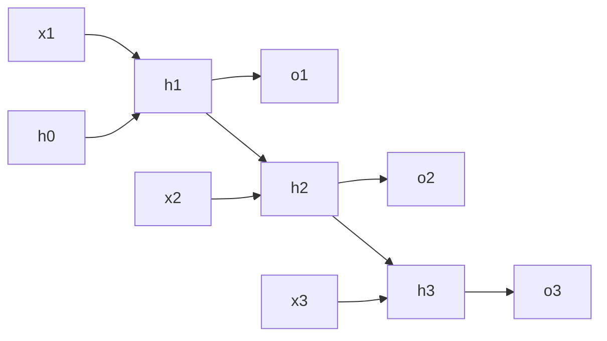
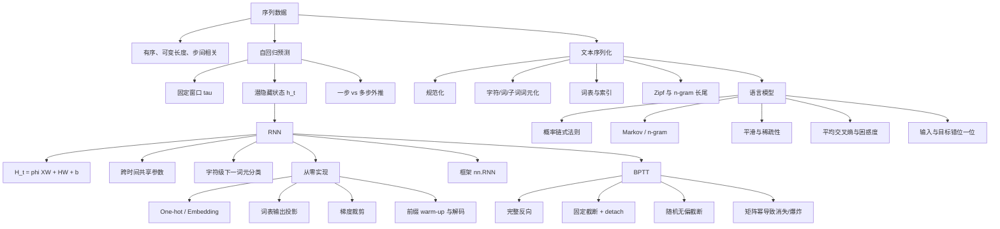

> 对应原文：d2l-en.md 的第 9 章 **Recurrent Neural Networks**。本章既是 RNN 入门，也是序列建模入门：先讨论序列为何不能当作独立表格行处理，再把原始文本变成词元索引；随后从概率链式法则建立语言模型，以困惑度评价模型；最后推导隐藏状态递推、字符级 RNN、梯度裁剪和时间反向传播（BPTT）。第 10 章才进入 GRU、LSTM、深层/双向 RNN 和机器翻译等现代结构。

## 1. 为什么序列需要新的建模方式

此前处理的表格样本和图像通常具有固定形状：

- 表格样本是固定维向量；
- Fashion-MNIST 图像是固定的 $28\times28$ 网格；
- 一个输入通常对应一个独立预测。

序列任务改变了这些前提：

- 文档、语音、视频和患者轨迹长度可变；
- 序列内部时间步不独立；
- 顺序本身携带意义；
- 输入和输出都可能是序列；
- 当前预测可能依赖很久以前的信息。

很多可变对象仍可表示为**可变长度的固定维向量序列**：

$$
\mathbf x_1,\mathbf x_2,\ldots,\mathbf x_T,
\qquad
\mathbf x_t\in\mathbb R^d.
$$

例如：

- 文档是词元向量序列；
- 医疗记录是就诊、药物、检查和诊断事件序列；
- 视频是图像帧序列；
- 传感器流是固定维测量序列。

序列模型的任务形式包括：

| 形式 | 输入 | 输出 | 例子 |
|---|---|---|---|
| 多对一 | 序列 | 固定目标 | 评论情感分类 |
| 一对多 | 固定输入 | 序列 | 图像描述 |
| 对齐多对多 | 序列 | 同步序列 | 词性标注、逐帧预测 |
| 非对齐多对多 | 序列 | 可变长度序列 | 机器翻译、语音识别 |
| 无监督序列建模 | 序列前缀 | 下一项分布 | 语言模型 |

循环神经网络（RNN）用跨时间步的循环连接维护隐藏状态。图上看似有环，但计算并不含同一时刻的循环依赖：把网络沿时间展开后，它是一个参数跨时间共享的前馈计算图。



同一组参数在所有时间步使用，所以参数量不随序列长度增长；计算、激活内存和反向路径长度则随序列长度增长。

RNN 曾是复杂序列任务的默认模型，并在手写识别、机器翻译和医疗诊断中取得突破。CNN、状态空间模型和 Transformer 也能建模序列；“序列数据”不等于“必须使用 RNN”。RNN 的价值在于建立状态递推、参数共享和时间反向传播的基本心智模型。

## 2. 序列统计与预测

### 2.1 序列中的独立性假设

表格学习常把样本假设为 IID。序列建模通常仍可假设**完整序列之间**独立同分布，例如不同文档或不同患者住院记录；但同一序列内的时间步显然相关：

$$
P(x_t\mid x_{t-1},\ldots,x_1)
\neq P(x_t).
$$

一个词出现的概率依赖前文，患者第十天用药依赖前九天病情。若时间步真的独立，就没有必要保留顺序。

序列内部也不必严格平稳。文档开头和结尾可以有不同分布，病情会朝康复或恶化演化，用户偏好可随交互改变。最宽松的标准设定是：完整序列来自某个固定的序列分布，而模型显式处理序列内依赖。

### 2.2 自回归模型

给定一条标量时间序列 $x_1,x_2,\ldots$，预测下一步需要估计：

$$
P(x_t\mid x_{t-1},\ldots,x_1),
$$

或其中的条件均值、方差等统计量。用信号自身历史回归当前值，称为**自回归**。

直接把全部历史作为特征会使输入维数随 $t$ 增长。两种常见解决方案：

1. **固定窗口**：仅使用最近 $\tau$ 项；
   $$
   \widehat x_t=f(x_{t-\tau},\ldots,x_{t-1}).
   $$
2. **潜变量状态**：把历史压缩为固定维状态；
   $$
   h_t=g(h_{t-1},x_{t-1}),
   \qquad
   \widehat x_t=f(h_t).
   $$

固定窗口能使用任意 MLP/线性模型，计算简单，但硬性丢弃窗口外历史。潜状态允许理论上不断吸收历史，但固定维向量是有损压缩，且是否真正保留长期信息取决于结构和训练。

### 2.3 平稳性假设

从一条长序列切出大量训练窗口时，通常隐含一个假设：虽然观测值变化，**生成下一项的动力学规则在时间上近似不变**。统计学称这种性质为平稳性，严格平稳要求任意时间平移后的联合分布不变。

现实价格、气候和用户行为常有趋势、季节、制度变化或概念漂移，并非严格平稳。实践可使用：

- 差分或去趋势；
- 显式季节/时间特征；
- 滚动训练与漂移监控；
- 状态空间或非平稳模型。

将时间窗口随机混合训练不等于可以随机划分未来数据。验证和测试必须尊重时间顺序，否则未来信息泄漏到过去。

### 2.4 序列联合概率与概率链式法则

序列模型要估计：

$$
P(x_1,\ldots,x_T).
$$

概率链式法则给出精确分解：

$$
P(x_1,\ldots,x_T)
=P(x_1)
\prod_{t=2}^{T}
P(x_t\mid x_1,\ldots,x_{t-1}).
$$

它把一个高维联合分布转成一系列下一步条件预测。对离散词元，每一步是词表上的多类分类器。

反向分解同样合法：

$$
P(x_1,\ldots,x_T)
=P(x_T)
\prod_{t=T-1}^{1}
P(x_t\mid x_{t+1},\ldots,x_T).
$$

左到右常被选择，因为：

- 符合多数语言的阅读和在线生成过程；
- 同一模型可持续扩展任意长前缀；
- 相邻前文通常比任意排序更容易预测；
- 对因果时间序列，过去预测未来符合信息可用性。

分解顺序是建模选择，不是联合概率本身的唯一属性。阿拉伯语书写方向不会改变时间因果；双向编码任务也可同时利用左右文，但在线生成时不能使用尚未生成的未来词元。

### 2.5 Markov 假设

若给定最近 $\tau$ 步后，更早历史与未来条件独立：

$$
P(x_t\mid x_{t-1},\ldots,x_1)
=P(x_t\mid x_{t-1},\ldots,x_{t-\tau}),
$$

则称为 $\tau$ 阶 Markov 条件。$\tau=1$ 时：

$$
P(x_1,\ldots,x_T)
=P(x_1)\prod_{t=2}^{T}P(x_t\mid x_{t-1}).
$$

真实语言通常不满足有限阶严格 Markov 性，但远距离上下文的边际收益可能下降，因此截断上下文是计算、统计和表达之间的折中。

Markov 模型是对**条件独立结构**的假设，不等于“只使用一个词元的所有模型”，也不等于隐藏状态 RNN。RNN 的状态可递归依赖整个可见前缀，即使训练反向被截断。

### 2.6 固定窗口的正弦序列实验

原书生成：

$$
x_t=\sin(0.01t)+\epsilon_t,
\qquad
\epsilon_t\sim\mathcal N(0,0.2^2),
\quad t=1,\ldots,1000.
$$

取窗口 $\tau=4$：

$$
\mathbf X_t
=[x_{t-4},x_{t-3},x_{t-2},x_{t-1}],
\qquad
y_t=x_t.
$$

共有 $T-\tau=996$ 个样本，原书以前 $600$ 个训练，后续时间点验证。模型使用线性回归。

这不是 IID 随机划分：相邻窗口高度重叠，但按时间切分避免用未来训练过去。窗口重叠使普通 IID 置信区间不适用，也使随机打散后的批量不代表样本真正独立。

### 2.7 一步预测与多步预测

一步预测在每个时刻使用真实历史：

$$
\widehat x_t=f(x_{t-\tau},\ldots,x_{t-1}).
$$

它回答：“如果到 $t-1$ 的真实观测都已知，下一步怎样？”

预测观测边界后的多步未来时，真实新输入不可得，只能递归喂回预测：

$$
\begin{aligned}
\widehat x_{605}&=f(x_{601},x_{602},x_{603},x_{604}),\\
\widehat x_{606}&=f(x_{602},x_{603},x_{604},\widehat x_{605}),\\
\widehat x_{607}&=f(x_{603},x_{604},\widehat x_{605},\widehat x_{606}),\\
&\vdots
\end{aligned}
$$

给定观测到 $t$，$\widehat x_{t+k}$ 称为 $k$ 步超前预测。

一步预测看起来很好，多步预测却可能迅速衰减或漂移。原因：

1. 每一步误差进入下一步输入；
2. 训练时输入是真实值，部署递归时输入来自模型，产生分布偏移；
3. 动力系统可能放大微小扰动；
4. 点预测忽略未来分布不确定性，无法传播方差和多模态。

若局部误差近似满足

$$
\epsilon_{k+1}
\approx\bar\epsilon+c\epsilon_k,
$$

$|c|<1$ 时误差可能趋于固定偏差，$|c|>1$ 时可指数放大。正弦实验中递归预测很快退化为近似常数，直观展示外推比插值困难。

### 2.8 缓解多步误差的方法

- 直接训练每个 horizon 的 $k$ 步预测器；
- 一次输出整段未来（multi-output）；
- 训练时逐步混合真实输入与模型输入；
- 建模完整概率分布并采样多条轨迹；
- 显式动力学、季节或外生变量；
- 用状态空间模型、RNN、Transformer 等学习状态；
- 对滚动窗口做时间序列交叉验证。

这些方法分别处理误差累积、训练—部署错配和不确定性，不能仅靠增加隐藏单元解决所有问题。

## 3. 从原始文本到序列数据

### 3.1 文本预处理流水线

神经模型不能直接处理任意字符串。典型流程：

```text
原始文本
→ 规范化/清洗
→ 词元化
→ 仅用训练语料构建词表
→ 字符串映射到整数索引
→ 切分输入/目标序列
→ 批量、填充与掩码
```

原书使用 H. G. Wells 的《时间机器》，约三万多个英文词，足以演示字符级模型，但远小于真实语言模型语料。

### 3.2 读取与规范化

原书将非英文字母替换为空格并转小写：

```python
text = re.sub("[^A-Za-z]+", " ", raw_text).lower()
```

这样缩小词表并简化实验，却丢失：

- 标点带来的语义和句法；
- 大小写、专有名词和句界；
- 数字、重音字符和非英文文字；
- 多空白和排版信息。

“清洗”不是越多越好。若任务需要生成标点或区分 `US/us`，删除信息会改变任务。生产系统应采用 Unicode 规范化、明确编码和可版本化的规则。

### 3.3 词元化的选择

词元（token）是模型处理的离散基本单位。常见选择：

| 粒度 | 词表大小 | 序列长度 | 未知词 | 特点 |
|---|---:|---:|---|---|
| 字符 | 小 | 长 | 少 | 简单，可拼写，长期依赖更长 |
| 单词 | 大 | 短 | 多 | 语义直观，长尾严重 |
| 子词/word piece | 中等 | 中等 | 少 | 现代常用，平衡词表与长度 |
| 字节 | 固定小 | 更长 | 无 | 跨语言稳健，计算序列长 |

原书将字符串转为字符列表：

```python
tokens = list(text)
```

字符级模型使词表很小，训练便宜，也避免词外词，但同样文本需要更多时间步，长期语义更难学。

### 3.4 词表

词表建立双向映射：

$$
\text{token}\leftrightarrow\text{integer index}.
$$

步骤：

1. 统计训练语料词频；
2. 保留频率不低于 `min_freq` 的词元；
3. 加入特殊词元；
4. 分配唯一索引；
5. 未登录或被截断词元映射为 `<unk>`。

常见特殊词元：

- `<unk>`：未知；
- `<pad>`：批量补齐；
- `<bos>`：序列开始；
- `<eos>`：序列结束；
- `<mask>`：掩码预训练。

原书 `Vocab` 支持标量或列表查询以及逆映射。工程上还应保证：

- 特殊词元不重复；
- 索引顺序确定且可复现；
- 词表只从训练数据拟合，避免验证/测试词汇泄漏；
- 词表随检查点保存；
- `min_freq` 改变时模型嵌入/输出尺寸同步改变。

增大 `min_freq` 会缩小词表、增加 `<unk>` 比例，减少稀有词参数方差和内存，却合并不同稀有词语义。

### 3.5 语料索引化与信息边界

原书把整本书预处理成单一字符索引列表：

$$
[x_1,x_2,\ldots,x_T],
\qquad
x_t\in\{0,\ldots,|\mathcal V|-1\}.
$$

字符到索引本身可逆，但预处理删除的标点和大小写无法恢复；词表截断后多个词都变成 `<unk>`，也不再可逆。因此“没有丢信息”只针对保留下来的词元与索引映射。

把整本书拼成一条序列会让章节或段落边界两侧形成训练对。若边界不应连续，应插入 `<eos>` 或分别切分序列。

### 3.6 Zipf 定律

按词频从高到低排序，第 $i$ 名频数近似：

$$
n_i\propto\frac{1}{i^\alpha}.
$$

取对数：

$$
\log n_i=-\alpha\log i+c.
$$

因此 log-log 图近似直线，斜率为 $-\alpha$。自然语言呈长尾：少量功能词极频繁，大量内容词极稀有。

传统词袋分类常删掉高频、区分度低的停用词；RNN 和 Transformer 中功能词承载语序和句法，通常不需要机械删除。

### 3.7 Unigram、bigram 与 trigram 统计

- unigram：单词 $x_t$；
- bigram：连续二元组 $(x_{t-1},x_t)$；
- trigram：连续三元组 $(x_{t-2},x_{t-1},x_t)$。

原书观察这些 $n$-gram 的频率都大致呈幂律，但 $n$ 增大后：

- 可能组合数迅速增长；
- 单个组合出现次数减少；
- 大量合理组合在有限语料中从未出现；
- 计数估计方差增大。

这既说明语言有结构（常见短语会重复），也揭示纯计数模型的稀疏性瓶颈，推动能在相似上下文之间共享统计强度的神经模型。

## 4. 语言模型

### 4.1 语言模型是什么

给定词元序列 $x_1,\ldots,x_T$，语言模型估计联合概率：

$$
P(x_1,x_2,\ldots,x_T).
$$

由链式法则：

$$
P(x_1,\ldots,x_T)
=\prod_{t=1}^{T}
P(x_t\mid x_1,\ldots,x_{t-1}),
$$

其中 $t=1$ 的条件上下文可理解为 `<bos>` 或空历史。

四词句：

$$
\begin{aligned}
&P(\text{deep},\text{learning},\text{is},\text{fun})\\
={}&P(\text{deep})
P(\text{learning}\mid\text{deep})\\
&\cdot P(\text{is}\mid\text{deep},\text{learning})\\
&\cdot P(\text{fun}\mid\text{deep},\text{learning},\text{is}).
\end{aligned}
$$

语言模型可用于：

- 生成和自动补全；
- 语音识别候选重排；
- 机器翻译解码；
- 拼写和语法判断；
- 文本压缩；
- 作为大规模预训练目标。

它学习文本分布，不等价于完整理解、事实正确或意图对齐。一个流畅续写仍可能事实错误。

### 4.2 $n$-gram 语言模型

$n$-gram 用有限阶 Markov 假设：

- unigram：
  $$
  P(x_1,x_2,x_3,x_4)
  \approx\prod_{t=1}^{4}P(x_t);
  $$
- bigram：
  $$
  P(x_1)P(x_2\mid x_1)P(x_3\mid x_2)P(x_4\mid x_3);
  $$
- trigram：
  $$
  P(x_1)P(x_2\mid x_1)
  P(x_3\mid x_1,x_2)
  P(x_4\mid x_2,x_3).
  $$

最大似然 bigram 估计：

$$
\widehat P(x'\mid x)
=\frac{n(x,x')}{n(x)}.
$$

上下文未出现或组合计数为零时，模型给合理新句子概率零；一个零因子会让整句概率为零。

### 4.3 Laplace 式平滑与退避

原书给出一种把低阶分布作为先验的平滑：

$$
\widehat P(x)
=\frac{n(x)+\epsilon_1/m}{n+\epsilon_1},
$$

$$
\widehat P(x'\mid x)
=\frac{n(x,x')+\epsilon_2\widehat P(x')}
{n(x)+\epsilon_2},
$$

$$
\widehat P(x''\mid x,x')
=\frac{n(x,x',x'')+
\epsilon_3\widehat P(x'')}
{n(x,x')+\epsilon_3}.
$$

$m$ 为词表大小，$n$ 为总词数。$\epsilon=0$ 时无平滑；$\epsilon_1\to\infty$ 时 unigram 趋于均匀 $1/m$。

它解决零概率，但不能根治：

- 高阶组合数呈指数增长；
- 大量计数需存储；
- 稀有上下文仍估计不稳；
- “cat”和“feline”等相似词不能共享表示；
- 任意长句几乎必然未见。

实际经典语言模型使用更成熟的 Good–Turing、Kneser–Ney 和插值退避。神经语言模型通过连续表示在词元和上下文之间共享统计。

### 4.4 为什么不能直接比较序列似然

长序列概率是许多小于 $1$ 的条件概率乘积，天然比短序列小，并易数值下溢。应比较平均负对数似然：

$$
\operatorname{NLL}_{\mathrm{avg}}
=-\frac1n\sum_{t=1}^{n}
\log P(x_t\mid x_{<t}).
$$

它以每个预测词元为单位，使不同长度文本可比较。实现时通常累加交叉熵总和并除以**有效非 padding 词元数**，不是简单平均每批平均值。

### 4.5 困惑度

困惑度（perplexity, PPL）是平均负对数似然的指数：

$$
\operatorname{PPL}
=\exp\left[
-\frac1n\sum_{t=1}^{n}
\log P(x_t\mid x_{<t})
\right].
$$

等价于真实词元条件概率几何平均的倒数：

$$
\operatorname{PPL}
=\left(
\prod_{t=1}^{n}P(x_t\mid x_{<t})
\right)^{-1/n}.
$$

直觉上，它是模型每一步面临的“有效等概率选择数”。

- 完美预测：PPL $=1$；
- 真实词元概率为零：PPL $=\infty$；
- 在 $|\mathcal V|$ 个词元上均匀：PPL $=|\mathcal V|$。

例如平均交叉熵为 $\log 4$，困惑度为 $4$。

### 4.6 困惑度的比较边界

只有以下条件一致时 PPL 才能直接比较：

- 同一测试文本和边界处理；
- 同一词元化与词表；
- 同一对数底或正确单位转换；
- 同一 padding 掩码；
- 同样的上下文长度和状态重置策略。

字符级 PPL 与词级/子词级 PPL 不可直接横比。更小 PPL 通常表示下一个词元概率更好，但不直接保证事实性、长文一致性或下游任务表现。

### 4.7 构造输入—目标序列

语言模型输入为原序列片段，目标为向左移动一个词元：

```text
corpus:  m a c h i n e
input:   m a c h i n
target:  a c h i n e
```

若片段长度 `num_steps=n`：

$$
X=[x_t,\ldots,x_{t+n-1}],
$$

$$
Y=[x_{t+1},\ldots,x_{t+n}].
$$

每个位置都产生一次下一词元监督，一个长度 $n$ 的片段贡献 $n$ 个分类损失。

### 4.8 长语料分割与随机偏移

对长度 $T$ 的单一语料，训练固定长度 $n$ 片段。每个 epoch 可随机丢弃开头

$$
d\sim\operatorname{Uniform}\{0,\ldots,n-1\},
$$

再分成不重叠片段：

$$
[x_d,\ldots,x_{d+n-1}],
[x_{d+n},\ldots,x_{d+2n-1}],\ldots
$$

随机偏移让不同 epoch 的边界变化，但并不让所有可能窗口严格均匀出现。要均匀采样全部长度 $n+1$ 窗口，可直接从起点 $0,\ldots,T-n-1$ 随机采样；代价是窗口大量重叠，状态连续性和 I/O 不同。

值得辨析：原书文字先描述随机偏移分区，而合并稿的 `TimeMachine.__init__` 实现实际预先创建**所有重叠窗口**，再由 DataLoader 随机取样。二者都能训练下一词元模型，但样本相关性、覆盖次数和状态管理不同。

### 4.9 随机采样与顺序分区

#### 随机窗口

- 每个片段可独立打乱；
- 常在片段开始将隐藏状态清零；
- 易于 SGD 随机化；
- 跨片段长期上下文丢失。

#### 顺序分区

- 同一批次的第 $k$ 行可在下个批次接续；
- 可把数值隐藏状态传到下一片段；
- 必须 `detach()` 截断旧计算图；
- 批量排列和边界管理更复杂。

完整句子长度不一时，需要 padding、长度信息、掩码或 packed sequence；否则 padding 会被错误计入损失和状态更新。

## 5. RNN 的隐藏状态

### 5.1 从固定阶计数到潜状态

$n$-gram 参数需求随上下文阶数指数增长，粗略需要 $|\mathcal V|^n$ 个组合。RNN 改用固定维隐藏状态总结前缀：

$$
P(x_t\mid x_{t-1},\ldots,x_1)
\approx P(x_t\mid h_{t-1}),
$$

$$
h_t=f(x_t,h_{t-1}).
$$

若 $h_t$ 可无限大并精确保存全部历史，这个等式可不只是近似；实际固定维状态、有限精度和可训练性使其成为有损摘要。

### 5.2 隐藏层与隐藏状态不是同一概念

- **隐藏层**：输入和输出之间不可直接观测的一层变换；同一个样本可一次计算完。
- **隐藏状态**：时间递推中的记忆变量；当前步把前一步状态当作输入。

MLP 有隐藏层但没有跨样本/时间状态。RNN 的隐藏状态通常也是某个隐藏层输出，但其关键属性是跨时间传递。

### 5.3 无状态 MLP

小批量 $X\in\mathbb R^{B\times d}$：

$$
H=\phi(XW_{xh}+b_h),
$$

$$
O=HW_{hq}+b_q.
$$

其中

$$
W_{xh}\in\mathbb R^{d\times h},
\qquad
W_{hq}\in\mathbb R^{h\times q}.
$$

每个样本独立计算，上一批的 $H$ 不参与下一批。

### 5.4 Elman RNN 递推

时间 $t$ 的输入和隐藏状态：

$$
X_t\in\mathbb R^{B\times d},
\qquad
H_t\in\mathbb R^{B\times h}.
$$

简单 RNN：

$$
H_t
=\phi(
X_tW_{xh}
+H_{t-1}W_{hh}
+b_h),
$$

$$
O_t=H_tW_{hq}+b_q.
$$

参数形状：

$$
W_{xh}\in\mathbb R^{d\times h},
\quad
W_{hh}\in\mathbb R^{h\times h},
\quad
W_{hq}\in\mathbb R^{h\times q}.
$$

参数在所有 $t$ 共享，因此参数数目：

$$
dh+h^2+h+hq+q,
$$

与序列长度 $T$ 无关；前向时间约为 $O(T)$，不能像独立时间步那样完全并行。

### 5.5 拼接形式

输入与上一状态按特征轴拼接：

$$
[X_t,H_{t-1}]
\in\mathbb R^{B\times(d+h)}.
$$

权重按行拼接：

$$
\begin{bmatrix}
W_{xh}\\W_{hh}
\end{bmatrix}
\in\mathbb R^{(d+h)\times h}.
$$

则

$$
[X_t,H_{t-1}]
\begin{bmatrix}
W_{xh}\\W_{hh}
\end{bmatrix}
=X_tW_{xh}+H_{t-1}W_{hh}.
$$

这说明一个 RNN cell 可视为对“当前输入 + 旧状态”应用共享全连接层和激活。

### 5.6 字符级语言模型

对文本 `machine`：

```text
input : m a c h i n
target: a c h i n e
```

每一步用当前字符和历史状态预测下一字符。时间 $3$ 的输出依赖 `m,a,c` 形成的状态，目标为 `h`。每个 $O_t$ 是词表大小 $V$ 的 logits：

$$
O_t\in\mathbb R^{B\times V}.
$$

状态使输出理论上依赖所有此前词元，但“存在路径”不等于模型能有效保存任意长期信息。tanh 饱和和长 Jacobian 乘积会让早期影响消失。

## 6. 从零实现字符级 RNN

### 6.1 RNN 核心参数

```python
class ScratchRNN(nn.Module):
    def __init__(self, input_size, hidden_size, sigma=0.01):
        super().__init__()
        self.hidden_size = hidden_size
        self.W_xh = nn.Parameter(torch.randn(input_size, hidden_size) * sigma)
        self.W_hh = nn.Parameter(torch.randn(hidden_size, hidden_size) * sigma)
        self.b_h = nn.Parameter(torch.zeros(hidden_size))

    def forward(self, inputs, state=None):
        # inputs: (steps, batch, input_size)
        if state is None:
            state = inputs.new_zeros(inputs.shape[1], self.hidden_size)
        outputs = []
        for X_t in inputs:
            state = torch.tanh(X_t @ self.W_xh + state @ self.W_hh + self.b_h)
            outputs.append(state)
        return torch.stack(outputs), state
```

输入采用时间优先布局 `(T,B,d)`，便于最外层循环时间。输出 `(T,B,h)`，最终状态 `(B,h)`。初始化状态用 `inputs.new_zeros` 可继承 dtype 和 device。

原书返回输出列表和裸状态；PyTorch 内置 `nn.RNN` 返回张量和形状带层轴的状态。接口差异必须明确。

### 6.2 One-hot 编码

词元索引是类别编号，不具有数值距离。词表大小 $V$，索引 $i$ 的 one-hot：

$$
e_i\in\{0,1\}^{V}.
$$

输入索引原形状 `(B,T)`，转置并 one-hot 后：

$$
(T,B,V).
$$

```python
encoded = F.one_hot(X.T, num_classes=V).float()
```

One-hot 与权重相乘等价于查表：

$$
e_i^\top W=W_{i,:}.
$$

所以将 one-hot 输入乘 $W_{xh}$ 等价于从嵌入矩阵取第 $i$ 行。显式 one-hot 浪费 $O(V)$ 内存，真实大词表通常用 `nn.Embedding(V,d_e)`；嵌入维 $d_e$ 可小于 $V$。

### 6.3 输出层与张量形状

每个隐藏状态转词表 logits：

$$
O_t=H_tW_{hq}+b_q,
$$

其中

$$
W_{hq}\in\mathbb R^{h\times V}.
$$

堆叠得到 `(T,B,V)`，原书转换为 `(B,T,V)`，方便标签 `(B,T)`：

```python
logits = hidden_outputs @ W_hq + b_q
logits = logits.transpose(0, 1)  # (B,T,V)
```

交叉熵常要求：

```python
loss = F.cross_entropy(
    logits.reshape(-1, V),
    targets.reshape(-1),
)
```

展平只合并批量和时间监督，不改变每个位置的类别轴。使用 `reshape` 前要确认 logits 和 targets 的时间顺序一致。

### 6.4 困惑度监控

批量平均交叉熵为 $\ell$ 时：

$$
\operatorname{PPL}=e^\ell.
$$

评估整集应累计每个有效词元的损失总和：

$$
\operatorname{PPL}
=\exp\left(
\frac{\sum_b L_b}{\sum_b N_b}
\right).
$$

先算每批 PPL 再平均是错误的，因为指数非线性：

$$
\frac1B\sum_be^{\ell_b}
\neq e^{\frac1B\sum_b\ell_b}.
$$

### 6.5 梯度裁剪

长序列反向可能偶发极大梯度。全局范数裁剪：

$$
g\leftarrow
\min\left(1,\frac{\theta}{\|g\|_2}\right)g.
$$

若 $\|g\|\le\theta$ 不变；否则按同一比例缩放所有参数梯度，保持整体方向并使范数等于 $\theta$。

由 Lipschitz 连续性：

$$
|f(x)-f(y)|\le L\|x-y\|,
$$

一步 $x\leftarrow x-\eta g$ 的目标变化上界：

$$
|f(x)-f(x-\eta g)|
\le L\eta\|g\|.
$$

裁剪限制单批更新可能造成的最大破坏，也降低异常样本影响。它是启发式：裁剪后不再严格沿真实梯度大小更新，但方向不变。

稳健实现：

```python
torch.nn.utils.clip_grad_norm_(model.parameters(), max_norm=1.0)
```

应在 `loss.backward()` 后、`optimizer.step()` 前调用。混合精度训练先 `unscale_` 再裁剪。裁剪缓解梯度爆炸，不解决梯度消失或长期记忆。

### 6.6 训练时状态如何处理

原书随机采样重叠窗口，模型每个片段默认零状态。这意味着有效前向上下文最多为 `num_steps`，不是从《时间机器》首字符一直到当前片段。

若顺序片段延续状态：

```python
state = state.detach()
```

`detach()` 保留状态数值作为下段初始记忆，却切断旧计算图，实现截断 BPTT。若不 detach，图跨批增长，内存不断增加，并把反向延伸到所有历史批次。

若某批中序列结束，必须只重置对应行状态，而不是让下一文档继承上一文档记忆。

### 6.7 解码与前缀 warm-up

给前缀 `it has`：

1. 初始状态为空/零；
2. 按顺序输入前缀字符，用真实下一个前缀字符继续，只更新状态而不自由生成；
3. 前缀读完后，根据最后 logits 选下一字符；
4. 把生成字符作为下一步输入，递归生成。

前缀阶段称 warm-up/priming，它把用户上下文编码进状态。

#### 贪心解码

$$
x_t=\operatorname*{argmax}_jP(j\mid h_{t-1}).
$$

确定、简单，但局部最优不保证整段联合概率最高，且容易循环和输出单调。

#### 随机采样

$$
x_t\sim P(\cdot\mid h_{t-1}).
$$

更有多样性，也可能采到低概率噪声。温度 $T$：

$$
q_j
=\frac{\exp(o_j/T)}
{\sum_k\exp(o_k/T)}.
$$

$T<1$ 更尖锐，等价于原书 $q\propto P^\alpha$ 中 $\alpha=1/T>1$；$T>1$ 更随机。还可使用 top-$k$ 或 nucleus sampling。

生成质量不能只凭几段样例判断，应结合测试 PPL、多样性、重复率和任务评价。

## 7. 使用框架的简洁 RNN

### 7.1 `nn.RNN` 接口

```python
rnn = nn.RNN(input_size=V, hidden_size=h)
outputs, final_state = rnn(inputs, initial_state)
```

默认 `batch_first=False`：

- `inputs`：$(T,B,V)$；
- `outputs`：$(T,B,h)$，最后一层每个时间步隐藏状态；
- `final_state`：$(L\cdot D,B,h)$，其中 $L$ 为层数，$D=1$ 单向、$D=2$ 双向。

单层单向时 `final_state.shape == (1,B,h)`，而从零实现常用 `(B,h)`。不能直接假设接口完全相同。

设置 `batch_first=True` 后输入输出为 `(B,T,*)`，**隐藏状态仍是 `(L*D,B,h)`**。

### 7.2 输出层仍需单独定义

`nn.RNN` 输出隐藏表示，不自动变成词表 logits。语言模型还需：

```python
projection = nn.Linear(hidden_size, vocab_size)
logits = projection(outputs)
```

若 `outputs` 为 `(T,B,h)`，线性层作用最后一轴，得到 `(T,B,V)`。再转为 `(B,T,V)` 或直接按布局展平计算交叉熵。

### 7.3 高级实现为什么更快

框架 RNN 通常将时间循环和矩阵计算融合到优化后的 C++/CUDA 内核，可减少：

- Python 循环开销；
- 小算子启动；
- 不必要中间张量；
- 设备同步。

它还支持多层、双向、dropout 和优化后端。标准结构应优先使用框架；从零实现用于理解、研究新 cell 或验证公式。

### 7.4 简洁 API 不能代替状态设计

即便使用 `nn.RNN`，仍需决定：

- 每批是否重置状态；
- 片段是否连续；
- 何时 detach；
- padding 如何 mask；
- 训练和生成输入分布是否一致；
- 多层状态如何组织；
- 是否需要梯度裁剪。

性能优化不会自动修复错误的数据顺序或状态泄漏。

## 8. 时间反向传播 BPTT

### 8.1 BPTT 就是展开图上的反向传播

RNN 展开 $T$ 步后是参数共享的深层前馈图。BPTT（backpropagation through time）按反时间顺序应用链式法则，并把同一参数在所有时间位置的梯度贡献相加。

长序列带来：

- 计算和激活内存随 $T$ 增长；
- 梯度经历 $O(T)$ 个 Jacobian 乘积；
- 共享参数梯度要跨时间累加；
- 早期信号容易消失或爆炸。

### 8.2 一般递推分析

简化写作：

$$
h_t=f(x_t,h_{t-1},w_h),
$$

$$
o_t=g(h_t,w_o),
$$

$$
L=\frac1T\sum_{t=1}^{T}\ell(y_t,o_t).
$$

共享隐藏参数梯度：

$$
\frac{\partial L}{\partial w_h}
=\frac1T\sum_{t=1}^{T}
\frac{\partial\ell_t}{\partial o_t}
\frac{\partial g}{\partial h_t}
\frac{\partial h_t}{\partial w_h}.
$$

困难项递推：

$$
\frac{\partial h_t}{\partial w_h}
=\frac{\partial f_t}{\partial w_h}
+\frac{\partial f_t}{\partial h_{t-1}}
\frac{\partial h_{t-1}}{\partial w_h}.
$$

令

$$
a_t=\frac{\partial h_t}{\partial w_h},
\quad
b_t=\frac{\partial f_t}{\partial w_h},
\quad
c_t=\frac{\partial f_t}{\partial h_{t-1}},
$$

则

$$
a_t=b_t+c_ta_{t-1}.
$$

展开：

$$
a_t
=b_t+
\sum_{i=1}^{t-1}
\left(\prod_{j=i+1}^{t}c_j\right)b_i.
$$

长乘积正是长期影响、梯度消失和梯度爆炸的来源。

### 8.3 三种时间反向策略

#### 完整 BPTT

对完整序列展开并精确反向。优点是梯度无截断偏差；缺点是内存、计算和数值不稳定，千级词元序列通常不可行。

#### 固定截断 BPTT

只反向最近 $\tau$ 步，数值状态可以继续传递：

```python
state = state.detach()
```

优点是计算内存有界、稳定、简单；缺点是梯度有偏，更偏向短期依赖。该偏置有时起正则作用。

#### 随机截断

引入随机变量：

$$
P(\xi_t=0)=1-\pi_t,
\qquad
P(\xi_t=\pi_t^{-1})=\pi_t,
$$

因此

$$
E[\xi_t]=1.
$$

递推改为

$$
z_t
=\frac{\partial f_t}{\partial w_h}
+\xi_t
\frac{\partial f_t}{\partial h_{t-1}}
\frac{\partial h_{t-1}}{\partial w_h}.
$$

它在期望上无偏，并偶尔保留长路径，但方差高。实践通常不明显优于固定截断。

### 8.4 线性 RNN 的详细梯度

为看清矩阵幂，取无偏置、恒等激活、列向量约定：

$$
h_t=W_{hx}x_t+W_{hh}h_{t-1},
$$

$$
o_t=W_{qh}h_t,
$$

$$
L=\frac1T\sum_{t=1}^{T}\ell(o_t,y_t).
$$

输出梯度：

$$
\delta_t^o
=\frac{\partial L}{\partial o_t}
=\frac1T\frac{\partial\ell(o_t,y_t)}{\partial o_t}.
$$

输出权重：

$$
\frac{\partial L}{\partial W_{qh}}
=\sum_{t=1}^{T}
\delta_t^o h_t^\top.
$$

最终隐藏梯度：

$$
\delta_T^h
=W_{qh}^\top\delta_T^o.
$$

反向递推：

$$
\delta_t^h
=W_{hh}^\top\delta_{t+1}^h
+W_{qh}^\top\delta_t^o.
$$

展开为更直观的形式：

$$
\delta_t^h
=\sum_{k=t}^{T}
(W_{hh}^\top)^{k-t}
W_{qh}^\top\delta_k^o.
$$

原书用不同换元索引写出等价式。关键不是索引外观，而是从 $t$ 到未来 $k$ 的贡献含 $(W_{hh}^\top)^{k-t}$。

隐藏参数梯度：

$$
\frac{\partial L}{\partial W_{hx}}
=\sum_{t=1}^{T}\delta_t^h x_t^\top,
$$

$$
\frac{\partial L}{\partial W_{hh}}
=\sum_{t=1}^{T}\delta_t^h h_{t-1}^\top.
$$

共享参数在每个时间步出现，因此必须求和。反向中缓存 $h_t$ 和 $\delta_t^h$，避免重复计算。

### 8.5 特征值、奇异值与梯度稳定性

若 $W_{hh}$ 对称且特征分解：

$$
W_{hh}=Q\Lambda Q^\top,
$$

则

$$
W_{hh}^{k}=Q\Lambda^{k}Q^\top.
$$

特征方向 $v_i$ 被缩放 $\lambda_i^k$：

- $|\lambda_i|<1$：指数消失；
- $|\lambda_i|>1$：指数爆炸；
- $|\lambda_i|\approx1$：更可能长期保留。

一般非对称矩阵还受奇异值、非正规性和时间变化激活 Jacobian 影响，不能只看特征值。但矩阵幂直觉说明了普通 RNN 的长期信用分配困难。

### 8.6 tanh RNN 的真实 Jacobian

$$
h_t=\tanh(W_{xh}x_t+W_{hh}h_{t-1}+b).
$$

对上一状态：

$$
\frac{\partial h_t}{\partial h_{t-1}}
=D_tW_{hh},
$$

其中

$$
D_t
=\operatorname{diag}(1-h_t^2).
$$

$D_t$ 对角元素位于 $(0,1]$，tanh 饱和时接近零，会在权重矩阵之外进一步压缩梯度。正交/单位初始化可改善 $W_{hh}$ 尺度，却不能阻止激活饱和。

### 8.7 截断长度控制什么

`num_steps` 或截断长度 $\tau$ 控制：

- 每次前向显式看到的片段长度；
- 单次计算图反向传播的最大时间范围；
- 激活内存和并行批量形状；
- 优化对短期/长期依赖的偏好。

如果顺序采样并传递数值状态，模型前向记忆可跨越多个片段，但梯度不能越过 detach 边界。因此“状态历史长度”和“梯度历史长度”不是同一个概念。

### 8.8 梯度裁剪与截断的区别

- 截断 BPTT：切断早期计算路径，限制反向长度，改变梯度估计；
- 梯度裁剪：完整计算当前图梯度后限制其范数，不改变图长度；
- 状态重置：同时丢弃数值记忆；
- `detach`：保留数值状态但切断梯度历史。

四者解决不同问题，不能互换。

## 9. 可运行的综合实验

下面的 PyTorch 脚本不下载《时间机器》，使用短文本和合成序列验证本章关键机制：词表与未知词元、移位窗口、one-hot 与查表等价、手写 RNN 和 `nn.RNN` 对齐、字符语言模型训练后困惑度下降、状态 detach 截断梯度、梯度裁剪，以及矩阵幂导致的消失/爆炸。

```python
import collections
import math

import torch
from torch import nn
from torch.nn import functional as F

torch.manual_seed(43)

class Vocab:
    def __init__(self, tokens, min_freq=1, reserved_tokens=()):
        counter = collections.Counter(tokens)
        self.idx_to_token = ["<unk>"]
        for token in reserved_tokens:
            if token not in self.idx_to_token:
                self.idx_to_token.append(token)
        for token, frequency in sorted(
            counter.items(), key=lambda item: (-item[1], item[0])
        ):
            if frequency >= min_freq and token not in self.idx_to_token:
                self.idx_to_token.append(token)
        self.token_to_idx = {
            token: index for index, token in enumerate(self.idx_to_token)
        }

    def __len__(self):
        return len(self.idx_to_token)

    def __getitem__(self, token):
        if isinstance(token, (list, tuple)):
            return [self[item] for item in token]
        return self.token_to_idx.get(token, 0)

def sequence_pairs(corpus, num_steps):
    windows = [
        corpus[start:start + num_steps + 1]
        for start in range(len(corpus) - num_steps)
    ]
    array = torch.tensor(windows, dtype=torch.long)
    return array[:, :-1], array[:, 1:]

class ScratchRNN(nn.Module):
    def __init__(self, input_size, hidden_size):
        super().__init__()
        self.hidden_size = hidden_size
        self.W_xh = nn.Parameter(torch.empty(input_size, hidden_size))
        self.W_hh = nn.Parameter(torch.empty(hidden_size, hidden_size))
        self.b_h = nn.Parameter(torch.zeros(hidden_size))
        nn.init.xavier_uniform_(self.W_xh)
        nn.init.orthogonal_(self.W_hh)

    def forward(self, inputs, state=None):
        # inputs: (steps, batch, input_size)
        if state is None:
            state = inputs.new_zeros(inputs.shape[1], self.hidden_size)
        outputs = []
        for X_t in inputs:
            state = torch.tanh(
                X_t @ self.W_xh + state @ self.W_hh + self.b_h
            )
            outputs.append(state)
        return torch.stack(outputs), state

class CharacterRNNLM(nn.Module):
    def __init__(self, vocab_size, hidden_size):
        super().__init__()
        self.vocab_size = vocab_size
        self.rnn = ScratchRNN(vocab_size, hidden_size)
        self.output = nn.Linear(hidden_size, vocab_size)

    def forward(self, indices, state=None):
        # indices: (batch, steps)
        one_hot = F.one_hot(indices.T, self.vocab_size).float()
        hidden, state = self.rnn(one_hot, state)
        logits = self.output(hidden).transpose(0, 1)
        return logits, state

# 1. Vocabulary and shifted language-model windows.
text = ("time traveller " * 20).strip()
tokens = list(text)
vocab = Vocab(tokens, reserved_tokens=("<pad>",))
corpus = vocab[tokens]
assert vocab["not-in-vocabulary"] == vocab["<unk>"] == 0

inputs, targets = sequence_pairs(corpus, num_steps=8)
assert inputs.shape == targets.shape
assert torch.equal(inputs[:, 1:], targets[:, :-1])

# 2. One-hot multiplication is exactly a row lookup.
embedding_table = torch.randn(len(vocab), 6)
sample_indices = torch.tensor([0, 2, 1, 2])
one_hot_lookup = F.one_hot(sample_indices, len(vocab)).float() @ embedding_table
direct_lookup = embedding_table[sample_indices]
torch.testing.assert_close(one_hot_lookup, direct_lookup)

# 3. Scratch recurrence matches nn.RNN after copying the parameters.
input_size, hidden_size, steps, batch_size = 5, 7, 4, 3
scratch = ScratchRNN(input_size, hidden_size)
builtin = nn.RNN(input_size, hidden_size, nonlinearity="tanh")
with torch.no_grad():
    # PyTorch stores weights as (hidden, input/hidden).
    builtin.weight_ih_l0.copy_(scratch.W_xh.T)
    builtin.weight_hh_l0.copy_(scratch.W_hh.T)
    builtin.bias_ih_l0.copy_(scratch.b_h)
    builtin.bias_hh_l0.zero_()

rnn_input = torch.randn(steps, batch_size, input_size)
initial_state = torch.randn(batch_size, hidden_size)
scratch_output, scratch_state = scratch(rnn_input, initial_state)
builtin_output, builtin_state = builtin(rnn_input, initial_state.unsqueeze(0))
torch.testing.assert_close(scratch_output, builtin_output, atol=1e-6, rtol=1e-6)
torch.testing.assert_close(scratch_state, builtin_state.squeeze(0), atol=1e-6, rtol=1e-6)

# 4. Train a tiny character language model and verify perplexity improves.
model = CharacterRNNLM(vocab_size=len(vocab), hidden_size=24)
optimizer = torch.optim.Adam(model.parameters(), lr=0.03)

def language_model_loss():
    logits, _ = model(inputs)
    return F.cross_entropy(
        logits.reshape(-1, len(vocab)),
        targets.reshape(-1),
    )

with torch.no_grad():
    initial_loss = language_model_loss().item()

for _ in range(120):
    optimizer.zero_grad()
    loss = language_model_loss()
    loss.backward()
    torch.nn.utils.clip_grad_norm_(model.parameters(), max_norm=1.0)
    optimizer.step()

with torch.no_grad():
    final_loss = language_model_loss().item()
initial_perplexity = math.exp(initial_loss)
final_perplexity = math.exp(final_loss)
assert final_loss < initial_loss * 0.35
assert final_perplexity < initial_perplexity

# 5. Detaching preserves state values but blocks gradients to the old graph.
state_source = torch.tensor([2.0], requires_grad=True)
state = state_source * 3.0
detached_state = state.detach().requires_grad_()
future = detached_state * 5.0
future.backward()
assert state_source.grad is None
assert detached_state.grad.item() == 5.0
assert detached_state.item() == state.item()

# 6. Global gradient clipping preserves direction and limits norm.
clip_model = nn.Linear(3, 2, bias=False)
clip_model.weight.grad = torch.full_like(clip_model.weight, 10.0)
before = clip_model.weight.grad.detach().clone().reshape(-1)
before_norm = before.norm()
reported_norm = torch.nn.utils.clip_grad_norm_(clip_model.parameters(), 1.0)
after = clip_model.weight.grad.detach().reshape(-1)
assert torch.allclose(reported_norm, before_norm)
assert math.isclose(after.norm().item(), 1.0, rel_tol=1e-6)
cosine = F.cosine_similarity(before.unsqueeze(0), after.unsqueeze(0)).item()
assert math.isclose(cosine, 1.0, rel_tol=1e-6)

# 7. Repeated recurrent Jacobians can vanish or explode.
vanishing = torch.tensor([[0.8]])
exploding = torch.tensor([[1.2]])
vector = torch.ones(1, 1)
for _ in range(40):
    vector = vector @ vanishing
vanishing_value = vector.item()

vector = torch.ones(1, 1)
for _ in range(40):
    vector = vector @ exploding
exploding_value = vector.item()
assert vanishing_value < 1e-3
assert exploding_value > 100

print("vocab size / windows =", len(vocab), tuple(inputs.shape))
print("one-hot lookup equivalence = PASS")
print("scratch vs nn.RNN = PASS")
print(
    "language-model loss / perplexity = "
    f"{initial_loss:.4f}->{final_loss:.4f} / "
    f"{initial_perplexity:.3f}->{final_perplexity:.3f}"
)
print("detach truncates old gradient = PASS")
print(f"clipped norm / direction cosine = {after.norm().item():.4f}/{cosine:.4f}")
print(f"40-step factors 0.8^40 / 1.2^40 = {vanishing_value:.6f}/{exploding_value:.3f}")
```

代码与原理逐项对应：

1. 词表将未知字符统一映射 `<unk>`，长度 $8$ 窗口的目标精确左移一位；
2. one-hot 乘输入权重与按索引查嵌入行完全等价；
3. 把手写权重转置复制给 `nn.RNN` 后，全部时间步输出和最终状态一致；
4. 小型字符 RNN 在重复文本上把交叉熵和困惑度显著降低；
5. `detach()` 保留状态数值，却阻止未来损失回传到旧图；
6. 全局范数裁剪把梯度限制为 $1$ 且保持方向余弦为 $1$；
7. 标量递推直接展示 $0.8^{40}$ 消失、$1.2^{40}$ 爆炸。

## 10. 容易混淆的概念与常见误区

### 10.1 序列之间 IID 与时间步 IID

可假设不同文档独立，不表示文档内部词元独立。RNN 正是利用时间步依赖。

### 10.2 序列长度可变与每步特征维可变

RNN 通常接受可变时间长度 $T$，但每步输入维 $d$ 固定。二者不是同一问题。

### 10.3 自回归与 RNN

自回归是“用历史预测当前”的概率结构；固定窗口线性模型、RNN、Transformer 都可实现。RNN 是其中一种状态参数化。

### 10.4 Markov 条件与近似截断

严格 $k$ 阶 Markov 表示更早历史在给定最近 $k$ 步后无额外信息；工程上只用最近 $k$ 步可能只是近似和资源折中。

### 10.5 一步预测与多步预测

一步评估每次使用真实历史；递归多步使用自己的预测，误差和输入分布偏移会累积。不能用一步曲线推断长期预测质量。

### 10.6 插值与外推

在已观测时间范围内用真实邻域预测更接近插值；越过观测边界递归预测是外推，通常更难。

### 10.7 词元、单词与字符

词元是模型基本单位，可以是字符、词、子词或字节。词元不等于单词，困惑度也依赖词元粒度。

### 10.8 词表索引与数值大小

索引只是类别 ID，编号相近不表示语义相近。必须使用 one-hot 或嵌入，而不是把 ID 当连续标量。

### 10.9 `<unk>` 与 `<pad>`

`<unk>` 表示词表未知内容，属于真实输入类别；`<pad>` 是批量对齐占位，通常必须在损失和状态中掩码。二者不能共用索引语义。

### 10.10 停用词与无用词

高频功能词对词袋主题分类区分度低，却对语法和序列概率重要。神经语言模型通常保留它们。

### 10.11 语言模型与生成器

语言模型定义序列概率；生成还需要解码策略。贪心、采样、温度和 top-$k$ 会让同一模型产生不同文本。

### 10.12 似然与困惑度

总似然随长度指数变小；困惑度是每词元平均交叉熵的指数，可在同词元化/数据上比较。

### 10.13 困惑度与自然语言质量

PPL 评价真实下一词元概率，不直接衡量事实、无害性、多样性或任务完成。低 PPL 也可能生成重复或错误文本。

### 10.14 隐藏层与隐藏状态

隐藏层描述网络深度位置；隐藏状态描述跨时间传递的动态记忆。MLP 可有隐藏层而无隐藏状态。

### 10.15 RNN 的“循环”与同一步死循环

循环边跨时间连接 $h_{t-1}\to h_t$。沿时间展开后计算顺序明确，不是在同一步无限迭代。

### 10.16 参数共享与状态共享

所有时间步共享权重；不同时间步的隐藏状态值一般不同。共享参数不等于共享状态值。

### 10.17 One-hot 与嵌入

one-hot 本身无可学习语义；`one_hot @ W` 等价于查 $W$ 的一行。Embedding 直接高效实现该查表，并可使用低维向量。

### 10.18 输出隐藏状态与词表 logits

`nn.RNN` 输出隐藏向量，不自动预测词元。还需线性投影到词表维并使用交叉熵。

### 10.19 `batch_first=True` 与所有状态都 batch-first

它只改变输入/输出主张量布局，隐藏状态仍为 `(layers*directions, batch, hidden)`。

### 10.20 状态传递与梯度传递

detach 后数值记忆继续跨片段，梯度历史却被截断。两种“历史长度”必须分开理解。

### 10.21 随机采样窗口与连续状态

随机窗口彼此无连续保证，不能随意把前一批状态传给下一批。只有批行保持时间连续时才可安全传状态。

### 10.22 BPTT 与普通反向传播

BPTT 没有新微积分规则，只是把 RNN 沿时间展开后应用反向传播，并累加共享参数的多处梯度。

### 10.23 截断 BPTT 与梯度裁剪

截断限制反向时间范围；裁剪限制最终梯度范数。前者引入时间偏差，后者改变步长大小。

### 10.24 梯度裁剪与解决梯度消失

裁剪只缩小过大梯度，不会放大已消失梯度。长期依赖需要门控单元、残差、归一化或其他架构。

### 10.25 训练交叉熵低与生成一定好

Teacher-forced 下一词元训练使用真实前缀，生成使用自身输出；暴露偏差、贪心循环和分布外前缀都可使自由生成较差。

## 11. 原章练习与关键推导

### 11.1 无噪正弦序列需要多少历史

设

$$
x_t=\sin(\omega t).
$$

三角恒等式：

$$
\sin((t+1)\omega)
=2\cos\omega\sin(t\omega)
-\sin((t-1)\omega).
$$

因此

$$
x_{t+1}=2\cos\omega\,x_t-x_{t-1}.
$$

已知固定频率且无噪时，最近两项足以线性预测下一项。噪声、未知频率和非平稳性会增加实际所需状态和估计难度。

### 11.2 投资者按历史收益选证券有什么问题

- 多重比较：在大量证券中总有偶然赢家；
- 回看偏差和幸存者偏差；
- 收益非平稳，制度和风险暴露变化；
- 交易成本和流动性未计；
- 选择后历史表现是乐观估计；
- 相关不代表未来因果。

应使用时间外验证、包含退市证券、控制多重检验并报告风险调整收益。

### 11.3 四元语言模型需要多少计数

词表大小 $V$，稠密存储 unigram 到 4-gram 项数量约：

$$
V+V^2+V^3+V^4.
$$

$V=100000$ 时四元组可能数：

$$
V^4=10^{20}.
$$

即使每计数 4 字节也需约 $4\times10^{20}$ 字节，完全不可行。稀疏存储只保存出现过的组合，但长尾和零计数问题仍在。

### 11.4 对话怎样建模

可把说话人标记和轮次边界加入序列：

```text
<user> ... <eot> <assistant> ... <eot> ...
```

训练条件概率覆盖整个历史，生成时只对 assistant 部分计损失或按任务设计掩码。真实系统还需截断上下文、检索外部知识、管理角色与安全，不能把轮次简单拼接后假设无限状态。

### 11.5 One-hot 与嵌入查表证明

$e_i$ 第 $i$ 位为 $1$：

$$
(e_i^\top E)_j
=\sum_{k=1}^{V}(e_i)_kE_{k,j}
=E_{i,j}.
$$

所以

$$
e_i^\top E=E_{i,:}.
$$

显式 one-hot 只是用稀疏向量选择矩阵行；Embedding 避免构造大多数为零的向量。

### 11.6 PPL 基线推导

均匀词表 $V$：

$$
P(x_t\mid x_{<t})=\frac1V.
$$

平均负对数似然：

$$
-\frac1n\sum_t\log\frac1V
=\log V.
$$

因此

$$
\operatorname{PPL}=e^{\log V}=V.
$$

若使用以 2 为底的交叉熵，应计算 $2^{H_2}$，结果同样为 $V$。

### 11.7 梯度裁剪的投影解释

全局范数裁剪是把 $g$ 投影到闭球：

$$
\mathcal C=\{v:\|v\|_2\le\theta\}.
$$

欧氏投影解：

$$
\operatorname*{argmin}_{v\in\mathcal C}
\|v-g\|_2
=
\begin{cases}
g,&\|g\|\le\theta,\\
\theta g/\|g\|,&\|g\|>\theta.
\end{cases}
$$

所以超限时方向保持，范数变为 $\theta$。

### 11.8 $M^k$ 的特征值

若

$$
Mv_i=\lambda_i v_i,
$$

递推：

$$
M^kv_i=M^{k-1}\lambda_i v_i
=\lambda_i^kv_i.
$$

对随机向量

$$
x=\sum_i\alpha_i v_i,
$$

有

$$
M^kx=\sum_i\alpha_i\lambda_i^kv_i.
$$

若 $|\lambda_1|>|\lambda_2|$ 且 $\alpha_1\neq0$，归一化后方向以比例

$$
\left|\frac{\lambda_2}{\lambda_1}\right|^k
$$

趋向 $v_1$（可能带符号振荡）。RNN 长梯度因而可能只剩主特征方向，其他方向消失，造成严重病态。

### 11.9 梯度爆炸的其他缓解方法

- 较小或自适应学习率；
- 正交/单位 recurrent 初始化；
- 谱归一化或约束 recurrent 矩阵；
- tanh 等有界状态；
- LayerNorm；
- 门控 RNN（GRU/LSTM）；
- 残差/捷径；
- 截断 BPTT；
- 规范化输入与状态。

不同方法改变梯度来源、尺度或架构，通常与裁剪联合使用。

### 11.10 随机截断为何无偏

若旧梯度贡献为 $c_ta_{t-1}$，用 $\xi_t$ 替代：

$$
E[\xi_t c_ta_{t-1}]
=E[\xi_t]c_ta_{t-1}
=c_ta_{t-1}.
$$

因此条件于此前历史时递推期望正确。无偏不表示低误差：$\xi_t=1/\pi_t$ 的罕见长路径权重很大，方差可能使优化更差。

### 11.11 RNN 为什么不能真正记住“无限历史”

数学表达 $h_t=f(x_t,h_{t-1})$ 允许所有过去影响当前，但固定维、有限精度、噪声和稳定性限制可保留信息量；训练又只通过有限截断梯度分配信用。理论路径存在与可学习可检索记忆之间有巨大差别。

## 12. 全章知识结构



## 13. 核心结论与解决问题的一般思路

### 13.1 核心结论

1. 序列由有序的固定维向量组成，完整序列可相互独立，但同一序列时间步通常不能视为 IID。
2. 自回归用历史预测当前；固定窗口截断历史，潜状态则递归压缩历史。
3. 概率链式法则把任意序列联合概率精确分解为下一步条件概率乘积，语言模型由此成为重复多类分类。
4. 有限阶 Markov/$n$-gram 简化上下文，却遭遇组合爆炸、长尾稀疏、零概率和语义不共享。
5. 文本建模必须明确规范化、词元粒度、训练词表和特殊词元；这些选择改变序列长度、输出空间和 PPL。
6. 困惑度是每有效词元平均负对数似然的指数；只可在同测试集和同词元化下直接比较。
7. 语言模型训练输入和目标相差一个词元；随机窗口与连续分区对应不同隐藏状态管理策略。
8. 简单 RNN 通过 $H_t=\phi(X_tW_{xh}+H_{t-1}W_{hh}+b_h)$ 保存状态，参数跨时间共享，数量不随 $T$ 增长。
9. 隐藏状态不是隐藏层的同义词；它是跨时间传递的动态记忆。
10. One-hot 乘权重等价于嵌入查表；大词表应直接用 Embedding，避免稠密 one-hot。
11. RNN 输出隐藏表示，语言模型还需投影到词表 logits 并以交叉熵训练。
12. 递归多步预测和自由生成会把模型输出喂回输入，因误差累积和暴露偏差显著难于一步预测。
13. BPTT 是展开 RNN 上的普通反向传播，共享参数梯度需跨时间求和。
14. 长 Jacobian/矩阵幂导致梯度消失或爆炸；裁剪限制爆炸范数，却不能恢复已消失长期信号。
15. 固定截断 BPTT 保留状态数值但切断旧梯度，使计算有界并偏向短期依赖；随机截断无偏但方差高。

### 13.2 解决序列问题的一般顺序

1. **先定义时间单位**：每步是字符、子词、事件、帧还是连续测量？
2. **明确任务因果方向**：在线预测可使用哪些历史，绝不能让未来信息进入特征。
3. **区分序列级与步级独立性**：划分应按文档、患者或时间边界，避免重叠泄漏。
4. **建立简单窗口基线**：选择 $\tau$，比较一步和多步误差，判断长期状态是否真的需要。
5. **决定词元化和词表**：只用训练集拟合，保存特殊词元、索引顺序和版本。
6. **构造移位监督**：逐位置检查 $Y_{:,t}=X_{:,t+1}$，mask padding 和无效边界。
7. **写出张量布局**：明确 `(B,T,D)` 还是 `(T,B,D)`，尤其是内置 RNN 的状态层轴。
8. **写出状态生命周期**：随机片段重置，连续片段传值并 detach，序列结束按行重置。
9. **先验证短序列形状与手算递推**：再使用优化内核，检查从零实现与 `nn.RNN` 对齐。
10. **用交叉熵总和/有效词元数算 PPL**：不要平均批量 PPL，也不要跨词元化比较。
11. **监控梯度范数和状态分布**：裁剪爆炸，检查 tanh 饱和和长期梯度消失。
12. **选择 BPTT 截断长度**：在长期依赖、显存、计算和梯度稳定间折中。
13. **分别评估 teacher-forced 与自由运行**：一步准确不代表多步轨迹或生成质量。
14. **解码策略独立调试**：贪心、温度、top-$k$ 和采样会改变输出，不应归因于模型参数本身。
15. **用时间外和跨语料测试泛化**：同一本书低 PPL 可能只是记忆作者、字符模式和局部片段。

本章把“历史”变成了可计算对象：**概率链式法则把联合序列分解为连续下一步预测，词元化和词表把文本转成分类索引，RNN 以共享参数递推固定维隐藏状态，BPTT 再沿展开时间图分配信用。这个设计用有限状态和有限反向长度换取可计算性，也带来多步误差、暴露偏差和梯度消失/爆炸。理解状态数值、计算图和数据时间边界三者的区别，是正确使用所有后续序列模型的基础。**
