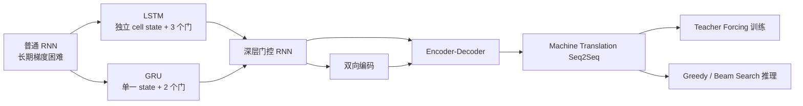

> 对应原文：d2l-en.md 的第 10 章 **Modern Recurrent Neural Networks**。第 9 章的普通 RNN 建立了隐藏状态和 BPTT，但长 Jacobian 乘积会导致梯度消失或爆炸。本章先用 LSTM 和 GRU 的门控加法路径改善长期记忆，再沿层方向堆叠 RNN、沿时间两个方向编码上下文，最后进入英法机器翻译：数据处理、编码器—解码器、RNN seq2seq、teacher forcing、掩码损失、BLEU 和束搜索。

## 1. 从普通 RNN 到现代序列模型

普通 RNN 的递推为

$$
H_t=\phi(X_tW_{xh}+H_{t-1}W_{hh}+b_h).
$$

早期信息影响后期损失时，梯度需穿过许多

$$
\frac{\partial H_j}{\partial H_{j-1}}
$$

的乘积。梯度裁剪可限制爆炸后的总范数，却不能恢复已趋近零的长期梯度。现代门控 RNN 因此不只“换一种激活”，而是重构状态更新：

- 引入近似加法的记忆通路；
- 用 $(0,1)$ 之间的门决定保留、写入、重置和输出；
- 让模型能学习不同时间尺度；
- 保留普通 RNN 的参数跨时间共享。

另一条演进路线不是修改 cell，而是改变网络拓扑：

- **深层 RNN**沿输入到输出方向堆叠多层；
- **双向 RNN**同时利用左、右上下文；
- **编码器—解码器**把不对齐、变长输入输出拆成条件编码和自回归解码；
- **束搜索**在指数级输出树中保留少量高分前缀。



本章的 LSTM、GRU 和 seq2seq 都早于 Transformer。它们仍是在线流式处理、小内存推理、时间序列和有限数据任务的重要基线；同时，门控、残差式状态路径、编码器—解码器和自回归解码也深刻影响了后续架构。

## 2. 长短期记忆网络 LSTM

### 2.1 LSTM 要解决什么问题

普通 tanh RNN 把所有记忆压在同一个隐藏状态中，并在每步整体经过非线性。长期梯度既要乘 recurrent 权重，又要乘 tanh 导数，容易消失；若谱尺度过大，又会爆炸。

LSTM 用**记忆单元内部状态** $C_t$ 建立主要为加法的时间通路，并用乘法门控制信息流。名称“长短期记忆”来自三种尺度：

- 权重缓慢变化，保存长期统计知识；
- 普通激活是短暂工作状态；
- cell state 在两者之间，可跨多个时间步保存内容。

原始 LSTM 可理解为带固定权重 $1$ 自连接的记忆单元；现代公式通过 forget gate 把固定 $1$ 推广为数据依赖的 $F_t$。

### 2.2 两类状态

LSTM 同时维护：

- **cell state** $C_t$：内部记忆主通路；
- **hidden state** $H_t$：暴露给本层下一时刻、上层和输出层的可见状态。

两者形状均为

$$
(B,h),
$$

但语义不同。只有 $H_t$ 送入普通输出投影；$C_t$ 在 LSTM cell 内部沿时间传递。PyTorch `nn.LSTM` 因而返回状态元组 `(h_n, c_n)`。

### 2.3 输入门、遗忘门和输出门

当前输入

$$
X_t\in\mathbb R^{B\times d}
$$

与上一隐藏状态

$$
H_{t-1}\in\mathbb R^{B\times h}
$$

共同计算三个 sigmoid 门：

$$
I_t
=\sigma(X_tW_{xi}+H_{t-1}W_{hi}+b_i),
$$

$$
F_t
=\sigma(X_tW_{xf}+H_{t-1}W_{hf}+b_f),
$$

$$
O_t
=\sigma(X_tW_{xo}+H_{t-1}W_{ho}+b_o).
$$

其中每个门都在 $(0,1)^{B\times h}$：

- $I_t$：允许多少候选内容写入；
- $F_t$：保留多少旧 cell state；
- $O_t$：允许多少内部记忆暴露为 hidden state。

门是逐坐标软开关，不是整个时间步只有一个布尔开关。不同隐藏维可以同时选择不同时间尺度。

### 2.4 候选记忆

候选内容用 tanh 限制在 $(-1,1)$：

$$
\widetilde C_t
=\tanh(X_tW_{xc}+H_{t-1}W_{hc}+b_c).
$$

它表示“当前时刻可以写入什么”，并不自动进入记忆；写入量由 $I_t$ 决定。

### 2.5 Cell state 更新

$$
C_t
=F_t\odot C_{t-1}
+I_t\odot\widetilde C_t.
$$

第一项读取旧记忆，第二项写入新内容。极端情况：

- $F_t\approx1,I_t\approx0$：几乎原样保留；
- $F_t\approx0$：忘掉旧状态；
- $I_t\approx1$：允许候选充分写入；
- 两门都非零：平滑混合旧、新信息。

沿显式直接路径，在暂时忽略门本身依赖状态的间接路径时：

$$
\frac{\partial C_t}{\partial C_{t-1}}
=F_t.
$$

跨 $k$ 步直接梯度约为

$$
\prod_{j=t-k+1}^{t}F_j.
$$

模型可以学习令重要维度 $F_j\approx1$，比每步强制经过 tanh 和稠密矩阵更易保存梯度。它是“缓解”而非消除：若 forget gates 长期小于 $1$，乘积仍会消失；门还通过 $H$ 引入其他间接路径。

### 2.6 Hidden state 输出

$$
H_t
=O_t\odot\tanh(C_t).
$$

cell state 可累积到超出 $[-1,1]$，输出前再次 tanh 将公开状态限制到 $(-1,1)$；output gate 再控制当前是否暴露这些内容。

为什么候选已经 tanh，cell 输出还要 tanh？因为

$$
C_t=F_tC_{t-1}+I_t\widetilde C_t
$$

会跨时间累加多个候选，$C_t$ 不再保证在 $[-1,1]$。第二次 tanh 控制输出尺度，但内部记忆仍保留其累积值。

### 2.7 参数量和计算量

LSTM 有四套仿射变换：输入门、遗忘门、输出门、候选。按每套一个偏置计：

$$
P_{\mathrm{LSTM}}
=4(dh+h^2+h)
=4h(d+h+1).
$$

普通 RNN 为

$$
P_{\mathrm{RNN}}=dh+h^2+h.
$$

所以同 $d,h$ 下，LSTM cell 参数和主要矩阵计算约为普通 RNN 的四倍。

PyTorch 为输入和 recurrent 变换分别存偏置 `bias_ih`、`bias_hh`，参数量为

$$
4h(d+h+2).
$$

两个偏置在数学上可合并，但分开保存便于后端兼容。实现还会把四门拼成单次大矩阵乘法：

$$
[I_t,F_t,\widetilde C_t,O_t]
\leftarrow
[X_t,H_{t-1}]W+b,
$$

再切分，提高硬件利用率。PyTorch LSTM 门顺序是 input、forget、cell candidate、output；手写权重复制时必须匹配顺序。

### 2.8 从零实现与框架实现

从零循环每个时间步，计算四组门并返回：

```text
outputs: T 个 H_t
state: (H_T, C_T)
```

框架：

```python
lstm = nn.LSTM(input_size=d, hidden_size=h, num_layers=L)
outputs, (h_n, c_n) = lstm(inputs, (h_0, c_0))
```

默认形状：

- `inputs`：$(T,B,d)$；
- `outputs`：$(T,B,Dh)$；
- `h_n,c_n`：$(LD,B,h)$；
- $D=1$ 单向，$D=2$ 双向。

框架实现融合门计算并调用优化内核，通常远快于 Python 循环。

### 2.9 LSTM 的适用范围与局限

优点：

- 比普通 RNN 更能保留长期依赖；
- 可独立控制记忆、写入和暴露；
- 状态适合流式递推；
- 在小中型序列任务中仍是强基线。

局限：

- 每步四组仿射，参数和延迟高；
- 时间方向仍串行，难以像 Transformer 全并行；
- 仍可能梯度爆炸，常需裁剪；
- 固定维状态仍是信息瓶颈；
- 极长依赖并无保证；
- 状态和门解释不能简单等同于人类记忆。

## 3. 门控循环单元 GRU

### 3.1 为什么简化 LSTM

GRU 保留“乘法门 + 加法状态路径”，将 LSTM 三门、两个状态简化为两门、一个隐藏状态，通常训练更快且性能相近。

GRU 只有：

- reset gate $R_t$；
- update gate $Z_t$；
- candidate hidden state $\widetilde H_t$；
- 单一状态 $H_t$。

### 3.2 Reset gate 和 update gate

$$
R_t
=\sigma(X_tW_{xr}+H_{t-1}W_{hr}+b_r),
$$

$$
Z_t
=\sigma(X_tW_{xz}+H_{t-1}W_{hz}+b_z).
$$

- $R_t$ 控制旧状态参与候选计算的程度；
- $Z_t$ 控制最终状态保留旧值的程度。

注意不同资料的符号约定可能相反。有的公式令 update gate 表示“写入新值比例”；本书定义中 $Z_t\to1$ 表示保留旧状态。比较代码时必须看最终混合式。

### 3.3 Candidate hidden state

本书公式：

$$
\widetilde H_t
=\tanh(
X_tW_{xh}
+(R_t\odot H_{t-1})W_{hh}
+b_h).
$$

$R_t\approx1$ 时接近普通 RNN；$R_t\approx0$ 时候选几乎不依赖旧状态，相当于重置后根据当前输入重建。

实现细节要谨慎：PyTorch `nn.GRU` 对 candidate recurrent 项采用近似

$$
R_t\odot(H_{t-1}W_{hh}+b_{hh}),
$$

而本书从零公式是

$$
(R_t\odot H_{t-1})W_{hh}.
$$

门与矩阵乘法一般不可交换，二者不是严格同一参数化；框架采用前者有利于实现效率。不能像简单 RNN 那样不加检查地逐权重复制并期待输出一致。

### 3.4 Hidden state 更新

$$
H_t
=Z_t\odot H_{t-1}
+(1-Z_t)\odot\widetilde H_t.
$$

这是逐坐标凸组合：

- $Z_t\approx1$：复制旧状态，跳过当前更新，利于长期记忆；
- $Z_t\approx0$：采用候选，快速响应当前输入。

沿直接保留路径：

$$
\frac{\partial H_t}{\partial H_{t-1}}
\supseteq Z_t.
$$

连续较大的 update gates 提供近恒等梯度通路。与 LSTM 不同，GRU 没有单独的内部 cell state 和 output gate；状态被保留的同时也直接暴露给输出/上层。

### 3.5 记住单个早期输入时门应怎样工作

若只想让时刻 $t'$ 的输入影响更晚 $t$：

- 在 $t'$：$Z_{t'}\approx0$，写入候选；reset 可按任务决定，若要忽略旧历史则 $R_{t'}\approx0$；
- 对 $t'<j\le t$：$Z_j\approx1$，复制状态；
- 无关时刻候选即使变化，也因 $(1-Z_j)\approx0$ 不写入。

这只是极端直觉，训练得到的是连续门值，并可能用多个维度保存不同信息。

### 3.6 参数量与 LSTM 对比

GRU 三套仿射：reset、update、candidate：

$$
P_{\mathrm{GRU}}
=3h(d+h+1)
$$

（每套单偏置约定）。PyTorch 双偏置形式为

$$
3h(d+h+2).
$$

因此同隐藏宽度下，主要参数/计算近似比例：

$$
\text{RNN}:\text{GRU}:\text{LSTM}
\approx1:3:4.
$$

实际速度受融合内核、序列长度、硬件和内存带宽影响，不能只按门数推断。

### 3.7 GRU 的选择边界

GRU 通常适合：

- 数据和算力较小；
- 推理延迟敏感；
- LSTM 精度优势不明显；
- 单一状态已足够。

LSTM 额外 cell/output gate 可能在复杂记忆控制上更灵活。两者没有普遍赢家，应在相同预算、预处理和调参下比较验证指标、速度与内存。

## 4. 深层循环神经网络

### 4.1 两种“深度”

单层 RNN 已沿时间展开 $T$ 次，具有时间深度；但同一时间步从输入到输出只有一层 recurrent 变换。深层 RNN 再沿垂直方向堆叠 $L$ 层，以学习更复杂的逐时刻表示。

令

$$
H_t^{(0)}=X_t.
$$

第 $\ell$ 层：

$$
H_t^{(\ell)}
=\phi_\ell(
H_t^{(\ell-1)}W_{xh}^{(\ell)}
+H_{t-1}^{(\ell)}W_{hh}^{(\ell)}
+b_h^{(\ell)}).
$$

输出只读取最高层：

$$
O_t=H_t^{(L)}W_{hq}+b_q.
$$

第一层输入权重形状为 $d\times h$；若各隐藏层同宽，后续层为 $h\times h$。原书统一写 $h\times h$ 时隐含第一层输入已经是 $h$ 维或省略了特例。

### 4.2 两条信息流

每个 cell 同时接收：

- 水平方向：同层上一时刻 $H_{t-1}^{(\ell)}$；
- 垂直方向：下一层当前时刻输入 $H_t^{(\ell-1)}$。

因此反向也沿时间和层两维传播，优化和激活内存更困难。门控结构可替换普通 RNN cell，但不会消除双维深度成本。

### 4.3 从零堆叠

每层是独立 RNN 实例，上一层全时间输出成为下一层输入：

```text
outputs = inputs
for layer in layers:
    outputs, state[layer] = layer(outputs, state[layer])
```

每层有独立状态和参数；不能把同一个 cell 实例重复放入列表，除非有意跨层共享参数。

### 4.4 PyTorch 深层接口

```python
gru = nn.GRU(
    input_size=d,
    hidden_size=h,
    num_layers=L,
    dropout=p,
)
```

单向状态形状：

$$
(L,B,h).
$$

PyTorch 内置 RNN 的 `dropout` 只作用于**层间输出**，且通常仅在 `num_layers>1` 时有效；不是时间 recurrent 状态内部 dropout，也不作用于最后一层输出。

### 4.5 深度、宽度与训练稳定性

更深可提取层级时序特征，却增加：

- 参数和 FLOPs；
- BPTT 路径；
- 过拟合风险；
- 学习率和初始化敏感性。

常用手段包括门控 cell、层间 dropout、LayerNorm、残差连接、梯度裁剪和更好初始化。`num_layers` 与 `hidden_size` 应作为联合超参数，不应默认“越深越好”。

## 5. 双向循环神经网络

### 5.1 为什么需要右侧上下文

下一词元语言模型只能使用过去，单向 RNN 符合在线因果约束。但离线序列标注中，预测位置 $t$ 时完整序列已知，未来词可能消除歧义：

```text
I am ___ .
I am ___ hungry .
I am ___ hungry, and I can eat half a pig .
```

双向 RNN 对同一序列运行：

- 正向 RNN：$1\to T$；
- 反向 RNN：$T\to1$；
- 对齐同一位置后拼接两个表示。

### 5.2 数学定义

$$
\overrightarrow H_t
=\phi(
X_tW_{xh}^{(f)}
+\overrightarrow H_{t-1}W_{hh}^{(f)}
+b_h^{(f)}),
$$

$$
\overleftarrow H_t
=\phi(
X_tW_{xh}^{(b)}
+\overleftarrow H_{t+1}W_{hh}^{(b)}
+b_h^{(b)}).
$$

拼接：

$$
H_t=[\overrightarrow H_t,\overleftarrow H_t]
\in\mathbb R^{B\times2h}.
$$

输出：

$$
O_t=H_tW_{hq}+b_q,
\qquad
W_{hq}\in\mathbb R^{2h\times q}.
$$

若两个方向宽度不同 $h_f,h_b$，拼接维度为 $h_f+h_b$。

### 5.3 PyTorch 形状

```python
bigru = nn.GRU(d, h, num_layers=L, bidirectional=True)
outputs, state = bigru(inputs)
```

- `outputs`：$(T,B,2h)$；
- `state`：$(2L,B,h)$。

状态第一轴通常按层和方向交错排列；应 reshape 为 `(L,2,B,h)` 后再语义访问，不要硬编码错误索引。

### 5.4 适用任务

适合：

- 词性标注、命名实体识别；
- 语音/手写离线识别；
- 掩码词元预测；
- 完整源句编码；
- 上下文化词表示和多义词消歧。

不适合直接用于：

- 下一词元自回归生成；
- 实时流式、未来尚不可得的预测；
- 因果时间序列部署。

若训练下一词元模型时反向分支看到未来目标，会造成信息泄漏和虚假低困惑度。双向 RNN 常用于 encoder，而 decoder 仍必须因果单向。

### 5.5 成本

两个方向参数独立，核心计算和状态宽度近似翻倍。反向方向还要求看到完整序列，增加延迟。双向并不是免费的“多看信息”，而是用非因果上下文和资源换更强离线表示。

## 6. 机器翻译数据集

### 6.1 机器翻译为何是非对齐 seq2seq

输入源语言句子，输出目标语言译文：

- 长度可不同；
- 词序可不同；
- 一个词可对应多个词或无直接对应；
- 目标每步依赖源句和已生成目标前缀。

因此它不是逐位置分类，而是未对齐 sequence-to-sequence。对话回复、问答和摘要也具有同类结构。

### 6.2 英法数据格式

原书使用 Tatoeba 项目的英法句对，每行由 tab 分隔：

```text
source sentence<TAB>target sentence
```

每个样本是两条独立词元序列。源语言和目标语言通常建立不同词表，因为词形、频率和特殊词元索引不相同。

### 6.3 规范化与词元化

原书预处理：

- 非断行空格替换普通空格；
- 转小写；
- 在 `, . ! ?` 前插空格；
- 按空格做词级切分；
- 每条源/目标序列末尾添加 `<eos>`。

`<eos>` 既是训练标签，也让推理知道何时停止。现代系统更常用子词模型，以处理未登录词、形态变化和无显式空格的语言。中文/日文直接按空格分词通常不合理，需要分词器、字符或子词。

原书 `_tokenize` 中条件 `i > max_examples` 会允许索引 `max_examples` 那一行，边界可能比名称暗示多一个；工程实现应写清“最多多少有效句对”，并按成功解析计数而非原始行号。

### 6.4 截断、填充和 valid length

批量要求矩形张量。给定 `num_steps=T`：

- 短序列在尾部填 `<pad>`；
- 长序列截断到 $T$；
- 记录非 `<pad>` 长度 `valid_len`。

源数组：

$$
X_{\mathrm{src}}\in\mathbb Z^{B\times T}.
$$

valid length 通常包含真实 `<eos>`，排除 `<pad>`。截断若切掉 `<eos>`，模型无法知道自然终止；更稳妥做法是预留一个位置给 `<eos>`。

Padding 使批量高效，却浪费计算。按长度分桶（bucketing）可让同批句长相近，减少 padding。

### 6.5 Target 输入与标签的错位

目标原序列：

```text
salut . <eos> <pad> ...
```

decoder teacher-forcing 输入：

```text
<bos> salut . <eos> ...
```

标签：

```text
salut . <eos> <pad> ...
```

即

$$
X_{\mathrm{dec}}=[\texttt{<bos>},y_1,\ldots,y_{T-1}],
$$

$$
Y=[y_1,\ldots,y_T].
$$

不能把 `<bos>` 当预测目标，也不能在 `<eos>` 后继续把 `<pad>` 当真实语言词元训练。

### 6.6 两套词表与数据泄漏

源、目标词表应只用训练句对建立；验证/测试未知词映射 `<unk>`。原书将频率低于 $2$ 的词合并，以缩小词表。词级词表较字符级大、序列短；子词在二者间折中。

词表、规范化规则、`num_steps` 和特殊索引都是模型接口，必须随检查点保存。模型权重与错误词表组合会产生语义完全错位但形状合法的输出。

## 7. 编码器—解码器架构

### 7.1 为什么拆成两个组件

未对齐输入输出长度不同，无法用一个共享时间轴逐步映射。标准方案：

- **encoder**：读取整个变长源序列，产生表示/状态；
- **decoder**：作为条件语言模型，根据编码状态和目标左侧前缀，逐词预测后续目标。

概率上：

$$
P(y_1,\ldots,y_{T'}\mid x_1,\ldots,x_T)
=\prod_{t'=1}^{T'}
P(y_{t'}\mid y_{<t'},\operatorname{Enc}(x_{1:T})).
$$

### 7.2 Encoder 接口

```python
class Encoder(nn.Module):
    def forward(self, X, *args):
        raise NotImplementedError
```

输出不必只有一个张量，可以是：

- 最终隐藏状态；
- 所有时间步表示；
- 多层 LSTM 的 `(H,C)`；
- attention 所需的序列表示与 mask；
- CNN/Transformer 特征。

### 7.3 Decoder 接口

```python
class Decoder(nn.Module):
    def init_state(self, encoder_outputs, *args):
        raise NotImplementedError

    def forward(self, X, state):
        raise NotImplementedError
```

`init_state` 是桥梁：encoder 和 decoder 的层数、宽度或类型不同时，可以通过线性投影、池化或复杂桥接转换，而不要求两者同构。

### 7.4 组合接口

```python
encoder_outputs = encoder(enc_X, valid_len)
decoder_state = decoder.init_state(encoder_outputs, valid_len)
decoder_outputs, state = decoder(dec_X, decoder_state)
```

训练时可一次并行提供完整 target 输入；推理时通常每次只给一个新生成 token，并更新 decoder state。

### 7.5 固定形状上下文的瓶颈

早期 seq2seq 把整个源句压缩成最终隐藏状态 $c$。无论输入多长，信息都要进入固定维向量：

$$
c=q(h_1,\ldots,h_T),
$$

常取

$$
c=h_T.
$$

短句可行，长句会丢失细节并让早期词梯度路径很长。第 11 章注意力机制允许 decoder 每步动态访问所有 encoder outputs，不再依赖单一固定瓶颈。

### 7.6 Encoder 和 decoder 必须相同吗

不必。可组合：

- 双向 GRU encoder + 单向 LSTM decoder；
- CNN encoder + RNN decoder（图像描述）；
- Transformer encoder + RNN decoder；
- 语音 encoder + 文本 decoder。

只需 `init_state` 和接口形状/语义兼容。

## 8. RNN Seq2Seq 机器翻译

### 8.1 Teacher forcing

训练时 decoder 输入真实前一个目标 token：

```text
input : <bos> Ils regardent .
label : Ils   regardent . <eos>
```

这叫 teacher forcing。优点：

- 每个时间步输入已知，可在框架 RNN 中整段计算；
- 梯度信号稳定；
- 不会因早期随机错误污染整个训练序列。

推理时真实目标不可用，只能喂回模型预测。这造成**暴露偏差**：训练状态分布来自真实前缀，推理状态分布来自模型前缀。替代方案包括 scheduled sampling、序列级训练和更稳健解码，但也各有偏差和优化困难。

### 8.2 RNN encoder

词元先查嵌入：

$$
E_{\mathrm{src}}(X)
\in\mathbb R^{T\times B\times d_e}.
$$

多层 GRU：

```python
outputs, state = encoder_gru(embeddings)
```

形状：

- `outputs`：$(T,B,h)$；
- `state`：$(L,B,h)$。

`outputs[t]` 是最高层时刻 $t$ 表示，`state[l]` 是第 $l$ 层最终状态。固定上下文 seq2seq 常把最终 encoder state 初始化 decoder，并可把最后 encoder output 作为 context。

源 padding 必须处理。原书简化 encoder 没把 `valid_len` 传给 GRU，因此 padding 会继续更新最终状态；这在短、固定窗口教学数据上可运行，却不是最严谨实现。生产可用：

- `pack_padded_sequence`；
- 显式 mask 状态更新；
- 根据 valid length 选最后有效输出；
- attention mask。

### 8.3 RNN decoder

decoder 在时刻 $t'$ 估计：

$$
P(y_{t'+1}\mid y_{1:t'},c).
$$

原书将固定 context $c$ 在每个 decoder 时间步重复，并与 target embedding 拼接：

$$
u_{t'}=[E_{\mathrm{tgt}}(y_{t'}),c].
$$

递推：

$$
s_{t'}=g(u_{t'},s_{t'-1}),
$$

$$
o_{t'}=W_os_{t'}+b_o.
$$

输出 logits 形状：

$$
(B,T',V_{\mathrm{tgt}}).
$$

若 encoder state 直接初始化 decoder，二者层数和 hidden size 必须匹配；否则 `init_state` 应加 bridge：

$$
s_0=\tanh(W_bh_T+b_b),
$$

或按层映射、拼接双向状态后投影。

### 8.4 为什么 context 可每步拼接

只用 $c$ 初始化 decoder 后，源信息需通过长 decoder 状态链传播；每步拼接 $c$ 提供直接输入路径，减轻遗忘。它仍是同一个固定向量，无法针对当前目标词选择不同源位置，注意力会进一步解决。

### 8.5 Padding mask 损失

每个 target 位置先算不归约交叉熵：

$$
\ell_{b,t}
=-\log P(y_{b,t}\mid y_{b,<t},x_b).
$$

mask：

$$
M_{b,t}=\mathbf1(y_{b,t}\ne\texttt{<pad>} ).
$$

正确 token 平均：

$$
L
=\frac{\sum_{b,t}M_{b,t}\ell_{b,t}}
{\sum_{b,t}M_{b,t}}.
$$

若不 mask，模型可通过预测大量 `<pad>` 降低平均损失，短句获得不同权重，PPL 也失真。除零要处理空有效 token 批次。

### 8.6 训练设置

原书示例：

- 英法句对；
- batch size $128$；
- embedding $256$；
- hidden $256$；
- 两层 GRU；
- dropout $0.2$；
- Adam，学习率 $0.005$；
- $30$ epochs；
- 全局梯度裁剪 $1$。

这些值只适合教学规模，不能视为普遍最优。翻译结果应在独立验证集选择超参数，官方测试只最终评估。

### 8.7 贪心推理

1. encoder 读取源句；
2. decoder 输入 `<bos>`；
3. 计算下一 token logits；
4. 取 argmax；
5. 将预测 token 喂回；
6. 遇 `<eos>` 或达到最大长度停止。

批量推理时每条序列可能不同时间结束，应维护 finished mask；已结束样本不应继续改变输出语义。原书简化 `predict_step` 固定循环 `num_steps`，返回后再按 `<eos>` 截断。

### 8.8 BLEU

对预测序列和参考序列，$n$-gram clipped precision：

$$
p_n
=\frac{\text{预测中与参考匹配的截断 }n\text{-gram 数}}
{\text{预测 }n\text{-gram 总数}}.
$$

“截断”表示同一 $n$-gram 的匹配次数不能超过参考出现次数，防止重复刷分。

原书 BLEU 变体：

$$
\operatorname{BLEU}
=\exp\left[
\min\left(0,1-\frac{L_{\mathrm{ref}}}{L_{\mathrm{pred}}}
\right)
\right]
\prod_{n=1}^{k}p_n^{1/2^n}.
$$

前因子是 brevity penalty：预测不短于参考时为 $1$；过短时小于 $1$。

例：参考 `A B C D E F`，预测 `A B B C D`：

$$
p_1=\frac45,
\quad
p_2=\frac34,
\quad
p_3=\frac13,
\quad
p_4=0.
$$

需要澄清原文措辞：在 log BLEU 中 $\log p_n$ 的系数是 $2^{-n}$，所以较长 $n$-gram 的**数值权重反而更小**；只是长匹配更难，能提供更强顺序证据。标准 BLEU 常对 $1\ldots k$ 使用等权 $1/k$，并有平滑、多参考和语料级聚合等实现差异。

### 8.9 BLEU 的局限

- 依赖表面 $n$-gram，不理解语义等价；
- 单参考会惩罚合理改写；
- 短句的高阶 $p_n=0$ 导致分数零，需平滑；
- 句级 BLEU 方差很大，原本更适合语料级；
- 不评价事实性、语法细节和用户效用；
- 分词方式改变结果。

应结合多参考、chrF、COMET 类学习指标和人工评价，不能只追逐单个 BLEU。

## 9. 序列搜索：贪心、穷举与束搜索

### 9.1 解码是搜索问题

decoder 给条件概率，目标可写为寻找：

$$
y_{1:L}^{*}
=\operatorname*{argmax}_{y_{1:L}}
\prod_{t=1}^{L}
P(y_t\mid y_{<t},c).
$$

数值上使用 log：

$$
\log P(y_{1:L}\mid c)
=\sum_{t=1}^{L}
\log P(y_t\mid y_{<t},c).
$$

输出词表 $|\mathcal Y|$、最大长度 $T'$ 时，候选树规模约

$$
O(|\mathcal Y|^{T'}).
$$

`<eos>` 会提前终止一些分支，但最坏情况仍指数级。

### 9.2 贪心搜索不是全局最优

每步选择：

$$
y_t
=\operatorname*{argmax}_{y\in\mathcal Y}
P(y\mid y_{<t},c).
$$

复杂度约

$$
O(|\mathcal Y|T').
$$

但局部最高概率前缀可能进入较差后续。原书例：

$$
P(A,B,C,\texttt{<eos>})
=0.5\times0.4\times0.4\times0.6
=0.048,
$$

而第二步选次优 `C`：

$$
P(A,C,B,\texttt{<eos>})
=0.5\times0.3\times0.6\times0.6
=0.054.
$$

后者整段概率更高。因为一旦前缀改变，后续条件分布也改变，不能把每步 argmax 交换成序列 argmax。

### 9.3 穷举搜索

列举所有序列能找到模型下最高概率解，但复杂度指数级。例如：

$$
|\mathcal Y|=10000,
\quad T'=10
\Rightarrow
10^{40}
$$

候选，完全不可行。注意“模型下最高概率”也不保证是人类最优翻译，因为模型本身可能错误。

### 9.4 束搜索算法

束宽 $k$：

1. 从 `<bos>` 开始；
2. 当前保留至多 $k$ 个前缀；
3. 每个未结束前缀扩展词表所有 token，共至多 $k|\mathcal Y|$ 个；
4. 根据累积 log score 保留 top-$k$；
5. `<eos>` 前缀移入完成集合，不再扩展；
6. 达到最大长度后，从完成候选中选择长度归一化最佳者。

复杂度近似：

$$
O(k|\mathcal Y|T').
$$

$k=1$ 即贪心；$k$ 增大通常提高搜索质量和成本，但不保证任务指标单调上升，也不保证在有限 $k$ 找到全局最优。

### 9.5 Log-space 和状态重排

实现不能反复乘概率，长序列会下溢。维护：

$$
s(y_{1:t})
=\sum_{j=1}^{t}\log P(y_j\mid y_{<j},c).
$$

每次 top-$k$ 不只重排 token 序列，也必须按所选 parent beam 重排 decoder hidden/cell state。若状态和前缀错配，代码形状合法却计算错误概率。

### 9.6 长度归一化

原书最终分数：

$$
\operatorname{score}(y_{1:L})
=\frac{1}{L^\alpha}
\sum_{t=1}^{L}
\log P(y_t\mid y_{<t},c),
\qquad \alpha\approx0.75.
$$

每项 log probability 非正，原始总和会随长度增加而更负，天然偏好短序列。除以 $L^\alpha>1$ 使长序列分数**更接近零**，是在抵消短序列偏好，而不是原文所说的简单“惩罚长序列”。$\alpha$ 越大，通常越补偿长度。

不同库使用不同长度惩罚公式，例如

$$
\frac{(5+L)^\alpha}{6^\alpha};
$$

分数不能跨实现直接比较。

### 9.7 Beam search 的边界

- 它只改善搜索，不修复概率模型；
- beam 太大可能偏向通用、高概率、欠多样文本；
- 长度惩罚、重复惩罚和覆盖约束影响很大；
- 生成任务常用采样而非 beam，以保留多样性；
- 翻译等条件生成更常使用 beam；
- 批量 beam 需要管理 finished hypotheses、state、父索引和缓存。

穷举可视为 beam 宽随深度扩展到保留所有前缀的极端，但不存在一个与长度无关的小固定 $k$ 能普遍等价穷举。

## 10. 可运行的综合实验

下面的 PyTorch 脚本不下载翻译数据，验证本章最关键的机制：手写 LSTM 与 `nn.LSTM` 对齐、GRU 门极端行为、深层/双向状态形状、翻译 target 错位与 mask、编码器—解码器前向、BLEU clipped precision，以及束宽 2 找到比贪心更高概率的序列。

```python
import collections
import math

import torch
from torch import nn
from torch.nn import functional as F

torch.manual_seed(53)

class ScratchLSTM(nn.Module):
    """Combined-gate LSTM with PyTorch gate order: input, forget, cell, output."""
    def __init__(self, input_size, hidden_size):
        super().__init__()
        self.hidden_size = hidden_size
        self.W_x = nn.Parameter(torch.randn(input_size, 4 * hidden_size) * 0.1)
        self.W_h = nn.Parameter(torch.randn(hidden_size, 4 * hidden_size) * 0.1)
        self.bias = nn.Parameter(torch.zeros(4 * hidden_size))

    def forward(self, inputs, state=None):
        if state is None:
            H = inputs.new_zeros(inputs.shape[1], self.hidden_size)
            C = inputs.new_zeros(inputs.shape[1], self.hidden_size)
        else:
            H, C = state
        outputs = []
        for X_t in inputs:
            gates = X_t @ self.W_x + H @ self.W_h + self.bias
            I, F_gate, C_tilde, O = gates.chunk(4, dim=-1)
            I = torch.sigmoid(I)
            F_gate = torch.sigmoid(F_gate)
            C_tilde = torch.tanh(C_tilde)
            O = torch.sigmoid(O)
            C = F_gate * C + I * C_tilde
            H = O * torch.tanh(C)
            outputs.append(H)
        return torch.stack(outputs), (H, C)

class ScratchGRU(nn.Module):
    def __init__(self, input_size, hidden_size):
        super().__init__()
        self.hidden_size = hidden_size
        self.W_xz = nn.Parameter(torch.zeros(input_size, hidden_size))
        self.W_hz = nn.Parameter(torch.zeros(hidden_size, hidden_size))
        self.b_z = nn.Parameter(torch.zeros(hidden_size))
        self.W_xr = nn.Parameter(torch.zeros(input_size, hidden_size))
        self.W_hr = nn.Parameter(torch.zeros(hidden_size, hidden_size))
        self.b_r = nn.Parameter(torch.zeros(hidden_size))
        self.W_xh = nn.Parameter(torch.zeros(input_size, hidden_size))
        self.W_hh = nn.Parameter(torch.zeros(hidden_size, hidden_size))
        self.b_h = nn.Parameter(torch.zeros(hidden_size))

    def step(self, X, H):
        Z = torch.sigmoid(X @ self.W_xz + H @ self.W_hz + self.b_z)
        R = torch.sigmoid(X @ self.W_xr + H @ self.W_hr + self.b_r)
        candidate = torch.tanh(X @ self.W_xh + (R * H) @ self.W_hh + self.b_h)
        return Z * H + (1 - Z) * candidate

class ToyEncoder(nn.Module):
    def __init__(self, vocab_size, embed_size, hidden_size, num_layers=2):
        super().__init__()
        self.embedding = nn.Embedding(vocab_size, embed_size)
        self.rnn = nn.GRU(embed_size, hidden_size, num_layers=num_layers)

    def forward(self, X):
        embeddings = self.embedding(X.T)
        return self.rnn(embeddings)

class ToyDecoder(nn.Module):
    def __init__(self, vocab_size, embed_size, hidden_size, num_layers=2):
        super().__init__()
        self.embedding = nn.Embedding(vocab_size, embed_size)
        self.rnn = nn.GRU(embed_size + hidden_size, hidden_size,
                          num_layers=num_layers)
        self.output = nn.Linear(hidden_size, vocab_size)

    def forward(self, X, encoder_outputs, hidden_state):
        embeddings = self.embedding(X.T)
        context = encoder_outputs[-1].unsqueeze(0).expand(
            embeddings.shape[0], -1, -1
        )
        rnn_input = torch.cat((embeddings, context), dim=-1)
        outputs, hidden_state = self.rnn(rnn_input, hidden_state)
        return self.output(outputs).transpose(0, 1), hidden_state

def masked_cross_entropy(logits, labels, pad_index):
    losses = F.cross_entropy(
        logits.reshape(-1, logits.shape[-1]),
        labels.reshape(-1),
        reduction="none",
    )
    mask = labels.reshape(-1) != pad_index
    return losses[mask].mean()

def bleu(prediction, reference, max_n):
    pred_tokens = prediction.split()
    ref_tokens = reference.split()
    pred_len, ref_len = len(pred_tokens), len(ref_tokens)
    score = math.exp(min(0.0, 1.0 - ref_len / pred_len))
    precisions = []
    for n in range(1, min(max_n, pred_len) + 1):
        ref_counts = collections.Counter(
            tuple(ref_tokens[i:i + n])
            for i in range(ref_len - n + 1)
        )
        matches = 0
        for i in range(pred_len - n + 1):
            gram = tuple(pred_tokens[i:i + n])
            if ref_counts[gram] > 0:
                matches += 1
                ref_counts[gram] -= 1
        precision = matches / (pred_len - n + 1)
        precisions.append(precision)
        score *= precision ** (0.5 ** n)
    return score, precisions

# 1. Scratch LSTM exactly matches nn.LSTM after parameter copying.
steps, batch_size, input_size, hidden_size = 5, 3, 4, 6
scratch_lstm = ScratchLSTM(input_size, hidden_size)
builtin_lstm = nn.LSTM(input_size, hidden_size)
with torch.no_grad():
    builtin_lstm.weight_ih_l0.copy_(scratch_lstm.W_x.T)
    builtin_lstm.weight_hh_l0.copy_(scratch_lstm.W_h.T)
    builtin_lstm.bias_ih_l0.copy_(scratch_lstm.bias)
    builtin_lstm.bias_hh_l0.zero_()

lstm_input = torch.randn(steps, batch_size, input_size)
H0 = torch.randn(batch_size, hidden_size)
C0 = torch.randn(batch_size, hidden_size)
scratch_output, (scratch_H, scratch_C) = scratch_lstm(lstm_input, (H0, C0))
builtin_output, (builtin_H, builtin_C) = builtin_lstm(
    lstm_input, (H0.unsqueeze(0), C0.unsqueeze(0))
)
torch.testing.assert_close(scratch_output, builtin_output, atol=1e-6, rtol=1e-6)
torch.testing.assert_close(scratch_H, builtin_H.squeeze(0), atol=1e-6, rtol=1e-6)
torch.testing.assert_close(scratch_C, builtin_C.squeeze(0), atol=1e-6, rtol=1e-6)

# 2. GRU update-gate extremes retain the old state or use the candidate.
gru = ScratchGRU(input_size=2, hidden_size=3)
X = torch.zeros(1, 2)
old_state = torch.tensor([[0.2, -0.4, 0.8]])
with torch.no_grad():
    gru.b_h.fill_(0.5)
    candidate = torch.tanh(gru.b_h).expand_as(old_state)
    gru.b_z.fill_(20.0)
    retained = gru.step(X, old_state)
    gru.b_z.fill_(-20.0)
    replaced = gru.step(X, old_state)
torch.testing.assert_close(retained, old_state, atol=1e-7, rtol=0)
torch.testing.assert_close(replaced, candidate, atol=1e-7, rtol=0)

# 3. Deep bidirectional GRU shapes.
deep_bigru = nn.GRU(
    input_size=7,
    hidden_size=11,
    num_layers=3,
    dropout=0.2,
    bidirectional=True,
)
deep_input = torch.randn(9, 4, 7)
deep_output, deep_state = deep_bigru(deep_input)
assert deep_output.shape == (9, 4, 22)
assert deep_state.shape == (3 * 2, 4, 11)

# 4. Translation target shifting, valid lengths, and padding mask.
PAD, BOS, EOS = 0, 1, 2
target_core = torch.tensor([
    [4, 5, EOS, PAD, PAD],
    [6, 7, 8, 9, EOS],
])
decoder_input = torch.cat(
    (torch.full((2, 1), BOS), target_core[:, :-1]), dim=1
)
labels = target_core
assert decoder_input.shape == labels.shape == (2, 5)
assert torch.equal(decoder_input[:, 1:], labels[:, :-1])
valid_lengths = (labels != PAD).sum(dim=1)
assert valid_lengths.tolist() == [3, 5]

fake_logits = torch.randn(2, 5, 10, requires_grad=True)
translation_loss = masked_cross_entropy(fake_logits, labels, PAD)
translation_loss.backward()
assert fake_logits.grad is not None and torch.isfinite(fake_logits.grad).all()
assert torch.equal(
    fake_logits.grad[0, 3:], torch.zeros_like(fake_logits.grad[0, 3:])
)

# 5. Encoder-decoder tensor flow.
src_vocab_size, tgt_vocab_size = 13, 10
encoder = ToyEncoder(src_vocab_size, embed_size=8, hidden_size=12, num_layers=2)
decoder = ToyDecoder(tgt_vocab_size, embed_size=7, hidden_size=12, num_layers=2)
source = torch.randint(0, src_vocab_size, (2, 6))
enc_outputs, enc_state = encoder(source)
decoder_logits, decoder_state = decoder(
    decoder_input, enc_outputs, enc_state
)
assert enc_outputs.shape == (6, 2, 12)
assert enc_state.shape == (2, 2, 12)
assert decoder_logits.shape == (2, 5, tgt_vocab_size)
assert decoder_state.shape == (2, 2, 12)

# 6. BLEU clipped precisions from the textbook example.
bleu_score, precisions = bleu(
    "A B B C D", "A B C D E F", max_n=3
)
assert precisions == [4 / 5, 3 / 4, 1 / 3]
assert 0 < bleu_score < 1

# 7. Toy beam search recovers A-C-B-<eos>, better than greedy A-B-C-<eos>.
EOS_TOKEN = "<eos>"
probabilities = {
    (): {"A": 0.5, "C": 0.3, "B": 0.1, EOS_TOKEN: 0.1},
    ("A",): {"B": 0.4, "C": 0.3, "A": 0.2, EOS_TOKEN: 0.1},
    ("C",): {"A": 0.3, "B": 0.2, "C": 0.2, EOS_TOKEN: 0.3},
    ("A", "B"): {"C": 0.4, "B": 0.2, "A": 0.2, EOS_TOKEN: 0.2},
    ("A", "C"): {"B": 0.6, "C": 0.2, "A": 0.1, EOS_TOKEN: 0.1},
    ("A", "B", "C"): {EOS_TOKEN: 0.6, "A": 0.2, "B": 0.1, "C": 0.1},
    ("A", "C", "B"): {EOS_TOKEN: 0.6, "A": 0.2, "B": 0.1, "C": 0.1},
}

def next_distribution(prefix):
    return probabilities.get(prefix, {EOS_TOKEN: 1.0})

def greedy_decode(max_steps=4):
    prefix, log_score = (), 0.0
    for _ in range(max_steps):
        token, probability = max(
            next_distribution(prefix).items(), key=lambda item: item[1]
        )
        prefix += (token,)
        log_score += math.log(probability)
        if token == EOS_TOKEN:
            break
    return prefix, log_score

def beam_decode(beam_size=2, max_steps=4):
    beams = [((), 0.0)]
    for _ in range(max_steps):
        candidates = []
        for prefix, score in beams:
            if prefix and prefix[-1] == EOS_TOKEN:
                candidates.append((prefix, score))
                continue
            for token, probability in next_distribution(prefix).items():
                candidates.append(
                    (prefix + (token,), score + math.log(probability))
                )
        beams = sorted(candidates, key=lambda item: item[1], reverse=True)[:beam_size]
    return max(beams, key=lambda item: item[1])

greedy_sequence, greedy_log_score = greedy_decode()
beam_sequence, beam_log_score = beam_decode()
assert greedy_sequence == ("A", "B", "C", EOS_TOKEN)
assert beam_sequence == ("A", "C", "B", EOS_TOKEN)
assert math.isclose(math.exp(greedy_log_score), 0.048)
assert math.isclose(math.exp(beam_log_score), 0.054)

print("scratch LSTM vs nn.LSTM = PASS")
print("GRU gate extremes = PASS")
print("deep bidirectional shapes =", tuple(deep_output.shape), tuple(deep_state.shape))
print("translation valid lengths / masked gradient =", valid_lengths.tolist(), "PASS")
print("encoder-decoder logits =", tuple(decoder_logits.shape))
print("BLEU precisions / score =", precisions, bleu_score)
print(
    "greedy vs beam probability = "
    f"{math.exp(greedy_log_score):.3f}/{math.exp(beam_log_score):.3f}"
)
```

代码与原理对应如下：

1. 手写 LSTM 按 PyTorch `i,f,g,o` 门顺序复制权重后，所有时间输出、hidden 和 cell 与 `nn.LSTM` 一致；
2. GRU update gate 取极大/极小时，状态分别趋于完整保留旧值和采用候选；
3. 三层双向 GRU 输出宽度为 $2h$，最终状态第一轴为 $2L$；
4. target 输入以 `<bos>` 开头并与标签错位一位，padding 位置梯度被 mask 为零；
5. 两层 GRU encoder 和 decoder 的序列/状态/logits 形状完整对齐；
6. BLEU 使用 clipped counts 得到原书 $4/5,3/4,1/3$；
7. 束宽 $2$ 保留次优局部前缀，最终找到概率 $0.054$、优于贪心 $0.048$ 的序列。

## 11. 容易混淆的概念与常见误区

### 11.1 LSTM hidden state 与 cell state

$H_t$ 对外暴露并用于输出，$C_t$ 是内部记忆主通路。两者形状常相同，但不能互换；初始化和传递必须成对。

### 11.2 LSTM 完全解决梯度消失

它提供可学习的近恒等加法路径，显著缓解长期梯度困难，但 forget gate 乘积、饱和门和截断 BPTT 仍会丢失长期信息。

### 11.3 Forget gate 为 1 就永远记住

还要 input gate 不写入会改变内容，并考虑数值误差、状态重置和训练截断。门值只描述当前坐标当前步。

### 11.4 GRU reset gate 与 update gate

Reset 只影响候选如何读取旧状态；update 决定最终旧状态/候选的混合。Reset 为零不会直接把最终 $H_t$ 清零。

### 11.5 不同 GRU 实现权重可直接复制

门顺序、偏置拆分以及 reset 在 recurrent 矩阵乘法前后的位置可能不同。数学名称相同不保证张量参数化兼容。

### 11.6 GRU 一定比 LSTM 差或好

没有普遍排序。GRU 更轻，LSTM 控制更细；结果依赖数据、宽度、预算和调参。

### 11.7 时间深度与层深度

单层 RNN 沿时间已很深；`num_layers` 增加的是同一时间步输入到输出方向的堆叠深度。

### 11.8 内置 RNN dropout 作用于 recurrent state

PyTorch 多层 RNN 的 `dropout` 主要作用于层间输出，通常不作用最后一层，也不是每个 recurrent 权重的 dropout。

### 11.9 双向 RNN 适合下一词元生成

错误。反向状态使用未来词元，会泄漏目标。双向适合完整序列编码和离线标注，因果 decoder 必须只用过去。

### 11.10 双向输出和最终状态的维度

逐时刻输出最后一轴为 $2h$；最终状态把方向放在第一轴，形状 $(2L,B,h)$，不是 $(L,B,2h)$。

### 11.11 `<eos>` 与 `<pad>`

`<eos>` 是真实序列终止，应该学习预测；`<pad>` 只是批量占位，应该在损失和注意力中 mask。

### 11.12 `<bos>` 是翻译结果的第一个词

它是 decoder 启动输入，不是输出标签。标签从第一个真实目标词开始。

### 11.13 截断与 padding

截断永久丢失超长内容；padding 增加无语义占位并需 mask。二者都统一形状，但信息效果相反。

### 11.14 Valid length 自动让 RNN 忽略 padding

只有模型明确使用 valid length、packing 或 mask 才会忽略。仅在批量旁附一个长度张量不会改变 RNN 前向。

### 11.15 Encoder 输出必须固定向量

早期 RNN seq2seq 用固定 context；通用接口可返回所有时间表示。注意力模型正是利用完整 encoder 序列。

### 11.16 Encoder 和 decoder 必须同类型同宽度

不必。只有直接把 encoder state 当 decoder state 时需形状一致；桥接投影可连接异构组件。

### 11.17 Teacher forcing 是模型推理方式

它是训练策略，使用真实目标前缀。推理没有真实前缀，只能自回归使用预测或搜索候选。

### 11.18 Teacher forcing 与自监督语言建模

两者都用错位 target，但 seq2seq decoder 还条件于 source context；teacher forcing 描述输入使用真实 target 历史。

### 11.19 Mask 后直接对所有位置求平均

若把 pad loss 置零后仍除以 $BT$，不同 padding 比例会改变尺度。应除以有效 token 数。

### 11.20 BLEU 是语义正确率

BLEU 是表面 $n$-gram 匹配与长度惩罚，不理解同义改写和事实。它不是准确率，也不是充分的人类质量指标。

### 11.21 原书 BLEU 长 $n$-gram 权重更大

按给定公式，log precision 系数为 $2^{-n}$，随 $n$ 变小。长匹配本身更难、信息更强，但数学权重并非更大。

### 11.22 贪心每步最优等于整句最优

错误。后续概率依赖此前选择，局部 argmax 可堵死更优整体路径。

### 11.23 Beam 越大翻译必然越好

搜索到的模型概率通常改善，但模型概率与 BLEU/人类质量不完全一致；长度偏差也可能随 beam 放大。

### 11.24 长度归一化惩罚长序列

原始 log probability 已偏短。除以 $L^\alpha$ 通常让长序列负分数更接近零，是补偿短序列偏好；具体效果取决于分数定义。

### 11.25 Beam search 等于多个模型集成

Beam 是同一模型的多个输出前缀假设，不是多个独立模型。

## 12. 原章练习与关键推导

### 12.1 LSTM 直接记忆路径的梯度

固定门值并只看显式 cell 路径：

$$
C_t=F_t\odot C_{t-1}+\cdots
$$

则

$$
\frac{\partial C_t}{\partial C_{t-k}}
=\prod_{j=t-k+1}^{t}\operatorname{diag}(F_j).
$$

若对应维度 $F_j=1$，梯度为 $1$；若恒为 $f<1$，梯度为 $f^k$。门控让衰减率可由数据学习。

### 12.2 LSTM cell 为什么可能无界

即使每个候选在 $[-1,1]$，若长期 $F_t=1,I_t=1,\widetilde C_t=1$：

$$
C_t=C_{t-1}+1=C_0+t.
$$

所以 hidden 输出再使用 tanh 限幅是必要的；内部 cell 仍可能增大，实践可用裁剪、LayerNorm 或稳定门控。

### 12.3 普通 RNN、GRU、LSTM 的计算比较

忽略输出层，每时间步矩阵乘法量级：

$$
\text{RNN}:O(B(dh+h^2)),
$$

$$
\text{GRU}:O(3B(dh+h^2)),
$$

$$
\text{LSTM}:O(4B(dh+h^2)).
$$

内存还需保存门和状态用于 BPTT。融合实现可减少常数，但不能消除串行时间依赖。

### 12.4 多层双向 RNN 状态整理

PyTorch state：

$$
H_n\in\mathbb R^{(2L)\times B\times h}.
$$

可重塑：

```python
state = state.view(L, 2, B, h)
forward_last = state[-1, 0]
backward_last = state[-1, 1]
context = torch.cat((forward_last, backward_last), dim=-1)
```

这得到最高层双向最终摘要 $(B,2h)$。

### 12.5 不同 encoder/decoder state 的桥接

双向 encoder 输出 $(L,2,B,h_e)$，单向 decoder 需要 $(L_d,B,h_d)$。可：

1. 拼接方向；
2. 选择/汇总 encoder 层；
3. 线性投影到每个 decoder 层：

$$
s_0^{(\ell)}
=\tanh(W_\ell[\overrightarrow h;\overleftarrow h]+b_\ell).
$$

LSTM 还要分别构造 $h_0,c_0$。

### 12.6 Masked loss 的无偏样本权重

按有效 token 平均会让每个词元权重相同，长句总权重更大。若希望每个句子权重相同，应先对每句有效 token 平均，再对句子平均：

$$
L_{\mathrm{sentence}}
=\frac1B\sum_b
\frac{\sum_tM_{bt}\ell_{bt}}{\sum_tM_{bt}}.
$$

两种目标不同，需按评估和任务选择。

### 12.7 BLEU 例子的精确分数

参考长 $6$，预测长 $5$，$k=3$：

$$
BP=e^{1-6/5}=e^{-0.2}.
$$

$$
\operatorname{BLEU}
=e^{-0.2}
\left(\frac45\right)^{1/2}
\left(\frac34\right)^{1/4}
\left(\frac13\right)^{1/8}.
$$

若包含 $n=4$，因 $p_4=0$，无平滑 BLEU 直接为零。

### 12.8 为什么贪心反例成立

贪心路径概率：

$$
0.5\cdot0.4\cdot0.4\cdot0.6=0.048.
$$

替代路径第二步虽然 $0.3<0.4$，但未来更好：

$$
0.5\cdot0.3\cdot0.6\cdot0.6=0.054.
$$

条件分布由完整前缀决定，因此不能只比较第二步概率。

### 12.9 Beam search 的 top-$k$ 复杂度

每步有 $kV$ 扩展，若完整排序成本

$$
O(kV\log(kV)),
$$

使用 top-$k$ 选择通常可做到接近

$$
O(kV)
$$

或设备优化复杂度。总近似 $O(TkV)$，状态缓存内存约随 $k$ 增长。

### 12.10 穷举何时是 beam 的特例

第 $t$ 步所有未终止前缀最多 $V^t$。若 beam width 至少保留所有前缀并不剪枝，beam 退化为穷举。固定 $k$ 只有在

$$
k\ge V^{T'}
$$

等极端上界下才对任意树保证穷举，失去实用意义。

### 12.11 Teacher forcing 的目标与推理分布

训练优化：

$$
E_{(x,y)\sim\text{data}}
-\sum_t\log P_\theta(y_t\mid y_{<t}^{\mathrm{true}},x).
$$

推理访问：

$$
P_\theta(y_t\mid
\widehat y_{<t},x).
$$

前缀分布不同即 exposure bias。即使每步真实前缀条件概率良好，自由运行也可能进入训练未见错误前缀。

### 12.12 固定上下文为何限制长句

若 encoder 必须将任意长源句压到 $c\in\mathbb R^h$，所有词、顺序和细节争用固定容量；早期信息到 decoder 还要经历长 recurrent 路径。Attention 把 context 改为每个 decoder 步对 encoder 序列的加权读取：

$$
c_{t'}
=\sum_t\alpha_{t',t}h_t,
$$

但这属于下一章内容，本章先明确固定瓶颈的动机边界。

## 13. 全章知识结构

```mermaid
flowchart TD
    A[普通 RNN 长期梯度问题] --> B[LSTM]
    B --> B1[Input Gate]
    B --> B2[Forget Gate]
    B --> B3[Output Gate]
    B --> B4[Cell State 加法通路]
    A --> C[GRU]
    C --> C1[Reset Gate]
    C --> C2[Update Gate]
    C --> C3[单一 Hidden State]
    B --> D[深层 RNN]
    C --> D
    D --> D1[时间深度]
    D --> D2[层深度]
    D --> E[双向 RNN]
    E --> E1[左上下文]
    E --> E2[右上下文]
    E --> E3[离线编码而非因果生成]
    D --> F[机器翻译]
    F --> F1[源/目标双词表]
    F --> F2[EOS/BOS/PAD]
    F --> F3[截断/填充/Valid Length]
    F --> G[Encoder-Decoder]
    G --> G1[Encoder 变长输入]
    G --> G2[State Bridge]
    G --> G3[Decoder 条件语言模型]
    G --> H[RNN Seq2Seq]
    H --> H1[Teacher Forcing]
    H --> H2[Masked Cross-Entropy]
    H --> H3[Greedy Prediction]
    H --> H4[BLEU]
    H --> I[序列搜索]
    I --> I1[Greedy O(VT)]
    I --> I2[Exhaustive O(V^T)]
    I --> I3[Beam O(kVT)]
    I3 --> I4[Log Score + Length Normalization]
```

## 14. 核心结论与解决问题的一般思路

### 14.1 核心结论

1. 梯度裁剪只能限制爆炸；LSTM 和 GRU 通过可学习加法状态路径更直接地缓解长期梯度消失。
2. LSTM 用 input、forget、output 三门控制独立 cell state，hidden state 是经 output gate 暴露的有界视图。
3. LSTM cell 的直接梯度由 forget gate 乘积控制；可接近恒等但并非永不衰减。
4. GRU 将结构简化为 reset/update 两门和一个状态：reset 控制候选读取历史，update 控制旧状态与候选混合。
5. 同宽下普通 RNN、GRU、LSTM 的主要门计算约为 $1:3:4$；实际速度需在相同后端测量。
6. 深层 RNN 同时具有时间深度和层深度，每层独立维护状态；框架 dropout 主要作用于层间。
7. 双向 RNN 将左右上下文拼接，适合完整序列编码和标注，不适合泄漏未来信息的因果生成。
8. 机器翻译是输入输出变长且未对齐的 seq2seq；需要源/目标词表、`<eos>`、`<bos>`、`<pad>`、valid length 和 mask。
9. Encoder 将源序列变成状态，decoder 是条件语言模型；两者不必同构，`init_state` 可桥接形状和语义。
10. 固定上下文 RNN seq2seq 把整个源句压到单一状态，长句形成信息瓶颈，直接引出下一章 attention。
11. Teacher forcing 用真实目标前缀加速训练，却与自回归推理前缀分布不同，产生 exposure bias。
12. Padding 不应计入交叉熵；masked loss 应除以有效 token 数，而非总矩形元素数。
13. BLEU 使用 clipped $n$-gram precision 和 brevity penalty，只衡量表面重叠，不能替代语义和人工评价。
14. 贪心逐词最优不保证序列最优；穷举指数昂贵；beam search 用宽度 $k$ 在成本和搜索质量间折中。
15. Beam 必须在 log-space 累积分数并同步重排 decoder state；长度归一化主要抵消原始 log 概率的短序列偏好。

### 14.2 解决现代序列任务的一般顺序

1. **确认因果约束**：预测时未来是否可见？决定单向还是双向。
2. **先用普通 RNN 基线**：记录 PPL、梯度范数和速度，再判断需要 GRU/LSTM 的长期控制。
3. **选择门控 cell**：在精度、状态复杂度、参数和推理延迟间比较 GRU 与 LSTM。
4. **写清所有状态**：LSTM 的 $(H,C)$、层轴、方向轴和 batch 轴不能混淆。
5. **检查框架参数化**：门顺序、双偏置和 GRU reset 位置可能不同，移植权重必须逐公式验证。
6. **决定层数和方向**：深度提高同刻表示，双向提高离线上下文，两者都增加内存与延迟。
7. **设计词元与特殊符号**：源/目标词表、BOS/EOS/PAD/UNK 索引随模型保存。
8. **按长度分桶并 mask**：减少 padding 浪费，确保 RNN 和损失真正忽略无效位置。
9. **明确 encoder 输出接口**：最终状态、全时间输出、valid length 和 mask 是否都传给 decoder？
10. **若状态不兼容，显式 bridge**：投影层数、方向和 hidden/cell，不做隐式 reshape。
11. **逐位置检查 teacher-forcing 错位**：decoder 输入首位 BOS，标签末尾 EOS，二者相差一位。
12. **训练与推理分开测试**：训练整段真实前缀，推理单步预测状态，分别验证 shape 和停止逻辑。
13. **正确归约损失**：先不归约 CE，再 mask PAD，最后按有效 token 或句子策略归一化。
14. **先贪心建立基线，再加 beam**：验证模型后才优化搜索；beam 不能补救错误条件概率。
15. **报告多维评价**：loss/PPL、BLEU/chrF、延迟、长度、重复、人工质量和失败案例。
16. **检查长度偏差和状态重排**：束搜索用 log score、EOS 完成集合、parent beam state gather 和验证集调长度惩罚。

本章把第 9 章“固定维状态递推”的思想推进到实际序列转换系统：**LSTM 以独立 cell state 和三门精细管理记忆，GRU 用两门获得更轻量的近似；堆叠与双向结构分别增加表征深度和上下文范围；编码器—解码器把未对齐变长序列转成条件语言建模，teacher forcing 让训练可行，mask 让批量公平，束搜索则在指数输出树中保留有限多种未来。每个改进都解决一个具体瓶颈，也引入新的接口、计算或统计代价。**
