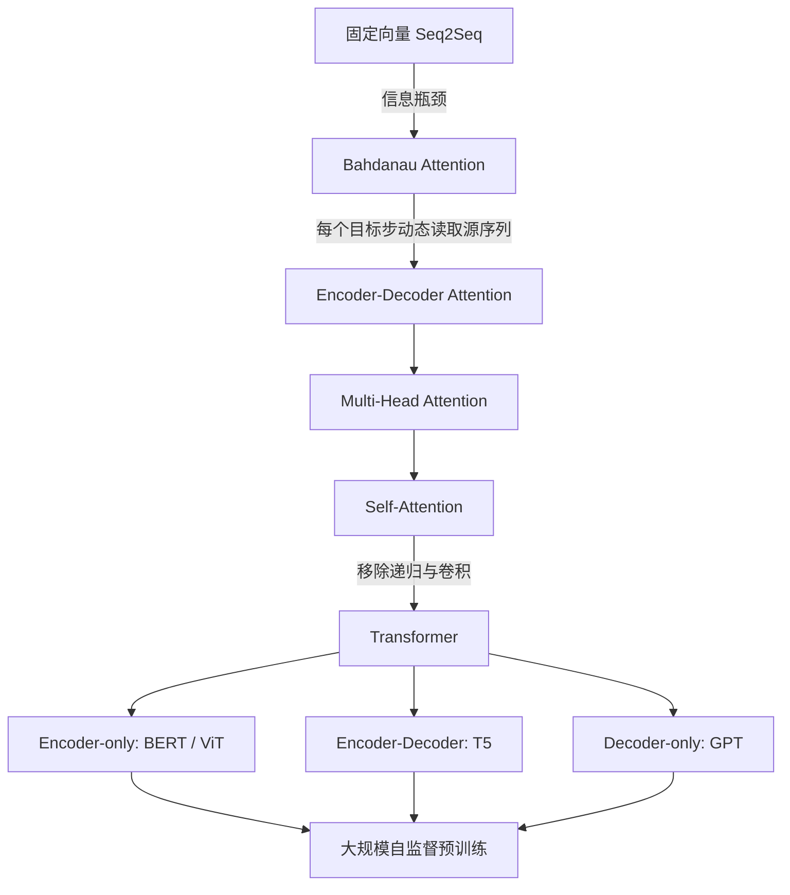
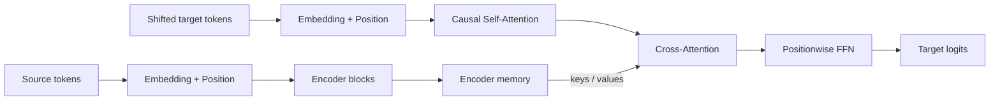

> 对应原文：d2l-en.md 第 11 章 **Attention Mechanisms and Transformers**。本章从查询、键和值的抽象开始，依次讲解基于相似度的注意力池化、注意力评分函数、Bahdanau 注意力、多头注意力、自注意力与位置编码、完整 Transformer、视觉 Transformer，以及 BERT、T5、GPT 等大规模预训练范式。

## 1. 本章要解决的核心问题

第 10 章的 RNN seq2seq 将整个源序列压缩到固定维状态，再由解码器逐步生成目标序列。这个方案有两个根本困难：

1. **固定容量瓶颈**：无论源句多长，全部信息都必须进入同一个向量；
2. **长路径问题**：源序列早期信息到目标序列后期预测要穿过很多递归步骤。

注意力的初始想法很直接：不要要求解码器永远只读取同一个压缩向量，而应让它在每个生成步骤重新查看全部编码器表示，并动态选择当前最相关的部分。

以英文 `my feet hurt` 翻译成法文 `j'ai mal aux pieds` 为例，生成 `pieds` 时，应重点读取 `feet` 的表示；生成其他词时，权重模式可以不同。关键不是人工指定对应关系，而是把“选择什么”做成可微运算，与整个网络端到端学习。

Transformer 又把这一思想推进一步：如果注意力能直接建立任意两个位置之间的联系，那么序列建模未必必须依赖 RNN。由此形成两条连续的演进路线：



本章作者的分析路径可以概括为：

1. 先把注意力抽象成对键值数据库的可微查询；
2. 用经典核回归说明“按相似度加权”的统计直觉；
3. 将手工核改造成可学习且适合矩阵计算的评分函数；
4. 把动态注意力接入 RNN encoder-decoder，解决固定上下文瓶颈；
5. 用多头机制并行学习多种关系；
6. 令同一序列内部互相注意，形成 self-attention；
7. 补入位置信息、残差、归一化和 FFN，组成 Transformer；
8. 将“序列”推广到图像 patch 和大规模多任务 token 流；
9. 通过不同可见性 mask，得到 encoder-only、encoder-decoder、decoder-only 三大范式。

这条路线的重要性在于：每一步都不是孤立技巧，而是在解决上一步暴露出的具体限制。

## 2. 查询、键和值

### 2.1 从固定输入到可变数据库

传统网络通常要求输入结构相对固定。CNN 依赖规则网格，RNN 虽能逐步处理变长序列，却仍要把历史不断更新进固定维状态。输入很长且信息密度不均时，模型很难保留所有细节。

数据库提供了另一种思路。数据库可写成键值对集合：

$$
\mathcal D
=\{(\mathbf k_1,\mathbf v_1),\ldots,(\mathbf k_m,\mathbf v_m)\}.
$$

查询 $\mathbf q$ 不需要先压缩整个数据库，也不随数据库规模改变。它只需要定义“查询和哪个键匹配”，再取出相应值。

注意力把精确查询推广成软查询：

$$
\operatorname{Attention}(\mathbf q,\mathcal D)
=\sum_{i=1}^{m}\alpha(\mathbf q,\mathbf k_i)\mathbf v_i.
$$

三个对象分工不同：

- **Query** $\mathbf q$：当前想找什么；
- **Key** $\mathbf k_i$：每条记录用什么特征接受匹配；
- **Value** $\mathbf v_i$：匹配后真正读出的内容；
- **Attention weight** $\alpha(\mathbf q,\mathbf k_i)$：第 $i$ 个 value 对当前输出贡献多大。

Key 和 value 不必相同。key 用于寻址，value 用于传输内容。现实类比中，书名可以是 key，书的正文可以是 value；不能因为通过书名检索，就认为输出内容也是书名。

### 2.2 权重约束的几何意义

注意力本质上是 values 的线性组合。权重约束不同，输出集合也不同：

1. 若 $\alpha_i\ge0$，输出落在 values 张成的凸锥中；
2. 若再满足 $\sum_i\alpha_i=1$，输出落在 values 的凸包中；
3. 若只有一个权重为 $1$，退化为精确数据库查询；
4. 若所有权重均为 $1/m$，退化为平均池化；
5. 若允许负权重，则可产生凸包以外的线性组合，但失去“概率分配”直觉。

深度学习中最常见的是非负且和为 $1$。先定义任意实数评分函数

$$
a(\mathbf q,\mathbf k_i)\in\mathbb R,
$$

再经 softmax：

$$
\alpha(\mathbf q,\mathbf k_i)
=\frac{\exp a(\mathbf q,\mathbf k_i)}
{\sum_{j=1}^{m}\exp a(\mathbf q,\mathbf k_j)}.
$$

这里最好区分：

- $a_i$：未归一化 score 或 logit；
- $\alpha_i$：归一化 attention weight。

原文某个归一化式在等号两侧都使用 $\alpha$，容易造成循环定义；使用 $a_i$ 或 $\widetilde\alpha_i$ 表示未归一化量更严谨。

### 2.3 Softmax 为什么合适

Softmax 同时提供：

- 非负权重；
- 权重和为 $1$；
- 相对分数的指数放大；
- 对 score 的平滑可微映射；
- 可用稳定、高效的矩阵内核实现。

若引入温度 $\tau>0$：

$$
\alpha_i(\tau)
=\frac{\exp(a_i/\tau)}{\sum_j\exp(a_j/\tau)}.
$$

- $\tau\to0^+$：分布趋近 one-hot，接近硬检索；
- $\tau$ 增大：分布变平，更接近平均池化。

但“可微”不等于“梯度永不消失”。当 softmax 极度饱和时，其 Jacobian 可非常接近零；所有 logits 同加常数的方向上，输出完全不变，方向导数恒为零。

### 2.4 批量张量形状

设：

$$
Q\in\mathbb R^{B\times n_q\times d_q},
\quad
K\in\mathbb R^{B\times n_k\times d_k},
\quad
V\in\mathbb R^{B\times n_k\times d_v}.
$$

注意：key 数必须与 value 数相同，因为每个 key 对应一个 value；query 数可以不同。一般流程：

$$
S\in\mathbb R^{B\times n_q\times n_k}
\xrightarrow{\operatorname{softmax}}
A\in\mathbb R^{B\times n_q\times n_k}
\xrightarrow{AV}
O\in\mathbb R^{B\times n_q\times d_v}.
$$

因此输出数量由 query 数决定，输出特征维由 value 维度决定。

### 2.5 注意力热图能说明什么

原书的 `show_heatmaps` 接受四维张量：

```text
(展示行数, 展示列数, query 数, key 数)
```

单位矩阵热图表示每个 query 只读取同索引 key。热图可帮助发现：

- padding 是否被屏蔽；
- decoder 是否偷看未来；
- 不同 head 是否形成不同模式；
- 翻译时是否出现大致对齐。

但高权重只能说明当前前向计算中的加权系数较大，不能自动推出：

- 该 token 是模型决策的唯一原因；
- 改动该 token 一定造成同比例输出变化；
- 权重就是人类可解释的因果归因。

Value 投影、残差路径、后续层和 head 混合都可能改变最终影响。注意力可视化是诊断工具，不是完整解释证明。

### 2.6 梯度与协方差：注意力如何响应 query

原书练习给出一个漂亮结论。令

$$
a_i=\mathbf q^\top\mathbf k_i,
\qquad
\mathbf v_i=\mathbf k_i,
$$

并令

$$
p_i=\frac{e^{\mathbf q^\top\mathbf k_i}}
{\sum_j e^{\mathbf q^\top\mathbf k_j}},
\qquad
\boldsymbol\mu=\sum_i p_i\mathbf k_i.
$$

Softmax 求导：

$$
\nabla_{\mathbf q}p_i
=p_i(\mathbf k_i-\boldsymbol\mu).
$$

注意力输出为

$$
\operatorname{Attention}(\mathbf q)
=\sum_i p_i\mathbf k_i
=\boldsymbol\mu.
$$

继续求导：

$$
\begin{aligned}
\nabla_{\mathbf q}\boldsymbol\mu
&=\sum_i\mathbf k_i(\nabla_{\mathbf q}p_i)^\top\\
&=\sum_i p_i\mathbf k_i\mathbf k_i^\top
-\boldsymbol\mu\boldsymbol\mu^\top\\
&=\operatorname{Cov}_{p}(\mathbf k).
\end{aligned}
$$

直觉上，若当前关注的 keys 在某方向分散，query 沿该方向小幅改变会显著改变加权均值；若 keys 几乎相同，协方差小，输出对 query 不敏感。

## 3. 基于相似度的注意力池化

### 3.1 为什么先回到经典核回归

现代注意力通常学习 Q/K 表示，但“相似位置应该共享信息”并非新思想。Nadaraya–Watson 核回归用一个无需神经网络的例子，把 query、key、value 和权重关系展示得非常清楚。

对于训练数据

$$
(\mathbf x_i,y_i),\quad i=1,\ldots,n,
$$

预测新位置 $\mathbf q$ 时：

- query：$\mathbf q$；
- key：$\mathbf k_i=\mathbf x_i$；
- value：$\mathbf v_i=y_i$；
- 权重：query 与训练点的核相似度。

估计器：

$$
\widehat f(\mathbf q)
=\sum_i y_i
\frac{\kappa(\mathbf q,\mathbf x_i)}
{\sum_j\kappa(\mathbf q,\mathbf x_j)}.
$$

它就是一次注意力池化。

### 3.2 三类典型核

高斯核：

$$
\kappa(\mathbf q,\mathbf k)
=\exp\left(-\frac12\|\mathbf q-\mathbf k\|^2\right).
$$

Boxcar 核：

$$
\kappa(\mathbf q,\mathbf k)
=\mathbf1[\|\mathbf q-\mathbf k\|\le1].
$$

Epanechnikov 核：

$$
\kappa(\mathbf q,\mathbf k)
=\max(0,1-\|\mathbf q-\mathbf k\|).
$$

原文函数和文字拼作 `Epanechikov`，标准拼写是 **Epanechnikov**。

三者体现不同局部性：

- 高斯核支持域无限，但远处权重指数衰减；
- Boxcar 在半径内一视同仁，边界不光滑；
- Epanechnikov 有紧支持且随距离线性衰减；
- 常数核忽略距离，退化为全局均值。

这些核同时平移或旋转 query/key 后不变，因为只依赖欧氏距离。

### 3.3 原书回归实验

原书生成 $40$ 个训练点：

$$
y_i=2\sin x_i+x_i+\epsilon_i,
\qquad
\epsilon_i\sim\mathcal N(0,1),
$$

$x_i\in[0,5)$，并在间隔 $0.1$ 的验证位置上估计真实函数。

距离矩阵形状为：

$$
D\in\mathbb R^{n_{\mathrm{key}}\times n_{\mathrm{query}}}.
$$

每一列对应一个 query，必须沿 key 轴归一化：

$$
A_{iq}
=\frac{\kappa(x_i,q)}{\sum_j\kappa(x_j,q)}.
$$

然后

$$
\widehat{\mathbf y}
=\mathbf y_{\mathrm{train}}^\top A.
$$

实验观察：高斯、Boxcar、Epanechnikov 虽函数形状不同，但都形成相似的局部权重，拟合效果接近；常数核只输出训练标签均值，无法跟随曲线。

### 3.4 核宽与偏差—方差权衡

带宽为 $\sigma$ 的高斯核：

$$
\kappa_\sigma(\mathbf q,\mathbf k)
=\exp\left(-\frac{\|\mathbf q-\mathbf k\|^2}{2\sigma^2}\right).
$$

- $\sigma$ 小：只读取极近样本，偏差低、方差高，曲线抖动；
- $\sigma$ 大：读取更广邻域，方差低、偏差高，曲线过度平滑；
- 常数核可视为极宽带宽的极端。

原书画出 $\sigma\in\{0.1,0.2,0.5,1\}$ 的预测和热图。核越窄，热图中的高权重带越细。

统一全局带宽也未必合理：稠密区域可用窄带宽，稀疏区域可能需要宽带宽。这一困难促使模型不再手工调核，而是学习 query/key 表示及评分函数。

### 3.5 为什么不能直接在训练点学习到零带宽

若预测 $x_i$ 时仍把 $(x_i,y_i)$ 本身放在数据库中，令 $\sigma\to0$ 后：

$$
\alpha(x_i,x_i)\to1,
\qquad
\widehat f(x_i)\to y_i.
$$

训练误差可趋近零，但只是复制标签，不代表泛化。学习带宽时应：

- 使用独立验证集；或
- 对每个训练点做 leave-one-out，预测 $x_i$ 时移除自身。

这与监督学习中的数据泄漏完全同类：模型获得了待预测答案本身。

### 3.6 高斯核为何连接到点积注意力

若 query 和 keys 都在单位球面：

$$
\|\mathbf q\|=\|\mathbf k_i\|=1,
$$

则

$$
\|\mathbf q-\mathbf k_i\|^2
=2-2\mathbf q^\top\mathbf k_i.
$$

代入高斯核：

$$
\kappa(\mathbf q,\mathbf k_i)
=e^{-1}e^{\mathbf q^\top\mathbf k_i}.
$$

归一化时公共因子 $e^{-1}$ 消失，因此高斯核权重等价于：

$$
\operatorname{softmax}_i(\mathbf q^\top\mathbf k_i).
$$

这解释了为什么下一节会从距离自然转向点积。

### 3.7 适用范围与局限

Nadaraya–Watson 优点：无需参数训练、直观、局部、在适当条件下一致。

局限：

- 推理需与大量训练点比较，时间和内存随样本量增长；
- 高维空间中距离集中，邻域样本稀少，遭遇维数灾难；
- 手工距离未必符合任务语义；
- 单一带宽难适应密度变化；
- 紧支持核可能找不到任何邻居，分母为零；
- 若直接记住训练点，易过拟合。

典型一致性条件是带宽 $h_n\to0$，同时邻域内样本数仍增长，例如

$$
nh_n^d\to\infty.
$$

常见二阶平滑与均方误差假设下，最优量级为

$$
h_n\asymp n^{-1/(d+4)},
$$

维度 $d$ 越高，带宽收缩越慢，直观体现维数灾难。

## 4. 注意力评分函数

### 4.1 从距离到点积

高斯核的对数评分可展开：

$$
-\frac12\|\mathbf q-\mathbf k_i\|^2
=\mathbf q^\top\mathbf k_i
-\frac12\|\mathbf q\|^2
-\frac12\|\mathbf k_i\|^2.
$$

对同一 query，$-\|\mathbf q\|^2/2$ 对所有 keys 相同，softmax 对 logits 的公共平移不敏感，因而可消去。

若 key 范数相同或近似稳定，$-\|\mathbf k_i\|^2/2$ 也不会显著改变排序，于是主要剩下点积：

$$
a(\mathbf q,\mathbf k_i)=\mathbf q^\top\mathbf k_i.
$$

但“经过 LayerNorm 后 key 范数必然完全相同”并不严格。LayerNorm 有可学习的逐维缩放和平移，投影后的 key 范数也会变化。点积注意力应理解为高效、可学习的相似度，而不是与欧氏距离始终严格等价。

### 4.2 为什么除以 $\sqrt d$

设

$$
\mathbf q,\mathbf k\in\mathbb R^d,
$$

各分量独立、均值 $0$、方差 $1$。点积：

$$
z=\mathbf q^\top\mathbf k
=\sum_{r=1}^{d}q_rk_r.
$$

由于

$$
\mathbb E[q_rk_r]=0,
\qquad
\operatorname{Var}(q_rk_r)=1,
$$

独立求和得：

$$
\operatorname{Var}(z)=d.
$$

维度越大，logits 的典型绝对值约按 $\sqrt d$ 增长，softmax 越容易饱和。定义

$$
\widetilde z=\frac{\mathbf q^\top\mathbf k}{\sqrt d},
$$

则

$$
\operatorname{Var}(\widetilde z)=1.
$$

这就是 scaled dot-product attention：

$$
a(\mathbf q,\mathbf k_i)
=\frac{\mathbf q^\top\mathbf k_i}{\sqrt d}.
$$

前提是分量尺度大致符合假设；实际网络不严格独立同分布，但缩放仍能稳定量级。

### 4.3 矩阵形式

令

$$
Q\in\mathbb R^{n_q\times d},
\quad
K\in\mathbb R^{n_k\times d},
\quad
V\in\mathbb R^{n_k\times d_v}.
$$

则

$$
\operatorname{Attention}(Q,K,V)
=\operatorname{softmax}\left(
\frac{QK^\top}{\sqrt d}
\right)V
\in\mathbb R^{n_q\times d_v}.
$$

分三步理解：

1. $QK^\top$：每个 query 与每个 key 的两两评分；
2. softmax 沿 key 轴归一化；
3. 权重矩阵乘 $V$，为每个 query 汇总 values。

批量矩阵乘法规则：

$$
(B,a,b)\times(B,b,c)\to(B,a,c).
$$

因此：

```text
scores  = bmm(Q, K.transpose(1, 2))  # (B, Q, K)
weights = masked_softmax(scores)      # (B, Q, K)
output  = bmm(weights, V)             # (B, Q, V_dim)
```

### 4.4 Masked softmax

批量中的短序列用 `<pad>` 补齐，但 padding 不是可读取内容。若样本 $b$ 的有效 key 数为 $l_b$，mask 为：

$$
M_{bqi}=\mathbf1[i<l_b].
$$

做法是在 softmax 前把无效 score 设为 $-\infty$：

$$
\widetilde S_{bqi}
=\begin{cases}
S_{bqi},&M_{bqi}=1,\\
-\infty,&M_{bqi}=0.
\end{cases}
$$

于是

$$
e^{-\infty}=0,
$$

无效位置权重为零。

`valid_lens` 有两种常见形状：

- $(B,)$：同一样本的所有 queries 共享一个 key 有效长度；
- $(B,n_q)$：每个 query 有独立有效长度，因果 mask 常用这种形式。

原书实现以 $-10^6$ 代替 $-\infty$，便于数值内核。其注释说也将无效 value 置零，但实际代码只改 logits；这已足够使对应权重近似零。

一个重要边界：若某行 `valid_len=0`，把所有 logits 都设成同一个有限负数后，softmax 会给均匀分布，而不是全零。稳健实现应显式处理全 mask 行，或保证每个 query 至少有一个有效 key。

### 4.5 Padding mask、causal mask 与 loss mask

三种 mask 作用位置不同，不能混用：

| Mask | 屏蔽什么 | 作用位置 |
|---|---|---|
| Padding mask | 批量补齐的无效 key/token | attention logits |
| Causal mask | 当前目标位置之后的未来 token | decoder self-attention logits |
| Loss mask | `<pad>` 或不参与目标的 token | token loss |

Attention mask 控制“能读什么”；loss mask 控制“在哪些位置计分”。即使 attention 正确屏蔽 padding，训练损失仍需单独排除 target padding。

### 4.6 加性注意力

点积要求 query/key 投影到同一维度。若原始维度不同，可用加性评分：

$$
a(\mathbf q,\mathbf k)
=\mathbf w_v^\top
\tanh(W_q\mathbf q+W_k\mathbf k).
$$

其中：

$$
W_q\in\mathbb R^{h\times d_q},
\quad
W_k\in\mathbb R^{h\times d_k},
\quad
\mathbf w_v\in\mathbb R^h.
$$

步骤：

1. 把 query 和 key 分别投影到共同隐藏空间；
2. 对所有 query-key 对广播相加；
3. 经 tanh；
4. 用 $\mathbf w_v$ 投影为标量 score；
5. mask、softmax、value 加权。

张量形状：

```text
projected Q: (B, Q, H)
projected K: (B, K, H)
broadcast sum: (B, Q, K, H)
scores:        (B, Q, K)
output:        (B, Q, V_dim)
```

它可视为对拼接后的 query/key 使用一个单隐藏层 MLP。Bahdanau attention 采用这一评分。

“加性”不表示现代硬件上一定更便宜。它显式产生 $(B,Q,K,H)$ 中间张量，通常不如点积的 GEMM 高效；Transformer 因而默认 scaled dot product。

### 4.7 计算与内存复杂度

Scaled dot product 的主要代价：

$$
QK^\top:O(Bn_qn_kd),
$$

$$
AV:O(Bn_qn_kd_v).
$$

显式 attention matrix 内存：

$$
O(Bn_qn_k).
$$

当 $n_q=n_k=n$ 时，时间和注意力矩阵内存都对序列长度呈平方增长。这将成为 Transformer 处理长序列的核心限制。

## 5. Bahdanau 注意力

### 5.1 固定上下文为何不足

无注意力的 seq2seq 使用：

$$
c=h_T,
$$

再令所有目标时刻都依赖同一个 $c$。源序列越长，早期信息越难完整保留；而不同目标词真正需要的源信息不同。

Bahdanau attention 将上下文改为目标时间相关：

$$
c_{t'}
=\sum_{t=1}^{T}
\alpha(s_{t'-1},h_t)h_t.
$$

其中：

- query：decoder 上一时刻状态 $s_{t'-1}$；
- keys：全部 encoder states $h_1,\ldots,h_T$；
- values：同一组 encoder states；
- output：当前目标步专用 context $c_{t'}$。

作者选择上一 decoder state 作为 query，是因为它概括了“目标前缀已经生成了什么”，最适合决定下一步还需要从源句读取什么。

```mermaid
flowchart LR
    H1[h_1] --> A[Additive Attention]
    H2[h_2] --> A
    HT[h_T] --> A
    S[s_{t'-1}] -->|query| A
    A --> C[c_{t'}]
    Y[Embedding y_{t'-1}] --> G[GRU]
    C --> G
    S --> G
    G --> SN[s_{t'}]
    SN --> O[Next-token logits]
```

### 5.2 对固定瓶颈的改进

Bahdanau attention 并不是让 encoder 不再压缩信息，而是保留每个源位置的表示，供 decoder 随时查询：

$$
H=(h_1,\ldots,h_T).
$$

优势：

- 每个目标步可读取不同源位置；
- 源位置到目标位置有更短梯度路径；
- 不要求所有细节进入单一向量；
- 权重可提供粗粒度对齐诊断；
- 对源、目标长度不一致和非单调对齐更灵活。

它仍有局限：encoder 与 decoder 内部仍是 RNN，时间方向串行；每个目标步要扫描所有源位置，复杂度约 $O(TT')$；固定维 encoder states 仍可能丢失局部信息。

### 5.3 Decoder 的逐步张量流

假设：

- encoder outputs：$(T_s,B,H)$；
- encoder final state：$(L,B,H)$；
- source valid lengths：$(B,)$。

初始化时先转置 encoder outputs：

$$
(T_s,B,H)\to(B,T_s,H),
$$

作为 keys 和 values。

目标第 $t'$ 步：

1. 取 decoder 最高层状态 `hidden_state[-1]`：$(B,H)$；
2. 增加 query 轴：$(B,1,H)$；
3. 加性注意力输出 context：$(B,1,H)$；
4. 当前目标 embedding：$(B,1,E)$；
5. 拼接为 $(B,1,H+E)$；
6. 转成 GRU 的 $(1,B,H+E)$；
7. 得到新 state 和该步输出；
8. 所有步投影为 $(B,T_t,V_{\mathrm{tgt}})$。

Source valid lengths 只屏蔽源 padding。目标侧的因果性由 decoder 按时间递推天然保证。

### 5.4 训练与推理

训练仍使用 teacher forcing：完整目标输入已知，但 decoder 为了让每一步产生不同 query，通常在 Python 循环中逐步调用 attention 和 RNN。

推理时：

1. encoder 一次编码源句；
2. `<bos>` 启动 decoder；
3. 每步用上一步 state 查询 encoder outputs；
4. 预测 token 回馈给下一步；
5. 遇 `<eos>` 停止。

原书在英法翻译上使用两层 GRU、embedding/hidden size $256$、dropout $0.2$、batch size $128$、学习率 $0.005$、训练 $30$ epochs，并可视化最后一个句子的注意力权重。具体数值是教学配置，不应视为通用最优。

### 5.5 与后续概念的关系

- Bahdanau：decoder state 查询 encoder sequence；
- Cross-attention：decoder representations 查询 encoder representations；
- Self-attention：一个序列中的每个位置查询同一序列；
- Multi-head：并行使用多组投影和注意力；
- Transformer：用 self-attention 和 cross-attention 完全替代 RNN。

因此 Bahdanau attention 是从 RNN seq2seq 通向 Transformer 的桥梁。

## 6. 多头注意力

### 6.1 为什么一个注意力分布不够

同一序列可能同时包含多种关系：

- 近邻语法搭配；
- 远距离指代；
- 实体与属性；
- 局部词组边界；
- 不同位置或语义子空间。

单个 attention 用同一套投影和一张权重矩阵汇总所有关系，容易形成折中。多头注意力让 $h$ 个 head 在不同子空间独立匹配。

第 $i$ 个 head：

$$
\operatorname{head}_i
=\operatorname{Attention}(QW_i^Q,KW_i^K,VW_i^V).
$$

拼接并投影：

$$
\operatorname{MHA}(Q,K,V)
=\operatorname{Concat}(
\operatorname{head}_1,\ldots,\operatorname{head}_h)W^O.
$$

### 6.2 维度设计

通常模型维度为 $d_{\mathrm{model}}$，head 数为 $h$，每个 head 维度：

$$
d_h=\frac{d_{\mathrm{model}}}{h}.
$$

必须满足

$$
d_{\mathrm{model}}\bmod h=0.
$$

投影后：

$$
QW^Q,KW^K,VW^V
\in\mathbb R^{B\times n\times d_{\mathrm{model}}}.
$$

重排：

$$
(B,n,h,d_h)
\to(B,h,n,d_h)
\to(Bh,n,d_h).
$$

这样可把 head 轴并入 batch 轴，复用同一个批量注意力内核。输出执行逆变换：

$$
(Bh,n,d_h)
\to(B,h,n,d_h)
\to(B,n,d_{\mathrm{model}}).
$$

### 6.3 Mask 如何复制

若展平顺序是：

```text
sample 0 head 0, sample 0 head 1, ..., sample 1 head 0, ...
```

则 `valid_lens` 必须沿 batch 项逐个重复：

```python
valid_lens.repeat_interleave(num_heads, dim=0)
```

不能简单把整个 batch 重复若干遍，否则 mask 与 head 对应样本错位。恢复热图时，权重从

$$
(Bh,Q,K)
$$

reshape 为

$$
(B,h,Q,K).
$$

### 6.4 参数量与复杂度

若 Q/K/V/O 都是 $d_{\mathrm{model}}\times d_{\mathrm{model}}$ 投影，忽略偏置：

$$
P_{\mathrm{MHA}}
\approx4d_{\mathrm{model}}^2.
$$

在总维度固定时，增加 head 数不会把投影参数线性乘 $h$，因为每个 head 变窄；注意力主体的总量级仍约：

$$
O(Bn_qn_kd_{\mathrm{model}}).
$$

但 head 数影响并行粒度、内核效率、缓存和表示能力。

### 6.5 多头不保证自动分工

多头提供学习不同关系的容量，却不保证每个 head 一定语义独特。实际可能出现：

- 多个 head 学到相似模式；
- 某些 head 可被剪枝而指标几乎不变；
- 平均注意力小的 head 仍通过 value/output 投影产生重要影响。

评估 head 重要性应做消融、验证集指标和真实延迟测试，不能只看热图或平均权重。

## 7. 自注意力与位置编码

### 7.1 Self-attention 的定义

给定输入序列

$$
X=(\mathbf x_1,\ldots,\mathbf x_n),
$$

self-attention 的 Q/K/V 都来自同一序列，但通常经过不同投影：

$$
Q=XW^Q,
\quad
K=XW^K,
\quad
V=XW^V.
$$

每个位置输出：

$$
\mathbf y_i
=\sum_{j=1}^{n}
\alpha(\mathbf x_i,\mathbf x_j)
W^V\mathbf x_j.
$$

“来自同一输入”不表示 Q、K、V 数值相同。三个投影分别学习：查询特征、被匹配特征和传递内容。

### 7.2 CNN、RNN 与 self-attention

设序列长 $n$、表示宽度 $d$、CNN 核宽 $k$：

| 架构 | 单层主要计算量 | 必须串行的操作 | 任意两位置最大路径 |
|---|---:|---:|---:|
| CNN | $O(knd^2)$ | $O(1)$ | $O(n/k)$ |
| RNN | $O(nd^2)$ | $O(n)$ | $O(n)$ |
| Self-attention | $O(n^2d)$ | $O(1)$ | $O(1)$ |

Self-attention 的关键优势：

- 全序列可并行；
- 任意两个位置一层直接连接；
- 长程依赖不需穿过 $O(n)$ 个递归状态；
- 权重根据内容动态生成，而非固定卷积核。

关键代价：

- $n^2$ 两两关系；
- 注意力矩阵显存随 $n^2$ 增长；
- 缺少 RNN 的天然顺序和 CNN 的局部归纳偏置。

完整 Transformer 层还包括线性投影和 FFN，所以更完整的复杂度是：

$$
O(nd^2+n^2d).
$$

当 $n\ll d$，投影/FFN 可能主导；当 $n\gg d$，平方注意力主导。

### 7.3 没有位置时的排列等变性

Self-attention 不是简单“忽略输入”，而是在没有位置编码时对排列**等变**。令 $P$ 为位置置换矩阵：

$$
Q'=PQ,
\quad K'=PK,
\quad V'=PV.
$$

则

$$
Q'K'^\top
=P(QK^\top)P^\top.
$$

逐行 softmax 后：

$$
\operatorname{softmax}(Q'K'^\top)
=P\operatorname{softmax}(QK^\top)P^\top.
$$

所以

$$
\operatorname{SA}(PX)
=P\operatorname{SA}(X).
$$

输入位置重新排列，输出只做同样排列。模型知道“有哪些 token 及其内容关系”，却无法区分原始顺序。文本中 `dog bites man` 与 `man bites dog` 因而需要额外位置信息。

### 7.4 正弦—余弦位置编码

对输入

$$
X\in\mathbb R^{n\times d},
$$

构造同形状 $P$ 并相加：

$$
X'=X+P.
$$

位置 $i$、维度对 $2j,2j+1$：

$$
p_{i,2j}
=\sin\left(\frac{i}{10000^{2j/d}}\right),
$$

$$
p_{i,2j+1}
=\cos\left(\frac{i}{10000^{2j/d}}\right).
$$

令

$$
\omega_j=10000^{-2j/d},
$$

则每对维度是

$$
[\sin(i\omega_j),\cos(i\omega_j)].
$$

低索引维频率高，快速区分相邻位置；高索引维频率低，描述大尺度位置。原书将它类比为二进制：低位变化快，高位变化慢，但正弦编码是连续表示。

### 7.5 相对位移为何可线性表示

三角恒等式：

$$
\sin((i+\delta)\omega)
=\sin(i\omega)\cos(\delta\omega)
+\cos(i\omega)\sin(\delta\omega),
$$

$$
\cos((i+\delta)\omega)
=\cos(i\omega)\cos(\delta\omega)
-\sin(i\omega)\sin(\delta\omega).
$$

写成矩阵：

$$
\begin{bmatrix}
\cos(\delta\omega_j)&\sin(\delta\omega_j)\\
-\sin(\delta\omega_j)&\cos(\delta\omega_j)
\end{bmatrix}
\begin{bmatrix}
\sin(i\omega_j)\\
\cos(i\omega_j)
\end{bmatrix}
=
\begin{bmatrix}
\sin((i+\delta)\omega_j)\\
\cos((i+\delta)\omega_j)
\end{bmatrix}.
$$

固定偏移 $\delta$ 对应一个与绝对位置 $i$ 无关的二维旋转。因此网络原则上可通过线性操作识别相对偏移。

但这只证明“可线性表示”，不保证模型一定学会精确相对位置，也不保证超出训练长度后可靠外推。

### 7.6 固定位置编码与可学习位置编码

固定正弦编码：

- 无需学习参数；
- 任意位置可按公式生成；
- 具有明确频率和位移结构；
- 外推仍可能因模型未见长位置而失败。

可学习绝对位置表：

- 灵活适应任务；
- 简单有效；
- 受训练最大长度限制；
- 改变图像分辨率或序列长度时常需插值。

相对位置方法直接把 $i-j$ 加入 attention score/value，更符合“query 相对 key 在哪里”。现代变体还包括旋转位置编码和线性 attention bias；它们不属于原书主线，但都在解决位置与长度泛化问题。

### 7.7 实现细节

原书位置编码张量形状：

$$
P\in\mathbb R^{1\times L_{\max}\times d}.
$$

前向取：

```python
X = X + P[:, :X.shape[1], :]
```

工程实现最好用 `register_buffer` 保存固定 $P$，使其随模型迁移设备并进入状态管理但不参与梯度。还要处理：

- $d$ 为奇数时 sine/cosine 列数不一致；
- 增量解码时必须使用缓存长度作为位置 offset；
- 不能每个生成步都错误地加 `P[:, 0]`。

## 8. Transformer 架构

### 8.1 总体结构

Transformer 最初仍是 encoder-decoder，但移除了循环和卷积：

- Encoder：多头双向 self-attention + positionwise FFN；
- Decoder：因果 self-attention + encoder-decoder cross-attention + FFN；
- 每个子层外有 residual connection 和 LayerNorm；
- 输入 embedding 加 positional encoding；
- decoder 最后投影到目标词表。

信息流：



### 8.2 Positionwise FFN

对每个 token 独立使用同一个两层 MLP：

$$
\operatorname{FFN}(\mathbf x)
=W_2\phi(W_1\mathbf x+b_1)+b_2.
$$

原始实现使用 ReLU，常见维度：

$$
d_{\mathrm{model}}
\to d_{\mathrm{ff}}
\to d_{\mathrm{model}}.
$$

它不混合位置，只混合同一 token 的特征维。位置间信息由 attention 交换，通道内非线性变换由 FFN 完成。二者分工类似：

- Attention：token mixing；
- FFN：channel mixing。

同一层对所有位置共享 FFN 参数，所以相同输入向量会产生相同输出。

### 8.3 Residual connection 与 LayerNorm

原书实现原始 Transformer 的 post-norm：

$$
\operatorname{PostNorm}(X)
=\operatorname{LN}(X+\operatorname{Dropout}(\operatorname{Sublayer}(X))).
$$

Residual 要求子层输入输出最后一维相同：

$$
X,\operatorname{Sublayer}(X)
\in\mathbb R^{B\times n\times d_{\mathrm{model}}}.
$$

LayerNorm 对每个 token 的特征维独立归一化：

$$
\operatorname{LN}(\mathbf x)
=\gamma\odot
\frac{\mathbf x-\mu}{\sqrt{\sigma^2+\epsilon}}
+\beta.
$$

它不依赖 batch 中其他样本，适合变长序列和小 batch。

现代深层 Transformer 常用 pre-norm：

$$
\operatorname{PreNorm}(X)
=X+\operatorname{Sublayer}(\operatorname{LN}(X)).
$$

Pre-norm 给残差主路径提供更直接的梯度，深层训练通常更稳定；post-norm 是原始论文设计。两者不能只交换一行代码后假定训练行为完全相同。

### 8.4 Encoder block

第 $\ell$ 层：

$$
Y^{(\ell)}
=\operatorname{AddNorm}(
X^{(\ell)},
\operatorname{MHA}(X^{(\ell)},X^{(\ell)},X^{(\ell)})),
$$

$$
X^{(\ell+1)}
=\operatorname{AddNorm}(
Y^{(\ell)},
\operatorname{FFN}(Y^{(\ell)})).
$$

每层保持形状：

$$
(B,S,d_{\mathrm{model}})
\to(B,S,d_{\mathrm{model}}).
$$

Source padding mask 屏蔽无效 **keys**，使真实 token 不读取 padding。它不会自动把 padding query 的输出置零；若后续使用这些位置，还需继续 mask。

Embedding 在加固定位置编码前乘：

$$
\sqrt{d_{\mathrm{model}}},
$$

原书解释是让可学习 embedding 的尺度与 $[-1,1]$ 的位置编码更平衡。

### 8.5 Decoder block 的三种子层

每个 decoder block 包含：

1. masked multi-head self-attention；
2. encoder-decoder cross-attention；
3. positionwise FFN。

#### 8.5.1 Causal self-attention

训练时整个 target 输入同时存在，但位置 $t$ 只能读取 $1,\ldots,t$：

$$
M^{\mathrm{causal}}_{tj}
=\mathbf1[j\le t].
$$

对应有效长度矩阵每行：

$$
[1,2,\ldots,T].
$$

注意“允许看到自身”不泄漏标签，因为 decoder 输入已右移：位置 $t$ 的输入是前一个真实 token，预测的是下一个 token。

#### 8.5.2 Cross-attention

$$
Q=\text{decoder representations},
$$

$$
K=V=\text{encoder outputs}.
$$

它让每个目标位置读取全部有效源位置。Cross-attention 使用 source padding mask，而不是 causal mask。

#### 8.5.3 FFN

对 cross-attention 后的每个目标位置做共享非线性变换，不跨位置混合。

### 8.6 训练与增量推理的差异

训练：

- target 整段并行输入；
- causal mask 防未来泄漏；
- teacher forcing 使用真实目标前缀；
- 一次输出全部位置 logits。

推理：

- 每次生成一个或一小块新 token；
- 过去层的 keys/values 可缓存为 KV cache；
- 新 query 只与缓存及当前 key/value 计算；
- 不必重复计算过去 token 的 K/V；
- 仍需位置 offset 和 padding/finished 管理。

每层 cache 逐步增长：

$$
K_{1:t}=[K_{1:t-1};K_t],
\quad
V_{1:t}=[V_{1:t-1};V_t].
$$

KV cache 降低重复计算，却增加随 batch、层数、序列长度和 KV 维度线性增长的推理显存。

### 8.7 原书 decoder 实现的两个边界

原书根据 `self.training` 决定是否构造 causal mask：

- training mode + 完整 target：有 mask，正确；
- eval mode + 严格单 token 增量：cache 中没有未来，`None` 可行；
- eval mode + 一次输入完整 target：若 mask 为 `None`，会偷看未来。

因此“是否 causal”应由调用语义或显式 mask 决定，不能普遍等同于“是否训练”。

另一个边界是位置编码：若每次只送一个 token，而 `PositionalEncoding.forward` 总取 `P[:, :1]`，所有步都得到位置 $0$。增量实现必须依据 cache 长度传入 offset。

### 8.8 训练实验与可视化

原书英法翻译配置：

- batch size $128$；
- hidden size $256$；
- encoder/decoder 各 $2$ blocks；
- $4$ heads；
- dropout $0.2$；
- FFN hidden size $64$；
- Adam 学习率 $0.001$；
- $30$ epochs；
- gradient clipping $1$。

其中 $d_{\mathrm{ff}}=64<d_{\mathrm{model}}=256$ 是教学规模配置；原始及现代 Transformer 常让 FFN 中间维显著更宽，例如约 $4d_{\mathrm{model}}$，不能由此例推断标准比例。

可视化应看到：

- encoder self-attention 不读 source padding；
- decoder self-attention 呈下三角；
- cross-attention 不读 source padding；
- 各 head 可能形成不同模式。

### 8.9 Transformer 为什么有效

它组合了几类互补机制：

- self-attention：内容依赖的全局通信；
- multi-head：多个表示子空间；
- position encoding：补充顺序；
- FFN：逐 token 非线性特征变换；
- residual：保留信息并缩短梯度路径；
- LayerNorm：稳定每个 token 的特征尺度；
- mask：精确定义可见信息；
- 并行训练：避免 RNN 的时间串行。

局限：

- 全局注意力时间/显存平方增长；
- 缺少局部和顺序归纳偏置，常需更多数据；
- 训练与增量推理路径不同；
- 大模型的计算、能耗和部署成本高；
- Attention 权重不等于完整解释；
- 长度外推和位置编码仍是开放问题。

## 9. 视觉 Transformer

### 9.1 图像如何变成序列

输入图像：

$$
X\in\mathbb R^{B\times C\times H\times W}.
$$

将图像切成 $p\times p$ 的不重叠 patch。若 $H,W$ 都能被 $p$ 整除，patch 数：

$$
m=\frac{HW}{p^2}.
$$

每个 patch 展平维度：

$$
Cp^2.
$$

再线性投影到 $d_{\mathrm{model}}$，于是图像变成长度 $m$ 的 token 序列。

### 9.2 Patch embedding 与卷积等价

不必显式切块、展平再逐块矩阵乘。使用：

```python
nn.Conv2d(
    in_channels=C,
    out_channels=d_model,
    kernel_size=p,
    stride=p,
)
```

卷积核覆盖一个 patch，stride 等于 patch size，因此窗口不重叠。每个输出通道对 $Cp^2$ 个像素做线性组合，恰好等价于共享的 patch 线性投影。

形状：

$$
(B,C,H,W)
\to(B,d,H/p,W/p)
\to(B,d,m)
\to(B,m,d).
$$

若尺寸不能整除 patch size，原书无 padding 的卷积会静默丢弃边缘；实际应预先 resize/crop/pad，并明确策略。

### 9.3 `[CLS]` token

ViT 在 patch 序列前添加可学习分类 token：

$$
X_0=[x_{\mathrm{cls}};x_1;\ldots;x_m]
+P.
$$

序列长度变为 $m+1$。经过多层 self-attention，`[CLS]` 可读取所有 patches，其最终表示送入分类 head：

$$
\widehat y
=W_{\mathrm{head}}X_L[:,0]+b.
$$

`[CLS]` 不是某个图像区域，而是一个可学习全局汇聚槽。替代方案是平均所有 patch outputs，再分类。

### 9.4 ViT encoder block

原书 ViT 使用 pre-norm：

$$
X' = X+
\operatorname{MHA}(\operatorname{LN}(X)),
$$

$$
X''=X'+
\operatorname{MLP}(\operatorname{LN}(X')).
$$

MLP：

$$
\operatorname{Linear}
\to\operatorname{GELU}
\to\operatorname{Dropout}
\to\operatorname{Linear}
\to\operatorname{Dropout}.
$$

GELU 可理解为比 ReLU 更平滑的输入依赖门控。ViT 使用可学习位置 embedding，而本章文本 Transformer 示例使用固定正弦编码。

### 9.5 原书实验

Fashion-MNIST resize 到 $96\times96$，patch size $16$：

$$
m=(96/16)^2=36,
$$

加 `[CLS]` 后序列长 $37$。配置：

- model width $512$；
- MLP hidden $2048$；
- $8$ heads；
- $2$ blocks；
- dropout $0.1$；
- batch size $128$；
- $10$ epochs。

原书强调：小数据上的简单 ViT 不如 ResNet，这不是实现异常。CNN 内置局部性和平移等变先验，样本效率更高；ViT 的全局关系更灵活，但往往需要更大数据、预训练和增强。

### 9.6 分辨率为何昂贵

若图像高、宽各扩大 $s$ 倍而 patch size 不变：

$$
m' = s^2m.
$$

全局 attention 的 $m^2$ 项变为：

$$
(m')^2=s^4m^2.
$$

图像边长翻倍，patch 数变 $4$ 倍，注意力矩阵变 $16$ 倍。Swin Transformer 用局部窗口和层级结构缓解平方成本，并重新引入类似卷积的局部先验。

### 9.7 ViT 的适用边界

优势：

- 统一使用 Transformer 组件；
- 全局 receptive field；
- 大模型、大数据下扩展性强；
- 易与文本等 token 模态结合。

局限：

- 小数据样本效率通常不如 CNN；
- 高分辨率全局注意力昂贵；
- patch 过大损失细节，过小又使序列太长；
- 可学习位置表绑定训练 patch 网格；
- 改变分辨率常需位置插值；
- 性能依赖数据增强、正则化、优化器和预训练。

## 10. Transformer 的大规模预训练

### 10.1 为什么从任务专用训练转向预训练

从头训练英法翻译模型会得到一个专用专家，对数据分布变化敏感。大规模预训练希望先从海量无标注数据中学习通用表示或生成能力，再通过微调、提示或上下文示例适配任务。

Transformer 特别适合这一范式：

- 训练时可高度并行；
- 架构可扩大层数、宽度和数据量；
- 文本、图像、动作等都可序列化为 token；
- 自监督目标可从原始数据自动构造标签；
- mask 可改变信息可见性，形成不同学习目标。

三类主架构：

| 架构 | 信息可见性 | 代表 | 典型预训练目标 | 主要用途 |
|---|---|---|---|---|
| Encoder-only | 输入 token 双向互见 | BERT、ViT | Masked modeling | 理解、分类、标注 |
| Encoder-decoder | Encoder 双向；Decoder 因果；Cross-attention 读输入 | T5、BART | 去噪重建、span corruption | 条件生成、转换 |
| Decoder-only | 仅过去和当前位置可见 | GPT | Next-token prediction | 开放式生成、统一语言建模 |

### 10.2 Encoder-only 与 BERT

Encoder-only 将长度 $n$ 的输入转为长度 $n$ 的双向上下文化表示。每个 token 可读取左右上下文，适合理解任务。

#### 10.2.1 Masked Language Modeling

原句：

```text
[CLS] I love this red car
```

随机遮盖：

```text
[CLS] I [MASK] this red car
```

模型只在选定遮盖位置预测原 token `love`。设遮盖集合 $M$：

$$
L_{\mathrm{MLM}}
=-\sum_{i\in M}
\log P_\theta(x_i\mid x_{\setminus M}).
$$

预测可同时利用左、右上下文，因此是双向编码。

MLM 的价值：无需人工标签，原始文本本身提供答案。代价是只在部分位置产生直接损失，且 `[MASK]` 在下游输入中通常不存在，形成预训练—微调差异。

原始 BERT 还有 next sentence prediction，判断句 B 是否紧随句 A；RoBERTa 研究表明该目标并非必要。后续变体包括参数共享、span masking、知识蒸馏、replaced-token detection 等。

#### 10.2.2 Fine-tuning

单文本分类常取 `[CLS]` 最终表示，添加随机初始化线性层：

$$
\widehat y=W h_{\mathrm{CLS}}+b.
$$

微调时分类头和 BERT 参数共同更新。

其他任务：

- token tagging：每个 token 表示接分类头；
- 文本对分类：拼接两段文本并读取 `[CLS]`；
- extractive QA：每个位置预测答案起止；
- embedding：池化 token 表示，但需匹配训练目标。

### 10.3 Encoder-decoder 与 T5

Encoder-only 不天然生成任意长度输出。Encoder-decoder 将输入双向编码，再由 causal decoder 条件生成。

T5 把所有任务统一成 text-to-text。任务描述也作为输入：

```text
summarize: <article>
```

目标就是摘要 token 序列，无需为每类任务设计不同输出头。

#### 10.3.1 Span corruption

原句：

```text
I love this red car
```

将连续 span 替换为不同 sentinel：

```text
encoder input: I <X> this <Y>
decoder target: <X> love <Y> red car <Z>
```

目标：

$$
L_{\mathrm{T5}}
=-\sum_t
\log P_\theta(y_t\mid y_{<t},\widetilde x).
$$

Encoder 看完整损坏输入；decoder causal self-attention 只看目标前缀；cross-attention 可看所有有效 encoder outputs。

与 BERT 对比：

- BERT 在原位置分类被遮盖 token；
- T5 由 decoder 生成被删 spans；
- T5 可自然输出变长序列；
- T5 训练和下游都使用 text-to-text 接口。

T5 使用 C4 大规模语料预训练。原书给出的 token 数、模型规模和实验结论应视为对应论文口径，不应与“唯一语料去重后有多少词”混为一谈。

### 10.4 Decoder-only 与 GPT

Decoder-only 删除 encoder 和 cross-attention，只保留 causal Transformer blocks。输入与标签错位一位：

```text
input : <bos> x1 x2 ... xT
target: x1    x2 x3 ... <eos>
```

自回归目标：

$$
L_{\mathrm{CLM}}
=-\sum_{t=1}^{T}
\log P_\theta(x_t\mid x_{<t}).
$$

原文某处写成“GPT 使用 Transformer encoder 预训练”，与标题、图及上下文冲突，应为 **Transformer decoder**。

标准 causal attention 允许位置 $t$ 读取自身和过去输入位置。之所以看不到待预测 token，是因为 label 已右移；不能把“mask 不允许未来”和“输入标签错位”混为一个机制。

GPT 约一亿参数并需逐任务微调；GPT-2 扩大到约 $1.5$B 参数，采用 pre-norm、改进初始化和权重缩放，展示无需参数更新的零样本能力；GPT-3 进一步扩大数据和模型，系统研究 in-context learning。

### 10.5 In-context learning

把任务说明、示例和待解决输入都写进 prefix：

- zero-shot：只有任务说明和 query；
- one-shot：一个输入—输出示例；
- few-shot：少量示例。

模型参数不更新，只通过上下文条件生成答案。

In-context learning 不是梯度训练意义上的模型参数学习，也不保证真正形成稳定任务规则。它受 prompt 表述、示例顺序、上下文长度和模型规模影响。

### 10.6 Fine-tuning、instruction tuning、RLHF 与 prompting

这些概念处于不同阶段：

| 方法 | 是否更新参数 | 使用什么信号 | 目的 |
|---|---|---|---|
| Pretraining | 是 | 大规模自监督 token 目标 | 学通用分布与表示 |
| Fine-tuning | 是 | 下游标注数据 | 适配特定任务 |
| Instruction tuning | 是 | 多任务指令—回答数据 | 提升遵循指令与零样本迁移 |
| RLHF | 是 | 人类偏好/奖励模型 | 对齐偏好与行为 |
| RLAIF | 是 | AI 反馈或规则辅助偏好 | 降低部分人工反馈成本 |
| Prompting / ICL | 否 | 推理时上下文 | 临时指定任务与示例 |

Chain-of-thought prompting 通过中间推理示例引导模型生成步骤；self-consistency 对多个推理路径聚合；问题分解把复杂任务拆为子问题。它们能提高部分任务表现，但生成的文字推理不自动保证忠实反映模型内部因果过程，也不保证结论正确。

### 10.7 Scaling laws

原书总结经验观察：验证损失随参数量 $N$、训练 token 数 $D$ 和计算量 $C$ 增长，常在一定区间近似幂律下降：

$$
L(N)\approx L_\infty+aN^{-\alpha},
$$

$$
L(D)\approx L_\infty+bD^{-\beta},
$$

$$
L(C)\approx L_\infty+cC^{-\gamma}.
$$

这不是理论保证，而是特定架构、数据、指标和规模区间的经验规律。参数、数据和计算需协同扩大；只增加模型而训练 token 不足，会得到 undertrained model。

Chinchilla 以约 $70$B 参数和 $1.4$T token，在与更大 Gopher 相近计算预算下取得更好表现，说明计算最优分配可能比早期实践更重视数据。结论不是“模型越小越好”，而是固定训练计算下，参数量和 token 数应合理平衡。

“大模型用更少 token 达到小模型某一损失”表示样本效率较高，不代表其总训练成本或推理成本更低。

### 10.8 多模态扩展

Transformer 可把多种对象序列化：

- 文本子词 token；
- 图像 patch；
- 音频帧；
- 动作、按钮和机器人关节状态；
- 文本与视觉 token 的组合。

原书列举 Gato、Flamingo、CLIP/DALL-E 2、Parti 等，说明同一注意力骨架可跨模态扩展。但“统一成 token”不表示模态差异消失；输入编码、位置结构、损失和数据配比仍需专门设计。

### 10.9 三类架构如何选择

**Encoder-only**：

- 输入整体已知；
- 主要输出分类、回归或逐 token 表示；
- 需要双向上下文；
- 不需开放式自回归生成。

**Encoder-decoder**：

- 输入与输出角色清晰分离；
- 输入始终完整可用；
- 输出变长、自回归；
- 翻译、摘要、结构化转换。

**Decoder-only**：

- 统一成前缀条件语言建模；
- 开放式生成和 in-context learning；
- 源和目标共享上下文窗口；
- 做 seq2seq 时源 token 本身只能因果编码，没有独立双向 encoder；
- 长输入会占用生成窗口和 KV cache。

## 11. 可运行的综合 PyTorch 实验

下面脚本不依赖 `d2l` 包或外部数据，验证本章最关键的数学和张量性质：

- masked softmax 的归一化、padding 与全 mask 行；
- scaled dot product 的方差缩放；
- 加性注意力和多头注意力形状；
- self-attention 的排列等变性；
- 位置编码打破纯内容的排列等变性并满足旋转恒等式；
- causal mask 阻止未来 token 影响过去输出；
- Nadaraya–Watson 核回归；
- Transformer encoder block 保持形状；
- ViT patch embedding 的 token 数。

```python
import math

import torch
from torch import nn

torch.manual_seed(61)

def masked_softmax(scores, valid_lens=None):
    """Softmax over keys, returning all zeros for a fully masked row."""
    if valid_lens is None:
        return torch.softmax(scores, dim=-1)

    batch_size, num_queries, num_keys = scores.shape
    if valid_lens.ndim == 1:
        flat_lens = valid_lens.repeat_interleave(num_queries)
    elif valid_lens.ndim == 2:
        flat_lens = valid_lens.reshape(-1)
    else:
        raise ValueError("valid_lens must have shape (B,) or (B, Q)")

    flat_scores = scores.reshape(-1, num_keys)
    mask = torch.arange(num_keys, device=scores.device)[None, :] < flat_lens[:, None]
    masked_scores = flat_scores.masked_fill(~mask, torch.finfo(scores.dtype).min)
    weights = torch.softmax(masked_scores, dim=-1) * mask
    weights = weights / weights.sum(dim=-1, keepdim=True).clamp_min(
        torch.finfo(scores.dtype).tiny
    )
    return weights.reshape(batch_size, num_queries, num_keys)

class ScaledDotProductAttention(nn.Module):
    def __init__(self, dropout=0.0):
        super().__init__()
        self.dropout = nn.Dropout(dropout)
        self.attention_weights = None

    def forward(self, queries, keys, values, valid_lens=None):
        key_size = queries.shape[-1]
        scores = queries @ keys.transpose(-2, -1) / math.sqrt(key_size)
        self.attention_weights = masked_softmax(scores, valid_lens)
        return self.dropout(self.attention_weights) @ values

class AdditiveAttention(nn.Module):
    def __init__(self, query_size, key_size, hidden_size, dropout=0.0):
        super().__init__()
        self.W_q = nn.Linear(query_size, hidden_size, bias=False)
        self.W_k = nn.Linear(key_size, hidden_size, bias=False)
        self.w_v = nn.Linear(hidden_size, 1, bias=False)
        self.dropout = nn.Dropout(dropout)
        self.attention_weights = None

    def forward(self, queries, keys, values, valid_lens=None):
        projected_queries = self.W_q(queries).unsqueeze(2)
        projected_keys = self.W_k(keys).unsqueeze(1)
        features = torch.tanh(projected_queries + projected_keys)
        scores = self.w_v(features).squeeze(-1)
        self.attention_weights = masked_softmax(scores, valid_lens)
        return self.dropout(self.attention_weights) @ values

class MultiHeadAttention(nn.Module):
    def __init__(self, hidden_size, num_heads, dropout=0.0):
        super().__init__()
        if hidden_size % num_heads != 0:
            raise ValueError("hidden_size must be divisible by num_heads")
        self.hidden_size = hidden_size
        self.num_heads = num_heads
        self.head_size = hidden_size // num_heads
        self.W_q = nn.Linear(hidden_size, hidden_size, bias=False)
        self.W_k = nn.Linear(hidden_size, hidden_size, bias=False)
        self.W_v = nn.Linear(hidden_size, hidden_size, bias=False)
        self.W_o = nn.Linear(hidden_size, hidden_size, bias=False)
        self.attention = ScaledDotProductAttention(dropout)

    def _split_heads(self, tensor):
        batch_size, num_tokens, _ = tensor.shape
        tensor = tensor.reshape(
            batch_size, num_tokens, self.num_heads, self.head_size
        )
        return tensor.permute(0, 2, 1, 3).reshape(
            batch_size * self.num_heads, num_tokens, self.head_size
        )

    def _merge_heads(self, tensor, batch_size):
        num_tokens = tensor.shape[1]
        tensor = tensor.reshape(
            batch_size, self.num_heads, num_tokens, self.head_size
        )
        return tensor.permute(0, 2, 1, 3).reshape(
            batch_size, num_tokens, self.hidden_size
        )

    def forward(self, queries, keys, values, valid_lens=None):
        batch_size = queries.shape[0]
        queries = self._split_heads(self.W_q(queries))
        keys = self._split_heads(self.W_k(keys))
        values = self._split_heads(self.W_v(values))
        if valid_lens is not None:
            valid_lens = valid_lens.repeat_interleave(self.num_heads, dim=0)
        output = self.attention(queries, keys, values, valid_lens)
        return self.W_o(self._merge_heads(output, batch_size))

class PositionalEncoding(nn.Module):
    def __init__(self, hidden_size, max_len=512):
        super().__init__()
        if hidden_size % 2 != 0:
            raise ValueError("this implementation requires an even hidden_size")
        positions = torch.arange(max_len, dtype=torch.float32).reshape(-1, 1)
        frequencies = torch.exp(
            torch.arange(0, hidden_size, 2, dtype=torch.float32)
            * (-math.log(10000.0) / hidden_size)
        )
        encoding = torch.zeros(1, max_len, hidden_size)
        encoding[0, :, 0::2] = torch.sin(positions * frequencies)
        encoding[0, :, 1::2] = torch.cos(positions * frequencies)
        self.register_buffer("encoding", encoding)

    def forward(self, inputs, offset=0):
        end = offset + inputs.shape[1]
        return inputs + self.encoding[:, offset:end]

class PositionWiseFFN(nn.Module):
    def __init__(self, hidden_size, ffn_hidden_size):
        super().__init__()
        self.network = nn.Sequential(
            nn.Linear(hidden_size, ffn_hidden_size),
            nn.ReLU(),
            nn.Linear(ffn_hidden_size, hidden_size),
        )

    def forward(self, inputs):
        return self.network(inputs)

class PostNormEncoderBlock(nn.Module):
    def __init__(self, hidden_size, ffn_hidden_size, num_heads):
        super().__init__()
        self.attention = MultiHeadAttention(hidden_size, num_heads)
        self.norm1 = nn.LayerNorm(hidden_size)
        self.ffn = PositionWiseFFN(hidden_size, ffn_hidden_size)
        self.norm2 = nn.LayerNorm(hidden_size)

    def forward(self, inputs, valid_lens=None):
        hidden = self.norm1(
            inputs + self.attention(inputs, inputs, inputs, valid_lens)
        )
        return self.norm2(hidden + self.ffn(hidden))

class PatchEmbedding(nn.Module):
    def __init__(self, in_channels, hidden_size, patch_size):
        super().__init__()
        self.projection = nn.Conv2d(
            in_channels,
            hidden_size,
            kernel_size=patch_size,
            stride=patch_size,
        )

    def forward(self, images):
        return self.projection(images).flatten(2).transpose(1, 2)

def nadaraya_watson(queries, keys, values, sigma):
    scores = -(queries[:, None] - keys[None, :]).square() / (2 * sigma**2)
    weights = torch.softmax(scores, dim=-1)
    return weights @ values, weights

# 1. Masked softmax: valid rows sum to one, padding and empty rows are zero.
scores = torch.zeros(2, 2, 4)
valid_lens = torch.tensor([[1, 3], [2, 0]])
weights = masked_softmax(scores, valid_lens)
torch.testing.assert_close(weights[0, 0], torch.tensor([1.0, 0.0, 0.0, 0.0]))
torch.testing.assert_close(weights[0, 1], torch.tensor([1 / 3, 1 / 3, 1 / 3, 0.0]))
torch.testing.assert_close(weights[1, 1], torch.zeros(4))
torch.testing.assert_close(weights.sum(-1), torch.tensor([[1.0, 1.0], [1.0, 0.0]]))

# 2. Scaling keeps dot-product variance close to one instead of hidden_size.
num_samples, hidden_size = 50_000, 64
queries = torch.randn(num_samples, hidden_size)
keys = torch.randn(num_samples, hidden_size)
raw_dot_products = (queries * keys).sum(dim=-1)
scaled_dot_products = raw_dot_products / math.sqrt(hidden_size)
assert 55 < raw_dot_products.var().item() < 73
assert 0.85 < scaled_dot_products.var().item() < 1.15

# 3. Scaled dot-product attention produces convex combinations of values.
dot_attention = ScaledDotProductAttention()
queries = torch.randn(2, 3, 8)
keys = torch.randn(2, 5, 8)
values = torch.arange(2 * 5 * 4, dtype=torch.float32).reshape(2, 5, 4)
output = dot_attention(queries, keys, values, torch.tensor([3, 5]))
assert output.shape == (2, 3, 4)
torch.testing.assert_close(
    dot_attention.attention_weights.sum(dim=-1), torch.ones(2, 3)
)
assert torch.equal(dot_attention.attention_weights[0, :, 3:], torch.zeros(3, 2))
assert output[0].min() >= values[0, :3].min()
assert output[0].max() <= values[0, :3].max()

# 4. Additive attention permits different query and key dimensions.
additive_attention = AdditiveAttention(
    query_size=7, key_size=5, hidden_size=9
)
additive_output = additive_attention(
    torch.randn(2, 3, 7),
    torch.randn(2, 6, 5),
    torch.randn(2, 6, 4),
    torch.tensor([4, 6]),
)
assert additive_output.shape == (2, 3, 4)
assert additive_attention.attention_weights.shape == (2, 3, 6)

# 5. Multi-head attention preserves total hidden width and repeats masks per head.
multi_head = MultiHeadAttention(hidden_size=12, num_heads=3)
multi_head.eval()
sequence = torch.randn(2, 5, 12)
multi_output = multi_head(sequence, sequence, sequence, torch.tensor([3, 5]))
assert multi_output.shape == sequence.shape
assert multi_head.attention.attention_weights.shape == (2 * 3, 5, 5)
assert torch.equal(
    multi_head.attention.attention_weights[:3, :, 3:],
    torch.zeros(3, 5, 2),
)

# 6. Without position information, self-attention is permutation equivariant.
permutation = torch.tensor([2, 0, 4, 1, 3])
plain_output = multi_head(sequence, sequence, sequence)
permuted_sequence = sequence[:, permutation]
permuted_output = multi_head(
    permuted_sequence, permuted_sequence, permuted_sequence
)
torch.testing.assert_close(
    permuted_output, plain_output[:, permutation], atol=1e-6, rtol=1e-5
)

# 7. Absolute positions break that pure content permutation equivariance.
position = PositionalEncoding(hidden_size=12, max_len=32)
positioned_output = multi_head(
    position(sequence), position(sequence), position(sequence)
)
permuted_positioned = position(permuted_sequence)
permuted_positioned_output = multi_head(
    permuted_positioned, permuted_positioned, permuted_positioned
)
assert not torch.allclose(
    permuted_positioned_output, positioned_output[:, permutation]
)

# 8. A fixed offset is a two-dimensional rotation for each sine/cosine pair.
position_index, offset, pair_index = 7, 5, 2
frequency = 10000 ** (-2 * pair_index / 12)
rotation = torch.tensor([
    [math.cos(offset * frequency), math.sin(offset * frequency)],
    [-math.sin(offset * frequency), math.cos(offset * frequency)],
])
pair = position.encoding[0, position_index, 2 * pair_index:2 * pair_index + 2]
shifted_pair = position.encoding[
    0, position_index + offset, 2 * pair_index:2 * pair_index + 2
]
torch.testing.assert_close(rotation @ pair, shifted_pair, atol=1e-6, rtol=1e-6)

# 9. A causal mask prevents a changed future token from affecting earlier outputs.
causal_attention = MultiHeadAttention(hidden_size=12, num_heads=3)
causal_attention.eval()
causal_input = torch.randn(1, 4, 12)
causal_lens = torch.arange(1, 5).reshape(1, 4)
causal_output = causal_attention(
    causal_input, causal_input, causal_input, causal_lens
)
changed_future = causal_input.clone()
changed_future[:, 3] += 100.0
changed_output = causal_attention(
    changed_future, changed_future, changed_future, causal_lens
)
torch.testing.assert_close(
    causal_output[:, :3], changed_output[:, :3], atol=1e-5, rtol=1e-5
)
assert not torch.allclose(causal_output[:, 3], changed_output[:, 3])

# 10. Nadaraya-Watson regression is attention over training labels.
train_x = torch.tensor([0.0, 1.0, 2.0, 3.0])
train_y = 2 * torch.sin(train_x) + train_x
test_x = torch.tensor([0.2, 1.8])
predictions, kernel_weights = nadaraya_watson(
    test_x, train_x, train_y, sigma=0.5
)
assert predictions.shape == (2,)
assert kernel_weights.shape == (2, 4)
torch.testing.assert_close(kernel_weights.sum(-1), torch.ones(2))
assert kernel_weights[0].argmax().item() == 0
assert kernel_weights[1].argmax().item() == 2

# 11. A Transformer encoder block preserves (batch, tokens, hidden) shape.
encoder_block = PostNormEncoderBlock(
    hidden_size=12, ffn_hidden_size=24, num_heads=3
)
encoder_input = torch.randn(2, 6, 12)
encoder_output = encoder_block(encoder_input, torch.tensor([4, 6]))
assert encoder_output.shape == encoder_input.shape

# 12. Patch embedding converts a 32x32 image into sixteen 8x8 patch tokens.
patch_embedding = PatchEmbedding(
    in_channels=3, hidden_size=24, patch_size=8
)
images = torch.randn(2, 3, 32, 32)
patch_tokens = patch_embedding(images)
assert patch_tokens.shape == (2, 16, 24)
cls_token = torch.zeros(1, 1, 24).expand(images.shape[0], -1, -1)
vit_input = torch.cat((cls_token, patch_tokens), dim=1)
assert vit_input.shape == (2, 17, 24)

print("masked softmax = PASS")
print(
    "dot-product variance raw/scaled =",
    raw_dot_products.var().item(),
    scaled_dot_products.var().item(),
)
print("scaled/additive/multi-head shapes =", output.shape, additive_output.shape, multi_output.shape)
print("self-attention permutation equivariance = PASS")
print("position rotation and causal masking = PASS")
print("Nadaraya-Watson predictions =", predictions.tolist())
print("Transformer encoder / ViT tokens =", encoder_output.shape, vit_input.shape)
```

### 11.1 代码与原理的对应关系

1. `masked_softmax` 将 mask 应用于 score，而非事后随意删除 value；全 mask 行显式返回零；
2. 随机实验验证 $d=64$ 时原始点积方差约为 $64$，除以 $\sqrt{64}$ 后约为 $1$；
3. scaled dot-product 输出位于有效 values 的凸包内；
4. additive attention 允许 query 为 $7$ 维、key 为 $5$ 维；
5. 三头注意力把 batch 扩展为 $B\times3$，再恢复总宽度 $12$；
6. 不加位置时，输入置换会导致输出做同样置换；
7. 将位置重新赋给置换后的内容后，这一等变关系被打破；
8. 位置编码的每个 sine/cosine 对满足固定偏移旋转公式；
9. 修改最后一个未来 token 不影响前三个 causal outputs；
10. 核回归直接用训练标签作为 values；
11. Encoder block 的 attention、FFN、residual 都保持模型宽度；
12. $32\times32$ 图像按 $8\times8$ 分成 $16$ 个 patches，加 `[CLS]` 后长度 $17$。

## 12. 容易混淆的概念与常见误区

### 12.1 Query、key、value 是三个不同 token 集合

不一定。Cross-attention 中 query 与 key/value 来自不同序列；self-attention 中三者来自同一输入，但经不同投影。

### 12.2 Key 就是 value

它们可以源自同一 encoder output，却承担不同角色并经过不同投影。Key 用于匹配，value 用于汇总。

### 12.3 Attention 输出维度由 query 决定

输出数量由 query 数决定，输出特征维由 value 维度决定。

### 12.4 Softmax 可微，所以不会梯度消失

错误。饱和 softmax 的梯度可极小；对所有 logits 同加常数的方向输出不变。

### 12.5 高注意力权重就是因果解释

错误。权重只是某层的混合系数，value 投影、残差、其他 head 和后续层都会影响输出。

### 12.6 注意力一定使用 softmax

本章主流机制使用 softmax，但线性注意力、核化注意力、稀疏归一化等并非都使用标准 softmax。

### 12.7 Nadaraya–Watson 是神经网络训练

经典估计器可完全无训练；现代 attention 的区别是 query/key/value 表示和评分参数由任务学习。

### 12.8 核越窄越准确

只在训练点自我预测时可能产生假象。过窄核高方差且易记忆噪声，应使用验证或 leave-one-out 选择。

### 12.9 点积不缩放也一样

维度大时 logits 方差随 $d$ 增长，softmax 更易饱和。除以 $\sqrt d$ 稳定典型尺度。

### 12.10 Masked softmax 是把 value 删掉

通常保持矩形张量，只在 logits 上加极大负数，令对应权重为零，便于 GPU 矩阵计算。

### 12.11 Padding mask、causal mask、loss mask 相同

三者分别控制无效输入、未来可见性和损失位置，作用对象不同。

### 12.12 Additive attention 一定比点积便宜

它需构造 $(B,Q,K,H)$ 中间张量；点积可直接使用高度优化的矩阵乘法，现代硬件上通常更高效。

### 12.13 Bahdanau attention 已经没有信息瓶颈

它不再只依赖单个固定 context，但 encoder states 仍是有限维，RNN 仍串行，attention 每步也要扫描源序列。

### 12.14 多头就是复制同一 attention 多次

每个 head 有独立 Q/K/V 投影，在不同子空间评分；最后拼接并由输出投影混合。

### 12.15 Head 越多参数越多 $h$ 倍

固定总模型宽度时，每个 head 变窄，Q/K/V/O 总投影参数仍约 $4d^2$，不是简单乘 $h$。

### 12.16 每个 head 必然学习不同语义

不保证。Head 可能冗余，需通过消融和任务指标评估，而非从热图命名。

### 12.17 Self-attention 完全没有顺序

纯 self-attention 对位置置换等变；加入绝对/相对位置后可以利用顺序。

### 12.18 正弦位置编码保证无限长度外推

公式可生成任意位置，但模型未必学会在训练长度之外正确使用这些模式。

### 12.19 Self-attention 总比 RNN 便宜

短中序列并行性强；很长序列中 $O(n^2)$ 时间和显存可能比 RNN 更昂贵。

### 12.20 FFN 在 token 之间交换信息

FFN 对各位置独立共享参数；token 间信息交换发生在 attention。

### 12.21 LayerNorm 与 BatchNorm 相同

LayerNorm 对单 token 特征维归一化；BatchNorm 借助 batch 统计，依赖其他样本和 batch size。

### 12.22 Pre-norm 与 post-norm 只是视觉写法不同

归一化位置改变残差梯度路径和训练稳定性。原始 Transformer 是 post-norm，现代深层模型常用 pre-norm。

### 12.23 Eval 模式可自动保证 decoder 因果性

不保证。若 eval 时整段 target 输入且没有 causal mask，就会泄漏未来。只有严格增量 cache 路径可借结构自然避免未来。

### 12.24 KV cache 降低所有推理复杂度

它避免重复计算过去 K/V，但当前 query 仍需读取不断增长的 cache，显存也随序列增长。

### 12.25 Source padding mask 会把 padding query 输出变零

通常只屏蔽 padding keys。Padding query 仍可能生成输出，后续必须继续 mask 或忽略。

### 12.26 ViT 的 patch embedding 是普通局部卷积特征提取

计算形式用卷积实现，但 kernel=stride=patch size，主要作用是切块和线性投影，没有重叠滑窗的局部层级结构。

### 12.27 `[CLS]` 对应图像左上角 patch

它是额外的可学习全局 token，不对应任何具体区域。

### 12.28 ViT 在任何数据规模都优于 CNN

小数据上 CNN 的局部和平移先验通常更有样本效率；ViT 优势常在大规模预训练和合适优化下显现。

### 12.29 BERT 是自回归生成模型

BERT 用双向 encoder 和 MLM，不能直接按 causal next-token 方式开放式生成。

### 12.30 T5 只是 BERT 加一个分类头

T5 是完整 encoder-decoder，通过 span corruption 训练 decoder 生成文本，可输出任意长度。

### 12.31 GPT 的 causal mask 不允许看到当前位置

标准 mask 允许读当前位置的输入表示；标签右移保证当前位置输入不是待预测答案。

### 12.32 In-context learning 会更新模型权重

不会。它只改变推理时上下文；fine-tuning 和 instruction tuning 才更新参数。

### 12.33 Scaling law 是永远成立的理论定律

它是特定实验范围的经验拟合，受数据质量、架构、优化和指标影响。

### 12.34 参数越多就一定更好

固定计算下还需足够训练 token 和合理优化。过大的 undertrained model 可能不如更小但数据更充分的模型。

## 13. 原章练习与关键推导

### 13.1 用 attention 模拟近似数据库查询

可选负距离评分并降低温度：

$$
a(\mathbf q,\mathbf k_i)
=-\|\mathbf q-\mathbf k_i\|^2,
$$

$$
\alpha_i
=\operatorname{softmax}(a_i/\tau).
$$

$\tau\to0$ 时趋近最近邻硬检索。若要 top-$k$，可先保留最大 $k$ 个 scores，再在其内归一化；硬 top-$k$ 边界不可微，可用近似或检索器单独训练。

### 13.2 可微搜索引擎

为 query 和 document 分别学习编码器：

$$
q=f_\theta(\text{query}),
\qquad
k_i=g_\phi(\text{document}_i).
$$

用点积或余弦 score，正相关文档为正样本，其他文档作负样本：

$$
L=-\log
\frac{e^{q^\top k^+ /\tau}}
{e^{q^\top k^+ /\tau}+\sum_j e^{q^\top k_j^- /\tau}}.
$$

大规模系统通常先用向量索引召回 top-$k$，再用更昂贵 cross-encoder 重排。标准全库 softmax 在海量文档上不可直接计算。

### 13.3 Squeeze-and-Excitation 是否是 attention

SE 先全局池化每个通道，再由 MLP 产生通道门：

$$
g=\sigma(W_2\phi(W_1z)),
\qquad
Y_c=g_cX_c.
$$

它是数据依赖的通道选择，可视为广义 channel attention；但 sigmoid 权重不要求和为 $1$，也不是在 values 间做凸组合。

### 13.4 Parzen 与 Nadaraya–Watson 分类

二分类中，令类别标签 $y_i\in\{-1,+1\}$。Nadaraya–Watson 输出：

$$
f(x)=\frac{\sum_i y_i\kappa(x,x_i)}
{\sum_i\kappa(x,x_i)}.
$$

分母为正，因此分类符号由分子决定：

$$
\operatorname{sign}f(x)
=\operatorname{sign}\left(
\sum_{i:y_i=1}\kappa(x,x_i)
-\sum_{i:y_i=-1}\kappa(x,x_i)
\right).
$$

这与两类 Parzen 密度估计的差具有相同决策边界；若类别样本数或先验不同，需包含相应归一化，数值本身不一定严格相等。

### 13.5 高效距离注意力

不应显式构造 $(B,Q,K,d)$ 差值。利用：

$$
\|q-k\|^2
=\|q\|^2+\|k\|^2-2q^\top k.
$$

分别计算 query norm、key norm 和矩阵乘 $QK^\top$，即可得到 $(B,Q,K)$ 距离矩阵，内存明显更低。

### 13.6 Query/key 维度不同的双线性注意力

若 $q\in\mathbb R^{d_q}$、$k\in\mathbb R^{d_k}$：

$$
a(q,k)=q^\top Mk,
\qquad
M\in\mathbb R^{d_q\times d_k}.
$$

它等价于先把一侧投影到另一侧空间。也可分别投影到共同维度：

$$
(W_q q)^\top(W_k k).
$$

### 13.7 Bahdanau 改成 LSTM

Decoder state 变为 $(H,C)$。Attention query 一般取最高层 hidden：

$$
q_{t'}=H_{t'-1}^{(L)},
$$

而 cell state 仍随 LSTM 传递但不直接作 query。`init_state` 必须同时构造 hidden/cell；若 encoder 与 decoder 结构不匹配，要分别 bridge。

### 13.8 为什么多头总投影参数不随 head 数增长

每个 head 的 Q 投影参数：

$$
d_{\mathrm{model}}d_h.
$$

$h$ 个 head：

$$
h d_{\mathrm{model}}d_h
=d_{\mathrm{model}}^2.
$$

Q/K/V 三组加输出投影总计约：

$$
4d_{\mathrm{model}}^2.
$$

前提是总宽度固定且 $d_h=d_{\mathrm{model}}/h$。

### 13.9 深层 self-attention 可能遇到什么问题

- $O(Ln^2)$ attention 计算与内存；
- 优化不稳定，归一化位置和初始化敏感；
- 表示可能过度混合、趋同；
- 没有局部偏置时数据需求大；
- 固定位置表限制长度；
- attention 熵可能过高或过低；
- 深层激活占用显存。

对应手段包括 pre-norm、残差缩放、局部/稀疏 attention、FlashAttention、激活检查点、混合精度、相对位置和更合理初始化。

### 13.10 为何语言模型通常使用 decoder-only

语言模型目标要求：

$$
P(x_{1:T})=\prod_tP(x_t\mid x_{<t}).
$$

因此每个位置只能访问过去，使用 causal self-attention 的 decoder blocks 即可，不需要 encoder 和 cross-attention。若目标是双向表征而非生成，则 encoder-only MLM 更合适。

### 13.11 长序列 Transformer 如何改进效率

方向包括：

- 局部滑窗：每个 token 只看邻域，复杂度约 $O(nw)$；
- 块稀疏/全局 token：局部为主，少量位置全局连接；
- 低秩或核化近似：避免显式 $n\times n$；
- FlashAttention：不改变精确公式，通过分块减少 HBM 读写；
- KV cache：减少自回归推理的重复投影；
- Multi-query/grouped-query attention：共享部分 K/V heads，减小 cache；
- 序列并行、张量并行和流水线并行；
- 混合精度、量化和激活检查点。

FlashAttention 是精确 attention 的 IO 优化，不等同于线性复杂度 attention。

### 13.12 ViT 平均池化替代 `[CLS]`

移除或忽略 `[CLS]`，对最终 patch 表示平均：

$$
h_{\mathrm{global}}
=\frac1m\sum_{i=1}^{m}h_i^{(L)},
$$

再送入 LayerNorm 和分类头。若有 padding patches，应做 masked mean。两种汇聚哪种更好需实验比较。

### 13.13 T5 能否混合不同任务 minibatch

可以。所有任务都序列化为 text-to-text：

- encoder 输入含任务前缀；
- decoder target 是文本；
- batch 内统一 padding；
- loss 只计 target 有效 token。

但不同任务长度和数据量差异会影响采样与损失权重，需要 task mixture 策略。

GPT 也可把任务、输入和输出全部写成文本混合训练，但必须设计边界和 loss mask，例如只在回答区域计损失。

### 13.14 Decoder-only 做 seq2seq 的限制

可把 source 作为 prefix、target 接在后面：

$$
[x_1,\ldots,x_S,\text{separator},y_1,\ldots,y_T].
$$

但相比 encoder-decoder：

- source token 在标准 causal mask 下不能双向编码；
- source 和 target 共占上下文窗口；
- 每层对联合长序列做 self-attention；
- 没有独立 cross-attention memory；
- 输入很长时 KV cache 大。

也可设计 prefix-LM mask，让 source 内双向、target 因果，但这已不是最简单标准 decoder-only mask。

## 14. 全章知识结构

```mermaid
flowchart TD
    A[Attention 抽象] --> A1[Query: 想找什么]
    A --> A2[Key: 如何匹配]
    A --> A3[Value: 读取什么]
    A --> A4[Softmax 权重]
    A --> B[Similarity Pooling]
    B --> B1[Nadaraya-Watson]
    B --> B2[Kernel / Bandwidth]
    B --> B3[Bias-Variance]
    B --> C[Learned Scoring]
    C --> C1[Scaled Dot Product]
    C --> C2[Additive Attention]
    C --> C3[Masked Softmax]
    C --> D[Bahdanau Attention]
    D --> D1[Dynamic Context]
    D --> D2[Source-Target Alignment]
    C --> E[Multi-Head]
    E --> E1[Parallel Subspaces]
    E --> F[Self-Attention]
    F --> F1[Parallel O(1) Path]
    F --> F2[Quadratic Cost]
    F --> F3[Permutation Equivariance]
    F3 --> G[Positional Encoding]
    G --> G1[Absolute Position]
    G --> G2[Relative Shift Rotation]
    E --> H[Transformer]
    G --> H
    H --> H1[Encoder: Bidirectional Self-Attention]
    H --> H2[Decoder: Causal Self-Attention]
    H --> H3[Cross-Attention]
    H --> H4[FFN + Residual + LayerNorm]
    H --> I[Vision Transformer]
    I --> I1[Patch Embedding]
    I --> I2[CLS + Learnable Position]
    H --> J[Large-Scale Pretraining]
    J --> J1[Encoder-only: BERT]
    J --> J2[Encoder-Decoder: T5]
    J --> J3[Decoder-only: GPT]
    J --> J4[Scaling / Instruction / ICL]
```

## 15. 核心结论与解决问题的一般思路

### 15.1 核心结论

1. Attention 是对 key-value 集合的 query 条件加权读取，输出数量由 queries 决定，输出宽度由 values 决定。
2. Softmax 将任意 score 变成非负、和为 $1$ 的权重，但饱和时仍会产生小梯度。
3. Nadaraya–Watson 回归说明注意力的统计本质：按 query-key 相似度对 values 做局部平滑。
4. 核宽控制偏差—方差；在训练点包含自身时直接优化会退化为记忆，需验证或 leave-one-out。
5. 单位球面上的高斯距离注意力归一化后等价于点积 softmax，连接了经典核方法与现代 attention。
6. 点积方差随维度 $d$ 增长，除以 $\sqrt d$ 可稳定 softmax logits 尺度。
7. Masked softmax 在 score 级别定义可见性；padding、causal、loss masks 的职责不同。
8. 加性 attention 可处理异维 query/key，Bahdanau 用 decoder state 动态查询 encoder sequence，打破固定 context 瓶颈。
9. Multi-head 通过独立投影在多个子空间并行建模关系；固定总宽度时参数并非随 head 数简单倍增。
10. Self-attention 让任意位置一层直连并可并行，但时间和显存随序列长度平方增长。
11. 无位置的 self-attention 对排列等变；正弦编码用多频率表示绝对位置，并使固定相对位移可由二维旋转表示。
12. Transformer 用 attention 做 token mixing、FFN 做 channel mixing，再以 residual 与 LayerNorm 支撑深层训练。
13. Decoder 的因果性来自右移输入和 causal mask；训练整段并行与推理增量 cache 是两条不同执行路径。
14. ViT 把图像切成 patch tokens；卷积可等价实现 patch projection，`[CLS]` 汇聚全局表示。
15. ViT 缺少 CNN 的局部先验，小数据未必占优；分辨率扩大时全局注意力成本按边长四次方增长。
16. BERT、T5、GPT 的根本差别是信息可见性和预训练目标：双向遮盖、条件去噪、自回归预测。
17. Fine-tuning 更新参数，in-context learning 只改变推理上下文；instruction tuning 和 RLHF 是额外对齐阶段。
18. Scaling laws 是经验关系，参数、token 和计算需平衡；更多参数不自动弥补训练数据不足。

### 15.2 解决注意力与 Transformer 问题的一般顺序

1. **先写清任务信息流**：当前输出可以看到哪些输入、过去和未来？
2. **确定 Q/K/V 来源**：谁发起查询、谁用于寻址、谁提供内容？
3. **逐轴标注 shape**：始终写出 $(B,Q,K,H,heads)$，不要凭直觉 reshape。
4. **检查 key/value 数一致**：二者必须一一对应，query 数可独立。
5. **选择评分函数**：同维且重视效率用 scaled dot product；异维或需 MLP 匹配可用 additive/projection。
6. **验证缩放轴**：除以每个 head 的 key/query 维 $\sqrt{d_h}$，不是总序列长或总模型宽度。
7. **分别设计三类 mask**：padding、causal、loss，不以一个 valid length 含糊代替全部语义。
8. **先测权重不变量**：有效行和为 $1$、无效位置为 $0$、全 mask 行行为明确。
9. **多头 reshape 后同步复制 mask**：确认 batch-head 展平顺序和恢复顺序互逆。
10. **无递归时注入位置**：明确固定、可学习还是相对位置，并测试增量 offset。
11. **保持 residual 形状**：attention/FFN 最终输出宽度必须回到 $d_{\mathrm{model}}$。
12. **明确 norm 方案**：pre-norm/post-norm 需与深度、初始化和学习率整体考虑。
13. **分开测试训练和推理**：完整 teacher-forcing causal mask、单 token cache、EOS 和位置偏移都要验证。
14. **用未来扰动测试因果性**：改动未来 token，过去 logits 必须不变，这是比只看 mask 图更直接的检查。
15. **评估长序列成本**：同时估算 $n^2$ FLOPs、attention matrix、KV cache 和内存带宽。
16. **按数据规模选择归纳偏置**：小视觉数据先比较 CNN；大规模预训练再评估 ViT 的扩展优势。
17. **按输出形式选择架构**：理解用 encoder，条件变长生成用 encoder-decoder，统一自回归用 decoder。
18. **将搜索、模型和评价分开**：attention 改善表示，预训练改善分布学习，解码策略决定输出搜索，三者不能互相替代。
19. **不要把可视化当因果证明**：结合消融、梯度、反事实扰动和任务指标判断真正作用。
20. **把规模结论视作受条件约束的经验**：同时报告参数、token、计算、数据质量、训练损失和推理成本。

本章完成了一次从局部方法到通用架构的推演：**核回归说明相似度加权为什么合理，scaled dot product 将其变成高效可学习算子，Bahdanau attention 让 decoder 动态读取源序列，多头与 self-attention 将这一读取扩展为序列内部的并行关系建模，位置编码补回顺序，残差、LayerNorm 和 FFN 组成可堆叠的 Transformer；同一骨架再通过不同 mask、token 化方式和自监督目标，扩展到视觉、BERT、T5、GPT 与大规模多模态预训练。理解 Transformer 的关键不是背结构图，而是始终追问：谁在查询、能看见谁、如何汇总、形状怎样变化、代价在哪里。**
