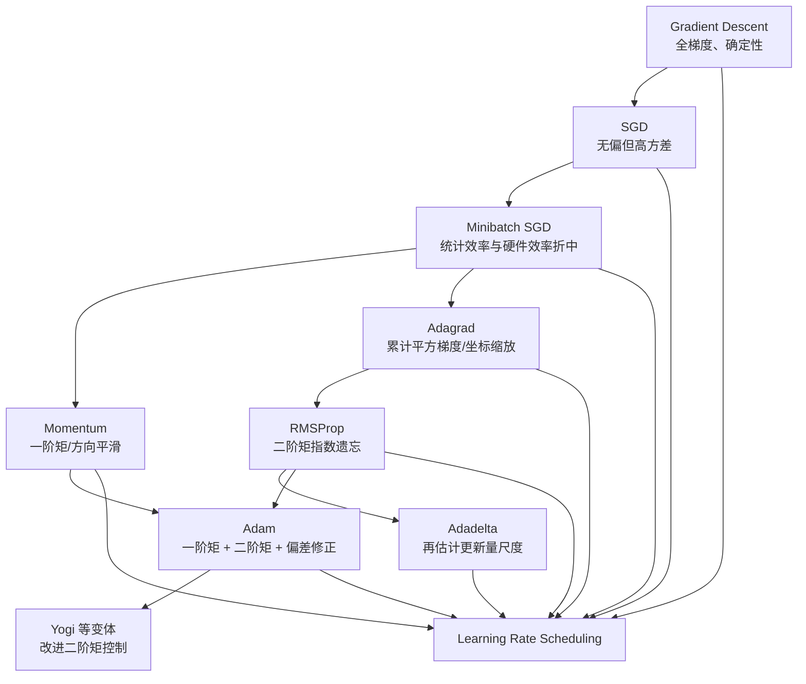

> 本章依次讨论优化与深度学习的关系、凸性、梯度下降、随机梯度下降、小批量 SGD、动量法、Adagrad、RMSProp、Adadelta、Adam 与学习率调度。核心问题不是背诵优化器名称，而是理解：梯度从哪里来、噪声和曲率造成什么困难、状态变量如何改变更新方向和坐标尺度，以及学习率怎样控制稳定性与最终精度。

## 1. 全章主线：优化器究竟在解决什么

神经网络训练通常写成经验风险最小化：

$$
\min_{\theta}\widehat R(\theta),
\qquad
\widehat R(\theta)
=\frac1n\sum_{i=1}^{n}\ell(\theta;z_i).
$$

最基本的更新只有一句：

$$
\theta_{t+1}=\theta_t-\eta_t g_t.
$$

本章所有方法都在回答三个问题：

1. $g_t$ 用全数据梯度、单样本梯度，还是小批量梯度？
2. 是否利用过去梯度来平滑方向或估计坐标尺度？
3. 全局学习率 $\eta_t$ 应取多大、何时衰减、是否需要 warmup？



这些方法并不是严格的“后者淘汰前者”：

- SGD + momentum 在视觉任务中仍常有很强泛化表现；
- Adagrad 对稀疏特征尤其合适；
- Adam 对大模型和复杂目标通常更易调；
- 无论选哪种优化器，学习率及其调度往往比其他超参数更敏感；
- 优化器改善训练目标，不自动保证验证集更好。

## 2. 优化与深度学习

### 2.1 优化目标与学习目标不同

令总体风险为：

$$
R(\theta)=\mathbb E_{Z\sim P}[\ell(\theta;Z)],
$$

训练集经验风险为：

$$
\widehat R_n(\theta)
=\frac1n\sum_{i=1}^{n}\ell(\theta;z_i).
$$

优化算法直接看到并最小化的通常是 $\widehat R_n$，深度学习真正关心的却是未知分布上的 $R$。因此至少要区分：

- **训练误差**：当前参数的 $\widehat R_n(\theta_t)$；
- **优化误差**：$\widehat R_n(\theta_t)-\inf_\theta\widehat R_n(\theta)$；
- **泛化误差**：总体风险与训练风险的差，或直接考察 $R(\theta_t)$；
- **测试误差**：有限测试集对总体风险的估计。

训练损失下降可能来自优化误差变小，但验证损失仍可能因过拟合上升。

原书用两个函数说明这一点：

$$
f(x)=x\cos(\pi x),
$$

$$
g(x)=f(x)+0.2\cos(5\pi x).
$$

$f$ 模拟平滑的总体风险，$g$ 模拟有限样本下更波动的经验风险。二者最小点约在 $1.1$ 和 $1.0$，所以经验风险最优参数未必是总体风险最优参数。

优化器与正则化、数据增强、早停和模型选择承担不同职责：优化器负责找到低训练目标区域；其他机制约束模型或选择更能泛化的解。优化算法本身也可能通过噪声、批量大小和路径产生隐式正则化，但这不是“训练误差越低，泛化越好”的保证。

### 2.2 为什么深度学习优化困难

深度网络目标通常：

- 维度极高；
- 非凸；
- 只能通过小批量获得带噪梯度；
- 不同方向曲率尺度悬殊；
- 存在参数对称和等价解；
- 目标随正则化、数据增强和训练模式变化；
- 完整 Hessian 的存储为 $O(d^2)$，不可承受。

原书集中讲三个几何困难：局部极小、鞍点和消失梯度。

### 2.3 局部极小

若 $x^{\ast}$ 在某邻域内满足

$$
f(x^{\ast})\le f(x),
$$

则是局部极小；若对全域成立，则是全局极小。

对

$$
f(x)=x\cos(\pi x),
\qquad -1\le x\le2,
$$

约 $x=-0.3$ 是较差局部极小，$x=1.1$ 附近是全局极小。梯度法进入局部盆地后，梯度趋近零，可能无法离开。

小批量梯度噪声有时能越过浅障碍，但不能保证逃离任意局部极小；噪声太大也会破坏收敛。

### 2.4 鞍点

原书将梯度为零但既非局部极小也非局部极大的点称为鞍点。严格说，一维 $f(x)=x^3$ 在 $0$ 处是平稳拐点；多维典型鞍点：

$$
f(x,y)=x^2-y^2.
$$

在 $(0,0)$：

$$
\nabla f=(0,0),
\qquad
H=\begin{bmatrix}2&0\\0&-2\end{bmatrix}.
$$

沿 $x$ 方向上升，沿 $y$ 方向下降，Hessian 不定。

在平稳点 $\nabla f(x^{\ast})=0$：

- $H\succ0$：严格局部极小的充分条件；
- $H\prec0$：严格局部极大的充分条件；
- $H$ 有正、负特征值：鞍点；
- $H\succeq0$ 但不正定、$H\preceq0$ 但不负定或 $H=0$：二阶判别可能不充分，需要高阶项。

$x^3$ 在 $0$ 处一、二阶导数都为零，正说明 Hessian 半正定不能单独保证局部极小。

高维随机曲率中，只要有一个负特征方向，就可能是鞍点；维度越高，出现混合曲率的机会通常越大。随机扰动、小批量噪声和负曲率方法可帮助离开不稳定鞍点。

### 2.5 消失梯度

对

$$
f(x)=\tanh x,
$$

有

$$
f'(x)=1-\tanh^2x.
$$

在 $x=4$：

$$
f'(4)\approx0.0013.
$$

即使当前位置不是合适解，更新也极小。深层网络中，链式法则还会把许多小 Jacobian 相乘，使早期层几乎收不到梯度。

对应解决思路包括：

- ReLU/GELU 等较少饱和的激活；
- Xavier、He 等尺度合适的初始化；
- residual connection；
- normalization；
- LSTM/GRU 的加法状态路径；
- 重参数化和良好尺度；
- 针对曲率的预条件。

### 2.6 参数对称与等价极小值

一个隐藏层含 $d$ 个神经元时，只要同时置换：

- 输入到隐藏层权重的神经元轴；
- 隐藏偏置；
- 隐藏到输出层权重的对应轴，

网络函数不变。若神经元参数互异，至少有

$$
d!
$$

组等价参数。这说明“找到唯一全局参数解”通常不是合理目标；函数行为和泛化比参数唯一性重要。

## 3. 凸性

### 3.1 为什么学习凸优化

深度网络非凸，但凸分析仍有价值：

1. 凸问题能给出清晰的全局结论和收敛证明；
2. 许多损失、正则项或局部近似具有凸结构；
3. SGD 的基本学习率直觉可从凸证明得到；
4. 若算法连简单凸问题都不稳定，很难期待它在深网中可靠；
5. Hessian、条件数、投影和对偶等概念会反复出现。

### 3.2 凸集

集合 $\mathcal X$ 是凸集，当且仅当任意 $a,b\in\mathcal X$ 和 $\lambda\in[0,1]$ 都满足：

$$
\lambda a+(1-\lambda)b\in\mathcal X.
$$

即集合中任意两点之间的整条线段仍在集合内。

典型凸集：

- $\mathbb R^d$；
- 仿射子空间；
- 半空间；
- $p\ge1$ 时的 $\ell_p$ 球；
- 正半定矩阵锥；
- 任意多个凸集的交。

凸集的并通常不凸，因为连接不同分量的线段可能离开并集。

### 3.3 凸函数

定义域 $\mathcal X$ 必须是凸集。函数 $f:\mathcal X\to\mathbb R$ 是凸函数，若：

$$
f(\lambda x+(1-\lambda)y)
\le\lambda f(x)+(1-\lambda)f(y).
$$

几何上，函数图像位于任意两点弦线下方。

原书例子：

- $x^2/2$：凸；
- $e^{x/2}$：凸；
- $\cos(\pi x)$：非凸。

若严格不等式对 $x\ne y$、$\lambda\in(0,1)$ 成立，则是严格凸函数；严格凸函数若存在最小点，则最小点唯一。普通凸函数可有一整段全局最小点。

### 3.4 Jensen 不等式

若 $\alpha_i\ge0$ 且 $\sum_i\alpha_i=1$：

$$
f\left(\sum_i\alpha_i x_i\right)
\le\sum_i\alpha_i f(x_i).
$$

随机变量形式：

$$
f(\mathbb E[X])\le\mathbb E[f(X)].
$$

它把“凸函数作用于平均”与“先作用再平均”联系起来。直觉是凸函数对波动有额外代价。

常见应用：

- 证明随机估计和集成的界；
- 从迭代平均得到 SGD 风险上界；
- 变分推断；
- 用 $-\log$ 的凸性处理混合概率。

当原书写

$$
\mathbb E_Y[-\log P(X\mid Y)]\ge-\log P(X),
$$

需满足

$$
P(X)=\int P(Y)P(X\mid Y)\,dY
$$

且概率为正，才能合法使用 $-\log$ 和 Jensen。

### 3.5 局部极小为何也是全局极小

假设凸函数 $f$ 的局部极小点为 $x^{\ast}$，却存在 $x'$ 满足

$$
f(x')<f(x^{\ast}).
$$

在线段上取靠近 $x^{\ast}$ 的点：

$$
y=\lambda x^{\ast}+(1-\lambda)x',
\qquad \lambda\approx1.
$$

由凸性：

$$
f(y)
\le\lambda f(x^{\ast})+(1-\lambda)f(x')
<f(x^{\ast}),
$$

与 $x^{\ast}$ 在邻域内最小矛盾。因此凸函数的局部极小必为全局极小。

注意：这不保证最小点唯一，也不保证下确界能在有限点取得。例如 $e^x$ 在实数域下确界为 $0$，却没有点达到 $0$。

### 3.6 次水平集

凸函数的次水平集：

$$
\mathcal S_b=\{x\in\mathcal X:f(x)\le b\}
$$

是凸集。若 $x,y\in\mathcal S_b$：

$$
f(\lambda x+(1-\lambda)y)
\le\lambda f(x)+(1-\lambda)f(y)
\le b.
$$

反过来，“所有次水平集凸”只说明函数是拟凸，不足以保证函数本身凸。

### 3.7 一阶凸性条件

对可微函数，在凸定义域上：

$$
f(y)\ge f(x)+\langle\nabla f(x),y-x\rangle.
$$

即函数图像永远不低于任一点的切平面。

推导直觉：令

$$
g(t)=f(x+t(y-x)),
$$

由一维凸性，割线斜率不小于起点右导数：

$$
g(1)-g(0)\ge g'(0)
=\langle\nabla f(x),y-x\rangle.
$$

若 $\nabla f(x^{\ast})=0$，立即有

$$
f(y)\ge f(x^{\ast})
$$

对所有 $y$ 成立，所以 $x^{\ast}$ 是全局最优。SGD 收敛证明正是用这一条件把梯度内积转成风险差。

### 3.8 二阶判据

一维二次可微函数：

$$
f\text{ 凸}\Longleftrightarrow f''(x)\ge0.
$$

由凸性取中点：

$$
\frac{f(x+\epsilon)+f(x-\epsilon)}2\ge f(x),
$$

所以

$$
f''(x)
=\lim_{\epsilon\to0}
\frac{f(x+\epsilon)+f(x-\epsilon)-2f(x)}{\epsilon^2}
\ge0.
$$

多维二次可微函数在凸开域上：

$$
f\text{ 凸}
\Longleftrightarrow
\nabla^2f(x)\succeq0
\quad\forall x.
$$

证明把函数限制到任意线段：

$$
g(t)=f(tx+(1-t)y),
$$

$$
g''(t)
=(x-y)^\top\nabla^2f(tx+(1-t)y)(x-y).
$$

若 Hessian 对任意方向二次型非负，则每条线上的 $g$ 凸，因而 $f$ 凸。

### 3.9 约束优化

一般形式：

$$
\begin{aligned}
\min_x\quad&f(x)\\
\text{s.t.}\quad&c_i(x)\le0,\quad i=1,\ldots,m.
\end{aligned}
$$

凸优化通常要求：

- $f$ 凸；
- 不等式约束 $c_i$ 凸；
- 等式约束必须是仿射；
- 可行域非空。

#### 3.9.1 Lagrangian

$$
L(x,\alpha)
=f(x)+\sum_{i=1}^{m}\alpha_i c_i(x),
\qquad \alpha_i\ge0.
$$

对 $x$ 最小化、对 $\alpha$ 最大化。活跃约束在最优点满足 $c_i(x^{\ast})=0$，非活跃约束通常有 $\alpha_i^{\ast}=0$。

KKT 条件：

1. primal feasibility：$c_i(x^{\ast})\le0$；
2. dual feasibility：$\alpha_i^{\ast}\ge0$；
3. complementary slackness：$\alpha_i^{\ast}c_i(x^{\ast})=0$；
4. stationarity：$\nabla f(x^{\ast})+\sum_i\alpha_i^{\ast}\nabla c_i(x^{\ast})=0$。

“Lagrangian 鞍点等于原问题解”需要适当正则条件；凸问题中 Slater 条件常保证强对偶。非凸问题一般没有同样保证。

#### 3.9.2 罚函数

把约束违规加入目标：

$$
f_\lambda(x)
=f(x)+\lambda\sum_i\max(0,c_i(x))^2.
$$

Weight decay 可理解为软约束参数范数。罚函数实现简单，但只能近似满足约束；$\lambda$ 太小约束失效，太大则优化病态。

直接加 $\lambda c_i(x)$ 可能奖励过度满足 $c_i(x)<0$，通用不等式罚项通常只惩罚正的违规部分。

#### 3.9.3 投影

对非空闭凸集 $\mathcal X$：

$$
\operatorname{Proj}_{\mathcal X}(x)
=\arg\min_{x'\in\mathcal X}\|x-x'\|_2.
$$

投影梯度法：

$$
x_{t+1}
=\operatorname{Proj}_{\mathcal X}
(x_t-\eta_tg_t).
$$

梯度裁剪

$$
g\leftarrow g\min\left(1,\frac{\theta}{\|g\|_2}\right)
$$

就是投影到半径 $\theta$ 的 $\ell_2$ 球。它限制更新方向的范数，不等价于给参数加 weight decay。

## 4. 梯度下降

### 4.1 一维 Taylor 推导

对连续可微 $f:\mathbb R\to\mathbb R$：

$$
f(x+\epsilon)
=f(x)+\epsilon f'(x)+O(\epsilon^2).
$$

选

$$
\epsilon=-\eta f'(x),
$$

得到：

$$
f(x-\eta f'(x))
=f(x)-\eta f'(x)^2
+O(\eta^2f'(x)^2).
$$

当 $\eta$ 足够小且 $f'(x)\ne0$，一阶下降项主导，所以更新：

$$
x_{t+1}=x_t-\eta f'(x_t).
$$

负梯度是局部最速下降方向，但只相对于当前坐标下的欧氏范数；改变参数化或度量，最速下降方向也会改变。

### 4.2 学习率为何决定稳定性

原书取

$$
f(x)=x^2,
\qquad f'(x)=2x,
$$

于是

$$
x_{t+1}=(1-2\eta)x_t.
$$

从 $x_0=10$：

- $\eta=0.2$：因子 $0.6$，$x_{10}=10(0.6)^{10}\approx0.0605$；
- $\eta=0.05$：因子 $0.9$，$x_{10}\approx3.487$，稳定但慢；
- $\eta=1.1$：因子 $-1.2$，跨过最优点并振荡发散。

精确稳定条件：

$$
|1-2\eta|<1
\Longleftrightarrow
0<\eta<1.
$$

一般二次函数

$$
f(x)=\frac\lambda2x^2
$$

的稳定条件为：

$$
0<\eta\lambda<2.
$$

### 4.3 $L$-smooth 的下降引理

若梯度是 $L$-Lipschitz：

$$
\|\nabla f(x)-\nabla f(y)\|
\le L\|x-y\|,
$$

则

$$
f(y)
\le f(x)+\langle\nabla f(x),y-x\rangle
+\frac L2\|y-x\|^2.
$$

令 $y=x-\eta\nabla f(x)$：

$$
f(x-\eta\nabla f(x))
\le f(x)
-\eta\left(1-\frac{L\eta}{2}\right)
\|\nabla f(x)\|^2.
$$

所以 $0<\eta<2/L$ 保证函数值下降；常用保守选择 $\eta\le1/L$。

### 4.4 多维梯度下降

多维 Taylor：

$$
f(x+\epsilon)
=f(x)+\epsilon^\top\nabla f(x)
+O(\|\epsilon\|^2).
$$

更新：

$$
x_{t+1}=x_t-\eta\nabla f(x_t).
$$

原书二维目标：

$$
f(x_1,x_2)=x_1^2+2x_2^2,
$$

$$
\nabla f=(2x_1,4x_2).
$$

从 $(-5,-2)$、$\eta=0.1$ 运行 $20$ 步可平稳接近 $(0,0)$。$x_2$ 曲率更大，因此更新更快并可能出现轻微折返。

### 4.5 非凸目标与初值

对

$$
f(x)=x\cos(0.15\pi x),
$$

不同初值和学习率可能落入不同局部极小。过大步长不仅会发散，还可能跨过较好盆地，落入较差局部解。

因此训练结果取决于：

- 初始化；
- 学习率和调度；
- 小批量顺序与随机种子；
- 参数化与归一化；
- 目标中的正则项和数据增强。

### 4.6 强凸函数的线性收敛

若 $f$ 同时为 $\mu$-strongly convex 和 $L$-smooth：

$$
f(y)\ge f(x)+\langle\nabla f(x),y-x\rangle
+\frac\mu2\|y-x\|^2,
$$

用 $\eta=1/L$ 可得：

$$
f(x_t)-f^{\ast}
\le\left(1-\frac\mu L\right)^t
[f(x_0)-f^{\ast}].
$$

条件数：

$$
\kappa=\frac L\mu.
$$

$\kappa$ 越大，最平方向与最陡方向尺度差越大，固定学习率越难兼顾，收敛越慢。

### 4.7 Newton 方法

二阶 Taylor：

$$
f(x+\epsilon)
\approx f(x)+\epsilon^\top g
+\frac12\epsilon^\top H\epsilon.
$$

对 $\epsilon$ 求导并令零：

$$
g+H\epsilon=0,
$$

$$
\epsilon=-H^{-1}g.
$$

Newton 更新：

$$
x_{t+1}=x_t-H_t^{-1}\nabla f(x_t).
$$

对精确正定二次函数，Newton 一步到最优点；对一般光滑凸函数，在足够靠近最优点时可非常快。

工程中不应显式求 $H^{-1}$，而应解线性方程：

$$
H\Delta=-g.
$$

深网中完整 Hessian 需要 $O(d^2)$ 存储和昂贵求解，通常不可行。

#### 4.7.1 非凸风险

若 $H$ 有负特征值，Newton 步可能沿函数上升方向移动；若 $H$ 接近奇异，步长可能极大。常见修正：

- damping：$H+\lambda I$；
- trust region；
- 线搜索；
- 只使用正定近似；
- Hessian 对角或低秩近似；
- quasi-Newton，如 L-BFGS。

原书在 $\cosh(0.5x)$ 上几步收敛，在非凸 $x\cos(0.15\pi x)$ 上全步 Newton 表现很差，使用 $\eta=0.5$ 的阻尼更新才稳定。

#### 4.7.2 收敛速度命名校正

若在最优点邻域内：

$$
\frac{|f'''(\xi_k)|}{2f''(x_k)}\le c,
$$

则误差满足：

$$
|e_{k+1}|\le c|e_k|^2.
$$

这叫**二次收敛**，不是原文所称的 linear convergence。标准线性收敛是：

$$
|e_{k+1}|\le\alpha|e_k|,
\qquad0<\alpha<1.
$$

二次收敛只保证进入合适邻域后很快，不保证从任意初值都能进入该邻域。

### 4.8 预条件

理想 Newton 使用完整曲率；廉价近似可用 Hessian 对角：

$$
x\leftarrow x
-\eta\operatorname{diag}(H)^{-1}\nabla f(x).
$$

它相当于每个坐标使用不同学习率，缓解单位和尺度差异。Adagrad、RMSProp、Adam 都可视为利用梯度历史构造对角预条件器。

对角方法依赖坐标轴：若病态方向与坐标轴不对齐，效果可能明显下降。旋转参数空间后，完整 Newton 不受影响，而对角近似通常会改变。

### 4.9 线搜索

先取下降方向 $d_t=-\nabla f(x_t)$，再沿直线选择步长：

$$
\eta_t\approx\arg\min_{\eta\ge0}
f(x_t+\eta d_t).
$$

实践常用 backtracking、Armijo 或 Wolfe 条件，不必精确求一维最小值。原文说“二分搜索”只在沿线函数凸/单峰或搜索导数符号时适用。

深度学习中每试一个 $\eta$ 都可能需重新计算全数据目标，代价太高；带噪小批量目标也使精确线搜索不稳定，所以更常使用预设调度或自适应方法。

## 5. 随机梯度下降

### 5.1 从全梯度到单样本估计

经验目标：

$$
f(x)=\frac1n\sum_{i=1}^{n}f_i(x).
$$

全梯度：

$$
\nabla f(x)=\frac1n\sum_i\nabla f_i(x),
$$

每步成本 $O(n)$。

SGD 每步均匀抽样 $i_t$：

$$
x_{t+1}
=x_t-\eta_t\nabla f_{i_t}(x_t).
$$

有放回均匀抽样时，在给定 $x_t$ 的条件下：

$$
\mathbb E_{i_t}
[\nabla f_{i_t}(x_t)\mid x_t]
=\nabla f(x_t).
$$

所以单样本梯度是无偏估计，每步理想计算成本从 $O(n)$ 降为 $O(1)$。无偏不表示每一步都是下降方向，只表示长期平均方向正确。

### 5.2 噪声的双重作用

写成：

$$
g_t=\nabla f(x_t)+\xi_t,
\qquad
\mathbb E[\xi_t\mid x_t]=0.
$$

噪声可能：

- 降低每次更新成本；
- 帮助探索和离开不稳定鞍点或浅盆地；
- 产生隐式正则化；
- 也可能使参数在最优点附近持续游走；
- 学习率过大时导致发散。

原书在

$$
f(x_1,x_2)=x_1^2+2x_2^2
$$

的两个梯度分量上加 $N(0,1)$ 噪声。固定 $\eta=0.1$ 时，即使运行更多步，轨迹仍在最优点周围波动，因此需要逐渐减小学习率。

### 5.3 动态学习率

原书列出：

分段常数：

$$
\eta(t)=\eta_i,
\qquad t_i\le t<t_{i+1}.
$$

指数衰减：

$$
\eta(t)=\eta_0e^{-\lambda t}.
$$

多项式衰减：

$$
\eta(t)=\eta_0(\beta t+1)^{-\alpha}.
$$

指数衰减可能过快，使总移动距离有限并提前冻结；原书 $e^{-0.1t}$ 即使运行 $1000$ 步仍离最优点较远。逆平方根

$$
(1+0.1t)^{-1/2}
$$

在示例中收敛更好。

经典 Robbins–Monro 几乎处处收敛条件常写为：

$$
\sum_{t=1}^{\infty}\eta_t=\infty,
\qquad
\sum_{t=1}^{\infty}\eta_t^2<\infty.
$$

第一项避免太快停住，第二项使累计噪声有限。$\eta_t\propto1/t$ 满足；$1/\sqrt t$ 不满足第二项，但仍适合一般凸目标的有限步平均迭代期望界。

### 5.4 凸目标的 SGD 收敛推导

假设：

- $f(\xi,x)$ 对 $x$ 凸；
- 随机样本 $\xi_t$ 独立同分布；
- 随机梯度范数有界：$\|g_t\|\le G$；
- 最优解 $x^{\ast}$ 存在；
- $R(x)=\mathbb E_\xi[f(\xi,x)]$。

更新：

$$
x_{t+1}=x_t-\eta_tg_t.
$$

展开到最优点的平方距离：

$$
\begin{aligned}
\|x_{t+1}-x^{\ast}\|^2
&=\|x_t-x^{\ast}\|^2
-2\eta_t\langle x_t-x^{\ast},g_t\rangle
+\eta_t^2\|g_t\|^2.
\end{aligned}
$$

凸性一阶条件：

$$
f(\xi_t,x_t)-f(\xi_t,x^{\ast})
\le\langle g_t,x_t-x^{\ast}\rangle.
$$

结合梯度界：

$$
\begin{aligned}
\|x_t-x^{\ast}\|^2-
\|x_{t+1}-x^{\ast}\|^2
\ge
2\eta_t[f(\xi_t,x_t)-f(\xi_t,x^{\ast})]
-\eta_t^2G^2.
\end{aligned}
$$

取期望并对 $t=1,\ldots,T$ 求和，距离项望远镜消去：

$$
2\sum_{t=1}^{T}\eta_t
[\mathbb E R(x_t)-R^{\ast}]
\le
\|x_1-x^{\ast}\|^2
+G^2\sum_{t=1}^{T}\eta_t^2.
$$

定义学习率加权平均：

$$
\bar x_T
=\frac{\sum_{t=1}^{T}\eta_tx_t}
{\sum_{t=1}^{T}\eta_t}.
$$

由 Jensen：

$$
R(\bar x_T)
\le
\frac{\sum_t\eta_tR(x_t)}{\sum_t\eta_t}.
$$

于是正确上界是：

$$
\boxed{
\mathbb E[R(\bar x_T)]-R^{\ast}
\le
\frac{
\|x_1-x^{\ast}\|^2
+G^2\sum_t\eta_t^2}
{2\sum_t\eta_t}
}.
$$

原文最后一式左端误排成类似 $\mathbb E[\bar x_T]-R^{\ast}$，量纲不对；必须是平均迭代点的**风险**。

若预知总步数 $T$，令

$$
r=\|x_1-x^{\ast}\|,
\qquad
\eta=\frac{r}{G\sqrt T},
$$

可得：

$$
\mathbb E[R(\bar x_T)]-R^{\ast}
\le\frac{rG}{\sqrt T}.
$$

一般凸目标得到 $O(T^{-1/2})$。若目标 $\mu$-强凸且方差有界，使用 $\eta_t\asymp1/(\mu t)$ 可得到更快的 $O(1/T)$ 期望率。

### 5.5 为什么分析平均迭代点

随机轨迹最后一点可能恰好被噪声推远。平均：

$$
\bar x_T=\sum_t\alpha_tx_t
$$

平滑随机波动；凸性又允许通过 Jensen 把“平均点风险”上界为“风险平均”。非凸问题中参数平均仍可能有用，但上述全局证明不再直接成立。

### 5.6 有放回与无放回抽样

有放回抽 $n$ 次，一个指定样本至少出现一次的概率：

$$
1-\left(1-\frac1n\right)^n
\to1-e^{-1}\approx0.632.
$$

恰好出现一次：

$$
n\frac1n
\left(1-\frac1n\right)^{n-1}
\to e^{-1}\approx0.368.
$$

因此有放回的一“轮”会遗漏许多样本并重复另一些。实践通常每轮随机打乱后无放回遍历：

- 每个样本每轮恰好使用一次；
- 数据效率更高；
- 单步条件梯度通常不再严格无偏；
- 但整轮负相关结构常带来更小方差和更好表现。

不能把“SGD 理论中的独立有放回抽样”和“训练代码中的 shuffle without replacement”视为完全相同随机过程。

## 6. 小批量随机梯度下降

### 6.1 两个极端都不理想

Full-batch GD：

- 梯度精确；
- 每步需扫全数据；
- 更新次数少；
- 大数据下延迟高。

Batch size $1$ 的 SGD：

- 单步便宜、统计更新频繁；
- 方差高；
- 大量小矩阵/向量操作；
- Python、框架调度和 kernel launch 开销大；
- 硬件利用率低。

小批量在两者间折中：

$$
g_t
=\nabla_w
\frac1b\sum_{i\in\mathcal B_t}
f(x_i,w_t).
$$

### 6.2 方差如何随 batch size 变化

若单样本梯度独立、均值 $\mu$、协方差 $\Sigma$：

$$
\mathbb E[g_t]=\mu,
$$

$$
\operatorname{Cov}(g_t)=\frac\Sigma b.
$$

标准差缩小为：

$$
b^{-1/2}.
$$

Batch 从 $1$ 增到 $4$，标准差减半；从 $256$ 墫到 $1024$ 也只减半，而计算和显存通常近似增四倍，存在边际收益递减。

无放回从大小 $N$ 的有限总体抽取 $b$ 个样本时，还带有限总体修正：

$$
\operatorname{Cov}(g_t)
\approx
\frac\Sigma b
\frac{N-b}{N-1}.
$$

$b=N$ 时方差为零。

### 6.3 为什么批处理更快

现代 CPU/GPU 的算术吞吐远高于主存随机访问能力。矩阵乘法按块计算可：

- 复用 cache 中的数据；
- 使用连续 burst memory access；
- 调用 BLAS/cuBLAS 高度优化内核；
- 利用 SIMD、Tensor Core 和大量线程；
- 减少 Python 与 kernel launch 次数。

原书比较 $256\times256$ 矩阵乘法：

1. 逐元素点积；
2. 逐列矩阵向量乘；
3. 整体矩阵乘；
4. 每 $64$ 列分块矩阵乘。

总浮点运算约：

$$
2\cdot256^3
\approx3.36\times10^7
$$

FLOPs。整体和合理分块远快于逐元素/逐列，因为计算相同但数据局部性和调度开销不同。

原文将 CPU 峰值算术能力写成 `bytes/s`，量纲不严谨；应区分 FLOP/s 与内存 bandwidth 的 byte/s。

### 6.4 Batch size 的实际选择

选择目标不是“尽可能大”，而是墙钟时间内达到最好验证指标。需同时考虑：

- GPU/TPU 吞吐饱和点；
- 显存；
- 梯度噪声；
- BatchNorm 统计；
- 分布式设备数量；
- 每轮更新次数；
- 学习率缩放；
- 最终泛化。

大 batch 常需提高学习率、warmup 或延长训练步数。按 epoch 比较可能不公平，因为 batch 越大，每 epoch 更新次数越少。

### 6.5 Airfoil 数据实验

原书使用 NASA Airfoil Self-Noise 数据前 $1500$ 条：

- $5$ 个输入特征；
- $1$ 个回归目标；
- 每列标准化为零均值、单位标准差；
- 线性回归比较不同 batch size。

实验配置与观察：

| 方法 | Batch | 学习率 | 每 epoch 更新数 | 结论 |
|---|---:|---:|---:|---|
| Full GD | 1500 | 1 | 1 | 每轮更新太少，进展有限 |
| SGD | 1 | 0.005 | 1500 | 按样本进展快，但墙钟慢 |
| Minibatch | 100 | 0.4 | 15 | 示例中墙钟效率最好 |
| Minibatch | 10 | 0.05 | 150 | 好于单样本，弱于 batch 100 |

具体速度依赖硬件，不能把 batch 100 当通用最优。实验要表达的是统计效率与计算效率之间存在中间甜点。

### 6.6 从零实现的接口细节

原书 `train_ch11` 统一后续优化器接口：

```text
trainer_fn(params, states, hyperparams)
```

线性模型：

- $w$：$(5,1)$；
- $b$：$(1,)$；
- $X$：$(B,5)$；
- 输出：$(B,1)$；
- 标签需 reshape 为 $(B,1)$。

训练函数已使用：

```python
loss(...).mean().backward()
```

因此优化器不能再除以 batch size，否则梯度会被重复缩小。PyTorch 更新应放在 `torch.no_grad()` 中，并在每步后清空梯度，避免默认累加。

框架 `nn.MSELoss` 通常计算 $(\widehat y-y)^2$，原书自定义 squared loss 含 $1/2$，比较数值时要统一定义。

### 6.7 数据复制的思考实验

若每条训练样本被完整复制一次：

- 经验目标不变；
- 随机抽一个条目的梯度分布不变；
- 数据集标称大小翻倍；
- 一个 epoch 的更新数和计算翻倍；
- 按 epoch 触发的 scheduler、评估和 checkpoint 时机改变；
- Full GD 的平均梯度完全相同，但每步读取成本翻倍。

所以必须明确训练预算用 epoch、样本数、update steps 还是 FLOPs 衡量。

## 7. 动量法

### 7.1 为什么需要历史方向

病态二次目标：

$$
f(x_1,x_2)=0.1x_1^2+2x_2^2,
$$

$$
\nabla f=(0.2x_1,4x_2),
$$

$$
H=\operatorname{diag}(0.2,4),
\qquad \kappa=20.
$$

$x_1$ 方向平坦，$x_2$ 方向陡峭。固定学习率面临冲突：

- 小学习率保证 $x_2$ 稳定，但 $x_1$ 很慢；
- 大学习率推进 $x_1$，却让 $x_2$ 振荡甚至发散。

原书 GD 用 $\eta=0.4$ 时水平方向慢；增到 $0.6$ 后，$x_2$ 方向因子

$$
1-0.6\cdot4=-1.4
$$

而发散。

### 7.2 Momentum 更新

原书采用未归一化 velocity：

$$
v_t=\beta v_{t-1}+g_t,
$$

$$
x_t=x_{t-1}-\eta_tv_t,
$$

其中 $v_0=0$、$0\le\beta<1$。

递归展开：

$$
v_t
=\sum_{\tau=0}^{t-1}\beta^\tau g_{t-\tau}.
$$

直觉：

- 梯度长期同向的平坦方向会累积，加速前进；
- 梯度反复变号的陡峭方向会相互抵消，减小振荡；
- 随机噪声被时间平滑；
- velocity 像重球在地形中积累惯性。

在同一病态目标上，$\eta=0.6,\beta=0.5$ 可稳定收敛；$\beta=0.25$ 接近失稳但仍好于无 momentum。

### 7.3 两种常见约定

未归一化形式：

$$
v_t=\beta v_{t-1}+g_t.
$$

归一化 EMA 形式：

$$
m_t=\beta m_{t-1}+(1-\beta)g_t.
$$

两者只差尺度，但必须相应调整学习率：

$$
m_t=(1-\beta)v_t.
$$

PyTorch SGD momentum 更接近未归一化 velocity；Adam 的一阶矩使用归一化 EMA 形式。抄公式和迁移超参数时必须确认约定。

### 7.4 有效历史长度与半衰期

未归一化历史权重和：

$$
\sum_{\tau=0}^{\infty}\beta^\tau
=\frac1{1-\beta}.
$$

恒定梯度下：

$$
v_t\to\frac{g}{1-\beta},
$$

故稳态等效步长约为：

$$
\frac\eta{1-\beta}.
$$

$\beta=0.9$ 时权重和/窗口量级约 $10$，因此增大 momentum 往往需要减小 $\eta$。

真正半衰期满足 $\beta^h=1/2$：

$$
h_{1/2}
=\frac{\ln(1/2)}{\ln\beta}.
$$

$\beta=0.9$ 时约 $6.58$ 步，不是 $10$。若把归一化权重视作概率，Kish 有效样本数为

$$
\frac{1+\beta}{1-\beta},
$$

也不同于 $1/(1-\beta)$；原书的“effective sample size”更准确地说是权重和或时间窗口量级。

### 7.5 二次型分析

考虑：

$$
h(x)=\frac12x^\top Qx+x^\top c+b,
\qquad Q\succ0.
$$

最优点：

$$
x^{\ast}=-Q^{-1}c.
$$

正确配方：

$$
h(x)
=\frac12(x+Q^{-1}c)^\top Q(x+Q^{-1}c)
+b-\frac12c^\top Q^{-1}c.
$$

梯度：

$$
\nabla h(x)=Qx+c=Q(x+Q^{-1}c).
$$

原文此处括号误写为减号，与最优点和梯度矛盾；应使用加号。

特征分解：

$$
Q=O^\top\Lambda O.
$$

令

$$
z=O(x-x^{\ast}),
$$

则各特征方向独立成为

$$
f_i(z_i)=\frac{\lambda_i}{2}z_i^2.
$$

GD：

$$
z_{t}=(I-\eta\Lambda)z_{t-1}.
$$

原文一处写成 $(I-\Lambda)$，漏掉了 $\eta$。

Momentum 在标量曲率 $\lambda$ 上：

$$
\begin{bmatrix}v_{t+1}\\x_{t+1}\end{bmatrix}
=
\begin{bmatrix}
\beta&\lambda\\
-\eta\beta&1-\eta\lambda
\end{bmatrix}
\begin{bmatrix}v_t\\x_t\end{bmatrix}.
$$

矩阵谱半径小于 $1$ 才收敛。对 $0\le\beta<1$，稳定区域：

$$
0<\eta\lambda<2(1+\beta),
$$

比 GD 的 $0<\eta\lambda<2$ 更宽。

### 7.6 状态与框架实现

每个参数需一个同形 velocity：

```text
w: (5, 1) -> v_w: (5, 1)
b: (1,)   -> v_b: (1,)
```

从零更新：

```python
v.mul_(momentum).add_(param.grad)
param.add_(v, alpha=-lr)
```

框架：

```python
torch.optim.SGD(params, lr=0.005, momentum=0.9)
```

原书 Airfoil 比较 $(\eta,\beta)=(0.02,0.5),(0.01,0.9),(0.005,0.9)$，展示较大 $\beta$ 需要更谨慎的学习率。

## 8. Adagrad

### 8.1 稀疏特征的局部时钟

语言、广告和推荐中，常见特征高频出现，稀有特征很少获得梯度。如果全局学习率随总步数衰减，稀有参数第一次得到有效更新时，学习率可能已经很小。

理想启发式是按坐标出现次数调节：

$$
\eta_i(t)
=\frac{\eta_0}{\sqrt{s(i,t)+c}}.
$$

但“梯度多大才算出现”难以定义。Adagrad 用累计平方梯度作为连续计数器和尺度估计。

### 8.2 算法

$$
g_t=\nabla\ell_t(w_{t-1}),
$$

$$
s_t=s_{t-1}+g_t\odot g_t,
$$

$$
w_t=w_{t-1}
-\eta\frac{g_t}{\sqrt{s_t}+\epsilon}.
$$

也常写成

$$
w_t=w_{t-1}
-\eta\frac{g_t}{\sqrt{s_t+\epsilon}}.
$$

两种 $\epsilon$ 位置数值行为不同。原书从零实现用 $\sqrt{s_t+\epsilon}$；`torch.optim.Adagrad` 通常用 $\sqrt{s_t}+\epsilon$。必须按框架文档核对。

所有平方、开方和除法逐坐标执行。初始 $s_0=0$。

### 8.3 为什么像预条件

对二次型：

$$
f(x)=\frac12x^\top Qx+c^\top x+b,
$$

条件数为：

$$
\kappa=\frac{\lambda_{\max}(Q)}
{\lambda_{\min}(Q)}.
$$

完整白化需特征分解，太昂贵。廉价对角预条件：

$$
\widetilde Q
=\operatorname{diag}(Q)^{-1/2}
Q
\operatorname{diag}(Q)^{-1/2}.
$$

Adagrad 用历史 $g_t^2$ 估计各坐标典型梯度尺度：大梯度坐标分母大、有效学习率小；小或稀有梯度坐标衰减慢。

$s_t$ 是平方梯度的二阶**原始矩累计**，不严格等于梯度方差，也不严格等于 Hessian 对角。梯度大小同时受曲率、距最优点距离、参数化和噪声影响。

### 8.4 为何会过早冻结

若某坐标平方梯度长期均值约为 $c>0$：

$$
s_t\approx ct,
$$

有效学习率：

$$
\eta_{t,i}^{\mathrm{eff}}
\approx\frac\eta{\sqrt{ct}}
=O(t^{-1/2}).
$$

历史永久保留，即使目标进入新区域，早期大梯度仍持续压低后期步长。深网非凸目标中可能过早停止。

原书病态二维目标上，$\eta=0.4$ 轨迹平滑但后期几乎不动；增到 $\eta=2$ 才取得较好进展。

### 8.5 旋转敏感性

对角预条件依赖当前坐标轴。旋转目标

$$
f(x)=0.1(x_1+x_2)^2+2(x_1-x_2)^2
$$

后，主曲率方向不再与坐标轴对齐，Adagrad 不能用独立坐标缩放完全消除病态。

正交变换保持欧氏距离：

$$
\|Uc-U\delta\|_2^2
=(c-\delta)^\top U^\top U(c-\delta)
=\|c-\delta\|_2^2,
$$

但逐坐标平方梯度不是旋转不变量。

### 8.6 状态与适用范围

每参数一个同形 $s$，额外状态内存约等于参数量。

适合：

- 稀疏特征；
- 不同坐标梯度尺度差异大；
- 在线凸优化；
- 希望稀有参数保留较大学习率。

局限：

- $s_t$ 单调增大；
- 深网训练后期可能冻结；
- 对旋转病态问题无能为力；
- 仍需选择全局 $\eta$ 和 $\epsilon$。

## 9. RMSProp

### 9.1 从永久记忆到有限记忆

Adagrad 的坐标适应有价值，问题是永久累计。RMSProp 用平方梯度的指数移动平均：

$$
s_t=\gamma s_{t-1}
+(1-\gamma)g_t^2,
\qquad0\le\gamma<1.
$$

更新：

$$
x_t=x_{t-1}
-\eta\frac{g_t}{\sqrt{s_t+\epsilon}}.
$$

递归展开：

$$
s_t
=(1-\gamma)
\sum_{\tau=0}^{t-1}\gamma^\tau
g_{t-\tau}^2.
$$

原文展开式中 $\gamma^2g_{t-2}$ 漏写平方，正确项是 $\gamma^2g_{t-2}^2$。

权重和趋于：

$$
(1-\gamma)\sum_{\tau=0}^\infty\gamma^\tau=1.
$$

所以对平稳梯度分布，$s_t$ 不再必然随时间发散，坐标缩放与全局学习率调度被解耦。

### 9.2 $\gamma$ 的含义

- $\gamma$ 小：更关注最近梯度，响应快但估计噪声大；
- $\gamma$ 大：窗口长、平滑，但目标尺度变化后适应慢；
- 窗口量级约 $1/(1-\gamma)$；
- 半衰期为 $\ln(1/2)/\ln\gamma$。

$\gamma=0.9$ 的窗口量级约 $10$，半衰期约 $6.58$ 步。

若 $\gamma=1$ 且 $s_0=0$：

$$
s_t=0
$$

永不更新，分母只剩 $\sqrt\epsilon$，有效步长可能巨大；它不是“记忆无限长的正常 RMSProp”。

### 9.3 与 Adagrad、Momentum 的关系

- Adagrad：平方梯度无遗忘求和；
- RMSProp：平方梯度归一化 EMA；
- Momentum：梯度本身的未归一化历史和；
- Adam：归一化一阶矩 EMA + 二阶矩 EMA。

RMSProp 在原书二维目标上用 $\eta=0.4,\gamma=0.9$，后期不会像 Adagrad 那样因分母永久增长而冻结。

### 9.4 实现映射

每参数一个同形 $s$。从零：

```python
s.mul_(gamma).addcmul_(grad, grad, value=1 - gamma)
param.addcdiv_(grad, torch.sqrt(s + eps), value=-lr)
```

PyTorch：

```python
torch.optim.RMSprop(params, lr=0.01, alpha=0.9)
```

同一超参数在不同框架名为 `alpha`、`rho` 或 `gamma1`。还需核对：

- $\epsilon$ 放在开方内还是外；
- 是否使用 momentum；
- 是否 centered；
- 默认 weight decay。

RMSProp 仍是对角方法，对旋转后的病态目标可能退化。

## 10. Adadelta

### 10.1 为什么还要估计参数更新尺度

RMSProp 仍有显式全局学习率 $\eta$。Adadelta 希望用近期参数变化的 RMS 来校准梯度 RMS，使更新在量纲上更接近参数。

维护两个同形状态：

- $s_t$：梯度平方 EMA；
- $\Delta x_t$：实际更新平方 EMA。

### 10.2 算法

$$
s_t
=\rho s_{t-1}+(1-\rho)g_t^2,
$$

$$
g'_t
=\frac{\sqrt{\Delta x_{t-1}+\epsilon}}
{\sqrt{s_t+\epsilon}}
\odot g_t,
$$

$$
x_t=x_{t-1}-g'_t,
$$

$$
\Delta x_t
=\rho\Delta x_{t-1}
+(1-\rho)(g'_t)^2.
$$

初始 $s_0=0,\Delta x_0=0$。$\epsilon$ 不仅防除零，也使第一步有非零尺度；它对早期行为影响明显。

可直接把

$$
\Delta_t=-g'_t
$$

称为参数更新，避免把 $g'_t$ 误解为原始梯度。

### 10.3 是否真的没有学习率

原始核心公式没有显式 $\eta$，但“learning-rate-free”不能过度解读：

- $\rho$ 控制历史长度；
- $\epsilon$ 影响初期和小梯度尺度；
- 参数与损失缩放仍会影响轨迹；
- 现代框架通常额外提供全局 `lr`；
- PyTorch `Adadelta` 默认 `lr=1.0`。

原书 TensorFlow 默认学习率不收敛，显式改为 $5.0$，本身就说明框架版本并非没有全局比例因子。

### 10.4 状态与代价

每参数两个同形 state：

```text
parameter p
  gradient second moment s
  update second moment delta
```

状态内存约为参数量的两倍，与 Adam 相同量级。原书 Airfoil 使用 $\rho=0.9,\epsilon=10^{-5}$；本节没有独立二维轨迹实验。

## 11. Adam 与 Yogi

### 11.1 Adam 组合了什么

Adam 将以下思想组合：

- minibatch SGD 的低成本随机梯度；
- momentum 的方向平滑；
- RMSProp 的坐标尺度适应；
- 零初始化 EMA 的偏差修正；
- 显式全局学习率。

### 11.2 一阶矩与二阶矩

$$
m_t
=\beta_1m_{t-1}+(1-\beta_1)g_t,
$$

$$
v_t
=\beta_2v_{t-1}+(1-\beta_2)g_t^2.
$$

常用：

$$
\beta_1=0.9,
\qquad
\beta_2=0.999.
$$

$m_t$ 估计梯度一阶矩/方向，$v_t$ 估计逐坐标二阶原始矩。$\beta_2$ 更大，二阶尺度变化更慢。

### 11.3 为什么需要偏差修正

假设梯度均值恒为 $\mu$，且 $m_0=0$：

$$
\mathbb E[m_t]
=(1-\beta_1)
\sum_{i=0}^{t-1}\beta_1^i\mu
=(1-\beta_1^t)\mu.
$$

早期被乘上小于 $1$ 的系数，偏向零。修正：

$$
\widehat m_t
=\frac{m_t}{1-\beta_1^t},
$$

$$
\widehat v_t
=\frac{v_t}{1-\beta_2^t}.
$$

若梯度平稳，修正后早期矩估计更接近真实矩。非平稳训练中它仍是基于零初始化的代数归一化，不是“估计必然无偏”的万能保证。

### 11.4 参数更新

$$
x_t=x_{t-1}
-\eta
\frac{\widehat m_t}
{\sqrt{\widehat v_t}+\epsilon}.
$$

与 RMSProp 的一个实现差别是 Adam 常把 $\epsilon$ 放在开方外。第一步若单坐标梯度非零且 $\epsilon$ 很小：

$$
\widehat m_1=g_1,
\qquad
\widehat v_1=g_1^2,
$$

所以更新近似：

$$
-\eta\operatorname{sign}(g_1).
$$

这解释了 Adam 早期对梯度绝对尺度不太敏感，但不意味着后续每步都是 sign descent。

### 11.5 状态、时间步与实现

每参数两个同形状态 $(m,v)$，另有全局或每参数 step：

```text
w: (5,1) -> m_w, v_w: (5,1)
b: (1,)   -> m_b, v_b: (1,)
step t increments once per optimizer step
```

时间步必须每处理完一整组参数加一次，不能每个参数加一次，否则不同参数偏差修正不一致。

原书从零配置：

$$
\eta=0.01,
\quad\beta_1=0.9,
\quad\beta_2=0.999,
\quad\epsilon=10^{-6}.
$$

框架默认常用 $\epsilon=10^{-8}$，结果不必与原书完全一致。

原书 TensorFlow 示例写成类似：

```text
p - lr * m / sqrt(v) + eps
```

按运算优先级会把 $\epsilon$ 加到参数上。正确形式必须是：

```text
p - lr * m / (sqrt(v) + eps)
```

### 11.6 Adam 的局限

Adam 很稳健但并非总收敛：

- 二阶矩 EMA 会遗忘历史；
- 稀疏、高方差梯度可使坐标有效学习率异常增大；
- 某些凸反例中缺乏需要的单调控制；
- 泛化不一定优于 SGD + momentum；
- 仍需学习率调度；
- 状态内存大；
- $\epsilon$、权重衰减语义和混合精度会影响行为。

经典 Adam 反例的核心不只是“$v_t$ 爆炸”，而是有效学习率序列可能不满足收敛分析所需性质。AMSGrad 通过二阶矩上界的单调最大值修正，Yogi 采用另一种受控更新。

### 11.7 Yogi

Adam 二阶矩也可写为：

$$
v_t
=v_{t-1}+(1-\beta_2)(g_t^2-v_{t-1}).
$$

Yogi 改为：

$$
v_t
=v_{t-1}
+(1-\beta_2)g_t^2
\odot\operatorname{sgn}(g_t^2-v_{t-1}).
$$

当 $g_t^2>v_{t-1}$ 时增加，当其更小时减少；每次改变量的绝对大小由 $g_t^2$ 控制，而不是由差值 $\lvert g_t^2-v_{t-1}\rvert$ 控制，减缓二阶 state 的剧烈变化。

Yogi 不是 Adam 的唯一修复，也不能保证所有任务都更好；应在同一学习率搜索和训练预算下比较。

### 11.8 Adam 与 AdamW

若把 $L_2$ 项直接加进梯度：

$$
g_t\leftarrow g_t+\lambda x_t,
$$

Adam 的坐标预条件也会缩放正则化梯度，因此不等同于简单参数衰减。

AdamW 将 weight decay 与梯度更新解耦：

$$
x_t
\leftarrow
(1-\eta\lambda)x_{t-1}
-\eta
\frac{\widehat m_t}
{\sqrt{\widehat v_t}+\epsilon}.
$$

框架中的 `weight_decay` 究竟是耦合 $L_2$ 还是 decoupled decay，必须核对优化器类型和版本。

## 12. 学习率调度

### 12.1 为什么优化器仍需要 scheduler

自适应优化器只调节方向和平衡坐标，全局 $\eta_t$ 仍决定：

- 是否稳定；
- 初期移动速度；
- 最优点附近噪声半径；
- 后期精修程度；
- 参数更新相对权重衰减的尺度。

三类冲突：

1. 学习率太小：初期进展慢；
2. 学习率太大：发散或在最优点周围高方差振荡；
3. 衰减太快：尚未到合适区域就冻结。

Warmup 还处理第四个问题：随机初始化时早期梯度、激活和归一化统计不稳定，立即使用峰值学习率可能使深网参数剧烈漂移。

### 12.2 原书 Fashion-MNIST 实验

使用现代化 LeNet：

```text
(B,1,28,28)
 -> Conv 6, 5x5, padding 2 -> (B,6,28,28)
 -> MaxPool 2             -> (B,6,14,14)
 -> Conv 16, 5x5          -> (B,16,10,10)
 -> MaxPool 2             -> (B,16,5,5)
 -> Flatten               -> (B,400)
 -> 120 -> 84 -> 10
```

Batch size $256$、SGD 初始学习率 $0.3$、训练 $30$ epochs。固定学习率下训练准确率继续上升，测试准确率后期停滞，出现过拟合间隙。

原书观察某些衰减策略更平滑且过拟合较少，但这只是实验现象，不是“降低学习率必然改善泛化”的理论结论。Scheduler 同时改变优化路径、噪声和有效训练阶段，原因复杂。

### 12.3 平方根衰减

$$
\eta_t
=\eta_0(t+1)^{-1/2}.
$$

它与一般凸 SGD 的 $O(T^{-1/2})$ 分析相呼应。优点是平滑、简单；深度网络中有时衰减过快或与总步数不匹配。

### 12.4 Factor decay

$$
\eta_{t+1}
=\max(\eta_{\min},\alpha\eta_t),
\qquad0<\alpha<1.
$$

若每次 scheduler 查询都修改内部状态，那么仅为绘图或日志重复调用也会推进学习率。更稳健的 scheduler 应尽量是 step 的纯函数，或由框架统一维护调用次数。

### 12.5 Multi-step / 分段常数

在里程碑集合 $S$ 处衰减：

$$
\eta_t
=\eta_0\gamma^{|\{s\in S:s\le t\}|}.
$$

原书示例里程碑 `[15, 30]`，$\gamma=0.5$，初始学习率 $0.5$。

直觉：

- 大学习率先快速到达较好区域；
- 训练进入平台后降低噪声；
- 小学习率在局部区域精修。

里程碑依赖总 epoch 和数据规模。若 batch size、数据量或每 epoch 更新数改变，按 epoch 复用相同里程碑并不保证相同优化过程。

### 12.6 Cosine annealing

在 $0\le t\le T$：

$$
\eta_t
=\eta_T
+\frac{\eta_0-\eta_T}{2}
\left(1+\cos\frac{\pi t}{T}\right).
$$

满足：

$$
\eta_0=\eta(0),
\qquad
\eta_T=\eta(T),
$$

且两端导数为零，起止变化平滑。$t>T$ 后原书固定为 $\eta_T$，不是自动重新升高的 cosine restart。

示例：$T=20,\eta_0=0.3,\eta_T=0.01$。它在视觉任务中常有效，但原书实验也明确显示不保证优于其他调度。

### 12.7 Warmup + cosine

线性 warmup：

$$
\eta_t
=\eta_{\mathrm{begin}}
+(\eta_0-\eta_{\mathrm{begin}})
\frac{t}{T_w},
\qquad 0\le t<T_w.
$$

之后余弦衰减：

$$
\eta_t
=\eta_T
+\frac{\eta_0-\eta_T}{2}
\left[
1+\cos\frac{\pi(t-T_w)}{T-T_w}
\right],
\qquad T_w\le t\le T.
$$

要求：

$$
0\le T_w<T.
$$

原书使用 $T_w=5$，从 $0$ 升到 $0.3$，再降到 $0.01$。Warmup 可与任何后续策略组合，不只 cosine。

Warmup 不能修复根本错误的初始化、数值溢出或不合理峰值学习率；它只是限制初期更新幅度。

### 12.8 Scheduler 的调用语义

必须明确 step 单位：

- 每个 minibatch；
- 每个 epoch；
- 每个 token；
- 每个 optimizer update（梯度累积后）；
- 指标平台触发。

PyTorch 常见顺序：

```python
optimizer.step()
scheduler.step()
```

但某些 scheduler 依赖验证指标，调用方式不同。梯度累积时应按真正 `optimizer.step()` 次数推进 update-based scheduler，而非每个 microbatch。

日志应记录实际 `param_group['lr']`，避免 off-by-one 和恢复 checkpoint 后错位。

### 12.9 学习率与采样

随机梯度 Langevin dynamics 的一种约定：

$$
x_{t+1}
=x_t-\frac{\eta_t}{2}\nabla U(x_t)
+\sqrt{\eta_t}\,\xi_t,
\qquad \xi_t\sim N(0,I).
$$

学习率同时控制漂移和注入噪声尺度。它提示我们：SGD 不只是下降，也在噪声驱动下探索参数空间；衰减学习率类似逐渐降低“温度”。但普通 minibatch SGD 的噪声一般非各向同性高斯，不能直接等同于严格后验采样。

## 13. 各优化器的统一比较

设逐坐标运算，省略 $\epsilon$ 的具体位置：

| 方法 | 方向状态 | 尺度状态 | 核心更新 | 每参数额外状态 | 主要优点 | 主要风险 |
|---|---|---|---|---:|---|---|
| SGD | 无 | 无 | $-\eta g_t$ | 0 | 简单、内存低 | 噪声大、病态方向慢 |
| Momentum | $v_t=\beta v_{t-1}+g_t$ | 无 | $-\eta v_t$ | 1 | 平滑并加速 | $\eta,\beta$ 耦合、可能过冲 |
| Adagrad | 无 | $s_t=s_{t-1}+g_t^2$ | $-\eta g_t/\sqrt{s_t}$ | 1 | 稀疏特征、坐标适应 | 永久累计导致冻结 |
| RMSProp | 无 | $s_t=\gamma s_{t-1}+(1-\gamma)g_t^2$ | $-\eta g_t/\sqrt{s_t}$ | 1 | 不永久衰减 | 仍是对角近似、需调 lr |
| Adadelta | 无 | 梯度和更新平方 EMA | RMS 比例更新 | 2 | 尺度自校准 | 并非真正无超参数 |
| Adam | 一阶矩 EMA | 二阶矩 EMA | $-\eta\widehat m_t/\sqrt{\widehat v_t}$ | 2 | 通常易用、适合复杂目标 | 状态大、收敛/泛化非万能 |
| Yogi | 一阶矩 EMA | 受控二阶矩 | 类 Adam | 2 | 抑制二阶矩剧变 | 非普遍优于 Adam |

统一视角：

$$
x_{t+1}=x_t-\eta_tP_t^{-1}d_t,
$$

其中：

- $d_t$ 是当前或平滑后的方向；
- $P_t$ 是单位矩阵或对角尺度估计；
- $\eta_t$ 是全局 scheduler；
- batch size 决定 $g_t$ 的噪声和计算效率。

## 14. 可运行的综合 PyTorch 实验

下面脚本不下载数据，验证本章关键结论：凸性与投影、GD 学习率稳定区、SGD 无偏性、小批量方差按 $1/b$ 缩小、momentum 对病态二次函数的稳定作用、Adagrad/RMSProp/Adadelta 状态、Adam 与 `torch.optim.Adam` 数值一致、以及 warmup/cosine 的端点。

```python
import math

import torch

torch.manual_seed(71)

def project_l2_ball(vector, radius):
    norm = vector.norm()
    return vector * min(1.0, radius / norm.item())

def quadratic_value(point):
    return 0.1 * point[0].square() + 2.0 * point[1].square()

def quadratic_grad(point):
    return torch.stack((0.2 * point[0], 4.0 * point[1]))

def gradient_descent(point, lr, steps):
    history = [point.clone()]
    for _ in range(steps):
        point = point - lr * quadratic_grad(point)
        history.append(point.clone())
    return torch.stack(history)

def momentum_descent(point, lr, beta, steps):
    velocity = torch.zeros_like(point)
    history = [point.clone()]
    for _ in range(steps):
        velocity = beta * velocity + quadratic_grad(point)
        point = point - lr * velocity
        history.append(point.clone())
    return torch.stack(history), velocity

def adagrad_descent(point, lr, steps, eps=1e-6):
    accumulator = torch.zeros_like(point)
    effective_lrs = []
    for _ in range(steps):
        gradient = quadratic_grad(point)
        accumulator = accumulator + gradient.square()
        coordinate_lr = lr / torch.sqrt(accumulator + eps)
        point = point - coordinate_lr * gradient
        effective_lrs.append(coordinate_lr.clone())
    return point, accumulator, torch.stack(effective_lrs)

def rmsprop_descent(point, lr, gamma, steps, eps=1e-6):
    second_moment = torch.zeros_like(point)
    for _ in range(steps):
        gradient = quadratic_grad(point)
        second_moment = (
            gamma * second_moment + (1 - gamma) * gradient.square()
        )
        point = point - lr * gradient / torch.sqrt(second_moment + eps)
    return point, second_moment

def adadelta_descent(point, rho, steps, eps=1e-5):
    gradient_square = torch.zeros_like(point)
    update_square = torch.zeros_like(point)
    for _ in range(steps):
        gradient = quadratic_grad(point)
        gradient_square = (
            rho * gradient_square + (1 - rho) * gradient.square()
        )
        rescaled_gradient = (
            torch.sqrt(update_square + eps)
            / torch.sqrt(gradient_square + eps)
            * gradient
        )
        point = point - rescaled_gradient
        update_square = (
            rho * update_square
            + (1 - rho) * rescaled_gradient.square()
        )
    return point, gradient_square, update_square

def adam_update(parameter, gradient, first, second, step,
                lr=0.01, beta1=0.9, beta2=0.999, eps=1e-8):
    first = beta1 * first + (1 - beta1) * gradient
    second = beta2 * second + (1 - beta2) * gradient.square()
    first_hat = first / (1 - beta1**step)
    second_hat = second / (1 - beta2**step)
    parameter = parameter - lr * first_hat / (torch.sqrt(second_hat) + eps)
    return parameter, first, second

def cosine_with_warmup(step, max_steps, base_lr, final_lr=0.0,
                       warmup_steps=0, warmup_begin_lr=0.0):
    if not 0 <= warmup_steps < max_steps:
        raise ValueError("warmup_steps must satisfy 0 <= warmup_steps < max_steps")
    if step < warmup_steps:
        ratio = step / warmup_steps
        return warmup_begin_lr + ratio * (base_lr - warmup_begin_lr)
    if step >= max_steps:
        return final_lr
    progress = (step - warmup_steps) / (max_steps - warmup_steps)
    return final_lr + (base_lr - final_lr) * (
        1 + math.cos(math.pi * progress)
    ) / 2

# 1. Jensen's inequality and projection onto an L2 ball.
points = torch.tensor([-2.0, 1.0, 3.0])
weights = torch.tensor([0.2, 0.3, 0.5])
left = (weights * points).sum().square()
right = (weights * points.square()).sum()
assert left <= right
outside = torch.tensor([3.0, 4.0])
projected = project_l2_ball(outside, radius=2.0)
torch.testing.assert_close(projected, torch.tensor([1.2, 1.6]))
torch.testing.assert_close(projected.norm(), torch.tensor(2.0))

# 2. Learning-rate behavior for f(x)=x^2.
def scalar_gd(lr, steps=10):
    value = 10.0
    for _ in range(steps):
        value -= lr * 2 * value
    return value

good = scalar_gd(0.2)
slow = scalar_gd(0.05)
diverged = scalar_gd(1.1)
assert math.isclose(good, 10 * 0.6**10)
assert abs(good) < abs(slow) < 10
assert abs(diverged) > 10

# 3. A uniformly sampled per-example gradient is exactly unbiased.
features = torch.tensor([1.0, 2.0, 3.0, 4.0])
targets = torch.tensor([0.5, 1.5, 2.0, 4.5])
parameter = torch.tensor(0.7)
per_example_gradients = (parameter * features - targets) * features
full_gradient = per_example_gradients.mean()
expected_stochastic_gradient = sum(
    per_example_gradients[index] / len(features)
    for index in range(len(features))
)
torch.testing.assert_close(expected_stochastic_gradient, full_gradient)

# 4. Minibatch gradient variance is approximately Sigma / batch_size.
population = torch.randn(20_000)
num_trials = 4_000
single_indices = torch.randint(len(population), (num_trials, 1))
batch_indices = torch.randint(len(population), (num_trials, 32))
single_means = population[single_indices].mean(dim=1)
batch_means = population[batch_indices].mean(dim=1)
variance_ratio = batch_means.var(unbiased=True) / single_means.var(unbiased=True)
assert 0.02 < variance_ratio.item() < 0.045

# 5. Momentum stabilizes a step size that makes plain GD diverge.
initial = torch.tensor([-5.0, -2.0])
gd_history = gradient_descent(initial.clone(), lr=0.6, steps=20)
momentum_history, final_velocity = momentum_descent(
    initial.clone(), lr=0.6, beta=0.5, steps=20
)
assert quadratic_value(gd_history[-1]) > quadratic_value(initial)
assert quadratic_value(momentum_history[-1]) < quadratic_value(initial)
assert final_velocity.shape == initial.shape

# 6. Adagrad's accumulated state only grows and its coordinate rates shrink.
adagrad_point, adagrad_state, adagrad_lrs = adagrad_descent(
    initial.clone(), lr=2.0, steps=30
)
assert quadratic_value(adagrad_point) < quadratic_value(initial)
assert torch.all(adagrad_state >= 0)
assert torch.all(adagrad_lrs[-1] <= adagrad_lrs[0])

# 7. RMSProp and Adadelta keep finite, nonnegative moving states.
rmsprop_point, rmsprop_state = rmsprop_descent(
    initial.clone(), lr=0.4, gamma=0.9, steps=30
)
adadelta_point, adadelta_grad_state, adadelta_update_state = adadelta_descent(
    initial.clone(), rho=0.9, steps=100
)
assert quadratic_value(rmsprop_point) < quadratic_value(initial)
assert quadratic_value(adadelta_point) < quadratic_value(initial)
assert torch.all(rmsprop_state >= 0)
assert torch.all(adadelta_grad_state >= 0)
assert torch.all(adadelta_update_state >= 0)

# 8. The scratch Adam update agrees with torch.optim.Adam.
scratch_parameter = torch.tensor([1.0, -2.0])
scratch_first = torch.zeros_like(scratch_parameter)
scratch_second = torch.zeros_like(scratch_parameter)
builtin_parameter = torch.nn.Parameter(scratch_parameter.clone())
builtin_adam = torch.optim.Adam(
    [builtin_parameter], lr=0.01, betas=(0.9, 0.999), eps=1e-8
)
gradient_sequence = [
    torch.tensor([0.2, -0.3]),
    torch.tensor([-0.1, 0.4]),
    torch.tensor([0.5, -0.2]),
    torch.tensor([0.05, 0.1]),
]
for step, gradient in enumerate(gradient_sequence, start=1):
    scratch_parameter, scratch_first, scratch_second = adam_update(
        scratch_parameter,
        gradient,
        scratch_first,
        scratch_second,
        step,
    )
    builtin_adam.zero_grad()
    builtin_parameter.grad = gradient.clone()
    builtin_adam.step()
torch.testing.assert_close(
    scratch_parameter, builtin_parameter.detach(), atol=1e-7, rtol=1e-7
)

# 9. Square-root, factor, and warmup-cosine schedules satisfy their endpoints.
square_root_lrs = [0.3 / math.sqrt(step + 1) for step in range(5)]
factor_lrs = [max(0.01, 0.3 * 0.5**step) for step in range(8)]
cosine_lrs = [
    cosine_with_warmup(
        step,
        max_steps=20,
        base_lr=0.3,
        final_lr=0.01,
        warmup_steps=5,
    )
    for step in range(21)
]
assert square_root_lrs[0] == 0.3
assert all(a > b for a, b in zip(square_root_lrs, square_root_lrs[1:]))
assert factor_lrs[-1] == 0.01
assert cosine_lrs[0] == 0.0
assert math.isclose(cosine_lrs[5], 0.3)
assert math.isclose(cosine_lrs[20], 0.01)
assert all(
    cosine_lrs[index] <= cosine_lrs[index + 1]
    for index in range(5)
)
assert all(
    cosine_lrs[index] >= cosine_lrs[index + 1]
    for index in range(5, 20)
)

print("convexity / projection = PASS")
print("scalar GD good/slow/diverged =", good, slow, diverged)
print("minibatch variance ratio =", variance_ratio.item())
print(
    "quadratic final losses GD/momentum =",
    quadratic_value(gd_history[-1]).item(),
    quadratic_value(momentum_history[-1]).item(),
)
print(
    "adaptive final losses Adagrad/RMSProp/Adadelta =",
    quadratic_value(adagrad_point).item(),
    quadratic_value(rmsprop_point).item(),
    quadratic_value(adadelta_point).item(),
)
print("scratch Adam vs torch.optim.Adam = PASS")
print("warmup-cosine endpoints =", cosine_lrs[0], cosine_lrs[5], cosine_lrs[-1])
```

### 14.1 代码与原理的对应关系

1. Jensen 数值例说明凸函数对平均的值不超过值的平均；投影把 $(3,4)$ 缩放到半径 $2$ 的同方向边界点 $(1.2,1.6)$；
2. $f(x)=x^2$ 精确验证小学习率慢、合适学习率收敛、过大学习率发散；
3. 枚举所有样本验证单样本梯度的期望等于全梯度；
4. Batch $32$ 的均值方差约为 batch $1$ 的 $1/32$；
5. 对曲率比 $20$ 的二次目标，$\eta=0.6$ 使 GD 发散，momentum 仍降低目标；
6. Adagrad 累积状态单调增大，有效坐标学习率单调减小；
7. RMSProp 与 Adadelta 的移动状态保持非负并降低目标；
8. 手写 Adam 与 PyTorch 在同一梯度序列上逐步一致，验证偏差修正和 $\epsilon$ 位置；
9. Warmup 在第 $5$ 步达到峰值 $0.3$，cosine 在第 $20$ 步达到 $0.01$。

## 15. 容易混淆的概念与常见误区

### 15.1 优化误差就是泛化误差

错误。优化器最小化训练目标；验证/总体风险还受有限样本、模型复杂度和分布偏移影响。

### 15.2 训练损失最低的 checkpoint 必然最好

错误。应按独立验证指标选择，测试集只用于最终评价。

### 15.3 非凸目标中梯度为零就是局部极小

也可能是局部极大、鞍点或平稳拐点，需看曲率和高阶项。

### 15.4 Hessian 半正定就一定是严格局部极小

只在正定时是严格局部极小的充分条件。半正定但奇异时二阶判别不充分。

### 15.5 SGD 噪声保证逃离所有局部最小

不保证。噪声可能帮助离开浅盆地，也可能妨碍精确收敛。

### 15.6 凸函数一定有唯一最小值

错误。普通凸函数可有多个最小点，也可能只有未达到的下确界；严格凸且最小点存在时才唯一。

### 15.7 凸集的并仍是凸集

通常不成立；任意凸集的交仍凸。

### 15.8 所有次水平集凸就说明函数凸

只说明拟凸，不足以推出凸性。

### 15.9 加罚项就严格满足约束

有限罚系数通常只近似满足；投影或原始—对偶方法更直接执行可行性。

### 15.10 梯度裁剪等于 weight decay

裁剪投影更新方向，weight decay 收缩参数，作用对象和统计效果不同。

### 15.11 负梯度在任何意义下都是唯一最速下降

它是欧氏度量下的局部最速下降。更换参数化、范数或预条件器会改变方向。

### 15.12 小学习率一定安全

可能慢到训练预算内无进展，过快衰减还会使总移动距离有限而提前冻结。

### 15.13 Newton 总比一阶法好

完整 Hessian 昂贵；非凸负曲率和奇异 Hessian 还会产生危险步长。

### 15.14 显式计算 Hessian 逆矩阵

数值和计算上通常应解线性方程，不应显式求逆。

### 15.15 Newton 的 $|e_{t+1}|\le c|e_t|^2$ 是线性收敛

这是二次收敛；线性收敛的误差是一阶比例缩小。

### 15.16 SGD 无偏意味着每步下降

无偏只描述条件期望，单次随机梯度可与全梯度偏离甚至反向。

### 15.17 实际 shuffle SGD 每一步都严格无偏

无放回采样时，给定此前抽样历史，剩余样本分布改变，单步条件梯度一般有偏。

### 15.18 更多 SGD 步能弥补固定学习率噪声

固定非零学习率通常只在最优点附近形成稳态波动，不能靠无限步自动消除。

### 15.19 Batch 越大越好

方差下降有边际递减，大 batch 增加显存并减少每 epoch 更新数，也可能改变泛化与 BatchNorm。

### 15.20 Loss 已取 mean 后优化器还要除 batch size

会重复缩放梯度。必须确认 loss reduction 与优化器约定。

### 15.21 Epoch 是跨实验统一的计算预算

数据复制、batch size 和梯度累积会改变每 epoch 的更新次数与 FLOPs。

### 15.22 Momentum 只是降低噪声

它还会在一致方向积累速度，改善确定性病态二次问题的收敛。

### 15.23 $1/(1-\beta)$ 就是严格半衰期

它是权重和/窗口量级；半衰期为 $\ln(1/2)/\ln\beta$。

### 15.24 两种 momentum 公式可直接共用同一学习率

$\beta v+g$ 与 $\beta m+(1-\beta)g$ 差一个 $1-\beta$ 尺度，学习率需对应调整。

### 15.25 Adagrad 的平方梯度就是 Hessian

只是廉价坐标尺度代理；它还受梯度噪声和距最优点距离影响。

### 15.26 Adagrad 完全不需学习率调节

仍需全局 $\eta$；累计状态可能使深网后期冻结。

### 15.27 对角自适应优化器旋转不变

错误。坐标旋转会改变逐坐标平方梯度，完整矩阵预条件才可能保持相应不变性。

### 15.28 RMSProp 的 $\gamma=1$ 表示完美长期记忆

从零状态出发会永不更新二阶矩，算法退化并可能产生巨大步长。

### 15.29 RMSProp 自动安排全局学习率

它只估计坐标相对尺度，$\eta$ 仍需选择和调度。

### 15.30 Adadelta 真正没有任何学习率或尺度超参数

原始式无显式 $\eta$，但 $\rho$、$\epsilon$ 和框架全局 `lr` 都影响轨迹。

### 15.31 Adam 的 $v_t$ 是统计方差

它是未中心化二阶矩 EMA；统计方差还需减去均值平方。

### 15.32 Adam 偏差修正修复所有非平稳偏差

它只校正零初始化导致的权重和不足，不保证非平稳梯度矩估计完全无偏。

### 15.33 Adam 不需要学习率调度

错误。全局学习率仍控制步长和后期精修，大模型通常使用 warmup 与 decay。

### 15.34 Adam 中 $L_2$ 正则等于 AdamW

耦合 $L_2$ 梯度会被坐标预条件缩放；AdamW 将参数衰减解耦。

### 15.35 Scheduler 每调用一次只是在读取值

有状态 scheduler 可能推进内部计数；应由统一训练循环调用，避免日志查询改变训练。

### 15.36 Warmup 是为了解决过拟合

主要用于初期优化稳定性，不是通用正则化保证。

### 15.37 Cosine 一定优于 step decay

它是经验策略，结果依赖模型、数据、总步数、峰值学习率和 warmup。

### 15.38 Scheduler 按 epoch 或 batch 调用没有区别

调用频率改变时间尺度；必须根据定义换算里程碑和总步数。

## 16. 原章练习与关键推导

### 16.1 隐藏神经元置换产生 $d!$ 个解

单隐藏层：

$$
f(x)=W_2\phi(W_1x+b_1)+b_2.
$$

令 $P$ 为 $d\times d$ 置换矩阵，定义：

$$
W_1'=PW_1,
\quad b_1'=Pb_1,
\quad W_2'=W_2P^\top.
$$

逐元素激活满足：

$$
\phi(Pz)=P\phi(z).
$$

于是：

$$
W_2'\phi(W_1'x+b_1')
=W_2P^\top P\phi(W_1x+b_1)
=W_2\phi(W_1x+b_1).
$$

共有 $d!$ 个排列；若部分神经元参数相同，参数向量可能重复，但函数等价性仍成立。

### 16.2 对称随机矩阵的特征值分布

若矩阵分布满足

$$
M\overset d=-M,
$$

则 $M$ 的特征值集合取负后与原分布相同，因为

$$
Mv=\lambda v
\Longrightarrow
(-M)v=-\lambda v.
$$

所以

$$
P(\lambda>0)=P(\lambda<0).
$$

但若 $P(\lambda=0)>0$：

$$
P(\lambda>0)
=P(\lambda<0)
=\frac{1-P(\lambda=0)}2
<\frac12.
$$

### 16.3 $\ell_p$ 球为何在 $p\ge1$ 时凸

若 $\|x\|_p\le r,\|y\|_p\le r$，由 Minkowski 不等式：

$$
\|\lambda x+(1-\lambda)y\|_p
\le\lambda\|x\|_p+(1-\lambda)\|y\|_p
\le r.
$$

故线段仍在球内。$0<p<1$ 时不是范数，单位“球”一般非凸。

### 16.4 两个凸函数的最大值仍凸

令 $h(x)=\max(f(x),g(x))$。对 $z=\lambda x+(1-\lambda)y$：

$$
\begin{aligned}
h(z)
&=\max(f(z),g(z))\\
&\le\max(
\lambda f(x)+(1-\lambda)f(y),
\lambda g(x)+(1-\lambda)g(y))\\
&\le\lambda h(x)+(1-\lambda)h(y).
\end{aligned}
$$

最小值不保持凸性，例如

$$
\min((x-1)^2,(x+1)^2)
$$

有两个分离盆地。

### 16.5 LogSumExp 的凸性

$$
f(x)=\log\sum_i e^{x_i}.
$$

梯度是 softmax：

$$
\nabla f=p.
$$

Hessian：

$$
H=\operatorname{diag}(p)-pp^\top.
$$

对任意 $z$：

$$
z^\top Hz
=\sum_i p_i z_i^2-
\left(\sum_i p_i z_i\right)^2
=\operatorname{Var}_{i\sim p}(z_i)
\ge0.
$$

故 Hessian 半正定，LogSumExp 凸。

### 16.6 闭凸集投影非扩张

设

$$
p=\operatorname{Proj}_{\mathcal X}(x),
\quad q=\operatorname{Proj}_{\mathcal X}(y).
$$

投影最优性给出：

$$
\langle x-p,q-p\rangle\le0,
$$

$$
\langle y-q,p-q\rangle\le0.
$$

相加整理：

$$
\|p-q\|^2
\le\langle p-q,x-y\rangle
\le\|p-q\|\|x-y\|.
$$

若 $p\ne q$，约去 $\|p-q\|$：

$$
\|p-q\|\le\|x-y\|.
$$

### 16.7 构造让 GD 极慢的二维目标

取：

$$
f(x_1,x_2)
=\frac12(\mu x_1^2+Lx_2^2),
\qquad L\gg\mu>0.
$$

为保证陡峭方向稳定，$\eta<2/L$；平坦方向收缩因子：

$$
1-\eta\mu
\approx1-\frac{2\mu}{L}
=1-\frac2\kappa.
$$

条件数 $\kappa=L/\mu$ 很大时，平坦方向极慢。Momentum 和预条件正是在解决这一冲突。

### 16.8 SGD 加高斯噪声的等价随机损失

原书目标

$$
F(x_1,x_2)=x_1^2+2x_2^2
$$

若随机样本损失取：

$$
f(x,w)
=(x_1-w_1)^2+2(x_2-w_2)^2,
$$

梯度：

$$
\nabla_xf
=(2x_1-2w_1,4x_2-4w_2).
$$

令 $w_1,w_2$ 为零均值高斯，可得到全梯度加坐标尺度不同的高斯噪声。若想两坐标都加单位方差噪声，应相应设置 $w_1,w_2$ 的方差，而不能笼统说任意标准正态都完全等价。

### 16.9 Momentum 稳态步长

若 $g_t=g$ 恒定、$v_0=0$：

$$
v_t=g\sum_{i=0}^{t-1}\beta^i
=g\frac{1-\beta^t}{1-\beta}.
$$

$t\to\infty$：

$$
v_t\to\frac{g}{1-\beta}.
$$

因此原书未归一化 momentum 的稳态更新幅度是 SGD 的 $1/(1-\beta)$ 倍，解释了为何 $\beta$ 增大时需减小 $\eta$。

### 16.10 Adagrad 如何减缓衰减

可将永久累计改为：

- RMSProp 的指数窗口；
- 给 $s_t$ 加遗忘因子；
- 对累计值做时间归一化；
- 设置最大窗口；
- 使用 Adam/Yogi 等组合方法。

核心是避免早期梯度永久支配分母，同时保留坐标尺度适应。

### 16.11 Adam 如何避免显式偏差修正

一种思路是把 EMA 初始化为首个观测：

$$
m_1=g_1,
\qquad v_1=g_1^2,
$$

之后正常 EMA。也可维护累计权重 $w_t$：

$$
w_t=\beta w_{t-1}+(1-\beta),
$$

并除以 $w_t$。这与 $1-\beta^t$ 等价，只是把修正写成状态更新。

### 16.12 为什么接近最优点仍要衰减 Adam 学习率

即使真实梯度趋近零，小批量梯度仍有噪声。若 $\eta$ 固定，归一化更新不会必然趋零，参数会在最优区域附近波动。降低 $\eta_t$ 可缩小稳态噪声半径并提高最终精度。

### 16.13 Tuning scheduler 的正确实验方式

1. 固定模型、数据拆分、优化器和总 update budget；
2. 先找不会发散的峰值学习率范围；
3. 单独搜索 warmup 比例；
4. 比较 constant、step、cosine 等；
5. 报告训练损失、验证指标、墙钟时间和最终学习率；
6. 至少运行多个随机种子；
7. 不用测试集挑 scheduler；
8. 改 batch size 时按 update/token 数重算调度。

## 17. 全章知识结构

```mermaid
flowchart TD
    A[Deep Learning Optimization] --> A1[Training Objective vs Generalization]
    A --> A2[Local Minima]
    A --> A3[Saddle Points]
    A --> A4[Vanishing Gradients]
    A --> B[Convex Analysis]
    B --> B1[Convex Sets / Functions]
    B --> B2[Jensen]
    B --> B3[First-order / Hessian Conditions]
    B --> B4[Lagrangian / Penalty / Projection]
    B --> C[Gradient Descent]
    C --> C1[Taylor + Learning Rate]
    C --> C2[Smoothness / Strong Convexity]
    C --> C3[Newton / Preconditioning]
    C --> D[Stochastic Gradient]
    D --> D1[Unbiased Estimator]
    D --> D2[Noise + Decaying LR]
    D --> D3[Convex O(1/sqrt T) Bound]
    D --> E[Minibatch SGD]
    E --> E1[Variance Sigma/b]
    E --> E2[Vectorization / Cache]
    E --> E3[Batch Size Tradeoff]
    E --> F[Momentum]
    F --> F1[Gradient History]
    F --> F2[Ill-conditioning]
    E --> G[Coordinate Adaptivity]
    G --> G1[Adagrad: Cumulative Squares]
    G1 --> G2[RMSProp: Leaky Squares]
    G2 --> G3[Adadelta: Update RMS]
    F --> H[Adam]
    G2 --> H
    H --> H1[Bias Correction]
    H --> H2[Yogi / AdamW]
    C --> I[Learning Rate Scheduling]
    D --> I
    E --> I
    F --> I
    G --> I
    H --> I
    I --> I1[Square-root / Factor / Step]
    I --> I2[Cosine]
    I --> I3[Warmup]
```

## 18. 核心结论与解决优化问题的一般思路

### 18.1 核心结论

1. 优化器最小化训练目标，深度学习关心总体风险；优化误差与泛化误差必须分开。
2. 非凸深网存在局部极小、鞍点、平坦区、消失梯度、参数对称和病态曲率。
3. 凸性提供局部即全局、Jensen、一阶切平面、Hessian 半正定和投影等分析工具。
4. 梯度下降来自一阶 Taylor；稳定学习率由曲率上界控制，二次目标要求 $0<\eta\lambda<2$。
5. 强凸光滑问题的速度受条件数 $L/\mu$ 控制；病态方向解释了预条件和 momentum 的必要性。
6. Newton 利用 Hessian 校正曲率，局部可二次收敛，但完整二阶方法在深网中昂贵且非凸时危险。
7. SGD 以无偏随机梯度换取低单步成本；噪声要求学习率逐渐减小或迭代平均。
8. 一般凸目标的加权平均 SGD 可得 $O(T^{-1/2})$ 期望风险界；该证明不能直接搬到非凸深网。
9. 实际训练常使用无放回 shuffle，它不满足每步独立无偏假设，却通常更高效。
10. Minibatch 将梯度方差约降为 $1/b$，同时通过矩阵化提高硬件效率；最佳 batch 是统计、吞吐、显存和泛化的折中。
11. Momentum 累积同向梯度、抵消振荡方向；原书未归一化形式的稳态尺度为 $1/(1-\beta)$。
12. Adagrad 用累计平方梯度做坐标预条件，适合稀疏特征，却可能因永久累计而冻结。
13. RMSProp 用有限记忆二阶矩，使坐标适应与全局学习率衰减解耦。
14. Adadelta 再用更新平方 RMS 校准尺度，但现代实现仍可能有全局学习率。
15. Adam 结合一阶矩、二阶矩和偏差修正，通常易用但并非普遍收敛或泛化最优。
16. Yogi、AMSGrad、AdamW 分别处理不同问题，不能视为同一修正。
17. 学习率 scheduler 与优化器同等重要；warmup 管初期稳定，decay 管后期噪声和精修。
18. 任何优化器比较都必须统一 update 数、数据顺序、batch、scheduler、损失归约和验证标准。

### 18.2 解决优化问题的一般顺序

1. **先定义真正目标**：训练 loss、验证指标、约束和预算分别是什么？
2. **检查损失归约**：sum/mean、梯度累积和分布式平均是否重复缩放？
3. **建立简单基线**：从 SGD 或 AdamW 开始，记录初始 loss、梯度范数和吞吐。
4. **做学习率范围测试**：先判断稳定边界，再调其他超参数。
5. **观察几何症状**：振荡说明陡方向/步长大；缓慢说明平方向/步长小；完全不动检查梯度和饱和。
6. **区分噪声与曲率**：增大 batch 降噪；momentum 平滑方向；预条件平衡坐标尺度。
7. **按数据稀疏性选方法**：稀疏特征优先考虑 Adagrad/Adam 类；密集视觉任务比较 SGD momentum。
8. **联合调 momentum 与 lr**：确认优化器采用归一化还是未归一化动量公式。
9. **核对框架公式**：$\epsilon$ 位置、weight decay、momentum、centered/AMSGrad 和默认值可能不同。
10. **明确 scheduler 时间轴**：按 optimizer updates、epochs 还是 tokens；梯度累积和数据复制后要重算。
11. **大峰值学习率配 warmup**：尤其是深层 Transformer、大 batch 和混合精度训练。
12. **后期降低学习率**：减小随机梯度稳态波动，不要依赖固定步长无限训练。
13. **监控状态而非只看 loss**：记录梯度范数、更新范数、参数范数、实际 lr、二阶矩和溢出次数。
14. **用单位无关比例诊断**：例如 $\|\Delta\theta\|/(\|\theta\|+\epsilon)$，判断更新是否过大或冻结。
15. **比较墙钟与样本效率**：同时画 loss vs updates、examples、FLOPs 和 time。
16. **多个随机种子验证**：随机初值和 batch 顺序可改变非凸结果。
17. **验证集选配置，测试集只终评**：避免优化超参数造成测试泄漏。
18. **出现 NaN 时先查数值链**：输入尺度、loss、混合精度、梯度、裁剪、$\epsilon$、学习率，而非盲换优化器。
19. **出现平台时做可证伪实验**：放大学习率、减小 batch、关闭 scheduler、检查梯度，逐项定位是优化冻结还是已过拟合。
20. **保留可恢复状态**：checkpoint 必须保存 optimizer state、scheduler state、step、随机状态和 scaler，不能只存模型权重。

本章的推理主线可以压缩为一句话：**梯度下降给出局部下降方向，SGD 用噪声估计换取可扩展性，小批量用矩阵化平衡统计与硬件效率，momentum 在时间上平滑方向，Adagrad/RMSProp/Adadelta 在坐标上估计尺度，Adam 同时组合一阶与二阶历史，而 scheduler 决定这些更新在训练时间轴上的全局幅度。真正可靠的优化不是挑一个名字，而是让目标、梯度估计、状态尺度、学习率、batch 和计算预算彼此一致。**
