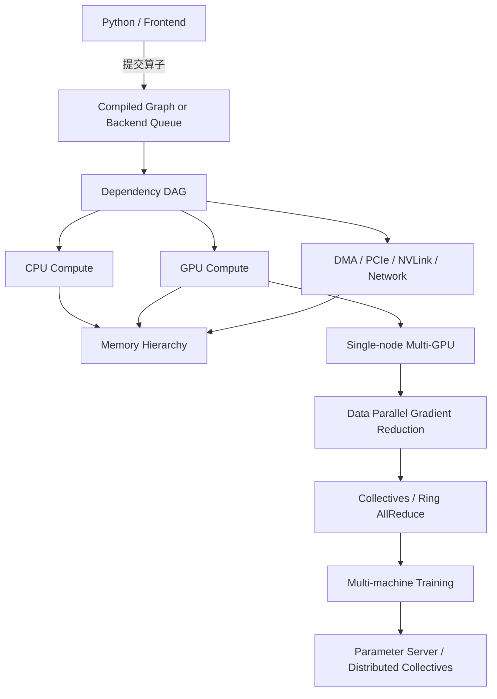

> 对应原文：d2l-en.md 第 13 章 **Computational Performance**。本章从程序执行方式出发，依次讨论编译器与解释器、异步计算、自动并行、硬件层级、多 GPU 数据并行、高层多 GPU API 和参数服务器。它回答的核心问题是：在不改变模型数学含义的前提下，如何减少调度、等待、搬运和同步，使昂贵计算设备持续做有效工作。

## 1. 本章要解决的核心问题

前面的章节主要回答“模型算什么”和“参数怎样优化”；本章转而回答“这些计算怎样在真实机器上高效完成”。同一个算法，低效实现可能训练三个月，合理实现可能只需一周。差异往往不来自 FLOPs 数量本身，而来自：

- Python 前端每个算子的调度开销；
- CPU、GPU 和通信设备能否并行；
- 不必要的同步是否让流水线停顿；
- 数据是否连续、是否能在 cache 中复用；
- 计算强度能否覆盖内存带宽；
- 多 GPU 梯度是否用匹配拓扑的集合通信；
- 通信能否与反向计算重叠；
- 计时是否真正等待设备完成。

一个训练 step 的简化时间模型为：

$$
T_{\mathrm{step}}
\approx
T_{\mathrm{input}}
+T_{\mathrm{launch}}
+T_{\mathrm{compute}}
+T_{\mathrm{memory}}
+T_{\mathrm{communication}}
+T_{\mathrm{sync}}
-T_{\mathrm{overlap}}.
$$

优化性能不是只让某一项变小，而是缩短整个关键路径。若通信已被计算完全隐藏，继续优化通信未必降低墙钟时间；若 GPU 在等数据，提高峰值 FLOPS 也无济于事。



作者的分析路线很清楚：

1. 先减少逐语句解释与调度开销；
2. 再认识设备计算是异步的，避免错误计时和过度阻塞；
3. 利用依赖图让无关计算、不同设备和通信重叠；
4. 用硬件层级解释为什么批处理、连续访问和复用有效；
5. 将一个 batch 拆到多 GPU，明确参数复制、梯度聚合和更新语义；
6. 用框架高层 API 替代低效手写同步；
7. 扩展到跨机器通信，按拓扑选择 ring、层次归约或参数服务器。

## 2. 编译器与解释器

### 2.1 命令式程序怎样执行

命令式编程逐条执行语句并改变程序状态：

```python
def add(a, b):
    return a + b

def fancy_func(a, b, c, d):
    e = add(a, b)
    f = add(c, d)
    g = add(e, f)
    return g
```

Python 解释器依次执行三次函数调用，并保存中间变量 `e`、`f`。动态执行的优势：

- 控制流自然；
- 可使用完整 Python 生态；
- 中间值随时可打印；
- 调试器和异常堆栈清晰；
- 动态 shape、数据相关分支容易表达；
- 研究迭代速度快。

缺点是每个小算子都可能经过 Python、dispatcher 和 kernel launch。单个 GPU 算子很大时开销占比不高；大量微小算子、多个高速 GPU 或复杂 Python 循环中，前端可能无法及时喂饱设备。

### 2.2 符号式程序怎样执行

符号式编程通常分三步：

1. 定义完整运算；
2. 将运算图编译为可执行程序；
3. 提供输入并重复执行编译结果。

编译器看到较大计算范围后，可执行：

- 常量折叠；
- dead code elimination；
- 算子融合；
- 公共子表达式消除；
- 内存生命周期分析与 buffer 复用；
- 布局和 kernel 选择；
- 跨算子调度；
- 生成独立于 Python 的部署产物。

例如若输入常量已知，编译器可把

```text
(1 + 2) + (3 + 4)
```

直接折叠为 `10`。若变量 `e` 在最后一次使用后不再需要，其内存可提前复用。

代价：

- 只支持可捕获的操作与控制流；
- 编译有前置成本；
- graph break 会损失优化范围；
- 动态 shape 可能触发重编译或保守代码；
- 编译后的错误栈较难理解；
- Python 副作用和数据相关分支可能改变语义。

### 2.3 混合编程的目标

理想工作流是：

- 开发时使用命令式模式，便于实验和调试；
- 稳定后捕获/编译热点计算，降低前端开销；
- 部署时导出明确的模型程序与权重。

原书以 PyTorch `torch.jit.script` 为例：

```python
net = nn.Sequential(
    nn.Linear(512, 256), nn.ReLU(),
    nn.Linear(256, 128), nn.ReLU(),
    nn.Linear(128, 2),
)
scripted = torch.jit.script(net)
```

输入形状 $(1,512)$，输出 $(1,2)$。`script` 尝试分析模块代码和受支持控制流，不只是记录一个输入经过的路径。

### 2.4 `script`、`trace`、运行时编译与导出

应辨析四类概念：

| 方法 | 核心语义 | 主要风险/用途 |
|---|---|---|
| Eager | 每次由前端动态调度 | 最易调试，前端开销可能高 |
| `torch.jit.script` | 编译受支持的模块代码和控制流 | 旧 TorchScript 工作流 |
| `torch.jit.trace` | 用示例输入运行一次，记录实际 tensor 操作 | 未走分支不会被捕获 |
| `torch.compile` | 捕获并优化运行时图，允许 graph break | 现代 PyTorch 运行时加速 |
| `torch.export` | 导出约束明确的程序表示 | 现代部署/转换入口之一 |

截至 2026 年，TorchScript 已被 PyTorch 标为 deprecated；理解原书机制仍有价值，但新项目通常优先评估 `torch.compile` 和 `torch.export`。

`trace` 的典型陷阱：

```python
def forward(x):
    if x.sum() > 0:
        return x * 2
    return x - 2
```

若 trace 示例只走第一条分支，导出图可能永远执行乘法，不能正确处理负和输入。以下行为也需警惕：

- Tensor 转 Python 标量；
- Python list/dict 副作用；
- 数据相关循环次数；
- 随机数和 dropout；
- tracing 时的 `train()` / `eval()` 状态；
- shape 相关 Python 分支。

`check_trace` 只能用若干输入做经验比较，不是程序等价证明。

### 2.5 为什么编译不一定更快

总时间包括：

$$
T_{\mathrm{total}}
=T_{\mathrm{compile}}
+N T_{\mathrm{compiled\ run}}.
$$

Eager：

$$
T_{\mathrm{eager\ total}}
=N T_{\mathrm{eager\ run}}.
$$

只有当

$$
N>
\frac{T_{\mathrm{compile}}}
{T_{\mathrm{eager\ run}}-T_{\mathrm{compiled\ run}}}
$$

时，编译成本才被摊销。

加速更可能出现在：

- 模型重复运行很多次；
- 小算子多、Python 开销显著；
- shape 稳定；
- 能形成大融合区域；
- GPU 足够快，前端调度成为瓶颈。

加速不明显或变慢的情况：

- 单次运行；
- 核心是少数巨大 GEMM/卷积；
- 动态控制流频繁 graph break；
- shape 变化触发重编译；
- 编译器未支持某算子；
- 已由高效 fused kernel 主导。

### 2.6 正确比较编译前后性能

原书各执行 $1000$ 次 eager 与 scripted MLP，并定性认为脚本化更快。严格 benchmark 应：

1. 固定设备、dtype、shape 和线程数；
2. 分别预热 eager 与 compiled 路径；
3. 编译时间与稳态运行时间分开报告；
4. GPU 计时前后同步或用 CUDA Event；
5. 多轮重复，报告中位数和分位数；
6. 校验输出及梯度一致；
7. 测动态 shape 与真实 batch；
8. 同时观察吞吐、延迟和显存；
9. 不在计时循环中打印或搬回 CPU。

### 2.7 序列化的意义与边界

原书使用：

```python
scripted.save("my_mlp")
```

编译模型可将图和参数一起保存，减少对 Python 前端代码的依赖。现代部署还需记录：

- 输入/输出 schema；
- 动态维约束；
- tokenizer 与预处理；
- dtype 和量化信息；
- 运算符版本；
- 目标设备；
- 后处理与特殊 token；
- 测试向量。

只保存权重不能保证另一个环境重建相同程序；只保存图也不能保证自定义预处理一致。

## 3. 异步计算

### 3.1 前端返回不等于设备完成

PyTorch 的 CUDA 操作默认对 CPU 前端异步：Python 调用把工作提交到指定设备/stream 后即可返回，GPU 稍后执行。

```python
a = torch.randn(1000, 1000, device="cuda")
b = a @ a
```

第二行返回时，矩阵乘可能仍在 GPU 队列中。前端、后端和设备可形成流水：

```text
Python frontend -> C++ dispatcher/backend -> CUDA stream -> GPU execution
```

### 3.2 依赖关系保证正确性

```python
x = torch.ones((1, 2), device="cuda")
y = torch.ones((1, 2), device="cuda")
z = x * y + 2
```

后端知道 `z` 的加法必须等待乘法，乘法必须等待 `x,y` 就绪。同一 CUDA stream 内，算子按提交顺序执行；数据依赖不会因异步而被破坏。

当 Python 要打印 `z`、读取 `.item()` 或把结果同步搬到主机时，必须等待 GPU 完成。这种等待叫同步边界或 barrier。

### 3.3 常见同步操作

可能阻塞 CPU 的操作包括：

- `torch.cuda.synchronize(device)`；
- CUDA Tensor 的 `.item()`；
- 打印 CUDA Tensor；
- 某些 `.cpu()` / `.numpy()` 路径；
- 阻塞式设备复制；
- 等待 CUDA Event；
- 跨 stream 未正确异步化的依赖；
- 分布式 collective 的等待；
- profiler 或异常检查设置。

自动微分本身也有依赖：某个参数梯度只有对应反向节点完成后才可通信；这恰好允许将已就绪梯度分 bucket，边反向边 allreduce。

### 3.4 错误的 GPU 计时

以下代码主要测量提交命令的时间：

```python
start = time.perf_counter()
for _ in range(10):
    y = x @ x
elapsed = time.perf_counter() - start
```

GPU 可能尚未完成，所以结果虚假偏小。正确墙钟计时：

```python
for _ in range(warmup):
    y = x @ x
torch.cuda.synchronize(x.device)

start = time.perf_counter()
for _ in range(repeats):
    y = x @ x
torch.cuda.synchronize(x.device)
elapsed = time.perf_counter() - start
```

更精确的设备时间可用 CUDA Event：

```python
start_event.record()
for _ in range(repeats):
    y = x @ x
end_event.record()
end_event.synchronize()
milliseconds = start_event.elapsed_time(end_event)
```

Event 测设备时间，墙钟还包括 CPU 调度和其他等待；应按问题选择指标。

### 3.5 Warmup 为什么必要

第一次调用可能包含：

- CUDA context 初始化；
- lazy module/allocator 初始化；
- kernel module 加载；
- autotuning；
- 编译；
- cache 冷启动；
- GPU 时钟升频；
- 内存池扩展。

因此 benchmark 前需运行多次相同工作负载。若要测端到端首次请求延迟，则这些成本反而必须保留，不能一概丢弃。

### 3.6 原书 benchmark 的边界

原书比较 NumPy CPU 与 PyTorch GPU，循环中同时执行随机矩阵生成和矩阵乘。它说明了异步现象，但不是纯 GEMM 基准：

- CPU 与 GPU 硬件不同；
- 随机生成也计入时间；
- 未同步 PyTorch 只测入队；
- 同步版开始前若未清空旧队列，会把前次欠账计入；
- 单次结果受 warmup 和 allocator 影响。

应把“解释异步机制的演示”和“严谨比较设备性能”分开。

### 3.7 过度同步为何慢

对 $10000$ 个小操作，若每次都同步：

```text
submit -> wait -> submit -> wait -> ...
```

CPU 和 GPU 难以形成流水，每次支付启动与等待成本。先连续提交再在末尾等待：

```text
submit -> submit -> ... -> wait once
```

可摊薄前端开销。

但无限入队也会产生问题：

- 中间 Tensor 生命周期延长；
- 内存峰值上升；
- 错误更晚暴露；
- 前端跑得太远，难定位瓶颈；
- queue backlog 增加延迟。

原书建议每 minibatch 同步较保守。通常让真实数据依赖和内存形成自然背压，只在计时、主机读取、跨 stream 生命周期、检查点或算法 barrier 处显式同步。

### 3.8 异步不等于并行

- **异步**：调用方不等待完成；
- **并行**：多个工作在物理时间上重叠；
- **并发**：多个工作都在进展，未必同一时刻执行；
- **流水**：不同阶段处理不同数据项并重叠。

在单一默认 stream 中，两个独立 CUDA kernel 通常仍按提交顺序执行：CPU 调用是异步的，但 GPU kernel 未必并行。真正同卡并发需要不同 streams、足够硬件资源和正确依赖。

## 4. 自动并行

### 4.1 依赖 DAG 与关键路径

后端将操作组织为有向无环图（DAG）：

- 节点：计算或通信操作；
- 边：数据或控制依赖；
- 无依赖节点可被调度到不同资源；
- 总时间至少等于关键路径长度。

若任务时长为 $t_i$，串行时间：

$$
T_{\mathrm{serial}}=\sum_i t_i.
$$

理想并行时间受两项下界约束：

$$
T_{\mathrm{parallel}}
\ge
\max\left(
T_{\mathrm{critical\ path}},
\frac{\sum_i\mathrm{work}_i}{\mathrm{total\ throughput}}
\right).
$$

只增加节点或线程不会自动缩短关键路径；错误遗漏依赖则会产生 race 和错误结果。

### 4.2 多 GPU 天然并行

原书在两张 GPU 上分别创建 $(4000,4000)$ float32 矩阵：

$$
4000^2\times4\ \mathrm{bytes}
=64\ \mathrm{MB}.
$$

每次矩阵乘近似：

$$
2\cdot4000^3
=1.28\times10^{11}\ \mathrm{FLOPs}.
$$

代码实际每张卡执行 $50$ 次，不是正文所说的 $10$ 次，也不是练习所说的 $8$ 次：

$$
50\times1.28\times10^{11}
=6.4\times10^{12}\ \mathrm{FLOPs}.
$$

若同时保留 $50$ 个输出，每张卡仅输出就约：

$$
50\times64\ \mathrm{MB}
=3.2\ \mathrm{GB},
$$

小显存设备可能 OOM。

分别计时得到 $T_0,T_1$，同时向两卡提交后的理想时间接近：

$$
T_{\mathrm{joint}}\approx\max(T_0,T_1),
$$

而非 $T_0+T_1$。但必须逐设备同步：

```python
for device in devices:
    torch.cuda.synchronize(device)
```

无参数 `torch.cuda.synchronize()` 只同步当前设备，不能普遍证明另一张卡已完成。

### 4.3 单设备并行的限制

一个大型 GEMM 往往已占满 GPU 主要计算资源，额外 kernel 不一定能并行。并发收益更可能出现在：

- kernel 较小，单个任务无法占满设备；
- 一个任务 compute-bound，另一个使用 copy engine；
- 不同任务占用不同资源；
- 使用不同 stream；
- 数据依赖允许重叠。

并发还可能因 cache、内存带宽和 SM 竞争变慢，所以必须 profiler 验证。

### 4.4 计算与通信重叠

若输出 $y_i$ 依次产生，可在计算 $y_i$ 时复制已完成的 $y_{i-1}$：

```text
time --->
compute: [ y0 ][ y1 ][ y2 ][ y3 ]
copy:          [ y0 ][ y1 ][ y2 ][ y3 ]
```

不重叠：

$$
T=T_{\mathrm{compute}}+T_{\mathrm{copy}}.
$$

理想流水：

$$
T\approx
\max(T_{\mathrm{compute}},T_{\mathrm{copy}})
+T_{\mathrm{fill/drain}}.
$$

PyTorch `non_blocking=True` 只表示主机调用可以不等待，并不自动保证物理重叠。有效 D2H/H2D overlap 通常还需要：

- pinned host memory；
- 支持异步 DMA 的设备；
- copy engine；
- 独立 stream；
- CUDA Event 建立生产者—消费者依赖；
- 足够大的传输以摊薄启动延迟。

### 4.5 反向传播与梯度通信重叠

反向按从输出层到输入层计算梯度。后层梯度先就绪，可以立即开始 allreduce，同时继续计算前层梯度：

```text
backward:  [bucket 3][bucket 2][bucket 1][bucket 0]
allreduce:           [bucket 3][bucket 2][bucket 1][bucket 0]
```

Bucket 太小：collective 启动延迟高；太大：通信开始晚，重叠不足。框架根据参数顺序和 bucket size 折中。

### 4.6 如何验证并行真的发生

只比较总时间不够，应使用时间线 profiler：

- PyTorch Profiler；
- NVIDIA Nsight Systems；
- Nsight Compute；
- NCCL debug/timing；
- CPU profiler 和 I/O trace。

检查：

- kernel 是否在不同 streams 重叠；
- H2D/D2H 是否与 compute 重叠；
- allreduce 是否在 backward 完成前启动；
- GPU 是否有空洞；
- CPU 是否及时提交；
- 是否被数据加载或同步阻塞；
- collective 是否出现长尾。

## 5. 硬件基础

### 5.1 从组件图看数据路径

一台训练机器通常包括：

- CPU：运行 Python、数据管线、调度和部分算子；
- DRAM：保存数据、进程状态和 page cache；
- GPU/加速器：执行密集矩阵、卷积和 attention；
- GPU memory：保存参数、激活、梯度和优化器状态；
- PCIe/NVLink/NVSwitch：设备间传输；
- SSD/HDD：持久数据与 checkpoint；
- NIC/交换机：跨机器通信。

训练数据路径可能是：

```text
storage -> OS page cache -> CPU DRAM -> pinned buffer
        -> PCIe -> GPU memory -> compute units
```

任何阶段供给不足，后续设备都会空闲。

### 5.2 四个基础指标

#### 5.2.1 容量

能否装下模型、激活、梯度、optimizer state、batch 和通信 buffer。OOM 首先是容量问题，不一定是计算问题。

#### 5.2.2 延迟

完成一次操作的固定等待，尤其支配小请求。可表示为启动项 $\alpha$。

#### 5.2.3 带宽

稳定传输大数据时每秒字节数 $B$。

#### 5.2.4 吞吐

单位时间完成的请求、样本、token 或 FLOPs。高吞吐不必然意味着低单请求延迟。

通用传输时间模型：

$$
T(S)=\alpha+\frac SB,
$$

其中 $S$ 为消息大小。小消息由 $\alpha$ 主导，大消息才接近峰值带宽。由此得到贯穿本章的原则：**少量大操作通常优于大量小操作**。

### 5.3 内存：随机访问与 burst

原书以 DDR4 为时代示例：单模块约 $20$–$25$ GB/s，CPU 有 $2$–$4$ 个 channel；正文的 `4 0GB/s` 是 `40 GB/s` 排版错误。

发送地址并建立 DRAM 访问约需 $100$ ns，连续后续传输可能约 $0.2$ ns 一项。具体数字随硬件变化，但量级差说明：

- 连续访问优于随机访问；
- 合并请求优于细粒度请求；
- 数据布局应适配访问顺序；
- blocking/tiling 可复用 cache；
- 多 channel 需要合理分布数据。

GPU 使用更宽总线与 GDDR/HBM 获得高带宽，但容量更小、成本更高。高峰值计算必须靠高复用和高带宽供给。

### 5.4 存储：HDD、SSD 与数据管线

7200 RPM 磁盘一圈时间：

$$
\frac{60}{7200}\ \mathrm{s}
=8.33\ \mathrm{ms}.
$$

平均旋转等待约半圈：

$$
4.17\ \mathrm{ms},
$$

再加寻道时间，所以随机访问约毫秒级、约 $100$ IOPS；顺序带宽约 $100$–$200$ MB/s（原书时代值）。

SSD/NVMe 随机 IOPS 和顺序带宽高得多，但仍有：

- page 写入和 erase block 粒度；
- write amplification；
- wear leveling；
- queue depth；
- 小文件 metadata 开销；
- 持续写入降速。

NVMe 的正确全称是 **Non-Volatile Memory Express**，不是原文的 “enhanced”。

训练数据常优化为：

- 将大量小文件打包成 shard；
- 顺序读取；
- 多 worker 预取；
- 解码与训练重叠；
- pinned memory；
- 缓存热门数据；
- 避免每样本远程随机请求。

### 5.5 CPU：核心、向量化和 cache

CPU 核心包含前端取指、分支预测、解码、乱序执行和多类执行单元。独立指令可在一个周期内并行发射。

SIMD 让一条指令处理多个元素：x86 AVX、ARM NEON/SVE 等。FMA 同时计算乘法和加法。模型算子要使用向量化库，而不是 Python 标量循环。

原书示例：4 核、2 GHz、256-bit AVX2，每周期若每核读取 256 bit：

$$
4\times256\ \mathrm{bit}
=128\ \mathrm{byte/cycle}.
$$

所需供给：

$$
2\times10^9\times128
=256\ \mathrm{GB/s},
$$

而主存只有约 $20$–$40$ GB/s，必须依靠寄存器和 cache 复用数据。

典型层级：

- registers：最快、最小；
- L1：每核几十 KB；
- L2：每核数百 KB 至更大；
- L3/LLC：多核共享，MB 级；
- local DRAM；
- remote NUMA DRAM；
- storage/network。

数字是时代快照，理解相对层级比记绝对值重要。

### 5.6 Cache locality 与 false sharing

空间局部性：访问一个地址后，很可能继续访问附近地址。时间局部性：刚访问的数据很可能再次使用。

优化方法：

- 连续布局；
- 合适循环顺序；
- tiling；
- 避免大 stride；
- 减少 working set；
- NUMA first-touch；
- 避免线程写同一 cache line。

False sharing：不同线程修改逻辑上不同变量，但变量位于同一 cache line，导致 cache coherence 反复转移该 line。它通常在 cache coherence fabric 中传输/失效，不一定像原文简化描述那样每次写回 DRAM。

现代 CPU cache line 常为 64 **bytes**；数据对齐应结合 cache line、SIMD 宽度和算子要求，不能只说“64-bit CPU 按 64 bit 对齐”。

### 5.7 GPU 与专用加速器

GPU 通过大量 SIMT 执行单元、高带宽内存和专用矩阵单元提高吞吐。适合：

- 大型密集矩阵乘；
- 卷积；
- attention；
- 规则并行逐元素操作；
- 高算术强度任务。

不擅长：

- 复杂分支；
- 很小 kernel；
- 随机稀疏访问；
- 串行依赖；
- 频繁主机往返。

Tensor Core/TPU systolic array 针对小矩阵块的乘加提供极高吞吐，要求 dtype、shape、布局和对齐满足内核条件。

原书区分训练与推理的方向正确，但表述过强：

- 推理仍需要存活的中间 activation/buffer，只是不需保留反向图；
- 训练不以 FP16 为绝对最低要求，现代训练广泛使用 BF16、FP8 和混合精度；
- 累加、master weights、optimizer state 往往使用更高精度；
- 可接受精度由数值范围和任务决定。

### 5.8 算术强度与 Roofline

算术强度：

$$
I=\frac{F}{Q},
$$

其中 $F$ 是 FLOPs，$Q$ 是从瓶颈内存层级搬运的 bytes。

若峰值计算为 $P_{\mathrm{peak}}$，内存带宽为 $B_{\mathrm{mem}}$：

$$
P_{\mathrm{attainable}}
\le
\min(P_{\mathrm{peak}},B_{\mathrm{mem}}I).
$$

- $B_{\mathrm{mem}}I<P_{\mathrm{peak}}$：memory-bound；
- $B_{\mathrm{mem}}I>P_{\mathrm{peak}}$：compute-bound；
- 分界算术强度：

$$
I^*=\frac{P_{\mathrm{peak}}}{B_{\mathrm{mem}}}.
$$

提高性能的路径不同：memory-bound 应减少搬运、融合和复用；compute-bound 应提高矩阵内核效率、低精度和并行度。

### 5.9 GPU kernel launch 与算子粒度

原书延迟表给出约 $10\ \mu s$ 的 CUDA kernel launch、约 $200$ ns 的 GPU global memory access、1 MB PCIe 传输约 $80\ \mu s$。数字会过时，但说明小算子可能由启动开销主导。

若单 kernel 计算仅 $2\ \mu s$，但 launch $10\ \mu s$：

$$
\mathrm{efficiency}
\approx\frac{2}{2+10}=16.7\%.
$$

融合十个同类操作为一个 kernel 可显著摊薄启动和中间内存写回。

### 5.10 网络与总线

#### PCIe

PCIe 4.0 每 lane 为 16 GT/s，考虑编码后约 $1.97$ GB/s/方向；x16 槽总计约 $31.5$ GB/s/方向。原文“32 GB/s in a 16-lane slot per lane”混淆了单 lane 与整个 x16。

#### Ethernet / InfiniBand / RoCE

带宽常用 Gbit/s，换算：

$$
100\ \mathrm{Gbit/s}
\div8
=12.5\ \mathrm{GB/s}
$$

是理论线速，协议、编码和拥塞会降低有效 payload 带宽。原文多处混用 GB/s 与 Gbit/s，必须统一单位。

#### NVLink / NVSwitch

GPU 间高带宽互连，具体单 link、单向/双向和聚合带宽取决于代际和拓扑。不能把原书 V100 时代数字当作所有设备通用常数。

#### DMA

DMA 让设备直接读写内存，避免 CPU 逐字节搬运；CPU 只配置传输并处理完成通知，从而可与计算重叠。

### 5.11 延迟数字的使用方法

不要背死数值，应记数量级：

```text
register / L1       : ns
DRAM                : tens to hundreds ns
kernel launch       : us
small network / PCIe: us
NVMe random I/O     : tens to hundreds us
HDD random I/O      : ms
intercontinental RTT: tens to hundreds ms
```

设计前先做纸面估算。若实测与理论差一个数量级，应检查：

- 单位；
- 是否同步；
- 是否包含 warmup；
- 实际 bytes/FLOPs；
- dtype；
- shape；
- 数据是否复制；
- 是否 memory-bound；
- profiler 中的空洞。

## 6. 从零实现多 GPU 训练

### 6.1 三种模型拆分方式

#### 6.1.1 按层切分（pipeline/model parallel）

不同层放在不同 GPU。优点是单卡无需容纳完整模型；缺点是层间 activation 和反向梯度频繁传输，若不做 microbatch pipeline 会有大量 bubble。

#### 6.1.2 层内切分（tensor parallel）

将一个矩阵或通道维拆到多卡。适合单层本身很大，但几乎每层都需 collective，通信紧密。

原始 AlexNet 因单卡显存仅约 2 GB 使用跨 GPU 通道切分。

#### 6.1.3 数据并行

每卡保存完整模型，处理不同样本，反向后聚合梯度。同步点相对少、通用且实现简单，是原书主线。

原书称现代 GPU 内存已基本解决模型切分需求，这对当代大模型已不成立。现代训练常组合：

- Distributed Data Parallel；
- FSDP / ZeRO 参数、梯度、optimizer state 分片；
- tensor parallel；
- pipeline parallel；
- sequence/context parallel；
- expert parallel。

### 6.2 同步数据并行的数学

全局 batch $\mathcal B$ 被分成 $k$ 个 shard：

$$
\mathcal B
=\bigcup_{j=1}^{k}\mathcal B_j,
\qquad
\mathcal B_i\cap\mathcal B_j=\varnothing.
$$

若每卡计算 loss **sum** 的梯度：

$$
g_j
=\sum_{i\in\mathcal B_j}
\nabla_\theta\ell_i(\theta).
$$

全局 mean 梯度：

$$
g
=\frac1{|\mathcal B|}
\sum_{j=1}^{k}g_j.
$$

每卡从相同 $\theta_t$ 出发，得到同一聚合梯度，并执行相同确定性更新：

$$
\theta_{t+1}
=\theta_t-\eta g.
$$

因此各副本保持一致。

### 6.3 一个 step 的五阶段

1. **Scatter**：把 batch 沿样本轴分到各 GPU；
2. **Replicate**：每卡拥有相同参数；
3. **Local forward/backward**：各卡独立算本地梯度；
4. **AllReduce**：所有本地梯度求和/平均，并把结果分发到各卡；
5. **Update**：各卡应用同一 optimizer 更新。

可写为：

```text
CPU batch
  -> X0,y0 on GPU0 -> loss0 -> grad0 --\
  -> X1,y1 on GPU1 -> loss1 -> grad1 ---- AllReduce -> same grad -> update
  ...                                      /
```

### 6.4 原书 LeNet 的 shape 与参数量

输入 $(B,1,28,28)$：

```text
Conv 3x3, 20       -> (B,20,26,26)
AvgPool 2x2        -> (B,20,13,13)
Conv 5x5, 50       -> (B,50,9,9)
AvgPool 2x2        -> (B,50,4,4)
Flatten            -> (B,800)
Linear 800 -> 128  -> (B,128)
Linear 128 -> 10   -> (B,10)
```

参数：

$$
20\cdot1\cdot3\cdot3+20=200,
$$

$$
50\cdot20\cdot5\cdot5+50=25050,
$$

$$
800\cdot128+128=102528,
$$

$$
128\cdot10+10=1290.
$$

总计：

$$
200+25050+102528+1290
=129068.
$$

float32 参数约：

$$
129068\times4
=516272\ \mathrm{bytes}
\approx0.492\ \mathrm{MiB}.
$$

模型很小，因此 Python 和通信开销相对计算很大，多 GPU 未必加速。

### 6.5 参数复制与梯度状态

原书：

```python
new_params = [p.to(device) for p in params]
for p in new_params:
    p.requires_grad_()
```

在 backward 前，叶子 Tensor 的 `.grad` 是 `None`，不是原文所说的“仍为零”。首次 backward 后才分配梯度；若手写聚合，必须处理 `None` 并在更新后清零。

每个副本必须：

- 初始值完全相同；
- 使用相同聚合梯度；
- optimizer state 语义一致；
- 同步更新 step；
- 正确处理随机 buffer 和 BatchNorm。

### 6.6 原书手写 `allreduce`

原书把所有梯度搬到 GPU0 求和，再广播：

```python
for i in range(1, len(data)):
    data[0] += data[i].to(data[0].device)
for i in range(1, len(data)):
    data[i].copy_(data[0])
```

这是中心化 reduce + broadcast，不是高效 collective：

- GPU0 成为热点；
- 传输串行；
- 每参数单独调用，消息过小；
- 不能充分使用多链路；
- Python 循环开销高。

教学价值是展示数学语义；真实训练应使用 NCCL `all_reduce`、reduce-scatter/all-gather 和 gradient buckets。

### 6.7 Loss reduction 的关键一致性

原书每卡：

```python
loss(...).sum().backward()
```

allreduce 得到全局梯度和，随后 `sgd(..., X.shape[0])` 除以全局 batch，得到全局 mean 梯度。

若每卡先 `.mean()`，再 allreduce **求和**，得到：

$$
\sum_j\frac1{|\mathcal B_j|}
\sum_{i\in\mathcal B_j}\nabla\ell_i.
$$

等大小 shard 时是全局 mean 的 $k$ 倍；应再除 world size，或 collective 直接 average。Shard 大小不等时还需按样本数加权，不能简单平均每卡 mean。

### 6.8 Batch size 与学习率缩放

常见强扩展策略保持每卡 batch $b$ 不变：

$$
B_{\mathrm{global}}=kb.
$$

更新次数减少，梯度噪声下降。线性缩放启发式：

$$
\eta_k\approx k\eta_1,
$$

常配 warmup。但它不是普遍定律：

- 极大 batch 有临界规模；
- 优化器和归一化影响缩放；
- 训练总 epoch/step 需调整；
- 泛化可能改变；
- 梯度累积与真实并行的通信/BN 语义不同。

原书从零实验固定全局 batch 256、学习率 0.2，从 1 卡变 2 卡，所以数学优化近似相同，但每卡工作减半；模型太小导致没有有意义加速。

### 6.9 BatchNorm 的多卡语义

普通数据并行中，每卡 BatchNorm 只用本地 shard 统计：

$$
\mu_j=\frac1{b_j}\sum_{i\in\mathcal B_j}x_i.
$$

这不等于全局 batch 统计。可选：

- local BN：通信少，统计随每卡 batch 变化；
- SyncBatchNorm：归约全局统计，额外通信；
- GroupNorm/LayerNorm：不依赖 batch；
- 冻结预训练 BN；
- ghost batch normalization。

原书“每卡保留一个 BatchNorm coefficient”过于简化；running mean/variance 和训练统计都要明确。

### 6.10 多 GPU 计时和评估

计时结束前应逐卡同步或等待 collective。只调用当前设备同步可能漏掉其他设备尚未完成的工作。

评估若只在 GPU0 上执行，会让其他设备空闲。并行评估应各卡累计：

$$
(\mathrm{correct}_j,\mathrm{count}_j),
$$

再归约：

$$
\mathrm{accuracy}
=\frac{\sum_j\mathrm{correct}_j}
{\sum_j\mathrm{count}_j}.
$$

要避免 sampler 重复样本影响精确计数。

## 7. 多 GPU 的简洁实现

### 7.1 为什么要用高层集合通信

真实高性能实现需处理：

- 拓扑发现；
- 参数 bucket；
- stream/event；
- NCCL collective；
- backward hook；
- overlap；
- unused parameters；
- 错误传播；
- 多进程启动；
- 分布式 sampler；
- checkpoint。

这些不应为每个模型手写。高层 API 保持数学不变，但使用优化后的通信后端。

### 7.2 原书 ResNet-18 变体

Fashion-MNIST 输入 $(B,1,28,28)$：

```text
3x3 Conv, 64             -> (B,64,28,28)
Residual stage 64        -> (B,64,28,28)
Residual stage 128       -> (B,128,14,14)
Residual stage 256       -> (B,256,7,7)
Residual stage 512       -> (B,512,4,4)
AdaptiveAvgPool          -> (B,512,1,1)
Flatten                  -> (B,512)
Linear                   -> (B,10)
```

相比 LeNet，计算量更大，通信占比下降，多 GPU 更可能显示加速。

### 7.3 `nn.DataParallel` 的语义

原书使用 `nn.DataParallel`：

1. 输入在 batch 维 scatter；
2. 每次 forward 将模块复制到各设备；
3. 各副本计算；
4. 输出 gather 到主设备；
5. backward 将梯度归约到原始模块；
6. optimizer 更新主模块。

局限：

- 单进程、多线程受 Python 和 GIL/调度影响；
- 每次 forward replicate；
- 主卡负责 gather 和原模块，负载不均；
- BatchNorm buffer 仅主副本永久保留；
- 扩展性通常弱于 DDP。

原书代码还有设备边界：原模块参数仍在 CPU 时直接构造 DataParallel，CUDA 环境通常要求模块先位于 `device_ids[0]`：

```python
primary = devices[0]
net = net.to(primary)
net = nn.DataParallel(net, device_ids=device_ids)
```

### 7.4 现代推荐：DistributedDataParallel

PyTorch 通常推荐单机也使用一 GPU 一进程的 DDP：

```text
process 0 -> GPU 0 -> model replica -> local batch
process 1 -> GPU 1 -> model replica -> local batch
...
backward hooks -> bucketed allreduce
```

典型初始化骨架：

```python
torch.cuda.set_device(local_rank)
dist.init_process_group(backend="nccl")
model = model.to(local_rank)
model = DDP(model, device_ids=[local_rank])
sampler = DistributedSampler(dataset, shuffle=True)
```

每 epoch 调：

```python
sampler.set_epoch(epoch)
```

确保各 rank 获得不同但可复现的 shuffle。

DDP 优势：

- 多进程减少 Python 主线程瓶颈；
- 参数副本持久；
- bucketed NCCL allreduce；
- 通信与 backward 重叠；
- 跨机器自然扩展。

DDP 仍是参数复制的数据并行，单卡装不下模型时需 FSDP/ZeRO 或其他模型并行。

### 7.5 单卡到多卡的公平比较

原书简洁实验：

- 1 GPU：batch 256，lr 0.1；
- 2 GPU：batch 512，lr 0.2。

这是保持每卡 batch 并线性放大学习率的 weak scaling 风格。公平比较应明确：

#### Strong scaling

固定全局 batch/问题规模，增加设备，目标是 step 时间下降：

$$
S(k)=\frac{T(1)}{T(k)},
\qquad
E(k)=\frac{S(k)}k.
$$

#### Weak scaling

每卡工作固定，设备增加时全局 batch 增大，目标是 step 时间近似不变、吞吐近线性增长。

两者优化轨迹不同，不能混用速度和精度结论。

### 7.6 Amdahl 定律

若可并行比例为 $p$，串行比例为 $1-p$，使用 $k$ 个设备的理论加速：

$$
S(k)
\le
\frac1{(1-p)+p/k}.
$$

即使 $k\to\infty$：

$$
S_{\max}=\frac1{1-p}.
$$

若数据加载、Python、评估和通信中有 10% 无法并行，最大加速不超过 10 倍。实际还受同步长尾和资源竞争影响。

### 7.7 Straggler 与同步等待

同步训练 step 时间约由最慢 rank 决定：

$$
T_{\mathrm{step}}
\approx\max_j T_j+T_{\mathrm{collective}}.
$$

异构 CPU/GPU 混合时，按吞吐分 shard 可平衡平均工作，但最慢设备、数据抖动和通信拓扑仍可能拖累全局。通常同构 accelerator 更易扩展。

## 8. 参数服务器与分布式同步

### 8.1 为什么通信拓扑改变性能

梯度求和数学上相同，但物理路径不同：

- GPU-GPU 直连；
- GPU-PCIe switch-GPU；
- GPU-CPU-GPU；
- NVLink/NVSwitch；
- 跨 NUMA socket；
- NIC-switch-NIC；
- 跨机架多级网络。

同一个 160 MB 梯度同步可能因路径和并行策略从约 15 ms 到 80 ms。

### 8.2 原书 160 MB 示例

假设四张 GPU，每条 Gen3 x16 路径有效带宽 $16$ GB/s。一次 160 MB 传输：

$$
\frac{160\ \mathrm{MB}}
{16\ \mathrm{GB/s}}
\approx10\ \mathrm{ms}.
$$

#### 聚合到 GPU0

其他 3 卡串行发送：30 ms；再广播：30 ms；总约 60 ms。

一般中心化模型忽略启动延迟：

$$
T_{\mathrm{central}}
\approx2(k-1)\frac SB.
$$

#### 聚合到 CPU

4 卡全部发给 CPU 再返回，约：

$$
2\times4\times10=80\ \mathrm{ms}.
$$

#### 分片并行聚合

将 160 MB 分成四个 40 MB shard，每卡负责一个 shard，三次 40 MB 传输若可并行：

$$
3\times\frac{40}{16}=7.5\ \mathrm{ms}
$$

一阶段归约、一阶段分发，共约 15 ms。

该分析忽略 latency、拓扑争用、协议和不能完全并行的链路，但准确揭示：**分片能消除中心热点并利用聚合带宽**。

### 8.3 Ring AllReduce

Ring allreduce 通常分两阶段：

1. reduce-scatter：每个节点最终拥有完整归约结果的一个 shard；
2. all-gather：交换 shards，使每个节点拥有完整结果。

将大小 $S$ 分为 $n$ 块，每阶段 $n-1$ 步，每步传 $S/n$。含每步启动延迟 $\alpha$、链路带宽 $B$：

$$
T_{\mathrm{ring}}
\approx
2(n-1)\alpha
+\frac{2(n-1)}n\frac SB.
$$

当消息很大、$S/B$ 主导：

$$
T_{\mathrm{ring}}
\to\frac{2S}{B}.
$$

因此带宽项近似不随节点数增长；但 latency 项 $2(n-1)\alpha$ 仍线性增长，所以原文“时间不随节点数增长”只对大消息近似成立。

原书以 8 张 V100、160 MB 和多个 NVLink 通道估算约 6 ms。其单 link、单向/双向和聚合带宽口径存在混用，应用公式时必须用实际拓扑和 NCCL 报告的有效带宽。

### 8.4 Ring、Tree 与分层 collective

- Ring：带宽利用好，步骤多，小消息 latency 较差；
- Tree：步骤约 $O(\log n)$，小消息更有利，根附近链路需合理调度；
- 双向 ring：数据分半沿两个方向，利用双向链路；
- Hierarchical：节点内 NVLink/NVSwitch 归约，节点间 NIC 归约，再节点内广播；
- Reduce-scatter + all-gather：与参数/optimizer 分片自然结合。

最佳算法取决于消息大小、节点数、链路、拓扑和并发流量；ring 不是所有硬件上的普遍最优。

### 8.5 多机参数服务器流程

经典同步参数服务器：

1. 每台 worker 读取不同数据；
2. 节点内 GPU 分片计算梯度；
3. 节点内归约；
4. worker 将梯度 push 到参数服务器；
5. server 聚合并更新参数；
6. worker pull 新参数；
7. 节点内广播到 GPU。

单 server 面对 $m$ 个 workers，若模型大小 $S$、server 带宽 $B_s$，双向通信下界近似：

$$
T_{\mathrm{server}}
\gtrsim\frac{2mS}{B_s}.
$$

把参数分到 $n$ 个 servers，理想降为：

$$
T_{\mathrm{server}}
\gtrsim\frac{2mS}{nB_s}.
$$

但每个 worker 自身仍至少发送和接收各一个模型量：

$$
T_{\mathrm{worker}}
\gtrsim\frac{2S}{B_w}.
$$

增加 server 不能突破 worker NIC 和交换网络下界。

### 8.6 Key–Value 抽象

参数按 key $i$ 分片。worker $k$ 的 GPU $j$ 产生：

$$
g_{ijk}.
$$

总梯度：

$$
g_i
=\sum_{k\in\mathrm{workers}}
\sum_{j\in\mathrm{GPUs}}g_{ijk}.
$$

接口：

- `push(key, value)`：发送局部梯度，server 对同 key 做归约；
- `pull(key)`：获取聚合梯度或更新后的参数。

优点：

- 不同 keys 可独立分片；
- 梯度到达顺序可灵活调度；
- 系统细节与统计模型解耦；
- 适合超大稀疏 embedding；
- 可支持异步和弹性 worker。

但浮点加法满足交换律的数学近似，不严格满足结合律：

$$
(a+b)+c\ne a+(b+c)
$$

在有限精度下可能成立，所以不同归约顺序会产生微小数值差，训练轨迹随之分叉。

### 8.7 同步与异步分布式训练

#### 同步

所有 workers 在每步 barrier：

- 梯度基于同一参数版本；
- 语义接近大 batch SGD；
- 更易分析和复现；
- 最慢 worker 决定步时；
- 故障会阻塞所有人。

#### 异步

worker 不等其他节点，push 梯度并 pull 参数：

- 设备利用率高；
- 容忍速度差和弹性成员；
- 梯度可能基于旧参数，产生 staleness；
- 收敛行为不同；
- 更新顺序不可复现；
- 需 bounded staleness、版本或学习率修正。

密集同步深度学习如今通常使用 DDP collective 而非中心化参数服务器；参数服务器仍常见于稀疏 embedding、异步在线学习和弹性场景。

### 8.8 通信压缩与梯度累积

降低通信的方向：

- mixed-precision collective；
- 量化；
- top-$k$ sparsification；
- error feedback；
- local SGD / 多本地步；
- 梯度累积；
- optimizer/parameter sharding。

它们可能改变数学语义、数值误差或收敛，应与单纯系统优化区分。梯度累积减少 collective 频率，但不能提高单 step 的数据并行计算能力；BatchNorm 和随机层语义也可能不同。

### 8.9 容错与恢复

长时间分布式训练不能只保存模型参数。完整 checkpoint 通常包括：

- 模型参数与 buffers；
- optimizer state；
- scheduler state；
- AMP GradScaler；
- global step/epoch/token count；
- RNG states；
- dataloader/sampler 位置；
- 分片映射与 world size 元数据。

容错机制可包括：

- 周期 checkpoint；
- 异步 checkpoint；
- server shard replication；
- write-ahead log；
- elastic membership；
- collective timeout 与重启；
- 数据幂等和去重。

只恢复权重而不恢复 optimizer 和 scheduler，通常不能继续同一训练轨迹。

## 9. 端到端性能分析方法

### 9.1 先定义指标

- latency：单 batch/请求耗时；
- throughput：samples/s、tokens/s；
- time-to-quality：达到目标验证指标的墙钟；
- scaling efficiency；
- cost-to-quality；
- peak/allocated memory；
- energy；
- tail latency。

训练系统最重要的常是 time-to-quality，而不是单 step 吞吐。增大 batch 可能提高 samples/s，却需更多 steps 或得到较差精度。

### 9.2 分层定位瓶颈

1. **输入层**：GPU 是否等 DataLoader、解码或网络？
2. **前端层**：CPU 是否有大量 Python 空洞？
3. **算子层**：kernel 是否过小、shape 是否适合矩阵单元？
4. **内存层**：带宽、cache miss、显存搬运是否主导？
5. **通信层**：allreduce 是否在关键路径、是否与 backward 重叠？
6. **同步层**：`.item()`、打印、barrier 是否过多？
7. **集群层**：straggler、网络拥塞、NUMA 和拓扑是否失衡？

### 9.3 一个简化 step 分解

假设：

```text
input       8 ms
forward    20 ms
backward   35 ms
allreduce  25 ms
update      2 ms
```

无重叠总计 90 ms。若 allreduce 有 20 ms 与 backward 重叠：

$$
T=90-20=70\ \mathrm{ms}.
$$

此时把 allreduce 从 25 ms 优化到 15 ms，但它原先只有 5 ms 暴露在关键路径，最多只省 5 ms；真正收益不能按通信总时长简单相减。

### 9.4 Profiler 驱动而非猜测

优化循环：

1. 建立可复现基线；
2. 采集 CPU/GPU/通信时间线；
3. 找关键路径上最大可改善项；
4. 提出一个可证伪假设；
5. 做最小改动；
6. 验证正确性、吞吐、显存和精度；
7. 保留或回滚；
8. 再次 profile。

不要同时改 batch、dtype、编译、DataLoader 和模型结构，否则无法知道收益来源。

## 10. 可运行的综合 PyTorch 实验

下面脚本只依赖 PyTorch 标准 API，在 CPU 环境也可运行。它验证：

- 命令式计算与矩阵化计算语义一致；
- 传输的延迟—带宽模型和 Roofline 上界；
- HDD 旋转与 PCIe 传输的原书数值；
- LeNet 的逐层 shape、参数量和内存；
- 将 batch 切成 shards 后聚合 loss-sum 梯度，与完整 batch mean 梯度严格一致；
- 中心化归约与 ring allreduce 的通信公式；
- 参数服务器 key-value push/pull 的分片求和；
- Amdahl 加速上界与计算—通信重叠关键路径。

若本机有 CUDA，脚本还会用正确同步方式做一个小型 GPU 计时示范；没有 CUDA 时自动跳过。

```python
import math
import time

import torch
from torch import nn
from torch.nn import functional as F

torch.manual_seed(79)

def transfer_time(size_bytes, latency_seconds, bandwidth_bytes_per_second):
    return latency_seconds + size_bytes / bandwidth_bytes_per_second

def roofline_bound(peak_flops, memory_bandwidth, arithmetic_intensity):
    return min(peak_flops, memory_bandwidth * arithmetic_intensity)

def ring_allreduce_time(num_nodes, size_bytes, latency, bandwidth):
    return (
        2 * (num_nodes - 1) * latency
        + 2 * (num_nodes - 1) / num_nodes * size_bytes / bandwidth
    )

def centralized_reduce_broadcast_time(num_nodes, size_bytes, bandwidth):
    return 2 * (num_nodes - 1) * size_bytes / bandwidth

def amdahl_speedup(parallel_fraction, num_workers):
    return 1 / ((1 - parallel_fraction) + parallel_fraction / num_workers)

class ScratchLeNet(nn.Module):
    def __init__(self):
        super().__init__()
        self.conv1 = nn.Conv2d(1, 20, kernel_size=3)
        self.conv2 = nn.Conv2d(20, 50, kernel_size=5)
        self.fc1 = nn.Linear(800, 128)
        self.fc2 = nn.Linear(128, 10)

    def forward_with_shapes(self, inputs):
        shapes = [tuple(inputs.shape)]
        hidden = F.avg_pool2d(F.relu(self.conv1(inputs)), 2, 2)
        shapes.append(tuple(hidden.shape))
        hidden = F.avg_pool2d(F.relu(self.conv2(hidden)), 2, 2)
        shapes.append(tuple(hidden.shape))
        hidden = hidden.flatten(1)
        shapes.append(tuple(hidden.shape))
        hidden = F.relu(self.fc1(hidden))
        shapes.append(tuple(hidden.shape))
        outputs = self.fc2(hidden)
        shapes.append(tuple(outputs.shape))
        return outputs, shapes

class ParameterServer:
    def __init__(self):
        self.pending = {}

    def push(self, key, value):
        value = value.detach().clone()
        if key not in self.pending:
            self.pending[key] = value
        else:
            self.pending[key].add_(value)

    def pull(self, key):
        return self.pending[key].clone()

def full_batch_gradient(weight, features, targets):
    prediction = features @ weight
    loss = F.mse_loss(prediction, targets, reduction="mean")
    return torch.autograd.grad(loss, weight)[0], loss.detach()

def sharded_gradient(weight, features, targets, num_shards):
    feature_shards = features.tensor_split(num_shards)
    target_shards = targets.tensor_split(num_shards)
    gradient_sum = torch.zeros_like(weight)
    loss_sum = torch.tensor(0.0)
    total_examples = 0
    for feature_shard, target_shard in zip(feature_shards, target_shards):
        local_weight = weight.detach().clone().requires_grad_()
        prediction = feature_shard @ local_weight
        local_loss_sum = F.mse_loss(
            prediction, target_shard, reduction="sum"
        )
        local_gradient = torch.autograd.grad(local_loss_sum, local_weight)[0]
        gradient_sum.add_(local_gradient)
        loss_sum.add_(local_loss_sum.detach())
        total_examples += target_shard.numel()
    return gradient_sum / total_examples, loss_sum / total_examples

# 1. Imperative scalar calls and a fused expression have identical semantics.
def add(left, right):
    return left + right

def imperative_sum(a, b, c, d):
    first = add(a, b)
    second = add(c, d)
    return add(first, second)

assert imperative_sum(1, 2, 3, 4) == (1 + 2) + (3 + 4) == 10

# 2. Latency-bandwidth and roofline calculations.
one_megabyte = 1024**2
pcie_time = transfer_time(
    one_megabyte,
    latency_seconds=5e-6,
    bandwidth_bytes_per_second=12 * 10**9,
)
assert 90e-6 < pcie_time < 95e-6
attainable = roofline_bound(
    peak_flops=20e12,
    memory_bandwidth=1e12,
    arithmetic_intensity=8,
)
assert attainable == 8e12
assert roofline_bound(20e12, 1e12, 40) == 20e12

# 3. HDD rotation and the chapter's 160 MB / 16 GB/s transfer example.
rotation_7200 = 60 / 7200
average_rotation_wait = rotation_7200 / 2
assert math.isclose(rotation_7200, 1 / 120)
assert math.isclose(average_rotation_wait, 1 / 240)
gradient_bytes_decimal = 160 * 10**6
pcie_bandwidth_decimal = 16 * 10**9
single_transfer = gradient_bytes_decimal / pcie_bandwidth_decimal
assert math.isclose(single_transfer, 0.01)

# 4. LeNet shapes, parameter count, and float32 parameter memory.
model = ScratchLeNet()
images = torch.randn(4, 1, 28, 28)
logits, shapes = model.forward_with_shapes(images)
assert shapes == [
    (4, 1, 28, 28),
    (4, 20, 13, 13),
    (4, 50, 4, 4),
    (4, 800),
    (4, 128),
    (4, 10),
]
parameter_count = sum(parameter.numel() for parameter in model.parameters())
assert parameter_count == 129_068
parameter_bytes = sum(
    parameter.numel() * parameter.element_size()
    for parameter in model.parameters()
)
assert parameter_bytes == 516_272

# 5. Data-parallel loss-sum gradients equal a full-batch mean gradient.
features = torch.randn(11, 5)
targets = torch.randn(11, 1)
weight = torch.randn(5, 1, requires_grad=True)
full_gradient, full_loss = full_batch_gradient(weight, features, targets)
shard_gradient, shard_loss = sharded_gradient(
    weight, features, targets, num_shards=3
)
torch.testing.assert_close(shard_gradient, full_gradient, atol=1e-6, rtol=1e-6)
torch.testing.assert_close(shard_loss, full_loss, atol=1e-6, rtol=1e-6)

# 6. Ring bandwidth cost approaches 2S/B; centralized traffic grows with n.
num_nodes = 8
message_bytes = 160 * 10**6
bandwidth = 18 * 10**9
latency = 2e-6
ring_time = ring_allreduce_time(
    num_nodes, message_bytes, latency, bandwidth
)
central_time = centralized_reduce_broadcast_time(
    num_nodes, message_bytes, bandwidth
)
assert ring_time < central_time
ring_bandwidth_only = (
    2 * (num_nodes - 1) / num_nodes * message_bytes / bandwidth
)
assert math.isclose(ring_time - 2 * (num_nodes - 1) * latency,
                    ring_bandwidth_only)

# 7. Parameter-server push is a key-wise commutative sum.
server = ParameterServer()
worker_gradients = {
    "layer1": [torch.tensor([1.0, 2.0]), torch.tensor([3.0, 4.0])],
    "layer2": [torch.tensor([-1.0]), torch.tensor([0.25])],
}
for key, gradients in worker_gradients.items():
    for gradient in reversed(gradients):
        server.push(key, gradient)
torch.testing.assert_close(server.pull("layer1"), torch.tensor([4.0, 6.0]))
torch.testing.assert_close(server.pull("layer2"), torch.tensor([-0.75]))

# 8. Amdahl's law and overlap critical path.
assert math.isclose(amdahl_speedup(0.9, 8), 4.705882352941177)
assert math.isclose(amdahl_speedup(0.9, 10_000), 9.991008092716554)
input_ms, forward_ms, backward_ms, allreduce_ms, update_ms = 8, 20, 35, 25, 2
overlapped_allreduce_ms = 20
serial_step_ms = input_ms + forward_ms + backward_ms + allreduce_ms + update_ms
overlapped_step_ms = serial_step_ms - overlapped_allreduce_ms
assert serial_step_ms == 90 and overlapped_step_ms == 70

# 9. Optional CUDA timing with explicit synchronization.
cuda_message = "CUDA unavailable: skipped synchronized GPU timing"
if torch.cuda.is_available():
    device = torch.device("cuda:0")
    matrix = torch.randn(1024, 1024, device=device)
    for _ in range(5):
        result = matrix @ matrix
    torch.cuda.synchronize(device)
    start = time.perf_counter()
    for _ in range(10):
        result = matrix @ matrix
    torch.cuda.synchronize(device)
    cuda_message = f"synchronized CUDA time={time.perf_counter() - start:.6f}s"

print("latency-bandwidth / roofline = PASS")
print("LeNet shapes / params / bytes =", shapes, parameter_count, parameter_bytes)
print("full vs sharded gradient = PASS, loss =", full_loss.item())
print("ring vs centralized ms =", ring_time * 1000, central_time * 1000)
print("parameter server reductions = PASS")
print("serial vs overlapped step ms =", serial_step_ms, overlapped_step_ms)
print(cuda_message)
```

### 10.1 代码与原理的对应关系

1. 命令式三次 `add` 与融合算式都得到 10，说明编译优化必须保持程序语义；
2. 1 MB 传输按 $T=\alpha+S/B$ 得到约 $92.4\ \mu s$，Roofline 分别验证 memory-bound 与 compute-bound；
3. 7200 RPM 一圈 $8.33$ ms、平均等待 $4.17$ ms，160 MB 经 16 GB/s 为 10 ms；
4. LeNet shape 与原书一致，参数数为 129068、float32 约 516272 bytes；
5. 11 个样本不均匀分成 3 shards，局部 loss-sum 梯度归约后除总样本数，仍与全 batch mean 严格一致；
6. 8 节点 ring 的带宽项近似 $2(n-1)S/(nB)$，中心化通信随节点数线性增长；
7. 参数服务器对不同 key 独立累加，worker 到达顺序不改变精确小整数结果；
8. Amdahl 定律限制无限设备加速，通信重叠将示例 step 从 90 ms 降到 70 ms；
9. CUDA 可用时，计时前后显式同步；CPU 环境则安全跳过。

## 11. 容易混淆的概念与常见误区

### 11.1 编译就是把 Python 变成更快的 Python

编译通常捕获 tensor 程序并生成/选择后端执行图，Python 副作用和任意动态行为未必进入图。

### 11.2 Symbolic 一定比 eager 快

编译有成本，图可能 break，巨大算子本就由高效库主导。必须测真实稳态工作负载。

### 11.3 `trace` 会理解 Python 分支

它主要记录示例输入实际执行的 tensor 路径，未走分支可能丢失。

### 11.4 TorchScript 仍是新 PyTorch 项目的默认方案

截至 2026 年它已 deprecated；运行时优化通常先评估 `torch.compile`，导出评估 `torch.export`。

### 11.5 编译前后输出接近就证明程序等价

单个输入只能验证一个样本；需覆盖分支、shape、训练/推理状态、梯度和边界输入。

### 11.6 Python 调用返回表示 GPU 已完成

CUDA 操作通常只完成提交。读取主机可见结果或显式同步才保证完成。

### 11.7 GPU 代码计时不需要同步

不同步常只测 CPU 入队时间，结果会虚假偏小。

### 11.8 `.item()` 只是免费读取标量

读取 CUDA 标量会形成 CPU-GPU 同步，放在训练内循环可严重破坏流水。

### 11.9 异步等于 GPU kernel 自动并行

异步只表示调用方不等待；默认同一 stream 中 kernel 仍按顺序执行。

### 11.10 `non_blocking=True` 保证拷贝与计算重叠

还需 pinned memory、copy engine、合适 stream 和依赖；必须用时间线验证。

### 11.11 同步越少越好

完全不控制队列会增大内存和调试难度。只删除不必要同步，保留正确性和测量 barrier。

### 11.12 两个无依赖算子一定在同一 GPU 并行

默认 stream 会序列化；即使不同 stream，也可能因资源占满而无法物理重叠。

### 11.13 联合时间小于单独时间之和就证明完美并行

只能说明有重叠或测量差异；需与 $\max(T_1,T_2)$ 比较，并查看 profiler 时间线。

### 11.14 峰值 FLOPS 决定模型速度

模型可能受内存、启动、通信、输入或串行关键路径限制。Roofline 需同时看算术强度和带宽。

### 11.15 高带宽意味着小传输也快

小传输由固定延迟 $\alpha$ 主导；应聚合成较大消息。

### 11.16 GB/s 与 Gbit/s 可以直接比较

相差约 8 倍且还要考虑协议开销；必须统一单位和单双向口径。

### 11.17 PCIe 4.0 单 lane 提供 32 GB/s

约 32 GB/s 是 x16 整槽单方向总带宽，不是单 lane。

### 11.18 Cache miss 只增加一点延迟

层级越远，延迟和带宽差可达数量级；随机访问还破坏预取和 burst。

### 11.19 False sharing 必然每次访问 DRAM

本质是 cache line 在核心间失效和迁移，未必经 DRAM，但仍会严重拖慢。

### 11.20 GPU 适合任何并行问题

分支、稀疏随机访问、微小任务和串行依赖可能让 GPU 利用率很低。

### 11.21 推理不保存任何中间结果

不需保存反向所需的全部激活，但前向依赖和工作区仍要保存存活中间量。

### 11.22 多 GPU 会自动线性加速

通信、串行部分、数据加载和 straggler 使 scaling efficiency 下降。

### 11.23 多 GPU 只需把模型包一层

还要处理数据分片、sampler、loss reduction、BatchNorm、随机性、checkpoint、计时与学习率。

### 11.24 数据并行能让单卡装不下的模型自动训练

传统 DDP 每卡保存完整模型和 optimizer state；需 FSDP/ZeRO 或模型并行解决容量问题。

### 11.25 每卡 loss mean 后把梯度求和就是全局 mean

等大小 shard 时会多 world size 倍；不等大小时还需按样本数加权。

### 11.26 参数复制后 `.grad` 自动是零 Tensor

Backward 前通常是 `None`，首次反向才分配。

### 11.27 原书手写 `allreduce` 是高效 allreduce

它是 GPU0 中心化求和再广播，仅用于教学。

### 11.28 增加 GPU 后 batch 和学习率都应固定

取决于 strong/weak scaling 目标。保持全局 batch 与保持每卡 batch 是不同实验。

### 11.29 学习率可无条件按 GPU 数线性放大

线性缩放是启发式，常需 warmup，超大 batch 和不同优化器下可能失效。

### 11.30 Local BatchNorm 等于全局 BatchNorm

统计样本集合不同；每卡 batch 小时差异尤其明显。

### 11.31 `DataParallel` 与 DDP 相同

DataParallel 是单进程线程式 replicate/gather；DDP 通常一 GPU 一进程并做 bucketed allreduce，扩展性更好。

### 11.32 `DataParallel` 会自动把 CPU 原模块正确放到主 GPU

稳健用法应先把原模块移到 `device_ids[0]`，再包装。

### 11.33 Ring allreduce 时间完全不随节点数增长

大消息带宽项趋近 $2S/B$，但启动延迟项仍随 $n$ 增长。

### 11.34 Ring 总是最佳 collective

小消息、不同拓扑和大节点数可能更适合 tree 或层次算法。

### 11.35 参数服务器与 allreduce 只是名称不同

参数服务器有中心/分片 server 和 push/pull 语义；allreduce 是对等 collective，系统瓶颈和适用场景不同。

### 11.36 梯度求和顺序不影响结果

实数数学中不影响；浮点加法不结合，不同归约树可产生微小差异。

### 11.37 异步参数服务器只提高利用率，不改变优化

陈旧梯度基于旧参数，会改变更新分布和收敛行为。

### 11.38 吞吐最高的配置一定最快达到最好精度

更大 batch、低精度或压缩通信可能改变优化；应比较 time-to-quality。

### 11.39 Profiler 本身没有开销

详细 trace 会增加时间和内存；应先轻量定位，再短窗口精细采样。

### 11.40 保存模型权重就能无缝恢复分布式训练

还需 optimizer、scheduler、AMP、step、RNG、sampler 和分片元数据。

## 12. 原章练习与关键推导

### 12.1 编译何时能摊销成本

设 eager 单次 $t_e$，compiled 单次 $t_c<t_e$，编译成本 $C$。至少运行：

$$
N_{\mathrm{break-even}}
=\left\lceil\frac{C}{t_e-t_c}\right\rceil
$$

次才能回本。服务流量低或 shape 经常重编译时，编译可能不划算。

### 12.2 CPU 是否也异步

多数普通 CPU Tensor 算子对 Python 调用表现为同步返回，但内部 BLAS/OpenMP 线程会并行。实验应：

1. 固定 `torch.set_num_threads`；
2. 分开测 Python 返回与算子完成；
3. 避免 lazy library 初始化；
4. 使用大、小矩阵；
5. 与显式线程任务区分。

不能把 GPU stream 异步模型原样套到 CPU。

### 12.3 关键路径示例

DAG：$A,B$ 独立，各 3 ms；$C$ 依赖 $A$，4 ms；$D$ 依赖 $B$，2 ms；$E$ 依赖 $C,D$，1 ms。

串行和：

$$
3+3+4+2+1=13\ \mathrm{ms}.
$$

关键路径：

$$
\max(3+4,3+2)+1=8\ \mathrm{ms}.
$$

无限资源也不能低于 8 ms。优化非关键路径 $D$ 不一定改善总时间。

### 12.4 测 CPU cache size

构造不同 working-set size 的数组，随机 pointer chasing 以抑制预取，测每次访问延迟。工作集跨过 L1/L2/L3 容量时，曲线出现台阶。注意：

- 防止编译器消除；
- 固定 CPU affinity；
- 多次重复；
- 排除 TLB 页大小影响；
- 区分共享与私有 cache。

### 12.5 10000 RPM 磁盘最坏旋转等待

一圈：

$$
\frac{60}{10000}\ \mathrm{s}
=0.006\ \mathrm{s}
=6\ \mathrm{ms}.
$$

若刚错过目标扇区，最坏等待接近一整圈 6 ms；平均约 3 ms，另加寻道和传输。

### 12.6 8-bit 到 16-bit 乘法器面积

朴素乘法阵列部分积数量近似随位宽平方增长：

$$
A\propto n^2.
$$

从 8 到 16 bit：

$$
\frac{16^2}{8^2}=4.
$$

INT4 可在相同面积/带宽下提高并行度和降低数据搬运，但系统吞吐还受累加器、指令、访存和量化开销限制，不一定相对 INT8 再翻倍。

### 12.7 旧金山到阿姆斯特丹传播下限

距离约 10000 km，光纤传播速度近似 200000 km/s。理想单程：

$$
\frac{10000}{200000}=0.05\ \mathrm{s}.
$$

RTT：

$$
0.1\ \mathrm{s}=100\ \mathrm{ms}.
$$

真实路径更长并有交换、排队和协议延迟。真空光速下理论 RTT 约 $66.7$ ms。

### 12.8 Packet overhead

若 payload 为 $P$ bytes，总 headers、preamble、frame gap 等为 $H$：

$$
\mathrm{payload\ efficiency}
=\frac{P}{P+H}.
$$

小消息效率低，解释了梯度 bucketing。TCP 还涉及确认、拥塞控制和重传；UDP 开销低但不提供同样可靠语义。

### 12.9 LeNet 参数量推导

卷积参数：

$$
C_{\mathrm{out}}C_{\mathrm{in}}K_hK_w+C_{\mathrm{out}}.
$$

线性参数：

$$
d_{\mathrm{in}}d_{\mathrm{out}}+d_{\mathrm{out}}.
$$

代入得到 129068。若使用 Adam、float32 参数/梯度/一二阶矩，忽略 activation，至少约四份：

$$
4\times516272
\approx1.97\ \mathrm{MiB}.
$$

混合精度还可能有 FP32 master weights，实际更多。

### 12.10 不等 shard 的正确梯度平均

第 $j$ 卡有 $b_j$ 个样本，本地 mean 梯度 $\bar g_j$。全局 mean：

$$
g
=\frac{\sum_j b_j\bar g_j}{\sum_j b_j}.
$$

只有所有 $b_j$ 相等时，才能写：

$$
g=\frac1k\sum_j\bar g_j.
$$

最后一个不完整 batch 和不均匀 sampler 必须考虑权重。

### 12.11 Ring allreduce 通信量

每节点在 reduce-scatter 的 $n-1$ 步中每步发送 $S/n$：

$$
\frac{n-1}{n}S.
$$

All-gather 同样：

$$
\frac{n-1}{n}S.
$$

总每节点发送：

$$
2\frac{n-1}{n}S.
$$

$n\to\infty$ 时趋近 $2S$，而中心化根节点需处理 $O(nS)$。

### 12.12 双向 ring

把每个 shard 再分两半，一半顺时针、一半逆时针。若链路支持独立双向全带宽，理想可将单方向占用减半。但收益取决于：

- 物理链路是否全双工；
- 两方向是否共享带宽；
- 拓扑能否形成两个无冲突 ring；
- NCCL 调度和消息大小。

### 12.13 Gradient bucketing 的折中

设每次 collective latency $\alpha$，总梯度 $S$，分 $m$ 个 buckets。启动成本约：

$$
m\alpha.
$$

Bucket 小：更早开始、重叠好，但 latency 高；bucket 大：带宽高、调用少，但等待更多梯度就绪。最佳 bucket size 取决于 backward 时间线和网络。

### 12.14 Strong scaling efficiency

单卡 step $T_1$，$k$ 卡 step $T_k$：

$$
S_k=\frac{T_1}{T_k},
$$

$$
E_k=\frac{S_k}{k}.
$$

若 $T_1=100$ ms，8 卡 $T_8=20$ ms：

$$
S_8=5,
\qquad E_8=62.5\%.
$$

不能只报告 5 倍吞吐而忽略理想 8 倍基线。

### 12.15 参数服务器分片数的下界

$m$ workers 每步各发送/接收 $S$，$n$ 个等带宽 server 分片。Server 侧总入站 $mS$ 分到 $n$ 台：

$$
T_{\mathrm{in}}
\ge\frac{mS}{nB_s}.
$$

返回同量：

$$
T_{\mathrm{server}}
\ge\frac{2mS}{nB_s}.
$$

若要 server 不成为瓶颈，应使该值不大于 worker 计算和 worker NIC 时间，但交换机总截面带宽也必须足够。

### 12.16 异步更新的 staleness

Worker 在参数 $\theta_{t-\tau}$ 上计算梯度，server 当前已到 $\theta_t$：

$$
\theta_{t+1}
=\theta_t-\eta g(\theta_{t-\tau}).
$$

$\tau$ 大时，梯度可能不再是当前下降方向。缓解：

- bounded staleness；
- 降低学习率；
- 丢弃过旧梯度；
- 版本加权；
- 同步周期；
- local SGD 后周期平均。

## 13. 全章知识结构

```mermaid
flowchart TD
    A[Computational Performance] --> B[Program Execution]
    B --> B1[Imperative / Eager]
    B --> B2[Symbolic / Compiled]
    B --> B3[Hybrid: compile + export]
    A --> C[Asynchronous Execution]
    C --> C1[Frontend Queue]
    C --> C2[Streams / Dependencies]
    C --> C3[Barriers / Correct Timing]
    A --> D[Automatic Parallelism]
    D --> D1[Dependency DAG]
    D --> D2[Multi-device Concurrency]
    D --> D3[Compute-Communication Overlap]
    A --> E[Hardware]
    E --> E1[Latency + Bandwidth]
    E --> E2[Memory / Cache / Storage]
    E --> E3[CPU SIMD / GPU SIMT]
    E --> E4[Roofline / Arithmetic Intensity]
    E --> E5[PCIe / NVLink / Network]
    A --> F[Multi-GPU Training]
    F --> F1[Model / Tensor / Data Parallel]
    F --> F2[Scatter + Replicate]
    F --> F3[Local Backward]
    F --> F4[AllReduce + Update]
    F --> G[High-level APIs]
    G --> G1[DataParallel]
    G --> G2[DistributedDataParallel]
    G --> G3[FSDP / Hybrid Parallel]
    A --> H[Distributed Synchronization]
    H --> H1[Centralized Reduce]
    H --> H2[Ring / Tree / Hierarchical Collectives]
    H --> H3[Parameter Server Push/Pull]
    H --> H4[Sync / Async / Fault Tolerance]
```



## 14. 核心结论与解决性能问题的一般思路

### 14.1 核心结论

1. 模型数学计算相同，不代表实现成本相同；调度、内存和通信常比算术本身更关键。
2. Eager 易开发调试，编译模式可跨算子优化和降低 Python 开销；是否加速必须包含编译摊销和真实 shape 验证。
3. TorchScript 是原书时代方案；现代 PyTorch 运行时与导出通常分别评估 `torch.compile` 和 `torch.export`。
4. CUDA 调用默认对 CPU 异步；调用返回不表示 GPU 完成，计时必须在边界同步或使用 Event。
5. 异步、并发和并行不同；默认 stream 异步提交不保证 kernel 同时执行。
6. 依赖 DAG 决定合法并行，关键路径决定无限资源下界；只优化非关键节点不会改善墙钟。
7. 计算—通信重叠可把总时间从和降向最大值，但 `non_blocking=True` 不是物理重叠证明。
8. 硬件性能由容量、延迟、带宽和吞吐共同决定；小操作由 latency 主导，大操作才接近带宽/峰值。
9. 连续访问、batching、tiling、融合和 cache 复用是跨 RAM、SSD、GPU 与网络的共同原则。
10. Roofline 用算术强度区分 memory-bound 和 compute-bound，决定应优化搬运还是计算内核。
11. 数据并行每卡保留完整模型、处理不同样本，并通过 allreduce 获得全局梯度；它提高计算能力，不降低单卡模型容量。
12. Loss 的 sum/mean、world size 和不等 shard 权重决定梯度是否与单卡全 batch 等价。
13. 多 GPU 加速取决于计算/通信比；LeNet 太小会被 Python 和同步开销淹没，ResNet 更可能扩展。
14. `DataParallel` 与 DDP 语义和性能不同；现代 PyTorch 通常推荐一 GPU 一进程 DDP。
15. 全局 batch 增大时线性学习率缩放只是启发式，通常需 warmup 并重新验证精度。
16. Ring allreduce 的大消息带宽项趋近 $2S/B$，但 latency 随节点数增长；算法必须匹配拓扑与消息大小。
17. 参数服务器用 key-wise push/pull 隐藏分片与同步复杂度，适合稀疏和异步场景；密集同步训练多用 collective。
18. 分布式浮点归约顺序会改变低位数值；同步训练也不必然逐 bit 可复现。
19. 吞吐不是最终目标，训练应比较 time-to-quality、成本、显存和 scaling efficiency。
20. 性能优化必须由 profiler 和可证伪实验驱动，同时验证数值正确性与模型质量。

### 14.2 解决计算性能问题的一般顺序

1. **定义指标与预算**：延迟、吞吐、time-to-quality、成本还是显存？
2. **建立正确基线**：固定 seed、shape、dtype、batch、设备和模型输出。
3. **先做数量级估算**：FLOPs、bytes、算术强度、消息大小和理论下界。
4. **正确计时**：warmup；GPU 前后同步/Event；编译时间与稳态时间分开。
5. **采集端到端时间线**：同时观察 CPU、GPU、copy、collective 和 input pipeline。
6. **定位关键路径**：优化暴露时间，而非最大的累计时间标签。
7. **减少微小操作**：矩阵化、batch、fusion、减少 Python 循环和 kernel launch。
8. **改善数据局部性**：连续布局、tiling、复用、合适 stride 和 packed datasets。
9. **判断 memory-bound 或 compute-bound**：用 Roofline 决定优化方向。
10. **删除不必要同步**：尤其内循环 `.item()`、打印和逐算子 barrier。
11. **显式设计异步重叠**：pinned buffer、stream、event、prefetch 和 gradient bucket。
12. **单机多卡先选数据并行**：确认每卡模型可容纳，再考虑 DDP。
13. **核对梯度缩放**：local reduction、allreduce sum/average、global batch 和累积步数。
14. **按拓扑选 collective**：ring、tree、hierarchical 或 reduce-scatter/all-gather。
15. **区分 strong 与 weak scaling**：统一工作量后再解释加速和精度。
16. **监控 scaling efficiency**：增加设备若效率快速下降，先找通信、input 和 straggler。
17. **模型过大时组合并行**：FSDP/ZeRO、tensor、pipeline、sequence 或 expert parallel。
18. **验证统计语义**：BatchNorm、随机层、batch 增大、低精度和压缩可能改变训练。
19. **完善容错**：保存模型、optimizer、scheduler、AMP、RNG、sampler 和分片状态。
20. **每次只改一个控制因素**：重新 profile，并用输出、梯度和验证指标确认没有以错误换速度。

本章的主线可以概括为：**性能来自缩短关键路径，而不是盲目增加设备。编译减少前端开销，异步队列隐藏调用延迟，依赖图暴露并行，硬件层级决定数据应如何分块与复用，数据并行把样本分给多 GPU，集合通信按拓扑高效聚合梯度，参数服务器再将同步扩展到多机。每一次加速都必须回答三个问题：工作是否真的完成、数学语义是否仍相同、优化的是否位于关键路径。**
