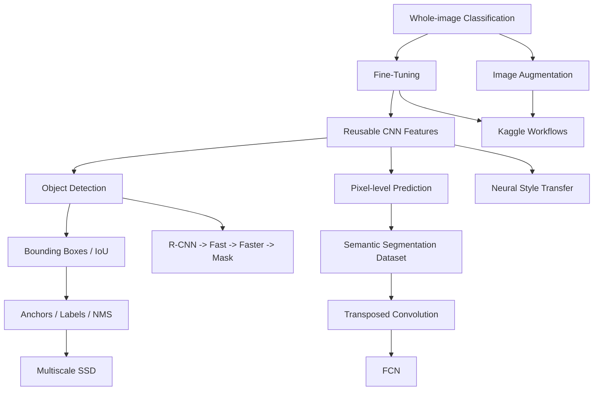
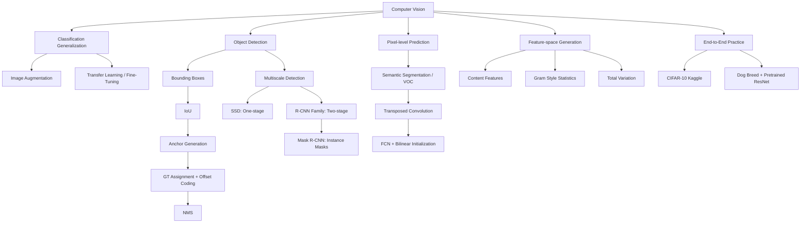

> 本章按原书顺序介绍图像增强、微调、目标检测与边界框、锚框、多尺度检测、检测数据集、SSD、R-CNN 系列、语义分割、转置卷积、全卷积网络、神经风格迁移，以及 CIFAR-10 与犬种识别两个 Kaggle 实战。

## 1. 本章主线：从整图标签到结构化视觉输出

前面的 CNN 章节主要研究整图分类：输入一张图，输出一个类别。本章把输出逐步扩展为更丰富的结构：

- **分类**：图中主要是什么；
- **目标检测**：有哪些物体，它们在哪里；
- **语义分割**：每个像素属于什么语义类；
- **实例分割**：每个像素属于哪个具体实例；
- **风格迁移**：在保留内容结构的同时改变视觉统计；
- **竞赛流程**：从原始文件、验证划分、增强、训练到提交。

本章贯穿一个核心思想：深层 CNN 在不同层形成分层表示。浅层保留边缘、颜色和纹理，深层拥有更大感受野和高级语义。不同任务并不是完全不同的网络，而是以不同方式读取、对齐和恢复这些分层特征。



作者的分析路线是：

1. 数据不足时，先扩大训练分布并复用预训练知识；
2. 分类无法定位物体，于是引入边界框；
3. 物体数量和位置未知，于是密集生成候选锚框；
4. 候选数量巨大且目标尺度不同，于是使用多尺度特征图；
5. SSD 一次前向完成密集分类与回归，R-CNN 系列则逐步共享区域计算并学习 proposal；
6. 边界框仍过于粗糙，于是转向像素级语义分割；
7. 编码器降低了空间分辨率，于是用转置卷积和 FCN 恢复逐像素输出；
8. CNN 特征还可定义内容与风格距离，把“训练参数”改成“优化图像”；
9. 最后把增强、迁移、验证和提交串成完整工程流程。

## 2. 图像增强

### 2.1 为什么要引入图像增强

大型深度网络容量高，若训练样本有限，模型容易记住偶然属性：主体总在中央、背景颜色固定、亮度范围单一等。图像增强从现有样本随机生成语义不变的新视图：

$$
\widetilde x\sim q(\widetilde x\mid x),
\qquad y(\widetilde x)=y(x).
$$

训练目标变为：

$$
\min_\theta
\frac1n\sum_{i=1}^{n}
\mathbb E_{\widetilde x\sim q(\cdot\mid x_i)}
[\ell(f_\theta(\widetilde x),y_i)].
$$

它不是简单“复制数据”，而是在声明任务不变性：若水平翻转不改变类别，模型也应给出相同预测。随机采样近似积分，使模型在增强轨道附近更平滑。

### 2.2 常见几何增强

原书以 $400\times500$ 猫图演示。

#### 2.2.1 水平翻转

`RandomHorizontalFlip()` 默认概率 $0.5$。自然图像中左右方向常不影响类别，因此它是最常用增强之一。

适用：动物、一般物体、街景中的部分分类任务。

不一定适用：

- 文字和数字；
- 左右有标签含义的医学影像；
- 交通方向或手性任务；
- 左/右鞋等细粒度类别。

#### 2.2.2 垂直翻转

`RandomVerticalFlip()` 也默认概率 $0.5$，但自然场景通常有重力方向，倒置图像可能偏离真实分布。遥感、显微镜或某些纹理任务中更合理。

#### 2.2.3 随机缩放裁剪

原书：

```python
RandomResizedCrop(
    (200, 200),
    scale=(0.1, 1.0),
    ratio=(0.5, 2.0),
)
```

随机区域面积占原图 $10\%$ 到 $100\%$，宽高比在 $0.5$ 到 $2$，再缩放到固定尺寸。它同时改变：

- 主体位置；
- 主体相对尺度；
- 可见上下文；
- 采样分辨率。

若裁剪过激，可能只保留无关背景或很小物体片段，造成标签噪声。检测和分割中还必须同步变换框或 mask。

### 2.3 颜色增强

`ColorJitter` 可随机改变：

- brightness：整体明暗；
- contrast：亮暗差异；
- saturation：颜色纯度；
- hue：色相。

原书分别使用幅度 $0.5$。例如 brightness=0.5 表示亮度因子从约 $0.5$ 到 $1.5$ 随机采样。

颜色增强降低对拍摄条件的依赖，但颜色若本身是类别证据，过强扰动会伤害任务，例如成熟度、病理染色或交通灯识别。

### 2.4 组合增强

```python
transforms.Compose([
    transforms.RandomHorizontalFlip(),
    color_aug,
    shape_aug,
])
```

组合顺序可能影响分布。几何变换通常先处理空间结构，`ToTensor` 和 normalization 通常靠后；某些算子只接受 PIL 图像或只接受 Tensor，应核对 API。

增强越多不一定越好。应从标签不变性出发选择，而不是罗列所有随机操作。

### 2.5 训练和测试为何不同

原书 CIFAR-10：

```python
train_augs = Compose([
    RandomHorizontalFlip(),
    ToTensor(),
])

test_augs = Compose([
    ToTensor(),
])
```

训练需要随机性来覆盖邻域；常规验证/测试需要确定性，才能公平比较 checkpoint 和超参数。

这不是说测试阶段绝不能增强。Test-time augmentation 会对多个确定或随机视图求平均：

$$
p(y\mid x)
\approx\frac1K\sum_{k=1}^{K}
p(y\mid T_k(x)).
$$

它增加计算，并必须预先固定协议，不能边看测试结果边挑变换。

### 2.6 CIFAR-10 训练实验

原书用 CIFAR 版 ResNet-18：

- batch size 256；
- Adam；
- learning rate 0.001；
- 10 epochs；
- 训练集水平翻转；
- 测试集无随机变换；
- 可使用多 GPU `DataParallel`。

增强常见现象：

- 训练准确率下降或收敛变慢；
- 训练—验证差距缩小；
- 测试准确率提升；
- 更强增强可能需要更长训练。

不能只比较最终训练准确率来判断增强效果。严格对照应固定：

- 初始参数；
- 数据划分；
- optimizer 和 scheduler；
- update 数；
- 随机种子；
- 模型选择规则。

原书训练绘图条件 `(num_batches // 5)` 在批次数少于 5 时会为零；稳健写法应使用 `max(1, num_batches // 5)`。

### 2.7 适用范围与局限

图像增强可以看作人工注入的归纳偏置，效果取决于变换是否保持标签。它不能：

- 创造训练集中从未出现的真实语义；
- 自动解决严重类别偏斜；
- 修复错误标签；
- 保证分布外泛化；
- 替代独立验证集。

现代方法还包括 Mixup、CutMix、RandAugment、AutoAugment、Random Erasing 等，但原书主线是先理解单图几何与颜色不变性。

## 3. 微调

### 3.1 为什么从头训练可能失败

目标数据集常比 ImageNet 小得多。复杂模型随机初始化时：

- 参数多，样本不足；
- 低层边缘和纹理也要重新学习；
- 优化时间长；
- 容易过拟合；
- 标签采集昂贵。

迁移学习假设源任务学到的部分表示对目标任务仍有用。ImageNet 中即使没有完全相同类别，边缘、纹理、形状和部件组合也可复用。

### 3.2 微调的四个步骤

1. 在大源数据集上预训练 source model；
2. 构造 target model，复制除输出头外的结构和参数；
3. 按目标类别数新建并随机初始化输出头；
4. 在目标数据上训练：旧参数用较小学习率，新头用较大学习率。

若特征提取器参数为 $\theta_b$，新头参数为 $\theta_h$：

$$
\theta_b\leftarrow
\theta_b-\eta\nabla_{\theta_b}L,
$$

$$
\theta_h\leftarrow
\theta_h-c\eta\nabla_{\theta_h}L,
\qquad c>1.
$$

原书取 $c=10$。旧参数已经处于有意义区域，步长过大会产生 catastrophic forgetting；新头从随机状态开始，需要更快适配。

### 3.3 热狗数据集

数据：

- 1400 张 hotdog；
- 1400 张 not-hotdog；
- 每类 1000 张训练；
- 每类 400 张测试；
- 图像尺寸和宽高比不同。

训练变换：随机缩放裁剪到 $224\times224$、水平翻转、ImageNet 标准化。

测试变换：Resize 到 256 后中心裁剪 $224\times224$、同一标准化。

ImageNet 均值与标准差：

$$
\mu=(0.485,0.456,0.406),
$$

$$
\sigma=(0.229,0.224,0.225).
$$

保持预训练输入约定很重要。若颜色范围、通道顺序和 normalization 不匹配，预训练特征分布会整体偏移。

原书 PyTorch `Resize([256,256])` 会强制变成正方形并扭曲宽高比；标准预训练权重通常按短边缩放后中心裁剪。

### 3.4 替换分类头

ResNet-18 的原头：

$$
512\to1000.
$$

目标模型改为：

$$
512\to2.
$$

```python
weights = torchvision.models.ResNet18_Weights.DEFAULT
net = torchvision.models.resnet18(weights=weights)
net.fc = nn.Linear(net.fc.in_features, 2)
nn.init.xavier_uniform_(net.fc.weight)
```

原书使用 `pretrained=True`，现代 torchvision 已改用 weights enum。

### 3.5 参数组学习率

```python
backbone_params = [
    p for name, p in net.named_parameters()
    if name not in {"fc.weight", "fc.bias"}
]
optimizer = torch.optim.SGD([
    {"params": backbone_params, "lr": base_lr},
    {"params": net.fc.parameters(), "lr": 10 * base_lr},
], weight_decay=1e-3)
```

原书 PyTorch：

- backbone lr $5\times10^{-5}$；
- head lr $5\times10^{-4}$；
- batch size 128；
- 5 epochs；
- weight decay 0.001。

随机初始化对照整体用 $5\times10^{-4}$。相同 epoch 下微调通常更好，因为起点已有可迁移表示。

### 3.6 固定特征提取与全量微调

#### 固定特征提取

冻结 backbone，只训练 head：

```python
for name, parameter in net.named_parameters():
    parameter.requires_grad = name.startswith("fc.")
```

优点：快、显存低、过拟合风险小。缺点：不能适配目标域的低中层差异。

原书练习给出的“冻结所有 `finetune_net.parameters()`”会连新 `fc` 一起冻结，无法训练；必须只冻结输出层之前的参数。

#### 全量微调

所有层可更新，适合数据较多或源/目标差异较大，但需要更小学习率和更谨慎正则化。

#### 分阶段解冻

先训练 head，再逐块解冻深层到浅层，是小数据任务中的常见折中。

### 3.7 冻结参数不等于冻结 BatchNorm

`requires_grad=False` 只阻止参数梯度，`BatchNorm` 在 `train()` 模式仍会更新 running mean/variance。若固定 backbone，应考虑：

- 将 backbone 置为 `eval()`；
- 只让新头保持训练模式；
- 或明确允许 BN 统计适配目标域。

两种选择有不同统计语义，不能无意识混用。

### 3.8 何时会负迁移

若源任务与目标任务差异很大，预训练偏置可能不合适：自然图像到某些医学模态、RGB 到深度图、纹理依赖相反等。应与从头训练和自监督域内预训练比较。

迁移效果受：

- 源数据覆盖；
- 输入预处理；
- 网络架构；
- 冻结范围；
- 层间学习率；
- 目标数据量；
- 标签粒度。

## 4. 目标检测与边界框

### 4.1 从分类到检测

分类假设图中有一个主要对象，只输出类别。检测面对数量未知的多个对象，需要输出集合：

$$
\{(c_i,s_i,b_i)\}_{i=1}^{N},
$$

其中 $c_i$ 是类别、$s_i$ 是置信度、$b_i$ 是位置。输出数量 $N$ 也未知，因此不能直接使用固定长度普通分类头。

### 4.2 两种边界框格式

#### 角点格式

$$
(x_1,y_1,x_2,y_2),
$$

分别为左上和右下坐标。

#### 中心格式

$$
(c_x,c_y,w,h).
$$

转换：

$$
c_x=\frac{x_1+x_2}{2},
\qquad
c_y=\frac{y_1+y_2}{2},
$$

$$
w=x_2-x_1,
\qquad h=y_2-y_1.
$$

逆变换：

$$
x_1=c_x-\frac w2,
\quad x_2=c_x+\frac w2,
$$

$$
y_1=c_y-\frac h2,
\quad y_2=c_y+\frac h2.
$$

输入 shape 为 $(n,4)$。

图像坐标原点通常在左上，$x$ 向右，$y$ 向下。原书猫狗图：

```text
dog: [60, 45, 378, 516]
cat: [400, 112, 655, 493]
```

### 4.3 坐标约定必须明确

边界框接口需要约定：

- 绝对像素还是归一化 $[0,1]$；
- 右下角是否包含；
- 连续几何坐标还是整数像素索引；
- 是否 clip 到图像边界；
- 空框和退化框如何处理。

原书使用 $w=x_2-x_1$，更接近连续坐标或半开区间。有效框应满足：

$$
x_2>x_1,
\qquad y_2>y_1.
$$

浮点 round-trip 应使用 `allclose`，不应直接 `==`。

### 4.4 框为何只有四个自由度

轴对齐矩形由两条独立竖边和两条独立横边决定，等价于两个角点或中心加宽高，共四个标量。若允许旋转，还需角度或更多顶点；轴对齐框无法紧致描述倾斜细长物体。

## 5. 锚框

### 5.1 为什么需要锚框

检测输出数量和位置未知。锚框方法预先定义大量候选区域，将问题改写为对每个候选：

1. 判断背景或物体类别；
2. 回归候选到真实框的偏移。

因此可在规则特征图上用卷积一次预测固定张量，再通过后处理得到变长结果。

### 5.2 锚框生成

图像高 $H$、宽 $W$，归一化尺度 $s$、宽高比 $r=w/h$。理想像素宽高：

$$
w_{\mathrm{px}}=Ws\sqrt r,
\qquad
h_{\mathrm{px}}=Hs/\sqrt r.
$$

给定尺度 $s_1,\ldots,s_n$ 和 ratios $r_1,\ldots,r_m$，为控制数量，只使用：

$$
(s_1,r_1),\ldots,(s_1,r_m),
(s_2,r_1),\ldots,(s_n,r_1).
$$

每个空间位置锚框数：

$$
a=n+m-1.
$$

特征图 $h\times w$ 总锚框：

$$
N=hwa.
$$

中心位于网格单元中心：

$$
c_x=\frac{j+0.5}{w},
\qquad
c_y=\frac{i+0.5}{h}.
$$

原书 `sizes=[0.75,0.5,0.25]`、`ratios=[1,2,0.5]`，每位置 5 个锚框，输出 shape：

$$
(1,HW\times5,4).
$$

首维恒为 1，因为锚框只依赖特征图 shape，不随 batch 样本变化；它不是输入 batch size。

对于矩形输入，原书代码在归一化宽度上额外乘 $H/W$，以使恢复到像素坐标后的宽高比为 $r$。锚框允许越出 $[0,1]$，后续可按需要 clip。

### 5.3 Intersection over Union

两个框 $A,B$ 的交并比：

$$
\operatorname{IoU}(A,B)
=\frac{|A\cap B|}{|A\cup B|}
=\frac{|A\cap B|}{|A|+|B|-|A\cap B|}.
$$

计算交框：

$$
x_1^I=\max(x_1^A,x_1^B),
\quad y_1^I=\max(y_1^A,y_1^B),
$$

$$
x_2^I=\min(x_2^A,x_2^B),
\quad y_2^I=\min(y_2^A,y_2^B).
$$

$$
w_I=\max(0,x_2^I-x_1^I),
\quad h_I=\max(0,y_2^I-y_1^I).
$$

输入 $(N,4)$ 与 $(M,4)$，广播输出 $(N,M)$。退化框的 union 可能为零，稳健实现应 clamp 分母或过滤非法框。

### 5.4 给锚框分配真实框

IoU 矩阵：

$$
X\in\mathbb R^{N\times M},
\qquad X_{ij}=\operatorname{IoU}(A_i,B_j).
$$

原书算法先保证每个 GT 至少匹配一个锚框：

1. 取全矩阵最大 IoU，匹配其 anchor/GT；
2. 删除该行和该列；
3. 重复 $M$ 次；
4. 对剩余 anchors，若行最大 IoU 不低于阈值（默认 0.5），匹配对应 GT；
5. 其余为背景。

强制匹配确保小目标或锚框设计不佳时，每个 GT 仍有正样本。代价是某个低 IoU anchor 也可能被标为正例。

原书 PyTorch 实现有两个工程问题：

- discard Tensor 未指定 device，GPU 时可能 device mismatch；
- anchor index 应使用整数除法 `max_idx // num_gt_boxes`，而非 `/` 后转整数。

### 5.5 类别标签

背景类别设为 0，真实目标类别整体加 1：

$$
y_i^{\mathrm{cls}}=
\begin{cases}
c_j+1,&A_i\leftrightarrow B_j,\\
0,&\text{background}.
\end{cases}
$$

原书五个锚框示例得到：

```text
[background, dog, cat, background, cat]
```

若检测数据使用 class=-1 表示 padding GT，标签分配前必须过滤；原书香蕉数据每图固定一个框，因此未暴露该问题。

### 5.6 边界框偏移编码

锚框中心尺寸 $(x_a,y_a,w_a,h_a)$，GT 为 $(x_b,y_b,w_b,h_b)$：

$$
t_x=10\frac{x_b-x_a}{w_a},
\qquad
t_y=10\frac{y_b-y_a}{h_a},
$$

$$
t_w=5\log\frac{w_b}{w_a},
\qquad
t_h=5\log\frac{h_b}{h_a}.
$$

系数 10 和 5 对应标准差 $0.1$ 和 $0.2$ 的尺度标准化，使目标更易优化。中心偏移除以 anchor 尺寸实现尺度相对化，宽高比用 log 使乘法比例变成加法。

背景锚框不计算回归损失，使用 mask：

$$
m_i=\mathbf1[y_i^{\mathrm{cls}}>0].
$$

`multibox_target` 返回：

- offsets：$(B,4N)$；
- masks：$(B,4N)$；
- classes：$(B,N)$。

### 5.7 偏移解码

预测偏移 $\widehat t$ 反变换：

$$
\widehat x_b
=x_a+\frac{\widehat t_xw_a}{10},
\qquad
\widehat y_b
=y_a+\frac{\widehat t_yh_a}{10},
$$

$$
\widehat w_b
=w_a\exp(\widehat t_w/5),
\qquad
\widehat h_b
=h_a\exp(\widehat t_h/5).
$$

编码和解码应做 round-trip 单元测试。

### 5.8 Non-Maximum Suppression

密集锚框会围绕同一目标产生许多重叠预测。NMS：

1. 按 score 降序；
2. 保留最高分框；
3. 删除与其 IoU 大于阈值的其他框；
4. 对剩余框重复。

复杂度朴素约为 $O(N^2)$；实践先做 score threshold 和 top-$k$ 降低 $N$。

原书输出 shape $(B,N,6)$：

```text
[class_id, score, x1, y1, x2, y2]
```

class=-1 表示背景或被抑制。

### 5.9 Class-aware 与 class-agnostic NMS

不同类别的重叠框可能是真实共存物体。现代检测通常按类别分别 NMS，或使用 `torchvision.ops.batched_nms`。

原书先为每个 anchor 取最佳非背景类，再把所有框统一 NMS，属于 class-agnostic，可能错误抑制不同类别框。

Soft-NMS 不直接删除，而按 IoU 衰减分数，例如高斯式：

$$
s_i\leftarrow s_i
\exp\left(-\frac{\operatorname{IoU}(M,b_i)^2}{\sigma}
\right).
$$

它在拥挤场景可保留有用候选。

## 6. 多尺度目标检测

### 6.1 为什么不能在每个原图像素生成所有框

$561\times728$ 图像、每像素 5 框：

$$
561\times728\times5
=2{,}042{,}040.
$$

对两百多万 anchors 做标签、分类、回归和 NMS 代价巨大。

物体尺度和可能位置数量存在关系：小目标可出现在很多位置，需要密集中心；大目标可放置的位置更少，可用稀疏中心。

### 6.2 特征图决定锚框中心

在 $h\times w$ 特征图每个单元生成 $a$ 个 anchors，中心均匀映射到原图，共 $hwa$ 个。原书图示：

| Feature map | Scale | Ratios | Anchor count |
|---|---:|---|---:|
| $4\times4$ | 0.15 | 1, 2, 0.5 | $4\times4\times3=48$ |
| $2\times2$ | 0.4 | 1, 2, 0.5 | 12 |
| $1\times1$ | 0.8 | 1, 2, 0.5 | 3 |

浅层高分辨率特征对应密集小框；深层低分辨率特征感受野大，对应稀疏大框。

### 6.3 预测张量形状

特征 $(B,c,h,w)$，每位置 $a$ 框，真实类数 $q$。

分类卷积输出：

$$
(B,a(q+1),h,w)
\to(B,hwa,q+1).
$$

框回归输出：

$$
(B,4a,h,w)
\to(B,hwa,4).
$$

每个空间位置的 $c$ 维特征共享相同感受野，预测以该位置为中心的 anchors。

### 6.4 尺度不等于语义层级

深层通常同时拥有更低分辨率、更大感受野和更强语义，但三者不是逻辑等价。高分辨率浅层可能缺少语义，深层上采样也可形成高分辨率语义图。

FPN 通过自顶向下路径和横向连接，使高分辨率层也拥有强语义。Anchor-free 检测器不显式生成 anchors，但仍要让不同分辨率负责不同目标尺度。

## 7. 目标检测数据集

### 7.1 香蕉数据集的目的

检测数据没有像 MNIST 那样极小且方便的标准集。原书构造香蕉数据：

- 拍摄香蕉；
- 生成不同旋转和尺度；
- 随机贴到背景；
- 标注边界框；
- 图像统一为 $256\times256$；
- 每图一个 banana，类别 0。

它适合验证检测管线，不代表真实检测难度：背景简单、单类别、单实例、无严重遮挡。

### 7.2 标签格式

CSV 每行：

```text
[class, x1, y1, x2, y2]
```

坐标除以 256 归一化。Batch shape：

$$
X:(B,3,256,256),
$$

$$
Y:(B,1,5).
$$

原书 batch size 32。

### 7.3 变长框如何组成 batch

一般图像有不同框数。可选方案：

1. 自定义 `collate_fn`，返回 List[Tensor]；
2. padding 到 batch 内最大 $M$，用 class=-1 标记无效框；
3. 使用 packed/ragged representation。

普通 DataLoader 不会自动给变长框 padding。原书的 `(B,M,5)` 说明是接口约定，香蕉数据因为每图恰有一个框才能直接 stack。

若使用 class=-1 padding，所有标签分配、loss 和 metric 都必须过滤无效框。

### 7.4 图像值域与标准化

`torchvision.io.read_image` 返回 CHW `uint8`。原书 Dataset 只 `.float()`，数值仍为 $0$–$255$。现代训练通常：

$$
x\leftarrow x/255,
$$

再按数据或预训练权重标准化。只改变 dtype 不等于归一化。

### 7.5 检测增强必须同步更新标签

水平翻转，图宽归一化坐标：

$$
x_1'=1-x_2,
\qquad x_2'=1-x_1.
$$

裁剪需：

1. 计算框与 crop 交集；
2. 平移到 crop 坐标；
3. clip；
4. 删除可见比例过低或中心不在 crop 的框；
5. 归一化到新尺寸。

颜色变换只改图像，不改框。随机缩放要同步乘坐标。错误地只增强图像会制造系统性错标签。

### 7.6 数据加载边界

原书将所有图片一次读入内存，适合小数据。大检测数据应按需读取、缓存和预取。还需考虑：

- 损坏图片；
- 空标注图；
- crowd/ignore 区域；
- rotated boxes/masks；
- 类别映射；
- 坐标裁剪；
- sampler 的长尾类别。

## 8. Single Shot Multibox Detection

### 8.1 SSD 的核心思想

SSD 是单阶段检测器：一次 CNN 前向，在多个尺度特征图上同时生成 anchors、分类并回归偏移，不需要先运行独立 proposal 网络。

模型包括：

- base network：提取较高分辨率特征；
- 若干 downsampling blocks：逐渐降低空间尺寸、扩大感受野；
- 每个尺度的 anchor generator；
- 每个尺度的 class predictor；
- 每个尺度的 box predictor。

### 8.2 分类预测层

每位置 $a$ 个 anchors，目标类 $q$，加背景共 $q+1$ 类。使用保持高宽的 $3\times3$ 卷积：

$$
C_{\mathrm{out}}=a(q+1).
$$

输出通道索引 $i(q+1)+j$ 表示第 $i$ 个 anchor 的第 $j$ 类 logit。卷积共享参数，避免为 $hwa$ anchors 使用巨大全连接层。

### 8.3 框预测层

每 anchor 四个 offset：

$$
C_{\mathrm{out}}=4a.
$$

输出 $(B,4a,h,w)$ 整理为 $(B,hwa,4)$ 或展平为 $(B,4hwa)$。

### 8.4 多尺度预测拼接

例：

- $Y_1:(2,8,20,20)$，每点 5 anchors，10 类，输出 $(2,55,20,20)$；
- $Y_2:(2,16,10,10)$，每点 3 anchors，输出 $(2,33,10,10)$。

移动通道到最后并展平：

$$
(B,C,H,W)
\to(B,H,W,C)
\to(B,HWC).
$$

拼接结果：

$$
2\times[55\cdot20\cdot20+33\cdot10\cdot10]
\Rightarrow(2,25300).
$$

### 8.5 Downsampling block

两个 `Conv3x3 + BatchNorm + ReLU`，再 `MaxPool2d(2)`：空间减半，通道可增加。

相对输入，该 block 单个输出位置感受野为 $6\times6$。感受野增大使深层适合大目标。

### 8.6 TinySSD 的五个尺度

输入 $256\times256$，特征尺寸：

$$
32,16,8,4,1.
$$

Scales：

```text
[0.2, 0.272]
[0.37, 0.447]
[0.54, 0.619]
[0.71, 0.79]
[0.88, 0.961]
```

Ratios 每层 `[1, 2, 0.5]`，所以每位置：

$$
a=2+3-1=4.
$$

总 anchors：

$$
(32^2+16^2+8^2+4^2+1)\times4
=5444.
$$

Banana 只有一个目标类，batch 32：

```text
anchors:   (1, 5444, 4)
classes:   (32, 5444, 2)
offsets:   (32, 21776)
```

### 8.7 SSD 训练目标

分类损失：每 anchor cross-entropy。

回归损失：只对正 anchor 的 offsets 计算：

$$
L=L_{\mathrm{cls}}
+\lambda L_{\mathrm{box}}.
$$

原书用 $\ell_1$：

$$
L_{\mathrm{box}}
=\left\|M\odot(\widehat T-T)\right\|_1.
$$

原实现对全部 $4N$ 元素取 mean，背景 mask 为零后仍计入分母，正框很少时会严重稀释定位损失。更合理归一化：

$$
L_{\mathrm{box}}
=\frac{
\sum|M\odot(\widehat T-T)|}
{\max(1,\sum M)}.
$$

分类也不能只看所有 anchors 的准确率，因为背景占绝大多数，即使全预测背景也可能很高。

### 8.8 正负样本不平衡

SSD 原论文使用 hard-negative mining，按负 anchor 分类 loss 选最难者，控制负正比（常见约 3:1）。原书教学实现没有此步骤。

Focal loss：

$$
L_{\mathrm{focal}}
=-\alpha(1-p_t)^\gamma\log p_t.
$$

$p_t$ 高的容易样本权重迅速下降，使优化集中于难例。

### 8.9 Smooth $\ell_1$

原书练习：

$$
f(x)=
\begin{cases}
\sigma^2x^2/2,&|x|<1/\sigma^2,\\
|x|-1/(2\sigma^2),&\text{otherwise}.
\end{cases}
$$

零附近二次、远处线性：比 $\ell_1$ 在零点平滑，比平方损失对离群框稳健。

### 8.10 训练与推理

原书 Banana 配置：

- batch 32；
- SGD，lr 0.2；
- weight decay $5\times10^{-4}$；
- 20 epochs；
- 仅报告 train class error 与 bbox MAE；
- 未计算验证 mAP。

推理：

1. `net.eval()`；
2. `torch.inference_mode()`；
3. logits softmax 为 $(B,q+1,N)$；
4. offset decode；
5. per-class score threshold；
6. class-aware NMS；
7. 输出高分框。

原书 PyTorch 测试路径未显式 resize 到 $256^2$，依赖示例图尺寸；真实接口应统一预处理。

### 8.11 正确评价检测器

训练分类误差和 bbox MAE 不能代表检测质量。常用 AP：对一个类别按 score 排序预测，逐步计算 precision/recall：

$$
\mathrm{Precision}=
\frac{TP}{TP+FP},
$$

$$
\mathrm{Recall}=
\frac{TP}{TP+FN}.
$$

在指定 IoU 阈值下积分 PR 曲线得到 AP；对类别平均为 mAP。COCO mAP 还平均多个 IoU 阈值 $0.50:0.05:0.95$。

TinySSD 是教学简化版，不等同于 SSD300；现代检测还使用 FPN、anchor-free、Transformer detector 等。

## 9. R-CNN 系列

### 9.1 R-CNN：先 proposal，再逐区域分类

流程：

1. selective search 生成约 2000 proposals；
2. 每个 proposal resize 到 CNN 输入；
3. 每个区域独立运行预训练 CNN；
4. 每类 SVM 分类；
5. 线性回归修正边界框。

问题：高度重叠 proposal 重复做数千次卷积，训练多阶段、存储特征多、推理慢。

### 9.2 Fast R-CNN：整图只卷积一次

整图 CNN 输出：

$$
(1,c,h_1,w_1).
$$

$n$ 个不同大小 proposals 投影到特征图，经 RoI pooling 得统一：

$$
(n,c,h_2,w_2).
$$

再经 FC 得 $(n,d)$，输出类别和框回归。

核心改进：所有 proposals 共享整图卷积特征，消除重复 feature extraction。

### 9.3 RoI Pooling

将任意大小 ROI 分成固定 $h_2\times w_2$ 网格，每格 max pool。原书 $4\times4$ 特征图、左上 $3\times3$ ROI，输出：

$$
\begin{bmatrix}5&6\\9&10\end{bmatrix}.
$$

`torchvision.ops.roi_pool` 的 ROI 五元组：

```text
[batch_index, x1, y1, x2, y2]
```

第一项是 batch index，不是原文所称 object class。`spatial_scale` 将原图坐标映射到特征坐标。

RoI pooling 的离散量化会造成位置误差；这对分类影响较小，对 mask 边界影响明显。

### 9.4 Faster R-CNN：proposal 也由网络学习

用 Region Proposal Network 替代 selective search：

1. 在共享 feature map 上做 $3\times3$ conv；
2. 每位置生成多尺度/ratio anchors；
3. 预测 objectness（二分类）和 box offsets；
4. NMS 产生少量 proposals；
5. proposals 进入 RoI head；
6. RPN 与 detector 联合训练。

RPN 学到“哪里像物体”，使 proposal 与主任务适配。

### 9.5 Mask R-CNN：加入实例 mask

Faster R-CNN 基础上：

- RoI pooling 改为 RoIAlign；
- 通过双线性插值避免坐标量化；
- 为每个 ROI 增加 FCN mask 分支。

Mask R-CNN 输出每个物体实例的 mask，属于实例分割；语义分割只给每个像素类别，不区分同类个体。

### 9.6 单阶段与两阶段

| 路线 | 第一阶段 | 第二阶段 | 典型特征 |
|---|---|---|---|
| SSD/YOLO | 密集直接预测 | 无 | 快、简单、候选多 |
| Faster R-CNN | RPN proposals | RoI 分类/回归 | 区域建模明确 |
| Mask R-CNN | RPN proposals | 类别/框/mask | 实例级像素输出 |

Fast R-CNN 实际 box head 常输出类别相关的 $(n,4q)$，原书 $(n,4)$ 是简化。现代两阶段模型通常结合 FPN。

## 10. 语义分割与数据集

### 10.1 三种相近任务

- **Image segmentation**：按像素相似性分区域，不要求语义；
- **Semantic segmentation**：每像素语义类别，同类实例合并；
- **Instance segmentation**：每像素既有类别又有实例 ID。

语义分割输出 logits：

$$
Z\in\mathbb R^{B\times C\times H\times W},
$$

标签：

$$
Y\in\{0,\ldots,C-1,\mathrm{ignore}\}^{B\times H\times W}.
$$

逐像素交叉熵：

$$
L=-\frac1{|\Omega|}
\sum_{(i,j)\in\Omega}
\log p_{Y_{ij},ij},
$$

$\Omega$ 排除 ignore pixels。

### 10.2 Pascal VOC2012

原书使用 VOC train/val，标签 PNG 与输入同尺寸，以 RGB 颜色编码 21 类（背景 + 20 物体类）。原文称 test samples 不准确，实际代码读取 `train.txt` 和 `val.txt`。

RGB 到整数 key：

$$
\operatorname{idx}
=(256R+G)\times256+B.
$$

查表长度：

$$
256^3=16{,}777{,}216.
$$

若 dtype int64，约：

$$
16{,}777{,}216\times8
=128\ \mathrm{MiB}.
$$

### 10.3 Void 标签

VOC 边界/无效像素常为颜色 `(224,224,192)`，应映射到 ignore index 255：

```python
F.cross_entropy(logits, target, ignore_index=255)
```

原书查表默认初始化为 0，未知颜色会误映射为背景。这会给边界制造错误监督。稳健做法先填 255，再覆盖 21 个合法颜色。

### 10.4 为什么输入和 mask 必须同步几何变换

语义分割要求像素一一对应。随机裁剪必须共享同一个 rectangle：

```python
top, left, height, width = RandomCrop.get_params(image, output_size)
image = crop(image, top, left, height, width)
mask = crop(mask, top, left, height, width)
```

几何操作：图像和 mask 同步；颜色扰动：只作用图像。

缩放并非不可行，但插值不同：

- 图像：bilinear/bicubic；
- 类别 mask：nearest neighbor。

对 mask 使用 bilinear 会混合类别 ID，产生不存在的标签。

### 10.5 原书固定裁剪

Crop size：

$$
(320,480).
$$

Batch 64：

$$
X:(64,3,320,480),
$$

$$
Y:(64,320,480).
$$

小于 crop 的图像被过滤。原书训练和验证 Dataset 都调用随机裁剪，导致验证不确定；验证还 `drop_last=True`，会漏样本。正确验证应使用：

- 确定性 resize/pad/crop；或
- 整图滑窗/多尺度推理；
- `drop_last=False`；
- 固定 ignore 处理。

### 10.6 评价指标

Pixel accuracy 易被背景主导。每类 IoU：

$$
\operatorname{IoU}_c
=\frac{TP_c}{TP_c+FP_c+FN_c}.
$$

Mean IoU：

$$
\operatorname{mIoU}
=\frac1C\sum_{c=1}^{C}\operatorname{IoU}_c.
$$

还可报告 mean accuracy、boundary IoU 等。所有 metric 必须排除 ignore pixels。

## 11. 转置卷积

### 11.1 为什么需要上采样

CNN 编码器通过 stride/pooling 降低空间分辨率，分类只需全局输出；语义分割必须恢复到像素级。转置卷积是可学习的线性上采样算子。

### 11.2 基本操作

输入 $X\in\mathbb R^{n_h\times n_w}$、核 $K\in\mathbb R^{k_h\times k_w}$，stride 1、padding 0。每个输入标量乘整个核，并散布到输出对应位置，重叠处求和：

$$
H_{\mathrm{out}}=n_h+k_h-1,
$$

$$
W_{\mathrm{out}}=n_w+k_w-1.
$$

原书：

$$
X=K=
\begin{bmatrix}0&1\\2&3\end{bmatrix},
$$

输出：

$$
\begin{bmatrix}
0&0&1\\
0&4&6\\
4&12&9
\end{bmatrix}.
$$

普通卷积“聚合窗口”，转置卷积“散布输入”；这只是计算视角，不意味着它是卷积的数值逆。

### 11.3 Padding、stride、dilation 与 output padding

PyTorch 二维单轴公式：

$$
H_{\mathrm{out}}
=(H_{\mathrm{in}}-1)s
-2p+d(k-1)+o+1,
$$

其中：

- $s$：stride；
- $p$：padding；
- $d$：dilation；
- $k$：kernel size；
- $o$：output padding。

转置卷积的 padding 可理解为从完整散布结果边缘裁剪；stride 增大散布位置间距。

`output_padding` 不是真正补零，只用于在多个可能输出尺寸中选择 shape，且须满足框架约束。

### 11.4 为什么叫“转置”卷积

将普通卷积写为矩阵乘法：

$$
y=Wx.
$$

对输入的反向传播：

$$
\frac{\partial L}{\partial x}
=W^\top\frac{\partial L}{\partial y}.
$$

转置卷积前向使用与 $W^\top$ 相同的线性结构：

$$
z=W^\top y.
$$

因此得名。它不是逆矩阵：

$$
W^\top W\ne I
$$

一般成立，所以 `tconv(conv(X))` 即使 shape 与 $X$ 相同，数值也不会恢复 $X$。

### 11.5 Shape 恢复的边界

原书例子：

```text
Conv2d(10 -> 20, k=5, p=2, s=3)
ConvTranspose2d(20 -> 10, k=5, p=2, s=3)
```

$16\to6\to16$。这只是满足公式的特例。Stride $>1$ 时普通卷积会把多个输入尺寸映到同一输出尺寸，转置卷积需要 `output_padding` 解决歧义，不能笼统说同参数必恢复 shape。

PyTorch `ConvTranspose2d` 权重布局：

```text
(in_channels, out_channels / groups, kH, kW)
```

与普通 `Conv2d` 的布局不同。

### 11.6 Checkerboard artifacts

当 kernel 与 stride 覆盖不均，输出位置接收的贡献数不同，可能出现棋盘格。可选：

- kernel size 可整除 stride；
- bilinear/nearest resize 后普通 conv；
- sub-pixel convolution；
- 设计平滑初始化。

## 12. 全卷积网络

### 12.1 FCN 如何实现逐像素分类

FCN：

1. 预训练 CNN 提取低分辨率特征；
2. $1\times1$ conv 将通道变为类别数；
3. 转置卷积上采样到输入高宽。

输入：

$$
(B,3,H,W).
$$

输出：

$$
(B,C,H,W).
$$

每个输出像素的 $C$ 个通道是类别 logits。

### 12.2 ResNet-18 编码器

截掉 global average pooling 和 FC。输入：

$$
(1,3,320,480)
$$

得到：

$$
(1,512,10,15),
$$

空间下采样 32 倍。

### 12.3 $1\times1$ 卷积的作用

$$
(B,512,10,15)
\to(B,21,10,15).
$$

它在每个空间位置独立进行线性分类，不混合邻近位置：

$$
z_{:,i,j}=Wx_{:,i,j}+b.
$$

空间上下文已经由 backbone 感受野编码。

### 12.4 32 倍上采样

```python
ConvTranspose2d(
    21, 21,
    kernel_size=64,
    stride=32,
    padding=16,
)
```

对高 10：

$$
(10-1)32-2\cdot16+64=320.
$$

对宽 15：

$$
(15-1)32-32+64=480.
$$

所以恢复 $(B,21,320,480)$。

### 12.5 双线性核初始化

二维双线性核可分离：

$$
K(i,j)
=\left(1-\frac{|i-c|}{f}\right)
\left(1-\frac{|j-c|}{f}\right),
$$

其中

$$
f=\left\lfloor\frac{k+1}{2}\right\rfloor.
$$

只写入输入/输出同编号通道：

$$
W[c,c,:,:]=K,
$$

其余通道为零，避免类别混合。训练开始时上采样等价于每类 logits 的双线性插值，再由数据学习偏离。

原书 PyTorch 只显式复制转置卷积双线性权重，没有按正文所说显式 Xavier 初始化 `final_conv`；默认初始化仍可训练，但叙述与代码不完全一致。

### 12.6 训练

VOC：

- crop $(320,480)$；
- batch 32；
- 21 classes；
- SGD；
- PyTorch lr 0.001；
- weight decay $10^{-3}$；
- 5 epochs；
- 多 GPU。

原书 loss：先逐像素 CE，再对高宽平均，得到每样本 loss。稳健实现还需 `ignore_index=255`。

### 12.7 任意尺寸预测

Stride 32 的转置卷积只对特定尺寸精确对齐。可：

- pad 到 32 倍数，预测后裁回；
- 使用插值到原始 `size=(H,W)`；
- 滑窗覆盖整图，重叠区累加 logits 和计数；
- 多尺度预测后融合。

融合应平均 logits 或概率，并避免在每个 tile 内独立 argmax 后再投票丢失置信信息。

### 12.8 FCN-32s 的局限

原书模型只有最深层 32 倍下采样特征，边界粗糙。原论文 FCN-16s/8s 融合中间层 skip connections：

- 深层：语义强、分辨率低；
- 浅层：边界细、语义弱；
- 融合兼顾两者。

现代分割常使用 U-Net、DeepLab、FPN decoder 或 Transformer decoder。

推理必须 `eval()` + `inference_mode()`，验证不能随机 crop。

## 13. 神经风格迁移

### 13.1 问题定义

给定内容图 $x_c$、风格图 $x_s$，优化合成图 $x$，使：

- 深层内容特征接近 $x_c$；
- 多层通道相关统计接近 $x_s$；
- 图像空间平滑。

预训练 CNN 参数固定，唯一可训练变量是像素 $x$。

这说明“反向传播”不仅能训练网络参数，也能优化输入。

### 13.2 VGG 特征层选择

原书 VGG-19：

```text
style layers : [0, 5, 10, 19, 28]
content layer: [25]
```

风格层为五个 block 的第一卷积，覆盖不同尺度纹理；内容层为第四 block 最后卷积，保留高级结构而不过度约束像素细节。

浅内容层会强迫合成图复制低级细节，风格难以进入；太深可能只保留粗语义，结构漂移。

### 13.3 内容损失

内容层特征 $F_l(x)$：

$$
L_c
=\frac1{|F_l|}
\|F_l(x)-F_l(x_c)\|_F^2.
$$

目标内容特征应 `detach()`，不需要对内容图或 VGG 求梯度。

### 13.4 Gram 矩阵与风格

某层特征 $(1,C,H,W)$ 展平：

$$
F\in\mathbb R^{C\times HW}.
$$

Gram：

$$
G(F)=\frac{FF^\top}{CHW}
\in\mathbb R^{C\times C}.
$$

$G_{ij}$ 表示通道 $i,j$ 在所有空间位置上的相关性。它对空间位置排列不敏感：若列置换矩阵 $P$ 满足 $PP^\top=I$，则

$$
(FP)(FP)^\top
=FPP^\top F^\top
=FF^\top.
$$

因此 Gram 保留纹理统计而主动丢弃具体布局，适合“风格”。

原文称 $CHW$ 是 Gram 元素数不准确；Gram 元素数是 $C^2$，$CHW$ 是原特征元素数，用于尺度归一化。

风格损失：

$$
L_s
=\sum_{l\in\mathcal S}
\|G(F_l(x))-G(F_l(x_s))\|_F^2
\quad\text{（配合归一化）}.
$$

原书 `gram` 假设 batch=1；若 batch>1，直接 reshape 会把样本混在一起，应使用 batch matrix multiplication。

### 13.5 Total variation loss

$$
L_{TV}
=\sum_{i,j}|x_{i+1,j}-x_{i,j}|
+|x_{i,j+1}-x_{i,j}|.
$$

它惩罚高频像素跳变，减少孤立亮点和噪声。权重过大则过度平滑，丢失笔触和边缘。

### 13.6 总目标

原书权重：

$$
L
=1\sum L_c
+10^4\sum L_s
+10L_{TV}.
$$

这些数值补偿不同损失天然尺度，不表示风格重要性一定是内容的 10000 倍。改变 layer、normalization 或分辨率后应重新调权重。

### 13.7 优化过程

- 内容图：Mount Rainier；
- 风格图：秋季橡树油画；
- 合成图初始化为内容图；
- shape $(1,3,300,450)$；
- Adam，lr 0.3；
- 500 epochs；
- 每 50 epoch lr 乘 0.8。

内容和风格目标特征可在训练前预计算。每步只对合成图提特征、计算 loss、反向到像素。

应冻结 VGG：

```python
feature_net.eval()
for parameter in feature_net.parameters():
    parameter.requires_grad_(False)
```

原书 optimizer 只包含合成图，但未冻结 VGG `requires_grad`，会计算和累积无用参数梯度，浪费内存。

初始化合成图应使用：

```python
with torch.no_grad():
    generated.copy_(content)
```

而非 `.data.copy_`。

### 13.8 局限与现代扩展

逐图迭代很慢；Gram 只匹配二阶通道统计，不能理解画家语义或笔触结构。现代方案包括：

- 为固定风格训练前馈网络；
- arbitrary style transfer；
- AdaIN；
- attention-based style transfer；
- 扩散模型的条件生成与编辑。

但内容/风格/平滑三个目标的分解仍是理解生成式特征优化的经典入口。

## 14. Kaggle CIFAR-10 图像分类

### 14.1 为什么加入竞赛流程

此前数据集 API 直接返回 Tensor；真实任务常从原始图片和 CSV 开始。完整流程包括：

1. 读标签；
2. 分层划分验证集；
3. 按 `ImageFolder` 目录结构重组；
4. 训练/验证使用不同 transform；
5. 调参；
6. 用全部有标签数据重训；
7. 严格按样例提交顺序生成 CSV。

### 14.2 数据规模

- 50000 training PNG；
- 300000 test PNG；
- 其中只有 10000 test 用于计分，其余用于防手工标注；
- $32\times32$ RGB；
- 10 classes。

标准类别含 `ship`，原文叙述写 boats，应以官方标签字符串为准。

Tiny demo：前 1000 张训练、5 张随机测试。

### 14.3 分层验证划分

令最少类别样本数为 $n$，验证比例 $r$，每类验证数：

$$
n_{val}=\max(\lfloor nr\rfloor,1).
$$

完整平衡 CIFAR-10，$n=5000,r=0.1$：每类 500，合计：

```text
train: 45000
valid: 5000
train_valid: 50000
```

原书按 `os.listdir` 遍历的每类前若干张分到 valid，未随机打乱；文件系统顺序可能有偏且不稳定。正确做法：

- 固定 seed；
- 每类 shuffle；
- 保存 split manifest；
- 重组前清理输出目录；
- 防止同源/近重复图跨 split。

### 14.4 数据增强

训练：

```text
Resize 40
RandomResizedCrop 32, area [0.64,1.0], ratio 1
RandomHorizontalFlip
ToTensor
Normalize CIFAR mean/std
```

验证/测试只 ToTensor + Normalize。CIFAR mean/std：

$$
\mu=(0.4914,0.4822,0.4465),
$$

$$
\sigma=(0.2023,0.1994,0.2010).
$$

原书验证 DataLoader `drop_last=True` 会遗漏尾部样本，评价应 `False`。

### 14.5 模型与训练

CIFAR 版 ResNet-18：首层 $3\times3$、stride 1，不使用 ImageNet 的 $7\times7$/stride 2 和早期 max pool，以免 $32^2$ 图像过早降采样。

原书 PyTorch demo：

- batch 32（完整集建议 128）；
- 20 epochs；
- SGD momentum 0.9；
- lr $2\times10^{-4}$；
- weight decay $5\times10^{-4}$；
- StepLR 每 4 epoch 乘 0.9；
- 多 GPU DataParallel。

练习建议完整集 100 epochs、lr 0.1、每 50 epochs 乘 0.1。二者差异很大，需根据 batch、初始化和框架重新验证，不能把 demo 超参数当高质量配置。

### 14.6 最终重训与提交

调参只看 valid；确定配置后重新初始化模型，用 `train_valid` 全量训练。测试预测前必须：

```python
model.eval()
with torch.inference_mode():
    ...
```

原书最终预测未显式切换，BatchNorm 会按测试 batch 更新统计，属于实质性错误。

`ImageFolder` 按路径字符串排序，测试 ID `1,10,100,...` 与数值顺序不同。提交必须让预测顺序与 ID 对齐。最稳健方式：Dataset 返回 filename/id，逐条绑定预测，而不是另行假设排序。

文中 `sampleSubmission.csv` 与 `sample_submission.csv` 命名不一致，应以实际下载文件为准。

### 14.7 竞赛中的数据泄漏

- 不用 test 排名反复调参；
- 不把 valid 增强随机性当模型提升；
- 标准化统计只从训练集或固定公开值获取；
- 重组脚本不能把 valid 同时加入 train（除专门的 `train_valid` 最终目录）；
- 提交类别顺序必须与官方 schema 一致。

## 15. Kaggle 犬种识别

### 15.1 任务特点

- 10222 training JPEG；
- 10357 test JPEG；
- 120 dog breeds；
- 图像尺寸和宽高比不同；
- ImageNet 子集；
- 类间差异细，类内姿态/背景差异大。

因此更依赖 ImageNet 预训练和高分辨率增强。

### 15.2 数据增强

训练：

```text
RandomResizedCrop 224, scale [0.08,1], ratio [3/4,4/3]
RandomHorizontalFlip
ColorJitter brightness/contrast/saturation 0.4
ToTensor
ImageNet Normalize
```

测试：短边 Resize 256、CenterCrop 224、ImageNet Normalize。

PyTorch 注释称“Add random noise”，但实际没有 MXNet 版本的 `RandomLighting(0.1)`，不能把注释当已实现功能。

### 15.3 原书模型的关键错误

原书 PyTorch：

```python
features = torchvision.models.resnet34(pretrained=True)
output_new = nn.Sequential(
    nn.Linear(1000, 256),
    nn.ReLU(),
    nn.Linear(256, 120),
)
```

完整 ResNet-34 已经输出 1000 个 ImageNet logits。新头吃到的是 logits，不是正文声称的“输出层输入特征”。正确固定特征模型：

```python
weights = torchvision.models.ResNet34_Weights.DEFAULT
backbone = torchvision.models.resnet34(weights=weights)
feature_dim = backbone.fc.in_features  # 512
backbone.fc = nn.Identity()
head = nn.Sequential(
    nn.Linear(feature_dim, 256),
    nn.ReLU(),
    nn.Linear(256, 120),
)
```

或直接把 `backbone.fc` 替换为 120 类头并微调。

### 15.4 固定特征提取的训练语义

原书冻结 backbone 参数，只训练新头：

- 交叉熵；
- SGD momentum 0.9；
- lr $10^{-4}$；
- weight decay $10^{-4}$；
- 10 epochs；
- 每 2 epoch lr 乘 0.9；
- batch 32 demo / 128 full。

这更准确叫 feature extraction，不是全模型 fine-tuning。

冻结参数后仍要处理 BN：

```python
backbone.eval()
for parameter in backbone.parameters():
    parameter.requires_grad_(False)
```

若外层 `model.train()` 会递归把 backbone 切回 train，需要重载训练模式或在每 epoch 再设 backbone.eval()。

原书训练、验证和最终推理没有可靠管理 `eval()`，验证甚至可能更新冻结 backbone 的 BN 统计。

### 15.5 提交概率

测试 logits 经 softmax：

$$
p_{ic}=\frac{e^{z_{ic}}}{\sum_j e^{z_{ij}}}.
$$

CSV：第一列 `id`，后续 120 列为每个 breed 概率。每行应满足：

$$
\sum_{c=1}^{120}p_{ic}\approx1.
$$

列顺序最好直接读取官方 sample submission，不应假设 `ImageFolder.classes` 字母序必与 Kaggle schema 相同。

评估使用 multiclass log loss，过度自信的错误预测惩罚很大。可考虑 calibration、label smoothing、模型集成和 TTA，但必须在独立验证集确认。

### 15.6 更深模型不必然更好

更深预训练模型通常有更强表示，也带来：

- 更大显存与延迟；
- 更高过拟合风险；
- 不同输入分辨率与预处理约定；
- 更复杂微调策略。

应在相同数据 split、增强和训练预算下比较 validation log loss，而不是只看训练 accuracy。

## 16. 可运行的综合 PyTorch 实验

下面脚本不下载数据，只依赖 PyTorch。它验证本章最重要的几何和张量机制：框格式 round-trip、IoU、锚框数量、offset 编解码、class-aware NMS、多尺度预测 shape、TinySSD anchor 数、同步裁剪坐标、转置卷积手写结果与矩阵转置关系、FCN shape、双线性核、Gram 的空间置换不变性和 TV loss。

```python
import math

import torch
from torch import nn
from torch.nn import functional as F

torch.manual_seed(83)

def box_corner_to_center(boxes):
    x1, y1, x2, y2 = boxes.unbind(dim=-1)
    return torch.stack(
        ((x1 + x2) / 2, (y1 + y2) / 2, x2 - x1, y2 - y1),
        dim=-1,
    )

def box_center_to_corner(boxes):
    cx, cy, width, height = boxes.unbind(dim=-1)
    return torch.stack(
        (cx - width / 2, cy - height / 2,
         cx + width / 2, cy + height / 2),
        dim=-1,
    )

def box_iou(boxes1, boxes2, eps=1e-9):
    area1 = ((boxes1[:, 2] - boxes1[:, 0]).clamp_min(0)
             * (boxes1[:, 3] - boxes1[:, 1]).clamp_min(0))
    area2 = ((boxes2[:, 2] - boxes2[:, 0]).clamp_min(0)
             * (boxes2[:, 3] - boxes2[:, 1]).clamp_min(0))
    upper_left = torch.maximum(boxes1[:, None, :2], boxes2[None, :, :2])
    lower_right = torch.minimum(boxes1[:, None, 2:], boxes2[None, :, 2:])
    intersection_size = (lower_right - upper_left).clamp_min(0)
    intersection = intersection_size[..., 0] * intersection_size[..., 1]
    union = area1[:, None] + area2[None, :] - intersection
    return intersection / union.clamp_min(eps)

def multibox_prior(feature_map, sizes, ratios):
    height, width = feature_map.shape[-2:]
    device = feature_map.device
    sizes = torch.tensor(sizes, device=device)
    ratios = torch.tensor(ratios, device=device)
    boxes_per_pixel = len(sizes) + len(ratios) - 1
    center_y = (torch.arange(height, device=device) + 0.5) / height
    center_x = (torch.arange(width, device=device) + 0.5) / width
    shift_y, shift_x = torch.meshgrid(center_y, center_x, indexing="ij")
    shift_x, shift_y = shift_x.reshape(-1), shift_y.reshape(-1)
    box_widths = torch.cat((
        sizes * torch.sqrt(ratios[:1]),
        sizes[:1] * torch.sqrt(ratios[1:]),
    )) * height / width
    box_heights = torch.cat((
        sizes / torch.sqrt(ratios[:1]),
        sizes[:1] / torch.sqrt(ratios[1:]),
    ))
    offsets = torch.stack(
        (-box_widths, -box_heights, box_widths, box_heights), dim=1
    ) / 2
    centers = torch.stack((shift_x, shift_y, shift_x, shift_y), dim=1)
    centers = centers.repeat_interleave(boxes_per_pixel, dim=0)
    offsets = offsets.repeat(height * width, 1)
    return (centers + offsets).unsqueeze(0)

def encode_offsets(anchors, boxes, eps=1e-6):
    anchor_center = box_corner_to_center(anchors)
    box_center = box_corner_to_center(boxes)
    xy = 10 * (box_center[:, :2] - anchor_center[:, :2]) / anchor_center[:, 2:]
    wh = 5 * torch.log(box_center[:, 2:] / anchor_center[:, 2:] + eps)
    return torch.cat((xy, wh), dim=1)

def decode_offsets(anchors, offsets):
    anchor_center = box_corner_to_center(anchors)
    center = offsets[:, :2] * anchor_center[:, 2:] / 10 + anchor_center[:, :2]
    size = torch.exp(offsets[:, 2:] / 5) * anchor_center[:, 2:]
    return box_center_to_corner(torch.cat((center, size), dim=1))

def nms(boxes, scores, threshold):
    order = scores.argsort(descending=True)
    keep = []
    while order.numel():
        current = order[0]
        keep.append(current)
        if order.numel() == 1:
            break
        overlaps = box_iou(boxes[current].reshape(1, 4), boxes[order[1:]])[0]
        order = order[1:][overlaps <= threshold]
    return torch.stack(keep)

def batched_nms(boxes, scores, classes, threshold):
    kept = []
    for class_id in classes.unique(sorted=True):
        indices = torch.nonzero(classes == class_id).flatten()
        local_keep = nms(boxes[indices], scores[indices], threshold)
        kept.append(indices[local_keep])
    kept = torch.cat(kept)
    return kept[scores[kept].argsort(descending=True)]

def flatten_prediction(prediction):
    return prediction.permute(0, 2, 3, 1).flatten(start_dim=1)

def transposed_correlation2d(inputs, kernel):
    output = inputs.new_zeros(
        inputs.shape[0] + kernel.shape[0] - 1,
        inputs.shape[1] + kernel.shape[1] - 1,
    )
    for row in range(inputs.shape[0]):
        for column in range(inputs.shape[1]):
            output[
                row:row + kernel.shape[0],
                column:column + kernel.shape[1],
            ] += inputs[row, column] * kernel
    return output

def correlation_matrix(kernel, input_height, input_width):
    output_height = input_height - kernel.shape[0] + 1
    output_width = input_width - kernel.shape[1] + 1
    matrix = kernel.new_zeros(
        output_height * output_width, input_height * input_width
    )
    row_index = 0
    for row in range(output_height):
        for column in range(output_width):
            for kernel_row in range(kernel.shape[0]):
                for kernel_column in range(kernel.shape[1]):
                    input_index = (
                        (row + kernel_row) * input_width
                        + column + kernel_column
                    )
                    matrix[row_index, input_index] = kernel[kernel_row, kernel_column]
            row_index += 1
    return matrix

def bilinear_kernel(channels, kernel_size):
    factor = (kernel_size + 1) // 2
    center = factor - 1 if kernel_size % 2 else factor - 0.5
    coordinates = torch.arange(kernel_size, dtype=torch.float32)
    one_dimensional = 1 - (coordinates - center).abs() / factor
    filt = one_dimensional[:, None] * one_dimensional[None, :]
    weight = torch.zeros(channels, channels, kernel_size, kernel_size)
    indices = torch.arange(channels)
    weight[indices, indices] = filt
    return weight

def gram(features):
    batch_size, channels, height, width = features.shape
    flattened = features.reshape(batch_size, channels, height * width)
    return flattened @ flattened.transpose(1, 2) / (channels * height * width)

def total_variation(images):
    vertical = (images[:, :, 1:] - images[:, :, :-1]).abs().mean()
    horizontal = (images[:, :, :, 1:] - images[:, :, :, :-1]).abs().mean()
    return 0.5 * (vertical + horizontal)

# 1. Bounding-box representations round-trip.
boxes = torch.tensor([
    [0.10, 0.20, 0.40, 0.80],
    [0.55, 0.10, 0.95, 0.60],
])
torch.testing.assert_close(
    box_center_to_corner(box_corner_to_center(boxes)), boxes
)

# 2. IoU: equal, disjoint, and one-third-shift unit squares.
unit = torch.tensor([[0.0, 0.0, 1.0, 1.0]])
same = box_iou(unit, unit).item()
disjoint = box_iou(unit, torch.tensor([[2.0, 0.0, 3.0, 1.0]])).item()
shifted = box_iou(unit, torch.tensor([[1 / 3, 0.0, 4 / 3, 1.0]])).item()
assert math.isclose(same, 1.0)
assert math.isclose(disjoint, 0.0)
assert math.isclose(shifted, 0.5, rel_tol=1e-6)

# 3. Anchor count and rectangular-image aspect-ratio correction.
feature_map = torch.zeros(2, 8, 4, 6)
anchors = multibox_prior(feature_map, sizes=[0.2, 0.4], ratios=[1, 2, 0.5])
assert anchors.shape == (1, 4 * 6 * (2 + 3 - 1), 4)
first_four = box_corner_to_center(anchors[0, :4])
pixel_widths = first_four[:, 2] * 6
pixel_heights = first_four[:, 3] * 4
torch.testing.assert_close(
    pixel_widths / pixel_heights,
    torch.tensor([1.0, 1.0, 2.0, 0.5]),
    atol=1e-6,
    rtol=1e-6,
)

# 4. Offset encoding and decoding are inverse transformations.
matched_anchors = torch.tensor([
    [0.10, 0.10, 0.40, 0.50],
    [0.50, 0.30, 0.90, 0.80],
])
ground_truth = torch.tensor([
    [0.12, 0.08, 0.45, 0.55],
    [0.48, 0.35, 0.88, 0.85],
])
encoded = encode_offsets(matched_anchors, ground_truth)
decoded = decode_offsets(matched_anchors, encoded)
torch.testing.assert_close(decoded, ground_truth, atol=2e-6, rtol=1e-6)

# 5. Class-aware NMS keeps overlapping boxes of different classes.
predicted_boxes = torch.tensor([
    [0.10, 0.10, 0.50, 0.90],
    [0.12, 0.12, 0.52, 0.92],
    [0.11, 0.11, 0.51, 0.91],
    [0.60, 0.20, 0.90, 0.80],
])
scores = torch.tensor([0.95, 0.90, 0.85, 0.80])
classes = torch.tensor([0, 0, 1, 1])
kept = batched_nms(predicted_boxes, scores, classes, threshold=0.5)
assert kept.tolist() == [0, 2, 3]

# 6. Multiscale convolutional prediction shapes.
batch_size, num_classes = 2, 10
prediction1 = nn.Conv2d(8, 5 * (num_classes + 1), 3, padding=1)(
    torch.zeros(batch_size, 8, 20, 20)
)
prediction2 = nn.Conv2d(16, 3 * (num_classes + 1), 3, padding=1)(
    torch.zeros(batch_size, 16, 10, 10)
)
concatenated = torch.cat(
    (flatten_prediction(prediction1), flatten_prediction(prediction2)), dim=1
)
assert prediction1.shape == (2, 55, 20, 20)
assert prediction2.shape == (2, 33, 10, 10)
assert concatenated.shape == (2, 25_300)

# 7. TinySSD's five maps create exactly 5,444 anchors at four per position.
feature_sizes = [32, 16, 8, 4, 1]
anchor_count = sum(size * size * 4 for size in feature_sizes)
assert anchor_count == 5_444
assert 4 * anchor_count == 21_776

# 8. A crop rectangle must be applied identically to image and mask.
image = torch.arange(3 * 6 * 8).reshape(3, 6, 8)
mask = torch.arange(6 * 8).reshape(6, 8)
top, left, height, width = 1, 2, 3, 4
image_crop = image[:, top:top + height, left:left + width]
mask_crop = mask[top:top + height, left:left + width]
assert image_crop.shape == (3, 3, 4)
assert mask_crop.shape == (3, 4)
assert torch.equal(image_crop[0], mask_crop)

# 9. Handwritten transposed correlation matches the textbook result and API.
inputs = torch.tensor([[0.0, 1.0], [2.0, 3.0]])
kernel = torch.tensor([[0.0, 1.0], [2.0, 3.0]])
expected = torch.tensor([
    [0.0, 0.0, 1.0],
    [0.0, 4.0, 6.0],
    [4.0, 12.0, 9.0],
])
manual_transpose = transposed_correlation2d(inputs, kernel)
torch.testing.assert_close(manual_transpose, expected)
tconv = nn.ConvTranspose2d(1, 1, kernel_size=2, bias=False)
with torch.no_grad():
    tconv.weight.copy_(kernel.reshape(1, 1, 2, 2))
api_transpose = tconv(inputs.reshape(1, 1, 2, 2))[0, 0]
torch.testing.assert_close(api_transpose, expected)

# 10. The transposed operator is W.T, but it is not an inverse.
regular_input = torch.arange(9.0).reshape(3, 3)
regular_kernel = torch.tensor([[1.0, 2.0], [3.0, 4.0]])
matrix = correlation_matrix(regular_kernel, 3, 3)
regular_output = (matrix @ regular_input.flatten()).reshape(2, 2)
transpose_output = (matrix.T @ regular_output.flatten()).reshape(3, 3)
manual_from_output = transposed_correlation2d(regular_output, regular_kernel)
torch.testing.assert_close(transpose_output, manual_from_output)
assert not torch.allclose(transpose_output, regular_input)

# 11. FCN channel projection and 32x transposed upsampling restore the shape.
features = torch.randn(1, 512, 10, 15)
classifier = nn.Conv2d(512, 21, kernel_size=1)
upsampler = nn.ConvTranspose2d(
    21, 21, kernel_size=64, stride=32, padding=16, bias=False
)
low_resolution_logits = classifier(features)
segmentation_logits = upsampler(low_resolution_logits)
assert low_resolution_logits.shape == (1, 21, 10, 15)
assert segmentation_logits.shape == (1, 21, 320, 480)

# 12. Bilinear initialization is channel diagonal and doubles spatial size.
bilinear = bilinear_kernel(channels=3, kernel_size=4)
assert bilinear.shape == (3, 3, 4, 4)
assert torch.count_nonzero(bilinear[0, 1]) == 0
bilinear_upsampler = nn.ConvTranspose2d(
    3, 3, kernel_size=4, stride=2, padding=1, bias=False
)
with torch.no_grad():
    bilinear_upsampler.weight.copy_(bilinear)
upsampled = bilinear_upsampler(torch.randn(1, 3, 8, 12))
assert upsampled.shape == (1, 3, 16, 24)

# 13. Gram style statistics ignore a common spatial permutation.
style_features = torch.randn(2, 4, 3, 5)
permutation = torch.randperm(3 * 5)
permuted_features = style_features.flatten(2)[:, :, permutation].reshape_as(
    style_features
)
torch.testing.assert_close(
    gram(style_features), gram(permuted_features), atol=1e-6, rtol=1e-6
)

# 14. Total variation is zero for a constant image and positive otherwise.
constant_image = torch.ones(1, 3, 5, 7)
noisy_image = constant_image.clone()
noisy_image[:, :, 2, 3] = 5
assert total_variation(constant_image).item() == 0
assert total_variation(noisy_image).item() > 0

print("bbox round-trip / IoU / anchors = PASS")
print("offset round-trip / class-aware NMS = PASS, kept", kept.tolist())
print("multiscale predictions / TinySSD anchors =", concatenated.shape, anchor_count)
print("synchronized crop = PASS")
print("transposed convolution / matrix transpose = PASS")
print("FCN logits / bilinear upsampling =", segmentation_logits.shape, upsampled.shape)
print("Gram permutation invariance / TV = PASS")
```

### 16.1 代码与原理的对应关系

1. 两种框格式互转恢复原框；
2. 相同框 IoU=1、分离框=0，单位方框水平错开 $1/3$ 时 IoU=0.5；
3. $4\times6$ 特征图、2 scales、3 ratios 每位置 4 框，共 96 anchors，并验证矩形图恢复后的像素宽高比；
4. offset encode/decode round-trip；
5. class-aware NMS 删除同类重复框，却保留与其高度重叠的不同类别框；
6. 两尺度分类头拼接得到原书 $(2,25300)$；
7. TinySSD 五尺度共 5444 anchors 和 21776 offsets；
8. 同一 crop rectangle 保持 image-mask 像素对齐；
9. 手写转置卷积、原书数值和 PyTorch API 一致；
10. 显式验证转置卷积是 $W^\top$，却不恢复输入；
11. FCN 的 $1\times1$ 分类与 32 倍上采样恢复 $(320,480)$；
12. 双线性核只连接同编号通道，并将高宽各放大 2 倍；
13. 对所有通道使用同一空间置换，Gram 不变；
14. 常数图 TV 为零，加入孤立噪点后为正。

## 17. 容易混淆的概念与常见误区

### 17.1 图像增强就是增加独立真实样本

增强视图高度相关，不能替代真实分布中的新场景和新类别。

### 17.2 增强越强越好

只有标签保持变换才合理；过强裁剪和颜色变化会制造错标签。

### 17.3 验证阶段绝不能增强

常规验证应确定；预先定义的 TTA 可以使用，但计算更贵且协议必须固定。

### 17.4 冻结参数后 BatchNorm 也被冻结

`requires_grad=False` 不阻止 running statistics 更新，需管理 train/eval 模式。

### 17.5 微调就是只训练新输出头

只训练头叫固定特征提取；微调通常至少更新部分预训练参数。

### 17.6 预训练模型总优于从头训练

源目标差异大时可能负迁移，需对照实验。

### 17.7 框格式只要四个数就无需约定

还需明确角点/中心、像素/归一化、端点是否包含及坐标方向。

### 17.8 锚框首维就是输入 batch size

原书 generator 返回 `(1,N,4)`，同一 anchors 对 batch 广播。

### 17.9 所有 scale 和 ratio 做笛卡尔积

原书只组合含 $s_1$ 或 $r_1$ 的项，每位置 $n+m-1$ 个。

### 17.10 锚框必须完全位于图像内

可越界，训练或推理按实现选择 clip；越界不等于无效。

### 17.11 每个正锚框都必须 IoU 大于阈值

强制匹配步骤会给每个 GT 至少一个 anchor，即使其 IoU 低于阈值。

### 17.12 IoU 能衡量所有定位误差

无重叠时 IoU 对距离缺少区分；GIoU/DIoU/CIoU 等补充几何信息。

### 17.13 背景 anchor 也训练 box regression

背景无目标框，回归 loss 应用 mask 排除。

### 17.14 NMS 是模型训练的一部分

经典 NMS 是推理后处理；标准硬 NMS 不可微，通常不参与训练。

### 17.15 NMS 应跨所有类别统一执行

通常按类别执行，避免不同类重叠物体互相抑制。

### 17.16 特征图越深只表示尺度越大

深度还改变语义、感受野和通道；尺度与抽象层级相关但不等价。

### 17.17 DataLoader 会自动 padding 变长检测标签

默认 stack 要求 shape 相同；需 `collate_fn` 或显式 padding。

### 17.18 `.float()` 就把 uint8 图归一化了

它只改 dtype，值仍可在 0–255；除以 255 才改变尺度。

### 17.19 SSD 分类准确率高代表检测好

背景占比巨大可制造虚高，需 AP/mAP、正负样本指标和定位质量。

### 17.20 原书 TinySSD 就是完整 SSD300

它是单类教学简化版，省略 hard-negative mining 等关键细节。

### 17.21 R-CNN、Fast R-CNN、Faster R-CNN 只差速度

它们分别改变特征共享和 proposal 生成，训练结构也发生变化。

### 17.22 RoI 五元组第一项是类别

`torchvision.ops.roi_pool` 第一项是 batch index。

### 17.23 Mask R-CNN 的 mask 就是语义分割

它区分每个实例；语义分割不区分同类实例。

### 17.24 语义分割 mask 可用双线性插值

类别 ID 必须最近邻插值，否则产生不存在的混合标签。

### 17.25 VOC 未知颜色可当背景

边界 void 应映射 ignore index，不应污染背景类。

### 17.26 验证集随机裁剪可以更全面

单次随机 crop 指标不稳定且只评价局部；应使用固定协议或整图聚合。

### 17.27 转置卷积是普通卷积的逆

它是线性算子的转置，不是逆；$W^\top W$ 一般不为 $I$。

### 17.28 同参数卷积和转置卷积总能恢复 shape

Stride 大于 1 时存在尺寸歧义，可能需要 `output_padding`。

### 17.29 转置卷积等同于先插值再卷积

两者都可上采样，但算子和参数化不同；某些初始化下输出可接近插值。

### 17.30 FCN 中 $1\times1$ 卷积负责空间上采样

它只投影通道；转置卷积或插值恢复空间尺寸。

### 17.31 FCN-32s 已能精确恢复边界

最深特征分辨率低，边界粗；skip connections 或 decoder 可改善。

### 17.32 Gram 矩阵保留风格图布局

它对共同空间置换不变，正是通过丢失布局来描述纹理统计。

### 17.33 Gram 归一化分母 $CHW$ 是矩阵元素数

Gram 有 $C^2$ 个元素；$CHW$ 是输入特征元素数。

### 17.34 风格迁移训练的是 VGG

VGG 固定，优化变量是合成图像像素。

### 17.35 TV 越大图像越清晰

TV 权重过大导致过度平滑，可能抹去边缘和风格纹理。

### 17.36 `drop_last=True` 适合验证集

会漏样本并改变指标，验证/测试通常应 False。

### 17.37 最终使用 train+valid 重训是数据泄漏

配置已锁定后使用全部标签重训是标准流程；若之后继续根据 valid/test 调参才泄漏。

### 17.38 测试预测无需 `eval()`

Dropout 和 BatchNorm 行为错误，会改变结果和状态。

### 17.39 犬种原书新头读到 ResNet 的 512 维特征

PyTorch 代码实际读 1000 类 logits；应移除原 `fc` 才得到 512 维 pooled feature。

### 17.40 提交列按字母排序一定正确

必须与官方 sample submission schema 对齐，尤其概率列。

## 18. 原章练习与关键推导

### 18.1 图像增强为何像正则化

若小变换写为 $x+\delta$，对平滑模型作 Taylor：

$$
f_\theta(x+\delta)
\approx f_\theta(x)+J_x\delta.
$$

对零均值增强噪声取期望，损失会额外惩罚输入 Jacobian 在增强方向上的敏感性。因此增强可视为数据依赖的平滑正则，但具体形式依赖变换分布和损失。

### 18.2 微调学习率为什么分层

设预训练参数已靠近可迁移最优区域，随机头距离目标最优更远。统一大学习率会破坏 backbone，统一小学习率又让 head 学得慢。分组学习率分别控制保持与适应。

可进一步使用 layer-wise learning-rate decay：越靠近输入层学习率越小。

### 18.3 利用 ImageNet 热狗权重

若 source 头中已有 hotdog 类，可把对应权重作为目标二分类头 hotdog 行的初始化：

$$
w_{\mathrm{target,hotdog}}
\leftarrow w_{\mathrm{ImageNet,hotdog}}.
$$

非热狗行可用多个食物/背景类权重平均或随机初始化。类别索引必须按当前 weights metadata 查找，不能依赖原书硬编码索引。

### 18.4 构造 IoU 为 0.5 的框

两个单位正方形水平错开 $d\in[0,1]$：交面积 $1-d$，并面积 $1+d$。

$$
\frac{1-d}{1+d}=\frac12
\Longrightarrow
2-2d=1+d
\Longrightarrow d=\frac13.
$$

### 18.5 为什么 offset 使用 log 宽高比

目标宽是 anchor 的 $r$ 倍：

$$
w_b=rw_a.
$$

使用 $\log(w_b/w_a)=\log r$，放大和缩小分别为正负，连续多次比例变化可相加，且保证解码宽高始终为正。

### 18.6 Soft-NMS 为何适合拥挤目标

硬 NMS 在两个真实实例高度重叠时可能删除其一；Soft-NMS 保留候选但降低分数，后续阈值仍可选择。代价是输出更多，且需调衰减函数与阈值。

### 18.7 多尺度预测输出 shape

输入 $(B,c,h,w)$，每点 $a$ 框、$q$ 真实类：

$$
\mathrm{cls}: (B,a(q+1),h,w)
\to(B,hwa,q+1),
$$

$$
\mathrm{box}: (B,4a,h,w)
\to(B,hwa,4).
$$

跨尺度沿 anchor 维拼接。

### 18.8 SSD 为何需要 hard-negative mining

若正框 $P$、负框 $N\gg P$，分类 loss：

$$
L=\sum_{i\in P}L_i+
\sum_{j\in N}L_j.
$$

大量容易背景会主导梯度。选 loss 最大的至多 $r|P|$ 个负框，使模型关注容易误报的背景，并控制计算。

### 18.9 ROI pooling 输出示例

$3\times3$ ROI：

$$
\begin{bmatrix}
0&1&2\\4&5&6\\8&9&10
\end{bmatrix}.
$$

分成 $2\times2$ bins，max 分别为 5、6、9、10，因此：

$$
\begin{bmatrix}5&6\\9&10\end{bmatrix}.
$$

量化边界导致 bin 划分不连续；RoIAlign 用采样和双线性插值减少误差。

### 18.10 分割中哪些增强不可直接复用

- ColorJitter：只改输入，不改 mask；
- flip/rotate/crop：输入和 mask 同步；
- Mixup：需定义 soft mask 或谨慎处理；
- CutMix：图像 patch 与 mask patch 同步；
- Gaussian blur：通常只作用输入；
- random erasing：若不改标签，会制造被遮挡但仍标原类的训练假设，需按目标设计。

### 18.11 转置卷积输出公式推导

相邻输入散布起点相隔 $s$，首尾起点跨度 $(H_{in}-1)s$；核有效覆盖 $d(k-1)+1$；两侧裁掉 $p$，再用 $o$ 选择额外尺寸：

$$
H_{out}
=(H_{in}-1)s-2p+d(k-1)+o+1.
$$

### 18.12 为什么 $W^\top$ 不是 $W^{-1}$

卷积矩阵常是非方阵，降采样还丢信息。即使方阵：

$$
W^\top=W^{-1}
$$

只在 $W$ 正交时成立。学习到的一般卷积核不满足该条件。

### 18.13 双线性核为何可分离

二维 bilinear interpolation 权重是横、纵一维线性权重乘积：

$$
K(i,j)=k(i)k(j).
$$

因此核是 rank-1 外积，初始化同通道转置卷积即可独立上采样每个类别 logit。

### 18.14 FCN skip connection 的 shape 对齐

深层 logits 上采样到中层尺寸，与中层 $1\times1$ 投影后的类别 logits 相加，再继续上采样。需要对齐：

- spatial shape；
- coordinate convention；
- class channels；
- crop/padding offset。

错误一像素偏移会让边界融合失真。

### 18.15 Gram 空间置换不变性

特征 $F\in\mathbb R^{C\times N}$，空间置换 $P\in\mathbb R^{N\times N}$：

$$
G(FP)=FPP^\top F^\top=FF^\top=G(F).
$$

这解释了为什么能迁移纹理，却不能保存风格图中某笔触的具体位置。

### 18.16 TV 的梯度直觉

某像素比上下左右都大时，多个绝对差项会推动它下降；比邻居都小时推动上升。它相当于对局部尖峰施加拉回邻域的力，同时比平方平滑更能保留边缘。

### 18.17 分层划分的必要性

随机全局划分在少数类很小时可能让 valid 缺类。每类单独抽取保持类别分布，使 macro metric 和错误分析可计算。还应防止同一主体的近重复照片跨 split。

### 18.18 提交概率的数值稳定性

Softmax 应由稳定实现计算：

$$
p_i=\frac{e^{z_i-z_{max}}}
{\sum_j e^{z_j-z_{max}}}.
$$

写 CSV 前验证：

- 行数等于测试样本数；
- ID 唯一且顺序正确；
- 列名与样例一致；
- 无 NaN/Inf；
- 每行概率和约为 1；
- 概率不为负。

## 19. 全章知识结构



## 20. 核心结论与解决视觉问题的一般思路

### 20.1 核心结论

1. 图像增强通过标签保持变换显式编码不变性，通常降低过拟合，但错误变换会制造标签噪声。
2. 训练使用随机增强，常规验证使用确定预处理；TTA 是额外固定协议而非随意随机测试。
3. 微调复用大数据学到的分层特征，旧层通常用小学习率，新头用大学习率；只训练头叫固定特征提取。
4. 冻结参数不冻结 BatchNorm 统计，预训练权重还要求匹配输入标准化。
5. 检测输出类别、置信度和位置集合；边界框格式与坐标约定必须显式统一。
6. 锚框把变长检测转为密集固定张量预测；IoU 用于匹配和 NMS，offset 用相对中心与 log 尺度编码。
7. 每个 GT 需至少一个正 anchor；背景不回归；class-aware NMS 避免跨类误抑制。
8. 多尺度特征图让小目标使用密集高分辨率位置，大目标使用稀疏大感受野位置。
9. SSD 一次前向完成多尺度分类与回归，但需处理严重正负不平衡并用 mAP 评价。
10. R-CNN 到 Fast/Faster/Mask 的演进依次解决重复卷积、手工 proposals 和实例像素预测。
11. 语义分割逐像素分类，不区分同类实例；VOC void 必须 ignore，输入与 mask 几何增强必须同步。
12. 转置卷积是卷积线性矩阵的转置，不是逆；输出 shape 由 stride、padding、dilation 和 output padding 共同决定。
13. FCN 用 $1\times1$ conv 做逐位置类别投影，再上采样恢复空间；深浅层融合能改善边界。
14. 双线性初始化给转置卷积一个稳定上采样起点，同类通道独立、后续可学习。
15. 风格迁移固定 CNN、优化图像；内容损失保结构，Gram loss 匹配纹理统计，TV 抑制噪声。
16. 原始文件竞赛流程必须保证分层验证、确定评价、全标签重训和提交 ID/列严格对齐。
17. CIFAR 小图需保留早期分辨率；犬种细粒度任务适合 ImageNet 预训练，但原书 PyTorch 新头错误接在 1000 类 logits 后。
18. 视觉任务的正确性不仅是网络 shape，还包括坐标、插值、模式切换、ignore、loss 归一化和评估协议。

### 20.2 解决视觉问题的一般顺序

1. **先定义输出粒度**：整图、框、像素类别、实例 mask，还是生成图像？
2. **写清数据坐标和值域**：CHW/HWC、uint8/float、像素/归一化、角点端点约定。
3. **先建立无增强基线**：固定 split 和 seed，再逐项加入标签保持增强。
4. **小数据优先评估预训练**：匹配 normalization，比较 frozen head、部分解冻和全量微调。
5. **检测先单测几何函数**：框转换、IoU、匹配、offset round-trip、clip 和 NMS。
6. **逐尺度标注 shape**：feature map、anchors、class channels、offset channels 和拼接顺序。
7. **处理类别不平衡**：hard-negative mining、focal loss、采样和按正框归一化。
8. **用任务指标选模型**：分类 accuracy/log loss，检测 mAP，分割 mIoU，而非代理训练误差。
9. **分割保持像素对齐**：共享几何参数，mask 最近邻插值，void 用 ignore index。
10. **验证上采样公式**：对每层手算输出高宽，并检查奇数尺寸和 `output_padding`。
11. **融合多层特征时检查坐标对齐**：shape 相同不保证采样中心相同。
12. **生成式优化先冻结特征网**：只让目标变量求梯度，预计算固定目标特征。
13. **训练和推理显式切模式**：`train()`、`eval()`、`inference_mode()`，尤其 BatchNorm/Dropout。
14. **验证集不丢样本、不随机漂移**：`drop_last=False`，确定性预处理或完整聚合协议。
15. **数据重组可重复且幂等**：保存 manifest，清理旧目录，固定分层随机划分。
16. **最终提交以 ID 为主键 join**：不要依赖独立目录排序恰好一致。
17. **提交前做 schema 检查**：行数、列名、类别顺序、概率和、NaN 与重复 ID。
18. **逐项做消融**：增强、预训练、loss、尺度和后处理每次只改一个因素。
19. **记录资源与速度**：更高分辨率和更多 anchors 会平方级增加检测/分割成本。
20. **把原书代码当机制教学而非生产模板**：更新 API，修复 device、BN、ignore、NMS、评估与数据泄漏边界。

本章可以压缩为一条统一思路：**先通过增强和预训练获得可泛化的分层图像表示，再根据输出粒度选择读取方式：分类读全局特征，检测在多尺度位置上预测类别与几何，分割将深层特征恢复到像素网格，风格迁移则把特征统计反向约束到图像。每个任务真正困难的地方不仅是 CNN 本身，而是标签与特征的对齐：类别是否在增强后不变、锚框是否正确匹配、像素是否同步变换、上采样是否坐标一致、提交是否与样本 ID 对齐。**
