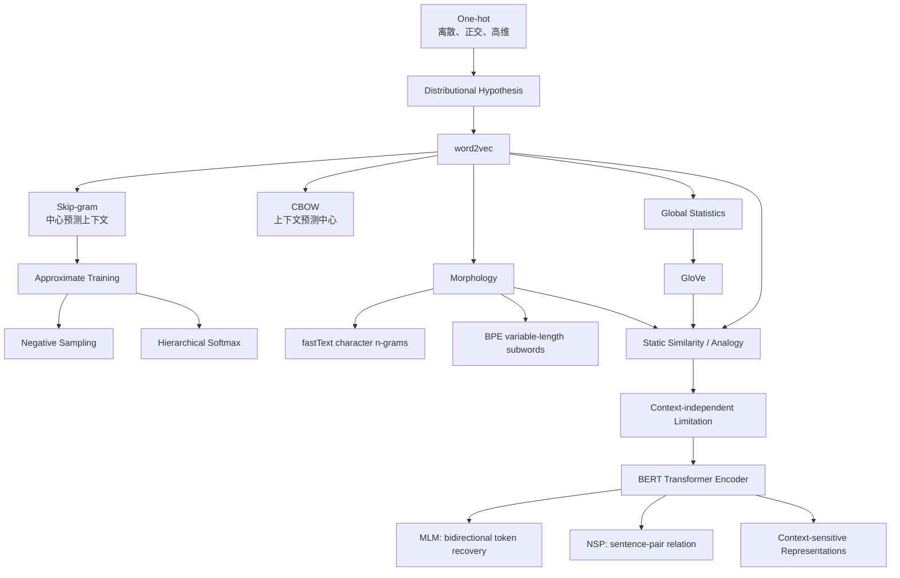

> 对应原文：d2l-en.md 第 15 章 **Natural Language Processing: Pretraining**。本章按原书顺序介绍 word2vec、近似训练、词嵌入数据管线、word2vec 预训练、GloVe、子词嵌入、词相似度与类比、BERT、BERT 预训练数据和 BERT 预训练。

## 1. 本章主线：文本表示为什么需要预训练

自然语言监督标签昂贵，但原始文本极其丰富。预训练的关键是从文本自身构造监督信号，例如：

- 用中心词预测上下文；
- 区分真实上下文和噪声词；
- 拟合全局共现统计；
- 用字符或子词共享词法结构；
- 遮盖部分 token，再用双向上下文恢复；
- 判断两句话是否相邻。

这种监督无需人工标注，属于自监督学习。预训练先学习通用文本表示，下游任务再复用或微调。

本章有两次重要跃迁：

1. **从离散符号到静态分布式表示**：word2vec、GloVe 和 fastText 为每个词或子词学习一个稠密向量；
2. **从静态向量到上下文化表示**：BERT 让同一 token 的向量依赖整段双向语境。



作者解决问题的路径如下：

1. one-hot 无法表达词之间的相似关系，于是学习低维词向量；
2. 全词表 softmax 太贵，于是用负采样或层次 softmax 近似训练；
3. 原始语料中高频功能词过多、窗口变长且负例不均匀，于是设计二次采样、动态窗口和自定义 batch；
4. word2vec 使用局部样本，GloVe 则直接拟合全局共现统计；
5. 词级词表不能共享形态信息，也无法稳健处理未登录词，于是引入字符 $n$-gram 和 BPE；
6. 静态词向量无法处理一词多义，于是用 Transformer encoder 让表示依赖双向上下文；
7. 双向 encoder 不能直接使用左到右语言模型目标，于是 BERT 使用 MLM，并以 NSP 补充句间关系。

## 2. 词嵌入与 word2vec

### 2.1 One-hot 为什么不够

词表大小为 $\lvert \mathcal V\rvert$，索引 $i$ 的 one-hot 向量：

$$
e_i\in\mathbb R^{|\mathcal V|},
$$

只有第 $i$ 维为 1。优点是无歧义、构造简单；缺点是：

- 维度随词表线性增长；
- 极度稀疏；
- 任意不同词正交：

$$
e_i^\top e_j=0,\qquad i\ne j;
$$

- 任意不同词的欧氏距离都为 $\sqrt2$；
- 余弦相似度都为 0；
- 不包含语义、句法和形态关系。

因此 one-hot 能表示“身份不同”，不能表示“chip 与 intel 比 chip 与 banana 更相关”。

### 2.2 Embedding 层究竟做什么

Embedding 参数矩阵：

$$
E\in\mathbb R^{|\mathcal V|\times d}.
$$

索引 $i$ 的向量就是第 $i$ 行：

$$
v_i=E[i].
$$

从线性代数看：

$$
v_i=e_i^\top E.
$$

但实现不会显式创建巨大 one-hot，而是直接查表 `nn.Embedding`。输入 shape $(B,T)$，输出：

$$
(B,T,d).
$$

Embedding 并非天然带语义；语义来自训练目标迫使共享上下文的词获得相似参数。

### 2.3 分布假设

word2vec 的核心直觉是 distributional hypothesis：

> 出现在相似上下文中的词，往往具有相似含义或功能。

语料本身提供中心词—上下文词关系。word2vec 不需要人工语义标签，而是通过预测邻近 token 学习向量。

### 2.4 Skip-gram：中心词预测上下文

给定序列：

```text
the man loves his son
```

中心词 `loves`、窗口半径 2，上下文是 `the`、`man`、`his`、`son`。

每个词有两套 $d$ 维参数：

- $v_i$：作为 center 的向量；
- $u_i$：作为 context 的向量。

给定中心词 $w_c$，上下文词 $w_o$ 的完整 softmax：

$$
P(w_o\mid w_c)
=\frac{\exp(u_o^\top v_c)}
{\sum_{i\in\mathcal V}\exp(u_i^\top v_c)}.
$$

为什么要两套向量？同一个词作为“条件输入”和“被预测输出”承担不同统计角色。共享一套参数并非不可能，但会施加额外对称约束。

### 2.5 Skip-gram 的似然

序列 $w^{(1)},\ldots,w^{(T)}$，固定窗口半径 $m$。假设给定中心词后，窗口内上下文条件独立：

$$
P(\mathcal C_t\mid w^{(t)})
=\prod_{\substack{-m\le j\le m\\j\ne0}}
P(w^{(t+j)}\mid w^{(t)}),
$$

越界位置省略。全语料最大似然：

$$
\max_{U,V}
\prod_{t=1}^{T}
\prod_{\substack{-m\le j\le m\\j\ne0}}
P(w^{(t+j)}\mid w^{(t)}).
$$

等价最小化负对数似然：

$$
L
=-\sum_{t=1}^{T}
\sum_{\substack{-m\le j\le m\\j\ne0}}
\log P(w^{(t+j)}\mid w^{(t)}).
$$

“条件独立”是建模分解，不是说自然语言上下文真的彼此独立。它让训练分解成大量中心—上下文正对。

### 2.6 Skip-gram 梯度推导

单个正对 $(w_c,w_o)$ 的损失：

$$
\ell
=-u_o^\top v_c
+\log\sum_{i\in\mathcal V}
\exp(u_i^\top v_c).
$$

对中心向量：

$$
\frac{\partial\ell}{\partial v_c}
=-u_o
+\sum_{j\in\mathcal V}
P(w_j\mid w_c)u_j.
$$

即：

$$
\boxed{
\nabla_{v_c}\ell
=\mathbb E_{w\sim P(\cdot\mid w_c)}[u_w]-u_o
}.
$$

梯度下降会把 $v_c$ 拉向真实上下文 $u_o$，并按模型当前概率推离其他上下文的加权平均。

对任意上下文参数 $u_j$：

$$
\frac{\partial\ell}{\partial u_j}
=\left(P(w_j\mid w_c)-\mathbf1[j=o]\right)v_c.
$$

问题也显现出来：每个正对都要计算词表中所有词的分数、概率和梯度，复杂度为：

$$
O(|\mathcal V|d).
$$

### 2.7 CBOW：上下文预测中心词

CBOW 反转条件方向：使用上下文词预测中心词。

实际上下文有 $C$ 个词，输入表示为均值：

$$
\bar v_o
=\frac1C\sum_{r=1}^{C}v_{o_r}.
$$

中心词概率：

$$
P(w_c\mid\mathcal W_o)
=\frac{\exp(u_c^\top\bar v_o)}
{\sum_{i\in\mathcal V}
\exp(u_i^\top\bar v_o)}.
$$

对第 $r$ 个上下文向量：

$$
\frac{\partial\ell}{\partial v_{o_r}}
=\frac1C\left(
\sum_jP(w_j\mid\mathcal W_o)u_j-u_c
\right).
$$

原文写 $C=2m$，但句首句尾越界位置被省略，实际应除以当前可用上下文数。

### 2.8 Skip-gram 与 CBOW 的关系

| 项目 | Skip-gram | CBOW |
|---|---|---|
| 条件 | center | context bag |
| 预测 | 每个 context | center |
| 每窗口样本 | 多个正对 | 一个聚合样本 |
| 稀有词 | 通常表现较好 | 更新被均值平滑 |
| 速度 | 较慢 | 较快 |
| 常用输出 | center table $V$ | context/input table $V$ |

CBOW 的 bag 表示忽略上下文顺序。`dog bites man` 和 `man bites dog` 若词袋相同，CBOW 输入相同；它学习局部共现，而非完整句法结构。

### 2.9 点积与余弦相似度

训练 score：

$$
u^\top v=\|u\|\|v\|\cos\theta.
$$

点积同时受方向与范数影响，余弦只比较方向。因此训练中高点积不一定代表高余弦；可能只是向量范数大。

为什么语义相似词的 center 向量余弦仍可能高？它们面对相似上下文分布，优化要求其对大量 context vectors 产生相似 scores，从而间接使方向接近。但中心向量之间并没有直接相似度监督。

### 2.10 静态词向量的边界

一个词只有一个固定向量：

```text
bank = 金融机构
bank = 河岸
```

两个含义被混进同一参数。静态词向量还面临：

- 固定词表与 OOV；
- 形态变体不共享参数；
- 无句子级上下文；
- 语料偏见被编码；
- 领域变化时含义漂移。

它们仍适合轻量检索、初始化、可解释基线和资源受限场景。

## 3. 近似训练

### 3.1 完整 softmax 的瓶颈

词表可能有几十万或数百万词。每个正对都对全部 $\lvert \mathcal V\rvert$ 输出做归一化，成本过高。近似方法希望每步只访问少量参数：

- Negative sampling：把多分类改成若干二分类；
- Hierarchical softmax：把词概率分解成树路径决策。

### 3.2 Negative sampling 的目标

正对 $(c,o)$ 的 score：

$$
s_o=u_o^\top v_c.
$$

用 sigmoid 判断“该词是否来自真实上下文”：

$$
P(D=1\mid c,o)=\sigma(s_o),
$$

$$
\sigma(x)=\frac1{1+e^{-x}}.
$$

只训练正例会令所有 score 趋向 $+\infty$，所以从噪声分布 $q(w)$ 采 $K$ 个负词 $n_1,\ldots,n_K$：

$$
L_{\mathrm{NS}}
=-\log\sigma(u_o^\top v_c)
-\sum_{k=1}^{K}
\log\sigma(-u_{n_k}^\top v_c).
$$

稳定实现使用：

$$
-\log\sigma(s)=\operatorname{softplus}(-s),
$$

$$
-\log\sigma(-s)=\operatorname{softplus}(s).
$$

因此可直接使用 `binary_cross_entropy_with_logits`。

### 3.3 Negative sampling 梯度

使用：

$$
\frac{d}{ds}[-\log\sigma(s)]=\sigma(s)-1,
$$

$$
\frac{d}{ds}[-\log\sigma(-s)]=\sigma(s).
$$

对中心向量：

$$
\frac{\partial L}{\partial v_c}
=(\sigma(s_o)-1)u_o
+\sum_{k=1}^{K}\sigma(s_k)u_{n_k}.
$$

对正上下文向量：

$$
\frac{\partial L}{\partial u_o}
=(\sigma(s_o)-1)v_c.
$$

对第 $k$ 个负向量：

$$
\frac{\partial L}{\partial u_{n_k}}
=\sigma(s_k)v_c.
$$

正例 $\sigma(s_o)-1<0$，梯度下降提高点积；负例系数 $\sigma(s_k)>0$，梯度下降降低点积。

每对成本：

$$
O((K+1)d),
$$

不再线性依赖词表大小。

### 3.4 它不是归一化词概率

原文把

$$
\sigma(s_o)\prod_k\sigma(-s_k)
$$

写成对 $P(w_o\mid w_c)$ 的近似。严格说，该值依赖本次采到哪些负词，也不保证对词表求和为 1。Negative sampling 是对比二分类目标，不是完整 softmax 概率模型。

它与 Noise-Contrastive Estimation、sampled softmax 相关但不相同：

- Negative sampling 主要为了学习表示；
- NCE 估计数据与噪声的密度比，可用于恢复归一化模型；
- sampled softmax 近似多分类 softmax 梯度。

### 3.5 噪声分布为什么用 $f(w)^{0.75}$

原书采样权重：

$$
q(w)\propto f(w)^{0.75}.
$$

若直接用 unigram $f(w)$，极高频词占负例过多；指数小于 1 会压平分布，让中低频词更常被采到，又不会像均匀分布那样过度强调极稀有词。

负例可以重复；原书拒绝当前正上下文集合中的词，所以实际是条件化后的噪声分布。

### 3.6 SGNS 与 PMI 的关系

在理想化独立计数、充分容量和固定噪声分布下，令中心 $c$ 与上下文 $o$ 的最优 score 为 $s_{co}$。正样本期望计数与 $p_{data}(c,o)$ 成正比，负样本与 $Kp_{data}(c)q(o)$ 成正比。二分类最优 log-odds：

$$
s_{co}^{\ast}
=\log\frac{p_{data}(c,o)}
{Kp_{data}(c)q(o)}.
$$

若 $q(o)=p_{data}(o)$：

$$
s_{co}^{\ast}
=\operatorname{PMI}(c,o)-\log K.
$$

所以 SGNS 可理解为低秩分解一个移位 PMI 结构。实际训练受到低维参数共享、subsampling、动态窗口和 $q\propto f^{0.75}$ 的影响，这只是解释性近似。

### 3.7 Hierarchical softmax

将每个词放在二叉树叶节点。根到词 $w$ 的路径经过 $L(w)-1$ 个内部节点，每一步做左右二分类。

令路径方向 $t_j\in\{+1,-1\}$：左为 $+1$，右为 $-1$。条件概率：

$$
P(w\mid w_c)
=\prod_{j=1}^{L(w)-1}
\sigma(t_j u_j^\top v_c).
$$

损失：

$$
L_{\mathrm{HS}}
=-\sum_{j=1}^{L(w)-1}
\log\sigma(t_js_j).
$$

对中心向量：

$$
\frac{\partial L}{\partial v_c}
=\sum_j
(\sigma(t_js_j)-1)t_ju_j.
$$

平衡树路径长度 $O(\log|\mathcal V|)$，计算复杂度：

$$
O(d\log|\mathcal V|).
$$

实践常用 Huffman tree，让高频词路径更短，降低平均成本。

### 3.8 为什么叶概率和为 1

每个内部节点向左、右分配：

$$
\sigma(s)+\sigma(-s)=1.
$$

根节点总质量为 1；每个节点把自身质量完整分给两个孩子。递归到叶节点，所有叶质量和仍为 1。因此层次 softmax 是真正归一化的词表概率分布。

### 3.9 两种近似的比较

| 项目 | Negative sampling | Hierarchical softmax |
|---|---|---|
| 目标 | 正负二分类 | 树路径概率 |
| 是否全词表归一化 | 否 | 是 |
| 每正对成本 | $O(Kd)$ | $O(d\log|V|)$ |
| 每步访问参数 | 正词 + $K$ 负词 | 路径内部节点 |
| 结构依赖 | 噪声分布 | 二叉树 |
| 常见用途 | 表示学习 | 大词表概率模型 |

CBOW 中只需用上下文均值替代 $v_c$，并把梯度均分给上下文输入向量，即可配合这两种近似。

## 4. 词嵌入预训练数据集

### 4.1 PTB 数据与词表

原书使用 Penn Treebank 的 Wall Street Journal 文本，训练文件每行按空格分词。

参考运行：

- 列表项约 42069；
- 词表约 6719；
- `min_freq=10`。

`raw_text.split('\n')` 可能因末尾换行产生空列表项，所以列表长度不一定等于严格语言学句子数。

低于频率阈值的词映射为 `<unk>`，随后原书又删除所有 `<unk>`，意味着稀有词完全不参与 word2vec 训练。

### 4.2 高频词二次采样

高频功能词：

- 占据大量训练时间；
- 与几乎所有词共现；
- 提供的区分信号较弱。

词 $w$ 相对频率 $f(w)$，阈值 $t=10^{-4}$。丢弃概率：

$$
P_{drop}(w)
=\max\left(1-\sqrt{\frac{t}{f(w)}},0\right).
$$

保留概率：

$$
P_{keep}(w)
=\min\left(\sqrt{\frac{t}{f(w)}},1\right).
$$

只有 $f(w)>t$ 才可能被丢弃。频率越高，保留率越低。

原书一次参考：`the` 从 50770 降到约 2010，`join` 的 45 次全部保留。前者是随机结果，并非固定常数。

二次采样还改变训练目标，而不只是加速：它重新加权中心和上下文共现，使罕见、信息量更高的关系占比上升。

### 4.3 动态上下文窗口

对每个中心位置采样：

$$
R\sim\operatorname{Uniform}\{1,\ldots,m\}.
$$

距离 $d\le m$ 的词被纳入上下文，当且仅当 $R\ge d$：

$$
P(\mathrm{include\ distance}=d)
=\frac{m-d+1}{m}.
$$

原书 $m=5$：距离 1 必选，距离 5 只有 $1/5$ 概率。动态窗口等价于让近邻关系天然权重更高。

句首句尾上下文较少；长度小于 2 的句子跳过。

### 4.4 构造中心与上下文

对每个保留 token：

- center：该 token index；
- context：动态窗口内除中心外的 indexes。

原书参考运行得到约 1,503,420 个正中心—上下文对，具体数量受二次采样和随机窗口影响。

原实现只在 Dataset 构造时采样一次，后续 epoch 重复同一窗口。更丰富的训练可在每 epoch 或每 batch 动态重采样。

### 4.5 负例采样器

采样权重：

$$
q_i\propto\operatorname{count}(w_i)^{0.75},
$$

使用删除 `<unk>` 后、subsampling 前的原始计数。每个正上下文采 $K=5$ 个负词。

若一个中心有 $n_i$ 个正上下文：

$$
m_i=Kn_i
$$

个负例。

`RandomGenerator` 一次缓存 10000 个 `random.choices` 结果，摊薄 Python 调用。大规模实现可用 alias table，使单次离散采样近似 $O(1)$。

### 4.6 自定义 batch

第 $i$ 个样本：

```text
center_i
context_i: length n_i
negative_i: length K n_i
```

拼接正负词后长度不同，batch 内 padding 到：

$$
L=\max_i(n_i+m_i).
$$

输出：

$$
\mathrm{centers}:(B,1),
$$

$$
\mathrm{contexts\_negatives}:(B,L),
$$

$$
\mathrm{masks}:(B,L),
$$

$$
\mathrm{labels}:(B,L).
$$

语义：

| 位置 | label | mask |
|---|---:|---:|
| 正上下文 | 1 | 1 |
| 负例 | 0 | 1 |
| padding | 0 | 0 |

Label=0 不能单独区分负例和 padding，必须结合 mask。

原书 batch size 512 的一个参考 batch：

```text
centers: (512,1)
others : (512,60)
```

60 是该 batch 的最大长度，不是全局固定值。

### 4.7 数据管线的工程边界

原书预先生成所有 centers、contexts 和 negatives：

- 优点：训练循环简单、每 epoch 可复现；
- 缺点：内存大、随机信号固定、构造慢。

现代大语料常采用流式处理，并在 collator/worker 中动态生成窗口与负例。

Windows `spawn` 多进程下，定义在 `load_data_ptb` 内的局部 Dataset class 可能无法 pickle。应把 class 放到模块顶层、加 `if __name__ == '__main__':`，或教学复现使用 `num_workers=0`。

影响加载速度的参数：

- `min_freq`；
- subsampling 阈值；
- 最大窗口；
- 负例数 $K$；
- batch size；
- sample cache；
- workers；
- 是否动态构造；
- 存储格式和 tokenizer。

## 5. 预训练 word2vec

### 5.1 两张 Embedding 表

```python
center_embedding = nn.Embedding(vocab_size, embed_size)
context_embedding = nn.Embedding(vocab_size, embed_size)
```

参数量：

$$
2|\mathcal V|d.
$$

原书 $|\mathcal V|=6719,d=100$：

$$
2\times6719\times100
=1{,}343{,}800.
$$

不含 optimizer state。Adam 还为每参数维护一阶和二阶矩，float32 下单纯参数、梯度和两矩至少约四份存储。

### 5.2 Forward shape

Center indexes：

$$
(B,1)\xrightarrow{E_v}(B,1,d).
$$

Context/negative indexes：

$$
(B,L)\xrightarrow{E_u}(B,L,d).
$$

Batch matrix multiply：

$$
(B,1,d)\times(B,d,L)
\to(B,1,L).
$$

每个 logit 是同一样本中心向量与一个正/负上下文向量的点积。

### 5.3 Masked BCE

逐位置 BCE-with-logits：

$$
\ell_{ij}
=-y_{ij}\log\sigma(s_{ij})
-(1-y_{ij})\log\sigma(-s_{ij}).
$$

每样本有效位置平均：

$$
L_i
=\frac{\sum_jm_{ij}\ell_{ij}}
{\sum_jm_{ij}}.
$$

原书 `SigmoidBCELoss` 先对长度 $L$ 求 mean，再乘 $L/\sum m$，代数上等价于上述有效位置平均。

测试 logits：

```text
[1.1, -2.2, 3.3, -4.4]
```

原书两个样本的有效平均 loss 约 0.9352 和 1.8462。

### 5.4 训练配置与原书结果

- batch 512；
- max window 5；
- negative ratio 5；
- embedding dim 100；
- Xavier initialization；
- Adam，lr 0.002；
- 5 epochs。

原书参考输出 loss 约 0.410，近邻结果随随机训练变化，例如 `chip` 接近 `microprocessor`、`mips`、`intel`。

吞吐打印存在问题：`metric[1]` 累计的是样本数，却标为 tokens/sec；metric 跨全部 epochs 累积，而 timer 每 epoch 重建，最后只计末 epoch 时间，5 epochs 时吞吐可能约被放大 5 倍。

### 5.5 余弦最近邻

$$
\cos(x,y)
=\frac{x^\top y}
{\|x\|_2\|y\|_2}.
$$

查询时：

1. 对全部 embedding rows 归一化；
2. 与 query 向量点积；
3. top-$k+1$；
4. 排除 query 自身及特殊 token。

代码应使用 `embed.weight.detach()` 和 `torch.no_grad()`，不应访问 `.data`。

超大词表全扫描成本 $O(|V|d)$。可用 FAISS、HNSW、IVF 或 product quantization 做近似最近邻。

### 5.6 在线重采样的价值

若每 epoch 为同一 center 重采样窗口和 negatives：

- 提供更多正负组合；
- 降低固定负例过拟合；
- 不必存储所有展开样本；
- 能按训练进度调整 $K$ 或分布。

代价是数据管线更复杂、复现需保存 RNG state、worker seed 和 epoch。

## 6. GloVe：利用全局共现统计

### 6.1 用全局统计重写 skip-gram

令 $x_{ij}$ 是中心词 $w_i$ 与上下文词 $w_j$ 的全语料共现次数，

$$
x_i=\sum_jx_{ij},
\qquad
p_{ij}=\frac{x_{ij}}{x_i}.
$$

Skip-gram 完整损失可分组：

$$
-\sum_i\sum_jx_{ij}\log q_{ij}
=-\sum_ix_i\sum_jp_{ij}\log q_{ij}.
$$

内层是交叉熵：

$$
H(p_i,q_i)
=H(p_i)+D_{KL}(p_i\|q_i).
$$

对固定语料 $H(p_i)$ 是常数，最小化 skip-gram 等价于使模型条件分布 $q_i$ 接近经验共现分布 $p_i$。但 softmax 仍需全词表归一化，且中心词权重 $x_i$ 让极高频词主导。

### 6.2 GloVe 目标

GloVe 直接拟合非零共现计数的对数：

$$
J
=\sum_{i,j:x_{ij}>0}
h(x_{ij})
\left(
u_j^\top v_i+b_i+c_j-\log x_{ij}
\right)^2.
$$

权重函数：

$$
h(x)=
\begin{cases}
(x/c)^\alpha,&x<c,\\
1,&x\ge c,
\end{cases}
$$

常用 $c=100,\alpha=0.75$。

原文称 $h$ 在 $[0,1]$ 上递增不准确；应为在 $[0,c]$ 上递增，之后饱和为 1。

$h(0)=0$，无需遍历零共现，可只存稀疏三元组 $(i,j,x_{ij})$。

### 6.3 GloVe 梯度

残差：

$$
e_{ij}=u_j^\top v_i+b_i+c_j-\log x_{ij}.
$$

单项损失 $h(x_{ij})e_{ij}^2$。梯度：

$$
\frac{\partial J_{ij}}{\partial v_i}
=2h(x_{ij})e_{ij}u_j,
$$

$$
\frac{\partial J_{ij}}{\partial u_j}
=2h(x_{ij})e_{ij}v_i,
$$

$$
\frac{\partial J_{ij}}{\partial b_i}
=\frac{\partial J_{ij}}{\partial c_j}
=2h(x_{ij})e_{ij}.
$$

高频共现被 capped，低频共现被降权，减少噪声稀有事件和极高频事件的支配。

### 6.4 共现概率比率

原书 `ice` / `steam`：

| $w_k$ | solid | gas | water | fashion |
|---|---:|---:|---:|---:|
| $P(w_k\mid ice)$ | 0.00019 | 0.000066 | 0.003 | 0.000017 |
| $P(w_k\mid steam)$ | 0.000022 | 0.00078 | 0.0022 | 0.000018 |
| ratio | 8.9 | 0.085 | 1.36 | 0.96 |

解释：

- ratio $\gg1$：更相关于 ice；
- ratio $\ll1$：更相关于 steam；
- ratio $\approx1$：同时相关或同时不相关。

表中概率已四舍五入，显示值直接相除未必精确得到 8.9。

希望：

$$
\exp((u_j-u_k)^\top v_i)
\approx\frac{p_{ij}}{p_{ik}}.
$$

取 log：

$$
u_j^\top v_i-u_k^\top v_i
\approx\log p_{ij}-\log p_{ik}.
$$

由于 $p_{ij}=x_{ij}/x_i$，中心频率项可由 bias 吸收，得到：

$$
u_j^\top v_i+b_i+c_j
\approx\log x_{ij}.
$$

这就是加权平方目标的来源。

### 6.5 中心与上下文向量的对称性

若窗口和计数规则完全对称，则：

$$
x_{ij}=x_{ji}.
$$

交换 $u,v$ 与对应 biases 不改变目标，所以两套角色数学上对称。非凸优化和随机初始化仍会得到不同数值，GloVe 常输出：

$$
e_i=v_i+u_i.
$$

但 $x_{ij}=x_{ji}$ 只在对称窗口下成立；方向窗口或距离权重不对称时不成立。

Bias 还有不可辨识性：

$$
b_i\leftarrow b_i+a,
\qquad c_j\leftarrow c_j-a
$$

不改变预测和损失，所以不能要求 $b_i=c_i$。

### 6.6 距离加权共现

窗口内距离 $d$ 的共现可贡献 $1/d$，而不是统一 1：

$$
x_{ij}
=\sum_{\text{occurrences}}
\frac1{|pos_i-pos_j|}.
$$

近邻获得更大权重，与 word2vec 动态窗口的近距离偏好相呼应。

### 6.7 局限

GloVe 直接利用全局统计、训练可在非零共现对上并行，但：

- 需要预计算共现矩阵；
- 大窗口和大词表仍耗存储；
- 静态表示不解决一词多义；
- 固定词表有 OOV；
- 语料偏见仍保留。

GloVe 6B 来自 Wikipedia 2014 与 Gigaword 5，不只是“Wikipedia subset”。

## 7. 子词嵌入

### 7.1 为什么词内部结构重要

word2vec/GloVe 把 `help`、`helps`、`helped`、`helping` 当作无关词表项，没有显式共享参数。形态丰富语言中，同一词根可有大量屈折形式，词级参数数据效率低，稀有词和 OOV 尤其困难。

两种路线：

- fastText：以字符 $n$-gram 组合词向量；
- BPE：从语料学习可变长度子词词表。

### 7.2 fastText 的字符 $n$-gram

给词加边界符。`where` 的 3-grams：

```text
<wh, whe, her, ere, re>
```

再加入完整特殊子词 `<where>`。实际使用长度 3 到 6 的所有字符 $n$-grams。

词 $w$ 的子词集合 $\mathcal G_w$，每个子词向量 $z_g$：

$$
v_w=\sum_{g\in\mathcal G_w}z_g.
$$

之后仍使用 skip-gram/negative sampling。对任意子词：

$$
\frac{\partial L}{\partial z_g}
=\frac{\partial L}{\partial v_w}.
$$

共享子词的多个单词共同更新同一参数，因此相似词法结构共享统计。

优点：

- 稀有词从常见子词获益；
- OOV 可由已知 $n$-grams 组合；
- 捕获前后缀和拼写规律。

代价：

- 子词数量巨大；
- 每词要多次查表求和；
- 字符相似不一定语义相似；
- 哈希碰撞。

可能的英文 6-grams 约 $3\times10^8$，原始 fastText 将 $n$-gram 哈希到固定 bucket，以可控内存换碰撞。PyTorch 可用 `EmbeddingBag(mode='sum')` 处理变长子词集合。

### 7.3 fastText CBOW 版本

每个上下文词先用自身子词求和：

$$
v_{w_r}=\sum_{g\in\mathcal G_{w_r}}z_g.
$$

再对上下文词平均：

$$
\bar v=\frac1C\sum_{r=1}^{C}v_{w_r},
$$

用 $\bar v$ 预测中心词。梯度先在上下文词之间均分，再传给各词的所有子词。

### 7.4 Byte Pair Encoding

BPE 从单字符符号开始，反复合并语料中频率最高的相邻符号对，直到达到目标 merge 数或词表大小。原书初始：

```text
26 lowercase letters + '_' + '[UNK]' = 28 symbols
```

语料频率：

```text
fast_:4, faster_:3, tall_:5, taller_:4
```

不跨词边界统计 pair。十次 merge：

```text
(t,a) -> ta
(ta,l) -> tal
(tal,l) -> tall
(f,a) -> fa
(fa,s) -> fas
(fas,t) -> fast
(e,r) -> er
(er,_) -> er_
(tall,_) -> tall_
(fast,_) -> fast_
```

结果：

```text
fast_
fast er_
tall_
tall er_
```

迁移到新词：

```text
tallest_ -> tall e s t _
fatter_  -> fa t t er_
```

### 7.5 BPE 为什么可控制词表大小

初始符号词表 $n$，每次 merge 加一个新符号。目标大小 $m\ge n$ 时需要：

$$
m-n
$$

次有效 merge。

实际 tokenizer 还包含特殊 token、byte alphabet 和保留项，最终大小需计入这些部分。

### 7.6 原书 BPE 实现的边界

虽然名称是 Byte Pair Encoding，示例实际对 Python 字符串字符操作，不是 UTF-8 bytes。

`segment_BPE` 使用“当前最长词表匹配”，而标准 BPE 编码通常按训练所得 merge rank 顺序应用。两者可能得到不同切分。

现代常见：

- byte-level BPE；
- WordPiece；
- SentencePiece BPE；
- SentencePiece Unigram。

还需明确 Unicode normalization、大小写、空格表示和特殊 token。

### 7.7 从子词扩展到短语

若允许跨词 pair 合并，可学习 `new_york` 等短语，但通常：

- 加词边界符；
- 允许跨词、禁止跨句；
- 使用频率或 PMI 阈值，避免所有高频虚词组合；
- 在 tokenizer 训练和下游数据中保持同一规则。

## 8. 词相似度与类比

### 8.1 加载预训练向量

原书提供：

- GloVe 6B：50d、100d；
- GloVe 42B：300d；
- fastText English wiki：300d。

`glove.6B.50d` 含 400000 个词，加 `<unk>` 后：

$$
400001
$$

行。Unknown vector 为零。

读取大 embedding 文件应注意：

- header 行；
- token 内空格/编码；
- dtype；
- 内存映射；
- 重复 token；
- unknown 策略。

### 8.2 词相似度

归一化向量后，余弦等于点积。原书 GloVe 50d 固定示例：

```text
chip -> chips 0.856, intel 0.749, electronics 0.749
beautiful -> lovely 0.921, gorgeous 0.893, wonderful 0.830
```

邻近词可能反映：

- 同义；
- 主题相关；
- 形态变体；
- 同一实体类别；
- 反义但上下文相似。

所以 distributional similarity 不等同于同义关系。

### 8.3 词类比

类比：

$$
a:b::c:d.
$$

查询：

$$
x=\operatorname{vec}(b)-\operatorname{vec}(a)
+\operatorname{vec}(c).
$$

取与 $x$ 余弦最近的词，通常排除 $a,b,c$ 和 `<unk>`。

原书结果：

```text
man : woman :: son : daughter
beijing : china :: tokyo : japan
bad : worst :: big : biggest
do : did :: go : went
```

分别反映性别、首都—国家、最高级、时态方向。

### 8.4 类比不是普遍语义代数

线性规律依赖：

- 语料覆盖；
- 词频；
- embedding 目标；
- 是否归一化；
- 关系是否近似线性；
- 偏见；
- 词义是否单一。

原书 `get_analogy` 注释声称排除 unknown/input words，但代码 top-1 并未实际排除，可能返回输入词或 `<unk>`。稳健实现需显式把这些 indexes 的 score 设为 $-\infty$。

### 8.5 大词表检索

精确扫描复杂度：

$$
O(|V|d)
$$

每个 query。高吞吐场景可预先归一化向量并建 ANN index：

- HNSW；
- IVF；
- product quantization；
- GPU FAISS。

ANN 以少量召回损失换速度和内存。

## 9. BERT：从静态到上下文化表示

### 9.1 静态词向量的根本问题

上下文无关表示：

$$
h=f(x).
$$

上下文化表示：

$$
h=f(x,c(x)).
$$

`crane`：

```text
a crane is flying       -> 鹤
a crane driver came     -> 起重机
```

word2vec/GloVe 给同一词一个向量，无法依据句子消歧。

### 9.2 ELMo、GPT、BERT 的问题演进

| 模型 | 上下文 | 下游适配 | 主要边界 |
|---|---|---|---|
| ELMo | 双向 BiLSTM | 冻结预训练模型，作为任务特征 | 下游架构仍任务专用 |
| GPT | 左到右 Transformer decoder | 加小头、全量微调 | 当前 token 看不到右侧语境 |
| BERT | 双向 Transformer encoder | 加小头、全量微调 | MLM 预训练，非直接自回归生成 |

GPT 对某位置只能使用左侧 token，所以若歧义信息只在右侧，当前位置表示无法利用。BERT encoder 无 causal mask，可同时读取左右有效 token。

### 9.3 BERT 输入格式

单句：

```text
<cls> sentence A <sep>
```

句对：

```text
<cls> sentence A <sep> sentence B <sep>
```

Segment IDs：A（含 `<cls>` 和首个 `<sep>`）为 0，B（含末尾 `<sep>`）为 1。

输入表示是三项之和：

$$
X_{b,t}
=E_{token}[x_{b,t}]
+E_{segment}[s_{b,t}]
+P_t.
$$

参数 shape：

$$
E_{token}:(|V|,H),
$$

$$
E_{segment}:(2,H),
$$

$$
P:(1,M,H).
$$

输出：

$$
(B,T,H).
$$

BERT 位置 embedding 可学习，不是原始 Transformer 的固定正弦编码。Padding 由 valid lengths / attention mask 屏蔽。

### 9.4 BERT encoder

由多个 Transformer encoder blocks 组成，每个 block：

- multi-head bidirectional self-attention；
- positionwise FFN；
- residual；
- LayerNorm；
- dropout。

各层参数独立，并不是“所有 blocks 共享参数”。Token embedding 在所有位置共享。

原书演示：

```text
vocab=10000
hidden=768
ffn=1024
heads=4
blocks=2
dropout=0.2
input=(2,8)
output=(2,8,768)
```

这只是 shape 演示，不是 BERT_BASE；原始 BERT_BASE 的 FFN 3072、12 heads、12 layers、dropout 0.1。

### 9.5 Masked Language Modeling

BERT 需要双向编码，不能让当前位置直接看到原 token 并以其为标签。随机选择普通 tokens 的约 15% 作为预测位置：

- 80% 替换成 `<mask>`；
- 10% 替换成随机普通 token；
- 10% 保持不变。

若所有位置都换 `<mask>`，下游微调从不见 `<mask>`，产生分布差异。随机/不变分支迫使 encoder 不能仅看到 `<mask>` 才认真建模。

目标：

$$
L_{MLM}
=-\sum_{i\in M}
\log P(x_i\mid x_{\setminus M}).
$$

其中 $M$ 为被选预测位置；即使输入 token 保持不变，该位置仍计 loss。

### 9.6 MLM gather shape

Encoder 输出：

$$
H:(B,T,D).
$$

预测位置：

$$
P:(B,R).
$$

按 batch gather：

$$
H_{masked}:(B,R,D).
$$

MLM MLP 输出：

$$
Z_{MLM}:(B,R,|V|).
$$

标签：

$$
Y_{MLM}:(B,R).
$$

原书 `MaskLM` 使用 Linear→ReLU→LayerNorm→Linear；原始 BERT 使用 GELU，并通常把输出投影权重与输入 token embedding 绑定（weight tying）。原书没有 tying。

GELU：

$$
\operatorname{GELU}(x)=x\Phi(x),
$$

可视为按标准正态概率平滑门控；ReLU 是硬阈值 $\max(0,x)$。

### 9.7 Next Sentence Prediction

构造句对：

- 50%：B 真的是 A 的下一句；
- 50%：B 从语料随机采样。

取 `<cls>` 表示：

$$
h_{cls}=H[:,0,:]\in\mathbb R^{B\times D}.
$$

经 tanh MLP 与二分类头：

$$
Z_{NSP}\in\mathbb R^{B\times2}.
$$

原文某处把特殊 token 写成 `<seq>`，应为 `<sep>`。

独立 NSP 演示把完整 $(B,T,D)$ flatten 成 $(B,TD)$，与文字所述 $(B,D)$ 不符；完整 `BERTModel` 正确使用 `encoded_X[:,0,:]`。

### 9.8 为什么后来常移除 NSP

MLM 直接训练 token 表示，NSP 希望补充句间关系。但随机负句过容易，模型可能依赖主题差异而非连贯性。RoBERTa 等发现移除 NSP、增加数据和动态 masking 仍可更好。替代目标包括 sentence-order prediction。

因此 NSP 是原始 BERT 设计，不是所有 encoder 预训练的必要组件。

### 9.9 BERTModel 输出

`BERTModel` 组合：

- `BERTEncoder`；
- `MaskLM`；
- `<cls>` hidden projection；
- `NextSentencePred`。

Forward 返回：

```text
encoded_X: (B,T,H)
mlm_logits: (B,R,V) or None
nsp_logits: (B,2)
```

MLM 与 NSP 共享 encoder 参数；两个任务 head 不共享。

### 9.10 BERT 的适用范围与局限

优势：

- 双向上下文；
- 统一 encoder；
- token/sequence 任务只需小头；
- 大规模自监督；
- 全参数微调。

局限：

- self-attention $O(T^2)$；
- 固定最大长度；
- MLM 每序列只监督少量 token；
- 预训练与下游输入有差异；
- 不适合直接左到右生成；
- 语料偏见和事实陈旧；
- 大模型训练成本高。

## 10. BERT 预训练数据集

### 10.1 为什么用 WikiText-2

原始 BERT 使用 BookCorpus（约 8 亿词）和 English Wikipedia（约 25 亿词），普通教学环境难以复现。原书使用较小 WikiText-2 演示完整管线，也说明领域模型可在医学等自定义语料预训练。

相比 PTB，WikiText-2：

- 保留更多标点和数字；
- 规模更大；
- 有段落结构，适合构造句对。

原文称保留大小写，但 `_read_wiki` 明确调用 `.lower()`，本书实际管线不保留大小写。

### 10.2 段落与句子切分

每行视为段落，仅保留至少两个用 `' . '` 分开的句子。只用句点分割会错误处理：

- 缩写；
- 问号和感叹号；
- 引号；
- 小数；
- 人名缩写。

真实管线可用 spaCy、Stanza 或 NLTK sentence tokenizer。不同 tokenizer 会改变 NSP 样本和词表。

### 10.3 NSP 样本生成

段落内相邻句 $(A,B)$：

```python
if random() < 0.5:
    B_used = B
    is_next = True
else:
    B_used = random_sentence_from_corpus
    is_next = False
```

若

$$
|A|+|B|+3>\mathrm{max\_len},
$$

原书直接丢弃，而非截断，导致训练样本偏向短句。

随机句可能碰巧就是实际下一句，或来自同段落，因此负标签带少量噪声。

### 10.4 MLM 位置选择

候选位置排除 `<cls>`、`<sep>`。原书预测数：

$$
R=\max(1,\operatorname{round}(0.15|tokens|)).
$$

这里 $\lvert tokens\rvert$ 包含特殊 token，而候选集不含特殊 token，因此并非严格对普通 token 取 15%。更准确：

$$
R=\max(1,\operatorname{round}(0.15|C|)),
$$

$C$ 是普通候选位置集合。

随机 replacement 从完整 `vocab.idx_to_token` 采样，可能抽到 `<pad>/<mask>/<cls>/<sep>`。稳健实现应只从普通 token indexes 采样。

80/10/10 的嵌套随机实现是正确的：

$$
P(mask)=0.8,
$$

$$
P(unchanged)=0.2\times0.5=0.1,
$$

$$
P(random)=0.2\times0.5=0.1.
$$

### 10.5 静态 masking 与动态 masking

原书在 Dataset `__init__` 中一次性生成 NSP/MLM 随机结果，后续 epoch 不变，属于 static masking。

Dynamic masking 在 collator 中每次访问重新选择：

- 同一文本提供更多监督位置；
- 降低固定 mask 过拟合；
- 无需存储全部 corrupted examples；
- 复现需要精确 worker/epoch seed。

现代 BERT 类预训练通常使用动态 masking。

### 10.6 Padding 与 batch shape

最大长度 64：

$$
R_{max}=\operatorname{round}(64\times0.15)=10.
$$

Batch 512：

```text
token_ids       (512,64)
segments        (512,64)
valid_lens      (512,)
pred_positions  (512,10)
mlm_weights     (512,10)
mlm_labels      (512,10)
nsp_labels      (512,)
```

Padding：

- tokens 用 `<pad>` index；
- segments 用 0；
- pred positions 用 0；
- MLM labels 用 0；
- `mlm_weights=0` 屏蔽虚假预测槽；
- valid length 排除 `<pad>`，用于 attention mask。

必须同时使用两种 mask：

- attention mask：防 token 读取 padding；
- MLM loss weights：防 padding prediction slots 计 loss。

### 10.7 词表

原书普通 word tokenization：

- `min_freq=5`；
- reserved `<pad>`, `<mask>`, `<cls>`, `<sep>`；
- 另有 `<unk>`；
- 参考词表约 20256。

原始 BERT 使用约 30000 WordPiece。词级教学版 OOV 更多、序列较短，不能视为原始 BERT tokenizer 复现。

### 10.8 数据工程边界

- 旧 MetaMind S3 地址可能不可用，应选择维护镜像并校验版本/hash；
- Windows 多 worker 需入口保护；
- 预先把全数据转 Tensor 占内存；
- 真实预训练常截断、拼接或 pack 文本，减少 padding；
- tokenizer、词表和特殊 token 必须随 checkpoint 保存。

## 11. 预训练 BERT

### 11.1 原始规模与教学规模

| 模型 | Layers | Hidden | Heads | Parameters |
|---|---:|---:|---:|---:|
| BERT_BASE | 12 | 768 | 12 | 110M |
| BERT_LARGE | 24 | 1024 | 16 | 340M |
| 原书 tiny | 2 | 128 | 2 | 依词表而定 |

原书 tiny：FFN 256、dropout 0.2、batch 512、max length 64，仅训练 50 steps。它验证代码链路，不构成有效语言预训练。

### 11.2 正确 MLM loss

Flatten：

$$
Z:(BR,|V|),
\quad y:(BR),
\quad m:(BR).
$$

逐位置 CE：

$$
\ell_i=\operatorname{CE}(Z_i,y_i).
$$

Masked mean：

$$
L_{MLM}
=\frac{\sum_i m_i\ell_i}
{\sum_i m_i+\epsilon}.
$$

PyTorch 必须：

```python
per_position = F.cross_entropy(
    logits.reshape(-1, vocab_size),
    labels.reshape(-1),
    reduction="none",
)
weights = mlm_weights.reshape(-1)
mlm_loss = (per_position * weights).sum() / weights.sum().clamp_min(1)
```

### 11.3 原书 MLM mask 的实质错误

原书创建：

```python
loss = nn.CrossEntropyLoss()
```

默认返回单一 scalar mean，再乘 shape $(BR,1)$ 的 weights：scalar 被广播，最后除权重和仍得到原 scalar。Padding labels 已经进入最初的 mean，mask 完全没有排除它们。

若只改 `reduction='none'`，但 weights 仍 reshape 为 $(BR,1)$，vector $(BR)$ 与 column $(BR,1)$ 会广播成 $(BR,BR)$，同样错误。Loss 和 weights 都必须展平为 $(BR)$。

### 11.4 NSP 与总 loss

$$
L_{NSP}
=\frac1B\sum_{b=1}^{B}
\operatorname{CE}(q_b,r_b).
$$

总目标：

$$
L=L_{MLM}+L_{NSP}.
$$

两个 loss 的绝对值不可直接比较。随机均匀预测时：

$$
L_{MLM}\approx\log|V|,
$$

$$
L_{NSP}\approx\log2.
$$

若 $|V|=20256$：

$$
\log20256\approx9.916,
\qquad\log2\approx0.693.
$$

所以 MLM loss 通常更大并不表示任务权重错误。

### 11.5 原书训练配置与结果边界

- Adam；
- lr 0.01；
- 无 warmup；
- 无 AdamW decoupled weight decay；
- 50 steps；
- `DataParallel`；
- 参考 MLM loss 5.885、NSP 0.760、4413.2 sentence pairs/s。

这些结果依硬件和随机数变化，且 MLM 值来自上述 mask 缺陷。现代预训练通常使用 AdamW、warmup、decay、混合精度、梯度裁剪和 DDP/FSDP。

`DataParallel` 在主卡 scatter/gather，扩展性较差；现代多 GPU 应优先一 GPU 一进程 DDP。

### 11.6 50 steps 能说明什么

可以说明：

- shape 连通；
- loss 可反向；
- MLM/NSP head 接口正确；
- 多设备路径可运行。

不能说明：

- 学到高质量语言知识；
- MLM 收敛；
- 下游迁移有效；
- 一词多义被语义正确消歧。

### 11.7 上下文化编码

原书：

```text
<cls> a crane is flying <sep>                 -> length 6
<cls> a crane driver came <sep> he just left <sep> -> length 10
```

同一位置 `crane` 的输出不同，说明网络架构依赖上下文。但原书编码函数没有 `eval()` 和 `no_grad()`，dropout 仍开启；即使随机未训练 Transformer，也会因邻居不同产生不同表示。

严谨展示：

```python
net.eval()
with torch.inference_mode():
    ...
```

并通过词义分类 probe、下游任务或同义语境聚类验证表示是否真正包含语义，而不只看两个向量不相等。

### 11.8 长度从 64 增到 512 的代价

长度增加 8 倍：

- token activations 约增 8 倍；
- attention matrix：

$$
\left(\frac{512}{64}\right)^2=64
$$

倍；
- MLM 位置约从 10 增到 77；
- 若 batch 不变，显存通常 OOM。

缓解：

- 减小 batch；
- mixed precision；
- gradient accumulation；
- activation checkpointing；
- sequence packing；
- FlashAttention；
- FSDP/tensor parallel；
- sparse/local attention。

### 11.9 MLM 与左到右 LM 谁需要更多步骤

MLM 每序列只在约 15% token 上直接计 loss，单位序列监督较稀疏，可能需要更多 token/steps；但每个预测可使用双向上下文，任务更容易。比较必须固定：

- 训练 tokens；
- FLOPs；
- 参数量；
- batch；
- 目标难度；
- 下游评价。

不能脱离计算预算简单断言谁更快收敛。

## 12. 静态与上下文化预训练的统一比较

| 方法 | 基本单位 | 训练信号 | 上下文 | 输出 | 主要优势 | 主要限制 |
|---|---|---|---|---|---|---|
| Skip-gram | word | center→context | 局部窗口 | 静态词表 | 简单、语义邻近 | 完整 softmax 贵 |
| SGNS | word | 正负二分类 | 局部动态窗口 | 静态词表 | 训练高效 | 非归一化概率 |
| CBOW | word | context bag→center | 局部无序 | 静态词表 | 更快 | 丢失顺序 |
| GloVe | word | log co-occurrence | 全局窗口统计 | 静态词表 | 利用全局稀疏统计 | 预计算共现 |
| fastText | char n-gram | SGNS/CBOW | 词法 + 局部 | 可组合 OOV | 共享形态 | 哈希碰撞、计算多 |
| BPE | learned subword | tokenizer merge | 语料统计 | 固定子词序列 | 控制词表/OOV | 切分不等于语义 |
| BERT | subword/token | MLM + NSP | 双向整段 | 上下文化序列 | 一词多义、通用微调 | $O(T^2)$、训练昂贵 |

共同点：都从未标注文本构造预测目标，通过参数共享把统计规律压缩到低维表示。区别在于建模单位、可见上下文、目标是否归一化，以及输出是否随语境变化。

## 13. 可运行的综合 PyTorch 实验

下面脚本不下载语料，只依赖 PyTorch 标准 API。它验证：

- one-hot 的相似度局限；
- skip-gram softmax 梯度公式；
- negative sampling 手工梯度；
- hierarchical softmax 叶概率和；
- subsampling 和动态窗口概率；
- batch padding、label、mask；
- masked BCE；
- GloVe 加权目标；
- fastText 子词求和；
- BPE merge；
- 余弦类比；
- tiny BERT 输入、MLM gather、NSP shape；
- 正确 MLM mask 对 padding label 不敏感；
- BERT 输出依赖上下文。

```python
import collections
import math
import random

import torch
from torch import nn
from torch.nn import functional as F

torch.manual_seed(89)
random.seed(89)

def skipgram_softmax_loss(center, context_table, target_index):
    logits = context_table @ center
    return F.cross_entropy(
        logits.unsqueeze(0), torch.tensor([target_index])
    )

def negative_sampling_loss(center, positive, negatives):
    positive_score = positive @ center
    negative_scores = negatives @ center
    return F.softplus(-positive_score) + F.softplus(negative_scores).sum()

def batchify_word2vec(examples):
    max_len = max(len(context) + len(negative)
                  for _, context, negative in examples)
    centers, context_negatives, masks, labels = [], [], [], []
    for center, context, negative in examples:
        valid_len = len(context) + len(negative)
        centers.append(center)
        context_negatives.append(
            context + negative + [0] * (max_len - valid_len)
        )
        masks.append([1] * valid_len + [0] * (max_len - valid_len))
        labels.append(
            [1] * len(context)
            + [0] * (max_len - len(context))
        )
    return (
        torch.tensor(centers).reshape(-1, 1),
        torch.tensor(context_negatives),
        torch.tensor(masks, dtype=torch.float32),
        torch.tensor(labels, dtype=torch.float32),
    )

def masked_bce_with_logits(logits, labels, masks):
    losses = F.binary_cross_entropy_with_logits(
        logits, labels, reduction="none"
    )
    return (losses * masks).sum(dim=1) / masks.sum(dim=1).clamp_min(1)

def glove_weight(count, cap=100.0, alpha=0.75):
    count = torch.as_tensor(count, dtype=torch.float32)
    return torch.where(count < cap, (count / cap).pow(alpha), torch.ones_like(count))

def glove_loss(center, context, center_bias, context_bias, counts):
    prediction = (center * context).sum(dim=-1) + center_bias + context_bias
    residual = prediction - counts.log()
    return (glove_weight(counts) * residual.square()).sum()

def character_ngrams(token, min_n=3, max_n=6):
    bounded = f"<{token}>"
    grams = {bounded}
    for size in range(min_n, max_n + 1):
        grams.update(
            bounded[start:start + size]
            for start in range(len(bounded) - size + 1)
        )
    return sorted(grams)

def most_frequent_pair(token_frequencies):
    pair_counts = collections.Counter()
    for segmented_token, frequency in token_frequencies.items():
        symbols = segmented_token.split()
        for left, right in zip(symbols, symbols[1:]):
            pair_counts[left, right] += frequency
    return max(pair_counts, key=pair_counts.get)

def merge_pair(pair, token_frequencies):
    old = " ".join(pair)
    new = "".join(pair)
    return {
        segmented.replace(old, new): frequency
        for segmented, frequency in token_frequencies.items()
    }

def masked_language_model_loss(logits, labels, weights):
    vocabulary_size = logits.shape[-1]
    per_position = F.cross_entropy(
        logits.reshape(-1, vocabulary_size),
        labels.reshape(-1),
        reduction="none",
    )
    flat_weights = weights.reshape(-1)
    return (
        (per_position * flat_weights).sum()
        / flat_weights.sum().clamp_min(1)
    )

class TinyBERT(nn.Module):
    def __init__(self, vocabulary_size, hidden_size, max_len,
                 num_heads=2, num_layers=2):
        super().__init__()
        self.token_embedding = nn.Embedding(vocabulary_size, hidden_size)
        self.segment_embedding = nn.Embedding(2, hidden_size)
        self.position_embedding = nn.Parameter(
            torch.randn(1, max_len, hidden_size) * 0.02
        )
        layer = nn.TransformerEncoderLayer(
            d_model=hidden_size,
            nhead=num_heads,
            dim_feedforward=hidden_size * 2,
            dropout=0.0,
            activation="gelu",
            batch_first=True,
        )
        self.encoder = nn.TransformerEncoder(layer, num_layers=num_layers)
        self.mlm_transform = nn.Sequential(
            nn.Linear(hidden_size, hidden_size),
            nn.GELU(),
            nn.LayerNorm(hidden_size),
        )
        self.mlm_output = nn.Linear(hidden_size, vocabulary_size)
        self.nsp_hidden = nn.Sequential(
            nn.Linear(hidden_size, hidden_size), nn.Tanh()
        )
        self.nsp_output = nn.Linear(hidden_size, 2)

    def forward(self, tokens, segments, valid_lengths, prediction_positions):
        sequence_length = tokens.shape[1]
        hidden = (
            self.token_embedding(tokens)
            + self.segment_embedding(segments)
            + self.position_embedding[:, :sequence_length]
        )
        positions = torch.arange(sequence_length, device=tokens.device)
        padding_mask = positions.unsqueeze(0) >= valid_lengths.unsqueeze(1)
        encoded = self.encoder(hidden, src_key_padding_mask=padding_mask)
        batch_indices = torch.arange(tokens.shape[0], device=tokens.device)
        batch_indices = batch_indices.repeat_interleave(
            prediction_positions.shape[1]
        )
        selected = encoded[
            batch_indices, prediction_positions.reshape(-1)
        ].reshape(tokens.shape[0], prediction_positions.shape[1], -1)
        mlm_logits = self.mlm_output(self.mlm_transform(selected))
        nsp_logits = self.nsp_output(self.nsp_hidden(encoded[:, 0]))
        return encoded, mlm_logits, nsp_logits

# 1. Different one-hot vectors have zero cosine similarity.
one_hot = torch.eye(4)
assert F.cosine_similarity(one_hot[0], one_hot[1], dim=0).item() == 0

# 2. Skip-gram softmax autograd agrees with the analytic gradient.
center = torch.tensor([0.2, -0.4, 0.7], requires_grad=True)
context_table = torch.tensor([
    [0.1, 0.3, -0.2],
    [0.5, -0.1, 0.4],
    [-0.3, 0.2, 0.6],
    [0.7, 0.1, -0.5],
])
target_index = 2
softmax_loss = skipgram_softmax_loss(center, context_table, target_index)
softmax_loss.backward()
probabilities = torch.softmax(context_table @ center.detach(), dim=0)
analytic_gradient = probabilities @ context_table - context_table[target_index]
torch.testing.assert_close(center.grad, analytic_gradient)

# 3. Negative-sampling gradients match their closed forms.
ns_center = torch.tensor([0.3, -0.2], requires_grad=True)
positive = torch.tensor([0.5, 0.4])
negatives = torch.tensor([[-0.1, 0.7], [0.6, -0.5]])
ns_loss = negative_sampling_loss(ns_center, positive, negatives)
ns_loss.backward()
positive_score = positive @ ns_center.detach()
negative_scores = negatives @ ns_center.detach()
manual_ns_gradient = (
    (torch.sigmoid(positive_score) - 1) * positive
    + (torch.sigmoid(negative_scores)[:, None] * negatives).sum(dim=0)
)
torch.testing.assert_close(ns_center.grad, manual_ns_gradient)

# 4. A toy hierarchical softmax tree assigns total leaf probability one.
root_left = torch.sigmoid(torch.tensor(0.7))
left_left = torch.sigmoid(torch.tensor(-0.2))
right_left = torch.sigmoid(torch.tensor(1.1))
leaf_probabilities = torch.stack((
    root_left * left_left,
    root_left * (1 - left_left),
    (1 - root_left) * right_left,
    (1 - root_left) * (1 - right_left),
))
torch.testing.assert_close(leaf_probabilities.sum(), torch.tensor(1.0))

# 5. Subsampling and dynamic-window inclusion probabilities.
threshold = 1e-4
high_frequency = 0.05
low_frequency = 1e-5
high_keep = min(math.sqrt(threshold / high_frequency), 1.0)
low_keep = min(math.sqrt(threshold / low_frequency), 1.0)
assert high_keep < 0.05 and low_keep == 1.0
max_window = 5
inclusion_probabilities = [
    sum(radius >= distance for radius in range(1, max_window + 1)) / max_window
    for distance in range(1, max_window + 1)
]
assert inclusion_probabilities == [1.0, 0.8, 0.6, 0.4, 0.2]

# 6. Word2vec batch labels distinguish positives, negatives, and padding.
examples = (
    (1, [2, 2], [3, 3, 3, 3]),
    (1, [2, 2, 2], [3, 3]),
)
centers, context_negatives, masks, labels = batchify_word2vec(examples)
assert centers.shape == (2, 1)
assert context_negatives.shape == masks.shape == labels.shape == (2, 6)
assert labels.tolist() == [[1, 1, 0, 0, 0, 0], [1, 1, 1, 0, 0, 0]]
assert masks.tolist() == [[1, 1, 1, 1, 1, 1], [1, 1, 1, 1, 1, 0]]

# 7. Masked BCE equals an explicit valid-position mean.
logits = torch.tensor([
    [1.1, -2.2, 3.3, -4.4],
    [1.1, -2.2, 3.3, -4.4],
])
bce_labels = torch.tensor([
    [1.0, 0.0, 0.0, 0.0],
    [0.0, 1.0, 0.0, 0.0],
])
bce_masks = torch.tensor([
    [1.0, 1.0, 1.0, 1.0],
    [1.0, 1.0, 0.0, 0.0],
])
masked_losses = masked_bce_with_logits(logits, bce_labels, bce_masks)
torch.testing.assert_close(masked_losses, torch.tensor([0.9352, 1.8462]),
                           atol=1e-4, rtol=1e-4)

# 8. GloVe ignores zero counts and gives capped weight to large counts.
counts = torch.tensor([1.0, 10.0, 100.0, 1000.0])
weights = glove_weight(counts)
assert 0 < weights[0] < weights[1] < weights[2] == weights[3] == 1
glove_center = torch.randn(4, 3, requires_grad=True)
glove_context = torch.randn(4, 3, requires_grad=True)
glove_objective = glove_loss(
    glove_center,
    glove_context,
    torch.zeros(4, requires_grad=True),
    torch.zeros(4, requires_grad=True),
    counts,
)
glove_objective.backward()
assert torch.isfinite(glove_center.grad).all()

# 9. fastText shares character n-grams and sums their vectors.
where_grams = character_ngrams("where", min_n=3, max_n=3)
assert {"<wh", "whe", "her", "ere", "re>", "<where>"} == set(where_grams)
subword_table = {
    gram_name: torch.tensor([index, index + 1.0])
    for index, gram_name in enumerate(where_grams)
}
where_vector = sum(subword_table[gram_name] for gram_name in where_grams)
expected_where_vector = torch.stack(list(subword_table.values())).sum(dim=0)
torch.testing.assert_close(where_vector, expected_where_vector)

# 10. The textbook BPE example produces the expected merge sequence.
raw_frequencies = {"fast_": 4, "faster_": 3, "tall_": 5, "taller_": 4}
token_frequencies = {
    " ".join(token): frequency
    for token, frequency in raw_frequencies.items()
}
merges = []
for _ in range(10):
    pair = most_frequent_pair(token_frequencies)
    merges.append(pair)
    token_frequencies = merge_pair(pair, token_frequencies)
assert merges == [
    ("t", "a"), ("ta", "l"), ("tal", "l"),
    ("f", "a"), ("fa", "s"), ("fas", "t"),
    ("e", "r"), ("er", "_"),
    ("tall", "_"), ("fast", "_"),
]
assert set(token_frequencies) == {"fast_", "fast er_", "tall_", "tall er_"}

# 11. A synthetic analogy is exactly recovered by cosine search.
analogy_vectors = torch.tensor([
    [1.0, 0.0],   # man
    [1.0, 1.0],   # woman
    [2.0, 0.0],   # son
    [2.0, 1.0],   # daughter
    [-1.0, 0.5],  # distractor
])
query = analogy_vectors[1] - analogy_vectors[0] + analogy_vectors[2]
normalized = F.normalize(analogy_vectors, dim=1)
similarities = normalized @ F.normalize(query, dim=0)
similarities[:3] = -torch.inf
assert similarities.argmax().item() == 3

# 12. Tiny BERT preserves sequence shape and gathers MLM positions.
vocabulary_size, hidden_size, max_len = 31, 12, 10
bert = TinyBERT(vocabulary_size, hidden_size, max_len)
bert.eval()
tokens = torch.tensor([
    [1, 5, 6, 7, 2, 0, 0],
    [1, 5, 8, 9, 2, 10, 2],
])
segments = torch.tensor([
    [0, 0, 0, 0, 0, 0, 0],
    [0, 0, 0, 0, 0, 1, 1],
])
valid_lengths = torch.tensor([5, 7])
prediction_positions = torch.tensor([[1, 3], [2, 5]])
with torch.inference_mode():
    encoded, mlm_logits, nsp_logits = bert(
        tokens, segments, valid_lengths, prediction_positions
    )
assert encoded.shape == (2, 7, hidden_size)
assert mlm_logits.shape == (2, 2, vocabulary_size)
assert nsp_logits.shape == (2, 2)

# 13. Correct MLM masking makes padded labels irrelevant.
mlm_labels = torch.tensor([[5, 7], [8, 0]])
mlm_weights = torch.tensor([[1.0, 1.0], [1.0, 0.0]])
loss_before = masked_language_model_loss(
    mlm_logits, mlm_labels, mlm_weights
)
changed_padding_label = mlm_labels.clone()
changed_padding_label[1, 1] = 30
loss_after = masked_language_model_loss(
    mlm_logits, changed_padding_label, mlm_weights
)
torch.testing.assert_close(loss_before, loss_after)

# 14. The same token obtains different vectors in different contexts.
with torch.inference_mode():
    first_context, _, _ = bert(
        torch.tensor([[1, 5, 6, 7, 2]]),
        torch.zeros(1, 5, dtype=torch.long),
        torch.tensor([5]),
        torch.tensor([[1]]),
    )
    second_context, _, _ = bert(
        torch.tensor([[1, 5, 11, 12, 2]]),
        torch.zeros(1, 5, dtype=torch.long),
        torch.tensor([5]),
        torch.tensor([[1]]),
    )
assert not torch.allclose(first_context[:, 1], second_context[:, 1])

print("one-hot / skip-gram softmax gradient = PASS")
print("negative sampling / hierarchical softmax = PASS")
print("subsampling / dynamic window / batchify = PASS")
print("masked BCE losses =", masked_losses.tolist())
print("GloVe / fastText / BPE = PASS")
print("synthetic analogy = daughter")
print("Tiny BERT shapes =", encoded.shape, mlm_logits.shape, nsp_logits.shape)
print("correct MLM mask / context dependence = PASS")
```

### 13.1 代码与原理的对应关系

1. 不同 one-hot 余弦为 0，验证其不能表达相似度；
2. Skip-gram 完整 softmax 的 autograd 梯度等于“模型期望 context − 真实 context”；
3. Negative sampling 中正例拉近、负例推远的手工梯度与 autograd 一致；
4. 四叶二叉树的层次 softmax 概率和为 1；
5. 高频词保留率低、低频词全保留，动态窗口距离 1–5 的纳入率为 $1,0.8,0.6,0.4,0.2$；
6. Batch 中正例、负例和 padding 由 label/mask 联合区分；
7. Masked BCE 复现原书 0.9352 和 1.8462；
8. GloVe 权重随计数增大并在 100 后封顶，目标梯度有限；
9. `where` 的六个三元子词共享并求和；
10. BPE 十次 merge 与原书顺序完全一致；
11. 合成词向量精确完成 man/woman/son/daughter 类比；
12. Tiny BERT 保持 $(B,T,H)$，MLM 只 gather 指定位置，NSP 输出二分类；
13. 改变 mask=0 的 padding label 不改变正确 MLM loss；
14. `eval()` 下同一 token 在不同邻居中产生不同表示，验证架构上下文化；这本身不证明已学到正确词义。

## 14. 容易混淆的概念与常见误区

### 14.1 One-hot 没有参数，所以比 embedding 更“真实”

One-hot 只编码身份；embedding 是从训练目标学习的统计表示，没有谁天然更真实。

### 14.2 Embedding 层会自动产生语义

随机 embedding 没有语义；语义来自语料、目标、优化与参数共享。

### 14.3 Skip-gram 直接让相似词向量靠近

它预测上下文；中心向量相似是共享上下文分布的间接结果。

### 14.4 Center 与 context embedding 是同一张表

标准 word2vec 维护两套参数，训练后通常选一套或组合，不会天然相等。

### 14.5 CBOW 保留上下文词序

求和/平均是 bag-of-words，同一词袋不同顺序得到相同输入。

### 14.6 点积高就代表余弦高

点积还受向量范数影响；最近邻常用余弦以消除尺度。

### 14.7 Negative sampling 只是更快算同一个 softmax

它改变为正负二分类目标，不输出归一化词表概率。

### 14.8 Negative sampling 与 NCE、sampled softmax 相同

三者目标和概率校正不同，不能混名。

### 14.9 负词必须彼此不同

可重复采样；原书只拒绝当前正上下文词。

### 14.10 $f(w)^{0.75}$ 更偏向最高频词

相对 unigram，它压平高频优势；相对均匀分布，仍偏向高频。

### 14.11 Hierarchical softmax 的输出不归一化

每节点左右概率和为 1，所有叶概率递归求和为 1。

### 14.12 Huffman tree 让每个词路径都一样长

它让高频词更短、低频词更长，降低期望路径成本。

### 14.13 Subsampling 只改变训练速度

它也重加权训练分布，改变学到的表示。

### 14.14 动态窗口内所有距离权重相同

随机半径使近距离 token 被纳入概率更高。

### 14.15 Label=0 都是负例

Padding label 也是 0，必须通过 mask 排除。

### 14.16 原书 PTB `(512,60)` 是固定接口长度

60 是该 batch 最大正负长度，其他 batch 可不同。

### 14.17 word2vec 吞吐打印就是准确 tokens/sec

原代码数的是样本且 timer/metric 跨 epoch 口径不一致。

### 14.18 GloVe 训练完整 $|V|^2$ 密集矩阵

$h(0)=0$，只需存储和采样非零共现三元组。

### 14.19 GloVe 的平方损失意味着所有共现同权

$h(x)$ 降低稀有噪声影响并截断高频权重。

### 14.20 GloVe 的中心和上下文 bias 必须相等

目标有对称性但参数不可辨识，随机优化不保证数值相等。

### 14.21 所有共现矩阵都对称

仅对称窗口和对称计数下成立；方向上下文不对称。

### 14.22 fastText 完全解决 OOV

只有 OOV 的子词映射已学到时才有信息；陌生脚本、拼写或哈希碰撞仍有问题。

### 14.23 fastText 显式保存所有可能字符 $n$-grams

原始实现用固定 hash buckets 控制内存。

### 14.24 BPE 中的“byte”表示原书代码操作 UTF-8 bytes

原书示例操作 Python 字符；现代 byte-level BPE 才显式操作 bytes。

### 14.25 最长匹配等于标准 BPE 编码

标准 BPE 通常按学习到的 merge ranks 应用；贪心最长匹配可能不同。

### 14.26 相似词一定是同义词

分布相似还会找出相关词、形态变体甚至反义词。

### 14.27 词向量类比是严格代数定律

只是部分语料关系近似线性，依赖训练和词义。

### 14.28 BERT 为每个词学习一个上下文化词表向量

词表 embedding 是静态输入参数；上下文化向量是整段经过 encoder 后的动态输出。

### 14.29 BERT 是左到右生成模型

标准 BERT encoder 双向可见，MLM 训练，不是直接自回归生成器。

### 14.30 Segment embedding 就是 attention mask

Segment 表示 A/B 身份；attention mask 屏蔽 padding，作用不同。

### 14.31 BERT 的所有 Transformer blocks 共享参数

标准 BERT 各 block 独立；ALBERT 等变体才显式跨层共享。

### 14.32 MLM 选中的 token 都换成 `<mask>`

80% mask、10% 随机、10% 不变，但三类都作为预测目标。

### 14.33 MLM 的 15% 包含特殊 token

特殊 token 不应成为候选；原书预测数却用含特殊 token 的总长计算，有轻微偏差。

### 14.34 随机替换可以抽到任意特殊 token

原书实现可能如此，稳健实现应从普通 token 中抽。

### 14.35 NSP 是现代 BERT 预训练必需目标

RoBERTa 等已证明可移除；它是原始 BERT 的一个设计选择。

### 14.36 WikiText-2 管线保留大小写

原文叙述如此，但代码 `.lower()`，实际不保留。

### 14.37 原书每个 epoch 都重新生成 MLM mask

Dataset 初始化时一次生成，属于静态 masking。

### 14.38 Attention mask 与 MLM weights 是同一张 mask

前者控制 encoder 可见 padding，后者控制哪些预测槽计 loss。

### 14.39 CrossEntropyLoss 默认 scalar 后再乘 mask 可以屏蔽 padding

Mask 已经太晚；必须先取得逐位置 loss，再乘一维 weights。

### 14.40 MLM loss 高于 NSP 说明 MLM 权重过大

词表随机基线约 $\log|V|$，二分类约 $\log2$，尺度天然不同。

### 14.41 两个语境下向量不同就证明 BERT 理解词义

随机上下文化网络也会不同；需固定 eval 并用语义任务验证。

### 14.42 50 steps 是有效 BERT 预训练

只能 smoke test 数据、模型和反向路径。

### 14.43 序列长度增加 8 倍只让内存增加 8 倍

Attention matrix 按长度平方，相关部分增 64 倍。

## 15. 原章练习与关键推导

### 15.1 Skip-gram softmax 每对梯度复杂度

需计算：

$$
z_i=u_i^\top v_c,
\qquad i=1,\ldots,|V|,
$$

以及全词表期望：

$$
\sum_iP_i u_i.
$$

两者都是 $O(|V|d)$，且需要访问整张 context table，memory bandwidth 也高。

### 15.2 固定短语如何学习向量

先检测高频短语，例如用：

$$
\operatorname{score}(w_i,w_j)
=\frac{\operatorname{count}(w_i,w_j)-\delta}
{\operatorname{count}(w_i)\operatorname{count}(w_j)}.
$$

超过阈值时合并为 `new_york`，再作为单 token 训练。$\delta$ 防低频偶然共现获得过高分。

### 15.3 Negative sampling 的稳定 loss

直接算 $-\log\sigma(s)$ 在大负数时易溢出。利用：

$$
-\log\sigma(s)
=\log(1+e^{-s})
=\operatorname{softplus}(-s),
$$

$$
-\log\sigma(-s)
=\operatorname{softplus}(s).
$$

`BCEWithLogitsLoss` 内部使用稳定恒等式。

### 15.4 层次 softmax 归一化的归纳证明

根质量为 1。假设内部节点质量为 $p$，分给左右：

$$
p\sigma(s),
\qquad p\sigma(-s).
$$

两者和：

$$
p[\sigma(s)+\sigma(-s)]=p.
$$

对树层层应用，最终所有叶质量和仍为 1。

### 15.5 不用 subsampling 会发生什么

设高频 token 保留率 $r\ll1$。不用 subsampling 后：

- center 数增大；
- 每 center 上下文增大；
- 正对数可能远超 $1/r$；
- 每正对又带 $K$ 负例；
- Dataset 内存、构造时间和训练 FLOPs 同时增加；
- 高频功能词主导 loss。

因此成本不只是少执行一次过滤函数。

### 15.6 动态窗口的距离权重

$R$ 在 $1\ldots m$ 均匀。距离 $d$ 被选当且仅当 $R\ge d$，可选半径数 $m-d+1$：

$$
P(d)=\frac{m-d+1}{m}.
$$

这与按距离衰减的共现计数思想一致。

### 15.7 Alias sampling

对 $n$ 类离散分布预处理成 probability 和 alias 两张表，构建 $O(n)$，之后每次：

1. 均匀选一个 column；
2. 再投一次均匀数；
3. 按 column probability 选原项或 alias。

单次 $O(1)$，适合大量负采样。拒绝正上下文会增加少量重采样。

### 15.8 正确计算 word2vec 吞吐

若要 samples/s：

$$
\frac{\sum batches B}{\mathrm{total\ elapsed}}.
$$

若要有效 pairs/s：

$$
\frac{\sum_{b,j}mask_{bj}}
{\mathrm{elapsed}}.
$$

若只算正 context pairs/s：

$$
\frac{\sum_{b,j}label_{bj}}
{\mathrm{elapsed}}.
$$

需明确分母涵盖全部 epochs，并在 GPU 计时前后同步。

### 15.9 GloVe 与中心频率 bias

理想关系：

$$
u_j^\top v_i
\approx\log p_{ij}+C
=\log x_{ij}-\log x_i+C.
$$

中心 bias $b_i$ 可吸收 $-\log x_i+C$，context bias 吸收上下文的全局频率效应，于是拟合 $\log x_{ij}$。

### 15.10 GloVe bias 为什么不唯一

若：

$$
b_i'=b_i+a,
\qquad c_j'=c_j-a,
$$

则：

$$
b_i'+c_j'=b_i+c_j.
$$

所有预测不变，参数存在平移自由度。

### 15.11 fastText OOV 表示

OOV `unhelpful` 可分解已见 $n$-grams：

$$
v_{unhelpful}
=\sum_{g\in\mathcal G_{unhelpful}}
z_{hash(g)}.
$$

无需词级 row，但若组成子词都罕见或 hash 冲突严重，表示仍差。

### 15.12 BPE 达到目标词表大小

初始 $n$ 个 symbols，每次 merge 添加一个新 symbol。无重复新项时：

$$
M=m-n.
$$

若语料已无 pair、merge 产生已有 symbol 或保留 token 单独计数，实际需调整。

### 15.13 类比应排除输入词

查询 $x=v_b-v_a+v_c$ 常与 $b,c$ 自身很近。不排除会得到平凡答案。做法：

```python
scores[[unk_idx, idx_a, idx_b, idx_c]] = -torch.inf
```

然后 top-1。

### 15.14 BERT 三种 embedding 的梯度

输入相加：

$$
X=E_{tok}+E_{seg}+E_{pos}.
$$

对下游梯度 $G=\partial L/\partial X$，加法使三条分支都接收 $G$，再按 lookup indexes 累积：

- 同一 token 在多个位置的梯度累加到同一 token row；
- A/B 位置累加到对应 segment row；
- 各位置累加到各自 position row。

### 15.15 MLM 80/10/10 的总体比例

普通 token 中 15% 被选。对所有普通 token：

$$
P(\mathrm{input=<mask>})=0.15\times0.8=0.12,
$$

$$
P(\mathrm{random})=0.015,
$$

$$
P(\mathrm{unchanged\ but\ predicted})=0.015.
$$

其余 85% 不参与直接 MLM loss。

### 15.16 正确 MLM loss 的 shape 证明

令 $N=BR$：

```text
logits  (N,V)
labels  (N,)
CE      (N,)
weights (N,)
```

逐元素乘仍为 $(N,)$。若 weights 是 $(N,1)$，广播规则会把 CE 视为 $(1,N)$，结果变 $(N,N)$，这是隐蔽且昂贵的错误。

### 15.17 为什么 MLM 与 NSP loss 不可直接比

均匀预测 $C$ 类的交叉熵：

$$
-\log(1/C)=\log C.
$$

词表 $20256$：约 9.916；二分类：约 0.693。应比较各自相对随机基线的下降或准确率，而不是绝对值。

### 15.18 BERT 参数量的主要来源

每层粗略：

- Q/K/V/O：$4H^2$；
- FFN：$2H\cdot F$；
- biases/LayerNorm 较小。

总 encoder 约：

$$
L(4H^2+2HF)
$$

加 token embedding $|V|H$ 和 heads。BERT_BASE 取 $F=4H$，每层约 $12H^2$。

### 15.19 上下文化不等于语义正确

表示函数依赖邻居只说明：

$$
f(x,c_1)\ne f(x,c_2).
$$

要证明语义消歧，需要标签或可解释评价，例如词义分类、WiC、聚类或下游增益。

## 16. 全章知识结构

```mermaid
flowchart TD
    A[NLP Self-Supervised Pretraining] --> B[Static Embeddings]
    B --> B1[One-hot Limitation]
    B1 --> B2[Skip-gram]
    B1 --> B3[CBOW]
    B2 --> C[Large-vocabulary Approximation]
    C --> C1[Negative Sampling O(Kd)]
    C --> C2[Hierarchical Softmax O(d log V)]
    B2 --> D[PTB Data Pipeline]
    D --> D1[Subsampling]
    D --> D2[Dynamic Windows]
    D --> D3[Noise Distribution f^0.75]
    D --> D4[Padding + Labels + Masks]
    D --> E[word2vec Training]
    E --> E1[Two Embedding Tables]
    E --> E2[Masked BCE]
    B --> F[Global Co-occurrence]
    F --> F1[GloVe Weighted Log-count Regression]
    B --> G[Subword Structure]
    G --> G1[fastText Character n-grams]
    G --> G2[BPE Learned Symbols]
    E --> H[Similarity / Analogy]
    F1 --> H
    G --> H
    H --> I[Context-independent Limitation]
    I --> J[Context-sensitive Pretraining]
    J --> J1[ELMo: Bidirectional Features]
    J --> J2[GPT: Task-agnostic Left-to-right]
    J --> J3[BERT: Bidirectional Encoder]
    J3 --> K[BERT Inputs]
    K --> K1[Token + Segment + Position]
    J3 --> L[Pretraining Tasks]
    L --> L1[MLM 15%, 80/10/10]
    L --> L2[NSP 50/50]
    L --> M[WikiText Data Pipeline]
    M --> M1[Sentence Pairs]
    M --> M2[Dynamic/Static Masking]
    M --> M3[Attention Mask + MLM Weights]
```

## 17. 核心结论与解决 NLP 预训练问题的一般思路

### 17.1 核心结论

1. One-hot 只表达 token 身份，无法编码相似性；embedding 是可学习查表，语义来自预测目标。
2. Skip-gram 用中心词预测上下文，CBOW 用上下文均值预测中心；两者都维护输入/输出两套向量。
3. 完整 softmax 每正对成本 $O(|V|d)$，大词表不可承受。
4. Negative sampling 用 $K$ 个噪声词把目标改成二分类，成本 $O(Kd)$，但不产生归一化词概率。
5. Hierarchical softmax 将词概率分解为树路径，成本 $O(d\log|V|)$，叶概率总和为 1。
6. 高频词二次采样既提速又改变训练权重；动态窗口让近距离上下文以更高概率被纳入。
7. 词嵌入 batch 的 label 与 mask 职责不同：负例和 padding 都可 label=0，只有 mask 排除 padding。
8. Word2vec 前向是两张 embedding 表的 batch 点积，masked BCE 应按每样本有效位置归一化。
9. GloVe 拟合非零全局共现的加权 log counts；bias 吸收中心/上下文频率效应。
10. fastText 用字符 $n$-gram 参数共享改善稀有/OOV；BPE 通过频繁 pair merge 学习固定大小的可变长子词词表。
11. 词相似度反映分布相关而不只同义；向量类比是经验线性结构，不是普遍语义定律。
12. Word2vec、GloVe 和 fastText 输出静态向量，同一词在所有语境中不变。
13. BERT 以 token、segment、learned position 之和输入双向 Transformer encoder，输出随整段语境变化。
14. MLM 随机选择约 15% 普通 token，并以 80/10/10 方式扰动输入；只有被选位置计 loss。
15. NSP 是原始 BERT 的句对二分类目标，但现代模型常移除或替换它。
16. Attention padding mask 与 MLM loss weights 是两个不同接口，缺一都会错误使用 padding。
17. 原书 PyTorch BERT loss 先标量 CE 后乘 mask，实际没有屏蔽 padding；正确实现必须使用逐位置 CE 与一维 weights。
18. WikiText 教学管线是词级、转小写、静态 masking，与原始 WordPiece BERT 有明显差异。
19. 50-step tiny BERT 只能验证实现，不能证明获得高质量语言表示；上下文不同也不自动等于语义消歧。
20. 序列长度成本主要受 self-attention 平方项约束，长序列需同时管理 batch、激活和并行策略。

### 17.2 解决文本预训练问题的一般顺序

1. **先定义表示粒度**：word、character n-gram、subword 还是 contextual token？
2. **确定可见上下文**：局部窗口、左到右、双向整段，是否有跨句信息？
3. **写清预测目标**：softmax、negative sampling、共现回归、MLM 或句对任务。
4. **区分概率模型与对比目标**：是否对全词表归一化，score 能否解释为概率？
5. **估算词表成本**：参数 $|V|d$、完整 softmax $|V|d$、检索 $|V|d$。
6. **设计 tokenizer 和特殊 token**：大小写、Unicode、边界、OOV、词表版本必须固定。
7. **检查采样分布**：subsampling、动态窗口、负例指数和拒绝规则都会改变目标。
8. **逐轴写 batch shape**：center、context/negative、mask、label；BERT 的 token、segment、valid length、MLM positions/weights。
9. **先测 mask 不变量**：改变 padding token/label，不应改变有效输出或 loss。
10. **使用稳定损失**：BCE-with-logits、log-softmax，避免手工 sigmoid 后取 log。
11. **正确归一化**：按有效 pair/token 数，不按 padded 矩形大小；分布式还需统一全局计数。
12. **训练与数据随机性分离**：决定 static 还是 dynamic masking/window/negatives，并保存 RNG 语义。
13. **核对两张 embedding 的角色**：输出用 center、context 或两者和，要与训练目标一致。
14. **评估不只看 loss**：邻近词、类比、词义 probe、下游迁移和偏见分析。
15. **上下文化实验固定 eval**：关闭 dropout，使用 inference mode，再比较语境。
16. **与随机基线比较不同任务 loss**：$\log|V|$ 与 $\log2$ 尺度不同。
17. **小型 smoke test 不冒充预训练结果**：报告 steps、tokens、参数、数据和计算量。
18. **长序列先算 $T^2$ 预算**：再选择 batch、checkpointing、FlashAttention 和分布式方案。
19. **保存完整文本接口**：tokenizer、词表、special IDs、max length、normalization 和 checkpoint 必须一致。
20. **识别语料偏见和领域漂移**：预训练表示继承数据分布，需要数据治理、评价和领域适配。

本章的主线可以压缩为一句话：**文本预训练通过“预测被上下文约束的缺失信息”把海量无标签语料变成监督。word2vec 用局部窗口学习静态词向量，负采样和层次 softmax解决大词表成本，GloVe 把目标改写为全局共现回归，fastText/BPE 将词拆成可共享子词；BERT 再把表示从词表中的固定一行升级为双向 Transformer 对整段语境的动态计算。真正可靠的实现必须同时保证采样目标、tokenizer、mask、loss 归一化和张量 shape 的语义一致。**
