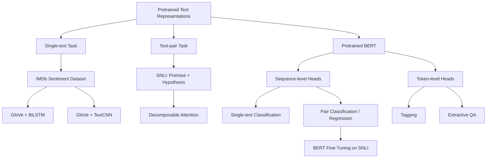
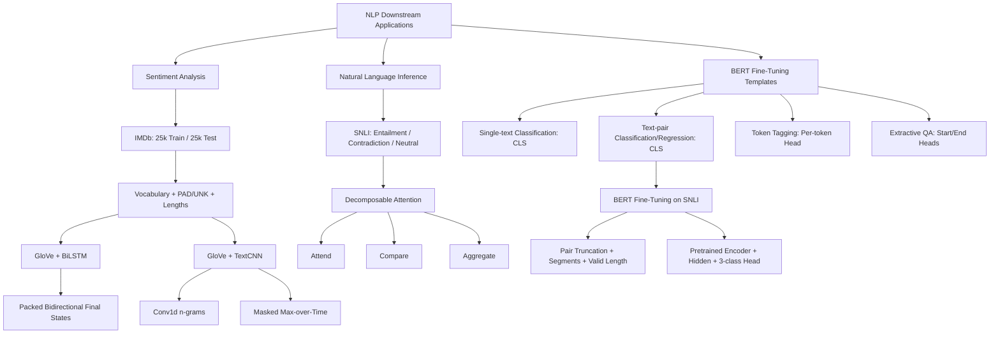

> 对应原文：d2l-en.md 第 16 章 **Natural Language Processing: Applications**。本章按原书顺序介绍 IMDb 情感分析数据集、基于双向 RNN 和 TextCNN 的情感分类、SNLI 自然语言推断数据集、可分解注意力模型、BERT 在序列级与词元级任务上的通用微调方式，以及在 SNLI 上微调 BERT。

## 1. 本章主线：如何把预训练表示变成下游系统

第 15 章解决“如何从大规模无标签文本预训练表示”，本章解决“如何把这些表示用于有监督任务”。作者选了两个代表性问题：

- **情感分析**：单段文本输入，输出固定类别；
- **自然语言推断（NLI）**：两段文本输入，判断逻辑关系。

这两个任务覆盖了两种基本接口：

$$
\text{single sequence}\to\text{sequence label},
$$

$$
\text{sequence pair}\to\text{pair label}.
$$

本章又从模型设计上展示两条路线：

1. **任务定制架构**：静态 GloVe + BiLSTM、TextCNN 或可分解注意力；
2. **预训练通用编码器**：BERT + 很小的任务头，全参数微调。



作者的分析路径可以概括为：

1. 先把变长评论转换为定长 batch，建立二分类任务；
2. 用双向 RNN 汇总全局顺序信息；
3. 再把文本看作一维图像，用不同宽度卷积提取局部 $n$-gram；
4. 从单句分类升级到句对逻辑推断，引入 SNLI 三分类；
5. 用“对齐—比较—聚合”把复杂句对建模分解成注意力与 MLP；
6. 抽象 BERT 的四类通用任务头，解释“最小架构改动”；
7. 最后把句对分类模板具体应用到 SNLI，完成预训练—微调闭环。

这条路线也揭示一个工程事实：任务定制模型更轻、更容易部署；BERT 通常更强、更通用，但训练和推理成本更高。

## 2. 情感分析与 IMDb 数据集

### 2.1 什么是情感分析

情感分析研究文本中表达的态度、观点或情绪。应用包括：

- 产品评论和品牌管理；
- 金融市场情绪；
- 政策舆情；
- 客服反馈；
- 内容审核和风险监控。

本章把情感简化为二元极性：

$$
y\in\{0,1\},
$$

其中 1 表示 positive，0 表示 negative。模型把变长 token 序列映射到固定类别：

$$
(x_1,\ldots,x_T)
\xrightarrow{\mathrm{encoder}}h
\xrightarrow{\mathrm{classifier}}z\in\mathbb R^2.
$$

概率：

$$
p(y=c\mid x)
=\frac{e^{z_c}}{\sum_{j=0}^{1}e^{z_j}}.
$$

交叉熵：

$$
L=-\log p(y\mid x).
$$

### 2.2 IMDb 数据规模

Stanford Large Movie Review Dataset：

- 训练集 25000 条；
- 测试集 25000 条；
- 每个 split 各有 12500 positive 和 12500 negative；
- 每条样本是一篇电影评论；
- 标签平衡。

文件目录：

```text
aclImdb/
  train/
    pos/
    neg/
  test/
    pos/
    neg/
```

标签来自目录名，不应从文本内容或文件名推断。

### 2.3 原书读取与清洗

原书遍历 `pos`、`neg`，以 UTF-8 解码，并执行：

```python
review = raw.decode("utf-8").replace("\n", "")
```

边界：

- 直接删除换行可能把跨行单词拼接，较稳健是替换为空格；
- IMDb 常含 `<br />` HTML 标记，原书没有清理；
- 未显式 lower-case；
- 空白分词对标点、缩写处理粗糙；
- `os.listdir` 顺序不保证稳定，但训练会 shuffle，影响主要是可复现性。

一个更一致的最小清洗：

```python
text = text.replace("<br />", " ").replace("\n", " ").lower()
tokens = text.split()
```

真实系统应保存 tokenizer 版本和规则，训练、验证、推理必须完全复用。

### 2.4 训练词表

只用训练评论构建词表：

```python
vocab = Vocab(
    train_tokens,
    min_freq=5,
    reserved_tokens=["<pad>"],
)
```

为什么不能用测试集建词表？测试 token 频率属于测试分布信息，使用它会产生轻微数据泄漏。测试中的未登录词映射 `<unk>`。

`min_freq=5` 的作用：

- 减小词表和 embedding 参数；
- 过滤拼写错误、稀有噪声；
- 提高 batch 查表效率；
- 但损失细粒度词义和实体信息。

### 2.5 `<pad>` 与 `<unk>` 必须分开

原书前段显式预留 `<pad>`，但最终 `load_data_imdb` 漏写 `reserved_tokens=['<pad>']`。在其词表实现中，`vocab['<pad>']` 可能回退到 `<unk>` 索引，于是：

```text
padding token == unknown token
```

这会让模型无法区分：

- “这个位置超出真实长度”；
- “这里是一个真实但未登录的词”。

正确词表至少包含独立：

```text
<unk>, <pad>
```

Embedding 还应设置：

```python
nn.Embedding(vocab_size, embed_size, padding_idx=pad_idx)
```

使 padding row 默认不接收梯度并初始化为零。注意 `padding_idx` 只控制 embedding row，不会让后续 RNN/CNN 自动忽略 padding；还要传 lengths 或 mask。

### 2.6 截断与填充

原书固定：

$$
T=500.
$$

过长评论截取前 500 token，过短评论右侧填 `<pad>`。训练特征：

$$
X_{train}\in\mathbb Z^{25000\times500}.
$$

Batch size 64：

$$
X:(64,500),
\qquad y:(64,).
$$

Batch 数：

$$
\left\lceil\frac{25000}{64}\right\rceil
=391.
$$

固定长度让矩阵计算简单，却带来：

- 长评论结尾信息丢失；
- 短评论产生大量 padding；
- 单纯读取末时间步会读到 padding；
- 计算量按 500，而非真实长度。

“只保留开头”尤其可能丢失评论末尾的总结或转折。可比较：

- head-only；
- tail-only；
- head+tail；
- 动态截断；
- 分块编码后聚合。

### 2.7 动态 padding 与真实长度

更高效的 collator 只 padding 到当前 batch 最大长度：

$$
T_{batch}=\max_i T_i.
$$

同时返回：

$$
\mathrm{lengths}:(B,),
$$

或 attention mask：

$$
M_{bt}=\mathbf1[t<T_b].
$$

这样可用 packed RNN、masked pooling 或 Transformer attention mask。按长度分桶还能进一步减少 padding。

### 2.8 数据划分的边界

IMDb 官方只给 train/test。开发时不能每轮查看 test 决定 epochs、模型或超参数，否则测试反馈泄漏。应从 train 中再划 dev：

```text
official train -> train + validation
official test  -> final evaluation once
```

类别平衡不代表任务没有偏差；IMDb 是电影评论领域，迁移到商品、社交媒体或金融文本时会有显著分布变化。

## 3. 使用双向 RNN 做情感分析

### 3.1 为什么选择双向 RNN

情感分类在预测时已经拥有整篇评论，不受因果生成约束，可以同时使用左右上下文。双向 LSTM：

$$
\overrightarrow h_t
=\operatorname{LSTM}_f(e_t,\overrightarrow h_{t-1}),
$$

$$
\overleftarrow h_t
=\operatorname{LSTM}_b(e_t,\overleftarrow h_{t+1}),
$$

$$
h_t=[\overrightarrow h_t;\overleftarrow h_t].
$$

预训练 GloVe 提供 token 级静态表示，BiLSTM 再把它上下文化并聚合成句子表示。

### 3.2 原书模型形状

配置：

- embedding size 100；
- hidden size 100（每方向）；
- 2 LSTM layers；
- bidirectional=True；
- batch 64；
- input length 500。

形状：

$$
(B,T)
\xrightarrow{transpose}
(T,B)
\xrightarrow{embedding}
(T,B,100)
$$

$$
\xrightarrow{BiLSTM}
(T,B,200).
$$

原书拼接：

$$
[outputs[0];outputs[-1]]
\in\mathbb R^{B\times400},
$$

再映射到 2 类。

### 3.3 `outputs[0]` 与 `outputs[-1]` 的精确语义

每个 `outputs[t]` 已经包含正、反向：

$$
outputs[t]=[
\overrightarrow h_t;
\overleftarrow h_t].
$$

所以拼接两个端点得到：

$$
[
\overrightarrow h_1,
\overleftarrow h_1,
\overrightarrow h_T,
\overleftarrow h_T].
$$

其中真正覆盖全序列的两个摘要通常是：

- 正向末状态 $\overrightarrow h_T$；
- 反向末状态 $\overleftarrow h_1$。

另两个端点只看了很短上下文。原书说“拼接两个方向最终状态”并不精确。

更标准地读取 LSTM 返回的 `h_n`。两层双向时：

$$
h_n:(2L,B,H).
$$

最高层：

```python
forward_final = h_n[-2]
backward_final = h_n[-1]
encoding = torch.cat((forward_final, backward_final), dim=-1)
```

得到 $(B,2H)$，分类器应输入 $2H$。

### 3.4 Padding 为什么会污染原书表示

所有评论都右填充到 500。普通 LSTM 不知道真实长度：

- 正向末状态在大量 `<pad>` 后产生；
- `outputs[-1]` 的反向分量只看到最后一个 padding；
- 不同真实长度对应不同 padding 步数；
- 即使 pad embedding 为零，LSTM bias 和 recurrent dynamics 仍会更新状态。

正确方法：

```python
packed = nn.utils.rnn.pack_padded_sequence(
    embeddings,
    lengths.cpu(),
    batch_first=True,
    enforce_sorted=False,
)
_, (h_n, c_n) = lstm(packed)
```

这样 final states 停在每个样本的真实末尾。

### 3.5 加载和冻结 GloVe

原书使用 100d GloVe：

$$
E\in\mathbb R^{|V|\times100}.
$$

```python
with torch.no_grad():
    net.embedding.weight.copy_(embeds)
net.embedding.weight.requires_grad_(False)
```

冻结优点：

- 减少小数据过拟合；
- 训练参数和显存更少；
- 保留大语料语义。

缺点：

- 电影领域语义不能适配；
- OOV/低频词向量无法更新；
- GloVe 的静态一词一向量限制保留。

常见折中：先冻结，head/LSTM 稳定后，以更小学习率解冻 embedding。

原书使用 `.weight.data.copy_`，现代写法应在 `torch.no_grad()` 中复制，避免绕过 autograd 的 `.data`。

### 3.6 训练配置与结果边界

- Adam；
- lr 0.01；
- 5 epochs；
- cross-entropy；
- 多 GPU helper。

原文未保留准确率，只演示期望：

```text
this movie is so great -> positive
this movie is so bad   -> negative
```

不能把示例输出当作测试性能。增加 epoch 可能改善训练准确率，也可能过拟合，应按 validation early stopping。

### 3.7 推理必须复用预处理

原书 `predict_sentiment` 直接 `sequence.split()`，未执行：

- 训练清洗；
- lower-case；
- truncate/pad 到 500；
- valid length；
- `eval()`；
- `inference_mode()`。

这造成训练—推理不一致。推理函数应由同一个 tokenizer/collator 产生模型输入，并显式：

```python
model.eval()
with torch.inference_mode():
    logits = model(tokens, lengths)
```

### 3.8 适用范围与局限

BiLSTM 能编码顺序和长程上下文，适合中等长度文本、小中型数据和流式变体。局限：

- 时间步串行；
- 长度 500 成本高；
- 固定静态输入词向量；
- padding 处理复杂；
- 最终状态是信息瓶颈；
- 超长评论早期信息可能被压缩。

可替代聚合：masked mean/max pooling、attention pooling、层次模型或 Transformer。

## 4. 使用 TextCNN 做情感分析

### 4.1 为什么文本可以使用 CNN

把 token 序列看成一维图像：空间轴是时间，通道是 embedding 维。不同宽度 kernel 捕获不同长度局部模式，例如：

```text
not good      -> width 2
not at all    -> width 3
a waste of time -> width 4
```

TextCNN 不递归，可以并行处理所有窗口，适合高吞吐文本分类。

### 4.2 一维互相关

单通道输入 $X\in\mathbb R^n$、kernel $K\in\mathbb R^w$：

$$
Y_i
=\sum_{r=0}^{w-1}X_{i+r}K_r,
\qquad i=0,\ldots,n-w.
$$

输出长度：

$$
n-w+1.
$$

原书：

$$
X=[0,1,2,3,4,5,6],
\quad K=[1,2],
$$

首输出：

$$
0\times1+1\times2=2.
$$

### 4.3 多输入通道

输入 $X\in\mathbb R^{C_{in}\times n}$，单个输出 channel 的 kernel $K\in\mathbb R^{C_{in}\times w}$：

$$
Y_i
=\sum_{c=1}^{C_{in}}
\sum_{r=0}^{w-1}
X_{c,i+r}K_{c,r}.
$$

它等价于把 embedding 通道当二维输入的“高度”，使用覆盖全部通道的二维 kernel。

多个输出 channels 对应多组 kernels，每组学习一种局部模式检测器。

### 4.4 Max-over-time pooling

每个卷积输出 channel 对所有时间位置取最大值：

$$
z_c=\max_tY_{c,t}.
$$

直觉：只要某个关键 $n$-gram 在任意位置强烈激活，该 feature 就被保留。它带来近似位置不变性，并允许不同 kernel width 的输出长度不同，最后都变成一个 scalar/channel。

代价：

- 丢失触发位置；
- 丢失出现次数；
- 多个重要片段只保留最大者；
- 对异常高激活敏感。

### 4.5 TextCNN 架构

原书实际配置：

- 两套 100d embedding 沿特征维拼接；
- 输入通道 200；
- kernels 3、4、5；
- 每种 100 output channels；
- dropout 0.5；
- 最终 300→2 linear。

形状：

$$
(B,500)
\to(B,500,200)
\to(B,200,500).
$$

卷积：

$$
k=3:(B,100,498),
$$

$$
k=4:(B,100,497),
$$

$$
k=5:(B,100,496).
$$

Global max 后各 $(B,100)$，拼接：

$$
(B,300).
$$

### 4.6 双 embedding channel

TextCNN 经典设计：

- `constant_embedding`：GloVe，冻结；
- `embedding`：同样用 GloVe 初始化，但可训练。

拼接后模型同时拥有：

- 稳定的通用语义；
- 可适配 IMDb 的领域语义。

这不是图像意义上的两个 channels，而是在 embedding 特征维拼成 200 个 Conv1d input channels。

### 4.7 原书 PyTorch 的关键实现错误

正文和图都要求 max-over-time，但代码使用：

```python
self.pool = nn.AdaptiveAvgPool1d(1)
```

这是全局平均池化，不是最大池化；而且代码执行：

```python
relu(avg_pool(conv(x)))
```

标准 TextCNN 是：

```python
max_pool(relu(conv(x)))
```

两者语义不同：

$$
\max_t\operatorname{ReLU}(y_t)
\ne
\operatorname{ReLU}\left(\frac1T\sum_ty_t\right).
$$

正确 API：

```python
nn.AdaptiveMaxPool1d(1)
```

或 `activated.amax(dim=-1)`。

### 4.8 Padding 对 TextCNN 的污染

评论被填充到 500。即使 pad embedding 为零：

- Conv1d bias 可在纯 padding 窗口产生非零激活；
- 混合真实 token/pad 窗口也可能激活；
- 原书平均池化会让 padding 比例直接影响 magnitude；
- max pooling 也可能错误选中 padding window。

对于 kernel width $k$ 和真实长度 $L_i$，合法卷积位置数：

$$
T_i^{(k)}=\max(L_i-k+1,0).
$$

Pooling 前应把 $t\ge T_i^{(k)}$ 的激活设为 $-\infty$，再 max；或使用动态 batch / 明确 masked pooling。

### 4.9 训练配置与边界

- Adam；
- lr 0.001；
- 5 epochs；
- GloVe 100d；
- batch 64。

原书未保留准确率。TextCNN 通常比 BiLSTM 并行度高、延迟低，但感受野由 kernel widths 决定，长距离组合需要堆叠卷积或其他机制。

增加位置编码并不一定有用：TextCNN 卷积本身保留局部相对顺序，但 global max 丢弃绝对位置；位置特征只有在任务确实依赖位置且模型能利用时才可能改善。

## 5. 自然语言推断与 SNLI 数据集

### 5.1 NLI 问的是什么

给定 premise $P$ 和 hypothesis $H$，判断：

- **Entailment**：$P$ 足以推出 $H$；
- **Contradiction**：$P$ 足以推出 $\neg H$；
- **Neutral**：既不能推出 $H$，也不能推出 $\neg H$。

注意 neutral 不是“两个句子都为假”，也不是“主题不同”。NLI 判断的是在 premise 为真的假设下，hypothesis 的可推导关系。

例：

```text
P: Two women are hugging each other.
H: Two women are showing affection.
-> entailment
```

```text
P: A man is running the coding example.
H: The man is sleeping.
-> contradiction
```

```text
P: The musicians are performing for us.
H: The musicians are famous.
-> neutral
```

### 5.2 为什么单句分类不够

单句 encoder 分别产生 $h_P,h_H$ 后直接分类，容易漏掉细粒度对齐：

- 否定词对应；
- 数量变化；
- 实体替换；
- 上下位关系；
- 动作冲突；
- 局部短语蕴含。

NLI 需要显式或隐式比较句对，而不只是判断两句各自类别。

### 5.3 SNLI 数据规模与标签

SNLI 超过 500000 英文句对。过滤无共识标签后，原书数据版本实际约：

- train 549367；
- test 9824。

训练类计数：

```text
entailment    183416
contradiction 183187
neutral       182764
```

测试：

```text
entailment    3368
contradiction 3237
neutral       3219
```

近似平衡，不是完全相等。

标签映射：

$$
entailment=0,
\quad contradiction=1,
\quad neutral=2.
$$

### 5.4 读取与清洗

原书读取 `sentence1_binary_parse` / `sentence2_binary_parse` 列，然后删除括号并压缩连续空白。它不是重新解析句法，而是把 parse string 简化为表面句子。

只保留 gold label 属于三类的样本，跳过 `-` 等无共识项。

应显式指定 UTF-8。训练、dev、test 都必须复用相同文本清洗与 tokenizer。

### 5.5 词表和固定长度

训练 premise 与 hypothesis token 共同构建词表：

- `min_freq=5`；
- 独立 `<pad>`；
- 参考词表大小 18678；
- 每句各固定 50 token。

输入：

$$
P:(B,50),
\qquad H:(B,50),
\qquad y:(B,).
$$

Batch size 128 的数据节示例。测试集必须复用训练词表，测试新词映射 `<unk>`。

### 5.6 原书缺失 validation 的问题

SNLI 官方提供 train/dev/test，但原书后续训练每轮直接评 test。若据此调整 epoch、学习率或模型，就会造成测试反馈泄漏。

正确流程：

```text
train -> fit parameters
dev   -> select model / tune hyperparameters
test  -> report once
```

### 5.7 SNLI 的数据偏差

SNLI 来源是图像描述，语言较短、领域受限。标注者写 hypothesis 时产生 artifact，例如某些否定词、量词或泛化表达与类别高度相关，模型甚至只看 hypothesis 也能获得不合理表现。

稳健评价可补充：

- MNLI；
- HANS；
- ANLI；
- Stress tests；
- hypothesis-only baseline；
- 领域外数据。

### 5.8 用 NLI 评价翻译的思路

候选翻译 $C$、参考 $R$，可评：

$$
s_{bi}
=\frac12[
P(C\Rightarrow R)
+P(R\Rightarrow C)
],
$$

并惩罚矛盾概率。双向蕴含比单向更接近语义等价。

局限：

- NLI 模型自身有偏差；
- 翻译可有参考未表达的细节；
- 单参考不完备；
- 需要跨语言或先翻到同一语言；
- 分数需人工质量校准。

## 6. 使用可分解注意力做 NLI

### 6.1 为什么不一定需要 RNN/CNN

Parikh 等提出：NLI 的关键可拆为局部词语对齐、局部比较、全局聚合。无需先用 RNN 压缩整句，直接对 premise/hypothesis 的 token 做软对齐。

模型三步：

1. Attend；
2. Compare；
3. Aggregate。

### 6.2 输入表示

Premise：

$$
A=(a_1,\ldots,a_m)
\in\mathbb R^{m\times d}.
$$

Hypothesis：

$$
B=(b_1,\ldots,b_n)
\in\mathbb R^{n\times d}.
$$

Batch：

$$
A:(B,m,d),
\qquad B:(B,n,d).
$$

原书 $d=100$，使用 GloVe 初始化。

### 6.3 Attend：双向软对齐

先分别对每个 token 应用同一个 MLP $f$：

$$
e_{ij}=f(a_i)^\top f(b_j).
$$

若 $f$ 输出 $h$ 维：

$$
f(A):(B,m,h),
\qquad f(B):(B,n,h),
$$

$$
E=f(A)f(B)^\top:(B,m,n).
$$

对 premise token $a_i$，用 hypothesis 加权平均：

$$
\beta_i
=\sum_{j=1}^{n}
\frac{e^{e_{ij}}}{\sum_{k=1}^{n}e^{e_{ik}}}
b_j.
$$

对 hypothesis token $b_j$，反向对齐 premise：

$$
\alpha_j
=\sum_{i=1}^{m}
\frac{e^{e_{ij}}}{\sum_{k=1}^{m}e^{e_{kj}}}
a_i.
$$

形状：

$$
\beta:(B,m,d),
\qquad\alpha:(B,n,d).
$$

例如 `sleep` 可软对齐 `tired`；不是硬词典匹配，而是所有 token 的加权组合。

### 6.4 “Decomposable” 到底降低了什么复杂度

若直接对每对 $(a_i,b_j)$ 输入一个复杂 MLP，要调用 $mn$ 次。模型先独立算 $f(a_i),f(b_j)$，只调用 $m+n$ 次，再用点积形成两两 score。

因此降低的是昂贵 $f$ 的调用：

$$
O(mn\cdot\mathrm{MLP})
\to O((m+n)\cdot\mathrm{MLP})+O(mnh).
$$

但 score matrix 和加权和仍需：

$$
O(mnh)
$$

计算和

$$
O(mn)
$$

内存。原书总结称“线性复杂度而非平方复杂度”若理解为整个 attention，是不准确的。

### 6.5 Compare：逐 token 比较

将 token 与对齐表示拼接：

$$
v_{A,i}=g([a_i,\beta_i]),
$$

$$
v_{B,j}=g([b_j,\alpha_j]).
$$

输入为 $2d$，原书 $2d=200$；$g$ 输出 200 维。这个阶段可学习：

- 相同/相反；
- 实体一致性；
- 数量和修饰冲突；
- 上下位关系；
- 对齐缺失。

### 6.6 Aggregate：无序聚合比较结果

$$
v_A=\sum_{i=1}^{m}v_{A,i},
\qquad
v_B=\sum_{j=1}^{n}v_{B,j}.
$$

拼接后分类：

$$
\widehat y=h([v_A,v_B])\in\mathbb R^3.
$$

原书：

```text
f: 100 -> 200 -> 200
g: 200 -> 200 -> 200
h: 400 -> 200 -> 200 -> 3
dropout=0.2
```

### 6.7 Padding mask 是不可省略的

原书固定两句为 50，却没有 mask：

- Softmax 会给 hypothesis padding 分配注意力；
- Aggregate 把 premise/hypothesis 的 50 个位置全部求和；
- 模型可能把 padding 数量当作长度特征；
- pad embedding 若可训练，会吸收标签信号。

正确 Attend score：

$$
E'_{ij}=
\begin{cases}
E_{ij},&i<m_b,j<n_b,\\
-\infty,&\text{key invalid}.
\end{cases}
$$

对齐时分别 mask 对方的 key。Aggregate：

$$
v_A=\sum_iM^A_i v_{A,i},
\qquad
v_B=\sum_jM^B_j v_{B,j}.
$$

Padding query 的比较结果也必须在 sum 前清零。

### 6.8 模型的排列不变性

若不加入位置特征，分别对 premise 或 hypothesis token 做任意置换：

- $f$ 逐 token 独立；
- score matrix 行/列相应置换；
- 对齐结果同样置换；
- Aggregate 求和消除顺序。

最终输出不变。因此模型近似把句子视作带跨句对齐的词集合，不能可靠区分：

```text
dog bites man
man bites dog
```

这既带来轻量性，也是主要限制。可加入位置编码、局部窗口或 self-attention/RNN。

### 6.9 训练配置与边界

- batch 256；
- sequence length 50；
- GloVe 100d；
- hidden 200；
- Adam lr 0.001；
- 4 epochs；
- GloVe 在原书中没有冻结，会参与微调。

原文未保留准确率，只演示 `good` vs `bad` 期望 contradiction。

预测函数调用 `eval()`，但：

- 没有 `inference_mode()`；
- 没有固定到训练长度 50；
- 没有传 lengths/masks；
- 训练和推理 padding 语义不同。

### 6.10 轻量模型仍有价值

优点：

- 无序列递归；
- MLP 可并行；
- 局部对齐有一定可视性；
- 参数少、延迟低；
- 小数据和资源受限场景可用。

局限：

- 词序弱；
- 静态词义；
- $O(mn)$ attention matrix；
- padding 若不处理会污染；
- 长句截断；
- 对组合推理和世界知识有限。

现代 cross-encoder Transformer 通常更强，但成本也更高。

## 7. BERT 的序列级与词元级微调

### 7.1 “最小架构改动”是什么意思

BERT encoder 输出：

$$
H\in\mathbb R^{B\times T\times d}.
$$

不同任务只增加很小的线性/MLP head：

- 序列级：读取 `<cls>`；
- token 级：对每个 token 共享 head；
- span 级：为每位置预测 start/end。

任务 head 从随机初始化训练，预训练 BERT 参数通常一起微调。原始 BERT_BASE/ LARGE 约 110M/340M 参数，因此“head 很小”不等于微调成本小。

资源有限时可使用：

- 冻结 encoder；
- adapters；
- LoRA；
- prefix/prompt tuning；
- bitfit；
- quantized PEFT。

### 7.2 单句分类

输入：

```text
<cls> x1 x2 ... xL <sep>
```

Segment IDs 全 0。取：

$$
h_{cls}=H[:,0,:]\in\mathbb R^{B\times d}.
$$

分类：

$$
z=Wh_{cls}+b\in\mathbb R^{B\times C}.
$$

适用：情感分析、主题分类、垃圾邮件、CoLA 语法可接受性等。

`<cls>` 并非天然语义平均；它在预训练和微调中通过 attention 学习汇聚全句信息。

### 7.3 句对分类与回归

输入：

```text
<cls> A <sep> B <sep>
```

Segment 0/1 区分两句。仍读取 `<cls>`。

分类（NLI）：

$$
z\in\mathbb R^{B\times3},
$$

使用 cross-entropy。

回归（semantic textual similarity）：

$$
\widehat s=w^\top h_{cls}+b,
$$

使用 MSE、Huber 或按任务设计 ordinal loss。原书 STS 分数 0–5：

```text
plane taking off / air plane taking off -> 5
woman eating / woman eating meat       -> 3
woman dancing / man talking            -> 0
```

Cross-encoder 让两句 token 在所有层直接互相 attention，精度通常高，但每个句对都要共同编码，不适合对百万文档逐一比较。

### 7.4 Token tagging

对每个有效 token 表示共享同一分类头：

$$
Z_{b,t}=WH_{b,t}+b
\in\mathbb R^C.
$$

应用：

- POS tagging；
- NER；
- chunking；
- slot filling。

Loss mask 必须排除：

- `<cls>`；
- `<sep>`；
- `<pad>`；
- 不参与监督的 subword pieces。

WordPiece 会把一个词拆为多个 pieces。词级标签对齐策略：

1. 只给首 piece 标签，其余 ignore；
2. 把标签复制到所有 pieces；
3. BIO 标签对后续 piece 做专门转换。

策略改变 loss 权重，必须明确。

原书 POS 示例把 `is` 写成 VB；Penn Treebank 中第三人称单数现在时通常是 `VBZ`。

### 7.5 抽取式问答

输入 question 作为 A，passage 作为 B：

```text
<cls> question <sep> passage <sep>
```

两个独立线性头对每个 passage token 产生：

$$
s_i=w_s^\top h_i+b_s,
$$

$$
e_i=w_e^\top h_i+b_e.
$$

训练：

$$
L=L_{start}+L_{end}
=-\log p_s(i^*)-\log p_e(j^*).
$$

必须把 question、special、padding 位置 logits mask 为 $-\infty$，只允许 passage positions。

解码：

$$
(\widehat i,\widehat j)
=\arg\max_{i\le j}
[s_i+e_j].
$$

实践还限制：

$$
j-i+1\le L_{max\ answer}.
$$

原书例子答案 `mask makers`。SQuAD v1.1 假设答案一定在 passage；SQuAD v2 还需 no-answer score，常使用 `<cls>` 或额外 head。

### 7.6 搜索系统该如何使用 BERT

对海量新闻和 query，直接 BERT cross-encoder 比较每个 pair 代价过高。两阶段：

1. **召回**：query/document 双塔编码，向量 ANN 检索；
2. **重排**：对 top-$K$ 使用 BERT cross-encoder。

双塔对比目标可使用 in-batch/hard negatives：

$$
L_q
=-\log
\frac{\exp(s(q,d^+)/\tau)}
{\exp(s(q,d^+)/\tau)
+\sum_{d^-}\exp(s(q,d^-)/\tau)}.
$$

Cross-encoder 精细建模词间交互，双塔保证可扩展检索。

### 7.7 BERT 能否直接做语言模型和翻译

标准 BERT 双向看到未来，不能直接作为左到右生成模型。可：

- 用 BERT 初始化 encoder；
- 改 attention mask 做 prefix LM；
- 使用 encoder-decoder 预训练模型（T5/BART）；
- 使用 decoder-only 模型做自回归生成。

机器翻译需要变长输出和 causal decoder，仅有 BERT encoder 不够，还需 decoder/cross-attention 或其他生成架构。

## 8. 在 SNLI 上微调 BERT

### 8.1 加载预训练 checkpoint

原书提供 d2l 自定义：

- `bert.small.torch.zip`；
- `bert.base.torch.zip`；
- `vocab.json`；
- `pretrained.params`。

Small 请求配置：

```text
hidden=256
ffn=512
heads=4
blocks=2
dropout=0.1
pretraining max_len=512
```

这套词表和参数格式是 d2l 自定义，不等同于 Hugging Face 原始 WordPiece BERT checkpoint，不能随意混用 tokenizer。

### 8.2 原书加载函数的硬编码错误

PyTorch 函数签名接收：

```text
num_heads, num_blks, dropout
```

但构造模型时硬编码：

```text
num_heads=4, num_blks=2, dropout=0.2
```

所以：

- 请求 dropout 0.1 实际得到 0.2；
- Exercise 把 Base 参数改为 12 heads/12 blocks 也不会构造相应结构；
- checkpoint 可能 shape mismatch。

必须原样传入函数参数，并验证 state dict 的 missing/unexpected keys。

安全加载：

```python
state = torch.load(
    path,
    map_location="cpu",
    weights_only=True,
)
model.load_state_dict(state, strict=True)
```

只加载可信 checkpoint；旧 PyTorch 若无 `weights_only`，仍需注意 pickle 风险。

### 8.3 SNLI-BERT 输入构造

预处理：

1. premise/hypothesis lower-case；
2. 空白分词；
3. 若总长度超过 `max_len-3`，不断删除较长句尾 token；
4. 组装 `<cls>P<sep>H<sep>`；
5. segment 0/1；
6. 右侧 padding；
7. 记录 valid length。

原书：

$$
\mathrm{max\_len}=128,
\qquad B=512.
$$

形状：

$$
tokens:(B,128),
$$

$$
segments:(B,128),
$$

$$
valid\_lengths:(B,),
$$

$$
labels:(B,).
$$

### 8.4 最长优先截断

算法每次从较长句尾删除；等长时删除 hypothesis。优点：

- 让两句保留长度较平衡；
- 简单；
- 符合很多 BERT pair preprocess。

风险：

- 句尾否定/结论可能被删；
- 等长时系统偏向删 hypothesis；
- 固定 128 对长 premise/hypothesis 信息不足。

按比例截断可先分配：

$$
L_P
=\left\lfloor
(M-3)\frac{|P|}{|P|+|H|}
\right\rfloor,
$$

$$
L_H=M-3-L_P.
$$

但比例法也可能给极短句浪费/不足预算。可比较 longest-first、比例、head-tail 和保留否定词等策略。

### 8.5 多进程数据预处理边界

原书在 Dataset 内：

```python
pool = multiprocessing.Pool(4)
out = pool.map(self._mp_worker, examples)
```

问题：

- 未使用 context manager 或 `close/join`；
- Windows/Notebook 需 `if __name__ == '__main__'`；
- bound method 和 Dataset 可能 pickle 困难；
- 随后 DataLoader 又启 workers，可能过度并行；
- 一次性预计算占内存。

教学复现可先单进程；生产可离线 tokenize/cache，或使用可控 multiprocessing pipeline。

### 8.6 BERTClassifier

只复用：

- `bert.encoder`；
- 预训练 `bert.hidden`（Linear+Tanh）；
- 新建 3 类 output。

$$
H=\operatorname{Encoder}(tokens,segments,valid\_lens)
\in\mathbb R^{B\times128\times256}.
$$

$$
z=W_o\tanh(W_hH[:,0,:]+b_h)+b_o
\in\mathbb R^{B\times3}.
$$

原书 PyTorch classifier 没有注册 `MaskLM` 和 `NextSentencePred`，所以“这些 pretraining heads 在 net 中产生 stale gradients”的解释不适用于这段 PyTorch 代码；它们根本不在 `net.parameters()` 中。

### 8.7 LazyLinear 物化顺序

新 output 是 `nn.LazyLinear(3)`。原书先建 optimizer，再调用首批 forward 物化。虽然部分 PyTorch 版本支持 lazy parameter 更新，稳健顺序是：

```python
with torch.no_grad():
    model(first_batch)
optimizer = torch.optim.AdamW(model.parameters(), ...)
```

这样 optimizer 从一开始持有完整、shape 已知的参数。

### 8.8 训练配置

- Adam；
- lr $10^{-4}$；
- 5 epochs；
- cross-entropy；
- batch 512；
- max length 128；
- 多 GPU helper。

现代 BERT 微调通常使用：

- AdamW；
- 较小 lr（常在 $10^{-5}$ 到 $10^{-4}$ 搜索）；
- warmup + linear decay；
- weight decay；
- gradient clipping；
- mixed precision；
- validation early stopping；
- 多随机种子。

原文未保留准确率；Exercise 提到 BERT_BASE 目标 test accuracy >0.86，这不是本节实际已验证结果。

### 8.9 Test leakage

原书把 SNLI test 传入每 epoch 训练 helper。若据此选择 epoch 或超参数，就泄漏。必须使用 SNLI dev 作为 validation，训练完成后只评一次 test。

### 8.10 正确推理

原书没有给 BERT-NLI 推理函数。正确步骤：

1. 使用 checkpoint 配套 vocab/tokenizer；
2. 复用 lower、pair truncation、special tokens 和 segment；
3. pad 到同一规则并传 valid length；
4. `eval()`；
5. `inference_mode()`；
6. argmax 映射 0/1/2。

```text
0 -> entailment
1 -> contradiction
2 -> neutral
```

### 8.11 BERT 与可分解注意力的对比

| 项目 | Decomposable Attention | BERT Cross-Encoder |
|---|---|---|
| Token 表示 | 静态 GloVe | 多层上下文化 |
| 词序 | 很弱/无 | learned position |
| 跨句交互 | 一次显式 token alignment | 每层全 self-attention |
| 预训练 | 词向量 | 整个 encoder |
| 参数/成本 | 较小 | 较大 |
| 长度复杂度 | $O(mn)$ 对齐 | $O((m+n)^2)$ |
| 可部署性 | 轻量 | 资源要求高 |

两者不是简单“新模型必然淘汰旧模型”；应根据精度、延迟、数据和资源选择。

## 9. 全章模型的统一视角

所有模型都可写成：

$$
\widehat y
=\operatorname{Head}(
\operatorname{Aggregate}(
\operatorname{Interact}(
\operatorname{Represent}(X))))).
$$

| 模型 | Represent | Interact | Aggregate | Head |
|---|---|---|---|---|
| BiLSTM | GloVe | recurrent bidirectional states | final states | 2-class linear |
| TextCNN | static+trainable GloVe | local Conv1d | masked max-over-time | 2-class linear |
| Decomposable attention | GloVe | cross-sequence alignment | sum comparisons | 3-class MLP |
| BERT classification | token+segment+position | multi-layer self-attention | `<cls>` | task linear/MLP |
| BERT tagging | same | same | per-token | shared token head |
| BERT QA | same | same | passage positions | start/end heads |

核心差别不只是“用了什么层”，而是：

- 输入 token 表示是否上下文化；
- 交互发生在局部、递归、一次对齐还是每层 attention；
- 聚合是否保留顺序和位置；
- padding/特殊 token 如何屏蔽；
- 预训练参数是否冻结或微调。

## 10. 可运行的综合 PyTorch 实验

下面脚本不下载数据，只依赖 PyTorch。它验证：

- 独立 `<pad>`、截断与动态长度；
- packed BiLSTM 忽略 padding；
- 一维单/多通道互相关；
- TextCNN 使用 masked max 而非原书错误的 average；
- NLI 三类和固定长度 pair；
- 带 padding mask 的 Attend/Compare/Aggregate；
- 可分解注意力对有效 token 置换不变；
- BERT 单句、句对、token tagging 和 QA heads 的 shape；
- QA 只在 passage 有效位置解码合法 span；
- SNLI-BERT longest-first 截断与 padding；
- BERT 分类器对 padding token 内容不敏感。

```python
import re

import torch
from torch import nn
from torch.nn import functional as F

torch.manual_seed(97)

def clean_review(text):
    text = text.replace("<br />", " ").replace("\n", " ").lower()
    return re.sub(r"\s+", " ", text).strip().split()

def truncate_pad(indexes, max_length, pad_index):
    length = min(len(indexes), max_length)
    result = indexes[:max_length]
    result = result + [pad_index] * (max_length - len(result))
    return result, length

class PackedBiLSTMClassifier(nn.Module):
    def __init__(self, vocabulary_size, embedding_size, hidden_size,
                 pad_index, num_layers=2):
        super().__init__()
        self.embedding = nn.Embedding(
            vocabulary_size, embedding_size, padding_idx=pad_index
        )
        self.encoder = nn.LSTM(
            embedding_size,
            hidden_size,
            num_layers=num_layers,
            bidirectional=True,
            batch_first=True,
        )
        self.classifier = nn.Linear(2 * hidden_size, 2)

    def forward(self, token_ids, lengths):
        embeddings = self.embedding(token_ids)
        packed = nn.utils.rnn.pack_padded_sequence(
            embeddings,
            lengths.cpu(),
            batch_first=True,
            enforce_sorted=False,
        )
        _, (hidden, _) = self.encoder(packed)
        encoding = torch.cat((hidden[-2], hidden[-1]), dim=-1)
        return self.classifier(encoding)

def corr1d(inputs, kernel):
    output_width = inputs.shape[0] - kernel.shape[0] + 1
    return torch.stack([
        (inputs[index:index + kernel.shape[0]] * kernel).sum()
        for index in range(output_width)
    ])

def corr1d_multi_input(inputs, kernel):
    return sum(corr1d(channel, channel_kernel)
               for channel, channel_kernel in zip(inputs, kernel))

class MaskedTextCNN(nn.Module):
    def __init__(self, vocabulary_size, embedding_size, kernel_sizes,
                 channels, pad_index):
        super().__init__()
        self.embedding = nn.Embedding(
            vocabulary_size, embedding_size, padding_idx=pad_index
        )
        self.constant_embedding = nn.Embedding(
            vocabulary_size, embedding_size, padding_idx=pad_index
        )
        self.constant_embedding.weight.requires_grad_(False)
        self.convolutions = nn.ModuleList([
            nn.Conv1d(2 * embedding_size, output_channels, kernel_size)
            for kernel_size, output_channels in zip(kernel_sizes, channels)
        ])
        self.classifier = nn.Linear(sum(channels), 2)

    def forward(self, token_ids, lengths):
        embeddings = torch.cat((
            self.embedding(token_ids),
            self.constant_embedding(token_ids),
        ), dim=-1).transpose(1, 2)
        pooled = []
        for convolution in self.convolutions:
            activations = F.relu(convolution(embeddings))
            valid_widths = (lengths - convolution.kernel_size[0] + 1).clamp_min(1)
            positions = torch.arange(
                activations.shape[-1], device=token_ids.device
            )[None, None, :]
            valid = positions < valid_widths[:, None, None]
            activations = activations.masked_fill(~valid, -torch.inf)
            pooled.append(activations.amax(dim=-1))
        return self.classifier(torch.cat(pooled, dim=-1))

def sequence_mask(lengths, max_length):
    positions = torch.arange(max_length, device=lengths.device)
    return positions.unsqueeze(0) < lengths.unsqueeze(1)

def masked_softmax(scores, key_mask):
    masked_scores = scores.masked_fill(~key_mask[:, None, :], -torch.inf)
    return torch.softmax(masked_scores, dim=-1)

class FeedForward(nn.Module):
    def __init__(self, input_size, hidden_size):
        super().__init__()
        self.network = nn.Sequential(
            nn.Linear(input_size, hidden_size),
            nn.ReLU(),
            nn.Linear(hidden_size, hidden_size),
            nn.ReLU(),
        )

    def forward(self, inputs):
        return self.network(inputs)

class MaskedDecomposableAttention(nn.Module):
    def __init__(self, vocabulary_size, embedding_size, hidden_size,
                 pad_index):
        super().__init__()
        self.embedding = nn.Embedding(
            vocabulary_size, embedding_size, padding_idx=pad_index
        )
        self.attend = FeedForward(embedding_size, hidden_size)
        self.compare = FeedForward(2 * embedding_size, hidden_size)
        self.aggregate = nn.Sequential(
            FeedForward(2 * hidden_size, hidden_size),
            nn.Linear(hidden_size, 3),
        )

    def forward(self, premise, hypothesis, premise_lengths,
                hypothesis_lengths):
        premise_vectors = self.embedding(premise)
        hypothesis_vectors = self.embedding(hypothesis)
        premise_mask = sequence_mask(premise_lengths, premise.shape[1])
        hypothesis_mask = sequence_mask(hypothesis_lengths, hypothesis.shape[1])

        projected_premise = self.attend(premise_vectors)
        projected_hypothesis = self.attend(hypothesis_vectors)
        scores = projected_premise @ projected_hypothesis.transpose(1, 2)

        premise_aligned_hypothesis = (
            masked_softmax(scores, hypothesis_mask) @ hypothesis_vectors
        )
        hypothesis_aligned_premise = (
            masked_softmax(scores.transpose(1, 2), premise_mask)
            @ premise_vectors
        )

        compared_premise = self.compare(torch.cat((
            premise_vectors, premise_aligned_hypothesis
        ), dim=-1))
        compared_hypothesis = self.compare(torch.cat((
            hypothesis_vectors, hypothesis_aligned_premise
        ), dim=-1))

        summed_premise = (
            compared_premise * premise_mask.unsqueeze(-1)
        ).sum(dim=1)
        summed_hypothesis = (
            compared_hypothesis * hypothesis_mask.unsqueeze(-1)
        ).sum(dim=1)
        return self.aggregate(torch.cat((summed_premise, summed_hypothesis), dim=-1))

class TinyBERTEncoder(nn.Module):
    def __init__(self, vocabulary_size, hidden_size, max_length,
                 pad_index, num_heads=2, num_layers=2):
        super().__init__()
        self.pad_index = pad_index
        self.token_embedding = nn.Embedding(
            vocabulary_size, hidden_size, padding_idx=pad_index
        )
        self.segment_embedding = nn.Embedding(2, hidden_size)
        self.position_embedding = nn.Parameter(
            torch.randn(1, max_length, hidden_size) * 0.02
        )
        layer = nn.TransformerEncoderLayer(
            hidden_size,
            num_heads,
            dim_feedforward=2 * hidden_size,
            dropout=0.0,
            batch_first=True,
            activation="gelu",
        )
        self.encoder = nn.TransformerEncoder(layer, num_layers)

    def forward(self, token_ids, segments, valid_lengths):
        length = token_ids.shape[1]
        hidden = (
            self.token_embedding(token_ids)
            + self.segment_embedding(segments)
            + self.position_embedding[:, :length]
        )
        padding_mask = ~sequence_mask(valid_lengths, length)
        return self.encoder(hidden, src_key_padding_mask=padding_mask)

class SequenceClassifier(nn.Module):
    def __init__(self, encoder, hidden_size, num_classes):
        super().__init__()
        self.encoder = encoder
        self.head = nn.Linear(hidden_size, num_classes)

    def forward(self, token_ids, segments, valid_lengths):
        encoded = self.encoder(token_ids, segments, valid_lengths)
        return self.head(encoded[:, 0])

class TokenClassifier(nn.Module):
    def __init__(self, encoder, hidden_size, num_classes):
        super().__init__()
        self.encoder = encoder
        self.head = nn.Linear(hidden_size, num_classes)

    def forward(self, token_ids, segments, valid_lengths):
        return self.head(self.encoder(token_ids, segments, valid_lengths))

class ExtractiveQA(nn.Module):
    def __init__(self, encoder, hidden_size):
        super().__init__()
        self.encoder = encoder
        self.span_head = nn.Linear(hidden_size, 2)

    def forward(self, token_ids, segments, valid_lengths):
        span_logits = self.span_head(
            self.encoder(token_ids, segments, valid_lengths)
        )
        return span_logits[..., 0], span_logits[..., 1]

def decode_span(start_logits, end_logits, passage_mask, max_answer_length):
    length = start_logits.shape[0]
    scores = start_logits[:, None] + end_logits[None, :]
    starts = torch.arange(length)[:, None]
    ends = torch.arange(length)[None, :]
    valid_order = starts <= ends
    valid_length = (ends - starts + 1) <= max_answer_length
    valid_passage = passage_mask[:, None] & passage_mask[None, :]
    scores = scores.masked_fill(
        ~(valid_order & valid_length & valid_passage), -torch.inf
    )
    flat_index = scores.argmax()
    return (flat_index // length).item(), (flat_index % length).item()

def build_bert_pair(premise_tokens, hypothesis_tokens, vocabulary,
                    max_length):
    premise_tokens = list(premise_tokens)
    hypothesis_tokens = list(hypothesis_tokens)
    while len(premise_tokens) + len(hypothesis_tokens) > max_length - 3:
        if len(premise_tokens) > len(hypothesis_tokens):
            premise_tokens.pop()
        else:
            hypothesis_tokens.pop()
    tokens = ["<cls>"] + premise_tokens + ["<sep>"]
    segments = [0] * len(tokens)
    tokens += hypothesis_tokens + ["<sep>"]
    segments += [1] * (len(hypothesis_tokens) + 1)
    valid_length = len(tokens)
    token_ids = [vocabulary.get(token, vocabulary["<unk>"]) for token in tokens]
    token_ids += [vocabulary["<pad>"]] * (max_length - valid_length)
    segments += [0] * (max_length - valid_length)
    return token_ids, segments, valid_length

# 1. Cleaning, separate PAD/UNK, and fixed-length batching.
vocabulary = {
    "<unk>": 0, "<pad>": 1, "<cls>": 2, "<sep>": 3,
    "this": 4, "movie": 5, "is": 6, "great": 7, "bad": 8,
    "a": 9, "person": 10, "runs": 11, "sleeps": 12,
}
tokens = clean_review("This movie<br />is GREAT\n")
assert tokens == ["this", "movie", "is", "great"]
indexed = [vocabulary.get(token, vocabulary["<unk>"]) for token in tokens]
padded, true_length = truncate_pad(indexed, 7, vocabulary["<pad>"])
assert padded == [4, 5, 6, 7, 1, 1, 1] and true_length == 4
assert vocabulary["<pad>"] != vocabulary["<unk>"]

# 2. Packed BiLSTM output ignores arbitrary token IDs after true length.
birnn = PackedBiLSTMClassifier(
    vocabulary_size=len(vocabulary),
    embedding_size=6,
    hidden_size=5,
    pad_index=vocabulary["<pad>"],
)
birnn.eval()
sentences = torch.tensor([
    [4, 5, 6, 7, 1, 1, 1],
    [4, 5, 8, 1, 1, 1, 1],
])
lengths = torch.tensor([4, 3])
changed_suffix = sentences.clone()
changed_suffix[0, 4:] = torch.tensor([9, 10, 11])
changed_suffix[1, 3:] = torch.tensor([12, 9, 10, 11])
with torch.inference_mode():
    original_logits = birnn(sentences, lengths)
    changed_logits = birnn(changed_suffix, lengths)
torch.testing.assert_close(original_logits, changed_logits)
assert original_logits.shape == (2, 2)

# 3. Single- and multi-channel one-dimensional cross-correlation.
sequence = torch.arange(7.0)
kernel = torch.tensor([1.0, 2.0])
torch.testing.assert_close(
    corr1d(sequence, kernel),
    torch.tensor([2.0, 5.0, 8.0, 11.0, 14.0, 17.0]),
)
multi_sequence = torch.tensor([
    [0, 1, 2, 3, 4, 5, 6],
    [1, 2, 3, 4, 5, 6, 7],
    [2, 3, 4, 5, 6, 7, 8],
], dtype=torch.float32)
multi_kernel = torch.tensor([
    [1, 2], [3, 4], [-1, -3]
], dtype=torch.float32)
assert corr1d_multi_input(multi_sequence, multi_kernel)[0].item() == 2

# 4. Masked TextCNN uses max-over-time and ignores token IDs after length.
textcnn = MaskedTextCNN(
    vocabulary_size=len(vocabulary),
    embedding_size=4,
    kernel_sizes=[2, 3],
    channels=[3, 2],
    pad_index=vocabulary["<pad>"],
)
textcnn.eval()
with torch.inference_mode():
    cnn_original = textcnn(sentences, lengths)
    cnn_changed = textcnn(changed_suffix, lengths)
torch.testing.assert_close(cnn_original, cnn_changed)
assert cnn_original.shape == (2, 2)

# 5. Masked decomposable attention ignores padded token content.
nli_model = MaskedDecomposableAttention(
    vocabulary_size=len(vocabulary),
    embedding_size=6,
    hidden_size=8,
    pad_index=vocabulary["<pad>"],
)
nli_model.eval()
premise = torch.tensor([[9, 10, 11, 1, 1]])
hypothesis = torch.tensor([[9, 10, 12, 1]])
premise_length = torch.tensor([3])
hypothesis_length = torch.tensor([3])
changed_premise = premise.clone()
changed_hypothesis = hypothesis.clone()
changed_premise[:, 3:] = torch.tensor([[7, 8]])
changed_hypothesis[:, 3:] = torch.tensor([[4]])
with torch.inference_mode():
    nli_logits = nli_model(
        premise, hypothesis, premise_length, hypothesis_length
    )
    changed_nli_logits = nli_model(
        changed_premise, changed_hypothesis,
        premise_length, hypothesis_length
    )
torch.testing.assert_close(nli_logits, changed_nli_logits)
assert nli_logits.shape == (1, 3)

# 6. Without position features, valid-token permutations leave aggregate logits unchanged.
premise_permutation = torch.tensor([2, 0, 1, 3, 4])
hypothesis_permutation = torch.tensor([1, 2, 0, 3])
with torch.inference_mode():
    permuted_logits = nli_model(
        premise[:, premise_permutation],
        hypothesis[:, hypothesis_permutation],
        premise_length,
        hypothesis_length,
    )
torch.testing.assert_close(nli_logits, permuted_logits, atol=1e-6, rtol=1e-6)

# 7. Tiny BERT supports sequence, token, and span heads.
encoder = TinyBERTEncoder(
    vocabulary_size=len(vocabulary),
    hidden_size=12,
    max_length=12,
    pad_index=vocabulary["<pad>"],
)
sequence_classifier = SequenceClassifier(encoder, 12, 3)
token_classifier = TokenClassifier(encoder, 12, 5)
qa_model = ExtractiveQA(encoder, 12)
bert_tokens = torch.tensor([
    [2, 9, 10, 11, 3, 9, 10, 12, 3, 1],
    [2, 4, 5, 6, 7, 3, 1, 1, 1, 1],
])
bert_segments = torch.tensor([
    [0, 0, 0, 0, 0, 1, 1, 1, 1, 0],
    [0, 0, 0, 0, 0, 0, 0, 0, 0, 0],
])
bert_lengths = torch.tensor([9, 6])
for module in (sequence_classifier, token_classifier, qa_model):
    module.eval()
with torch.inference_mode():
    sequence_logits = sequence_classifier(
        bert_tokens, bert_segments, bert_lengths
    )
    token_logits = token_classifier(
        bert_tokens, bert_segments, bert_lengths
    )
    start_logits, end_logits = qa_model(
        bert_tokens, bert_segments, bert_lengths
    )
assert sequence_logits.shape == (2, 3)
assert token_logits.shape == (2, 10, 5)
assert start_logits.shape == end_logits.shape == (2, 10)

# 8. QA decoding obeys passage boundaries, start <= end, and max span length.
toy_start = torch.tensor([20.0, 10.0, 0.0, 1.0, 5.0, 4.0, 2.0])
toy_end = torch.tensor([20.0, 9.0, 0.0, 1.0, 3.0, 8.0, 7.0])
passage_mask = torch.tensor([False, False, False, False, True, True, True])
start, end = decode_span(
    toy_start, toy_end, passage_mask, max_answer_length=2
)
assert (start, end) == (4, 5)

# 9. SNLI-BERT longest-first truncation builds correct IDs and segments.
pair_ids, pair_segments, pair_length = build_bert_pair(
    ["a", "person", "runs", "great"],
    ["a", "person", "sleeps", "bad"],
    vocabulary,
    max_length=9,
)
assert len(pair_ids) == len(pair_segments) == 9
assert pair_length == 9
assert pair_ids[0] == vocabulary["<cls>"]
assert pair_ids[pair_segments.index(1) - 1] == vocabulary["<sep>"]
assert pair_ids[pair_length - 1] == vocabulary["<sep>"]

# 10. BERT sequence classification is insensitive to padding token contents.
bert_classifier = SequenceClassifier(
    TinyBERTEncoder(
        vocabulary_size=len(vocabulary),
        hidden_size=12,
        max_length=12,
        pad_index=vocabulary["<pad>"],
    ),
    hidden_size=12,
    num_classes=3,
)
bert_classifier.eval()
pair_tensor = torch.tensor([pair_ids + [vocabulary["<pad>"]] * 3])
segment_tensor = torch.tensor([pair_segments + [0] * 3])
length_tensor = torch.tensor([pair_length])
changed_pair_tensor = pair_tensor.clone()
changed_pair_tensor[:, pair_length:] = torch.tensor([[7, 8, 10]])
with torch.inference_mode():
    pair_logits = bert_classifier(
        pair_tensor, segment_tensor, length_tensor
    )
    changed_pair_logits = bert_classifier(
        changed_pair_tensor, segment_tensor, length_tensor
    )
torch.testing.assert_close(pair_logits, changed_pair_logits, atol=1e-6, rtol=1e-6)

print("IMDb cleaning / PAD-UNK separation = PASS")
print("packed BiLSTM padding invariance / shape =", original_logits.shape)
print("one-dimensional convolution / masked TextCNN = PASS")
print("masked decomposable attention / permutation invariance = PASS")
print("BERT head shapes =", sequence_logits.shape, token_logits.shape,
      start_logits.shape)
print("QA decoded span =", (start, end))
print("SNLI-BERT pair construction / padding invariance = PASS")
```

### 10.1 代码与原理的对应关系

1. 清洗 IMDb 的 HTML/换行，验证 `<pad>` 与 `<unk>` 索引独立；
2. Packed BiLSTM 在改变真实长度之后的 token IDs 时输出完全不变，并使用最高层双向最终状态形成 $(B,2H)$；
3. 一维单/多通道互相关复现原书首项 2；
4. TextCNN 使用 `amax` 实现 max-over-time，并在 pooling 前 mask 非法卷积窗口，改变 padding 后输出不变；
5. 可分解注意力同时屏蔽 attention keys 和 aggregate queries，padding 内容不影响 logits；
6. 不加位置特征时，有效 token 重排不改变可分解注意力最终结果，验证其词序局限；
7. 同一 tiny BERT encoder 分别接序列分类、token 分类和 start/end span heads，shape 与通用接口一致；
8. QA 解码屏蔽问题区，强制 $i\le j$ 且答案长度不超过 2，得到合法 passage span $(4,5)$；
9. SNLI pair 构造执行 longest-first 截断，正确放置 `<cls>/<sep>` 和 segment 0/1；
10. BERT attention padding mask 使 `<cls>` 分类输出不受 padding token 内容影响。

## 11. 容易混淆的概念与常见误区

### 11.1 情感分析只是关键词计数

否定、反讽、上下文和长距离组合使简单词频不足；深度模型学习组合表示，但仍可能依赖伪相关词。

### 11.2 IMDb train/test 平衡就无需 validation

Test 不应反复用于调参；应从 train 划 dev。

### 11.3 `<pad>` 可以复用 `<unk>`

一个表示不存在的位置，一个表示真实未知词；语义和 mask 不同。

### 11.4 `padding_idx` 会让所有模型自动忽略 padding

它只固定 embedding row；RNN 需 lengths/packing，CNN/attention/pooling 需 mask。

### 11.5 固定 500 token 不会丢信息

长评论结尾被截断，短评论产生大量浪费；应分析长度分布和截断策略。

### 11.6 双向 RNN 可以用于因果在线预测

反向状态需要未来 token；它适合完整文本分类，不适合严格流式因果场景。

### 11.7 `outputs[0]` 和 `outputs[-1]` 就是双向最终状态

两者都含正反方向，拼接包含两个真正全序列摘要和两个局部端点；标准做法读 `h_n[-2:]`。

### 11.8 冻结 GloVe 总是更好

小数据更稳，但无法适配领域。需比较冻结、分层学习率和后期解冻。

### 11.9 TextCNN 完全忽略词序

卷积保留 kernel 内局部顺序；global max 丢失绝对位置和多个远程片段关系。

### 11.10 Average-over-time 等于 max-over-time

平均描述整体激活，最大值描述最强局部证据；原书 PyTorch 实现与正文不一致。

### 11.11 ReLU 放在 average pooling 前后没有区别

非线性与平均不可交换，二者产生不同函数。

### 11.12 零 padding 不会影响卷积

卷积 bias、混合窗口和 pooling 都可能受影响，必须 mask 合法窗口。

### 11.13 NLI 的 neutral 表示 hypothesis 为假

Neutral 表示 premise 既不能推出 hypothesis，也不能推出其否定。

### 11.14 Contradiction 只是两句语义不相似

不相似常是 neutral；contradiction 要有可推出的冲突。

### 11.15 SNLI 三类完全平衡

近似平衡，过滤后计数不完全相同。

### 11.16 Test 集每轮评估但不训练参数就不算泄漏

只要根据 test 指标选择配置，就产生模型选择偏差。

### 11.17 可分解注意力整体是线性复杂度

MLP 应用从 $mn$ 降到 $m+n$，但 score matrix 和加权和仍为 $O(mn)$。

### 11.18 Soft alignment 就是每词只匹配一个词

它是对另一句所有 token 的概率加权平均；硬图示只是解释。

### 11.19 Attention softmax 自动忽略 `<pad>`

必须在 logits 上显式 mask；否则 padding 获得概率质量。

### 11.20 Aggregate 求和后 padding 会自然抵消

MLP bias 和可训练 pad embedding 会贡献非零值；必须 masked sum。

### 11.21 可分解注意力能完整建模句法顺序

无位置特征时对各句 token 置换不变，词序能力很弱。

### 11.22 GloVe 在可分解注意力中被冻结

原书没有设置 `requires_grad=False`，会参与微调。

### 11.23 BERT 微调只训练新任务头

原始方案通常全量微调 encoder；只训练头是固定特征基线。

### 11.24 所有 BERT 任务都读取 `<cls>`

序列级任务常读 `<cls>`；tagging 和 QA 读取每个 token 表示。

### 11.25 Segment IDs 会屏蔽另一句

它只编码句段身份；句对分类中两句仍可全互相 attention。

### 11.26 Token tagging 可以直接给每个 WordPiece 复制原标签

这是一种策略，但改变样本权重和 BIO 语义；必须明确对齐规则。

### 11.27 QA start/end 各自 argmax 就一定得到合法答案

可能 start>end、跨 question、过长或落在 padding；需联合约束解码。

### 11.28 SQuAD 问答能生成任意答案

抽取式 QA 只能选择 passage 中连续 span；生成式 QA 是另一任务。

### 11.29 BERT 可以直接作为左到右语言模型

双向表示看到未来，标准 MLM BERT 不满足 causal generation。

### 11.30 d2l BERT checkpoint 可以搭配任意 Hugging Face tokenizer

词表、special IDs 和参数必须严格匹配，否则 embedding 行语义错位。

### 11.31 加载函数参数写在签名里就一定生效

原书 PyTorch 内部硬编码 heads/blocks/dropout，必须检查实际构造代码和 state dict。

### 11.32 Longest-first 截断不会改变 NLI 标签证据

句尾否定或结论可能被删，应统计截断率并比较策略。

### 11.33 `LazyLinear` 永远可以在 optimizer 创建后再物化

版本行为可能不同；稳健做法先 dummy forward，再构建 optimizer。

### 11.34 PyTorch BERTClassifier 包含 MLM/NSP heads 的 stale 参数

所示 classifier 只注册 encoder、hidden、output，预训练 heads 不在其参数中。

### 11.35 Bigger BERT 必然在任何预算下更好

更大模型需要匹配数据、显存、batch、优化和足够训练；也可能过拟合或无法部署。

### 11.36 `eval()` 等于关闭梯度

`eval()` 改 Dropout/BatchNorm 等模式；`inference_mode()`/`no_grad()` 才关闭梯度记录，推理通常两者都要。

## 12. 原章练习与关键推导

### 12.1 固定长度的计算浪费

样本真实长度 $L_i$，固定长度 $T$，padding token 总数：

$$
W=\sum_i(T-\min(L_i,T)).
$$

浪费比例：

$$
r=\frac{W}{NT}.
$$

动态 batch padding 改为 $T_b=\max_{i\in b}L_i$，按长度 bucket 可进一步降低 $\sum_bB_bT_b$。

### 12.2 BiLSTM 最终状态 shape

$L$ 层、双向、hidden $H$：

$$
h_n:(2L,B,H).
$$

最高层 forward/ backward：

$$
h_n[2L-2],\quad h_n[2L-1].
$$

拼接：

$$
(B,2H).
$$

若误拼 `outputs[0]` 和 `outputs[-1]`，得到 $(B,4H)$，参数量和语义都不同。

### 12.3 TextCNN 参数量

双 embedding 每个 $|V|d$，一冻一训。Kernel width $k_r$、input channels $2d$、output channels $c_r$：

$$
P_{conv,r}
=c_r(2dk_r+1).
$$

分类器：

$$
P_{head}=2\left(\sum_rc_r\right)+2.
$$

原书 $d=100,k=3,4,5,c=100$，卷积参数：

$$
100(200\cdot3+1)
+100(200\cdot4+1)
+100(200\cdot5+1)
=240300.
$$

不含 embeddings。

### 12.4 Max 与 average pooling 的梯度

Average：

$$
z=\frac1T\sum_ty_t,
\qquad
\frac{\partial z}{\partial y_t}=\frac1T.
$$

Max（唯一最大位置 $t^*$）：

$$
z=\max_ty_t,
\qquad
\frac{\partial z}{\partial y_t}
=\mathbf1[t=t^*].
$$

前者把梯度均匀分给所有位置，后者只强化最强 $n$-gram；这解释了模型行为差异。

### 12.5 可分解注意力 shape 推导

$$
A:(B,m,d),\quad B:(B,n,d).
$$

$$
f(A):(B,m,h),\quad f(B):(B,n,h).
$$

$$
E=f(A)f(B)^\top:(B,m,n).
$$

$$
\operatorname{softmax}_{n}(E)B
:(B,m,n)(B,n,d)
\to(B,m,d).
$$

反向同理得到 $(B,n,d)$。

### 12.6 置换不变性的证明

令 $P,Q$ 分别为 premise/hypothesis 位置置换矩阵。逐 token $f$ 满足：

$$
f(PA)=Pf(A).
$$

Score：

$$
E'=Pf(A)f(B)^\top Q^\top=PEQ^\top.
$$

行/列 softmax 和加权值相应置换，Compare 逐位置等变，Aggregate 求和满足：

$$
\mathbf1^\top PV=\mathbf1^\top V.
$$

所以最终 logits 不变。

### 12.7 Masked attention 的完整条件

对 $A$ query 对齐 $B$ keys：

$$
\beta_i
=\sum_j
\operatorname{softmax}_j(
E_{ij}+\log M_j^B)b_j.
$$

实现用 invalid logit $-\infty$。但 padded $A$ queries 仍会产生输出，因此 Aggregate 还需乘 $M_i^A$。只做 key mask 不够。

### 12.8 NLI 用于语义相似度

收集句对和多人 0–1 或 0–5 similarity score。可分解注意力保留 Attend/Compare，Aggregate 头改为对称回归：

$$
\widehat s
=h([v_A+v_B,|v_A-v_B|]).
$$

使用 MSE、Huber 或 ordinal loss。对称特征保证交换两句结果相同；标准 NLI premise/hypothesis 是有方向的，不应强制对称。

### 12.9 BERT 搜索的负采样

双塔训练时，一个 batch 中其他文档可作 negatives：

$$
L=-\frac1B\sum_i
\log\frac{e^{q_i^\top d_i/\tau}}
{\sum_je^{q_i^\top d_j/\tau}}.
$$

加入 BM25/ANN 检出的 hard negatives 可提升判别，但错误负例（实际相关）会伤害训练。

### 12.10 QA 联合 span 解码复杂度

朴素枚举所有 $i\le j$ 为 $O(T^2)$。限制最大答案长度 $L$ 后：

$$
O(TL).
$$

也可取 top-$k$ start 和 end，再组合过滤，近似降低成本。

### 12.11 按比例截断的舍入

可用：

$$
M'=M-3,
$$

$$
L_P=\min(|P|,\lfloor M'|P|/(|P|+|H|)\rfloor),
$$

剩余给 $H$，再把未用预算回填另一句。否则短句已耗尽时会浪费 slots。

### 12.12 BERT 微调参数组

常见 no-decay 参数：bias 和 LayerNorm scale，不做 weight decay；其余 encoder 和 head 可分组。也可让 head lr 大于 encoder：

```text
encoder: 2e-5
head:    1e-4
```

并做 layer-wise decay：越靠近输入的层学习率越小，减少 catastrophic forgetting。

### 12.13 Test feedback 的统计偏差

在 $K$ 个配置中选择 test 指标最高者，即使每个估计无偏，最大值的期望通常偏高：

$$
\mathbb E[\max_k\widehat M_k]
\ge\max_k\mathbb E[\widehat M_k].
$$

因此“没有对 test 反向传播”并不能消除调参泄漏。

## 13. 全章知识结构



## 14. 核心结论与解决 NLP 应用问题的一般思路

### 14.1 核心结论

1. 情感分析把变长文本映射到固定类别；IMDb train/test 各 25000 且正负平衡，但仍需从 train 划 validation。
2. `<pad>` 与 `<unk>` 必须独立；原书最终 IMDb loader 漏预留 `<pad>`，会混淆两种语义。
3. 固定 500 token 便于 batch，却会截断长评论并浪费短评论计算；真实长度和动态 padding 更稳健。
4. GloVe 提供静态 token 表示，BiLSTM 提供双向上下文；冻结 embedding 是小数据正则化，不是普遍最优。
5. 原书拼接 `outputs[0/-1]` 得到 4H 且包含局部端点；packed LSTM 的最高层 `h_n[-2:]` 才是干净双向最终摘要。
6. TextCNN 用不同宽度 Conv1d 捕获局部 $n$-gram，并用 max-over-time 保留最强证据。
7. 原书 PyTorch TextCNN 错用 AdaptiveAvgPool，且 ReLU 顺序不同；这不是正文描述的算法。
8. RNN、CNN、attention 都必须显式忽略 padding，仅将 pad embedding 置零不够。
9. NLI 的三类是 entailment、contradiction、neutral；neutral 是未知，不是假或不相似。
10. SNLI 近似平衡但存在 hypothesis-only artifact 和领域偏差；不能只看一个 benchmark。
11. 可分解注意力按 Attend—Compare—Aggregate 对齐句对，降低复杂 MLP 的两两调用，但 attention matrix 仍为 $O(mn)$。
12. 无位置特征的可分解注意力对每句 token 置换不变，词序建模很弱。
13. BERT 用同一 encoder 配不同小头：`<cls>` 处理序列级任务，每 token head 处理 tagging，start/end heads 处理抽取式 QA。
14. Token tagging 需处理 WordPiece 标签对齐；QA 解码需屏蔽非 passage 并约束合法 span。
15. BERT cross-encoder 句对交互强，但大规模搜索应先用双塔召回，再 cross-encoder 重排。
16. 原书 PyTorch BERT loader 忽略 heads/blocks/dropout 参数并硬编码，必须修复后才能切换 checkpoint 规模。
17. SNLI-BERT longest-first 截断简单，但可能删除句尾否定；需要在 validation 上比较策略。
18. PyTorch `BERTClassifier` 不包含 MLM/NSP heads，原文 stale-gradient 解释不适用所示代码。
19. BERT 微调需要与 checkpoint 配套 tokenizer/vocab，且应使用 dev 选模、最终只评一次 test。
20. 任务定制轻量模型与 BERT 各有边界，选择应同时看精度、延迟、内存、数据和部署约束。

### 14.2 解决 NLP 下游任务的一般顺序

1. **先定义输入与输出粒度**：单句、句对、每 token、span，分类还是回归？
2. **建立无泄漏 split**：train 训练、dev 调参、test 一次终评。
3. **固定文本接口**：Unicode、HTML、大小写、tokenizer、词表和 special IDs。
4. **明确长度策略**：动态 padding、bucket、head/tail、longest-first 或滑窗，并统计截断率。
5. **区分 PAD 与 UNK**：Embedding `padding_idx`、RNN lengths、attention/pooling masks 都要正确。
6. **先做简单 baseline**：bag-of-words/linear、BiLSTM 或 TextCNN，确认数据和指标。
7. **选择交互结构**：局部 $n$-gram 用 CNN，顺序递归用 RNN，句对细粒度对齐用 attention/cross-encoder。
8. **逐轴标注 shape**：batch、time、direction、channel、pair axes，避免误读 final state。
9. **用 padding 不变量测试**：改变有效长度后的 token 内容，输出应不变。
10. **预训练表示先核对维度和词表**：GloVe OOV、BERT tokenizer/checkpoint 必须匹配。
11. **决定冻结还是微调**：小数据先冻结基线，再分层解冻或全量微调。
12. **推理显式切模式**：`eval()` 与 `inference_mode()`，并复用完整预处理。
13. **使用任务正确 metric**：accuracy 外还看 F1、per-class recall、calibration 和错误类型。
14. **分析伪相关**：长度、padding、否定词、hypothesis-only 和领域提示是否被滥用。
15. **BERT 任务头按标签结构设计**：CLS、per-token、start/end，不把所有任务都强塞到 CLS。
16. **搜索任务分召回与重排**：不要用 cross-encoder 穷举全库。
17. **微调采用稳健优化**：AdamW、warmup、decay、clip、多 seed 和 early stopping。
18. **报告效率与质量**：参数、吞吐、延迟、显存和 time-to-quality，不能只报 accuracy。
19. **做领域外与挑战集评价**：IMDb/SNLI 高分不代表真实语言理解。
20. **用可证伪单元测试保护语义**：mask、截断、标签映射、span 约束和 checkpoint loading 都应自动验证。

本章的主线可以压缩为一句话：**下游 NLP 系统的设计，就是选择如何把 token 表示变成任务所需的固定结构。BiLSTM 沿时间汇总，TextCNN 搜索局部 $n$-gram，可分解注意力在句对间对齐并比较，BERT 则在多层双向 self-attention 中统一完成上下文化与交互，再由小型任务头读出类别、词元标签或答案 span。真正可靠的应用不仅取决于模型，还取决于 PAD/UNK、长度、mask、数据划分、tokenizer 和 train/eval 语义是否一致。**
