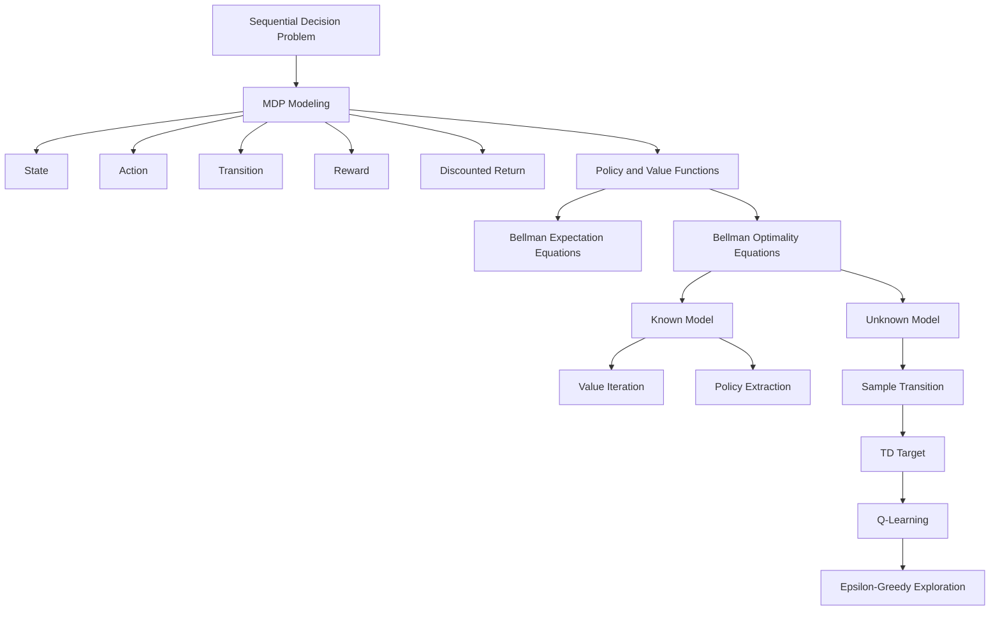

> 对应原文：d2l-en.md 第 17 章 **Reinforcement Learning**。本章按原书顺序介绍马尔可夫决策过程（MDP）、价值迭代（Value Iteration）与 Q-learning，并以 FrozenLake 网格世界说明“已知环境模型时用动态规划规划”和“未知环境模型时从交互样本学习”的区别。

## 1. 本章主线：从预测问题到顺序决策问题

监督学习通常接收一个相对固定的数据集：

$$
\mathcal D=\{(x_i,y_i)\}_{i=1}^{n},
$$

模型对一个测试样本的预测一般不会改变下一个测试样本的分布。强化学习（Reinforcement Learning, RL）则研究**顺序决策**：当前动作会改变下一状态、未来能观察到的数据以及之后可获得的奖励。

原书以包裹配送、围棋和电影推荐为例：

- 包裹是否及时打包，会改变选择陆运还是空运；
- 当前落子改变棋盘，也改变对手后续动作；
- 当前推荐影响用户观看行为，也影响后续可收集的反馈。

因此，强化学习不能只问“当前预测是否准确”，而要问：

> 在环境存在随机性、奖励可能延迟、动作会改变未来的情况下，应该采用什么决策规则，才能最大化长期期望回报？

本章形成一条递进路线：



作者的问题分析路径是：

1. 用 MDP 把“状态、动作、随机环境和奖励”形式化；
2. 用折扣回报定义长期目标；
3. 用策略描述决策规则，用价值函数描述从某状态开始的长期收益；
4. 利用 Markov 性，把无限期回报递归分解成“一步奖励 + 下一状态价值”；
5. 若转移概率和奖励已知，直接对 Bellman 最优算子做价值迭代；
6. 若环境模型未知，用实际交互得到的下一状态替代转移分布期望，形成 Q-learning；
7. 由于数据由智能体自己的行为产生，还必须解决探索与利用的矛盾。

本章只讨论有限表格型 MDP 的基础算法，没有真正进入深度强化学习。其价值在于建立后续 DQN、actor-critic、policy gradient 等方法共同依赖的 Bellman、TD 和探索概念。

## 2. 强化学习与监督学习的根本差异

### 2.1 数据分布由策略参与产生

监督学习常假设样本来自某个固定分布：

$$
(X,Y)\sim P_{data}.
$$

强化学习中的轨迹分布依赖策略 $\pi$：

$$
P_\pi(\tau)
=\rho_0(s_0)
\prod_{t=0}^{\infty}
\pi(a_t\mid s_t)
P(s_{t+1}\mid s_t,a_t).
$$

改变策略会改变访问哪些状态、收集哪些奖励，也会改变后续训练数据。这造成反馈回路：

```text
current policy
  -> visited states and actions
  -> collected rewards and transitions
  -> updated value/policy
  -> new data distribution
```

### 2.2 奖励可能延迟

某个动作现在没有奖励，却可能决定很久以后能否成功。例如迷宫中第一步走对方向，只有到达终点时才得到 1。如何把远期结果归因给早期动作，称为**信用分配（credit assignment）**问题。

Bellman 方程和 TD 更新的作用，就是把后续价值逐步向前传播。

### 2.3 探索与利用

- **利用（exploitation）**：选择当前估计最好的动作；
- **探索（exploration）**：尝试尚不确定、可能更好的动作。

只利用可能永远不知道其他动作更好；只探索则无法把已学知识转化为高回报。探索策略不仅影响当下奖励，还决定学习数据是否覆盖关键状态动作。

### 2.4 目标是期望回报，不是单条幸运轨迹

随机环境中，同一策略可能产生不同轨迹。RL 的目标通常不是寻找一条观测到的最高回报轨迹，而是寻找最大化**期望回报**的策略：

$$
J(\pi)
=\mathbb E_{\tau\sim P_\pi}
\left[\sum_{t=0}^{\infty}\gamma^tR_{t+1}\right].
$$

原书“find a trajectory with the largest return”是直觉说法；严格优化对象应是策略诱导轨迹分布下的期望。

## 3. 马尔可夫决策过程（MDP）

### 3.1 MDP 的组成

原书把 MDP 写作：

$$
\mathrm{MDP}=(\mathcal S,\mathcal A,T,r).
$$

更完整的折扣无限时域定义常写为：

$$
\mathcal M=(\mathcal S,\mathcal A,P,R,\rho_0,\gamma).
$$

各部分：

- $\mathcal S$：状态空间；
- $\mathcal A$：动作空间；
- $P(s'\mid s,a)$：转移概率；
- $R(s,a,s')$：执行动作并转移后的即时奖励，或奖励分布；
- $\rho_0(s)$：初始状态分布；
- $\gamma\in[0,1)$：折扣因子。

原书使用 $r(s,a)$。若奖励还依赖实际下一状态，可定义期望即时奖励：

$$
r(s,a)
=\sum_{s'}P(s'\mid s,a)
\mathbb E[R_{t+1}\mid s,a,s'].
$$

### 3.2 状态（State）

状态 $S_t$ 应包含当前决策和预测未来所需的信息。例如网格机器人可用所在格子作为状态。

“状态”不一定等于原始观测。真实系统可能有：

- 完整状态：位置、速度、库存、时间等；
- 部分观测：相机图像、传感器读数；
- 历史摘要：RNN hidden state、belief state。

若观测不能充分描述环境，问题更准确地属于 POMDP，而不是完全可观测 MDP。

### 3.3 动作（Action）

动作 $A_t\in\mathcal A(S_t)$ 是智能体可控制的决策。网格世界可为左、下、右、上；连续控制中可为转向角、力矩或加速度。

不同状态允许的动作集合可能不同。为统一实现，也可以固定全局动作集，让非法动作保持原地并给予惩罚。

### 3.4 转移函数（Transition）

$$
P(s'\mid s,a)
=P(S_{t+1}=s'\mid S_t=s,A_t=a).
$$

对任意 $s,a$：

$$
P(s'\mid s,a)\ge0,
$$

$$
\sum_{s'\in\mathcal S}P(s'\mid s,a)=1.
$$

确定性环境是特殊情况：存在函数 $f$，使

$$
P(s'\mid s,a)
=\begin{cases}
1,&s'=f(s,a),\\
0,&\text{otherwise}.
\end{cases}
$$

原书说可靠动作时“$P(s'\mid s,a)=1$ for all $s'$”不严谨；若所有下一状态概率都为 1，就不再归一化。正确含义是唯一实际后继概率为 1。

### 3.5 奖励（Reward）

奖励是环境在一步交互后返回的标量：

$$
R_{t+1}\sim p(r\mid S_t,A_t,S_{t+1}).
$$

它表达优化目标，而不是“告诉智能体正确动作”。奖励设计会改变最优策略：

- 到达目标 +1；
- 每一步 -1，鼓励更短路径；
- 撞障碍 -10；
- 能耗惩罚；
- 安全约束惩罚。

奖励塑形（reward shaping）可加速学习，但不当设计会让智能体利用漏洞。例如只奖励“靠近目标”，智能体可能在局部反复刷分。若希望不改变最优策略，可考虑势函数塑形：

$$
F(s,a,s')
=\gamma\Phi(s')-\Phi(s).
$$

### 3.6 轨迹（Trajectory）

原书轨迹：

$$
\tau=(s_0,a_0,r_0,s_1,a_1,r_1,\ldots).
$$

更常见的时间索引是：

$$
\tau=(S_0,A_0,R_1,S_1,A_1,R_2,\ldots),
$$

表示在 $S_t$ 执行 $A_t$ 后收到 $R_{t+1}$ 并进入 $S_{t+1}$。两种记号只要全篇一致即可。

### 3.7 回报（Return）

从时刻 $t$ 开始的折扣回报：

$$
G_t
=R_{t+1}+\gamma R_{t+2}
+\gamma^2R_{t+3}+\cdots
=\sum_{k=0}^{\infty}\gamma^kR_{t+k+1}.
$$

递归关系：

$$
G_t=R_{t+1}+\gamma G_{t+1}.
$$

这条一步递归是所有 Bellman 方程和 TD 方法的来源。

### 3.8 折扣因子（Discount Factor）

$$
0\le\gamma<1.
$$

作用：

1. 让无限期有界奖励回报收敛；
2. 调节远期奖励的重要性；
3. 使 Bellman 算子成为压缩映射；
4. 可解释为每步以 $1-\gamma$ 概率终止的随机时域。

若

$$
|R_t|\le R_{max},
$$

则

$$
|G_t|
\le\sum_{k=0}^{\infty}
\gamma^kR_{max}
=\frac{R_{max}}{1-\gamma}.
$$

原书说“无限轨迹的 return 会无限”并非总成立：奖励可能全零、正负抵消或本身可求和。折扣提供的是统一的充分有界条件。

### 3.9 折扣不等于探索

- 小 $\gamma$：强调即时奖励，规划有效时域短；
- 大 $\gamma$：重视远期后果，信用传播更远；
- 探索程度由行为策略（如 $\epsilon$ 或 entropy）控制。

原书说大 $\gamma$ 鼓励 exploration，混淆了长期规划与探索。大折扣可能让远期未知收益更重要，但不会自动让智能体尝试新动作。

有效时域的粗略量级：

$$
H_{eff}\approx\frac1{1-\gamma}.
$$

例如 $\gamma=0.9$ 约 10 步，$\gamma=0.99$ 约 100 步。它不是严格截断长度，而是权重衰减尺度。

### 3.10 Markov 性

Markov 条件：

$$
P(S_{t+1}\mid S_0,A_0,\ldots,S_t,A_t)
=P(S_{t+1}\mid S_t,A_t).
$$

给定当前状态和动作，完整过去不会为下一状态提供额外信息。

这不是说“系统没有记忆”，而是历史影响已经被当前状态充分汇总。

### 3.11 状态设计决定是否 Markov

若机器人状态只记录位置，动作为加速度，则下一位置还依赖当前速度，而速度可由历史位置差得到：

$$
x_{t+1}=f(x_t,a_t,x_{t-1}).
$$

仅位置不是 Markov state。扩展：

$$
S_t=(x_t,v_t),
$$

则

$$
S_{t+1}=F(S_t,A_t)
$$

恢复 Markov 性。

状态设计的一般方法：加入足以预测未来和奖励的变量。无法直接观测时，可维护 belief：

$$
b_t(s)=P(S_t=s\mid O_{0:t},A_{0:t-1}).
$$

### 3.12 MountainCar 的 MDP

经典 MountainCar：

- state：位置 $x$ 与速度 $v$；
- actions：左推、无推力、右推；
- transition：车辆动力学、重力和边界；
- reward：常见每步 $-1$，到达目标终止；
- objective：尽快到达右侧山顶。

只用位置不是 Markov，因为相同位置但速度方向不同，下一状态不同。

### 3.13 Pong 的 MDP/POMDP

可定义：

- state：游戏 RAM，或包含运动信息的连续多帧；
- observation：单帧像素通常不足以知道球速；
- action：上、下、停或控制器动作；
- reward：得分 +1、失分 -1；
- transition：游戏引擎与对手行为；
- episode：一局或一场比赛。

单帧图像往往是部分观测；堆叠多帧或用 RNN 记忆可近似恢复状态信息。

## 4. 策略与价值函数

### 4.1 随机策略与确定性策略

策略是给定状态的动作分布：

$$
\pi(a\mid s)
=P(A_t=a\mid S_t=s).
$$

满足：

$$
\pi(a\mid s)\ge0,
$$

$$
\sum_{a\in\mathcal A(s)}
\pi(a\mid s)=1.
$$

确定性策略 $\mu(s)$ 是特殊情况：

$$
\pi(a\mid s)
=\mathbf1[a=\mu(s)].
$$

随机策略可用于探索、对抗和混合最优解；有限折扣 MDP 至少存在一个平稳确定性最优策略。

### 4.2 状态价值函数

策略 $\pi$ 下，从状态 $s$ 开始的期望回报：

$$
V^\pi(s)
=\mathbb E_\pi[G_t\mid S_t=s].
$$

它回答：

> 若现在处于 $s$，之后一直遵循 $\pi$，平均能得到多少折扣回报？

价值不是即时奖励，也不是到目标的概率；它同时取决于策略、奖励、转移和折扣。

### 4.3 动作价值函数

$$
Q^\pi(s,a)
=\mathbb E_\pi[G_t
\mid S_t=s,A_t=a].
$$

第一步动作固定为 $a$，之后遵循 $\pi$。它回答：

> 在 $s$ 先做 $a$，以后按 $\pi$ 行动，长期回报如何？

状态价值与动作价值：

$$
V^\pi(s)
=\sum_a\pi(a\mid s)Q^\pi(s,a).
$$

### 4.4 Bellman 期望方程：状态价值

由

$$
G_t=R_{t+1}+\gamma G_{t+1}
$$

得：

$$
\begin{aligned}
V^\pi(s)
&=\mathbb E_\pi[
R_{t+1}+\gamma G_{t+1}
\mid S_t=s]\\
&=\sum_a\pi(a\mid s)
\sum_{s',r}
p(s',r\mid s,a)
[r+\gamma V^\pi(s')].
\end{aligned}
$$

若使用期望奖励 $r(s,a)$：

$$
\boxed{
V^\pi(s)
=\sum_a\pi(a\mid s)
\left[
r(s,a)
+\gamma\sum_{s'}P(s'\mid s,a)V^\pi(s')
\right]
}.
$$

原书中间式把随机 $r(s_0,a_0)$ 放在对 $a_0$ 的期望外，不严谨；最终展开式是正确结构。

### 4.5 Bellman 期望方程：动作价值

$$
\boxed{
Q^\pi(s,a)
=r(s,a)
+\gamma\sum_{s'}P(s'\mid s,a)
\sum_{a'}\pi(a'\mid s')Q^\pi(s',a')
}.
$$

也可写为：

$$
Q^\pi(s,a)
=r(s,a)
+\gamma\sum_{s'}P(s'\mid s,a)V^\pi(s').
$$

两式通过 $V^\pi(s')=\sum_{a'}\pi(a'\mid s')Q^\pi(s',a')$ 等价。

### 4.6 Bellman 方程的直觉

长期问题被拆成：

```text
current state/action
  -> immediate reward
  + discounted value of the next state
```

这是动态规划的“最优子结构”：若整条未来决策最优，那么从任一后继状态开始的剩余决策也必须最优。

Bellman 方程不是额外经验规律，而是回报递归、Markov 性和条件期望的直接结果。

### 4.7 固定策略诱导的 Markov reward process

定义：

$$
r_\pi(s)
=\sum_a\pi(a\mid s)r(s,a),
$$

$$
P_\pi(s,s')
=\sum_a\pi(a\mid s)P(s'\mid s,a).
$$

向量形式：

$$
V^\pi=r_\pi+\gamma P_\pi V^\pi.
$$

所以若状态有限：

$$
(I-\gamma P_\pi)V^\pi=r_\pi,
$$

$$
V^\pi
=(I-\gamma P_\pi)^{-1}r_\pi.
$$

直接求逆成本高且大状态空间不可行，迭代 policy evaluation 更常用。

## 5. 最优价值与 Bellman 最优方程

### 5.1 最优价值函数

$$
V^{\ast}(s)=\max_\pi V^\pi(s),
$$

$$
Q^{\ast}(s,a)=\max_\pi Q^\pi(s,a).
$$

最优策略从每个状态都达到 $V^{\ast}$。原书一处仅针对初始状态 $s_0$ 写

$$
\pi^{\ast}=\arg\max_\pi V^\pi(s_0).
$$

若只关心固定初始分布，这个目标可用；标准最优策略通常要求对所有状态最优，或最大化

$$
J(\pi)=\mathbb E_{S_0\sim\rho_0}V^\pi(S_0).
$$

### 5.2 Bellman 最优方程：$V^{\ast}$

在状态 $s$ 选择第一步动作，之后继续最优：

$$
\boxed{
V^{\ast}(s)
=\max_{a\in\mathcal A}
\left[
r(s,a)
+\gamma\sum_{s'}P(s'\mid s,a)V^{\ast}(s')
\right]
}.
$$

原书“Principle of Dynamic Programming”一处把右侧写成 `argmax`，这是类型错误：

- `max` 返回价值标量；
- `argmax` 返回动作。

### 5.3 Bellman 最优方程：$Q^{\ast}$

$$
\boxed{
Q^{\ast}(s,a)
=r(s,a)
+\gamma\sum_{s'}P(s'\mid s,a)
\max_{a'}Q^{\ast}(s',a')
}.
$$

顺序很重要：

1. 对每个实际下一状态 $s'$，选择该状态的最佳下一动作；
2. 再按转移概率对 $s'$ 求期望。

即：

$$
\sum_{s'}P(s'\mid s,a)
\max_{a'}Q(s',a'),
$$

而不是

$$
\max_{a'}
\sum_{s'}P(s'\mid s,a)Q(s',a').
$$

后者要求在尚未观察到随机下一状态前选同一个 $a'$，语义不同。原书 Q-value iteration 公式把 `max` 放在期望之外，应校正。

### 5.4 从最优价值提取策略

若有 $V^{\ast}$：

$$
\pi^{\ast}(s)
\in\arg\max_a
\left[
r(s,a)+\gamma\sum_{s'}
P(s'\mid s,a)V^{\ast}(s')
\right].
$$

若有 $Q^{\ast}$：

$$
\pi^{\ast}(s)\in\arg\max_aQ^{\ast}(s,a).
$$

若多个动作并列，它们都可构成最优确定性策略，也可在这些动作间随机化。

### 5.5 Bellman 最优算子

定义：

$$
(\mathcal T_*V)(s)
=\max_a\left[
r(s,a)+\gamma\sum_{s'}
P(s'\mid s,a)V(s')
\right].
$$

最优价值是不动点：

$$
V^{\ast}=\mathcal T_*V^{\ast}.
$$

定义固定策略算子：

$$
(\mathcal T_\pi V)(s)
=\sum_a\pi(a\mid s)
\left[r(s,a)+\gamma\sum_{s'}P(s'\mid s,a)V(s')\right].
$$

$$
V^\pi=\mathcal T_\pi V^\pi.
$$

## 6. 价值迭代（Value Iteration）

### 6.1 适用前提

价值迭代是**基于模型（model-based）**的动态规划算法，需要已知：

- 所有状态和动作；
- $P(s'\mid s,a)$；
- 奖励函数或期望奖励；
- 折扣因子。

它不需要与真实环境反复试错，就能在模型上做完整 Bellman backup。

### 6.2 算法更新

任意初始化 $V_0$。同步更新：

$$
V_{k+1}(s)
=\max_a
\left[
r(s,a)+\gamma\sum_{s'}
P(s'\mid s,a)V_k(s')
\right].
$$

所有 $V_{k+1}(s)$ 都必须读取上一轮 $V_k$，称为 synchronous sweep。

伪代码：

```text
initialize V(s) arbitrarily
repeat:
    old_V = V.copy()
    delta = 0
    for every state s:
        for every action a:
            Q(s,a) = sum over s' of P(s'|s,a)
                     * [R(s,a,s') + gamma * old_V(s')]
        V(s) = max_a Q(s,a)
        policy(s) = argmax_a Q(s,a)
        delta = max(delta, abs(V(s) - old_V(s)))
until delta < tolerance
```

### 6.3 收敛：压缩映射

对任意 $V,W$，sup norm：

$$
\|V-W\|_\infty
=\max_s|V(s)-W(s)|.
$$

利用

$$
|\max_ax_a-\max_ay_a|
\le\max_a|x_a-y_a|,
$$

可得：

$$
\begin{aligned}
|\mathcal T_*V(s)-\mathcal T_*W(s)|
&\le
\gamma\max_a
\left|
\sum_{s'}P(s'\mid s,a)
[V(s')-W(s')]
\right|\\
&\le\gamma\|V-W\|_\infty.
\end{aligned}
$$

所以：

$$
\boxed{
\|\mathcal T_*V-\mathcal T_*W\|_\infty
\le\gamma\|V-W\|_\infty
}.
$$

$0\le\gamma<1$ 时是压缩映射，存在唯一不动点，且：

$$
\|V_k-V^{\ast}\|_\infty
\le\gamma^k\|V_0-V^{\ast}\|_\infty.
$$

### 6.4 停止条件与误差界

原书固定 `num_iters=10`，没有检查是否收敛。通用实现应使用 Bellman residual 或相邻迭代差：

$$
\delta_k=\|V_{k+1}-V_k\|_\infty.
$$

由压缩性质可得粗略后验误差界：

$$
\|V_k-V^{\ast}\|_\infty
\le\frac{\gamma}{1-\gamma}
\|V_k-V_{k-1}\|_\infty.
$$

因此若希望 value error 不超过 $\varepsilon$，可要求：

$$
\delta_k
\le\varepsilon\frac{1-\gamma}{\gamma}.
$$

策略稳定可能早于价值完全收敛，也可能因动作值非常接近而对小误差敏感。

### 6.5 策略评估（Policy Evaluation）

给定固定策略 $\pi$：

$$
V_{k+1}(s)
=\sum_a\pi(a\mid s)
\left[
r(s,a)+\gamma\sum_{s'}P(s'\mid s,a)V_k(s')
\right].
$$

即：

$$
V_{k+1}=\mathcal T_\pi V_k.
$$

同样是 $\gamma$-压缩映射，收敛到唯一 $V^\pi$。

价值迭代与策略评估区别：

- Policy evaluation：动作按给定 $\pi$ 加权；
- Value iteration：每状态取最佳动作 max；
- Policy iteration：交替完整/近似评估策略和贪心改进策略。

### 6.6 Q-value 形式的价值迭代

正确更新：

$$
Q_{k+1}(s,a)
=r(s,a)
+\gamma\sum_{s'}P(s'\mid s,a)
\max_{a'}Q_k(s',a').
$$

也可先：

$$
V_k(s)=\max_aQ_k(s,a),
$$

再：

$$
Q_{k+1}(s,a)
=r(s,a)+\gamma\sum_{s'}P(s'\mid s,a)V_k(s').
$$

### 6.7 计算复杂度

若稠密转移表：

$$
P\in\mathbb R^{|S|\times|A|\times|S|},
$$

每 sweep：

$$
O(|S|^2|A|).
$$

若每个 $(s,a)$ 只有至多 $d$ 个后继：

$$
O(|S||A|d).
$$

内存：

- 只保留两轮 value：$O(|S|)$；
- Q 和 policy：$O(|S||A|)$；
- 完整模型：稠密 $O(|S|^2|A|)$，稀疏 $O(|S||A|d)$。

原书为了可视化保存所有迭代的 $V,Q,\pi$，内存为 $O(K|S||A|)$；生产实现不必保存历史。

### 6.8 异步与原地更新

Gauss-Seidel 风格可按某顺序原地更新：

$$
V(s)\leftarrow
\max_a\sum_{s'}P(s'\mid s,a)
[r+\gamma V(s')].
$$

同一 sweep 后部状态可使用前部的新值，常更快传播信息，但结果依更新顺序。Prioritized sweeping 会优先 backup Bellman residual 大的状态。

### 6.9 FrozenLake 环境

典型 $4\times4$ 地图：

```text
S F F F
F H F H
F F F H
H F F G
```

- S：start；
- F：frozen safe cell；
- H：hole terminal；
- G：goal terminal；
- 到 G 奖励 1；
- 其他转移奖励 0。

Gym/Gymnasium 动作编号通常：

```text
0 = left
1 = down
2 = right
3 = up
```

原书正文动作顺序和 down 箭头存在笔误。

### 6.10 Deterministic 与 Slippery FrozenLake

原书实验假设可靠动作，相当于：

```python
gym.make("FrozenLake-v1", is_slippery=False)
```

Gymnasium 默认通常 `is_slippery=True`：动作可能向预期方向或两个垂直方向移动，常见各 $1/3$。此时 value iteration 必须对多个下一状态求期望，最安全策略可能比最短几何路径更绕。

### 6.11 原书实验配置与结论边界

- seed 0；
- $\gamma=0.95$；
- 10 sweeps；
- 4×4 deterministic FrozenLake。

原书图示在约 10 次后得到最优策略，并称非洞状态可到达目标。这是该地图和设定的结果，不是任意 FrozenLake 的普遍保证。

在确定性、仅目标奖励的同步更新中，价值信息每 sweep 最多沿图反向传播一条边。因此最远状态到目标的最短安全距离给出迭代传播的直觉下界。随机转移下通常渐近收敛，不会在有限步精确稳定到所有实数价值。

### 6.12 不同 $\gamma$ 的行为

#### $\gamma=0$

$$
V^{\ast}(s)=\max_ar(s,a).
$$

只看一步奖励。除一步可进目标的状态外，其余值常为 0，无法传播长期路径信息。

#### $\gamma=0.5$

距离目标 $d$ 步、途中零奖励、最后奖励 1 时：

$$
V^{\ast}(s)=\gamma^{d-1}.
$$

远处价值快速衰减。

#### $\gamma\to1$

远期奖励权重更高，价值传播误差收缩因子接近 1，迭代更慢。

#### $\gamma=1$

Bellman 算子不再是严格压缩映射，任意初始化收敛保证消失。有限时域或 stochastic shortest path 中，若所有相关策略 proper、episode 几乎必然终止且回报有限，仍可有良好理论；不能直接套用折扣 MDP 证明。

## 7. 从已知模型到未知模型

### 7.1 价值迭代为什么不能直接用于未知环境

Bellman backup 需要：

$$
\sum_{s'}P(s'\mid s,a)
\max_{a'}Q(s',a').
$$

如果不知道 $P$，无法枚举和加权所有下一状态。智能体却可以执行 $a$，观察一个样本：

$$
(S_t,A_t,R_{t+1},S_{t+1}).
$$

条件期望满足：

$$
\mathbb E[
R_{t+1}+\gamma\max_{a'}Q(S_{t+1},a')
\mid S_t=s,A_t=a]
$$

等于 Bellman target（适当处理终止）。因此单个实际转移可作为随机 target。

### 7.2 Model-based 与 model-free

#### Model-based

- 已知或学习 $P,R$；
- 在模型中规划；
- 可重用数据做很多 backup；
- 模型偏差会影响策略。

Value iteration 是已知精确模型的 planning。

#### Model-free

- 不显式估计完整 $P,R$；
- 直接从样本学习 value/policy；
- Q-learning 是表格型 model-free control。

“Model-free”不代表没有环境，只是不构建可查询的显式动力学模型。

## 8. Q-learning

### 8.1 TD target

观察转移：

$$
(S_t=s,A_t=a,R_{t+1}=r,S_{t+1}=s').
$$

若是真正终止状态：

$$
y_t=r.
$$

否则：

$$
y_t
=r+\gamma\max_{a'}Q_t(s',a').
$$

统一写：

$$
\boxed{
y_t
=r+\gamma(1-D_t)
\max_{a'}Q_t(s',a')
},
$$

$D_t=1$ 表示 MDP terminal。

### 8.2 TD error 与更新

TD error：

$$
\delta_t
=y_t-Q_t(s,a).
$$

更新：

$$
\boxed{
Q_{t+1}(s,a)
=Q_t(s,a)
+\alpha_t(s,a)\delta_t
}.
$$

即：

$$
Q_{t+1}(s,a)
=(1-\alpha_t)Q_t(s,a)
+\alpha_ty_t.
$$

它是旧估计和新 target 的加权平均。

原书推导公式写成

$$
(1-\alpha)Q-\alpha y,
$$

符号错误；应是 $+\alpha y$。原书实际代码

```python
Q[s, a] += alpha * (y - Q[s, a])
```

反而是正确的。

### 8.3 从半梯度损失看更新

把 target 暂时视为常数（stop-gradient）：

$$
\ell_t(Q)
=\frac12(Q(s,a)-y_t)^2.
$$

$$
\frac{\partial\ell_t}{\partial Q(s,a)}
=Q(s,a)-y_t.
$$

梯度下降：

$$
Q\leftarrow Q-\alpha(Q-y)
=Q+\alpha(y-Q).
$$

之所以叫半梯度，是因为 $y_t$ 也包含当前 $Q$，但更新时不通过 target 反向求导。深度 Q-network 延续这一思想，并用 target network 稳定移动 target。

### 8.4 原书批量优化解释的边界

原书写平方 Bellman residual 数据目标，并称若行为策略是最优且数据无限，就与 value iteration 相同。需要补充：

- Target 依赖同一个 $Q$，优化不是普通固定标签监督学习；
- 随机下一状态的样本平方误差还包含转移方差；
- 只按最优策略采样通常不访问非贪心动作，无法学习所有 $Q(s,a)$；
- Q-learning 的经典证明来自异步随机逼近 Bellman 最优不动点，而不是简单 ERM。

### 8.5 Q-learning 是 off-policy

行为策略 $\mu$ 负责收集数据，例如 $\epsilon$-greedy；target 使用：

$$
\max_{a'}Q(s',a'),
$$

对应目标贪心策略。行为与目标不同，因此是 off-policy。

对比 SARSA：

$$
y_t^{SARSA}
=r+\gamma Q(s',A_{t+1}),
$$

其中 $A_{t+1}\sim\mu(\cdot\mid s')$，属于 on-policy。SARSA 会把探索策略本身的风险纳入价值；Q-learning 学习贪心目标策略的价值。

### 8.6 未访问状态动作不能设为 $-\infty$

原文说不在数据集中的 $(s,a)$ 设为 $-\infty$。在线 Q-learning 实际通常：

- 全零初始化；
- 乐观初始化；
- 任意有限初始值。

若设 $-\infty$，该动作在贪心和 bootstrap 中可能永远无法恢复，数值更新也不便。关键不是标记未知为负无穷，而是通过探索让每个相关 $(s,a)$ 被访问。

## 9. 探索策略

### 9.1 $\epsilon$-greedy 的行为

算法形式：

```text
with probability epsilon:
    choose a uniformly random action
otherwise:
    choose a greedy action
```

严格动作概率（并列贪心动作均分）：

$$
\pi_\epsilon(a\mid s)
=\frac{\epsilon}{|\mathcal A|}
+(1-\epsilon)
\frac{\mathbf1[a\in\mathcal G(s)]}
{|\mathcal G(s)|},
$$

其中

$$
\mathcal G(s)=\arg\max_bQ(s,b).
$$

注意随机分支也可能抽到贪心动作，所以唯一贪心动作的总概率是：

$$
1-\epsilon+\frac{\epsilon}{|A|},
$$

不是恰好 $1-\epsilon$。

### 9.2 平局处理

若所有 Q 初始为 0，`np.argmax` 固定返回索引 0。$\epsilon=0$ 时智能体可能永远执行 action 0。

更稳健的随机平局：

```python
greedy = np.flatnonzero(Q[state] == Q[state].max())
action = rng.choice(greedy)
```

或使用乐观初始化鼓励尚未尝试的动作。

### 9.3 Softmax/Boltzmann 探索

$$
\pi_T(a\mid s)
=\frac{\exp(Q(s,a)/T)}
{\sum_b\exp(Q(s,b)/T)}.
$$

- $T\to0$：接近贪心；
- $T\to\infty$：接近均匀；
- 对 Q 的尺度敏感；
- 数值上应减去最大 logit。

$\epsilon$ 大与温度大都增加随机性，但分布形状不同：$\epsilon$-greedy 对所有非贪心动作均匀，softmax 会偏向次优高 Q 动作。

### 9.4 探索衰减

常用：

$$
\epsilon_t
=\max(\epsilon_{min},
\epsilon_0e^{-kt}),
$$

或线性衰减。

理论 GLIE（greedy in the limit with infinite exploration）要求：

- $\epsilon_t\to0$，最终行为贪心；
- 每个 $(s,a)$ 仍被访问无穷多次。

衰减过快会永久漏掉区域；固定非零 $\epsilon$ 保持探索，但训练行为永远不是纯贪心。评估时应另用 $\epsilon=0$ 的冻结策略。

### 9.5 探索不只是随机动作

更高级方法：

- optimistic initialization；
- UCB；
- count-based bonuses；
- entropy regularization；
- Thompson sampling；
- intrinsic motivation；
- parameter noise。

本章 $\epsilon$-greedy 是最基础基线，不适合所有稀疏奖励或高维问题。

## 10. Q-learning 的收敛与“自我纠正”

### 10.1 自我纠正的直觉

若某动作 Q 被高估，行为策略更常选择它；若实际回报差，后续 TD target 会把 Q 拉低。好动作因高回报被强化。

这个反馈直觉有帮助，但不等于无条件收敛。若从不探索某动作，高估/低估就无数据纠正；若学习率恒大，估计会持续抖动。

### 10.2 表格型收敛条件

有限 MDP 中，经典 Q-learning 几乎必然收敛到 $Q^{\ast}$ 的典型条件：

1. 奖励有界；
2. $0\le\gamma<1$；
3. 每个状态动作对被访问无穷多次；
4. 每个 $(s,a)$ 的学习率满足 Robbins–Monro：

$$
\sum_t\alpha_t(s,a)=\infty,
$$

$$
\sum_t\alpha_t^2(s,a)<\infty.
$$

例如按访问次数：

$$
\alpha_t(s,a)
=\frac1{N_t(s,a)^\omega},
\qquad\frac12<\omega\le1.
$$

### 10.3 原书超参数不是收敛证明

原书：

- $\gamma=0.95$；
- 256 episodes（变量名 `num_iters`）；
- $\alpha=0.9$ 常数；
- $\epsilon=0.9$ 常数；
- seed 0。

这可在简单确定性 FrozenLake 上学到可用策略，但：

- 常数学习率不满足平方可求和条件；
- 256 episodes 不保证充分覆盖；
- 单 seed 不代表平均性能；
- 常数 $\epsilon$ 的行为策略不会变成贪心；
- 没有独立评估成功率。

因此“约 250 iterations 找到最优策略”是一次演示，不是一般理论结论。

### 10.4 Value Iteration 与 Q-learning 轮数不能直接比较

一次 value iteration sweep：

- 遍历所有状态动作；
- 对所有后继求期望；
- 使用完整精确模型。

一次 Q-learning episode：

- 只访问一条可变长度轨迹；
- 获得有限随机样本；
- 只更新轨迹中的状态动作。

所以“10 iterations vs 250 episodes”不是同单位。应比较：

- Bellman backups；
- 环境交互次数；
- wall-clock；
- model queries；
- 最终策略成功率和回报。

价值迭代样本效率看似无限好，是因为环境模型已经完整给出；获取该模型本身可能非常昂贵。

## 11. Gymnasium 终止语义与正确实现

### 11.1 旧 Gym 与现代 Gymnasium API

旧代码：

```python
state = env.reset()
next_state, reward, done, info = env.step(action)
```

现代 Gymnasium：

```python
state, info = env.reset(seed=seed)
next_state, reward, terminated, truncated, info = env.step(action)
episode_done = terminated or truncated
```

### 11.2 `terminated` 与 `truncated` 不相同

- `terminated=True`：MDP 内真正终止，如掉入洞或到达目标；没有后续价值；
- `truncated=True`：外部时间限制、监控器或人为截断；潜在 MDP 仍可继续。

TD target：

$$
y=r+\gamma(1-\mathbf1_{terminated})
\max_{a'}Q(s',a').
$$

Episode loop 在 `terminated or truncated` 时结束，但只有 `terminated` 禁止 bootstrap。

若任务把时间上限显式纳入 state 并定义为有限时域 MDP，则到 horizon 的处理可不同；必须明确建模语义。

### 11.3 原书 terminal bootstrap 的偶然正确

原书代码无 done mask：

```python
y = reward + gamma * max(Q[next_state])
```

在 FrozenLake 中 terminal Q row 初始全零且从不更新，因此 target 偶然等于 reward。若：

- Q 乐观初始化；
- terminal row 被更新；
- 函数逼近共享参数；

就会错误 bootstrap。正确实现必须显式 mask。

### 11.4 Seed

可复现设置：

```python
rng = np.random.default_rng(seed)
state, info = env.reset(seed=seed)
env.action_space.seed(seed)
```

之后每 episode 通常 `env.reset()`，让同一个环境 RNG 继续演化。若每次都 `reset(seed=same_seed)`，可能重复完全相同随机序列，降低覆盖。

应分别控制：

- Python RNG；
- NumPy RNG；
- environment RNG；
- action space RNG；
- deep learning framework RNG。

### 11.5 训练与评估分离

训练：

- 使用探索；
- 更新 Q；
- 收集 steps、TD error、visitation。

评估：

- 冻结 Q；
- $\epsilon=0$，平局随机或固定；
- 多个独立 seeds；
- 不更新；
- 报告平均 return、成功率、episode length 和置信区间。

只看训练中最后一条轨迹不能评价策略。

## 12. FrozenLake 数值直觉

### 12.1 只有终点奖励时的值

确定性安全路径，距离 goal 还需 $d$ 个动作，进入 goal 时奖励 1。若中间奖励 0：

$$
V^{\ast}(s)=\gamma^{d-1}.
$$

例如 $\gamma=0.95$：

| 距离 $d$ | Value |
|---:|---:|
| 1 | 1 |
| 2 | 0.95 |
| 3 | $0.95^2=0.9025$ |
| 6 | $0.95^5\approx0.7738$ |

因此 value heatmap 越靠近目标通常越亮。

### 12.2 最短路径与最大折扣回报

若所有安全路径只在终点奖励 1，$0<\gamma<1$：

$$
\gamma^{d_1-1}>\gamma^{d_2-1}
\quad\Longleftrightarrow\quad d_1<d_2.
$$

所以最优策略偏好最短安全路径。在 slippery 环境中还要权衡路径长度与掉洞概率：更长但安全的路线可能期望回报更高。

### 12.3 随机转移下的期望

某动作以概率 $p$ 到好状态 $g$、$1-p$ 到坏状态 $b$：

$$
Q(s,a)
=r(s,a)
+\gamma[pV(g)+(1-p)V(b)].
$$

价值迭代精确求该期望；Q-learning 每次只观察 $g$ 或 $b$，通过多次样本平均逼近期望。

### 12.4 8×8 为什么更难

- 状态从 16 增到 64；
- 最短路径更长；
- 稀疏奖励更难被随机探索发现；
- 价值反向传播需要更多 sweeps；
- Q-learning 需要更多 episodes 覆盖状态动作；
- slippery 转移使成功轨迹更稀少。

不能只比较 episode 数，应使用多 seeds 和 environment steps。

## 13. 可运行的综合 Python 实验

下面脚本只依赖 Python 标准库和 NumPy，不需要 Gym。它构造与经典 4×4 FrozenLake 相同的确定性 MDP，验证：

- 转移概率归一化；
- Bellman expectation 和 $V^\pi=\sum_a\pi Q^\pi$；
- Bellman 最优算子的 $\gamma$-压缩性质；
- Value Iteration 收敛与策略提取；
- 距离—折扣价值关系；
- Q-learning 的 terminal mask、off-policy target 与学习；
- $\epsilon$-greedy 的精确动作概率；
- 训练探索策略与贪心评估分离；
- `terminated` 与 `truncated` 的不同 bootstrap 语义。

```python
import math

import numpy as np

SEED = 101
GAMMA = 0.95
ACTIONS = {
    0: (0, -1),   # left
    1: (1, 0),    # down
    2: (0, 1),    # right
    3: (-1, 0),   # up
}
MAP = (
    "SFFF",
    "FHFH",
    "FFFH",
    "HFFG",
)

def build_frozen_lake(map_rows):
    height, width = len(map_rows), len(map_rows[0])
    num_states, num_actions = height * width, len(ACTIONS)
    transitions = np.zeros((num_states, num_actions, num_states))
    rewards = np.zeros((num_states, num_actions, num_states))
    terminal = np.zeros(num_states, dtype=bool)

    def state(row, column):
        return row * width + column

    for row in range(height):
        for column in range(width):
            current = state(row, column)
            cell = map_rows[row][column]
            terminal[current] = cell in "HG"
            for action, (row_delta, column_delta) in ACTIONS.items():
                if terminal[current]:
                    transitions[current, action, current] = 1.0
                    continue
                next_row = min(max(row + row_delta, 0), height - 1)
                next_column = min(max(column + column_delta, 0), width - 1)
                next_state = state(next_row, next_column)
                transitions[current, action, next_state] = 1.0
                if map_rows[next_row][next_column] == "G":
                    rewards[current, action, next_state] = 1.0
    start = next(
        state(row, column)
        for row in range(height)
        for column in range(width)
        if map_rows[row][column] == "S"
    )
    goal = next(
        state(row, column)
        for row in range(height)
        for column in range(width)
        if map_rows[row][column] == "G"
    )
    return transitions, rewards, terminal, start, goal

def expected_action_values(transitions, rewards, terminal, values, gamma):
    continuation = gamma * values[None, None, :] * (~terminal)[None, None, :]
    return (transitions * (rewards + continuation)).sum(axis=2)

def value_iteration(transitions, rewards, terminal, gamma, tolerance=1e-12,
                    max_iterations=10_000):
    values = np.zeros(transitions.shape[0])
    for iteration in range(1, max_iterations + 1):
        action_values = expected_action_values(
            transitions, rewards, terminal, values, gamma
        )
        new_values = action_values.max(axis=1)
        new_values[terminal] = 0.0
        residual = np.max(np.abs(new_values - values))
        values = new_values
        if residual < tolerance:
            break
    action_values = expected_action_values(
        transitions, rewards, terminal, values, gamma
    )
    policy = action_values.argmax(axis=1)
    return values, action_values, policy, iteration, residual

def policy_evaluation(transitions, rewards, terminal, policy_probs, gamma,
                      tolerance=1e-12):
    values = np.zeros(transitions.shape[0])
    while True:
        action_values = expected_action_values(
            transitions, rewards, terminal, values, gamma
        )
        new_values = (policy_probs * action_values).sum(axis=1)
        new_values[terminal] = 0.0
        if np.max(np.abs(new_values - values)) < tolerance:
            return new_values, action_values
        values = new_values

def step_model(transitions, rewards, terminal, state, action, rng):
    next_state = rng.choice(
        transitions.shape[2], p=transitions[state, action]
    )
    reward = rewards[state, action, next_state]
    terminated = bool(terminal[next_state])
    return next_state, reward, terminated

def epsilon_greedy_action(q_values, state, epsilon, rng):
    if rng.random() < epsilon:
        return int(rng.integers(q_values.shape[1]))
    row = q_values[state]
    greedy_actions = np.flatnonzero(np.isclose(row, row.max()))
    return int(rng.choice(greedy_actions))

def q_learning(transitions, rewards, terminal, start, gamma,
               num_episodes=20_000, max_steps=100, seed=SEED):
    rng = np.random.default_rng(seed)
    num_states, num_actions = transitions.shape[:2]
    q_values = np.zeros((num_states, num_actions))
    visits = np.zeros((num_states, num_actions), dtype=np.int64)

    for episode in range(num_episodes):
        state = start
        epsilon = max(0.05, 1.0 - episode / (0.75 * num_episodes))
        for _ in range(max_steps):
            action = epsilon_greedy_action(
                q_values, state, epsilon, rng
            )
            next_state, reward, terminated = step_model(
                transitions, rewards, terminal, state, action, rng
            )
            visits[state, action] += 1
            learning_rate = 1.0 / visits[state, action] ** 0.6
            target = reward
            if not terminated:
                target += gamma * q_values[next_state].max()
            q_values[state, action] += learning_rate * (
                target - q_values[state, action]
            )
            state = next_state
            if terminated:
                break
    return q_values, visits

def evaluate_greedy_policy(transitions, rewards, terminal, start, q_values,
                           episodes=200, max_steps=100, seed=202):
    rng = np.random.default_rng(seed)
    returns, successes = [], 0
    for _ in range(episodes):
        state, total_reward = start, 0.0
        for _ in range(max_steps):
            greedy_actions = np.flatnonzero(
                np.isclose(q_values[state], q_values[state].max())
            )
            action = int(rng.choice(greedy_actions))
            state, reward, terminated = step_model(
                transitions, rewards, terminal, state, action, rng
            )
            total_reward += reward
            if terminated:
                successes += int(reward > 0)
                break
        returns.append(total_reward)
    return np.mean(returns), successes / episodes

P, R, TERMINAL, START, GOAL = build_frozen_lake(MAP)

# 1. Every state-action transition distribution is normalized.
np.testing.assert_allclose(P.sum(axis=2), 1.0)
assert TERMINAL[GOAL]

# 2. Policy evaluation satisfies both Bellman expectation relationships.
uniform_policy = np.full((P.shape[0], P.shape[1]), 1 / P.shape[1])
uniform_values, uniform_q = policy_evaluation(
    P, R, TERMINAL, uniform_policy, GAMMA
)
np.testing.assert_allclose(
    uniform_values,
    (uniform_policy * uniform_q).sum(axis=1),
    atol=1e-10,
)
uniform_backup = (uniform_policy * expected_action_values(
    P, R, TERMINAL, uniform_values, GAMMA
)).sum(axis=1)
uniform_backup[TERMINAL] = 0
np.testing.assert_allclose(uniform_values, uniform_backup, atol=1e-10)

# 3. The Bellman optimality operator is a gamma contraction.
rng = np.random.default_rng(SEED)
value_a = rng.normal(size=P.shape[0])
value_b = rng.normal(size=P.shape[0])
backup_a = expected_action_values(
    P, R, TERMINAL, value_a, GAMMA
).max(axis=1)
backup_b = expected_action_values(
    P, R, TERMINAL, value_b, GAMMA
).max(axis=1)
backup_a[TERMINAL] = backup_b[TERMINAL] = 0
assert np.max(np.abs(backup_a - backup_b)) <= (
    GAMMA * np.max(np.abs(value_a - value_b)) + 1e-12
)

# 4. Value iteration converges and produces the expected shortest-path values.
optimal_values, optimal_q, optimal_policy, iterations, residual = value_iteration(
    P, R, TERMINAL, GAMMA
)
assert residual < 1e-12
assert math.isclose(optimal_values[START], GAMMA ** 5, rel_tol=1e-12)
assert math.isclose(optimal_values[14], 1.0, rel_tol=1e-12)
assert math.isclose(optimal_q[START].max(), optimal_values[START])

# 5. Q-learning uses sampled transitions and learns a successful greedy policy.
learned_q, visits = q_learning(P, R, TERMINAL, START, GAMMA)
mean_return, success_rate = evaluate_greedy_policy(
    P, R, TERMINAL, START, learned_q
)
assert success_rate == 1.0 and mean_return == 1.0
assert visits[START].sum() > 0
assert learned_q[START].max() > 0

# 6. Exact epsilon-greedy probabilities sum to one and include random greedy picks.
epsilon, num_actions = 0.2, 4
greedy_index = 2
action_probabilities = np.full(num_actions, epsilon / num_actions)
action_probabilities[greedy_index] += 1 - epsilon
np.testing.assert_allclose(action_probabilities.sum(), 1.0)
assert math.isclose(action_probabilities[greedy_index], 0.85)
assert all(math.isclose(action_probabilities[index], 0.05)
           for index in (0, 1, 3))

# 7. True termination suppresses bootstrap; external truncation does not.
reward, next_best = 0.25, 0.8
terminated_target = reward + GAMMA * (1 - 1) * next_best
truncated_target = reward + GAMMA * (1 - 0) * next_best
assert math.isclose(terminated_target, 0.25)
assert math.isclose(truncated_target, 1.01)

# 8. The Q-learning convex-combination form has a positive target sign.
old_q, target, learning_rate = 0.4, 1.0, 0.3
td_form = old_q + learning_rate * (target - old_q)
convex_form = (1 - learning_rate) * old_q + learning_rate * target
assert math.isclose(td_form, convex_form) and math.isclose(td_form, 0.58)

print("MDP transition normalization = PASS")
print("Bellman expectation / contraction = PASS")
print("value iteration iterations / start value =", iterations,
      optimal_values[START])
print("Q-learning greedy mean return / success =", mean_return, success_rate)
print("epsilon-greedy probabilities =", action_probabilities.tolist())
print("terminal/truncated targets =", terminated_target, truncated_target)
print("Q update sign = PASS")
```

### 13.1 代码与原理的对应关系

1. 每个 $(s,a)$ 的下一状态概率和为 1，确定性环境只是 one-hot 转移；
2. 均匀随机策略的迭代评估同时满足 $V^\pi=\sum_a\pi Q^\pi$ 和 Bellman expectation 不动点；
3. 随机两个 value vectors 经 Bellman 最优 backup 后的 sup 距离不超过原距离的 $\gamma$ 倍；
4. 价值迭代用 tolerance 停止，起点到目标最短 6 步，所以起点价值为 $\gamma^5$；
5. Q-learning 不读取完整转移期望，只采样一步，使用访问次数衰减学习率和衰减探索，最终贪心策略在确定性起点成功率 100%；
6. $\epsilon=0.2$、4 动作时，唯一贪心动作概率为 0.85，而非 0.8，其余各 0.05；
7. MDP 终止 target 为 0.25，外部截断仍 bootstrap，target 为 $0.25+0.95\times0.8=1.01$；
8. Q-learning 更新展开后 target 前是正号，$0.4$ 以学习率 0.3 向 1.0 移动到 0.58。

## 14. 容易混淆的概念与常见误区

### 14.1 强化学习就是带时间维的监督学习

RL 的动作改变未来数据分布，标签不是固定给定，还涉及探索和延迟奖励。

### 14.2 奖励等于价值

奖励是一步反馈；价值是从当前开始的长期期望折扣回报。

### 14.3 最优目标是找到一条最高回报轨迹

随机环境应优化策略诱导的期望回报，而不是一次幸运样本。

### 14.4 State 就是当前传感器观测

观测可能缺速度、隐藏意图等信息；充分 state 可能需要历史或 belief。

### 14.5 Markov 性表示未来与过去毫无关系

过去可以通过当前状态影响未来；条件是给定当前状态后，额外历史不再有信息。

### 14.6 确定性转移时所有 $P(s'|s,a)=1$

只有唯一后继概率为 1，其余为 0。

### 14.7 无限轨迹的未折扣回报必然无限

零奖励、正负抵消或可求和奖励都可能有限；折扣只是统一充分条件。

### 14.8 大 $\gamma$ 就会自动探索

$\gamma$ 控制远期价值，探索由行为策略控制。

### 14.9 Policy 必须是确定性的

策略一般是动作分布；有限折扣 MDP 存在确定性最优策略，但探索和对抗中随机策略仍有用。

### 14.10 $V(s)$ 是环境固有属性

一般是 $V^\pi(s)$，依赖策略；只有最优值 $V^{\ast}$ 对应最优策略集合。

### 14.11 $Q(s,a)$ 只表示即时动作好坏

它包含第一步动作后的全部长期回报。

### 14.12 Bellman 方程是假设未来策略不变的经验近似

Bellman expectation 对固定策略是回报递归的精确恒等式。

### 14.13 `max` 与 `argmax` 可以互换

`max` 返回价值，`argmax` 返回动作，类型和用途不同。

### 14.14 随机下一状态时先期望再 max 与先 max 再期望相同

一般不同。到达 $s'$ 后才选择 $a'$，所以应对每个 $s'$ 先取 max，再对 $s'$ 求期望。

### 14.15 Value Iteration 不需要环境模型

它需要完整转移和奖励，属于 model-based planning。

### 14.16 固定运行 10 次就叫收敛

应检查 Bellman residual/tolerance；10 次只是该小地图演示。

### 14.17 Value Iteration 的 iteration 与 Q-learning episode 可直接比较

一次是全模型 sweep，一次是一条采样轨迹，计算和信息量不同。

### 14.18 $\gamma=1$ 时照样有压缩映射保证

压缩系数变为 1，需有限时域或 proper episodic 等额外条件。

### 14.19 Q-learning 估计环境转移矩阵

表格 Q-learning 直接学习 action values，不显式估计 $P$。

### 14.20 Q-learning 是 on-policy

行为可为 $\epsilon$-greedy，target 却用 greedy max，因此是 off-policy。

### 14.21 Q-learning target 前应是负号

更新向 target 移动，展开是 $(1-\alpha)Q+\alpha y$；原书公式负号是错误。

### 14.22 Terminal state 仍应 bootstrap 下一状态价值

真正终止后未来回报为零，必须 mask；truncation 则通常仍 bootstrap。

### 14.23 未访问动作应初始化为 $-\infty$

会阻止探索和数值恢复；通常用零、乐观或有限初始化。

### 14.24 $\epsilon$-greedy 中贪心动作概率恰为 $1-\epsilon$

随机分支也可能抽中贪心动作，所以唯一贪心动作总概率为 $1-\epsilon+\epsilon/|A|$。

### 14.25 `argmax` 平局不会影响探索

固定返回第一个 index 会产生强偏置，尤其 $Q=0,\epsilon=0$ 时。

### 14.26 $\epsilon=1$ 时不可能学到最优 Q

行为完全随机，但 Q-learning 是 off-policy；若充分覆盖、学习率满足条件，仍可学 $Q^{\ast}$，评估需改为贪心。

### 14.27 常数 $\alpha=0.9$ 且 256 episodes 足以证明收敛

不满足经典学习率条件，只是简单环境的一次运行。

### 14.28 “自我纠正”保证任何函数逼近 Q-learning 稳定

函数逼近、bootstrap、off-policy 的组合可能发散，称为 deadly triad。

### 14.29 Gym 的 `done` 与 Gymnasium 的 `terminated` 完全相同

现代 API 拆分 terminated 和 truncated，bootstrap 语义不同。

### 14.30 每个 episode 都用相同 seed reset 更可复现且不影响学习

会反复同一随机序列，降低环境多样性；通常只初始化一次 RNG。

### 14.31 训练时成功一次就说明策略可靠

需冻结策略，在独立 seeds 上报告成功率、平均回报和置信区间。

### 14.32 FrozenLake 默认是确定性的

标准 Gymnasium 通常默认 slippery；原书是可靠动作的教学特例。

## 15. 原章练习与关键推导

### 15.1 有界回报证明

若 $|R_t|\le R_{max}$ 且 $0\le\gamma<1$：

$$
|G_t|
\le\sum_{k=0}^{\infty}\gamma^k|R_{t+k+1}|
\le R_{max}\sum_{k=0}^{\infty}\gamma^k
=\frac{R_{max}}{1-\gamma}.
$$

### 15.2 Bellman expectation 的逐步推导

$$
V^\pi(s)
=\mathbb E[G_t\mid S_t=s]
$$

$$
=\mathbb E[R_{t+1}+\gamma G_{t+1}\mid S_t=s]
$$

先对 $A_t\sim\pi(\cdot|s)$，再对 $(S_{t+1},R_{t+1})\sim p(\cdot|s,A_t)$ 用全期望公式，即得 Bellman 方程。

### 15.3 Policy Evaluation 的矩阵解

$$
V=r_\pi+\gamma P_\pi V
$$

$$
(I-\gamma P_\pi)V=r_\pi.
$$

由于 $P_\pi$ 的谱半径不超过 1、$\gamma<1$，$I-\gamma P_\pi$ 可逆：

$$
V=(I-\gamma P_\pi)^{-1}r_\pi.
$$

小状态空间可直接解线性方程；大稀疏系统更适合迭代。

### 15.4 Bellman 最优算子的压缩证明

对每状态动作定义：

$$
x_a=r_a+\gamma P_aV,
\qquad
y_a=r_a+\gamma P_aW.
$$

利用 max 的非扩张性和概率加权平均不放大 sup norm：

$$
|\max_ax_a-\max_ay_a|
\le\max_a|x_a-y_a|
\le\gamma\|V-W\|_\infty.
$$

对状态取 max 即得结论。

### 15.5 Value Iteration 需要多少次

由

$$
\|V_k-V^{\ast}\|_\infty
\le\gamma^kE_0
$$

要误差不超过 $\varepsilon$：

$$
k
\ge
\frac{\log(\varepsilon/E_0)}
{\log\gamma}.
$$

因为 $\log\gamma<0$，右侧为正。$\gamma$ 越接近 1，所需迭代越多。

### 15.6 8×8 FrozenLake 的迭代直觉

在确定性零中间奖励图中，$V_0=0$ 时：

- 第 1 sweep：一步到 goal 的状态获得正值；
- 第 2 sweep：两步到 goal 的状态获得正值；
- 第 $d$ sweep：最短距离 $d$ 的状态首次获得正值。

因此最远安全状态的最短图距离决定“正价值传播到全图”的轮数下界，但最终 tolerance 收敛还取决于随机环、自循环和 $\gamma$。

### 15.7 Value Iteration 的稀疏复杂度

每个状态 $\lvert A\rvert$ 个动作，每个动作至多 $d$ 个后继：

$$
O(K|S||A|d)
$$

执行 $K$ sweeps。确定性环境 $d=1$，每 sweep 为 $O(|S||A|)$。

### 15.8 Q-learning 无偏 target 的条件期望

对非终止转移：

$$
Y=R_{t+1}+\gamma\max_{a'}Q(S_{t+1},a').
$$

给定 $(s,a)$：

$$
\mathbb E[Y\mid s,a]
=r(s,a)
+\gamma\sum_{s'}P(s'\mid s,a)
\max_{a'}Q(s',a').
$$

即 Bellman 最优 backup。单样本有噪声，多次随机逼近不动点。

### 15.9 为什么 Q-learning 是 off-policy

行为分布为 $\mu(a|s)$，但 target 使用：

$$
\pi_Q(s')=\arg\max_{a'}Q(s',a').
$$

更新没有使用实际行为下一动作，因此学习目标策略与生成数据的策略不同。

### 15.10 $\epsilon=0,0.5,1$ 的预期

#### $\epsilon=0$

纯利用。零初始化和固定 argmax 可能卡在 action 0，无法发现奖励；有乐观初始化或已有好 Q 时可高效。

#### $\epsilon=0.5$

一半随机分支，兼顾覆盖与利用；简单任务中常比两端更快。

#### $\epsilon=1$

行为完全随机，覆盖较广但到达稀疏奖励慢。Q-learning target 仍贪心，理论上可学 $Q^{\ast}$；训练 return 低，贪心评估可高。

### 15.11 $\gamma=0,0.5,1$ 对 Q-learning

- $0$：只学习 $Q(s,a)=\mathbb E[R_{t+1}|s,a]$，远期奖励不传播；
- $0.5$：传播但快速衰减；
- $1$：episodic proper 环境可能工作，但经典折扣收敛证明不适用，环路和奖励结构需谨慎。

### 15.12 Terminal 与 truncation 例子

若当前 reward 0.25、下一最大 Q 0.8、$\gamma=0.95$：

真正终止：

$$
y=0.25.
$$

时间上限截断：

$$
y=0.25+0.95\times0.8=1.01.
$$

把 truncation 当 terminal 会系统性低估临近时间上限状态。

### 15.13 随机平局策略

令

$$
\mathcal G(s)=\{a:Q(s,a)=\max_bQ(s,b)\}.
$$

从 $\mathcal G(s)$ 均匀抽样可避免索引 0 偏置。若要求严格可复现，应使用独立 seeded RNG。

### 15.14 多 seed 成功率置信区间

评估 $N$ 个独立 episode，成功数 $K$，估计：

$$
\widehat p=K/N.
$$

粗略标准误：

$$
\sqrt{\frac{\widehat p(1-\widehat p)}{N}}.
$$

接近 0/1 或样本少时 Wilson interval 比正态近似更稳健。报告单 seed 单 episode 没有统计意义。

### 15.15 Deadly Triad

表格 Q-learning 在条件满足时收敛；换成神经网络后同时存在：

1. function approximation；
2. bootstrapping；
3. off-policy learning。

可能不稳定甚至发散。DQN 使用 experience replay 和 target network 缓解，但不能把表格证明直接搬到深度函数逼近。

## 16. 全章知识结构

```mermaid
flowchart TD
    A[Reinforcement Learning] --> B[MDP]
    B --> B1[States S]
    B --> B2[Actions A]
    B --> B3[Transitions P]
    B --> B4[Rewards R]
    B --> B5[Initial Distribution rho0]
    B --> B6[Discount gamma]
    B --> C[Trajectory and Return]
    C --> C1[Gt = Rt+1 + gamma Gt+1]
    B --> D[Policy]
    D --> D1[Stochastic pi(a|s)]
    D --> D2[Deterministic mu(s)]
    D --> E[Value Functions]
    E --> E1[V pi(s)]
    E --> E2[Q pi(s,a)]
    E --> F[Bellman Expectation]
    F --> G[Optimal Values]
    G --> G1[Bellman Optimality]
    G1 --> H[Known Model]
    H --> H1[Policy Evaluation]
    H --> H2[Value Iteration]
    H2 --> H3[Greedy Policy Extraction]
    G1 --> I[Unknown Model]
    I --> I1[Sample Transition]
    I1 --> I2[TD Target]
    I2 --> I3[TD Error]
    I3 --> I4[Q-Learning]
    I4 --> J[Behavior Policy]
    J --> J1[Epsilon-Greedy]
    J --> J2[Softmax Exploration]
    I4 --> K[Off-Policy Control]
    K --> K1[Terminal Mask]
    K --> K2[Convergence Conditions]
```

## 17. 核心结论与解决强化学习问题的一般思路

### 17.1 核心结论

1. 强化学习研究动作会改变未来状态和数据分布的顺序决策，目标是最大化策略的长期期望回报。
2. MDP 用状态、动作、转移、奖励、初始分布和折扣描述环境；状态是否充分决定 Markov 性。
3. Reward 是一步反馈，return 是整条未来奖励的折扣和，value 是给定策略下 return 的条件期望。
4. 折扣控制远期权重并使有界无限回报收敛，不等于探索参数。
5. 策略是状态到动作分布；确定性策略只是特殊情况。
6. Bellman expectation 方程来自 $G_t=R_{t+1}+\gamma G_{t+1}$、Markov 性和全期望公式。
7. $V^\pi(s)=\sum_a\pi(a|s)Q^\pi(s,a)$；$Q$ 固定第一步动作，$V$ 对第一步动作按策略平均。
8. Bellman 最优方程中 $V^{\ast}$ 取 value 的 `max`，策略才取动作的 `argmax`。
9. 随机后继下应对每个 $s'$ 先取下一动作最大值，再对 $s'$ 求期望。
10. Value Iteration 需要已知完整 MDP，反复应用 Bellman 最优算子；$\gamma<1$ 时该算子是压缩映射。
11. 固定迭代次数不等于收敛，通用实现应检查 sup-norm residual 并提取贪心策略。
12. Policy evaluation 把 max 换成给定策略的动作期望，可迭代或解线性系统。
13. Q-learning 用实际一步样本构造随机 Bellman target，不显式学习转移矩阵，是 model-free control。
14. Q-learning 更新是 $Q\leftarrow Q+\alpha(y-Q)$；原书推导中的负 target 符号错误，实际代码正确。
15. Q-learning 行为可探索、target 却取 greedy max，因此是 off-policy；SARSA 使用实际下一动作，属于 on-policy。
16. $\epsilon$-greedy 必须处理 argmax 平局；随机分支也可能选中贪心动作。
17. 表格 Q-learning 收敛需要有界奖励、折扣、无限访问和 Robbins–Monro 学习率，有限单次实验不是证明。
18. 真正 terminal 禁止 bootstrap，外部 truncation 通常仍应 bootstrap；现代 Gymnasium 明确区分两者。
19. Value Iteration sweep 与 Q-learning episode 信息量不同，不能只比较“迭代次数”。
20. 训练使用探索，评估应冻结贪心策略并在多个独立 seeds 上报告回报和成功率。

### 17.2 解决强化学习问题的一般顺序

1. **先确认是否真是顺序决策**：动作是否改变未来状态、观测或奖励？
2. **定义充分状态**：列出预测下一状态和奖励所需变量，识别部分观测。
3. **明确动作与约束**：离散/连续、状态依赖合法动作、安全边界。
4. **审查奖励**：是否与真实目标一致，是否可被投机，是否稀疏或尺度失衡？
5. **定义 episode、terminal 和 truncation**：这直接决定 bootstrap mask。
6. **选择回报形式**：有限/无限时域、折扣 $\gamma$，并估算有效时域。
7. **区分已知模型与未知模型**：有 $P,R$ 可规划；只有交互可用 model-free 或先学习模型。
8. **先做小型表格基线**：验证状态、奖励、终止和 Bellman 方程，再扩展函数逼近。
9. **若模型已知，先做 policy/value iteration**：用 residual 停止，不凭固定轮数。
10. **逐轴检查 Bellman 顺序**：next-state expectation、next-action max、terminal mask 不可错位。
11. **若模型未知，定义行为策略**：探索覆盖和目标贪心策略分别是什么？
12. **跟踪 visitation counts**：确认重要 $(s,a)$ 是否真正被采样。
13. **设计学习率日程**：表格收敛需按状态动作访问次数衰减；常数率只适合持续适应或有限实验。
14. **随机打破 argmax 平局**：避免 action-index 偏置。
15. **训练/评估分离**：评估不探索、不更新，使用独立 seeds。
16. **使用正确指标**：平均 return、成功率、episode length、constraint violation 与置信区间。
17. **比较算法时统一成本**：environment steps、model calls、Bellman backups、wall-clock，而非名称相同的 iteration。
18. **做边界单元测试**：转移归一化、terminal target、truncation target、奖励索引、动作映射。
19. **增加随机性后重测**：确定性环境成功不代表 slippery/随机环境稳健。
20. **进入深度 RL 前识别 deadly triad**：函数逼近、bootstrap 和 off-policy 组合需要额外稳定机制。

本章的主线可以压缩为一句话：**MDP 把顺序决策写成状态、动作、转移和奖励；Bellman 方程用一步递归把长期回报分解；已知模型时，价值迭代对全部状态动作做精确期望 backup；未知模型时，Q-learning 用环境给出的一步样本做随机 TD backup，并通过探索获取覆盖。真正正确的实现取决于四个细节：max 与 argmax 的类型、期望与 max 的顺序、terminal 与 truncation 的区分，以及行为探索是否足以覆盖状态动作空间。**
