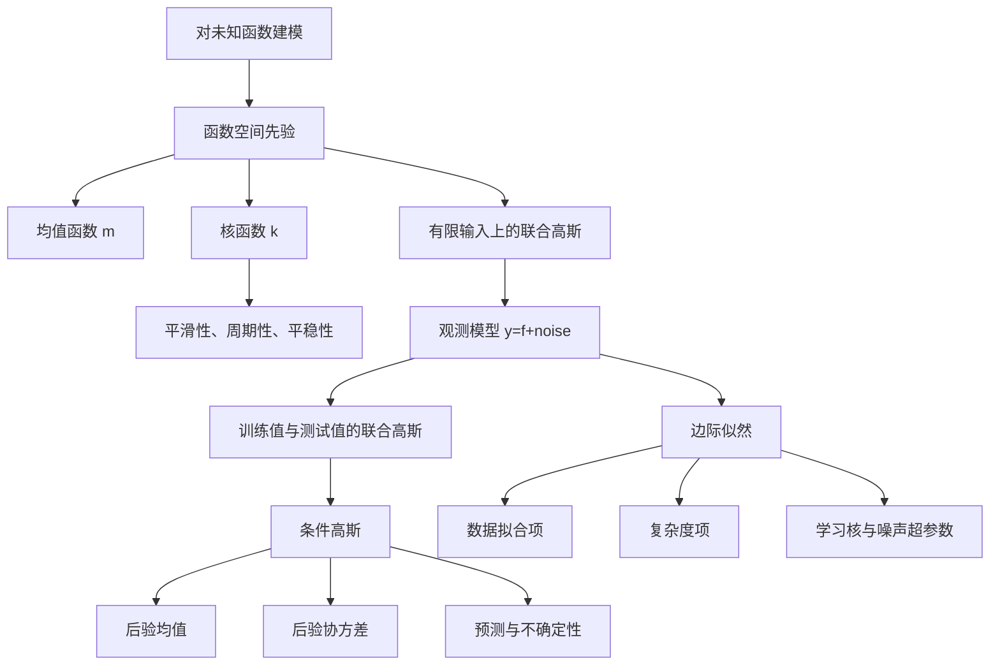
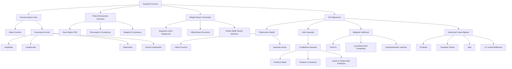

> 对应原文：d2l-en.md 第 18 章 **Gaussian Processes**。本章依次介绍高斯过程的直觉、先验构造与回归推断，并给出从权重空间到函数空间、从联合高斯到后验预测、从边际似然到超参数学习的完整推导。

## 1. 本章主线：直接对函数建立概率模型

通常的机器学习建模从参数开始：先选函数族 $f(x;\boldsymbol\theta)$，再从数据估计参数 $\boldsymbol\theta$。参数可能很多，也不容易解释。例如，仅观察神经网络数百万个权重，很难直接判断模型偏好平滑函数、周期函数还是快速振荡函数。

高斯过程（Gaussian Process, GP）换了一个视角：

> 不先问“参数应该是多少”，而先问“哪些函数在观测数据之前是合理的，看到数据之后又还剩下哪些可能的函数”。

它直接定义**函数上的概率分布**。均值函数描述先验中心，协方差函数（核）描述任意两个输入处函数值如何共同变化。看到数据后，通过高斯条件分布把先验更新为后验。



作者的分析顺序是：

1. 用图说明先验函数、后验函数、后验均值和可信区间分别是什么；
2. 用 RBF 核解释振幅和长度尺度怎样控制函数形状；
3. 把“函数分布”严格定义为任意有限个函数值都服从联合高斯；
4. 从贝叶斯线性模型说明参数分布如何诱导函数分布；
5. 反过来只用均值函数和核，在函数空间直接构造先验；
6. 加入高斯观测噪声，用条件高斯闭式计算回归后验；
7. 用边际似然在数据拟合与模型复杂度之间权衡，自动学习核超参数；
8. 从 NumPy 实现过渡到 GPyTorch，以便更换核、扩展规模和处理近似推断。

本章最难的地方不在公式数量，而在三个观念转换：

- 从“一个函数”转向“函数的分布”；
- 从“无限个函数值”转向“任意有限查询点的多元高斯”；
- 从“矩阵公式”转向“稳定的线性求解”，不能真的计算矩阵逆。

## 2. 为什么需要高斯过程

### 2.1 参数空间难以表达高层先验

面对时间序列、空间测量或小样本回归，我们经常知道一些结构：

- 函数大致平滑；
- 每 24 小时或每年重复；
- 临近位置更相似；
- 某些方向变化快、另一些方向变化慢；
- 不同区域具有不同平滑度；
- 远离数据时应该降低信心。

这些知识很难直接翻译成大量参数的取值，却能自然地写成核函数。GP 的优势不是“没有参数”，而是把归纳偏置集中到少量可解释的核超参数中。

### 2.2 小数据下需要完整预测分布

只给点预测无法回答：

- 哪个未标注点最值得采集？
- 最优候选点的改善是否可信？
- 外推区域是否缺少证据？
- 预测波动来自函数未知，还是观测本身有噪声？

GP 同时给出后验均值与协方差，因此适合主动学习、贝叶斯优化、时空回归、实验设计和不确定性敏感决策。

### 2.3 高斯结构带来闭式推断

若先验是 GP、似然是高斯，则训练观测和测试函数值联合高斯。高斯分布的边缘分布和条件分布仍是高斯，因此回归推断有闭式解。

这是一种重要的建模取舍：

- 高斯结构足够灵活，可以通过核表达丰富函数族；
- 又足够特殊，使条件化、边缘化和采样都可计算。

### 2.4 GP 与深度学习不是对立关系

- 无限宽神经网络在适当缩放下可收敛到 GP；
- 神经切线核（NTK）用核方法研究宽网络训练；
- Deep Kernel Learning 用神经网络学习表示，再在表示上使用 GP；
- GPyTorch 与 PyTorch 自动微分、GPU 和线性代数工具结合。

因此 GP 既是实用模型，也是理解核方法、贝叶斯学习和宽神经网络的重要桥梁。

## 3. 高斯过程导论

### 3.1 从观测到函数后验

原书先给出一组不规则采样的回归数据：

在没有使用数据前，先从 GP **先验**采样多条函数：

先验不是要求函数穿过数据，而是回答：在看数据之前，函数大概应该以怎样的尺度变化？

条件化观测后得到**后验函数样本**：

每一条样本是后验认为仍可能的完整函数。把每个输入处所有后验函数值取期望，得到后验均值：

后验函数在某处越分散，那里对潜函数越不确定：

清理掉样本曲线后，可只显示均值和区间：

这组图建立了 GP 的核心对象：

| 对象 | 回答的问题 |
|---|---|
| 先验函数分布 | 看数据前，哪些函数合理？ |
| 后验函数分布 | 看数据后，哪些函数仍合理？ |
| 后验均值 | 平方损失下的点预测是什么？ |
| 后验协方差 | 不同测试位置的预测如何共同变化？ |
| 后验样本 | 一条完整且内部相关的可能函数是什么样？ |

### 3.2 函数分布不是“逐点独立的分布”

若只对每个 $x$ 单独指定

$$
f(x)\sim\mathcal N(0,1),
$$

却不说明不同 $x$ 之间的关系，就无法表达平滑性。GP 的关键是为任意一组输入同时指定联合分布：

$$
\begin{bmatrix}
f(x_1)\\
\vdots\\
f(x_n)
\end{bmatrix}
\sim
\mathcal N(\mathbf m,K),
$$

其中非对角元素 $K_{ij}$ 把不同位置的函数值联系起来。

### 3.3 认知不确定性与偶然不确定性

#### 认知不确定性（Epistemic Uncertainty）

来自数据不足，不知道真实潜函数是哪一条。理想情况下增加覆盖充分的数据可以减小它。在 GP 回归中由潜函数后验方差表示：

$$
\operatorname{Var}[f(x_*)\mid\mathcal D].
$$

#### 偶然不确定性（Aleatoric Uncertainty）

来自观测生成机制本身的随机性，例如传感器噪声：

$$
y(x)=f(x)+\epsilon,
\qquad
\epsilon\sim\mathcal N(0,\sigma_n^2).
$$

即使潜函数完全已知，新观测仍会波动。预测观测的方差为：

$$
\operatorname{Var}[y_*\mid\mathcal D]
=\operatorname{Var}[f_*\mid\mathcal D]+\sigma_n^2.
$$

“数据增多后认知不确定性消失”需要限制：数据必须覆盖关注区域，核和似然应基本正确，超参数也不能严重失配。GP 给出的是**模型内部**不确定性，不会自动识别所有分布偏移。

### 3.4 协方差函数与 RBF 核

原书使用径向基函数核（RBF，也称 squared exponential）：

$$
\boxed{
k_{\mathrm{RBF}}(x,x')
=a^2\exp\left(
-\frac{\lVert x-x'\rVert^2}{2\ell^2}
\right)
}.
$$

它同时承担两种角色：

1. 数值上是 $f(x)$ 与 $f(x')$ 的协方差；
2. 建模上规定距离近的函数值更相似。

### 3.5 振幅 $a$ 的含义

$$
k(x,x)=a^2.
$$

因此先验边际标准差为 $a$。增大 $a$ 会放大函数纵向变化尺度，但不改变相关系数：

$$
\operatorname{Corr}(f(x),f(x'))
=\frac{k(x,x')}{\sqrt{k(x,x)k(x',x')}}
=\exp\left(-\frac{\lVert x-x'\rVert^2}{2\ell^2}\right).
$$

需要区分：核中的 $a^2$ 是方差尺度，$a$ 是标准差尺度。

### 3.6 长度尺度 $\ell$ 的含义

当

$$
\lVert x-x'\rVert=\ell,
$$

相关系数为：

$$
e^{-1/2}\approx0.6065.
$$

- 小 $\ell$：相关性快速衰减，先验函数变化快；
- 大 $\ell$：远距离仍相关，先验函数更平缓；
- 距离远大于 $\ell$：$k(x,x')\approx0$，训练点对该预测点影响很弱。

原书比较不同长度尺度的先验与后验。一般来说，大 $\ell$ 让函数更平滑；但“增大 $\ell$ 会让每个位置的后验不确定性都降低”不是普遍单调结论，具体还依赖数据布局、噪声和其他超参数。

### 3.7 各向同性与自动相关性确定

多维输入的单一长度尺度：

$$
k(\mathbf x,\mathbf x')
=a^2\exp\left(
-\frac{\sum_{d=1}^{D}(x_d-x'_d)^2}{2\ell^2}
\right).
$$

若每维使用不同长度尺度：

$$
k(\mathbf x,\mathbf x')
=a^2\exp\left(
-\frac12\sum_{d=1}^{D}
\frac{(x_d-x'_d)^2}{\ell_d^2}
\right),
$$

称为 ARD（automatic relevance determination）形式。很大的 $\ell_d$ 表示函数对第 $d$ 维变化不敏感，但不能简单把它等同于因果特征重要性。

### 3.8 高斯过程的正式定义

随机函数 $f$ 是高斯过程，记作

$$
f\sim\mathcal{GP}(m,k),
$$

当且仅当对任意有限输入集合

$$
X=(x_1,\ldots,x_n),
$$

函数值向量

$$
\mathbf f_X
=\begin{bmatrix}f(x_1)&\cdots&f(x_n)\end{bmatrix}^{\top}
$$

满足：

$$
\boxed{
\mathbf f_X\sim
\mathcal N(\mathbf m_X,K_{XX})
}.
$$

其中：

$$
(\mathbf m_X)_i=m(x_i),
$$

$$
(K_{XX})_{ij}=k(x_i,x_j).
$$

“过程”不表示必须是时间过程，$x$ 可以是时间、空间坐标、图像、分子描述符或任意特征向量。

### 3.9 无限对象为何可以有限计算

GP 在概念上为所有输入处函数值指定分布，是无限维随机对象；计算时只查询有限训练点和测试点，于是只需处理有限均值向量与 Gram 矩阵。

这与普通概率分布类似：不必一次枚举随机变量所有可能结果，只需计算当前事件或边缘分布。

### 3.10 无噪声条件分布

假设零均值，已知训练函数值 $\mathbf f_X$，预测单点 $f_*=f(x_*)$：

$$
\begin{bmatrix}
\mathbf f_X\\
f_*
\end{bmatrix}
\sim
\mathcal N\left(
\mathbf 0,
\begin{bmatrix}
K_{XX}&K_{X*}\\
K_{*X}&K_{**}
\end{bmatrix}
\right).
$$

条件分布：

$$
f_*\mid\mathbf f_X
\sim\mathcal N(m_*,s_*^2),
$$

$$
\boxed{
m_*=K_{*X}K_{XX}^{-1}\mathbf f_X
},
$$

$$
\boxed{
s_*^2=K_{**}-K_{*X}K_{XX}^{-1}K_{X*}
}.
$$

原书两处把最后一项写成 $K_{*X}$，正确末项必须是列向量 $K_{X*}$，否则维度不匹配。

### 3.11 单观测点的数值直觉

设 $f(x)$ 和 $f(x_1)$ 都是零均值、单位方差，相关系数 $\rho$：

$$
\begin{bmatrix}f(x)\\f(x_1)\end{bmatrix}
\sim\mathcal N\left(
\mathbf0,
\begin{bmatrix}1&\rho\\\rho&1\end{bmatrix}
\right).
$$

观测 $f(x_1)=1.2$ 后：

$$
f(x)\mid f(x_1)=1.2
\sim\mathcal N(1.2\rho,1-\rho^2).
$$

若 $\rho=0.9$：

$$
m=1.08,
\qquad
s=\sqrt{0.19}\approx0.436.
$$

一倍标准差区间约为：

$$
[0.644,1.516].
$$

若 $\rho=0.95$：

$$
m=1.14,
\qquad
s=\sqrt{0.0975}\approx0.312,
$$

区间约为：

$$
[0.828,1.452].
$$

相关越强：

- 条件均值越靠近已观测值；
- 条件方差越小；
- 但单个观测仍不能完全确定另一点。

### 3.12 加入观测噪声

若

$$
y_i=f(x_i)+\epsilon_i,
\qquad
\epsilon_i\overset{iid}{\sim}\mathcal N(0,\sigma_n^2),
$$

则训练**观测**协方差：

$$
\operatorname{Cov}(\mathbf y)
=K_{XX}+\sigma_n^2I.
$$

严格说，不是潜函数核本身变成了 $k+\sigma_n^2\delta$，而是观测过程 $y$ 的核多出白噪声项。潜函数 $f$ 的协方差仍是 $k$。

## 4. 高斯过程先验

### 4.1 均值函数与核完整决定 GP

高斯分布由一、二阶矩完全决定，因此 GP 由：

$$
m(x)=\mathbb E[f(x)]
$$

和

$$
k(x,x')
=\operatorname{Cov}(f(x),f(x'))
$$

完全确定。

常把均值设为零，不表示函数真实均值必为零，而是常先对目标中心化，或把趋势放到均值函数。若存在明显线性、周期或物理趋势，显式均值函数可改善外推。

### 4.2 最简单的 GP：随机直线

设：

$$
f(x)=w_0+w_1x,
$$

$$
w_0,w_1\overset{iid}{\sim}\mathcal N(0,1).
$$

对固定 $x$：

$$
f(x)\sim\mathcal N(0,1+x^2).
$$

推导：

$$
\mathbb E[f(x)]=0,
$$

$$
\operatorname{Var}[f(x)]
=\operatorname{Var}(w_0)+x^2\operatorname{Var}(w_1)
=1+x^2.
$$

任意有限组函数值都是同一个高斯权重向量的线性变换，所以联合高斯。这就是一个只包含直线的 GP。

它的均值函数：

$$
m(x)=0.
$$

核函数：

$$
\begin{aligned}
k(x,x')
&=\mathbb E[(w_0+w_1x)(w_0+w_1x')]\\
&=1+xx'.
\end{aligned}
$$

注意 $k(x,x)=1+x^2$ 随位置变化，因此该核不是平稳核。

### 4.3 一般贝叶斯线性模型到 GP

设特征映射：

$$
\boldsymbol\phi(x)
=\begin{bmatrix}
\phi_1(x)&\cdots&\phi_p(x)
\end{bmatrix}^{\top},
$$

模型：

$$
f(x)=\mathbf w^{\top}\boldsymbol\phi(x),
$$

参数先验：

$$
\mathbf w\sim\mathcal N(\mathbf u,S).
$$

则：

$$
\boxed{
m(x)=\mathbf u^{\top}\boldsymbol\phi(x)
},
$$

$$
\boxed{
k(x,x')
=\boldsymbol\phi(x)^{\top}S\boldsymbol\phi(x')
}.
$$

对输入集合 $X$ 定义设计矩阵：

$$
\Phi=
\begin{bmatrix}
\boldsymbol\phi(x_1)^{\top}\\
\vdots\\
\boldsymbol\phi(x_n)^{\top}
\end{bmatrix}.
$$

函数值向量：

$$
\mathbf f=\Phi\mathbf w.
$$

高斯的仿射变换仍为高斯：

$$
\mathbf f
\sim\mathcal N(\Phi\mathbf u,\Phi S\Phi^{\top}).
$$

这条桥梁说明：任何参数线性且参数为联合高斯的模型，都是 GP。这里“线性”指对参数 $\mathbf w$ 线性，$\phi(x)$ 对输入可以高度非线性。

### 4.4 权重空间与函数空间

#### 权重空间

先验放在 $\mathbf w$ 上，计算参数后验，再映射到函数。

#### 函数空间

直接用 $m(x)$、$k(x,x')$ 描述函数值联合分布，不显式构造 $\mathbf w$ 或无限特征。

两者在对应核下给出相同预测，但计算成本取决于维度：

- 特征维数 $p\ll n$ 时，权重空间可能更便宜；
- 核对应无限维特征时，函数空间避免显式构造特征；
- 标准精确 GP 的主要矩阵大小为训练样本数 $n$。

### 4.5 核矩阵为什么必须半正定

对任意输入 $x_1,\ldots,x_n$，Gram 矩阵：

$$
K_{ij}=k(x_i,x_j).
$$

任意系数 $\mathbf c$：

$$
\begin{aligned}
\mathbf c^{\top}K\mathbf c
&=\sum_{i,j}c_ic_j
\operatorname{Cov}(f(x_i),f(x_j))\\
&=\operatorname{Var}\left(\sum_ic_if(x_i)\right)\\
&\ge0.
\end{aligned}
$$

所以合法协方差核必须使任意有限 Gram 矩阵对称半正定（PSD）。

一般只能保证半正定，不一定严格正定：

- 输入重复；
- 常数核；
- 有限维特征但样本数超过特征秩；
- 数值精度误差。

加入正噪声或 jitter：

$$
C=K+(\sigma_n^2+j)I
$$

通常使矩阵严格正定并改善条件数。

### 4.6 有限维一致性

“任意有限集合都有一个高斯分布”还必须彼此一致：

1. **置换一致性**：重排输入只重排均值向量和协方差矩阵；
2. **边缘一致性**：从大输入集合的联合分布边缘化掉若干坐标，应得到直接在剩余输入上定义的分布。

由同一个均值函数和对称 PSD 核生成的有限维高斯族自动满足这些条件。Kolmogorov 扩张定理保证它们对应一个随机过程。

这解释了为什么计算时可以自由添加测试点、删除查询点或改变输入顺序，而不会定义出互相矛盾的模型。

### 4.7 从无限 RBF 基函数推导 RBF 核

原书考虑：

$$
f(x)=\sum_{i=1}^{J}w_i\phi_i(x),
$$

$$
w_i\sim\mathcal N\left(0,\frac{\sigma_w^2}{J}\right),
$$

$$
\phi_i(x)
=\exp\left(-\frac{(x-c_i)^2}{2\ell_b^2}\right).
$$

有限 $J$ 时：

$$
k_J(x,x')
=\frac{\sigma_w^2}{J}
\sum_{i=1}^{J}\phi_i(x)\phi_i(x').
$$

若基中心变得无限密集且使用正确的密度/黎曼权重，则：

$$
k(x,x')
\propto
\int_{-\infty}^{\infty}
\phi_c(x)\phi_c(x')\,dc.
$$

配方：

$$
(x-c)^2+(x'-c)^2
=2\left(c-\frac{x+x'}2\right)^2
+\frac{(x-x')^2}{2}.
$$

所以：

$$
\begin{aligned}
&\int
\exp\left(-\frac{(x-c)^2}{2\ell_b^2}\right)
\exp\left(-\frac{(x'-c)^2}{2\ell_b^2}\right)dc\\
&=\sqrt{\pi}\ell_b
\exp\left(-\frac{(x-x')^2}{4\ell_b^2}\right).
\end{aligned}
$$

它仍是 RBF 核，只是最终长度尺度为 $\sqrt2\ell_b$。

原书从 $\sigma^2/J$ 的和直接写到积分，省略了 $\Delta c$ 或等价密度归一化；严格的极限必须匹配中心密度和权重，否则常数因子不对。

### 4.8 RBF 的通用性与局限

RBF 核的 RKHS 在合适紧集上对连续函数具有稠密性，因此称 universal kernel。但不能据此说：

- 任意有限数据都会自动泛化；
- RBF GP 不会过拟合；
- 后验样本都属于 RKHS；
- 任意真实函数都与 RBF 先验匹配。

事实上，RBF GP 样本极其平滑；真实函数有突变、尖点、变化点或非平稳结构时会失配。GP 样本还几乎必然不属于其核对应的 RKHS，RKHS 更适合描述后验均值和正则化结构，而不是典型先验样本。

### 4.9 从 GP 先验采样

给定查询点 $X$：

1. 计算 $\mathbf m_X$；
2. 计算 $K_{XX}$；
3. 分解

$$
LL^{\top}=K_{XX}+jI;
$$

4. 采样 $\mathbf z\sim\mathcal N(0,I)$；
5. 构造

$$
\mathbf f=\mathbf m_X+L\mathbf z.
$$

每次采样得到同一组离散输入上的一条函数。网格越密，曲线显示越细，但模型本身不依赖绘图网格。

### 4.10 平稳核与非平稳核

若

$$
k(x,x')=\kappa(x-x'),
$$

称为平稳核。平移输入不会改变协方差，意味着不同位置具有相同统计规律。

若只依赖距离：

$$
k(x,x')=\kappa(\lVert x-x'\rVert),
$$

还称为各向同性核。RBF 同时平稳且各向同性。

非平稳核可表达：

- 不同区域不同振幅或平滑度；
- 趋势随绝对位置改变；
- 变化点；
- 输入相关周期；
- 原点或边界附近特殊行为。

### 4.11 核的组合

若 $k_1,k_2$ 是合法核，则以下仍合法：

$$
k=k_1+k_2,
$$

$$
k=k_1k_2,
$$

$$
k(x,x')=a(x)k_1(x,x')a(x'),
$$

以及非负缩放。直觉：

- 加法核：函数分解为独立成分之和；
- 乘法核：同时满足两种相似性；
- 输入缩放：产生非平稳振幅。

例如趋势加季节性：

$$
k=k_{linear}+k_{periodic}+k_{noise}.
$$

### 4.12 无限宽神经网络与 GP

考虑单隐层网络：

$$
f(x)=b+\sum_{i=1}^{J}v_ih(x;u_i).
$$

若：

- 隐藏单元参数独立同分布；
- $\mathbb E[v_i]=0$；
- $\operatorname{Var}(v_i)=\sigma_v^2/J$；
- 激活满足合适矩条件；

则 $J\to\infty$ 时，对任意有限输入集合，函数值向量由多元中心极限定理趋于联合高斯。

均值：

$$
m(x)=0.
$$

核：

$$
k(x,x')
=\sigma_b^2
+\sigma_v^2
\mathbb E_u[h(x;u)h(x';u)].
$$

对 erf 激活可得到含 $\arcsin$ 的解析核。原书公式写成普通 $\sin$，应为反正弦形式。神经网络核通常非平稳，这与 RBF 在所有位置使用相同局部性质不同。

## 5. 高斯过程回归推断

### 5.1 观测模型

潜函数：

$$
f\sim\mathcal{GP}(m,k).
$$

观测：

$$
y(x)=f(x)+\epsilon(x),
$$

$$
\epsilon(x)\overset{iid}{\sim}\mathcal N(0,\sigma_n^2).
$$

训练输入 $X=(x_1,\ldots,x_n)$，训练目标：

$$
\mathbf y=
\begin{bmatrix}
y(x_1)&\cdots&y(x_n)
\end{bmatrix}^{\top}.
$$

测试输入 $X_*=(x_{*1},\ldots,x_{*m})$，目标是求：

$$
p(\mathbf f_*\mid\mathbf y,X,X_*).
$$

原书有一句 “find $x^2$” 是残留笔误，真正要找的是测试潜函数的条件分布。

### 5.2 训练观测的边缘分布

训练潜函数：

$$
\mathbf f_X\sim\mathcal N(\mathbf m_X,K_{XX}).
$$

噪声：

$$
\boldsymbol\epsilon\sim
\mathcal N(\mathbf0,\sigma_n^2I).
$$

两者独立，故：

$$
\boxed{
\mathbf y
\sim\mathcal N(\mathbf m_X,C)
},
$$

其中：

$$
C=K_{XX}+\sigma_n^2I.
$$

这个分布既用于预测，也直接给出边际似然。

### 5.3 训练观测与测试潜函数的联合分布

$$
\boxed{
\begin{bmatrix}
\mathbf y\\
\mathbf f_*
\end{bmatrix}
\sim
\mathcal N\left(
\begin{bmatrix}
\mathbf m_X\\
\mathbf m_*
\end{bmatrix},
\begin{bmatrix}
C&K_{X*}\\
K_{*X}&K_{**}
\end{bmatrix}
\right)
}.
$$

为什么交叉协方差没有噪声项？因为测试潜函数与训练观测噪声独立：

$$
\operatorname{Cov}(\mathbf f_*,\mathbf y)
=\operatorname{Cov}(\mathbf f_*,\mathbf f_X)
+\operatorname{Cov}(\mathbf f_*,\boldsymbol\epsilon)
=K_{*X}.
$$

### 5.4 条件高斯的完整推导

定义训练残差：

$$
\mathbf r=\mathbf y-\mathbf m_X.
$$

构造：

$$
\boldsymbol\eta
=\mathbf f_* -\mathbf m_*
-K_{*X}C^{-1}\mathbf r.
$$

计算它与 $\mathbf r$ 的协方差：

$$
\begin{aligned}
\operatorname{Cov}(\boldsymbol\eta,\mathbf r)
&=K_{*X}-K_{*X}C^{-1}C\\
&=0.
\end{aligned}
$$

$\boldsymbol\eta$ 与 $\mathbf r$ 是联合高斯，零协方差意味着独立。因此给定 $\mathbf y$ 后，$\boldsymbol\eta$ 分布不变。

其协方差：

$$
\begin{aligned}
\operatorname{Cov}(\boldsymbol\eta)
&=K_{**}
-K_{*X}C^{-1}K_{X*}.
\end{aligned}
$$

故：

$$
\boxed{
\mathbf f_*\mid\mathbf y
\sim\mathcal N(\boldsymbol\mu_*,\Sigma_*)
},
$$

$$
\boxed{
\boldsymbol\mu_*
=\mathbf m_*
+K_{*X}C^{-1}(\mathbf y-\mathbf m_X)
},
$$

$$
\boxed{
\Sigma_*
=K_{**}-K_{*X}C^{-1}K_{X*}
}.
$$

$\Sigma_*$ 是联合协方差对 $C$ 的 Schur complement；联合协方差半正定保证它半正定。

### 5.5 后验均值的直觉

定义：

$$
\boldsymbol\alpha=C^{-1}(\mathbf y-\mathbf m_X).
$$

则：

$$
\boldsymbol\mu_*
=\mathbf m_*+K_{*X}\boldsymbol\alpha.
$$

对单测试点：

$$
\mu(x_*)
=m(x_*)+\sum_{i=1}^{n}\alpha_i k(x_*,x_i).
$$

因此后验均值是以训练点为中心的核函数线性组合。$C^{-1}$ 会联合考虑训练点之间的冗余，而不是简单按距离独立加权。

### 5.6 后验协方差的直觉

$$
\Sigma_*=K_{**}-K_{*X}C^{-1}K_{X*}.
$$

- $K_{**}$：看数据前的先验不确定性；
- 第二项：训练数据能够解释掉的不确定性；
- 测试点与训练点越相关，通常削减越多；
- 噪声越大，$C^{-1}$ 的信息作用越弱，削减越少。

在固定核超参数和同方差高斯噪声下，后验协方差不显式依赖观测值 $\mathbf y$，只依赖输入位置和噪声。但如果超参数由 $\mathbf y$ 学习，最终不确定性会间接依赖目标值。

### 5.7 潜函数预测与观测预测

潜函数：

$$
\mathbf f_*\mid\mathcal D
\sim\mathcal N(\boldsymbol\mu_*,\Sigma_*).
$$

新观测：

$$
\mathbf y_*=\mathbf f_*+\boldsymbol\epsilon_*.
$$

所以：

$$
\boxed{
\mathbf y_*\mid\mathcal D
\sim\mathcal N(
\boldsymbol\mu_*,
\Sigma_*+\sigma_n^2I)
}.
$$

原书“预测分布 $p(y_*)$”公式没有加测试噪声，实际写的是 $p(f_*)$。绘图时必须说明区间针对潜函数还是新观测。

### 5.8 可信区间的准确含义

对固定测试点 $x_*$，若预测高斯：

$$
f_*\mid\mathcal D
\sim\mathcal N(\mu_*,s_*^2),
$$

则精确的 95% 点态贝叶斯可信区间约为：

$$
\mu_*\pm1.96s_*.
$$

常用 $\pm2s_*$ 对应约 95.45%。它不是：

- 整条函数同时落入带中的概率为 95% 的 simultaneous band；
- 重复实验意义下必然 95% 覆盖的频率学置信区间；
- 超参数不确定性已经完全积分后的全贝叶斯区间。

原书用边际似然点估计超参数再条件化，属于经验贝叶斯（type-II maximum likelihood），通常会低估一部分超参数不确定性。

## 6. 边际似然与超参数学习

### 6.1 为什么不能只手工选择超参数

RBF 核至少有：

$$
\theta=(a,\ell,\sigma_n).
$$

不同组合会产生完全不同解释：

- 小 $\ell$、小噪声：把局部波动解释为真实函数；
- 大 $\ell$、大噪声：把函数视为平滑，把波动解释为噪声；
- 大振幅：允许较大纵向变化；
- 小振幅：强烈收缩到均值函数。

只最小化训练误差会偏向极短长度尺度和极小噪声。GP 使用边际似然同时评价拟合和函数空间体积。

### 6.2 边际化潜函数

$$
p(\mathbf y\mid X,\theta)
=\int
p(\mathbf y\mid\mathbf f,\theta)
p(\mathbf f\mid X,\theta)
d\mathbf f.
$$

高斯卷积后：

$$
\mathbf y\sim
\mathcal N(\mathbf m_X,C_\theta),
$$

$$
C_\theta=K_\theta(X,X)+\sigma_n^2I.
$$

### 6.3 对数边际似然

令

$$
\mathbf r=\mathbf y-\mathbf m_X.
$$

则：

$$
\boxed{
\log p(\mathbf y\mid X,\theta)
=-\frac12\mathbf r^{\top}C_\theta^{-1}\mathbf r
-\frac12\log|C_\theta|
-\frac n2\log(2\pi)
}.
$$

原书概要公式的 log determinant 一处漏写 $+\sigma_n^2I$，非零均值时也必须使用残差而不是直接用 $\mathbf y$。

### 6.4 三项解释

#### 数据拟合项

$$
-\frac12\mathbf r^{\top}C^{-1}\mathbf r.
$$

它是 Mahalanobis 距离。若残差主要位于模型认为高方差的方向，惩罚较小；若位于模型认为不可能变化的方向，惩罚较大。

#### 复杂度项

$$
-\frac12\log|C|.
$$

$|C|^{1/2}$ 与高斯概率质量铺开的体积有关。模型若允许太多互不相似的函数，会把概率质量分散到大体积中，恰好解释当前数据的密度反而下降。

#### 常数项

$$
-\frac n2\log(2\pi).
$$

比较相同数据上的超参数时是常数，但计算真正概率密度必须保留。

### 6.5 特征值视角与 Occam 剃刀

令：

$$
C=Q\Lambda Q^{\top},
\qquad
\Lambda=\operatorname{diag}(\lambda_1,\ldots,\lambda_n),
$$

$$
\mathbf z=Q^{\top}\mathbf r.
$$

则：

$$
\log p(\mathbf y)
=-\frac12\sum_i\frac{z_i^2}{\lambda_i}
-\frac12\sum_i\log\lambda_i
-\frac n2\log(2\pi).
$$

增大某方向方差 $\lambda_i$ 可减小该方向拟合惩罚，却会增加 log determinant 惩罚。只有数据确实需要该方向时，增加模型自由度才值得。这就是边际似然中的自动 Occam 剃刀。

### 6.6 超参数梯度

设：

$$
\boldsymbol\alpha=C^{-1}\mathbf r.
$$

利用：

$$
\frac{\partial C^{-1}}{\partial\theta}
=-C^{-1}\frac{\partial C}{\partial\theta}C^{-1},
$$

$$
\frac{\partial\log|C|}{\partial\theta}
=\operatorname{tr}\left(
C^{-1}\frac{\partial C}{\partial\theta}
\right),
$$

得到：

$$
\boxed{
\frac{\partial\log p(\mathbf y)}{\partial\theta_j}
=\frac12\operatorname{tr}\left[
(\boldsymbol\alpha\boldsymbol\alpha^{\top}-C^{-1})
\frac{\partial C}{\partial\theta_j}
\right]
}.
$$

第一部分推动模型解释数据，第二部分惩罚扩大协方差体积。

### 6.7 优化实践

为保证参数为正，优化：

$$
\eta_a=\log a,
\qquad
\eta_\ell=\log\ell,
\qquad
\eta_n=\log\sigma_n.
$$

实践建议：

1. 标准化输入，避免距离尺度失衡；
2. 中心化或标准化输出；
3. 使用多个初始点；
4. 检查边际似然面，而不只看一个优化结果；
5. 给超参数加合理先验或边界；
6. 检查 lengthscale-noise 的竞争解释；
7. 用独立验证指标与后验预测检查模型失配。

边际似然一般非凸。优化得更好通常有帮助，但局部最优、核失配和不可辨识仍然存在。

## 7. 稳定计算：不要显式求逆

### 7.1 Cholesky 分解

令：

$$
C=K_{XX}+(\sigma_n^2+j)I,
$$

$$
LL^{\top}=C,
$$

其中 $L$ 为下三角矩阵。

求解：

$$
C\boldsymbol\alpha=\mathbf r
$$

分两步：

$$
L\mathbf z=\mathbf r,
$$

$$
L^{\top}\boldsymbol\alpha=\mathbf z.
$$

不要计算 `np.linalg.inv(C)`。解线性方程更快、更稳定，也不需要存储逆矩阵。

### 7.2 稳定计算后验协方差

求：

$$
LV=K_{X*}.
$$

则：

$$
K_{*X}C^{-1}K_{X*}=V^{\top}V,
$$

$$
\Sigma_*=K_{**}-V^{\top}V.
$$

浮点误差可能让理论上非负的对角线出现 $-10^{-14}$ 一类小负数，可在确认误差量级后裁剪到 0，但不能用裁剪掩盖严重病态。

### 7.3 稳定计算 log determinant

$$
|C|=|L|^2
=\left(\prod_iL_{ii}\right)^2.
$$

所以：

$$
\boxed{
\log|C|=2\sum_i\log L_{ii}
}.
$$

直接计算 `det(C)` 再取 log 容易上溢或下溢。

### 7.4 Jitter 与噪声不是同一概念

- $\sigma_n^2$：观测模型的一部分，有统计含义；
- jitter $j$：为了浮点稳定加入的很小对角修正。

不能把为了 Cholesky 成功而加入的大 jitter 当作学到的观测噪声。如果所需 jitter 很大，应检查重复输入、尺度、核参数和数据预处理。

### 7.5 精确 GP 的复杂度

训练点数 $n$：

- 构造/存储稠密核矩阵：$O(n^2)$；
- Cholesky：$O(n^3)$；
- 存储：$O(n^2)$。

测试点数 $m$，已有训练分解：

- 后验均值：构造交叉核并乘 $\alpha$，约 $O(nm)$；
- 边际方差：三角求解 $m$ 个右端，约 $O(n^2m)$；
- 完整测试协方差还需存储 $O(m^2)$，并包含交叉矩阵乘法。

因此原书练习直接用朴素稠密实现测试 40,000 个训练点并不现实。大规模方法包括 inducing points、变分 GP、随机迹估计、共轭梯度、SKI/KISS-GP 和结构化核插值。

## 8. 原书的正弦回归案例

### 8.1 数据生成

潜函数：

$$
f(x)=\sin x+\frac12\sin4x.
$$

观测：

$$
y(x)=f(x)+\epsilon,
$$

$$
\epsilon\sim\mathcal N(0,0.25^2).
$$

原书在 $[0,5]$ 上使用 50 个训练点和 500 个测试点。

这组函数同时含慢频率和快频率，适合检验单一 RBF 长度尺度能否折中表达两种变化。

### 8.2 先验检查

原书先用零均值 RBF 核，从训练前先验采样函数。正确区间应为：

$$
m(x)\pm2\sqrt{k(x,x)}.
$$

原代码使用 `2 * np.diag(cov)`，少了平方根。本例 $k(x,x)=1$，数值恰好相同，因而错误被掩盖；振幅不为 1 时就会画错。

### 8.3 原书 RBF 实现的长度尺度问题

正文定义：

$$
\exp\left(-\frac{d^2}{2\ell^2}\right).
$$

原函数却实现：

```python
np.exp(-(1.0 / ls / 2) * dist ** 2)
```

即：

$$
\exp\left(-\frac{d^2}{2\,ls}\right).
$$

所以代码参数 `ls` 实际代表 $\ell^2$，不是正文中的 $\ell$。这也使从零实现和 GPyTorch 的 `.lengthscale` 不能直接比较。正确实现应除以 `lengthscale ** 2`。

### 8.4 超参数学习

原书最大化边际似然，学习长度尺度和噪声标准差。但代码：

- 显式使用 `inv` 和 `det`；
- 没有设置随机种子；
- 文字先后给出不同初始化；
- 长度尺度参数化与正文不一致；
- 报告值因此不应视为稳定基准。

更可靠做法是：对数参数化、多起点、Cholesky、固定随机种子，并同时学习振幅。

### 8.5 潜函数后验与观测后验

原书先画：

$$
\mu_*\pm2\sqrt{\operatorname{diag}(\Sigma_*)},
$$

表示真实无噪声函数的逐点可信区间。

若要覆盖新观测，应画：

$$
\mu_*\pm2\sqrt{
\operatorname{diag}(\Sigma_*)+\sigma_n^2
}.
$$

后者更宽，因为包括不可约噪声。

### 8.6 后验函数样本

从：

$$
\mathbf f_*\mid\mathcal D
\sim\mathcal N(\boldsymbol\mu_*,\Sigma_*)
$$

联合采样，才能保留测试位置间相关性。不能在每个测试点独立从边际高斯采样，否则曲线会产生与核不符的锯齿。

后验样本适用于：

- 检查拟合形态；
- 贝叶斯优化中的 Monte Carlo acquisition；
- model-based RL 中采样动力学；
- 传播函数不确定性到下游决策。

### 8.7 外推行为

对零均值平稳 RBF，测试点远离所有训练点时：

$$
K_{*X}\to0.
$$

因此：

$$
\boldsymbol\mu_*\to\mathbf0,
$$

$$
\operatorname{Var}(f_*)\to a^2,
$$

$$
\operatorname{Var}(y_*)\to a^2+\sigma_n^2.
$$

不确定性增长后会在先验方差处饱和，而不会无限增长。后验均值回到先验均值，也不会自动延续正弦周期；若需要周期外推，应使用周期核、谱混合核或结构化均值。

## 9. 可运行的 NumPy 综合实验

下面代码不依赖 SciPy、GPyTorch 或绘图库。它验证：

- RBF Gram 矩阵的 PSD 与输入置换一致性；
- 贝叶斯线性模型的权重空间/函数空间协方差等价；
- 单观测条件高斯数值；
- Cholesky 对数边际似然和网格超参数学习；
- GP 潜函数后验和观测后验；
- 后验协方差 PSD 且不大于先验方差；
- 训练区间拟合与远域回归先验；
- 潜函数区间和观测区间的区别。

```python
import math

import numpy as np

SEED = 2026
rng = np.random.default_rng(SEED)

def rbf_kernel(x1, x2, amplitude=1.0, lengthscale=1.0):
    """RBF kernel with lengthscale ell, not ell squared."""
    x1 = np.atleast_2d(x1).astype(float)
    x2 = np.atleast_2d(x2).astype(float)
    squared_distance = (
        np.sum(x1 ** 2, axis=1)[:, None]
        + np.sum(x2 ** 2, axis=1)[None, :]
        - 2.0 * x1 @ x2.T
    )
    squared_distance = np.maximum(squared_distance, 0.0)
    return amplitude ** 2 * np.exp(
        -0.5 * squared_distance / lengthscale ** 2
    )

def stable_cholesky(matrix, initial_jitter=1e-10, max_attempts=8):
    identity = np.eye(matrix.shape[0])
    jitter = initial_jitter
    for _ in range(max_attempts):
        try:
            return np.linalg.cholesky(matrix + jitter * identity), jitter
        except np.linalg.LinAlgError:
            jitter *= 10.0
    raise np.linalg.LinAlgError("Cholesky failed after jitter escalation")

def cholesky_solve(cholesky, right_hand_side):
    intermediate = np.linalg.solve(cholesky, right_hand_side)
    return np.linalg.solve(cholesky.T, intermediate)

def log_marginal_likelihood(
    train_x, train_y, amplitude, lengthscale, noise_std, mean=0.0
):
    kernel = rbf_kernel(
        train_x, train_x, amplitude=amplitude, lengthscale=lengthscale
    )
    covariance = kernel + noise_std ** 2 * np.eye(len(train_x))
    cholesky, _ = stable_cholesky(covariance)
    residual = train_y - mean
    alpha = cholesky_solve(cholesky, residual)
    data_fit = -0.5 * residual @ alpha
    complexity = -np.log(np.diag(cholesky)).sum()
    constant = -0.5 * len(train_x) * np.log(2.0 * np.pi)
    return float(data_fit + complexity + constant)

def gp_posterior(
    train_x,
    train_y,
    test_x,
    amplitude,
    lengthscale,
    noise_std,
    train_mean=0.0,
    test_mean=0.0,
):
    train_kernel = rbf_kernel(
        train_x, train_x, amplitude=amplitude, lengthscale=lengthscale
    )
    cross_kernel = rbf_kernel(
        train_x, test_x, amplitude=amplitude, lengthscale=lengthscale
    )
    test_kernel = rbf_kernel(
        test_x, test_x, amplitude=amplitude, lengthscale=lengthscale
    )
    covariance = train_kernel + noise_std ** 2 * np.eye(len(train_x))
    cholesky, jitter = stable_cholesky(covariance)
    residual = train_y - train_mean
    alpha = cholesky_solve(cholesky, residual)
    posterior_mean = test_mean + cross_kernel.T @ alpha
    projected = np.linalg.solve(cholesky, cross_kernel)
    posterior_covariance = test_kernel - projected.T @ projected
    posterior_covariance = 0.5 * (
        posterior_covariance + posterior_covariance.T
    )
    return posterior_mean, posterior_covariance, jitter

# 1. A valid kernel yields PSD Gram matrices and consistent permutations.
points = np.array([[-1.0], [-0.2], [0.4], [1.3], [1.3]])
gram = rbf_kernel(points, points, amplitude=1.7, lengthscale=0.6)
eigenvalues = np.linalg.eigvalsh(gram)
assert eigenvalues.min() > -1e-10
permutation = np.array([3, 0, 4, 1, 2])
permuted_gram = rbf_kernel(
    points[permutation], points[permutation],
    amplitude=1.7, lengthscale=0.6
)
np.testing.assert_allclose(
    permuted_gram, gram[np.ix_(permutation, permutation)], atol=1e-12
)

# 2. Weight-space covariance Phi S Phi^T equals the function-space Gram matrix.
linear_x = np.array([-2.0, 0.0, 1.5])
design = np.column_stack([np.ones_like(linear_x), linear_x])
weight_covariance = np.diag([1.0, 1.0])
function_covariance = design @ weight_covariance @ design.T
expected_linear_kernel = 1.0 + linear_x[:, None] * linear_x[None, :]
np.testing.assert_allclose(function_covariance, expected_linear_kernel)
np.testing.assert_allclose(np.diag(function_covariance), 1.0 + linear_x ** 2)

# 3. One observation: rho=0.9 gives mean 1.08 and variance 0.19.
rho = 0.9
observed_value = 1.2
conditional_mean = rho * observed_value
conditional_variance = 1.0 - rho ** 2
assert math.isclose(conditional_mean, 1.08)
assert math.isclose(conditional_variance, 0.19)

# 4. Generate the chapter's noisy sinusoidal regression data.
def latent_function(x):
    return np.sin(x) + 0.5 * np.sin(4.0 * x)

train_x = np.linspace(0.0, 5.0, 32)[:, None]
true_noise_std = 0.25
train_y = latent_function(train_x[:, 0]) + rng.normal(
    0.0, true_noise_std, size=len(train_x)
)

# 5. Learn amplitude, lengthscale, and noise with a reproducible grid search.
# A production implementation would use gradients and multiple starts.
amplitude_grid = np.array([0.7, 1.0, 1.3])
lengthscale_grid = np.geomspace(0.18, 0.8, 13)
noise_grid = np.geomspace(0.12, 0.5, 11)
best_score = -np.inf
best_hyperparameters = None
for amplitude in amplitude_grid:
    for lengthscale in lengthscale_grid:
        for noise_std in noise_grid:
            score = log_marginal_likelihood(
                train_x,
                train_y,
                amplitude=amplitude,
                lengthscale=lengthscale,
                noise_std=noise_std,
            )
            if score > best_score:
                best_score = score
                best_hyperparameters = (amplitude, lengthscale, noise_std)

amplitude, lengthscale, learned_noise_std = best_hyperparameters
assert 0.18 <= lengthscale <= 0.8
assert 0.12 <= learned_noise_std <= 0.5

# 6. Predict both inside and well outside the training domain.
inside_x = np.linspace(0.0, 5.0, 121)[:, None]
far_x = np.array([[50.0]])
test_x = np.vstack([inside_x, far_x])
posterior_mean, posterior_covariance, used_jitter = gp_posterior(
    train_x,
    train_y,
    test_x,
    amplitude=amplitude,
    lengthscale=lengthscale,
    noise_std=learned_noise_std,
)
posterior_variance = np.maximum(np.diag(posterior_covariance), 0.0)
observation_variance = posterior_variance + learned_noise_std ** 2

# 7. Conditioning cannot increase latent variance for fixed hyperparameters.
assert posterior_variance.max() <= amplitude ** 2 + 1e-8
assert np.linalg.eigvalsh(posterior_covariance).min() > -1e-7
assert np.all(observation_variance >= posterior_variance)

# 8. The posterior mean fits the latent function in the observed interval.
inside_mean = posterior_mean[:-1]
inside_truth = latent_function(inside_x[:, 0])
rmse = np.sqrt(np.mean((inside_mean - inside_truth) ** 2))
assert rmse < 0.25

# 9. Far from data, an RBF GP returns to zero mean and prior variance a^2.
far_mean = posterior_mean[-1]
far_variance = posterior_variance[-1]
assert abs(far_mean) < 1e-8
assert math.isclose(far_variance, amplitude ** 2, rel_tol=1e-7)

# 10. Observation intervals are strictly wider when noise is nonzero.
latent_width = 2.0 * np.sqrt(posterior_variance[:-1])
observation_width = 2.0 * np.sqrt(observation_variance[:-1])
assert np.all(observation_width > latent_width)

print("kernel PSD / permutation consistency = PASS")
print("weight-space / function-space equivalence = PASS")
print("single-point conditional mean / variance =",
      conditional_mean, conditional_variance)
print("best amplitude / lengthscale / noise std =",
      tuple(round(value, 4) for value in best_hyperparameters))
print("log marginal likelihood =", round(best_score, 4))
print("in-domain posterior mean RMSE =", round(float(rmse), 4))
print("far posterior mean / variance =",
      round(float(far_mean), 8), round(float(far_variance), 6))
print("Cholesky jitter =", used_jitter)
```

### 9.1 代码与公式的对应关系

1. `rbf_kernel` 严格实现 $\exp[-d^2/(2\ell^2)]$，避免原书 `ls` 实际表示 $\ell^2$ 的混淆；
2. 重复输入使 Gram 矩阵可能奇异，但特征值仍不应显著为负；
3. 输入置换后，核矩阵只做相同行列置换，验证有限维一致性的一部分；
4. `design @ S @ design.T` 验证贝叶斯线性模型诱导核 $1+xx'$；
5. `stable_cholesky` 把 jitter 与统计噪声分开；
6. `log_marginal_likelihood` 用两次三角求解和 Cholesky 对角线，不用 inverse/determinant；
7. 网格搜索只是可复现的小型示范，实际应用应优化对数超参数并多起点；
8. `projected.T @ projected` 对应 Schur complement 中被数据消除的先验不确定性；
9. 观测方差在潜函数方差上加 $\sigma_n^2$；
10. 远处均值回到零、方差回到 $a^2$，直接验证 RBF 外推行为。

## 10. 使用 GPyTorch

### 10.1 ExactGP 的组成

一个精确 GP 回归模型通常包含：

- mean module；
- covariance module；
- Gaussian likelihood；
- exact marginal log likelihood；
- 训练数据。

现代 GPyTorch 示例：

```python
import gpytorch
import torch

class ExactGPModel(gpytorch.models.ExactGP):
    def __init__(self, train_x, train_y, likelihood):
        super().__init__(train_x, train_y, likelihood)
        self.mean_module = gpytorch.means.ZeroMean()
        self.covar_module = gpytorch.kernels.ScaleKernel(
            gpytorch.kernels.RBFKernel()
        )

    def forward(self, x):
        mean_x = self.mean_module(x)
        covariance_x = self.covar_module(x)
        return gpytorch.distributions.MultivariateNormal(
            mean_x, covariance_x
        )
```

`RBFKernel` 提供相关形状，`ScaleKernel` 提供输出方差（振幅平方）。

### 10.2 训练超参数

```python
likelihood = gpytorch.likelihoods.GaussianLikelihood()
model = ExactGPModel(train_x, train_y, likelihood)
model.train()
likelihood.train()

optimizer = torch.optim.Adam(model.parameters(), lr=0.1)
mll = gpytorch.mlls.ExactMarginalLogLikelihood(likelihood, model)

for _ in range(100):
    optimizer.zero_grad()
    latent_output = model(train_x)
    loss = -mll(latent_output, train_y)
    loss.backward()
    optimizer.step()
```

这里“训练”主要是优化核和似然超参数，不是像神经网络那样为每个数据点做可分解的小批量损失。精确边际似然通常不按样本独立分解，普通 minibatch 不能直接保持同一目标。

### 10.3 潜函数与观测预测

```python
model.eval()
likelihood.eval()

with torch.no_grad(), gpytorch.settings.fast_pred_var():
    latent_prediction = model(test_x)
    observation_prediction = likelihood(latent_prediction)
```

- `model(test_x)`：$p(f_*\mid\mathcal D)$，只有认知不确定性；
- `likelihood(model(test_x))`：$p(y_*\mid\mathcal D)$，再加入观测噪声。

原书 GPyTorch 图画的是 observation space，而从零实现先画 latent function space；只有比较同一种预测对象时区间才应一致。

### 10.4 参数语义勘误

现代 GPyTorch 中：

- `.base_kernel.lengthscale` 是 $\ell$，不是 “squared lengthscale”；
- `.likelihood.noise` 是噪声方差 $\sigma_n^2$；
- `ScaleKernel.outputscale` 是输出方差尺度 $a^2$。

原书声称 GPyTorch 使用 squared lengthscale 不准确；还把 $0.283^2$ 写成约 $0.81$，正确值约为：

$$
0.283^2\approx0.0801.
$$

现代类名是：

```python
gpytorch.kernels.MaternKernel
gpytorch.kernels.SpectralMixtureKernel
```

原书的小写类名与 `gpyotrch` 拼写均应修正。

## 11. 核选择与归纳偏置

### 11.1 RBF 核

- 样本无限可微，极平滑；
- 局部相关快速衰减；
- 适合平滑空间场和响应曲面；
- 不适合尖点、跳变和粗糙过程。

### 11.2 Matérn 核

平滑度参数 $\nu$ 控制可微性。常用 $\nu=1/2,3/2,5/2$。

- $\nu=1/2$ 等价指数/OU 核，样本连续但不可微；
- $\nu=3/2,5/2$ 逐渐平滑；
- $\nu\to\infty$ 接近 RBF。

它常比 RBF 更适合真实物理过程。

### 11.3 周期核

典型形式：

$$
k_{per}(x,x')
=a^2\exp\left[
-\frac{2\sin^2(\pi|x-x'|/p)}{\ell^2}
\right].
$$

$p$ 是周期，$\ell$ 控制周期形状平滑度。适合季节、昼夜和机械周期。

### 11.4 线性核

$$
k(x,x')=\sigma_b^2+\sigma_w^2xx'.
$$

对应贝叶斯线性回归，非平稳，适合全局趋势。

### 11.5 谱混合核

用高斯混合建模谱密度，可发现多频率、准周期和长程结构。表达力强，但参数更多、边际似然更非凸、初始化更敏感。

### 11.6 核选择不是装饰

核决定：

- 哪些函数先验概率大；
- 数据影响传播多远；
- 后验如何外推；
- 不确定性在何处增长；
- 哪些超参数可辨识。

边际似然只能在给定候选模型内选择，不能把错误核自动变成正确模型。

## 12. GP 与相关方法的关系

### 12.1 GP 与贝叶斯线性回归

贝叶斯线性回归是有限特征 GP；GP 是将注意力从参数协方差 $S$ 转到函数协方差 $k$。二者通过

$$
k(x,x')=\phi(x)^{\top}S\phi(x')
$$

完全对应。

### 12.2 GP 后验均值与核岭回归

零均值 GP 后验均值：

$$
\mu(x_*)
=k_{*X}(K+\sigma_n^2I)^{-1}\mathbf y.
$$

核岭回归也有同样的核展开形式。适当匹配正则化参数后，两者点预测相同；GP 额外给出由概率模型推导的后验协方差和边际似然。

### 12.3 GP 与高斯随机向量

多元高斯是有限索引集合上的 GP；GP 是索引集合可无限时的扩展。每次实际计算都退回到多元高斯线性代数。

### 12.4 GP 与神经网络

- 无限宽随机网络先验可对应 GP；
- 有限网络训练后的函数分布通常不是精确 GP；
- NTK 描述某些无限宽训练动力学；
- 深度核学习用网络变换输入后再应用核。

不能把“无限宽网络是 GP”误解为“所有神经网络都等价于 GP”。

## 13. 适用范围与局限

### 13.1 优势

- 小数据下强归纳偏置；
- 后验预测分布解析；
- 核和超参数可解释；
- 自然区分潜函数与观测噪声；
- 适合主动学习、贝叶斯优化和科学建模；
- 可组合领域结构。

### 13.2 计算瓶颈

精确稠密 GP 的 $O(n^3)$ 时间与 $O(n^2)$ 内存限制大数据。大规模近似会引入额外建模和数值误差。

### 13.3 核失配

若真实函数非平稳、有突变、长程周期或异方差，而模型只用平稳 RBF + 同方差噪声，可信区间可能很自信但错误。

### 13.4 高维输入

高维欧氏距离容易集中，局部邻近概念变弱；ARD 也可能不可辨识。通常需要表示学习、结构化核、加性假设或降维。

### 13.5 非高斯似然

分类、计数、排序和点过程的似然不是高斯，后验通常不再闭式，需要 Laplace、expectation propagation、MCMC 或变分推断。

### 13.6 超参数点估计

最大边际似然只使用 $\widehat\theta$：

$$
p(f_*\mid\mathcal D,\widehat\theta),
$$

而完整贝叶斯应积分：

$$
p(f_*\mid\mathcal D)
=\int p(f_*\mid\mathcal D,\theta)
p(\theta\mid\mathcal D)d\theta.
$$

小样本时忽略超参数不确定性可能让区间过窄。

### 13.7 外推能力来自先验结构

平稳 RBF 远处回到均值，不会学习机制性趋势。需要长期预测时，应明确编码线性趋势、周期、守恒规律或其他领域知识。

## 14. 容易混淆的概念与常见误区

### 14.1 GP 是一个高斯形状的函数

GP 是函数的概率分布；单条样本函数不必呈钟形。

### 14.2 每个 $f(x)$ 都是高斯就足以定义 GP

还必须让任意有限组函数值**联合**高斯，并满足有限维一致性。

### 14.3 GP 必须以时间为输入

过程的索引可以是任意输入，不限时间。

### 14.4 零均值 GP 只能预测零附近函数

零均值是先验中心；数据附近后验均值可远离零。远域外推才会回到先验均值。

### 14.5 核只是两个样本的相似度启发式

在 GP 中核是随机函数值的协方差，必须对任意有限输入生成 PSD 矩阵。

### 14.6 所有对称函数都是合法核

对称还不够，必须满足 PSD 条件。

### 14.7 核矩阵总是正定可逆

一般只保证半正定；重复点和有限秩核会奇异。

### 14.8 振幅 $a^2$ 表示标准差

$a^2$ 是方差，$a$ 才是标准差。

### 14.9 长度尺度越大，不确定性必在所有点越小

它主要控制相关距离与平滑度，后验方差对它不保证逐点单调。

### 14.10 大长度尺度等于强正则化，小长度尺度等于过拟合

这是常见趋势，但噪声、振幅、数据布局和边际似然共同决定结果。

### 14.11 增加观测一定减少所有位置的不确定性

固定正确超参数的精确高斯条件化不会增加条件协方差；重新学习超参数、近似推断或模型改变时，数值区间可能变宽。

### 14.12 观测噪声改变了潜函数核

它改变观测协方差 $K+\sigma_n^2I$；潜函数核仍是 $K$。

### 14.13 后验方差依赖训练目标值

固定超参数时不显式依赖 $\mathbf y$；超参数从 $\mathbf y$ 学习后会间接依赖。

### 14.14 可信区间必须覆盖训练观测

潜函数区间不需要覆盖带噪观测；观测预测区间才包含噪声方差。

### 14.15 $\pm2s$ 是整条函数的 95% 置信带

它只是近似 95% 的逐点贝叶斯可信区间。

### 14.16 方差、标准差、标准误可以混用

三者单位和含义不同。绘区间必须用标准差，即方差平方根。

### 14.17 后验样本可在每个测试点独立采样

必须从完整后验协方差联合采样，否则破坏函数相关结构。

### 14.18 RBF GP 能表示连续函数，所以不会过拟合

通用近似性不等于自动泛化；核失配和超参数过度优化仍可能过拟合。

### 14.19 GP 样本属于对应 RKHS

典型 GP 样本几乎必然不在其 RKHS 中。

### 14.20 边际似然只衡量训练拟合

它同时含数据拟合与 log determinant 复杂度项。

### 14.21 最大边际似然是凸优化

通常非凸，需要多初值和诊断。

### 14.22 GP 回归完全不需要训练

给定超参数后后验闭式，但核、噪声和均值超参数仍常需优化。

### 14.23 公式里的 $C^{-1}$ 应通过求逆实现

公式表示线性算子；实现应使用 Cholesky 和三角求解。

### 14.24 Jitter 就是观测噪声

前者是数值修正，后者是统计模型参数。

### 14.25 远离数据后 GP 方差会无限增大

平稳有界核的潜函数方差回到有限先验方差。

### 14.26 RBF 会延续周期趋势

远处交叉协方差消失，均值回到先验中心；周期外推需周期结构。

### 14.27 `model(test_x)` 与 `likelihood(model(test_x))` 相同

前者是潜函数，后者是新观测并加入似然噪声。

### 14.28 GPyTorch `.lengthscale` 是长度尺度平方

现代 API 返回 $\ell$；`.noise` 返回噪声方差。

### 14.29 无限宽神经网络意味着所有神经网络都是 GP

只有特定随机初始化、缩放和极限下的有限维分布收敛成立。

### 14.30 精确 GP 可直接扩展到任意大数据

朴素方法受 $O(n^3)$ 时间与 $O(n^2)$ 内存限制，需结构化或近似方法。

## 15. 原章练习详解

### 15.1 导论练习 1：两类不确定性

- 认知不确定性：不知道潜函数，增加相关数据可减少；
- 偶然不确定性：观测生成本身随机，重复测量仍存在。

GP 同方差回归中：

$$
s_f^2(x_*)
=k_{**}-K_{*X}C^{-1}K_{X*},
$$

$$
s_y^2(x_*)=s_f^2(x_*)+\sigma_n^2.
$$

### 15.2 导论练习 2：还希望编码哪些函数性质

- 周期性：电力负荷、季节气候；
- 单调性：剂量响应；
- 加性：多个相对独立因素；
- 对称性：物理系统；
- 变化点：设备故障前后；
- 非平稳性：不同地理区域不同平滑度；
- 长程趋势：经济和人口数据；
- 条件独立：图结构和局部系统。

这些性质可通过核组合、均值函数、输入变换或导数约束表达。

### 15.3 导论练习 3：距离越远相关越小是否合理

对局部平稳空间场通常合理，但不是普遍真理：

- 周期变量中相隔一个周期仍高度相关；
- 山脉或河流形成屏障，欧氏距离近也不相似；
- 图和流形需要图距离或测地距离；
- 风向造成各向异性；
- 非平稳系统的相关结构随位置变化。

距离度量本身就是模型假设。

### 15.4 导论练习 4：高斯变量的和、积、条件与边缘

- 两个独立高斯之和是高斯；
- 更一般地，联合高斯变量的线性组合是高斯；
- 仅知道两个边缘都高斯，不足以保证它们的和高斯；
- 高斯变量乘积通常不是高斯；
- 联合高斯的条件分布是高斯；
- 联合高斯的任意边缘分布是高斯。

### 15.5 导论练习 5：增加第二个观测

设预测变量 $z=f(x)$ 与两个观测均为单位方差：

$$
\mathbf y=
\begin{bmatrix}1.2\\1.4\end{bmatrix},
\quad
k_{zY}=\begin{bmatrix}0.9&0.8\end{bmatrix}.
$$

题目没有给出：

$$
r=k(x_1,x_2),
$$

所以无法得到唯一数值答案。若

$$
K_{YY}=
\begin{bmatrix}1&r\\r&1\end{bmatrix},
$$

则：

$$
m
=k_{zY}K_{YY}^{-1}\mathbf y
=\frac{2.20-2.22r}{1-r^2},
$$

$$
s^2
=1-k_{zY}K_{YY}^{-1}k_{Yz}
=\frac{-0.45+1.44r-r^2}{1-r^2}.
$$

95% 点态区间：

$$
m\pm1.96s.
$$

合法联合协方差还要求整体 PSD。固定核时，增加观测不会增大条件方差，但均值与具体 $r$ 有关。

### 15.6 导论练习 6：噪声估计与长度尺度

更大噪声允许把短程波动解释为噪声，常与更大长度尺度配对；更小噪声常迫使函数追随局部波动，倾向更小长度尺度。但关系不是严格单调，边际似然可存在多个局部最优。

### 15.7 导论练习 7：为什么远处方差停止增加

RBF 远处 $K_{*X}\to0$：

$$
s_*^2
=k(x_*,x_*)-K_{*X}C^{-1}K_{X*}
\to a^2.
$$

数据不再提供信息，后验回到有限先验，而不是比先验更不确定。

### 15.8 先验练习 1：OU 与 RBF 样本

OU/指数核：

$$
k_{OU}(x,x')
=a^2\exp\left(-\frac{|x-x'|}{2\ell}\right)
$$

产生连续但几乎处处不可微的粗糙函数；RBF 样本无限可微。同样名义长度尺度不代表两种核具有完全相同相关衰减定义，应比较实际相关系数曲线。

### 15.9 先验练习 2：改变振幅

核乘 $a^2$：

$$
K\mapsto a^2K_0.
$$

样本标准差乘 $a$，曲线纵向放大；归一化相关系数与长度尺度不变。

### 15.10 先验练习 3：GP 的线性组合

若 $f,g$ 联合为 GP，则

$$
u(x)=f(x)+2g(x)
$$

仍为 GP。若二者独立：

$$
m_u=m_1+2m_2,
$$

$$
k_u=k_1+4k_2.
$$

不独立时还需交叉协方差：

$$
k_u=k_1+4k_2+2k_{fg}+2k_{gf}.
$$

### 15.11 先验练习 4：确定性函数缩放 GP

若

$$
g(x)=x^2f(x),
\qquad
f\sim\mathcal{GP}(0,k),
$$

则任何有限函数值仍是高斯向量的确定性线性变换：

$$
g\sim\mathcal{GP}(0,k_g),
$$

$$
k_g(x,x')=x^2x'^2k(x,x').
$$

原点附近振幅收缩，远处放大，核变为非平稳。

### 15.12 先验练习 5：两个 GP 的乘积

$$
u(x)=f(x)g(x)
$$

一般不是 GP，因为高斯变量乘积不是高斯。即使 $f,g$ 独立，也只能较容易求均值和协方差，不能保证任意有限函数值联合高斯。

### 15.13 推断练习 1：手工改变超参数

- 大 $\ell$：均值平滑，可能欠拟合局部变化；
- 小 $\ell$：追随局部波动，可能把噪声当信号；
- 大 $\sigma_n^2$：数据影响减弱，潜函数均值更接近先验，观测区间更宽；
- 小 $\sigma_n^2$：接近插值，病态风险增加。

### 15.14 推断练习 2：寻找不同局部最优

在 $(\log\ell,\log\sigma_n)$ 平面画边际似然：

- 大 $\ell$ + 大噪声：平滑函数解释；
- 小 $\ell$ + 小噪声：曲折函数解释。

分别从两处初始化优化，可能收敛到不同模式。因此应多起点并检查预测，而不是只报告一个 loss。

### 15.15 推断练习 3：外推到 $[5,10]$

训练只在 $[0,5]$，RBF 后验在远处：

- 均值回到零；
- 潜函数区间回到 $\pm2a$；
- 观测区间回到 $\pm2\sqrt{a^2+\sigma_n^2}$；
- 真实正弦函数不一定被良好覆盖，因为核没有周期外推假设。

只画 aleatoric noise 会在域外严重低估模型不确定性。

### 15.16 推断练习 4：训练和测试复杂度

精确训练每次超参数目标：

$$
O(n^3)\text{ time},
\qquad
O(n^2)\text{ memory}.
$$

预分解后，$m$ 个测试均值约 $O(nm)$；边际方差约 $O(n^2m)$。因此增加测试点时，方差通常比均值更贵。

### 15.17 推断练习 5：Matérn 与谱混合核

- Matérn：允许更粗糙函数，通常比 RBF 对现实数据更稳健；
- 谱混合：可发现多个频率并做长程准周期预测；
- 表达力越强，超参数越多，边际似然越非凸，初始化越重要。

### 15.18 推断练习 6：复现相同不确定性

从零实现的 `post_cov` 是潜函数协方差，应比较：

```python
latent_prediction = model(test_x)
```

而不是：

```python
observation_prediction = likelihood(model(test_x))
```

后者额外包含噪声方差。

## 16. 全章知识结构



## 17. 核心结论

1. GP 是函数上的概率分布，而不是某一条高斯形状函数。
2. $f\sim\mathcal{GP}(m,k)$ 表示任意有限函数值向量都联合高斯，其均值和协方差由 $m,k$ 给出。
3. 核不仅是相似度，还必须对任意有限输入生成对称 PSD Gram 矩阵。
4. 有限维分布必须满足置换和边缘一致性，才能共同定义一个随机过程。
5. 高斯参数先验下的参数线性模型会诱导 GP，核为 $\phi(x)^TS\phi(x')$。
6. 函数空间视角允许用有限核矩阵隐式处理无限维特征。
7. RBF 振幅 $a$ 控制纵向标准差，长度尺度 $\ell$ 控制相关距离与平滑度。
8. RBF 极其平滑且平稳，并不适合所有真实过程；核选择决定外推和不确定性行为。
9. 无限宽神经网络在特定初始化和缩放极限下可收敛到 GP，但有限训练网络不等同于 GP。
10. 高斯观测模型使训练观测和测试潜函数联合高斯，因此回归后验闭式可得。
11. 后验均值是训练残差的核加权组合；后验协方差是先验协方差减去数据解释掉的部分。
12. 潜函数方差表示认知不确定性，新观测方差还要加噪声方差。
13. $\pm2s$ 是近似逐点可信区间，不是整条函数的同时覆盖带。
14. 边际似然由数据拟合、log determinant 复杂度和常数三部分组成，自带 Occam 权衡。
15. 边际似然通常非凸，长度尺度与噪声可形成不同解释，需多起点和模型诊断。
16. 公式中的逆矩阵只表示线性求解；实现必须优先使用 Cholesky 和三角求解。
17. 噪声是统计模型，jitter 是数值工具，两者不能混淆。
18. 精确稠密 GP 的主要瓶颈是 $O(n^3)$ 时间和 $O(n^2)$ 内存。
19. 平稳 RBF 远离数据时均值回到先验均值，方差回到有限先验方差，不会自动周期外推。
20. GPyTorch 中 `model(x)` 是潜函数预测，`likelihood(model(x))` 是带观测噪声预测。

## 18. 解决 GP 建模问题的一般思路

1. **先定义预测对象**：潜在连续函数、带噪观测、类别概率还是计数？
2. **识别输入结构**：时间、空间、周期、图、方向性、分组和高维表示分别需要什么距离？
3. **分离均值与残差结构**：明显趋势放入均值函数，局部相关交给核。
4. **把领域知识翻译为核**：平滑度、周期、加性、变化点、非平稳和多尺度。
5. **检查核合法性**：对称、任意 Gram 矩阵 PSD，组合操作有理论保证。
6. **明确似然**：高斯回归可精确条件化，非高斯任务需要近似推断。
7. **区分潜函数与观测**：训练和绘图都要明确噪声加在哪里。
8. **标准化输入输出**：让长度尺度、振幅和噪声处于可优化范围。
9. **先画先验样本**：超参数优化前检查函数形态是否符合领域常识。
10. **用稳定线性代数实现**：Cholesky、三角求解、log diagonal，不显式求逆和 determinant。
11. **只用小 jitter 修复舍入误差**：需要大 jitter 时定位条件数和重复点问题。
12. **优化对数超参数**：保持正值并改善尺度；使用多个初始化。
13. **拆解边际似然**：同时看 data fit、log determinant 和总目标，理解局部最优。
14. **检查超参数可辨识性**：特别是 lengthscale、noise 与 amplitude 的耦合。
15. **分别评估内插与外推**：RBF 内插好不代表远域趋势正确。
16. **验证不确定性语义**：潜函数区间、观测区间、逐点区间与同时带不可混用。
17. **做后验预测检查**：采样函数和观测，看真实数据特征是否可由模型生成。
18. **测量校准而非只看 RMSE**：覆盖率、负对数预测密度和决策效用同样重要。
19. **按规模选择算法**：小数据精确 GP，大数据考虑结构化计算、诱导点或变分近似。
20. **记录模型边界**：核失配、高维距离、非高斯似然和超参数点估计都会限制结论。

本章可压缩为一句话：**高斯过程用均值函数和合法核直接规定函数先验；在有限输入上它就是一个多元高斯，加入高斯噪声后可通过条件高斯得到后验均值与协方差，并通过边际似然在拟合和复杂度之间学习超参数。真正可靠的应用不只依赖公式，还依赖正确的核归纳偏置、潜函数与观测不确定性的区分、Cholesky 数值实现，以及对外推、校准和计算规模边界的诚实检查。**
