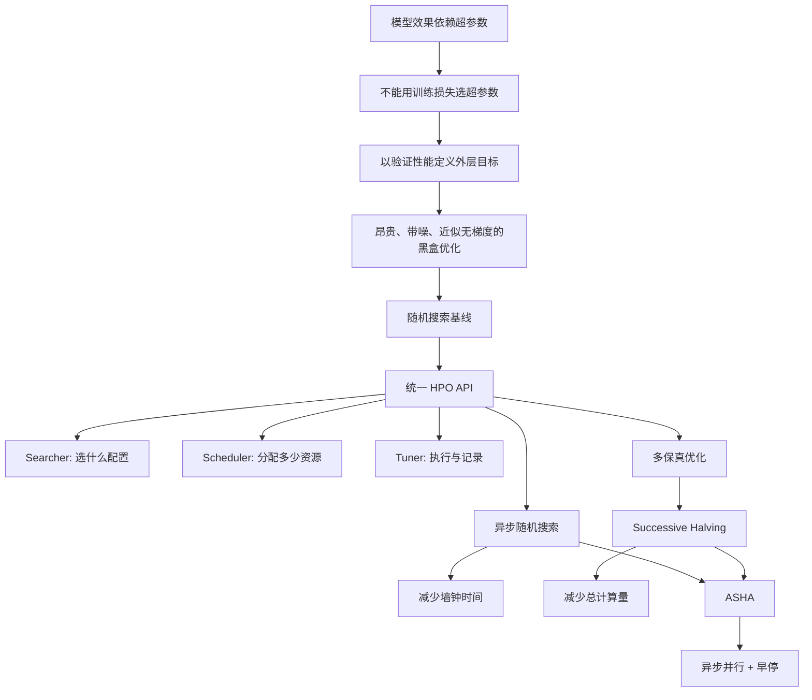
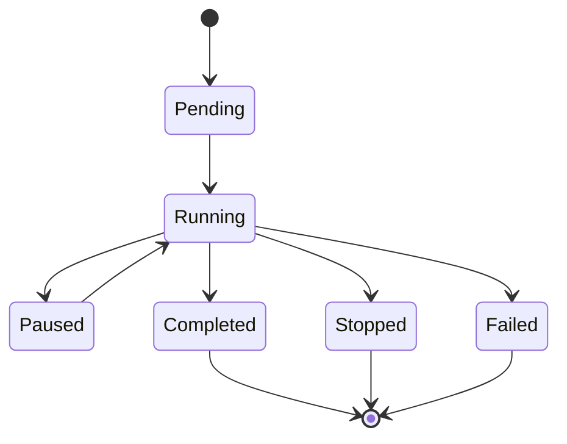
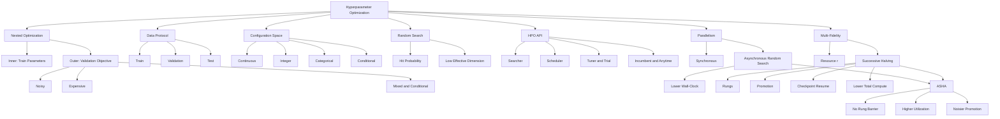

> 对应原文：d2l-en.md 第 19 章 **Hyperparameter Optimization**。本章依次介绍超参数优化问题、统一 HPO API、异步随机搜索、多保真超参数优化、Successive Halving 和 Asynchronous Successive Halving（ASHA）。

## 1. 本章主线：优化“如何训练模型”

训练机器学习模型时，模型参数通常由训练算法自动学习，但训练算法本身仍需要大量人为选择：学习率多大、批量多大、正则化多强、网络多深、每层多宽、训练多少轮？这些选择会显著影响最终泛化性能。

超参数优化（Hyperparameter Optimization, HPO）把这种试错过程写成一个系统化的外层优化问题：

> 选择一组超参数，运行完整训练流程，再用独立验证数据评价；在有限时间和计算预算内，尽快找到验证性能优秀的配置。

本章的分析路线是：



作者逐步处理两个不同瓶颈：

1. **训练任务可并行但速度不同**：同步批次会被最慢 trial 拖住，因此采用异步调度来减少墙钟时间；
2. **很多差配置仍被完整训练**：利用低资源评估作为代理，提前停止表现不佳的配置，以减少总计算量。

本章最重要的关系是：

- Searcher 决定“试什么”；
- Scheduler 决定“何时试、试多久”；
- 并行化主要减少 wall-clock time；
- 多保真主要减少 aggregate compute；
- ASHA 把异步调度和多保真淘汰结合起来。

## 2. 模型参数与超参数

### 2.1 模型参数（Parameters）

模型参数记作 $\boldsymbol\theta$，通常由训练数据和优化算法自动学习。例如：

- 线性回归的权重和偏置；
- CNN 的卷积核；
- Transformer 的投影矩阵；
- BatchNorm 的可学习缩放和平移。

给定超参数配置 $\mathbf x$，训练过程近似求解：

$$
\boldsymbol\theta^{\ast}(\mathbf x)
\in\arg\min_{\boldsymbol\theta}
L_{\mathrm{train}}(\boldsymbol\theta;\mathbf x).
$$

### 2.2 超参数（Hyperparameters）

超参数 $\mathbf x$ 在内层训练开始前或训练过程中由用户、调度器或外层算法指定。它们可以控制：

#### 优化过程

- 学习率及其调度；
- 批量大小；
- momentum、Adam betas；
- 梯度裁剪阈值；
- 训练 epoch 数。

#### 正则化

- weight decay；
- dropout 概率；
- label smoothing；
- 数据增强强度。

#### 模型结构

- 层数、隐藏宽度、卷积通道数；
- 激活函数；
- attention heads；
- kernel size。

#### 数据和系统

- 输入分辨率；
- 数据采样策略；
- 混合精度；
- 并行配置。

### 2.3 两者并非由“可微/不可微”区分

超参数也可能是连续且可微的，模型参数也可能包含离散或约束结构。真正区别是其在问题中的角色：

- 模型参数由内层学习算法拟合；
- 超参数定义或控制内层学习问题，由外层选择。

同一量在不同方法中也可能改变角色。例如温度参数可以固定为超参数，也可以纳入模型并通过梯度学习。

### 2.4 HPO、NAS 与 AutoML

- **HPO**：选择学习率、正则、宽度等预定义超参数；
- **NAS**：搜索整个神经网络架构，通常搜索空间更大、评价更贵；
- **AutoML**：自动化更完整的流水线，包括预处理、模型族、特征工程、HPO、集成和部署约束。

NAS 可视为结构型 HPO，二者都属于 AutoML 的组成部分。

## 3. 为什么不能最小化训练损失来选择超参数

若直接选择：

$$
\min_{\mathbf x}
L_{\mathrm{train}}(
\boldsymbol\theta^{\ast}(\mathbf x);\mathbf x),
$$

往往会偏向：

- weight decay $\to0$；
- dropout $\to0$；
- 模型容量尽可能大；
- 训练时间尽可能长；
- 数据增强尽可能弱。

这些选择可以降低训练误差，却可能提高真实分布上的误差。超参数的目的之一正是控制泛化，因此外层评价必须使用训练过程没有直接拟合的数据。

## 4. 训练集、验证集与测试集

### 4.1 三个集合的职责

#### 训练集

用于拟合 $\boldsymbol\theta$：

$$
\boldsymbol\theta^{\ast}(\mathbf x)
\approx A(D_{\mathrm{train}},\mathbf x,\xi),
$$

其中 $A$ 是训练算法，$\xi$ 表示随机初始化、数据顺序等随机性。

#### 验证集

用于比较超参数：

$$
f(\mathbf x)
=L_{\mathrm{val}}
(\boldsymbol\theta^{\ast}(\mathbf x);\mathbf x).
$$

虽然验证集不参与梯度训练，但 HPO 会反复查看它，因此配置会逐渐适应验证集。

#### 测试集

只在超参数、模型结构和选择规则全部冻结后，做一次或极少数最终评估。测试结果不能反馈给 HPO。

### 4.2 HPO 本身也会对验证集过拟合

试验越多，从带噪验证结果中选出的最小值越可能包含幸运偏差，称为选择偏差或 winner's curse：

$$
\min_i\widehat f(\mathbf x_i)
$$

通常比被选配置的真实泛化误差更乐观。

缓解方法：

- 保留真正未触碰的测试集；
- 使用较大验证集或交叉验证；
- 对最终候选做多 seed 重复训练；
- 对 top configurations 在新验证划分上复评；
- 报告搜索预算，避免把大规模搜索优势误当单模型优势。

### 4.3 原书 Fashion-MNIST 示例的数据泄漏

原书 `FashionMNIST.val` 实际映射到官方 10,000 张测试图，因此示例：

- 用官方 60,000 张训练图拟合模型；
- 用官方测试集反复调学习率和其他超参数。

这会把测试集变成验证集，最终不再有无偏测试集。

正确流程：

1. 从官方 60,000 张训练数据中划分 train/validation；
2. 所有 HPO 只使用这两个集合；
3. 选定配置后，可在 train + validation 上重新训练；
4. 最后一次在官方 test 上评价。

小数据下可用 nested cross-validation：外层估计泛化，内层进行 HPO。

## 5. HPO 的嵌套优化形式

### 5.1 确定性写法

内层训练：

$$
\boldsymbol\theta^{\ast}(\mathbf x)
\in\arg\min_{\boldsymbol\theta}
L_{\mathrm{train}}(\boldsymbol\theta;\mathbf x).
$$

外层选择：

$$
\boxed{
\mathbf x^{\ast}
\in\arg\min_{\mathbf x\in\mathcal X}
L_{\mathrm{val}}
(\boldsymbol\theta^{\ast}(\mathbf x);\mathbf x)
}.
$$

定义：

$$
f:\mathcal X\to\mathbb R,
$$

$$
f(\mathbf x)
=L_{\mathrm{val}}
(\boldsymbol\theta^{\ast}(\mathbf x);\mathbf x),
$$

则：

$$
\mathbf x^{\ast}\in\arg\min_{\mathbf x\in\mathcal X}f(\mathbf x).
$$

### 5.2 随机训练下的目标

训练结果依赖随机种子 $\xi$：

$$
\boldsymbol\theta^{\ast}(\mathbf x,\xi)
=A(D_{\mathrm{train}},\mathbf x,\xi).
$$

更合理的目标是期望验证性能：

$$
F(\mathbf x)
=\mathbb E_{\xi}
\left[
L_{\mathrm{val}}
(\boldsymbol\theta^{\ast}(\mathbf x,\xi);\mathbf x)
\right].
$$

单次 trial 只得到带噪观测：

$$
y=F(\mathbf x)+\epsilon.
$$

原书写 $\epsilon\sim\mathcal N(0,\sigma)$，但没有说明 $\sigma$ 是方差还是标准差。通常更明确地写：

$$
\epsilon\sim\mathcal N(0,\sigma^2(\mathbf x)).
$$

真实 HPO 噪声可能：

- 随配置变化（异方差）；
- 非高斯；
- 因训练失败产生重尾或截断；
- 因共享集群、缓存和数据加载产生时间相关性。

### 5.3 不一定只优化一个指标

外层目标可以是：

- 验证错误；
- 负对数似然；
- F1、AUROC；
- 收益或业务指标。

也可加入约束：

$$
\min_{\mathbf x}f_{\mathrm{error}}(\mathbf x)
$$

subject to

$$
\operatorname{latency}(\mathbf x)\le20\text{ ms},
$$

$$
\operatorname{memory}(\mathbf x)\le2\text{ GB}.
$$

或者做多目标优化，寻找 accuracy、latency、energy 之间的 Pareto frontier。把多个指标随意加权成一个数会隐藏权衡，应明确权重或约束的业务含义。

## 6. 为什么 HPO 是困难的黑盒优化

### 6.1 一次评价很昂贵

每个 $f(\mathbf x)$ 都可能需要：

- 初始化模型；
- 训练数小时或数天；
- 保存 checkpoint；
- 在验证集推断；
- 记录系统指标。

因此 HPO 追求的是**样本效率和计算效率**，不是廉价函数优化中的无限精度。

### 6.2 目标近似不可微

超参数可能包含类别、整数和条件变量；验证错误还是分段常数。即使学习率是连续的，要计算：

$$
\frac{dL_{\mathrm{val}}}{d\eta}
$$

也要对整个训练轨迹反向传播。

设 SGD：

$$
\boldsymbol\theta_{t+1}
=\boldsymbol\theta_t
-\eta\nabla_{\boldsymbol\theta}
L_t(\boldsymbol\theta_t).
$$

则：

$$
\frac{d\boldsymbol\theta_{t+1}}{d\eta}
=\frac{d\boldsymbol\theta_t}{d\eta}
-\nabla L_t
-\eta H_t
\frac{d\boldsymbol\theta_t}{d\eta},
$$

其中 $H_t$ 是 Hessian。跨数百或数万步传播会产生巨大存储、计算和数值稳定性问题。

超梯度方法确实存在，但不适用于所有离散、条件和昂贵搜索空间，也不是本章重点。

### 6.3 搜索空间混合且有条件结构

超参数类型包括：

- continuous：学习率；
- integer：层数、通道数；
- categorical：优化器、激活函数；
- ordinal：分辨率等级；
- conditional：只有 optimizer=SGD 时 momentum 才有效；
- hierarchical：只有第 $l$ 层存在时 width $l$ 才有效。

因此 $\mathcal X$ 通常不是简单欧氏空间。

### 6.4 目标可能失败或缺失

某些配置会：

- loss 发散为 NaN；
- 显存溢出；
- 超时；
- 训练进程崩溃；
- 因抢占而只返回部分学习曲线。

实际 HPO 系统必须定义失败惩罚、重试策略、超时、checkpoint 和缺失数据语义。

### 6.5 只需尽快找到“足够好”的配置

由于预算有限，HPO 通常不追求证明全局最优，而追求：

- 尽早找到低验证误差 incumbent；
- 在任意停止时都有可用答案；
- 尽量避免浪费完整训练预算；
- 在多次重复中稳定有效。

这引出了 any-time performance。

## 7. 配置空间（Configuration Space）

### 7.1 配置空间决定可发现的答案

无论优化算法多先进，都无法找到搜索空间之外的配置：

$$
\mathbf x^{\ast}_{\mathcal X}
\in\arg\min_{\mathbf x\in\mathcal X}f(\mathbf x).
$$

- 范围过窄：排除好配置；
- 范围过宽：有限预算被无意义区域稀释；
- 参数化不合理：算法在错误尺度上浪费样本；
- 条件关系未编码：大量配置包含无效维度。

### 7.2 均匀分布与对数均匀分布

若学习率可能跨数量级，应令：

$$
\log\eta\sim
\operatorname{Uniform}(\log a,\log b).
$$

等价密度：

$$
p(\eta)
=\frac{1}{\eta\log(b/a)},
\qquad a\le\eta\le b.
$$

每个数量级获得相同概率质量。例如 $[10^{-4},1]$ 中，$[10^{-4},10^{-3}]$ 与 $[10^{-1},1]$ 的采样概率相同。

原书代码：

```python
stats.loguniform(1e-4, 1)
```

对应 $\log_{10}\eta\in[-4,0]$，原文说 “between -4 and -1” 是笔误。

### 7.3 哪些变量适合线性尺度

通常适合线性均匀：

- dropout 概率；
- momentum 的有限区间；
- mixup 系数；
- 有自然线性含义的比例。

但靠近边界时也可变换，例如优化 logit：

$$
z=\log\frac{p}{1-p}.
$$

### 7.4 整数分布的端点

SciPy：

```python
stats.randint(low, high)
```

采样：

$$
\{low,low+1,\ldots,high-1\}.
$$

所以原书 `stats.randint(32, 256)` 不会取到 256。若要求闭区间 $[32,256]$，应写 `stats.randint(32, 257)`。

### 7.5 条件搜索空间

例：

```text
optimizer = adam:
    learning_rate
    beta1
    beta2

optimizer = sgd:
    learning_rate
    momentum
    nesterov
```

把无效参数一律塞进固定向量，会让搜索器误判距离和维度。成熟 HPO 框架通常支持条件节点或树结构空间。

### 7.6 默认配置也应作为首个 trial

默认配置提供：

- 已知可运行的安全基线；
- 对搜索算法是否真正改进的参照；
- 在极短预算下的保底答案。

但只比较默认值与大量搜索后的最优值不完全公平：搜索本身消耗了额外算力，应一并报告。

## 8. 随机搜索

### 8.1 算法

给定配置分布 $p(\mathbf x)$ 和 trial 预算 $N$：

```text
best_config = None
best_error = infinity

repeat N times:
    x = sample from p(x)
    y = train_and_validate(x)
    if y < best_error:
        best_config = x
        best_error = y

return best_config
```

每个 trial 独立，因此：

- 实现简单；
- 不要求目标连续或可微；
- 支持混合搜索空间；
- 天然可并行；
- 是必须认真比较的强基线。

### 8.2 命中好区域的概率

若配置分布下“足够好区域”的概率质量为 $p$，独立采样 $N$ 次至少命中一次的概率：

$$
\boxed{
P(\text{hit})=1-(1-p)^N
}.
$$

要达到命中概率 $q$：

$$
N\ge
\frac{\log(1-q)}{\log(1-p)}.
$$

例如好区域占 5%，希望 95% 概率至少命中一次：

$$
N\ge
\frac{\log0.05}{\log0.95}
\approx58.4,
$$

即至少 59 次。

### 8.3 为什么随机搜索常优于网格搜索

设有 $d$ 个超参数，每维网格取 $m$ 个值，共：

$$
N=m^d
$$

个组合。无论 $N$ 多大，每个维度实际上只试了 $m$ 个不同值。

若只有 $k\ll d$ 个超参数真正重要，网格仍把大量预算用于不重要维度的笛卡尔积重复；随机搜索的 $N$ 个 trial 通常在每个重要连续维度上提供近 $N$ 个不同值。

二维直觉：

```text
Grid:  每个轴只有少量固定坐标，组合很整齐
Random: 每个轴都有大量不同坐标，更密集探索重要轴
```

随机搜索优势成立的条件：

- 维度较高；
- 有效维度较低；
- 重要维度未知；
- 连续参数需要细粒度覆盖。

若维度很低、各维同等重要，或目标具有规则结构，网格/低差异序列可能并不差。

### 8.4 随机搜索的局限

1. 不利用历史，看到好区域后仍按原分布采样；
2. 每个配置分配相同资源；
3. 不主动处理观测噪声；
4. 极窄好区域的命中概率仍低；
5. 只返回最低一次观测会受 winner's curse 影响。

Bayesian optimization 试图用代理模型和采集函数利用历史；多保真算法则解决等资源浪费。

### 8.5 原书 Softmax/Fashion-MNIST 案例

原书只搜索：

$$
\eta\sim\operatorname{LogUniform}(10^{-4},1),
$$

每个配置训练 8 epochs，以 validation error 为目标，顺序执行 5 个 trial，再返回误差最小的学习率。

该例用于解释接口，不足以得出稳定最优学习率：

- trial 数很少；
- 单 seed；
- 固定短训练预算；
- 使用了官方测试集调参；
- 未复评 incumbent。

## 9. HPO API：解耦搜索、调度与执行

### 9.1 为什么要解耦

HPO 实际包含两个不同决策：

1. **搜索（searching）**：下一个配置是什么？
2. **调度（scheduling）**：何时执行哪个 trial？分配多少资源？是否早停、暂停或恢复？

将二者分离可以自由组合：

| Searcher | Scheduler | 得到的方法 |
|---|---|---|
| Random | Full budget | 随机搜索 |
| Bayesian | Full budget | 贝叶斯优化 |
| Random | Successive Halving | 随机 SH |
| Bayesian | ASHA | 模型引导的异步多保真搜索 |

Tuner 再负责进程执行、通信、记录、失败处理与停止条件。

### 9.2 Searcher：选择配置

抽象接口：

```python
class HPOSearcher:
    def sample_configuration(self) -> dict:
        raise NotImplementedError

    def update(self, config: dict, error: float, additional_info=None):
        pass
```

原书基类的 `sample_configuration()` 漏写 `self`，作为实例方法应修正。

`update` 的意义：

- RandomSearcher 可忽略历史；
- Bayesian optimizer 更新代理模型；
- LocalSearcher 记录 incumbent；
- Evolutionary search 更新种群；
- 多目标搜索更新 Pareto set。

### 9.3 Scheduler：分配资源

```python
class HPOScheduler:
    def suggest(self) -> dict:
        raise NotImplementedError

    def update(self, config: dict, error: float, info=None):
        raise NotImplementedError
```

Scheduler 可以决定：

- 启动新配置；
- 给配置设置 `max_epochs`；
- 暂停 trial；
- 从 checkpoint 恢复；
- 提前停止；
- 在多个 worker 间安排任务。

原书 `BasicScheduler` 只把请求转发给 Searcher，不进行早停或资源差异化。

### 9.4 Trial 的生命周期

原书本地 API 没有独立 `Trial` 类，但概念上 trial 是一次已启动的配置评价。实际系统常有状态：



Trial identity 必须区分：

- 相同配置的不同随机 seed；
- 同一配置的 pause/resume；
- 同一配置从头重训；
- 不同 fidelity 的中间结果。

### 9.5 Tuner：执行与记账

Tuner 的主循环：

```text
while budget remains:
    ask scheduler for a suggestion
    launch or resume a trial
    receive metric / resource / runtime
    update scheduler and searcher
    update incumbent and logs
```

原书串行 `HPOTuner` 记录：

- 每个配置；
- validation error；
- runtime；
- incumbent；
- incumbent error；
- incumbent trajectory；
- cumulative runtime。

原实现假设 objective 返回可调用 `.cpu()` 的 tensor；但接口标注为通用 callable，若返回 Python float 会失败。稳健实现应统一处理 scalar/tensor。

### 9.6 Incumbent

在最小化问题中，截至时间 $t$ 的 incumbent：

$$
\widehat{\mathbf x}_{inc}(t)
\in\arg\min_{i:t_i\le t}y_i.
$$

其轨迹：

$$
y_{inc}(t)=\min_{i:t_i\le t}y_i
$$

应随时间非增。

若观测噪声很大，最低单次验证误差不一定对应最佳期望性能。可按多次复评均值、置信上界或后验均值定义更稳健的 incumbent。

### 9.7 Any-time performance

HPO 随时可能因预算耗尽而停止，因此不能只比较最终结果。Any-time 曲线以：

- 横轴：累计 wall-clock time 或累计资源；
- 纵轴：截至当时的 incumbent error。

它同时评价“最终能找到多好”和“多快找到”。

原书比较随机搜索和贝叶斯优化，各重复 50 个 seeds；约 1000 秒前两者相近，之后 Bayesian optimization 利用历史找到更好配置。该图是方法说明，不是可复现基准，因为原文未完整给出任务、硬件、搜索空间和置信区间。

### 9.8 原书 LeNet 案例

搜索：

$$
\text{learning rate}\sim
\operatorname{LogUniform}(10^{-2},1),
$$

$$
\text{batch size}\sim
\operatorname{Integer}[32,255].
$$

首个配置：

$$
(\eta,B)=(0.1,128).
$$

每个 LeNet trial 训练 10 epochs，执行 5 个 trials，并绘制累计时间与 incumbent error。

批量大小不仅影响优化动态，还影响：

- 每 epoch 的更新次数；
- GPU 吞吐；
- 显存；
- trial 运行时间。

因此不同配置的 runtime 天然不相同，这正是异步调度的动机。

## 10. 如何公平比较 HPO 算法

### 10.1 两类随机性

1. **训练随机性**：初始化、mini-batch 顺序、数据增强、非确定性算子；
2. **HPO 随机性**：候选采样、代理模型初始化、并发完成顺序。

单次运行不足以比较方法。

### 10.2 必须统一的条件

- 相同任务和数据划分；
- 相同搜索空间和默认点；
- 相同最大 fidelity；
- 相同 wall-clock 或总资源预算；
- 相同 worker 数和硬件；
- 相同 seed 集合或配对 seeds；
- 相同失败/超时处理；
- 相同 incumbent 复评规则。

不能让一个方法用 8 GPUs、另一个用 1 GPU，却只比较墙钟时间。

### 10.3 报告什么

- median/mean incumbent trajectory；
- 四分位区间、标准差或 bootstrap confidence interval；
- 最终 simple regret；
- 达到目标性能的时间；
- 总 GPU-hours；
- worker utilization；
- 失败率；
- 被早停 trial 比例；
- 最终候选独立复评结果。

均值容易受失败和极端值影响，median 与 quantile ribbon 常更稳健。

### 10.4 观测 incumbent 与真实 incumbent

HPO 日志中的 validation incumbent 可能因噪声乐观。基准研究常对所有建议配置使用隐藏的高精度评价或多次重复，以计算：

$$
\text{simple regret}
=F(\widehat{\mathbf x})-F(\mathbf x^{\ast}).
$$

真实任务不知道 $\mathbf x^{\ast}$，可用最佳已知值或独立大预算复评近似。

## 11. 异步随机搜索

### 11.1 并行不等于异步

假设有 $K$ 个 workers。

#### 同步批次

一次启动 $K$ 个 trials，等待全部完成，再启动下一批：

$$
T_{sync}
=\sum_{b=1}^{B}
\max_{j=1,\ldots,K}T_{b,j}.
$$

每批中较快 worker 完成后只能等待最慢 trial。

#### 异步调度

任一 worker 空闲就立即启动下一个 trial。没有全局批次屏障。

### 11.2 Straggler 从哪里来

- 层数和宽度不同；
- batch size 影响吞吐；
- 数据缓存状态不同；
- GPU 型号或共享负载不同；
- checkpoint、验证和网络 I/O 不同；
- 训练失败后的重试。

即使所有 trial 都跑相同 epochs，时长也可能差异很大。

### 11.3 为什么随机搜索特别容易异步化

随机搜索的配置独立：

$$
\mathbf x_i\overset{iid}{\sim}p(\mathbf x).
$$

生成 $\mathbf x_{i+1}$ 不需要等待 $y_i$，所以任意 worker 空闲即可采样并启动。

贝叶斯优化依赖历史，异步时必须处理 pending evaluations，例如用 fantasizing、constant liar 或批量采集函数。

### 11.4 理想线性加速及其条件

若：

- trial 彼此独立；
- worker 同质；
- 没有启动和通信开销；
- 数据加载不争用；
- 有足够多 trial；

则 $K$ workers 可把达到相同 trial 数所需墙钟时间缩短约 $K$ 倍：

$$
T_K\approx\frac{T_1}{K}.
$$

真实加速受以下限制：

- 固定串行开销；
- GPU/CPU/I/O 争用；
- trial 数少于 worker 数；
- 运行时间重尾；
- 调度和容器启动；
- 最后少数长任务形成 tail。

### 11.5 异步降低墙钟，不降低总计算

若所有配置仍训练满预算：

$$
\text{total compute}
=\sum_i c(\mathbf x_i,r_{max})
$$

没有改变，只是更并行地消费。多保真早停才直接减少对差配置的计算。

### 11.6 固定墙钟预算下的运行时偏差

在固定 wall-clock 截止时，快 trial 更容易完成并计入结果，慢 trial 可能仍 pending。这可能产生：

- 快模型被评估更多次；
- 某些结构因耗时长而机会更少；
- 不同 worker 数改变完成顺序，从而影响自适应搜索。

因此同时报告 wall-clock 与 aggregate resource，并记录未完成 trial。

### 11.7 原书 Syne Tune 实验

- `n_workers=2`；
- 最大墙钟 12 分钟；
- 最小化 `validation_error`；
- LeNet 最多 10 epochs；
- 每 epoch 通过 `Reporter` 上报；
- 本地 `PythonBackend` 使用子进程；
- worker 完成后立即补充新 trial。

每 epoch 上报使 scheduler 能看到学习曲线，也为后续 ASHA 早停提供接口。

## 12. 多保真超参数优化

### 12.1 从单一目标到带资源目标

原目标：

$$
f(\mathbf x)=f(\mathbf x,r_{max}).
$$

多保真扩展：

$$
\boxed{
f(\mathbf x,r),
\qquad
r\in[r_{min},r_{max}]
}.
$$

$r$ 表示愿意为配置投入的资源。

### 12.2 常见 fidelity

- 训练 epochs；
- 优化 steps；
- 训练数据子集大小；
- 输入分辨率；
- 交叉验证 folds；
- 模拟精度；
- 序列长度；
- 模型宽度的代理。

好的低 fidelity 应满足：

1. 比满 fidelity 便宜；
2. 与最终排名足够相关；
3. 能逐步增加并最好可 checkpoint/resume；
4. 不严重改变任务本身。

### 12.3 原书的单调假设及其边界

原书假设：

$$
f(\mathbf x,r)\text{ 随 }r\text{ 下降},
$$

$$
c(\mathbf x,r)\text{ 随 }r\text{ 上升}.
$$

成本通常上升，但验证误差不一定单调：

- 训练噪声导致抖动；
- 后期过拟合使误差反弹；
- 学习率调度在里程碑后才改善；
- 大模型或强正则配置“慢热”；
- 学习曲线会交叉。

多保真方法真正需要的是低 fidelity 对高 fidelity 有足够预测力，而不是每条曲线严格单调。

### 12.4 早停的基本权衡

- 越早淘汰：节省越多，但误杀潜力配置风险越高；
- 越晚淘汰：排序更可靠，但节省较少；
- 淘汰比例越大：资源更集中，但探索更少；
- 噪声越大：需要更大 grace period 或重复评估。

## 13. Successive Halving（逐次减半）

### 13.1 基本思想

1. 同时从很多配置开始；
2. 每个只给少量资源；
3. 按当前验证性能排序；
4. 只保留前 $1/\eta$；
5. 给幸存者 $\eta$ 倍资源；
6. 重复直到少数配置达到满预算。

### 13.2 理想等比设置

给定：

- 最小资源 $r_{min}$；
- 最大资源 $r_{max}$；
- reduction factor $\eta\in\{2,3,\ldots\}$。

若：

$$
r_{max}=r_{min}\eta^K,
$$

则初始配置数取：

$$
N=\eta^K.
$$

Rungs：

$$
\mathcal R
=\{r_{min},r_{min}\eta,\ldots,r_{min}\eta^K\}.
$$

第 $k$ 个 rung：

$$
n_k=\frac{N}{\eta^k},
$$

$$
r_k=r_{min}\eta^k.
$$

所以：

$$
n_kr_k
=Nr_{min}
=r_{max}.
$$

每个 rung 在“从头评价到该资源”的名义预算上相等。

### 13.3 算法伪代码

```text
sample N configurations
survivors = all configurations

for rung k = 0, ..., K:
    evaluate every survivor at resource r_k
    record validation metric
    if k < K:
        keep the best floor(len(survivors) / eta)

return the configuration at the final rung
```

若总 HPO 预算仍有剩余，就采样一批新配置，开启下一 bracket/round。

### 13.4 评价调用次数

$$
E
=\sum_{k=0}^{K}n_k
=N\sum_{k=0}^{K}\eta^{-k}.
$$

几何级数：

$$
E
=N\frac{1-\eta^{-(K+1)}}{1-\eta^{-1}}
<\frac{\eta}{\eta-1}N.
$$

当 $\eta=2$ 时，评价调用数小于 $2N$，但大多数调用只使用低资源。

### 13.5 从头重训时的资源成本

若每个 rung 都从随机初始化训练到 $r_k$：

$$
C_{restart}
=\sum_{k=0}^{K}n_kr_k
=(K+1)r_{max}.
$$

相同配置在不同 rung 的早期训练被重复计算。

### 13.6 Checkpoint/resume 时的增量成本

第 0 rung：

$$
n_0r_0=Nr_{min}=r_{max}.
$$

第 $k\ge1$ rung 只续训：

$$
r_k-r_{k-1}
=r_{min}\eta^{k-1}(\eta-1).
$$

该 rung 增量成本：

$$
n_k(r_k-r_{k-1})
=r_{max}\frac{\eta-1}{\eta}.
$$

总成本：

$$
\boxed{
C_{resume}
=r_{max}
\left[
1+K\frac{\eta-1}{\eta}
\right]
}.
$$

而把全部 $N$ 个配置跑满需要：

$$
C_{full}=Nr_{max}=\eta^Kr_{max}.
$$

### 13.7 原书非等比案例

原书设：

$$
r_{min}=2,
\qquad
r_{max}=10,
\qquad
\eta=2.
$$

因为 10 不是 $2\times2^K$，实现得到：

$$
\mathcal R=\{2,4,8,10\},
$$

初始 8 个配置，rung 人数：

$$
[8,4,2,1].
$$

若每 rung 从头训练：

$$
C_{restart}
=8\times2+4\times4+2\times8+1\times10
=58
$$

epoch-equivalents。

若 checkpoint/resume：

$$
C_{resume}
=8\times2
+4\times(4-2)
+2\times(8-4)
+1\times(10-8)
=34.
$$

全部 8 个配置跑满：

$$
C_{full}=8\times10=80.
$$

### 13.8 原书 Scheduler 实现

Scheduler 维护：

- rung levels；
- 每个 rung 的观测；
- 当前待评价 queue；
- Searcher。

Queue 为空时采样新 round。某 rung 收集齐预定数量后，按 error 排序，把 top $1/\eta$ 配置以更大 `max_epochs` 放回 queue。

一个细节：若当前 rung 尚差一个运行中的结果，而 worker 已空闲，无法完成排序。原实现会先开启下一 round 的低资源 trial；当前 rung 一旦完成，就把晋升任务插到 queue 前面。

### 13.9 原实现没有真正续训

原书目标函数每次收到 `max_epochs` 都重新建立并训练模型，所以同一配置从 2、4、8 到 10 epochs 会多次从头训练，而且随机初始化可能不同。

这带来两个问题：

1. 计算成本是 58 而不是 34；
2. 各 rung 结果不一定来自同一条学习曲线。

实际系统应保存模型、优化器、学习率调度器和 RNG 状态，从 checkpoint 继续。

### 13.10 Successive Halving 的局限

- 依赖早期排名与最终排名相关；
- 会误杀慢热配置；
- 同步 rung 有 barrier；
- $r_{min},r_{max},\eta$ 选择敏感；
- 只按单次 noisy metric 排序；
- 不利用学习曲线形状；
- 固定比例可能不适合所有任务。

增大 grace period 可减少误杀，但降低节省；减小 $\eta$ 保留更多配置，但每轮淘汰更慢。

## 14. Hyperband：补充背景（不属于原章内容）

> 原书第 19 章没有介绍 Hyperband。这里补充它，只为说明 SH、Hyperband 与 ASHA 的知识关系。

单个 SH bracket 必须选择“初始配置多、每个资源少”还是“初始配置少、每个资源多”。如果不知道低 fidelity 是否可靠，单一选择可能不稳。

Hyperband 运行多个不同起始资源的 SH brackets，覆盖不同探索—资源权衡。

令最大资源为 $R$：

$$
s_{max}
=\left\lfloor
\log_{\eta}\frac{R}{r_{min}}
\right\rfloor,
$$

$$
B=(s_{max}+1)R.
$$

对 $s=s_{max},\ldots,0$：

$$
n_s
=\left\lceil
\frac{s_{max}+1}{s+1}\eta^s
\right\rceil,
$$

$$
r_s=R\eta^{-s}.
$$

再从 $(n_s,r_s)$ 开始执行 $s+1$ 个 rung 的 SH。

- 大 $s$：许多配置从低资源开始，强调探索；
- 小 $s$：少量配置从高资源开始，降低低 fidelity 排名错误。

Hyperband 解决“选择哪个 SH bracket”问题；ASHA 解决“如何异步执行和晋升”问题。工程库常把 ASHA 与 Hyperband-style brackets 结合。

## 15. 同步 Successive Halving 的并行问题

同步 SH 在每个 rung 必须：

1. 等待当前 rung 全部 trial 完成；
2. 排序；
3. 晋升 top fraction；
4. 启动下一 rung。

导致 worker 空闲的原因：

- 同一 rung 中有 straggler；
- rung trial 数不是 worker 数的整数倍；
- 高 rung 幸存者很少，无法占满 workers；
- 晋升必须等待完整排名。

实际同步实现常在高 rung 运行时，提前开启下一轮低 rung 配置，减少空闲，但 rung 内 barrier 仍存在。

## 16. ASHA：异步逐次减半

### 16.1 核心思想

Asynchronous Successive Halving Algorithm（ASHA）取消完整 rung 同步屏障：

> 某 rung 获得足够观测后，就根据当前排名尽快晋升；没有可晋升配置时，就从最低资源启动新 trial。

### 16.2 概念伪代码

Promotion variant：

```text
when a worker becomes free:
    inspect rungs from high to low
    if an unpromoted trial is currently in the top 1/eta:
        resume it at the next rung
    else:
        sample a new configuration and start at r_min
```

Stopping variant：trial 连续训练，到达 rung 时把当前指标与该 rung 已完成结果比较；若不在可保留分位数内就停止，否则继续。

原书 Syne Tune 示例使用早停变体，不需要暂停后再恢复。

### 16.3 为什么至少需要一定数量观测

只有一个 trial 时，它必然“排名第一”，立即晋升没有筛选意义。原书描述在 rung 至少收到 $\eta$ 个观测后，才尝试晋升前 $1/\eta$。

随着 rung 记录增长，阈值逐渐稳定。

### 16.4 ASHA 的优势

- 无完整 rung barrier；
- worker 利用率高；
- 自动填充空闲资源；
- 差 trial 早停；
- 适合运行时间差异大的深度学习任务；
- 易于扩展到集群。

### 16.5 ASHA 的代价

异步晋升只基于当时已完成的子集。早完成配置可能先参与排名，晚完成的更好配置尚未出现，因此可能：

- 错误晋升次优配置；
- 错误停止慢但最终好的配置；
- 受运行时与性能相关性影响；
- 不同并发数产生不同决策轨迹。

作者认为实践中损失通常小于利用率收益，因为很多任务的跨 rung 排名较稳定，且 rung 数据会逐渐增多。但高噪声、学习曲线交叉和强慢热行为会破坏此前提。

### 16.6 ASHA 与同步 SH 的取舍

| 方面 | 同步 SH | ASHA |
|---|---|---|
| 晋升依据 | 完整 rung | 当前已完成子集 |
| 排名可靠性 | 相对高 | 早期可能低 |
| 同步屏障 | 有 | 无 |
| Worker 利用率 | 可能低 | 通常高 |
| 对 straggler | 敏感 | 较不敏感 |
| 可复现性 | 完成顺序影响较小 | 完成顺序影响较大 |

### 16.7 原书 Syne Tune 参数映射

```python
scheduler = ASHA(
    config_space,
    metric="validation_error",
    mode="min",
    max_resource_attr="max_epochs",
    resource_attr="epoch",
    grace_period=2,
    reduction_factor=2,
)
```

对应：

- `metric`：优化指标；
- `mode`：最小化；
- `resource_attr`：当前资源 $r$；
- `max_resource_attr`：最大资源 $r_{max}$；
- `grace_period`：最小资源 $r_{min}$；
- `reduction_factor`：$\eta$。

原书文字说多数 trial 停在 “1 or 2 epochs”，但代码 $r_{min}=2,\eta=2$，对应前两个 rung 应是 2 和 4 epochs。

## 17. 可运行的 NumPy 综合实验

下面代码不训练神经网络，而用确定性事件模拟在数秒内验证本章核心结论：

- 对数均匀采样的尺度语义；
- 低有效维目标上随机搜索比同预算粗网格覆盖更细；
- Searcher/Scheduler/Tuner 的职责与单调 incumbent trajectory；
- 异步调度消除 batch barrier，保持总计算不变；
- SH 的 rung 数量、重训/续训/全预算成本；
- 早期学习曲线交叉会误杀最终最优配置；
- Hyperband brackets 的标准构造（明确属于补充背景）。

```python
from dataclasses import dataclass
import heapq
import math

import numpy as np

SEED = 19
rng = np.random.default_rng(SEED)

def sample_log_uniform(generator, low, high, size=None):
    return np.exp(generator.uniform(np.log(low), np.log(high), size=size))

# 1. Log-uniform assigns equal mass on either side of the geometric mean.
log_samples = sample_log_uniform(rng, 1e-4, 1.0, size=20_000)
geometric_mean = math.sqrt(1e-4 * 1.0)
fraction_below_geometric_mean = np.mean(log_samples < geometric_mean)
assert abs(fraction_below_geometric_mean - 0.5) < 0.02

# 2. Random search explores important dimensions more finely than a grid when
# only a small subset of many dimensions matters.
def effective_dimension_objective(configurations):
    configurations = np.asarray(configurations)
    return (
        (configurations[:, 0] - 0.37) ** 2
        + (configurations[:, 1] - 0.73) ** 2
    )

dimension = 6
levels_per_dimension = 3
axes = [np.linspace(0.0, 1.0, levels_per_dimension)] * dimension
grid = np.stack(np.meshgrid(*axes, indexing="ij"), axis=-1).reshape(
    -1, dimension
)
random_points = rng.uniform(0.0, 1.0, size=grid.shape)
grid_best = effective_dimension_objective(grid).min()
random_best = effective_dimension_objective(random_points).min()
assert len(grid) == levels_per_dimension ** dimension == 729
assert random_best < grid_best

# 3. Minimal Searcher / Scheduler / Tuner interfaces.
def sample_configuration(generator):
    optimizer = str(generator.choice(["sgd", "adam"]))
    config = {
        "learning_rate": float(sample_log_uniform(generator, 1e-4, 1e-1)),
        "dropout": float(generator.uniform(0.0, 0.8)),
        "optimizer": optimizer,
    }
    if optimizer == "sgd":
        config["momentum"] = float(generator.uniform(0.0, 0.99))
    return config

def synthetic_validation_error(config):
    log_learning_rate = np.log10(config["learning_rate"])
    error = 0.12 + 0.04 * (log_learning_rate + 2.2) ** 2
    error += 0.15 * (config["dropout"] - 0.25) ** 2
    error += 0.015 if config["optimizer"] == "sgd" else 0.0
    if config["optimizer"] == "sgd":
        error += 0.01 * (config["momentum"] - 0.85) ** 2
    return float(error)

class RandomSearcher:
    def __init__(self, generator):
        self.generator = generator
        self.history = []

    def sample_configuration(self):
        return sample_configuration(self.generator)

    def update(self, config, error, additional_info=None):
        self.history.append((dict(config), float(error), additional_info))

class BasicScheduler:
    def __init__(self, searcher):
        self.searcher = searcher

    def suggest(self):
        return self.searcher.sample_configuration()

    def update(self, config, error, info=None):
        self.searcher.update(config, error, additional_info=info)

class Tuner:
    def __init__(self, scheduler, objective):
        self.scheduler = scheduler
        self.objective = objective
        self.incumbent = None
        self.incumbent_error = math.inf
        self.incumbent_trajectory = []

    def run(self, number_of_trials):
        for _ in range(number_of_trials):
            config = self.scheduler.suggest()
            error = float(self.objective(config))
            self.scheduler.update(config, error)
            if error < self.incumbent_error:
                self.incumbent = dict(config)
                self.incumbent_error = error
            self.incumbent_trajectory.append(self.incumbent_error)

searcher = RandomSearcher(np.random.default_rng(SEED + 1))
scheduler = BasicScheduler(searcher)
tuner = Tuner(scheduler, synthetic_validation_error)
tuner.run(number_of_trials=40)
assert len(searcher.history) == 40
assert all(
    later <= earlier
    for earlier, later in zip(
        tuner.incumbent_trajectory, tuner.incumbent_trajectory[1:]
    )
)
assert "momentum" not in tuner.incumbent or (
    tuner.incumbent["optimizer"] == "sgd"
)

# 4. Event simulation: asynchronous list scheduling never waits for a batch.
def synchronous_makespan(durations, workers):
    return sum(
        max(durations[start:start + workers])
        for start in range(0, len(durations), workers)
    )

def asynchronous_makespan(durations, workers):
    available_at = [0.0] * workers
    heapq.heapify(available_at)
    for duration in durations:
        start_time = heapq.heappop(available_at)
        heapq.heappush(available_at, start_time + duration)
    return max(available_at)

trial_durations = [9, 2, 4, 8, 1, 7, 3, 6, 2, 5, 1, 4]
workers = 3
sequential_time = sum(trial_durations)
synchronous_time = synchronous_makespan(trial_durations, workers)
asynchronous_time = asynchronous_makespan(trial_durations, workers)
total_compute = sum(trial_durations)
async_utilization = total_compute / (workers * asynchronous_time)
assert asynchronous_time < synchronous_time < sequential_time
assert total_compute == sequential_time
assert 0.0 < async_utilization <= 1.0

# 5. Successive Halving with stable early-to-late ranking.
@dataclass(frozen=True)
class ToyTrial:
    trial_id: int
    final_loss: float
    transient: float

def learning_curve_loss(trial, resource):
    return trial.final_loss + trial.transient / resource

def successive_halving(trials, rung_levels, eta):
    survivors = list(trials)
    history = []
    for rung_index, resource in enumerate(rung_levels):
        scored = sorted(
            (
                (trial, learning_curve_loss(trial, resource))
                for trial in survivors
            ),
            key=lambda item: item[1],
        )
        history.append((resource, scored))
        if rung_index < len(rung_levels) - 1:
            keep = max(1, len(scored) // eta)
            survivors = [trial for trial, _ in scored[:keep]]
    return survivors[0], history

stable_trials = [
    ToyTrial(index, final_loss=0.10 + 0.04 * index,
             transient=0.08 + 0.01 * index)
    for index in range(8)
]
rung_levels = [2, 4, 8, 10]
winner, sh_history = successive_halving(stable_trials, rung_levels, eta=2)
rung_counts = [len(scored) for _, scored in sh_history]
restart_cost = sum(
    resource * len(scored) for resource, scored in sh_history
)
resume_cost = 0
previous_resource = 0
for resource, scored in sh_history:
    resume_cost += (resource - previous_resource) * len(scored)
    previous_resource = resource
full_budget_cost = len(stable_trials) * rung_levels[-1]
assert winner.trial_id == 0
assert rung_counts == [8, 4, 2, 1]
assert restart_cost == 58
assert resume_cost == 34
assert full_budget_cost == 80

# 6. A slow-starting full-budget winner can be eliminated at the first rung.
crossing_trials = [
    ToyTrial(0, final_loss=0.05, transient=0.80),  # best at r=8, bad at r=1
    ToyTrial(1, final_loss=0.20, transient=0.04),
    ToyTrial(2, final_loss=0.22, transient=0.05),
    ToyTrial(3, final_loss=0.24, transient=0.06),
    ToyTrial(4, final_loss=0.26, transient=0.07),
    ToyTrial(5, final_loss=0.28, transient=0.08),
    ToyTrial(6, final_loss=0.30, transient=0.09),
    ToyTrial(7, final_loss=0.32, transient=0.10),
]
full_resource = 8
true_full_budget_winner = min(
    crossing_trials,
    key=lambda trial: learning_curve_loss(trial, full_resource),
)
selected_winner, crossing_history = successive_halving(
    crossing_trials, [1, 2, 4, 8], eta=2
)
first_rung_promoted = {
    trial.trial_id
    for trial, _ in crossing_history[0][1][:4]
}
assert true_full_budget_winner.trial_id == 0
assert 0 not in first_rung_promoted
assert selected_winner.trial_id != true_full_budget_winner.trial_id

# 7. Standard Hyperband bracket construction (supplementary, not in source).
def hyperband_brackets(max_resource, min_resource, eta):
    ratio = max_resource / min_resource
    max_bracket = int(math.floor(math.log(ratio, eta)))
    brackets = []
    for bracket in range(max_bracket, -1, -1):
        number = math.ceil(
            (max_bracket + 1) / (bracket + 1) * eta ** bracket
        )
        initial_resource = max_resource * eta ** (-bracket)
        brackets.append((bracket, number, initial_resource))
    return brackets

brackets = hyperband_brackets(
    max_resource=81, min_resource=1, eta=3
)
assert brackets[0] == (4, 81, 1.0)
assert brackets[-1] == (0, 5, 81.0)

# 8. The random-search hit probability formula.
good_region_mass = 0.05
number_of_trials = 59
hit_probability = 1.0 - (1.0 - good_region_mass) ** number_of_trials
assert hit_probability > 0.95

print("log-uniform geometric split =",
      round(float(fraction_below_geometric_mean), 4))
print("grid / random best objective =",
      round(float(grid_best), 6), round(float(random_best), 6))
print("tuner incumbent error =", round(tuner.incumbent_error, 6))
print("sequential / sync / async time =",
      sequential_time, synchronous_time, asynchronous_time)
print("async worker utilization =", round(async_utilization, 4))
print("SH rung counts =", rung_counts)
print("SH restart / resume / full costs =",
      restart_cost, resume_cost, full_budget_cost)
print("slow-start winner eliminated = PASS")
print("Hyperband brackets =", brackets)
print("59-trial hit probability at p=0.05 =",
      round(hit_probability, 4))
```

### 17.1 代码与原理的对应关系

1. `sample_log_uniform` 验证几何均值两侧各约 50% 概率质量；
2. 6 维目标只有前 2 维重要，同样 729 点时，三档网格在重要轴只有 3 个值，而随机搜索有 729 个连续值；
3. `RandomSearcher` 只决定配置，`BasicScheduler` 转发资源决策，`Tuner` 执行并维护非增 incumbent trajectory；
4. 条件搜索空间只在 SGD 时生成 momentum；
5. 同步 makespan 按每批最慢任务相加，异步事件队列立即给最早空闲 worker 派发；两者总 compute 相同；
6. SH 的 `[8,4,2,1]` 与 `[2,4,8,10]` 得到原书案例的 58/34/80 三种成本；
7. 人工交叉学习曲线证明：即使误差随资源下降，早期排名也可能与满预算排名相反；
8. Hyperband bracket 仅作为补充知识验证，不归于原书；
9. $1-(1-p)^N$ 验证好区域质量 5% 时 59 trials 的命中概率超过 95%。

## 18. 原章练习详解

### 18.1 HPO 练习 1：为什么不能拿官方测试集调参

代码中 `FashionMNIST.val` 使用官方 test，因此每个 trial 都查看测试表现。随着 trial 增多，配置会适应该测试集，最终报告不再是无偏泛化估计。

应从官方 training split 划出 validation；HPO 完成后才使用官方 test。

### 18.2 HPO 练习 2.1：为什么超梯度不能用 validation error

分类错误：

$$
\frac1n\sum_i
\mathbf1[\arg\max_cz_{ic}\ne y_i]
$$

对 logits 几乎处处梯度为 0，在类别边界不可导。应使用连续可微的验证交叉熵：

$$
L_{val}
=-\frac1n\sum_i\log p_{i,y_i}.
$$

最终评价仍可用 error，但超梯度需要平滑 surrogate。

### 18.3 HPO 练习 2.2：展开一 epoch 的计算图

对每个 mini-batch $t$：

```text
theta_t
  -> forward(batch_t)
  -> train_loss_t
  -> gradient_t
  -> theta_{t+1} = theta_t - learning_rate * gradient_t
```

最后：

```text
theta_T -> validation forward -> validation cross entropy
```

学习率和初始权重都是图的输入。验证损失到学习率的路径穿过全部 $T$ 次参数更新。

Fashion-MNIST 60,000 样本、batch size 256：

$$
T=\left\lceil\frac{60000}{256}\right\rceil=235
$$

次更新。

### 18.4 HPO 练习 2.3：存储量粗估

两层 MLP 若主要激活宽度约 256 和输出 10，仅按每个样本保存这两层：

$$
60000(256+10)
=15{,}960{,}000
$$

个 float。

float32 约：

$$
15.96\times10^6\times4
\approx63.84\text{ MB}.
$$

这只是极粗下界；完整反向图还要保存输入、pre-activation、梯度、每步参数状态和优化器状态，跨 235 步会大得多。

### 18.5 HPO 练习 2.4：超梯度的其他困难

- 长链梯度消失/爆炸；
- Hessian-vector products 成本；
- 随机 mini-batch 带噪；
- 离散超参数不可导；
- 数据增强和 early stopping 不连续；
- optimizer state 也需微分；
- checkpoint/recompute 的时间—内存权衡；
- 近似超梯度可能有偏。

### 18.6 HPO 练习 3：随机搜索为何优于网格

网格的笛卡尔积把大量点浪费在不重要维度组合；随机搜索让每个 trial 在重要轴上尝试新值。有效维数低于名义维数时，随机搜索覆盖重要子空间更密。

### 18.7 API 练习 1：DropoutMLP 搜索空间

题目要求：

- 两层宽度 $[8,1024]$；
- dropout $[0,0.95]$；
- batch size $[16,384]$；
- 还需学习率。

示例：

```python
from scipy import stats

config_space = {
    "num_hiddens_1": stats.randint(8, 1025),
    "num_hiddens_2": stats.randint(8, 1025),
    "dropout_1": stats.uniform(0.0, 0.95),
    "dropout_2": stats.uniform(0.0, 0.95),
    "lr": stats.loguniform(1e-4, 1e-1),
    "batch_size": stats.randint(16, 385),
}
```

宽度和 batch size 是否用 log-scale 采样需由实现决定；简单 `randint` 是线性均匀。若希望数量级均匀，可对 log2 宽度采样再取整。

首个配置使用原书默认：

```python
initial_config = {
    "num_hiddens_1": 256,
    "num_hiddens_2": 256,
    "dropout_1": 0.5,
    "dropout_2": 0.5,
    "lr": 0.1,
    "batch_size": 256,
}
```

运行 20 trials、每个最多 50 epochs，但严谨比较还需多 seeds。

### 18.8 API 练习 2：LocalSearcher

前 `num_init_random` 次全局随机。之后：

- 概率 $1-p_{local}$ 全局随机；
- 概率 $p_{local}$ 从当前 incumbent 出发，随机选择一个超参数重新采样，其余保持不变。

```text
if history is short or random() > probab_local:
    return random configuration

candidate = copy(best configuration)
name = random hyperparameter
candidate[name] = sample domain[name]
return candidate
```

优点：简单利用历史；缺点：

- 一次只改一维，强交互参数探索慢；
- 易困在 noisy incumbent 附近；
- 条件空间改变父节点时需同时修复子节点；
- 需要保留全局探索概率。

### 18.9 异步练习 1：Syne Tune 目标函数

DropoutMLP 目标函数应：

1. 在函数内部导入依赖；
2. 根据配置构建数据和模型；
3. 每 epoch 训练一次；
4. 每 epoch 调用：

```python
report(epoch=epoch, validation_error=float(error))
```

逐 epoch 上报是 ASHA 做中间决策的必要条件。

### 18.10 异步练习 2：随机搜索与 Bayesian Optimization

公平实验应固定：

- 配置空间；
- 默认初始配置；
- 数据划分；
- 12 分钟或其他相同预算；
- workers、硬件；
- seeds；
- failure policy。

重复多次，画 median incumbent trajectory 和 quantile bands。短预算下 BO 初始化成本可能使其与随机搜索相近；观测积累后 BO 才可能占优。

### 18.11 异步练习 3：1/2/4 workers 加速

比较达到固定目标误差的时间：

$$
S_K=\frac{T_1}{T_K}.
$$

同时报告效率：

$$
E_K=\frac{S_K}{K}.
$$

随机搜索可能接近线性，但启动、资源争用和尾部效应会使 $E_K<1$。只比较最终误差会混淆“更多并发完成了更多 trials”与“搜索算法更好”。

## 19. 容易混淆的概念与常见误区

### 19.1 模型参数就是所有浮点数，超参数就是整数或类别

区别在优化层级，不在数据类型。

### 19.2 超参数不能通过梯度学习

部分连续超参数可用超梯度，但计算昂贵且离散/条件变量仍困难。

### 19.3 训练误差最低的超参数最好

它往往选择最弱正则和最大容量，不代表泛化最好。

### 19.4 验证集没有参与训练，所以可无限使用

反复选择会对验证集自适应过拟合。

### 19.5 用官方 test 做 validation 只是命名不同

一旦结果反馈给 HPO，test 就不再是无偏测试集。

### 19.6 HPO 目标是确定性函数

初始化、数据顺序和系统噪声使同一配置多次运行结果不同。

### 19.7 单次最低 validation error 就是最佳配置

可能是幸运噪声，应复评 top candidates。

### 19.8 配置空间越宽越保险

有限预算下会稀释采样，甚至增加失败区域。

### 19.9 学习率应线性均匀采样

跨数量级参数通常应对数均匀。

### 19.10 `randint(32,256)` 包含 256

SciPy 上界不包含，实际到 255。

### 19.11 随机搜索总比网格搜索好

优势主要在高名义维、低有效维和连续空间，不是无条件定理。

### 19.12 随机搜索没有算法价值，只是临时 baseline

它通用、稳健、天然并行，是必须认真比较的强基线。

### 19.13 Searcher 和 Scheduler 是同一个组件

Searcher 选配置；Scheduler 分配时机和资源。

### 19.14 Trial 等于唯一超参数字典

同一字典可在不同 seed、资源和重训中产生多个 trials。

### 19.15 Incumbent trajectory 可上下波动

若定义为历史最优观测，最小化时应非增；单 trial 曲线可以波动。

### 19.16 只比较最终 best error 就足够

HPO 是 anytime 算法，还要比较时间、资源和稳定性。

### 19.17 增加 workers 会减少总 GPU-hours

异步并行主要减少墙钟时间；所有 trial 跑满时总计算不变。

### 19.18 $K$ workers 一定精确加速 $K$ 倍

只有理想无开销、无争用且任务足够多时近似成立。

### 19.19 异步永远与同步得到相同配置序列

随机搜索在固定预生成流下可相同；自适应算法会受完成顺序和 pending trials 影响。

### 19.20 多保真等于多 GPU

多保真改变单 trial 资源精度；多 GPU 是并行资源。

### 19.21 训练 epoch 越多，validation error 必严格下降

噪声、过拟合和调度会使曲线非单调。

### 19.22 低 fidelity 便宜就一定有用

还必须与满 fidelity 排名相关。

### 19.23 Successive Halving 每次就是砍掉一半

保留比例是 $1/\eta$；只有 $\eta=2$ 才是减半。

### 19.24 SH 的每个 rung 总成本总是相同

只在理想等比设置和特定成本模型下成立；非等比末 rung 会不同。

### 19.25 晋升配置时从头训练与 checkpoint/resume 等价

前者浪费计算且可能改变随机轨迹，后者延续同一训练状态。

### 19.26 SH 一定找到初始配置中的满预算最佳者

学习曲线交叉或噪声会使最佳者早期被淘汰。

### 19.27 Hyperband 是本章原文算法

原章未介绍 Hyperband；它是理解多 bracket SH 的补充背景。

### 19.28 ASHA 的 A 表示自动选择超参数

A 表示 Asynchronous，核心是取消 rung 同步。

### 19.29 ASHA 比同步 SH 的晋升决策更准确

通常相反：ASHA 用较少当前观测换取更高资源利用率。

### 19.30 ASHA 不需要中间指标

必须按 `resource_attr` 上报 rung 指标才能早停或晋升。

### 19.31 ASHA 无需 checkpoint

Stopping variant 可直接连续训练并早停；promotion/pause-resume variant 要高效恢复仍需 checkpoint。

### 19.32 早停只会淘汰差配置

慢热、噪声大或后期受益于调度的好配置也可能被误杀。

### 19.33 同步调度总是浪费一半资源

浪费取决于运行时间分布、worker 数和 rung 大小，没有固定比例。

### 19.34 固定 wall-clock 比较天然公平

还要统一 workers、硬件、总资源和未完成 trial 处理。

### 19.35 HPO 找到的配置可直接迁移到新数据和新架构

最优超参数常依赖数据规模、模型、优化器和硬件，需要重新验证。

## 20. 方法选择指南

### 20.1 何时使用随机搜索

- 没有成熟 HPO 基础设施；
- 空间混合或条件复杂；
- 单 trial 不太贵；
- 有大量并行资源；
- 需要可靠 baseline；
- 目标噪声大，复杂代理未必获益。

### 20.2 何时使用 Bayesian Optimization

- 单 trial 极昂贵；
- trial 数预算较小；
- 维度中低；
- 历史结果能指导下一点；
- 代理模型能合理处理变量类型和噪声。

### 20.3 何时使用 SH/ASHA

- 有自然的逐步资源，如 epochs；
- 低资源指标与最终指标相关；
- 大量配置早期即可判差；
- 可逐 epoch 上报；
- 需要节省总训练成本；
- ASHA 特别适合多 worker 和运行时间差异大。

### 20.4 何时慎用激进早停

- 学习曲线频繁交叉；
- 强 warmup 或晚期学习率衰减；
- 大模型明显慢热；
- early metric 噪声大；
- fidelity 改变任务分布；
- checkpoint/恢复不可靠。

可增大 `grace_period`、减小淘汰强度、用多 bracket 或学习曲线模型缓解。

## 21. 全章知识结构



## 22. 核心结论

1. 模型参数由内层训练学习，超参数定义优化、正则、结构和资源，由外层选择。
2. 超参数不能通过最小训练损失直接选择，否则会偏向弱正则和过大容量。
3. HPO 是嵌套优化：内层拟合权重，外层最小化独立验证指标。
4. 验证集会被 HPO 反复适配；测试集必须在选择完成后才使用。
5. 原书 Fashion-MNIST 示例把官方测试集当验证集，只适合教学，不能用于最终泛化报告。
6. HPO 目标通常昂贵、带噪、混合、条件化且近似无梯度。
7. 配置空间是算法能力上限；范围、尺度、条件结构和先验分布必须认真设计。
8. 跨数量级的正参数通常适合对数均匀采样。
9. 随机搜索简单、通用、天然并行，在低有效维高名义维问题上常优于网格。
10. 若好区域概率质量为 $p$，$N$ 次随机搜索命中概率为 $1-(1-p)^N$。
11. Searcher 决定配置，Scheduler 决定时机和资源，Tuner 执行、通信与记账。
12. Incumbent trajectory 衡量截至当前的最佳结果；HPO 应按 anytime performance 比较。
13. 公平比较必须跨 seeds 重复，并统一搜索空间、预算、workers、硬件和失败策略。
14. 异步随机搜索消除同步 batch barrier，主要减少墙钟时间，不自动减少总计算。
15. 理想 $K$ worker 线性加速受启动、资源争用、straggler 和尾部效应限制。
16. 多保真目标 $f(\mathbf x,r)$ 用廉价低资源表现近似满资源目标，把更多资源留给潜力配置。
17. 低 fidelity 必须与最终性能相关；验证误差不保证随资源严格单调。
18. Successive Halving 每 rung 保留前 $1/\eta$，同时提高幸存者资源。
19. Checkpoint/resume 比每 rung 从头重训更省计算，也保持同一学习轨迹。
20. SH 会因噪声和学习曲线交叉误杀慢热的最终优胜者。
21. Hyperband 通过多个 SH brackets 平衡低资源广探索和高资源稳评价，但它不在原章正文中。
22. 同步 SH 的完整 rung barrier 会因 straggler 和幸存者减少造成 worker 空闲。
23. ASHA 用当前已完成子集尽快晋升或早停，以少量排名精度换取更高资源利用率。
24. `resource_attr`、`grace_period`、`reduction_factor` 分别对应当前资源、$r_{min}$ 和 $\eta$。
25. 最终候选应在独立 test 上评价，并最好用多 seeds 复评，避免 noisy incumbent 的乐观偏差。

## 23. 解决 HPO 问题的一般思路

1. **明确最终目标**：优化准确率、NLL、延迟、成本还是多目标 Pareto 权衡？
2. **建立正确数据协议**：先划分 train/validation/test，test 不进入搜索循环。
3. **定义内层训练契约**：初始化、epochs、early stopping、seed 和失败语义必须明确。
4. **只选择真正重要的超参数**：先用领域知识缩小空间，避免无意义高维。
5. **为每个参数选择正确尺度**：学习率用 log，概率常用 linear/logit，整数注意端点。
6. **编码条件关系**：父参数改变时激活或关闭相关子参数。
7. **保留默认配置作为基线**：验证搜索是否真的带来改进。
8. **先跑随机搜索**：它是实现、空间和指标正确性的基准。
9. **记录完整 trial 元数据**：配置、seed、资源、指标、runtime、状态、checkpoint 和硬件。
10. **分离 Searcher 与 Scheduler**：让候选策略和资源策略可独立替换。
11. **维护 anytime incumbent**：同时看最终质量和找到它所需时间。
12. **多次重复实验**：训练随机性和搜索随机性都要通过 seeds 量化。
13. **统一比较预算**：明确是 wall-clock、GPU-hours、trial 数还是总 epochs。
14. **有多 worker 时优先异步调度**：尤其 trial 时长差异大时。
15. **不要把并行加速当算力节省**：同时监控 aggregate compute 和利用率。
16. **确认低 fidelity 是否可信**：画学习曲线，计算早期与最终排名相关性。
17. **选择合理 grace period**：覆盖 warmup 和主要学习率阶段，避免过早判断。
18. **支持 checkpoint/resume**：保存模型、优化器、调度器和 RNG 状态。
19. **根据风险选择 SH/ASHA 强度**：噪声和曲线交叉越大，淘汰应越保守。
20. **复评 top candidates**：使用多个 seeds 或更高 fidelity，减少 winner's curse。
21. **最后冻结流程并重训**：必要时合并 train+validation，但不再调超参数。
22. **只在最后使用 test**：报告点估计、离散度、资源成本和搜索预算。
23. **检查迁移有效性**：数据、架构、batch size 或硬件改变后，旧超参数需重新验证。
24. **保留可复现记录**：代码版本、依赖、数据版本、随机种子和调度事件都应可追踪。

本章可以压缩为一句话：**超参数优化把“如何训练模型”写成以验证性能为目标的昂贵嵌套优化；随机搜索提供通用基线，Searcher/Scheduler/Tuner 将候选选择、资源分配和执行解耦；异步调度通过消除等待降低墙钟时间，Successive Halving 通过低保真淘汰降低总计算，ASHA 则把二者结合。可靠 HPO 的核心不仅是搜索算法，还包括无泄漏的数据划分、合理配置空间、公平预算、checkpoint 语义、跨 seed 统计和对低保真排名错误的清醒认识。**
