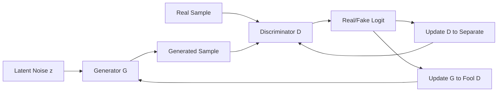
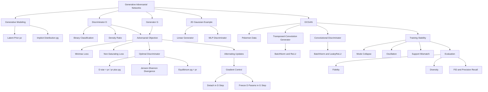

> 本章依次介绍基础生成对抗网络（GAN）和深度卷积生成对抗网络（DCGAN），先用二维高斯分布解释对抗训练，再用 Pokémon sprite 数据说明图像生成。

## 1. 本章主线：把“两样本检验”变成生成器的学习信号

本书此前的大部分任务属于判别学习：给定输入 $x$，预测标签或目标 $y$。生成建模则试图学习数据分布本身，使模型可以产生新的、与真实数据相似的样本。

GAN 的关键创意是：

> 如果一个强判别器无法区分真实样本与生成样本，那么生成分布应当已经接近真实分布；反过来，判别器指出“哪里像假样本”，就能为生成器提供改进方向。



作者的分析路线是：

1. 从判别学习转向无标签数据的分布学习；
2. 将真假样本区分写成二分类问题；
3. 用判别器的梯度训练不显式计算密度的生成器；
4. 交替更新生成器和判别器，形成动态博弈；
5. 先在二维高斯上验证分布匹配；
6. 再用转置卷积、卷积、BatchNorm 和 LeakyReLU 构造 DCGAN；
7. 在 $64\times64$ Pokémon 图像上演示生成训练。

本章最难的地方有四个：

- GAN 不是一个网络最小化固定损失，而是两个网络的博弈；
- 理论 minimax 目标与实际 non-saturating 生成器损失不同；
- 判别器太强或两分布支撑不重叠时，梯度可能失效；
- 低损失不等于生成质量高，真实性和多样性必须同时评价。

## 2. 判别模型与生成模型

### 2.1 判别学习

判别模型通常学习：

$$
p(y\mid x)
$$

或直接学习映射：

$$
f:x\mapsto y.
$$

典型任务：

- 图像分类；
- 情感分析；
- 目标检测；
- 回归预测。

它关心输入之间的决策边界，不一定学习完整的数据分布 $p(x)$。

### 2.2 生成学习

生成模型试图学习：

$$
p_{data}(x)
$$

或带条件的：

$$
p(x\mid y).
$$

学习后可：

- 生成新样本；
- 补全缺失数据；
- 做表示学习；
- 模拟环境或动力学；
- 进行数据增强；
- 支持密度估计或异常检测（取决于模型类型）。

### 2.3 显式密度与隐式生成模型

某些生成模型显式定义或近似计算：

$$
p_\theta(x).
$$

例如自回归模型、normalizing flow 和部分 VAE 目标。

GAN 通常是**隐式生成模型**：

$$
z\sim p_z,
\qquad
x=G_\theta(z).
$$

它容易采样，却通常不能直接计算任意 $x$ 的精确似然 $p_g(x)$。生成器把简单噪声分布通过映射 $G$ 推送为生成分布：

$$
p_g=G_{\#}p_z.
$$

$G_{\#}$ 表示 pushforward measure。

### 2.4 GAN 与双样本检验

给定：

$$
X=\{x_1,\ldots,x_n\}\sim p_{data},
$$

$$
X'=\{x'_1,\ldots,x'_m\}\sim p_g,
$$

双样本检验问它们是否来自同一分布。

GAN 不只做检验，而把分类器的反馈用于修改 $p_g$：

```text
generate fake samples
    -> train discriminator to expose differences
    -> backpropagate through discriminator into generator
    -> generate harder fake samples
    -> repeat
```

这是把判别学习“建设性地”用于生成学习。

## 3. GAN 的三个基本对象

### 3.1 隐变量 $z$

$$
z\sim p_z,
$$

常取：

$$
p_z=\mathcal N(0,I)
$$

或均匀分布。$z$ 提供生成随机性，不要求每个坐标天然对应可解释语义。

隐空间维度 $d_z$ 是超参数：

- 过小可能限制生成分布复杂度；
- 过大增加优化难度，但不会自动产生更丰富语义；
- 不同 $z$ 可能映射到同一或相近样本。

### 3.2 生成器 $G$

$$
G_\theta:\mathcal Z\to\mathcal X,
$$

$$
x_{fake}=G_\theta(z).
$$

生成器的职责不是逐个复刻训练样本，而是让整体生成分布 $p_g$ 接近 $p_{data}$。

对图像，$G$ 通常把低空间分辨率、高通道的 latent tensor 逐层放大为图像。

### 3.3 判别器 $D$

判别器接收 $x$，输出 logit $a(x)\in\mathbb R$：

$$
D(x)=\sigma(a(x))
=\frac{1}{1+e^{-a(x)}}.
$$

$D(x)$ 被解释为输入来自真实数据的概率：

- 真实标签 $y=1$；
- 生成标签 $y=0$。

判别器既是二分类器，也是生成器的可学习损失函数。随着 $G$ 改变，$D$ 面对的负样本分布也持续改变。

## 4. 判别器目标

### 4.1 单样本二元交叉熵

$$
\ell_{BCE}(D(x),y)
=-y\log D(x)
-(1-y)\log(1-D(x)).
$$

真实样本：

$$
\ell_{real}=-\log D(x).
$$

生成样本：

$$
\ell_{fake}=-\log(1-D(G(z))).
$$

### 4.2 总判别器损失

$$
\boxed{
L_D
=-\mathbb E_{x\sim p_{data}}\log D(x)
-\mathbb E_{z\sim p_z}\log(1-D(G(z)))
}.
$$

训练判别器时最小化 $L_D$，生成器在这一更新中应视为固定。

### 4.3 为什么使用 logits 版本

PyTorch 原书代码使用：

```python
nn.BCEWithLogitsLoss()
```

而不是先 `Sigmoid` 再 `BCELoss`。它把 sigmoid 和 BCE 合并，通过 softplus/log-sum-exp 稳定计算：

$$
\ell(a,y)
=\operatorname{softplus}(a)-ya.
$$

其 logit 梯度特别简单：

$$
\frac{\partial\ell}{\partial a}
=\sigma(a)-y.
$$

所以：

- 真实样本梯度为 $D(x)-1$，推动 logit 增大；
- 假样本梯度为 $D(G(z))$，推动 logit 减小。

网络最后一层因此不应再加 sigmoid，否则会重复 sigmoid 并损害数值稳定性。

## 5. 生成器目标：理论 minimax 与实际替代目标

### 5.1 原始 minimax 目标

常见的价值函数记法：

$$
V(D,G)
=\mathbb E_{x\sim p_{data}}\log D(x)
+\mathbb E_{z\sim p_z}\log(1-D(G(z))).
$$

经典博弈写作：

$$
\boxed{
\min_G\max_D V(D,G)
}.
$$

判别器最大化正确分类的 log-likelihood；生成器最小化第二项：

$$
L_G^{sat}
=\mathbb E_z\log(1-D(G(z))).
$$

它称为 saturating/minimax generator objective。

### 5.2 原书的符号约定

原书定义负价值：

$$
J(D,G)=-V(D,G),
$$

因此写成：

$$
\boxed{
\min_D\max_G J(D,G)
}.
$$

两种写法完全等价，但不能把 `min/max` 从一个符号约定直接搬到另一个。

### 5.3 Non-saturating 生成器损失

实践中通常改为让生成样本使用真实标签：

$$
\boxed{
L_G^{ns}
=-\mathbb E_{z\sim p_z}\log D(G(z))
}.
$$

它不再与 $D$ 严格形成同一个零和目标，但与原目标有相同理想平衡点，并在训练早期提供更强梯度。

PyTorch 实现：

```python
fake_logits = discriminator(generator(noise))
loss_G = bce(fake_logits, torch.ones_like(fake_logits))
```

## 6. 两种生成器损失的梯度推导

令假样本 logit 为 $a$，$D=\sigma(a)$。

### 6.1 Saturating/minimax 损失

$$
L_G^{sat}
=\log(1-\sigma(a))
=\log\sigma(-a).
$$

对 $a$：

$$
\boxed{
\frac{\partial L_G^{sat}}{\partial a}
=-D
}.
$$

### 6.2 Non-saturating 损失

$$
L_G^{ns}
=-\log\sigma(a)
=\operatorname{softplus}(-a).
$$

$$
\boxed{
\frac{\partial L_G^{ns}}{\partial a}
=D-1=-(1-D)
}.
$$

### 6.3 为什么 non-saturating 梯度更有用

训练早期，判别器很容易识别粗糙假样本：

$$
D(G(z))\approx0.
$$

此时：

$$
\left|
\frac{\partial L_G^{sat}}{\partial a}
\right|\approx0,
$$

$$
\left|
\frac{\partial L_G^{ns}}{\partial a}
\right|\approx1.
$$

两者在梯度下降下都推动 $a$ 增大，但 non-saturating 版本不会在判别器很自信“这是假的”时失去信号。

### 6.4 原文解释的错误

原文称“生成器完美时 $D(G(z))\approx1$，$-\log(1-D)$ 接近 0，因此梯度太小”。实际上：

$$
D\to1
\quad\Longrightarrow\quad
-\log(1-D)\to+\infty.
$$

真正的饱和发生在生成器较差、$D(G(z))\approx0$ 时；受影响的是生成器的 minimax 梯度，而不是判别器梯度。

## 7. 固定生成器时的最优判别器

设真实密度和生成密度为 $p_r(x)$、$p_g(x)$。固定 $G$ 后，对每个 $x$ 独立最大化：

$$
p_r(x)\log D(x)
+p_g(x)\log(1-D(x)).
$$

一阶导：

$$
\frac{p_r(x)}{D(x)}
-\frac{p_g(x)}{1-D(x)}=0.
$$

整理：

$$
p_r(1-D)=p_gD,
$$

$$
p_r=(p_r+p_g)D.
$$

所以：

$$
\boxed{
D^{\ast}(x)
=\frac{p_r(x)}{p_r(x)+p_g(x)}
}.
$$

二阶导：

$$
-\frac{p_r}{D^2}
-\frac{p_g}{(1-D)^2}<0,
$$

因此是最大值。若 $p_r(x)=p_g(x)=0$，该点不影响目标，$D(x)$ 任意。

### 7.1 判别器隐含密度比

$$
\frac{D^{\ast}(x)}{1-D^{\ast}(x)}
=\frac{p_r(x)}{p_g(x)}.
$$

因此最优判别器实际上估计真实与生成密度比，而无需分别计算两个密度。

## 8. 与 Jensen–Shannon 散度的关系

令混合分布：

$$
m(x)=\frac{p_r(x)+p_g(x)}2.
$$

把 $D^{\ast}$ 代回常见价值函数：

$$
\begin{aligned}
V(D^{\ast},G)
&=\int p_r\log\frac{p_r}{p_r+p_g}\,dx
+\int p_g\log\frac{p_g}{p_r+p_g}\,dx\\
&=\int p_r\log\frac{p_r}{2m}\,dx
+\int p_g\log\frac{p_g}{2m}\,dx\\
&=-2\log2
+\operatorname{KL}(p_r\Vert m)
+\operatorname{KL}(p_g\Vert m)\\
&=-\log4
+2\operatorname{JS}(p_r\Vert p_g).
\end{aligned}
$$

其中：

$$
\operatorname{JS}(p_r\Vert p_g)
=\frac12\operatorname{KL}(p_r\Vert m)
+\frac12\operatorname{KL}(p_g\Vert m).
$$

因此，理想化条件下，生成器最小化 $V(D^{\ast},G)$ 等价于最小化 JS 散度。

按原书的 $J=-V$：

$$
J(D^{\ast},G)
=\log4-2\operatorname{JS}(p_r\Vert p_g),
$$

所以最大化 $J$ 仍等价于最小化 JS。

### 8.1 理论平衡点

JS 非负，且：

$$
\operatorname{JS}(p_r\Vert p_g)=0
\iff p_r=p_g.
$$

平衡点：

$$
\boxed{
p_g=p_r,
\qquad
D^{\ast}(x)=\frac12
}.
$$

此时：

$$
V(D^{\ast},G)=-\log4,
$$

$$
J(D^{\ast},G)=\log4.
$$

判别器只能随机猜测，不是“生成器彻底击败判别器”，而是双方达到分布匹配的 Nash 平衡。

### 8.2 理论结论的前提

上述推导假设：

- 能表示任意判别函数；
- 每次固定 $G$ 都把 $D$ 优化到全局最优；
- 能精确计算总体期望；
- $G$ 的分布族包含真实分布；
- 能对生成分布完成全局优化。

有限网络、有限样本、mini-batch SGD 下，这些条件通常不成立，JS 推导不能直接保证实际训练收敛。

### 8.3 支撑不重叠时的问题

若 $p_r$ 和 $p_g$ 支撑几乎不相交：

$$
D^{\ast}(x)=1\quad p_r\text{ 支撑上},
$$

$$
D^{\ast}(x)=0\quad p_g\text{ 支撑上}.
$$

此时：

$$
\operatorname{JS}(p_r\Vert p_g)=\log2,
$$

对分布位置变化可能近似常数，最优判别器不能提供有用的平滑方向。这是后来 Wasserstein GAN 等方法尝试解决的问题之一。

## 9. GAN 是动态博弈，不是普通最小化

### 9.1 每个网络看到的目标都在移动

判别器损失依赖当前生成器：

$$
L_D(\phi;\theta).
$$

生成器损失依赖当前判别器：

$$
L_G(\theta;\phi).
$$

更新 $\theta$ 会改变 $\phi$ 的最优点，更新 $\phi$ 又会改变 $\theta$ 的梯度场。因此即使两方各自做梯度下降，联合轨迹也可能旋转、振荡或发散。

### 9.2 交替优化

典型每批流程：

```text
1. sample real batch x
2. sample noise z
3. update discriminator using x and stop_gradient(G(z))
4. sample/reuse noise
5. update generator through the current discriminator
6. repeat
```

可以每次更新一次 $D$、一次 $G$，也可使用不同更新比率。没有普遍最优比例；应监控双方容量和梯度。

## 10. 正确控制梯度流

### 10.1 更新判别器时 `detach`

```python
fake = generator(noise)
fake_logits = discriminator(fake.detach())
```

`detach()` 阻断：

$$
L_D\to D\to G
$$

的梯度，使判别器步骤只更新 $D$。

如果忘记 detach，$G$ 会生成梯度；即使不调用 `optimizer_G.step()`，也浪费显存和计算，并可能造成梯度累积混乱。

### 10.2 更新生成器时不能 detach 假样本

```python
fake = generator(noise)
fake_logits = discriminator(fake)
loss_G.backward()
```

需要保留：

$$
L_G\to D(G(z))\to G(z)\to\theta_G
$$

的链式梯度。

### 10.3 更新生成器时冻结判别器参数

虽然需要穿过 $D$ 对输入求梯度，但不需要计算 $D$ 参数梯度：

```python
for parameter in discriminator.parameters():
    parameter.requires_grad_(False)

# update G

for parameter in discriminator.parameters():
    parameter.requires_grad_(True)
```

冻结 $D$ 参数不会切断对 $D$ 输入的梯度，只减少无用参数梯度计算。

原书基础代码没有冻结 $D$，所以生成器步骤会给 $D$ 累积梯度；下一次 `trainer_D.zero_grad()` 会清除，通常不改变更新结果，但浪费计算。

### 10.4 为什么生成器步骤要重新前向

原书先更新 $D$，之后重新计算：

$$
D_{new}(G(z)).
$$

若复用 $D$ 更新前的 `fake_Y`：

- 它对应旧判别器；
- autograd graph 可能已释放；
- 生成器梯度不是当前对手给出的梯度。

可复用 $z$，但应重新通过已更新的 $D$ 前向。

## 11. 基础案例：拟合二维高斯

### 11.1 真实数据构造

原书采样：

$$
X\sim\mathcal N(0,I_2),
$$

并定义：

$$
Y=XA+b,
$$

其中：

$$
A=
\begin{bmatrix}
1&2\\
-0.1&0.5
\end{bmatrix},
\qquad
b=\begin{bmatrix}1&2\end{bmatrix}.
$$

因为样本按行存储：

$$
\mathbb E[Y]=b,
$$

$$
\operatorname{Cov}(Y)
=A^{\top}\operatorname{Cov}(X)A
=A^{\top}A.
$$

数值：

$$
A^{\top}A
=\begin{bmatrix}
1.01&1.95\\
1.95&4.25
\end{bmatrix}.
$$

共生成 1000 个样本，batch size 为 8。

### 11.2 为什么线性生成器已经足够

原书生成器：

```python
nn.Linear(2, 2)
```

设 PyTorch 线性层：

$$
G(z)=zW^{\top}+c,
\qquad
z\sim\mathcal N(0,I).
$$

则：

$$
G(z)\sim
\mathcal N(c,WW^{\top}).
$$

只要学到：

$$
c=b,
$$

$$
WW^{\top}=A^{\top}A,
$$

生成分布就与真实分布相同。

$W$ 不唯一：若 $Q$ 是正交矩阵，合适的旋转仍可产生相同协方差。这说明生成器参数不可辨识，但生成分布可以正确。

### 11.3 判别器结构

$$
2\to5\to3\to1,
$$

中间使用 `tanh`，最后输出 logit：

```python
nn.Sequential(
    nn.Linear(2, 5), nn.Tanh(),
    nn.Linear(5, 3), nn.Tanh(),
    nn.Linear(3, 1)
)
```

虽然真实与生成都是高斯，训练中间阶段的密度比边界不一定是单一直线，因此使用小 MLP 比线性判别器更灵活。

### 11.4 原书训练设置

$$
\eta_D=0.05,
\qquad
\eta_G=0.005,
$$

$$
d_z=2,
\qquad
\text{epochs}=20.
$$

两方使用 Adam，权重初始化为标准差 0.02 的正态分布。每个 batch 先更新 $D$，再更新 $G$。

### 11.5 怎样判断二维实验是否成功

不能只看 $L_D,L_G$。更直接的检查：

- 生成均值是否接近 $b$；
- 生成协方差是否接近 $A^TA$；
- 散点椭圆方向和尺度是否匹配；
- 判别器在独立真假样本上的准确率是否接近 50%；
- 多个随机 seed 是否都能接近，而不是偶然一次。

可定义矩误差：

$$
E_{moment}
=\|\widehat\mu_g-\widehat\mu_r\|_2^2
+\|\widehat\Sigma_g-\widehat\Sigma_r\|_F^2.
$$

原书只用动画展示损失与散点，没有保存最终数值，因此源码本身不能证明每次都收敛。

## 12. 基础 GAN 练习：有限样本上是否存在生成器获胜的平衡

### 12.1 总体分布层面的理想平衡

无限容量、精确优化下：

$$
p_g=p_{data},
\qquad D=\frac12.
$$

判别器无法比随机猜测更好。

### 12.2 有限样本层面的陷阱

生成器可能记忆训练集的经验分布：

$$
\widehat p_{train}
=\frac1n\sum_{i=1}^n\delta_{x_i}.
$$

若只用同一有限训练集评价，判别器也可能无法区分，但这不表示 $p_g$ 匹配真实总体分布。它可能：

- 复现训练样本；
- 缺少训练集外多样性；
- 对独立真实样本仍可区分。

所以有限样本“骗过判别器”不是生成泛化的充分证据。

## 13. 从基础 GAN 到 DCGAN

二维 MLP 无法高效处理图像的空间结构。DCGAN 借用卷积网络的归纳偏置：

- 局部连接；
- 参数共享；
- 分层空间特征；
- 逐级下采样和上采样。

生成器用转置卷积从 latent tensor 逐层放大；判别器用步幅卷积逐层压缩。

## 14. Pokémon 数据集与预处理

### 14.1 原书实际数据

原书下载的是 Pokémon sprites，并用 `ImageFolder` 加载。Fashion-MNIST 只出现在练习中，不是正文实验。

虽然原文声称演示“photorealistic images”，sprite 属于图形化角色图像，并非严格意义的照片。

### 14.2 尺寸与数值范围

所有图像缩放为：

$$
3\times64\times64.
$$

`ToTensor()` 将像素从 $[0,255]$ 变为 $[0,1]$，再做：

$$
x_{norm}
=\frac{x-0.5}{0.5}
=2x-1,
$$

得到 $[-1,1]$，与生成器末层 `tanh` 输出范围一致。

更显式的 torchvision 写法：

```python
torchvision.transforms.Normalize(
    mean=(0.5, 0.5, 0.5),
    std=(0.5, 0.5, 0.5),
)
```

### 14.3 反归一化

展示图像时：

$$
x=\frac{x_{norm}}2+\frac12.
$$

原书注释称这是“normalize synthetic data to $N(0,1)$”，错误；它只是从 $[-1,1]$ 映射回 $[0,1]$。

## 15. 转置卷积：生成器的空间放大工具

### 15.1 输出尺寸公式

对 dilation $d$、output padding $o$：

$$
H_{out}
=(H_{in}-1)s-2p+d(k-1)+o+1.
$$

本章 $d=1,o=0$：

$$
\boxed{
H_{out}
=(H_{in}-1)s-2p+k
}.
$$

默认：

$$
k=4,
\quad s=2,
\quad p=1,
$$

所以：

$$
H_{out}=2H_{in}.
$$

例如：

$$
16\to32.
$$

首层取 $s=1,p=0,k=4$：

$$
1\to4.
$$

原书公式混用了输入/输出撇号且括号不完整；数值例子 $16\to32$ 是正确的。

### 15.2 转置卷积不是普通卷积的真正逆

它是相应卷积线性算子的转置/伴随操作。普通卷积下采样通常丢失信息，所以转置卷积不能唯一恢复原输入。

它学习如何把低分辨率特征映射到高分辨率，而不是执行数学逆变换。

## 16. DCGAN 生成器

### 16.1 基本块

```text
ConvTranspose2d
    -> BatchNorm2d
    -> ReLU
```

转置卷积放大空间，BatchNorm 稳定中间特征尺度，ReLU 提供非线性与稀疏激活。

最后输出层例外：

```text
ConvTranspose2d -> Tanh
```

不使用 BatchNorm，直接映射到 RGB 值范围 $[-1,1]$。

### 16.2 完整形状

原书 $d_z=100,n_G=64$：

| 层 | 输出形状（不含 batch） |
|---|---|
| latent | $(100,1,1)$ |
| G block 1 | $(512,4,4)$ |
| G block 2 | $(256,8,8)$ |
| G block 3 | $(128,16,16)$ |
| G block 4 | $(64,32,32)$ |
| output transposed conv + tanh | $(3,64,64)$ |

通道逐层减少，空间逐层增大：

$$
(100,1,1)
\to(512,4,4)
\to(256,8,8)
\to(128,16,16)
\to(64,32,32)
\to(3,64,64).
$$

### 16.3 为什么从 $(d_z,1,1)$ 开始

把向量 reshape 为 $1\times1$ 特征图后，首个 $4\times4$ 转置卷积相当于学习一个空间化投影：每个 latent 坐标共同决定初始 $4\times4$ 特征，再逐层细化空间结构。

### 16.4 潜在问题：棋盘伪影

转置卷积若 kernel 与 stride 重叠不均，可能出现 checkerboard artifacts。常见替代：

```text
nearest/bilinear upsample
    -> ordinary convolution
```

本章 $k=4,s=2$ 的整除关系比某些组合更均匀，但不能保证完全无伪影。

## 17. DCGAN 判别器

### 17.1 LeakyReLU

$$
\operatorname{LeakyReLU}_\alpha(x)
=\begin{cases}
x,&x>0,\\
\alpha x,&x\le0.
\end{cases}
$$

本章：

$$
\alpha=0.2.
$$

- $\alpha=0$：普通 ReLU；
- $\alpha=1$：恒等映射；
- $0<\alpha<1$：负半轴保留非零梯度。

判别器必须持续为生成器提供输入梯度。若大量 ReLU 单元死亡，$D$ 可能失去表达能力，也可能让传给 $G$ 的信号更差。

### 17.2 判别器基本块

原书代码：

```text
Conv2d
    -> BatchNorm2d
    -> LeakyReLU(0.2)
```

默认 $k=4,s=2,p=1$，使空间尺寸减半。

普通卷积输出公式：

$$
H_{out}
=\left\lfloor
\frac{H_{in}+2p-d(k-1)-1}{s}
+1
\right\rfloor.
$$

$d=1$ 时：

$$
H_{out}
=\left\lfloor
\frac{H_{in}+2p-k}{s}
\right\rfloor+1.
$$

默认参数：

$$
16\to8.
$$

### 17.3 完整形状

| 层 | 输出形状（不含 batch） |
|---|---|
| input | $(3,64,64)$ |
| D block 1 | $(64,32,32)$ |
| D block 2 | $(128,16,16)$ |
| D block 3 | $(256,8,8)$ |
| D block 4 | $(512,4,4)$ |
| output conv | $(1,1,1)$ |

$$
(3,64,64)
\to(64,32,32)
\to(128,16,16)
\to(256,8,8)
\to(512,4,4)
\to(1,1,1).
$$

末层不加 sigmoid，直接输出 logit 给 `BCEWithLogitsLoss`。

### 17.4 原书层数摘要不准确

原书 Summary 称生成器和判别器各有四个卷积层。实际代码均为：

- 四个基本块；
- 再加一个输出卷积。

按卷积算子计数应为五层。

### 17.5 BatchNorm 的代码与文字冲突

经典 DCGAN 通常：

- 判别器输入层不用 BatchNorm；
- 生成器输出层不用 BatchNorm。

原书 Summary 也称判别器输入层除外，但实际第一个 `D_block` 包含 BatchNorm。笔记应以代码事实为准，并指出它与经典建议和摘要不一致。

## 18. BatchNorm、初始化与优化器

### 18.1 BatchNorm 为什么可能帮助

- 稳定中间激活尺度；
- 改善梯度传播；
- 减少某些层尺度漂移；
- 在生成器中引入批统计耦合，可能增加一定随机正则效果。

但它不是无条件稳定器：

- 小 batch 统计噪声大；
- 判别器可利用批统计差异；
- 真实与假样本分开前向时统计不同；
- 生成预览若在 train mode 会改变 running statistics。

### 18.2 经典 DCGAN 初始化

常见做法：

- 卷积权重：$\mathcal N(0,0.02^2)$；
- BatchNorm scale $\gamma$：$\mathcal N(1,0.02^2)$；
- BatchNorm bias $\beta$：0。

原书对所有参数统一执行 `normal_(0, 0.02)`，会把 BatchNorm scale 也初始化到 0 附近，不符合经典 DCGAN 方案。

更稳妥实现：

```python
def init_dcgan(module):
    if isinstance(module, (nn.Conv2d, nn.ConvTranspose2d)):
        nn.init.normal_(module.weight, 0.0, 0.02)
    elif isinstance(module, nn.BatchNorm2d):
        nn.init.normal_(module.weight, 1.0, 0.02)
        nn.init.zeros_(module.bias)
```

### 18.3 Adam 的 $\beta_1$

原书使用：

$$
(\beta_1,\beta_2)=(0.5,0.999),
$$

而非 Adam 常见默认 $\beta_1=0.9$。较低 $\beta_1$ 减弱历史梯度动量，使优化器更快适应不断变化的对手。

这只是经验设置，不保证所有 GAN 最优。现代方法也常使用不同学习率、不同 $\beta$，即 two time-scale update rule（TTUR）。

### 18.4 原书训练超参数

PyTorch/MXNet：

$$
d_z=100,
\qquad
\eta=0.005,
\qquad
20\text{ epochs}.
$$

TensorFlow：

$$
\eta=0.0005,
\qquad
40\text{ epochs}.
$$

后端设置不同，结果不能直接比较。经典 DCGAN 常见学习率约 $2\times10^{-4}$，原书 PyTorch 的 0.005 明显更高，只能视为该示例设置。

## 19. DCGAN 训练循环与正确可视化

### 19.1 每批训练

```text
real images X in [-1, 1]
sample Z of shape (batch, latent_dim, 1, 1)
update D with real=1 and detached fake=0
update G with fake target=1
```

生成器和判别器各更新一次。

### 19.2 损失归一化

原书使用 `BCEWithLogitsLoss(reduction='sum')`，累加后除以样本数。要比较不同 batch size，必须保证最终报告的是一致的每样本平均量。

判别器真实与假损失再除 2，因而其数值尺度与生成器损失并不完全同义。不能仅凭两条曲线高低判断哪一方“获胜”。

### 19.3 使用固定噪声观察训练进展

原书每个 epoch 重新采样 21 个 $z$，不同 epoch 的图不是同一 latent 的演化，难以观察特定样本是否逐渐成形。

更好做法：

```python
fixed_noise = torch.randn(21, latent_dim, 1, 1, device=device)
```

每个 epoch 用同一 `fixed_noise` 生成预览。

### 19.4 预览时使用 `eval()` 和 `no_grad()`

```python
generator.eval()
with torch.no_grad():
    preview = generator(fixed_noise)
generator.train()
```

否则：

- 会构建无用 autograd graph；
- BatchNorm running statistics 会被预览 batch 改变；
- 小预览 batch 的统计会影响图像。

### 19.5 反归一化后裁剪

$$
x_{display}
=\operatorname{clip}\left(
\frac{x_{fake}+1}{2},0,1
\right).
$$

`tanh` 理论输出在 $[-1,1]$，但裁剪可防止后处理或浮点误差越界。

## 20. GAN 训练的典型失败模式

> 本节是理解原书实验所需的补充背景，原文没有系统展开。

### 20.1 Mode collapse（模式崩溃）

不同 $z$ 被映射为少数相似输出：

$$
G(z_1)\approx G(z_2)
$$

对大量 $z_1,z_2$ 成立。

生成图可能单张逼真，却没有覆盖真实分布的多样性。原因包括：

- 当前某个模式最容易欺骗 $D$；
- 局部梯度把许多 latent 推向同一模式；
- 判别器尚未对重复样本形成有效惩罚；
- 博弈振荡导致模式轮换。

### 20.2 判别器过强

若 $D$ 很快近乎完美：

- minimax 生成器梯度饱和；
- $D$ 的局部决策边界可能无法提供指向真实流形的方向；
- $G$ 学习停滞。

但刻意让 $D$ 很弱也不理想：错误判别器提供错误目标。关键是保持有信息的对抗平衡，而不是追求两方 loss 数值相等。

### 20.3 判别器过弱

- 无法发现生成伪影；
- $G$ 可利用简单漏洞；
- 样本质量停在低水平；
- 训练 loss 看似平稳却没有分布匹配。

### 20.4 振荡与不收敛

梯度场可能绕平衡点旋转，参数不收敛但样本周期变化。普通优化中的“损失单调下降”期待不适用于 GAN。

### 20.5 梯度爆炸、NaN 与数值问题

- 学习率过高；
- BatchNorm 小批统计不稳；
- 判别 logit 过大；
- 混合精度溢出；
- 错误使用 `log(sigmoid())` 而非稳定 logits loss。

### 20.6 记忆训练集

生成器可输出接近训练样本的图而缺少泛化。只看少数图不能区分创新与记忆，可做最近邻检查和独立样本评价。

## 21. 为什么 GAN 损失难以解释

### 21.1 损失依赖当前对手

同一个生成器面对不同判别器会有不同 $L_G$。因此：

- 跨 checkpoint 的 loss 不一定可比；
- loss 下降不保证图像更好；
- loss 上升可能只是对手变强；
- 平衡附近 $D$ loss 约 $\log2$，既可能是完美匹配，也可能是判别器训练失败。

### 21.2 判别准确率 50% 的两种完全不同原因

1. $p_g=p_r$，理论成功；
2. 判别器容量不足、训练失败或被正则压垮。

所以必须结合样本、多样性、独立评估器和训练诊断。

## 22. 生成质量评价

> 原书只展示损失和少量图片。以下是必要的现代补充。

### 22.1 人工观察

可发现明显伪影和 collapse，但：

- 主观；
- 样本选择容易 cherry-pick；
- 难覆盖大规模多样性；
- 不能稳定比较小差异。

必须固定采样协议并展示随机、非筛选样本。

### 22.2 Fréchet Inception Distance（FID）

在特征空间拟合真实和生成样本的高斯统计：

$$
\operatorname{FID}
=\|\mu_r-\mu_g\|_2^2
+\operatorname{Tr}
\left(
\Sigma_r+\Sigma_g
-2(\Sigma_r\Sigma_g)^{1/2}
\right).
$$

越低通常越好，同时反映均值和协方差差异。

局限：

- 依赖预训练特征网络；
- 对样本量有偏；
- Pokémon 等非自然图像域的 Inception 特征未必合适；
- 不能完整刻画高阶分布和记忆。

### 22.3 Inception Score（IS）

$$
\operatorname{IS}
=\exp\left(
\mathbb E_x
\operatorname{KL}
(p(y\mid x)\Vert p(y))
\right).
$$

希望单张分类明确、整体类别多样。但它不直接比较真实数据，也依赖分类器和标签域，不适合所有数据。

### 22.4 生成 precision 与 recall

- precision：生成样本有多少落在真实数据流形附近，关注真实性；
- recall：真实分布有多少模式被生成器覆盖，关注多样性。

Mode collapse 可能 precision 高但 recall 低，因此单指标不够。

### 22.5 任务相关评价

对科学、医学或结构化数据，应使用领域约束、下游任务、物理一致性、隐私和独立专家评价，不能只依赖自然图像指标。

## 23. 稳定训练的常见扩展

> 以下方法不在原章实现中，用于说明基础 GAN 的局限如何推动后续发展。

### 23.1 One-sided label smoothing

把真实标签从 1 改为如 0.9，减少 $D$ 过度自信。通常不把假标签也平滑到正值，以免鼓励错误区域。

### 23.2 Spectral normalization

约束判别器每层谱范数，控制 Lipschitz 性和梯度尺度。

### 23.3 Gradient penalty

惩罚判别器对输入的梯度范数偏离目标，常见于 WGAN-GP：

$$
\lambda
\mathbb E_{\hat x}
\left(
\|\nabla_{\hat x}D(\hat x)\|_2-1
\right)^2.
$$

### 23.4 Wasserstein GAN

用 Wasserstein-1 距离的对偶形式替代 JS 相关目标，使支撑不重叠时仍可能提供连续信号。判别器改称 critic，不输出概率。

### 23.5 TTUR

生成器和判别器使用不同学习率或更新频率，以匹配双方不同动态。原书二维实验已经使用：

$$
\eta_D=10\eta_G.
$$

### 23.6 Minibatch discrimination 与多样性正则

让判别器观察批内相似性，或直接奖励不同 latent 产生不同输出，以缓解 mode collapse。

## 24. 可运行的 PyTorch 综合实验

下面代码只依赖 NumPy 和 PyTorch，不下载数据，在 CPU 上验证：

- 最优判别器 $D^{\ast}$；
- GAN 价值与 JS 散度恒等式；
- saturating/non-saturating 梯度差异；
- 判别器更新中的 `detach`；
- 生成器更新时冻结 $D$ 参数但保留输入梯度；
- DCGAN 的完整张量形状；
- 二维高斯的短程交替训练能改善矩匹配。

```python
import math

import numpy as np
import torch
from torch import nn
from torch.nn import functional as F

torch.set_num_threads(1)
torch.manual_seed(7)

# 1. Analytic D* and the Jensen-Shannon identity on a discrete space.
p_real = np.array([0.45, 0.35, 0.20], dtype=np.float64)
p_generated = np.array([0.10, 0.30, 0.60], dtype=np.float64)
d_star = p_real / (p_real + p_generated)
mixture = (p_real + p_generated) / 2.0
js_divergence = (
    0.5 * np.sum(p_real * np.log(p_real / mixture))
    + 0.5 * np.sum(p_generated * np.log(p_generated / mixture))
)
gan_value = np.sum(
    p_real * np.log(d_star)
    + p_generated * np.log1p(-d_star)
)
np.testing.assert_allclose(
    gan_value, -math.log(4.0) + 2.0 * js_divergence, atol=1e-12
)

# 2. Numerically optimize the discriminator and recover D*.
real_tensor = torch.tensor(p_real, dtype=torch.float64)
generated_tensor = torch.tensor(p_generated, dtype=torch.float64)
logits = nn.Parameter(torch.zeros_like(real_tensor))
discriminator_optimizer = torch.optim.Adam([logits], lr=0.1)
for _ in range(600):
    discriminator_optimizer.zero_grad()
    discriminator_loss = -(
        real_tensor * F.logsigmoid(logits)
        + generated_tensor * F.logsigmoid(-logits)
    ).sum()
    discriminator_loss.backward()
    discriminator_optimizer.step()
learned_d = logits.sigmoid().detach().numpy()
np.testing.assert_allclose(learned_d, d_star, atol=2e-4)

# 3. Non-saturating loss has a much stronger gradient when D(fake) is tiny.
fake_logit = torch.tensor(-6.0, requires_grad=True)
saturating_loss = F.logsigmoid(-fake_logit)
non_saturating_loss = F.softplus(-fake_logit)
saturating_gradient = torch.autograd.grad(
    saturating_loss, fake_logit
)[0].item()
non_saturating_gradient = torch.autograd.grad(
    non_saturating_loss, fake_logit
)[0].item()
assert saturating_gradient < 0 and non_saturating_gradient < 0
assert abs(non_saturating_gradient) > 100 * abs(saturating_gradient)

# 4. detach prevents generator gradients during the discriminator update.
generator = nn.Linear(2, 2)
discriminator = nn.Linear(2, 1)
real_batch = torch.randn(16, 2)
noise_batch = torch.randn(16, 2)
bce = nn.BCEWithLogitsLoss()

def gradient_norm(module):
    return sum(
        float(parameter.grad.norm())
        for parameter in module.parameters()
        if parameter.grad is not None
    )

generator.zero_grad(set_to_none=True)
discriminator.zero_grad(set_to_none=True)
fake_batch = generator(noise_batch)
discriminator_loss = (
    bce(discriminator(real_batch), torch.ones(16, 1))
    + bce(discriminator(fake_batch.detach()), torch.zeros(16, 1))
) / 2.0
discriminator_loss.backward()
assert gradient_norm(discriminator) > 0
assert gradient_norm(generator) == 0

# 5. Freeze D parameters in the G update without blocking gradients to G.
generator.zero_grad(set_to_none=True)
discriminator.zero_grad(set_to_none=True)
for parameter in discriminator.parameters():
    parameter.requires_grad_(False)
generator_loss = bce(
    discriminator(generator(noise_batch)), torch.ones(16, 1)
)
generator_loss.backward()
assert gradient_norm(generator) > 0
assert gradient_norm(discriminator) == 0
for parameter in discriminator.parameters():
    parameter.requires_grad_(True)

# 6. Lightweight DCGAN shape checks.
class GeneratorBlock(nn.Sequential):
    def __init__(self, in_channels, out_channels, stride=2, padding=1):
        super().__init__(
            nn.ConvTranspose2d(
                in_channels, out_channels, kernel_size=4,
                stride=stride, padding=padding, bias=False
            ),
            nn.BatchNorm2d(out_channels),
            nn.ReLU(),
        )

class DiscriminatorBlock(nn.Sequential):
    def __init__(self, in_channels, out_channels):
        super().__init__(
            nn.Conv2d(
                in_channels, out_channels, kernel_size=4,
                stride=2, padding=1, bias=False
            ),
            nn.BatchNorm2d(out_channels),
            nn.LeakyReLU(0.2),
        )

base_channels = 8
latent_dim = 16
dc_generator = nn.Sequential(
    GeneratorBlock(latent_dim, base_channels * 8, stride=1, padding=0),
    GeneratorBlock(base_channels * 8, base_channels * 4),
    GeneratorBlock(base_channels * 4, base_channels * 2),
    GeneratorBlock(base_channels * 2, base_channels),
    nn.Sequential(
        nn.ConvTranspose2d(
            base_channels, 3, kernel_size=4,
            stride=2, padding=1, bias=False
        ),
        nn.Tanh(),
    ),
)
dc_discriminator = nn.Sequential(
    DiscriminatorBlock(3, base_channels),
    DiscriminatorBlock(base_channels, base_channels * 2),
    DiscriminatorBlock(base_channels * 2, base_channels * 4),
    DiscriminatorBlock(base_channels * 4, base_channels * 8),
    nn.Conv2d(base_channels * 8, 1, kernel_size=4, bias=False),
)

dc_generator.eval()
dc_discriminator.eval()
with torch.no_grad():
    tensor = torch.randn(2, latent_dim, 1, 1)
    generator_shapes = []
    for layer in dc_generator:
        tensor = layer(tensor)
        generator_shapes.append(tuple(tensor.shape))
    discriminator_shapes = []
    for layer in dc_discriminator:
        tensor = layer(tensor)
        discriminator_shapes.append(tuple(tensor.shape))

assert generator_shapes == [
    (2, 64, 4, 4),
    (2, 32, 8, 8),
    (2, 16, 16, 16),
    (2, 8, 32, 32),
    (2, 3, 64, 64),
]
assert discriminator_shapes == [
    (2, 8, 32, 32),
    (2, 16, 16, 16),
    (2, 32, 8, 8),
    (2, 64, 4, 4),
    (2, 1, 1, 1),
]

# 7. Short alternating training on the chapter's affine Gaussian.
torch.manual_seed(11)
transform = torch.tensor([[1.0, 2.0], [-0.1, 0.5]])
shift = torch.tensor([1.0, 2.0])
real_data = torch.randn(2048, 2) @ transform + shift

toy_generator = nn.Linear(2, 2)
toy_discriminator = nn.Sequential(
    nn.Linear(2, 5),
    nn.Tanh(),
    nn.Linear(5, 3),
    nn.Tanh(),
    nn.Linear(3, 1),
)
for module in list(toy_generator.modules()) + list(toy_discriminator.modules()):
    if isinstance(module, nn.Linear):
        nn.init.normal_(module.weight, 0.0, 0.02)
        nn.init.zeros_(module.bias)

generator_optimizer = torch.optim.Adam(toy_generator.parameters(), lr=0.005)
discriminator_optimizer = torch.optim.Adam(
    toy_discriminator.parameters(), lr=0.01
)
probe_noise = torch.randn(4096, 2)

def covariance(samples):
    centered = samples - samples.mean(dim=0)
    return centered.T @ centered / (len(samples) - 1)

target_mean = real_data.mean(dim=0)
target_covariance = covariance(real_data)

def moment_error(samples):
    mean_error = (samples.mean(dim=0) - target_mean).square().sum()
    covariance_error = (
        covariance(samples) - target_covariance
    ).square().sum()
    return float(mean_error + covariance_error)

with torch.no_grad():
    initial_moment_error = moment_error(toy_generator(probe_noise))
best_moment_error = initial_moment_error

for step in range(800):
    indices = torch.randint(len(real_data), (128,))
    real_batch = real_data[indices]
    noise_batch = torch.randn(128, 2)

    discriminator_optimizer.zero_grad(set_to_none=True)
    fake_batch = toy_generator(noise_batch).detach()
    discriminator_loss = (
        bce(toy_discriminator(real_batch), torch.ones(128, 1))
        + bce(toy_discriminator(fake_batch), torch.zeros(128, 1))
    ) / 2.0
    discriminator_loss.backward()
    discriminator_optimizer.step()

    for parameter in toy_discriminator.parameters():
        parameter.requires_grad_(False)
    generator_optimizer.zero_grad(set_to_none=True)
    generated_batch = toy_generator(torch.randn(128, 2))
    generator_loss = bce(
        toy_discriminator(generated_batch), torch.ones(128, 1)
    )
    generator_loss.backward()
    generator_optimizer.step()
    for parameter in toy_discriminator.parameters():
        parameter.requires_grad_(True)

    if step % 20 == 0:
        with torch.no_grad():
            best_moment_error = min(
                best_moment_error,
                moment_error(toy_generator(probe_noise)),
            )

with torch.no_grad():
    final_moment_error = moment_error(toy_generator(probe_noise))
assert np.isfinite([
    discriminator_loss.item(),
    generator_loss.item(),
    final_moment_error,
]).all()
assert best_moment_error < initial_moment_error

print("max D* optimization error =",
      float(np.max(np.abs(learned_d - d_star))))
print("JS identity error =",
      abs(gan_value - (-math.log(4.0) + 2.0 * js_divergence)))
print("saturating / non-saturating logit gradients =",
      saturating_gradient, non_saturating_gradient)
print("generator shapes =", generator_shapes)
print("discriminator shapes =", discriminator_shapes)
print("moment error initial / best / final =",
      initial_moment_error, best_moment_error, final_moment_error)
```

### 24.1 代码与原理的对应关系

1. 离散分布直接验证 $D^{\ast}=p_r/(p_r+p_g)$；
2. 将 $D^{\ast}$ 代回，数值验证 $V=-\log4+2JS$；
3. 用可训练 logits 优化判别 BCE，恢复解析 $D^{\ast}$；
4. 当 logit 为 -6 时，non-saturating 梯度比 saturating 梯度大两个数量级以上；
5. `fake.detach()` 使 $D$ 更新后 $G$ 梯度严格为 0；
6. 冻结 `D.parameters()` 后，梯度仍穿过 $D$ 输入流向 $G$；
7. 轻量 DCGAN 用较少通道复现原书 $1\to4\to8\to16\to32\to64$ 的尺寸链；
8. 二维短训练不声称稳定收敛，只断言在某个训练时刻矩误差比初始值更小，符合 GAN 可能振荡的事实。

## 25. DCGAN 练习详解

### 25.1 用标准 ReLU 替代 LeakyReLU 会怎样

标准 ReLU：

$$
\operatorname{ReLU}(x)=\max(0,x).
$$

负区间梯度为 0。判别器单元若长期收到负 pre-activation，可能成为 dying ReLU：

- 该单元参数难以更新；
- 判别器容量下降；
- 传给生成器的输入梯度可能变弱。

但不能断言标准 ReLU 必然失败。结果取决于初始化、BatchNorm、学习率和数据。LeakyReLU 是降低死亡风险的经验选择。

### 25.2 将 DCGAN 应用于 Fashion-MNIST

Fashion-MNIST 图像形状为：

$$
1\times28\times28.
$$

需要调整：

- 生成器输出通道从 3 改为 1；
- 判别器输入通道从 3 改为 1；
- 处理 28 与 64 的尺寸差异。

最简单方案是把输入 resize 到 $64\times64$；也可重新设计输出尺寸链，例如从 $7\times7$ 起始，经两次放大到 28。

无条件 GAN 不知道类别标签。若要回答“哪一类生成得好”：

1. 为每类单独训练无条件 GAN；或
2. 使用 conditional GAN，把标签输入 $G,D$；或
3. 用独立 Fashion-MNIST 分类器给生成样本打标签，再按类计算质量和覆盖率。

原书没有运行该实验，不能从正文断言某些类别一定最好。通常视觉结构简单、形态一致的类别可能更易生成，但必须实测。

## 26. 容易混淆的概念与常见误区

### 26.1 生成模型就是生成训练样本的副本

目标是学习总体分布并生成新样本；记忆训练集是过拟合。

### 26.2 GAN 显式计算 $p_g(x)$

标准 GAN 易采样，但通常没有可直接计算的归一化密度。

### 26.3 潜变量每一维都自动对应可解释语义

没有解耦约束时，语义可能纠缠，坐标也不可辨识。

### 26.4 判别器只是最终分类器

它主要是生成器的可学习训练信号，训练后不一定作为下游分类器使用。

### 26.5 GAN 是两个网络都最小化同一个损失

经典写法是 $\min_G\max_DV$；原书用负号写作 $\min_D\max_GJ$。实际 non-saturating 训练还不是严格零和。

### 26.6 原书 `min_D max_G` 与经典文献矛盾

不矛盾，原书目标是经典价值函数的负数。

### 26.7 Non-saturating loss 与 minimax loss 数学上相同

不相同，但具有相同理想平衡点；前者训练早期梯度更强。

### 26.8 生成器完美时 minimax 梯度饱和

真正的问题发生在训练早期 $D(fake)\approx0$。

### 26.9 判别器越强越好

过强且近乎完美的 $D$ 可能给 $G$ 很差的局部信号；过弱也无法提供有效差异。

### 26.10 $D$ 准确率 50% 就证明生成成功

也可能是判别器没学会。需要独立质量和多样性评价。

### 26.11 $D$ loss 与 $G$ loss 越低，图像一定越好

损失依赖当前对手，不能作为绝对生成质量指标。

### 26.12 理论上最小化 JS，所以实际训练一定降低 JS

理论要求 $D$ 每次达到最优且总体期望可精确计算，实际不满足。

### 26.13 `detach()` 是把 tensor 从 GPU 移到 CPU

它只切断 autograd 历史，不改变设备。

### 26.14 更新 $G$ 时冻结 $D$ 会阻断所有梯度

冻结参数只停止对 $D$ 参数求梯度，对 $D$ 输入的梯度仍可传给 $G$。

### 26.15 更新 $D$ 时可以不清空梯度

PyTorch 默认累积梯度，不清空会混入旧步骤。

### 26.16 BCEWithLogitsLoss 前还要加 sigmoid

不需要；重复 sigmoid 会得到错误目标和更差数值稳定性。

### 26.17 二维线性生成器只能学线性边界，不能学高斯

仿射变换高斯仍是高斯，恰好足以匹配案例。

### 26.18 生成器必须恢复原矩阵 $A$

只需产生相同均值和协方差；满足 $WW^T=A^TA$ 的参数不唯一。

### 26.19 转置卷积是卷积的逆

它是转置线性算子，不会恢复下采样丢失的信息。

### 26.20 DCGAN 只有四层卷积

原书代码是四个 block 加输出卷积，按算子计数为五层。

### 26.21 原书 DCGAN 判别器输入层没有 BatchNorm

文字如此描述，但实际第一个 `D_block` 包含 BatchNorm。

### 26.22 Pokémon 正文实验使用 Fashion-MNIST

正文用 Pokémon；Fashion-MNIST 只在练习中出现。

### 26.23 `/2+0.5` 把图像归一化为标准正态

它只是把 $[-1,1]$ 反映射到 $[0,1]$。

### 26.24 每轮使用新随机噪声最适合观察训练进步

展示多样性可以用新噪声；比较同一 latent 的演化应使用固定噪声。

### 26.25 生成预览不需要 `eval()`

含 BatchNorm 时 train/eval 会产生不同输出并影响运行统计。

### 26.26 BatchNorm 参数都应初始化为均值 0

经典 DCGAN 通常将 scale 初始化在 1 附近，bias 为 0。

### 26.27 Mode collapse 表示所有图片完全相同

也可能只覆盖少数模式或在模式间切换，不一定逐像素相同。

### 26.28 FID 低就证明模型没有记忆或偏见

FID 是有限特征矩统计，不能单独检测训练样本记忆、公平性或安全问题。

### 26.29 生成图像逼真就可以忽略多样性

分布匹配同时要求 fidelity 和 coverage。

### 26.30 GAN 平衡等于某一方获胜

理想平衡是生成分布匹配，判别器只能输出 $1/2$。

## 27. 全章知识结构



## 28. 核心结论

1. 判别模型学习输入到标签，生成模型学习数据分布或可采样机制。
2. GAN 用判别器把双样本检验转化为生成器的训练信号。
3. 生成器将简单 latent prior 推送为隐式生成分布，通常不提供显式似然。
4. 判别器输出真实概率，其 BCE 同时使用真实正例和生成负例。
5. 常见理论写法是 $\min_G\max_DV$；原书对目标取负，写成 $\min_D\max_GJ$。
6. 实际常用 non-saturating $-\log D(G(z))$，因为训练早期比 minimax 目标梯度更强。
7. 固定生成器时，最优判别器是 $D^{\ast}=p_r/(p_r+p_g)$，隐含估计密度比。
8. 将 $D^{\ast}$ 代回得到 $V=-\log4+2JS(p_r\Vert p_g)$。
9. 理想平衡为 $p_g=p_r,D=1/2$，不是某一网络单方面获胜。
10. JS 推导依赖无限容量、总体期望和判别器最优等理想条件，不保证实际 SGD 收敛。
11. 更新判别器时必须 detach 假样本，避免生成器获得判别器步骤梯度。
12. 更新生成器时要保留通过判别器输入的梯度，可冻结判别器参数减少浪费。
13. 原书二维数据均值为 $b$、协方差为 $A^TA$，线性生成器理论上足够匹配。
14. GAN 损失依赖当前对手，不能单独用来判断生成质量。
15. DCGAN 用转置卷积逐级放大 latent，用步幅卷积逐级压缩图像。
16. 转置卷积输出尺寸为 $(H-1)s-2p+d(k-1)+o+1$，它不是普通卷积的逆。
17. Pokémon 图像先映射到 $[-1,1]$，与生成器末层 tanh 对齐。
18. 生成器中间层使用 BatchNorm+ReLU，输出层用 tanh；判别器用 LeakyReLU 保留负区梯度。
19. 原书实际 G/D 均有五个卷积算子，且第一个 D block 的确含 BatchNorm。
20. 经典 DCGAN 对卷积和 BatchNorm 使用不同初始化；原书统一正态初始化并不严谨。
21. 固定 latent、`eval()` 和 `no_grad()` 才能做可比且不污染 BatchNorm 的生成预览。
22. Mode collapse 会让样本真实但覆盖不足，必须同时评价 fidelity 和 diversity。
23. FID、precision/recall 和独立人工检查各有局限，应组合使用。
24. GAN 是动态博弈，学习率、更新比、容量、正则和随机种子都可能改变稳定性。
25. 有限训练集上骗过判别器可能只是记忆，不等于匹配真实总体分布。

## 29. 解决 GAN 问题的一般思路

1. **明确要生成什么分布**：无条件、类别条件、文本条件还是配对转换？
2. **选择数据表示和输出范围**：像素归一化必须与最后激活匹配。
3. **定义 latent prior 和维度**：保证足够容量，但不要把维度误当自动语义。
4. **先验证形状链**：逐层检查通道、空间尺寸、输出范围和 logit 形状。
5. **使用稳定 logits loss**：优先 `BCEWithLogitsLoss`，避免手写 `log(sigmoid())`。
6. **明确符号约定**：写清是 $V$ 还是 $-V$、谁 min 谁 max。
7. **采用 non-saturating 生成器目标作为基础实现**：尤其训练早期。
8. **严格控制梯度流**：D 步 detach，G 步不 detach，并可冻结 D 参数。
9. **平衡双方容量和优化速度**：监控 logits、梯度范数、准确率和样本，而非只看 loss。
10. **正确初始化卷积与 BatchNorm**：避免把 BN scale 初始化到 0 附近。
11. **为预览固定 latent**：同时另采随机 latent 检查多样性。
12. **预览时切换 eval/no_grad**：防止 BatchNorm 统计污染和无用图构建。
13. **先在可诊断的 toy distribution 上测试**：检查均值、协方差和覆盖，而不只看图。
14. **定期保存 checkpoint**：包括 G、D、优化器、随机状态和固定 noise。
15. **显式诊断 mode collapse**：最近邻、多样性、类别覆盖和 precision/recall。
16. **分开评价真实性与覆盖率**：单张好看不能替代分布评价。
17. **在独立样本上评价**：防止训练集记忆被误认为生成成功。
18. **多随机种子重复**：GAN 方差大，单次成功没有代表性。
19. **遇到不稳定先检查基础错误**：重复 sigmoid、忘记 detach、范围不匹配、学习率过高、BN mode 错误。
20. **再考虑稳定化方法**：谱归一化、梯度惩罚、Wasserstein 目标、TTUR 或架构调整。
21. **报告完整实验协议**：数据、预处理、样本数、seed、指标实现、特征网络和搜索预算。
22. **审视应用风险**：隐私记忆、偏见复制、伪造滥用和数据许可都属于生成系统质量的一部分。

本章可以压缩为一句话：**GAN 用生成器把简单噪声变为隐式数据分布，用判别器估计真实与生成样本的差异，并通过交替反向传播不断改进二者；理想最优判别器把目标化为 JS 散度，平衡点是 $p_g=p_{data}$、$D=1/2$。实际训练却是有限网络上的非平稳博弈，因此必须使用 non-saturating 梯度、正确的 detach/冻结、稳定卷积架构和多维评价，并警惕 mode collapse、支撑不重叠、BatchNorm 状态污染及“低损失等于好生成”的误判。**
