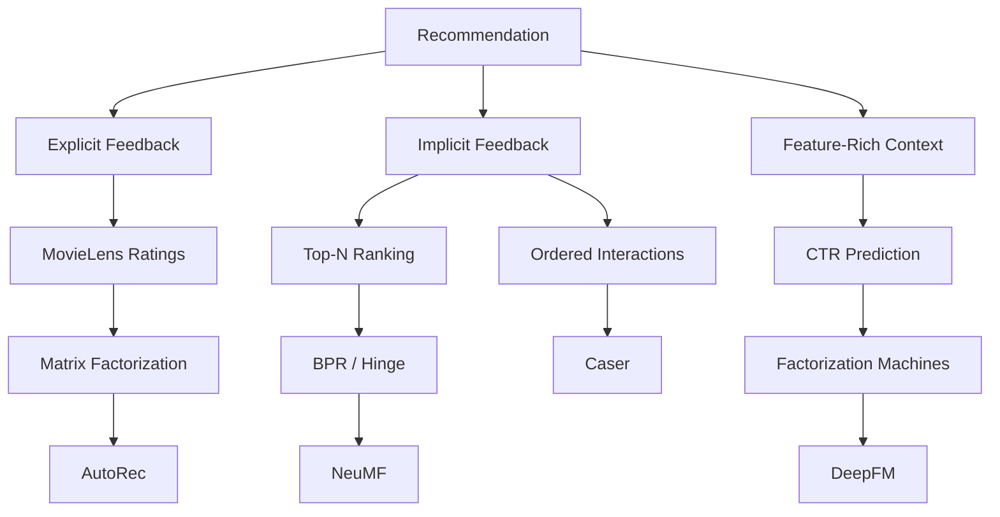
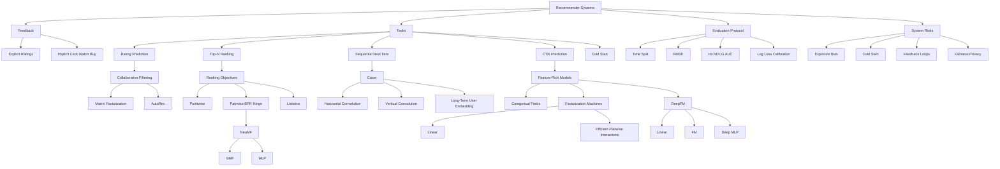

> 这是正文最后一章。原书依次介绍推荐系统概览、MovieLens 数据、矩阵分解、AutoRec、个性化排序、NeuMF、序列推荐 Caser、特征丰富推荐、因子分解机和 DeepFM。

## 1. 本章主线：从评分预测到排序、序列与特征交叉

推荐系统要在海量候选中，为每个用户发现其可能感兴趣的物品。这里的“物品”可以是电影、音乐、新闻、商品、广告、视频或地点。

本章不是围绕单一模型展开，而是沿着**数据类型与任务目标**逐步扩展：



作者的问题分析路线是：

1. 推荐系统首先要区分显式反馈与隐式反馈；
2. 显式评分可写成稀疏矩阵补全，先用矩阵分解学习低秩结构；
3. 点积是线性的，于是用 AutoRec 引入非线性重构；
4. 真实业务更多只有点击、观看、购买等隐式行为，目标应从评分值转为候选排序；
5. Pairwise BPR/hinge 直接优化正物品高于负物品；
6. NeuMF 用 GMF 与 MLP 两条路径学习复杂用户—物品交互；
7. 静态用户—物品矩阵忽略兴趣漂移，Caser 再引入交互顺序；
8. 稀疏 ID 交互无法充分处理冷启动和上下文，CTR 模型引入丰富类别特征；
9. FM 高效建模二阶特征交叉；
10. DeepFM 结合一阶、二阶与深层高阶交叉。

这一主线可概括为：

```text
absolute rating
  -> relative ranking
  -> temporal next-item intent
  -> context-rich click probability
```

模型必须与任务对齐：低 RMSE 不保证 Top-$K$ 排序好，BPR 分数也不一定是校准概率，CTR 预测更不等同于长期用户满意度。

## 2. 推荐系统概览

### 2.1 推荐系统解决什么问题

互联网平台提供的候选数量远超用户能主动浏览的范围。推荐系统通过个性化过滤：

- 降低信息过载；
- 减少主动搜索成本；
- 帮助发现长尾内容；
- 提高点击、购买、观看或留存；
- 为平台创造收入。

原书称推荐系统是搜索引擎的替代品，这一表述过强。二者通常互补：

- 搜索承接明确意图；
- 推荐探索用户尚未明确表达的需求；
- 实际产品还包含召回、排序、重排、搜索和运营规则。

### 2.2 推荐不是单纯预测“用户喜欢什么”

真实目标可能同时包括：

- 即时相关性；
- 长期满意度和留存；
- 新颖性、多样性、惊喜度；
- 商业收益；
- 内容安全；
- 用户和供给方公平；
- 系统延迟与计算成本。

这些目标可能冲突。若只最大化点击率，系统可能偏好标题党或重复刺激，而非长期价值。

## 3. 协同过滤

### 3.1 基本思想

协同过滤（Collaborative Filtering, CF）只利用用户—物品交互：

> 兴趣相似的用户可能喜欢相似物品；被相似用户共同消费的物品也可能彼此相关。

“协同”指多个用户的行为共同帮助推断单个用户偏好。

### 3.2 Memory-based CF

#### User-based CF

找与目标用户相似的用户，再聚合其偏好：

$$
\hat r_{ui}
=\bar r_u
+\frac{
\sum_{v\in N(u)}s(u,v)(r_{vi}-\bar r_v)
}{
\sum_{v\in N(u)}|s(u,v)|
}.
$$

#### Item-based CF

找与候选物品相似的物品，再根据用户历史评分预测：

$$
\hat r_{ui}
=\frac{
\sum_{j\in N(i;u)}s(i,j)r_{uj}
}{
\sum_{j\in N(i;u)}|s(i,j)|
}.
$$

Memory-based 方法直观，但稀疏数据中共同交互很少，相似度不稳定；大规模全邻居计算也昂贵。

### 3.3 Model-based CF

模型型 CF 用参数化模型学习交互结构，例如：

- 矩阵分解；
- 概率潜变量模型；
- AutoRec；
- NeuMF；
- 图神经网络推荐。

它通常更容易扩展到大规模稀疏数据，并能用表示学习缓解直接相似度的局限。

### 3.4 CF、内容推荐与上下文推荐

- **CF**：只依赖交互；
- **Content-based**：利用用户和物品属性；
- **Context-aware**：再利用时间、地点、设备和场景；
- **Hybrid**：组合多种信号。

纯 ID 协同过滤对新用户、新物品没有已学习 embedding，冷启动困难；内容和上下文特征可部分缓解。

## 4. 显式反馈与隐式反馈

### 4.1 显式反馈

用户主动表达：

- 1–5 星评分；
- 点赞/点踩；
- 满意度问卷；
- 收藏或明确“不感兴趣”。

优点：语义相对直接。缺点：获取成本高、自选择严重，愿意评分的用户和物品并非随机样本。

### 4.2 隐式反馈

系统被动记录：

- 曝光；
- 点击；
- 停留时长；
- 观看；
- 购买；
- 跳过；
- 鼠标移动。

隐式反馈数量大，却语义含混：

- 看过不一定喜欢；
- 未点击可能是没兴趣，也可能根本没看到；
- 购买可能受价格、库存和促销影响；
- 长时观看可能是喜欢，也可能是无法理解。

### 4.3 未观测不等于负反馈

对用户 $u$ 和物品 $j$，没有交互可能表示：

1. 用户已曝光但不喜欢；
2. 用户未曝光；
3. 用户以后才会感兴趣；
4. 日志丢失；
5. 旧策略没有推荐它。

因此把所有未观测项当真负例会引入曝光偏差和选择偏差。负采样只是训练近似，不是事实标签。

## 5. 推荐任务

### 5.1 评分预测

输入用户 $u$、物品 $i$，预测：

$$
\hat r_{ui}\approx r_{ui}.
$$

常用 RMSE/MAE，适用于显式反馈。

### 5.2 Top-$N$ 推荐

对每个用户给候选物品打分并排序：

$$
\operatorname{rank}_u(i)
\text{ induced by }\hat y_{ui}.
$$

重点是相关物品是否排在顶部，常用 Recall@$K$、NDCG@$K$、MRR 等。

### 5.3 序列推荐

输入按时间排序的行为：

$$
(i_1,i_2,\ldots,i_t),
$$

预测下一物品或短期兴趣。它与静态矩阵补全不同，因为顺序和近期行为有意义。

### 5.4 CTR 预测

给定用户、物品和上下文特征，预测曝光后点击概率：

$$
P(Y=1\mid x).
$$

这是 pointwise 二分类任务，常服务于广告和推荐排序。

### 5.5 冷启动

- 新用户：没有历史交互；
- 新物品：没有被消费；
- 新场景：旧分布不能代表当前环境。

只使用 ID embedding 的 MF、NeuMF、Caser 无法直接为完全新 ID 学得表示，需要内容特征、元学习、探索或 onboarding 信号。

## 6. MovieLens 100K 数据集

### 6.1 数据概况

原书使用 MovieLens 100K：

- 943 个用户；
- 1682 部电影；
- 100,000 条评分；
- 评分范围 1–5；
- 每个用户至少评分 20 部电影；
- 每条记录含用户 ID、物品 ID、评分和时间戳。

`u.data` 实际是 tab-separated 文件，不是严格 CSV。

### 6.2 稀疏度

完整矩阵槽位：

$$
943\times1682=1{,}586{,}126.
$$

稀疏度：

$$
\operatorname{sparsity}
=1-\frac{100{,}000}{943\times1682}
\approx0.93695.
$$

即约 93.695% 未观测。真实工业数据通常更稀疏。

### 6.3 “0”是缺失标记，不是零评分

原书显式交互矩阵将未知评分填为 0。由于真实评分在 1–5，0 可作缺失 sentinel，但模型损失必须 mask 它，不能把它当真实负评分。

### 6.4 评分分布

评分集中在 3–4 星。原书称直方图“像正态分布”，但评分是离散、有界且带选择偏差的数据，不能凭直方图确认正态性。

## 7. 数据拆分与协议

### 7.1 Random split

原书按交互随机分配约 90% 训练、10% 测试。优点是简单，但：

- 未来行为可能进入训练，过去行为进入测试；
- 某些用户可能没有测试样本；
- 没有固定 seed，结果不可稳定复现；
- 随机 Bernoulli mask 不保证精确 90/10。

适合静态评分补全的简化实验，不适合严格模拟线上未来预测。

### 7.2 Sequence-aware split

每个用户最后一次交互留作测试，其余历史训练：

$$
D_u^{train}=(i_1,\ldots,i_{T_u-1}),
\qquad
D_u^{test}=i_{T_u}.
$$

这避免同一用户未来信息进入其训练历史，适合 next-item 评价。

但它不是全局时间切点：其他用户较晚发生的交互仍可能帮助模型预测某用户更早的测试时点。这是常见 transductive leave-one-out 协议，不等同于真实线上回放。

### 7.3 Train/validation/test

原书为简洁只拆 train/test，并说 test 可视为 held-out validation。若每 epoch 查看并据此选超参数，它就是验证集，不能再作为最终测试集。

严谨流程：

1. train：拟合参数；
2. validation：选超参数和 early stopping；
3. test：流程冻结后最终评价。

时间敏感系统应使用按时间滚动或固定截止点的离线回放。

### 7.4 ID 重编号和矩阵方向

原始 ID 从 1 开始，代码减 1 变为 0-based。

显式矩阵代码存成：

$$
R\in\mathbb R^{n_{items}\times n_{users}},
$$

即每行是物品、每列是用户；MF 理论部分则写用户行、物品列：

$$
R\in\mathbb R^{n_{users}\times n_{items}}.
$$

两者都可行，但实现时必须明确方向，AutoRec 使用的是 item-based 列向量语义。

## 8. 矩阵分解（Matrix Factorization）

### 8.1 低秩假设

设：

$$
R\in\mathbb R^{m\times n}
$$

是 $m$ 个用户、$n$ 个物品的评分矩阵。假设偏好由 $k\ll m,n$ 个潜在因素解释：

$$
P\in\mathbb R^{m\times k},
\qquad
Q\in\mathbb R^{n\times k}.
$$

预测：

$$
\boxed{
\widehat R=PQ^\top
}.
$$

用户 $u$、物品 $i$：

$$
\hat r_{ui}=p_u^\top q_i.
$$

### 8.2 潜因子的直觉

$q_i$ 可编码电影的动作、喜剧、语言等属性；$p_u$ 编码用户对相应属性的偏好。但潜因子只在旋转变换下可辨识，未必对应可命名语义。

若任意可逆矩阵 $S$：

$$
PQ^\top
=(PS)(QS^{-\top})^\top,
$$

预测不变。因此不能过度解释单个 embedding 维度。

### 8.3 Bias 项

不同用户评分尺度不同，物品也有总体受欢迎程度。更完整模型：

$$
\boxed{
\hat r_{ui}
=\mu+b_u+b_i+p_u^\top q_i
}.
$$

- $\mu$：全局平均评分；
- $b_u$：用户偏高/偏低打分；
- $b_i$：物品总体质量/热度偏差；
- 点积：个性化交互。

原书代码省略全局均值 $\mu$，可由 bias 隐式吸收，但显式加入通常更易优化。

### 8.4 只在观测集合上优化

令：

$$
\mathcal K=\{(u,i):r_{ui}\text{ 已观测}\}.
$$

目标：

$$
\begin{aligned}
\min_{P,Q,b}
&\sum_{(u,i)\in\mathcal K}
\left(r_{ui}-\mu-b_u-b_i-p_u^\top q_i\right)^2\\
&+\lambda\left(
\sum_u\|p_u\|_2^2
+\sum_i\|q_i\|_2^2
+\|b^{user}\|_2^2
+\|b^{item}\|_2^2
\right).
\end{aligned}
$$

原书公式把全局 Frobenius 范数与单个 $b_u,b_i$ 混在求和内，以上写法更严谨。

### 8.5 单样本 SGD 梯度

令：

$$
e_{ui}=r_{ui}-\hat r_{ui}.
$$

若单样本损失：

$$
\ell=e_{ui}^2
+\lambda(\|p_u\|^2+\|q_i\|^2+b_u^2+b_i^2),
$$

则：

$$
\frac{\partial\ell}{\partial p_u}
=-2e_{ui}q_i+2\lambda p_u,
$$

$$
\frac{\partial\ell}{\partial q_i}
=-2e_{ui}p_u+2\lambda q_i,
$$

$$
\frac{\partial\ell}{\partial b_u}
=-2e_{ui}+2\lambda b_u,
$$

$$
\frac{\partial\ell}{\partial b_i}
=-2e_{ui}+2\lambda b_i.
$$

Embedding lookup 只更新当前 batch 出现的用户和物品行。

### 8.6 参数量和复杂度

参数量约：

$$
k(m+n)+m+n.
$$

单交互打分复杂度：

$$
O(k).
$$

完整 $m\times n$ 评分矩阵仍很大，线上系统通常先召回少量候选，再排序，而不是枚举所有物品。

## 9. MF 实现与 RMSE

### 9.1 张量形状

Batch size $B$、因子维 $k$：

| 对象 | 形状 |
|---|---|
| user IDs | $(B,)$ |
| item IDs | $(B,)$ |
| user embeddings | $(B,k)$ |
| item embeddings | $(B,k)$ |
| elementwise product | $(B,k)$ |
| dot product + biases | $(B,)$ |

`nn.Embedding(num_users, k)` 本质上就是参数矩阵 $P$ 的查表接口。

### 9.2 RMSE

$$
\boxed{
\operatorname{RMSE}
=\sqrt{
\frac1{|\mathcal T|}
\sum_{(u,i)\in\mathcal T}
(r_{ui}-\hat r_{ui})^2
}
}.
$$

RMSE 与评分单位相同，对大误差更敏感。

### 9.3 原书 evaluator 的累计平均错误

原代码每处理一个 batch，记录“截至当前的累计 RMSE”，最后再对这些累计值取平均。这样早期样本被重复计入，结果依赖 batch 顺序。

正确实现应累加平方误差和样本数，最后只开一次平方根：

```python
squared_error_sum = 0.0
count = 0
for users, items, ratings in loader:
    predictions = model(users, items)
    squared_error_sum += ((predictions - ratings) ** 2).sum().item()
    count += ratings.numel()
rmse = (squared_error_sum / count) ** 0.5
```

### 9.4 原书实验

- $k=30$；
- batch size 512；
- Adam；
- learning rate 0.002；
- 20 epochs；
- weight decay $10^{-5}$。

预测代码传入零基索引 20 和 30，对应原始 ID 21 和 31，不是文字所称原始 ID 20 和 30。

### 9.5 潜因子维度的影响

- 小 $k$：容量不足，欠拟合；
- 大 $k$：可表达更多交互，也更易过拟合和增加内存；
- 最优 $k$ 取决于交互数、噪声、正则和评价协议。

不能只看训练 RMSE，需在独立验证集选择。

## 10. AutoRec：用自编码器预测评分

### 10.1 为什么引入 AutoRec

MF 的核心交互是点积：

$$
p_u^\top q_i,
$$

对潜表示是双线性的。AutoRec 用神经网络重构评分向量，引入非线性协同关系。

### 10.2 Item-based AutoRec

令：

$$
R_{*i}\in\mathbb R^m
$$

是物品 $i$ 被所有用户评分的向量，缺失填 0。

编码：

$$
z_i=g(VR_{*i}+\mu).
$$

解码：

$$
\hat R_{*i}
=f(Wz_i+b).
$$

合并：

$$
\boxed{
h(R_{*i})
=f\left(Wg(VR_{*i}+\mu)+b\right)
}.
$$

### 10.3 Masked reconstruction objective

令 mask：

$$
M_{ui}=\mathbf1[R_{ui}\text{ 已观测}].
$$

目标：

$$
\min
\sum_i
\|M_{*i}\odot(R_{*i}-h(R_{*i}))\|_2^2
+\lambda(\|W\|_F^2+\|V\|_F^2).
$$

缺失位置不应贡献损失，否则模型会努力预测 0。

### 10.4 原书代码语义

训练时返回：

```python
pred * sign(input)
```

再与原输入计算 L2 loss。缺失输入为 0，其预测也被 mask 为 0，因此这些输出没有误差信号。

原文称“只有与观测输入关联的权重被更新”不准确。Dense 权重在位置间共享；准确说法是：**只有观测输出位置贡献重构误差，梯度再通过共享层传播。**

### 10.5 形状

MovieLens item-based AutoRec：

$$
(B,943)
\to(B,500)
\to(B,943).
$$

每个 batch 元素是一部电影的用户评分向量。

### 10.6 预测范围

Decoder 无输出激活，所以预测可小于 1 或大于 5。计算 RMSE 时通常可保留原值，也可在部署展示时裁剪；裁剪会改变指标，应明确协议。

### 10.7 MF 与 AutoRec 原实验不可直接比较

原书称 AutoRec RMSE 更低，但：

- MF 默认使用 sequence-aware split；
- AutoRec 使用 random split；
- 没有相同 seed；
- 没有重复实验和数值表。

拆分协议不同，不能把差异归因于非线性模型。

### 10.8 深层 AutoRec 是否一定更好

不一定。数据极稀疏，深层网络参数更多：

- 可能提高表达力；
- 也可能过拟合；
- 缺失模式会影响输入分布；
- dropout 和正则需重新调优。

应在相同拆分、预算和多 seed 下比较。

## 11. 从评分预测到个性化排序

### 11.1 为什么显式评分目标不够

真实系统更多只有隐式反馈，而且未观测项包含大量潜在候选。评分模型只在观测评分上拟合，未直接学习：

$$
\text{用户更偏好 }i\text{ 还是 }j?
$$

Top-$N$ 推荐本质上关心相对次序，不一定关心绝对分数。

### 11.2 Pointwise、pairwise、listwise

#### Pointwise

每次处理单个 $(u,i)$：

- 评分回归；
- 点击二分类；
- weighted implicit MF。

优点是简单、可做概率校准；缺点是目标与榜单次序间接。

#### Pairwise

对三元组 $(u,i,j)$：

$$
i\succ_u j.
$$

直接推动：

$$
\hat y_{ui}>\hat y_{uj}.
$$

更贴近排序，但高度依赖负采样。

#### Listwise

同时考虑整个候选列表，直接或近似优化 NDCG、softmax list likelihood 等。更贴近最终指标，但计算和采样更复杂。

## 12. Bayesian Personalized Ranking（BPR）

### 12.1 训练三元组

$$
D=\{(u,i,j):i\in I_u^+,j\in I\setminus I_u^+\}.
$$

$i$ 是已观测正物品，$j$ 是未观测候选，假设：

$$
i\succ_u j.
$$

这是假设而非确定事实，因为 $j$ 可能未曝光。

### 12.2 偏好概率

令分数差：

$$
\Delta_{uij}
=\hat y_{ui}-\hat y_{uj}.
$$

建模：

$$
P(i\succ_u j\mid\Theta)
=\sigma(\Delta_{uij}).
$$

假设三元组条件独立：

$$
p(>_u\mid\Theta)
=\prod_{(u,i,j)\in D}
\sigma(\Delta_{uij}).
$$

### 12.3 MAP 推导

$$
p(\Theta\mid>_u)
\propto p(>_u\mid\Theta)p(\Theta).
$$

若：

$$
p(\Theta)
\propto\exp(-\lambda\|\Theta\|_2^2),
$$

最大化 log posterior：

$$
\max_\Theta
\sum_{(u,i,j)\in D}
\log\sigma(\Delta_{uij})
-\lambda\|\Theta\|_2^2.
$$

等价最小化：

$$
\boxed{
L_{BPR}
=-\sum_{(u,i,j)\in D}
\log\sigma(\hat y_{ui}-\hat y_{uj})
+\lambda\|\Theta\|_2^2
}.
$$

原文把高斯协方差写成 $\Sigma_\Theta=\lambda I$，却直接得到 $-\lambda\|\Theta\|^2$，混淆了协方差与精度。若正则系数为 $\lambda$，协方差应与 $1/\lambda$ 成比例，具体常数取决于高斯指数中的 $1/2$。

### 12.4 稳定实现

$$
-\log\sigma(\Delta)
=\operatorname{softplus}(-\Delta).
$$

PyTorch：

```python
loss = torch.nn.functional.softplus(
    -(positive_score - negative_score)
).mean()
```

比 `-log(sigmoid(delta))` 更稳定。

### 12.5 BPR 梯度

单样本：

$$
\ell=\operatorname{softplus}(-\Delta).
$$

$$
\frac{\partial\ell}{\partial\Delta}
=-\sigma(-\Delta).
$$

因此：

$$
\frac{\partial\ell}{\partial\hat y_{ui}}
=-\sigma(-\Delta)<0,
$$

梯度下降提高正分数；

$$
\frac{\partial\ell}{\partial\hat y_{uj}}
=\sigma(-\Delta)>0,
$$

梯度下降降低负分数。

当排序已经正确且 margin 很大，梯度平滑趋近 0。

## 13. Pairwise hinge loss

$$
\boxed{
L_{hinge}
=\sum_{(u,i,j)\in D}
\max(m-\hat y_{ui}+\hat y_{uj},0)
}.
$$

即：

$$
\max(m-\Delta_{uij},0).
$$

- 若 $\Delta\ge m$，损失和梯度为 0；
- 若 $\Delta<m$，持续推高正分数、压低负分数。

BPR 与 hinge 都是 pairwise，但并不“完全可互换”：

| 特性 | BPR | Hinge |
|---|---|---|
| 形式 | 平滑 logistic | 分段线性 |
| 超参数 | 正则、采样 | margin、正则、采样 |
| 正确大间隔后 | 梯度渐近 0 | 梯度精确 0 |
| 概率解释 | 有 pairwise logistic | 无直接概率解释 |

## 14. 负采样

### 14.1 为什么需要负采样

若物品有百万级，枚举每个用户所有未交互项不可行。训练时从候选池采少量 $j$，近似全体 pairwise 目标。

### 14.2 均匀负采样

原书从：

$$
I\setminus I_u^{train+}
$$

均匀采一个物品。简单但大多数负例太容易，热门和难负例覆盖不足。

### 14.3 原书泄漏/冲突问题

候选集合只排除训练正例，留出的测试正例可能被采成训练负例。应从负池中排除所有已知正例，包括当前协议下的 validation/test positives：

$$
I_u^- = I\setminus
(I_u^{train+}\cup I_u^{val+}\cup I_u^{test+}).
$$

这需要数据构造阶段保留完整已知交互集合，而不是向模型泄露测试标签的分数信息。

### 14.4 其他采样策略

- popularity sampling；
- log-uniform sampling；
- hard negative mining；
- in-batch negatives；
- exposure-aware sampling；
- importance weighting。

采样分布改变优化目标。Hard negatives 提供更强梯度，但可能包含用户真正喜欢却未曝光的 false negatives。

## 15. NeuMF：神经协同过滤

### 15.1 为什么替换单一点积

MF 固定使用：

$$
p_u^\top q_i
=\mathbf1^\top(p_u\odot q_i).
$$

NeuMF 用两条独立路径：

- GMF 保留低阶乘法交互；
- MLP 学习非线性组合。

### 15.2 GMF 分支

$$
x_{ui}=p_u^{GMF}\odot q_i^{GMF}.
$$

传统 MF 是对 $x_{ui}$ 各维求和；GMF 允许输出层学习不同维度权重。

### 15.3 MLP 分支

使用独立 embedding：

$$
z^{(1)}
=[p_u^{MLP},q_i^{MLP}].
$$

随后：

$$
z^{(l)}
=\alpha_l(W_lz^{(l-1)}+b_l).
$$

不共享 GMF embedding，让两条路径学习不同几何结构；代价是参数更多。

### 15.4 融合

$$
h_{ui}
=[x_{ui},z^{(L)}].
$$

原文 pointwise 形式：

$$
\hat y_{ui}=\sigma(w^\top h_{ui}).
$$

但原书实际用 BPR。Pairwise loss 只需要相对分数，最好直接输出无界 logit：

$$
s_{ui}=w^\top h_{ui},
$$

再计算 $s_{ui}-s_{uj}$。先 sigmoid 会把差值压缩在 $(-1,1)$，削弱可表达 margin。

### 15.5 原书形状

$k=10$、MLP `[10,10,10]`：

| 对象 | 形状 |
|---|---|
| GMF user/item embedding | $(B,10)$ |
| GMF product | $(B,10)$ |
| MLP user/item embedding | $(B,10)$ |
| MLP input | $(B,20)$ |
| MLP output | $(B,10)$ |
| fused | $(B,20)$ |
| prediction | $(B,1)$ |

### 15.6 原书训练协议

- MovieLens 任意已评分行为二值化为正反馈；
- 每用户最新交互测试；
- uniform negative sampling；
- BPR loss；
- $k=10$；
- 三层宽度 10 的 MLP；
- Adam，lr 0.01；
- 10 epochs；
- batch 1024。

将 1 星评分也视为正隐式反馈，表示“用户发生过评分行为”，不是“用户喜欢该电影”。评价语义必须如此解释。

## 16. 排序评价：Hit@$K$、AUC 与更完整指标

### 16.1 Hit@$K$

每用户留一个 ground-truth 物品 $g_u$：

$$
\operatorname{Hit@}K
=\frac1{|U|}
\sum_{u\in U}
\mathbf1[
\operatorname{rank}_u(g_u)\le K
].
$$

它只关心是否命中，不区分第 1 与第 $K$。

### 16.2 AUC

用户级 AUC 可解释为 ground-truth 分数高于随机负物品的概率：

$$
\operatorname{AUC}_u
=\frac1{|I_u^-|}
\sum_{j\in I_u^-}
\mathbf1[s_{u,g_u}>s_{u,j}].
$$

再对用户平均。

AUC 强调全局 pairwise 次序，但对榜首质量不敏感；大候选集中即使 top-$K$ 很差，AUC 仍可能较高。

### 16.3 原书 evaluator 的致命 bug

原代码构造物品全集：

```python
all_items = set(range(num_users))
```

应为：

```python
all_items = set(range(num_items))
```

MovieLens 有 943 用户、1682 物品。原实现只评估物品 0–942，测试物品 943–1681 永远无法命中，因此 Hit@50/AUC 无效。

### 16.4 推荐同时需要哪些离线指标

#### Precision@$K$

$$
\frac{|R_u^K\cap G_u|}{K}.
$$

#### Recall@$K$

$$
\frac{|R_u^K\cap G_u|}{|G_u|}.
$$

#### NDCG@$K$

$$
\operatorname{DCG@}K
=\sum_{r=1}^K
\frac{2^{rel_r}-1}{\log_2(r+1)},
$$

$$
\operatorname{NDCG@}K
=\frac{\operatorname{DCG@}K}{\operatorname{IDCG@}K}.
$$

#### MRR

$$
\operatorname{MRR}
=\frac1{|U|}\sum_u
\frac1{\operatorname{rank}_u(g_u)}.
$$

还应看 coverage、novelty、diversity、calibration、popularity bias 和分群指标。

### 16.5 Full ranking 与 sampled ranking

对全部未交互物品排序更接近真实候选，但成本高。只采 100 个负例会显著抬高 Hit/NDCG，且结果依赖负采样分布。论文和系统必须报告候选构造协议。

## 17. 序列感知推荐

### 17.1 为什么静态矩阵不够

矩阵 $R_{ui}$ 丢失顺序：

```text
camera -> memory card -> tripod
```

与：

```text
tripod -> camera -> memory card
```

在静态交互集合中相同，却可能代表不同短期意图。

用户兴趣也会漂移：长期喜欢科幻，不代表当前会话不在寻找儿童动画。

### 17.2 Sequence-aware 与 session-based

- **Sequence-aware personalized**：有稳定用户 ID，结合长期历史和短期序列；
- **Session-based**：可能没有用户 ID，只利用当前会话行为，跨会话历史不可用或不可靠。

Caser 同时使用 user embedding 和近期序列，属于前者。

## 18. Caser 模型

### 18.1 历史序列矩阵

对用户 $u$ 在时刻 $t$ 的最近 $L$ 项：

$$
E^{(u,t)}
=\begin{bmatrix}
q_{S_{t-L}^u}\\
\vdots\\
q_{S_{t-1}^u}
\end{bmatrix}
\in\mathbb R^{L\times k}.
$$

把它视为单通道“图像”：高度是时间，宽度是 embedding 维。

### 18.2 水平卷积：union-level pattern

对窗口高度 $h\in\{1,\ldots,L\}$，卷积核：

$$
F^{(h,j)}\in\mathbb R^{h\times k}.
$$

它一次跨完整 embedding 维，在连续 $h$ 个物品上滑动，捕捉组合模式，例如“牛奶 + 黄油”共同预示“面粉”。

每个高度使用 $d$ 个 filters，经过 max pooling 得到 $(B,d)$；所有 $L$ 个高度拼接：

$$
o_h\in\mathbb R^{dL}.
$$

### 18.3 垂直卷积：point-level pattern

卷积核：

$$
G^j\in\mathbb R^{L\times1},
\qquad j=1,\ldots,d'.
$$

它跨完整时间轴，但沿 embedding 维分别处理，输出：

$$
o_v\in\mathbb R^{d'k}.
$$

用于提取各潜在维度在整段历史中的加权影响。

### 18.4 短期表示

$$
z
=\phi\left(
W[o_h,o_v]+b
\right),
$$

其中：

$$
W\in\mathbb R^{k\times(dL+d'k)},
$$

$$
z\in\mathbb R^k.
$$

原文写 $o\in\mathbb R^d$ 和 $W\in\mathbb R^{k\times(d+kd')}$，漏掉 $L$；代码的 $dL+d'k$ 才正确。

### 18.5 结合长期用户兴趣

用户长期 embedding：

$$
p_u\in\mathbb R^k.
$$

拼接状态：

$$
c_{u,t}=[z,p_u]\in\mathbb R^{2k}.
$$

候选物品使用另一组 embedding：

$$
v_i\in\mathbb R^{2k}.
$$

评分：

$$
\boxed{
\hat y_{uit}
=v_i^\top[z,p_u]+b_i'
}.
$$

可用 BPR 或 hinge 训练。

### 18.6 张量形状

$B$ batch、$L=5$、$k=10$、$d=16$、$d'=4$：

| 对象 | 形状 |
|---|---|
| sequence IDs | $(B,5)$ |
| item embeddings | $(B,5,10)$ |
| CNN input | $(B,1,5,10)$ |
| vertical output flattened | $(B,40)$ |
| horizontal all heights | $(B,80)$ |
| concatenated conv | $(B,120)$ |
| short-term $z$ | $(B,10)$ |
| $[z,p_u]$ | $(B,20)$ |
| item target embedding | $(B,20)$ |
| score | $(B,)$ |

### 18.7 原书 `squeeze` 风险

```python
np.squeeze(self.Q_prime(item_id))
```

未指定轴，batch size 为 1 时可能同时删除 batch 维。应写：

```python
self.Q_prime(item_id).squeeze(axis=-2)  # 依实际输入形状
```

或在数据层保证 ID 是一维并只 `squeeze(-1)` 对 bias。

## 19. Caser 序列数据生成

### 19.1 Sliding windows

用户按时间有 9 个物品，最后一个留作 test。其余 8 个、$L=5$ 可形成长度 6 的窗口：

```text
[i1 i2 i3 i4 i5] -> i6
[i2 i3 i4 i5 i6] -> i7
[i3 i4 i5 i6 i7] -> i8
```

每条训练样本实际返回四项：

```text
user, history sequence, positive next item, sampled negative item
```

原书文字称最后一项是正目标，漏掉了负例说明。

### 19.2 短历史用户

原代码对不足 $L+1$ 的用户仍 yield 原序列，却向固定长度数组赋值，存在语义/形状风险。MovieLens 每用户至少 20 条，当前数据不触发，但通用实现应显式 padding、mask 或过滤。

### 19.3 原书实验没有运行

设置：

- $L=5$；
- $k=10$；
- $d=16,d'=4$；
- batch 4096；
- lr 0.04；
- 8 epochs。

训练调用被注释，注明 MXNet 下超过 1 小时。因此本节没有实验结果，不能声称 Caser 在该代码上优于 NeuMF。

原文还称“与 NeuMF 设置相同”，但 NeuMF 是 lr 0.01、batch 1024、10 epochs，并不相同。

### 19.4 Caser 消融应怎样做

分别训练：

1. full Caser；
2. only horizontal；
3. only vertical；
4. no sequence，只保留 user embedding。

必须使用相同拆分、负采样、参数预算和 seeds。水平/垂直的重要性依数据模式，不能先验断言。

### 19.5 历史越长是否越好

增大 $L$：

- 提供更多上下文；
- 可能稀释当前意图；
- 减少可形成的训练窗口；
- 增加计算和参数；
- 对短历史用户更不友好。

通常存在任务相关最优窗口，而非单调提升。

## 20. 特征丰富推荐与 CTR

### 20.1 为什么需要 side information

交互矩阵稀疏且有噪声。额外特征可包括：

- 用户：年龄段、地区、会员状态；
- 物品：类别、品牌、文本、价格；
- 上下文：时间、设备、入口、位置；
- 交叉：用户群 × 品类、设备 × 广告位。

这些信号有助于冷启动和内容感知，但也可能包含敏感属性和泄漏特征。

### 20.2 CTR

$$
\boxed{
\operatorname{CTR}
=\frac{\#\operatorname{Clicks}}
{\#\operatorname{Impressions}}
\times100\%
}.
$$

CTR 预测针对单次曝光：

$$
\hat p=P(click=1\mid user,item,context).
$$

这是二分类概率预测。排序可按 $\hat p$ 或预期价值（如 $\hat p\times bid$）进行。

### 20.3 原书广告数据

- train 15,000 行；
- test 3,000 行；
- 1 个点击标签；
- 34 个匿名类别字段。

原文说“共 34 fields，第一列标签”，但代码要求 `NUM_FEATS + 1=35` 列。准确说法是 34 个特征字段加 1 个标签。

### 20.4 类别映射与 OOV

训练中出现次数至少 4 的类别建立词表，低频值和测试未见值映射到字段专属 OOV。

每字段局部 ID 再加 offset：

$$
global\_id_{f,v}
=offset_f+local\_id_{f,v}.
$$

这样不同字段的相同字符串不会共享 embedding ID。

### 20.5 Dataset 实现问题

- 构造了二元素 one-hot `label`，但未使用；
- `set` 枚举类别可能使映射跨进程不稳定；
- 应排序类别或保存映射；
- Criteo 含连续特征，不能原样套用全类别 wrapper；
- 类别词表必须只用训练数据建立，避免测试泄漏。

## 21. Factorization Machines（FM）

### 21.1 为什么线性模型不够

线性 CTR 模型：

$$
\hat y=w_0+\sum_{i=1}^dw_ix_i
$$

只能学习单特征效应，不能自动表达：

```text
young user AND animation
mobile device AND short video
weekday morning AND news
```

显式为每对类别学习独立权重会极其稀疏，许多组合从未出现。

### 21.2 二阶 FM

$$
\boxed{
\hat y(x)
=w_0
+\sum_{i=1}^dw_ix_i
+\sum_{i=1}^d\sum_{j=i+1}^d
\langle v_i,v_j\rangle x_ix_j
}.
$$

$v_i\in\mathbb R^k$ 是特征 embedding。交叉权重不再为每对独立参数，而是：

$$
w_{ij}=v_i^\top v_j.
$$

即使组合 $(i,j)$ 很少出现，$v_i,v_j$ 仍可从与其他特征的交互中学习，提供参数共享。

### 21.3 与 MF 的关系

若输入 one-hot 只激活一个用户 ID 和一个物品 ID，二阶交叉项就是：

$$
p_u^\top q_i.
$$

所以 MF 是特定字段结构下 FM 的特殊情况。FM 还能统一加入用户、物品、上下文等更多字段。

### 21.4 与二次多项式的关系

普通二次模型为每对特征学习参数 $w_{ij}$，复杂度 $O(d^2)$。FM 用低秩内积参数化整个二阶系数矩阵，类似低秩二次多项式核。

## 22. FM 二阶项的线性时间推导

原始：

$$
S
=\sum_{i<j}\langle v_i,v_j\rangle x_ix_j.
$$

先将所有有序 $(i,j)$ 求和，再减对角：

$$
S
=\frac12
\left[
\sum_i\sum_j
\langle v_i,v_j\rangle x_ix_j
-\sum_i\|v_i\|^2x_i^2
\right].
$$

展开潜因子维 $l$：

$$
\sum_i\sum_j
\langle v_i,v_j\rangle x_ix_j
=\sum_{l=1}^k
\sum_i\sum_j
v_{il}v_{jl}x_ix_j.
$$

利用乘积：

$$
\sum_i\sum_j
v_{il}v_{jl}x_ix_j
=\left(\sum_iv_{il}x_i\right)^2.
$$

得到：

$$
\boxed{
S
=\frac12\sum_{l=1}^k
\left[
\left(\sum_{i=1}^dv_{il}x_i\right)^2
-\sum_{i=1}^dv_{il}^2x_i^2
\right]
}.
$$

复杂度从：

$$
O(kd^2)
$$

降为：

$$
O(kd),
$$

稀疏实值输入更准确是：

$$
O(k\,\operatorname{nnz}(x)).
$$

### 22.1 字段 one-hot 情况

原书每个字段只激活一个类别 ID，batch 输入为 $(B,f)$，不显式构造巨大 one-hot：

| 对象 | 形状 |
|---|---|
| IDs | $(B,f)$ |
| embeddings | $(B,f,k)$ |
| sum then square | $(B,k)$ |
| square then sum | $(B,k)$ |
| FM interaction | $(B,1)$ |
| first-order | $(B,1)$ |

### 22.2 原书一阶项的额外缩放

标准一阶项是：

$$
w_0+\sum_fw_{x_f}.
$$

原代码先对一阶 embedding 求和，再通过 `Dense(1)`，相当于额外学习全局缩放与 bias。它仍可训练，但不完全是标准 FM 参数化。

### 22.3 CTR 输出与 loss 的重复 sigmoid bug

原 FM/DeepFM 模型末尾已经：

```python
sigmoid(logit)
```

却使用默认按 logits 解释输入的 `SigmoidBinaryCrossEntropyLoss`。这会再做一次 sigmoid。

正确方案二选一：

1. 模型输出 raw logits，使用 logits BCE；
2. 模型输出 probabilities，loss 设置 `from_sigmoid=True`。

推荐第一种，数值更稳定。

### 22.4 原书 accuracy 也不适用

共享训练函数的 accuracy 对 $(B,1)$ 浮点输出直接与标签做精确相等，既没有 sigmoid 阈值，也没有二分类处理，结果几乎恒为 0。CTR 应使用：

- log loss；
- ROC-AUC/PR-AUC；
- calibration；
- thresholded accuracy（仅在阈值有业务意义时）。

因此原书“FM 性能”展示不能作为可靠实验结论。

## 23. DeepFM

### 23.1 为什么 FM 仍不够

FM 高效学习一阶和二阶交互，但复杂模式可能涉及：

```text
user segment × device × time × content category
```

直接扩展高阶 FM 计算复杂且数值不稳定。DeepFM 用 MLP 从共享 embedding 自动学习非线性高阶组合。

### 23.2 三个组成部分

#### Linear

$$
y_{linear}=w_0+\sum_iw_ix_i.
$$

记忆单特征效应。

#### FM

$$
y_{FM}
=\sum_{i<j}\langle v_i,v_j\rangle x_ix_j.
$$

建模低阶交叉。

#### Deep

每个字段查 embedding：

$$
e_f\in\mathbb R^k.
$$

拼接：

$$
z^{(0)}=[e_1,e_2,\ldots,e_F]
\in\mathbb R^{Fk}.
$$

MLP：

$$
z^{(l)}
=\alpha(W^{(l)}z^{(l-1)}+b^{(l)}).
$$

输出：

$$
y_{deep}=w_d^\top z^{(L)}+b_d.
$$

### 23.3 最终预测

Logit：

$$
s=y_{linear}+y_{FM}+y_{deep}.
$$

点击概率：

$$
\boxed{
\hat p=\sigma(s)
}.
$$

训练时最好让模型返回 $s$，交给 logits BCE。

### 23.4 共享 embedding 的意义

FM 和 deep 部分共用 $v_i$：

- 参数更少；
- 低阶和高阶信号共同塑造表示；
- 无需像 Wide & Deep 那样大量手工交叉。

但共享也可能造成梯度目标冲突，不一定在所有任务上优于独立 embedding。

### 23.5 张量形状

原书 $F=34,k=10$：

| 对象 | 形状 |
|---|---|
| categorical IDs | $(B,34)$ |
| shared embeddings | $(B,34,10)$ |
| deep flattened input | $(B,340)$ |
| MLP | $340\to30\to20\to10\to1$ |
| linear/FM/deep outputs | 各 $(B,1)$ |
| final logit | $(B,1)$ |

### 23.6 原书 FM/DeepFM 比较不公平

FM：

- $k=20$；
- lr 0.02。

DeepFM：

- $k=10$；
- lr 0.01；
- MLP 30-20-10。

原文称“其他超参数相同”不准确。又没有可靠 AUC/log loss 数值、重复实验和置信区间，不能把“收敛更快、效果更好”归因于 deep 部分。

公平消融至少比较：

1. Linear；
2. FM；
3. DNN only；
4. DeepFM；

并统一 embedding 维、优化预算和数据协议。

## 24. 可运行的 PyTorch 综合实验

下面代码不下载数据，在 CPU 上验证：

- 带 bias 的 MF 能重构低秩矩阵；
- BPR 梯度方向和解析值；
- 负采样排除训练及留出正例；
- NeuMF 输出形状；
- Caser 水平/垂直分支的正确 $dL+d'k$ 形状；
- DeepFM 的 linear/FM/deep 三部分形状；
- FM 平方和恒等式与直接枚举完全一致。

```python
import numpy as np
import torch
from torch import nn
from torch.nn import functional as F

torch.manual_seed(7)
torch.set_num_threads(1)
rng = np.random.default_rng(7)

def bpr_loss(positive, negative):
    return F.softplus(-(positive - negative)).mean()

class MatrixFactorization(nn.Module):
    def __init__(self, num_users, num_items, factors):
        super().__init__()
        self.user = nn.Parameter(torch.randn(num_users, factors) * 0.1)
        self.item = nn.Parameter(torch.randn(num_items, factors) * 0.1)
        self.user_bias = nn.Parameter(torch.zeros(num_users))
        self.item_bias = nn.Parameter(torch.zeros(num_items))

    def full_matrix(self):
        return (
            self.user @ self.item.T
            + self.user_bias[:, None]
            + self.item_bias[None, :]
        )

class NeuMF(nn.Module):
    def __init__(self, num_users, num_items, factors, hidden_sizes):
        super().__init__()
        self.gmf_user = nn.Embedding(num_users, factors)
        self.gmf_item = nn.Embedding(num_items, factors)
        self.mlp_user = nn.Embedding(num_users, factors)
        self.mlp_item = nn.Embedding(num_items, factors)
        layers = []
        width = 2 * factors
        for next_width in hidden_sizes:
            layers.extend([nn.Linear(width, next_width), nn.ReLU()])
            width = next_width
        self.mlp = nn.Sequential(*layers)
        self.output = nn.Linear(factors + width, 1)

    def forward(self, users, items):
        gmf = self.gmf_user(users) * self.gmf_item(items)
        mlp_input = torch.cat(
            [self.mlp_user(users), self.mlp_item(items)], dim=1
        )
        mlp = self.mlp(mlp_input)
        return self.output(torch.cat([gmf, mlp], dim=1)).squeeze(-1)

class Caser(nn.Module):
    def __init__(
        self, num_users, num_items, factors, length,
        horizontal_channels=2, vertical_channels=2,
    ):
        super().__init__()
        self.user = nn.Embedding(num_users, factors)
        self.item = nn.Embedding(num_items, factors)
        self.vertical = nn.Conv2d(
            1, vertical_channels, kernel_size=(length, 1)
        )
        self.horizontal = nn.ModuleList(
            nn.Conv2d(
                1, horizontal_channels, kernel_size=(height, factors)
            )
            for height in range(1, length + 1)
        )
        convolution_width = (
            vertical_channels * factors
            + horizontal_channels * length
        )
        self.fc = nn.Linear(convolution_width, factors)
        self.target = nn.Embedding(num_items, 2 * factors)
        self.bias = nn.Embedding(num_items, 1)

    def forward(self, users, sequences, items):
        image = self.item(sequences).unsqueeze(1)
        vertical = self.vertical(image).flatten(1)
        horizontal = torch.cat(
            [
                F.relu(convolution(image)).squeeze(-1).amax(dim=-1)
                for convolution in self.horizontal
            ],
            dim=1,
        )
        short_term = F.relu(
            self.fc(torch.cat([vertical, horizontal], dim=1))
        )
        state = torch.cat([short_term, self.user(users)], dim=1)
        score = (state * self.target(items)).sum(dim=1)
        score = score + self.bias(items).squeeze(-1)
        return score, (image, vertical, horizontal, short_term, state)

class DeepFM(nn.Module):
    def __init__(self, field_dims, factors):
        super().__init__()
        total_categories = sum(field_dims)
        offsets = np.array((0, *np.cumsum(field_dims)[:-1]))
        self.register_buffer(
            "offsets", torch.tensor(offsets, dtype=torch.long)
        )
        self.embedding = nn.Embedding(total_categories, factors)
        self.first_order = nn.Embedding(total_categories, 1)
        self.global_bias = nn.Parameter(torch.zeros(1))
        self.deep = nn.Sequential(
            nn.Linear(len(field_dims) * factors, 8),
            nn.ReLU(),
            nn.Linear(8, 1),
        )

    def forward(self, local_ids):
        global_ids = local_ids + self.offsets
        embedding = self.embedding(global_ids)
        linear = self.first_order(global_ids).sum(dim=1)
        linear = linear + self.global_bias
        fm = 0.5 * (
            embedding.sum(dim=1).square()
            - embedding.square().sum(dim=1)
        ).sum(dim=1, keepdim=True)
        deep = self.deep(embedding.flatten(1))
        logit = linear + fm + deep
        return logit.squeeze(-1), (embedding, linear, fm, deep)

# 1. Matrix factorization reconstructs a synthetic low-rank matrix.
num_users, num_items, factors = 6, 8, 3
true_user = torch.randn(num_users, factors)
true_item = torch.randn(num_items, factors)
true_user_bias = torch.randn(num_users) * 0.2
true_item_bias = torch.randn(num_items) * 0.2
target_matrix = (
    true_user @ true_item.T
    + true_user_bias[:, None]
    + true_item_bias[None, :]
)

matrix_factorization = MatrixFactorization(
    num_users, num_items, factors
)
optimizer = torch.optim.Adam(matrix_factorization.parameters(), lr=0.05)
initial_mse = F.mse_loss(
    matrix_factorization.full_matrix(), target_matrix
).item()
for _ in range(250):
    loss = F.mse_loss(
        matrix_factorization.full_matrix(), target_matrix
    )
    optimizer.zero_grad()
    loss.backward()
    optimizer.step()
final_mse = F.mse_loss(
    matrix_factorization.full_matrix(), target_matrix
).item()
assert matrix_factorization.full_matrix().shape == (
    num_users, num_items
)
assert final_mse < initial_mse * 0.02

# 2. BPR gradients increase positive scores and decrease negative scores.
positive = torch.tensor([-0.2, 0.6], requires_grad=True)
negative = torch.tensor([0.5, -0.3], requires_grad=True)
ranking_loss = bpr_loss(positive, negative)
ranking_loss.backward()
expected_positive_gradient = (
    -torch.sigmoid(-(positive.detach() - negative.detach()))
    / positive.numel()
)
torch.testing.assert_close(
    positive.grad, expected_positive_gradient, atol=1e-7, rtol=0
)
torch.testing.assert_close(
    negative.grad, -expected_positive_gradient, atol=1e-7, rtol=0
)
assert torch.all(positive.grad < 0)
assert torch.all(negative.grad > 0)

# 3. Negative sampling excludes every known positive, including held-out ones.
known_positives = {
    0: {0, 1, 6},
    1: {2, 5},
    2: {3, 4, 8},
}

def sample_negatives(users, known, item_count):
    universe = np.arange(item_count)
    sampled = []
    for user in users.tolist():
        positives = np.fromiter(known[int(user)], dtype=np.int64)
        candidates = np.setdiff1d(universe, positives)
        if len(candidates) == 0:
            raise ValueError("user has no valid negative item")
        sampled.append(rng.choice(candidates))
    return torch.tensor(sampled)

sample_users = torch.tensor([0, 1, 2])
for _ in range(100):
    sampled_items = sample_negatives(sample_users, known_positives, 10)
    assert all(
        int(item) not in known_positives[int(user)]
        for user, item in zip(sample_users, sampled_items)
    )

# 4. NeuMF, Caser, and DeepFM shape contracts.
batch_size, sequence_length = 4, 5
users = torch.tensor([0, 1, 2, 3])
items = torch.tensor([2, 4, 6, 8])
sequences = torch.tensor(
    [
        [0, 1, 2, 3, 4],
        [1, 3, 5, 7, 9],
        [2, 4, 6, 8, 10],
        [0, 2, 5, 7, 8],
    ]
)

neumf = NeuMF(7, 11, factors=3, hidden_sizes=[8, 4])
assert neumf(users, items).shape == (batch_size,)

caser = Caser(
    7, 11, factors=3, length=sequence_length,
    horizontal_channels=2, vertical_channels=2,
)
caser_score, caser_parts = caser(users, sequences, items)
image, vertical, horizontal, short_term, state = caser_parts
assert caser_score.shape == (batch_size,)
assert image.shape == (batch_size, 1, sequence_length, 3)
assert vertical.shape == (batch_size, 2 * 3)
assert horizontal.shape == (batch_size, 2 * sequence_length)
assert short_term.shape == (batch_size, 3)
assert state.shape == (batch_size, 6)

deepfm = DeepFM([5, 4, 6], factors=4)
local_ids = torch.tensor(
    [[0, 0, 0], [1, 2, 5], [4, 3, 2], [2, 1, 4]]
)
deepfm_logit, deepfm_parts = deepfm(local_ids)
embedding, linear, fm, deep = deepfm_parts
assert deepfm_logit.shape == (batch_size,)
assert embedding.shape == (batch_size, 3, 4)
assert linear.shape == fm.shape == deep.shape == (batch_size, 1)

# 5. The efficient FM identity matches direct pair enumeration.
sample_embedding = torch.randn(5, 6, 4)
efficient_interaction = 0.5 * (
    sample_embedding.sum(dim=1).square()
    - sample_embedding.square().sum(dim=1)
).sum(dim=1)
direct_interaction = torch.zeros(5)
for left in range(sample_embedding.shape[1]):
    for right in range(left + 1, sample_embedding.shape[1]):
        direct_interaction += (
            sample_embedding[:, left]
            * sample_embedding[:, right]
        ).sum(dim=1)
torch.testing.assert_close(
    efficient_interaction, direct_interaction, atol=1e-5, rtol=1e-5
)

print("MF initial / final MSE =", initial_mse, final_mse)
print("BPR gradient direction = PASS")
print("negative sampling = PASS")
print("NeuMF output shape =", tuple(neumf(users, items).shape))
print("Caser output / horizontal shapes =",
      tuple(caser_score.shape), tuple(horizontal.shape))
print("DeepFM output / embedding shapes =",
      tuple(deepfm_logit.shape), tuple(embedding.shape))
print("FM efficient identity = PASS")
```

### 24.1 代码与原理的对应关系

1. MF 直接优化完整合成低秩矩阵，验证 $PQ^T+b_u+b_i$ 的表达能力；
2. BPR 的正分数梯度为负、负分数梯度为正，梯度下降后两者间隔增大；
3. 负采样明确排除 train/validation/test 的所有已知正例；
4. NeuMF 直接输出 ranking logit，不先 sigmoid；
5. Caser 水平输出为 $(B,dL)$ 而非 $(B,d)$，验证原文公式的漏项；
6. DeepFM 的三部分输出均为 $(B,1)$，最后返回 raw logit；
7. FM 高效平方和公式与 $i<j$ 直接枚举在浮点误差内一致。

## 25. 原章练习与实验设计

### 25.1 推荐如何影响日常生活

新闻、视频、购物、音乐、地图、广告和社交 feed 都由推荐影响。它减少搜索成本，也塑造用户看到的信息，可能形成过滤气泡、热门强化和消费诱导。

### 25.2 可研究的新推荐任务

- 多目标长期推荐；
- 群组推荐；
- 公平曝光；
- 可解释推荐；
- 对话式推荐；
- 多模态推荐；
- 因果和反事实推荐；
- 隐私保护联邦推荐；
- 创作者生态健康优化。

### 25.3 其他公开数据集

- MovieLens 1M/10M/20M/25M；
- Amazon Reviews；
- Yelp；
- Last.fm；
- Steam；
- MIND news；
- Criteo/Avazu；
- Retailrocket；
- KuaiRec。

比较前应核对许可、时间范围、反馈语义和评价协议。

### 25.4 MF 超参数实验

对 $k$、lr、optimizer、weight decay 做网格或随机搜索，并：

- 固定拆分和 seeds；
- 报告 validation/test RMSE；
- 检查训练—验证 gap；
- 记录参数量和速度；
- 对预测裁剪与否保持一致。

查看某电影对不同用户预测时，要把零基索引映射回原始 ID，并结合用户 bias 解释。

### 25.5 AutoRec 实验

改变 hidden width、层数、encoder/decoder 激活。应加入：

- 相同数据 split 的 MF baseline；
- observed-only mask；
- dropout/weight decay；
- 多 seed；
- 用户型与物品型 AutoRec 对比。

更深不一定更好，需避免只报告最好一次。

### 25.6 BPR 和 hinge 变体

- weighted BPR；
- adaptive/hard-negative BPR；
- sampled softmax；
- WARP；
- margin ranking loss；
- triplet loss；
- InfoNCE 对比损失。

MF、NeuMF、LightGCN、Caser 等均可使用 BPR；metric learning 和序列模型常使用 hinge/triplet。

### 25.7 NeuMF 实验

改变 factor size、MLP 深度/宽度、optimizer、lr、weight decay，并比较 BPR 与 hinge。必须：

- 移除 pairwise 输出 sigmoid；
- 修复物品全集 bug；
- 固定负采样协议；
- 同时报 Hit/NDCG/Recall；
- 多 seed 复评。

### 25.8 Caser 消融和窗口

Full、horizontal-only、vertical-only、user-only 四组消融。改变 $L$ 时同步调整训练样本数量，并报告不同历史长度用户的分群性能。

Session-based 没有稳定用户长期 embedding；Caser 的 $p_u$ 在 session-only 场景需移除或换成 session encoder。

### 25.9 Criteo/Avazu 数据适配

Avazu 主要是类别字段，可复用字段映射；Criteo 同时有连续和类别特征，应：

- 连续特征做 log transform/标准化；
- 缺失值单独处理；
- 类别做 hashing/OOV；
- 保持 train-only vocabulary；
- 按时间拆分防止泄漏。

### 25.10 FM 跨数据集与 embedding size

MovieLens 可把 user/item ID 作为字段，Avazu/Criteo 用多字段。随 $k$ 增大，二阶系数矩阵秩提高，通常先改善后过拟合；需同时调正则和学习率。

### 25.11 DeepFM 架构实验

改变 MLP 后应控制总参数量，并与 Linear/FM/DNN-only 做消融。换 Criteo 时使用 log loss、AUC 和 calibration，而不是错误的精确浮点 accuracy。

## 26. 离线评价的系统性偏差

### 26.1 Missing Not At Random（MNAR）

MovieLens 只记录用户选择观看并愿意评分的电影。观测概率：

$$
P(O_{ui}=1\mid u,i,r_{ui})
$$

不是常数。测试 RMSE 只衡量已选择评分样本，不代表所有用户—物品对。

### 26.2 曝光偏差

点击满足：

$$
click=exposure\times response.
$$

没有曝光就不可能点击。日志由旧策略产生，模型若把未点击都当负例，会学习旧策略的曝光分布和位置偏差。

### 26.3 Popularity bias

热门物品有更多交互，embedding 学得更好，又更容易被推荐，从而得到更多数据，形成正反馈；长尾内容被系统性忽视。

### 26.4 Offline–online gap

离线 RMSE/AUC/NDCG 改善不保证：

- 用户更满意；
- 留存提高；
- 收入增加；
- 内容生态更健康。

最终需要受控在线 A/B 测试，并设置延迟、投诉、退出率和公平性护栏。

### 26.5 反事实评价

若日志记录旧策略曝光概率 $\pi_0(a\mid x)$，可用 inverse propensity scoring：

$$
\widehat V_{IPS}(\pi)
=\frac1N\sum_{t=1}^N
\frac{\pi(a_t\mid x_t)}
{\pi_0(a_t\mid x_t)}r_t.
$$

要求 propensity 已知且有重叠；权重过大时方差很高。Doubly robust 方法结合 outcome model 降低风险。

## 27. 冷启动、公平性与反馈回路

### 27.1 冷启动

缓解方法：

- 内容 embedding；
- 用户 onboarding 问卷；
- 热门/探索混合；
- 元学习；
- 图结构和知识图谱；
- 跨域迁移。

FM/DeepFM 只有在包含可泛化属性时才缓解冷启动；如果只有新 ID 的 OOV embedding，仍不能个性化。

### 27.2 用户公平

不同群体可能有不同交互量、误差和服务质量。应分群报告 Recall/NDCG/calibration，而不是只看总体平均。

### 27.3 供给方公平

平台还应审查创作者、商家和长尾物品获得的曝光机会，避免少数热门供给垄断注意力。

### 27.4 反馈回路

```text
model recommends
  -> users can only interact with exposed items
  -> logs reinforce exposed/popular items
  -> next model recommends them more
```

需要随机探索、流量实验、去偏训练和长期指标，才能区分“用户真正偏好”与“系统反复展示”。

### 27.5 隐私与安全

行为序列可能泄露敏感偏好。应考虑数据最小化、访问控制、删除权、差分隐私和成员推断风险。推荐还可能放大有害内容，需要安全重排和人工治理。

## 28. 容易混淆的概念与常见误区

### 28.1 推荐系统就是搜索引擎的替代品

二者通常互补，分别承接隐式发现和显式意图。

### 28.2 协同过滤使用用户画像和物品文本

狭义 CF 只用交互；加入 side information 后属于混合或特征丰富推荐。

### 28.3 显式反馈一定无噪声

评分受情绪、尺度、选择和展示环境影响，仍有噪声和偏差。

### 28.4 点击等于喜欢

点击还受曝光、位置、标题和好奇影响。

### 28.5 未交互物品就是负例

可能未曝光或以后才会喜欢；负采样只是建模假设。

### 28.6 评分矩阵的 0 是真实最低评分

MovieLens 真实评分 1–5，0 只是缺失标记。

### 28.7 随机拆分适合所有推荐任务

序列和线上未来预测会发生时间泄漏，应采用时间协议。

### 28.8 每用户最后一条切分就是严格线上回放

它不是全局时间切点，仍是 transductive leave-one-out。

### 28.9 测试集每 epoch 查看仍是测试集

一旦用于选择模型，它就是验证集。

### 28.10 MF 是对含 0 的完整矩阵做普通 SVD

推荐 MF 只在观测集合优化，缺失 0 不应当作评分。

### 28.11 MF 潜因子每维都有固定可解释语义

分解存在旋转不唯一性，维度通常不可直接命名。

### 28.12 MF 不需要 bias

用户评分尺度和物品热度是强信号，bias 很重要。

### 28.13 潜因子越多越好

容量、过拟合、速度和内存存在权衡。

### 28.14 原书 RMSE evaluator 是全局 RMSE

它错误平均每批累计 RMSE，应最终一次返回累计 metric。

### 28.15 AutoRec 对缺失位置也应重构为 0

0 是缺失，不应贡献损失。

### 28.16 AutoRec 的 mask 意味着只有观测输入对应的权重更新

准确说是观测输出位置产生误差；共享 Dense 权重仍共同更新。

### 28.17 AutoRec RMSE 更低证明神经网络必优于 MF

原书两者拆分协议不同，比较无效。

### 28.18 评分 RMSE 低就说明 Top-$K$ 好

绝对值误差与榜首次序目标不同。

### 28.19 BPR 把未观测项证明为负偏好

BPR 假设正项优于采样未观测项，不是观测事实。

### 28.20 BPR 和 hinge 完全相同

都 pairwise，但平滑性、margin 和梯度行为不同。

### 28.21 Pairwise 训练输出必须是 sigmoid 概率

BPR 只需要可排序 logits，先 sigmoid 反而压缩差值。

### 28.22 负采样只需排除训练正例

还应避免把留出正例采作负例。

### 28.23 原书 NeuMF Hit/AUC evaluator 正确枚举了物品

它误用 `range(num_users)`，必须改成 `range(num_items)`。

### 28.24 AUC 高就表示 top-10 一定好

AUC 看全局 pairwise 次序，对列表头部不敏感。

### 28.25 sampled ranking 指标可与 full ranking 直接比较

候选难度不同，数值不可直接比较。

### 28.26 NeuMF 只是给 MF 点积后加 MLP

它有独立的 GMF 与 MLP embeddings，再融合两条路径。

### 28.27 用户历史越长，序列推荐越准

过长历史会稀释短期意图、减少窗口并增加成本。

### 28.28 Caser 水平卷积输出只有 $d$ 维

每个 $h=1,\ldots,L$ 都有 $d$ 个输出，合计 $dL$。

### 28.29 Caser 原书已跑出优于 NeuMF 的结果

训练调用被注释，没有实验结果。

### 28.30 Sequence-aware 与 session-based 完全相同

前者可使用长期用户身份，后者常只有当前会话。

### 28.31 CTR 等于用户满意度

点击只是短期行为代理，可能被误导性内容提高。

### 28.32 原书广告数据共 34 列含标签

实际是 34 个特征列加 1 个标签。

### 28.33 FM 为每个特征对学习独立参数

它用 embedding 内积低秩共享交叉参数。

### 28.34 FM 二阶项必须 $O(d^2)$

平方和恒等式降为 $O(kd)$，稀疏时 $O(k\operatorname{nnz})$。

### 28.35 FM 只适用于推荐

它可用于回归、分类和排序。

### 28.36 模型内 sigmoid 后默认 logits BCE 是正确组合

这会重复 sigmoid；应返回 logits 或配置 probability loss。

### 28.37 原书共享 accuracy 可正确评估 CTR

它对浮点概率做精确相等，几乎恒为 0。

### 28.38 DeepFM 的 deep 部分与 FM 使用独立 embedding

标准 DeepFM 共享 embedding。

### 28.39 DeepFM 自动证明所有高阶交叉都被学到

MLP 提供表达能力，不保证优化、数据和泛化足以恢复真实交叉。

### 28.40 原书 FM 与 DeepFM 是公平对比

embedding 维和学习率不同，且评价实现有 bug。

### 28.41 离线指标提升必然带来线上收益

曝光偏差、反馈回路和目标错位会造成 offline–online gap。

### 28.42 推荐只需对用户公平

还需考虑内容提供方、长尾物品和生态曝光公平。

## 29. 全章知识结构



## 30. 核心结论

1. 推荐系统帮助用户从海量候选中发现相关物品，但业务目标与用户长期价值不总一致。
2. 协同过滤依赖交互结构；内容和上下文特征用于补充稀疏性与冷启动。
3. 显式反馈语义直接但稀少，隐式反馈丰富却受曝光和动机混杂影响。
4. 未观测不等于负反馈，负采样只是计算和建模假设。
5. 评分预测、Top-$N$、序列推荐和 CTR 是不同任务，目标与指标不能混用。
6. MovieLens 100K 约 93.695% 稀疏，且评分是自选择的 MNAR 数据。
7. Random split 可能时间泄漏；每用户留最后一条适合简化 next-item，但不是全局线上回放。
8. MF 以低秩用户/物品 embedding 和 bias 预测评分，只在观测集合优化。
9. 标准 MF 应包含全局均值、用户 bias、物品 bias 和正则。
10. RMSE 必须从全测试集平方误差总和计算；原书 evaluator 的批次累计平均错误。
11. AutoRec 对物品或用户评分向量做非线性重构，缺失位置必须 mask。
12. 原书 MF 与 AutoRec 使用不同拆分，不能证明 AutoRec 一定更优。
13. Pointwise 学绝对输出，pairwise 学相对顺序，listwise 面向完整列表。
14. BPR 最小化 $-\log\sigma(s^+-s^-)$，稳定实现是 `softplus(-(s_pos-s_neg))`。
15. Hinge 使用显式 margin，超过 margin 后梯度为零；它与 BPR 并非统计等价。
16. 负采样必须排除所有已知正例，并意识到未曝光项并非真实负例。
17. NeuMF 融合独立的 GMF 和 MLP 路径；pairwise 训练最好使用 raw logits。
18. 原书排序 evaluator 把物品全集写成用户全集，Hit/AUC 结果无效。
19. AUC 不强调列表头部，推荐评价应同时报告 Recall/NDCG/MRR、coverage 与多样性。
20. Caser 的水平卷积捕捉连续物品组合，垂直卷积提取跨时间的潜维模式，再融合长期用户 embedding。
21. Caser 水平输出维度是 $dL$，原文公式漏掉 $L$；本节训练实际未运行。
22. CTR 是曝光条件下点击概率，不等于满意度；广告数据有 34 个特征字段加 1 个标签。
23. FM 用低秩 embedding 内积共享二阶交叉参数，是 MF 和线性模型的推广。
24. FM 平方和恒等式把复杂度从 $O(kd^2)$ 降为 $O(kd)$。
25. DeepFM 共享 embedding，并行结合 linear、FM 和 MLP，学习一阶、二阶与非线性高阶交叉。
26. FM/DeepFM 应输出 logits 配合稳定 BCE；原书代码存在重复 sigmoid 和错误 accuracy。
27. 原书 FM 与 DeepFM 超参数不同，不能把性能差异只归因于深层组件。
28. 纯 ID 模型不能自然处理新用户/新物品；side information 只有具备可泛化属性时才缓解冷启动。
29. 离线日志由旧曝光策略生成，存在选择偏差、热门偏差和反馈回路。
30. 离线指标不是最终产品目标，仍需在线实验、长期护栏、公平性和隐私审计。

## 31. 解决推荐系统问题的一般思路

1. **先定义决策和单位**：预测评分、选 Top-$K$、预测下一项，还是估计点击概率？
2. **明确反馈语义**：评分、曝光、点击、观看、购买和跳过不能简单等价。
3. **区分未曝光、未点击和负反馈**：日志 schema 必须保留曝光信息。
4. **选择正确拆分**：静态补全可随机拆分，序列/线上模拟优先时间拆分。
5. **保留独立 validation/test**：不要每 epoch 用 test 选模型。
6. **建立简单基线**：global popularity、bias-only、item/user CF 和 MF。
7. **让目标匹配任务**：评分用 MSE，排序用 pairwise/listwise，CTR 用 calibrated BCE。
8. **设计无泄漏负采样**：排除所有已知正例并记录采样分布。
9. **明确候选集协议**：full ranking 与 sampled ranking 不可混报。
10. **检查张量和 ID 空间**：用户数不能误作物品数，字段 offsets 必须正确。
11. **逐层验证模型结构**：MF 点积、NeuMF 双路、Caser $dL+d'k$、DeepFM 三部分分别测试。
12. **返回 logits 配稳定 loss**：避免 sigmoid/softmax 重复。
13. **使用与任务匹配的指标**：RMSE、NDCG、Recall、AUC、log loss 和 calibration 各有边界。
14. **同时评价相关性之外目标**：coverage、diversity、novelty、fairness 和 latency。
15. **做严格消融**：统一 split、embedding 维、优化预算和 seeds，只改变目标组件。
16. **多随机种子和置信区间**：不要把最好一次当模型能力。
17. **检查冷启动分群**：新/活跃用户、头部/长尾物品应分开报告。
18. **审计曝光和选择偏差**：必要时做 propensity weighting 或随机流量实验。
19. **监控反馈回路**：推荐改变未来训练数据，需保留探索和生态护栏。
20. **离线后进行在线实验**：A/B 测试用户价值、业务收益和长期副作用。
21. **建立可回滚的服务链**：召回、排序、重排、规则和监控各层都需版本化。
22. **保护隐私与公平**：最小化敏感数据，审查用户和供给方群体影响。

本章可以压缩为一句话：**推荐系统随着可用信号和任务从显式评分的矩阵分解与 AutoRec，扩展到隐式反馈的 BPR/NeuMF、时间序列的 Caser，以及特征丰富 CTR 的 FM/DeepFM；每次扩展都在补足前一表示的限制，但模型价值取决于正确的数据拆分、负采样、候选集和评价协议。真正困难的不只是预测函数，而是未观测不等于负例、曝光决定日志、离线指标不等于长期价值，以及推荐行为会反过来塑造下一轮数据。**
