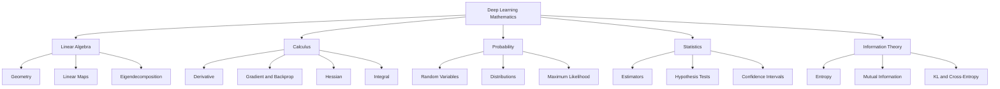

> 对应原文：d2l-en.md 第 22 章 **Appendix: Mathematics for Deep Learning**。本章是数学附录，依次覆盖几何与线性代数、特征分解、单变量微积分、多变量微积分、积分、随机变量、最大似然、常见分布、朴素贝叶斯、统计学和信息论。

## 1. 为什么需要这份数学附录

现代框架让我们不必每次手写矩阵求导或反向传播，但当以下问题出现时，只会调用 API 已经不够：

- 为什么某个架构会梯度消失或爆炸？
- 为什么交叉熵对应最大似然？
- 为什么梯度是欧氏空间中的最速上升方向？
- 为什么协方差矩阵的特征向量能提取主方向？
- 置信区间中的 95% 到底是什么意思？
- 熵、交叉熵、KL 散度与互信息有什么关系？
- 为什么概率密度可以大于 1，但概率不能？

本章的目标不是穷尽数学，而是建立理解深度学习所需的共同语言：



全章的问题分析链是：

1. 用向量和矩阵表达数据与变换；
2. 用特征分解识别线性变换中的不变方向和长期行为；
3. 用导数描述局部变化，用梯度组织高维优化；
4. 用链式法则把复杂计算图拆成局部导数，形成反向传播；
5. 用积分从局部密度恢复总量；
6. 用随机变量和分布描述不确定性；
7. 用最大似然从数据估计模型参数；
8. 用统计学区分样本波动与可推广结论；
9. 用信息论统一不确定性、分布差异和分类损失。

## 2. 几何与线性代数运算

### 2.1 向量的两种几何解释

向量：

$$
\mathbf v=
\begin{bmatrix}
v_1\\
\vdots\\
v_d
\end{bmatrix}
\in\mathbb R^d
$$

可被解释为：

1. **点**：从固定原点出发的位置；
2. **方向/位移**：可平移的箭头。

点视角适合描述样本、参数和 embedding；方向视角适合描述梯度、更新和两个样本之间的差异。

若 $\mathbf u,\mathbf v$ 是点，则：

$$
\mathbf u-\mathbf v
$$

是从 $\mathbf v$ 指向 $\mathbf u$ 的位移。若把向量首尾相接，几何上自然得到向量加法。

### 2.2 线性组合与张成空间

向量 $\mathbf v_1,\ldots,\mathbf v_k$ 的线性组合：

$$
\sum_{i=1}^kc_i\mathbf v_i.
$$

所有线性组合构成张成空间：

$$
\operatorname{span}\{\mathbf v_1,\ldots,\mathbf v_k\}
=\left\{
\sum_{i=1}^kc_i\mathbf v_i:c_i\in\mathbb R
\right\}.
$$

它回答：“这些方向能生成多大的空间？”

- 一个非零二维向量张成一条过原点直线；
- 两个不共线二维向量张成整个平面；
- embedding 的列空间限制了线性层可产生的输出方向。

### 2.3 范数

欧氏范数：

$$
\|\mathbf v\|_2
=\sqrt{\sum_iv_i^2}.
$$

一般范数满足：

1. 非负性，且 $\|v\|=0\iff v=0$；
2. 绝对齐次性 $\|\alpha v\|=|\alpha|\|v\|$；
3. 三角不等式 $\|u+v\|\le\|u\|+\|v\|$。

深度学习中的用途：

- 参数正则化；
- 梯度裁剪；
- 样本距离；
- 鲁棒扰动集合；
- 优化中的“最速方向”定义。

不同范数产生不同几何。负梯度是最速下降方向，只在欧氏内积和 $\ell_2$ 单位球下成立。

### 2.4 点积

$$
\mathbf u^\top\mathbf v
=\sum_{i=1}^du_iv_i.
$$

点积可表示：

- 加权和；
- 相似性；
- 投影；
- 夹角；
- 线性神经元的 pre-activation。

### 2.5 从余弦定理推导夹角公式

代数展开：

$$
\|\mathbf u-\mathbf v\|^2
=\|\mathbf u\|^2+\|\mathbf v\|^2
-2\mathbf u^\top\mathbf v.
$$

几何余弦定理：

$$
\|\mathbf u-\mathbf v\|^2
=\|\mathbf u\|^2+\|\mathbf v\|^2
-2\|\mathbf u\|\|\mathbf v\|\cos\theta.
$$

比较交叉项：

$$
\boxed{
\mathbf u^\top\mathbf v
=\|\mathbf u\|\|\mathbf v\|\cos\theta
}.
$$

所以：

$$
\theta
=\arccos\frac{\mathbf u^\top\mathbf v}
{\|\mathbf u\|\|\mathbf v\|}.
$$

前提：$\mathbf u,\mathbf v$ 都非零。数值实现还应将余弦裁剪到 $[-1,1]$，避免浮点舍入让 `acos` 得到 NaN。

### 2.6 正交、投影与余弦相似度

正交：

$$
\mathbf u^\top\mathbf v=0.
$$

$\mathbf u$ 在 $\mathbf v$ 方向上的标量投影：

$$
\operatorname{comp}_{\mathbf v}(\mathbf u)
=\frac{\mathbf u^\top\mathbf v}{\|\mathbf v\|}.
$$

向量投影：

$$
\operatorname{proj}_{\mathbf v}(\mathbf u)
=\frac{\mathbf u^\top\mathbf v}{\|\mathbf v\|^2}\mathbf v.
$$

余弦相似度：

$$
\operatorname{cos\_sim}(u,v)
=\frac{u^Tv}{\|u\|\|v\|}.
$$

它忽略正比例缩放，适合文本和 embedding 方向比较。但方向相似不等于原始数值相近，且零向量无定义。

高维随机向量“近似正交”需要独立、近似各向同性和有限方差等条件，不能只凭分量均值为零推出。

### 2.7 超平面

$$
H=\{v:w^Tv=b\}.
$$

$w$ 是法向量。两侧半空间：

$$
w^Tv>b,
\qquad
w^Tv<b.
$$

点 $x$ 到超平面的有符号距离：

$$
\frac{w^Tx-b}{\|w\|}.
$$

绝对距离：

$$
\frac{|w^Tx-b|}{\|w\|}.
$$

线性分类器的决策边界就是超平面；深层网络可理解为先学习非线性表示，再在表示空间中用超平面分隔。

原书 Fashion-MNIST 例用两类均值差作为法向量。这只利用类质心，忽略类内协方差，属于直观基线，不等同于完整的 Fisher 判别或逻辑回归。

### 2.8 矩阵是线性变换

$$
A:\mathbb R^n\to\mathbb R^m,
\qquad
x\mapsto Ax.
$$

若：

$$
A=[a_1,\ldots,a_n],
$$

则：

$$
Ax=\sum_{i=1}^nx_ia_i.
$$

矩阵的列是标准基向量经过变换后的像，因此知道所有列就知道整个线性变换。

线性要求：

$$
A(\alpha x+\beta y)
=\alpha Ax+\beta Ay.
$$

平移不是线性变换；仿射变换写作 $Ax+b$。

### 2.9 线性相关与独立

若存在不全为零的系数：

$$
\sum_{i=1}^kc_iv_i=0,
$$

则向量组线性相关。否则线性无关。

线性相关意味着至少一个方向可由其他方向表示，存在冗余；在线性层中意味着某些列没有扩展输出空间。

### 2.10 秩

$$
\operatorname{rank}(A)
=\dim\operatorname{col}(A).
$$

也等于最大线性无关列数和最大线性无关行数。

若 $A\in\mathbb R^{m\times n}$：

$$
\operatorname{rank}(A)\le\min(m,n).
$$

低秩表示意味着数据主要位于低维子空间，是矩阵分解、PCA、低秩适配和压缩的基础。

### 2.11 可逆性

方阵 $A\in\mathbb R^{n\times n}$ 的以下条件等价：

- $A$ 满秩；
- 列线性无关；
- $Ax=0$ 只有零解；
- $\det A\ne0$；
- 存在双侧逆 $A^{-1}$。

矩形高矩阵满列秩时只保证单射和左逆，不保证双侧逆；“可撤销”必须限定在其像空间或方阵情形。

### 2.12 不要显式求逆

需要计算：

$$
x=A^{-1}b
$$

时，应求解：

$$
Ax=b.
$$

分解/求解比构造逆矩阵更稳定、更快，稀疏矩阵的逆还常变成稠密矩阵。

近奇异矩阵会放大误差。条件数：

$$
\kappa_2(A)
=\frac{\sigma_{max}(A)}{\sigma_{min}(A)}.
$$

$\kappa$ 大意味着输入或舍入的小误差可能引起解的大变化。

### 2.13 行列式

二维：

$$
\det
\begin{bmatrix}
a&b\\c&d
\end{bmatrix}
=ad-bc.
$$

它是**有向**面积缩放因子；实际几何面积缩放为：

$$
|\det A|.
$$

负号表示方向翻转，零表示空间被压扁到低维。

重要性质：

$$
\det(AB)=\det A\det B,
$$

$$
\det(A^{-1})=\frac1{\det A},
$$

$$
\det(A^T)=\det A.
$$

概率密度变量代换中的 Jacobian 行列式正是局部体积缩放。

### 2.14 张量缩并与 Einstein 记号

矩阵乘法：

$$
C_{ik}=\sum_jA_{ij}B_{jk}.
$$

Einstein 约定省略重复指标求和：

$$
C_{ik}=A_{ij}B_{jk}.
$$

迹：

$$
\operatorname{tr}(A)=A_{ii}.
$$

PyTorch/NumPy：

```python
result = torch.einsum("ij,jk->ik", A, B)
```

`einsum` 能统一转置、批量乘法、内积和高阶张量缩并，但表达式必须仔细检查自由指标和求和指标。

### 2.15 几何与线性代数练习

1. $u=(1,0,-1,2),v=(3,1,0,1)$：点积 5，范数 $\sqrt6,\sqrt{11}$，夹角
   $$
   \arccos\frac5{\sqrt{66}}\approx52.01^\circ.
   $$
2. 两个相反剪切矩阵相乘可直接验证为单位阵。
3. $\det\begin{bmatrix}2&3\\1&2\end{bmatrix}=1$，面积不变。
4. 线性独立可通过解 $Vc=0$ 或行列式/秩判断；含零向量的集合必相关。
5. 外积 $uv^T$ 秩至多 1，维数大于 1 时行列式为 0。
6. $Ae_1,Ae_2$ 正交等价于 $e_1^TA^TAe_2=0$；二维即两列点积为 0。
7. 四次矩阵乘积的迹可写成 Einstein 求和：
   $$
   \operatorname{tr}(A^4)=a_{ij}a_{jk}a_{kl}a_{li}.
   $$

## 3. 特征分解

### 3.1 特征值和特征向量

对方阵 $A$，若存在**非零**向量 $v$：

$$
Av=\lambda v,
$$

则 $v$ 是特征向量，$\lambda$ 是对应特征值。

几何意义：$A$ 作用在该方向上只做缩放，负 $\lambda$ 还翻转方向。

原文定义必须补上 $v\ne0$，否则零向量对任意 $\lambda$ 都满足等式。

### 3.2 特征方程

$$
(A-\lambda I)v=0.
$$

存在非零解等价于：

$$
\det(A-\lambda I)=0.
$$

这给出特征多项式。数值上不应通过显式展开高阶多项式求大型矩阵特征值，应使用 QR、Lanczos 等稳定算法。

### 3.3 对角化

若 $A$ 有 $n$ 个线性无关特征向量：

$$
W=[v_1,\ldots,v_n],
$$

$$
\Lambda=\operatorname{diag}(\lambda_1,\ldots,\lambda_n),
$$

则：

$$
AW=W\Lambda,
$$

$$
\boxed{
A=W\Lambda W^{-1}
}.
$$

并非所有矩阵都可对角化。Jordan 块：

$$
\begin{bmatrix}2&1\\0&2\end{bmatrix}
$$

只有一个独立特征方向，无法得到可逆 $W$。

### 3.4 对角化为何有用

$$
A^k=W\Lambda^kW^{-1}.
$$

$$
e^A=We^\Lambda W^{-1}.
$$

若函数可在谱上定义：

$$
f(A)=Wf(\Lambda)W^{-1}.
$$

复杂矩阵运算变为对角元素上的标量运算。

### 3.5 谱、谱半径与行列式

谱：

$$
\sigma(A)=\{\lambda_1,\ldots,\lambda_n\}.
$$

谱半径：

$$
\rho(A)=\max_i|\lambda_i|.
$$

含代数重数：

$$
\det A=\prod_i\lambda_i,
$$

$$
\operatorname{tr}A=\sum_i\lambda_i.
$$

“秩等于非零特征值数”只在可对角化等附加条件下成立。反例：

$$
N=\begin{bmatrix}0&1\\0&0\end{bmatrix}
$$

秩为 1，但两个特征值都为 0。

### 3.6 实对称矩阵的谱定理

若：

$$
A=A^T,
$$

则：

$$
\boxed{
A=Q\Lambda Q^T
},
$$

其中 $Q^TQ=I$，特征值全为实数，不同特征值的特征向量正交。

对称矩阵特别重要：

- 协方差矩阵；
- Hessian；
- Gram 矩阵；
- 图 Laplacian。

### 3.7 正定性与特征值

对实对称矩阵：

$$
A\succeq0
\iff
\lambda_i\ge0\ \forall i.
$$

因为令 $x=Qz$：

$$
x^TAx
=z^T\Lambda z
=\sum_i\lambda_i z_i^2.
$$

这将“所有方向二次型非负”转为“所有特征值非负”。

### 3.8 Gershgorin 圆盘定理

每个特征值位于至少一个圆盘：

$$
|\lambda-a_{ii}|
\le\sum_{j\ne i}|a_{ij}|.
$$

它提供包含区域，不是精确特征值算法。若圆盘彼此不交，每个连通分量包含对应数量的特征值。

用途：

- 快速估计谱范围；
- 判断正定性的充分条件；
- 理解对角占优矩阵；
- 为迭代算法选步长。

### 3.9 迭代线性映射

对可对角化 $A$：

$$
x_0=\sum_ic_iv_i,
$$

$$
A^kx_0=\sum_ic_i\lambda_i^kv_i.
$$

长期行为由模最大的特征值控制。

若存在唯一主模：

$$
|\lambda_1|>|\lambda_2|,
$$

且 $c_1\ne0$，则归一化方向以约：

$$
\left|\frac{\lambda_2}{\lambda_1}\right|^k
$$

的速度趋向 $v_1$ 的方向。

边界：

- 主特征值为负时方向符号交替；
- 最大模并列时不一定收敛到单向量；
- 复共轭主特征值产生旋转；
- 非正规矩阵可能先瞬态放大；
- 缺陷矩阵含多项式增长因子。

### 3.10 幂迭代

```text
choose nonzero x
repeat:
    y = A x
    x = y / ||y||
    lambda = x^T A x
```

Rayleigh quotient：

$$
\widehat\lambda
=\frac{x^TAx}{x^Tx}.
$$

仅除以谱半径只能控制渐近增长率，不能保证一般非正规矩阵每一步都不放大。

### 3.11 与 PCA 的关系（补充）

原文没有单独介绍 PCA，但特征分解直接导出它。中心化数据：

$$
X\in\mathbb R^{n\times d}.
$$

样本协方差：

$$
C=\frac1{n-1}X^TX.
$$

谱分解：

$$
C=Q\Lambda Q^T.
$$

- $q_i$：第 $i$ 个主方向；
- $\lambda_i$：该方向的样本方差；
- $XQ_k$：低维坐标；
- $XQ_kQ_k^T$：秩 $k$ 重构。

最大化投影方差：

$$
\max_{\|v\|=1}v^TCv
$$

由 Rayleigh quotient 得解为最大特征值对应特征向量。

### 3.12 特征分解练习

1. $\begin{bmatrix}2&1\\1&2\end{bmatrix}$ 的特征值为 3、1，单位特征向量为 $(1,1)^T/\sqrt2$、$(1,-1)^T/\sqrt2$。
2. Jordan 矩阵 $\begin{bmatrix}2&1\\0&2\end{bmatrix}$ 的特征值 2 代数重数 2，但特征空间只有一维，故不可对角化。
3. Gershgorin 圆盘左端点若最小为 0.6，则任何特征值都不可能小于 0.5。

## 4. 单变量微积分

### 4.1 微积分为什么从局部变化开始

训练模型需要知道：参数稍微改变，损失会怎样改变。差商：

$$
\frac{f(x+h)-f(x)}h
$$

描述单位输入变化对应的平均输出变化。

### 4.2 导数定义

$$
\boxed{
f'(x)
=\lim_{h\to0}
\frac{f(x+h)-f(x)}h
}.
$$

导数存在表示函数在该点可被线性近似。导数不是“两个无穷小的比”，而是差商的极限。

### 4.3 局部线性化

$$
f(x+h)
=f(x)+f'(x)h+o(h).
$$

其中：

$$
\frac{o(h)}h\to0.
$$

切线：

$$
y=f(x_0)+f'(x_0)(x-x_0).
$$

深度学习中的反向传播就是在每个算子处传播这种一阶局部灵敏度。

### 4.4 常见导数

$$
\frac d{dx}c=0,
$$

$$
\frac d{dx}x^n=nx^{n-1},
$$

$$
\frac d{dx}e^x=e^x,
$$

$$
\frac d{dx}\log x=\frac1x\quad(x>0),
$$

$$
\frac d{dx}\sin x=\cos x,
$$

$$
\frac d{dx}\cos x=-\sin x.
$$

### 4.5 和、积、商与链式法则

$$
(f+g)'=f'+g',
$$

$$
(fg)'=f'g+fg',
$$

$$
\left(\frac fg\right)'
=\frac{f'g-fg'}{g^2},
$$

$$
\boxed{
(f\circ g)'(x)
=f'(g(x))g'(x)
}.
$$

积法则可由局部展开得到：

$$
[f+hf'][g+hg']
=fg+h(f'g+fg')+h^2f'g'.
$$

除以 $h$ 后，$h^2$ 项消失。

例：

$$
\frac d{dx}
\log\left(1+(x-1)^{10}\right)
=\frac{10(x-1)^9}
{1+(x-1)^{10}}.
$$

### 4.6 高阶导数

$$
f''(x)
=\frac d{dx}\left(f'(x)\right).
$$

$f''$ 描述斜率如何变化：

- $f''>0$：局部凸、斜率递增；
- $f''<0$：局部凹、斜率递减；
- $f''=0$：不能单独判断极值。

原文把二阶导写成导数相乘的形式，应改为“再求一次导数”。

### 4.7 Taylor 展开

二阶：

$$
f(x_0+h)
=f(x_0)+f'(x_0)h
+\frac12f''(x_0)h^2
+o(h^2).
$$

$n$ 阶 Taylor 多项式：

$$
P_n(x)
=\sum_{k=0}^n
\frac{f^{(k)}(x_0)}{k!}
(x-x_0)^k.
$$

例如：

$$
e^x=\sum_{k=0}^{\infty}\frac{x^k}{k!}.
$$

边界：

- Taylor 多项式唯一匹配给定阶导数，但“最佳”需指定误差标准；
- $C^\infty$ 不等于解析；
- 无限 Taylor 级数只在收敛半径内可能等于原函数。

### 4.8 导数与优化

定义域内部的可微局部极值满足：

$$
f'(x)=0.
$$

但驻点可能是：

- 局部最小；
- 局部最大；
- 拐点；
- 平坦鞍点。

边界点和不可微点也可能是最优点。全局优化还需比较函数值和端点/无穷远行为。

### 4.9 数值微分

前向差分：

$$
f'(x)\approx\frac{f(x+h)-f(x)}h,
$$

截断误差 $O(h)$。

中心差分：

$$
f'(x)\approx
\frac{f(x+h)-f(x-h)}{2h},
$$

截断误差 $O(h^2)$。

$h$ 不能无限小：过小时浮点消减误差上升。数值差分适合 gradient check，不适合大规模训练。

### 4.10 单变量练习

1. $f(x)=x^3-4x$：$f'(x)=3x^2-4$。
2. $\log(1/x)=-\log x$，导数 $-1/x$，定义域 $x>0$。
3. “$f'(x)=0$ 必为极值”错误，反例 $f(x)=x^3$ 在 0。
4. $f(x)=x\log x$：$f'=1+\log x$，驻点 $x=e^{-1}$，$f''=1/x>0$，最小值 $-e^{-1}$。

## 5. 多变量微积分

### 5.1 偏导数

对：

$$
f(x_1,\ldots,x_d),
$$

偏导：

$$
\frac{\partial f}{\partial x_i}
$$

固定其他坐标，只改变 $x_i$。

仅存在所有偏导不保证函数可微；要有统一的线性近似。

### 5.2 梯度

$$
\boxed{
\nabla f(x)
=\begin{bmatrix}
\partial f/\partial x_1\\
\vdots\\
\partial f/\partial x_d
\end{bmatrix}
}.
$$

可微时：

$$
f(x+\delta)
=f(x)+\nabla f(x)^T\delta
+o(\|\delta\|).
$$

梯度把所有坐标的一阶灵敏度组织成与输入同形的向量。

### 5.3 方向导数

单位方向 $v$：

$$
D_vf(x)
=\lim_{h\to0}
\frac{f(x+hv)-f(x)}h
=v^T\nabla f(x).
$$

### 5.4 为什么梯度是欧氏最速上升方向

在 $\|v\|_2=1$ 下，由 Cauchy–Schwarz：

$$
v^T\nabla f
\le\|v\|\|\nabla f\|
=\|\nabla f\|.
$$

等号在：

$$
v=\frac{\nabla f}{\|\nabla f\|}
$$

取得。最速下降方向是其负方向。

若约束用其他范数，最速方向由对偶范数决定；若参数空间有非欧氏度量，会得到自然梯度等不同方向。

### 5.5 梯度下降

$$
\boxed{
x_{t+1}=x_t-\eta_t\nabla f(x_t)
}.
$$

一阶 Taylor：

$$
f(x-\eta\nabla f)
\approx f(x)-\eta\|\nabla f\|^2.
$$

只有步长足够小且局部近似有效时才保证下降。非凸问题中还可能遇到鞍点、平坦区和局部极小。

### 5.6 多元链式法则

若：

$$
y=g(x),
\qquad
z=f(y),
$$

Jacobian 形式：

$$
J_{f\circ g}(x)
=J_f(g(x))J_g(x).
$$

标量输出对向量输入：

$$
\nabla_x z
=J_g(x)^T\nabla_y z.
$$

计算图中，一条路径贡献局部导数乘积，多条路径贡献求和。

### 5.7 反向传播

反向传播是 reverse-mode automatic differentiation：

1. 前向计算并保存必要中间值；
2. 从标量输出的伴随量 1 开始；
3. 反向执行 vector–Jacobian product；
4. 一个节点收到多条路径梯度时相加。

若标量损失 $L$，中间变量 $y=g(x)$：

$$
\bar y=\frac{\partial L}{\partial y},
$$

$$
\bar x=J_g(x)^T\bar y.
$$

反向模式适合“很多参数、一个标量损失”；前向模式适合“输入少、输出多”。1986 年工作推广了神经网络反向传播，但 reverse-mode AD 的思想更早已存在。

PyTorch 无参数 `.backward()` 通常要求输出是标量；向量输出需提供上游向量，本质上计算 VJP。

### 5.8 Hessian

$$
H_{ij}(x)
=\frac{\partial^2f}
{\partial x_i\partial x_j}.
$$

二阶局部模型：

$$
\boxed{
f(x+\delta)
=f(x)+\nabla f(x)^T\delta
+\frac12\delta^TH(x)\delta
+o(\|\delta\|^2)
}.
$$

若混合二阶偏导在邻域连续，Hessian 对称。

驻点处：

- $H\succ0$：严格局部极小；
- $H\prec0$：严格局部极大；
- $H$ 不定：鞍点；
- 半正定/半负定：二阶检验不充分。

原书部分后端的 Hessian 二次项多乘了 2，正确系数是 $1/2$。

### 5.9 Newton 方法

最小化二次近似，对 $\delta$ 求导：

$$
\nabla f+H\delta=0.
$$

$$
\delta=-H^{-1}\nabla f.
$$

实现应解线性系统，不显式求逆。深网 Hessian 巨大且可能不定，因此常用拟 Newton、Hessian-vector products 或一阶方法。

### 5.10 矩阵微积分

线性形式：

$$
f(x)=\beta^Tx
\quad\Longrightarrow\quad
\nabla_xf=\beta.
$$

二次型：

$$
f(x)=x^TAx.
$$

微分：

$$
df=(dx)^TAx+x^TAdx.
$$

整理：

$$
df=[(A+A^T)x]^Tdx.
$$

所以：

$$
\boxed{
\nabla_x(x^TAx)
=(A+A^T)x
}.
$$

若 $A$ 对称：

$$
\nabla=2Ax.
$$

矩阵分解平方残差：

$$
L(V)=\|X-UV\|_F^2.
$$

$$
\boxed{
\nabla_VL
=-2U^T(X-UV)
}.
$$

这里必须是 Frobenius 范数，不是矩阵谱范数。

矩阵导数存在 numerator/denominator layout 约定差异，跨资料时应先确认形状。

### 5.11 多变量练习

1. $\beta^Tx$ 与 $x^T\beta$ 都是同一标量，对 $x$ 的梯度均为 $\beta$。
2. $v\ne0$ 时 $\nabla\|v\|_2=v/\|v\|_2$；零点不可微，次梯度是单位闭球。
3. log-sum-exp：
   $$
   \nabla_x\log\sum_ie^{x_i}=\operatorname{softmax}(x),
   $$
   分量和为 1。
4. 某函数唯一驻点为原点但沿不同方向变号，则为鞍点而非极值。
5. 若 $f=g+h$ 且 $\nabla f=0$，则 $\nabla g=-\nabla h$，两梯度等长反向。

## 6. 积分

### 6.1 从面积到积分

非负函数 $f$ 在 $[a,b]$ 下的面积：

$$
\int_a^bf(x)\,dx.
$$

将区间分为 $n$ 份，$\Delta x=(b-a)/n$。左 Riemann 和：

$$
S_n
=\sum_{i=0}^{n-1}
f(a+i\Delta x)\Delta x.
$$

若极限存在：

$$
\boxed{
\int_a^bf(x)\,dx
=\lim_{n\to\infty}S_n
}.
$$

一般函数的定积分是有向面积；几何总面积为 $\int|f|$。

### 6.2 微积分基本定理

定义累积函数：

$$
F(x)=\int_{x_0}^xf(t)\,dt.
$$

则：

$$
\frac{F(x+h)-F(x)}h
=\frac1h\int_x^{x+h}f(t)\,dt
\to f(x).
$$

所以：

$$
F'(x)=f(x).
$$

若 $A'=f$：

$$
\boxed{
\int_a^bf(x)\,dx
=A(b)-A(a)
}.
$$

它把局部变化率和全局累积量连接起来。

### 6.3 变量代换

令 $y=u(t)$：

$$
dy=u'(t)dt.
$$

$$
\boxed{
\int_{u(a)}^{u(b)}f(y)\,dy
=\int_a^bf(u(t))u'(t)\,dt
}.
$$

严格理解来自复合函数 $F(u(t))$ 的链式法则，而非机械移动符号。

例：

$$
\int_0^1te^{-t^2}\,dt.
$$

令 $u=t^2$：

$$
=\frac12\int_0^1e^{-u}\,du
=\frac{1-e^{-1}}2.
$$

### 6.4 上下限和符号

$$
\int_b^af=-\int_a^bf.
$$

若 $f<0$，定积分贡献负值。概率密度非负，因此概率积分不会出现有向面积抵消。

### 6.5 多重积分

$$
\iint_Rf(x,y)\,dx\,dy.
$$

矩形域的 Riemann 和应包含起点：

$$
\sum_i\sum_j
f(a+i\Delta x,c+j\Delta y)
\Delta x\Delta y.
$$

原文一般式漏写 $a,c$。

### 6.6 Fubini 与 Tonelli

在适当条件下：

$$
\iint f(x,y)\,dx\,dy
=\int\left(\int f(x,y)\,dy\right)dx
=\int\left(\int f(x,y)\,dx\right)dy.
$$

- $f$ 绝对可积时用 Fubini；
- $f\ge0$ 时 Tonelli 允许交换，即使积分可能无穷。

条件不满足时，两种积分次序可能给不同值。

### 6.7 多元变量代换与 Jacobian

若 $x=\phi(u)$ 是合适的可微双射（忽略测度零异常）：

$$
\boxed{
\int_{\phi(U)}f(x)\,dx
=\int_Uf(\phi(u))
|\det D\phi(u)|\,du
}.
$$

Jacobian 行列式给局部体积缩放。

极坐标：

$$
x=r\cos\theta,
\qquad y=r\sin\theta,
$$

$$
\left|\det
\frac{\partial(x,y)}{\partial(r,\theta)}
\right|=r.
$$

所以：

$$
dx\,dy=r\,dr\,d\theta.
$$

仅假设映射单射不足以保证代换定理，还需可微、非退化等条件。极坐标在原点和角度边界并非严格一一对应，但异常集合测度为零。

### 6.8 高斯积分

令：

$$
I=\int_{-\infty}^{\infty}e^{-x^2}\,dx.
$$

平方：

$$
I^2
=\iint_{\mathbb R^2}
e^{-(x^2+y^2)}\,dx\,dy.
$$

极坐标：

$$
I^2
=\int_0^{2\pi}\int_0^\infty
e^{-r^2}r\,dr\,d\theta.
$$

内层令 $u=r^2$：

$$
\int_0^\infty e^{-r^2}r\,dr=\frac12.
$$

因此：

$$
I^2=\pi,
\qquad
\boxed{I=\sqrt\pi}.
$$

这导出正态密度归一化常数。

### 6.9 积分练习

1. $\int_0^1(1+x)^{-1}dx=\log2$。
2. $\int_0^{\sqrt\pi}x\sin(x^2)dx=1$。
3. 可分离二重积分可写成两个一维积分乘积，题中结果为 $1/4$。
4. 非绝对可积反例两种迭代次序给 $1/5$ 与 $-1/20$，说明不能无条件交换。

## 7. 随机变量

### 7.1 随机变量是什么

随机变量是将随机结果映射为数值的函数：

$$
X:\Omega\to\mathbb R.
$$

随机性来自样本点 $\omega\in\Omega$；$X$ 负责抽取我们关心的数值属性。

### 7.2 离散 PMF

$$
p_X(x)=P(X=x).
$$

满足：

$$
p_X(x)\ge0,
\qquad
\sum_xp_X(x)=1.
$$

### 7.3 连续 PDF

连续变量通常：

$$
P(X=x)=0.
$$

概率由区间积分给出：

$$
P(a<X\le b)
=\int_a^bp_X(x)\,dx.
$$

PDF 满足：

$$
p_X(x)\ge0,
\qquad
\int_{-\infty}^{\infty}p_X(x)dx=1.
$$

密度值可以大于 1，因为密度不是单点概率；只有积分才是概率。

### 7.4 CDF

$$
F_X(x)=P(X\le x).
$$

性质：

- 单调不减；
- 右连续；
- $F(-\infty)=0,F(+\infty)=1$；
- $P(a<X\le b)=F(b)-F(a)$。

绝对连续时：

$$
F'_X(x)=p_X(x)
$$

几乎处处成立。CDF 能统一离散、连续和混合分布。

### 7.5 期望

离散：

$$
\mathbb E[X]=\sum_xxp_X(x).
$$

连续：

$$
\mathbb E[X]=\int xp_X(x)dx.
$$

对函数：

$$
\mathbb E[g(X)]
=\sum_xg(x)p(x)
$$

或相应积分。

期望线性，不要求变量独立：

$$
E[aX+bY]=aE[X]+bE[Y].
$$

### 7.6 方差与标准差

$$
\operatorname{Var}(X)
=E[(X-\mu)^2].
$$

展开：

$$
\boxed{
\operatorname{Var}(X)
=E[X^2]-E[X]^2
}.
$$

标准差：

$$
\sigma_X=\sqrt{\operatorname{Var}(X)}.
$$

标准差与 $X$ 同单位；方差是单位平方。

### 7.7 Chebyshev 不等式

有限方差下：

$$
\boxed{
P(|X-\mu|\ge a\sigma)
\le\frac1{a^2}
}.
$$

它不要求正态分布，因而通用但通常较松。边界事件应使用 $\ge$；原文用开区间讨论“取等”不够严谨。

### 7.8 柯西分布警示

标准 Cauchy：

$$
p(x)=\frac1{\pi(1+x^2)}.
$$

原文漏掉 $1/\pi$。Cauchy 的普通均值和方差都不存在；对称积分的 Cauchy 主值为 0，不等于期望存在。

这说明 PDF 可归一化，不代表所有矩都有限。

### 7.9 联合、边缘和条件分布

联合密度：

$$
p_{XY}(x,y).
$$

边缘化：

$$
p_X(x)=\int p_{XY}(x,y)dy.
$$

条件密度：

$$
p_{X|Y}(x|y)
=\frac{p_{XY}(x,y)}{p_Y(y)},
\quad p_Y(y)>0.
$$

独立：

$$
p_{XY}(x,y)=p_X(x)p_Y(y).
$$

此时：

$$
p_{X|Y}(x|y)=p_X(x).
$$

### 7.10 协方差

$$
\operatorname{Cov}(X,Y)
=E[(X-E[X])(Y-E[Y])].
$$

$$
=E[XY]-E[X]E[Y].
$$

$$
\operatorname{Var}(X+Y)
=\operatorname{Var}X+
\operatorname{Var}Y+
2\operatorname{Cov}(X,Y).
$$

独立且二阶矩存在会推出协方差为 0；反过来一般不成立。

### 7.11 相关系数

$$
\rho(X,Y)
=\frac{\operatorname{Cov}(X,Y)}
{\sigma_X\sigma_Y}.
$$

要求两个标准差非零，且 $-1\le\rho\le1$。

仿射缩放：

$$
\rho(aX+b,Y)
=\operatorname{sign}(a)\rho(X,Y),
\quad a\ne0.
$$

原文漏掉 `sign(a)`。相关只衡量线性关系，零相关不等于独立；例如对称 $X$ 与 $X^2$ 可零相关但明显依赖。

### 7.12 大数定律（必要补充）

原文没有集中介绍 LLN。对 iid 且 $E|X|<\infty$：

$$
\bar X_n
=\frac1n\sum_{i=1}^nX_i
\to\mu.
$$

有限方差时：

$$
\operatorname{Var}(\bar X_n)=\frac{\sigma^2}{n}.
$$

Chebyshev 给弱大数定律：

$$
P(|\bar X_n-\mu|\ge\epsilon)
\le\frac{\sigma^2}{n\epsilon^2}\to0.
$$

LLN 解释为何经验均值能估计期望。

### 7.13 中心极限定理

iid、有限均值和有限非零方差下：

$$
\frac{\sqrt n(\bar X_n-\mu)}\sigma
\Rightarrow\mathcal N(0,1).
$$

LLN 讲“收敛到哪里”，CLT 讲“以什么波动尺度和形状收敛”。原文要求四阶矩有限是更强的充分条件，不是经典 iid CLT 的必要条件。

### 7.14 随机变量练习

1. 若密度尾部为 $x^{-2}$，$P(X>2)=\int_2^\infty x^{-2}dx=1/2$（需结合完整定义确认归一化）。
2. Laplace$(0,1)$ 均值 0、方差 2、标准差 $\sqrt2$。
3. 若总体声称 25% 超过均值 4 个标准差，Chebyshev 上界仅 $1/16$，矛盾；有限样本比例则还需样本量和抽样分析。
4. 联合密度 $4xy=(2x)(2y)$ 可因式分解，故独立、协方差 0。

## 8. 最大似然

### 8.1 参数、数据与似然

模型：

$$
p(x|\theta).
$$

观察数据 $D=\{x_i\}_{i=1}^n$ 后，将数据固定、把表达式看作 $\theta$ 的函数：

$$
L(\theta;D)=p(D|\theta).
$$

似然不是“参数的概率分布”；其对 $\theta$ 的积分不必为 1。

### 8.2 MLE

独立同分布：

$$
L(\theta)
=\prod_{i=1}^np(x_i|\theta).
$$

$$
\boxed{
\hat\theta_{MLE}
\in\arg\max_\theta L(\theta)
}.
$$

### 8.3 MLE 与 MAP

Bayes：

$$
p(\theta|D)
\propto p(D|\theta)p(\theta).
$$

MAP：

$$
\hat\theta_{MAP}
=\arg\max_\theta
[\log p(D|\theta)+\log p(\theta)].
$$

只有先验在当前参数化和可行域中为常数时，MAP 才与 MLE 相同。“均匀先验”还依赖参数化，不是坐标不变概念。

正态先验通常对应 $\ell_2$ 正则，Laplace 先验对应 $\ell_1$ 正则。

### 8.4 硬币例

观察 $n_H$ 次正面、$n_T$ 次反面：

$$
L(\theta)
=\theta^{n_H}(1-\theta)^{n_T}.
$$

Log-likelihood：

$$
\ell(\theta)
=n_H\log\theta+n_T\log(1-\theta).
$$

一阶条件：

$$
\frac{n_H}{\theta}
-\frac{n_T}{1-\theta}=0.
$$

所以：

$$
\boxed{
\hat\theta=\frac{n_H}{n_H+n_T}
}.
$$

9 正 4 反得到 $9/13$。

### 8.5 为什么取对数

$$
\log L
=\sum_i\log p(x_i|\theta).
$$

优点：

- 防止很多小概率相乘下溢；
- 乘积变求和；
- 梯度分解为样本贡献；
- 最大值位置不变，因为 log 单调。

训练通常最小化负对数似然：

$$
\boxed{
\operatorname{NLL}
=-\sum_i\log p(x_i|\theta)
}.
$$

原文某处 NLL 梯度漏了整体负号。

### 8.6 约束参数化

直接优化 Bernoulli $\theta$ 可能越过 $(0,1)$。令：

$$
\theta=\sigma(\alpha),
$$

优化无约束 $\alpha\in\mathbb R$ 更稳健。

方差可用：

$$
\sigma=\operatorname{softplus}(\rho)+\epsilon.
$$

### 8.7 连续变量的最大似然

连续单点概率为 0，但密度可用于相对似然。把观测量化到宽度 $\epsilon$：

$$
P(x_i\le X<x_i+\epsilon)
\approx p(x_i|\theta)\epsilon.
$$

总 log-likelihood 多出：

$$
n\log\epsilon,
$$

它与 $\theta$ 无关，因此优化时可去掉。

密度依赖参考测度和变量坐标，但在固定数据表示下 MLE 有明确意义。

### 8.8 最大似然练习

1. 指数密度 $p(x|\alpha)=\alpha e^{-\alpha x}$，单样本 $x=3$：
   $$
   \ell=\log\alpha-3\alpha,
   \quad\hat\alpha=1/3.
   $$
2. 已知单位方差的高斯均值 MLE：对 NLL 求导得到 $\hat\mu=\bar x$。

## 9. 常见概率分布

### 9.1 Bernoulli 分布

$$
X\sim\operatorname{Bernoulli}(p),
$$

$$
P(X=x)=p^x(1-p)^{1-x},
\quad x\in\{0,1\}.
$$

$$
E[X]=p,
\qquad
\operatorname{Var}(X)=p(1-p).
$$

用于二分类标签、dropout mask、一次点击事件。

原书 Bernoulli CDF 代码在 $x=1$ 返回 $1-p$，正确应为 1。

### 9.2 离散均匀分布

在 $\{1,\ldots,n\}$：

$$
P(X=k)=\frac1n.
$$

$$
E[X]=\frac{n+1}2,
$$

$$
\operatorname{Var}(X)=\frac{n^2-1}{12}.
$$

NumPy/PyTorch 整数采样上界通常不包含，应使用 high=$n+1$ 才能得到 $1,\ldots,n$。原书代码误只采到 $n-1$。

### 9.3 连续均匀分布

$$
X\sim U(a,b),
$$

$$
p(x)=\frac1{b-a}\mathbf1[a\le x\le b].
$$

$$
E[X]=\frac{a+b}2,
$$

$$
\operatorname{Var}(X)=\frac{(b-a)^2}{12}.
$$

用于随机初始化范围和连续区间无偏采样，但“均匀”依赖所选坐标。

### 9.4 Binomial 分布

独立 $n$ 次 Bernoulli 之和：

$$
X\sim\operatorname{Binomial}(n,p).
$$

$$
P(X=k)
=\binom nkp^k(1-p)^{n-k}.
$$

$$
E[X]=np,
\qquad
\operatorname{Var}(X)=np(1-p).
$$

### 9.5 Poisson 分布

$$
X\sim\operatorname{Poisson}(\lambda),
$$

$$
P(X=k)=e^{-\lambda}\frac{\lambda^k}{k!}.
$$

$$
E[X]=\lambda,
\qquad
\operatorname{Var}(X)=\lambda.
$$

它可由大量独立稀有事件极限得到，用于单位时间计数。过度离散数据若方差显著大于均值，负二项分布可能更合适。

原书 Poisson CDF 代码误用上一节变量 `n`。

### 9.6 Gaussian 分布

$$
X\sim\mathcal N(\mu,\sigma^2),
$$

$$
p(x)
=\frac1{\sqrt{2\pi\sigma^2}}
\exp\left[
-\frac{(x-\mu)^2}{2\sigma^2}
\right].
$$

$$
E[X]=\mu,
\qquad
\operatorname{Var}(X)=\sigma^2.
$$

高斯来自加性噪声、CLT 和最大熵性质。平方损失等价于固定方差高斯 NLL：

$$
-\log p(y|\hat y)
=\frac{(y-\hat y)^2}{2\sigma^2}+C.
$$

### 9.7 指数族

$$
\boxed{
p(x|\eta)
=h(x)
\exp\left(
\eta^TT(x)-A(\eta)
\right)
}.
$$

- $\eta$：自然参数；
- $T(x)$：充分统计量；
- $A(\eta)$：对数配分函数；
- $h(x)$：基测度项。

重要恒等式：

$$
\nabla_\eta A(\eta)=E_\eta[T(X)],
$$

$$
\nabla_\eta^2A(\eta)
=\operatorname{Cov}_\eta[T(X)]\succeq0.
$$

所以 $A$ 凸。Bernoulli、Gaussian、Poisson 等都属于指数族，它与广义线性模型、共轭先验和最大熵紧密相关。

### 9.8 分布练习

1. 独立 $X,Y$ 方差均 4，则 $\operatorname{sd}(X-Y)=\sqrt8=2\sqrt2$。
2. 大 $\lambda$ Poisson 可分为多个独立小计数之和，标准化后由 CLT 近似高斯。
3. 两个 $\{1,\ldots,n\}$ 离散均匀变量之和呈三角 PMF：前半 $(s-1)/n^2$，后半 $(2n+1-s)/n^2$。

## 10. 朴素贝叶斯

### 10.1 分类的概率模型

Bayes：

$$
p(y|x)
=\frac{p(x|y)p(y)}{p(x)}.
$$

分类时 $p(x)$ 对所有类别相同：

$$
\hat y
=\arg\max_y p(y)p(x|y).
$$

### 10.2 为什么需要“朴素”假设

若 $x=(x_1,\ldots,x_d)$ 为二元像素，完整条件联合分布需要指数级参数。

朴素贝叶斯假设：给定类别后，特征条件独立：

$$
\boxed{
p(x|y)=\prod_{i=1}^dp(x_i|y)
}.
$$

注意是**条件独立**，不是特征无条件独立。原文开头和 Summary 的无条件独立表述不准确。

### 10.3 Bernoulli 朴素贝叶斯

二元特征：

$$
p(x_i|y)
=\theta_{iy}^{x_i}
(1-\theta_{iy})^{1-x_i}.
$$

分类 log-score：

$$
\log p(y)
+\sum_i
\left[
x_i\log\theta_{iy}
+(1-x_i)\log(1-\theta_{iy})
\right].
$$

使用 log 域避免 784 个概率相乘下溢。

### 10.4 Laplace 平滑

若某类别从未出现某像素值，MLE 会给概率 0，使整个联合似然为 0。

Beta$(1,1)$ 先验对应：

$$
\widehat\theta_{iy}
=\frac{n_{iy}+1}{n_y+2}.
$$

多项类别特征一般使用加 $\alpha$ 平滑。

### 10.5 OCR 例子

原书将 MNIST 像素阈值化为 784 个二元特征，估计每类先验和类条件像素激活概率。

模型远弱于 CNN，主要不是 Bayes 定理有问题，而是相邻像素在给定数字类别后仍高度依赖。

### 10.6 XOR 反例

XOR 的每个单特征在两类中都服从 Bernoulli$(1/2)$，所以朴素贝叶斯对四个输入给相同分数，最多靠平局达到 50%。

若改为：

$$
p(x_1|y)p(x_2|x_1,y),
$$

即可表达依赖并完美分类。

### 10.7 朴素贝叶斯练习

1. XOR 证明如上，关键是单变量边缘完全相同。
2. 不平滑时未见事件导致 0 概率和 $-\infty$ log-score；Laplace 平滑解决。
3. 加入条件边 $x_1\to x_2$ 后可表示 XOR，说明模型结构假设决定表达力。

## 11. 统计学

### 11.1 估计量与估计值

估计量是样本的函数：

$$
\widehat\theta=T(X_1,\ldots,X_n).
$$

在重复抽样下它是随机变量。具体数据得到的数值才是估计值。

### 11.2 MSE、偏差和方差

$$
\operatorname{Bias}(\widehat\theta)
=E[\widehat\theta]-\theta.
$$

$$
\operatorname{Var}(\widehat\theta)
=E[(\widehat\theta-E\widehat\theta)^2].
$$

$$
\operatorname{MSE}(\widehat\theta)
=E[(\widehat\theta-\theta)^2].
$$

加减 $E\widehat\theta$：

$$
\boxed{
\operatorname{MSE}
=\operatorname{Var}(\widehat\theta)
+\operatorname{Bias}(\widehat\theta)^2
}.
$$

参数 $\theta$ 在频率学设定中固定，不应再加入 $\operatorname{Var}(\theta)$。原文偏差—方差分解在此有根本错误。

有偏估计量可能通过显著降低方差获得更低 MSE，正则化就是典型例子。

### 11.3 标准差与标准误

- 数据标准差：个体观测的离散程度；
- 标准误：估计量抽样分布的标准差。

样本均值：

$$
\operatorname{SE}(\bar X)
=\frac\sigma{\sqrt n}
$$

或用 $s/\sqrt n$ 估计。二者不是同义词，原文将它们混淆。

### 11.4 假设检验的对象

定义：

- 原假设 $H_0$；
- 备择假设 $H_1$；
- 显著性水平 $\alpha$；
- 检验统计量 $T$；
- 拒绝域或 p 值。

I 类错误：

$$
P(\text{拒绝 }H_0|H_0\text{ 真})=\alpha.
$$

II 类错误：

$$
P(\text{不拒绝 }H_0|H_1\text{ 真})=\beta.
$$

功效：

$$
1-\beta.
$$

原文将 $1-\alpha$ 称为显著性/I 类错误，方向完全反了。

### 11.5 p 值

p 值是在 $H_0$ 成立时，观察到至少同样极端统计量的概率：

$$
p=P_{H_0}(T\text{ 至少与 }T_{obs}\text{ 一样极端}).
$$

它不是：

- $P(H_0|data)$；
- 结果由随机造成的概率；
- 效应大小；
- 可重复概率。

右尾、左尾、双尾的“极端”定义不同，不能用一个右尾公式代替所有检验。

### 11.6 检验流程

1. 在看结果前定义 $H_0,H_1$ 和方向；
2. 选择 $\alpha$；
3. 按目标效应和功效确定样本量；
4. 收集符合设计的数据；
5. 计算统计量和 p 值；
6. 若 $p\le\alpha$ 则拒绝 $H_0$，否则“不拒绝”而非“接受” $H_0$；
7. 同时报告效应量和区间。

多次检验需要 Bonferroni、FDR 等校正，否则假阳性累积。

### 11.7 单侧与双侧检验

- 双侧：关心任一方向差异；
- 单侧：只关心预先指定方向。

看到数据后再选择单侧方向会夸大显著性。

### 11.8 置信区间定义

随机区间程序 $C(X)$ 满足：

$$
P_\theta(\theta\in C(X))\ge1-\alpha.
$$

频率学解释：重复相同抽样流程，无穷多个区间中约 $1-\alpha$ 覆盖真参数。

对已经观察到的固定区间，不能说“真参数有 95% 概率在里面”；参数在频率学框架中不是随机变量。

### 11.9 高斯均值区间

已知总体标准差：

$$
\bar X
\pm z_{1-\alpha/2}
\frac\sigma{\sqrt n}.
$$

未知方差且总体正态：

$$
\boxed{
\bar X
\pm t_{n-1,1-\alpha/2}
\frac{s}{\sqrt n}
}.
$$

固定 1.96 是 95% 正态分位数或大样本近似；小样本未知方差应使用 t 分布。原书 TensorFlow 代码使用总体标准差，与其他后端样本方差不一致。

### 11.10 统计练习

1. 对 $U(0,\theta)$：最大值估计量偏差 $-\theta/(n+1)$，方差 $n\theta^2/[(n+1)^2(n+2)]$；$2\bar X$ 无偏、方差 $\theta^2/(3n)$。$n\ge3$ 时最大值估计量虽有偏但 MSE 更小。
2. 比较两算法应预先定义指标、配对/独立设计、效应阈值、样本量和双侧检验，并报告置信区间。
3. 单个很短且错误的区间不违背覆盖率定义；覆盖率是重复抽样程序属性。

## 12. 信息论

### 12.1 信息的基本要求

越不可能的事件发生，信息量越大；独立事件的信息应相加。满足这些要求的形式：

$$
\boxed{
I(x)=-\log_b p(x)
}.
$$

- $b=2$：bit；
- $b=e$：nat。

确定事件 $p=1$ 的自信息为 0；罕见事件信息量大。

### 12.2 熵

离散分布平均自信息：

$$
\boxed{
H(X)
=-\sum_xp(x)\log p(x)
}.
$$

约定：

$$
0\log0=0.
$$

解释：

- 平均不确定性；
- 最优无损编码的平均码长下界；
- 观察变量前缺少的信息量。

有限 $K$ 类：

$$
0\le H(X)\le\log K.
$$

均匀分布达到最大熵。

### 12.3 微分熵边界

连续：

$$
h(X)=-\int p(x)\log p(x)dx.
$$

微分熵：

- 可以为负；
- 随坐标缩放改变；
- 不等同于离散编码所需 bits；
- KL 和互信息比单独微分熵更具坐标稳健性。

### 12.4 联合熵

$$
H(X,Y)
=-\sum_{x,y}p(x,y)\log p(x,y).
$$

链式法则：

$$
H(X,Y)=H(X)+H(Y|X).
$$

### 12.5 条件熵

$$
H(Y|X)
=\sum_xp(x)H(Y|X=x).
$$

$$
=-\sum_{x,y}p(x,y)
\log p(y|x).
$$

它表示观察 $X$ 后 $Y$ 剩余的不确定性。

### 12.6 互信息

$$
\boxed{
I(X;Y)
=H(X)-H(X|Y)
}.
$$

对称形式：

$$
I(X;Y)
=H(X)+H(Y)-H(X,Y).
$$

KL 形式：

$$
\boxed{
I(X;Y)
=D_{KL}(p_{XY}\|p_Xp_Y)
}.
$$

因此：

$$
I(X;Y)\ge0,
$$

且为 0 当且仅当独立（在适当条件下）。

原文公式不应在 $E_xE_y$ 中再次乘联合概率；正确期望直接对 $P_{XY}$ 取。

### 12.7 Pointwise Mutual Information

$$
\operatorname{PMI}(x,y)
=\log\frac{p(x,y)}{p(x)p(y)}.
$$

- 正：共同出现比独立假设更频繁；
- 零：与独立预期一致；
- 负：共同出现更少。

互信息是 PMI 的联合期望。

### 12.8 Kullback–Leibler（KL）散度

$$
\boxed{
D_{KL}(P\|Q)
=\sum_xp(x)
\log\frac{p(x)}{q(x)}
}.
$$

连续版本用积分。

性质：

- $D_{KL}\ge0$；
- 相同分布时为 0；
- 不对称；
- 不满足三角不等式；
- 若 $p(x)>0,q(x)=0$，则为无穷。

非负性可由 Jensen 或 $\log t\le t-1$ 证明。

原文将排序后的高斯原始样本当概率向量、忽略 NaN 再取绝对值，完全不是合法 KL 计算。概率输入必须非负且归一化，连续分布应使用解析密度或一致的密度估计。

### 12.9 交叉熵

$$
\boxed{
H(P,Q)
=-\sum_xp(x)\log q(x)
}.
$$

分解：

$$
\boxed{
H(P,Q)=H(P)+D_{KL}(P\|Q)
}.
$$

固定真实分布 $P$ 时，最小化交叉熵等价于最小化 KL。

多分类 one-hot 标签 $y$：

$$
-\sum_cy_c\log q_c
=-\log q_{true}.
$$

这也是 categorical NLL，所以：

```text
maximum likelihood
  = minimum negative log-likelihood
  = minimum cross-entropy on empirical labels
  = minimum KL up to a constant
```

### 12.10 Log base 与单位

若用 $\log_2$，单位 bit；用自然对数，单位 nat。深度学习库的交叉熵通常使用自然对数，原文章节声明 bit 但代码使用自然对数，单位不一致。

### 12.11 数据处理不等式（必要补充）

原文未介绍。若：

$$
X\to Y\to Z
$$

构成 Markov 链，则：

$$
\boxed{
I(X;Z)\le I(X;Y)
}.
$$

后处理不能凭空增加关于原输入的信息。

由链式法则：

$$
I(X;Y,Z)
=I(X;Z)+I(X;Y|Z)
\ge I(X;Z).
$$

Markov 性又给：

$$
I(X;Y,Z)=I(X;Y).
$$

在表示学习中，它说明确定性层不能增加输入中关于标签的 Shannon 信息；网络的价值在于丢弃无关信息并形成可用表示，而非创造不存在的信息。

### 12.12 信息论练习

1. 52 张牌：已知牌信息 0 bit；只知四种花色需 2 bit；具体一张需 $\log_252\approx5.70$ bit；整副排列约 $\log_2(52!)\approx225.58$ bit。
2. KL 非负可用 Jensen 或 log-sum inequality。
3. 44 键均匀字符源为 $\log_244\approx5.459$ bit/字符；2000 词均匀、平均 4.5 字符约 2.437 bit/字符；词困惑度 15 约 0.868 bit/字符。
4. 互信息的多个恒等式通过展开联合期望和熵定义证明。
5. 一维高斯 KL（nat）：
   $$
   \frac12\left[
   \frac{\sigma_1^2}{\sigma_2^2}
   +\frac{(\mu_1-\mu_2)^2}{\sigma_2^2}
   -1+\log\frac{\sigma_2^2}{\sigma_1^2}
   \right].
   $$
   换 bit 再除以 $\log2$。

## 13. 可运行的 NumPy/PyTorch 综合验证

下面代码不依赖网络下载或绘图，CPU 上快速验证：

- 点积、夹角、秩、行列式与线性方程；
- 一般/对称特征分解、幂迭代和 PCA；
- 有限差分、方向导数、Hessian 与矩阵梯度；
- 一维/二维积分和高斯归一化；
- LLN、CLT、PMF/PDF/CDF 与最大似然；
- BPR 之外的 Bernoulli MLE 参数约束；
- 朴素贝叶斯在 XOR 上的结构性失败；
- 偏差—方差恒等式和置信区间覆盖率；
- 熵、交叉熵、KL、互信息和数据处理不等式。

```python
import math

import numpy as np
import torch

SEED = 22
rng = np.random.default_rng(SEED)
torch.manual_seed(SEED)
torch.set_num_threads(1)

# 1. Vector geometry, determinant, rank, and solving linear systems.
u = np.array([1.0, 0.0, -1.0, 2.0])
v = np.array([3.0, 1.0, 0.0, 1.0])
cosine = u @ v / (np.linalg.norm(u) * np.linalg.norm(v))
angle = np.arccos(np.clip(cosine, -1.0, 1.0))
assert np.isclose(u @ v, 5.0)
assert np.isclose(angle, np.arccos(5.0 / np.sqrt(66.0)))

matrix = np.array([[1.0, 2.0], [-1.0, 3.0]])
right_hand_side = np.array([4.0, 5.0])
solution = np.linalg.solve(matrix, right_hand_side)
np.testing.assert_allclose(matrix @ solution, right_hand_side)
assert np.isclose(np.linalg.det(matrix), 5.0)

rank_example = np.array(
    [
        [1, 3, 0, -1, 0],
        [-1, 0, 1, 1, -1],
        [0, 3, 1, 0, -1],
        [2, 3, -1, -2, 1],
    ],
    dtype=float,
)
assert np.linalg.matrix_rank(rank_example) == 2

# 2. Eigendecomposition and the nilpotent counterexample.
eigen_matrix = np.array([[2.0, 1.0], [2.0, 3.0]])
eigenvalues, eigenvectors = np.linalg.eig(eigen_matrix)
np.testing.assert_allclose(
    eigen_matrix @ eigenvectors,
    eigenvectors @ np.diag(eigenvalues),
    atol=1e-12,
)

nilpotent = np.array([[0.0, 1.0], [0.0, 0.0]])
assert np.linalg.matrix_rank(nilpotent) == 1
assert np.count_nonzero(
    np.abs(np.linalg.eigvals(nilpotent)) > 1e-12
) == 0

symmetric = np.array([[3.0, 1.0], [1.0, 2.0]])
symmetric_values, orthogonal = np.linalg.eigh(symmetric)
np.testing.assert_allclose(
    orthogonal.T @ orthogonal, np.eye(2), atol=1e-12
)
np.testing.assert_allclose(
    symmetric,
    orthogonal @ np.diag(symmetric_values) @ orthogonal.T,
    atol=1e-12,
)

# 3. Power iteration converges to the dominant symmetric eigenvector.
power_vector = np.array([1.0, -0.4])
power_vector /= np.linalg.norm(power_vector)
for _ in range(30):
    power_vector = symmetric @ power_vector
    power_vector /= np.linalg.norm(power_vector)
dominant_vector = orthogonal[:, np.argmax(symmetric_values)]
assert abs(power_vector @ dominant_vector) > 1.0 - 1e-10

# 4. PCA covariance reconstruction and variance ordering.
raw_data = rng.normal(size=(200, 3)) @ np.array(
    [[3.0, 0.0, 0.0], [1.0, 1.0, 0.0], [0.5, 0.2, 0.1]]
)
centered = raw_data - raw_data.mean(axis=0)
covariance = centered.T @ centered / (len(centered) - 1)
pca_values, pca_vectors = np.linalg.eigh(covariance)
assert np.all(pca_values >= -1e-12)
np.testing.assert_allclose(
    covariance,
    pca_vectors @ np.diag(pca_values) @ pca_vectors.T,
    atol=1e-12,
)
projected_variance = np.var(
    centered @ pca_vectors[:, -1], ddof=1
)
assert np.isclose(projected_variance, pca_values[-1])

# 5. Finite differences: central difference verifies L'(4)=8.
def scalar_loss(x):
    return x ** 2 + 1701.0 * (x - 4.0) ** 3

step = 1e-5
forward_difference = (
    scalar_loss(4.0 + step) - scalar_loss(4.0)
) / step
central_difference = (
    scalar_loss(4.0 + step) - scalar_loss(4.0 - step)
) / (2.0 * step)
assert abs(central_difference - 8.0) < abs(forward_difference - 8.0)
assert np.isclose(central_difference, 8.0, atol=1e-6)

# 6. Gradient and directional derivative of log-sum-exp.
point = torch.tensor([0.0, math.log(2.0)], dtype=torch.float64,
                     requires_grad=True)
log_sum_exp = torch.logsumexp(point, dim=0)
gradient = torch.autograd.grad(log_sum_exp, point)[0]
torch.testing.assert_close(
    gradient,
    torch.tensor([1.0 / 3.0, 2.0 / 3.0], dtype=torch.float64),
)
direction = torch.tensor([3.0, -4.0], dtype=torch.float64)
direction /= direction.norm()
directional_derivative = gradient @ direction
epsilon = 1e-6
finite_directional = (
    torch.logsumexp(point.detach() + epsilon * direction, dim=0)
    - torch.logsumexp(point.detach() - epsilon * direction, dim=0)
) / (2.0 * epsilon)
torch.testing.assert_close(
    directional_derivative, finite_directional, atol=1e-8, rtol=1e-8
)

# 7. Hessian and second-order Taylor data at (-1, 0).
def hessian_function(vector):
    x, y = vector.unbind()
    return x * torch.exp(-x ** 2 - y ** 2)

hessian_point = torch.tensor([-1.0, 0.0], dtype=torch.float64,
                             requires_grad=True)
hessian_gradient = torch.autograd.functional.jacobian(
    hessian_function, hessian_point
)
hessian = torch.autograd.functional.hessian(
    hessian_function, hessian_point
)
expected_scale = math.exp(-1.0)
torch.testing.assert_close(
    hessian_gradient,
    torch.tensor([-expected_scale, 0.0], dtype=torch.float64),
)
torch.testing.assert_close(
    hessian,
    2.0 * expected_scale * torch.eye(2, dtype=torch.float64),
)

# 8. Matrix-calculus gradients agree with autograd.
quadratic_matrix = torch.tensor(
    [[2.0, -1.0], [3.0, 4.0]], dtype=torch.float64
)
quadratic_input = torch.tensor([0.7, -1.2], dtype=torch.float64,
                               requires_grad=True)
quadratic = quadratic_input @ quadratic_matrix @ quadratic_input
quadratic_gradient = torch.autograd.grad(quadratic, quadratic_input)[0]
torch.testing.assert_close(
    quadratic_gradient,
    (quadratic_matrix + quadratic_matrix.T) @ quadratic_input.detach(),
)

data_matrix = torch.randn(4, 5, dtype=torch.float64)
left_factor = torch.randn(4, 3, dtype=torch.float64)
right_factor = torch.randn(3, 5, dtype=torch.float64, requires_grad=True)
frobenius_loss = (data_matrix - left_factor @ right_factor).square().sum()
factor_gradient = torch.autograd.grad(frobenius_loss, right_factor)[0]
torch.testing.assert_close(
    factor_gradient,
    -2.0 * left_factor.T @ (
        data_matrix - left_factor @ right_factor.detach()
    ),
)

# 9. One-dimensional and two-dimensional numerical integration.
integration_grid = np.linspace(0.0, 2.0, 100_001)
integrand = integration_grid / (1.0 + integration_grid ** 2)
integral = np.trapezoid(integrand, integration_grid)
assert np.isclose(integral, 0.5 * np.log(5.0), atol=1e-10)

gaussian_grid = np.linspace(-5.0, 5.0, 801)
gaussian_values = np.exp(-gaussian_grid ** 2)
gaussian_integral = np.trapezoid(gaussian_values, gaussian_grid)
assert np.isclose(gaussian_integral, np.sqrt(np.pi), atol=1e-10)
two_dimensional_integral = gaussian_integral ** 2
assert np.isclose(two_dimensional_integral, np.pi, atol=1e-9)

# 10. Correct Cauchy normalization on an increasingly large interval.
cauchy_grid = np.linspace(-200.0, 200.0, 500_001)
cauchy_density = 1.0 / (np.pi * (1.0 + cauchy_grid ** 2))
cauchy_mass = np.trapezoid(cauchy_density, cauchy_grid)
assert 0.996 < cauchy_mass < 1.0

# 11. LLN and CLT simulations.
small_means = rng.normal(size=(4_000, 10)).mean(axis=1)
large_means = rng.normal(size=(4_000, 1_000)).mean(axis=1)
assert np.mean(large_means ** 2) < np.mean(small_means ** 2) / 5.0
standardized_means = np.sqrt(1_000.0) * large_means
assert abs(standardized_means.mean()) < 0.06
assert abs(standardized_means.var() - 1.0) < 0.08

# 12. PMF normalization and moments.
bernoulli_p = 0.3
bernoulli_pmf = np.array([1.0 - bernoulli_p, bernoulli_p])
assert np.isclose(bernoulli_pmf.sum(), 1.0)
assert np.isclose(bernoulli_pmf[1], bernoulli_p)

binomial_n, binomial_p = 12, 0.4
binomial_pmf = np.array([
    math.comb(binomial_n, count)
    * binomial_p ** count
    * (1.0 - binomial_p) ** (binomial_n - count)
    for count in range(binomial_n + 1)
])
assert np.isclose(binomial_pmf.sum(), 1.0)
binomial_support = np.arange(binomial_n + 1)
assert np.isclose(binomial_support @ binomial_pmf,
                  binomial_n * binomial_p)

poisson_lambda = 4.0
poisson_pmf = [math.exp(-poisson_lambda)]
for count in range(1, 40):
    poisson_pmf.append(poisson_pmf[-1] * poisson_lambda / count)
poisson_pmf = np.array(poisson_pmf)
assert np.isclose(poisson_pmf.sum(), 1.0, atol=1e-12)

# 13. Bernoulli MLE in a constrained logit parameterization.
heads, tails = 9.0, 4.0
coin_logit = torch.tensor(0.0, dtype=torch.float64, requires_grad=True)
coin_optimizer = torch.optim.Adam([coin_logit], lr=0.1)
for _ in range(500):
    coin_optimizer.zero_grad()
    probability = coin_logit.sigmoid()
    negative_log_likelihood = -(
        heads * torch.log(probability)
        + tails * torch.log1p(-probability)
    )
    negative_log_likelihood.backward()
    coin_optimizer.step()
learned_probability = coin_logit.sigmoid().item()
assert np.isclose(learned_probability, 9.0 / 13.0, atol=1e-6)

# 14. Naive Bayes cannot represent XOR conditional dependence.
xor_features = np.array([[0, 0], [0, 1], [1, 0], [1, 1]])
xor_labels = np.array([0, 1, 1, 0])
class_prior = np.array([
    np.mean(xor_labels == label) for label in (0, 1)
])
conditional = np.empty((2, 2))
for label in (0, 1):
    subset = xor_features[xor_labels == label]
    conditional[label] = (subset.sum(axis=0) + 1.0) / (len(subset) + 2.0)
scores = []
for features in xor_features:
    log_score = np.log(class_prior) + (
        features * np.log(conditional)
        + (1 - features) * np.log(1 - conditional)
    ).sum(axis=1)
    scores.append(log_score)
xor_predictions = np.argmax(np.array(scores), axis=1)
assert np.mean(xor_predictions == xor_labels) == 0.5

# 15. Bias-variance identity across repeated estimators.
true_parameter = 2.0
estimators = rng.normal(loc=2.2, scale=0.4, size=100_000)
empirical_mse = np.mean((estimators - true_parameter) ** 2)
empirical_bias = estimators.mean() - true_parameter
empirical_variance = estimators.var()
assert np.isclose(
    empirical_mse,
    empirical_variance + empirical_bias ** 2,
    atol=1e-12,
)

# 16. A known-variance 95% confidence-interval procedure has ~95% coverage.
repetitions, sample_size = 20_000, 30
samples = rng.normal(
    loc=true_parameter, scale=1.0,
    size=(repetitions, sample_size),
)
sample_means = samples.mean(axis=1)
half_width = 1.959963984540054 / np.sqrt(sample_size)
coverage = np.mean(
    (sample_means - half_width <= true_parameter)
    & (true_parameter <= sample_means + half_width)
)
assert 0.945 < coverage < 0.955

# 17. Entropy, cross-entropy, KL, mutual information, and data processing.
def entropy(probabilities):
    probabilities = np.asarray(probabilities, dtype=float)
    positive = probabilities > 0
    return -np.sum(
        probabilities[positive] * np.log(probabilities[positive])
    )

def kl_divergence(p, q):
    p = np.asarray(p, dtype=float)
    q = np.asarray(q, dtype=float)
    if np.any((p > 0) & (q == 0)):
        return math.inf
    positive = p > 0
    return np.sum(p[positive] * np.log(p[positive] / q[positive]))

def mutual_information(joint):
    joint = np.asarray(joint, dtype=float)
    marginal_x = joint.sum(axis=1, keepdims=True)
    marginal_y = joint.sum(axis=0, keepdims=True)
    independent = marginal_x @ marginal_y
    return kl_divergence(joint.ravel(), independent.ravel())

p = np.array([0.7, 0.3])
q = np.array([0.4, 0.6])
cross_entropy = -np.sum(p * np.log(q))
assert np.isclose(cross_entropy, entropy(p) + kl_divergence(p, q))
assert kl_divergence(p, q) >= 0

dependent_joint = np.array([[0.4, 0.1], [0.1, 0.4]])
independent_joint = np.full((2, 2), 0.25)
assert mutual_information(dependent_joint) > 0
assert np.isclose(mutual_information(independent_joint), 0.0)

def binary_symmetric_channel(crossover):
    return np.array(
        [[1.0 - crossover, crossover],
         [crossover, 1.0 - crossover]]
    )

prior_x = np.array([0.5, 0.5])
channel_xy = binary_symmetric_channel(0.1)
channel_yz = binary_symmetric_channel(0.2)
joint_xy = prior_x[:, None] * channel_xy
channel_xz = channel_xy @ channel_yz
joint_xz = prior_x[:, None] * channel_xz
information_xy = mutual_information(joint_xy)
information_xz = mutual_information(joint_xz)
assert information_xz <= information_xy + 1e-12

print("angle degrees =", round(float(np.degrees(angle)), 6))
print("rank / determinant =",
      np.linalg.matrix_rank(rank_example), np.linalg.det(matrix))
print("dominant eigenvalue =", float(symmetric_values[-1]))
print("central finite difference =", central_difference)
print("log-sum-exp gradient =", gradient.tolist())
print("integral / Gaussian integral =", integral, gaussian_integral)
print("Cauchy mass on [-200, 200] =", cauchy_mass)
print("Bernoulli MLE =", learned_probability)
print("XOR Naive Bayes accuracy =",
      float(np.mean(xor_predictions == xor_labels)))
print("confidence-interval coverage =", coverage)
print("KL / mutual information =",
      kl_divergence(p, q), mutual_information(dependent_joint))
print("data processing I(X;Y) / I(X;Z) =",
      information_xy, information_xz)
```

### 13.1 代码与原理的对应关系

1. 角度代码先拒绝零范数并裁剪余弦，补上原书实现的数值边界；
2. `solve` 而非 inverse 验证线性方程，nilpotent 反例验证“秩不等于非零特征值数”；
3. `eigh` 只用于对称矩阵，幂迭代验证主特征方向，PCA 验证特征值等于投影方差；
4. 中心差分验证导数，autograd 验证 log-sum-exp 梯度、Hessian 和矩阵微分；
5. 梯形积分验证 $\frac12\log5$、$\sqrt\pi$ 与二维高斯积分 $\pi$；
6. 正确 Cauchy 密度在扩大区间上的积分趋近 1；
7. LLN 实验观察均值误差随 $n$ 缩小，CLT 实验检查标准化均值近似均值 0、方差 1；
8. Bernoulli/Binomial/Poisson 先验证归一化，再验证矩；
9. 硬币 MLE 优化 logit，始终保证概率在 $(0,1)$；
10. XOR 实验展示条件独立假设造成不可表达性，而不是优化失败；
11. 偏差—方差用重复估计量验证，置信区间用 20,000 次重复覆盖率验证；
12. 信息论函数拒绝非法 support，验证 CE=$H$+KL、MI 非负和数据处理不等式。

## 14. 原文关键勘误汇总

### 14.1 线性代数

- 特征向量必须非零；
- 一般方阵的秩不等于非零特征值数；
- 行列式是有向体积，几何体积取绝对值；
- 满列秩矩形矩阵不一定有双侧逆；
- 幂迭代需唯一主模、非零主投影等条件；
- `eigh` 只适用于对称/Hermitian 矩阵；
- 原 TensorFlow Fashion-MNIST 超平面示例存在数据缩放、标签与预测轴错误。

### 14.2 微积分

- 二阶导是对一阶导再求导，不是两个导数相乘；
- 所有偏导存在不自动推出可微；
- 梯度最速依赖欧氏度量；
- 极值梯度为零只针对可微内点；
- PyTorch API 是 `.backward()`，不是 `.backwards()`；
- 二阶 Taylor 项系数是 $1/2$；
- 平方矩阵残差应标为 Frobenius 范数。

### 14.3 积分

- $\int_0^2x/(1+x^2)dx=\frac12\log5$，不是 $\frac12\log2$；
- 一般矩形 Riemann 和必须包含区间起点；
- 多元代换不能只假设单射；
- Fubini 交换积分次序需要绝对可积等条件。

### 14.4 概率与分布

- Cauchy 密度漏了 $1/\pi$，且均值不存在；
- Chebyshev 的取等讨论应使用包含边界的事件；
- 相关系数负缩放会改变符号；
- Bernoulli CDF、离散均匀采样和 Poisson CDF 代码存在边界/残留变量错误；
- 经典 iid CLT 不需要四阶矩有限。

### 14.5 MLE 与朴素贝叶斯

- MLE=MAP 只在特定常数先验下成立；
- NLL 梯度需保留整体负号；
- NB 假设是给定类别后的条件独立；
- 稳定分类应在 log 域并使用正确特征索引。

### 14.6 统计与信息论

- 正确 MSE 分解没有固定参数的方差项；
- 标准差和标准误不是同义词；
- 显著性水平/I 类错误率是 $\alpha$，不是 $1-\alpha$；
- p 值不是原假设为真的概率；
- 不拒绝 $H_0$ 不等于接受 $H_0$；
- 小样本未知方差均值区间应使用 t 分位数；
- MI 应对联合分布取期望；
- 原 KL 示例输入不是概率分布，结果无意义；
- 信息单位必须区分 bit 与 nat。

## 15. 容易混淆的概念与常见误区

### 15.1 向量天然是列向量或点

方向约定依语境；向量既可表示点，也可表示位移。

### 15.2 余弦相似度高表示欧氏距离小

它忽略尺度，$v$ 与 $100v$ 余弦为 1，但距离很大。

### 15.3 高维随机向量一定正交

只在合适独立、各向同性条件下近似成立。

### 15.4 方程数等于未知数数目就有唯一解

还需系数矩阵满秩。

### 15.5 任何满列秩矩阵都有普通逆矩阵

矩形矩阵最多有单侧逆或伪逆。

### 15.6 计算 $A^{-1}b$ 应先求逆

应直接解线性方程。

### 15.7 行列式就是面积

它是有向体积缩放，几何体积取绝对值。

### 15.8 每个方阵都能特征对角化

缺陷矩阵没有足够独立特征向量。

### 15.9 特征值绝对值小就不会瞬态放大

非正规矩阵可在最终衰减前显著瞬态放大；奇异值更直接控制单步范数。

### 15.10 对任意矩阵都应使用 `eigh`

`eigh` 只适用于对称/Hermitian；一般矩阵用 `eig`。

### 15.11 导数是无穷小相除

严格定义是差商极限。

### 15.12 $f'(x)=0$ 就是局部最小

可能是极大、拐点或鞍点。

### 15.13 Taylor 级数对所有光滑函数都等于原函数

$C^\infty$ 不保证解析。

### 15.14 有所有偏导就有梯度线性近似

偏导存在不保证可微。

### 15.15 负梯度在任何几何中都是最速下降

它依赖欧氏范数；其他约束得到不同方向。

### 15.16 `.backward()` 在向量输出上总可无参数调用

非标量输出需提供上游梯度，计算 VJP。

### 15.17 Hessian 半正定就必为严格局部最小

半正定时二阶检验可能不充分。

### 15.18 转置和梯度形状在所有资料中约定相同

矩阵微分有不同 layout，必须检查定义。

### 15.19 定积分总是几何面积

定积分是有向面积，几何总面积用绝对值。

### 15.20 可交换两个积分次序

需要 Tonelli/Fubini 条件。

### 15.21 PDF 值必须在 $[0,1]$

密度可大于 1，区间积分才是概率。

### 15.22 连续变量某一点概率等于 PDF 值

连续单点概率通常为 0。

### 15.23 CDF 和 PDF 是同一对象

CDF 是累积概率；绝对连续时 PDF 是其几乎处处导数。

### 15.24 期望总存在

Cauchy 等分布的均值或方差可能不存在。

### 15.25 零协方差等于独立

一般不成立；联合高斯中才成立。

### 15.26 LLN 表示样本均值最终完全无随机性

有限样本仍随机；LLN 描述收敛，CLT 描述波动。

### 15.27 似然是参数的概率密度

似然只是在固定数据后将 $p(D|\theta)$ 看作参数函数。

### 15.28 MLE 总等于 MAP

只有特定常数先验时相同。

### 15.29 最大化概率乘积比 log-likelihood 更精确

乘积更易下溢；log 是单调等价且稳定。

### 15.30 离散采样 API 的上界都包含

多数整数 API 的 high 不包含，必须读文档。

### 15.31 Poisson 方差可独立于均值调节

标准 Poisson 均值与方差都为 $\lambda$；过度离散需换模型。

### 15.32 朴素贝叶斯要求所有特征无条件独立

要求给定类别后的条件独立。

### 15.33 Laplace 平滑只是数值技巧

它也有 Dirichlet/Beta 先验的概率解释。

### 15.34 无偏估计量总优于有偏估计量

预测风险取决于偏差与方差共同作用。

### 15.35 数据标准差就是均值标准误

标准误通常随 $1/\sqrt n$ 缩小。

### 15.36 p 值是 $P(H_0|data)$

它是 $H_0$ 下数据至少同样极端的概率。

### 15.37 $p>0.05$ 证明没有差异

只能说证据不足以按该检验拒绝 $H_0$，还可能功效不足。

### 15.38 95% 置信区间表示当前参数有 95% 概率在其中

频率学覆盖率是重复抽样程序的性质。

### 15.39 熵总是非负

离散熵非负；微分熵可以为负。

### 15.40 KL 是对称距离

KL 非对称且不满足三角不等式。

### 15.41 交叉熵和 KL 完全相同

二者相差真实分布熵 $H(P)$；固定 $P$ 优化时才等价。

### 15.42 log 的底不重要

最优点通常不变，但数值单位和缩放会变：bit 与 nat 不同。

### 15.43 后处理能从压缩表示中创造输入信息

数据处理不等式说明 Markov 后处理不能增加互信息。

## 16. 全章知识结构

```mermaid
flowchart TD
    A[Math for Deep Learning] --> B[Linear Algebra]
    B --> B1[Vector Geometry]
    B --> B2[Linear Maps Rank Determinant]
    B --> B3[Eigendecomposition]
    B3 --> B31[Symmetric Spectral Theorem]
    B3 --> B32[Power Iteration]
    B3 --> B33[PCA]
    A --> C[Calculus]
    C --> C1[Derivative and Taylor]
    C --> C2[Gradient and Directional Derivative]
    C --> C3[Chain Rule and Backprop]
    C --> C4[Hessian and Matrix Calculus]
    C --> C5[Integral and Jacobian]
    A --> D[Probability]
    D --> D1[PMF PDF CDF]
    D --> D2[Expectation Variance]
    D --> D3[Joint Conditional Independence]
    D --> D4[LLN and CLT]
    D --> D5[Common Distributions]
    A --> E[Inference]
    E --> E1[MLE MAP NLL]
    E --> E2[Naive Bayes]
    E --> E3[Estimators]
    E --> E4[Hypothesis Tests]
    E --> E5[Confidence Intervals]
    A --> F[Information Theory]
    F --> F1[Self Information and Entropy]
    F --> F2[Joint Conditional Entropy]
    F --> F3[Mutual Information]
    F --> F4[KL and Cross Entropy]
    F --> F5[Data Processing Inequality]
```



## 17. 核心结论

1. 向量既表示点也表示方向，矩阵是由基向量的像完全决定的线性变换。
2. 点积统一加权和、投影、角度和相似性；夹角只对非零向量定义。
3. 超平面由法向量和偏置定义，是线性分类边界的几何核心。
4. 线性依赖表示冗余，秩是变换像空间的维度。
5. 方阵满秩、行列式非零和可逆等价；数值实现应解方程而非显式求逆。
6. 行列式是有向体积缩放，Jacobian 行列式把它推广到非线性局部变换。
7. 特征向量是线性变换的不变方向；只有拥有完整独立特征向量时才能对角化。
8. 实对称矩阵拥有正交特征基，特征值控制二次型和曲率。
9. 幂迭代的收敛需要唯一主模和非零主投影；非正规矩阵可能瞬态放大。
10. PCA 是协方差矩阵的特征分解，主特征向量最大化投影方差。
11. 导数是差商极限，表达局部线性变化；Taylor 展开加入高阶曲率修正。
12. 梯度给欧氏单位球中的最速上升方向，负梯度构成一阶下降方向。
13. 多元链式法则在计算图上形成局部 Jacobian 乘积，反向传播高效计算标量损失对大量参数的梯度。
14. Hessian 描述二阶曲率，但半正定驻点仍可能需要高阶判断。
15. 矩阵微分的核心是保持形状并用微分/迹重组，不同资料的布局约定可能不同。
16. 积分是局部密度的极限累积；微积分基本定理连接导数与积分。
17. 多元变量代换必须乘 Jacobian 绝对行列式；交换积分次序需要 Fubini/Tonelli 条件。
18. PDF 是密度而非单点概率，CDF 才能统一表示离散、连续和混合分布。
19. 期望不一定存在；方差有限也不是所有概率结论的必要条件。
20. 独立推出零协方差，但零协方差一般不推出独立。
21. LLN 解释经验平均收敛，CLT 解释其 $1/\sqrt n$ 级波动近似高斯。
22. MLE 最大化固定数据下的似然，实践中等价最小化 NLL；MAP 还加入先验。
23. 参数约束应通过 sigmoid、softplus 等重参数化，而非让优化器越界。
24. 常见分布各自编码支持集、随机机制和均值—方差关系；不能只按曲线外形选择。
25. 朴素贝叶斯依赖类条件独立，用 Laplace 平滑和 log 域计算保持稳健。
26. 正确估计量风险分解为方差加偏差平方；无偏不代表最低 MSE。
27. 显著性水平和 I 类错误率是 $\alpha$，p 值不是原假设为真的概率。
28. 置信水平描述随机区间程序的长期覆盖，不是固定区间的后验概率。
29. 熵是平均自信息，互信息衡量变量间依赖，KL 衡量用 $Q$ 代替 $P$ 的额外编码代价。
30. $H(P,Q)=H(P)+KL(P\|Q)$ 将最大似然、交叉熵和 KL 优化统一起来。
31. 信息单位由 log 底决定；库中自然对数通常给 nat。
32. 数据处理不等式说明后处理不能凭空增加关于输入的信息。

## 18. 解决数学问题的一般思路

1. **先写对象与形状**：标量、向量、矩阵、随机变量和分布不可混用。
2. **明确定义域和前提**：非零向量、正数对数、可逆矩阵、有限矩、可微性都要先检查。
3. **从定义出发**：导数用差商、积分用 Riemann 和、概率用测度/归一化、熵用期望。
4. **先做低维几何解释**：点积、超平面、行列式和特征向量在二维最容易看清。
5. **再推广到代数形式**：用矩阵、Jacobian、Hessian 和张量缩并消除维度限制。
6. **推导中检查每一步条件**：交换极限、求导、积分和期望都不是无条件操作。
7. **用单位和形状做静态检查**：方差与标准差单位不同，矩阵乘法内维必须匹配。
8. **区分恒等式、近似和极限**：Taylor 等号需余项，CLT 是分布收敛，数值积分是近似。
9. **识别符号约定**：梯度布局、log 底、方差参数化和区间端点约定要写清。
10. **避免不稳定直接实现**：不用显式逆、概率连乘、`log(sigmoid())` 或 determinant 后再 log。
11. **使用稳定变换**：solve、Cholesky、logsumexp、softplus 和 log-domain probability。
12. **建立解析小例子**：先找能手算的二维矩阵、硬币、Gaussian 或离散联合表。
13. **再做数值交叉验证**：有限差分核验梯度，直接枚举核验高效恒等式，模拟核验统计覆盖率。
14. **测试边界和反例**：零向量、奇异矩阵、Cauchy、XOR、零概率和非绝对可积函数最能暴露误解。
15. **区分样本事实与总体结论**：一次实验、一个区间或一个 p 值不能替代重复抽样推理。
16. **报告误差与随机性**：数值容差、Monte Carlo 标准误和随机种子都属于结论的一部分。
17. **把数学映射回模型**：线代解释层，微积分解释训练，概率解释预测，统计解释评价，信息论解释损失。
18. **知道何时换工具**：非欧氏约束、重尾分布、非独立数据和高维统计需要超出本附录的方法。

本章可以压缩为一句话：**线性代数描述数据和模型如何在空间中变换，特征分解揭示不变方向与长期尺度；微积分用局部线性化和链式法则产生优化与反向传播，积分把局部密度累积为全局量；概率给不确定性建立语言，最大似然把模型与数据连接，统计学约束我们如何从有限样本得出结论，信息论则把不确定性、依赖和损失统一为可计算的量。真正掌握这些工具，不是记住公式，而是清楚每个等式的对象、条件、方向、数值实现和失效边界。**
