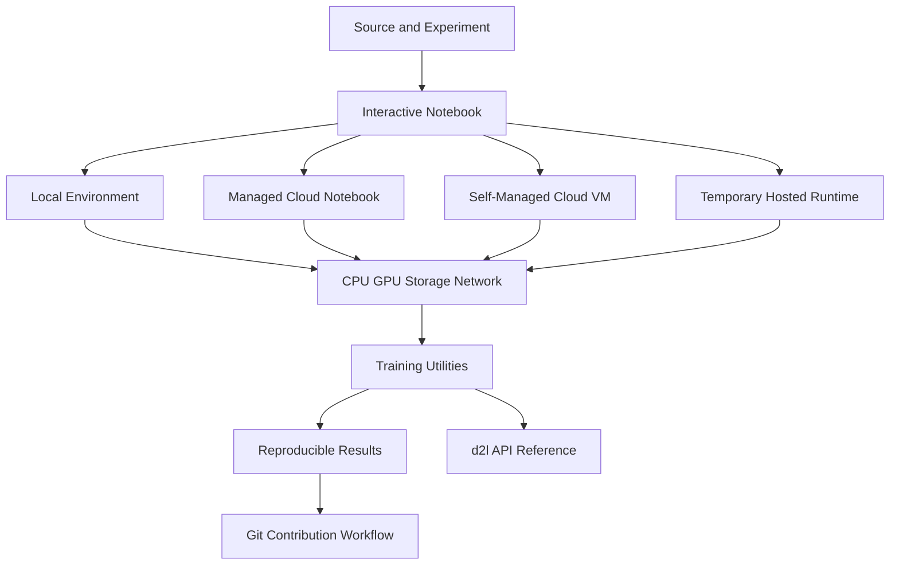
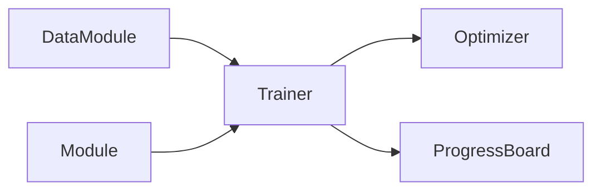

> 对应原文：d2l-en.md 第 23 章 **Appendix: Tools for Deep Learning**。本章依次介绍 Jupyter Notebook、Amazon SageMaker、AWS EC2、Google Colab、服务器与 GPU 选择、开源贡献流程、教材工具函数，以及 `d2l` API 索引。

## 1. 本章主线：让模型从“能写”走向“能运行、能复现、能协作”

深度学习不只需要模型与数学，还需要一条完整的工程链路：



作者的问题分析路径是：

1. 用 Notebook 把解释、公式、代码和输出放在同一份可执行文档中；
2. 本机资源不足时，选择托管 Notebook、云虚拟机或临时云运行时；
3. 选择硬件时，不只看峰值算力，还要考虑显存、带宽、互联、供电、散热和总成本；
4. 修改教材时，用 Git 和 pull request 让变更可审阅、可测试、可追踪；
5. 用 `d2l` 的小型抽象统一模型、数据、训练和可视化，减少教学代码重复；
6. 最后用 API 文档反查类、函数和其定义章节。

本章内容具有很强的**版本时效性**。长期有效的是方法：资源生命周期、安全边界、可复现流程和抽象职责。控制台截图、实例型号、CUDA 下载地址、菜单名称和具体 API 只能视为原书生成时的快照，执行前必须以当前环境和官方文档核验。

## 2. 可复现实验的五层结构

一个可复现的深度学习实验至少包含五层：

| 层次 | 需要固定或记录的内容 |
|---|---|
| 源码 | Git commit、未提交补丁、配置文件 |
| 数据 | 数据版本、划分、校验和、预处理 |
| 软件 | Python、框架、CUDA、驱动、依赖锁 |
| 硬件 | CPU/GPU 型号、显存、设备数量、互联 |
| 执行 | 随机种子、命令、环境变量、输出与指标 |

Notebook 只能保存其中一部分。单纯“把 `.ipynb` 发给别人”并不保证可复现，因为内核状态、外部文件、包版本和硬件可能不同。

## 3. 使用 Jupyter Notebook

### 3.1 为什么使用 Notebook

Jupyter 将不同单元组织在一份文档中：

- Markdown 解释；
- KaTeX/LaTeX 公式；
- Python 代码；
- 表格、图片和交互输出；
- 当前内核中的变量状态。

它适合教学、探索和可视化，因为读者能沿叙事顺序运行代码并立即观察结果。

### 3.2 Notebook 的三个组成部分

#### 前端文档

浏览器显示单元、输出和菜单。

#### Jupyter Server

管理文件、会话、内核和 HTTP/WebSocket 通信。

#### Kernel

真正执行 Python 的进程，保存变量、导入和随机状态。

这解释了为什么关闭一个单元并不会清除变量，重启 kernel 才会重置进程状态。

### 3.3 本地启动流程

在已经安装 Jupyter 的环境中：

```powershell
Set-Location path\to\notebooks
jupyter notebook
```

或使用更常见的 JupyterLab：

```powershell
jupyter lab
```

启动后终端通常显示本地 URL 和临时 token。不要把含 token 的完整 URL 发送给不可信的人。

### 3.4 Markdown 单元与代码单元

Markdown 单元负责叙述，代码单元负责执行。渲染 Markdown 不是运行 Python，而是把源文本转换为 HTML/数学公式。

常见运行方式：

- `Ctrl+Enter`：运行当前单元；
- `Shift+Enter`：运行并移动到下一单元；
- `Restart Kernel and Run All`：从干净状态按文档顺序运行。

快捷键和菜单会随经典 Notebook、JupyterLab、VS Code Notebook 等前端变化，应以当前界面为准。

### 3.5 Notebook 的隐藏状态问题

以下代码按可见顺序运行会失败：

```python
print(weight)
```

```python
weight = 3.0
```

但如果作者先运行第二个单元再运行第一个，保存后的 Notebook 看起来可能“已经成功”。这称为 execution-order dependence。

提交或发布前应：

1. 保存源文件；
2. 重启内核；
3. 从第一单元顺序运行全部；
4. 确认没有依赖隐藏变量；
5. 检查输出是否来自当前代码；
6. 根据项目约定清空或保留输出。

### 3.6 Notebook 与脚本的关系

Notebook 擅长探索，但大型项目应把稳定逻辑放入模块：

```text
project/
  src/
    model.py
    data.py
    train.py
  notebooks/
    exploration.ipynb
  tests/
```

Notebook 只调用经过测试的函数。这样可以：

- 减少复制粘贴；
- 便于单元测试；
- 支持命令行批处理；
- 让 Git diff 更清晰；
- 避免隐藏状态成为唯一实现。

### 3.7 为什么教材贡献偏好 Markdown 源文件

`.ipynb` 是 JSON，除源码外还包含：

- 输出；
- execution count；
- 内核信息；
- 前端 metadata；
- widget 状态。

小改动可能产生很大的 diff。原书使用 `d2l-notedown`，让经典 Jupyter 通过自定义 contents manager 编辑特定 Markdown 源文件。

原书命令体现的是当时的经典 Notebook 体系：

```text
NotebookApp.contents_manager_class = ...
```

它不是 Jupyter 的通用 Markdown 能力，也不保证与当前 Jupyter Server/JupyterLab 版本兼容。实际贡献时应优先使用仓库当前提供的构建工具和贡献说明，不要仅按附录中的历史命令安装。

### 3.8 远程 Notebook 的安全访问

最安全的基本模式是让远端 Jupyter 只监听回环地址，再通过 SSH 隧道访问。

远端：

```bash
jupyter notebook --no-browser --ip=127.0.0.1 --port=8888
```

本地：

```powershell
ssh -N -L 8889:127.0.0.1:8888 user@example-host
```

本地浏览器访问：

```text
http://127.0.0.1:8889
```

数据路径：

```text
browser localhost:8889
  -> local SSH client
  -> encrypted SSH connection
  -> remote localhost:8888
  -> Jupyter server
```

关键安全点：

- 不直接向公网开放 8888；
- SSH 端口只允许可信来源；
- 首次连接核对 host key fingerprint；
- 使用强密钥和必要的多因素认证；
- 不把 token 写入公开日志；
- 完成后停止 Jupyter 和 SSH 隧道。

原书的 `ssh myserver -L ...` 语义可以工作，但将选项放在主机名前更清晰。

### 3.9 Notebook 计时

IPython 常用：

```ipython
%time result = function()
```

```ipython
%timeit function()
```

`%time` 单次测量，易受预热、缓存和系统噪声影响；`%timeit` 重复运行并统计，更适合短函数。

普通 Python 可用：

```python
from time import perf_counter

start = perf_counter()
result = function()
elapsed = perf_counter() - start
```

### 3.10 GPU 计时必须同步

CUDA kernel 通常异步发射：CPU 计时结束时，GPU 可能尚未完成。

```python
torch.cuda.synchronize()
start = perf_counter()
result = gpu_function()
torch.cuda.synchronize()
elapsed = perf_counter() - start
```

还应：

- 预热多次；
- 重复测量；
- 固定输入形状；
- 区分数据传输和纯计算；
- 报告中位数/分位数；
- 避免把首次编译、内存分配混入稳态吞吐。

### 3.11 $A^TB$ 与 $AB$ 的计时练习

矩阵维度必须先匹配。即使理论 FLOPs 接近，实际速度也可能不同，因为：

- 转置可能只是非连续 view；
- BLAS 是否支持转置 flag；
- 缓存和内存访问模式不同；
- 张量是否需要 `.contiguous()` 复制；
- GPU kernel 选择和维度对齐不同。

因此答案应来自预热后的重复 benchmark，而不是断言其中一个总是更快。

## 4. 使用 Amazon SageMaker

### 4.1 托管 Notebook 解决什么问题

SageMaker 一类托管服务代管部分基础设施：

- 启动计算实例；
- 预装 Notebook 环境；
- 挂载持久存储；
- 提供 IAM 身份和控制台；
- 集成训练、存储和日志服务。

相比自管虚拟机，用户少处理驱动和服务守护进程，但仍要负责数据、权限、依赖、费用和代码安全。

### 4.2 账户与安全准备

原书首先介绍注册 AWS。实际使用前应：

1. 为根账户启用 MFA；
2. 日常操作使用最小权限 IAM 身份；
3. 配置预算与费用告警；
4. 选择满足合规要求的 region；
5. 确认数据加密和网络边界；
6. 不把长期访问密钥写进 Notebook。

### 4.3 创建实例时要决定什么

- 实例类型与 GPU；
- 持久卷容量；
- IAM role；
- VPC/subnet/security group；
- 加密密钥；
- Git 仓库与凭据；
- idle shutdown 策略；
- 生命周期配置和依赖版本。

原书使用的具体 `ml.p3.2xlarge` 和控制台页面是历史示例，不是当前推荐型号。

### 4.4 运行、停止与删除

生命周期要区分：

| 操作 | 计算费用 | 持久存储 | 可恢复性 |
|---|---|---|---|
| Running | 有 | 保留 | 可直接使用 |
| Stopped | 通常停止计算费 | 通常仍保留并计费 | 可再启动 |
| Deleted | 资源按配置删除 | 需确认卷/快照 | 通常不可直接恢复 |

“停止后不再收费”过度简化。存储、快照、日志、数据传输和关联资源仍可能收费。

### 4.5 更新 Notebook 的安全 Git 流程

原书使用：

```bash
git reset --hard
git pull
```

`reset --hard` 会永久丢弃已跟踪文件的未提交修改，却不一定删除未跟踪文件。更安全的检查流程：

```bash
git status --short
git diff
git fetch origin
git log --oneline HEAD..origin/master
git pull --ff-only
```

如果本地有工作：

- 提交到分支；或
- 明确执行 `git stash push -u`；或
- 复制重要文件后再处理。

不要把破坏性命令当普通“更新”步骤。

### 4.6 托管不等于可复现

Notebook image 和默认依赖会更新。应记录：

```python
import platform
import torch

print(platform.python_version())
print(torch.__version__)
print(torch.version.cuda)
```

同时保存依赖锁、容器镜像 digest 或 environment export。

## 5. 使用 AWS EC2

### 5.1 EC2 与 SageMaker 的差别

EC2 提供通用虚拟机，用户自行管理：

- 操作系统；
- 驱动和 CUDA；
- Python 环境；
- Jupyter 服务；
- 防火墙与补丁；
- 磁盘和备份。

它更灵活，但运维和安全责任更大。价格是否更低取决于闲置率、存储、网络、人工维护和所需服务，不是普遍结论。

### 5.2 创建实例的决策顺序

1. 选择 region；
2. 检查 GPU quota；
3. 选择 AMI；
4. 选择实例类型；
5. 配置网络和 security group；
6. 创建或选择 SSH key；
7. 配置根卷和数据卷；
8. 设置 tags、预算和自动停止；
9. 启动并验证 host fingerprint。

控制台名称和界面会变化，流程概念比截图位置更稳定。

### 5.3 Region 选择

需要权衡：

- GPU 型号可用性；
- quota；
- 价格；
- 数据所在区域；
- 网络延迟和出口费；
- 合规与数据驻留。

跨区域搬运大型数据可能比训练实例本身更慢或更贵。

### 5.4 GPU quota

云平台常将 GPU 按实例族或购买模式设置 vCPU/实例配额。配额为 0 时，即使控制台列出型号也无法启动。应提前申请，并为实验准备无 GPU 或小实例的调试路径。

### 5.5 AMI 与实例类型

可选：

- 纯 Ubuntu，自行安装驱动；
- 厂商/云平台的深度学习镜像；
- 自建固定版本镜像。

深度学习镜像启动快，但内容庞大且版本可能变化；纯系统可控，但兼容性工作更多。

实例选择先检查显存是否足够，再比较有效吞吐，而不是只看峰值 FLOPS。

### 5.6 Security Group

训练机通常只需要 SSH：

```text
TCP 22 from your trusted IP/CIDR
```

不要为方便把 `0.0.0.0/0` 的 Jupyter、TensorBoard 或 SSH 长期暴露到公网。Notebook 和 TensorBoard 通过 SSH tunnel 使用。

### 5.7 SSH 密钥

Unix 常用：

```bash
chmod 400 D2L_key.pem
ssh -i D2L_key.pem ubuntu@host
```

Windows 原生使用 ACL，不应照搬 `chmod`。私钥必须：

- 不进入 Git；
- 不通过聊天或邮件明文发送；
- 文件权限最小化；
- 泄露后立即吊销/替换。

首次连接不要盲目输入 `yes`，应通过控制台或可信通道核对 host key fingerprint。

### 5.8 磁盘规划

区分：

- 根卷；
- 数据卷；
- instance store 临时盘；
- object storage；
- snapshots/AMI。

数据集、checkpoint 和环境缓存可能远大于源码。扩容卷后还可能需要扩展分区和文件系统。

### 5.9 驱动、CUDA Toolkit 与框架运行时

这三者不是同一对象：

| 层次 | 作用 |
|---|---|
| NVIDIA driver | 操作系统与 GPU 通信 |
| CUDA runtime/toolkit | CUDA 库、编译器和开发工具 |
| PyTorch build | 针对某 CUDA runtime 构建的框架 |

许多 PyTorch wheel/conda 包自带所需 CUDA runtime，只有编译自定义 CUDA 扩展时才一定需要完整 toolkit。

兼容性检查：

1. GPU compute capability；
2. 驱动支持的 CUDA runtime；
3. 框架构建版本；
4. cuDNN/NCCL 等库；
5. 操作系统和架构。

原书把 K80 时代的 `p2.xlarge` 与 CUDA 12.1 安装步骤放在同一流程中，这种组合并不兼容，不能直接照抄。

### 5.10 验证 GPU 环境

```bash
nvidia-smi
```

只证明驱动能看到 GPU，不证明 PyTorch 可用。

```bash
python - <<'PY'
import torch
print(torch.__version__)
print(torch.version.cuda)
print(torch.cuda.is_available())
if torch.cuda.is_available():
    print(torch.cuda.get_device_name(0))
    x = torch.randn(1024, 1024, device="cuda")
    print((x @ x).norm().item())
PY
```

还应实际运行目标模型的小 batch，检查显存和算子支持。

### 5.11 远程 Jupyter

远端：

```bash
source ~/miniconda3/etc/profile.d/conda.sh
conda activate d2l
jupyter notebook --no-browser --ip=127.0.0.1 --port=8888
```

本地：

```powershell
ssh -N -i D2L_key.pem `
  -L 8889:127.0.0.1:8888 `
  ubuntu@host
```

浏览器只访问本机 8889。

### 5.12 Stop、Terminate、Snapshot 与 AMI

- Stop：计算停止，EBS 等资源可能继续计费；
- Terminate：实例删除，根卷是否删除由配置决定；
- Snapshot：增量备份并持续产生存储费；
- AMI：系统镜像通常依赖 snapshots；
- Elastic IP：未关联或特定状态可能计费。

“Terminate 删除所有数据”不总成立。终止前应列出 volumes、snapshots、object storage 和日志。

### 5.13 Spot 实例

Spot 价格低但可被中断。适合可恢复任务，必须：

- 周期性 checkpoint；
- checkpoint 放持久存储；
- 保存 optimizer/scheduler/RNG 状态；
- 处理 termination notice；
- 让作业可重入；
- 不把本地临时盘作为唯一副本。

## 6. 使用 Google Colab

### 6.1 Colab 的定位

Colab 提供浏览器中的临时 Notebook runtime，适合：

- 快速试验；
- 无本地 GPU 时学习；
- 分享可运行示例；
- 小规模演示。

它不保证固定 GPU、长期会话、持久磁盘或固定依赖版本。

### 6.2 不要无条件忽略安全警告

Notebook 可执行任意代码，包括：

- 下载并运行脚本；
- 读取挂载 Drive；
- 访问环境变量中的 token；
- 上传文件到外部服务；
- 安装恶意包。

点击 “Run anyway” 前应检查来源、下载地址、shell 命令和凭据访问。

### 6.3 检查实际运行时

```python
import os
import platform
import torch

print(platform.python_version())
print(torch.__version__)
print(torch.cuda.is_available())
print(torch.cuda.get_device_name(0) if torch.cuda.is_available() else "CPU")
print(os.getcwd())
```

选择 GPU runtime 不等于一定获得 GPU，也不保证型号。

### 6.4 依赖安装只影响当前 runtime

```ipython
%pip install package==version
```

`%pip` 通常比 `!pip` 更能绑定当前内核环境。重置 runtime 后依赖可能消失，因此 Notebook 顶部应有可重复安装单元，并固定必要版本。

### 6.5 文件持久性

`/content` 等运行时磁盘通常是临时的。重要数据和 checkpoint 应：

- 写入挂载的持久存储；
- 下载到本地；
- 上传到 object storage；
- 同步到受控仓库（仅源码，不含 secrets）。

挂载 Drive 会扩大 Notebook 可访问的数据范围，来源不可信时不要挂载。

### 6.6 Colab 的限制

- 会话可能断开；
- idle timeout；
- GPU 配额和型号动态变化；
- 内存有限；
- 后台长作业不可靠；
- 环境会更新；
- 不适合作为唯一实验记录。

需要长时间、严格版本和大数据时，应使用可控云实例、容器或本地服务器。

## 7. 三类远程运行方式的比较

| 维度 | 托管 Notebook | 自管 VM | 临时 Hosted Runtime |
|---|---|---|---|
| 环境管理 | 平台承担较多 | 用户承担 | 平台预置且易变化 |
| 灵活性 | 中 | 高 | 低到中 |
| 持久性 | 通常有持久卷 | 用户设计 | 常为临时 |
| 安全责任 | 共享 | 用户更多 | 共享但 Notebook 风险高 |
| 适合 | 团队实验、托管工作流 | 定制环境、长任务 | 学习、短实验 |
| 主要风险 | IAM/费用/版本漂移 | 配置错误、暴露端口 | 断线、配额、数据丢失 |

选择不是“哪个永远最好”，而是环境控制、运维成本、预算和任务持续时间之间的权衡。

## 8. 选择服务器

### 8.1 先从工作负载出发

采购前要回答：

- 模型参数量和精度？
- 最大 activation memory？
- 数据解码和增强是否重？
- 单机还是多机？
- 训练还是推理？
- 稳态利用率？
- 是否需要低延迟？
- 数据集大小和读取模式？

“买最贵 GPU”不是需求分析。

### 8.2 CPU

原书强调 Python GIL，因此偏好少核高频 CPU。这个结论需加边界：

- PyTorch 数据加载可用多进程；
- NumPy、图像库和分词器常释放 GIL；
- 编译型算子在 C/C++ 中并行；
- 多 GPU 需要足够 CPU 供数；
- 解压、增强和数据预处理可能 CPU-bound。

应同时看：

- 单核性能；
- 核数；
- 内存通道与带宽；
- NUMA；
- PCIe lanes；
- CPU 到 GPU 的拓扑。

### 8.3 系统内存

RAM 要容纳：

- 数据加载队列；
- 缓存；
- 预处理副本；
- 多 worker 进程；
- CPU offload；
- 编译与日志。

多进程 DataLoader 可能复制 Python 对象，不能只按单份数据集估算。

### 8.4 PCIe 通道和插槽

多个双宽/三宽 GPU 需要：

- 足够机械空间；
- 正确 x16/x8 电气通道；
- CPU/主板支持；
- 不与 NVMe/网卡争抢过多 lanes；
- 合理 NUMA 亲和性。

插槽是 x16 外形不代表实际始终运行 x16。

### 8.5 供电和散热

电源预算至少考虑：

$$
P_{PSU}
>P_{CPU}+\sum_gP_{GPU,g}
+P_{storage}+P_{fans}+\text{headroom}.
$$

还需：

- 启动瞬态功耗；
- 接口和线缆额定值；
- 冗余电源效率；
- 机房回路功率；
- 风道和环境温度；
- 持续负载下的降频。

消费卡开放式散热器在密集多卡机箱中可能互相加热；服务器通常需要高静压风道或液冷设计。

### 8.6 本地存储

NVMe SSD 适合：

- 随机读取大量小文件；
- 解压缓存；
- checkpoint 临时写入；
- 数据预处理产物。

但本地 SSD 不是备份。重要数据应有独立持久化和版本管理。

## 9. 选择 GPU

### 9.1 峰值算力必须带精度和稀疏条件

GPU 宣传值可能分别针对：

- FP64；
- FP32/TF32；
- BF16/FP16；
- FP8/更低精度；
- dense 或 structured sparsity；
- Tensor Core 特定形状。

不能把不同精度、稀疏假设下的 TOPS 直接比较。

### 9.2 显存容量是硬约束

训练显存近似包括：

$$
M
=M_{params}+M_{grads}+M_{optimizer}
+M_{activations}+M_{workspace}.
$$

Adam FP32 仅参数相关状态常约：

$$
4P\ (weights)
+4P\ (gradients)
+8P\ (m,v)
=16P\ \text{bytes},
$$

混合精度若保留 master weights 还会增加。Activation 往往随 batch、序列长度、分辨率和层数增长，可能主导显存。

显存不足时可用：

- 减小 batch；
- gradient accumulation；
- activation checkpointing；
- mixed precision；
- optimizer state sharding；
- CPU/NVMe offload；
- tensor/pipeline parallelism；
- 量化。

### 9.3 显存带宽与算术强度

Roofline 上界：

$$
\boxed{
P_{attainable}
\le\min(P_{peak},B_{memory}\cdot I)
}.
$$

$I$ 是每搬运一个 byte 执行的 FLOPs。

- 大矩阵乘通常计算受限；
- embedding lookup、归一化、逐元素操作常带宽受限；
- 小 kernel 还可能受 launch latency 限制。

峰值算力高但带宽不足，不会让所有模型同比加速。

### 9.4 Tensor Core 与形状

低精度加速依赖：

- 框架是否启用 autocast/TF32；
- 矩阵维度对齐；
- 数据布局；
- 算子实现；
- 数值范围和 loss scaling。

应以真实模型吞吐、收敛质量和成本测试，而不是只看理论峰值。

### 9.5 多 GPU 互联

数据并行每步需要聚合梯度。粗略通信时间：

$$
T_{comm}
\approx \alpha\cdot\text{messages}
+\frac{\text{bytes}}{B_{effective}}.
$$

- PCIe；
- NVLink/NVSwitch；
- InfiniBand/RDMA；
- Ethernet；

会产生不同带宽和延迟。拓扑决定哪些卡之间通信更快。

并行效率：

$$
E_N
=\frac{T_1}{N T_N}.
$$

小模型、慢网络或小 batch 时，增加 GPU 可能降低效率。

### 9.6 性价比与 TCO

本地总拥有成本：

$$
TCO
=\text{purchase}+
\text{power}+
\text{cooling}+
\text{host}+
\text{storage}+
\text{network}+
\text{operations}-\text{resale}.
$$

云成本还包括实例、存储、快照、出口流量和空闲资源。

更有意义的指标：

$$
\frac{\text{validated training tokens or samples}}
{\text{currency or joules}}.
$$

原书 GTX/RTX 价格—性能和功耗图是特定历史时点快照，不能用于当前采购决策。

### 9.7 本机硬件核验

```powershell
nvidia-smi
```

Linux 多卡拓扑：

```bash
nvidia-smi topo -m
```

PyTorch：

```python
import torch

print(torch.cuda.device_count())
for index in range(torch.cuda.device_count()):
    properties = torch.cuda.get_device_properties(index)
    print(index, properties.name, properties.total_memory)
```

最终应 benchmark 目标模型，而非仅运行空矩阵乘。

## 10. 为本书贡献

### 10.1 为什么使用 pull request

开源贡献需要让变更：

- 可审阅；
- 可讨论；
- 可自动测试；
- 可回滚；
- 归属清晰；
- 与其他修改合并。

Pull request 将个人分支上的 commit 提交给上游维护者审阅。

### 10.2 小修改

拼写或很小的文档修改可使用 GitHub 网页编辑：

1. 定位源文件；
2. 点击编辑；
3. 修改；
4. 写清 commit message；
5. 从 fork/branch 创建 PR。

即使很小，也应确认修改的是源文件而不是生成 HTML/PDF。

### 10.3 大修改先讨论

架构调整、新章节或大规模重写应先开 issue/discussion，说明：

- 问题；
- 预期读者收益；
- 实现范围；
- 兼容性；
- 验证计划。

这样可避免投入大量工作后才发现方向与维护计划冲突。

### 10.4 Fork、clone 与 remotes

```bash
git clone https://github.com/your-name/d2l-en.git
cd d2l-en
git remote add upstream https://github.com/d2l-ai/d2l-en.git
git remote -v
```

- `origin`：个人 fork；
- `upstream`：官方仓库。

### 10.5 使用功能分支

不要直接在默认分支堆积修改：

```bash
git fetch upstream
git switch master
git merge --ff-only upstream/master
git switch -c docs/improve-tools-appendix
```

默认分支可能名为 `main` 或其他名称，应以仓库实际设置为准。

### 10.6 编辑与验证

贡献教材要检查：

- Markdown 和公式；
- 多后端 tab 标记；
- 代码是否从干净环境执行；
- 输出是否按项目约定清理；
- 图片和链接；
- 格式器、lint、单元测试；
- 只修改相关文件。

原书说明 CI 会重新执行修改章节，但本附录没有给出完整本地构建命令。实际应阅读仓库当前 `README`、`CONTRIBUTING`、CI 配置和依赖锁。

### 10.7 提交前审阅

```bash
git status --short
git diff --check
git diff
git add path/to/file.md
git diff --cached
git commit -m "docs: clarify remote notebook security"
git push -u origin docs/improve-tools-appendix
```

重要区别：

- `git diff`：未暂存修改；
- `git diff --cached`：将进入下一 commit 的修改；
- `git add file`：暂存整个文件当前差异；
- `git commit`：提交所有已暂存内容。

### 10.8 不要误用破坏性命令

旧式：

```bash
git checkout -- file
```

或：

```bash
git reset --hard
```

会丢弃修改。现代语义更清楚的 `git restore` 仍然是破坏性操作，执行前也必须确认备份和 diff。

### 10.9 GitHub 身份验证

HTTPS 推送通常使用 credential manager、PAT 或 GitHub CLI；也可使用 SSH key。不要把账户密码、token 或私钥写进 remote URL、Notebook、shell history 或仓库。

### 10.10 PR 描述应包含什么

- 改了什么；
- 为什么改；
- 如何验证；
- 截图或输出（若涉及渲染）；
- 兼容性或未解决问题；
- 关联 issue。

一个 PR 尽量解决一个清晰问题，避免混入无关格式化。

## 11. Utility Functions and Classes

### 11.1 为什么教材需要工具层

教学代码存在张力：

- 完全从零实现有助理解，但重复太多；
- 直接使用大型训练框架会隐藏关键步骤。

`d2l` 工具层选择中间道路：保留模型与训练逻辑的可见性，同时抽取重复的设备、数据、绘图和训练样板。

### 11.2 `add_to_class`

教材把一个类拆散到多个小节逐步扩展：

```python
def add_to_class(Class):
    def wrapper(obj):
        setattr(Class, obj.__name__, obj)
    return wrapper
```

使用：

```python
class Counter:
    pass

@add_to_class(Counter)
def increment(self, value):
    return value + 1
```

优点：代码能紧邻解释出现。局限：

- 类定义分散，静态阅读困难；
- IDE/类型检查不易追踪；
- 导入顺序影响最终类；
- 同名方法可被静默覆盖；
- 自动文档可能显示动态拼装后的结果而非原始位置。

生产代码通常更适合普通类定义、mixin 或组合。

### 11.3 `HyperParameters`

它通过 `inspect` 读取调用者 frame 的局部参数，将构造函数参数保存到：

```text
self.hparams
self.<parameter_name>
```

用途：减少：

```python
self.lr = lr
self.batch_size = batch_size
```

样板代码。

边界：

- frame inspection 隐式、难类型检查；
- 可能意外保存大对象或 secret；
- 参数名可能覆盖已有属性；
- `ignore=[]` 是可变默认参数；
- 构造参数可序列化并不等于整个实验可复现。

不要让 `save_hyperparameters` 保存 token、文件句柄、DataLoader 或巨大 tensor。

### 11.4 `ProgressBoard`

它缓存每条曲线的原始点，每 `every_n` 个样本聚合均值，再重画曲线。聚合可降低高频训练日志开销。

职责：

- 收集标签到点序列；
- 滑动/分块平均；
- 配置坐标轴和样式；
- 在 Notebook 中刷新显示。

边界：

- `every_n` 必须为正整数；
- 标签数超过样式数时不能静默丢弃；
- 重画应清理旧 artist；
- headless 训练不应依赖 Notebook display；
- 日志记录和可视化最好解耦。

### 11.5 强化学习环境辅助

工具节包含 FrozenLake 环境包装、状态描述、转移模型和 value/Q function 可视化，供第 17 章使用。

原代码基于旧 Gym API，例如：

- `env.seed()`；
- `env.nS/nA/P/desc`；
- 四元组 `step` 返回值。

现代 Gymnasium 通常使用 `reset(seed=...)`、`observation_space.n`、`action_space.n`，底层转移表可能需访问 `env.unwrapped`。工具还固定假设 4×4 地图和动作箭头，不能直接视为通用环境接口。

### 11.6 `Timer`

典型接口：

```python
timer = Timer()
timer.start()
# work
elapsed = timer.stop()
```

还可提供 `avg/sum/cumsum`。CPU 计时用单调高分辨率时钟更稳健；GPU 计时需同步或 CUDA events。

### 11.7 `Accumulator`

维护 $n$ 个可加标量：

```python
metric = Accumulator(3)
metric.add(loss_sum, correct_count, example_count)
```

优势是避免每批创建复杂字典。风险是位置索引可读性差，混用 tensor 和 Python 标量时应明确 `.item()` 和设备同步成本。

### 11.8 `Animator`

旧式 `Animator` 在训练中动态画曲线，便于教学。生产训练更适合将结构化指标写入 JSON/CSV、TensorBoard、W&B 或监控系统，再独立绘图。

训练循环不应因为显示环境不可用而失败。

### 11.9 `accuracy` 与分类评价

分类 logits：

$$
\widehat y=\arg\max_cY_{hat,c}.
$$

准确率：

$$
\frac1N\sum_i\mathbf1[\widehat y_i=y_i].
$$

二分类单 logit 需要阈值处理，不能把浮点输出与标签直接精确比较。前章 FM/DeepFM 复用了不合适的 accuracy，这说明通用 helper 必须明确输入契约。

### 11.10 数据下载

可靠下载器应：

1. 设置连接和读取 timeout；
2. `raise_for_status()`；
3. 流式写临时文件；
4. 限制最大大小；
5. 完成后校验 SHA-256；
6. 原子 rename；
7. 支持缓存但验证缓存内容。

原书 helper 使用 `stream=True` 却读取完整 `response.content`，没有状态检查和下载后 hash 验证，不能作为安全下载器模板。

### 11.11 安全解压

直接 `ZipFile.extractall()` 或 `TarFile.extractall()` 可能遭遇 path traversal：

```text
../../outside.txt
```

安全解压应验证每个目标路径仍在输出目录下，并限制：

- 文件数量；
- 解压总大小；
- 符号链接；
- 特殊文件；
- 压缩比。

还应使用上下文管理器关闭 archive。

### 11.12 `evaluate_loss` 和推理模式

评价时应：

```python
model.eval()
with torch.no_grad():
    ...
```

原书旧 helper 没有统一这样做，会：

- 构建无用计算图；
- 让 dropout 保持随机；
- 让 BatchNorm 使用/更新错误统计。

评价后若继续训练，应恢复 `model.train()`。

### 11.13 梯度裁剪

全局 $\ell_2$ norm clipping：

$$
g\leftarrow g\cdot
\min\left(1,\frac\theta{\|g\|_2}\right).
$$

实现要处理：

- `grad is None`；
- 空参数集；
- sparse gradients；
- 多设备；
- AMP unscale 后再裁剪。

优先使用框架提供的 `clip_grad_norm_`。

### 11.14 机器翻译与 seq2seq 工具

工具节还汇总：

- 下载英法语料；
- 文本清洗和 tokenization；
- 词表与 padding；
- sequence mask；
- masked cross-entropy；
- teacher forcing；
- seq2seq 训练；
- greedy decoding；
- BLEU。

原 `tokenize_nmt` 的样本数判断存在 off-by-one，可能多读取一行。

### 11.15 Masked cross-entropy

对有效长度 $v_i$：

$$
L_i
=\frac1{v_i}
\sum_{t=1}^{v_i}
\ell(Y_{it},\widehat Y_{it}).
$$

应按有效 token 数归一化，而不是总序列长度。修改 loss 对象自身 `reduction` 也会产生隐藏状态，局部函数式实现更稳健。

### 11.16 Seq2seq 预测

推理应使用：

```python
model.eval()
with torch.no_grad():
    ...
```

原预测 helper 切断 `<eos>` 时停止，采用 greedy decode。它不是 beam search，也不保证全局最大序列概率。保存 attention weights 还要避免持有整个 autograd graph。

## 12. 教学型框架的核心抽象

### 12.1 `Module`

表示模型及其训练契约：

- `forward`；
- `loss`；
- `training_step`；
- `validation_step`；
- `configure_optimizers`；
- 绘图和初始化。

它继承 `torch.nn.Module` 和 `HyperParameters`，试图把数学模型与通用训练器连接起来。

### 12.2 `DataModule`

封装：

- 数据下载/准备；
- train/validation 划分；
- tensor loader；
- `train_dataloader()`；
- `val_dataloader()`。

模型因此不需要知道数据来自文件、合成函数还是网络。

### 12.3 `Trainer`

负责：

```text
prepare_data
prepare_model
configure_optimizer
for epoch:
    fit_epoch
        training_step
        backward
        optimizer.step
        validation_step
```

模型负责“算什么”，Trainer 负责“何时算和怎样更新”。

### 12.4 三者的依赖反转



同一个 Trainer 可以训练多个模型，同一个模型也可换数据模块。它与 PyTorch Lightning 等高层框架的思想相似，但 `d2l` 实现是教学型最小版本，不含完整 checkpoint、AMP、分布式、callback 和恢复机制。

## 13. `d2l` API 文档的正确读法

### 13.1 API 页是什么

附录最后一节按字母列出 `d2l.torch` 中的类和函数，并标注其首次定义章节。它主要是**索引**：

1. 查对象名；
2. 看签名和一句说明；
3. 跳回定义章节理解实现；
4. 在实际安装版本中用 `help`/`inspect` 核对。

它不是独立教程，也不是永久稳定的版本契约。

### 13.2 为什么 API 页会出现奇怪内容

源文在 API 标题后混入上一页 seq2seq 代码，是 PDF 转 Markdown 的分页残留。自动文档还可能：

- 省略 `self`；
- 显示动态注入后的方法；
- 继承 `nn.Module.forward` 的模板说明；
- 将 ASCII 引号排版为弯引号；
- 与当前仓库生成模块不一致。

不能从 PDF 文本直接复制签名到 Python。

### 13.3 当前对象是否存在要运行时确认

```python
import inspect
from d2l import torch as d2l

print(hasattr(d2l, "Trainer"))
if hasattr(d2l, "Trainer"):
    print(inspect.signature(d2l.Trainer))
    print(inspect.getsource(d2l.Trainer.fit))
```

书中定义、发布包和当前仓库可能来自不同生成阶段。版本号也不一定足以证明 API 集合一致。

## 14. `d2l` 类 API 分类

### 14.1 基础训练抽象

| 类 | 职责 | 典型契约 |
|---|---|---|
| `HyperParameters` | 保存构造配置 | `save_hyperparameters` |
| `Module` | 模型基类 | `forward/loss/training_step` |
| `DataModule` | 数据基类 | train/val dataloader |
| `Trainer` | 执行训练 | `fit/fit_epoch` |
| `SGD` | 教学优化器 | `step/zero_grad` |
| `ProgressBoard` | 动态绘图 | `draw` |

### 14.2 回归与分类

| 类 | 输入到输出 |
|---|---|
| `SyntheticRegressionData` | 产生 $X[N,D],y[N,1]$ |
| `LinearRegressionScratch` | $[B,D]\to[B,1]$ |
| `LinearRegression` | 高层 API 线性回归 |
| `Classifier` | 分类 loss/accuracy/validation |
| `SoftmaxRegression` | $[B,D]\to[B,K]$ |
| `FashionMNIST` | 图像 dataloader 与标签 |
| `LeNet` | $[B,C,H,W]\to[B,K]$ |

### 14.3 CNN 结构

| 类 | 作用 |
|---|---|
| `Residual` | ResNet 残差块 |
| `ResNeXtBlock` | 分组卷积残差块 |

`ResNeXtBlock` 的 `groups` 文档语义与某版实际源码计算可能不一致，使用前应检查 `conv.groups`。

### 14.4 文本数据与词表

| 类 | 作用 |
|---|---|
| `Vocab` | token 与 ID 双向映射 |
| `TimeMachine` | 字符语料和序列窗口 |
| `MTFraEng` | 英法机器翻译数据 |

`Vocab` 的可变默认 `tokens=[]`、`reserved_tokens=[]` 不理想；调用时不要修改共享默认对象。零维 tensor 传给某版 `to_tokens` 也可能触发 `len()` 错误。

### 14.5 RNN 与语言模型

| 类 | 典型形状/职责 |
|---|---|
| `RNNScratch` | 手写 recurrence |
| `RNN` | 框架 RNN wrapper |
| `GRU` | 多层 GRU |
| `RNNLMScratch` | 手写 RNN language model |
| `RNNLM` | 高层 RNN language model |

时间优先 RNN 常用：

$$
[T,B,D]\to[T,B,H].
$$

语言模型最终 logits 通常整理为 $[B,T,V]$ 或展平为 $[BT,V]$。跨 API 前必须确认 batch-first 约定。

### 14.6 Encoder–decoder 与 seq2seq

| 类 | 职责 |
|---|---|
| `Encoder` | encoder 抽象接口 |
| `Decoder` | decoder 抽象接口 |
| `AttentionDecoder` | 暴露 attention weights |
| `EncoderDecoder` | 组合两者 |
| `Seq2SeqEncoder` | RNN encoder |
| `Seq2Seq` | RNN encoder-decoder 训练封装 |

Padding ID、`<bos>/<eos>` 和 valid lengths 必须一致，否则 masked loss 与解码语义会错位。

### 14.7 注意力与 Transformer

| 类 | 典型输入输出 |
|---|---|
| `DotProductAttention` | $Q,K,V\to$ weighted values |
| `AdditiveAttention` | 不同维 query/key 的加性打分 |
| `MultiHeadAttention` | 多头并行后拼接 |
| `PositionalEncoding` | 给 $[B,T,H]$ 加位置 |
| `PositionWiseFFN` | 每位置共享 MLP |
| `AddNorm` | residual + layer norm |
| `TransformerEncoderBlock` | attention + FFN block |
| `TransformerEncoder` | 堆叠 blocks |

多头要求：

$$
H\bmod num\_heads=0.
$$

某版位置编码还隐含偶数 hidden size；应在构造时显式验证，而不是让切片赋值晚些失败。

### 14.8 其他模型类

`RNNLM`、`LeNet`、`Residual` 等对象是前文章节 `#@save` 代码的聚合结果。API 页的价值在于反查来源，不应取代对应章节对形状和算法的解释。

## 15. `d2l` 函数 API 分类

### 15.1 动态类与检查

- `add_to_class`：动态注册方法；
- `check_len`：检查列表长度；
- `check_shape`：检查 tensor 形状。

检查函数应在错误时提供 expected/actual 和上下文，而不是只抛无信息断言。

### 15.2 数学与模型操作

- `corr2d(X,K)`：二维单通道互相关；
- `masked_softmax(X, valid_lens)`：对无效位置屏蔽后 softmax；
- `bleu(pred_seq,label_seq,k)`：机器翻译 BLEU。

`corr2d` 某版输出没有继承输入 dtype/device；`masked_softmax` 某版会原地修改输入，且 `valid_len=0` 产生均匀而非全零语义。调用前应测试边界。

### 15.3 初始化

- `init_cnn`；
- `init_seq2seq`。

初始化函数通常按 module 类型分派。它们会原地改变参数，且必须在 lazy layer 已 materialize 后调用。

### 15.4 设备

- `cpu()`；
- `gpu(i)`；
- `num_gpus()`；
- `try_gpu(i)`；
- `try_all_gpus()`。

文档声称无 GPU 时 `try_all_gpus()` 返回 `[cpu()]`，当前某仓库版本实际可能返回空列表。不要依赖未经测试的 fallback：

```python
devices = d2l.try_all_gpus()
if not devices:
    devices = [torch.device("cpu")]
```

### 15.5 绘图

- `plot`；
- `set_axes`；
- `set_figsize`；
- `show_heatmaps`；
- `show_list_len_pair_hist`；
- `use_svg_display`。

这些函数依赖 Matplotlib/IPython/Jupyter。服务端和 CI 应选择 non-interactive backend，业务逻辑不能依赖图是否成功显示。

## 16. 可运行的 CPU 综合实验

下面代码只依赖标准库和 PyTorch，不访问网络、不显示图形。它复现并验证工具附录最核心的教学抽象：

- `add_to_class` 动态扩展；
- `HyperParameters` 自动保存构造参数；
- `Timer` 与 `Accumulator`；
- 合成线性回归数据；
- `DataLoader`；
- `linreg`、平方损失和手写 SGD；
- 一个最小 `Module/DataModule/Trainer` 协作流程；
- 二维互相关；
- 设备 fallback；
- 梯度裁剪对 `grad=None` 的安全处理。

```python
import inspect
from time import perf_counter

import torch
from torch import nn
from torch.utils import data

torch.manual_seed(23)
torch.set_num_threads(1)

def add_to_class(class_object):
    def decorator(function):
        setattr(class_object, function.__name__, function)
        return function
    return decorator

class Extensible:
    pass

@add_to_class(Extensible)
def twice(self, value):
    return 2 * value

assert Extensible().twice(4) == 8

class HyperParameters:
    def save_hyperparameters(self, ignore=None):
        ignore = set(ignore or []) | {"self"}
        frame = inspect.currentframe().f_back
        parameters = {
            name: value
            for name, value in frame.f_locals.items()
            if name not in ignore and not name.startswith("_")
        }
        self.hparams = parameters
        for name, value in parameters.items():
            if hasattr(self, name):
                raise AttributeError(f"refusing to overwrite attribute: {name}")
            setattr(self, name, value)

class Configuration(HyperParameters):
    def __init__(self, width, learning_rate, secret):
        self.save_hyperparameters(ignore=["secret"])

configuration = Configuration(8, 0.03, "do-not-store")
assert configuration.width == 8
assert configuration.learning_rate == 0.03
assert "secret" not in configuration.hparams

class Timer:
    def __init__(self):
        self.times = []
        self.start()

    def start(self):
        self.started_at = perf_counter()

    def stop(self):
        elapsed = perf_counter() - self.started_at
        self.times.append(elapsed)
        return elapsed

    def average(self):
        return sum(self.times) / len(self.times)

timer = Timer()
elapsed = timer.stop()
assert elapsed >= 0 and timer.average() == elapsed

class Accumulator:
    def __init__(self, size):
        self.values = [0.0] * size

    def add(self, *values):
        if len(values) != len(self.values):
            raise ValueError("wrong number of accumulator values")
        self.values = [
            current + float(value)
            for current, value in zip(self.values, values)
        ]

    def __getitem__(self, index):
        return self.values[index]

metric = Accumulator(2)
metric.add(torch.tensor(2.0), 3)
assert metric[0] == 2.0 and metric[1] == 3.0

def synthetic_data(weights, bias, number_of_examples, noise=0.01):
    features = torch.randn(number_of_examples, len(weights))
    labels = features @ weights.reshape(-1, 1) + bias
    labels += noise * torch.randn_like(labels)
    return features, labels

def load_array(arrays, batch_size, shuffle=True):
    dataset = data.TensorDataset(*arrays)
    return data.DataLoader(dataset, batch_size, shuffle=shuffle)

def linear_regression(features, weights, bias):
    return features @ weights + bias

def squared_loss(predictions, labels):
    return (predictions - labels.reshape(predictions.shape)) ** 2 / 2

def stochastic_gradient_descent(parameters, learning_rate, batch_size):
    with torch.no_grad():
        for parameter in parameters:
            if parameter.grad is None:
                continue
            parameter -= learning_rate * parameter.grad / batch_size
            parameter.grad.zero_()

true_weights = torch.tensor([2.0, -3.4])
true_bias = 4.2
features, labels = synthetic_data(true_weights, true_bias, 512)
loader = load_array((features, labels), batch_size=32)
weights = torch.zeros((2, 1), requires_grad=True)
bias = torch.zeros(1, requires_grad=True)

initial_loss = squared_loss(
    linear_regression(features, weights, bias), labels
).mean().item()
for _ in range(20):
    for batch_features, batch_labels in loader:
        loss = squared_loss(
            linear_regression(batch_features, weights, bias), batch_labels
        ).sum()
        loss.backward()
        stochastic_gradient_descent(
            [weights, bias], learning_rate=0.03,
            batch_size=len(batch_features),
        )
final_loss = squared_loss(
    linear_regression(features, weights, bias), labels
).mean().item()
assert final_loss < initial_loss * 1e-3
torch.testing.assert_close(weights.detach().flatten(), true_weights,
                           atol=0.03, rtol=0)
assert abs(bias.item() - true_bias) < 0.03

class DataModule(HyperParameters):
    def __init__(self, features, labels, batch_size=32):
        self.save_hyperparameters()

    def train_dataloader(self):
        return load_array(
            (self.features, self.labels), self.batch_size, shuffle=True
        )

class Module(nn.Module, HyperParameters):
    def training_step(self, batch):
        features, labels = batch
        predictions = self(features)
        return squared_loss(predictions, labels).mean()

class LinearModel(Module):
    def __init__(self, number_of_inputs, learning_rate):
        super().__init__()
        self.save_hyperparameters()
        self.network = nn.Linear(number_of_inputs, 1)

    def forward(self, features):
        return self.network(features)

    def configure_optimizer(self):
        return torch.optim.SGD(self.parameters(), lr=self.learning_rate)

class Trainer(HyperParameters):
    def __init__(self, max_epochs):
        self.save_hyperparameters()

    def fit(self, model, data_module):
        optimizer = model.configure_optimizer()
        losses = []
        model.train()
        for _ in range(self.max_epochs):
            total, count = 0.0, 0
            for batch in data_module.train_dataloader():
                optimizer.zero_grad(set_to_none=True)
                loss = model.training_step(batch)
                loss.backward()
                optimizer.step()
                total += loss.item() * len(batch[0])
                count += len(batch[0])
            losses.append(total / count)
        return losses

data_module = DataModule(features, labels, batch_size=32)
model = LinearModel(number_of_inputs=2, learning_rate=0.05)
losses = Trainer(max_epochs=8).fit(model, data_module)
assert losses[-1] < losses[0] * 1e-3

def cross_correlation_2d(input_tensor, kernel):
    output_height = input_tensor.shape[0] - kernel.shape[0] + 1
    output_width = input_tensor.shape[1] - kernel.shape[1] + 1
    output = input_tensor.new_zeros((output_height, output_width))
    for row in range(output_height):
        for column in range(output_width):
            region = input_tensor[
                row:row + kernel.shape[0],
                column:column + kernel.shape[1],
            ]
            output[row, column] = (region * kernel).sum()
    return output

image = torch.tensor([[0.0, 1.0, 2.0],
                      [3.0, 4.0, 5.0],
                      [6.0, 7.0, 8.0]], dtype=torch.float64)
kernel = torch.tensor([[0.0, 1.0],
                       [2.0, 3.0]], dtype=torch.float64)
correlation = cross_correlation_2d(image, kernel)
expected = torch.tensor([[19.0, 25.0],
                         [37.0, 43.0]], dtype=torch.float64)
torch.testing.assert_close(correlation, expected)
assert correlation.dtype == image.dtype

def available_devices():
    if torch.cuda.is_available():
        return [
            torch.device(f"cuda:{index}")
            for index in range(torch.cuda.device_count())
        ]
    return [torch.device("cpu")]

devices = available_devices()
assert len(devices) >= 1

def clip_gradients(parameters, maximum_norm):
    parameters_with_gradients = [
        parameter
        for parameter in parameters
        if parameter.grad is not None
    ]
    if not parameters_with_gradients:
        return torch.tensor(0.0)
    return torch.nn.utils.clip_grad_norm_(
        parameters_with_gradients, maximum_norm
    )

used_parameter = nn.Parameter(torch.tensor([3.0]))
unused_parameter = nn.Parameter(torch.tensor([5.0]))
(used_parameter.square().sum()).backward()
original_norm = clip_gradients(
    [used_parameter, unused_parameter], maximum_norm=1.0
)
assert original_norm > 1.0
assert used_parameter.grad.norm() <= 1.0 + 1e-6
assert unused_parameter.grad is None

print("dynamic method / hyperparameters = PASS")
print("manual linear regression loss =", initial_loss, final_loss)
print("Trainer losses first / last =", losses[0], losses[-1])
print("cross correlation =", correlation.tolist())
print("devices =", [str(device) for device in devices])
print("gradient norm before clipping =", float(original_norm))
```

### 16.1 代码与原理的对应关系

1. `add_to_class` 展示教材如何把方法定义放在解释附近，同时验证动态注入确实生效；
2. 改进版 `HyperParameters` 不使用可变默认列表，并拒绝静默覆盖属性或保存 secret；
3. `Timer` 使用单调高精度时钟，`Accumulator` 验证参数数量；
4. 手写线性回归完整走过合成数据、DataLoader、前向、损失、反向和 SGD；
5. 最小 `Module/DataModule/Trainer` 展示职责分离，而不是依赖当前安装的 `d2l` 版本；
6. 互相关输出通过 `input.new_zeros` 继承 dtype/device，修复某版 helper 的边界；
7. 设备函数无 GPU 时显式返回 CPU，不依赖 `try_all_gpus` 的版本差异；
8. 梯度裁剪过滤 `grad=None`，避免未参与当前图的参数触发错误。

## 17. 工具链常见误区

### 17.1 Notebook 能运行一次就可复现

可能依赖隐藏内核状态；必须 restart and run all，并固定外部环境。

### 17.2 Notebook 的执行编号就是源码顺序

执行编号记录历史执行次序，可能与单元位置不同。

### 17.3 `.ipynb` 最适合代码审阅

它含大量输出和 metadata；稳定逻辑应进入模块，教材按当前工具维护源格式。

### 17.4 SSH tunnel 会自动启动远端 Jupyter

隧道只转发端口，服务仍需在远端启动。

### 17.5 向公网开放 8888 再设置 token 就足够安全

仍增加攻击面；优先回环监听加 SSH/VPN。

### 17.6 `%time` 一次结果能比较性能

需要预热、重复和统计；GPU 还要同步。

### 17.7 托管 Notebook 不需要权限和费用管理

IAM、存储、网络和 idle 资源仍由用户负责。

### 17.8 Stop 后所有云费用归零

持久卷、快照、日志、IP 和数据传输可能继续收费。

### 17.9 `git reset --hard` 是安全更新命令

它会丢弃已跟踪修改，应先 status/diff/备份。

### 17.10 `nvidia-smi` 成功就表示 PyTorch CUDA 可用

还需验证框架 build、驱动兼容和实际 tensor 运算。

### 17.11 必须系统安装与 PyTorch 同名版本的完整 CUDA Toolkit

预构建框架常自带 runtime；自定义编译时才通常需要 toolkit。

### 17.12 CUDA 版本越新越能支持旧 GPU

新 toolkit 可能移除旧架构支持，必须查 compute capability 矩阵。

### 17.13 Terminate 一定删除所有数据

数据卷、snapshot、AMI 和 object storage 生命周期独立。

### 17.14 Colab 文件会永久保存

运行时磁盘通常临时，必须主动持久化。

### 17.15 Colab 选择 GPU 就保证固定型号

资源由平台动态分配，配额和型号不保证。

### 17.16 CPU 核越少越适合深度学习

数据加载和预处理常能多进程/原生并行，需要实测整条流水线。

### 17.17 GPU TOPS 可直接跨精度比较

必须核对精度、稀疏性、Tensor Core 和可用算子。

### 17.18 显存只需要装模型权重

还要装梯度、优化器状态、activation 和工作区。

### 17.19 多 GPU 数量翻倍，训练精确加速两倍

通信、负载不均和串行部分降低效率。

### 17.20 消费卡理论性价比高就一定适合服务器

还要考虑散热、供电、互联、可靠性和软件支持。

### 17.21 GitHub 网页能直接修改 PDF 输出

应修改源文件，生成物由构建流程产生。

### 17.22 `git add` 只添加刚才那一行

通常暂存指定文件的全部当前差异，提交前看 `git diff --cached`。

### 17.23 PR 越大越容易一次解决问题

大而混杂的 PR 更难审阅、测试和回滚。

### 17.24 `HyperParameters` 保存了参数就等于实验可复现

还缺数据、代码版本、随机状态、依赖和硬件。

### 17.25 动态 `add_to_class` 是生产代码的最佳模式

它服务于教材渐进叙事，会削弱静态分析和可发现性。

### 17.26 评价模型不需要 `eval()` 和 `no_grad()`

Dropout、BatchNorm 和 autograd 会产生错误语义或额外开销。

### 17.27 直接 `extractall` 可信下载包总是安全

供应链或镜像可被攻击，仍应校验路径、大小和 hash。

### 17.28 梯度裁剪应在 AMP 梯度仍缩放时执行

应先 unscale，再按真实梯度裁剪。

### 17.29 API 文档列出的对象必在当前安装包存在

教材源、自动生成页和发布包可能版本漂移，需运行时检查。

### 17.30 API 页的弯引号可直接复制到 Python

它是排版产物，Python 需要普通 ASCII 引号。

### 17.31 调用 `model.forward(x)` 与 `model(x)` 完全等价

应调用 `model(x)`，后者处理 hooks、autocast 等框架机制。

### 17.32 `try_all_gpus()` 无 GPU 时必返回 CPU

文档和某些源码版本不一致，应显式 fallback。

### 17.33 所有 attention hidden size 都可任意设置

多头维度必须可整除，位置编码实现还可能要求偶数维。

## 18. 原文与 API 的时效性/缺陷审计

### 18.1 平台与命令快照

- 经典 Notebook 的 `NotebookApp` 和 nbextensions 可能与新 Jupyter Server/Lab 不兼容；
- AWS 控制台、quota 页面和实例列表会变化；
- Colab 的警告、配额和 accelerator 分配策略会变化；
- 硬件价格、显存和功耗图不能用于当前采购。

### 18.2 EC2/CUDA 冲突

原书的旧 K80 实例示例与 CUDA 12.1 固定下载链不能直接组合。安装前必须以 GPU compute capability、驱动和框架支持矩阵为准。

### 18.3 云资源生命周期过度简化

Stop 不代表零费用，Terminate 不代表所有关联数据删除。应使用资源清单和 billing console 验证。

### 18.4 工具函数缺陷

- 下载器缺 timeout、状态检查和完成后 hash；
- 解压器有路径逃逸和压缩炸弹风险；
- 旧 Gym API 已变化；
- 某些绘图 helper 固定 4×4 或在小迭代数下步长为 0；
- `show_images` 的 1×1 axes 需要特殊处理；
- `train_ch6` 在 batch 数少于 5 时可能模零；
- 评价 helper 缺 `eval/no_grad`；
- gradient clipping 未过滤空梯度；
- seq2seq tokenization 有 off-by-one；
- masked loss 归一化与隐藏状态需核查。

### 18.5 API 生成与实际模块漂移

API 页展示的是前文章节 `#@save` 对象聚合后的自动文档。当前仓库中的 `d2l/torch.py`、安装包和书中页面可能不一致；框架分支也可能混入错误 `currentmodule`。正确做法是将 API 页当导航，而不是唯一真相。

### 18.6 具体 API 边界

- `PositionalEncoding` 奇数 hidden size 可能失败；
- `masked_softmax` 可能原地修改输入，valid length 0 的语义不合理；
- 手写 `SGD.step` 需要 `torch.no_grad()`；
- `Vocab.to_tokens` 对零维 tensor 可能失败；
- `corr2d` 可能丢 dtype/device；
- `ProgressBoard` 对空 xlabel、非法 `every_n` 和过多标签不稳健；
- `try_all_gpus` 的 CPU fallback 与文档可能不一致。

## 19. 全章知识结构

```mermaid
flowchart TD
    A[Tools for Deep Learning] --> B[Executable Documents]
    B --> B1[Jupyter Cells and Kernel]
    B --> B2[Restart and Run All]
    B --> B3[Timing and Remote Tunnel]
    A --> C[Compute Environments]
    C --> C1[Managed Notebook]
    C --> C2[Self-Managed VM]
    C --> C3[Temporary Hosted Runtime]
    C --> C4[Security Cost Persistence]
    A --> D[Hardware]
    D --> D1[CPU RAM Storage PCIe]
    D --> D2[GPU Compute Memory Bandwidth]
    D --> D3[Interconnect and Scaling]
    D --> D4[TCO]
    A --> E[Open Source Workflow]
    E --> E1[Fork Branch Commit]
    E --> E2[Test and Review]
    E --> E3[Pull Request]
    A --> F[Teaching Utilities]
    F --> F1[HyperParameters]
    F --> F2[Module DataModule Trainer]
    F --> F3[Timer Accumulator ProgressBoard]
    F --> F4[Data Evaluation Seq2Seq Helpers]
    A --> G[API Reference]
    G --> G1[Classes by Responsibility]
    G --> G2[Functions by Responsibility]
    G --> G3[Runtime Verification]
```



## 20. 核心结论

1. Notebook 是共享内核的可执行文档，显示顺序不等于执行顺序。
2. 发布前必须从干净内核顺序运行全部单元，稳定逻辑应移入模块并接受测试。
3. `.ipynb` 包含输出和 metadata，不一定是最易审阅的源格式；应遵循项目当前工具链。
4. 远程 Jupyter 应监听回环地址，通过 SSH/VPN 访问，不直接暴露服务端口。
5. 性能测量要预热、重复并报告统计；CUDA 异步计时必须同步或使用 events。
6. SageMaker 类托管服务减少环境运维，但 IAM、依赖、存储和费用仍需用户管理。
7. 原书用 `git reset --hard` 更新 Notebook 有丢失工作的风险，安全流程应先 status/diff/fetch。
8. EC2 提供更高控制权，也将驱动、安全、补丁、存储和服务生命周期交给用户。
9. 驱动、CUDA Toolkit、框架 runtime 是不同层；`nvidia-smi` 成功不代表框架可运行。
10. 云实例 Stop、Terminate、volume、snapshot 和 object storage 是不同生命周期对象。
11. Spot 只适合可 checkpoint、可恢复、可重入的工作负载。
12. Colab 运行时和 GPU 是临时资源，不应保存唯一数据副本或未固定的关键环境。
13. 服务器选择必须综合 CPU、RAM、PCIe、存储、供电、散热和拓扑。
14. GPU 选择先满足显存，再比较目标精度下的有效算力、带宽和互联。
15. Roofline 模型说明有效性能由峰值算力与内存带宽共同限制。
16. 多 GPU 加速受通信和负载均衡限制，卡数翻倍不保证吞吐翻倍。
17. 硬件价值应按真实 workload 的吞吐、能耗和 TCO 评价，而非历史价格图。
18. 开源贡献应使用功能分支、清晰 commit、局部 diff、自动测试和可审阅 PR。
19. 破坏性 Git 命令和 secrets 必须被视为安全风险，而非普通操作步骤。
20. `add_to_class` 与 frame-based `HyperParameters` 服务于教学叙事，不是默认生产设计。
21. `Module` 描述模型计算，`DataModule` 描述数据，`Trainer` 描述执行流程。
22. 评价必须进入 eval/no-grad；下载、解压和梯度裁剪 helper 需要明确安全边界。
23. `d2l` API 页是按名称反查定义章节的索引，不是跨版本稳定契约。
24. 自动生成签名、教材源、当前仓库和安装包可能漂移，使用前应运行时检查。
25. 可复现性需要源码、数据、软件、硬件和执行状态共同记录，不能靠 Notebook 或超参数字典单独保证。

## 21. 解决深度学习工具问题的一般思路

1. **先定义任务约束**：训练时长、数据规模、显存、并行度、预算和安全等级。
2. **优先在 CPU/小数据上验证逻辑**：不要用昂贵 GPU 调试 shape 和语法错误。
3. **选择环境类型**：短实验用临时 runtime，定制长任务用 VM，团队托管流程用 managed service。
4. **固定环境版本**：记录 Python、框架、驱动、CUDA 和依赖锁。
5. **验证而非假设 GPU**：同时检查驱动、框架和实际算子。
6. **建立干净启动命令**：新机器或新 runtime 能从脚本恢复环境。
7. **让 Notebook 从头可执行**：restart/run-all，移除隐藏状态和手工中间步骤。
8. **把稳定逻辑移入模块**：Notebook 负责叙事和调用，测试覆盖模块。
9. **远程服务默认不公开**：回环监听、SSH tunnel、最小权限和密钥管理。
10. **区分计算与持久存储**：checkpoint 不能只在临时盘或运行时内存。
11. **设置费用护栏**：预算告警、idle shutdown、tags 和资源清单。
12. **停止后检查关联资源**：卷、snapshot、IP、日志和 object storage。
13. **按瓶颈选硬件**：显存不足先解决容量，带宽受限不盲目追 FLOPS。
14. **测真实 workload**：包含数据管道、混合精度和多卡通信。
15. **记录吞吐和质量**：更快但不收敛的精度模式没有价值。
16. **Git 修改前先读状态**：`status`、`diff`、当前分支和 remotes。
17. **使用小而聚焦的分支/PR**：先讨论大改，提交前检查 staged diff。
18. **运行仓库当前验证命令**：不要只依赖附录中的历史工具说明。
19. **把 API 文档当入口**：再用 `help`、`inspect`、源码和最小形状测试确认契约。
20. **为 helper 写边界测试**：空 batch、1×1 图、无 GPU、零 valid length、`grad=None`、恶意压缩包。
21. **安全处理网络输入**：timeout、状态码、hash、临时文件和安全解压。
22. **分离日志与可视化**：训练在 headless 环境仍应可靠运行。
23. **保存完整 checkpoint**：模型、优化器、调度器、scaler、epoch 和 RNG 状态。
24. **设计故障恢复**：进程中断、Spot 回收、网络失败和磁盘满都应可重试。
25. **定期审计时效性**：云 SKU、CUDA 支持、Notebook API 和 `d2l` 导出会持续变化。

本章可以压缩为一句话：**深度学习工具链的目标不是“成功打开一个 Notebook”，而是建立一条安全、可复现、可计费、可恢复、可协作的实验路径：Notebook 组织叙事和交互，云平台提供不同控制程度的计算环境，服务器与 GPU 选择必须围绕真实瓶颈，Git/PR 让知识可审阅演进，`d2l` 的教学抽象则把模型、数据和训练职责连接起来。具体命令和 API 会过时，长期可靠的方法是明确版本与契约、从干净状态验证、测量真实行为，并为权限、费用、数据和故障设置边界。**
