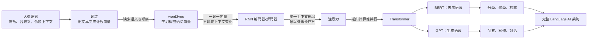
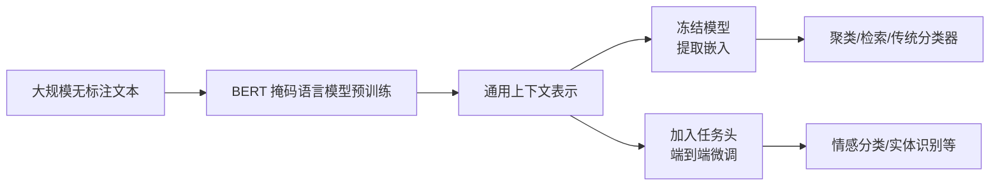
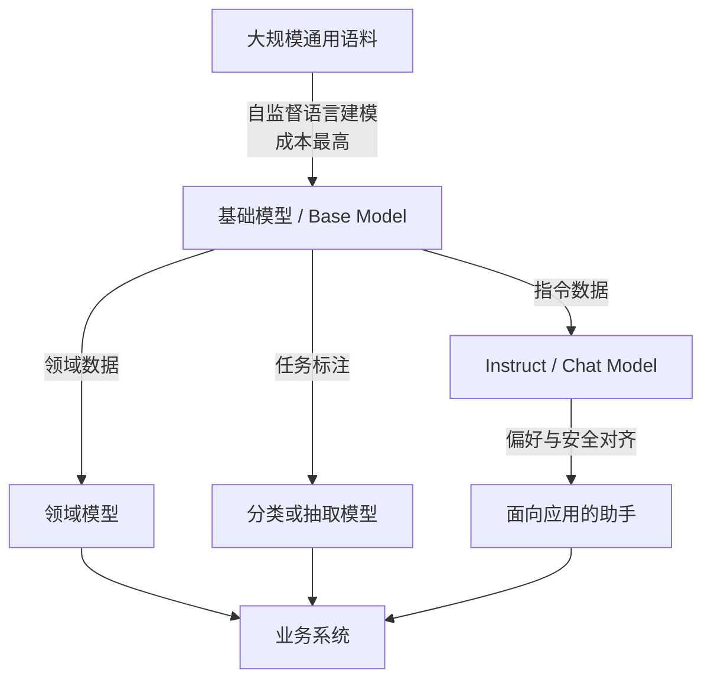
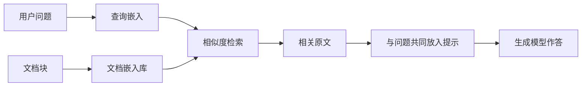
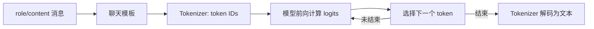
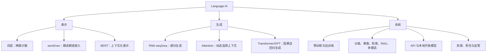

> 原章：*An Introduction to Large Language Models*
> 本章定位：建立全书的概念骨架。重点不是记住若干模型名称，而是理解语言模型为何沿着“离散计数表示 → 稠密语义表示 → 上下文表示 → 注意力与 Transformer → 预训练与迁移 → 指令式生成”的路线演进。

## 0. 本章要回答的四个问题

1. **Language AI 是什么？** 它和 AI、NLP、LLM 分别是什么关系？
2. **LLM 是怎样发展出来的？** 每一代方法具体解决了上一代的什么困难？
3. **LLM 为什么有用？** 表示模型与生成模型分别适合哪些任务，又怎样组合成系统？
4. **普通开发者怎样使用 LLM？** 如何在闭源 API 与开放模型之间选择，并用 Hugging Face 运行第一个生成模型？

全章可以压缩成一条问题链：



---

## 1. 什么是语言人工智能（What Is Language AI?）

### 1.1 从 AI 到 Language AI

人工智能（Artificial Intelligence，AI）研究如何制造能够完成通常需要人类智能的任务的软件系统，例如识别语音、理解图像、翻译语言和制定计划。这里的“智能”描述的是**外显能力**，并不要求系统复刻人脑的生物机制。

这个边界很重要。一个游戏 NPC 即使只由大量 `if-else` 驱动，也常被产品宣传为“AI”；但名称并不能证明它真正具备学习、泛化或推理能力。因此，判断一个系统时应问：

- 它解决了什么任务？
- 它从数据中学习了什么？
- 它能否把已学规律迁移到未见样本？
- 它在哪些条件下会失败？

**Language AI（语言人工智能）**是 AI 中处理人类语言的分支，目标包括理解、加工、检索和生成人类语言。随着机器学习成为 NLP 的主流实现方式，本书在多数场景中近似地交换使用 Language AI 与自然语言处理（NLP）两个名称。

### 1.2 Language AI、NLP 与 LLM 的关系

三者不是同义词：

| 概念 | 范围 | 典型组成或任务 |
|---|---|---|
| AI | 最大 | 语言、视觉、机器人、规划、推荐等 |
| Language AI / NLP | AI 的语言分支 | 分类、翻译、检索、聚类、摘要、生成等 |
| LLM | Language AI 中的一类模型 | 大规模预训练的表示模型或生成模型 |

本书有意使用较宽的 Language AI 视角。一个实用系统往往不只是“把提示词发给聊天模型”，还会包含词袋、嵌入模型、向量检索、重排序器、分类器与外部工具。尤其在检索增强生成（RAG）中，检索系统把模型参数之外的新知识送入生成模型，能力来自**组件组合**，而不只来自单个 LLM。

> **核心判断**：LLM 是 Language AI 的重要组成部分，但 Language AI 不等于 LLM，更不等于聊天机器人。

---

## 2. 语言人工智能的近期历史（A Recent History of Language AI）


这段历史围绕一个根本矛盾展开：**计算机需要数字，语言的意义却不能由字符编码本身表达。** “猫”的二进制编码与“狗”的二进制编码并不会自然地比它与“银行”的编码更接近。于是首要问题不是生成文本，而是怎样把语言变成机器可计算、又尽量保存意义的表示。

### 2.1 用词袋表示语言（Representing Language as a Bag-of-Words）

#### 2.1.1 为什么需要词袋

原始文本长度不同、词序复杂，传统机器学习算法不能直接接收它。词袋模型（Bag-of-Words，BoW）给出了一个简单而关键的转换：

1. 对文档进行分词（tokenization）。
2. 收集语料中的所有不同 token，形成固定词表。
3. 对每篇文档统计每个 token 出现的次数。
4. 按词表顺序排列计数，得到定长向量。

设词表为 $V=\{v_1,v_2,\ldots,v_D\}$，文档 $d$ 的第 $j$ 维为：

$$
x_j(d)=\sum_{i=1}^{|d|}\mathbb{I}(w_i=v_j)
$$

其中 $\mathbb{I}(\cdot)$ 是示性函数：条件成立取 $1$，否则取 $0$。这样，无论原文有多长，最终都变成一个 $D$ 维向量。


下面的纯 Python 示例完整对应上述四步：

```python
from collections import Counter

documents = [
    "I love llamas",
    "I love language models",
]

tokenized = [document.lower().split() for document in documents]
vocabulary = sorted({token for tokens in tokenized for token in tokens})
vectors = [
    [Counter(tokens)[token] for token in vocabulary]
    for tokens in tokenized
]

print(vocabulary)
for vector in vectors:
    print(vector)
```

```text
['i', 'language', 'llamas', 'love', 'models']
[1, 0, 1, 1, 0]
[1, 1, 0, 1, 1]
```

代码中的 `vocabulary` 决定向量坐标的含义，`Counter` 完成公式中的求和。模型之后看到的不是句子，而是 `[1, 0, 1, 1, 0]` 这样的数值点。

#### 2.1.2 词袋解决了什么，又丢掉了什么

它的贡献是把**变长的非结构化文本**变成**固定维度的结构化特征**，从而可输入逻辑回归、朴素贝叶斯、聚类算法等。代价是：

- **忽略顺序**：“dog bites man”和“man bites dog”可能完全相同。
- **忽略语义**：“car”和“automobile”占据互不相关的两维。
- **维度高且稀疏**：词表可能有几十万维，一篇文档只激活很少的维度。
- **难处理词形变化和未登录词**：`run`、`runs`、`running` 默认是三个特征。
- **基础分词依赖语言**：按空格切分对英语尚可，对汉语等没有天然词间空格的语言并不成立。

这些缺陷解释了为什么后来需要嵌入，但不代表词袋已经无用。它速度快、可解释、数据需求低，在关键词驱动的分类、主题模型以及与现代嵌入结合的混合系统中仍然有效。

> **常见误区**：token 不必等于“单词”。它可以是词、子词、字符或字节片段；按空格切词只是最简单的教学版本。

### 2.2 用稠密向量嵌入获得更好的表示（Better Representations with Dense Vector Embeddings）

#### 2.2.1 从“出现了什么词”到“这个词意味着什么”

词袋只记录身份和频次。2013 年广泛传播的 word2vec 推进了一步：如果两个词经常出现在相似上下文中，它们往往承担相似语义功能。这就是分布式假设的直觉版本：**观其伴，知其义**。

嵌入（embedding）是学习得到的稠密向量：

$$
e(w)\in\mathbb{R}^{d},\qquad d\ll |V|
$$

与词袋的一词一维不同，词表中的每个词都共享同一个 $d$ 维连续空间。初始向量通常是随机的，训练通过上下文预测不断调整参数。

以 skip-gram 思路为例，中心词 $w_t$ 要预测窗口中的上下文词：

$$
\max_{\theta}\sum_{t=1}^{T}\sum_{\substack{-c\le j\le c\\j\ne 0}}
\log p(w_{t+j}\mid w_t)
$$

若直接使用 softmax，则：

$$
p(w_o\mid w_i)=
\frac{\exp({e'_{o}}^{\mathsf T}e_i)}
{\sum_{w\in V}\exp({e'_{w}}^{\mathsf T}e_i)}
$$

- $e_i$ 是输入侧中心词向量。
- $e'_o$ 是输出侧上下文词向量。
- 点积越大，模型认为二者共同出现的概率越高。
- 分母遍历整个词表，代价很大；实际 word2vec 常用负采样等近似方法降低成本。

训练信号并没有告诉模型“llama 是动物”，只告诉它哪些词真的相邻、哪些采样词不相邻。大量局部预测叠加后，语义与句法规律被压缩进参数。这解释了这种方法为什么有效：**可监督标签来自文本自身，海量无标注语料因此变成训练数据。**

#### 2.2.2 “语义接近”怎样计算

常用余弦相似度比较方向，而弱化向量长度：

$$
\operatorname{cos}(u,v)=\frac{u^{\mathsf T}v}{\|u\|_2\|v\|_2}
$$

值越接近 $1$，方向越相似；接近 $0$ 表示近似正交；接近 $-1$ 表示方向相反。下面用三个假想嵌入演示：

```python
from math import sqrt


def cosine(left, right):
    dot = sum(a * b for a, b in zip(left, right))
    left_norm = sqrt(sum(value * value for value in left))
    right_norm = sqrt(sum(value * value for value in right))
    return dot / (left_norm * right_norm)


llama = [0.9, 0.8, 0.1]
alpaca = [0.8, 0.7, 0.1]
bank = [0.1, 0.2, 0.9]

print(f"llama/alpaca: {cosine(llama, alpaca):.3f}")
print(f"llama/bank: {cosine(llama, bank):.3f}")
```

```text
llama/alpaca: 1.000
llama/bank: 0.303
```


#### 2.2.3 怎样正确理解嵌入维度

为便于想象，人们常把某一维解释成“是否是动物”或“是否年轻”。这只是教学比喻。真实模型通常把概念**分布式地编码**在许多维中，单个坐标未必有人类可读含义；旋转整个向量空间甚至能保持相对关系，却完全改变每一维的解释。

因此，嵌入的价值主要在于它保存的**几何关系**，而非每个坐标的单独含义。它让相似度搜索、聚类和分类成为可能，但“接近”只表示训练数据与目标函数学到的相似性，不自动等于事实一致、价值一致或因果相关。

### 2.3 嵌入的类型（Types of Embeddings）

嵌入可以表示不同粒度的对象：

| 类型 | 一个向量代表什么 | 典型用途 | 主要局限 |
|---|---|---|---|
| 词嵌入 | 一个词 | 词相似度、早期神经 NLP | 静态 word2vec 难处理一词多义 |
| token 嵌入 | 一个词或子词 token | Transformer 的输入 | 单独取出时上下文不足 |
| 句子嵌入 | 一句话 | 语义匹配、聚类、检索 | 压缩时可能损失细节 |
| 文档嵌入 | 一篇文档或文本块 | 文档检索、推荐 | 长文的信息压缩更困难 |
| 上下文化嵌入 | 特定上下文中的 token/序列 | BERT 特征、序列标注 | 计算成本高，结果依赖上下文 |

词袋也产生文档级向量，但它通常是高维稀疏的计数表示；现代语境中的 embedding 通常特指低维稠密、由数据学习的连续表示。两者都属于**表示模型**的产物，区别在表示方式，而不在“是不是向量”。

嵌入贯穿后续任务：分类需要可分的表示，聚类需要有意义的距离，语义检索需要让查询与相关文档靠近，RAG 再把检索结果交给生成模型。

### 2.4 用注意力编码和解码上下文（Encoding and Decoding Context with Attention）

#### 2.4.1 静态嵌入为什么不够

word2vec 给每个词分配固定向量，所以 “bank” 在 “deposit money at the bank” 与 “sit on the river bank” 中完全一样。但自然语言的意义由上下文决定。模型必须表示**此时此地的 bank**，而不是词典中的抽象 bank。

循环神经网络（RNN）通过递归状态处理序列：

$$
h_t=f(W_xx_t+W_hh_{t-1}+b)
$$

当前隐藏状态 $h_t$ 同时依赖当前 token 表示 $x_t$ 和前一状态 $h_{t-1}$，因而携带此前上下文。序列到序列（seq2seq）架构把任务拆成：

- **编码器**：依次读取源句，生成上下文表示。
- **解码器**：根据编码结果与已生成 token，逐步生成目标句。

生成过程是自回归的。若输出为 $y_1,\ldots,y_m$，则：

$$
p(y_{1:m}\mid x)=\prod_{t=1}^{m}p(y_t\mid y_{<t},x)
$$

第 $t$ 个 token 的生成依赖源句 $x$ 和此前输出 $y_{<t}$。这也是今天生成式 LLM 的基本概率分解。

#### 2.4.2 单一上下文向量形成信息瓶颈

早期编码器把整个源句压到一个固定长度向量，再交给解码器。句子变长时，人物、关系、修饰和位置等大量信息都挤进同一向量，较早内容容易丢失。这不是简单地“把向量加长”就能彻底解决的问题，因为解码每一步真正需要的源句部分不同。

注意力给出的关键转变是：**不要要求解码器永远只看一份压缩摘要，让它在每一步重新选择源序列中最相关的位置。**

对解码时刻 $t$ 与编码位置 $i$，可写成：

$$
e_{t,i}=\operatorname{score}(s_{t-1},h_i)
$$

$$
\alpha_{t,i}=\frac{\exp(e_{t,i})}{\sum_j\exp(e_{t,j})}
$$

$$
c_t=\sum_i\alpha_{t,i}h_i
$$

- $h_i$ 是第 $i$ 个输入位置的编码状态。
- $s_{t-1}$ 是解码器此前状态。
- $e_{t,i}$ 是未归一化相关性分数。
- softmax 把分数变成总和为 $1$ 的权重 $\alpha_{t,i}$。
- $c_t$ 是按相关性加权得到的动态上下文。

翻译 “I love llamas” 时，生成荷兰语 “lama's” 的那一步会把较高权重放在 “llamas” 上。注意力既缓解固定向量瓶颈，也提供一种对齐源词与目标词的机制。


#### 2.4.3 RNN 加注意力仍有什么困难

注意力改善了信息访问，却没有消除 RNN 的递归依赖：计算 $h_t$ 前必须先得到 $h_{t-1}$。训练无法在所有时间位置上充分并行，长距离依赖仍要穿过很长的状态链。数据与模型变大后，这成为吞吐量瓶颈，并推动了 Transformer 的出现。

### 2.5 注意力就是你所需要的一切（Attention Is All You Need）

#### 2.5.1 Transformer 的解决思路

2017 年提出的 Transformer 删除循环结构，让序列位置通过注意力直接交互。这样做同时解决两件事：

1. 任意两个位置之间的信息路径更短，长距离关系更容易建立。
2. 训练时整段 token 可以矩阵化并行计算，GPU 利用率显著提高。

原始 Transformer 仍是编码器-解码器架构：编码器理解输入，解码器结合编码结果自回归地产生输出。


#### 2.5.2 自注意力公式与直觉

给定一层输入矩阵 $X\in\mathbb{R}^{n\times d_{model}}$，每个 token 先投影为 Query、Key、Value：

$$
Q=XW_Q,\qquad K=XW_K,\qquad V=XW_V
$$

然后计算缩放点积注意力：

$$
\operatorname{Attention}(Q,K,V)=
\operatorname{softmax}\left(\frac{QK^{\mathsf T}}{\sqrt{d_k}}+M\right)V
$$

可以把三个角色理解为：

- **Query**：“当前位置正在寻找什么信息？”
- **Key**：“每个位置可以用什么标签被匹配？”
- **Value**：“匹配后真正取回什么内容？”

$QK^{\mathsf T}$ 同时得到所有位置对之间的相关性。除以 $\sqrt{d_k}$ 是因为维度增大时点积方差也会增大；未经缩放的数值容易把 softmax 推入极端饱和区，使梯度很小。缩放保持训练数值稳定。

$M$ 是可选掩码：

- 编码器中的双向自注意力通常允许看整段输入，可只屏蔽 padding。
- 解码器中的因果自注意力把未来位置设为 $-\infty$，softmax 后权重为 $0$，防止训练时偷看正确答案。

多头注意力让不同投影子空间并行学习不同关系：

$$
\operatorname{MultiHead}(Q,K,V)=
\operatorname{Concat}(head_1,\ldots,head_h)W_O
$$

一个头可能偏向局部搭配，另一个头可能捕捉长距离指代；但这种解释不是硬编码规则，也不保证每个头都有稳定、唯一的人类语义。

#### 2.5.3 Transformer 还需要哪些部件

仅有注意力并不完整：

- **位置编码**：注意力本身对排列不敏感，必须注入 token 顺序。
- **前馈网络**：对每个位置独立进行非线性特征变换。
- **残差连接**：保留原信号并改善深层网络的梯度传播。
- **层归一化**：稳定不同层中的数值尺度。
- **多层堆叠**：逐层形成从局部模式到高级语义的上下文化表示。

#### 2.5.4 “可并行”不等于所有阶段都并行

Transformer 在**训练**时可同时计算已知序列的各位置；但 decoder-only 模型在**推理生成**时仍要先生成 token $t$，才能把它作为条件生成 token $t+1$。因此：

- 预填充（prefill）输入提示时可以高度并行。
- 解码（decode）阶段具有天然的逐 token 时序依赖。

标准自注意力还要构造 $n\times n$ 的注意力矩阵，时间与显存通常随序列长度近似按 $O(n^2)$ 增长。Mamba、RWKV 等路线尝试用状态空间或循环式结构获得更接近线性的长序列计算，同时保留现代硬件上的效率。它们说明 Transformer 很成功，但并不是 Language AI 的定义本身。

### 2.6 表示模型：仅编码器模型（Representation Models: Encoder-Only Models）

#### 2.6.1 BERT 为什么只保留编码器

原始 Transformer 为翻译设计，完整架构需要从一个序列生成另一个序列。但分类、实体识别、语义匹配等任务的主要需求是**理解并表示输入**，并不需要逐 token 解码。

2018 年提出的 BERT（Bidirectional Encoder Representations from Transformers）堆叠 Transformer 编码器，删除解码器。每个位置能同时结合左、右上下文，因此 “bank” 的表示会随所在句子改变。

输入前常加入特殊 token `[CLS]`。经过多层编码后，其最终隐藏状态可作为整个序列的聚合表示，再连接分类头：

$$
p(y\mid x)=\operatorname{softmax}(W h_{\text{[CLS]}}+b)
$$

`[CLS]` 并非天然就是完美句向量；它之所以适合分类，是因为预训练设计与下游微调共同让它承担聚合角色。直接做语义检索时，专门训练的句子嵌入模型往往更合适。

#### 2.6.2 掩码语言建模怎样提供训练信号

BERT 随机遮住部分 token，让模型根据两侧上下文恢复原 token。设被遮住的位置集合为 $\mathcal{M}$：

$$
\mathcal{L}_{MLM}=-\sum_{i\in\mathcal{M}}
\log p(x_i\mid x_{\setminus\mathcal{M}})
$$

目标之所以有效，是因为预测缺词需要同时理解句法、语义与上下文关系；标签又直接来自原始文本，不需要人工逐句标注。它训练出的不是一个特定业务分类器，而是一套可迁移的语言表示。

#### 2.6.3 预训练、特征提取与微调

先在大语料上做通用语言建模，再用少量标注数据适配任务，这就是迁移学习：




- **特征提取**：冻结 BERT，把隐藏状态当作现成特征。成本低，便于与其他算法组合。
- **微调**：让部分或全部参数继续更新。任务适配通常更强，但需要训练资源，也可能过拟合或遗忘通用能力。

本书把 BERT 一类模型称为**表示模型**：主要产物是向量，擅长分类、聚类与语义检索，通常不负责开放式长文本生成。

### 2.7 生成模型：仅解码器模型（Generative Models: Decoder-Only Models）

#### 2.7.1 GPT 的结构与目标

与 BERT 相反，GPT-1 保留 Transformer 解码器的因果自注意力，去掉面向编码器输出的交叉注意力。它只做一件可扩展的事：根据前文预测下一个 token。

对 token 序列 $x_{1:T}$，因果语言模型损失为：

$$
\mathcal{L}_{CLM}=-\sum_{t=1}^{T}\log p(x_t\mid x_{<t})
$$

训练时，每个位置的下一个真实 token 都是标签，一段文本能产生大量学习信号。模型为了降低损失，必须学习拼写、语法、常见事实、篇章结构和部分任务模式。这些能力并非分别编程进去，而是共同服务于下一 token 预测。


GPT-1 约有 1.17 亿参数，GPT-2 增至 15 亿，GPT-3 达到 1750 亿。参数是训练中更新的数值权重，不应逐个理解成一条知识。参数更多通常提高模型容量，但“其余条件相同”这一前提很强：数据质量、训练 token 数、架构、目标函数和推理方法同样决定表现。

#### 2.7.2 基础模型为什么不是天然的聊天助手

预训练基础模型学到的是**续写**。输入“法国首都是”，它可能续写“巴黎”；但输入“请严格用 JSON 回答”时，它未必稳定服从，因为“听从用户”不是原始目标函数。

要成为 instruct/chat 模型，还需要后训练，例如：

- 用“指令—理想回答”数据做监督式指令微调。
- 使用人类或模型偏好数据，使回答更有帮助、更符合约束。
- 加入安全与格式行为训练。

因此聊天看似是问答，底层仍然是条件续写：聊天模板把 system、user、assistant 等角色编码进 token 序列，模型继续生成 assistant 部分。

#### 2.7.3 自回归生成算法

```text
输入：提示 token 序列 x，最大新 token 数 K
重复至多 K 次：
    计算下一个 token 的概率分布 p(token | 当前序列)
    按贪心、采样或搜索策略选择 next_token
    把 next_token 追加到当前序列
    如果 next_token 是结束标记，则停止
输出：新追加的 token
```

贪心选择每一步概率最大的 token，稳定但可能单调，也不保证整段联合概率全局最优；采样保留概率分布中的随机性，可增加多样性，也可能增加错误。

#### 2.7.4 上下文窗口不是记忆库

上下文长度（context length/window）是一次推理可处理的最大 token 数。实际预算近似满足：

$$
n_{system}+n_{history}+n_{user}+n_{retrieved}+n_{generated}
\le n_{context}
$$

模型每生成一个 token，已占用上下文也增加一个 token。窗口满后，系统必须截断、摘要或新开会话。


上下文窗口只表示**能够送入多少 token**，不保证模型对窗口内每个细节利用得同样好；它也不同于参数中的长期知识和应用保存到数据库的外部记忆。

### 2.8 生成式 AI 之年（The Year of Generative AI）

ChatGPT 于 2022 年发布，并在 2023 年引发大规模采用，使 2023 常被称为“生成式 AI 之年”。需要区分：

- **ChatGPT 是产品**，包含界面、服务、安全策略和模型路由。
- **GPT-3.5、GPT-4 等是底层模型系列**。
- 产品能力不能简单等同于某个裸模型权重的能力。

这一时期，闭源模型和开放权重模型快速迭代，基础模型经指令微调后形成大量聊天模型。“基础模型”强调它能成为众多下游模型的起点，并不等于“开源”；闭源模型也可以是基础模型。

本书不追逐某一时刻的模型排行榜，而是同时讲嵌入、编码器、词袋、检索和生成模型。具体模型会过时，**表示、检索、生成与适配这些问题类型更稳定**。

---

## 3. 不断变化的“大语言模型”定义（The Moving Definition of a “Large Language Model”）

“大”没有永久阈值。今天的大模型可能成为明天的轻量模型；更好的数据与架构还可能让小模型达到旧大模型的能力。若只以参数量定义，会遇到两个反例：

1. 能力接近 GPT-3、但参数只有其十分之一的模型，是否突然不再是 LLM？
2. 参数规模极大、精于文本理解却不生成文本的编码器，是否不算语言模型？

本书采用实用而宽泛的约定：既讨论 decoder-only 生成模型，也讨论小于 10 亿参数、主要输出表示的模型，甚至讨论可与它们互补的词袋方法。

比争论名称更有用的是用多维坐标描述模型：

| 维度 | 可选值示例 | 回答的问题 |
|---|---|---|
| 架构 | encoder-only、decoder-only、encoder-decoder、状态空间模型 | 信息怎样流动？ |
| 训练目标 | MLM、因果语言建模、对比学习 | 模型从什么信号学习？ |
| 主要输出 | 嵌入、类别、token 序列 | 它直接解决什么任务？ |
| 规模 | 参数量、训练 token、计算量 | 训练和部署成本多大？ |
| 开放程度 | API、开放权重、开放代码/数据 | 用户能控制和审计什么？ |
| 适配状态 | base、instruct、领域微调 | 它学会了什么行为？ |

> **结论**：LLM 不是由单一参数阈值或聊天界面定义的。做工程选择时，模型能力、目标、成本和约束比标签更重要。

---

## 4. 大语言模型的训练范式（The Training Paradigm of Large Language Models）

### 4.1 从“一项任务一个模型”到“先通用学习，再适配任务”

传统监督学习通常收集某个目标任务的标注数据，直接训练分类器或回归器。训练数据、目标函数和最终任务紧密绑定。

LLM 常采用至少两阶段的范式：

1. **预训练（pretraining）**：在海量文本上做语言建模，学习通用语言规律，消耗绝大部分计算。
2. **微调/后训练（fine-tuning/post-training）**：从已有参数出发，用较小、较专门的数据塑造任务能力或行为。




### 4.2 为什么分阶段方法有效

它利用了不同任务之间共享的结构：词义、语法、篇章关系和常识无需在每个小数据集上重学。设通用参数为 $\theta_0$，微调不是从随机参数开始，而是在其附近寻找任务参数：

$$
\theta^{*}=\arg\min_{\theta\leftarrow\theta_0}
\mathcal{L}_{task}(\theta)
$$

由于 $\theta_0$ 已编码大量语言规律，下游阶段通常需要更少样本、训练时间和计算资源。代价是下游模型也会继承预训练数据中的偏差、缺漏与错误模式。

### 4.3 容易混淆的训练术语

| 术语 | 准确定义 | 不应误解为 |
|---|---|---|
| 预训练模型 | 经历过通用预训练的模型 | 只能指未经微调的模型 |
| 基础/基座模型 | 可作为多个下游适配起点的模型 | 已经善于遵循指令 |
| 微调 | 在目标数据上继续更新参数 | 把资料放进提示词 |
| 后训练 | 预训练后的各种训练阶段总称 | 只包含一种算法 |
| 提示学习 | 在上下文中给指令或示例，推理时适配 | 永久修改模型权重 |
| RAG | 检索资料后放入上下文 | 把知识写入参数 |

Llama 2 的预训练语料达到约 2 万亿 token，说明从零训练基础模型通常超出个人与多数组织的资源范围。工程上的合理默认路径是：选择已有基础模型，再通过提示、RAG、参数高效微调或完整微调逐级增加适配强度。

---

## 5. LLM 应用：它们为什么有用（Large Language Model Applications: What Makes Them So Useful?）

LLM 的通用表示与自然语言接口降低了任务间的壁垒，但不同问题仍应选择不同组件。

### 5.1 客户评论情感分类

**问题**：判断评论是正面还是负面。
**性质**：有预定义标签的监督分类。

可选方案：

- 用 encoder-only 模型生成 `[CLS]`/句子表示，再训练分类头。
- 微调表示模型，通常能获得稳定、低延迟的专用分类器。
- 用 decoder-only 模型零样本/少样本提示直接输出标签，启动快但成本和格式稳定性可能较差。

选择依据不是“生成模型更新”，而是标签数据量、准确率、吞吐量、延迟和可解释要求。

### 5.2 从工单中发现共同主题

**问题**：没有预先定义标签，希望自动发现工单群组。
**性质**：更准确地说是无监督聚类或主题建模，而不是普通监督分类。

一种组合方案：

1. 表示模型把每条工单编码为句子嵌入。
2. 聚类算法按语义空间分组。
3. 生成模型阅读每组代表文本，为主题生成可读名称。

这里表示模型负责可计算的结构，生成模型负责人类可读的解释，二者并非互相替代。

### 5.3 检索与检查相关文档

语义搜索把查询和文档映射到同一嵌入空间，以相似度召回相关内容。相比只匹配字面关键词，它能找到表达不同但含义相近的文本。进一步的 RAG 流程是：



RAG 解决的是模型参数知识难以及时更新、答案缺少来源的问题，但不能自动保证正确：检索可能漏召回，文档可能过时，生成模型也可能无视证据。

### 5.4 能使用外部文档和工具的聊天机器人

完整助手通常包含提示工程、检索、工具调用、权限控制、结果验证和监控。真正的系统能力来自“模型 + 上下文 + 工具 + 流程”，而不是仅靠扩大参数量。

### 5.5 根据冰箱照片生成菜谱

这是多模态任务：视觉编码器或多模态模型识别图片中的食材，语言模型结合约束进行推理并生成菜谱。难点不只在文字生成，还包括视觉识别错误、数量估计、食品安全、过敏信息和用户偏好。

### 5.6 一张任务到模型的选择表

| 目标 | 优先组件 | 选择理由 |
|---|---|---|
| 固定标签、高吞吐分类 | encoder-only 表示模型 | 输出空间受控、推理快、易评估 |
| 语义检索 | 句子/文档嵌入模型 | 可离线建索引并做近邻搜索 |
| 无标签主题发现 | 嵌入 + 聚类 + 生成式命名 | 分离结构发现与语言表达 |
| 开放式写作与问答 | decoder-only 生成模型 | 能按上下文逐 token 生成 |
| 基于私有资料问答 | 检索 + 生成模型 | 将外部证据注入上下文 |
| 图文理解 | 多模态模型 | 把视觉和语言表示对齐 |

---

## 6. 负责任地开发和使用 LLM（Responsible LLM Development and Usage）

模型越通用、传播越广，错误的影响面越大。责任问题不是上线前附加的一张检查表，而应进入数据、模型、产品与运营全流程。

### 6.1 偏见与公平

训练语料包含历史与社会偏见，模型可能复现甚至放大它们。难点在于训练数据通常不完全公开，平均准确率也会掩盖不同人群上的性能差异。

实践中应按场景定义公平目标，构建分群评测与反事实测试，并为高风险决策保留人工复核和申诉渠道。不存在脱离任务语境的单一“无偏”指标。

### 6.2 透明度与问责

用户应知道自己是在与模型交互、输出如何被使用，以及出现损害时由谁负责。医疗等高风险场景不能因为模型语言流畅就绕过专业人员与监管流程。

可落实为：模型/系统说明、数据流披露、日志与版本记录、责任人、升级与回滚机制，以及明确的人类监督边界。

### 6.3 有害内容与事实错误

语言模型优化的是条件 token 概率，不是真值函数。一个句子在语言上很可能，并不意味着事实正确。流畅、自信的错误尤其危险。

可采用检索证据、引用核验、结构化约束、输出过滤、红队测试和人工审批降低风险；但这些是风险控制层，不是数学上的真实性保证。

### 6.4 知识产权

训练数据来源、输出与已有作品的相似度、许可证和商业使用范围都可能引发权利问题。不能因为模型是开放权重或输出由用户提示产生，就默认训练与输出没有知识产权约束。

开发者需要审查数据与模型许可证，记录来源，避免要求模型仿写在世创作者的独特风格，并为内容投诉和删除请求建立流程。

### 6.5 监管

各地区会根据用途、风险和主体责任监管 AI。原章以欧盟 AI 法案为例。法规及实施细则会变化，实际部署时必须核对目标地区、行业和当前版本，不能把书中的时间截面当成永久合规意见。

### 6.6 风险控制闭环


---

## 7. 有限资源也够用（Limited Resources Are All You Need）

### 7.1 为什么显存是硬约束

推理至少要把模型权重放进内存或显存。仅权重的粗略占用为：

$$
M_{weights}\approx P\times b
$$

其中 $P$ 是参数个数，$b$ 是每个参数的字节数。以 38 亿参数模型为例：

| 权重格式 | 每参数近似字节 | 仅权重占用 |
|---|---:|---:|
| FP32 | 4 | 15.2 GB |
| FP16/BF16 | 2 | 7.6 GB |
| INT8 | 1 | 3.8 GB |
| 4 bit | 0.5 | 1.9 GB |

实际占用还包括 KV cache、激活、临时缓冲区、量化元数据和运行时开销：

$$
M_{total}\approx M_{weights}+M_{KV}+M_{activations}+M_{runtime}
$$

KV cache 会随层数、批大小和上下文长度增加，所以不能仅凭参数量精确推断显存需求。架构、量化方法、后端和是否把部分层卸载到 CPU 都会改变结果。

### 7.2 推理、微调与从零训练是三个成本等级

- **推理**主要保存权重与缓存，成本最低。
- **微调**还要保存梯度、优化器状态与激活；参数高效微调可只训练少量附加参数。
- **从零预训练**需要巨量数据、多 GPU 通信和长时间运行，远超普通开发环境。

原章给出的 Llama 2 训练量为 3,311,616 GPU 小时。按每 GPU 小时 1.50 美元计算，仅租赁量级约为：

$$
3{,}311{,}616\times 1.50=4{,}967{,}424\text{ 美元}
$$

再考虑存储、网络、失败重跑和工程人员，总成本超过 500 万美元是合理量级。这说明普通学习者的目标不应是复刻基础模型预训练，而应学习如何高效地**选择、压缩、适配和组合**现有模型。

### 7.3 本书的资源策略

本书面向资源有限的读者，示例尽量选择可在消费级 GPU 或 Google Colab 上运行的模型。原章建议以 16 GB VRAM 的 T4 为参考起点，但这不是所有章节或所有模型的硬性保证。量化、缩短上下文、减小批量、CPU/GPU 卸载和选择小模型都是常用手段。

---

## 8. 与 LLM 交互（Interfacing with Large Language Models）

### 8.1 专有私有模型（Proprietary, Private Models）

专有模型通常不公开权重与完整架构，用户通过 API 发送请求。GPT-4、Claude 是原章列举的代表。


优势：

- 无需购买和维护 GPU。
- 服务商负责扩缩容、运行优化与可用性。
- 前沿专有模型往往有较强的综合能力。
- 接口简单，原型启动快。

代价：

- 按 token 或请求付费，规模化成本可能较高。
- 受网络、配额、服务变更和供应商锁定影响。
- 无法直接检查或任意修改权重。
- 敏感数据会离开本地边界，必须确认数据保留、训练使用与合规条款。

### 8.2 开放模型（Open Models）

开放模型通常允许下载权重并本地运行，也可能公开推理或训练代码。原章举例包括 Command R、Mistral、Phi 与 Llama。

优势：

- 数据可以留在自有环境。
- 可离线运行、量化、微调和深入分析。
- 部署路径与成本更可控，不依赖单一远程 API。
- 社区可共同改进工具与推理后端。

代价：

- 需要硬件、部署知识、监控和安全维护。
- 高并发服务的总拥有成本未必低于 API。
- 权重开放不代表训练数据、训练代码和许可证全部开放。

### 8.3 “开放权重”不等于“开源”

判断开放程度至少检查四项：

1. 权重能否下载？
2. 推理与训练代码是否公开？
3. 训练数据或数据说明是否公开？
4. 许可证是否允许修改、再分发和商业使用？

某模型可能公开权重，却限制商业用途；也可能采用宽松许可证，却不披露训练数据。用“开放模型”或“开放权重模型”往往比笼统称为“开源模型”更准确。

### 8.4 两类方案怎样选择

| 维度 | 专有 API | 本地开放模型 |
|---|---|---|
| 启动速度 | 快 | 需要部署 |
| 前期硬件 | 几乎不需要 | 需要 CPU/GPU/存储 |
| 数据控制 | 数据发往服务商 | 可完全留在本地 |
| 模型控制 | 有限 | 可量化、微调、检查 |
| 运维责任 | 服务商为主 | 使用方承担 |
| 成本结构 | 变量成本 | 硬件与运维成本 |
| 能力上限 | 常能快速使用前沿模型 | 受可部署模型与硬件限制 |

实际系统也可混合：普通请求走本地模型，复杂请求升级到远程模型；敏感数据只走本地；或用 API 验证产品价值后再迁移。

### 8.5 开源框架（Open Source Frameworks）

原章不试图穷举快速变化的框架，而选择掌握可迁移的底层概念：模型加载、tokenization、提示模板、生成参数和输出解析。几个框架承担不同角色：

- **Hugging Face Transformers**：加载 tokenizer/权重，执行训练与推理。
- **llama.cpp**：高效运行量化模型，支持 CPU 与多种硬件后端。
- **LangChain**：编排提示、检索、工具与应用流程，不是模型推理算法本身。
- **text-generation-webui、KoboldCpp、LM Studio**：提供本地聊天式 GUI，便于交互试用。

> **常见误区**：模型、推理后端、应用编排框架和聊天界面是四个层次。安装一个聊天 GUI 不等于训练了模型，使用 LangChain 也不会自动提高底层模型能力。

---

## 9. 生成第一段文本（Generating Your First Text）

### 9.1 为什么同时需要模型与 tokenizer

Hugging Face Hub 是查找与下载开放模型的重要平台。运行生成模型时至少加载两类对象：

- **Tokenizer**：在字符串与 token ID 之间转换，并应用聊天模板和特殊标记。
- **Model**：接收 token ID，计算下一个 token 的 logits/概率。

二者必须匹配。同样的字符串在不同 tokenizer 中可能切成不同 token ID；使用错误 tokenizer 相当于把模型词典打乱。

原章使用 `microsoft/Phi-3-mini-4k-instruct`：约 38 亿参数、4K 上下文的指令模型，采用 MIT 许可证。模型生态变化很快，运行时应重新核对模型卡、许可证、依赖版本、硬件需求和推荐聊天模板。

### 9.2 按原章思路加载 Phi-3

安装依赖：

```powershell
python -m pip install torch transformers accelerate
```

加载模型与 tokenizer：

```python
from transformers import AutoModelForCausalLM, AutoTokenizer

model_id = "microsoft/Phi-3-mini-4k-instruct"

model = AutoModelForCausalLM.from_pretrained(
    model_id,
    device_map="auto",
    torch_dtype="auto",
    trust_remote_code=True,
)
tokenizer = AutoTokenizer.from_pretrained(model_id)
```

参数含义：

- `device_map="auto"` 让 Accelerate 根据可用设备放置模型；原章的 `"cuda"` 明确要求 NVIDIA GPU。
- `torch_dtype="auto"` 优先采用权重配置中的数据类型，避免无意加载成更占内存的 FP32。
- `trust_remote_code=True` 允许执行模型仓库提供的自定义 Python 代码。它提升兼容性，也扩大供应链风险；生产环境应审查代码并固定可信 revision。

首次运行需要下载数 GB 权重。无足够内存、显存或网络时，这段代码不会轻量运行；应改用量化版本、较小模型或云端 GPU。

### 9.3 用 pipeline 封装生成流程

```python
from transformers import pipeline

generator = pipeline(
    task="text-generation",
    model=model,
    tokenizer=tokenizer,
    return_full_text=False,
    max_new_tokens=80,
    do_sample=False,
)

messages = [
    {"role": "user", "content": "Create a funny joke about chickens."}
]

result = generator(messages)
print(result[0]["generated_text"])
```

`pipeline` 在内部连接了以下步骤：



关键参数：

- `return_full_text=False`：结果只返回新生成部分，而不重复提示。
- `max_new_tokens=80`：限制新增 token，不是限制输入与输出的总长度。
- `do_sample=False`：不采样，通常执行贪心选择，结果更可复现。

不同 `transformers` 版本对聊天式 pipeline 的返回结构可能不同：有的返回字符串，有的在 `generated_text` 中返回带 assistant 消息的列表。模型卡中的当前示例应作为接口事实来源。

### 9.4 这几行代码背后的完整因果链

1. 用户文本先被聊天模板标出角色。
2. tokenizer 把字符串切成模型词表中的 token ID。
3. token ID 经嵌入层变成向量。
4. 多层因果自注意力根据此前上下文计算最后位置的隐藏状态。
5. 输出层产生词表中每个候选 token 的 logits。
6. 贪心策略选择最大 logit 对应 token。
7. 新 token 追加到上下文，重复计算，直到结束标记或达到上限。
8. tokenizer 把新增 token ID 解码回字符串。

这也把本章前半部分串了起来：**tokenization 解决离散切分，embedding 解决数值表示，attention 解决上下文交互，causal mask 保证自回归训练，pipeline 则把这些底层步骤包装成应用接口。**

---

## 10. 重点辨析与常见误区

### 10.1 词袋向量、嵌入和隐藏状态

- 词袋向量是人工规则得到的稀疏计数。
- 嵌入是训练得到的稠密连续表示。
- 隐藏状态是模型在某一层、某一上下文中计算出的中间表示。

三者都是向量，但来源、语义和用途不同。

### 10.2 静态嵌入与上下文化嵌入

word2vec 中一个词通常对应一个固定向量；BERT/GPT 中同一 token 会因上下文不同产生不同隐藏状态。一词多义主要靠后者解决。

### 10.3 编码器、解码器与“编码/解码字符串”

Transformer 编码器/解码器是神经网络架构；tokenizer 的 encode/decode 是字符串与 token ID 的转换。名称相似，层次完全不同。

### 10.4 表示模型与生成模型

- 表示模型优化“怎样形成适合比较或预测的向量”。
- 生成模型优化“给定前文，下一个 token 是什么”。

decoder-only 模型内部也有隐藏表示，encoder-only 模型也能接任务头输出类别；分类强调的是主要训练目标和使用方式，而不是绝对能力边界。

### 10.5 基础模型、指令模型与聊天产品

- 基础模型经过通用预训练。
- 指令模型在此基础上学会遵循指令。
- 聊天产品还包含系统提示、工具、检索、安全层、存储、UI 与运维服务。

不能用产品表现直接推断裸基础模型表现。

### 10.6 参数、token 与上下文窗口

- 参数是模型训练后保存的权重。
- token 是输入输出序列的离散单位。
- 上下文窗口是单次推理能容纳的 token 预算。

参数多不等于上下文长，上下文长也不等于每条信息都能被可靠记住。

### 10.7 “预测下一个 token”不等于简单查表

模型必须根据整个可见上下文动态计算概率。足够大规模的预测任务会迫使模型学习复杂语言结构，但目标仍不是事实验证，因此能力强与永不出错可以同时不成立。

### 10.8 开放权重不等于免费、开源或无限制

本地运行仍有硬件与运维成本；许可证可能限制用途；训练数据和代码也可能不公开。使用前必须阅读模型卡和许可证。

### 10.9 注意力权重不天然等于解释

注意力显示模型在某次计算中怎样混合信息，但多层、多头和后续非线性变换共同决定输出。高注意力不能直接证明某 token 是模型决策的因果理由。

### 10.10 RAG、提示与微调不是同一种“教模型”

- 提示：临时改变当前上下文。
- RAG：临时加入检索到的外部证据。
- 微调：通过训练永久改变权重。

需要新鲜事实时优先考虑 RAG；需要稳定行为或风格时考虑微调；需要快速试验时从提示开始。

---

## 11. 本章知识结构



可以用四层来记忆：

1. **数据层**：文本先被 tokenization 转成离散 token。
2. **表示层**：词袋、嵌入和隐藏状态把 token 变成可计算向量。
3. **模型层**：RNN、注意力和 Transformer 建模上下文；BERT 偏表示，GPT 偏生成。
4. **系统层**：预训练模型经提示、检索、微调、工具与治理机制变成实际应用。

---

## 12. 核心结论与一般解题思路

### 12.1 本章核心结论

1. Language AI 的核心困难是把依赖上下文的人类语言转换为机器可学习的表示与概率问题。
2. 词袋解决了数值化，word2vec 引入语义几何，RNN 引入顺序，注意力缓解信息瓶颈，Transformer 又解决了训练并行和长距离交互。
3. BERT 与 GPT 不是两条互不相关的路线，而是 Transformer 针对“表示”和“生成”两类目标的不同取舍。
4. 预训练把海量无标注文本转化为共享能力，微调和后训练再以较低成本适配任务与行为。
5. LLM 的“大”没有稳定阈值。应按架构、目标、输出、规模、开放程度和适配状态描述模型。
6. 最有用的应用往往组合表示模型、生成模型、检索、工具与业务流程，而不是依赖单一聊天模型。
7. 流畅输出不是事实保证；公平、透明、安全、知识产权和监管必须进入系统生命周期。
8. 对资源有限的开发者，复用、量化、检索与参数高效适配比从零预训练更现实。

### 12.2 从本章抽象出的通用问题解决法

面对一个 Language AI 任务，可按以下顺序分析：

1. **定义输出**：需要类别、向量、检索结果，还是开放文本？
2. **识别信息来源**：答案来自模型参数、当前上下文、私有文档，还是外部工具？
3. **选择表示粒度**：token、句子、文档或多模态对象需要怎样的表示？
4. **匹配模型目标**：固定预测优先表示模型，开放生成优先生成模型，复杂任务考虑组合。
5. **选择适配强度**：先提示，再 RAG，必要时参数高效微调或完整微调。
6. **计算资源预算**：估算权重、上下文、并发和训练状态占用，而不只看参数量。
7. **建立可证伪评测**：用真实任务集检查准确率、召回率、事实性、鲁棒性、延迟和成本。
8. **设置责任边界**：明确禁用场景、人工复核、日志、隐私、许可证、反馈与回滚机制。

这套方法体现了本章最重要的思维方式：先找出当前表示或计算方式的瓶颈，再引入刚好解决该瓶颈的新机制；同时保留旧方法在低成本、可解释或组合场景中的价值。模型演进不是简单的“新模型淘汰旧模型”，而是在不同约束下重新分配能力、成本与控制权。
