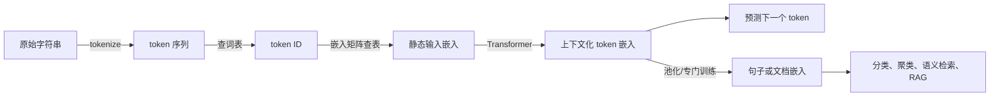
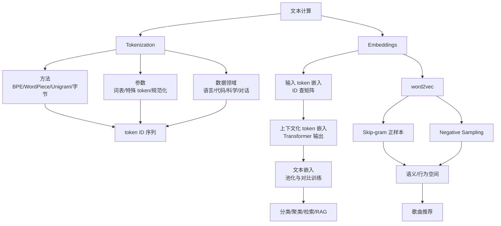

> 原章：*Tokens and Embeddings*
> 本章定位：解释文本进入语言模型前后到底发生了什么。核心链路是“字符串 → token → token ID → 输入嵌入 → 上下文化 token 嵌入 → 文本嵌入”，并进一步说明同一套嵌入思想怎样从语言迁移到推荐系统。

## 0. 阅读地图：从离散符号到可计算的语义空间

语言模型不直接接收字符串。字符串必须先被切成有限词表中的 token，每个 token 再映射到整数 ID；模型用 ID 从嵌入矩阵中取出向量，经过 Transformer 后形成依赖上下文的新向量，最后才用于预测、分类、检索或推荐。




本章要解决五个问题：

1. token 到底是什么，为什么不能简单地把“词”当作固定单位？
2. BPE、WordPiece、SentencePiece、字符和字节方案有何差别？
3. tokenizer 的词表、特殊 token 和训练语料怎样改变模型能力与成本？
4. 静态 token 嵌入、上下文化 token 嵌入和整段文本嵌入是什么关系？
5. word2vec 为什么能从共现关系学到语义，又怎样迁移为歌曲推荐器？

---

## 1. LLM 的 tokenization（LLM Tokenization）

### 1.1 Tokenizer 如何准备语言模型输入（How Tokenizers Prepare the Inputs to the Language Model）

#### 1.1.1 外部看到的是文本，模型看到的是整数

从应用外部看，生成模型似乎执行：

$$
\text{prompt string}\longrightarrow\text{response string}
$$

真正的数据路径却是：

$$
s\xrightarrow{\operatorname{encode}}
(t_1,\ldots,t_n)\xrightarrow{\operatorname{id}}
(i_1,\ldots,i_n)\xrightarrow{\text{model}}
(j_1,\ldots,j_m)\xrightarrow{\operatorname{decode}}r
$$

- $s$ 是输入字符串。
- $t_k$ 是 tokenizer 切出的 token 字符串或字节片段。
- $i_k$ 是 token 在固定词表中的整数索引。
- $j_k$ 是模型逐步生成的 token ID。
- $r$ 是 tokenizer 解码得到的输出字符串。


token ID 只是数组下标，并不表示大小或语义距离。ID `500` 不比 ID `100` “大五倍”，相邻 ID 也不代表 token 含义相近。语义关系存在于模型学到的向量中，而不在整数编号中。

#### 1.1.2 输入和输出都依赖同一个 tokenizer

输入侧，tokenizer 把文本编码为 `input_ids`；输出侧，模型预测词表上的 ID，tokenizer 再将其解码为文本。因此 tokenizer 不是只用一次的清洗工具，而是模型输入输出协议的一部分。


生成模型一次通常只选择一个新 token。用户看到文字逐段出现，正是自回归解码的外部表现：

$$
p(t_{n+1:n+m}\mid t_{1:n})=
\prod_{k=1}^{m}p(t_{n+k}\mid t_{1:n+k-1})
$$

每生成一个 token，它就成为下一步的输入条件。这里是“token”，不是字符或单词；一个英文词可能由多个 token 构成，一个 token 也可能包含空格和多个字符。

### 1.2 下载并运行 LLM（Downloading and Running an LLM）

原章使用 `microsoft/Phi-3-mini-4k-instruct` 展示模型与 tokenizer 的协作。更稳妥的设备配置是让运行库自动选择可用设备：

```python
from transformers import AutoModelForCausalLM, AutoTokenizer

model_id = "microsoft/Phi-3-mini-4k-instruct"

tokenizer = AutoTokenizer.from_pretrained(model_id)
model = AutoModelForCausalLM.from_pretrained(
    model_id,
    device_map="auto",
    torch_dtype="auto",
    trust_remote_code=True,
)
```

`trust_remote_code=True` 会执行模型仓库提供的自定义代码。学习环境中它可解决架构兼容问题；生产环境应先审查代码并固定可信 revision，而不是无条件执行最新远程代码。

#### 1.2.1 显式观察 encode、generate 和 decode

```python
prompt = (
    "Write an email apologizing to Sarah for the tragic gardening mishap. "
    "Explain how it happened.<|assistant|>"
)

inputs = tokenizer(prompt, return_tensors="pt").to(model.device)
generated = model.generate(
    **inputs,
    max_new_tokens=20,
    do_sample=False,
)

prompt_length = inputs["input_ids"].shape[1]
new_token_ids = generated[0, prompt_length:]
print(tokenizer.decode(new_token_ids, skip_special_tokens=True))
```

这段代码比直接解码整个 `generated[0]` 多做了一次切片，只打印新生成部分。关键对象是：

- `input_ids`：形状通常为 `[batch_size, sequence_length]` 的整数张量。
- `attention_mask`：标明哪些位置是真实 token、哪些是 padding。
- `generated`：通常包含原输入 ID 和追加的生成 ID。
- `max_new_tokens=20`：最多生成 20 个 token，而不是 20 个词或字符。

不要手工拼接 `<|assistant|>` 作为通用做法。不同指令模型使用不同角色 token 与格式，应优先调用对应 tokenizer 的聊天模板：

```python
messages = [
    {
        "role": "user",
        "content": "Explain why tokenization affects an LLM's context budget.",
    }
]
prompt = tokenizer.apply_chat_template(
    messages,
    tokenize=False,
    add_generation_prompt=True,
)
```

聊天模板不是装饰。它以模型训练时见过的格式标记 system、user 和 assistant 轮次；格式错误会让模型难以判断谁在说话以及下一段应扮演什么角色。

#### 1.2.2 检查 token，而不是猜 token

```python
encoded = tokenizer("Tokenization matters!", add_special_tokens=True)
token_ids = encoded["input_ids"]
tokens = tokenizer.convert_ids_to_tokens(token_ids)

for token_id, token in zip(token_ids, tokens):
    print(token_id, repr(token))

print(tokenizer.decode(token_ids))
```

`convert_ids_to_tokens` 更适合查看词表中的原始 token；逐个调用 `decode` 有时会显示替换字符，因为一个 Unicode 字符可能横跨多个 byte token。判断是否可逆，应解码**完整 ID 序列**。

原章的 Phi-3 示例展示了几类 token：

- `<s>`：文本起始特殊 token。
- `Write`、`email`：完整词 token。
- `apolog`、`izing`：同一个词的子词片段。
- 标点：可拥有独立 token。
- `<|assistant|>`：表示对话角色的特殊 token。

“Subject”也可能由 `Sub` 与 `ject` 两个 ID 组成。这说明 token 边界由词表决定，而非由人类词边界决定。

### 1.3 Tokenizer 怎样切分文本（How Does the Tokenizer Break Down Text?）

作者把决定切分行为的因素归为三组：

1. **tokenization 方法**：例如 BPE、WordPiece 或 Unigram。
2. **设计参数**：词表大小、特殊 token、大小写规范化等。
3. **训练语料领域**：英语、代码、多语言或科学文本会产生不同高频片段。

可以把 tokenizer 训练理解为一个压缩与建模之间的折中：

$$
\min_V\quad
\operatorname{sequence\_length}(D;V)
+\lambda\operatorname{vocabulary\_cost}(V)
$$

这不是所有算法共同采用的精确目标函数，而是有用的统一直觉：词表越大，常见文本可用更少 token 表示，但嵌入层和输出层更大，稀有 token 的训练次数也可能更少；词表越小，覆盖更容易，但序列更长、注意力计算和生成步数更多。

Tokenizer 一旦训练好，模型训练就围绕其 ID 空间进行。更换 tokenizer 会改变每个 ID 的含义，原嵌入矩阵将不再匹配。因此，预训练模型与 tokenizer 必须作为一个协议整体使用。

### 1.4 词、子词、字符与字节 token（Word Versus Subword Versus Character Versus Byte Tokens）


#### 1.4.1 词级 token

每个完整词对应一个 token，早期 word2vec 常采用这种方式。

优点：

- 序列短，token 与人类词义较容易对应。
- 对固定领域和稳定词表直观有效。

局限：

- 词形变化会膨胀词表，如 `apology`、`apologize`、`apologetic`。
- 新词、拼写变化、用户名和复合词容易成为 `[UNK]`。
- 中文等语言还需要先解决分词边界。

#### 1.4.2 子词 token

子词词表同时保留高频完整词和可复用片段，例如 `apolog` + `izing`。它在词级和字符级之间取得折中：高频词短，稀有词仍能拆开表示。

优点：

- 用有限词表开放式地组合新词。
- 比纯字符方案产生更短序列。
- 词根、前后缀可跨多个词复用。

局限：

- 切分不一定符合语言学词素。
- 低资源语言可能被切得更碎，消耗更多上下文和计算。
- 数字、空白和 Unicode 处理高度依赖训练语料。

#### 1.4.3 字符 token

字符级方案把文本拆成 Unicode 字符。它几乎不会因新词失败，但模型既要学习词义，也要从更长序列中学习拼写组合。若平均一个子词约含 3 个字符，那么相同 1024-token 窗口下，子词方案可能容纳约三倍字符数。

标准自注意力成本近似为 $O(n^2)$，序列长度增加三倍会使注意力矩阵元素数约增加九倍。因此 token 粒度不仅影响语言表现，也影响速度和显存。

#### 1.4.4 字节 token

字节级方案把 UTF-8 字节作为基本单位。一个中文字符通常由多个字节构成。其优势是基础字节集合有限，理论上可表示任意 Unicode 文本；代价是非 ASCII 文本序列可能很长，模型还要学习字节怎样组合为字符。

需要区分：

- **纯 byte-level 模型**：所有文本始终由字节序列表示。
- **byte-fallback 子词模型**：优先用学到的子词，遇到无法表示的字符才退回字节。
- **byte-level BPE**：先以字节为基本符号，再学习高频字节片段的合并。

GPT-2、RoBERTa 一类 tokenizer 能回退到字节，并不等于完全“无 tokenization”。

下面的轻量例子显示不同粒度带来的序列长度差异：

```python
word_tokens = ["unbelievable"]
subword_tokens = ["un", "believ", "able"]
character_tokens = list("unbelievable")
utf8_byte_tokens = list("鸟".encode("utf-8"))

print("word:", len(word_tokens))
print("subword:", len(subword_tokens))
print("character:", len(character_tokens))
print("UTF-8 bytes for 鸟:", len(utf8_byte_tokens), utf8_byte_tokens)
```

```text
word: 1
subword: 3
character: 12
UTF-8 bytes for 鸟: 3 [233, 184, 159]
```

这只是指定切分的计数演示，不代表任意真实 tokenizer 必然这样切；真实结果必须调用实际 tokenizer 检查。

### 1.5 比较训练好的 LLM Tokenizer（Comparing Trained LLM Tokenizers）

原章用同一段混合文本测试多个 tokenizer，刻意包含：

- 大小写；
- emoji 与中文；
- Python 关键字、运算符、换行、空格和 tab；
- 整数与小数；
- 可触发特殊 token 行为的边界。

这种对比不是为了评出唯一“最好”的 tokenizer，而是观察**设计目标怎样进入切分结果**。可用下面的函数复现实验：

```python
from transformers import AutoTokenizer


def show_tokens(text, tokenizer_name):
    tokenizer = AutoTokenizer.from_pretrained(tokenizer_name)
    token_ids = tokenizer(text, add_special_tokens=True)["input_ids"]
    tokens = tokenizer.convert_ids_to_tokens(token_ids)
    for token_id, token in zip(token_ids, tokens):
        print(f"{token_id:>7}  {token!r}")
```

比较时至少记录四个量：

1. 是否能无损覆盖原文本。
2. 每类文本需要多少 token，即 token fertility。
3. 空白、换行、大小写和数字结构是否保留。
4. 特殊 token 是否与目标任务匹配。

#### 1.5.1 BERT base model (uncased) (2018)

- **方法**：WordPiece。
- **词表大小**：30,522。
- **主要特殊 token**：`[UNK]`、`[SEP]`、`[PAD]`、`[CLS]`、`[MASK]`。

它先把英文转为小写，`CAPITALIZATION` 因而变为类似 `capital` + `##ization`。`##` 表示该子词接在前一 token 后而非新词开头。

原章示例中的换行消失，emoji 和中文被映射为 `[UNK]`。这对早期英文理解任务尚可，却意味着原始信息不可恢复，也不适合依赖格式的代码与多语言任务。

特殊 token 的职责：

- `[CLS]`：常放在序列开头，其隐藏状态可用于分类。
- `[SEP]`：结束单句或分隔句对，常见于交叉编码器。
- `[PAD]`：把批次内序列补齐，配合 attention mask 忽略。
- `[MASK]`：掩码语言建模的训练占位符。
- `[UNK]`：词表无法表示的输入，多个未知字符串会丢失为同一 ID。

#### 1.5.2 BERT base model (cased) (2018)

- **方法**：WordPiece。
- **词表大小**：28,996。
- **特殊 token**：与 uncased 版相同。

cased 版保留大小写，因此姓名、缩写等信息不会先被抹去；但低频大写形式可能被切得很碎，示例中的 `CAPITALIZATION` 被拆成八个片段。

选择 cased 或 uncased 是任务取舍：命名实体识别往往受益于大小写，噪声较大的检索或情感分类有时受益于归一化。不存在对所有任务都更优的版本。

#### 1.5.3 GPT-2 (2019)

- **方法**：byte-level BPE。
- **词表大小**：50,257。
- **主要特殊 token**：`<|endoftext|>`。

GPT-2 保留大小写与换行，并可借助字节覆盖 emoji 和中文。逐 token 打印时出现 `U+FFFD` 替换字符，不意味着信息真的丢失；它可能只是某个 token 含有不完整 UTF-8 字节，合并整段 ID 后仍能解码出原字符。

它对空白和代码符号已有一定表达能力，但连续空格可能占多个 token。模型必须在序列中自行跟踪缩进，任务更难。

> **关键辨析**：终端显示的替换字符是“单独解码一个不完整字节片段”的显示问题；`[UNK]` 则表示编码阶段已经用统一未知 ID 替换输入，信息确实丢失。

#### 1.5.4 Flan-T5 (2022)

- **实现**：SentencePiece。
- **可用算法**：SentencePiece 支持 BPE 与 Unigram；它本身不等于一种单独的切分算法。
- **词表大小**：32,100。
- **主要特殊 token**：`<unk>`、`<pad>`，并使用 `</s>`。

原章测试中，换行和空白不保留，emoji 与中文变为 `<unk>`。这反映的是该具体 tokenizer 的训练与规范化选择，而不能推广成“所有 SentencePiece 都不支持多语言”。SentencePiece 的重要特点恰恰是可直接在原始字符串上训练，并显式编码空格边界。

#### 1.5.5 GPT-4 (2023)

- **方法**：BPE。
- **词表大小**：略多于 100,000。
- **特殊 token**：文本结束 token，以及 fill-in-the-middle（FIM）相关 token。

相较 GPT-2，原章观察到：

- `CAPITALIZATION` 和常见代码词需要更少 token。
- `elif`、`>=` 等代码片段可成为单个 token。
- 多种长度的连续空格可各自成为 token，四空格缩进只占一个 token。
- FIM 的 prefix/middle/suffix token 让模型能依据前后文补中间代码。

词表变大提高常见片段压缩率，却也增加输入/输出嵌入参数与 softmax 词表规模。是否值得取决于数据量和目标领域。

#### 1.5.6 StarCoder2 (2024)

- **定位**：代码生成模型。
- **方法**：BPE。
- **词表大小**：49,152。
- **特殊 token**：FIM、文件名、仓库名、GitHub star 等代码仓库元数据 token。

它把连续空白压成 token，也把数字逐位拆分，例如 `600` → `6`、`0`、`0`。逐位方案让不同长度数字共享数字符号，避免 `870` 是一个 token、`871` 却是两个 token 的不规则性；但序列更长，而且 tokenizer 设计本身不能保证模型真正学会精确算术。

`<filename>`、`<reponame>` 一类 token 把代码库结构变成显式边界，使模型有机会区分跨文件上下文。特殊 token 是领域建模接口，不只是文本标点。

#### 1.5.7 Galactica

- **定位**：科学文本。
- **方法**：BPE。
- **词表大小**：50,000。
- **特殊 token**：引用边界、推理工作区、数学、氨基酸和 DNA 序列等。

Galactica 通过 `[START_REF]`、`[END_REF]` 显式标记引用，用 `<work>` 标记推理式文本，并为科学符号序列设计词表。这说明领域 tokenizer 可以把原本需要模型隐式猜测的结构变成直接可见的控制信号。

但特殊 token 只有在训练数据和训练目标中被一致使用才有意义。仅把一个字符串登记为特殊 token，不会自动赋予“引用”或“推理”能力。

#### 1.5.8 Phi-3（以及 Llama 2）（Phi-3 (and Llama 2)）

Phi-3 复用 Llama 2 的 BPE tokenizer 基础，词表约 32,000，并加入对话角色 token，例如 user、assistant 和 system 标记。

这些角色 token 适应了聊天模型的主流使用方式。系统提示、用户问题和助手回复都被串成一个 token 序列，角色 token 负责指出边界。它们不会建立真正独立的“记忆区”，只是在同一上下文中提供训练过的结构标记。

#### 1.5.9 横向结论

| Tokenizer | 主要目标 | 关键行为 | 主要代价或风险 |
|---|---|---|---|
| BERT uncased | 英文理解 | 小写化、WordPiece、任务特殊 token | 丢失大小写，未知字符变 `[UNK]` |
| BERT cased | 保留英文大小写 | 大写信息仍在 | 稀有大写串可能切得很碎 |
| GPT-2 | 通用生成 | byte-level BPE，保留换行 | 代码空白压缩较弱 |
| Flan-T5 | 编码器-解码器任务 | SentencePiece，具体词表较小 | 原章示例中多语言字符变未知 |
| GPT-4 | 通用与代码生成 | 更大词表、空白和代码片段、FIM | 词表层参数更多 |
| StarCoder2 | 代码 | 仓库边界、FIM、逐位数字 | 对自然语言未必最经济 |
| Galactica | 科学文本 | 引用、推理和科学序列标记 | 强领域假设 |
| Phi-3/Llama 2 | 对话生成 | 角色 token | 必须使用正确聊天模板 |

“新 tokenizer 用更少 token 表示某个英文词”不等于它在所有语言和任务上都更好。应在目标语料上测量覆盖、平均 token 数、尾部长度、信息保留和下游性能。

### 1.6 Tokenizer 的属性（Tokenizer Properties）

#### 1.6.1 Tokenization methods

##### BPE：从小符号逐步合并高频片段

BPE 的教学版过程：

1. 把训练语料拆为字符或字节等基本符号。
2. 统计相邻符号对。
3. 合并最值得加入词表的一对。
4. 重新统计，重复直到达到词表预算。

例如语料中 `token`、`tokens`、`tokenize` 很常见，算法可能依次学习 `t`+`o`、`to`+`k`，最终得到 `token`，并让 `s`、`ize` 继续复用。推理时按学到的合并规则切分。

BPE 倾向压缩高频片段，算法简单、可逆性好；但局部贪心合并不直接保证语言学边界或最佳下游任务表现。

##### WordPiece：选择更有区分力的子词

WordPiece 也逐步构建子词词表，但常用实现不只看 pair 的绝对频率，还偏向合并“共同出现强、各自又不至于过于普遍”的片段，可用下面的直觉分数表示：

$$
\operatorname{score}(a,b)=
\frac{\operatorname{freq}(ab)}
{\operatorname{freq}(a)\operatorname{freq}(b)}
$$

实际训练细节依实现而异。BERT 中 `##` 是词内后续片段的显示约定，不是 token 语义的一部分。

##### Unigram：从大词表中删除不重要 token

Unigram 与 BPE 的方向相反：先准备较大的候选词表，为 token 建概率模型，再逐步删除那些对语料似然损害较小的 token。一个字符串可能有多种切法，算法选择总负对数概率较小的分词：

$$
T^*=\arg\min_{T\in\mathcal{S}(x)}
-\sum_{t\in T}\log p(t)
$$

$\mathcal{S}(x)$ 是字符串 $x$ 的所有合法切分。多种候选切分还可用于 subword regularization，提高模型对切分扰动的鲁棒性。

##### SentencePiece：训练实现，不是第四种合并准则

SentencePiece 可在未预先空格分词的原始文本上训练 BPE 或 Unigram，把空格当成普通符号处理，适合没有天然空格边界的语言。说“SentencePiece 与 BPE 对比”时要先明确：比较的是工具实现，还是其中采用的实际算法。

#### 1.6.2 Tokenizer parameters

##### 词表大小

设词表大小为 $|V|$、隐藏维度为 $d$，输入嵌入矩阵参数量为：

$$
N_{embedding}=|V|d
$$

若 $|V|=32{,}000$、$d=3{,}072$，则仅输入嵌入就有：

$$
32{,}000\times3{,}072=98{,}304{,}000
$$

约 9830 万参数，FP16 权重约占 196.6 MB。很多因果模型还把输入嵌入与输出投影权重共享；若不共享，词表相关参数会更多。

大词表通常缩短序列，小词表通常减少参数并改善低频片段共享。最佳值取决于语言数量、训练数据量、模型规模与部署成本。

##### 特殊 token

常见类别包括：

- BOS/EOS：文本或序列开始、结束。
- PAD：批处理补齐。
- UNK：不可表示的输入。
- CLS/SEP/MASK：分类、句对和掩码预训练。
- role token：system、user、assistant 对话边界。
- FIM token：代码前缀、中间和后缀。
- 领域 token：引用、文件、分子或其他结构。

添加特殊 token 后通常还需要扩展模型嵌入矩阵并训练新行：

```python
added = tokenizer.add_special_tokens(
    {"additional_special_tokens": ["<domain_boundary>"]}
)
if added:
    model.resize_token_embeddings(len(tokenizer))
```

新向量起初没有学到可靠语义。仅扩展词表而不继续训练，模型不会自然理解其该 token 的用途。

##### 大小写与规范化

小写化减少词表碎片，却丢失专名和缩写信息。Unicode 规范化、重音、全角/半角、连续空白和控制字符也会影响是否可逆。对法律、代码、安全审计等需要原样保留文本的任务，规范化尤其需要谨慎。

#### 1.6.3 数据领域（The domain of the data）

同一种算法和相同词表大小，在不同语料上会学习出不同 token：

- 代码语料使缩进、运算符、关键字和仓库结构变得高频。
- 多语言语料分配词表容量给不同文字系统。
- 科学语料强调公式、引用、生物序列和术语。
- 对话语料强调角色与轮次边界。

因此 tokenizer 是训练数据分布的压缩画像。一个英文 tokenizer 能用字节表示中文，并不等于它对中文高效：中文可能每个字消耗多个 token，导致相同上下文窗口能容纳的信息更少、API 成本更高。

评估目标领域 tokenizer 可使用：

$$
\operatorname{fertility}=
\frac{\text{token 数}}{\text{词数或字符数}}
$$

还应看未知率、往返解码一致性、每种语言的分位数、代码空白保留和下游任务指标。平均值可能掩盖某个低资源语言的极差表现。

---

## 2. Token 嵌入（Token Embeddings）

Tokenization 只把无限字符串映射到有限 ID 序列；ID 本身仍不可用于连续数值计算。嵌入层把离散类别变成可训练向量。

### 2.1 语言模型为 Tokenizer 词表保存嵌入（A Language Model Holds Embeddings for the Vocabulary of Its Tokenizer）

设词表大小为 $|V|$、模型隐藏维度为 $d$，嵌入矩阵为：

$$
E\in\mathbb{R}^{|V|\times d}
$$

token ID $i$ 的输入向量就是矩阵第 $i$ 行：

$$
x_i=E[i]
$$


从实现看，这是查表；从线性代数看，它等价于 one-hot 向量 $o_i$ 乘嵌入矩阵：

$$
x_i=o_i^{\mathsf T}E
$$

但实际不会构造巨大的 one-hot 向量，因为直接按索引取行更高效。

模型训练前，$E$ 通常随机初始化；语言建模损失通过反向传播更新它。频繁出现在相似上下文中的 token 会受到相似梯度约束，从而形成有用几何关系。

#### 2.1.1 为什么不能给预训练模型随便换 tokenizer

若旧 tokenizer 的 ID `100` 表示 `cat`，新 tokenizer 的 ID `100` 表示 `while`，模型仍会取 $E[100]$，即把 `while` 当成旧模型学到的 `cat` 向量。后续所有层也建立在旧映射上，因此输出失去意义。

即使两个 tokenizer 词表大小相同，ID 对应关系也未必相同。正确做法是使用模型仓库配套 tokenizer；确需更换时，要对嵌入和模型进行充分再训练，而不是只替换配置文件。

#### 2.1.2 Token ID、输入嵌入与位置表示

Transformer 的初始表示通常不只含 token 信息，还会加入或结合位置编码：

$$
h_i^{(0)}=E_{token}[t_i]+E_{position}[i]
$$

现代模型也可能使用旋转位置编码等方式在注意力中注入位置。无论具体形式如何，token 嵌入回答“这是什么符号”，位置机制回答“它出现在哪里”。

### 2.2 用语言模型创建上下文化词嵌入（Creating Contextualized Word Embeddings with Language Models）

静态输入嵌入对同一个 token 永远取同一行。经过 Transformer 后，位置 $i$ 的最终隐藏状态变为：

$$
h_i^{(L)}=f_{\theta}(t_{1:n},i)
$$

它依赖整段可见上下文和位置。于是 “river bank” 与 “central bank” 中 `bank` 的输入嵌入相同，输出隐藏状态不同。


这些表示可用于命名实体识别、词性标注、抽取式摘要和 token 分类。图像生成系统中的文本编码器也会产生上下文化表示，供图像生成网络作为条件。

#### 2.2.1 正确提取隐藏状态

原章代码片段为 tokenizer 与 model 写了不同仓库 ID。即使某些 ID 范围碰巧不越界，token 含义也可能不匹配。应使用同一个 checkpoint 标识：

```python
import torch
from transformers import AutoModel, AutoTokenizer

model_id = "microsoft/deberta-v3-xsmall"
tokenizer = AutoTokenizer.from_pretrained(model_id)
model = AutoModel.from_pretrained(model_id)
model.eval()

tokens = tokenizer("Hello world", return_tensors="pt")
with torch.inference_mode():
    outputs = model(**tokens)

contextual_embeddings = outputs.last_hidden_state
print(contextual_embeddings.shape)
print(tokenizer.convert_ids_to_tokens(tokens["input_ids"][0]))
```

DeBERTa v3 xsmall 的典型输出形状是：

```text
torch.Size([1, 4, 384])
['[CLS]', '▁Hello', '▁world', '[SEP]']
```

具体 token 的显示形式受库版本影响，但三维含义稳定：

$$
[B,L,H]=[\text{batch size},\text{sequence length},\text{hidden size}]
$$

- $B=1$：一次处理一句。
- $L=4$：两个文本 token 加 `[CLS]`、`[SEP]`。
- $H=384$：每个位置由 384 维向量表示。


`last_hidden_state` 不是概率，也不是一个句向量，而是每个序列位置的最终层表示。要分类每个 token，可在最后一维上接线性分类头；要表示整句，还需要池化或专门训练。

#### 2.2.2 特殊 token 与 padding 也占序列位置

批处理时，短句通常补 `[PAD]` 到相同长度。模型输出中也会有 padding 位置向量，因此池化时必须使用 `attention_mask` 排除它们。忽略 mask 会使句向量随批次中最长句改变。

---

## 3. 文本嵌入：句子与完整文档（Text Embeddings (for Sentences and Whole Documents)）

很多任务需要“一段文本一个向量”，以便计算相似度、聚类或建立向量索引。文本嵌入模型实现：

$$
f:\text{text}\rightarrow z\in\mathbb{R}^{d}
$$


### 3.1 从多个 token 向量得到一个文本向量

最简单的是带 mask 的平均池化（mean pooling）：

$$
z=\frac{\sum_{i=1}^{L}m_i h_i}{\sum_{i=1}^{L}m_i}
$$

$m_i\in\{0,1\}$ 表示该位置是否为真实 token。其他方法包括：

- 使用 `[CLS]` 隐藏状态。
- max pooling，逐维取最大值。
- 学习加权池化。
- 使用专门训练的 pooling 模块。

简单平均能把变长序列压成固定维度，却不保证语义空间适合相似度搜索。高质量文本嵌入模型通常以句对、查询—文档对或相似/不相似样本做对比训练，使相关文本靠近、无关文本远离。

### 3.2 用 sentence-transformers 生成句向量

```python
from sentence_transformers import SentenceTransformer

model = SentenceTransformer("sentence-transformers/all-mpnet-base-v2")
sentences = [
    "Best movie ever!",
    "I really enjoyed this film.",
    "The database server is offline.",
]
vectors = model.encode(sentences, normalize_embeddings=True)

print(vectors.shape)
print(vectors @ vectors.T)
```

该模型每段文本输出 768 维向量；三个输入的形状为 `(3, 768)`。归一化后，向量点积等于余弦相似度：

$$
\widehat{u}=\frac{u}{\|u\|_2},\quad
\widehat{u}^{\mathsf T}\widehat{v}=\cos(u,v)
$$

前两句语义接近，预期相似度高于它们与数据库故障句的相似度。实际数值依模型版本而定，不应硬编码为业务阈值。

### 3.3 句子嵌入与文档嵌入的边界

一个向量必须压缩原文，无法保存所有细节。长文还受模型上下文长度限制，常见方法是：

1. 按语义边界或固定长度切块。
2. 分别计算 chunk embedding。
3. 在检索时召回相关块，而非强行把整本书压成一个向量。

文本嵌入适合“整体语义接近吗”，不适合精确还原数字、否定词或每个事实。向量检索常与关键词检索、重排序器和原文核验组合。

---

## 4. LLM 之外的词嵌入（Word Embeddings Beyond LLMs）

嵌入是一种通用建模思想：只要对象之间存在可观察的关系，就能尝试学习向量，使几何位置反映关系。对象可以是词、图片、商品、歌曲、用户或机器人状态。

### 4.1 使用预训练词嵌入（Using pretrained Word Embeddings）

Gensim 可以下载 GloVe 或 word2vec 等静态词向量：

```python
import gensim.downloader as api

embeddings = api.load("glove-wiki-gigaword-50")
neighbors = embeddings.most_similar("king", topn=10)

for word, similarity in neighbors:
    print(f"{word:>12}  {similarity:.3f}")
```

`glove-wiki-gigaword-50` 为每个词提供 50 维静态向量。`most_similar` 通常按余弦相似度寻找近邻，因此 `prince`、`queen`、`emperor` 等可能靠近 `king`。

需要准确区分：

- **word2vec** 是基于局部上下文预测的一组算法。
- **GloVe** 从全局词共现统计中学习向量。
- **fastText** 进一步使用字符 n-gram，改善罕见词和词形变化。

它们都生成静态词嵌入，但不是同一种训练算法。

静态词嵌入便宜、可缓存、在小数据任务中仍有价值；主要局限是一个词只有一个向量、一词多义难处理、未登录词受限，并会继承语料偏见。

### 4.2 Word2vec 算法与对比训练（The Word2vec Algorithm and Contrastive Training）

#### 4.2.1 从连续文本构造监督信号

word2vec 的巧妙之处在于无需人工语义标签。以句子 token 序列 $w_1,\ldots,w_T$ 和窗口半径 $c$ 为例，skip-gram 为中心词 $w_t$ 与邻居 $w_{t+j}$ 生成正样本：

$$
\mathcal{D}^{+}=
\{(w_t,w_{t+j},1)\mid -c\le j\le c,\ j\ne0\}
$$


下面的代码直接展示窗口如何产生样本：

```python
def skipgram_pairs(tokens, window_size=1):
    pairs = []
    for center_index, center in enumerate(tokens):
        left = max(0, center_index - window_size)
        right = min(len(tokens), center_index + window_size + 1)
        for context_index in range(left, right):
            if context_index != center_index:
                pairs.append((center, tokens[context_index]))
    return pairs


tokens = "deep models learn useful embeddings".split()
for pair in skipgram_pairs(tokens, window_size=1):
    print(pair)
```

```text
('deep', 'models')
('models', 'deep')
('models', 'learn')
('learn', 'models')
('learn', 'useful')
('useful', 'learn')
('useful', 'embeddings')
('embeddings', 'useful')
```

窗口小，更偏局部句法关系；窗口大，更容易学到主题相关性。窗口并非“真实语义范围”，而是设计超参数。

#### 4.2.2 为什么必须有负样本

如果训练集全是邻居正例，恒定输出 1 就能得到完美准确率，却学不到区分能力。于是从噪声分布采样非邻居词作为负例：

$$
\mathcal{D}^{-}=\{(w_t,w_k,0)\mid w_k\sim P_n(w)\}
$$


经典 word2vec 常使用平滑词频噪声分布：

$$
P_n(w)=\frac{f(w)^{3/4}}{\sum_{v\in V}f(v)^{3/4}}
$$

$3/4$ 次幂降低最高频词的支配程度，同时又不会像均匀采样那样过多选择极罕见词。

#### 4.2.3 Skip-gram with Negative Sampling 目标

令中心词输入向量为 $v_c$、上下文输出向量为 $u_o$，负样本为 $u_{n_k}$，单个正样本的最大化目标是：

$$
\log\sigma(u_o^{\mathsf T}v_c)
+\sum_{k=1}^{K}\log\sigma(-u_{n_k}^{\mathsf T}v_c)
$$

其中：

$$
\sigma(x)=\frac{1}{1+e^{-x}}
$$

- 第一项推动真实邻居点积增大。
- 第二项推动随机负例点积减小。
- $K$ 是每个正例的负样本数。

这比对整个词表做 softmax 便宜得多：每步只更新中心词、一个正上下文与 $K$ 个负词的向量。


#### 4.2.4 从随机矩阵到语义空间

词表建立后，输入/输出嵌入矩阵随机初始化：

$$
V,U\in\mathbb{R}^{|\mathcal{V}|\times d}
$$


反向传播反复拉近正样本、推远负样本。若两个词出现在相似上下文中，它们收到相似更新，最终在向量空间靠近。


word2vec 通常维护输入与输出两套向量，训练结束后常取输入矩阵或二者组合。所谓“每个维度代表一种可命名属性”只是便于想象；真正稳定的是向量间的相对几何结构。

#### 4.2.5 与现代对比学习的关系

两者共同原则是：构造相关正对与不相关负对，学习可区分的表示。word2vec 的二元负采样目标是早期代表；现代句向量和图文对齐常在批内使用多个负样本和 softmax/InfoNCE：

$$
\mathcal{L}_i=-\log
\frac{\exp(\operatorname{sim}(q_i,d_i^+)/\tau)}
{\sum_j\exp(\operatorname{sim}(q_i,d_j)/\tau)}
$$

$\tau$ 是温度，控制分布尖锐度。关系是思想延续，而不是“word2vec 与所有现代对比损失完全相同”。

---

## 5. 推荐系统中的嵌入（Embeddings for Recommendation Systems）

### 5.1 用嵌入推荐歌曲（Recommending Songs by Embeddings）

作者做了一个关键类比：

| 语言建模 | 歌曲推荐 |
|---|---|
| 词/token | 歌曲 ID |
| 句子 | 用户或电台创建的播放列表 |
| 邻近词 | 同一播放列表中相近出现的歌曲 |
| 词嵌入 | 歌曲嵌入 |
| 相似词查询 | 相似歌曲推荐 |


如果大量策展人把 Michael Jackson、Prince 和 Madonna 的歌曲放在相近位置，它们会形成正共现样本；word2vec 由此把歌曲向量拉近。查询 “Billie Jean” 的近邻便能得到风格或受众相近的歌曲。

这种方法学到的是**行为共现相似性**，不一定是音频相似性：两首歌可能因时代、场景或听众群相同而靠近，即使节奏和乐器不同。这正是协同过滤的价值，也构成它的偏差来源。

### 5.2 训练歌曲嵌入模型（Training a Song Embedding Model）

#### 5.2.1 数据准备

原章使用美国多家广播电台的播放列表与歌曲元数据。基本处理步骤是：

1. 下载播放列表文件。
2. 跳过元数据行。
3. 删除只有一首歌、无法形成共现对的列表。
4. 加载歌曲 ID、标题和歌手信息。
5. 把每个播放列表表示为歌曲 ID 字符串序列。

```python
from urllib import request

import pandas as pd

playlist_url = (
    "https://storage.googleapis.com/maps-premium/"
    "dataset/yes_complete/train.txt"
)
song_url = (
    "https://storage.googleapis.com/maps-premium/"
    "dataset/yes_complete/song_hash.txt"
)

lines = request.urlopen(playlist_url).read().decode("utf-8").splitlines()[2:]
playlists = [line.split() for line in lines if len(line.split()) > 1]

song_lines = request.urlopen(song_url).read().decode("utf-8").splitlines()
songs = [line.split("\t") for line in song_lines if line]
songs_df = pd.DataFrame(songs, columns=["id", "title", "artist"]).set_index("id")
```

这是隐式反馈数据：列表中出现表示某种正关系，没有出现不等于用户讨厌。负采样只是训练近似，不应被解释成真实负偏好。

#### 5.2.2 训练 Word2Vec

```python
from gensim.models import Word2Vec

model = Word2Vec(
    sentences=playlists,
    vector_size=32,
    window=20,
    negative=50,
    min_count=1,
    workers=4,
    seed=42,
)
```

参数与业务含义：

- `vector_size=32`：每首歌的向量维度；更大容量不保证更好。
- `window=20`：中心歌曲前后最多看 20 首，表示较宽的播放列表语境。
- `negative=50`：每个正例采 50 个负例，增强区分但增加计算。
- `min_count=1`：保留只出现一次的歌曲；覆盖完整，却让极冷门歌曲向量很不稳定。
- `workers=4`：并行训练线程数。
- `seed=42`：提高复现实验的可能性；多线程训练仍可能存在小差异。

#### 5.2.3 查询近邻并关联元数据

```python
def recommend(song_id, topn=5):
    neighbors = model.wv.most_similar(str(song_id), topn=topn)
    neighbor_ids = [neighbor_id for neighbor_id, _ in neighbors]
    result = songs_df.loc[neighbor_ids].copy()
    result["similarity"] = [score for _, score in neighbors]
    return result


print(recommend(2172))
```

这里应使用 `.loc[neighbor_ids]`，因为 `songs_df` 已把字符串歌曲 ID 设为标签索引；`.iloc` 表示按整数位置选行，容易把 ID 与行号混淆。

原章的示例结果中，Metallica 的 “Fade To Black” 附近出现 Van Halen、Dio、Guns N' Roses 和 Judas Priest 等重金属/硬摇滚歌曲，说明播放列表共现确实捕捉到有用风格关系。

#### 5.2.4 为什么方法有效

对歌曲 $s$ 与上下文歌曲 $c$，目标推动：

$$
v_s^{\mathsf T}u_c\uparrow
\quad\text{if they co-occur,}\qquad
v_s^{\mathsf T}u_n\downarrow
\quad\text{for sampled negatives}
$$

跨越许多播放列表后，单次偶然共现被平均，稳定的受众、年代、流派和场景关系积累在向量中。近邻检索把这种隐式关系转成推荐。

#### 5.2.5 适用范围与局限

- **冷启动（cold start）**：新歌没有播放列表共现，无法学到可靠向量。
- **流行度偏差**：热门歌更常出现，也更容易成为近邻和负样本。
- **曝光偏差**：未共现可能只是用户没听过，不代表不喜欢。
- **顺序语义有限**：窗口共现无法完整表达播放目的和用户意图。
- **单向量局限**：一首跨流派歌曲的多重用途被压进一个向量。
- **时间漂移**：新趋势出现后需要更新数据与模型。
- **过滤泡泡**：只推荐近邻会降低发现性和多样性。

实际系统通常融合歌曲内容特征、用户嵌入、流行度、时间、地域和业务约束，并在召回后进行排序与多样化。

#### 5.2.6 怎样评估，而不只看几个漂亮案例

定性查看 “Billie Jean” 或 “California Love” 的近邻只能证明结果看起来合理，不能证明系统整体有效。应划分未参与训练的后续交互，检查：

- Recall@K：真实后续歌曲有多少被前 $K$ 个推荐召回。
- Precision@K：前 $K$ 个推荐中有多少相关。
- NDCG@K：越靠前命中权重越高。
- Coverage：有多少歌曲和用户能获得推荐。
- Diversity/Novelty：是否只返回热门且高度相似的歌曲。
- 在线指标：点击、播放完成率、跳过率和长期留存。

按时间划分比随机拆分更接近上线环境，也能避免未来播放信息泄漏到训练集。

---

## 6. 重点辨析与常见误区

### 6.1 Token 不等于词

Token 可以是完整词、子词、字符、字节、空白串、代码运算符或特殊控制标记。模型成本按 token 计算，因此“同样字数”在不同语言和 tokenizer 下成本不同。

### 6.2 Tokenizer 不是模型训练后的可替换插件

嵌入矩阵每一行与 token ID 绑定。任意换 tokenizer 会改变 ID 语义，除非重新对齐并训练模型。

### 6.3 SentencePiece 不等于 Unigram

SentencePiece 是可训练 tokenizer 的实现框架，可使用 Unigram 或 BPE。BPE、WordPiece、Unigram 才是词表构建/切分方法层面的比较对象。

### 6.4 Byte fallback 不等于纯字节模型

一个子词 tokenizer 可以只在未知字符处退回字节；纯字节模型则始终以字节为基本输入。二者的序列长度和归纳偏置不同。

### 6.5 `U+FFFD` 替换字符与 `[UNK]` 不是一回事

`U+FFFD` 可能只是单独显示不完整 UTF-8 片段时产生的替换字符，完整序列仍可逆；`[UNK]` 表示原输入已被统一未知 token 替代，信息通常无法恢复。

### 6.6 Token ID 不是嵌入

ID 是离散索引；输入嵌入是从矩阵查出的连续向量；上下文化嵌入又是该向量经过多层模型后的结果。

### 6.7 Token 嵌入不是文本嵌入

Token 嵌入形状通常为 `[B,L,H]`，一句话有多个向量；文本嵌入通常为 `[B,H]`，每段文本一个向量。后者不能靠随意取第一个 token 就保证高质量。

### 6.8 静态嵌入与上下文化嵌入

word2vec/GloVe 中 `bank` 只有一个向量；Transformer 输出的 `bank` 向量随句子变化。静态向量便宜，上下文化向量更能处理多义词。

### 6.9 相似不等于相同、正确或因果相关

嵌入近邻反映训练目标和数据中的关联。两篇文本接近不代表事实完全一致；两首歌接近也不证明音频结构相似或用户一定喜欢。

### 6.10 更大词表不总是更好

大词表缩短常见序列，但增加参数和输出计算，且可能让低频 token 训练不足。多语言公平性和目标语料 token fertility 比单一词表大小更有判断力。

### 6.11 特殊 token 不会自动产生能力

登记 `<citation>`、`<assistant>` 或 `<work>` 只创建一个新符号。模型必须在足够训练样本中学到它与目标行为的关系。

### 6.12 负采样词不代表用户明确不喜欢

word2vec 的负例来自计算近似。推荐系统中“未共现”多是未知反馈，而非负偏好；将其当成事实标签会误读模型输出。

---

## 7. 总结（Summary）

### 7.1 本章知识结构



### 7.2 核心结论

1. LLM 处理的是 token ID，而不是原始字符串；tokenizer 同时承担输入编码和输出解码。
2. token 边界由算法、参数与训练语料共同决定，不天然等于词或字符。
3. 子词方案在开放词表、序列长度与参数规模之间折中；字符和字节提升覆盖，却通常拉长序列。
4. tokenizer 直接影响上下文容量、推理成本、多语言公平性、代码格式保留和模型可学习性。
5. 模型为每个 token ID 保存一行静态输入嵌入，Transformer 再把它变成依赖上下文的隐藏状态。
6. 句子/文档嵌入把多 token 表示压成单向量，高质量空间通常需要专门的对比训练，而非仅做任意池化。
7. word2vec 用滑动窗口构造正例、用负采样防止平凡解，通过“拉近相关、推远随机”从无标注序列学习表示。
8. 只要能把对象视作 token、把共现集合视作句子，同一思想就能迁移到歌曲等推荐对象。
9. 嵌入表达的是数据与目标函数定义的相关性，不自动表达事实、因果或用户真实偏好。

### 7.3 解决同类问题的一般思路

面对新的 tokenization 或 embedding 任务，可以按以下顺序分析：

1. **明确对象与输出**：要表示词、代码片段、句子、文档、商品还是用户？
2. **找出最小可靠单位**：词是否会出现 OOV，字符/字节是否让序列过长？
3. **检查数据领域**：语言分布、格式、数字、空白和结构标记有哪些特点？
4. **设定词表与特殊 token**：每个新增符号是否有足够训练信号和明确职责？
5. **定义正关系**：邻近词、相似句、查询—文档、同播放列表歌曲分别表达什么？
6. **构造反例**：怎样采负例才不会让模型走捷径，又不把未知误当真实负面？
7. **选择目标与相似度**：点积、余弦、二元负采样或批内对比损失是否匹配使用场景？
8. **验证表示**：既看近邻案例，也用留出数据检查召回、排序、覆盖、偏差与鲁棒性。
9. **评估系统成本**：token fertility、上下文长度、词表参数、索引规模与延迟是否可接受？
10. **识别边界**：静态表示、多义性、冷启动、时间漂移和训练偏见需要哪些额外组件补足？

本章体现的一般方法是：先把不可计算的对象离散化并建立稳定索引，再通过可自监督构造的关系学习连续空间，最后用空间中的距离服务下游任务。每一步都在压缩信息，因此既要问“保留了什么”，也要问“丢掉了什么”。
