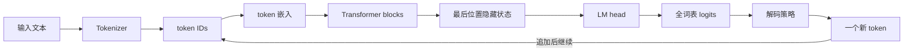
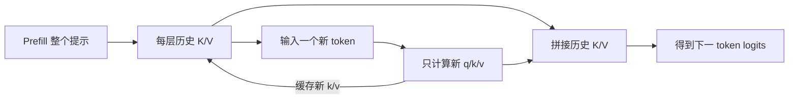
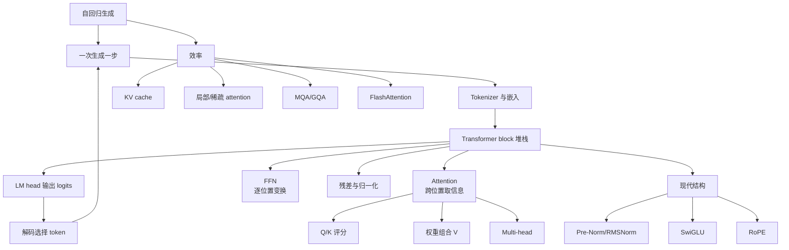

> 原章：*Looking Inside Large Language Models*
> 本章定位：沿一次文本生成的真实执行路径打开 Transformer 黑盒。重点不是背组件名称，而是理解每个组件接收什么、输出什么、为什么存在，以及质量、速度、显存和上下文长度之间如何互相制约。

## 0. 本章路线：一枚 token 是怎样生成的

前两章已经得到 token ID 和嵌入。本章继续追踪一个因果语言模型如何把提示变成下一个 token：



每一轮只增加一个 token。Transformer block 又由两类互补计算构成：

- **注意力（attention）**：让当前位置从其他可见位置取回相关信息。
- **前馈网络（feedforward network，FFN/MLP）**：逐位置变换取回后的表示，提供大量参数容量。

现代架构的很多改进都围绕三个瓶颈：

1. 全注意力随序列长度近似按 $O(n^2)$ 增长。
2. 自回归解码无法跨未来 token 并行。
3. KV cache、激活和权重持续争夺有限的显存带宽与容量。

原章用 Phi-3-mini 演示。下面的加载代码保留该模型，同时让设备自动分配：

```python
from transformers import AutoModelForCausalLM, AutoTokenizer, pipeline

model_id = "microsoft/Phi-3-mini-4k-instruct"
tokenizer = AutoTokenizer.from_pretrained(model_id)
model = AutoModelForCausalLM.from_pretrained(
    model_id,
    device_map="auto",
    torch_dtype="auto",
    trust_remote_code=True,
)

generator = pipeline(
    "text-generation",
    model=model,
    tokenizer=tokenizer,
    return_full_text=False,
    max_new_tokens=50,
    do_sample=False,
)
```

模型较大，首次运行会下载权重；`trust_remote_code=True` 还意味着允许执行仓库代码，生产环境应审查并固定 revision。

---

## 1. Transformer 模型总览（An Overview of Transformer Models）

### 1.1 已训练 Transformer LLM 的输入与输出（The Inputs and Outputs of a Trained Transformer LLM）

#### 1.1.1 “文本进、文本出”隐藏了一个循环

应用层看起来是：

$$
\text{prompt}\longrightarrow\text{generated text}
$$

神经网络本身执行的却是：

$$
(t_1,\ldots,t_n)\longrightarrow p(t_{n+1}\mid t_{1:n})
$$

它只预测下一个 token 的分布。外部生成循环选择 $t_{n+1}$，追加到序列，再运行下一次 forward pass：

$$
p(t_{n+1:n+m}\mid t_{1:n})=
\prod_{j=1}^{m}p(t_{n+j}\mid t_{1:n+j-1})
$$


这种把自身先前输出作为后续输入条件的模型称为**自回归模型（autoregressive model）**。BERT 一类表示模型通常同时编码已知序列，不以同样方式逐 token 生成，因而不能把“所有 Transformer”都等同于自回归模型。

#### 1.1.2 生成停止的条件

循环通常在以下任一条件满足时停止：

- 生成 EOS/结束 token。
- 达到 `max_new_tokens`。
- 输入加输出触及上下文窗口。
- 命中应用定义的停止字符串或停止 token。
- 外部请求被取消或超时。

原章邮件示例在句子中间停止，不是模型认为邮件已经完成，而是达到 50 个新 token 上限。`max_new_tokens` 限制新增 token，不能直接换算成固定词数。

```python
prompt = (
    "Write an email apologizing to Sarah for the tragic gardening mishap. "
    "Explain how it happened."
)
result = generator(prompt)
print(result[0]["generated_text"])
```

### 1.2 Forward Pass 的组成（The Components of the Forward Pass）

一次完整生成步骤可分为三大部分：

1. **Tokenizer**：字符串与 token ID 互换。
2. **Transformer block 堆栈**：把每个位置的输入表示逐层变成上下文化隐藏状态。
3. **语言模型头（LM head）**：把隐藏维度投影到词表维度。


#### 1.2.1 从 ID 到隐藏状态

若词表大小为 $|V|$、模型维度为 $d_{model}$，输入嵌入矩阵为：

$$
E\in\mathbb{R}^{|V|\times d_{model}}
$$

每个 ID 查出一行向量。对长度为 $n$ 的序列，忽略 batch 后，初始表示矩阵为：

$$
X^{(0)}\in\mathbb{R}^{n\times d_{model}}
$$

经过 $L$ 个 block：

$$
X^{(l+1)}=\operatorname{Block}_l(X^{(l)}),
\qquad l=0,\ldots,L-1
$$


以原章打印的 Phi-3-mini 为例：

- 词表大小为 32,064。
- 隐藏维度为 3,072。
- 堆叠 32 个 decoder block。
- 每个 block 含 self-attention、MLP、RMSNorm 和残差路径。
- LM head 把 3,072 维映射回 32,064 维。

#### 1.2.2 LM head 输出 logits，不直接输出概率

设最后一层、位置 $i$ 的隐藏状态为 $h_i\in\mathbb{R}^{d_{model}}$，LM head 是线性映射：

$$
z_i=W_{LM}h_i+b,
\qquad z_i\in\mathbb{R}^{|V|}
$$

$z_i$ 的元素叫 **logits**，可以是任意实数，不保证非负，也不保证总和为 1。softmax 才把它们转成概率：

$$
p(t=j\mid t_{\le i})=
\frac{\exp(z_{i,j})}{\sum_{k=1}^{|V|}\exp(z_{i,k})}
$$


原章把 LM head 输出称为 probability score，便于直觉理解；严格地说应是 logits。因为 softmax 单调，`argmax(logits)` 与 `argmax(probabilities)` 相同，所以贪心选择时可以不显式计算 softmax。

#### 1.2.3 “Head”表示任务接口

同一 Transformer backbone 可以连接不同任务头：

| Head | 输出形状示意 | 任务 |
|---|---|---|
| Causal LM head | `[B, L, |V|]` | 下一 token 预测 |
| Sequence classification head | `[B, C]` | 整句分类 |
| Token classification head | `[B, L, C]` | NER、词性等逐 token 分类 |

这里的 LM head 与 attention head 不是同一概念：前者是模型末端任务投影，后者是一个注意力层内部的并行子空间。

### 1.3 从概率分布选择一个 Token：采样与解码（Choosing a Single Token from the Probability Distribution (Sampling/Decoding)）

模型给出分布，**解码策略（decoding strategy）**决定实际输出。相同权重、相同提示可以因解码策略不同而产生完全不同的文本。


#### 1.3.1 贪心解码

$$
t_{next}=\arg\max_j z_j
$$

优点是确定、快速；缺点是每步局部最优不保证整段联合概率或质量最优，还容易生成重复、平庸文本。

#### 1.3.2 温度

温度 $T>0$ 调整分布：

$$
p_j(T)=\frac{\exp(z_j/T)}{\sum_k\exp(z_k/T)}
$$

- $T<1$：放大 logit 差异，分布更尖锐。
- $T>1$：缩小差异，分布更平坦、更随机。
- $T\to0^+$：趋近贪心。

“temperature = 0”是 API 对贪心模式的约定；数学上不能真的除以零。

下面用固定 logits 观察温度：

```python
from math import exp


def softmax(logits, temperature=1.0):
    scaled = [value / temperature for value in logits]
    maximum = max(scaled)
    weights = [exp(value - maximum) for value in scaled]
    total = sum(weights)
    return [weight / total for weight in weights]


logits = [2.0, 1.0, 0.0]
for temperature in (2.0, 1.0, 0.5):
    probabilities = softmax(logits, temperature)
    print(temperature, [round(value, 3) for value in probabilities])
```

```text
2.0 [0.506, 0.307, 0.186]
1.0 [0.665, 0.245, 0.09]
0.5 [0.867, 0.117, 0.016]
```

温度只重分配已有候选概率，不能给模型补充知识，也不能保证高温一定更有创造力或低温一定更正确。

#### 1.3.3 Top-k 与 nucleus/top-p

- **Top-k**：只保留概率最高的 $k$ 个 token，再归一化采样。候选数固定，但不同步骤中第 $k$ 名可能极不合理。
- **Top-p**：按概率降序保留累计概率首次达到 $p$ 的最小集合。模型很确定时集合小，不确定时集合大。

二者经常与温度组合。采样适合创作和多样候选；事实抽取、结构化输出等任务通常偏向更低随机性。评估时应固定随机种子和生成参数，但 GPU 算子与库版本仍可能造成差异。

#### 1.3.4 直接检查模型最后位置

使用公共输出接口比调用 `model.model` 和 `lm_head` 内部属性更稳健：

```python
import torch

prompt = "The capital of France is"
inputs = tokenizer(prompt, return_tensors="pt").to(model.device)

with torch.inference_mode():
    outputs = model(**inputs)

last_logits = outputs.logits[0, -1]
top_values, top_ids = torch.topk(last_logits, k=5)
top_probabilities = torch.softmax(top_values, dim=-1)

for token_id, probability in zip(top_ids, top_probabilities):
    token = tokenizer.decode([token_id.item()])
    print(repr(token), float(probability))
```

注意：这里对**截取后的 top-5 logits** 做 softmax，得到的是候选集合内部重新归一化的相对概率，不是它们在完整 32,064 词表上的原始概率。若需要真实全词表概率，应先对 `last_logits` 整体 softmax，再索引 top ID。

### 1.4 Token 并行处理与上下文大小（Parallel Token Processing and Context Size）

#### 1.4.1 哪些计算可以并行

训练时整段目标 token 已知，通过因果 mask 可一次计算所有位置的损失。推理分两阶段：

1. **Prefill**：对整个输入提示并行计算，建立每层 KV cache。
2. **Decode**：每轮只有一个新 token，下一轮依赖上一轮结果，无法跨生成步完全并行。


把 token 想成“各自一条流”有助于理解张量并行，但这些流不是互相独立：每个 block 的 attention 都让当前位置读取其他可见位置。FFN 才是逐位置独立应用同一组参数。

#### 1.4.2 张量形状怎样变化

若 batch 为 $B$、序列长度为 $L$、隐藏维度为 $D$、词表大小为 $V$：

$$
\text{hidden states}: [B,L,D]
\xrightarrow{LM\ head}
\text{logits}: [B,L,V]
$$

原章例子：

$$
[1,6,3072]\longrightarrow[1,6,32064]
$$


生成下一 token 只读取 `logits[:, -1, :]`，但前面位置并非白算：它们的 K/V 表示被最后位置注意力使用；训练时所有位置还各自贡献下一 token 损失。

#### 1.4.3 Context size 的准确含义

上下文长度是一次模型调用能处理的最大 token 序列预算，而不是永久记忆，也不是互不相关的“流数量”。预算包括系统提示、历史消息、检索材料、用户输入、特殊 token 和新生成 token：

$$
L_{input}+L_{output}\le L_{context}
$$

支持 128K token 只说明接口容量，不保证模型对所有位置同样敏感，更不表示注意力成本免费。有效利用长上下文需要训练分布、位置方法、检索组织与评测共同支持。

### 1.5 用 Key-Value Cache 加速生成（Speeding Up Generation by Caching Keys and Values）

#### 1.5.1 重复计算从哪里来

假设已有 $n$ 个 token。生成第 $n+1$ 个后，若把长度 $n+1$ 的整个序列重新送入模型，前 $n$ 个位置在每层的 K/V 与上一轮相同。重复计算随着输出变长越来越浪费。

KV cache 在每层保存历史位置的 key 与 value。下一轮只计算新 token 的 $q,k,v$，把新 $k,v$ 追加到 cache，再让新 query 读取全部历史 K/V。




#### 1.5.2 缓存显存公式

近似忽略对齐和框架开销，KV cache 字节数为：

$$
M_{KV}=2\times N_{layers}\times B\times L
\times N_{kv\_heads}\times d_{head}\times b
$$

- 系数 2 来自 key 和 value 两份缓存。
- $B$ 是 batch/并发序列数。
- $L$ 是已缓存上下文长度。
- $b$ 是每个元素字节数，如 FP16 为 2。

```python
layers = 32
batch = 1
tokens = 4096
kv_heads = 8
head_dim = 128
bytes_per_value = 2

cache_bytes = (
    2 * layers * batch * tokens * kv_heads * head_dim * bytes_per_value
)
print(f"{cache_bytes / 1024**2:.0f} MiB")
```

```text
512 MiB
```

若并发变为 16，仅这一项近似增至 8 GiB。KV cache 用计算换显存，是服务系统批量、上下文和并发规划的核心约束。

#### 1.5.3 Cache 能做什么，不能做什么

- 它显著减少 decode 阶段的历史 K/V 重算。
- 它不消除新 query 与历史 keys 的注意力计算。
- 它不加速首次 prefill 到完全不计成本。
- 它不会提高模型质量或扩大训练过的有效上下文。
- 它随序列长度和并发线性占显存。

原章在 T4 上给出生成 100 token 时启用 cache 约 4.5 秒、关闭约 21.8 秒。该数字只说明量级差异，实际结果受模型、后端、量化、批量、上下文、GPU 和库版本影响。

可用普通 Python 计时，避免把 Jupyter 的 `%%timeit` 写进脚本：

```python
from time import perf_counter


def timed_generation(use_cache):
    start = perf_counter()
    model.generate(
        **inputs,
        max_new_tokens=100,
        use_cache=use_cache,
        do_sample=False,
    )
    return perf_counter() - start


print("cached:", timed_generation(True))
print("uncached:", timed_generation(False))
```

接口流式返回 token 主要改善首 token 后的感知等待时间，不会凭空减少总计算。

### 1.6 Transformer Block 内部（Inside the Transformer Block）

模型的大部分计算发生在重复堆叠的 block 中。每层接收 `[B,L,D]`，输出形状仍为 `[B,L,D]`，便于连续堆叠。


可以把分工概括成：

$$
\text{Attention: 跨位置通信}
\qquad
\text{FFN: 每个位置内部变换}
$$

#### 1.6.1 前馈神经网络概览（The feedforward neural network at a glance）

经典 FFN 对每个位置使用相同参数：

$$
\operatorname{FFN}(x)=W_2\phi(W_1x+b_1)+b_2
$$

通常先从 $d_{model}$ 扩展到更大的中间维度 $d_{ff}$，经非线性激活后再投影回 $d_{model}$。所有 token 可并行执行，但不同位置之间不在 FFN 中交换信息。


原章用 “The Shawshank” → “Redemption” 说明模型从大量共现中保存模式。更准确的理解是：FFN 参数对事实和模式记忆贡献很大，但信息是分布式的，嵌入、attention、残差流和多层协作也参与结果。LLM 不是按主键精确查值的数据库：

- 参数将大量样本压缩进有限容量。
- 相近上下文会插值和泛化。
- 记忆可能不完整、冲突或过时。
- 生成的是条件概率较高的 token，不是真值查询结果。

原始基础模型可能直接续写 “Redemption”；经过指令微调和偏好对齐的聊天模型则可能解释电影信息。后训练改变了交互行为，不能把聊天产品输出当作纯预训练目标的直接表现。

#### 1.6.2 注意力层概览（The attention layer at a glance）

N-gram 只能看固定短窗口，难处理长距离关系。句子：

> The dog chased the squirrel because **it** ...

要继续生成，模型需根据上下文判断 `it` 更可能指什么。attention 让当前位置从此前 token 的表示中按相关度取回信息，再写入当前位置的新表示。


注意力不是内置语法解析器。相关模式来自训练数据和损失优化；代词指代可能仍判断错误，尤其在提示含歧义或分布外结构时。

#### 1.6.3 注意力就是你所需要的一切（Attention is all you need）

单头 attention 可分两步：

1. 对当前 query 与可见 keys 做相关性评分。
2. 用归一化权重对 values 做加权求和。


多头注意力把表示投影到多个子空间，让不同头并行建立不同关系，再拼接投影回模型维度。


“不同头分别负责语法、指代、位置”可作为直觉，但不是架构硬编码，也不是每个头都可稳定解释。头之间可能冗余，功能还会跨层分布。

#### 1.6.4 注意力怎样计算（How attention is calculated）

设一层输入为 $X\in\mathbb{R}^{L\times d_{model}}$。每个头用训练得到的投影矩阵产生：

$$
Q=XW_Q,\qquad K=XW_K,\qquad V=XW_V
$$


直觉：

- Query：当前位置想找什么？
- Key：每个位置可按什么特征被匹配？
- Value：匹配后真正取回什么内容？

完整缩放点积注意力：

$$
\operatorname{Attention}(Q,K,V)=
\operatorname{softmax}\left(
\frac{QK^{\mathsf T}}{\sqrt{d_k}}+M
\right)V
$$

$M$ 是 mask。decoder-only 模型的因果掩码（causal mask）在未来位置填 $-\infty$，softmax 后权重为 0，从而防止训练时偷看未来 token。

为什么除以 $\sqrt{d_k}$？若 query/key 各维独立、均值 0、方差 1，点积是 $d_k$ 项乘积之和，方差约为 $d_k$。除以 $\sqrt{d_k}$ 把标准差拉回常数量级，避免 softmax 过早饱和、梯度过小。

多头形式为：

$$
head_h=\operatorname{Attention}(XW_Q^{(h)},XW_K^{(h)},XW_V^{(h)})
$$

$$
\operatorname{MHA}(X)=
\operatorname{Concat}(head_1,\ldots,head_H)W_O
$$

#### 1.6.5 自注意力：相关性评分（Self-attention: Relevance scoring）

对当前 query $q_i$ 与位置 $j$ 的 key $k_j$：

$$
s_{i,j}=\frac{q_i^{\mathsf T}k_j}{\sqrt{d_k}}+M_{i,j}
$$

$$
\alpha_{i,j}=\frac{\exp(s_{i,j})}{\sum_{r}\exp(s_{i,r})}
$$


$\alpha_{i,j}\ge0$ 且对可见位置求和为 1。它表示本头、本层、本次 forward 中的信息混合权重，不自动等于人类可读解释或因果贡献。

#### 1.6.6 自注意力：组合信息（Self-attention: Combining information）

当前位置输出是 values 的加权和：

$$
o_i=\sum_j\alpha_{i,j}v_j
$$


一个二维小例子：当前 query 更匹配第一个 key，于是输出更接近第一个 value。

```python
from math import exp, sqrt

query = [1.0, 0.0]
keys = [[1.0, 0.0], [0.0, 1.0]]
values = [[2.0, 1.0], [1.0, 2.0]]

scores = [
    sum(left * right for left, right in zip(query, key)) / sqrt(2)
    for key in keys
]
unnormalized = [exp(score) for score in scores]
total = sum(unnormalized)
weights = [value / total for value in unnormalized]
output = [
    sum(weight * value[index] for weight, value in zip(weights, values))
    for index in range(2)
]

print("weights:", [round(value, 3) for value in weights])
print("output:", [round(value, 3) for value in output])
```

```text
weights: [0.67, 0.33]
output: [1.67, 1.33]
```

attention 输出还会经过输出投影、残差连接与归一化，不应把这个加权和当成整个 block 的最终结果。

---

## 2. Transformer 架构的近期改进（Recent Improvements to the Transformer Architecture）

原始 Transformer 的基本骨架延续至今，但长上下文与大规模服务暴露出计算、内存和训练稳定性瓶颈。改进可以分成两类：

- **改变允许的信息连接或 K/V 共享方式**：稀疏注意力、MQA、GQA。
- **保持数学目标、优化实现与数据移动**：FlashAttention。

### 2.1 更高效的注意力（More Efficient Attention）

标准全注意力要形成 $L\times L$ 分数矩阵：

$$
\text{time}=O(L^2d),\qquad
\text{attention matrix memory}=O(L^2)
$$

当 $L$ 翻倍，位置对数量约变四倍。这是注意力效率研究集中的原因。

#### 2.1.1 局部/稀疏注意力（Local/sparse attention）

局部注意力只允许当前位置查看前方窗口 $w$：

$$
\text{time}\approx O(Lwd),\qquad w\ll L
$$


优点是长序列成本大幅降低，局部语言模式仍被保留；缺点是跨很远位置的信息需要多层传播，甚至完全不可达。GPT-3 交替使用全注意力与稀疏注意力，在效率和全局信息之间折中。


因果模型还必须遵守下三角可见性：当前位置只能看自己和过去。BERT 的双向 attention 可看两侧，这是架构/训练目标差别，不是简单关闭生成循环就能互换。

稀疏 attention 的效果取决于任务：局部语法、音频或图像邻域适合局部连接；跨文档引用、代码依赖和长程检索需要全局 token、跨层模式或外部检索补足。

#### 2.1.2 Multi-query 与 Grouped-query Attention（Multi-query and grouped-query attention）

多头注意力（MHA）中，每个 query head 有自己的 K/V head：

$$
H_{kv}=H_q
$$

多查询注意力（MQA）让所有 query heads 共享一组 K/V：

$$
H_{kv}=1
$$

分组查询注意力（GQA）介于两者之间：

$$
1<H_{kv}<H_q
$$


减少 $H_{kv}$ 会按比例缩小 KV cache 和 decode 时 K/V 内存带宽，尤其有利于长上下文与高并发。query heads 仍可保持多个，使模型从不同子空间提出不同查询。

#### 2.1.3 从 Multi-head 到 Multi-query 再到 Grouped-query（Optimizing attention: From multi-head to multi-query to grouped query）


三者不是按年代简单淘汰：

| 方案 | Query heads | KV heads | Cache/带宽 | 表达容量倾向 |
|---|---:|---:|---|---|
| MHA | 多 | 与 Q 相同 | 最大 | 最灵活 |
| MQA | 多 | 1 | 最小 | 共享最强，质量可能受损 |
| GQA | 多 | 若干组 | 居中 | 常用的质量/效率折中 |

GQA 能由 MHA checkpoint 适配，但共享并非完全免费：多个 query heads 读取相同 K/V，减少了键值表示的多样性。具体质量差异要靠模型规模、训练和任务评测，而不能只从公式断言。

#### 2.1.4 Flash Attention

普通实现可能把完整 $QK^{\mathsf T}$ 和 softmax 中间结果写入 GPU 高带宽内存（HBM），再读回计算。算术并非唯一瓶颈，HBM 与片上 SRAM 之间的数据搬运同样昂贵。

FlashAttention 的核心是 IO-aware tiling：

1. 把 Q/K/V 分块搬入较快但较小的 SRAM。
2. 分块计算分数。
3. 用 online softmax 维护每行最大值和归一化和。
4. 不在 HBM 中物化完整注意力矩阵。

它计算的是**精确 attention**，不是稀疏、低秩或近似 attention；浮点运算顺序不同可能产生微小舍入差异。其优势主要是更少 HBM 读写、更低中间显存和更高 GPU 利用率，而不是把理论全注意力连接改成另一种语义。

> **区分**：稀疏 attention 改变“哪些位置可以相连”；FlashAttention 改变“相同计算怎样在硬件上高效执行”。

### 2.2 Transformer Block（The Transformer Block）

#### 2.2.1 原始 Post-Norm 结构

原始 Transformer 在子层残差相加后做 LayerNorm：

$$
y=\operatorname{LayerNorm}(x+\operatorname{Attention}(x))
$$

$$
z=\operatorname{LayerNorm}(y+\operatorname{FFN}(y))
$$


残差连接提供身份路径，使深层网络可在已有表示上学习修正，并改善梯度传播。归一化控制每层激活尺度。

#### 2.2.2 现代 Pre-Norm 结构

许多现代 decoder-only 模型在子层前归一化：

$$
y=x+\operatorname{Attention}(\operatorname{Norm}(x))
$$

$$
z=y+\operatorname{FFN}(\operatorname{Norm}(y))
$$


Pre-Norm 让残差主路径更接近恒等映射，深层训练通常更稳定；这不是说它在所有规模和目标上无条件优于 Post-Norm。

#### 2.2.3 LayerNorm 与 RMSNorm

对维度为 $d$ 的向量 $x$：

$$
\operatorname{LayerNorm}(x)=
\gamma\odot\frac{x-\mu}{\sqrt{\sigma^2+\epsilon}}+\beta
$$

RMSNorm 不减均值，只按均方根缩放：

$$
\operatorname{RMSNorm}(x)=
\gamma\odot\frac{x}{\sqrt{\frac{1}{d}\sum_{i=1}^{d}x_i^2+\epsilon}}
$$

RMSNorm 计算更简单，现代 LLM 中很常见。它与 batch normalization 不同：归一化发生在单个 token 的隐藏维度上，不依赖批次统计。

#### 2.2.4 从 ReLU 到 SwiGLU

现代 FFN 常用门控形式。SwiGLU 可写成：

$$
\operatorname{SwiGLU}(x)=
\left(\operatorname{SiLU}(xW_g)\odot xW_u\right)W_d
$$

$$
\operatorname{SiLU}(a)=a\sigma(a)
$$

一条分支产生门控，另一条提供内容，逐元素相乘后降回模型维度。门控增加表达能力，但也改变参数布局和计算量；架构通常相应调整中间维度以控制预算。

### 2.3 位置嵌入 RoPE（Positional Embeddings (RoPE)）

#### 2.3.1 为什么 attention 自己不知道顺序

若不加入位置信息，同时交换 X 的两行，Q/K/V 也会相应交换；attention 只看内容匹配，无法区分 “dog bites man” 与 “man bites dog” 的顺序。因此必须注入位置。

早期方案将固定正弦或可学习的绝对位置向量加到 token embedding：

$$
h_i^{(0)}=e(t_i)+p_i
$$

它直观，但绝对位置表可能受训练长度约束，也不直接让相关性只依赖相对距离。

#### 2.3.2 Packing 解决训练利用率

训练语料文档长短不一。若每个短文档独占 4K 序列，大量位置都是 padding。Packing 把多个短文档装进同一固定长度样本，提高有效 token 比例。


但 packing 与位置编码是两个问题。为了避免跨文档污染，还需：

- 在文档边界使用 EOS 等标记。
- 使用 block-diagonal attention mask，或明确允许/禁止跨文档 attention。
- 按训练设计重置或连续设置 position IDs。
- 保证损失标签不跨无关文档错误连接。

RoPE 不会自动隔离打包文档；错误 mask 仍会泄漏上下文。

#### 2.3.3 RoPE 怎样编码相对位置

RoPE 不在输入起点直接加一个位置向量，而是在 attention 评分前旋转 query 与 key。


对向量中第 $j$ 对二维坐标，位置 $m$ 的旋转为：

$$
R(m\theta_j)=
\begin{bmatrix}
\cos(m\theta_j)&-\sin(m\theta_j)\\
\sin(m\theta_j)&\cos(m\theta_j)
\end{bmatrix}
$$

$$
q_m'=R(m\theta)q_m,\qquad
k_n'=R(n\theta)k_n
$$

评分中的点积满足：

$$
{q_m'}^{\mathsf T}k_n'
=q_m^{\mathsf T}R(m\theta)^{\mathsf T}R(n\theta)k_n
=q_m^{\mathsf T}R((n-m)\theta)k_n
$$

最后只出现相对位移 $n-m$。这就是 RoPE 同时保留绝对旋转状态、又让 QK 点积自然表达相对位置的关键。


不同坐标对使用不同频率 $\theta_j$，使模型在多种距离尺度上编码位置。value 通常不做同样旋转，因为 RoPE 的目标是改变匹配关系。

#### 2.3.4 RoPE 的适用边界

- RoPE 不会自动让模型可靠处理无限长度。
- 超出训练长度时，旋转相位分布发生变化，可能退化。
- 位置插值、频率缩放等可扩展窗口，但需要专门训练或验证。
- 长上下文能力还受数据、attention 模式、KV cache 和“中间信息忽视”等问题影响。

因此，配置文件写着更长 `max_position_embeddings` 不等于模型已获得同等质量的长上下文能力。

### 2.4 其他架构实验与改进（Other Architectural Experiments and Improvements）

Transformer 的通用性来自“可并行的序列表示 + 内容寻址的信息混合 + 大容量逐位置变换”，所以它被迁移到：

- 计算机视觉：图像切成 patch token。
- 机器人：观测、动作和任务描述组成多模态序列。
- 时间序列：时间窗口或变量作为 token。
- 音频与视频：离散/连续片段加时空位置。

迁移时并非把文本 tokenizer 原样套用，而是重新定义 token、位置结构、mask、训练目标和模态接口。Transformer 也不是所有场景的唯一答案；状态空间模型、卷积、循环网络和混合架构会在长序列、流式处理或边缘设备上提供不同取舍。

---

## 3. 重点辨析与常见误区

### 3.1 Forward pass 不等于生成完整回答

一次 forward pass 对已有序列产生各位置 logits；自回归生成需要多轮 forward/decode。`generate()` 是外部循环与缓存管理的封装。

### 3.2 Logits 不等于概率

LM head 输出 logits，softmax 后才是概率。argmax 可直接作用于 logits，但概率阈值、采样和校准必须理解归一化范围。

### 3.3 Temperature 不是事实性旋钮

低温只让分布更尖锐，不会纠正训练数据错误；高温增加随机性，也不等于真正创造力。事实质量需结合检索、工具和验证。

### 3.4 Token 并行不等于生成并行

训练和 prefill 可同时处理多个已知位置；decode 的未来 token 尚不存在，必须逐步生成。推测解码等技术可以并行验证候选，但不改变最终依赖约束。

### 3.5 Context window 不等于记忆

窗口是本次计算的 token 容量。超出后需要截断、摘要或检索；窗口内信息也不保证被均匀利用。

### 3.6 KV cache 不缓存“答案”

它保存每层历史 token 的 key/value 张量，避免重复投影；不保存未来 logits，也不等于跨会话长期记忆。

### 3.7 Attention 与 FFN 不是“理解”和“知识”的绝对分工

Attention 擅长跨位置路由，FFN 提供逐位置容量，但最终行为分布在嵌入、层、残差路径和训练目标中。不能把事实精确定位为某个单一神经元或 block。

### 3.8 Attention 权重不天然是解释

权重只描述某头某层的 value 混合。输出还受其他头、FFN、残差和后续层影响；改变高权重 token 是否改变结论，需要因果干预验证。

### 3.9 MQA/GQA 与稀疏注意力解决不同问题

MQA/GQA 减少 K/V heads 和 cache；稀疏 attention 减少位置连接；两者可以组合，也各有质量取舍。

### 3.10 FlashAttention 不是近似注意力

它用分块和 online softmax 减少 GPU 内存 IO，保持全注意力数学定义。名字中的 “Flash” 不表示只关注少数 token。

### 3.11 RoPE 不是把旋转向量加到 embedding

RoPE 通常作用于 attention 的 Q/K，并通过旋转后的点积编码相对位置；value 与初始 token embedding 通常不按同样方式处理。

### 3.12 Packing 不等于扩大上下文

Packing 提高训练槽位利用率，不增加单样本最大长度。没有正确文档 mask 时还可能引入跨样本污染。

### 3.13 Base model 与 chat model 输出不同

基础模型主要续写；聊天模型经过指令与偏好后训练。看到解释性长回答，不应据此误判预训练目标本身就是问答。

---

## 4. 总结（Summary）

### 4.1 本章知识结构



### 4.2 核心结论

1. 生成式 Transformer 每次预测一个 token，应用层循环追加输出，形成自回归文本。
2. 主路径是 tokenizer → embeddings → Transformer blocks → LM head → decoding。
3. LM head 输出全词表 logits；softmax 与温度形成概率，解码策略才决定实际 token。
4. 训练和 prefill 能在位置维并行，decode 在 token 步之间天然串行。
5. KV cache 保存各层历史 K/V，以线性显存换取大量重复计算的消除。
6. Attention 负责跨位置通信：Q/K 打分，softmax 归一化，再对 V 加权求和。
7. FFN 在每个位置独立工作，提供大量非线性容量；模型知识与能力仍是全网络协作结果。
8. 全注意力的二次复杂度推动稀疏连接；服务阶段的 cache/带宽推动 MQA 与 GQA。
9. FlashAttention 保留精确 attention，通过减少 HBM/SRAM 数据移动提高效率。
10. 现代 block 常使用 Pre-Norm、RMSNorm、SwiGLU、GQA 与 RoPE，但基本的 attention + FFN + residual 骨架未变。
11. RoPE 旋转 Q/K，使点积自然依赖相对位移；它不自动保证无限长上下文。
12. 架构名和窗口配置都不是能力保证，必须结合训练数据、实现、硬件与任务评测。

### 4.3 分析 LLM 内部问题的一般方法

遇到生成质量、速度或显存问题时，可沿数据路径逐层定位：

1. **先确认 tokenization**：提示实际有多少 token，聊天模板和特殊 token 是否正确？
2. **区分 prefill 与 decode**：慢在长输入首 token，还是慢在逐 token 输出？
3. **检查张量语义**：拿到的是 ID、hidden state、logit、概率还是采样结果？
4. **固定解码变量**：温度、top-k、top-p、随机种子和停止条件是否一致？
5. **估算主要复杂度**：权重、attention、KV cache、batch 和上下文各占多少资源？
6. **检查信息可见性**：causal/local/document mask 是否让必要位置可达，又防止泄漏？
7. **区分算法与实现优化**：稀疏 attention 改连接，GQA 改 K/V 共享，FlashAttention 改硬件执行。
8. **核对位置机制**：position IDs、RoPE 缩放、packing 边界和训练长度是否匹配？
9. **用可证伪实验定位**：比较 cache 开关、上下文长度、batch、解码策略和固定样本，不靠单次主观输出判断。
10. **承认系统边界**：流畅生成不是事实保证，长窗口不是记忆，attention 图也不是完整解释。

本章最重要的方法论，是把“LLM 会回答问题”拆回一系列有形的张量变换与系统取舍。只有分清模型数学、生成算法和硬件实现三个层次，才能判断一个改进究竟提升了表达能力、改变了输出分布，还是仅仅让相同计算跑得更快。
