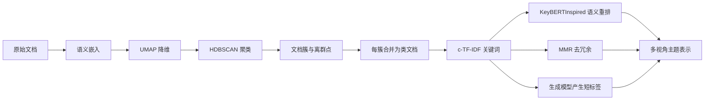
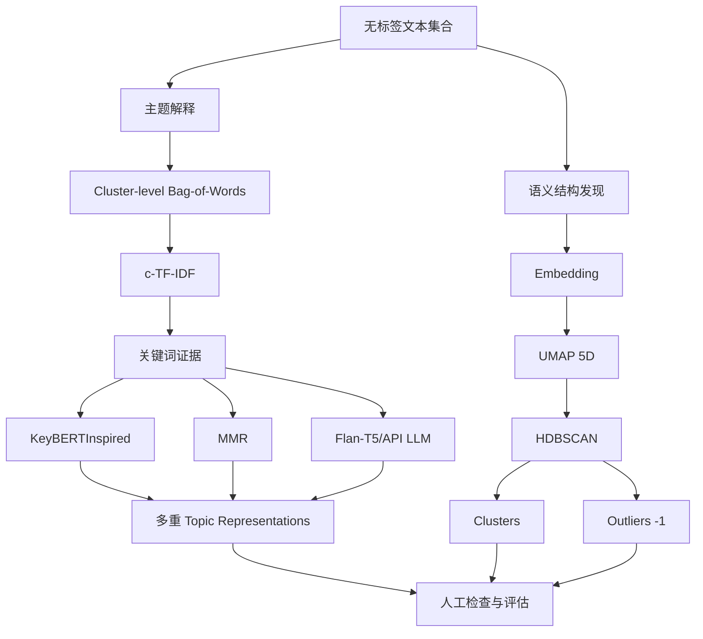

> 原章：*Text Clustering and Topic Modeling*
> 本章定位：在没有人工标签时发现大规模文本中的结构，并把机器找到的簇转化为人能理解的主题。核心方法不是让一个模型包办一切，而是组合语义嵌入、降维、密度聚类、词袋统计、语义重排和生成式标签。

## 0. 阅读地图：先发现结构，再解释结构

文本聚类（text clustering）回答：**哪些文档在语义上属于同一组？** 主题建模（topic modeling）进一步回答：**每一组在谈什么？**


本章可以拆成两条近似独立的流水线：



第一条管线决定 cluster assignment；第二条只解释已有 cluster。这个分离是 BERTopic 模块化设计的关键：可以换表示而不重跑聚类，也可以换聚类器而继续使用 c-TF-IDF。

### 0.1 无监督不等于无需判断标准

没有训练标签，并不意味着不存在选择：embedding model、UMAP 参数、距离、cluster size、关键词数量和提示都会改变结果。无监督方法把“标签监督”换成了**归纳偏置、稳定性评估与人工解释**。

它适合：

- 探索未知语料结构。
- 发现离群文档和潜在错误标签。
- 为人工标注建立候选类别、加速数据整理。
- 观察主题随时间变化。
- 为检索、推荐和路由构建中间结构。

它不自动证明发现的主题是客观真相。主题是数据、表示、算法和参数共同构造的分析视角。

---

## 1. ArXiv 的 Computation and Language 论文（ArXiv’s Articles: Computation and Language）

原章使用 ArXiv `cs.CL` 数据：1991 到 2024 年间 44,949 篇论文摘要。该语料规模足以产生多种 NLP 子领域，又有标题、摘要和年份等元数据，适合聚类与主题分析。

```python
from datasets import load_dataset

dataset = load_dataset("maartengr/arxiv_nlp")["train"]
abstracts = dataset["Abstracts"]
titles = dataset["Titles"]

print(len(abstracts), len(titles))
```

### 1.1 数据进入模型前应检查什么

- 空摘要、重复论文和撤稿记录。
- 非英语文本、公式、LaTeX 和异常字符。
- 摘要长度及 embedding model 的截断比例。
- 年份分布：模型可能把年代写作风格当作主题。
- 同一论文不同版本是否跨样本重复。

如果大量摘要超过模型上下文而被截断，聚类实际依据只是摘要前部。应记录 token 长度分布，必要时做分块、池化或选择长文本 embedding model。

---

## 2. 文本聚类的通用流水线（A Common Pipeline for Text Clustering）

常见流程：

1. 用 embedding model 把文本映射到语义向量。
2. 用 dimensionality reduction 压缩向量空间。
3. 在低维空间中运行 cluster model。

每一步都改变下一步看到的几何结构。因此，不应只调最后的 HDBSCAN；embedding 和 UMAP 往往具有更大影响。

### 2.1 文档嵌入（Embedding Documents）

设摘要 $x_i$ 的嵌入为：

$$
z_i=f_{embed}(x_i),\qquad z_i\in\mathbb{R}^{d}
$$

语义相近文档应在向量空间靠近。聚类不读取原始文字，只读取这些向量，所以 embedding model 定义了“相似”的含义。


原章基于 MTEB 聚类任务与推理速度选择 `thenlper/gte-small`：

```python
from sentence_transformers import SentenceTransformer

embedding_model = SentenceTransformer("thenlper/gte-small")
embeddings = embedding_model.encode(
    abstracts,
    batch_size=64,
    show_progress_bar=True,
    normalize_embeddings=True,
)
print(embeddings.shape)
```

输出形状为 `(44949, 384)`。44,949 行对应文档，384 列是语义特征。

#### 2.1.1 模型选择标准

- 是否在 clustering/semantic similarity 任务上训练和评测。
- 语言、学术领域与输入长度是否匹配。
- 向量维度、吞吐、显存和许可证。
- 是否要求特定 query/document 前缀。
- 归一化后使用 cosine，还是模型推荐 dot product。

MTEB 排行榜用于筛候选，目标语料上的稳定性和人工可读性才是最终证据。较新或更大的模型不保证形成更有用的业务簇。

### 2.2 降低嵌入维度（Reducing the Dimensionality of Embeddings）

#### 2.2.1 为什么高维会让聚类困难

维度增加时，空间体积迅速膨胀，数据相对稀疏；许多分布中最近距离与最远距离的差异相对缩小，称为 distance concentration。密度和邻域因此更难稳定估计，这属于“维度灾难”的表现。

降维寻找：

$$
g:\mathbb{R}^{384}\longrightarrow\mathbb{R}^{d'},
\qquad d'\ll384
$$

目标不是随意删除 379 列，而是尽量保存对邻域或方差重要的结构。


#### 2.2.2 PCA 与 UMAP

PCA 是线性方法。中心化数据矩阵 $X$ 后，寻找最大化投影方差的正交方向：

$$
w_1=\arg\max_{\|w\|=1}\operatorname{Var}(Xw)
$$

后续方向与此前方向正交。PCA 快、确定、易解释，但只能表达线性子空间。

UMAP 是非线性流形方法，大致执行：

1. 在高维空间构造 $k$ 近邻图。
2. 把邻接强度表示成 fuzzy membership $p_{ij}$。
3. 在低维空间定义相似强度 $q_{ij}$。
4. 优化交叉熵，使低维邻接关系接近高维关系。

一个常见低维相似函数为：

$$
q_{ij}=\frac{1}{1+a\|y_i-y_j\|^{2b}}
$$

UMAP 更擅长保存局部邻域并保留部分全局结构，但不会无损复原原空间。

#### 2.2.3 原章参数

```python
from umap import UMAP

umap_model = UMAP(
    n_neighbors=15,
    n_components=5,
    min_dist=0.0,
    metric="cosine",
    random_state=42,
)
reduced_embeddings = umap_model.fit_transform(embeddings)
```

- `n_components=5`：聚类空间保留 5 维，而非只为绘图压到 2 维。
- `n_neighbors`：小值强调局部细粒度，大值加入更广结构。
- `min_dist=0.0`：允许低维点更紧，有利于形成密集簇，也可能夸大分离。
- `metric="cosine"`：高维语义向量常按方向比较。
- `random_state=42`：便于复现，但 UMAP 实现可能因此关闭部分并行。

5 到 10 维是经验起点，不是理论最优。应联合 cluster stability、outlier ratio、topic coherence 与人工检查选择。

### 2.3 对降维后的嵌入聚类（Cluster the Reduced Embeddings）

#### 2.3.1 为什么不直接选 k-means

k-means 最小化簇内平方距离：

$$
\min_{C_1,\ldots,C_K}
\sum_{k=1}^{K}\sum_{x_i\in C_k}\|x_i-\mu_k\|_2^2
$$

它要求预先给定 $K$，偏好近似球形、方差相近的簇，并强制每个点归属某簇。若不知道主题数量、语料包含大量小众论文，这些假设未必合适。

密度聚类允许不规则形状并将低密度点标记为噪声。


#### 2.3.2 从 DBSCAN 到 HDBSCAN

DBSCAN 依赖固定半径 $\varepsilon$ 与最小邻居数，在单一密度尺度上识别核心点。HDBSCAN 通过多个密度尺度建立层次结构，并从 condensed tree 中选择稳定簇。

其关键距离之一是 mutual reachability distance：

$$
d_{mreach-k}(a,b)=
\max\{\operatorname{core}_k(a),\operatorname{core}_k(b),d(a,b)\}
$$

$\operatorname{core}_k(a)$ 是点 $a$ 到第 $k$ 个近邻的距离。稀疏区域的 core distance 较大，距离被抬高，从而降低不同密度区域被错误连接的机会。

```python
from hdbscan import HDBSCAN

hdbscan_model = HDBSCAN(
    min_cluster_size=50,
    metric="euclidean",
    cluster_selection_method="eom",
    prediction_data=True,
)
clusters = hdbscan_model.fit_predict(reduced_embeddings)
```

UMAP 在原空间用 cosine 建图后产出低维坐标，HDBSCAN 再用 Euclidean 距离聚类是 BERTopic 的常见组合，并不矛盾。

- `min_cluster_size=50`：小于该规模的稳定结构更可能被合并或视为噪声。减小它通常产生更多小簇，也可能增加不稳定碎片。
- `cluster_selection_method="eom"`：Excess of Mass 偏向从层次树选择稳定、较持久的簇。
- `prediction_data=True`：为后续近似预测、离群点处理保留数据。

#### 2.3.3 正确统计簇和离群点

HDBSCAN 用 `-1` 表示未分配点。`len(set(labels))` 会把 `-1` 也算成一个值，应明确排除：

```python
labels = [0, 0, 1, -1, 2, 2, -1]
cluster_ids = sorted(set(labels) - {-1})
outlier_count = sum(label == -1 for label in labels)

print("clusters:", len(cluster_ids), cluster_ids)
print("outliers:", outlier_count)
```

```text
clusters: 3 [0, 1, 2]
outliers: 2
```

原章报告 `len(set(clusters)) == 156`；如果结果包含 `-1`，这代表 155 个非离群簇加一个离群标签。具体运行结果可能随库版本、随机过程和硬件变化。

### 2.4 检查聚类（Inspecting the Clusters）

#### 2.4.1 先读原文，再看指标

对每个簇抽取靠中心、边缘和随机文档，检查：

- 内容是否具有可命名共同点。
- 同一簇是否混入多个主题。
- 一个主题是否被过度拆分到多个簇。
- 离群点是真正小众、数据错误，还是算法漏分。

原章检查 cluster 0 的摘要，发现它们围绕手语翻译、识别和合成，说明该簇具有可解释语义。

```python
import numpy as np

cluster_id = 0
indices = np.where(clusters == cluster_id)[0][:3]
for index in indices:
    print(titles[index])
    print(abstracts[index][:300], "\n")
```

#### 2.4.2 2D 图只是投影，不是聚类证据

为绘图需要另建 2D UMAP；不要拿训练 HDBSCAN 的 5D 坐标前两列冒充 2D 最优投影。

```python
import pandas as pd
from umap import UMAP

plot_embeddings = UMAP(
    n_components=2,
    min_dist=0.0,
    metric="cosine",
    random_state=42,
).fit_transform(embeddings)

plot_df = pd.DataFrame(plot_embeddings, columns=["x", "y"])
plot_df["title"] = titles
plot_df["cluster"] = clusters
clustered_df = plot_df[plot_df["cluster"] != -1]
outlier_df = plot_df[plot_df["cluster"] == -1]
```

```python
import matplotlib.pyplot as plt

plt.scatter(outlier_df.x, outlier_df.y, alpha=0.05, s=2, c="grey")
plt.scatter(
    clustered_df.x,
    clustered_df.y,
    c=clustered_df.cluster,
    alpha=0.6,
    s=2,
    cmap="tab20b",
)
plt.axis("off")
```


UMAP 可能把原空间中相近簇推开，也可能让不相近簇重叠；颜色还会循环复用。图适合导航和提出问题，不适合单独证明 cluster quality。

#### 2.4.3 怎样评估无监督聚类

没有真值标签时，应组合：

- **稳定性**：改变随机种子、抽样或轻微参数后，簇是否相似。
- **DBCV**：面向密度聚类的内部有效性指标。
- **Silhouette**：比较簇内与最近簇距离，但对非凸簇和离群点要谨慎。
- **Outlier ratio 与 size distribution**：是否大部分文档都变成噪声，或出现一个吞噬一切的大簇。
- **人工 intrusion/coherence 检查**：主题内随机文档是否一致，外来文档能否被识别。
- **下游效用**：聚类是否真的改善检索、标注或路由。

若有少量已知标签，可用 adjusted Rand index、normalized mutual information 等外部指标，但它们衡量的是与那套标签的一致性，不是唯一合理结构。

---

## 3. 从文本聚类到主题建模（From Text Clustering to Topic Modeling）

聚类输出整数 ID，不提供语义名称。主题建模为簇建立可读表示，例如关键词、短语、标题、摘要或多视角描述。


### 3.1 经典 LDA 与 BERTopic 的差别

LDA 假设每篇文档有 topic mixture：

$$
\theta_d\sim\operatorname{Dirichlet}(\alpha)
$$

每个词先从 $\theta_d$ 选择 topic $z_{d,n}$，再从该 topic 的词分布 $\phi_z$ 生成：

$$
z_{d,n}\sim\operatorname{Categorical}(\theta_d),\qquad
w_{d,n}\sim\operatorname{Categorical}(\phi_{z_{d,n}})
$$

因此一篇文档可以混合多个主题。LDA 主要依赖 bag-of-words，不直接利用词序与上下文语义。


BERTopic 默认先做 document clustering，每篇文档得到一个硬 topic ID（或 `-1`），再解释簇。它并非 LDA 的神经版，也不天然提供同样的混合成员生成模型；可通过 probabilities 等功能表达软关联，但基本归纳偏置不同。

---

## 4. BERTopic：模块化主题建模框架（BERTopic: A Modular Topic Modeling Framework）

### 4.1 第一部分：语义聚类

BERTopic 复用前述流程：

$$
\text{documents}\rightarrow\text{embeddings}
\rightarrow\text{reduced embeddings}\rightarrow\text{clusters}
$$


embedding 决定语义邻近，UMAP 重塑低维邻域，HDBSCAN 划定密度簇。任何一个组件变化都可能改变 topic assignment。

### 4.2 第二部分：把簇表示成词

普通 bag-of-words 为每篇文档统计词频：


BERTopic 通常用 scikit-learn 的 `CountVectorizer` 建立词袋：先把同一 cluster 的全部文档拼成一个“class document”，再统计 class term frequency：

$$
tf_{x,c}=\frac{n_{x,c}}{\sum_v n_{v,c}}
$$

$n_{x,c}$ 是词 $x$ 在类 $c$ 中的次数。


只看词频会让 `the`、`of` 等跨主题常用词占据榜首。c-TF-IDF 以词在所有类中的总频率 $f_x$ 降权，并用平均类长度 $A$ 平滑：

$$
idf_x=\log\left(1+\frac{A}{f_x}\right)
$$

$$
W_{x,c}=tf_{x,c}\cdot idf_x
$$


直觉：一个词在当前 topic 很常见且在全局不泛滥，权重才高。

```python
from math import log


def ctfidf(term_count, class_total, average_class_size, global_term_count):
    class_tf = term_count / class_total
    class_idf = log(1 + average_class_size / global_term_count)
    return class_tf * class_idf


distinctive = ctfidf(6, 100, 100, 10)
common = ctfidf(20, 100, 100, 500)
print(f"distinctive={distinctive:.4f}")
print(f"common={common:.4f}")
```

```text
distinctive=0.1439
common=0.0365
```

common 在当前类出现更多，却因全局极常见而权重更低。


### 4.3 完整流水线与模块化


可替换组件包括：

- embedding：Sentence Transformers、API embedding、多模态 embedding。
- dimensionality reduction：UMAP、PCA 或跳过。
- clustering：HDBSCAN、k-means、自定义 clusterer。
- vectorizer：词/字符 n-gram、领域 stop words。
- c-TF-IDF：BM25-style 权重、频繁词降权。
- representation：KeyBERTInspired、MMR、LLM、多 aspect 并存。

因此可扩展到 guided、semi-supervised、hierarchical、dynamic、multimodal、online、zero-shot topic modeling。但“能替换”不表示组件任意组合都兼容；接口、距离和输入形状仍需满足契约。

### 4.4 训练 BERTopic

```python
from bertopic import BERTopic

topic_model = BERTopic(
    embedding_model=embedding_model,
    umap_model=umap_model,
    hdbscan_model=hdbscan_model,
    calculate_probabilities=False,
    verbose=True,
)
topics, _ = topic_model.fit_transform(abstracts, embeddings)
```

传入预计算 `embeddings` 可避免重复编码；同时保留 `embedding_model` 便于后续 transform、find_topics 和 representation model 使用。版本行为应以当前 BERTopic 文档为准。

原章结果的主要 topic 包括 ASR、医学 NLP、情感分析、机器翻译、摘要等；`-1` 有 14,520 篇离群摘要，比例约 32%。如此高的 outlier ratio 不一定错误，但值得检查：`min_cluster_size`、UMAP、语料异质性或 HDBSCAN 参数是否过于保守。

### 4.5 Topic ID、Name 和 Representation

- `Topic`：内部整数 ID，不具稳定语义，重新训练后可能改变。
- `Count`：该 topic 文档数。
- `Representation`：按权重排序的词与分数。
- `Name`：通常由 ID 加前几个词拼接，方便浏览，不是人工金标准。
- `-1`：离群点集合，不应当作语义一致的真实主题。

可用：

```python
topic_info = topic_model.get_topic_info()
speech_terms = topic_model.get_topic(0)
related_topic_ids, similarities = topic_model.find_topics("topic modeling")
```

原章中 query “topic modeling” 找到 topic 22，其高权重词包含 topic、LDA、latent、Dirichlet 等；BERTopic 论文本身也被分到 22，构成有用的 sanity check，而不是完整质量证明。

离群点可保留、人工检查、使用 `reduce_outliers()` 重分配，或改用 k-means 强制归类。重分配会提高覆盖，但可能把真正异常文档硬塞进主题；选择取决于应用是否允许 abstain。

### 4.6 可视化与层次探索

```python
document_figure = topic_model.visualize_documents(
    titles,
    reduced_embeddings=plot_embeddings,
    width=1200,
    hide_annotations=True,
)
topic_model.visualize_barchart()
topic_model.visualize_heatmap(n_clusters=30)
topic_model.visualize_hierarchy()
```


- Barchart 检查每个 topic 的关键词权重。
- Heatmap 查看 topic 表示相似性，不等于文档级重叠。
- Hierarchy 根据 topic 距离构造潜在树，不证明存在唯一真实分类学。
- Document map 用于导航，仍受 2D UMAP 失真影响。

### 4.7 如何评估主题模型

应从四个维度评估：

1. **Coherence**：高权重词是否共同出现并语义一致，如 NPMI。
2. **Diversity**：不同 topic 的 top words 是否大量重复。
3. **Stability**：换 seed、抽样或时间窗口后 topic 是否可匹配。
4. **Usefulness**：领域专家能否命名，是否帮助搜索、标注和趋势分析。

NPMI 对词 $w_i,w_j$：

$$
\operatorname{NPMI}(w_i,w_j)=
\frac{\log\frac{P(w_i,w_j)}{P(w_i)P(w_j)}}{-\log P(w_i,w_j)}
$$

它衡量词共同出现是否超出独立预期。Coherence 高不一定 topic 对业务有用；LLM 生成的流畅标签也可能掩盖簇内部不一致。

---

## 5. 添加一个特殊积木（Adding a Special Lego Block）

c-TF-IDF 快、可解释，但仍是 bag-of-words，不理解同义词、词序和上下文。合理策略不是丢掉它，而是让它做高召回候选生成，再用较慢的语义模型 rerank。


若有 $N$ 篇文档、$K$ 个 topic，且 $K\ll N$，生成标签只需约 $O(K)$ 次昂贵调用，而不是 $O(N)$。这正是“廉价召回 + 昂贵重排/解释”的系统设计。

先保存原始表示，避免更新后失去对照：

```python
from copy import deepcopy

original_topics = deepcopy(topic_model.topic_representations_)
```

`update_topics()` 主要更新 vectorizer/c-TF-IDF/representation；它不会自动重新计算 embedding、UMAP 与 HDBSCAN assignment。若修改分词或主题表示，topic ID 通常不变；若要改变簇，必须重跑前半管线或使用 topic reduction/outlier 工具。

### 5.1 KeyBERTInspired

KeyBERT 的基本思想是：候选词若与文档向量语义相近，就更能代表文档。BERTopic 的 KeyBERTInspired 大致执行：

1. 用 c-TF-IDF 找每个 topic 的代表文档和候选词。
2. 聚合代表文档 embedding，形成 topic embedding。
3. 编码候选词。
4. 按候选词与 topic embedding 的 cosine similarity 重排。


```python
from bertopic.representation import KeyBERTInspired

keybert_representation = KeyBERTInspired()
topic_model.update_topics(
    abstracts,
    representation_model=keybert_representation,
)
```

优点：去掉很多 stop words，词更贴近 topic 语义。局限：embedding model 不理解的领域缩写可能被降权。原章的 `nmt` 对机器翻译专家很重要，却可能因短缩写向量不佳而消失。语义重排不是无条件优于统计权重，最好并列保留两种视角。

### 5.2 最大边际相关性（Maximal marginal relevance）

c-TF-IDF 或语义相似度容易返回 `summary`、`summaries`、`summarization` 等重复词。MMR 同时优化相关性与新颖性。

设候选集合为 $R$、已选集合为 $S$、topic/query 表示为 $q$：

$$
d^*=\arg\max_{d\in R\setminus S}
\left[
\lambda\operatorname{sim}(d,q)
-(1-\lambda)\max_{s\in S}\operatorname{sim}(d,s)
\right]
$$

- 第一项要求关键词与 topic 相关。
- 第二项惩罚与已选关键词重复。
- $\lambda$ 大偏相关性，小偏多样性。

BERTopic 的 `diversity` 参数方向相反：值越大，去冗余越强。

一个可运行的二维例子：

```python
from math import sqrt


def cosine(left, right):
    dot = sum(a * b for a, b in zip(left, right))
    return dot / (
        sqrt(sum(value * value for value in left))
        * sqrt(sum(value * value for value in right))
    )


topic = [1.0, 0.0]
candidates = {
    "summary": [1.0, 0.0],
    "summarization": [0.99, 0.01],
    "extractive": [0.75, 0.65],
}
selected = ["summary"]
relevance_weight = 0.6

scores = {}
for name, vector in candidates.items():
    if name in selected:
        continue
    relevance = cosine(vector, topic)
    redundancy = max(cosine(vector, candidates[item]) for item in selected)
    scores[name] = relevance_weight * relevance - (1 - relevance_weight) * redundancy

print({name: round(score, 3) for name, score in scores.items()})
print(max(scores, key=scores.get))
```

```text
{'summarization': 0.2, 'extractive': 0.151}
summarization
```

在这个权重下相关性仍占优；降低 `relevance_weight` 会让更不同的 `extractive` 胜出。MMR 不会自动知道词形重复，可结合 lemmatization、领域词典与人工检查。

```python
from bertopic.representation import MaximalMarginalRelevance

mmr_representation = MaximalMarginalRelevance(diversity=0.2)
topic_model.update_topics(
    abstracts,
    representation_model=mmr_representation,
)
```

原章中摘要 topic 从多个 summary 词形扩展到 document、extractive、ROUGE 等信息，表示覆盖面更广。

---

## 6. 文本生成积木（The Text Generation Lego Block）

生成模型不必逐篇给 44,949 篇文档分类。BERTopic 先为每个 topic 选少量代表文档与关键词，再调用生成模型一次产生短标签。


### 6.1 Prompt 中的两类证据

- `[DOCUMENTS]`：通常约 4 篇代表文档，提供上下文与具体内容。
- `[KEYWORDS]`：c-TF-IDF/KeyBERT/MMR 关键词，提供稳定、可审计的统计摘要。

只给关键词可能歧义，只给长文档成本高且容易偏向个别样本。两者结合是在压缩成本与保留证据间折中。

### 6.2 使用 Flan-T5 本地生成

```python
from bertopic.representation import TextGeneration
from transformers import pipeline

prompt = """Documents:
[DOCUMENTS]

Keywords: [KEYWORDS]

Return one short, specific topic label and nothing else."""

generator = pipeline(
    "text2text-generation",
    model="google/flan-t5-small",
    max_new_tokens=12,
    do_sample=False,
)
flan_representation = TextGeneration(
    generator,
    prompt=prompt,
    doc_length=50,
    tokenizer="whitespace",
)
topic_model.update_topics(
    abstracts,
    representation_model=flan_representation,
)
```

`doc_length=50` 配合 whitespace tokenizer 是近似截断，不等于 Flan-T5 的真实 token 数。小模型便宜、本地可控，但原章产生了过宽的 `Science/Tech`、`Review` 标签，说明语言流畅不等于主题具体。

### 6.3 使用远程生成模型

原章的 `gpt-3.5-turbo` 是写作时的历史模型标识。当前使用时应从供应商文档选择可用 snapshot，并从环境变量读取密钥：

```python
import os

from bertopic.representation import OpenAI as BERTopicOpenAI
from openai import OpenAI

client = OpenAI()
api_model = os.environ["OPENAI_MODEL"]

prompt = """Representative documents:
[DOCUMENTS]

Keywords: [KEYWORDS]

Return exactly: topic: <specific label of at most eight words>
"""

api_representation = BERTopicOpenAI(
    client,
    model=api_model,
    exponential_backoff=True,
    chat=True,
    prompt=prompt,
)
topic_model.update_topics(
    abstracts,
    representation_model=api_representation,
)
```

原章中较大模型生成了 `Neural Machine Translation Enhancements`、`Document Summarization Techniques` 等更具体标签，但仍需核对代表文档。闭源模型还带来：

- API 成本、限流、版本漂移和网络失败。
- 摘要外发的隐私与许可问题。
- Prompt injection：论文摘要可能包含看似指令的文本。
- 幻觉标签：模型可能加入簇中不存在的细节。
- 不可复现：即使温度低，服务更新也会变化。

`exponential_backoff=True` 处理部分暂时性限流，不保证调用幂等、费用可控或永久错误可恢复。应缓存 topic ID、输入证据、模型版本与输出。

### 6.4 为什么仍要保留关键词与多重表示

LLM label 可读，却把复杂 topic 压成一句话。c-TF-IDF 词权重更透明，MMR 提供多样视角，KeyBERTInspired 强调语义。BERTopic 可以并列存储 multiple representations：

- `Main`：生成式短标签。
- `Keywords`：c-TF-IDF 原始证据。
- `Semantic`：KeyBERTInspired。
- `Diverse`：MMR。

多视角之间的不一致本身是诊断信号：如果 LLM label 与关键词相冲突，应回到代表文档，而不是默认相信更流畅的输出。

### 6.5 可视化最终标签

```python
figure = topic_model.visualize_document_datamap(
    titles,
    topics=list(range(20)),
    reduced_embeddings=plot_embeddings,
    width=1200,
    label_font_size=11,
    label_wrap_width=20,
    use_medoids=True,
)
```


Medoid 是簇内与其他点总体距离较小的真实文档点，不同于可能不存在于数据中的 centroid。用 medoid 放置标签通常比几何均值更贴近实际样本。

---

## 7. 重点辨析与常见误区

### 7.1 聚类不等于分类

分类学习预定义标签边界；聚类依据当前表示和算法发现结构。Cluster ID `3` 没有跨训练运行的固定业务含义。

### 7.2 聚类不等于主题建模

聚类只给 membership；主题建模还需要 topic representation。BERTopic 用 clustering 实现一种主题建模路线，但 LDA 等方法可直接学习 document-topic mixture。

### 7.3 “无监督”不等于“没有人为偏置”

模型、距离、降维和参数都是人为选择。Embedding 的训练数据还携带领域和社会偏差。

### 7.4 UMAP 不是无损压缩

5D clustering space 和 2D plotting space 都会失真。2D 图上两个簇靠近/重叠不能直接代表 384D 原空间关系。

### 7.5 `-1` 不是一个统一主题

所有离群点共用标签 `-1`，但它们彼此可能完全无关。不要为 `-1` 生成一个主题名称并当作真实簇。

### 7.6 离群点不等于坏数据

它可能是错误、罕见主题、跨主题文档，也可能只是参数过于严格。需要抽样检查后决定删除、保留或重分配。

### 7.7 Topic 数量不是越多越好

小 `min_cluster_size` 产生细粒度主题，也更碎、更不稳定；大值提高聚合，却可能吞并重要小众主题。粒度应由使用场景决定。

### 7.8 Cosine 与 Euclidean 并不总互斥

高维归一化 embedding 常用 cosine；UMAP 映射后的低维坐标可由 HDBSCAN 用 Euclidean。关键是每个空间中的度量是否与其构造一致。

### 7.9 c-TF-IDF 不是普通文档 TF-IDF

它先把同 topic 文档合并为 class document，再比较不同类中的词。权重解释的是“词对该 topic 的区分性”，不是对单篇论文的重要性。

### 7.10 `update_topics()` 通常不重新聚类

它更新表示层。若关键词变了而 topic membership 不变，这是设计结果，不是缓存错误。

### 7.11 KeyBERTInspired 不总优于统计关键词

语义模型可能丢失缩写、公式和罕见术语。领域专家往往需要原始 c-TF-IDF 作为证据。

### 7.12 MMR 的多样性不是正确性

去掉重复词能增加覆盖，但 diversity 过高会选入边缘词，降低 topic fidelity。相关性与新颖性必须联合调节。

### 7.13 LLM topic label 不是真值

它是代表文档和关键词的压缩生成，可能过宽、过窄或幻觉。必须保留输入证据、版本和其他表示。

### 7.14 漂亮的可视化不是评估

视觉分离可能由 UMAP 参数制造。应结合稳定性、coherence、diversity、outlier ratio、人工检查和下游效用。

---

## 8. 总结（Summary）

### 8.1 知识结构



### 8.2 核心结论

1. 文本聚类利用语义 embedding 在无标签语料中发现结构，可用于探索、异常发现和标注加速。
2. 常见管线是 embedding → dimensionality reduction → clustering；三个组件共同决定结果。
3. UMAP 通过邻域图学习非线性低维表示，但必然丢失信息；聚类用 5D 与绘图用 2D 是不同目的。
4. HDBSCAN 不需要预设 topic 数量，并允许 `-1` 离群点；其优势同时意味着覆盖率不是 100%。
5. 主题建模在 cluster assignment 之外增加可读表示；BERTopic 默认不同于 LDA 的混合 topic 生成模型。
6. c-TF-IDF 把每个簇当作 class document，突出簇内高频且全局稀有的词。
7. BERTopic 将语义聚类和 topic representation 解耦，因而能独立替换各个“积木”。
8. KeyBERTInspired 用 embedding 语义重排关键词，MMR 在相关性与多样性之间去冗余。
9. 生成模型只需按 topic 调用，而非按 document 调用，能低成本生成可读短标签。
10. LLM label 不能取代 c-TF-IDF 证据；多重表示比单一流畅名称更可靠。
11. 无监督质量必须结合稳定性、coherence、diversity、outlier ratio、人工判断和下游价值。

### 8.3 解决同类问题的一般方法

1. **定义分析目标**：需要探索、路由、异常发现、标签体系还是趋势追踪？
2. **审计语料**：去重、语言、长度、时间和领域偏差。
3. **选择语义表示**：用目标领域样本比较 embedding 的近邻质量，而非只看榜单。
4. **分开 clustering 与 visualization**：为聚类保留足够维度，2D 仅用于导航。
5. **选择归纳偏置**：已知 $K$ 且需全覆盖可考虑 k-means；未知数量且允许 abstain 可考虑 HDBSCAN。
6. **检查粒度与离群点**：联合调 UMAP 和 cluster 参数，并阅读代表、边界与离群文档。
7. **先做廉价可审计表示**：c-TF-IDF 提供候选和证据。
8. **再做语义重排**：KeyBERTInspired 改相关性，MMR 改多样性。
9. **最后生成标签**：只向 LLM 提供代表文档与关键词，限制格式并保存 provenance。
10. **多指标验证**：稳定性、coherence、diversity、覆盖、人工判断和下游效果缺一不可。
11. **版本化全部组件**：embedding、UMAP、HDBSCAN、vectorizer、representation model 与 prompt 共同定义一次结果。

本章最重要的方法论是“先用廉价、可扩展方法缩小候选，再用昂贵模型提高解释质量”。语义模型、经典统计和生成模型不是互相淘汰，而是在同一系统中分别承担分组、证据和表达职责。
