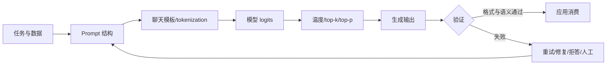
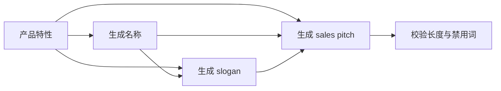
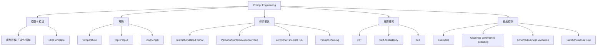

> 原章：*Prompt Engineering*
> 本章定位：把生成模型从“会续写文本”变成“能稳定完成指定任务”的工程接口。核心不只是寻找一句神奇提示词，而是同时管理模型选择、聊天模板、解码参数、任务分解、示例、验证、成本与安全。

## 0. 本章路线：从概率生成到可用系统

生成模型根据当前上下文为下一 token 给出分布：

$$
p(t_{n+1}\mid t_{1:n})
$$

Prompt 改变条件 $t_{1:n}$，解码参数改变如何从分布选 token，验证层则判断整段输出是否可用。



本章按四层展开：

1. **模型与解码**：选择模型、应用正确聊天模板、控制随机性。
2. **Prompt 设计**：instruction、data、format、persona、examples 等模块。
3. **推理与搜索**：chain-of-thought、self-consistency、tree-of-thought。
4. **输出控制**：示例、grammar-constrained decoding、程序验证与微调。

> **基本原则**：Prompt 是可版本化的程序输入，模型是带随机性和版本差异的依赖。没有测试集、指标和验证器的“调 prompt”，只是凭个别回答做主观试错。

---

## 1. 使用文本生成模型（Using Text Generation Models）

### 1.1 选择文本生成模型（Choosing a Text Generation Model）

第一步不是写 prompt，而是判断模型是否适合任务。Prompt 无法补回模型从未学会的语言、知识、上下文长度或工具能力。


#### 1.1.1 开放模型与专有模型

| 维度 | 本地开放权重模型 | 专有 API 模型 |
|---|---|---|
| 启动 | 需下载与部署 | 调用接口即可 |
| 数据边界 | 可完全本地 | 需审查服务条款 |
| 控制 | 可量化、微调、换后端 | 受 API 功能限制 |
| 硬件 | 使用方承担 | 服务商承担 |
| 版本稳定 | 可固定权重 | 可能有路由或版本更新 |
| 成本 | 设备与运维 | 按 token/请求付费 |

“专有模型通常更强”只是某个时间点的经验，不是定义。选择时应在目标评测集比较质量、延迟、成本和风险。

#### 1.1.2 选择清单

- **Base 还是 instruct/chat**：交互任务优先选择指令微调模型；base model 主要续写。
- **规模**：小模型便于迭代和本地运行，大模型通常能力更高但更慢、更贵。
- **上下文长度**：输入、示例、历史和输出共同占预算。
- **语言与领域**：代码、数学、多语言、法律等训练分布是否匹配。
- **许可证与安全**：商业使用、再分发、远程代码与内容策略。
- **结构化输出/工具支持**：是否有 grammar、JSON schema 或 function calling。
- **部署指标**：time to first token、tokens/s、并发、显存和吞吐。

原章沿用 38 亿参数的 Phi-3-mini，便于在约 8 GB 显存级别设备上学习。具体显存受精度、量化、上下文和后端影响，不能只由参数量保证。

### 1.2 加载文本生成模型（Loading a Text Generation Model）

```python
import torch
from transformers import AutoModelForCausalLM, AutoTokenizer, pipeline

model_id = "microsoft/Phi-3-mini-4k-instruct"
tokenizer = AutoTokenizer.from_pretrained(model_id)
model = AutoModelForCausalLM.from_pretrained(
    model_id,
    device_map="auto",
    torch_dtype="auto",
    trust_remote_code=True,
)

generator = pipeline(
    "text-generation",
    model=model,
    tokenizer=tokenizer,
    return_full_text=False,
    max_new_tokens=200,
    do_sample=False,
)
```

`trust_remote_code=True` 会执行模型仓库代码；生产环境应审查并固定 revision。`max_new_tokens` 是新增 token 上限，过小会截断 JSON 或句子，过大则增加延迟和失控输出空间。

#### 1.2.1 消息不是模型直接看到的字符串

```python
messages = [
    {"role": "user", "content": "Create a funny joke about chickens."}
]
result = generator(messages)
print(result[0]["generated_text"])
```

Pipeline 会调用 tokenizer 的 chat template，把 role/content 转成模型训练时见过的特殊 token：

```python
prompt = tokenizer.apply_chat_template(
    messages,
    tokenize=False,
    add_generation_prompt=True,
)
print(prompt)
```

Phi-3 模板大致含 user、assistant 和 end 标记。


必须使用配套模板：同样的文本若缺少角色或结束标记，模型可能续写用户、混淆说话者或无法正确停止。不要把某模型的特殊 token 手工复制给另一个模型。

### 1.3 控制模型输出（Controlling Model Output）

模型先产生 logits $z_i$，softmax 才得到下一 token 概率。若 `do_sample=False`，通常直接选最大 logit，temperature/top-p 不参与随机采样。


控制参数分三类：

- **候选分布**：temperature。
- **候选截断**：top-k、top-p。
- **终止与长度**：max tokens、EOS、stop sequences。

还有 repetition penalty、frequency penalty 等实现特定参数，但不能代替清晰任务约束。

#### 1.3.1 温度（Temperature）

对温度 $T>0$：

$$
p_i(T)=\frac{\exp(z_i/T)}{\sum_j\exp(z_j/T)}
$$

- $0<T<1$：拉大差异，分布更尖锐。
- $T=1$：保持原 softmax 尺度。
- $T>1$：缩小差异，低概率 token 获得更多质量。
- $T\to0^+$：趋近 greedy decoding；API 中 `temperature=0` 通常是实现约定。


数值示例：

```python
from math import exp


def softmax(logits, temperature):
    scaled = [value / temperature for value in logits]
    maximum = max(scaled)
    weights = [exp(value - maximum) for value in scaled]
    total = sum(weights)
    return [weight / total for weight in weights]


logits = [2.0, 1.0, 0.0]
for temperature in (0.5, 1.0, 2.0):
    probabilities = softmax(logits, temperature)
    print(temperature, [round(value, 3) for value in probabilities])
```

```text
0.5 [0.867, 0.117, 0.016]
1.0 [0.665, 0.245, 0.09]
2.0 [0.506, 0.307, 0.186]
```

高温增加熵与多样性，不等于增加事实正确率或真正创造力。抽取、分类、代码修改通常偏低温；头脑风暴可适当升温，但要用验证器筛选。

#### 1.3.2 top_p

Nucleus sampling 先按概率降序排列，选择累计概率达到阈值 $p$ 的最小集合：

$$
S_p=\min\left\{S:\sum_{i\in S}p_i\ge p\right\}
$$

然后只在 $S_p$ 内重新归一化采样。


```python
def nucleus(probabilities, threshold):
    ranked = sorted(enumerate(probabilities), key=lambda item: item[1], reverse=True)
    selected = []
    cumulative = 0.0
    for token_id, probability in ranked:
        selected.append(token_id)
        cumulative += probability
        if cumulative >= threshold:
            break
    return selected, cumulative


probabilities = [0.50, 0.25, 0.15, 0.10]
for threshold in (0.50, 0.80, 1.00):
    selected, total = nucleus(probabilities, threshold)
    print(threshold, selected, round(total, 2))
```

```text
0.5 [0] 0.5
0.8 [0, 1, 2] 0.9
1.0 [0, 1, 2, 3] 1.0
```

阈值 0.8 时第二个 token 后累计仅 0.75，因此必须加入第三个，最终达到 0.9。候选数会随模型确信程度动态变化。

`top_k=k` 则固定只保留概率最高的 $k$ 个。Top-k 与 top-p 可叠加，但同时大幅调 temperature、top-k、top-p 会难以解释变化；实践中先固定其他参数，一次调一个。

原书表格把不同组合映射到“创意写作、翻译、邮件”等场景，可作为起点，不是通用最优值。应在任务评测集上测质量、重复率、invalid rate 与多样性。

---

## 2. 提示工程入门（Intro to Prompt Engineering）

Prompt engineering 是设计、测试和维护模型输入，使输出满足任务需求的迭代过程。它还可用于评估、安全缓解和验证，但自然语言约束本身不是强制安全边界。

### 2.1 Prompt 的基本成分（The Basic Ingredients of a Prompt）

没有明确指令时，模型只会按训练分布续写。


一个基本任务 prompt 至少包含：

1. **Instruction**：要做什么。
2. **Data**：对什么内容执行。
3. **Output indicator/contract**：返回什么形式。


例如：

```text
Task: Classify the sentiment of the delimited review.
Allowed labels: positive, negative.
Review: <review>The plot was slow, but the ending was excellent.</review>
Output exactly one label:
```

分隔符帮助区分 instruction 与不可信 data，但不能阻止 prompt injection。系统必须把外部文本当数据处理，并在模型外限制权限与验证输出。

### 2.2 基于指令的提示（Instruction-Based Prompting）


#### 2.2.1 Specificity

与其说“写产品描述”，不如明确：对象、长度、受众、语气、必须覆盖和禁止内容。约束缩小可接受输出集合：

$$
\mathcal{Y}_{valid}\subset\mathcal{Y}_{all}
$$

但约束过多或互相冲突会降低遵循率。应声明优先级，并删除对任务无贡献的装饰性文字。

#### 2.2.2 Hallucination

要求“不知道就说不知道”可以改变行为，却不能保证模型知道自己何时不知道。事实任务还需要：

- 提供可信上下文或检索证据。
- 要求引用输入中的依据。
- 用确定性工具核验数字与实体。
- 对无证据情况允许 abstain。

#### 2.2.3 Order 与 lost in the middle

长上下文中，模型常更敏感于开头 primacy effect 和结尾 recency effect，中部信息可能利用不足。可把核心 instruction 放在明确位置，在数据后简短重申输出 contract，并用标题与分隔符提高可见性。

这不是简单地把指令复制很多次；重复会浪费 token，冲突版本还会增加歧义。不同模型的位置敏感性需要实测。

---

## 3. 高级提示工程（Advanced Prompt Engineering）

### 3.1 Prompt 的潜在复杂性（The Potential Complexity of a Prompt）

常见模块：

| 组件 | 回答的问题 | 主要风险 |
|---|---|---|
| Persona | 模型以何种角色/知识层次回答？ | 角色声明不能创造真实专业资质 |
| Instruction | 具体做什么？ | 含糊或冲突 |
| Context | 为什么做、有哪些背景？ | 把无关信息塞入上下文 |
| Format | 输出 schema/长度是什么？ | 自然语言格式不强制 |
| Audience | 写给谁？ | 人群假设刻板化 |
| Tone | 如何表达？ | 风格覆盖事实要求 |
| Data | 处理的内容是什么？ | 注入、隐私、超长输入 |
| Examples | 成功输出长什么样？ | 示例偏差、泄漏、占 token |


```python
components = {
    "persona": "You summarize LLM research for working researchers.",
    "instruction": "Extract the paper's method and main findings.",
    "context": "The reader must decide whether to read the full paper.",
    "format": "Return three method bullets, then a two-sentence result summary.",
    "audience": "Assume familiarity with machine learning but not this paper.",
    "tone": "Use precise, neutral language.",
    "data": "<paper>MY TEXT TO SUMMARIZE</paper>",
}

prompt = "\n\n".join(
    f"## {name.title()}\n{value}" for name, value in components.items()
)
```

模块化便于 ablation：固定模型、解码、测试集，只删/改一个组件，比较指标。所谓 emotional stimulus 可能在某模型某任务有效，也可能无效或造成操纵式措辞；不能用单个例子泛化。

Prompt 应像代码一样保存：template version、model snapshot、generation config、评测集 commit、结果与变更说明。

### 3.2 上下文学习：提供示例（In-Context Learning: Providing Examples）

In-context learning（ICL）在推理上下文中展示输入—输出示例，不更新模型权重：

- zero-shot：0 个例子。
- one-shot：1 个例子。
- few-shot：2 个或更多例子。


示例同时传达：任务、标签含义、格式、风格和边界。对于虚构词 `screeg`，先展示另一个虚构词如何造句，比抽象描述更直接。

```python
one_shot_messages = [
    {
        "role": "user",
        "content": (
            "A 'Gigamuru' is a Japanese musical instrument. "
            "Use Gigamuru in a sentence."
        ),
    },
    {
        "role": "assistant",
        "content": "I play the Gigamuru my uncle gave me.",
    },
    {
        "role": "user",
        "content": "To 'screeg' means to swing a sword at something. Use screeg in a sentence.",
    },
]
```

#### 3.2.1 怎样选择示例

- 与目标输入相似且覆盖主要边界。
- 各标签数量与顺序平衡，避免多数示例诱导多数类。
- 输出完全符合 contract，不包含偶然错误。
- 避免把测试集答案或敏感数据放入 prompt。
- 长 prompt 中选择少量高价值示例，控制 token 成本。

示例顺序也可能影响结果。可在验证集上比较随机顺序、多 seed 和 retrieval-based example selection。ICL 看似“学会”任务，但参数没有永久改变；换上下文后示例效果消失。

### 3.3 链式提示：拆分问题（Chain Prompting: Breaking up the Problem）

复杂任务一次生成会同时承担规划、内容、格式和校验。Prompt chaining 把输出作为下一步输入：




```python
def generate(messages, **kwargs):
    return generator(messages, **kwargs)[0]["generated_text"]


features = "An offline chatbot that summarizes local documents."
name = generate([
    {"role": "user", "content": f"Create one product name for: {features}"}
])
slogan = generate([
    {
        "role": "user",
        "content": f"Create one short slogan for product {name!r}. Features: {features}",
    }
])
pitch = generate([
    {
        "role": "user",
        "content": f"Write a 50-word sales pitch. Name: {name}. Slogan: {slogan}.",
    }
])
```

#### 3.3.1 为什么链式分解有效

- 每步目标更窄，输出 contract 更简单。
- 可为不同步骤选择不同模型、温度和 token 上限。
- 中间结果可缓存、检查、人工修改。
- 独立步骤可并行，最后再合并。

#### 3.3.2 代价与错误传播

若第 $i$ 步成功概率为 $p_i$，在简化独立假设下，整条必须全成功的链：

$$
P(\text{all succeed})=\prod_{i=1}^{m}p_i
$$

每步都 95% 可靠，5 步链也只有 $0.95^5\approx77.4\%$ 全部成功。实际错误还可能相关并被后续放大。

因此每个边界应采用结构化中间状态、schema validation、重试上限和 provenance，而不是把未经验证的自然语言直接传下去。复杂系统更像 DAG：可并行生成、汇总、复核，不必永远是线性链。

---

## 4. 使用生成模型推理（Reasoning with Generative Models）

原章用 System 1/2 类比：直接生成类似快速直觉，让模型展开步骤类似慢速审议。这是启发式比喻，不证明模型拥有与人类相同的认知系统。

可见 reasoning text 也不保证忠实反映内部计算。模型可能先得到答案再编理由，或生成步骤正确但答案错误。高风险任务应要求可核验中间产物，调用计算器、代码、检索或规则引擎，而不是只相信一段流畅推理。

### 4.1 思维链：先思考再回答（Chain-of-Thought: Think Before Answering）

Chain-of-thought（CoT）通过示例或指令，让模型在答案前生成中间步骤。


苹果题的真实计算为：

$$
23-20+6=9
$$

Few-shot CoT 先给一个网球题及分步答案，再给苹果题：

```python
cot_messages = [
    {
        "role": "user",
        "content": "Roger has 5 balls and buys 2 cans of 3. How many balls?",
    },
    {
        "role": "assistant",
        "content": "Two cans contain 2 * 3 = 6 balls. Then 5 + 6 = 11. Answer: 11.",
    },
    {
        "role": "user",
        "content": "There are 23 apples, 20 are used, and 6 are bought. How many remain?",
    },
]
```

Zero-shot CoT 则加入“逐步检查计算”等指令：


为什么可能有效：每个新生成 token 都进入后续上下文，中间变量使复杂映射分成局部步骤，相当于分配更多 test-time compute。

局限：

- 小模型或简单任务未必受益。
- 错误早期步骤会污染后续步骤。
- 推理文本增加延迟和 token 成本。
- 暴露冗长推理可能泄漏提示、数据或产生虚假可信感。

生产中可要求“给出简短依据和可核验计算”，并将最终答案与内部工具结果分开验证，而非把长篇 reasoning 当作正确性证书。

### 4.2 自洽性：对输出采样（Self-Consistency: Sampling Outputs）

Self-consistency 对同一问题以 sampling 生成多条不同 reasoning path，抽取最终答案并多数投票。


若单次正确概率为 $p>0.5$、样本独立、$n$ 为奇数，多数正确概率：

$$
P_{vote}=\sum_{k=(n+1)/2}^{n}
\binom{n}{k}p^k(1-p)^{n-k}
$$

```python
from math import comb


def majority_accuracy(single_accuracy, samples):
    threshold = samples // 2 + 1
    return sum(
        comb(samples, correct)
        * single_accuracy**correct
        * (1 - single_accuracy) ** (samples - correct)
        for correct in range(threshold, samples + 1)
    )


print(f"single={0.7:.3f}")
print(f"vote_5={majority_accuracy(0.7, 5):.3f}")
```

```text
single=0.700
vote_5=0.837
```

真实模型错误高度相关，独立假设通常过于乐观；若所有样本沿同一错误模式，投票只会自信地错。实施还需：

- 开启适度 temperature/top-p 以产生多样路径。
- 用确定 parser 规范化答案，如 `9` 与 `9 apples`。
- 处理平票、无效输出与拒答。
- 记录成本约增长为 $n$ 倍，可并行降低墙钟延迟但不降低算力。

### 4.3 思维树：探索中间步骤（Tree-of-Thought: Exploring Intermediate Steps）

Tree-of-thought（ToT）把中间状态当搜索节点：生成多个候选 thought，评价，保留最好分支，再扩展。


```text
frontier = {initial_state}
for depth in 1..D:
    candidates = expand_each_state(frontier, branching_factor=B)
    scores = evaluate(candidates)
    frontier = keep_best_K(candidates, scores)
return select_final(frontier)
```

未经剪枝，节点数约为：

$$
1+B+B^2+\cdots+B^D=O(B^D)
$$

所以 ToT 用更多 test-time compute 换取搜索广度，适合规划、谜题和开放式设计，不适合低延迟简单问答。

原章用“一次 prompt 模拟三个专家讨论”近似 ToT。它能诱导多视角，但不等同于真正的外部树搜索：所有“专家”来自同一次模型 rollout，错误可能相关，也没有独立状态、回溯与程序化剪枝。应把它称为 ToT-style prompting，而非完整算法。

---

## 5. 输出验证（Output Verification）

结构化输出（structured output）进入生产系统时，至少要验证四层：

1. **Syntax/structure**：能否解析成 JSON、SQL、枚举等。
2. **Schema/validity**：字段、类型、范围、允许标签是否正确。
3. **Safety/policy**：PII、偏见、越权操作、恶意内容。
4. **Factual/task accuracy**：事实、计算和任务结果是否正确。

语法正确不推出事实正确：

$$
\text{valid JSON}\not\Rightarrow\text{valid business object}
\not\Rightarrow\text{true facts}
$$

控制方式：

- Examples：软引导格式与内容。
- Grammar/constrained decoding：在 token 选择时硬限制语法。
- Fine-tuning：通过数据改变权重与行为。
- 外部程序验证：schema、数据库、计算器和业务规则。
- Human review：高风险或低置信度案例。

### 5.1 提供示例（Providing Examples）

只说“返回 JSON”可能得到过长、截断或带 Markdown fence 的输出。One-shot 示例展示字段和长度，可提高遵循率：

```python
character_prompt = """Create one short RPG character profile.
Return only a JSON object with exactly these fields:
{
  "description": "A SHORT DESCRIPTION",
  "name": "THE CHARACTER NAME",
  "armor": "ONE ARMOR ITEM",
  "weapon": ["ONE OR MORE WEAPONS"]
}
"""
```

示例是软约束。模型仍可能：漏字段、增加字段、输出非法转义、把数组写成字符串，或因 token 上限截断。必须解析并校验：

```python
import json


def validate_character(raw_output):
    value = json.loads(raw_output)
    expected = {"description", "name", "armor", "weapon"}
    if set(value) != expected:
        raise ValueError("Unexpected fields")
    if not isinstance(value["weapon"], list) or not value["weapon"]:
        raise ValueError("weapon must be a non-empty list")
    return value


valid = '{"description":"Scout","name":"Mira","armor":"Leather","weapon":["Bow"]}'
print(validate_character(valid)["name"])
```

```text
Mira
```

更复杂 schema 应使用 JSON Schema、Pydantic 等结构化验证器。验证失败时可拒绝、有限重试或修复；不能无限重试到“看起来能过”。

### 5.2 Grammar：约束采样（Grammar: Constrained Sampling）

自然语言请求不保证模型遵守。Constrained decoding 根据当前已生成前缀 $s$ 计算允许 token 集 $A(s)$，屏蔽其他 logits：

$$
z'_i=
\begin{cases}
z_i,&i\in A(s)\\
-\infty,&i\notin A(s)
\end{cases}
$$

softmax 后不允许 token 概率为 0。这是硬语法约束。


#### 5.2.1 Grammar 能保证什么

- JSON grammar 可保证输出是语法合法 JSON。
- Enum grammar 可保证标签属于允许集合。
- Regex/CFG 可限制特定字符串语言。

不能保证：

- 字段值事实正确。
- 年龄、金额等符合业务范围。
- 字段语义彼此一致。
- 输出没有偏见、PII 或提示注入影响。

JSON object mode 也不必然等于完整 JSON Schema。若只约束“对象”，模型仍可自由选择字段。

#### 5.2.2 用 llama.cpp 的 JSON grammar

原章使用 GGUF Phi-3 与 `llama-cpp-python`：

```python
from llama_cpp import Llama

llm = Llama.from_pretrained(
    repo_id="microsoft/Phi-3-mini-4k-instruct-gguf",
    filename="*fp16.gguf",
    n_gpu_layers=-1,
    n_ctx=2048,
    verbose=False,
)
```

FP16 GGUF 仍很大；资源有限时应选择与许可和质量要求匹配的量化文件。`n_gpu_layers=-1` 要求尽量把全部层放 GPU，不适合所有设备。

```python
completion = llm.create_chat_completion(
    messages=[
        {"role": "user", "content": "Create a warrior for an RPG in JSON."}
    ],
    response_format={"type": "json_object"},
    temperature=0,
)
raw_output = completion["choices"][0]["message"]["content"]
character = json.loads(raw_output)
```

成功 `json.loads` 只完成 syntax validation。仍应运行 schema、范围、内容安全与业务检查。

#### 5.2.3 LLM-as-a-judge 的边界

让 LLM 检查另一个输出适合语义模糊规则，但会引入共同偏差、提示注入和非确定性。优先级应是：

1. 能用确定性程序验证的，绝不只问模型。
2. 需要语义判断的，使用独立 rubric、多个样本和人工校准。
3. 高风险决策保留人工审批与可追溯证据。

---

## 6. 重点辨析与常见误区

### 6.1 Prompt engineering 不等于寻找“魔法咒语”

可靠流程是定义 contract、构建评测集、模块化修改、比较指标和版本化。某一句在一个模型上有效，不保证跨模型和版本有效。

### 6.2 Chat template 不等于用户 prompt

用户 content 只是消息的一部分；tokenizer 还会插入 system/user/assistant/EOS 等特殊 token。模板错会破坏角色与停止行为。

### 6.3 Temperature 低不等于答案正确

它只让分布更尖锐。若最高概率答案错误，低温会更稳定地输出错误。

### 6.4 top-p 不是固定候选数

它按累计概率动态选择 nucleus；top-k 才固定最多候选数量。

### 6.5 In-context learning 不更新权重

示例只存在于当前上下文，消耗 token，并可能引入示例顺序和标签偏差。它不同于 fine-tuning。

### 6.6 Persona 不能赋予真实资质

“你是医生/律师”可能改变语言风格，不能让模型获得执照、最新知识或可靠判断。

### 6.7 “不知道就说不知道”不是事实防火墙

模型的自知边界不可靠。需要检索证据、工具核验、阈值、拒答和人工机制。

### 6.8 Prompt chain 不自动提高可靠性

分解降低单步复杂度，却增加调用、延迟和错误传播。每个中间接口都要验证。

### 6.9 CoT 文本不等于忠实内部推理

步骤可能是事后解释。正确性应依靠可执行计算、证据与独立验证，不靠文风判断。

### 6.10 Self-consistency 不等于自我验证

多数票只减少部分随机错误；共同系统性错误会被放大。样本还必须有足够多样性。

### 6.11 单 prompt 的“多专家讨论”不等于完整 ToT

真正 ToT 维护外部搜索状态、分支、评分和剪枝；模拟对话只是较便宜的启发式。

### 6.12 Valid JSON 不等于 valid schema

语法合法对象仍可能缺字段、类型错误或事实虚构。Grammar、schema 和业务验证是三层。

### 6.13 LLM validator 不等于确定性 validator

模型评审适合模糊质量标准；枚举、范围、权限、金额和引用存在性应由代码检查。

### 6.14 Delimiter 不会消除 prompt injection

XML/Markdown 标签帮助模型辨界，却不是权限隔离。外部数据不能获得工具权限，输出必须经过 allowlist 和策略检查。

### 6.15 输出更长不等于推理更强

增加 token 提供更多中间计算机会，也可能制造冗余和错误。应按任务比较 accuracy、成本与 latency。

---

## 7. 总结（Summary）

### 7.1 知识结构



### 7.2 核心结论

1. Prompt 改变条件上下文，temperature/top-p 改变选 token 的方式，两者不能混为一谈。
2. Chat/instruct 模型必须使用配套聊天模板，role 与结束 token 是训练协议的一部分。
3. Temperature 调整分布尖锐度；top-p 选择累计概率 nucleus；二者只影响随机性，不保证正确。
4. 有效 prompt 通常明确 instruction、data、output contract，并按需加入 context、persona、audience、tone 和 examples。
5. Prompt engineering 是基于评测集的迭代工程，不存在跨模型永久有效的完美模板。
6. ICL 用上下文示例表达任务，不更新权重；示例选择、顺序和 token 成本都会影响结果。
7. Prompt chaining 通过分解任务降低单步难度，但必须控制中间 schema、错误传播、成本和延迟。
8. CoT 增加中间 token 与局部步骤，可能改善复杂任务；可见 reasoning 不等于忠实或正确。
9. Self-consistency 用多样采样和投票抵消随机错误，代价近似按样本数增长，对相关错误无能为力。
10. ToT 把推理变成带评价和剪枝的搜索，以更多 test-time compute 换探索能力。
11. 示例只能软引导格式；grammar 可硬限制语法；schema、事实、安全和业务规则仍要独立验证。
12. JSON 可解析只是最低门槛，生产可用性还包括字段、范围、证据、权限、隐私和失败处理。

### 7.3 解决提示任务的一般方法

1. **先写任务 contract**：输入、允许输出、失败/拒答、质量与风险标准。
2. **选最小可行模型**：确认语言、领域、上下文、许可证和结构化输出能力。
3. **固定 chat template 与解码基线**：先 greedy/低随机，避免同时调多个变量。
4. **建立评测集**：正常、边界、对抗、超长、注入和无答案样本。
5. **从最小 prompt 开始**：instruction + delimited data + output contract。
6. **一次增加一个组件**：做 ablation，记录质量、invalid rate、token、成本和 latency。
7. **需要时加入 ICL**：选择相似、平衡、无泄漏示例。
8. **复杂任务再分链**：为中间结果定义 schema、验证器、缓存和重试上限。
9. **按问题选择 test-time search**：CoT、self-consistency、ToT 只在收益大于成本时使用。
10. **强制输出边界**：优先 grammar/schema constrained decoding，再做程序与业务验证。
11. **设计失败路径**：拒答、降级模型、人工复核，而非无限重试。
12. **持续版本化和回归**：模型或 prompt 一变，就在冻结评测集重跑。

本章最重要的方法论是把 prompt 从“自然语言聊天”提升为“概率程序的接口规范”。可靠性来自模型、上下文、解码、搜索、验证和失败处理的共同设计，而不是来自某一句听起来更聪明的措辞。
