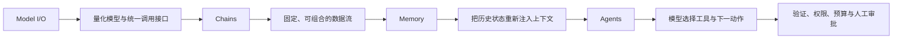
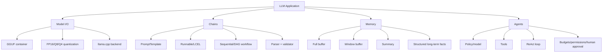

> 原章：*Advanced Text Generation Techniques and Tools*
> 本章定位：从“调用一次模型”走向“构建一个 LLM 系统”。重点依次是：用量化降低部署门槛，用 chain 组合固定步骤，用 memory 管理会话状态，再用 agent 让模型在受控工具集合中选择动作。

## 0. 本章路线：模型之外的能力来自系统

Prompt engineering 只改变一次调用的输入。真实应用还需要加载模型、组织多步流程、保存状态、访问外部世界并处理失败。




本章使用 LangChain 展示抽象。框架 API 更新很快，类名和导入路径可能变化；稳定知识是组件边界、数据流和安全约束，不是某一版 import。现代 LangChain 常用 LCEL/Runnable，复杂有状态 agent 也常由 LangGraph 等显式状态图承载。

### 0.1 四个概念先分清

| 概念 | 改变什么 | 不改变什么 |
|---|---|---|
| Quantization | 权重/激活数值表示与部署成本 | 模型架构和训练目标 |
| Chain | 应用预先规定的步骤和数据流 | 模型权重 |
| Memory | 应用保存并重新提供状态 | 模型并未跨请求永久记住 |
| Agent | 模型在循环中选择 action/tool | 工具仍需程序实际执行 |

---

## 1. Model I/O：用 LangChain 加载量化模型（Model I/O: Loading Quantized Models with LangChain）

### 1.1 GGUF 与量化不是同一个概念

GGUF 是适合 llama.cpp 生态的模型文件格式，可保存权重、tokenizer 与元数据。文件可以是 FP16，也可以是 Q8、Q4 等量化版本。因此：

$$
\text{GGUF file}\not\Rightarrow\text{quantized weights}
$$

原章下载文件名 `Phi-3-mini-4k-instruct-fp16.gguf`，它表示 16-bit floating point，并不是紧邻文字所称的 8-bit 版本。若要 8-bit，应选择仓库中明确标为 Q8 的文件；具体名称以模型仓库当前列表为准。


### 1.2 量化的数学直觉

以对称均匀量化（symmetric quantization）为例，将浮点权重 $w$ 映射为 $b$ bit 整数：

$$
q=\operatorname{clip}\left(\operatorname{round}\left(\frac{w}{s}\right),q_{min},q_{max}\right)
$$

$$
\widehat{w}=s q
$$

其中 scale 可取：

$$
s=\frac{\max |w|}{q_{max}}
$$

$\widehat{w}$ 是反量化近似。误差为 $e=w-\widehat{w}$。更少 bit 意味着可用离散级别更少，误差通常更大，但内存和带宽更低。

```python
def symmetric_quantize(values, bits):
    max_integer = 2 ** (bits - 1) - 1
    scale = max(abs(value) for value in values) / max_integer
    integers = [
        max(-max_integer, min(max_integer, round(value / scale)))
        for value in values
    ]
    restored = [integer * scale for integer in integers]
    return scale, integers, restored


weights = [-1.0, -0.2, 0.3, 0.9]
scale, integers, restored = symmetric_quantize(weights, bits=4)
print(f"scale={scale:.4f}")
print("q=", integers)
print("dequant=", [round(value, 4) for value in restored])
```

```text
scale=0.1429
q= [-7, -1, 2, 6]
dequant= [-1.0, -0.1429, 0.2857, 0.8571]
```

真实 LLM 量化会按 tensor、channel 或 block 使用不同 scale，可能带 zero-point，并采用专门格式；上例只解释基本机制。

### 1.3 内存估算与取舍

仅权重的理论字节数：

$$
M_{weights}\approx P\frac{b}{8}
$$

38 亿参数的粗略占用：

| 格式 | 理论权重大小 | 说明 |
|---|---:|---|
| FP32 | 15.2 GB | 高精度、推理通常没必要 |
| FP16 | 7.6 GB | 原章实际文件类型 |
| Q8 | 3.8 GB | 约为 FP16 一半 |
| Q4 | 1.9 GB | 常见质量/成本折中 |

实际还包含量化元数据、KV cache、运行时 buffer、上下文和 GPU/CPU offload。低 bit 不保证更快：速度取决于硬件是否有高效 kernel、内存带宽和后端实现。

“至少 4-bit”只能作为经验起点。3-bit 大模型与 4/8-bit 小模型谁更好，要在目标任务测试；量化对困惑度、代码、数学和罕见语言的影响可能不同。

### 1.4 加载 GGUF

现代导入路径通常来自 community package：

```python
from langchain_community.llms import LlamaCpp

llm = LlamaCpp(
    model_path="Phi-3-mini-4k-instruct-fp16.gguf",
    n_gpu_layers=-1,
    max_tokens=500,
    n_ctx=2048,
    seed=42,
    temperature=0,
    verbose=False,
)
```

- `n_gpu_layers=-1`：请求尽可能把全部层放 GPU；显存不足时应调整。
- `n_ctx=2048`：后端为本次实例配置的上下文，不应超过模型/量化文件可靠能力。
- `seed=42`：提高采样复现性，但不保证跨后端完全一致。
- `max_tokens=500`：最大新增 token。

直接调用 `llm.invoke("Hi...")` 可能得到空或异常输出，因为 instruct model 训练时依赖特定 chat template。问题不在算术能力，而在输入协议。

> **版本边界**：模型仓库、LangChain 和 llama.cpp 接口会变化。实际运行前核对当前模型卡、chat template、EOS token、许可证与导入路径。

---

## 2. Chains：扩展 LLM 能力（Chains: Extending the Capabilities of LLMs）

Chain 是应用规定的数据流：一个组件输出成为下一个组件输入。组件可以是 prompt、LLM、parser、retriever、函数或 validator。


Chain 的价值不是让模型“更聪明”，而是让流程可复用、可观测、可测试，并能在模型外加入确定性逻辑。

### 2.1 链中的单个连接：Prompt Template（A Single Link in the Chain: Prompt Template）

Prompt template 把变化字段与固定协议分开：

$$
\operatorname{prompt}=T(\text{input variables})
$$


书中手工构造 Phi-3 模板。若 tokenizer 可用，优先使用其 `apply_chat_template`，避免特殊 token 漂移。为说明 LangChain 组合，可以写：

```python
from langchain_core.prompts import PromptTemplate

phi_prompt = PromptTemplate.from_template(
    """<s><|user|>
{input_prompt}<|end|>
<|assistant|>"""
)
basic_chain = phi_prompt | llm
```

LCEL 的 `|` 构造 RunnableSequence：前一组件输出传给后一组件。

```python
answer = basic_chain.invoke(
    {"input_prompt": "Hi! My name is Maarten. What is 1 + 1?"}
)
print(answer)
```


#### 2.1.1 Template 的工程边界

- 变量必须转义或分隔，外部文本仍可能 prompt injection。
- 模板版本应与模型版本共同记录。
- 输出最好接 parser/schema，而非直接传给数据库或工具。
- API chat model 往往由服务端/SDK处理模板，但 role/content 仍是协议的一部分。

### 2.2 多 Prompt Chain（A Chain with Multiple Prompts）

复杂故事生成可拆成 title → character → story。固定顺序由应用决定，不由模型临时规划。


现代 Runnable 风格可显式保留中间字段：

```python
from langchain_core.output_parsers import StrOutputParser
from langchain_core.runnables import RunnablePassthrough

text_parser = StrOutputParser()
title_prompt = PromptTemplate.from_template(
    "Create one title for a story about {summary}. Return only the title."
)
character_prompt = PromptTemplate.from_template(
    "Describe the protagonist in two sentences. Summary: {summary}. Title: {title}."
)
story_prompt = PromptTemplate.from_template(
    "Write one paragraph. Summary: {summary}. Title: {title}. Character: {character}."
)

title_step = RunnablePassthrough.assign(title=title_prompt | llm | text_parser)
character_step = RunnablePassthrough.assign(
    character=character_prompt | llm | text_parser
)
story_step = RunnablePassthrough.assign(story=story_prompt | llm | text_parser)
story_chain = title_step | character_step | story_step
```

调用时输入明确字典：

```python
result = story_chain.invoke({"summary": "a girl learning to live after losing her mother"})
print(result["title"])
print(result["character"])
print(result["story"])
```

#### 2.2.1 为什么分链

- 单步 instruction 更简单。
- 中间结果可检查、缓存、人工编辑。
- 每步可使用不同模型、温度和 token 预算。
- 独立步骤可并行，整体可表达为 DAG。

#### 2.2.2 错误和成本怎样累积

若 $m$ 步都必须正确，简化独立假设下：

$$
P_{success}=\prod_{i=1}^{m}p_i
$$

```python
step_accuracy = 0.95
steps = 5
print(f"pipeline_success={step_accuracy ** steps:.3f}")
```

```text
pipeline_success=0.774
```

每步 95% 并不意味着五步仍有 95%。生产 chain 需要中间 schema、retry policy、timeout、trace、幂等性和失败补偿。自然语言字符串是脆弱接口，能用 typed object 就不要靠下游再猜字段。

---

## 3. Memory：帮助 LLM “记住”对话（Memory: Helping LLMs to Remember Conversations）

模型 API 通常是 stateless：每次调用只看到本次提供的 token。所谓 memory 是应用保存历史，并在后续调用重新放入上下文。

$$
\text{response}_t=f_\theta(\text{system},\text{memory}_{t-1},\text{user}_t)
$$


它不同于：

- 模型参数中的预训练知识。
- 单次生成中的 KV cache。
- 数据库中的长期用户画像。
- RAG 的外部知识检索。

### 3.1 对话缓冲区（Conversation Buffer）

最直接的方法是每次附上完整消息历史。


概念代码：

```python
history = []


def add_turn(user_text, assistant_text):
    history.append({"role": "user", "content": user_text})
    history.append({"role": "assistant", "content": assistant_text})


def build_messages(user_text):
    return [
        {"role": "system", "content": "Answer using the conversation history."},
        *history,
        {"role": "user", "content": user_text},
    ]
```

老版 LangChain 示例使用 `ConversationBufferMemory` 与 `LLMChain`；现代版本可能通过 message history/checkpointer 实现。关键契约是：memory key 与 prompt placeholder 必须一致，角色顺序必须正确。


#### 3.1.1 成本为何随会话加速增长

若每轮平均新增 $r$ 个 token，第 $t$ 轮输入约 $tr$。前 $n$ 轮累计 prefill token：

$$
\sum_{t=1}^{n}tr=r\frac{n(n+1)}{2}=O(n^2)
$$

单轮上下文线性增长，整场会话累计处理量近似二次增长。长历史还会增加 lost-in-the-middle 和注入污染风险。

### 3.2 窗口化对话缓冲区（Windowed Conversation Buffer）

老版 LangChain 将这种策略称为 `ConversationBufferWindowMemory`：只保留最近 $k$ 个 interaction，成本有界，但早期事实会消失。

```python
from collections import deque

window = deque(maxlen=2)
window.append(("My name is Maarten and I am 33.", "Nice to meet you."))
window.append(("What is 3 + 3?", "6"))
window.append(("What is my name?", "Maarten"))

print([user for user, _ in window])
```

```text
['What is 3 + 3?', 'What is my name?']
```

第一轮信息已被逐出，因此年龄无法恢复；名字之所以仍可能出现，是最近一轮回答重复了它。实际框架中的 `k` 可能表示 messages 或 human/AI pairs，应查当前 API，而非凭名称猜。

适用：短期客服上下文、最近状态比早期细节重要。关键用户属性、同意状态和业务事实不应只依赖滑动窗口，应放入经过验证的结构化 state。

### 3.3 对话摘要（Conversation Summary）

老版 `ConversationSummaryMemory` 用另一次模型调用将旧历史压缩，再把 summary 与新 turns 传给主模型。


增量更新：

$$
S_t=g_\phi(S_{t-1},u_t,a_t)
$$

$g_\phi$ 可用更小、更便宜的模型。

```python
summary_prompt = PromptTemplate.from_template(
    """Update the conversation summary without inventing facts.
Current summary:
{summary}

New messages:
{new_lines}

Return a concise factual summary:"""
)
```


优点：上下文小、支持长对话。代价：

- 每轮多一次摘要调用，延迟和费用增加。
- 摘要有损，精确措辞、数字和早期细节可能消失。
- 误摘要会反复进入下一轮，形成 summary drift。
- 模型可能把“不保留信息”等客套话错误写成事实。

更稳健的 memory 分层会把精确字段放入结构化状态（structured state）：

| 层 | 内容 | 存储方式 |
|---|---|---|
| Recent episodic | 最近原始 turns | 滑动窗口 |
| Running summary | 长期对话脉络 | 可重建摘要 |
| Structured facts | 姓名、偏好、任务状态 | Schema + 来源 + 更新时间 |
| Long-term retrieval | 历史片段 | 向量/关键词检索 |

PII 还需 consent、访问控制、加密、保留期限和删除能力。把聊天历史塞进 prompt 不等于合规 memory。

### 3.4 三类 memory 的取舍

| 类型 | 信息保真 | Token 成本 | 额外调用 | 主要失败 |
|---|---|---|---|---|
| Full buffer | 窗口内最高 | 持续增长 | 无 | 超窗、慢、中间遗忘 |
| Window buffer | 最近 $k$ 轮高 | 有界 | 无 | 早期事实丢失 |
| Summary | 语义压缩 | 较小 | 每次摘要 | 遗漏、幻觉、漂移 |

不存在“既零成本又无损无限记忆”。选择取决于事实精度、延迟、隐私和会话长度。

---

## 4. Agents：创建 LLM 系统（Agents: Creating a System of LLMs）

Chain 的控制流由开发者预先写死；agent 让模型根据目标和 observation 动态选择下一 action。

$$
a_t=\pi_\theta(\text{goal},s_t,\text{available tools})
$$

工具执行后产生 observation：

$$
o_t=\operatorname{tool}_{a_t}(\text{arguments}),\qquad
s_{t+1}=\operatorname{update}(s_t,a_t,o_t)
$$


Agent 的能力来自模型、tools、orchestrator、state 和 guardrails 的组合。LLM 只生成 action request；真正执行网络、数据库或计算的是宿主程序。

### 4.1 Agent 背后的驱动力：逐步推理（The Driving Power Behind Agents: Step-by-step Reasoning）

ReAct 交替进行：

1. **Thought/decision**：判断下一步需要什么信息。
2. **Action**：选择工具和参数。
3. **Observation**：把工具结果送回模型。
4. 重复直到 final answer 或达到预算。


MacBook 案例：先搜索当前 USD 价格，再按给定汇率计算 EUR。若搜索到 2249 USD，汇率为 0.85：

$$
2249\times0.85=1911.65
$$

```python
from decimal import Decimal

usd_price = Decimal("2249.00")
eur_per_usd = Decimal("0.85")
eur_price = usd_price * eur_per_usd
print(f"EUR {eur_price:.2f}")
```

```text
EUR 1911.65
```

计算是正确的，不代表输入价格当前、对应正确型号或来自可信商家。Observation 必须携带 URL、时间、型号、货币与来源可信度。

#### 4.1.1 ReAct 为什么比纯文本回答强

- 参数知识过时，search 可取实时信息。
- LLM 算术不可靠，calculator 可确定执行。
- Observation 可纠正先前计划。
- Trace 便于查看工具选择与失败点。

但模型生成的可见 Thought 不是可靠内部解释。生产系统更应记录结构化 action/observation 与简短 decision rationale，不必暴露冗长 chain-of-thought。

### 4.2 在 LangChain 中使用 ReAct（ReAct in LangChain）

#### 4.2.1 模型与提示

原章使用历史 `gpt-3.5-turbo`。当前应从供应商选择可用 snapshot，并让 SDK 从环境读取密钥，不能在源码写 `MY_KEY`：

```python
import os

from langchain_openai import ChatOpenAI

agent_model = ChatOpenAI(
    model=os.environ["OPENAI_MODEL"],
    temperature=0,
)
```

ReAct prompt 必须列出 tool names、description、输入和 scratchpad。现代工具调用（tool calling）模型也可直接产生结构化 tool call，通常比解析自由文本 `Action:` 更稳健。

```python
from langchain_core.prompts import PromptTemplate

react_prompt = PromptTemplate.from_template(
    """Answer using only the available tools when external data or arithmetic is needed.

Tools:
{tools}

Use one tool from [{tool_names}] at a time.
Question: {input}
Scratchpad:
{agent_scratchpad}
"""
)
```

#### 4.2.2 工具是权限边界

工具描述既帮助模型选择，也定义潜在攻击面；应遵循最小权限（least privilege）。下面只演示安全的纯函数计算器，不使用任意 `eval`：

```python
from decimal import Decimal
from langchain_core.tools import tool


@tool
def convert_usd_to_eur(usd: str, rate: str) -> str:
    """Convert a USD amount to EUR using an explicitly supplied exchange rate."""
    amount = Decimal(usd)
    exchange_rate = Decimal(rate)
    if amount < 0 or not Decimal("0") < exchange_rate < Decimal("10"):
        raise ValueError("Out-of-range input")
    return f"{amount * exchange_rate:.2f} EUR"
```

Search tool 输出属于**不可信外部输入**。网页可能包含 prompt injection；不能让 observation 覆盖 system policy，也不能因为网页文字要求而调用高权限工具。

#### 4.2.3 构造 executor

书中接口：

```python
from langchain.agents import AgentExecutor, create_react_agent

tools = [convert_usd_to_eur, search_tool]
agent = create_react_agent(agent_model, tools, react_prompt)
agent_executor = AgentExecutor(
    agent=agent,
    tools=tools,
    verbose=True,
    handle_parsing_errors=True,
    max_iterations=6,
    max_execution_time=30,
)
```

具体 API 可能随 LangChain 版本变化。`handle_parsing_errors=True` 可把格式错误反馈给模型重试，但也可能掩盖缺陷、增加成本或形成循环；必须配合 iteration/time budget。

```python
result = agent_executor.invoke(
    {
        "input": (
            "Find the current official US price of a specified MacBook Pro model, "
            "cite the source and timestamp, then convert it at 0.85 EUR per USD."
        )
    }
)
```


#### 4.2.4 Agent 上线前的安全清单

- Tool allowlist 与最小权限，不把整个数据库/文件系统交给模型。
- 参数使用 JSON schema、类型、范围和长度验证。
- 写操作采用 dry-run、幂等性（idempotency）键、审批和可撤销设计。
- 网络、文件、代码执行放在 sandbox，设置 timeout 和资源限额。
- 限制 iterations、token、费用和并发。
- Observation 标注来源，过滤 secrets，防 prompt injection。
- 对支付、删除、发送消息等副作用保留 human-in-the-loop。
- 完整记录 action、arguments、observation 摘要、模型版本和结果。

#### 4.2.5 怎样评估 agent

不能只看 final answer。至少测：

| 指标 | 问题 |
|---|---|
| Task success | 最终目标是否完成？ |
| Tool selection accuracy | 是否在正确时机选正确工具？ |
| Argument validity | 参数是否满足 schema 与语义？ |
| Groundedness | 回答能否由 observation 支持？ |
| Citation correctness | URL 是否真的包含所述信息？ |
| Steps/latency/cost | 是否绕路、循环或超预算？ |
| Side-effect safety | 是否产生未授权写操作？ |
| Recovery rate | 工具失败后能否安全恢复或停止？ |

“自主”不是目标本身。固定 workflow 能解决的任务，优先使用可预测 chain；只有路径确实依赖动态 observation 时才引入 agent。

---

## 5. 重点辨析与常见误区

### 5.1 GGUF 不等于量化

GGUF 是容器；FP16 GGUF 仍是 16-bit。文件名 Q4/Q8 才通常表示对应量化家族。

### 5.2 量化不等于模型变小但能力完全不变

架构参数个数不变，数值精度降低。质量损失依任务、层、量化方法和 bit 数而异，必须评测。

### 5.3 低 bit 不保证更快

若硬件/后端缺少合适 kernel，反量化开销可能抵消带宽收益。显存更少与延迟更低是不同指标。

### 5.4 PromptTemplate 不应替代 tokenizer chat template

能访问配套 tokenizer 时优先调用官方模板。手工特殊 token 容易因模型版本变化出错。

### 5.5 Chain 不等于 agent

Chain 路径由开发者定义；agent 的 action 由模型在运行时选择。前者通常更确定、更易测试。

### 5.6 Chain 变长不等于系统更强

步骤增加会累积延迟、费用和失败率。每一步都要有明确增益、typed contract 与验证。

### 5.7 Memory 不在模型脑中

应用保存历史再重发。新部署若不加载状态，模型不会知道旧会话；memory 也不会自动改变权重。

### 5.8 Memory 不等于 KV cache

KV cache 是单次生成/上下文的计算优化；conversation memory 是跨调用的应用数据。

### 5.9 长 context 不等于免费 memory

历史越长，prefill、费用和注意力利用难度越高。窗口扩大不能消除 lost-in-the-middle。

### 5.10 Summary memory 不保证完整历史

摘要是有损生成，会遗漏、改写和漂移。精确事实必须结构化保存并附 provenance。

### 5.11 Agent 不等于自主且可靠的员工

它是随机策略加工具循环。模型可能选错工具、参数或停止条件，需要预算、权限和监督。

### 5.12 ReAct 的 Thought 不是真实内部解释

可见文字有助调试协议，却不证明因果推理。应验证 action 与 observation，而非相信叙述。

### 5.13 工具输出不是可信 system instruction

搜索页、邮件和文件都可能携带恶意指令。Observation 必须按不可信数据处理。

### 5.14 Calculator 正确不等于最终答案正确

若搜索价格、型号或汇率错误，精确乘法仍产生错误结论。每个数据来源都要验证。

### 5.15 `handle_parsing_errors` 不等于错误已解决

自动重试可能成功，也可能循环并增加费用。必须限制次数，并把最终失败暴露给调用方。

### 5.16 框架抽象不等于免于理解底层

LangChain 简化连接，但 prompt、token、模型限制、状态、权限和错误传播仍由开发者负责。

---

## 6. 总结（Summary）

### 6.1 知识结构



### 6.2 核心结论

1. 高级文本生成的能力主要来自模型与外部组件的组合，而不只来自更复杂 prompt。
2. Quantization 用数值精度换内存与带宽；理论权重占用约与 bit 数成正比。
3. GGUF 是文件格式，FP16 GGUF 不是 8-bit 量化模型。
4. Chain 把 prompt、model、parser 和函数组织为固定可测试数据流；多步流程会累积错误与成本。
5. Chat template 是模型协议，能用配套 tokenizer 时不应手工猜特殊 token。
6. LLM 本身跨 API 调用 stateless；memory 是应用把历史重新放回 prompt。
7. Full buffer 保真但 token 持续增长，window 有界但遗忘，summary 节省上下文但有损且更慢。
8. 精确用户事实应进入有 schema、来源和生命周期的结构化状态，不应只靠聊天摘要。
9. Agent 与 chain 的分界在控制流：agent 由模型动态选择 action，chain 由程序预先规定。
10. ReAct 用 decision/action/observation 循环把外部工具结果纳入后续计划。
11. Tool use 扩大能力也扩大攻击面，必须最小权限、参数验证、sandbox、预算与审批。
12. Agent 评估要检查工具选择、参数、证据、成本和副作用，不能只看最终文字。

### 6.3 解决同类系统问题的一般方法

1. **先确定是否真的需要 LLM**：确定性规则能完成的步骤用代码。
2. **选择可部署模型表示**：评估 FP16/Q8/Q4 的目标任务质量、内存和速度。
3. **固定模型协议**：chat template、stop token、上下文和生成参数版本化。
4. **先构建显式 chain**：每步单一职责，输入输出使用 schema。
5. **在边界加验证**：parse、type、range、grounding 与安全检查。
6. **按信息类型设计 memory**：最近原文、摘要、结构化事实、长期检索分别管理。
7. **计算 token 生命周期**：估算累计 prefill、延迟、费用和超窗策略。
8. **只在控制流未知时用 agent**：动态工具选择必须带来真实收益。
9. **把 tool 当权限边界**：allowlist、最小权限、sandbox、timeout 和幂等。
10. **限制自主循环**：max steps、deadline、budget、stop condition 和 human approval。
11. **记录可审计 trace**：模型版本、action、参数、来源、observation 与最终结果。
12. **用端到端任务回归**：框架、模型、工具或 prompt 更新后重新评测。

本章最重要的方法论是逐步增加自治：先让单次调用正确，再让固定 chain 可验证，再加入有界 memory，最后才把必要的决策交给 agent。每增加一层能力，都必须同步增加状态管理、观测、权限和失败控制。
