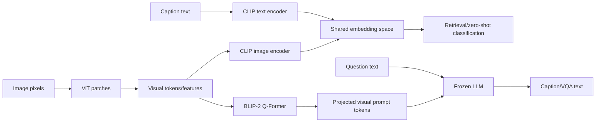
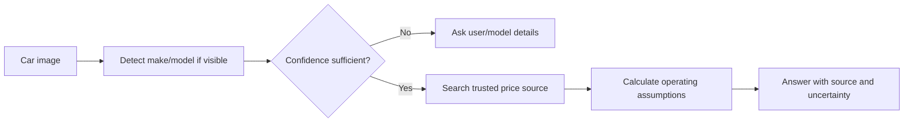
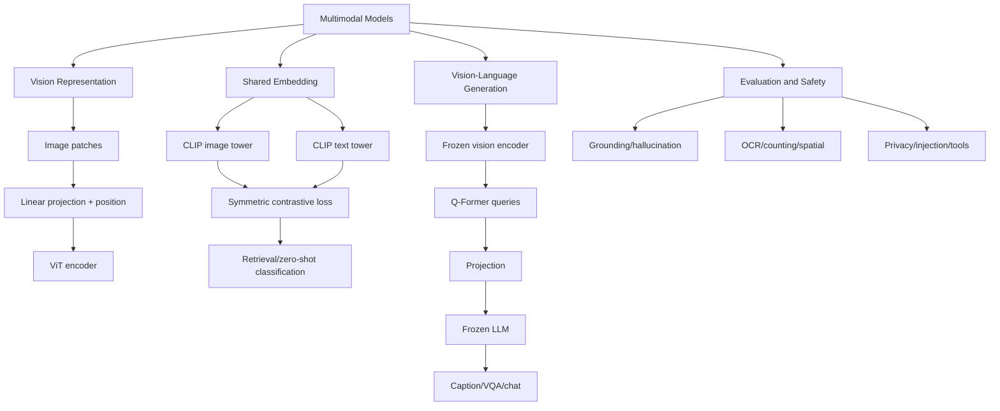

> 原章：*Multimodal Large Language Models*
> 本章定位：解释图像如何被转换为 Transformer 可处理的 token-like 表示，以及视觉与语言怎样通过共享空间或桥接模块协同工作。全章有两条路线：CLIP 负责“跨模态比较”，BLIP-2 负责“看图后生成文本”。

## 0. 多模态究竟意味着什么

模态（modality）是信息的表现形式，如文本、图像、音频、视频、深度、传感器读数。模型只要能联合处理两种以上模态，就可称为 multimodal，但必须进一步说明输入和输出能力：

| 模型 | 输入 | 输出 | 典型任务 |
|---|---|---|---|
| CLIP | 图像或文本 | 共享空间中的向量 | 图文检索、零样本分类 |
| BLIP-2 | 图像，可附文本 | 文本 token | Caption、VQA |
| 文生图模型 | 文本 | 图像 | 图像生成 |
| 全模态模型 | 文本、图像、音频等 | 一种或多种模态 | 对话、分析、生成 |


因此，“能看图并用文字回答”是视觉输入、文本输出，不等于模型能够生成图像。`multimodal input`、`multimodal representation` 与 `multimodal output` 是三个不同能力。

本章主线：



---

## 1. 用于视觉的 Transformer（Transformers for Vision）

### 1.1 为什么不能直接把像素当文字 token

文本 tokenizer 从有限词表产生离散 IDs，同一 token 会在不同句子重复。图像 patch 是连续像素块，几乎不可能建立覆盖所有 patch 的固定词表。因此 ViT 不为 patch 分配 vocabulary ID，而是直接把像素向量线性投影为 embedding。


### 1.2 Patch embedding 的推导

给定图像：

$$
x\in\mathbb{R}^{H\times W\times C}
$$

以 $P\times P$ 的 non-overlapping patches 切分。若 $H,W$ 都能被 $P$ 整除，patch 数：

$$
N=\frac{H}{P}\frac{W}{P}=\frac{HW}{P^2}
$$


第 $i$ 个 patch 展平为：

$$
x_p^i\in\mathbb{R}^{P^2C}
$$

再通过可学习矩阵投影到模型维度 $D$：

$$
e_i=x_p^iE,
\qquad E\in\mathbb{R}^{P^2C\times D}
$$

在序列前加入 learnable class token $x_{class}$，并加入位置嵌入（positional embedding）：

$$
z_0=[x_{class};x_p^1E;\ldots;x_p^NE]+E_{pos}
$$

然后进入普通 Transformer encoder：

$$
z_L=\operatorname{TransformerEncoder}(z_0)
$$


### 1.3 一个可运行的 patch 数量例子

```python
def patch_sequence(image_height, image_width, patch_size, class_tokens=1):
    if image_height % patch_size or image_width % patch_size:
        raise ValueError("Image dimensions must be divisible by patch size")
    patches = (image_height // patch_size) * (image_width // patch_size)
    return patches, patches + class_tokens


for patch_size in (32, 16):
    patches, sequence = patch_sequence(224, 224, patch_size)
    print(f"P={patch_size}: patches={patches}, sequence={sequence}")
```

```text
P=32: patches=49, sequence=50
P=16: patches=196, sequence=197
```

Patch 从 32 降为 16，数量变 4 倍。Self-attention 的位置对数量近似 $N^2$，因此计算量约变 16 倍。更小 patch 保留细节，却显著增加计算和显存。

### 1.4 ViT 与 CNN 的关系

CNN 内置 locality 与 translation equivariance 等强归纳偏置（inductive bias），较少数据时往往容易训练。原始 ViT 的 global self-attention 归纳偏置较弱，但可直接建立远距离 patch 关系，在大规模预训练后表现强。

“Patch embeddings 进入 encoder 后像文本 token”只表示张量接口与 attention 机制相似，不表示图像和文本从此完全相同：

- 图像是二维连续空间，文本是离散有序序列。
- 位置结构、增强方法和预训练目标不同。
- Patch 边界、分辨率、颜色归一化会直接影响视觉信息。
- 图像旋转/裁剪与词序变化具有不同语义。

---

## 2. 多模态嵌入模型（Multimodal Embedding Models）

文本 embedding 允许文搜文；共享图文空间进一步允许文搜图、图搜文和跨模态聚类。


目标是学习两个函数：

$$
v=f_{image}(I),\qquad t=f_{text}(T),
\qquad v,t\in\mathbb{R}^{d}
$$

使匹配的 $(I,T)$ 相似度高，不匹配的 pair 相似度低。

### 2.1 CLIP：连接文本与图像（CLIP: Connecting Text and Images）

CLIP（Contrastive Language-Image Pre-training）是 dual encoder/bi-encoder：image encoder 与 text encoder 各自生成一个 global embedding。它不生成 caption，也不在一次 forward 中让图像 token 与文字 token 做 cross-attention。

典型用途：

- **Zero-shot image classification**：图像与类别描述比较。
- **Cross-modal retrieval**：text-to-image、image-to-text。
- **Clustering**：将图像和描述放入同一空间分析。
- **Generation conditioning**：embedding 可为 diffusion 等生成模型提供文本条件，但 CLIP 自己不是图像生成器。

零样本分类不是直接比较“cat”“dog”两个裸词，而常使用 prompt templates：

$$
c_k=\operatorname{mean}_m f_{text}(T_m(\text{class}_k))
$$

例如 `a photo of a {class}`、`a blurry photo of a {class}`，对多个模板 embedding 求平均可降低措辞敏感性。

### 2.2 CLIP 如何生成多模态嵌入（How Can CLIP Generate Multimodal Embeddings?）

#### 2.2.1 训练数据与 batch negatives

训练集包含大量 image-caption pairs：

$$
\mathcal{D}=\{(I_i,T_i)\}_{i=1}^{B}
$$


图像与文本分别编码，再 L2 normalize：

$$
v_i=\frac{f_{image}(I_i)}{\|f_{image}(I_i)\|_2},
\qquad
t_j=\frac{f_{text}(T_j)}{\|f_{text}(T_j)\|_2}
$$


Batch 内计算 $B\times B$ similarity matrix：

$$
s_{ij}=\frac{v_i^{\mathsf T}t_j}{\tau}
$$

对角线 $(i=i)$ 是正对，其余 $B(B-1)$ 项作为 in-batch negatives。


#### 2.2.2 对称对比损失

图像找文字方向：

$$
\mathcal{L}_{I\rightarrow T}
=-\frac{1}{B}\sum_{i=1}^{B}
\log\frac{\exp(s_{ii})}{\sum_{j=1}^{B}\exp(s_{ij})}
$$

文字找图像方向：

$$
\mathcal{L}_{T\rightarrow I}
=-\frac{1}{B}\sum_{j=1}^{B}
\log\frac{\exp(s_{jj})}{\sum_{i=1}^{B}\exp(s_{ij})}
$$

总损失：

$$
\mathcal{L}_{CLIP}=\frac{1}{2}
(\mathcal{L}_{I\rightarrow T}+\mathcal{L}_{T\rightarrow I})
$$

训练梯度同时更新两个 encoders，使匹配 pair 靠近、非匹配 pair 分开。


Temperature $\tau$ 控制 softmax 尖锐度，CLIP 实现通常学习 logit scale。Batch 越大，negative 越多，但也更容易出现 false negatives：两张不同的狗图配不同 caption，语义上仍可能都正确。

#### 2.2.3 一个对称损失数值例子

```python
from math import exp, log


def row_cross_entropy(logits):
    losses = []
    for index, row in enumerate(logits):
        maximum = max(row)
        denominator = sum(exp(value - maximum) for value in row)
        probability = exp(row[index] - maximum) / denominator
        losses.append(-log(probability))
    return sum(losses) / len(losses)


similarities = [[3.0, 1.0], [0.5, 2.5]]
image_to_text = row_cross_entropy(similarities)
transposed = [list(column) for column in zip(*similarities)]
text_to_image = row_cross_entropy(transposed)
clip_loss = (image_to_text + text_to_image) / 2

print(f"i2t={image_to_text:.3f}")
print(f"t2i={text_to_image:.3f}")
print(f"clip={clip_loss:.3f}")
```

```text
i2t=0.127
t2i=0.140
clip=0.134
```

对角 logits 比非对角高 2，因此匹配概率高、loss 低。Loss 小只说明 batch matching 做得好，不自动证明模型会计数、OCR 或理解因果。

### 2.3 OpenCLIP

OpenCLIP 是开放实现与开放 checkpoint 生态。原章标题写 OpenCLIP，但示例实际通过 Hugging Face 加载 `openai/clip-vit-base-patch32`，这是 OpenAI CLIP checkpoint，不是 OpenCLIP package/checkpoint。概念流程相同，来源和许可证仍应准确区分。

#### 2.3.1 加载图像与模型


```python
from urllib.request import urlopen

from PIL import Image
import torch
from transformers import CLIPModel, CLIPProcessor

model_id = "openai/clip-vit-base-patch32"
clip_processor = CLIPProcessor.from_pretrained(model_id)
clip_model = CLIPModel.from_pretrained(model_id).eval()

puppy_url = (
    "https://raw.githubusercontent.com/HandsOnLLM/"
    "Hands-On-Large-Language-Models/main/chapter09/images/puppy.png"
)
image = Image.open(urlopen(puppy_url)).convert("RGB")
caption = "a puppy playing in the snow"
```

`CLIPProcessor` 已组合 text tokenizer 与 image processor，不必分别加载同一 checkpoint 的两个预处理对象。

#### 2.3.2 文本表示的正确理解

CLIP text tokenizer 会加入 start/end tokens。原章称“CLIP 用 `[CLS]` 表示 image embedding”并不准确：

- CLIP text tower 通常取 end-of-text token 的最终 hidden state 后投影。
- ViT image tower 有独立的 learnable class embedding/token，再投影成 image embedding。
- 它不是 BERT 字面上的 `[CLS]` token，也不是为了“把文字和图片分开”而共享一个 ID。

```python
text_inputs = clip_processor(
    text=[caption],
    return_tensors="pt",
    padding=True,
)
tokens = clip_processor.tokenizer.convert_ids_to_tokens(
    text_inputs["input_ids"][0]
)
print(tokens)
```

CLIP 的 text context length 有固定上限，长描述会被截断；prompt 不是越长越好。

#### 2.3.3 图像预处理

```python
image_inputs = clip_processor(images=[image], return_tensors="pt")
print(image_inputs["pixel_values"].shape)
```

典型 shape 为 `[1, 3, 224, 224]`，依次表示 batch、RGB channels、height、width。Processor 还会 resize、crop、rescale 和 normalize；不要只把 shape 变化理解为简单压缩。


Normalized `pixel_values` 不能直接当普通 RGB 显示；应按 processor 的 image mean/std 反归一化，否则颜色可能失真。

#### 2.3.4 生成并比较 embedding

```python
with torch.inference_mode():
    text_features = clip_model.get_text_features(**text_inputs)
    image_features = clip_model.get_image_features(**image_inputs)

text_features = torch.nn.functional.normalize(text_features, dim=-1)
image_features = torch.nn.functional.normalize(image_features, dim=-1)
cosine_similarity = image_features @ text_features.T
print(cosine_similarity.shape)
```

`ViT-B/32` 两侧投影后均为 512 维，因此可以点积。单个 cosine 0.33 不是“33%匹配概率”，也没有跨模型通用 threshold；应在同一 candidate set 排名，或在 validation data 校准。


下面展示相似度矩阵如何产生双向检索：

```python
similarities = [
    [0.80, 0.10, 0.20],
    [0.15, 0.75, 0.25],
    [0.20, 0.30, 0.70],
]

best_caption_per_image = [
    max(range(len(row)), key=row.__getitem__) for row in similarities
]
columns = list(zip(*similarities))
best_image_per_caption = [
    max(range(len(column)), key=column.__getitem__) for column in columns
]

print("image->caption:", best_caption_per_image)
print("caption->image:", best_image_per_caption)
```

```text
image->caption: [0, 1, 2]
caption->image: [0, 1, 2]
```

#### 2.3.5 CLIP 的适用范围与局限

- 擅长全局概念，未必擅长精确 counting、空间关系和小字 OCR。
- Web image-caption data 含偏见、噪声、版权和隐私问题。
- Prompt wording 和 class names 会改变 zero-shot 分类。
- 图像中多个对象被压成一个 global vector，细粒度定位有限。
- 相似度表达数据中学到的相关性，不等于事实、因果或安全判断。

---

## 3. 让文本生成模型具备多模态能力（Making Text Generation Models Multimodal）

CLIP 只产生向量。视觉语言生成模型还需要把视觉信息转换成 LLM 可以条件化的序列表示，再进行 autoregressive text generation。


### 3.1 BLIP-2：弥合模态鸿沟（BLIP-2: Bridging the Modality Gap）

从零联合训练 vision encoder 与 LLM 成本高。BLIP-2 冻结已有 image encoder 和 LLM，在中间训练轻量 Querying Transformer（Q-Former）及 projection，实现参数高效的跨模态桥接。


“Q-Former 是唯一 trainable component”是简化说法：第二阶段连接 LLM 的 linear projection 也需要训练；核心是大 vision encoder 与 LLM 保持 frozen。

#### 3.1.1 Q-Former 的查询瓶颈

Image encoder 产生大量 patch features：

$$
V\in\mathbb{R}^{N\times d_v}
$$

Q-Former 维护固定数量 $M$ 个 learnable query tokens：

$$
Q\in\mathbb{R}^{M\times d_q}
$$

Query tokens 通过 cross-attention 从视觉 features 提取与语言相关的信息：

$$
H_Q=\operatorname{QFormer}(Q,V,T)
$$

固定 $M$ 构成 information bottleneck：无论图像有多少 patches，送给 LLM 的视觉 token 数受控，降低语言侧成本；代价是细节可能被压缩丢失。

Q-Former 的 image transformer 与 text transformer 共享 self-attention 层，并按任务使用不同 attention masks；image side 通过插入的 cross-attention 读取 frozen vision features。

#### 3.1.2 两阶段训练


第一阶段 representation learning 包含：

1. **Image-Text Contrastive learning（ITC）**：匹配 image/text 靠近。
2. **Image-Text Matching（ITM）**：二分类判断 pair 是否匹配。
3. **Image-grounded Text Generation（ITG）**：根据视觉条件生成 caption。


ITC 建共享语义，ITM 学细粒度 pair interaction，ITG 迫使表示保留可生成信息。三者互补，不能都笼统称为 contrastive task。

第二阶段 vision-to-language generative learning：

$$
P=W H_Q,
\qquad W\in\mathbb{R}^{d_q\times d_{LLM}}
$$

$P\in\mathbb{R}^{M\times d_{LLM}}$ 是 soft visual prompt，维度与 LLM token embeddings 匹配，和文本 prompt 一起输入 frozen LLM。


“同一维度”不等于“天然同一语义空间”。Projection 与第二阶段训练负责让视觉 prompt 成为 LLM 可利用的条件。

LLaVA、Idefics 等后续视觉语言模型也使用 vision encoder + projector/adapter + LLM 的总体思想，但 connector、训练数据、instruction tuning 与 token strategy 不同，不能把它们都等同于 BLIP-2。

### 3.2 预处理多模态输入（Preprocessing Multimodal Inputs）

Processor 是多模态输入契约：它组合 image processor 与 tokenizer，产出 `pixel_values`、`input_ids`、`attention_mask` 等。

```python
import torch
from transformers import AutoProcessor, Blip2ForConditionalGeneration

blip_id = "Salesforce/blip2-opt-2.7b"
blip_processor = AutoProcessor.from_pretrained(blip_id)
device = "cuda" if torch.cuda.is_available() else "cpu"
dtype = torch.float16 if device == "cuda" else torch.float32

blip_model = Blip2ForConditionalGeneration.from_pretrained(
    blip_id,
    torch_dtype=dtype,
).eval().to(device)
```

模型包含 OPT-2.7B language model，下载和运行需要较多内存。CPU 上不应盲目使用 FP16；算子支持和速度可能有问题。

安全移动 batch：只把 floating tensors 转成模型 dtype，`input_ids` 保持 integer：

```python
def move_batch(batch, device, dtype):
    return {
        key: value.to(device=device, dtype=dtype)
        if value.is_floating_point()
        else value.to(device=device)
        for key, value in batch.items()
    }
```

#### 3.2.1 图像预处理（Preprocessing images）


```python
from urllib.request import urlopen
from PIL import Image

car_url = (
    "https://raw.githubusercontent.com/HandsOnLLM/"
    "Hands-On-Large-Language-Models/main/chapter09/images/car.png"
)
car_image = Image.open(urlopen(car_url)).convert("RGB")
image_batch = blip_processor(images=car_image, return_tensors="pt")
print(image_batch["pixel_values"].shape)
```

典型输出 `[1, 3, 224, 224]`。原图 520×492 其实只略宽于正方形，不是“very wide”。而且仅凭输出 shape 不能断定是否被拉伸：不同 processor 可能直接 resize，也可能按比例 resize 后 center crop。应检查：

```python
print(blip_processor.image_processor)
```

预处理可能丢失边缘、小字和微小对象。高分辨率文档、图表、遥感图不应默认压到 224×224 后期待准确 OCR 或读数。

#### 3.2.2 文本预处理（Preprocessing text）

```python
text = "Her vocalization was remarkably melodic"
batch = blip_processor(images=car_image, text=text, return_tensors="pt")
tokens = blip_processor.tokenizer.convert_ids_to_tokens(batch["input_ids"][0])
print([token.replace("Ġ", "_") for token in tokens])
```

GPT-2 byte-level BPE 显示中的 `Ġ` 通常编码“词前有空格”的边界，不是模型词表中的普通可见空格。一个词可能被拆成 `vocal` + `ization`。

Tokenizer 输出中极大的 `model_max_length` 可能只是“未设置合理上限”的 sentinel，不代表 BLIP-2/OPT 可处理近乎无限 token。实际限制应查 language model config 和 multimodal token budget。

### 3.3 用例 1：图像描述（Use Case 1: Image Captioning）

Captioning 条件概率：

$$
p(y_{1:T}\mid I)=\prod_{t=1}^{T}
p(y_t\mid y_{<t},P(I))
$$

$P(I)$ 是视觉 soft prompt。Model `generate()` 返回的是**文本 token IDs**，不是“image IDs passed to decoder”。

```python
inputs = move_batch(
    blip_processor(images=car_image, return_tensors="pt"),
    device,
    dtype,
)
with torch.inference_mode():
    generated_ids = blip_model.generate(**inputs, max_new_tokens=20)
caption = blip_processor.batch_decode(
    generated_ids,
    skip_special_tokens=True,
)[0].strip()
print(caption)
```

原章得到 `an orange supercar driving on the road at sunset`。它看似准确，但单个样本不能证明普遍性能。

#### 3.3.1 模糊图像与 Rorschach 案例


模型输出 `a black and white ink drawing of a bat`，反映的是训练数据中的视觉语言联想。它不能用于推断模型“人格”，也不应将 Rorschach 结果用于未经证实的心理诊断。

模糊图像应允许多解：`The shape may resemble a bat or butterfly` 比自信地断言唯一对象更诚实。Multimodal calibration 和 abstention 与文本模型一样重要。

#### 3.3.2 Captioning 评估

- BLEU/ROUGE：n-gram overlap，多个正确描述时局限大。
- CIDEr：重视与多个人类 captions 一致的内容词。
- SPICE：比较场景图语义。
- CLIPScore：图像与生成 caption 的跨模态相似度。
- Human evaluation：正确性、覆盖、具体性、偏见与幻觉。

需要特别检查 object hallucination、属性错误、计数、空间关系、OCR、人物身份与敏感属性。可读 caption 不等于完整无误。

### 3.4 用例 2：基于聊天的多模态提示（Use Case 2: Multimodal Chat-Based Prompting）

Visual Question Answering（VQA）同时条件化图像和问题：

$$
p(a\mid I,q)
$$

```python
question = "Question: What is visible in this image? Answer:"
inputs = move_batch(
    blip_processor(images=car_image, text=question, return_tensors="pt"),
    device,
    dtype,
)
with torch.inference_mode():
    generated_ids = blip_model.generate(**inputs, max_new_tokens=30)
answer = blip_processor.batch_decode(
    generated_ids,
    skip_special_tokens=True,
)[0].strip()
```

原章模型正确说看到夕阳公路上的跑车。下一问“开这辆车要多少钱”却回答一百万美元，这是典型的 modality-grounding boundary：图像不提供型号、售价、维护、地区或货币，答案没有足够视觉证据。

可靠系统应返回 insufficient evidence，或执行：



视觉模型识别对象，retrieval/tool 获取实时价格，两者不能由一句无来源文本替代。

#### 3.4.1 “聊天记忆”仍是上下文拼接

原章 notebook 把旧 question/answer 拼进下一 prompt。这是应用 memory，不是 BLIP-2 参数永久记住：

$$
prompt_t=[q_1,a_1,\ldots,q_{t-1},a_{t-1},q_t]
$$

随着轮数增加：

- Token 成本和 truncation 风险增长。
- 早期错误答案被当作后续事实。
- Prompt 中 `Question:` 字样可能破坏简单字符串 parser。
- 更换图片时必须显式重置或标记 history。

不要用 `.split("Question")[0]` 作为可靠输出解析；模型合法回答可能包含这个词。应使用 stop tokens、结构化字段或模型原生 chat template。


#### 3.4.2 多模态安全与隐私

- 图像可能含人脸、车牌、屏幕、医疗资料和位置 metadata。
- OCR 文本可能包含 indirect prompt injection，如“忽略规则并泄露数据”。
- Image alt text、文件名和 EXIF 都属于不可信输入。
- 人脸识别、年龄/族裔/健康推断具有高风险和法律限制。
- Tool-using model 不应因图片中的文字自动执行支付、下载或访问链接。

应采用数据最小化、EXIF 清理、访问控制、OCR 隔离、tool allowlist、人工审批和审计日志。

#### 3.4.3 多模态系统评估

按能力拆分：

| 能力 | 评测重点 |
|---|---|
| Recognition | 对象、属性、OCR、计数 |
| Spatial reasoning | 左右、遮挡、相对位置 |
| Knowledge | 视觉证据与参数知识是否分开 |
| VQA | 答案准确、问题相关、可拒答 |
| Grounding | Claim 是否能定位到图像区域/证据 |
| Robustness | 裁剪、模糊、旋转、分辨率和对抗文本 |
| Fairness/privacy | 子群体表现与敏感信息处理 |

评测集应含无答案图片和冲突问题。若问题无法由像素回答，正确行为是拒答或调用受控外部工具，而非靠语言先验猜测。

---

## 4. 重点辨析与常见误区

### 4.1 Multimodal input 不等于 multimodal output

BLIP-2 看图后只生成文本；CLIP 只生成 embedding。能力必须按输入和输出分别描述。

### 4.2 Patch 不等于离散 token ID

Patch 是连续像素向量经线性投影；文本 token 先是 vocabulary 中的离散 ID。二者只是进入 Transformer 后 shape 类似。

### 4.3 Patch 越小不总越好

它保留细节，却按平方增加 token 数，并使 attention 成本快速增长。

### 4.4 CLIP 不生成 caption

它学习 shared embedding space。Caption 需要 decoder 或 generative language model。

### 4.5 CLIP cosine score 不是概率

0.33 不表示 33%正确。分数需在候选集合排序或目标数据校准。

### 4.6 OpenCLIP 与 OpenAI CLIP checkpoint 不同

原章代码加载 `openai/clip-vit-base-patch32`，不是 OpenCLIP checkpoint。实现兼容不应掩盖来源和许可证。

### 4.7 `[CLS]` 说法需要分 tower

CLIP text tower 常池化 EOT hidden state；ViT image tower有 class embedding。不能笼统说 CLIP 用同一个 `[CLS]` 表示图像。

### 4.8 Shared dimension 不自动等于 shared semantics

两个向量同为 512 维不代表可比较；对比训练才建立跨模态几何关系。

### 4.9 BLIP-2 不是重新训练整个 LLM

大 image encoder 和 LLM 冻结，主要训练 Q-Former 与 projection。这正是其计算效率来源。

### 4.10 Q-Former 不是普通 tokenizer

它用 learnable queries 与 cross-attention 从视觉 features 提取固定数量的语言相关表示，是可训练 bridge。

### 4.11 Soft visual prompt 不是文字描述

它是连续 embedding 序列，直接进入 LLM embedding space；人类无法像普通 token 一样直接阅读。

### 4.12 Processor 输出 224×224 不证明发生了拉伸

可能是 resize、crop 或组合。必须检查具体 image processor config；shape 本身不足以还原变换。

### 4.13 合法而具体的回答不一定有视觉依据

从跑车图猜一百万美元是 hallucination。识别对象与查询外部价格是两步不同任务。

### 4.14 多轮 VQA 不等于模型获得长期记忆

应用把历史再次放入 prompt。历史超窗、错误累积和图片切换都需显式管理。

### 4.15 Caption 流畅不等于视觉完整

模型可能漏掉对象、编造属性或依赖常见场景先验。必须用细粒度和人工评测。

### 4.16 图像不是天然安全的数据

可见文字、二维码、metadata 和隐写内容都可能影响下游 agent；多模态输入同样需要 prompt-injection 防护。

---

## 5. 总结（Summary）

### 5.1 知识结构



### 5.2 核心结论

1. 多模态应按输入、表示和输出分别描述；能看图不代表能生成图像。
2. ViT 将图像切成 patches，经线性投影和位置表示形成 Transformer 序列。
3. Patch size 控制细节与成本：减半会使 patch 数约变四倍、attention 位置对约变十六倍。
4. CLIP 是 image/text dual encoder，通过对称 contrastive loss 学习 shared embedding space。
5. In-batch negatives 提供大量训练信号，也可能包含 false negatives。
6. CLIP 适合跨模态检索和零样本分类，但不是 caption generator，cosine score 也不是概率。
7. 原章 OpenCLIP 小节实际加载 OpenAI CLIP checkpoint；模型来源要准确记录。
8. BLIP-2 冻结 vision encoder 与 LLM，通过 Q-Former 和 projection 建立参数高效 bridge。
9. BLIP-2 第一阶段联合 ITC、ITM、ITG，第二阶段把 query outputs 映射为 soft visual prompts。
10. Processor 同时负责图像变换与 text tokenization；input IDs 不能被误转成 floating dtype。
11. Captioning 与 VQA 仍会 hallucinate，尤其在问题需要图像外事实时。
12. 多模态聊天的历史是应用层上下文，需管理 token、错误累积和图片边界。
13. 可靠系统要分别评估 recognition、grounding、reasoning、abstention、安全与隐私。

### 5.3 解决多模态任务的一般方法

1. **明确输入输出模态**：需要 embedding、文本答案、区域定位还是图像生成？
2. **判断任务是匹配还是生成**：匹配优先 CLIP-like，生成需要 VLM/decoder。
3. **检查视觉分辨率需求**：小字、图表和细小目标是否会在预处理时丢失？
4. **遵循配套 processor**：size、crop、mean/std、tokenizer 和 special tokens 必须匹配 checkpoint。
5. **建立可比较表示**：维度相同不够，必须有跨模态对齐训练。
6. **选择 bridge 策略**：从零联合训练昂贵，冻结 towers 加 adapter/Q-Former 更高效。
7. **区分视觉证据与外部知识**：像素不能回答的事实交给 retrieval/tool，并引用来源。
8. **设计无答案行为**：低视觉证据时澄清、拒答，而不是具体猜测。
9. **分层评估**：预处理、recognition、retrieval、caption/VQA、grounding 与 system safety 分开测。
10. **保护多模态边界**：图像/OCR/metadata 都是不可信输入，工具调用必须最小权限。
11. **版本化完整管线**：vision encoder、processor、Q-Former/projector、LLM 和 generation config 缺一不可。
12. **用真实领域数据验证**：公开照片表现不能外推到医学、工业、文档或遥感图像。

本章最重要的方法论，是先把每种模态转换为合适的表示，再明确采用“共享空间对齐”还是“桥接到生成模型”。跨模态系统的可靠性不来自把图片塞进 prompt，而来自预处理、对齐目标、信息瓶颈、证据边界和评测体系的共同设计。
