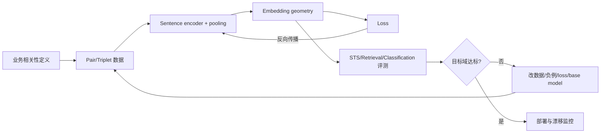
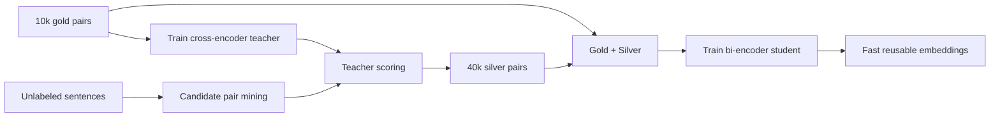
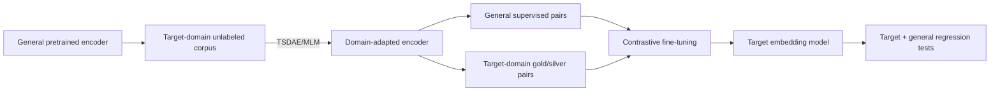

> 原章：*Creating Text Embedding Models*
> 本章定位：从“使用现成 embedding”进入“定义并训练自己的几何空间”。核心问题不是把文本变成任意向量，而是通过数据、pair/triplet 构造、loss 与评测共同规定：哪些文本应该靠近，哪些应该远离，以及这种几何关系服务什么任务。

## 0. 本章路线：Embedding 的含义由训练目标决定

同一段文本并不存在唯一“正确”的 embedding。模型可能按主题、情感、问答相关性、风格或领域术语组织空间：

$$
f_\theta:\mathcal{X}\rightarrow\mathbb{R}^{d}
$$

真正要设计的是几何关系：

$$
\operatorname{sim}(f_\theta(x_i),f_\theta(x_j))
\approx y_{ij}
$$

$y_{ij}$ 可以是连续相似度、正负标签，也可以隐含在 anchor-positive-negative 或 batch matching 中。



本章依次处理：

1. Embedding model 学的是什么。
2. Contrastive learning 为什么需要“对比”。
3. SBERT 如何在 cross-encoder 精度与 bi-encoder 效率之间取舍。
4. NLI 数据、Softmax/Cosine/MNR loss 怎样创建 sentence encoder。
5. 如何监督微调现成 embedding model。
6. 少量 gold data 如何借 cross-encoder 产生 silver data。
7. 没标签时，TSDAE 如何用去噪重建适配领域。

---

## 1. 嵌入模型（Embedding Models）

Embedding model 把句子、段落或文档转换为固定维度 dense vector：


### 1.1 “准确表示”不是保留原文所有信息

若 $d=384$，一段长文被压成 384 个浮点数，不可能无损保留每个词与数字。Embedding 是 task-oriented compression：保留下游最需要的关系，舍弃其他变化。

对语义相似任务，希望：

$$
x_i\simeq_{semantic}x_j
\Longrightarrow
\operatorname{dist}(z_i,z_j)\text{ 小}
$$


对情感任务，空间可能忽略主题，优先把正面评论聚在一起、负面评论聚在一起：


因此必须先问：

- “相似”是同主题、同意图、同答案、同情感，还是可互换表达？
- Query 与 document 是对称关系，还是问答式非对称关系？
- 下游需要 cosine ranking、聚类、线性分类，还是 nearest-neighbor retrieval？

### 1.2 Embedding space 的基本度量

Cosine similarity：

$$
\cos(u,v)=\frac{u^{\mathsf T}v}{\|u\|_2\|v\|_2}
$$

归一化向量 $\widehat{u},\widehat{v}$ 上：

$$
\widehat{u}^{\mathsf T}\widehat{v}=\cos(u,v)
$$

$$
\|\widehat{u}-\widehat{v}\|_2^2=2-2\cos(u,v)
$$

这解释了 normalized embeddings 上 dot product、cosine 和 squared Euclidean 排序的联系。未经归一化时，向量 norm 也会影响 dot product，不能直接互换阈值。

### 1.3 质量不只是一项 benchmark 分数

Embedding model 至少要同时考虑：

- 目标任务质量：retrieval、clustering、classification、STS。
- 语言与领域覆盖。
- 最大输入长度及 truncation。
- 维数、索引内存、encode throughput 与 latency。
- Score calibration、鲁棒性、偏见和许可证。

一个 STS 很强的模型不必然是问答检索最佳模型，因为“句义接近”与“文档回答 query”是不同关系。

---

## 2. 什么是对比学习（What Is Contrastive Learning?）

Contrastive learning 通过相对关系训练表示：正样本靠近，负样本远离。


### 2.1 为什么“P 而不是 Q”信息更多

只说 “这是狗” 可能让模型抓住尾巴、四条腿等与猫共享特征；加入相似但错误的猫作为 negative，模型必须学习更有区分力的特征。


训练样本可表示为：

- Pair：$(x_i,x_j,y_{ij})$。
- Positive pair：$(a,p)$。
- Triplet：$(a,p,n)$。
- Batch matching：$\{(a_i,p_i)\}_{i=1}^{B}$，其他 $p_j$ 作为 negatives。

### 2.2 一个简单 margin loss

对 cosine distance $d(u,v)=1-\cos(u,v)$，contrastive loss 可写为：

$$
\mathcal{L}=y\,d(u,v)^2
+(1-y)\max(0,m-d(u,v))^2
$$

- $y=1$：压低 positive distance。
- $y=0$：只有 negative 距离小于 margin $m$ 时才惩罚。
- Margin 之外的 easy negative 不再贡献梯度。

这揭示 hard negatives 的价值：它们靠近决策边界，能提供更强训练信号。

### 2.3 与 word2vec 的关系

Skip-gram + negative sampling 也是对比思想：邻近词是 positives，采样词是 negatives。但现代 sentence embedding 通常比较句子/文档向量，并使用 cosine、softmax/InfoNCE 或 ranking objective。思想相通，不表示所有 loss 完全相同。

### 2.4 数据比 loss 名称更重要

错误 positive 会把不应接近的样本拉近；false negative 会把真正相关项推远。高质量关系定义、采样策略和去重往往比换一个相似 loss 更关键。

---

## 3. SBERT

### 3.1 Cross-encoder 的质量与成本

Cross-encoder 拼接两个句子，让所有 token 联合 attention：

$$
s(x,y)=h_\theta([CLS]\ x\ [SEP]\ y\ [SEP])
$$


它可捕捉细粒度 token interaction，通常排序准确；但不能预先缓存独立 sentence vector。比较 $n$ 句话两两组合需要：

$$
\binom{n}{2}=\frac{n(n-1)}{2}
$$

```python
def pair_count(items):
    return items * (items - 1) // 2


print(pair_count(10_000))
```

```text
49995000
```

49,995,000 次 pair inference 不适合大规模检索。Cross-encoder 更适合对 bi-encoder 已召回的几十/几百 candidates rerank。

### 3.2 原始 BERT pooling 为什么不够

未经 sentence-level objective 训练的 BERT `[CLS]` 或 naive token mean pooling，并不保证 cosine geometry 对应语义相似。Masked language modeling 优化 token prediction，而非“整句向量可直接比较”。Pooling 是必要聚合，不是质量来源本身。

带 attention mask 的 mean pooling：

$$
z=\frac{\sum_{i=1}^{L}m_i h_i}{\sum_{i=1}^{L}m_i}
$$

必须排除 padding，否则同一句话在不同 batch padding 下会得到不同 vector。

### 3.3 Siamese bi-encoder

SBERT 用共享参数 encoder 分别编码两句：

$$
u=f_\theta(x),\qquad v=f_\theta(y)
$$


所谓“两套 BERT”是计算图中两条共享权重分支，不是保存两份不同参数。推理时文档向量可离线计算，查询只需一次编码和向量搜索。

原始 SBERT NLI classification objective 常将 $u$、$v$ 和 elementwise absolute difference 连接：

$$
o=[u;v;|u-v|]
$$

$$
p(y\mid x_1,x_2)=\operatorname{softmax}(Wo+b)
$$

训练完成后丢弃 classifier，保留 encoder + pooling。该 objective 能塑造 embedding，却与最终 cosine 使用存在一定 train/inference mismatch，这也是后续 cosine/MNR losses 常更好的原因之一。

### 3.4 Bi-encoder 与 cross-encoder 不是互相替代

| 属性 | Bi-encoder/SBERT | Cross-encoder |
|---|---|---|
| 输入 | 分别编码 | 成对联合编码 |
| 输出 | 独立 embeddings | Pair relevance score |
| 文档缓存 | 可以 | 不可以 |
| 全库召回 | 高效 | 不现实 |
| 细粒度交互 | 较弱 | 强 |
| 典型位置 | First stage | Reranker/teacher |

最强系统往往是 bi-encoder retrieve + cross-encoder rerank，或用 cross-encoder distill/label bi-encoder。

---

## 4. 创建嵌入模型（Creating an Embedding Model）

本节“从头创建”需要准确理解：代码从 `bert-base-uncased` 的**预训练权重**开始，而不是随机初始化整个 Transformer。它是从 pretrained token encoder 构建并训练 sentence embedding objective；真正 from scratch 还要随机初始化并进行大规模语言预训练。

### 4.1 生成对比样本（Generating Contrastive Examples）

Natural Language Inference（NLI）给定 premise/hypothesis，标签为：

- Entailment：premise 支持 hypothesis。
- Contradiction：二者冲突。
- Neutral：既不推出也不直接冲突。


```python
from datasets import load_dataset

mnli_train = load_dataset("glue", "mnli", split="train").select(
    range(50_000)
)
mnli_train = mnli_train.remove_columns("idx")
print(mnli_train.features["label"].names)
```

GLUE MNLI label IDs 是 0 entailment、1 neutral、2 contradiction。必须从 dataset features 核对，不能假设所有 NLI 数据集顺序相同。

### 4.2 训练模型（Train Model）

#### 4.2.1 构建 base sentence encoder

```python
from sentence_transformers import SentenceTransformer

embedding_model = SentenceTransformer("bert-base-uncased")
print(embedding_model.get_sentence_embedding_dimension())
```

`sentence-transformers` 会为普通 Transformer 配置 pooling。默认所有 encoder 层可训练；小数据时全部解冻可能过拟合或 catastrophic forgetting，也可实验冻结底层、layer-wise learning rates 或 parameter-efficient tuning。原书“通常不建议冻结”不是普遍定律。

#### 4.2.2 SoftmaxLoss

```python
from sentence_transformers import losses

train_loss = losses.SoftmaxLoss(
    model=embedding_model,
    sentence_embedding_dimension=(
        embedding_model.get_sentence_embedding_dimension()
    ),
    num_labels=3,
)
```

它需要保留 MNLI 三分类标签与 `premise`/`hypothesis` 两个文本列。训练目标是 pair classification，不直接拟合连续 cosine。

#### 4.2.3 STS-B evaluator

STS-B gold score 实际范围是 **0 到 5**，不是原章文字所说的 1 到 5。除以 5 映射到 $[0,1]$：

```python
from sentence_transformers.evaluation import EmbeddingSimilarityEvaluator

sts_validation = load_dataset("glue", "stsb", split="validation")
evaluator = EmbeddingSimilarityEvaluator(
    sentences1=sts_validation["sentence1"],
    sentences2=sts_validation["sentence2"],
    scores=[score / 5 for score in sts_validation["label"]],
    main_similarity="cosine",
)
```

Pearson correlation 比较 predicted cosine scores 与 gold similarity 的线性关系：

$$
r=\frac{\sum_i(p_i-\bar p)(y_i-\bar y)}
{\sqrt{\sum_i(p_i-\bar p)^2}\sqrt{\sum_i(y_i-\bar y)^2}}
$$

Spearman 先转换为 ranks，再计算相关。Pearson cosine 不是“centered embeddings 的 cosine”；它是**一组 cosine predictions 与 gold labels 的 Pearson correlation**，范围理论上为 $[-1,1]$，不是只在 $[0,1]$。

#### 4.2.4 Training arguments 与训练

```python
import torch
from sentence_transformers import SentenceTransformerTrainer
from sentence_transformers.training_args import (
    SentenceTransformerTrainingArguments,
)

arguments = SentenceTransformerTrainingArguments(
    output_dir="base_embedding_model",
    num_train_epochs=1,
    per_device_train_batch_size=32,
    per_device_eval_batch_size=32,
    warmup_steps=100,
    fp16=torch.cuda.is_available(),
    eval_strategy="steps",
    eval_steps=100,
    logging_steps=100,
)

trainer = SentenceTransformerTrainer(
    model=embedding_model,
    args=arguments,
    train_dataset=mnli_train,
    loss=train_loss,
    evaluator=evaluator,
)
```

具体参数名随 `sentence-transformers`/Transformers 版本变化，例如历史版本可能使用不同 evaluation strategy 参数。运行前应固定依赖版本并查当前文档。

- Epoch 增加优化步数，也增大过拟合风险。
- Train batch 影响吞吐和 MNR negative pool。
- Eval batch 只影响评测资源，不改变训练梯度。
- Warmup 让 learning rate 从低值逐步上升，减少早期不稳定。
- FP16 降显存并可能加速，但只应在支持的 GPU 上启用。

原章 SoftmaxLoss 结果 Pearson cosine 约 0.598，作为该特定 50k/1 epoch 配置的教学基线，不是可复现常数。

### 4.3 深入评估（In-Depth Evaluation）

单个 STS-B 分数只能回答一种英文句对相似任务。MTEB 将多种任务统一评测，包括 retrieval、reranking、classification、clustering、pair classification、STS 与 summarization 等；数据集和语言规模随版本持续增长。

```python
from mteb import MTEB

evaluation = MTEB(tasks=["Banking77Classification"])
results = evaluation.run(embedding_model)
```

原章 Banking77 例子 main accuracy 约 0.493，同时记录 evaluation time。这体现 Pareto trade-off：

$$
\text{quality}\quad\text{vs.}\quad
\text{latency/throughput/memory/index size}
$$

#### 4.3.1 评测协议

- 模型选择、loss、epoch 和 threshold 只看 validation。
- Test 只在配置冻结后使用。
- 检查 benchmark contamination，尤其 base model 是否见过 MNLI/STS-B。
- 目标域 retrieval 要有 queries、corpus 与 qrels，并报告 Recall@k/nDCG/MRR。
- 评估 truncate length、batch size、CPU/GPU、dtype 和 normalization。
- 用 bootstrap confidence interval 或多 seed 判断小差异是否稳定。

训练完重启 notebook 能释放进程占用的 VRAM，但也可显式删除对象、`gc.collect()` 与清缓存。重启不是模型质量步骤，只是资源管理。

### 4.4 损失函数（Loss Functions）

Loss 决定哪些几何错误被惩罚。选择依据应是数据结构与最终使用方式，而不是排行榜上某个 loss 的名气。

| 数据 | 合适目标示例 | 学到的关系 |
|---|---|---|
| Pair + 3-class NLI | SoftmaxLoss | Entail/neutral/contradict 分类 |
| Pair + 连续相似度 | CosineSimilarityLoss | Cosine 拟合 score |
| Positive pairs | MultipleNegativesRankingLoss | Batch 内匹配检索 |
| Triplet | Triplet/MNR variants | Anchor 相对正负排序 |
| Teacher scores | MarginMSE/Distillation | 模仿 pairwise margin |

#### 4.4.1 余弦相似度（Cosine similarity）


CosineSimilarityLoss 常使用 MSE：

$$
\widehat{s}_i=\cos(f_\theta(x_i),f_\theta(y_i))
$$

$$
\mathcal{L}_{cos}=\frac{1}{N}\sum_i
(\widehat{s}_i-s_i)^2
$$

```python
def cosine_mse(predicted_cosines, labels):
    return sum(
        (prediction - label) ** 2
        for prediction, label in zip(predicted_cosines, labels)
    ) / len(labels)


print(f"loss={cosine_mse([0.8, 0.3], [1.0, 0.0]):.3f}")
```

```text
loss=0.065
```

原章将 MNLI entailment 映射 1，neutral 与 contradiction 都映射 0：

```python
from datasets import Dataset

binary_similarity = {0: 1.0, 1: 0.0, 2: 0.0}
cosine_dataset = Dataset.from_dict(
    {
        "sentence1": mnli_train["premise"],
        "sentence2": mnli_train["hypothesis"],
        "label": [
            binary_similarity[label] for label in mnli_train["label"]
        ],
    }
)
```

这个映射便于教学，却丢失信息：neutral 不一定与 contradiction 一样“不相似”；矛盾句常共享主题和实体，语义 similarity 可以很高但逻辑 relation 相反。若下游是 semantic search，把 contradiction 强推到 cosine 0 可能不符合需求。标签必须服从业务相似定义。

原章该配置 Pearson cosine 约 0.722，高于 SoftmaxLoss 约 0.598，说明目标与 STS evaluator 更对齐；不能据此断言 cosine loss 对所有 retrieval 都优于 softmax。

#### 4.4.2 多负例排序损失（Multiple negatives ranking loss）

MNR/MultipleNegativesRankingLoss 使用 batch 中其他 positives 作为 in-batch negatives：


对 batch $\{(a_i,p_i)\}_{i=1}^{B}$：

$$
s_{ij}=\frac{\cos(f(a_i),f(p_j))}{\tau}
$$

$$
\mathcal{L}_{MNR}=-\frac{1}{B}\sum_i
\log\frac{\exp(s_{ii})}{\sum_{j=1}^{B}\exp(s_{ij})}
$$

它与 InfoNCE/NT-Xent 属于同一 softmax contrastive family，但实现可能在对称性、temperature、normalization 和 positives 数量上不同，不能把名称视为严格同义。

```python
from math import exp, log


def mnr_loss(similarity_rows):
    losses = []
    for index, row in enumerate(similarity_rows):
        maximum = max(row)
        denominator = sum(exp(value - maximum) for value in row)
        positive_probability = exp(row[index] - maximum) / denominator
        losses.append(-log(positive_probability))
    return sum(losses) / len(losses)


print(f"good={mnr_loss([[3.0, 1.0], [0.5, 2.5]]):.3f}")
print(f"ambiguous={mnr_loss([[1.0, 1.0], [1.0, 1.0]]):.3f}")
```

```text
good=0.127
ambiguous=0.693
```

Batch 大时每个 anchor 获得更多 negatives，任务更有辨别力；但显存增长，false negatives 概率也上升。应使用 no-duplicates batch sampler，避免同义/重复 positive 被当 negative。

##### 正确构造 MNLI MNR 数据

MNR 的 `(anchor, positive)` 必须是真实 positive。只保留 entailment：

```python
entailments = mnli_train.filter(lambda row: row["label"] == 0)
mnr_dataset = Dataset.from_dict(
    {
        "anchor": entailments["premise"],
        "positive": entailments["hypothesis"],
    }
)
```

原章前一段这样筛选了 entailment；后面的 supervised fine-tuning 示例却重新加载全部三类 MNLI 后直接配 MNR。若框架忽略 label 并把每行前两列都当 positive，neutral/contradiction 会被错误拉近。笔记采用筛选后的数据，避免这一语义 bug。

##### Easy、semi-hard 与 hard negatives


- Easy：随机且主题无关，容易区分，后期梯度弱。
- Semi-hard：相关但明显不是答案。
- Hard：实体、主题、措辞都接近，却不满足 query intent。

Hard-negative mining：先用已有 retriever 召回 top candidates，排除已知 positives，再由人工/cross-encoder/规则核验。太难的 negative 可能是 false negative；必须抽样审计。

原章 MNR 配置 Pearson cosine 约 0.809，高于前两种 loss，但文字误写“softmax 0.72”；真正 SoftmaxLoss 是约 0.598，0.72 属于 CosineSimilarityLoss。比较实验时应引用一致 baseline。

---

## 5. 微调嵌入模型（Fine-Tuning an Embedding Model）

从 `bert-base-uncased` 构建 sentence model，需要先学通用 sentence geometry。若已有高质量 embedding checkpoint，继续训练目标域数据通常更省样本和算力：

$$
\theta^*=\arg\min_{\theta\leftarrow\theta_0}
\mathcal{L}_{target}(\theta)
$$

$\theta_0$ 已编码通用语义；微调负责重塑目标关系。

### 5.1 监督式微调（Supervised）

```python
from sentence_transformers import SentenceTransformer, losses

embedding_model = SentenceTransformer(
    "sentence-transformers/all-MiniLM-L6-v2"
)
train_loss = losses.MultipleNegativesRankingLoss(embedding_model)
```

训练数据应使用前述 `mnr_dataset`，而不是全部 MNLI：

```python
trainer = SentenceTransformerTrainer(
    model=embedding_model,
    args=arguments,
    train_dataset=mnr_dataset,
    loss=train_loss,
    evaluator=evaluator,
)
```

原章约得 Pearson cosine 0.851，但 `all-MiniLM-L6-v2` 的既有训练数据已经包含大规模 NLI/句对；再在 MNLI 子集上训练与在 STS-B 评估不是独立“新领域”实验，存在先验暴露与 benchmark contamination。它主要演示 API，不证明同样增益会出现在新业务数据。

### 5.2 微调的主要风险

- Catastrophic forgetting：目标域变好，通用域退化。
- Overfitting：小数据记住措辞而非关系。
- Objective mismatch：STS loss 优化后 retrieval 不升反降。
- Distribution shift：离线 query 与线上 query 不同。
- Score drift：旧索引阈值/向量不再兼容。

模型更新后，应重新编码整个 corpus；不能用新 query encoder 搜旧 document embeddings，除非架构明确保证空间兼容。

### 5.3 数据优先级

1. 真实目标域 positives。
2. 由线上错误/检索结果产生的 hard negatives。
3. 人工核验的边界样本。
4. 通用 pairs 用于防遗忘。

大而脏的伪标签集可能不如小而可靠的 gold set。

### 5.4 Augmented SBERT

少量 gold pairs 不足以训练 bi-encoder 时，可让精度高但慢的 cross-encoder 当 teacher，为大量候选 pairs 产生 silver labels，再训练快速 student bi-encoder。


#### 5.4.1 四步流程

1. 用 gold dataset 训练 cross-encoder teacher。
2. 从未标注语料生成有信息量的 candidate pairs。
3. Teacher 为 candidates 预测 soft/hard labels，形成 silver set。
4. 用 gold + silver 训练 bi-encoder student。



原章从 MNLI `[10_000,50_000)` 取 silver candidates，是 **40,000** 对，不是文字所说“剩余 400,000”。

#### 5.4.2 Gold teacher

```python
from sentence_transformers.cross_encoder import CrossEncoder

teacher = CrossEncoder("bert-base-uncased", num_labels=2)
```

将 entailment 映射 1、neutral/contradiction 映射 0，是二分类简化。Teacher 训练/选择必须只用 gold train/validation，不能用最终 test。

#### 5.4.3 Candidate generation 不是随机越多越好

随机重组 premise/hypothesis 大多产生 easy negatives，类别失衡严重。更有效：

1. 用现成 bi-encoder 召回每句 top-k 相似句。
2. 排除自身、重复和已知 positive。
3. 用 cross-encoder teacher 评分。
4. 采样 high-score positives、边界和 hard negatives。

这是一种 retrieve-and-label。Teacher 也会犯错，应人工审计不同 score bins。

#### 5.4.4 Silver label 应怎样使用

原章对 teacher softmax 做 `argmax`，把信息压成 0/1。保留 positive probability 或 teacher margin 常能传递更多知识：

$$
\mathcal{L}_{distill}=\frac{1}{N}\sum_i
(s_{student}(x_i,y_i)-s_{teacher}(x_i,y_i))^2
$$

Gold 与 silver 可设置不同权重：

$$
\mathcal{L}=\mathcal{L}_{gold}+\lambda\mathcal{L}_{silver},
\qquad 0<\lambda<1
$$

Teacher bias 会被 student 放大，因此 silver data 不是 ground truth。比较 gold-only 与 gold+silver，才能判断 augmentation 是否真正有益。

原章 AugSBERT 约得 Pearson cosine 0.710，与 full-data CosineLoss 约 0.722 接近，说明少量 gold + teacher labels 可节省人工标注；不是说 10k gold 本身等价于完整 50k ground truth。

---

## 6. 无监督学习（Unsupervised Learning）

没有人工 pair labels 时，可从单句集合构造 self-supervised signal。原章列出 SimCSE、Contrastive Tension、TSDAE 与 GPL，并重点讲 TSDAE。

严格说这些方法常称 self-supervised learning：标签由数据变换自动产生，而不是完全没有训练目标。

### 6.1 基于 Transformer 的顺序去噪自编码器（Transformer-Based Sequential Denoising Auto-Encoder）

TSDAE 对原句 $x$ 施加 deletion noise 得到 $\widetilde{x}$：

$$
\widetilde{x}\sim q(\widetilde{x}\mid x)
$$

Encoder 将损坏句压成单个 sentence embedding：

$$
z=f_\theta(\widetilde{x})
$$

Decoder 根据 $z$ 自回归重建原句：

$$
p_\phi(x\mid z)=\prod_{t=1}^{T}
p_\phi(x_t\mid x_{<t},z)
$$

训练 loss：

$$
\mathcal{L}_{TSDAE}=-\sum_{t=1}^{T}
\log p_\phi(x_t\mid x_{<t},f_\theta(\widetilde{x}))
$$


所有信息必须穿过固定维度 $z$，形成 bottleneck。若 decoder 能重建，$z$ 必须保留句子重要语义和结构。训练后丢弃 decoder，只部署 encoder。

#### 6.1.1 构造去噪数据

```python
import random


def delete_words(sentence, deletion_probability=0.4, seed=42):
    generator = random.Random(seed)
    words = sentence.split()
    kept = [
        word for word in words
        if generator.random() >= deletion_probability
    ]
    if not kept and words:
        kept = [words[generator.randrange(len(words))]]
    return " ".join(kept)


sentence = "Grim faces and hardened jaws are not people-friendly."
print(delete_words(sentence))
```

```text
Grim jaws are not
```

实际 `DenoisingAutoEncoderDataset` 的 corruption 由库实现决定。使用 `set(flat_sentences)` 去重会破坏顺序并导致跨运行样本顺序不稳定；可用 `dict.fromkeys` 保序去重并固定所有 random seeds。

#### 6.1.2 Encoder、pooling 与 tied weights

```python
from sentence_transformers import SentenceTransformer, models

transformer = models.Transformer("bert-base-uncased")
pooling = models.Pooling(
    transformer.get_word_embedding_dimension(),
    pooling_mode="cls",
)
embedding_model = SentenceTransformer(modules=[transformer, pooling])
```

原 TSDAE 实验发现 CLS pooling 有效。把原因简单归结为“mean pooling 丢位置而 CLS 不丢”并不严谨：两者都聚合 contextual token states，位置早已参与 encoder；差异来自 bottleneck、训练目标和 pooling inductive bias，应以实验证据为准。

```python
from sentence_transformers import losses

train_loss = losses.DenoisingAutoEncoderLoss(
    embedding_model,
    tie_encoder_decoder=True,
)
```

Tied weights 让 encoder input embeddings 与 decoder output projection 共享参数，减少参数并约束表示。它要求架构/tokenizer 兼容。不要直接操作 `train_loss.decoder.to("cuda")` 这样的内部属性；让 trainer/device management 处理设备更稳健，也能支持 CPU/MPS。

TSDAE reconstruction 同时运行 decoder，显存高于普通 pair loss，原章将 batch 从 32 降至 16。

#### 6.1.3 TSDAE 解决什么、不解决什么

优点：只需目标域原始句子；可学领域词汇与句法；原章 STS Pearson cosine 约 0.699。

局限：

- Reconstruction relevance 不等于 retrieval relevance。
- Decoder 可能依赖语言先验，而非 embedding 保存全部细节。
- Noise rate 过低任务太容易，过高则无法重建。
- 单句训练没有直接告诉模型 query 与 answer 应靠近。

所以 TSDAE 常作为 adaptive pretraining，再接少量 supervised contrastive fine-tuning。

### 6.2 使用 TSDAE 做领域适配（Using TSDAE for Domain Adaptation）

Domain adaptation 从 source/general domain 迁移到 target/in-domain corpus，例如通用网页 → 医疗记录。


常见两阶段：

1. **Adaptive pretraining**：在目标域无标签文本上做 TSDAE/MLM。
2. **Adaptive fine-tuning**：用通用或目标域标注 pairs 训练 sentence objective。




目标域 labels 最好，但即使只有通用 supervised pairs，先在 target text 上自监督适配也可能改善。需防 catastrophic forgetting，可混入通用 corpus/pairs 或采用较低 learning rate。

模型更新会改变向量空间：

- 旧 corpus embeddings 要全部重算。
- ANN index 要重建或迁移。
- Similarity thresholds 要重新校准。
- Downstream classifier 也可能需要重训。

### 6.3 如何选择训练路线

| 可用数据 | 推荐起点 | 原因 |
|---|---|---|
| 大量高质量 positive pairs | MNR/InfoNCE family | 高效利用 in-batch negatives |
| 连续 similarity labels | Cosine/CoSENT 类 loss | 直接拟合排序/相似程度 |
| 少量 gold + 大量未标 pair | Augmented SBERT/distillation | Cross-encoder teacher 扩充关系 |
| 仅目标域单句 | TSDAE/SimCSE | 自监督适配语料分布 |
| Query + qrels + corpus | Retrieval loss + hard-negative mining | 与生产检索目标一致 |

无论路线，最终选择必须由目标任务 evaluator 决定，而不是只看训练 loss。

---

## 7. 重点辨析与常见误区

### 7.1 “Embedding 准确”没有脱离任务的统一定义

语义、情感、问答 relevance 会塑造不同空间。先定义 relation，再选数据和 loss。

### 7.2 从 `bert-base-uncased` 开始不是真正从零训练

BERT 已经预训练；本章是在其上学习 sentence pooling 与 geometry。随机初始化 Transformer 才是严格 from scratch。

### 7.3 Pooling 不会自动创造高质量 sentence embedding

Mean/CLS 只决定如何聚合；sentence-level objective 才使 cosine 有任务意义。

### 7.4 Siamese network 不是两套独立模型

两条计算分支共享参数。推理可用同一个 encoder 顺序处理句子。

### 7.5 Cross-encoder 通常不产出可复用独立 embeddings

它为 pair 联合打分，适合 teacher/reranker；bi-encoder 才适合全库向量检索。

### 7.6 Pearson cosine 不是 embedding 间的一次 cosine

它是 predicted cosine score 序列与 gold score 序列的 Pearson correlation，理论范围 $[-1,1]$。

### 7.7 STS-B 标签范围是 0–5

除以 5 后为 $[0,1]$。数据范围必须从 dataset card/features 核验。

### 7.8 Neutral 不等于完全不相似

NLI relation 与 semantic similarity 不相同。Neutral 和 contradiction 映射 0 只是教学近似。

### 7.9 MNR 不能把 neutral/contradiction 当 positive pair

Loss 默认相信每一行 `(anchor, positive)` 真匹配。数据 schema 错会直接训练反方向。

### 7.10 MNR、InfoNCE 与 NT-Xent 并非所有实现严格等价

它们共享 softmax contrastive 思想，但对称性、temperature 和 normalization 可能不同。

### 7.11 Batch 越大不无条件越好

Negatives 更多，但显存、重复样本和 false negatives 也增加。需要 no-duplicates sampler 与数据审计。

### 7.12 Hard negative 不等于最相似的任意非标注文档

未标注不代表不相关。Mining 后需规则、teacher 或人工排除 false negatives。

### 7.13 监督微调高分可能包含 benchmark exposure

Base embedding model 已见过 MNLI/STS 类数据时，不能把分数当全新领域泛化证据。

### 7.14 Silver data 不是 ground truth

Teacher errors 会传给 student。应保留 soft score、降低 silver 权重，并与 gold-only 对照。

### 7.15 原章 silver subset 是 40,000，不是 400,000

Python range `[10_000,50_000)` 只有 40,000 项。

### 7.16 TSDAE 是 self-supervised，不是没有目标

原句自动成为 reconstruction target；只是无需人工标签。

### 7.17 TSDAE 重建好不保证 retrieval 好

重建保留语言信息，未直接优化 query-document relevance。常需后续监督微调。

### 7.18 Fine-tune 后不能混用新旧向量

空间已变化，corpus embeddings、index、threshold 和下游模型必须同步版本化。

---

## 8. 总结（Summary）

### 8.1 知识结构

```mermaid
flowchart TD
    A[Text Embedding Model] --> B[Architecture]
    A --> C[Data]
    A --> D[Loss]
    A --> E[Evaluation]

    B --> B1[Transformer encoder]
    B --> B2[Mean/CLS pooling]
    B --> B3[Bi-encoder]
    B --> B4[Cross-encoder teacher/reranker]

    C --> C1[NLI pairs]
    C --> C2[Positive pairs + in-batch negatives]
    C --> C3[Hard negatives]
    C --> C4[Gold + Silver]
    C --> C5[Unlabeled target sentences]

    D --> D1[SoftmaxLoss]
    D --> D2[CosineSimilarityLoss]
    D --> D3[MNR/InfoNCE family]
    D --> D4[TSDAE reconstruction]

    E --> E1[STS Pearson/Spearman]
    E --> E2[MTEB task suite]
    E --> E3[Target retrieval metrics]
    E --> E4[Latency/memory/robustness]
```



### 8.2 核心结论

1. Embedding 是任务相关的有损压缩；“相似”由数据与 objective 定义。
2. Contrastive learning 用 positives 与 negatives 塑造向量几何，关系标签质量是核心。
3. Cross-encoder 联合编码质量高但不能缓存独立向量；SBERT bi-encoder 牺牲部分交互换取可扩展检索。
4. 普通 BERT 加 pooling 不足以形成良好 sentence space，需要 sentence-level training objective。
5. NLI 可构造 entailment positives 与 contradiction negatives，但 NLI relation 不完全等于 semantic similarity。
6. Softmax、Cosine 和 MNR loss 适配不同数据结构；在 STS-B 上对齐的 objective 往往更占优势。
7. MNR 利用 in-batch negatives，高效但依赖真实 positive、去重 batch 与 false-negative 控制。
8. Hard negatives 逼模型学习细粒度 relevance，通常比随机 easy negatives 更有价值。
9. Fine-tuning 现成 embedding checkpoint 通常比从普通 token encoder 构建更省数据，但会面临遗忘和 benchmark exposure。
10. Augmented SBERT 用 cross-encoder teacher 扩充 silver labels，再训练高效 bi-encoder student。
11. TSDAE 通过 deletion noise → sentence bottleneck → reconstruction，在无人工标签时学习目标域表示。
12. 最稳健领域适配是先用目标域无标签文本 adaptive pretraining，再做与生产目标一致的监督 fine-tuning。
13. 模型一旦更新，corpus vectors、index、threshold 与下游 consumers 必须同步迁移。

### 8.3 解决 embedding 训练问题的一般方法

1. **定义 relation**：同义、同意图、同情感还是 query-answer relevance？
2. **选择 evaluator 先于 loss**：用真实下游任务建立 validation/test 与效率指标。
3. **从强 base embedding model 开始**：除非研究目的，不必重建通用 sentence geometry。
4. **构造可靠 positives**：去重、检查 label direction，防止 schema 错误。
5. **选择匹配的数据/loss**：连续 score 用相似度 loss，positive pairs 用 MNR，teacher scores 用 distillation。
6. **逐步升级 negatives**：easy → mined semi-hard → 人工/teacher 核验 hard negatives。
7. **控制 false negatives**：no-duplicates batch、去近重复、审计 top mined samples。
8. **少标签时用 teacher**：cross-encoder 产 silver，但保留 soft scores 和 gold 权重。
9. **无标签时先适配领域**：TSDAE/MLM/SimCSE，再接监督 relation learning。
10. **做多任务回归**：目标域提升不能以通用能力不可接受地退化为代价。
11. **固定实验事实**：base checkpoint、data revision、seed、batch、dtype、loss 与 evaluator 全部版本化。
12. **部署时整体迁移空间**：重新编码 corpus、重建 index、校准阈值并监控 drift。

本章最重要的方法论是：先定义你希望空间表达的关系，再围绕这种关系设计 examples、negatives、loss 和 evaluator。模型架构只是载体，数据对比方式才决定 embedding 最终“看见”什么。
