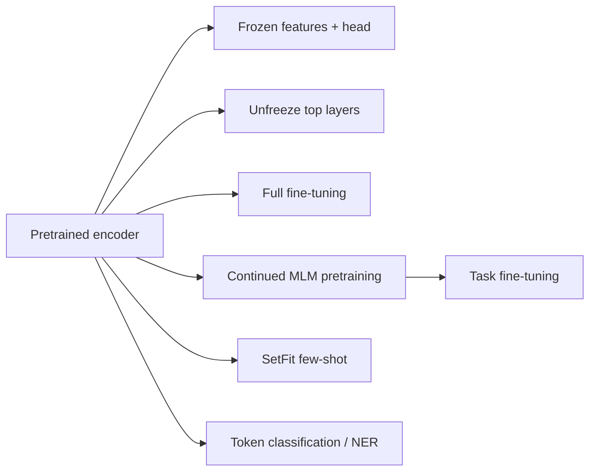
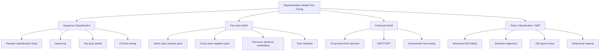

> 原章：*Fine-Tuning Representation Models for Classification*
> 本章定位：把预训练 encoder 从“通用表示器”适配成目标任务模型。依次讨论 document classification 的全量/部分微调、SetFit few-shot classification、MLM continued pretraining，以及 token classification/NER。

## 0. 本章路线：同一个 Encoder，四种监督强度

分类任务并不只有“冻结”或“全部训练”两档。可以按数据和算力逐级增加适配强度：



四条路径解决不同问题：

| 路径 | 更新什么 | 需要什么数据 | 典型目标 |
|---|---|---|---|
| Frozen encoder | 只训练 head | 较少标签 | 低成本基线 |
| Partial/full fine-tuning | 顶层或全部 encoder + head | 目标任务标签 | 最强 task adaptation |
| SetFit | Sentence embedding + 轻量 head | 每类少量标签 | Few-shot classification |
| Continued MLM + fine-tune | 先用无标签域语料，再用标签 | 域文本 + 任务标签 | Domain/task adaptation |
| NER | 每个 token 的分类 head + encoder | BIO token labels | Entity spans |

可靠实验还必须区分：

- **Train**：更新权重。
- **Validation**：选 epoch、learning rate、冻结层数和 threshold。
- **Test**：所有选择冻结后只报告一次最终结果。

原章多个示例直接把 test 当 `eval_dataset`，适合演示 API，不适合严格模型选择。笔记统一采用 validation 调参、test 最终评估。

---

## 1. 监督分类（Supervised Classification）

第 4 章中的现成 task model 完全冻结；embedding 路线只训练独立逻辑回归。本章改为端到端训练：classification loss 的梯度穿过 head，继续进入 BERT。


### 1.1 分类损失怎样改变表示

对 `[CLS]` 最终隐藏状态 $h\in\mathbb{R}^{d}$：

$$
z=Wh+b,\qquad z\in\mathbb{R}^{C}
$$

Softmax：

$$
p(y=c\mid x)=\frac{\exp(z_c)}{\sum_{j=1}^{C}\exp(z_j)}
$$

Cross-entropy：

$$
\mathcal{L}_{CE}=-\frac{1}{N}\sum_{i=1}^{N}
\log p(y_i\mid x_i)
$$

若 encoder 可训练，$\partial\mathcal{L}/\partial\theta_{BERT}\ne0$，表示空间被重新组织以区分类别；冻结时该梯度不用于更新 encoder。

```python
from math import exp, log

logits = [0.2, 1.2]
target = 1
maximum = max(logits)
probabilities = [
    exp(value - maximum) / sum(exp(item - maximum) for item in logits)
    for value in logits
]
loss = -log(probabilities[target])
print([round(value, 3) for value in probabilities])
print(f"loss={loss:.3f}")
```

```text
[0.269, 0.731]
loss=0.313
```

### 1.2 与 Frozen embedding + classifier 的区别

| 方式 | 表示是否变 | 训练成本 | 任务适配 | 可复用性 |
|---|---|---|---|---|
| Frozen embedding + logistic regression | 否 | 低 | 只学线性边界 | 高 |
| Frozen BERT + random head | 否 | 低 | Head 学边界 | 中 |
| Full fine-tuning | 是 | 高 | Encoder 与 head 联合优化 | 低一些 |

端到端性能常更强，但也更容易过拟合、遗忘通用能力，并要求为每个任务保存一份模型或 adapter。

### 1.3 微调前的实验检查

- 标签定义与类别分布是否稳定。
- 重复/近重复文本是否跨 split。
- 指标是 binary F1、macro F1 还是 weighted F1。
- 最大长度造成多少 truncation。
- Base checkpoint 是否已在目标 benchmark 上微调过。
- 至少建立 TF-IDF + logistic regression 和 frozen embedding baseline。

---

## 2. 微调预训练 BERT（Fine-Tuning a Pretrained BERT Model）

### 2.1 数据切分

原章继续使用 Rotten Tomatoes：10,662 条短影评，正负各半。严格用法：

```python
from datasets import load_dataset

reviews = load_dataset("rotten_tomatoes")
train_data = reviews["train"]
validation_data = reviews["validation"]
test_data = reviews["test"]
```

Validation 用于选超参数；test 不应作为每轮 trainer eval，否则它已参与模型开发，形成数据泄漏（data leakage）。

### 2.2 加载模型与随机分类头

```python
from transformers import AutoModelForSequenceClassification, AutoTokenizer

model_id = "bert-base-cased"
tokenizer = AutoTokenizer.from_pretrained(model_id)
model = AutoModelForSequenceClassification.from_pretrained(
    model_id,
    num_labels=2,
    id2label={0: "NEGATIVE", 1: "POSITIVE"},
    label2id={"NEGATIVE": 0, "POSITIVE": 1},
)
```

BERT backbone 读取预训练权重，classification head 因 checkpoint 没有这项任务参数而随机初始化。加载时出现 “newly initialized” warning 是预期行为，head 必须训练后才可用。

### 2.3 Tokenization 与动态 Padding

```python
from transformers import DataCollatorWithPadding


def tokenize_batch(examples):
    return tokenizer(
        examples["text"],
        truncation=True,
        max_length=tokenizer.model_max_length,
    )


tokenized_train = train_data.map(tokenize_batch, batched=True)
tokenized_validation = validation_data.map(tokenize_batch, batched=True)
tokenized_test = test_data.map(tokenize_batch, batched=True)
data_collator = DataCollatorWithPadding(tokenizer=tokenizer)
```

Dynamic padding 只补到当前 batch 最长序列，比把整个数据集都 pad 到模型上限省计算。Collator 不会做“数据增强”；它在本例的职责是组 batch 与 padding。

### 2.4 指标

旧 `datasets.load_metric` 已由 `evaluate` package 取代：

```python
import evaluate
import numpy as np

f1_metric = evaluate.load("f1")


def compute_metrics(eval_prediction):
    logits, labels = eval_prediction
    predictions = np.argmax(logits, axis=-1)
    binary = f1_metric.compute(
        predictions=predictions,
        references=labels,
        average="binary",
    )["f1"]
    macro = f1_metric.compute(
        predictions=predictions,
        references=labels,
        average="macro",
    )["f1"]
    return {"f1": binary, "macro_f1": macro}
```

本数据平衡，binary 与 macro 往往接近；生产数据不平衡时必须报告每类 precision/recall、confusion matrix 和 calibration。

### 2.5 Trainer 与正确训练顺序

```python
from transformers import Trainer, TrainingArguments

training_args = TrainingArguments(
    output_dir="bert_sentiment",
    learning_rate=2e-5,
    per_device_train_batch_size=16,
    per_device_eval_batch_size=16,
    num_train_epochs=3,
    weight_decay=0.01,
    eval_strategy="epoch",
    save_strategy="epoch",
    load_best_model_at_end=True,
    metric_for_best_model="macro_f1",
    greater_is_better=True,
    report_to="none",
    seed=42,
)

trainer = Trainer(
    model=model,
    args=training_args,
    train_dataset=tokenized_train,
    eval_dataset=tokenized_validation,
    processing_class=tokenizer,
    data_collator=data_collator,
    compute_metrics=compute_metrics,
)

trainer.train()
validation_metrics = trainer.evaluate()
test_metrics = trainer.evaluate(tokenized_test, metric_key_prefix="test")
```

原章代码在介绍“train and evaluate”处只展示了 `trainer.evaluate()`，没有先调用 `trainer.train()`；其输出却标为 epoch 1，说明训练调用应是正文遗漏。未调用 `train()` 时，随机 head 的评测没有意义。

不同 Transformers 版本可能使用 `evaluation_strategy` 而非 `eval_strategy`，`tokenizer=` 也逐步迁移到 `processing_class=`。应固定依赖并依据当前 API。

### 2.6 训练参数的作用

- Learning rate：BERT full fine-tuning 常用较小量级，过大导致 catastrophic forgetting。
- Epoch：更多不保证更好，应按 validation early stopping。
- Weight decay：限制权重过大，不应错误作用于所有 bias/LayerNorm 参数；Trainer/optimizer 通常分组处理。
- Batch：影响梯度噪声、吞吐和显存。
- Seed：控制数据顺序与初始化，但 GPU 仍可能非完全确定。

原章 1 epoch 报告约 0.849 F1，高于跨域现成 Twitter model 的 0.80。比较说明目标域训练有价值，不证明任意自训练模型都优于任意 task checkpoint。

---

## 3. 冻结层（Freezing Layers）

BERT-base 有 embeddings、12 个 encoder blocks、pooler 和 classifier：


Freezing 将参数 `requires_grad=False`，不保存其梯度和 optimizer state；但 forward pass 仍需经过这些层，所以加速不会与冻结参数量完全成正比。

### 3.1 只训练分类头

```python
for parameter in model.bert.parameters():
    parameter.requires_grad = False

for parameter in model.classifier.parameters():
    parameter.requires_grad = True
```


原章约得 F1 0.633，低于 full fine-tuning 0.849。原因是通用 BERT `[CLS]` 表示未按电影情感重新组织，而 random linear head 只能在现有表示上找边界。

### 3.2 只解冻顶部若干层

不要按 `named_parameters()` 的枚举 index（如 `<165`）冻结：模块实现或版本一变，index 就失效。应按语义模块选择：

```python
def freeze_all_but_top_layers(model, trainable_top_layers):
    for parameter in model.bert.parameters():
        parameter.requires_grad = False

    if trainable_top_layers:
        for layer in model.bert.encoder.layer[-trainable_top_layers:]:
            for parameter in layer.parameters():
                parameter.requires_grad = True

    for parameter in model.classifier.parameters():
        parameter.requires_grad = True


freeze_all_but_top_layers(model, trainable_top_layers=2)
```


底层通常更偏词形和局部句法，顶层更任务化，因此冻结底层、训练顶层是合理起点，不是绝对定律。

### 3.3 计算 trainable parameters

```python
def parameter_counts(model):
    total = sum(parameter.numel() for parameter in model.parameters())
    trainable = sum(
        parameter.numel()
        for parameter in model.parameters()
        if parameter.requires_grad
    )
    return total, trainable, trainable / total
```

优化器应在冻结后创建，否则可能保留不必要参数引用。冻结策略改变后应重新初始化 model、optimizer 和 trainer，避免继承上一实验权重。

### 3.4 成本与质量曲线

原章只训练顶层 block 左右得到约 0.80，head-only 约 0.63，full 约 0.85。


图中合理解释应是“训练顶部若干 blocks”，不是从 embedding 端开始训练最底部 blocks。Frozen layers 应先于 trainable layers，梯度适配集中在高层。

Freeze 不是典型 parameter-efficient fine-tuning（PEFT）的全部含义。Adapters/LoRA 在冻结 base weights 时增加小型 trainable modules，往往比只训练 random head 更有表达力。

---

## 4. 少样本分类（Few-Shot Classification）

Few-shot supervised classification 假设每类只有少量高质量 labeled examples。


困难不仅是样本少，还包括：

- 随机抽到的例子是否覆盖类内多样性。
- 类边界与 hard cases 是否出现。
- 不同 seed 的结果方差很大。
- 模型可能依赖 label artifacts。

报告 few-shot 性能应多次 stratified sampling，给出均值、标准差或置信区间，而不是单次幸运抽样。

---

## 5. SetFit：用少量训练样本高效微调（SetFit: Efficient Fine-Tuning with Few Training Examples）

SetFit 将 classification labels 转换为 contrastive sentence pairs，先微调 Sentence Transformer，再训练 classification head。

### 5.1 第一步：生成 pairs

假设两类分别是 programming 与 pets：


同类 pair 设 positive，跨类 pair 设 negative：


每类 $n$ 个样本时，每类 unordered positive pairs：

$$
\binom{n}{2}=\frac{n(n-1)}{2}
$$

两类各 16 个：positive unique pairs 共 $2\times120=240$，跨类 unique pairs 为 $16\times16=256$。

```python
from math import comb

samples_per_class = 16
classes = 2
positive_pairs = classes * comb(samples_per_class, 2)
negative_pairs = samples_per_class * samples_per_class
setfit_sampled_pairs = classes * samples_per_class * 20 * 2

print(f"unique_positive={positive_pairs}")
print(f"unique_cross_class={negative_pairs}")
print(f"sampled_by_20_iterations={setfit_sampled_pairs}")
```

```text
unique_positive=240
unique_cross_class=256
sampled_by_20_iterations=1280
```

原章 `20 × 32 = 680` 是算术笔误，正确为 640；再乘正负两种 pair 得 1,280。采样过程可能重复 pair，因此日志中的 “pairs” 不必等于数学上的全部 unique combinations。

同类不一定语义相似：例如“退款迟到”和“商品损坏”都属于投诉，却主题差异大。SetFit 学的是分类可分性，不保证通用 semantic similarity。

### 5.2 第二步：微调 embedding


对 pair $(x_i,x_j,y)$ 可使用 cosine/contrastive loss。通过 pair expansion，32 个 labels 产生大量训练 comparisons，但这些 pairs 并不是独立新事实，不能等价为 1,280 个独立人工样本。

### 5.3 第三步：训练 head


默认常用 logistic regression；也可选择 differentiable head，与 body 采用不同阶段或联合训练。


---

## 6. 面向少样本分类的微调（Fine-Tuning for Few-Shot Classification）

### 6.1 分层采样

```python
from setfit import sample_dataset

few_shot_train = sample_dataset(
    reviews["train"],
    num_samples=16,
    seed=42,
)
```

每类 16 条，共 32 条。不能从 test 抽样；还应运行多个 seeds，并检查每个样本是否重复或异常。

### 6.2 模型和 Trainer

```python
from setfit import SetFitModel, Trainer as SetFitTrainer
from setfit import TrainingArguments as SetFitTrainingArguments

setfit_model = SetFitModel.from_pretrained(
    "sentence-transformers/all-mpnet-base-v2"
)
setfit_args = SetFitTrainingArguments(
    num_epochs=3,
    num_iterations=20,
    seed=42,
)
setfit_trainer = SetFitTrainer(
    model=setfit_model,
    args=setfit_args,
    train_dataset=few_shot_train,
    eval_dataset=validation_data,
    metric="f1",
)

setfit_trainer.train()
validation_result = setfit_trainer.evaluate()
```

SetFit API 会随版本变化，旧版 `SetFitTrainer`、新版统一 `Trainer` 的参数可能不同。固定 package version 并依据当前 docs。

原章单次抽样得 F1 0.8364，正文四舍五入写 0.85；更准确应说约 **0.84**。它展示方法潜力，不应与 8,530 条训练集的结果做无方差、无同 seed 的严格等价比较。

### 6.3 Differentiable head

Logistic regression 训练稳定、CPU 友好；differentiable head 可和 body 端到端优化，但少样本更容易过拟合。选择应由 validation、多 seed 和 latency 决定。

### 6.4 “Zero-shot SetFit”的边界

根据 label names 生成 synthetic examples，再训练 SetFit，严格说使用了 label semantics 与生成模型先验，并非没有监督信号。Synthetic data 可能刻板、过于简单或泄漏 label words，应以真实 target examples 验证。

---

## 7. 使用掩码语言建模继续预训练（Continued Pretraining with Masked Language Modeling）

普通流程是 generic pretraining → task fine-tuning：


领域偏移大时加入 continued pretraining：

$$
\text{generic BERT}\rightarrow
\text{target-domain MLM}\rightarrow
\text{task classifier}
$$


在宽泛目标域语料继续训练称 domain-adaptive pretraining（DAPT）；在具体任务的无标签文本继续训练常称 task-adaptive pretraining（TAPT）。

### 7.1 MLM 目标

选中位置集合 $M$：

$$
\mathcal{L}_{MLM}=-\sum_{i\in M}
\log p_\theta(x_i\mid\widetilde{x})
$$

BERT 经典配方不是简单地把 15% token 全换成 `[MASK]`。通常先选 15% 位置，其中：

- 80% 替换为 `[MASK]`。
- 10% 替换为随机 token。
- 10% 保持原 token。

这样减弱 pretrain 中 `[MASK]` 与 downstream 无 `[MASK]` 的差异。具体 collator 行为应按当前库配置核实。


Whole-word masking 会同时选中一个词的全部 subtokens，通常任务更难；“一定更好”不是普遍结论，取决于语言、tokenizer、数据和训练预算。

### 7.2 不污染最终 Test

原章对 `test_data` 也做 MLM 并将其设为 eval dataset，然后之后再做分类。这即使删除 label，也让模型看到了最终 test 文本，属于 transductive adaptation，不能当作严格 inductive benchmark。

正确做法是让 MLM 不使用最终 test 文本：

- MLM train：train text 或额外无标签 domain corpus。
- MLM validation：validation text 或单独 held-out domain text。
- Classification test：全流程结束前从未接触。

若业务场景明确允许 unlabeled test-time adaptation，应单独命名并和 inductive baseline 区分。

### 7.3 训练代码

```python
from transformers import (
    AutoModelForMaskedLM,
    DataCollatorForLanguageModeling,
)

mlm_model = AutoModelForMaskedLM.from_pretrained(model_id)
mlm_collator = DataCollatorForLanguageModeling(
    tokenizer=tokenizer,
    mlm=True,
    mlm_probability=0.15,
)

mlm_train = train_data.map(tokenize_batch, batched=True).remove_columns(
    "label"
)
mlm_validation = validation_data.map(
    tokenize_batch,
    batched=True,
).remove_columns("label")
```

```python
mlm_args = TrainingArguments(
    output_dir="movie_mlm",
    learning_rate=2e-5,
    per_device_train_batch_size=16,
    per_device_eval_batch_size=16,
    num_train_epochs=10,
    weight_decay=0.01,
    eval_strategy="epoch",
    save_strategy="epoch",
    load_best_model_at_end=True,
    report_to="none",
)

mlm_trainer = Trainer(
    model=mlm_model,
    args=mlm_args,
    train_dataset=mlm_train,
    eval_dataset=mlm_validation,
    processing_class=tokenizer,
    data_collator=mlm_collator,
)
mlm_trainer.train()
mlm_trainer.save_model("movie_mlm")
tokenizer.save_pretrained("movie_mlm")
```

原章代码设 `num_train_epochs=10`，正文却写“20 epochs”，应以代码的 **10** 为准。Epoch 数也不应固定照抄，应依据 validation MLM loss 和 downstream task score。

MLM perplexity 可由平均 loss 计算：

$$
\operatorname{PPL}=e^{\mathcal{L}_{MLM}}
$$

```python
from math import exp

for loss in (2.0, 1.5):
    print(f"loss={loss:.1f}, perplexity={exp(loss):.2f}")
```

```text
loss=2.0, perplexity=7.39
loss=1.5, perplexity=4.48
```

不同 tokenizers/vocabularies 的 perplexity 不宜直接横比。

### 7.4 Fill-mask 只是 Sanity Check

继续训练前 `What a horrible [MASK]!` 倾向 idea/dream/thing，训练后倾向 movie/film/comedy，说明 distribution 已偏向电影语料。

```python
from transformers import pipeline

mask_filler = pipeline("fill-mask", model="movie_mlm")
for prediction in mask_filler("What a horrible [MASK]!"):
    print(f">>> {prediction['sequence']}")
```

这不证明 classifier 更准。完整实验必须从 `movie_mlm` 初始化 sequence classifier，训练相同 task split，并与未做 MLM 的 baseline 在多个 seeds 上比较。

```python
adapted_classifier = AutoModelForSequenceClassification.from_pretrained(
    "movie_mlm",
    num_labels=2,
)
```

MLM checkpoint 没有 classification head，加载时 head 仍随机初始化，这是正常的。

### 7.5 Continued pretraining 的风险

- 数据太小或 epoch 太多会过拟合域措辞。
- General capability 可能 catastrophic forgetting。
- 训练语料版权、隐私与毒性进入模型。
- Tokenizer 不更新；新领域词仍由旧 subwords 表示，只是这些表示被适配。
- MLM loss 下降不保证 classification 提升。

可混入部分通用语料、减小 learning rate、缩短训练，并同时回归通用/目标任务。

---

## 8. 命名实体识别（Named-Entity Recognition）

Sequence classification 每个文档输出一个标签；NER/token classification 对每个 token 输出类别：

$$
z_i=Wh_i+b,
\qquad i=1,\ldots,L
$$

$$
\mathcal{L}_{token}=-\sum_{i:y_i\ne-100}
\log p(y_i\mid x)
$$


NER 可用于搜索、信息抽取和 de-identification，但自动匿名化不能只依赖模型：漏掉一个敏感实体就可能泄露隐私，应结合规则、字典、人工审查和召回优先评测。

---

## 9. 准备 NER 数据（Preparing Data for Named-Entity Recognition）

### 9.1 CoNLL-2003 与 BIO

```python
from datasets import load_dataset

ner_dataset = load_dataset("conll2003")
```

实体类型：PER、ORG、LOC、MISC，另有 O。BIO tags：

- `B-PER`：person span 的第一个词。
- `I-PER`：同一 person span 的后续词。
- `O`：实体外。


“Dean Palmer” 是一个 span：Dean=B-PER，Palmer=I-PER。I 表示 inside，不是 end；BIO 本身没有显式 E tag。

### 9.2 Word labels 与 subword tokens 的矛盾

Dataset 已按 words 分割并逐 word 标注；BERT tokenizer 可能将 `Maarten` 拆成 `Ma`、`##arte`、`##n`。必须用 `word_ids()` 将 token 映回原 word。


两种合法策略：

1. **Label all subtokens**：首 subtoken 保留 B，后续转为 I。
2. **Label first subtoken only**：后续 subtokens 设 -100，避免长词被重复加权。

原章采用第一种。`updated_label % 2 == 1` 假设 B IDs 恰为奇数且 I 紧随其后，过于脆弱；应显式构建 B→I mapping。

### 9.3 稳健对齐函数

```python
label_names = ner_dataset["train"].features["ner_tags"].feature.names
label2id = {label: index for index, label in enumerate(label_names)}
id2label = {index: label for label, index in label2id.items()}
b_to_i = {
    label2id[label]: label2id[f"I-{label[2:]}"]
    for label in label_names
    if label.startswith("B-")
}


def tokenize_and_align_labels(examples):
    tokenized = tokenizer(
        examples["tokens"],
        truncation=True,
        is_split_into_words=True,
    )
    aligned_batch = []

    for batch_index, word_labels in enumerate(examples["ner_tags"]):
        word_ids = tokenized.word_ids(batch_index=batch_index)
        previous_word_id = None
        aligned = []

        for word_id in word_ids:
            if word_id is None:
                aligned.append(-100)
            elif word_id != previous_word_id:
                aligned.append(word_labels[word_id])
            else:
                original = word_labels[word_id]
                aligned.append(b_to_i.get(original, original))
            previous_word_id = word_id

        aligned_batch.append(aligned)

    tokenized["labels"] = aligned_batch
    return tokenized


tokenized_ner = ner_dataset.map(tokenize_and_align_labels, batched=True)
```

`-100` 是 PyTorch cross-entropy 默认 ignore index，用于 `[CLS]`、`[SEP]`、padding 以及选择忽略的 subtokens。

### 9.4 一个纯 Python BIO 对齐例子

```python
word_ids = [None, 0, 0, 0, 1, None]
word_labels = [1, 0]  # B-PER, O
b_to_i = {1: 2}
aligned = []
previous = None

for word_id in word_ids:
    if word_id is None:
        aligned.append(-100)
    elif word_id != previous:
        aligned.append(word_labels[word_id])
    else:
        label = word_labels[word_id]
        aligned.append(b_to_i.get(label, label))
    previous = word_id

print(aligned)
```

```text
[-100, 1, 2, 2, 0, -100]
```

三个 person subtokens 得 B-PER、I-PER、I-PER，而特殊 tokens 被忽略。

### 9.5 Seqeval 必须保留句子和 Span

原章 `compute_metrics` 将每个 token 包成单元素 list 追加，破坏句子结构，seqeval 无法正确评价 multi-token entity spans。正确实现是每句话生成一个 label sequence：

```python
import evaluate
import numpy as np

seqeval = evaluate.load("seqeval")


def compute_ner_metrics(eval_prediction):
    logits, labels = eval_prediction
    predictions = np.argmax(logits, axis=-1)
    true_predictions = []
    true_labels = []

    for prediction_row, label_row in zip(predictions, labels):
        sentence_predictions = []
        sentence_labels = []
        for prediction, label in zip(prediction_row, label_row):
            if label != -100:
                sentence_predictions.append(id2label[int(prediction)])
                sentence_labels.append(id2label[int(label)])
        true_predictions.append(sentence_predictions)
        true_labels.append(sentence_labels)

    result = seqeval.compute(
        predictions=true_predictions,
        references=true_labels,
    )
    return {
        "precision": result["overall_precision"],
        "recall": result["overall_recall"],
        "f1": result["overall_f1"],
        "accuracy": result["overall_accuracy"],
    }
```

Entity-level F1 要求 span 边界与类型正确。Token accuracy 常被大量 O 标签支配，不应作为唯一指标。

---

## 10. 面向 NER 的微调（Fine-Tuning for Named-Entity Recognition）

### 10.1 模型和 Collator

```python
from transformers import (
    AutoModelForTokenClassification,
    DataCollatorForTokenClassification,
)

ner_model = AutoModelForTokenClassification.from_pretrained(
    model_id,
    num_labels=len(id2label),
    id2label=id2label,
    label2id=label2id,
)
ner_collator = DataCollatorForTokenClassification(tokenizer=tokenizer)
```

Collator 同时 pad `input_ids` 与 `labels`，label padding 使用 -100。

### 10.2 Trainer

```python
ner_args = TrainingArguments(
    output_dir="ner_model",
    learning_rate=2e-5,
    per_device_train_batch_size=16,
    per_device_eval_batch_size=16,
    num_train_epochs=3,
    weight_decay=0.01,
    eval_strategy="epoch",
    save_strategy="epoch",
    load_best_model_at_end=True,
    metric_for_best_model="f1",
    report_to="none",
)

ner_trainer = Trainer(
    model=ner_model,
    args=ner_args,
    train_dataset=tokenized_ner["train"],
    eval_dataset=tokenized_ner["validation"],
    processing_class=tokenizer,
    data_collator=ner_collator,
    compute_metrics=compute_ner_metrics,
)
ner_trainer.train()
final_ner_metrics = ner_trainer.evaluate(
    tokenized_ner["test"],
    metric_key_prefix="test",
)
```

### 10.3 推理时合并 Subtokens

原章 pipeline 默认输出 `Ma`、`##arte`、`##n` 三项。用户通常需要完整 entity span，应指定 aggregation：

```python
from transformers import pipeline

ner_pipeline = pipeline(
    "token-classification",
    model=ner_trainer.model,
    tokenizer=tokenizer,
    aggregation_strategy="simple",
)
print(ner_pipeline("My name is Maarten."))
```

输出应合并为类似 `{entity_group: 'PER', word: 'Maarten', start: 11, end: 18}`。Offset mapping 仍需针对 Unicode、normalization 和原始文本做测试。

### 10.4 NER 误差分析

- Boundary error：`New York` 只识别 `York`。
- Type error：ORG 被判 LOC。
- Fragmentation：一个实体拆成多个 spans。
- Rare/emerging entity：训练集未覆盖新名称。
- Nested entity：BIO flat scheme 无法表达嵌套。
- Domain shift：新闻 NER 不等于医疗/合同 NER。

高风险匿名化应以 recall 为优先，结合正则、词典、第二模型和人工复核；模型置信度也需校准。

---

## 11. 重点辨析与常见误区

### 11.1 Fine-tuning 不等于只训练分类头

只训练 head 时 encoder frozen；full fine-tuning 会更新 encoder。两者成本和能力不同。

### 11.2 `evaluate()` 不会替你训练

必须先 `trainer.train()`。随机初始化的 classification head 未训练时没有任务能力。

### 11.3 Validation 与 test 不能混用

用 test 选 epoch、层数或 prompt 会泄漏。Test 应在所有决策冻结后使用一次。

### 11.4 冻结参数不等于跳过 forward computation

Frozen layers 仍计算激活；节省主要来自不存梯度和 optimizer states。

### 11.5 按 parameter index 冻结很脆弱

应按 `encoder.layer[-k:]` 等模块语义操作，并统计 trainable parameters。

### 11.6 “训练前五层”与“训练顶部五层”不同

常规 partial fine-tuning 是冻结底层、训练靠近 head 的顶部层，不是只训练最底部 layers。

### 11.7 SetFit pairs 不等于新增独立标签事实

Pair expansion 复用同一 32 个样本，增大训练比较次数，却不能替代覆盖真实类内多样性。

### 11.8 SetFit 1,280 的正确算术是 $20\times32\times2$

中间结果是 640，不是原章的 680。Pair sampler 还可能产生重复组合。

### 11.9 单次 Few-shot F1 不稳定

32 条样本的组成影响很大，应多 seed 分层抽样并报告方差。

### 11.10 Continued MLM 不更新 Tokenizer 词表

它更新 subword embeddings 和 encoder weights；领域新词仍由原 tokenizer 切分。

### 11.11 MLM 使用 Test 文本也可能泄漏

即使不看标签，模型已适配 test distribution。除非明确做 transductive evaluation，否则应隔离 test text。

### 11.12 15% selected tokens 不都变成 `[MASK]`

BERT 经典策略还包括随机替换和保持原 token。

### 11.13 Fill-mask 变化不等于下游提升

它只证明分布适配。最终证据来自同 protocol 的 classification/NER test。

### 11.14 NER 是 token classification，但目标是 entity spans

训练逐 token，评测应恢复句子和 BIO spans；不能把每个 token 当独立句子交给 seqeval。

### 11.15 `-100` 不是一个 NER 类别

它是 loss ignore index，用于 special/padding/忽略 subtokens。

### 11.16 B→I 不能依赖 label ID 奇偶性

ID 排列只是数据约定，应显式构建 label mapping。

### 11.17 Pipeline 默认 Subtoken 输出不是最终实体

使用 aggregation strategy 或自定义 span merger，且检查 offsets。

### 11.18 NER F1 高不等于匿名化绝对安全

平均指标仍允许漏掉敏感信息。需要规则、冗余检测和人工治理。

---

## 12. 总结（Summary）

### 12.1 知识结构



### 12.2 核心结论

1. Task-specific representation model 是 pretrained encoder 与 classification head 的联合系统。
2. Full fine-tuning 让任务梯度重塑表示，通常强于只训练 random head，但成本和过拟合风险更高。
3. Layer freezing 是连续的成本/质量旋钮；按模块解冻顶部 layers 比按参数序号更稳健。
4. Frozen layers 仍执行 forward，节省的是 backward 与 optimizer 资源，不是全部计算。
5. SetFit 将少量类别样本扩成同类/异类 pairs，先微调 embedding，再训练轻量 classifier。
6. Pair expansion 增加监督比较次数，但不会创造新的独立语义覆盖；few-shot 结果需多 seed。
7. Continued MLM 在目标域无标签语料上更新 encoder，再做 task fine-tuning，可缓解 domain shift。
8. MLM 的 test 文本必须隔离；fill-mask 输出只是 sanity check，不是下游质量证明。
9. NER 与 sequence classification 的关键差别是逐 token logits、word-to-subtoken 标签对齐和 span-level 评测。
10. Special/padding positions 用 -100 忽略；后续 subtokens 可 B→I 或直接忽略，但策略需一致。
11. Seqeval 必须保留每句话的 BIO 序列，才能正确计算 entity-level precision/recall/F1。
12. NER pipeline 要合并 subtokens；高风险去标识化仍需规则和人工复核。

### 12.3 解决表示模型分类问题的一般方法

1. **定义输出粒度**：document、sentence、token 还是 entity span？
2. **建立无泄漏 split**：去重，train/validation/test 职责分离，MLM 也不碰 test。
3. **先做冻结基线**：TF-IDF、frozen embedding/head-only，确定适配增益。
4. **逐步解冻**：head → top layers → full，记录 trainable params、显存、时间与质量。
5. **少标签时重构监督**：SetFit pairs 或 data augmentation，但审计 pair diversity。
6. **领域偏移时先自监督适配**：DAPT/TAPT MLM，再用同一 task protocol 比较。
7. **训练前明确 metric**：不平衡分类看 macro/per-class；NER 看 entity-level F1。
8. **对齐数据 schema**：tokenizer、label IDs、BIO continuation 与 ignore index 显式处理。
9. **按 validation 选 checkpoint**：early stopping、learning rate、epoch、冻结层数。
10. **最终 test 一次性评估**：多 seed、置信区间和误差分桶。
11. **检查部署接口**：aggregation、offset、truncation、calibration 与 model/tokenizer 同版本。
12. **高风险任务加入冗余治理**：规则、第二模型、人工审批和漂移监控。

本章最重要的方法论是：先确定监督发生在哪个粒度，再决定让梯度进入模型多深。数据切分、标签对齐和评测协议若有错误，再复杂的 fine-tuning 也只会更高效地优化错误目标。
