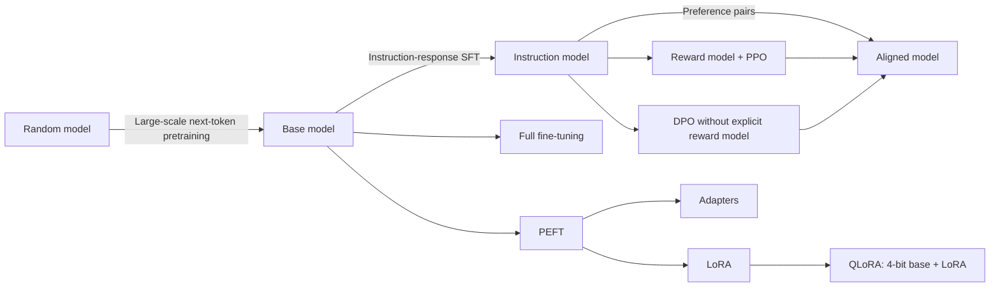
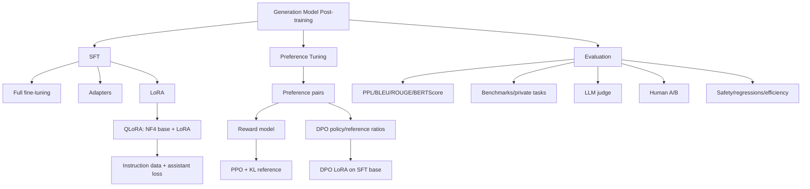

> 原章：*Fine-Tuning Generation Models*
> 本章定位：解释生成模型从“会续写”到“会遵循指令”，再到“更符合偏好”的两阶段后训练。重点包括 SFT、Adapters、LoRA/QLoRA、生成模型评测、reward model/PPO 式 RLHF，以及 DPO。

## 0. 本章路线：能力、行为与偏好分阶段塑造



三阶段优化的对象不同：

| 阶段 | 数据 | 目标 | 主要产物 |
|---|---|---|---|
| Pretraining | 大规模原始文本 | 预测下一个 token | Base/foundation model |
| SFT | Prompt + ideal response | 模仿示范、遵循指令 | Instruction/chat model |
| Preference tuning | Prompt + chosen/rejected | 提高相对偏好 | Aligned policy |

后训练不是向模型“上传事实”的数据库操作。它重塑条件生成分布：

$$
p_\theta(y\mid x)
$$

数据质量、chat template、loss masking、reference policy 和评测 protocol 共同决定最终行为。

---

## 1. LLM 训练的三个步骤：预训练、监督微调与偏好微调（The Three LLM Training Steps: Pretraining, Supervised Fine-Tuning, and Preference Tuning）

### 1.1 Pretraining：学习语言分布

对 token sequence $x_{1:T}$：

$$
\mathcal{L}_{pretrain}=-\sum_{t=1}^{T}
\log p_\theta(x_t\mid x_{<t})
$$


“无标签”更准确说是 self-supervised：下一个 token 直接来自原文本，数据自动提供 target。Base model 擅长 continuation，却没有被明确训练成助手。

### 1.2 SFT：学习示范行为

Instruction sample 通常包含 system、user 与 assistant messages。Chat template 将其串成 token sequence，但监督 target 主要是 assistant response tokens：

$$
\mathcal{L}_{SFT}=-\sum_{t\in\mathcal{A}}
\log p_\theta(y_t\mid x,y_{<t})
$$

$\mathcal{A}$ 是 assistant token positions；该目标就是 response token 的 cross-entropy。Prompt tokens 常在 labels 中设为 `-100`，避免模型因重复 user text 获得无关 loss。


原章称“label 是用户输入”并不严谨：user input 是条件，assistant response tokens 才是监督标签。若 trainer 默认在整段 sequence 上算 loss，必须确认是否启用 completion-only/assistant-only masking。

### 1.3 Preference tuning：学习相对选择

Preference data 表示在同一 prompt 下：

$$
y_w\succ y_l
$$

$y_w$ 是 chosen/winner，$y_l$ 是 rejected/loser。它不要求 rejected 很差，只表示 labeler 在 rubric 下更偏好 chosen。


偏好不是客观真理。标注者群体、文化、政策、任务说明和候选模型都会塑造数据分布。

---

## 2. 监督微调（Supervised Fine-Tuning (SFT)）

Base model 看见问题时仍按 web/text continuation 分布生成，可能继续列问题而非回答。


SFT 用高质量示范建立 role、格式、拒答、工具调用等行为。它仍是 next-token learning，只是训练分布从任意文本变成了 curated conversations。

### 2.1 全量微调（Full Fine-Tuning）

Full fine-tuning 更新所有参数：

$$
\theta\leftarrow\theta-\eta\nabla_\theta\mathcal{L}_{SFT}
$$


#### 2.1.1 资源为何昂贵

AdamW mixed-precision training 常需保存：

- Model weights。
- Gradients。
- First/second moment optimizer states。
- 可能还有 FP32 master weights。
- Activations、temporary buffers 与通信开销。

仅持久训练状态可粗略达到每参数 12–16 bytes 甚至更多，不含 activations。参数量 $P$ 时：

$$
M_{state}=O(P)
$$

这远高于仅加载 FP16 weights 的 $2P$ bytes。

#### 2.1.2 优势与风险

优势：适配容量最大，所有层都能重组。风险：显存/存储高、每任务保存完整 checkpoint、catastrophic forgetting、过拟合和 safety regression。

Full fine-tuning 不因为“数据有标签”就一定优于 PEFT；效果取决于数据规模、任务差异和优化稳定性。

### 2.2 参数高效微调（Parameter-Efficient Fine-Tuning (PEFT)）

PEFT 冻结大部分 base weights，只训练少量新增或重参数化权重：

$$
|\phi|\ll|\theta|
$$

它减少 trainable gradients、optimizer state 和 adapter storage，但 base model forward/activations 仍需计算，因此“只训练 1%参数”不等于训练成本只剩 1%。

#### 2.2.1 Adapters

经典 bottleneck adapter：

$$
\operatorname{Adapter}(h)=h+W_{up}\sigma(W_{down}h)
$$

$$
W_{down}\in\mathbb{R}^{r\times d},
\qquad W_{up}\in\mathbb{R}^{d\times r},
\quad r\ll d
$$


Adapter 必须匹配 base architecture、checkpoint revision、tokenizer 和 target modules。它不是脱离 base model 的独立完整模型。

#### 2.2.2 低秩适配（Low-Rank Adaptation (LoRA)）

LoRA 不以低秩矩阵替换原权重，而是对 frozen matrix $W_0$ 添加低秩 update：

$$
W'=W_0+\Delta W
$$

$$
\Delta W=\frac{\alpha}{r}BA
$$

其中：

$$
A\in\mathbb{R}^{r\times d_{in}},
\qquad B\in\mathbb{R}^{d_{out}\times r}
$$


LoRA 参数量：

$$
P_{LoRA}=r(d_{in}+d_{out})
$$

若 square matrix $d=12{,}288$、rank $r=8$：

$$
P_{full}=d^2=150{,}994{,}944
$$

$$
P_{LoRA}=2dr=196{,}608
$$

```python
dimension = 12_288
rank = 8
full_parameters = dimension * dimension
lora_parameters = 2 * dimension * rank
print(f"full={full_parameters:,}")
print(f"lora={lora_parameters:,}")
print(f"fraction={lora_parameters / full_parameters:.6f}")
```

```text
full=150,994,944
lora=196,608
fraction=0.001302
```

原章写 rank 8，却把两个矩阵写成 `12,288 × 2`；正确应为 `12,288 × 8` 与 `8 × 12,288`，其 196,608 参数结论才成立。

常见初始化令一侧为零，使训练开始时 $\Delta W=0$，初始行为与 base model 相同。`lora_alpha` 与 $r$ 共同形成 scaling $\alpha/r$；它是 update scale，不是可直接解释为“原知识与新任务知识比例”的旋钮，“alpha=2r”也只是经验而非定律。

Target modules 可选 q/k/v/o projections 和 MLP gate/up/down。Target 越广，容量和 optimizer state 越大。Module names 与 architecture 相关，配置错误可能一个参数也没命中；训练前打印 trainable parameters。

#### 2.2.3 压缩模型以提高训练效率（Compressing the model for (more) efficient training）


直接低精度映射会让多个原值落入同一 quantization bin：


Blockwise quantization 为局部 blocks 分别保存 scale，使不同范围的权重都利用有限 codebook：


QLoRA 使用 NormalFloat 4-bit（NF4），针对近似 zero-centered normal 权重分布设计非均匀 levels：


不能笼统说“所有 neural weights 都在 -1 到 1 且正态分布”；不同层 scale 与 outliers 不同，正因如此才需要 blockwise quantization。

QLoRA 的关键：

- Base weights 以 4-bit 保存且 frozen。
- Forward 时按 block dequantize 到 FP16/BF16 compute dtype。
- LoRA A/B 以较高精度训练。
- Double quantization 再压缩 quantization constants。
- Paged optimizers 缓解 optimizer memory spikes。

理论 4-bit weights 约 $0.5P$ bytes，但 scale、metadata、LoRA、activations、KV/temporary buffers 使真实占用更高。

---

## 3. 使用 QLoRA 做指令微调（Instruction Tuning with QLoRA）

### 3.1 为指令数据套用模板（Templating Instruction Data）

Chat template 是训练协议：role tokens、EOS、turn boundaries 必须与目标模型推理格式一致。


原章用 chat checkpoint tokenizer 的 template 格式化 base TinyLlama 的 UltraChat data。这可行的前提是 tokenizer vocabulary/special tokens 与 base model 兼容。

```python
from datasets import load_dataset
from transformers import AutoTokenizer

base_model_id = "TinyLlama/TinyLlama-1.1B-intermediate-step-1431k-3T"
template_model_id = "TinyLlama/TinyLlama-1.1B-Chat-v1.0"
template_tokenizer = AutoTokenizer.from_pretrained(template_model_id)


def format_conversation(example):
    return {
        "text": template_tokenizer.apply_chat_template(
            example["messages"],
            tokenize=False,
            add_generation_prompt=False,
        )
    }


instruction_train = (
    load_dataset("HuggingFaceH4/ultrachat_200k", split="train_sft")
    .shuffle(seed=42)
    .select(range(3_000))
    .map(format_conversation)
)
```

原章使用 `test_sft` 训练，只能作为演示；严格实验应使用 `train_sft`，另取 validation，保留 test 不触碰。

#### 3.1.1 Loss masking

完整序列：

```text
<user> prompt </s> <assistant> response </s>
```

推荐 labels：

```text
-100 ... -100          response-token-ids
```

只在 assistant response 上算 SFT loss，避免模型把 capacity 用于重现 user/system。不同 TRL 版本可用 `assistant_only_loss`、completion collator 或自定义 labels；必须实际检查一个 batch，而非假设默认行为。

### 3.2 模型量化（Model Quantization）

```python
import torch
from transformers import AutoModelForCausalLM, AutoTokenizer, BitsAndBytesConfig

compute_dtype = (
    torch.bfloat16
    if torch.cuda.is_available() and torch.cuda.is_bf16_supported()
    else torch.float16
)
quantization_config = BitsAndBytesConfig(
    load_in_4bit=True,
    bnb_4bit_quant_type="nf4",
    bnb_4bit_compute_dtype=compute_dtype,
    bnb_4bit_use_double_quant=True,
)

model = AutoModelForCausalLM.from_pretrained(
    base_model_id,
    device_map="auto",
    quantization_config=quantization_config,
)
model.config.use_cache = False
tokenizer = AutoTokenizer.from_pretrained(base_model_id)
if tokenizer.pad_token is None:
    tokenizer.pad_token = tokenizer.eos_token
tokenizer.padding_side = "right"
```

`bnb_4bit_compute_dtype` 应传 `torch.dtype`，而非原章字符串 `"float16"`。BitsAndBytes 4-bit training 主要依赖 CUDA/受支持硬件和版本，不能假设所有 CPU/MPS 环境可运行。

若新增一个真正的 `<PAD>` token，必须调用 `model.resize_token_embeddings(len(tokenizer))` 并训练新 embedding；直接复用 EOS 省事，但要正确处理 attention mask，避免把 padding 当有效结束语义。

原章称 1.1B model 4-bit 仅约 1 GB、未量化约 4 GB，是特定环境量级。理论权重约为：

$$
M_{4bit}\approx0.5P\text{ bytes},
\qquad M_{FP16}\approx2P\text{ bytes}
$$

真实训练还需 dequantization buffers、LoRA、activations 与 optimizer states。

### 3.3 LoRA 配置（LoRA Configuration）

```python
from peft import LoraConfig, get_peft_model, prepare_model_for_kbit_training

lora_config = LoraConfig(
    r=64,
    lora_alpha=32,
    lora_dropout=0.1,
    bias="none",
    task_type="CAUSAL_LM",
    target_modules=[
        "q_proj", "k_proj", "v_proj", "o_proj",
        "gate_proj", "up_proj", "down_proj",
    ],
)

model = prepare_model_for_kbit_training(model)
model = get_peft_model(model, lora_config)
model.print_trainable_parameters()
```

- `r`：update 的最大 rank；越大容量和训练/存储成本越高。
- `lora_alpha/r`：update scaling。
- `lora_dropout`：仅训练时对 LoRA branch 做正则化。
- `target_modules`：架构特定，必须确认实际命中模块。
- `bias="none"`：不训练原层 bias。

Rank 的合理值依数据量、模型、targets 与任务差异，4–64 不是硬边界。Alpha 也不必等于 $2r$；应由 validation 与 update norm 诊断。

LoRA adapter 只兼容其训练时的精确 base。应记录 base model ID、revision、tokenizer hash、PEFT config 与 chat template。

### 3.4 训练配置（Training Configuration）

```python
from transformers import TrainingArguments

training_arguments = TrainingArguments(
    output_dir="tinyllama_sft_qlora",
    per_device_train_batch_size=2,
    per_device_eval_batch_size=2,
    gradient_accumulation_steps=4,
    optim="paged_adamw_32bit",
    learning_rate=2e-4,
    lr_scheduler_type="cosine",
    warmup_ratio=0.03,
    num_train_epochs=1,
    logging_steps=10,
    eval_strategy="steps",
    eval_steps=100,
    save_steps=100,
    load_best_model_at_end=True,
    fp16=compute_dtype == torch.float16,
    bf16=compute_dtype == torch.bfloat16,
    gradient_checkpointing=True,
    report_to="none",
    seed=42,
)
```

Effective batch size：

$$
B_{effective}=B_{device}\times G_{accum}\times N_{devices}
$$

```python
per_device_batch = 2
gradient_accumulation = 4
devices = 1
print(per_device_batch * gradient_accumulation * devices)
```

```text
8
```

- Gradient accumulation 省 activation peak，但 wall-clock step 仍执行多次 forward/backward。
- Gradient checkpointing 少存 activation、反向时重算，memory 换 compute。
- Paged optimizer 处理 memory spikes，并不等于 optimizer state 只有 4-bit。
- BF16 若硬件支持，通常比 FP16 有更大动态范围。

原章称 cosine scheduler 会先线性升温，但其配置没有 `warmup_steps/ratio`；没有 warmup 时不会凭空线性升温。本笔记显式设 `warmup_ratio=0.03`。

Learning rate 与 epoch 无通用最优值。“模型越大应使用越高 learning rate”不能作普遍规则。应监控 train/validation loss、gradient norm、output behavior 与 capability regressions。

### 3.5 训练（Training）

TRL API 变化较快。现代版本常将长度、dataset field 和 assistant-only loss 放入 `SFTConfig`：

```python
from trl import SFTConfig, SFTTrainer

sft_config = SFTConfig(
    output_dir="tinyllama_sft_qlora",
    dataset_text_field="text",
    max_length=512,
    per_device_train_batch_size=2,
    gradient_accumulation_steps=4,
    learning_rate=2e-4,
    num_train_epochs=1,
    gradient_checkpointing=True,
    assistant_only_loss=True,
    report_to="none",
)

sft_trainer = SFTTrainer(
    model=model,
    args=sft_config,
    train_dataset=instruction_train,
    processing_class=tokenizer,
)
sft_trainer.train()
sft_trainer.model.save_pretrained("TinyLlama-1.1B-sft-qlora")
tokenizer.save_pretrained("TinyLlama-1.1B-sft-qlora")
```

`assistant_only_loss=True` 需要 chat template 能返回 assistant mask；不支持时应自定义 data collator，将 user/system labels 设 -100。训练前抽查：

```python
def supervised_token_count(labels):
    return sum(label != -100 for label in labels)
```

如果 supervised count 为 0，训练没有 target；若等于整个 prompt 长度，则可能意外在 user tokens 上计算 loss。

原章旧版 `SFTTrainer` 使用 `dataset_text_field`、`tokenizer`、`max_seq_length` 直接参数；运行时应根据固定 TRL 版本选择一种 API，不能混用新旧签名。

只看 training loss 不够。至少保留 held-out validation conversations，检查 instruction following、format validity、事实性、安全与 base capabilities。

### 3.6 合并权重（Merge Weights）

LoRA 推理有两种方式：

1. 保留 base + adapter，便于切换多个 adapters。
2. 将 $\Delta W$ merge 到 FP16/BF16 base，得到单一 checkpoint。

安全 merge 应重新加载非量化 base，再加载 adapter：

```python
from peft import PeftModel
from transformers import AutoModelForCausalLM

merge_base = AutoModelForCausalLM.from_pretrained(
    base_model_id,
    torch_dtype=compute_dtype,
    device_map="cpu",
)
peft_model = PeftModel.from_pretrained(
    merge_base,
    "TinyLlama-1.1B-sft-qlora",
)
merged_sft_model = peft_model.merge_and_unload()
merged_sft_model.save_pretrained(
    "TinyLlama-1.1B-sft-merged",
    safe_serialization=True,
)
tokenizer.save_pretrained("TinyLlama-1.1B-sft-merged")
```

原章文字说“重载 16-bit 合并”，但代码未显式指定 `torch_dtype`；还可能从 adapter metadata 自动加载 quantized base。不要直接向 4-bit packed matrix merge 后假设得到可靠 FP16 权重。

Merged model 体积恢复到高精度 base 量级；若需要小型部署，可在 merge 后重新做经过评测的 inference quantization。

生成时使用同一 chat template：

```python
from transformers import pipeline

messages = [
    {"role": "user", "content": "Explain what a large language model is."}
]
prompt = tokenizer.apply_chat_template(
    messages,
    tokenize=False,
    add_generation_prompt=True,
)
generator = pipeline(
    "text-generation",
    model=merged_sft_model,
    tokenizer=tokenizer,
)
result = generator(
    prompt,
    max_new_tokens=100,
    do_sample=False,
    return_full_text=False,
)[0]["generated_text"]
```

单个回答看似服从指令只是 smoke test，不是评估。

---

## 4. 评估生成模型（Evaluating Generative Models）

生成任务通常有多个正确答案，且质量包含正确性、相关性、风格、安全、延迟和成本，无法由单一指标概括。

建议建立评测矩阵：

| 维度 | 例子 |
|---|---|
| Task success | 答案/代码/JSON 是否完成任务 |
| Factuality | Claims 是否有证据 |
| Instruction following | 长度、格式、拒答是否遵守 |
| Safety | 有害、偏见、隐私、越权 |
| Robustness | 改写、长输入、注入、边界 |
| Efficiency | TTFT、tokens/s、VRAM、费用 |
| Regression | Base model 旧能力是否下降 |

### 4.1 词级指标（Word-Level Metrics）

#### Perplexity

平均 next-token negative log-likelihood：

$$
\mathcal{L}_{NLL}=-\frac{1}{T}\sum_{t=1}^{T}
\log p_\theta(x_t\mid x_{<t})
$$

$$
\operatorname{PPL}=\exp(\mathcal{L}_{NLL})
$$


```python
from math import exp

for nll in (2.0, 1.5):
    print(f"nll={nll:.1f}, ppl={exp(nll):.2f}")
```

```text
nll=2.0, ppl=7.39
nll=1.5, ppl=4.48
```

Perplexity 低表示更会预测 reference text，不保证事实、帮助性或安全。不同 tokenizer 的 token 粒度不同，PPL 不宜直接横比。

#### BLEU、ROUGE 与 BERTScore

BLEU 侧重 n-gram precision，并有 brevity penalty：

$$
BLEU=BP\cdot\exp\left(\sum_{n=1}^{N}w_n\log p_n\right)
$$

ROUGE 常侧重 reference n-gram recall，适合摘要但会惩罚合理同义改写。BERTScore 用 contextual token embeddings 做软匹配，更关注语义，但继承 encoder 偏差且不保证事实。

Reference-based metric 只衡量与某个答案相似；开放任务存在多种正确表达。应结合 exact/programmatic checks 与人工评测。

### 4.2 基准测试（Benchmarks）

原章列出：

| Benchmark | 主要能力 | 关键边界 |
|---|---|---|
| MMLU | 多学科选择题 | Prompt/contamination 敏感 |
| GLUE | 语言理解任务 | 更偏 encoder/NLU |
| TruthfulQA | 对常见错误信念的真实性 | 不等于全面 factuality |
| GSM8K | 小学数学文字题 | 需 exact answer parser |
| HellaSwag | 常识 completion | Multiple-choice protocol |
| HumanEval | 代码生成 | pass@k 与 sandbox tests |

Benchmark 运行必须固定 prompt template、few-shot examples、sampling、answer parser、model revision 与 tokenizer。Data contamination 与 benchmark-specific tuning 会夸大泛化。

### 4.3 排行榜（Leaderboards）

Leaderboard 将多个公开 benchmark 聚合，便于初筛，不代表你的业务质量。常见问题：

- 训练数据可能包含 test items。
- 不同模型使用不同 prompting/evaluation harness。
- Aggregate score 隐藏能力短板。
- 反复优化公开测试形成 leaderboard overfitting。
- 量化和 serving configuration 与榜单不同。

先用 leaderboard 缩小候选，再在私有、未污染的目标集评测。

### 4.4 自动化评估（Automated Evaluation）

LLM-as-a-judge 用独立模型按 rubric 评分，或 pairwise 比较 A/B。优点是开放答案可规模化评测；风险包括：

- Position bias：偏好先出现的答案。
- Verbosity bias：偏好更长文本。
- Self-enhancement：偏好同系列风格。
- Reference leakage 与 prompt sensitivity。
- 被候选答案中的 prompt injection 操纵。

缓解方法：随机交换 A/B 顺序、隐藏模型身份、使用明确 rubric、要求引用证据、多个 judges、与人工 labels 校准，并报告 agreement。

### 4.5 人工评估（Human Evaluation）

Human evaluation 能覆盖帮助性、风格与领域正确性，但人也有偏差。应：

- 招募目标用户/领域专家。
- 提供清晰 rubric 和 anchor examples。
- 匿名并随机化模型顺序。
- 每题多个 annotators，报告 inter-annotator agreement。
- 分离 factuality、helpfulness、safety，而非一个模糊总分。

Chatbot Arena 的匿名 pairwise vote 可通过 Bradley-Terry/Elo 类模型估计相对能力；它反映参与用户和 prompt 分布，不等于某个专业场景。

Goodhart's Law 提醒：公开 metric 一旦成为唯一目标，就会被优化到失去代表性。评测套件应持续更新，包含 regression、红队和真实线上反馈。

---

## 5. 偏好微调、对齐与 RLHF（Preference-Tuning / Alignment / RLHF）

SFT 告诉模型“一个可接受回答长什么样”；preference tuning 告诉模型“同一问题的两个回答中，更偏好哪一个”。


### 5.1 “Alignment”不是单一客观方向

偏好可包含：

- Helpfulness：是否解决用户问题。
- Honesty/factuality：是否承认不确定并有依据。
- Harmlessness/safety：是否遵守风险边界。
- Style：简洁、专业、格式稳定。
- Domain policy：组织特定规则。

这些目标可能冲突。例如更详细可能更有帮助，却增加泄露或幻觉。应明确 rubric、优先级和受影响群体。

### 5.2 Preference data 是相对监督

一条记录：

$$
(x,y_w,y_l)
$$

只表明在 prompt $x$ 下 $y_w$ 优于 $y_l$。它不说明 chosen 完全正确，也不说明 rejected 绝对错误。

Pairwise preference 比 1–5 绝对评分更容易保持一致，但仍受：位置、长度、文风、labeler expertise、文化和候选质量影响。应随机左右顺序、多人标注、保留 ties/不确定性并报告 agreement。

### 5.3 RLHF 的范围

RLHF（Reinforcement Learning from Human Feedback）通常指：

1. 收集人类 preferences。
2. 训练 reward model。
3. 用 PPO 等 reinforcement learning 优化 policy。

Preference tuning 范围更广，DPO 虽使用 preference data，却不运行 PPO rollout，也没有显式 learned reward model，通常不应将所有 preference optimization 都含糊称为传统 RLHF。

---

## 6. 使用奖励模型自动化偏好评估（Automating Preference Evaluation Using Reward Models）

大量 policy rollouts 无法全部由人实时评分，因此先训练 reward model 近似人类 preference。


### 6.1 奖励模型的输入与输出（The Inputs and Outputs of a Reward Model）

Reward model $r_\phi$ 读取完整 prompt + completion，输出 scalar：

$$
r_\phi(x,y)\in\mathbb{R}
$$


Scalar 通常不是“真实质量百分比”，主要用于同一分布内比较。跨 prompts、长度、模型版本和 reward checkpoints 的 raw scores 未必校准可比。

Reward model 可基于 SFT model 初始化，保留理解能力并将最终 head 改为 value head；也可用专门 encoder。它本身仍会 hallucinate-like misjudge、偏见和分布外失败。

### 6.2 训练奖励模型（Training a Reward Model）

#### 6.2.1 奖励模型训练数据集（Reward model training dataset）


数据收集原则：

- 两个 candidates 都必须对应完全相同 prompt/context。
- 随机交换展示顺序，减少 position bias。
- Candidate quality 要接近，才能产生有信息量的 comparisons。
- 保存 rubric、annotator、timestamp、model versions 与 tie。
- Train/validation/test 按 prompt 去重，防同一 prompt 改写泄漏。
- 明确是否由人、AI judge 或混合方法产生。

Synthetic preferences 成本低，却可能把 teacher 偏差固化为“人类偏好”。

#### 6.2.2 奖励模型训练步骤（Reward model training step）

Bradley-Terry model 假设 chosen 获胜概率：

$$
P(y_w\succ y_l\mid x)
=\sigma(r_\phi(x,y_w)-r_\phi(x,y_l))
$$

Pairwise loss：

$$
\mathcal{L}_{RM}=-\log\sigma(r_w-r_l)
$$


```python
from math import exp, log


def reward_pair_loss(chosen_reward, rejected_reward):
    margin = chosen_reward - rejected_reward
    probability = 1 / (1 + exp(-margin))
    return -log(probability)


print(f"loss={reward_pair_loss(2.0, 0.5):.3f}")
```

```text
loss=0.201
```

Margin 越大，loss 越低。若 chosen/rejected 颠倒，梯度会强化错误偏好。

Reward model 评测应包含：pairwise accuracy、calibration、不同长度/主题/语言 slice、公平性和 adversarial robustness。只看 train accuracy 易出现 shortcut，例如无条件奖励长回答。


多目标可使用多个 reward models：


组合 reward：

$$
R(x,y)=\sum_k w_k r_k(x,y)
$$

权重体现政策取舍。一个加权总分可能隐藏 safety veto；高风险规则更适合 hard constraint，而非与 helpfulness 简单平均。

### 6.3 PPO：用奖励优化 Policy

PPO 阶段从当前 policy 采样 completions，由 reward model 打分，再更新 policy。常加入 reference policy KL penalty：

$$
R_{total}=r_\phi(x,y)
-\beta D_{KL}(\pi_\theta(\cdot\mid x)\|\pi_{ref}(\cdot\mid x))
$$

KL 防止 policy 为追 reward 远离 SFT distribution。PPO 还使用 clipped policy ratio、value/critic estimation 与 advantage：

$$
L^{clip}=\mathbb{E}\left[
\min(r_tA_t,
\operatorname{clip}(r_t,1-\epsilon,1+\epsilon)A_t)
\right]
$$

传统 pipeline 可能同时维护 policy、reference、reward 和 value models，训练复杂、昂贵且容易 reward hacking。PPO 约束的是 policy update/KL，不是原章所说“不要偏离 expected rewards”。

Reward model 是 proxy。Policy 可能发现人类没预料的高分捷径，因此必须持续做 human evaluation、KL/length monitoring 与 red teaming。

### 6.4 不训练奖励模型（Training No Reward Model）

DPO 跳过显式 reward model 和 online RL，通过 preference likelihood 直接优化 policy。


重要纠正：reference model 不是“让 LLM 自己判断回答质量”。质量方向仍来自 chosen/rejected labels；reference 只锚定训练前 policy，衡量 trainable policy 对两个回答的相对概率变化。

Sequence log probability：

$$
\log\pi_\theta(y\mid x)=
\sum_{t\in assistant}\log\pi_\theta(y_t\mid x,y_{<t})
$$

Prompt/padding tokens 必须 mask，不参与 response log probability。


DPO loss：

$$
\mathcal{L}_{DPO}=-\mathbb{E}\log\sigma\left(
\beta\left[
\log\frac{\pi_\theta(y_w\mid x)}{\pi_{ref}(y_w\mid x)}
-\log\frac{\pi_\theta(y_l\mid x)}{\pi_{ref}(y_l\mid x)}
\right]\right)
$$

```python
from math import exp, log


def dpo_loss(policy_chosen, policy_rejected, ref_chosen, ref_rejected, beta=0.1):
    margin = (policy_chosen - ref_chosen) - (policy_rejected - ref_rejected)
    probability = 1 / (1 + exp(-beta * margin))
    return margin, -log(probability)


margin, loss = dpo_loss(-2.0, -3.0, -2.5, -2.7)
print(f"margin={margin:.3f}")
print(f"loss={loss:.3f}")
```

```text
margin=0.800
loss=0.654
```

Policy 相对 reference 更增加 chosen、减少 rejected 时 margin 为正，loss 下降。

$\beta$ 控制 preference optimization 与 reference regularization 的尺度，其效果与实现、learning rate 和数据有关，不能简单理解为“越大越对齐”。DPO 训练稳定不代表总是比 PPO 更准确；它依赖 offline pair coverage，无法自动探索训练集外 actions。

---

## 7. 使用 DPO 做偏好微调（Preference Tuning with DPO）

### 7.1 为对齐数据套用模板（Templating Alignment Data）

每条数据需要 common prompt 和两个 assistant continuations。优先用 tokenizer chat template，不手工拼接容易错的 EOS/role tokens。

```python
from datasets import load_dataset


def format_preference(example):
    prompt_messages = []
    if example.get("system"):
        prompt_messages.append(
            {"role": "system", "content": example["system"]}
        )
    prompt_messages.append({"role": "user", "content": example["input"]})
    prompt = tokenizer.apply_chat_template(
        prompt_messages,
        tokenize=False,
        add_generation_prompt=True,
    )
    return {
        "prompt": prompt,
        "chosen": example["chosen"] + tokenizer.eos_token,
        "rejected": example["rejected"] + tokenizer.eos_token,
    }


raw_preferences = load_dataset(
    "argilla/distilabel-intel-orca-dpo-pairs",
    split="train",
)
filtered = raw_preferences.filter(
    lambda row: (
        row["status"] != "tie"
        and row["chosen_score"] >= 8
        and not row["in_gsm8k_train"]
    )
)
preferences = filtered.map(
    format_preference,
    remove_columns=filtered.column_names,
)
preference_splits = preferences.train_test_split(
    test_size=0.05,
    seed=42,
)
```

过滤 `in_gsm8k_train` 是防 benchmark contamination 的好习惯，但还需检查近重复、长度、语言、chosen/rejected 位置和 score provenance。

原数据部分由 ChatGPT/AI judge 生成，训练得到的是 synthetic preference mixture，不等于纯人类偏好。

截断必须保证 prompt 与两个 responses 使用相同规则。若 chosen 因长度被截掉关键正确结论而 rejected 未截，label 语义被破坏。

### 7.2 模型量化（Model Quantization）

DPO 应从 SFT policy 开始。稳健步骤：

1. 将 SFT adapter 安全 merge 到 FP16/BF16 base，保存 `TinyLlama-1.1B-sft-merged`。
2. 以 4-bit 重新加载该 SFT checkpoint。
3. 由 DPOTrainer 添加一套新的 LoRA adapter。

```python
sft_policy = AutoModelForCausalLM.from_pretrained(
    "TinyLlama-1.1B-sft-merged",
    quantization_config=quantization_config,
    device_map="auto",
)
sft_policy.config.use_cache = False
sft_policy = prepare_model_for_kbit_training(sft_policy)
```

原章先以 4-bit 加载 SFT adapter、`merge_and_unload()`，再手工 `get_peft_model()`，同时又向 `DPOTrainer` 传 `peft_config`。这可能导致 quantized merge 语义不清或重复注入 adapter。应选择一种方式：

- 传未包 PEFT 的 model + `peft_config` 给 trainer；或
- 预先 `get_peft_model`，trainer 不再传同一 config。

Reference model 必须代表 DPO 前的 frozen SFT policy。某些 TRL+PEFT 版本可令 `ref_model=None`，通过禁用 active adapter 使用同一 base 作 reference，节省内存；其他版本需要显式 reference。务必查当前 API 并验证 reference parameters 不更新。

### 7.3 训练配置（Training Configuration）

```python
from trl import DPOConfig

dpo_config = DPOConfig(
    output_dir="TinyLlama-1.1B-dpo-qlora",
    per_device_train_batch_size=2,
    per_device_eval_batch_size=2,
    gradient_accumulation_steps=4,
    optim="paged_adamw_32bit",
    learning_rate=1e-5,
    lr_scheduler_type="cosine",
    warmup_ratio=0.1,
    max_steps=200,
    logging_steps=10,
    eval_strategy="steps",
    eval_steps=50,
    save_steps=50,
    beta=0.1,
    max_prompt_length=512,
    max_length=1024,
    gradient_checkpointing=True,
    fp16=compute_dtype == torch.float16,
    bf16=compute_dtype == torch.bfloat16,
    report_to="none",
    seed=42,
)
```

`max_length` 必须覆盖 prompt + response，而不只是 response。200 steps 是演示预算，不保证收敛。监控：chosen/rejected rewards、reward margin、preference accuracy、log-prob、KL/reference drift 与 response length。

### 7.4 训练（Training）

```python
from trl import DPOTrainer

dpo_trainer = DPOTrainer(
    model=sft_policy,
    ref_model=None,
    args=dpo_config,
    train_dataset=preference_splits["train"],
    eval_dataset=preference_splits["test"],
    processing_class=tokenizer,
    peft_config=lora_config,
)
dpo_trainer.train()
dpo_trainer.model.save_pretrained("TinyLlama-1.1B-dpo-qlora")
```

上述 `ref_model=None` 只适用于支持 PEFT reference handling 的 TRL 版本；否则显式加载 frozen SFT reference。不要在没核对行为时静默训练。

#### 7.4.1 Merge DPO adapter

DPO adapter 的 base 是 SFT-merged model：

```python
dpo_merge_base = AutoModelForCausalLM.from_pretrained(
    "TinyLlama-1.1B-sft-merged",
    torch_dtype=compute_dtype,
    device_map="cpu",
)
dpo_peft_model = PeftModel.from_pretrained(
    dpo_merge_base,
    "TinyLlama-1.1B-dpo-qlora",
)
merged_dpo_model = dpo_peft_model.merge_and_unload()
merged_dpo_model.save_pretrained(
    "TinyLlama-1.1B-sft-dpo-merged",
    safe_serialization=True,
)
```

Adapter merging 具有顺序与 base fingerprint 要求。不能把 DPO adapter 直接套在原始 base 上，因为它训练时假设 SFT behavior 已存在。

#### 7.4.2 DPO 后必须评测什么

- Held-out pair preference accuracy/win rate。
- 目标 task human/LLM judge blind A/B。
- SFT instruction-following regression。
- Factuality、safety 与 refusal over/under-generalization。
- Response length/style shifts。
- Public benchmark regressions 与 contamination-free private tests。
- Latency、VRAM、adapter/merged/quantized deployment consistency。

只完成 `train()` 并 merge 不能证明模型“已对齐”。

### 7.5 DPO 之后的方法

ORPO 将 supervised likelihood 与 odds-ratio preference objective 放在一个阶段，尝试省去独立 SFT+DPO；此外还有 IPO、KTO、SimPO 等。新方法不是自动更优，选择取决于数据形态、reference 需求、稳定性和目标评测。

---

## 8. 重点辨析与常见误区

### 8.1 Base model、instruction model 与 aligned model 不同

Pretraining 学 continuation，SFT 学示范行为，preference tuning 学相对偏好。三者不能只看参数量区分。

### 8.2 SFT 的 label 不是 user prompt

Prompt 是条件，assistant response tokens 是主要监督 target。是否 mask prompt loss 必须核验。

### 8.3 Full fine-tuning 不总优于 PEFT

它容量大，也更贵、更易遗忘。高质量 PEFT 在很多任务上可接近 full tuning。

### 8.4 LoRA 不是用低秩矩阵替换原权重

$W_0$ 保持冻结，$BA$ 是 additive update；merge 后才形成 $W_0+BA$。

### 8.5 Rank 8 的矩阵维度必须包含 8

对于 $12{,}288^2$ 权重，LoRA 是 $12{,}288\times8$ 与 $8\times12{,}288$，共 196,608 参数。

### 8.6 `lora_alpha` 不是知识混合比例

它通过 $\alpha/r$ 缩放 update，实际行为还由 optimization、targets 和 data 决定。

### 8.7 QLoRA 不训练 4-bit base weights

Base 量化且冻结，计算时 dequantize；训练的是较高精度 LoRA parameters。

### 8.8 4-bit 权重不代表全部训练状态都是 4-bit

Activations、gradients、LoRA 和 optimizer 常为 FP16/BF16/FP32，实际显存远大于 $0.5P$ bytes。

### 8.9 Cosine scheduler 不会自动 warmup

必须显式设置 `warmup_steps` 或 `warmup_ratio`。

### 8.10 加一个 `<PAD>` token 可能需要 resize embeddings

若 tokenizer vocabulary 新增 token，model embedding matrix 必须同步；复用 EOS 则需正确 mask。

### 8.11 Merge adapter 不是必需步骤

Base + adapter 可直接推理并支持热切换。Merge 简化部署但恢复完整 checkpoint 大小，并失去轻松切换。

### 8.12 PPL 低不等于回答更好

Perplexity 衡量 reference token prediction，不直接衡量事实、帮助性和安全。

### 8.13 Leaderboard 高分不等于目标业务最佳

公开 benchmark 可能污染、过拟合或 protocol 不一致。私有目标集更重要。

### 8.14 LLM-as-a-judge 不是真值裁判

Judge 有位置、长度、同源和注入偏差，必须用人工数据校准。

### 8.15 Chosen 不一定正确，rejected 不一定差

Preference 只表达相对顺序。错误 label 会训练错误行为。

### 8.16 Reward score 不一定跨 prompt 可比

Reward model 主要学习 pair ordering，raw scalar 未必经过校准。

### 8.17 PPO 的 reference 约束不是“不要偏离奖励”

KL 约束 policy 不要过度偏离 SFT/reference distribution，同时优化 learned reward。

### 8.18 DPO 没有让 reference model 自己判断质量

Chosen/rejected data 提供偏好，reference 只作为概率锚点；DPO 省去显式 reward model。

### 8.19 DPO 也可能 reward-hack 数据偏差

若 chosen 总是更长，policy 可能只学 verbosity。必须做 slice 与反事实评测。

### 8.20 DPOTrainer 中不要重复注入 LoRA

预先 `get_peft_model` 与再传同一 `peft_config` 应二选一，具体按 TRL 版本。

### 8.21 Adapter 必须对应精确 Base

Architecture、revision、tokenizer 或 SFT merge state 不一致，adapter 行为不可解释。

### 8.22 Fine-tuning 不等于写入可靠事实

频繁更新知识优先 RAG/tool；fine-tuning 更适合行为、格式、风格和领域模式。

---

## 9. 总结（Summary）

### 9.1 知识结构



### 9.2 核心结论

1. Pretraining、SFT 与 preference tuning 分别学习语言分布、示范行为和相对偏好。
2. SFT 仍是 causal next-token learning，但主要监督 assistant response tokens，prompt 是条件。
3. Full fine-tuning 容量最大，PEFT 通过少量 trainable parameters 降低 optimizer/storage 成本。
4. Adapter 添加 bottleneck modules；LoRA 将权重变化参数化为低秩 additive update。
5. LoRA 参数量为 $r(d_{in}+d_{out})$，远小于 $d_{in}d_{out}$，但 rank 和 targets 决定容量。
6. QLoRA 将 frozen base 存为 4-bit NF4，训练较高精度 LoRA，并借 double quantization/paged optimizer 控制内存。
7. Chat template、EOS、padding 与 assistant-only loss masking 是 instruction tuning 的数据契约。
8. Merge 应在高精度 base 上执行；adapter 可不 merge，部署量化应在 merge 后重新评测。
9. 生成评估必须组合任务正确性、开放文本质量、人类偏好、安全、回归和效率。
10. Reward model 通过 Bradley-Terry pair loss 学 chosen > rejected，PPO 再在 KL 约束下优化 policy。
11. DPO 使用 policy/reference 对 chosen/rejected 的 log-prob ratio，省去显式 reward model 与 PPO rollout。
12. Reference policy 是概率锚点，不是 preference judge；偏好仍来自数据。
13. DPO 必须从 SFT policy 开始，严格管理 response masking、length、beta、reference 与 adapter base。
14. 训练完成不等于对齐完成；必须做 blind A/B、能力回归、安全与 deployment consistency 评测，高风险行为还需 human-in-the-loop 审批。

### 9.3 解决生成模型微调问题的一般方法

1. **先定义行为 contract**：需要 instruction following、格式、领域风格，还是事实更新？
2. **先评估再训练**：建立私有 validation/test、safety 和 regression suite。
3. **选择最小适配方式**：Prompt/RAG 能解决则不急于微调；需要稳定行为再 SFT。
4. **清洗并模板化 SFT 数据**：去重、角色正确、EOS 正确、assistant labels 可视化检查。
5. **按资源选择 full/LoRA/QLoRA**：比较质量、显存、时间、adapter storage 和部署复杂度。
6. **验证 PEFT 配置**：target modules 命中、trainable count、base revision 和 tokenizer 一致。
7. **控制训练稳定性**：warmup、scheduler、gradient accumulation/checkpointing、validation checkpoint。
8. **评估 SFT 后回归**：任务、事实、安全、旧能力、格式和 latency。
9. **明确定义 preference rubric**：helpfulness、honesty、safety 分开标注，随机候选顺序。
10. **选择 PPO 或 DPO**：需要 online exploration/复杂 rewards 可考虑 PPO；高质量 offline pairs 可优先 DPO。
11. **监控 preference optimization**：margin、accuracy、KL、长度、reward hacking 与 alignment tax。
12. **安全合并和版本化**：SFT base → DPO adapter 的依赖顺序、hash、配置、评测结果全部记录。
13. **上线后持续监控**：真实失败、漂移、越狱、拒答率、成本和用户反馈回到数据闭环。

本章最重要的方法论是把后训练视为“行为分布工程”，而不是一次神秘的模型升级。SFT 定义可模仿的行为，preference data 定义相对取舍，PEFT/QLoRA 决定资源路径，严格评测则决定这些变化是否真的让系统更可用、更安全。
