> 对应原文：1. Trade-Offs in Data Systems Architecture.md
>
> 本文严格按照原章顺序展开。原章的重点是建立术语、比较架构选择并解释权衡，并未给出需要照抄的正式算法或数学定理。文中标为“背景补充”“量化模型”或“实践推导”的公式、伪代码和案例，是为了把作者的论证变成可计算、可验证的方法，不应误认为原书原文中的公式。

## 0. 本章定位：架构不是寻找唯一解，而是在约束下选择权衡

### 0.1 数据为什么成为应用开发的中心

Web 应用、移动应用、软件即服务（SaaS）和云服务普及以后，把许多用户的数据集中保存在服务端基础设施中，已经成为常态。系统持续接收多种来源的数据：

- 用户点击、浏览、搜索和内容创作；
- 下单、支付、退款等业务交易；
- 设备、传感器和软件服务产生的事件；
- 外部 SaaS、合作方和公共数据源提供的数据。

用户使用应用时既是数据的消费者，也是数据的生产者。一次“查看订单”读取已有状态，一次“确认收货”又产生新状态；设备上报既要被保存，也可能立即触发告警。这种读、写、处理和反馈的循环，使数据管理不再是应用的附属功能，而成为应用行为本身的一部分。

数据量很小时，一台机器、一个数据库乃至一张电子表格可能已经足够。问题随着以下任一维度增长而出现：

- 数据总量超过单机存储或处理能力；
- 请求速率超过单机吞吐能力；
- 延迟、可用性或合规要求变得严格；
- 查询类型增加，一个系统无法同时高效支持全部访问模式；
- 多个团队要以不同方式使用同一批数据；
- 数据需要跨地域、跨服务或跨组织流动。

作者由此引出本章的中心问题：**复杂数据架构为何出现，以及我们应该如何比较它们，而不是把复杂性本身当作先进性。**

### 0.2 什么是数据密集型应用

如果开发应用时，数据管理是主要挑战之一，作者就称它为 **数据密集型应用（data-intensive application）**。

它通常要处理以下困难：

1. 存储和处理大量数据；
2. 管理持续发生的数据变化；
3. 在并发操作和故障下维持所需的一致性；
4. 让服务在部分组件失效时仍尽量可用；
5. 为不同访问模式提供可接受的性能。

与之相对，**计算密集型系统（compute-intensive system）**的主要困难，是如何并行完成一次非常庞大的计算。例如，大规模数值模拟可能把主要精力放在浮点计算和任务并行；电商平台则更关心订单状态如何持久保存、库存并发扣减是否正确、查询能否快速响应，以及节点失效后数据是否仍可访问。

二者不是互斥分类。机器学习训练既需要大规模矩阵计算，也需要高吞吐的数据读取和预处理；一个系统可以同时在计算与数据两个维度上具有挑战。区分它们的意义在于确定主要瓶颈：

| 观察维度 | 计算密集型侧重 | 数据密集型侧重 |
| --- | --- | --- |
| 主要资源 | CPU、GPU、加速器计算能力 | 存储、内存、网络、索引与数据组织 |
| 核心问题 | 如何拆分和并行计算 | 如何保存、更新、查询、复制和集成数据 |
| 常见风险 | 计算效率低、负载不均 | 数据丢失、不一致、查询慢、服务不可用 |
| 典型优化 | 向量化、并行算法、专用硬件 | 索引、缓存、分区、复制、批流处理 |

常见误区是用“数据量大”机械定义数据密集型。一个数据量不算巨大的金融系统，也可能因为并发正确性、审计和恢复要求而高度数据密集；一个输入数据很大的单次科学计算，主要困难却可能仍是计算。

### 0.3 数据系统的基本构件

应用通常不会从磁盘读写开始自行实现全部能力，而会组合标准化构件：

| 构件 | 解决的问题 | 典型代价或新问题 |
| --- | --- | --- |
| 数据库 | 持久保存数据，支持以后查找和更新 | 模型、事务、扩展与运维约束 |
| 缓存 | 保存昂贵操作的结果，降低读取延迟和后端压力 | 失效、陈旧数据与一致性问题 |
| 搜索索引 | 支持关键词、过滤或专用检索 | 额外存储、更新传播与索引重建 |
| 流处理 | 在事件或数据变化发生后尽快处理 | 乱序、重复、状态恢复与时间语义 |
| 批处理 | 周期性处理大量已经积累的数据 | 结果延迟、资源调度与失败重算 |

这些构件不是互相替代的五种数据库，而是数据生命周期中的不同能力。一个典型组合可能是：

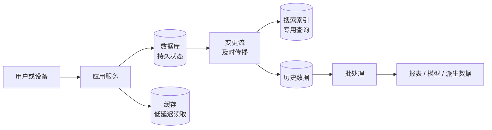

图中每条箭头都代表一个必须定义的契约：数据何时传播、失败后是否重试、重复如何处理、顺序是否重要、目标系统落后多久可以接受。**把软件“粘起来”并不只是连接 API，而是在组合各组件的状态和故障语义。**

### 0.4 为什么单个工具不能解决所有问题

只要应用恰好执行某个系统为之设计的任务，使用它通常很容易。困难来自需求超出单一工具的优化范围：

- 事务数据库能准确更新订单，却不一定适合扫描多年订单做任意聚合；
- 数据仓库擅长大规模分析，却不一定适合给每个用户处理毫秒级的小额更新；
- 缓存很快，但不能天然成为长期权威状态；
- 搜索索引能回答倒排检索，却可能无法提供事务数据库的更新语义；
- 云托管服务降低部分运维负担，却减少了底层控制和可观测信息。

于是架构问题从“某工具能否工作”升级为：

1. 哪个工具负责哪类工作？
2. 每个工具的权威边界在哪里？
3. 数据怎样在工具之间流动？
4. 某一环节故障时，整体还能承诺什么？
5. 组件带来的收益是否值得新增复杂度？

作者强调，没有一种方案从根本上优于所有其他方案。一个设计选择只有放进具体负载、组织和风险环境中，才有“更合适”或“不合适”的意义。

### 0.5 大规模企业经验为何成为许多概念的来源

现代数据架构中的许多思想起源于大型企业和政府的信息系统，因为过去主要是这些组织拥有足以要求复杂技术的数据量。小数据放在电子表格中就能处理，自然不需要数据仓库、跨系统集成或分布式存储。

今天，创业公司和较小组织也能快速积累大量用户数据，并按需租用云资源，所以这些问题不再只属于传统大企业。然而，企业软件背景仍解释了许多术语为何强调：

- 多个独立业务系统；
- 部门之间的数据共享；
- 报表、审计和管理决策；
- 长期运行与遗留系统；
- 权限、合规和组织职责。

理解历史背景可以避免把数据仓库、ETL 等概念误解成纯粹的技术潮流。它们首先是为了解决组织中数据分散、目标不同和职责分离的问题。

### 0.6 最隐蔽的难点：同一数据，不同目标

同一组织中的不同角色可能使用同一数据集，却有完全不同的优先级：

- 后端工程师关心用户请求能否快速、正确地读写；
- 分析师关心能否自由组合跨业务数据并形成报表；
- 数据科学家关心能否提取特征、训练模型和开展探索；
- 安全与合规人员关心谁能访问、数据位于哪里、何时删除；
- 财务人员关心基础设施总成本和供应商风险；
- 用户关心服务是否可靠，以及个人数据是否被正当使用。

这些目标经常没有被明确写下来，于是争论看似发生在“选择哪种数据库”，实质上却是参与者在优化不同目标。

一个架构讨论在列举产品之前，应先制作目标表：

| 角色 | 需要完成的任务 | 不可接受的失败 | 可量化目标 |
| --- | --- | --- | --- |
| 在线服务 | 读写当前状态 | 错误扣款、长时间不可用 | 延迟、错误率、可用性 |
| 分析团队 | 跨系统聚合历史 | 报表口径不一致 | 新鲜度、查询时长、覆盖范围 |
| 数据科学 | 探索与训练 | 数据不可重现或泄露 | 数据版本、质量、训练吞吐 |
| 合规团队 | 控制数据生命周期 | 违规保留或越权使用 | 删除时限、审计覆盖率 |
| 平台团队 | 稳定运行基础设施 | 失控成本、无法恢复 | 单位成本、恢复时间、告警质量 |

显式化这些目标，才能把“各执一词”转化为可讨论的权衡。

### 0.7 本章的四组对照

作者选择四组概念来建立全书坐标系：

1. 运营系统与分析系统：同一数据因访问模式和使用者不同而分化；
2. 云服务与自托管：控制、专业能力、成本与弹性的权衡；
3. 分布式与单机：规模、可用性、地域需求与复杂性的权衡；
4. 业务需求与个人权利：技术价值、法律责任和社会风险的权衡。

这四组对照并非相互独立。分析负载的弹性使云计算有吸引力；云原生存算分离又天然引入网络和分布式系统；个人数据的地域和删除要求反过来影响数据分布、派生数据和存储设计。

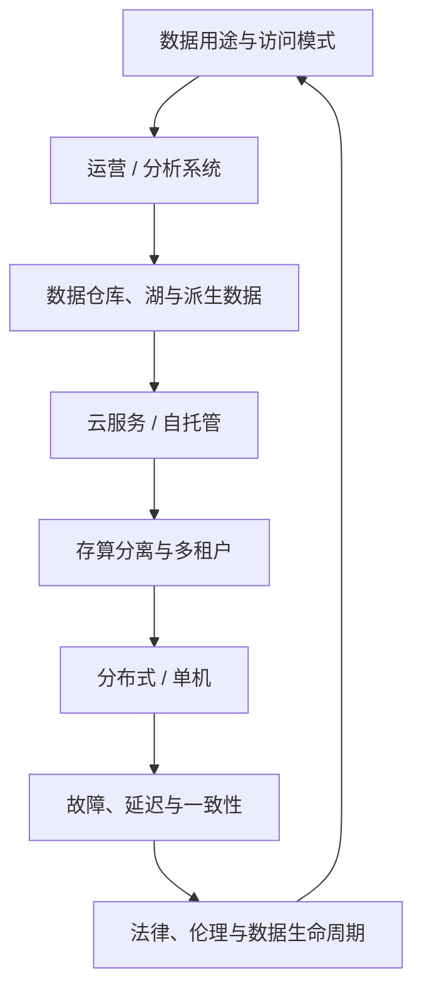

## 1. 术语：前端与后端

### 1.1 前端和后端分别是什么

在 Web 应用中：

- **前端（frontend）**通常指运行在浏览器中的客户端代码，负责用户界面与本地交互；
- **后端（backend）**指服务端代码，接收请求、执行应用逻辑，并访问数据库等数据基础设施。

移动应用在这个划分中通常类似前端：它运行在用户设备上，通过互联网与后端通信。前端也可以在本地管理数据，尤其在离线或本地优先应用中；但作者指出，最重的数据基础设施挑战通常集中在后端，因为前端主要处理一个用户或一台设备的数据，后端则代表所有用户集中处理数据。

这个区别不是由界面是否“可见”决定，而是由代码运行位置、服务对象和数据责任决定。后台管理页面是前端界面；没有图形界面的 HTTP 服务仍然是后端。

### 1.2 后端服务的典型组成

后端通常通过 HTTP，有时通过 WebSocket 对外提供能力。一次请求可能经过：

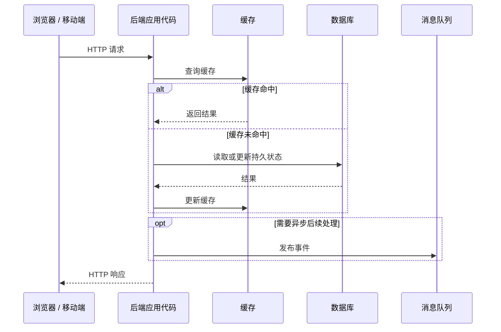

数据库、缓存、消息队列、搜索索引等可统称为 **数据基础设施（data infrastructure）**。应用代码负责把业务规则映射到这些系统提供的读写、查询和消息语义上。

### 1.3 “应用代码无状态”是什么意思

后端应用代码常被设计为 **无状态（stateless）**：处理完一个请求后，进程不依赖自身内存继续记住该请求的信息。需要跨请求保留的数据，应存到客户端或服务端数据基础设施中。

无状态不等于应用“没有数据”，而是持久状态不绑在某个应用进程的易失内存里。例如：

- 错误做法：用户登录会话只保存在处理首次登录的进程内存中；下次请求落到另一实例就无法识别用户。
- 常见做法：会话信息写入共享存储，或把经过签名的必要状态交给客户端携带；任一应用实例都能验证并处理后续请求。

无状态应用层有利于：

- 在多实例之间任意负载均衡；
- 实例崩溃后由其他实例接管；
- 根据负载快速增加或减少实例；
- 发布新版本时替换实例。

但无状态只是应用进程的属性，系统整体仍然有状态。状态被转移到数据库、队列或客户端后，这些组件的可靠性和一致性反而更加关键。

### 1.4 前后端划分的边界与误区

1. **前端不是天然简单。** 本地优先、离线同步、端到端加密等应用会把复杂数据管理带到客户端。
2. **后端不是单个服务器。** 它可能是多个服务、数据库和云服务组成的分布式系统。
3. **无状态不等于没有缓存。** 进程可以有可丢失、可重建的本地缓存，只要正确性不依赖它长期存在。
4. **WebSocket 不会消除后端状态问题。** 长连接改变通信模式，但需要持久保存的数据仍应有明确归属。
5. **把状态外置不等于复杂性消失。** 它用更容易替换的计算实例，换来了共享数据基础设施的协调问题。

## 2. 运营系统与分析系统

### 2.1 为什么组织会自然分出两类系统

组织中的数据使用者大致有三组：

| 角色 | 主要工作 | 典型输出 |
| --- | --- | --- |
| 后端工程师 | 构建处理读取和更新请求的服务 | 面向外部用户或内部服务的在线功能 |
| 业务分析师 | 分析组织活动，支持管理决策 | 报表、仪表盘、业务指标 |
| 数据科学家 | 寻找新洞察，开发分析或 ML/AI 功能 | 风险评分、垃圾信息识别、推荐、排序 |

业务分析师和数据科学家的工具与工作方式不同，但有两个共同点：

1. 都在分析用户和后端服务已经产生的数据；
2. 通常不直接修改原始业务事实，只会修正错误或创建处理后的派生数据集。

由此形成贯穿全书的划分：

- **运营系统（operational system）**：数据被创建和更新的后端服务及数据基础设施。应用依据用户动作读取并修改数据库。
- **分析系统（analytical system）**：为分析师和数据科学家服务，通常保存来自运营系统的只读副本，并针对分析处理优化。

这里的“只读”是相对于运营事实而言。分析系统当然会写入导入数据、中间结果、特征和报表；它不应反向随意改写订单、余额等权威业务状态。

### 2.2 数据工程师与分析工程师为何出现

当运营系统与分析系统成熟并分离后，两种专门角色变得重要：

- **数据工程师（data engineer）**负责连接运营与分析两侧，建设和运行更广泛的数据基础设施；
- **分析工程师（analytics engineer）**负责建模和转换数据，使其更适合业务分析师和数据科学家使用。

可以把职责粗略理解为：

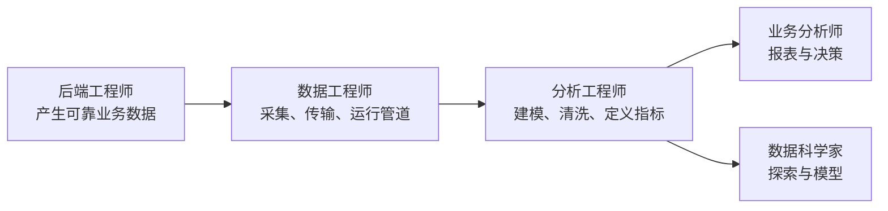

边界会因组织而异，不能把岗位名称当成严格标准。作者强调这些角色，是为了说明运营与分析不是两座互不相干的岛：数据有完整生命周期，理解另一侧有助于团队正确协作。

### 2.3 事务处理与分析处理的历史来源

早期商业数据处理中的一次数据库写入，往往对应一笔商业交易，例如销售、向供应商下单或发工资。后来数据库被用于社交帖子、游戏动作和联系人等非金融数据，“事务（transaction）”这个名称仍被保留下来，表示形成一个逻辑单元的一组读写。

本章暂时宽泛地用“事务处理”指低延迟读写。第 8 章才会精确定义事务及其保证。这里必须避免两个混淆：

- **业务交易**是现实世界发生的经济或业务行为；
- **数据库事务**是数据库对一组操作提供的执行语义。

一次业务交易可能跨越多个数据库事务；一次数据库事务也可以处理完全不涉及金钱的数据。

### 2.4 OLTP：围绕少量记录的交互式读写

运营系统常按键查找少量记录，这种查询叫 **点查询（point query）**。随后根据用户输入插入、更新或删除个别记录。因为请求来自交互式应用，这类负载被称为 **在线事务处理（online transaction processing，OLTP）**。

典型查询形态如下：

```sql
SELECT status, total_amount
FROM orders
WHERE order_id = ?;

UPDATE inventory
SET available = available - 1
WHERE product_id = ? AND available > 0;
```

第一条按订单主键读取一行；第二条针对某个商品更新少量状态。实际系统还要考虑事务边界、并发和错误处理，此处代码只展示访问模式。

#### 背景补充：为什么索引适合点查询

如果表有 $N$ 条记录，按平衡树索引查找一个键，比较次数通常随 $\log N$ 增长；哈希索引在理想情况下可提供期望 $O(1)$ 的精确键查找。若返回 $k$ 条匹配记录，可把抽象工作量写成：

$$
T_{\text{point}}(N,k)\approx O(\log N+k)
$$

这个式子只表达增长趋势，不直接等于实际延迟。磁盘访问、缓存命中、网络往返、锁竞争和查询计划都会影响结果。其直觉是：索引预先维护了有序或哈希结构，因此无需检查全部记录；代价是每次写入都要同步维护索引，并占用额外空间。

### 2.5 OLAP：扫描大量历史并计算聚合

分析查询通常扫描大量记录，计算计数、总和、平均值或分组统计，而不是向用户返回每一条原始记录。这种模式被称为 **在线分析处理（online analytical processing，OLAP）**。

例如，连锁超市可能询问：

- 一月份每家门店的总收入是多少？
- 最近促销期间，香蕉销量比平时多多少？
- 哪个品牌的婴儿食品最常与某品牌纸尿裤一起购买？

第一类问题可以抽象为：

```sql
SELECT store_id, SUM(total_amount) AS revenue
FROM sales
WHERE sold_at >= DATE '2026-01-01'
  AND sold_at <  DATE '2026-02-01'
GROUP BY store_id;
```

如果时间范围内有 $M$ 条销售记录，朴素聚合至少需要读取这些相关记录，因此工作量大致与 $M$ 成正比：

$$
T_{\text{scan}}(M)\approx O(M)
$$

列式存储、分区裁剪、压缩、向量化执行、预聚合和并行扫描能够显著降低常数或减少实际读取的数据，却不能凭空消除查询需要检查的信息。OLAP 的优化重点因此不同于 OLTP：它更关心顺序扫描吞吐、压缩效率、并行聚合和复杂查询计划。

OLAP 中的 “online” 含义并不十分明确。作者推测，它可能强调分析师可以交互式提出探索性问题，而不只是等待预先定义好的离线报表；这里的 online 不能理解成 OLTP 那样的大量毫秒级小请求。

### 2.6 OLTP 与 OLAP 的系统比较

| 属性 | 运营系统（OLTP） | 分析系统（OLAP） |
| --- | --- | --- |
| 主要读取模式 | 按键读取个别记录 | 对大量记录聚合 |
| 主要写入模式 | 创建、更新、删除个别记录 | 批量导入（ETL）或事件流 |
| 人类用户 | Web/移动应用终端用户 | 负责决策支持的内部分析师 |
| 机器用途 | 检查某个动作是否被授权 | 检测欺诈或滥用模式 |
| 查询类型 | 由应用预先定义、相对固定 | 分析师任意提出、临时探索 |
| 查询数量 | 大量小查询 | 少量但每条复杂 |
| 数据语义 | 当前时刻的最新状态 | 随时间发生的历史事件 |
| 典型数据规模 | GB 到 TB | TB 到 PB |

表中的值是典型特征，不是严格边界。一个运营数据库也会保存历史，一个分析系统也可能近实时更新；判断依据应是主导负载和服务目标，而不是产品标签。

#### 为什么 OLTP 不让终端用户随意写 SQL

运营系统通常只执行写在应用代码中的固定查询，原因有两类：

1. **安全与权限**：任意 SQL 可能读取或修改用户无权访问的数据；
2. **性能隔离**：代价高昂的临时查询可能拖慢其他用户的在线请求。

偶发自定义查询一般只用于维护和故障排查，并受到严格权限控制。相反，分析数据库的目标就是支持探索，通常允许用户手写 SQL，或让 Tableau、Looker、Power BI 等可视化工具生成查询。

固定查询并不意味着永远安全高效，任意查询也不意味着不受治理。二者的本质差异是：运营查询在上线前有机会审查和容量规划，而分析查询空间更开放，系统必须为不可预测的复杂工作负载提供资源管理。

### 2.7 产品分析与实时分析：位于两类负载之间

还有一类系统在用户产品中嵌入分析结果：查询会聚合很多记录，但又要求面向在线用户快速响应，常称 **产品分析（product analytics）**或 **实时分析（real-time analytics）**。Pinot、Druid 和 ClickHouse 是原文列举的例子。

这类系统通常：

- 实时摄取事件；
- 对分析式聚合提供低延迟响应；
- 服务面向用户的仪表盘、监控、推荐或风控功能。

传统 OLAP 更常批量摄取，优化高吞吐复杂查询；实时分析则要同时处理持续写入和低延迟聚合。它不是 OLTP，因为主要查询仍可能扫描、过滤和聚合大量事件；也不是传统离线 OLAP，因为结果进入在线交互路径。

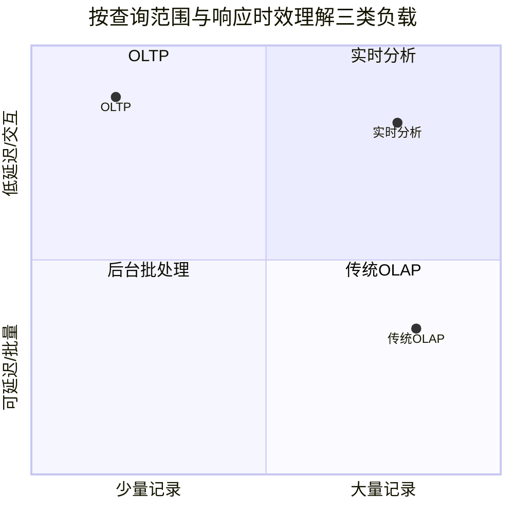

这张图只是概念定位，不是精确分类器。实际系统在数据规模、并发数、新鲜度和正确性上还有更多维度。

### 2.8 数据仓库：为什么要把分析与事务系统分开

早期系统曾让同一数据库同时承担事务和分析。SQL 对两类查询都能表达，但从 20 世纪 80 年代末到 90 年代初，企业逐渐把分析迁移到独立数据库，即 **数据仓库（data warehouse）**。

大型组织可能有几十乃至数百个运营系统，分别负责网站、门店收银、库存、运输路线、供应商、员工等业务。每个系统都复杂并由独立团队维护，久而久之形成相互隔离的数据孤岛。

直接在这些 OLTP 系统上分析通常不可取，作者给出四个原因。

#### 原因一：数据分散在多个孤岛

一个“每个地区的促销投入与退货率关系”问题，可能同时需要订单、营销、门店和退款系统的数据。单个 OLTP 数据库没有完整视图，跨系统现场连接又会遇到网络、权限和语义差异。

数据仓库把多个来源的副本集中起来，使跨业务查询成为可能。

#### 原因二：适合事务的模式与布局不适合分析

OLTP 数据模型通常强调减少重复、约束更新和快速定位单条记录；分析则偏好历史事实、面向扫描的数据布局和便于聚合的模型。同一份逻辑数据会因访问模式不同而采用不同物理组织。

第 3 章会讨论星型、雪花型等分析模式，第 4 章会讨论存储布局。本章先给出因果关系：**查询形态不同 → 最优数据布局不同 → 分离系统可以分别优化。**

#### 原因三：昂贵分析会干扰在线服务

一次全表扫描会消耗 CPU、内存、磁盘带宽和缓存。若与在线请求共享资源，分析师的一条临时查询可能抬高所有用户的尾延迟。

独立数据仓库提供 **工作负载隔离**：分析团队可以执行复杂查询，而不直接影响运营数据库。代价是需要复制数据，并接受一定新鲜度延迟。

#### 原因四：安全和合规边界

运营数据库可能位于不允许普通用户直接进入的网络中，包含敏感字段并承担关键业务。把经过选择、脱敏或聚合的数据复制到受控分析环境，可以缩小直接访问运营系统的人员和工具范围。

但复制并不会自动解决合规问题。仓库中的副本仍需访问控制、保留策略和删除机制，后文“法律与社会”部分会重新回到这个问题。

### 2.9 ETL 与 ELT：数据如何进入仓库

数据仓库保存各运营系统数据的只读副本。传统管道分为：

1. **Extract（抽取）**：从源数据库定期导出，或持续读取更新流；
2. **Transform（转换）**：清洗、统一类型和口径，转换为适合分析的模式；
3. **Load（加载）**：写入数据仓库。

这就是 **ETL**。若先把数据载入仓库，再利用仓库算力转换，顺序变为 Extract–Load–Transform，即 **ELT**。

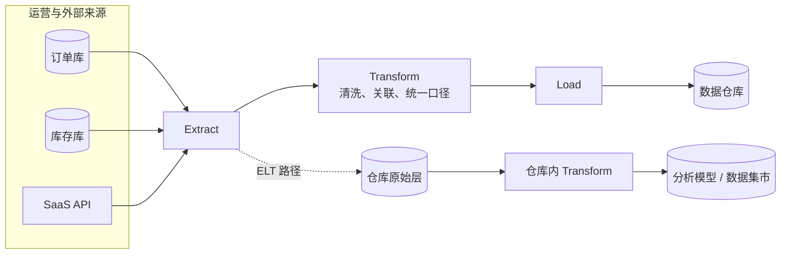

#### ETL 与 ELT 为什么没有绝对优劣

| 维度 | ETL 倾向 | ELT 倾向 |
| --- | --- | --- |
| 转换位置 | 专用管道或中间计算层 | 目标仓库内部 |
| 原始数据保留 | 可能在加载前丢弃或改变 | 常先保存原始副本 |
| 利用目标算力 | 较少 | 较多 |
| 敏感数据进入仓库前处理 | 更容易先过滤 | 需要严格控制原始层权限 |
| 重做转换 | 依赖是否保留原始数据 | 通常更方便 |
| 工具与技能 | 管道编程、专用引擎 | SQL 与仓库转换工具 |

选择取决于数据规模、目标仓库能力、隐私边界、转换语言和重算需求。不能因为 ELT 较新就认定它必然更好。

#### 一个正确数据管道需要满足什么

ETL 不只是把文件搬过去。至少要回答：

- 全量抽取期间源数据继续变化怎么办？
- 增量流中断后从哪里恢复？
- 同一事件重放两次会不会重复计数？
- 源模式增加或删除字段时如何演化？
- 多个源系统中的 ID、时间和业务定义如何统一？
- 目标表失败一半时如何回滚或重跑？
- 如何证明报表中的数字来自哪些源记录？

可以把一次派生写入抽象为：

$$
D_{t+1}=F(D_t,\Delta S_t)
$$

其中 $S$ 是源数据，$\Delta S_t$ 是本轮捕获的变化，$D$ 是目标派生数据。若同一变化可能被重复投递，理想情况下转换应具有幂等性：

$$
F(F(D,\Delta S),\Delta S)=F(D,\Delta S)
$$

这个公式是实践抽象，不是原章公式。它表示同一批变化重复应用，结果仍与应用一次相同。实现方式可能是稳定事件 ID、目标端唯一约束、版本号或可覆盖写入；并非所有聚合天然幂等，例如简单执行两次 `count = count + 1` 就会重复计数。

### 2.10 外部 SaaS 数据与连接器

CRM、邮件营销、信用卡处理等数据可能位于外部 SaaS 中。组织无法访问供应商底层数据库，只能通过 API 导出。把这些数据接入自己的仓库，能完成 SaaS 自带接口无法支持的跨系统分析。

原文列举 Fivetran、Singer 和 Airbyte 等专用连接器。连接器的价值在于封装：

- API 分页、限流与认证；
- 增量同步游标；
- 源模式变化；
- 重试与断点恢复；
- 目标表映射。

但使用连接器不等于数据质量自动有保证。团队仍需确认 API 是否遗漏历史、删除如何表达、字段语义是否稳定、供应商时区和速率限制如何影响新鲜度。

### 2.11 HTAP：一个接口背后仍可能是两套机制

**混合事务/分析处理（hybrid transactional/analytical processing，HTAP）**试图让同一系统同时支持 OLTP 与分析，减少把数据 ETL 到另一个系统的需要。

HTAP 有吸引力，因为它可以：

- 降低数据复制和管道延迟；
- 让分析更快看到最新事务状态；
- 简化应用面对的接口。

但许多 HTAP 系统内部仍把事务路径与分析路径分开，只是在共同接口后耦合两种存储或执行机制。这说明 OLTP/OLAP 区分是由工作负载决定的，不会因为产品只暴露一个名字而消失。

HTAP 也不会普遍取代企业数据仓库。企业通常让每个运营服务拥有自己的数据库，以保持服务边界；分析又需要跨多个运营系统组合数据，所以仍然需要集中分析平台。

HTAP 最适合的场景，是**同一应用**同时需要：

- 低延迟读写个别记录；
- 扫描大量最新记录做分析。

原文以欺诈检测为例：系统可能要写入当前交易，同时结合近期大量行为判断风险。是否选择 HTAP，仍要比较隔离性、数据新鲜度、成本和实现复杂度。

### 2.12 规模增长为何推动系统专用化

运营与分析分离属于更广泛的趋势：负载要求越高，系统越倾向针对特定工作负载优化。通用系统在小规模下可以同时“做得够好”；规模扩大后，不同访问模式对存储布局、缓存、并行和资源隔离的要求开始冲突，专用化收益才超过新增复杂度。

这个结论不能倒推为“小系统也应预先部署所有专用组件”。正确顺序是：

1. 用简单通用方案满足当前需求；
2. 通过监控确认哪个负载成为瓶颈；
3. 判断专用系统能否显著改善该瓶颈；
4. 把数据同步、运维和认知成本计入收益；
5. 只有净收益为正时才拆分。

### 2.13 从数据仓库到数据湖

数据仓库常采用关系模型和 SQL，非常适合业务报表，但数据科学任务经常超出关系查询的自然表达范围。

#### 机器学习数据准备

模型训练通常要把表中的行列转换成数值向量或矩阵，即 **特征（features）**。设计转换方式以提升模型表现的过程叫 **特征工程（feature engineering）**。它可能包含复杂统计、时间窗口、文本处理和领域逻辑，用纯 SQL 表达会很困难。

#### 非结构化数据处理

数据科学家还可能：

- 对评论文本执行自然语言处理，提取情感或主题；
- 对照片执行计算机视觉，提取结构化信息；
- 处理传感器序列、稀疏矩阵、特征向量或基因序列。

尽管可以向 SQL 增加 ML 算子，也可以在关系基础上构建高效 ML 系统，许多数据科学家仍偏好 Pandas、scikit-learn、R、Spark 等编程和分析环境。

#### 数据湖的定义

为了让数据以更灵活的形式可用，组织建立 **数据湖（data lake）**：从运营系统经数据管道获得数据副本，集中保存任何可能对分析有用的数据。

数据湖与数据仓库的关键差异是：数据湖以文件为基本载体，不强制统一文件格式、数据模型或模式。它可以包含：

- Avro、Parquet 等格式的数据库记录；
- 文本、图像和视频；
- 传感器读数；
- 稀疏矩阵与特征向量；
- 基因序列或其他领域数据。

数据湖通常建立在对象存储等通用文件存储上，因此相较关系存储更灵活，单位存储成本也往往更低。

### 2.14 数据仓库与数据湖不要混为一谈

| 维度 | 数据仓库 | 数据湖 |
| --- | --- | --- |
| 主要接口 | SQL、BI 工具 | 文件、DataFrame、计算框架及多种工具 |
| 数据模型 | 通常是经过设计的关系模式 | 不强制统一模型或模式 |
| 数据形态 | 结构化表和指标模型 | 结构化、半结构化、非结构化均可 |
| 转换时机 | 进入核心模型前或仓库内完成 | 常先保存原始数据，再由消费者转换 |
| 典型用户 | 业务分析师、分析工程师 | 数据工程师、数据科学家、ML 团队 |
| 优势 | 口径清晰，查询和治理较集中 | 灵活、便宜、保留多种原始材料 |
| 风险 | 模型变更慢，难容纳特殊数据 | 缺少目录、质量和治理时变成“数据沼泽” |

“仓库有模式、数据湖没有模式”也不够准确。数据湖中的 Parquet 文件依然可以有模式，读取程序也必须理解格式；区别是数据湖不要求所有内容先服从一个中央关系模型。常用说法是仓库偏 **写时模式（schema-on-write）**，湖偏 **读时模式（schema-on-read）**，但实际平台可能混合两者。

### 2.15 原始数据更好：寿司原则的收益与边界

数据管道有时让数据湖成为运营系统到数据仓库的中间站：

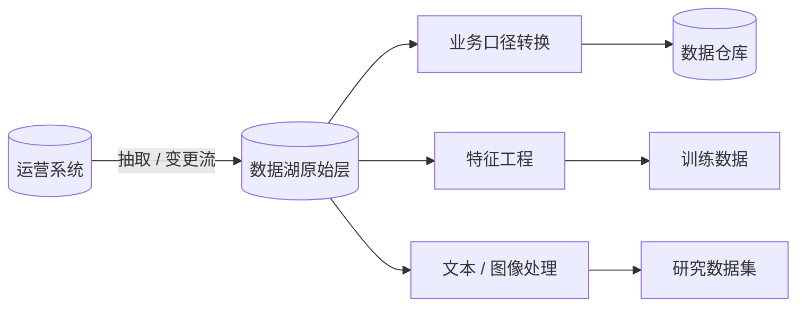

原始数据尚未被压缩进某一种关系模式，每个消费者可以按自己的需要转换。这种“原始数据更好”的主张被称为 **寿司原则（sushi principle）**。

它有效的前提是：

- 原始数据有清晰来源、版本和时间信息；
- 文件可发现，格式可读取；
- 敏感信息受到访问控制；
- 质量问题被记录而不是被隐藏；
- 转换过程可重现。

否则“保留一切原始数据”只会产生无法理解、无法治理的数据堆积。原始不等于正确，也不等于可以无限期合法保留。数据湖的灵活性必须与元数据、目录、血缘、质量和保留策略配套。

### 2.16 超越数据湖：DataOps、流与反向 ETL

随着分析实践成熟，组织开始重视分析系统和数据管道自身的管理与运维，这类思想常被概括为 **DataOps**。推动因素包括：

- 管道越来越多，需要自动化测试、部署和监控；
- 指标口径需要版本与变更管理；
- GDPR、CCPA 等法规要求治理、隐私和合规；
- 分析结果开始进入在线产品，错误的影响不再局限于内部报表。

#### 文件批处理与事件流

分析数据不再只有文件和关系表，也可能表现为持续事件流。文件分析可以每天重跑一次响应变化，事件流则能在秒级触发处理。

两者的差异不是“流一定比批先进”，而是对时间的要求不同：

- 日度财务汇总可能容忍批处理延迟，并更重视完整性与可重算；
- 欺诈或滥用识别越晚，损失越大，秒级流处理更有价值；
- 流处理也会增加乱序、迟到事件、状态恢复和持续运维难度。

#### 反向 ETL

分析结果有时会回到运营系统，这个过程常称 **反向 ETL（reverse ETL）**。例如，在分析系统中训练的模型被部署到生产，为终端用户生成推荐。


至此，数据流不再是单向“运营 → 仓库”。分析输出进入运营路径后，会影响用户行为并产生新数据，形成反馈环。团队必须考虑模型版本、在线离线特征一致性、回滚、偏差和错误影响。原文列举 TFX、Kubeflow、MLflow 等模型部署工具，但工具不会替代这些语义设计。

### 2.17 权威记录系统与派生数据系统

运营/分析划分关注 **工作负载和使用者**；作者随后引入另一组更适合描述 **数据来源关系** 的概念。

#### 权威记录系统

**权威记录系统（system of record）**也叫 **事实来源（source of truth）**，保存数据的权威或规范版本。新事实首先写入这里；每个事实通常只表示一次，即采用规范化表示。

如果其他系统与它不一致，按照定义，应以权威记录系统为准。例如：

- 订单数据库保存订单当前合法状态；
- 账户系统保存余额变化的权威记录；
- 人事系统保存员工雇佣信息的规范版本。

“权威”不是因为某数据库品牌天然更可靠，而是应用架构赋予它最终裁决角色。

#### 派生数据系统

**派生数据系统（derived data system）**中的内容，是对其他数据进行转换或处理的结果。理论上丢失后可以从原始来源重建。

典型派生数据包括：

- 缓存；
- 反规范化字段；
- 搜索索引；
- 物化视图；
- 格式转换后的分析数据；
- 基于数据集训练出的模型。

派生数据在信息意义上是冗余的，但这种冗余常是读取性能和查询能力的必要代价。一个来源可以产生多个视图，以适应不同访问模式。

### 2.18 两组分类不能互相替代

| 分类问题 | 第一类 | 第二类 | 判断依据 |
| --- | --- | --- | --- |
| 系统服务什么负载 | 运营系统 | 分析系统 | 读写模式、延迟、用户和查询方式 |
| 数据在来源链中的地位 | 权威记录 | 派生数据 | 是否是事实首次写入与最终裁决处 |

分析系统通常是派生系统，因为它消费其他地方产生的数据；运营服务却可能同时包含两者：主数据库是权威记录，缓存和搜索索引是派生系统。

同一种数据库软件也可以承担任一角色。PostgreSQL、对象存储或搜索引擎本身都不“天生”是权威或派生系统，角色取决于应用如何写入、如何恢复以及发生冲突时信任谁。

### 2.19 用派生函数理解架构

若权威源状态为 $S$，转换规则为 $f$，派生数据可抽象为：

$$
D=f(S)
$$

如果有多个阶段：

$$
D_1=f_1(S),\qquad D_2=f_2(D_1),\qquad D_3=f_3(S,D_2)
$$

整个系统形成一个派生关系图。只要保存了必要源数据和转换版本，派生节点理论上可以重建。

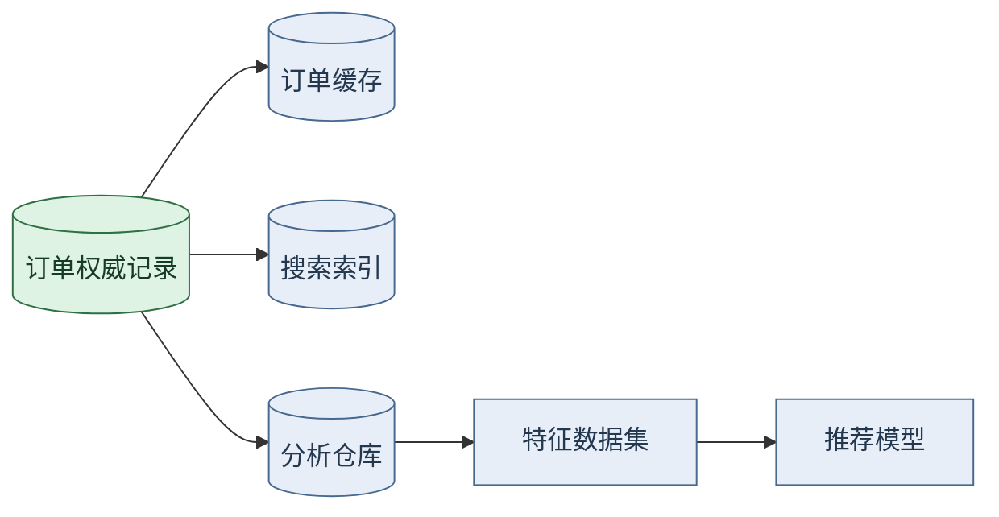

这个抽象带来四个直接问题：

1. **可重建性**：是否真的保留了全部输入和正确的转换版本？
2. **新鲜度**：源变化后，派生结果多久更新？
3. **一致性**：更新一半失败时，读者会看到什么？
4. **删除传播**：源数据删除后，所有派生节点如何处理？

### 2.20 派生数据的更新、延迟与恢复

源系统变化后，必须有进程更新派生数据。它可以是：

- 写请求内同步更新；
- 事务提交后发布变更事件；
- 读取数据库变更日志；
- 定期全量或增量批处理；
- 查询时按需计算。

若源在时刻 $t$ 的状态为 $S_t$，派生系统只处理到 $t-\delta$，则可写成：

$$
D_t=f(S_{t-\delta})
$$

$\delta$ 是传播滞后。它可能从毫秒到数天不等。关键不是让所有系统盲目追求零延迟，而是明确业务能容忍多大的 $\delta$，并对超出阈值告警。

同步更新可以降低暂时不一致，却增加在线请求延迟和耦合；异步更新隔离故障并提高写入可用性，却允许派生视图短暂陈旧。选择取决于查询是否参与关键决策，以及陈旧结果的代价。

#### “可以重建”也有前提

缓存丢失后从数据库读取，通常容易恢复；数百 TB 的搜索索引或训练数周的模型即使理论上可重建，恢复时间和计算成本也可能不可接受。因此派生系统仍可能需要备份、增量检查点或多副本。

可重建性是一种正确性来源，不代表恢复成本为零。架构必须同时记录：

- 重建所需源数据是否完整；
- 转换代码和依赖版本是否保留；
- 全量重建耗时与资源；
- 重建期间服务如何降级；
- 是否能验证新旧结果等价。

### 2.21 为什么明确数据来源能澄清复杂架构

许多数据库默认假设应用只使用它自己，不擅长把变化可靠传播到其他系统。现实应用却常需要数据库、缓存、索引、仓库和模型协同，数据集成因此成为独立难题。

明确“谁从谁派生”可以解决大量含糊问题：

- 冲突时知道以谁为准；
- 丢失时知道从哪里重建；
- 变更时知道需要通知哪些下游；
- 调试时能沿数据血缘定位错误；
- 删除时能枚举需要处理的副本；
- 迁移时能区分权威状态与可丢弃中间结果。

第 11 章将把数据管道作为数据集成方法详细讨论。本章在这里先完成一个关键铺垫：**组合数据系统的第一步，不是接通网络，而是定义数据的权威性与派生关系。**

### 2.22 本节小结：从访问模式到数据生命周期

运营系统与分析系统之所以分离，不是 SQL 能力不足，而是用户、查询形态、资源目标和权限边界不同。数据仓库通过 ETL/ELT 汇集多个运营来源；数据湖为更灵活的数据形态和数据科学工作提供文件级存储；流处理缩短反应时间；反向 ETL 又让分析结果进入运营系统。

权威记录与派生数据的区分则给这条生命周期增加方向：新事实先进入权威源，缓存、索引、仓库和模型从中派生。每增加一个派生视图，都获得一种读取或分析能力，同时增加更新、监控、重建和删除责任。这一结论将直接连接下一部分对云服务、自托管和分布式系统的比较。

## 3. 云服务与自托管

### 3.1 先区分两个决策：谁开发，谁运行

组织面对一项能力时，经常先问“自建还是购买”。作者提醒，软件场景中至少要分开两个问题：

1. **谁开发软件？** 是组织自行编写，还是采用开源、商业现成软件或 SaaS？
2. **谁部署和运行软件？** 是自己的团队负责，还是外部供应商负责？

两条轴组合后，选择不是简单二元对立：

| 软件来源 | 运行方 | 典型形态 | 控制与责任 |
| --- | --- | --- | --- |
| 自行开发 | 自己运行 | 内部定制系统 | 控制最高，开发与运维责任也最高 |
| 现成软件 | 自己运行 | 自托管开源或商业数据库 | 不承担主体开发，但负责部署、升级与故障 |
| 自行开发 | 云平台承载 | 自有应用运行在 IaaS/PaaS 上 | 控制应用，部分基础设施外包 |
| 供应商开发 | 供应商运行 | 托管数据库或 SaaS | 投入和底层控制较少，依赖供应商 |

常见经验法则是：构成组织核心能力或竞争优势的事情倾向于内部完成；非核心、例行且通用的能力可交给专业供应商。大多数公司不会自行制造 CPU，因为专业厂商的规模和经验使购买更经济。

这条经验并非绝对规则。支付、身份、数据库等通用能力也可能因监管、性能或差异化要求成为核心；内部开发也未必比成熟产品更有竞争力。正确问题是：**哪一层能力值得组织长期拥有，哪一层更适合购买服务等级。**

### 3.2 什么叫自托管、内部部署与 IaaS

**自托管（self-hosting）**指组织自己部署和运行现成软件。例如下载 MySQL 并安装到自己控制的服务器。服务器可以位于：

- 自己的机房；
- 租用的数据中心机架；
- 云中的虚拟机。

前两者通常统称 **内部部署（on premises）**。这个名称描述管理责任，不一定表示机器真的放在公司办公楼里。

在云虚拟机上自托管属于 **基础设施即服务（infrastructure as a service，IaaS）**：云提供商管理物理硬件和虚拟化，用户仍管理操作系统、数据库进程、补丁、备份和容量。把软件放进云 VM 并不会自动把它变成托管服务。

这个连续谱还包括修改开源软件、自行构建插件、购买商业许可后内部运行等中间形态。作者没有深入 Kubernetes 等部署工具，因为部署方式虽然重要，却不是决定数据系统架构的唯一或最主要因素。

### 3.3 云服务的本质：外包一部分运行责任

使用云服务而不是自行运行同类软件，本质上是把该软件的一部分运维交给供应商。供应商通常宣传更快上线、更省时间和更低成本，但这些收益并不自动成立，它们取决于：

- 团队是否已经具备自托管经验；
- 工作负载是否稳定可预测；
- 需求是否与标准服务匹配；
- 对定制、调试和控制的要求；
- 资源闲置比例与弹性价值；
- 供应商定价、数据传输和迁移成本。

如果团队已经熟悉某系统，而且所需机器数量长期稳定，购买机器并自行运行往往可能更便宜。反过来，如果团队不懂某项基础设施，采用托管服务常比从头招聘、培训和积累值班经验更快。

### 3.4 专业化运维与针对性调优的权衡

供应商为大量客户运行同一种服务，能够积累故障案例、自动化和规模化运维经验，理论上可能提供比普通用户自建更稳定的服务。

但共享服务必须满足广泛客户，通常不能为某个客户深度修改实现。自托管团队可以：

- 查看操作系统和进程级指标；
- 调整内核、文件系统和数据库参数；
- 修改源码或保留旧版本；
- 针对已知查询和硬件做专门优化。

因此，选择不是“专业供应商一定更可靠”或“自己最懂业务所以一定更好”，而是比较 **规模化通用经验** 与 **特定负载控制力**。

### 3.5 弹性为什么对波动负载特别有价值

如果系统必须按峰值配置固定机器，而大部分时间负载很低，资源会长期闲置。云服务可以更方便地按需求扩缩，尤其适合变化大的分析负载。

分析查询的特点是：为了尽快完成一次大型查询，需要短时间并行使用大量计算资源；查询结束后，这些资源又可能闲置。预定义日报可以排队调度，把工作摊平；临时交互查询无法轻易延后，用户越要求快速完成，资源需求越呈尖峰。

大数据集的短时查询可能从云弹性获益明显，因为使用后可以归还资源；小数据集所需资源有限，弹性带来的绝对差异也较小。

### 3.6 量化模型：何时云的弹性可能省钱

下面是帮助推理的简化模型，不是原书公式，也不能代替真实报价。

设峰值需要 $K$ 个计算单位，平均利用率为 $u$，其中 $0\le u\le1$。自托管每个峰值容量单位的月均成本为 $p_s$，云按实际使用的单位成本为 $p_c$。忽略其他费用时：

$$
C_{\text{self}}=Kp_s
$$

$$
C_{\text{cloud}}=uKp_c
$$

云计算成本更低的条件为：

$$
u<\frac{p_s}{p_c}
$$

假设云的单位使用价格是自有容量月均价格的 $2.2$ 倍，即 $p_c=2.2p_s$，则利用率临界点约为：

$$
u^*=\frac{1}{2.2}\approx45.5\%
$$

- 平均利用率为 $20\%$ 时，云计算部分约为固定容量成本的 $0.2\times2.2=44\%$；
- 平均利用率为 $80\%$ 时，云计算部分约为固定容量成本的 $1.76$ 倍。

这个例子只说明波动负载为何改变结论。真实 **总拥有成本（total cost of ownership，TCO）** 应扩展为：

$$
\begin{aligned}
C_{\text{self}}={}&C_{\text{hardware amortization}}+C_{\text{datacenter}}\\
&+C_{\text{license}}+C_{\text{operations}}+C_{\text{idle}}\\[4pt]
C_{\text{cloud}}={}&C_{\text{compute}}+C_{\text{storage}}+C_{\text{requests}}\\
&+C_{\text{network egress}}+C_{\text{operations}}'+C_{\text{migration risk}}
\end{aligned}
$$

还要加入折扣、峰值持续时间、扩缩速度、最低保有量、人员机会成本和故障损失。最大局限是：成本并非独立于架构，迁移到云后如果仍按固定机器方式运行，就可能得不到弹性收益。

### 3.7 云服务最大的代价：失去控制

作者逐项列出云服务的主要风险。

#### 缺少所需功能

供应商没有的功能，用户通常只能提出请求，无法自行实现。即使底层基于开源软件，托管接口也可能只开放其中一部分。

#### 服务故障时只能等待

如果供应商服务中断，用户无法直接修复底层系统。可以通过多区域、替代服务或降级路径减轻影响，但这些方案又会增加成本和复杂度。

#### 难以诊断性能与缺陷

自托管可以查看操作系统指标、服务器日志、进程状态甚至源码；托管服务通常只暴露有限指标。遇到特定使用方式触发的缺陷或抖动时，定位根因更困难。

#### 停服、涨价与供应商锁定

供应商可能关闭产品、显著涨价或改变产品方向。用户通常不能继续运行旧版本，只能迁移。若多个服务使用兼容标准 API，替换成本较低；专有 API、语义和数据格式则形成 **供应商锁定（vendor lock-in）**。

锁定不只来自 API，还可能来自：

- 数据量太大，迁移耗时和出口费用高；
- 身份、监控和权限体系深度耦合；
- 团队知识集中在一个平台；
- 应用依赖供应商特有语义；
- 合同和合规审核需要重新进行。

#### 地缘政治风险

若供应商位于另一个国家，政治冲突和制裁可能导致组织无法继续访问服务。架构中的司法辖区和供应链依赖因此不能只作为采购条款处理。

#### 安全与隐私信任

用户必须信任供应商保护数据，并证明这种处理符合监管要求。云提供商可以提供强大安全能力，但责任并未全部转移：错误权限、泄露密钥和不当数据用途仍可能由客户造成。

### 3.8 云、自托管与混合方案的决策表

| 场景特征 | 更支持托管云服务 | 更支持自托管 |
| --- | --- | --- |
| 团队经验 | 不熟悉底层系统，希望快速采用 | 已有成熟运维和自动化 |
| 负载 | 波动大，弹性价值高 | 稳定、长期高利用率 |
| 定制要求 | 标准能力足够 | 需要特殊硬件、源码修改或深度调优 |
| 可观测要求 | 供应商暴露信息足够 | 必须访问底层日志、进程和系统指标 |
| 迁移要求 | 有标准 API 和可移植数据 | 可接受长期绑定或自行控制版本 |
| 延迟 | 普通网络服务 | 极端低延迟，如高频交易 |
| 合规与地域 | 供应商认证和地域满足要求 | 特殊规则无法由现有服务满足 |
| 上线速度 | 时间紧，购买能力更快 | 有时间建设内部平台 |

现实中常采用混合方案：通用对象存储和消息服务使用云，极端低延迟或特殊合规部分内部运行；旧系统继续自托管，新系统逐步采用托管服务。混合不是自动的“兼得”，跨边界网络、身份、监控和数据一致性会成为新成本。

### 3.9 什么是云原生数据系统

云带来的变化不只是从购买硬件变成按月订阅。**云原生（cloud native）**描述从架构起点就利用云服务特性的系统。

几乎任何自托管软件都能放入云 VM 并作为托管服务提供，但这只是“运行在云上”。从头按云环境设计的系统可能获得：

- 同等硬件上更好的性能；
- 更快的故障恢复；
- 按负载快速调整计算资源；
- 支持更大的数据集。

原文列举的典型类别如下：

| 类别 | 传统自托管系统示例 | 云原生系统示例 |
| --- | --- | --- |
| 运营/OLTP | MySQL、PostgreSQL、MongoDB | AWS Aurora、Azure SQL DB Hyperscale、Google Cloud Spanner |
| 分析/OLAP | Teradata、ClickHouse、Spark | Snowflake、Google BigQuery、Azure Synapse Analytics |

表格是架构类别示例，不是性能排名。系统能力和部署选项会演进，判断云原生与否应看其存储、计算、故障和资源模型，而不是营销名称。

### 3.10 云服务的分层

传统自托管软件通常依赖通用资源：CPU、RAM、文件系统和 IP 网络。少数系统需要 GPU 或 RDMA，但多数可以运行在普通 Linux/Windows 环境。

IaaS VM 也提供 CPU、内存、磁盘和网络，只是能更快配置且规格更多。用户可以运行任意软件，同时负责管理它。

云原生的关键则是：高层服务不只使用操作系统资源，还建立在更低层云服务之上。

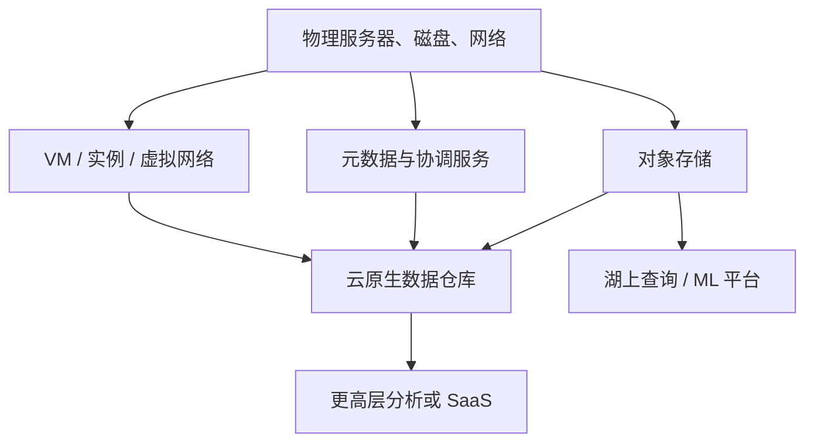

例如 S3、Azure Blob Storage、Cloudflare R2 等 **对象存储（object storage）**只提供比文件系统更有限的读写接口，却隐藏物理机器，并自动把数据分布到多台机器。单个磁盘或机器失效时，服务仍可保存数据。Snowflake 等分析数据库再建立于对象存储之上，更高层服务还可以继续建立在 Snowflake 之上。

### 3.11 抽象层越高，适用面通常越具体

高层抽象把低层机器管理、复制和恢复封装起来。当需求正好符合其目标场景时，采用高层服务通常比自己拼装低层组件省力。

但抽象越高，行为和接口越具体：

- 对象存储只承诺对象读写，不承诺完整 POSIX 文件系统语义；
- 数据仓库提供 SQL 与分析执行，不允许任意控制存储内部布局；
- SaaS 提供完整业务功能，却只允许通过既定 API 使用。

若高层服务不满足特殊需求，只能下降到更低层自行构建。下降一层会获得控制，也会重新承担被抽象隐藏的复制、扩展、升级和故障处理。

### 3.12 从本地磁盘到临时缓存

传统计算把磁盘视为持久介质：写入后假定不会因进程重启而丢失。为了容忍单盘故障，RAID 在同一机器连接的多个磁盘上维持冗余，对应用呈现普通文件系统。

云实例也可能有本地盘，但云原生系统常把它当成 **临时缓存（ephemeral cache）**，而不是长期权威存储，原因是：

- 实例失败时，本地盘可能不可访问；
- 为扩缩容替换实例时，新实例可能落在另一物理机；
- 临时实例的生命周期不应绑定长期数据。

这与前文权威/派生划分直接相连：本地盘若只保存可从远程持久层重建的数据，就可以随实例丢弃；若保存唯一权威副本，实例弹性就会威胁数据安全。

### 3.13 虚拟块设备：兼容传统软件的桥梁

云还提供可从一个实例解绑、再挂载到另一个实例的虚拟磁盘，如 Amazon EBS、Azure Managed Disks 和 Google Cloud Persistent Disk。

虚拟磁盘不是直接连接的一块物理盘，而是由另一组机器提供、模拟块设备的云服务。典型块大小约为 4 KiB。它的优势是传统磁盘软件无需大改即可上云；代价是模拟层和网络引入额外开销，而且每次虚拟块 I/O 本质上都是网络调用，应用会受到网络抖动影响。

这里体现兼容性与效率的权衡：

- 保留块设备接口，迁移成本低；
- 从头针对云存储服务设计，可以绕过部分兼容层开销，但要重写存储架构。

### 3.14 对象存储与数据库小值之间的粒度差异

S3 一类对象存储适合长期保存较大文件，常见对象从数百 KiB 到数 GiB；数据库的单行或单值通常小得多。若每个微小值都变成一个远程对象，请求数量、元数据和延迟成本会很高。

云数据库因此常采用分层：

- 小值、索引或元数据由适合细粒度访问的服务管理；
- 多个值组成较大的数据块后写入对象存储；
- 计算节点缓存热点数据块并执行查询。

这不是简单地把数据库文件上传到 S3，而是重新设计对象粒度、元数据索引、缓存和恢复机制。第 4 章会详细讨论具体存储方法。

### 3.15 存储与计算分离

传统机器同时承担磁盘存储和 CPU/RAM 计算；云原生系统则把两种责任部分解耦，也称 **存算分离（separation of storage and compute）**或 **解聚（disaggregation）**。

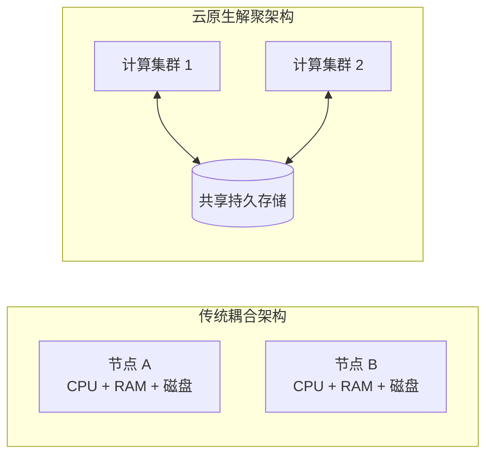

主要收益是：

1. 存储容量和计算能力可以独立扩缩；
2. 计算实例可以快速替换，持久数据不随之搬迁；
3. 多个计算集群可读取同一数据；
4. 空闲时可以释放计算资源而保留数据；
5. 存储层可集中实现复制与持久性。

主要代价是：

1. 数据必须经过网络进入计算节点；
2. 网络成为 I/O 路径和故障边界；
3. 缓存一致性与元数据协调更复杂；
4. 存储服务接口可能限制更新粒度；
5. 网络传输和请求计费可能显著。

### 3.16 量化模型：搬运数据的时间下界

设要传输的数据量为 $D$，可用带宽为 $B$，建立请求和首字节等固定延迟为 $L$。忽略排队、协议和重传开销时：

$$
T_{\text{transfer}}\ge L+\frac{D}{B}
$$

例如，通过 10 Gbit/s 链路传输 100 GB 数据，单看带宽的理论下界为：

$$
\frac{100\times8\ \text{Gbit}}{10\ \text{Gbit/s}}=80\ \text{s}
$$

真实时间会更长，因为吞吐不一定达到线速，还存在并发竞争、编码、协议和存储读取开销。这个计算解释了为什么大规模分析常强调“把计算带到数据附近”，而不是反复把数据送到远处计算。

对于大量小随机 I/O，固定延迟 $L$ 更突出；对于少量大块顺序传输，$D/B$ 更突出。对象大小、预取、缓存和并行请求都是在两部分之间做优化。

### 3.17 多租户：提高利用率与相互隔离的冲突

云原生服务常采用 **多租户（multitenancy）**：多个客户的数据和计算由同一服务、同一批共享硬件处理，而不是每个客户独占机器。

收益包括：

- 供应商可以把不同客户的波峰波谷错开，提高硬件利用率；
- 用户更容易按需扩缩；
- 升级、复制和管理由平台统一完成。

难点是必须防止一个租户影响另一个租户：

- 性能上的“吵闹邻居”争抢 CPU、内存、I/O 或网络；
- 安全隔离缺陷导致跨租户数据访问；
- 公平调度和配额限制某些高负载请求；
- 共享故障域造成相关中断。

因此，多租户不是单纯的资源共享，而是一套资源隔离、计量、调度和安全工程。

### 3.18 云时代的运维角色变化

传统上，数据库管理员（DBA）和系统管理员负责服务器端数据基础设施。DevOps 强调开发与运维共同对应用和基础设施负责；站点可靠性工程（SRE）是 Google 对这一思想的一种实践。

运维的高层目标始终没有改变：

- 把服务可靠地交付给用户；
- 配置基础设施并部署应用；
- 保持稳定生产环境；
- 监控并诊断影响可靠性的问题。

自托管时代大量工作围绕单机：预测磁盘何时耗尽、购买和配置新机器、迁移服务、安装操作系统补丁。云服务把单机隐藏在 API 后，固定容量磁盘也可变为按实际存储量计费，单机故障由服务内部吸收。

工作对象从“机器”转为“服务”，但目标没有被外包掉。

### 3.19 DevOps/SRE 强调的运行方式

作者列出五个重点：

1. 建立自动化，偏好可重复流程而非一次性手工操作；
2. 使用临时 VM 和服务，而非依赖长期不变的服务器；
3. 支持频繁发布应用更新；
4. 从事故中学习；
5. 即使人员流动，也保留组织对系统的知识。

这些原则彼此关联。临时实例要求配置自动化；频繁更新要求可靠部署和回滚；事故学习要求日志、时间线和改进措施；知识保留要求运行手册、代码化配置和共同值班，而不是依赖某位专家记忆。

### 3.20 运维没有消失，只是重新分工

云带来角色分化：

- 基础设施供应商的运维团队，专门为大量客户提供可靠底层服务；
- 云服务客户尽量少处理机器细节，把精力转向服务选择、集成、迁移、安全和成本。

客户仍需承担：

| 责任 | 为什么供应商不能完全代替 |
| --- | --- |
| 选择服务 | 供应商不知道业务语义和约束 |
| 跨服务集成 | 每个组件只承诺自身接口 |
| 应用安全与依赖管理 | 客户控制应用代码、权限和数据用途 |
| 负载监控 | 只有客户知道业务流量是否异常 |
| 性能与故障诊断 | 问题可能发生在客户服务之间 |
| 成本管理 | 按量计费会放大低效使用 |
| 迁移与退出 | 供应商没有动力替客户降低锁定 |

### 3.21 容量规划转化为财务规划

按量计费减少了“提前买多少磁盘”的传统容量规划，却没有消除资源规划：

- 不再担心物理盘立刻装满，却要避免账单失控；
- 性能优化同时成为成本优化，因为低效查询消耗更多计费资源；
- 自动扩缩若没有上限，流量异常可能迅速扩大费用；
- 服务仍有进程数、并发数、请求率等 **配额（quota）**，达到前必须提前申请或重新设计。

所以云中的问题从“有没有机器”部分转为“使用了多少、为何使用、单位业务价值是多少”。计量粒度更细，也要求成本能映射到团队、功能和数据产品。

### 3.22 集成成为云时代的主要复杂性

服务种类和供应商不断增加，而跨服务集成缺少统一标准。ETL 只是分析数据集成的一部分；运营云服务之间也要协调身份、事件、事务、重试、监控和版本。

购买多个托管服务能减少各自内部运维，却可能增加边界数量。若有 $n$ 个服务，潜在两两集成关系最多为：

$$
E_{\max}=\frac{n(n-1)}{2}
$$

现实架构不会让所有服务两两连接，但这个上界说明：组件数增加时，若没有分层、事件总线或稳定平台接口，连接复杂度可能按平方增长。

云改变了运维工作的层次，却没有降低对架构纪律的要求。选择服务时必须把集成和退出成本与购买便利一起计算。

### 3.23 本节小结：云选择的真正变量

云与自托管的权衡不等于“新与旧”或“便宜与昂贵”。主要变量是团队经验、负载波动、控制需求、调试能力、合规、迁移成本和服务抽象是否匹配。

云原生进一步改变技术架构：高层服务建立在低层服务上，持久存储与临时计算分离，本地磁盘变成缓存，多租户提高利用率但要求隔离。机器管理减少以后，跨服务集成、成本、配额、安全和供应商风险成为新的运维中心。

## 4. 分布式系统与单机系统

### 4.1 定义：只要多个进程通过网络协作，就是分布式系统

**分布式系统（distributed system）**由多台机器上的进程通过网络通信组成。参与系统的每个进程称为 **节点（node）**。

“分布式”不只指大型数据库集群。浏览器调用后端、后端调用云数据库、两个微服务互相请求，都已经跨越网络，因此具有分布式系统的部分问题。规模不是定义，通信和独立故障边界才是。

作者按动机列出多种采用分布式系统的原因。理解动机很重要，因为不同动机需要不同架构，不能用“扩展性”笼统概括。

### 4.2 原因一：问题本身天然分布

若两个或更多用户各自在自己的设备上交互，设备之间必然通过网络通信。协作文档、聊天和多人游戏即使数据量很小，也天然分布。

这种场景无法靠购买更大的单机消除网络。设计重点是离线、消息顺序、同步冲突和身份，而不一定是吞吐扩展。

### 4.3 原因二：云服务之间的请求

数据保存在一个服务、由另一个服务处理时，数据必须经过网络。云原生存算分离和微服务分解因此天然分布。

每增加一次远程调用，就增加延迟、超时、认证、配额和独立故障的可能。服务抽象越方便，越容易忘记其底层是一条网络路径。

### 4.4 原因三：容错与高可用

为了在机器、网络甚至整个数据中心故障时继续服务，可以在多台机器上保存冗余，由健康节点接管。

冗余提供的是潜在容错能力，而不是自动高可用。系统还必须解决：

- 如何检测故障；
- 如何选出接管者；
- 接管者的数据是否足够新；
- 客户端如何找到新节点；
- 原节点恢复后如何避免双写冲突。

更多副本会提高故障覆盖范围，也会增加复制和协调成本。第 2、6 章会进一步讨论可靠性和复制。

### 4.5 原因四：突破单机容量与吞吐上限

当数据或计算需求超过一台机器的能力，可以把数据和负载分散到多台机器。这里需要区分：

- **纵向扩展（scale up）**：换用更多 CPU、内存和磁盘的更大机器；
- **横向扩展（scale out）**：增加机器数量并分配工作。

横向扩展上限看似更高，但要求分区、路由、再平衡和跨节点协调。只要单机仍能经济地满足目标，纵向扩展可能更简单。

### 4.6 原因五：降低全球用户的传播延迟

全球用户若都访问一个地域，网络包必须跨越很长物理距离。把服务器部署到多个地域，让用户访问较近节点，可以降低传播延迟。

但多地域数据带来新的问题：

- 用户更新在哪个地域生效；
- 其他地域多久看到更新；
- 地域间断网时能否继续写；
- 同一用户移动后如何路由；
- 哪些数据受地域法律限制。

物理距离不能由软件优化消除，只能通过部署位置和一致性选择管理。

### 4.7 原因六：弹性

负载有明显峰谷时，云部署可增加或释放节点，让费用更接近实际使用。单机必须按峰值规格配置，即使空闲时也不能只退还一部分 CPU 或内存。

弹性有效的前提是状态不绑定实例、扩容速度快、数据能均匀分配。无状态计算较容易弹性伸缩；有状态数据库新增节点时可能需要搬迁大量数据，无法瞬时完成。

### 4.8 原因七：使用专用硬件

不同任务可以放到适合的硬件：

- 对象存储节点配置大量磁盘、较少 CPU；
- 分析节点配置大量 CPU 和内存、不必拥有本地持久盘；
- ML 训练节点配置 GPU；
- 网络密集型服务可能需要高带宽接口。

专用化提高单位任务效率，却要求数据跨硬件边界传输和协调。存算分离正是这种资源解耦的体现。

### 4.9 原因八：法律与数据驻留

某些司法辖区要求特定个人数据在当地存储和处理。规则可能只覆盖医疗或金融数据，也可能更广。服务面对多个此类地区时，必须按地域分布数据。

这类分布不是性能优化，而是硬约束。它可能限制全局备份、跨地域分析和集中模型训练，要求系统按数据主体和用途进行路由。

### 4.10 原因九：可持续性

如果任务的时间和地点可调整，可以在可再生能源丰富、电网压力较低的地域和时段运行，减少碳排放并利用低价电力。

这更适合可延迟批任务；持续面向用户的低延迟服务受到地域和时间约束。把工作迁移也要考虑数据搬运能耗、用户延迟和当地法规，不能只看计算时刻的电价。

### 4.11 采用分布式系统前先确认是哪种动机

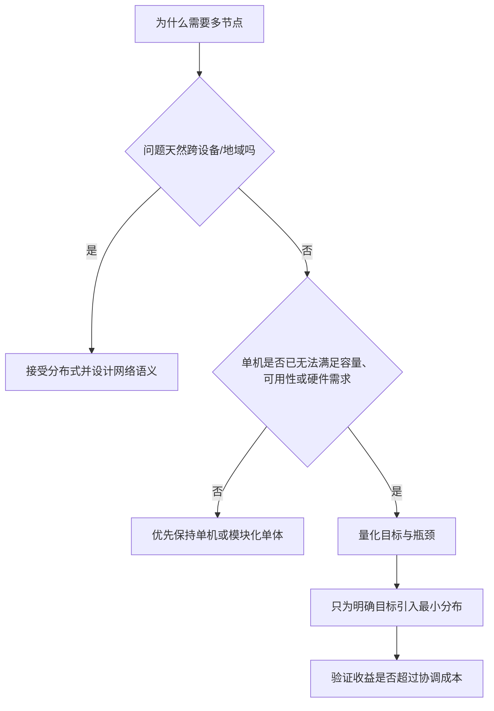

不同动机也可能同时存在。例如全球支付系统既需要地域部署，也需要高可用和合规。但明确动机能判断成功标准：若目标是降低用户延迟，就应测地域延迟；若目标是容量，就应测扩展效率，而不是只展示节点数量。

### 4.12 分布式系统的首要难题：请求结果不确定

每次网络请求都可能遇到服务过载、进程崩溃、网络中断或响应丢失。客户端超时没有收到结果时，无法仅凭超时判断服务端做了什么：

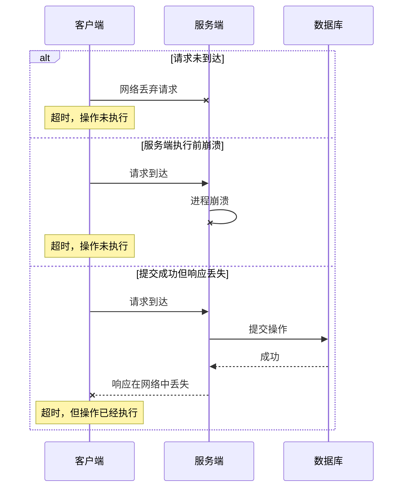

对只读请求，重试通常只增加负载；对“扣款”“发货”“发送邮件”等副作用，盲目重试可能执行两次。不重试又可能漏掉一次本应执行的操作。

这就是 **部分失败（partial failure）** 的核心：客户端和服务端可能对同一操作拥有不同、且暂时无法统一的认知。

### 4.13 实践推导：幂等键如何让重试更安全

常见方法是让客户端为逻辑操作生成稳定的 **幂等键（idempotency key）**。所有重试携带同一个键，服务端持久记录已处理键及结果。

```text
function handle(request_key, payload):
    begin transaction

    previous = lookup_result(request_key)
    if previous exists:
        commit
        return previous

    result = apply_business_change(payload)
    insert_unique(request_key, result)

    commit
    return result
```

正确性的关键不是 `if` 语句，而是“检查键、业务变更、保存结果”处在同一原子事务中，并且 `request_key` 有唯一约束。两个并发重试只有一个能成为首次执行者，另一个读取已保存结果。

局限包括：

- 若副作用发生在无法加入同一事务的外部系统，还需要外部系统也支持幂等键，或通过对账补偿；
- 幂等记录不能过早删除，否则迟到重试会再次执行；
- 相同键配不同请求内容必须拒绝；
- 幂等避免重复副作用，不自动保证跨多个服务的整体事务一致性。

第 9 章会更深入讨论网络和超时问题；此处的要点是：重试策略必须与操作语义共同设计。

### 4.14 远程调用为什么比本地函数慢得多

同进程函数调用主要涉及 CPU 指令和内存；远程调用还要经历序列化、系统调用、网络栈、排队、传输、远端调度和反序列化。即使数据中心网络很快，固定开销仍远大于普通函数调用，而且尾延迟受共享资源影响。

大数据量场景还要支付前述 $D/B$ 传输成本。因此，“把数据搬到计算”与“把计算带到数据”之间需要权衡。若只运行一个很小的过滤程序，把程序发到存储附近通常比把整个数据集拉走更经济。

### 4.15 更多节点并不自动更快

分布式执行引入：

- 数据切分与传输；
- 任务调度；
- 节点间同步；
- 慢节点等待；
- 中间结果合并；
- 失败检测和重试。

如果任务本身不大，协调开销可能超过并行收益。原文引用的研究甚至展示，单机单线程程序可以胜过拥有 100 多个 CPU 核心的集群。

#### 背景补充：Amdahl 定律解释并行上限

设程序中不可并行比例为 $s$，其余部分可在 $N$ 个节点上理想并行，额外分布式开销比例为 $o(N)$，则加速比近似为：

$$
S(N)=\frac{1}{s+\frac{1-s}{N}+o(N)}
$$

若 $s=0.05$、$N=100$ 且暂不计额外开销：

$$
S(100)=\frac{1}{0.05+0.95/100}\approx16.8
$$

使用 100 个执行单元，理想加速也只有约 16.8 倍，因为 5% 串行部分形成瓶颈。若再有 $o(100)=0.02$ 的通信和调度开销：

$$
S(100)=\frac{1}{0.05+0.0095+0.02}\approx12.6
$$

该模型假设问题规模固定、并行部分均匀，是直觉工具而非精确预测。真实系统还有缓存、数据倾斜和故障。它解释了评估扩展性时为什么必须比较“增加多少资源，性能改善多少”，而不是只展示系统能启动多少节点。

### 4.16 COST 思维：先问单机基线

评估分布式系统时，应建立高质量单机基线，并计算分布式配置要使用多少资源才能超过它。若复杂集群需要大量节点才勉强追平一个优化良好的单线程实现，所谓“可扩展”可能隐藏了低效率。

应同时报告：

- 数据量与任务定义；
- 单机硬件和实现；
- 集群总 CPU、内存和网络资源；
- 完成时间、吞吐和尾延迟；
- 节点增加后的加速效率；
- 成本和故障情况下的表现。

单机基线不是为了否定分布式，而是确保分布式复杂性换来了实际收益。

### 4.17 分布式故障为何难以诊断

当请求变慢，问题可能来自客户端、DNS、负载均衡、某个服务、其数据库、下游 API 或网络。单看某台机器的日志无法还原跨服务路径。

**可观测性（observability）**通过收集系统执行数据，并允许从高层指标下钻到单个事件，帮助回答未知问题。常见信号包括：

- 指标：请求率、错误率、延迟、队列长度和资源利用率；
- 日志：带上下文的离散事件；
- 追踪：一次请求跨服务的调用链和每段耗时。

OpenTelemetry、Zipkin、Jaeger 等追踪工具会传播 trace ID 和 span 上下文，记录谁调用谁、执行什么操作、耗时多久。

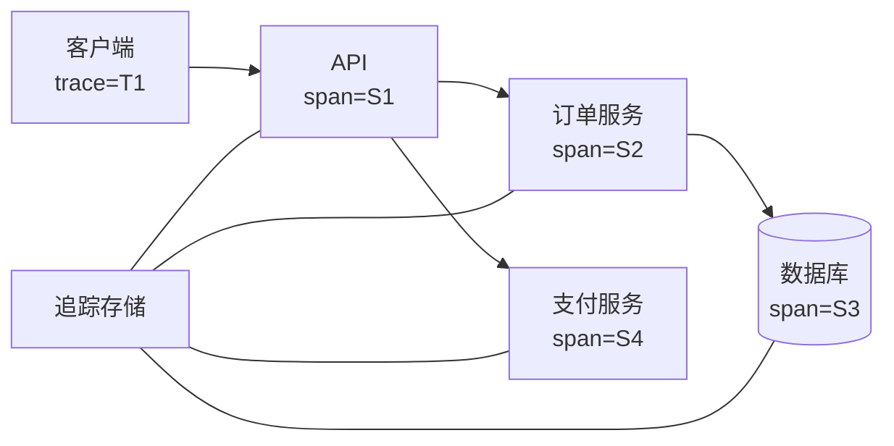

追踪本身也有限制：采样可能漏掉罕见事件，时间戳可能不完全同步，日志可能缺少业务上下文，采集还会带来成本。可观测性必须在设计时加入，不能等事故发生后才希望系统自动解释自己。

### 4.18 跨服务数据一致性成为应用责任

单个数据库可以提供事务和一致性机制；当每个服务拥有自己的数据库时，跨数据库一致性不再由某一个数据库自动负责。

例如创建订单并扣减库存：

1. 订单服务写入订单库；
2. 库存服务写入库存库；
3. 任一步失败都可能留下中间状态。

分布式事务可以协调多个参与者，但在微服务中很少使用，原因包括：

- 许多数据库或外部服务不支持同一协议；
- 协调器增加延迟与可用性依赖；
- 跨服务锁定削弱服务独立部署和演化；
- 参与者故障会延长不确定状态。

不用分布式事务并不等于不需要一致性，而是应用要通过事件、状态机、幂等、补偿和对账定义可接受的中间状态。第 8 章会详细讨论事务。

### 4.19 为什么单机仍然值得优先考虑

现代 CPU、内存和磁盘容量更大、速度更快且更可靠。DuckDB、SQLite、KùzuDB 等单机数据库让许多分析、嵌入式和图工作负载在一个节点上完成。

单机优势包括：

- 没有节点间网络失败；
- 函数和本地存储访问延迟低；
- 事务边界更直接；
- 部署、测试和调试简单；
- 资源成本容易理解。

单机也有上限和单点故障风险，但可以先通过备份、热备或只读副本解决可靠性，而不必把每个内部模块都拆成远程服务。

作者的建议不是“永远不要分布式”，而是：**如果单机能满足需求，不要急于分布式；只有明确收益超过复杂性时才跨越网络边界。**

### 4.20 客户端/服务器与服务化

最常见的分布方式是客户端向服务器发请求，通常使用 HTTP。一个进程可以同时是：

- 对调用它的上游而言是服务器；
- 对它调用的下游而言又是客户端。

这种架构过去称 **面向服务架构（service-oriented architecture，SOA）**，后来演化出 **微服务架构（microservices architecture）**。

微服务通常具有：

- 一个定义清楚的目的；
- 通过网络 API 暴露能力；
- 一个负责维护它的团队；
- 可独立部署和演化的实现；
- 常由服务独占自己的数据库。

云原生系统大量采用服务分解，但本地部署同样可以使用 SOA；“微服务”与“云”不是同义词。

### 4.21 微服务的收益来自边界

把复杂软件拆成服务可能带来：

1. **独立更新**：团队可以发布自己的服务，减少跨团队同步；
2. **资源专用化**：不同服务按负载选择 CPU、内存、磁盘或 GPU；
3. **实现封装**：客户端只依赖 API，服务团队可替换内部实现；
4. **故障隔离潜力**：设计得当时，一个服务异常不必拖垮全部功能；
5. **责任明确**：一个团队负责服务的开发、运行和演进。

这些收益都依赖边界质量。若服务之间频繁同步调用、共享数据库表、必须同时发布，物理拆分只增加网络而没有获得独立性。

### 4.22 为什么常采用每服务独立数据库

共享数据库会把表结构变成所有服务共同依赖的隐式 API：任何字段或索引变化都可能影响其他团队，某服务的昂贵查询也会争抢共享资源。

独立数据库使服务通过显式 API 管理数据，内部模式可以自由变化。不过，它把部分复杂性转移到跨服务：

| 共享数据库 | 每服务独立数据库 |
| --- | --- |
| 本地事务容易覆盖多张共享表 | 跨服务操作需要消息、状态机或补偿 |
| 直接连接查询方便 | 跨服务分析要复制或调用 API |
| 模式和资源相互耦合 | 数据重复与最终一致性更常见 |
| 单一权限边界可能过宽 | 每个服务可缩小访问边界 |
| 变更需要多团队协调 | 服务内部可独立演化 |

所以“数据库每服务一个”不是免费最佳实践，而是用数据集成复杂性换取团队和实现独立性。

### 4.23 微服务的基础设施税

服务数量增加后，每个服务都需要：

- 构建、测试和部署流水线；
- 资源配置与自动扩缩；
- 日志、指标和追踪；
- 健康检查和告警；
- 认证、授权和密钥；
- 值班与故障响应；
- 本地开发所需的依赖环境。

测试一个服务时还要运行或模拟其依赖。Kubernetes 等编排框架提供部署、调度和健康管理基础，却不会替应用定义 API 兼容性、数据一致性或失败语义。

如果组织只有少数团队，协调成本本来就低，微服务的基础设施税可能高于独立发布收益。模块化单体通常是更简单的起点。

### 4.24 API 演化为何比函数重构困难

远程客户端可能由其他团队维护，发布节奏不同。服务端增加、删除或改变字段时，旧客户端仍可能运行，破坏性变化往往直到预发布或生产集成才暴露。

OpenAPI、gRPC 等接口描述标准可以：

- 明确定义请求和响应结构；
- 生成客户端与服务端代码；
- 在构建时发现部分类型不兼容；
- 支持契约测试和版本管理。

但它们不能自动解决语义变化。例如字段类型不变却改变含义，仍会破坏客户端。安全演化通常偏好新增可选字段、保留旧行为一段时间、记录弃用并观察客户端迁移。

### 4.25 微服务首先解决组织问题

作者给出一个非常重要的判断：微服务主要是用技术手段解决人的问题，即让不同团队减少协调、独立推进。

可以把采用微服务的净收益抽象为：

$$
B_{\text{net}}=B_{\text{team independence}}+B_{\text{resource isolation}}-
C_{\text{network}}-C_{\text{operations}}-C_{\text{data integration}}
$$

这个式子不是可直接测量的原书公式，而是提醒评审者同时计算两边。大型组织的团队协调成本可能很高，因而独立性收益显著；小团队内部沟通直接，拆分服务很可能只是额外开销。

技术边界应该跟随稳定的业务和团队边界，而不是为了追求服务数量。

### 4.26 Serverless/FaaS：把实例分配也交给供应商

**Serverless** 或 **函数即服务（function as a service，FaaS）**进一步外包基础设施管理。

VM 模型要求用户显式决定何时启动和关闭实例；Serverless 由供应商根据请求自动分配和释放资源。计费从“实例运行多久”变成“代码实际执行多少”，类似云存储把预购磁盘转为按使用量计费。

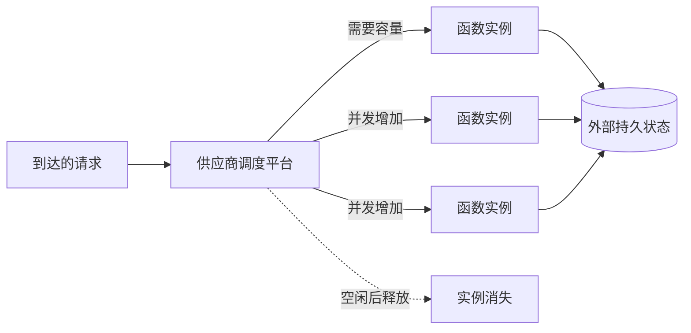

为实现自动调度，许多平台会限制：

- 单次函数执行时间；
- 可用运行时和系统能力；
- 本地状态持久性；
- 并发数和资源规格。

首次调用还可能经历 **冷启动（cold start）**，导致较高延迟。后续执行也可能落在不同机器，所以应用不能把实例内存当成长期状态。

“无服务器”并不表示没有服务器，而是使用者不直接管理它们。BigQuery 和某些 Kafka 服务也采用 serverless 名称，通常强调自动扩缩和按使用计费，不一定采用函数执行模型。阅读产品说明时应确认具体资源和语义，而不是只看标签。

### 4.27 云计算与高性能计算不是同一种大规模系统

大规模计算的另一条路线是 **高性能计算（high-performance computing，HPC）**，也叫超级计算。它与云有交集，但目标和假设不同。

| 维度 | 云/企业数据系统 | HPC/超级计算 |
| --- | --- | --- |
| 典型任务 | 在线服务、业务数据、持续分析 | 天气、气候、分子动力学、偏微分方程、优化 |
| 运行形态 | 持续服务用户 | 大型批作业 |
| 节点故障 | 希望服务继续，只局部降级或切换 | 常停止作业、修复并从检查点重启 |
| 网络与内存 | IP/Ethernet，服务间隔离 | 共享内存、RDMA、高带宽低延迟 |
| 信任模型 | 多租户彼此不信任 | 用户和节点通常处于较高信任域 |
| 网络拓扑 | 常见 Clos，强调高二分带宽 | 网格、环面等适配已知通信模式 |
| 地理位置 | 可跨多个地域 | 节点通常紧密部署在同一设施 |
| 首要目标 | 可用性、隔离、弹性 | 单个科学任务的总完成时间 |

同样是“很多机器”，故障处理却完全不同。在线服务不能轻易停掉整个集群等待维修；长时间科学批作业则可以周期保存状态，失败后从检查点恢复。

### 4.28 背景补充：检查点间隔如何权衡

设保存一次检查点需要 $C$ 分钟，两次检查点间隔为 $I$ 分钟，机器或作业平均每 $M$ 分钟发生一次故障。做两个简化假设：故障在间隔内均匀发生，且失败后平均丢失 $I/2$ 的计算。

单位时间浪费比例近似为：

$$
W(I)\approx\frac{C}{I}+\frac{I}{2M}
$$

第一项表示间隔越短，检查点本身越频繁；第二项表示间隔越长，故障时平均丢失工作越多。令导数为零：

$$
\frac{dW}{dI}=-\frac{C}{I^2}+\frac{1}{2M}=0
$$

得到近似最优间隔：

$$
I^*\approx\sqrt{2CM}
$$

若检查点耗时 $C=2$ 分钟，平均故障间隔 $M=1440$ 分钟，则：

$$
I^*\approx\sqrt{2\times2\times1440}\approx75.9\ \text{分钟}
$$

该推导用于解释 HPC 中“周期检查点 + 整体重启”的合理性，不是原章公式。它忽略了重启时间、相关故障、增量检查点和检查点对运行性能的影响，不能直接作为生产参数。

### 4.29 网络拓扑反映工作负载假设

云数据中心常基于 IP 和 Ethernet，使用 Clos 拓扑提供较高 **二分带宽（bisection bandwidth）**：把网络节点分成数量近似的两半时，两半之间可同时传输的总带宽。它适合通信对手较动态的通用服务。

超级计算机常使用多维网格或环面拓扑。科学任务的通信模式较可预测，可以把相互交换数据的进程映射到邻近节点，以更少跳数获得更高效率。

RDMA 允许一台机器直接访问另一台机器的内存，降低 CPU 和软件栈开销，却需要更强信任和安全设计。公有云的互不信任多租户环境必须增加虚拟机隔离、加密和认证。

这里再次体现本章方法：硬件和网络没有绝对“更先进”的选择，设计取决于任务、故障和信任模型。

### 4.30 分析系统为何会借鉴 HPC

大规模分析同样执行并行批任务、扫描大量数据并进行节点间交换，因此有时会借鉴 HPC 的网络、调度和并行技术。

但本书主要关注持续可用的数据服务。借鉴时必须检查假设差异：

- 分析平台能否接受作业整体失败重启？
- 多个租户之间是否互相信任？
- 通信模式能否提前确定？
- 用户查询是否要求低尾延迟？
- 节点是否跨地域？

只复制高性能技术而忽略安全、故障和可用性模型，会得到不适合服务环境的系统。

### 4.31 本节小结：分布式是有成本的手段

分布式系统可以解决天然跨设备、跨服务、容错、容量、全球延迟、弹性、专用硬件、数据驻留和可持续性问题。但网络让结果变得不确定，远程调用显著慢于本地调用，节点越多协调和调试越难，跨服务一致性也转移给应用。

微服务用网络边界换取团队独立和实现封装，只有组织协调收益足够大时才值得；Serverless 进一步外包实例管理，用运行限制和供应商依赖换取自动扩缩。HPC 则说明，同样的多节点硬件可以在完全不同的可用性、信任和故障假设下设计。

因此，单机不是落后的默认项，而是复杂度较低的基线。只有明确哪项需求无法由单机满足，并验证分布式收益超过通信、运维与一致性成本后，才应跨越这条边界。

## 5. 数据系统、法律与社会

### 5.1 架构不仅由技术和商业目标决定

前面几组权衡已经表明，数据架构受访问模式、组织结构、成本和故障目标影响。作者在最后一节把边界继续向外扩展：工程师不能只服务部署系统的企业，还对数据涉及的个人和更广泛社会负有责任。

这是本章论证的重要转折。传统架构评审经常只问：

- 系统是否正确？
- 延迟和吞吐是否达标？
- 成本是否可接受？
- 团队能否维护？

当系统保存人的行为数据或参与影响人的决策时，还必须问：

- 收集和使用数据是否有明确、正当的目的？
- 当事人有哪些知情、访问、更正和删除权利？
- 系统出错或被滥用时，谁会受到伤害？
- 数据是否会强化不公平偏差？
- 即使当前合法，这种设计是否仍然符合应有的伦理标准？

法律和伦理不是功能完成后的审批附件，它们会改变数据模型、日志、复制、保留和派生管道的基础设计。

### 5.2 隐私与 AI 法规为何成为工程约束

自 2018 年起，欧盟《通用数据保护条例》（GDPR）赋予许多欧洲国家居民对个人数据更强的控制和法律权利。世界其他国家和地区也采用了类似法规，例如 California Consumer Privacy Act（CCPA）。欧盟《人工智能法案》（EU AI Act）等 AI 法规进一步限制某些个人数据和自动化系统的使用方式。

对工程师而言，法规会转化为技术问题：

- 如何识别某个人的全部数据？
- 数据存在哪些地域和供应商？
- 哪些处理具有合法目的和授权？
- 用户撤回同意后，后续管道如何停止？
- 删除请求怎样传播到缓存、索引、仓库和备份？
- 自动化决策如何保留审计证据？
- 模型训练数据与输出能否追踪来源？

本文对法律原则的说明用于理解架构，不构成法律意见。具体义务取决于司法辖区、数据类型、组织角色和实际用途，应由合格法律与合规人员共同判断。

### 5.3 没有明确法规，也不能忽略社会影响

计算机系统已经影响人们获得新闻和形成政治观点的方式，也越来越多地参与具有重大后果的决定，例如：

- 谁能获得贷款或保险；
- 谁会被邀请参加工作面试；
- 谁会被系统标记为涉嫌犯罪；
- 哪些信息被推荐、降权或屏蔽。

这些系统把历史数据、模型和业务规则转化为现实机会。即使代码按规格运行，规格本身也可能造成不公平结果；即使平均准确率很高，错误也可能集中伤害特定群体。

所以“模型没有主观意图”不能免除设计者责任。责任分布在整个链路：提出目标的人、收集数据的人、训练模型的人、实现服务的人、批准上线的人和持续运行的人都影响结果。

作者并不要求每位工程师成为法律和伦理专家，而是要求基本意识达到与分布式系统基础知识相似的重要程度：知道问题存在，能在设计早期提出问题，并在需要时引入专业人员。

### 5.4 被遗忘权与不可变数据结构的冲突

GDPR 包含数据主体请求删除其个人数据的权利，常称 **被遗忘权（right to be forgotten）**。这与许多数据系统依赖的 **仅追加日志（append-only log）**或不可变文件形成直接张力。

不可变结构受欢迎的原因包括：

- 顺序追加写入简单、高吞吐；
- 历史事件支持审计和重放；
- 复制节点可按日志位置追赶；
- 派生视图可以从历史重新计算；
- 避免原地修改带来的部分写入和碎片。

但“不可变”意味着已有记录通常不会原地改写。若某条记录位于大文件中间，怎样只删除它而不破坏其余日志？如果它已进入索引、仓库、训练集和模型，又该怎样传播删除？

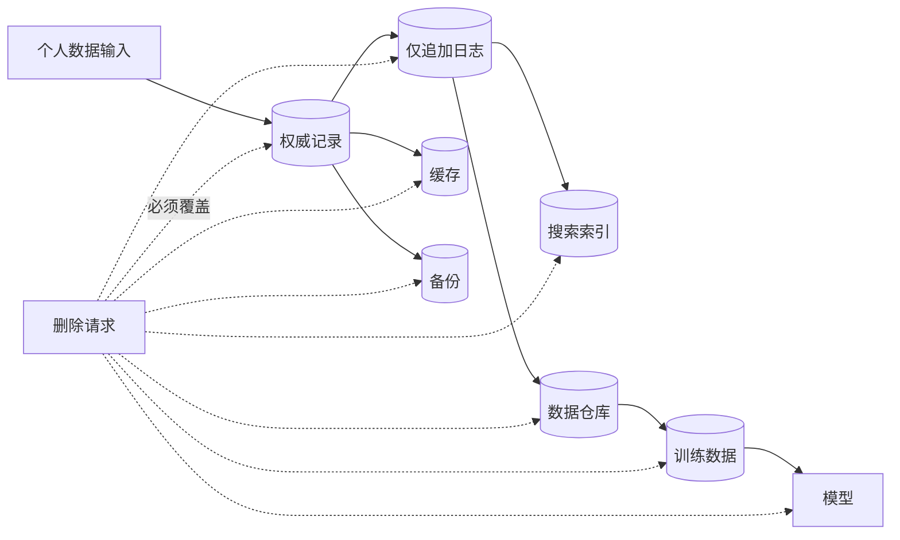

图中最重要的不是箭头数量，而是前文建立的派生关系：只有知道数据从哪里流向哪里，才能枚举删除责任。

### 5.5 “逻辑删除”为什么通常不等于真正删除

把记录标记为 `deleted = true` 可以让普通查询不再返回它，却可能仍在：

- 主表旧版本与事务日志；
- 缓存和搜索索引；
- 数据仓库快照；
- 对象存储文件；
- 备份与灾难恢复副本；
- 下游团队导出的数据集。

逻辑删除可作为异步清理的起点，但不能自动证明数据已经擦除。实际机制可能包括：

- 后台压缩时重写文件并移除目标记录；
- 为记录或用户使用独立加密密钥，删除密钥使密文不可恢复，即“密码学删除”；
- 让备份按有限保留期自然过期，并防止删除后数据重新进入在线系统；
- 向每个派生系统发送删除事件并验证完成；
- 对无法局部更新的模型评估重训、去学习或其他措施。

这些是背景方法，不代表任一方法在所有法律环境下都足够。密码学删除依赖密钥确实不存在其他副本；备份延迟删除必须有明确策略和访问限制；模型是否保留个人信息也需要具体分析。

### 5.6 实践推导：删除是一项跨系统工作流

可以把删除处理建模为数据依赖图 $G=(V,E)$：节点 $V$ 是数据集或系统，边 $(a,b)$ 表示 $b$ 派生自 $a$。删除不能只在源节点执行，还要沿可达边传播。

```text
function erase(subject_id):
        authenticate_and_authorize_request(subject_id)
        affected = discover_all_data(subject_id)
        freeze_new_processing_for_prohibited_purposes(subject_id)

        for node in dependency_order(affected):
                apply_node_specific_erasure(node, subject_id)
                record_non_sensitive_completion_evidence(node)

        verify_no_queryable_copy_remains()
        schedule_backup_expiry_checks()
        report_completion_or_unresolved_exception()
```

为什么按依赖顺序处理？如果先删下游、源系统仍继续发出旧状态，下游可能立刻被重新填充。一个稳妥流程要先阻止不允许的新处理，再清理权威与派生副本，并防止备份恢复使数据“复活”。

算法化描述仍有局限：

- 组织可能根本不知道所有副本；
- 数据可能无法仅靠 `subject_id` 精确定位；
- 派生聚合是否算个人数据需要法律判断；
- 审计记录本身不能重新保存过量敏感信息；
- 某些记录可能因其他法定义务需要继续保留；
- 已发布给第三方的数据需要合同和外部流程配合。

因此，删除能力依赖平时维护的数据目录、血缘、目的和保留期，而不是收到请求后临时搜索。

### 5.7 法律为何不直接指定某种数据库

目前没有简单规则说“使用某产品或架构就一定符合 GDPR”。法规有意规定高层原则，而不是绑定很快过时的具体技术。

这种做法带来两面性：

- 原则能适应技术演进，不会因新数据库出现立即失效；
- 原则需要解释，工程团队必须把抽象义务转化成可验证控制。

例如“保存时间不得超过必要期限”不能直接决定使用行删除还是文件重写。团队需要从目的、风险、备份、审计和系统能力推导保留与清理方案。

这与全章的技术方法一致：法律也没有万能产品答案，必须先明确约束，再比较机制和证据。不过，法律约束通常是硬约束，不能用更高性能或更低成本抵消。

### 5.8 存储成本不只是云账单

组织保存数据，是因为预期其价值高于成本。作者强调，成本不能只计算 S3 账单，还包括：

- 数据泄露后的法律责任；
- 声誉受损；
- 被攻击者利用的安全风险；
- 违规处理产生的诉讼、整改和罚款；
- 对数据主体造成的现实伤害。

一个仅用于提醒的风险调整模型可以写成：

$$
V_{\text{net}}=V_{\text{use}}-C_{\text{infra}}-C_{\text{operations}}
-\sum_i p_iL_i-H_{\text{people}}
$$

其中 $p_iL_i$ 是第 $i$ 类风险的概率乘损失，$H_{\text{people}}$ 表示难以用账面金额完整表示的个人与社会伤害。

这个公式不是要把权利简化成金钱。相反，它揭示只计算存储单价会系统性低估成本，而且低概率高损失事件的概率和影响极难准确估计。法律权利、目的限制和禁止性规则仍应作为硬约束，而非效用函数中的普通权重。

### 5.9 保存数据会创造被强制披露和滥用的可能

政府或执法机构可能要求公司交出数据。在某些地区，同性关系或寻求堕胎等行为可能受到刑事处罚；位置历史和 IP 地址日志就可能暴露相关活动，对用户造成真实安全风险。

这里的因果链是：

$$
{}\text{收集} \rightarrow \text{长期保存} \rightarrow \text{可被访问或要求披露}
\rightarrow \text{对个人造成后果}
$$

即使企业从未主动打算伤害用户，只要保存了可识别信息，就创造了泄露、内部滥用、收购后改用或政府调取的可能。加密和权限能降低风险，但持有可解密数据的一方仍可能被迫访问。

因此，最彻底地降低某类数据风险的方法，有时不是增加一道权限，而是根本不收集，或在目的完成后删除。

### 5.10 数据最小化与“大数据”直觉相反

**数据最小化（data minimization）**，德语常称 **Datensparsamkeit**，主张只收集和保存完成明确目的所必需的数据。

这与“先保存一切，未来可能有用”的大数据思维冲突。后者把未来潜在价值看成收益，却容易忽略：

- 未知用途不等于合法目的；
- 更多字段扩大泄露和滥用影响；
- 更多历史让删除和治理更难；
- 低质量数据也会制造错误结论；
- 保存决策会在未来锁定成本。

作者概括 GDPR 的相关要求：个人数据只能为指定、明确目的收集；不得后来用于不兼容的其他目的；保存时间不得超过实现目的所必需的期限。

可以把每类数据的生命周期写成：

$$
t_{\text{delete}}=t_{\text{collect}}+R(\text{purpose},\text{law},\text{contract})
$$

$R$ 是依据目的、法律义务和合同确定的保留期。该表达式只是设计提示；现实规则可能按事件触发、诉讼保全或用户关系结束计算，而非简单固定天数。

### 5.11 数据最小化不是拒绝所有数据

最小化要求的是 **目的与数据相称**，不是让系统无法工作。实践中可逐字段询问：

1. 该字段支持哪个明确功能或义务？
2. 不收集会发生什么？
3. 能否用更低精度、聚合或匿名化形式替代？
4. 哪些人和系统需要访问？
5. 需要保存多久？
6. 到期后如何证明已删除？

例如只需按国家统计访问量时，长期保存精确 IP 和完整位置轨迹可能超过目的所需；可以在较早阶段转换为粗粒度地域并删除原值。是否足够匿名仍需评估重识别风险。

最小化还会带来工程收益：更少存储、更小攻击面、更简单模式、更快迁移和更清晰的数据质量责任。因此隐私与性能并不总是对立。

### 5.12 PCI 与 SOC 2：行业控制和第三方审计

企业也通过行业标准回应隐私与安全风险：

- 支付卡公司要求支付处理组织遵守 Payment Card Industry（PCI）标准，并接受独立审计；
- 许多软件采购方要求供应商提供 Service Organization Control（SOC）Type 2 相关报告，由第三方评估控制措施。

需要辨析：

- 通过某项审计不等于系统永远安全；
- PCI 或 SOC 2 不等于自动符合所有隐私法律；
- 审计关注定义范围、时间窗口和控制证据，范围外系统仍可能有风险；
- 合规是持续过程，配置、人员和供应链变化都会改变控制有效性。

第三方审计的价值是让组织用可重复证据说明控制在运行，而不是只作自我声明。

### 5.13 本节小结：人的权利是架构的一等约束

数据系统的价值不能只用企业收益衡量。个人数据会影响隐私、安全、机会和社会公平；收集、派生、复制和长期保留都会扩大责任。

不可变日志与删除权之间的冲突说明，法律要求会进入最底层存储设计。数据最小化则把架构问题从“怎样保存更多”改为“哪些数据根本不值得保存”。PCI、SOC 2 等控制和审计提供证据，但不能替代持续的法律、伦理与技术判断。

本章在此把权衡的主体从技术组件扩展到人：**好架构不仅满足业务，还要尊重被处理数据所对应的人。** 第 14 章将进一步讨论偏见、歧视、伦理和法律合规。

## 6. 原章总结的论证闭环

作者在总结中再次强调，本章主题是理解权衡：许多问题不存在唯一正确答案，而是有多个各具优缺点的选择。全章依次建立了四层判断。

### 6.1 从运营与分析的差异出发

运营系统和分析系统不仅管理不同访问模式，也服务不同人群。运营侧处理大量低延迟的小读写，分析侧扫描历史并支持任意复杂查询。

数据仓库和数据湖通过 ETL、ELT 或事件流接收运营数据。后续第 4 章将从内部数据布局解释，为什么两种负载经常需要不同存储结构。

### 6.2 云改变经济模型，也改变技术架构

云服务与传统自托管哪个更经济，取决于负载、技能和环境，不能一概而论。但云原生确实带来显著架构变化，尤其是存储与计算分离、服务分层和按使用计费。

这一步把“购买还是运行”与数据系统内部结构连接起来：商业责任边界会影响物理数据路径。

### 6.3 云天然分布，但不应盲目分布

云服务之间的网络调用使云系统天然具有分布式性质。分布式能解决不可避免的地域、容量和可用性问题，也会带来超时歧义、延迟、诊断和一致性成本。

作者因此给出带有方向性的建议：某些场景无法避免分布式，但如果单机能够完成工作，不要急于把系统分布化。第 9 章将专门展开分布式系统的困难。

### 6.4 最后把个人权利纳入架构

系统架构不仅由部署企业的业务需求决定，还受保护数据主体权利的隐私法规影响。工程师容易忽略这一侧，而法律要求到技术实现的映射目前仍没有完全形式化。

这不是推迟考虑的理由，恰恰说明后续阅读每项技术时，都应继续追问其删除、访问、地域、审计和社会影响。

### 6.5 四层之间的关系

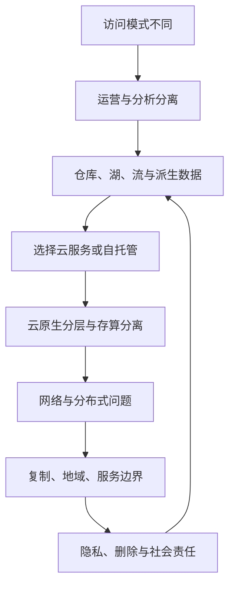

删除权之所以困难，正是因为数据已经沿仓库、湖、缓存、索引和模型多次派生；数据驻留之所以影响性能，是因为它约束分布位置；供应商选择之所以影响合规，是因为它改变数据控制者、处理者和司法辖区。四组权衡最终汇合为同一个架构。

## 7. 参考文献如何支撑本章

原章包含 62 条参考文献。它们不是彼此孤立的阅读清单，而是按本章论证大致形成四组证据。

### 7.1 数据密集型、分析与数据管道（参考文献 1–19）

这一组覆盖：

- 数据密集型计算概念；
- 本地优先软件；
- 数据工程与分析工程角色；
- OLAP、实时分析和数据仓库；
- HTAP 与专用数据库；
- 关系系统中的 ML、现代数据基础设施；
- 数据湖、寿司原则、DataOps 与反向 ETL。

阅读这组资料时，重点比较术语的历史定义与今天的产品用法。例如 OLAP 的定义来自早期决策支持背景，实时产品分析则给它增加在线服务目标。

### 7.2 云经济与云原生架构（参考文献 20–39）

这一组同时包含支持离开云、使用大单机的实践文章，以及 Aurora、Socrates、Snowflake 等云原生系统论文，还讨论 EBS、存算分离、Serverless 数据系统、SRE、运维工作和云成本。

作者刻意保留相反视角：云不是必然更便宜，自托管也不是必然落后。系统论文解释云原生机制，工程文章则暴露定价、停服、故障和组织现实。

### 7.3 地域、可持续性、分布式与 HPC（参考文献 40–58）

这一组包括：

- 数据驻留法律；
- 数据中心能源调度和碳依赖；
- 网络延迟数量级；
- Serverless 与数据移动；
- COST 扩展性研究；
- 可观测性和 Dapper 追踪；
- 微服务数据管理；
- 单机“大数据已死”论述；
- 微服务与 Serverless 工作负载；
- 数据中心、HPC 故障、RDMA 和网络拓扑。

这些资料共同证明“多节点”并非单一技术问题：地域、能源、组织、网络和故障目标都会改变设计。

### 7.4 社会影响与隐私（参考文献 59–62）

最后一组从自动化系统的社会伤害、GDPR 对数据库的影响、Datensparsamkeit 和 GDPR 法律原文支撑法律与社会讨论。

阅读顺序应从法律原文或权威解释确认义务，再看系统研究如何实现和评估；不能只根据某个产品博客判断法律合规。

### 7.5 有问题时如何使用参考文献

1. 先在本章确认问题属于哪组权衡；
2. 到原章参考文献找到对应来源；
3. 阅读摘要、问题定义、假设和评估方法；
4. 区分同行评审论文、厂商系统论文、工程经验和法律文本的证据类型；
5. 检查发表时间、产品版本和工作负载是否仍匹配；
6. 用自己的基准、故障演练或法律审查验证当前场景。

## 8. 容易混淆的概念与常见误区

### 8.1 数据密集型不等于单纯“数据很多”

数据管理成为主要挑战才是关键。并发一致性、持久性和可用性也能让中等数据量的应用高度数据密集。

### 8.2 数据密集型与计算密集型不是互斥标签

ML 训练和科学数据处理可能两者兼具。分类是为了定位瓶颈，不是把系统永久装进一个盒子。

### 8.3 前端不等于无状态，后端也不等于唯一状态所在地

前端可以本地持久化并同步；后端应用进程可无状态，但数据库和队列仍保存系统状态。应明确每种状态的权威位置，而不是按运行端猜测。

### 8.4 本章的“事务处理”不等于完整事务理论

本章用它概括低延迟小读写；原子性、隔离级别等精确定义留到第 8 章。不要从 OLTP 名称推断某产品一定提供特定事务保证。

### 8.5 OLTP 与 OLAP 的 “online” 含义不同

OLTP 强调面向交互应用的大量低延迟事务；OLAP 中 online 更多指分析师能交互探索，并不保证与在线事务相同的延迟或并发。

### 8.6 运营/分析与权威/派生是两条不同分类轴

前者按工作负载和用户分类，后者按数据来源分类。运营系统可包含派生缓存，分析系统在特殊应用中也可能成为某项结果的权威发布处。

### 8.7 数据仓库不等于任意大型数据库

仓库是为分析整合多个来源、按分析负载优化的独立系统。数据量大不是充分条件。

### 8.8 数据湖不等于“没有模式”

文件仍有格式和结构，消费者仍需解释字段。数据湖是不强制所有数据预先进入同一中央关系模式，而不是可以没有元数据和治理。

### 8.9 原始数据不等于真实、正确或可永久保留

原始事件可能重复、缺失、含错误时钟或敏感字段。寿司原则保留转换选择，不会自动解决质量与合法性。

### 8.10 ETL 与 ELT 的差异主要是转换位置和时机

两者都需要抽取、转换和加载。ELT 先加载并不意味着没有 ETL 责任；ETL 先转换也不保证源数据无需保留。

### 8.11 反向 ETL 不是简单把原数据写回去

它通常把分析产生的分群、特征或模型结果送到运营系统。若无版本、幂等和反馈控制，可能把分析错误直接放大到用户路径。

### 8.12 HTAP 不会让 OLTP/OLAP 差异消失

统一接口背后仍可能是两套存储与执行路径。它适合单应用需要最新分析的场景，不会自动整合企业的所有独立运营数据库。

### 8.13 实时分析不等于 OLTP

实时分析要求低延迟，但查询仍可能聚合大量记录；OLTP 通常按键处理少量记录。响应快不是唯一分类依据。

### 8.14 云中运行不等于云原生

把传统数据库装进 VM 是 IaaS 自托管；云原生系统从设计上利用对象存储、临时计算、弹性和服务分层。

### 8.15 自托管不等于必须拥有物理机

在云 VM 上自行安装、升级和运行数据库仍是自托管。判断依据是运维责任，不是服务器位置。

### 8.16 云服务不等于没有运维

供应商负责底层机器，客户仍负责服务选择、配置、权限、集成、监控、成本、迁移和应用故障。

### 8.17 按量计费不保证更便宜

低利用率和波动负载可能获益，稳定高利用率、出口流量和低效查询可能使账单更高。必须比较完整 TCO。

### 8.18 存算分离不等于存储访问免费

分离使两侧独立扩缩，却把本地 I/O 变成网络路径。数据量、带宽、延迟、缓存和传输费用成为一等变量。

### 8.19 多租户不等于每个客户拥有独立机器

它恰恰通过共享硬件提高利用率，并依赖软件实现性能和安全隔离。

### 8.20 分布式不等于可扩展

系统可以跨多节点却因全局协调无法扩展；单机也可以通过高效算法支持很大负载。扩展性要看负载增长时资源与性能关系。

### 8.21 有副本不等于高可用

副本只是原材料，还需要故障检测、切换、数据新鲜度、客户端路由和恢复流程。相关故障还可能同时击中多个副本。

### 8.22 超时不等于请求失败

超时只表示客户端没有及时收到响应。服务端可能未执行、正在执行或已经提交。重试前必须理解副作用和幂等性。

### 8.23 微服务不等于把每个类做成网络服务

微服务边界服务于团队独立、业务职责和资源隔离。过细拆分只会增加调用链和运维税。

### 8.24 每服务一个数据库不等于数据一致性问题消失

它移除共享模式耦合，却把跨服务一致性转移给事件、工作流、补偿和对账。

### 8.25 Serverless 不等于没有服务器或没有限制

供应商管理服务器并按使用调度；函数仍在服务器上运行，还可能有冷启动、时限、运行时和配额限制。

### 8.26 HPC 与云集群不能只按节点数比较

HPC 优化批作业完成时间，可接受检查点重启；云服务强调持续可用、多租户隔离和动态请求。故障与信任模型不同，最佳网络也不同。

### 8.27 不可变不等于法律上永远不能删除

不可变通常描述正常写入接口。系统仍可通过压缩重写、密钥销毁和保留期管理执行删除，但必须证明所有派生与副本得到处理。

### 8.28 通过审计不等于绝对安全、合法或符合伦理

审计只对特定范围、标准和时期提供证据。新的配置、用途和数据流仍需持续评估；合法也只是伦理判断的下限之一。

### 8.29 数据最小化不等于停止数据驱动

它要求数据与明确目的相称，并能按期删除。减少无目的数据往往反而提高质量、降低成本和简化架构。

## 9. 全章知识结构

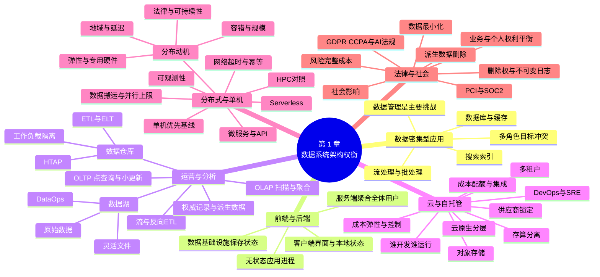

### 9.1 三条贯穿全章的主线

#### 主线一：工作负载决定专用化

点查询与历史扫描不同，于是产生 OLTP/OLAP 分离；数据科学需要灵活格式，于是出现数据湖；在线聚合需要低延迟，于是出现实时分析。专用系统获得性能与能力，也增加数据集成。

#### 主线二：责任转移不会消除问题

云把机器运维转给供应商，却留下集成、成本和配置；微服务把内部模块变成独立团队边界，却留下网络和一致性；Serverless 隐藏实例，却留下状态、冷启动和配额。

#### 主线三：每份副本都是能力，也是责任

缓存、索引、仓库、湖和模型都从权威数据获得新查询能力；同时必须处理新鲜度、重建、访问、保留和删除。数据越容易复制，治理越需要清晰血缘。

## 10. 核心结论

1. **数据系统设计没有脱离场景的唯一解。** 访问模式、故障目标、团队、成本和法律共同决定选择。
2. **数据密集型的关键是数据管理难度，而非只有数据量。** 变化、一致性、可用性和生命周期同样重要。
3. **OLTP 与 OLAP 的差异来自工作负载。** 点查询、小更新与大扫描、任意聚合需要不同资源和布局。
4. **数据仓库通过副本换取跨系统分析和工作负载隔离。** ETL/ELT 的代价是延迟、管道和治理。
5. **数据湖用统一关系模式换取格式与工具灵活性。** 没有元数据和质量管理时，灵活性会退化成混乱。
6. **HTAP 和实时分析填补部分中间场景，但不会消除基本差异。** 统一产品接口不代表内部只有一种执行机制。
7. **权威记录与派生数据是理解组合架构的关键。** 冲突、重建、更新和删除都依赖明确的数据来源图。
8. **云服务转移运行责任，不会自动降低总成本或消除运维。** 团队经验、利用率、控制和锁定风险决定结论。
9. **云原生的实质是架构改变。** 服务分层、对象存储、临时计算、存算分离和多租户重塑数据路径。
10. **分布式系统应由明确需求驱动。** 网络带来超时歧义、延迟、协调和诊断成本，更多节点不保证更快。
11. **微服务首先优化组织独立性。** 小团队若没有协调瓶颈，模块化单体往往更合适。
12. **Serverless 隐藏服务器管理而非服务器本身。** 自动扩缩与按量计费以运行限制和供应商依赖为代价。
13. **HPC 与在线云服务采用不同故障模型。** 批作业可检查点重启，持续服务则追求局部容错和不中断。
14. **隐私、删除和社会影响是底层架构约束。** 它们不能在系统完成后只靠政策文档补上。
15. **数据最小化是降低系统性风险的设计原则。** 不收集或及时删除，往往比无限增强访问控制更根本。

## 11. 综合案例：从在线订单到个性化推荐

下面用一个在线零售应用把全章概念连接起来。案例是教学推演，不是原书指定架构，也不是所有零售系统都应复制的模板。

### 11.1 需求与角色

应用需要：

- 用户下单后立即看到订单状态；
- 库存不能因并发更新变成不允许的负数；
- 商品搜索在 200 ms 内返回；
- 分析师按日查看各地区收入；
- 风控在数秒内发现异常支付；
- 推荐系统使用历史行为训练模型；
- 用户能请求导出和删除个人数据；
- 团队规模有限，不希望一开始维护大量服务。

不同需求已经对应不同访问模式和时效，单一数据库未必都能高效满足。

### 11.2 最小起点

早期可以先采用模块化单体和一个关系数据库：

- `orders`、`order_items`、`inventory` 保存权威状态；
- 数据库事务处理下单与库存更新；
- 应用实例无状态，便于水平增加；
- 日报先在低峰期对只读副本执行。

这个起点避免微服务和多管道成本。只有监控证明搜索、分析或训练负载影响在线服务后，才引入专用派生系统。

### 11.3 随需求增长后的数据流

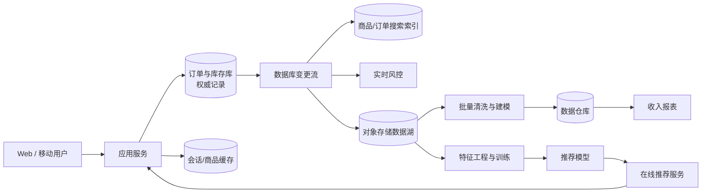

### 11.4 权威与派生关系

| 数据 | 角色 | 丢失后的处理 | 可接受滞后示例 |
| --- | --- | --- | --- |
| 订单与库存主记录 | 权威记录 | 从备份和事务日志恢复 | 在线写入完成后立即可见 |
| 商品缓存 | 派生 | 从数据库重新填充 | 秒到分钟，取决于字段 |
| 搜索索引 | 派生 | 从商品和订单源重建 | 商品更新可容忍数秒 |
| 风控窗口状态 | 派生但业务关键 | 从事件日志恢复并降级服务 | 通常秒级 |
| 数据湖原始副本 | 分析派生/重建输入 | 从源日志重放，成本可能很高 | 分钟到小时 |
| 仓库报表表 | 派生 | 重跑 ETL | 日报可小时级 |
| 推荐模型 | 派生 | 用版本化训练集重训或回退旧模型 | 可能按日更新 |

“派生”不表示不重要。风控状态丢失会带来业务风险，模型重训也可能昂贵，因此仍需检查点、版本和回退。

### 11.5 为什么不让分析师直接查订单主库

日报会扫描大量历史订单，与用户下单争抢 I/O、CPU 和缓存；分析师还需要营销与退款等其他系统数据。独立仓库通过副本和 ETL 换来资源隔离与跨系统查询。

代价是数据不是绝对实时。若每天 02:00 完成抽取、04:00 完成转换，上午报表最多可能落后数小时。团队应把“报表新鲜度”定义为 SLO，而不是笼统说数据“实时”。

### 11.6 为什么风控不能只等日报

欺诈行为需要在造成更多损失前阻止。订单变更流进入实时风控，按用户、设备或支付工具维护时间窗口聚合。

它仍是分析式工作负载，因为要比较大量历史行为；同时又进入在线决策路径，对延迟和可用性要求更高。这正是实时分析/HTAP 类问题，而非简单 OLTP 点查询。

### 11.7 云与自托管决策

假设团队没有对象存储和仓库运维经验，分析负载每晚集中两小时，托管云仓库的弹性可能有价值。订单数据库若长期稳定高负载、需要特定扩展和底层诊断，则需要单独比较托管与自托管。

不能因“公司上云”就强迫所有组件采用相同责任模式。每项选择应记录：

- 峰值与平均利用率；
- 运维技能和事故响应；
- 专有 API 与数据导出方式；
- 跨服务网络和出口费用；
- 可用地域和合规证明；
- 退出与恢复演练。

### 11.8 单机与分布式的渐进边界

早期应用不必按商品、订单、库存拆成三个远程微服务。模块内保持清晰接口，等到以下证据出现再拆分：

- 团队已独立，发布互相阻塞；
- 某模块需要完全不同的资源或扩展方式；
- 故障隔离收益可量化；
- API 与数据所有权边界稳定；
- 平台已能承担部署、追踪和值班成本。

搜索索引、对象存储和托管仓库本身已经引入分布式依赖。每条调用和数据流都需要超时、重试、幂等与观测，不能只画一条箭头。

### 11.9 三个故障场景

#### 场景一：下单请求超时

客户端必须用同一幂等键重试。订单服务在同一数据库事务中保存订单和幂等结果，避免重复创建。若支付供应商也参与，需使用其幂等能力并定期对账。

#### 场景二：搜索索引落后

订单已更新但索引还未消费事件。若搜索只用于便利，可以展示“结果可能稍有延迟”；若用于合规冻结等关键决定，则必须查询权威库或提高一致性机制。是否能容忍陈旧由用途决定。

#### 场景三：仓库任务重复执行

ETL 应按稳定订单 ID 和版本执行合并，而不是无条件追加，使同一输入重放不会重复计算收入。管道记录源偏移和目标提交，失败后从已确认位置恢复。

### 11.10 删除请求如何穿过案例架构

用户删除请求到来后，系统需要：

1. 验证身份和请求范围；
2. 识别订单中因税务或交易法律必须保留的部分，并限制用途；
3. 删除或匿名化可删除的账户与行为数据；
4. 使缓存失效并向搜索、湖、仓库发送删除任务；
5. 阻止已删除事件在重放时重新出现；
6. 按策略处理备份；
7. 评估训练集和模型的处理要求；
8. 记录不暴露过量个人信息的完成证据。

这一步证明数据血缘不是只为调试和 BI 服务，也是行使个人权利的基础。

### 11.11 案例结论

合理演进不是一次选出“终极架构”，而是：

1. 用单机和模块化边界满足初始需求；
2. 按监控到的访问模式引入专用派生系统；
3. 明确每份数据的权威源、滞后和重建方法；
4. 对每条网络边界设计失败语义；
5. 按真实利用率比较云与自托管；
6. 从收集之初设计目的、保留和删除。

这正是本章“只有权衡，没有万能方案”的具体应用。

## 12. 解决数据架构问题的一般方法

### 12.1 第一步：先列参与者、目的与权利

不要从产品列表开始。先写清：

- 谁产生数据；
- 谁读取或修改；
- 每个角色想完成什么；
- 数据涉及哪些人的权利；
- 哪些法律、合同和地域条件是硬约束。

这一步能暴露“同一数据、不同目标”的根本冲突。

### 12.2 第二步：刻画工作负载

至少量化：

- 数据总量、增长率和单条大小；
- 读写比例、峰值和平均请求率；
- 点查询、范围查询、扫描、聚合和搜索比例；
- 延迟分位数、吞吐与新鲜度目标；
- 历史保留期和地域分布；
- 正常、峰值、故障和恢复四种状态。

“数百万用户”不如“峰值每秒 5000 次按键读取、500 次事务更新，$p99<200$ ms”可用于设计。

### 12.3 第三步：画出权威与派生图

为每个数据集标注：

- 谁首次写入；
- 冲突时信任谁；
- 从哪些输入派生；
- 传播滞后；
- 如何重建；
- 删除如何传播。

没有这张图，就很难判断缓存、索引、仓库和模型故障后的正确行为。

### 12.4 第四步：建立最简单可行基线

先验证单机、单数据库、模块化单体或批处理是否已经满足需求。基线必须有真实性能和运维数据，不能把未经优化的单机与精心调优的集群比较。

只有明确某项约束无法满足时，才引入专用或分布式组件。

### 12.5 第五步：按责任而不是标签比较方案

对云、自托管、微服务和 Serverless 逐项问：

- 谁负责部署、升级、备份和恢复？
- 谁能查看底层指标和修复缺陷？
- 哪个接口和数据格式形成锁定？
- 服务关闭或网络隔离时有什么替代？
- 成本怎样随负载与数据增长？

“托管”“云原生”“无服务器”都不能替代责任清单。

### 12.6 第六步：枚举失败和不确定状态

对每条网络调用问：

- 超时后操作可能处于哪些状态？
- 能否安全重试，幂等键保存多久？
- 消息重复、乱序或丢失时怎样处理？
- 下游不可用时上游阻塞、排队还是降级？
- 跨数据库中间状态是否对用户可见？
- 如何对账和修复？

用时序图逐步推演，比只写“增加重试”更可靠。

### 12.7 第七步：计算完整成本

成本至少包含：

- 硬件或云计算、存储、请求与网络；
- 开发、运维、值班和培训；
- 资源闲置和弹性收益；
- 集成、迁移与供应商退出；
- 故障损失与恢复时间；
- 隐私、安全、法律和社会风险。

任何只比较单项单价的结论都可能把成本转移到表外。

### 12.8 第八步：设计运行与治理闭环

上线前定义：

- 指标、日志、追踪和告警；
- SLO 与错误预算；
- 容量和费用上限；
- 备份、恢复与重建演练；
- 模式和 API 演化；
- 数据目录、血缘、质量、保留与删除；
- 事故复盘和知识保留。

架构能被画出来，不等于能长期运行。

### 12.9 第九步：用证据验证关键假设

验证手段包括：

- 贴近生产分布的基准测试；
- 单机与分布式资源等价比较；
- 网络延迟、节点故障和供应商中断演练；
- 全量重建和备份恢复计时；
- 删除请求端到端验证；
- 成本账单与业务指标关联；
- 安全、隐私和法律审查。

平均延迟不能替代尾延迟，正常路径不能替代故障路径，供应商宣传也不能替代自己的工作负载。

### 12.10 第十步：记录决策并设置复查触发器

一份简洁的架构决策记录应包括：

```text
决策：
上下文与日期：
参与者及其目标：
工作负载与硬约束：
考虑的候选方案：
选择及核心理由：
接受的代价和风险：
被否决方案及原因：
验证证据：
迁移/退出方案：
复查触发器：
```

复查触发器可以是数据量增加十倍、平均利用率越过云成本临界点、团队拆分、法规变化、供应商涨价或恢复时间超过 SLO。权衡依赖上下文，上下文变化后结论也应允许变化。

### 12.11 全章复习检查表

#### 数据与工作负载

- 这是数据密集还是计算密集，主要瓶颈证据是什么？
- 主导查询是点查、小更新、扫描、聚合还是搜索？
- 需要当前状态还是完整历史？
- 查询是固定应用查询还是任意探索？
- 批处理、流处理或实时分析分别需要多快？

#### 数据生命周期

- 哪个系统是每类事实的权威记录？
- 哪些缓存、索引、仓库、湖和模型是派生数据？
- 每个派生结果的最大允许滞后是多少？
- 源、转换代码和版本是否足以重建？
- 删除、模式变化和错误修复怎样传播？

#### 云与运行责任

- 谁开发、谁部署、谁值班、谁修复底层缺陷？
- 平均与峰值利用率是否支持按量计费？
- 存储、请求、出口和迁移费用是否计入？
- 服务是否使用标准 API，退出需要多久？
- 配额、地域、供应商中断和政治风险如何处理？

#### 分布式与组织

- 为什么必须跨节点，单机基线是什么？
- 超时、重试、重复和乱序语义是什么？
- 网络搬运是否抵消并行收益？
- 指标、日志和追踪能否连接完整调用链？
- 微服务是否真正对应独立团队和稳定业务边界？
- 跨服务一致性由谁维护和修复？

#### 法律、伦理与社会

- 每类个人数据的明确目的是什么？
- 能否少收集、降低精度或缩短保留？
- 用户如何访问、更正、导出和删除？
- 仅追加日志、备份和模型怎样响应删除？
- 数据泄露、强制披露或自动化错误会伤害谁？
- 审计范围是否覆盖真实数据流？
- 合法之外，设计是否仍然公平、必要且可解释？

### 12.12 最终方法论

本章没有给出一张“正确技术栈”清单，而是建立了一种推理顺序：

$$
{}\text{参与者与目的}
\rightarrow\text{工作负载与约束}
\rightarrow\text{数据来源与生命周期}
\rightarrow\text{候选机制}
\rightarrow\text{成本与失败分析}
\rightarrow\text{证据验证}
\rightarrow\text{持续复查}
$$

这种方法之所以有效，是因为它先固定问题，再选择工具；先明确权威和责任，再连接组件；先建立简单基线，再为明确瓶颈增加复杂性；最后把个人权利与社会影响放进同一套架构约束中。

面对任何看似二选一的问题，都应继续追问：双方分别优化什么、依赖什么假设、把代价转移到哪里、谁承担失败后果，以及在什么条件下应该改变选择。这就是第 1 章为全书奠定的核心思维方式。
