> 对应原文：2. Defining Nonfunctional Requirements.md
>
> 本文严格按照原章顺序讲解，并在章后统一补充易混概念、综合案例与决策方法。原章给出了大量数量级、概率和性能论证，但没有要求照抄的完整程序。文中标为“背景补充”“量化推导”或“可运行示例”的公式与代码用于把作者的方法变成可验证工具，不应误认为原书原文中的公式或实现。

## 0. 本章定位：把“好系统”翻译成可验证的要求

### 0.1 功能需求回答“做什么”

开发应用时，最显眼的是 **功能需求（functional requirements）**：

- 有哪些页面、按钮和 API；
- 用户执行某个操作后应发生什么；
- 系统需要保存、查询或计算哪些信息；
- 哪些业务规则必须成立。

例如社交网络的功能需求可以是“用户能够发帖、关注他人，并查看所关注者的最新帖子”。这些要求定义了软件存在的目的，也是验收测试最容易直接覆盖的部分。

### 0.2 非功能需求回答“做到什么程度、在什么条件下仍成立”

系统还必须满足 **非功能需求（nonfunctional requirements）**，例如：

- 足够快；
- 在故障下仍可靠；
- 能随负载增长扩展；
- 安全且符合法律；
- 长期易于运行和修改。

“非功能”这个名字容易误导：它们并非可有可无。一个按钮功能正确，却要等待一分钟才响应；一个相册可以上传照片，却会随机永久丢失数据；这样的系统从用户角度几乎等于没有功能。

非功能要求与功能要求的区别，不是“重要”和“不重要”，而是关注点不同：

| 类型 | 主要问题 | 示例 |
| --- | --- | --- |
| 功能需求 | 系统提供什么行为 | 用户可以发布帖子 |
| 非功能需求 | 行为在何种质量、规模和约束下提供 | 99% 的发布请求在 1 秒内完成，单节点故障不丢帖 |

同一功能可以由多种架构实现；非功能需求往往决定应选择哪种实现。

### 0.3 为什么非功能需求经常没有被明确写下

“系统当然应该快、稳定、好维护”听起来理所当然，因此团队容易不写清它们。问题在于，每个词都有多个解释：

- “快”是平均 200 ms，还是 $p99$ 200 ms？
- “可靠”是每月可停机 40 分钟，还是不能永久丢失任何数据？
- “能扩展”是用户数增长十倍，还是单个用户的数据增长十倍？
- “易维护”是容易部署、容易读懂，还是容易改变数据模式？

未量化的要求无法指导容量规划，也无法判断优化是否成功。不同团队会把自己的默认理解带入讨论，直到事故或增长暴露矛盾。

### 0.4 本章选择的四类非功能需求

安全等重要主题超出本书主要范围。本章集中研究四类要求：

1. **性能（performance）**：如何定义和测量系统响应速度及处理能力；
2. **可靠性（reliability）**：系统在组件、软件或人出错时仍继续正确工作；
3. **可扩展性（scalability）**：负载增长时，能否有效增加计算资源以维持性能；
4. **可维护性（maintainability）**：长期运行、理解和改变系统是否容易。

它们不是四个独立复选框，而是互相作用：

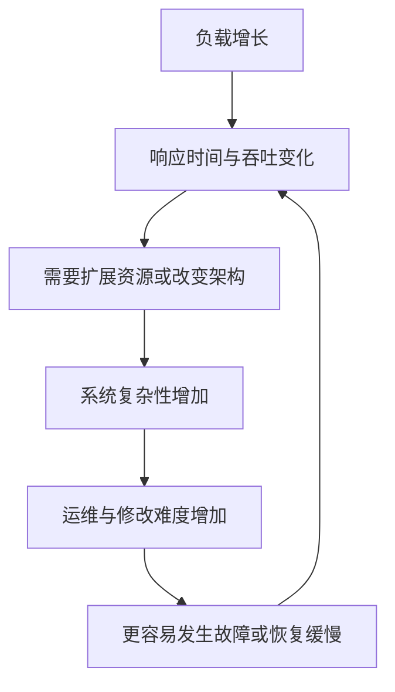

例如，为提高可靠性增加副本，会消耗资源并引入协调；为提高性能增加缓存，会增加失效逻辑和维护成本；为扩展而拆分服务，会增加网络故障和可观测性需求。因此非功能设计本身就是权衡。

### 0.5 从形容词到可测量契约

一个实用的需求表达应包含五项：

$$
R=(W,M,T,F,B)
$$

其中：

- $W$：工作负载（workload），例如每秒请求数、数据量和读写分布；
- $M$：指标（metric），例如响应时间、错误率或恢复时间；
- $T$：目标（target），例如 $p99<1$ 秒；
- $F$：故障或运行条件（failure/condition），例如单可用区失效；
- $B$：测量边界（boundary），例如从客户端发出请求到收到完整响应。

例如，“首页要快”可以改写为：

> 在峰值 50,000 次首页读取/秒、单个后端实例故障的条件下，从边缘客户端测得的有效请求响应时间应满足 $p50<200$ ms、$p99<1$ s；统计窗口为连续 28 天。

这个五元组是本文的分析框架，不是原书公式。它的价值是迫使团队说明“测什么、在哪测、何时测、遇到什么仍应达标”。

### 0.6 作者为什么先讲案例再讲定义

性能、可靠性和可扩展性的抽象定义容易枯燥。作者先安排社交网络首页时间线案例，让读者看到：

- 相同功能可以在读取时计算，也可以在写入时预计算；
- 平均用户与名人账户造成完全不同的负载；
- 降低读取延迟会增加写入和存储成本；
- 峰值负载、队列和可丢弃结果会改变设计。

之后的术语不是脱离现实的词表，而是用于描述案例中已经出现的问题。

## 1. 案例：社交网络首页时间线

### 1.1 简化场景与规模假设

设想实现一个类似 X（原 Twitter）的社交网络：用户可以发帖、关注他人，并查看首页时间线。真实服务还包含广告、推荐、排名、反滥用、隐私和大量其他机制，本章刻意简化，只保留能揭示负载结构的部分。

原文给出以下假设：

- 每天总计 5 亿条帖子；
- 平均约 5,800 条帖子/秒；
- 特殊事件期间峰值可达 150,000 条帖子/秒；
- 平均用户关注 200 人，也有 200 个关注者；
- 分布非常不均：多数人只有少量关注者，少数名人超过 1 亿关注者。

先复算平均发帖速率：

$$
\lambda_{\text{post}}=
\frac{500{,}000{,}000}{24\times60\times60}
\approx5{,}787\ \text{posts/s}
$$

四舍五入后就是原文的 5,800 posts/s。峰值与平均值之比为：

$$
\frac{150{,}000}{5{,}800}\approx25.9
$$

这说明仅按日均值配置容量会严重不足；系统不仅要知道平均吞吐，还要知道峰值、峰值持续时间和突发形态。

### 1.2 平均数隐藏了关注关系的长尾

“平均每人 200 个关注者”不能充分描述负载。关注者数量通常是高度偏斜的长尾分布：

- 大量普通账户的扇出很小；
- 少数大账户的扇出可能达到数百万乃至上亿；
- 单个极端账户就可能短时间占用大量基础设施。

若只根据平均值设计，系统在普通流量下表现良好，却会在名人发帖时形成巨大热点。这是本章反复强调的统计思想：**决定系统瓶颈的可能不是平均案例，而是分布尾部。**

### 1.3 关系模型：用户、帖子与关注

简化关系模式包含三张表：

```text
users(id, name, ...)
posts(id, sender_id, timestamp, content, ...)
follows(follower_id, followee_id)
```

- `users` 保存用户；
- `posts.sender_id` 指向发帖用户；
- `follows` 的一行表示 `follower_id` 关注 `followee_id`。

关系可以表示为：

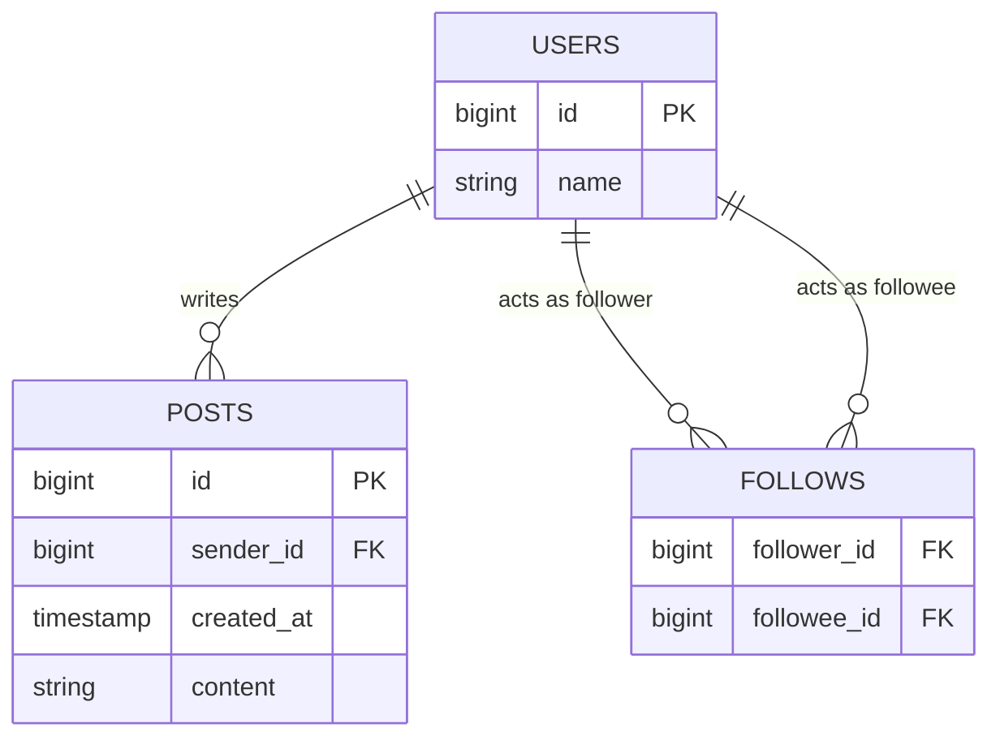

关注关系是用户对用户的多对多关系。合适索引至少要支持：

- 按 `follower_id` 找其关注的人；
- 按 `followee_id` 找其所有关注者；
- 按 `sender_id, timestamp` 找某人的最新帖子。

索引提高读取效率，同时增加每次关注、取消关注和发帖时的写入维护成本。

### 1.4 读取时计算首页时间线

原文给出的首页查询是：

```sql
SELECT posts.*, users.* FROM posts
  JOIN follows ON posts.sender_id = follows.followee_id
  JOIN users   ON posts.sender_id = users.id
  WHERE follows.follower_id = current_user
  ORDER BY posts.timestamp DESC
  LIMIT 1000
```

查询逻辑依次是：

1. 在 `follows` 中找到当前用户关注的所有账户；
2. 找到这些账户的近期帖子；
3. 关联发帖者资料；
4. 把候选帖子按时间倒序合并；
5. 返回最近 1,000 条。

这是一种 **读取时扇入（fan-in on read）**：多个发帖者的数据在一次读取中汇合。

### 1.5 为什么这条 SQL 在规模上变贵

若用户关注 $F$ 个账户，每个账户取 $k$ 条候选帖子，读取阶段最多需要处理约 $F\times k$ 个候选项，再选出全局前 $K$ 条。

若每个来源已经按时间有序，可以用大小为 $F$ 的堆做多路归并，抽象复杂度约为：

$$
T_{\text{merge}}=O(K\log F)
$$

但在此之前仍需访问多个索引范围、读取候选记录、处理缓存未命中和网络分片。用户关注的账户越多，单次查询成本越高。

对于平均 $F=200$ 的用户，这可能尚可优化；对关注数万人的用户，查询扇入显著扩大。SQL 语句看起来简洁，不代表底层工作量小。

### 1.6 轮询如何放大读取负载

帖子应及时出现。假设在线客户端每 5 秒重新查询一次，即 **轮询（polling）**。若同时在线用户数为 1,000 万，查询率为：

$$
Q_{\text{timeline}}=
\frac{10{,}000{,}000}{5\ \text{s}}
=2{,}000{,}000\ \text{queries/s}
$$

每个平均用户关注 200 个账户，则按来源计算的查找量约为：

$$
L_{\text{lookup}}=
2{,}000{,}000\times200
=400{,}000{,}000\ \text{lookups/s}
$$

这还没计入排序、关联、用户资料读取和空轮询。许多轮询周期内没有新帖子，却仍消耗完整查询成本。

降低轮询频率可以减少负载，却增加内容可见延迟。例如每 30 秒轮询，查询量降为约 333,333/s，但新帖平均要等待约 15 秒、最坏接近 30 秒才被看见。性能与及时性发生直接权衡。

### 1.7 推送为什么能减少无效请求

更好的通信方式是服务器在时间线有新帖时主动通知当前在线的关注者。客户端订阅自己的时间线流，无新内容时不必反复执行查询。

推送不会让工作消失，而是把“所有在线用户按固定频率询问”变成“只在有变化时发送”。它还需要：

- 长连接或通知通道；
- 客户端断线重连；
- 已读位置或游标；
- 漏消息后的补拉；
- 慢客户端的背压；
- 连接与身份管理。

推送降低空查询，却增加连接状态与消息交付复杂性。

### 1.8 写入时物化首页时间线

作者提出第二个优化：为每个用户保存一份预计算首页时间线。某人发帖时：

1. 查找其全部关注者；
2. 把帖子插入每个关注者的时间线；
3. 用户读取时直接返回自己的预计算列表；
4. 在线客户端订阅该列表的新增项。

这类似把信件投递到每个收件人的邮箱。

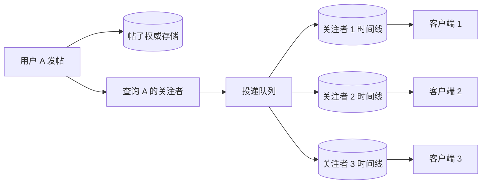

一次发帖引发多个下游写入，这个倍增因子称为 **扇出（fan-out）**。

### 1.9 物化视图是什么

**物化（materialization）**是预先计算并保存查询结果；保存下来的结果称 **物化视图（materialized view）**。

若权威帖子和关注关系为 $S$，首页查询为函数 $f$，按需读取计算的是：

$$
T_u=f(S,u)
$$

物化则提前保存 $T_u$，并在源状态发生变化 $\Delta S$ 时执行增量更新：

$$
T'_u=g(T_u,\Delta S)
$$

理想情况下，增量结果应与从头重算一致：

$$
g(T_u,\Delta S)=f(S\oplus\Delta S,u)
$$

这里 $\oplus$ 表示把变化应用到源数据。公式是概念抽象：它说明物化视图的正确性取决于更新逻辑与原查询语义一致。

时间线缓存属于上一章所说的派生数据：丢失后理论上可由帖子和关注关系重建；发生冲突时，权威帖子存储和关注关系才是裁决来源。

### 1.10 物化把成本从读转移到写

平均发帖率约 5,800/s，平均关注者数 200，因此时间线写入率约为：

$$
W_{\text{timeline}}
=5{,}800\times200
=1{,}160{,}000\ \text{writes/s}
$$

这与读取时方案的约 4 亿次来源查找/秒相比，数量级明显更低：

$$
\frac{400{,}000{,}000}{1{,}160{,}000}
\approx345
$$

这个 345 倍只是基于简化单位操作的比较，不能当作真实硬件加速比：时间线写入与索引查找的成本不同，缓存命中和批处理也会改变结果。但它说明在“读非常多、写相对少”的场景中，以写放大换取快速读取可能很划算。

### 1.11 峰值扇出与队列缓冲

若峰值 150,000 posts/s 仍按平均扇出 200 估算，瞬时投递需求为：

$$
W_{\text{peak}}=150{,}000\times200
=30{,}000{,}000\ \text{writes/s}
$$

系统不一定要同步完成全部投递。可以先把投递任务放入持久队列，让工作节点按可承受速度处理，暂时接受帖子出现得更慢。

设峰值到达率为 $\lambda=30$ million/s，稳定处理率为 $\mu=5$ million/s，峰值持续 $D=60$ 秒，则积压增长为：

$$
B=(\lambda-\mu)D
=(30-5)\times10^6\times60
=1.5\times10^9\ \text{deliveries}
$$

峰值结束后，若正常到达率为 1.16 million/s，可用于清空积压的净速率为：

$$
\mu-\lambda_{\text{normal}}
=5-1.16=3.84\ \text{million/s}
$$

清空约需：

$$
T_{\text{drain}}=
\frac{1.5\times10^9}{3.84\times10^6}
\approx391\ \text{s}
$$

即约 6.5 分钟。这个计算说明“用队列吸收峰值”必须同时规划队列容量、允许滞后和峰后排空时间。若长期平均到达率不低于处理率，队列只会无限增长，不能解决容量不足。

### 1.12 物化方案的读取优势

用户打开首页时，不再需要临时联结 200 个来源并排序，只需从缓存读取一份有序列表。即使投递队列正在积压，已有时间线仍能快速读取。

这实现了故障和过载隔离：

- 读取路径不直接承担瞬时发帖扇出；
- 投递延迟可以暂时升高，而首页读取延迟保持稳定；
- 队列提供缓冲和重试位置。

代价是新鲜度下降。系统需要分别定义两个非功能目标：

- 首页加载响应时间；
- 新帖从发布到对关注者可见的传播时间。

只报告“首页很快”会隐藏物化视图可能严重落后的事实。

### 1.13 高关注数用户：为什么允许有损时间线

若某用户关注数万人，而且这些账户频繁发帖，其物化时间线会收到极高写入率。用户不可能读完所有内容，因此完整投递每一条的成本可能没有价值。

原文提出，可以丢弃其中部分写入，只展示一个样本。这是一种 **有损（lossy）** 设计：

- 权威帖子不丢失；
- 只是某个派生首页没有包含所有候选帖子；
- 产品需求本来就不保证用户阅读每条内容。

这说明可靠性必须针对语义定义。对银行账本，丢一条记录不可接受；对推荐式首页，省略低价值候选项可能是合理降级。

有损策略仍要考虑公平性和产品影响：采样不能系统性屏蔽某类账户，也不能让用户误以为时间线完整。

### 1.14 名人账户：平均扇出失效

当拥有 1 亿关注者的名人发帖时，立即写入 1 亿份时间线需要巨大资源，而且这些写入不能随意丢弃。

作者提出 **混合策略**：

- 普通账户的帖子按写入时扇出，进入关注者物化时间线；
- 名人帖子单独保存，不向每个关注者预投递；
- 用户读取首页时，再把所关注名人的近期帖子与物化时间线合并。

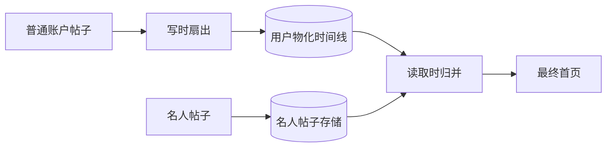

它把系统从单一方案变成按负载分层：

- 普通账户避免重复读取；
- 名人账户避免极端写放大；
- 读取时只合并少数名人来源，成本可控。

### 1.15 如何选择名人阈值

阈值不能只凭产品标签。设某作者有 $F$ 个关注者，每条帖子写时投递的单位成本为 $c_w$；该作者帖子在一个时间窗口内会触发 $R$ 次关注者首页读取，每次读取时合并的单位成本为 $c_r$。

写时扇出成本近似：

$$
C_{\text{push}}=F c_w
$$

读取时合并成本近似：

$$
C_{\text{pull}}=R c_r
$$

当：

$$
F c_w > R c_r
$$

读取时合并可能更经济。真实系统还要加入帖子传播延迟、缓存、在线关注者比例、批量写入和热点隔离，因此阈值应由监控与实验决定，并可动态调整。

### 1.16 关注与取消关注带来的更新

发帖不是唯一会改变时间线的事件：

- 用户关注某人时，是否回填其历史帖子？
- 取消关注后，旧帖子是否立即移除？
- 帖子被删除或权限改变时，如何从所有时间线撤回？
- 账户被屏蔽时，现有派生项如何处理？

物化视图越多，源数据变化的传播路径越复杂。简单的 `insert` 扇出只是正常路径；完整设计还要支持撤回、重建、幂等和顺序。

### 1.17 投递语义：至少一次与重复

若工作节点在写入时间线后、确认队列消息前崩溃，任务可能被重新执行。为了不漏帖子，系统通常宁愿 **至少一次（at-least-once）** 投递，再通过稳定的 `(timeline_id, post_id)` 唯一键去重。

```text
function deliver(timeline_id, post_id):
    insert (timeline_id, post_id)
    on conflict (timeline_id, post_id) do nothing
```

这个伪代码把重复执行变成幂等操作。若直接执行“列表尾部追加”，重试可能出现重复帖子。

原文在可靠性部分会称“既不漏也不重”为 **恰好一次语义（exactly-once semantics）**。实际系统通常通过可重试投递加幂等状态实现效果，而不是让网络只发送一次。

### 1.18 案例揭示的架构原则

1. **先量化负载。** 5 亿/天、峰值 15 万/秒、平均扇出 200 和最大扇出 1 亿分别决定不同问题。
2. **看分布，不只看均值。** 名人账户是决定架构的长尾。
3. **预计算以写放大换读性能。** 物化不是免费缓存。
4. **队列把同步容量问题转为滞后问题。** 必须定义排空能力。
5. **允许降级要基于业务语义。** 可以丢派生推荐，不能丢权威帖子。
6. **混合策略优于强迫所有数据走同一路径。** 普通用户写时扇出，名人读取时合并。
7. **功能相同不代表非功能行为相同。** 两种方案都能显示首页，却在延迟、资源和故障下表现不同。

## 2. 描述性能

### 2.1 两类核心性能指标

软件性能讨论通常围绕两类指标。

#### 响应时间

**响应时间（response time）**是从用户发出请求到收到所需答案的经过时间，单位可以是秒、毫秒或微秒。

时间线案例中的响应时间包括：

- 打开首页到内容完整显示；
- 发帖到关注者可见；
- 关注操作到时间线完成更新。

#### 吞吐量

**吞吐量（throughput）**是系统单位时间处理的请求数或数据量，例如：

- posts/s；
- timeline writes/s；
- requests/s；
- MB/s 或 GB/s。

给定固定硬件，系统存在 **最大吞吐量（maximum throughput）**。超过这个稳定处理能力，请求会积压、超时或被拒绝。

### 2.2 响应时间与吞吐量不能互相替代

一个系统可以：

- 单个请求很快，但只能并发处理很少请求；
- 总吞吐很高，但每个请求要排队很久；
- 低负载时很快，接近容量时突然恶化。

因此“性能提高 2 倍”必须说明提高的是吞吐、响应时间还是资源效率。

在用户视角，响应时间通常最直接；在容量和成本视角，吞吐决定需要多少服务器。两者通过排队发生联系。

### 2.3 基本响应时间分解

一次请求的客户端响应时间可抽象为：

$$
T_{\text{response}}
=T_{\text{network,out}}
+T_{\text{queue}}
+T_{\text{service}}
+T_{\text{network,in}}
+T_{\text{client}}
$$

其中：

- $T_{\text{network,out}}$：请求从客户端到服务的网络时间；
- $T_{\text{queue}}$：在服务或中间层等待资源的时间；
- $T_{\text{service}}$：服务主动处理请求的时间；
- $T_{\text{network,in}}$：响应返回的网络时间；
- $T_{\text{client}}$：客户端解析、渲染等完成用户可见结果的时间。

原文重点区分前三类，最后一项是帮助建立端到端视角的补充。测量边界不同，数字就不同。

### 2.4 为什么接近容量时响应时间急剧上升

当请求到达率较低时，CPU、线程、连接或磁盘有空闲，请求几乎不排队。随着到达率接近处理能力，请求更经常发现资源正忙，只能等待。

设平均到达率为 $\lambda$，单服务台平均处理率为 $\mu$，利用率为：

$$
\rho=\frac{\lambda}{\mu}
$$

在最简单的 M/M/1 排队模型中，系统平均停留时间为：

$$
W=\frac{1}{\mu-\lambda}
$$

平均服务时间为 $1/\mu$，平均排队时间为：

$$
W_q=W-\frac{1}{\mu}
=\frac{\rho}{\mu-\lambda}
$$

假设服务能力 $\mu=1000$ requests/s：

| 到达率 $\lambda$ | 利用率 $\rho$ | 模型平均响应时间 $W$ |
| ---: | ---: | ---: |
| 500/s | 50% | 2 ms |
| 800/s | 80% | 5 ms |
| 900/s | 90% | 10 ms |
| 950/s | 95% | 20 ms |
| 990/s | 99% | 100 ms |
| 999/s | 99.9% | 1000 ms |

从 90% 到 99.9% 利用率，吞吐只增加约 11%，模型响应时间却从 10 ms 增至 1 s。这解释了原图中接近最大吞吐时的“陡壁”。

M/M/1 假设泊松到达、指数服务时间、单服务台和无限队列，现实系统通常不完全满足；它的用途是展示非线性直觉，而不是直接预测生产延迟。

### 2.5 Little 定律：并发、吞吐与响应时间

稳定系统中，Little 定律给出：

$$
L=\lambda W
$$

- $L$：系统中平均并发请求数，包括服务中和排队中；
- $\lambda$：完成吞吐量；
- $W$：平均响应时间。

若服务持续完成 2,000 requests/s，平均响应时间 250 ms，则平均在途请求数为：

$$
L=2000\times0.25=500
$$

这能帮助配置连接池、线程池和队列容量。它只要求系统处于统计稳定状态，不要求特定到达分布；但若队列持续增长，系统不稳定，就不能把当前窗口简单当作稳态。

### 2.6 过载为何可能形成重试风暴（retry storm）

系统接近容量时，队列拉长，客户端超时并重试。重试增加请求到达率，使队列更长，更多请求超时，再引发更多重试：

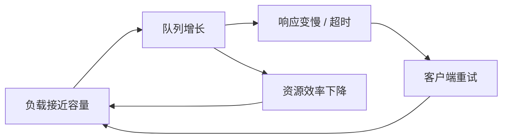

如果原始请求率为 $\lambda_0$，每轮超时概率为 $p$，每次超时立即重试且重试具有相同超时概率，忽略重试上限时，期望总尝试率近似几何级数：

$$
\lambda_{\text{eff}}
=\lambda_0(1+p+p^2+\cdots)
=\frac{\lambda_0}{1-p}
$$

当 $p=0.5$ 时，负载翻倍；当 $p=0.9$ 时，负载放大 10 倍。现实重试不独立，过载还会让 $p$ 随负载上升，因此反馈可能更恶劣。

### 2.7 亚稳态故障

有些过载系统即使外部原始负载下降，也不会自行恢复，因为内部积压、重试、缓存失效或故障恢复流量仍维持高负载。这种现象称为 **亚稳态故障（metastable failure）**。

“亚稳态”表示系统进入另一个能自我维持的坏状态：

- 正常状态：低队列、低超时、少重试；
- 坏状态：长队列、高超时、大量重试；
- 降低一部分外部流量仍不足以离开坏状态；
- 可能需要清空队列、熔断、丢弃工作或重启才能恢复。

它与普通瞬时过载的区别是 **恢复路径**：普通过载在到达率下降后自然排空；亚稳态系统存在正反馈，必须主动打破。

### 2.8 指数退避与抖动

客户端不应立即、同步地重试。**指数退避（exponential backoff）**让第 $k$ 次重试等待时间随次数增长：

$$
d_k=\min(d_{\max},d_0 2^k)
$$

若所有客户端都严格在同一时刻等待相同 $d_k$，它们会再次同时唤醒，形成同步冲击。因此加入随机 **抖动（jitter）**，例如 full jitter：

$$
\tilde d_k\sim U(0,d_k)
$$

其中 $U$ 是均匀分布。随机化把重试摊开，降低瞬时并发。

```text
delay_cap = min(max_delay, base_delay * 2 ** attempt)
sleep(random_uniform(0, delay_cap))
```

退避减少重试压力，却增加单个请求恢复等待；它还必须设置总截止时间和最大次数，否则请求可能无限悬挂。

### 2.9 熔断器

**熔断器（circuit breaker）**在下游近期持续错误或超时时，暂时停止发送请求，直接快速失败或返回降级结果。

典型状态机：

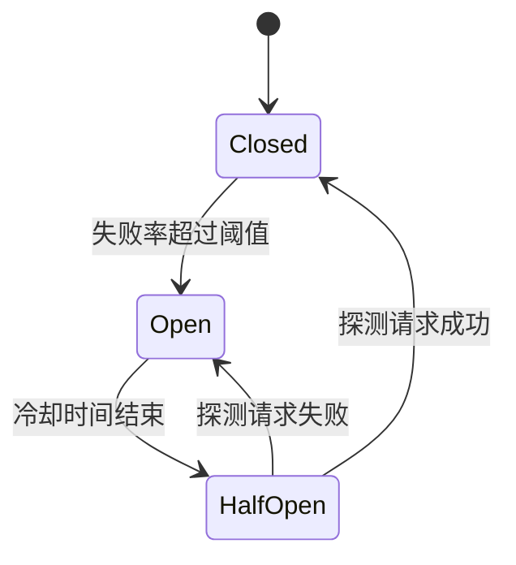

- Closed：正常放行并统计结果；
- Open：拒绝请求，保护下游并避免调用方线程堆积；
- HalfOpen：少量探测，判断是否恢复。

熔断器不会修复下游，只是隔离故障和给恢复留出空间。阈值过敏会误熔断，过迟又无法保护系统；还应避免所有调用方同时进入半开状态。

### 2.10 令牌桶

**令牌桶（token bucket）**控制允许通过的请求速率和突发量。桶以速率 $r$ 生成令牌，容量上限为 $b$；请求消耗一个或若干令牌，没有令牌时等待或拒绝。

经过时间 $\Delta t$ 后，令牌数更新为：

$$
tokens'=
\min(b,tokens+r\Delta t)
$$

若每请求消耗一个令牌，长期平均速率不超过 $r$，但最多允许 $b$ 个请求的短时突发。

令牌桶可限制普通请求，也可限制重试预算。例如只允许重试占总流量的 10%，能防止故障时重试反客为主。

### 2.11 主动丢弃负载

服务器检测到接近过载后，可以主动拒绝低优先级请求，称为 **负载丢弃（load shedding）**。

为什么主动拒绝反而提高可靠性？

- 无边界排队会让所有请求都超时；
- 早期拒绝几乎不消耗后续昂贵资源；
- 客户端迅速获得明确失败，可以降级；
- 保留容量给关键请求和健康检查；
- 系统更容易在负载下降后恢复。

一个过载系统的目标不是“接受所有请求”，而是最大化在 SLO 内完成的有价值工作，即 **goodput**，而非只最大化进入系统的 throughput。

### 2.12 背压

**背压（backpressure）**让下游向上游表达“处理不过来，请减速”。它可以表现为：

- 减小消费者窗口；
- 延迟确认消息；
- 返回明确的限流响应；
- 降低生产者配额；
- 让上游阻塞或采样。

背压与负载丢弃的区别：

- 背压试图把速率控制信号向源头传播；
- 负载丢弃在当前边界舍弃工作；
- 当上游不能减速，或数据实时性高于完整性时，仍可能需要丢弃。

端到端背压只有在每一段都尊重信号时有效；中间存在无界队列会推迟问题并扩大恢复时间。

### 2.13 过载保护机制的组合

| 机制 | 主要位置 | 解决的问题 | 主要代价 |
| --- | --- | --- | --- |
| 指数退避 + 抖动 | 客户端 | 避免密集同步重试 | 恢复等待更长 |
| 熔断器 | 调用方 | 隔离持续故障下游 | 可能快速拒绝本可成功请求 |
| 令牌桶 | 客户端、网关或服务端 | 限制平均速率与突发 | 需要设定公平配额 |
| 负载丢弃 | 服务端 | 在过载前拒绝低价值工作 | 部分请求明确失败 |
| 背压 | 下游到上游 | 让生产速率接近处理能力 | 可能把延迟传播到上游 |
| 有界队列 | 每个资源边界 | 限制内存与等待时间 | 队满必须阻塞或拒绝 |
| 负载均衡 | 请求入口 | 避免局部节点过热 | 需要健康与队列信息 |

机制应共同设计。只有重试而没有预算，会制造风暴；只有队列而无界，会隐藏过载；只有熔断而无降级，会把故障直接暴露给用户。

### 2.14 可扩展性的性能入口

用户最关心响应时间，吞吐量则决定需要多少资源及服务成本。当未来吞吐可能超过当前硬件能力，必须增加容量。

若增加计算资源能显著提高最大稳定吞吐，系统才具有可扩展性。可扩展性不是当前性能高，而是“增长时有经济有效的应对路径”。本节先集中响应时间，第 4 节再回到吞吐与扩展。

### 2.15 延迟、响应时间与服务时间

原书为几个常混用的术语建立明确边界：

- **响应时间（response time）**：客户端看到的端到端总时间；
- **服务时间（service time）**：服务主动处理该请求的时间；
- **排队延迟（queueing delay）**：请求等待 CPU、线程、连接、磁盘或网络发送机会的时间；
- **延迟（latency）**：请求没有被主动处理、处于潜伏状态的时间总称；
- **网络延迟（network latency/delay）**：请求与响应在网络中传播和传输的时间。

可以简化为：

$$
T_{\text{response}}
=T_{\text{service}}+T_{\text{latency}}
$$

而：

$$
T_{\text{latency}}
\supseteq T_{\text{queue}}+T_{\text{network}}
$$

符号 $\supseteq$ 用于提示延迟还可能包含其他等待，并非严格集合运算模型。

### 2.16 为什么必须从客户端测响应时间

服务端只记录主动处理 20 ms，并不代表用户 20 ms 收到结果。请求可能：

- 在负载均衡器排队；
- 等待连接池；
- 在服务端线程池排队；
- 等待下游数据库；
- 在响应发送缓冲区等待；
- 遇到网络重传。

若只测服务时间，所有“尚未开始处理”的等待都会被遗漏。用户体验与 SLO 应尽量从请求边界或客户端测量，同时用内部 span 分解根因。

### 2.17 时序图怎样阅读

原书后续经常使用时序图：时间从左向右或从上向下流动，每个参与节点是一条生命线，斜箭头表示网络消息。

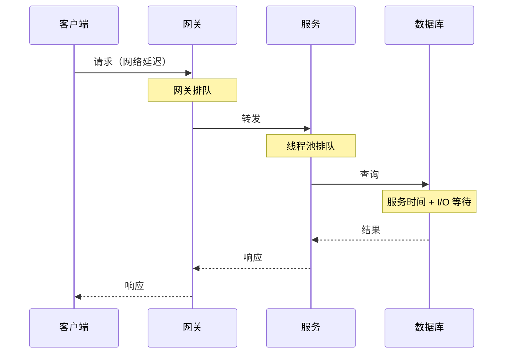

图中的总横向跨度对应客户端响应时间，而每个节点真正执行工作的片段只是其中一部分。

### 2.18 相同请求为什么每次耗时不同

即使重复同一请求，响应时间也会变化。随机延迟来源包括：

- 后台进程导致上下文切换；
- 网络包丢失与 TCP 重传；
- 垃圾回收暂停；
- 页错误触发磁盘读取；
- CPU 频率和缓存状态变化；
- 共享租户争用资源；
- 服务器机架机械振动影响磁盘。

网络延迟变化也称 **抖动（jitter）**。这里的 jitter 是观测到的时间波动；前述重试 jitter 是人为加入随机等待以打散同步，两者语境不同。

### 2.19 队头阻塞

服务器只能并行处理有限请求。少数慢请求占住 CPU 核、线程、连接或队列前部，会拖住后续本可快速完成的请求，这称为 **队头阻塞（head-of-line blocking）**。

假设单线程按顺序处理，服务时间为：

```text
请求 A: 500 ms
请求 B: 5 ms
请求 C: 5 ms
```

若 B、C 紧随 A 到达：

- A 的响应约 500 ms；
- B 即使自身只需 5 ms，也约在 505 ms 完成；
- C 约在 510 ms 完成。

客户端看到的慢，不是 B、C 计算复杂，而是它们在等待 A。增加并行度能缓解但不能无限增加；过多线程又会导致上下文切换、内存和下游争用。

### 2.20 响应时间是分布，不是一个数

响应时间受随机事件和数据差异影响，不能用单个数字完整描述。应把一段时间内每个请求的响应时间视为样本：

$$
X=\{x_1,x_2,\ldots,x_n\}
$$

多数请求可能较快，少数 **离群值（outliers）** 很慢。性能目标要说明关注分布的哪个位置。

### 2.21 算术平均数（arithmetic mean）的含义与用途

平均响应时间（算术均值）为：

$$
\bar{x}=\frac{1}{n}\sum_{i=1}^{n}x_i
$$

它适合估计总工作量和某些吞吐上限。例如串行服务处理 $n$ 个请求总计花费 $\sum x_i$，均值与服务能力有关。

但均值不表示多数用户实际等待的时间。样本：

```text
10, 10, 10, 10, 960 ms
```

平均值是 200 ms，却没有任何用户等待约 200 ms：80% 用户等 10 ms，1 个用户等 960 ms。均值被极端值拉高，也隐藏了分布形状。

### 2.22 中位数与 p50

将样本从小到大排序，中间位置就是 **中位数（median）**，也叫 **第 50 百分位数（p50）**。

若 $p50=200$ ms，表示约一半请求低于 200 ms，另一半高于或等于它。它比均值更适合描述“典型用户”等待多久。

中位数对极端值不敏感，但也会隐藏尾部。将某个最慢请求从 1 秒变成 1 分钟，p50 可能完全不变。

### 2.23 百分位数（percentiles）的正式定义

对排序后的 $n$ 个样本 $x_{(1)}\le\cdots\le x_{(n)}$，最近秩法定义第 $q$ 分位数为：

$$
Q(q)=x_{(\lceil qn\rceil)},\qquad 0<q\le1
$$

例如 $q=0.95$，$n=100$，则取第 95 个排序样本。不同统计库可能使用插值，因此小样本结果略有差异；报告分位数时应知道工具定义。

常见指标：

- p50：典型体验；
- p95：最慢 5% 的边界；
- p99：最慢 1% 的边界；
- p99.9 或 p999：最慢千分之一的边界；
- p99.99：最慢万分之一的边界。

若 p95 = 1.5 s，表示约 95% 请求在 1.5 s 内完成，约 5% 至少需要 1.5 s。

### 2.24 尾延迟为何重要

高分位响应时间称为 **尾延迟（tail latency）**。尾部请求可能来自：

- 数据量最大的账户；
- 缓存未命中；
- 跨地域访问；
- 慢磁盘、GC 或重传；
- 热点分片；
- 复杂权限或查询路径。

Amazon 以 p99.9 定义部分内部服务要求，因为最慢的千分之一请求往往属于数据最多、购买最多的高价值客户。优化中位数而忽略尾部，可能恰好让重要用户体验最差。

但无限追求极高分位也不经济。原文指出，Amazon 认为优化 p99.99 成本过高、收益不足。越极端的尾部越受不可控随机事件影响，样本也越少，测量和优化都更困难。

### 2.25 分位数样本量的直觉

若窗口内只有 $n$ 个请求，p99.99 对应最慢万分之一。要让该分位位置至少有 100 个尾部样本，需要：

$$
n\times(1-0.9999)\ge100
$$

即：

$$
n\ge1{,}000{,}000
$$

低流量服务在短窗口内报告 p99.99 会极不稳定。应扩大窗口、降低目标分位或使用适合小样本的统计说明，不能把高精度小数当成可靠事实。

### 2.26 性能与用户行为：相关不等于因果

原文审视了多项常被引用的研究：

- 2006 年 Google 报告搜索从 400 ms 变为 900 ms，与流量和收入下降 20% 相关；
- 2009 年 Google 另一研究称增加 400 ms，只让每日搜索减少 0.6%；
- 同年 Bing 发现增加 2 秒使广告收入下降 4.3%；
- Akamai 报告增加 100 ms 使电商转化率最多下降 7%；
- Yahoo 在控制搜索质量后，发现快慢相差至少 1.25 秒时，快响应点击率高 20%–30%。

数字差异很大，不能提炼成“每慢 100 ms，收入固定下降 X%”。应用、年代、用户、内容和实验设计都不同。

### 2.27 Akamai 例子中的混杂变量

Akamai 数据甚至显示极快页面也与较低转化率相关。原因可能是 404 错误页没有有用内容，所以加载特别快，却不会转化。

这里 **页面内容类型** 同时影响：

- 页面加载时间；
- 用户是否转化。

它是混杂变量。若不控制内容质量，就不能把“快页面转化低”解释为“速度提高降低转化”。


作者的分析方法值得迁移：看到精确而惊人的百分比时，应检查实验是否控制了其他解释，而不是只引用结论。

### 2.28 如何更可靠地评估延迟影响

一个更可信的实验应：

1. 在相同内容和用户分布下随机分组；
2. 只人为增加受控延迟；
3. 预先定义点击、转化或留存指标；
4. 控制实验持续时间和季节因素；
5. 报告置信区间和实际效应量；
6. 检查不同设备、地区和用户群是否异质；
7. 避免只挑选显著结果。

即使延迟影响业务，也要比较优化成本。非功能需求不是“越快越好”，而是在用户收益、资源与工程成本之间选目标。

### 2.29 尾延迟放大

一个终端请求经常并行调用多个后端。即使调用同时发出，整体仍要等待最慢的必要调用完成。

设每个后端调用独立地以概率 $p$ 在阈值内完成，一个用户请求需要 $n$ 个调用全部达标，则整体达标概率为：

$$
P(\text{all fast})=p^n
$$

整体至少一个慢调用的概率为：

$$
P(\text{at least one slow})=1-p^n
$$

若单调用 99% 在 1 秒内，用户请求并行调用 100 个后端：

$$
P(\text{at least one slow})
=1-0.99^{100}
\approx63.4\%
$$

单个后端只有 1% 慢，组合请求却有约 63% 遇到至少一个慢调用。这叫 **尾延迟放大（tail latency amplification）**。

独立假设通常过于乐观：共享网络、机架或下游会造成相关慢请求，使简单公式失真；但它准确揭示“扇出越大，尾部越重要”的方向。

### 2.30 并行和串行调用的延迟组合

- 串行调用的总时间近似相加：

$$
T_{\text{serial}}=\sum_{i=1}^{n}T_i
$$

- 并行且必须等待全部结果时，总时间近似最大值：

$$
T_{\text{parallel}}=\max(T_1,T_2,\ldots,T_n)
$$

并行减少普通路径总时长，却暴露最大尾部。可采用超时、部分结果、冗余请求、缓存和减少扇出缓解，但每种方法都有成本或语义限制。

### 2.31 SLI、SLO 与 SLA

原文直接讨论 SLO 和 SLA；为了完整理解，先补充常用的 SLI：

- **服务级别指标（service level indicator，SLI）**：实际测量值，如有效请求成功率、p99 响应时间；
- **服务级别目标（service level objective，SLO）**：对 SLI 的内部或公开目标；
- **服务级别协议（service level agreement，SLA）**：合同，规定未达到目标时的后果，例如退款。

示例 SLO：

- p50 响应时间低于 200 ms；
- p99 响应时间低于 1 s；
- 至少 99.9% 的有效请求得到非错误响应。

SLA 不只是更严格的 SLO。SLO 描述期望运行水平；SLA 还包含客户范围、排除条款、统计窗口、报告方法和补偿责任。

### 2.32 “几个 9”对应多少错误预算

若月度有效请求数为 $N$，目标成功率为 $A$，允许失败请求数为：

$$
E=(1-A)N
$$

若每月 1 亿次有效请求：

| 可用性目标 | 允许失败比例 | 月允许失败请求数 |
| ---: | ---: | ---: |
| 99% | 1% | 1,000,000 |
| 99.9% | 0.1% | 100,000 |
| 99.99% | 0.01% | 10,000 |
| 99.999% | 0.001% | 1,000 |

若按时间粗略换算 30 天窗口：

$$
D=(1-A)\times30\times24\times60
$$

99.9% 对应约 43.2 分钟，99.99% 对应约 4.32 分钟。但请求成功率与停机分钟并不等价：部分用户、部分功能或高延迟请求如何计入，必须明确定义。

### 2.33 定义 SLO 的难点

“99.9% 可用”仍有很多未回答的问题：

- 分母是所有请求，还是有效请求？
- 客户端取消、恶意流量和供应商故障是否计入？
- 返回错误数据算成功吗？
- 200 响应但超过 30 秒算可用吗？
- 按全球合并会不会掩盖某地区长期不可用？
- 统计窗口按月、滚动 28 天还是每 5 分钟？
- 维护窗口是否排除？

好的 SLO 要对应用户旅程，而不是选择最容易达到的服务器指标。

### 2.34 精确计算分位数

在最近 10 分钟的滚动窗口中计算分位数，最直接方法是：

1. 保存窗口内每个响应时间；
2. 每分钟排序；
3. 按所需秩读取 p50、p95、p99。

保存 $n$ 个样本需要 $O(n)$ 空间，排序需要：

$$
O(n\log n)
$$

高吞吐服务每分钟可能产生数百万样本，长期保存和频繁排序成本很高。

### 2.35 近似分位数算法

原文列举以下开源方法：

- HdrHistogram；
- t-digest；
- OpenHistogram；
- DDSketch。

它们用有限桶或压缩摘要近似分布，在较少 CPU 和内存下估计分位数。不同算法优化不同误差：

- 固定值域中的绝对误差；
- 高动态范围中的相对误差；
- 尾部分位精度；
- 多节点摘要可合并性。

选择时应检查：数值范围、目标分位、误差保证、内存、更新速度和合并语义。近似不是“不准确所以无用”，而是用可说明的误差换取可运行监控。

### 2.36 为什么不能平均分位数

假设机器 A 有 100 个请求，p99 = 10 ms；机器 B 只有 1 个请求，耗时 1000 ms，因此其 p99 = 1000 ms。

直接平均得到：

$$
\frac{10+1000}{2}=505\ \text{ms}
$$

但全局共有 101 个请求，其中 100 个约 10 ms、1 个 1000 ms。全局 p99 取决于具体定义，接近 10 ms，而不是 505 ms。平均操作完全忽略两台机器的样本数和分布。

正确方法是合并原始样本，或合并具有相同桶边界/可合并语义的直方图，再从合并分布求分位数。

### 2.37 可运行示例：精确分位数与尾延迟放大

下面的 Python 代码只使用标准库，复现最近秩分位数、错误的“平均 p99”以及尾延迟放大计算。

```python
from math import ceil


def nearest_rank(values: list[float], percentile: float) -> float:
    if not values:
        raise ValueError("values must not be empty")
    if not 0 < percentile <= 1:
        raise ValueError("percentile must be in (0, 1]")

    ordered = sorted(values)
    rank = ceil(percentile * len(ordered))
    return ordered[rank - 1]


machine_a = [10.0] * 100
machine_b = [1000.0]
combined = machine_a + machine_b

p99_a = nearest_rank(machine_a, 0.99)
p99_b = nearest_rank(machine_b, 0.99)
wrong_average = (p99_a + p99_b) / 2
global_p99 = nearest_rank(combined, 0.99)
slow_request_probability = 1 - 0.99**100

print(f"machine A p99: {p99_a:.0f} ms")
print(f"machine B p99: {p99_b:.0f} ms")
print(f"wrong average p99: {wrong_average:.0f} ms")
print(f"global p99: {global_p99:.0f} ms")
print(f"100-call slow probability: {slow_request_probability:.1%}")
```

实际运行输出：

```text
machine A p99: 10 ms
machine B p99: 1000 ms
wrong average p99: 505 ms
global p99: 10 ms
100-call slow probability: 63.4%
```

代码与原理的对应关系：

- `ceil(percentile * len(ordered))` 实现最近秩定义；
- `wrong_average` 故意展示错误聚合；
- `combined` 模拟合并全量分布；
- `1 - 0.99**100` 计算 100 个独立调用中至少一个超阈值的概率。

最近秩只是众多分位数定义之一；生产监控应使用成熟直方图或 sketch 库，而不是为高吞吐链路保存并排序所有样本。

### 2.38 性能度量的完整闭环

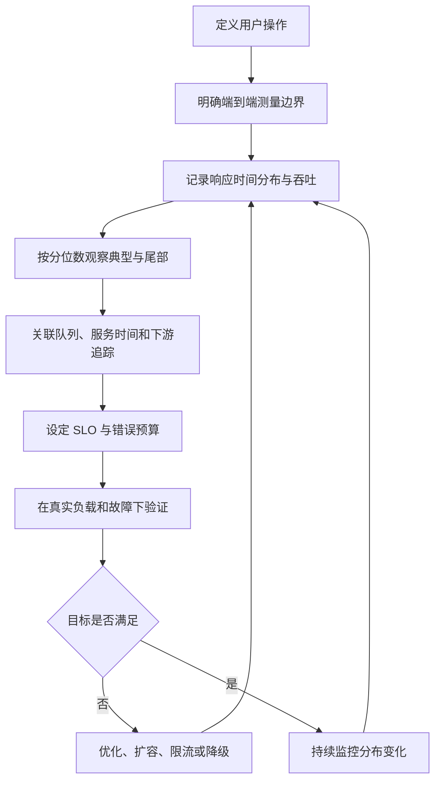

只测一次基准不构成性能管理。系统负载、数据分布、代码和依赖持续变化，指标必须形成反馈闭环。

### 2.39 本节小结

性能不是一个“快”字，而是吞吐量与响应时间分布。接近容量时，排队使延迟非线性增长；重试可能形成亚稳态故障，因此需要退避、熔断、限流、负载丢弃和背压共同保护。

响应时间必须从客户端边界测量，并区分服务时间、排队和网络延迟。均值有容量意义，却不能描述典型体验；p50 描述中间用户，高分位描述尾部。多后端调用会放大尾延迟。SLO 把这些度量变成目标，SLA 再规定违约后果。分位数必须从合并分布或直方图计算，不能平均各节点分位数。

## 3. 可靠性与容错

### 3.1 “可靠”首先要求定义“正确工作”

人们对可靠与不可靠有直觉，但工程上必须先定义系统怎样才算 **正确工作**。原文列出四类期望：

1. 应用执行用户期望的功能；
2. 用户犯错或以意外方式使用时，系统仍能妥善处理；
3. 在预期负载和数据量下，性能足以支持用途；
4. 系统阻止未授权访问与滥用。

于是 **可靠性（reliability）**可以近似定义为：

> 即使事情出错，系统仍持续正确工作。

这个定义包含功能、性能和安全语义。系统即使返回 HTTP 200，若给出错误余额、延迟超过业务截止时间或泄露数据，也不应算可靠。

### 3.2 故障与失效的严格区分

作者用两个层次描述“出错”：

- **故障（fault）**：系统某个局部组件不再正确工作，例如单块硬盘损坏、单机崩溃、依赖服务中断；
- **失效（failure）**：整个系统不再向用户提供要求的服务，也就是违反 SLO。

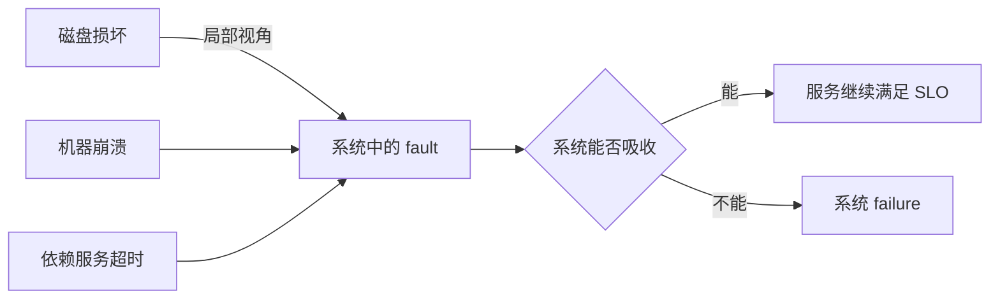

两者容易混淆，因为同一个事件在不同系统边界上有不同名称：

- 对硬盘本身，它已经 failed；
- 对只有一块硬盘的系统，该事件也是系统 failure；
- 对有冗余硬盘的存储系统，它可能只是一个被容忍的 fault。

因此，说“数据库失败”前应明确观察边界：是某副本进程退出，还是用户已经无法获得要求的数据？

### 3.3 从故障到失效的传播链

可把系统看作状态机：正常状态 $S_0$ 接收故障事件 $f$ 后，若恢复机制 $h$ 成功，就转入仍满足服务要求的降级状态 $S_1$；若无法吸收，则进入失效状态 $S_F$。

$$
S_0\xrightarrow{f}
\begin{cases}
S_1, & h(f)\text{ 成功，SLO 仍满足}\\
S_F, & h(f)\text{ 失败，SLO 被违反}
\end{cases}
$$

可靠性设计的目标不是让 $f$ 永不发生，而是尽可能阻断：

$$
{}\text{fault}\rightarrow\text{failure}
$$

这也说明，若 SLO 没有定义，就无法严格判断局部故障是否升级为系统失效。

### 3.4 什么是容错系统

若系统在某些故障发生时仍持续提供要求的服务，就称为 **容错（fault-tolerant）**。

容错不是绝对属性，完整说法应包含故障模型：

> 系统能在任意一个可用区失联、任意两个存储节点崩溃，但不出现数据损坏的条件下，继续满足哪些读写 SLO。

只说“系统具有容错能力”没有说明：

- 能容忍什么类型的故障；
- 同时最多几个；
- 故障持续多久；
- 是否允许降级；
- 数据和性能保证是否改变。

### 3.5 单点故障

如果某个组件一旦故障，就会使整个系统失效，它就是 **单点故障（single point of failure，SPOF）**。

常见但容易被忽略的 SPOF：

- 只有一份的数据库或密钥；
- 双机集群共同依赖的单个网络交换机；
- 多区域服务共同调用的单一身份服务；
- 只有一人知道的恢复操作；
- 有备份但从未验证、实际无法恢复；
- 所有副本都依赖同一错误配置分发系统。

SPOF 不一定是“一个物理盒子”，也可能是共享依赖、流程或知识。

### 3.6 时间线投递中的容错要求

回到社交时间线：扇出工作节点在更新一批时间线时崩溃。容错机制需要另一节点接手，并达到：

- 不漏掉应投递的帖子；
- 不产生用户可见的重复帖子；
- 恢复后保持合理顺序；
- 队列积压仍受控制。

原文把“不漏且不重”的目标称为 **恰好一次语义（exactly-once semantics）**，第 12 章会展开。

在网络系统中，“物理消息恰好发送一次”通常不可直接保证。更实际的分解是：

1. 持久记录待处理任务；
2. 未确认任务可重新投递；
3. 输出使用稳定 ID 幂等写入；
4. 输入进度与输出提交协调；
5. 重复尝试产生与一次成功相同的可观察结果。

这就是为什么“恰好一次效果”经常建立在至少一次执行之上。

### 3.7 容错一定有边界

容错只针对有限数量、有限类型的故障。例如：

- 最多同时两块磁盘失效；
- 三节点中最多一个节点崩溃；
- 一个可用区完全不可达；
- 网络短时分区，但多数节点仍可互通。

如果所有节点都崩溃，或所有数据副本同时被删除，系统无法凭空工作。工程设计要明确：

$$
{}\text{fault model}=
(\text{type},\text{count},\text{duration},\text{correlation},\text{scope})
$$

这是本文的整理方式。遗漏相关性尤其危险：三个副本位于同一机架，并不等价于跨三个可用区的三个副本。

### 3.8 故障预算与风险选择

没有系统能容忍一切。可以把候选故障 $f_i$ 的年发生概率记为 $p_i$，造成的损失记为 $L_i$，缓解成本为 $C_i$。粗略风险为：

$$
R_i=p_iL_i
$$

当缓解后的风险降低量显著大于 $C_i$ 时，投资通常更合理。不过：

- 极端生命安全或法律风险不能只按平均金钱期望决策；
- 概率估计可能缺乏历史数据；
- 故障相关性使简单求和低估风险；
- 声誉、永久数据损失等影响难以量化。

风险模型的作用是迫使团队比较后果，而不是制造虚假的数学精确度。

### 3.9 故障注入为何可能提高可靠性

直觉上应该减少故障；但在容错系统中，主动触发局部故障可以提高信心，这称为 **故障注入（fault injection）**。

原因是容错代码只在异常路径运行：

- 平时很少执行，可能已经因版本变化失效；
- 错误处理本身常包含关键缺陷；
- 未演练的恢复手册在事故中才暴露缺页；
- 监控可能根本没有检测到故障。

随机终止进程、断开网络、注入磁盘错误，可以持续验证系统是否真的切换和恢复，而不是只在架构图上“有副本”。

### 3.10 混沌工程不是在生产环境随意破坏

**混沌工程（chaos engineering）**通过受控实验提高对容错机制的信心。一个严谨实验应包括：

1. 定义稳态指标，例如有效请求成功率和 p99；
2. 提出假设，例如“失去一个工作节点不会漏投递”；
3. 限定故障范围和最大影响；
4. 设置自动停止条件；
5. 注入一个已知故障；
6. 观察用户与内部指标；
7. 修复缺陷并重复实验。

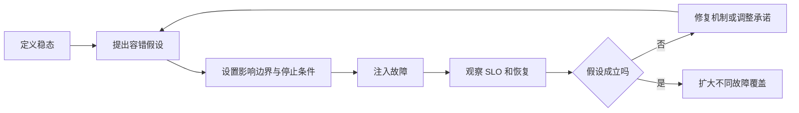

实验前必须确认系统已有基本监控和恢复能力。对无法承受影响的系统，应先在测试或预发布环境演练，再逐步扩大范围。

### 3.11 容错与预防的边界

作者通常偏好容忍可恢复故障，而不是幻想完全预防。但是某些事件“发生后不可撤销”，预防优先，例如攻击者已经读取敏感数据。

可以区分：

- **可恢复故障**：进程崩溃、节点失联、队列消费者退出，可通过重启、重试、切换恢复；
- **不可逆损害**：密钥泄露、隐私数据外泄、错误转账已被外部消费，事后补救不能抹去全部后果。

预防、检测、限制影响和恢复都需要，但比例由故障可逆性决定。本书主要讨论可通过数据系统机制治愈的故障。

### 3.12 硬件故障为何在大规模下成为常态

单块设备年故障概率不高，小系统可能几年才遇到一次；有成千上万设备时，故障会每天发生。

原文列举的经验数量级：

| 硬件 | 故障或错误数量级 |
| --- | --- |
| 磁性硬盘 | 每年约 2%–5% 故障 |
| SSD | 每年约 0.5%–1% 故障 |
| CPU | 约每 1,000 台机器有一颗核心偶尔算错 |
| RAM | 即使用 ECC，每年仍有超过 1% 机器遇到不可纠正错误 |
| 整个数据中心 | 少见，但会因电力、网络、火灾、洪水、地震等不可用或毁坏 |

这些数字来自特定年代和样本，不应直接当作采购承诺；它们用于说明：规模会把罕见事件变成日常运维事件。

### 3.13 从年故障率推导每日故障数

设有 $N$ 个磁盘，每个年故障率为 $p$，若暂时假设独立且全年均匀，期望年故障数为：

$$
E_{\text{year}}=Np
$$

日均故障数约为：

$$
E_{\text{day}}=\frac{Np}{365}
$$

对 10,000 块磁盘：

- $p=2\%$ 时，约 $200/365\approx0.55$ 块/天；
- $p=5\%$ 时，约 $500/365\approx1.37$ 块/天。

所以原文概括为平均每天约一块。期望值不表示每天恰好坏一块，实际故障有波动和相关性。

### 3.14 至少一个组件故障的概率

若每个组件在某窗口内独立故障概率为 $p$，$N$ 个组件至少一个故障的概率为：

$$
P(\text{at least one fault})=1-(1-p)^N
$$

即使 $p$ 很小，$N$ 足够大时，该概率也接近 1。若单盘日故障概率粗略为 $0.03/365$，10,000 块盘一天至少一块故障的概率约为：

$$
1-\left(1-\frac{0.03}{365}\right)^{10000}
\approx56.1\%
$$

这里选取 3% 年故障率作示例。独立同分布假设不真实，但数量级直觉成立：大集群必须把设备替换作为常规流程。

### 3.15 静默数据损坏比崩溃更难

硬件错误不总是“机器干净地退出”：

- CPU 可能偶尔返回错误计算结果；
- 内存位翻转可能改变数据；
- SSD 可能出现无法纠正的读取错误；
- 固件缺陷可能在固定运行时长后同时触发。

**静默数据损坏（silent data corruption）**危险在于系统仍在运行，却传播错误结果。检测通常需要：

- 校验和；
- 端到端完整性验证；
- 冗余计算或副本比较；
- 定期巡检（scrubbing）；
- 不变量与业务对账。

副本只复制字节，并不自动判断字节正确；若错误先进入权威源，再被复制，冗余可能忠实放大错误。

### 3.16 数据中心级故障为何必须单独建模

电力故障、网络错误配置、火灾、洪水和地震可能让整个数据中心不可用。太阳风暴甚至可能影响电网和海底光缆。

这些事件概率低、影响范围大。将多个副本放在同一机房只能容忍单机故障，无法容忍机房级共同原因。

故障域应分层：

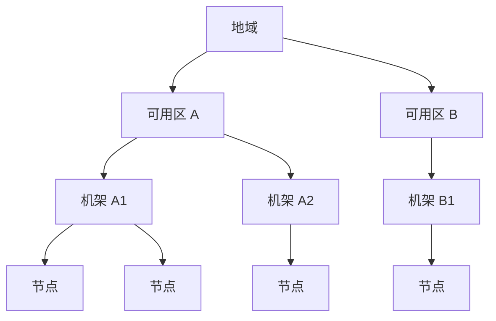

容忍哪个层级，就要把冗余放到该层级之外。跨地域又会增加延迟、成本和一致性难度，因此不应机械追求最大距离。

### 3.17 硬件冗余的基本思想

面对不可靠组件，第一反应通常是增加冗余：

- RAID 在多块磁盘保存条带或冗余；
- 服务器使用双电源和可热插拔组件；
- 数据中心使用电池与柴油发电机；
- 数据跨机器、机架或可用区复制。

冗余让单个组件故障不立即中断服务，并提供维修时间。

### 3.18 独立故障下冗余为何有效

若两个组件各自在窗口内失效概率为 $p$，且故障完全独立，只有两者同时失效才导致系统失效，则概率近似：

$$
P_{\text{both}}=p^2
$$

若 $p=0.01$，单组件风险为 1%，双副本同时风险理论上为：

$$
0.01^2=0.0001=0.01\%
$$

独立冗余把风险降低两个数量级。这是冗余最吸引人的数学直觉。

### 3.19 相关故障为何打破简单乘法

现实故障并不完全独立：

- 同批次硬盘有相同制造缺陷；
- 同一电源、机架交换机或机房同时影响多个节点；
- 运维脚本向所有副本发布同一错误配置；
- 软件缺陷在同一时间条件下触发所有实例；
- 恢复过程中额外负载导致剩余设备继续失效。

若存在共同原因事件 $C$，其概率为 $q$，会同时击中全部副本，则双副本系统风险至少包含：

$$
P_{\text{failure}}\approx q+(1-q)p^2
$$

当 $p=1\%$、$q=0.1\%$ 时：

$$
P_{\text{failure}}
\approx0.001+0.999\times0.0001
\approx0.10999\%
$$

这比只算 $0.01\%$ 高约 11 倍。冗余设计必须减少共享故障域，而不只是增加副本数量。

### 3.20 RAID 与服务级冗余的区别

RAID 提高单机磁盘层可靠性，但不能容忍：

- 主板、RAID 控制器或整机故障；
- 操作系统损坏；
- 机架或机房中断；
- 应用误删除；
- 软件把错误数据写入所有盘。

多节点软件级容错能跨机器接管，并可跨可用区部署。两者不是互斥：底层设备仍可使用局部冗余，服务层再用复制吸收更大故障域。

### 3.21 可用区的作用

云提供商用 **可用区（availability zone）**标识物理共置和相关故障范围。同一区内资源更可能共享电力、网络或设施，跨区资源的故障相关性通常较低。

但“跨可用区”不是绝对独立：

- 区域级控制平面可能共享；
- 软件和配置仍然相同；
- 身份、DNS 或供应商服务可能是共同依赖；
- 人为操作可以同时影响所有区域。

部署拓扑只是故障模型的一部分，还需审视软件与组织共因。

### 3.22 软件级容错的运维收益

能容忍整机失效的多节点系统，也能支持 **滚动升级（rolling upgrade）**：

1. 从流量中移除一个节点；
2. 升级或重启；
3. 等待健康并追上状态；
4. 恢复流量；
5. 对下一个节点重复。

用户服务无需计划性整体停机。滚动升级要求相邻版本能够互操作、数据格式前后兼容、容量足以承受少一个节点。第 5 章会进一步讨论演化兼容。

### 3.23 软件故障为什么比硬件故障更棘手

硬件故障多数近似独立；软件故障经常 **高度相关**，因为所有节点运行相同代码、配置和协议。增加十个相同副本并不能容忍一个会让所有副本同时崩溃的缺陷。

这类故障往往比独立硬件故障造成更多系统失效，因为它们会同时穿透冗余。

### 3.24 同时触发所有节点的缺陷

原文给出两个典型案例：

- 2012 年 6 月 30 日闰秒触发 Linux 内核缺陷，使许多 Java 应用同时挂起；
- 某些型号 SSD 的固件缺陷会在运行恰好 32,768 小时后全部失效，数据无法恢复。

两者共同特点：

- 缺陷长期潜伏；
- 所有实例共享同一触发条件；
- 时间或环境事件让故障高度同步；
- 同构冗余无法提供保护。

降低风险的方法包括版本和硬件多样性、分批升级、预演时间边界、避免所有节点同龄，以及对关键结果做独立验证。但多样性也增加运维与测试复杂度。

### 3.25 失控进程与资源耗尽

进程可能无限消耗共享资源：

- CPU；
- 内存；
- 磁盘空间；
- 网络带宽；
- 线程或文件描述符；
- 数据库连接；
- 云 API 配额。

大请求可能让进程内存耗尽并被操作系统终止；客户端库缺陷可能制造远超预期的流量。

防御措施包括：

- 每请求大小和执行时间限制；
- 内存、CPU 和连接配额；
- 有界队列；
- 隔离不同租户或优先级；
- 断路器与过载保护；
- 资源耗尽前告警；
- 进程崩溃后干净重启。

限制必须覆盖链路各层；只限制入口请求数，单个请求仍可能产生巨大内部扇出。

### 3.26 依赖服务的慢与坏响应

依赖不一定完全宕机，也可能：

- 响应逐渐变慢；
- 只对部分请求超时；
- 返回格式正确但内容损坏；
- 进入陈旧或不一致状态。

“fail-slow” 比“fail-stop”更难检测，因为节点看似健康，却占用调用方线程并污染尾延迟。健康检查不能只问进程是否存活，还应验证关键操作、结果语义和延迟。

对损坏响应，重试同一依赖可能得到相同错误；需要模式验证、校验和、业务不变量、版本回退或独立数据源对照。

### 3.27 跨系统交互产生涌现行为

两个组件各自测试正常，组合后仍可能出现未预期行为。例如：

- 服务 A 超时 1 秒重试，服务 B 通常 1.1 秒成功，于是每次都产生重复工作；
- 缓存失效让数据库变慢，慢数据库又让缓存填充超时，形成持续雪崩；
- 两个独立自动扩缩器同时响应同一指标，造成资源周期振荡；
- 队列重投策略与消费者事务边界组合后产生重复副作用。

这种 **涌现行为（emergent behavior）**无法只靠单组件单元测试发现，需要集成测试、故障演练、端到端观测和对反馈环的建模。

### 3.28 级联失效

**级联失效（cascading failure）**指一个组件的问题让另一个组件过载或变慢，继而击倒更多组件。

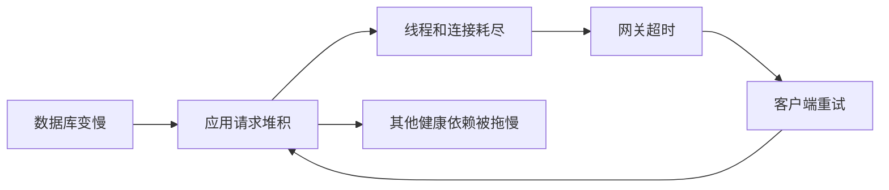

级联和亚稳态相关但不完全相同：

- 级联强调故障沿组件传播；
- 亚稳态强调坏状态在原触发消失后仍自我维持；
- 同一事故可以同时具有两者。

隔离资源池、限制扇出、快速失败、负载丢弃和降级功能都用于阻断传播。

### 3.29 潜伏缺陷揭示隐藏假设

软件缺陷可能长期不触发，因为它依赖某个“通常成立”的环境假设：

- 时间单调增长且没有闰秒；
- 请求大小有合理上限；
- 磁盘永远不会满；
- 依赖总在超时前响应；
- ID 不会耗尽或回绕；
- 队列消息不会重复；
- 节点时钟足够同步；
- 所有客户端都按协议升级。

事故发生时，真正被打破的是假设。可靠性评审应把隐含假设转成：

1. 可执行不变量；
2. 输入和资源边界；
3. 监控指标；
4. 故障实验；
5. 明确的降级行为。

### 3.30 软件系统性故障没有银弹

作者没有给出一个万能算法，而是强调多种小措施叠加：

- 仔细分析假设与组件交互；
- 充分测试，包括异常路径；
- 隔离进程和资源；
- 允许进程崩溃后自动重启；
- 避免重试风暴等反馈环；
- 在生产中测量、监控和分析实际行为。

同构复制主要对付随机局部故障；测试、隔离、发布策略和观测才更直接对付软件共因故障。

### 3.31 人是系统的一部分

系统由人设计、实现和运行。人的优势是能创造性地适应未预料情况，而这也意味着行为不完全可预测，可能发生错误。

原文引用研究：大型互联网服务中，运维人员的配置变更是中断的首要原因，而硬件故障只参与约 10%–25% 的事故。

这不应导向“人不可靠，所以全部自动化”，而应导向 **社会技术系统（sociotechnical system）**视角：代码、工具、流程、激励、组织和人在共同产生结果。

### 3.32 为什么“人为错误”不是根因

把事故结论写成“某人不小心”没有解释：

- 为什么一个操作能影响全部生产；
- 为什么界面没有警告高风险目标；
- 为什么没有同行评审或渐进发布；
- 为什么监控未及时发现；
- 为什么回滚困难；
- 为什么当时做法在操作者看来是合理的；
- 为什么组织长期接受这些条件。

“人为错误”通常是深层系统问题的症状。惩罚个人会让未来参与者隐瞒细节，组织失去学习证据。

### 3.33 降低操作失误影响的技术措施

原文列举：

- 手写测试和大量随机输入的 **性质测试（property testing）**；
- 配置和代码快速回滚；
- 新版本渐进发布；
- 清晰、详细的监控；
- 可观测性工具；
- 鼓励正确操作、阻止危险操作的界面。

还可以补充实践中的防护层次：

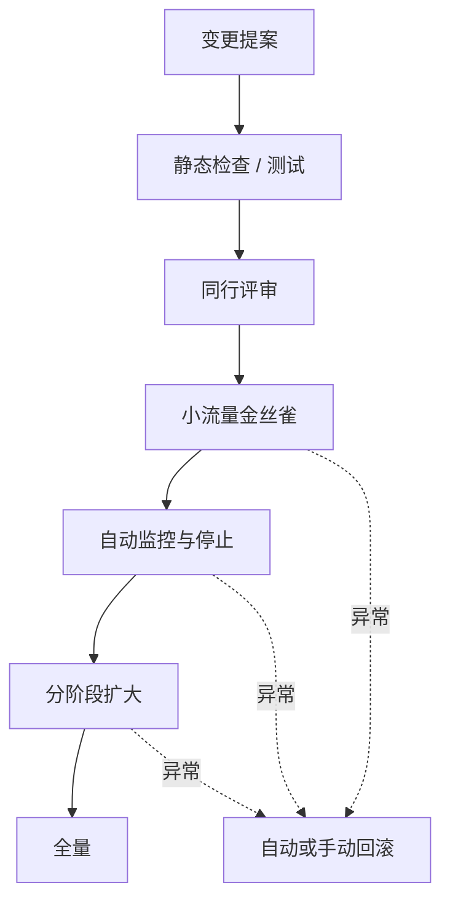

每层都假设上一层可能漏错；多层防御降低单个动作直接成为系统失效的概率。

### 3.34 性质测试解决什么问题

示例测试只验证人工想到的输入；性质测试生成大量随机输入，验证应始终成立的不变量。

时间线系统可以验证：

```text
对任意帖子、关注关系和重复投递序列：
1. 时间线中同一个 post_id 最多出现一次；
2. 时间线中的帖子必须来自当前允许显示的来源；
3. 结果按定义的排序键单调排列；
4. 从事件重放得到的结果等于增量处理结果。
```

性质测试不能证明所有生产交互，但能探索人工案例难以覆盖的边界。失败时还应缩减随机输入，给出最小反例。

### 3.35 可靠性投资为何经常被推迟

测试、回滚、渐进发布和可观测性都需要时间与资金，却不直接产生可见新功能。组织在“更多功能”和“更多韧性”之间，常选择前者。

如果管理层持续奖励发布速度而不奖励风险降低，工程师会合理地压缩测试和演练。事故后再责怪执行者，忽略了资源和激励选择。

可靠性不是纯技术参数，也是业务优先级。团队应明确：

- 接受了哪些风险；
- 为何接受；
- 风险由谁承担；
- 哪些阈值触发增加投资。

### 3.36 无责事故复盘

**无责事故复盘（blameless postmortem）**鼓励参与者在不担心惩罚的条件下完整分享事故细节，让组织学习如何防止相似问题。

高质量复盘通常包含：

- 用户影响与 SLO 影响；
- 精确时间线；
- 当时可见信号与决策背景；
- 技术和组织促成条件；
- 哪些防护有效、哪些失效；
- 可验证、有负责人和期限的改进项；
- 后续如何确认改进有效。

“无责”不等于没有责任或忽略故意违规，而是避免把正常工作环境中的可理解行为当作唯一原因。

### 3.37 对简单事故答案保持怀疑

作者给出两个都不可取的答案：

- “Bob 部署时应该更小心”；
- “必须用 Haskell 重写后端”。

前者把系统问题缩成个人注意力，后者用未经证实的大改写替代因果分析。更好的问题是：

1. 操作者当时知道什么？
2. 哪些工具和目标塑造了其选择？
3. 故障为什么能越过多层边界？
4. 哪些组织优先级让风险长期存在？
5. 什么小而可验证的改变能降低复发概率或影响？

### 3.38 可靠性有多重要

可靠性不仅属于核电站和空管。普通业务系统的缺陷会造成：

- 员工生产力损失；
- 财务和监管报告错误；
- 电商收入中断；
- 品牌与客户信任受损；
- 个人数据永久丢失；
- 自动化错误对人的现实伤害。

不同故障的后果也不同。许多应用可容忍几分钟甚至几小时不可用，却不能容忍永久数据损坏。

### 3.39 可用性与持久性不要混淆

- **可用性（availability）**：需要服务时能否获得服务；
- **持久性（durability）**：已确认保存的数据是否会永久保留。

照片服务短暂停机后恢复，属于可用性事件；恢复后照片全部丢失，是持久性灾难。

一个系统可以：

- 暂时不可用但不丢数据；
- 高度可用却返回错误或损坏数据；
- 读服务可用但写服务不可用；
- 接受写入后无法保证持久保存。

非功能要求必须分别定义这些维度。

### 3.40 照片应用案例：备份责任不能推给用户

家长把孩子的全部照片和视频放入应用，数据库损坏会丢失不可重建的人生记录。普通用户可能不知道如何建立独立备份，也不应承担服务端存储承诺失效的全部责任。

可靠存储至少需要：

- 多故障域副本；
- 防止应用误删除的版本或备份；
- 定期恢复演练；
- 校验和与损坏检测；
- 删除和勒索攻击的隔离；
- 明确持久性承诺。

“有备份”只有在能在目标恢复时间内恢复正确数据时才有意义。

### 3.41 英国邮局 Horizon 丑闻

1999–2019 年间，英国数百名邮局分支管理者因会计软件显示账目短缺，被判盗窃或欺诈。后来发现许多短缺由软件缺陷造成，大量定罪被推翻。

问题被法律假设放大：除非有相反证据，计算机被推定为正确运行，因此计算机生成的证据被视为可靠。软件工程师知道“无缺陷软件”几乎不存在，但受害者承受了监禁、破产乃至死亡等不可逆后果。

这个案例说明：

- 错误结果比明显宕机更危险；
- 审计系统必须保存可质疑、可解释的证据链；
- 人不应被迫证明一个不透明系统出错；
- 可靠性要求应与系统对人的权力相匹配；
- “计算机说的”不是事实正确性的充分证明。

### 3.42 原型阶段可以牺牲可靠性，但必须有意识

探索未经验证市场的原型，可能合理地用较低可靠性换取更低成本和更快学习。但应明确：

- 数据是否可重新生成；
- 用户是否会基于结果做重要决定；
- 最坏损失是什么；
- 哪些角落被削减；
- 何时必须偿还风险；
- 从原型进入生产前有哪些门槛。

“这是原型”不能无限期成为生产系统缺乏备份、权限和恢复能力的借口。

### 3.43 本节小结

可靠性是在事情出错时仍持续正确工作。fault 是局部异常，failure 是用户服务违反 SLO；容错机制试图阻止前者升级为后者，并必须声明能容忍的类型、数量、时长和故障域。

硬件故障在大规模下成为日常，冗余在独立故障下有效，却会被共同原因削弱。软件缺陷和错误配置通常高度相关，同构副本无法解决，必须依赖测试、隔离、渐进发布、过载保护和生产观测。人不是系统外部的错误源，而是社会技术系统的一部分；无责复盘应寻找促成条件和可验证改进。可靠性投资最终由系统失败对人的真实后果决定。

## 4. 可扩展性

### 4.1 今天可靠，不代表增长后仍可靠

系统在当前负载下工作正常，随着并发用户从 1 万增长到 10 万、数据从 100 GB 增长到 1 TB，可能出现：

- 响应时间进入排队陡壁；
- 缓存命中率下降；
- 索引超出内存；
- 单分片热点；
- 备份、恢复和重建时间超标；
- 运维任务不能在窗口内完成。

**可扩展性（scalability）**描述系统应对增长负载的能力。它不是当前速度，也不是“使用了分布式数据库”。

### 4.2 “你不是 Google”何时有道理

新产品用户很少、需求还在探索时，首要目标通常是保持系统简单、灵活，以便快速学习和改变功能。提前为想象中的亿级流量设计可能：

- 浪费当前开发时间；
- 增加分布式故障和运维；
- 把数据模型锁进错误假设；
- 降低产品试错速度；
- 最终优化了从未出现的瓶颈。

因此，“先使用关系数据库、不要过早扩展”在许多初创场景合理。但它不是普遍真理：

- 视频处理即使用户少，单请求也可能很大；
- 企业客户可能从第一天要求区域容错；
- 传感器产品上线即有固定设备洪峰；
- 数据驻留会天然要求分布。

是否担心规模取决于可推导的负载，不取决于公司名气。

### 4.3 为什么“X 可扩展”没有完整含义

可扩展性不是一维标签。必须说明 **沿哪个负载维度增长**：

- 每秒请求数；
- 同时在线用户；
- 总数据量；
- 单个用户的数据量；
- 关注者或图关系数量；
- 每条消息大小；
- 地域数量；
- 查询复杂度；
- 写入热点程度。

一个系统可随总用户数水平扩展，却无法处理单个名人账户热点；可以保存 PB 数据，却不能在低延迟下更新一个全局计数器。

### 4.4 可扩展性讨论的三个核心问题

作者要求回答：

1. 若系统按某种方式增长，有哪些应对选项？
2. 如何增加计算资源处理新增负载？
3. 按当前增长预测，何时触及现有架构上限？

这三个问题分别对应：架构策略、资源效率和容量时间线。

### 4.5 先观察真实瓶颈，再选择扩展技术

产品成功并开始增长后，监控会揭示：

- 哪条路径增长最快；
- CPU、内存、磁盘或网络谁先饱和；
- 平均用户还是极端用户主导成本；
- 尾延迟在哪个依赖形成；
- 哪个数据结构不能再高效维护。

此时才有证据选择分片、缓存、异步处理或专用存储。扩展技术不是预先收集的“最佳实践”，而是针对已知负载参数的响应。

### 4.6 描述当前负载

讨论“负载翻倍”前，必须建立当前负载基线。常见吞吐参数：

- requests/s；
- GB/day 新数据；
- checkouts/hour；
- posts/s；
- timeline writes/s。

有时峰值状态更关键，例如同时在线用户数、黑色星期五结账峰值或事件期间每秒帖子数。

### 4.7 负载不只是一个吞吐数字

访问模式还由统计特征决定：

- 读写比；
- 缓存命中率；
- 每用户数据项数量；
- 对象大小分布；
- 请求成本分布；
- 热点键比例；
- 突发系数；
- 数据保留期。

时间线案例平均每人 200 个关注者，却被少数超大账户支配。应记录分位数和最大值，例如关注者数 p50、p95、p99、p99.9 以及已知最大值。

### 4.8 负载向量

可以用向量表示负载：

$$
\mathbf{L}=
(q_r,q_w,d,b,c,h,f,\ldots)
$$

其中：

- $q_r,q_w$：读写速率；
- $d$：总数据量；
- $b$：平均/分位对象大小；
- $c$：并发数；
- $h$：热点或倾斜程度；
- $f$：扇出分布。

“负载增长两倍”必须说明向量哪个分量变化。若所有分量同比增长，与只有单对象大小翻倍，架构后果完全不同。

### 4.9 两种扩展实验

理解当前负载后，从两个互补方向提问。

#### 固定资源，增加负载

保持 CPU、内存、网络和节点数不变，提高某个负载参数，观察性能怎样变化：

$$
P'=F(k\mathbf{L},\mathbf{R})
$$

这里 $P$ 是响应时间、错误率等性能，$\mathbf{R}$ 是资源，$k$ 是负载倍数。

它回答“当前系统离崩溃陡壁多远”。

#### 增加负载，维持性能

负载增长为 $k\mathbf{L}$，希望性能仍在 SLO 内，需要多少资源：

$$
\mathbf{R}'=G(k\mathbf{L},P_{\text{target}})
$$

它回答“增长要花多少钱、以何种方式加资源”。

两类实验不能互相替代。第一类揭示容量上限，第二类揭示扩展效率。

### 4.10 目标是 SLO 与成本共同约束

扩展不是最大化机器数，而是：

$$
\min C(\mathbf{R})
\quad\text{subject to}\quad
P(\mathbf{L},\mathbf{R})\in\text{SLO}
$$

即在满足性能与可靠性目标的前提下，最小化运行成本。

硬件价格性能会随时间变化，最优配置也会改变。GPU、NVMe、更大内存实例或对象存储可能让旧架构边界重新移动，因此容量规划需要周期复查。

### 4.11 线性可扩展性

如果负载加倍、资源也加倍，性能保持相同，就称为 **线性可扩展性（linear scalability）**。

设承载负载 $L$ 所需资源为 $R(L)$，理想关系为：

$$
R(kL)=kR(L)
$$

也可定义扩展效率：

$$
\eta(k)=
\frac{\text{实际吞吐提升倍数}}{\text{资源提升倍数}}
$$

- $\eta=1$：线性；
- $\eta<1$：次线性，资源增长快于吞吐；
- $\eta>1$：超线性，可能来自更好缓存命中、峰值错开或规模经济。

### 4.12 一个扩展效率示例

某系统 4 个节点稳定处理 20,000 requests/s；扩至 8 节点后处理 34,000 requests/s。

资源提升倍数为 2，吞吐提升倍数为：

$$
\frac{34{,}000}{20{,}000}=1.7
$$

扩展效率为：

$$
\eta=\frac{1.7}{2}=85\%
$$

损失的 15% 可能来自复制、协调、数据倾斜或共享依赖。仅报告“吞吐增加 70%”会隐藏资源已经翻倍。

### 4.13 为什么成本更常超线性增长

负载加倍常需要超过两倍资源，原因包括：

- 数据变大后索引不再放入内存；
- 每次写入要维护更多层级或更大元数据；
- 跨节点协调随节点数增加；
- 热点无法均匀分配；
- 为容错保留冗余容量；
- 网络与存储成为共享瓶颈；
- 更大机器单价呈超线性。

偶尔也会超线性改善，例如更多租户让峰值互相平滑，或更大缓存让磁盘访问骤减。但不能把偶发现象当作永久扩展规律。

### 4.14 容量耗尽时间

若当前峰值负载为 $L_0$，架构稳定上限为 $L_{\max}$，负载每月按比例 $g$ 增长：

$$
L(t)=L_0(1+g)^t
$$

预计触顶月份为：

$$
t=
\frac{\ln(L_{\max}/L_0)}{\ln(1+g)}
$$

例如当前峰值 40,000/s，上限 100,000/s，月增长 10%：

$$
t=\frac{\ln(2.5)}{\ln(1.1)}\approx9.6\ \text{个月}
$$

团队不能等到第 10 个月才开始迁移；还要减去设计、实现、压测和回滚所需提前期。增长率也可能变化，应报告预测区间而非单点日期。

### 4.15 纵向扩展与共享内存

最简单的增加资源方式是换更强机器：更多 CPU 核、RAM 和磁盘，称为 **纵向扩展（vertical scaling / scaling up）**。

同一进程的线程可访问共享 RAM，因此也称 **共享内存架构（shared-memory architecture）**。

优势：

- 编程和事务模型较直接；
- 没有跨节点网络和分片；
- 调试、部署与一致性更简单；
- 对中等规模常有很高性价比。

局限：

- 单机存在硬件上限；
- 高端机器价格通常超线性；
- 共享内存、总线和锁形成瓶颈；
- 单机故障域大；
- 扩缩粒度粗，不能随意归还半台机器。

### 4.16 Amdahl 定律与单机多核

即使增加 CPU 核，也只有可并行部分能加速。若串行比例为 $s$，使用 $N$ 核的理论加速上限：

$$
S(N)=\frac{1}{s+(1-s)/N}
$$

当 $s=10\%$，即使核心数趋近无穷：

$$
\lim_{N\to\infty}S(N)=\frac{1}{0.1}=10
$$

此外共享锁、内存带宽和缓存一致性会进一步降低收益。买两倍核心通常不能处理恰好两倍负载。

### 4.17 共享磁盘架构

**共享磁盘架构（shared-disk architecture）**让多台机器拥有各自 CPU 和 RAM，但共同访问磁盘阵列，通常通过：

- 网络附加存储（network-attached storage，NAS）；
- 存储区域网络（storage area network，SAN）。

它传统上用于本地数据仓库：计算节点可扩展，数据保留在共享存储中。

局限是多个节点争用共享数据和锁；存储网络与锁管理可能成为中心瓶颈。节点越多，协调开销越显著。

### 4.18 无共享架构

**无共享架构（shared-nothing architecture）**也叫 **横向扩展（horizontal scaling / scaling out）**。每个节点拥有自己的 CPU、RAM 和磁盘，节点通过普通网络由软件协调。

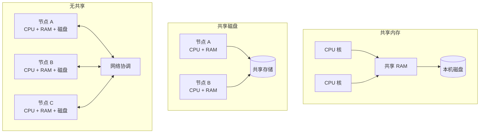

优势：

- 有潜力接近线性扩展；
- 可使用性价比更高的普通硬件；
- 云中较容易增减节点；
- 可跨数据中心和地域提高容错。

代价：

- 必须显式分片；
- 跨分片查询和事务复杂；
- 数据再平衡需要搬迁；
- 网络、部分失败和时钟问题进入设计；
- 运维与诊断成本更高。

### 4.19 分片如何提供扩展，又制造热点

设数据按键分到 $N$ 个节点，理想均匀时每节点处理约总负载的：

$$
\frac{L}{N}
$$

若某个热点键独占比例 $h$，承载它的节点至少处理 $hL$。当：

$$
hL > \frac{L}{N}
$$

即 $h>1/N$ 时，该节点负载高于理想平均。名人账户就是典型热点：增加普通分片数无法把一个必须保持在同一键上的热点自然拆开。

因此横向扩展依赖良好分区键和热点策略，第 7 章会详细讨论。

### 4.20 云原生专用存储 API 与旧共享磁盘的区别

部分云原生数据库把存储与事务执行分成服务，多个计算节点访问同一存储服务，看起来像共享磁盘。

不同之处在于：

- 旧 NAS/SAN 提供通用文件系统或块设备接口；
- 云原生存储服务提供针对数据库日志、页、版本或复制设计的专用 API；
- 存储服务自身可以分布式扩展并理解数据库操作粒度；
- 计算节点不必用传统分布式锁争用一个通用磁盘抽象。

专用接口可以避免部分旧共享磁盘瓶颈，但仍有网络、元数据、一致性和供应商耦合成本。

### 4.21 相同数据吞吐不代表相同架构

原文比较两种负载：

- 100,000 requests/s，每请求 1 kB；
- 3 requests/min，每请求 2 GB。

两者数据吞吐都约为 100 MB/s：

$$
100{,}000\times1\ \text{kB/s}
\approx100\ \text{MB/s}
$$

$$
\frac{3\times2\ \text{GB}}{60\ \text{s}}
=0.1\ \text{GB/s}
=100\ \text{MB/s}
$$

但架构需求完全不同：

| 维度 | 10 万个 1 kB 请求/s | 每分钟 3 个 2 GB 请求 |
| --- | --- | --- |
| 每请求固定开销 | 极其重要 | 相对次要 |
| 连接与调度 | 高并发、小任务 | 低并发、大任务 |
| 内存缓冲 | 单请求小 | 单请求可能占大量内存 |
| 超时 | 毫秒/秒级 | 可能需要分钟级流式处理 |
| 重试代价 | 单次较小，总量大 | 单次搬运成本巨大 |
| 分片重点 | 请求分布与热点 | 大对象分块与流处理 |

“吞吐都是 100 MB/s”远不足以决定设计。这就是不存在通用“魔法扩展酱汁”的原因。

### 4.22 一个数量级就是一次架构复查点

适合当前负载的架构未必承受十倍负载。快速增长服务可能在每个数量级重新思考：

- $10^3$ 到 $10^4$ requests/s；
- 100 GB 到 1 TB；
- 10 万到 100 万并发用户。

作者建议通常不值得提前规划超过一个数量级，因为：

- 产品需求可能变化；
- 实际瓶颈尚未出现；
- 硬件和云服务会变化；
- 过度通用化妨碍当前演进。

这不等于完全不做长期设计。应避免不可逆锁定，保留迁移路径，同时只为下一个可信数量级做具体优化。

### 4.23 分解为可大体独立的组件

可扩展性的通用原则之一，是把系统拆成能 **大体独立运行** 的较小组件，使各部分可以分别：

- 扩容；
- 故障隔离；
- 部署；
- 重建；
- 选择适合的存储和硬件。

这个原则出现在：

- 微服务；
- 数据分片；
- 流处理；
- 无共享架构。

关键字是“大体独立”。若组件每次操作都全局同步，物理拆分不会产生扩展性。

### 4.24 边界为何是最难的问题

把应该在一起的状态拆开，会导致频繁网络调用和跨组件事务；把应独立扩展的工作绑在一起，又会形成共享瓶颈。

边界选择可以考察：

- 数据是否经常一起读取或原子更新；
- 负载是否独立变化；
- 故障是否应隔离；
- 团队是否独立负责；
- 状态能否按稳定键分区；
- 跨边界调用比例；
- 是否需要全局排序或约束。

不存在只根据名词就自动正确的服务或分片边界。

### 4.25 不要让扩展设计比问题更复杂

作者给出的第二个原则是：**不增加不必要复杂性。**

- 单机数据库足够时，优于复杂分布式集群；
- 负载可预测时，手动规划扩容可能比自动扩缩更少意外；
- 5 个服务通常比 50 个服务易于理解和运行；
- 不同组件可以采用不同扩展方式。

“自动化”“微服务”“无共享”都不是成熟度勋章，只是特定约束下的工具。

### 4.26 自动扩缩的控制环风险

自动扩缩根据指标增加或减少资源：


若扩容启动需要 5 分钟，但控制器每分钟根据当前高延迟继续加节点，可能过度扩容；随后负载下降又快速缩容，形成振荡。

设计需要：

- 领先指标或预测；
- 冷却时间；
- 上下限；
- 不同扩容和缩容阈值；
- 状态迁移成本；
- 故障时禁止错误缩容；
- 人工覆盖能力。

负载稳定可预测时，定时或人工容量调整可能更简单可靠。

### 4.27 实际架构通常混合扩展方式

一个系统可以同时使用：

- 纵向扩展的关系主库；
- 横向扩展的无状态应用层；
- 分片事件流；
- 共享对象存储与弹性计算；
- 手动设基线容量、自动处理短期波峰；
- 对名人账户采用特殊热点路径。

“纯粹架构”不如针对每类负载选择适当机制。混合方案的代价是接口和运维模式更多，需要清晰责任与可观测性。

### 4.28 可扩展性压测应怎样设计

1. 从生产遥测建立请求类型、对象大小和热点分布；
2. 分别测试正常、峰值、突发和故障恢复流量；
3. 固定资源逐步提高负载，找出排队陡壁；
4. 按比例加资源，计算扩展效率；
5. 观察 p50/p95/p99、错误率、队列和资源，而非只看平均吞吐；
6. 将数据规模也扩到目标值，避免“小数据高 QPS”假象；
7. 测试再平衡、扩容时间和峰后恢复；
8. 记录成本/有效吞吐，而不只记录极限值。

压测流量若均匀分布，会错过真实热点；若客户端本身饱和，会误判服务上限；若无过载保护，还可能只测出重试风暴。

### 4.29 本节小结

可扩展性描述系统在特定负载维度增长时，如何通过增加资源继续满足性能和可靠性目标。它不是“某产品能扩展”的标签。讨论前要建立包含吞吐、数据量、对象大小、并发、热点和扇出的负载向量，再回答固定资源下性能怎样退化，以及保持性能需要增加多少资源。

线性扩展是负载与资源同比增长时性能不变，但现实常因协调、缓存边界、热点和共享资源而次线性。纵向扩展简单但有硬件与共享瓶颈；共享磁盘受争用限制；无共享有更大潜力，却引入分片和分布式复杂性。好的设计面向下一个可信数量级，把组件按稳定边界适度独立，同时始终保留简单单机或手动方案作为基线。

## 5. 可维护性

### 5.1 软件不会磨损，为什么仍会“老化”

机械设备因摩擦和材料疲劳而磨损；软件比特不会物理疲劳。但软件运行环境和用途持续变化：

- 用户提出新功能；
- 业务规则和组织结构改变；
- 依赖库、操作系统和云平台升级；
- 安全漏洞需要修复；
- 法律和监管要求变化；
- 数据量与负载突破原架构假设；
- 长期潜伏的缺陷被发现。

因此，软件“老化”不是代码材料变坏，而是代码与现实环境之间的偏差不断扩大。系统若不能适应，维护成本会越来越高。

### 5.2 软件大部分成本发生在初次开发之后

业界普遍认识到，软件总成本的大部分不是首次编写，而是后续维护：

- 修复缺陷；
- 保持生产运行；
- 调查事故；
- 适配新平台；
- 支持新用例；
- 偿还技术债；
- 增加功能；
- 迁移数据和依赖。

可以用一个简化生命周期模型表达：

$$
C_{\text{lifecycle}}
=C_{\text{initial}}
+\sum_{t=1}^{T}
\left(C_{\text{operate},t}+C_{\text{change},t}+C_{\text{failure},t}
\right)
$$

当系统存活多年，求和项很容易远大于 $C_{\text{initial}}$。这个公式不是原书给出的会计模型，而是说明：初期少写一点代码不一定降低总成本；如果它让每次运行和变更都更困难，长期反而更贵。

### 5.3 什么是遗留系统

**遗留系统（legacy system）**常让人联想到大型机和 COBOL，但“遗留”不只是技术年代：

- 系统长期成功运行，承载关键业务；
- 原设计者已经离开；
- “为什么这样做”的机构知识丢失；
- 依赖版本陈旧且人才稀少；
- 周边系统深度耦合；
- 变更风险高，团队不敢触碰。

一个长期存活的系统往往正因为有价值才成为遗留系统。今天新建的任何有用系统，未来都可能进入同样状态。

### 5.4 维护既是技术问题，也是人的问题

软件嵌入组织流程：字段和服务边界可能映射部门职责；审批流程反映法律和权力；运行手册依赖团队经验。人员流动、激励变化和组织重组都会影响维护。

因此，维护困难不能只靠“换语言”“加文档”解决。还要处理：

- 谁拥有系统；
- 谁有权改变接口和数据；
- 值班知识如何传播；
- 哪些团队必须协调发布；
- 技术债为何长期没有优先级；
- 关键决策是否有可追踪理由。

这与可靠性部分的社会技术视角一致：系统行为来自软件与组织共同作用。

### 5.5 可维护性的三个互补维度

作者把可维护性分为：

1. **可运维性（operability）**：让组织容易保持系统平稳运行；
2. **简单性（simplicity）**：用一致、成熟的结构避免不必要复杂性，让新工程师容易理解；
3. **可演化性（evolvability）**：需求变化时容易修改、适配和扩展系统。

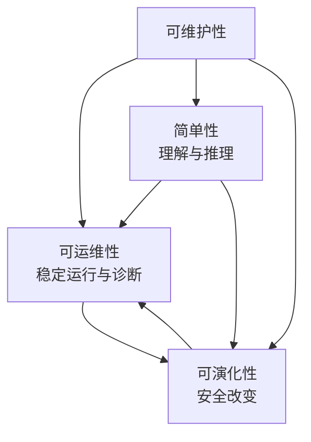

它们互相加强，却不完全等价：

- 代码容易理解，不代表生产部署可靠；
- 自动化运维成熟，不代表数据模型容易改变；
- 接口易扩展，不代表系统故障容易诊断。

### 5.6 可维护性需要谁来评价

“易维护”不能只由原作者判断。至少应从不同角色观察：

| 角色 | 关心的问题 |
| --- | --- |
| 新加入工程师 | 多久能建立正确心智模型并安全提交变更 |
| 值班人员 | 告警是否可行动，故障是否可诊断和降级 |
| 平台团队 | 部署、容量、备份和升级能否规模化 |
| 产品团队 | 新需求需要改多少组件，反馈周期多长 |
| 安全/合规 | 数据流、权限和保留是否可审计、可改变 |
| 未来迁移团队 | 能否替换组件并验证数据等价 |

只优化开发者本地体验，可能把复杂性推给运维；只优化平台统一，可能让产品变更僵化。

### 5.7 可运维性：好软件与好运行实践的关系

作者引用一个观点：良好运维常能绕过不完整软件的限制，而再好的软件也无法在糟糕运维下可靠运行。

这不是说软件质量不重要，而是：

- 软件无法预知所有事故；
- 人需要解释异常、协调依赖和作出取舍；
- 没有值班、监控、变更纪律和恢复演练，自动机制也会失效；
- 良好软件应帮助运维形成正确判断，而不是试图让人完全消失。

### 5.8 为什么大规模系统必须自动化（automation）

成千上万台机器无法靠逐台人工维护。适合自动化的工作包括：

- 配置和部署；
- 节点替换与健康检查；
- 备份和保留；
- 证书轮换；
- 容量调整；
- 常见告警处置；
- 数据再平衡。

自动化把重复动作变成可复现程序，减少手工差异，并让少量人员管理大规模资源。

### 5.9 自动化悖论

自动化是一把双刃剑。能自动处理的普通情况越多，留给人的越是罕见、复杂和高风险的边界情况。因此更高自动化可能需要 **更高技能** 的运维团队，而不是完全不需要团队。


另一个问题是，自动系统做错时速度和范围更大：错误控制器可以在几分钟内删除、重启或重新配置整个集群。

### 5.10 自动化的合适边界

不是自动化越多越好，而是根据应用和组织寻找平衡：

- 高频、规则稳定、容易验证的任务适合自动化；
- 低频、影响巨大、上下文复杂的任务可能需要人工确认；
- 自动化应提供预览、干运行、速率限制和撤销；
- 系统需要明确自动状态和人工覆盖状态；
- 值班人员必须理解自动控制器的因果模型。

可以按风险设计分级：

```text
低风险：自动检测 + 自动修复
中风险：自动建议 + 人工批准
高风险：双人复核 + 小范围执行 + 持续观察
不可逆：额外备份/快照 + 明确停止点 + 管理授权
```

分级依据应是影响范围与可逆性，而不是操作看起来是否简单。

### 5.11 监控与可观测性

良好可运维系统应允许监控工具读取关键指标，并支持可观测性工具解释运行时行为。

- **监控（monitoring）**常回答已知问题：错误率是否过高、磁盘是否接近满；
- **可观测性（observability）**更强调根据外部信号探索内部状态，回答事先未完全预定义的问题。

一个可行动告警至少应说明：

- 哪个用户目标受影响；
- 影响范围和持续时间；
- 最可能的资源或依赖；
- 相关仪表盘、日志和追踪；
- 初始处置或降级步骤。

只报告“CPU 85%”不一定表示用户受影响，也不告诉值班者要做什么。

### 5.12 避免依赖具体机器

运维友好的系统不应把服务身份和唯一状态绑在某台机器上。节点应能下线维护，整体服务仍继续。

实现前提可能包括：

- 状态有副本或可重建；
- 客户端通过服务发现而非固定 IP；
- 配置和部署自动化；
- 容量允许暂时少一个节点；
- 会话不依赖单机内存；
- 节点恢复和数据追赶有明确流程。

这同时支持滚动升级、硬件替换和故障恢复，是可靠性与可运维性的交叉点。

### 5.13 好的文档与操作模型

系统不仅要有命令清单，还要有容易理解的 **操作模型（operational model）**：

> 如果执行 X，会发生 Y；若 Y 没发生，应观察 Z。

文档应覆盖：

- 架构与数据流；
- 正常状态和关键不变量；
- 常见任务及预期结果；
- 故障、降级和恢复；
- 容量、配额和时间尺度；
- 变更与回滚；
- 所有权和升级路径。

文档会过时，因此最好把可验证部分放入自动检查、演练和代码；运行手册也应在事故与演练后更新。

### 5.14 良好默认值与可覆盖能力

系统应提供安全、合理的默认行为，降低普通使用门槛；管理员在特殊场景又需要覆盖默认值。

二者之间有张力：

- 可配置项太少，无法处理特殊负载；
- 可配置项太多，组合空间巨大、容易误配；
- 默认值隐藏假设，规模变化后可能不再合适；
- 覆盖后如果无法观察，问题难以诊断。

好的设计应让高级选项渐进暴露，并记录当前值、来源、变更历史及影响。

### 5.15 自愈与人工控制

**自愈（self-healing）**适合明确、可逆的局部故障，例如重启崩溃进程、替换不健康副本。系统同时应保留人工控制，因为：

- 自动诊断可能错误；
- 反复重启可能掩盖数据损坏；
- 事故中的全局上下文超出单控制器视野；
- 操作者可能需要冻结状态以调查；
- 级联故障时自动修复可能增加负载。

人工覆盖必须有审计、权限和安全边界，且应避免自动控制器立刻撤销人工决定。

### 5.16 可预测行为

可运维系统应尽量减少惊讶：

- 同一操作在相似条件下结果一致；
- 负载接近上限时逐步降级，而非突然崩溃；
- 错误信息明确且稳定；
- 重启、升级和恢复有可估计时间；
- 配置变化的影响范围可预览；
- 超时和重试有统一策略。

“聪明”但难以解释的自动行为，可能比朴素可预测机制更难安全运行。

### 5.17 可运维性的可测指标

可运维性不能压缩成单一分数，但可以观察代理指标：

- 平均检测时间（MTTD）；
- 平均恢复时间（MTTR）；
- 变更失败率；
- 回滚耗时；
- 告警中可行动比例；
- 手工工单数量和重复操作时间；
- 恢复演练成功率；
- 新值班人员独立处置所需时间。

指标可能被博弈，应结合复盘和定性反馈。降低 MTTR 不能通过掩盖长期数据损坏来实现。

### 5.18 简单性：复杂性如何拖慢维护

小项目可以简洁表达；项目增长后，模块、依赖、状态和历史决策不断积累，容易成为 **大泥球（big ball of mud）**：边界模糊、任何修改都可能影响未知部分。

复杂性会导致：

- 理解和入职时间增长；
- 预算与计划更容易超支；
- 修改时遗漏隐藏假设；
- 缺陷概率和测试范围增加；
- 团队因害怕风险而停止清理；
- 临时绕过进一步增加复杂性。

这又是正反馈环：


### 5.19 简单为什么是重要目标

系统越容易理解，工程师越能：

- 预测变更后果；
- 发现不变量被破坏；
- 缩小测试和故障范围；
- 安全授权更多人修改；
- 在事故中快速建立共同心智模型。

简单性由此同时改善可维护性、可靠性和演化速度。

### 5.20 简单性为什么难以客观定义

“简单”有观察者依赖：

- 一个系统内部实现复杂，却提供极简接口；
- 另一个实现简单，却把许多细节暴露给每个使用者。

哪个更简单取决于：

- 谁承担复杂性；
- 复杂性出现多少次；
- 故障时是否需要穿透抽象；
- 接口是否泄漏实现细节；
- 使用者是否具备相关知识。

隐藏复杂性不等于消除复杂性。好的抽象把复杂性集中到少数维护者，并让多数用户在稳定契约下工作；坏抽象只把失败原因藏起来。

### 5.21 必要复杂性与偶然复杂性

一种经典区分是：

- **必要复杂性（essential complexity）**：问题领域本身不可避免的复杂性；
- **偶然复杂性（accidental complexity）**：工具、实现或历史选择带来的复杂性。

例如支付中的金额、退款和法律规则具有领域复杂性；手工解析脆弱文本协议可能是工具造成的复杂性。

作者提醒，这个边界也有缺陷，因为工具演进会移动边界：曾经必须自行实现的分布式存储，后来可能成为成熟服务；今天被视为领域固有的问题，明天可能由更好抽象消除。

因此，不应花太多精力给复杂性永久分类，而应持续问：当前是否有更简单、可验证的表达方式？

### 5.22 复杂性预算

可以把团队能可靠掌握的复杂性看作有限预算。引入新数据库、队列、语言或一致性模型时，应比较其收益与新增认知和运行成本。

一个定性模型：

$$
C_{\text{system}}
\approx
C_{\text{components}}
+C_{\text{interactions}}
+C_{\text{exceptions}}
+C_{\text{change}}
$$

组件数只是第一项。系统最难的部分常是交互、例外路径和演化。两个简单组件的组合也可能产生复杂涌现行为。

### 5.23 抽象是管理复杂性的主要工具

**抽象（abstraction）**把实现细节隐藏在清晰接口后，并允许多个应用复用同一机制。

好处有两层：

1. 使用者不必每次重新理解底层细节；
2. 抽象组件的质量改进会惠及所有使用者。

例如：

- 高级语言隐藏机器码、寄存器和系统调用；
- SQL 隐藏磁盘/内存数据结构、并发请求和崩溃恢复；
- 数据库事务隐藏部分并发和故障细节；
- 索引隐藏查询加速的数据结构维护；
- 事件日志提供变化顺序与重放接口。

底层仍存在，只是不要求每个应用直接操作。

### 5.24 好抽象的判断标准

一个抽象通常应：

- 对常见用途提供小而稳定的接口；
- 明确保证、不保证和故障语义；
- 不迫使用户理解无关实现细节；
- 能组合而不产生惊人行为；
- 提供观测和逃生口；
- 允许实现演化而保持兼容；
- 在性能代价显著时使成本可见。

数据库查询接口很简单，但若完全隐藏全表扫描成本，用户仍可能意外拖垮系统。因此抽象应隐藏机械细节，而不是隐藏所有资源后果。

### 5.25 抽象泄漏与调试

任何非平凡抽象在边界条件下都可能泄漏：

- 网络分区让“远程调用像本地函数”失效；
- 对象存储不是完整文件系统；
- SQL 查询仍受索引、锁和数据分布影响；
- 自动扩缩仍受启动时间和配额限制。

可维护系统应允许日常使用者停留在高层，同时让诊断者在需要时看到下层指标和因果链。完全封闭的抽象在故障时会变成黑箱。

### 5.26 设计模式与领域驱动设计的位置

**设计模式（design patterns）**和 **领域驱动设计（domain-driven design，DDD）**用于为应用代码建立抽象、边界和领域语言。

本书不重点讲应用专用抽象，而是讲可供应用建立其上的通用构件：事务、索引、事件日志等。两层关系是：

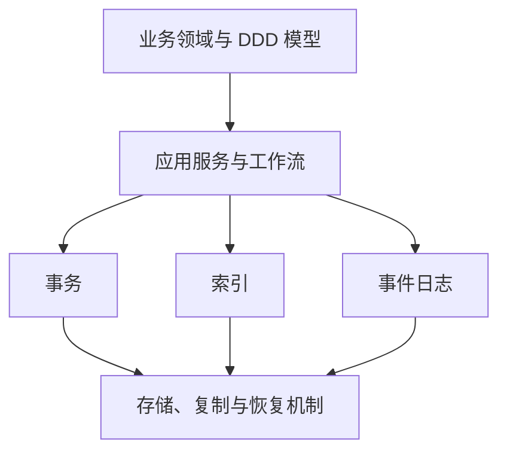

DDD 不替代数据库语义；数据库也不会自动给出正确业务边界。应用抽象建立在数据系统抽象之上。

### 5.27 避免为了复用而过早抽象

抽象本身也有成本：

- 错误共性被固化；
- 接口为了所有假想场景而膨胀；
- 使用者绕过抽象；
- 变更必须兼容更多调用方；
- 性能特征被隐藏。

通常先观察至少几个真实用例，再提取稳定共同点。重复少量明确代码，有时比一个错误、庞大的统一框架更简单。

### 5.28 可演化性：变化不是例外，而是常态

系统需求几乎不可能永远不变。变化来源包括：

- 学到新的用户需求；
- 出现未预料用例；
- 业务优先级改变；
- 新平台替换旧平台；
- 法律要求变化；
- 系统增长迫使架构改变；
- 安全和供应链环境变化。

**可演化性（evolvability）**是数据系统适应这些变化的难易程度。

### 5.29 Agile、TDD 与重构解决哪一层问题

Agile 工作方式为组织适应变化提供框架；**测试驱动开发（test-driven development，TDD）**和**重构（refactoring）**帮助代码在频繁修改下保持质量。

本书关注更大的系统层级：多个应用、数据库和服务具有不同发布周期、数据格式和所有者时，如何改变整个系统。

局部代码有测试，并不自动让以下变化容易：

- 数据库模式迁移；
- API 版本演进；
- 更换存储系统；
- 重分片海量数据；
- 同时运行新旧消费者；
- 跨团队协调语义变化。

### 5.30 简单性、松耦合与可演化性

简单、松耦合系统通常更容易改变，因为：

- 修改者需要理解的范围更小；
- 稳定接口减少联动变更；
- 组件可独立部署和回滚；
- 数据所有权和迁移路径更清楚；
- 测试可以集中在边界契约。

但“松耦合”不等于没有契约。异步消息若没有模式和语义版本，也会形成隐藏耦合；共享事件被几十个消费者依赖后，同样难以改变。

### 5.31 变化成本的粗略模型

一次变更成本可抽象为：

$$
C_{\text{change}}
=C_{\text{understand}}
+C_{\text{implement}}
+C_{\text{coordinate}}
+C_{\text{migrate}}
+C_{\text{verify}}
+C_{\text{rollback risk}}
$$

成熟系统中，写新代码可能只是小部分；理解历史、协调团队、迁移数据和证明没有破坏用户，往往占主导。

可演化设计的目标不是让任何变化免费，而是降低不必要的理解、协调和不可逆风险。

### 5.32 不可逆性为什么让改变困难

**不可逆性（irreversibility）**提高变更赌注。数据库迁移后若不能切回旧系统，任何隐藏缺陷都可能造成长时间中断或数据损坏；团队因此需要更长验证和审批。

可逆变更允许：

- 小流量试验；
- 快速回退；
- 比较新旧结果；
- 从真实反馈学习；
- 分阶段扩大。

减少不可逆性等于为学习保留选择权。

### 5.33 数据库迁移为何特别难回滚

代码部署可以换回旧二进制，数据迁移却改变持久状态。若新系统接受了写入，回退必须回答：

- 新写入如何同步回旧库；
- 两边冲突以谁为准；
- 新模式中的字段如何映射回旧模式；
- 切换期间生成的 ID 是否兼容；
- 下游派生系统读取哪一侧；
- 删除和权限变化是否双向传播。

这就是数据系统可演化性比普通代码重构更困难的原因。

### 5.34 扩展-迁移-收缩模式

一种降低不可逆性的通用迁移方法：

1. **扩展（expand）**：先增加新字段、接口或存储，不删除旧能力；
2. **迁移（migrate）**：回填历史数据，双读比较或双写，逐步切换流量；
3. **收缩（contract）**：确认旧路径无调用后，再移除旧字段和系统。

```mermaid
flowchart LR
    O[旧系统唯一运行] --> E[扩展：新旧并存]
    E --> B[回填 + 校验]
    B --> C[小流量读取新系统]
    C --> D[扩大切换，保留回退]
    D --> N[新系统为主]
    N --> X[收缩：删除旧路径]
```

代价是过渡期复杂、双写可能不一致、运行成本增加。它用暂时复杂性换取可验证和可回退。

### 5.35 双写不是自动安全

应用依次写旧库和新库时，任一步都可能成功而另一步失败。需要：

- 变更日志或可靠事件作为同步源；
- 幂等写入；
- 对账和修复；
- 明确权威系统；
- 监控复制滞后；
- 切换点和失败恢复计划。

若没有这些机制，“双写保证两边一致”只是愿望。后续章节会讨论复制、日志和数据流。

### 5.36 可演化接口

接口和数据格式要支持新旧版本共存：

- 新增字段时旧读取者忽略未知字段；
- 删除字段前先停止所有写入和读取依赖；
- 不轻易改变已有字段语义；
- 使用默认值处理旧数据；
- 协议协商或版本化；
- 兼容性在 CI 中自动检查。

只测试“最新客户端 + 最新服务端”不足以支持滚动升级；还要测试新旧组合。

### 5.37 可维护性中的权衡

| 选择 | 获得 | 代价 |
| --- | --- | --- |
| 更多自动化 | 可重复、规模化操作 | 黑箱、共因错误、技能退化 |
| 更高层抽象 | 使用者认知负担下降 | 调试时可能泄漏，控制减少 |
| 更多配置 | 适应特殊场景 | 状态空间和误配增加 |
| 微服务松耦合 | 独立部署和团队自治 | 网络、契约和数据一致性复杂 |
| 新旧双轨迁移 | 可比较、可回滚 | 暂时资源与协调成本 |
| 极简统一平台 | 一致运维 | 可能无法适应异质负载 |

维护性没有单一最大化方向。关键是让复杂性位于最有能力管理它的边界，并保留观察和控制。

### 5.38 本节小结

软件不会物理磨损，却会因需求、平台、数据规模和人员变化而失配。生命周期成本主要发生在初次开发后，因此系统从一开始就应考虑未来维护者。

可运维性让组织容易监控、理解、修复和升级系统；自动化必不可少，却需要高技能人员处理剩余复杂事件，并保留人工控制。简单性降低理解和变更风险，抽象是主要工具，但抽象必须说明成本、故障和逃生路径。可演化性让系统适应未知变化，依赖简单、松耦合、兼容接口和可逆迁移。三者共同决定系统能否长期创造价值，而不是只在上线当天工作。

## 6. 原章总结：四类非功能需求如何连接

### 6.1 从时间线案例出发

作者先用首页时间线展示大规模系统的具体困难：读取时联结让大量轮询产生数亿次查找；写时物化把成本转成约百万级时间线写入；名人账户又让平均扇出假设失效。

案例的目的不是教授一种固定社交网络架构，而是示范如何从功能需求推导负载，再根据负载分布选择读写权衡和混合策略。

### 6.2 性能与负载形成可测量基础

性能通过吞吐和响应时间分布描述。响应时间必须分解服务、排队和网络；高分位揭示尾部用户；组合调用会放大尾延迟。SLO/SLA 把指标变成契约。

负载则用请求率、数据率、并发和分布特征描述。没有负载与测量边界，“快”和“能扩展”都无法验证。

### 6.3 可扩展性要求增长后仍维持性能

可扩展性与性能紧密相连：负载增加时，系统能否通过增加资源把响应时间、错误率和新鲜度维持在 SLO 内。

独立分解组件是通用方向，但拆分边界决定收益。系统不应为假想规模过早复杂化；单机足够就保持单机，直到真实瓶颈证明需要下一步。

### 6.4 可靠性要求局部故障不变成用户失效

容错让磁盘、机器或依赖故障时服务继续。硬件故障相对随机，可用冗余吸收；软件故障往往高度相关，需要测试、隔离、观测和过载保护。人的操作不能只归因于粗心，应通过无责复盘改进整个社会技术系统。

### 6.5 可维护性保证这些机制能长期存在

复杂容错和扩展机制若无法被团队理解、运行和改变，最终也会成为可靠性风险。可运维性、简单性和可演化性让系统在环境变化后仍能保持其他非功能目标。

### 6.6 全章因果闭环

```mermaid
flowchart TD
    F[功能需求] --> W[工作负载模型]
    W --> P[性能分布与容量]
    P --> S[扩展策略]
    S --> X[更多组件与交互]
    X --> R[新的故障模式]
    R --> T[容错、测试与运行流程]
    T --> M[维护复杂性]
    M --> E[简单性、可运维性、可演化性]
    E --> F
```

新需求会重新改变负载和架构，所以这不是一次性流程，而是持续循环。

### 6.7 原章最终结论

作者没有承诺实现这些目标的简单答案。其方向是使用经过实践验证、提供有用抽象的构件：事务、索引、日志、复制、分片、批处理和流处理等。全书后续章节将解释这些构件怎样工作、解决什么故障和负载，以及以什么为代价。

## 7. 参考文献的证据脉络

原章共有 100 条参考文献，跨度从社交网络架构、排队与尾延迟，到硬件实测、复杂系统安全和软件维护。它们可以按原文论证分成以下几组。

### 7.1 时间线案例（参考文献 1–6）

这组资料来自 Twitter/X 架构演讲、推荐算法和峰值帖子记录，以及 Bluesky 有损时间线和名人账户基础设施案例。

它们提供真实系统动机，但实现会随产品演进。阅读时应提取扇入、扇出、物化和热点原则，而不是把十多年前的服务器比例当成今天容量数据。

### 7.2 过载与保护机制（参考文献 7–17）

包括亚稳态故障研究、指数退避与 jitter、熔断器、令牌桶、负载丢弃、背压和负载均衡实践。

这组证据共同说明：容量不足不只是“多加机器”，客户端和服务端反馈环会决定系统能否恢复。不同保护机制必须端到端组合。

### 7.3 响应时间、用户影响和分位数（参考文献 18–36）

包括大规模硬件慢故障、均值用途、Dynamo 尾延迟目标、Google/Bing/Akamai/Yahoo 用户研究、Tail at Scale、SLO/SLA 和多种直方图/sketch 算法。

资料类型不同：

- 系统论文说明工程机制；
- 商业研究给出相关数据但需检查混杂；
- 算法论文说明误差和可合并性；
- SLO 资料解释怎样将度量变成运行目标。

不能把一项公司的转化率结果直接当成所有产品的延迟预算。

### 7.4 容错概念与故障注入（参考文献 37–41）

这组建立 fault、failure 和 fault tolerance 的学术分类，并用生产故障研究与混沌工程说明异常路径必须主动测试。

概念框架用于精确定义，故障研究用于证明错误处理是现实薄弱点，两者互相补充。

### 7.5 硬件故障与相关性（参考文献 42–60）

覆盖磁盘、SSD、CPU 静默错误、DRAM、数据中心灾难、太阳风暴和相关硬件故障。

这些数字来自特定硬件代际和部署，应关注数量级与方法，不应把平均故障率直接套入自己的设备。最可靠做法是结合供应商数据和自身遥测建立故障模型。

### 7.6 软件、交互和复杂系统故障（参考文献 61–71）

包括云系统缺陷统计、闰秒、SSD 固件时间炸弹、资源限制、客户端流量事故、跨系统交互、级联失效和复杂系统失败理论。

它们支撑一个关键结论：真正危险的故障常不是某个组件随机坏掉，而是所有组件共享的假设、软件和反馈机制同时失效。

### 7.7 人因、无责复盘与可靠性后果（参考文献 72–79）

包括互联网服务事故原因研究、理解“人为错误”的安全科学、无责复盘、可用性务实观点、缺陷的人类影响和 Horizon 丑闻。

这组资料把可靠性从机器问题扩展到组织与社会后果。事故分析需要理解当时工作环境，而不是追逐单一罪魁。

### 7.8 扩展原则与架构（参考文献 80–86）

包括选择成熟技术、S3 和多租户规模经济、共享磁盘/无共享、云原生存储以及微服务边界。

这些资料既展示大规模方案，也提醒不要过度设计。阅读时要始终带上自己的负载向量和组织规模。

### 7.9 维护、自动化、简单性与演化（参考文献 87–100）

最后一组覆盖软件耐久性、遗留系统、自动化悖论、互联网服务运维、可观测性、大泥球、简单系统、必要/偶然复杂性、设计模式、DDD、可演化性和不可逆性。

其共同观点是：维护不是上线后的低价值工作，而是软件大部分生命周期；技术抽象必须与人的理解、操作和组织演进共同设计。

### 7.10 如何使用原章参考文献

1. 在原章参考文献中找到对应主题；
2. 区分实测数据、案例文章、算法论文、概念框架和观点文章；
3. 检查年代、硬件、负载和组织背景；
4. 阅读假设、样本和误差，而不只引用摘要数字；
5. 用自己系统的遥测、压测和故障演练确认可迁移性；
6. 对影响人的可靠性和法律结论，结合专业审查与原始证据。

## 8. 容易混淆的概念与常见误区

### 8.1 “非功能”不等于“不影响功能”

性能过慢、数据永久丢失或系统无法维护，都会让功能失去实际价值。非功能需求描述功能的质量和运行条件，不是功能之外的装饰。

### 8.2 “系统要快”不是可验收需求

必须指定操作、负载、测量位置、统计窗口和分位目标。首页读取 p99 与帖子传播 p99 是不同指标，不能用一个“延迟”概括。

### 8.3 吞吐量不等于响应时间

吞吐量是单位时间完成多少工作；响应时间是单个请求等待多久。批处理可以吞吐很高但单任务很慢，低并发服务可以单请求很快但总吞吐低。

### 8.4 最大吞吐量不等于当前吞吐量

当前处理 10,000 requests/s，只说明当前负载；最大稳定吞吐需要逐步加压并观察队列、错误和 SLO。瞬时接受量也不等于能长期完成的量。

### 8.5 延迟、响应时间和服务时间不是同义词

响应时间是客户端端到端观察；服务时间只含主动处理；延迟是等待和传播。服务端计算 10 ms、用户等待 1 s 并不矛盾。

### 8.6 排队时间不是服务时间的一部分

请求在等待线程时，服务尚未处理它。只在函数开始后计时会漏掉过载最严重的部分，因此客户端或入口测量不可少。

### 8.7 高利用率不总是好事

批处理资源追求高利用率可能合理；低延迟在线服务在接近 100% 利用率时，排队会非线性上升。需要容量余量吸收波动和故障。

### 8.8 队列不能创造处理能力

队列吸收短时峰值并解耦路径，但若长期 $\lambda\ge\mu$，积压不会清空。无界队列只把明确拒绝变成长时间超时和更难恢复。

### 8.9 重试不是免费的可靠性机制

重试会增加成功机会，也会放大过载和重复副作用。需要截止时间、退避、jitter、预算、幂等和熔断共同约束。

### 8.10 亚稳态故障不等于普通过载

普通过载在原负载下降后恢复；亚稳态坏状态由内部重试、积压或缓存失效维持，需要主动清空、熔断或重置。

### 8.11 背压不等于负载丢弃

背压让上游减速；负载丢弃在当前边界拒绝工作。无法向源头施压或实时数据已过期时，丢弃仍可能必要。

### 8.12 throughput 不等于 goodput

throughput 可以包含最终超时、重复或无价值的工作；goodput 只计算在 SLO 内成功完成的有用工作。过载时减少接受量，反而可能提高 goodput。

### 8.13 物化视图不等于权威数据

时间线缓存是帖子和关注关系的派生结果。它可以丢弃、落后或重建；权威帖子不能因某个时间线缺失就被判定不存在。

### 8.14 缓存不等于物化视图的全部

缓存通常按需保存已有计算结果；物化视图可由源变化主动增量维护。二者都属于派生数据，但更新触发和完整性承诺可能不同。

### 8.15 扇出不只发生在消息队列

一次请求触发多个数据库写、RPC、通知或缓存失效，都有扇出。关键是下游工作量如何随数据分布增长，而不是是否使用某个消息产品。

### 8.16 平均扇出不能描述名人热点

平均 200 个关注者无法预测 1 亿关注者账户。容量规划必须观察分位数、最大值和热点持续时间。

### 8.17 写时扇出与读时扇入没有绝对胜者

前者适合读多写少的普通账户，代价是写放大；后者避免极端写入，代价是读取合并。混合策略按分布分层通常更合理。

### 8.18 有损时间线不等于丢失权威帖子

有损派生视图可以按业务语义省略候选内容；权威数据仍完整。必须向产品明确展示的是采样结果，而不是完整档案。

### 8.19 平均数不等于典型值

均值适合总工作量和容量分析，但可能没有任何请求实际等于均值。典型体验更常用 p50。

### 8.20 p99 不表示最慢请求

p99 是 99% 与最慢 1% 的边界，最慢请求可能远大于 p99。最大值也常受样本量和测量窗口影响，不宜替代分位数。

### 8.21 p99 = 1 秒不表示 99% 请求都耗时 1 秒

它表示约 99% 请求不超过 1 秒；其中很多可能只有几十毫秒。

### 8.22 更高分位数不一定总值得优化

p99.99 受罕见随机事件影响，样本和收益有限，优化成本可能极高。目标分位应对应用户风险和业务价值。

### 8.23 不能平均各机器的 p99

分位数不是线性统计量。必须合并原始分布或可合并直方图后重新求 p99，否则会忽略样本量和分布形状。

### 8.24 近似分位数不等于不可信

成熟 sketch 用明确误差保证换取有限内存和高吞吐。真正危险的是不知道算法、误差和聚合方式，却把数字显示得很精确。

### 8.25 尾延迟放大不只来自串行调用

并行调用虽然不相加，却要等待最慢必要结果；调用数越多，至少一个慢调用的概率越高。

### 8.26 相关性会让独立概率模型失效

多个后端共享网络、机架或数据库时，慢请求可能一起发生。$1-p^n$ 是重要直觉，但生产估计应使用端到端实测。

### 8.27 SLI、SLO 与 SLA 不可互换

SLI 是测量值，SLO 是目标，SLA 是带后果的合同。团队可以用比 SLA 更严格的内部 SLO 留出风险余量。

### 8.28 “99.9% 可用”不是完整定义

必须说明请求分母、错误类型、地区、功能、延迟阈值、窗口和排除条件。全局平均可能掩盖一个客户长期完全不可用。

### 8.29 可靠性不等于可用性

可靠性包括功能正确、性能、安全和故障下持续服务；可用性主要描述能否访问。系统可以可用却返回错误数据。

### 8.30 可用性不等于持久性

短时不可访问但数据完整，与服务在线却永久丢照片，是完全不同的失败。应分别定义 RTO、RPO、可用性和数据完整性。

### 8.31 fault 不等于 system failure

局部硬盘坏是 fault；若副本接管且 SLO 未违反，就没有系统 failure。术语取决于系统边界。

### 8.32 容错不等于不会故障

容错系统预期局部故障会发生，只是阻止其升级。没有声明故障模型的“容错”承诺不完整。

### 8.33 冗余不等于备份

在线副本提高可用性，却会快速复制误删除和软件错误；备份保留历史恢复点，但不一定能立即接管流量。两者解决不同问题。

### 8.34 副本数多不等于故障域独立

同机架、同配置、同软件和同控制平面的副本可能同时失效。冗余价值取决于相关性。

### 8.35 硬件故障率低不等于大集群很少故障

单设备罕见事件乘以数万设备，会成为日常。规模改变发生频率，但不一定改变单设备概率。

### 8.36 软件副本不能自动容忍软件缺陷

所有节点运行同一错误代码时，可以同时崩溃或输出相同错误。测试、版本分批、隔离和不变量验证比简单加副本更有效。

### 8.37 进程存活不等于健康

依赖可能极慢或返回损坏结果。健康应包含关键操作、延迟和语义，而不只是 PID 存在。

### 8.38 级联失效与亚稳态故障不同

级联描述跨组件传播，亚稳态描述坏状态自我维持；两者可在同一事故中共同出现。

### 8.39 故障注入不等于制造无控制事故

混沌实验需要稳态假设、影响边界、停止条件和监控。未知范围的随机破坏不是严谨工程。

### 8.40 无责复盘不等于无人负责

它拒绝把正常环境中的个人行为当作唯一根因，同时仍要求组织落实改进。故意违规和恶意行为属于另一类治理问题。

### 8.41 “人为错误”不等于分析终点

应继续问工具、权限、流程、激励和反馈为何让一个动作产生巨大影响。否则换一个人仍会重演。

### 8.42 原型不等于可以忽略所有可靠性

若原型保存不可替代数据或影响真实用户，最低备份、安全和告知仍不可省略。被牺牲的保证应显式记录并设生产门槛。

### 8.43 可扩展性不等于高性能

单机系统当前可能非常快却难以加资源；分布式系统当前较慢但负载增长时可加节点。两项要分别测量。

### 8.44 “可扩展”不是无条件形容词

必须说明负载维度、资源增加方式和保持的 SLO。按总用户扩展，不保证按单热点键扩展。

### 8.45 横向扩展不一定优于纵向扩展

横向扩展潜力更大，却引入分片和网络；纵向扩展在上限内更简单。应从单机基线和增长时间线出发。

### 8.46 shared-disk 不等于 cloud-native 存算分离

旧共享磁盘使用通用 NAS/SAN 接口并受锁争用限制；云原生存储可以提供数据库专用 API 并自身分布式扩展。两者都有共享远程存储形态，但机制不同。

### 8.47 线性可扩展不等于每次都精确 100% 效率

它是理想参照。真实系统有协调与冗余开销，应报告效率曲线和成本，而不是把近似线性宣传为永远线性。

### 8.48 自动扩缩不等于无限扩展

实例启动时间、数据再平衡、配额、共享依赖和成本仍有限制。错误控制环还会振荡或在故障时扩大问题。

### 8.49 分解组件不等于服务越多越好

独立性带来扩展与隔离；网络和契约带来复杂性。若组件必须同步变化，拆分只是物理分散。

### 8.50 可维护性不等于代码整洁

它还包含生产可运维性、知识传承、数据迁移、接口演化和组织协调。漂亮代码无法弥补不可恢复的数据库。

### 8.51 自动化越多不一定越可运维

自动化可能成为黑箱并扩大错误，需要人工覆盖、演练和理解。正确目标是减少低价值重复劳动，同时保持复杂事故处理能力。

### 8.52 简单不等于代码行数少

短代码可能依赖大量隐式行为；较长但边界清晰、状态明确的实现可能更容易推理。要看整体认知和交互成本。

### 8.53 抽象不等于复杂性消失

抽象把复杂性集中和隐藏。接口不说明故障、性能和逃生路径时，只会把复杂性延迟到事故时暴露。

### 8.54 必要与偶然复杂性不是永久分类

工具进步会改变边界。比争论标签更重要的是持续寻找当前可用的更简单机制。

### 8.55 可演化性不等于 Agile 仪式

迭代会议不能自动解决数据库迁移、协议兼容和不可逆写入。系统级可演化性需要技术契约与迁移机制。

### 8.56 松耦合不等于无契约

异步事件仍有模式、顺序和语义依赖。隐藏契约比显式 API 更难演化。

### 8.57 双写不等于自动可回滚

两次独立写入之间可能失败。可回滚迁移需要权威源、日志、幂等、对账、回填和切换策略。

### 8.58 可逆不等于没有成本

新旧并存会增加资源和过渡复杂性，但降低一次性切换风险。应将其视为购买学习与回退能力的成本。

## 9. 全章知识结构

```mermaid
mindmap
    root((第 2 章<br/>定义非功能需求))
        起点
            功能需求
            非功能需求
            指标目标条件边界
        社交时间线案例
            负载数量级
                平均与峰值
                关注关系长尾
            读时扇入
                轮询
                大量索引查找
            写时扇出
                物化视图
                写放大
                队列缓冲
            极端用户
                有损时间线
                名人读取时合并
            混合策略
        性能
            吞吐量
            响应时间
                服务时间
                排队延迟
                网络延迟
            过载
                排队陡壁
                重试风暴
                亚稳态故障
                退避熔断限流
                负载丢弃背压
            分布
                均值
                p50
                p95 p99 p999
                尾延迟放大
            契约
                SLI
                SLO
                SLA
            计算
                直方图
                t-digest
                DDSketch
                不可平均分位数
        可靠性
            正确工作
            fault 与 failure
            容错与 SPOF
            故障模型
            故障注入与混沌工程
            硬件故障
                规模使罕见变日常
                冗余
                相关故障域
                静默损坏
            软件故障
                共因缺陷
                资源耗尽
                涌现行为
                级联失效
            人与组织
                社会技术系统
                渐进发布与回滚
                无责事故复盘
            后果
                可用性
                持久性
                Horizon 丑闻
        可扩展性
            负载向量
                请求和数据率
                对象大小
                并发
                热点与扇出
            两类问题
                固定资源增加负载
                保持性能增加资源
            线性扩展与效率
            容量预测
            架构
                纵向共享内存
                共享磁盘
                横向无共享
                云原生专用存储
            原则
                按独立边界分解
                面向下一数量级
                不增加无谓复杂性
                混合方案
        可维护性
            生命周期成本
            遗留系统
            可运维性
                自动化悖论
                监控与可观测性
                操作模型
                自愈与人工控制
                可预测行为
            简单性
                大泥球
                复杂性预算
                必要与偶然复杂性
                抽象
            可演化性
                Agile TDD 重构
                松耦合
                不可逆性
                扩展迁移收缩
                兼容接口
```

### 9.1 四类要求的输入与输出

| 领域 | 输入 | 主要输出 | 常见验证 |
| --- | --- | --- | --- |
| 性能 | 操作、负载、数据分布 | 响应时间分布、最大稳定吞吐 | 端到端压测、生产遥测 |
| 可靠性 | 正确性定义、故障模型 | 容错范围、恢复和降级语义 | 故障注入、恢复演练、对账 |
| 可扩展性 | 当前负载、增长模型、SLO | 资源曲线、上限与迁移触发器 | 阶梯压测、容量预测 |
| 可维护性 | 团队、系统边界、变化类型 | 运维模型、抽象、兼容和回退路径 | 事故复盘、变更指标、迁移演练 |

### 9.2 四类要求的相互制约

| 决策 | 改善 | 可能损害 |
| --- | --- | --- |
| 时间线物化 | 读取响应时间 | 写吞吐、存储、演化复杂性 |
| 多副本 | 容错、可用性 | 写延迟、成本、一致性复杂性 |
| 分片 | 容量与吞吐扩展 | 跨分片事务、热点和运维 |
| 自动扩缩 | 波动负载成本与性能 | 可预测性、调试和控制稳定性 |
| 高层抽象 | 简单性与开发速度 | 底层控制、可观测性、锁定 |
| 新旧双轨迁移 | 可演化性与可回退 | 暂时成本和一致性工作 |
| 负载丢弃 | 系统 goodput 和恢复 | 个别请求成功率 |

非功能设计不可能只优化一列。每个改善都要追踪被转移的成本和新故障模式。

### 9.3 一条贯穿全章的推理链

$$
{}\text{用户目的}
\rightarrow\text{操作与数据}
\rightarrow\text{负载分布}
\rightarrow\text{性能目标}
\rightarrow\text{架构机制}
\rightarrow\text{故障模型}
\rightarrow\text{运行与演化能力}
$$

若从中间的“架构机制”直接开始，团队就会先选缓存、队列或微服务，再寻找理由；作者的案例示范了相反顺序。

## 10. 综合示例：为社交时间线写一份可验收的非功能需求

> 本节是基于原章案例的教学性规格示例。数值用于展示表达方法，不代表 X/Twitter 的真实内部目标，也不构成通用推荐值。

### 10.1 先固定功能与系统边界

功能：用户发布文本帖子、关注/取消关注其他用户，并查看首页最近帖子。

边界：

- 客户端经公共 API 访问；
- 帖子权威存储保存已确认帖子；
- 关注图保存关系；
- 派生时间线用于首页；
- 广告、推荐陌生人内容和媒体处理不在本轮范围。

不先固定边界，就无法判断哪个延迟或失败属于本系统。

### 10.2 负载模型

假设首个规划阶段：

| 参数 | 正常值 | 峰值/尾部 |
| --- | ---: | ---: |
| 发帖速率 | 5,800/s | 150,000/s，持续最多 60 s |
| 在线用户 | 10,000,000 | 12,000,000 |
| 首页显式刷新 | 0.02 次/用户/s | 0.05 次/用户/s |
| 平均关注者数 | 200 | p99 20,000，最大 100,000,000 |
| 首页返回条数 | 100 | 最大候选缓存 1,000 |
| 平均帖子记录 | 1 kB | p99 4 kB |
| 新帖可见目标 | 常规 5 s | 峰值允许暂时放宽 |

首页刷新正常吞吐：

$$
10{,}000{,}000\times0.02
=200{,}000\ \text{reads/s}
$$

峰值：

$$
12{,}000{,}000\times0.05
=600{,}000\ \text{reads/s}
$$

这比“有 1,000 万用户”更能驱动容量设计。

### 10.3 数据正确性与语义要求

1. API 确认成功的帖子必须进入权威存储；
2. 同一 `post_id` 在单个时间线中最多出现一次；
3. 被删除或无权查看的帖子不得继续向新读取返回；
4. 首页是派生、可能不完整的排序视图，不承诺包含所有关注帖子；
5. 时间线损坏必须可由权威帖子与关注图重建；
6. 普通账户采用写时扇出，热点账户可采用读取时合并；
7. 取消关注、屏蔽和权限变化必须有明确传播期限。

这组要求先定义“正确”，可靠性才能有对象。

### 10.4 性能 SLI 与测量边界

| SLI | 开始 | 结束 | 统计标签 |
| --- | --- | --- | --- |
| 首页响应时间 | API 网关收到完整有效请求 | 最后一个响应字节离开网关 | 地区、客户端类型、是否缓存命中 |
| 发布响应时间 | 网关收到请求 | 权威存储提交并返回 ID | 地区、帖子大小 |
| 传播时间 | 权威提交时间戳 | 帖子可由关注者时间线读取 | 普通/热点作者、峰值状态 |
| 有效成功率 | 有效请求进入网关 | 返回语义正确的成功响应 | 操作、地区、状态码 |
| 队列积压年龄 | 最旧未处理事件提交时间 | 当前时间 | 队列分区、事件类型 |

服务内部处理时间只用于诊断，不替代入口/用户边界 SLI。

### 10.5 示例性能 SLO

在滚动 28 天窗口内：

- 首页读取：$p50<150$ ms，$p95<400$ ms，$p99<1$ s；
- 发帖提交：$p50<100$ ms，$p99<800$ ms；
- 普通账户传播：99% 在 5 s 内可见；
- 热点账户传播：99% 在 15 s 内通过读取合并可见；
- 有效首页请求成功率至少 99.95%；
- 单区域不得连续 15 分钟低于 99% 成功率，即使全局平均仍达标。

将传播和读取分开，避免“首页很快但内容陈旧”被误报为健康。

### 10.6 过载与降级策略

按优先级：

1. 保证帖子权威写入和安全/权限变更；
2. 保证现有时间线读取；
3. 延迟普通时间线投递；
4. 对超高关注数用户采样低优先级候选；
5. 暂停非必要回填和离线任务；
6. 队列年龄超过阈值时，对新投递实施负载丢弃或切换热点读取路径。

客户端规则：

- 所有写请求携带幂等键；
- 只对明确可重试错误重试；
- 最多 3 次，受总截止时间约束；
- 指数退避并加入 full jitter；
- 重试流量受独立令牌桶限制。

服务端规则：

- 所有队列有容量与最大年龄；
- 接近容量时早拒绝低优先级工作；
- 下游持续异常时熔断；
- 将 queue age、drop rate 和 goodput 作为核心指标。

### 10.7 容量推导

正常平均投递为约 1.16 million/s。假设每个投递工作节点在满足 SLO 时稳定处理 25,000 writes/s，正常理论节点数：

$$
N_{\text{base}}=
\left\lceil\frac{1{,}160{,}000}{25{,}000}\right\rceil
=47
$$

不能只配置 47 个节点。若要求容忍一个可用区损失，三个区均匀部署且失去一个区后仍承载正常流量，那么剩余 $2/3$ 容量至少为 47：

$$
N_{\text{total}}
\ge\left\lceil\frac{47}{2/3}\right\rceil
=71
$$

再考虑维护和负载波动，可取更高基线。峰值 30 million/s 不宜仅靠瞬时扩到 1,200 个节点，而可由队列和热点策略吸收；具体选择取决于允许积压年龄。

这个计算忽略数据分区、网络和节点效率变化，只用于展示容量、容错和成本必须一起推导。

### 10.8 故障模型

系统承诺容忍：

- 任意单个应用或投递工作节点崩溃；
- 任意单个磁盘或存储副本失效；
- 一个可用区最多 30 分钟不可达；
- 时间线事件至少一次重复投递；
- 单个下游服务 5 分钟延迟或不可用；
- 一次发布中的新版本存在缺陷，可在 10 分钟内回滚。

暂不承诺自动容忍：

- 整个云区域永久丢失且所有异地备份也损坏；
- 权威凭据被攻击者窃取；
- 所有软件版本共享且同时触发的未知数据损坏；
- 多个云控制平面共同不可用。

不承诺不等于忽略，而是需要额外预防、备份、演练或业务连续性决策。

### 10.9 RTO 与 RPO 背景补充

原章没有在此正式展开，但恢复要求常用：

- **恢复时间目标（recovery time objective，RTO）**：中断后多快恢复服务；
- **恢复点目标（recovery point objective，RPO）**：最多可丢失多久范围内的数据。

示例：

| 数据/能力 | RTO | RPO |
| --- | ---: | ---: |
| 权威帖子存储 | 15 min | 0（已确认帖子不丢） |
| 关注图 | 30 min | 1 min |
| 派生时间线 | 5 min 提供陈旧读取，24 h 内可全量重建 | 可重建 |
| 分析指标 | 24 h | 1 h |

“RPO=0”实现成本很高，并需要明确确认点和故障范围；异步跨区复制通常不能在所有灾难下保证零丢失。

### 10.10 故障矩阵

| 故障 | 用户影响 | 自动响应 | 人工响应 | 验证方式 |
| --- | --- | --- | --- | --- |
| 单投递节点崩溃 | 短时局部积压 | 任务重新分配、幂等重试 | 若反复崩溃则隔离事件 | 每周故障注入 |
| 一个可用区失联 | 容量降低，延迟可能上升 | 流量切到两区 | 确认数据追赶和成本 | 季度区级演练 |
| 时间线缓存损坏 | 部分首页错误或缺失 | 校验失败后旁路/重建 | 查明权威源和范围 | 恢复演练与对账 |
| 下游通知服务变慢 | 通知延迟 | 熔断、队列缓冲 | 联系依赖团队 | 合成慢响应实验 |
| 错误配置发布 | 错误率上升 | 金丝雀停止、自动回滚 | 复盘审批和检测 | 每次发布指标门禁 |
| 名人峰值 | 队列迅速增长 | 切换读时合并、限流低优先级 | 调整热点阈值 | 峰值回放压测 |

只有故障、响应、所有者和演练都明确，容错才从架构图变成运行能力。

### 10.11 可扩展性目标与触发器

短期目标：

- 在首页读取从 200,000/s 增至 400,000/s 时，通过不超过 2.3 倍应用资源维持 SLO；
- 投递普通负载翻倍时，扩展效率至少 80%；
- 新增节点 10 分钟内可服务，不触发全量数据搬迁；
- 单热点作者不应让普通作者的 p99 恶化超过 20%。

架构复查触发器：

- 峰值超过已验证容量的 70%；
- 月增长预测显示 6 个月内触顶；
- 队列峰后排空超过 15 分钟；
- p99 关注者数增长使热点比例翻倍；
- 单分片持续超过平均负载 3 倍；
- 扩展效率低于 70%；
- 计算或存储成本/活跃用户连续三月增长。

触发器让团队在危机前启动下一数量级设计，同时避免过早建设。

### 10.12 可维护性要求

#### 可运维性

- 所有关键用户 SLI 有按地区和操作拆分的仪表盘；
- 告警链接到可执行运行手册；
- 单节点替换与滚动升级不影响用户 SLO；
- 时间线可从权威源按分区重建，并每季度演练；
- 自动热点切换可由人工冻结或覆盖；
- 关键配置变更保留审计与一键回滚；
- 新值班工程师在两周训练后能处理指定常见事故。

#### 简单性

- 每类数据只有一个声明的权威来源；
- 普通与热点投递只有明确的两种路径，不按客户增加任意特例；
- 队列、超时和重试策略由共享库统一，但允许有记录的覆盖；
- 架构文档同时描述正常流和删除/撤回流；
- 新依赖必须说明替代方案、故障语义和退出计划。

#### 可演化性

- 事件模式保持前后兼容并自动检查；
- 新旧消费者至少可跨一个版本共存；
- 时间线存储迁移采用扩展-迁移-收缩；
- 切换期间对新旧结果做抽样比较；
- 删除旧路径前必须证明 30 天无读取；
- 所有不可逆数据变换先创建可验证恢复点。

### 10.13 测试与验收计划

| 要求 | 验证方式 | 频率 |
| --- | --- | --- |
| 响应时间分位 | 生产 SLI + 发布前代表性压测 | 持续/每次大版本 |
| 峰值吸收 | 回放 150,000 posts/s，测积压与排空 | 每季度 |
| 单区容错 | 区级流量隔离实验 | 每季度 |
| 幂等投递 | 性质测试生成重复、乱序和崩溃点 | 每次提交 |
| 数据持久性 | 从备份恢复随机样本并校验 | 每月 |
| 时间线重建 | 选定分区删除派生数据后重建 | 每季度 |
| 发布回滚 | 金丝雀中注入错误版本 | 每月演练 |
| 模式兼容 | 新旧生产者/消费者组合测试 | 每次模式变更 |
| 容量预测 | 实际增长与预测偏差复核 | 每月 |

非功能要求若没有验证方法，只是一份愿望清单。

### 10.14 决策记录：为何采用混合时间线

```text
决策：普通账户写时扇出，热点账户读取时合并。

上下文：读请求显著多于发帖；关注者分布长尾；少数账户超过千万关注者。

收益：普通首页低延迟；避免名人单帖产生上亿同步写入；两条路径可分别扩展。

代价：读取逻辑需要合并；热点分类和缓存需要维护；两条路径结果必须去重排序。

替代方案：全部读时计算（读取成本过高）；全部写时扇出（热点写入不可控）。

复查条件：热点账户比例、首页读写比、投递单位成本或产品排序语义显著变化。
```

这类记录保存“为什么”，减少未来维护者把混合策略误认为无意义复杂性。

### 10.15 综合示例的关键教训

一份完整 NFR 不是几个百分比，而是：

$$
{}\text{负载模型}
+\text{语义}
+\text{SLI/SLO}
+\text{故障模型}
+\text{降级}
+\text{扩展触发器}
+\text{维护与验证}
$$

任何一项缺失都会造成盲区：只有 SLO 没有负载，目标无法容量规划；只有故障模型没有演练，机制未经证明；只有架构没有维护要求，系统会随时间失去能力。

## 11. 核心结论

1. **非功能需求决定功能能否在现实中成立。** 快、可靠、可扩展和可维护必须转化为明确条件和度量。
2. **先量化负载，再讨论架构。** 平均、峰值、分位数、对象大小、热点和扇出共同决定系统行为。
3. **统计分布比单一平均值更重要。** 时间线名人热点和响应时间尾部都由少数极端案例支配。
4. **物化用写放大和维护复杂性换取读性能。** 它适合读多写少，但极端扇出需要混合策略。
5. **队列只能缓冲短期速率差。** 长期到达率不低于处理率时，积压不会自行消失。
6. **响应时间是客户端看到的端到端分布。** 服务时间、排队和网络需要分别观测，不能只看服务器平均值。
7. **接近容量时排队会非线性恶化。** 在线服务必须保留余量，并在过载前拒绝或降级。
8. **重试是反馈环的一部分。** 退避、jitter、熔断、令牌桶、负载丢弃和背压共同防止重试风暴与亚稳态。
9. **p50 描述典型体验，高分位描述尾部。** 极高分位的收益、成本和样本量需要权衡。
10. **分位数不能跨机器平均。** 必须合并原始分布或可合并直方图/sketch。
11. **组合调用放大尾延迟。** 即使每个后端只有少量慢请求，大扇出终端请求也很可能遇到一个慢调用。
12. **SLI 是测量，SLO 是目标，SLA 是合同。** 所有目标都必须说明分母、边界、窗口和失败语义。
13. **fault 是局部故障，failure 是用户服务失效。** 容错设计的目的，是阻止前者升级为后者。
14. **容错必须声明故障模型。** 类型、数量、持续时间、相关性和故障域决定承诺边界。
15. **大规模让罕见硬件故障成为常态。** 冗余有效，但共同原因会显著削弱独立概率收益。
16. **软件故障通常高度相关。** 同构副本不能替代测试、隔离、渐进发布、不变量和观测。
17. **故障注入用于持续验证恢复机制。** 混沌工程是受控实验，不是随机破坏。
18. **人是社会技术系统中的适应者，不是外部噪声。** “人为错误”是分析起点，无责复盘用于寻找系统条件。
19. **可靠性的价值由失败后果决定。** 短时不可用、永久数据损坏和错误证据对人的影响不能混为一谈。
20. **可扩展性不是产品标签。** 必须说明哪种负载增长、如何加资源、保持什么性能和成本。
21. **线性扩展是参照，而非默认事实。** 协调、热点、缓存边界和冗余通常使效率低于 100%。
22. **纵向扩展简单，无共享横向扩展潜力大。** 应先建立单机基线，再为下一个可信数量级增加分布式复杂性。
23. **独立组件是扩展与隔离的基础。** 边界选错会把本地复杂性变成跨网络复杂性。
24. **软件生命周期成本主要发生在维护阶段。** 今天的成功系统将成为明天的遗留系统。
25. **可运维性需要自动化与人工能力并存。** 自动化处理常规情况，熟练人员处理复杂边界并理解控制器。
26. **简单性是减少推理负担，不是追求最少代码。** 抽象应集中复杂性、明确保证并保留诊断路径。
27. **可演化性依赖松耦合、兼容和可逆性。** 数据迁移需要新旧共存、对账、渐进切换和回退。
28. **四类非功能目标彼此耦合。** 性能优化会改变故障和维护成本；可靠性冗余会改变性能和扩展效率。
29. **要求必须配验证方法。** 没有遥测、压测、故障注入、恢复和迁移演练，目标无法被证实。
30. **最佳方案来自上下文中的权衡。** 不存在同时适合所有负载、故障、团队和未来变化的通用架构。

## 12. 定义非功能需求的一般方法

### 12.1 第一步：明确用户目的与功能边界

列出关键用户旅程和系统承诺：谁做什么、成功结果是什么、哪些外部依赖在边界内。优先选择影响收入、安全、数据和信任的旅程。

不要一开始列 CPU 或数据库指标，因为用户不关心内部资源本身。

### 12.2 第二步：定义“正确工作”

对每个旅程说明：

- 正确结果；
- 不允许的状态；
- 顺序、完整性和重复语义；
- 可接受陈旧度；
- 可降级和不可降级内容；
- 权威数据与派生数据。

可靠性是“持续正确”，若正确性未定义，后续都没有基准。

### 12.3 第三步：建立负载向量，而非一个用户数

收集当前、峰值和预测：

- 操作吞吐；
- 同时并发；
- 数据总量与日增长；
- 对象大小分布；
- 读写比与缓存命中；
- 每用户项数、扇出和热点；
- 突发持续时间；
- 地域与租户分布。

数据不足时明确假设，并设置上线后校正日期。

### 12.4 第四步：选择用户可感知的 SLI

指标应尽量接近用户结果：

- 端到端响应时间分布；
- 有效请求成功率；
- 数据传播新鲜度；
- 正确结果比例；
- 持久数据恢复能力。

内部 CPU、队列和缓存指标用于解释 SLI，不应代替 SLI。

### 12.5 第五步：给 SLO 写完整限定

每个目标写成：

```text
在【负载与故障条件】下，
对【操作和有效请求集合】，
从【测量起点】到【测量终点】，
在【统计窗口】内，
【指标】应满足【目标】，
按【地区/租户/客户端】分组不得低于【局部底线】。
```

示例：

> 在峰值 50,000 次有效读取/秒和任一应用实例失效时，滚动 28 天内，从 API 网关接收完整请求到最后一个响应字节发出，首页读取 p99 小于 1 秒，且任一地区连续 15 分钟成功率不低于 99%。

### 12.6 第六步：定义故障模型

枚举：

- 组件崩溃；
- 慢响应和损坏响应；
- 网络中断；
- 资源耗尽；
- 可用区或地域失效；
- 软件共因缺陷；
- 错误配置与操作；
- 数据损坏和误删除；
- 依赖供应商故障。

对每项写明数量、持续时间、相关性、影响和系统承诺。避免只写“高可用”。

### 12.7 第七步：设计过载和降级语义

回答：

- 哪些请求优先；
- 何时排队、拒绝或采样；
- 队列最大容量和年龄；
- 客户端何时重试；
- 重试是否幂等和受预算限制；
- 下游何时熔断；
- 如何向上游背压；
- 峰后多久排空。

降级应保持核心正确性，而不是在过载时随机坏掉。

### 12.8 第八步：建立性能与容量模型

至少计算：

- 平均和峰值吞吐；
- 读写或扇出放大；
- 单节点稳定 goodput；
- 容错后的剩余容量；
- 队列积压和排空时间；
- 网络与存储带宽；
- 成本/有效请求；
- 容量触顶日期。

模型用于提出可证伪假设，必须用压测和生产遥测校准。

### 12.9 第九步：从简单基线选择扩展路径

依次考虑：

1. 优化算法和数据访问；
2. 增加索引、缓存或批处理；
3. 纵向增加单机资源；
4. 分离独立负载；
5. 按稳定键分片；
6. 采用共享存储与弹性计算；
7. 为极端热点设计专门路径。

每一步都比较收益、故障、维护和退出成本。不要因为最终可能分布式，就跳过简单基线。

### 12.10 第十步：设计可维护性

#### 可运维性问题

- 能否看到用户影响并下钻根因？
- 节点能否无中断替换？
- 自动化失败时能否人工接管？
- 默认值、安全边界和覆盖是否清楚？
- 恢复时间是否经过演练？

#### 简单性问题

- 每项状态的权威源在哪里？
- 组件和异常路径是否必要？
- 抽象说明了哪些保证和成本？
- 新工程师能否建立正确模型？
- 是否存在只靠个人记忆维护的隐式依赖？

#### 可演化性问题

- 新旧版本能否共存？
- 数据和接口如何兼容？
- 迁移能否分阶段、比较和回退？
- 哪一步不可逆，如何增加恢复点？
- 哪些团队必须协调？

### 12.11 第十一步：为每项要求配验证

| 目标 | 合适验证 |
| --- | --- |
| 响应时间与吞吐 | 代表性端到端压测、持续 SLI |
| 尾延迟 | 真实扇出链路、分位直方图 |
| 过载恢复 | 突发回放、重试和队列实验 |
| 节点/区级容错 | 故障注入与混沌实验 |
| 持久性 | 备份恢复、校验和、对账 |
| 软件异常路径 | 性质测试、模糊测试、集成故障 |
| 可扩展性 | 固定资源加负载、同比加资源 |
| 可运维性 | 值班演练、告警质量、MTTR |
| 可演化性 | 新旧兼容矩阵、迁移和回滚演练 |

验证频率应与变化频率和风险匹配。一次成功不能证明机制永远有效。

### 12.12 第十二步：记录权衡和复查触发器

决策记录至少包含：

```text
上下文与日期：
用户旅程与正确性：
负载模型与数据来源：
SLI/SLO 与测量边界：
故障模型和降级：
候选方案：
选择与理由：
接受的代价：
验证证据：
回退与退出路径：
复查触发器：
负责人：
```

触发器可以是负载达到容量 70%、p99 恶化、故障域变化、团队拆分、供应商涨价、法规变化或迁移时间超过预算。

### 12.13 一页式 NFR 模板

```text
# 服务/用户旅程

## 功能和正确性
- 核心操作：
- 权威数据：
- 派生数据：
- 不变量：
- 允许降级：

## 负载
- 当前 / 峰值 / 12 个月预测：
- 请求和数据大小分布：
- 读写比、缓存、热点和扇出：

## 性能
- SLI 测量边界：
- p50 / p95 / p99：
- 最大稳定 goodput：
- 新鲜度：

## 可靠性
- SLO / SLA：
- 故障模型：
- RTO / RPO：
- 重试、幂等、降级和恢复：

## 可扩展性
- 当前容量和余量：
- 资源扩展效率：
- 预计触顶时间：
- 下一步方案与触发器：

## 可维护性
- 监控、运行手册和人工控制：
- 简单性与关键抽象：
- 兼容、迁移和回退：

## 验证
- 压测：
- 故障演练：
- 恢复演练：
- 兼容/迁移测试：
```

### 12.14 最终检查表

#### 需求是否可测

- 是否写明具体用户操作，而非只写组件？
- 是否说明客户端/入口测量边界？
- 是否使用分布而非只用均值？
- 是否给出统计窗口和请求分母？
- 是否同时定义性能、新鲜度和正确性？

#### 负载是否真实

- 是否同时有平均、峰值和突发持续时间？
- 是否包含对象大小、热点和扇出分布？
- 是否考虑数据规模，而非只有 QPS？
- 是否按地区、租户和请求类型拆分？
- 假设是否会被上线遥测校正？

#### 过载是否可控

- 队列是否有界？
- 是否知道峰后排空时间？
- 重试是否有幂等、退避、jitter 和预算？
- 是否有熔断、限流、背压和负载丢弃？
- 是否定义优先级和降级内容？
- 系统是否能从坏状态自然或主动恢复？

#### 可靠性是否具体

- 是否区分 fault 与 failure？
- 是否写明类型、数量、时长和故障域？
- 副本是否真正减少相关性？
- 是否同时处理硬件、软件、依赖和操作故障？
- 是否区分可用性、持久性与正确性？
- 是否有备份恢复、对账和故障注入证据？

#### 扩展是否经济

- 是否有高质量单机/当前架构基线？
- 是否测过固定资源下的负载曲线？
- 是否测过资源增长下的扩展效率？
- 是否识别不可分热点和共享瓶颈？
- 是否预测容量触顶并留出迁移提前期？
- 是否只为下一个可信数量级增加复杂性？

#### 系统是否能长期维护

- 告警是否映射用户影响且可行动？
- 自动化是否有停止条件和人工覆盖？
- 文档是否解释因果和操作模型？
- 抽象是否说明故障与性能边界？
- 新旧接口和数据能否共存？
- 迁移是否分阶段、可比较、可回退？
- 事故是否通过无责复盘转化为系统改进？

### 12.15 最终方法论

本章的核心不是记住几个 “9” 或某个扩展架构，而是学会把模糊质量目标转化为可证伪、可运行、可演化的契约：

$$
{}\text{定义正确性}
\rightarrow\text{量化负载与分布}
\rightarrow\text{选择用户 SLI/SLO}
\rightarrow\text{建模容量与故障}
\rightarrow\text{设计过载、容错和扩展}
\rightarrow\text{保证可维护与可逆}
\rightarrow\text{通过实验持续验证}
$$

每一步都要问三个问题：假设是什么，证据是什么，假设失效后会发生什么。这样得到的非功能需求才不是发布前的一张勾选表，而是贯穿设计、运行、事故和演化的工程控制系统。
