> 对应原文：3. Data Models and Query Languages.md
>
> 本文严格按照原章顺序讲解，并在章后统一补充易混概念、综合建模案例和可复用方法。原章主要比较模型的表达能力和权衡，并没有要求照抄的单一算法。文中标为“背景补充”“量化模型”或“可运行示例”的公式与代码用于解释原理和验证推导，不应误认为原书原文中的公式或实现。

## 0. 本章定位：数据模型决定我们怎样看待问题

### 0.1 数据模型不只是存储格式

数据模型（data model）常被误解为“表怎么建”或“JSON 长什么样”。作者把它放在更高的位置：数据模型不仅影响软件怎样写，也影响开发者怎样思考正在解决的问题。

同一现实可以被表述为：

- 一组对象及对象之间的方法调用；
- 多张关系表及外键；
- 一个嵌套 JSON 文档；
- 顶点和边组成的图；
- 一串按时间排列的不可变事件；
- 一张 DataFrame 或稀疏矩阵。

每种表述都突出一些结构，也隐藏另一些结构。例如关系模型突出集合、键与连接；文档模型突出树形包含关系；图模型突出任意多跳关系；事件日志突出状态变化的时间顺序。

选择模型实际上是在选择：

1. 哪些事实容易表达；
2. 哪些约束容易保证；
3. 哪些查询自然、哪些查询笨拙；
4. 哪些变化成本低；
5. 哪些性能优化可交给系统完成。

### 0.2 软件由一层层数据模型叠加而成

作者从高到低列出四层表示。

#### 第一层：现实世界到应用模型

开发者观察人员、组织、商品、行动、资金流、传感器等现实对象，将其建模为应用专用的对象、数据结构和 API。

例如会议预订领域可能有：

- `Conference`；
- `SeatReservation`；
- `Attendee`；
- “预订座位”“取消预订”“提高会场容量”等操作。

这一层表达业务语义，不应直接由数据库表名替代。

#### 第二层：应用模型到通用数据模型

应用要持久保存对象时，把它们表达为：

- 关系表中的行；
- JSON/XML 文档；
- 图中的顶点与边；
- 事件日志；
- DataFrame 等。

这是本章重点。通用数据模型连接业务代码与数据库系统。

#### 第三层：逻辑模型到字节

数据库实现者再把关系、文档或图编码为内存、磁盘和网络中的字节，并设计索引、布局、压缩和查询执行。第 4 章将讨论这些存储引擎选择。

#### 第四层：字节到物理介质

硬件最终用电流、光脉冲、磁场等表示字节。

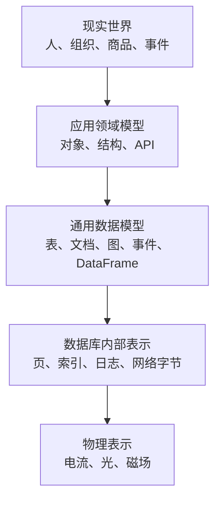

复杂系统可能有更多中间层，例如公共 API 建立在内部服务 API 之上，但核心问题始终是：**上层概念如何表示为下层概念。**

### 0.3 抽象为什么能让不同团队协作

每层通过清晰数据模型隐藏下层复杂性：

- 应用开发者使用 SQL，不必直接管理 B 树页；
- 数据库开发者实现事务和索引，不必理解每个客户的业务；
- 硬件开发者提供持久字节，不必理解“订单”含义。

抽象边界形成契约：上层依赖下层承诺，而不是依赖当前实现细节。数据库可以把一种连接算法替换为另一种，只要查询结果语义不变。

不过，隐藏不等于消失。查询变慢时，应用开发者仍可能需要理解索引和数据分布；磁盘故障时，数据库实现仍受硬件现实约束。好抽象应减少日常认知负担，同时让性能和故障边界可观察。

### 0.4 不同模型具有不同的“自然表达区”

| 问题结构 | 通常更自然的模型 | 原因 |
| --- | --- | --- |
| 规则结构、约束和多表关联 | 关系模型 | 集合运算、连接、模式与事务成熟 |
| 一次整体读取的嵌套树 | 文档模型 | 父子数据共置，映射 JSON/对象自然 |
| 任意类型、多跳关系 | 图模型 | 边和路径是一级概念 |
| 复杂业务状态变化与审计 | 事件溯源 | 记录“发生了什么”及顺序 |
| 探索分析与特征工程 | DataFrame | 增量数据整理、宽表和矩阵转换方便 |
| 数值网格、影像、张量 | 多维数组 | 坐标与数值运算是核心 |

表格不是硬规则。关系数据库可以存 JSON 和图，文档数据库可以连接，DataFrame 可以执行关系式操作。问题不是“能不能模拟”，而是表达、查询和维护是否自然。

### 0.5 选择模型的成本函数

可以把一个候选模型 $m$ 对工作负载 $W$ 的总代价粗略写成：

$$
C(m\mid W)=
C_{\text{expression}}
+C_{\text{query}}
+C_{\text{update}}
+C_{\text{consistency}}
+C_{\text{evolution}}
+C_{\text{operations}}
$$

其中：

- $C_{\text{expression}}$：业务概念映射到模型的复杂度；
- $C_{\text{query}}$：主导查询的执行和开发成本；
- $C_{\text{update}}$：更新、复制和冗余维护成本；
- $C_{\text{consistency}}$：保持多处表示一致的成本；
- $C_{\text{evolution}}$：模式与需求变化成本；
- $C_{\text{operations}}$：运行专用数据库和工具的成本。

这不是原书公式，也无法精确算出一个通用分数。它提醒我们不能只比较单次读取速度：文档的读取局部性可能以大文档更新为代价，图查询的表达简洁可能以专用系统运维为代价。

### 0.6 本章覆盖的模型与语言

本章按以下顺序比较：

1. 声明式查询语言的共同思想；
2. 关系模型与文档模型；
3. 图模型及 Cypher、递归 SQL、SPARQL、Datalog；
4. 面向客户端 UI 的 GraphQL；
5. 事件溯源与 CQRS；
6. DataFrame、矩阵和数组。

贯穿全章的判断标准是：数据关系的形状、主要查询、读写权衡、模式演化和表达复杂度。

## 1. 术语：声明式查询语言

### 1.1 声明式语言描述“要什么”

SQL、Cypher、SPARQL 和 Datalog 等查询语言是 **声明式（declarative）** 的：用户说明结果必须满足什么模式、如何过滤、排序、分组和聚合，但不逐步规定数据库如何得到结果。

例如：

```sql
SELECT region_id, COUNT(*) AS user_count
FROM users
WHERE active = true
GROUP BY region_id
ORDER BY user_count DESC;
```

查询表达：

- 只要活跃用户；
- 按地区分组；
- 统计人数；
- 结果按人数降序。

它没有规定：

- 先扫描哪个索引；
- 使用哈希聚合还是排序聚合；
- 是否并行扫描；
- 是否先过滤再投影；
- 数据位于一台还是多台机器。

### 1.2 命令式程序描述“怎样做”

多数普通编程语言中的手写算法是 **命令式（imperative）** 的：开发者明确操作和顺序。

```python
counts: dict[int, int] = {}

for user in users:
    if not user.active:
        continue
    counts[user.region_id] = counts.get(user.region_id, 0) + 1

result = sorted(counts.items(), key=lambda item: item[1], reverse=True)
```

代码指定遍历、条件、字典更新和排序。若数据分布到多机，开发者还需设计分区、局部聚合、网络交换和合并。

声明式与命令式不是“有代码”和“没代码”的区别，而是 **谁拥有执行策略**：声明式把策略空间交给查询引擎，命令式由程序固定执行步骤。

### 1.3 逻辑查询与物理计划

声明式查询可以分为两层：

- **逻辑计划（logical plan）**：过滤、连接、投影、聚合等关系运算；
- **物理计划（physical plan）**：具体索引、扫描、连接算法、并行度和数据交换。

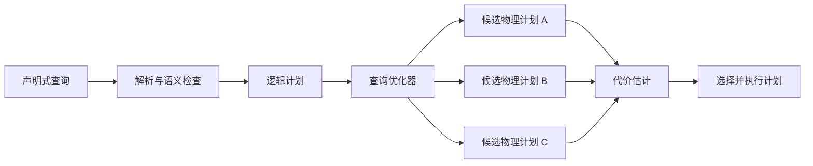

只要物理计划保持逻辑语义，数据库可以自由改变执行方式。

### 1.4 查询优化器（query optimizer）为何需要声明空间

以三表连接为例：

$$
A\Join B\Join C
$$

在满足连接语义时，可能先算 $A\Join B$，也可能先算 $B\Join C$。若中间结果大小不同，代价可能相差巨大。

优化器依据：

- 表和索引统计；
- 过滤选择率；
- 数据分布；
- 可用内存；
- 网络位置；
- 并行资源。

选择嵌套循环连接、哈希连接或归并连接。手写命令式循环通常把顺序固定，使系统难以自动重排。

### 1.5 声明式查询更简洁的原因

声明式语言省略与业务结果无关的机械步骤。例如“找到所有从美国迁居欧洲的人”在图语言中可以写成路径模式，而不必手写：

- 队列或递归栈；
- 已访问节点集合；
- 每一层边的连接；
- 提前终止与并行策略。

简洁不仅减少代码量，也减少应用必须自行验证的算法状态。

### 1.6 实现独立性带来的长期收益

数据库可以在不修改查询的情况下：

- 新增索引访问路径；
- 改进统计估计；
- 使用新的连接算法；
- 启用向量化执行；
- 利用更多 CPU 核；
- 把查询分发到多台机器；
- 使用硬件加速。

声明式查询因此提高可演化性：应用依赖结果语义，而不是当前引擎内部步骤。

### 1.7 自动并行化

查询引擎知道操作之间的数据依赖，可以：

1. 把扫描分到多个分区；
2. 各分区局部过滤和聚合；
3. 只交换较小中间结果；
4. 合并最终结果。

应用仍写一条查询。手写程序若要正确并行，需要处理任务分配、错误重试、结果合并和数据倾斜。

### 1.8 声明式不等于不需要理解性能

优化器不是全知的：

- 统计信息可能陈旧；
- 列之间相关性难以估计；
- 用户函数成本未知；
- 参数值会改变选择率；
- 分布式网络拥塞会变化；
- 极端数据倾斜可能使计划失衡。

开发者仍需理解索引、连接和执行计划，尤其在性能不佳时。声明式隐藏的是日常机械选择，不是取消资源规律。

### 1.9 同一声明可以有多个等价变换

关系代数中的选择下推是典型例子。若过滤条件只依赖 $A$：

$$
\sigma_p(A\Join B)
=
(\sigma_p A)\Join B
$$

先过滤 $A$ 可减少进入连接的数据量。声明式查询让优化器安全应用等价变换；命令式代码若混入副作用或依赖执行顺序，就难以重排。

公式成立的前提是变换保持语义，例如过滤条件不依赖 $B$，并正确处理空值等语言规则。

### 1.10 声明式语言的边界

声明式语言擅长描述集合、模式与关系，但有时：

- 特殊算法难以表达；
- 执行计划需要提示或手工重写；
- 外部副作用不能任意重排；
- 复杂过程逻辑更适合普通程序；
- 引擎不支持所需递归或类型。

实际系统常组合：SQL/Cypher 描述数据查询，普通语言负责业务流程和外部交互。

## 2. 关系模型与文档模型

### 2.1 关系模型（relational model）的基本定义

Edgar Codd 于 1970 年提出关系模型。数据组织为 **关系（relation）**，SQL 中称表；每个关系是 **元组（tuple）** 的无序集合，SQL 中称行。

关系模型的理论表述强调：

- 行没有隐含顺序，排序必须显式请求；
- 每行由属性组成；
- 查询对集合进行选择、投影、连接、聚合；
- 逻辑模型与物理存储分离。

“表看起来像电子表格”只是界面直觉，不是关系模型的完整含义。

### 2.2 从理论质疑到长期主流

关系模型初提出时，很多人怀疑抽象集合查询能否高效实现。到 20 世纪 80 年代中期，RDBMS 和 SQL 已成为规则结构数据的主流工具，并长期主导业务分析和数据仓库。

其成功不只因为模型本身，还因为形成了成熟生态：

- 声明式 SQL；
- 查询优化器；
- 事务与约束；
- 索引和存储引擎；
- 报表、ETL 和管理工具；
- 大量工程经验和人才。

评估新模型时，不能只比较语法，还要计算生态和运维成熟度。

### 2.3 历史竞争者及其启示

关系模型曾面对：

- 1970–1980 年代的网络模型和层次模型；
- 1980–1990 年代的对象数据库；
- 2000 年代的 XML 数据库；
- 2010 年代的 NoSQL。

前三者只留下特定领域应用，没有取代关系模型。SQL 反而逐步吸收 XML、JSON 和图能力。

这不说明关系模型解决所有问题，而说明成功平台会吸收邻近模型的优点，技术边界会收敛。

### 2.4 NoSQL 不是一种单一模型

**NoSQL** 是一组松散思想，而非统一技术，常包括：

- 新数据模型；
- 模式灵活性；
- 横向扩展；
- 开源许可；
- 针对特定工作负载的取舍。

键值、文档、宽列和图数据库都曾被放入 NoSQL，彼此语义差异很大。看到“NoSQL”不能推断它是否支持连接、事务或模式。

### 2.5 NewSQL 的目标

**NewSQL** 系统试图同时提供：

- NoSQL 式扩展能力；
- 传统关系模型；
- SQL；
- 事务保证。

NoSQL/NewSQL 思想深刻影响现代数据库，但术语热度下降，因为其特性已被多类系统吸收。今天更应比较具体能力和约束，而不是阵营标签。

### 2.6 文档模型为何长期留下来

NoSQL 运动最持久的影响之一是 **文档模型（document model）**。它通常用 JSON 表示自包含记录，早期由 MongoDB、Couchbase 等专用数据库推广，后来多数关系数据库也加入 JSON 类型。

文档模型常被认为比固定关系表灵活，因为：

- 字段可按记录变化；
- 嵌套数组和对象自然；
- 应用对象可直接序列化；
- 不必为每个一对多子结构拆表。

这些优势有适用条件，后文会逐项分析。

### 2.7 对象—关系阻抗不匹配

现代应用常用面向对象语言。对象包含：

- 标量字段；
- 嵌套对象；
- 列表与映射；
- 引用和继承；
- 方法与生命周期。

关系数据库提供表、行、列、外键和连接。两种结构不完全对应，应用需翻译，称为 **阻抗不匹配（impedance mismatch）**。

这个术语来自电子学：两个电路阻抗不匹配会降低能量传输并产生反射。在软件中，它比喻对象与关系表示之间的摩擦。

### 2.8 不匹配具体发生在哪里

例如：

```text
User
├── id
├── name
├── positions: List<Position>
├── education: List<Education>
└── contactInfo: ContactInfo
```

关系设计可能拆为：

```text
users
positions(user_id, ...)
education(user_id, ...)
contact_info(user_id, ...)
```

应用加载一个 `User` 对象时，要执行多个查询或连接，再组装列表。更新对象时，还要判断哪些子行插入、修改或删除。

### 2.9 ORM 解决什么

**对象—关系映射（object-relational mapping，ORM）**框架如 ActiveRecord、Hibernate，负责：

- 行与对象转换；
- 外键与对象引用映射；
- 常见增删改查；
- 脏字段跟踪；
- 部分缓存；
- 模式迁移和管理任务。

它减少重复翻译代码，让简单 OLTP 操作开发更快。

### 2.10 ORM 不能完全隐藏模型差异

ORM 自身复杂，且无法让关系数据库真正变成对象内存：

- 对象遍历可能触发数据库查询；
- 事务边界不同于对象生命周期；
- 延迟加载会在意外位置访问网络；
- 继承映射需要权衡；
- 集合更新会变成多行操作；
- SQL 的集合语义仍决定性能。

开发者最终仍需理解对象和关系两种表示。ORM 是翻译工具，不是消除差异的魔法层。

### 2.11 ORM 不会让关系模式失去意义

ORM 主要服务 OLTP 应用代码。数据工程师、分析师和其他服务仍直接面对底层表：

- 分析查询需要清晰表语义；
- ETL 依赖稳定字段和键；
- 数据质量与约束在数据库层；
- 索引和连接性能由物理模式决定。

让 ORM 自动生成难读、低效的表，会把便利成本转移给整个数据生命周期。

### 2.12 多模型系统中的 ORM 局限

组织可能同时使用：

- 关系数据库；
- 搜索引擎；
- 图数据库；
- 文档或键值存储；
- 对象存储。

传统 ORM 往往只覆盖关系 OLTP。试图用同一种对象抽象隐藏所有系统，会抹去它们不同的查询和一致性语义。

### 2.13 自动生成模式和查询的风险

ORM 可自动生成模式，但默认映射未必适合：

- 直接 SQL 用户；
- 索引和分区；
- 批量分析；
- 多列约束；
- 高并发访问。

深度定制 ORM 生成器又会抵消其简单优势。稳妥做法是把数据库模式视为公共契约，ORM 映射服从经过审查的模型。

### 2.14 N+1 查询问题

页面先查询 $N$ 条评论：

```sql
SELECT id, author_id, content
FROM comments
WHERE post_id = ?
LIMIT 100;
```

若 ORM 延迟加载每条评论的作者，再对每个 `author_id` 查询一次：

```sql
SELECT id, name FROM users WHERE id = ?;
```

总查询数为：

$$
Q(N)=1+N
$$

这就是 **N+1 query problem**。$N=100$ 时需要 101 次数据库往返。

### 2.15 N+1 为什么慢

若每次往返固定开销为 $L$，单行查找服务时间为 $s$，忽略并行：

$$
T_{N+1}\approx(N+1)L+Ns
$$

一次连接的时间可粗略写为：

$$
T_{\text{join}}\approx L+S_{\text{join}}
$$

假设 $L=2$ ms、$s=0.1$ ms、$N=100$、数据库连接处理 $S_{\text{join}}=5$ ms：

$$
T_{N+1}\approx101\times2+100\times0.1=212\ \text{ms}
$$

$$
T_{\text{join}}\approx2+5=7\ \text{ms}
$$

数字是教学估算，真实成本取决于缓存、网络和计划。核心是固定往返开销被放大。

### 2.16 如何避免 N+1

可以：

- 在 SQL 中直接连接；
- 告诉 ORM eager load / prefetch；
- 收集所有作者 ID 后批量 `WHERE id IN (...)`；
- 使用 DataLoader 类批处理和请求内缓存；
- 在测试中限制查询数量；
- 用追踪发现循环内数据库调用。

```sql
SELECT comments.id,
       comments.content,
       users.name AS author_name
FROM comments
JOIN users ON comments.author_id = users.id
WHERE comments.post_id = ?
LIMIT 100;
```

避免 N+1 不表示所有关系都应 eager load。无条件加载大关系可能产生笛卡尔膨胀和过量数据；应按页面实际需要选择。

### 2.17 ORM 的合理价值

尽管有缺点，ORM 仍可有效：

- 对适合关系模型的数据，转换不可避免；
- 简单重复 CRUD 可少写样板代码；
- 复杂查询可退回显式 SQL；
- 请求内缓存可减少重复读取；
- 模式迁移工具可统一流程。

正确姿势不是“完全禁止 ORM”或“永远不写 SQL”，而是把 ORM 当作便利层，保持对数据库语义和查询计划的可见性。

### 2.18 本批内容的局部结论

声明式语言把结果语义与执行策略分开，使优化器能重排、并行和演进。关系模型长期成功并不意味着其他模型无价值；文档模型针对嵌套数据提供不同自然表达。

ORM 只能减轻对象—关系翻译，不能取消关系模式、集合查询和网络成本。N+1 是最直观证据：看似自然的对象遍历会生成完全不同的数据库工作负载。选择抽象时必须观察其下层行为。

### 2.19 简历示例：天然的一对多结构

作者用类似 LinkedIn 的个人简历说明关系与文档模型的差异。每个用户只有一份：

- `user_id`；
- 姓名；
- 标题；
- 头像。

但每个用户可能有多份：

- 工作经历；
- 教育经历；
- 联系方式。

这形成 **一对多关系（one-to-many relationship）**：一个用户关联多个职位，但每个职位在这个模型中只属于一个用户。

### 2.20 关系模式怎样表示一对多

关系模型通常拆分：

```sql
CREATE TABLE users (
        user_id      bigint PRIMARY KEY,
        first_name   text NOT NULL,
        last_name    text NOT NULL,
        headline     text,
        region_id    text
);

CREATE TABLE positions (
        position_id  bigint PRIMARY KEY,
        user_id      bigint NOT NULL REFERENCES users(user_id),
        job_title    text NOT NULL,
        organization text NOT NULL,
        start_year   integer,
        end_year     integer
);
```

`positions.user_id` 是外键。教育和联系方式可类似拆表。优点是每个子项有独立 ID，可单独查询、约束和更新；代价是加载完整简历需要多次查询或连接。

### 2.21 文档模型怎样表示同一结构

JSON 可以把子项嵌入一个用户文档：

```json
{
    "user_id": 251,
    "first_name": "Barack",
    "last_name": "Obama",
    "region_id": "us:91",
    "positions": [
        {"title": "President", "organization": "United States of America"},
        {"title": "US Senator", "organization": "United States Senate"}
    ],
    "education": [
        {"school": "Harvard University", "start": 1988, "end": 1991},
        {"school": "Columbia University", "start": 1981, "end": 1983}
    ],
    "contact": {"website": "https://barackobama.com"}
}
```

它与应用中的嵌套对象结构接近，减少组装代码和对象—关系摩擦。

### 2.22 树形结构与文档局部性

简历可视为一棵树：

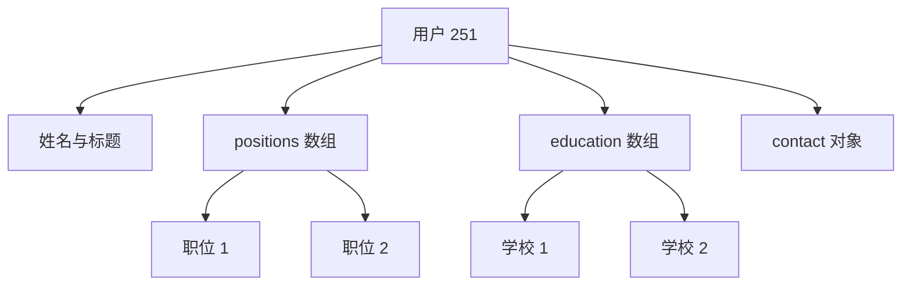

若页面总是一次显示整份简历，JSON 把所需数据放在同一处，具有更好的 **局部性（locality）**：一次键查找和一次文档读取就可能完成。

关系表示则需要：

- 分别按 `user_id` 查询子表；或
- 执行多路连接并处理重复父行。

局部性优势来自访问模式，不来自 JSON 字符本身。若只读取简历的一小部分，大文档反而浪费 I/O。

### 2.23 one-to-few 与嵌入边界

简历通常只有少量职位，因此一对多有时更准确地称为 **one-to-few**。把十几个小子项嵌入父文档很自然。

若子项数量可能达到数万，例如名人帖子的评论：

- 文档会持续膨胀；
- 每次更新可能重写大量数据；
- 单文档大小上限可能被触及；
- 并发更新集中在一个对象；
- 分页和独立索引困难。

此时评论应成为独立记录，通过 `post_id` 关联。是否嵌入不能只看“逻辑上属于”，还要看数量上界、生命周期和访问方式。

### 2.24 规范化与反规范化的定义

简历中的 `region_id` 保存 ID，而不是直接保存 `Washington, DC, United States`。这体现 **规范化（normalization）**：

- 人类可读地区信息只保存在地区实体一处；
- 用户记录只引用稳定 ID。

若每份用户文档都保存完整地区文字，则是 **反规范化（denormalization）**：同一语义被复制到多处。

### 2.25 为什么标准化地区实体

让用户从标准列表选择地区，可获得：

1. 拼写和格式一致；
2. 区分同名地点；
3. 城市改名时只改一处；
4. 按查看者语言本地化；
5. 支持地理层级搜索，例如“美国东海岸”。

自由文本只表达用户输入的字符串，标准实体还能承载层级、别名和坐标等结构化知识。

### 2.26 稳定 ID 的价值

人类可读名称会变化：

- 公司改名；
- 城市因政治原因更名；
- 用户更换昵称；
- 翻译因语言而异。

无业务含义的内部 ID 可以保持稳定。设实体 $e$ 在时间 $t$ 的名称为 $name_t(e)$，引用始终保存：

$$
ref(e)=id_e
$$

即使：

$$
name_{t_1}(e)\ne name_{t_2}(e)
$$

引用无需改变。这是使用代理键的核心直觉。

### 2.27 规范化读取需要连接

显示用户地区时，需要把 ID 解析成人类文本：

```sql
SELECT u.user_id,
             u.first_name,
             r.region_name
FROM users AS u
JOIN regions AS r ON u.region_id = r.region_id
WHERE u.user_id = 251;
```

**连接（join）**按键把分开的事实重新组合。规范化减少更新重复，却把组合工作放到读取路径。

### 2.28 文档数据库也能规范化

文档模型不等于必须嵌入。用户文档可以保存 `region_id`，地区放在另一文档中。区别在于许多文档数据库历史上连接支持较弱：

- 有的完全不支持服务端连接；
- 应用先读用户，再按 ID 读地区；
- MongoDB 可在聚合管道中使用 `$lookup`。

```javascript
db.users.aggregate([
    {$match: {_id: 251}},
    {$lookup: {
        from: "regions",
        localField: "region_id",
        foreignField: "_id",
        as: "region"
    }}
])
```

数据模型、数据库产品和查询语言是三个不同层次：JSON 能表示 ID 引用，不保证数据库能高效连接。

### 2.29 公司与学校是否也应规范化

简历示例把 `organization` 和 `school` 保存为字符串。若只展示名字，复制可能简单；若需要：

- 统一 logo；
- 公司简介和新闻；
- 学校别名；
- 按组织搜索员工；
- 组织合并或改名；

就更适合建立 `organizations` 实体并保存 `org_id`。

模型应从未来共享语义和查询推导，而不是机械地“所有字符串都拆表”。

### 2.30 规范化的读写权衡

设同一属性被复制到 $k$ 个记录：

- 规范化更新约修改 1 处；
- 反规范化更新最坏修改 $k$ 处；
- 规范化读取需要连接或额外查找；
- 反规范化读取可直接返回副本。

可用加权模型表示预期成本：

$$
C= q_r C_r + q_w C_w + C_{\text{consistency}} + C_{\text{storage}}
$$

其中 $q_r,q_w$ 是读写频率。读远多于写且连接昂贵时，反规范化可能有利；频繁更新或强一致要求时，复制成本会占主导。

这不是一条“规范化写快、反规范化读快”的绝对定律：索引维护、批量更新、缓存和物理布局都会改变常数。

### 2.31 反规范化是派生数据

若规范实体 $S$ 通过函数 $f$ 产生副本 $D$：

$$
D=f(S)
$$

则冗余字段应视为派生数据。这样会自然提出：

- 权威源在哪里；
- 源变化怎样传播；
- 最大允许滞后；
- 更新失败如何重试；
- 能否全量重建；
- 如何检测不一致。

“为了性能复制字段”不是一次性模式决定，而是新增了一条持续维护的数据管道。

### 2.32 中途失败导致的副本不一致

若 logo URL 存在 100 万份文档，更新进程处理到 60 万份后崩溃，数据库会同时存在新旧值。

跨多记录原子事务可以避免部分提交，但：

- 并非所有数据库支持跨文档事务；
- 大事务锁定和日志成本高；
- 跨系统副本无法由单库事务覆盖。

另一种方法是变更流或流处理：源更新后异步传播，并通过版本号、幂等和对账达到最终一致。代价是暂时滞后。

### 2.33 OLTP 与分析中的规范化倾向

OLTP 中数据频繁更新，规范化通常有利：

- 单一事实只改一处；
- 事务和约束易保证；
- 中小规模连接成本可接受。

分析系统多为历史读取：

- 数据批量导入；
- 原事实很少逐行修改；
- 大扫描和聚合占主导；
- 减少连接可提高查询效率。

因此星型模式、宽表和 OBT 常有意反规范化。模型选择必须结合 OLTP/OLAP 工作负载。

### 2.34 社交时间线是反规范化连接结果

第 2 章的首页时间线预先计算了帖子与关注关系的连接。写时扇出把新帖子 ID 插入每个关注者时间线，物化近似以下查询结果：

```sql
SELECT p.id, p.sender_id
FROM posts AS p
JOIN follows AS f ON p.sender_id = f.followee_id
WHERE f.follower_id = :current_user
ORDER BY p.created_at DESC
LIMIT 1000;
```

它把昂贵的读时多来源连接转成持续的写时派生维护。

### 2.35 为什么时间线只存 ID

实际时间线不会复制完整帖子文本、点赞数、回复数、用户名和头像，而只保存：

- `post_id`；
- `sender_id`；
- 转帖/回复等少量路由信息。

原因是这些字段变化频率不同：

- 点赞和回复数可能每秒变化；
- 用户会更换名称和头像；
- 完整内容复制到数百万时间线会占大量空间。

若全部反规范化，每次点赞或改头像都可能产生巨大反向扇出。

### 2.36 hydration：选择性连接

读取时间线时，服务根据 ID 查找：

- 最新帖子内容和统计；
- 最新发送者资料。

这个过程叫 **hydrating IDs**，本质是应用代码中的连接。

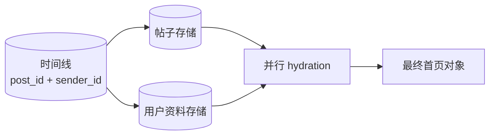

hydration 易于横向扩展，因为多个 ID 查找可并行、缓存，成本主要取决于返回条目数，而非用户总关注数或作者总粉丝数。

### 2.37 高性能不等于消灭所有连接

时间线案例说明，连接本身不是可扩展性的敌人。真正问题是：

- 连接发生在什么路径；
- 输入基数多大；
- 是否可预计算；
- 是否按键并行；
- 数据变化频率；
- 极端扇出。

最优方案可能只反规范化稳定、昂贵的部分，保留快速变化字段规范化。规范化与反规范化是连续选择，不是阵营。

### 2.38 关系基数：一对多、多对一、多对多

- **一对多（one-to-many）**：一份简历有多个职位；
- **多对一（many-to-one）**：许多用户属于同一地区；
- **多对多（many-to-many）**：一人可任职多家公司，一家公司有多人任职。

关系方向取决于观察视角：用户到地区是多对一，地区到用户是一对多。

### 2.39 多对多的关联表

关系模型用 **关联表/连接表（associative table / join table）**：

```sql
CREATE TABLE positions (
        position_id bigint PRIMARY KEY,
        user_id     bigint NOT NULL REFERENCES users(user_id),
        org_id      bigint NOT NULL REFERENCES organizations(org_id),
        job_title   text NOT NULL,
        start_year  integer,
        end_year    integer
);

CREATE INDEX positions_by_user ON positions(user_id);
CREATE INDEX positions_by_org  ON positions(org_id);
```

一行把用户和组织关联，并保存该关系自身属性：职位、起止时间。关系不只是两个 ID，也可以有数据。

### 2.40 为什么多对多难放进单一文档

用户文档可嵌入：

```json
{
    "user_id": 251,
    "positions": [
        {"org_id": 513, "title": "President"},
        {"org_id": 514, "title": "Senator"}
    ]
}
```

但“找到组织 513 的所有员工”需要反向索引。若组织文档也保存全部用户 ID，关系被复制两处：

- 更新一边失败会不一致；
- 热门组织文档可能巨大；
- 并发任职更新争用同一文档。

多对多越核心，规范引用和连接越自然。

### 2.41 双向查询依赖二级索引

规范表示只存一份关联行，再分别在 `user_id`、`org_id` 上创建 **二级索引（secondary index）**，就能高效双向查询。

文档数据库也可对数组内部 `positions[].org_id` 建索引。可见“文档不能表示多对多”并不准确；问题在于数据库对嵌套索引、连接、事务和热点的支持程度。

### 2.42 分析模式的目标

数据仓库把运营数据经 ETL 转成适合分析师的模式。常见结构：

- 星型模式；
- 雪花模式；
- 维度建模；
- one big table（OBT）。

分析模式优化的是大范围过滤、连接和聚合，而不是单行事务更新。

### 2.43 星型模式

**星型模式（star schema）**中央是**事实表（fact table）**，周围是**维度表（dimension table）**：

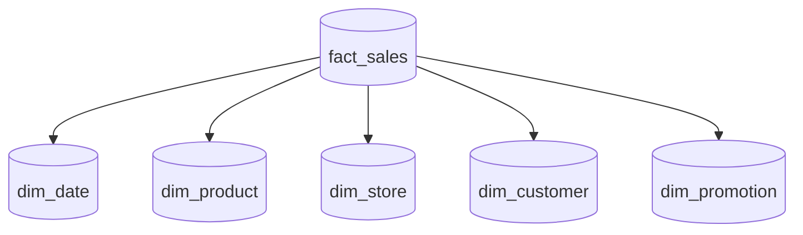

一行事实表示一个事件，例如某时某店向某客户售出某商品。事实表可达到 PB 规模。

### 2.44 事实与维度

事实表通常包含：

- 可度量属性：售价、成本、数量；
- 指向维度的外键：谁、什么、哪里、何时、怎样、为什么。

维度表保存描述上下文，例如产品的 SKU、品牌、类别、包装大小。日期也常是维度，以编码：

- 星期几；
- 财务季度；
- 是否节假日；
- 促销季节。

这样分析可按业务日历聚合，而不只按时间戳计算。

### 2.45 为什么事实保留最细事件

若只保存日销售总额，未来无法分析：

- 单品组合；
- 客户行为；
- 小时峰值；
- 某次促销影响。

保存每个细粒度事件提供最大分析灵活性，代价是事实表巨大。聚合可从细粒度事实派生，反向恢复不可能。

### 2.46 雪花模式

**雪花模式（snowflake schema）**进一步规范化维度。例如 `dim_product` 不直接保存品牌和类别文字，而引用：

```text
fact_sales -> dim_product -> dim_brand
                                                 -> dim_category
```

它减少维度重复，更新统一；查询需要更多连接。星型通常更受分析师欢迎，因为路径更直观。

### 2.47 宽表与 OBT

事实和维度表经常有上百列。**One Big Table（OBT）**更进一步，把维度字段直接折叠到事实行，相当于预计算全部常用连接。

收益：

- 查询简单；
- 扫描时无需多表连接；
- 某些列式引擎可只读所需列并高效压缩。

代价：

- 重复数据与更多存储；
- 口径变更需要重算；
- 表极宽、所有权模糊；
- 不同粒度事实可能错误混合。

### 2.48 分析中的反规范化为何较安全

历史事实通常追加后很少修改，维度副本可由 ETL 批量重建。因此 OLTP 中最棘手的并发多副本更新，在分析中压力较小。

但维度也会变化，例如门店改造、客户地址变化。分析系统仍需决定使用：

- 事件发生时的历史维度；
- 当前最新维度；
- 两者都保留。

反规范化降低查询成本，不会取消时间语义问题。

### 2.49 何时文档模型更合适

若数据主要是：

- 一棵一对少/一对多树；
- 整棵树经常一起加载；
- 跨文档关系很少；
- 子项不需要被其他对象直接引用；
- 结构在不同记录间可能不同；

文档模型通常自然。

示例包括配置快照、产品目录中的异质属性、表单提交、内容块等。

### 2.50 shredding 的成本

把天然文档拆进多张关系表称为 **shredding**。它可能导致：

- 大量子表；
- 多路连接；
- 应用组装代码；
- 模式难以阅读；
- 为仅属于父对象的小字段建立过多 ID。

如果没有跨子项查询和独立更新需求，拆分可能只是偶然复杂性。

### 2.51 文档嵌套项的直接引用限制

文档内部第二个职位通常通过数组位置访问：

```text
users/251/positions/1
```

数组重排后这个位置代表另一个职位。若其他对象需要稳定引用某个职位，独立 `position_id` 和关系表示更合适。

可以在嵌套对象中加入 ID，但随着外部引用增加，文档越来越像一个带边界的关系集合。

### 2.52 用户自定义顺序

待办事项或看板允许拖拽排序。文档可直接用 JSON 数组顺序表达。

关系表没有隐含顺序，需显式 `sort_key`。方案包括：

- 整数序号，插入中间时可能重编号；
- 链表式前驱 ID，查询和并发复杂；
- **分数索引（fractional indexing）**，在相邻键 $a,b$ 间插入：

$$
k_{new}=\frac{a+b}{2}
$$

反复插入会耗尽数值间距，需要重新平衡；并发客户端还需解决相同中间键。文档数组简化单对象排序，但大列表并发更新仍有问题。

### 2.53 “无模式”为什么不准确

多数文档数据库不强制文档结构，但读取代码通常假设：

- `user_id` 是数字；
- `positions` 是数组；
- 数组元素含 `title`；
- 某些字段可选。

这仍是模式，只是存在于应用代码和约定中。更准确区分：

- **schema-on-read**：读取时解释隐式结构；
- **schema-on-write**：写入时由数据库验证显式结构。

### 2.54 schema-on-read 与动态类型

schema-on-read 类似动态类型：不同结构可进入存储，使用时才检查。优势：

- 快速接纳新字段；
- 适合异质数据；
- 外部来源变化时更灵活。

代价：

- 错误较晚暴露；
- 每个读取者要处理旧版本和缺失字段；
- 数据质量难集中保证；
- 文档与实际结构可能漂移。

### 2.55 schema-on-write 与静态类型

schema-on-write 类似静态类型：写入必须符合模式。优势：

- 错误在边界早失败；
- 结构得到文档化；
- 所有读取者可依赖约束；
- 数据库可利用类型和约束优化。

代价：

- 新字段或类型变化需要迁移；
- 异质对象可能产生大量空列或子类型表；
- 大表重写具有运维风险。

两者没有绝对胜者，类似静态/动态类型争论。

### 2.56 姓名字段迁移：读时兼容

旧文档保存 `name`，新文档改为 `first_name`、`last_name`。schema-on-read 可让新写入使用新字段，读取旧文档时转换：

```javascript
if (user.name && !user.first_name) {
    const pieces = user.name.split(" ");
    user.first_name = pieces[0];
    user.last_name = pieces.slice(1).join(" ");
}
```

优势是无需一次重写全部数据。代价是所有读取路径必须长期兼容旧格式，而且“按空格拆姓名”本身对许多文化不正确，说明迁移还涉及领域语义。

### 2.57 写时迁移

关系数据库可：

```sql
ALTER TABLE users ADD COLUMN first_name text;
ALTER TABLE users ADD COLUMN last_name  text;
```

添加可空列通常很快；全量回填：

```sql
UPDATE users
SET first_name = split_part(name, ' ', 1)
WHERE first_name IS NULL;
```

可能重写每行，产生 I/O、日志、复制和锁压力。变更类型等操作也可能复制整表。

实践可采用：

1. 先加新列；
2. 新代码双写或写新列；
3. 后台小批量回填；
4. 读取兼容新旧；
5. 验证覆盖；
6. 最后删除旧列。

这使 schema-on-write 也能渐进演化，而文档系统也可以主动后台迁移；二者边界并非绝对。

### 2.58 schema-on-read 适合异质数据

典型场景：

- 集合含很多对象类型，不适合每种建一张表；
- 结构由不可控外部系统决定；
- 字段频繁新增；
- 原始摄取要求先保留再解释。

若所有记录理应同构，显式模式可以集中捕获错误，通常收益更大。

### 2.59 文档读取局部性（storage locality）

文档通常编码为连续 JSON、XML 或 BSON。若读取完整文档，一次连续读取可能优于多个索引查找。

设完整页面需要 $m$ 个关系子表，每次随机查找固定延迟为 $L$，关系方式粗略成本：

$$
T_{rel}\approx mL+T_{transfer}
$$

文档一次读取：

$$
T_{doc}\approx L+T_{document\ transfer}
$$

但若文档大小 $D$、实际只需比例 $r$，浪费读取约为：

$$
(1-r)D
$$

局部性只有在访问范围与存储边界一致时成立。

### 2.60 文档更新局部性的代价

修改大文档中的一个小字段，数据库可能重写整个文档或大块存储：

- 写放大；
- 并发更新冲突；
- 复制流量增加；
- 大对象碎片和压缩成本。

因此建议文档保持较小，避免频繁小更新。若子项独立高频变化，应拆出。

### 2.61 局部性不是文档专利

关系系统也可物理共置相关行：

- Spanner 的交错/父子表布局；
- Oracle multi-table index cluster；
- Bigtable/HBase/Accumulo 的 column family。

逻辑数据模型与物理布局不是一一绑定。关系逻辑可以使用文档式局部存储，文档逻辑也可能在内部拆分。

### 2.62 文档查询能力差异很大

“文档数据库”不能推断查询能力。有的仅支持主键读取，有的支持：

- 嵌套字段二级索引；
- 聚合管道；
- 全文检索；
- 跨文档连接；
- 地理查询；
- 数组匹配。

XML 生态有 XPath/XQuery；JSON 有 JSON Pointer、JSONPath；MongoDB 有聚合管道。选型必须检查真实查询语言，而非只看存储 JSON。

### 2.63 鲨鱼观测聚合：SQL

海洋生物学家记录每次观测，希望按月统计鲨鱼总数：

```sql
SELECT date_trunc('month', observed_at) AS month,
             SUM(animal_count) AS sharks
FROM observations
WHERE family = 'Sharks'
GROUP BY month
ORDER BY month;
```

逻辑顺序：过滤鲨鱼 → 将时间映射到月份 → 分组 → 求和。

### 2.64 同一聚合：MongoDB 聚合管道（aggregation pipeline）

```javascript
db.observations.aggregate([
    {$match: {family: "Sharks"}},
    {$group: {
        _id: {
            year: {$year: "$observed_at"},
            month: {$month: "$observed_at"}
        },
        sharks: {$sum: "$animal_count"}
    }},
    {$sort: {"_id.year": 1, "_id.month": 1}}
])
```

表达能力类似 SQL 子集，语法采用 JSON 阶段序列。它仍是声明式的：各阶段说明转换，系统决定扫描与并行执行。

### 2.65 关系与文档数据库的收敛

关系数据库加入：

- JSON 类型和操作符；
- JSON 内部索引；
- XML；
- 图查询扩展。

文档数据库加入：

- 二级索引；
- 连接；
- 声明式聚合；
- 多文档事务。

收敛说明两种模型互补：大多数应用同时包含规则关系和局部异质文档。

### 2.66 混合关系—文档模型

一个产品目录可用：

- 关系列保存 `product_id`、价格、库存、品牌 ID 等统一字段；
- JSON 列保存不同品类特有属性；
- 关系表保存多对多类别和供应商；
- JSON 内部索引支持特定属性过滤。

这避免为所有可能属性建立数百空列，也不放弃关键关系约束。

### 2.67 Codd 的 nonsimple domains

Codd 原始关系模型允许类似嵌套关系的 **nonsimple domains**：一行中的值不必只是数字或字符串，也可是一张嵌套关系。

几十年后 SQL 的 JSON/XML 支持在某种程度上回到这个方向。今天“关系 vs 文档”的实际边界，比营销叙事更模糊。

### 2.68 关系/文档选择检查表

| 问题 | 倾向文档 | 倾向关系 |
| --- | --- | --- |
| 主体结构 | 自包含树 | 多实体网络 |
| 读取范围 | 整体读取 | 任意组合与局部读取 |
| 一对多数量 | 小且有界 | 大、分页、独立生命周期 |
| 多对多 | 很少 | 常见且双向查询 |
| 嵌套项引用 | 不需要稳定外部引用 | 需要独立 ID |
| 结构一致性 | 异质、外部来源 | 同构、需要集中约束 |
| 更新方式 | 整体替换或低频 | 高频局部更新 |
| 查询 | 主键/嵌套字段为主 | 连接、临时组合丰富 |
| 演化 | 读时兼容可接受 | 写时验证和集中迁移重要 |

### 2.69 本节结论

文档模型最适合边界清晰、一次读取的树；关系模型最适合共享实体和多方向关系。规范化以读取连接换取单一事实和低更新成本，反规范化以副本维护换取读取速度。

模型并不决定全部物理性能：关系系统能提供局部性，文档系统也能连接和索引。真正应比较的是关系基数、更新频率、访问范围、模式一致性、查询语言和运维能力。现代混合数据库往往让应用在同一系统内按数据片段选择模型。

## 3. 类图数据模型

### 3.1 关系形状是选择模型的重要线索

前文得到一个连续谱：

- 一对少、整体读取的树，文档模型自然；
- 规则的一对多、多对一和简单多对多，关系模型自然；
- 多对多极其普遍、路径长度不固定时，图模型更自然。

图不是因为数据量大才需要，而是因为 **连接本身就是主要信息**。一个只有几千节点的权限图，也可能比十亿条独立日志更适合图模型。

### 3.2 图的基本组成

图 $G$ 通常写成：

$$
G=(V,E)
$$

- $V$ 是 **顶点（vertices）**集合，也称节点（nodes）或实体（entities）；
- $E$ 是 **边（edges）**集合，也称关系（relationships）或弧（arcs）。

有向边可写为：

$$
e=(u,v),\qquad u,v\in V
$$

表示从尾顶点 $u$ 指向头顶点 $v$。无向关系可存为无向边，或按系统约定存两条反向边。

### 3.3 典型图结构

| 图 | 顶点 | 边 |
| --- | --- | --- |
| 社交图 | 人 | 认识、关注、屏蔽 |
| Web 图 | 网页 | HTML 超链接 |
| 公路/铁路网 | 路口或车站 | 道路或线路 |
| 知识图谱 | 人、地点、组织、概念 | 任职、位于、属于、创建 |
| 权限图 | 用户、角色、资源 | 拥有角色、继承、允许访问 |
| 供应链图 | 企业、仓库、产品 | 供应、运输、包含 |

图模型把不同边类型和方向变成一级概念，适合“从 A 沿若干关系找到 B”。

### 3.4 图算法与图查询的关系

原文提到：

- 导航应用在道路图上找最短路径；
- PageRank 在 Web 图上估计网页重要性。

查询语言通常负责模式匹配和遍历，算法库负责最短路、连通分量、中心性等计算。二者有重叠，但不能把“图数据库”自动等同于“内置所有图算法”。

### 3.5 邻接表

**邻接表（adjacency list）**为每个顶点保存一步可达邻居：

```text
Lucy  -> Idaho, Alain, London
Idaho -> United States
United States -> North America
```

空间复杂度为：

$$
O(|V|+|E|)
$$

查询顶点 $v$ 的所有出边成本与其出度 $deg^+(v)$ 成正比：

$$
O(deg^+(v))
$$

稀疏图中 $|E|\ll|V|^2$，邻接表非常节省空间，适合逐边遍历。

### 3.6 邻接矩阵

**邻接矩阵（adjacency matrix）**是 $|V|\times|V|$ 的二维数组：

$$
A_{ij}=
\begin{cases}
1,& (v_i,v_j)\in E\\
0,& \text{otherwise}
\end{cases}
$$

检查两个顶点是否直接相连可在 $O(1)$ 完成，但稠密存储需要：

$$
O(|V|^2)
$$

空间。邻接矩阵适合线性代数、机器学习和稠密图；稀疏矩阵格式可只保存非零项。

### 3.7 邻接表与矩阵的选择

| 操作 | 邻接表 | 邻接矩阵 |
| --- | --- | --- |
| 稀疏图空间 | $O(V+E)$ | $O(V^2)$ |
| 判断边 $(u,v)$ | 取决于邻居索引 | $O(1)$ |
| 遍历 $u$ 的邻居 | $O(deg(u))$ | $O(V)$ 扫描一行 |
| 图遍历 | 自然 | 稀疏图浪费扫描 |
| 矩阵乘法/ML | 需转换或稀疏算子 | 自然 |

同一逻辑图可以有多种物理表示；第 4 章的存储思想同样适用。

### 3.8 可运行示例：邻接表上的广度优先搜索

下面用标准库寻找 Lucy 出生地到 North America 的最短 `WITHIN` 路径。它是对遍历直觉的背景补充，不是原书指定实现。

```python
from collections import deque


def shortest_path(graph: dict[str, list[str]], start: str, target: str) -> list[str]:
        queue = deque([(start, [start])])
        visited = {start}

        while queue:
                vertex, path = queue.popleft()
                if vertex == target:
                        return path

                for neighbor in graph.get(vertex, []):
                        if neighbor not in visited:
                                visited.add(neighbor)
                                queue.append((neighbor, path + [neighbor]))

        return []


within = {
        "Idaho": ["United States"],
        "United States": ["North America"],
        "London": ["England"],
        "England": ["United Kingdom"],
        "United Kingdom": ["Europe"],
}

path = shortest_path(within, "Idaho", "North America")
print(" -> ".join(path))
print(f"hops: {len(path) - 1}")
```

实际运行输出：

```text
Idaho -> United States -> North America
hops: 2
```

广度优先搜索（BFS）用队列按路径长度递增探索，因此在无权图中第一次到达目标就是最少边数路径。`visited` 防止环导致无限重复。复杂度为：

$$
O(|V|+|E|)
$$

前提是每个顶点和边至多处理常数次；加权最短路需要 Dijkstra 等算法。

### 3.9 同构图与异构图

**同构/同质图（homogeneous graph）**中的顶点通常是同类对象，例如全部是网页。

**异构图（heterogeneous graph）**可同时包含：

- 人；
- 地点；
- 事件；
- 签到；
- 评论；
- 商品；
- 组织。

边标签说明不同关系。图模型的优势之一是为多种对象提供统一关系结构，而不要求所有顶点拥有相同字段。

### 3.10 社交图与知识图谱

Facebook 一类社交平台可把人、地点、事件、评论等放入同一图；搜索引擎的 **知识图谱（knowledge graph）**记录查询中常见的人、组织、地点和事实。

知识图谱数据可能来自：

- 网页文本抽取；
- 结构化网站标记；
- Wikidata 等开放知识库；
- 人工维护和实体对齐。

难点不仅是存边，还包括同名实体消歧、来源可信度、时间有效性和矛盾事实。

### 3.11 本章讨论的图模型与语言

两类模型：

- 属性图（property graph）；
- 三元组存储（triple store）。

查询语言：

- Cypher；
- SQL 递归查询；
- SPARQL；
- Datalog；
- GraphQL（用途不同，后文特别辨析）。

另有 Gremlin、GSQL、PGQL、GQL 等。模型与语言不是一一对应：某数据库可同时支持属性图与 RDF。

### 3.12 贯穿示例：Lucy 与 Alain

原文的运行示例包含：

- Lucy 出生于 Idaho；
- Idaho 位于 United States；
- United States 位于 North America；
- Alain 出生于 Saint-Lô；
- 两人结婚并居住在 London；
- London 位于 England，进而位于 Europe。

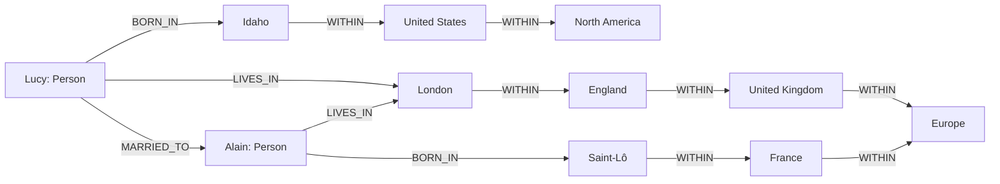

这个图能自然回答“谁出生在美国、现在生活在欧洲”，因为出生地和居住地可沿未知长度的 `WITHIN` 层级向上遍历。

### 3.13 属性图中的顶点

**属性图（property graph）**也称 **带标签属性图（labeled property graph）**。每个顶点包含：

- 唯一 ID；
- 描述对象类型的标签；
- 出边集合；
- 入边集合；
- 键值属性。

例如：

```text
vertex_id = 100
label = Person
properties = {name: "Lucy", birthYear: 1989}
```

标签提供粗粒度类型，属性允许同标签顶点具有可选字段。

### 3.14 属性图中的边

每条边包含：

- 唯一 ID；
- 尾顶点（tail vertex）；
- 头顶点（head vertex）；
- 关系标签；
- 键值属性。

例如：

```text
edge_id = 9001
tail = Lucy
head = London
label = LIVES_IN
properties = {since: 2020}
```

边属性可记录关系自身事实，如开始时间、权重、来源和置信度。

### 3.15 用关系表保存属性图

属性图可以用两张关系表表示：

```sql
CREATE TABLE vertices (
        vertex_id  bigint PRIMARY KEY,
        label      text NOT NULL,
        properties jsonb NOT NULL
);

CREATE TABLE edges (
        edge_id     bigint PRIMARY KEY,
        tail_vertex bigint NOT NULL REFERENCES vertices(vertex_id),
        head_vertex bigint NOT NULL REFERENCES vertices(vertex_id),
        label       text NOT NULL,
        properties  jsonb NOT NULL
);

CREATE INDEX edges_by_tail ON edges(tail_vertex);
CREATE INDEX edges_by_head ON edges(head_vertex);
```

这再次说明逻辑图模型不要求专用物理存储；专用图数据库的价值更多在遍历执行、索引、优化器和 API。

### 3.16 为什么同时索引头尾顶点

- `tail_vertex` 索引用于高效找出边；
- `head_vertex` 索引用于高效找入边。

若只有出边索引，反向遍历“哪些人出生在这个地区”可能扫描全部边。双向索引用写入和空间成本换双向导航。

### 3.17 属性和标签索引

还可创建：

- 顶点标签索引；
- 边标签索引；
- JSON 属性索引；
- 组合索引，例如 `Person.name`。

查询“名称为 Europe 的 Location”应先通过属性索引定位起点，再沿边遍历，避免扫描全图。

### 3.18 属性图的开放连接

任意顶点通常可以连接任意顶点，模型不强制固定关系。灵活性适合演化：新增 `Allergen` 顶点和 `ALLERGIC_TO` 边，不必重构所有已有顶点。

但“不限制”不等于“不需要约束”。应用可能仍需验证：

- `BORN_IN` 的尾部必须是 Person；
- 头部必须是 Location；
- `MARRIED_TO` 是否对称；
- 同一时间是否允许多个居住地。

约束可以由数据库模式、应用逻辑或验证作业实施。

### 3.19 图遍历

**遍历（traversal）**是沿一条或多条边从顶点移动。路径可写为：

$$
p=(v_0,e_1,v_1,e_2,\ldots,e_k,v_k)
$$

其中每条 $e_i$ 连接相邻顶点。路径长度通常为边数 $k$。

图查询常约束：

- 边标签；
- 方向；
- 长度范围；
- 中间顶点标签/属性；
- 路径是否允许重复顶点；
- 返回顶点、边还是完整路径。

### 3.20 属性图是关联表的推广

前文 `positions(user_id, org_id, ...)` 是一种关系。属性图的 `edges` 表把多种关联统一到：

```text
(tail, label, head, properties)
```

它牺牲了每种关联的固定列模式，换取跨类型连接和通用遍历。

### 3.21 图边只能连接两个顶点

普通边是二元关系。关系表一行可以同时引用三方：

```text
Enrollment(student_id, course_id, semester_id, grade)
```

图中可把“选课”本身建成顶点：

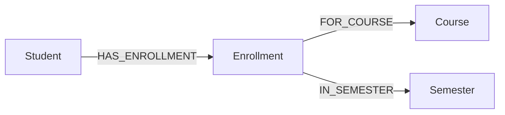

或使用 **超图（hypergraph）**，其超边能关联多个顶点。中介顶点还可保存成绩等关系属性。

### 3.22 图对异构地域结构的表达力

法国有 département/région，美国有 county/state；地点层级深度不同。传统固定表模式可能需要大量可空外键或国家特例。

图只需要：

```text
(child)-[:WITHIN]->(parent)
```

层级类型和深度可变化。Lucy 出生地只精确到州，居住地精确到城市，也可共存。

### 3.23 图的可演化性

若新增食物过敏功能：

- 添加 `Allergen`、`Food` 顶点；
- 添加 `ALLERGIC_TO`、`CONTAINS` 边；
- 查询某人可安全食用的食物。

已有 Person 和 Location 结构无需整体迁移。图模型适合新关系不断出现的领域。

灵活性代价是全局理解更难：边类型数量增长后，需要目录、命名约定和约束，否则图会变成难以治理的“边之泥球”。

### 3.24 Cypher 与 openCypher

**Cypher** 是属性图查询语言，最初由 Neo4j 创建，后来发展为 openCypher 标准，由 Neo4j、Memgraph、KùzuDB、Amazon Neptune、Apache AGE 等支持。

其名字来自电影角色，与密码学 cipher 无关。

### 3.25 Cypher 的节点和边模式

基本语法：

```text
(variable:Label {property: value})
-[:EDGE_LABEL]->
```

例如：

```cypher
(lucy:Person {name: 'Lucy'})-[:BORN_IN]->(idaho:Location {name: 'Idaho'})
```

括号表示顶点，方括号表示边，箭头表示方向。

### 3.26 Cypher 创建图

```cypher
CREATE
    (namerica:Location {name: 'North America', type: 'continent'}),
    (usa:Location      {name: 'United States', type: 'country'}),
    (idaho:Location    {name: 'Idaho', type: 'state'}),
    (lucy:Person       {name: 'Lucy'}),
    (idaho)-[:WITHIN]->(usa)-[:WITHIN]->(namerica),
    (lucy)-[:BORN_IN]->(idaho)
```

`lucy`、`idaho` 等是该查询内部变量，不一定作为名称存入数据库；持久属性是 `{name: ...}`。

### 3.27 Cypher 路径模式查询

查找出生于美国、居住在欧洲的人：

```cypher
MATCH
    (person)-[:BORN_IN]->()-[:WITHIN*0..]->(:Location {name: 'United States'}),
    (person)-[:LIVES_IN]->()-[:WITHIN*0..]->(:Location {name: 'Europe'})
RETURN person.name
```

两个逗号分隔模式必须由同一个 `person` 同时满足，相当于逻辑 AND。

### 3.28 `*0..` 的含义

```text
[:WITHIN*0..]
```

表示沿 `WITHIN` 边零次或多次：

- 零次允许出生地点本身就是 United States；
- 一次允许地点直接位于美国；
- 多次允许 city → state → country 等任意深度。

它类似正则表达式 Kleene star。若需要限制爆炸，可写长度上界，例如 `*1..5`。

### 3.29 Cypher 查询的自然语言解释

对某个 `person`：

1. 沿 `BORN_IN` 到出生地；
2. 沿零条或多条 `WITHIN` 到达名为 United States 的 Location；
3. 同一人沿 `LIVES_IN` 到居住地；
4. 再沿 `WITHIN` 到达 Europe；
5. 返回其姓名。

模式与问题结构几乎一一对应，这是专用查询语言的价值。

### 3.30 同一声明的不同执行方向

执行器可以：

- 扫描所有 Person，分别向上验证出生地和居住地；或
- 先用 `Location.name` 索引找到 US、Europe；
- 反向沿 `WITHIN` 找所有子地点；
- 再沿入边找出生/居住的人；
- 对两个人集求交。

声明式模式不固定起点，优化器可依据选择率决定方向。

### 3.31 图查询的基数估计难点

关系查询可估计列选择率；图路径还要估计：

- 每种边平均/尾部度数；
- 路径每层扩张；
- 标签相关性；
- 环和重复节点；
- 两个路径模式的交集大小。

若平均分支因子为 $b$，深度 $d$ 的朴素候选数可能约为：

$$
1+b+b^2+\cdots+b^d
=\frac{b^{d+1}-1}{b-1}
$$

实际图因重合和剪枝较少，但变量长度路径仍可能爆炸，因此上界和选择性谓词很重要。

### 3.32 关系数据库能存图，但 SQL 表达可能笨拙

每遍历一条边，本质上连接一次 `edges` 表。固定两跳可写两次连接；路径长度未知时，连接次数也未知，普通静态 SQL 不足。

解决方法是 **递归公共表表达式（recursive common table expression，recursive CTE）**，使用 `WITH RECURSIVE`。

### 3.33 递归 CTE 的锚点与递归项

递归查询通常有：

1. **锚点（anchor）**：初始行；
2. **递归项（recursive term）**：从已有行推导下一层；
3. 重复直到不产生新行，即到达不动点。

```sql
WITH RECURSIVE descendants(vertex_id) AS (
    SELECT vertex_id
    FROM vertices
    WHERE properties->>'name' = 'United States'

    UNION

    SELECT e.tail_vertex
    FROM edges AS e
    JOIN descendants AS d ON e.head_vertex = d.vertex_id
    WHERE e.label = 'WITHIN'
)
SELECT * FROM descendants;
```

### 3.34 递归查询的不动点语义

设初始集合 $R_0$ 是 United States 顶点，转换 $F(R)$ 找所有通过入向 `WITHIN` 边指向 $R$ 的顶点。迭代：

$$
R_{i+1}=R_i\cup F(R_i)
$$

当：

$$
R_{i+1}=R_i
$$

停止，得到**传递闭包（transitive closure）**。`UNION` 去重可防止环重复产生同一顶点；`UNION ALL` 需自行处理周期。

### 3.35 完整递归 SQL 的逻辑分解

原文把移民查询分成：

1. `in_usa`：美国及所有下级地点；
2. `in_europe`：欧洲及所有下级地点；
3. `born_in_usa`：出生地在 `in_usa` 的人；
4. `lives_in_europe`：居住地在 `in_europe` 的人；
5. 最终对两个人集求交。

```sql
WITH RECURSIVE
in_usa(vertex_id) AS (
    SELECT vertex_id FROM vertices
    WHERE label = 'Location'
        AND properties->>'name' = 'United States'
    UNION
    SELECT e.tail_vertex
    FROM edges e JOIN in_usa u ON e.head_vertex = u.vertex_id
    WHERE e.label = 'WITHIN'
),
in_europe(vertex_id) AS (
    SELECT vertex_id FROM vertices
    WHERE label = 'Location'
        AND properties->>'name' = 'Europe'
    UNION
    SELECT e.tail_vertex
    FROM edges e JOIN in_europe x ON e.head_vertex = x.vertex_id
    WHERE e.label = 'WITHIN'
),
born_in_usa(vertex_id) AS (
    SELECT e.tail_vertex FROM edges e
    JOIN in_usa u ON e.head_vertex = u.vertex_id
    WHERE e.label = 'BORN_IN'
),
lives_in_europe(vertex_id) AS (
    SELECT e.tail_vertex FROM edges e
    JOIN in_europe x ON e.head_vertex = x.vertex_id
    WHERE e.label = 'LIVES_IN'
)
SELECT v.properties->>'name'
FROM vertices v
JOIN born_in_usa b ON v.vertex_id = b.vertex_id
JOIN lives_in_europe l ON v.vertex_id = l.vertex_id;
```

SQL 能表达，但语法远长于 4 行 Cypher。差异体现语言与问题结构是否匹配。

### 3.36 周期与终止

现实图可能有环：

```text
A WITHIN B
B WITHIN C
C WITHIN A
```

递归遍历必须：

- 使用集合去重；或
- 维护已访问顶点/路径；或
- 限制最大深度；或
- 使用数据库的 `CYCLE` 语法。

否则递归不终止或产生无限路径。

### 3.37 BFS 与 DFS

- **广度优先搜索（breadth-first search，BFS）**按层扩展，适合无权最短边数路径；
- **深度优先搜索（depth-first search，DFS）**沿一条路径深入，适合可达性、拓扑和回溯。

查询结果若只关心“是否可达”，二者都可；若需要最短路径或稳定输出顺序，选择会影响语义和内存。

SQL 标准及数据库扩展对搜索顺序和周期处理支持不同，不能假设递归 CTE 默认返回 BFS 顺序。

### 3.38 SQL 层次查询与图语言标准

Oracle 提供 `CONNECT BY` 等层次查询；TigerGraph 有 GSQL，Oracle/其他系统有 PGQL。

基于 Cypher 的 ISO **Graph Query Language（GQL）**标准于 2024 年发布。标准有望减少图数据库语法碎片，但采用、优化和事务语义仍需时间成熟。

### 3.39 模型可模拟不等于表达自然

“关系数据库可以存图”是事实，但不能推出专用图语言无价值。比较应包括：

- 查询长度与可读性；
- 周期和路径语义；
- 优化器是否理解图模式；
- 索引和物理邻接；
- 团队运维成本；
- 是否还需强关系约束和事务。

少量固定跳连接可能无需图数据库；大量变量路径查询则值得专用模型。

### 3.40 三元组存储的基本形式

**三元组存储（triple store）**把所有信息表示为：

$$
(subject,predicate,object)
$$

例如：

```text
(Jim, likes, bananas)
```

- Jim 是主语（subject）；
- likes 是谓词（predicate）；
- bananas 是宾语（object）。

它与属性图表达能力相近，只是术语和编码不同。

### 3.41 object 的两种含义

若 object 是原始值：

```text
(Lucy, birthYear, 1989)
```

等价于 Lucy 顶点的属性 `birthYear=1989`。

若 object 是另一实体：

```text
(Lucy, marriedTo, Alain)
```

predicate 等价于从 Lucy 到 Alain 的边标签。

三元组用同一结构统一“属性”和“关系”。

### 3.42 四元组与五元组

实际系统常加入元数据：

- AWS Neptune 使用 quad，增加 graph ID；
- Datomic 使用 5-tuple，增加 transaction ID 和表示添加/撤回的布尔值。

通用形式可写：

$$
(entity,attribute,value,transaction,operation)
$$

即使扩展，核心仍是 subject-predicate-object，因此原书统称 triple store。

### 3.43 Turtle/N3 编码

Turtle 是 Notation3（N3）的子集。示例：

```turtle
@prefix : <urn:example:>.
_:lucy     a       :Person.
_:lucy     :name   "Lucy".
_:lucy     :bornIn _:idaho.
_:idaho    a       :Location.
_:idaho    :name   "Idaho".
_:idaho    :within _:usa.
_:usa      a       :Location.
_:usa      :name   "United States".
```

`_:` 表示文件内空白节点标识；`a` 是 RDF 类型关系的简写。

### 3.44 Turtle 分号简写

多个关于同一 subject 的事实可用分号：

```turtle
@prefix : <urn:example:>.
_:lucy  a :Person;
                :name "Lucy";
                :bornIn _:idaho.

_:idaho a :Location;
                :name "Idaho";
                :type "state";
                :within _:usa.
```

它只是序列化简写，逻辑上仍展开成多条三元组。

### 3.45 语义网的目标

**语义网（Semantic Web）**在 2000 年代初希望让网站不仅发布给人看的页面，也发布标准机器可读数据，支持互联网范围的数据互联。

宏大愿景未完全成功，但留下：

- JSON-LD；
- 生物医学本体；
- Open Graph Protocol 和链接预览；
- Wikidata；
- Schema.org 结构化词汇；
- RDF、SPARQL 和三元组工具。

技术可能在原目标失败后，于更小、明确场景继续有价值。

### 3.46 RDF 是数据模型，不是单一语法

**Resource Description Framework（RDF）**规定三元组及标识语义，可以编码为：

- Turtle；
- RDF/XML；
- JSON-LD；
- 其他格式。

不要把 RDF 与冗长 XML 语法混为一谈。工具如 Apache Jena 可在编码之间转换，逻辑事实不变。

### 3.47 RDF 使用 URI 的原因

互联网范围合并数据时，不同组织都可能定义 `within`。RDF 常用 URI 标识 predicate：

```text
http://my-company.com/namespace#within
http://other.org/foo#within
```

字符串局部名相同，完整 URI 不同，因此不会错误合并语义。

URI 只是全局命名空间，不一定能通过 HTTP 访问。示例常用不可解析的 `urn:example:within`。

### 3.48 命名空间与前缀

Turtle/SPARQL 可定义：

```turtle
@prefix ex: <urn:example:>.
```

之后 `ex:within` 展开为完整 URI。命名空间减少冲突，却不能自动保证两个组织对词语含义理解一致；仍需要词汇定义和治理。

### 3.49 SPARQL 的定位

**SPARQL Protocol and RDF Query Language（SPARQL）**是 RDF 三元组查询语言，读作 “sparkle”。它早于 Cypher，Cypher 的模式匹配受其影响。

SPARQL 中变量以 `?` 开头，三元组模式用句点结束。

### 3.50 SPARQL 移民查询

```sparql
PREFIX : <urn:example:>

SELECT ?personName WHERE {
    ?person :name ?personName.
    ?person :bornIn  / :within* / :name "United States".
    ?person :livesIn / :within* / :name "Europe".
}
```

`/` 连接路径，`:within*` 表示零次或多次，语义与 Cypher `[:WITHIN*0..]` 对应。

### 3.51 属性与边在 SPARQL 中统一

Cypher 区分：

```text
(usa {name: 'United States'})
```

SPARQL 统一为三元组：

```text
?usa :name "United States".
```

因为 RDF 的 property 和 edge 都是 predicate，查询语法更加统一；属性图则对顶点属性和边有更直接的不同表示。

### 3.52 Cypher 与 SPARQL 对照

| 含义 | Cypher | SPARQL |
| --- | --- | --- |
| 变量 | `(person)` | `?person` |
| 类型 | `:Person` | `a :Person` |
| 属性 | `{name:'Lucy'}` | `:name "Lucy"` |
| 单边 | `-[:BORN_IN]->` | `:bornIn` |
| 多跳 | `[:WITHIN*0..]` | `:within*` |
| 模型 | 属性图 | RDF 三元组 |

选择常受数据交换标准、生态和已有系统影响，不只是语法偏好。

### 3.53 Datalog 的来源与定位

**Datalog** 源于 1980 年代学术研究，是 Prolog 的受限子集，基于关系模型，却特别擅长递归图查询。

支持者包括 Datomic、LogicBlox、CozoDB、LinkedIn LIquid 等。它在主流应用开发中不如 SQL 普及，但表达复杂规则非常强。

### 3.54 Datalog 事实

数据库内容称为 **事实（facts）**，每个事实类似关系表一行：

```prolog
location(1, "North America", "continent").
location(2, "United States", "country").
location(3, "Idaho", "state").

within(2, 1).
within(3, 2).

person(100, "Lucy").
born_in(100, 3).
```

`location(2, ...)` 表示 `location` 关系中存在该元组，而不是调用会产生副作用的函数。

### 3.55 Datalog 规则（rules）

规则形式：

```text
head :- body.
```

含义是：若 body 中全部模式成立，就可推导 head 事实。

```prolog
within_recursive(LocID, PlaceName) :-
        location(LocID, PlaceName, _).
```

下划线表示不关心的值。规则结果像虚拟关系/SQL 视图，可被其他规则查询。

### 3.56 递归规则

```prolog
within_recursive(LocID, PlaceName) :-
        within(LocID, ViaID),
        within_recursive(ViaID, PlaceName).
```

若 `LocID` 位于 `ViaID`，且 `ViaID` 递归位于 `PlaceName`，则 `LocID` 也位于该地。

这是传递闭包的声明式定义，不指定栈、队列或遍历顺序。

### 3.57 Datalog 移民查询

```prolog
migrated(PersonName, BornIn, LivingIn) :-
        person(PersonID, PersonName),
        born_in(PersonID, BornID),
        within_recursive(BornID, BornIn),
        lives_in(PersonID, LivingID),
        within_recursive(LivingID, LivingIn).

us_to_europe(Person) :-
        migrated(Person, "United States", "Europe").
```

复杂查询按小规则组合，类似函数分解；区别是规则声明关系，不规定调用过程。

### 3.58 变量绑定和连接

模式：

```prolog
person(PersonID, PersonName)
```

匹配 `person(100, "Lucy")` 后：

```text
PersonID = 100
PersonName = "Lucy"
```

同一变量在多个模式出现，要求值相同，相当于关系连接。body 全部模式匹配后，产生 head 元组。

### 3.59 规则逐轮推导

对 North America：

1. 基础规则从 `location(1, "North America", ...)` 推导 `(1, North America)`；
2. `within(2,1)` 推导 US 位于 North America；
3. `within(3,2)` 推导 Idaho 位于 North America；
4. 重复直到没有新事实。


### 3.60 朴素求值与半朴素求值（semi-naive evaluation）

朴素算法每轮用全部已知事实重新应用规则，会重复大量工作。半朴素求值只用上一轮新产生的增量 $\Delta R_i$ 推导下一轮：

$$
\Delta R_{i+1}=F(R_i,\Delta R_i)-R_i
$$

$$
R_{i+1}=R_i\cup\Delta R_{i+1}
$$

当 $\Delta R_{i+1}=\varnothing$ 停止。它与增量物化视图思想相通：只处理新变化，而非每轮从头计算。

### 3.61 Datalog 的思维方式

Cypher/SPARQL 从一个查询模式直接选择结果；Datalog 先定义可复用虚拟关系，再组合。

优势：

- 复杂逻辑可分层；
- 递归自然；
- 规则可复用；
- 接近数学逻辑，便于推理。

门槛：

- 开发者不熟悉逻辑编程；
- 调试执行计划和规则爆炸需要工具；
- 生态比 SQL 小；
- 否定和聚合与递归组合需要明确分层语义。

### 3.62 四种语言表达同一问题

| 语言 | 核心表达 | 特点 |
| --- | --- | --- |
| Cypher | 顶点—边箭头模式 | 属性图直观 |
| SPARQL | 三元组和 property path | RDF/全局命名空间自然 |
| Datalog | 事实 + 递归规则 | 复杂递归逻辑可组合 |
| SQL | 递归 CTE + 多次连接 | 可在关系系统中完成，但冗长 |

结果能力可以相近，认知成本不同。数据模型与查询语言共同决定“自然表达区”。

### 3.63 GraphQL 的真正用途

**GraphQL** 虽然名字带 Graph，却不是通用图数据库查询语言。它面向 OLTP 客户端，让浏览器或移动端声明 UI 需要的 JSON 形状。

目标是解决 REST 接口常见问题：

- over-fetching：返回太多字段；
- under-fetching：一个页面需要多次请求；
- 客户端 UI 演进需服务端增加专用端点。

### 3.64 GraphQL 查询形状

群聊页面请求频道、最近 50 条消息、发送者和被回复消息：

```graphql
query ChatApp {
    channels {
        name
        recentMessages(latest: 50) {
            timestamp
            content
            sender {
                fullName
                imageUrl
            }
            replyTo {
                content
                sender { fullName }
            }
        }
    }
}
```

响应 JSON 结构镜像查询，只返回所请求字段。

### 3.65 GraphQL 的客户端演化优势

若 UI 新增被回复者头像，客户端把 `imageUrl` 加到 `replyTo.sender`，服务端若模式已暴露该字段，无需新端点。

服务端不必预先知道每个页面字段组合。不同 Web/移动版本可按需选择字段。

### 3.66 GraphQL 有意限制表达能力

查询来自不可信客户端。若允许任意递归和任意搜索，用户可提交指数级路径查询导致拒绝服务。

因此 GraphQL：

- 不支持通用递归；
- 不允许任意谓词，除非服务端显式暴露；
- 每个可遍历字段由 schema 定义；
- 服务端可限制深度、复杂度和分页。

它牺牲通用查询能力换可控制的公共 API。

### 3.67 GraphQL 的成本与风险

组织通常需要把 GraphQL resolver 转成内部 REST/gRPC/数据库调用，并处理：

- 字段级授权；
- 查询深度和复杂度预算；
- 速率限制；
- resolver N+1；
- 缓存；
- 部分失败；
- 可观测性；
- 模式弃用。

灵活性从“服务端写多个端点”转移为“平台正确规划任意允许字段组合”。

### 3.68 GraphQL N+1

若 `recentMessages` 返回 50 条，每个 `sender` resolver 单独查用户，就产生 51 次查询。多个频道又进一步放大。

常用 DataLoader：

1. 收集同一事件循环中的所有 `sender_id`；
2. 批量查询 `WHERE id IN (...)`；
3. 按 ID 分发结果；
4. 请求内缓存重复 ID。

GraphQL 解决网络响应形状，不自动优化后端连接。

### 3.69 GraphQL 查询复杂度

可为字段定义成本 $c(f)$，查询成本粗略为：

$$
C(Q)=\sum_{f\in Q} multiplier(f)\cdot c(f)
$$

列表字段的 multiplier 取分页上限。例如 100 个频道 × 每频道 50 条消息 × 多个嵌套字段，成本远高于字段数量表面值。

服务端应强制分页上限、深度限制、成本预算和超时。公式是实践抽象，实际成本还受缓存与批处理影响。

### 3.70 GraphQL 中的反规范化响应

消息响应中重复发送者姓名和头像，被回复消息内容也重复。这样增加响应字节，却让 UI 直接渲染，不必自行按 ID 查找。

服务端数据库仍可规范化保存：

- message 保存 `sender_id`；
- reply 保存 `reply_to_message_id`；
- resolver 执行连接/hydration；
- 响应按 UI 需求反规范化。

存储模型与 API 返回模型不必相同。

### 3.71 GraphQL 只能沿显式 schema 连接

客户端不能任意从任何对象连接到任何对象。只有服务端 schema 声明的字段可请求，这提供：

- 授权边界；
- 成本控制；
- 兼容契约；
- 领域 API。

它与图数据库“任意路径模式”目标相反。

### 3.72 GraphQL 与数据库无关

GraphQL 可以建立在：

- PostgreSQL；
- MongoDB；
- 图数据库；
- 多个微服务；
- 缓存和搜索索引。

响应像文档、名称含 graph，都不能推断底层模型。GraphQL 是 API 查询和类型系统，不是存储引擎。

### 3.73 图模型部分的选择框架

| 需求 | 适合方向 |
| --- | --- |
| 少量固定跳连接 | 普通 SQL/关系表 |
| 未知深度层级 | 递归 SQL、Cypher、SPARQL、Datalog |
| 异构实体与丰富边属性 | 属性图 |
| 跨组织标准化标识与数据交换 | RDF/三元组 |
| 复杂递归规则 | Datalog |
| 客户端选择 UI 字段 | GraphQL |
| 最短路/PageRank 等批算法 | 图算法引擎或分析库 |

### 3.74 本节结论

图模型适合关系密集、路径长度可变、实体类型异构的领域。属性图把顶点、边、标签和属性作为一级对象；三元组用 subject-predicate-object 统一属性与关系。二者表达能力相近，生态和命名方式不同。

Cypher/SPARQL 用路径模式自然表达多跳查询；Datalog 用递归规则构建关系；SQL 能借递归 CTE 模拟，但语法和优化更笨重。GraphQL 则解决客户端 JSON 形状，不是通用图查询。模型能彼此模拟不意味着同样自然，真正差异在表达、优化、约束和运维成本。

## 4. 事件溯源与 CQRS

### 4.1 单一表示为何难以满足所有读写

前述模型通常以写入时的形式直接查询：

- 写关系行，读关系行；
- 写 JSON，读 JSON；
- 写顶点和边，查询顶点和边。

复杂应用往往同时需要：

- 快速接受状态变化；
- 用户当前状态页面；
- 管理仪表盘；
- 审计历史；
- 搜索索引；
- 对账和报表。

试图用一张表或一个文档同时优化所有读写，会产生大量索引、复杂更新和耦合。作者因此把“写入表示”与“读取表示”明确分开。

### 4.2 派生表示是前面概念的延伸

第 1 章已经区分权威记录与派生数据，ETL 把运营数据转换为分析表示；第 2 章用物化时间线优化读取。

事件溯源把这个思想推到更彻底：

1. 为写入选择最能表达变化和意图的形式；
2. 为每类查询建立独立、优化的读取表示；
3. 读取表示都从同一权威变化序列派生。

### 4.3 若只优化写入，最简单的模型是什么

一种简单写入形式是 **事件日志（event log）**：每次变化编码为自包含事件，并追加到有序序列尾部。

事件通常含：

- 事件 ID；
- 聚合/实体 ID；
- 事件类型；
- 发生时间；
- 业务负载；
- 模式版本；
- 因果或命令元数据。

```json
{
  "event_id": "evt-901",
  "conference_id": "conf-2027",
  "type": "SeatsBooked",
  "occurred_at": "2027-02-01T10:00:00Z",
  "booking_id": "booking-42",
  "quantity": 3,
  "schema_version": 1
}
```

### 4.4 不可变、只追加的含义

日志中的事件是 **不可变（immutable）** 的：

- 不原地修改历史事件；
- 不用更新覆盖旧事实；
- 新变化以新事件追加；
- 后续事件可取代旧事件在当前状态中的效果。

“不可变”是逻辑模型承诺，不表示底层永远不能压缩、归档或依法删除字节；物理生命周期仍需另行设计。

### 4.5 会议管理案例为何复杂

会议座位不只是“capacity - registrations”：

- 个人在线注册并刷卡支付；
- 公司批量预订，再分配给员工；
- 赞助商、讲者、志愿者预留座位；
- 预订可取消；
- 会场变更会调整容量；
- 等候名单可能自动补位；
- 发票和退款有独立生命周期。

直接保存 `available_seats` 当前数值会丢失变化原因，也容易在复杂操作中更新错误。

### 4.6 会议事件序列

可能的日志：

```text
ConferenceCreated(capacity=500)
RegistrationOpened()
SeatsReserved(kind="speaker", quantity=20)
SeatsBooked(booking_id=B1, quantity=3)
SeatAssigned(booking_id=B1, attendee=A1)
BookingCanceled(booking_id=B1, quantity=3)
CapacityChanged(old=500, new=700)
```

每个事件记录一项已经发生、业务上有效的事实。

### 4.7 物化视图、投影与读模型

事件追加后，多个消费者更新各自的：

- **物化视图（materialized view）**；
- **投影（projection）**；
- **读模型（read model）**。

三者在此上下文大体指从日志派生、针对查询优化的状态。

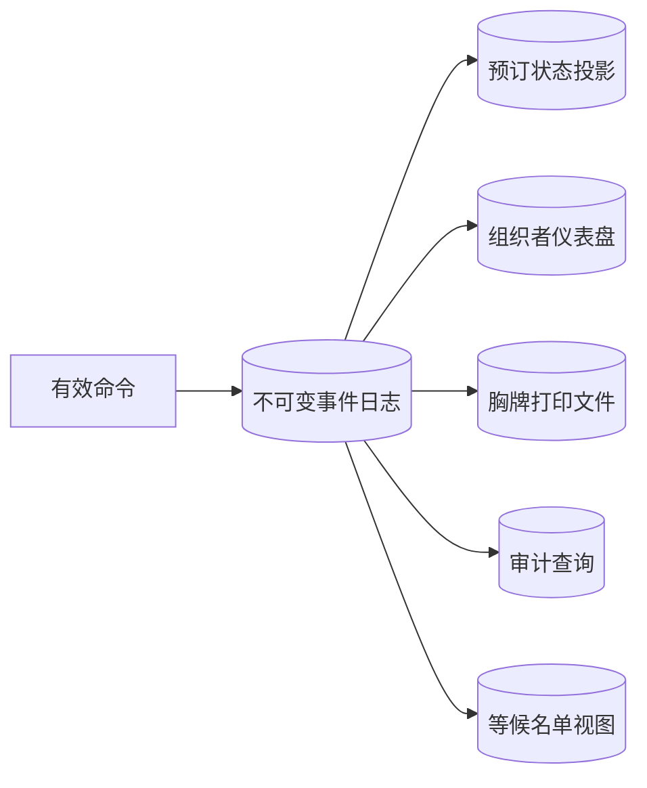

每个投影可使用不同数据模型甚至不同数据库。

### 4.8 事件溯源的定义

**事件溯源（event sourcing）**把事件作为事实来源，并用每个状态变化对应的事件记录系统历史。

当前状态不是唯一权威快照，而是事件前缀的折叠结果。设初始状态 $S_0$、有序事件 $e_1,\ldots,e_n$、状态转移函数 $apply$：

$$
S_i=apply(S_{i-1},e_i)
$$

最终状态：

$$
S_n=fold(apply,S_0,[e_1,e_2,\ldots,e_n])
$$

事件顺序改变，结果可能改变。

### 4.9 CQRS 的定义

**命令查询职责分离（command query responsibility segregation，CQRS）**把：

- 写侧：接受命令、验证业务规则、追加事件；
- 读侧：从事件派生查询优化表示；

分开设计。

CQRS 不一定要求事件溯源：写侧也可保存普通状态，再更新读副本。事件溯源也可只维护一个简单投影。但二者常一起使用。

这些名称来自 DDD 社区，但相似思想早已存在，例如 **状态机复制（state machine replication）**也让副本按同一有序命令/日志确定地演化。

### 4.10 command 与 event 不能混淆

**命令（command）**表达请求或意图：

```text
BookSeats(conference=C, quantity=3)
```

它可能被拒绝，例如没有足够座位。

**事件（event）**表达已经成立的事实：

```text
SeatsBooked(conference=C, quantity=3)
```

投影消费者不应再次拒绝有效事件；若消费者可以说“这个事件不合法”，说明写侧验证或日志一致性有问题。

### 4.11 命令处理流程

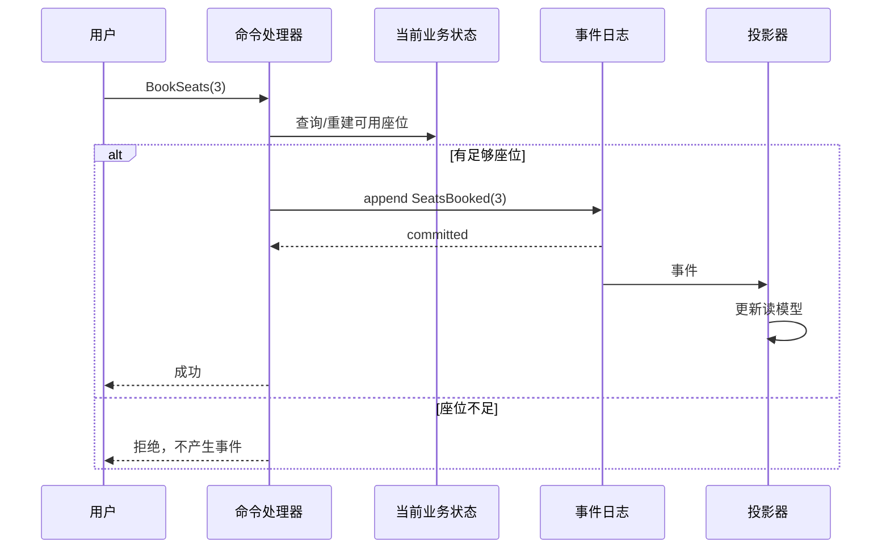

关键原子边界是：成功响应不能早于事件可靠提交。

### 4.12 事件为何用过去时命名

推荐名称：

- `SeatsBooked`；
- `BookingCanceled`；
- `CapacityChanged`。

不推荐把 `BookSeats` 当事件，因为它听起来像尚待执行的命令。

过去时强调事件不可再拒绝。后来取消并不会让“曾经预订过”变假；取消是新的事实。

### 4.13 事件顺序为何重要

以下顺序有效：

```text
BookingCreated -> BookingCanceled
```

逆序可能没有意义。事件溯源中的日志是序列，不只是无序事件集合。

对同一实体可使用单调版本号：

```text
booking-42 version 1: BookingCreated
booking-42 version 2: BookingCanceled
```

并发命令用期望版本进行乐观冲突检测，避免两个处理器基于相同旧状态都成功追加矛盾事件。

### 4.14 与星型事实表的相似点

两者都记录历史发生事件：

- 事实表的一行表示销售/点击；
- 事件日志的一项表示预订/取消。

都适合追加、审计和派生分析。

### 4.15 与事实表的区别

| 维度 | 星型事实表 | 事件溯源日志 |
| --- | --- | --- |
| 结构 | 同表行通常共享列 | 多事件类型可有不同属性 |
| 顺序 | 关系逻辑上无序 | 顺序参与状态语义 |
| 主要用途 | 分析历史 | 业务权威状态变化 |
| 有效性 | ETL 后事实 | 写入前必须通过命令验证 |
| 读取 | SQL 聚合 | 投影/重放后查询 |

不能因为两者都“追加事件”就把分析事实表直接当业务事件存储。

### 4.16 事件表达“为什么”

状态表可能只显示：

```text
bookings.active = false
seat_assignments 删除 3 行
payments 新增 refund 行
```

事件 `BookingCanceled` 把这些变化的共同业务意图显式化。投影仍会执行行更新，但维护者知道为何更新。

这提高：

- 调试可解释性；
- 审计；
- 新下游行为订阅；
- 业务规则复盘。

### 4.17 可重放是核心不变量

一个投影应满足：给定相同初始状态、同一事件序列和同一代码，结果相同。

$$
Project(E,code)=V
$$

若删除 $V$ 后再次执行：

$$
Project(E,code)=V'
$$

应有：

$$
V'=V
$$

这使派生数据可修复：投影代码有缺陷时，修正代码并从头重建。

### 4.18 确定性为何重要

若投影处理 `SeatsBooked` 时调用当前汇率 API，今天重放和明年重放可能得到不同金额，破坏可重现性。

解决：

- 事件直接包含当时采用的汇率；或
- 引用一个不可变的历史汇率版本；或
- 依赖可按事件时间稳定查询的历史数据集。

投影函数应尽量是：

$$
V_{i+1}=f(V_i,e_i)
$$

而不是依赖未记录的当前时间、随机数或可变外部服务。

### 4.19 多个读模型

同一日志可以派生：

- 按 booking ID 的详情文档；
- 可用座位计数；
- 按日收入宽表；
- 全文搜索索引；
- GraphQL 查询视图；
- 管理仪表盘缓存。

每个视图按主查询反规范化，不需要互相迁就。

### 4.20 内存投影

若视图较小且重建可接受，可只保存在内存：

- 服务启动时从日志重放；
- 之后持续消费新事件；
- 崩溃后再次重建。

是否持久化取决于：

$$
T_{rebuild},\quad C_{rebuild},\quad RTO
$$

理论可重建不代表恢复时间可接受；大日志常需持久视图和快照。

### 4.21 新需求为何容易增加读模型

若产品新增“按公司统计未分配座位”，可以：

1. 编写新投影器；
2. 从历史日志重放；
3. 验证结果；
4. 追上实时事件；
5. 切换查询。

不必修改旧事件或主写模型。事件保留的信息越充分，未来可派生能力越大。

### 4.22 从旧事件触发新行为

例如新增等候名单：今后收到 `BookingCanceled` 时，把座位提供给下一人。

但重放历史取消事件时不能向过去的人再次发通知。需要区分：

- 构建纯状态的投影；
- 只对实时新事件执行外部副作用。

新行为是否追溯应用要明确。

### 4.23 纠错事件与可逆性

若错误写入一个有效但事实错误的事件，可追加补偿：

```text
SeatAssignmentCorrected(...)
BookingCanceled(...)
```

投影处理后修正当前状态，同时保留历史。它比直接删除行更容易审计和回退。

不过，补偿不等于现实后果完全可逆：错误邮件已被人阅读，错误付款可能已结算。

### 4.24 审计日志（audit log）价值

事件日志回答：

- 谁在何时发起什么变化；
- 系统接受了哪项事实；
- 当前状态由哪些事件推导；
- 某次退款或分配为何发生。

受监管行业常重视这种可追踪性。审计元数据也应防篡改、访问受控，并避免过量个人数据。

### 4.25 追加写入吞吐优势

日志顺序追加通常比随机更新更适合高吞吐：

- 写入位置集中；
- 批量顺序 I/O；
- 索引需求较少；
- 生产者不必同步更新所有读模型。

第 4 章会从存储引擎解释追加写为何高效。

### 4.26 日志吸收短时突发

事件生产速率暂时高于投影处理率时，日志保留积压，消费者稍后追赶。

设到达率 $\lambda(t)$、消费率 $\mu(t)$，积压变化：

$$
B(t)=B(0)+\int_0^t(\lambda(x)-\mu(x))dx
$$

只要长期平均消费率高于到达率，峰后可排空。读模型新鲜度暂时下降，因此需要监控 lag 和最大事件年龄。

### 4.27 事件不可变与个人数据删除冲突

GDPR 等法规可能要求删除个人数据，而混合多用户日志不能简单删除某个用户整条日志。

可选设计：

- 事件只保存个人数据引用，具体 PII 在可删除存储中；
- 按用户或租户分日志；
- 加密个人字段并独立管理密钥；
- 对日志段重写/压缩；
- 设置保留期而非永久保存。

每种方案影响审计、重放和复杂度。

### 4.28 密码学删除

**密码学删除（crypto-shredding）**用独立密钥加密个人数据，删除密钥后密文不可解读。

前提：

- 密钥没有其他副本；
- 加密算法和密钥管理可靠；
- 明文不在其他投影、日志或缓存；
- 元数据本身不泄露需删除信息。

删除密钥也意味着旧事件无法完整重放，投影必须能处理被擦除字段。

### 4.29 重放与外部副作用

投影重建不应重复：

- 发确认邮件；
- 扣款；
- 调用第三方预订；
- 推送通知。

原则：状态派生函数应纯粹，副作用由单独实时处理器执行，并记录幂等键或发送状态。

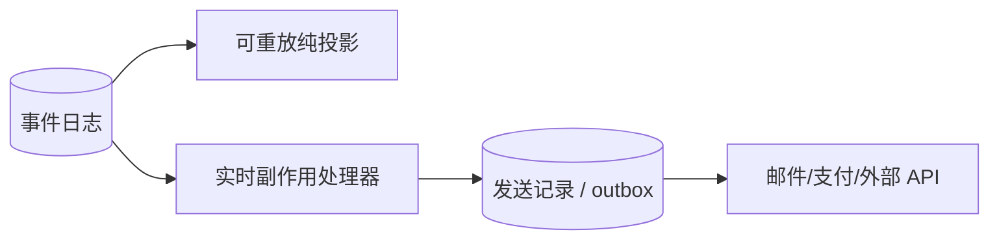

### 4.30 副作用幂等

外部调用可能在成功后响应丢失。使用 `event_id` 作为幂等键：

```text
sendConfirmation(event_id, recipient, template)
```

接收方或本地 outbox 记录已处理 ID，重试不重复发送。

若第三方不支持幂等，需对账和补偿；事件溯源不会自动提供 exactly-once 外部效果。

### 4.31 所有投影必须看到一致顺序

若投影 A 看到：

```text
BookingCreated -> BookingCanceled
```

投影 B 看到逆序，两者状态会分歧。事件存储必须保证各投影按日志定义的顺序处理。

分布式系统中全局顺序昂贵。实践常只要求同一聚合/分区内有序，不同实体可并行。分区键必须与业务顺序边界一致。

### 4.32 幂等投影

消费者可能在更新视图后、提交偏移前崩溃，事件会重放。投影更新应幂等或原子协调。

一种做法在同一事务保存：

- 视图变化；
- 最后处理的事件位置。

另一种让更新携带事件 ID，并对 `(projection,event_id)` 建唯一约束。

### 4.33 快照是重放优化

这是背景补充：事件很多时，可定期保存聚合状态快照：

```text
snapshot at version 1,000
then replay events 1,001 ... 1,050
```

快照不是权威替代，而是从日志重建的缓存。需验证快照版本、校验和和与事件位置一致。

### 4.34 事件模式演化

旧事件永远存在，新代码必须读取旧版本。策略包括：

- 新增可选字段；
- 在读取时 upcast 旧事件；
- 保留版本化处理器；
- 用新纠正事件表达语义变化；
- 不改变已有字段含义。

事件日志把模式演化压力从“当前表行”扩展到“所有历史事件”。第 5 章会深入编码兼容。

### 4.35 event sourcing、普通审计日志与 CDC 的区别

| 机制 | 权威事实 | 主要语义 |
| --- | --- | --- |
| Event sourcing | 业务事件日志 | 业务意图和状态变化 |
| 审计日志 | 通常是主状态的旁路记录 | 谁做了什么，未必可重建状态 |
| Change Data Capture | 数据库行变更日志 | 行插入/更新/删除，不一定说明业务原因 |
| 消息通知 | 主状态之外的事件副本 | 可能丢失或不完整，取决于设计 |

有日志不等于采用事件溯源。关键是事件是否为权威、是否足以重建状态。

### 4.36 事件粒度

太低层：

```text
ColumnChanged(table="bookings", column="active", value=false)
```

丢失业务意图。太高层、负载巨大，又会耦合过多变化。

理想事件表达稳定领域事实，例如 `BookingCanceled`，并包含下游重现所需数据或稳定引用。

### 4.37 事件溯源的主要收益

1. 意图清晰；
2. 历史审计；
3. 投影可重建和修复；
4. 多读模型独立优化；
5. 新视图可回放历史；
6. 追加写吞吐高；
7. 补偿事件降低部分不可逆性；
8. 变化可触发新行为。

### 4.38 事件溯源的主要成本

1. 思维和基础设施复杂；
2. 最终一致读模型；
3. 顺序和分区困难；
4. 事件模式需永久兼容；
5. 外部副作用不能盲目重放；
6. 个人数据删除冲突；
7. 调试需理解日志和多个投影；
8. 当前状态查询必须依赖投影；
9. 全量重放可能昂贵。

### 4.39 何时适合事件溯源

更适合：

- 业务状态转换复杂；
- 审计和历史解释重要；
- 多种读模型差异大；
- 纠错和重放价值高；
- 写入突发明显；
- 领域事件本身稳定。

不一定适合：

- 简单 CRUD；
- 只关心当前状态；
- 团队无投影/事件演化经验；
- 大量不可删除个人数据；
- 外部副作用占主导且难幂等。

### 4.40 实现选择

事件溯源可建立在普通数据库上，也可使用：

- EventStoreDB；
- MartenDB/PostgreSQL；
- Axon Framework；
- Kafka 等消息日志；
- 流处理器维护投影。

产品名称不决定正确性。最关键契约是：持久顺序、并发追加、消费位置、保留、重放和投影一致性。

### 4.41 本节结论

事件溯源选择“发生了什么”作为权威写模型，CQRS 则允许每种读需求拥有独立表示。事件必须是经过验证、过去时的事实；当前状态通过按序折叠事件获得，投影应确定、幂等、可重建。

这种模型提高意图、审计、写吞吐与演化能力，却把复杂性放到顺序、事件兼容、最终一致、个人数据删除和外部副作用。它不是所有 CRUD 的升级版，而是复杂业务状态和多读模型场景下的有意识权衡。

## 5. DataFrame、矩阵与数组

### 5.1 这些模型主要出现在哪里

关系、文档、图和事件可用于 OLTP 与分析。**DataFrame** 与多维数值数组则主要出现在：

- 数据探索；
- 统计分析；
- 可视化；
- 机器学习训练数据准备；
- 科学计算；
- 金融时间序列。

它们很少作为普通 OLTP 的主权威模型，因为更新和事务访问模式不同。

### 5.2 DataFrame 生态

DataFrame 模型由以下系统支持：

- R；
- Python Pandas；
- Apache Spark；
- Dask；
- ArcticDB；
- Flink 等批流框架。

名称相同不保证 API、惰性执行、类型和分布式语义完全一致。

### 5.3 DataFrame 看起来像表

DataFrame 通常有：

- 命名列；
- 行；
- 列类型；
- 索引；
- 缺失值语义。

它类似关系表或电子表格，但常存在于程序内、属于某个分析流程的私有中间状态。

### 5.4 关系式批量操作

DataFrame 支持：

- `filter`：按条件筛行；
- `select`：选择/计算列；
- `groupby` + aggregate：分组聚合；
- `merge`：按键连接，关系数据库称 join；
- `sort`；
- `pivot`/`melt`：宽长格式转换；
- 窗口和时间序列操作。

操作通常针对整列/整批数据，而非逐个对象方法调用。

### 5.5 DataFrame 工作流偏命令式、增量式

SQL 用户声明最终结果；数据科学家常逐步“整理（wrangle）”：

```python
clean = observations[observations["quality"] >= 0.9]
monthly = clean.assign(month=clean["timestamp"].dt.to_period("M"))
report = monthly.groupby(["month", "family"])["count"].sum()
```

每一步生成或修改中间 DataFrame，便于交互检查。代码片段是 Pandas 风格说明，未作为本文标准库可运行示例。

### 5.6 私有副本与共享数据库的差异

DataFrame 常在分析者本机或 notebook 中处理数据副本：

- 修改不会直接影响权威运营数据；
- 可快速试验；
- 中间模式可随探索变化；
- 最终结果再共享或生产化。

关系数据库则服务多个并发用户，需要稳定模式、权限和资源隔离。DataFrame 的灵活部分来自使用上下文，不只来自 API。

### 5.7 DataFrame 超越关系操作

DataFrame 常连接：

- 文本/图像特征提取；
- 数值数组；
- 统计函数；
- ML 模型；
- 自定义向量化函数。

其重要角色是从关系式记录逐步转换到算法需要的数值表示。

### 5.8 电影评分的长表表示

原始评分可表示为长表：

| user | movie | rating |
| --- | --- | ---: |
| Alice | Matrix | 5 |
| Alice | Arrival | 4 |
| Bob | Matrix | 3 |
| Bob | Dune | 5 |
| Carol | Arrival | 5 |

每行是一个已观测的用户—电影关系，类似关联表。

### 5.9 透视为矩阵

将用户作为行、电影作为列、评分作为值：

| user \ movie | Arrival | Dune | Matrix |
| --- | ---: | ---: | ---: |
| Alice | 4 | 缺失 | 5 |
| Bob | 缺失 | 5 | 3 |
| Carol | 5 | 缺失 | 缺失 |

这个操作类似电子表格 **透视表（pivot table）**。矩阵形式适合推荐算法和线性代数。

### 5.10 稀疏矩阵

用户通常只评价极少电影，绝大多数单元格缺失，称为 **稀疏矩阵（sparse matrix）**。

若用户数 $U$、电影数 $M$、实际评分数 $R$，稠密矩阵存储量为：

$$
O(UM)
$$

稀疏坐标表示只保存非零/已知项：

$$
O(R)
$$

当 $R\ll UM$ 时节省巨大。

### 5.11 稀疏度

密度：

$$
density=\frac{R}{UM}
$$

稀疏度：

$$
sparsity=1-density
$$

100 万用户、10 万电影、1 亿评分：

$$
density=\frac{10^8}{10^6\times10^5}=0.001
$$

即 0.1% 已知，99.9% 稀疏。稠密浮点矩阵约 $10^{11}$ 项，按 4 字节约 400 GB；稀疏格式只保存 1 亿项及索引，仍大但显著更小。

### 5.12 可运行示例：长表转换为稀疏矩阵

下面仅用标准库保存已观测单元格，并输出透视结果。

```python
def to_sparse_matrix(
    ratings: list[tuple[str, str, int]],
) -> tuple[list[str], list[str], dict[tuple[int, int], int]]:
    users = sorted({user for user, _, _ in ratings})
    movies = sorted({movie for _, movie, _ in ratings})
    user_index = {user: index for index, user in enumerate(users)}
    movie_index = {movie: index for index, movie in enumerate(movies)}
    values = {
        (user_index[user], movie_index[movie]): rating
        for user, movie, rating in ratings
    }
    return users, movies, values


ratings = [
    ("Alice", "Matrix", 5),
    ("Alice", "Arrival", 4),
    ("Bob", "Matrix", 3),
    ("Bob", "Dune", 5),
    ("Carol", "Arrival", 5),
]

users, movies, values = to_sparse_matrix(ratings)
print("movies:", ", ".join(movies))
for row, user in enumerate(users):
    cells = [str(values.get((row, column), "-")) for column in range(len(movies))]
    print(f"{user}: {', '.join(cells)}")

density = len(values) / (len(users) * len(movies))
print(f"density: {density:.1%}")
```

实际运行输出：

```text
movies: Arrival, Dune, Matrix
Alice: 4, -, 5
Bob: -, 5, 3
Carol: 5, -, -
density: 55.6%
```

字典键 `(row,column)` 只保存已知评分，体现坐标式稀疏表示。真实规模应使用 SciPy sparse、NumPy、Spark 等成熟库。

### 5.13 矩阵只能含数值

大多数线性代数算法要求统一数值类型。文本、类别、日期必须编码：

- 日期缩放为数值；
- 类别 one-hot；
- 文本转词频、嵌入向量；
- 缺失值填充或显式 mask；
- 数值标准化。

编码选择会影响模型语义，不是纯机械格式转换。

### 5.14 日期数值化

可把时间戳相对基准日转换：

$$
x=\frac{t-t_0}{scale}
$$

例如用天为单位。选择 $t_0$ 和 scale 影响数值范围，但不应让模型误把周期性日历关系简单当线性距离；星期、月份常需额外周期特征。

### 5.15 One-hot 编码（one-hot encoding）

类别集合：

```text
{comedy, drama, horror}
```

为每类建一列：

| genre | comedy | drama | horror |
| --- | ---: | ---: | ---: |
| comedy | 1 | 0 | 0 |
| drama | 0 | 1 | 0 |
| horror | 0 | 0 | 1 |

数学上类别 $c_j$ 的编码向量 $x$：

$$
x_i=\begin{cases}
1,&i=j\\
0,&i\ne j
\end{cases}
$$

它不引入虚假的类别大小顺序。

### 5.16 多标签 one-hot

电影可同时是 comedy 和 drama，此时多个位置为 1：

```text
[1, 1, 0]
```

这也叫 multi-hot。它适合类别数量有限；类别成百万时会产生极宽稀疏矩阵，可能改用哈希、目标编码或嵌入。

### 5.17 特征矩阵（feature matrix）

完成转换后，训练数据常写为：

$$
X\in\mathbb{R}^{n\times d}
$$

- $n$ 是样本数；
- $d$ 是特征数；
- 标签为 $y$。

ML 算法通常学习：

$$
f_\theta(X)\approx y
$$

DataFrame 负责把业务记录映射到 $X,y$，这一步即特征工程的重要部分。

### 5.18 推荐系统中的评分矩阵

用户—电影矩阵 $R$ 可近似分解：

$$
R\approx UV^T
$$

- $U$：用户潜在向量；
- $V$：电影潜在向量；
- 未评分项可由向量内积预测。

这是背景直觉，不是本章要求推导的算法。它说明为什么从长表转到矩阵后，可以直接使用线性代数和 ML 方法。

### 5.19 DataFrame 是表示转换桥梁


它既保留命名列的可读性，又能逐步过渡到数值数组。

### 5.20 数组数据库

TileDB 等系统专门保存大规模多维数值数组，称 **数组数据库（array database）**。

数组可表示为：

$$
A[i_1,i_2,\ldots,i_k]
$$

每个维度有坐标和范围，单元格存数值或属性。

### 5.21 多维数组的典型数据

- 地理栅格：纬度 × 经度 × 时间；
- 医学影像：x × y × z × 成像通道；
- 天文观测：天空坐标 × 波长 × 时间；
- 气候模拟：经纬度 × 高度 × 时间 × 变量；
- 遥感图像：行 × 列 × 光谱波段。

这些查询按空间切片、邻域和数值算子展开，不自然适配“每格一行”的普通关系表。

### 5.22 数组分块

大数组通常分成 chunk/tile。若查询读取一个连续区域，只加载相交分块。

分块太大：

- 小切片读取过量数据。

分块太小：

- 元数据和请求开销高。

分块形状应匹配主查询方向，例如时间序列按时间连续、影像按空间窗口读取。

### 5.23 DataFrame 与时间序列数据（time-series data）

金融行业用 DataFrame 表示：

- 资产价格；
- 交易；
- 报价；
- 风险指标。

时间索引支持：

- 重采样；
- 滚动窗口；
- 不同频率对齐；
- 时区处理；
- 前向填充和缺失处理。

ArcticDB 等系统针对大规模版本化 DataFrame/时间序列存储。

### 5.24 批处理框架为何加入 DataFrame

Spark、Flink 等加入 DataFrame/API，因为：

- 比低层记录函数更便于优化；
- 逻辑操作可转查询计划；
- 可下推过滤和列裁剪；
- 分布式执行可自动安排；
- 数据科学代码更容易从本地迁到集群。

这又形成声明式与命令式的混合：用户写链式程序，系统可能构建惰性逻辑计划再优化。

### 5.25 eager 与 lazy DataFrame

- eager：每个操作立即执行，交互直观；
- lazy：记录操作 DAG，触发结果时统一优化。

惰性引擎可以：

- 合并过滤；
- 列裁剪；
- 重排连接；
- 避免无用中间结果。

代价是错误和成本延迟到 action 才出现，调试需理解执行计划。

### 5.26 DataFrame 与 SQL

| 维度 | SQL | DataFrame |
| --- | --- | --- |
| 风格 | 声明最终关系 | 链式、增量转换 |
| 工作环境 | 共享数据库 | 程序/notebook/分布式框架 |
| 中间结果 | 常由优化器隐藏 | 用户常命名并检查 |
| 扩展 | UDF、数据库函数 | 普通语言/数值库丰富 |
| 优化 | 成熟查询优化器 | 取决于 eager/lazy 引擎 |
| 矩阵转换 | 不自然的超宽表 | pivot/array 自然 |

两者可互转，很多 DataFrame 后端生成 SQL。

### 5.27 DataFrame 与电子表格

相似：行列、公式、透视、交互探索。

不同：

- DataFrame 操作可编码、版本控制和重放；
- 类型和索引更明确；
- 可处理超过界面的数据；
- 可连接 ML/统计库；
- 但 notebook 仍可能有乱序执行和隐藏状态问题。

### 5.28 DataFrame 常见风险

- 隐式类型转换；
- 缺失值语义不一致；
- index 对齐产生意外空值；
- 逐行 Python 函数极慢；
- 全量加载导致内存溢出；
- eager 链生成大量副本；
- 训练和生产转换不一致；
- notebook 执行顺序不可重现。

生产化需要显式 schema、测试、版本化数据和可重现管道。

### 5.29 不同模型适合不同科学查询

即使本章覆盖广泛，仍有专用模型：

- DNA 序列相似搜索；
- 双重记账账本；
- 全文与向量检索。

不能因为 DataFrame 或数组灵活，就认为它们能高效替代专业索引和领域算法。

### 5.30 DataFrame/数组选择检查表

| 需求 | 适合模型 |
| --- | --- |
| 共享 OLTP 行级更新 | 关系/文档数据库 |
| 交互探索、清洗、统计 | DataFrame |
| 极宽特征和稀疏关系 | 稀疏矩阵 |
| 规则多维网格 | 数组数据库 |
| 时间索引、滚动窗口 | DataFrame/时序存储 |
| 任意字符串相似搜索 | 专用序列/全文/向量系统 |

### 5.31 本节结论

DataFrame 把关系式命名列与普通编程语言、数值库连接起来，适合逐步整理和特征工程。它常把长表透视为宽而稀疏的矩阵，再交给线性代数和 ML。

多维数组则把坐标、切片和数值邻域作为一级结构，适合科学栅格、影像和天文数据。DataFrame 不是关系数据库的简单替代；其灵活性来自分析者私有副本、增量工作流和丰富数值生态，生产化仍需要模式、可重现性与资源治理。

## 6. 原章总结：模型是问题与实现之间的语言

### 6.1 本章为何只能是广度导览

数据模型覆盖数据库理论、查询语言、知识表示、事件系统和科学计算，任何一种都足以写成整本书。本章的目标不是穷尽细节，而是建立比较坐标：

- 数据的基本单位是什么；
- 关系怎样表示；
- 查询怎样表达；
- 写入、读取和演化怎样权衡；
- 哪种问题在模型中自然。

### 6.2 关系模型仍是重要基础

关系模型超过半个世纪仍广泛用于：

- OLTP；
- 数据仓库；
- 商业分析；
- 星型/雪花模式；
- SQL 声明式查询。

长期成功来自通用表达、成熟优化器、事务与生态，而不是它对每种数据都最自然。

### 6.3 文档模型的定位

文档模型面向：

- 自包含 JSON；
- 文档间关系少；
- 一对少树形结构；
- 整体读取；
- 模式异质性。

它的反面不是“关系数据库不支持 JSON”，而是跨文档多对多和高频独立子项更新是否成为主要需求。

### 6.4 图模型的定位

图模型位于另一端：任何对象都可能与任何对象关联，查询需要沿多跳路径遍历。

Cypher、SPARQL 和 Datalog 能自然表达递归；SQL 可用递归 CTE 模拟，但语言长度与优化负担更高。

### 6.5 DataFrame 的定位

DataFrame 把关系式列操作推广到：

- 极宽数据；
- 交互式数据整理；
- 矩阵和稀疏数组；
- ML、统计和科学计算。

它是数据库记录到数值算法之间的桥梁。

### 6.6 模型可以模拟，但不一定自然

图可存进关系表，JSON 可拆成多表，关系表可透视成矩阵，当前状态可从事件日志重建。

可表示性只是最低标准。还要比较：

- 表达长度；
- 查询优化；
- 数据局部性；
- 约束；
- 更新和一致性；
- 团队理解；
- 专用系统运维。

4 行 Cypher 与 31 行递归 SQL 的差异说明：正确模型能大幅降低表达复杂性。

### 6.7 专用数据库与多模型收敛并存

一方面，专用数据库为特定模型优化存储和语言；另一方面，各系统扩展到邻近领域：

- 关系数据库加 JSON 和图；
- 文档数据库加连接和事务；
- 图数据库支持多种模型；
- DataFrame 引擎构建关系优化器。

未来更可能是模型组合，而不是单一模型彻底取代其他模型。

### 6.8 事件溯源改变写读对应关系

事件溯源用不可变事件日志优化写入和意图表达，CQRS 把日志转换成查询优化的物化视图。

它与前述模型不同之处是：写入表示与读取表示有意不同，且可有多个读模型。

### 6.9 非关系模型仍然有模式

文档、图和事件系统常不由数据库强制统一 schema，但应用仍假设结构。

真正区别是：

- schema 显式还是隐式；
- 写入时还是读取时验证；
- 由数据库、应用还是数据管道负责；
- 如何兼容历史版本。

“schemaless” 不等于没有结构和演化责任。

### 6.10 本章没有覆盖的专用模型

#### 基因序列相似搜索（sequence similarity searches）

研究者要用一条长 DNA 序列，在大型数据库中寻找相似但不完全相同的序列。普通关系、文档、图或数组模型都不直接提供高效生物序列比对，因此出现 GenBank 等专用软件。

#### 账本（ledgers）

金融系统常用**双重记账（double-entry accounting）**：每次价值转移产生平衡分录。关系数据库能表示，但 TigerBeetle 等系统专门优化账本语义。加密货币和区块链则使用**分布式账本（distributed ledgers）**，并把价值转移内建到模型。

#### 全文与向量检索（full-text search and vector search）

全文搜索把词项、文档和相关性作为核心；向量检索把距离和近邻作为核心。它们常与数据库并用，第 4 章会接触搜索索引。

### 6.11 从逻辑模型转向物理实现

本章回答“怎样表达数据和查询”。第 4 章将回答：

- 行和文档如何落盘；
- 索引怎样加速查询；
- 追加日志为什么快；
- 列式、行式和对象存储怎样权衡；
- 图和搜索怎样建立物理访问路径。

同一个逻辑模型可以有多种存储实现，性能差异来自下一层表示。

## 7. 参考文献的证据脉络

原章包含 73 条参考文献，既有奠基论文和标准，也有系统论文、产品文档和工程经验。可以按论证分组阅读。

### 7.1 声明式与关系模型历史（参考文献 1–6）

这一组解释：

- 声明式为何给查询优化留下空间；
- 声明逻辑怎样支持分布式执行；
- Codd 关系模型的原始定义；
- 数据模型历史为何周期循环；
- 现代 SQL 如何超越简单关系列。

阅读 Codd 原文时应区分理论关系模型与今天各 SQL 方言的具体语义。

### 7.2 ORM、N+1 与文档建模（参考文献 7–13）

包括 ORM 争议、JPA/Hibernate N+1、单查询加载、SQL 结构局限、MongoDB/Cosmos DB 建模规则和 Twitter 时间线。

它们支撑：对象便利层不能隐藏查询成本，嵌入边界依赖数量与访问，实际高规模系统常混合规范化和反规范化。

### 7.3 分析模式、顺序、schema 与局部性（参考文献 14–33）

这一大组覆盖：

- Kimball 维度建模与 OBT；
- 用户可排序列表和 fractional indexing；
- schemaless、schema-on-read/write；
- 在线模式迁移工具；
- Spanner、Oracle 和 Bigtable 局部性；
- XQuery、JSON Pointer、JSONPath；
- 关系与文档模型的历史收敛。

工具文章说明具体迁移方式，系统论文解释机制，RFC 则规定可移植语法。证据类型不可混用。

### 7.4 图算法、图数据库与查询标准（参考文献 34–48）

包括 PageRank、Facebook TAO、工业知识图谱、KùzuDB、图数据库分类、Gremlin、Cypher、递归遍历、GSQL、PGQL 和 2024 GQL 标准。

这组资料从算法、存储、语言和标准四个层面说明“图”不是单一产品功能。

### 7.5 三元组、语义网与 RDF/SPARQL（参考文献 49–59）

包括 Neptune/Datomic 扩展元组、Turtle、语义网历史、JSON-LD、生物医学本体、Open Graph、RDF 与 SPARQL 标准。

阅读时应分开：

- RDF 逻辑模型；
- Turtle/XML/JSON-LD 编码；
- SPARQL 查询；
- 语义网的社会愿景。

愿景未完全成功，不代表底层标准没有实际用途。

### 7.6 Datalog 与 GraphQL（参考文献 60–64）

Datalog 资料覆盖递归查询理论与数据库基础，LIquid 展示工业图系统；GraphQL 工程经验则强调公共 API 的授权、限流和性能代价。

两者都叫查询语言，却服务完全不同的信任和工作负载边界。

### 7.7 事件溯源与 CQRS（参考文献 65–68）

包括 Microsoft CQRS/事件溯源资料、Greg Young 演讲和文档、crypto-shredding 实践。

这些资料源于 DDD/工程社区，重点是业务意图、读写分离和可演化性；隐私删除则暴露不可变日志的边界。

### 7.8 DataFrame 与数组（参考文献 69–72）

包括可扩展 DataFrame 系统、TileDB、数组数据库综述和金融时序 DataFrame 存储。

应比较：API 表面相似之外，引擎是否惰性、分布式、列式、版本化，以及如何处理稀疏数组。

### 7.9 专用基因数据库（参考文献 73）

GenBank 说明领域查询可能超出通用数据库模型。选择专用系统时，算法和索引与数据模型同样重要。

### 7.10 使用参考文献的方法

1. 先根据关系形状和查询找到本章对应模型；
2. 到原章参考文献追踪原始来源；
3. 区分理论模型、标准、系统论文和产品经验；
4. 检查查询与数据规模是否匹配自己的场景；
5. 用执行计划、原型和迁移实验验证；
6. 不把某产品当前限制误认为模型的理论限制；
7. 不把理论可表达性误认为实际性能和可维护性。

## 8. 容易混淆的概念与常见误区

### 8.1 数据模型不等于数据库产品

关系、文档、属性图和 RDF 是逻辑模型；PostgreSQL、MongoDB、Neo4j、Neptune 是产品。一个产品可支持多个模型，同一模型也有多个实现。

### 8.2 逻辑模型（logical model）不等于物理存储（physical storage）布局

关系数据可物理共置，文档内部可拆分，图可存进关系表。模型说明用户看到的结构，存储引擎决定字节、索引和页布局。

### 8.3 模型表达能力强不等于所有查询都快

能写出查询只证明可表达。性能还取决于索引、选择率、物理布局、优化器、数据倾斜和资源。

### 8.4 声明式不等于“不需要算法”

算法仍存在，只是由查询引擎选择和实现。开发者从逐步过程转向描述语义与约束。

### 8.5 声明式查询不保证自动最优

统计失真、相关列、用户函数和热点会误导优化器。仍需查看执行计划并校准统计。

### 8.6 命令式不等于低级或低效

特殊算法、外部副作用和复杂控制流可能更适合命令式程序。关键是执行顺序是否属于业务语义。

### 8.7 关系不等于有序表格

关系是元组的无序集合。没有 `ORDER BY`，SQL 结果顺序没有保证；界面当前显示顺序不是契约。

### 8.8 关系模型不等于只能保存标量

现代 SQL 支持数组、JSON、XML、范围和图扩展；Codd 原始模型也讨论过 nonsimple domains。

### 8.9 NoSQL 不是一种数据库类型

键值、文档、宽列和图系统差异巨大。NoSQL 标签不能告诉你事务、查询或一致性语义。

### 8.10 NewSQL 不等于一个标准

它描述一类“关系/SQL/事务 + 横向扩展”的目标，不规定统一 API 或保证。应检查具体系统。

### 8.11 文档数据库不等于键值数据库

有些文档库只按主键访问，有些支持嵌套索引、聚合和连接。查询能力必须单独评估。

### 8.12 JSON 更像对象不等于没有阻抗不匹配

日期、数字精度、引用、继承、事务和方法仍不能直接序列化成持久语义。JSON 只减少结构层面的部分摩擦。

### 8.13 ORM 不会消除关系模型

ORM 生成的每次属性访问最终仍是 SQL、网络和事务。模式、索引和分析消费者仍直接依赖关系表示。

### 8.14 ORM 缓存不等于数据库缓存

请求内 identity map、二级 ORM 缓存和数据库页缓存位于不同层，失效与一致性语义也不同。

### 8.15 N+1 不只是 ORM 问题

GraphQL resolver、模板循环和微服务逐项调用都可能产生 N+1。根因是在循环中执行远程/数据库查找。

### 8.16 一次大连接不总比 N+1 好

连接多个一对多集合可能产生笛卡尔（Cartesian）膨胀。批量 `IN`、分阶段预取或多个有界查询有时更合适。

### 8.17 一对多不表示一定嵌入

评论逻辑上属于帖子，但数量巨大、独立分页和更新，宜独立存储。嵌入还要看基数上界和生命周期。

### 8.18 one-to-few 不是正式固定阈值

“few”取决于文档大小、更新频率、系统上限和读取模式，不存在通用的 10 或 100 条界线。

### 8.19 文档局部性不是总收益

整文档读取才受益；只读一个字段会过量 I/O，改一个字段可能重写整文档。

### 8.20 嵌入不等于事务问题消失

单文档原子更新较简单，但跨文档关系、索引和外部系统仍有一致性问题；热点文档还会形成并发瓶颈。

### 8.21 规范化不等于永远更正确

规范化减少重复，但无法自动阻止错误源数据、错误外键或业务不变量破坏。它只是降低某类更新异常。

### 8.22 反规范化不等于“坏设计”

物化视图、搜索索引、时间线和 OBT 都是有目的的反规范化。关键是声明权威源和维护机制。

### 8.23 反规范化不等于一定最终不一致

同一事务内可原子维护副本；异步管道则可能暂时不一致。是否一致取决于更新协议，不取决于“反规范化”一词。

### 8.24 规范化写更快不是绝对定律

单一事实更新较少，但规范模型可能维护更多外键和索引；批量列式系统中的反规范化写也可能很高效。

### 8.25 连接不等于不可扩展

按 ID 的 hydration 可缓存、并行、分片。真正昂贵的是高基数、多跳、跨分片或选择率差的连接。

### 8.26 hydration 不等于把完整对象复制回来

hydration 是按稳定 ID 获取最新人类可读信息。它有意保留快速变化属性规范化。

### 8.27 多对多不必在两侧重复 ID

关联表或嵌套字段上的二级索引可从一份关系支持双向查询。两侧重复只是其中一种反规范化方案。

### 8.28 二级索引不等于第二份权威数据

索引是从主记录派生的访问结构。损坏时应从权威记录重建，数据库负责同步维护其一致性。

### 8.29 星型模式不等于完全反规范化

星型仍把维度表分开，只比雪花减少维度内部规范化。OBT 才把更多维度折入事实。

### 8.30 雪花模式不一定比星型“更高级”

雪花减少重复，却增加分析连接和认知成本。分析师常偏好更简单星型。

### 8.31 OBT 不等于所有数据塞进一张表

OBT 应有明确事实粒度。把订单、订单项和客户快照混在错误粒度，会重复计数。

### 8.32 “无模式”不等于没有结构

读取代码、索引、验证和文档都隐含结构。只是数据库未在写入边界集中强制。

### 8.33 schema-on-read 不等于无需迁移

迁移成本转移到每个读取者和历史兼容逻辑。长期多版本处理可能比一次后台回填更贵。

### 8.34 schema-on-write 不等于每次改表都停机

加可空列、双写、分批回填和在线迁移工具可实现渐进变化。具体代价取决于操作和数据库。

### 8.35 添加列和回填列不是同一成本

元数据式加列可能很快；更新每行填值可能产生大量 I/O、日志和复制流量。

### 8.36 schema-on-read 与动态类型只是类比

数据库模式还涉及持久历史、多消费者和迁移，不完全等同于编程语言类型检查。

### 8.37 关系与文档不是永久对立阵营

关系数据库可存 JSON，文档数据库可连接和事务。应用常在同一系统内混合。

### 8.38 图数据库不是任何多对多的默认答案

固定两三张关联表的查询，关系数据库通常足够。图模型优势在关系类型多、路径长度不固定和遍历主导。

### 8.39 使用图数据库不自动获得最短路和 PageRank

需检查产品是否有算法库、是否在线或离线执行、能否处理目标规模和更新。

### 8.40 图逻辑可存关系表不等于执行效果相同

递归 SQL 能表达路径，但专用图引擎可能有物理邻接、路径优化和更自然语法。也可能关系引擎在小图上更好。

### 8.41 属性图“无模式”不等于无需治理

顶点/边标签、方向、属性类型和生命周期仍需约定，否则同一关系出现多个拼写和方向。

### 8.42 边方向不一定等于现实关系方向

`FOLLOWS` 有自然方向，`MARRIED_TO` 常被视为对称。存一条还是双向两条要定义，查询不能猜。

### 8.43 图中的边只能表示二元关系

三方或多方关系需中介顶点或超图。把所有三元关系硬塞成边会丢失关系身份和属性。

### 8.44 Cypher 变量长度路径不等于无限免费遍历

高分支图上的 `*0..` 可能爆炸。应加起点选择性、标签、方向和深度上限。

### 8.45 递归 CTE 不保证 BFS 输出顺序

搜索策略与结果顺序由数据库语义和显式 `SEARCH`/排序控制。没有 `ORDER BY` 同样无序。

### 8.46 使用 `UNION ALL` 递归不等于自动防环

它保留重复，环可能无限生成路径。需已访问集合、深度限制或 `CYCLE`。

### 8.47 属性图与 RDF 不是完全相同语法

它们可表达相近事实，但属性图显式区分顶点属性/边，RDF 统一为 predicate，并强调全局 URI。

### 8.48 RDF 不等于 XML

RDF 是模型；Turtle、RDF/XML、JSON-LD 是编码。厌恶 XML 不能直接否定 RDF。

### 8.49 RDF URI 不一定是可访问网页

URI 可仅作全局标识或命名空间。是否可解析是发布策略，不是 RDF 必要条件。

### 8.50 命名空间不自动解决语义冲突

它防止标识碰撞，却不能证明两个词汇的逻辑含义兼容。数据合并仍需本体和映射。

### 8.51 SPARQL 与 GraphQL 不是同类用途

SPARQL 是 RDF 数据库的通用图模式查询；GraphQL 是受控客户端 API 查询。名字相似，信任边界和表达能力不同。

### 8.52 GraphQL 不是图数据库

它可建立在任何数据库或服务上。“graph” 指 API 对象关系图，不决定持久层。

### 8.53 GraphQL 不会自动消除 over-fetching 的所有成本

响应字段更精确，但后端 resolver 仍可能加载完整对象、执行 N+1 或调用多个服务。

### 8.54 GraphQL schema 灵活不等于客户端能任意查询

客户端只能沿服务端显式公开字段；任意递归和谓词通常禁止，以控制授权与成本。

### 8.55 Datalog 规则不等于按书写顺序执行的程序

规则声明可推导关系，系统选择求值策略。递归通过不动点得到，不应依赖某轮物理顺序。

### 8.56 事件日志不等于事件溯源

CDC、审计日志和消息队列都可能有日志；只有业务事件是权威且能重建状态时，才是事件溯源。

### 8.57 command 不等于 event

命令可能被拒绝，事件是已成立事实。把请求直接写成事件会让无效事实进入权威日志。

### 8.58 不可变事件不等于错误不能修正

可追加纠正或补偿事件。历史不改，当前投影改变；外部后果则未必可完全撤销。

### 8.59 CQRS 不等于必须使用事件溯源

CQRS 只要求写模型与读模型分离；写侧可以保存当前状态。二者常组合但概念独立。

### 8.60 事件溯源不保证立即一致读取

事件提交后，异步投影可能尚未更新。需要 read-your-writes 策略、同步投影或向用户展示处理中状态。

### 8.61 可重放不等于可以重复所有行为

状态投影可重放，邮件、支付等外部副作用必须隔离并幂等。否则重建会重复现实动作。

### 8.62 审计日志不一定足以重建状态

审计记录可能省略字段、顺序或失败操作。事件溯源日志需要完整、权威、确定的状态转移输入。

### 8.63 事件不可变不等于事件 schema 不需演化

旧事件长期存在，新代码必须兼容。事件模型往往比普通表更需要版本纪律。

### 8.64 快照不是权威源

快照是重放加速缓存。必须能验证与日志位置一致，并在损坏时从日志恢复。

### 8.65 Event sourcing 不等于保留所有个人数据永久不删

法律和风险可能要求外置 PII、分区日志、重写、保留期或 crypto-shredding。不可变原则必须服从数据权利。

### 8.66 DataFrame 不等于数据库表

它常是某进程中的私有中间对象，没有多用户事务、持久性或并发控制承诺。

### 8.67 DataFrame API 不一定命令式执行

表面是链式命令，Spark/Polars 等可惰性构建逻辑计划并优化；Pandas 许多操作则立即执行。

### 8.68 merge 与 join 名称不同但概念相关

DataFrame `merge` 常是按键关系连接；还有按索引对齐、concat 等不同操作，不能全部称 join。

### 8.69 矩阵中的缺失（missing）不一定等于零（zero）

用户未评价电影表示未知，不表示评分为 0。稀疏库有时隐式未存项为 0，应用必须保留 mask 或语义区别。

### 8.70 稀疏矩阵不等于数据很少

维度巨大时，即使密度 0.1%，非零项仍可有亿级。稀疏只描述相对比例。

### 8.71 one-hot 不等于给类别赋顺序

编码 comedy=1、drama=2 会暗示距离和大小；one-hot 用独立轴避免这种虚假顺序。

### 8.72 one-hot 不适合无限高基数

百万类别会产生百万列，需稀疏格式、哈希或嵌入，并处理未见类别。

### 8.73 pivot 不等于无损处理所有信息

若同一 user/movie 有多个评分，pivot 必须选择聚合或版本；时间信息可能被丢弃。先明确单元格粒度。

### 8.74 数组数据库不等于把每个坐标存一行

数组系统按维度、分块和切片优化；关系行模拟可表达，却可能失去空间局部性和数值算子。

### 8.75 多模型（multi-model）数据库不一定比专用系统更好

统一运维和事务有价值，但每种模型的优化深度可能有限。应验证主导查询，而不是只看功能清单。

### 8.76 专用模型不自动带来性能

数据形状、索引、计划和实现质量仍决定结果。错误使用图数据库也会比良好 SQL 慢。

### 8.77 可表达性不等于可维护性

一个极其通用的 JSON/图模式能表达一切，却可能没有约束和共享语言。模型还要帮助团队理解和演化。

### 8.78 存储模型不必等于 API 模型

GraphQL 可返回反规范化 JSON，底层仍规范化；事件写模型可派生关系读表。不同边界应按用途建模。

## 9. 全章知识结构

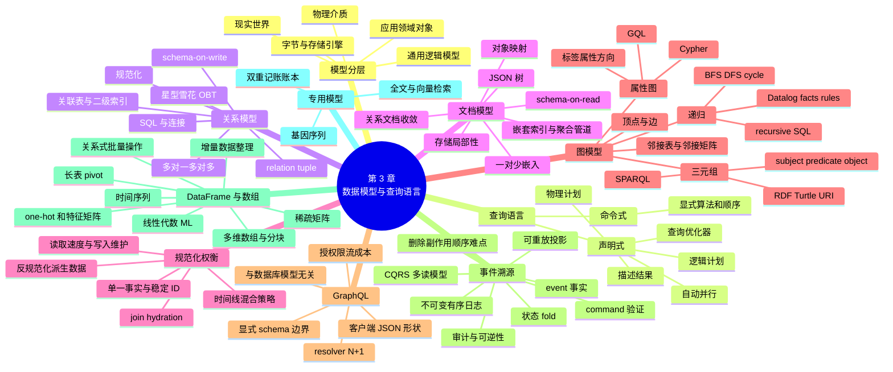

### 9.1 模型比较总表

| 模型 | 基本单位 | 最自然的关系 | 典型查询 | 主要优势 | 主要代价 |
| --- | --- | --- | --- | --- | --- |
| 关系 | 行、表、键 | 多对一/多对多 | 过滤、连接、聚合 | 约束、事务、查询优化成熟 | 树形对象拆分、固定模式迁移 |
| 文档 | 自包含文档 | 一对少树 | 主键、嵌套字段、整体读取 | 局部性、对象映射、结构灵活 | 跨文档关系和大文档更新 |
| 属性图 | 顶点、带属性边 | 异构多跳网络 | 路径模式、遍历 | 关系一级化、演化灵活 | 路径爆炸、治理和专用运维 |
| RDF 三元组 | S-P-O | 全局标识关系 | SPARQL property path | 数据交换、统一属性与边 | URI/本体复杂、生态专门 |
| 事件日志 | 有序不可变事件 | 时间状态转移 | 重放、投影 | 意图、审计、多读模型 | 顺序、兼容、删除、副作用 |
| DataFrame | 命名列/行 | 分析变换 | filter/group/merge/pivot | 交互整理和数值生态 | 私有状态、类型/内存陷阱 |
| 多维数组 | 坐标单元/块 | 规则网格 | 切片、邻域、线性代数 | 科学数值局部性 | 不适合任意实体关系 |

### 9.2 查询语言比较

| 语言 | 数据模型/边界 | 递归 | 风格 | 典型使用者 |
| --- | --- | --- | --- | --- |
| SQL | 关系/多模型数据库 | recursive CTE | 声明集合结果 | 应用、分析、数据工程 |
| Cypher | 属性图 | 变量长度路径 | 箭头模式 | 图应用开发者 |
| SPARQL | RDF | property path | 三元组模式 | 知识图谱/linked data |
| Datalog | 关系事实 | 递归规则 | 逻辑推导 | 规则/复杂查询系统 |
| GraphQL | 公共客户端 API | 有意不通用支持 | 请求 JSON 形状 | Web/移动前端 |
| DataFrame API | 程序内表 | 普通程序/框架算子 | 链式增量转换 | 数据科学和工程 |

### 9.3 三条贯穿主线

#### 关系形状

树 → 文档；规则实体关系 → 关系；任意多跳 → 图；时间变化 → 事件；数值坐标 → 矩阵/数组。

#### 复制与连接

规范化减少复制、读取时连接；反规范化预计算连接、写入时维护。物化时间线、GraphQL 响应、OBT 和 CQRS 投影都是这条主线的不同表现。

#### 显式与隐式

声明式查询把执行策略隐去；schema-on-read 把结构约束移到读取；抽象选择始终在“谁负责哪项复杂性”之间转移，而非消除复杂性。

### 9.4 数据生命周期中的模型转换

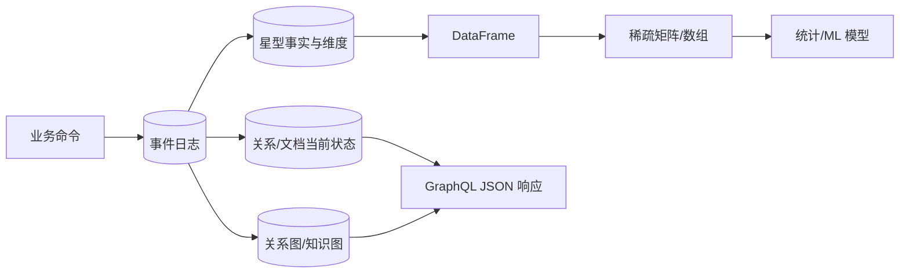

现实系统往往不是“选择唯一模型”，而是在不同生命周期阶段建立受控转换。关键是权威源、转换语义、滞后和可重建性。

### 9.5 本章最核心的判断

一个模型是否合适，不应问“它能不能存这些数据”，而应问：

> 我们最重要的关系、查询、更新和变化，在这个模型中是否直接、可约束、可优化、可演化？若需要模拟，模拟成本是否低于引入另一模型的运维成本？

## 10. 综合案例：为会议与社群平台选择数据模型

> 本节是教学性架构推演，用于把原章模型放在同一应用中比较。它不表示实际项目应从第一天部署所有数据库；最后会给出渐进实现。

### 10.1 功能需求

平台需要：

- 用户维护个人资料、工作和教育经历；
- 组织创建会议、场次和会场；
- 用户购票、取消、加入等候名单；
- 公司批量购买席位再分配；
- 参会者关注他人、组织和主题；
- 查询共同联系人、地域层级和推荐关系；
- Web/移动端按页面请求不同字段；
- 组织者查看销售、容量和参会画像；
- 数据科学团队准备推荐特征。

这一个应用已经出现树、共享实体、多对多、图路径、状态历史和矩阵等不同形状。

### 10.2 先列事实与关系，不先选产品

| 概念 | 主要关系/变化 |
| --- | --- |
| User | 有一份资料，多份经历；会改名和头像 |
| Organization | 多个成员、多个会议；名称/logo 可变 |
| Conference | 多个场次、票种、预订；容量会变 |
| Booking | 创建、支付、分配、取消、退款 |
| Location | 城市、州、省、国家、洲的可变层级 |
| Follow/Interest | 人和组织间任意多对多关系 |
| Sale | 发生于时间、票种、用户、组织和地区 |
| Recommendation | 用户和主题/会议间的预测分数 |

### 10.3 按关系形状初步分类

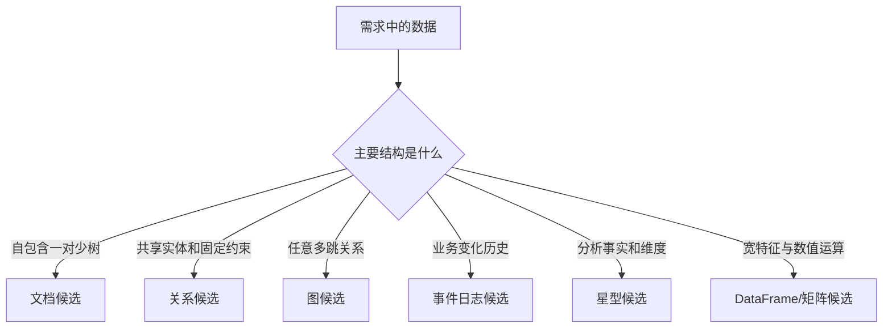

分类只是起点，还要结合查询、更新、事务和运维决定是否分系统。

### 10.4 关系模型作为事务核心

共享实体和关键约束适合关系表：

```sql
CREATE TABLE users (
        user_id     bigint PRIMARY KEY,
        display_name text NOT NULL,
        region_id   bigint,
        created_at  timestamptz NOT NULL
);

CREATE TABLE organizations (
        org_id      bigint PRIMARY KEY,
        name        text NOT NULL,
        logo_url    text
);

CREATE TABLE conferences (
        conference_id bigint PRIMARY KEY,
        organizer_id  bigint NOT NULL REFERENCES organizations(org_id),
        capacity      integer NOT NULL CHECK (capacity >= 0)
);

CREATE TABLE memberships (
        user_id bigint REFERENCES users(user_id),
        org_id  bigint REFERENCES organizations(org_id),
        role    text NOT NULL,
        PRIMARY KEY (user_id, org_id)
);
```

关系模型为唯一键、外键、容量约束和多对多关联提供集中保证。

### 10.5 哪些信息应规范化

以下共享且会变化，应保存一次并引用 ID：

- 组织名称和 logo；
- 地区名称及层级；
- 用户显示名和头像；
- 会议标题、票种和容量；
- 场次讲者身份。

若把组织 logo 复制进每个成员资料，换 logo 会更新成千上万份文档。稳定 `org_id` 更合适。

### 10.6 个人资料中的文档片段

个人自定义资料可能异质：

```json
{
    "user_id": 251,
    "headline": "Distributed systems engineer",
    "positions": [
        {"org_id": 513, "title": "Engineer", "start": "2022-03"}
    ],
    "education": [
        {"school_id": 800, "degree": "MSc", "year": 2021}
    ],
    "links": {
        "website": "https://example.com",
        "github": "https://github.com/example"
    },
    "custom_sections": [
        {"kind": "project", "title": "Open source database"}
    ]
}
```

若页面总是整体加载、子项数量有限，可用文档列或文档库。`org_id`、`school_id` 仍保持规范引用。

### 10.7 文档边界

不嵌入：

- 用户全部关注者；
- 会议全部参会者；
- 热门场次全部评论；
- 组织全部成员。

这些集合无小上界、需分页和独立查询，应独立表/边存储。

嵌入边界由基数和生命周期决定，而不是 UI 看起来属于同一页面。

### 10.8 地域和社交关系的图模型

图中可有：

```text
(User)-[:FOLLOWS]->(User)
(User)-[:MEMBER_OF]->(Organization)
(User)-[:INTERESTED_IN]->(Topic)
(Conference)-[:ABOUT]->(Topic)
(Conference)-[:HELD_IN]->(Location)
(Location)-[:WITHIN]->(Location)
```

支持：

- 某地区及所有下级城市的会议；
- 朋友的朋友正在参加的会议；
- 用户兴趣到会议主题的多跳匹配；
- 共同组织和共同联系人。

### 10.9 哪些图查询仍可留在关系库

如果首期只需：

- 用户关注列表；
- 共同关注数；
- 固定两跳推荐；

可先用 `follows(follower_id, followee_id)` 和 SQL。只有变量路径、关系类型和规模证明关系实现笨拙时，再引入图引擎。

这样避免为未来假想查询承担专用数据库运维。

### 10.10 预订为何适合事件建模

Booking 的当前 `status='canceled'` 无法解释：

- 谁创建；
- 是否支付；
- 分配给谁；
- 为什么取消；
- 是否已退款；
- 曾占用多少座位。

事件序列更自然：

```text
BookingRequested
PaymentAuthorized
SeatsBooked
SeatAssigned
BookingCanceled
RefundIssued
```

命令处理器基于当前投影验证容量，再追加有效事件。

### 10.11 预订状态折叠

```text
initial: status=none, seats=0, paid=false

SeatsBooked(3)      -> status=active, seats=3
PaymentAuthorized  -> paid=true
BookingCanceled    -> status=canceled, seats=0
RefundIssued       -> paid=false
```

形式上：

$$
BookingState_n=fold(apply,S_0,BookingEvents_{1..n})
$$

事件按 `booking_id` 分区并保证版本顺序。

### 10.12 CQRS 读模型

从预订日志派生：

| 读模型 | 结构 | 主查询 |
| --- | --- | --- |
| `booking_details` | 关系/文档 | 用户查看单笔预订 |
| `conference_capacity` | 键值/关系 | 命令验证可用座位 |
| `attendee_badges` | 文件/表 | 打印胸牌 |
| `organizer_dashboard` | 宽表 | 实时销量和容量 |
| `booking_search` | 搜索索引 | 客服按姓名/订单搜索 |

每个视图可从事件重建，且有独立新鲜度 SLO。

### 10.13 GraphQL 面向客户端页面

移动端会议详情可能请求：

```graphql
query ConferencePage($id: ID!) {
    conference(id: $id) {
        title
        location { name }
        sessions {
            title
            speakers { displayName avatarUrl }
        }
        myBooking { status seatCount }
    }
}
```

resolver 从关系/文档读模型批量 hydration。客户端不能任意遍历社交图，只能访问 schema 授权字段。

### 10.14 避免 GraphQL N+1

假设 50 个场次、每场 3 位讲者。逐讲者 resolver 最坏产生 150 次用户查询。

应收集讲者 ID，一次批量读取：

```sql
SELECT user_id, display_name, avatar_url
FROM users
WHERE user_id = ANY(:speaker_ids);
```

并按请求内 DataLoader 分发。对频道/会议列表设分页和复杂度预算。

### 10.15 分析星型模式

销售仓库：

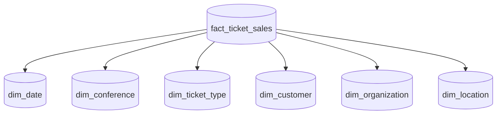

事实粒度定义为“一次票种数量变动/销售行”，包含金额、数量和维度键。取消和退款可以作为负数事实或独立事件类型，必须统一口径。

### 10.16 为什么不直接分析 OLTP 表

业务表按当前状态和事务约束设计；分析要：

- 历史时点；
- 跨会议和组织；
- 地域/日期层级；
- 大范围扫描；
- 稳定指标定义。

ETL/流把事件和当前实体转成事实/维度，隔离 OLTP 负载。

### 10.17 DataFrame 特征工程

推荐数据可形成长表：

```text
user_id, conference_id, signal, value
251, 9001, viewed, 1
251, 9001, booked, 1
251, 9010, topic_similarity, 0.82
```

DataFrame 连接用户兴趣、会议主题、历史行为，再 pivot 成：

$$
X\in\mathbb{R}^{users\times features}
$$

类别 one-hot，高基数 ID 使用稀疏特征/嵌入。训练转换必须版本化并在在线推荐中保持语义一致。

### 10.18 权威源与派生关系图

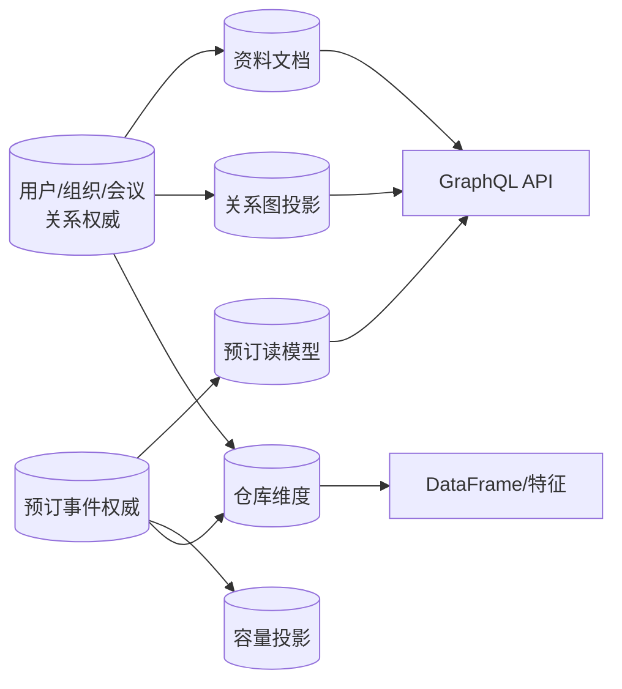

需要明确：

- 组织名称以关系实体为准；
- Profile 中只保留 `org_id` 或可重建展示缓存；
- 图是社交关系权威还是关系表投影，必须二选一；
- Booking 当前状态以事件日志为准；
- 仓库和推荐特征均为派生。

### 10.19 跨模型一致性

例如用户改名：

1. 关系权威更新；
2. 变更事件发布；
3. 搜索、图属性缓存、GraphQL 缓存和仓库维度更新；
4. 监控各下游 lag；
5. 失败可重试和对账。

不要让应用同步双写所有数据库而无恢复机制。优先一个权威提交，再通过可靠变更流派生。

### 10.20 模式演化

新增 `pronouns`：

- 资料文档可新增可选字段；
- GraphQL schema 新增可选字段；
- 关系核心若需要过滤/约束，可后续提升为列；
- 仓库维度在 ETL 中增加；
- 旧事件不必修改，除非事件语义需要该字段。

字段在不同模型出现应有明确目的，避免无意义复制。

### 10.21 地域层级变化

若行政区重组：

- Location 图添加/结束 `WITHIN` 关系，并记录有效时间；
- 用户只引用稳定 location ID；
- 当前查询使用现行层级；
- 历史销售分析可使用事件时层级快照；
- 不能简单覆盖边后让过去报表改变。

图模型让层级形状灵活，但时间版本仍需显式建模。

### 10.22 查询与索引清单

| 查询 | 主要模型 | 索引/访问路径 |
| --- | --- | --- |
| 按 ID 查看用户 | 关系/文档 | 主键 |
| 按组织找成员 | 关系 | memberships.org_id |
| 加载完整资料 | 文档 | user_id |
| 找某地所有会议 | 图/关系递归 | Location.name + WITHIN 反向边 |
| 找朋友参加的会议 | 图 | FOLLOWS + BOOKED 路径 |
| 验证可用座位 | CQRS 投影 | conference_id |
| 客服搜索预订 | 搜索读模型 | 文本/结构化索引 |
| 按月地区收入 | 星型 | 列式扫描 + 维度连接 |
| 训练推荐 | DataFrame/矩阵 | 分区文件 + 稀疏算子 |

模型选择必须由这个主查询清单验证。

### 10.23 事务边界

关键不变量：

- 同一 booking 不能重复占座；
- 容量不能为负；
- 支付与预订失败需要补偿；
- membership 角色符合权限。

关系事务或事件流中的版本检查负责强约束。图和仓库投影不应被用于权威容量判断，除非其一致性明确满足要求。

### 10.24 为什么不把一切放进图

图能表示用户、订单、支付、事实和特征，但：

- 金额和容量约束在关系/账本模型更自然；
- 大规模分析聚合在列式星型更自然；
- UI 资料树在文档更局部；
- 数值训练在矩阵更自然。

表达统一不代表查询和约束统一。

### 10.25 为什么不从第一天部署六种数据库

每个系统增加：

- 备份和恢复；
- 权限和合规；
- 监控和值班；
- 模式演化；
- 数据同步和对账；
- 人才与升级成本。

多模型收益必须大于这些固定成本。

### 10.26 渐进式第一阶段

可先用 PostgreSQL：

- 关系表保存用户、组织、会议和预订当前状态；
- JSONB 保存个人异质资料；
- 关联表保存关注与兴趣；
- 递归 CTE 保存地区层级；
- SQL 视图/物化视图提供读模型；
- GraphQL 建在关系查询之上；
- 分析定期导出到文件/DataFrame。

一个系统覆盖多个逻辑模型，降低运维。

### 10.27 引入专用系统的触发器

- 图路径查询成为核心且递归 SQL 无法满足 SLO；
- 预订状态和审计复杂到当前状态表难解释/回放；
- 搜索需求超出数据库索引；
- 仓库扫描影响 OLTP；
- DataFrame 数据量超出单机；
- JSON 文档出现高频局部更新或跨文档关系。

触发器应来自遥测和开发复杂度，而不是技术潮流。

### 10.28 模型迁移策略

以关系关注表迁到图为例：

1. 保持关系表为权威；
2. 建立 CDC 到图投影；
3. 全量回填历史关系；
4. 比较节点/边计数和抽样查询；
5. 小流量读取图；
6. 观察结果、延迟和 lag；
7. 扩大读取；
8. 是否把图升级为权威另做决策。

迁移期间不要模糊两边谁为准。

### 10.29 验证最难的查询

选型原型不应只演示 CRUD，而应验证：

- 最深/最宽图路径；
- 最大文档和局部更新；
- 多对多双向查询；
- 事件全量重放；
- GraphQL 最大允许查询；
- 仓库典型宽聚合；
- 稀疏矩阵内存和训练吞吐；
- 模式迁移和回退。

最困难路径才区分模型是否合适。

### 10.30 综合案例结论

同一领域同时需要多个表示并不矛盾。业务权威、API、分析和 ML 的最佳模型可以不同。

正确做法不是无边界复制，而是：

1. 为每类事实指定权威；
2. 让派生模型可重建；
3. 用可靠变更流同步；
4. 为每个模型选择最重要查询；
5. 只有在明确瓶颈出现后增加专用系统。

## 11. 核心结论

### 11.1 三十条核心结论

1. **数据模型塑造问题思维。** 它决定哪些事实、关系和变化最显眼。
2. **软件由多层模型组成。** 现实领域、应用对象、通用模型、字节和物理介质逐层表示。
3. **抽象的价值是分离责任。** 上层依赖语义，下层可以改进实现。
4. **声明式查询描述结果而非步骤。** 优化器因而能选择索引、连接顺序和并行计划。
5. **声明式不是性能保证。** 统计、倾斜和引擎能力仍需观察。
6. **关系模型的长期价值来自集合、连接、约束、事务和成熟生态。** 年龄不等于过时。
7. **NoSQL/NewSQL 是历史标签，不是具体语义。** 应比较真实能力。
8. **ORM 减少样板但不消除关系语义。** N+1 展示抽象泄漏的成本。
9. **文档模型适合自包含、一对少、整体读取的树。** 大集合和外部引用会侵蚀优势。
10. **规范化保存单一事实和稳定 ID。** 名称变化不应迫使所有引用变化。
11. **反规范化是派生数据。** 它需要权威源、传播、重试和重建。
12. **连接本身不是不可扩展。** 基数、位置、索引和变化频率决定成本。
13. **最优方案常混合规范化与反规范化。** 时间线存 ID、读取时 hydration 是典型。
14. **多对多关系适合关联表或显式边。** 双向查询可由二级索引支持。
15. **分析模式按事实粒度组织历史。** 星型偏简单，雪花偏规范，OBT 偏读性能。
16. **schemaless 是误导。** 结构要么写时显式验证，要么读时由应用假设。
17. **schema-on-read 和 schema-on-write 都有迁移成本。** 只是责任和时机不同。
18. **局部性取决于访问边界。** 整体读文档受益，局部读写大文档可能浪费。
19. **关系与文档系统正在收敛。** 逻辑模型可在同一数据库组合。
20. **图模型适合关系本身占主导、路径长度不固定的领域。** 数据量不是唯一条件。
21. **邻接表适合稀疏遍历，邻接矩阵适合数值运算。** 同一图可有不同物理表示。
22. **属性图和 RDF 表达相近但生态不同。** 前者强调标签/属性边，后者强调三元组和全局 URI。
23. **Cypher、SPARQL、Datalog 与递归 SQL 可表达相同可达性。** 自然度和优化能力不同。
24. **GraphQL 不是图数据库语言。** 它让不可信客户端请求受控 JSON 形状。
25. **事件溯源用有序不可变业务事件作为权威。** command 必须先验证，event 是事实。
26. **CQRS 用多个读模型换取查询优化。** 可重放要求确定性、顺序和幂等。
27. **不可变日志有删除与副作用边界。** crypto-shredding、外置 PII 和副作用隔离需提前设计。
28. **DataFrame 是关系记录到数值矩阵的桥梁。** 它适合交互整理、特征工程和统计。
29. **稀疏矩阵的缺失不一定是零。** 编码必须保留业务语义。
30. **没有万能模型。** 应让最重要关系、查询、更新和演化自然，同时控制多系统运维成本。

## 12. 选择数据模型与查询语言的一般方法

### 12.1 第一步：用领域语言列出事实和动作

先写：

- 实体；
- 值对象；
- 关系；
- 状态变化；
- 约束；
- 用户命令；
- 历史和审计需求。

不要先把它们命名为表或文档，否则会过早锁定模型。

### 12.2 第二步：列出主导查询

对每个用户旅程记录：

```text
查询：加载个人资料
输入：user_id
输出：资料全部字段与少量经历
频率：20,000/s
延迟：p99 < 200 ms
一致性：头像可短暂陈旧，权限不可陈旧
结果规模：< 100 KB
```

模型选择要服务实际查询，而不是抽象数据图。

### 12.3 第三步：列出写入和变化

记录：

- 哪些字段频繁变；
- 哪些更新必须原子；
- 是否追加多于修改；
- 是否有热点实体；
- 是否需要撤销和审计；
- 写入是否来自外部异质来源。

读取形状相同，更新频率不同也会选择不同规范化程度。

### 12.4 第四步：标注关系基数和上界

对每条关系写：

```text
User -> Positions: one-to-few, p99=12, 最大约 50
Post -> Comments: one-to-many, 最大数百万
User <-> Organization: many-to-many
Location -> Parent: many-to-one, 深度不固定
```

只有“one-to-many”不足以决定嵌入；数量分布和增长路径是关键。

### 12.5 第五步：识别整体边界

若子数据：

- 总与父一起读；
- 数量小；
- 同时更新；
- 不被外部直接引用；
- 生命周期相同；

可作为文档/聚合边界。反之应独立实体。

### 12.6 第六步：识别共享、可变事实

名称、logo、地区、权限等被多处引用且会变化，应优先规范化为稳定 ID。

只有在读性能有证据需要时，才复制人类可读属性，并把副本视为可重建派生数据。

### 12.7 第七步：选择 schema 责任

逐字段决定：

- 数据库是否写时验证；
- 应用是否读时兼容；
- 是否允许异质结构；
- 谁维护 schema 版本；
- 旧数据怎样迁移；
- 下游消费者怎样兼容。

不是全库只能选择 schema-on-read 或 schema-on-write；不同区域可不同。

### 12.8 第八步：按关系形状筛选模型

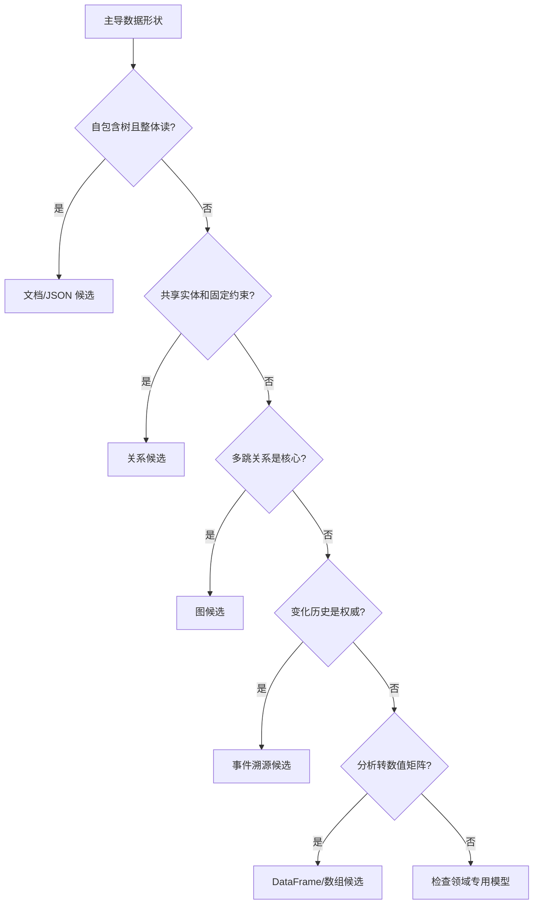

同一应用可以走多条分支，但每增加一个持久系统都要证明必要。

### 12.9 第九步：选择查询语言

| 查询形态 | 优先考察 |
| --- | --- |
| 集合过滤、固定连接、聚合 | SQL |
| 属性图路径 | Cypher/GQL |
| RDF/linked data | SPARQL |
| 递归逻辑规则 | Datalog |
| 公共 UI 字段选择 | GraphQL |
| 交互数据整理 | DataFrame API |

语言应让核心问题直接表达，同时有足够优化器和工具支持。

### 12.10 第十步：分开存储模型与 API 模型

不要因 API 返回 JSON 就必须使用文档库，也不要因 GraphQL 带 graph 就必须使用图数据库。

分别设计：

- 权威写模型；
- 内部查询模型；
- 公共 API 响应；
- 分析模型；
- ML 特征表示。

通过明确转换连接它们。

### 12.11 第十一步：评估是否需要事件溯源

逐问：

- 当前状态是否不足以解释业务？
- 是否需要完整审计和回放？
- 是否有多个差异很大的读模型？
- 外部副作用能否隔离和幂等？
- 个人数据如何删除？
- 历史事件 schema 能否长期兼容？
- 全量重放时间是否可接受？

若多数答案是否，普通状态数据库加审计可能更简单。

### 12.12 第十二步：明确权威与派生

为每个数据集填写：

| 数据集 | 权威源 | 派生函数 | 滞后 SLO | 重建方式 | 删除传播 |
| --- | --- | --- | --- | --- | --- |
| 搜索索引 | 商品表 | tokenize/index | 30 s | 全量重建 | 删除事件 |
| 用户图 | follows 表 | CDC to graph | 5 s | 回填 + replay | 关系删除 |
| 推荐特征 | 仓库事实 | DataFrame pipeline | 24 h | 重跑 | 数据集版本 |

模糊权威会让双写冲突无从裁决。

### 12.13 第十三步：量化规范化权衡

估计：

- 读频率 $q_r$；
- 写频率 $q_w$；
- 每次连接输入基数；
- 复制数 $k$；
- 变化传播成本；
- 可接受滞后；
- 副本存储；
- 极端热点。

不要只用平均值。名人扇出、热门组织和超大文档可能决定架构。

### 12.14 第十四步：验证最难表达的查询

为每个候选模型实现：

- 最复杂连接；
- 最大文档部分更新；
- 最深图路径和环；
- 最大允许 GraphQL 查询；
- 事件重放；
- 矩阵转换。

比较代码、执行计划、数据量、延迟、资源和故障，而不只比较简单 CRUD。

### 12.15 第十五步：验证演化

演练：

- 添加/重命名字段；
- 旧客户端读新数据；
- 新代码读旧文档/事件；
- 大表回填；
- 图边类型变化；
- 投影重建；
- 新旧模型双轨迁移；
- 回滚。

模型在第一个版本好用，不代表十年演化仍好用。

### 12.16 第十六步：计算运维固定成本

每种新数据库都需要：

- 部署/升级；
- 容量和成本；
- 备份恢复；
- 安全与合规；
- 监控和值班；
- 驱动和 schema 管理；
- 数据同步；
- 招聘与培训；
- 退出迁移。

专用模型的表达收益必须覆盖这份固定成本。中小规模优先使用已有数据库的多模型能力往往更稳妥。

### 12.17 第十七步：保留替换路径

避免让领域代码直接依赖所有产品细节：

- 稳定领域 ID；
- 明确 repository/query 边界；
- 可导出标准数据；
- 保存权威源；
- 派生系统可回填；
- 查询语义有契约测试；
- 记录专有功能依赖。

抽象不应假装所有数据库相同，而应把可替换边界放在业务语义上。

### 12.18 模型决策记录模板

```text
领域与日期：
核心事实和不变量：
主导查询及 SLO：
写入、更新和热点：
关系基数与数量分布：
schema 责任：
候选模型和语言：
最难查询原型结果：
规范化/反规范化选择：
权威与派生关系：
事务和一致性边界：
演化与迁移方案：
运维固定成本：
选择及接受的代价：
复查触发器：
```

### 12.19 最终检查表

#### 表达

- 模型是否直接表达核心领域概念？
- 是否为了模型限制制造大量胶水或特例？
- 查询语言能否简洁表达最难查询？
- 团队能否理解其递归、空值和顺序语义？

#### 关系与基数

- 一对多是 one-to-few 还是无界？
- 多对多是否需要双向和多跳查询？
- 嵌套项是否被外部引用？
- 是否存在热点键或超级节点？

#### 读写与局部性

- 通常读取整体还是局部？
- 字段变化频率如何？
- 文档更新是否产生写放大？
- 连接能否索引、批量和并行？
- 反规范化副本怎样维护？

#### schema 与演化

- 结构由谁强制？
- 旧数据和旧客户端怎样兼容？
- 迁移是否在线、渐进、可回退？
- 事件和 API 字段语义能否保持？

#### 查询与性能

- 优化器是否理解核心操作？
- 图路径是否有深度/成本边界？
- GraphQL 是否防 N+1 和恶意复杂查询？
- DataFrame 是否超内存或不可重现？
- 是否用真实分布验证，而非小型均匀样本？

#### 正确性

- 权威源是什么？
- 哪些模型是派生？
- 多副本更新是否原子或可重试？
- 事件顺序、幂等和外部副作用如何保证？
- 缺失值是否被错误当作零？

#### 运维

- 是否真的需要新的数据库产品？
- 能否备份、恢复和全量重建？
- 数据同步 lag 和不一致如何观测？
- 团队是否有升级、值班和退出能力？

### 12.20 最终方法论

本章给出的不是“关系、文档或图谁胜出”，而是一种从问题结构推导表示的方式：

$$
{}\text{领域事实与动作}
\rightarrow\text{关系形状与基数}
\rightarrow\text{主导读写和演化}
\rightarrow\text{候选逻辑模型}
\rightarrow\text{查询语言与最难查询原型}
\rightarrow\text{权威/派生和一致性设计}
\rightarrow\text{物理实现与运维验证}
$$

选择时始终追问：模型让什么变简单，又把什么复杂性转移到查询、更新、迁移或运维？只有把这条转移链说清，数据模型才是经过论证的架构决定，而不是技术偏好。
