> 对应原文：4. Storage and Retrieval.md
>
> 本文严格按照原章顺序讲解，并在章后统一补充易混概念、综合案例和可复用选型方法。原章重点比较存储引擎、索引与执行策略。文中标为“背景补充”“量化推导”或“可运行示例”的公式与代码用于解释机制和验证结论，不应误认为原书原文中的公式或产品实现。

## 0. 本章定位：数据库如何把“存进去”变成“找得回来”

### 0.1 数据库最基本的两项任务

在最基础层面，数据库只需做到：

1. 给它数据时，可靠地保存；
2. 以后请求该数据时，正确、高效地找回。

这两句看似简单，却包含大量工程问题：

- 数据怎样编码成字节；
- 写到内存、磁盘还是对象存储；
- 崩溃后怎样恢复；
- 旧版本和删除记录怎样回收；
- 按键、范围、文本、空间或语义怎样检索；
- 索引怎样保持与主数据一致；
- 大量分析查询怎样减少 I/O 和 CPU。

### 0.2 第 3 章与第 4 章的视角转换

第 3 章从使用者视角讨论：

- 数据模型是什么；
- 查询语言怎样表达需求；
- 表、文档、图、事件、DataFrame 各适合什么结构。

本章转到数据库内部视角：

- 逻辑行、文档和键值怎样落盘；
- 索引怎样定位记录；
- 写入为什么产生额外 I/O；
- 查询计划怎样利用存储布局。

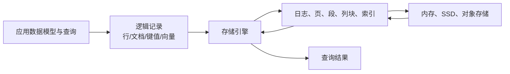

同一个 SQL 接口背后可以是完全不同的存储和执行机制。

### 0.3 应用开发者为什么要理解存储引擎

应用开发者通常不会从零实现数据库，但仍需要：

- 选择适合负载的存储引擎；
- 设计主键与二级索引；
- 理解为什么某查询突然变慢；
- 设置 compaction、缓存、页大小等参数；
- 估算写放大和 SSD 寿命；
- 解释删除为什么未立即释放空间；
- 判断列式仓库、全文索引或向量索引是否必要。

只看 SQL/SDK 功能清单，很难预测系统在数据增长和故障下的行为。

### 0.4 OLTP 与 OLAP 的内部结构为何不同

OLTP 典型负载：

- 每秒大量请求；
- 每次读写少量记录；
- 按主键或二级索引定位；
- 低尾延迟；
- 频繁插入和更新。

OLAP 典型负载：

- 查询数量较少但复杂；
- 每次扫描大量记录；
- 只使用少数列；
- 聚合、分组和连接；
- 批量写入、历史读取。

如果用同一物理布局强行同时优化两者，会遇到冲突：OLTP 希望一行相关字段邻近、点查快速；OLAP 希望同一列连续、压缩和批量扫描高效。

### 0.5 OLTP 的两大存储哲学

本章先比较两族 OLTP 引擎：

#### 日志结构（log-structured）

- 追加新文件或新段；
- 已写段不可变；
- 后台合并和压缩；
- 代表：LSM-tree、RocksDB、Cassandra、HBase、ScyllaDB。

#### 原地更新（update-in-place）

- 磁盘划分固定大小页；
- 在同一位置覆盖页；
- 代表：B-tree 及多数关系数据库索引。

两者都能保持键有序、支持点查和范围查询，却把写入与维护成本放在不同位置。

### 0.6 三类放大是统一比较坐标

访问方法常用三类放大衡量：

- **读放大（read amplification）**：一次逻辑读取需要检查多少页、段或字节；
- **写放大（write amplification）**：应用写入 1 字节，底层总共写多少字节；
- **空间放大（space amplification）**：为一份当前逻辑数据占用多少物理空间。

可粗略定义：

$$
WA=\frac{\text{底层实际写入字节}}{\text{应用逻辑写入字节}}
$$

$$
SA=\frac{\text{物理占用字节}}{\text{当前有效逻辑数据字节}}
$$

读放大可按 I/O 次数、读取字节或访问层级定义，必须说明口径。

通常无法同时把三者都做到最低：增加索引降低读放大，却增加写和空间；延后 compaction 提高当前写吞吐，却增加读和空间。

### 0.7 索引不是免费附属品

索引是从主数据派生的附加结构。它：

- 不改变数据逻辑内容；
- 改变查询性能；
- 占用额外空间；
- 每次写入都需维护；
- 可能增加事务日志和复制流量。

索引选择本质上是把已知查询模式编译进存储结构。数据库通常不会默认索引每个字段，因为写入成本可能不可接受。

### 0.8 本章路线图

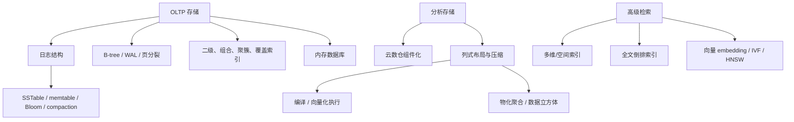

## 1. OLTP 的存储与索引

### 1.1 从最小键值数据库开始

作者先用两个 Bash 函数构造最小数据库：

- `set(key,value)` 把一行追加到文件末尾；
- `get(key)` 扫描文件，取该 key 最后一次出现的 value。

逻辑接口是键值存储：value 可以是字符串或 JSON 文档。

### 1.2 “最后一次写入获胜”的文件语义

文件可能为：

```text
12,{"name":"London"}
42,{"name":"San Francisco","attractions":["Golden Gate Bridge"]}
42,{"name":"San Francisco","attractions":["Exploratorium"]}
```

key 42 有两个版本，读取返回最后一条。旧值没有原地覆盖，而是被更新记录在逻辑上取代。

### 1.3 为什么追加写很快

追加操作：

- 不必在文件中寻找旧位置；
- 不移动已有记录；
- 可以顺序写；
- 容易批量和缓冲；
- 崩溃恢复边界相对清晰。

忽略持久化刷新和并发，追加单条记录的算法操作可视为摊销 $O(1)$。实际延迟仍取决于 `fsync`、文件系统和设备。

### 1.4 本章中 log 的准确含义

这里的 **日志（log）**不是供人阅读的应用日志，而是：

> 磁盘上按顺序追加的记录序列。

它可以是二进制，只有数据库内部理解。日志概念将在事务、复制、事件流等后续章节反复出现。

### 1.5 朴素读取为什么是线性的

若文件有 $n$ 条记录，每次 `get` 从头扫描并保留最后匹配项，时间复杂度：

$$
T_{get}(n)=O(n)
$$

数据量翻倍，扫描字节和延迟近似翻倍。即使目标 key 不存在，也必须扫到文件末尾才能确认。

### 1.6 索引的基本定义

**索引（index）**把查询键映射到记录位置或记录集合，使引擎无需扫描全部数据。

一般形式：

$$
I: key\mapsto location\;or\;record\ IDs
$$

索引本身也是数据结构，需要创建、持久化、恢复和更新。

### 1.7 为什么同一数据可能需要多个索引

用户表可能按：

- `user_id` 精确查；
- email 查；
- 注册时间范围查；
- 地区 + 状态组合查。

单一排序无法同时优化所有访问方向。每增加一个索引，就预计算一种访问路径，也增加一次写维护。

### 1.8 索引选择的收益判据

可以粗略比较：

$$
Benefit(I)=
\sum_q freq(q)\cdot\Delta cost_q
-freq(write)\cdot cost_{maintain}(I)
-cost_{space}(I)
$$

这是决策框架，不是数据库内部公式。高频且昂贵的查询更值得索引；低频管理查询可能接受扫描。

### 1.9 日志结构的第一步：内存哈希索引

保留追加日志，同时在内存维护：

```text
key -> 最新记录的字节偏移量
```

每次写入：

1. 记录当前文件末尾 offset；
2. 追加 key/value；
3. 更新 `index[key]=offset`。

每次读取：

1. 哈希表 $O(1)$ 期望查 offset；
2. `seek(offset)`；
3. 读取一条记录。

### 1.10 可运行示例：追加日志与 hash index

下面用内存字节流模拟文件，展示旧值保留、索引指向最新 offset。

```python
from io import BytesIO


class AppendOnlyKV:
    def __init__(self) -> None:
        self.log = BytesIO()
        self.index: dict[str, int] = {}

    def set(self, key: str, value: str) -> None:
        record = f"{key}\t{value}\n".encode("utf-8")
        offset = self.log.seek(0, 2)
        self.log.write(record)
        self.index[key] = offset

    def get(self, key: str) -> str | None:
        offset = self.index.get(key)
        if offset is None:
            return None
        self.log.seek(offset)
        record = self.log.readline().decode("utf-8").rstrip("\n")
        _, value = record.split("\t", 1)
        return value


database = AppendOnlyKV()
database.set("42", "Golden Gate Bridge")
first_offset = database.index["42"]
database.set("12", "Big Ben")
database.set("42", "Exploratorium")

print("value 42:", database.get("42"))
print("value 12:", database.get("12"))
print("missing:", database.get("99"))
print("offset changed:", database.index["42"] > first_offset)
print("physical records:", database.log.getvalue().count(b"\n"))
```

实际运行输出：

```text
value 42: Exploratorium
value 12: Big Ben
missing: None
offset changed: True
physical records: 3
```

逻辑上只有两个 key，物理日志有三条记录，说明更新会产生旧版本空间。

### 1.11 文件系统缓存的作用

读取 offset 后，若对应日志块已在操作系统页缓存中，读取无需设备 I/O，只需内存复制。数据库“基于磁盘”不表示每次读取都访问物理磁盘。

这也提醒：基准测试中的热缓存和冷缓存会得到完全不同结果。

### 1.12 哈希日志问题一：空间只增不减

每次覆盖都追加旧版本，文件大小：

$$
Size_{log}=\sum_{all\ writes}(key\ bytes+value\ bytes+overhead)
$$

而当前有效数据只保留每个 key 最新值。若热点 key 高频更新，空间放大不断增长，最终耗尽磁盘。

### 1.13 哈希日志问题二：重启重建慢

内存 hash index 未持久化，重启后必须扫描全部日志：

```text
for record in log order:
    index[record.key] = record.offset
```

最后一次赋值自然覆盖旧 offset。恢复复杂度 $O(n)$，大日志导致长启动时间。

可以周期保存索引快照，但还要处理快照与日志位置的一致性。

### 1.14 哈希日志问题三：所有 key 必须进内存

若 key 数量 $K$，每个哈希项平均占 $b$ 字节：

$$
Memory_{index}\approx Kb
$$

十亿 key、每项即使只需 32 字节，也约 32 GB，实际哈希表装载因子、对象头和分配器会更大。

在磁盘维护 hash table 又会遇到随机 I/O、扩容和冲突处理，因此并不常作为通用有序索引。

### 1.15 哈希日志问题四：范围查询差

哈希破坏键顺序。查询 key 10000–19999 只能：

- 枚举每个 key 单独查；或
- 扫描全部 key。

如果主查询包含范围、前缀和排序，有序索引更合适。

### 1.16 SSTable 的定义

**Sorted String Table（SSTable）**是按 key 排序的键值文件，并保证文件内每个 key 只出现一次。

核心不变量：

$$
k_1<k_2<\cdots<k_n
$$

排序支持二分、稀疏索引、范围扫描和流式合并。

### 1.17 为什么 SSTable 只需稀疏索引

把 SSTable 划分为几 KB 的 block，只在索引保存每个 block 的首 key 和 offset：

```text
handbag -> block offset 1000
handsome -> block offset 5000
```

查询 `handiwork`：

1. 在稀疏索引找到相邻边界 `handbag`、`handsome`；
2. seek 到 `handbag` block；
3. 在 block 内顺序扫描直到找到或越过目标。

不需要每个 key 都进内存。

### 1.18 稀疏索引的空间—扫描权衡

设平均 block 大小 $B$，数据文件大小 $D$，索引项数约：

$$
N_{index}\approx\frac{D}{B}
$$

增大 $B$：索引更小，但单次点查需解码更多数据；减小 $B$：点查更精细，但索引、元数据和随机 I/O 增加。

选择应结合设备页大小、压缩率和读取模式。

### 1.19 block 压缩

每个 block 可独立压缩：

- 减少磁盘空间；
- 减少磁盘/网络字节；
- 以 CPU 解压换 I/O；
- 允许只解压目标 block。

压缩单位过大提高压缩率，却放大点查解压；过小则压缩字典利用不足。

### 1.20 为什么有序文件不能直接随机追加

若当前文件 key 为：

```text
10, 20, 30
```

写入 15 不能追加末尾，否则失序；插入中间又需移动后续字节。每次写都重写文件成本近似 $O(n)$，不可接受。

LSM 用“内存有序 + 批量生成不可变文件”解决这一矛盾。

### 1.21 memtable

写入先进入内存有序映射，称 **memtable**。可使用：

- 红黑树；
- skip list；
- trie；
- 其他支持任意插入和有序迭代的数据结构。

单次插入通常 $O(\log m)$，其中 $m$ 是 memtable key 数；读取也可先查 memtable。

### 1.22 flush 为新 SSTable

当 memtable 达到几 MB 阈值：

1. 冻结旧 memtable；
2. 创建新 memtable 接受写入；
3. 按 key 顺序遍历冻结表；
4. 一次写出新 SSTable segment；
5. 构建稀疏索引/Bloom filter；
6. 完成后释放旧 memtable。

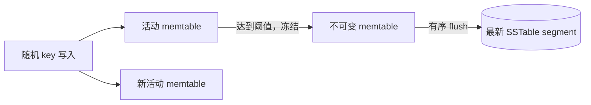

### 1.23 LSM 读取路径

读取 key 时按新到旧：

1. 活动 memtable；
2. 正在 flush 的冻结 memtable；
3. 最新 SSTable；
4. 更旧 SSTable；
5. 找到第一条即为最新版本；
6. 全部没有则不存在。

段数越多，最坏读放大越高。

### 1.24 后台合并与 compaction

**合并（merge）**把多个有序段生成一个新有序段；**压实（compaction）**在合并中丢弃被覆盖、删除或过期记录，回收空间并减少段数。

输入段不可变，后台操作期间读取仍可使用旧段；新段完成后原子切换元数据，再删除旧段。

### 1.25 多路归并为什么只需少量内存

对 $s$ 个有序输入，每个保留当前最小 key，用最小堆选择下一项：

$$
T=O(N\log s),\qquad Memory=O(s)
$$

$N$ 是所有输入记录数。若同 key 出现在多段，保留最新段值。

由于输入和输出都顺序访问，适合磁盘和对象存储。

### 1.26 可运行示例：合并 SSTable segments

下面把 segments 按“最旧到最新”输入，输出最新值。`None` 表示 tombstone。

```python
import heapq
from collections.abc import Iterator


def merge_segments(
    segments: list[list[tuple[str, str | None]]],
) -> list[tuple[str, str | None]]:
    heap: list[tuple[str, int, str | None, Iterator[tuple[str, str | None]]]] = []

    for age, segment in enumerate(segments):
        iterator = iter(segment)
        try:
            key, value = next(iterator)
            heapq.heappush(heap, (key, age, value, iterator))
        except StopIteration:
            pass

    result: list[tuple[str, str | None]] = []
    while heap:
        key = heap[0][0]
        versions: list[tuple[int, str | None]] = []

        while heap and heap[0][0] == key:
            _, age, value, iterator = heapq.heappop(heap)
            versions.append((age, value))
            try:
                next_key, next_value = next(iterator)
                heapq.heappush(heap, (next_key, age, next_value, iterator))
            except StopIteration:
                pass

        newest_age, newest_value = max(versions, key=lambda item: item[0])
        result.append((key, newest_value))

    return result


oldest = [("a", "1"), ("b", "old"), ("d", "4")]
middle = [("b", "new"), ("c", "3")]
newest = [("a", None), ("e", "5")]

merged = merge_segments([oldest, middle, newest])
print(merged)
print("live:", [(key, value) for key, value in merged if value is not None])
```

实际运行输出：

```text
[('a', None), ('b', 'new'), ('c', '3'), ('d', '4'), ('e', '5')]
live: [('b', 'new'), ('c', '3'), ('d', '4'), ('e', '5')]
```

`a` 的最新版本是 tombstone；只有当确认更老层再无 `a` 时，最终 compaction 才能丢弃 tombstone 本身。

### 1.27 为什么 memtable 还需要预写日志（write-ahead log，WAL）

memtable 在 RAM，断电会丢。每个写入先/同时追加磁盘恢复日志：

```text
append WAL -> update memtable -> acknowledge
```

WAL 不需排序，只用于崩溃后重放。memtable 成功 flush 后，对应 WAL 前缀可删除。

不要把这里的 WAL 与 B-tree WAL 混淆：目的都为持久恢复，但 LSM 的主数据本身也是追加/不可变段，B-tree WAL 保护原地页修改。

### 1.28 tombstone

追加式存储不能直接擦掉旧值。删除写入特殊记录 **墓碑（tombstone）**：

```text
key=42, type=DELETE
```

读取遇到最新 tombstone 即视为不存在；compaction 用它压制旧层值。

过早删除 tombstone 会导致旧值“复活”，尤其在分层 compaction 或复制系统中。

### 1.29 LSM-tree 的名称与家族

1996 年提出 **Log-Structured Merge-tree（LSM-tree）**，建立在日志结构文件系统思想之上。

典型家族：

- RocksDB；
- Cassandra；
- ScyllaDB；
- HBase；
- Bigtable 衍生系统；
- Lucene 的段合并也具有相似思想。

“LSM”不是单一固定实现，而是一族内存缓冲、不可变有序段和后台合并设计。

### 1.30 不可变段的并发与恢复优势

SSTable 一旦完成就不再修改：

- 并发读无需担心文件内容变化；
- compaction 写新文件，不破坏旧文件；
- 崩溃时删掉未完成输出即可；
- 快照可引用已有段；
- 对象存储天然适配整对象写入。

SlateDB、Delta Lake 等利用不可变文件建立在对象存储上。

### 1.31 部分写与校验和

崩溃、磁盘满可能让 WAL/SSTable 尾部只有半条记录。记录或 block 通常包含：

- 长度；
- 类型；
- checksum；
- sequence number。

恢复时验证 checksum，截断损坏尾部。已确认写是否允许丢失取决于 `fsync` 和持久性协议。

### 1.32 LSM 点查的主要问题

若 key 很久没更新，它可能在最老层；若 key 根本不存在，读取可能检查多个 SSTable：

$$
ReadCost_{miss}\approx\sum_{i=1}^{s}check(segment_i)
$$

不存在查询尤其糟，因为没有“找到即停”。Bloom filter 用很小内存快速跳过不可能包含 key 的段。

### 1.33 Bloom filter 的结构

Bloom filter 是 $m$ 位 bitmap，使用 $k$ 个哈希位置。插入 key $x$：

$$
h_1(x),h_2(x),\ldots,h_k(x)\in[0,m-1]
$$

把对应位设为 1。查询时计算同样位置。

### 1.34 membership 判断

- 任意一个位置为 0：key **一定不存在**；
- 所有位置为 1：key **可能存在**。

因此标准 Bloom filter：

- 无 false negative（前提是 filter 正确构建且 key 未被不支持地删除）；
- 允许 false positive；
- 不能直接返回值，只是前置过滤。

### 1.35 false positive 为什么发生

其他 key 的哈希可能恰好把查询 key 所需位都设为 1。filter 只能说明位模式，无法知道由谁设置。

false positive 只造成一次多余 SSTable 查找，不会返回错误值；最终仍用稀疏索引和真实 block 验证。

### 1.36 Bloom filter 假阳性公式

插入 $n$ 个 key、bitmap $m$ 位、每 key $k$ 个哈希，近似 false-positive probability：

$$
p\approx\left(1-e^{-kn/m}\right)^k
$$

给定 $m/n$，最优哈希数近似：

$$
k^*=\frac{m}{n}\ln2
$$

代入后：

$$
p_{min}\approx\left(0.6185\right)^{m/n}
$$

独立均匀哈希是假设，工程实现可用双哈希派生多个位置。

### 1.37 Bloom filter 数值直觉

每 key 10 bits：

$$
k^*\approx10\ln2\approx6.93
$$

取 $k=7$：

$$
p\approx\left(1-e^{-0.7}\right)^7\approx0.0082
$$

约 0.82%，与“10 bits/key 约 1%”经验一致。每 key 再增加约 5 bits，假阳性大致降低一个数量级。

### 1.38 Bloom filter 在 LSM read path 中的位置

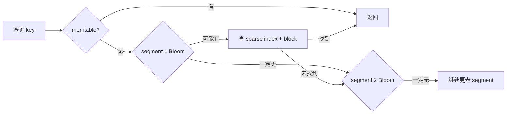

Bloom filter 对点查 miss 很有帮助，对范围查询帮助有限，因为无法枚举范围内所有可能 key 的 hash。

### 1.39 compaction 策略决定什么

策略决定：

- 何时合并；
- 选择哪些 SSTable；
- 每条数据重写几次；
- 同一 key range 同时存在几份文件；
- 临时磁盘需求；
- 读取要查多少段；
- 删除多久传播到底层。

它直接影响读、写、空间三种放大。

### 1.40 size-tiered compaction

**Size-tiered compaction** 把若干大小相近的新小 SSTable 合并成更大、较老 SSTable。例如四个 256 MB 文件可能合并成 898 MB，差额来自覆盖、删除和 TTL 过期。

优势：

- 大块顺序合并；
- 每份数据重写次数相对少；
- 高写吞吐。

代价：

- 旧层文件很大；
- 合并需大量临时空间；
- key range 重叠多，读需查更多表；
- 空间放大较高。

### 1.41 leveled compaction

**Leveled compaction** 保持 SSTable 大小相近，分 L0、L1、L2 等层：

- L0 是最新 flush，key range 可重叠；
- L1 以后按 key range 分区，同层通常不重叠；
- 每层容量比上一层大；
- 超限时把第 $i$ 层部分文件与 $i+1$ 层相交文件合并。

优势：

- compaction 更增量；
- 读时每层检查文件少；
- 空间利用较好。

代价：

- 数据可能逐层多次重写；
- 写放大往往更高；
- compaction 调度复杂。

### 1.42 两种策略的经验选择

| 工作负载 | 倾向 size-tiered | 倾向 leveled |
| --- | --- | --- |
| 写很多、读少 | 是 | 可能写放大较高 |
| 点查/范围读占主导 | 读放大较高 | 是 |
| 临时磁盘空间紧张 | 可能不利 | 较有利 |
| 少数 key 高频覆盖 | 视实现 | 常较有利 |
| 删除需较快传播 | 较慢且不确定 | 更易控制但仍需调优 |

这只是经验，必须用真实 key 分布、值大小和读写比例压测。

### 1.43 compaction 不是后台“免费工作”

compaction 与前台请求争用：

- 磁盘/SSD 带宽；
- CPU 压缩；
- 页缓存；
- 网络和对象存储请求；
- 临时空间。

若写入率长期超过 flush + compaction 能力，会形成 **compaction debt**，段数和读放大增长，最终必须背压或停写。

### 1.44 嵌入式存储引擎

**嵌入式数据库（embedded database）**作为库运行在应用同一进程：

- 无网络 API；
- 普通函数调用；
- 直接读写本地文件。

例子：RocksDB、SQLite、LMDB、DuckDB、KùzuDB。

### 1.45 嵌入式数据库适用场景

- 移动端本地数据；
- 单机数据集；
- 低并发事务；
- 每租户独立且较小；
- 本地分析；
- 作为更大系统的节点内状态。

优势是部署和延迟简单；代价是多进程并发、远程访问、复制和跨租户查询需由上层解决。

### 1.46 本批结论

最小追加日志把写入做到简单，却把读取和空间回收推迟。内存 hash index 解决点查但要求所有 key 入内存且不支持范围。SSTable 通过排序和稀疏索引降低内存，并允许流式合并；memtable 解决随机写与有序文件的矛盾；WAL 保护内存状态；tombstone 表达删除；Bloom filter 降低不存在点查的读放大；compaction 在后台支付重写和空间回收成本。

LSM 的核心不是“写一次永不再写”，而是把许多随机小写转换为少量顺序大写，并在后台有计划地重写。其性能最终取决于 compaction 是否跟得上，以及读、写、空间放大是否匹配工作负载。

### 1.47 B-tree 的定位

**B-tree** 是最广泛使用的按键读写结构，1970 年提出后长期成为关系数据库和许多非关系数据库的标准索引。

它与 SSTable 一样保持 key 有序，支持：

- 精确点查；
- 范围扫描；
- 前缀排序；
- 插入、更新和删除。

根本差异是：B-tree 把存储划分为固定页并原地覆盖，而 LSM 生成不可变段并后台合并。

### 1.48 page/block

B-tree 由固定大小 **页（page）/块（block）**构成。传统常见 4 KiB，PostgreSQL 默认 8 KiB，MySQL/InnoDB 默认 16 KiB。

每页有 page number。若单文件连续布局：

$$
offset=page\_number\times page\_size
$$

页中的 child reference 类似磁盘指针。

### 1.49 根页到叶页的查找

一页被指定为 **根（root）**。内部页保存边界 key 与 child page reference；每个 child 负责连续 key range。

查 key 251：

```text
root
  -> 选择 200..300 child
      -> 选择 250..270 child
          -> leaf 中查 251
```

叶页（leaf page）可直接存 value，也可存 value/heap location reference。

### 1.50 branching factor

一内部页能引用的 child 数称 **分支因子（branching factor）**。它取决于：

- page size；
- key boundary 大小；
- child pointer 大小；
- page header；
- 压缩方式。

实际常有数百，远高于二叉搜索树，因此树很矮。

### 1.51 B-tree 深度

若平均 branching factor 为 $b$，叶记录数 $n$，深度近似：

$$
h\approx\lceil\log_b n\rceil
$$

查找只需读取根到叶的 $h$ 个页；根和上层常驻缓存，物理 I/O 可能更少。

### 1.52 四层树的容量直觉

若 page 4 KiB、$b=500$，四级分支可覆盖约：

$$
500^4=62.5\times10^9
$$

个叶级单位。乘 4 KiB 约：

$$
62.5\times10^9\times4096
\approx256\ \text{TB}
$$

与原文“约 250 TB”一致。实际容量取决于叶填充率和记录大小；这只是解释为何几层足够。

### 1.53 更新已有 key

1. 从 root 定位 leaf；
2. 在内存 buffer 中修改 page；
3. 记录 WAL；
4. 稍后把 dirty page 覆盖回原 page number。

引用位置不变，父页无需因普通等长更新改变。

### 1.54 插入新 key

找到负责该 key range 的 leaf：

- 有空位：插入并保持页内有序；
- 已满：分裂为两个半满页；
- parent 新增一个 child reference 和边界 key。

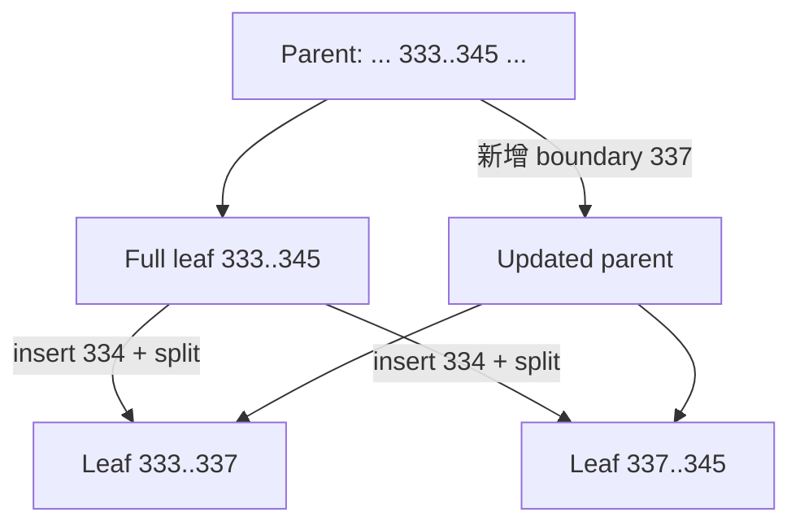

### 1.55 分裂向 root 传播

parent 也可能没有空间，于是继续分裂。若 root 分裂：

- 创建新 root；
- 旧 root 的两半成为 child；
- 树高增加 1。

平衡不变量保证所有叶在相近/相同深度，避免退化成链表。

### 1.56 删除与合并

删除后 page 可能低于最低填充率，需要：

- 从 sibling 重新分配 key；或
- 与 sibling 合并；
- 更新 parent boundary；
- 可能向上递归；
- root 只剩一个 child 时降低树高。

删除算法比查找更复杂，数据库变体对填充率和延迟维护策略不同。

### 1.57 原地更新的崩溃风险

一次 page split 需修改：

- 原 leaf；
- 新 leaf；
- parent；
- 空间分配元数据。

若只写完一部分就断电，树可能失去结构一致性。LSM 先写完整新文件再切换，避免直接破坏旧段；B-tree 必须额外保护多页更新。

### 1.58 orphan 与 torn page

- **孤儿页（orphan page）**：已写入但没有 parent 指向，或 parent 指向未完成页；
- **撕裂页（torn page）**：设备/系统只写了 page 的部分扇区，页内新旧字节混合。

仅有页级 checksum 能检测损坏，不一定能恢复正确内容；需要 WAL、double write 或 copy-on-write 等机制。

### 1.59 B-tree 的 write-ahead log

每项页修改先写入 append-only **预写日志（write-ahead log，WAL）**，再允许数据页落盘：

$$
WAL\ durable\ before\ data\ page
$$

崩溃后通过 WAL redo/undo 或重做规则恢复一致状态。文件系统中相似思想叫 journaling。

### 1.60 `fsync` 与持久承诺

写入进程缓存不等于落到持久介质。数据库在确认事务前，通常需让 WAL 达到要求的持久边界，例如调用 `fsync`。

但硬件缓存、控制器、云块设备的真实语义会影响保证。应用看到“commit success”依赖整条持久化栈正确。

### 1.61 buffer pool 与 dirty page

B-tree page 常缓存在数据库 buffer pool：

- 读命中无需设备 I/O；
- 更新先改内存页，标记 dirty；
- 后台 checkpoint/writeback 批量刷页；
- WAL 保证 dirty page 尚未刷盘时崩溃仍可恢复。

因此随机逻辑更新不必同步产生一次数据页 I/O，但最终写放大仍存在。

### 1.62 copy-on-write B-tree

LMDB 等使用 **写时复制（copy-on-write）**：

1. 修改页写到新位置；
2. 从该页到 root 的 ancestor 创建新版本；
3. 最后原子切换 root pointer；
4. 旧 root 仍代表旧快照。

它便于 snapshot isolation，并避免覆盖旧页；代价是路径复制、空间回收和额外写入。

### 1.63 key abbreviation / prefix compression

内部页只需保存足以区分相邻 child range 的边界，不一定保存完整 key。

例如相邻最大/最小 key：

```text
handbag ... handsome
```

边界可能只需 `hands` 后的最短区分前缀。缩短 key 可提高 branching factor、降低树高。

### 1.64 叶页物理顺序

范围扫描希望相邻 leaf 物理接近，减少 seek 和随机读取。但 page split 会把新页分配到其他位置，长期保持顺序困难。

这说明逻辑有序不自动等于物理连续。

### 1.65 sibling pointer 与 B+ tree

许多实现让 leaf 指向左右 sibling：

- 定位范围起点后；
- 沿 sibling 顺序扫描；
- 无需每次回 parent。

常见 B+ tree 把完整记录/record pointer 放叶子，内部页主要导航。本章不要求严格区分所有 B-tree 变体。

### 1.66 B-tree 与 LSM 的经验法则

粗略地：

- 写密集：LSM 常有优势；
- 读密集、低延迟点查：B-tree 常有优势。

但这是起点，不是结论。产品实现、设备、缓存、key/value 大小、覆盖率和 compaction 策略都可能反转结果。

### 1.67 为什么必须用自己的 workload benchmark

基准至少要匹配：

- 读写比例；
- 点查/范围查询比例；
- key 分布和热点；
- 新增 vs 覆盖；
- value 大小；
- 数据是否超内存；
- 并发；
- 持久级别；
- 稳态 compaction；
- 尾延迟。

只测空库顺序写无法代表长期生产。

### 1.68 B-tree 点查读放大

理论需访问每层一页：

$$
RA_{Btree}\approx h
$$

上层缓存后通常只需 leaf I/O。页数小且路径稳定，响应时间较可预测。

### 1.69 LSM 点查读放大

LSM 可能检查：

- memtable；
- L0 多个重叠文件；
- 每个更低 level 的一个/少数 key-range 文件。

Bloom filter 跳过确定不含 key 的文件，block cache 又减少 I/O。实际读放大取决于 level、重叠和命中位置。

### 1.70 范围查询比较

B-tree：

1. 定位起点 leaf；
2. 沿 sibling 扫描到终点。

LSM：

1. 在多个 segment 中定位范围；
2. 并行扫描；
3. 多路归并；
4. 按新旧版本去重和 tombstone 过滤。

Bloom filter 对范围无直接帮助。LSM 仍能高效范围查，但读路径更复杂。

### 1.71 memtable flush stall 与 backpressure

若：

$$
write\ arrival\ rate>flush+compaction\ sustainable\ rate
$$

immutable memtable 不断积累，内存最终耗尽。RocksDB 等会：

- 减速写入；
- 暂停读写等待 flush；
- 提高后台 compaction；
- 触发 backpressure。

尾延迟尖峰往往来自后台债务，而非单次写算法。

### 1.72 NVMe 并行读取

NVMe SSD 可并发处理大量独立请求。B-tree 与 LSM 都能获得高吞吐，但需要：

- 异步 I/O；
- 足够队列深度；
- 并发查询；
- 合理 block/page；
- 避免全局锁；
- CPU 解码跟得上。

单线程同步 I/O 无法发挥设备能力。

### 1.73 随机写与顺序写

B-tree 更新 scattered key 时，会修改分散 page，形成许多小 **随机写（random writes）**。

LSM flush/compaction 一次写较大 segment，形成较少大 **顺序写（sequential writes）**。

设备通常对后者吞吐更高，HDD 差异极大，SSD 仍有差异。

### 1.74 HDD 机械原因

HDD 随机写需：

- 移动磁头；
- 等待盘片旋转到目标扇区；
- 再写入。

一次 seek 数毫秒，远高于连续传输每字节成本。顺序写避免频繁机械定位。

### 1.75 SSD 的 page 与 erase block

SSD：

- 读/写通常以 page（例如 4 KiB）为单位；
- 擦除以更大 block（例如 512 KiB）为单位；
- 不能直接在已有已编程 page 上任意覆盖；
- Flash Translation Layer（FTL）把逻辑地址映射到物理 page。

随机更新会制造混合有效/无效 page 的 block。

### 1.76 SSD garbage collection

擦除一个 block 前，控制器必须把仍有效 page 搬到其他 block，再擦除。这个内部过程叫 **垃圾回收（garbage collection，GC）**。

若 block 中有效比例为 $u$，要释放 $(1-u)B$ 无效空间，可能先搬 $uB$ 有效字节。$u$ 越高，GC 内部写越多。

### 1.77 顺序写为何也利于 SSD

大顺序文件更可能占完整 erase block。文件删除后，整 block 可回收；随机小写让有效和无效 page 混杂，GC 搬运更多。

所以 SSD 没有磁头，顺序/随机差异仍未消失。

### 1.78 SSD wear

Flash block 可承受的 program/erase cycle 有限。额外 GC 和数据库写放大增加磨损。

降低物理写字节不仅提高吞吐，也延长 SSD 使用寿命。企业设备会通过 over-provisioning、wear leveling 缓解。

### 1.79 写放大的正式口径

若应用逻辑写入 $W_{logical}$ 字节，设备实际写入 $W_{physical}$：

$$
WA=\frac{W_{physical}}{W_{logical}}
$$

有时按 I/O operation 数定义，报告时必须说明是否包含：

- WAL；
- compaction；
- page write；
- replication；
- SSD 内部 GC。

### 1.80 LSM 写放大来源

一条 value 可能被写：

1. 恢复 WAL；
2. memtable flush；
3. L0→L1 compaction；
4. L1→L2；
5. 后续 level。

leveled 层数与重叠会提高 WA；size-tiered 重写较少但空间和读放大更高。

### 1.81 B-tree 写放大来源

至少：

1. WAL；
2. tree page。

还可能有：

- 只改几字节却写整页；
- page split；
- full-page image/double write；
- 多个二级索引；
- vacuum/重组；
- SSD 内部 GC。

### 1.82 key-value separation

若 value 远大于 key，LSM compaction 搬动完整 value 很昂贵。可把 value 放独立 value log，SSTable 只存：

```text
key -> value location
```

compaction 主要重写小 key/index；代价是 value log GC、额外随机读取和引用管理。WiscKey 是代表设计。

### 1.83 长时间基准才能看到写放大

空 LSM 初期没有历史层和 compaction，写入看似极快。随着数据增长：

- compaction 开始；
- 新写与后台重写争用带宽；
- steady-state 吞吐下降；
- 尾延迟出现。

基准应至少运行到数据库规模和 level 分布稳定，并报告后台 debt。

### 1.84 B-tree fragmentation（fragmented pages）

大量插入、分裂、删除后，文件中出现：

- 半空 page；
- 不连续 leaf；
- 文件中间的 free page；
- 外部碎片。

free page 可被未来写复用，却难直接归还操作系统，因此文件大小不立即下降。

### 1.85 vacuum / page reorganization

PostgreSQL vacuum 等后台流程回收行版本、更新可见性并允许空间复用；某些 shrink/repack 操作需移动 page 才能缩文件。

“DELETE 了 50% 行”不等于文件立刻减半。逻辑删除、内部可复用空间、OS 文件大小是三个层次。

### 1.86 LSM 空间使用

SSTable block 容易压缩，compaction 会周期重写并消除内部空洞，因此长期 fragmentation 较少。

但仍有：

- 多层旧版本；
- tombstone；
- compaction 临时输出与输入共存；
- size-tiered 高峰空间；
- snapshot 固定旧段。

### 1.87 持久删除延迟

LSM 删除后，旧 value 可能仍在更低 level，直到 tombstone 穿过所有相交层。若需证明数据物理删除，这个延迟可能不满足法规。

必须考虑：

- compaction cadence；
- snapshot/backup；
- 副本；
- object version；
- 专用及时删除设计。

### 1.88 不可变 SSTable 的快照优势

创建快照：

1. flush 当前 memtable；
2. 记录当前 segment 清单；
3. 增加引用，阻止这些文件被 GC；
4. 新写生成新 segment。

无需复制已有文件，类似 copy-on-write。B-tree 原地覆盖需页级 COW、文件系统 snapshot 或其他机制。

### 1.89 RUM 权衡视角

RUM 可概括访问方法在：

- Read cost；
- Update cost；
- Memory/space overhead；

之间的张力。B-tree、LSM、hash、bitmap 并非谁全面更好，而是在三者中选择位置。

### 1.90 主键索引

**主键索引（primary-key index）**从唯一 ID 定位：

- 关系表行；
- 文档；
- 图顶点。

其他记录通过该 ID 引用实体。唯一性使每个 key 最多一个当前目标。

### 1.91 二级索引

**二级索引（secondary index）**按非主键字段查，例如：

```sql
CREATE INDEX positions_by_user ON positions(user_id);
```

同一表可有多个二级索引，分别服务查询。indexed value 通常不唯一。

### 1.92 非唯一值怎样存

两种常见方式：

1. `indexed_value -> [row_id1,row_id2,...]` postings list；
2. 把 row ID 拼进 key：`(indexed_value,row_id)`，使每个索引项唯一。

两者都可用 B-tree 或 LSM 实现。

### 1.93 clustered index

若完整 row/document/vertex 直接存入索引叶，称 **聚簇索引（clustered index）**。

InnoDB 主键就是 clustered index；按主键范围扫描能顺序读取完整行。一个表通常只能有一个主要物理聚簇顺序。

### 1.94 heap file

另一种布局把行放 **堆文件（heap file）**，无特定 key 顺序；索引叶保存：

- 主键；或
- 物理 row location。

PostgreSQL 使用 heap。多个索引都指向同一行副本，避免每个索引复制完整 row。

### 1.95 heap 更新与 forwarding pointer

若新 value 不大于旧空间，可原地覆盖；若变大：

- 移到新空位并更新所有物理指针索引；或
- 旧位置保留 forwarding pointer；或
- 索引使用稳定逻辑 row ID，再由中间映射定位。

每种方案在读跳转、写维护和碎片之间权衡。

### 1.96 InnoDB 二级索引引用主键

InnoDB 二级索引 leaf 保存主键值，而非 heap address：

1. 用二级 key 找 primary key；
2. 再查 clustered primary index 找完整 row。

因此二级查询可能两次 B-tree lookup；长主键也会膨胀所有二级索引。

### 1.97 covering index / included columns

**覆盖索引（covering index）**或 **included columns index**在 key 外复制查询所需列：

```sql
CREATE INDEX orders_by_customer
ON orders(customer_id)
INCLUDE (created_at, status, total_amount);
```

若查询只需这些列，无需回 heap/clustered index，称 index covers query。

### 1.98 覆盖索引的代价

- index 更大；
- cache 容纳更少页；
- 插入/更新写更多字节；
- included column 改变也需维护；
- 复制更多数据。

它适合高频、字段稳定且回表昂贵的查询，不应把所有列都 include。

### 1.99 磁盘为何塑造上述结构

磁盘/SSD 相比 RAM：

- 按 page/block 访问；
- 随机访问有额外成本；
- 持久；
- 单位容量便宜。

B-tree 页、LSM segment、压缩和缓存都在适应这些物理特性。

### 1.100 内存数据库的兴起

RAM 单价下降，许多数据集可完全放内存，甚至分布到多机，于是出现 **内存数据库（in-memory database）**。

不要把它等同于 cache：有些仅缓存，有些提供事务与持久性。

### 1.101 cache-only 与 durable in-memory

- Memcached：机器重启后丢数据可接受；
- durable in-memory：通过磁盘日志、周期 snapshot、replication 或电池 RAM 恢复。

磁盘可只承担 append-only durability，不服务正常读取；读取全部来自内存，因此仍叫内存数据库。

### 1.102 持久化方式

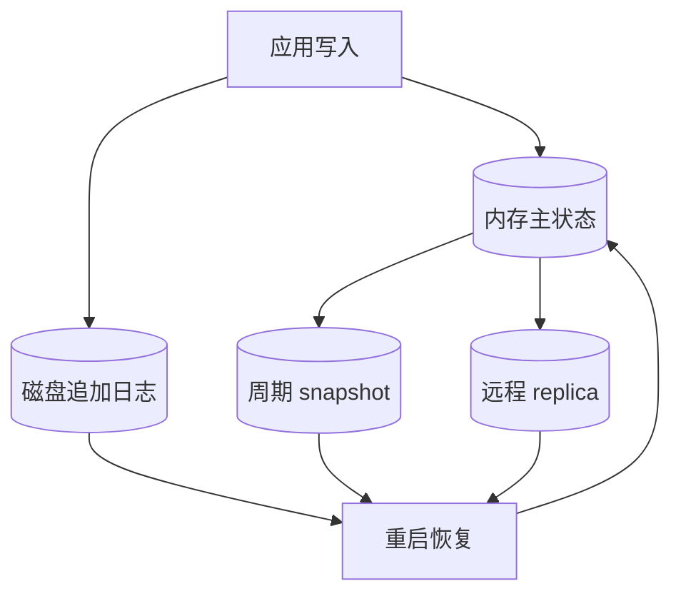

不同模式决定 RPO、恢复时间和写延迟。异步日志可能丢最后一段已返回写入。

### 1.103 产品示例

- VoltDB、SingleStore、Oracle TimesTen：关系内存数据库；
- RAMCloud：持久内存键值，内存与磁盘都用日志结构思想；
- Redis、Couchbase：可异步落盘，持久保证取决于配置。

产品行为随版本和配置变化，不能只凭“in-memory”判断 durability。

### 1.104 为什么内存数据库更快

反直觉地，优势不只是“避免磁盘读取”：磁盘数据库在 RAM 足够时，热数据也由 OS/database cache 提供。

内存数据库更重要的优势是避免：

- 把指针结构编码为页；
- page split/compaction 等磁盘布局维护；
- 序列化/反序列化；
- buffer pool 查找；
- 适应固定 block 的额外复制。

它可直接使用适合 CPU/RAM 的数据结构。

### 1.105 内存中的特殊数据结构

Redis 提供 set、sorted set、priority-like queue、hash 等接口。若在磁盘上高效持久实现这些结构，需要复杂页和恢复设计；全内存实现更直接。

但持久日志、snapshot 和复制仍要处理一致性与恢复。

### 1.106 内存数据库的边界

- 数据集必须适配 RAM 成本；
- 重启恢复可能很慢；
- replica 同时故障仍可能丢数据；
- snapshot fork/复制会产生内存压力；
- 内存碎片和 GC 影响尾延迟；
- 容量超出内存时需要 eviction、分片或磁盘层；
- 备份与审计仍依赖持久文件。

### 1.107 OLTP 存储选择小结

| 维度 | B-tree | LSM-tree | 内存数据库 |
| --- | --- | --- | --- |
| 主写方式 | 页原地更新 + WAL | WAL + memtable + immutable SSTable | 内存结构 + 日志/复制 |
| 点查 | 路径短、稳定 | 可能查多层，Bloom 缓解 | 极快内存访问 |
| 范围 | 叶页顺序扫描 | 多段并行归并 | 取决于内存结构 |
| 写吞吐 | 随机页写 | 大块顺序写，常较高 | 很高，持久路径决定上限 |
| 后台工作 | checkpoint/vacuum | flush/compaction | snapshot/replication |
| 空间问题 | fragmentation | 旧版本、tombstone、临时 compaction | RAM 成本/碎片 |
| 崩溃恢复 | WAL + page | WAL + immutable segment | log/snapshot/replica |

最终选择必须以稳态 workload、尾延迟、恢复和设备寿命共同验证。

## 2. 分析场景的数据存储

### 2.1 同样是 SQL，内部可以完全不同

数据仓库和 OLTP 数据库都可能提供 SQL，但主负载不同：

- OLTP：按索引定位少量行，频繁小更新；
- OLAP：扫描海量行，选少量列，执行聚合。

接口相同不表示存储布局、执行器和调优方法相同。许多厂商专注其中一侧。

### 2.2 HTAP 常是一个接口后的两套引擎

SQL Server、SAP HANA、SingleStore 等支持事务与分析，但现代 **HTAP** 常内部拥有：

- row/OLTP storage engine；
- column/OLAP storage engine；
- 变化同步机制；
- 共同 SQL 表面。

工作负载差异没有消失，只是产品隐藏了分离。

### 2.3 传统与云数据仓库（cloud data warehouses）

传统/本地部署代表：Teradata、Vertica、SAP HANA。云原生/云服务代表：BigQuery、Redshift、Snowflake。

云数据仓库利用：

- 对象存储；
- 弹性计算；
- serverless 调度；
- 与流/批处理服务集成；
- 按使用计费。

### 2.4 存算分离带来的弹性

数据持久保存在对象存储，查询计算节点可独立增减：

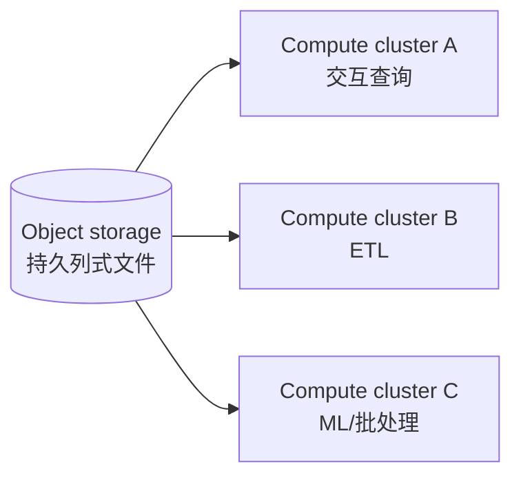

收益：不同 workload 隔离、计算按需释放、存储独立增长。代价：网络读取、cache、元数据一致性和对象请求成本。

### 2.5 开源分析栈为何开始拆分

Hive 曾把多个职责集成。数据湖迁到对象存储后，系统逐步组件化：

1. query engine；
2. storage format；
3. table format；
4. data catalog；
5. execution framework（有时独立）。

Trino、Spark、Hive、DataFusion 等可组合不同文件与目录服务。

### 2.6 query engine

**查询引擎（query engine）**负责：

- 解析 SQL；
- 语义和权限检查；
- 生成/优化计划；
- 安排并行 task；
- 读取文件；
- shuffle、join、aggregate；
- 返回结果。

有的自带执行 runtime，有的借 Spark/Flink 等框架。

### 2.7 storage format

**存储格式（storage format）**定义一张表的行怎样编码成文件字节，例如：

- Parquet；
- ORC；
- Lance；
- Nimble。

格式决定列块、压缩、统计、嵌套编码等。多个引擎可共享同一对象文件。

### 2.8 table format

Parquet 文件通常写后不可变。**表格式（table format）**如 Iceberg、Delta 定义：

- 哪些文件属于某张表；
- schema 和 partition；
- snapshot/manifest；
- insert/delete/update 如何通过新文件表达；
- time travel；
- GC；
- 事务提交。

文件格式回答“一个文件内部”，表格式回答“哪些文件共同构成表及其版本”。

### 2.9 data catalog

**数据目录（data catalog）**定义数据库中有哪些表，并管理：

- 表名和 namespace；
- create/rename/drop；
- table location；
- schema/owner；
- 权限和治理 metadata。

Polaris、Unity Catalog、Iceberg catalog 可通过 REST 等接口独立运行。查询引擎先向 catalog 解析表，再读 table metadata 和文件。

### 2.10 四层不能混淆

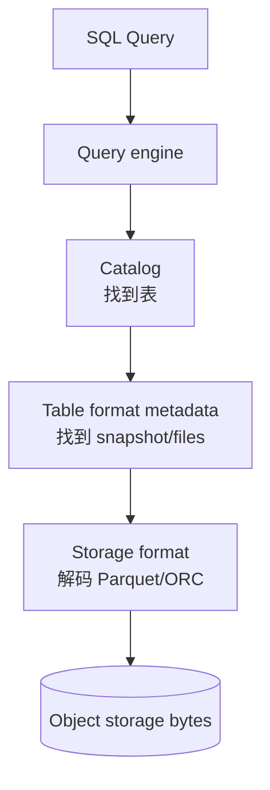

换 Parquet 不等于换 Iceberg；换 Trino 不一定重写数据；catalog 故障也可能让文件仍在但表无法发现。

### 2.11 分析事实表为何难存

事实表可能：

- 数万亿行；
- PB 级；
- 100–数百列。

但典型查询只访问 4–5 列。核心优化机会是避免读取不需要的列，而不只是给行加索引。

### 2.12 示例查询的列需求

分析 2024 年不同星期水果与糖果销量：

```sql
SELECT d.weekday,
       p.category,
       SUM(f.quantity) AS quantity_sold
FROM fact_sales AS f
JOIN dim_date AS d ON f.date_key = d.date_key
JOIN dim_product AS p ON f.product_sk = p.product_sk
WHERE d.year = 2024
  AND p.category IN ('Fresh fruit', 'Candy')
GROUP BY d.weekday, p.category;
```

`fact_sales` 只需 `date_key`、`product_sk`、`quantity` 三列，却可能扫描大量行。

### 2.13 row-oriented storage 的分析代价

**行式存储（row-oriented storage）**把一行全部字段相邻。即使索引找到相关行，也要：

- 读包含上百字段的 row；
- 解析整 row；
- 丢弃 97 个不用列；
- 消耗 I/O、cache 和 CPU。

行式布局适合 OLTP，因为一次读取常需整行。

### 2.14 column-oriented storage

**列式存储（column-oriented / columnar storage）**把同一列的值连续存：

```text
date_key:    20240101, 20240101, 20240102, ...
product_sk:  31,       68,       31,       ...
quantity:    2,        1,        5,        ...
```

查询只加载需要列，显著减少字节和解析。

### 2.15 列裁剪的 I/O 直觉

若表 $C=100$ 列，各列宽度近似，查询读取 $c=4$ 列：

$$
ReadFraction\approx\frac{c}{C}=4\%
$$

实际列宽、压缩和过滤不同，但相较整行读取可能节省数量级 I/O。

### 2.16 行位置必须在各列对齐

第 $k$ 个 `date_key`、第 $k$ 个 `product_sk`、第 $k$ 个 `quantity` 必须属于同一逻辑 row。

不能独立排序每一列，否则 row association 丢失。排序是对逻辑行整体排序，再把列分别编码。

### 2.17 row group / block

不会把万亿值的一整列写成单个对象。通常将表分成含数千到数百万行的 **row group/block**，每块内部按列存。

好处：

- 并行 task 分块；
- 只读相关时间块；
- block statistics pruning；
- 压缩字典局部；
- 控制内存。

### 2.18 partition pruning 与 block statistics

若 block 按日期范围组织，并记录 min/max：

```text
block A: date 2024-01-01 .. 2024-01-31
block B: date 2024-02-01 .. 2024-02-29
```

查询 2024-02 可跳过 A。跳过整个 block 比逐行过滤更省。

过细 partition 会产生小文件和 metadata 开销；过粗则 pruning 差。

### 2.19 nested document 的列式 shredding

Parquet 不只支持平坦关系行，也可通过 **shredding/striping** 把嵌套文档拆成列，并用 definition/repetition level 恢复层级。

因此 columnar 是物理布局，不等于只能使用关系逻辑模型。

### 2.20 列式生态

分析数据库：Snowflake、DuckDB、Pinot、Druid。

磁盘/对象格式：Parquet、ORC、Lance、Nimble。

内存格式：Apache Arrow、Pandas/NumPy 相关布局。

时序系统：InfluxDB IOx、TimescaleDB 的列式能力。

### 2.21 为什么列更容易压缩

同一列：

- 类型相同；
- 值域相近；
- 重复多；
- 排序后 runs 长；
- 可选专用 codec。

比混合类型的一整 row 更容易用 dictionary、delta、RLE、bit packing 等压缩。

### 2.22 bitmap encoding

若列有 $d$ 个 distinct value、$N$ 行，可为每个值建一个 $N$ 位 bitmap：

$$
bitmap_v[i]=
\begin{cases}
1,&row_i.column=v\\
0,&otherwise
\end{cases}
$$

例如 product 31 的 bitmap 在所有卖出该产品的行位置为 1。

### 2.23 bitmap 查询

```text
WHERE product_sk IN (31,68,69)
```

计算：

$$
B_{31}\lor B_{68}\lor B_{69}
$$

```text
WHERE product_sk=30 AND store_sk=3
```

计算：

$$
B_{product=30}\land B_{store=3}
$$

CPU 可一次处理一个 machine word 或 SIMD vector 的大量行。

### 2.24 可运行示例：bitmap AND/OR

用 Python integer 的 bit operation 模拟 8 行索引：

```python
def rows(bitmap: int, row_count: int) -> list[int]:
    return [row for row in range(row_count) if bitmap & (1 << row)]


row_count = 8
product_31 = 0b00101001  # rows 0, 3, 5
product_68 = 0b01000010  # rows 1, 6
store_3 = 0b01101100     # rows 2, 3, 5, 6

products_31_or_68 = product_31 | product_68
product_31_at_store_3 = product_31 & store_3

print("product 31 or 68:", rows(products_31_or_68, row_count))
print("product 31 at store 3:", rows(product_31_at_store_3, row_count))
```

实际运行输出：

```text
product 31 or 68: [0, 1, 3, 5, 6]
product 31 at store 3: [3, 5]
```

同一 bit position 跨列对应同一 row，是 AND 正确的前提。

### 2.25 sparse bitmap 与 run-length encoding

低基数列的每个 bitmap 可能有很多连续 0。**游程编码（run-length encoding，RLE）**存连续 0/1 长度：

```text
000001111000 -> (0,5),(1,4),(0,3)
```

排序后相同值聚集，run 更长，压缩更好。

### 2.26 Roaring bitmap

**Roaring bitmap** 按高位分 container，并根据局部密度选择 array、bitmap、run 等表示，以兼顾：

- 稀疏集合空间；
- 稠密 bitmap 位运算；
- 快速迭代和 AND/OR。

它不是简单全局 RLE，而是自适应容器格式。

### 2.27 bitmap 也能服务图集合运算

查询“被 X 关注且关注 Y 的用户”：

$$
Followers(X)\cap Following(Y)
$$

若用户集合编码为 bitmap，就是按位 AND。图遍历与列式过滤在底层可共享集合表示思想。

### 2.28 columnar 与 wide-column 不同

- **columnar storage**：同一列跨多 row 连续，优化扫描；
- **wide-column / column-family**：一 row 可有很多稀疏列，但物理上仍把同 row 值放一起，常属 row-oriented。

Bigtable、HBase、Accumulo 是 wide-column，不应因名称误认为分析列存。

### 2.29 为什么列不能独立排序

若 `date_key` 升序、`quantity` 也独立升序，第 23 个位置不再是同一销售事实。列式系统必须共享 row order。

这也是 bitmap 跨列 bitwise 运算正确的基础。

### 2.30 整行排序键

管理员可选：

```text
ORDER BY date_key, product_sk
```

逻辑 row 先按 date 排，同日内按 product；所有列按这个 row permutation 同步重排。

### 2.31 排序的查询收益

若 date 是首 sort key：

- 时间范围占连续 block；
- min/max pruning 有效；
- 最近一月只扫小范围。

同日按 product 次序，可加速日期内产品过滤和 group。

### 2.32 排序的压缩收益

首 sort column 出现长重复 run，RLE 压缩极佳。第二 key 只在第一 key 相同区间有序，run 较短；更后列近似随机，压缩收益递减。

排序键选择同时是索引和压缩设计。

### 2.33 单行写入列存为什么困难

向已排序、压缩列块中间插一 row，理论上可能：

- 重写插入点之后各列；
- 重新编码 dictionary/RLE；
- 修改 block metadata。

单行随机更新与列存天然冲突。

### 2.34 批量写入摊销成本

数据仓库常 ETL 批量导入。一次处理 $N$ 行可：

- 排序；
- 为每列选择编码；
- 写大 block；
- 批量更新 metadata。

固定文件和压缩成本被大量行摊销。

### 2.35 日志结构写入列存

常见方案：

1. 新写进入 row-oriented sorted in-memory store；
2. 累积到阈值；
3. 与旧 column files 合并；
4. 批量写新 immutable files；
5. 原子更新 table metadata。

这与 LSM 思想相同，只是磁盘段内部是列编码。

### 2.36 object storage 为什么合适

对象存储擅长整对象写入，不支持细粒度原地 page overwrite。不可变列文件 + metadata 切换正好匹配。

删除旧文件由 table format GC 延后执行，以保护 snapshot/time travel。

### 2.37 查询合并新旧表示

查询必须同时看：

- 磁盘/对象存储的 column files；
- 内存或 delta 中的新 insert/update/delete。

执行引擎合并并隐藏差异，使用户看到逻辑最新表。Snowflake、Vertica、Pinot、Druid 等采用类似思路。

### 2.38 分析 query plan 与 operators

复杂 SQL 被拆成 operators：

- scan；
- filter；
- projection；
- hash join；
- aggregate；
- sort；
- exchange/shuffle。

operators 可分布多机并行。planner 决定顺序、位置和并行度。

### 2.39 row-at-a-time interpreter 的开销

最简单执行器逐 row：

1. 读取计划数据结构；
2. 判断执行哪个表达式；
3. 动态 dispatch function；
4. 处理一个值；
5. 重复数亿次。

函数调用、分支和间接访问会压过简单比较本身。

### 2.40 query compilation

**查询编译（query compilation）**根据 SQL 生成专用循环，再用 LLVM 等编译成 machine code。

生成代码可直接：

- 迭代目标列；
- 执行固定比较；
- 写 output buffer；
- 消除通用解释层。

类似 JVM JIT，但编译对象是查询计划。

### 2.41 编译成本的摊销

若编译耗时 $C$，编译后每行节省 $\Delta t$，处理 $N$ 行才值得：

$$
N\Delta t>C
$$

短小查询可能解释更快；长扫描能摊销 JIT。系统可 cache compiled plan。

### 2.42 vectorized processing

**向量化处理（vectorized processing）**仍解释固定 operator，但每次处理一批列值：

```text
equal(product_column_batch, banana_id) -> bitmap
equal(store_column_batch, store_id) -> bitmap
and(bitmap1, bitmap2) -> result bitmap
```

避免逐 row function dispatch，使用预编译高效 kernel。

### 2.43 向量化 bitmap pipeline

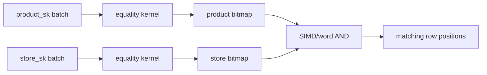

中间 bitmap 紧凑，适合 CPU register/cache。

### 2.44 sequential memory access 与 cache

现代 CPU 从连续内存预取高效；random pointer chasing 易 cache miss。列式 batch 连续，能充分利用 cache line 和 memory bandwidth。

查询性能瓶颈经常从磁盘 I/O 转为 memory bandwidth 与 CPU cache。

### 2.45 tight inner loop 与 branch prediction

高效 operator 把核心工作放在：

- 少量指令；
- 少函数调用；
- 可预测分支；
- 连续数组；
- 无对象分配。

这样 CPU pipeline 保持忙碌，减少 branch misprediction flush。

### 2.46 SIMD

**Single Instruction, Multiple Data（SIMD）**一条指令同时比较/计算多个整数或浮点数。

列式同类型连续值天然适合 SIMD；row 中混合类型和指针较难直接向量化。

### 2.47 直接在压缩数据上执行

某些 operator 可直接处理：

- dictionary code；
- bit-packed integer；
- RLE run；
- bitmap。

避免完全解码、分配和复制。压缩不仅省 I/O，也可能减少 CPU/memory traffic。

### 2.48 compilation 与 vectorization 比较

| 维度 | Query compilation | Vectorization |
| --- | --- | --- |
| 核心 | 每查询生成专用 machine code | 固定 batch operators |
| 启动成本 | 编译成本 | 较低 |
| 灵活表达式 | 可内联优化 | 需已有 kernel/UDF 路径 |
| 调试 | 生成代码复杂 | operator pipeline 较清楚 |
| CPU 优势 | 去 dispatch、专用 loop | cache/SIMD/batch |

两者都可高效，实际引擎也可能混合。

### 2.49 virtual view 与 materialized view

- **虚拟视图（virtual view）**：保存查询定义，读取时展开执行；
- **物化视图（materialized view）**：把查询结果实际写到存储。

虚拟 view 不额外维护数据；materialized view 用空间和更新成本换读取速度。

### 2.50 物化视图维护

源数据变化后，视图需：

- 全量刷新；或
- 增量维护；或
- 定期批量重建；或
- 流式实时更新。

Materialize 等系统专门做增量物化。维护正确性需处理 insert、update、delete、重复和顺序。

### 2.51 materialized aggregate

仓库查询反复执行：

- `COUNT`；
- `SUM`；
- `AVG`；
- `MIN`；
- `MAX`。

可预先保存常用 group aggregate，避免每次扫描原始事实。

### 2.52 data cube / OLAP cube

**数据立方体（data cube / OLAP cube）**按多个 dimension 预计算网格 aggregate。

二维例子：date × product，每个 cell 保存：

$$
Cube[d,p]=\sum_{fact:\;date=d,product=p}net\_price
$$

### 2.53 roll-up

沿 product 维求和得到每天总销售：

$$
Daily[d]=\sum_p Cube[d,p]
$$

沿 date 求和得到每产品总销售：

$$
ProductTotal[p]=\sum_d Cube[d,p]
$$

这种减少维度的聚合称 roll-up；反向查看更细粒度称 drill-down（前提是细粒度仍保留）。

### 2.54 高维 hypercube

事实有 date、product、store、promotion、customer 五维。理论 cell 数上界：

$$
Cells=|D|\cdot|P|\cdot|S|\cdot|R|\cdot|C|
$$

乘积可能巨大且极稀疏，因此不会机械物化全部组合，只选择高价值 aggregate 或稀疏表示。

### 2.55 cube 的性能优势

查询“昨天每店总销售”可直接读取预计算边/roll-up，而非扫描数百万事实。响应从扫描成本降为读取少量 aggregate。

适合固定报表和高频 dashboard。

### 2.56 cube 的局限

若 price 不在 dimension/aggregate 中，就不能事后回答“售价超过 100 美元的销售占比”。预计算只支持预见的维度与度量。

因此数据仓库通常：

- 长期保留细粒度 raw facts；
- cube/materialized aggregate 作为加速层；
- 需要新分析时回到 raw data。

### 2.57 分析存储小结

分析系统通过四层共同减少成本：

1. **文件/列布局**：只读需要列和 row group；
2. **压缩/排序**：减少字节并支持 pruning/bitmap；
3. **执行引擎**：JIT 或 vectorization 用现代 CPU；
4. **物化**：为重复查询预计算 aggregate。

云数仓再把 query engine、catalog、table format、storage format 解耦，让多个引擎共享对象数据。每层都提高组合能力，也要求更清晰的兼容、事务和治理契约。

## 3. 多维、全文与向量索引

### 3.1 concatenated multicolumn index

最常见多列索引是 **拼接/复合索引（concatenated index）**，按指定顺序把列组成 key：

```sql
CREATE INDEX people_name ON people(last_name, first_name);
```

排序顺序近似电话簿：先姓，同姓内按名。

### 3.2 leftmost prefix

该索引通常可支持：

- `last_name = ?`；
- `last_name = ? AND first_name = ?`；
- `last_name` 范围及范围内的 `first_name`。

却不能高效支持只有 `first_name = ?`，因为相同 first name 分散在每个 last name 区间。这称为 **最左前缀（leftmost prefix）**性质。

### 3.3 二维地理范围查询

地图视窗查询：

```sql
SELECT *
FROM restaurants
WHERE latitude  > 51.4946
  AND latitude  < 51.5079
  AND longitude > -0.1162
  AND longitude < -0.1004;
```

需要同时限制 latitude 和 longitude 的矩形。

### 3.4 复合 B-tree 为何不够

索引 `(latitude,longitude)` 先按 latitude 排：

- 可找到纬度带；
- 但带内包含所有 longitude；
- 仍需扫描大量点再过滤 longitude。

索引顺序反过来也只是交换问题。二维矩形不是一维词典序中的单一连续范围。

### 3.5 space-filling curve

**空间填充曲线（space-filling curve）**把二维坐标映射成一维 code，使空间附近点尽量在 code 上邻近，例如 Z-order、Hilbert curve。

$$
f:(x,y)\mapsto z
$$

然后用普通 B-tree 索引 $z$。矩形通常映射为多个一维区间，需要查询并过滤边界候选；局部性不是完美保持。

### 3.6 R-tree 与 Bkd-tree

专用空间索引：

- **R-tree**：层次保存 bounding rectangles，查询排除不相交子树；
- **Bkd-tree**：适合动态可扩展多维点；
- PostGIS 通过 PostgreSQL GiST（Generalized Search Tree）实现空间访问。

它们让多个维度共同缩小候选，而非只优化第一个维度。

### 3.7 网格与 H3

另一思路把地表划为：

- 方格；
- 三角格；
- 六边形；
- 多级层次 cell（如 H3）。

地点映射到 cell ID，再用普通索引；查询视窗转成 cell 集合。边界需要精确几何后过滤。

### 3.8 多维索引不只用于地理

- RGB 三维颜色范围；
- `(date,temperature)` 同时查询某年 25–30°C；
- 价格、评分、库存组合范围；
- 时间与空间；
- 医学或科学参数。

维度增加后空间迅速稀疏，传统树剪枝效果会下降，即 **维度灾难（curse of dimensionality）**。

### 3.9 全文搜索的定义

**全文搜索（full-text search）**按文档任意位置出现的词或相关表达检索网页、商品说明、文章等。

它不只是 `LIKE '%word%'`，通常包括：

- 分词；
- 大小写/规范化；
- 词干和词形；
- 同义词；
- 拼写容错；
- 相关性排序。

### 3.10 分词是语言相关问题

英语空格常提供候选边界，但中文、日文等不总在词间加空格；复合词、标点、emoji 和 URL 也需处理。

tokenizer/analyzer 是索引语义的一部分。索引与查询必须使用兼容分析，否则召回异常。

### 3.11 文本的高维视角

把每个 term 看作一个维度：

$$
x_{doc,t}=\begin{cases}
1,&doc\ contains\ term\ t\\
0,&otherwise
\end{cases}
$$

“red apples”查询要求 `red` 和 `apples` 维同时为 1。词汇表可能数百万维，但每文档只含少量词，因此极稀疏。

### 3.12 inverted index

**倒排索引（inverted index）**反转 document→terms 为：

```text
term -> documents containing term
```

例如：

```text
red    -> [2, 7, 10]
apples -> [1, 2, 10, 13]
```

### 3.13 postings list

term 对应的 document ID 列表称 **postings list**。posting 还可包含：

- 词频；
- term position；
- field；
- payload；
- score statistics。

列表按 doc ID 排序后可 delta/compress，并高效求交。

### 3.14 多 term 布尔查询

同时含 `red` 和 `apples`：

$$
Postings(red)\cap Postings(apples)
$$

任一词：

$$
Postings(red)\cup Postings(apples)
$$

有序列表可双指针归并；bitmap 可 AND/OR。

### 3.15 postings bitmap

若 doc ID 稠密，可用 bitmap，第 $n$ 位表示 doc $n$ 是否含 term。RLE/Roaring 压缩后仍可直接位运算。

倒排列表与 bitmap 哪个更小取决于密度和 ID 分布。

### 3.16 Lucene 的日志结构段

Lucene（Elasticsearch/Solr 底层）把 term→postings 等索引写成 SSTable-like immutable segments：

- 新文档进入新 segment；
- 查询跨 segment；
- 后台 merge；
- 删除先标记，merge 回收。

全文索引与 LSM 共享“不可变段 + 后台合并”思想。

### 3.17 PostgreSQL GIN

GIN（Generalized Inverted Index）用 postings 支持：

- 全文 term；
- JSON key/value；
- array element；
- 多值字段。

倒排索引不是全文产品专属，而是一种“元素→包含该元素记录”的通用结构。

### 3.18 n-gram

不按词，而把字符串切成长度 $n$ 的 substring，称 **n-gram**。

`hello` 的 trigram：

```text
hel, ell, llo
```

建立 trigram→documents 倒排后，可检索任意长度至少 3 的 substring。

### 3.19 trigram 的收益与代价

收益：

- substring；
- `LIKE '%foo%'`；
- 部分正则候选；
- 不依赖完整词边界。

代价：

- 每字符串生成许多 token；
- index 大；
- 短查询选择性差；
- 仍需原文验证候选。

### 3.20 edit distance

**编辑距离（edit distance）**衡量把一个字符串变另一个所需插入、删除、替换次数。

Levenshtein recurrence：

$$
D_{i,j}=\min
\begin{cases}
D_{i-1,j}+1\\
D_{i,j-1}+1\\
D_{i-1,j-1}+[s_i\ne t_j]
\end{cases}
$$

距离 1 表示一次字符编辑，可用于 typo 容错。

### 3.21 term dictionary 与 finite-state automaton

Lucene 等把有序 term 集合编码为 trie/有限状态自动机（finite-state automaton，FSA），共享公共前缀，压缩词典并支持前缀遍历。

### 3.22 Levenshtein automaton

把查询词和允许 edit distance 构造成 **Levenshtein automaton**，再与 term dictionary automaton 求匹配，可跳过大量不可能 term，而非与每个词逐一动态规划。

允许距离越大，候选和状态越多，查询更贵且误匹配增加。

### 3.23 检索与排名是两个阶段

倒排结构先高效得到候选；信息检索系统还要按 BM25、字段权重、词频、时效等排序。

索引结构解决“哪些文档可能匹配”，不自动定义“哪个最相关”。

### 3.24 semantic search

关键词、词形和 typo 仍依赖字面重叠。**语义搜索（semantic search）**试图理解概念与意图：

```text
canceling your subscription
how to close my account
terminate contract
```

字词不同，语义相近。

### 3.25 RAG 中的检索

**Retrieval-Augmented Generation（RAG）**先检索相关资料，再把资料作为 context 交给 LLM 生成答案。

检索质量限制生成依据：召回错误或缺失，LLM 不能可靠弥补。还需权限过滤、来源引用和新鲜度。

### 3.26 vector embedding

embedding model 把文本/图像/音频映射为浮点向量：

$$
f(document)=\mathbf{x}\in\mathbb{R}^d
$$

训练目标使语义相似输入在空间中接近。单个维度通常没有易解释的人类含义；整体几何关系才重要。

### 3.27 vectorized processing 与 vector embedding 不同

- 查询执行中的 vector：一批相同类型值，用 SIMD/kernel 处理；
- embedding vector：多维浮点坐标，表示语义位置。

二者都叫 vector，但一个是批处理形态，一个是数据对象。

### 3.28 Euclidean distance

$$
d_E(\mathbf{x},\mathbf{y})
=\sqrt{\sum_{i=1}^d(x_i-y_i)^2}
$$

距离越小越近。它对向量长度和尺度敏感。

### 3.29 cosine similarity

$$
sim_{cos}(\mathbf{x},\mathbf{y})
=\frac{\mathbf{x}\cdot\mathbf{y}}
{\|\mathbf{x}\|_2\|\mathbf{y}\|_2}
$$

衡量夹角，常在 $[-1,1]$；越大越相似。若向量先归一化，cosine ranking 与 dot product closely related。

### 3.30 可运行示例：比较 embedding 距离

```python
from math import sqrt


def euclidean(left: list[float], right: list[float]) -> float:
    return sqrt(sum((x - y) ** 2 for x, y in zip(left, right)))


def cosine(left: list[float], right: list[float]) -> float:
    dot = sum(x * y for x, y in zip(left, right))
    left_norm = sqrt(sum(x * x for x in left))
    right_norm = sqrt(sum(y * y for y in right))
    return dot / (left_norm * right_norm)


agriculture = [0.38, 0.83, 0.41]
vegetables = [0.36, 0.64, 0.67]
star_schema = [0.85, 0.10, -0.52]

print(f"agriculture/vegetables cosine: {cosine(agriculture, vegetables):.3f}")
print(f"agriculture/vegetables euclidean: {euclidean(agriculture, vegetables):.3f}")
print(f"agriculture/star cosine: {cosine(agriculture, star_schema):.3f}")
print(f"agriculture/star euclidean: {euclidean(agriculture, star_schema):.3f}")
```

实际运行输出：

```text
agriculture/vegetables cosine: 0.948
agriculture/vegetables euclidean: 0.323
agriculture/star cosine: 0.192
agriculture/star euclidean: 1.272
```

前两向量显著更相似。真实 embedding 常有 1,000+ 维，不能靠肉眼判断。

### 3.31 multimodal embedding

早期 Word2Vec、BERT、GPT 等聚焦文本，后来模型覆盖图像、音频、视频。**多模态（multimodal）**模型可把不同模态映射到可比较空间，例如以文字搜索图片。

模型版本和输入预处理必须一致，否则 index 中旧 embedding 与新 query embedding 不在同一空间。

### 3.32 semantic search pipeline

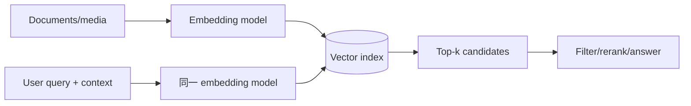

用户位置等 context 可参与 query embedding，但会影响缓存与可解释性。

### 3.33 flat index

**Flat index** 原样存全部向量。查询与每个向量算距离：

$$
T_{flat}=O(Nd)
$$

$N$ 是向量数，$d$ 是维度。优点是 exact；缺点是大规模慢、memory bandwidth 高。

GPU/SIMD 可提高常数，但不改变线性扫描。

### 3.34 高维下传统空间树失效

R-tree/kd-tree 在低维能排除大区域。高维空间中：

- volume 稀疏；
- bounding region 大量重叠；
- 最近与远距离差异收缩；
- 剪枝效果下降。

因此 embedding 使用专用 approximate nearest neighbor（ANN）索引。

### 3.35 approximate nearest neighbor

ANN 用少查候选换速度，可能漏掉真实最近邻。评估至少看：

- recall@k；
- query latency/throughput；
- build time；
- index memory/disk；
- update/delete；
- accuracy-latency curve。

### 3.36 IVF 构建

**Inverted File（IVF）index**：

1. 聚类向量空间，得到 $K$ 个 centroid；
2. 每个向量分配给最近 centroid；
3. centroid 对应一个 inverted list/partition；
4. 查询先找最近 centroid，再查部分 partition。

它把全量扫描缩小到候选簇。

### 3.37 IVF probes

查询参数 **probes** 是检查多少 partition：

- probes 小：快，但更易漏邻居；
- probes 大：候选多，recall 高，延迟高；
- probes=全部：接近 flat scan。

若每簇均匀，粗略候选数：

$$
Candidates\approx probes\cdot\frac{N}{K}
$$

实际聚类不均、边界和过滤会改变。

### 3.38 IVF 的边界错误

query 和真实近邻可能位于相邻 partition 两侧，若只 probe query 所在簇就漏掉。

增加 probes 或用更好量化/重排缓解，不能完全消除 approximate nature。

### 3.39 HNSW 结构

**Hierarchical Navigable Small World（HNSW）**维护多层 proximity graph：

- 顶层节点少、边跨度大；
- 越低层节点越多、连接更密；
- 底层接近完整向量集合。

类似高速公路先远距离导航，再进入街道精细搜索。

### 3.40 HNSW 查询

1. 从顶层入口开始；
2. 沿 edge 移到更接近 query 的节点；
3. 下降一层，以该位置继续；
4. 底层扩展候选；
5. 返回 top-k。

贪心/候选队列不会检查全图，因此也是 approximate。

### 3.41 HNSW 参数权衡

常见实现参数（背景补充）：

- `M`：每节点连接数，越大 recall/内存/build cost 越高；
- `ef_construction`：构建搜索宽度；
- `ef_search`：查询候选宽度，越大 recall 高、延迟高。

参数名因实现而异，应看产品文档。

### 3.42 recall@k

若 exact top-k 集合为 $E_k$，ANN 返回 $A_k$：

$$
Recall@k=\frac{|E_k\cap A_k|}{k}
$$

需要抽样用 flat exact 作为 ground truth，测不同参数下 recall/latency，而不能只说“查询很快”。

### 3.43 更新与删除

向量索引还要处理：

- 新文档 embedding 插入；
- 模型升级后的全量重嵌入；
- metadata filter；
- 删除传播；
- HNSW graph maintenance；
- IVF centroid drift。

静态 benchmark 不能代表持续更新 workload。

### 3.44 hybrid search

这是常见实践补充：结合：

- 倒排/BM25 字面匹配；
- vector semantic similarity；
- metadata/权限 filter；
- reranker。

精确产品编号、人名和代码词常适合 keyword；概念改写适合 vector。融合比单一路径稳健。

### 3.45 Faiss 与 pgvector

Faiss 提供多种 Flat、IVF、HNSW 变体；PostgreSQL pgvector 支持 IVF/HNSW，使关系过滤和向量检索可在同一数据库组合。

是否使用专用向量数据库取决于规模、过滤、更新、事务、运维和延迟，而非“有 AI 就必须”。

### 3.46 高级索引选择表

| 查询 | 典型索引 | 主要权衡 |
| --- | --- | --- |
| `(last,first)` 精确/前缀 | concatenated B-tree | 受列顺序限制 |
| 低维矩形/空间 | R-tree/Bkd/GiST/grid | 边界候选与维度增长 |
| 多关键词 | inverted index/postings | 索引大小、分析器、排名 |
| substring/regex 候选 | n-gram/trigram | 大索引、需后验证 |
| typo | Levenshtein automaton | 距离越大越贵 |
| exact vector nearest | Flat | $O(Nd)$ 准确但慢 |
| clustered ANN | IVF | probes 决定 recall/latency |
| graph ANN | HNSW | 内存、构建、近似 |

### 3.47 本节结论

单维有序索引无法自然解决所有检索。低维空间需要同时剪枝多个坐标；全文把 term 映射到 postings；语义检索把内容映射到高维 embedding，再进行 exact 或 approximate nearest neighbor。

这些索引仍重复本章主线：用额外空间、构建和写维护换读取候选缩小。索引返回通常只是候选，最终还需精确几何、原文、权限或 reranking 验证。选择应以召回、延迟、更新、空间和正确性共同评估。

## 4. 原章总结：从逻辑请求到物理访问路径

### 4.1 本章回答的核心问题

当应用执行：

```text
put(key, value)
get(key)
SELECT ...
search(...)
```

数据库内部怎样：

- 组织字节；
- 定位数据；
- 保证崩溃恢复；
- 回收旧版本；
- 利用磁盘、RAM 和 CPU；
- 为不同查询维护索引。

### 4.2 OLTP 与 OLAP 的物理分化

OLTP 优化大量小请求：

- 主键/二级索引；
- 少量 record；
- 快响应；
- 高频写入。

OLAP 优化大型扫描：

- columnar layout；
- 压缩和排序；
- 少列多行；
- JIT/vectorization；
- 物化 aggregate。

相同 SQL 外观不改变这两种物理需求。

### 4.3 日志结构学派

核心原则：

- append new data；
- immutable segments；
- 删除 obsolete files；
- background merge/compaction。

SSTable、LSM-tree、RocksDB、Cassandra、HBase、ScyllaDB、Lucene 等属于或借鉴该家族。通常写吞吐高，读与后台 compaction 更复杂。

### 4.4 原地页更新学派

把磁盘视为固定 page 集，B-tree 在原位置覆盖 page，依赖 WAL 保证恢复。

它广泛用于关系和非关系 OLTP，通常点查和范围读取响应稳定；随机页写、fragmentation 和多索引维护构成代价。

### 4.5 B-tree 与 LSM 只是经验倾向

“LSM 写快、B-tree 读快”是经验起点。真实结果受：

- cache；
- NVMe 并行；
- compaction；
- value 大小；
- key distribution；
- range ratio；
- durability；
- steady state；

共同影响。必须用目标 workload 验证。

### 4.6 高级索引扩展检索维度

- R-tree/Bkd/grid：同时限制低维坐标；
- inverted index：term→documents；
- n-gram/Levenshtein：substring 和 typo；
- vector index：高维语义相似。

它们都用额外结构把大候选空间缩小，但索引的近似性和后验证程度不同。

### 4.7 应用开发者获得的能力

理解这些机制后，可以：

- 读懂数据库 tuning 文档；
- 预测参数增减的方向；
- 解释索引为何拖慢写入；
- 判断 compaction/GC 是否是尾延迟来源；
- 选择 row/column/full-text/vector 系统；
- 设计能进入 cache、支持范围和避免热点的 key。

本章不可能让读者成为某一引擎调优专家，但提供了必要词汇和因果模型。

### 4.8 全章统一结论

存储引擎没有免费优化：

$$
{}\text{更快读取}
\Longleftrightarrow
{}\text{更多索引/预计算/空间/写维护}
$$

$$
{}\text{更快写入}
\Longleftrightarrow
{}\text{延后合并/更高读放大/后台债务}
$$

设计的关键不是消灭成本，而是把成本放到 workload 能承担的位置，并让后台工作有足够资源保持稳态。

## 5. 参考文献的证据脉络

原章共有 104 条参考文献，覆盖理论论文、系统论文、标准、产品内部与工程测量。按论证可分为六组。

### 5.1 索引成本、SSTable、LSM 与嵌入式引擎（参考文献 1–20）

包括：

- 索引对 UPDATE 的成本；
- B-tree 技术综述；
- ordered index 与 hash；
- trie SSTable/memtable；
- mergesort、skip list；
- RocksDB/HBase/Bigtable；
- LSM-tree 和日志结构文件系统原论文；
- Delta Lake/object storage；
- Bloom filter 原论文和参数；
- LSM 调优与 compaction；
- 嵌入式数据库和 per-tenant SQLite。

这组从算法到生产实现支撑日志结构路径。原论文解释不变量，产品文档说明具体策略，二者不能互相替代。

### 5.2 B-tree、现代设备与放大（参考文献 21–45）

覆盖：

- B-tree 原始与综述；
- torn write、ARIES/WAL、PostgreSQL 内部；
- LMDB copy-on-write；
- RUM conjecture；
- B-tree vs LSM；
- RocksDB latency/backpressure；
- NVMe；
- SSD page/block/GC；
- WiscKey key-value separation；
- full-page/double write；
- 读写空间放大；
- LSM 及时删除；
- clustered/heap/covering index。

硬件数据和数据库算法相互影响。设备代际变化后，应重新测量，而不是永久套用 HDD 结论。

### 5.3 内存、HTAP、云数仓与列式执行（参考文献 46–82）

包括：

- 内存 OLTP 与 RAMCloud；
- SQL Server column store、SAP HANA、SingleStore；
- BigQuery、可组合数据系统；
- C-Store、Dremel/Parquet；
- Snowflake、DuckDB、Pinot、Druid；
- Parquet/ORC/Lance/Nimble/Arrow；
- 时序列存；
- column compression 与 Roaring bitmap；
- compiled/vectorized execution、SIMD；
- Materialize 和 data cube。

这组展示分析性能是存储格式、执行引擎和 CPU 共同结果，不能只归因于“列存”一个词。

### 5.4 多维与空间索引（参考文献 83–87）

包括 UB-tree/space-filling、Bkd-tree、GiST、H3 和 HyperDex 多维搜索。

它们提供把多维范围映射为树、网格或专用剪枝结构的不同方案。比较时需关注维度、动态更新、边界过滤和数据分布。

### 5.5 全文检索（参考文献 88–97）

包括经典**信息检索（information retrieval）**教材、bitmap/postings 压缩、Lucene segments、PostgreSQL GIN/full-text、trigram regex、fuzzy query、trie 和 Levenshtein automaton。

全文检索由 analyzer、dictionary、postings、候选交集和 ranking 组成；任一产品特性不能代表整个信息检索领域。

### 5.6 embedding 与 ANN（参考文献 98–104）

包括 Word2Vec、BERT、GPT，Faiss、pgvector，以及 IVF/HNSW 论文。

模型论文说明 embedding 来源；索引论文说明近邻搜索。embedding 质量与 ANN recall 是两层误差，评估时应分开。

### 5.7 如何使用这些参考文献

1. 先定位瓶颈属于逻辑查询、存储、执行还是硬件；
2. 到原章参考文献选择对应组；
3. 阅读论文的 workload、设备、数据规模和指标；
4. 区分 asymptotic 结论与工程常数；
5. 检查版本和默认配置；
6. 用自己的稳态 benchmark 验证；
7. 同时报告读、写、空间、尾延迟、恢复和后台债务。

## 6. 容易混淆的概念与常见误区

### 6.1 存储引擎不等于数据库产品（database product）

产品可以包含多个引擎，或让用户选择 B-tree/LSM/columnar。接口、事务、复制与存储引擎是不同层。

### 6.2 索引不等于主数据（main data）

索引是派生访问结构；删除索引不应删除逻辑数据。clustered index 是例外形式：数据本身放在索引叶，但逻辑角色仍需理解。

### 6.3 索引越多不等于查询越快

优化器可能不用索引；低选择率索引可能比扫描慢。每个索引都增加写、空间、WAL 和 cache 压力。

### 6.4 `O(1)` hash 查找不等于整次 get 为常数

哈希只找到 offset；还要 page fault、seek、解码和校验。碰撞和扩容也影响常数。

### 6.5 append-only 不等于永远不重写数据

LSM 的前台写追加，但 compaction 会反复把有效数据写进新段。它避免原地修改，不避免所有重写。

### 6.6 log 不等于应用日志（application log）

本章 log 是有序追加记录，可为二进制数据库内部格式。应用日志只是其中一种用途。

### 6.7 WAL 不等于主存储日志

WAL 的主要职责是恢复未安全落入主结构的修改；LSM segment 或 B-tree page 才是主数据布局。事件溯源日志又是业务权威，三者语义不同。

### 6.8 WAL 写入不等于已经 durable

只有达到承诺的持久边界（如正确 `fsync` 和设备保证）才能确认。写进进程/OS cache 仍可能断电丢失。

### 6.9 memtable 不等于普通 cache

memtable 包含尚未进入 SSTable 的最新权威写状态，丢失需 WAL 恢复；普通 cache 丢失可从已有主数据读取。

### 6.10 SSTable 不等于整个数据库一张表

它是一个有序不可变 segment。数据库同时有多 SSTable、memtable、WAL 和元数据。

### 6.11 sparse index 不等于稀疏矩阵

SSTable sparse index 只索引部分 key/block boundary；稀疏矩阵指大部分单元格缺失或零。

### 6.12 Bloom filter 不会告诉 value

它只回答“肯定不在/可能在”，后者仍需读真实 block。

### 6.13 Bloom filter false positive 不会返回错误记录

它只造成多余 I/O。最终 key 比较会识别不匹配。

### 6.14 Bloom filter 没有 false negative 有前提

前提是构建正确、hash 一致、bitmap 未损坏且没有不支持的删除操作。工程缺陷仍可能破坏保证。

### 6.15 Bloom filter 不适合范围查询

它基于完整 key hash，无法高效判断一个连续范围中哪些 key 存在。

### 6.16 tombstone 不等于物理删除（physical deletion）

它是逻辑删除记录。旧 value 在 compaction、snapshot、backup 和 replica 中可能继续存在。

### 6.17 tombstone 不能随便提前删除

更老层仍有旧 value 时，去掉 tombstone 会让删除数据复活。

### 6.18 compaction 不等于压缩算法

compaction 是合并段并丢弃旧版本；compression 是减少字节编码。二者常同时发生但概念不同。

### 6.19 compaction 不等于备份

它重写并删除旧文件，不能恢复误删历史；备份保留独立恢复点。

### 6.20 compaction 是后台任务不等于无用户影响

它争用 I/O、CPU、cache 和空间，可能造成 p99 spike、stall 和账单增加。

### 6.21 size-tiered 不总比 leveled 写快

经验上写放大较低，但具体取决于 overwrite、TTL、文件大小、实现和硬件。

### 6.22 leveled 不等于每层只一个文件

层包含按 key range 分区的多个 SSTable；通常除 L0 外同层 range 不重叠。

### 6.23 immutable file 不等于永远保留

文件内容不修改，但元数据可不再引用并由 GC 删除。

### 6.24 object storage 上的 LSM 不等于本地磁盘行为相同

对象请求延迟、费用、list/commit 语义和 cache 层不同，需要更大对象和 manifest 设计。

### 6.25 B-tree 不等于 binary tree

B-tree 每页有数百 child，树高很低；不是每节点两个 child 的二叉搜索树。

### 6.26 B-tree 与 B+ tree 不能在本章过度纠结

实际数据库多用 B+ tree 变体，但原章把它们统称 B-tree 讨论共同页结构和权衡。

### 6.27 page size 不等于一次查询读取字节固定

cache、read-ahead、压缩、文件系统和设备可改变实际 I/O；逻辑 page 也可能跨物理 sector。

### 6.28 page overwrite 不一定立即发生设备随机写

buffer pool 和 OS 先缓存 dirty page，后台批量刷；但逻辑访问位置仍分散，最终持久写路径需处理。

### 6.29 WAL 不自动解决 torn page

WAL 可重做，但恢复必须能检测哪些 page 部分写坏；checksum、full-page image、double write 等仍可能必要。

### 6.30 copy-on-write 不等于没有写放大

修改一个 leaf 可能复制整条 root path，并产生旧版本空间回收。

### 6.31 B-tree 有序不等于 leaf 物理连续

逻辑 sibling 顺序可跨磁盘位置。范围扫描性能还取决于布局、cache 和 read-ahead。

### 6.32 “LSM 写快、B-tree 读快”不是定律

它忽略 NVMe、cache、compaction、key-value separation、查询类型和产品实现。必须压测。

### 6.33 读放大不能只按文件数比较

Bloom、cache、索引、并行读取和读取字节都影响实际成本。应定义 I/O 次数或 bytes 口径。

### 6.34 写放大不只发生在 LSM

B-tree 有 WAL、整页写、split、secondary indexes；SSD 还有内部 GC。两族都有 WA。

### 6.35 数据库写放大（database write amplification）不等于设备写放大（device write amplification）

数据库看到的写字节与 SSD FTL/GC 内部写是不同层。总磨损是叠加效果。

### 6.36 顺序写不等于 SSD 上没有随机代价

FTL、并发 workload、文件系统和 GC 会改变映射；但大块顺序模式通常仍更友好。

### 6.37 NVMe 快不等于存储结构不重要

CPU、memory bandwidth、WA、tail latency 和寿命仍受布局影响；不并行 I/O 也无法发挥 NVMe。

### 6.38 DELETE 不等于文件空间归还 OS

B-tree page 可能只变可复用，LSM 要等 compaction；快照和备份还可能固定旧数据。

### 6.39 vacuum 不等于所有数据库的同一操作

PostgreSQL VACUUM、FULL、其他产品 compaction/rebuild 语义不同。不能凭名字推断缩文件或锁定。

### 6.40 snapshot 不等于 backup

snapshot 可能共享同一底层文件和故障域；backup 应满足独立恢复目标。引用 SSTable 的 snapshot 删除文件时也需保护。

### 6.41 primary key 不总等于物理聚簇顺序

InnoDB 主键 clustered；PostgreSQL 主表是 heap。相同 SQL 概念下实现不同。

### 6.42 clustered index 不等于 cluster 分布式集群

这里 clustered 指数据按索引组织，不是多机 cluster。

### 6.43 covering index 不等于覆盖所有查询

它只覆盖字段集合满足的特定查询；新增选择列可能重新回表。

### 6.44 included column 不等于索引排序 key

included column 存在叶中用于返回，不参与 B-tree 搜索顺序（具体产品语义需核对）。

### 6.45 secondary index 非唯一不等于实现困难

可用 postings list 或 `(value,row_id)` 唯一复合 key；但热点值可能产生大列表。

### 6.46 in-memory database 不等于无磁盘

durable 系统仍写 log/snapshot；区别是正常 read 从内存且主结构不为磁盘布局编码。

### 6.47 数据全在 RAM 不等于应选内存数据库

磁盘数据库热数据也可全在 cache。应比较序列化、事务、恢复、功能和成本，而非只看 cache hit。

### 6.48 Redis 开启 AOF 不等于任意配置都零丢失

异步 flush、replication 和 failover 策略决定 RPO。需核对具体持久参数。

### 6.49 SQL 相同不等于 OLTP/OLAP 引擎相同

HTAP 产品也常在内部维护 row 与 column 两套路径。

### 6.50 query engine 不等于 table format

Trino/Spark 是执行层；Iceberg/Delta 定义表 snapshot/files；Parquet/ORC 定义文件字节；catalog 定义表发现。

### 6.51 Parquet 不等于 Iceberg

Parquet 是 column file；Iceberg 可管理许多 Parquet 文件及事务、schema 和 snapshot。

### 6.52 catalog 不等于文件目录列表

catalog 提供表身份、namespace、权限和 metadata；直接 list object 无法可靠替代事务表定义。

### 6.53 columnar 不等于 wide-column

前者按列跨行存，后者是稀疏行模型且常按行共置。名称相近、物理目的不同。

### 6.54 列存不等于只能存关系数据

Parquet 用 shredding 表示嵌套文档；columnar 是物理布局。

### 6.55 列存不等于每列一个无限大文件

实际按 row group/block 分块，平衡并行、pruning、压缩和内存。

### 6.56 每列独立排序会破坏行

所有列必须共享 row permutation；否则第 $k$ 项不再属于同一事实。

### 6.57 bitmap index 不等于 Bloom filter

bitmap 精确表示每 row 是否为某值，可 AND/OR；Bloom 是近似 membership，可能 false positive。

### 6.58 bitmap 稀疏不等于总用 RLE 最优

Roaring 会按局部密度选择表示。随机稀疏 bit 可能没有长 run。

### 6.59 列式压缩不只为省磁盘

它减少网络、memory bandwidth 和 cache footprint，还可直接在 compressed codes 上执行。

### 6.60 sort key 不等于 secondary index

sort order 提供数据 skipping、range locality 和压缩；一个表通常只有有限物理排序，secondary index 是额外结构。

### 6.61 columnar 单行写慢不等于无法实时更新

内存 row store/delta 接受新写，后台批量转列；查询合并新旧层。复杂性被隐藏而非消失。

### 6.62 vectorized processing 不等于 vector embedding

前者是批量执行数据，后者是高维语义坐标。两处 vector 含义不同。

### 6.63 JIT compilation 不总比 vectorization 快

短查询编译成本高；vector kernel 更易复用。数据、表达式和硬件决定结果。

### 6.64 SIMD 不等于多线程

SIMD 是单核心一条指令处理多个数据 lane；多线程在多个核心并发。二者可同时使用。

### 6.65 materialized view 不等于普通 view

普通 view 存查询定义；materialized view 存结果并需维护。

### 6.66 data cube 不等于保留全部分析能力

只预计算选定 dimension/measure，未包含的条件无法从 cube 恢复。raw facts 仍应保留。

### 6.67 复合索引不能任意交换列顺序

`(last,first)` 与 `(first,last)` 支持的前缀不同。索引列顺序必须由 query predicate 排列决定。

### 6.68 多维索引不等于多个单列索引

多个单列索引可 bitmap/intersection，但不总像 R-tree 一样共同组织空间；cost 和选择性不同。

### 6.69 R-tree 不适合千维 embedding

高维剪枝退化，需要 ANN 专用结构。

### 6.70 full-text search 不等于 substring search

全文按 term/analyzer 和 ranking；trigram 更适合 substring/regex 候选。语义和索引不同。

### 6.71 inverted index 不等于 IVF 虽然都叫 inverted

全文 inverted index 是 term→postings；IVF 是 centroid/partition→vectors。共享“反向分桶”直觉，但对象和查询不同。

### 6.72 postings list 不等于排序结果

postings 产生候选，BM25/其他 scorer 决定相关性排序。

### 6.73 n-gram 越小不一定越好

小 $n$ 召回高但 token 和候选巨大；大 $n$ 选择性高却漏短模式。需按语言和查询选择。

### 6.74 edit distance 大不等于搜索更智能

允许更多编辑会产生大量无关候选和更高成本，只解决字符相似，不理解语义。

### 6.75 semantic search 不等于事实正确

embedding 只表示模型学到的相似；可能偏差、过时或误召回。RAG 仍需权限、来源和验证。

### 6.76 cosine 高不等于两个文档等价

相似度受模型、向量归一化、输入截断和语言影响；阈值需业务数据校准。

### 6.77 Flat index 不等于没有索引价值

它仍可能用 SIMD/GPU 批量 exact search，适合小数据或作为 ANN ground truth。

### 6.78 IVF probes 越多不一定成本线性

partition 大小不均、cache 和并行会改变；方向上 recall 与工作量增加，但需实测曲线。

### 6.79 HNSW 不保证 exact nearest neighbor

图搜索只访问候选子集，可能陷入近邻区域。增加 ef_search 提高 recall 但更慢。

### 6.80 ANN benchmark 不能只报 latency

必须同时报 recall@k、数据集、维度、内存、构建、过滤和更新；低 recall 的快没有意义。

### 6.81 embedding model 升级不等于只替换 query model

新旧 embedding space 不兼容时，必须重算文档向量并迁移 index，常需双索引过渡。

### 6.82 有向量检索不等于需要独立向量数据库

关系扩展、搜索引擎或库可能已满足规模和过滤。独立系统需有明确收益。

## 7. 全章知识结构

```mermaid
mindmap
    root((第 4 章<br/>存储与检索))
        统一权衡
            读放大
            写放大
            空间放大
            前台延迟与后台债务
        OLTP
            最小追加日志
                latest wins
                O(n) 扫描
                hash offset index
            LSM
                WAL
                memtable
                SSTable
                sparse index
                immutable segment
                merge compaction
                tombstone
                Bloom filter
                size-tiered
                leveled
            B-tree
                fixed pages
                root internal leaf
                branching factor
                split merge balance
                WAL fsync buffer pool
                copy-on-write
            比较
                point range reads
                random sequential writes
                NVMe 与 SSD GC
                key-value separation
                fragmentation vacuum
                snapshots deletion
            索引布局
                primary secondary
                postings
                clustered
                heap
                covering included
            内存数据库
                cache-only
                durable log snapshot replica
                内存数据结构
        OLAP
            云数据仓库
                query engine
                storage format
                table format
                catalog
                object storage
            列式存储
                projection pruning
                row groups
                nested shredding
                bitmap RLE Roaring
                shared row order
                sort key compression
                delta and immutable files
            执行
                query operators
                JIT compilation
                vectorized batches
                cache tight loop SIMD
                compressed execution
            物化
                materialized view
                aggregate
                data cube roll-up
                raw facts
        高级索引
            复合索引
                leftmost prefix
            多维空间
                space-filling curve
                R-tree Bkd GiST H3
            全文
                analyzer tokens
                inverted index
                postings bitmap
                n-gram
                edit distance FSA
            向量
                embedding
                cosine Euclidean
                Flat exact
                IVF centroid probes
                HNSW graph layers
                recall latency trade-off
                hybrid search
```

### 7.1 三条贯穿主线

#### 把随机小工作转成顺序批工作

LSM 合并小写、列存批量写 immutable files、vectorized engine 批量处理值。这是提高设备和 CPU 效率的共同方法。

#### 用派生结构换候选缩小

B-tree、Bloom、bitmap、R-tree、inverted、ANN 都是额外结构。它们减少查询候选，同时增加构建、写维护和空间。

#### 把成本从前台移到后台

compaction、vacuum、materialized view maintenance、index merge、embedding rebuild 都让前台快，但后台必须有资源并被监控。

### 7.2 存储结构对照

| 结构 | 基本单位 | 写入方式 | 读取方式 | 主要后台工作 |
| --- | --- | --- | --- | --- |
| Append log + hash | record | append | hash→offset | 重建/空间回收 |
| LSM | SSTable segment | WAL+memtable+flush | 新到旧多层 | compaction |
| B-tree | fixed page | WAL+in-place/COW | root→leaf | checkpoint/vacuum |
| Column store | row group/column chunk | delta+bulk files | projection+scan | merge/optimize |
| Inverted index | term/postings segment | append segment | postings intersection | segment merge |
| ANN vector | vector/cluster/graph | build/insert | approximate candidates | rebuild/graph maintenance |

### 7.3 放大对照

| 选择 | 读放大 | 写放大 | 空间放大 |
| --- | --- | --- | --- |
| 更多 B-tree indexes | 降低目标查询 | 增加 | 增加 |
| 延后 LSM compaction | 增加 | 短期降低 | 增加 |
| Leveled compaction | 较低 | 较高 | 较低 |
| Size-tiered | 较高 | 较低倾向 | 较高 |
| Covering index | 降低回表 | 增加 | 增加 |
| Materialized aggregate | 大幅降低 | 增加维护 | 增加 |
| ANN 小搜索宽度 | 低延迟但漏结果 | 构建不变 | 不变 |

### 7.4 硬件层次关系

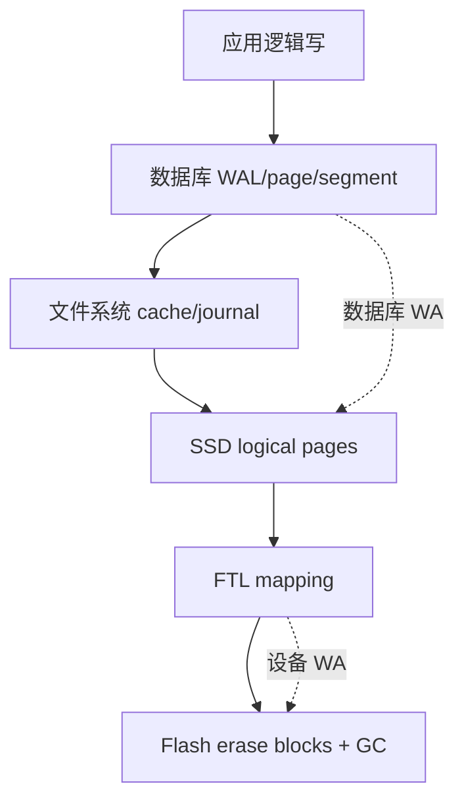

只观察应用字节会遗漏多层放大。调优必须知道指标位于哪一层。

### 7.5 查询路径层次


索引通常只缩小候选；存储读取和执行器仍决定最终成本与正确性。

## 8. 综合案例：电商商品、订单、搜索与分析的存储设计

> 本节是基于原章机制的教学性推演，用于展示怎样从 workload 推导存储和索引。数值不是通用容量建议，实际系统必须用自己的数据分布和硬件验证。

### 8.1 功能与数据域

平台需要：

- 商品详情和库存；
- 下单、支付状态与订单查询；
- 用户按关键词、筛选和价格搜索商品；
- “意思相近”的语义搜索；
- 商家实时查看销量；
- 分析团队按日、品类、地区聚合历史；
- 用户删除账户和相关个人信息。

一套存储结构很难同时优化这些路径。

### 8.2 先量化 workload

假设峰值：

| 操作 | 峰值 | 记录/结果 |
| --- | ---: | --- |
| 商品详情读取 | 100,000/s | 1 product，约 4 KiB |
| 商品搜索 | 20,000/s | top 50 |
| 下单 | 10,000/s | order + items，逻辑约 2 KiB |
| 库存扣减 | 30,000/s | 小范围原子更新 |
| 用户订单列表 | 15,000/s | 最近 20 条 |
| 商品/库存变更 | 5,000/s | 派生到搜索与仓库 |
| 分析导入 | 3 TB/day | 批量/流式 |
| 商品总数 | 100 million | 活跃 20 million |
| 订单历史 | 10 billion rows | 7 年 |

还要记录：热门商品偏斜、订单 item 数 p99、搜索词分布和更新峰值。

### 8.3 按访问模式拆出逻辑系统

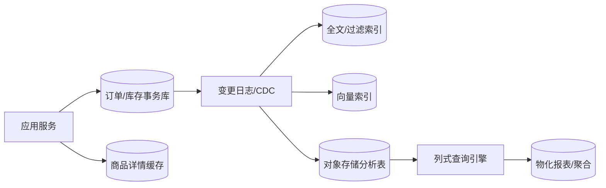

这不是要求六个独立产品。初期可由一个关系数据库、一个搜索服务和对象文件承担多个角色；边界按瓶颈演进。

### 8.4 订单主库的正确性优先级

订单和库存需要：

- 唯一订单 ID；
- 订单项与订单外键；
- 库存不能违反业务下限；
- 支付状态转换；
- 按用户和时间查订单；
- 按订单 ID 低延迟点查；
- 明确事务和崩溃恢复。

这些需求倾向成熟关系 OLTP 与 B-tree 索引。是否底层使用 LSM 产品仍可另评估，逻辑接口不强制物理族。

### 8.5 订单表与主键

```sql
CREATE TABLE orders (
    order_id       bigint PRIMARY KEY,
    customer_id    bigint NOT NULL,
    created_at     timestamptz NOT NULL,
    status         text NOT NULL,
    total_amount   numeric(18, 2) NOT NULL,
    shipping_region_id bigint NOT NULL
);
```

若 InnoDB，`order_id` clustered，选择随机 UUID vs time-ordered ID 会影响 page locality、split 和热点。连续 ID 提高 append locality，但可能暴露数量或形成单页写热点；分布式 ID 需权衡。

### 8.6 用户订单列表的复合索引

查询：

```sql
SELECT order_id, created_at, status, total_amount
FROM orders
WHERE customer_id = ?
ORDER BY created_at DESC
LIMIT 20;
```

索引：

```sql
CREATE INDEX orders_by_customer_time
ON orders(customer_id, created_at DESC)
INCLUDE (status, total_amount);
```

- `customer_id` 等值放最左；
- `created_at` 提供每用户排序和 range；
- included columns 尝试覆盖列表；
- `order_id` 是否已隐含在 leaf 取决于产品。

### 8.7 索引列顺序的反证

若建立 `(created_at, customer_id)`：

- 全局最近订单快；
- 单用户最近订单无法先收缩到该用户；
- 需扫时间区间并过滤大量其他用户。

索引顺序来自谓词和排序，而不是“时间列总应放前面”。

### 8.8 库存热点

库存表：

```sql
UPDATE inventory
SET available = available - :quantity
WHERE sku_id = :sku_id
  AND available >= :quantity;
```

热门 `sku_id` 会集中到一个 B-tree leaf/row lock。换成 LSM 不能自动消除同一逻辑 key 的串行约束。

缓解可能包括：

- 预留/分桶库存；
- 队列串行；
- 按仓库拆 key；
- optimistic version；
- 限流。

存储结构和业务并发是不同层。

### 8.9 订单二级索引的写成本

假设每次下单写：

- clustered primary index；
- customer/time index；
- status index；
- region/time index；
- WAL；
- order items 索引。

一个逻辑订单可能触发多页/多树修改。低频管理查询若能走仓库，不应全部加在 OLTP 上。

### 8.10 逻辑写带宽估算

10,000 orders/s，每订单主数据与 item 逻辑共 2 KiB：

$$
W_{logical}=10{,}000\times2\ \text{KiB/s}
\approx19.5\ \text{MiB/s}
$$

若数据库层测得 $WA=4$：

$$
W_{physical}\approx78.1\ \text{MiB/s}
$$

再加 replication 和 SSD device WA。设备标称 100 MB/s 并不一定有足够余量承受 compaction/checkpoint 和故障恢复。

### 8.11 容量余量

若物理持续写能力为 250 MiB/s，前台稳态 78 MiB/s，表面利用率：

$$
\rho\approx31.2\%
$$

剩余带宽用于：

- checkpoint/compaction；
- index build；
- replica catch-up；
- backup；
- 峰值；
- 故障少节点状态。

不能按标称带宽 100% 规划低延迟服务。

### 8.12 B-tree 还是 LSM 的实验问题

对订单主库，应实测：

- 70% point read、30% write；
- customer/time range；
- 热点库存覆盖；
- 2 KiB value；
- 数据超 RAM；
- WAL 同步提交；
- 稳态 24+ 小时；
- p50/p99/p99.9；
- crash recovery。

若写入/事件摄取远高于点查，LSM 可能更有利；若低尾延迟读和范围占主导，B-tree 可能更稳。

### 8.13 商品详情与 cache

商品按 `product_id` 点查，读多写少。可用：

- 关系/文档主记录；
- application/cache layer；
- B-tree 或 hash primary index；
- 热数据页缓存。

在加独立内存数据库前，应确认主库 cache hit 和序列化是否已足够。cache invalidation 从商品变更流驱动。

### 8.14 商品属性过滤

用户按：

- category；
- brand；
- price range；
- color；
- availability；

组合过滤。为每种任意组合建立复合 B-tree 不现实。

可选择：

- 搜索引擎 inverted/columnar postings；
- bitmap intersection；
- 常用固定组合 B-tree；
- 多维索引（少数数值维）；
- 查询后过滤。

### 8.15 全文商品索引

索引字段：title、description、brand、category。pipeline：

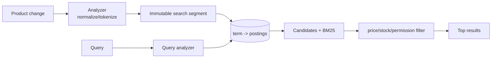

商品删除先在 search index 标记，segment merge 后物理回收；主库仍是权威。

### 8.16 analyzer 一致性

索引时把 “running shoes” 词干化，查询时若不做相同处理，会漏召回。版本升级要：

- 新 index alias；
- 全量 reindex；
- 双读/评估；
- 原子切换；
- 删除旧 segment。

analyzer 是数据格式的一部分。

### 8.17 搜索索引新鲜度

商品变更提交到搜索可见有 lag $\delta$：

$$
t_{visible}=t_{commit}+\delta
$$

库存不可仅依赖陈旧搜索结果完成下单；搜索展示可用，真正扣减仍由权威库存事务验证。

### 8.18 语义搜索文档粒度

embedding 输入可以是：

- 整商品；
- 标题 + 描述；
- 每个描述 chunk；
- 图像；
- 多模态商品表示。

粒度影响：

- vector 数量；
- 召回；
- metadata filter；
- 更新成本；
- reranking context。

不是“每商品一个向量”永远正确。

### 8.19 vector index 与 metadata filter

查询需同时满足：

- semantic similarity；
- category；
- region availability；
- price；
- permission。

过滤可：

- ANN 前 pre-filter，可能候选不足；
- ANN 后 post-filter，可能 top-k 被大量丢弃；
- filter-aware partition/graph；
- oversample 后 rerank。

向量 recall 不能脱离结构化过滤评估。

### 8.20 IVF 参数实验

假设 $N=100$ million vectors、$K=100{,}000$ centroids，均匀每簇约 1,000 vectors。

- probes=10：约 10,000 candidates；
- probes=100：约 100,000 candidates；
- probes=1000：约 1 million candidates。

实际簇不均、量化和 filter 会改变。测 probes→recall@50/p99 曲线，选择业务可接受点。

### 8.21 HNSW 参数实验

固定数据和 embedding model，扫描：

- `M`；
- `ef_construction`；
- `ef_search`。

报告：

- recall@50；
- p50/p99；
- index RAM；
- build hours；
- insert/delete throughput；
- filter 后有效结果。

不应只展示最佳单次 latency。

### 8.22 hybrid ranking

最终 score 可组合：

$$
score=\alpha\cdot lexical
+\beta\cdot semantic
+\gamma\cdot business
$$

再由 learned reranker 处理 top candidates。不同 score 尺度需归一化；商业 boost 不能绕过权限或库存硬条件。

### 8.23 embedding 模型迁移

从 model v1 到 v2：

1. 新文档双写 v1/v2 embedding；
2. 后台重算历史；
3. 构建 v2 index；
4. 用离线 relevance set 比较；
5. 小流量查询 v2；
6. 切换；
7. 等删除保留期后回收 v1。

query vector 必须使用与 index 相同 model/version。

### 8.24 分析数据落入对象存储

订单 CDC/事件进入：

- immutable Parquet files；
- Iceberg/Delta table metadata；
- catalog；
- object storage。

小文件应周期 compaction；迟到更新和删除通过新 data/delete files + snapshot 表达。

### 8.25 列式 I/O 估算

订单事实有 100 列，未压缩平均 row 1 KiB；10 billion rows 约 10 TB。查询只需 5 列且宽度近似：

$$
RawProjected\approx10\ \text{TB}\times5\%=500\ \text{GB}
$$

若 partition pruning 只扫 1/12 年度数据、相关列压缩 4:1：

$$
Read\approx\frac{500}{12\times4}\ \text{GB}
\approx10.4\ \text{GB}
$$

相比行式全表 10 TB，物理布局和 pruning 共同减少三个数量级。假设均匀仅作直觉。

### 8.26 sort/partition 设计

常见查询：按日期、地区、品类。可：

- partition by month；
- sort within files by region, category；
- row group min/max；
- 避免 partition by 高基数 customer ID 造成小文件。

partition 是目录/metadata 级剪枝，sort 是文件内部局部性，两者不同。

### 8.27 实时报表物化

商家 dashboard 反复问：

```text
today sales by hour
orders by status
top products
```

可维护 materialized aggregates，源于订单变更流。每个 aggregate 声明：

- 粒度；
- 更新延迟；
- late event；
- correction；
- backfill；
- 与 raw facts 对账。

### 8.28 删除链路

用户删除涉及：

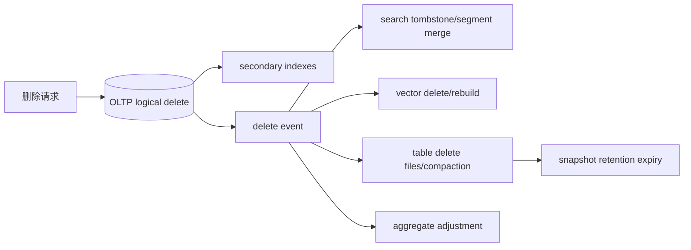

还要覆盖 backup、replica、cache 和对象版本。API 成功不等于物理数据立即消失。

### 8.29 备份与恢复

订单主库：WAL + base backup/snapshot，定期恢复演练。

搜索/vector：若可由商品权威重建，可减少备份，但要估算：

$$
T_{rebuild}=T_{read\ source}+T_{embed/tokenize}+T_{build}+T_{catchup}
$$

若重建需数周，仍需 index snapshot 和增量恢复。

分析湖：table snapshot metadata + object version/备份，catalog 也必须可恢复。

### 8.30 稳态压测矩阵

| 测试 | 关键指标 |
| --- | --- |
| OLTP point/range | p50/p99、TPS、cache、WAL、page split |
| LSM write | steady TPS、WA、compaction debt、stall |
| 索引增加前后 | query latency、UPDATE bytes、cache footprint |
| Search ingest/query | refresh lag、merge、recall、p99 |
| Vector IVF/HNSW | recall@k、latency、RAM、build/update |
| Column query | bytes scanned、pruned groups、CPU、spill |
| Materialized view | update lag、write load、rebuild |
| Delete | logical visibility、physical purge time |
| Recovery | RTO、RPO、replay/rebuild throughput |

测试要运行到 compaction、GC、cache 和文件数量稳定。

### 8.31 可观测指标

OLTP/LSM：

- WAL fsync latency；
- memtable count；
- L0 file count；
- compaction pending bytes；
- Bloom usefulness；
- block cache hit；
- stall time。

B-tree：

- buffer hit；
- dirty/checkpoint bytes；
- page split；
- index bloat；
- vacuum lag；
- WAL volume。

分析/搜索：

- bytes scanned/pruned；
- compression ratio；
- spill/shuffle；
- segment count/merge；
- ANN recall sample；
- projection freshness。

### 8.32 调优触发器

- L0/compaction debt 持续增长；
- p99 与后台 merge 同步尖峰；
- WA 超预算；
- SSD wear 指标异常；
- cache hit 下降；
- B-tree bloat 超阈值；
- 分析 bytes scanned/returned 比过高；
- search refresh lag 超 SLO；
- ANN recall 下降；
- 删除物理清理超过法规期限。

### 8.33 渐进架构

早期：关系数据库 + B-tree/GIN + 定期导出 Parquet，可能已足够。

触发后再增加：

- 独立搜索引擎；
- vector extension/服务；
- 云 warehouse；
- materialized stream；
- 专用 LSM event store。

先用主数据库现有能力建立基线，可减少同步和运维复杂性。

### 8.34 综合案例结论

订单、搜索和分析不是三份互相争夺权威的数据。应明确：

- OLTP 是订单/库存权威；
- search/vector 是商品检索派生；
- column warehouse 是历史分析派生；
- materialized aggregate 是再次派生。

各层按主查询选择存储，并通过变更日志同步。性能收益来自把数据重排成适合读取的结构，代价是写维护、滞后、重建和删除传播。

## 9. 核心结论

### 9.1 三十六条核心结论

1. **数据库的基本任务是持久保存并高效找回。** 复杂性来自规模、故障和多种查询。
2. **逻辑模型不决定物理布局。** 同一 SQL 可落在 B-tree、LSM、row 或 column engine。
3. **OLTP 与 OLAP 的访问模式不同，内部结构因此分化。**
4. **索引是派生数据。** 它用空间和写维护换读取候选缩小。
5. **追加日志写入简单，朴素读取是 $O(n)$。**
6. **内存 hash index 让点查快，却要求 key 入内存且不支持范围。**
7. **SSTable 用排序支持稀疏索引、范围和流式合并。**
8. **memtable 把随机写收集成有序批量 flush。**
9. **LSM 的 WAL 保护尚未 flush 的内存状态。**
10. **tombstone 是逻辑删除，不是立即物理擦除。**
11. **Bloom filter 能证明“不存在”，只能推测“可能存在”。**
12. **compaction 同时控制旧版本、段数和空间，也是主要后台成本。**
13. **size-tiered 偏写吞吐，leveled 偏读和空间，但只是经验。**
14. **B-tree 用固定 page、低树高和原地更新提供稳定点查。**
15. **page split 是多页操作，WAL/CoW 等机制保护崩溃一致性。**
16. **高 branching factor 使 TB 级树仍只有几层。**
17. **LSM 与 B-tree 都有读、写、空间放大。** 谁更好取决于 workload。
18. **SSD 没有机械磁头，但随机写仍增加 GC 和磨损。**
19. **写放大必须在稳态长测中观察。** 空库短测会隐藏 compaction。
20. **删除逻辑数据、内部可复用空间和归还 OS 是不同阶段。**
21. **二级索引支持非唯一值，常用 postings 或复合唯一 key。**
22. **clustered、heap 与 covering index 决定回表和复制成本。**
23. **内存数据库更快不只因为无磁盘读，而是避免磁盘布局编码。**
24. **云分析栈由 query engine、catalog、table format、storage format 分层。**
25. **列式存储只读取所需列，并利用同类型重复压缩。**
26. **所有列必须共享 row order；独立排序会破坏记录。**
27. **sort key 同时支持 pruning、局部性和压缩。**
28. **列存用 delta/memory layer 接受小写，再批量生成不可变文件。**
29. **JIT 与 vectorization 都减少逐行解释开销，并利用现代 CPU。**
30. **物化视图和 cube 用写维护换重复查询速度，但不能替代 raw facts。**
31. **复合索引受最左前缀限制，多维范围需专用结构。**
32. **倒排索引把 term 映射为 postings，n-gram 和自动机扩展 substring/typo。**
33. **embedding vector 与执行 vector 是不同概念。**
34. **Flat exact 是 ANN 的 ground truth；IVF/HNSW 用近似换速度。**
35. **ANN 必须同时报告 recall、latency、空间、构建和更新。**
36. **存储选型的统一方法是让读、写、空间和后台工作匹配真实 workload。**

## 10. 选择与调优存储引擎的一般方法

### 10.1 第一步：列出逻辑操作

不要先选数据库。列出：

- put/update/delete；
- primary-key get；
- range/prefix；
- secondary lookup；
- multi-column range；
- aggregate scan；
- keyword/substring；
- vector nearest neighbor。

每类操作对应不同访问结构。

### 10.2 第二步：量化 workload 分布

记录：

- average/peak QPS；
- read/write ratio；
- point/range ratio；
- insert vs overwrite；
- key/value size p50/p99；
- data size and growth；
- hot-key distribution；
- result cardinality；
- concurrency；
- burst duration。

平均值不足以描述 compaction 和热点。

### 10.3 第三步：定义性能与正确性目标

包括：

- p50/p95/p99 latency；
- sustainable throughput；
- durability/RPO；
- recovery/RTO；
- index freshness；
- search recall；
- delete purge deadline；
- cost ceiling。

“查询要快”无法判断 B-tree、LSM 或 ANN 参数。

### 10.4 第四步：确定数据是否超出内存

估算：

$$
WorkingSet=hot\ records+indexes+metadata+buffers
$$

不仅看 raw data。十亿 key 的 hash index、HNSW graph 和多个 B-tree 可能比 value 更大。

分别测试：

- 全热 cache；
- 正常 working set；
- 冷启动；
- cache 被后台工作挤压。

### 10.5 第五步：选择 OLTP 基础族

倾向 B-tree：

- 点查和范围读主导；
- 低尾延迟；
- 原地更新；
- 成熟关系事务；
- 可接受随机写。

倾向 LSM：

- 高写入吞吐；
- append/insert 多；
- 大块顺序 I/O；
- 可承担 compaction；
- 读可由 Bloom/cache 缓解。

倾向内存：

- 数据/索引适配 RAM；
- 微秒级/丰富内存结构重要；
- 有明确持久和恢复方案。

### 10.6 第六步：设计 key

检查：

- key 是否稳定；
- 排序是否支持 range；
- 是否产生单调写热点；
- 是否过长并膨胀二级索引；
- 是否可压缩前缀；
- 是否包含租户/分区；
- 字节排序是否符合业务顺序。

主键是逻辑身份，也是物理访问和分片输入。

### 10.7 第七步：从查询反推索引

为每个高价值查询写：

```text
predicate:
sort:
selected columns:
expected rows:
frequency:
latency target:
```

再决定：

- key column order；
- equality before range；
- included columns；
- partial index；
- unique constraint；
- whether scan is cheaper。

### 10.8 第八步：建立索引预算

对每个候选 index 估算：

$$
NetBenefit=
ReadSavings-WriteCost-SpaceCost-OperationalCost
$$

用生产 query statistics 找未使用/重复索引。删除前确认周期性报表和约束用途。

### 10.9 第九步：估算三类放大

测量：

- read I/O/bytes per operation；
- storage-engine physical bytes / logical bytes；
- database size / live logical size。

按层分开：database WA、filesystem、device WA、replication。不要混为一个数。

### 10.10 第十步：为后台工作留资源

列出：

- compaction；
- checkpoint；
- vacuum；
- snapshot；
- backup；
- index build；
- reindex；
- column optimize；
- search merge；
- embedding rebuild。

为每项设置速率、优先级、空间和前台 SLO。后台 debt 持续增长意味着不稳态。

### 10.11 第十一步：匹配硬件

检查：

- HDD/SSD/NVMe；
- queue depth；
- fsync semantics；
- page/block/erase size；
- RAM/cache；
- memory bandwidth；
- CPU SIMD；
- object storage request/egress；
- SSD endurance。

不要把另一设备论文的绝对数字直接套用。

### 10.12 第十二步：决定 row 与 column

倾向 row：

- 单次访问少量 row 的多数列；
- 高频小更新；
- OLTP transaction。

倾向 column：

- 扫描大量 row 的少数列；
- 聚合；
- 压缩；
- 批量写。

HTAP 可同时维护两种表示，但要计算同步成本。

### 10.13 第十三步：设计分析文件层

分别选择：

- storage format（Parquet/ORC/...）；
- table format（Iceberg/Delta/...）；
- catalog；
- query engine；
- partition；
- sort；
- row group size；
- compression codec；
- small-file compaction；
- snapshot retention。

每层版本兼容和恢复责任需明确。

### 10.14 第十四步：选择高级索引

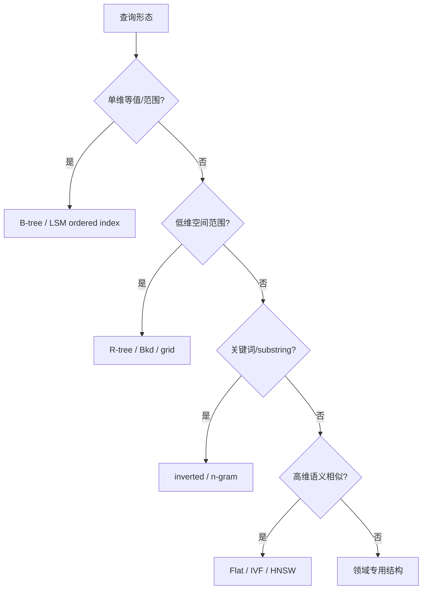

索引输出是否 exact、需何种后验证必须写清。

### 10.15 第十五步：设计删除与保留

追踪：

- 主表 logical delete；
- B-tree free page/vacuum；
- LSM tombstone propagation；
- search segment merge；
- vector index delete；
- column table delete files；
- snapshot/backup expiry；
- object version；
- replica/cache。

定义用户不可见时限与物理清除时限，两者不同。

### 10.16 第十六步：设计崩溃恢复

验证：

- WAL 截断/partial record；
- torn page；
- unfinished SSTable；
- catalog/manifest 原子切换；
- snapshot consistency；
- replay order；
- index rebuild；
- object metadata loss。

恢复测试必须真正启动并校验数据，而不是只检查备份文件存在。

### 10.17 第十七步：建立稳态 benchmark

阶段：

1. 生成与生产相似数据量和倾斜；
2. 预热或明确冷 cache；
3. 运行到 compaction/checkpoint 开始；
4. 维持足够长时间；
5. 注入 burst；
6. 测故障/恢复；
7. 改变一项参数；
8. 比较 p50/p99、throughput、WA、space、debt、cost。

只报告最好一秒的吞吐没有意义。

### 10.18 第十八步：为 ANN 建立 ground truth

抽样 query 用 Flat exact 求 top-k，然后比较 IVF/HNSW：

$$
Recall@k=\frac{|ANN_k\cap Exact_k|}{k}
$$

扫描参数画 Pareto curve：latency vs recall vs memory。还要测 metadata filter 和更新后的 recall。

### 10.19 第十九步：观察并迭代

参数调整应形成假设：

```text
观察：L0 files 持续增长，p99 每 20 分钟尖峰。
假设：compaction bandwidth 不足。
变更：提高 compaction threads/rate 或减写入。
预期：pending bytes 下降，前台 p99 不恶化。
验证：24 小时稳态与成本。
回滚：恢复原参数。
```

避免同时改变 page、cache、compression 和 compaction 后无法归因。

### 10.20 第二十步：记录复查触发器

触发重评：

- workload 读写比改变；
- 数据超 RAM；
- range/全文/vector 成为核心；
- SSD/云硬件变化；
- WA 或磨损超预算；
- 删除法规收紧；
- p99 被后台任务主导；
- index build/recovery 超 RTO；
- object/storage cost 超预算。

### 10.21 一页式选型模板

```text
# 存储与检索决策

## Workload
- 当前/峰值/增长：
- point/range/scan/search/vector 比例：
- key/value/result 分布：
- insert/overwrite/delete：
- 数据量、working set、热点：

## Requirements
- p50/p99/throughput：
- durability/RPO/RTO：
- freshness/recall：
- physical deletion deadline：
- 成本和 SSD endurance：

## Candidate
- B-tree / LSM / in-memory / columnar：
- primary/secondary/covering indexes：
- advanced indexes：
- object/table/catalog/query layers：

## Amplification and Background Work
- read/write/space amplification：
- compaction/checkpoint/vacuum/merge：
- temporary space and debt limits：

## Validation
- steady-state benchmark：
- cold/warm cache：
- crash and restore：
- delete propagation：
- ANN recall ground truth：

## Decision
- 选择与理由：
- 接受的代价：
- 迁移/回退：
- 复查触发器：
```

### 10.22 最终检查表

#### 索引

- 每个索引对应哪个高频查询？
- 列顺序是否符合 equality/range/order？
- 是否需要 include，还是会膨胀 cache？
- 非唯一热点 postings 多大？
- 索引是否实际被使用？

#### LSM

- memtable/WAL 持久边界？
- Bloom bits/key 与 false positive？
- compaction strategy 与 steady WA？
- L0/pending bytes/stall 是否有告警？
- tombstone 多久到底层？
- snapshot 是否固定旧文件？

#### B-tree

- page size、fill factor 和 split？
- buffer hit 与 dirty page？
- WAL/fsync/torn-page 保护？
- clustered/heap/secondary 回表路径？
- bloat/vacuum/repack 机制？

#### 分析

- 实际读取列比例？
- partition/sort/row group 是否匹配查询？
- bytes pruned/scanned/returned？
- compression 与直接执行？
- JIT/vectorization/spill？
- raw facts 是否保留？

#### 搜索与向量

- analyzer 和 query 是否一致？
- postings/segment merge 是否稳态？
- ANN recall@k ground truth？
- filter 后是否仍有足够候选？
- model/version/index 如何迁移？
- delete 和权限多久生效？

#### 运行

- benchmark 是否长到后台工作出现？
- cache 冷热是否说明？
- WA 指标属于哪层？
- crash/restore 是否演练？
- 后台 debt 是否有上限？
- 容量是否为故障留余量？

### 10.23 最终方法论

本章的思维路线可以压缩为：

$$
{}\text{逻辑操作与 SLO}
\rightarrow\text{workload 分布}
\rightarrow\text{候选访问结构}
\rightarrow\text{读/写/空间放大}
\rightarrow\text{硬件与后台工作}
\rightarrow\text{稳态压测与恢复}
\rightarrow\text{持续观察和复查}
$$

每种结构都应回答四个问题：它如何缩小查询候选？写入为此额外维护什么？旧数据何时回收？崩溃后怎样恢复？能够把这四问讲清，才真正理解了存储引擎，而不只是记住 B-tree、LSM、columnar 或 HNSW 的名称。
