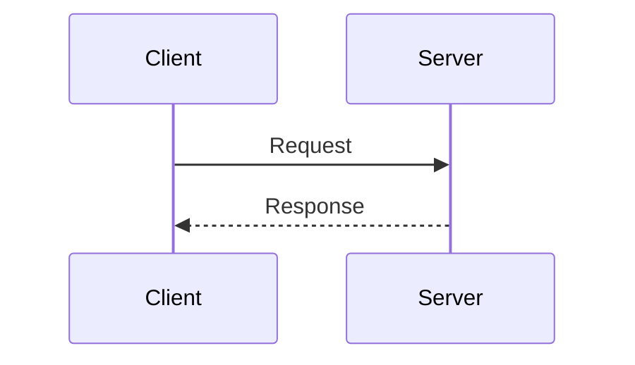
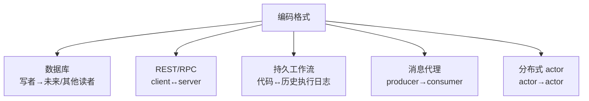
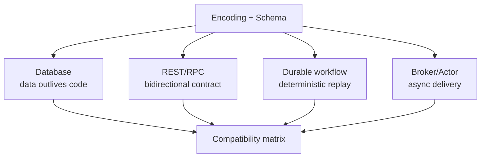
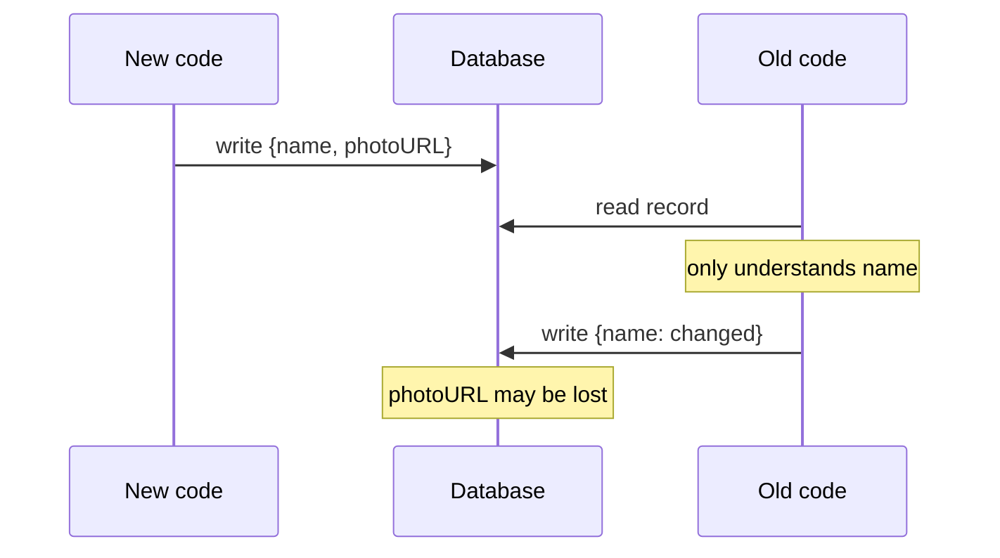
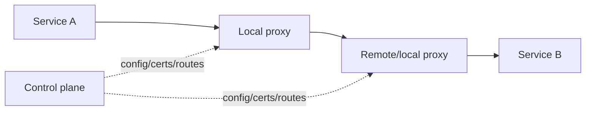
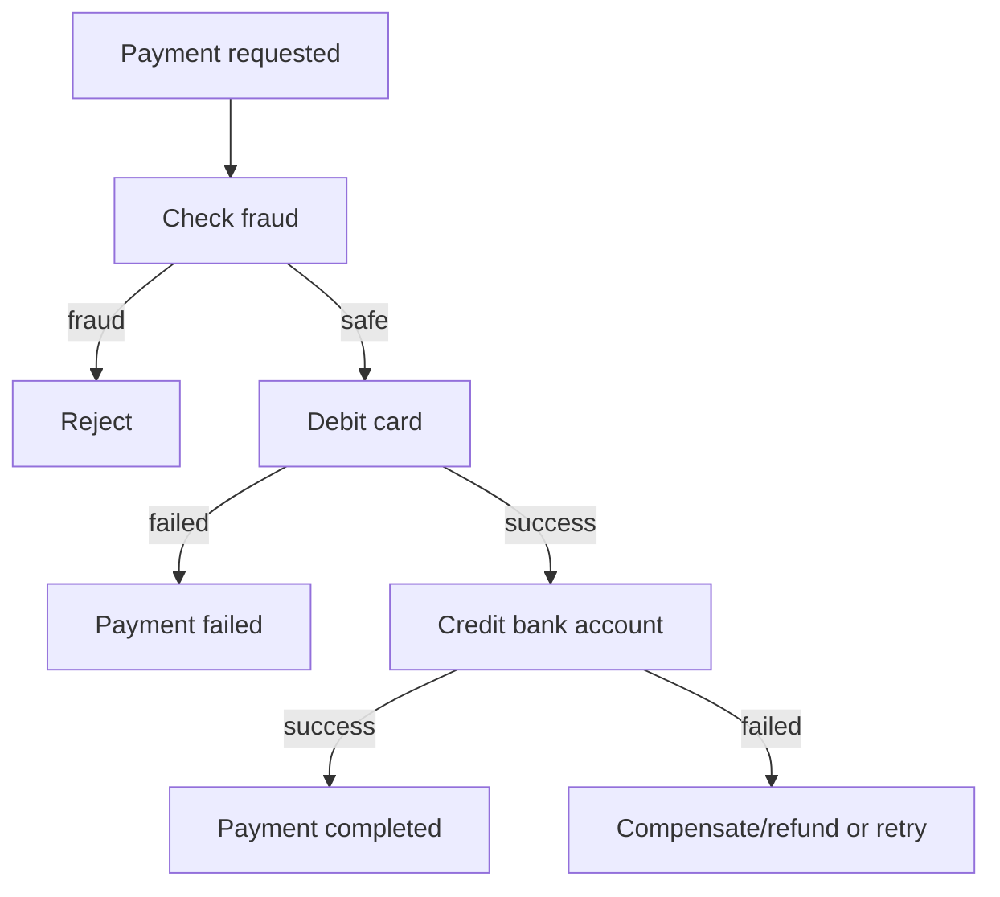
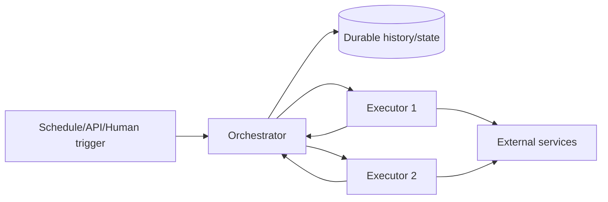
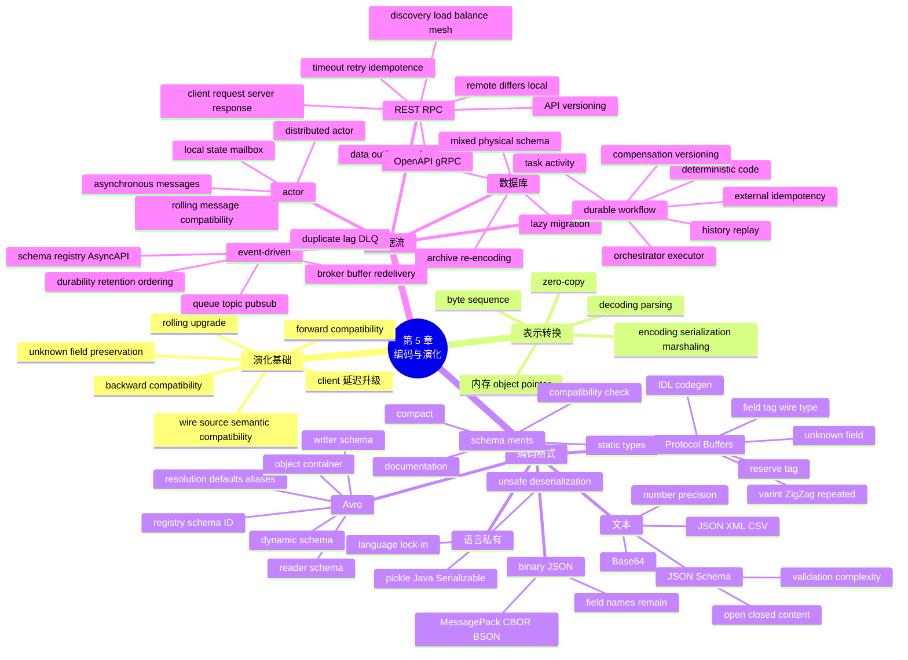
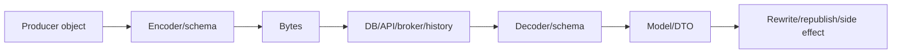
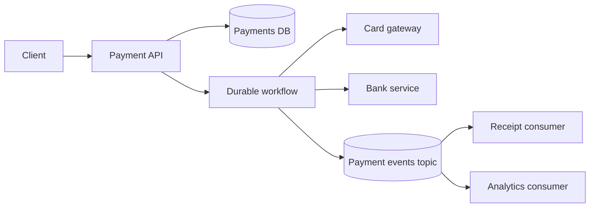

> 对应原文：5. Encoding and Evolution.md
>
> 本文严格按照原章顺序讲解，并在章后统一补充易混概念、综合案例和可复用的兼容性设计方法。原章重点是格式与数据流的演化语义。文中标为“背景补充”“量化推导”或“可运行示例”的公式和代码用于解释与验证，不应误认为原书原文中的实现。

## 0. 本章定位：变化不可避免，兼容性让变化可分阶段发生

### 0.1 应用为什么必然变化

应用会因以下原因持续演化：

- 新产品和功能上线；
- 更理解用户需求；
- 商业环境改变；
- 法律和安全要求变化；
- 性能与规模迫使架构调整；
- 缺陷修复和技术迁移。

第 2 章把**可演化性（evolvability）**定义为系统适应变化的容易程度。本章追问：当代码、数据和服务不能在同一时刻全部切换时，怎样仍保持系统正确运行？

### 0.2 功能变化通常伴随数据变化

新增头像功能可能需要：

- 记录增加 `photo_url`；
- 数据库存储新字段；
- API 返回新字段；
- 消息事件携带新字段；
- 旧客户端忽略新字段；
- 新客户端处理旧记录缺少字段。

代码演化与数据格式演化是同一变更的两面。

### 0.3 schema-on-write 的变化方式

关系数据库通常在某时刻只有一个生效 schema：

- 使用 `ALTER TABLE` 改 schema；
- 新写入必须符合当前 schema；
- 旧物理行可由数据库在读取时补默认值；
- 复杂变化可能需要数据 migration。

“一个逻辑 schema”不一定表示磁盘上所有行已立刻重写为同一物理格式。

### 0.4 schema-on-read 的变化方式

文档/“schemaless”存储可同时包含：

- 旧文档；
- 新文档；
- 不同来源的变体。

读取代码根据字段、版本或类型解释。变化灵活，但兼容逻辑分散到读取者，不能理解为没有 schema。

### 0.5 为什么代码不能瞬时升级

服务端常使用 **滚动升级（rolling upgrade）**，也叫 **分阶段发布（staged rollout）**：

1. 先部署少数节点；
2. 观察错误、延迟和业务指标；
3. 逐批扩大；
4. 若异常则回滚；
5. 最终替换全部旧节点。

优点是无整体停机、影响范围小、可频繁发布。代价是发布期间新旧代码并存。

### 0.6 客户端升级更加不可控

移动端、桌面端、浏览器扩展可能长期不升级：

- 用户关闭自动更新；
- 应用商店审核延迟；
- 旧设备不支持新版本；
- 企业客户固定版本；
- 离线设备数月后重新连接。

公共 API 的兼容窗口通常远长于内部服务。

### 0.7 代码版本与数据版本形成笛卡尔组合

系统中可能同时存在：

```text
old code reads old data
new code reads old data
old code reads new data
new code reads new data
```

只测试“最新版代码 + 最新格式”覆盖不了真实滚动升级。

### 0.8 向后兼容

**向后兼容（backward compatibility）**：

> 新代码能够读取旧代码写出的数据。

新代码作者知道旧格式，可以保留旧解析逻辑或迁移规则，因此通常较容易。

### 0.9 向前兼容

**向前兼容（forward compatibility）**：

> 旧代码能够读取新代码写出的数据。

旧代码不可能预知未来字段，只能依赖格式设计：

- 能跳过未知字段；
- 未知字段有长度/类型边界；
- 不把新增字段误当旧字段；
- 读改写时尽量原样保留未知字段。

### 0.10 请求与响应的兼容矩阵

客户端调用服务有两个数据方向：



| 调用组合 | Request 需要 | Response 需要 |
| --- | --- | --- |
| 旧 client → 新 server | server 向后兼容旧请求 | 旧 client 能前向兼容新响应 |
| 新 client → 旧 server | 旧 server 能前向兼容新请求 | 新 client 向后兼容旧响应 |

“API 向后兼容”若不说明请求还是响应，容易产生误解。

### 0.11 为什么向前兼容更难

新代码可以有意识地写兼容旧数据的代码；旧代码无法新增逻辑，只能依赖既有通用规则。

例如新增 field tag 99：旧解析器若能根据 wire type 跳过长度，就可继续；若编码只有裸值、无边界，旧解析器会错位。

### 0.12 未知字段丢失问题

新代码写：

```json
{"name":"Ada","photoURL":"https://example/avatar.png"}
```

旧代码只认识 `name`，读取、修改姓名并重新编码。如果它从模型对象只输出已知字段，`photoURL` 会永久丢失。

理想行为是未知字段即使无法解释，也在 read-modify-write 中保留。

### 0.13 可运行示例：未知字段保留

```python
import json
from typing import Any


KNOWN_FIELDS = {"name"}


def old_code_lossy_update(encoded: str, new_name: str) -> str:
    decoded = json.loads(encoded)
    old_model = {key: decoded[key] for key in KNOWN_FIELDS if key in decoded}
    old_model["name"] = new_name
    return json.dumps(old_model, separators=(",", ":"), sort_keys=True)


def old_code_preserving_update(encoded: str, new_name: str) -> str:
    decoded: dict[str, Any] = json.loads(encoded)
    decoded["name"] = new_name
    return json.dumps(decoded, separators=(",", ":"), sort_keys=True)


new_record = '{"name":"Ada","photoURL":"https://example/avatar.png"}'
print("lossy:", old_code_lossy_update(new_record, "Ada Lovelace"))
print("preserved:", old_code_preserving_update(new_record, "Ada Lovelace"))
```

实际运行输出：

```text
lossy: {"name":"Ada Lovelace"}
preserved: {"name":"Ada Lovelace","photoURL":"https://example/avatar.png"}
```

保留未知字段并不表示旧代码理解其语义，只是避免破坏未来数据。

### 0.14 未知字段保留的边界

即使格式支持 unknown fields，仍可能丢失：

- decode 到只含已知字段的 DTO；
- JSON→protobuf→JSON 转换；
- 数据库 update 替换整文档；
- 中间代理重建响应；
- schema validator 使用 closed model；
- 字段名冲突或 tag 被复用。

兼容性是端到端属性，不是单个编码库的宣传特性。

### 0.15 本章覆盖的数据流



同一种 protobuf/Avro/JSON，在不同数据流中的 writer/reader 生命周期和兼容方向不同。

## 1. 数据编码格式

### 1.1 程序至少有两种数据表示

**内存表示**为 CPU 操作优化：

- object/struct；
- list/array；
- hash table/tree；
- pointer/reference；
- runtime-specific metadata。

**字节表示**为文件/网络优化：

- 自包含；
- 无进程指针；
- 可确定边界；
- 跨时间/机器传输；
- 可验证和版本化。

### 1.2 pointer 为什么不能直接持久化

pointer 是某进程虚拟地址：

- 重启后地址变化；
- 另一进程地址空间不同；
- 对象布局依语言/runtime；
- GC 可移动对象；
- 安全上不能信任任意地址。

因此对象图必须转为值、ID、offset 或有结构的 byte sequence。

### 1.3 encoding 与 decoding

**编码（encoding）**：

$$
encode: InMemoryValue\rightarrow Bytes
$$

也称 serialization、marshaling。

**解码（decoding）**：

$$
decode: Bytes\rightarrow InMemoryValue
$$

也称 parsing、deserialization、unmarshaling。

### 1.4 serialization 术语冲突

“serialization”在第 8 章事务中还表示“可串行化执行”，与 byte encoding 完全不同。本书偏好使用 encoding，避免同词异义。

### 1.5 编解码不是永远需要

第 4 章提到查询引擎可直接在 compressed column data 上执行，省去完整对象化。

另有 zero-copy format，让 runtime 直接访问磁盘/网络布局，例如：

- Cap’n Proto；
- FlatBuffers。

它们通过固定 offset/table 等设计减少转换，但仍有对齐、随机访问、安全验证和演化权衡。

### 1.6 zero-copy 不等于零 CPU/零复制

实际可能仍发生：

- kernel/network buffer copy；
- bounds checking；
- endian/validation；
- cache miss；
- 字符串解码；
- 生命周期管理。

zero-copy 通常表示避免构造完整中间对象图，不是所有数据移动消失。

### 1.7 选择编码格式的维度

| 维度 | 问题 |
| --- | --- |
| 兼容 | 新旧 reader/writer 能否共存 |
| 跨语言 | 不同语言是否一致解释 |
| 安全 | 不可信 bytes 能否触发代码执行/资源耗尽 |
| 大小 | wire/storage bytes |
| CPU | encode/decode 与分配成本 |
| 可读 | 人能否检查和调试 |
| schema | 是否显式、验证和 registry |
| tooling | codegen、IDL、diff、compat check |
| 随机访问 | 是否必须全量 decode |

“binary 一定更好”或“JSON 一定更简单”都忽略多维权衡。

### 1.8 语言内置序列化

典型：

- Java `java.io.Serializable`；
- Python `pickle`；
- Ruby `Marshal`；
- Java Kryo 等第三方库。

优势是少量代码即可保存/恢复对象，包括具体类信息。

### 1.9 语言绑定问题

编码常包含：

- class/module 名；
- runtime type；
- 私有字段布局；
- object identity；
- 语言特有集合。

另一语言难以正确读取。把它作为长期数据库格式会锁定语言和 runtime 版本。

### 1.10 不可信反序列化安全问题

为了恢复任意对象，decoder 可能：

- 加载 class；
- 调用 constructor/hook；
- 执行 gadget chain；
- 访问文件/网络；
- 最终远程代码执行。

原则：不要用支持任意对象实例化的语言原生 decoder 处理攻击者可控 bytes。

### 1.11 数据与代码边界

安全格式应把输入视为数据：

- 允许有限 primitive/container；
- 长度和深度受限；
- schema/type 可验证；
- 不因 type name 自动执行 class logic。

即使 JSON 安全于对象反序列化，也要防超深嵌套、巨大长度和压缩炸弹。

### 1.12 版本演化常是语言格式的事后考虑

自动序列化当前 object layout 很方便，却难回答：

- class 改名；
- field 删除；
- 类型变化；
- package 移动；
- 不同版本同时运行；
- unknown field 保留。

短期缓存/同版本进程间临时数据可接受，长期持久数据风险大。

### 1.13 效率问题

语言格式可能编码大量 class metadata、object graph reference 和冗余信息，CPU/size 也未针对网络协议优化。Java 原生序列化是典型负面例子。

### 1.14 使用语言格式的合理边界

可考虑：

- 单进程短生命周期；
- 测试 fixture；
- 同版本可信进程的临时 cache；
- 可随时丢弃/重建的数据。

不适合：公共 API、消息总线、长期数据库、跨语言和不可信输入。

### 1.15 JSON、XML、CSV 的共同价值

它们是语言无关文本格式：

- 广泛支持；
- 人可大致阅读；
- 跨组织交换容易；
- 工具成熟；
- 无需 code generation 即可起步。

CSV 只支持二维 tabular data，无原生嵌套。

### 1.16 人类可读是相对的

无格式化的大型 JSON、带 namespace 的 XML、复杂 escaping CSV 并不轻松。可读性仍受：

- 命名；
- pretty printing；
- schema；
- 数据大小；
- 编码/转义；
- 敏感信息脱敏。

### 1.17 XML 的复杂与冗长

XML 有 element、attribute、namespace、DTD、entity、schema、mixed content 等丰富机制。它适合文档和标准生态，却带来解析、安全和学习复杂度。

“冗长”可通过压缩缓解 wire size，但不会消除语义复杂度。

### 1.18 CSV 的结构局限

CSV 没有统一 schema，应用约定：

- 列顺序；
- header；
- 类型；
- null；
- 日期/时区；
- delimiter/quote；
- newline。

RFC 4180 定义了一些 escaping，但现实 parser 行为仍不完全一致。

### 1.19 数字与字符串歧义

XML/CSV 中：

```text
00123
```

可能是整数 123，也可能是必须保留前导零的 ID。没有 schema 无法判断。

JSON 区分 string 和 number，却不区分 integer/float，也未规定精度。

### 1.20 IEEE 754 与 $2^{53}$ 边界

JavaScript `Number` 通常是 IEEE 754 double，整数精确表示范围约：

$$
-(2^{53}-1)\le n\le2^{53}-1
$$

超过后相邻整数可能映射到同一浮点值。

### 1.21 64-bit ID 的 JSON 风险

数据库 64-bit integer 最大约：

$$
2^{63}-1\approx9.22\times10^{18}
$$

远大于：

$$
2^{53}-1\approx9.01\times10^{15}
$$

若 JSON number 被 JavaScript 解析，ID 可能改变。X/Twitter 曾同时返回 numeric ID 和 decimal string 版本。

### 1.22 ID 为什么常编码为字符串

ID 的主要操作是相等比较和传递，不需要算术。字符串：

- 保留全部位；
- 跨语言一致；
- 可支持 UUID/复合 ID；
- 避免前导零丢失。

代价是更多字节和显式转换。API schema 应声明，而非让客户端猜。

### 1.23 JSON 对 binary string 的缺口

JSON/XML 原生面向 Unicode text，不直接表示任意 byte sequence。常用 Base64：

```json
{"payloadBase64":"AAECA/8="}
```

schema/字段名需说明它不是普通文本。

### 1.24 Base64 大小膨胀

每 3 byte 映射 4 ASCII character：

$$
EncodedLength=4\left\lceil\frac{n}{3}\right\rceil
$$

大数据下膨胀约：

$$
\frac{4}{3}-1\approx33.3\%
$$

还增加 encode/decode CPU。大型二进制通常放 object storage，JSON 只传 URL/metadata。

### 1.25 schema 的解释作用

schema 可说明：

- `id` 是 int64 还是 string；
- string 是否 Base64；
- 必填/可选；
- null；
- enum；
- 数值范围；
- object shape。

不用 schema 时，这些规则会硬编码进每个应用，容易漂移。

### 1.26 JSON Schema 的使用位置

常见于：

- OpenAPI；
- Confluent/Apicurio schema registry；
- PostgreSQL `pg_jsonschema`；
- MongoDB `$jsonSchema` validator；
- 配置和消息校验。

它既可作为文档，也可作为运行时 validation。

### 1.27 JSON Schema primitive 与 constraint

primitive：

```text
string, number, integer, object, array, boolean, null
```

validation 可叠加：

- minimum/maximum；
- pattern；
- minLength；
- required；
- enum；
- array item schema。

例如 port：1–65535。

### 1.28 open content model

`additionalProperties: true`（默认）允许 schema 未声明的字段。

优势：

- 新 writer 添加字段，旧 validator 不拒绝；
- forward compatibility 较容易；
- 扩展 metadata 灵活。

代价：拼写错误字段可能悄悄进入，严格数据质量较弱。

### 1.29 closed content model

`additionalProperties: false` 只允许显式字段。

优势：

- 及早发现 typo；
- 安全边界清晰；
- 数据更同构。

代价：新增字段会让旧 validator 拒绝，forward compatibility 更难，需要版本协调。

### 1.30 integer-key map 的 JSON Schema

JSON object key 总是 string。要表达“只允许十进制数字样式的 key，value 必须 string”：

```json
{
  "$schema": "http://json-schema.org/draft-07/schema#",
  "type": "object",
  "patternProperties": {
    "^[0-9]+$": {"type": "string"}
  },
  "additionalProperties": false
}
```

逻辑上 key 表示 integer，wire 上仍是 digit string。

### 1.31 JSON Schema 的强大与复杂

还支持：

- `if/then/else`；
- `$ref`；
- remote schema；
- composition；
- named definitions；
- dependent constraints。

能力越强，兼容性推理越难：条件分支和 remote reference 可能使“新增字段是否安全”不直观。

### 1.32 schema validator 版本问题

不同 JSON Schema draft 和 validator 支持程度不同。必须固定：

- draft；
- resolver；
- format 是否仅 annotation 或强校验；
- remote ref policy；
- unknown keyword 行为。

“通过 JSON Schema”若没有版本，不能保证跨实现一致。

### 1.33 文本格式为什么仍广泛成功

跨组织交换的主要难题常是达成约定，不是省 20 byte。JSON/XML/CSV：

- 人和工具都熟悉；
- 网络压缩可减少冗余；
- 调试简单；
- 长期生态强。

当兼容、治理和互操作价值高时，极致紧凑不是首要目标。

### 1.34 binary JSON/XML variants

例子：

- MessagePack；
- CBOR；
- BSON；
- UBJSON/BJSON/BISON；
- Hessian/Smile；
- WBXML/Fast Infoset。

它们通常保留 JSON/XML 数据模型，改变 wire encoding，并可能增加 integer、binary 等类型。

### 1.35 无 schema 的 binary 仍需 field name

若 decoder 没有外部 schema，bytes 自身必须携带：

- object field name；
- type marker；
- length；
- container boundary。

因此 binary JSON 不能像 protobuf/Avro 一样完全省略字段名。

### 1.36 MessagePack 示例大小

原文记录：

```json
{"userName":"Martin","favoriteNumber":1337,"interests":["daydreaming","hacking"]}
```

- compact JSON：81 bytes；
- MessagePack：66 bytes。

减少约：

$$
1-\frac{66}{81}\approx18.5\%
$$

节省不一定足以抵消失去直接可读性和新工具依赖。

### 1.37 MessagePack 前缀解释

原文示例：

- `0x83`：object/map，3 fields；
- `0xa8`：8-byte string；
- 后续 8 bytes 是 `userName`；
- `0xa6`：6-byte `Martin`。

长度前缀让字符串无需终止符/escaping，但 field name 仍重复出现。

### 1.38 可运行示例：数值边界与 Base64

```python
import base64


safe_integer = 2**53 - 1
unsafe_neighbor = 2**53 + 1
rounded = int(float(unsafe_neighbor))

payload = bytes(range(10))
encoded = base64.b64encode(payload)

print("max safe integer:", safe_integer)
print("unsafe integer:", unsafe_neighbor)
print("after float round-trip:", rounded)
print("integer preserved:", unsafe_neighbor == rounded)
print("raw bytes:", len(payload))
print("base64 bytes:", len(encoded))
```

实际运行输出：

```text
max safe integer: 9007199254740991
unsafe integer: 9007199254740993
after float round-trip: 9007199254740992
integer preserved: False
raw bytes: 10
base64 bytes: 16
```

10 bytes 因 padding 编成 16 bytes；大数据才逐渐接近 4/3 比例。

### 1.39 binary variant 的合理场景

适合：

- 已使用 JSON data model；
- 需要 binary byte type；
- 内部可信链路；
- 库支持成熟；
- 实测 CPU/size 有收益。

若更重视 schema evolution、codegen 和字段名省略，应评估 protobuf/Avro，而不是只替换成 binary JSON。

### 1.40 本批结论

编码是 CPU-friendly object 与 self-contained bytes 之间的翻译。语言私有格式最方便，却带来语言锁定、反序列化安全和版本风险；JSON/XML/CSV 的优势是普及和互操作，代价是类型歧义、binary 支持与 schema 复杂性；binary JSON 只改变编码，不改变无 schema 必须携带字段名的事实。

最重要的评价维度不是“文本还是二进制”，而是 writer/reader 在时间和组织上如何演化，以及格式是否提供可验证的未知字段、类型和兼容规则。

### 1.41 Protocol Buffers 的定位

**Protocol Buffers（protobuf）**是 Google 开发的 schema-driven binary encoding。Apache Thrift 与其思想相近。

protobuf 的核心组合：

- 简单 IDL；
- field number/tag；
- wire type；
- code generation；
- compact bytes；
- 明确 schema evolution 规则。

### 1.42 protobuf 接口定义语言（interface definition language，IDL）

原文记录可定义为：

```protobuf
syntax = "proto3";

message Person {
  string user_name = 1;
  int64 favorite_number = 2;
  repeated string interests = 3;
}
```

数字 1、2、3 是 field tag，不是显示顺序注释，而是持久 wire identity。

### 1.43 code generation

`protoc` 等工具从 schema 生成多语言类型：

- builder/getter/setter；
- encode/decode；
- type checking；
- unknown field handling；
- service stub（gRPC）。

应用避免手写 byte parser，但 schema 与 generated code 版本必须纳入构建。

### 1.44 protobuf schema 为什么比 JSON Schema 简单

protobuf 主要定义：

- record/message；
- field name/number；
- primitive/nested type；
- repeated/map/oneof；
- service。

它不以复杂 pattern/min/max/conditional validation 为主要目标。业务约束仍由应用或额外 validator 实现。

### 1.45 encoded field 的组成

每个 field 大致编码为：

```text
field key (tag + wire type) | optional length | value bytes
```

record 是已设置 fields 的串联。未设置 field 通常不出现。

### 1.46 field key 公式

protobuf wire key：

$$
key=(field\_number\ll3)\;|\;wire\_type
$$

低 3 bits 表示 wire type，高 bits 表示 field number。

例如 field 2、varint wire type 0：

$$
(2\ll3)|0=16=0x10
$$

### 1.47 wire type 的作用

wire type 不完整表达业务类型，只告诉 parser 怎样跳过/读取：

- varint；
- fixed 32/64 bit；
- length-delimited；
- group（历史类型）。

string、bytes、nested message 都可能是 length-delimited，具体语义来自 schema。

### 1.48 field name 为什么能省略

wire 中只写数字 tag：

```text
user_name -> 1
favorite_number -> 2
interests -> 3
```

字段名只在 schema/code 中存在，故数据比 MessagePack 更紧凑。代价是没有 schema 时 bytes 难以理解。

### 1.49 33 bytes 与 66/81 bytes

原文同一记录：

| Encoding | Bytes |
| --- | ---: |
| compact JSON | 81 |
| MessagePack | 66 |
| Protocol Buffers | 33 |
| Avro | 32 |

protobuf 相对 compact JSON 减少：

$$
1-\frac{33}{81}\approx59.3\%
$$

这个小样本不能直接预测真实压缩率；长 field name、重复结构越多，schema-driven 优势通常越明显。

### 1.50 varint

**variable-length integer（varint）**每 byte 使用 7 payload bits，最高 bit 表示后续还有 byte。

对非负整数 $x$，byte 数：

$$
bytes(x)=\max\left(1,\left\lceil\frac{bit\_length(x)}{7}\right\rceil\right)
$$

小整数省空间，大整数使用更多 byte。

### 1.51 1337 的 varint

$$
1337=10\times128+57
$$

低 7 bits 是 57（`0x39`），还有后续所以置 continuation bit：`0xB9`；下一组 10：`0x0A`。

结果：

```text
1337 -> B9 0A
```

### 1.52 signed integer 与 ZigZag 辨析

普通 protobuf `int32/int64` 对负数按 two’s complement varint，负数可能占很多 byte；`sint32/sint64` 使用 **ZigZag encoding**：

$$
zigzag(n)=
\begin{cases}
2n,&n\ge0\\
-2n-1,&n<0
\end{cases}
$$

映射：

```text
0 -> 0, -1 -> 1, 1 -> 2, -2 -> 3
```

使绝对值小的有符号数也紧凑。选择 `int64` 还是 `sint64` 是 wire compatibility 与数据分布决定的 schema 决策。

### 1.53 可运行示例：protobuf varint 与 field key

```python
def encode_varint(value: int) -> bytes:
  if value < 0:
    raise ValueError("example supports non-negative integers")
  encoded = bytearray()
  while value >= 0x80:
    encoded.append((value & 0x7F) | 0x80)
    value >>= 7
  encoded.append(value)
  return bytes(encoded)


def decode_varint(encoded: bytes) -> int:
  value = 0
  shift = 0
  for byte in encoded:
    value |= (byte & 0x7F) << shift
    if byte < 0x80:
      return value
    shift += 7
  raise ValueError("unterminated varint")


favorite_number = encode_varint(1337)
field_1_string_key = (1 << 3) | 2
field_2_varint_key = (2 << 3) | 0

print("1337 bytes:", list(favorite_number))
print("1337 hex:", favorite_number.hex(" ").upper())
print("decoded:", decode_varint(favorite_number))
print("field 1/string key:", field_1_string_key)
print("field 2/varint key:", field_2_varint_key)
```

实际运行输出：

```text
1337 bytes: [185, 10]
1337 hex: B9 0A
decoded: 1337
field 1/string key: 10
field 2/varint key: 16
```

### 1.54 length-delimited field

string/bytes/nested message 通常编码：

```text
field key | byte length varint | payload
```

长度使旧 parser 即使不认识 field tag，也能跳过整个 payload，这是 forward compatibility 的基础之一。

### 1.55 repeated field

`repeated string interests = 3` 在 wire 上可表现为 tag 3 多次出现：

```text
tag 3 + "daydreaming"
tag 3 + "hacking"
```

parser 汇总为 list。数值 repeated 还可使用 packed length-delimited encoding 减少重复 tag。

### 1.56 schema evolution 的核心是不变 tag 语义

encoded record 依靠 tag 解释 field。规则：

- field name 可重命名；
- tag number 不可改变；
- 同一个 tag 不可赋予不兼容新语义；
- 已删除 tag 不可复用。

tag 是跨时间的协议地址。

### 1.57 添加 field 的 forward compatibility

新 schema 添加：

```protobuf
string photo_url = 4;
```

旧 reader 不认识 tag 4，根据 wire type/length 跳过，因此仍可读其余字段。

前提是旧 parser 接受 unknown field，而不是 closed validation 拒绝。

### 1.58 添加 field 的 backward compatibility

新 reader 读取旧 bytes 时，field 4 缺失，使用默认语义：

- string：empty string；
- number：0；
- bool：false；
- message presence 根据语言/API。

业务上必须区分“未提供”与“确实为默认值”时，需要 explicit presence/optional/wrapper/oneof 设计。

### 1.59 删除 field

删除 field 对兼容方向与添加相反：

- 新 reader 读旧 writer：忽略旧 field；
- 旧 reader 读新 writer：field 缺失，使用默认。

但 tag 永远不能复用，否则历史 bytes 会被新代码误解释。

### 1.60 reserve tag 与 name

protobuf schema 可：

```protobuf
reserved 4, 7 to 9;
reserved "photo_url";
```

防止未来开发者忘记历史并复用。schema repository 应保留演化记录。

### 1.61 改 field name

wire 中没有 name，所以：

```text
user_name -> display_name, tag remains 1
```

binary compatible。生成代码/API 的 source compatibility 仍可能破坏，因为调用方使用旧 method name。

wire compatibility 与 source compatibility 是不同层。

### 1.62 改 field type

只对某些 wire-compatible 类型安全，仍可能语义/范围损失。

例如 int32→int64：

- 新 reader 读旧值容易扩展；
- 旧 reader 读新大值可能截断/溢出；
- 两边 wire type 都 varint 不表示业务值一定安全。

改类型前检查官方 compatibility table 和真实值范围。

### 1.63 unknown field preservation

现代 protobuf runtime 常保留 unknown fields，旧代码 decode/re-encode 时可原样带回。但风险仍在：

- 转成 JSON 时 unknown fields 无 schema name；
- 映射到自定义 DTO；
- 手动复制已知 fields；
- 某些 runtime/version 行为差异。

要用 read-modify-write integration test 验证。

### 1.64 tag number 的大小也影响 bytes

field key 本身是 varint。小 tag 更可能用 1 byte，高 tag 用更多 byte。高频 field 通常分配小编号，但绝不能为了省 byte 重编号已发布 field。

### 1.65 protobuf 的适用场景

- 内部 RPC/gRPC；
- 多语言服务；
- 移动端与带宽敏感；
- schema/codegen 强契约；
- 高频消息；
- 可维护 tag discipline。

不适合需要人直接编辑、复杂 JSON Schema validation 或完全动态未知结构的场景。

### 1.66 Avro 的定位

**Apache Avro** 是 Hadoop 生态产生的 schema-driven binary encoding，设计目标包括：

- compact record；
- writer/reader schema resolution；
- 数据文件；
- 动态生成 schema；
- 批处理和消息生态。

### 1.67 Avro 的两种 schema 语言

Avro IDL（人编辑）：

```avro
record Person {
  string userName;
  union { null, long } favoriteNumber = null;
  array<string> interests;
}
```

JSON schema representation（机器处理）：

```json
{
  "type": "record",
  "name": "Person",
  "fields": [
  {"name": "userName", "type": "string"},
  {"name": "favoriteNumber", "type": ["null", "long"], "default": null},
  {"name": "interests", "type": {"type": "array", "items": "string"}}
  ]
}
```

### 1.68 Avro 无 field tag

Avro bytes 不携带 field name、tag 或完整 type marker。值按 writer schema 中 field 顺序紧密拼接。

优点：非常 compact；缺点：没有准确 writer schema 无法可靠 decode。

### 1.69 Avro 的 32 bytes

原文样例 Avro 为 32 bytes，比 protobuf 33 bytes 少 1。这个结果来自具体 schema/data，不能推导 Avro 对所有记录都更小。

Avro 省掉 tag，但需要在文件/record 外提供 writer schema 标识。

### 1.70 裸 bytes 为何无法自描述

序列：

```text
length | Martin | varint | array count | ...
```

某段是 string、long 还是 array 由 schema 决定。用错误 field 顺序或类型解析会从错误 offset 继续，整条记录损坏。

### 1.71 writer’s schema

写应用编码时使用的准确 schema 称 **writer’s schema**。它定义 bytes 的 field 顺序和 type。

reader 必须获得同一 writer schema 才能正确解释原 bytes。

### 1.72 reader’s schema

读应用希望得到的当前结构称 **reader’s schema**。它可以比 writer schema 新或旧。

Avro decode 使用：

$$
decode(bytes,writerSchema,readerSchema)
$$

并执行 schema resolution。

### 1.73 schema resolution

Avro 比较 writer/reader：

- record field 按 name/alias 匹配，而非物理顺序；
- writer 有、reader 无：跳过；
- reader 有、writer 无：使用 reader default；
- compatible type：转换/promote；
- 不兼容：失败。

### 1.74 field reorder

writer schema：

```text
userName, favoriteNumber, interests
```

reader schema 可写不同顺序。reader 先按 writer schema 解析 bytes，再按 field name 映射成 reader 结构，所以顺序变化本身兼容。

### 1.75 添加 field 的 Avro backward compatibility

新 reader 读旧 writer，writer 没有新增 field。新增 field 必须在 reader schema 有 default，才能填充。

若无 default：新 reader 不知道旧数据该取什么，backward incompatible。

### 1.76 删除 field 的 Avro forward compatibility

旧 reader 读新 writer：旧 reader 期望已删除 field。writer schema 没有它，因此旧 reader schema 中该 field 必须有 default。

所以 Avro 允许添加/删除有 default 的 field，兼容方向要分别检查。

### 1.77 Avro null 必须显式 union

Avro 不让所有 field 自动 nullable。要允许 null：

```avro
union { null, long } favoriteNumber = null;
```

JSON schema representation：`["null","long"]`。若 default 为 null，按原文规则 union 第一 branch 应为 null。

显式 nullability 减少“billion-dollar mistake”一类隐式假设。

### 1.78 union type 的兼容方向

给 reader union 新增 branch：新 reader 通常能读旧 writer，是 backward compatible；旧 reader 不认识新 writer 可能选择的新 branch，forward compatibility 可能破坏。

不能只说“union 扩大是兼容”，必须指出 writer/reader 方向。

### 1.79 field rename 与 aliases

reader schema 可为 field 声明旧 name alias，使新 reader 匹配旧 writer：这支持 backward compatibility。

旧 reader 不知道新 name/alias，因此新 writer 改名后，旧 reader 未必匹配，forward compatibility 不自动成立。

### 1.80 type promotion

Avro 允许某些 type promotion，例如 int→long 等。仍需检查：

- 反方向是否安全；
- float precision；
- union resolution；
- logical type（date/decimal）语义；
- 各语言 mapping。

wire 可解析不等于业务语义兼容。

### 1.81 可运行示例：简化 writer/reader schema resolution

下面只模拟 field matching/default/ignore，不实现 Avro binary codec。

```python
from typing import Any


def resolve_record(
  writer_record: dict[str, Any],
  reader_fields: list[tuple[str, Any]],
) -> dict[str, Any]:
  resolved: dict[str, Any] = {}
  for field_name, default in reader_fields:
    if field_name in writer_record:
      resolved[field_name] = writer_record[field_name]
    elif default is not ...:
      resolved[field_name] = default
    else:
      raise ValueError(f"missing required field: {field_name}")
  return resolved


old_writer = {"userName": "Martin", "interests": ["hacking"]}
new_reader = [
  ("userName", ...),
  ("favoriteNumber", None),
  ("interests", []),
]

new_writer = {
  "userName": "Martin",
  "favoriteNumber": 1337,
  "interests": ["hacking"],
  "photoURL": "https://example/photo.jpg",
}
old_reader = [("userName", ...), ("interests", [])]

print("new reader / old writer:", resolve_record(old_writer, new_reader))
print("old reader / new writer:", resolve_record(new_writer, old_reader))
```

实际运行输出：

```text
new reader / old writer: {'userName': 'Martin', 'favoriteNumber': None, 'interests': ['hacking']}
old reader / new writer: {'userName': 'Martin', 'interests': ['hacking']}
```

新 reader 用 default 补 `favoriteNumber`；旧 reader 忽略 `photoURL`。

### 1.82 writer schema 从哪里来：大文件

大量 records 使用同一 schema 时，可在 Avro object container file header 只存一次 schema，后续 records 共享。

平均每 record schema overhead：

$$
\frac{SchemaBytes}{RecordCount}
$$

百万 records 时可忽略。

### 1.83 writer schema 从哪里来：数据库单条记录

不同时间写入不同 schema，record 前可存 compact schema version ID：

```text
schema_id | encoded record
```

reader：

1. 读 ID；
2. 从 registry/cache 获取 writer schema；
3. 用当前 reader schema resolution；
4. decode。

Confluent Schema Registry/Espresso 使用类似思路。

### 1.84 writer schema 从哪里来：网络连接

双向长连接建立时可协商 schema/version，连接生命周期内复用。Avro RPC 可采用这种方式。

连接中途升级、负载均衡到不同 server 或 reconnect 时，需要重新协商。

### 1.85 schema ID 的设计

可使用：

- 单调 integer；
- schema fingerprint/hash；
- subject + version；
- content-addressed ID。

需要防 hash collision、registry unavailable、跨环境 ID 冲突和删除历史 schema。

### 1.86 schema registry 的职责

不只是保存文件，还应：

- version history；
- compatibility policy；
- schema lookup/cache；
- ownership；
- deprecation；
- audit；
- access control；
- 防止删除仍被历史数据引用的 schema。

### 1.87 动态生成 schema（dynamically generated schemas）

从关系表导出 Avro：

- 每 table→record；
- 每 column→field；
- DB type→Avro type；
- nullability→union/default；
- column name→field name。

每次 schema 改变可自动再生成，不需人为分配 tag。

### 1.88 为什么 Avro 对动态 schema 友好

field identity 由 name/alias resolution，不维护永久数字 tag mapping。自动导出工具可直接反射当前 table schema。

protobuf 自动生成 tag 必须确保：

- 已有 column 保持旧 tag；
- 删除 tag 永不复用；
- rename 被识别为 rename 而非 delete+add。

这通常需要持久 mapping 和人工治理。

### 1.89 动态生成并非没有风险

- DB column rename 可能无法自动识别；
- decimal precision；
- enum/check constraint 丢失；
- time zone/logical type；
- primary/foreign key 不在 record schema；
- schema 名字冲突；
- reader 对删除 field 的预期。

自动化 schema 生成仍需 compatibility test。

### 1.90 protobuf 与 Avro 对照

| 维度 | Protocol Buffers | Avro |
| --- | --- | --- |
| Field identity | 数字 tag | writer/reader 按 name/alias |
| Record bytes | tag + wire type + value | 主要是按 writer schema 排列的 value |
| Decoder | schema version/code 可跳 unknown tag | 必须准确 writer schema + reader schema |
| 动态生成 | 需稳定 tag mapping | 较自然 |
| RPC | gRPC 常用 | Avro RPC 可用 |
| 文件/批处理 | 可用但需容器设计 | object container 常见 |
| 大小 | compact | 通常也很 compact |

没有全局赢家，取决于 schema 生命周期和数据流。

### 1.91 schema 的文档价值

schema 是机器可读文档，且 decode 必须依赖它，所以更不易与现实完全漂移。

但 field description、业务语义、单位和隐私分类仍需注释/额外文档；类型 `long` 不能说明“毫秒时间戳还是金额分”。

### 1.92 deployment 前 compatibility check

registry/CI 可检查新 schema 相对历史：

- backward；
- forward；
- full（两者）；
- transitive（对所有历史版本而非仅上一版）。

仅与 vN-1 兼容，不保证直接从 v1 升 vN 的长期 client。

### 1.93 code generation 与 static typing

生成类型让编译器发现：

- field 拼写；
- 类型错误；
- missing method；
- service signature。

但 runtime 仍要处理 unknown/missing fields、网络错误和 semantic validation。编译通过不等于 wire compatible。

### 1.94 compactness 的来源

schema-driven bytes 可省：

- field name；
- 反复 type name；
- textual number digits；
- quotes/commas/braces；
- Base64（二进制可直接存）。

同时通过 length/tag/schema 保留解析边界。

### 1.95 ASN.1 的历史

**Abstract Syntax Notation One（ASN.1）**1984 年标准化，支持 schema 和 tag-based evolution，思想类似 protobuf。

DER binary encoding 仍用于 X.509/SSL certificate。ASN.1 功能强、复杂且文档门槛高，原文不建议新应用轻易选择。

### 1.96 database proprietary wire protocols

关系数据库常有自有网络 binary protocol；vendor 提供 JDBC/ODBC/native driver，把响应 decode 为语言值。

这说明 schema-driven binary 广泛存在，只是被 driver 隐藏。跨产品兼容不一定是目标。

### 1.97 schema evolution 与 schemaless flexibility

protobuf/Avro 允许新旧 schema 共存，提供类似 schema-on-read 的演化灵活性，同时增加：

- 明确类型；
- compatibility rule；
- codegen；
- registry；
- 自动检查。

“显式 schema 一定僵硬”并不成立。

### 1.98 concurrent schema 数量仍要控制

理论上可支持几十版本，运维复杂度会增长：

- test matrix；
- decoder/cache；
- deprecated fields；
- old client；
- migration；
- incident debugging。

兼容性用于安全过渡，不应成为永不清理版本的理由。

### 1.99 schema 不能表达全部业务规则

Avro/protobuf 简单 schema 不表达：

- amount 必须非负；
- start < end；
- 两 field 互斥；
- ID 必须存在；
- 状态转换合法；
- 授权。

这些仍需 domain validation。JSON Schema 能表达更多结构约束，也不能替代全部业务逻辑。

### 1.100 wire compatibility 不等于 semantic compatibility

字段 `timeout_seconds` 保持 int32，但新版本把含义从“总 deadline”改成“每次 attempt timeout”，wire 完全可读，行为却破坏。

兼容审查必须检查：

- 单位；
- 默认语义；
- enum meaning；
- requiredness；
- privacy；
- side effects。

### 1.101 enum 演化风险

新增 enum value 时：

- 新 reader 读旧值通常安全；
- 旧 reader 遇到未知 value 可能失败、映射 unknown 或落默认；
- exhaustive switch 可能遗漏。

应保留 `UNSPECIFIED/UNKNOWN` 策略并测试各语言 runtime。

### 1.102 default value 不是 migration value

default 常表示“field 在 wire 中缺失时 reader 填什么”，不一定把值写回存储，也不一定适合所有历史记录。

业务迁移若需根据其他字段计算，必须显式 backfill/translation。

### 1.103 schema evolution 的四层兼容

1. **wire compatibility**：bytes 能解析；
2. **schema compatibility**：field/type/default 规则满足；
3. **source compatibility**：生成 API 不破坏编译；
4. **semantic compatibility**：业务行为不变或有意变化。

工具通常只能自动检查前两层的一部分。

### 1.104 格式选择建议

| 场景 | 常见倾向 |
| --- | --- |
| 公共简单 HTTP API | JSON + OpenAPI/JSON Schema |
| 内部 typed RPC | protobuf/gRPC |
| Kafka/schema registry/批文件 | Avro/protobuf/JSON Schema，按生态 |
| 数据湖大文件 | Avro container/Parquet 等 |
| 人手编辑配置 | JSON/YAML/TOML 等文本 |
| 不可信输入 | 避免语言对象反序列化 |
| 极低延迟 zero-copy | FlatBuffers/Cap’n Proto，实测 |

选择还要考虑团队、工具、语言和长期治理。

### 1.105 编码格式部分总结

protobuf 用稳定 field tag 让旧 parser 跳过未来字段，Avro 用准确 writer schema 与当前 reader schema 做 name-based resolution。两者都通过显式 schema 获得 compact bytes、codegen 和可自动检查的演化规则，但兼容方向不同。

真正安全的 schema change 必须同时检查 writer/reader 组合、unknown field 的端到端保留、默认值与业务含义，以及历史数据如何找到 writer schema。格式提供机制，组织纪律决定机制是否被正确使用。

## 2. 数据流方式（Modes of Dataflow）：谁编码，谁解码

### 2.1 兼容性是两个进程/版本之间的关系

说“格式兼容”不完整。必须明确：

- writer 是谁/哪个版本；
- reader 是谁/哪个版本；
- bytes 通过什么媒介；
- 保存多久；
- 是否会 read-modify-write；
- schema 从哪里获得。

### 2.2 数据流的基本模型

$$
WriterVersion_i
\xrightarrow{encode(schema_i)}Bytes
\xrightarrow{decode(schema_j)}ReaderVersion_j
$$

兼容性判断是有方向的，$i,j$ 交换后结论可能不同。

### 2.3 四类主要数据流

1. 数据库：writer process → storage → reader process；
2. REST/RPC：client request → server response；
3. durable workflow：当前代码 → 历史执行日志 → replay code；
4. event/message：producer → broker/actor → consumer。

### 2.4 时间尺度不同

| 数据流 | bytes 寿命倾向 | 兼容窗口 |
| --- | --- | --- |
| 单次 RPC | 毫秒/秒 | client/server 共存期 |
| 数据库 row | 年 | 全部历史数据 |
| archive | 年/十年 | 未来工具和法规 |
| workflow history | 天/月/年 | workflow 执行寿命 |
| broker queue | 秒/天 | producer/consumer rollout |
| retained event log | 月/永久 | replay/new consumers |

同一编码格式在不同生命周期中需要不同治理严格度。

### 2.5 独立部署依赖兼容性

如果每次 schema 变化都要求所有 writer/reader 同时停机升级，系统难以演化。向前/向后兼容允许：

- rolling deploy；
- client 延迟升级；
- 多团队独立发布；
- 消费者单独上线；
- 数据慢速 migration；
- 快速 rollback。

### 2.6 本节路线



## 3. 通过数据库的数据流

### 3.1 writer 与 reader

写数据库的进程负责 encode，读数据库的进程负责 decode。

只有一个应用时，数据库写入像：

> 给未来的自己发送消息。

未来新代码必须读懂过去旧代码写的数据，因此 backward compatibility 必要。

### 3.2 多进程同时访问数据库

现实数据库常由：

- 同服务多个 instance；
- rolling rollout 中新旧节点；
- 多个服务；
- ETL/分析作业；
- 管理工具；

同时访问。writer 和 reader 版本不再可假设一致。

### 3.3 数据库也需要 forward compatibility

新节点写含新字段的记录，旧节点随后读取。如果旧节点：

- 能忽略未知字段；
- 更新已知字段时保留未知 bytes；

则系统继续。否则新数据可能被旧 writer 擦掉。

### 3.4 数据库 read-modify-write 风险



partial field update 比整对象 replacement 更不易丢未知字段，但数据库/ORM 行为需验证。

### 3.5 不同值由不同时代写入

同库中：

- 5 ms 前新版本写的 row；
- 5 年前旧版本写的 row；

可能共存。代码几分钟替换，数据不会自动全部重写。

### 3.6 data outlives code

**数据比代码活得更久（data outlives code）**：部署旧 binary 可能早已消失，旧编码仍在磁盘、backup、event log 和客户设备中。

因此 decoder 往往要比 writer code 保持更长历史知识。

### 3.7 为什么不总做全量 migration

大表重写会消耗：

- I/O；
- WAL/replication；
- CPU；
- lock；
- disk temporary space；
- cache；
- backup volume。

风险和成本可能高于在读取时兼容旧格式。

### 3.8 lazy/asynchronous migration

常见做法：

- 新写使用新格式；
- 读旧格式时转换；
- 后台小批量 backfill；
- LSM compaction 顺便重写为新格式；
- 最终统计旧格式剩余量；
- 达到零后删除旧 reader。

### 3.9 添加 nullable column 为什么可很快

很多关系数据库只更新 catalog metadata，不重写旧 rows。读取旧物理 row 时，数据库逻辑补 `NULL/default`。

所以“单一当前 schema”与“多代物理 row encoding”可以同时成立。

### 3.10 复杂 migration

例如：

- 单值→多值；
- column 拆表；
- 字符串→实体 ID；
- 一个 aggregate 拆多个；
- encryption/key rotation。

需要 application-level 双读/双写、backfill、验证和 cutover。向前/向后兼容更难，目前仍是持续研究与工程问题。

### 3.11 expand-migrate-contract

通用步骤：

1. **Expand**：新旧 schema/API 同时可用；
2. 新代码先兼容读取；
3. 开始写新表示；
4. **Migrate**：后台 backfill 和对账；
5. 切换读取；
6. 观察 rollback window；
7. **Contract**：停止旧写、删旧字段/代码。

不可先删除旧结构，再希望所有 client 已升级。

### 3.12 双写（dual write）的失败窗口

应用写 old/new 两处：

```text
write old succeeds
process crashes
write new never happens
```

解决需要事务、outbox/CDC、幂等、对账或明确权威源。简单 `try { writeA; writeB; }` 不保证一致。

### 3.13 migration 验证

可比较：

- row counts；
- checksum；
- field-level mismatch；
- sampled semantic query；
- null/error rate；
- old-format remaining；
- dual-read result。

“作业完成”不等于数据正确。

### 3.14 archival storage

定期 snapshot 用于：

- backup；
- data warehouse；
- compliance archive；
- test copy。

复制时可统一 decode 各历史 row，再按最新 schema 重新 encode archive。

### 3.15 archive 为什么可统一 schema

archive 一次性写出后 immutable，所有 records 可共享：

- 当前 Avro writer schema；
- Parquet schema；
- partition/sort；
- compression。

源库内部混合格式无需原样带入分析文件。

### 3.16 Avro container 与 Parquet

- Avro object container：row-oriented records、schema header，适合批传输/日志式处理；
- Parquet：column-oriented，适合分析只读少列。

选择由后续 access pattern 决定，不是“哪个 encoding 更先进”。

### 3.17 archive 的长期兼容

还要保存：

- schema/version；
- compression codec；
- encryption key metadata；
- timezone/logical types；
- checksum；
- reader tooling；
- retention/deletion policy。

只有 bytes、没有 schema 的 Avro archive 可能永久不可读。

### 3.18 数据库数据流结论

数据库同时跨部署版本和时间保存数据，所以 backward 与 forward compatibility 都重要。最危险的不只是“旧代码读不了”，而是旧代码读写后静默丢失未来字段。

schema evolution 让逻辑数据库看似统一，物理上可混合历史编码；复杂变更应渐进、可回退并经过对账。archive 则提供统一重编码为最新分析格式的机会。

## 4. 通过服务的数据流：REST 与 RPC

### 4.1 client/server 模型

**server** 通过网络暴露 API，**client** 连接并请求。

Web browser：

- GET HTML/CSS/JS/image；
- POST form/data。

native/mobile/JavaScript client 常通过 HTTP 收发 JSON 等机器处理数据。

### 4.2 service 与 database 的差异

两者都能提交/查询数据，但：

- database 暴露通用 query language；
- service 暴露 application-specific operations；
- service 可实施细粒度业务规则和授权；
- client 不应依赖内部 storage schema。

API 限制提供 encapsulation，让服务内部可迁移。

### 4.3 独立部署是微服务目标之一

每服务由一个团队拥有、可频繁发布而少协调。实现前提：

- API compatibility；
- observable rollout；
- client version knowledge；
- deprecation policy；
- fallback；
- schema/tooling。

否则网络拆分只增加发布耦合。

### 4.4 web service 的三种常见边界

1. 用户设备 client → public service；
2. 组织内部 service → service；
3. 跨组织 backend → third-party API（支付、OAuth 等）。

边界越外部，越不能强制 client 同步升级，兼容期越长。

### 4.5 REST 的核心倾向

**Representational State Transfer（REST）**建立在 HTTP：

- URL 标识 resource；
- standard method；
- status code；
- cache control；
- authentication；
- content negotiation；
- representation transfer。

“使用 HTTP+JSON”不自动等于严格 RESTful，但实践中常如此泛称。

### 4.6 service IDL

client 必须知道：

- endpoint；
- method；
- request parameters/body；
- response schema；
- errors/auth/version。

**接口定义语言（IDL）**将这些变成机器可读契约。

### 4.7 OpenAPI

OpenAPI（原 Swagger）常用 JSON/YAML 描述 HTTP service：

- path/method；
- request/response schema；
- status；
- docs；
- auth；
- examples；
- version。

数据模型通常基于 JSON Schema 的一部分/方言。

### 4.8 OpenAPI 示例

```yaml
openapi: 3.0.0
info:
  title: Ping, Pong
  version: 1.0.0
paths:
  /ping:
    get:
      responses:
        '200':
          description: A pong
          content:
            application/json:
              schema:
                type: object
                properties:
                  message:
                    type: string
```

### 4.9 code-first 与 schema-first

- FastAPI：先写 typed server code，自动生成 OpenAPI；
- gRPC：先写 protobuf service IDL，生成 server/client scaffold。

code-first 快速同步实现与文档；schema-first 强化设计 review 和多团队契约。两者都需防生成定义与真实 middleware 行为不一致。

### 4.10 服务框架（service framework）的职责

Spring Boot、FastAPI、gRPC 等可处理：

- routing；
- encode/decode；
- validation；
- metrics/tracing；
- auth middleware；
- caching；
- error mapping；
- codegen。

framework 不能替业务定义兼容语义和 idempotency。

### 4.11 IDL tooling 的价值

- client SDK generation；
- server scaffold；
- interactive docs；
- request validation；
- schema diff；
- compatibility check；
- mock/test。

IDL 是可执行契约基础，但生成 client 也可能掩盖网络错误，需要合理 API。

### 4.12 RPC 的历史

EJB/RMI 受 Java 限制，DCOM 受 Microsoft 平台限制，CORBA 复杂且兼容差，SOAP/WS-* 追求 vendor interoperability 但也非常复杂。

共同思想是 **Remote Procedure Call（RPC）**：让远程请求看起来像本地 function/method call。

### 4.13 location transparency

**位置透明（location transparency）**试图让调用方不关心对象本地还是远程。

作者认为完全伪装有根本缺陷，因为网络引入不同 failure、latency 和 data semantics。

### 4.14 差异一：失败来源不可控

本地调用主要由参数和本进程状态决定；remote call 还可能因：

- packet loss；
- DNS/discovery；
- load balancer；
- remote overload/crash；
- network partition；
- TLS/certificate；

失败。caller 必须设计 timeout/retry/fallback。

### 4.15 差异二：timeout 的不确定性

本地调用通常返回、抛异常或永不返回。网络 timeout 后不知道：

- request 未到；
- server 正在处理；
- 已成功但 response 丢失；
- response 仍在路上。

timeout 是“观察不到结果”，不等于 operation 未执行。

### 4.16 差异三：retry 可能重复副作用

第一次已扣款但 response 丢失，retry 可能再次扣款。

需要 **幂等性（idempotence）**：同一 logical request 重复执行，observable effect 与一次相同。

常用 idempotency key + durable dedup record。

### 4.17 差异四：latency 高且抖动大

local function 通常 ns/µs，remote call 包含：

- serialization；
- syscall/network stack；
- queue；
- propagation；
- remote scheduling；
- downstream calls。

同一 operation 可从 <1 ms 到数秒，尾延迟必须显式处理。

### 4.18 差异五：不能传 pointer

本地传 object reference 很便宜；远程必须：

- 选择字段；
- encode bytes；
- 复制/传输；
- decode；
- 定义 ownership 和 mutation。

大型 object graph 会导致 payload、N+1 RPC 或 snapshot inconsistency。

### 4.19 差异六：跨语言类型不一致

不同语言对：

- 64-bit integer；
- unsigned；
- decimal；
- null/optional；
- enum；
- date/time；
- map key；
- exception；

映射不同。IDL/wire type 只能部分解决，generated language API 仍需规范。

### 4.20 REST 为什么更诚实地暴露网络

REST 用：

- resource representation；
- HTTP status；
- explicit URL；
- cache/retry semantics；

提醒调用者这是网络状态转移，而非内存 function。

不过 REST client library 也可能封装过度，真正关键是 API 设计承认 partial failure。

### 4.21 现代 RPC 仍然有价值

gRPC/protobuf 等提供：

- compact typed messages；
- codegen；
- streaming；
- deadline/cancellation；
- metadata/interceptor；
- multi-language。

问题不在 RPC 不能用，而在不能把 remote 与 local 语义混同。

### 4.22 service discovery

client 必须找到 service endpoint。固定 IP/port 简单，但 instance crash、迁移、扩缩后会过时。

**服务发现（service discovery）**动态维护可用 endpoint 和 metadata。

### 4.23 load balancing

多个 instance 都能处理请求时，**负载均衡（load balancing）**把流量分散，并绕开不健康 instance。

算法可基于：

- round robin；
- least connections；
- latency；
- locality；
- consistent hashing；
- shard ownership；
- power of two choices。

### 4.24 硬件负载均衡器（hardware load balancer）与软件负载均衡器（software load balancer）

- hardware appliance：datacenter 专用设备；
- NGINX/HAProxy 等 software：普通机器进程。

都提供单入口→后端 instance，并进行 health/failure routing。自身也需高可用。

### 4.25 Domain Name Service（DNS）discovery

一个 domain 返回多个 IP。优点：标准、简单；缺点：

- DNS cache/TTL；
- 变化传播慢；
- stale IP；
- metadata 少；
- client 选择行为不同。

适合较稳定 endpoint，不适合秒级频繁变化的全部场景。

### 4.26 registry-based discovery

etcd/ZooKeeper 等 registry：

1. instance 启动注册 host/port；
2. 附带 region/shard/version metadata；
3. 定期 heartbeat/lease；
4. client 查询/watch endpoint；
5. 直连 instance。

比 DNS 动态且信息丰富，但 registry 成为关键协调基础设施。

### 4.27 client-side 与 server-side balancing

- server-side：client 只连 LB，LB 选后端；
- client-side：client 从 discovery 获取列表并选择；
- 混合：local proxy/sidecar。

client-side 可利用 shard/locality，代价是每语言 client logic 和 rollout 复杂。

### 4.28 service mesh

**服务网格（service mesh）**结合 discovery 和 software LB，通常通过 sidecar 或 in-process data plane：



### 4.29 mesh 的收益

- mTLS/certificate rotation；
- retries/timeouts/circuit breaking；
- traffic split/canary；
- service metrics/traces；
- policy；
- endpoint discovery；
- failure detection。

应用通过 local connection 使用统一能力。

### 4.30 mesh 的成本

- 额外 latency/hops；
- resource overhead；
- control plane complexity；
- 配置/证书事故 blast radius；
- retry 与应用 retry 叠加；
- debugging 多层；
- 团队学习成本。

简单部署用普通 LB 往往更合适，不能为“现代化”默认引入 mesh。

### 4.31 RPC 演化的部署假设

内部 service 常可假设：

1. server 先升级；
2. client 后升级。

因此通常重点：

- request backward compatibility：新 server 接受旧 client request；
- response forward compatibility：旧 client 接受新 server response。

若新 client 会先出现，还要反向组合。

### 4.32 gRPC/Avro RPC 的兼容继承

RPC schema change 是否安全，继承 underlying encoding：

- protobuf tag/add/remove/type rules；
- Avro writer/reader resolution；
- unknown field handling；
- default/enum semantics。

service method rename/delete 等 API 层变化还需额外规则。

### 4.33 REST/JSON 常见兼容变化

通常兼容：

- request 增加 optional parameter，新 server 忽略/处理；
- response 增加 field，旧 client 忽略；
- 新 endpoint；
- enum 需谨慎，不保证旧 client 忽略新 value。

通常破坏：

- 删除/重命名 field；
- 改 type/单位；
- optional→required；
- 改 error/status；
- 改副作用/idempotency。

### 4.34 跨组织 API 的长期兼容

provider 无法强制全部 client 升级，旧 client 可能存在多年。兼容需长期甚至永久，或同时维护多个 API version。

内部 API 也可能因离线 job、脚本和合作团队形成隐形 client。

### 4.35 API versioning 没有统一答案

常见：

- URL `/v1/...`；
- HTTP `Accept header`/custom header；
- query parameter；
- API key 绑定 version；
- date-based version。

version 标识只选择契约，不自动解决数据迁移和业务语义。

### 4.36 版本并存成本

- 多 route/controller；
- 多 schema/client SDK；
- 安全补丁 backport；
- test matrix；
- docs/support；
- metrics 按版本；
- deprecation communication。

应有 adoption telemetry、sunset policy 和客户迁移工具。

### 4.37 错误兼容同样重要

client 可能依赖：

- status code；
- error code；
- retryable flag；
- field path；
- partial success；
- rate-limit header。

只检查 success response schema 不足。

### 4.38 API contract test

测试矩阵：

```text
old client -> new server
new client -> old server
new server response -> old decoder
old server response -> new decoder
unknown response field preservation
retry/idempotency
error payload evolution
```

可用 generated clients、recorded fixtures 和 consumer-driven contract。

### 4.39 REST/RPC 数据流结论

服务接口通过限制业务操作提供封装，并以兼容契约换团队独立部署。REST、gRPC 和 Avro RPC 都能演化，但兼容方向必须按 request/response 和 server/client rollout 说明。

远程调用永远不同于本地函数：它有 timeout 不确定性、重试重复、可变 latency、byte encoding 和跨语言类型。load balancer、discovery 与 mesh 解决 endpoint 和流量，不会消除协议与业务兼容责任。

## 5. 持久执行与工作流

### 5.1 为什么跨服务业务步骤需要工作流

支付处理可能依次：

1. 计算 fraud risk；
2. debit credit card；
3. deposit bank account；
4. 发送 receipt；
5. 更新业务状态。

每步由不同 service/third party 执行。单一数据库事务无法覆盖全部。

### 5.2 workflow 与 task

**工作流（workflow）**是有依赖关系的步骤图；每一步称 **任务（task）**。

不同框架称：

- activity（Temporal）；
- durable function；
- task。

名称不同，核心都是可调度、可重试的工作单元。

### 5.3 DAG 与控制流

简单 ETL 常是 DAG；业务 workflow 还可能有：

- condition；
- loop；
- timer；
- human approval；
- signal；
- compensation；
- child workflow。

定义可用 general-purpose language、DSL、**Business Process Execution Language（BPEL）**或 **Business Process Model and Notation（BPMN）**图形。

### 5.4 payment workflow 图



难点在失败发生于任意边界时，怎样知道哪些步骤已成功。

### 5.5 workflow engine

**工作流引擎（workflow engine）**负责：

- 何时/在哪运行 task；
- dependency；
- retry/backoff；
- timeout；
- parallelism；
- state persistence；
- timer；
- failure recovery；
- operator visibility。

### 5.6 orchestrator 与 executor

- **orchestrator**：保存 workflow state、决定可运行 task、调度；
- **executor/worker**：实际执行 task/activity。



### 5.7 workflow trigger

可由：

- cron/time schedule；
- web request；
- message/event；
- human action；
- another workflow；

触发。trigger 本身也需要 idempotency，防重复启动同一业务实例。

### 5.8 workflow engine 类型

- Airflow、Dagster、Prefect：数据/ETL orchestration；
- Camunda、Orkes：业务 process/BPMN；
- Temporal、Restate：durable execution/service workflow。

用途差异很大，不能仅凭“workflow engine”互换。

### 5.9 为什么支付需要 durable execution

若 debit 成功后 process 崩溃、bank credit 未执行：

- 用户已扣款；
- 收款方未到账；
- retry 全流程可能重复扣款。

需要持久记录步骤结果，并从正确位置恢复。

### 5.10 durable execution 的核心思想

**持久执行（durable execution）**把 workflow 的决策、RPC result、timer 和 state change 写入 durable history。

进程崩溃后，新 worker replay workflow code：

- 已成功 call 不真正再发；
- framework 从 history 返回旧 result；
- 未完成 step 才继续。

### 5.11 history 类似 WAL

历史可能记录：

```text
WorkflowStarted(payment=P1)
ActivityScheduled(check_fraud)
ActivityCompleted(check_fraud, false)
ActivityScheduled(debit, idempotency=P1-debit)
ActivityCompleted(debit, receipt=R7)
...
```

它像 write-ahead log，让运行状态可重建，但记录的是 workflow decisions/events，不是 B-tree page 修改。

### 5.12 replay 的伪代码

```text
function durable_call(call_id, request):
  if history contains Completed(call_id):
    return history.result(call_id)

  append Scheduled(call_id, request)
  result = invoke_external(request)
  append Completed(call_id, result)
  return result
```

真实框架必须处理 `invoke_external` 成功、`Completed` 尚未持久化就崩溃的窗口，因此外部 endpoint 仍需 idempotency key。

### 5.13 exactly-once semantics 的限定

框架可让 workflow code **观察起来**每个成功 step 只发生一次，通过 history memoization 和 retry suppression。

但无法单方面保证第三方现实副作用 exactly once。若 activity 被重复调用，external API 必须根据唯一 ID 去重。

### 5.14 idempotency key

支付调用：

```text
POST /debits
Idempotency-Key: payment-P1-debit-v1
```

provider durable 保存 key→result。重复 request 返回同一 receipt，不再扣款。

key 必须：

- logical operation 唯一；
- retry 间稳定；
- 与 payload 绑定；
- 保留足够久；
- 不被另一 operation 复用。

### 5.15 timeout 与 retry policy

每 activity 需定义：

- schedule-to-start；
- start-to-close；
- heartbeat；
- total deadline；
- retryable errors；
- max attempts/backoff。

timeout 过短会重复尚在执行的长 task；过长会延迟故障恢复。

### 5.16 compensation 不是 rollback

跨外部系统不能像数据库 rollback 擦除历史。需要 compensating action：

- refund card；
- release reservation；
- issue correction。

补偿本身可能失败，也必须 durable/idempotent。某些现实后果不可完全撤销。

### 5.17 workflow code 必须 deterministic

replay 用相同 history 再执行 code，必须产生同样 command sequence：

$$
Commands=f(CodeVersion,History)
$$

同一 CodeVersion/History 应得到同样 Commands。

若 call order 改变，framework 无法把 history event 匹配到当前 call。

### 5.18 nondeterministic source

危险：

- system clock；
- random number；
- unordered map iteration；
- network/database direct read；
- environment variable；
- thread race；
- non-versioned config。

框架通常提供 deterministic clock/random，或把结果记录进 history。

### 5.19 code reorder 为什么会破坏 replay

旧执行 history：

```text
1 check_fraud
2 debit_card
3 credit_bank
```

新 code 改成 debit 先于 fraud。replay 到 history step 1 期待 debit，却看到 check_fraud，可能 nondeterminism error 或错误匹配。

普通 refactor 在 durable workflow 中可能是协议变化。

### 5.20 workflow versioning

安全策略：

- 旧 invocation 继续用旧 code；
- 新 invocation 用新 version；
- 或使用 framework version marker/patch API；
- 保留直到旧 workflow 全部完成；
- 跨版本 signal/payload 仍需兼容 schema。

长达数月的 workflow 会显著延长代码保留期。

### 5.21 history growth

每 RPC/timer/state change 都记录，长 workflow history 可能巨大：

- replay 慢；
- storage 增长；
- schema version 多；
- debugging 复杂。

框架可能使用 snapshot/continue-as-new/child workflow，需理解其语义。

### 5.22 activity payload evolution

worker 可能在 rollout 中新旧并存，activity input/output 要向前/向后兼容。history 还长期保存旧 payload。

适合 protobuf/Avro/JSON schema + versioned activity name，不能仅改变 Python class 后假设旧 history 可读。

### 5.23 workflow 与 database transaction

数据库 transaction 提供短时、单一/协调数据库的原子隔离；workflow 提供跨时间、跨服务的 durable progress 和 compensation。

两者互补：每个 task 内可使用 local transaction，task 间由 workflow history 协调。

### 5.24 durable workflow 的代价

- framework/cluster 运维；
- deterministic programming constraints；
- history storage；
- versioning；
- activity idempotency；
- eventual consistency；
- debugging replay；
- vendor/framework coupling。

简单单服务操作不必全部变 workflow。

### 5.25 适用场景

- payment/order fulfillment；
- onboarding；
- approval；
- long-running provisioning；
- scheduled/retry jobs；
- data pipeline orchestration；
- human-in-the-loop。

关键是跨失败、跨时间仍需继续，而不是单次短 RPC。

### 5.26 workflow 部分结论

持久执行通过记录 workflow history，把崩溃后的“从头猜测”变为确定 replay。它能避免重新发出 history 中已确认的调用，但无法绕过外部系统的 idempotency。

工作流代码本身成为长期协议：调用顺序、随机性、时间和 payload schema 都要版本化。exactly-once 是由 history、幂等外部 API 和补偿共同实现的可观察效果，而不是网络只发送一次。

## 6. 事件驱动架构

### 6.1 与 RPC 的通信差异

**事件驱动架构（event-driven architecture）**中，sender 发布 event/message，通常不等待 recipient 处理完成。

RPC：直接、同步 request/response 倾向。

Messaging：经 intermediary、异步、时间解耦倾向。

### 6.2 message broker 的别名

中介称：

- message broker；
- event broker；
- message queue；
- message-oriented middleware。

不同产品的 log/queue/topic 和 durability 语义差异很大，别名不能替代文档。

### 6.3 broker buffer

recipient unavailable/overloaded 时，broker 暂存 message：

$$
Backlog(t)=Backlog(0)+\int_0^t(ProduceRate-ConsumeRate)dx
$$

缓冲短时峰值；若长期 produce≥consume，backlog 不会消失。

### 6.4 redelivery

consumer 收 message 后崩溃且未 ack，broker 可重新投递，降低丢失。

代价是 duplicate delivery。handler 必须幂等或 transactionally coordinate state/offset。

### 6.5 避免直接 service discovery

producer 连接 broker/topic，不需知道每个 consumer IP。consumer 可扩缩和迁移。

但 broker 本身仍需要 discovery/endpoint 和高可用，只是把耦合集中到中介。

### 6.6 fan-out

同一 event 可发给多个 recipient：

- search indexing；
- analytics；
- notification；
- fraud；
- audit。

producer 不必逐个同步 RPC，也不必知道未来 consumer。

### 6.7 logical decoupling

producer 只承诺 event schema/topic，不依赖 consumer 实现。解耦包括：

- location；
- time；
- availability；
- number of consumers。

仍存在 schema、semantics、ordering 和 operational coupling。

### 6.8 asynchronous

sender publish 后继续，不等待最终业务完成。用户看到“accepted”不等于下游全部完成。

若需要 response，可建立 reply topic/correlation ID 模拟 RPC，但超时、cleanup 和 duplicate 更复杂。

### 6.9 broker 生态

历史商业：TIBCO、IBM WebSphere、webMethods。

开源：RabbitMQ、ActiveMQ、HornetQ、NATS、Redpanda、Kafka。

云：Kinesis、Azure Service Bus、Google Cloud Pub/Sub。

产品分别偏 queue、stream log、pub/sub，不应按同一语义比较。

### 6.10 queue 模式

producer 把 message 加入 named **queue**；多个 competing consumers 中通常一个获得该 message。

适合：

- task distribution；
- work stealing；
- 每项工作处理一次的目标。

consumer group/ack/retry 决定实际 delivery semantics。

### 6.11 topic 模式

producer 发布到 named **topic**；broker 向所有 subscriber/subscription 发送。

适合：

- event notification；
- 多派生系统；
- pub/sub；
- retained stream。

每 subscriber 可独立 offset/失败。

### 6.12 queue 与 topic 不是绝对二分

Kafka topic + consumer group：

- 同 group 内 partition 由一个 consumer 处理（queue-like）；
- 不同 group 各自收到（topic-like）。

RabbitMQ exchange/queue 也可组合 fan-out/routing。应看 distribution unit 和 retention。

### 6.13 message 是 bytes + metadata

broker 通常不理解业务模型，只保存：

- payload bytes；
- key；
- header；
- timestamp；
- partition/offset；
- delivery metadata。

encoding 可用 JSON、protobuf、Avro 等。

### 6.14 schema registry 与 broker

registry 保存所有有效 message schema/version，并在 producer/CI 注册时检查 compatibility。

wire message 常携带 schema ID；consumer 拉 writer schema，再用 reader schema decode。

### 6.15 AsyncAPI

**AsyncAPI** 类似 messaging 版 OpenAPI，可描述：

- channel/topic；
- message schema；
- producer/consumer；
- binding/protocol；
- operation；
- examples/security。

它改善契约文档，但 delivery/order/transaction 仍取决于 broker 和应用。

### 6.16 broker durability

有些写 disk/replicate，broker restart 后保留；有些 memory 或弱 durability。

即使持久，也要问：

- ack 在何时返回；
- replication factor；
- fsync；
- retention；
- poison/dead-letter；
- offset durability。

### 6.17 consumed 后删除 vs retained log

传统 queue 常 ack 后删除 message；Kafka 类 log 按 retention 保留，与是否消费无关。

event sourcing 要求足够长 retention/replay，普通 task queue 不一定适合成为事实来源。

### 6.18 delivery semantics

常见目标：

- at-most-once：可能丢，不重复；
- at-least-once：不轻易丢，可能重复；
- exactly-once effect：靠 transaction/idempotence/dedup 达成观察效果。

具体保证还受 producer retry、broker replication、consumer commit 和外部 side effect 影响。

### 6.19 ordering

通常只保证：

- 单 queue；或
- 单 partition；或
- 同 key；

内的顺序。多 partition 没有廉价全局顺序。

选择 key 决定同实体事件是否有序，也决定负载均衡和热点。

### 6.20 consumer schema evolution

producer 新增 field 时，旧 consumer 必须 ignore；consumer 升级读取旧 retained events 时要有 default/旧 reader。

因此 broker 场景同时需要 forward/backward，尤其有长 retention 和新 consumer 回放历史时。

### 6.21 republish 的 unknown-field 风险

consumer A decode event，修改一个 field，再发布到 topic B。如果只重建已知字段，会丢失新 producer 添加的 unknown field。

解决：

- 原始 envelope 透传；
- runtime unknown field preservation；
- 明确新 event schema 而非假装透明转发；
- compatibility integration test。

### 6.22 envelope 与 payload

常见 envelope：

```json
{
  "eventId": "e-1",
  "type": "OrderPlaced",
  "schemaVersion": 3,
  "occurredAt": "2026-08-04T12:00:00Z",
  "producer": "orders",
  "payload": {}
}
```

envelope field 也需演化和 unknown preservation。避免同时在 broker header 和 payload 放冲突版本。

### 6.23 poison message

某 message 永久无法 decode/处理时，反复 retry 会阻塞 partition 或浪费资源。

需：

- max attempts；
- dead-letter queue；
- quarantine；
- alert；
- schema/producer diagnosis；
- replay after fix。

不能静默丢弃关键业务事件。

### 6.24 backpressure 与 lag

broker 通过 backlog 解耦，但 consumer lag 是延迟债务。监控：

- oldest message age；
- offset lag；
- produce/consume rate；
- retry/DLQ；
- partition skew。

队列长度本身不说明消息年龄和业务影响。

### 6.25 actor model

**actor model** 用 actor 封装：

- local state；
- mailbox；
- message handler；
- identity。

actor 不共享 mutable state，只通过 asynchronous messages 通信，每次通常处理一个 message，减少 lock/race。

### 6.26 actor 的并发语义

单 actor 串行处理 mailbox，避免内部 data race；不同 actors 并发执行。

但仍有：

- message loss/duplicate；
- mailbox overflow；
- actor crash/restart；
- ordering；
- distributed failure；
- persistent state。

### 6.27 distributed actor framework

Akka、Orleans、Erlang/OTP 把 actor 分布多节点。同一 send syntax 可本地或远程：

- 本地：framework 传 object/message；
- 远程：encode bytes、network、decode。

### 6.28 actor 的 location transparency 为什么稍自然

actor model 本来就假设 asynchronous message，甚至本进程也可能不保证 delivery；因此远程 loss 不是从“可靠本地函数”突然变来的全新语义。

网络 latency 仍更高，partition 和 encoding 仍存在，透明不是完全无差异。

### 6.29 actor framework 与 broker 的结合

distributed actor framework 可视为：

- actor runtime/scheduler；
- location/activation；
- message routing；
- serialization；
- failure supervision；

的集成。它不一定提供 Kafka 式长期 replay 或传统 broker 的全部 durability。

### 6.30 actor rolling upgrade

新节点 actor 向旧节点发 message，反之亦然。因此 message schema 仍需双向 compatibility。

风险：

- actor state snapshot 版本；
- mailbox 中旧 message；
- remoting serializer；
- behavior/state machine changed；
- actor migration。

使用 protobuf/Avro 等只是基础，还需 semantic versioning。

### 6.31 事件驱动的优势

- time decoupling；
- buffering；
- failure isolation；
- fan-out；
- consumer independent deployment；
- replay（若 retained）；
- smoother burst handling。

### 6.32 事件驱动的代价

- eventual consistency；
- duplicates/order；
- harder tracing/debugging；
- schema registry/governance；
- backlog/poison；
- end-to-end transaction；
- hidden consumer coupling；
- operational broker dependency。

### 6.33 RPC 与 messaging 选择

| 需求 | 倾向 RPC | 倾向 messaging |
| --- | --- | --- |
| 立即 result | 是 | 需异步状态/reply channel |
| caller 等待 | 是 | 否 |
| recipient 暂时离线 | 易失败/重试 | broker buffer |
| 多 subscribers | 多次 call | topic fan-out |
| 强 request-response | 自然 | 不自然 |
| burst smoothing | 较弱 | queue/log |
| 调试调用链 | 相对直接 | 需 correlation/tracing |
| 独立消费速度 | 否 | 是 |

混合是常态：用户同步创建订单，随后异步发布 `OrderPlaced`。

### 6.34 事件驱动部分结论

message broker 用持久/临时 buffer 把 producer 和 consumer 在时间与位置上解耦，并支持 redelivery 和 fan-out；代价是 duplicate、lag、ordering、eventual consistency 和更复杂的观察。

queue/topic、broker/log、actor 都传递 bytes，schema compatibility 仍是独立升级前提。尤其 retained message、新 consumer replay、republish 和 actor rolling upgrade 会同时要求新旧 reader/writer 组合。异步不会消除兼容问题，只会让版本共存时间更长、调用链更隐蔽。

## 7. 原章总结：编码格式决定系统能怎样变化

### 7.1 编码不只是效率细节

把 data structure 变成 network/disk bytes 的方式会影响：

- 大小和 CPU；
- 安全；
- 多语言；
- rolling upgrade；
- 数据迁移；
- API 独立部署；
- workflow replay；
- message consumer 演化。

因此 encoding 是架构契约，不只是 serialization library 选择。

### 7.2 rolling upgrade 的价值

滚动升级：

- 无整体 downtime；
- 频繁小发布；
- 小范围发现 defect；
- 快速 rollback；
- 提高 evolvability。

代价是必须假设不同节点运行不同代码版本。

### 7.3 两个兼容方向

- backward：new code reads old data；
- forward：old code reads new data。

forward 通常更难，因为旧代码只能按既有规则忽略/保留未来内容。

### 7.4 格式家族总结

#### 语言私有格式

方便，但语言绑定、安全、versioning 和效率问题严重，只适合短期可信用途。

#### JSON/XML/CSV

广泛、跨语言、人可读；datatype 较模糊，schema 可选且复杂。兼容性取决于使用约定。

#### protobuf/Avro

compact schema-driven binary，有明确演化规则、codegen 和 compatibility check；缺点是必须有 schema/tooling，bytes 不直接可读。

### 7.5 数据库数据流

writer encode，reader decode。数据长期存在、rolling node 新旧并存，因此两个兼容方向都重要。archive 可统一重编码到当前 schema/column format。

### 7.6 REST/RPC 数据流

client encode request，server decode；server encode response，client decode。方向随 client/server rollout 改变。

RPC 不应隐藏网络 timeout、retry duplicate、latency 和 type translation；IDL 可减少样板并强化契约。

### 7.7 workflow 数据流

workflow code 与持久 history 形成协议。replay 需要 deterministic code，外部 activity 需要 idempotency，long-running execution 需要代码和 payload 版本共存。

### 7.8 event/actor 数据流

sender encode，consumer/actor decode。broker 提供 buffering、redelivery、fan-out 和 time decoupling；代价是 duplicate、lag、order 和 schema governance。

### 7.9 原章最终结论

只要有清晰 schema evolution、unknown field 处理、双向测试和发布纪律，forward/backward compatibility 与 rolling upgrade 完全可实现。

目标不是让格式永远不变，而是让变化可以分阶段、独立、可回退地发生。

## 8. 参考文献的证据脉络

原章有 52 条参考文献，覆盖安全漏洞、格式规范、schema evolution、服务架构、RPC、工作流和 actors。

### 8.1 反序列化安全与效率（参考文献 1–5）

包括 CWE-502、不可信对象反序列化利用、Rails 安全事件、Java serialization 改进与 serializer benchmark。

这组证据说明“恢复任意对象”同时扩大攻击面和格式耦合；安全结论不能只看编码大小。

### 8.2 文本格式、数字与 JSON Schema（参考文献 6–13）

包括 XML 批评、floating-point 问题、Twitter 64-bit ID、CSV RFC、JSON/XML Schema evolution 与 wire format 讨论。

重点是文本格式的歧义和互操作性共存：格式缺陷真实，但标准普及的社会价值同样真实。

### 8.3 protobuf、Thrift 与 Avro（参考文献 14–23）

包括 Thrift 论文、schema evolution 对比、Avro 发起/规范/解析、null 历史、Schema Registry、Espresso 和 schema 管理。

应以具体版本规范为准；博客用于直觉，规范定义真正兼容规则。

### 8.4 ASN.1 与历史 schema 编码（参考文献 24–27）

包括 ASN.1、BER/DER、X.509 和 extensibility。它说明 tag-based evolution 并非新发明，也说明强大标准可能因复杂性而难采用。

### 8.5 数据库迁移与数据边界（参考文献 28–30）

Stripe online migration、Cambria lenses、Data on the Outside。支撑复杂 schema migration、跨边界稳定表示与渐进演化。

### 8.6 REST、OpenAPI 与 RPC 历史（参考文献 31–41）

包括 Fielding REST、OpenAPI、CORBA/SOAP 批评、RPC 原论文、**分布式计算（distributed computing）**差异和 idempotency。

这组从正反两面说明：IDL 和远程调用框架有用，但 location transparency 不应掩盖 network semantics。

### 8.7 load balancing 与 API versioning（参考文献 42–44）

包括 load balancing 入门和 Stripe/API versioning 经验。版本放 URL/header 只是选择机制，真正成本是长期契约并存。

### 8.8 workflow 与 durable execution（参考文献 45–50）

包括 BPEL、Temporal/Restate、idempotency、workflow determinism 和代码版本问题。

它们支撑“workflow code 是可重放协议”的结论。框架文档需按实际版本核对。

### 8.9 event-driven 与 actors（参考文献 51–52）

event-driven 架构综述和 Orleans 技术报告说明 broker 与 actor 的异步通信、扩展和故障模型。

消息产品的详细语义将在第 12 章展开，本章重点只在 encoding/evolution。

### 8.10 使用参考文献的方法

1. 先画 writer/reader/dataflow；
2. 到原章参考文献找到相应组；
3. 安全问题优先查 CWE/官方 advisory；
4. compatibility 优先查格式规范；
5. framework 行为查版本化官方文档；
6. API 经验结合自己的 client 生命周期；
7. 用真实旧新 fixture 和 rollout 测试验证。

## 9. 容易混淆的概念与常见误区

### 9.1 evolvability 不等于随意改格式

可演化性来自兼容规则、迁移、观测和回滚，不是缺少约束。

### 9.2 rolling upgrade 不等于所有节点很快一致

部署中明确新旧并存；失败回滚后旧版本可能更久存在。client 甚至多年不升级。

### 9.3 backward compatibility 的方向不能凭“backward”猜

它是 new reader 读 old writer。最稳妥是直接写出 reader/writer 版本，不只用术语。

### 9.4 forward compatibility 不是“未来代码读现在数据”

它是 old reader 读 new writer。旧代码通过通用 ignore/default 规则应对未来。

### 9.5 API compatible 不等于只检查 response

request 和 response 方向相反，还要检查 errors、headers、side effects、retry 和 auth。

### 9.6 编码不等于加密

encoding 改表示，任何知道格式的人可解码；encryption 依赖密钥提供 confidentiality。

### 9.7 serialization 在本章不等于事务 serializability

这里是 object→bytes；第 8 章是并发事务效果等价于串行执行。

### 9.8 decoding 不等于 validation

bytes 能解析成 object，不表示值合法、授权或业务状态允许。validation 是下一层。

### 9.9 zero-copy 不等于完全无复制

可能仍有 kernel、network、cache、validation 和字符串转换；通常只省 object materialization。

### 9.10 人类可读不等于安全

JSON/XML parser 仍可能遭遇巨大输入、深嵌套、entity/regex/resource exhaustion。可读性不提供信任。

### 9.11 binary 不等于更安全

binary parser 也可有 length overflow、allocation bomb 和 code execution。安全取决于 decoder 设计和输入限制。

### 9.12 binary 不一定更小

无 schema binary JSON 仍携带 field name/type/length；小记录 header 可能抵消收益。

### 9.13 压缩 JSON 与 binary encoding 不是同一比较

gzip 可大幅压缩重复字段名，但增加整体压缩/随机访问成本；应按真实 transport 比较。

### 9.14 pickle 方便不等于适合网络

任意 class 恢复造成语言锁定与 RCE 风险。只能处理可信、短期和可丢弃数据。

### 9.15 JSON number 不等于任意精度数值

格式未规定 precision，parser language 决定表示。64-bit ID 应显式 string 或 schema-safe type。

### 9.16 string ID 不等于业务上是文本

它是为了跨语言无损传递 opaque identifier；应用不应做 locale/数字算术。

### 9.17 Base64 不等于压缩

它把 bytes 映射为 text，通常增大约 1/3；压缩是减少信息冗余。

### 9.18 CSV 有 RFC 不等于所有实现一致

quote、newline、BOM、encoding、null 仍有差异；必须固定 producer/consumer contract。

### 9.19 JSON Schema 默认不是 closed

`additionalProperties` 默认 true。未声明字段通常被允许，除非显式关闭。

### 9.20 open content 不等于无 validation

已声明 field 仍可受 type/range/pattern 约束，只是额外 field 被允许。

### 9.21 closed content 不一定更安全兼容

它发现 typo，但旧 validator 会拒绝新 field，rolling upgrade 更难。安全与演化需共同设计。

### 9.22 JSON Schema 能表达规则不等于所有 validator 行为一致

draft、format、remote ref 和 extension 支持不同。必须固定实现/version。

### 9.23 MessagePack 不等于 schema-driven

它是 binary JSON-like format，通常仍自描述 field name/type。可另配 schema，但不是格式本身必需。

### 9.24 protobuf field number 不等于 field 顺序

fields 在 wire 可任意顺序、重复；tag 标识语义。不要依赖 encode 顺序。

### 9.25 protobuf name 可改不等于所有调用方无影响

wire compatible，但 generated source method/name 改变，source/API compatibility 可能破坏。

### 9.26 protobuf 删除 field 后 tag 可以重用是错误的

历史 database/message 仍含旧 tag；复用会把旧 bytes 解释为新语义。应 reserved。

### 9.27 同 wire type 不等于安全改类型

int32/int64 都 varint，但旧 reader 可能截断。语义和范围仍需检查。

### 9.28 protobuf default 不总能区分缺失与显式零

proto3 presence 语义随 optional/message/API 而异。业务需要区分时显式建模。

### 9.29 repeated 不等于 set

它是有序 list，可重复。去重与顺序规则由业务决定。

### 9.30 unknown field 可跳过不等于一定保留

DTO 映射、JSON conversion、中间 service republish 仍可能丢。要端到端测试。

### 9.31 Avro 无 tag 不等于 bytes 自描述

恰恰相反，它更依赖准确 writer schema；没有 schema 可能完全无法解析。

### 9.32 Avro reader schema 不能替代 writer schema

先按 writer schema 知道 bytes 边界，再 resolution 到 reader。只拿当前 schema 直接读历史 bytes 不安全。

### 9.33 Avro field reorder 兼容不等于裸 bytes 顺序无关

裸 bytes 仍按 writer order；resolution 使用 writer schema name 映射到 reader order。

### 9.34 Avro 新增 field 不总兼容

新 reader 读旧 writer 时必须有 default；没有就破坏 backward。

### 9.35 Avro null 不等于任何 field 自动可空

必须显式 union 包含 null，并遵守 default/branch 规则。

### 9.36 alias 不提供双向 rename

新 reader 可用 alias 识别旧 writer，旧 reader 不知道新 name，因此 forward 未必兼容。

### 9.37 schema registry 不等于 broker

registry 保存 schema/检查兼容；broker 存/传 message。二者可独立故障与扩容。

### 9.38 schema ID 不等于 schema version 的全局统一

不同 registry/environment 可能相同 ID 指向不同 schema。需要 namespace/subject/cluster context。

### 9.39 通过 registry compatibility check 不等于业务兼容

工具可能只检查 wire field/type/default，不知道单位、授权、副作用和业务含义。

### 9.40 只与上一版本兼容不等于与所有历史版本兼容

长期 client 和 retained data 可能直接跨多版。需要 transitive policy 或明确最低版本。

### 9.41 schema 是文档不等于文档已完整

type 不能说明单位、PII、来源、状态转换和 SLO。应补 description 和 domain docs。

### 9.42 data outlives code 不等于永远保留所有旧代码

可通过 migration、格式剩余量和 retention 最终删除旧 reader；但必须有证据。

### 9.43 数据库一个逻辑 schema 不等于所有行物理格式相同

数据库可在读取旧 row 时补 null/default；compaction/backfill 慢慢重写。

### 9.44 增加 nullable column 不等于已完成业务 migration

历史值仍 null，可能需要计算 backfill 和新旧读写切换。

### 9.45 双写不等于双份一致

中途崩溃产生分歧；需 transaction、CDC/outbox 和对账。

### 9.46 archive 统一 schema 不等于丢弃原始语义

转换应记录 schema/version、time、logical type 和 provenance；错误转换会固化。

### 9.47 service 不等于 database over HTTP

service 暴露业务限定 operation，隐藏内部 schema；若只是通用 CRUD，封装收益有限。

### 9.48 HTTP+JSON 不自动等于 REST

REST 还有 resource、stateless interaction、cache 和 hypermedia 等原则；实践术语常宽泛。

### 9.49 OpenAPI 不等于实现

middleware、authorization、实际 error 可能偏离定义。需要 contract test 和 runtime validation。

### 9.50 code-first 不自动比 schema-first 更同步

生成器只看到代码注解，未必看到 gateway、header 和业务约束；两种流程都需 review。

### 9.51 RPC 不等于同步

可有 async/streaming RPC；核心是远程 request/response operation 模型。同步性是另一维度。

### 9.52 REST 不等于没有 RPC 语义

`POST /charge` 仍是远程 command；使用 HTTP 不自动解决 idempotency/timeout。

### 9.53 remote call 永远不能与 local call 完全透明

network failure、latency、serialization 和 partial result 是本质差异。

### 9.54 timeout 不等于 operation failed

只能说明 client 未及时看到 result。retry 前必须考虑第一次可能成功。

### 9.55 retry 不等于可靠性免费增加

可能重复副作用和制造 overload。需要 deadline、backoff、budget、idempotency。

### 9.56 idempotent HTTP method 不等于业务实现一定幂等

PUT/DELETE 语义倾向幂等，但 server bug、外部副作用和 audit 仍可能重复；POST 也可用 key 实现幂等。

### 9.57 load balancer 不等于 service discovery

LB 选择后端/转发；discovery 告诉 client/LB 有哪些 endpoint。可组合但职责不同。

### 9.58 DNS 多 IP 不等于即时健康路由

cache/TTL 会保留 stale endpoint，client 选择也可能不均。

### 9.59 heartbeat 缺失不等于 server 一定已死

可能 network/registry delay；故障检测是不完美推断，需要 lease 和 conservative handling。

### 9.60 service mesh 不等于应用无需网络策略

mesh 可统一 timeout/retry/mTLS，但业务 idempotency、payload compatibility 和 fallback 仍由应用定义。

### 9.61 mesh retry 与 client retry 可以叠乘

每层 3 次可能产生 $3\times3=9$ attempts。重试所有权应明确。

### 9.62 API version number 不等于 compatibility

版本只是路由/契约标识；旧版本维护、数据映射和客户迁移仍需实施。

### 9.63 “只添加字段”不总是 API-safe

closed decoder、strict equality、signature、response size、字段名冲突和 enum exhaustive handling 都可能破坏 client。

### 9.64 workflow 不等于 database transaction

workflow 跨时间/服务，依赖 retry/compensation；不提供同样 isolation/atomic rollback。

### 9.65 durable execution 不等于 external side effect exactly once

framework 可记住 call result，但 call 与 history commit 间仍有窗口；external API 必须 idempotent。

### 9.66 replay 不等于重新执行所有 RPC

框架应从 history 返回已完成 result；真正重发只针对未确认/需 retry activity。

### 9.67 deterministic code 不等于输出业务永不变化

它表示同 history/code version 重放相同 decision。新 workflow version 可有新行为。

### 9.68 普通 refactor 不总适合持久 workflow

重排 call、改变 branch 或 random/time source 会破坏历史 replay，需要 version marker/旧代码。

### 9.69 compensation 不等于撤销现实历史

退款是新交易，邮件已读无法撤回。补偿恢复业务平衡，不消除事实。

### 9.70 message broker 不等于数据库

有些消息消费后删除、查询能力有限；retained log 才更像 event store。durability 和 retention 要单独看。

### 9.71 asynchronous 不等于无响应需求

用户仍需 accepted/status/result；只是最终完成通过 polling/callback/event 等异步表达。

### 9.72 queue 不等于 topic

queue competing consumer 通常一份工作给一个；topic 每 subscription 一份。产品可组合两种语义。

### 9.73 publish success 不等于业务处理完成

只证明 broker 接受到某持久边界；consumer 可能尚未运行或最终失败。

### 9.74 at-least-once 不等于每条至少恰好处理一次

它允许 duplicate attempt；handler 可能在永久错误后进入 DLQ。业务效果需额外保证。

### 9.75 exactly-once 不等于网络只传一次

通常通过 transaction、dedup、idempotency 让重复不可观察。

### 9.76 ordering 不等于全局顺序（global ordering）

broker 多数只保证 partition/key 内。全局顺序限制并行和可用性。

### 9.77 backlog 不等于可靠性无限提升

长期消费不足会增加延迟、磁盘和恢复时间，最终达到 retention/capacity。

### 9.78 DLQ 不等于问题已解决

它隔离 poison message，仍需 owner、alert、修复、replay 和审计，不能成为永久垃圾场。

### 9.79 actor 单线程不等于整个应用无 race

多个 actor、外部数据库、message reorder 和 shared external resource 仍可产生并发问题。

### 9.80 actor location transparency 不等于本地远程等价

网络 latency、serialization、partition 和 node crash 仍不同；只是 message model 更自然容纳这些差异。

### 9.81 event-driven 解耦不等于没有契约

topic name、schema、semantics、ordering、retention 和 side effect 构成隐式/显式耦合。

### 9.82 新 consumer 能 replay 不等于所有历史都兼容

registry 必须保留旧 schema，decoder 支持历史逻辑，外部 reference 和删除数据也可能缺失。

## 10. 全章知识结构



### 10.1 compatibility 矩阵

| Reader | Writer | 需要的兼容 |
| --- | --- | --- |
| New | Old | backward |
| Old | New | forward |
| Same | Same | current correctness |

对双向 API，要分别应用于 request/response；对 workflow，要应用于 code/history；对 broker，要应用于 producer/consumer 和 replay。

### 10.2 格式对照

| 格式 | Schema | Bytes 自描述程度 | 人可读 | 演化机制 | 典型边界 |
| --- | --- | --- | --- | --- | --- |
| JSON | 可选 | field name/type marker | 是 | ignore/default/JSON Schema 约定 | HTTP/交换 |
| MessagePack | 可选 | 类似 JSON | 否 | 与 JSON 使用约定相近 | 内部 compact JSON |
| Protobuf | 必需 | tag+wire type | 否 | stable tags/unknown/default | typed RPC/message |
| Avro | 必需 | 很低，需 writer schema | 否 | writer-reader resolution | file/stream/registry |
| Pickle/Java | runtime class | runtime-specific | 否 | 通常较弱 | 可信短期 |

### 10.3 数据流对照

| 模式 | Sender 等待 | 中介 | 主要失败 | 演化难点 |
| --- | --- | --- | --- | --- |
| Database | 非请求式 | durable DB | 历史格式、旧节点回写 | data outlives code |
| REST/RPC | 通常等待 | LB/mesh | timeout、partial failure | request/response version |
| Workflow | 跨时间等待/恢复 | history engine | replay、side effect | deterministic code/history |
| Broker | 通常不等待 | broker | duplicate、lag、order | producer/consumer retention |
| Actor | async | actor runtime | loss/restart/location | message/state version |

### 10.4 三条贯穿主线

#### 方向性

兼容不是格式自带布尔属性，而是 reader/writer version 的有向关系。

#### 未知信息（unknown information）

forward compatibility 的关键，是旧代码能安全跳过并在必要时保留未来信息，而不是猜出其含义。

#### 时间

数据、client、workflow、message 的寿命通常长于一次 deployment。格式选择必须覆盖其最长生命周期，而非当前代码版本。

### 10.5 端到端兼容（end-to-end compatibility）链



任何一段丢 unknown field、改默认、截断数字或重复副作用，都会破坏整体兼容。只验证 encoder/decoder round-trip 不够。

## 11. 综合案例：支付 API 从 v1 演化到 v2

> 本节是教学性推演，用于把编码、数据库、RPC、workflow 和消息兼容放进一次真实风格升级。它不是特定支付系统实现建议。

### 11.1 v1 需求与数据流

v1 支付请求：

```json
{
  "paymentId": "pay-42",
  "amountCents": 1299,
  "currency": "USD"
}
```

流程：



### 11.2 v1 protobuf schema

```protobuf
syntax = "proto3";

message PaymentRequest {
  string payment_id = 1;
  int64 amount_cents = 2;
  string currency = 3;
}

enum PaymentStatus {
  PAYMENT_STATUS_UNSPECIFIED = 0;
  PAYMENT_STATUS_PENDING = 1;
  PAYMENT_STATUS_COMPLETED = 2;
  PAYMENT_STATUS_FAILED = 3;
}
```

v1 tag 建立后成为长期 wire identity。

### 11.3 v2 变化集合

业务希望：

1. 增加 `merchant_reference`；
2. 增加可选 `customer_note`；
3. 状态增加 `REQUIRES_ACTION`；
4. `amount_cents` 未来支持三位小数货币；
5. `currency` 希望改名 `currency_code`；
6. event 增加 `risk_score`；
7. workflow 插入 3-D Secure step。

这些变化兼容风险不同，不能一次盲改。

### 11.4 变化一：新增 optional string

```protobuf
string merchant_reference = 4;
optional string customer_note = 5;
```

- old reader 跳过 tags 4/5：forward wire compatible；
- new reader 读 old bytes：缺失/default/presence：backward compatible；
- 业务必须规定缺失 note 与 empty note 是否不同。

### 11.5 数据库先 expand

```sql
ALTER TABLE payments
  ADD COLUMN merchant_reference text NULL;

ALTER TABLE payments
  ADD COLUMN customer_note text NULL;
```

先加 nullable，旧代码仍可写。数据库 update 应按列，不用旧 ORM 整行覆盖未知字段。

### 11.6 旧节点回写测试

fixture：

1. v2 node 写 tags 4/5 和 DB columns；
2. v1 node 读 payment；
3. v1 只更新 status；
4. 检查 tags/columns 未丢；
5. CDC/event republish 也保留。

这是 Figure 5-1 风险的直接验收。

### 11.7 变化二：新增 enum value

```protobuf
PAYMENT_STATUS_REQUIRES_ACTION = 4;
```

旧 client 可能：

- 映射为 unknown number；
- 解析失败；
- switch default；
- 错误当 UNSPECIFIED。

发布前必须测试全部受支持 language/runtime。若旧 UI 无法安全展示，server 不应立即向旧 client 返回该状态，可按 client capability/version 映射。

### 11.8 enum 的语义降级

旧 client 可将 `REQUIRES_ACTION` 映射为 `PENDING` 展示，但这会隐藏“用户需操作”。若业务后果重要，更安全是：

- 新 endpoint/version；
- capability negotiation；
- 明确 `unknown_status` UI；
- 强制最低 client version。

wire 可读不代表产品行为可降级。

### 11.9 变化三：金额精度

直接把 `amount_cents` 解释成“minor units 可变”会破坏语义。旧 code 始终按两位小数。

不要重用 tag 2 新含义。新增明确字段：

```protobuf
message MoneyV2 {
  string currency_code = 1;
  int64 units = 2;
  int32 nanos = 3;
}

MoneyV2 amount_v2 = 6;
```

过渡期同时写旧 `amount_cents`（仅可表示时）与新 `amount_v2`。

### 11.10 金额迁移不变量

对两位小数货币：

$$
amount\_cents=100\cdot units+\frac{nanos}{10^7}
$$

要求 `nanos` 可被 $10^7$ 整除才无损映射回 cents。三位小数金额不能安全给只懂 cents 的旧 client，应拒绝/版本隔离，而不是舍入。

### 11.11 变化四：字段重命名

protobuf wire name 可从 `currency` 改 `currency_code` 且 tag 3 不变，但 generated client source 会变化。

若公共 SDK 已暴露 getter，可能：

- 先保留旧 source alias/deprecated method；
- 新 field 另用 tag，服务端同步并明确权威；
- major API version。

不能只看 binary compatible。

### 11.12 JSON API 的字段演化

JSON response 可暂时同时返回：

```json
{
  "currency": "USD",
  "currencyCode": "USD"
}
```

步骤：

1. 新 client 先读取 `currencyCode`，fallback `currency`；
2. server 双写；
3. telemetry 确认旧 client 下降；
4. 文档 deprecated；
5. 新 major version 才删除旧 field。

重复字段需防两者值不一致，server 只从一个权威值生成。

### 11.13 JSON Schema open/closed 策略

public response schema 应让旧 client 忽略新 response field；client decoder 不应 closed reject。

server request 可更严格，但 rolling client 新增 optional field 时，新 server 应先上线。对未知 request field 是忽略还是拒绝，要按安全和 typo 风险决定。

### 11.14 request/response rollout 顺序

内部服务 server-first：

1. 新 server 可读 old request；
2. 新 server 暂不返回旧 client 无法处理的新语义；
3. 升级 client；
4. client 开始发送新 fields；
5. server 启用新 behavior；
6. 清理旧 path。

单纯“server 先发新 response”可能破坏旧 client。

### 11.15 database migration

对 amount v2：

1. expand 新 columns；
2. 新代码读新优先、旧 fallback；
3. 双写并在同 transaction 保证一致；
4. batch backfill；
5. checksum/semantic validation；
6. 切读新；
7. 保留 rollback；
8. 停旧写；
9. contract old columns。

### 11.16 event schema

`PaymentCompleted` v2 新增 `risk_score`：

- 给新 tag/default；
- old consumer ignore；
- new consumer replay old events 时使用 null/unknown，而不是 0=低风险；
- registry 做 transitive full compatibility；
- republisher 保留 unknown field。

### 11.17 retained event 与新 consumer

新 fraud analytics consumer 从 topic beginning replay：

- registry 必须保留所有 writer schema；
- 旧 event 无 risk score；
- historical external reference 仍可用；
- decoder 处理旧 enum；
- projection 版本记录。

新 consumer 不只面对最新 producer。

### 11.18 workflow 3-D Secure 变化

旧 history call order：

```text
check_fraud -> debit -> credit_bank
```

新：

```text
check_fraud -> maybe_3ds -> debit -> credit_bank
```

不能直接让旧 execution replay 新代码。策略：

- workflow type/version v2；
- old executions stay v1；
- new starts v2；
- 或 framework version marker 在 old history 选择 old branch。

### 11.19 workflow payload schema

history 已保存 `PaymentRequest v1`。v2 workflow decoder 必须：

- 读 old amount_cents；
- default new fields；
- 不要求 merchant_reference；
- preserve payment ID/idempotency；
- 不调用当前汇率/随机值改变历史。

### 11.20 external gateway idempotency

用：

```text
payment_id + operation + semantic_version
```

如 `pay-42:debit:v1`。retry 同 step 用同 key；补偿 refund 用不同 key；workflow v2 不应错误地产生第二个 debit logical operation。

### 11.21 actor/message upgrade

若 payment actor 跨节点传 `PaymentStatusChanged`：

- v1/v2 actor message 双向可读；
- mailbox 中 v1 message 升级后仍可处理；
- actor snapshot state version 可迁移；
- unknown enum 有 fallback；
- new actor 不向 old actor 发不可降级命令。

### 11.22 API versioning

若三位小数金额对旧 API 无法表达，创建 `/v2/payments` 或 capability/version contract，而不是静默舍入。

v1/v2 共用内部 MoneyV2 权威，v1 adapter 只接受可无损表示子集。

### 11.23 v1 adapter 的可表示性检查

```text
if currency supports 2 decimals and nanos % 10_000_000 == 0:
    return amountCents
else:
    return explicit unsupported-version error
```

明确失败优于错误金额。

### 11.24 compatibility test matrix

| Writer/Caller | Reader/Callee | Fixture |
| --- | --- | --- |
| v1 protobuf | v2 decoder | old request/default |
| v2 protobuf | v1 decoder | new fields/enum |
| v2 DB row | v1 app update | unknown preservation |
| v1 event | v2 consumer | replay/default |
| v2 event | v1 consumer | ignore new field |
| v1 workflow history | v1 replay code | deterministic |
| v2 workflow history | v2 code | new branch |
| v1 client | v2 server | request/response/error |
| v2 client | v1 server | capability fallback |

### 11.25 canary 与 telemetry

监控按 version：

- decode/validation error；
- unknown enum；
- missing/default field；
- v1/v2 request volume；
- DB old-format rows；
- event consumer lag/DLQ；
- workflow nondeterminism；
- idempotency duplicate；
- amount mismatch。

兼容 defect 常只在某旧 client 出现，全局平均会掩盖。

### 11.26 rollback 条件

新 server rollback 到 v1 后，数据库和 messages 已含 v2 fields。必须事先证明：

- v1 reader 忽略/保留；
- v1 不发不兼容 response；
- v2-only amount 尚未启用；
- workflow v2 executions 仍由 v2 workers；
- registry schema 不删除；
- event consumer 可继续。

代码 rollback 不等于数据 rollback。

### 11.27 cleanup 条件

删除旧 field/code 前：

- supported client 中 v1=0 或到 sunset；
- DB old row=0；
- retained message 最老版本过期或 decoder 保留；
- old workflows 完成；
- actor mailbox/snapshot 迁移；
- archive reader 支持；
- backup retention 考虑；
- metrics 连续稳定。

### 11.28 综合案例结论

一次“加字段、改金额、加状态”的变化跨越五种时间轴：deployment、database history、public client、workflow execution、event retention。

安全演化不是选 protobuf 就结束，而是：

1. 不复用 identity/tag；
2. 新旧表示共存；
3. 把不可降级语义隔离到新版本；
4. 对旧节点回写和 event republish 做保留测试；
5. workflow code/history 一起 version；
6. 用 telemetry 证明可以 contract。

## 12. 核心结论

### 12.1 三十二条核心结论

1. **变化不可避免，兼容性让变化分阶段发生。**
2. **rolling upgrade 意味着新旧代码必然共存。**
3. **backward 是新读旧，forward 是旧读新。**
4. **请求与响应要分别判断兼容方向。**
5. **unknown field 的跳过和保留是 forward compatibility 核心。**
6. **内存对象必须转为自包含 bytes 才能跨进程/时间。**
7. **编码/事务 serialization 是不同概念。**
8. **语言私有序列化不适合不可信、跨语言和长期数据。**
9. **文本格式的普及和可调试性常胜过少量字节节省。**
10. **JSON number 精度不可靠承载所有 64-bit ID。**
11. **Base64 解决文本通道，不压缩，约增大 1/3。**
12. **JSON Schema open/closed model 在 typo 检测与 forward compatibility 间权衡。**
13. **binary JSON 仍需 field names，因为没有外部 schema。**
14. **protobuf 用 field tag/wire type 实现 compact、可跳未知字段。**
15. **protobuf tag 永不能复用，field name 改变只保证 wire 层。**
16. **varint 对小数紧凑；有符号分布需考虑 ZigZag。**
17. **Avro bytes 依赖准确 writer schema。**
18. **Avro 用 writer/reader schema resolution 匹配 name/default/alias。**
19. **Avro 添加/删除 field 的兼容取决于 default 和方向。**
20. **schema registry 同时是历史、文档和部署门禁。**
21. **wire compatible 不等于 source/semantic compatible。**
22. **data outlives code，数据库必须长期读历史格式。**
23. **复杂 migration 要 expand、backfill、validate、cutover、contract。**
24. **remote call 不是 local call：timeout 后结果未知，retry 可能重复。**
25. **service discovery/LB/mesh 解决位置和流量，不解决业务兼容。**
26. **API 版本号只是选择契约，长期并存仍有真实成本。**
27. **durable execution 通过 history replay 恢复进度，但外部 API 仍需幂等。**
28. **workflow code 是长期协议，必须 deterministic/versioned。**
29. **broker 提供缓冲、redelivery、fan-out，也引入 duplicate、lag、order。**
30. **queue/topic/retained log 的 delivery 和 retention 不同。**
31. **actor 模型更自然接受异步消息，但远程仍有编码和故障。**
32. **兼容性必须端到端测试，而非只信格式规范。**

## 13. 设计编码与演化的一般方法

### 13.1 第一步：画出所有 writer 与 reader

不要先选格式。列出：

```text
writer/version -> medium -> reader/version
```

包括：

- server instances；
- mobile clients；
- DB jobs；
- archive tools；
- workflow replay；
- message consumers；
- actor nodes；
- third parties。

### 13.2 第二步：标注生命周期

每条 dataflow 写：

- bytes 保存多久；
- writer/reader 谁先升级；
- 能否强制 upgrade；
- 是否 replay；
- 是否 read-modify-write；
- 是否跨组织；
- 是否含 PII。

最长生命周期决定历史 schema 保留。

### 13.3 第三步：建立 compatibility matrix

至少测试：

$$
Readers\times Writers
$$

| | Old writer | New writer |
| --- | --- | --- |
| Old reader | baseline | forward |
| New reader | backward | current |

双向 API 再分别为 request/response 建矩阵。

### 13.4 第四步：区分四层兼容

- wire：能跳过/解析 bytes；
- schema：field/type/default rule；
- source：generated/client code 能编译；
- semantic：单位、状态、副作用仍正确。

每次 change 写明四层结论和证据。

### 13.5 第五步：选择格式

评估：

- public vs internal；
- typed vs dynamic；
- human inspection；
- bandwidth/CPU；
- schema registry；
- language support；
- codegen；
- zero-copy；
- security；
- historical replay。

不要用微基准代替生命周期判断。

### 13.6 第六步：设计 field identity

protobuf：

- 永久 tag；
- reserve removed；
- 高频 field 小 tag；
- name/source migration。

Avro/JSON：

- stable names；
- aliases/migration；
- default；
- schema ID/version；
- rename 方向。

### 13.7 第七步：设计 missing/unknown/default

对每 field 明确：

- missing 与 null；
- default 是 wire default 还是业务 default；
- old reader unknown 行为；
- read-modify-write preservation；
- enum unknown；
- closed/open validation。

### 13.8 第八步：禁止静默语义复用

如果单位、含义或 cardinality 改变：

- 新 field/tag/type；
- 双写/转换；
- old adapter 只处理可无损子集；
- incompatible case 明确失败。

不要让相同 field name/tag 悄悄改语义。

### 13.9 第九步：registry 与 CI 门禁

实施：

- ownership；
- backward/forward/full/transitive policy；
- schema diff；
- generated code；
- fixture matrix；
- security scan；
- artifact version；
- 禁止删除历史 schema。

### 13.10 第十步：数据库 migration 顺序


每阶段有 metric 和 rollback，不一次切换。

### 13.11 第十一步：API rollout 顺序

1. server 接受 old/new optional request；
2. response 保持 old client 可读；
3. 发布 SDK/client；
4. telemetry 观察 adoption；
5. 激活新语义；
6. deprecate；
7. version/sunset 不可兼容部分。

### 13.12 第十二步：remote failure 设计

定义：

- deadline；
- retryable error；
- max attempts/backoff/jitter；
- idempotency key；
- dedup retention；
- partial success；
- cancellation；
- fallback；
- error schema。

编码兼容不能替代调用语义。

### 13.13 第十三步：workflow versioning

记录：

- workflow type/version；
- activity name/payload schema；
- deterministic API；
- old history code retention；
- patch marker；
- external idempotency；
- compensation；
- history size/continue-as-new。

每次 refactor 先 replay historical fixture。

### 13.14 第十四步：message evolution

定义：

- queue/topic semantics；
- retention；
- partition/order key；
- schema ID；
- producer/consumer compatibility；
- unknown field republish；
- duplicate handler；
- DLQ/replay；
- lag SLO。

### 13.15 第十五步：actor evolution

检查：

- message schema old/new；
- mailbox persisted messages；
- actor state snapshot schema；
- activation migration；
- remote serializer；
- new behavior to old node；
- rollback。

### 13.16 第十六步：端到端 preservation test

测试不仅 encode/decode：

```text
new writer
 -> old decoder
 -> old model update
 -> old encoder
 -> database/broker
 -> new decoder
```

断言 unknown field、numeric precision、enum、default 和 identity 仍正确。

### 13.17 第十七步：安全测试

- 不可信 object deserialization 禁止；
- max message size；
- nesting/depth；
- array/string length；
- schema recursion；
- decompression bomb；
- parser fuzzing；
- auth before expensive decode；
- sensitive field logging。

### 13.18 第十八步：可观测性

按 schema/API/client version 统计：

- decode error；
- unknown field/enum；
- default usage；
- validation reject；
- old data count；
- migration mismatch；
- RPC timeout/retry/dedup；
- workflow nondeterminism；
- broker lag/DLQ。

没有版本维度无法判断谁被破坏。

### 13.19 第十九步：cleanup 证据

删除旧支持前证明：

- no old clients/nodes；
- no old DB rows（或 decoder 保留）；
- retained messages expired/migrated；
- workflows completed；
- archives readable；
- backups within policy；
- rollback window closed；
- stakeholders notified。

### 13.20 第二十步：记录复查触发器

- 新语言/client；
- public API；
- retention 延长；
- workflow 变长；
- broker 从 queue 改 log；
- PII/法律变化；
- schema versions 过多；
- decode CPU/size 成瓶颈；
- unknown-field loss incident；
- version adoption 停滞。

### 13.21 一页式模板

```text
# Encoding & Evolution Decision

## Dataflow
- writers/readers/versions：
- medium and retention：
- rollout order：
- read-modify-write / replay：

## Format
- JSON / protobuf / Avro / other：
- schema/registry/codegen：
- field identity/default/unknown：
- numeric/binary/logical types：

## Compatibility
- backward：
- forward：
- source：
- semantic：
- transitive history：

## Failure Semantics
- timeout/retry/idempotency：
- ordering/duplicate/lag：
- workflow replay/compensation：

## Rollout
- expand/readers/writers/backfill/cutover/contract：
- canary/telemetry/rollback：

## Validation
- old-new fixture matrix：
- unknown-field round-trip：
- migration reconciliation：
- security/fuzzing：

## Cleanup
- deprecation/sunset：
- evidence and trigger：
```

### 13.22 最终检查表

#### 格式

- 是否跨全部目标语言精确表示数字/时间/decimal？
- binary data 是否避免不必要 Base64？
- schema 如何定位和保留？
- unknown field 是否可跳过并保留？
- untrusted decoder 是否安全且有资源上限？

#### compatibility

- new reader/old writer 测了吗？
- old reader/new writer 测了吗？
- request 与 response 分开了吗？
- wire/source/semantic 都检查了吗？
- 是否对全部 retained history transitive compatible？

#### 数据库

- old node 会不会整对象覆盖新字段？
- data outlives code 的旧格式清单？
- backfill 是否幂等、可暂停、可对账？
- archive 是否带 schema/codec/key metadata？

#### RPC/API

- timeout 后是否知道副作用可能成功？
- retry 是否稳定 idempotency key？
- error/enum/headers 是否兼容？
- service discovery/mesh retry 是否叠加？
- public client deprecation 是否可观测？

#### workflow

- code replay deterministic？
- 外部 activity 幂等？
- history payload 可长期读？
- old executions 用哪版 code？
- compensation 失败怎样处理？

#### messaging/actor

- queue/topic/retention/order 明确？
- duplicate handler 幂等？
- DLQ 有 owner/replay？
- republish 保留 unknown fields？
- mailbox/state snapshot 可跨版本？

### 13.23 最终方法论

本章的方法可以压缩为：

$$
{}\text{画出 writer/reader 与时间轴}
\rightarrow\text{定义四层兼容}
\rightarrow\text{选择格式与 field identity}
\rightarrow\text{建立旧新测试矩阵}
\rightarrow\text{渐进发布/迁移/回滚}
\rightarrow\text{观察 retained data 与旧 client}
\rightarrow\text{有证据地清理旧版本}
$$

面对任何格式变更，都应明确回答：谁会写新数据，谁仍用旧代码读取，未知内容怎样跳过和保留，语义能否降级，数据会活多久，以及失败后能否回滚。只有这些问题都有答案，“兼容”才不是一句模糊承诺，而是可验证的演化机制。
