> 对应原文：6. Replication.md
>
> 本文严格按照原章顺序讲解，并在章后统一补充易混概念、综合案例和可复用的复制架构方法。原章主要讨论算法家族、故障与一致性语义。文中标为“背景补充”“量化推导”或“可运行示例”的公式与代码用于解释和验证，不应误认为原书原文中的实现。

## 0. 本章定位：复制不是拷贝一次，而是持续复制变化

### 0.1 复制的定义

**复制（replication）**是把同一份逻辑数据的副本保存在通过网络连接的多台机器上。

每个保存数据副本的节点叫 **副本（replica）**。复制系统必须回答：

- 谁能接受写入；
- 写入怎样传播；
- 何时向客户端确认；
- 副本落后或故障怎么办；
- 并发写怎样排序或合并；
- 读取允许多旧；
- 故障切换是否丢数据。

### 0.2 为什么复制：降低地域延迟

把副本放在用户附近，可缩短网络传播：

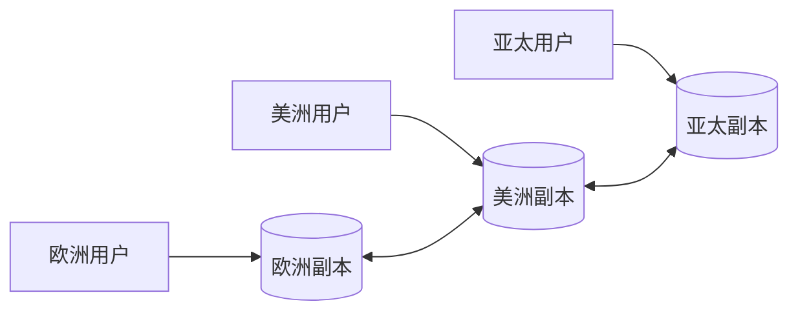

但若写入仍必须跨洲到唯一 leader，读取延迟降低而写延迟未降低；多主可本地写，却引入冲突。

### 0.3 为什么复制：高可用

一个节点、机架或可用区失效时，其他副本继续提供服务。**高可用（high availability）**关注系统能否继续响应，而不仅是数据是否存在。

副本存在不自动意味着高可用，还需要：

- 故障检测；
- routing；
- leader election/failover；
- 足够新数据；
- 剩余容量；
- 客户端重试与超时。

### 0.4 为什么复制：持久性

**持久性（durability）**关注已确认数据在机器永久损坏后是否仍存在。多故障域副本降低单设备丢失风险。

但复制会同步误删除、应用 bug 和恶意写；它不能替代历史备份。

### 0.5 为什么复制：读扩展

读多写少时，可把只读请求分散到 followers，提高 read throughput：

$$
Capacity_{read}\approx\sum_{i=1}^{k}capacity(replica_i)
$$

实际扩展受缓存、热点、网络、复制 lag 和 shared dependency 限制，并非严格线性。

### 0.6 本章假设：每副本能存完整数据集

本章先假设每台机器都能保存整个 dataset，只讨论复制变化。第 7 章再引入 **分片/分区（sharding/partitioning）**，让每台机器只保存数据子集。

现实常组合：每 shard 有多个 replicas；复制与分片是两条独立维度。

### 0.7 静态数据复制为什么容易

若数据永不改变：

1. copy 一次；
2. 校验 checksum；
3. 所有副本永久相同。

真正困难来自变化：写入可在网络断开、节点故障和并发操作期间发生。

### 0.8 三个复制家族

| 家族 | 谁接受写 | 谁决定顺序 | 主要代价 |
| --- | --- | --- | --- |
| 单主（single-leader） | 每 shard 一个 leader | leader | leader/跨区路径、followers stale |
| 多主（multi-leader） | 多个 leaders | 各 leader 局部决定 | 并发冲突、因果顺序 |
| 无主（leaderless） | 任意/多个 replicas | 无固定全局顺序 | quorum、修复、siblings/conflict |

几乎所有分布式数据库主要建立在其中一种或混合变体上。

### 0.9 同步与异步是另一条轴

任何写入传播都可要求：

- **同步（synchronous）**：确认前等待指定副本；
- **异步（asynchronous）**：先确认，副本随后追赶。

这影响 latency、availability、durability 和 staleness，不等同于单主/多主/无主分类。

### 0.10 复制的统一状态模型

leader 在 log position $L$，replica $i$ 已应用到 $p_i$：

$$
lag_i=L-p_i
$$

若 position 可映射到 commit time，也可定义时间 lag：

$$
lagTime_i=t_{leader\ commit}-t_{replica\ apply}
$$

字节/事件 lag 与时间 lag含义不同，低事件 lag 不一定低时间 lag。

### 0.11 eventual consistency 为什么容易误解

异步副本在停止新写且网络/节点最终恢复后，会**最终**追上。但“eventually”没有自动时间上限：可能毫秒、分钟，甚至因故障永不完成。

它不是“几秒内一致”的 SLO，也不是只属于 NoSQL；异步 PostgreSQL follower 同样 eventual。

### 0.12 本章关键问题

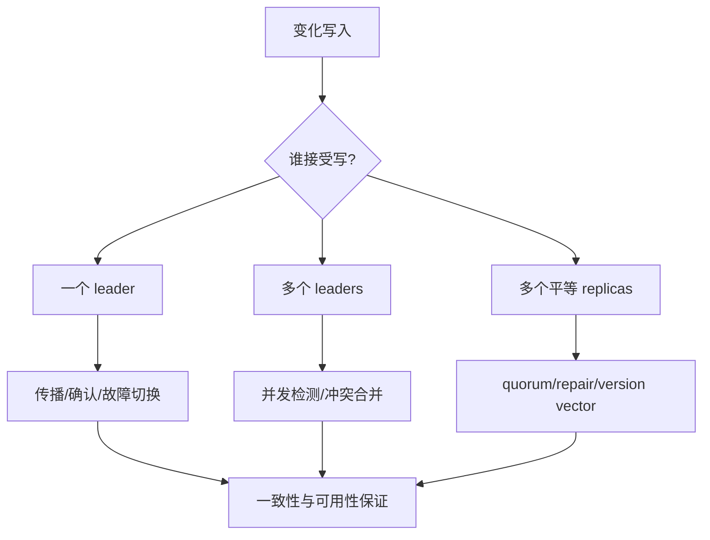

## 1. 备份与复制（Backups and Replication）

### 1.1 复制不能替代备份

replica 快速传播当前写，backup 保存过去 snapshot。误删在 leader 发生后会复制到所有 followers；恢复过去状态仍需 backup。

### 1.2 两者目标对照

| 维度 | Replication | Backup |
| --- | --- | --- |
| 目标 | 可用、故障接管、读扩展 | 时间回退、灾难/误删恢复 |
| 更新 | 持续快速同步 | 周期 snapshot/log archive |
| 主要状态 | 接近当前 | 多历史恢复点 |
| 同步错误 | 会快速传播 | 可保留错误前版本 |
| 恢复速度 | 通常快 | 需 restore/replay |
| 故障域 | 常在线同系统 | 应隔离账户/介质/权限 |

### 1.3 误删除案例

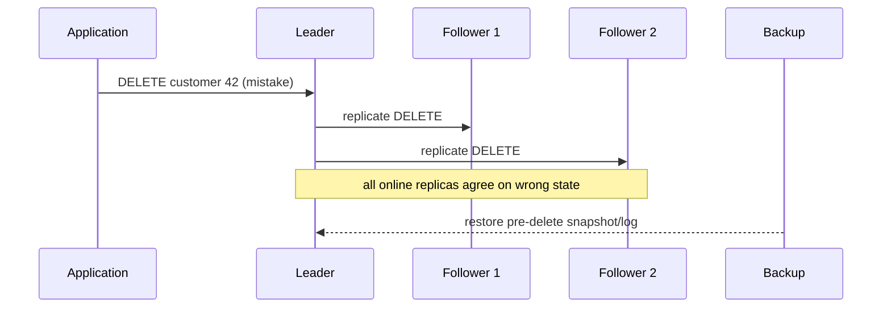

一致地错误仍是错误。

### 1.4 两者怎样互补

- 新 follower 通常从 backup/snapshot 初始化，再 replay replication log；
- continuous replication log archive 可实现 point-in-time recovery；
- backup restore 可建立测试副本；
- replica 可作为 backup source，减少 leader I/O。

### 1.5 immutable snapshot 的内部备份

数据库可能保留 MVCC/version/SSTable snapshots，可回到过去。但若与生产处于同一账户、存储和权限：

- 运维误删可能一起删除；
- ransomware/credential compromise 可一起影响；
- region/account outage 同时不可访问。

内部 snapshot 不是完整独立 backup 策略。

### 1.6 对象存储归档

当前热状态放 primary SSD/NVMe，旧 snapshot/log 放便宜 object storage：

- 低单位成本；
- 长 retention；
- lifecycle tiering；
- 跨故障域；
- 恢复时间较长。

需要保存 schema、encryption key、checksum、log position 和恢复工具。

### 1.7 RPO 与 RTO

背景补充：

- **恢复点目标（RPO）**：最多允许丢多久数据；
- **恢复时间目标（RTO）**：多久恢复服务。

replication 常降低 RTO；sync replication 可降低部分故障下 RPO；backup 提供历史恢复但 RTO 较长。

### 1.8 恢复必须演练

验证：

- snapshot 可读；
- replication log 连续；
- schema/版本兼容；
- key 可用；
- point-in-time target 正确；
- restore 时间满足 RTO；
- 恢复后业务不变量正确。

有 backup 文件不等于能恢复。

## 2. 单主复制

### 2.1 replica 的基本问题

每次写都必须最终反映到每个 replica，否则副本分歧。最常见方案是让一个节点集中决定写入顺序。

### 2.2 单主复制的别名

**单主/基于 leader 复制（single-leader / leader-based replication）**也称：

- primary-backup；
- active/passive。

旧资料的 master–slave 指同类架构，但该术语不应继续使用。

### 2.3 leader

一个 replica 被指定为 **leader**，也称 primary/source。client 写请求必须发给 leader；leader 先写本地持久状态并确定操作顺序。

### 2.4 followers

其他 replicas 称：

- followers；
- read replicas；
- secondaries（单数 secondary）；
- hot standbys。

它们从 leader 接收 replication log/change stream，按 leader 顺序应用。从 client 视角通常只读。

### 2.5 基本写入路径

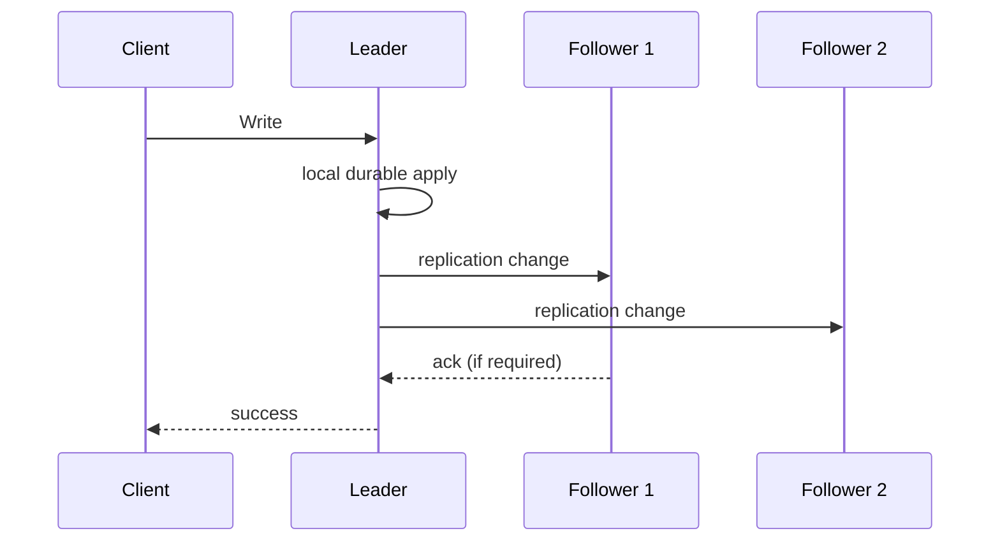

followers 应按 leader 相同顺序处理，以复制确定状态。

### 2.6 读取路径

- read leader：通常最接近最新已提交状态；
- read follower：分担读负载和降低地域 latency，但异步时可能 stale。

“读任意副本”不等于结果具有相同新鲜度。

### 2.7 与分片组合

每个 shard 可有一个 leader；不同 shard leader 分布不同 nodes：

```text
Shard A leader -> Node 1
Shard B leader -> Node 2
Shard C leader -> Node 3
```

整个 cluster 有多个 leader，不代表同一 shard 是 multi-leader。术语必须说明作用范围。

### 2.8 使用范围

关系数据库、MongoDB、DynamoDB、Kafka partition、DRBD、文件系统，以及 Raft-based CockroachDB/TiDB/etcd/RabbitMQ quorum queues 都使用 leader 思想。

consensus 自动选主属于第 10 章；本章关注复制行为。

### 2.9 同步 follower

leader 在 client success 前等待 follower 确认收到/持久化到约定边界。

收益：leader 永久失败时，至少一个 follower 有已确认写。

代价：该 follower 慢/不可达，write latency 增加或停止。

### 2.10 异步 follower

leader 发变更但不等待。收益：

- follower/network 故障不阻塞写；
- 低 write latency；
- 多/远程 followers 可扩展。

代价：lag 无上限；leader 不可恢复时，已向 client 确认但未复制写可能丢失。

### 2.11 确认时刻决定承诺

完全异步：

$$
t_{ack}=t_{leader\ durable}
$$

同步一个 follower：

$$
t_{ack}=\max(t_{leader\ durable},t_{sync\ follower\ durable})
$$

实际还含网络和协议。等待越多副本，故障下数据安全更强，正常写 latency/availability 越差。

### 2.12 为什么不能让所有 followers 同步

$k$ followers 全部必须 ack，则任一 unavailable 都阻塞写。若每 follower 在窗口内可用概率 $p$ 且暂假设独立，全部可用概率：

$$
P(all)=p^k
$$

$p=0.999,k=100$ 时约：

$$
0.999^{100}\approx90.5\%
$$

独立假设不真实，但说明 follower 越多，“等全部”越脆弱。

### 2.13 semisynchronous

常见配置：leader 等至少一个 sync follower，其他 async。sync follower 失效时，从 async 中选一个转 sync。

至少有两份 up-to-date copy，同时不被所有 follower 故障阻塞。

### 2.14 majority synchronous/quorum

5 replicas 中 leader + 另外 2 共 3 个同步更新，剩余异步。这是 majority quorum 思路，为自动 election 提供已提交交集。

quorum 的精确安全需协议定义，不能只按“复制到多数”自行推断 consensus。

### 2.15 完全异步的 durability 缺口

若 leader 已 ack write W，所有 followers 尚未收到，leader 磁盘永久损坏：W 消失。

因此 client success 只表示 leader 本地承诺，不表示多副本 durability。应用必须知道配置。

### 2.16 为什么异步仍广泛使用

- 跨洲 RTT 大；
- followers 多；
- 写可用优先；
- 可容忍少量 RPO；
- 上层可重试/重建；
- 同步依赖会放大故障。

这是业务风险选择，不是数据库“偷懒”。

### 2.17 建立新 follower（Setting Up New Followers）：不能直接热拷文件

leader 持续写时，普通 copy 不同文件/page 来自不同时刻，可能：

- index 与 heap 不一致；
- 部分 transaction；
- missing/duplicate page；
- 不满足 checksum。

锁全库可一致但牺牲 availability。

### 2.18 一致 snapshot

第一步在逻辑时点 $P$ 获取一致 snapshot，尽量不阻塞全库。snapshot 必须与 replication log position 关联。

### 2.19 新 follower 四步

1. 获取 leader consistent snapshot；
2. copy 到新 node；
3. 从 snapshot position 请求后续 log；
4. replay backlog，caught up 后进入实时 stream。

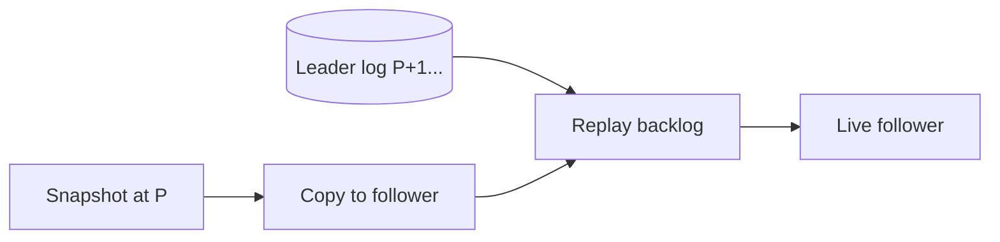

### 2.20 log position 的名称

- PostgreSQL：LSN（log sequence number）；
- MySQL：binlog coordinates；
- GTIDs（global transaction identifiers）。

position 必须精确、可恢复且与 snapshot 同一一致边界。

### 2.21 caught up 的含义

follower 已应用 snapshot 后所有 backlog，并持续跟进。是否允许读流量还要看：

- lag threshold；
- index build；
- cache warm-up；
- validation；
- serving capacity。

“复制连接建立”不等于已追平。

### 2.22 snapshot + log archive 作备份

周期 snapshot 与持续 log archive 到 object store，可：

- point-in-time recovery；
- 初始化 follower；
- disaster recovery；
- clone/test。

WAL-G、Litestream 等提供相关实现。

### 2.23 object storage 可作为 live database 层

现代数据库还把 S3/GCS/Azure Blob 用于在线数据，不只 archive。收益：

- 低成本；
- 高 durability/多区复制；
- 存算分离；
- 共享开放格式；
- node stateless 化。

### 2.24 conditional write/CAS

object store 的 conditional write 类似 **compare-and-set（CAS）**：

```text
write new manifest only if current ETag/version == expected
```

可用于 metadata transaction、leadership election 和并发提交。正确性依赖具体 object store consistency 和条件语义。

### 2.25 object storage 的 latency/cost

相比 local SSD/EBS：

- 单请求 latency 高；
- 每 API call 计费；
- 需 batch/read-ahead/cache；
- batching 又增加 latency；
- random overwrite 大 object 昂贵。

架构通常写不可变大对象和小 metadata，而非模拟细粒度 page。

### 2.26 FUSE 不等于完整 POSIX

FUSE 可把 bucket mount 成 filesystem，但对象存储常缺：

- nonsequential write；
- atomic rename 语义；
- symlink；
- file locking；
- 低 latency metadata。

不理解差异的传统数据库不能仅靠 mount 安全迁移。

### 2.27 tiered storage

热/新数据在 RAM/NVMe/SSD，冷数据放 object store：

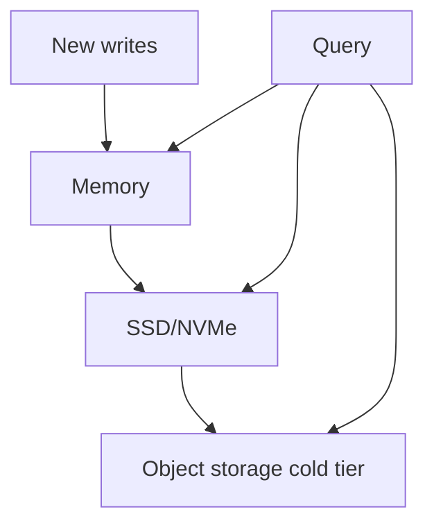

需要 cache admission、eviction、prefetch 和一致 metadata。

### 2.28 object primary + low-latency WAL

一些系统把不可变主数据放 object store，用 EBS/Neon Safekeeper 保存低 latency WAL，随后 flush/compact 到 object。

WAL availability 仍是写路径关键；对象层提供长期 durable state。

### 2.29 zero-disk architecture

**零磁盘架构（zero-disk architecture，ZDA）**把所有持久数据写 object store，本地 disk/RAM 只 cache。node 可随时替换，无本地权威状态。

例：WarpStream、Confluent Freight、Bufstream、Redpanda Serverless、云数仓、Turbopuffer、SlateDB。

代价是 object latency、request cost、cache miss 和 metadata control plane。

### 2.30 节点故障与计划维护统一目标

node 可能 crash，也可能因 kernel patch 主动 reboot。复制的运维价值是：单 node 下线时整体 service 继续，支持 rolling maintenance。

### 2.31 follower catch-up recovery

follower 本地保存已处理 log position。重启后请求缺失 range：

$$
(p_{follower},p_{leader}]
$$

replay 后追平，无需 election。

### 2.32 catch-up 的性能挑战

离线时间 $T$、leader 写入率 $\lambda$，backlog 约：

$$
B\approx\lambda T
$$

恢复 consume rate $\mu$，同时新写继续到达，若 $\mu>\lambda$，理论追平时间：

$$
T_{catchup}\approx\frac{B}{\mu-\lambda}
$$

若 $\mu\le\lambda$，永远追不上。

### 2.33 log retention 两难

leader 可：

- 为离线 follower 保留 log，可能磁盘满；
- 删除旧 log，follower 必须 snapshot restore。

设置 retention 要结合最大 outage、写速率、空间和 snapshot restore 时间。replication slot 也可因 abandoned consumer 让 WAL 无限增长。

### 2.34 leader failure 更难

followers 只是追 leader；leader 故障后系统必须：

- 判断失败；
- 选择新 leader；
- redirect clients；
- 让其他 followers 换源；
- 处理 old leader 回归；
- 处理未复制 writes。

这叫 **故障切换（failover）**。

### 2.35 manual vs automatic failover

- manual：人确认，较慢但可结合上下文；
- automatic：恢复快，但错误检测可能造成不必要/危险切换。

关键系统常采用自动检测 + 人工授权或受控 automation，取决于 RTO 和风险。

### 2.36 步骤一：检测 leader failure

没有无误判 detector。常用 heartbeat/timeout：超过例如 30 s 不响应则怀疑死亡。

可能实际是：

- node crash；
- network partition；
- overload/GC pause；
- observer 自己网络问题。

### 2.37 failure detector timeout 权衡

timeout $D$：

- 大：真实故障恢复至少等待更久；
- 小：load spike/network delay 更易误判，产生 unnecessary failover。

系统已过载时切换会增加 recovery load，可能恶化事故。

### 2.38 safe handoff

计划维护时，old leader 可主动：

1. 停接新写；
2. 等 sync follower 追平；
3. 转移 leadership；
4. 更新 routing；
5. 再 shutdown。

比突然 crash 更可控。

### 2.39 步骤二：选择新 leader

可由：

- 剩余 replicas majority election；
- controller node 指派；
- consensus protocol。

通常选 log position 最新的 eligible follower，最小化 data loss。

### 2.40 步骤三：重配置

- clients/write router 指向新 leader；
- followers 从新 leader consume；
- old leader 回来必须降为 follower；
- epoch/term/fencing 防旧 leader 继续写。

缺少最后一步会 split brain。

### 2.41 异步 failover 的写丢失

old leader 已 ack 但新 leader 未收到的 writes，常被丢弃以与新 history 收敛。

这让“committed”在该配置下不具多副本 durability。必须量化可能 RPO。

### 2.42 外部系统协调风险

GitHub 事故中，落后 MySQL follower 被提升，autoincrement counter 重用旧 leader 已分配 ID；Redis 中同 ID 仍指其他数据，导致私有数据泄露。

lesson：复制 rollback 不只影响数据库，还影响所有使用 database-generated ID/side effect 的系统。

### 2.43 split brain

两个 nodes 都认为自己是 leader 并接受 writes，称 **脑裂（split brain）**。后果：

- divergent history；
- uniqueness/constraint 破坏；
- data loss on merge；
- external side effects 重复。

### 2.44 fencing

**围栏（fencing）**让旧 leader 即使仍运行也无法访问资源/提交写。常通过递增 epoch/term/token，storage 只接受最新 token。

简单“检测两个 leader 后 kill 一个”可能太晚，也可能误杀两个。

### 2.45 选 leader 的最低原则

同步/半同步：优先 old leader 已等待的 follower。

异步：选择最高 LSN/GTID 且数据完整的 follower。落后几天的节点即使“健康”也不能 promotion。

### 2.46 statement-based replication

leader 把 SQL statement 发 followers，后者重新执行：

```text
INSERT / UPDATE / DELETE
```

优点 compact、接近业务操作；风险是执行可能不 deterministic。

### 2.47 nondeterministic function

`NOW()`、`RAND()` 在每 replica 执行得到不同结果。可由 leader 把返回值替换成 literal 后再 log，但遗漏任何 nondeterminism 都会 divergence。

### 2.48 order dependency

autoincrement、`UPDATE ... WHERE condition` 依赖现有状态和 transaction order。followers 必须严格同序执行；并发 scheduler 差异可能改变结果。

### 2.49 trigger/UDF side effects

trigger、stored procedure、UDF 若访问外部环境或非确定状态，replica 执行结果不同或重复外部副作用。

statement replication 只有在 operation 完全 deterministic、fixed order 时安全。

### 2.50 state machine replication

相同初始 state + 相同 deterministic command sequence ⇒ 相同最终 state：

$$
S_n=f(f(\cdots f(S_0,c_1),c_2),\ldots,c_n)
$$

这是 **状态机复制（state machine replication）**思想，后续 consensus 章节详述。

### 2.51 statement replication 实践

MySQL 早期使用；现在检测 nondeterminism 时默认切 row-based。VoltDB 通过强制 deterministic transaction 使 statement replication 安全。

determinism 在复杂应用中难保证，因此其他日志更常见。

### 2.52 预写日志传输（write-ahead log shipping / physical WAL shipping）

B-tree WAL 已包含 page/block byte changes，可同时网络发送 follower，重放出与 leader 相同物理文件。

PostgreSQL、Oracle 等使用相关机制。

### 2.53 physical log 的耦合

WAL 描述：

- 哪个 block；
- 哪些 byte；
- storage-engine-specific page format。

leader/follower 必须理解相同物理版本。跨 major version 可能不兼容。

### 2.54 对 zero-downtime DB upgrade 的影响

理想：先升级 followers，再 failover 到新版本 leader。但若 old leader WAL 新 follower 无法理解，则不能混版本复制，需要 downtime 或 logical migration。

实现细节因此直接影响运维可演化性。

### 2.55 logical row-based log

**逻辑日志（logical log）**与 storage page 解耦，按 table row 描述：

- INSERT：全部新 columns；
- DELETE：primary key/足够标识旧 row；
- UPDATE：row identity + 新/changed values；
- COMMIT boundary。

### 2.56 logical vs physical

| 维度 | Physical WAL | Logical log |
| --- | --- | --- |
| 粒度 | page/byte | row/table change |
| 紧耦合 | storage version | logical schema |
| 同构 replica | 强 | 可较弱 |
| 外部消费 | 难 | 容易 |
| 完整恢复 | 天然含底层细节 | 需 logical apply |
| 跨版本升级 | 较难 | 较容易 |

### 2.57 MySQL binlog 与 PostgreSQL 逻辑复制（logical replication）/logical decoding

MySQL row-based replication 使用独立 binlog，WAL 之外另存逻辑变化。PostgreSQL 从 physical WAL logical decode 出 row events。

产品实现不同，应用看到的 CDC 都更接近逻辑变化。

### 2.58 Change Data Capture

**变更数据捕获（change data capture，CDC）**让外部系统消费数据库变化，构建：

- warehouse；
- search index；
- cache；
- audit；
- event stream。

CDC 仍需 schema evolution、transaction ordering、snapshot+stream handoff、delete 和 replay。

### 2.59 read scaling

读多写少时增加 followers，把 read 分散，leader 专注 write。现实通常依赖 asynchronous followers，否则任一 follower 故障阻塞所有 writes。

### 2.60 async follower 的陈旧读取

同一时刻 leader 已有 value $v_2$，lagging follower 仍 $v_1$。不同 replicas 对同 query 返回不同结果。

若停止新写且系统恢复，最终趋同，称 eventual consistency。

### 2.61 replication lag 的来源

- follower recovery；
- near-capacity；
- network congestion/partition；
- slow disk/GC；
- long transaction；
- apply single-thread bottleneck；
- schema/index operation；
- cross-region RTT/bandwidth。

正常 <1 s 不构成上界。

### 2.62 read-after-write anomaly

用户写 comment 到 leader，立即 read 被路由 stale follower，看不到自己刚写内容，误以为数据丢失。

### 2.63 read-after-write consistency

也称 **read-your-writes consistency**：用户后续读取一定包含其自己已确认写。它不承诺立即看到其他用户写。

这是一种 **session guarantee**，弱于全局 strong consistency，却直接改善体验。

### 2.64 实现一：自己的数据读 leader

例如 profile 只有 owner 编辑：

- own profile → leader/sync follower；
- others → async follower。

简单但只适用于 ownership 清晰的对象。

### 2.65 实现二：写后时间窗口

client/user last write 后 1 minute 内读 leader，之后 follower；并排除 lag > threshold follower。

时间窗口若小于真实 lag，仍 stale；若过大，大量 read 回 leader，失去 scale。

### 2.66 实现三：minimum read position

client 保存最近 write logical position $p_w$。read 只能由已应用：

$$
p_{replica}\ge p_w
$$

的 replica 服务；否则换 replica、等待或读 leader。

### 2.67 logical timestamp vs wall clock

LSN/sequence 表示顺序，适合 minimum position。用 wall clock 需跨节点 clock synchronization，易受 skew 影响。

### 2.68 跨 region routing

若 leader 在另一 region，强制 leader read 会跨洲，牺牲 latency。可用 sync local replica、session stickiness、region-specific position tracking，但复杂度上升。

### 2.69 cross-device read-your-writes

用户手机写、桌面读：手机本地 last-write token 不在桌面。需 server/account central session metadata 或 token 同步。

不同 device 可能路由不同 region，还要统一用户 home region 或传 causal token。

### 2.70 region 与 availability zone

- zone：独立 datacenter/facility；
- region：同一地理位置内多个 zones。

同 region zone 间低 latency，适合同步 quorum；跨 region latency/cost 更高，但能防 region outage。

### 2.71 monotonic read anomaly

用户第一次读较新 replica 看到 comment，第二次随机读更旧 replica，comment 消失，仿佛时间倒退。

### 2.72 monotonic reads

**单调读（monotonic reads）**保证同一 user/session 后续读取不会比此前看到的版本更旧：

$$
version(read_{i+1})\ge version(read_i)
$$

允许一直 stale，只是不倒退。弱于 linearizability。

### 2.73 sticky replica

按 user ID hash 到固定 replica：不同 user 可分散，单 user 保持 monotonic。replica fail 时 reroute 需确保新 replica 至少同样新，否则等待/token。

### 2.74 consistent prefix anomaly

question 与 answer 有因果依赖。不同 shard/replica lag 使观察者先看到 answer，再看到 question，违反因果顺序。

### 2.75 consistent prefix reads

**一致前缀读（consistent prefix reads）**：若 writes 有顺序/因果关系，reader 只看到该序列的某个前缀，不会看到后果而缺原因。

```text
[]
[question]
[question, answer]
```

允许前两种，不允许 `[answer]`。

### 2.76 sharding 为什么放大该问题

question/answer 若在不同 shards，各自复制无 global order。reader 可看到 shard B 新状态、shard A 旧状态。

将 causal writes 放同 shard 可保持顺序，但并非所有业务可高效这样分区。

### 2.77 causal dependency tracking

更一般方法显式携带 causal metadata，让系统知道 B depends on A，未满足 dependency 时等待/延迟显示。后文 happens-before/version vector 提供基础。

### 2.78 三种 session guarantee 对照

| Guarantee | 防止什么 | 关注对象 |
| --- | --- | --- |
| Read-your-writes | 看不到自己的已确认写 | 当前 user/session 写→读 |
| Monotonic reads | 先新后旧 | 同 user 多次读 |
| Consistent prefix | 后果先于原因 | causal write sequence |

它们可组合，但不等于 global linearizability。

### 2.79 应用层解决 lag 的代价

leader routing、session token、lag filter、sticky replica 需要：

- metadata；
- cross-device state；
- failure reroute；
- region routing；
- token security；
- testing。

容易出错。若业务需强保证，选择数据库原生 strong consistency 可能更简单。

### 2.80 strong consistent distributed DB

现代 NewSQL/consensus-based databases 可提供 linearizability/transactions，同时具备 replication/sharding。代价：coordination latency、network partition 下 availability 取舍和更高 overhead。

### 2.81 为什么仍选择弱一致

- network interruption 下更 resilient；
- local/offline write；
- 低 latency；
- 更少 coordination；
- 业务可合并；
- stale data 可接受。

正确选择依赖 invariant，而不是“规模大只能 eventual”。

### 2.82 可运行示例：session consistency 路由

下面模拟读请求携带最低可见 log position，选择足够新的 replica。

```python
from dataclasses import dataclass


@dataclass(frozen=True)
class Replica:
    name: str
    applied_position: int
    latency_ms: int


def choose_replica(replicas: list[Replica], minimum_position: int) -> Replica | None:
    eligible = [r for r in replicas if r.applied_position >= minimum_position]
    return min(eligible, key=lambda r: r.latency_ms, default=None)


replicas = [
    Replica("local-stale", 104, 4),
    Replica("local-fresh", 108, 7),
    Replica("leader", 110, 35),
]

for minimum in (0, 106, 110, 111):
    chosen = choose_replica(replicas, minimum)
    print(f"minimum {minimum}: {chosen.name if chosen else 'wait-or-fail'}")
```

实际运行输出：

```text
minimum 0: local-stale
minimum 106: local-fresh
minimum 110: leader
minimum 111: wait-or-fail
```

客户端没有写 token 时选最低 latency；写后要求 position 110 时只能 leader。实际系统还需处理 position scope/shard 和 signed token。

### 2.83 单主复制部分总结

单主通过一个 leader 统一写顺序，降低并发冲突，能提供较强一致性；代价是写路径集中、failover 复杂，async follower read 产生 staleness。

同步程度决定确认写的 latency/availability/durability；snapshot+log 建 follower；failover 必须正确检测、选最新节点、fence old leader。physical WAL 高效但版本耦合，logical log 支持升级和 CDC。读扩展只有在应用明确处理 lag/session guarantee 时才安全。

---

## 3. 多主复制

### 3.1 从单主到多主

单主最大的结构性限制是：**所有写都必须到达唯一 leader**。客户端只要因网络分区、区域故障或路由错误无法连接该 leader，即使本地还有健康副本，也不能写。

自然扩展是允许多个节点接受写。每个接受写的节点再把变更转发给其他节点，这就是 **multi-leader replication**，也称：

- active/active replication；
- bidirectional replication。

### 3.2 leader 同时也是 follower

多主中的每个 leader 有双重身份：

1. 对本地客户端，它是可接受写的 leader；
2. 对其他 leader 产生的写，它又是 follower。

因此，多主并没有消除复制，只是把“谁能产生 log entry”从一个节点扩展到多个节点。

### 3.3 同步多主为什么近似退化为单主

设 A、B 都是 leader，客户端向 A 写入。若 A 必须等 B 同步复制后才能确认，那么 A 与 B 的链路中断时，A 也不能写。此时效果近似于：B 是唯一 leader，A 只是把写转发给 B。

换言之，允许多个入口并没有消除同步协调：

$$
T_{ack} \ge T_{local} + RTT_{A,B} + T_{apply,B}
$$

而且跨 A–B 分区时 availability 仍然丢失。因此本章把 synchronous multi-leader 视作与 single-leader 类似的模型，以下重点讨论 **asynchronous multi-leader**。

### 3.4 异步多主真正增加了什么

异步时，每个 leader 即使暂时联系不上其他 leader，仍可独立确认本地写。它换来低延迟和 partition tolerance，但不同 leader 可能在同一旧状态上分别写入，从而产生：

- 并发写；
- 不同到达顺序；
- 约束被联合违反；
- 必须检测并合并的冲突。

多主的核心不是“多个节点都能写”这句配置，而是**如何在缺少统一全局顺序时重新收敛**。

### 3.5 geo-distributed operation

在单个 region 内，multi-leader 增加的冲突复杂度通常超过收益。它更合理的场景是 geographically distributed、geo-distributed 或 geo-replicated deployment：为容忍整个 region 故障，或让数据靠近各地用户，在多个 region 放置副本。

### 3.6 单主跨 region 的写路径

单主只能位于某一个 region。无论用户在哪，写都要跨公网或跨区域专线到该 region：

$$
T_{write,user} \approx RTT_{user,leader\ region} + T_{db}
$$

远端 region 即使有本地 follower，也通常只能降低读延迟，不能降低写延迟。

### 3.7 多主跨 region 的两层复制

多主可在每个 region 放一个 leader：region 内仍采用普通 leader–follower replication，最好把 followers 分布到不同 availability zones；region 之间则由 leaders 异步交换变更。

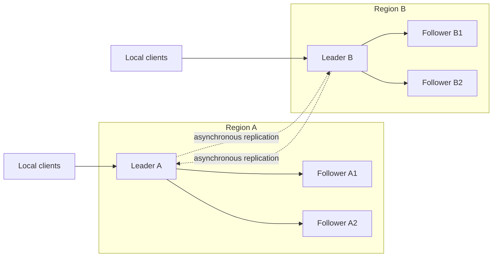

### 3.8 性能比较

| 架构 | 写确认路径 | 用户感知 |
|---|---|---|
| single-leader | 所有写跨到 leader region | 远端用户承担 inter-region RTT |
| async multi-leader | 写在本地 region 确认，后台跨区复制 | 隐藏 inter-region delay，通常更快 |

这里降低的是前台 latency，不是复制延迟本身。远端 replica 仍可能很久才看到写。

### 3.9 region outage tolerance

- single-leader：leader region 失效后，必须在其他 region promote follower，并完成 failover；
- multi-leader：其余 regions 可继续独立读写，故障 region 恢复后再 catch up。

后者缩短了区域故障期间的写中断，但恢复时必须处理故障前后形成的并发状态。

### 3.10 network problem tolerance

inter-region link 即使用 dedicated connection，也通常比同 region、同 AZ 链路更不可靠。单主远端客户端的每次写都依赖该链路往返；异步多主在临时中断时，各 region 仍可本地处理写。

因此多主把网络分区期间的行为从“拒绝部分写”改为“接受写，稍后解决分歧”。这不是免费获得 availability，而是把协调成本延期到 merge 阶段。

### 3.11 consistency 是主要代价

单主可以让所有写经过同一顺序点，并进一步提供 serializable transaction 等强保证。异步多主没有实时统一顺序，因此能实现的一致性更弱。

不同 leaders 上看似各自合法的写，合并后可能共同违反 invariant。该限制来自分布式系统本身，而非某个产品实现不够好。

### 3.12 银行余额约束

初始余额为 100。两个隔离 region 都读到 100，并各自批准提取 80：

$$
100-80\ge0,\qquad 100-80\ge0
$$

局部检查都通过，但合并后的真实效果是：

$$
100-80-80=-60
$$

冲突合并算法可以决定最终字段值，却不能凭空保留“余额不得为负”这一全局约束。

### 3.13 唯一用户名约束

region A 与 B 可同时检查 `alice` 尚不存在，并分别为不同用户创建该用户名。由于检查和写没有跨 region 协调，两个操作单独有效，合并后 uniqueness 被违反。

需要严格执行此类约束时，应使用单主或其他具备同步协调/共识的系统；不能只靠异步冲突合并。

### 3.14 多主仍有适用范围

许多应用并不依赖跨 leader 的强约束，或可把操作设计成可合并形式。此时多主的 low latency、offline write 和 region independence 很有价值。

本章列举的支持者包括 MySQL、Oracle、SQL Server、YugabyteDB；Redis Enterprise、EDB Postgres Distributed、pglogical 等以产品特性或外部扩展提供。产品名称说明生态现状，不代表它们的保证完全相同。

### 3.15 retrofit 的配置陷阱

多主在不少数据库中是后加能力，会与原本假设“只有一个写入者”的特性发生微妙交互，例如：

- autoincrementing keys 可能重复；
- triggers 可能在多个节点重复执行或产生不同副作用；
- integrity constraints 只能看到局部状态；
- failover/routing 变化可能打破原有 conflict avoidance。

因此多主常被视为需要谨慎进入的 dangerous territory：必须按真实故障和并发模式测试，而不能只验证正常路径能同步。

### 3.16 replication topology

replication topology 描述写从一个 leader 传播到另一个 leader 的通信路径。只有两个 leaders 时基本只能互相发送；三个及以上时，可选 circular、star/tree 或 all-to-all。

### 3.17 all-to-all topology

每个 leader 直接把自己的写发送给所有其他 leaders。若有 $n$ 个 leaders，单条本地写需要向 $n-1$ 个 peers 传播，完整有向连接数为：

$$
n(n-1)
$$

它路径冗余、容错较好，但连接和乱序处理成本最高。

### 3.18 circular topology

每个节点从一个前驱接收，并把收到的写与自己的写一起转给一个后继。消息可能经过多个 hops 才覆盖所有副本，链路数仅随 $n$ 线性增长，但任一中间节点故障都可能切断传播链。

### 3.19 star 与 tree topology

star 由一个指定 root 把写转给其他节点；推广后可形成 tree。它降低连接数量，却让 root 或中间节点成为传播关键点。

这里的 star-shaped network topology 与分析数据模型中的 **star schema** 无关：前者描述复制通信图，后者描述事实表与维表结构。

### 3.20 三种 topology 对照

| topology | 路径 | 优点 | 主要风险 |
|---|---|---|---|
| circular | 沿环逐跳转发 | 连接少 | 单节点可阻断后续传播，延迟随 hop 增长 |
| star/tree | 经 root/父子节点转发 | 结构简单 | root/中间节点成为瓶颈和故障点 |
| all-to-all | leaders 直接互发 | 路径冗余、绕过故障 | 连接多，不同路径导致 reorder |

### 3.21 forwarding 与防环

circular、star/tree 中，节点必须继续转发从别处收到的变更。为防止消息无限绕圈：

1. 给每个节点唯一 ID；
2. 每条 log record 携带已经经过的节点 ID；
3. 节点收到带有自身 ID 的变更时丢弃，因为它已经处理过。

该 metadata 解决“是否见过”，不自动解决“应以什么顺序应用”或“并发写如何合并”。

### 3.22 sparse topology 的故障

circular 和 star/tree 的问题是，一个节点故障就可能让其他仍健康的节点失去传播路径。理论上可绕过故障节点重配置 topology，但很多部署需要人工操作，因此修复前会持续积累 replication lag。

all-to-all 更密集，消息可走替代路径，避免单个中间节点成为唯一断点。

### 3.23 all-to-all 的 overtaking

all-to-all 的不同链路速度不同，后产生的消息可能经快链路先到，先产生的消息经拥塞链路后到，即 replication message overtaking。

例如 leader 1 先插入 row，leader 3 看到该 row 后更新它；leader 2 却可能先收到 update，再收到 insert。

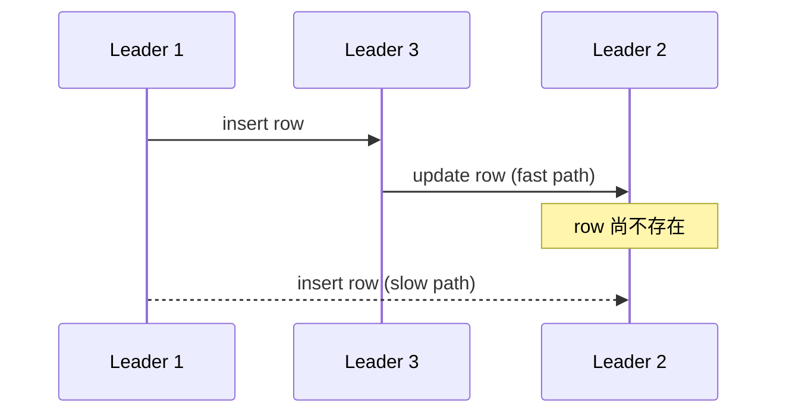

### 3.24 这是 causality，不只是传输乱序

update 是在 insert 已生效的状态上产生的，故有：

$$
insert \rightarrow update
$$

任何副本都应先应用 cause，再应用 effect。给消息附 wall-clock timestamp 不足以可靠恢复该顺序，因为不同节点时钟不能假定精确同步；应使用 version vectors 等显式记录因果关系的机制。

不少多主实现并未正确追踪这种依赖。上线前应阅读保证边界，并以链路延迟、乱序、断连和恢复进行测试。

### 3.25 disconnected operation

多主的另一类典型场景不是数据中心，而是会离线的终端。手机、笔记本上的 calendar 必须在无网时仍能读取会议、创建或修改日程，恢复连接后再与服务器和其他设备同步。

### 3.26 每台设备都是一个 leader

每台设备持有 local database replica，并可本地接受写，因此都是 leader；设备之间进行 asynchronous multi-leader replication。replication lag 不再只是毫秒或秒，而可能是数小时甚至数天。

从架构上看，这是 geo-distributed multi-leader 的极端形式：每台 device 都是一个“region”，连接极不可靠。

### 3.27 real-time collaboration 也是多主

Google Docs/Sheets、Figma、Linear 一类实时协作应用，会立刻在本地 UI 反映输入，而不等待 server round-trip；其他协作者的编辑随后低延迟到达。

每个打开共享文件的 browser tab 都可视作 replica，并能产生异步传播的更新。即便应用不支持离线，只要多个用户能在等待服务器确认前并发编辑，它仍具有 multi-leader 性质。

### 3.28 offline editing 与实时协作的共同管线

两者需要同一套基础设施：


在线时立即发送，离线时持久保存后再发送；收到远端变更后合入本地副本并更新 UI；并发修改则进入 conflict resolution。

### 3.29 sync engine

支持上述捕获、持久化、传播、接收和合并过程的软件库称为 **sync engine**。它把网络通信和冲突处理从每个界面动作中抽离为后台数据同步层。

### 3.30 offline-first

offline-first 应用允许用户离线时继续编辑。它不是在普通在线应用外再附加一个残缺“离线模式”，而是默认本地读写始终可用，网络只决定多久能与其他副本交换变化。

### 3.31 local-first software

local-first software 不仅 offline-first，还要求即使原开发者关闭全部在线服务，用户仍能继续使用和协作。实现条件通常包括：

- 数据有完整、持久的本地副本；
- sync protocol 是开放标准；
- 有多个可替代 service providers，或用户可自托管。

Git 是 local-first collaboration system 的例子：本地 repository 完整可用，可经 GitHub、GitLab 或任意 hosting service 同步，只是不提供实时协作。

### 3.32 sync engine 改变应用分层

主流 web app 往往让客户端只保留少量持久状态，每次展示或更新数据都显式请求 server。sync-engine 架构则在客户端保存 persistent state，把 server communication 移入 background process。

应用前台主要面向 local database 编程，而非把每个用户动作直接翻译成 RPC。

### 3.33 本地数据与 next-frame（next frame）response

本地读取和写入可让 UI 不等待网络。一些应用追求在显示系统下一帧响应；60 Hz 屏幕的一帧预算约为：

$$
\frac{1000\ \mathrm{ms}}{60}\approx 16.7\ \mathrm{ms}
$$

公网 RTT 很难稳定满足该预算，而本地 optimistic application 通常可以。

### 3.34 offline 等价于极大 network delay

sync engine 下，无需维护两套业务逻辑。断网只是 outgoing changes 在本地队列停留更久、incoming changes 更晚到达；恢复连接后沿同一管线同步。

该抽象简化状态机，但不能消除长期离线带来的冲突数量和存储压力。

### 3.35 本地操作简化 frontend programming model

每个 remote service call 都需要处理 timeout、retry、unknown outcome 和错误回滚。local read/write 几乎不会因网络失败，使界面可以用更 declarative 的方式描述“本地状态应是什么”。

不过错误并未消失：权限拒绝、schema mismatch、配额和不可合并约束会在后台同步时暴露，产品仍需设计延迟失败的反馈与补偿。

### 3.36 reactive programming

实时展示其他用户的编辑，需要接收 change notification，并只更新受影响的 UI。sync engine 与 reactive programming model 很契合：本地 replica 变化成为可订阅数据源，UI 根据查询结果自动重算。

### 3.37 适用规模边界

sync engine 最适合预先下载用户可能需要的数据并在客户端持久化。这样才能离线访问，但也限制数据集大小：

- 下载某个用户自己创建的全部文件通常可行；
- 下载整个 ecommerce catalog 通常不合理。

需要 selective sync、按权限/查询订阅或分层缓存时，必须明确“离线可用集合”，不能承诺所有数据都 local-first。

### 3.38 发展与实现生态

Lotus Notes 在 1980s 已实践类似同步模式；calendar sync 也存在已久。今天的通用 sync engines 包括：

- proprietary backend：Google Firestore、Realm、Ditto；
- open-source backend/local-first 候选：PouchDB/CouchDB、Automerge、Yjs。

选型要比较 protocol openness、merge semantics、权限模型、数据迁移和长期可导出性，而不只是“是否支持 offline”。

### 3.39 netcode 的相似与边界

multiplayer video games 同样要立即响应本地动作，再与异步到达的其他玩家动作 reconcile；游戏领域把相关系统称为 **netcode**。

但游戏常依赖 client prediction、server reconciliation、lag compensation 等特定时序/物理规则，其技术不能直接移植为通用文档或数据库 sync engine，本章不再展开。

### 3.40 conflicting writes 是多主的核心难题

无论是 server-side geo-distributed database，还是终端上的 local-first sync engine，不同 leaders 都能在彼此未知的状态上接受写。因此 concurrent writes 可能互不兼容，系统必须：

1. 判断两个写是有因果先后还是 concurrent；
2. 检测发生了何种 conflict；
3. 选择丢弃、暴露给用户或自动合并；
4. 保证所有 replicas 最终得出同一结果。

本节先假定并发关系可被识别；具体 happens-before 与 version vector 算法将在无主复制部分推导。

### 3.41 concurrent 不等于物理同时

若 write $a$ 发生时已看到 $b$ 的效果，则 $b\rightarrow a$，二者有因果顺序。若 $a$ 与 $b$ 产生时都不知道对方，则：

$$
a \nrightarrow b\quad\land\quad b \nrightarrow a
$$

二者 concurrent。即使离线设备在相隔数小时的物理时间写入，只要都基于同一个旧版本，它们仍是并发写；真实时钟是否“同时”无关紧要。

### 3.42 wiki title 冲突

两个用户都读到 title `A`：user 1 在 leader 1 改成 `B`，user 2 在 leader 2 改成 `C`。本地写都成功，但异步交换时发现同一字段从共同祖先分叉：

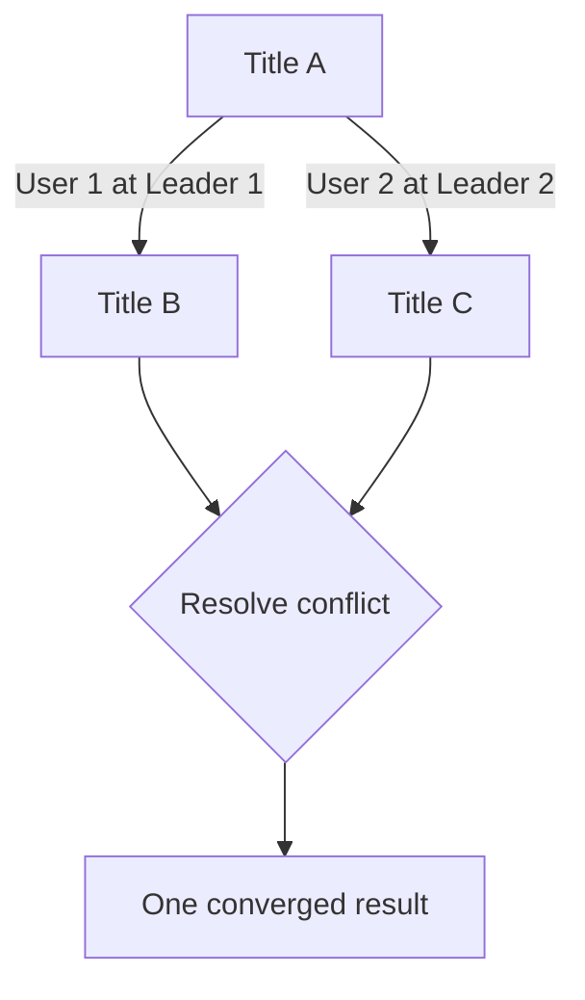

单主在一个写入点串行化这两次更新，不会形成这种分叉；多主必须定义 resolution semantics。

### 3.43 conflict avoidance

最直接的策略不是解决，而是避免。若同一 record 的所有写始终路由到同一个 leader，它们就在该 leader 上排序，即使数据库整体是 multi-leader，也不会产生该记录的并发分叉。

这不适用于必须离线写的 sync clients，但 geo-replicated server 有时可以做到。

### 3.44 home region

若用户只能编辑自己的数据，可为每个用户指定 home region，并把其读写固定路由到该 region 的 leader。不同用户可有不同 home region；从单个用户视角看，自己的数据近似 single-leader。

这同时带来 locality，但要求 routing key 与数据 ownership 稳定、所有入口遵守同一规则。

### 3.45 leader migration 打破 avoidance

region 故障、用户迁居或容量再平衡都可能要求更换某条记录的 designated leader。若迁移期间 old/new leader 都接受写，conflict avoidance 就失效。

正确迁移需短暂停写、同步 handoff、epoch/fencing 或接受并合并冲突，不能只更新路由表后假定旧入口立刻消失。

### 3.46 分配不相交 ID 空间

冲突也可通过设计操作空间来避免。例如两个 leaders 使用 autoincrement ID 时，让 A 只生成奇数、B 只生成偶数；一般化为：

$$
id = k\cdot n + leader\_index
$$

其中 $n$ 是 leader 数量。这样不会并发分配同一 ID，但动态增减 leader、可预测 ID 和跨系统迁移仍需处理；现代系统也常采用带节点/时间成分的全局 ID。

### 3.47 Last Write Wins

无法避免冲突时，最简单方案是给每个 write 一个 timestamp，保留 timestamp 最大者：

$$
winner = \operatorname*{arg\,max}_{w\in siblings} timestamp(w)
$$

若 timestamp 相同，还需用 value 或 node ID 等稳定规则打破平局，使每个 replica 独立计算出同一 winner。这就是 **Last Write Wins（LWW）**。

### 3.48 “last” 是误导性名称

对有因果顺序的写，可以说后者更晚；对 concurrent writes，不存在真实的先后顺序。LWW 的 timestamp order 只是人为构造的 total order，并不证明 winner 更符合用户意图。

因此 LWW 更准确的含义是：从多个已成功写入的并发值中确定性选一个，其余静默丢弃。

### 3.49 LWW 用 convergence 换 data loss

只要 tie-break 规则是 total、deterministic，所有处理过同一批 writes 的 replicas 就会选出相同值，达到 convergence。但 losing writes 已被数据库确认，却在合并后消失，因此这是 deliberate data loss。

eventually consistent 只要求最终一致，不代表每个写的意图都被保留。

### 3.50 LWW 何时可接受

若 workload 只插入 unique key、从不更新已有记录，正常情况下不会形成同 key conflict，LWW 不会丢有意义的更新。若会更新记录，或不同 leaders 可能插入同 key，则必须明确 lost update 是否可接受。

适合：缓存、可重新生成状态、用户只关心一个最终覆盖值。慎用：计数、余额、购物车、协作文档和任何必须保留每次修改的业务。

### 3.51 wall clock 的 LWW 风险

若直接用 Unix timestamp，一个 clock-ahead 节点写出的 timestamp 可能长期压过其他节点后续产生的真实新写。后续写虽然在因果上更晚，却因 timestamp 较小被忽略。

NTP 只能缩小误差，不能为并发写提供可靠 total order。可用 logical clock 加稳定 node ID 构造顺序，但它仍只让选择确定，不会恢复被丢弃的用户意图。

### 3.52 manual conflict resolution

若不能随机丢写，可以保存同一 record 的所有 concurrent values，称为 **siblings**。读取时返回整个 sibling set，让 application code 自动合并或展示给用户选择，再把合并值写回作为共同后继。

Git merge conflict 是熟悉的类比，但数据库不能为一条冲突暂停整条 replication stream；它必须继续复制并把冲突局部化到对象。

### 3.53 sibling API 的类型变化

原本字段类型可能是：

```text
title: string
```

暴露 siblings 后，真实接口变为：

```text
title: set[string]  # 通常一个值，冲突时多个值
```

这种“多数时候单值、偶尔多值”的 API 会渗透到查询、序列化、UI 和业务逻辑。不能只在数据库驱动中悄悄选第一个值，否则又退回隐式数据丢失。

### 3.54 人工合并的产品成本

让用户手动选取或编辑合并结果，需要开发 conflict UI，并要求用户理解为何发生分叉。对源代码可能合理，对普通日历、购物车和表单往往令人困惑。

所以“保留全部值”只是避免数据库擅自丢失，尚未完成产品层的 conflict resolution。

### 3.55 Amazon shopping cart anomaly

一种自动 siblings merge 是对购物车 items 取 set union。它保留所有添加，却不能正确表达删除。

共同初始状态为 `{Book, DVD, Soap}`：device 1 删除 `Book`，device 2 并发删除 `DVD`。两个 sibling 分别为：

$$
S_1=\{DVD,Soap\},\qquad S_2=\{Book,Soap\}
$$

简单 union 得到：

$$
S_1\cup S_2=\{Book,DVD,Soap\}
$$

两个已删除商品都“复活”。问题在于状态集合没有保留 deletion 的因果信息。

### 3.56 删除需要 tombstone 或 remove metadata

要正确合并集合，不能只记录“当前有哪些元素”，还要记录哪些 add 已被 remove 观察并删除。常见做法是唯一标识每次 add，并用 tombstone/remove set 表示删除。

并发 add 与 remove 的语义还需明确：add-wins、remove-wins，或由应用定义。不存在脱离业务含义的唯一正确答案。

### 3.57 resolution 本身也会冲突

若多个节点同时看到 siblings 并各自合并，也会产生新的 concurrent resolutions。例如一个节点写 `B/C`，另一个写 `C/B`；若合并函数不满足确定性和顺序无关，下一轮可能得到 `B/C/C/B`。

因此 merge 不能只是“写段业务代码跑一下”，而应满足所有 replicas 在重复、乱序输入下仍收敛。

### 3.58 automatic conflict resolution

对很多应用，最佳方案是用算法自动合并并发写，尽量保留每个 update 的 intended effect。其目标是：只要 replicas 已处理相同 write set，无论到达顺序如何，state 都相同。

把 merge 建模为结合、交换、幂等操作最有帮助：

$$
merge(a,merge(b,c))=merge(merge(a,b),c)
$$

$$
merge(a,b)=merge(b,a),\qquad merge(a,a)=a
$$

这三项分别允许 regrouping、reordering 和 duplicate delivery。

### 3.59 strong eventual consistency

普通 eventual consistency 表示停止写入后，replicas 最终可能一致。若再保证任何处理同一 update set 的 replicas 一定 **converge** 到同一 state，就称 **strong eventual consistency（SEC）**。

SEC 的“strong”指收敛保证更强，不等于 linearizability、serializability 或实时看到最新值；同步期间仍可读到不同状态。

### 3.60 text merge

文本算法记录从一个版本到下一个版本插入/删除了哪些字符，而不只比较整段最终字符串。合并时保留各 siblings 的 insertions/deletions；若多个用户在同一位置并发插入，则按稳定 ID 排序，确保各节点结果相同。

自动保留字符不代表能理解语义：并发编辑同一句话仍可能形成语法正确但含义矛盾的文本。

### 3.61 collection merge

ordered todo list 或 unordered shopping cart 也可把每个元素的 insertion/deletion 作为操作追踪。若算法保留 `Book` 与 `DVD` 的 remove 信息，前述并发删除合并后可正确得到：

$$
Cart=\{Soap\}
$$

ordered collection 还必须为并发插入定义稳定位置顺序。

### 3.62 counter merge

整数计数不能用 LWW，否则两个并发 `+1` 只剩一个。可分别记录每个 replica 的 increment/decrement contribution，再按组件合并并求和：

$$
value=\sum_i P_i-\sum_i N_i
$$

其中 $P_i,N_i$ 只能单调增加，state merge 对每个组件取 maximum，可避免 duplicate delivery 的重复计数。

### 3.63 map merge

key-value mapping 可组合其他 conflict resolution：不同 keys 独立合并，同一 key 的 values 按对应 datatype 的规则处理。例如 document map 中，title 用 text CRDT、likes 用 counter、tags 用 set。

这种 compositionality 很实用，但跨字段 invariant 不能由逐字段 merge 自动保护。

### 3.64 自动合并的能力边界

若 invariant 要求列表最多 5 项，而多个离线用户并发新增后总数为 7，系统无法同时保留所有 adds 和“最多 5 项”：至少丢弃、拒绝或补偿两个操作。

自动 conflict resolution 擅长保留可交换的更新，不会让需要 coordination 的全局约束消失。设计 local-first app 时，冲突不可避免；应把数据操作设计为可合并，并明确不可合并处的产品决策。

### 3.65 CRDT 与 OT

自动冲突解决常用两个算法家族：

- **Conflict-free Replicated Data Types（CRDTs）**；
- **Operational Transformation（OT）**。

两者都能支持文本、list、map、counter 等结构，但设计哲学、metadata、central coordination 假设和性能特征不同。

### 3.66 OT 的 index transformation

两个 replicas 初始文本都是 `ice`：A 在 index 0 插入 `n` 得到 `nice`；B 在 index 3 插入 `!` 得到 `ice!`。

交换 operations 后，若直接把 `insert(!,3)` 应用于 `nice`，会得到 `nic!e`。OT 根据已应用的并发操作 transform index：A 在更早 index 插入一个字符，所以：

$$
insert(!,3)\ \Longrightarrow\ insert(!,4)
$$

最终为 `nice!`。转换函数必须考虑 operation 类型、位置关系与并发关系；遗漏组合会造成 replicas 分歧。

### 3.67 CRDT 的 immutable element ID

多数 sequence CRDT 不依赖易变化的数组 index，而给每个字符一个 globally unique、immutable ID，并用相邻元素 ID 表示插入位置。

例如原字符 `i,c,e` 分别为 `1A,2A,3A`；追加 `!` 的 operation 可表示“新 ID `4B`，插在 `3A` 后”。在开头插入 `n` 则引用 `nil` predecessor。相同位置的 concurrent inserts 按 ID 稳定排序，无需 index transformation 即可收敛。

### 3.68 OT 与 CRDT 对照

| 维度 | OT | CRDT |
|---|---|---|
| 操作位置 | 常以当前 index 表示 | 常以 immutable element ID 表示 |
| 并发处理 | transform 尚未应用的 operation | 由 datatype/ID ordering 合并 |
| 常见场景 | 实时 collaborative text editing | distributed database、JSON sync engine |
| 典型难点 | transformation correctness、历史/中心顺序 | metadata growth、tombstone GC、ID/layout cost |

二者并非绝对互斥，可构造结合双方优势的算法。不能只根据名称选型，应测试长文档、离线跨度、删除、并发度和 garbage collection。

### 3.69 实现生态

OT 常见于 Google Docs 一类实时文本协作；CRDT 可见于 Redis Enterprise、Riak、Azure Cosmos DB。JSON sync engine 既可基于 CRDT（如 Automerge、Yjs），也可基于 OT（如 ShareDB）。

同属一个家族的实现也可能具有不同 consistency、undo、access control 和 compaction 语义，库名不能代替协议审查。

### 3.70 可运行示例：PN-counter CRDT

下面用两个 grow-only component maps 实现 state-based PN-counter。每个 replica 只增加自己的 component；merge 对同一 replica 的 component 取 max，所以满足交换、结合、幂等。

```python
from dataclasses import dataclass


@dataclass(frozen=True)
class PNCounter:
    increments: dict[str, int]
    decrements: dict[str, int]

    @property
    def value(self) -> int:
        return sum(self.increments.values()) - sum(self.decrements.values())

    def increment(self, replica: str, amount: int = 1) -> "PNCounter":
        updated = dict(self.increments)
        updated[replica] = updated.get(replica, 0) + amount
        return PNCounter(updated, dict(self.decrements))

    def decrement(self, replica: str, amount: int = 1) -> "PNCounter":
        updated = dict(self.decrements)
        updated[replica] = updated.get(replica, 0) + amount
        return PNCounter(dict(self.increments), updated)

    def merge(self, other: "PNCounter") -> "PNCounter":
        replica_ids = self.increments.keys() | other.increments.keys()
        increments = {
            replica: max(self.increments.get(replica, 0), other.increments.get(replica, 0))
            for replica in replica_ids
        }
        replica_ids = self.decrements.keys() | other.decrements.keys()
        decrements = {
            replica: max(self.decrements.get(replica, 0), other.decrements.get(replica, 0))
            for replica in replica_ids
        }
        return PNCounter(increments, decrements)


initial = PNCounter({}, {})
replica_a = initial.increment("A", 3)
replica_b = initial.increment("B", 2).decrement("B", 1)

merged_ab = replica_a.merge(replica_b)
merged_ba = replica_b.merge(replica_a)
merged_twice = merged_ab.merge(replica_b)

print(merged_ab.value, merged_ba.value, merged_twice.value)
print(merged_ab == merged_ba == merged_twice)
```

实际运行输出：

```text
4 4 4
True
```

两个 replicas 分别净增 3 和 1，合并值为 4；交换 merge 顺序或重复传输 B 的 state 都不改变结果。生产实现还要处理 replica identity 生命周期、state size、delta propagation 和安全 garbage collection。

### 3.71 明显 conflict 与隐式 conflict

同一 record、同一 field 被并发设为不同 values，是数据库容易观察到的 syntactic conflict。但业务 conflict 可能涉及不同 rows、不同 keys，不能靠“同 key 多版本”自动发现。

因此 conflict detection 的单位不能一概等同于 storage key；真正边界由业务 invariant 决定。

### 3.72 meeting room booking

预约系统每次 booking 都插入新 row，不会并发更新同一字段。A、B 两个 leaders 都先查询某会议室某时段空闲，然后分别插入不同 booking records；storage 层看不到同 key conflict，但合并后时间区间重叠，违反“一室同一时间只能一个预约”。

这是典型 write skew/constraint conflict。LWW、siblings、逐字段 CRDT 都无法自动判断应保留哪个预约；需要协调式事务、资源 ownership、预分配容量，或显式检测后补偿。

### 3.73 后续章节的边界

本章回答复制产生的分歧如何检测和合并，但不会在此彻底解决所有 invariant：

- 第 8 章继续讨论 transactions 与更多 conflict；
- 第 13 章讨论 replicated system 中可扩展的 conflict detection/resolution 思路；
- 逻辑时钟与分布式时序还会在后续章节展开。

保留这些边界很重要：convergence 是必要性质，但不是完整业务正确性。

### 3.74 多主复制部分总结

multi-leader 让每个 region/device 在断连时仍可本地写，以更弱 consistency 换取 low latency 和 availability。topology 决定传播路径与故障面；sync engine 把该模型带到实时协作、offline-first 和 local-first 应用。

它的决定性成本是 concurrent writes。avoidance 依赖稳定 ownership；LWW 收敛但丢数据；siblings 保留值却把复杂度交给应用；CRDT/OT 能自动保留大量可合并意图并提供 strong eventual consistency，却不能维护任意跨对象 invariant。

---

## 4. 无主复制

### 4.1 放弃 leader 这一顺序点

single-leader 与 multi-leader 都让客户端先把写交给某个 leader，由 leader 再复制。leader 还决定自己处理的 writes 顺序，followers 按该顺序应用。

**leaderless replication** 则允许任意 replica 直接接受客户端写入，没有一个节点为所有操作规定统一顺序。这个差别会影响写确认、故障恢复、一致性和 API 使用方式。

### 4.2 Dynamo-style 的历史

早期 replicated data systems 中已有无主设计；关系数据库占主导时一度淡出。Amazon 2007 年公开内部 **Dynamo** 架构后，该模式重新流行。Riak、Cassandra、ScyllaDB 都受到 Dynamo 启发，因此也称 **Dynamo-style datastore**。

### 4.3 Dynamo 不等于 DynamoDB

原始 Dynamo 只发表论文，未作为 Amazon 外部产品发布。名称相近的 DynamoDB 架构不同：它使用基于 Multi-Paxos consensus 的 single-leader replication。

不能从产品名推断复制模型；评估系统时应查看当前版本对 shard leadership、consensus 和 consistency level 的实际说明。

### 4.4 client 与 coordinator 两种写入口

一些实现让 client 直接并行写多个 replicas；另一些让 **coordinator node** 代发：

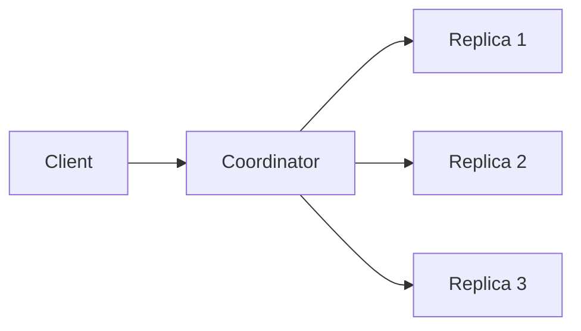

coordinator 只是某次请求的 fan-out/response aggregator，不像 leader 那样为该 key 的所有写强制单一顺序。不同请求可由不同 coordinators 处理。

### 4.5 无 leader 也就没有 failover

所有 replicas 对称，某节点宕机时无需先选新 leader。客户端照常向多个 replicas 发请求，只要足够多节点成功响应，operation 就可完成。

这消除了 promotion pause，却不代表故障免费：missed writes 仍要补齐，concurrent versions 仍要合并。

### 4.6 三副本下的节点故障写入

假设一条 key 有 3 个 replicas，其中 replica 3 正在重启。client 把 write 并行发给三者，replicas 1、2 接受，3 没收到；若策略要求任意 2 个成功即可确认，client 收到两个 `OK` 后就认为 write successful。

系统不必等待或立刻修复 replica 3，这就是故障期间仍可写的来源。

### 4.7 恢复节点会返回 stale value

replica 3 恢复上线时，仍缺少离线期间的 writes。若读请求只访问它，就可能返回 stale/outdated value。

因此无主复制不能仅把多副本用于写 availability，读取也必须比较多个 replicas。

### 4.8 parallel reads

client/coordinator 把 read 并行发给多个节点，可能收到新旧不同的 versions。它不能以多数相同值作为 winner；一个节点可能持有刚成功写入的最新值，而多个节点仍旧。

应根据 version metadata 比较响应，并保留因果上更新的值；若 versions concurrent，则按 LWW、siblings 或 CRDT 等规则处理。

### 4.9 value 必须携带版本

每个 value 需带 version number、logical timestamp 或 causal metadata。只比较 payload 无法判断：

- 值相同但版本不同；
- 新值恰好等于旧值；
- 哪个写覆盖哪个写；
- 两个值是否 concurrent。

wall-clock LWW 可以构造 winner，但不能准确识别 concurrency；后文将用 version vector 保留 happens-before。

### 4.10 missed writes 的三种追赶机制

Dynamo-style 系统常组合：

1. read repair：读时发现并修复；
2. hinted handoff：健康节点暂存故障节点应收的写；
3. anti-entropy：后台周期比较并补齐差异。

它们覆盖不同 workload 与故障窗口，通常不能互相完全替代。

### 4.11 read repair

read 同时得到 replica 1/2 的 version 7 和 replica 3 的 version 6。coordinator 返回 version 7，并把新值写回 stale replica 3：

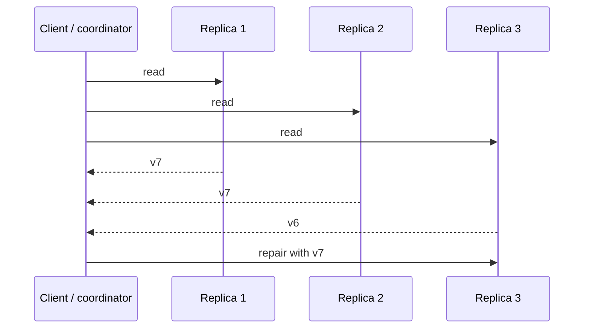

它把业务 read 顺带变成 convergence 工作，对 hot keys 尤其有效。

### 4.12 read repair 的边界

从不被读取的 cold keys 不会触发 repair；若只读取少量 replicas，也未必发现所有 stale copies。同步 repair 还会增加 read latency，异步 repair 则在返回后仍存在不一致窗口。

所以 read repair 是机会式修复，不是完整 background reconciliation。

### 4.13 hinted handoff

目标 replica 不可用时，另一个节点可代表它保存 write 与 destination 信息，形成 **hint**。目标恢复后，holder 把 hints 传回，确认后删除，这一过程称 **handoff**。

即使 key 永远不再读取，hinted handoff 也能补写，因此弥补 read repair 的盲区。

### 4.14 hints 的生命周期与风险

实现需限制 hint retention、磁盘配额、重试 backoff 和目标 identity。若故障持续超过 retention，hint 可能过期，只能依赖 anti-entropy；若恢复时一次回放大量 hints，会使刚恢复节点过载。

handoff 也不等于 durable backup：holder 自身故障仍可能丢失尚未转交的数据。

### 4.15 anti-entropy

后台 **anti-entropy process** 周期比较 replicas 的 key/version summaries，发现差异后复制缺失数据。实际系统可用 Merkle tree 等结构缩小需比较和传输的范围。

它不像 leader replication log 那样按一个固定顺序重放 writes，修复可能有显著延迟；价值在于最终扫描到 read repair/hints 遗漏的分歧。

### 4.16 三种修复如何互补

| 机制 | 触发 | 优势 | 局限 |
|---|---|---|---|
| read repair | client read | hot key 快速自愈 | cold key 不触发 |
| hinted handoff | write 时目标不可达 | 主动记录 missed write | hint holder 压力、保留期有限 |
| anti-entropy | 周期后台任务 | 覆盖长期和未知差异 | 收敛慢、消耗扫描/网络资源 |

它们共同实现 eventual convergence，而不是任一种机制单独保证立即一致。

### 4.17 quorum 的 $n,w,r$

对某个 key：

- $n$：存放该 key 的 replica 数；
- $w$：write 被视为成功前所需成功响应数；
- $r$：read 被视为成功前所需响应数。

满足这些阈值的操作称 **quorum writes** 和 **quorum reads**；$w,r$ 可理解为有效操作所需 minimum votes。

### 4.18 quorum intersection 推导

成功 write set 大小至少为 $w$，read set 大小至少为 $r$，都取自 $n$ 个 replicas。两集合最小交集为：

$$
|W\cap R|\ge w+r-n
$$

因此若：

$$
w+r>n
$$

则 $|W\cap R|\ge1$，每次 read 至少接触一个参与最近一次成功写的 replica。这是 quorum intuition 的集合论根基。

### 4.19 $n=3,w=2,r=2$

successful write 至少落在 2 个 replicas，最多 1 个 stale；read 再取任意 2 个，必与 write set 重叠。一个节点 down/slow 时，读写仍可由另外两个完成。

注意 read 必须比较 version 并选新值；仅“读到了那个节点”却错误采用旧响应，交集没有意义。

### 4.20 $n$ 不是 cluster 总节点数

cluster 可有远多于 $n$ 个 nodes，但某个 key 只按 replication factor 存在于 $n$ 个节点。不同 keys 的 replica sets 不同，从而与 sharding 结合，支持超过单机容量的数据集。

quorum 公式针对**该 key 当前正确的 replica set**，不是任意从 cluster 选 $w/r$ 个节点。

### 4.21 常见 majority 配置

常取奇数 $n=3$ 或 $5$，并令：

$$
w=r=\left\lceil\frac{n+1}{2}\right\rceil
$$

即 $3/2/2$ 或 $5/3/3$。majority 是方便的对称选择，却不是 quorum 的定义；真正条件是 read/write sets 必须相交。

### 4.22 read-heavy 调参

若读很多、写很少，可设 $w=n,r=1$。所有 replicas 都确认后，任读一个在静态 membership 下应看到该成功写，读取快且便宜。

代价是任一 replica 失败都会使所有 writes 失败。调小一侧阈值，通常把 latency/availability 成本推给另一侧。

### 4.23 可容忍不可用节点数

在 membership 稳定且无其他异常时：

$$
f_{write}=n-w,\qquad f_{read}=n-r
$$

$n=5,w=3,r=3$ 可分别容忍 2 个 unavailable replicas。这里指单次操作仍凑够响应，不代表同时读写在任意 network partition 中都能成功。

### 4.24 send to all, wait for threshold

正常实现通常仍把请求并行发送到全部 $n$ 个 replicas；$w/r$ 只决定等待多少 success responses 后即可返回。慢响应随后可用于 repair，或被忽略。

因此 request latency 接近第 $w$ 快 write response 或第 $r$ 快 read response，而不是全部 $n$ 个响应的最大值。

### 4.25 只关心 successful response

不足 $w/r$ 时 operation 返回 error。原因可包括 crash、power loss、disk full、执行错误、client-node network interruption 或 timeout。

quorum 层通常不必区分故障类型，只判断是否在 deadline 内得到成功响应；诊断层仍应保留原因，否则无法运维。

### 4.26 quorum 不必是 majority

majority 保证两个多数集合相交，但其他组合也可。例如 $n=5,w=4,r=2$ 同样满足 $w+r>n$：读便宜，写更依赖节点可用。

更一般的 quorum system 甚至可以使用非数值、带拓扑约束的集合族；本章的 $n,w,r$ 是 Dynamo-style 中直观的均匀模型。

### 4.27 非 quorum 配置

也可设：

$$
w+r\le n
$$

请求仍发往 $n$ 个 nodes，但成功门槛较低。此时 read set 可能与最新 successful write set 完全不相交，所以 stale read 风险显著增加。

### 4.28 低阈值的收益

较小 $w/r$ 可降低 synchronous/blocking replication 的 response latency，并在大范围网络中断时提高可用性。只有 reachable replicas 少于 $w$ 或 $r$ 时，相应操作才停止。

这是一项显式 consistency trade-off，不应把低阈值宣传成同等一致性的纯性能优化。

### 4.29 overlap 不是绝对 latest-read 保证

在理想静态模型中，$w+r>n$ 让 read 与最近 successful write 相交。然而真实系统还有恢复、membership change、并发与失败写残留。因而它提供很有用的直觉，却不能直接推出 linearizability。

Dynamo-style database 通常为可容忍 eventual consistency 的场景优化；$w/r$ 更多是调节 stale-read 概率与故障容忍度，而非一张绝对保证证书。

### 4.30 新值副本失败后被旧值恢复

若持有 new value 的节点故障，恢复流程却从 old replica 重建，它原有 new version 会消失。存放新值的 replica 数可能降到 $w$ 以下，原先的 quorum premise 被破坏。

恢复必须比较 versions 或用持久 hint/repair source，不能盲目从任一健康节点克隆。

### 4.31 rebalancing 期间的 membership 分歧

shard rebalance 时，节点可能对“该 key 的 $n$ 个 replicas 是谁”看法不同。write quorum 在旧 replica set，read quorum 在新 replica set，即使各自数量都满足 $w/r$，也可能没有交集。

因此 quorum correctness 依赖一致的 membership/epoch，以及迁移期间 old/new sets 的联合协议。

### 4.32 concurrent read and write

若 read 与 write 时间重叠，read 可能看到 new value，也可能看到 old value。甚至一次 read 看到新、稍后另一次 read 看到旧，因为第二次可能在 write 尚未覆盖/修复的不同 replicas 上形成 quorum。

$w+r>n$ 不把并发 operation 自动线性化；linearizable implementation 还需额外 round、lease、consensus 或版本确认规则。

### 4.33 failed write 不会自动 rollback

write 可能在部分 replicas 成功，却因成功数少于 $w$ 向 client 报失败。那些已写副本通常不会 rollback，因此之后 read 可能返回这个“失败”write 的值，也可能不返回。

这形成 unknown/ambiguous outcome：应用不能把 error 简化为“绝对没有生效”。安全 retry 需要 idempotency key、版本条件或可去重 operation ID。

### 4.34 real-time clock 与 silent drop

Cassandra、ScyllaDB 等若用 real-time timestamp 判定 newer write，会继承 LWW 的 clock skew 风险：fast-clock 节点的旧意图可能压过真实更晚的写，后者被 silently dropped。

增大 $w/r$ 不修复 timestamp ordering；quorum intersection 与 winner selection 是两个独立层次。

### 4.35 concurrent writes 在各节点顺序不同

write A、B 并发发送时，replica 1 可只收到 A，replica 2 按 A→B 到达，replica 3 按 B→A 到达。若每次到达都裸覆盖，最终可能分别为 A、B、A，永久不一致。

系统必须采用 deterministic LWW、manual siblings 或 CRDT 等 convergence rule，而不能把 packet arrival order 当作全局事实。

### 4.36 quorum 能保证什么、不能保证什么

它能在模型成立时保证 read/write sets overlap，提高读到 recent successful write 的可能性；它不能单独保证：

- wall-clock 上真正最新；
- concurrent read/write 的线性化顺序；
- failed write 完全不可见；
- reconfiguration 前后集合相交；
- cross-key invariant；
- session monotonicity。

架构文档应逐项声明真正提供的 guarantee，不能只写“使用 quorum，所以 strong consistency”。

### 4.37 monitoring staleness 的必要性

即便业务允许 stale reads，也必须知道复制健康度。若 convergence 从通常的秒级退化到小时级，应告警并定位 network problem、overloaded node、repair backlog 或 storage fault。

“最终一致”若没有可观测的时间分布，就无法形成 SLO。

### 4.38 leader-based lag 容易量化

leader 与 followers 按同一 log order 应用 writes，每个节点有 log position。可用：

$$
lag_{entries}=position_{leader}-position_{follower}
$$

再结合 commit timestamp 估算 time lag。虽然也有 clock/throughput caveat，至少存在统一参照序列。

### 4.39 leaderless staleness 更难量化

无主系统没有固定 write order 或单一 authoritative position。hint count 可作为健康信号，却难直接解释成“用户会读到多旧”：一个 hint 可能对应 hot key，大量 hints 也可能全是冷数据。

eventual consistency 刻意不规定 deadline，但 operability 要求把“eventual”量化为可监控指标。

### 4.40 可观测性组合

实际可组合监控：

- outstanding hints 数量、bytes、oldest age；
- anti-entropy/repair pending ranges 与完成时长；
- replica version divergence 抽样；
- read repair 触发率；
- coordinator timeout/insufficient replica errors；
- per-node latency、disk pressure 与 dropped messages。

单一指标不足，尤其要关注 age distribution 而不只是 backlog count。

### 4.41 single-leader 的一致性优势

单主可提供无主难以达到的 strong consistency；但如果读取 async follower，同样可能 stale。要利用单主的最新读保证，通常必须读 leader 或具备 read-index/lease 等协议的副本。

因此性能比较应对齐 guarantee：不能拿 leader linearizable read 与 leaderless eventual read 只比 latency。

### 4.42 leader read 的容量与慢节点风险

所有 fresh reads 集中 leader 时：

- read throughput 受 leader capacity 限制；
- overload/resource contention 直接传给用户 latency；
- 无法像 async followers 那样简单横向 read scaling。

leader 同时承担 write ordering，更容易成为热点。

### 4.43 failover pause

leader 故障后要 detect、elect/promote、reconfigure 才能继续。即使 failover 很快，用户也会看到 response-time spike；很慢则形成明显 unavailability。

无主系统没有这一模式切换，健康 replicas 继续处理请求。

### 4.44 request hedging

leaderless request 本来就并行访问多个 replicas，可采用最先返回的足够 $r/w$ 个 responses，忽略 slow tail，这称 **request hedging**。

它能显著降低 tail latency，因为总时长由第 $k$ 个 order statistic 决定，而非指定单节点或所有节点的最慢值。但 fan-out 会增加总请求量，必须控制并发与取消迟到请求。

### 4.45 gray failure

**gray failure** 指节点没有彻底 down，却因 overload、GC、I/O contention 或 network degradation 极慢。leader-based 系统必须艰难判断“是否坏到值得 failover”，误判或频繁切换本身会扰动系统。

leaderless 正常路径与故障路径相同：请求总是并行，慢节点自然被快响应绕过，因此对 gray failure 更 resilient。

### 4.46 不区分 normal/failure case

无主 resilience 的核心不是检测更神奇，而是没有“先确认主节点死亡才能继续”的状态转换。单个 replica slow/unavailable 对前台延迟影响较小，只要仍能达到 threshold。

这也使容量规划必须确保故障时剩余节点能承担 fan-out、repair 与 handoff 的额外负载。

### 4.47 hinted handoff 的恢复负载

系统仍需检测某目标不可达以保存 hints。目标回来后，handoff 把 backlog 打到刚恢复节点；此时它还可能做 cache warm-up、compaction 和 anti-entropy，容易再次过载。

应 throttle、分批回放并为 repair 预留 capacity，不能用前台 quorum 成功掩盖持续积累的恢复债务。

### 4.48 quorum 越大越容易撞上慢响应

$n$ 增大时，majority $r/w$ 也增大。即使全部并行且只等最快 $k$ 个，要求的第 $k$ 个响应越靠后，遇到 slow replica 的概率越高，overall response time 上升。

复制更多并不单调改善 latency；它增加 durability/fault options，也增加网络、存储和协调成本。

### 4.49 实践中的 quorum 大小

原书指出实践中 quorum 很少超过 $4/7$ 或 $5/9$。这是 tail latency、故障容忍和成本的经验平衡，并非理论上限。

在 correlated failure、同 rack/region 故障下，增加同一 failure domain 内 replicas 的收益还会递减。

### 4.50 sloppy quorum

大范围 network interruption 使 client 联系不到某 key 的常规 replicas 时，有些系统允许任意 reachable replica 代收 write，即使它不属于该 key 的 normal replica set。这称 **sloppy quorum**。

它优先保证“先把写存到某处”，随后通过 hinted handoff 送回 home replicas；但此时写集合与后续正常 read quorum 可能完全不相交。

### 4.51 consistency level ANY

Riak 与 Dynamo 使用 sloppy quorum 术语；Cassandra/ScyllaDB 的类似选项称 **consistency level ANY**。一次 ANY write 甚至可能只作为 hint 存下，而尚未进入任何目标 replica。

因此它不能保证随后的 read 看见该值。对必须接收遥测、日志或可稍后对账的应用，它可能仍比立即写失败更合适。

### 4.52 三类架构的韧性比较

| 架构 | 前台写依赖 | 断连表现 | 读取新鲜度 |
|---|---|---|---|
| single-leader | 联系唯一 leader | 无法联系时需 failover/拒写 | 读 leader 可强，async follower 可旧 |
| multi-leader | 联系一个本地 leader | 本地继续，后台合并 | 可 arbitrarily stale |
| leaderless quorum | 联系足够 $w/r$ replicas | 可容忍部分节点/链路失败 | 高概率新鲜，仍有边界情况 |

multi-leader 只联系一个 colocated leader，网络分区韧性可强于 quorum；quorum 则在 fault tolerance 与 recent read 概率之间折中。

### 4.53 leaderless 的 multi-region 适配

无主本就处理 conflicting concurrent writes、network interruption 与 latency spike，因此也适合 multi-region。关键选择是一次 operation 要等待哪些 regions 的多少 replicas。

等待范围越广，跨区一致性/耐区域故障证据越强，前台 latency 和对 WAN 的依赖也越高。

### 4.54 Cassandra/ScyllaDB 跨区写路径

client 先选 local region 的 coordinator node。coordinator 把 write 发给：

1. 本 region 的所有目标 replicas；
2. 每个其他 region 的一个 replica；
3. 该远端 replica 再在 region 内转发给其他目标 replicas。

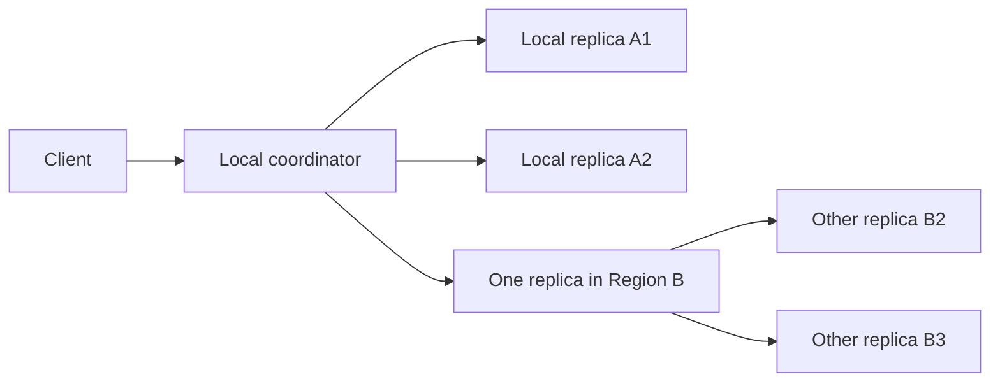

这样 coordinator 对每个 remote region 只发一次 WAN request，减少跨区重复流量。

### 4.55 multi-region consistency levels

系统可要求不同 response sets，例如：

- all-regions global quorum；
- each-region separate quorum；
- client local-region quorum；
- 更弱的单节点或 ANY。

它们不是简单的“强/弱”标签，而是对 latency、failure domain 和 read/write overlap 范围的具体选择。

### 4.56 local quorum 的取舍

local quorum 不等待 remote region，避开 WAN 慢请求，前台 latency 更低且单个远端 region 故障不阻塞。但 remote writes 可能尚未到本地，所以 local read 更可能 stale；两个 regions 各自 local quorum 也可能并发接受冲突写。

若业务要求跨区唯一性或余额约束，local quorum 本身不足。

### 4.57 Riak 的跨区模型

Riak 让 client 与 database nodes 的通信局限在一个 region，因此 $n$ 表示 region 内 replica 数。不同 regions 的 database clusters 再在后台异步复制，整体更像 multi-leader between clusters。

同被称为 leaderless/multi-region，拓扑和 consistency scope 仍可能完全不同，必须明确 $n,w,r$ 是 local 还是 global。

### 4.58 可运行示例：穷举 quorum intersection

下面枚举所有大小为 $w$ 的 write sets 与大小为 $r$ 的 read sets，验证最小交集是否大于 0。

```python
from itertools import combinations


def quorum_intersection(n: int, w: int, r: int) -> tuple[bool, int]:
    replicas = range(n)
    write_sets = list(combinations(replicas, w))
    read_sets = list(combinations(replicas, r))
    minimum_overlap = min(
        len(set(write_set) & set(read_set))
        for write_set in write_sets
        for read_set in read_sets
    )
    return minimum_overlap > 0, minimum_overlap


for parameters in [(3, 2, 2), (5, 3, 3), (5, 2, 3)]:
    n, w, r = parameters
    guaranteed, overlap = quorum_intersection(n, w, r)
    print(
        f"n={n}, w={w}, r={r}: "
        f"overlap guaranteed={guaranteed}, minimum overlap={overlap}"
    )
```

实际运行输出：

```text
n=3, w=2, r=2: overlap guaranteed=True, minimum overlap=1
n=5, w=3, r=3: overlap guaranteed=True, minimum overlap=1
n=5, w=2, r=3: overlap guaranteed=False, minimum overlap=0
```

前两组满足 $w+r>n$；第三组恰好 $w+r=n$，可构造完全不相交集合。该证明只覆盖静态集合交集，不覆盖 concurrent writes、membership drift 和版本选择错误。

### 4.59 无主复制基础部分小结

leaderless 通过并行访问 replicas 和 response threshold 避免 leader failover；read repair、hinted handoff 与 anti-entropy 让错过的 writes 最终补齐。$w+r>n$ 推导出静态 read/write set 至少一个交点，但不能自动升级为 linearizability。

它尤其能平滑处理 slow node 与 gray failure；代价是 fan-out、repair debt、tail latency，以及更难量化的 staleness。sloppy quorum 和 local quorum 可继续提高 availability/latency，却进一步削弱后续读取新值的保证。

### 4.60 conflict 不一定在 write path 发现

无主和多主一样允许 same key concurrent writes。conflict 可能在写入时发现，也可能直到 read repair、hinted handoff 或 anti-entropy 交换 versions 时才暴露。

所以系统不能只在 coordinator 的短暂请求上下文里保存冲突信息；causal metadata 必须随 durable value 复制和持久化。

### 4.61 不同 replica 观察到不同到达顺序

clients A、B 并发写 key $X$，三个节点可能经历：

- node 1 收到 A，但临时故障使它从未收到 B；
- node 2 先收到 A，再收到 B；
- node 3 先收到 B，再收到 A。

若每次收到 write 就无条件覆盖，最终 node 2 为 B，nodes 1/3 为 A。网络恢复后若没有确定性 merge，它们会永久分歧。

### 4.62 arrival order 不能定义 winner

各节点的 packet arrival order 只是局部观察，variable network delay 与 partial failure 会让它们不同。eventual consistency 要求 replicas 对同一 write set 收敛，因此必须使用与 arrival order 无关的 resolution：LWW total order、siblings/manual merge 或 CRDT。

Cassandra、ScyllaDB 常用 LWW；Riak 可使用 siblings/CRDT。具体产品配置和版本仍应单独核实。

### 4.63 timestamp 不告诉你是否 concurrent

LWW 易实现：timestamp 较大者覆盖较小者。但两个 timestamp 只形成排序，不能回答：

- $B$ 写入时是否已看到 $A$；
- $B$ 是对 $A$ 的有意更新，还是基于旧状态的独立写；
- 丢弃 $A$ 是否安全。

若要显式保留 conflict，必须记录 causal dependency，而不是只比较时间大小。

### 4.64 happens-before relation

若 operation B 知道 A、依赖 A 或建立在 A 的结果上，则 A **happens before** B，记为：

$$
A\rightarrow B
$$

也称 B causally depends on A。例如先 insert row，读取后再 increment 该 row，increment 明确建立在 insert 上，二者不 concurrent。

### 4.65 两个 operations 的三种关系

对 A、B 恰有三类：

1. $A\rightarrow B$：B 可 supersede A；
2. $B\rightarrow A$：A 可 supersede B；
3. $A\nrightarrow B$ 且 $B\nrightarrow A$：二者 concurrent，应保留/解决 conflict。

“later overwrites earlier”中的 later 应指 causal later，而非机器时钟数值更大。

### 4.66 concurrency 与 physical time 无关

精确判断两个分布式事件是否真实同时很困难，也没有必要。只要双方写入时都不知道对方，即使 wall-clock 相隔很久，也定义为 concurrent。

网络慢或中断会阻止信息传播，使本来有足够物理时间互相影响的 operations 仍然 concurrent。

### 4.67 relativity 类比的适用边界

这一思路常与狭义相对论类比：信息传播速度有上限，相距较远的事件在信息来不及到达时不能互相影响。计算机网络的限制更强，因为 packet 可排队、丢失或被 partition 阻断，远慢于物理极限。

类比用于理解“并发取决于可知性”，不是要用物理时钟计算数据库因果关系。

### 4.68 causal context 的任务

系统需要让每次 write 声明“我已经看过哪些历史”。若 incoming write 的 context 覆盖某 old version，old value 可安全删除；若它没见过另一个 version，两者必须作为 siblings 共存。

这是一种 metadata-level 判断，server 无需理解 payload 是购物车还是航空管制状态。

### 4.69 先从单 replica 推导

先考虑只有一个 replica、同一 key 被多个 clients 并发读写。此时所有 requests 到达一个 server，可用 per-key scalar version number 捕获 server 已知的因果前缀，再推广到多 replicas。

这个简化不是单主复制方案，而是为推导 concurrency detection algorithm 暂时去掉 replica 维度。

### 4.70 per-key version number

server 为每个 key 保存 counter，每处理一次 write 就递增，并把新 version 与 value 一起存储：

$$
v_{new}=v_{current}+1
$$

counter 只在该 server 上递增，因此单 replica 时可形成统一版本序列。

### 4.71 read 返回 siblings 与 latest version

client read 时，server 返回：

- 所有尚未被 supersede 的 values（siblings）；
- 当前 latest version number。

client 不能只取一个 sibling；它后续写入前必须把读到的并发 values 按业务规则合并。

### 4.72 write 带 prior-read version

client write 时携带 prior read 得到的 version/context，并提交合并后的新 value。write response 也返回当前 siblings 与 latest version，使 client 可连续操作而无需另一次独立 read。

该 context 声明新 write 建立在哪个历史状态上，是判断 supersession 的证据。

### 4.73 server 的覆盖规则

server 收到 context version $v_c$ 时：

1. 可覆盖 version $\le v_c$ 的 values，因为 client 声明已看到并合并它们；
2. 必须保留 version $>v_c$ 的 values，因为它们是 prior read 后发生、incoming write 未见过的并发分支；
3. 为 incoming value 分配新 version。

这种比较只操作 version metadata，不检查 value 内容。

### 4.74 不带 version 的 write

若 client 完全不携带 prior context，server 不能证明它见过任何已有 write。因此它与所有现存 versions 都视为 concurrent，不能覆盖任何一个，只能成为新的 sibling。

这解释了为何 Dynamo-style API 常要求 read-modify-write 携带 opaque context；丢掉 context 会制造 siblings。

### 4.75 shopping cart 第一次写

初始 cart empty。client 1 加 `milk`，这是 key 的第一条 write：server 保存 `[milk]`，分配 version 1，并把 value/context 1 返回 client 1。

状态：

```text
v1: [milk]
```

### 4.76 第二次并发写

client 2 不知道 `milk`，独立加入 `eggs`。它没有包含 v1 context，因此 server 分配 v2 并保留两者为 siblings，再把两值与 latest version 2 返回 client 2。

```text
v1: [milk]
v2: [eggs]
```

这里 v2 数字更大不表示它因果上覆盖 v1。

### 4.77 client 1 加 flour

client 1 只见过 v1，于是提交 `[milk, flour]` 并携带 context 1。server 知道它 supersedes v1，却没见过 v2 `[eggs]`，故保留 v2、给新值分配 v3：

```text
v2: [eggs]
v3: [milk, flour]
```

### 4.78 client 2 加 ham

client 2 上次已收到 `[milk]` 与 `[eggs]`，context 为 2。它先合并，再加 `ham`，提交 `[eggs, milk, ham]`。server 用 context 2 清除已被涵盖的旧值，但 v3 是之后产生的并发分支，因此得到：

```text
v3: [milk, flour]
v4: [eggs, milk, ham]
```

### 4.79 client 1 加 bacon

client 1 上次在 context 3 收到 `[milk, flour]` 与 `[eggs]`，合并并加入 `bacon`，提交 `[milk, flour, eggs, bacon]`。它覆盖 v3 及此前所见历史，却与尚未见过的 v4 concurrent：

```text
v4: [eggs, milk, ham]
v5: [milk, flour, eggs, bacon]
```

最终仍有两个 siblings；后续 client 必须继续合并，才能把 `ham` 与 `bacon` 都保留下来。

### 4.80 causal dependency graph

上述 sequence 的 version number 是 server 到达序号，真正依赖由 client 携带的 context 形成 DAG：

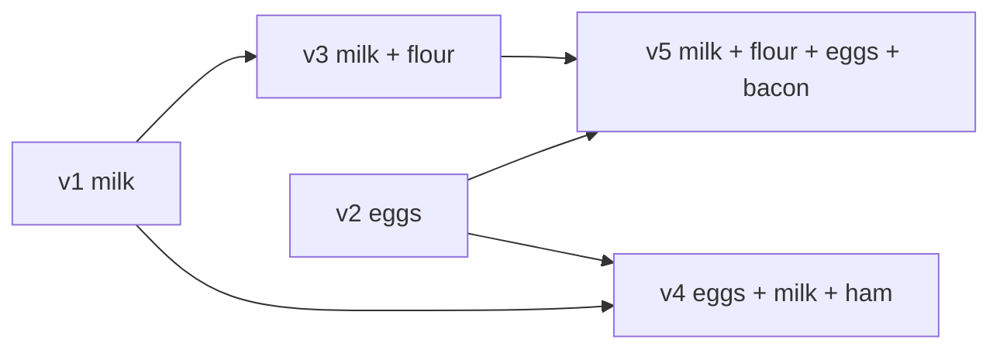

v3 与 v4 互不可达，因此 concurrent；v4 与 v5 也互不可达。箭头表示“后者知道/合并了前者”，不是 wall-clock timeline。

### 4.81 算法保留写但不替应用合并

即使 clients 从未完全追上 server，旧 versions 仍会在被后继 context 覆盖后删除，而且没有 write 被静默丢弃。代价是未解决的 siblings 可能积累，payload 也可能重复包含相同 item。

version algorithm 只正确标出可覆盖与 concurrent 的边界；购物车 add/remove 的最终语义仍应由 CRDT 或业务 merge 决定。

### 4.82 多 replicas 下 scalar version 不够

多个 replicas 可同时接受 write，各自都可能生成“version 5”。单个 scalar 无法表达它来自哪个 replica，也无法总结每个 replica 已观察到多少历史。

给 scalar 再加 node ID 可构造 total order 用于 LWW，却仍不能准确区分 causally later 与 concurrent。

### 4.83 version vector

需要为每个 key、每个 replica 维护一个版本分量。replica 处理本地 write 时递增自己的分量，并记录从其他 replicas 见过的最大分量。所有分量集合称 **version vector**：

$$
V=\langle v_A,v_B,\ldots,v_k\rangle
$$

例如 $\langle2,1,0\rangle$ 表示已见过 A 的前 2 个、B 的前 1 个、C 的 0 个 events。

### 4.84 componentwise happens-before

定义向量偏序：

$$
U\preceq V\iff \forall i,\ U_i\le V_i
$$

若 $U\preceq V$ 且 $U\ne V$，则 $U\prec V$，表示 V 的 causal history 包含 U，故 U happens before V。

这是 partial order，不要求所有向量都可比较。

### 4.85 vector concurrency

若某些分量 $U$ 大、另一些分量 $V$ 大，则两者互不支配：

$$
U\parallel V\iff U\npreceq V\land V\npreceq U
$$

例如 $U=\langle2,0\rangle$ 与 $V=\langle1,1\rangle$ concurrent：U 多见了 A 的一次 event，V 多见了 B 的一次 event。两值都应保留或合并。

### 4.86 vector join

合并 causal knowledge 时逐分量取 maximum：

$$
(U\sqcup V)_i=\max(U_i,V_i)
$$

该 join 满足交换、结合、幂等，适合重复和乱序传播。合并后再由处理新 write 的 replica 递增自己的 component，形成新 event。

### 4.87 read/write 中传递 vector

replicas 在 read response 中把 values 与 version vectors 交给 client；client 合并 siblings 后，在 write request 中原样带回 causal context。database 据此区分 overwrite 与 concurrent write。

client 通常把 context 当 opaque token，不应自行截断、伪造或把一条 key 的 context 用到另一条 key。

### 4.88 从一个 replica 读、向另一个写

因为 context 随 client 移动，client 可从 replica A 读取后向 replica B 写入。B 即使尚未在后台见过 A 的全部状态，也能从 vector 得知 incoming write 的依赖。

这种路径可能产生 siblings，但只要 metadata 保留且 siblings 被正确合并，就不会因换节点而丢数据。

### 4.89 causal context

Riak 把编码后的 version vector token 称为 **causal context**。名称强调它不是展示给用户的版本号，而是 write 所基于历史的紧凑描述。

API gateway、cache 和 client SDK 必须把 token 与 payload 一起传递；遗漏 token 会把有意覆盖误判为 concurrent write。

### 4.90 dotted version vector

version vector 有若干变体。**dotted version vector（DVV）** 用一个 dot（通常为 `(replica_id, counter)`）标识当前具体 event，并用 vector/context 总结它之前的 causal history。

这种拆分能更精确关联每个 sibling 与产生它的 event，避免传统 context 在并发更新中不必要地膨胀 siblings；Riak 2.0 使用 dotted version vectors。本章不展开其压缩和 pruning 细节。

### 4.91 version vector 与 vector clock

version vector 有时也被称为 vector clock，但两者并不完全相同，差异涉及追踪对象、事件与副本状态的方式。对比较 replica states、判断一个版本是否包含另一个版本的场景，本章采用 **version vector** 这一更准确术语。

不要因 API 文档混用名称就假定数据结构语义相同；应检查 component identity、increment rule、merge 与 compaction。

### 4.92 metadata size 与成员生命周期

vector 宽度随可独立写入的 replica identities 增长。固定少量 server replicas 时可控；若把每台短命 browser/device 都作为永久 component，会产生巨大 metadata。

实际系统需要 stable actor identity、hierarchical aggregation、pruning/retirement 或其他 compact causal history 技术。错误删除 component 会把旧 event 当新并发写，错误复用 identity 则会混淆历史。

### 4.93 可运行示例：version vector 比较

下面实现 componentwise partial order 与 join，验证 causal-before、equal 和 concurrent 三种关系。

```python
VersionVector = dict[str, int]


def relation(left: VersionVector, right: VersionVector) -> str:
    replica_ids = left.keys() | right.keys()
    left_le_right = all(left.get(replica, 0) <= right.get(replica, 0) for replica in replica_ids)
    right_le_left = all(right.get(replica, 0) <= left.get(replica, 0) for replica in replica_ids)
    if left_le_right and right_le_left:
        return "equal"
    if left_le_right:
        return "left-before-right"
    if right_le_left:
        return "right-before-left"
    return "concurrent"


def join(left: VersionVector, right: VersionVector) -> VersionVector:
    return {
        replica: max(left.get(replica, 0), right.get(replica, 0))
        for replica in sorted(left.keys() | right.keys())
    }


vector_a = {"A": 2, "B": 0}
vector_b = {"A": 1, "B": 1}
vector_c = {"A": 2, "B": 1}
vector_d = {"A": 2, "B": 0}

print("A vs B:", relation(vector_a, vector_b))
print("A vs C:", relation(vector_a, vector_c))
print("B vs C:", relation(vector_b, vector_c))
print("A vs D:", relation(vector_a, vector_d))
print("join(A, B):", join(vector_a, vector_b))
```

实际运行输出：

```text
A vs B: concurrent
A vs C: left-before-right
B vs C: left-before-right
A vs D: equal
join(A, B): {'A': 2, 'B': 1}
```

A 与 B 各自在一个分量领先，所以 concurrent；C 同时包含二者的 causal knowledge，因此 A、B 都 happens before C；join(A,B) 恰为 C。

### 4.94 无主复制部分总结

leaderless 系统没有统一 arrival order，必须区分 causal overwrite 与 concurrent conflict。单 replica 可让 client 携带 prior scalar version；多个写入 replicas 则需要 per-replica component 组成 version vector，并以 partial order 判断 happens-before。

version vector 保证 metadata 足够时不因路由到不同 replica 而静默丢写；它不负责理解 payload，也不保证业务 invariant。检测出 siblings 后，仍需 LWW、manual merge 或 CRDT 决定收敛结果。

---

## 5. 原章总结：复制是在故障与并发下维持多份状态

### 5.1 复制服务五个目标

原章把 replication 的主要目的归纳为：

1. **high availability**：机器、多个机器、zone 或 region 故障时继续服务；
2. **durability**：机器乃至 region 永久损坏时不丢已承诺数据；
3. **disconnected operation**：网络中断时应用仍可工作；
4. **latency**：把数据放近用户，缩短交互路径；
5. **scalability**：把 reads 分散到 replicas，超过单机读容量。

这些目标可能互相拉扯。例如异步本地写降低 latency、提高断连可用性，却削弱跨 region durability 和立即一致性。

### 5.2 “复制几份”为何仍很难

静态文件拷贝简单；持续变化的数据必须处理 concurrent writes、unavailable nodes、network interruptions、slow/gray failures 和恢复后的追赶。软件 bug、硬件错误引发的 silent corruption 还更隐蔽，本章只触及故障空间的一部分。

难点不是创建第二份 bytes，而是规定每个副本在每种失败时刻应接受什么、承诺什么、读出什么，以及日后如何收敛。

### 5.3 single-leader 的总结

clients 把全部 writes 交给一个 leader，leader 输出 change stream 给 followers。统一写入点使顺序和 strong consistency 较易理解；reads 可来自任意 replica，但 async follower 可能 stale。

主要风险是 leader bottleneck、failover pause、async promotion 时的 recent data loss，以及 split brain/fencing。

### 5.4 multi-leader 的总结

clients 可向多个 leaders 中任一个写；leaders 互相传播 changes，并可继续复制到各自 followers。它适合 geo-distributed 和 local/offline write，却允许不同 leaders 在互不知情时并发修改。

收益来自不等待远端，成本则是 weaker consistency、causal ordering 与 conflict resolution。

### 5.5 leaderless 的总结

client/coordinator 同时写多个 replicas，并行读取多个 replicas，通过 version comparison、repair 和 quorum threshold 处理 stale nodes。没有 leader failover，对 slow/unavailable node 更平滑。

代价是请求 fan-out、staleness 难观测、failed write 的模糊结果，以及仍需解决 concurrent versions。

### 5.6 synchronous/asynchronous 是独立轴

三类架构都还要回答 replication 是否阻塞确认。同步扩大 acknowledgment 的 durability evidence，却把 remote latency/failure 放进前台；异步正常时快且可用，但 lag 增大或节点失效时，已确认数据可能尚未复制。

不能只说“有三个副本”；还要说 write 在第几个副本持久化后向 client 返回。

### 5.7 replication lag 的奇怪现象

async replication 可让用户：

- 写完却读不到自己的数据；
- 先看到新值，后看到旧值；
- 先看到 effect，后看到 cause。

这些不是 UI 偶发问题，而是路由到进度不同 replicas 后的必然可能性。

### 5.8 三类 session guarantee

应用可按需要提供：

- read-after-write/read-your-writes：看见自己已提交的数据；
- monotonic reads：一旦见过某版本，不再倒退；
- consistent prefix reads：按因果上合理的顺序观察数据。

它们比 linearizability 弱，却能直接消除许多用户可感知异常。实现通常需要 sticky routing 或 client/session 携带 minimum logical position。

### 5.9 convergence 的两阶段

multi-leader 与 leaderless 要最终一致，至少分两步：

1. 用 version vector 或类似算法区分 causal overwrite 与 concurrent writes；
2. 用 LWW、manual resolution、CRDT/OT 等合并 concurrent values。

检测 concurrency 不等于解决 conflict；保证 convergence 也不等于维护所有业务 invariants。

### 5.10 backups 仍是独立防线

replication 主要维持 online availability，并会快速传播误删除和 corruption。backup 提供历史恢复点、隔离副本与长期保留。完整数据系统必须同时设计 replica repair 与 backup restore，并用 RPO/RTO 演练验证。

### 5.11 本章的完整副本假设

本章为聚焦 replication，假设每个 replica 可存整个 dataset；实际大数据集通常让每台机器只存 subset，再为每个 shard 配置 replicas。

此时一致性、routing、rebalance 和跨 shard operation 会进一步复杂化。

### 5.12 通向下一章

下一章进入 **sharding**：决定一条数据放在哪些机器。replication 回答“同一 shard 有哪些副本、怎样同步”，sharding 回答“不同数据怎样划分”；生产架构通常同时使用两者。

---

## 6. 参考文献的证据脉络

### 6.1 65 条引用覆盖什么

原章共有 65 条参考文献，跨度从 1978/1979 年的分布式时序、quorum 与数据库研究，到 2024/2025 年的 sync engine、local-first、协同编辑与现代云数据库资料。

它们不是装饰性书目，而分别支撑历史来源、产品行为、事故教训、理论边界与算法演进。完整条目和链接见原章 References。

### 6.2 分布式数据库、术语与现代系统（参考文献 1–8）

- 1 给出早期 distributed databases 背景；
- 2、8 说明 primary/replica 等术语与 inclusive language 的演变；
- 3、4 是 Oracle Data Guard、SQL Server availability group 的产品材料；
- 5–7 分别支撑 DynamoDB、CockroachDB、TiDB 等现代 replicated database 架构。

用途：核对“产品属于哪种复制模型”和术语，而不是把一个产品的行为推广成普遍定理。

### 6.3 object storage、failover 与事故证据（参考文献 9–16）

- 9、14、15 是真实 outage/postmortem，展示 failover、旧 leader 与外部系统交互的风险；
- 10–12 讨论 S3 conditional write、SlateDB manifest、Neon/Paxos 等 object-backed database 机制；
- 13 介绍 PostgreSQL automatic failover；
- 16 从 deterministic state machine 角度连接复制、性能与测试。

用途：验证“自动故障切换不是简单 promote”以及 storage/coordination 设计的工程约束。

### 6.4 WAL、logical replication 与 CDC（参考文献 17–21）

- 17、18 支撑 PostgreSQL WAL internals；
- 19、20 展示 logical replication 演进与 pglogical 升级实践；
- 21 的 Wormhole 支撑可靠 pub-sub/CDC 服务 geo-replicated systems。

用途：深入 physical/logical log 的耦合、升级路径和 downstream dataflow，而非只停留在概念名词。

### 6.5 consistency、session guarantee 与 coordination（参考文献 22–28）

- 22 用棒球类比解释 replicated consistency；
- 23 是 session guarantees 的经典论文；
- 24 讨论 eventual consistency；
- 25、26 提供跨 region/read scaling 的实践视角；
- 27 为原文表达提供文化引用；
- 28 研究 coordination avoidance 及 invariant 的边界。

用途：区分用户体验保证、eventual convergence 与需要 coordination 的全局约束。

### 6.6 multi-leader 的工程风险（参考文献 29–31）

- 29 介绍 PostgreSQL bi-directional replication；
- 30 总结 multi-master deployment 的配置与冲突危险；
- 31 记录 master/master replication loop 的真实缺陷。

用途：核对 topology、防环、auto-increment、trigger 和 conflict handling，而不是把 active/active 当作无成本开关。

### 6.7 sync、offline-first、local-first 与 netcode（参考文献 32–44）

- 32–34 是 Google Docs、Figma、Linear 实时协作实现材料；
- 35–37 描绘 sync engine 领域与发展；
- 38 定义 offline-first；
- 39、40 讨论 local-first 原则和未来；
- 41、42 连接 local data、reactive UI 与 peer-to-peer collaboration；
- 43 回溯 Lotus Notes replicated document；
- 44 解释游戏 rollback/delay netcode。

用途：理解客户端本地副本为何也是 multi-leader，而不是只把复制看作数据库服务器功能。

### 6.8 Dynamo、CRDT 与 OT（参考文献 45–49）

- 45 是 Amazon Dynamo 经典论文，也是 leaderless、hinted handoff 与购物车案例的重要来源；
- 46 奠定 CRDT/strong eventual consistency；
- 47 讨论 real-time group editor 中的 OT；
- 48 的 Eg-walker 展示现代协同文本算法融合；
- 49 提供 Cosmos DB/CRDT 的产品背景。

用途：从原始论文核对 conflict semantics、算法假设和性能，而不是只看库的营销术语。

### 6.9 quorum、staleness 与 failure performance（参考文献 50–57）

- 50 是 weighted voting/quorum 的经典工作；
- 51 澄清 Dynamo、DynamoDB 等架构区别；
- 52 用 Flexible Paxos 说明 quorum 核心在 intersection，不必机械等于 majority；
- 53 讨论 Riak consistency；
- 54 量化 probabilistically bounded staleness；
- 55 讨论 shared-nothing replication 与 hints 运维；
- 56、57 分别支撑 tail latency/request hedging 和 gray failure。

用途：把 $n,w,r$ 从简单公式扩展到延迟分布、可观测性与真实故障模式。

### 6.10 causality 与 version vector（参考文献 58–65）

- 58 是 Lamport 关于 time、clocks 和 event ordering 的奠基论文；
- 59 研究 distributed inconsistency detection；
- 60 提出 dotted version vectors；
- 61–63 解释 clocks/causality 和 Riak 中 DVV 的演进；
- 64 强调 version vectors 与 vector clocks 的差别；
- 65 系统梳理 distributed computation 的 causal relationship detection。

用途：严谨理解 happens-before、partial order 和 causal metadata，不把 wall clock 或术语近似当作算法证明。

### 6.11 使用参考文献的方法

遇到具体设计问题时：

1. 先定位本章对应机制和保证；
2. 到原章 References选择该主题的一手论文、产品文档或事故复盘；
3. 分清理论 model、某版本 implementation 和经验 report；
4. 回到自己的 topology、failure domain、consistency level 做 fault-injection test。

引用能提供边界和证据，但不能替代对当前系统版本的实测。

---

## 7. 容易混淆的概念与常见误区

### 7.1 误区：replication 就是 backup

replica 会迅速传播误删除和 corruption，backup 则保留历史恢复点。两者目标、failure independence 和恢复流程不同，必须同时存在。

### 7.2 误区：有 $n$ 份数据就有 $n$ 倍 durability

replicas 可能位于同一 rack/AZ、共享软件 bug、凭据或删除命令。durability 取决于 failure-domain independence、ack rule、corruption detection 和 backup，不只看 copy count。

### 7.3 误区：leader 返回成功就一定已跨区持久

完全 async replication 下，ack 可能只表示 leader 本地持久化。leader region 随即永久丢失时，recent acknowledged writes 仍可丢失。必须明确 RPO 和同步边界。

### 7.4 误区：所有 followers 同步最安全，所以总是最好

任一 slow/down follower 都会阻塞写，副本越多 availability 越差。常见做法是只同步一个/多数关键副本，其余异步；安全与可用性需结合 failure domains 设计。

### 7.5 误区：follower 只要在线，read 就是最新

在线不代表已 apply 最新 log。replication/apply lag、long transaction 和 overload 都会让健康 follower stale。

### 7.6 误区：eventual consistency 意味着有一个固定延迟

它通常只说停止写后最终趋同，不规定 100 ms、5 s 或任何 deadline。要承诺时间需额外 SLO、监控和系统机制。

### 7.7 误区：read scaling 对应用完全透明

把 reads 路由到 async followers 会暴露 read-your-writes、monotonic 和 causal-prefix 异常。应用要携带 position/session context，或接受弱语义。

### 7.8 误区：failover 只是把 follower 改名为 leader

还需 failure detection、candidate freshness、client routing、旧 leader fencing、external side-effect 协调和丢失 writes 处理。每一步都有 race。

### 7.9 误区：multi-leader 的主要价值只是翻倍 write throughput

其典型价值是 local-region/offline write 与 partition tolerance。若只为单 region throughput，引入 conflict complexity 往往不划算；sharding 常是更直接的扩展方式。

### 7.10 误区：不同 rows/keys 就不会 conflict

meeting-room overlap、unique username 和 nonnegative balance 都可由不同 records 的 writes 联合违反。storage-key conflict detection 看不到跨对象 invariant。

### 7.11 误区：timestamp 最大就是真正最后发生

concurrent writes 没有因果“最后”，wall clocks 还会 skew。LWW 只是构造 deterministic total order，并可能丢弃已确认写。

### 7.12 误区：LWW 消除了 conflict

它选择 winner 并隐藏 loser，没有保留所有用户意图。convergence 达成了，data loss 仍发生。

### 7.13 误区：保存 siblings 就解决了冲突

siblings 只是延迟决策，并把 API、UI 和 merge 复杂度交给 application/user。resolution 还可能再次 concurrent。

### 7.14 误区：集合取 union 总能无损合并

union 保留 additions，却会让并发删除的元素复活。正确 set merge 需追踪 add identity、remove/tombstone，并定义 add-wins/remove-wins。

### 7.15 误区：strong eventual consistency 就是 strong consistency

SEC 保证处理相同 update set 后确定收敛，不保证实时最新、linearizable order 或 serializable transactions。

### 7.16 误区：CRDT 可以维护任意 invariant

CRDT 很擅长 merge 可交换 updates，但“列表最多五项”“余额不负”“用户名唯一”等约束可能需要 coordination、escrow/ownership 或补偿。

### 7.17 误区：offline 是另一套特殊模式

好的 sync-engine 模型把 offline 视为很大的 network delay，同一 local-write/background-sync 管线始终工作。另建一套离线业务逻辑容易行为漂移。

### 7.18 误区：quorum 就是 majority

majority 是常用配置；定义是 read/write quorum sets 按协议必须相交。$n=5,w=4,r=2$ 也满足 intersection。

### 7.19 误区：$w+r>n$ 自动提供 linearizability

该式只证明静态 sets 相交。concurrent operations、failed partial write、rebalancing、clock-based winner 和恢复覆盖都可产生反直觉结果。

### 7.20 误区：write 返回 error 就完全没有生效

少于 $w$ 个 replicas 成功时总体报错，成功副本通常不 rollback；之后 read 可能看到该值。应用需按 ambiguous outcome 设计 idempotent retry。

### 7.21 误区：leaderless 完全不做故障检测或协调

它无需 leader election，但仍要判断目标不可达、保存 hints、聚合 $w/r$ responses、repair differences 和管理 membership。

### 7.22 误区：replica 越多 latency 越低

更多 candidates 有助于 hedging，但更大的 required quorum 会把等待点推向更慢的 order statistic；fan-out、network 和 repair cost 也上升。

### 7.23 误区：local quorum 等于 global latest

local quorum 只在本 region replica set 内取证。remote write 尚未传播时仍会 stale，两个 regions 也可各自成功接受冲突写。

### 7.24 误区：version vector 与 vector clock 永远是同义词

文献和产品有时混称，但追踪 replica state 与 general event clock 的语义存在细微区别。应核对具体 increment、compare、merge 和 pruning 规则。

### 7.25 误区：physical time 重叠才叫 concurrent

定义取决于 happens-before：彼此未观察到对方即 concurrent，即使物理时间相隔数小时。反之，有明确依赖的快速连续操作也不 concurrent。

### 7.26 误区：coordinator node 就是临时 leader

coordinator 可为单次请求 fan-out，却不为该 key 的全部 writes 建立统一顺序。下个请求可换 coordinator，因此它不具备 leader 的 ordering authority。

### 7.27 误区：不同数据库的 consistency level 名称可直接横比

`QUORUM`、`LOCAL_QUORUM`、`ANY`、`strong` 等标签依赖 replica placement、failure domain、winner selection 和 transaction scope。必须阅读语义，不能只比较名字。

---

## 8. 全章知识结构

### 8.1 从六个问题开始

理解任一 replication design，依次问：

1. 哪些 nodes 可接受 write？
2. client 何时收到 success？
3. read 可去哪里，怎样判定新旧？
4. node/network failure 时继续还是拒绝？
5. missed/concurrent writes 怎样 repair/merge？
6. 如何监控 lag、divergence 和恢复能力？

产品术语不同，这六个问题仍能揭示真实语义。

### 8.2 三种架构主图

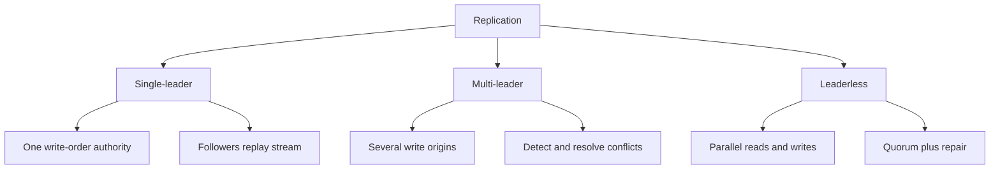

single-leader 把顺序集中；multi-leader 接受多个顺序源再合并；leaderless 不设顺序源，以版本、集合相交和修复维持副本。

### 8.3 架构与同步性是两条轴

```text
                 synchronous                     asynchronous
single-leader    ack waits for selected replica   leader ack, followers lag
multi-leader     cross-leader coordination        local ack, later conflict merge
leaderless       wait for w replicas              lower threshold / sloppy acceptance
```

架构决定谁能写、如何排序；同步性决定 ack 等谁。讨论复制时必须同时标注两条轴。

### 8.4 故障与恢复机制图

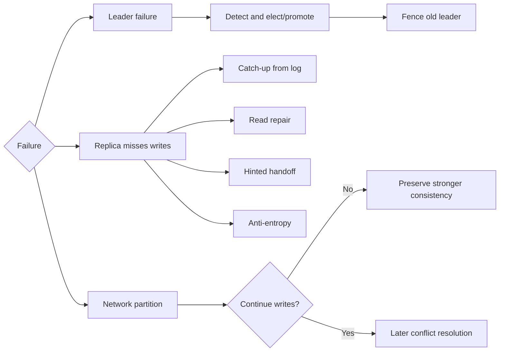

核心取舍始终是：故障期间拒绝哪些 operation，或接受哪些 divergence 并在之后修复。

### 8.5 一致性保证对照

| guarantee | 避免的异常 | 常见实现线索 | 不保证 |
|---|---|---|---|
| read-your-writes | 看不到自己的写 | read leader / minimum position | 别人的最新写 |
| monotonic reads | 观察版本倒退 | sticky replica / session token | 全局最新 |
| consistent prefix | effect 早于 cause | causal order/dependency | concurrent writes 的顺序 |
| strong eventual consistency | 同 update set 不收敛 | deterministic CRDT join | 实时一致、全局 invariant |
| linearizability | 操作不像实时原子发生 | consensus/leader protocol | multi-key serializability |

这些性质不是一个“强/弱”滑块上的简单别名，要按应用可见异常选择。

### 8.6 conflict handling pipeline

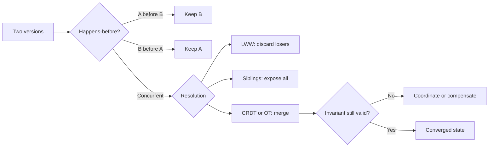

必须把 concurrency detection、value merge 和 invariant validation 分成三层。

### 8.7 公式速查

| 主题 | 公式 | 含义 |
|---|---|---|
| quorum overlap | $|W\cap R|\ge w+r-n$ | 最小 read/write 交集 |
| quorum 条件 | $w+r>n$ | 静态集合至少交一个节点 |
| failure tolerance | $n-w$、$n-r$ | write/read 可缺少副本数 |
| vector order | $U\preceq V\iff\forall i,U_i\le V_i$ | V 包含 U 的 causal history |
| vector join | $(U\sqcup V)_i=\max(U_i,V_i)$ | 合并 causal knowledge |
| PN-counter | $\sum_iP_i-\sum_iN_i$ | 合并各 replica 增减贡献 |
| 60 Hz frame | $1000/60\approx16.7\,ms$ | local-first UI 响应预算 |

公式成立都有 model assumptions，尤其不能从 quorum intersection 直接跳到 linearizability。

### 8.8 架构选择矩阵

| 需求 | 更自然的起点 | 主要警告 |
|---|---|---|
| 强约束、统一写顺序 | single-leader/consensus | leader latency、failover |
| 跨区本地写 | async multi-leader | conflict、弱 invariant |
| 离线与实时协作 | sync engine + CRDT/OT | metadata、merge semantics |
| 高 fault tolerance 的 key-value | leaderless quorum | stale/ambiguous outcome |
| 大量 stale-tolerant reads | async followers | session guarantees |
| 历史误操作恢复 | backup | restore test、RPO/RTO |

复杂系统常按数据类别组合，不必给所有数据强迫使用同一复制模型。

### 8.9 invariant-first 分类

先把数据操作分为：

- naturally commutative：likes、独立 tag additions；
- mergeable with metadata：set remove、collaborative text；
- requires ownership/escrow：有限库存、配额；
- requires coordination：唯一 ID namespace、非负余额、严格预约互斥。

只有先写出 invariant，才能判断 LWW/CRDT 是否可接受，或是否必须同步协调。

### 8.10 observability map

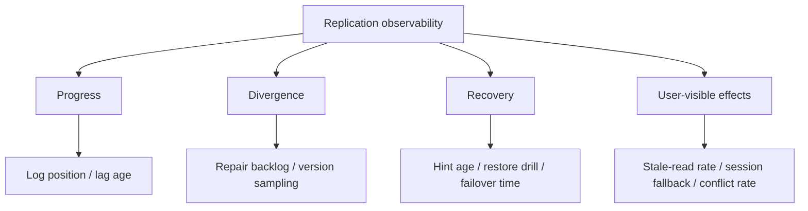

系统健康不能只看节点 `UP`。需要同时测复制进度、数据分歧、修复债务与用户实际看到的异常。

### 8.11 全章因果链

```text
复制目标
  -> 选择谁能写
  -> 选择 ack 等待边界
  -> 决定故障期间 availability
  -> 产生 lag 或 concurrent writes
  -> 用 session guarantee / causal metadata 管理可见性
  -> 用 repair / conflict resolution 收敛
  -> 用 invariant 与 backup 检查仍未覆盖的正确性
```

这条链比“选 single/multi/leaderless 哪个最好”更重要，因为每个局部选择都会改变后续必须承担的工作。

---

## 9. 综合案例：全球协作工作区的复制设计

### 9.1 场景与目标

设计一个类似文档、任务与日历结合的全球协作产品：

- 用户分布在 Americas、Europe、Asia；
- 文档和任务要 next-frame 本地响应；
- 手机/笔记本可离线数天后同步；
- 多人实时协作；
- region 故障时尽量继续工作；
- 账号、权限、计费与 workspace identity 必须严格正确；
- 可恢复误删除和软件 corruption。

这组需求不适合强行使用单一 replication model。

### 9.2 先写业务 invariants

把“正确”具体化：

1. workspace slug 全局唯一；
2. 已分配付费 seats 不得超过购买数量；
3. ACL/permission change 必须由当时有权限的 principal 提交；
4. 文档并发插入/删除应尽量保留所有用户意图并最终收敛；
5. comment reply 不能在 parent comment 之前展示；
6. presence、cursor position 可丢、可旧；
7. acknowledged authoritative write 的 RPO/RTO 有明确目标。

这些 invariant 决定哪些路径可异步，哪些必须 coordination。

### 9.3 按语义划分数据域

| 数据域 | 正确性要求 | 合适起点 |
|---|---|---|
| identity、ACL、billing、seat allocation | 唯一性、授权、上限 | consensus-backed single-leader per shard |
| document/task content | offline write、保留并发意图 | multi-leader sync engine + CRDT/OT |
| comments/replies | causal order、eventual convergence | causal metadata + mergeable records |
| activity/telemetry | 高写可用、可去重 | leaderless/event log with idempotent IDs |
| presence/cursors | 低延迟、允许丢失 | ephemeral local/region state, LWW acceptable |
| attachments | immutable blobs、durability | replicated object storage + metadata DB |
| history restore | 误删除/corruption 恢复 | isolated immutable backups |

复制模型按 invariant 选择，而不是按团队组织或“统一技术栈”选择。

### 9.4 混合架构

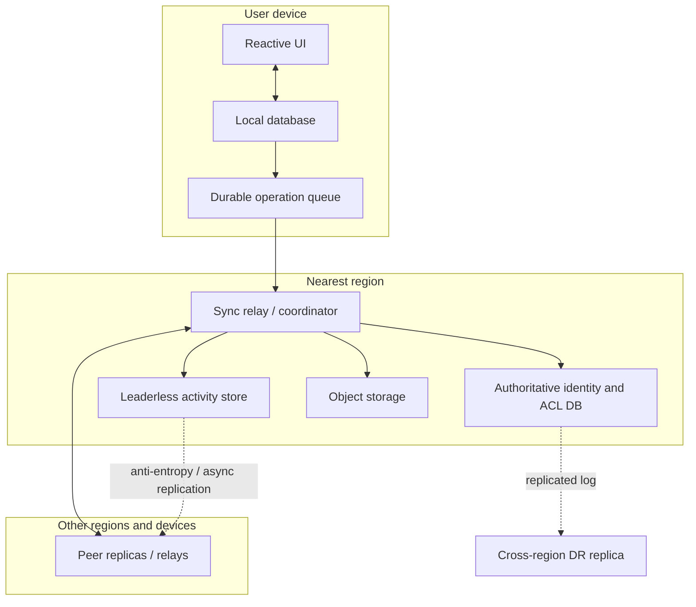

前台始终读写 local database；sync relay 交换 operations。强约束请求单独进入 authoritative DB，不能因本地乐观 UI 而绕过授权。

### 9.5 authoritative metadata 使用单主/共识

workspace slug、seat allocation、ACL version 等由 consensus-backed leader 串行处理。每个 shard 可有不同 leader 以扩展容量，但同一 invariant scope 内只有一个 authoritative order。

例如分配 seat 使用 conditional transaction：读取 purchased/assigned，验证 `assigned < purchased`，再原子递增。不能让三个 regions 各自本地批准后再 CRDT merge counter，否则总和可能超限。

### 9.6 authoritative read 的 session guarantee

用户修改 workspace name 或 ACL 后，response 返回 commit position/term token。后续 read 带 `minimum_position`：

- 足够新的 follower 可服务；
- follower 落后则等待、转 leader 或返回可识别的 retry；
- 不允许静默路由到旧副本。

这提供 read-your-writes/monotonic reads，同时保留安全 follower read scaling。

### 9.7 document content 使用 local-first multi-leader

每个 device/browser tab 持有 document replica，并能本地接受 edits。operation 先持久化到 local database、立即更新 UI，再由 background sync 发给 relay/peers。

断网只是 queue residence time 增大；恢复后继续同一 protocol，无需另一套 offline business logic。

### 9.8 文档 sequence 的 merge semantics

字符/blocks 使用 CRDT 或经过充分验证的 OT/混合库，不手写简化 index merge。每个 insertion 有 stable operation/element ID；deletion 引用目标 ID；同位置 concurrent insert 按协议稳定排序。

测试重点不是“两个人各打一段字”这一正常演示，而是长时间离线、同位置插入、大范围删除、undo/redo、duplicate/reordered delivery、compaction 后重连。

### 9.9 comments 维护 causal prefix

reply operation 携带 parent comment ID 与 causal context。replica 先收到 reply、尚未收到 parent 时，不直接展示孤立回复，而是：

- 暂存在 pending dependency queue；
- 请求/等待 parent；
- parent 到达后按 causal order materialize。

这实现 consistent prefix，而不需要给所有 comments 建全局 total order。

### 9.10 activity events 使用稳定 operation ID

每个 activity event 在 device 产生 globally unique operation ID，server 以该 ID 幂等去重。写可发往多个 leaderless replicas；timeout 后 client 重试不会重复计入。

event payload 尽量 immutable，后续修正用新 event 表达，从而减少 same-key overwrite conflict。

### 9.11 leaderless threshold 的选择

若 region 内每个 event 有 $n=3$ 个 AZ replicas，可取 $w=2,r=2$，允许一个 AZ slow/down。对只写后异步处理、很少 point-read 的 telemetry，也可偏向较小 read cost，但要明确 stale/failed-write semantics。

跨 region 不强求前台 global quorum，避免每个 click 都承担 WAN RTT；后台异步复制并在 event pipeline 去重。这意味着 region 灾难前尚未跨区的 events 落入明确 RPO，而非假装零丢失。

### 9.12 replica placement 与 failure domains

- authoritative DB：同 region 跨 3 AZ 同步 quorum，另一个 region 异步/受控同步 DR；
- sync relays：每 region 多实例，device 可切换，operation queue 保留未确认 edits；
- activity store：每 region 跨 AZ leaderless replicas，跨 region 后台同步；
- object blobs：跨 AZ durable storage，关键 attachments 按策略跨 region；
- backups：独立 account/credential、immutable retention。

副本必须跨真正独立的 power/network/administrative domains，不能只在节点名上不同。

### 9.13 acknowledgment contract

| operation | success 表示什么 | 故障后的可能结果 |
|---|---|---|
| ACL/billing write | consensus quorum 已持久化 | leader failover 后仍保留 |
| document local edit | device local queue 已持久化 | server 尚不可见，稍后同步 |
| document synced | relay/协议定义的 durable boundary | 其他 devices 仍可 lag |
| activity write | 至少 $w$ region replicas 接受 | error 也可能部分生效，靠 ID 去重 |
| blob upload | object commit + metadata transaction 达成 | 两阶段边界需 orphan cleanup |

API 文档必须把每个 `success` 的 durability/visibility scope 写清楚。

### 9.14 offline edit pipeline

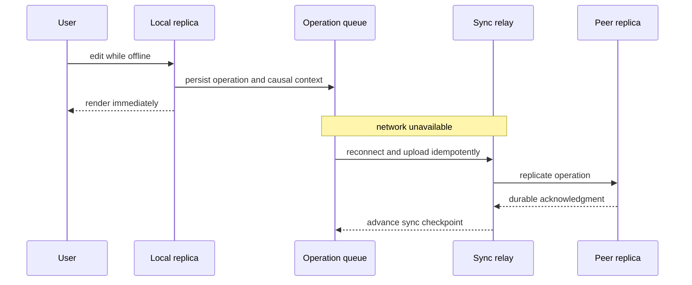

queue 只在收到协议规定的 durable acknowledgment 后清除/compact；retry 使用相同 operation ID。

### 9.15 并发内容冲突

device A 离线把 task title 从 `Plan` 改为 `Plan Q3`，device B 从共同祖先改为 `Launch plan`。若 title 是普通 LWW register，一个成功 edit 会静默消失。

产品可选择：

- multi-value register：显示两个 title 让用户选；
- text CRDT：字符级合并，但可能产生语义怪异标题；
- designated owner/home leader：避免该字段冲突；
- 明确接受 LWW：仅适合低价值、可重建字段。

算法选择必须对应用户意图，不能对所有 fields 统一套 LWW。

### 9.16 删除语义

删除 task/document 不能只是“本地 state 中不再出现”，否则旧 replica 的 add 会让它复活。删除写入 tombstone/remove operation，并带 causal context。

garbage collection 只有在能证明所有仍会重连的 replicas 已见过 remove，或过了明确 device-retirement/retention policy 后才安全。长期离线能力与 tombstone 保留成本直接相关。

### 9.17 permission revocation 不能只靠 merge

用户离线时有编辑权限，管理员随后 revoke；用户数天后上传旧离线 edits。CRDT 能合并内容，却不能决定这些 edits 在安全策略上是否仍允许。

sync server 必须按 operation 的 author、ACL version 和产品政策验证：可拒绝、隔离为私人草稿、请求管理员恢复，或允许“编辑时有效”语义。无论选哪种，都必须由授权模型明确，而非交给 CRDT 偶然决定。

### 9.18 follower lag 演练

用户刚更改 workspace name，随后命中 lagging follower。minimum-position token 使 router 发现 follower 未追上，选择：短暂等待、读 leader 或另一个 fresh replica。

监控记录 fallback rate 和 wait duration；若大量 session reads 回 leader，说明 read scaling 虽表面可用，实际 replication lag 已侵蚀容量。

### 9.19 leader failure 演练

authoritative leader 故障时：

1. quorum/failure detector 确认不可用；
2. 选取包含最新 committed log 的 replica；
3. 提升 term/epoch；
4. fence old leader 的 storage lease/credentials；
5. 更新 routing；
6. 验证 external consumers 不接受旧 epoch writes。

演练要在 write load 下测 RTO、ambiguous client outcomes 和 stale connection，而非只做空闲节点关机。

### 9.20 region partition 演练

Europe 与其他 regions 断连时：

- local documents 继续编辑，operation queue 积累；
- real-time remote collaboration 暂停，但本地 UI 不阻塞；
- local activity quorum 继续，接受跨区 RPO；
- global slug、seat、ACL write 若联系不到 authoritative quorum 则拒绝或只做未提交草稿；
- presence 可自然过期。

同一产品内 availability 由数据语义分级，而非“一刀切全站可写”。

### 9.21 gray failure 演练

把一个 replica 注入高 I/O latency 而非直接 kill。leaderless coordinator 应从其他 fast replicas 达到 threshold，request hedging 降低 tail；同时 slow node 的 hint/repair backlog 不应无限增长。

authoritative leader 若变慢，要观察是否触发错误 failover、lease overlap 或 response spike。gray failure 往往比 clean crash 更能暴露系统问题。

### 9.22 ambiguous write 与 retry

client 上传 activity event 时 timeout，两个 replicas 其实已保存但未凑够响应。client 用同一个 operation ID 重试；所有 nodes/upstream consumers 按 ID 幂等去重。

对 non-idempotent billing operation，则由 authoritative transaction 记录 idempotency key 与最终 result，重试返回同一结果，不能重复扣款或分配 seat。

### 9.23 backup 与恢复

每天 immutable snapshot 加连续 log/archive，跨独立 account 保存；为 workspace/document 支持 point-in-time restore 到隔离 namespace，先检查再恢复，避免把错误状态覆盖到 live data。

定期演练：

- 恢复单 document 的误删除；
- 恢复整个 tenant；
- 在新 region 从 backup + log 重建；
- 验证加密 key、schema version 和依赖 blobs 完整。

replica catch-up 成功不能替代这些 restore drills。

### 9.24 observability 与 SLO

关键指标包括：

- authoritative follower lag entries/time、leader term changes、failover RTO；
- document operation queue oldest age、sync round-trip、conflict/sibling rate；
- CRDT state/tombstone size、compaction duration；
- hints count/bytes/oldest age、anti-entropy backlog、read-repair rate；
- stale-read/session fallback rate；
- cross-region replication age 与 estimated RPO exposure；
- backup age、restore success rate 与 measured RTO。

告警应按 user-visible risk 聚合，而不是看到任何 lag 都同等级报警。

### 9.25 fault-injection test matrix

至少覆盖：

| 故障 | 断言 |
|---|---|
| follower/replica crash | 达到承诺的 read/write availability，恢复后收敛 |
| leader crash before/after ack | committed 不丢，uncommitted outcome 符合 API |
| old leader 回归 | fencing 阻止 stale writes |
| packet loss/reorder/duplicate | operation 幂等、CRDT/version vector 收敛 |
| region partition | 各数据域按政策继续或拒绝 |
| clock skew | 不因 wall-clock LWW 静默覆盖关键数据 |
| disk full | partial write 可检测，retry 不重复副作用 |
| long offline client | tombstone/context 仍足以正确 merge |
| corrupted backup | restore verification 能在切换前发现 |

每项测试都应比较所有 replicas 的最终 state，而不只检查 HTTP success rate。

### 9.26 rollout 与演化

更换 replication/merge protocol 时，旧新 clients 会并存。operation envelope 应带 schema/protocol version；server 保留 unknown fields，先部署能双读的新 reader，再逐步启用新 writer，并提供 replay/rollback 路径。

version vector/CRDT metadata 的 encoding 也属于持久协议，不能像普通内部类那样随意改。升级前用历史真实 operation trace 验证 convergence。

### 9.27 综合案例结论

该系统没有一个“全局最终一致”或“全局强一致”的简单标签。它按 invariant 分层：authority/coordination 保护身份、权限与计费；local-first replication 保护交互和离线能力；leaderless ingestion 保护高写 availability；backup 保护历史恢复。

优秀设计不是消除所有 trade-off，而是让每个 acknowledgment、stale window、conflict 和 failure response 都与业务价值一致，并可被测试和监控。

---

## 10. 核心结论

### 10.1 三十二条核心结论

1. replication 是持续传播变化，不是一次性复制文件。
2. 复制目标至少包括 availability、durability、disconnected operation、latency 和 read scalability。
3. replication 不能替代 backup；在线副本会复制逻辑错误。
4. 架构首先由“哪些节点可接受写”区分为 single-leader、multi-leader、leaderless。
5. synchronous/asynchronous 是另一条独立设计轴，决定 acknowledgment boundary。
6. 单主的优势是统一 write order 和较易提供 strong consistency。
7. 单主的成本是 leader bottleneck、failover 与旧 leader fencing。
8. async follower read 会产生 replication-lag anomalies。
9. read-your-writes、monotonic reads、consistent prefix 是有实际价值的 session guarantees。
10. logical position/token 通常比 wall clock 更适合表达最低可见版本。
11. physical WAL shipping 高效，却与 storage engine/version 紧耦合。
12. logical replication 更适合 version evolution、CDC 和异构 consumers。
13. multi-leader 的主要价值是 local-region/offline write，不只是吞吐量。
14. multi-leader topology 决定传播 hop、单点故障与乱序风险。
15. real-time collaboration、offline-first 与 local-first 本质上都需要多写入副本的同步。
16. concurrent 由彼此是否知晓定义，而不是 physical time 是否重叠。
17. LWW 通过确定性丢弃 writes 收敛，可能造成数据丢失。
18. siblings 保留 concurrent values，却把 resolution 责任交给应用或用户。
19. automatic merge 应在重复、乱序传播下仍 deterministic/convergent。
20. strong eventual consistency 不等于 linearizability 或 serializability。
21. CRDT/OT 能合并许多数据结构，不能自动维护任意业务 invariant。
22. leaderless 没有 failover，但仍需要 failure handling、repair 与 membership 管理。
23. read repair、hinted handoff、anti-entropy 覆盖不同的 missed-write 场景。
24. $w+r>n$ 证明静态 read/write sets 相交，不自动证明 latest linearizable read。
25. failed quorum write 可能部分生效，error 不等于“没有写”。
26. request hedging 对 slow/gray failures 很有效，但会增加 fan-out 成本。
27. sloppy/local quorum 提高 availability/latency，削弱正常 read 看到新值的证据。
28. happens-before 是判断 overwrite 与 conflict 的正确基础。
29. version vector 用 componentwise partial order 表达 distributed causal history。
30. convergence、session consistency、global invariant 和 disaster recovery 是四个不同问题。
31. operability 要量化 lag、divergence、repair debt、RPO 和 RTO，而不只看节点存活。
32. 最可靠的架构通常按数据 invariant 组合复制模型，并用真实故障演练验证承诺。

---

## 11. 设计复制系统的一般方法

### 11.1 第一步：定义数据与复制单位

明确是 whole database、shard、key、document、event stream 还是 object。写出 replication factor、placement 和 ownership scope。不同单位不要共用含糊的“副本数”。

### 11.2 第二步：列出 invariants

逐项写出 uniqueness、nonnegative balance、capacity bound、authorization、causal order、no-lost-edit 等要求。标出范围是单 key、单 shard、multi-key 还是 global。

没有 invariant 清单，无法判断 eventual/CRDT 是否足够。

### 11.3 第三步：建立 failure model

至少考虑 crash、slow/gray node、disk full、packet loss/reorder/duplicate、network partition、AZ/region loss、clock skew、stale process、operator error 和 software corruption。

同时写明哪些 failure domains 可能 correlated。

### 11.4 第四步：选择 write authority

根据需求选择：

- one leader/consensus order；
- multiple leaders/owners；
- any replica with quorum；
- local device replica + sync protocol。

若选择多个 write origins，就必须立刻回答 causal metadata 与 conflict resolution，而不是留到上线后。

### 11.5 第五步：定义 acknowledgment contract

对每种 write 写清 success 前等待哪些 durable components、跨哪些 failure domains、最大允许 lag/RPO。把 local acceptance、region durability、global visibility 分开命名。

API error 还要声明可能是 definite failure 还是 ambiguous outcome。

### 11.6 第六步：定义 read contract

说明 reads 可去 leader、follower、local replica 还是 quorum；要求 latest、read-your-writes、monotonic、causal prefix 或仅 eventual 中哪些性质。

设计 position/context token、sticky routing、wait/fallback 行为及 timeout。

### 11.7 第七步：设计 concurrency detection

明确使用 serialized leader order、conditional version、Lamport/logical timestamp、version vector 或其他 causal context。不要把 unsynchronized wall clock 当作 happens-before 证明。

定义 metadata 在 client、cache、queue 和 replica 之间如何完整传递。

### 11.8 第八步：定义 conflict semantics

按 datatype/field 选择 avoidance、LWW、multi-value siblings、CRDT、OT、manual resolution 或 compensating workflow。记录允许丢失哪些意图、删除是 add-wins 还是 remove-wins。

再独立检查 cross-key invariant 是否需要 coordination/escrow/ownership。

### 11.9 第九步：设计 repair 与 retention

规定 log catch-up、snapshot bootstrap、read repair、hinted handoff、anti-entropy 和 full rebuild。计算 log/hint/tombstone retention 必须覆盖多长 outage/offline window。

恢复流量要 throttle，并预留正常高峰之外的 capacity。

### 11.10 第十步：管理 membership 与 fencing

rebalance、leader change、replica replacement 都使用 epoch/term/config version。old leader/process 必须通过 lease、token、storage condition 或 credential revocation 被 fence。

迁移期间证明 old/new quorum sets 怎样相交，不能只依赖最终配置正确。

### 11.11 第十一步：独立设计 backup

定义 immutable snapshot、incremental/log archive、retention、加密 key 与 credential isolation。按 tenant/key/whole-region 三个粒度设计 restore，持续测实际 RPO/RTO。

backup 验证包括 schema、blob、index 与外部依赖，不能只看文件存在。

### 11.12 第十二步：建立 observability

监控 progress、divergence、recovery debt 和 user-visible anomalies。每项至少有 distribution/age，而不只 count；将指标绑定 SLO 和 runbook。

对 eventual consistency，给“eventual”一个可操作的 percentile/time budget。

### 11.13 第十三步：做故障与并发测试

用 deterministic simulation、network fault injection、clock skew、disk fault、process pause 和 region isolation 覆盖 race。验证最终所有 replicas 收敛、invariant 未破坏、API outcome 符合文档。

重点测试 gray/partial failure 和恢复过程，因为它们比 clean crash 更容易暴露 bug。

### 11.14 第十四步：验证容量与尾延迟

测 fan-out、quorum order statistic、repair/handoff burst、compaction、snapshot bootstrap 和 follower apply throughput。系统必须在一个 failure domain 丢失后仍有容量满足 SLO。

平均 latency 不够，要看 p95/p99/p99.9 与恢复期间分布。

### 11.15 第十五步：把语义写进接口与 ADR

Architecture Decision Record 至少包含：

```text
data/invariant scope:
write authorities and replica placement:
success acknowledgment boundary:
read/session guarantees:
conflict detection and resolution:
failure/partition behavior:
repair and retention:
backup RPO/RTO:
metrics, alerts, and fault tests:
known non-guarantees:
```

最重要的一行常是 `known non-guarantees`，它防止调用方把“多数情况下较新”误用成强一致承诺。

### 11.16 方法总结

复制设计的通用顺序是：**先定义 invariant 与 failure model，再选择 write authority 和 acknowledgment；随后明确 read/session semantics、causal/conflict 规则、repair/backup，最后用观测与故障测试闭环。**

不要从产品功能名或副本数量出发。真正决定系统行为的是写在哪里排序、success 在哪里承诺、分区时哪些操作继续，以及分歧如何被发现、合并和验证。
