> 对应原文：7. Sharding.md
>
> 本文严格按照原章顺序讲解，并在章后统一补充易混概念、综合案例和可复用的分片设计方法。原章重点是分片边界、再平衡、请求路由与二级索引。文中的公式、推导、可运行示例与扩展案例用于解释和验证原理，不应误认为原书逐字给出的实现。

## 0. 本章定位：复制同一份数据，分片拆开不同数据

### 0.1 从“单机装不下”开始

分布式数据库通常沿两条彼此独立的维度把数据放到多台机器：

1. **复制（replication）**：在多个节点保存同一份数据的副本；
2. **分片（sharding）**：把不同数据拆成较小子集，让不同节点保存不同子集。

第 6 章假设每个 replica 能保存完整 dataset，重点研究副本如何同步；本章解除该假设，研究数据量或写吞吐超过单机能力时，怎样决定每条数据属于哪个节点。

### 0.2 为什么不能只靠 replication 扩展写入与容量

replication 能把 reads 分散到多个 replicas，但每个完整副本仍要：

- 存下全部数据；
- 接收并应用全部 writes；
- 承担完整索引与维护成本。

因此它通常不能突破单机存储容量，也不能把彼此独立的 writes 真正分散开。若数据量为 $D$，单机可用容量为 $C$，只做完整复制仍要求：

$$
D\le C
$$

replica 数增加不会改变这个约束。

### 0.3 sharding 的基本定义

**sharding** 把 dataset 划分成多个较小的 **shards** 或 **partitions**，并把不同 shards 放到不同节点。通常设计为：

$$
\forall record\ r,\quad \exists!\ shard\ s:\ r\in s
$$

符号 $\exists!$ 表示“存在且仅存在一个”：每条 record、row 或 document 在逻辑上归属于恰好一个 shard。

### 0.4 每个 shard 像一座小数据库

一个 shard 通常拥有自己的：

- 数据文件与索引；
- 读写负载；
- leader 与 replicas；
- split、move、backup 和 restore 生命周期。

因此可以把每个 shard 看成一座小数据库。某些系统允许一个 transaction/query 同时访问多个 shards，但这通常需要额外协调，不能假定成本与单 shard 操作相同。

### 0.5 sharding 与 replication 的二维组合

生产系统通常不会在 sharding 与 replication 之间二选一，而是：

1. 先决定每条数据属于哪个 shard；
2. 再为每个 shard 保存多个 replicas。

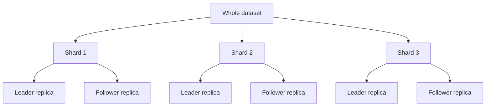

逻辑归属仍是“一条记录一个 shard”，物理存储则可因 replication 出现在多个 nodes。

### 0.6 node 与 shard 不是一一对应

一个 node 通常承载多个 shards。若每个 node 只放一个巨型 shard，增加节点、均衡负载和故障恢复都会很粗糙；把 shard 数设得多于 node 数，可用迁移若干 shards 来细粒度调节负载。

因此必须区分：

- **key → shard assignment**：一条数据属于哪个 shard；
- **shard → node assignment**：这个 shard 当前放在哪些 nodes。

前者决定数据边界，后者可随 rebalancing 和 failover 改变。

### 0.7 单主复制与分片怎样组合

每个 shard 可有独立 leader。node A 可能是 shard 1 的 leader、shard 2 的 follower；node B 则角色相反：

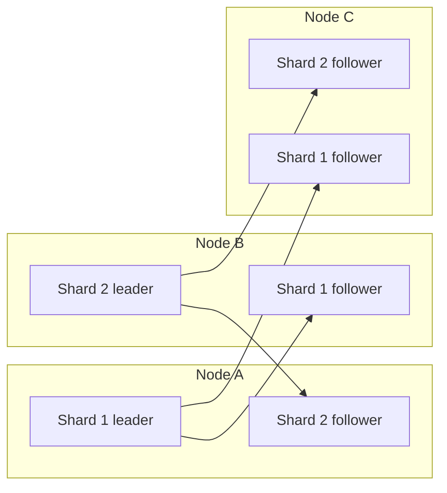

这样写入 authority 分散到不同节点，同时每个 shard 内仍保持 single-leader order。

### 0.8 水平扩展（horizontal scaling）的理想直觉

若 workload 能均匀拆到 $n$ 个 nodes，且没有跨 shard 协调与共享瓶颈，理想情况下：

$$
Capacity(n)\approx n\cdot Capacity(1)
$$

现实中会被 skew、network、routing、replication、distributed transaction、metadata service 和热点削弱，所以这是设计目标而非线性扩展承诺。

### 0.9 本章四个核心问题

sharding 不只是算一个 hash。完整系统必须回答：

1. **划分**：partition key 怎样映射到 shard？
2. **再平衡**：节点增减、shard 变大或变热时怎样移动？
3. **路由**：client 怎样找到当前拥有目标 shard 的 node？
4. **查询**：secondary index 不按 partition key 查询时怎样执行？

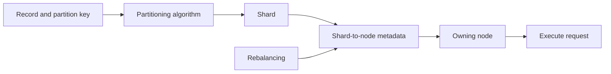

### 0.10 难点来自映射会变化

若 key 永远映射到固定 node，定位容易，但集群就无法平滑扩缩容或绕过故障。rebalancing 会改变 shard → node assignment，range split 还会改变 key → shard assignment。

于是 routing metadata 必须版本化、传播并处理迁移期间的旧请求；这也是“分片算法”最终会牵涉 coordinator、consensus 和 cutover protocol 的原因。

### 0.11 分片优化的三个目标

一个实用方案通常同时追求：

- **balance**：数据量和请求负载尽量均匀；
- **locality**：相关数据尽量同 shard，方便 range scan、join 和 transaction；
- **stability**：扩缩容时尽量少移动数据。

三者往往冲突。hash 改善 balance，却破坏 key-order locality；range 保留 locality，却容易产生 hotspot；固定 mapping 稳定，却难适应容量变化。

### 0.12 本章阅读主线

原章依次从术语与代价出发，经过 multitenancy，再比较 key-range、hash、fixed shards、hash ranges 和 consistent hashing；随后处理 hot spots、automatic/manual rebalancing、request routing，最后讨论 local/global secondary indexes。

主线不是寻找一种“最佳 hash”，而是在 **均衡、局部性、迁移成本、路由复杂度和查询能力**之间做可解释的取舍。

---

## 1. Sharding and Partitioning：术语与边界

### 1.1 同一概念有许多名字

本章所称 **shard**，在不同系统中名称不同：

| 系统 | 常用术语 |
|---|---|
| Kafka | partition |
| CockroachDB | range |
| HBase、TiDB | region |
| Couchbase | vBucket |
| Riak | vnode |
| Cassandra | token-range |
| Bigtable、YugabyteDB、ScyllaDB | tablet |

名字不决定语义。评估产品时要继续问：边界按 key range 还是 hash range、能否 split、谁持有 replicas、怎样 route。

### 1.2 partitioning 有时只是 sharding 的同义词

许多系统与文献把 partitioning 和 sharding 互换使用，都指把 dataset 拆成不重叠子集。本笔记在不涉及特定产品语义时也采用“分片/分区”并称。

### 1.3 PostgreSQL 中两者可能不同

某些数据库明确区分二者。以 PostgreSQL 常见语义为例：

- **partitioning**：把大表拆成同一机器上的多个 files/child tables；
- **sharding**：把 dataset 拆到多台 machines。

同机 partitioning 可快速删除整段数据、改善维护与 pruning，却不自动提供跨机器容量和吞吐扩展。

### 1.4 shard 一词的来源

一种说法来自网络角色扮演游戏 *Ultima Online*：魔法水晶破碎成 shards，各 shard 折射一份游戏世界，后来用于表示并行 game servers，再进入数据库术语。

另一种说法称它源于 “System for Highly Available Replicated Data” 的首字母缩写，据说是 1980s 的数据库，但历史细节已不可考。词源有趣，却不应影响技术定义。

### 1.5 data partition 与 network partition 完全不同

**data partitioning/sharding** 是主动的数据组织策略；**network partition（netsplit）** 是节点间通信中断的故障：

| 概念 | 是否主动设计 | 发生了什么 |
|---|---|---|
| data partition/shard | 是 | 不同 records 放入不同子集 |
| network partition | 否，是故障 | 节点之间暂时无法通信 |

二者都叫 partition，但问题域不同。第 9 章才系统讨论 network partition。

### 1.6 shard 与 replica 也不能混淆

- shard 回答“保存 dataset 的哪一部分”；
- replica 回答“这部分保存几份、怎样同步”。

若有 $S$ 个 logical shards，每 shard 有 replication factor $R$，理想化的 shard-replica 数为：

$$
S\cdot R
$$

但 nodes 数通常既不等于 $S$，也不等于 $S\cdot R$；每个 node 可承载多个 shard replicas。

### 1.7 两类方案大体独立

key-range、hash-range 等 sharding scheme 主要决定 record placement；single-leader、multi-leader、leaderless 主要决定每 shard 的 replication semantics。

因此可组合出多种架构，例如：

- range-sharded + 每 range 一个 Raft group；
- hash-sharded + Dynamo-style quorum replicas；
- tenant-sharded + 每 tenant 单主数据库。

“大体独立”不等于实现完全无关：request routing 最终既要找到 shard，也要找到可服务本次 read/write 的正确 replica。

### 1.8 本章为何暂时忽略 replication

第 6 章关于 leader、quorum、lag、failover 和 conflict 的分析同样适用于 shard replicas。为避免两条维度同时展开，本章多数地方把一个 shard 当作单一 logical owner，只研究划分、移动与路由。

阅读时仍应保留一个现实前提：移动一个 replicated shard 往往要建立新 replica、追赶变更、切换 leadership，再删除旧 replica，而不是只复制一份静态文件。

---

## 2. Pros and Cons of Sharding：为什么要分片，又为什么应尽量晚分片

### 2.1 首要动机是 scalability

sharding 的主要理由是 **scalability**：当 dataset volume 或 write throughput 大到单 node 无法承担时，把不同数据与 writes 分散到多个 nodes。

若只是 read throughput 不足，不一定要立刻 sharding；第 6 章的 read scaling 可让多个 replicas 分担读取，而不改变每条记录的逻辑归属。

### 2.2 容量瓶颈与写入瓶颈要分开

设单机可用存储为 $C$、可持续写吞吐为 $W$，业务需要 $D$ 数据量和 $T_w$ 写吞吐。单 shard 至少要求：

$$
D\le C\quad\land\quad T_w\le W
$$

任一条件不成立，vertical scaling 已到经济或物理边界时，才需要把数据和 writes 拆开。读取瓶颈则可能只需更多 replicas。

### 2.3 horizontal scaling / scale-out

sharding 是实现 **horizontal scaling**（也称 **scale-out architecture**）的主要工具：不是把应用搬到更大的机器，而是增加更多较小机器。

若每 shard 负载近似相等，nodes 可并行处理彼此独立的数据与 queries。其吸引力是容量可分阶段增长，并能利用 commodity hardware；其前提是 workload 确实可拆分。

### 2.4 理想收益与效率系数

把非线性成本归入效率系数 $\eta(n)$：

$$
Capacity(n)=n\cdot Capacity(1)\cdot\eta(n),\qquad 0<\eta(n)\le1
$$

$\eta(n)$ 会因 skew、cross-shard operations、routing、metadata coordination、replication 和 shared storage/network 下降。评估 sharding 应测实际 $\eta(n)$，而不是只展示 node 数增长。

### 2.5 为什么 single machine 仍可能更好

现代单机的 CPU、RAM、NVMe 与网络能力很强。只要数据量和写吞吐仍有余量，single-shard database 通常：

- transaction 与 constraint 更直接；
- query planner 可访问全部数据；
- secondary index、join 与 aggregation 无需 scatter；
- backup、restore、schema migration 和 debug 更简单；
- 不需要维护 shard metadata 与 rebalancing protocol。

因此 sharding 是 heavyweight solution，不是系统“专业”或“云原生”的标志。

### 2.6 分片的固定复杂度税

即使只有两个 shards，也会立刻出现：

- partition key 选择；
- request routing；
- shard ownership metadata；
- cross-shard query/transaction；
- split、move、merge 和 failure recovery；
- skew/hotspot monitoring；
- 多 shard backup/restore consistency。

这些成本不会因当前数据量小而消失，所以过早 sharding 会让团队长期为尚未出现的规模问题买单。

### 2.7 partition key 的定义

系统通常选择一个 **partition key**，所有 partition key 相同的 records 放入同一 shard：

$$
shard(record)=f(partitionKey(record))
$$

在 key-value store 中，它通常是 key 或 key 的第一部分；关系表中可选择某 column，并不要求等于 primary key。

### 2.8 partition key 决定 locality

同一 partition key 的数据 colocated，因而可高效执行：

- 单 tenant 查询；
- 同一 user/order 的 records；
- 单 shard transaction；
- partition-key prefix 下的 range scan。

但另一种访问维度可能被打散。partition key 实质上是把某类 queries 优化成 local，同时把其他 queries 变成 distributed。

### 2.9 已知 shard 的 point lookup

若 request 携带 partition key，router 可计算或查表得到单一 shard，成本近似：

$$
Cost_{lookup}\approx Cost_{route}+Cost_{one\ shard}
$$

这是分片系统的 fast path，也是 API 常要求 tenant ID、user ID 或 partition key 的原因。

### 2.10 不知道 shard 时必须 scatter/gather

若查询条件不含 partition key，系统可能向所有 $S$ 个 shards 广播，再合并结果：

$$
Cost_{scatter}\approx \sum_{i=1}^{S}Cost_i+Cost_{merge}
$$

并行执行可降低 wall-clock time，却不会消除总 CPU/network 成本；tail latency 还可能被最慢 shard 主导。

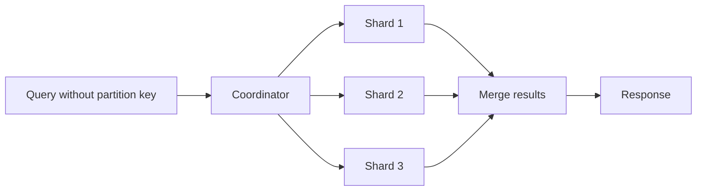

### 2.11 partition key 是长期数据模型决策

数据一旦按某 key 分布，更换 partition key 通常意味着重写并搬迁大量 records、重建 indexes、同时兼容新旧 routing。它比增加普通 index 更昂贵。

所以选择前要用真实 query distribution、tenant size、growth 和热点数据验证，不能只看当前 schema 中哪个字段“像 ID”。

### 2.12 key-value 数据更容易分片

key-value access pattern 已围绕 key 组织。只要每次 operation 明确 key，系统容易定位一个 shard；不同 keys 通常相互独立。

这并不保证无热点：单 key 可能很热，value 也可能巨大，但 routing model 相对清晰。

### 2.13 relational data 更难

关系模型鼓励按多个字段查询、join 与约束。若 customers 按 customer ID 分片，而 orders 也按 customer ID 分片，按 customer 查询很快；但“查询某商品的全部订单”可能跨所有 shards。

不存在一个 partition key 能让任意 join 都 local。schema normalization 与自由查询能力会和物理 locality 发生张力。

### 2.14 secondary index 的问题预告

primary/partition key 能直接定位 shard，secondary attribute 往往不能。例如按 `color=red` 查询商品时，red records 可能散在全部 shards。

本章最后将比较：

- local secondary index：每 shard 只索引本 shard 数据，读时 scatter；
- global secondary index：按 index term 再次分片，写时维护远端 index shards。

### 2.15 cross-shard join

若 join 两侧不能按 join key colocate，执行器可能：

1. 把一侧广播到多个 shards；
2. 按 join key 临时 repartition 两侧；
3. 从多个 shards 拉回 coordinator；
4. 维护预计算/denormalized view。

每种方案都增加 network shuffle、临时状态或写放大。分片设计应尽量让高频、强一致 join local。

### 2.16 related records 的跨 shard write

一次业务写可能同时更新多个 related records。例如转账更新两个 account shards，创建订单同时更新 inventory、customer 和 payment shards。

单 shard transaction 只能原子地保护局部状态；跨 shards 保持一致需要 distributed transaction、workflow/compensation 或重新设计 ownership。

### 2.17 distributed transaction 的代价

分布式事务必须让多个 participants 就 commit/abort 达成一致，增加网络 round trips、锁持有时间、故障恢复状态和 coordinator 压力。粗略地：

$$
T_{distributed}\ge \max_i(T_{participant_i})+T_{coordination}
$$

它在部分数据库中可用且必要，但通常比 single-node/single-shard transaction 慢，并可能成为全系统 bottleneck。第 8 章会进一步讨论。

### 2.18 不要用“最终一致”掩盖 invariant

避免 distributed transaction 的常见方法是异步更新其他 shards，但这会产生中间不一致和失败补偿。是否可接受取决于 invariant：analytics counter 可晚更新，账户余额或唯一资源分配则不能随意放松。

sharding 让原本本地的正确性问题跨网络化，不能只靠 retry 解决。

### 2.19 单机内部也可以 sharding

有些系统即使运行在一台机器，也按 CPU core 分 shard，通常每 core 一个 single-threaded process/thread。目的不是突破机器容量，而是：

- 避免共享锁；
- 利用多核并行；
- 改善 cache locality；
- 把状态放在靠近对应 CPU 的 memory bank。

Redis、VoltDB、FoundationDB 等系统采用过类似 one-process-per-core 思路。

### 2.20 NUMA 背景

在 **nonuniform memory access（NUMA）** 架构中，某 CPU 访问本地 memory bank 比访问其他 socket 的远端 memory 更快。按 core/socket 分片可让大部分数据访问保持 local，减少 cache-line contention 和 remote-memory latency。

这种同机 sharding 仍会让跨 shard transaction/query 复杂化，只是网络边界变成进程间或 core 间通信。

### 2.21 scale-up 与 scale-out 不是互斥

实践常先 vertical scale 到一个经济合理的单机规格，再 horizontal scale。即使已 sharding，也可为热点 nodes 升级硬件，或按 node capacity 分配不同数量 shards。

正确问题不是“纵向还是横向哪个先进”，而是在哪个点上增加单机资源与增加分布式复杂度的 marginal cost 更低。

### 2.22 何时值得引入 sharding

较可靠的触发条件包括：

- 单机 dataset 已逼近可运营容量上限；
- sustainable write throughput 接近上限且无法靠批处理/索引优化解决；
- tenant/failure isolation 有明确价值；
- workload 有稳定 partition key 和高比例 single-shard operations；
- 团队能运营 routing、rebalancing、hotspot 与 distributed recovery。

“未来可能增长”本身不够；应有容量模型、增长曲线和迁移阈值。

### 2.23 本节结论

sharding 用数据划分换来容量与写吞吐的 horizontal scaling，却把 partition key 固化为物理 locality 边界，并让未知 key 查询、join、transaction、迁移和运维变复杂。

原章的建议是保守的：若单机能承担，就优先 single shard；当规模或隔离需求确实超过单机时，再用明确 access pattern 驱动分片。

---

## 3. Sharding for Multitenancy：以租户作为隔离边界

### 3.1 multitenancy 是什么

SaaS 与 cloud service 常是 **multitenant**：一个系统服务多个 customers，每个 customer 是一个 **tenant**。tenant 内可有多个 user logins，但其 dataset 与其他 tenants 逻辑隔离。

例如 email marketing service 中，每家企业的 subscriber list、campaign 和 delivery data 都属于该企业 tenant。

### 3.2 tenant ID 是天然 partition key

大量业务 queries 本来就带 tenant context：

```text
tenant_id + entity_type + entity_id
```

若以 tenant ID 为 partition key，同 tenant records colocate，绝大部分 authorization、query 和 transaction 可落在一个 shard。这是数据模型与访问模式高度一致的理想情况。

### 3.3 一 tenant 一 shard

最直接方案是每 tenant 独占 shard。shard 可是独立 physical database，也可是一个大 logical database 中可单独管理的部分。

优点是隔离清晰；代价是 tenant 数很大时，每 shard connection、catalog、file、replica、backup 和 monitoring metadata 产生显著固定开销。

### 3.4 多个小 tenants 共享 shard

为摊薄 overhead，可把多个 small tenants 放入同一个 shard，同时保证一个 tenant 不跨 shard。映射变成：

$$
tenant\_id\longrightarrow shard\_id
$$

它通常由 metadata table 维护，而非直接 `hash(tenant_id) % N`，因为大 tenant 需要单独迁出或指定 region。

### 3.5 physical database 与 logical shard

- physical database：进程、存储、连接池、备份边界更独立，隔离强但 overhead 高；
- logical shard：共享数据库引擎/cluster，通过 range/tablet/schema 等边界管理，资源效率高但共享故障面更多。

选择应基于 isolation requirement、tenant count、operator tooling 和 cost，而非只看“数据库实例数”。

### 3.6 resource isolation

若 tenant A 执行昂贵 query，而 tenant B 在不同 shard/node，B 更不易受到影响。这降低 **noisy neighbor** 风险。

但“不同 shard”若仍共享 CPU、disk、network 或 coordinator，并不等于完全隔离。需要 admission control、quota、workload scheduling 与 per-tenant metrics 配合。

### 3.7 resource isolation 的粒度

隔离可逐层增强：

1. 同 shard，仅逻辑 tenant ID；
2. 不同 shards、同 node；
3. 不同 nodes、同 cluster；
4. 不同 cells/clusters；
5. 独立 account/region。

粒度越强，blast radius 越小，但资源利用率与运维成本通常越差。

### 3.8 permission isolation

若 access-control code 有 bug，物理分离的 tenant datasets 降低跨 tenant 读取概率。应用连到 tenant-specific database 时，错误 query 即使漏掉 `WHERE tenant_id = ?`，也找不到其他 tenant 数据。

这是 defense in depth，不是替代 authorization。routing bug、credential 过宽、shared backup 或 admin tool 仍可能跨越边界。

### 3.9 cell-based architecture

**cell-based architecture** 不只分 storage，也把服务实例、queue、cache 与依赖按一组 tenants 组成 self-contained **cell**：

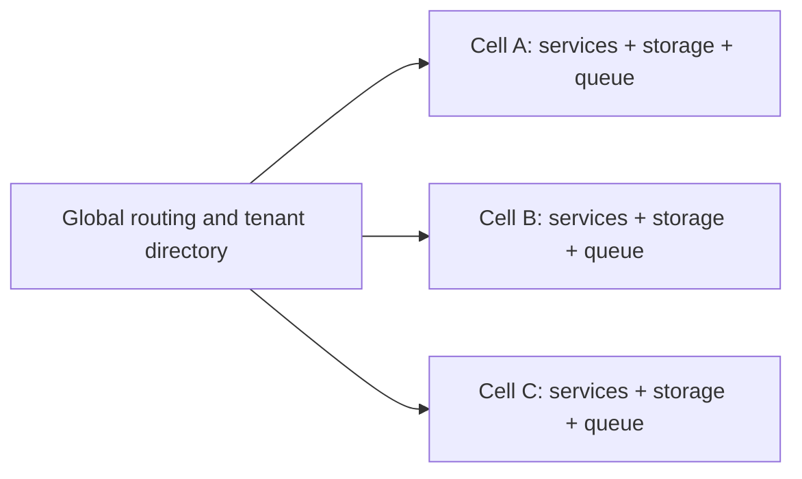

cells 尽量独立运行，global layer 只做 tenant placement、routing 和少量控制面工作。

### 3.10 cell 提供 fault isolation

某 cell 的 deploy bug、overload、database failure 或 queue backlog 应局限于该 cell，其他 cells 继续服务。这把全平台 outage 转成一部分 tenants 受影响。

真正 fault isolation 要避免隐藏共享依赖，例如全局认证、DNS、schema registry 或 single metadata database；否则 cell 只是图上的框。

### 3.11 per-tenant backup and restore

tenant shard 可独立备份，就能把误删 tenant 恢复到隔离位置，再只恢复该 tenant，而不回滚其他客户的近期写入。

若多个 tenants 共用 shard，仍需 logical export/PITR filtering 或 copy-on-write clone。设计 shard 边界时应同时考虑 restore granularity，而不只看在线 query。

### 3.12 regulatory compliance

GDPR、CCPA 等隐私法规赋予个人访问与删除其 personal information 的权利。若 person/tenant 数据集中在可识别 shard，export/delete 更直接。

但真实数据还可能存在于 logs、indexes、caches、analytics、backups 和 third-party systems。分片能缩小查找范围，不能自动完成合规数据生命周期。

### 3.13 person 与 tenant 粒度不同

原章指出“每个人的数据独立 shard”可简化访问/删除，但很多 SaaS 以 organization tenant 为 shard。此时一个 person 可能跨多个 tenants，或 tenant 内有多人。

合规键与性能 partition key 不一定相同，必须维护 data lineage 和 subject-to-record mapping。

### 3.14 data residence

某 tenant 的数据可能依法必须留在特定 jurisdiction。region-aware database 可把 tenant shard 指定到允许 region，并限制 replicas、backup 和 processing location。

placement policy 应覆盖：

- primary 与 follower replicas；
- backup/object archive；
- search/analytics indexes；
- support/debug export；
- cross-region disaster recovery。

只把 leader 放在目标 region 不等于满足 residency。

### 3.15 gradual schema rollout

按 tenant/shard 可分批部署 schema migration：先选择 internal/canary tenants，观察后扩大。这降低一次影响全部客户的风险。

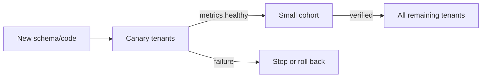

### 3.16 gradual rollout 的事务难点

rollout 期间不同 tenants 处于不同 schema versions，application、background jobs 和 global analytics 必须同时兼容。若 migration 涉及 shared metadata，难以原子地做到“只切某 tenant”。

因此需要 versioned schema、expand-migrate-contract、per-tenant migration state 和可恢复的 idempotent steps。

### 3.17 挑战一：单个 giant tenant

tenant-as-shard 假设每 tenant 都能装进一个 node/shard。若最大 tenant 的 data/write throughput 超过单机，它就成为不可再均衡的 hot shard。

此时需要 tenant 内二级分片，例如：

$$
partitionKey=(tenant\_id,\ bucket\_id)
$$

bucket 可按 user、project、time 或 hash 划分，但会重新引入 cross-bucket query/transaction。

### 3.18 giant tenant 破坏简单 locality

把 giant tenant 拆开后，“所有 tenant 数据同 shard”的优势消失。tenant-wide report、backup、schema migration 和 delete 都需遍历多个 subshards。

因此应提前定义：什么时候 tenant 从单 shard 升级为 multi-shard，以及 API/router 如何同时支持两种 placement。

### 3.19 挑战二：海量 small tenants

若有百万 tenants，一 tenant 一 physical shard 会导致 catalog、connections、files、replicas、monitoring series 和 backup jobs 爆炸。每 shard 即使几乎无数据，也有固定 overhead。

把 small tenants 装箱到 shared shards 是必要的 packing 问题，而非简单平均 tenant 数量：tenant load 和 growth 也不同。

### 3.20 tenant growth 与迁移

small tenant 增长后可能需要从 shared shard 搬到 dedicated shard。迁移协议至少要处理：

1. 建立目标副本/复制历史数据；
2. 捕获迁移期间增量 writes；
3. 原子更新 tenant directory/placement epoch；
4. 处理发往旧 shard 的 in-flight requests；
5. 验证后删除旧数据。

不能仅复制 snapshot 后改配置，否则 cutover 窗口会丢写或双写分叉。

### 3.21 挑战三：cross-tenant features

若要做跨 tenant search、benchmark、marketplace、shared collaboration 或全局 fraud detection，tenant isolation 会让 join/query 跨 shards。

常见处理是把所需字段异步复制到 global index/analytics system，并严格做权限过滤；不要为了一个全局报表破坏主业务隔离边界。

### 3.22 tenant routing directory

当 placement 需支持 dedicated shard、shared shard、region pinning 与迁移时，通常需要 authoritative directory：

```text
tenant_id -> cell_id, shard_id, placement_epoch, schema_version
```

directory 是关键 control-plane state，需高可用、缓存与版本化。cache stale 时，旧 shard 应能 redirect 或拒绝旧 epoch，而不是悄悄接受错误写入。

### 3.23 tiering 策略

可按 tenant size/load 分层：

| tier | placement | 适用情况 |
|---|---|---|
| pooled | 多 small tenants 共 shard | 成本优先 |
| isolated shard | 一 tenant 独占 logical shard | 更强资源/恢复隔离 |
| dedicated cell | tenant 或少数组独占 cell | 合规、性能、blast radius |
| intra-tenant sharded | 一 tenant 跨多个 shards | giant tenant |

tiering 需要自动或受控迁移工具，否则会变成永久手工例外。

### 3.24 multitenancy 的评价指标

不能只看平均 shard size。至少观察：

- per-tenant data、read/write rate 与 growth percentile；
- shard headroom 与 tenant concentration；
- noisy-neighbor latency correlation；
- tenant move duration、bytes 与 failure rate；
- per-tenant restore RTO；
- cell blast radius；
- region/schema placement compliance。

这些指标决定何时 rebalance、promote tier 或拆 giant tenant。

### 3.25 本节结论

tenant ID 常是优秀 partition key，因为 access、authorization、backup、residency 和 fault isolation 都围绕 tenant 边界。但方案成立的前提是 tenant size 可管理、绝大多数 operations 不跨 tenant，并且系统能把 growing tenant 安全迁移或继续细分。

multitenant sharding 的真正难点不是初始 hash，而是 **heterogeneous tenant size、长期增长、placement policy 与在线迁移**。

---

## 4. Sharding of Key-Value Data：从 partition key 到 shard

### 4.1 基本输入与输出

key-value sharding algorithm 的输入是 record 的 partition key，输出是该 record 所属 shard：

$$
f:key\longrightarrow shard
$$

relational table 也可使用同一模型，只是 key 是选定 column/column prefix，而不一定是 primary key。

### 4.2 目标一：数据量均衡

若总数据量为 $D$、有 $n$ 个 nodes，理想每 node 约存：

$$
\bar D=\frac{D}{n}
$$

可用最大/平均值衡量 size skew：

$$
Skew_{data}=\frac{\max_i D_i}{D/n}
$$

值越接近 1 越均衡；若接近 $n$，几乎所有数据都集中在一处。

### 4.3 目标二：query load 均衡

bytes 均匀不代表 requests 均匀。定义 node $i$ 的资源需求 $L_i$，可综合 QPS、CPU、I/O 和 network：

$$
Skew_{load}=\frac{\max_i L_i}{\left(\sum_iL_i\right)/n}
$$

一个小 shard 也可能因某 key 被频繁访问而成为瓶颈，所以再平衡不能只看 disk size。

### 4.4 skew、hot shard 与 hot key

- **skewed**：shards 的数据或请求份额不均；
- **hot shard / hot spot**：某 shard 承担不成比例的高负载；
- **hot key**：某一个 partition key 本身负载极高。

hot shard 可通过拆分或移动缓解；若全部负载来自一个不可再拆的 key，仅移动 shard 只是把热点换到另一台机器。

### 4.5 目标三：可 rebalancing

增加/删除 node 后，需要重新分配数据，让新集群恢复近似均衡，这叫 **rebalancing**。理想 rebalancing 同时满足：

- 移动尽量少的数据；
- 前台读写继续；
- 不把 source/target/network 压垮；
- routing 在 cutover 前后正确；
- replicated shard 不降低 durability。

因此 $f(key)$ 不能只在固定 node count 下均匀，还要允许 membership 变化。

### 4.6 Sharding by Key Range

**key-range sharding** 为每个 shard 分配一个连续 partition-key 区间：

$$
S_i=[b_i,b_{i+1})
$$

其中左边界 inclusive、右边界 exclusive 是常见约定；最后一个区间可延伸到正无穷。所有 keys 按全局排序落入一个且仅一个 interval。

### 4.7 百科全书类比

纸质 encyclopedia 按词条标题范围分 volumes：要找某标题，只需选择覆盖该字母/词条范围的卷。数据库同理，router 比较 boundary 即可定位 shard。

这个类比揭示两项性质：

- 相邻 keys colocated；
- boundaries 不必等距。

### 4.8 为什么 boundaries 不能机械等距

自然 key distribution 往往不均匀。英文词典以字母区间划分时，某些首字母词很多，某些很少；每两字母一卷会造成 volume size 差异。

因此 range boundaries 应适配实际 cumulative distribution，而不是只把 key domain 等宽切开。

### 4.9 quantile boundary 的直觉

若只追求相同 record count，可按 partition-key 分布的 quantiles 选界：

$$
b_i\approx F^{-1}\left(\frac{i}{k}\right),\qquad i=1,\ldots,k-1
$$

$F$ 是 key 的经验 cumulative distribution，$k$ 是 shard 数。真实系统还要按 bytes 和 load 加权，因为 records 大小与访问频率可能不同。

### 4.10 manual 与 automatic boundaries

range boundaries 可由 administrator 手工选择，也可由 database 自动维护。原章例子包括：

- manual：Vitess（MySQL sharding layer）；
- automatic：Bigtable、HBase、MongoDB range sharding、CockroachDB、RethinkDB、FoundationDB；
- manual/automatic tablet splitting：YugabyteDB。

产品列表用于展示设计空间；实际行为会随版本与配置变化。

### 4.11 shard 内保持 sorted order

每个 range 内 keys 可继续按序存入 B-tree 或 SSTables。于是 point lookup 与 range scan 都能利用 storage-engine index，而不是只知道“在哪台机器”。

全局顺序被切成若干有序片段；跨 boundary 的 range query 可按 shard order 访问连续几个 shards。

### 4.12 range scan 的优势

查询 $[a,b]$ 时，router 找到起止 shards，只访问与该区间相交的 shards：

$$
Touched=\{S_i\mid S_i\cap[a,b]\ne\varnothing\}
$$

若区间窄，通常远少于全 shard scatter。这是 key-range 相比 pure hash sharding 的核心 locality 优势。

### 4.13 concatenated key

可以把复合 key 排序为：

```text
(entity_id, timestamp, event_id)
```

同一 `entity_id` 的 records 相邻，因而可高效读取某 entity 的 time range。partition key 可是第一部分，后续 columns 在 shard 内提供排序。

### 4.14 sensor timestamp 案例

若只以 measurement timestamp 为 key，可轻松读取某 month 的全部 readings；但实时写总是落入“当前时间”所在 range。

历史月份 shards 基本只读，当前月份 shard 承担所有 writes，形成 moving hot spot。数据按时间均匀增长，并不意味着同一时刻的 load 均匀。

### 4.15 timestamp hotspot 的形式化

在时刻 $t$ 到达的所有 records，key 都接近 $t$。若当前 active interval 为 $S_j$：

$$
P(shard(write)=S_j\mid now=t)\approx1
$$

即使多年数据均匀分布在很多 shards，instantaneous write distribution 仍几乎全部集中于一个 shard。

### 4.16 用 sensor ID 前缀打散 writes

可把 key 改为：

```text
(sensor_id, timestamp)
```

排序先按 sensor ID，再按 timestamp。若同时活跃 sensors 很多，它们位于不同 ranges，实时 writes 得以分散；单 sensor 的 time-range query 仍是连续 scan。

### 4.17 打散后的 query 代价

若要查询“所有 sensors 在某时间段的读数”，现在必须对每个 sensor 发一个 range query，再 merge：

$$
Queries\approx |Sensors|
$$

这是 locality 的重新选择：优化高并发 ingest 与 per-sensor history，牺牲 global time slice。可用 downstream analytics store 补足后一需求。

### 4.18 Rebalancing key-range sharded data：pre-splitting

empty database 尚无足够 data statistics 可自动切 range。HBase、MongoDB 等允许预先配置 initial shards，称 **pre-splitting**。

它要求预估 key distribution 与初始 traffic；boundary 估错可能让首批 writes 集中，或产生大量空 shards。

### 4.19 shard split

当 range 变大或变热，可把：

$$
[a,c)\longrightarrow[a,b)\cup[b,c)
$$

两个 subranges 可分配到不同 nodes，从而让 data/load 并行处理。选择 split point 时可按 bytes、records 或 load quantile，而不一定取 key domain 中点。

### 4.20 shard merge

大量 delete 后，相邻 ranges 可能很小，可合并：

$$
[a,b)\cup[b,c)\longrightarrow[a,c)
$$

merge 降低 metadata、files、replication group 和 scheduling overhead。只有 adjacent ranges 才能在不破坏连续区间模型下直接合并。

### 4.21 与 B-tree root split/merge 的类比

range shards 的 split/merge 类似 B-tree 高层节点调整：child ranges 覆盖不重叠且完整的 key space，目录保存 boundaries 并把 lookup 引到正确 child。

不同之处是 distributed shard move 涉及网络复制、replication leadership 与在线 requests，成本远高于内存/磁盘 page split。

### 4.22 size-triggered split

自动系统常在 shard 达到配置 size 时 split。原章举 HBase 默认约 10 GB 的例子。固定最大 shard size 的好处是：dataset 增长时 shard 数随之增长，单次 move/recovery 的数据量有上界。

阈值不是越小越好；过小会增加 shard count、metadata 和 compaction/replication overhead。

### 4.23 throughput-triggered split

有些系统还在持续 write throughput 超阈值时 split，即使 shard bytes 不大。这样可把多个 keys 形成的热 range 拆开，分配到不同 nodes。

若热点来自单 key，range split 无法把同一个不可分 key 放到两个 shards，仍需 key salting、dedicated handling 或 application-level redesign。

### 4.24 adaptive shard count

range scheme 的 shard 数随 dataset/workload 变化：小数据只有少量 shards，固定 overhead 小；大数据持续 split，每 shard size 保持在目标范围附近。

它避免在系统创建时预测终身 shard 数，但把复杂度转移到 reliable online split/merge。

### 4.25 split 为什么昂贵

split 往往要把原 shard 数据重写到新 files，类似 log-structured storage engine compaction；还可能重建 indexes、建立 replicas 和更新 routing metadata。

若原 shard 大小 $B$，仅本地重写和网络复制就可能达到 $O(B)$ bytes，不能视作纯 metadata operation。

### 4.26 最忙时做最贵的事

需要 split 的 shard 往往已经达到 size/load threshold。此时 split 额外消耗 CPU、disk I/O 和 network，可能让前台 latency 恶化；若 incoming write rate 超过 split/copy rate，系统甚至追不上增量。

这形成危险反馈：


### 4.27 online split 的安全步骤

一个抽象 online split protocol 可为：

1. 冻结/记录 source range 的 stable snapshot position；
2. 复制 snapshot 到 child shards；
3. 持续捕获 snapshot 后的 writes；
4. children 追上后提交新 boundary metadata/epoch；
5. redirect 或拒绝发往 old epoch 的请求；
6. 等 in-flight requests 排空后回收 parent。

具体系统实现不同，但必须同时保证 no missing key、no double ownership 和 read/write continuity。

### 4.28 boundary metadata 是 control plane

router 需要有序 boundary map：

```text
[-inf, G) -> shard-1
[G, N)    -> shard-2
[N, +inf) -> shard-3
```

split/merge 会原子更新这张 map。metadata 必须带 version/epoch 并可靠复制；否则不同 routers 可能对同 key 选择不同 owners。

### 4.29 可运行示例：range routing 与 split

下面使用有序 start boundaries 做 lookup，并把 `[n, +inf)` 在 `t` 处分裂。`bisect_right` 找到不大于 key 的最大 start boundary。

```python
from bisect import bisect_right
from dataclasses import dataclass


@dataclass(frozen=True)
class RangeShard:
    start: str
    name: str


def route(shards: list[RangeShard], key: str) -> str:
    starts = [shard.start for shard in shards]
    index = bisect_right(starts, key) - 1
    return shards[index].name


before = [
    RangeShard("", "shard-a-m"),
    RangeShard("n", "shard-n-z"),
]
after = [
    RangeShard("", "shard-a-m"),
    RangeShard("n", "shard-n-s"),
    RangeShard("t", "shard-t-z"),
]

for key in ("apple", "sensor", "zebra"):
    print(f"{key}: {route(before, key)} -> {route(after, key)}")
```

实际运行输出：

```text
apple: shard-a-m -> shard-a-m
sensor: shard-n-z -> shard-n-s
zebra: shard-n-z -> shard-t-z
```

split 前 `sensor` 与 `zebra` 同 shard；split 后只移动新 boundary 右侧 keys，`apple` 的 assignment 保持不变。生产 router 还需处理 bytes collation、inclusive/exclusive edge、metadata epoch 和 stale cache。

### 4.30 key-range sharding 的适用范围

适合：

- range scans 是核心 workload；
- 复合 key 能让相关数据 colocate；
- boundaries 可依据 size/load 自适应；
- 系统有成熟 online split/merge。

局限：monotonic keys 容易形成 moving hotspot，split 成本高，boundary metadata 与迁移协议复杂。

### 4.31 key-range 小结

key range 保留 partition-key order，让 point lookup、range scan 和复合-key locality 高效；不均匀 boundaries 与 split/merge 让 shard 数适应数据。但“相近 key 放一起”既是优势，也是相近 writes 集中成 hotspot 的原因。

它解决 balance 的方法不是一次选完美 ranges，而是建立一个能持续观察、拆分、移动和合并 ranges 的 control loop。

### 4.32 Sharding by Hash of Key

若不需要让相近 partition keys colocate，可以先计算 key 的 hash，再把 hash space 映射到 shards：

$$
key\xrightarrow{hash}h\xrightarrow{placement}shard
$$

hash 把原始 key distribution 的结构打散，有利于均匀分布，但会牺牲原 key order。

### 4.33 good hash 的均匀性

一个适合分片的 hash function 应满足：

- deterministic：同 key 在所有进程得到同 hash；
- avalanche/uniformity：相似 keys 的 hashes 也像随机数般分散；
- domain 足够大：collision 与量化偏差可控；
- 计算成本适合请求路径。

若是 32-bit hash，输出空间为：

$$
0\le h\le2^{32}-1
$$

### 4.34 不要求 cryptographic hash

分片关注均匀与稳定，通常不需要 preimage/collision attack resistance。原章举例：MongoDB 使用 MD5，Cassandra、ScyllaDB 使用 Murmur3。

若 adversarial clients 可选择 keys 并蓄意制造 hash collision/热点，安全威胁模型可能要求 keyed/stronger hash；这超出普通均匀分片假设。

### 4.35 语言内置 hash 的陷阱

Java `Object.hashCode()`、Ruby `Object#hash` 等通用 hash table API 不一定适合持久 placement。有些 runtime 会随机加 salt，使同一 key 在不同 process/restart 得到不同值。

distributed sharding 必须固定 algorithm、seed、byte encoding 和 version。否则各 clients/nodes 会把同 key route 到不同 shards。

### 4.36 hash 只消除 key-domain skew

hash 能把连续 timestamp、递增 ID 等输入均匀散到 hash space，但不能消除 workload skew：

- 一个 hot key 的所有 requests 仍有相同 hash；
- 一个 tenant 下数据特别多，若 tenant ID 是 partition key，仍落在一处；
- value sizes 差异也不会被 key count 均匀自动修复。

“hash 均匀”与“负载均匀”是不同命题。

### 4.37 最直接想法：hash modulo number of nodes

若有 $N$ 个 nodes，最简单 assignment 是：

$$
node(key)=hash(key)\bmod N
$$

计算快、无需 placement table，静态 $N$ 下也较均匀。例如 $N=10$ 时结果为 0–9。

### 4.38 mod $N$ 的隐藏耦合

该公式把 logical data partition 与 physical node count 绑死。增加/删除 node 时 $N$ 改变，同一个 hash 的 remainder 大多变化。

所以扩容不仅把新节点应承担的份额移给它，还在旧节点之间做大量无必要交换。

### 4.39 3 nodes 增加到 4 nodes

扩容前：

```text
node = hash mod 3
```

扩容后：

```text
node = hash mod 4
```

hash 3 原在 node 0，后到 node 3；hash 6 从 node 0 到 node 2；hash 9 从 node 0 到 node 1。只有少量 hashes 恰好保持 remainder。

### 4.40 3→4 时 75% 移动的推导

对 $0\le h<12=\operatorname{lcm}(3,4)$ 枚举，只有 $h=0,1,2$ 满足：

$$
h\bmod3=h\bmod4
$$

保持率为 $3/12=25\%$，移动率为：

$$
1-\frac{3}{12}=75\%
$$

新 node 最终只需约 25% 数据，却导致约 75% keys 移动，说明其中约三分之二迁移是旧 nodes 间的无效洗牌。

### 4.41 rebalancing 成本为何严重

大量不必要 movement 会占用：

- source disk reads；
- target disk writes；
- network bandwidth；
- cache warm-up；
- replication rebuild；
- routing/cutover metadata。

扩容本应缓解 load，mod $N$ 却可能在最需要 capacity 时制造接近全量 migration。

### 4.42 固定数量 shards（fixed number of shards）的解耦

广泛使用的方案是预先创建远多于 nodes 的固定 shards。例如 10 nodes、1,000 shards，每 node 约 100 shards：

$$
shard(key)=hash(key)\bmod1000
$$

另用 metadata 记录：

$$
owner(shard)=node
$$

key→shard 不随 node count 变化，只有 shard→node assignment 变化。

### 4.43 为什么 shards 要多于 nodes

若每 node 只有一个 shard，增加 node 时只能搬一个巨大单位，难以细粒度均衡。每 node 有很多 shards 后，可从多个 existing nodes 各挑若干 shard 给新 node。

granularity 越细，越容易让 capacity/load 接近目标；但 shard metadata、files、replication groups 与 scheduling overhead 也越高。

### 4.44 添加 node 时只迁移必要 shards

从 3 增至 4 nodes 时，新 node 最终应承担约 $1/4$ data。固定 shards 下只需选择约 $1/4$ shards 转给新 node；其余 shards 的 key membership 和 owner 都不变。

这是“最少 movement”的直觉下界：若新 node 原来没有数据，它要获得 $1/(N+1)$ 份额，至少要移动这么多。

### 4.45 删除 node 的反向过程

node 下线时，把它承载的 shards 分给 remaining nodes。若 replication 已存在，可先把 follower 提升/复制到新 placement，再删除旧 replica；node 故障时则从 surviving replicas rebuild。

key→shard 仍不变，避免整个 cluster 重算 assignment。

### 4.46 transfer 期间继续读写

shard move 可能持续很久。原章指出 transfer 期间继续使用 old assignment 服务 requests；目标 copy 完成并追上增量后再 cut over。

抽象状态机：

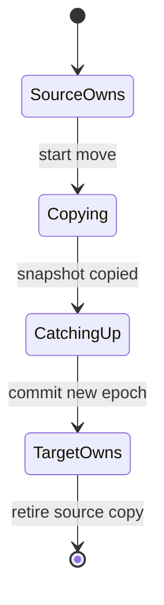

### 4.47 movement 与 availability 是两回事

减少 bytes moved 可缩短 rebalance，却不自动保证 correctness。迁移仍需处理：

- snapshot 后增量 writes；
- target replica readiness；
- old/new owner fencing；
- stale router redirect；
- failure midway 与 resume/rollback。

consistent placement algorithm 只解决“搬哪些”，不完整解决“怎样在线搬”。

### 4.48 shard count 选择为多因数值

固定 shard 数常选择可被很多 factors 整除的值，便于在多种 node count 下均分，而不要求 nodes 是 power of two。

例如 1,200 可被 2、3、4、5、6、8、10、12 等整除；但即使不能整除，只要 shards 足够多，每 node 相差一两个 shard 通常也可接受。

### 4.49 heterogeneous hardware 的权重

若 nodes 性能不同，可给高性能 node 分配更多 shards。设 node $i$ capacity weight 为 $c_i$，目标 shard 数约为：

$$
s_i\approx S\cdot\frac{c_i}{\sum_jc_j}
$$

前提是 shards 负载近似均匀；若有热点，还需按 measured load 而非只按 count 分配。

### 4.50 使用固定 shards 的系统

原章列举 Citus（PostgreSQL sharding layer）、Riak、Elasticsearch、Couchbase 等。方案的核心优势是 add/remove nodes 容易，只要初始 shard count 对未来规模足够。

系统具体是否允许在线 split/reshard、replica move 和 mixed hardware，需要查对应版本文档。

### 4.51 上限：nodes 不能多于 shards

若每 node 至少要有一个 shard 才能承担数据，则固定 $S$ 限制有效 data nodes：

$$
N\le S
$$

实际在到达 $N=S$ 前就可能因每 node shard 太少、replication placement 或负载粒度而失去均衡空间。

### 4.52 shard count 过少

过少会导致：

- 单 shard 太大，move 与 failure recovery 慢；
- 无法把一个大 shard 再分给更多 nodes；
- load-balancing granularity 粗；
- 很快触及 node-count 上限。

修复需 expensive resharding：split 每个 shard、写新 files、重建 replicas/indexes。

### 4.53 shard count 过多

过多则增加：

- per-shard metadata、file descriptors 和 memory；
- replication/consensus group 数；
- compaction、snapshot、backup 与 health-check tasks；
- scatter query fan-out；
- scheduler 与 control-plane pressure。

小 shard 迁移快，但系统可能被固定管理成本淹没。

### 4.54 “just right” 随 dataset 变化

固定 $S$ 下，平均 shard size 为：

$$
\bar B_{shard}=\frac{D}{S}
$$

dataset 从 GB 增到 PB 时，shard size 同比例增长。创建时最合适的 $S$，多年后可能过少；若一开始按终局规模设 $S$，早期又可能 overhead 过高。

### 4.55 resharding 的空间与停机风险

改变固定 shard count 需要同时保留 old/new files、搬迁并验证，短期额外 disk space 可接近一份数据量。某些系统不能在 concurrent writes 下 reshard，因而需要 downtime 或复杂 dual-write/catch-up。

这使 shard count 成为高代价、长期性的初始参数。

### 4.56 可运行示例：mod $N$ 与固定 shards 的 movement

下面用完整的 0–11,999 hash-value 周期比较 3→4 nodes。固定方案有 120 shards，分别从三个旧 nodes 各迁 10 shards 给新 node，达到均衡的 30 shards/node。

```python
def movement_rate(before: list[int], after: list[int]) -> float:
    moved = sum(old != new for old, new in zip(before, after, strict=True))
    return 100 * moved / len(before)


hash_values = list(range(12_000))

mod_before = [value % 3 for value in hash_values]
mod_after = [value % 4 for value in hash_values]

shard_count = 120
old_owner = {shard: shard % 3 for shard in range(shard_count)}
new_owner = dict(old_owner)
for old_node in range(3):
    donated = [shard for shard, owner in old_owner.items() if owner == old_node][:10]
    for shard in donated:
        new_owner[shard] = 3

fixed_before = [old_owner[value % shard_count] for value in hash_values]
fixed_after = [new_owner[value % shard_count] for value in hash_values]

print(f"mod 3 -> 4: {movement_rate(mod_before, mod_after):.1f}% keys move")
print(f"fixed 120 shards: {movement_rate(fixed_before, fixed_after):.1f}% keys move")
print("shards per node:", [list(new_owner.values()).count(node) for node in range(4)])
```

实际运行输出：

```text
mod 3 -> 4: 75.0% keys move
fixed 120 shards: 25.0% keys move
shards per node: [30, 30, 30, 30]
```

固定 shards 只移动新 node 必须获得的 25% 数据，且 assignment 完全均衡；mod $N$ 多移动了 50% keys。示例假设 hashes 与 shard load 均匀，实际还要按 bytes/load 挑选 donors。

### 4.57 fixed-shard 方案小结

它通过在 key→shard 与 shard→node 之间加一层稳定 indirection，避免 membership 改变时全量 reshuffle。代价是必须提前估计长期 shard count，并承担固定粒度过大或过小的风险。

下一种方案保留这层 indirection，同时允许 hash ranges 自适应 split/merge。

### 4.58 Sharding by Hash Range

若无法预估终身 shard count，希望像 key range 一样动态 split，又不想让相近 keys 形成写热点，可把两者组合：每 shard 保存一个连续 **hash-value range**，而不是原 key range。

$$
key\xrightarrow{hash}h,\qquad h\in[b_i,b_{i+1})\Rightarrow shard_i
$$

### 4.59 hash 与 range 各自承担什么

- hash function：把 skewed/monotonic keys 均匀映射到 hash space；
- range boundaries：把 hash space 切成可动态 split/merge/move 的 shards。

这避免 fixed shard count 的终身预测，也降低 raw key-range 的相邻写热点风险。

### 4.60 16-bit 例子

若 hash 为 16 bits：

$$
0\le h\le65{,}535=2^{16}-1
$$

四个初始 shards 可覆盖：

```text
[0, 16384)
[16384, 32768)
[32768, 49152)
[49152, 65536)
```

真实系统通常使用 32 bits 或更大，例子只为便于观察。

### 4.61 相似 keys 被打散

consecutive timestamps 在 raw order 中相邻，经 good hash 后分散在整个 hash space。因此同一时刻的 writes 大概率进入多个 hash ranges，而不是全部进入最后一个 time range。

这改善 ingest balance，但失去原 partition-key order。

### 4.62 hash range 仍可动态 split

若 $[a,c)$ 过大或过热，可在 $b$ 拆成 $[a,b)$ 与 $[b,c)$。split 仍然 expensive，却按实际 data/load 发生，不需要创建 database 时固定全部 shards。

因此 shard count 可随 dataset volume 增长，单 shard size 维持在目标范围附近。

### 4.63 partition-key range query 失效

原 keys 的 range $[k_1,k_2]$ 经 hash 后散布到所有 hash ranges，通常必须 scatter：

$$
hash([k_1,k_2])\not\subseteq contiguous\ interval
$$

hash-range 以 balance 换掉 raw partition-key locality。

### 4.64 composite key 保留 shard 内排序

若 record key 为多个 columns，只有第一部分作为 partition key 做 hash：

```text
partition key: tenant_id
clustering columns: timestamp, event_id
```

同 `tenant_id` 的 records hash 相同、进入同 shard；shard 内再按 timestamp/event ID 排序。因此仍可高效查询某 tenant 的 time range。

### 4.65 partition key 与 clustering columns

两者职责不同：

| 部分 | 决定什么 | 常见查询能力 |
|---|---|---|
| partition key | 选哪个 shard | equality lookup / routing |
| clustering columns | shard 内顺序 | 同 partition 内 range scan |

只有 clustering condition、没有 partition key 时，router 仍不知道该访问哪个 shard。

### 4.66 数据仓库中的相似思想

data warehouse 也常先决定粗粒度 partition，再在内部按 cluster columns 排序。术语与 OLTP sharding 不完全相同，但目标类似：让 query pruning 与 scan locality 匹配常见 predicates。

这类 partition 可能位于 distributed object storage，不一定对应长期固定 database node。

### 4.67 BigQuery

BigQuery 中 partition key 决定 record 属于哪个 partition；**cluster columns** 决定 partition 内数据如何组织/排序。query 同时利用 partition pruning 与 clustered block pruning，减少扫描 bytes。

不要把 BigQuery partition 与本章“每 shard 一个独立 leader”机械等同；这里强调的是两级数据布局思想。

### 4.68 Snowflake

Snowflake 自动把 records 写入 **micro-partitions**，同时允许定义 cluster keys 来改善相关值的 locality。系统可根据 clustering depth 重组数据。

用户通常不手工把 micro-partition 指派给某计算 node，说明 storage partitioning 与 request execution placement 可以解耦。

### 4.69 Delta Lake

Delta Lake 支持 manual/automatic partition assignment，并支持 cluster keys。过度按高基数字段建目录 partitions 会产生 small files；clustering 可在不创建海量目录的情况下改善 locality。

这与 fixed shards 的“粒度太细有 overhead”是同一个一般规律。

### 4.70 clustering 还改善 compression/filtering

相似 values 相邻时：

- min/max zone map 更容易排除 blocks；
- run-length/delta/dictionary encoding 更有效；
- range predicate 读取更少 pages；
- cache 访问更集中。

因此 locality 不只影响 routing，也影响 storage-engine scan 与 compression efficiency。

### 4.71 使用 hash-range 的系统

原章指出 YugabyteDB、DynamoDB 使用 hash-range sharding，MongoDB 可选该模式；Cassandra、ScyllaDB 使用一种相关变体。

具体产品的 partition key encoding、token width、split automation 和 secondary index 行为仍应按版本核实。

### 4.72 Cassandra/ScyllaDB 的 token ranges

它们把可能 hash/token space 切成带随机 boundaries 的连续 ranges，并让每 node 承担多个 ranges。某些 ranges 比其他更宽，但一个 node 拿多个随机 ranges 后，偏差有机会互相抵消。

原章给出的典型数量是：Cassandra 默认每 node 16 ranges，ScyllaDB 每 node 256 ranges。

### 4.73 virtual nodes 的平均效应

这些 ranges 常与 **vnodes/virtual nodes** 联系。若每个随机 range 的 load 近似独立、方差有限，一个 node 聚合 $m$ 个 ranges 后，相对波动通常随：

$$
CV_{sum}\propto\frac{1}{\sqrt m}
$$

而下降。这是统计直觉，不适用于一个 hot key 主导或 ranges 高度相关的 workload。

### 4.74 添加 node 时怎样获取份额

新 node 加入时，从多个 existing nodes 各接收若干 range 子区间。这样它约获得 $1/(N+1)$ 数据，而每个旧 node 只贡献一部分，不需全量 reshuffle。

原章示例中，新 node 从 node 1 的两个 ranges 和 node 2 的一个 range 接收子区间，最终近似均衡。

### 4.75 删除 node 与 boundaries 调整

node 删除时，其 ranges 可 merge 到相邻 ranges 或重新切给其他 nodes。add/remove 都可能调整 boundaries、split/merge shards，区别于 fixed-shard 方案中 boundaries 永远不变。

灵活性更强，control plane 与 data movement protocol 也更复杂。

### 4.76 fixed shards 与 hash ranges 对照

| 维度 | fixed number of shards | hash-range shards |
|---|---|---|
| shard count | 创建时固定 | 可随 size/load 变化 |
| key→shard | 固定 modulo/映射 | boundary split 后可变化 |
| rebalance unit | whole shard | whole range 或 split 子range |
| 初始预测 | 必须估长期数量 | 可渐进适应 |
| control-plane complexity | 较低 | split/merge 更复杂 |

两者都比 `hash % node_count` 多一层 logical shard indirection。

### 4.77 Consistent Hashing 的定义

**consistent hashing** 把 keys 映射到指定数量 shards/nodes，并追求两项性质：

1. 每 shard 获得的 keys 数大致相等；
2. shard 数变化时，尽量少改变 keys 的 assignment。

它同时关注 static balance 与 membership-change stability。

### 4.78 最小 movement 的下界

从 $N$ 个等容量 nodes 增加到 $N+1$，新 node 最终需要约：

$$
\frac{1}{N+1}
$$

keys。因为它起初没有数据，至少这些 keys 必须移动。理想 consistent hashing 接近该下界，并避免旧 nodes 之间无必要交换。

### 4.79 consistent 与 consistency 无关

这里 **consistent** 表示 node/shard count 改变时，key 倾向于留在原 assignment；它与：

- replica consistency；
- eventual/strong consistency；
- ACID consistency；

都不是同一个概念。consistent hashing 不决定读到新旧值，也不提供 transaction invariant。

### 4.80 ring/hash-range 风格

原始 consistent hashing 常把 hash space 看成环，nodes 或 virtual nodes 占据 points，key 顺时针找到 owner。Cassandra/ScyllaDB 的 range 分配与其相似，但产品实现还包含 token allocation、replication placement 和 topology awareness。

“使用 hash ring”不是完整架构说明。

### 4.81 Highest Random Weight / Rendezvous Hashing

**highest random weight（HRW）**，也称 **rendezvous hashing**，对每个 `(key,node)` 计算稳定 pseudo-random score，选择最高者：

$$
owner(key)=\operatorname*{arg\,max}_{node\in Nodes}H(key,node)
$$

新增 node 时，旧 winner 仍参与且 score 不变；assignment 只有在新 node score 更高时才改变。因此移动的 keys 全部流向新 node，旧 nodes 不彼此洗牌。

### 4.82 weighted rendezvous

若 nodes capacity 不同，可把 stable random score 与 node weight 组合，使高 capacity node 赢得更多 keys。权重公式需保证分布无偏，不能简单乘一个任意数后假定比例精确。

weighted placement 还要考虑 replicas 不能落在同 failure domain。

### 4.83 Jump Consistent Hashing

**jump consistent hashing** 直接根据 key hash 和 bucket count 计算 bucket，使用 $O(1)$ memory、期望 $O(\log N)$ 计算，并在 bucket 数增加时提供接近最小 movement。

它适合 buckets 编号连续、容量近似相同的场景；任意 node removal、复杂 weights 与拓扑约束需要额外 indirection 或算法。

### 4.84 range split 与 scattered-key reassignment

hash-range add node 通常从少数 existing ranges 切出连续 subranges；HRW/jump 等算法则可能让新 node 从所有旧 nodes 接收分散的 individual keys/buckets。

前者 data movement 更容易按连续 storage files/streams 执行；后者 assignment 计算简单、balance 好，但迁移源更分散。哪个更好取决于 storage layout 与 workload。

### 4.85 consistent hashing 不解决 replication placement

为每 key/shard 选 primary owner 后，还要选 follower replicas，并确保：

- 不与 primary 同 node；
- 尽量跨 rack/AZ/region；
- capacity 权重合理；
- membership epoch 一致；
- leader/follower move 有安全顺序。

一致 hash 只是 placement pipeline 的一部分。

### 4.86 可运行示例：rendezvous hashing 的稳定性

下面对每个 `(key,node)` 使用 BLAKE2b 生成稳定 score。增加 node D 后，若 assignment 改变，新 owner 必然是 D；未移动 keys 的旧 assignment 完全保持。

```python
from hashlib import blake2b


def score(key: str, node: str) -> int:
    payload = f"{key}\0{node}".encode("utf-8")
    return int.from_bytes(blake2b(payload, digest_size=8).digest(), "big")


def rendezvous_owner(key: str, nodes: list[str]) -> str:
    return max(nodes, key=lambda node: score(key, node))


keys = [f"key-{index}" for index in range(1_000)]
old_nodes = ["A", "B", "C"]
new_nodes = ["A", "B", "C", "D"]
before = {key: rendezvous_owner(key, old_nodes) for key in keys}
after = {key: rendezvous_owner(key, new_nodes) for key in keys}
moved = [key for key in keys if before[key] != after[key]]

print("moved only to D:", all(after[key] == "D" for key in moved))
print("unmoved assignments stable:", all(before[key] == after[key] for key in keys if key not in moved))
print("assigned keys:", len(after))
```

实际运行输出：

```text
moved only to D: True
unmoved assignments stable: True
assigned keys: 1000
```

代码验证 minimal disruption 的结构性质，不证明负载一定完美均衡。样本量、key distribution、hash quality、weights 和 heterogeneous request rates 仍决定实际 balance。

### 4.87 如何选择 hash-based 方案

- node count 很稳定、dataset 小：简单 modulo 也许足够，但扩缩容代价要可接受；
- 可预估长期 shard 数：fixed shards 简化 control plane；
- dataset 变化大且需在线 split：hash ranges；
- stateless client placement/cache：rendezvous/jump 常很合适；
- storage 以连续 ranges 组织：range split/move 往往更自然。

选择依据应包括 movement unit、metadata model、replication topology 和 online migration，而不只是 hash 均匀性。

### 4.88 hash-based sharding 小结

hash 把 key-domain skew 打散，却破坏原 key range locality；fixed shards 用稳定 indirection 避免 mod $N$ 全量 reshuffle，但难预测终身粒度；hash ranges 动态适应数据；consistent hashing 则抽象出 balance 与 minimal movement 两个目标。

这些方案都不能拆开一个真正的 hot key，也不能替代 routing、replication 和迁移协议。

### 4.89 Skewed Workloads and Relieving Hot Spots

consistent hashing 让 **key count** 大致均匀，却不保证 **data bytes 或 request rate** 均匀。真实 workload 常呈 Zipf/long-tail distribution：少数 keys 承担大部分流量。

因此 placement algorithm 的静态均匀性只是起点，系统还需观测实际 load。

### 4.90 celebrity post 案例

social media 中，celebrity 的 post 可能被数百万 followers 同时读取、点赞和评论。若 partition key 是 celebrity user ID 或 post ID，所有活动集中到同一 key/shard。

即使其他十亿 keys 完美均匀，该 hot key 仍决定 cluster 最大吞吐。

### 4.91 hot shard 与 hot key 的区别决定解法

- shard 内有很多 moderately busy keys：split range、move 子ranges 往往有效；
- shard 主要由一个 hot key 主导：普通 split 不能把同 key 分成两个 owners；
- read hot：可通过 cache/replicas fan-out；
- write hot：需要把 logical key 的 writes 拆成多个 physical keys 或重新定义 operation。

先诊断 load composition，再选择动作。

### 4.92 range scheme 可隔离 hot key

range/hash-range system 可调整 boundaries，让 hot key 独占一个 shard。这样至少不会拖累原 shard 中其他 keys，也可单独设置资源、priority 和 replicas。

但 hot key 自身仍在一个 logical shard；隔离减少 collateral damage，不自动增加其单-key write capacity。

### 4.93 dedicated machine

独占 shard 可放到高规格 dedicated node，避免 noisy neighbors。对暂时热点，这是直接但昂贵的方式；热点消退后应 merge/move 回共享资源。

若 bottleneck 是单线程 serialization、单 lock 或单 leader，升级机器仍有上限。

### 4.94 application-level key salting

已知 logical key 很热时，可追加/前置一个 bucket suffix：

```text
post-42#00
post-42#01
...
post-42#99
```

每次 write 根据 random number 或 stable hash(operation_id) 选 bucket，使一个 logical key 对应 $B$ 个 physical partition keys。

### 4.95 write load 的分散

若 writes 独立且 bucket 近似均匀，总 write rate 为 $\lambda_w$，每 bucket 期望：

$$
E[\lambda_{bucket}]\approx\frac{\lambda_w}{B}
$$

原章“两位随机数”给 $B=100$，理论上把每个 physical key 的 write rate 降到约 $1/100$。

### 4.96 read amplification

要读取 logical key 的完整 state，必须查询全部 $B$ buckets 并 merge：

$$
Fanout_{read}=B
$$

并行可降低等待，但总 request/network/merge work 增大。salting 主要分散 writes，并不会减少读取该 logical object 的总流量。

### 4.97 merge 必须符合数据语义

salting 适合可拆分聚合：

- counter：读取各 bucket 后 sum；
- append-only comments：merge/sort pages；
- event ingestion：按 event ID 去重聚合。

对必须严格串行更新的 balance、unique state 或 arbitrary document，拆 buckets 会引入 cross-bucket transaction/conflict，未必可用。

### 4.98 为什么不能给所有 keys 都 salting

绝大多数 cold keys 不需要 100-way fan-out。统一 salting 会让普通 read、index、backup 和 metadata 成本放大 $B$ 倍。

所以原章建议只对少数 known hot keys 使用，并维护哪些 keys 已被特殊拆分。

### 4.99 hotspot registry 与 routing

应用/数据库需要记录：

```text
logical_key -> mode(normal | salted), bucket_count, epoch
```

writer 根据当前 epoch 选 bucket；reader 在 migration window 可能同时查 normal key 与 salted buckets。registry stale 时不能丢掉刚切换模式的 writes。

### 4.100 normal key 转换为 hot key

online conversion 可分阶段：

1. 创建 salting config/新 epoch；
2. writers 开始写 buckets；
3. reader 同时读 old key 与 buckets；
4. backfill/冻结 old state；
5. 确认无 old-epoch writers 后只读 buckets。

热点消退后的 unsalting 同样需要兼容窗口，不能只删除 suffix。

### 4.101 load 随时间变化

viral post 可能只热几小时或几天。固定 dedicated shard 或 100 buckets 若永不回收，会积累大量长期 overhead。

heat detection 应使用滑动窗口、衰减与 hysteresis，避免负载在 threshold 附近时不断 split/merge。

### 4.102 read-hot 与 write-hot 需要不同策略

| 类型 | 主要瓶颈 | 常见策略 |
|---|---|---|
| read-hot | 重复读取同 value | cache、CDN、更多 read replicas、request coalescing |
| write-hot | 同 key 高频 mutation | salting、sharded counter、append events、ownership redesign |
| mixed-hot | 两者兼有 | 分写 + materialized aggregate/cache |

对 read-hot key 加 salt 后，每次完整读取仍触及全部 buckets，可能更糟。

### 4.103 cache 与 replication 对 read hot key

immutable/slow-changing celebrity post 可缓存到 edge/CDN；频繁读取但少写的数据可增加 replicas。cache invalidation 语义与 acceptable staleness 决定收益。

这再次说明 sharding 与 replication 解决不同问题：write owner 可能仍只有一个，reads 可从许多 copies 服务。

### 4.104 write aggregation 与 materialization

likes 可先写入分散 event/counter buckets，再异步 materialize total。用户可能短暂看到 approximate/stale count，但 ingest capacity 大幅提高。

若业务要求每次 increment 后立刻读取精确 global total，所有 buckets 又需协调，salting 的优势会减少。

### 4.105 heat management / adaptive capacity

大规模 cloud services 可能自动识别 hot shards/keys，并重新分配资源。Amazon 使用 **heat management**、**adaptive capacity** 等术语。

自动系统可能动态 split、迁移、提高 quota 或借用邻近 capacity；原章不展开内部算法，不能从名称推断具体 guarantee。

### 4.106 自动化无法决定业务 merge semantics

database 可检测 QPS/bytes hotspot，却未必知道：

- logical key 能否拆；
- reads 如何 merge；
- exact count 是否必须实时；
- delete/transaction 怎样跨 buckets；
- 热点何时可降级。

因此 application-aware design 仍不可替代。

### 4.107 可运行示例：把 hot counter 分成 100 buckets

示例用 operation sequence 的稳定 modulo 模拟 `hash(operation_id) % 100`。10,000 writes 被精确分成 100 buckets；读取总数则必须 sum 所有 buckets。

```python
from collections import Counter


bucket_count = 100
writes = 10_000
buckets = Counter(index % bucket_count for index in range(writes))

print("bucket count:", len(buckets))
print("minimum writes per bucket:", min(buckets.values()))
print("maximum writes per bucket:", max(buckets.values()))
print("read fan-out:", bucket_count)
print("merged total:", sum(buckets.values()))
```

实际运行输出：

```text
bucket count: 100
minimum writes per bucket: 100
maximum writes per bucket: 100
read fan-out: 100
merged total: 10000
```

真实 random/hash assignment 会有统计波动，不会总是精确 100；关键关系仍是 per-bucket writes 约除以 $B$，完整 read fan-out 变成 $B$。

### 4.108 hotspot 处理小结

hash 解决的是不同 keys 的 domain distribution，不是单 key 的 popularity。hot range 可 split，hot key 可隔离；write-hot key 若语义允许可 salting，read-hot key 更适合 caching/replication。

任何自动 heat management 都要同时控制迁移成本和配置回收。

### 4.109 Operations: Automatic Versus Manual Rebalancing

前文反复使用 split、move、merge，但还有一个运营决策：这些动作由 database 自动执行，还是由 administrator 明确配置和批准？

答案不只是便利性问题，而是 control loop 在不完整故障信号下是否会作出放大故障的动作。

### 4.110 fully manual rebalancing

administrator 根据 metrics/capacity plan 选择 boundaries、目标 nodes 和迁移时机，再执行/监控。优点是可结合业务事件、maintenance window 和 failure context；缺点是慢、易漏、依赖专家，难以应对突发热点。

manual 也不意味着手工复制文件；data movement protocol 应由系统自动、安全执行，只是 decision/commit 由人作出。

### 4.111 fully automatic rebalancing

系统自动判断何时 split/move、选择 target、执行 cutover，无需人参与。正常维护工作少，并可与 autoscaling 结合，根据 workload 自动增减 shards/nodes。

DynamoDB 等 cloud databases 宣传能在数分钟内适应大幅 load increase/decrease；实际速度取决于 quota、数据量、热点形态与服务限制。

### 4.112 semi-automatic 模式

Couchbase、Riak 等原章示例可自动生成推荐 shard assignment，但要求 administrator commit 后才生效。

这种 human-in-the-loop 保留算法的全局计算能力，同时给 operator 检查 target capacity、故障背景和业务时机的机会。

### 4.113 自动化的便利与 autoscaling

成熟 automation 可：

- 在 shard 到阈值前主动 split；
- 添加 nodes 后均匀迁移；
- 热点消退后 merge/scale in；
- 持续修正小幅 skew；
- 降低 24/7 人工响应需求。

但它必须有明确 safety constraints，而不是只追求最小 imbalance。

### 4.114 rebalancing 本身很昂贵

任何 move 都会 reroute requests，并在网络上传输大量 data，同时消耗 source/target disk、CPU 与 replication bandwidth。前台 writes 还在继续，mover 必须复制 snapshot 后追上 delta。

因此自动动作可能暂时降低而非提高 available capacity。

### 4.115 near-capacity 时可能永远追不上

设 source 的 incoming mutation rate 为 $W$，migration 能复制/应用增量的有效速率为 $M$。要让 target catch up，至少要求：

$$
M>W
$$

若系统已接近最大 write throughput，$M\le W$，backlog 不会收敛；split/move 的额外 load 还会继续降低 $M$。

### 4.116 automatic failure detection 的危险组合

假设 node 因 overload 暂时响应慢，failure detector 把 slow 误判为 dead。automatic rebalancer 随即把它的数据复制到其他 nodes，产生更多 network/disk load。

原本是性能退化，自动恢复动作却把它升级为 capacity crisis。

### 4.117 cascading failure 的正反馈

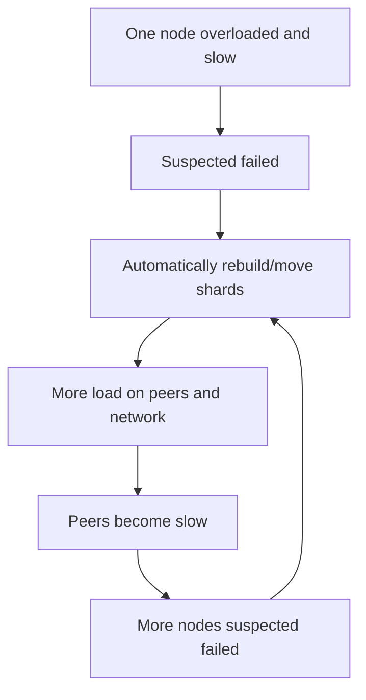

这类正反馈会形成 **cascading failure**：系统每次“自愈”都进一步减少 headroom。

### 4.118 automation 的安全护栏

较安全的 control loop 需要：

- cluster headroom 与 target admission check；
- migration concurrency/bandwidth throttling；
- failure detector hysteresis 与多信号确认；
- 每次动作后 observation/cooldown；
- stop-the-world emergency brake；
- 优先恢复 availability，延后 perfect balance；
- 不在多个 failure domains 同时做高风险 move。

automation 的品质取决于异常路径，不只正常扩容演示。

### 4.119 human in the loop 的价值与限制

人可识别“这是 planned traffic spike、network incident 还是真正 node loss”，避免错误动作；也可在业务低谷迁移。但人工响应较慢，夜间或大规模集群中无法逐 shard 决策。

更实际的分工是：系统持续检测并提出/执行低风险动作，高风险或异常状态需 approval，且始终可自动 throttle/abort。

### 4.120 preemptive rebalancing

若已知 Cyber Monday、World Cup ticket sale 等事件将带来 surge，可提前：

- 增加 nodes/replicas；
- split 预计 hot ranges；
- 预热 cache；
- 调整 tenant placement；
- 暂停非关键 compaction/backup；
- 设置保守的自动迁移上限。

manual planning 在此比事后 reactive split 更有效。

### 4.121 选择自动化程度的矩阵

| 条件 | 更偏 automatic | 更偏 approval/manual |
|---|---|---|
| shard 小、move 快、headroom 高 | 是 |  |
| control plane 经充分 fault injection | 是 |  |
| 数据 move 数小时、影响巨大 |  | 是 |
| failure signals 模糊、共享瓶颈多 |  | 是 |
| 突发负载且人来不及响应 | 是，但需护栏 |  |
| 已知大型业务事件 | 预先自动执行计划 | 人审计划 |

不是选一个永久开关，而是按 action risk 分级。

### 4.122 key-value sharding 部分总结

key-range 保留 locality 并动态 split，却怕相邻写热点；hash 打散 key domain，但 modulo node count 导致大规模无效 movement；fixed shards 稳定却难预测粒度；hash ranges 与 consistent hashing在自适应和 minimal movement 上提供不同方案。

无论 placement 多均匀，真实 workload 仍可能因 hot key skew。rebalancing 是消耗 capacity 的在线控制过程，自动化必须有 headroom、throttling、hysteresis 与故障放大防护。

---

## 5. Request Routing：请求怎样找到正在变化的 shard owner

### 5.1 routing 问题的定义

给定一个 key，client 最终需要连接某个可处理该 key 的 replica IP/port。request routing 要完成：

$$
key\longrightarrow shard\longrightarrow node/replica\longrightarrow endpoint
$$

其中前两层会因 split、move、failover 和 membership change 而变化。

### 5.2 与 service discovery 的相似性

两者都把 logical target 映射到 network endpoint，并要处理 instance 上下线、health 与 metadata cache。

因此 routing tier、client-side discovery、DNS bootstrap、watch/notification 等模式可以复用。

### 5.3 与普通 stateless service 的关键差异

stateless application instances 通常等价，load balancer 可把 request 发给任意健康 instance。sharded database 中，只有保存目标 shard replica 的 nodes 才有相应数据。

random healthy node 不等于 correct node；router 必须理解 data placement。

### 5.4 routing 依赖两张映射

1. **key → shard**：range boundaries、hash range 或 fixed shard function；
2. **shard → nodes**：当前 replicas、leader、read eligibility 与 placement epoch。

第一张可能由算法计算，第二张通常由 control-plane metadata 查询。range split 时两张都会变。

### 5.5 方案一：client 联系任意 node

client 通过 round-robin load balancer/DNS 联系任意 cluster node。若该 node 拥有 shard，就直接处理；否则转发到正确 node，收到 reply 后再回 client。

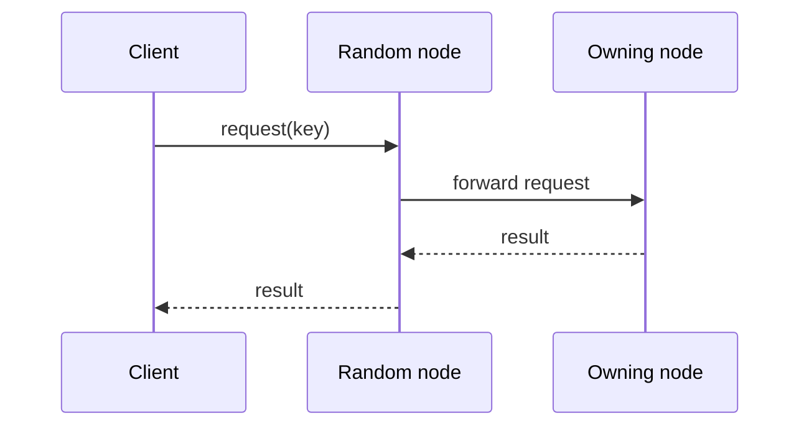

### 5.6 random-node forwarding 的优点

- client 只需知道少量 bootstrap nodes；
- placement logic 留在 database cluster；
- metadata 更新无需推送给所有 application clients；
- 任意 node 可作为入口，连接管理简单。

适合 cluster nodes 能高效互联、愿意承担 proxy traffic 的系统。

### 5.7 random-node forwarding 的代价

非 owner 请求多一个 network hop 和一次 proxy buffering。若命中 owner 概率约为 $p$：

$$
E[hops]\approx p\cdot1+(1-p)\cdot2=2-p
$$

还可能让入口 node 成为 accidental hotspot，并要求转发保留 timeout、authentication、trace 与 cancellation semantics。

### 5.8 方案二：独立 routing tier

所有 clients 先访问 **routing tier**。router 读取 shard metadata，像 shard-aware load balancer 一样把请求转给正确 node；它本身不执行 database operation。

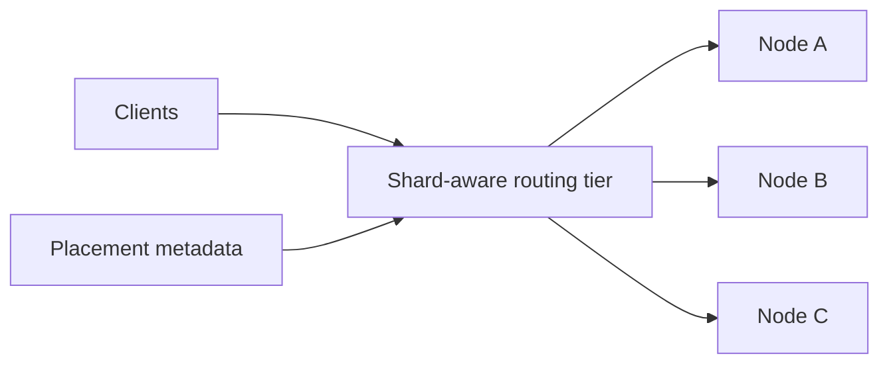

### 5.9 routing tier 的优点

- clients 保持简单、语言无关；
- placement/cache/failover policy 集中升级；
- 可统一 connection pooling、retry、auth、observability；
- database nodes 不必代理不属于自己的请求。

MongoDB 的 `mongos` 是原章给出的典型 routing-tier 例子。

### 5.10 routing tier 的代价

router 增加一跳和一个需要扩展/高可用的 data-plane component。若 routing tier 共享状态或依赖单一 metadata service，也可能成为 bottleneck/failure amplifier。

应让 routers 尽量 stateless、横向扩展，并缓存 placement；但 cache 又引出 stale-routing 问题。

### 5.11 方案三：sharding-aware client

client library/driver 自己订阅 placement，直接连接目标 node，无 intermediary：

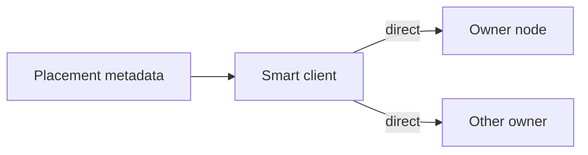

latency 与 proxy load 最低，driver 还能基于 locality、replica lag 与 read preference 选 replica。

### 5.12 smart client 的代价

- 每种语言/版本都要正确实现 routing；
- 大量 clients 订阅 metadata，形成 fan-out；
- stale/buggy driver 长期存在；
- clients 需管理许多 node connections；
- security/network topology 可能不允许直连 database nodes。

placement protocol 变成 public compatibility contract，升级成本高。

### 5.13 三种方案对照

| 方案 | client complexity | extra hop | metadata subscribers | 主要风险 |
|---|---:|---:|---:|---|
| random node + forward | 低 | 常有 | cluster nodes | proxy hop/load |
| routing tier | 低 | 有 | routers | router capacity/availability |
| smart client | 高 | 无 | 所有 clients | stale/fragmented drivers |

实际系统可混合，例如 smart client 直连，stale 时由 node redirect；或 routing tier 在 cluster 内再转发。

### 5.14 谁决定 shard placement

需要一个 authoritative component 决定 shard 应位于哪些 nodes。单 coordinator 最易形成一致 assignment，却成为故障点；若 coordinator 可 failover，则必须保证任一时刻只有一个有效 decision authority。

这本质上是 replicated control-plane state machine，而不只是一个配置文件。

### 5.15 coordinator split brain

若两个 coordinators 同时认为自己有效，可能把同 shard 分给不同 owners。双方接受 writes 后会形成 divergent histories，尤其 single-leader shard 无法安全自动合并。

因此 coordinator election/metadata commit 需要 consensus、term/epoch 与 fencing，不能只用 timeout 选“看起来活着”的 node。

### 5.16 placement epoch

每次 ownership/configuration 变化分配单调递增 epoch：

```text
shard-17 -> replicas [A,B,C], leader A, epoch 41
shard-17 -> replicas [B,C,D], leader D, epoch 42
```

node 收到 old epoch write 时 redirect/reject；storage/lease 也应阻止 old owner 提交。epoch 把“谁更新”变成可比较的版本，而非依赖 wall clock。

### 5.17 router 怎样得知变化

常见机制：

- watch/subscribe placement service；
- periodic pull/refresh；
- server redirect 携带 newer epoch；
- metadata piggyback；
- gossip dissemination。

push 提高新鲜度但连接多；pull 简单但有 stale window；redirect 是必要兜底，不能假定 notification 永不丢。

### 5.18 cache staleness 是正常状态

任何 router/client cache 在某一时刻都可能过期。协议应让 stale request 安全失败或收敛，而非要求 metadata 瞬时传播。

可采用：owner 返回 `MOVED/NOT_OWNER` + current endpoint/epoch，client 更新 cache 后以同一 idempotency key 重试。

### 5.19 shard move 的 cutover window

target 已接管时，仍有发往 old owner 的 in-flight requests。若 old owner继续写，新旧 owners 会分叉；若直接丢弃，client 可见错误。

安全 cutover 通常：

1. target 追上 source；
2. authoritative metadata 提交 new epoch；
3. old owner 被 fence，停止新 writes；
4. old owner redirect/proxy late requests；
5. 等旧 epoch requests 排空再回收。

### 5.20 redirect、proxy 与 retry

- **redirect**：client/router 自己重发，减少 old node 长期代理；
- **proxy**：old node 转给 new owner，对旧 clients 透明，但增加 hop；
- **retry**：若 response 丢失，operation outcome 可能不明，必须幂等/去重。

系统可先 proxy 保兼容，再通过 metadata refresh 让 traffic 收敛到 direct path。

### 5.21 防止 redirect loop

若 nodes 的 metadata versions 不同，A 可能 redirect B，B 又 redirect A。request 应携带 last-seen epoch/hop limit；node 只接受更高 epoch 的 redirect，或要求 client 到 authoritative service refresh。

禁止基于同 epoch 的循环转发，避免 stale topology 把小故障放大为流量风暴。

### 5.22 ZooKeeper / etcd coordination

许多 distributed systems 使用 ZooKeeper、etcd 等独立 coordination service 保存 shard assignments。它们通过 consensus 提供 fault tolerance 和 split-brain protection。

每个 database node 注册 identity/endpoints；coordination service 维护 authoritative shard→node map；routers/clients watch changes。

### 5.23 notification dataflow

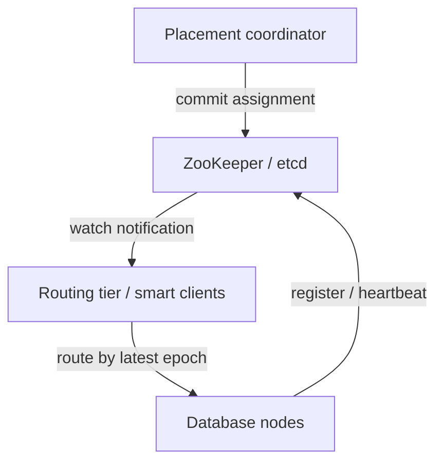

consensus 保护 metadata commit，不意味着每个 watcher 瞬时更新；data plane 仍需 redirect/fencing。

### 5.24 产品架构例子

原章列举：

- HBase、SolrCloud：ZooKeeper 管理 shard assignment；
- Kubernetes：etcd 保存 service instance placement；
- MongoDB：自己的 config servers + `mongos` routing tier；
- Kafka、YugabyteDB、TiDB、ScyllaDB：内建 Raft coordination。

这些系统的数据复制与 control-plane 粒度不同，不能只因都用 Raft/ZooKeeper 就认为路由语义相同。

### 5.25 coordination service 的规模边界

placement metadata 应小而关键，不应把每个 user record 都写入 ZooKeeper/etcd。通常保存 shard boundaries、replica sets、epochs 和 node registry。

若 shard 数过多，watch fan-out、transaction rate、snapshot 和 recovery 会给 coordination service 带来压力，这也是 tiny shards 的隐性成本。

### 5.26 Riak 的 gossip approach

Riak 用 **gossip protocol** 在 nodes 间传播 cluster-state changes，而不是强一致 consensus map。gossip 去中心、传播弹性好，但不同 cluster parts 可能暂时拥有矛盾 assignments，甚至 split brain。

leaderless/weak-consistency database 更能容忍这种 metadata disagreement，因为 data path 本就允许多个 replicas/冲突；仍不代表完全无风险。

### 5.27 consensus 与 gossip 的取舍

| 属性 | consensus metadata | gossip metadata |
|---|---|---|
| assignment view | 单一 committed order | 最终传播、可暂时分歧 |
| partition 中决策 | quorum side 可推进 | 多 sides 可能各自更新 |
| latency/availability | 依赖 quorum | local dissemination 较灵活 |
| 适合 | single-owner/strong semantics | 能容忍冲突的 placement |

选择必须匹配 data model；不能让强一致 shard ownership 建立在无法 fence 的矛盾 maps 上。

### 5.28 DNS 的角色

即使使用 routing tier/random-node entry，client 仍要知道初始 IP。node/routing-tier endpoints 通常比 shard assignments 变化慢，可用 DNS 做 bootstrap/service discovery。

DNS 不适合承载每个 key-range 的高频 assignment：TTL/cache propagation 粗，表达不了 epoch、replica role 和大量 boundaries。

### 5.29 OLTP routing 与 analytical execution

本节主要针对给定 key 找单 shard 的 sharded OLTP。analytical query 常天然 scan、aggregate、join 多 shards，并通过 distributed execution plan 在所有 workers 并行执行。

对 analytics，“访问多 shard”不是异常 slow path，而是基本模型；其 exchange/shuffle 和 parallel query execution 将在第 11 章展开。

### 5.30 可运行示例：stale route 的 epoch redirect

示例中 key 7 属于 shard 1。client cache 仍认为 epoch 1 的 owner 是 node A，但 authoritative map 已把 shard 移到 node C、epoch 2。old owner 返回 newer route，第二次成功。

```python
from dataclasses import dataclass


@dataclass(frozen=True)
class Placement:
    node: str
    epoch: int


def shard_for(key: int) -> int:
    return key % 2


def handle(node: str, key: int, epoch: int, current: dict[int, Placement]) -> tuple[str, Placement]:
    placement = current[shard_for(key)]
    if node != placement.node or epoch != placement.epoch:
        return "redirect", placement
    return "ok", placement


key = 7
client_route = Placement("node-a", 1)
current = {0: Placement("node-b", 1), 1: Placement("node-c", 2)}

status, placement = handle(client_route.node, key, client_route.epoch, current)
print(f"first attempt: {status} to {placement.node} at epoch {placement.epoch}")

client_route = placement
status, placement = handle(client_route.node, key, client_route.epoch, current)
print(f"second attempt: {status} on {placement.node}")
```

实际运行输出：

```text
first attempt: redirect to node-c at epoch 2
second attempt: ok on node-c
```

示例假设 old node 能查询 current metadata。生产系统还需 signed/authenticated metadata、hop limit、idempotent retry，以及 storage-level fencing，防止 old owner 仅靠本地 stale map 接受写。

### 5.31 routing correctness 的不变量

至少应维持：

1. 每个 key 在给定 epoch 有明确 shard；
2. 每 shard 在给定 epoch 有合法 replica/leader set；
3. old epoch writer 不能修改 authoritative state；
4. stale routes 最终 redirect/refresh 到 newer epoch；
5. retry 不产生重复 side effects；
6. metadata/control plane 故障不会让两个 owners 同时有效。

这些不变量比“cache 更新很快”更可验证。

### 5.32 request routing 部分总结

routing 不是静态 `hash % node`，而是随 split、move、failover 变化的两级映射。random-node forwarding、routing tier 和 smart client 在 hop、复杂度与 metadata fan-out 上取舍不同。

consensus coordination 提供 authoritative placement order；epoch/fencing 保护 cutover；redirect/refresh 让 stale caches 正常收敛。DNS 只适合 bootstrap，gossip 则适合能容忍临时 assignment disagreement 的弱一致系统。

---

## 6. Sharding and Secondary Indexes：按非 partition key 查询

### 6.1 primary/partition key 的理想路径

若 client 知道 partition key，便可计算 shard 并 route 到一个 owner。这最符合 key-value model：partition key 是 primary key 全部或前缀。

secondary index 打破这一假设，因为 query 通常只给出另一个 attribute，不知道 matching records 的 partition keys。

### 6.2 secondary index 是什么

secondary index 根据非主定位键建立 value → record IDs 的映射。它通常不唯一：一个 value 对应多条 records。

$$
indexTerm\longrightarrow\{recordId_1,recordId_2,\ldots\}
$$

右侧 ID 集合/序列称 **postings list**。

### 6.3 原章的查询例子

- 找 user `123` 的所有 actions；
- 找包含单词 `hogwash` 的所有 articles；
- 找 `color = red` 的所有 cars。

这些条件都未必包含原 record 的 partition key，所以不能直接定位 primary shard。

### 6.4 哪些系统依赖 secondary index

纯 key-value stores 常没有 secondary index；relational databases 把它当标准能力，document databases 也普遍支持。

Solr、Elasticsearch 等 full-text search engine 的核心价值正是按 terms 找 documents，可说 secondary/inverted indexing 是其 **raison d’être**。

### 6.5 两种基本方案

1. **local secondary index**：index entry 与 primary record 在同 shard，按 documents 分片；
2. **global secondary index**：汇总所有 primary shards，再按 indexed term 单独分片。

二者分别优化 write locality 与 read routing，没有免费同时兼得。

### 6.6 Local Secondary Indexes

每个 shard 独立维护只覆盖本 shard records 的 secondary indexes，不关心其他 shards 数据。primary data 与其 index entries 共享 shard ownership 和 transaction boundary。

### 6.7 document-partitioned index

information retrieval 中，local index 也称 **document-partitioned index**：先按 document/record ID 决定 shard，每 shard 为自己 documents 建完整 term indexes。

同一 term 的 postings 被拆成每 shard 一段。

### 6.8 local index 的写路径

add/remove/update record 时，只访问拥有该 primary record 的 shard；该 shard 在本地同步更新 data 与 color/make 等 indexes：

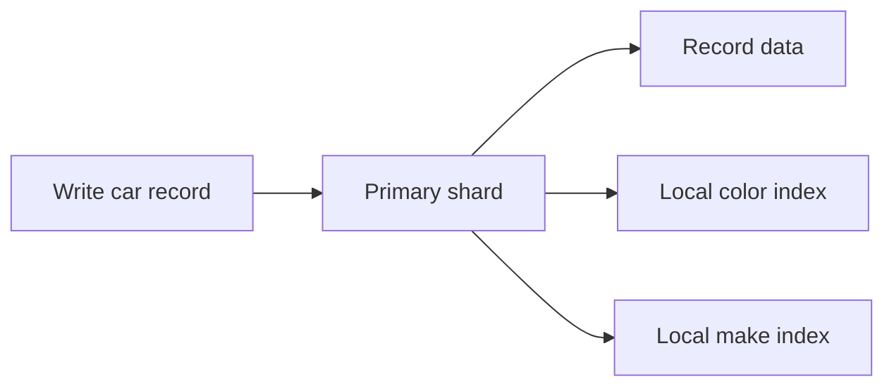

若 storage engine 支持 transaction，record 与 local entries 可原子提交。

### 6.9 used-car partitioning 案例

used-car website 以 unique listing ID 分片：

```text
IDs   0-499 -> shard 0
IDs 500-999 -> shard 1
```

users 需要按 `color` 和 `make` 搜索，因此每个 shard 建自己的两个 indexes。

### 6.10 postings list

加入 red car ID 123 时，shard 0 把 123 加到：

```text
color:red -> [..., 123, ...]
```

shard 1 也可能有自己的 `color:red` postings。两份都正确，因为各自只声明本 shard 中的 matches。

### 6.11 update/delete 要同时维护旧新 terms

若 car 从 red 改成 blue，必须原子地：

1. 从 `color:red` postings remove ID；
2. 向 `color:blue` postings add ID；
3. 更新 record payload。

delete 则要从所有相关 local indexes 清除 ID，或使用 tombstone/background cleanup 并定义可见性。

### 6.12 手写 application index 的警告

key-value database 不支持 index 时，开发者可能自己维护：

```text
red -> set of IDs
```

这实际上创建了另一个 materialized data structure。它必须与 source record 在 race、retry、partial failure 下保持同步，不能当作普通 cache map。

### 6.13 partial write 的失步场景

若先写 car record，再写 index：

- record 成功、index timeout：search 漏掉 car；
- retry index update 非幂等：可能重复 ID；
- concurrent color updates 乱序：old color entry 残留；
- delete 与 index backfill 竞态：deleted record 复活于结果。

反过来先写 index，也会短暂返回不存在的 record。

### 6.14 multi-object transaction 的必要性

要强一致维护 record 与多个 index entries，需要把它们放入同一 atomic transaction，或使用有顺序、可重放且能 repair 的 database-managed log/indexer。

local index 的关键优势是这些 objects 位于一个 shard，single-shard transaction 足以；第 8 章将详述 multi-object transaction。

### 6.15 已知 partition key 时只查一个 shard

若 query 已知道 record 的 partition key，只需访问对应 shard 的 local index。例如已知 tenant ID，并查询该 tenant 下 `color=red`，tenant-sharded system 可在一个 shard 完成。

这说明 local/global 不是绝对：query 是否 local 取决于 index scope 与 partition key 是否已知。

### 6.16 只需任意一些结果

如果只需任意 sample/少量结果、不要求全局 top-K 或 completeness，可以先查询某一个 shard。它返回的 matches 正确但不完整。

API 必须明确 approximate/partial semantics，不能把“随便一个 shard 的前 10 条”伪装成全局前 10 条。

### 6.17 全部结果必须 scatter/gather

若不知道 partition keys 且需要 all matches，query 必须发送到所有 $S$ shards，再 union results：

$$
Postings(term)=\bigcup_{i=1}^{S}Postings_i(term)
$$

red cars 可同时位于 shard 0 和 shard 1，遗漏任一 shard 都会漏结果。

### 6.18 tail latency amplification

即使并行 scatter，完整 response 要等最慢 required shard。若单 shard 在 deadline $t$ 前超时概率为 $p$，并粗略假设独立，则至少一个 shard 超时概率：

$$
P(max>T)=1-(1-p)^S
$$

例如 $p=1\%$、$S=100$ 时约为 $63.4\%$。真实 failures 常相关，独立假设只用于说明 fan-out 放大效应。

### 6.19 global top-K 还需 merge

每 shard 返回 local top-K 后，coordinator 要按 score/time 排序并取 global K。若 scoring 依赖 global term statistics，local scores 还可能不可直接比较。

pagination/cursor 也需保存每 shard progress，使 secondary-index read 比简单 union 更复杂。

### 6.20 query throughput 的扩展上限

若每个 global query 都触及每个 shard，增加 shard 虽增加 storage capacity，却不会线性增加该 query 的 throughput：每 shard 仍要处理每次 query。

理想 global-query capacity 受最慢/最低容量 shard 限制：

$$
QPS_{global}\lesssim\min_i QPS_i
$$

这就是 local index read scalability 的结构性限制。

### 6.21 local index 的优势

- write 只触及 primary shard；
- record/index 可 single-shard atomic；
- shard move 时 data 与 index 一起移动；
- rebuild 可逐 shard 独立执行；
- partition-key-scoped query 高效。

适合 write-heavy、query 常带 partition key，或可接受 scatter 的系统。

### 6.22 使用 local indexes 的系统

原章列举 MongoDB、Riak、Cassandra、Elasticsearch、SolrCloud、VoltDB 等。不同产品可能提供 custom routing、coordinator 优化或额外 global index，因此仍需检查具体 index type。

“支持 secondary index”并未说明它是 local 还是 global。

### 6.23 shard move 时的 local index

local index 随 primary shard 一起 snapshot/copy/catch up。target 在 cutover 前必须拥有与 data 同一 log position 的 index；否则 routing 已切换但 search 仍缺 entries。

可选择 copy index files 或在 target rebuild，二者分别消耗 network 或 CPU/time。

### 6.24 local index consistency

“local”只表示 placement，不自动表示 synchronous。database 仍可能异步建立 local index、延迟 refresh 或使用 eventually consistent search visibility。

应分别确认：record transaction commit 后，何时能被 index query 看到？failure recovery 如何 repair？

### 6.25 local index 小结

local index 把 write correctness 留在 primary shard，代价是未知 partition key 的 complete query 要 scatter all shards，并遭受 tail amplification 与 throughput 上限。

它是 **write-local/read-global** 的选择。

### 6.26 Global Secondary Indexes

global index 汇总所有 primary shards 的 records。例如所有 red cars，无论 listing ID 属于哪个 primary shard，都出现在同一个 logical `color:red` postings list。

### 6.27 global index 自己也必须 sharding

若把完整 global index 放一个 node，它会成为容量、write 与 read bottleneck，抵消 primary sharding。因此 global index 也要拆成多个 index shards。

primary shards 数与 index shards 数可以不同。

### 6.28 使用不同 partition key

primary data 可按 listing ID 分片，color index 则按 color term 分片，make index 又按 make term 分片：

$$
primaryShard=f(recordId)
$$

$$
colorIndexShard=g(color),\qquad makeIndexShard=h(make)
$$

一次 record write 由此可能跨越多个独立 shard sets。

### 6.29 used-car global index 案例

所有 `color:red` IDs 聚在一个 logical entry。index 可按 term range 分：colors `a`–`r` 在 index shard 0，`s`–`z` 在 shard 1；make index 可使用另一 boundary。

这是按 query term 而非 document ID 决定 placement。

### 6.30 term-partitioned index

information retrieval 称其 **term-partitioned index**。full-text 中 term 是 searchable keyword；这里可推广为任何 indexed value，如 color、make、user ID。

同一 term 的完整 postings list 位于一个 logical index shard，因此 single-term lookup 可直接 route。

### 6.31 term range 或 term hash

index shards 可保存连续 term ranges，支持 term range/prefix scan；也可 hash(term) 获得更均匀分布。

同样存在 locality 与 balance 取舍。非常常见的 term（如 stop word、status=`active`）仍可形成 hot/huge postings，不会因 hash 自动拆开。

### 6.32 单条件 lookup 的优势

`color = red` 先计算 `g("red")`，只访问一个 index shard 获取完整 postings list：

$$
Fanout_{indexLookup}=1
$$

相比 local index 的 $S$-way scatter，read routing 显著改善。

### 6.33 fetching records 仍可能跨 primary shards

postings list 只返回 IDs。若 query 还要完整 car records，这些 IDs 仍按 primary key 分散，需要 batch/group 后访问多个 primary shards。

global index 优化“找出 IDs”，不保证 materialization 也单 shard。可在 index 中 include stored fields，代价是更多 duplication 与 write maintenance。

### 6.34 多条件通常落到不同 index shards

查询 `color=red AND make=Toyota` 时，`red` 与 `Toyota` 可能在不同 index shards。系统要读取两份 postings lists 并求 intersection：

$$
Result=Postings(red)\cap Postings(Toyota)
$$

full-text 多词 AND/phrase query 同样如此。

### 6.35 long postings 的 network cost

若 lists 很短，传到 coordinator intersect 很容易；若每份包含数百万 IDs，network transfer、memory 和 intersection CPU 都很大。

可以把较短 list 发送到长 list 所在 shard、使用 compressed bitmap/Bloom filter 或分层执行，但 data placement 仍决定 shuffle 成本。

### 6.36 query planner 应从 selective term 开始

若 term A 命中 100 records，term B 命中 10 million，先取 A 的 IDs，再用 B 验证 candidates 通常比传输完整 B list 更省。

这需要 index statistics、cardinality estimate 与远端 predicate API；统计 stale 会导致差的 distributed plan。

### 6.37 global index 的 write fan-out

一个 document 含多个 indexed terms，每个 term 可能位于不同 index shard。写入 primary record 后，需要更新：

$$
1+|distinct\ index\ shards\ touched|
$$

个 shards（忽略 replicas）。full-text document 的 terms 多时，write amplification 显著。

### 6.38 update 要处理 old/new term diff

record update 必须知道旧 terms 与新 terms：

$$
Removed=Old\setminus New,\qquad Added=New\setminus Old
$$

对 Removed 删除 postings，对 Added 增加 postings。重复、乱序 change events 必须按 record version 幂等应用，否则 stale entries 会残留。

### 6.39 distributed transaction 方案

可在一个 distributed transaction 中原子更新 primary shard 与所有 affected index shards。这样 commit 后 index 与 record 一致，但 transaction participants、latency、locks/conflicts 与 failure recovery 增加。

这是用 coordination 换 immediate index consistency。

### 6.40 asynchronous index maintenance

另一方案是 primary write 先 commit，再从 transaction log/CDC 异步更新 global index：

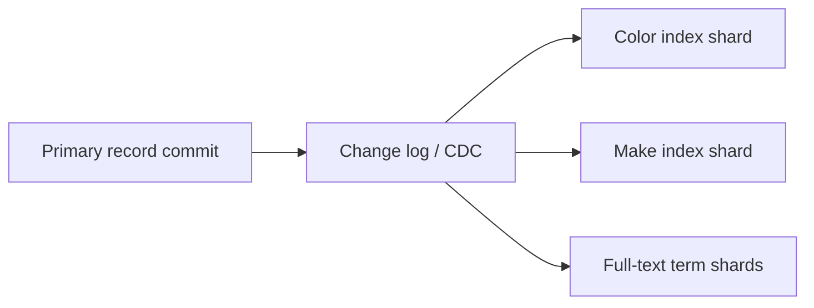

write latency 与 availability 更好，代价是 index lag 和 repair complexity。

### 6.41 async staleness anomalies

primary commit 后、index update 前：

- 新 record 搜不到；
- deleted record 仍出现在 postings；
- updated color 可能暂时同时出现在 old/new results；
- read-your-writes search 失败。

fetch record 时可过滤 stale ID，但“漏掉新 ID”无法在 query 端补救。

### 6.42 用 position token 提供 read-your-writes

若 indexer 暴露 applied log position，write response 可返回 primary commit position；search 请求要求 index 至少追到该 position，否则等待、fallback primary query 或明确返回 not-ready。

这把第 6 章的 replication-lag/session guarantee 思路应用到 materialized global index。

### 6.43 failure 与 repair

async indexer 需要 durable offset、idempotent event application、dead-letter/poison-event handling、backfill/rebuild 和 source/index reconciliation。

只看 consumer lag 不足以发现 silent skipped entry；可抽样反查、checksum ranges 或周期 rebuild 验证完整性。

### 6.44 使用 global indexes 的系统

原章列举 CockroachDB、TiDB、YugabyteDB；DynamoDB 同时支持 local 和 global secondary indexes。

不同实现可能用 synchronous distributed transaction、异步 propagation 或受限 key schema，consistency contract 必须逐项查明。

### 6.45 DynamoDB global index 的例子

原章指出 DynamoDB writes 异步反映到 global indexes，因此 global-index reads 可能 stale，类似 async replication lag。

其 local/global 名称还与 base table partition key 关系相关；不能把所有产品的“LSI/GSI”语义直接套用到一般分类。

### 6.46 global index 何时有优势

更适合：

- secondary-index reads 多于 writes；
- single-term predicates 常见；
- postings lists 较短/selective；
- 可接受 async staleness，或数据库提供 atomic maintenance；
- scatter local index 已成为 throughput/tail bottleneck。

write-heavy、多 terms、超长 postings 时成本会很高。

### 6.47 hot term

若 `status=active` 命中绝大多数 records，完整 postings 位于一个 logical term shard，会成为 hot/large key。可按 term + ID range 二级分片，但 lookup 又需读取多个 subshards。

global index 同样没有逃离 hot-key trade-off，只是热点从 primary key 转成 term。

### 6.48 global index 的 split/rebalance

index shard 也需要自己的 boundaries、replicas、routing 与 split/move。primary shard rebalance 不一定改变 global index entries；index-term rebalance 也不应重写 primary records。

两套 sharding 独立扩展，control-plane 和 operational matrix 随之增加。

### 6.49 可运行示例：local 与 global index fan-out

四个 primary shards 各有 red car。local query 必须读四份 local postings；global `red` postings 只查一个 index shard，但抓取完整 records 仍触及四个 primary shards。

```python
cars = {
    1: {"color": "red", "make": "Ford"},
    4: {"color": "red", "make": "Toyota"},
    7: {"color": "red", "make": "Honda"},
    10: {"color": "red", "make": "Volvo"},
}
primary_shard_count = 4

local_indexes: dict[int, dict[str, list[int]]] = {
    shard: {} for shard in range(primary_shard_count)
}
global_index: dict[str, list[int]] = {}

for car_id, car in cars.items():
    primary_shard = car_id % primary_shard_count
    local_indexes[primary_shard].setdefault(car["color"], []).append(car_id)
    global_index.setdefault(car["color"], []).append(car_id)

local_ids = sorted(
    car_id
    for shard_index in local_indexes.values()
    for car_id in shard_index.get("red", [])
)
global_ids = sorted(global_index["red"])
record_shards = {car_id % primary_shard_count for car_id in global_ids}

print("local index shards queried:", len(local_indexes))
print("local IDs:", local_ids)
print("global index shards queried:", 1)
print("global IDs:", global_ids)
print("primary shards needed for records:", len(record_shards))
```

实际运行输出：

```text
local index shards queried: 4
local IDs: [1, 4, 7, 10]
global index shards queried: 1
global IDs: [1, 4, 7, 10]
primary shards needed for records: 4
```

结果展示了 index lookup 与 record fetch 是两个阶段；global index 把第一阶段从 4-way scatter 降到 1，却没有改变 IDs 的 primary placement。

### 6.50 local/global 对照矩阵

| 维度 | local/document-partitioned | global/term-partitioned |
|---|---|---|
| index 覆盖范围 | 单 primary shard | 全部 primary shards |
| write touched shards | 通常一个 | primary + 多个 index shards |
| single-term complete lookup | scatter all primary shards | 一个 term shard |
| record fetch | 已在各 local shard | 仍需按 IDs 访问 primary shards |
| 原子一致性 | single-shard 较容易 | distributed transaction 或 async lag |
| 热点 | 每 query fan-out | hot term / long postings |
| 扩展瓶颈 | read amplification | write amplification |

### 6.51 混合与专用 search system

同一系统可同时保留 local transactional indexes 与异步 global search index。OLTP 按 partition key 执行强一致操作，Elasticsearch/Solr 类系统承担 flexible search。

这不是消除 trade-off，而是明确两个 read models、同步 lag、rebuild 和 source-of-truth 边界。

### 6.52 设计选择问题

选择前至少量化：

- query 含 partition key 的比例；
- 每 term cardinality/postings length；
- 每 document indexed term 数；
- read/write ratio；
- index freshness/read-your-writes 要求；
- scatter fan-out 与 p99；
- distributed transaction 可接受成本；
- rebuild/backfill time。

没有 workload 数据，“global 一定更快”与“local 一定更简单”都不成立。

### 6.53 secondary index 部分总结

local index 让 record 与 index write 同 shard 原子化，却让完整 secondary lookup 广播；global index 按 term 重新分片，让单 term postings 可定位，却将一次 write 扇出到多个 index shards，并产生 distributed transaction 或 async staleness。

这是一组典型的分布式系统对偶：**把协调放在 write path，可简化 read；把所有状态留在 local write path，则 read 必须聚合。**

---

## 7. 原章总结：分片让 shards 独立扩展，也让跨 shard 操作成为难点

### 7.1 何时需要 sharding

当 data volume 或 processing/write throughput 已无法由单机合理承担时，sharding 把 dataset 拆成较小 subsets，分配到多台 machines。

若单机仍有充足 headroom，通常应避免这项 heavyweight complexity；read-only 瓶颈还可先考虑 replication/read scaling。

### 7.2 首要目标是 balance

理想方案让 data 与 query load 均匀分布，避免 hot spots。实际 balance 同时取决于：

- key distribution；
- record size；
- request frequency；
- query/transaction fan-out；
- node capacity；
- 时间变化。

只均衡 shard count 不够。

### 7.3 rebalancing 是持续能力

nodes 增加/删除、data 增长、hot ranges 变化时，必须 split/move/merge shards。一个 sharding scheme 的质量不只看 steady state，还看 rebalancing movement、在线 correctness 与故障放大风险。

### 7.4 Key range sharding

keys sorted，每 shard 拥有 $min,max)$ range。优势是 range query 与 composite-key locality；风险是相近 keys 被同时访问/写入时形成 hot shard。

典型再平衡方式是在 shard 过大/过热时把 range split 成两个 subranges。

### 7.5 hash sharding

先 hash key，再按 fixed shard、hash range 或 consistent-hashing algorithm 分配。hash 破坏原 key order，使 raw range query 低效，却通常让不同 keys 更均匀。

固定 shards 常通过移动 whole shards 扩缩容；hash ranges 也可动态 split。

### 7.6 composite key 的折中

常用 key 第一部分作为 partition key，决定 shard；其余 columns 在 shard 内排序。于是同 partition key 下仍可 efficient range query：

```text
(tenant_id | partition, timestamp | clustering, event_id | tie-break)
```

这保留局部 locality，而不是要求整个 global key space 有序。

### 7.7 routing 依赖 coordination

client/router 要知道 key→shard 和 shard→node。assignment 随 move/failover 变化，常由 ZooKeeper、etcd 或内建 Raft 等 coordination mechanism 维护 authoritative map。

stale cache 是常态，epoch、fencing 与 redirect 保护 cutover。

### 7.8 local secondary index

index 与 primary record colocate，只更新一个 shard，write 简单；但不知道 partition key 的 complete lookup 要读取所有 shards。

它将复杂度放在 read/scatter path。

### 7.9 global secondary index

index 按 indexed term 独立分片，single-term postings lookup 可定位一个 index shard；但 primary write 可能更新多个 index shards。

它将复杂度放在 write/coordination path，或接受 asynchronous index lag。

### 7.10 shard independence 的意义

每 shard 大多独立运行，才能让 capacity 随 machines 增加。高比例 single-shard operations 是良好扩展的前提。

需要同时写多个 shards 时，部分成功如何处理成为核心问题；distributed transaction、workflow 与 consistency 将在后续章节继续讨论。

### 7.11 sharding 与 replication 必须组合思考

本章为简化暂时忽略 replicas，但生产系统每 shard 通常有多个 replicas。一次 shard move 实际包含 replica bootstrap、catch-up、leadership/epoch cutover 与 old-copy cleanup。

placement 还要跨 failure domains，不能把所有 replicas 随均衡器放到同一 rack/AZ。

### 7.12 原章的最终方法论

没有普遍最佳 partition function。应从 access pattern 出发，在以下维度取舍：

- range locality；
- load balance/hot keys；
- shard granularity；
- data movement；
- routing metadata；
- cross-shard transaction/query；
- local/global index 的读写放大。

---

## 8. 参考文献的证据脉络

### 8.1 33 条引用覆盖什么

原章共有 33 条参考文献，覆盖术语历史、PostgreSQL/Notion/Slack 分片实践、NUMA 与 FoundationDB、multitenant cells、hashing algorithms、热点管理、Raft topology 和 information retrieval indexes。

完整书目信息与原始链接见[原章 References。

### 8.2 partitioning、sharding 与实践迁移（参考文献 1–4）

- 1、2 区分 PostgreSQL 同机 partitioning 与跨机 sharding；
- 3 追溯 `shard` 与 Ultima Online 的术语来源；
- 4 总结 Notion 大规模 PostgreSQL sharding 的 partition key、固定 shards 与迁移经验。

用途：把术语边界与真实演进成本连接起来，而不只看抽象算法。

### 8.3 memory locality 与 FoundationDB（参考文献 5–6）

- 5 是 CPU cache/NUMA memory architecture 的经典资料；
- 6 描述 FoundationDB 的 distributed transactional key-value architecture。

用途：理解为何单机 per-core sharding 也有价值，以及 distributed storage 如何组合 processes、ranges 与 transactions。

### 8.4 multitenancy、cells 与合规（参考文献 7–12）

- 7 介绍 Citus schema-based tenant sharding；
- 8 给出 AWS cell-based architecture/fault isolation；
- 9 讨论 database 应提供的 tenant restore 等能力；
- 10 从系统构造角度讨论 GDPR compliance；
- 11 研究跨 tenant databases 的 transactional schema migration；
- 12 展示 Slack 使用 Vitess 扩展 giant datastore。

用途：验证 tenant shard 不仅服务性能，也影响 isolation、restore、residency 和 schema rollout。

### 8.5 range split、topology 与稳定 hash（参考文献 13–17）

- 13 解释 monotonically increasing keys 的 hotspot；
- 14 讨论 HBase region split/merge；
- 15 讨论 Cassandra topology/vnodes；
- 16 说明 Java `hashCode` 不适合 distributed placement；
- 17 是 DynamoDB 架构与 adaptive scaling 的系统论文。

用途：核对 key-range 热点、split operation、stable hash 和 managed-service behavior。

### 8.6 consistent-hashing algorithms（参考文献 18–21）

- 18 是 Karger 等人的 original consistent hashing 论文；
- 19 比较多个 consistent-hashing algorithm trade-offs；
- 20 是 highest-random-weight/rendezvous hashing 的来源；
- 21 提出 jump consistent hash。

用途：从原始 property/assumption 理解 balance、movement、memory 和 membership 支持，而不是把所有算法简称为“hash ring”。

### 8.7 hot spots 与 shard management（参考文献 22–27）

- 22 用 Twitter/celebrity load 展示 hot-key 现实；
- 23、24 介绍 Meta Shard Manager 与 geo-distributed shard management；
- 25 讨论 Riak Core/random slicing；
- 26 回顾 S3 的 heat management；
- 27 讲解 DynamoDB adaptive capacity。

用途：理解均匀 hash 之后仍需 load-aware control plane，且热点随时间变化。

### 8.8 topology coordination（参考文献 28）

参考文献 28 介绍 ScyllaDB 使用 Raft 安全执行 topology/schema changes，支撑 request-routing 部分关于 authoritative metadata、epoch 和 split-brain protection 的分析。

用途：深入“谁决定 shard 在哪”这个常被 data-plane hash 掩盖的问题。

### 8.9 local/global secondary indexes（参考文献 29–33）

- 29 是 *Introduction to Information Retrieval*，提供 document-partitioned、term-partitioned 与 postings intersection 基础；
- 30 描述 Twitter Earlybird real-time search；
- 31 讨论 Cassandra indexing；
- 32 说明 Elasticsearch document routing；
- 33 提供 H-Store/VoltDB partitioning FAQ 背景。

用途：核对 secondary-index fan-out、routing 与真实系统选择。

### 8.10 使用参考文献的方法

1. 先确定问题属于 partition function、control plane、hotspot 还是 index；
2. 到原章 References选择 algorithm paper、system paper 或 operator report；
3. 分清理论 key-count balance 与生产 load balance；
4. 用自己的 key distribution、query trace、node topology 和 migration volume 做 benchmark/fault test。

引用提供证据与边界，不能替代当前产品版本文档和真实 workload 验证。

---

## 9. 容易混淆的概念与常见误区

### 9.1 误区：sharding 与 replication 是同一件事

sharding 拆不同数据，replication 复制同一 shard。生产系统通常先分 shard，再为每 shard 建 replicas；两条轴可独立选择。

### 9.2 误区：data partition 就是 network partition

data partitioning 是主动组织；network partition 是节点无法通信的故障。名称相同不代表理论问题相同。

### 9.3 误区：一个 shard 必须对应一个 node

一个 node 常承载多个 shard replicas，一个 shard 也因 replication 位于多个 nodes。必须区分 logical shard 与 physical placement。

### 9.4 误区：nodes 增加十倍，吞吐必然十倍

只有 load 均匀、operations local 且无 shared bottleneck 时才接近线性。scatter query、hot key、coordination 和 rebalancing 会降低效率系数。

### 9.5 误区：read throughput 不足一定要 sharding

如果每 node 能保存全部数据且 writes 可承受，read replicas/cache 往往更简单。sharding 主要突破 data volume 与 write throughput。

### 9.6 误区：horizontal scaling 永远优于大机器

scale-out 增加 distributed coordination、routing 和 operations。先把单机扩到经济合理上限常更简单可靠，二者可组合。

### 9.7 误区：partition key 只是一个可随时改的配置

它决定所有 data placement、locality、indexes 与 transactions。更换通常需要全量 online migration，是长期数据模型决策。

### 9.8 误区：hash 均匀就代表实际负载均匀

hash 只打散不同 keys。hot key、large value、skewed query 和 cross-shard fan-out 仍可让 node 过载。

### 9.9 误区：语言内置 hash 可直接用于持久 placement

runtime 可能随机 seed，algorithm 也可能版本变化。distributed placement 要固定 bytes encoding、algorithm 与 seed。

### 9.10 误区：`hash(key) % node_count` 很适合可扩展集群

node count 改变时大多数 keys 重新映射；3→4 nodes 约 75% movement，而新 node 只需要 25% data。

### 9.11 误区：consistent hashing 提供 strong consistency

这里 consistent 只指 membership 变化时 assignment 尽量稳定，与 replica/ACID consistency 无关。

### 9.12 误区：consistent hashing 自动解决 hot key

同 key 的 hash 永远相同，仍由一个 owner 处理。需要 cache、replication、salting 或可拆 operation。

### 9.13 误区：key-range boundaries 应等宽

key distribution 不均时等宽 ranges 的 bytes/load 差异很大。boundaries 应按 records、bytes 或 load quantiles 自适应。

### 9.14 误区：range sharding 一定产生热点

只有 access/write 与 key order 高度相关时才严重。随机 IDs 或良好 composite prefix 也可均匀；range 的 locality 仍很有价值。

### 9.15 误区：split 只是改一条 boundary metadata

通常要重写/copy $O(B)$ data、追增量、建立 replicas 与 cutover。最热 shard 上执行 split 还会放大 load。

### 9.16 误区：固定 shards 越多越保险

太少难扩展/迁移，太多则 metadata、files、consensus groups 和 scatter fan-out 爆炸。需要在未来粒度与当前 overhead 间折中。

### 9.17 误区：tenant ID 分片后每 tenant 永远一个 shard

giant tenant 仍可能超过单机，需要 tenant 内再分片；small tenants 又需 packing 和在线迁移。

### 9.18 误区：physical tenant isolation 可替代 authorization

它只是 defense in depth。错误 routing、共享 credential、backup、analytics 或 admin tool 仍能跨 tenant，权限验证不可省略。

### 9.19 误区：fully automatic rebalancing 总比人工可靠

automation 在 normal case 很便利，但错误 failure signal 可触发大量 move，消耗剩余 headroom 并导致 cascading failure。

### 9.20 误区：node 越慢，立刻重建它的数据越安全

slow/gray node 不一定 dead。立即 rebuild 会给 peers/network 加压；应多信号确认、throttle，并优先保护 cluster capacity。

### 9.21 误区：DNS 可以维护所有 shard assignments

DNS 适合较慢变化的 bootstrap endpoints，不适合表达大量 range boundaries、replica roles、epochs 与高频 cutover。

### 9.22 误区：placement coordinator 不需要 consensus

single-owner shards 若出现两个 coordinators，会分配矛盾 owners 并产生 split brain。authoritative metadata 需要 ordered commit、epoch 与 fencing。

### 9.23 误区：smart client 一定 latency 最低，所以总是最佳

direct path 少一跳，却把 metadata protocol、connection management、retry 和升级兼容复制到每种 client。routing tier 有时更可控。

### 9.24 误区：local secondary index 的查询一定 local

只有已知 partition key 才 local。按 secondary term 查询全部结果时，local/document-partitioned index 要 scatter all shards。

### 9.25 误区：global secondary index 可以放在一台机器

它会成为容量与吞吐瓶颈。global index 自身必须按 term range/hash 分片并复制。

### 9.26 误区：global index 后就无需访问 primary shards

index lookup 可在一个 term shard 得到 IDs，但抓取完整 records 仍按 primary IDs 分散，除非 index duplicate/include 所需字段。

### 9.27 误区：在 application code 维护 value→IDs 很简单

record 与 index 的 partial failure、concurrent update、retry 和 delete 会失步。需要 atomic transaction 或 durable ordered CDC + repair。

### 9.28 误区：distributed transaction 不可能或完全不能用

许多 databases 支持，它能保护跨 shard invariant；只是 latency、availability、locking 和 recovery 成本更高。应按 correctness requirement 决定，而非教条回避。

---

## 10. 全章知识结构

### 10.1 从五个问题审视 sharding

1. 什么字段是 partition key，为什么匹配主要 access pattern？
2. key 怎样映射 shard，shard 怎样映射 replicas/nodes？
3. size/load/membership 变化时怎样 rebalance？
4. stale client 怎样 route，cutover 怎样 fence？
5. 不含 partition key 的 query/index/transaction 怎样执行？

这五问比产品是否声称“自动分片”更能揭示真实系统行为。

### 10.2 全链路图

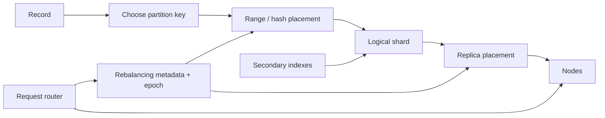

partition function、placement metadata、routing data plane 与 index layout 是四个可分别失败的层。

### 10.3 partition scheme 对照

| scheme | range locality | node-change movement | shard count | 主要风险 |
|---|---|---|---|---|
| key range | 强 | split/move subranges | adaptive | monotonic hotspot |
| hash % nodes | 无 | 大量 keys | 等于 nodes | 扩缩容全量洗牌 |
| fixed shards | shard 内可设计 | move whole shards | fixed | 初始数量难选 |
| hash ranges | partition 内可排序 | split/move ranges | adaptive | raw range query 失效 |
| rendezvous/jump | 无 | 接近最小 | follows buckets/nodes | scattered movement/topology constraints |

### 10.4 三种 skew

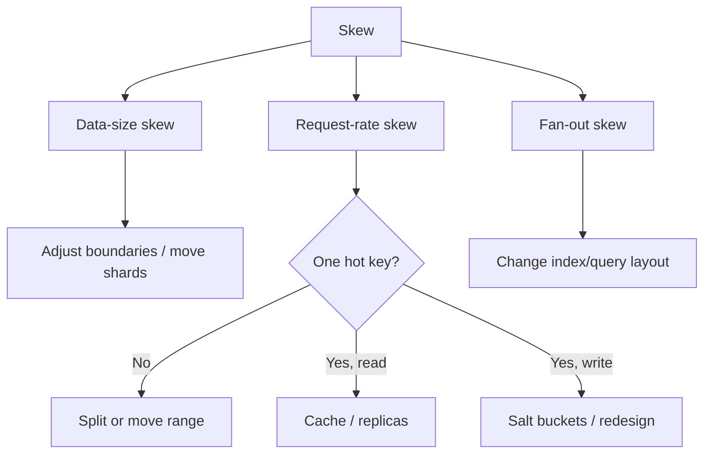

仅按 bytes 均衡无法解决 request 或 scatter fan-out。

### 10.5 rebalancing control loop


自动化最关键的是 guard 与 verify，而不只是触发 threshold。

### 10.6 routing architecture

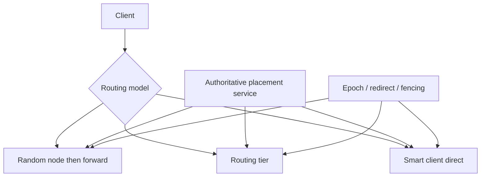

所有模型都需要处理 stale metadata；差别在谁缓存、谁多走一跳、谁承担升级复杂度。

### 10.7 secondary-index 对偶

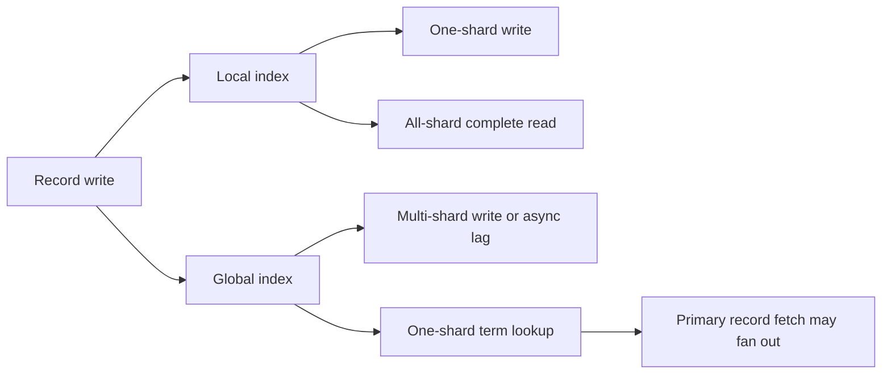

索引方案是在 write fan-out 与 read fan-out 之间重新放置 coordination。

### 10.8 公式速查

| 主题 | 公式 | 直觉 |
|---|---|---|
| ideal data/node | $D/n$ | 无 skew 时平均份额 |
| data skew | $\max D_i/(D/n)$ | 最大 node 相对平均值 |
| range shard | $[b_i,b_{i+1})$ | 连续且不重叠 |
| modulo placement | $hash(key)\bmod N$ | 简单但绑定 node count |
| new-node lower bound | $1/(N+1)$ | 新 node 至少需搬入的份额 |
| salted write rate | $\lambda_w/B$ | $B$ buckets 分写 |
| salted read fan-out | $B$ | 完整读取需 merge 全 buckets |
| migration catch-up | $M>W$ | copy/apply 必须快于新写 |
| scatter timeout | $1-(1-p)^S$ | shard 数放大 tail risk |
| local postings | $\bigcup_iPostings_i(t)$ | 完整 term result |

公式都依赖近似均匀/独立等前提，不能脱离 workload 当作 guarantee。

### 10.9 invariant 与 locality

```text
high-frequency invariant scope
        -> choose partition key to colocate that scope
        -> make most transactions single-shard
        -> identify unavoidable cross-shard operations
        -> choose distributed transaction / workflow / async view
```

好的 partition key 首先服务 correctness locality，其次才是看起来均匀的 ID。

### 10.10 observability map

至少监控：

- per-shard bytes、QPS、CPU、p99、hot-key contribution；
- shard count/node、replica placement 与 headroom；
- split/move backlog、bytes、ETA、catch-up lag；
- stale-route redirect rate 与 metadata epoch lag；
- scatter fan-out、slowest-shard latency；
- local/global index lag、postings size、repair mismatch；
- cross-shard transaction rate/failure。

node-level averages 会掩盖 shard-level skew，是最危险的错误视角。

### 10.11 全章因果链

```text
single-node limit or isolation need
  -> choose partition key and locality
  -> choose range/hash mapping
  -> observe skew and hot keys
  -> split/move/merge under headroom
  -> publish placement with epoch
  -> route stale-safe requests
  -> pay cross-shard cost for secondary queries and transactions
```

每一步都把一种瓶颈转移到另一处，完整设计必须追踪这条因果链，而不是只评估 hash function。

---

## 11. 综合案例：全球多租户协作平台的分片设计

### 11.1 场景与规模

假设一个 B2B project/collaboration SaaS：

- 20 万 tenants，绝大多数很小，少数 giant enterprise；
- 500 TB logical primary data；
- peak 120 万 writes/s；
- users 分布在 Americas、Europe、Asia；
- task/event/comment 主查询都带 tenant；
- 支持按 assignee、status、keyword 搜索；
- tenant data residence、单 tenant restore 与 gradual schema rollout；
- region/AZ/node 故障时维持既定 SLO。

设计目标不是平均分 records，而是让主要 transactions local、giant tenant 可继续扩展、secondary search 可运营。

### 11.2 先列 access patterns 与 invariants

高频路径：

1. tenant 内按 entity ID point lookup；
2. 某 project 的 timestamp range events；
3. tenant 内按 status/assignee filter；
4. full-text keyword search；
5. cross-tenant admin analytics；
6. tenant move、backup、delete/export。

invariants 包括 tenant isolation、entity ID uniqueness（tenant scope）、permission consistency 和 transaction 内相关 records 原子更新。

### 11.3 粗略容量模型

若 replication factor $R=3$，每 node 可用 8 TB，但只允许 60% target utilization，则 storage lower bound：

$$
N_{storage}=\left\lceil\frac{500\times3}{8\times0.6}\right\rceil=313
$$

若单 node 可持续处理 10,000 replicated mutations/s，同样按 60% target，每 logical write 在 3 replicas apply：

$$
N_{write}=\left\lceil\frac{1.2\times10^6\times3}{10{,}000\times0.6}\right\rceil=600
$$

illustrative model 表明 write capacity 驱动至少约 600 nodes；真实 sizing 还要分 leader/follower cost、read、compaction、repair 和 failure headroom。

### 11.4 容量模型为何只给 lower bound

上述计算假设均匀、无 hotspot、无 cross-shard amplification，且 node failure 后仍允许 60% target。生产还应加：

- AZ loss 后剩余 capacity；
- p99 而非平均 throughput；
- shard movement/backup/compaction budget；
- global index write amplification；
- storage growth 与 seasonality。

capacity plan 必须给 rebalancing 留出 $M>W$ 的余量。

### 11.5 primary partition key

绝大多数业务在 tenant 内，因此 logical ownership 先按：

```text
(tenant_id, bucket_id)
```

small tenant 固定 `bucket_id=0`，同 tenant data colocate；giant tenant 可增加 buckets。record key 后续部分为：

```text
(entity_type, entity_id | timestamp, tie_breaker)
```

在 partition 内保留 entity/time locality。

### 11.6 pooled small tenants

不能一 tenant 一 physical shard，否则 20 万 shards/replication groups 的固定 overhead 过高。small tenants 通过 directory 装入 pooled shards，每 shard 承载多个 tenants。

placement 不是简单永久 modulo，而是显式：

```text
(tenant_id, bucket_id) -> cell, shard, epoch
```

这样 tenant 增长、residency 变化时可迁移。

### 11.7 giant tenant 的二级分片

tenant 达到 data/QPS threshold 后，按 project ID hash 或稳定 bucket 拆分：

$$
bucket=hash(project\_id)\bmod B_t
$$

$B_t$ 是该 tenant 的 bucket count。project 内 operations 仍 local；tenant-wide query 需要 fan-out $B_t$ buckets。

只对 giant tenants 启用，避免所有 small tenants 承担 fan-out。

### 11.8 bucket-count migration

从 $B_t=1$ 升到 16 不能直接切 modulo，否则历史 records 仍在旧 bucket。迁移采用 versioned mapping：

1. directory 发布 migration epoch；
2. copy historical projects 到 new buckets；
3. capture/replay delta writes；
4. reads 在过渡期查 old/new；
5. commit new epoch 并 fence old writes；
6. 验证后回收 old layout。

这是 resharding，不是改一个整数。

### 11.9 cell-based placement

tenants 先分配到 region-specific cells，每 cell 包含 service、queue、cache、primary storage 和 search pipeline：

```mermaid
flowchart TD
    G[Global tenant directory] --> US[US Cell]
    G --> EU[EU Cell]
    G --> AP[AP Cell]
    US --> USS[US shards and replicas]
    EU --> EUS[EU shards and replicas]
    AP --> APS[AP shards and replicas]
```

global directory 只负责 tenant→cell；cell 内 routing 负责 key→shard→replica，缩小 metadata/failure blast radius。

### 11.10 data residence

EU-resident tenant 的 primary、followers、backup、global index segment 与 debug export 都限制在合规 regions。global analytics 只接收允许的 anonymized/aggregated fields。

directory placement policy 经审计；move 跨 jurisdiction 前先验证 target policy，不能让自动 balancer 只按 load 把 shard 移出边界。

### 11.11 logical shard granularity

假设每 cell 使用 fixed logical shards，总计 12,000 primary shards。600 nodes 时平均每 node 20 shard leaders/primary units；RF=3 后约 60 shard replicas/node。

平均 logical shard data：

$$
500\,TB/12{,}000\approx41.7\,GB
$$

该粒度让 move/recovery 可控，又避免数百万 tiny shards；最终数字必须用 metadata/compaction benchmark 验证。

### 11.12 shard-to-node placement

control plane 按 capacity weight 和 failure domain 分配 replicas：一个 shard 的 3 replicas 位于不同 AZ，leader load 尽量均衡。node replacement 只移动 affected shards，不改变 tenant bucket→logical shard mapping。

placement epoch 与 Raft/consensus metadata 防止两个 nodes 同时成为有效 leader。

### 11.13 timestamp data 避免 moving hotspot

event key 不以 global timestamp 开头，而用：

```text
(tenant_id, bucket_id | partition, project_id, timestamp, event_id)
```

tenant/project 将同时发生的 writes 分散；同 project 的 time range 仍连续。跨 tenant 某时间窗 analytics 交给独立 warehouse，不在 OLTP 做 all-shard scan。

### 11.14 local transactional indexes

tenant-scoped `status`、`assignee` index 与 primary records colocate。因为 request 已知 `(tenant_id,bucket_id)`，查询只访问一个 bucket shard；record 与 index 在 single-shard transaction 内原子更新。

giant tenant 的全 tenant status query 会 scatter 其 $B_t$ buckets，但不会广播到其他 tenants/all cluster shards。

### 11.15 global full-text search

comments/documents 的 keyword search 使用异步 global term-partitioned index：primary commit 写 durable change log，indexers 按 term hash 更新 index shards。

search 结果是 read model，允许秒级 lag；权限过滤使用 versioned ACL token，并在 fetch 时再次验证 authoritative permission，防止 stale index 泄露数据。

### 11.16 search read-your-writes

用户刚提交 document 后，UI 带 primary log position 请求 search。若 index watermark 尚未达到：

- UI 直接展示刚创建 item；
- search endpoint 可短暂等待；
- 或明确标记 indexing 中。

不声称 async global index 提供 immediate read-your-writes。

### 11.17 hot term 与 postings split

`status=active` 不放 global term index，因为 postings 接近全量、selectivity 极差；它保留为 tenant-local index。真正 global keyword 若变热，可按 `(term, record_id_range)` 拆 subshards，query 并行读取。

index schema 根据 selectivity 选择，不是所有字段都“多建一个索引”。

### 11.18 routing architecture

application requests 先访问 cell-local routing tier。router 缓存 range/fixed-shard placement，直连 leader/read replica；database node 遇 stale epoch 返回 redirect。

DNS 只发现 cell routers；authoritative metadata service 通过 watch 推送 placement，不把 12,000 shard entries编码进 DNS。

### 11.19 tenant move protocol

pooled tenant 变大或 cell 维护时：

```mermaid
sequenceDiagram
    participant D as Tenant directory
    participant O as Old shard
    participant N as New shard
    participant R as Routers
    O->>N: copy snapshot
    O->>N: stream delta writes
    N-->>D: caught up
    D->>D: commit newer placement epoch
    D-->>R: notify new route
    R->>N: new requests
    O-->>R: redirect stale requests
```

old shard 被 fence 后才允许 target authoritative；failed migration 可从 durable checkpoint resume。

### 11.20 background rebalance

allocator 同时看 bytes、write QPS、CPU、p99 和 AZ headroom，低风险 move 可自动执行；大 tenant/cross-region move 需 approval。

每 node 限制 concurrent transfers 和 bandwidth；任何 AZ degradation 时暂停追求 perfect balance，优先保留 recovery capacity。

### 11.21 hot project/post

若一个 project 的 comments write-hot，可把 comment stream 按 `hash(comment_id)%B` 分 buckets，读取 timeline 时 merge/sort；若 document read-hot，使用 cache/read replicas，而不是盲目 salting。

hot registry 带 epoch，热点消退后受控 compact，不让临时事件永久制造 100 个 buckets。

### 11.22 cross-shard transaction

tenant 内高频 transaction 尽量让 entity aggregate colocate。不可避免的跨 bucket action：

- 强 invariant（seat limit、billing）：authoritative distributed transaction/单独 control shard；
- 可补偿 workflow（notification、analytics）：durable event + idempotent consumer；
- derived counter：sharded counter + eventual materialization。

按语义选择，不能统一宣布“禁止跨 shard transaction”。

### 11.23 global analytics

cross-tenant reports 不直接 scatter 12,000 OLTP shards。CDC 把允许数据写入 warehouse/object storage，按 date/tenant partitions 与 cluster columns 组织，使用 parallel analytical engine。

这保护 OLTP tail latency，也把 cross-region/residency policy显式放入 data pipeline。

### 11.24 per-tenant backup and restore

shards 做 physical snapshot + log archive；tenant directory 记录其历史 shard/bucket placements。restore 时在隔离 namespace 重放相关 records/indexes，再通过新 epoch 切回或导出。

shared shard 不能简单整 shard 回滚，否则会覆盖其他 tenants；需要 tenant-filtered logical restore 或 clone 后提取。

### 11.25 gradual schema rollout

directory 保存 tenant schema cohort/version。new readers 先部署为 forward/backward compatible，再选 canary cells/tenants migration，监控 query latency、index lag 与 rollback。

global indexer 要同时理解 old/new event schema，直到旧 events/clients 超出 retention。

### 11.26 observability

dashboard 按 shard/tenant/bucket 展示：

- logical/physical bytes 与 growth；
- read/write QPS、p95/p99、top hot keys；
- cross-shard/scatter ratio；
- move backlog、throughput $M$ 与 mutation rate $W$；
- placement epoch/redirect rate；
- global-index watermark、postings size；
- per-cell headroom 与 failure-domain concentration；
- tenant restore drill RTO。

只看 600 nodes 的平均 CPU 会完全掩盖 hotspots。

### 11.27 fault-injection matrix

| 故障 | 必须验证 |
|---|---|
| node/AZ loss | replicas 接管，placement 不违反 failure domain |
| slow node | 不触发无节制 cascading rebalance |
| router stale cache | newer epoch redirect，no loop |
| coordinator failover | no split-brain assignment |
| move 中 source crash | 从 replica/checkpoint resume，无丢写 |
| indexer pause/reorder | watermark/幂等恢复，eventual reconciliation |
| hot key surge | cache/salting 生效且 registry 可回收 |
| giant tenant growth | online bucket migration，read completeness |
| tenant restore | 不影响 shared-shard 其他 tenants |

测试最终 records、indexes、directory epoch 和 invariants，不只检查 HTTP availability。

### 11.28 成本与降级策略

系统接近 capacity 时优先：

- 限制低优先级 global search/analytics；
- throttle background moves/index rebuild；
- cache read-hot content；
- 对 tenant 执行 quota/admission control；
- 保留 authoritative writes 的 headroom。

自动 rebalancer 不得在 overload 时无限抢占前台资源。

### 11.29 何时需要重新审视设计

触发 architecture review 的信号：

- giant tenants 数量持续增加；
- single-shard operation 比例下降；
- global index write amplification 主导成本；
- 12,000 shards 过大/过小；
- move/recovery 超过 RTO；
- directory/watch fan-out 成为瓶颈；
- data residence 或 transaction invariants 变化。

sharding scheme 不是一次性完成，而是长期可演化 contract。

### 11.30 综合案例结论

该设计用 tenant locality 让主要 transactions 单 shard，用 explicit directory 支持 pooled/giant tenant 演化，用 fixed logical shards 与 replica placement 解耦 node count，再把 flexible search/analytics 放入独立 read models。

最关键的不是 12,000 或 600 这些示例数字，而是每一层都有明确 mapping、epoch、migration、freshness 和 failure contract，并能用 workload 与 fault injection 验证。

---

## 12. 核心结论

### 12.1 三十二条核心结论

1. sharding 把不同数据拆开，replication 把同一 shard 复制多份。
2. 每 record 通常逻辑归属于一个 shard，但物理上可有多个 replicas。
3. sharding 主要突破单机 data volume 和 write throughput；read bottleneck 可先考虑 replication。
4. single-shard database 能满足需求时，通常比过早 sharding 更可靠简单。
5. partition key 决定 data locality，是高代价、长期的数据模型决策。
6. 最好的 partition key 让高频 queries、transactions 与 invariants 尽量 single-shard。
7. shard 与 node 不是一一对应，key→shard 与 shard→node 是两层映射。
8. balance 要同时衡量 bytes、QPS、CPU、I/O、tail latency 与时间变化。
9. key-range sharding 保留排序/range scan，却可能因相近 writes 形成 hotspot。
10. composite key 可用首部分定位 shard、后续部分维持 shard 内 range locality。
11. range split/merge 让 shard 数自适应，但 online split 是 $O(B)$ 级数据操作。
12. hash 打散 key-domain skew，却不能打散一个 hot key。
13. runtime 内置 hash 未必跨 process/restart 稳定，不应直接用于持久 placement。
14. `hash % node_count` 把 placement 绑到 membership，扩缩容会造成大量无效 movement。
15. fixed shards 用稳定 indirection 简化 node add/remove，但必须预估长期 shard granularity。
16. hash ranges 把 hash balance 与动态 range split 组合。
17. consistent hashing 的 consistent 与 replica/ACID consistency 无关。
18. rendezvous/jump 等算法追求 balance 与接近最小的数据 movement。
19. hot read 更适合 cache/replicas，hot write 才可能用 salting/sharded operation。
20. salting 把每 bucket write rate约除以 $B$，却把完整 read fan-out 增为 $B$。
21. rebalancing 会消耗 source、target 与 network capacity，必须保留 headroom。
22. near-capacity migration 只有 $M>W$ 才能追上增量 writes。
23. automatic failure detection 与 automatic rebalance 可形成 cascading-failure 正反馈。
24. tenant sharding 提供 locality、isolation、restore、residency 和 gradual rollout 边界。
25. giant tenant 与海量 tiny tenants 分别打破“一 tenant 一 shard”的简单模型。
26. request routing 必须理解 key→shard→node，而不只是发现任意健康 instance。
27. authoritative placement 需要 epoch、consensus/fencing；stale route 用 redirect 正常收敛。
28. local secondary index 优化单 shard write，却让完整 secondary query scatter。
29. global secondary index 优化 single-term lookup，却让 write 扇出到多个 index shards。
30. asynchronous global index 是 materialized view，会有 lag、repair 与 read-your-writes 问题。
31. shard independence 带来扩展；cross-shard query/transaction 则重新引入 coordination。
32. 完整分片设计必须同时覆盖 partition、rebalance、routing、indexes、replication、backup 与 fault testing。

---

## 13. 设计分片系统的一般方法

### 13.1 第一步：证明单机为何不够

用 data growth、sustainable write/read throughput、isolation/compliance 和 failure requirements 建 capacity model。先排除 index/query 优化、cache、read replicas 与合理 scale-up。

没有量化瓶颈，不要仅凭未来想象引入 sharding。

### 13.2 第二步：枚举 access patterns 与 invariants

记录每类 request 的 keys、filters、join、range、read/write ratio、latency/freshness 和 atomicity。标出 invariant scope 是 single record、tenant、account 还是 global。

按 frequency × cost 排序，不要为罕见 query 破坏主路径 locality。

### 13.3 第三步：选择 partition key

候选 key 逐项评估：

- cardinality 与 size/load distribution；
- 是否随时间 monotonic；
- hot-key 风险；
- transaction/query colocation；
- giant partition 上限；
- data residence/restore scope；
- 未来 migration feasibility。

用真实 trace 模拟，而不只看 schema。

### 13.4 第四步：选择 range/hash/fixed/adaptive scheme

需要 raw range scan 优先 key range；需要均匀写入可 hash；可预测规模可 fixed shards；变化大可 hash ranges；stateless mapping 可考虑 rendezvous/jump。

写清为何接受被牺牲的 locality、metadata 或 movement 特性。

### 13.5 第五步：确定 shard granularity

设目标 shard size/load，使：

- move/recovery 小于 RTO；
- 每 node 有足够 shards 可均衡；
- metadata/files/groups overhead 可承受；
- 最大 nodes 与 future growth 有空间。

同时定义 split/merge 或 full reshard 路径。

### 13.6 第六步：组合 replication placement

为每 shard 定义 replication factor、leader/quorum 与 rack/AZ/region policy。balance 不能违反 failure-domain independence 或 data residence。

计算 physical capacity 时乘 replication/write amplification。

### 13.7 第七步：设计 authoritative control plane

明确谁决定 boundaries、replica sets、leaders 和 moves。使用 consensus/epoch/fencing 防 split brain；限制 metadata size 与 update rate，设计 snapshot/recovery。

将 policy decision 与 data transfer execution 分离，便于审批和重试。

### 13.8 第八步：设计 routing 与 stale-cache protocol

选择 random-node forwarding、routing tier、smart client 或混合。定义 bootstrap、watch/pull、redirect、hop limit、idempotent retry 与 security。

把 stale route 当正常输入做测试，而不是依赖“配置很快就同步”。

### 13.9 第九步：设计 online move/split/merge

协议包含 snapshot、delta capture、catch-up、new epoch commit、old owner fencing、in-flight draining、verification 与 cleanup。

中途任一步 crash 都要可 resume/rollback；衡量 $M-W$ 与所需 headroom。

### 13.10 第十步：单独处理 hotspots

区分 range hot、single-key hot、read hot、write hot 和 temporary hot。可用 boundary split、dedicated node、cache/replicas、salting、sharded counter 或 data-model redesign。

所有临时 special placement 都要有 registry、epoch 和回收流程。

### 13.11 第十一步：选择 secondary-index strategy

量化 query 是否带 partition key、postings cardinality、indexed terms/document、read/write ratio 与 freshness。

local index 接受 read scatter；global index接受 distributed/async write；必要时用专用 search/warehouse read model。

### 13.12 第十二步：分类 cross-shard operations

对每项选择：

- 重设 partition key/denormalize 使其 local；
- distributed transaction 保护强 invariant；
- workflow/saga 做可补偿业务；
- event/CDC 异步 materialize；
- 明确拒绝/限制昂贵 global query。

不能把所有 cross-shard 问题都交给 application retry。

### 13.13 第十三步：建立 observability 与自动化护栏

按 shard/key/tenant 监控 size、QPS、p99、skew、fan-out、move/index lag 与 headroom。automation 设置 concurrency、bandwidth、hysteresis、cooldown、admission 与 emergency stop。

优先保护 availability/correctness，再追求完美 balance。

### 13.14 第十四步：设计 backup、restore 与合规

明确 physical shard backup 与 logical tenant/key restore。保存历史 placement/schema metadata，验证 global indexes 可重建；placement policy覆盖 replicas、backups、analytics 和 support exports。

定期以真实 tenant/shard 尺寸演练 RPO/RTO。

### 13.15 第十五步：做 workload 与 fault validation

回放真实 key distribution，注入 hot key、monotonic traffic、node/AZ loss、slow disk、packet delay、stale route、coordinator failover、move crash、index lag 和 reshard。

验证最终 data/index completeness、invariants、tail latency 与 no split brain，而不只看平均 QPS。

### 13.16 第十六步：把保证和非保证写入 ADR

```text
why single node is insufficient:
partition key and invariant scope:
key-to-shard algorithm:
shard size/count and split policy:
replica/failure-domain placement:
placement authority, epoch, and routing:
rebalance protocol and headroom:
hot-key strategy:
local/global index semantics and freshness:
cross-shard transaction/query policy:
backup/restore and residency:
metrics, fault tests, and known non-guarantees:
```

方法的核心顺序是：**先证明规模问题并识别 locality/invariant，再选 partition function；随后设计可演化的 placement、routing、rebalancing 和 index，最后用真实 workload 与故障测试闭环。**
