> 对应原文：8. Transactions.md
>
> 本文严格按照原章顺序讲解，并在章后统一补充易混概念、综合案例和可复用的事务设计方法。原章重点是 ACID、安全保证、弱隔离异常、serializability、two-phase commit 与 distributed transaction。文中的公式、推导、可运行示例和扩展案例用于解释与验证原理，不应误认为原书逐字给出的实现。

## 0. 本章定位：事务把故障与并发复杂度封装成可依赖的安全保证

### 0.1 数据系统面对的“严酷现实”

数据库应用运行期间，任何组件都可能在任何时刻失败：

- database software 或 hardware 在 write 中途崩溃；
- application 在一系列操作完成一半时退出；
- network interruption 切断 client–database 或 node–node 连接；
- 多个 clients 同时写入，互相覆盖；
- client 读到只完成部分更新的无意义状态；
- race condition 在极少见的时序下破坏业务规则。

可靠性问题不是“是否会出错”，而是每种中断点发生后系统留下什么状态。

### 0.2 partial failure 是核心难题

假设一个业务动作需要 $n$ 个 writes：

$$
W=\{w_1,w_2,\ldots,w_n\}
$$

若执行到 $w_k$ 后失败，没有事务时，database 可能处于任意前缀状态：

$$
\varnothing,\{w_1\},\{w_1,w_2\},\ldots,\{w_1,\ldots,w_k\}
$$

application 不仅要检测失败，还要判断已成功的子集、撤销或补齐，并处理判断本身再次失败。

### 0.3 transaction 的定义

**transaction** 允许 application 把若干 reads/writes 组合成一个 logical unit。概念上，整个 unit 像一次 operation：

- 全部成功，产生 **commit**；
- 任一步不能完成，产生 **abort/rollback**。

对外可见结果被收敛为两个主要终态，而不是暴露所有中间前缀。

### 0.4 transaction state machine

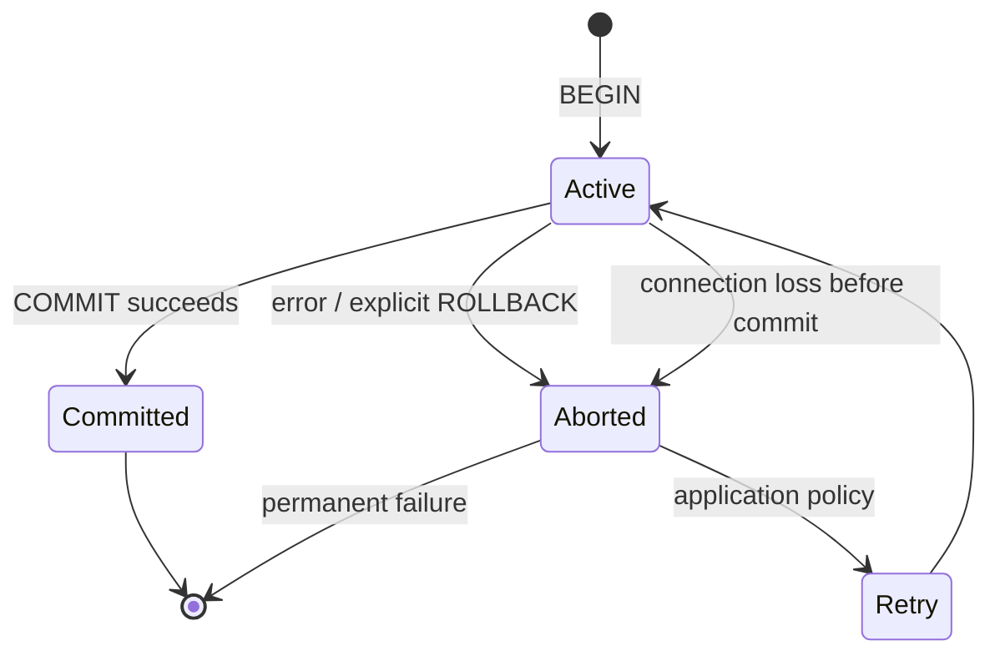

真实数据库还会有 preparing、in-doubt 等 distributed states，后文 two-phase commit 再展开。

### 0.5 transaction 简化了什么

没有事务，application 要处理每个 partial-success combination；有 atomic transaction，application 可以把许多内部故障统一看作 abort，并在合适时 retry。

其价值不是让 faults 消失，而是**缩小 application 必须显式推理的状态空间**。

### 0.6 safety guarantee

transaction 提供的是一组 **safety guarantees**：某些坏状态绝不会对外成为 committed state，例如半封邮件已插入但 unread counter 没更新。

safety 回答“什么绝不能发生”，不同于 liveness（请求最终能否成功）和 performance（多快成功）。数据库可能为保护 safety 而 abort 或暂时不可用。

### 0.7 transaction 不是自然法则

transaction 是为简化 database programming model 而创造的 abstraction，不是所有 storage 都必然具备的属性。其实现需要 logging、locking/versioning、conflict detection、coordination 与 recovery。

因此不能从 API 中出现 `transaction` 一词就推断具体 guarantee，也不能把代价视为零。

### 0.8 为什么有时会削弱或放弃事务

某些 workload 为获得更低 latency、更高 availability 或更简单的 distributed scaling，会选择：

- single-object atomicity 而非 multi-object；
- weaker isolation 而非 serializability；
- asynchronous materialized view 而非同步跨系统 commit；
- compensation/idempotency 而非 rollback。

这些选择可合理，但必须清楚放弃了哪些 safety property，并把复杂度放到了哪里。

### 0.9 不使用事务并不自动错误

有些 operations 天然独立、可交换、幂等或可从 immutable log 重建，未必需要 multi-object transaction。某些 safety property 也能用 conditional write、unique ownership、CRDT 或 workflow 实现。

反过来，账务、权限、库存和关联索引若缺乏正确原子性/隔离，极易留下难以修复的状态。原章以英国 Post Office Horizon scandal 为警示背景：底层 accounting system 缺乏可靠 ACID 行为可能带来严重现实后果。

### 0.10 怎样判断是否需要 transaction

不能只问“数据库支不支持 ACID”，而应逐项问：

1. 哪些 objects 必须一起改变？
2. 哪些 invariants 必须在 commit 时成立？
3. concurrent transactions 可能产生什么 race？
4. failure 后允许 partial effect 吗？
5. retry 会不会重复 side effect？
6. operations 是否跨 shard/system？
7. 所需 guarantee 的 latency/availability 代价是否可接受？

### 0.11 本章的三层问题

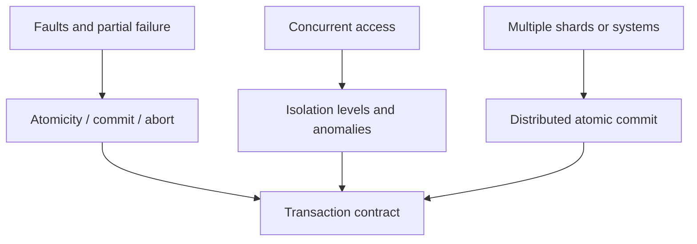

atomicity 处理中途失败，isolation 处理并发交错，distributed transaction 把 commit 决策扩展到多个 participants。

### 0.12 本章路线

原章依次回答：transaction 到底承诺什么；ACID 各字母的准确边界；single/multi-object operation；read committed、snapshot isolation、lost update、write skew；三种 serializable implementation；最后是 two-phase commit、XA、database-internal distributed transaction 与 exactly-once processing。

阅读主线是：**先识别 anomaly，再看某 isolation/commit protocol 是否排除它，以及为此付出什么 concurrency、latency 与 availability 成本。**

---

## 1. What Exactly Is a Transaction?

### 1.1 50 年延续的核心模型

几乎所有 relational databases 和部分 nonrelational databases 支持 transaction。现代 SQL transaction 风格可追溯到 IBM System R（1975，第一批 SQL database system）；MySQL、PostgreSQL、Oracle、SQL Server 等的核心 model 与其高度相似。

implementation 细节进化很大，但 `BEGIN → reads/writes → COMMIT/ROLLBACK` 这一 abstraction 延续约半个世纪，说明它解决的是稳定、普遍的问题。

### 1.2 NoSQL 浪潮为什么弱化 transaction

2000s 后期兴起的 NoSQL systems 希望提供新 data models，并默认支持 replication/sharding。许多系统为简化跨 node 实现：

- 完全放弃 multi-object transaction；
- 只保证 single-key atomicity；
- 仍使用 `transaction` 名称，却指更弱的 guarantees。

于是同一个词在产品间不再可直接比较。

### 1.3 “事务不可扩展”并非定理

一度流行的说法是 transaction 与 scale/high availability 根本冲突，大系统必须放弃它。NewSQL/distributed SQL 的发展证明这不是普遍定理。

CockroachDB、TiDB、Spanner、FoundationDB、YugabyteDB 等把 sharding 与 consensus protocol 结合，在大数据量与高吞吐下提供强 ACID guarantees。

### 1.4 可扩展不等于没有代价

distributed transaction 可以实现，不代表任意 workload 都应无条件使用。跨 shard coordination 会增加：

- network round trips；
- conflict/abort probability；
- metadata 与 recovery state；
- partition 时的 availability trade-off；
- hot coordinator/record bottleneck。

正确结论是“transaction 不是本质上不可扩展”，而非“transaction 永远免费”。

### 1.5 本章关注 guarantee 与 cost

判断是否需要 transaction，必须理解它在 normal operation、crash、network interruption 和 concurrency 下具体承诺什么。高层 `ACID compliant` 标签不足以做设计决策。

### 1.6 The Meaning of ACID

**ACID** 由 Theo Härder 与 Andreas Reuter 于 1983 年提出，表示：

- **Atomicity**；
- **Consistency**；
- **Isolation**；
- **Durability**。

其目的原本是精确定义 database fault-tolerance mechanisms。

### 1.7 “ACID compliant” 为什么仍含糊

不同 databases 对 isolation、durability、distributed scope 和 configuration 的实现差异很大。尤其 isolation 名称存在历史混乱：同名 level 可能允许不同 anomalies。

所以 ACID 更像目录，不是完整 contract。必须继续询问 isolation level、commit acknowledgment、object/shard scope 和 failure behavior。

### 1.8 BASE 更不精确

不满足传统 ACID 的 systems 有时称 **BASE**：

- Basically Available；
- Soft State；
- Eventual Consistency。

这些词没有给出可测试的精确 guarantees；实践中 BASE 常只表示“not ACID”，不能据此推断 staleness、conflict 或 failure semantics。

### 1.9 atomic 在不同领域的含义

一般说 atomic 表示不可再分。在 multithreaded programming 中，atomic operation 的中间状态不会被其他 threads 观察：外界只看见 before 或 after。

这个含义主要关乎 concurrency visibility，而 ACID atomicity 主要关乎 failure/abort，二者相关却不相同。

### 1.10 ACID atomicity 不负责 concurrency

多个 processes 同时访问相同 data 时如何互不干扰，属于 **Isolation**。ACID atomicity 回答的是：一组 writes 做到一半发生 fault 时，已做部分怎么办。

把 atomicity 误解成 serializability，会高估 transaction 在所选 isolation level 下能防止的 race conditions。

### 1.11 atomicity 面对的 fault

multi-write transaction 可能因以下任一原因中止：

- application/database process crash；
- client–server connection interruption；
- disk full/I/O error；
- integrity constraint violation；
- explicit application rollback；
- isolation conflict/deadlock victim；
- distributed participant/coordinator failure。

protocol 必须把已执行的 tentative writes 与 committed state 分开。

### 1.12 all-or-nothing 的准确含义

若 transaction 无法 commit，database 必须 discard/undo 该 transaction 已进行的 writes。对 committed state 而言：

$$
Effect(T)=
\begin{cases}
W_T,& commit\\
\varnothing,& abort
\end{cases}
$$

中间执行期间 database 内部可以有 tentative state，只是不能把它作为成功结果永久暴露。

### 1.13 rollback 怎样简化 retry

无 atomicity 时，retry 可能重复已成功的 $w_1\ldots w_k$；有明确 abort 后，application 可把本次 database effects 视为 $\varnothing$，从头重试。

这不自动处理 transaction 外 side effects，也不解决“commit 成功但 acknowledgment 丢失”的 ambiguous outcome，后文 error handling 会说明。

### 1.14 为什么 abortability 更贴切

ACID atomicity 的 defining feature 是：出错时可以 abort，并丢弃 transaction 的全部 writes。原书指出 **abortability** 或许是更准确名称，但历史术语已固定为 atomicity。

### 1.15 atomicity 的边界

atomicity 保证 database transaction 内 committed effects all-or-nothing；它不单独保证：

- concurrent transactions 等价 serial order；
- application 发出的 external email/payment 也回滚；
- client timeout 表示 transaction 一定 abort；
- committed data 永不丢失；
- application invariant 一定正确。

这些分别涉及 isolation、distributed commit/idempotency、durability 和 ACID consistency。

### 1.16 consistency 是严重 overloaded 的词

同一个 **consistency** 至少有五种常见含义：

1. replica/eventual consistency；
2. consistent snapshot；
3. consistent hashing；
4. CAP 中指 linearizability；
5. ACID 中指 application-specific good state。

讨论时必须附带上下文，单说“强一致”很容易把不同性质混在一起。

### 1.17 replica consistency

replica consistency 研究多个 copies 是否看到相同 state、允许多大 replication lag，以及 read-your-writes/causal/linearizable 等 visibility guarantee。

它关注分布式副本之间的观测，不等于 ACID C 所指的业务 invariant。

### 1.18 consistent snapshot

consistent snapshot 表示 database 在某一逻辑时点的完整状态，并尊重 happens-before：若 snapshot 包含 effect，也应包含其 causal predecessors。

它用于 backup、MVCC query 等，强调跨 records 的时点一致性，不等于“数据符合所有业务规则”。

### 1.19 consistent hashing

consistent hashing 是 membership 变化时尽量减少 key movement 的 sharding algorithm。这里 consistent 表示 assignment stability，与 transaction、replica freshness 都无关。

### 1.20 CAP consistency

CAP theorem 中 consistency 通常特指 **linearizability**：每个 operation 像在 invocation 与 response 之间某一瞬间原子发生，并符合 real-time order。

它比 ACID C 精确，但属于后续一致性模型，不应从 `ACID` 四字母自动推得。

### 1.21 ACID consistency 是 invariant

ACID 中 consistency 指 database 处于 application 定义的 **good state**，由一组 invariants 描述。例如 accounting system 中：

$$
\sum_i credits_i-\sum_i debits_i=0
$$

或 seat allocation 不超过 purchased seats、foreign-key target 必须存在、username 必须唯一。

### 1.22 invariant-preserving transaction 的论证

设合法状态集合为 $S_{valid}$，transaction $T$ 若满足：

$$
\forall s\in S_{valid},\quad T(s)\in S_{valid}
$$

且初始状态合法，那么每次 committed transaction 后仍合法。按归纳法：base state 合法；每一步由 preservation property 保持合法。

关键不只是 database 原子执行，还要 transaction logic 本身确实 preserve invariant。

### 1.23 transaction 内可暂时违反

一个 transfer 可先 debit A、再 credit B，执行中总额暂时不平；只要其他 transactions 不观察中间态，并在 commit 前恢复 invariant，最终仍 consistent。

因此 invariant 常要求 **commit boundary** 成立，而非每条 internal statement 后都成立。

### 1.24 schema constraints

希望 database 自动 enforce 的 invariants，应尽量声明为：

- foreign-key constraint；
- uniqueness constraint；
- check constraint；
- NOT NULL/domain constraint；
- exclusion constraint（若产品支持）。

database 才能在所有 write paths 一致校验，而不是依赖每个 application caller 自觉。

### 1.25 triggers 与 materialized views

更复杂 invariants 有时可用 trigger、generated/materialized view 或 indexed constraint 表达。例如把可冲突资源 materialize 为可锁定 rows。

但 trigger 隐含 side effects、执行顺序和跨 shard support 各不相同，需要保持逻辑可审计。

### 1.26 database constraints 的表达边界

许多规则难以用 schema 表达，例如“只有风险模型批准且当日总额度未超限”“两个外部系统的状态必须匹配”。此时 application 必须正确组织 transaction 与 validation。

database 不知道未声明的 invariant；写入业务上错误但类型合法的数据，它无法自动拒绝。

### 1.27 C 不是 database 单独属性

atomicity、isolation、durability 主要由 database implementation 提供；ACID consistency 往往是 database guarantees 与 application correctness 的共同结果：

$$
Consistency\approx Constraints+Correct\ Transaction\ Logic+Isolation
$$

因此“数据库是 ACID，所以业务数据必然正确”是错误推论。

### 1.28 Isolation 处理并发 race

多个 clients 读写不同数据通常可安全并行；访问相同 records 时，statement interleaving 可能让每个 transaction 基于已过期 premise 做决定。

**isolation** 决定 concurrent transactions 能观察什么、哪些交错必须等待或 abort。

### 1.29 counter lost update

初始 counter 42，两个 clients 都执行 read→+1→write：

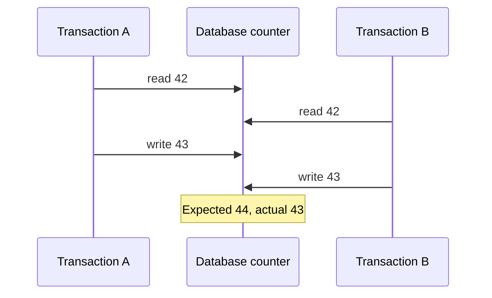

每个 transaction 单独看都正确，interleaving 却丢失一个 increment。这是 isolation/concurrency anomaly，不是 atomicity failure。

### 1.30 serial execution 的参照模型

若 A、B serially 执行：

$$
42\xrightarrow{A}43\xrightarrow{B}44
$$

或顺序相反也得到 44。serial execution 易推理，因为 transaction 执行期间 data 不被其他 transaction 改变。

### 1.31 serializability 的定义

经典 ACID isolation 形式化为 **serializability**：concurrent committed transactions 的总效果，必须等价于它们按某个 serial order 一个接一个执行。

database 可实际并行，只要 result/observable effects 能对应某个合法 serial schedule。

### 1.32 serializable 不要求按开始时间排序

若 A、B overlap，等价 serial order 可以是 A→B 或 B→A；serializability 本身不一定尊重 real-time order。后者涉及 strict serializability/linearizability 与 transaction 的组合。

所以“像一个一个执行”还要问：允许选择哪个顺序？

### 1.33 为什么常用 weaker isolation

full serializability 会带来 lock waiting、conflict abort、tracking overhead 或减少 concurrency。为提高 throughput/latency，许多 databases 默认提供 weaker levels，只阻止部分 anomalies。

代价是 application 必须知道仍可能发生 dirty read、nonrepeatable read、lost update、write skew 等哪一类。

### 1.34 isolation 名称混乱

同名 level 在不同产品可有不同行为。原章特别指出 Oracle 名为 `serializable` 的 level 实际实现 snapshot isolation，后者比真正 serializability 弱，会允许 write skew。

评估应看 anomaly/protocol guarantee，而非 level label。

### 1.35 Durability 的承诺

**durability** 表示 transaction 成功 commit 后，其 writes 不会因 database crash 或 hardware fault 被遗忘。

它是 commit acknowledgment 的数据生存承诺，不是 availability：data 存在但所在机器不可访问，durability 仍可能成立而服务暂时不可用。

### 1.36 single-node durability

single-node database 通常把 commit data 写入 nonvolatile storage（disk/SSD）。若只停留在 volatile page cache，power loss 会丢失。

因此 database 必须把“OS 接受 write”与“storage 已持久化”区分。

### 1.37 `fsync` 的作用

普通 file write 常先进入 memory buffer；`fsync` 请求 OS/storage 将此前 writes 持久化后再返回。transaction commit path 可等待 WAL `fsync`，再向 client 确认。

它增加 latency，所以 databases 可能 group commit：多个 transactions 共享一次 flush，在 durability 与 throughput 之间优化。

### 1.38 WAL 与 crash recovery

write-ahead log（WAL）先记录足够 redo/undo information，再修改 data pages。crash 后：

- replay committed log records；
- undo/ignore uncommitted records；
- 恢复到 transaction-consistent state。

checksum 帮助检测 incomplete/corrupted log entries；MySQL、MongoDB、PostgreSQL 等都使用相关机制。

### 1.39 Replication and Durability

replicated database 可把 durability 定义为 commit 前等待写入一定数量 nodes：

$$
Ack(T)\Rightarrow durable\ on\ at\ least\ q\ replicas
$$

$q$、是否落盘、是否跨 AZ/region 决定实际 failure coverage。只说“已复制”仍不够具体。

### 1.40 acknowledgment boundary 决定承诺

若 leader 本地 memory 后立即 ack，承诺很弱；若等待本地 fsync、异机 fsync、跨区 quorum，survival evidence 逐步增强，但 commit latency 与 partition sensitivity 也增加。

durability contract 应写清 `success` 前究竟等了哪些 media/failure domains。

### 1.41 perfect durability 不存在

所有 disks、replicas 与 backups 同时毁坏时，database 无法保存 data。durability 是针对声明 failure model 的 risk reduction，而非数学上的永不丢失。

理论保证必须附带 assumptions：哪些 faults 独立、最多同时失败多少、firmware/filesystem 是否按规范工作。

### 1.42 disk 与 replication 各有缺口

- 只写 disk：机器死后 data 可能仍在，但修复/搬盘前不可访问；
- 只在多机 memory：可快速 failover，却可能被共同 power loss/bug 清空；
- replication + disk：兼顾 availability 与持久性，但仍怕 correlated software/operator corruption。

它们是互补层，不是互斥替代。

### 1.43 correlated failure

若每 replica 独立丢失概率为 $p$，理想独立模型下 $r$ replicas 同失概率为：

$$
P_{all}=p^r
$$

但 power outage、shared firmware bug、bad input、operator delete 会同时影响所有 replicas，破坏 independence。实际 risk 往往由 correlated failure 主导。

### 1.44 asynchronous replication 的窗口

async leader 在 follower 收到前已 ack，leader 随即永久失败时 recent committed writes 可丢失。database 从 application 视角已违反预期 durability，除非 contract 明确允许非零 RPO。

replication factor 很高也不能补救尚未传播的 write。

### 1.45 storage hardware 也不完美

SSD 在 sudden power loss 下可能不完全遵守宣称的 guarantees，disk firmware 也会有 bug。原章举出 drive 在运行 32,768 小时后失败的真实 firmware 问题。

硬件接口返回 success 是风险降低证据，不是绝对真理。

### 1.46 `fsync` 也可能被误用

`fsync` semantics 复杂，涉及 file、directory entry、rename、write ordering 与 error propagation。原章指出 PostgreSQL 也曾二十多年未正确处理某些 `fsync` error 情况。

因此 durability 依赖 database、OS、filesystem、controller 与 drive 整条 stack。

### 1.47 filesystem/storage-engine interaction

crash 时 files 是否出现 torn write、metadata reorder、lost rename，取决于 filesystem implementation 与 storage engine protocol。少见组合 bug 很难测试，却可能破坏 on-disk state。

一个 replica 的 filesystem corruption 还可能被 replication 当作合法 state 传播。

### 1.48 latent corruption 与 historical backup

bit rot/bad block 可能长期未被读取而不被发现。发现时，replicas 和 recent backups 可能已包含同样 corruption；因此需要：

- end-to-end checksum 与 scrub；
- immutable/historical backup；
- 定期 restore verification；
- corruption 不自动覆盖 good copies 的 repair policy。

### 1.49 SSD/HDD failure 数据

原章引用一项研究：SSD 在前四年中约 30%–80% 至少出现一个 bad block，只有部分可由 firmware correction；magnetic HDD bad sector rate 较低，但 complete-drive failure rate 更高。

这些统计说明介质 failure mode 不同，不应只看单一“年故障率”。

### 1.50 worn SSD 的断电保留风险

经历大量 program/erase cycles 的 worn SSD 若断电保存，可能在数周到数月尺度开始丢 data，且温度影响 retention；低磨损 drive 风险较小。

offline archive 不能默认用退役 SSD 即可长期保存，backup media 与周期校验同样重要。

### 1.51 layered durability defense

可靠系统组合：

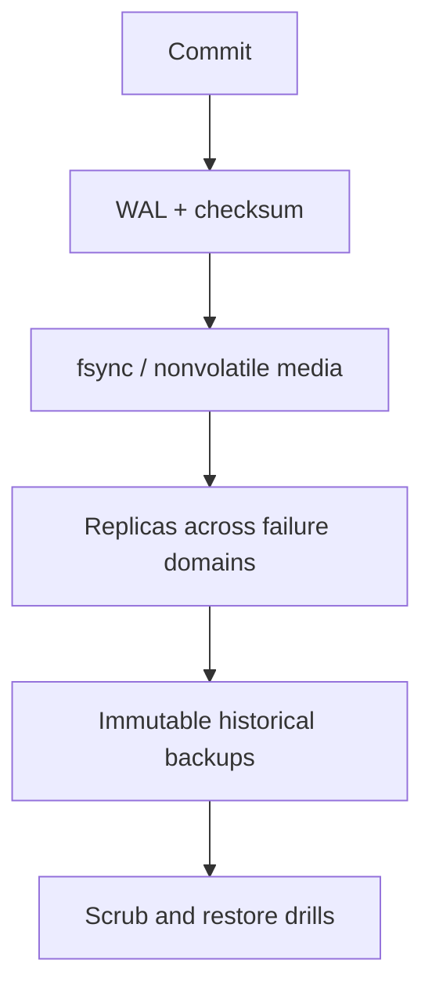

每层覆盖不同 failure class；没有一层能替代所有其他层。

### 1.52 durability 与 backup/availability 的关系

- durability：committed data 是否仍存在；
- availability：现在能否访问；
- backup：能否回到过去版本，恢复误删/corruption；
- RPO/RTO：允许丢多少时间、多久恢复。

复制可提高前两项，却会传播 logical error；historical backup 负责时间维度。

### 1.53 ACID 四项小结

| 属性 | 核心问题 | 典型机制 | 不单独保证 |
|---|---|---|---|
| Atomicity | 中途失败怎么办 | abort/undo/WAL | concurrency order |
| Consistency | commit 后 invariant 是否成立 | constraints + correct transaction | 未声明业务规则 |
| Isolation | concurrent interleaving 是否安全 | locks/MVCC/conflict detection | crash survival |
| Durability | commit 后数据是否存活 | fsync/replication/backup | immediate availability/绝对零风险 |

ACID 不是一个二元 badge，而是四类问题的起点；每一项都需要具体 scope、configuration 与 failure assumptions。

### 1.54 Single-Object and Multi-Object Operations

atomicity 与 isolation 的主要价值在于一个 logical operation 包含多个 reads/writes：

- atomicity：中途 fault 时全部 discard；
- isolation：concurrent clients 看见 all 或 none，不看见中间 subset。

single-object operation 也可有原子性/隔离，但 multi-object 才真正暴露组合状态问题。

### 1.55 unread email 与 denormalized counter

mailbox 可直接计算：

```sql
SELECT COUNT(*)
FROM emails
WHERE recipient_id = 2 AND unread_flag = true;
```

若 rows 很多，为加速读取，application 把 unread count 冗余存到另一个 object。新 email 到达时必须同时：

1. insert email；
2. increment unread counter。

### 1.56 为什么 denormalization 引入一致性责任

原始事实和 derived counter 表示同一业务状态，应满足：

$$
counter(user)=|\{email\mid recipient=user\land unread=true\}|
$$

denormalization 把 query-time work 移到 write-time maintenance；若两个 objects 不能同步改变，derived value 会失真。

### 1.57 isolation 防止 halfway view

transaction 正在 insert email、尚未 increment counter 时，另一 client 若看见新 email 却读到 counter 0，就是 partial/dirty view。

isolation 应让 observer 看见：

- transaction 前：无新 email、counter 0；或
- commit 后：有新 email、counter 1；

不能混合两代状态。

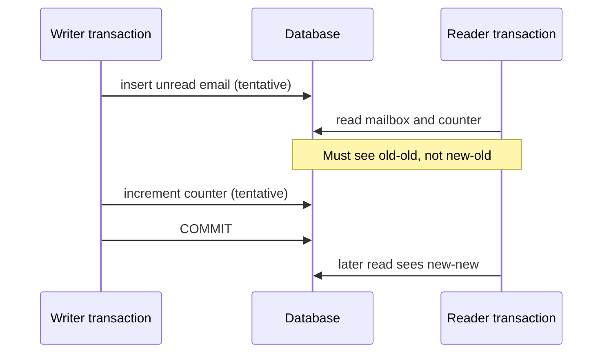

### 1.58 atomicity 防止 permanent mismatch

若 email insert 成功后 database crash，counter update 未完成，没有 atomicity 就可能永久留下：

$$
actualUnread=1,\qquad counter=0
$$

atomic transaction 在第二步失败时 rollback email insert，使 committed state 回到旧 invariant。

### 1.59 isolation 与 atomicity 的正交性

- 无 isolation、但有 atomicity：最终不会半提交，执行中其他 clients 仍可能看到 tentative subset；
- 有 isolation、但无 atomicity：执行中不暴露，失败后却可能永久留下 subset；
- 两者都有：中间不可见，失败也不留下 partial commit。

二者共同保护 multi-object state，但处理不同时间窗口。

### 1.60 transaction boundary 怎样表达

relational database 常以 client TCP connection 为 session：同一 connection 上 `BEGIN TRANSACTION` 与 `COMMIT` 之间的 statements 属于一个 transaction。

```sql
BEGIN;
INSERT INTO emails (...);
UPDATE users SET unread_count = unread_count + 1 WHERE id = 2;
COMMIT;
```

connection 在 commit 前中断时，server 通常 abort open transaction。

### 1.61 connection 不是 durability proof

TCP connection 只是 grouping/control channel，不是 transaction identity 的全部语义。client 在 sending COMMIT 后断线，server 可能已 commit，也可能未 commit；client 仅凭断线无法判断。

ambiguous outcome 需要 idempotency key、status lookup 或 application reconciliation。

### 1.62 multi-put 不一定是 transaction

某些 key-value API 提供一次更新多个 keys 的 `multi-put`，但一次 API call 不代表 ACID semantics。它可能：

- 对部分 keys 成功；
- 无 rollback；
- 不隔离 concurrent reads；
- 不保证相同 shard；
- error response 不说明每 key outcome。

必须检查 explicit all-or-nothing 与 isolation contract。

### 1.63 Single-object writes

即使只写一个 object，storage engine 也应避免 torn/partial value。原章以写 20 kB JSON document 为例，提出三个问题：

1. network 只传完前 10 kB，是否保存无法解析 fragment？
2. overwrite 中 power loss，是否把 old/new bytes 拼接？
3. concurrent reader 是否看到 half-written document？

正常期望都是“不会”。

### 1.64 single-object atomicity 的实现

storage engine 可先在 log 记录完整 new value/redo information，再原子发布 pointer/version；crash recovery 依据 WAL 判断 old 或 new committed version。

目标不是底层每个 sector write 真正一次完成，而是 recovery 后 object 只呈现完整 old/new state。

### 1.65 single-object isolation 的实现

可对 object/row 加 exclusive lock，让同一时刻一个 writer 修改；readers 读取 committed version。MVCC 则允许 readers 继续看 old version，writer 构造 new version。

两者都避免 reader 观察 half-updated bytes，但 concurrency/performance 特征不同。

### 1.66 atomic increment

database 提供：

```sql
UPDATE counters SET value = value + 1 WHERE id = 1;
```

可在 storage engine 内对当前 value 原子 read-modify-write，避免 application 先 read 42、再 write 43 的 lost update window。

### 1.67 conditional write / compare-and-set

conditional write 仅在 value/version 未被并发改变时成功：

```sql
UPDATE items
SET value = :new_value, version = version + 1
WHERE id = :id AND version = :expected_version;
```

affected rows 为 0 表示 premise stale，application 可 reread、merge 或 abort，而不是静默覆盖。

### 1.68 atomic increment 的术语陷阱

严格说，`atomic increment` 的 atomic 更接近 multithreaded concurrency：不可被其他 update 插入。按 ACID 分类，它主要是 isolated/serializable update，而非 failure-abortability。

行业习惯仍称 atomic increment，理解时要看它解决 lost update 还是 multi-write rollback。

### 1.69 single-object linearizability 仍非 multi-object transaction

Aerospike strong-consistency mode、Cassandra/ScyllaDB lightweight transactions 等可提供 single object 的 linearizable read/conditional write，但不自动保证多个 objects 的共同 atomic/isolation。

“每个 key 都很强”不能推出“跨 keys 的组合 operation 很强”。

### 1.70 single-object operation 适用范围

若完整 aggregate/invariant 可封装在一个 document/key 内，single-object transaction 常足够，且比 distributed multi-object transaction 简单。

但 object 过大、并发集中、需要不同 access path 时，把一切塞进一个 document 会产生 hot key、write amplification 和 contention。

### 1.71 The need for multi-object transactions

很多应用无法把所有关联 state 安全压进一个 object。多对象协调主要来自：

- relational/graph references；
- denormalized copies；
- secondary indexes；
- aggregate 与 ledger；
- ownership/permission 与业务实体共同变化。

### 1.72 foreign keys 与 graph edges

relational row 常引用另一 table row；graph vertex 与 edges 也是多个 objects。insert/delete/update 必须保持 reference valid。

例如删除 parent 时，restrict/cascade 与 child writes 需要统一 transaction，否则产生 dangling reference。

### 1.73 document model 的优势与边界

需要一起更新的 fields 若位于同 document，可依赖 single-document atomicity。document model 因此天然适合 aggregate boundary 清晰的业务。

但 document database 缺 join 时常鼓励 denormalization；同一信息复制到多个 documents 后，更新又重新变成 multi-object problem。

### 1.74 denormalized data 的同步

例如 user name 被复制进许多 documents，rename 要更新全部 copies。没有 transaction 时可接受 eventual propagation，但在窗口内 queries 会看到不同 names。

若 invariant 要求立即一致，就需要 multi-object transaction；若只是展示字段，可把 source-of-truth 与 asynchronous projection 明确区分。

### 1.75 secondary indexes 是独立 database objects

修改 record 时，所有相关 index entries 也需更新。缺 isolation/atomicity 时，record 可能出现在一个 index、不出现在另一个，或 old/new terms 同时残留。

第 7 章 local/global index 的 write fan-out，正是 multi-object transaction 或 ordered async indexing 的需求来源。

### 1.76 无 transaction 也能实现，但复杂度转移

alternative 包括：

- immutable event + materialized view rebuild；
- idempotent saga/compensation；
- reconciliation job；
- CRDT/commutative updates；
- single-writer ownership；
- application-level conditional writes。

它们不是免费替代，需明确 intermediate states、retry、repair 与 invariant scope。

### 1.77 Handling errors and aborts

ACID philosophy 是：若 database 无法继续维护 atomicity/isolation/durability guarantee，就宁愿 abort transaction，也不留下 half-finished committed state。

abort 是 safety mechanism，不是异常实现失败；application 应把它视为正常 control flow 的一种结果。

### 1.78 leaderless best-effort philosophy

leaderless stores 常采用不同策略：尽可能完成 writes，遇错不撤销已成功 replicas/keys，由 application 后续 repair/merge。

这种模式适合可合并、eventual workload，但 error response 的含义不是 atomic abort；不能用关系数据库 retry 假设直接套用。

### 1.79 ORM 常浪费了 rollback 的价值

Rails ActiveRecord、Django 等常见 ORM 默认不自动 retry aborted transaction；exception 向上冒泡，user input 被丢弃并显示 error。

rollback 原本让 safe retry 成为可能，但 framework/application 仍要识别 transient errors、重建 transaction closure，并保护 external effects。

### 1.80 safe retry 的基本结构

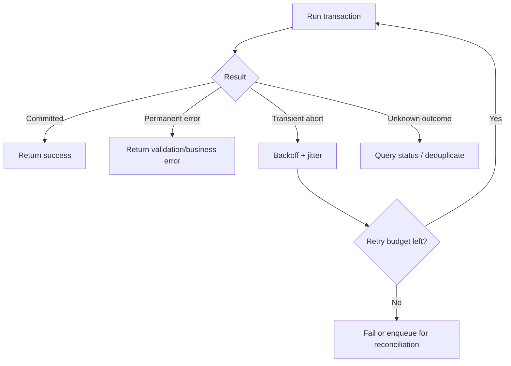

所有 retry 都应有 classification、budget 与 observability。

### 1.81 风险一：commit acknowledgment 丢失

server 已 commit，但 response 在 network 中丢失，client timeout 后 retry，会把 transaction 执行两次。database rollback 无法帮助，因为第一次没有 abort。

解决需要 idempotency key/unique request ID：

$$
requestId\longrightarrow stored\ result
$$

相同 ID retry 返回第一次 outcome，而不重复 side effect。

### 1.82 风险二：overload/contended retry storm

若 abort 原因是 overload 或 high contention，所有 clients 立即 retry 会增加 load，形成 positive feedback。需要：

- retry limit；
- exponential backoff + jitter；
- admission control；
- 对 overload 与 deadlock 使用不同 policy；
- circuit breaker/queue。

retry 不是越快越可靠。

### 1.83 风险三：permanent error

constraint violation、invalid input、permission denied 等不会因重试消失。只有 deadlock victim、serialization failure、temporary network/failover 等 transient error 值得 retry。

错误分类必须来自 database code/SQLSTATE 等 structured signal，不能只按 exception text。

### 1.84 风险四：transaction 外 side effect

transaction 内写 database，期间发送 email/调用 payment API；后来 database abort，external side effect 不能 rollback。retry 还可能再发送一次。

常见方案是 transactional outbox：同一 database transaction 写 business state 与 outbox row，commit 后 worker 幂等发送。跨系统原子 commit 则可考虑 2PC，但有显著代价。

### 1.85 风险五：client process crash

client 在 retry 前/过程中 crash，尚未 commit 的 intended data 可能永远丢失。若业务要求最终完成，应先 durable enqueue intent/workflow state，而不是把 retry loop 只放在 process memory。

transaction 保证 database 内一次 attempt，不保证 application intent 永远存活。

### 1.86 retry checklist

安全 retry 至少回答：

1. error 是 abort、commit 还是 unknown？
2. operation 是否 idempotent/有 dedup key？
3. transaction logic 是否会重新 read fresh state？
4. external side effects 是否延后/幂等？
5. retry budget/backoff 是什么？
6. client crash 后谁继续？
7. 最终失败怎样 reconciliation？

### 1.87 What Exactly Is a Transaction 小结

transaction 的价值不是一句“ACID”，而是把 multi-object operation 变成明确 commit/abort unit，并声明 concurrency 与 durability guarantee。single-object atomicity 很有用，却不能替代跨 object invariant。

abort 使 retry 成为可能，但 ambiguous commit、overload、permanent errors、external effects 和 client crash 要由 idempotency、backoff、outbox 与 durable workflow 继续处理。

---

## 2. Weak Isolation Levels：用 anomaly 而不是名称理解隔离

### 2.1 concurrency 何时产生问题

若两个 transactions 访问完全不同 data，或都只读，通常可安全并行。race condition 主要出现在：

- 一个 transaction 读取另一个正在修改的 data；
- 两个 transactions 修改相同 object；
- 两者读取共同 predicate，却写不同 objects；
- write 改变另一个 transaction 先前 query 的结果集合。

### 2.2 concurrency bug 为什么难测

它需要特定 statement interleaving，普通 test 大多走不到；production load、scheduler、network 和 lock timing 才偶尔触发。失败难复现，重新运行可能完全正常。

因此“压测没出现”不是 race absence 的证据，需要从 protocol/isolation guarantee 证明。

### 2.3 大型 application 更难推理

一段 code 看到 `SELECT` 后做决定时，很难知道哪些其他 endpoint、background job、admin script 正在改相同 state。任何 data 都可能在 statements 之间变化。

isolation 的价值是让 local transaction reasoning 不必枚举整个 application 的所有并发路径。

### 2.4 serializable 是理想 abstraction

serializable isolation 允许 application 假装没有 concurrency：即使实际并行，committed result 等价某个 one-at-a-time order。

若每个 transaction 在独立运行时 preserve invariant，serializability 帮助把该 reasoning 组合到并发执行。

### 2.5 为什么出现 weak isolation

full serializability 会产生 waiting、abort、tracking 或 single-thread throughput 等成本。许多 products 为更高 concurrency/低 latency，默认提供 weaker isolation，只排除部分 races。

问题在于 weak level 的 remaining anomalies 不直观、产品实现又不同，application 很容易误以为 transaction 已提供更多保护。

### 2.6 race 造成过真实损失

原章引用 incidents：weak isolation/races 造成大量金钱损失、Bitcoin exchange 破产、financial audit 和 customer data corruption。

“使用 ACID relational database”仍不是充分答案，因为其 default isolation 可能只有 read committed/snapshot，允许 lost update 或 write skew。

### 2.7 attacker 会主动制造时序

正常 workload 下概率很低的 race，可被 attacker 用并发 burst 刻意放大，例如同时 redeem coupon、withdraw balance、claim resource。

因此 concurrency correctness 也是 security property，不能依赖“用户通常不会同时点两次”。

### 2.8 audit trail 有时比标签更重要

原章补充：大量 banking workflow 仍交换 secure FTP text files。在这种环境中，immutable audit trail、reconciliation 和 human fraud controls 可能比某一局部 ACID label 更关键。

事务是可靠性工具之一，不替代端到端可审计性。

### 2.9 本节方法：按 anomaly 建模

本节依次研究：

1. dirty read/dirty write；
2. read skew/nonrepeatable read；
3. lost update；
4. write skew；
5. phantom。

对每类都问：最小交错是什么、哪种 level 阻止、实现机制和剩余局限是什么。

### 2.10 Read Committed

**read committed** 是最基础、最常见的 transaction isolation level，提供两项 guarantee：

- read 只看到 committed data：no dirty reads；
- write 只覆盖 committed data：no dirty writes。

它不保证同一 transaction 的多次 reads 来自同一 snapshot。

### 2.11 dirty read 的定义

transaction $T_1$ 已写 value，但尚未 commit/abort；$T_2$ 若能读到该 tentative value，就是 **dirty read**。

形式上，$T_2$ 观察了一个可能永远不进入 committed history 的 version。

### 2.12 commit 前后 visibility

read committed 要求 $T_1$ 的 writes 在 commit 前对其他 transactions 不可见；commit 后其所有 writes 一起变为可见。

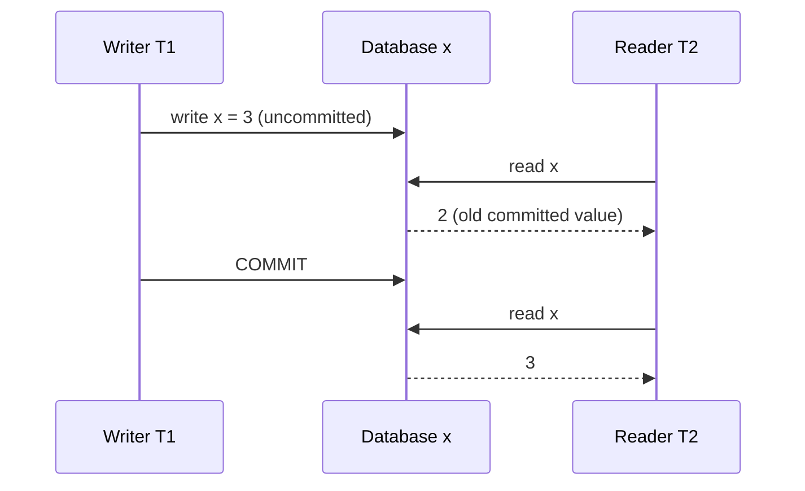

### 2.13 dirty read 会暴露 partial transaction

multi-row update 中，reader 可能看见 first write、没看见 second write，例如新 unread email 已出现而 counter 未更新。它可能基于这种不可能的中间态做错误决策。

no dirty reads 让 transaction writes 在 external visibility 上有共同 publish point。

### 2.14 cascading aborts

若 $T_2$ 读取 $T_1$ uncommitted value，而 $T_1$ 后来 abort，$T_2$ 的计算已基于从未存在的 data。为恢复一致性，$T_2$ 也要 abort；依赖链可继续传播，称 **cascading aborts**。

禁止 dirty read 在源头切断这种 abort dependency chain。

### 2.15 dirty write 的定义

$T_1$ 写 object 但未 commit，$T_2$ 又覆盖同一 uncommitted value，称 **dirty write**。若两个 transactions 各写多个 objects，winner 可能在不同 objects 上混合。

### 2.16 read committed 怎样阻止 dirty write

第二 writer 必须等 first writer commit/abort，才能获得 object write right。于是同一 object 的 transaction writes 不会彼此覆盖 tentative state。

这通常由 exclusive row/object lock 实现。

### 2.17 used-car sale 反例

Aaliyah 与 Bryce 同时购买同一 car，transaction 各更新：

1. listing 的 buyer；
2. invoice recipient。

若 dirty writes 被允许，listing 最终 buyer 可能是 Bryce，而 invoice winner 是 Aaliyah，两笔 transaction 的 writes 被拼成一个从未存在的 sale。

### 2.18 no dirty write 为什么有效

writer lock 持有到 commit/abort，使一个 transaction 在所有 contested objects 上的 writes 不被后来的 transaction 中途覆盖。后来的 buyer 必须等前一笔 outcome，再整体执行。

它不保证一定没有其他 cross-row anomaly，但排除了 uncommitted write mixing。

### 2.19 read committed 仍允许 lost update

counter race 中，A、B 都读 committed 42；A commit 43 后，B 再写 43。B 覆盖的是 committed value，所以不是 dirty write，却丢了 A 的 increment。

因此：

$$
NoDirtyWrite\nRightarrow NoLostUpdate
$$

不同 anomaly 需要不同保护。

### 2.20 Implementing read-committed：preventing dirty writes 的 row lock

transaction 修改 row 前自动 acquire exclusive lock，并一直持有到 commit/abort。任一其他 writer 对同 row wait。

若 transaction 写多 rows，可能以不同顺序取得 locks，引入 deadlock；database 通常检测后 abort 一个 victim。

### 2.21 lock 必须持有到 transaction end

若 statement 写完就 release lock，另一个 transaction 可在 first transaction 尚未 commit 时覆盖，重新产生 dirty write。two-phase locking 的“持有到结束”思想在这里已出现。

### 2.22 用 read lock 防 dirty read 的方案

一种实现是 reader 也先取得 shared/read lock；writer 持有 exclusive lock 时，reader wait，直到 commit/abort 才读取。

它正确阻止 dirty read，但 long-running writer 可阻塞大量 unrelated read latency。

### 2.23 read locks 的 operability 问题

一个慢 write transaction 会形成 queue，让 read-only requests 延迟激增；application 某处 slowdown 通过 lock dependency 传播到另一处。

因此许多 systems 避免让 ordinary read 等 write lock，改为读取旧 committed version。

### 2.24 使用 read lock 的例子

原章举 IBM Db2，以及 SQL Server 在 `read_committed_snapshot=off` 时的 lock-based read committed。不同 configuration 会改变 reader/writer blocking semantics。

不能只按 database 名称推断 MVCC 行为。

### 2.25 old committed + new tentative versions

更常见实现为每个被写 row 暂时保留：

- old committed version；
- writer transaction 的 new tentative version。

其他 transactions 继续读 old；writer commit 后 new 成为 current，abort 后丢弃 new。这是 MVCC 思想的简化二版本形式。

### 2.26 Read Uncommitted

更弱的 **read uncommitted** 通常仍阻止 dirty writes，却允许 dirty reads，直接返回 latest written value，即使 writer 未 commit。

它可减少保存旧版本的成本，并可能降低某些 lost-update 概率，但不能根除 lost update，且暴露 partial/rollback data。

### 2.27 read committed 的产品地位

Oracle Database、PostgreSQL、SQL Server 等许多 databases 默认使用 read committed。它显著强于无 transaction/best effort，却不是 serializable。

默认值流行不代表适合所有 invariants，关键 business path 要显式评估。

### 2.28 Read Committed 小结

| anomaly/property | read committed |
|---|---|
| dirty read | prevented |
| dirty write | prevented |
| cascading abort from dirty read | prevented |
| read skew/nonrepeatable read | possible |
| lost update | possible |
| write skew/phantom write anomaly | possible |

它保护 committed boundary，却不固定一个 transaction 的 read snapshot，也不检测所有 read→write dependency。

### 2.29 Snapshot Isolation and Repeatable Read

read committed 阻止 partial uncommitted state 和 mixed dirty writes，看起来已很强；但一个 transaction 的不同 reads 可发生在不同 committed moments，组合出从未同时存在的 view。

### 2.30 银行账户 read-skew 场景

Aaliyah 有两个 accounts，各 $500，总额 $1{,}000$。transaction 把 $100 从 account 2 转到 account 1：

$$
(500,500)\longrightarrow(600,400)
$$

总额 invariant 始终应为 $1{,}000$。

### 2.31 read committed 下的异常交错

reader 先读 account 1 的旧 committed $500；transfer 随后 commit；reader 再读 account 2 的新 committed $400，于是看到：

$$
500+400=900
$$

每次单独 read 都只读 committed data，却组合成从未存在的 $900 state。

### 2.32 read skew / nonrepeatable read

该 anomaly 称 **read skew**，也是 **nonrepeatable read**：同一 transaction 若稍后重读 account 1，会从 $500 变为 $600。

read committed 允许它，因为 each statement 都在自己执行时读取最新 committed version，而非共同 snapshot。

### 2.33 skew 一词也 overloaded

第 7 章 workload skew 指 load 不均/hotspot；这里 read skew 指 transaction 观察了不同逻辑时点。两者无直接关系。

同样，讨论 `skew` 必须注明 workload 还是 timing anomaly。

### 2.34 transient anomaly 也可能不可接受

online banking 页面刷新后多半恢复 $1{,}000$，但不能因此认为 read skew 无害。long-running operation 若把混合时点结果固化，就会产生永久错误。

### 2.35 backup 的永久化风险

大型 backup 扫描数小时，期间 writes 持续。若不同 tables/pages 来自不同 moments，restore 后 read skew 被永久写进 backup，例如 money “消失”。

backup 需要全局 consistent snapshot，而非每条 row 单独 committed。

### 2.36 analytics 与 integrity check

大范围 analytical query、reconciliation 或 corruption scan 也需要一个可解释时点。若 scan 前半与后半跨越大量 commits，aggregate/constraint result 可能毫无意义。

### 2.37 snapshot isolation 的核心

**snapshot isolation（SI）**让 transaction 从 database 的一个 consistent snapshot 读取，通常对应 transaction start time：

$$
ReadSet(T)=State\ at\ Snapshot(T)
$$

之后其他 transactions 即使 commit，$T$ 仍读 old versions，因而所有 reads 属于同一逻辑时点。

### 2.38 为什么适合 long-running read

backup/analytics 可在冻结 snapshot 上推理，同时 OLTP writes 继续，不必锁住整个 database。query result 明确表示“snapshot 时刻的数据”，而不是不断变化的混合。

### 2.39 product support

PostgreSQL、MySQL/InnoDB、Oracle、SQL Server 等支持 SI variants，细节不同。Oracle、TiDB、Aurora DSQL 等甚至把 snapshot isolation 作为最高或主要 isolation level；BigQuery 等 cloud warehouse 也常用 point-in-time snapshot。

名称不能代替 anomaly test，尤其 `repeatable read`/`serializable` 标签混乱。

### 2.40 Multiversion Concurrency Control

SI 通常仍以 write lock 阻止 dirty writes：两个 writers 修改同 row 时，一个 wait/abort。readers 则不取得阻塞 writers 的 lock。

### 2.41 readers never block writers

snapshot isolation 的关键性能原则：

> readers never block writers, and writers never block readers

long read 从 historical versions 读取，writer 创建 new version；两者无需因同 row 互相等待。writer–writer 仍可能 conflict。

### 2.42 从二版本到多版本

read committed 只需 old committed + current tentative version；SI 可能同时有多个 active snapshots，各自需要不同历史。因此 database 保留多个 committed row versions，称 **multiversion concurrency control（MVCC）**。

### 2.43 transaction ID

transaction start 时获得 unique、单调增加的 `txid`；writes 标记 writer txid。PostgreSQL 使用相关模型。

注意 txid start order 不总等于 commit order，所以 visibility 还需记录 transaction status 与 start 时 in-progress set。

### 2.44 32-bit txid wraparound

原章说明 PostgreSQL transaction ID 为 32-bit，约 40 亿 transactions 后 wrap。vacuum/freeze 等 cleanup 确保旧 tuples 的 age 不因 wrap 被误判。

这说明 MVCC metadata 也有生命周期，不是无限整数的纯理论模型。

### 2.45 `inserted_by` 与 `deleted_by`

每 row version 可概念化为：

```text
(primary_key, value, inserted_by_txid, deleted_by_txid?)
```

creator 决定 version 何时出现；deleter 决定它何时从某 snapshot 消失。

### 2.46 delete 先标记、后 GC

transaction delete row 时，不立即物理移除，而设置 `deleted_by`。只有确定没有 active transaction 还可能看见该 version 后，garbage collector/vacuum 才释放空间。

这样 abort delete 只需让其 txid 不可见，无需从每个 index/page 立即找回 bytes。

### 2.47 update = delete old + insert new

MVCC update 内部常表示为：

1. old version 标记 `deleted_by=T`；
2. new value 创建 `inserted_by=T`。

例如 tx13 把 balance $500 改为 $400，heap 同时保存 old $500 version 与 new $400 version，供不同 snapshots 选择。

### 2.48 versions 的 heap chain

同一 logical row 的 versions 可位于同一 heap，以 pointer chain 从 newest→oldest 或相反连接。query 从 index/heap 找 candidates，再遍历找到对自己 visible 的 version。

version-chain length 会影响 read、vacuum 和 cache performance。

### 2.49 Visibility rules for observing a consistent snapshot

reader transaction start 时记录：

- 自己的 txid/snapshot boundary；
- 当时 in-progress transactions；
- committed/aborted status information。

每次读按同一 metadata 过滤 row versions。

### 2.50 rule 1：忽略 start 时仍 in progress 的 writers

snapshot 创建时未 commit 的 transactions，其 writes 对该 snapshot 永远不可见；即使它们在 reader transaction 执行期间后来 commit，也不能突然出现。

否则同一 reader 的 snapshot 会随别人 commit 改变。

### 2.51 rule 2：忽略 later transactions

reader start 后才获得更晚 txid 的 transactions，其 writes 无论是否已经 commit，都不属于 reader 的 start-time snapshot。

### 2.52 rule 3：忽略 aborted writes

aborted transaction 的 versions 永远 invisible。physical cleanup 可延后到 GC，correctness 由 visibility filter 先保证。

### 2.53 rule 4：其余 committed writes visible

creator 在 snapshot 前 commit、且未在 snapshot 前被 committed deletion 删除的 version 可见。reader 自己的 writes 通常也对自己 visible（read-your-own-transaction-writes）。

### 2.54 row visibility 的直觉公式

设 $C_S$ 为 snapshot 已知 committed transactions，则 version $v$ 简化可见条件为：

$$
visible(v,S)=\bigl(insertedBy(v)\in C_S\bigr)\land
\bigl(deletedBy(v)\notin C_S\bigr)
$$

真实实现还处理 current transaction、in-progress ranges、subtransactions 和 wraparound，但直觉是 creator 已生效、deleter 尚未生效。

### 2.55 tx12/tx13 的 $500→$400 例子

tx12 snapshot 形成后，tx13 更新 account：old $500 version 被 `deleted_by=13`，new $400 version `inserted_by=13`。

对 tx12，13 不在 $C_S$，所以 old deletion 不生效、new insertion 不生效；它继续看到 $500。later snapshot 把 13 纳入 $C_S$，则看到 $400。

### 2.56 long-running snapshot 的 storage cost

只要一个 old snapshot active，database 不能回收它可能读取的 old versions。长 transaction 会造成：

- dead tuples/version chains 累积；
- table/index bloat；
- vacuum/GC 推迟；
- transaction-ID cleanup 压力；
- disk/cache efficiency 下降。

nonblocking reads 把成本从等待转成 version retention。

### 2.57 可运行示例：简化 MVCC visibility

下面把 snapshot 表示为“start 时已 committed txids”。tx12 的 long-running snapshot 不含 tx13，因此即使 tx13 后来 commit，它仍读 $500；new snapshot 读 $400。

```python
from dataclasses import dataclass


@dataclass(frozen=True)
class Version:
    value: int
    inserted_by: int
    deleted_by: int | None = None


def visible(version: Version, committed_at_snapshot: set[int]) -> bool:
    insertion_visible = version.inserted_by in committed_at_snapshot
    deletion_visible = (
        version.deleted_by is not None
        and version.deleted_by in committed_at_snapshot
    )
    return insertion_visible and not deletion_visible


versions = [
    Version(value=500, inserted_by=10, deleted_by=13),
    Version(value=400, inserted_by=13),
]
tx12_snapshot = {10, 11}
later_snapshot = {10, 11, 13}

print("reader tx12 snapshot:", [v.value for v in versions if visible(v, tx12_snapshot)])
print("later snapshot:", [v.value for v in versions if visible(v, later_snapshot)])
print("long reader after tx13 commit:", [v.value for v in versions if visible(v, tx12_snapshot)])
```

实际运行输出：

```text
reader tx12 snapshot: [500]
later snapshot: [400]
long reader after tx13 commit: [500]
```

模型故意省略 current transaction、自身 writes 与 in-progress list encoding，但直接对应“snapshot 不因 later commit 改变”这一原理。

### 2.58 Indexes and snapshot isolation

index entry 通常指向某个 row version（oldest 或 newest），version 再链接到相邻版本。index query 必须检查 visibility，并确认 visible version 的 indexed value 仍匹配 predicate。

### 2.59 index entries 的 GC

当 old row version 对任何 transaction 都不可见，GC 可删除 version 及其 index entries。过早删除会破坏 active snapshot；过晚删除会导致 bloat 与额外 candidate scan。

oldest active snapshot/watermark 决定 safe reclamation boundary。

### 2.60 index-update optimization

PostgreSQL 可在不同 versions 留在同 page、indexed columns 未变时避免更新所有 indexes（相关机制常称 HOT update）。其他 databases 可能只存 version differences 而非完整 row copies。

这些优化降低 MVCC write amplification，但不改变 visibility semantics。

### 2.61 immutable copy-on-write B-tree

CouchDB、Datomic、LMDB 等采用 immutable/copy-on-write B-tree variant：update 不覆盖 existing pages，而复制 modified leaf 及通往 root 的 parent pages；未修改 subtrees 被 old/new roots 共享。

### 2.62 root 就是 snapshot

每个 write transaction/batch 生成 new B-tree root。一个 root 指向 immutable tree state，因此天然表示 creation time 的 consistent snapshot；later writes 只能创建新 root，不能改变 old root。

无需按 txid 过滤每 row，但仍要维护 root/version lifetime。

### 2.63 copy-on-write 也需 compaction/GC

old roots 不再被 readers/backups 使用后，其 unreachable pages 才能回收。长期 snapshots 同样延迟 reclamation；copy path 还增加 page write amplification。

immutable structure 改变实现，不消除版本管理。

### 2.64 Snapshot isolation, repeatable read, and naming confusion

MVCC 是 implementation technique，snapshot isolation 是 guarantee；二者不是同义词。MVCC 也可实现 read committed、弱化 repeatable read 或 serializable variants。

### 2.65 PostgreSQL 与 Oracle 的命名

- PostgreSQL `repeatable read` 实现 snapshot isolation；
- Oracle `serializable` 实际也是 snapshot isolation，而非 true serializability。

同一 guarantee 使用不同名字。

### 2.66 MySQL 与 Db2 的反向混乱

- MySQL/InnoDB `repeatable read` 是 MVCC，但某些性质比严格 snapshot-isolation 定义更弱；
- IBM Db2 `repeatable read` 则指 serializability。

同一名字又表示不同 guarantees。

### 2.67 SQL standard 为什么没定义 SI

SQL standard isolation levels 建立在 System R 1975 模型上，当时 snapshot isolation 尚未发明。standard 定义 `repeatable read`，表面与 SI 相似，却没有现代 MVCC snapshot 的精确概念。

### 2.68 standard 的缺陷

原章评价 SQL isolation 定义 ambiguous、imprecise 且不够 implementation-independent。research literature 有 formal definitions，但多数 products 不完全匹配。

所以“standards-compliant repeatable read”仍不能替代针对 anomaly 的测试与文档确认。

### 2.69 snapshot isolation 防止什么

| anomaly | snapshot isolation |
|---|---|
| dirty read | prevented |
| dirty write | prevented |
| read skew/nonrepeatable read | prevented |
| ordinary read-only phantom | prevented by fixed snapshot |
| lost update | depends on implementation |
| write skew | possible |
| phantom leading to write skew | possible |

### 2.70 SI 的适用与局限

适合 consistent backup、analytics 和 read-heavy OLTP；readers/writers 不互阻塞。代价是 version storage/GC，且 read→write transaction 仍可能基于同一 old snapshot 作出彼此冲突的决定。

### 2.71 Snapshot Isolation 小结

snapshot isolation 把 transaction 内所有 reads 固定到同一 consistent snapshot，解决 read committed 的 mixed-time view。MVCC 通过多版本与 visibility rules 实现 nonblocking historical reads。

但 SI 不是 serializability：它通常阻止 read anomaly，却不一定检测 lost update，更允许写不同 rows 的 write skew。名称差异使得判断必须回到具体 anomaly。

### 2.72 Preventing Lost Updates

前文主要讨论 concurrent write 存在时 read-only transaction 看见什么；现在转向多个 writers。read committed 阻止 dirty write，但两个 transactions 可先读取同一 committed version，再各自写回。

### 2.73 lost update 的定义

application 执行 **read-modify-write**：

$$
v_{old}=read(k),\quad v_{new}=f(v_{old}),\quad write(k,v_{new})
$$

两个 clients 并发读取同一 $v_{old}$，later write 未包含 earlier modification，因而 **clobber** earlier write，称 lost update。

### 2.74 counter 的最小交错

```text
A reads 42
B reads 42
A writes 43 and commits
B writes 43 and commits
```

两个 writes 都覆盖 committed value，不是 dirty write；final 43 却少一次 increment。

### 2.75 常见 lost-update 场景

- counter/account balance：读取后计算新值；
- JSON/list：parse whole document、add element、写回；
- wiki：两个 users 下载全文、各自编辑、整页覆盖保存；
- settings/profile：UI 基于旧 object 保存全部 fields；
- inventory aggregate：读取 remaining 后写回。

只要 write payload 来自 stale read，就有风险。

### 2.76 四类主要防护

1. database atomic write operation；
2. application explicit lock；
3. database automatic lost-update detection；
4. conditional write / compare-and-set。

选择取决于 operation 是否能在 database 内表达、isolation implementation 与 replication model。

### 2.77 Atomic write operations

能把更新写成 database-side atomic operation 时，通常是最佳方案：

```sql
UPDATE counters
SET value = value + 1
WHERE key = 'foo';
```

database 在当前 value 上执行 increment，不把 stale value 往返 application。

### 2.78 document/data-structure atomic operation

MongoDB 可原子修改 JSON document 局部字段/array；Redis 提供 priority queue、set、counter 等 atomic operations。

关键是发送 intent（increment/add）而不是 stale final state（把 whole object 改成某值）。

### 2.79 arbitrary edit 的边界

wiki arbitrary text edit 很难表示为简单 `+1` 或 set add。可以使用 OT/CRDT 等 operation-based merge，或用 version/CAS 检测冲突后让 user merge。

不存在一个通用 SQL atomic operator 能理解所有 application intent。

### 2.80 atomic operation 的实现

database 可：

- 对 object 取 exclusive lock，read current、apply update、release；
- 将该 key 的 operations 强制放在单 thread/serial queue；
- 用 lower-level CAS/version latch。

对 caller 暴露的 guarantee 是 concurrent atomic updates 不丢失，而非某一固定内部机制。

### 2.81 ORM 的危险便利

ORM 很容易生成：load object → 修改 field → save full row，而不是 `SET value=value+1`。code 看似自然，却扩大 lost-update window。

review/linters/test 应识别 hot/invariant fields 的 unsafe read-modify-write，并优先使用 database expression。

### 2.82 Explicit locking

若 update 需要 application logic，transaction 可先显式锁定将修改的 objects，再读取/验证/写入。其他 transactions 对同 object 的 lock/update 必须等待。

这样把 read-modify-write 串行化。

### 2.83 multiplayer game 案例

多个 players 可移动同一 figure。合法 move 依赖 game rules，难完全写成 database atomic expression。transaction 先锁 figure，application 检查 move，再 update position。

### 2.84 `SELECT ... FOR UPDATE`

```sql
BEGIN TRANSACTION;

SELECT * FROM figures
WHERE name = 'robot' AND game_id = 222
FOR UPDATE;

-- Application validates the move.
UPDATE figures SET position = 'c4' WHERE id = 1234;

COMMIT;
```

`FOR UPDATE` 给 returned rows 加 write-intent/exclusive-style lock，直到 transaction end。

### 2.85 explicit lock 只保护真正锁到的依赖

若 move validity 还依赖 destination square、turn record 或 inventory，必须锁/约束这些 dependencies。只锁 figure 自身不能阻止另一个 figure 同时移入相同 square。

漏一处 lock 就重新出现 race，因此 application-level locking error-prone。

### 2.86 lock order 与 deadlock

transactions 锁多个 objects 若顺序不同：A 持有 X 等 Y，B 持有 Y 等 X，形成 deadlock。database 检测 wait-for cycle 后 abort victim；application 必须 retry entire transaction。

固定 lock order 可减少但不能消除所有 deadlocks。

### 2.87 Automatically detecting lost updates

另一思路允许 transactions 并行 read/compute；commit 时 transaction manager 检测当前 row 是否已被另一个 concurrent transaction 更新。若是，abort stale writer 并要求 retry。

这是 optimistic execution：不预先等待，冲突时付出重做成本。

### 2.88 与 snapshot isolation 的结合

SI 已记录 transaction snapshot 与 written versions，因此可检查：writer 是否基于 old version，且该 version 在 snapshot 后被 concurrent transaction supersede。

若检测到 read-write/write-write dependency 使本次 update 覆盖并发改动，就 abort。

### 2.89 product behavior

原章指出 PostgreSQL `repeatable read`、Oracle `serializable`、SQL Server `snapshot isolation` 会自动检测 lost update 并 abort offending transaction。

这些 level 名称不同，再次说明要看 anomaly behavior。

### 2.90 MySQL/InnoDB 的差异

MySQL/InnoDB `repeatable read` 不自动检测 lost update。部分研究定义认为防 lost update 是 snapshot isolation 的必要条件，因此按该 formal definition，MySQL 此 level 不算完整 SI。

application 需 atomic expression、lock 或 CAS 明确保 护。

### 2.91 automatic detection 的优势

无需每个 call site 记得 `FOR UPDATE` 或特殊 atomic API；database 系统性检测，较不易因 code path 遗漏产生 race。

代价是 commit 可能 abort，application 必须从 fresh snapshot 重跑整个 transaction。

### 2.92 detection 不是 silent merge

database 通常无法猜测两个 arbitrary updates 怎样 merge；最安全的是拒绝一个 writer，让 application 重读 current state 后重新计算。

abort 是明确 conflict signal，不应 catch 后忽略或只重发 stale `UPDATE value=:oldComputed`。

### 2.93 Conditional writes (compare-and-set)

无 multi-object transaction 的 store 也常提供 conditional write：仅当 current value/version 等于之前 read 的 expected value 时更新；否则 no-op/conflict。

它对应 CPU **compare-and-set/compare-and-swap（CAS）**。

### 2.94 compare full content

wiki 可写：

```sql
UPDATE wiki_pages
SET content = 'new content'
WHERE id = 1234 AND content = 'old content';
```

若 content 已变化，affected rows 为 0。full content comparison 可能昂贵，通常改用 version column。

### 2.95 version-column optimistic locking

```sql
UPDATE wiki_pages
SET content = :new_content,
    version = version + 1
WHERE id = :id AND version = :expected_version;
```

每次成功 update 增 version。只有读到该 version 的 editor 能提交；其他 editor conflict 后 merge/retry。这常称 **optimistic locking**，虽未持有传统 lock。

### 2.96 必须检查 affected rows

CAS query 返回 success/no rows。application 若不检查 affected-row count，conditional write 就退化成 silent dropped update。

正确路径：0 rows → reread latest → merge/revalidate → 用 new expected version retry。

### 2.97 MVCC `WHERE` 的特殊可见性

在 snapshot 中，concurrent committed new content 可能按普通 visibility 不可见；但许多 MVCC implementations 让 `UPDATE/DELETE WHERE` condition 检查最新 version，否则 CAS 可能错误地基于 old snapshot 成功。

产品 semantics 必须确认，原书警告该 SQL 是否安全取决于 implementation。

### 2.98 可运行示例：naive RMW 与 CAS retry

```python
from dataclasses import dataclass


@dataclass
class VersionedCounter:
    value: int
    version: int

    def compare_and_set(self, expected_version: int, new_value: int) -> bool:
        if self.version != expected_version:
            return False
        self.value = new_value
        self.version += 1
        return True


naive = VersionedCounter(42, 0)
a_value = naive.value
b_value = naive.value
naive.value = a_value + 1
naive.value = b_value + 1
print("naive final:", naive.value)

safe = VersionedCounter(42, 0)
a_snapshot = (safe.value, safe.version)
b_snapshot = (safe.value, safe.version)
a_ok = safe.compare_and_set(a_snapshot[1], a_snapshot[0] + 1)
b_ok = safe.compare_and_set(b_snapshot[1], b_snapshot[0] + 1)
print("CAS first attempts:", a_ok, b_ok)

b_snapshot = (safe.value, safe.version)
safe.compare_and_set(b_snapshot[1], b_snapshot[0] + 1)
print("CAS final after retry:", safe.value)
print("version:", safe.version)
```

实际运行输出：

```text
naive final: 43
CAS first attempts: True False
CAS final after retry: 44
version: 2
```

second writer 的 expected version 0 已 stale，因此第一次 CAS 失败；重读 version 1 后重新 increment，最终两次 intent 都保留。

### 2.99 CAS 的 scope

CAS 保护一个 object/version 的条件，不自动保护 predicate 或多个 objects。例如“若没有 overlapping booking 就 insert”没有现存 row version 可 CAS。

它是 lost-update 工具，不是 general serializable transaction。

### 2.100 Conflict resolution and replication

single-leader/current-copy database 可用 lock/CAS，因为有一个 authoritative latest version。multi-leader/leaderless 中，多 nodes 可异步接受 concurrent writes，没有单一同步 current value 可锁。

### 2.101 为什么普通 CAS 不适合 async multi-writer

region A、B 各自看见 version 5，断连时都 CAS 到 version 6，本地条件都成立。复制汇合时出现两个 version 6；local CAS 没有建立 global serialization point。

要 global conditional semantics 必须协调/consensus，牺牲断连本地写 availability。

### 2.102 siblings 与 merge

multi-leader/leaderless 常允许 concurrent values 成为 **siblings**，随后由 application 或 data structure merge，而不是在写入时拒绝。

只要 causal metadata 完整，至少不会静默丢掉某个 branch。

### 2.103 commutative operations 与 CRDT

counter increments、set additions 等若 commutative，可在不同 replicas 以不同 order apply，仍得到相同 result：

$$
a\oplus b=b\oplus a
$$

CRDT 利用这种结构自动 merge，保留 concurrent intents。arbitrary conditional write 通常不可交换。

### 2.104 LWW 会制造 lost update

Last Write Wins 给 concurrent writes 人为排序，只保留 winner；loser 即使已在某 replica 成功，也被丢弃。因此 LWW 天生 prone to lost updates。

它实现 convergence，不实现“每个 update intent 都被保留”。

### 2.105 lost-update 防护选择表

| workload | 首选机制 | 局限 |
|---|---|---|
| counter/set 局部修改 | atomic operation | 需可表达 intent |
| complex single-row rule | `FOR UPDATE` | lock/deadlock/漏锁 |
| SI transaction | automatic detection | 依赖产品、需 retry |
| single-object optimistic edit | version CAS | conflict merge、单对象 scope |
| async multi-writer | siblings/CRDT | 需可合并 semantics |

### 2.106 Preventing Lost Updates 小结

lost update 来自基于同一 old committed value 的并发 read-modify-write，因此 no dirty write 不足。database-side atomic operation 最简单；复杂逻辑可 lock；SI 可自动 abort；CAS 可显式检测 stale premise。

replicated multi-writer system 没有单一 latest copy 时，要么协调建立 conditional order，要么保留 siblings/使用 commutative CRDT；LWW 则接受 data loss。

### 2.107 Write Skew and Phantoms

dirty write/lost update 都有不同 transactions 写同一 object 的明显冲突。更隐蔽的 race 是：transactions 读取相同 predicate/objects，却各写不同 objects，局部 write-write detection 看不到。

### 2.108 on-call doctors invariant

hospital 对 shift 要求至少一名 doctor on call：

$$
\sum_{d\in shift}\mathbf{1}[d.on\_call]\ge1
$$

Aaliyah、Bryce 是仅有的两人，两人都生病并几乎同时请求 off call。

### 2.109 snapshot isolation 下的交错

每个 transaction：

1. 在自己的 snapshot 查询 on-call count，均得到 2；
2. 判断“我退出后还有一人”，允许继续；
3. A 更新 A row，B 更新 B row；
4. writes 不同 rows，无 direct conflict，二者都 commit。

final count 0，invariant 被破坏。

### 2.110 为什么每个 transaction 单独都正确

若 serially 执行，first doctor off 后 count=1；second transaction 再查询会拒绝。只有 concurrent snapshots 让两者都基于 old premise `count=2`。

race 的本质是 **decision premise stale**，不是 update statement 本身错误。

### 2.111 Characterizing write skew

该 anomaly 称 **write skew**。它：

- 不是 dirty write：没有覆盖 uncommitted value；
- 不是 lost update：没有两个 writers 写同 object；
- 是 race：不存在能产生 final 0 的合法 serial order。

### 2.112 write skew 是 lost update 的泛化

一般模式：$T_1,T_2$ 读取重叠 objects/predicate，随后分别写某些依赖 objects。若都写同 object，退化成 lost update；若写不同 objects，则是 write skew。

冲突存在于 **read set 与另一个 write set**，而非 write-set intersection。

### 2.113 atomic single-object operation 不够

每个 `UPDATE doctor SET on_call=false` 都可完全 atomic，却仍共同违反跨 rows count invariant。问题不是单 row update 被撕裂，而是两个 decisions 未被 serial order 约束。

### 2.114 lost-update detector 不够

PostgreSQL repeatable read、MySQL/InnoDB repeatable read、Oracle serializable、SQL Server snapshot isolation 等不会仅因两 transactions 更新不同 doctor rows 而自动 abort。

要一般阻止 write skew，需要 true serializable isolation 或显式覆盖所有 dependency 的 lock/constraint。

### 2.115 schema constraint 的可能与边界

unique、foreign key、单-row check 可自动 enforce 某些规则；“每 shift 至少一名 on-call doctor”是 aggregate multi-row constraint，多数 databases 无直接 declarative syntax。

trigger/materialized view 有时可把 aggregate 变成可约束 state，但实现/lock semantics 要谨慎。

### 2.116 explicit locking 的 second-best 方案

若 query 返回所有依赖 rows，可对它们 `FOR UPDATE`：

```sql
BEGIN TRANSACTION;

SELECT * FROM doctors
WHERE on_call = true AND shift_id = 1234
FOR UPDATE;

UPDATE doctors
SET on_call = false
WHERE name = 'Aaliyah' AND shift_id = 1234;

COMMIT;
```

first transaction 锁住两名 doctors；second 等待后重新读取 count=1 并拒绝退出。

### 2.117 lock query 必须覆盖 dependency

只锁自己的 doctor row 无效，因为 decision 依赖整个 shift 的 on-call set。正确 lock scope 是 predicate 返回的所有 rows，且 application 等待后应重新检查条件。

这要求 developer 精确理解 read dependencies，仍可能漏掉 phantom rows。

### 2.118 可运行示例：SI write skew 与 serial execution

```python
def request_off_call(snapshot: dict[str, bool], doctor: str) -> dict[str, bool]:
    if sum(snapshot.values()) < 2:
        return {}
    return {doctor: False}


initial = {"Aaliyah": True, "Bryce": True}
snapshot_a = dict(initial)
snapshot_b = dict(initial)
writes_a = request_off_call(snapshot_a, "Aaliyah")
writes_b = request_off_call(snapshot_b, "Bryce")
snapshot_isolation_result = initial | writes_a | writes_b

serial_result = dict(initial)
serial_result.update(request_off_call(dict(serial_result), "Aaliyah"))
serial_result.update(request_off_call(dict(serial_result), "Bryce"))

print("snapshot isolation on-call:", [name for name, on_call in snapshot_isolation_result.items() if on_call])
print("snapshot invariant holds:", any(snapshot_isolation_result.values()))
print("serial on-call:", [name for name, on_call in serial_result.items() if on_call])
print("serial invariant holds:", any(serial_result.values()))
```

实际运行输出：

```text
snapshot isolation on-call: []
snapshot invariant holds: False
serial on-call: ['Bryce']
serial invariant holds: True
```

代码刻意让两个 snapshots 独立、writes merge；因为 keys 不同，普通 write conflict 不触发。serial second check 则观察 first write 后拒绝。

### 2.119 More examples of write skew

write skew 并非医院特例。凡是“先查某条件，再向不同 row insert/update”都有类似风险。

### 2.120 meeting-room booking

要求同一 room 的 time intervals 不重叠。transaction 先查 overlap count，若 0 则 insert booking：

```sql
BEGIN TRANSACTION;

SELECT COUNT(*) FROM bookings
WHERE room_id = 123
  AND end_time > '2025-01-01 12:00'
  AND start_time < '2025-01-01 13:00';

-- If count = 0:
INSERT INTO bookings(room_id, start_time, end_time, user_id)
VALUES (123, '2025-01-01 12:00', '2025-01-01 13:00', 666);

COMMIT;
```

两个 SI transactions 都在 snapshots 中看到 0，并 insert 不同 booking rows，最终 double-book。

### 2.121 multiplayer destination conflict

锁住每个 moving figure 可防同一 figure lost update，却不能阻止两个不同 figures 同时移到同一 board position。若 `(game_id, position)` 可建 uniqueness constraint，它是简洁解；复杂 game rule 则需 serializable/predicate locking。

### 2.122 claiming a username

两个 transactions 都查询 username 不存在，再 insert accounts。snapshot isolation 不阻止；unique constraint 可让 second insert abort。

这是“把 business predicate 变成 database-enforced conflict”的理想例子。

### 2.123 preventing double-spending

两个 transactions 各 insert spending item，并在自己的 snapshot 计算 balance 均不负；合并两笔后总额为负。

若 balance=100、每笔 spend=80：

$$
100-80\ge0\quad\text{individually},\qquad100-80-80=-60
$$

不同 spending rows 无 write-write conflict，仍破坏 aggregate invariant。

### 2.124 common three-step pattern

write-skew/phantom cases 通常遵循：

1. `SELECT` predicate 检查 requirement；
2. application 根据 result 决策；
3. `INSERT/UPDATE/DELETE` 改变该 predicate 的 truth/result set。

若两个 transactions 在同一 old snapshot 执行 1，再各执行 3，就可能都作出不再成立的决定。

### 2.125 step order 可以变化

application 也可能先 tentative write，再 query aggregate，最后决定 commit/abort。只要 query snapshot 未包含 concurrent transaction 的 write，仍可能两者都判断合法。

关键是 decision 与 concurrent write 的 dependency，不是 SQL statement 固定顺序。

### 2.126 Phantoms causing write skew

一个 transaction 的 write 改变另一个 transaction search predicate 的 result，新增/消失的 matching row 称 **phantom**。

例如 first query 找不到 overlapping bookings，concurrent insert 使之后同 query 应返回一 row。

### 2.127 为什么 absence 难锁

doctor query 返回现有 rows，可 `FOR UPDATE` 锁住；booking/username query 检查“没有 matching row”，结果为空，row lock 无对象可附着。

锁住返回 rows 的策略无法锁住尚不存在但将来可能出现的 phantom。

### 2.128 snapshot isolation 对 phantom 的有限保护

read-only transaction 中，fixed snapshot 让 repeated predicate query 不会突然看见 new phantom，因而 read view repeatable。

但 read-write transaction 仍可基于“absence in snapshot”insert matching row；另一个 concurrent transaction 也如此，最终 write skew。

### 2.129 ORM-generated check-then-insert

ORM 常把 uniqueness/association validation 写成 application `SELECT` 后 `INSERT`。如果没有 database unique/exclusion constraint 或 serializable isolation，这类 friendly validation 仍有 race。

validation error message 可由 precheck 优化，但 correctness 必须由 atomic database mechanism兜底。

### 2.130 Materializing conflicts

phantom 的问题是没有 concrete object 可锁。可预先创造代表 predicate/resource 的 lock rows，把 abstract conflict **materialize** 成 ordinary row conflict。

### 2.131 meeting-room time-slot rows

为未来六个月每个 room、每 15-minute slot 建 row。booking transaction 先锁其覆盖 slots，再检查 overlap/insert booking。

两个 overlapping requests 至少争用一个相同 slot row，因而被序列化。

### 2.132 materialized-lock protocol

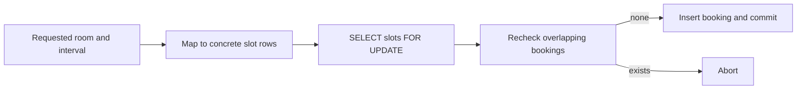

slot table 不存 booking truth，只提供 concurrency-conflict surface。

### 2.133 为什么 materialization 有效

任意两个业务上冲突的 operations 被映射到至少一个相同 lock object：

$$
BusinessConflict(a,b)\Rightarrow LockSet(a)\cap LockSet(b)\ne\varnothing
$$

exclusive lock 让其中一个先完成，后者随后基于 fresh state 重新判断。

### 2.134 materialization 的代价

- lock rows 数量/粒度难选；
- interval 映射可能漏边界；
- application data model 被 concurrency mechanism 污染；
- 粗 slots 产生 false conflicts，细 slots 增 metadata/locks；
- dynamic predicates 很难预先 materialize。

因此 error-prone 且不优雅。

### 2.135 last resort

原章建议 materializing conflicts 作为无其他办法时的 last resort；多数情况下 true serializable isolation 更通用，让 database 自动追踪 predicate/read-write conflicts。

### 2.136 anomaly 与保护机制对照

| anomaly | 最小冲突 | 常见保护 |
|---|---|---|
| dirty write | overwrite uncommitted same object | write lock |
| lost update | stale RMW same object | atomic op/lock/detection/CAS |
| write skew | shared reads, different writes | serializable/predicate lock/完整显式锁 |
| phantom write skew | absent predicate + insert | serializable/index-range lock/materialization |

### 2.137 Weak Isolation Levels 小结

read committed 保住 committed boundary；snapshot isolation 再固定 read snapshot；lost-update detection/CAS 保护 stale same-object RMW。然而 snapshot isolation 仍允许 transactions 根据同一 stale predicate 写不同 objects，形成 write skew 和 phantom。

weak isolation 的根本难点是 application 必须知道所有 read dependencies 并选择额外保护。下一节的 serializability 目标是由 database 一般性排除这些 race，而不是逐个手工打补丁。

---

## 3. Serializability：让并发结果等价于某个串行顺序

### 3.1 weak isolation 的认知成本

前文异常显示：

- isolation level 名称跨产品不一致；
- 仅看 application code 难判断所有并发 access；
- static-analysis research 尚未成为通用工具；
- race test nondeterministic，难稳定复现。

让每个开发者手工证明 weak isolation 下无 anomaly，本身就是高风险策略。

### 3.2 1970s 以来的简单答案

weak levels 从 1970s 出现后，research community 的长期答案是使用 **serializable isolation**：由 database 确保所有 committed execution 等价某个 serial order。

### 3.3 strongest isolation level

若每个 transaction 单独运行时正确，serializability 保证并发组合仍像逐个运行，因此排除 dirty/read skew、lost update、write skew、phantom 等所有由 interleaving 产生的 race。

它不保证 application transaction logic 本身正确，也不自动等于 durability/real-time order。

### 3.4 三种主流实现路线

现代 databases 主要采用：

1. **actual serial execution**：真的一个接一个执行；
2. **two-phase locking（2PL）**：pessimistic blocking；
3. **serializable snapshot isolation（SSI）**：optimistic conflict detection。

三者提供同类 external isolation guarantee，却有完全不同 performance/failure behavior。

### 3.5 Actual Serial Execution

最直接方法是移除 write concurrency：在一个 thread 上一次执行一个 transaction。既没有 transaction interleaving，就无需检测/prevent conflict，结果按定义 serializable。

### 3.6 simplicity 的来源

serial loop 的状态转移为：

$$
S_{i+1}=T_i(S_i)
$$

每个 $T_i$ 看见前一 transaction 完整 committed state，程序可像普通 single-thread code 一样推理。database 不需要 row locks/deadlock detector 来协调同一 loop 内 transactions。

### 3.7 为什么直到 2000s 才重新可行

此前三十年普遍认为 multithreaded concurrency 是 database performance 必需。两个变化使 single-thread serial processor 变得实用：

1. RAM 便宜到 active dataset 常可放内存；
2. 人们认识到 OLTP transactions 通常 short，long analytics 多为 read-only，可在 snapshot 上另行运行。

### 3.8 in-memory active dataset

若 transaction 所需 pages 已在 memory，执行只需 CPU/memory access；若 serial loop 等 disk I/O，整个 write processor 停顿，throughput 极差。

cold data 可放 disk，但 transaction 访问它时需要预取、异步路径或接受 stall。

### 3.9 short OLTP 与 long analytics 分离

OLTP transaction 常只读写少量 rows、执行微秒/毫秒级 logic。backup/analytics 虽长但 read-only，可用 MVCC snapshot 在 serial write loop 外执行。

这把“所有事务都单线程”缩小为“需要 serializable writes 的短 transactions 进入 loop”。

### 3.10 implementation examples

原章列举 VoltDB/H-Store、Redis、Datomic。专为 single-thread execution 设计的 system 可避免 lock coordination overhead，单 core throughput 甚至高于通用 concurrent engine。

上限仍受单 core 与最慢 transaction 支配。

### 3.11 Encapsulating transactions in stored procedures

single serial thread 不能让 active transaction 在 application/network/user input 上长时间等待。application 必须提交单 statement，或预先把完整 transaction code 送到 database，以 **stored procedure** 执行。

### 3.12 早期“整个用户流程一个 transaction”的设想

airline booking 包括搜索航线/票价/座位、用户选择、填乘客、付款。早期 designers 曾希望整段 user activity 原子 commit。

但 human think time 以秒/分钟计，database 若持 locks/snapshot，会积累海量 idle transactions。

### 3.13 transaction 不应等待 human

现代 OLTP 通常把 transaction 限于一个 HTTP request 内；多个 web requests 各自新 transaction。UI workflow 的跨请求一致性用 reservation、workflow state、idempotency/compensation 等表达。

database transaction boundary 不等于整个 business journey。

### 3.14 interactive client/server transaction

即使不等 human，传统 application 仍逐 statement 往返：query → network result → application branch → next query。transaction execution time 包含很多 network RTT 与 application scheduling。

### 3.15 serial loop 等 network 的吞吐灾难

若 single thread 每 transaction 有 $k$ 次 RTT，每次 $r$ ms，database work $c$ ms：

$$
T_{interactive}\approx c+k\cdot r
$$

serial throughput 上限约 $1/T_{interactive}$；loop 多数时间 idle 等 client，无法用其他 transaction 填空，因为禁止 concurrency。

### 3.16 stored procedure 消除交互等待

client 一次提交完整 logic/parameters；database 在 local memory 内执行所有 reads、branches、writes，无中途 network round trip：

$$
T_{stored}\approx c
$$

只在 procedure start/end 通信，使 serial execution 可达到高 throughput。

### 3.17 stored procedure 的 contract

procedure 必须：

- 预先部署/随 request 提交；
- 不在执行中等待 user/network I/O；
- bounded、small、fast；
- 所有 data access 可预测地在 database 内；
- failure 可整体 abort。

任一 slow procedure 会 stall 后续所有 transactions。

### 3.18 Pros and cons of stored procedures

stored procedures 并非新技术，SQL/PSM 自 1999 进入 SQL standard，但长期声誉不佳。问题多来自历史 language/tooling 与把 arbitrary application code 放入 shared database process。

### 3.19 vendor-specific languages

Oracle PL/SQL、SQL Server T-SQL、PostgreSQL PL/pgSQL 等 vendor languages 语法/生态与 modern general-purpose languages 有差距，迁移和招聘成本高。

### 3.20 code management 难

database code 相比 application server：

- debug/trace 更困难；
- version control/deployment awkward；
- unit/integration testing 较弱；
- metrics/logging integration 不便；
- schema/procedure rollout 要协调。

若缺工程化 pipeline，logic 容易成为隐藏 state。

### 3.21 shared database 的 blast radius

database 常被许多 application instances/tenants 共享。一个 procedure 消耗大量 CPU/memory、无限 loop 或 crash，影响范围比单 app server instance 更大。

需 sandbox、resource limit、timeout 与 review。

### 3.22 untrusted tenant code 的安全风险

multitenant service 若允许 tenants 在 database kernel process 内运行自定义 procedure，可能逃逸 sandbox、窃取数据或 denial-of-service。

stored procedure runtime 必须严格限制 capabilities，不能把 general plugin trust model 当作普通 query。

### 3.23 modern language implementations

一些 systems 用成熟语言/VM 缓解问题：

- VoltDB：Java/Groovy；
- Datomic：Java/Clojure；
- Redis：Lua；
- MongoDB：JavaScript。

语言现代化改善 tooling，不消除 deterministic、resource isolation 与 deployment 需求。

### 3.24 GraphQL validation 场景

若 GraphQL proxy 直接暴露 database，而 proxy 缺复杂 validation logic，可把 validation 放 stored procedure。否则要部署额外 validation service。

这里 procedure 的价值是把检查与 write 留在同一 transaction boundary，避免 check-then-write race。

### 3.25 single-thread 高吞吐的前提

stored procedure + in-memory data + no blocking I/O 可让每 transaction 很快；省去 lock/latch contention 后，一个 core 可处理大量 short transactions。

throughput 近似：

$$
QPS_{serial}\le\frac{1}{E[T_{procedure}]}
$$

tail transaction duration 会直接形成 head-of-line blocking。

### 3.26 state machine replication

VoltDB 不只复制 write set，而是在每 replica 执行同一 stored procedure/command sequence。若 initial state 与 command order 相同，deterministic transition 应得到相同 final state，称 **state machine replication**。

### 3.27 deterministic requirement

procedure 不能直接读取各 node 不同的 wall clock、random、thread schedule 或 external service。需要 database 提供 deterministic time/random API，或把 nondeterministic value 作为 command input 一起复制。

否则 replicas 会 divergence。

### 3.28 可运行示例：deterministic procedure replication

```python
from copy import deepcopy


def transfer(state: dict[str, int], sender: str, receiver: str, amount: int) -> None:
    if state[sender] < amount:
        raise ValueError("insufficient funds")
    state[sender] -= amount
    state[receiver] += amount


commands = [
    ("A", "B", 20),
    ("B", "C", 15),
    ("A", "C", 10),
]
initial = {"A": 100, "B": 50, "C": 0}
replica_1 = deepcopy(initial)
replica_2 = deepcopy(initial)

for command in commands:
    transfer(replica_1, *command)
    transfer(replica_2, *command)

print("replica 1:", replica_1)
print("replica 2:", replica_2)
print("same state:", replica_1 == replica_2)
print("total preserved:", sum(replica_1.values()) == sum(initial.values()))
```

实际运行输出：

```text
replica 1: {'A': 70, 'B': 55, 'C': 25}
replica 2: {'A': 70, 'B': 55, 'C': 25}
same state: True
total preserved: True
```

两 replicas 按同 serial command order 执行 deterministic function，因此状态一致；transfer 还 preserve total-balance invariant。

### 3.29 Sharding

一个 serial processor 限于单 machine 单 CPU core 的 write throughput。read-only snapshots 可另跑，但 high-write workload 最终需要把 data/transactions 分片。

### 3.30 one shard one serial thread

若每 transaction 只访问一个 shard，可为每 shard/core 建独立 serial loop。shards 无 shared transaction dependency 时并行：

$$
Throughput\approx\sum_{i=1}^{n}Throughput(shard_i)
$$

VoltDB 支持这种模式，理想上随 cores/nodes 线性扩展。

### 3.31 partition key 决定 serial scalability

要让 transactions single-shard，相关 rows、invariants 和 writes 必须 colocate。简单 key-value/tenant aggregate 容易；多个 secondary indexes、global constraints、transfers 跨 keys 则困难。

第 7 章 partition-key locality 在此直接决定 transaction throughput。

### 3.32 cross-shard lockstep

multi-shard transaction 的 stored procedure 要在 touched shards 上按共同 serial order/lockstep 协调，防止各 shard 选择不兼容 order。

一个 slow/unavailable shard 会阻塞 whole transaction；global coordination 重新成为 bottleneck。

### 3.33 cross-shard throughput 例子

原章报告 VoltDB cross-shard writes 约 1,000/s，orders of magnitude 低于 single-shard throughput，而且仅加 machines 不能提升该 global coordination path。

数字是当时系统的示例，不是所有 distributed transaction 的普遍上限；它说明 architecture 中的 serial global component 不会随 shards 自动扩展。

### 3.34 recent research

后续 research 探索更 scalable multishard transaction planning/execution，但核心仍是提前知道 participants、减少 coordination、避免全局 order 或利用 dependency structure。

不能从“支持 sharding”推出 cross-shard transaction 也线性扩展。

### 3.35 Summary of serial execution

actual serial execution 成立的约束：

- transaction small/fast，避免 head-of-line blocking；
- active dataset 适合 memory；
- write throughput 单 core 可承担，或 transaction 可 single-shard；
- application logic 可封装 single statement/stored procedure；
- cross-shard transaction 少且可接受慢路径；
- replicated procedure deterministic。

### 3.36 serial execution 的优势

- isolation 最直观，按定义 serializable；
- 无 lock management/deadlock；
- deterministic log 易 replication/replay；
- short in-memory transaction throughput 高；
- latency 在无 slow procedure 时稳定。

### 3.37 serial execution 的局限

- 单 shard 单 core 上限；
- 一条 slow/I/O transaction 阻塞后续；
- interactive SQL 不适配；
- stored procedure 工程/安全负担；
- cross-shard global order 难扩展；
- workload/partition key 变化可能破坏 locality。

### 3.38 Actual Serial Execution 小结

serial execution 不是“database 慢慢一次做一件事”，而是用 in-memory、短、预提交 logic 把每 transaction 压到极快，从而用简单 serial order 换掉 concurrency-control overhead。

它在 single-shard workload 上优雅；跨 shard 或 slow/interactive transaction 会暴露 single-thread/lockstep bottleneck。

### 3.39 Two-Phase Locking

约三十年间，database serializability 的主流可行算法是 **two-phase locking（2PL）**，某些严格变体称 **strong strict two-phase locking（SS2PL）**。

它不移除 concurrency，而是用 locks 阻止任何可能形成非 serializable interleaving 的 access。

### 3.40 2PL is not 2PC

- **2PL**：concurrency-control/isolation protocol，目标是 serializability；
- **2PC**：distributed atomic-commit protocol，目标是多个 participants all commit/abort。

名字都含 two-phase，但 phases、问题和机制完全不同，应视为不相关概念。后文 distributed transaction 才讨论 2PC。

### 3.41 比 read-committed write lock 更强

read committed 通常只让 writer–writer 互斥；reader 可读 old committed version。2PL 还追踪 reads，防止 concurrent writer 改变 transaction 已读取的 premise。

### 3.42 read 后 writer 必须等待

若 transaction A 已读 object，B 想 write/delete 同 object，B 必须等 A commit/abort。否则 B 会在 A 背后改变 A 依赖的 data，可能造成 write skew。

### 3.43 write 后 reader 必须等待

若 A 已写 object，B 想读，B 也必须等 A end；2PL 不允许 B 像 MVCC read committed/SI 那样读取 old version 继续。

因此 writer blocks readers，reader 也 blocks writers。

### 3.44 2PL 与 snapshot isolation 的核心对照

| 行为 | Snapshot isolation | 2PL serializable |
|---|---|---|
| reader 遇 concurrent writer | 读 old snapshot | wait |
| writer 遇 prior reader | 通常继续 | wait |
| writer–writer | lock/conflict | lock/conflict |
| read-only long query | 不阻塞 writes | 可能长期阻塞 writes |
| write skew | possible | prevented |

### 3.45 serializability 的来源

transactions 持有其 read/write locks 到结束，所有 conflicting operations 得到一致先后关系；不存在 cycle 的 committed conflict order 可对应 serial schedule。

predicate/index-range locks 再覆盖 phantom，2PL 才能防所有前述 races。

### 3.46 Implementation of 2PL

原章列举：MySQL/InnoDB、SQL Server 的 serializable isolation，以及 Db2 repeatable read 使用 2PL-style behavior。

产品可能组合 MVCC 与 locks，实际 lock scope/timeout 要看 implementation。

### 3.47 shared 与 exclusive mode

每个 object lock 有：

- **shared mode（S/read）**：多个 readers 可共同持有；
- **exclusive（X/write）**：只能一个 holder，且不能与 S/X 共存。

也称 multi-reader single-writer lock。

### 3.48 compatibility matrix

| held \ requested | Shared | Exclusive |
|---|---:|---:|
| Shared | compatible | wait |
| Exclusive | wait | wait |

matrix 是 object-level conflict rule；transaction-level deadlock 来自多个 objects 上的 wait 组合。

### 3.49 read acquisition

transaction read object 前 acquire S lock。若已有 X lock，wait；已有其他 S locks 则并行 read。

### 3.50 write acquisition

transaction write 前 acquire X lock。任何 existing S/X lock 都让它 wait，直到 holders end。

### 3.51 lock upgrade

transaction 先 read 后 write，可把 S upgrade 为 X。只有自己成为唯一 S holder 时才能 upgrade；两个 transactions 同时持 S 并都 upgrade，可能 deadlock。

### 3.52 growing phase

transaction 执行期间不断 acquire/upgrade locks，称 **growing phase**。在此 phase 不释放会影响 serializability 的 locks。

### 3.53 shrinking phase

transaction end 时 release locks，称 **shrinking phase**。two-phase 的要点是 phases 不重叠：一旦开始 release，就不能再 acquire new lock。

strict variants 通常持有 write locks，甚至所有 locks，直到 commit/abort，避免其他 transaction 依赖 uncommitted data。

### 3.54 deadlock


database 构建 wait-for graph，发现 cycle 后 abort 一个 victim，释放 locks；victim application retry。

### 3.55 Performance of 2PL

2PL 长期不作为多数系统 default 的主要原因是 performance：lock bookkeeping 有成本，更重要的是它有意降低 concurrency，任何潜在 race 都让一方 wait。

### 3.56 lock-manager overhead

每次 access 可能需要 lock-table lookup、queue、latch、ownership metadata；大量 rows/predicates 会占 memory。高 contention 时 context switch/wakeup 也昂贵。

但通常 blocking duration 与 convoy effect 比单次 acquire/release CPU 更关键。

### 3.57 lock convoy

一个 slow transaction 持有 hot lock，后面许多 requests queue；即使它们本身很快，latency 都继承 slow holder。queue 还可能继续占 connections/threads/memory。

### 3.58 full-table read 的极端例子

backup/analytics/integrity check 若在 2PL 下 read entire table，需要覆盖全表的 S locks：

1. 先等 existing writers 完成；
2. scan 数分钟/小时期间阻止所有 matching writes；
3. table 对 writes 近似 unavailable。

这正是 MVCC snapshots 对 read-heavy workload 的重要优势。

### 3.59 unstable tail latency

2PL response time 不仅由自身 work 决定，还取决于它前面 lock holders 的 duration 与 wait chain。因此 p99/p99.9 可远高于 median，且 contention 上升时非线性恶化。

### 3.60 timeout 与 slow-query monitoring

database/application 用 lock timeout、statement/transaction timeout、slow-query monitor 限制 misbehaving holder。timeout 可恢复 liveness，却会 abort work，要求安全 retry。

过短 timeout 造成无谓 abort，过长则扩大 convoy。

### 3.61 frequent deadlock 的浪费

2PL lock 更多、持有更久，deadlock 比 read committed 更频繁。victim 已完成的 CPU/I/O 全部丢弃，retry 又增加 load；高 abort rate 会显著降低 useful throughput。

### 3.62 Predicate locks

row lock 无法保护“当前不存在的 matching row”。serializable 2PL 概念上需要 **predicate lock**：lock 属于 query condition 匹配的所有现有及未来 objects。

### 3.63 meeting-room predicate

```sql
SELECT * FROM bookings
WHERE room_id = 123
    AND end_time > '2026-01-01 12:00'
    AND start_time < '2026-01-01 13:00';
```

transaction 对该 search condition 取得 shared predicate lock。

### 3.64 predicate reader rule

若 A 要 read predicate $P$，而 B 已对任何 matching object 持 X lock，A wait。A read 后持有 S predicate lock到 transaction end。

### 3.65 predicate writer rule

transaction insert/update/delete object 时，检查 old/new value 是否匹配任何 active predicate lock；若匹配另一 transaction 的 S predicate lock，writer wait。

因此 concurrent insert overlap booking 即使 row 原先不存在，也被阻止。

### 3.66 phantom protection

predicate lock 覆盖 future objects，精确解决 phantom。若 2PL 正确锁定所有 reads/writes predicates，write skew 与其他 race 被排除，达到 serializable。

### 3.67 predicate-lock 性能问题

active predicates 多且条件复杂时，每个 write 检查“是否与任一 predicate overlap”很昂贵。predicate intersection 本身可接近 query-planning problem。

所以多数 databases 不直接实现任意精确 predicate lock。

### 3.68 Index-range locks

实践使用 **index-range lock**，也称 **next-key lock**，以 index interval 对 predicate lock 做安全近似。

它锁更大 superset，可能多阻塞一些不真正冲突的 writes，但不会漏掉原 predicate 的 conflicts。

### 3.69 safe approximation 的依据

若原 predicate set 为 $P$，近似 lock set 为 $L$，只要：

$$
P\subseteq L
$$

所有真正 matching writes 都会碰到 lock。false positive 降低 concurrency，但不破坏 serializability；false negative 才会漏 phantom。

### 3.70 room-ID index 近似

若 query 用 `room_id` index 找 room 123 bookings，可锁 index entry/range `room_id=123`，即使它覆盖该 room 所有 times。不同 room 仍可并发。

### 3.71 time index 近似

若 query 用 time index，可锁 noon–1pm range，可能覆盖多个 rooms。任何插入 overlap time 的 index update 会遇到 shared range lock。

选择哪个 index 影响 false-conflict granularity 与 performance。

### 3.72 insert 怎样撞上 range lock

新增 booking 必须向相应 index range 插 entry。index manager 在修改 leaf/gap 前发现 active S range/gap lock，writer wait，直到 reader transaction commit/abort 后重新判断。

### 3.73 precision 与 overhead 的折中

精确 predicate：高 bookkeeping、低 false conflict；粗 index range：低 bookkeeping、更多 blocking。next-key locking 是 correctness 与 practical cost 的 compromise。

### 3.74 无合适 index 的 fallback

若没有能近似 predicate 的 index，database 可锁 whole table。性能差、阻止所有 table writes，但安全；这也说明缺索引会同时伤 query performance 与 concurrency granularity。

### 3.75 2PL 如何防前文 anomalies

| anomaly | 2PL mechanism |
|---|---|
| dirty read/write | S/X lock incompatibility |
| nonrepeatable/read skew | read locks held to end |
| lost update | prior read S lock blocks writer/upgrade conflict |
| write skew | all dependency rows/predicates locked |
| phantom | predicate/index-range/next-key locks |

### 3.76 2PL 的适用范围

适合 conflict rate 可控、transactions 短、必须强 serializability 且能接受 blocking 的 workloads。hot rows、long scans、unpredictable transaction duration 会造成严重 tail latency。

### 3.77 Two-Phase Locking 小结

2PL 通过 pessimistic S/X locks 在 dangerous interleaving 发生前等待，并用 predicate/index-range locks 覆盖 phantom；它成熟且 serializable，却让 readers/writers 互相阻塞、产生 deadlock 与 unstable tail。

再次强调：2PL 解决 isolation，不是后文 2PC 的 distributed commit。

### 3.78 Serializable Snapshot Isolation

serial execution 简单却受 single-core/cross-shard 限制；2PL serializable 却有 blocking/deadlock/tail latency；普通 snapshot isolation 快但允许 write skew/phantom。

**serializable snapshot isolation（SSI）**尝试同时获得 SI 的大部分性能与 full serializability。

### 3.79 SSI 的历史与采用

SSI 于 2008 年首次系统描述，相对 2PL 很新。原章列举：

- PostgreSQL serializable；
- SQL Server In-Memory OLTP/Hekaton；
- HyPer；
- CockroachDB、FoundationDB；
- embedded BadgerDB。

相关 algorithms/variants 的细节不同，但共同思想是 optimistic serialization-conflict detection。

### 3.80 Pessimistic versus optimistic concurrency control

- **pessimistic**：潜在危险一出现就 wait，认为 conflict 很可能发生；
- **optimistic**：先继续执行，commit 时验证，只有真实危险才 abort。

两者都可提供 serializability，差别在何时付出 coordination cost。

### 3.81 2PL 的 pessimism

2PL 像 multithreaded mutual exclusion：只要另一 transaction lock 表明可能 conflict，就阻塞直到安全，不先猜最终是否真的形成 nonserializable cycle。

### 3.82 serial execution 是极端 pessimism

可把 single serial loop 看作每 transaction 对整个 database/shard 持 exclusive lock。它用极短 transaction duration 补偿最粗 lock granularity。

### 3.83 SSI 的 optimism

SSI transaction 在 consistent snapshot 上读，遇到 concurrent write 通常不 wait；它继续执行并记录 read/write dependencies。commit 时判断 execution 是否仍可 serializable；不安全则 abort/retry。

### 3.84 commit validation gate

抽象流程：

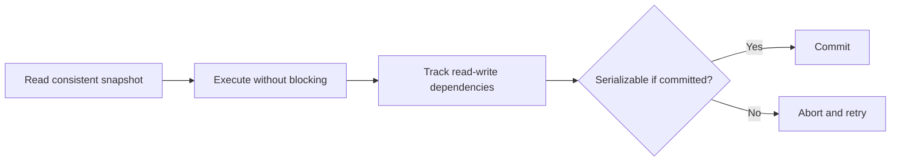

只有可嵌入合法 serial order 的 transactions 允许 commit。

### 3.85 high contention 的弱点

若很多 transactions 争用相同 data，optimistic work 常在最后 abort，大量 CPU/read/write effort 被浪费。retry 又带来更多 conflict。

这种 workload 下 early blocking/queueing 可能比反复 speculative execution 更有效。

### 3.86 retry amplification

设一次 attempt 成功概率为 $s$，独立近似下完成一个 transaction 的 expected attempts：

$$
E[attempts]=\frac{1}{s}
$$

$s=0.5$ 时平均 2 attempts；$s=0.1$ 时 10 attempts，effective load 放大十倍，可能把接近 capacity 的系统推入 overload。

### 3.87 low contention + headroom 的优势

若 conflict 少、capacity 有余量，多数 transactions 第一次 commit；SSI 避免 2PL conservative waiting，通常 throughput/latency 更好。

workload distribution 而非“optimistic 总更快”决定结果。

### 3.88 commutative operation 降低 conflict

多个 blind increments 若 transaction 不读取 counter result，order 不重要，可用 commutative atomic update 全部接受，避免把它们视为 harmful conflict。

把 application intent 表达为 `+1` 而非 read/write final value，有助于 optimistic concurrency。

### 3.89 SSI 建立在 snapshot isolation 上

所有 reads 仍来自 consistent snapshot；SSI 额外追踪 read-write dependencies，识别 transaction 是否基于已过时 premise 作出 write。

所以 SI 提供 stable view，SSI validation 负责判断该 view 是否仍可用于 committed decision。

### 3.90 Decisions based on an outdated premise

write skew 的共同模式是：transaction 查询事实 $P$（“有两名 doctors on call”），再基于 $P$ 写入；commit 时 concurrent write 已使 $P$ 不再成立。

### 3.91 database 不知道 query result 怎样被使用

application 可能只是展示 query，也可能据此决定 critical write。database 看不到 arbitrary application control flow，因此保守假设 transaction later writes causally depend on earlier reads。

只要 query result 被 concurrent write 改变，就可能需要阻止 commit。

### 3.92 两类 stale-premise 时序

1. **stale MVCC read**：另一 uncommitted write 已在 read 前发生，但 snapshot visibility 把它隐藏；
2. **write after read**：reader 先读取，另一 transaction 后来写入改变该 row/predicate。

SSI 必须覆盖两种顺序和 phantom predicates。

### 3.93 Detection of stale MVCC reads

transaction 43 读 Aaliyah `on_call=true`；transaction 42 已写 `false` 但当时未 commit，MVCC snapshot 忽略 tx42。tx43 later 想 commit 时，tx42 已 commit，tx43 premise 过时。

### 3.94 记录被 visibility 忽略的 write

reader 选择 old version 时，database 记录它忽略了哪个 concurrent writer/version。该 metadata 建立 rw-antidependency 线索，而不是立即改变 read result。

### 3.95 commit-time 检查

tx43 commit 时检查 ignored writer tx42：

- tx42 已 commit：stale premise 成真，tx43 若有 dangerous writes 需 abort；
- tx42 abort：old read 并未 stale，无需 abort；
- tx42 仍未 commit：protocol 根据 dependency/order 做安全决定。

### 3.96 为什么不在 read 时立即 abort

read moment 尚不知道：

- reader 是否 later write；
- hidden writer 是否 commit；
- dependency 是否形成 serialization danger。

延迟 validation 减少 false/unnecessary abort，保留 long-running read-only snapshot 的优势。

### 3.97 read-only transaction 通常可保留

read-only tx 即使看到 historical value，也可序列化到 writer 之前，不会通过 write 造成 skew。SSI 可让它继续，不因仅 stale read 立即 abort。

某些 systems 为长期 read-only query 提供 safe snapshot，进一步避免 abort。

### 3.98 phantom insertion 的扩展

若 writer insert 之前不存在的 row，reader 不是忽略某个 row version，而是读取了 predicate absence。SSI 需像 predicate/index-range tracking 一样记录 query range，才能检测 later matching insert。

### 3.99 Detection of writes that affect prior reads

另一顺序中，transaction 42、43 先都查询 shift 1234 doctors；随后各自 write。database 需要知道某 write 影响哪些 active/recent transactions 已读的 keys/ranges。

### 3.100 nonblocking read markers

reader 在 index entry/range/table 上登记“我读过这里”。与 2PL range lock 相似，但该 marker 不阻塞 writer；它是 **tripwire**，只报告 dependency。

### 3.101 read metadata 的 retention

transaction 完成后，只要仍有 concurrent transactions 可能与其形成 dependency，read markers 需保留；所有 overlap transactions 结束后可 GC。

tracking 过早删除会漏 conflict，保留过久增加 memory/check overhead。

### 3.102 writer 检查 prior readers

write key/range 时查询 recent read markers，并通知相关 transactions：你读过的 data 可能已 outdated。writer 通常不等待，transactions 继续到 commit validation。

### 3.103 doctors 双向 dependency

tx42 读 Bryce/Aaliyah 后写 Aaliyah；tx43 读两人后写 Bryce：

- tx42 的 write 使 tx43 prior read stale；
- tx43 的 write 使 tx42 prior read stale。

形成 rw-antidependency cycle，不能让两者都 commit。

### 3.104 first committer 与 second abort

若 tx42 first commit，此时 tx43 write 尚未 committed，tx42 仍可能安全序列化；tx43 later commit 时，tx42 conflicting write 已生效，tx43 必须 abort。

实际 SSI 使用 dangerous-structure theory，未必简单“后提交必 abort”，但目标是打破 dependency cycle。

### 3.105 可运行示例：rw-antidependency cycle

```python
from dataclasses import dataclass


@dataclass(frozen=True)
class Transaction:
    name: str
    reads: frozenset[str]
    writes: frozenset[str]


transactions = [
    Transaction("T-A", frozenset({"Aaliyah", "Bryce"}), frozenset({"Aaliyah"})),
    Transaction("T-B", frozenset({"Aaliyah", "Bryce"}), frozenset({"Bryce"})),
]

edges = sorted(
    (reader.name, writer.name)
    for reader in transactions
    for writer in transactions
    if reader != writer and reader.reads & writer.writes
)
cycle = all((right, left) in edges for left, right in edges)

print("rw-antidependencies:", edges)
print("serialization cycle:", cycle)
print("abort candidate:", "T-B" if cycle else "none")
print("remaining serializable:", len(transactions) - int(cycle) == 1)
```

实际运行输出：

```text
rw-antidependencies: [('T-A', 'T-B'), ('T-B', 'T-A')]
serialization cycle: True
abort candidate: T-B
remaining serializable: True
```

示例只展示核心 dependency cycle；真实 SSI 会考虑 commit order、多个 transactions、false dependencies 和 safe optimizations。

### 3.106 Performance of serializable snapshot isolation

SSI performance 取决于 read/write tracking granularity、conflict rate、transaction duration、false-positive abort 与 retry policy，不能只比较 nominal isolation 名称。

### 3.107 tracking granularity trade-off

- 细粒度 row/key/range tracking：abort 精确，metadata/lookup 高；
- 粗粒度 page/table tracking：开销低，但不真正冲突 transactions 也可能 abort。

与 index-range lock 类似，precision 与 overhead 互换；区别是 false positive 导致 abort 而非 blocking。

### 3.108 stale read 不总需要 abort

某 transaction 读到 later overwritten data，结合其他 dependency 仍可能存在合法 serial order。PostgreSQL 利用 formal SSI theory，只 abort dangerous structures，减少 unnecessary abort。

不能把“任何 stale read 都失败”当作 SSI 的精确算法。

### 3.109 相比 2PL

SSI readers/writers 不因 locks 互相等待，read-only query 在 snapshot 上无 lock，latency 更 predictable；一个 slow reader 不会直接阻塞 hot writer。

代价从 wait 转成 metadata 与 potential abort/retry。

### 3.110 相比 serial execution

SSI 不限 single core，可并行并在 distributed shards 上追踪 conflicts。FoundationDB 等把 serialization conflict detection 分布到多 machines，支持 multi-shard serializable transactions。

### 3.111 相比 ordinary snapshot isolation

SSI 多出 read tracking、write checks、commit validation 和 abort overhead；换来阻止 lost update、write skew 与 phantom write anomalies。

是否值得存在争论：取决于 correctness risk 与实际 overhead，而非理论上永远相同。

### 3.112 abort rate 是关键指标

useful throughput 近似：

$$
Throughput_{useful}=Throughput_{attempts}\cdot(1-abortRate)
$$

还未计 retry 额外 load。hot contention 与 long read-write transactions 会提高 abortRate。

### 3.113 transaction duration

long read-write transaction 观察更多 data、跨越更多 concurrent commits，更可能冲突后在末尾 abort，浪费很大。SSI 要求 read-write transactions 较短。

long read-only transactions 通常可安全留在 snapshot，不像 2PL 那样阻塞 writes。

### 3.114 三种 serializable 方案对照

| 方案 | 冲突处理 | 优势 | 主要局限 |
|---|---|---|---|
| actual serial | 根本不并发 | 最简单、无 conflict | single-core/slow tx/cross-shard |
| 2PL | danger 时 wait | 成熟、无需重做成功 work | blocking/deadlock/tail latency |
| SSI | 先执行，commit 验证/abort | nonblocking、可多核/分布式 | tracking/abort/retry、高 contention |

### 3.115 如何选择

- in-memory、短、single-shard commands：actual serial 很强；
- conflict high 且可接受 queues：2PL 可能避免反复 abort；
- read-heavy、contention moderate、需 scalable serializable：SSI 很有吸引力；
- 任一方案都要求 short transactions、正确 retry 与 workload benchmark。

### 3.116 SSI 的适用边界

SSI 解决 database transaction 内 serialization conflicts；不自动原子 commit external API、保证 client retry exactly once，也不修复 application 未声明/错误 invariant。

distributed setting 还要把 conflict metadata 与 commit decision 跨 nodes 正确协调。

### 3.117 Serializability 小结

serializability 提供统一、可组合的 race-free abstraction。actual serial 用极快单线程换 simplicity；2PL 在危险前 blocking；SSI 在 snapshot 上 optimistic 执行并用 stale-premise dependencies 决定 abort。

三者不是强弱等级，而是同一 guarantee 的不同 performance architecture。选择应看 transaction duration、contention、shard locality、tail latency 与 retry cost。

---

## 4. Distributed Transactions：跨节点实现统一 commit/abort

### 4.1 single-node authority

single-node transaction 由一台 machine/storage engine 执行 isolation、WAL、commit/abort。single-leader replication 中也通常由 leader 执行 transaction logic，followers replay committed log。

因此一个 local authority 可决定 transaction outcome。

### 4.2 distributed transaction 的定义

transaction 涉及多个 nodes/participants，例如：

- sharded database 的多个 shards；
- primary record 与另一 node 的 global secondary index；
- 两个 database systems；
- database 与 message broker。

这称 **distributed transaction**。

### 4.3 distributed isolation 与 atomicity 要分开

serial execution、2PL、SSI 都可扩展到 distributed setting（需跨 nodes 的 order/locks/conflict checker）。但即使 isolation 正确，还要保证所有 participants 的 commit outcome 一致。

后者是独立的 **atomic commitment problem**。

### 4.4 single-node atomic commit

storage engine 通常先 durable write transaction data/WAL，再写 durable commit record。recovery 依据 commit record：

- record 存在：redo/视为 committed；
- record 不存在：undo/ignore transaction writes。

### 4.5 durable-write order

顺序是：

$$
data/WAL\ durability\quad\longrightarrow\quad commit\ record\ durability
$$

commit record 之前仍可 abort；commit record durable 后，即使立刻 crash，recovery 也必须 commit。

### 4.6 local commit point

single node 的 atomic decision 被压缩为一个 device/controller 完成 commit-record write 的时刻。它把“准备好”和“最终决定”合并在同一个 storage authority 内。

### 4.7 naive distributed one-phase commit

coordinator/client 向每个 node 直接发送 `COMMIT`，各 participant 独立执行，可能出现部分 commit、部分 abort。原因包括：

- 某 node conflict/constraint violation；
- request/network loss/timeout；
- node 在 commit record durable 前 crash；
- disk full/I/O error；
- 不同 participant 延迟差异。

### 4.8 partial commit 为什么不能简单撤销

participant A commit 后，其 writes 已对其他 read-committed transactions visible；participant B 后来 abort。若再“撤销”A，已经基于 A data commit 的 transactions 也要 retroactively undo，形成 cascading rollback。

commit 是公开、不可任意 retract 的历史事件，不是普通 tentative write。

### 4.9 atomic commitment 的目标

对 participants $P_1\ldots P_n$：

$$
Outcome(P_1)=Outcome(P_2)=\cdots=Outcome(P_n)\in\{commit,abort\}
$$

不允许 outcome mixture。若无法确认 commit，protocol 宁可 abort 或 block，也不能各自猜。

### 4.10 isolation 不会自动提供 atomic commit

每 shard 都 serializable 仍可一 shard commit、另一 shard abort。serializability 约束 concurrent order；atomic commitment 约束同一 transaction 在 participants 上的共同 outcome。

两者在 distributed transaction 中都需要。

### 4.11 Two-Phase Commit

**two-phase commit（2PC）**是经典 distributed atomic-commit algorithm，把 outcome process 拆成：

1. prepare/vote；
2. commit/abort decision dissemination。

### 4.12 使用形式

2PC 可由 database internal 使用，也通过 XA transactions、Java Transaction API（JTA）或 SOAP 的 WS-AtomicTransaction 暴露给 heterogeneous applications。

不要与 two-phase locking（2PL）混淆。

### 4.13 coordinator / transaction manager

2PC 增加 **coordinator**，也称 **transaction manager**。它可嵌入 application process/library，也可独立 service。原章例子包括 Narayana、JOTM、BTM、MSDTC。

coordinator 记录 participants、votes 与最终 decision。

### 4.14 participants

application 先在多个 database nodes 建 local transactions并读写，这些 nodes 称 **participants**。每 participant 仍负责 local constraint、conflict、WAL/locks。

global transaction ID 把这些 local transactions 绑定为一个 distributed transaction。

### 4.15 phase 1：prepare

application 请求 commit 时，coordinator 向所有 participants 发送 `PREPARE(txid)`：你是否保证以后能 commit？

每个 participant 回 `yes/no`，prepare 不是预通知，而是 durable promise protocol。

### 4.16 phase 2：decision

- 所有 votes=yes：coordinator durable 决定 commit，再广播 `COMMIT`；
- 任一 no/prepare timeout：决定 abort，再广播 `ABORT`。

$$
Decision=commit\iff\bigwedge_{i=1}^{n}vote_i=yes
$$

### 4.17 marriage analogy

原章用婚礼比喻：主持人分别问双方是否愿意；只有双方都回答 “I do” 后才宣布成立。个人 yes 是不可轻易撤回的 promise，最终 announcement 是共同 decision。

比喻强调 prepare vote 与 final decision 是两个不同 no-return points。

### 4.18 A system of promises

2PC 比 naive one-phase 安全，不是因为 network 不再丢包，而是 participants/coordinator 作出 durable、不可逆 promises，使 retry 后仍只能收敛到同一 outcome。

### 4.19 step 1：分配 globally unique transaction ID

application 从 coordinator 获取 global `txid`。所有 prepare/decision/recovery messages 携带它，支持 dedup 与 status lookup。

### 4.20 step 2：建立 local transactions

在每 participant 开 local transaction 并关联 global txid。prepare 前若任何 read/write/request 失败，coordinator/participant 可自由 abort，因为尚无人 promise commit。

### 4.21 step 3：发送 prepare

coordinator 向所有 participants 发送 tagged prepare。任一 request failed/timed out，coordinator global decision 必须 abort，并最终通知所有 participants。

prepare timeout 不能忽略某 participant 后对其余 commit，否则失去 atomicity。

### 4.22 step 4：participant durable prepare

participant 回 yes 前必须确保“无论之后 crash/power loss/disk pressure，都能按 request commit”：

- transaction data/WAL durable；
- constraints checked；
- conflict/isolation checks sufficient；
- required locks/resources retained；
- recovery 能找到 prepared tx。

### 4.23 yes vote 的准确含义

`yes` 表示 participant **放弃自行 abort 的权利**，但尚未 publish commit。它进入 `prepared/in-doubt-capable` state，只能服从 coordinator later decision。

这第一个 no-return point 防止 participant 在 commit broadcast 丢失后随意 rollback。

### 4.24 step 5：coordinator 决策

收齐 votes 后，只在 all yes 时 commit，否则 abort。coordinator 把 decision durable 写入 transaction log；完成该 write 是 global **commit point**。

decision log 必须比通知 participants 先 durable，否则 crash 后可能忘记已发出的 commit。

### 4.25 step 6：无限重试 decision

decision durable 后不可回头。向 participant 的 commit/abort message 若丢失，coordinator 必须 retry，原则上直到成功；participant crash 后 recovery 也必须执行原 decision。

network retry 只影响何时完成，不改变 outcome。

### 4.26 两个 points of no return

1. participant yes：自己不能再 abort，但 coordinator 仍可 global abort；
2. coordinator durable decision：所有 participants 最终必须执行该 outcome。

single-node commit record 把这两个角色合为一个 local event；2PC 将它们跨 nodes 分开。

### 4.27 2PC state diagram

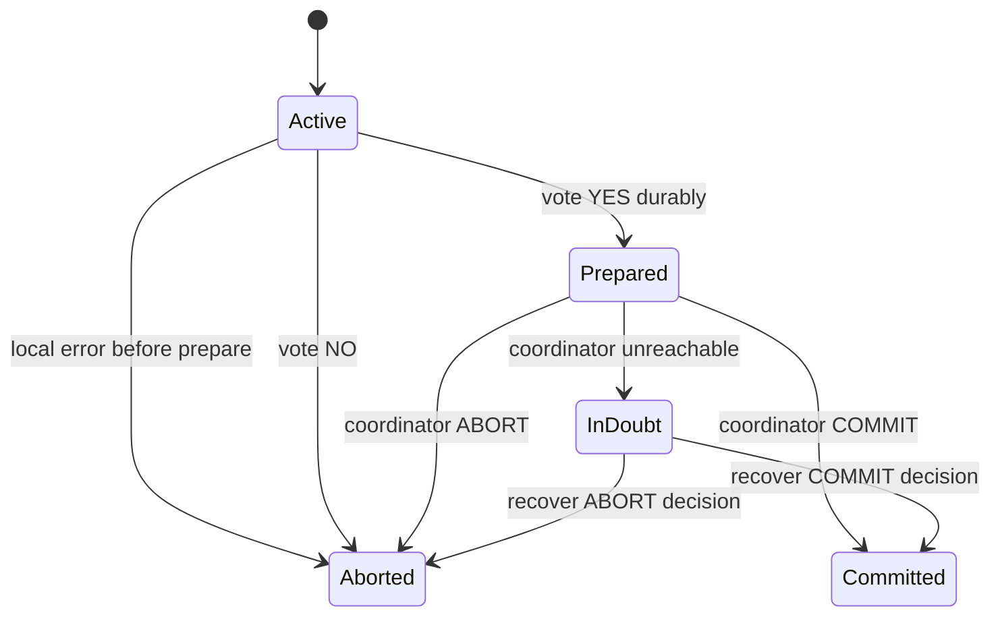

`InDoubt` 不是可自行选择的第三 outcome，而是暂时不知道 coordinator 已作何 decision。

### 4.28 可运行示例：2PC promise state

```python
from dataclasses import dataclass


@dataclass
class Participant:
    name: str
    can_commit: bool
    state: str = "active"

    def prepare(self) -> bool:
        self.state = "prepared" if self.can_commit else "aborted"
        return self.can_commit

    def decide(self, decision: str) -> None:
        if decision == "commit" and self.state != "prepared":
            raise RuntimeError("commit requires a durable yes vote")
        self.state = "committed" if decision == "commit" else "aborted"


def decide(participants: list[Participant]) -> str:
    return "commit" if all(participant.prepare() for participant in participants) else "abort"


prepared = [Participant("db-a", True), Participant("db-b", True)]
all_yes = decide(prepared)
print("after yes votes:", [participant.state for participant in prepared])
print("participants can decide alone:", False)
for participant in prepared:
    participant.decide(all_yes)
print("all-yes decision:", all_yes, [participant.state for participant in prepared])

one_no = [Participant("db-a", True), Participant("db-b", False)]
abort_decision = decide(one_no)
for participant in one_no:
    participant.decide(abort_decision)
print("one-no decision:", abort_decision, [participant.state for participant in one_no])
```

实际运行输出：

```text
after yes votes: ['prepared', 'prepared']
participants can decide alone: False
all-yes decision: commit ['committed', 'committed']
one-no decision: abort ['aborted', 'aborted']
```

代码省略 durable logs/network retry，但保留核心约束：commit 必须来自 all durable yes；prepared participant 不自行决定。

### 4.29 Coordinator failure

participant/network failure 的规则较清楚：prepare 未成功则 abort；decision message 失败则无限 retry。coordinator crash 则暴露 2PC 的 blocking 性质。

### 4.30 prepare 前 coordinator 失败

coordinator 尚未发 prepare，participants 未作 promise，可在 timeout/session cleanup 后安全 abort local transactions。

### 4.31 yes 后 coordinator 失败

participant 已 prepared/voted yes，coordinator unreachable。它不知道 global decision 是 commit、abort，或尚未决定，进入 **in doubt / uncertain**。

### 4.32 timeout 不能解决 in doubt

prepared participant timeout 后 unilateral abort，可能与已收到 commit 的另一 participant 不一致；unilateral commit 也可能与 global abort 不一致。

无法通信不是选择 outcome 的新信息。

### 4.33 participant 互相询问并非标准 2PC

即使 participants 交流 votes，也未必知道 coordinator 是否已 durable commit decision 并通知部分 nodes。标准 2PC 没有 participant consensus phase，因此只能等 coordinator/recovery authority。

### 4.34 coordinator recovery log

coordinator 重启后读取 durable decision log：

- 有 commit record：重发 commit；
- 有 abort/无 commit record（按 protocol recovery rule）：通知 abort。

因此 2PC global commit point 最终仍依赖 coordinator 的 single-node atomic log write。

### 4.35 coordinator log loss

若 disk/log 全丢，无法自动判定 in-doubt outcomes，只能 administrator 调查所有 participants 并 manual commit/abort。若只丢 recent commit records，coordinator 误 abort 已 commit transaction 会违反 atomicity。

coordinator log 与 database data 同样是 critical durable state。

### 4.36 blocking atomic commit

2PC 称 **blocking atomic commit protocol**：prepared participants 在 coordinator 恢复前可能无限等待。safety 被保住，liveness/availability 牺牲。

### 4.37 Three-phase commit

**three-phase commit（3PC）**试图增加 phase，使 node failure 后 protocol nonblocking。但其 correctness 假设 bounded network delay 与 bounded process response time。

### 4.38 practical asynchronous network 的限制

真实 systems 有 unbounded packet delay、GC pause、process scheduling stall，无法可靠区分 slow 与 failed。3PC assumptions 不成立时不能保证 atomicity。

### 4.39 consensus-replicated coordinator

更实际方向是用 fault-tolerant consensus protocol 复制 coordinator/decision state，让 single coordinator node crash 后自动 failover，同时保留唯一 committed order。

第 10 章会把 atomic commitment 与 consensus 进一步连接。

### 4.40 2PC 的 latency 成本

相比 local commit，2PC 至少增加 prepare round trip、decision round trip，以及 participant prepare logs/coordinator decision log 的 durable flush：

$$
T_{2PC}\gtrsim RTT_{prepare}+fsync_{participants}+fsync_{coord}+RTT_{decision}
$$

并行 participants 由 slowest required response 决定 tail。

### 4.41 2PC 的 availability 成本

prepare 需要 all participants ready；任一 unavailable/conflict 通常 global abort。prepared 后 coordinator unavailable 又可 blocking。

atomic all-or-nothing 意味着 weakest participant/failure domain 进入 transaction availability path。

### 4.42 2PC 提供什么、不提供什么

提供：participants 的 atomic commit outcome（在 assumptions/recovery 正确时）。

不单独提供：

- serializable isolation；
- coordinator high availability；
- exactly-once external effect；
- deadlock detection across systems；
- low latency；
- application invariant correctness。

### 4.43 2PL 与 2PC 可同时出现

distributed transaction 可用 2PL 管 isolation，同时用 2PC 管 atomic commit。prepared/in-doubt 期间 2PL locks 必须继续持有，因而二者组合会放大 blocking。

名字相近之外，它们在系统中是两个叠加 layers。

### 4.44 Two-Phase Commit 小结

2PC 的本质是 durable promises：participant yes 后保证可执行未来 decision，coordinator durable decision 后永不反悔。prepare/commit message 可丢，retry 仍收敛到同一 outcome。

代价是 extra RTT/fsync 与 coordinator failure 后 in-doubt blocking；3PC 在现实 unbounded-delay network 下不能普遍解决，replicated consensus coordinator 更实际。

### 4.45 Distributed Transactions Across Different Systems

distributed transaction 声誉两极：它提供难以替代的 atomic safety，却被批评 operational fragility、performance penalty 和“承诺超过实际能力”。不少 cloud services 因此不支持 heterogeneous transaction。

不应只用“2PC 好/坏”下结论，首先要区分 transaction 是同一 database 内部，还是跨不同 technologies。

### 4.46 performance cost 的来源

2PC inherent cost 包括 extra network rounds、participant prepare fsync、coordinator decision fsync，以及 locks/resources 持有更久。heterogeneous driver/coordinator 还增加 serialization、connection 与 recovery overhead。

不同 implementation 差异很大，不能把最差 XA 经验套到所有 database-internal transaction。

### 4.47 两类 distributed transactions

| 类型 | participants | protocol freedom | 主要挑战 |
|---|---|---|---|
| database-internal | 同一 database software 的 shards/replicas | 可专门优化 | cross-shard latency/conflict |
| heterogeneous | 不同 vendor DB、message broker 等 | 遵循共同 standard | lowest common denominator/recovery |

### 4.48 database-internal distributed transaction

YugabyteDB、TiDB、FoundationDB、Spanner、VoltDB、Cassandra、MySQL Cluster NDB 等在自身 nodes 间支持 transaction。所有 participants 理解相同 metadata、failure model 和 protocol。

### 4.49 heterogeneous distributed transaction

participants 可是两个 vendor databases，或 database + message broker。atomic commit 必须跨完全不同 storage/concurrency implementations，通常依靠 XA 等 standardized interface。

### 4.50 internal protocol 的自由度

同一 database designers 可共同设计 coordinator replication、shard communication、concurrency control、deadlock detection 与 recovery；无需兼容任意第三方 driver。

因此 database-internal 2PC 往往比 generic XA 更快、更可靠。

### 4.51 Exactly-once message processing

heterogeneous transaction 的典型价值：只有 database writes commit 时才 acknowledge broker message。message acknowledgment 与 side effects 原子 commit。

### 4.52 failure/retry path

- processing/database failure：DB writes 与 broker ack 都 abort，broker redelivers；
- success：writes commit 且 ack commit，broker 不再投递；
- partial tentative effects：abort 丢弃。

即使有多次 attempts，committed effect **effectively exactly once**。

### 4.53 exactly-once semantics 的准确范围

exactly-once 不是 network 只 delivery 一次；message 可 redeliver 多次。保证是所有 affected transactional systems 最终只有一次 committed processing effect。

$$
AtLeastOnceDelivery+AtomicDeduplicatedEffect\Rightarrow EffectiveExactlyOnce
$$

### 4.54 nontransactional side effect 破坏边界

若 processing 发送 email，而 email server 不支持同一 2PC，email 可能已发送、database/broker transaction 后来 abort；retry 再发，造成 duplicates。

所有 side effects 必须可 rollback/原子参与，或通过 idempotency/outbox 另行处理。

### 4.55 XA transactions

**X/Open XA（eXtended Architecture）**是跨 heterogeneous technologies 实现 2PC 的 standard，1991 年引入并广泛实现。

### 4.56 XA ecosystem

支持者包括 PostgreSQL、MySQL、Db2、SQL Server、Oracle，以及 ActiveMQ、HornetQ、MSMQ、IBM MQ 等 message brokers。

support 存在不代表所有 driver/configuration 默认启用，也不保证相同 isolation。

### 4.57 XA 不是 network protocol

XA 本质是 transaction coordinator 与 resource manager/client driver 交互的 C API，不规定 wire protocol。其他语言提供 bindings。

### 4.58 Java transaction stack

Java EE 中常见：

- JTA（Java Transaction API）管理 XA transaction；
- JDBC driver 连接 databases；
- JMS driver 连接 message brokers。

drivers 把 global txid/prepare/commit/abort 调用翻译到各 server。

### 4.59 driver callbacks

XA-aware client library 知道 operation 是否加入 global transaction，并暴露 callbacks，让 coordinator 请求 participant prepare、commit、abort。

participant servers 通常不能绕过 application driver 主动联系 coordinator。

### 4.60 coordinator 常嵌入 application

standard 不规定 coordinator implementation。实践中它常是 application process/Java EE container 内 library，而非独立 HA service。

它记录 participant list、收 votes，并把 decision 写 application server local disk log。

### 4.61 local coordinator log 成为 critical state

这个本地 log 与 databases 同样重要：prepared participants 的唯一正确 outcome 可能只记录在这里。application server backup/recovery 不再只是 stateless compute 问题。

### 4.62 application crash 后的 recovery coupling

application process/machine crash，coordinator 同时消失；prepared participants stuck in doubt。必须重启同 server/恢复 coordinator log，再经原 drivers callbacks 发送 outcomes。

database server 无法直接拉取 coordinator decision，延长 recovery chain。

### 4.63 Holding locks while in doubt

prepared transaction 仍持有其 locks：read committed 的 modified rows exclusive locks；若 2PL serializable，还包括 read shared/predicate locks。

participant 不能在 outcome 未知时 release，因为另一 transaction 可能观察/覆盖一个 later abort/commit 的 uncertain state。

### 4.64 coordinator downtime 直接变成 lock duration

coordinator 重启耗时 20 分钟，prepared locks 就持有 20 分钟；log 永久丢失则理论上永久持有，直到 manual decision。

$$
LockHoldTime\ge CoordinatorRecoveryTime
$$

### 4.65 application availability 影响

其他 transactions 访问同 rows 时被阻塞；根据 isolation，reads 也可能阻塞。少数 orphaned transaction 可锁住 hot/customer/account rows，使大片业务 unavailable。

不能把 in-doubt transaction 当作无害后台垃圾。

### 4.66 Recovering from coordinator failure

理想情况 coordinator 从 durable log 恢复并解决所有 in-doubt transactions；实践会出现 **orphaned in-doubt transactions**：log 丢失、corrupt、software bug 或 participant/coordinator records 无法关联。

### 4.67 reboot database 也不会修复

正确 2PC participant restart 后必须恢复 prepared state 与 locks；若 reboot 自动 abort，会与其他 committed participants 不一致。

所以“重启试试”可能仍保留 blocking，这是 safety 的必然结果。

### 4.68 manual resolution

administrator 要枚举 global tx participants，检查是否有 node 已 commit/abort，再让剩余 nodes 使用同一 outcome。通常发生在 production outage 高压下，耗时且容易误判。

runbook、prepared-tx inventory 和 coordinator-log backup 必须提前准备。

### 4.69 heuristic decisions

许多 XA implementations 提供 emergency **heuristic decision**：participant 不等 coordinator，unilateral commit/abort。

这是“可能破坏 atomicity”的委婉说法，只应用于 catastrophic recovery；日常 timeout 自动 heuristic 会使 2PC guarantee 失效。

### 4.70 heuristic 后需要 reconciliation

一旦不同 participants 作出不同 heuristic outcomes，database 不会自动恢复 unified history。operator/application 必须根据 business ledger/audit 手工补偿，且已被其他 transactions 观察的 committed data不能简单撤回。

### 4.71 Problems with XA transactions

XA 的 operational 问题来自 coordinator placement、communication path 与 generic compatibility，而不只是多两个 network messages。

### 4.72 coordinator single point of failure

single-node coordinator/log failure可让所有相关 prepared transactions blocking。把 coordinator 放 application server 又让本应 stateless 的 compute node 成为 durable state owner。

### 4.73 replicated coordinator 仍不完全解决

理论上可复制 coordinator，但 XA participants 不能直接与 coordinator service communication，只能经发起 transaction 的 application code/drivers。

application process/connection path 仍可能是 single point，recovery 无法透明接管全部 callbacks。

### 4.74 durable/restartable application 的缺口

彻底修复需让 application execution 可 replicated/restartable，类似 durable workflow：new worker 恢复 control state 并继续 coordinator protocol。

原章指出实践中 XA tools 通常未采用这种全面 redesign。

### 4.75 lowest common denominator

XA 要兼容广泛 systems，只能依赖所有参与者共有的 minimal prepare/commit API，无法利用单一 database 的 rich internal metadata/optimization。

### 4.76 无跨系统 deadlock protocol

database A transaction 等 B lock，B 又等 A；XA 没有标准让 systems 交换 wait-for graph，无法全局检测 deadlock。local detectors 各自只看到一半。

result 可能只能靠 timeout/abort，latency 与 wasted work 高。

### 4.77 不支持跨系统 SSI

SSI 需要传播 read/write conflict dependencies 与 commit relationships；XA 没有 standardized conflict protocol，因此不能提供 heterogeneous global SSI。

atomic commit 与 isolation again 是两层，XA 主要覆盖前者。

### 4.78 mixed isolation semantics

各 participant 可能配置不同 isolation：一个 serializable、一个 read committed。global all-or-nothing commit 不会把弱 participant 升级成 globally serializable。

系统 contract 受所有 participants 与 cross-system dependency protocol 限制。

### 4.79 为什么仍不能忽略问题

heterogeneous systems consistency 是真实需求：database、broker、search、payment、email 必须协调。XA 缺陷不意味着 partial failure 可以不处理，只意味着可能应改用 outbox、idempotency、stream processing、workflow/compensation 等模型。

### 4.80 XA 适用条件

较适合：

- participants 都成熟支持 XA；
- transactions 短、lock footprint 小；
- coordinator log 有可靠 HA/backup/recovery；
- network/participants 稳定；
- exactly atomic cross-system commit 的价值高；
- 团队能运营 in-doubt/manual resolution。

### 4.81 XA 不适合的迹象

- long business workflow/human wait；
- external nontransactional side effects；
- cloud services 不暴露 prepare；
- 高 partition/latency 环境；
- hot rows 无法承受 in-doubt lock；
- application servers 按 stateless/ephemeral 随意替换；
- 需要 cross-system SSI/deadlock detection。

### 4.82 heterogeneous alternatives

| need | 常见替代 |
|---|---|
| DB write + publish message | transactional outbox + CDC |
| consume message exactly once effect | inbox/dedup ID + DB transaction |
| long multi-service business action | durable workflow/saga + compensation |
| rebuildable derived system | event log + idempotent projection |
| external API side effect | idempotency key + reconciliation |

替代通常提供 eventual/compensating semantics，而非瞬时 global rollback；必须写清差异。

### 4.83 XA operational checklist

至少监控：prepared/in-doubt count、oldest age、held locks、coordinator log health、recovery test、heuristic outcomes、participant timeouts、global tx duration 与 abort rate。

prepared transaction age 应有严格 SLO/alert，不等到 customer rows 阻塞才发现。

### 4.84 internal vs XA 的关键结论

不能用 XA 最差经验证明 database-internal distributed transactions 都不可用。internal system 可复制 coordinator、直接通信、统一 concurrency control；XA 被 heterogeneous lowest-common-denominator interface 限制。

### 4.85 Heterogeneous Distributed Transactions 小结

XA 让 unrelated systems 共享 2PC atomic outcome，能实现 broker ack + DB write 的 effective exactly-once；代价是 application-local coordinator recovery、in-doubt locks、manual/heuristic risk 和无法统一 deadlock/SSI。

使用或替代它时，都必须对 partial failure、duplicate effect 与 reconciliation 给出明确设计。

### 4.86 Database-Internal Distributed Transactions

同一 database 内部的 participants 运行相同 software、共享 metadata/protocol，可把 transaction coordinator、replication、isolation 与 recovery 一体设计。这是 NewSQL/distributed SQL 的核心能力。

### 4.87 systems examples

原章列举 CockroachDB、TiDB、Spanner、FoundationDB、YugabyteDB 等；Kafka 等 message broker 也支持自身内部 distributed transactions。

它们的 guarantee、isolation 与 topology 不同，不能只因都称 internal transaction 而等价。

### 4.88 internal 2PC 不等于 XA

许多 systems 仍用 2PC 保证 multi-shard atomicity，但 coordinator/shards 都在同一 architecture 内，不经过 generic XA driver callbacks，能避免 lowest-common-denominator 限制。

### 4.89 replicated coordinator

coordinator decision state 通过 consensus/replication 持久化；primary coordinator crash 可自动 failover 到另一 replica，继续通知 participants，缩短 in-doubt window。

replication 必须保证只有一个 authoritative decision，不能出现 split brain。

### 4.90 direct coordinator–shard communication

coordinator 与 data shards 直接 RPC/status lookup，不依赖 original application process/driver 存活。application timeout/crash 不阻止 protocol completion。

这消除 XA 的关键 recovery coupling。

### 4.91 replicated participant shards

每 shard 自身 replicated，single node crash 不必使 participant unavailable；leader failover/recovery 后 prepared state 仍可继续。

prepare promise 必须写入 shard consensus log，确保 new leader继承。

### 4.92 integrated concurrency control

同一 database 可让 atomic commit 与 distributed 2PL/SSI/serializable checker 共享 transaction IDs、read/write dependencies、wait-for graph 和 snapshot timestamps。

因此可跨 shards 提供 consistent reads、deadlock detection 与 serializable isolation，而 XA 做不到 generic integration。

### 4.93 consensus 的角色

consensus 常用于复制 coordinator decision 与 shard logs，自动 failover 同时保持 strong consistency。它不必让 2PC 消失，但消除 single-node decision log 的 fragile SPOF。

第 10 章将进一步讨论 consensus 与 atomic commit。

### 4.94 distributed isolation levels

database-internal distributed transactions 可跨 shards 提供 snapshot isolation（如 TiDB variants）或 serializable snapshot isolation（如 CockroachDB/FoundationDB-style designs）。

atomicity 与 isolation 仍需分别声明，internal integration 只是允许两者共同实现。

### 4.95 internal transaction 的剩余代价

即使设计优秀，multi-shard transaction 仍有：

- extra network/consensus rounds；
- participant count tail amplification；
- conflict/abort；
- metadata/intent cleanup；
- region latency；
- hot key/coordinator pressure。

应尽量让高频 transaction single-shard，但不必因代价否认功能价值。

### 4.96 internal vs heterogeneous 对照

| 维度 | Database-internal | Heterogeneous XA |
|---|---|---|
| protocol ownership | 一个系统团队 | 跨 vendors/standard |
| coordinator | 可 consensus-replicated | 常 application-local library |
| communication | coordinator 直连 shards | 依赖 app drivers |
| isolation integration | 可 2PL/SSI/consistent snapshot | lowest common denominator |
| recovery automation | 可自动 failover | orphan/manual risk 更高 |
| scope | 本 database/broker 内 | 多种 systems |

### 4.97 Exactly-Once Message Processing Revisited

broker ack 与 DB write 不一定必须用 cross-system 2PC。若所有业务 side effects 都写入同一 database transaction，可用 **inbox/deduplication table** 让 repeated delivery 幂等。

### 4.98 prerequisite：globally unique message ID

每 message 有稳定 unique ID；database 建 processed-message table，`message_id` 有 uniqueness constraint：

```sql
CREATE TABLE processed_messages (
    message_id TEXT PRIMARY KEY,
    processed_at TIMESTAMP NOT NULL
);
```

ID 必须在 redelivery 中不变。

### 4.99 step 1：begin + check ID

consumer 收 message 后 begin DB transaction，查询 ID 是否已存在。存在表示 committed side effects 已发生，可 skip processing 并 ack broker。

### 4.100 step 2：insert ID + business writes

ID 不存在时，在**同一 transaction** insert processed ID，并执行 account/order 等业务 writes。两者 all-or-nothing commit。

不能先独立 commit ID，再写 business data，否则 crash 会永久 skip 未完成业务。

### 4.101 step 3：commit 后 ack

database commit success 后才 acknowledge broker。若 ack 在 commit 前，consumer crash 会丢 message 且 DB effects 未完成。

顺序必须是：

$$
DB\ commit\quad\longrightarrow\quad broker\ ack
$$

### 4.102 step 4：ack 后可清理 ID

broker 成功 ack 后按 retention policy 可在 separate transaction 删除 old message ID，因为正常不会 redeliver。保留更久更安全但占 storage。

若 broker 可能超长时间 replay，需让 dedup retention 覆盖 replay horizon，或永久归档 compact ID。

### 4.103 crash point A：DB commit 前

consumer crash，DB transaction abort，ID 与 business writes 均不存在；broker 未 ack，redelivery 正常重新处理。

### 4.104 crash point B：DB commit 后、ack 前

DB effects 与 ID 已 commit，broker 因未 ack redeliver；retry 查到 ID，skip duplicate effect，再 ack。正是 dedup 的关键窗口。

### 4.105 crash point C：ack 后、delete ID 前

message 不再正常 delivery，stale ID 只是占空间，不影响 correctness。cleanup job 可后来删除。

### 4.106 concurrent duplicate delivery

两个 consumers 同时处理同 ID，database unique constraint/serializable lock 只允许一个 insert commit；另一 transaction conflict/abort，再查已 processed 后 skip。

不能只做非原子 `SELECT then INSERT` 而无 unique constraint。

### 4.107 exactly-once 的证明结构

设 unique ID row 与 effects 同 transaction：

- at most once effect：unique ID 阻止两个 transactions 都 commit；
- at least once attempt：broker 在未 ack 时 redeliver；
- committed processing 后 eventual ack：consumer retry 查 ID 并 ack。

故在 assumptions 下得到 effective exactly once。

### 4.108 可运行示例：重复 delivery 只应用一次

```python
class InboxDatabase:
    def __init__(self) -> None:
        self.processed: set[str] = set()
        self.balance = 0

    def process(self, message_id: str, amount: int) -> str:
        if message_id in self.processed:
            return "duplicate-skipped"
        # These two mutations model one atomic database transaction.
        self.processed.add(message_id)
        self.balance += amount
        return "committed"


database = InboxDatabase()
deliveries = [("msg-42", 25), ("msg-42", 25), ("msg-43", 10)]

for message_id, amount in deliveries:
    print(message_id, database.process(message_id, amount))

print("balance:", database.balance)
print("processed IDs:", sorted(database.processed))
```

实际运行输出：

```text
msg-42 committed
msg-42 duplicate-skipped
msg-43 committed
balance: 35
processed IDs: ['msg-42', 'msg-43']
```

示例用内存集合模拟 unique table；生产 correctness 依赖 ID insert 与 balance update 由同一 durable transaction commit。

### 4.109 为什么不需要 broker+DB atomic commit

ack 丢失只导致 redelivery，而 redelivery 已由 database ID 幂等化。broker 与 DB 不必共同 commit，只需遵守 commit-before-ack ordering 和 broker at-least-once behavior。

### 4.110 external side effects 仍有问题

若 processing 直接发送 email/payment，而它不在 DB transaction 内，dedup row commit 前后仍可能出现 duplicate/missing external effect。

可把 outbox row 与 business data 同 transaction，再由幂等 sender 交付；或使用 external API idempotency key/reconciliation。

### 4.111 message ID cleanup 风险

过早删除 ID 后 broker replay old message，会再次应用 effect。cleanup policy 应基于 maximum redelivery/replay retention、backup restore 与 consumer offset reset policy。

storage optimization 不能破坏 dedup horizon。

### 4.112 database internal distributed transaction 仍有价值

若 processed ID table 与 business rows 在不同 shards，需要 database-internal multi-shard transaction 让二者原子 commit。无需 heterogeneous broker+DB 2PC，却仍可用 internal distributed transaction 扩展 storage。

### 4.113 Kafka Streams 类似思路

stream processing frameworks 可在自己的 transactional state/offset model 中实现 similar exactly-once semantics。核心仍是把 input progress 与 output/state effect纳入同一可恢复 atomic/idempotent boundary。

第 12 章会继续讨论。

### 4.114 assumption checklist

inbox/dedup 方法依赖：

- stable unique message ID；
- broker 未 ack 会 redeliver；
- DB unique constraint/transaction 正确；
- 所有 claimed side effects 在 transaction 内或另有 idempotency；
- dedup ID retention 足够；
- consumer commit 后最终能 ack。

缺任一 assumption，exactly-once claim 都需缩小。

### 4.115 Distributed Transactions 小结

distributed transaction 要同时处理 distributed isolation 与 atomic commitment。2PC 用 durable promises 保证 all commit/all abort，却会在 coordinator uncertainty 下 blocking；generic XA 因 application-local recovery 与 lowest-common-denominator coordination 尤其难运营。

database-internal systems 可用 replicated coordinator、direct shard communication 和 integrated concurrency control 改善。message processing 常可用 DB inbox/dedup + commit-before-ack 获得 effective exactly once，无需 broker+DB XA，但 external effects 仍需 outbox/idempotency。

---

## 5. 原章总结：事务把大量故障与并发状态压缩为 commit 或 abort

### 5.1 transaction 是 abstraction layer

transaction 让 application 在一定范围内假装某些 hardware/software fault 与 concurrency race 不存在。database 把大量错误统一成 abort，application 只需分类并在安全时 retry。

它减少需要显式处理的 state combinations，而不是让 underlying failure 消失。

### 5.2 simple access pattern 可能不需要 multi-object transaction

只读写 single record、operation 原子且无跨 object invariant 的 application，可能靠 single-object CAS/atomic operation 足够。

access pattern 越复杂、denormalization/index/reference 越多，transaction 对 error-state reduction 的价值越大。

### 5.3 无 transaction 的复杂性

process crash、network interruption、power outage、disk full 和 unexpected concurrency 会让 multi-step update 停在任意 subset。source 与 denormalized copies/indexes 很容易失步。

application 必须自己建立 durable intent、idempotency、repair、conflict 与 compensation protocol。

### 5.4 isolation-level anomaly matrix

| Isolation level | Dirty reads | Read skew | Phantom reads | Lost updates | Write skew |
|---|---|---|---|---|---|
| Read uncommitted | possible | possible | possible | possible | possible |
| Read committed | prevented | possible | possible | possible | possible |
| Snapshot isolation | prevented | prevented | prevented | depends on implementation | possible |
| Serializable | prevented | prevented | prevented | prevented | prevented |

dirty writes 未列入表，因为几乎所有 transactional implementations 都阻止它。

### 5.5 dirty read/write recap

- dirty read：读到另一 transaction 尚未 commit、可能 rollback 的 write；
- dirty write：覆盖另一 transaction 尚未 commit 的 write。

read committed 及更强 level 阻止 dirty reads；几乎所有 transaction implementation 阻止 dirty writes。

### 5.6 read skew 与 phantom recap

- read skew/nonrepeatable read：同一 transaction 的不同 reads 来自不同 logical moments；
- phantom：concurrent write 改变某 search predicate 的 result set。

fixed snapshot 防 read-only forms；phantom 参与 read→write decision 时仍可形成 write skew，需要 serializable treatment。

### 5.7 lost update recap

两个 clients 在同一 old value 上 read-modify-write，later write 未包含 earlier change。atomic update、`SELECT FOR UPDATE`、automatic detection 或 version CAS 可处理。

SI 是否自动防止取决于 product implementation。

### 5.8 write skew recap

transaction 基于 read premise 作 decision，commit 时 premise 已被 concurrent transaction 改变；transactions 往往写不同 rows，所以普通 write-write detector 看不到。

一般解是 serializable isolation；constraints/explicit locks/materialized conflicts 只覆盖特定 cases。

### 5.9 三种 serializable implementation

- actual serial execution：transactions 极短、in-memory/stored procedure，直接按序；
- 2PL：危险前 pessimistic wait，成熟但 blocking/deadlock/tail 差；
- SSI：snapshot 上 optimistic 执行，commit 检测 stale premise并 abort。

三者外部 guarantee 类似，内部 cost model 不同。

### 5.10 distributed atomicity

multiple participants 不能各自 commit；2PC 用 prepare promises 与 durable coordinator decision 确保 all commit/all abort。

prepared participant 遇 coordinator failure 会 in doubt 并持 locks，说明 safety 与 availability/liveness 的取舍。

### 5.11 internal 与 heterogeneous transaction

同一 database 内部可复制 coordinator、直接 shard RPC、统一 isolation，distributed transaction 可运作良好。XA 跨 technologies 受 application-local coordinator 与 lowest common denominator 限制，更难运营。

不能把两者笼统归为“2PC 都不可用”。

### 5.12 exactly-once 的缩小协调范围

message unique ID 与 business effects 同一 DB transaction，再 commit-before-ack，可让 redelivery 幂等，无需 broker+DB atomic commit。

external nontransactional effects 仍需 outbox/idempotency/reconciliation。

### 5.13 data model 无关

本章例子多用 relational model，但 transaction 的价值不依赖 tables。documents、graphs、key-value、indexes、stream state 只要有 multi-object invariant、failure 或 concurrency，同样需要相应 guarantee。

### 5.14 原章最终结论

transaction 不是“开或关”的一个功能，而是 atomicity、isolation level、durability boundary 与 distributed scope 的组合 contract。设计时应以 anomaly/invariant/failure outcome 为语言，而不是只写 ACID、repeatable read、exactly once 等标签。

---

## 6. 参考文献的证据脉络

### 6.1 87 条引用覆盖什么

原章共有 87 条参考文献，从 1970s System R、predicate locks 和 distributed commit 经典工作，到 2025 年 PostgreSQL corruption、MVCC、OLTP communication 与 isolation 实践。

完整书目与原始链接见原章 References。

### 6.2 transaction history、ACID 与 scalable SQL（参考文献 1–14）

- 1 是 Horizon scandal 的系统可靠性背景；
- 2–4 回溯 System R、lock granularity、consistency/predicate locks；
- 5–8 是 CockroachDB、TiDB、Spanner、FoundationDB；
- 9 是 ACID/recovery 经典论文；
- 10–11 讨论 highly available transactions/BASE；
- 12 是 complex constraint 实践；
- 13 是 concurrency control/recovery 教科书；
- 14 为 snapshot isolation serializability 理论。

用途：区分历史定义、现代 distributed implementation 与 application invariant。

### 6.3 storage durability 与 corruption（参考文献 15–29）

- 15–18 讨论 SSD power fault、firmware 与 32,768-hour failure；
- 19–23 讨论 `fsync` error、filesystem crash consistency/durability；
- 24 证明 redundancy 不自动等于 fault tolerance；
- 25–27 是 storage corruption/flash reliability 与真实 PostgreSQL recovery；
- 28–29 辨析 worn SSD offline retention。

用途：理解 durability 是 disk、filesystem、replication、checksum、backup 的 layered risk reduction。

### 6.4 isolation incidents 与 attack（参考文献 30–37）

- 30 的 Hermitage 测试产品 isolation；
- 31–34 是 exchange race/breach 案例与 **ACIDRain** concurrency attack；
- 35 探索自动检测 SI anomalies；
- 36 是 isolation limit 实践；
- 37 解释 ACH/text-file workflow。

用途：证明 weak-isolation race 既是 correctness，也是 security/audit 问题。

### 6.5 isolation formalism（参考文献 38–41）

- 38 批判 ANSI SQL isolation definitions；
- 39 给出 Adya weak-consistency general theory；
- 40 讨论 highly available transaction 的能力边界；
- 41 从 client-centric 角度规格化 isolation。

用途：超越产品 level 名称，以 formal histories/anomalies 理解 guarantee。

### 6.6 MVCC 与 PostgreSQL internals（参考文献 42–49）

- 42、44、45 解释 PostgreSQL MVCC/txid/visibility；
- 43 是 MySQL Jepsen analysis；
- 46–48 分析 update/version-chain 与 in-memory MVCC performance；
- 49 介绍 Datomic immutable internals。

用途：深入 snapshot 的版本存储、index、GC 与 product behavior。

### 6.7 lost update、application races 与 SSI（参考文献 50–58）

- 50 是 PostgreSQL anomaly practical guide；
- 51–54 讨论 ORM/application read-modify-write 与 feral concurrency；
- 55–56 是 SSI 经典论文/PostgreSQL 实现；
- 57 是 Bayou conflict management；
- 58 讨论 PostgreSQL multi-row constraints。

用途：从应用 code 到 database algorithm 连接 lost update、write skew 与防护。

### 6.8 serial execution 与 OLTP architecture（参考文献 59–66）

- 59 提出 OLTP architecture 重写观点；
- 60–63 支撑 H-Store/VoltDB/Datomic 与 stored procedure；
- 64 指出现代 OLTP communication bottleneck；
- 65 是 scalable multi-partition Lotus；
- 66 是 database architecture 总览。

用途：理解 single-thread serial execution 为何能快，以及 cross-partition communication 的边界。

### 6.9 SSI 与 optimistic concurrency（参考文献 67–72）

- 67 是 SSI thesis；
- 68–69 是 Hekaton 与 fast serializable MVCC；
- 70–71 讨论 optimistic/pessimistic concurrency correctness/performance；
- 72 比较 snapshot isolation 与 serializability 的现代争论。

用途：分析 abort rate、tracking granularity 与 workload-dependent performance。

### 6.10 2PC、XA 与 3PC 基础（参考文献 73–79）

- 73–74 是 distributed database/R* transaction management；
- 75 是 XA specification；
- 76–77 是 WS-Coordination/WS-AtomicTransaction；
- 78 是 transaction concept 的经典总结；
- 79 研究 nonblocking/three-phase commit。

用途：核对 prepare promise、commit point、blocking 与 protocol assumptions。

### 6.11 distributed-transaction critique 与 failure（参考文献 80–86）

- 80–84 从 coffee shop、life beyond distributed transactions、MSDTC、Azure 等角度批评/限制 2PC；
- 85–86 是 orphaned MSDTC/in-doubt recovery 实例。

用途：理解 XA 的 operational cost、heuristic/manual recovery，并避免将 critique 无差别套到 internal transaction。

### 6.12 Kafka internal transactions（参考文献 87）

参考文献 87 讨论 Kafka stream processing 的 consistency/completeness 与 internal transactional model，支撑 exactly-once processing 的边界。

### 6.13 使用参考文献的方法

1. 先把问题归类为 atomicity、isolation anomaly、durability 或 distributed commit；
2. 到原章 References选择 formal paper、system paper、incident 或 implementation guide；
3. 区分 standard 名称、formal guarantee 与具体 product version/configuration；
4. 用 transaction history/fault injection 验证自己的 assumptions。

---

## 7. 容易混淆的概念与常见误区

### 7.1 误区：transaction 是数据库天生具有的性质

它是人为实现的 abstraction，需要 WAL、locks/MVCC、conflict detection 与 recovery。不同系统的 scope/guarantee 差异很大。

### 7.2 误区：标注 ACID 就知道全部语义

还需 isolation level、durability acknowledgment、single/multi-object、single/multi-shard、retry/timeout behavior。ACID badge 不是 executable contract。

### 7.3 误区：ACID atomicity 就是并发操作不可插入

ACID A 主要是 failure 时 abortability/all-or-nothing；并发 visibility/order 属于 isolation。atomic increment 的行业用词是另一含义。

### 7.4 误区：ACID consistency 是数据库自动保证业务正确

未声明 invariant database 无法猜。C 依赖 constraints、transaction logic 与 adequate isolation，共同 preserve good state。

### 7.5 误区：replica consistency、CAP consistency 与 ACID C 同义

它们分别涉及副本可见性、linearizability 与 application invariant。consistent hashing 又是 placement stability。

### 7.6 误区：commit 后 durability 等于永不丢失

durability 针对 failure model。firmware/filesystem/correlated corruption 仍存在；需 fsync、replication、checksum、historical backup 与 restore drill 分层。

### 7.7 误区：replication 可以替代 disk/backup

memory replicas怕 correlated power/software fault，replicas 也传播 logical corruption；disk 与历史 backup 覆盖不同 failure classes。

### 7.8 误区：一个 API call 的 multi-put 就是 transaction

它可能部分成功、无 rollback/隔离。要检查 all-or-nothing、object/shard scope 与 concurrent visibility。

### 7.9 误区：single-key linearizability 推出跨 keys ACID

每 key conditional write 很强，也无法原子维护两个 keys 的 invariant。composition 需要 multi-object protocol。

### 7.10 误区：transaction timeout 表示一定 abort

COMMIT response 丢失时 server 可能已 commit。timeout 是 unknown outcome，需 status/dedup/idempotency，不能盲目重复 non-idempotent action。

### 7.11 误区：任何 abort 都应立即 retry

constraint/permanent error 重试无意义；overload contention 立即 retry 更糟。只 retry transient error，并限制次数、backoff+jitter。

### 7.12 误区：read committed 防止所有 partial-looking state

它阻止 uncommitted partial state，却允许同 transaction 不同 reads 来自不同 committed moments，产生 read skew。

### 7.13 误区：no dirty write 就没有 lost update

later writer 可在 earlier commit 后覆盖 stale computed value，完全不 dirty，却丢 update。

### 7.14 误区：MVCC 就等于 snapshot isolation

MVCC 是 implementation technique，可实现 read committed、SI 或 serializable variants。visibility rules 决定 guarantee。

### 7.15 误区：repeatable read 在所有数据库含义相同

PostgreSQL、MySQL、Db2 的同名 level 行为不同；Oracle `serializable` 又是 SI。应以 anomaly tests/文档为准。

### 7.16 误区：snapshot isolation 等于 serializable

SI 固定 reads，却允许两个 transactions 在同 old snapshot 上写不同 rows，产生 write skew。

### 7.17 误区：CAS 可以解决所有 concurrency race

CAS 保护某 object version，不能锁“没有 booking/username”这样的 predicate，也不自动保护 multi-object invariant。

### 7.18 误区：`SELECT FOR UPDATE` 锁自己的 row 就足够

必须锁 transaction decision 依赖的全部 rows/predicate。phantom absence 没有 row 可锁，需要 range/predicate lock、constraint 或 serializable。

### 7.19 误区：serializable 要求 transaction 按开始时间顺序

它只要求等价某个 serial order；overlapping transactions 可按任一合法顺序。real-time order 是更额外性质。

### 7.20 误区：serializable 与 linearizable 是同一个性质

serializability 约束 multi-operation transactions 的等价顺序；linearizability 约束 operations 的 real-time visibility。两者可独立讨论。

### 7.21 误区：single-thread serial execution 必然很慢

in-memory、短 stored procedure 可省锁开销而很快；真正限制是 single-core、slow transaction 与 cross-shard coordination。

### 7.22 误区：2PL 与 2PC 是同一协议

2PL 管 serializable isolation，2PC 管 distributed atomic commit。它们可同时使用，也可各自独立。

### 7.23 误区：2PL 的 two phases 是 prepare/commit

2PL phases 是 acquire/growing 与 release/shrinking locks；prepare/decision 属于 2PC。

### 7.24 误区：row locks 能自动防 phantoms

不存在的 row 无法锁。serializable 2PL 要 predicate/index-range/next-key locks，或 whole-table safe fallback。

### 7.25 误区：SSI 完全没有 coordination cost

它不 blocking readers/writers，但要跟踪 dependencies、commit validation，并在 conflict 时 abort/retry。high contention 可能性能很差。

### 7.26 误区：2PC 自动提供 serializable isolation

2PC 只让 outcome all commit/all abort。participants 若 read committed，global transaction 仍可能有 isolation anomaly。

### 7.27 误区：prepared participant timeout 后可安全 abort

另一 participant 可能已收到 commit。yes promise 后必须等 authoritative decision，否则破坏 atomicity。

### 7.28 误区：3PC 在任意现实网络都 nonblocking 且安全

3PC 依赖 bounded delay/response。unbounded network/process pauses 下 assumptions 失效。

### 7.29 误区：XA 最差经验代表所有 distributed transaction

database-internal systems 可复制 coordinator、直接通信并统一 isolation，远比 generic application-local XA 可控。

### 7.30 误区：exactly once 表示 message 只在网络出现一次

delivery 可重复；exactly-once semantics 通常指 deduplicated committed effect。必须注明 state store、side effects 与 retention scope。

### 7.31 误区：inbox dedup 后 email/payment 也 exactly once

只有 DB effects 在 atomic boundary 内。external effect 仍需 outbox、receiver idempotency 或 reconciliation。

### 7.32 误区：transaction 可跨整个用户操作流程长期保持

human/web multi-request workflow 太长，会持 locks/snapshot/resources。database transaction 应短，跨请求使用 reservation/durable workflow/compensation。

---

## 8. 全章知识结构

### 8.1 从四个问题理解 transaction

1. failure 中途发生，哪些 effects 留下？
2. concurrent transaction 能观察/改变什么？
3. commit success 前数据在哪里 durable？
4. participants 跨 nodes/systems 时谁作统一 decision？

它们分别指向 atomicity、isolation、durability 与 distributed atomic commit。

### 8.2 transaction contract 图

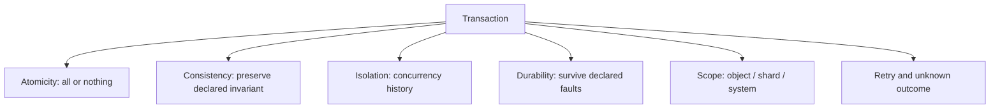

ACID 四字母外，scope 与 retry semantics 同样不可省略。

### 8.3 anomaly dependency ladder

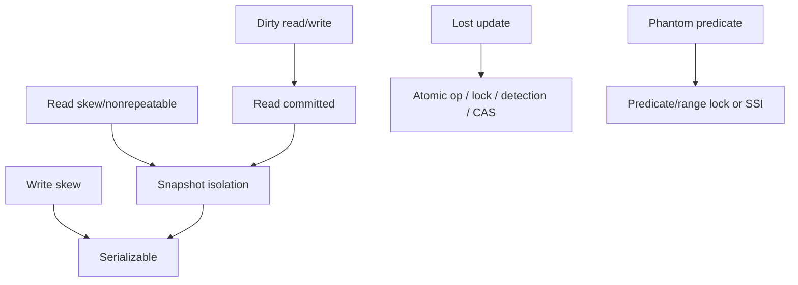

更强 level 累积保护，但产品实现仍需针对 anomaly 验证。

### 8.4 MVCC dataflow

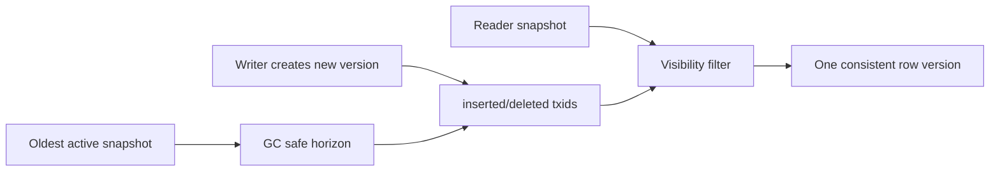

nonblocking read 的代价是多版本 retention 与 GC。

### 8.5 read-write conflict taxonomy

| conflict | dependency shape | 例子 |
|---|---|---|
| dirty write | W→W on uncommitted object | buyer/invoice mixing |
| lost update | R(old)→W, same object | counter 42→43 twice |
| write skew | overlapping R sets, different W sets | doctors off call |
| phantom | predicate R, matching later W | room booking insert |

同 object write conflict 只是完整 dependency space 的一部分。

### 8.6 serializable implementation map

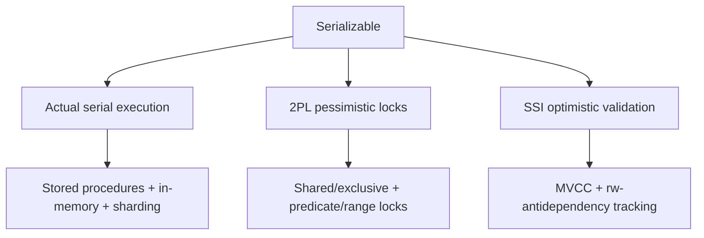

选择依据是 contention、duration、core/shard locality、tail 与 retry cost。

### 8.7 2PL/2PC 对照

| 维度 | 2PL | 2PC |
|---|---|---|
| 全称 | two-phase locking | two-phase commit |
| 问题 | serializable isolation | distributed atomic commit |
| phases | growing/shrinking locks | prepare/decision |
| failure symptom | wait/deadlock | in-doubt/blocking |
| 可叠加 | 是 | 是 |

### 8.8 2PC promise chain

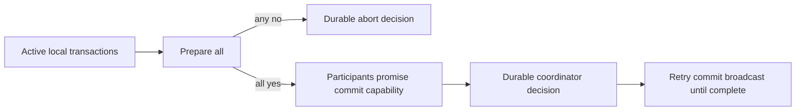

durable promise 而非 reliable network 是 atomicity 的核心。

### 8.9 distributed transaction layers

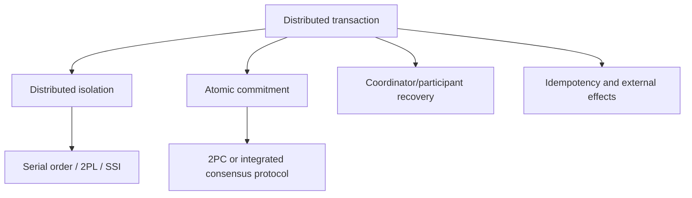

只实现其中一层不能推导其他层 guarantees。

### 8.10 exactly-once crash proof

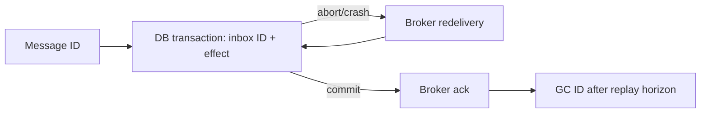

commit 后 ack 丢失只造成 duplicate attempt，inbox unique ID 阻止 duplicate effect。

### 8.11 公式速查

| 主题 | 公式 | 含义 |
|---|---|---|
| invariant preservation | $s\in S_{valid}\Rightarrow T(s)\in S_{valid}$ | commit 保持合法集合 |
| MVCC visibility | creator committed 且 deleter 未 committed | snapshot 选择版本 |
| optimistic attempts | $E[attempts]=1/s$ | success rate 降低放大重试 |
| useful SSI throughput | $attempts\times(1-abortRate)$ | abort 消耗无效 work |
| 2PC decision | $commit\iff\bigwedge vote_i=yes$ | all yes 才 commit |
| prepared lock | $LockHold\ge RecoveryTime$ | coordinator outage 放大 blocking |
| idempotence | $process(m)^n\equiv process(m)$ | 重放效果不增加 |

### 8.12 全章因果链

```text
multi-step failure or concurrent access
  -> define invariant and transaction scope
  -> choose isolation by forbidden anomalies
  -> implement with serial / 2PL / SSI
  -> define durability acknowledgment
  -> extend atomic commit across participants if needed
  -> handle timeout, retry, external effects, and recovery
```

事务设计的核心不是背术语，而是把每个 bad history 变成 protocol 明确禁止或 application 明确补偿的结果。

---

## 9. 综合案例：订单、库存、账务、支付与消息的事务设计

### 9.1 场景与目标

设计一个全球 commerce platform：client 提交 checkout，系统要创建 order、预留 inventory、记录 balanced ledger、调用 external payment provider，并通过 message broker 驱动 fulfillment/email。

要求：

- API retry 不重复下单/扣款；
- inventory 不为负；
- ledger 借贷平衡；
- order state transition 合法；
- external payment/network failure 可恢复；
- analytics/report 不读混合时点；
- database sharded/replicated，region/AZ failure 有明确 outcome。

### 9.2 先声明 invariants

1. 每 `(merchant_id,idempotency_key)` 最多一个 order；
2. `reserved + sold <= stock`；
3. 每 ledger transaction：

$$
\sum entries.amount=0
$$

4. order state 只按 allowed graph 转移；
5. 每 provider charge ID 对应最多一次 committed charge intent；
6. fulfillment message 对同 order/version 最多生效一次；
7. acknowledged database commit 满足声明 durability boundary。

### 9.3 划分 transaction scopes

| scope | 机制 |
|---|---|
| 同 shard order rows/indexes/outbox | local ACID transaction |
| inventory/ledger 跨 DB shards | database-internal distributed serializable transaction |
| external payment API | durable workflow + idempotency + compensation |
| broker delivery → DB effect | inbox unique ID + DB transaction |
| analytics/search | asynchronous read model + snapshot/watermark |

不是所有步骤强行放一个 XA transaction，而是按可控 atomic boundary 分层。

### 9.4 architecture overview

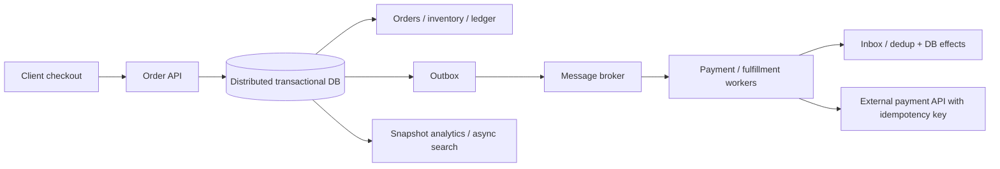

database 是 authoritative transaction state；broker 与 external APIs 通过 durable protocol连接。

### 9.5 idempotent command ingress

checkout request 携带 client-generated idempotency key。database 用 unique constraint：

```sql
UNIQUE (merchant_id, idempotency_key)
```

first request 创建 command/order result；duplicate request 返回已存 result，而不是重新执行。

### 9.6 create-order local transaction

同 shard transaction 写：

- order header/items；
- initial state `PENDING_PAYMENT`；
- idempotency result；
- outbox `PaymentRequested` event。

任一 constraint/index/write 失败全部 rollback，避免 order 存在但 payment intent 缺失。

### 9.7 inventory atomic decrement

单 SKU 可用 conditional atomic update：

```sql
UPDATE inventory
SET available = available - :qty,
    reserved = reserved + :qty
WHERE sku = :sku AND available >= :qty;
```

affected rows=1 才成功；database 在 current row 上执行，防 lost update 与 oversell。

### 9.8 multi-SKU inventory

order 含多个 SKUs，必须 all reserve 或 none。若 rows 同 shard，可 local transaction + fixed lock order；跨 shards 则 internal distributed transaction/serializable protocol。

部分 reserve 后 application 手工 rollback 容易因 crash 留 reservation leak。

### 9.9 write skew 风险

若 inventory 由多个 warehouse rows 合计，两个 transactions 各查询 aggregate available，再分别 reserve 不同 warehouse rows，snapshot isolation 下可共同超出 global limit。

需要 serializable isolation、materialized quota row/escrow，或重定义 invariant 为每 warehouse local capacity。

### 9.10 coupon/unique claim

“先 SELECT coupon 未使用，再 INSERT redemption”在 SI 下有 phantom race。使用 unique constraint `(coupon_id, customer_id or global_scope)`，让 concurrent second claim abort。

declarative conflict 比 application check-then-insert 更可靠。

### 9.11 balanced ledger

payment/reservation 不只更新 mutable balance，而写 immutable debit/credit entries；同 ledger transaction ID 下 amounts sum 0。transaction 在 commit 前校验/materialize balance。

append-only audit 帮助 reconciliation，但 atomicity/isolation 仍需保证 entries 不半写。

### 9.12 isolation-level choice

- ordinary point reads/list pages：read committed 或 SI；
- reporting/reconciliation：consistent MVCC snapshot；
- inventory/quota/coupon/ledger invariant：serializable 或 explicit database constraint/atomic op；
- read-only search：允许 asynchronous lag，但显示 watermark。

不是整个 system 一个 level；每 invariant path 必须显式要求。

### 9.13 database-internal cross-shard transaction

order、inventory、ledger 若位于不同 shards，distributed DB 用 replicated coordinator + participant shard consensus + 2PC/SSI 等确保：

- all shard writes commit/abort；
- serialization conflicts 被检测；
- coordinator failover 后 decision 可恢复。

这比 application 对各 shards 逐一调用更安全。

### 9.14 transaction retry closure

serialization/deadlock abort 时，从 fresh state 重新执行整个 closure：重新检查 inventory、price version、coupon 和 ledger premise。不能只 retry 最后一条 stale `UPDATE`。

retry 使用 bounded exponential backoff+jitter，并记录 attempts/abort reason。

### 9.15 unknown commit outcome

client 发送 COMMIT 后 timeout：order 可能已 commit。client 用相同 idempotency key 重试/status query：

- record 存在：返回 original order/result；
- 不存在且 authoritative check complete：重新执行；
- status uncertain：继续查询/reconcile，不重复 external charge。

### 9.16 为什么 external payment 不直接纳入 XA

多数 payment APIs 不支持 XA prepare；即使支持，human/network workflow 可能很长，prepared locks/resources 不可接受。provider 自身还有不可回滚 settlement。

因此 external step 用 durable state machine，而非长 database transaction。

### 9.17 checkout workflow state machine

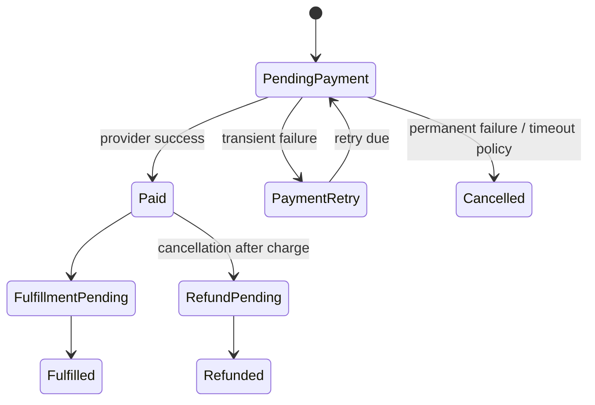

每 transition 用 expected-version CAS/serializable transaction，防 concurrent workers 重复推进。

### 9.18 payment idempotency

outbox event 带 stable `payment_attempt_id`，provider request 使用同 idempotency key。timeout retry 不创建第二 charge；provider status lookup 解决 unknown outcome。

response 与 workflow state durable 保存，不能只在 worker memory。

### 9.19 transactional outbox

order state 与 outbound event 同 DB transaction commit：

```text
business rows + outbox row -> one commit
```

publisher 从 outbox 至少一次发送；发送成功后标记/compact。这样 DB commit 后不会因 process crash 永久漏 message。

### 9.20 broker delivery 与 inbox

consumer 在同 transaction insert `(consumer,message_id)` unique inbox row并写 fulfillment/payment result。redelivery 查到 duplicate 后 skip effect、仍 ack。

outbox 解决“已 commit 但未发布”，inbox 解决“重复 delivery 重复生效”。

### 9.21 order transition CAS

worker 更新：

```sql
UPDATE orders
SET state = 'PAID', version = version + 1
WHERE id = :id
  AND state = 'PENDING_PAYMENT'
  AND version = :expected_version;
```

0 rows 表示另 worker/compensation 已推进，必须 reread，不可强行 overwrite。

### 9.22 compensation 而非 rollback history

payment 已成功、inventory 后来无法履约，不能 retroactively rollback provider charge；workflow 发 refund，并写 reversing ledger entries。

compensation 是新的 auditable business transaction，不是假装原 transaction 从未发生。

### 9.23 read models 与 stale data

search/analytics 从 CDC/outbox 建 materialized views，允许 lag。authoritative command 不依赖 stale search result维护 invariant；UI 对刚提交 order 直接合并 local result或等待 watermark。

derived view 可 rebuild，不参加每次 checkout distributed commit。

### 9.24 snapshot reporting

daily financial report 在 MVCC consistent snapshot 上读取 ledger/orders，避免一半 transfer 前、一半后。长 read-only snapshot 不阻塞 writers，但要限制 duration，避免 version bloat。

report 记录 snapshot timestamp/log position 以便 audit reproducibility。

### 9.25 durability boundary

checkout `success` 前等待 database shard consensus quorum/WAL durable；outbox 已在同 commit。external payment 尚未完成则返回 accepted/pending，而非谎称 paid。

API 分清：`order committed`、`payment confirmed`、`fulfillment completed` 三个 durability/visibility milestones。

### 9.26 backup 与 reconciliation

- immutable PITR backups + restore drill；
- ledger sum/DB vs provider settlement reconciliation；
- inventory reservation expiry/reconciliation；
- outbox stuck/inbox duplicate metrics；
- orphan workflow scan。

transaction 保证一次 boundary，不替代长期 end-to-end reconciliation。

### 9.27 fault-injection matrix

| 故障 | 必须验证 |
|---|---|
| crash after order commit before publish | outbox later publishes |
| broker duplicate | inbox prevents duplicate effect |
| provider timeout after charge | same ID/status avoids double charge |
| serialization abort | whole closure retries fresh |
| coordinator failover during prepare | internal decision recovers, no mixed commit |
| shard/AZ loss | declared durability/isolation maintained |
| indexer lag | authoritative path unaffected, watermark visible |
| backup corruption | restore verification detects |

### 9.28 observability

监控：transaction latency/abort/deadlock、lock wait、SSI conflict、2PC prepare/in-doubt age、cross-shard participant count、idempotency hit、outbox lag、inbox duplicate、provider unknown outcome、workflow stuck state、ledger reconciliation delta。

按 invariant/customer impact 告警，而不是只看 DB CPU。

### 9.29 capacity 与 contention

若 base traffic $\lambda$，平均 attempts $1/s$，实际 attempt load 约：

$$
\lambda_{attempt}=\frac{\lambda}{s}
$$

hot SKU/coupon 可让 $s$ 降低并形成 retry storm。对 hot resource 使用 queue/admission、atomic operation、reservation partition 或 pessimistic serialization，而非无限 optimistic retry。

### 9.30 综合案例结论

完整 correctness 不是一个超大 XA transaction，而是层次化 boundaries：database 内强 atomic/serializable transaction 保护核心 invariants；outbox/inbox 与 idempotency 跨 broker；durable workflow/compensation 跨 payment；snapshot/report/reconciliation 验证长期状态。

每个 `success`、timeout 和 retry 都有明确 persisted evidence 与恢复路径。

---

## 10. 核心结论

### 10.1 三十二条核心结论

1. transaction 的首要价值是把大量 partial-failure states 压缩成 commit 或 abort。
2. atomicity 主要是 abortability，不等于 concurrency isolation。
3. ACID consistency 是 application invariant，依赖 constraints、logic 与 isolation。
4. isolation level 应按禁止的 anomalies 理解，不按产品标签猜测。
5. durability 是针对 failure model 的风险降低，绝非绝对不丢。
6. replication、disk、checksum、backup 与 restore drill 覆盖不同 failure classes。
7. single-object atomic/linearizable operation 不能自动组合成 multi-object transaction。
8. multi-put/API batching 不必然 all-or-nothing。
9. transaction timeout 可能是 unknown commit outcome，而非确定 abort。
10. safe retry 需要 transient classification、fresh reread、budget/backoff 与 idempotency。
11. read committed 阻止 dirty read/write，但允许 read skew、lost update 与 write skew。
12. snapshot isolation 用 consistent snapshot 阻止 mixed-time reads。
13. MVCC 是多版本实现技术，不等于某一个 isolation guarantee。
14. long snapshot 的代价是 old-version retention、GC/vacuum pressure。
15. lost update 来自 stale read-modify-write，可用 atomic op、lock、detection 或 CAS。
16. no dirty write 不能推出 no lost update。
17. write skew 是共享 read premise + 不同 write objects 的 race。
18. phantom 是 concurrent write 改变先前 search predicate result。
19. true serializability 是一般性阻止 write skew/phantom 的方案。
20. actual serial execution 靠短、in-memory、stored procedure 让单线程高效。
21. 2PL 用 pessimistic shared/exclusive/predicate locks 换 serializability。
22. 2PL 会产生 blocking、deadlock、convoy 与不稳定 tail latency。
23. SSI 在 snapshot 上 optimistic 执行，以 dependency validation/abort 换 nonblocking reads。
24. SSI 性能主要取决于 contention、transaction duration 与 abort/retry rate。
25. 2PL 解决 isolation；2PC 解决 distributed atomic commit，二者不是同一协议。
26. 2PC 的安全来自 participant/coordinator 的 durable promises，而非可靠网络。
27. prepared participant 不能 timeout 后自行决定，故 2PC 是 blocking protocol。
28. XA 跨异构 systems 受 application-local coordinator 与 lowest common denominator 限制。
29. database-internal distributed transaction 可用 consensus coordinator和统一 concurrency control 改善。
30. exactly-once 通常是 repeated delivery 下的 deduplicated committed effect，不是网络只传一次。
31. inbox/outbox/idempotency 能缩小跨系统 atomic coordination scope。
32. transaction 不能替代 audit、reconciliation、external compensation 与 fault testing。

---

## 11. 设计事务系统的一般方法

### 11.1 第一步：写出 invariants 与 bad states

不要先选 isolation 名称。明确余额不负、唯一 claim、references valid、ledger balanced、状态转移、索引同步等，并写出不可接受 history。

### 11.2 第二步：确定 object 与 transaction boundary

列出一次 logical operation 读写哪些 rows/documents/indexes/shards/systems。能合理 colocate 为 single aggregate 时可简化，但避免制造巨大 hot object。

### 11.3 第三步：建立 failure timeline

在每条 statement、WAL flush、COMMIT send/response、message ack、external API call 前后插 crash/network loss，判断 persisted state 与 client knowledge。

特别区分 committed、aborted、unknown outcome。

### 11.4 第四步：按 anomaly 选择 isolation

- 只需 no dirty state：read committed；
- consistent long reads：snapshot isolation；
- lost update：atomic op/lock/detection/CAS；
- write skew/phantom invariant：serializable/constraint/predicate protection。

以产品实际行为测试，不只看 level 名称。

### 11.5 第五步：优先 declarative constraint/atomic intent

unique/FK/check/exclusion 与 `SET x=x+1` 让 database 看见 conflict，通常比 application precheck/full-object save 更可靠。

把 final stale value 改写成 operation intent。

### 11.6 第六步：若需 serializable，选 execution architecture

根据 workload：

- short in-memory single-shard：actual serial；
- high contention、可 wait：2PL；
- moderate contention、read-heavy、需 scalable：SSI。

测 p99、abort、deadlock、participant count，不只平均 QPS。

### 11.7 第七步：保持 transaction 短小

不等待 human、remote HTTP、slow analytics。减少 read/write set、固定 lock order，long read-only 用 snapshot，long business process 用 durable workflow。

### 11.8 第八步：设计 retry 与 idempotency

定义可 retry error codes、max attempts、backoff+jitter、fresh closure。为 command/external request 使用 stable idempotency key，保存 original result。

unknown commit 不盲目重放。

### 11.9 第九步：声明 durability acknowledgment

success 前是否等待 local WAL fsync、replica quorum、cross-AZ/region？写出 tolerated faults、RPO/RTO，并组合 checksum、backup、scrub、restore test。

### 11.10 第十步：把 distributed isolation 与 atomic commit 分开设计

跨 shards 时分别确认：global snapshot/serial order由谁保证？all participants outcome由谁保证？2PC 不自动补 isolation，SSI/2PL 不自动补 atomic commit。

### 11.11 第十一步：选择 internal transaction、XA 或 workflow

- 同一 distributed DB：优先其 internal transaction；
- 所有 heterogeneous resources 成熟支持 XA、短 scope且强 atomicity 必需：谨慎 XA；
- external APIs/long process：workflow + idempotency + compensation。

### 11.12 第十二步：设计 message boundary

DB→broker 用 transactional outbox；broker→DB 用 inbox/dedup；commit 后 ack；dedup retention 覆盖 replay horizon。external receiver 同样需要 idempotency。

### 11.13 第十三步：设计 coordinator/participant recovery

prepared state、decision log、locks/intents 必须 crash-safe。监控 in-doubt age，演练 coordinator failover/log recovery，准备 manual/heuristic runbook 但不常规破坏 atomicity。

### 11.14 第十四步：建立 observability 与 reconciliation

监控 abort/deadlock/lock wait/SSI conflict/2PC prepare/outbox/inbox/unknown outcomes；用 ledger、checksum、source-vs-view reconciliation 捕获 transaction boundary 外错误。

### 11.15 第十五步：做 deterministic concurrency/fault tests

构造 dirty/read skew、lost update、write skew、phantom histories；注入 commit-response loss、disk full、node pause、coordinator crash、duplicate message。断言 invariants 与最终 recovery。

### 11.16 第十六步：把 contract 写入 ADR/API

```text
transaction and invariant scope:
atomicity and partial-failure behavior:
isolation level and explicitly forbidden anomalies:
durability acknowledgment and failure model:
single-shard vs distributed participants:
commit protocol and coordinator recovery:
timeout / unknown-outcome semantics:
retry, idempotency, and dedup retention:
external side effects / outbox / compensation:
backup, reconciliation, metrics, and fault tests:
known non-guarantees:
```

方法的核心顺序是：**先定义 invariant 和 bad history，再选择最小但充分的 atomicity/isolation scope；随后声明 durability 与 distributed commit，最后用 idempotency、recovery、reconciliation 和 fault testing 把边界闭合。**
