> 对应原文：9. The Trouble with Distributed Systems.md
>
> 本文严格按照原章顺序讲解，并在章后统一补充易混概念、综合案例和可复用的分布式系统推理方法。原章重点是 partial failure、不可靠网络、不可靠时钟、知识与真相、system model，以及 formal methods 和 deterministic testing。文中的公式、推导、可运行示例与扩展案例用于解释和验证原理，不应误认为原书逐字给出的实现。

## 0. 本章定位：在无法确定发生了什么时，系统仍要保持正确

### 0.1 可靠性要求改变思维方式

可靠系统不是只在 happy path 上工作，而是在某些 components、networks、clocks 和 processes 出错时，整体仍满足预先声明的 safety/liveness properties。

开发时最自然的倾向是先处理常见成功路径，把低概率故障视为 edge case；分布式系统却要求反过来问：

- request 是否根本没有到达？
- remote node 是否处理了却丢了 response？
- node 是 dead、slow、paused，还是只有某条 link broken？
- 两台机器的 clocks 谁更接近真实时间？
- old leader 是否仍在执行 delayed request？
- 多数 nodes 的判断何时能代表系统事实？

### 0.2 one-in-a-million 在大系统中会天天发生

若某 fault 单次概率为 $p=10^{-6}$，系统每天执行 $N=10^9$ 次相关操作，则期望故障次数为：

$$
E[faults/day]=N\cdot p=10^3
$$

即每天期望约 1,000 次。单次看极低概率，在大规模、高频、长期运行下会成为常态。系统设计应基于 exposure，而不是只看单次概率。

### 0.3 “能出错的终会出错”不是宿命论

这句话的工程含义不是放弃可靠性，而是：

1. 枚举 fault classes；
2. 定义每类 fault 下允许/禁止的 behavior；
3. 让 protocol 保持 safety；
4. 让 recovery 最终恢复 liveness；
5. 通过 fault injection 和 deterministic simulation 验证。

悲观假设用于构造更可靠的系统，而不是证明系统不可做。

### 0.4 单机与分布式系统的根本差异

单机程序通常有一个相对统一的 fate：machine working 时 instructions、memory 与 control flow 大体可预测；machine crash 时整个 process 停止。

分布式系统由多个独立 failure domains 组成：A working、B paused、C unreachable、D response delayed 可以同时成立。系统没有一个观察者能瞬间看到全局真实状态。

### 0.5 partial failure

**partial failure** 指系统的一部分失效，其他部分仍正常。例如：

- 一个 rack 断电，其他 racks 继续；
- client 到 leader link broken，但 followers 互通；
- process GC pause，OS/network 仍运行；
- request 已执行，response 丢失；
- one direction packet loss，reverse direction 正常。

这比 total crash 难，因为 remaining components 必须在信息不完整时继续作决定。

### 0.6 uncertainty 比 failure 本身更难

若明确知道 remote node dead，可以 failover；真正困难是 no response 的多义性：

$$
NoResponse\in\{RequestLost,Queued,NodeDown,NodePaused,ResponseLost,ResponseDelayed\}
$$

这些原因对下一步正确动作可能不同，却在 asynchronous network 中不可区分。

### 0.7 本章的三类不可靠基础

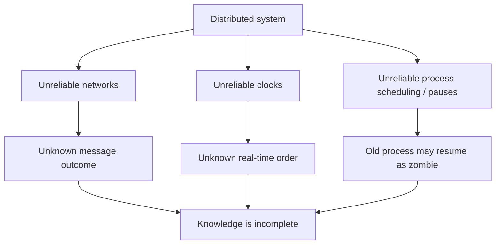

后半章再研究如何从 majority、fencing、system model 和 formal reasoning 中建立可依赖的“事实”。

### 0.8 safety 与 liveness 的预告

- **safety**：坏事永远不发生，例如两个 leaders 不同时修改同一 resource；
- **liveness**：好事最终发生，例如 request 最终完成、cluster 最终选出 leader。

网络 partition 时，protocol 常为保护 safety 暂停进展；恢复后再恢复 liveness。后文会正式定义二者。

### 0.9 timeout 是信息不足下的 policy

timeout 不证明 node dead，只表示“在等待预算内没收到 response”。它是基于风险与用户需求作出的 policy：继续等、retry、failover 或返回 error。

因此 timeout 结果应称 suspected/unavailable，而非把 epistemic uncertainty 误写成物理事实。

### 0.10 本章与前后章节的关系

- 第 6–8 章讨论 replication、sharding、transactions 的机制；
- 本章解释这些机制必须面对的 physical failure/timing reality；
- 第 10 章再讨论 linearizability、consensus 等如何在这种现实中建立强保证。

本章不是算法目录，而是后续一致性算法的故障模型基础。

### 0.11 本章核心问题

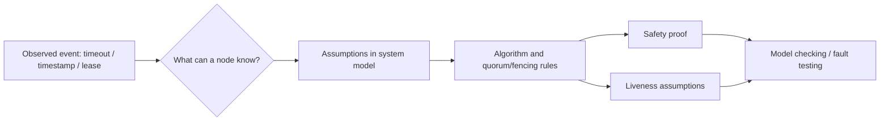

正确性不来自“网络通常很快”，而来自：即使 observation 有歧义，protocol 也不作出破坏 safety 的决定。

### 0.12 本章阅读主线

原章按以下顺序推进：

1. faults 与 partial failures；
2. asynchronous packet network、TCP、timeout 与 unbounded delay；
3. time-of-day/monotonic clocks、clock sync 与 process pause；
4. majority、distributed lock/lease、fencing 与 Byzantine faults；
5. system models、correctness、safety/liveness；
6. formal specification、fault injection、deterministic simulation。

主线是从“无法知道发生了什么”走向“在明确 assumptions 下仍能证明什么”。

---

## 1. Faults and Partial Failures

### 1.1 单机为什么显得更确定

在 hardware 正常时，同一 deterministic program 对同一 input 通常产生同一 result。bug 可能让软件偶发错误，但这不是单机模型的必然属性。

开发者因此习惯把 machine 看成一个确定性状态机：

$$
state_{t+1}=f(state_t,input_t)
$$

### 1.2 单机常呈现 fail-stop 外观

memory corruption、loose connector 等严重 hardware problem 往往导致 kernel panic、blue screen of death、无法启动等 total failure。理想化 **fail-stop** behavior 是：component 要么给正确结果，要么停止，不悄悄给错结果。

现实硬件并非严格 fail-stop，但系统层努力接近这种 abstraction。

### 1.3 为什么宁愿 crash 而不是返回错误结果

显式 crash 容易检测、隔离和恢复；silent wrong result 会污染 downstream state、replicas 和 backups，且可能很久后才发现。

因此 checksums、ECC、assertion、process crash 等机制常选择 fail fast，将 fuzzy physical failure 转成较清晰的 stop signal。

### 1.4 idealized system model

计算机对 programmer 呈现数学化的理想模型：CPU instruction 稳定、memory/disk write 保持、process state 可重复。底层 transistor、磁介质与电源的噪声被硬件/OS abstraction 隐藏。

这种 abstraction 不是绝对真相，而是 rare silent corruption 足够低时的有用近似。

### 1.5 分布式系统不能忽略 physical messiness

nodes、switches、power domains、software versions、VM schedulers 和 links 独立变化，fault frequency 与组合数大幅增加。即使每个 component 很可靠，系统长期至少一处异常的概率也很高。

若 $n$ 个 components 独立、每个在窗口内正常概率 $q$，全体同时正常概率为：

$$
P(all\ healthy)=q^n
$$

$n$ 增大时该值下降；现实 correlated faults 又使简单独立模型不充分。

### 1.6 真实故障的宽度

原章引用 Coda Hale 的经历：单 datacenter 内 long-lived network partition、PDU failure、switch failure、整 rack accidental power cycle、DC backbone/power failure，甚至车辆撞坏 HVAC。

案例的意义是 failure source 跨 software、hardware、power、network、human 与 physical environment，无法只测试 process crash。

### 1.7 partial failure 的组合状态

若有 $n$ 个 components，每个简化为 working/failed，仅 health combinations 就有：

$$
2^n
$$

真实还包括 slow、partitioned、one-way、stale、corrupt 等状态，state space 更大。穷举现实所有 interleavings 几乎不可能，需要抽象 system model 与 systematic testing。

### 1.8 partial failure 为什么 nondeterministic

一次 RPC 结果取决于 queue、scheduler、packet loss、remote state 和 concurrent load。相同 input 在不同时刻可能 success、timeout、duplicate 或 unknown outcome。

这种 **nondeterminism** 不是 application random bug，而是系统观察不到外部 timing/fault choices。

### 1.9 “不知道是否成功”

client timeout 时，remote operation 可能：

- 未收到；
- 收到但未执行；
- 已执行未 commit；
- 已 commit但 response lost；
- 仍 queued，稍后执行。

因此 retry non-idempotent operation 可能 duplicate；不 retry 又可能漏执行。

### 1.10 fault tolerance 的反直觉收益

partial failure 虽让系统难设计，但能容忍它后，distributed system 可比 single node 更 available：某 node 重启/升级时，其他 nodes继续服务。

可靠整体可以由不完全可靠 components 构成，前提是 faults 不同时突破 protocol 的 tolerance assumptions。

### 1.11 rolling upgrade

rolling upgrade 逐 node 安装新 software：

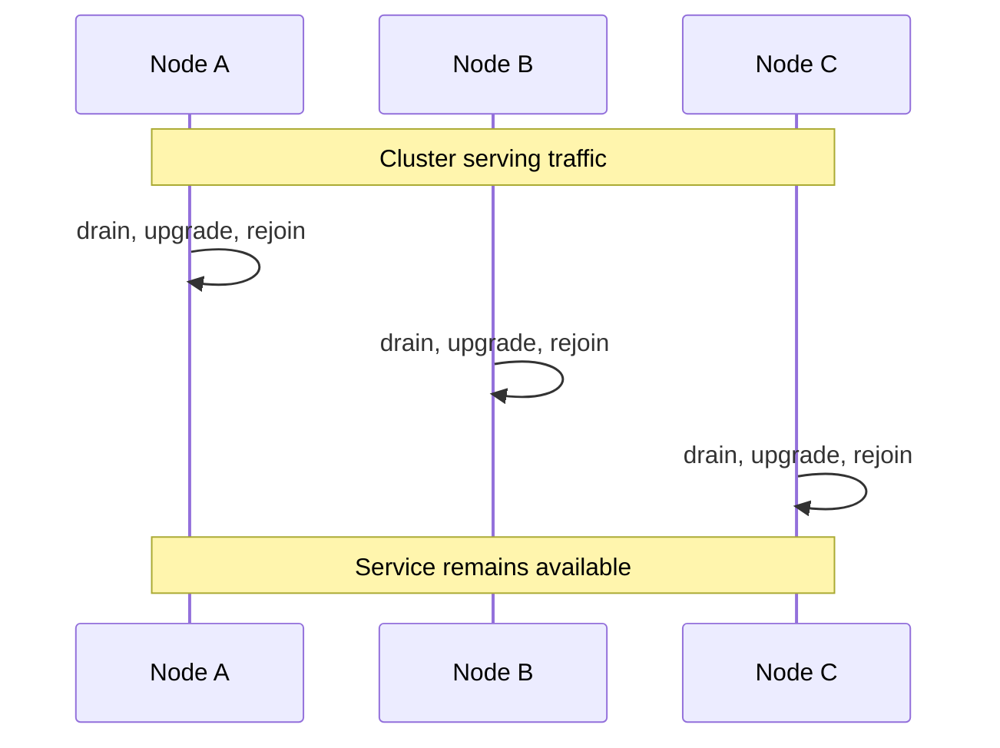

它把 planned maintenance 当作 controlled partial failure，是 fault tolerance 的直接运营价值。

### 1.12 tolerance 有明确上限

“容忍 partial failure”不是任意多 failures 都可继续。quorum system 可能容忍 $f$ nodes；replication 可能要求特定 failure-domain independence；network partition 下某一侧必须停止写。

design 必须写明 fault budget，而不是泛称 highly available。

### 1.13 wide fault enumeration

至少考虑：

- crash-stop 与 restart；
- slow/paused process；
- packet loss、delay、duplication、reordering；
- one-way/asymmetric partition；
- clock drift/jump；
- disk full/corruption；
- stale process/zombie；
- configuration/operator error；
- correlated rack/region failure；
- malicious/Byzantine behavior（若 threat model 需要）。

### 1.14 artificially create faults

只在 production 等 fault 出现无法建立信心。test environment 应主动：kill process、pause VM、delay/drop packets、skew clocks、fill disks、partition subgroups、reorder messages。

fault injection 不只测“是否报错”，还要断言 safety、recovery 和 resource cleanup。

### 1.15 suspicion、pessimism 与 paranoia 的工程含义

原章说在 distributed systems 中怀疑、悲观和偏执会有回报。具体实践是：

- 不把 no response 当作 definite failure；
- 不把 local clock 当作 global truth；
- 不让 expired lease holder 继续写；
- 不信任 unversioned delayed message；
- 不依赖从未测试的 failover；
- 为 every irreversible action 寻找 durable evidence。

### 1.16 本节结论

单机常提供 deterministic/fail-stop 的有用外观；distributed system 的本质困难是 nondeterministic partial failure 与知识不完整。fault tolerance 通过 replication、quorum、fencing 与 recovery 在明确 fault budget 下维持整体。

要获得这种能力，必须把 rare faults 当作正常输入，并在测试中主动制造，而不是把它们留作未定义 edge case。

---

## 2. Unreliable Networks

### 2.1 shared-nothing 前提

本书讨论的 distributed systems 多为 **shared-nothing systems**：每台 machine 有自己的 memory/disk，nodes 只能通过 network message 交流；一个 node 不能直接读另一个 node 的 RAM/disk。

即使使用 object storage，compute nodes 也通过 network 与 storage service 通信，因此 network 仍在 correctness/availability path 上。

### 2.2 从单机冗余到跨机复制

传统 mainframe 常在单机内部以 RAID、冗余电源/组件提高可靠性；shared-nothing 则把 replicas 放在独立 machines/failure domains。

它改善 scale/fault isolation，却把 communication uncertainty 引入每个 coordination decision。

### 2.3 asynchronous packet network

internet 与 datacenter Ethernet/IP 多是 **asynchronous packet networks**：sender 可发 packet，但 network 不保证：

- packet 一定到达；
- 到达时间有上界；
- 顺序不变；
- 不重复；
- response 一定返回。

“asynchronous”在此主要指 delay 没有已知有限上界。

### 2.4 request 可能丢失

cable unplug、switch/router fault、buffer overflow、routing error 都可让 request 在到达 remote node 前消失。remote application 对该 operation 一无所知。

### 2.5 request 可能只是在 queue 中

network switch、sender OS、receiver kernel、application queue 都可积压。client timeout 时，request 可能尚未执行，却在稍后被 delivery 并执行。

这使“我已经放弃”等于 local policy，不会从 network 中撤回 in-flight message。

### 2.6 remote node 可能 failed

remote process crash、machine power-off、kernel panic 等让 request 无法处理。但 sender 通常只观察 no response，无法直接看到 remote physical state。

### 2.7 remote node 可能 paused

long GC pause、VM descheduling、CPU starvation、disk stall 可让 process 暂停回应，之后恢复并继续执行 queued work。

paused 与 dead 对 timeout observer 暂时相同，恢复后却可能成为 stale/zombie actor。

### 2.8 response 可能丢失

remote node 已完整处理并 durable commit，response 在 reverse path 丢失。client 只见 timeout，若 retry non-idempotent operation 可能重复 effect。

### 2.9 response 可能 delayed

response 也可能在 queue/route 中延迟，client timeout 后很久才到。application 必须忽略/关联 stale response，不能把它错误匹配给后续 request。

### 2.10 六种情况对照

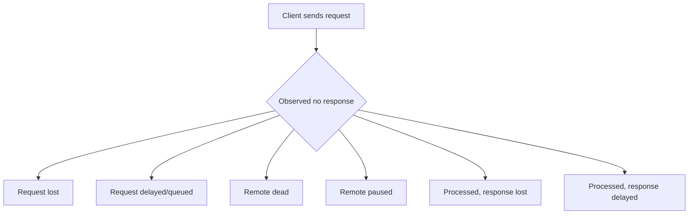

sender 的 observation 完全相同，remote effect 却从 zero 到 committed 不等。

### 2.11 application outcome 的三值逻辑

从 caller 视角，operation outcome 常是：

$$
Outcome\in\{Succeeded,Failed,Unknown\}
$$

timeout/connection error 很多时候是 `Unknown`，不是 `Failed`。API 若只返回 success/error 二值，就把 uncertainty 隐藏给 caller。

### 2.12 response 也依赖不可靠 network

recipient 可发送 acknowledgment，但 ack packet 仍会丢/延迟。再对 ack 发 ack 会无限递归，无法通过有限 messages 获得双方绝对共同知识。

protocol 只能在 assumptions 下建立足够 evidence，例如 quorum durable records、idempotent retry 或 consensus commit。

### 2.13 timeout 的作用

等待某 duration 后停止 blocking，触发 retry/failover/error。timeout 提供 bounded local waiting，不提供 remote-state oracle。

timeout 后 original request 仍可能执行，所以 cancellation 也需 request ID/epoch/lease 等 server-side validation。

### 2.14 The Limitations of TCP

application message 常大于单 packet（packet 一般数 KB）。**Transmission Control Protocol（TCP）**提供 connection-oriented byte stream，把 large stream 分 packets、传输、重排并重新组装。

### 2.15 TCP 的“可靠”具体指什么

在一条 connection 内，TCP 尝试：

- checksum 检测 corruption；
- sequence number 检测 loss/reorder；
- retransmit lost packets；
- deduplicate retransmissions；
- in-order byte delivery；
- congestion control、flow control/backpressure。

这比 raw packet API 方便得多，但 reliability scope 只到 transport stream。

### 2.16 类似 transport protocols

原章指出大部分讨论也适用于 QUIC、WebRTC 使用的 SCTP、BitTorrent uTP 等：它们改善 connection/multiplexing/transport behavior，仍不能在物理 partition 中保证 application request 最终处理。

### 2.17 socket write 不等于 wire send

application 写 socket 后，bytes 先进入 sender OS buffer。congestion-control algorithm 决定何时取 packet 发送到 network interface。

因此 `send/write` success 多半只表示 local kernel 接受 bytes，不表示 packet 已离开 machine。

### 2.18 network path 上的 buffers

packet 经过 switches/routers，各处可能 queue/drop；receiver kernel 收 packet后放 receive buffer，并发送 TCP acknowledgment，随后才通知 application 可读。


### 2.19 congestion control / flow control / backpressure

- congestion control：避免把 network path 压垮；
- flow control：避免 sender 超过 receiver buffer/consumption；
- backpressure：上游因下游 capacity 减速。

这些机制提高整体稳定性，却引入 sender-side queueing 和 variable delay。

### 2.20 TCP 如何判断 packet loss

未在 retransmission timeout 内收到 acknowledgment，TCP 推测 packet/ack lost 并 retransmit。它无法知道丢的是 outbound packet 还是 ACK，也无法保证 retransmission 一定通过。

### 2.21 physical disconnection 无法由 TCP 修复

cable unplug、routing partition 时，TCP 可重试并延后报错，却不能恢复 physical path。最终 configurable timeout 后向 application signal error。

transport retry 把 packet loss 隐藏成更长 latency，而不是消除 fault。

### 2.22 reconnect 后可能 duplicate

TCP sequence/dedup state 只属于一条 connection。connection error 后 application 建新 connection并重发 request，remote 可能已在旧 connection 上处理，于是 duplicate。

需要 application-level request ID/idempotency key，而非依赖 TCP dedup。

### 2.23 connection close 后不知道处理到哪里

TCP error 不能告诉 sender remote application 已消费多少 bytes/messages。即使 kernel ACK 某 packet，也只证明 receiver kernel 收到，不证明 application parsed、validated、committed。

### 2.24 transport ACK 与 application ACK

```text
TCP ACK: receiver kernel accepted bytes
Application response: application processed request to a defined stage
Durable commit token: state survived declared failures
```

三层 evidence 不同。要确认业务 success，必须有 application-level positive response/status lookup。

### 2.25 framing messages over byte stream

TCP 没有 message boundaries。HTTP/RPC 常先发 length/header，再发 payload；receiver 从 stream 解码多个 requests/responses。

partial connection close 时可能只有 half frame，parser 必须丢弃 incomplete message，不把 bytes 与下一 connection 混合。

### 2.26 TCP 的真正价值

TCP 提供可复用 connection、large ordered byte stream、loss retransmission 和 congestion adaptation，大幅简化 application protocol。

它不承诺 exactly-once RPC、bounded latency、remote liveness、application processing 或 durable effect。

### 2.27 Network Faults in Practice

几十年 network engineering 仍未消除 faults。即使单公司控制的 datacenter，hardware、software、configuration、human 与 topology interactions 都会导致 outages。

### 2.28 datacenter fault frequency

原章引用一项 medium-sized datacenter study：约每月 12 次 network faults，其中一半只断开单 machine，一半断开 entire rack。

这说明 network partition 不是只存在于跨洲 internet 的理论情景。

### 2.29 redundancy 不完全覆盖 human error

top-of-rack switch、aggregation switch、load balancer 可冗余，但 misconfiguration 可同时影响主备 paths。common control plane/operator action 形成 correlated fault。

多放一台 device 不等于 independent redundancy。

### 2.30 wide-area fiber 的物理故障

原章列举 cows、beavers、sharks 破坏 fiber，以及 human misconfiguration、scavenging、sabotage。具体趣闻不是重点；重点是网络受 physical world 与人类行为影响。

### 2.31 minutes-level RTT

cloud regions 间 high-percentile round-trip delay 曾达到数分钟；single datacenter topology reconfiguration 也可能让 packet delay 超过一分钟。

“通常 1 ms”不能作为 protocol upper bound，tail event 才决定 timeout/failure detector correctness。

### 2.32 asymmetric / partial connectivity

可能 A↔B、B↔C 可通信，A↔C 不可；也可能 NIC 只丢 inbound、outbound 正常。link health 不是全局布尔值，而是有方向、peer 和时间维度。

$$
Reachable(A,B)\nRightarrow Reachable(B,A)
$$

### 2.33 brief fault 的 long aftermath

短暂 interruption 可触发 leader election、connection storm、cache loss、rebalancing、retry backlog，影响远长于原 fault。恢复 traffic 本身可能 overload system。

fault duration 与 service impact duration 不等价。

### 2.34 network partition / netsplit

network fault 把 nodes 分成无法互通的 groups，称 **network partition** 或 **netsplit**。它与第 7 章 data partition/sharding 无关。

partition 只是 network interruption 的一种 topology，不是完全不同的物理 fault class。

### 2.35 undefined error handling 的后果

未定义 network-fault behavior 时，cluster 可能在 link 恢复后仍 deadlock、永久停止服务，甚至错误删除全部 data。unanticipated state 会走未经设计的 code path。

recovery-after-fault 与 fault-during-operation 同样要测试。

### 2.36 handling 不一定等于继续服务

若 network 通常可靠，可选择 fault 时向 users 返回 error，而不是保证 partition tolerance。只要：

- 不破坏 data/safety；
- error outcome 清楚；
- network 恢复后自动/可控恢复；
- queues/locks/leases 不永久卡住。

“优雅失败”也是有效 handling。

### 2.37 Fault Detection

load balancer 要把 dead node **out of rotation**；single-leader database 要在 leader failure 后 promote follower。两者都需要 failure detector，但 network uncertainty 使 detector 无法完美。

### 2.38 explicit TCP RST/FIN

若 machine reachable、destination port 无 listener，OS 可返回 TCP `RST`/`FIN`/connection refused。它是较强 evidence：该 endpoint 此刻不能按原 connection 提供服务。

仍不证明 process 永久 dead，也不说明先前 request outcome。

### 2.39 process-crash notification

process 被 administrator kill/crash，但 OS 仍健康时，本机 watchdog/script 可通知 peers，加速 takeover，避免等 heartbeat timeout。原章以 HBase 为例。

notification 本身也经 network，不能作为唯一机制。

### 2.40 switch-management signal

自有 datacenter 可查询 switch management interface 了解 link/power state。internet/shared cloud 中可能无权限；management network 本身也会 partition。

它是额外 evidence source，不是 omniscient oracle。

### 2.41 ICMP Destination Unreachable

router 可返回 ICMP unreachable，但 router 的 route/failure knowledge 同样有限、可能 stale。没有 ICMP 不代表 destination alive，收到也只反映某 path/view。

### 2.42 rapid feedback 有用但不可依赖

RST、watchdog、switch/ICMP 可缩短 detection，但 general protocol 必须处理完全没有 response 的情况。最终仍靠 retries + timeout 形成 suspicion。

### 2.43 false positive 与 false negative

- false positive：alive/slow node 被判 dead；
- false negative：dead node 长时间未被判 dead。

short timeout 降低 detection delay、提高 false positive；long timeout 相反。

### 2.44 failure detector 输出是 suspicion

较诚实模型是：

$$
Detector(peer,t)=SuspicionLevel
$$

而非绝对 `Alive/Dead`。protocol 再结合 quorum、term、fencing 决定是否 transfer authority。

### 2.45 failure detector 与 fencing 分工

detector 可触发 new leader election，却不能让 old leader 自动停止。即使 old node其实 paused 后恢复，也必须用 epoch/fencing token 让 storage/peers 拒绝其 stale writes。

failure suspicion 解决“何时尝试接管”，fencing 解决“旧 actor 如何失去权力”。

### 2.46 本批结论

asynchronous network 中 no response 无法揭示 request、node 与 response 的真实状态。TCP 提供单连接可靠 byte stream，却不提供 bounded delay、application completion 或跨 connection dedup。

现实 network fault 有方向、范围与长尾，failure detector 只能根据 timeout/evidence 产生 suspicion；任何 authority transfer 还需 quorum/epoch/fencing 维持 safety。

### 2.47 Timeouts and Unbounded Delays

若 no response 最终只能靠 timeout 判定 suspicion，timeout 应多长？没有 universally correct 数值，因为它同时权衡 detection speed 与 premature suspicion。

### 2.48 long timeout

优点：容忍 transient latency spike、GC pause 与 congestion，false positive 少。缺点：real failure 后长时间仍向 dead node 发 request、users 等待、failover 慢。

### 2.49 short timeout

优点：快速绕过 dead node、缩短 failover。缺点：slow-but-alive node 更常被误判，重复 action、unnecessary leader election/rebalance 与 cascading failure 风险上升。

### 2.50 premature death declaration

node 其实仍在执行 send-email/charge/write，另一 node takeover 后重复执行。timeout 只转移 authority 的本地依据，不会自动 cancel old work。

因此 operation 需要 idempotency，authority 需要 fencing。

### 2.51 takeover 增加剩余节点负载

declare dead 后，其 shards/requests 转给 peers，产生 data rebuild、cache miss、connection/retry traffic。若原 node 只是 overload，额外 load 会让 peers 也 slow。

### 2.52 cascading failure

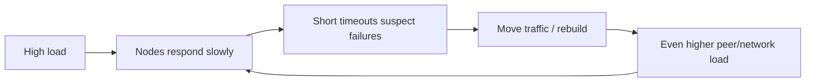

极端时 nodes 互相判 dead，系统停止进展；timeout policy 是 feedback-control 的一部分。

### 2.53 有界网络中的 timeout 推导

假设 fictional network 保证 one-way packet delay 最多 $d$，nonfailed server processing 最多 $r$。request/response upper bound：

$$
T_{response}\le d+r+d=2d+r
$$

超过 $2d+r$ 无 response，便可确定 network 或 node 不满足正常 guarantee。

### 2.54 推导每一步依据

1. request sender→receiver：最多 $d$；
2. receiver processing：最多 $r$；
3. response receiver→sender：最多 $d$；
4. 三段 serial 相加得 $2d+r$。

只有每一段都有 hard upper bound，结论才是 proof，而非 percentile estimate。

### 2.55 asynchronous reality

现实 packet network 的 delay **unbounded**：network 尽力快送，但不给 finite maximum。server 也可能因 scheduler/GC/page fault/overload 无 processing upper bound。

所以不存在一个等待时间能逻辑证明 node dead。

### 2.56 percentile 不是 upper bound

p99 RTT=10 ms 表示约 1% observed requests 更慢，不表示 10 ms 后必然 failure。large scale 下 tail samples 持续发生，且 distribution 在 incident 时会改变。

timeout 应是 service-risk trade-off，不应伪装成 physical theorem。

### 2.57 Network congestion and queueing

network delay variability 主要来自 **queueing**。packet 本身在 fiber 中传播较稳定，但等待 shared resource 的时间随瞬时竞争剧烈变化。

### 2.58 switch egress queue

多个 input ports 同时发往同 destination link，switch 只能按 output capacity serial transmit。packets 在 egress queue 等待；queue full 后 drop，TCP later retransmit。

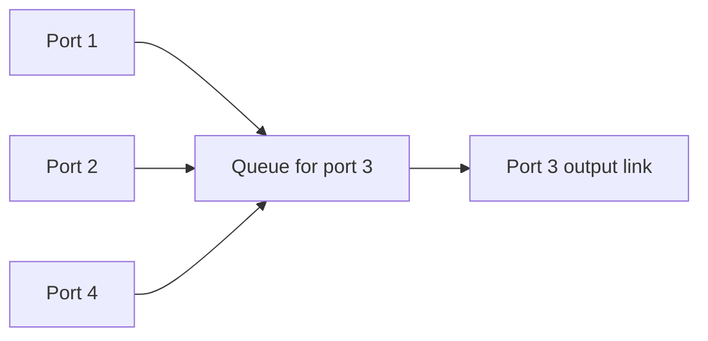

network 正常工作也会因 overload drop packet。

### 2.59 destination OS/application queue

packet 到 machine 后，CPU cores/threads 全忙时 request 留在 kernel socket backlog、run queue 或 application queue。等待时间受 current load 和 scheduling影响，可很长。

“packet 到达”不等于 request 开始处理。

### 2.60 virtualization pause

VM 的 vCPU 可被 hypervisor 暂停数十毫秒，让另一 VM 使用 physical core。期间 guest 不消费 network buffer，data 在 virtual switch/monitor queue，增加 jitter。

### 2.61 sender-side queue

TCP congestion/flow control 会让 bytes 在 sender socket buffer 等 capacity/window。application 已调用 write，packet 可能仍未进入 network。

end-to-end latency 是多层 queue 总和：

$$
T=T_{senderQ}+T_{networkQ}+T_{propagation}+T_{receiverQ}+T_{processing}+T_{return}
$$

### 2.62 retransmission 把 loss 变 delay

TCP 自动重传时，application 不直接看到 packet loss，只看到等待 retransmission timeout + resend + ACK 的额外 delay。transport reliability 增加 latency tail。

### 2.63 TCP Versus UDP

latency-sensitive applications 如 videoconferencing/VoIP 常选 UDP。UDP 不做 flow control/retransmission，减少一部分 delay variability，但仍受 switch queue、scheduler 与 loss 影响。

### 2.64 delayed data worthless

VoIP packet 若 playback deadline 已过，再 retransmit 也无价值。application宁可填 silence/做 concealment 并继续；human layer 请求“请重复”。

这里目标不是每 packet delivery，而是 timely media experience。

### 2.65 TCP/UDP trade-off

| 属性 | TCP | UDP |
|---|---|---|
| loss recovery | retransmit | application chooses |
| order | in-order byte stream | datagrams may reorder |
| congestion/flow control | built in | application/protocol responsibility |
| delay variability | retransmission/head-of-line 可增大 | lower transport waiting |
| 适用 | correctness-sensitive byte stream | deadline-sensitive media/custom protocol |

UDP 不是“更可靠”，而是让 application 决定 loss/timeliness trade-off。

### 2.66 Variability of network delays

system 接近 maximum capacity 时 queueing delay range 最大。low utilization 下 queues 快速 drain；high utilization 下小 burst 就建立长 queue。

### 2.67 queueing theory 直觉

简化 M/M/1 queue 中 arrival rate $\lambda$、service rate $\mu$，utilization $\rho=\lambda/\mu<1$，平均 system time：

$$
E[T]=\frac{1}{\mu-\lambda}=\frac{1}{\mu(1-\rho)}
$$

$\rho\to1$ 时 delay 急剧上升。真实 network 非 M/M/1，但“接近饱和，tail 爆炸”的直觉成立。

### 2.68 public cloud noisy neighbor

multitenant cloud 共享 links、switches、NIC、CPU/VM host。邻居 bulk transfer 可 saturate shared resource；你无法观察其 load，latency distribution 会突然变化。

这种 **noisy neighbor** 使 static timeout 更难稳定。

### 2.69 timeout 只能实验选择

应长期、跨 machines/regions 测量 RTT 和 processing delay distribution，结合：

- user deadline；
- false failover cost；
- idempotency/fencing capability；
- service load headroom；
- retry budget；
- incident tail。

选择可接受 trade-off，而非追求不存在的正确常数。

### 2.70 jitter-aware adaptive timeout

固定 timeout 无法适应 network 从 2 ms 到 200 ms 的变化。系统可持续估计 response time mean/variance/quantiles，随 **jitter** 调整 suspicion threshold。

但 adaptive detector 在 sudden regime change 时也会误判，需要 smoothing、minimum/maximum 与 hysteresis。

### 2.71 Phi Accrual failure detector

**Phi Accrual failure detector** 不直接输出 dead/alive，而输出 suspicion level $\phi$：heartbeat 沉默在历史分布下越不可能，$\phi$ 越高。Akka、Cassandra 使用类似思路。

### 2.72 Phi 的概率含义

常见定义：

$$
\phi(t)=-\log_{10}P(T_{next}>t)
$$

$\phi=3$ 表示历史模型认为等待超过当前时长的概率约 $10^{-3}$；threshold 由 application 风险选择。

### 2.73 简化 exponential heartbeat 模型

若 heartbeat interval 用 exponential distribution、mean $\mu$，survival probability：

$$
P(T>t)=e^{-t/\mu}
$$

于是：

$$
\phi(t)=\frac{t}{\mu\ln10}
$$

真实 implementation 常用 observed distribution/normal approximation，并处理 sample window、pause margin。

### 2.74 可运行示例：suspicion 随沉默时间增长

```python
from math import log


def phi(elapsed_ms: float, mean_interval_ms: float) -> float:
    return elapsed_ms / (mean_interval_ms * log(10))


mean_heartbeat_ms = 1_000
for elapsed_ms in (1_000, 3_000, 6_000, 10_000):
    suspicion = phi(elapsed_ms, mean_heartbeat_ms)
    print(f"elapsed={elapsed_ms:>5} ms -> phi={suspicion:.3f}")

threshold = 3.0
crossing_ms = threshold * mean_heartbeat_ms * log(10)
print(f"phi {threshold:.1f} crossed after {crossing_ms:.0f} ms")
```

实际运行输出：

```text
elapsed= 1000 ms -> phi=0.434
elapsed= 3000 ms -> phi=1.303
elapsed= 6000 ms -> phi=2.606
elapsed=10000 ms -> phi=4.343
phi 3.0 crossed after 6908 ms
```

示例展示 continuous suspicion，而非宣称 heartbeat 真是 exponential。threshold 3 在该模型下约 6.9 秒触发。

### 2.75 TCP retransmission timeout 也自适应

TCP 根据 measured RTT 与 variability 调整 retransmission timeout，而非永久固定一个常数。它面对同一 dilemma：太短造成 spurious retransmit，太长使 loss recovery慢。

### 2.76 Synchronous Versus Asynchronous Networks

若 network 能保证 packets 不丢且 delay 有固定上界，distributed algorithms 会简单很多。传统 fixed-line telephone network 展示了这种 **synchronous network** 的可能性。

### 2.77 circuit switching

telephone call 建立一条 **circuit**：沿整条 route 预留固定 bandwidth，直到 call 结束。其他 callers 不能占用该 reservation。

### 2.78 ISDN 数值例子

原章例子：ISDN 每秒 4,000 frames；一个 call 每 direction 在每 frame 获得 16 bits。因此每：

$$
\frac{1}{4000}s=250\ \mu s
$$

都保证可发送 16 bits，持续 bandwidth 为：

$$
4000\times16=64{,}000\ bits/s
$$

### 2.79 circuit 为什么无 queueing

每 hop 的下一 frame slot 已预留，packet/audio sample 不与其他 traffic 排队争抢。因此 transmission/propagation route 固定时，可给 end-to-end latency 上界，即 **bounded delay**。

### 2.80 TCP connection 不是 circuit

TCP connection 不预留 bandwidth。它 opportunistically 使用当前 available capacity；idle 时几乎不占资源，burst 时与其他 flows竞争。

connection-oriented 只表示 transport state，不表示 physical resource reservation。

### 2.81 Can we not simply make network delays predictable?

若 datacenter/internet 使用 circuit switching，setup 时可承诺 max RTT。但 Ethernet/IP 是 packet-switched，默认无 per-connection circuit，因 queueing 导致 unbounded delays。

### 2.82 为什么 packet switching 适合 bursty traffic

web page、email、file transfer 不需持续固定 bitrate，只希望尽快完成。packet network 让 active senders 动态共享全部 capacity；idle sender 不浪费 reservation。

### 2.83 circuit bandwidth guess problem

file transfer 使用 circuit 时必须预估 bandwidth：

- 低估：transfer 慢且其他 slots 可能闲置；
- 高估：network 无足够 reserved capacity，circuit setup 被拒绝。

TCP 则按 available bandwidth 自适应，提升 utilization。

### 2.84 Latency and Resource Utilization

variable delay 是 **dynamic resource partitioning** 的结果之一，不是自然界强制。static partition 提供 predictability，dynamic sharing 提供 utilization/cost efficiency。

### 2.85 static call slots

一条 wire 可承载 10,000 simultaneous calls，每 circuit 固定一 slot。即使只有一个 call，其 bandwidth 也不增加，剩余 9,999 slots 空闲。

资源利用可能低，但每 call guarantee 稳定。

### 2.86 dynamic bandwidth sharing

packet senders 按瞬时需求竞争，switch 每时刻选择下一 packet。这样 wire 尽量 busy，每 byte cost 低；代价是 queue、jitter 与 loss。

### 2.87 CPU scheduling 的同构问题

多个 threads 动态共享 CPU，thread 会在 run queue 等待不定时长；静态分配固定 cycles 可预测但浪费 idle quota。cloud 多 VMs 共享 host 也是同一 utilization trade-off。

### 2.88 predictable latency 的成本

dedicated hardware、exclusive bandwidth、admission control 能提高 bound，但：

- 需按 peak capacity provision；
- idle resources 不能共享；
- admission 超额时拒绝新 work；
- cost 增加。

低 latency guarantee 本质上要为 headroom/隔离付费。

### 2.89 multitenancy 的代价

dynamic sharing 提高 utilization、降低平均 cost，却带 noisy neighbor 和 variable tail。public cloud 默认优化经济性，而非 hard real-time guarantee。

### 2.90 Combining circuit switching and packet switching

业界尝试 hybrid：同时提供 reserved/predictable traffic 与 best-effort packet traffic，但 deployment/coordination 复杂。

### 2.91 ATM

Asynchronous Transfer Mode（ATM）在 1980s 与 Ethernet 竞争，支持 connection/cell-oriented guarantees，但主要留在 telephone-network core，未成为通用 datacenter standard。

### 2.92 InfiniBand

InfiniBand 在 link layer 做 end-to-end flow control，减少 network 内 queue需求，但仍可能因 link congestion 等产生 delay。它改善某些条件，不等于 universal bounded latency。

### 2.93 Quality of Service（QoS）与 admission control

packet network 可用 priority/scheduling、rate limiting 与 **admission control** 模拟 circuit behavior或提供 statistically bounded delay。

guarantee 需要整条 path 所有 devices 一致配置，单 endpoint 设置 priority 不够。

### 2.94 L4S 与 Linux TC

Low Latency, Low Loss, and Scalable Throughput（L4S）尝试改善 queue/congestion control；Linux traffic controller（TC）允许 shaping/prioritization。

这些是降低 tail 的工具，不能在普通 internet/cloud 上自动创造 hard upper bound。

### 2.95 为什么目前仍须假设 unbounded delay

multitenant datacenter/public cloud/internet 通常未为 application 提供 end-to-end guaranteed QoS、exclusive bandwidth 和 bounded scheduler delay。

所以 software model 仍必须允许 congestion、queueing、arbitrary delay；timeout 只能实验设定。

### 2.96 BGP/peering 的有限类比

ISP peering 与 BGP route、购买 dedicated bandwidth 在 network-to-network、较长 timescale 上有 circuit-like contracts，但不为每 host connection提供即时 fixed-latency circuit。

### 2.97 synchronous/asynchronous 的 system-model含义

- synchronous model：message/process delay 有 known bound；
- partially synchronous：某些时期/最终存在 bound，但未知何时；
- asynchronous：algorithm 不能依赖 finite known bound。

本章后文 system model 会把这些 assumptions 正式化。

### 2.98 timeout 的正确心智模型

timeout 值来自：observed distribution + business deadline + false-positive cost + recovery protocol capability。它是 tunable policy，不是 remote truth detector。

### 2.99 设计建议

- 用 monotonic clock 测 timeout；
- request 带 idempotency key/epoch；
- adaptive detector 也设 safety floors/ceilings；
- failover 后 fence old actor；
- reserve recovery headroom；
- 监控 RTT/jitter/queue/retry，而非只监控 packet loss；
- 定期注入 long delay 与 one-way partition。

### 2.100 Unreliable Networks 小结

packet networks 通过 dynamic sharing 获得高 utilization，却产生 queueing、loss 与无 delay upper bound。TCP 改善 byte-stream delivery，但应用仍面对 unknown outcome；timeout 只能产生 suspicion。

只有静态 resource reservation/admission 能提供 hard predictability，代价是更低 utilization 与更高成本。在当前 cloud/internet 环境中，protocol 必须按 asynchronous/unbounded-delay reality 设计。

---

## 3. Unreliable Clocks

### 3.1 clocks 回答不同种类的问题

application 常用 time 回答：

- request 是否 timeout；
- service p99 response time；
- 最近五分钟平均 QPS；
- user session duration；
- article 何时 published；
- reminder 何时发送；
- cache entry 何时 expire；
- log event 的 calendar timestamp。

前四类主要测 duration，后四类描述 point in time。

### 3.2 duration 与 point in time

- **duration**：两个 local observations 的 elapsed interval；
- **point in time**：映射到 calendar/UTC timeline 的 timestamp。

两者需要不同 clock。把 wall clock 用于 timeout，或把 monotonic value 当跨机 timestamp，都会出错。

### 3.3 message travel 使跨机时间更难

receive 必然发生在 send 的 causal future，但 network delay 可变且未知：

$$
t_{receive}^{physical}>t_{send}^{physical}
$$

local clocks 的 readings 却可能反向，因为 clock offsets 大于 message delay。

### 3.4 每台机器有自己的 oscillator

machine clock 通常由 quartz crystal oscillator 驱动。frequency 会因制造误差、温度、老化而略快/略慢，因此各 node 对 time 的估计逐渐 diverge。

### 3.5 NTP 的角色

**Network Time Protocol（NTP）**向多个 time servers 查询，以 network measurements 调整 local time；servers 再从 GPS、atomic clock 或上游 sources 获取更准确时间。

NTP 改善 accuracy，不创造完美同步；自身也依赖 unreliable network。

### 3.6 Monotonic Versus Time-of-Day Clocks

现代 OS 至少提供两类 clocks：

1. time-of-day/wall clock；
2. monotonic clock。

API 名称都返回数字，但 semantic contract 不同。

### 3.7 Time-of-day clocks

**time-of-day clock** 返回 calendar date/time，也称 **wall-clock time**。Linux `clock_gettime(CLOCK_REALTIME)`、Java `System.currentTimeMillis` 是例子。

### 3.8 epoch

Unix-like timestamp 通常表示自：

```text
1970-01-01 00:00:00 UTC
```

以来 seconds/milliseconds，按 Gregorian calendar 且通常不计 leap seconds。其他 systems 可选不同 reference epoch。

### 3.9 CLOCK_REALTIME 不等于 RTOS

Linux API 名称 `CLOCK_REALTIME` 只表示 wall clock，不表示 hard real-time operating-system guarantee。是否有 deadline bound 是完全不同的问题。

### 3.10 time-of-day 需要同步

wall timestamps 要跨 machines 可比较，local clocks 必须参照共同 UTC source 校准。NTP 可 step/slew 调整 offset/frequency。

### 3.11 wall clock 可向后跳

local clock 快太多时，NTP/administrator 可能强制 reset，reading 突然变小。若 duration 用：

$$
elapsed=t_{end}^{wall}-t_{start}^{wall}
$$

结果可能 negative 或异常大。

### 3.12 leap second 与 wall clock

UTC leap second 会出现 59 或 61 seconds 的 minute，某些 systems step/smear/ignore 方式不同。假设每 minute 60 秒、每天正好 86,400 秒会在边界出错。

### 3.13 DST 与 UTC

local timezone 的 daylight saving transition 会重复/跳过 local times。storage/protocol 应使用 UTC + explicit timezone，presentation 时再转换；但 UTC 仍有 leap-second/history concerns。

### 3.14 resolution 不等于 accuracy

API 可返回 nanoseconds，只表示数值粒度；clock 真实 UTC error 可能 milliseconds/seconds。更多 digits 不提供更多 truth。

older Windows 曾约 10 ms step，现代 resolution 更好，但 synchronization accuracy 仍独立。

### 3.15 Monotonic clocks

**monotonic clock** 类似 stopwatch，保证 reading 不向后，适合 timeout、latency 与 duration。Linux `CLOCK_MONOTONIC`/`CLOCK_BOOTTIME`、Java `System.nanoTime` 是例子。

### 3.16 duration 计算

同一 process/node 上：

$$
elapsed=t_2^{mono}-t_1^{mono}\ge0
$$

即使 wall clock 被 NTP step，monotonic interval 不受 backward jump 影响。

### 3.17 absolute monotonic value 无意义

reading 可能是 since boot 的 nanoseconds 或 arbitrary counter。只能比较同一 clock domain 的 differences；不同 machines 的 monotonic values 没共同 epoch。

### 3.18 不可跨 node 比较

$$
mono_A=10^9,\quad mono_B=10^6
$$

不能推出 A event 比 B event晚。机器 boot time/counter origin不同。

### 3.19 multi-socket timer

多个 CPU sockets 可能有未完全同步 hardware timers；OS 尝试校正，让 thread迁移 CPU 后仍看到 monotonic view。原章提醒 monotonicity guarantee也应保留审慎。

### 3.20 slewing

NTP 可调节 monotonic clock前进 frequency，称 **slewing**，默认速率修正可达约 ±0.05%；它改变 elapsed measurement 的细微比例，但不让 clock backward jump。

### 3.21 monotonic clock 的适用边界

适合 local timeout/response duration，因为无需跨 node sync。它不能回答 publication date、global ordering、lease expiry written by another machine。

### 3.22 clock 选择表

| 问题 | 应用 clock | 原因 |
|---|---|---|
| local timeout | monotonic | 不受 wall adjustment |
| request latency | monotonic | 只需 local duration |
| calendar timestamp | time-of-day | 映射 UTC/date |
| cross-node causal order | logical clock/consensus | wall clock 不可靠 |
| lease shared across nodes | protocol-specific + uncertainty/fencing | local clock alone不足 |

### 3.23 Clock Synchronization and Accuracy

monotonic clock 无需共享 absolute time；time-of-day 要外部同步。quartz drift、network delay、misconfiguration、leap seconds、virtualization 都限制 accuracy。

### 3.24 clock drift

clock frequency error 常以 **parts per million（ppm）** 表示。drift rate $
ho$ ppm，在 interval $T$ seconds 的最大误差近似：

$$
error=T\cdot\rho\cdot10^{-6}
$$

### 3.25 200 ppm 的数值

Google 对 servers 假设最高约 200 ppm：

$$
30s\times200\times10^{-6}=0.006s=6ms
$$

一天同步一次：

$$
86400s\times200\times10^{-6}=17.28s
$$

与原章约 17-second drift 一致。

### 3.26 temperature 与 drift

quartz frequency 随 temperature/aging 变化，drift 不是固定 calibration constant。即使 network/time server 完美，两次 sync 之间 uncertainty 仍随 elapsed time 扩大。

### 3.27 大 offset 的 step/refusal

clock 与 NTP server 差太大时，client 可能拒绝 sync 或强制 step。application 会看到 time backward/forward jump；监控、TTL、ordering 可能异常。

### 3.28 NTP firewall misconfiguration

node 被 firewall 隔离仍可运行，看起来一切正常，clock 却持续 drift。与 obvious network failure 相比，它更容易 silent 地积累 correctness risk。

### 3.29 NTP accuracy 受 RTT 限制

NTP 以 request/response 推测 offset，却不知道 forward/reverse delay 各多少。congestion/asymmetry 越大，offset uncertainty 越高。

internet experiment 的 best error 约 35 ms，delay spike 可造成约 1 second error或使 client 放弃 sync。

### 3.30 bad NTP servers

某些 public servers 可错数小时。client 查询多个 servers、排除 outliers 以降低单点错误，但多数/common misconfiguration 仍可失败。

时间 source 也需要 quorum-like skepticism。

### 3.31 leap seconds 与 smearing

leap second 曾 crash 大型 systems。**smearing** 在一天等窗口内渐进调整 frequency，避免一步插入/删除 second；不同 providers smear policy 可能不一致。

原章指出 leap seconds 计划从 2035 起不再使用，这将减少该类问题。

### 3.32 VM clock challenges

VM 被 deschedule 数十 milliseconds 后恢复，application 看 clock sudden jump。guest NTP 不一定知道 pause，可能低估 uncertainty。

live migration、host overload 都会影响 clock behavior。

### 3.33 untrusted client clocks

mobile/embedded/user-controlled device clock 可被故意改动（例如 game cheating），或长时间离线。server 不应把 client timestamp 当 authorization、billing、ordering truth。

可将 client time作为 display hint，并由 server receipt/logical sequence建立 authority。

### 3.34 MiFID II 的 100 µs 要求

European MiFID II 对 high-frequency trading 要求 clocks 与 UTC 同步到 100 microseconds 内，用于分析 flash crash、market manipulation 与 event order。

这证明高 accuracy 可实现，但需专用投入与严格 monitoring。

### 3.35 PTP、GPS 与 atomic clocks

**Precision Time Protocol（PTP）**、GPS receivers、atomic clocks、hardware timestamping 可提高 accuracy。GPS signal 可被 jam/spoof，在 military-adjacent location 尤其风险高。

多 source、holdover oscillator、monitoring 与 fail-safe policy 缺一不可。

### 3.36 cloud high-accuracy time

部分 cloud providers 向 VMs 提供更准确 clock service，但 application仍需监控 offset/uncertainty、NTP/PTP daemon 与 firewall。managed service 不等于 error 为零。

### 3.37 可运行示例：drift budget

```python
def drift_seconds(interval_seconds: float, drift_ppm: float) -> float:
    return interval_seconds * drift_ppm * 1e-6


for interval in (30, 3_600, 86_400):
    error = drift_seconds(interval, 200)
    print(f"{interval:>5} s at 200 ppm -> {error:.3f} s drift")

target_error_ms = 1
max_sync_interval = (target_error_ms / 1_000) / (200 * 1e-6)
print(f"1 ms drift budget -> resync within {max_sync_interval:.1f} s")
```

实际运行输出：

```text
   30 s at 200 ppm -> 0.006 s drift
 3600 s at 200 ppm -> 0.720 s drift
86400 s at 200 ppm -> 17.280 s drift
1 ms drift budget -> resync within 5.0 s
```

计算只包含 quartz drift，不包含 time-source/network/server uncertainty，因此实际 resync requirement 更严格。

### 3.38 Relying on Synchronized Clocks

clock 通常工作良好，错误时却可能 silent。robust software 应像处理 network fault 一样处理 wrong clock，而不是把 currentTime 当绝对事实。

### 3.39 一天不一定 86,400 秒

leap second、smear policy 与 calendar/timezone 让简单 day-duration assumption 失效。business calendar interval 应用 date/time library 与明确 timezone/UTC semantics。

### 3.40 clock fault 比 crash 难发现

CPU/network severe fault 常让 node 显式不可用；NTP misconfiguration 下 service 仍响应，却持续产生错误 timestamp/LWW decision，导致 silent data loss。

### 3.41 monitor clock offsets

依赖 synchronized clocks 的 cluster 必须监控：

- offset from sources/peers；
- uncertainty bound；
- last successful sync age；
- source count/outliers；
- step/slew events；
- leap/smear configuration。

offset 超限 node 应停止承担依赖 accurate time 的 role。

### 3.42 Timestamps for ordering events

跨 nodes 给 writes 打 wall-clock timestamp，再以最大 timestamp 判“最新”，看似简单，实际会违反 causality。

### 3.43 causally later 却 timestamp 更小

node 1 写 `x=1`，replicate 到 node 3；client B 读取并 increment 为 `x=2`。因此：

$$
x=1\rightarrow x=2
$$

但 node 1 clock=42.004s，node 3 clock=42.003s，causally later write 反而 timestamp 更小。

### 3.44 3 ms skew 已足以出错

示例 clocks 差不足 3 ms，已优于许多现实环境；只要 events 间隔更小于 uncertainty，physical timestamp order 就可能反向。

“NTP 很准”不是 causal-order proof。

### 3.45 LWW 如何丢 increment

node 2 收到两 writes，Last Write Wins 选 timestamp 42.004 的 `x=1`，丢 timestamp 42.003 的 `x=2`。已成功、因果上更新的 increment silent disappear。

### 3.46 强制 timestamp 单调的额外 read

writer 可先读 current max timestamp，再令：

$$
ts_{new}>\max(ts_{existing},clock_{local})
$$

但这需 additional read/coordination，并发情况下还需 atomic condition；本质向 logical clock/serialization靠近。

### 3.47 Cassandra/ScyllaDB client timestamp 风险

某些 configurations 使用 client clock timestamp + LWW，避免 extra round trip。slow-clock client 在 fast-clock write 的 skew window 内无法覆盖，writes 可无 error 静默丢失。

arbitrary clock error 意味着 data-loss window 也可 arbitrary。

### 3.48 concurrent 与 sequential 无法由 timestamp 区分

两 writes timestamp 接近，wall time 不能判断：

- B 是否读过 A、causally depends；
- A/B 完全 concurrent；
- clocks 只是 skew。

需要 version vector/causal metadata，而非仅排序数字。

### 3.49 timestamp collision

millisecond-resolution clocks 可让 independent writes 同 timestamp。random/node-ID tie-breaker 建 total order，却仍可能违反 causality并任意丢一方。

deterministic winner 不等于 semantically correct winner。

### 3.50 send 100 ms, receive 99 ms

sender local timestamp 100 ms、receiver local 99 ms 时，message 看似 before sent。physical causality没反转，只是 coordinate systems offsets 不同。

### 3.51 NTP 不可能保证 event order

要按 timestamps 保证 order，clock error 必须显著小于 events/network delay；NTP accuracy 本身受 variable network RTT 限制，无法对任意 close events给出此保证。

### 3.52 logical clocks

**logical clocks**以 counters/causal dependencies 排序，不测 elapsed seconds。若 event B 观察 A，可保证 logical timestamp $L(B)>L(A)$。

time-of-day 与 monotonic clocks 测 physical time，统称 **physical clocks**。

### 3.53 clock 选择原则

- duration/deadline：local monotonic；
- user calendar/log display：time-of-day + timezone/uncertainty；
- causal/event order：logical clock/version vector；
- global real-time order：需要 specialized synchronized-clock protocol + uncertainty/commit wait。

### 3.54 Clock readings with a confidence interval

clock reading 更诚实的形式不是 point $t$，而是 interval：

$$
TimeNow\in[t_{earliest},t_{latest}]
$$

width 表示 uncertainty。

### 3.55 resolution 与 confidence interval

API 返回 `10.400123s`，若 uncertainty ±100 ms，microsecond digits 没有 ordering意义。precision of representation 不等于 accuracy of estimate。

### 3.56 uncertainty 的组成

粗略：

$$
\epsilon\approx\epsilon_{source}+driftSinceSync+networkUncertainty
$$

GPS/atomic device error、quartz holdover、NTP RTT/asymmetry 与 trust 都进入 bound。

### 3.57 普通 API 不暴露 uncertainty

`clock_gettime` 返回 timestamp，不告诉 caller confidence interval 是 5 ms 还是 5 years。application 无法安全判断两个 close timestamps 是否有 definite order。

### 3.58 TrueTime 与 ClockBound

Google Spanner **TrueTime**、Amazon **ClockBound**显式返回：

```text
[earliest possible time, latest possible time]
```

interval 随离上次高精度 sync 的时间、source health 等变化。

### 3.59 interval ordering

对 $A=[A_e,A_l]$、$B=[B_e,B_l]$：

- 若 $A_l<B_e$，可确定 A before B；
- 若 intervals overlap，order unknown。

不重叠区间给出 proof，不靠取 midpoint猜测。

### 3.60 Synchronized clocks for global snapshots

distributed MVCC 需要全局 transaction/snapshot order 并尊重 causality。single node 用 incrementing counter 容易；跨 shards 全局 counter 会成为 coordination bottleneck。

### 3.61 causality 对 transaction ID 的要求

若 B read/overwrite A write，则：

$$
TxnId(B)>TxnId(A)
$$

否则 snapshot 可能包含 B effect却不包含 A cause，违反 consistent snapshot。

### 3.62 synchronized timestamp 的机会与难点

若 clocks 有可证明 uncertainty，physical timestamps 可做 globally meaningful IDs；若只拿 raw NTP reading，则 close transactions order 仍不可信。

### 3.63 Spanner commit wait

Spanner 为确保 transaction timestamp 的 real-time/causal order，commit 前等待 clock uncertainty interval 过去，使 later transaction 的 interval不与 earlier commit overlap。

commit latency 至少包含 uncertainty wait；clock 越准，等待越短。

### 3.64 约 7 ms uncertainty

Google 每 datacenter 部署 GPS receiver/atomic clock，把 uncertainty 控制到约 7 ms 量级。special hardware 不是 correctness 唯一来源；confidence interval 才是关键，hardware 主要缩短 wait。

### 3.65 可运行示例：confidence intervals 与 commit wait

```python
from dataclasses import dataclass


@dataclass(frozen=True)
class TimeInterval:
    earliest_ms: float
    latest_ms: float

    def definitely_before(self, other: "TimeInterval") -> bool:
        return self.latest_ms < other.earliest_ms


event_a = TimeInterval(100.0, 107.0)
event_b_overlap = TimeInterval(105.0, 112.0)
event_b_later = TimeInterval(108.0, 115.0)

print("A before overlapping B:", event_a.definitely_before(event_b_overlap))
print("A before later B:", event_a.definitely_before(event_b_later))
print("A uncertainty width:", event_a.latest_ms - event_a.earliest_ms, "ms")
print("minimum wait past A latest:", event_a.latest_ms - event_a.earliest_ms, "ms")
```

实际运行输出：

```text
A before overlapping B: False
A before later B: True
A uncertainty width: 7.0 ms
minimum wait past A latest: 7.0 ms
```

示例只演示 interval ordering；真实 commit-wait 还要关联 chosen commit timestamp、current TrueTime interval 与 replication protocol。

### 3.66 ClockBound 与其他 systems

YugabyteDB 在 AWS 可利用 ClockBound；其他 databases 也不同程度依赖 clock sync。关键评估项是 uncertainty API、超限行为、monitoring、failover 与 correctness proof，而非“使用 atomic clock”宣传。

### 3.67 synchronized-clock 方法的局限

- 增加 special infrastructure/monitoring；
- uncertainty 扩大时 commit latency 增加或 node须停止；
- GPS/NTP/PTP 可受 jam/config/network影响；
- 只解决 protocol 明确纳入 uncertainty 的 use case；
- raw timestamps 仍不能替代 causal metadata in general。

### 3.68 本批结论

duration 应用 local monotonic clock；calendar point 使用 wall clock但需承认 drift/jump；event causality用 logical clocks。raw synchronized timestamps不能保证 close events order。

confidence interval 把隐藏 uncertainty 变成 protocol input；Spanner 以 non-overlap + commit wait建立 global snapshot order，代价是 clock infrastructure与等待时间。

### 3.69 Process Pauses

clock error 之外，running process 本身可在任意 instruction 处暂停。其余 cluster 在 pause 期间继续推进、lease 到期、重新选 leader；old process恢复时可能基于过期世界观继续执行。

### 3.70 lease 的目的

single-leader shard 可让 leader 从其他 nodes 获得 **lease**：带 expiration 的 distributed lock。lease 有效期内只允许一个 owner；owner 周期 renew，失败后 expiry 让新 node 接管。

### 3.71 naive lease loop

原章给出类似逻辑：

```java
while (true) {
    Request request = getIncomingRequest();

    if (lease.expiryTimeMillis() - System.currentTimeMillis() < 10_000) {
        lease = lease.renew();
    }

    if (lease.isValid()) {
        process(request);
    }
}
```

看似预留 10 秒 safety margin，仍有两类 fundamental bug。

### 3.72 bug 1：跨机器 wall clocks

lease expiry 可能由另一 machine 以其 current time + 30s 计算，本 node用 local `System.currentTimeMillis` 比较。offset 超过 margin 时，node 可错误认为 lease仍有效或过早 renew。

expiry timestamp 的意义依赖 synchronized-clock guarantee。

### 3.73 monotonic clock 只能修复第一部分

protocol 可让 lease owner 用 local monotonic duration 判断“自获得 lease 起经过多久”，避免 wall-clock jump/offset。但它仍不能保证 check 后 thread 会及时执行 effect。

### 3.74 bug 2：check-to-use pause

在 `lease.isValid()` 与 `process(request)` 之间 thread 暂停 15 秒，lease 可能已过期、新 leader已接管。old thread恢复后不会自动收到“你睡过了”的 notification，仍处理 request。

这是 distributed 版 time-of-check-to-time-of-use（TOCTOU）race。

### 3.75 safety margin 不是 proof

预留 10 秒只在 process pause upper bound <10 秒时安全；non-real-time system 无此 bound。任意 fixed margin 都可能被更长 pause 超过。

### 3.76 可运行示例：lease check 后暂停

```python
lease_expiry = 30.0
checked_at = 19.0
safety_margin = 10.0
pause_seconds = 15.0
processed_at = checked_at + pause_seconds

remaining_at_check = lease_expiry - checked_at
renewed = remaining_at_check < safety_margin
valid_when_checked = checked_at < lease_expiry
valid_when_processed = processed_at < lease_expiry

print("remaining at check:", remaining_at_check, "s")
print("renewed:", renewed)
print("valid when checked:", valid_when_checked)
print("processed at:", processed_at, "s")
print("valid when processed:", valid_when_processed)
```

实际运行输出：

```text
remaining at check: 11.0 s
renewed: False
valid when checked: True
processed at: 34.0 s
valid when processed: False
```

check 时剩 11 秒，未触发 10 秒 renew；15 秒 pause 后 effect发生在 expiry 之后。fencing token 才能让 downstream拒绝 stale effect。

### 3.77 thread contention

shared lock/queue 上 contention 会让 thread wait，cores 越多时 cache coherence/lock contention 有时更严重。pause 可能发生在 application认为“纯计算”的任意位置。

### 3.78 stop-the-world GC

JVM 等 runtime 的 garbage collector 某些 phase 暂停全部 application threads。历史 full GC 可达数分钟；现代 algorithms 改善很多，但 noticeable pause 仍可能发生。

### 3.79 VM suspend/resume

hypervisor 可 suspend VM、把 memory state 保存到 disk，再任意久后 resume。process instruction pointer 原地继续，期间 external world 已变化。

### 3.80 live migration

VM 从 host A 迁到 host B 时会复制 memory；dirty-page rate 高会延长 final stop/pause。application 通常不知 migration 发生。

### 3.81 laptop/phone suspension

user 合盖、OS background policy 可让 process 暂停 hours/days，恢复后 timers/connections/leases 全部过期。client software 不能假设下条 instruction 紧接上一条 wall time。

### 3.82 context switch 与 steal time

OS context switch 可在任意 instruction 抢占 thread；VM 中 physical CPU 被其他 VM 使用的时间称 **steal time**。host overload 时 run queue长，resume 延迟不可预测。

### 3.83 synchronous disk I/O

thread 等 slow disk、filesystem、EBS/network block device 时暂停。I/O latency继承 queue/network tail。

### 3.84 hidden I/O

code 没显式 file read 也可能触发：Java classloader lazy load class、page-in library、DNS/config/logging 等。GC 与 background I/O 还可能互相放大 pause。

### 3.85 paging/page fault

memory access page 不在 RAM 时触发 page fault，从 disk load；memory pressure 还需 swap out另一页。普通 pointer access 可突然变成 millisecond/second I/O。

### 3.86 thrashing

极端 memory pressure 下 OS 大部分时间 swap pages，几乎不做 useful work，称 **thrashing**。server 常 disable swap，宁可 OOM kill/process restart，也不接受 unbounded latency。

### 3.87 SIGSTOP / SIGCONT

Unix `SIGSTOP`（shell Ctrl-Z）立即暂停 process，`SIGCONT` 后从原 instruction继续。operator误操作也可产生任意时长 pause，是简单有效的 fault-injection tool。

### 3.88 arbitrary preemption

上述原因共同说明：non-real-time environment 中，thread 可在 function 中任意点 preempt、任意晚 resume。不能以“这两行通常相隔微秒”为 correctness assumption。

### 3.89 rest of world keeps moving

paused node 不发 heartbeat，peers suspect dead、lease expires、new leader commits writes。old node memory 中仍保存“我是 leader”的 stale state，恢复后成为 zombie risk。

### 3.90 local concurrency tools 不直接迁移

单机有 mutex、semaphore、atomic counter、lock-free structure、blocking queue，依赖 shared memory/coherent CPU。distributed nodes 只有 unreliable messages，无法共享一个瞬时 lock bit。

distributed lock 必须处理 holder pause、network partition、service failure 和 delayed requests。

### 3.91 node 必须假设自己会被暂停

安全 protocol 不靠 process 自觉及时停止，而让 resource/storage验证 epoch/fencing token。即使 zombie 不知道 lease lost，也无法修改 authoritative state。

### 3.92 Providing response time guarantees

unbounded pauses 并非自然定律；投入足够资源与约束，可以构建 hard **real-time system**，保证在 specified deadline 前响应。

### 3.93 hard real-time

aircraft、rocket、robot、car control 等 physical system 中 miss deadline 可造成 system failure/伤害。correctness 包含：

$$
responseTime\le deadline
$$

不是仅追求低平均/p99。

### 3.94 airbag 例子

car sensors 检测 crash 后，airbag release 不能因 GC pause 延迟。deadline violation 即功能失败，即使最终计算结果正确。

### 3.95 web “real-time” 不是 hard real-time

web 中 real-time 常指 server push/stream low latency，没有 all-circumstances deadline proof。embedded hard real-time 要 worst-case guarantee。

### 3.96 RTOS

**real-time operating system（RTOS）**提供 scheduling/resource allocation guarantees，例如 task 在指定 interval 获得 CPU budget、high-priority interrupt bounded。

普通 Linux/cloud scheduler 不提供同等级 hard bound。

### 3.97 whole-stack requirement

hard guarantee 需要：

- RTOS/scheduler；
- libraries 标注 worst-case execution time；
- bounded interrupt/I/O；
- static/admission-controlled resources；
- restricted dynamic memory；
- real-time GC 或无 GC；
- exhaustive analysis/testing。

任一 unbounded layer都会破坏 end-to-end deadline。

### 3.98 cost 与 tooling restriction

real-time design 限制 languages、libraries、allocation、deployment 与 hardware sharing，工程/verification昂贵。主要用于 safety-critical embedded devices。

### 3.99 real-time 不等于 high performance

hard real-time 优化 worst-case predictability，可能牺牲 average throughput/utilization；high-performance system 可平均很快却偶尔长 pause，仍不 real-time。

### 3.100 server-side 的现实选择

多数 data-processing systems 不值得承担 hard real-time cost，因此接受 non-real-time pauses，并以 redundancy、fencing、timeouts、retry 隔离影响。

### 3.101 Limiting the impact of garbage collection

GC 曾是主要 pause source；现代 collectors 大幅改善。properly tuned collector 通常 pauses 数毫秒，但 workload/heap/config错误仍可产生长 tail。

### 3.102 JVM collectors

原章列举 CMS、G1、ZGC、Epsilon、Shenandoah，各针对 throughput、latency、heap/profile 有不同取舍。Go 使用较简单 concurrent mark-and-sweep 并自适应。

不能只选“low-pause”名称而不测实际 allocation/heap。

### 3.103 无 tracing GC 的语言

- Swift：automatic reference counting；
- Rust、Mojo：type system/lifetime tracking。

它们避免 stop-the-world tracing GC，不代表绝无 pause：allocator、destructor、I/O、scheduler 仍可能延迟。

### 3.104 object pools / off-heap

reuse object pools、off-heap allocation 可减少 allocation rate/GC work，但增加 lifecycle、fragmentation、manual safety complexity。

优化应以 profiles/latency distribution 驱动。

### 3.105 GC as planned outage

把 GC 当 node 的 brief planned outage：runtime 提前 warning，load balancer停止发新 requests，等待 in-flight drain，再 GC；其他 replicas服务 traffic。

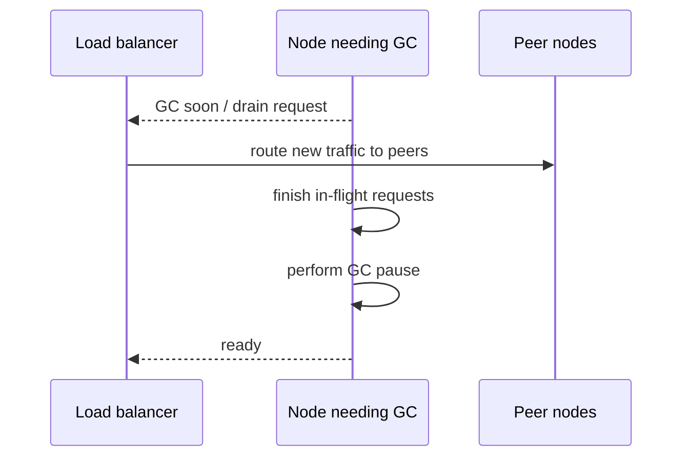

### 3.106 对 tail latency 的改善

clients 不在 GC node 上排队，pause 被 redundancy吸收，p99/p99.9 降低。前提是 peers 有 headroom、drain signal可靠且 GC 不突发在 warning 前。

### 3.107 periodic process restart

collector 只处理 short-lived objects；在 long-lived heap积累到 full GC 前，逐 node drain/restart，类似 rolling upgrade。restart 以 predictable planned pause 替代 unpredictable full GC。

### 3.108 remaining limitations

措施不能完全消除 GC/process pause；concurrent collector也有 safepoints，OS/VM/I/O仍可暂停。correctness 仍不能依赖 pause upper bound。

### 3.109 process-pause 设计原则

- local timeout 用 monotonic clock；
- lease check 与 effect 之间不假设时间很短；
- downstream 以 fencing token验证 authority；
- requests 带 idempotency/epoch；
- monitor GC、steal time、scheduler/disk stalls；
- 用 SIGSTOP/VM pause 做 tests；
- 留 peer capacity吸收 drain/failover。

### 3.110 Unreliable Clocks 小结

physical clocks 既可能 drift/jump，也常不暴露 uncertainty；process 又可在任何 point暂停。monotonic clock 适合 duration，却不能防 check-to-use pause；wall clock 适合 calendar，却不能单独排序 distributed events。

只有 hard real-time whole-stack 才能依赖 timing bound，成本很高。普通 distributed systems 应把 timing 当 unreliable input，以 interval、logical order、fencing 与 redundancy 保持 correctness。

---

## 4. Knowledge, Truth, and Lies

### 4.1 node 怎样获得知识

distributed system 无 shared memory；node 只能通过 messages了解 peers 的 state。message 可能丢/延迟，clock/process 也不可靠，因此 node 的 knowledge 总是基于不完整 observations。

### 4.2 silence 没有唯一解释

remote no response 不能区分 node failure、network partition、pause 或 delayed response。node 不能直接观察全局 truth，只能根据 protocol evidence 推断。

### 4.3 epistemic 问题的工程形式

问题不是抽象哲学，而是：

- “我还是 leader 吗？”
- “write 已 commit 吗？”
- “另一个 node dead 吗？”
- “lease 真的只属于我吗？”
- “这个 timestamp 一定更晚吗？”

错误 knowledge 会直接导致 split brain、duplicate effects 与 data corruption。

### 4.4 system model 让推理可行

我们无需找到绝对世界真相，而是声明 assumptions（network/timing/node faults），定义 algorithm properties，并证明在 model 内 correctness。

可靠 behavior 来自 protocol 与 assumptions 匹配，而非单 node 感觉自己正确。

### 4.5 The Majority Rules

一个 asymmetric fault 中，node 可收所有 inbound，却所有 outbound 被丢。它感觉自己健康、持续收到 requests；peers 听不到 responses，timeout 后判它 dead。

双方 local observations 都合理，却无法单独决定 global authority。

### 4.6 node 也可能意识到 link fault

semi-disconnected node 发现 outgoing messages 无 ACK，可怀疑 network problem；它仍无法强迫 peers 接受“我还活着”。authority 由共同 protocol 决定，不由自我感受决定。

### 4.7 paused node 的复活

node 暂停一分钟，peers timeout、接管；它恢复时 memory/control flow 原样继续，最初甚至不知道一分钟过去。若仍按 old role行事，会与新 owner冲突。

### 4.8 单节点判断为何不够

依赖单 node decision 会在该 node crash 时 stuck，也会在 stale/partitioned node 时产生矛盾 decision。distributed algorithm 因而收集多个独立 votes。

### 4.9 quorum

**quorum** 是做 decision 所需的最小 vote set。它降低对任何单 node 的依赖，并利用 quorum intersections 让 conflicting decisions共享至少一个 honest participant。

### 4.10 absolute majority

$n$ nodes 的 majority size：

$$
q=\left\lfloor\frac{n}{2}\right\rfloor+1
$$

$n=3$ 时 $q=2$，容忍 1 faulty；$n=5$ 时 $q=3$，容忍 2 faulty（在相应 crash/quorum assumptions 下）。

### 4.11 majority intersection

任意两个大小 $q$ 的 subsets，最小交集：

$$
|Q_1\cap Q_2|\ge2q-n
$$

majority 有 $2q>n$，所以交集至少 1。若 intersecting node 不对同一 epoch 投矛盾票，可防两个 conflicting majorities 同时成立。

### 4.12 “只能有一个多数”的精确条件

数学上不同 majority sets 可同时存在，但它们必有重叠；安全来自 overlap node 遵守 protocol，不是集合本身神奇。若 nodes Byzantine 可重复投票，普通 majority proof 失效。

### 4.13 quorum 判 dead 的含义

若 quorum 决定 old node 不再有 authority，该 node 即使感觉 alive 也必须 step down。protocol truth 是授权状态，不是生物意义的 alive/dead。

### 4.14 minority partition

network partition 后，只有能形成 quorum 的 side 可作需要 unique authority 的 decision；minority 为保持 safety 停止 progress。它可能含 old leader，却没有足够 current votes。

### 4.15 other quorum systems

quorum 不一定简单 majority；weighted/topology/read-write quorums 也可，只要所需 decision sets 按 protocol正确 intersect，并覆盖 failure domains。

第 10 章 consensus 会进一步展开。

### 4.16 quorum 不等于真理投票

quorum 不能证明 majority data 天然正确，也不能抵御同一 software bug、correlated misconfiguration。它在指定 model 内建立唯一 decision evidence。

### 4.17 Distributed Locks and Leases

distributed lock/lease 常被误用。lease 是超时 lock，holder fail/pause/disconnect 后可重新分配；目的常是保证 only-one actor。

### 4.18 lease 的典型用途

- 每 database shard 只有一个 leader，避免 split brain；
- 一次只有一个 client 更新某 resource/file；
- job input 只由一个 worker处理，避免 duplicate work。

前两者错误会 corruption，第三者有时只浪费 compute，风险等级不同。

### 4.19 multiple holders 仍可能同时相信自己有效

process pause、clock error、network delay 可让 old holder 不知 lease expired，而 new holder 已取得 lease。correctness 不能依赖“lock service 保证任何时刻 application 世界只有一个 active holder”。

### 4.20 HBase/file corruption 案例

client 1 获 file lease 后 pause，lease expires；client 2 获 lease并写；client 1恢复，按 stale memory继续写，同一 file 被两个 clients修改，形成 split brain/corruption。

原章指出这不是纯理论，HBase 曾有类似问题。

### 4.21 delayed request 即使 client crash 也危险

client 1 在 crash 前发 write，request 在 network queue 延迟；lease expires，client 2 获 lease并写；随后 old request 才到 storage，仍会覆盖/破坏 new state。

杀死 old process 不能撤回 network 中已发送的 message。

### 4.22 两种 stale-action 来源

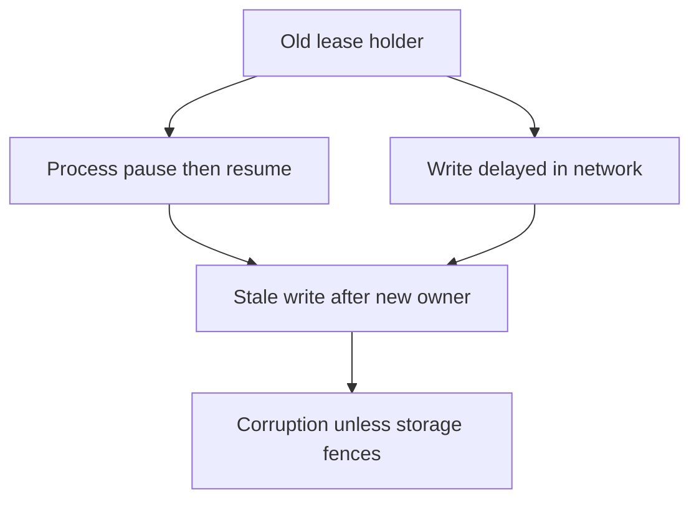

fencing 必须覆盖 actor 与 message 两条路径。

### 4.23 Fencing off zombies and delayed requests

已失去 lease 却仍行动的 former holder 称 **zombie**。不能保证 zombie及时自觉停止，因此要让它的 effects 被 authoritative service拒绝，称 **fencing off**。

### 4.24 shutdown/STONITH 的局限

某些系统断 network、shutdown VM 或 power off old node（legacy 术语 STONITH）。它可能太晚，无法拦截 already-delayed request；错误 mutual shutdown 还会扩大 outage。

physical termination 可作补充隔离，不是完整 stale-message protection。

### 4.25 fencing token

lock service 每次 grant lease 返回严格递增 **fencing token**：

$$
token_{new}>token_{old}
$$

client 每个 write 都携带 token；storage 记录已接受的最大 token，拒绝更小者。

### 4.26 token 33/34 时序

client 1 获 token 33 后 pause；lease expiry，client 2获 34并先写。client 1恢复后发送 token 33，storage 已见 34，因此拒绝。

write arrival 晚早不再决定 authority，grant epoch 决定。

### 4.27 storage-side rule

对 resource $r$ 保存 $maxToken[r]$：

$$
Accept(write,t)\iff t\ge maxToken[r]
$$

接受后更新 max。实际可要求 strictly newer for ownership establishment，并允许同 token 的幂等 writes；具体 rule需定义 sequence。

### 4.28 new holder 应立即 establish token

new client 获 lease 后尽快向 storage 写/注册 token 34；一旦 storage记住 34，所有 token≤33 zombies 永久 fenced。

若 new holder只拿 lease不触达 resource，old delayed request 仍可能先到，protocol 要考虑 initialization order。

### 4.29 fencing 与 OCC 的差异

都让 stale premise 的 write失败。ordinary optimistic concurrency conflict 可 reread/retry；old lease token 永久过期，不能以同 authority retry，必须重新申请 newer lease/token。

### 4.30 token 的其他名称

- Google Chubby：sequencer；
- Kafka：epoch number；
- Paxos：ballot number；
- Raft：term number。

共同本质是单调 authority generation。

### 4.31 practical token sources

- ZooKeeper：`zxid` 或 node `cversion`；
- etcd：revision number + lease ID；
- Hazelcast FencedLock：显式 fencing token。

token 必须来自线性/唯一 grant history，不能用不可靠 wall clock代替。

### 4.32 storage 必须配合

lock service 单独不能保护 resource。storage/API 必须检查 token 或支持 equivalent conditional write；否则 zombie 可绕过 lock service直接写。

### 4.33 conditional-write equivalents

- Amazon S3：conditional writes；
- Azure Blob Storage：conditional headers；
- Google Cloud Storage：request preconditions；
- database：version/CAS。

若只有一个 storage authority，可直接利用其 condition实现 ownership，额外 lock service 可能冗余。

### 4.34 可运行示例：storage 拒绝 zombie token

```python
from dataclasses import dataclass


@dataclass
class FencedStorage:
    value: str = "initial"
    highest_token: int = 0

    def write(self, token: int, value: str) -> str:
        if token < self.highest_token:
            return f"rejected token {token}; highest is {self.highest_token}"
        self.highest_token = token
        self.value = value
        return f"accepted token {token}"


storage = FencedStorage()
print("new holder:", storage.write(34, "written-by-client-2"))
print("delayed zombie:", storage.write(33, "written-by-client-1"))
print("final value:", storage.value)
print("highest token:", storage.highest_token)
```

实际运行输出：

```text
new holder: accepted token 34
delayed zombie: rejected token 33; highest is 34
final value: written-by-client-2
highest token: 34
```

即使 token 33 request 后到，也无法覆盖 token 34。生产 API 还需 authentication，防 client伪造 token。

### 4.35 Fencing with multiple replicas

fencing token 也可保护多个 services/leaderless replicas。所有 authoritative destinations都必须按 generation ordering比较，避免 old holder 在某一处留下可胜出的 state。

### 4.36 token 嵌入 timestamp high bits

leaderless LWW store 可把 fencing token放 timestamp most-significant bits：

```text
timestamp = fencing_token || local_sequence
```

任何 `34...` 都大于 `33...`，即使 old holder physical write later。

### 4.37 three-replica example

client 2/token34 写 replicas 1、2，replica3 offline；zombie token33 later 只在 replica3成功。quorum read从 1/2 得到更大 34 value，read repair/anti-entropy最终覆盖 replica3。

### 4.38 stale replica write 为什么不胜出

只要 read/write quorum overlap且 winner comparison把 token置于最高优先级，old generation 无法压过 new generation。单 replica 暂存 stale value 不破坏最终 authoritative result。

### 4.39 multiple services 的一致 token

client 同一 lease要写 object store、metadata DB、cache invalidation 时，每个 system都需验证 token；任一不验证的 side effect仍可能被 zombie污染。

end-to-end fencing 取决于最弱 downstream。

### 4.40 不能假设 only one holder

lease safety 的实用原则是：允许 memory/world 中短暂存在多个 self-declared holders，但只有 highest valid generation 的 effects能被资源接受。

把 exclusion enforcement 下推到 resource boundary 比要求 stale process及时停止更 robust。

### 4.41 token service 的 correctness requirements

- uniqueness：不同 grants 不返回同 token；
- monotonicity：later grant token更大；
- durability：restart 不倒退/reuse；
- quorum/consensus：partition 中不产生 conflicting generation histories；
- availability：assumptions 恢复时最终 grant。

后文以这些 properties 说明 safety/liveness。

### 4.42 token overflow 与 reuse

fixed-width counter 最终 wrap；restore old snapshot 也可能让 sequence倒退。token namespace/epoch必须足够大并在 disaster recovery 中保持 monotonic，或引入 higher-level generation ID。

### 4.43 security boundary

fencing 防 honest-but-stale node，不防 malicious node伪造高 token。storage 应 authenticate client/token capability；若 threat model含 compromised participants，需要 Byzantine/security mechanisms。

### 4.44 majority + fencing 的分工

quorum/consensus 决定谁获得 next generation；fencing token让 downstream拒绝 previous generations。只选新 leader不 fence旧 leader，仍可能 split brain。

### 4.45 leases 的正确心智模型

lease 是 temporary permission evidence，不是保证世界中只剩一个 executing process。expiry让 system取得 progress；fencing保护 expiry/reassignment 期间的 safety。

### 4.46 本批结论

单 node不能靠自我观察决定 global authority；quorum intersection在明确 voting rules 下建立 unique decision。lease holder 可 pause，request可 delayed，因此“锁已过期”不能自动消灭 old effects。

单调 fencing token把 authority generation带到 resource boundary，使 storage永久拒绝 zombies。quorum负责授予，fencing负责执行，是避免 split brain 的互补机制。

### 4.47 Byzantine Faults

fencing 可阻止 honest-but-stale node，但 malicious node 可伪造更高 token、投矛盾 votes、发送任意 data。若 nodes 不遵守 protocol，fault model 进入 **Byzantine/arbitrary faults**。

### 4.48 本书默认 honest nodes

本书大多数算法假设 nodes unreliable but honest：

- 可 slow、pause、crash、不回复；
- state 可 stale；
- message 可丢/延迟；
- 但若回复，会按 protocol 和自身 knowledge说“真话”。

这不等于完全可信/security-free，只是排除 deliberate arbitrary protocol violation。

### 4.49 Byzantine behavior 的例子

- election 中向不同 peers投不同票；
- 声称已 durable store 实则没有；
- forged fencing token；
- corrupted/contradictory state；
- maliciously omit/alter messages；
- colluding nodes欺骗其他 participants。

ordinary crash quorum proof 通常假设这些不发生。

### 4.50 The Byzantine Generals Problem

**Byzantine Generals Problem**研究存在未知 traitors、messengers 可能 delay/loss 时，honest participants 如何 agreement。

它是 two generals problem 的推广；后者只有 unreliable messenger，无内部 liar。

### 4.51 two generals problem

两 generals 分处不同 camps，只能靠可能丢失/delay 的 messenger 协调 battle。任何 finite acknowledgment chain 都无法产生绝对 common knowledge。

它强调 unreliable communication 下 agreement 的知识困难。

### 4.52 Byzantine generalization

$n$ generals 中多数 loyal，少数 traitors 可给不同 recipients发不同 fake messages，且事前不知道谁是 traitor。protocol 既要处理 communication failure，也要验证 participant behavior。

### 4.53 名称来源

Byzantium 是后来 Constantinople、今 Istanbul 所在 ancient city。名称来自英语中 Byzantine “极其复杂、官僚、迂回”的含义，并非该历史城市 generals 特别不可靠。

### 4.54 Uses of Byzantine fault tolerance

system 在部分 nodes malfunction/not obey protocol、或 attacker interference 时仍正确，称 **Byzantine fault-tolerant（BFT）**。它只在特定 threat/failure model 值得成本。

### 4.55 aerospace / radiation

aircraft/rocket/space systems 中 radiation 可翻转 memory/register bits，让 computer 返回 arbitrary result；failure consequence 极高，hardware/software redundancy需容忍 Byzantine faults。

### 4.56 mutually distrustful parties

cryptocurrency/blockchain 等多个独立经济参与方可能作弊，不能指定一个 central trusted authority。BFT/consensus 让 mutually untrusting parties 对 transaction history达成 agreement。

### 4.57 ordinary datacenter 通常不采用 full BFT

single organization 控制 servers、radiation较低；tenants 用 virtualization/firewall/access control 隔离。BFT protocol 的 message/replica/latency cost 往往不划算。

### 4.58 web clients 的恶意输入

browser/mobile client 由 end user控制，server 必须假设 arbitrary input。但通常让 server 做 authority，使用 authentication、validation、sanitization、output escaping，而非让 clients参与 BFT quorum。

### 4.59 SQL injection 与 XSS

parameterized query/escaping 防 SQL injection，context-aware output encoding防 cross-site scripting。它们是 trust-boundary security，不是 Byzantine consensus。

### 4.60 P2P 更需要 BFT

peer-to-peer 无 central authority、peers互不信任时，Byzantine eventual consistency/CRDT 等问题更相关。protocol 必须验证 signatures、causal history 与 equivocation。

### 4.61 common software bug 不被普通 BFT 修复

所有 nodes运行同 binary，同 bug 会同步触发；多数并非 independent implementations，supermajority 也会一起错。BFT 假设 faulty nodes 与 honest majority行为有独立性。

### 4.62 $n\ge3f+1$ 的常见界

许多 classical BFT consensus 在 asynchronous/partially synchronous assumptions 下，容忍 $f$ Byzantine nodes 需要至少：

$$
n\ge3f+1
$$

即 >2/3 honest；4 nodes最多 1 faulty。具体 bound随 authentication/model变化，不能泛化所有 BFT protocol。

### 4.63 对抗 software bug 需多样实现

若用 4 independent implementations，希望同 bug只影响一个，才能利用 BFT masking。现实中独立实现成本巨大，spec ambiguity又可能让所有实现同方向错。

### 4.64 node compromise 的 correlated risk

attacker 利用同 vulnerability可攻陷所有 identical nodes，普通复制/BFT count 无法提供独立性。patching、least privilege、network segmentation、key isolation等仍是主要防线。

### 4.65 traditional security 仍必要

authentication、authorization、encryption/TLS、firewalls、audit、secret rotation 解决 identity/confidentiality/integrity threat。BFT 不是替代 security hygiene 的万能层。

### 4.66 Weak forms of lying

即使不防 determined adversary，也值得防 hardware bug、corruption、misconfiguration 等“弱谎言”。低成本 validation 可显著提高可靠性。

### 4.67 application-level checksums

TCP/UDP checksum 可漏过某些 corruption；application protocol 对 payload 做 strong checksum/hash，end-to-end验证 bytes。TLS authenticated encryption也可检测篡改/corruption。

### 4.68 input validation

public input 限制 type/range/length、schema、allocation size，防 parser bug/DoS。internal service behind firewall 也应做 basic parser validation，不能把 network bytes当 trusted memory。

### 4.69 multiple NTP servers

NTP client 查询多个 servers，估计 error intervals，让 majority agreement排除 misconfigured outlier。它比单 source robust，但 common upstream fault/majority compromise仍可能失败。

### 4.70 BFT scope checklist

使用 full BFT 前问：

- participants 是否由不同 trust domains控制？
- arbitrary/malicious behavior 是否 realistic？
- faults 是否 independent？
- latency/replica/message cost可接受？
- cryptographic identities/keys怎样管理？
- common software bug如何处理？

### 4.71 Byzantine Faults 小结

crash/lease model 假设 nodes honest但可能 stale；Byzantine model 允许任意矛盾行为，成本与 replica requirement显著上升。aerospace、P2P/financial adversaries可能需要 BFT，普通 datacenter多用 security isolation + pragmatic checksum/validation。

### 4.72 System Model and Reality

distributed algorithm 不能绑定具体 switch/JVM/cloud细节；需要 **system model**抽象 timing 与 fault assumptions，才能定义并证明 correctness。

### 4.73 model 是 assumption contract

system model 声明哪些 events 可发生、哪些不可。algorithm proof 的结论形式是：

$$
Assumptions(model)\Rightarrow Properties(algorithm)
$$

deployment 若违反 assumptions，proof不再适用。

### 4.74 timing model 一：Synchronous model

**synchronous model** 假设 known finite upper bounds：

- network delay；
- process pause/processing；
- clock error。

不要求 delay=0/clocks完全一致，只要求不超过 bound。

### 4.75 synchronous model 的现实性

hard real-time/dedicated network可接近；普通 cloud/datacenter有 unbounded tail/pause，因此该 model 对多数 data systems过强。

### 4.76 timing model 二：Partially synchronous model

**partially synchronous model**：大多数时间像 synchronous，有正常 bounds；某些 periods assumptions被打破，delay/pause/clock error 可任意大；最终系统恢复到 bounded behavior。

这是 practical distributed systems常用 model。

### 4.77 eventual synchrony

liveness proof 常假设存在未知时刻 GST（global stabilization time），之后 messages/processes 满足某 bound。algorithm 不知 GST何时，只需在稳定后最终进展。

### 4.78 timing model 三：Asynchronous model

**asynchronous model**不允许任何 timing assumption，甚至没有 clock/timeout。algorithm 只能依赖 message delivery events；model最稳健也最 restrictive。

### 4.79 三 timing models 对照

| model | delay bound | timeout 可作为 proof | practical fit |
|---|---|---|---|
| synchronous | known always | 是 | hard real-time/specialized |
| partially synchronous | eventually/usually bound, violation possible | 用于 liveness，不证明 instantaneous death | most clusters |
| asynchronous | no bound/no clock | 否 | theoretical strong assumption-minimal |

### 4.80 node model 一：Crash-stop faults

**crash-stop/fail-stop**：node 可突然 stop，此后永不回来。memory/disk recovery不考虑，简化 membership/recovery reasoning。

现实 servers会 restart，因此仅适合某些 ephemeral process abstraction。

### 4.81 node model 二：Crash-recovery faults

node 可任意时刻 crash，未知多久后 restart；stable storage survives，in-memory state lost。algorithm 必须把 critical term/vote/log durable。

### 4.82 stable storage assumption

crash-recovery proof 假定 nonvolatile data 不丢。若 disk corruption/restore old snapshot，node可能忘记 vote/log，形成 **amnesia** 并破坏 quorum safety。

### 4.83 node model 三：Degraded performance and partial functionality

node 不完全 crash，而是 slow：health check还回应，real work几乎不推进。例子：1 Gbit/s NIC bug降到 1 Kbit/s、memory pressure长 GC、worn SSD erratic latency。

### 4.84 limping/gray/fail-slow node

该状态称 **limping node**、**gray failure** 或 **fail-slow**。它比 clean crash难：detector signal矛盾、请求占资源、recovery动作可能加剧 overload。

### 4.85 partial functionality

background thread crash/deadlock时，health endpoint仍正常，某功能停止。binary alive/dead probe无法覆盖 component-level liveness，需要 end-to-end work probes与 progress metrics。

### 4.86 node model 四：Byzantine faults

node 可任意行为、欺骗、矛盾投票，是最强 fault model；algorithm/replica cost最高。

### 4.87 practical default model

原章认为 **partially synchronous + crash-recovery**通常最有用，同时应现实地考虑 slow/gray nodes。它允许 unbounded interruption，但假设网络最终恢复、stable storage大体可靠、nodes honest。

### 4.88 Defining the correctness of an algorithm

correctness 不应写成“看起来工作”，而是明确 properties。sorting algorithm 以 output ordered 定义；distributed token service也用 invariants/progress定义。

### 4.89 fencing-token uniqueness

**Uniqueness**：任意两个 distinct successful requests 不返回相同 token：

$$
x\ne y\Rightarrow token(x)\ne token(y)
$$

否则两 holders 无法由 storage区分 generation。

### 4.90 fencing-token monotonic sequence

若 request $x$ 完成后 request $y$ 才开始，则：

$$
token(x)<token(y)
$$

它约束 non-overlap real-time order；concurrent requests 可按任一唯一 order分配。

### 4.91 fencing-token availability

**Availability**：requesting node 不 crash，且 liveness assumptions满足时，最终收到 token response。

关键字 eventually 表明它是 progress property。

### 4.92 correctness 相对于 model

algorithm 在 system model 中正确，意为所有 model允许的 executions 都满足 declared properties。若 model允许全 nodes永远 crash，则不能无条件保证 response，但仍可保证不返回 duplicate token。

### 4.93 Distinguishing between safety and liveness

properties 分为 **safety** 与 **liveness**，帮助在 severe faults 下仍作有意义保证。

### 4.94 safety 的精确定义

safety violation 可在某个 finite point 被指出，且发生后无法“撤销”历史。例如 duplicate token 在第二次返回那一刻违反 uniqueness；后来修复 counter也无法让 duplicate从未发生。

### 4.95 liveness 的精确定义

liveness 暂时不成立时，未来仍可能成立。request 尚未响应不构成永久 violation；若它永远不响应才违反 “eventually response”。

### 4.96 informal mnemonic

- safety：nothing bad happens；
- liveness：something good eventually happens。

好/坏是 mnemonic，formal finite-bad-prefix/eventual extension定义更准确。

### 4.97 eventual consistency 是 liveness

“停止新 writes 且 communication恢复后，replicas最终 converge”包含 eventually，是 liveness。它本身不排除中途返回任意错误值；通常还需 safety properties限定 allowed states。

### 4.98 safety 必须始终保持

distributed algorithm 通常要求 network全断、所有 nodes crash时也不返回 wrong result。可以不 response，但不能产生两个 leaders/duplicate tokens/corrupt commit。

### 4.99 liveness 可附 caveats

可声明：只有 majority未 crash、network eventually recovers、processes最终获得 CPU 时，request最终完成。partial synchrony正为 liveness提供 eventual stabilization assumption。

### 4.100 safety-first 的原因

temporary unavailability 可恢复；data corruption/双重扣款/矛盾 commit一旦对外发生难以撤回。因此 protocol partition时常选择停止 minority进展以保护 safety。

### 4.101 safety/liveness 不是 CAP 的同义词

safety/liveness 是广泛 property classification；CAP availability/linearizability/partition是特定 theorem concepts。不要把“安全优先”简单等同 CP标签。

### 4.102 Mapping system models to the real world

model 是有意简化。implementation 仍会遇到 proof排除的 disk corruption、firmware bug、operator restore、credential错误。

### 4.103 stable storage 可能丢失

disk 被 wipe/corrupt、server reboot 不识别 drive，crash-recovery assumption失败。node忘记曾 durable保存/vote的数据，quorum intersection的记忆基础被破坏。

### 4.104 quorum + amnesia

node 曾在 quorum $Q_1$ 投 value A，crash后忘记，又在 overlapping $Q_2$ 投 conflicting B；intersection node不再约束矛盾 decision，safety proof失效。

stable storage的 durability是 consensus/quorum correctness组成部分。

### 4.105 扩展 model 的代价

可定义“stable storage 偶尔丢失”的 model，但 state/fault combinations增加，proof更难，往往需更多 replicas/repair/audit assumptions。

model不是越现实越好，而是在 manageable reasoning 与 relevant faults间平衡。

### 4.106 impossible-event handling

theory 可假定某 fault不发生；production code仍应检测 violated assumption，fail closed、alert/halt、请求 human repair，而不是继续产生未经证明的结果。

### 4.107 computer science 与 software engineering

algorithm proof回答 model 内 correctness；engineering 还要处理 deployment/configuration、observability、upgrade、corruption与 operator recovery。两者互补。

### 4.108 abstract model 的价值

现实无限复杂，system model把它压缩成可推理 fault set，让我们理解 impossibility、设计 protocol、证明 properties。简化不是缺陷，而是 formal reasoning的必要工具。

### 4.109 assumption register

production design 应明确记录：

- timing model；
- max tolerated node/rack/region faults；
- crash-stop/recovery/Byzantine；
- stable-storage durability；
- identity/authentication；
- clock uncertainty；
- eventual network recovery；
- operator/corruption out-of-model response。

### 4.110 本批结论

Byzantine model处理 dishonest arbitrary behavior，普通 datacenter通常采用 honest crash/gray-failure assumptions并辅以 checksums/security。system model把 timing/node faults formalize，correctness再由 safety/liveness properties定义。

safety 必须在所有 allowed executions中保持；liveness可依赖 majority与 eventual recovery。deployment若违反 stable-storage等 assumptions，proof失效，所以 engineering必须监控并 fail closed。

### 4.111 Formal Methods and Randomized Testing

concurrency、partial failure、message order 形成巨大 state space。要确信 properties 在所有 relevant executions 保持，需组合 formal analysis 与 empirical randomized testing。

### 4.112 formal verification 的目标

以 mathematical model/specification 描述 algorithm，证明在 system model 允许的每种 execution 中 invariants成立。

proof 可发现普通 testing 极难触发的 timing edge case。

### 4.113 algorithm proof 不等于 implementation proof

formal algorithm正确，real code 仍可能有：

- spec translation bug；
- integer overflow/memory corruption；
- wrong persistence ordering；
- API misuse；
- deployment assumption violation；
- spec/implementation version drift。

proof 是强第一步，不是结束。

### 4.114 theory + empirical testing

property-based testing、fuzzing、fault injection、deterministic simulation 覆盖 actual implementation。AWS、FoundationDB、TigerBeetle 等组合使用 formal/specification 与 randomized testing。

### 4.115 Model checking and specification languages

**model checker**系统探索 specification state transitions，检查 invariant/deadlock/liveness counterexample。spec 可用 TLA+、Gallina、FizzBee 等 purpose-built language。

### 4.116 specification 聚焦 protocol essence

model 忽略 socket/library/serialization细节，只保留 nodes、messages、terms、votes、logs、failures 等核心 state。state space 更小，易系统枚举 interleavings。

### 4.117 model checking 的基本循环

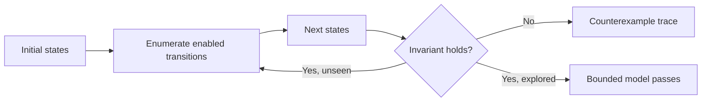

counterexample 给出最短/具体 event sequence，便于修 protocol。

### 4.118 infinite state space limitation

real system message count、IDs、time 无界，无法真正穷举全部 states。model checker 通常：

- 限 nodes/messages/steps；
- abstract data values；
- merge equivalent states；
- verify reduced approximation。

超过 bound 才出现的 bug 可能漏掉。

### 4.119 formal proof vs model checking

true formal proof 可覆盖 unbounded mathematical model，但编写/审核更难。model checking 在易用性与发现 nonobvious bugs 之间提供实用平衡。

### 4.120 industry usage

CockroachDB、TiDB、Kafka 等使用 formal model/specification。TLA+ 曾揭示 viewstamped replication（VR）prose ambiguity 可导致 data loss。

precision specification 本身会迫使 designers 补齐模糊 corner case。

### 4.121 model/implementation drift

model checker 默认运行 model，不运行 production code。implementation 改动后 spec 未更新，验证结论会过时。

可用 instrumentation/trace conformance 检查 actual execution 是否符合 model transitions，但增加工程成本。

### 4.122 specification 应版本化

spec 与 code、protocol version、tests 同 repo/review，bug fix先更新 counterexample/model，再改 implementation，保持 executable design document。

### 4.123 Fault injection

**fault injection**在 running implementation/environment 主动制造 network failure、machine crash、disk corruption、process pause 等，观察 safety与recovery。

### 4.124 为什么必须注入

许多 bugs 仅在 rare fault timing 出现。等待 production自然发生既慢又危险，且当时缺 trace/controls。controlled injection 提前验证 runbook与protocol。

### 4.125 production-like environment

fault injection通常部署真实 binaries/config/topology，接近 production；有团队直接在 production 注入，以验证真实 redundancy而非 staging幻觉。

### 4.126 Chaos Monkey / chaos engineering

Netflix Chaos Monkey popularized 随机终止 instances。production fault injection 常称 **chaos engineering**。

目标不是制造混乱本身，而是验证预先定义 steady-state hypothesis、blast radius 与 automatic recovery。

### 4.127 injector architecture

- coordinator 决定 fault type/time/target；
- node scripts执行 pause/kill/unmount/firewall；
- workload generator持续读写；
- checker验证 histories/invariants；
- observability收集 recovery timeline。

### 4.128 concrete tools

- `kill`/signals：pause/terminate process；
- `umount`/I/O fault：storage failure；
- firewall/traffic control：drop/delay/reorder network；
- clock manipulation/fake clock；
- CPU/memory/disk pressure；
- power/VM stop。

### 4.129 test during and after fault

不仅检查 fault window 是否可用，还要检查 network恢复后：split brain 是否消失、queues drain、replicas reconcile、leases/locks释放、capacity恢复、无 latent corruption。

### 4.130 Jepsen

Jepsen 提供 workload、fault nemesis、history checker 与 OS integrations，发现许多 widely used distributed systems 的 critical consistency bugs。

framework 简化 plumbing，但 test model/operation semantics仍需 domain knowledge。

### 4.131 fault injection 的局限

- real-time execution慢；
- nondeterministic，failure难重放；
- 只探索少量 schedules；
- production injection 有风险；
- environment tool复杂；
- checker 不完整会漏 silent error。

这推动 deterministic simulation。

### 4.132 Deterministic simulation testing

**deterministic simulation testing（DST）**对 actual code 运行大量 randomized executions，但用 simulator控制 network、I/O、clock、scheduler 与 faults；相同 seed/trace 可精确 replay。

### 4.133 与 model checker 的区别

- model checking：系统探索 simplified spec；
- DST：执行真实 implementation logic，environment mocked；
- fault injection：真实 environment/clock，control较粗。

三者发现不同层次 bugs，互补而非替代。

### 4.134 controlled nondeterminism

simulator 决定：

- message delivery/drop/order/delay；
- timer fire；
- disk response/failure；
- node crash/restart；
- task scheduling；
- random numbers；
- clock jumps。

event choices 记录为 seed/trace。

### 4.135 replayability

production race 可能一生只出现一次；DST counterexample 用相同 seed 重放到同 instruction/event order，可 debug、加 assertion、转 regression test。

### 4.136 state-space exploration

simulator repeated seeds/random policies 探索不同 schedules，比 handwritten tests覆盖更广；仍不 exhaustive，但 high speed/replay显著提高 bug discovery。

### 4.137 strategy 1：Application-level determinism

system 从 architecture 上集中 async effects、通过 injectable interfaces访问 network/clock/storage。

FoundationDB 使用 Flow async library；test时替换 deterministic network simulation。TigerBeetle 以 state machine + single event loop + mock primitives 为 first-class DST 设计。

### 4.138 event-loop advantage

所有 mutations 在单 event loop，scheduler order由 simulator控制，避免 OS threads不可控 interleaving。并发仍以 messages/events模拟，不牺牲 distributed scenarios。

### 4.139 strategy 2：Runtime-level determinism

替换/patch async runtime 与 common libraries。FrostDB patch Go runtime使 goroutines sequential deterministic；Rust MadSim 提供 deterministic Tokio、S3、Kafka library implementations。

application code少改即可在 deterministic runtime运行。

### 4.140 runtime-level risk

mock runtime 与 real runtime behavior可能不同，某些 OS/kernel race不被覆盖；library API升级需同步 deterministic substitute。

### 4.141 strategy 3：Machine-level determinism

Antithesis 等 custom hypervisor控制整 machine/container 集群，对 clocks、network、storage等 nondeterministic calls返回 deterministic结果。

无需逐 library改造，可运行完整 distributed binary，但实现 hypervisor/control极复杂。

### 4.142 branching execution

simulator 可在 rare branch出现时 fork subexecutions，探索多个后续；相比线性 random run，更系统覆盖 interesting paths。

### 4.143 faster than wall-clock

mock clock 可瞬间推进 1-hour timeout，无需实际等一小时；network delay/lease expiry都变 event scheduling。simulation 在 seconds 内覆盖多年 logical time。

### 4.144 可运行示例：seed-controlled replay

```python
from random import Random


def simulate(seed: int) -> tuple[list[str], dict[str, int]]:
    random = Random(seed)
    events = [("A", 1), ("A", 2), ("B", 3), ("B", 4), ("C", 5), ("C", 6)]
    random.shuffle(events)
    trace: list[str] = []
    state = {"A": 0, "B": 0, "C": 0}
    for node, amount in events:
        if random.random() < 0.25:
            trace.append(f"drop {node}:{amount}")
            continue
        state[node] += amount
        trace.append(f"deliver {node}:{amount}")
    return trace, state


first_trace, first_state = simulate(2026)
second_trace, second_state = simulate(2026)

print("same trace:", first_trace == second_trace)
print("same state:", first_state == second_state)
print("events controlled:", len(first_trace))
print("final state:", first_state)
```

实际运行输出：

```text
same trace: True
same state: True
events controlled: 6
final state: {'A': 3, 'B': 7, 'C': 11}
```

seed 同时控制 delivery order 与 drops，使 failure可重复。真实 DST 还要控制 threads、I/O completion、clock 和 restart state。

### 4.145 The Power of Determinism

nondeterminism 是 concurrency、network delay、pause、clock jump、crash难复现的核心；把外部 choices 显式变成 deterministic event stream，会极大简化 replay/reasoning。

### 4.146 event sourcing

event sourcing 将 immutable log按 deterministic reducer重放，重建 materialized views。只要 reducer/version/input相同，state可复现。

### 4.147 durable workflows

workflow engine记录 history，并要求 workflow definition在 replay时作同样 decisions。time/random/external result通过 recorded events提供，而非重新 nondeterministic调用。

### 4.148 state machine replication

replicas按相同 ordered commands执行 deterministic state transitions，获得相同 state。statement-based replication、stored-procedure serial execution 都是变体。

### 4.149 determinism 的边界

即使替换 concurrency、I/O、network、clock、RNG，仍可能有：

- hash-table iteration order；
- address/layout variation；
- floating-point/platform差异；
- memory allocation failure；
- stack overflow/resource limit；
- undefined behavior；
- external hardware effects。

### 4.150 deterministic API discipline

所有 nondeterministic input 应经 explicit interface并记录：`now()`、random、UUID、network receive、disk completion、thread wake。direct system call是 simulation escape hatch。

### 4.151 checker 仍必须正确

DST 可重复执行，但若 invariant checker错/不完整，simulation会稳定地产生错误结论。应从 formal properties导出 assertions/history checker。

### 4.152 shrinking counterexamples

property-based/model tools可简化 failing trace，减少 nodes/messages/steps，得到最小 reproduction。短 counterexample 更易理解 root cause。

### 4.153 layered verification strategy

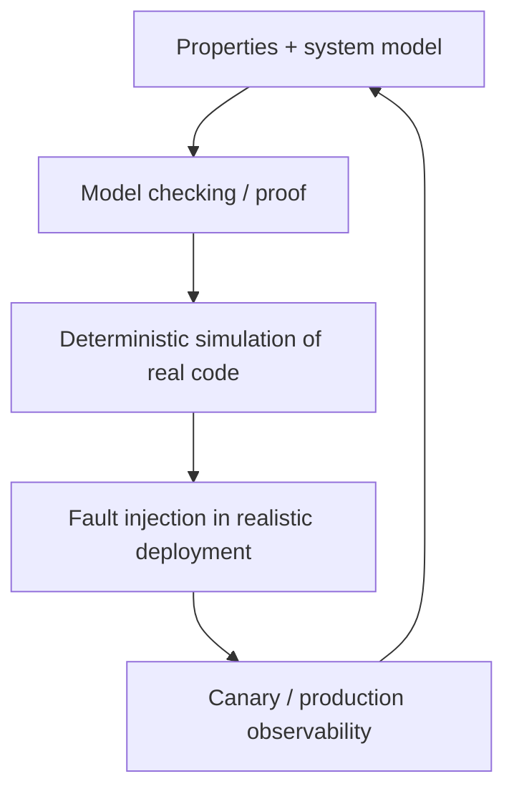

每层覆盖上一层 abstraction gap，并把 incidents反馈到 model/tests。

### 4.154 Formal Methods and Randomized Testing 小结

formal methods 在 abstract model 内验证 safety/liveness；model checker系统探索 bounded states；fault injection验证真实 environment；DST 在 controllable environment 中跑 actual code并精确 replay。

determinism 不只服务 testing，也贯穿 event sourcing、workflow 与 state-machine replication。最强实践是 property/specification、simulation、chaos 与 production monitoring 的闭环。

### 4.155 Knowledge, Truth, and Lies 小结

node 无法凭 local observation获得 global truth；quorum在 model内形成共同 decision，fencing把 generation落实到 resources。若 nodes可 malicious lie，需 BFT；一般 system则声明 honest crash/gray-failure model。

correctness 通过 safety/liveness properties定义，formal proof与 randomized real-code testing验证。可靠性来自明确 assumptions、protocol evidence 和可重放 counterexample，而不是相信 timing与组件永远正常。

---

## 5. 原章总结：partial failure 与不完整知识定义了分布式系统

### 5.1 packet 与 response 都可能 lost/delayed

send request 后 no reply，无法知道 request是否到达/执行/commit，也无法知道 reply是否丢失/仍 queued。network error 常是 unknown outcome。

### 5.2 clocks 可能 drift/jump

NTP 已配置也可能 offset显著、向前/向后 step、source错误；普通 API又不暴露 confidence interval。wall timestamp 不可直接证明 causal order。

### 5.3 process 可任意暂停再复活

GC、VM suspend、scheduler、I/O、paging、SIGSTOP 可在任意 instruction暂停。peers可能判它 dead并接管；old process恢复时不知 world已变化。

### 5.4 partial failure 是定义性特征

distributed operation 可随机 slow/fail/no response，其他 components仍工作。fault tolerance 必须内建于 software，使 overall system 在部分 components broken 时继续或至少 safety-preserving fail。

### 5.5 fault detection 本身不准确

多数 detector依赖 timeout，但 timeout无法区分 node/network/pause。false suspicion 会触发 duplicate work、election/rebuild与 cascading failure。

### 5.6 limping nodes 更难

clean crash 不回应，容易绕过；limping/gray node回应 health却无法完成 real work，持续占 connections/locks/queues，signal矛盾。

### 5.7 no global variable / common knowledge

nodes 无 shared memory、共同 clock 或即时全局 state。information 只能经 unreliable messages传播；major decision不能依赖单 node，需 quorum/consensus等 protocol evidence。

### 5.8 quorum 与 fencing

quorum intersection帮助形成 unique authority decision；fencing generation让 downstream拒绝 old leaders/zombies/delayed requests。二者分别负责 grant 与 enforcement。

### 5.9 single-node 值得优先考虑

从单机 mathematical abstraction 进入 distributed physical reality会打开 **Pandora's box** 般的大量 failure state。如果 embedded/single-node system 已满足容量、availability与latency，避免 distribution 通常值得。

### 5.10 distributed 不只为 scalability

fault tolerance、rolling maintenance、geo-local latency 也需多 nodes。理想 distributed service可在 node-level faults/maintenance下长期不间断。

### 5.11 correlated change 仍可击倒全体

bad configuration/software rollout 到所有 nodes，会绕过 replica independence，让 distributed system整体失败。多 copies不等于 diverse failure domains。

### 5.12 unreliability 不是自然定律

bounded network delay、hard real-time process response可实现，但需 static reservation、dedicated resources、RTOS/admission control，cost高且 utilization低。

### 5.13 普通系统选择经济性

多数 non-safety-critical systems选择 cheap/dynamically shared/unreliable timing，而非 expensive hard guarantees。因此 software必须在 partial synchrony/unbounded tail下正确。

### 5.14 生产级系统的价值

本章问题看似 bleak；成熟、充分验证的 distributed systems把多年 protocol/testing经验封装起来。第 10 章将从 problems转向 linearizability、consensus 等 solutions。

---

## 6. 参考文献的证据脉络

### 6.1 136 条引用覆盖什么

原章共有 136 条参考文献，覆盖 distributed reliability、TCP/network incidents、queueing/circuit switching、NTP/PTP/Spanner、process pauses/GC、leases/fencing、BFT、system models、safety/liveness、model checking、Jepsen 与 deterministic simulation。

完整书目与原始链接见原章 References。

### 6.2 distributed mindset 与 partial failure（参考文献 1–4）

- 1–2 说明 application即使未自觉也常在构建 distributed system，并强调 reliability reality；
- 3 列举 datacenter physical/partial faults；
- 4 总结面向新工程师的 distributed-system lessons。

用途：建立本章“怀疑 local observation”的工程心智。

### 6.3 TCP 与 end-to-end reliability（参考文献 5–10）

- 5 是 TCP congestion control经典工作；
- 6 解释 TCP close/linger与所谓 reliability边界；
- 7 是 end-to-end argument；
- 8–10 讨论 network reliability illusion、network-assisted uncertainty 与 datacenter failure measurements。

用途：区分 transport delivery、application processing和 network fault evidence。

### 6.4 physical/network incidents 与 partitions（参考文献 11–26）

这一组覆盖 wide-area cable physical faults、configuration/sabotage、minutes-level delay、asymmetric/partial partition、real incidents、Jepsen Elasticsearch/Redis Sentinel 与 timeout/failure detection。

用途：证明 datacenter/internet fault形态比“link up/down”丰富，recovery后影响也可持续。

### 6.5 queueing、virtualization 与 failure detector（参考文献 27–33）

- 27–31 分析 queue、Kubernetes stalls、EC2 virtualization/I/O 与 etcd lock；
- 32–33 是 Phi Accrual failure detector 理论/说明。

用途：解释 delay distribution、noisy neighbor与 adaptive suspicion。

### 6.6 circuit/packet switching 与 tail latency（参考文献 34–38）

- 34–35 是 ATM/telephone/internet networking教材；
- 36 系统分析 hardware/OS/application tail sources；
- 37–38 讨论 InfiniBand与 congestion control。

用途：理解 predictability–utilization trade-off，而不把 unbounded delay当自然定律。

### 6.7 clocks、NTP 与 leap seconds（参考文献 39–53）

这一组包括 NTP FAQ、leap-second incidents/smearing、Windows/monotonic/TSC、多核 time、Spanner clock assumptions、internet sync accuracy与 Cassandra clock问题。

用途：区分 resolution/accuracy、wall/monotonic，以及理解 physical timestamp failure。

### 6.8 virtualization、high-accuracy time 与 logical clocks（参考文献 54–72）

- 54–61 讨论 VM time、MiFID II、PTP、GPS interference、cloud microsecond clock；
- 62–65 是 Cassandra/timestamp ordering incidents与分析；
- 66 是 Lamport logical-clock经典论文；
- 67 讨论 “There Is No Now”；
- 68–72 讨论 Spanner/TrueTime、ClockBound及其他 database time designs。

用途：从 raw time走向 confidence interval、logical order和 global snapshot protocol。

### 6.9 leases、pauses 与 GC（参考文献 73–82）

- 73 是 lease经典论文；
- 74–78 覆盖 contention incident、full GC、VM live migration、disk/GC interaction；
- 79–82 讨论 GC tuning、coordinated GC与 LMAX restart模式。

用途：证明 check-to-use pause现实存在，并理解 drain/redundancy mitigation。

### 6.10 knowledge、locks 与 fencing（参考文献 83–93）

- 83 是 distributed knowledge/common knowledge理论；
- 84 讨论 web application ad-hoc transactions；
- 85–90 覆盖 ZooKeeper、HBase、STONITH、Chubby、etcd、Hazelcast；
- 91–93 是 distributed locking/Redlock debate与 S3 conditional leader election。

用途：核对 lease misuse、zombie、fencing-token enforcement。

### 6.11 Byzantine faults 与 weak corruption defenses（参考文献 94–107）

- 94 是 Byzantine Generals经典论文，95–97 补充 two generals/名称历史；
- 98–104 覆盖 aerospace、blockchain、P2P Byzantine consistency；
- 105–107 是 poison packet与 checksum漏检。

用途：划清 honest-crash、malicious-arbitrary 与低成本 input/checksum defenses。

### 6.12 system model、gray failure 与 properties（参考文献 108–119）

- 108 定义 partial synchrony；
- 109 是 fail-stop model；
- 110–114 研究 limping/fail-slow/gray/partial functionality；
- 115–116 讨论 eventual consistency与 liveness formal definition；
- 117–119 是 metadata/stable-storage failure和 engineering response。

用途：把 timing/node assumptions、safety/liveness与 reality gap系统化。

### 6.13 formal methods、chaos 与 DST（参考文献 120–136）

- 120–123 是 AWS/TigerBeetle/FoundationDB correctness/testing实践；
- 124–129 覆盖 Kafka/TiDB/Cockroach model、VR counterexample、spec-code conformance；
- 130–133 是 Chaos Monkey、Jepsen、random partition testing；
- 134–136 是 FoundationDB/TigerBeetle/Go deterministic simulation。

用途：构建从 specification 到 actual-code replay、production fault injection 的验证链。

### 6.14 使用参考文献的方法

1. 先判断问题属于 network、clock/pause、authority/fencing、fault model还是 verification；
2. 到原章 References选 measurement、incident、formal paper或 implementation report；
3. 分清 observed percentile 与 hard bound、algorithm model 与 production assumption；
4. 把反例转成 property、fault test与 monitoring。

---

## 7. 容易混淆的概念与常见误区

### 7.1 误区：timeout 证明 remote node dead

timeout只表示 deadline内无 response；request/response可 delayed/lost，node可 paused。它产生 suspicion，不是物理死亡证明。

### 7.2 误区：TCP 让 network 可靠

TCP 在单 connection内重传/排序 bytes；不保证 bounded delay、connection重建去重、remote application处理或 durable commit。

### 7.3 误区：TCP ACK 表示业务成功

ACK只到 receiver kernel；application可能未 read/commit就 crash。业务成功需 application response/status/durable evidence。

### 7.4 误区：network partition 只指 cluster 完全分两半

可 asymmetric、one-way、peer-specific、partial functionality；A↔B、B↔C通而A↔C断也可能。

### 7.5 误区：packet loss 低就说明 network可靠

minutes delay、queue、misrouting与 silent asymmetric fault即使不大量丢包也会破坏 protocol assumptions。

### 7.6 误区：p99 latency 是 upper bound

p99明示 1%更慢，distribution还会随 incident/load变化。hard timeout proof需要 known maximum，不是 percentile。

### 7.7 误区：越短 timeout 越高可用

短 timeout会误判 slow node、触发 duplicate/election/rebuild，增加 load并可能 cascading failure。

### 7.8 误区：UDP 没有 queue/delay

UDP只去掉 transport retransmit/flow control，仍受 switch queues、scheduler、loss。它适合 expired data worthless 的场景。

### 7.9 误区：TCP connection 类似 reserved circuit

TCP不预留 bandwidth，动态竞争 shared links；circuit有 end-to-end reserved slots与 bounded queueing。

### 7.10 误区：network unbounded delay 是自然定律

static resources/QoS/RTOS可给 bounds，代价是低 utilization、高 cost和 admission rejection。当前通用 cloud选择另一 trade-off。

### 7.11 误区：wall clock 可测 timeout

wall clock会 NTP/DST/leap step；duration应用 monotonic clock。

### 7.12 误区：nanosecond timestamp 就准确到 nanosecond

resolution只表示 digits；UTC uncertainty可能毫秒/秒。必须区分 precision 与 accuracy。

### 7.13 误区：NTP 同步后 timestamp 可排序所有 events

clock offset/RTT uncertainty可让 causal-later event timestamp更小。logical clock或 confidence-interval protocol才可靠。

### 7.14 误区：monotonic clocks 可跨 nodes 比较

monotonic counter origin通常 since boot/arbitrary，只能同 clock domain计算 duration。

### 7.15 误区：lease service 保证世界中只有一个执行者

old holder可 pause后恢复、old request可 delayed。短时间多个 actors都相信持 lease是现实，resource必须 fence。

### 7.16 误区：kill old node 足以 fencing

already-sent delayed request仍会到；shutdown也可能太晚或错误互杀。storage-side monotonic token 才覆盖 zombie/message。

### 7.17 误区：有 distributed lock 就无需 storage 检查

lock service只发 permission；resource不验证 token/CAS，stale client仍可直接写。

### 7.18 误区：quorum 是“多数一定正确”

quorum safety来自 set intersection + honest voting/stable memory assumptions，不是人数投票自动产生事实。

### 7.19 误区：replicas/majority 可抵御共同 bug

相同 software/config fault可同时影响全部 nodes，破坏 independence。需要 diverse failure domains、staged rollout与 validation。

### 7.20 误区：BFT 可自动修复同一代码 bug

所有 nodes同实现时多数可同错；抵御 bug需 independent implementations，成本巨大。

### 7.21 误区：恶意 web client 需要 BFT consensus

通常 server是 authority，用 auth/validation/sanitization；BFT适合无 central trust的 peers或 arbitrary faulty controllers。

### 7.22 误区：synchronous model 表示 zero delay

它只要求 delay/pause/clock error有 known finite bound，可非零。

### 7.23 误区：partially synchronous 表示 bound 永不违反

它允许某些期间 arbitrary delay，并假设 eventually恢复 bounded behavior；liveness常依赖 eventual stabilization。

### 7.24 误区：health endpoint响应就 node健康

background work可 deadlock、NIC降速、GC thrash。需 end-to-end progress/latency probes。

### 7.25 误区：crash-recovery 的 stable storage 绝不会丢

这是 model assumption。disk corruption/old snapshot restore可造成 amnesia，破坏 quorum/consensus proof。

### 7.26 误区：safety 与 liveness 都要求每时刻成立

safety任何时刻不可违反；liveness可暂未满足，只要求 assumptions下 eventually完成。

### 7.27 误区：eventual consistency 本身是 safety guarantee

它主要是 liveness（最终 converge）；还需 safety约束中间允许返回/合并什么。

### 7.28 误区：algorithm formal proof 等于 production implementation正确

translation/code/deployment/model mismatch仍可出错。需 conformance、DST、fault injection与 monitoring。

### 7.29 误区：model checker穷举真实系统无限 states

通常验证 bounded/reduced model；长 execution或 implementation-specific bug可能漏掉。

### 7.30 误区：chaos engineering 就是随机 kill机器

应有 steady-state property、controlled blast radius、checker、recovery assertion；只制造 outage不验证 correctness没有价值。

### 7.31 误区：DST 只测试 simplified model

DST运行 actual code，但 mocks/control environment；model checker才主要运行 abstract specification。

### 7.32 误区：固定 seed 可重放就代表无 bug

determinism只让 observed path可重现；仍需探索足够 seeds、正确 properties/checkers，并控制所有 nondeterminism。

---

## 8. 全章知识结构

### 8.1 三层 uncertainty

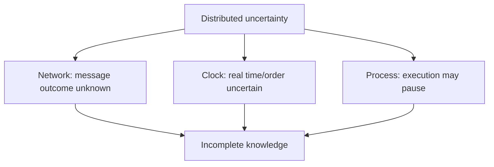

protocol必须在 incomplete knowledge下仍保持 safety。

### 8.2 observation 与事实分离

| observation | 可合理推断 | 不能证明 |
|---|---|---|
| timeout | deadline内无 reply | remote dead/未执行 |
| TCP ACK | remote kernel收 bytes | app commit |
| wall timestamp | local clock reading | global causal order |
| lease in memory | 曾获得 permission | 当前仍唯一 holder |
| health OK | endpoint线程可响应 | 全功能正常 |

### 8.3 evidence ladder

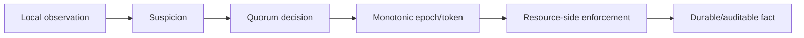

越不可逆的 action，越需要更强 evidence，而非更自信的 timeout。

### 8.4 timeout control loop

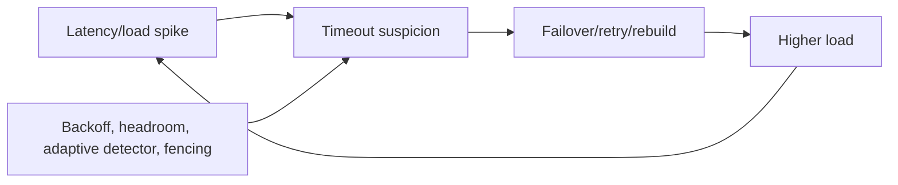

failure handling本身可能构成正反馈，必须控制。

### 8.5 clock selection map

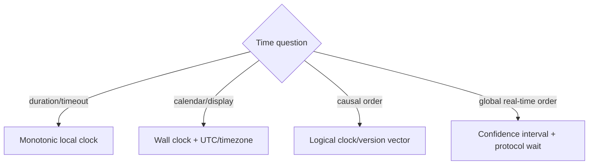

### 8.6 lease safety chain


### 8.7 system-model matrix

| axis | models |
|---|---|
| timing | synchronous / partially synchronous / asynchronous |
| node lifecycle | crash-stop / crash-recovery |
| performance | normal / fail-slow / gray / partial functionality |
| honesty | honest faults / Byzantine arbitrary faults |
| storage | stable / corruption-amnesia extension |

algorithm proof必须标注使用哪个组合。

### 8.8 correctness decomposition

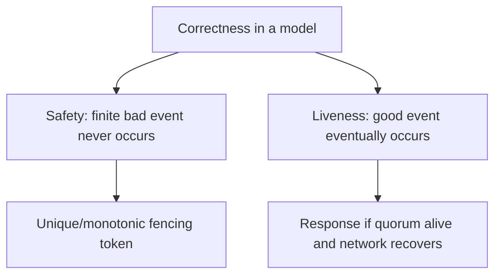

fault期间可暂停 liveness，不可牺牲 safety。

### 8.9 verification stack

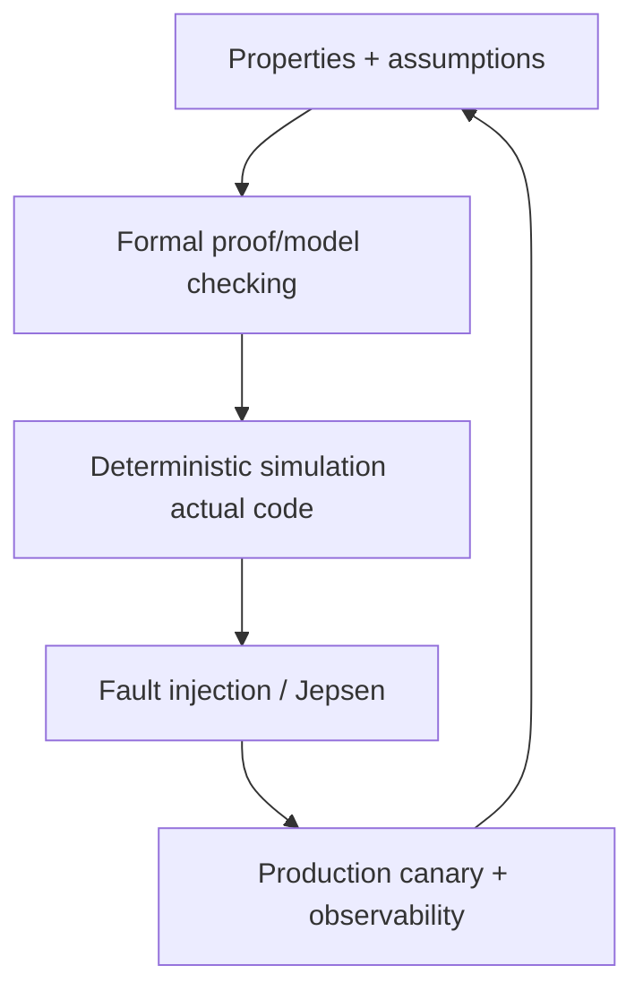

每层填补上一层 abstraction gap。

### 8.10 核心公式

| 主题 | 公式 | 含义 |
|---|---|---|
| bounded timeout | $2d+r$ | request/processing/response上界 |
| queue saturation | $1/[\mu(1-\rho)]$ | utilization趋 1 时 delay爆炸 |
| clock drift | $T\rho10^{-6}$ | ppm 在 interval内误差 |
| majority | $\lfloor n/2\rfloor+1$ | absolute majority size |
| quorum overlap | $|Q_1\cap Q_2|\ge2q-n$ | conflicting sets共享 voters |
| BFT common bound | $n\ge3f+1$ | tolerate $f$ arbitrary nodes |
| fencing | $token_{new}>token_{old}$ | authority generations单调 |
| confidence order | $A_{latest}<B_{earliest}$ | A definitely before B |

### 8.11 design question checklist

1. no response有哪些可能解释？
2. timeout是 policy还是 proof？
3. process pause后 old action如何 fenced？
4. time用途是 duration、calendar还是 order？
5. quorum proof依赖哪些 honesty/storage assumptions？
6. safety/liveness分别是什么？
7. model外 fault如何 fail closed？
8. properties如何由 model/DST/fault test验证？

### 8.12 全章因果链

```text
partial failure and unreliable observation
  -> no single node knows global truth
  -> declare timing/node/storage/honesty model
  -> use quorum and monotonic generations
  -> enforce authority with fencing at resources
  -> define safety and conditional liveness
  -> verify model, implementation, and deployment under faults
```

本章的核心不是“分布式系统很难”，而是把模糊恐惧转化为 assumptions、properties、protocol evidence 与可重放 tests。

---

## 9. 综合案例：分片维护与对象存储控制器

### 9.1 场景

设计一个 distributed maintenance system，为 database shards 执行 compaction/snapshot：worker读取 immutable input files，生成新 files，最后原子更新 object-storage manifest。

control plane 有 5 nodes；workers 可 crash/pause；network 可 partition/delay；object store支持 conditional write。每 shard 任一 generation 只能有一个 authoritative manifest。

### 9.2 为什么要 distributed

- 任一 controller/worker maintenance不停止服务；
- 任务并行处理多个 shards；
- 跨 AZ replicas容忍 machine/rack fault；
- workers靠近 data降低 transfer latency。

若这些需求不存在，single controller更简单；本案例的 distribution 有明确收益。

### 9.3 safety properties

1. 同一 shard manifest generation 最多一个 committed value；
2. lower fencing token不能覆盖 higher token；
3. manifest只引用完整、checksum-valid outputs；
4. old inputs 在新 manifest durable/validated前不删除；
5. request retry 不重复 publish incompatible manifest；
6. quorum decision/term不倒退。

### 9.4 liveness properties

在至少 3/5 controllers可通信、object store可用、network eventually stabilizes、worker capacity存在时：

- pending shard最终被处理；
- failed task最终 reassigned；
- committed output最终可见；
- obsolete files最终 GC。

这些都带 eventual/caveats，不要求 partition期间立即完成。

### 9.5 system model

采用 **partially synchronous + crash-recovery + honest nodes**：

- network/process delay可暂时 unbounded；
- nodes可 crash/restart，durable consensus log保留；
- gray/fail-slow需检测；
- no Byzantine controllers；
- object store conditional write/checksum大体可靠；
- out-of-model corruption进入 fail-closed/manual recovery。

### 9.6 fault budget

5-node majority：

$$
q=3,\qquad f=2
$$

在 replica placement独立、nodes honest且 durable votes不遗忘时，可容忍任意 2 controllers unavailable。不能宣称容忍 2 correlated data-loss bugs。

### 9.7 authority assignment

controllers 通过 consensus决定 shard task owner，grant 每次产生 monotonically increasing fencing token，例如：

```text
shard-17, token 91 -> worker A
shard-17, token 92 -> worker B
```

lease可帮助 timeout/reassignment，但 safety以 token/resource check为准。

### 9.8 timeout 只是 reassignment trigger

worker A heartbeat timeout不证明 dead；controller quorum可在 policy 后 grant token92给 B。A 可能仍 paused或 old message in flight。

因此 timeout不直接删除 A outputs，也不假定 A停止。

### 9.9 adaptive failure detector

持续测 heartbeat/real task progress，使用 jitter-aware suspicion；short timeout前要有 capacity headroom，避免 overload时大量 reassign形成 cascading failure。

health endpoint之外监控 bytes processed/checkpoint advancement。

### 9.10 worker task protocol

1. 获取 `(shard, token, input_manifest_version)`；
2. 读取 immutable inputs；
3. 写带 task ID/token 的 temporary output names；
4. checksum/validate；
5. conditional publish new manifest with token/version；
6. success 后安排 old-file GC。

### 9.11 immutable outputs 降低冲突

workers 不原地覆盖 shared file，而写 unique immutable objects：

```text
shard-17/compaction/token-92/output-0001
```

duplicate workers最多产生 orphan files；唯一危险点集中到 manifest pointer update，可用 CAS/fencing保护。

### 9.12 storage-side fencing

manifest metadata保存 highest token。publish condition：

$$
token\ge highestToken\quad\land\quad baseVersion=currentVersion
$$

token91 delayed publish在 token92 commit后被拒绝；即使 A恢复自认 owner，也无法改变 authoritative manifest。

### 9.13 process-pause timeline

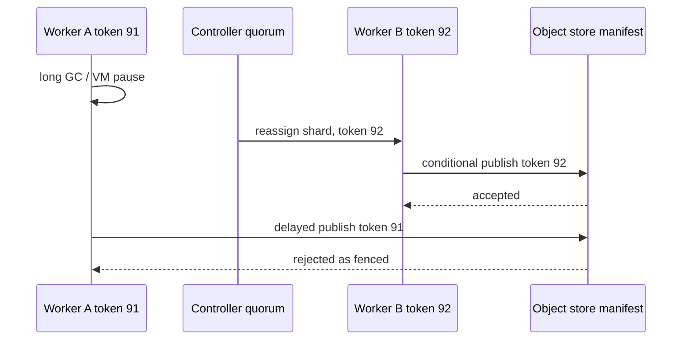

正确性不要求 A及时发现 lease expired。

### 9.14 delayed request timeline

A 可已 crash，但其 token91 request仍在 network。storage相同 token comparison拒绝；fencing同时覆盖 zombie process与 delayed packet。

### 9.15 conditional base version

token可防 old authority；base manifest version CAS 防同 token/logic bug基于 stale inputs覆盖 current state。两项分别验证 generation与read premise。

### 9.16 unknown publish outcome

worker发送 conditional publish 后 timeout：可能 commit、可能未到。不能盲目写另一个 manifest；以 task ID/token读取 current manifest：

- 已是本 output：视为 success；
- higher token：本 task fenced，stop；
- old version：可用 same idempotent condition retry；
- state inconsistent：alert/fail closed。

### 9.17 idempotent request IDs

每 task有 stable ID，temporary object names与 manifest metadata包含 ID。same request retry返回同 result，不产生不同 authoritative effect。

orphan outputs由 background GC按 manifest reachability处理。

### 9.18 clock usage

- timeout/elapsed：local monotonic clock；
- logs/operator：wall UTC + offset/uncertainty metrics；
- authority order：consensus term/fencing token；
- object GC age：server-side timestamp只作 policy，并保留 safety grace period。

不以 worker wall clock排序 manifests。

### 9.19 lease expiry 不跨机裸比较

若使用 lease，controller protocol管理 grant/renew；worker不拿另一 machine wall expiry与 local wall clock比较。即便 monotonic local duration，也仍依赖 fencing防 check-to-use pause。

### 9.20 checksums 与 weak lying

input/output使用 end-to-end checksum；manifest引用 size/hash。worker或 network accidental corruption被 validate 拒绝。

若 worker恶意伪造 hash，本 model不覆盖；需 authenticated content/BFT/independent verification扩展。

### 9.21 fail-slow worker

worker heartbeat正常但 throughput 1 KB/s：progress detector标记 limping，停止分配新 tasks；current task可 speculative duplicate给 new token owner。

old task输出仍由 fencing隔离，不因 duplicate execution corruption。

### 9.22 load-headroom policy

controller只在 target workers/disk/network有 recovery capacity时批量 reassign。限制 concurrent compactions、bandwidth和 retries，避免 fault handling耗尽剩余 capacity。

### 9.23 controller quorum partition

3-node side继续 grant tokens；2-node side不能产生 new authority。minority workers可完成 temporary output，但无法获得 valid newer manifest commit evidence。

network恢复后，以 consensus log/highest term收敛。

### 9.24 controller restart/amnesia

term/vote/token sequence写 replicated durable log。restart不能从 old backup重用低 token；若 durable state lost，node先 snapshot/state transfer恢复，不参与 voting/grant。

amnesiac node直接投票会破坏 intersection proof。

### 9.25 rolling upgrade

逐 controller/worker drain、upgrade、rejoin；保持 3/5 quorum和 worker headroom。mixed-version protocol须 backward/forward compatible，token/manifest semantics不变。

bad rollout先 canary；不能一次部署到所有 replicas形成 correlated failure。

### 9.26 observability

监控：

- quorum/term/leader changes；
- heartbeat RTT/jitter 与 progress rate；
- lease renew/fencing rejection；
- unknown publish outcomes；
- task duplicate/orphan bytes；
- controller clock offset（diagnostic）；
- compaction queue/reassignment/recovery time；
- checksum mismatch与 manifest invariant。

### 9.27 model checking specification

简化 model：3 controllers、2 workers、1 shard、bounded messages；transitions含 grant、pause、publish、partition、restart。验证：

- token unique/monotonic；
- lower token永不覆盖；
- one committed manifest per version；
- quorum恢复后 eventually process。

counterexample trace进入 regression tests。

### 9.28 deterministic simulation

actual controller/worker code通过 injectable network/object store/clock runtime运行，随机控制 pause、drop、delay、duplicate、crash。seed保存后可精确重放 stale publish race。

mock clock瞬间推进 lease expiry，加速探索 years logical time。

### 9.29 fault-injection matrix

| fault | expected property |
|---|---|
| drop worker response after manifest commit | status lookup识别 success，无 duplicate manifest |
| pause old worker past lease | token rejection，无 corruption |
| delay old publish after new owner | storage fences old token |
| split controllers 3/2 | 仅 majority side grant |
| fail-slow worker | progress-based reassignment，不 cascading overload |
| controller crash/restart | durable term/token不倒退 |
| corrupt output | checksum prevents manifest publish |
| network recover | queues drain、tasks eventually complete |

### 9.30 out-of-model response

若 object store违反 conditional write、consensus logs全损或 malicious controller伪造 token，automatic proof失效。系统应 freeze affected shard、保留 evidence、alert human，而非猜测继续删 files。

### 9.31 cost trade-off

hard real-time/fully reserved network可减少 uncertainty但成本不值；本 system选择 partial synchrony、temporary unavailability与 redundant workers，以 fencing保 safety。

这是明确的 economics/correctness选择，不是“云一定不可靠”的宿命。

### 9.32 综合案例结论

可靠 controller不需要准确知道 worker dead，也不需要保证只有一个 process自称 owner。它只需让 quorum产生单调 authority，并让 manifest resource拒绝 stale authority。

immutable outputs、CAS、idempotency、checksums将 unknown outcomes变成可查询/可清理状态；formal model、DST 与 fault injection验证 assumptions到implementation的整条链。

---

## 10. 核心结论

### 10.1 三十二条核心结论

1. partial failure 是 distributed system 的定义性困难。
2. no response 无法区分 request loss、node failure、pause、response loss或delay。
3. timeout是 policy/suspicion，不是 remote death proof。
4. TCP保证单 connection内 ordered byte stream，不保证 application effect。
5. transport ACK、application response、durable commit是不同 evidence层。
6. packet network的 dynamic sharing带来高 utilization和unbounded queueing tail。
7. hard bounded latency可实现，但需 static reservation/admission并付出高成本。
8. short timeout会放大 overload并可能触发 cascading failure。
9. monotonic clock适合 local duration，不可跨 nodes比较。
10. time-of-day clock适合 calendar，却会 drift、step、leap且不保证causal order。
11. timestamp resolution不等于 UTC accuracy。
12. NTP改善 synchronization，不足以排序任意 close events。
13. logical clocks表达 causality，不表达 elapsed physical time。
14. confidence interval比单点 timestamp更诚实。
15. Spanner以 clock uncertainty + commit wait建立可证明 global order。
16. process可在任意 instruction暂停并在 world变化后恢复。
17. lease check即使用monotonic clock也有check-to-use pause风险。
18. quorum intersection帮助形成unique authority，但依赖honest voting与stable memory。
19. lease不保证world中只有一个self-declared holder。
20. fencing token让resource永久拒绝old generation/zombie/delayed request。
21. distributed lock若resource不验证token/CAS，不能保护数据。
22. ordinary datacenter通常假设nodes honest，BFT只在特定threat model值得。
23. replicated identical software不能自动抵御common bug或common misconfiguration。
24. partially synchronous + crash-recovery是多数production systems的实用模型。
25. limping/gray/fail-slow node常比clean crash更难处理。
26. safety violation有finite不可撤销时点，必须在所有allowed executions避免。
27. liveness可依赖majority存活与network最终恢复。
28. eventual consistency主要是liveness，不是完整safety specification。
29. algorithm proof只在declared system model内成立。
30. model checking验证bounded abstraction，fault injection验证real environment，DST验证actual code并可重放。
31. determinism贯穿simulation、event sourcing、workflow与state-machine replication。
32. 可靠性来自明确assumptions、properties、protocol evidence、resource fencing与分层testing。

---

## 11. 解决分布式系统问题的一般方法

### 11.1 第一步：证明为什么需要 distributed

明确目标是scale、fault tolerance、rolling maintenance还是geo latency。single-node/embedded若满足要求，优先简单系统，避免无收益打开failure state space。

### 11.2 第二步：列出 irreversible effects 与 invariants

哪些动作会删data、扣款、publish manifest、授予leader？写出“绝不能发生”的 safety property，而非只列services。

### 11.3 第三步：区分 observation、knowledge 与 truth

对 timeout、ACK、timestamp、lease、health check逐项写：它证明什么、不能证明什么。unknown outcome必须成为API/state，而不是被压成false。

### 11.4 第四步：声明 system model

选择 synchronous/partial/asynchronous、crash-stop/recovery、gray、Byzantine与stable-storage assumptions。记录model外fault怎样fail closed/manual recover。

### 11.5 第五步：定义 fault budget 与 failure domains

写明 $n,q,f$、rack/AZ/region placement、correlated software/config risks。不要把node count当independence证明。

### 11.6 第六步：分离 safety 与 liveness

safety始终保持；liveness写明eventual network recovery、majority、capacity等前提。partition时宁可暂停，也不返回wrong result。

### 11.7 第七步：major decisions 使用 quorum/consensus

单node timeout判断不能授予global authority。用intersecting votes、durable term/epoch建立one authoritative history。

### 11.8 第八步：把 authority 带到 resource boundary

lease/leader grant返回monotonic fencing token；每个storage/service验证token或CAS。不能依赖old process及时停止。

### 11.9 第九步：正确选择 clock

- elapsed/timeout：monotonic；
- calendar：wall UTC + timezone；
- causality：logical clock/version；
- global real-time：uncertainty interval + protocol。

持续监控clock offset/last sync/uncertainty。

### 11.10 第十步：设计 timeout 与 feedback control

基于distribution/business cost实验选择，考虑jitter、自适应、backoff、retry budget、headroom与cascading failure。timeout后仍用idempotency/fencing保护old work。

### 11.11 第十一步：处理 unknown outcome

request ID、dedup、status lookup、conditional write、immutable output使retry安全。不要把connection error当definite failure。

### 11.12 第十二步：专门处理 gray/process pause

监控real progress而非health ping；限制reassignment/rebuild并发；drain GC/maintenance；用SIGSTOP、steal/disk pressure测试zombie behavior。

### 11.13 第十三步：监控 model assumptions

clock drift、quorum durability、disk corruption、replica independence、network tail、GC pause、token monotonicity一旦超限，node/partition应退出authority并alert。

### 11.14 第十四步：formalize properties

用TLA+/FizzBee等specify state machine、invariants、liveness assumptions；model check reduced state space，保存counterexample并version spec/code。

### 11.15 第十五步：验证 actual implementation

DST控制network/clock/scheduler并seed replay；Jepsen/fault injection测试real binaries/topology；canary/chaos验证production recovery。checker从properties导出。

### 11.16 第十六步：写入 ADR 与 runbook

```text
why distribution is required:
system model and out-of-model faults:
safety invariants and conditional liveness:
quorum size, fault budget, and failure domains:
authority epochs / fencing enforcement:
network timeout, retry, and unknown outcomes:
clock type, synchronization, and uncertainty:
process-pause and gray-failure handling:
idempotency / conditional writes / cleanup:
formal model, DST seeds, and fault-injection matrix:
assumption monitoring and fail-closed thresholds:
manual recovery and known non-guarantees:
```

方法的核心顺序是：**先说明为何必须分布式，再声明model与properties；用quorum产生authority、用fencing落实authority；把timeout/clock/pause当不可靠input，最后以formal model、DST、fault injection和monitoring闭环。**
