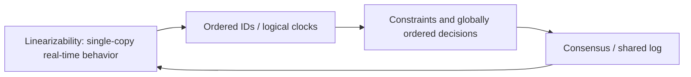
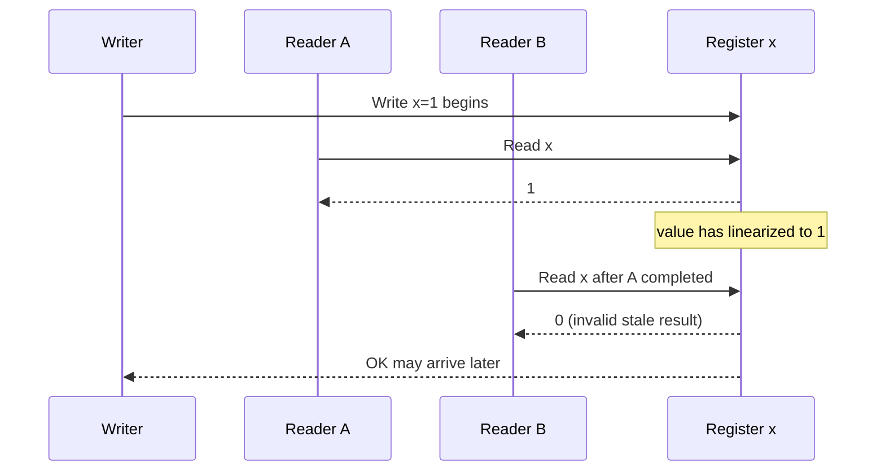
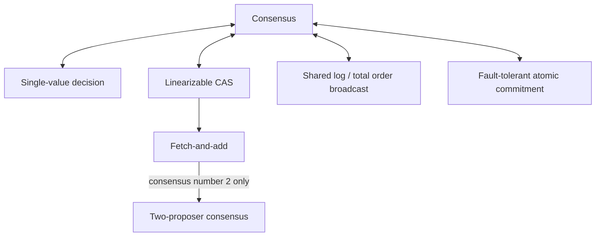
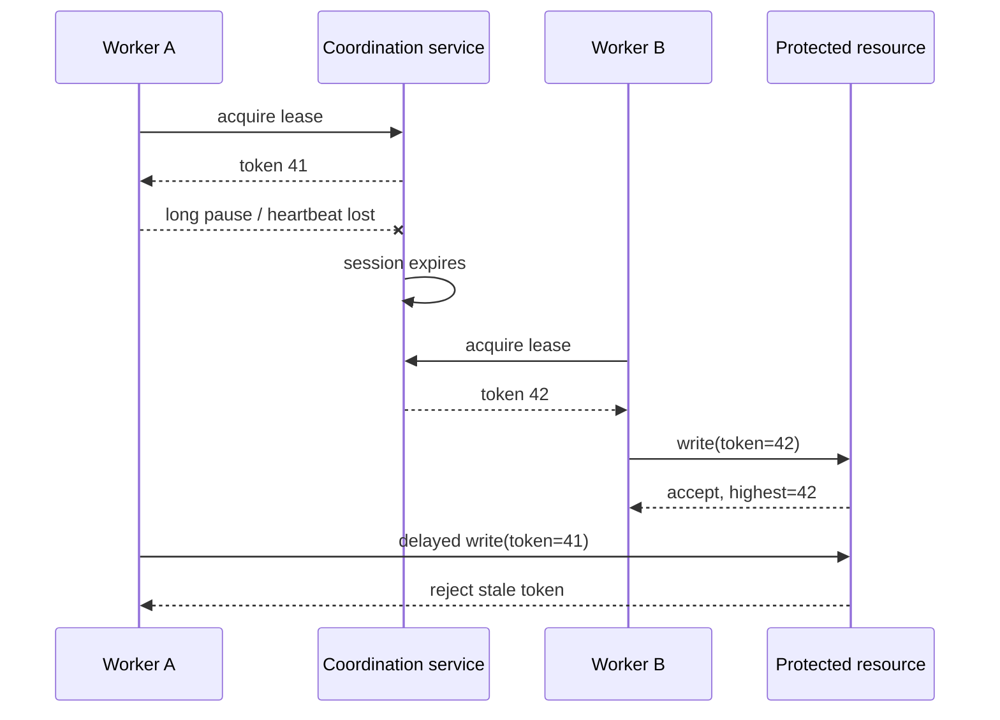
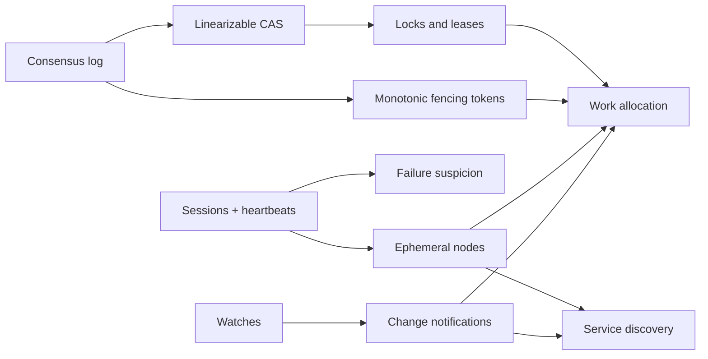
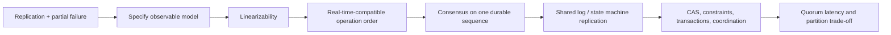
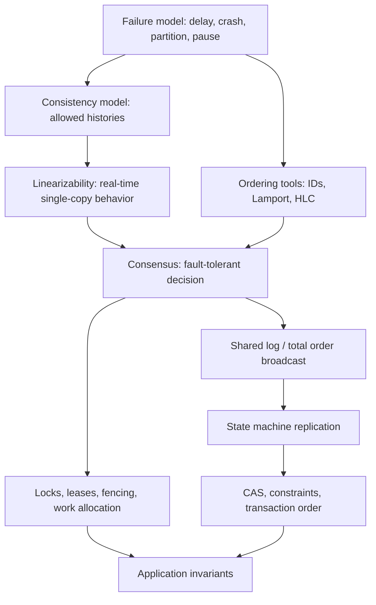
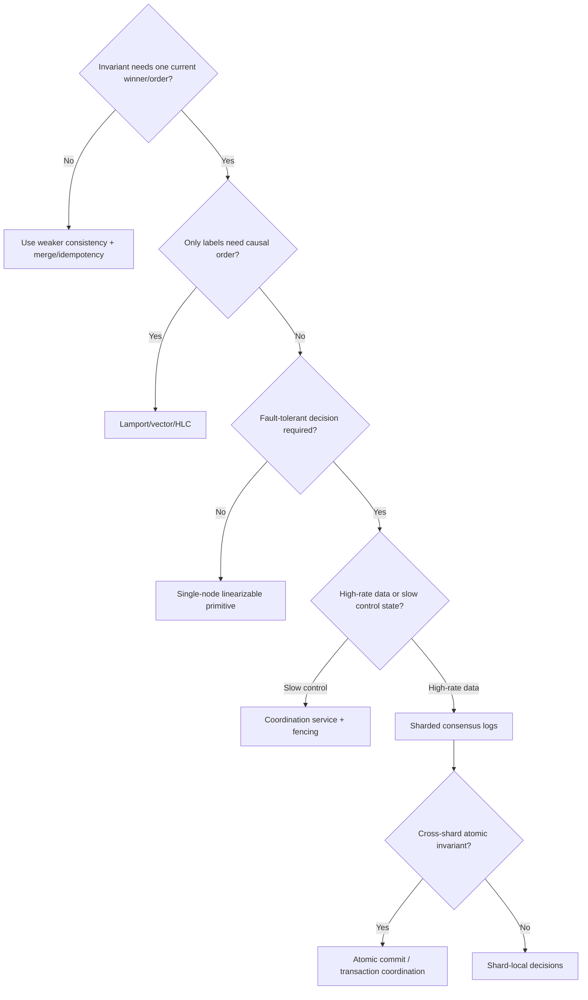
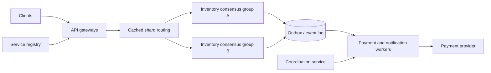
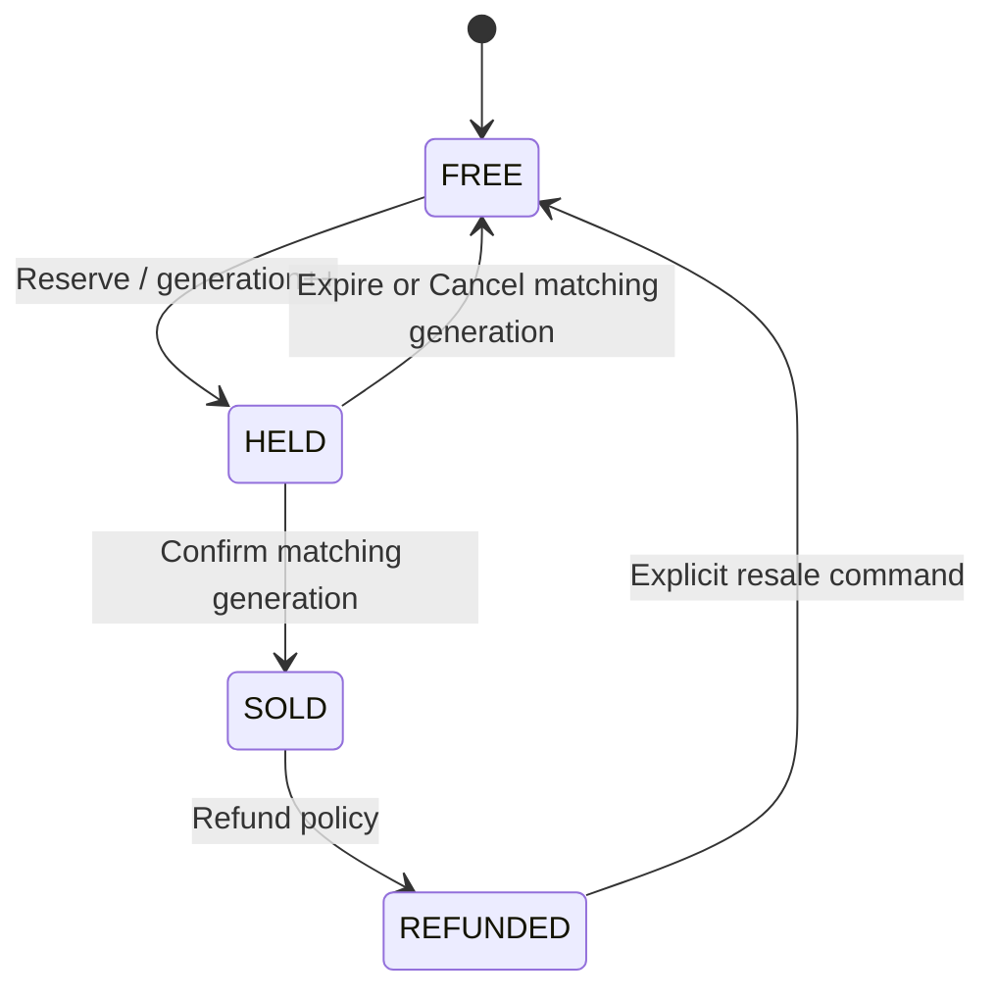

> 对应原文：10. Consistency and Consensus.md
>
> 本文严格按照原章顺序讲解，并在章后统一补充易混概念、综合案例和可复用的一致性/共识设计方法。原章重点是 linearizability、logical clocks、ID generators、consensus、shared logs 与 coordination services。文中的公式、推导、可运行示例与扩展案例用于解释和验证原理，不应误认为原书逐字给出的实现。

## 0. 本章定位：复制带来容错，也带来“哪一份是真”的问题

### 0.1 第 9 章的问题如何进入本章

第 9 章说明 network、clock、process 都不可靠，single node 无法仅凭 local observation 知道 global truth。本章研究怎样在这些约束下提供 application 可依赖的强语义。

核心不是消除 faults，而是在 faults/partial knowledge 下建立：

- single-copy illusion；
- globally meaningful ordering；
- unique decision；
- fault-tolerant agreement。

### 0.2 replication 的双刃剑

replication 是 fault tolerance 的主要工具：一台 machine 故障时还有 copies。但 multiple copies 会产生：

- stale follower reads；
- concurrent writes/conflicts；
- failover 中 lost committed data；
- split-brain leaders；
- 不同 replicas 对 order 看法不同。

副本越多，物理可靠性可提高，逻辑一致性问题却更突出。

### 0.3 eventual-consistency philosophy

**eventual consistency** 让 application 看见 replication：developer 处理 stale values、siblings、conflict merge 与 session guarantees。multi-leader、leaderless、offline-first 常采用该路线。

优势是 local availability、low latency、partition/offline writes；代价是 application semantics 更复杂。

### 0.4 strong-consistency philosophy

**strong consistency** 试图隐藏 replication，让 system 像一台 authoritative machine。application 不必理解 replica lag/conflicts。

优势是 programming model 简单；代价是 coordination latency，并在某些 network failures 下暂停/拒绝 operations。

### 0.5 二者不是价值高低

offline editing 必然允许 divergent local states，eventual/merge model自然；同 datacenter fast reliable links、hard uniqueness/leader election则 strong consistency常更合适。

选择依据是 invariant、latency、partition behavior 与 user experience，而不是 SQL/NoSQL标签。

### 0.6 “strong consistency”仍太模糊

它可能被用来指 read-your-writes、sequential consistency、linearizability、serializability、quorum reads 等不同性质。没有精确定义就无法测试或推导应用 correctness。

本章先把目标精化为 **linearizability**。

### 0.7 ID/timestamp 为什么与 consistency 相关

distributed ID 不只要 unique；若还用 ID 排序 events、enforce uniqueness、选择 winner，它就必须反映 causal/real-time关系。

ID generator 的 ordering guarantee 本身就是 consistency service。

### 0.8 consensus 为什么出现

要在 multiple replicas、leader failure、network partition 下安全实现 linearizable register/log，nodes 必须对 value/order/leader 达成 **consensus**。

consensus 不是额外装饰，而是 fault-tolerant unique decision 的基础。

### 0.9 三个主题的依赖链



linearizability 定义目标，logical clocks 表达 order，consensus 在 faults 下生成共同 order/decision。

### 0.10 fundamental limits

network partition、unbounded delay 与 node failure 使某些 guarantee组合不可能。linearizability 会牺牲 latency/availability；consensus liveness 依赖 timing/fault assumptions。

理解 limit 是为了诚实选择，而不是宣布 distributed system 无法实现。

### 0.11 implementation 为什么危险

正常网络下错误 algorithm 也可能长期表现良好；unlucky message order、pause、leader failover才暴露 data loss/split brain。正确实现需 theory、formal model、deterministic/fault testing。

本章给 intuition，不替代 consensus literature、proof 与 production-grade implementation。

### 0.12 本章路线

原章依次讨论：

1. linearizability 的 history/用途/实现/成本；
2. distributed ID generators、Lamport/HLC、constraint ordering；
3. consensus impossibility、CAS/log/fetch-add/atomic commit 等多种面孔；
4. practical consensus/shared logs/leader election；
5. coordination services 的 configuration、work allocation、service discovery。

---

## 1. Linearizability

### 1.1 single-copy illusion

linearizability 让 replicated system **看起来只有一个 data copy**，所有 operations 在该 copy 上 atomic 生效。application 不必知道真实 replicas、lag 与 failover。

### 1.2 aliases

linearizability 也常称：

- atomic consistency；
- strong consistency；
- immediate consistency；
- external consistency。

其中后几个词在不同文献可能更含糊，最好明确写 linearizability。

### 1.3 recency guarantee

write 成功完成后，任何之后开始的 read 必须看到该 value 或更晚 value，不能回到 stale replica：

$$
Write(x,v)\prec_{rt}Read(x)\Rightarrow Read(x)\ne olderThan(v)
$$

$\prec_{rt}$ 表示前一 operation response 先于后一 operation invocation。

### 1.4 sports result 反例

Aaliyah refresh 后看到 final score 并告诉同屋 Bryce；Bryce 听到后才 refresh，却命中 lagging replica，仍看到 game ongoing。

Bryce 的 query 明确在 Aaliyah 已读到新值后开始，因此 stale result 违反 linearizability。

### 1.5 同时 refresh 为什么不同

若两人 requests 时间重叠，clients 不知道 server先处理谁；一人读 old、一人读 new 可以合法。linearizability约束 non-overlapping real-time order，不强制 concurrent operations按 invocation order。

### 1.6 cross-client real-time knowledge

Aaliyah 的声音是 database外通信 channel，让 Bryce 知道 new value已被观察。linearizable database 必须与这种 external real-time precedence一致。

### 1.7 What Makes a System Linearizable?

distributed theory 常把 single object $x$ 称 **register**。它可对应 key-value key、relational row 或 document。

先从 read/write register history 建立 intuition。

### 1.8 operation interval

client 只知道 invocation time $s_i$ 与 response time $e_i$：

$$
Interval(op_i)=[s_i,e_i]
$$

variable network delay 使真正 processing moment未知，但必在该 interval 内。

### 1.9 register operations

- $Read(x)\Rightarrow v$：读取 register，返回 $v$；
- $Write(x,v)\Rightarrow r$：设为 $v$，返回 OK/Error；
- later 再加入 $CAS(x,v_{old},v_{new})$。

### 1.10 before-write read

若 read response 在 write invocation 前完成，read 必须 linearize before write，因此返回 old value。

### 1.11 after-write read

若 read invocation 在 successful write response 后开始，read 必须 linearize after write，因此返回 new value或 later overwrite。

### 1.12 overlapping read/write

read interval 与 write interval overlap 时，两者 concurrent；read 可返回 old 或 new，因为可把 linearization point 放在 write 前或后。

### 1.13 仅允许 old/new 仍不够

若 overlapping reads 可任意 old/new/old flip，system不像 single register。还需存在一个 global cutover point：一旦某 read观察 new，real-time 后续 reads不能再 old。

### 1.14 atomic flip

想象 write interval 内有瞬间 $\ell_w$：

$$
s_w\le\ell_w\le e_w
$$

register 在 $\ell_w$ 从 0 变 1；所有 reads也各有 interval内的瞬间生效点。

### 1.15 first new read 建立后续约束

client A first read返回 1；其 response 后 client B 才发 read，则：

$$
\ell_A<\ell_B
$$

B 必须返回 1 或 later value，即使 original write response尚未到 writer。

### 1.16 response delay 不改变 effect point

write 可已在 database生效，writer 的 OK response仍 delayed；其他 client 先读到 new 完全合法。linearization point与 response arrival不同。

### 1.17 concurrent invocation order 不重要

B read request先发，D write0后发，A write1再发；若 intervals overlap，database可按 D→A→B 执行，使 B 返回1。send order不构成 real-time precedence，只有 response-before-next-invocation 才强制 order。

### 1.18 linearization-point assignment

history linearizable 当且仅当能为每 operation选：

$$
\ell_i\in[s_i,e_i]
$$

并满足：

1. 若 $e_i<s_j$，则 $\ell_i<\ell_j$；
2. 按 $\ell_i$ 排序后符合 sequential object specification。

### 1.19 sequential register specification

在 chosen order 中：

- write 改 current value；
- read 返回最近 preceding successful write value；
- failed write/CAS 不改 value。

如果任何 read value无法由这样一个 order解释，history nonlinearizable。

### 1.20 Compare-and-set（CAS）semantics

$$
CAS(x,a,b)=
\begin{cases}
OK,\ x\leftarrow b,&x=a\\
Error,\ x\ unchanged,&x\ne a
\end{cases}
$$

check 与 set 在同一 linearization point atomic发生。

### 1.21 CAS 为什么揭示 stronger requirement

两个 clients 对同 expected value CAS，最多一个可成功；否则无法放入任何 sequential register history。CAS 不只读最新值，还产生 unique winner。

### 1.22 value 可在 operation response 前被读到

若 write 已 linearize但 response delayed，concurrent read 可返回 new。这不违反 linearizability，因为 effect point在 write interval 内。

### 1.23 final stale read 的反例

client A 已读到 CAS产生的 value4并完成；之后 B read才开始却返回2。即使 B 与 CAS write interval overlap，A→B real-time edge要求 B不低于4，故无法合法 linearize。

### 1.24 history visualization



### 1.25 testing linearizability

记录所有 operation invocation/response times、inputs/outputs，再搜索是否存在满足 interval precedence与object spec的 sequential order。

search computationally expensive，尤其 concurrent operations多时 permutations爆炸；Jepsen/Knossos等 checker使用 pruning/algorithms处理有限 histories。

### 1.26 weaker consistency models

read-after-write、monotonic reads、consistent prefix 等比 linearizability弱，分别防部分 anomaly。linearizability包含这些 recency/order guarantees，并增加跨 clients real-time single-copy behavior。

### 1.27 strongest commonly used consistency model

linearizability 是常用 replicated-object consistency models中最强的一类，但不自动提供 multi-object transaction isolation、durability或availability。

### 1.28 Linearizability Versus Serializability

两个名称都像“排成 sequence”，但约束对象和时间不同。

### 1.29 Serializability

serializability 是 transaction isolation：每 transaction 可读写 multiple objects，整体效果等价 **某个** serial transaction order。该 order 不必匹配 real-time invocation/completion。

因此 serializable snapshot可合法读取 stale historical state，只要 transactions仍可排成 serial order。

### 1.30 Linearizability

linearizability 通常定义在 individual object/register operations，不把多 operations分组为 transaction；它不能单独防 multi-object write skew。

但它强制 real-time recency：先完成的 operation 必须排在后开始的 operation 前。

### 1.31 对照表

| 维度 | Linearizability | Serializability |
|---|---|---|
| scope | single object operations | multi-object transactions |
| key property | real-time recency | equivalent serial transaction order |
| must respect real time | yes | not necessarily |
| prevents write skew | no, alone | yes |
| allows stale snapshot | generally no for later read | can |

### 1.32 sequential consistency 又不同

sequential consistency要求所有 operations有共同 sequential order并保持每 process program order，但不必尊重 cross-process real-time precedence。原章不展开；不要把它当 linearizability synonym。

### 1.33 strict serializability

同时提供 serializability + linearizability/real-time transaction order，称：

- **strict serializability**；
- **strong one-copy serializability（strong-1SR）**。

它让 multi-object transactions像单 copy上按 real time atomic执行。

### 1.34 product examples

- single-node database通常容易 linearizable；
- CockroachDB提供 serializability与部分 recency guarantees，但原章指出不等于 strict serializability；
- Spanner、FoundationDB提供 strict serializability。

具体版本/configuration仍应查证。

### 1.35 两条轴大体独立

database 可组合：

- weak isolation + linearizable single-row operations；
- serializable transactions + stale snapshots；
- both（strict serializable）；
- neither。

consistency model 与 transaction isolation level不能互相推导。

### 1.36 本批结论

linearizability要求每 operation在自身 interval内有一个原子 point，且 chosen order遵守 non-overlapping real-time precedence与sequential object semantics。overlap允许重排，不允许新值被观察后再倒退。

serializability处理multi-object transaction的某个serial order；linearizability处理single-object real-time recency。strict serializability才把两者合并。

### 1.37 Relying on Linearizability

sports score stale 几秒通常无害；但 authority、hard constraints、跨 channel causal trigger 若 stale，会破坏 correctness。

### 1.38 Locking and leader election

single-leader system必须确保同一 shard只有一个有效 leader，避免 split brain。lease acquisition相当于对 leader role做 atomic CAS；两个 nodes不能同时成功。

因此 lock/lease service的 grant path必须 linearizable，并配合第 9 章 fencing token。

### 1.39 ZooKeeper 与 etcd

Apache ZooKeeper、etcd 使用 consensus构建 fault-tolerant linearizable coordination。applications 常用它们做 leader election、locks、configuration。

严格说 ZooKeeper writes linearizable，但 ordinary reads可 stale；etcd v3 默认提供 linearizable reads。API operation mode仍需确认。

### 1.40 Curator recipes

Apache Curator 在 ZooKeeper之上封装 election/lock recipes，处理 ephemeral nodes、session loss、watch races等细节。linearizable primitive是基础，高层正确 protocol仍不可省略。

### 1.41 Oracle RAC locks

Oracle Real Application Clusters（RAC）在 shared-disk cluster 中对 disk pages使用 distributed locks。locks处于 transaction critical path，通常需要 dedicated low-latency cluster interconnect。

linearizable coordination 的 latency直接进入 every contended operation。

### 1.42 leader election 的安全目标

不仅要“某 node当 leader”，还要：

- unique current epoch；
- old leader fenced；
- later grant 不倒退；
- quorum lost 时不产生 second authority；
- readers/writers验证 current leadership。

linearizable lock解决 grant order，fencing落实 resource authority。

### 1.43 Constraints and uniqueness guarantees

hard unique username/email/path要求 concurrent claim最多一个成功。可把它看成：

$$
CAS(username,empty,userId)
$$

所有 nodes必须对当前 owner有一个 up-to-date共同答案。

### 1.44 uniqueness 为什么需要 linearizable decision

若两个 regions各自在 stale/local view中看到 name free，并都成功，later merge无法同时保留 uniqueness与两个成功承诺。要在 write时拒绝一方，必须协调出 unique winner。

### 1.45 balance、stock、seat constraints

nonnegative balance、库存不超卖、seat不 double-book 都依赖 current resource state。atomic conditional decrement/claim需 linearizable register或 serializable transaction。

### 1.46 hard 与 soft constraint

overbooking 后可补偿换航班、发优惠时，constraint可放松并 eventual reconcile；若“任何时刻绝不重复”是 hard contract，linearizable/serialized decision不可绕过。

### 1.47 constraint scope

hard uniqueness通常需要 linearizability；foreign-key、attribute/check constraints有时可由 colocated transaction/validation实现，不必全局 linearizable。

先确定 invariant与scope，再决定 coordination强度。

### 1.48 Cross-channel timing dependencies

linearizability violation常由第二 communication channel暴露。Aaliyah声音比 database replication快；computer system中 message queue/push notification 也可比 data replication快。

### 1.49 video transcoding architecture

web server：

1. 上传 original video到 file storage；
2. storage write返回；
3. 向 message queue发 transcoding instruction；
4. worker收到 message；
5. worker从 storage读取 video。


### 1.50 non-linearizable storage race

queue channel传播 message快于 storage内部 async replication；transcoder read命中 lagging replica，看到 missing/old video。它可能生成与 current original不一致的 permanent output。

### 1.51 two-channel causal edge

enqueue 发生在 storage write success之后，worker fetch发生在 dequeue之后，因此 application expects：

$$
StorageWrite\rightarrow QueueMessage\rightarrow StorageRead
$$

若 storage read不尊重 real-time/cause，channels之间发生 race。

### 1.52 push notification 反例

mobile app先收到“new data available” push，随后 fetch却命中 stale replica，读不到通知内容。notification channel超越 data-replication channel。

### 1.53 linearizability 是最简单解

write success后任何 later fetch都看到 data，跨 channel无需传额外 consistency metadata，reasoning直观。

### 1.54 alternative：causal/version token

若控制 queue/push channel，可随 message携带 minimum log position/version；worker read指定至少该 version的 replica，或 wait/fallback leader。

这可实现所需 dependency而不让所有 reads全局 linearizable，代价是 protocol复杂度。

### 1.55 linearizability use-case 小结

需要它的共同模式是：一个 externally observable success/decision 后，任何 later actor都不能看到更旧 state；或 concurrent claims必须唯一 winner。

### 1.56 Implementing Linearizable Systems

最简单实现是真正 single copy + atomic operations，但 node failure会让 data unavailable/lost；fault tolerance需要 replication，并让 replicas仍表现为 single copy。

### 1.57 Single-leader replication：potentially linearizable

所有 reads/writes访问 current leader，leader按 single order处理，可能 linearizable。followers只作 backup，不直接服务需要 fresh的 read。

### 1.58 “知道谁是 leader”是前提

old leader若因 partition/pause误以为仍 leader并服务 requests，会与 new leader产生两条 history，违反 linearizability。election必须 consensus-safe，old leader必须 fence。

### 1.59 async failover 的 lost commit

leader ack write但尚未 replicate，随即失效；stale follower promote后 write消失。later read回到 older state，同时违反 durability与 linearizability。

commit acknowledgment必须与 failover safety匹配。

### 1.60 per-shard leader

sharding每 shard独立 leader不妨碍 single-object linearizability，因为 object只属于一个 shard。cross-shard transaction是否 strict serializable是另一个问题。

### 1.61 Consensus algorithms：likely linearizable

consensus protocols可视为 single-leader log replication + safe automatic election/failover，防 split brain并维护 committed prefix，因此适合实现 linearizable storage。

ZooKeeper使用 Zab，etcd使用 Raft。

### 1.62 使用 consensus 不自动让所有 API linearizable

follower read若未确认自己仍 current、未追上 committed index，仍可 stale。system可对 writes consensus，却为性能提供 stale/local read mode。

需要逐 API确认 read barrier/leader check/quorum semantics。

### 1.63 Multi-leader replication：not linearizable

多个 leaders async接受 writes，没有单一 real-time order；conflicts later resolve。offline/local write正是通过放弃 linearizable single-copy illusion获得。

### 1.64 Leaderless replication：probably not linearizable

Dynamo-style quorum有时被称“strong consistency”，但 $w+r>n$ 只保证 read/write sets overlap，不保证 concurrent histories满足 real-time monotonic visibility。

### 1.65 LWW clocks 的问题

Cassandra/ScyllaDB 等 wall-clock LWW无法保证 timestamp order符合 causal/real-time order；clock skew可让 later write被丢，几乎必然不 linearizable。

### 1.66 quorum intuition 的缺口

读到任一 new copy后返回 new，不会同步更新所有 replicas。稍后另一个 read quorum可能只拿到 old copies，出现 new→old regression。

### 1.67 $n=3,w=3,r=2$ 反例

writer把 $x:0\to1$ 发给三 replicas，先到 R1；A read R1+R2，见 `{1,0}`并返回1；A完成后 B read R2+R3，两者仍0，返回0。write仍 concurrent未完成。

虽然：

$$
w+r=5>3=n
$$

history仍 nonlinearizable。

### 1.68 可运行示例：quorum 后读倒退

```python
replicas = {"R1": 0, "R2": 0, "R3": 0}

# A write to all three replicas has reached only R1 so far.
replicas["R1"] = 1

read_a_nodes = ["R1", "R2"]
read_a = max(replicas[node] for node in read_a_nodes)

# B starts after A has completed, but contacts a different quorum.
read_b_nodes = ["R2", "R3"]
read_b = max(replicas[node] for node in read_b_nodes)

print("A reads:", read_a, "from", read_a_nodes)
print("B reads later:", read_b, "from", read_b_nodes)
print("real-time regression:", read_b < read_a)
print("w + r > n:", 3 + 2 > 3)
```

实际运行输出：

```text
A reads: 1 from ['R1', 'R2']
B reads later: 0 from ['R2', 'R3']
real-time regression: True
w + r > n: True
```

集合 overlap formula没有阻止 A/B在 concurrent write不同传播阶段读不同quorums。

### 1.69 synchronous read repair

要让 A返回1后 later reads不倒退，A必须在 return前把 new value同步写回足够 replicas，使任何 future quorum都碰到 new value。

异步/background read repair留下 regression window。

### 1.70 writer 先读 latest state

writer需先从 quorum读取最大 existing timestamp/version，再生成 strictly greater new version，防 stale writer覆盖 newer state。增加一轮 read/coordination。

### 1.71 product trade-offs

Riak因 performance不做 synchronous read repair；Cassandra quorum read等待 read repair，但 wall-clock timestamp仍破坏 ordering。具体 version/configuration需验证。

### 1.72 linearizable reads/writes 与 CAS

加强 quorum可实现 linearizable read/write register的某些 algorithms，但 linearizable CAS需要 unique winner，对应 consensus power；普通 Dynamo quorum不足。

### 1.73 safest assumption

除非 implementation明确给出 protocol/proof/test，Dynamo-style leaderless即使配置 quorum也应假设不提供 linearizability。

### 1.74 replication-model 对照

| model | linearizability | 必要条件/问题 |
|---|---|---|
| single copy | yes, easy | no fault tolerance |
| single leader | possible | leader certainty, read leader, safe commit/fencing |
| consensus log | likely | reads仍需 barrier/currentness |
| multi-leader | generally no | concurrent local writes/conflict merge |
| leaderless quorum | generally no | read regression, timestamp/CAS issues |

### 1.75 implementation lesson

“使用 leader/quorum/consensus”不是 guarantee声明。要追踪 operation从 invocation到 linearization point、durable quorum、read path与 failover/recovery的完整 history。

### 1.76 The Cost of Linearizability

linearizability简化 application reasoning，却要求 operations等待足够 coordination evidence。其成本不仅在 fault时表现为 unavailability，也在正常时表现为 network latency。

### 1.77 two-region setup

两个 regions各有 application与 database replicas，region内 network正常，inter-region link中断，clients只能访问 local region。这是 network partition。

### 1.78 multi-leader 的 partition behavior

每 region local leader继续接受 reads/writes，changes排队，link恢复后 exchange/resolve conflicts。availability高，但两 sides可同时成功写 conflicting state，不 linearizable。

### 1.79 single-leader 的 partition behavior

leader位于 region A；region B follower无法联系 leader。B clients若要求 linearizable read/write，必须 wait/error；读 local follower可继续但可能 stale。

### 1.80 leader side仍可工作

能直接访问 leader/quorum 的 clients继续；unavailable的是无法形成 required coordination path 的 partition side。availability不是全 cluster单一布尔值，要按 client/network perspective描述。

### 1.81 impossibility 的直觉证明

partition后 A接受并完成 `Write(x,1)`；B收不到该 information。B收到 `Read(x)` 时：

- 返回 old 0：违反 completed-write recency；
- 猜 1：若 A从未写的另一个 indistinguishable execution中会错；
- wait/error：不满足“每 request返回成功”的 availability。

local observations相同，不能同时保证两目标。

### 1.82 CAP theorem

**CAP theorem** formalizes：network partition存在时，linearizability（C）与特定形式 availability（A）不能同时保证。

P 是环境 fault，不是 application可随意切换的 feature。

### 1.83 CP

若 require linearizability，disconnected replicas不处理可能不安全的 requests，wait/error，称 **CP（consistent under network partitions）**。

这里 C 精确指 linearizability，不是 ACID C 或 generic consistency。

### 1.84 AP

若每 partition side独立处理 requests，fault中继续 available，则不能保证 linearizable single-copy order，称 **AP（available under network partitions）**。

application需 merge/conflict/compensation semantics。

### 1.85 historical context

Eric Brewer 2000 年推广 CAP 名称，trade-off在 1970s distributed database设计中已知。CAP推动 engineers探索 shared-nothing、NoSQL与弱 consistency design space，历史影响很大。

### 1.86 formal CAP scope 很窄

它只考虑：

- 一个 consistency model：linearizability；
- 一个 fault：network partition；
- 特定 formal availability定义。

不解释 dead nodes、latency、durability、transactions、clock、normal-operation trade-offs。

### 1.87 partitions 并非多数 incidents

原章引用 Google data：network partitions造成 incidents不到 8%（less than 8%）。只用 CAP指导完整 reliability设计，会忽略更常见 software/configuration/overload/node faults。

### 1.88 PACELC

**PACELC** 观察：

- Partition（P）时选 Availability（A）或 Consistency（C）；
- Else（E）正常时也在 Latency（L）与 Consistency（C）间取舍。

它补充 normal latency，但继承 CAP consistency/availability定义含糊问题。

### 1.89 更精确 impossibility results

distributed theory有许多比 CAP更精确的 results，针对 timing、failure、object/operation semantics给 bound。CAP今天更多有历史教育价值，而非 architecture分类表。

### 1.90 The Unhelpful CAP Theorem

流行说法“consistency、availability、partition tolerance：pick two out of three（三选二）”误导，因为 partition fault无法选择不发生；只有一 replica/无 network才规避，但也失去 distributed availability。

### 1.91 正常网络可同时 C 与 A

communication健康、quorum可达时，linearizable system可成功服务 requests，同时满足 ordinary availability。trade-off 在 partition/无法协调时才强制。

### 1.92 更好的表述

> either consistent or available when partitioned

即 partition期间选择拒绝/等待来保 linearizability，或独立响应来保特定 availability。

### 1.93 reliable network 只减少选择频率

更好 network让 partition更少，不能消除 possibility。protocol仍需定义发生时行为，否则 rare event走 undefined path。

### 1.94 consistency label 的歧义

CAP C只指 linearizability，不讨论 causal/eventual/session guarantees。一个非 linearizable system仍可有很强其他 consistency properties。

### 1.95 availability formalization 的反直觉

CAP formal availability要求 every request to non-failing node eventually successful response等特定条件，与 SRE “uptime/SLO/fault tolerant”常用含义不同。很多高可用 system不满足该 formal定义。

### 1.96 neither CP nor AP

system可在 partition中部分 operations继续、部分拒绝；既不提供 linearizability，也不满足 CAP strict availability。合理 design 不一定落在二元标签。

### 1.97 per-operation/data policy

同 system可让 account balance走 linearizable CP path，presence/likes走 AP path；或 reads stale、writes拒绝。把 whole product标一个 C/A字母会丢失重要语义。

### 1.98 不要围绕 CAP过度讨论

更有用的问题：

- 哪些 operations/invariants需 linearizable？
- 哪些 clients在何 faults下可达quorum？
- timeout/error/stale/merge contract是什么？
- normal latency与headroom如何？
- recovery后怎样 reconcile？

### 1.99 Linearizability and network delays

现实中 surprisingly few systems完全 linearizable；原因不只 CAP/fault tolerance，也包括正常 performance。

### 1.100 multi-core RAM 也非默认 linearizable

CPU cores有 private caches/store buffers。core A write后，core B shortly read可能仍见 old cache，除非使用 memory barrier、memory fence 或 atomic semantics。

single machine内部也有 multiple asynchronously updated copies。

### 1.101 CPU 为什么选择 weaker memory model

cache比 main memory快得多；强制 every read/write global同步会严重拖慢 performance。这里不存在 network partition availability动机，纯粹是 latency/throughput trade-off。

CAP不能解释 CPU memory model。

### 1.102 distributed database 的类似选择

很多 DB 放弃 linearizability主要为：

- local/nearest replica低 latency；
- follower read scaling；
- 减少 coordination RTT；
- higher throughput；
- offline/local writes。

不仅是 partition时继续服务。

### 1.103 normal-operation coordination latency

linearizable operation需确认 current leader/quorum/order；即使无 fault，也至少等待 network messages、durable replication或 read barrier。strong guarantee不是只在 incident收费。

### 1.104 delay uncertainty lower bound

Attiya–Welch result表明 linearizable read/write response time至少与 network delay uncertainty成比例。直觉：node若不知道 earlier operation是否已生效，就必须等待 enough communication消除 ambiguity。

可写为定性下界：

$$
T_{linearizable}=\Omega(\Delta_{network\ uncertainty})
$$

具体 theorem assumptions/constant需看原论文，不能把该式当通用benchmark公式。

### 1.105 variable delay 的后果

internet/datacenter packet delay tail很宽，uncertainty大；linearizable protocol的 safe response也受 tail影响。不存在纯算法优化把 required information瞬间传过network。

### 1.106 weak model 为什么更快

stale/local/causal/session read可在 nearest replica返回，不等待 global recency evidence；它们放弃部分 guarantee来减少 critical-path coordination。

### 1.107 latency-sensitive design

不是所有 data都需 linearizable。可把 hard coordination缩小到：

- leader/config/unique claims；
- money/inventory/seat；
- metadata pointer/CAS；

content/feed/analytics用 weaker model与version token。

### 1.108 fault tolerance 与 performance 两条成本轴

| 维度 | linearizability cost |
|---|---|
| partition/failure | disconnected side wait/error |
| normal latency | leader/quorum coordination |
| throughput | serialization/hot key bottleneck |
| tail | slowest required replica/network uncertainty |
| complexity | safe failover/read barriers/fencing |

### 1.109 linearizability 的价值

尽管昂贵，它显著简化 unique authority、constraint、cross-channel reasoning，避免 application自己传播positions/merge。正确性价值可远超几毫秒成本。

### 1.110 选择清单

1. stale read会造成展示问题还是 invariant violation？
2. operation是否 unique winner/CAS？
3. client可接受 partition时 error吗？
4. latency budget是否能容纳 quorum RTT？
5. 能否用 causal token/ownership/escrow缩小 coordination？
6. implementation是否真的提供所需 read mode？

### 1.111 The Cost of Linearizability 小结

partition下 disconnected replicas无法同时独立成功响应与保持 single-copy recency，这是 CAP狭义 trade-off；但 CAP“三选二”不足以设计真实 system。

linearizability正常时也因 information travel产生 latency下界。应按 operation invariant精确使用，把强 coordination留给真正需要 unique/real-time decision的路径。

---

## 2. ID Generators and Logical Clocks

### 2.1 ID 的多重职责

record ID 可用于：

- primary key/reference；
- uniqueness；
- storage locality；
- approximate creation time；
- total ordering；
- causal ordering；
- fencing/transaction timestamp。

一个 scheme满足 unique，不代表满足 ordering或 linearizability。

### 2.2 single-node autoincrementing ID

单机数据库常用 64-bit autoincrement；32-bit只容纳约 40 亿 records，增长系统风险高。

ID compact、index-friendly，并给出 allocation serial order。

### 2.3 chat ordering

Aaliyah question 获 ID1，Bryce看过 question 后 answer获 ID3；按 ID排序得到有意义 thread。Caleb若与 Aaliyah concurrent，ID2/1任意先后都可。

### 2.4 fetch-and-add

single-node generator 可实现 linearizable atomic **fetch-and-add**：

$$
FetchAdd(counter,1)\Rightarrow oldValue
$$

每 request原子 increment并返回 unique previous value。

### 2.5 real-time ordering property

若 allocation A response先于 B invocation：

$$
A\prec_{rt}B\Rightarrow ID(A)<ID(B)
$$

concurrent allocations只需 unique，可任意 order。

### 2.6 persistence

counter必须 durable；crash restart若归零会 duplicate。可 WAL/fsync、reserve durable ranges并 replicate。

### 2.7 single-node generator 的三大问题

- single point of failure；
- remote region每 record需跨洲 RTT；
- high throughput bottleneck。

于是人们尝试 decentralized generation，但通常牺牲 order。

### 2.8 Sharded ID assignment

多个 nodes分 disjoint namespace，例如 A只 even、B只 odd，或 ID bits包含 shard ID：

$$
ID=(localSequence,shardId)
$$

unique且 compact，无 per-ID coordination。

### 2.9 shard IDs 不表示 creation order

ID16 与17由不同 nodes生成，无法知道谁先；one shard sequence领先/落后。lexicographic numeric order只是 encoding order。

### 2.10 Preallocated blocks of IDs

central allocator一次 grant ranges：A `[1, 1,000]`、B `[1,001, 2,000]`。nodes local分配，减少 central calls。

### 2.11 block ordering failure

B先使用1001，later A仍可发500；numeric order与 real time反向。crash还会留下 gaps。gaps通常可接受，ordering guarantee已丢失。

### 2.12 Random UUIDs

**universally unique identifier（UUID）/globally unique identifier（GUID）**通常128 bits。UUID version 4近似 random，任意 node local生成，collision probability极低。

### 2.13 UUIDv4 优缺点

优点：无 coordination、fault/region independent。缺点：larger key/index、random write locality差、ID order不表示 time/causality。

### 2.14 Wall-clock timestamp made unique

ID high bits放 wall timestamp，low bits放 shard/node + local sequence/random，兼顾 approximate time与 uniqueness。

### 2.15 examples

- UUID version 7；
- X Snowflake；
- ULID；
- Hazelcast Flake ID；
- MongoDB ObjectID。

它们的 bit layout、clock rollback与 collision policy不同。

### 2.16 wall-clock ID 的 approximate order

clock skew让 earlier event fast clock ID更大、later event slow clock ID更小；NTP backward jump甚至同 node顺序反向。通常 sortable，不 linearizable。

### 2.17 high-precision clocks 的选择

atomic clock/GPS/TrueTime可加强 physical order，但需 infrastructure与 uncertainty handling。普通 wall clock high bits不自动继承 Spanner guarantee。

### 2.18 unique 与 ordered 分离

| scheme | local generation | compact | unique | approximate time | causal order | real-time linearizable order |
|---|---|---|---|---|---|---|
| autoincrement | no, central | yes | yes | no | yes | yes |
| sharded sequence | yes | yes | yes | no | no | no |
| blocks | mostly | yes | yes | no | no | no |
| UUIDv4 | yes | 128-bit | probabilistic | no | no | no |
| UUIDv7/Snowflake-like | yes | varies | yes/probabilistic | yes | not guaranteed | no |

### 2.19 ID scheme 选择问题

只需 primary key时 UUID/sharded ID足够；若 authorization snapshot、causal display、global constraint依赖 ID order，就需更强 clock/protocol。

### 2.20 Logical Clocks

time-of-day、monotonic 都是 **physical clocks**，测 elapsed physical time。**logical clock** 是 event-count/order algorithm，不回答几点/几秒，只回答先后。

### 2.21 logical timestamp requirements

原章列出：

1. compact（few bytes）且 unique；
2. 任意两个可比较，形成 **total order**；
3. order consistent with causality：

$$
A\rightarrow B\Rightarrow L(A)<L(B)
$$

### 2.22 total order 与 causality

causality只给 partial order；concurrent events无天然先后。logical clock可用 tie-break把 concurrent events任意排序成 total order，只要不反转 happens-before。

### 2.23 distributed ID alternatives 的缺口

shard sequence/block/UUID没有通信时，不知道 remote causal predecessor；它们不能一般保证 $A\rightarrow B$ 时 ID A<B。

### 2.24 Lamport timestamps

Leslie Lamport 1978 提出 **Lamport clock/timestamp**，简单、distributed、total ordered且 causality-consistent，可作为 ordered ID。

### 2.25 不提供 linearizability

Lamport clock只保证 node生成 timestamp大于它**已经见过**的 timestamps。若 A完成但 B从未接收 A信息，B仍可生成更小 timestamp，违反 cross-node real-time order。

它不是 fresh read/linearizable register mechanism。

### 2.26 timestamp structure

每 node有 unique ID 与 local counter。timestamp为：

$$
L=(counter,nodeId)
$$

counter相同由 nodeId lexicographic tie-break，保证 global uniqueness/total order。

### 2.27 local event rule

node生成 timestamp前：

$$
counter\leftarrow counter+1
$$

返回 `(counter,nodeId)`。

### 2.28 receive rule

node观察 remote timestamp `(c_r,n_r)` 时：

$$
counter\leftarrow\max(counter,c_r)
$$

下一 local event再 increment，因此 receive-causal successor timestamp必更大。

### 2.29 chat example

Aaliyah、Caleb initial0并发发消息，各生成 counter1；Bryce观察两者，local counter提升到1，再 reply生成 counter2。

### 2.30 comparison rule

先比 counter，再比 node ID：

$$
(c_1,n_1)<(c_2,n_2)
$$

当 $c_1<c_2$，或 $c_1=c_2\land n_1<n_2$。

### 2.31 example total order

```text
(1, Aaliyah) < (1, Caleb) < (2, Bryce)
```

前两者 concurrent却用 node ID任意排列；Bryce causally later，counter确保排后。

### 2.32 可运行示例：Lamport chat clock

```python
from dataclasses import dataclass


@dataclass
class LamportClock:
    node_id: str
    counter: int = 0

    def tick(self) -> tuple[int, str]:
        self.counter += 1
        return self.counter, self.node_id

    def observe(self, timestamp: tuple[int, str]) -> None:
        self.counter = max(self.counter, timestamp[0])


aaliyah = LamportClock("Aaliyah")
caleb = LamportClock("Caleb")
bryce = LamportClock("Bryce")

question = aaliyah.tick()
concurrent_message = caleb.tick()
bryce.observe(question)
bryce.observe(concurrent_message)
answer = bryce.tick()

timestamps = [answer, concurrent_message, question]
print("question:", question)
print("concurrent message:", concurrent_message)
print("answer:", answer)
print("total order:", sorted(timestamps))
print("answer after both:", answer > question and answer > concurrent_message)
```

实际运行输出：

```text
question: (1, 'Aaliyah')
concurrent message: (1, 'Caleb')
answer: (2, 'Bryce')
total order: [(1, 'Aaliyah'), (1, 'Caleb'), (2, 'Bryce')]
answer after both: True
```

### 2.33 Lamport clock 的局限一：无 physical date

counter与 seconds无关系，不能直接查询“某天 messages”。需另存 wall timestamp供 display/range，不能用它做 correctness order。

### 2.34 局限二：disconnected counters 漂离

nodes久不通信时 counters差异可很大，即使 events physical simultaneous。Lamport magnitude不表示 elapsed time或 proximity。

### 2.35 Hybrid logical clocks

**hybrid logical clock（HLC）**结合 wall-clock physical component 与 Lamport-like logical increment：近似 calendar time，同时保证 happens-before order。

### 2.36 HLC intuition

node取 max(local physical time, last HLC physical, remote HLC physical)，同 physical component内用 logical counter区分/递增。

### 2.37 backward clock jump

underlying wall clock backward时，HLC不倒退，继续使用 last physical component并增加 logical part；因此 timestamp monotonic。

### 2.38 fast remote clock

收到 ahead remote HLC，local logical time forward到至少该 value，使 later causal event更大。local HLC可能暂时领先 physical clock。

### 2.39 discrepancy control

algorithm尽量让 HLC接近 physical time；需要 roughly synchronized clocks与 max-offset monitoring，避免 bad fast clock把 cluster logical physical component推很远。

### 2.40 HLC use case

可按时间范围粗查、作为 MVCC transaction timestamp，同时保持 causality-consistent ordering。CockroachDB使用 hybrid logical clocks。

### 2.41 HLC 仍不 linearizable

两个未通信 nodes即使 physical times近似，也无法保证 request A完成后 remote B立即生成更大 timestamp，除非有 clock uncertainty/communication guarantee。

### 2.42 Lamport/hybrid logical clocks versus vector clocks

Lamport/HLC给 total order，适合 transaction IDs/shared ordering；但它们通常丢失“concurrent or causally ordered”的完整信息。

### 2.43 arbitrary order of concurrent events

不同 counter不一定证明 causality：两个 disconnected nodes可有 counters 100 与5，仍 concurrent。Lamport implication只有：

$$
A\rightarrow B\Rightarrow L(A)<L(B)
$$

逆命题不成立。

### 2.44 vector clock

vector clock每 node一 component：

$$
V=\langle v_1,v_2,\ldots,v_n\rangle
$$

componentwise order可判断 happens-before；互不支配 vectors表示 concurrent。

### 2.45 concurrency test

若 $A_i>B_i$ 对某 component，$B_j>A_j$ 对另一 component，则：

$$
A\parallel B
$$

双方各包含对方没有的 event，必须保留 siblings/merge。

### 2.46 vector metadata cost

timestamp可能每 node/actor一个 integer，membership大/动态时metadata昂贵，需要 dotted/version-vector compression、pruning等。

### 2.47 clock comparison table

| clock | compact | total order | causal consistency | detects concurrency | approximates physical time | linearizable |
|---|---|---|---|---|---|---|
| wall clock | yes | numeric | no | no | yes | no |
| Lamport | yes | yes | yes | no | no | no |
| HLC | yes | yes | yes | no | yes | no |
| vector | grows with actors | partial | yes | yes | no | no |
| central fetch-add | yes | yes | yes | no | no | yes |

### 2.48 MVCC transaction IDs

Lamport/HLC可生成 causality-consistent transaction IDs：snapshot看到 lower IDs、隐藏 higher IDs时，不会包含 effect而遗漏 known cause。

但 global strict-real-time snapshot仍需 stronger protocol。

### 2.49 logical-clock 适用范围

适合：event ordering、LWW replacement with causality-safe order、MVCC IDs、deterministic tie-break、replication log metadata。不能单独解决 fresh read、unique claim或 fault-tolerant consensus。

### 2.50 本批结论

distributed ID generation的核心取舍是 coordination与 ordering。UUID/shard/block方案高可用local生成，却不提供 causal/real-time order；Lamport/HLC用message propagation保证 happens-before-compatible total order，仍非 linearizable。

vector clock保留 concurrency信息但metadata大。必须先声明 ID 只需 unique、approx time、causal order还是 strict real-time order。

### 2.51 Linearizable ID Generators

Lamport/HLC只保证 seen-causality；linearizable generator还要求：即使 B node从未收到 A timestamp，只要 A allocation completed before B began，B ID就必须更大。

### 2.52 unseen event 的缺口

node local clock只能对已见 remote timestamps调用 `max`。network/application未传播 A event到 B 时，B无法知道应跳过什么 value。

real-time precedence跨 communication channels，需要 global service或可信 synchronized interval。

### 2.53 privacy-settings 反例

user A先在 laptop把 account从 public改 private；该 write完成后，在 phone上传 embarrassing photo。用户合理期待 photo受 new permission保护。

### 2.54 separate databases/shards

account permission 与 photo存不同 shards/databases，各用 Lamport/HLC。photo shard未读取 accounts，local timestamp可能落后：

$$
ID(photo)<ID(privateSetting)
$$

尽管 user real-time顺序相反。

### 2.55 MVCC snapshot 泄露

unauthorized viewer snapshot timestamp $s$ 若：

$$
ID(photo)<s<ID(privateSetting)
$$

snapshot看见 photo，却仍看 account public，于是错误展示本应 private内容。

### 2.56 为什么是 real-time dependency

两 writes通过 user/device行为建立 external channel：private update success后才 upload。database shards未共享该 dependency，logical clocks没有自动知道。

### 2.57 possible fix：photo write先读 permission

photo service读 account latest state/position，再生成大于 permission timestamp的 ID。可建立 causal edge，但每个 call site必须记住，增加 cross-shard latency且易漏。

### 2.58 possible fix：client session token

device保存 latest write timestamp，后续 request携带 minimum timestamp；同 device有效。laptop→phone跨 device时需 account/session service同步 token，仍有传播问题。

### 2.59 simplest semantic fix

linearizable ID generator保证所有 non-overlapping allocations real-time ordered，无需每个 domain手工传播 dependency；代价是 centralized/clock coordination。

### 2.60 Implementing a linearizable ID generator

最简单是 single node：

1. atomic increment/fetch-add；
2. persist counter防 restart duplicate；
3. replicate/failover防 single point failure。

### 2.61 timestamp oracle

TiDB/TiKV称此 service **timestamp oracle（TSO）**，受 Google Percolator启发。transactions请求 globally ordered timestamps用于 MVCC/commit order。

### 2.62 batching optimization

不必每 ID fsync/replicate。generator先 durable reserve block `[low,high]`，再 memory中 sequential发 IDs；快用完时 reserve next block。

### 2.63 crash 后允许 gaps

node crash时 current block未发 IDs被丢弃，recovery从已 durable high之后新 block开始。IDs有 gaps，但不 duplicate、不倒退。

### 2.64 gaps 通常比 duplicate安全

primary key/transaction timestamp通常不要求连续；为“无空洞”回收旧 IDs会与 delayed clients/recovery冲突。monotonic uniqueness比 density重要。

### 2.65 可运行示例：durable block allocation

```python
from dataclasses import dataclass


@dataclass
class DurableAllocator:
    persisted_high: int = 0
    block_size: int = 5

    def reserve_block(self) -> list[int]:
        low = self.persisted_high + 1
        self.persisted_high += self.block_size
        return list(range(low, self.persisted_high + 1))


allocator = DurableAllocator()
first_process_block = allocator.reserve_block()
before_crash = first_process_block[:3]

# IDs 4 and 5 are forgotten with process memory; durable high remains 5.
after_restart_block = allocator.reserve_block()
after_restart = after_restart_block[:3]

issued = before_crash + after_restart
print("before crash:", before_crash)
print("after restart:", after_restart)
print("skipped IDs:", [4, 5])
print("unique:", len(issued) == len(set(issued)))
print("strictly increasing across restart:", max(before_crash) < min(after_restart))
```

实际运行输出：

```text
before crash: [1, 2, 3]
after restart: [6, 7, 8]
skipped IDs: [4, 5]
unique: True
strictly increasing across restart: True
```

real system需让 `persisted_high` 由 consensus/safe failover保护，否则 new leader可能重发 old block。

### 2.66 不能轻易 shard

independent counters会丢 global linearizable order。可以把 requests分流到多个 frontends，但最终 allocation order需一个 shared consensus log/authority。

### 2.67 multi-region latency

central TSO在 single region，remote record creation需 WAN RTT。service operation简单、单 node吞吐高，但 physical propagation latency无法优化掉。

### 2.68 Spanner alternative

Spanner用 TrueTime confidence interval，不为每 timestamp跨 region通信。request等待 uncertainty elapsed，保证 later-start request ID更大。

### 2.69 interval assumption

correctness依赖 true physical time始终位于 reported interval。clock source/monitoring超限时，node必须扩大 uncertainty或停止；raw wall clock不能替代。

### 2.70 trade-off

| approach | per-ID communication | infrastructure | latency source | failure concern |
|---|---|---|---|---|
| central/replicated TSO | to authority/quorum | ordinary consensus | network RTT/batching | leader/quorum failover |
| TrueTime-like | no cross-region per ID | GPS/atomic/PTP + bounds | uncertainty wait | bad confidence interval |

### 2.71 Linearizable ID generator 小结

它提供 unique + total + cross-node real-time order，适合 strict snapshots/permissions；central counter可批量 durable ranges，Spanner则用 bounded clock uncertainty。

成本是 global coordination或 specialized clock infrastructure。

### 2.72 Enforcing constraints using logical clocks

能否给 concurrent username/lock requests分 logical timestamps，选最小者做 winner，从而不用 consensus？排序本身容易，**知道 winner 已确定**仍困难。

### 2.73 lowest timestamp rule

nodes提出 `(timestamp,candidate)`，约定最小 timestamp获 lock。linearizable ID保证 future request不会小于已完成 winner candidate。

### 2.74 knowledge gap

candidate A拿 timestamp10，但不知道 partitioned node B是否已拿 timestamp9、message仍 delayed。A不能仅凭自己 value断言最小。

### 2.75 需要听到所有可能 proposer

要证明 no lower timestamp存在，A需所有 nodes确认；任一 node failed/unreachable，system就停，失去 fault tolerance。

### 2.76 total order 不等于 agreement

logical/linearizable clock能比较 proposals；consensus还要让 nodes在 missing/delayed proposals 下决定共同 winner，并保持 termination assumptions。

### 2.77 为什么 quorum 还需 protocol

不能简单取“当前收到 quorum中的最小”，因为迟到 proposal可能属于 overlapping earlier quorum。consensus algorithm用 rounds/epochs/quorum intersection限制 proposal acceptance。

### 2.78 logical clocks 的最终边界

logical clocks解决：causality-consistent ordering。linearizable ID解决：real-time ordered allocation。它们都不单独解决：fault-tolerant knowledge that decision is final。

### 2.79 通向 consensus

locks、leases、uniqueness、leader failover都需要：即使 proposer失效/partition，remaining nodes仍在 safety下选一个 final value。这个 abstraction就是 consensus。

### 2.80 ID Generators and Logical Clocks 小结

ID generation从 unique逐步增强到 causal order、real-time order，每增强一层就增加 communication/clock assumptions。Lamport/HLC适合 decentralized ordering，vector clock检测 concurrency，TSO/TrueTime提供 linearizable timestamps。

但 constraint winner还需所有 participants知道同一 final decision；ordered labels不等于 agreement，必须进入 consensus。

---

## 3. Consensus

### 3.1 多个问题的共同核心

single node上容易、fault tolerant后困难的任务：

- current leader failover且无 split brain；
- linearizable counter/ID generator crash recovery；
- distributed CAS/lock/unique claim；
- all replicas同 order append log；
- multi-shard commit/abort统一。

它们都可归约为 **consensus**。

### 3.2 consensus 基本定义

多个 nodes提出 values，protocol决定一个 value，并让 participants对 decision保持 agreement。它是 distributed computing最基础、也最容易实现错误的问题之一。

### 3.3 canonical algorithms

原章列举：

- Viewstamped Replication（VR）；
- Paxos / Multi-Paxos；
- Raft；
- Zab。

它们有共同 quorum/epoch/log思想，但不是同一 algorithm，不能混用细节/proof。

### 3.4 non-Byzantine model

这些常见 algorithms假设 messages任意 delay/drop、nodes crash/restart/disconnect，但 honest nodes按 protocol、不恶意矛盾。即第 9 章 partially synchronous/crash-recovery 风格。

### 3.5 Byzantine consensus 边界

BFT algorithms允许部分 nodes任意行为，常见假设 Byzantine nodes少于 $1/3$。blockchain等使用；本章不展开，不能把普通 Raft/Paxos当 BFT。

### 3.6 The Impossibility of Consensus

**FLP result** 由 Fischer、Lynch、Paterson提出：在完全 asynchronous system model，deterministic consensus只要允许一个 process crash，就不能保证所有 executions 都 terminate。

### 3.7 FLP 没有说“永远不能达成”

它说存在某个 admissible message schedule让 deterministic algorithm无限不决定；多数 practical executions仍可快速 decide。

impossibility针对 unconditional termination guarantee，不否定 safety或常态 progress。

### 3.8 FLP assumptions

- deterministic algorithm；
- asynchronous model，无 known delay bound；
- no clocks/timeouts作为可靠 progress signal；
- 至少一 node可能 crash；
- adversarial scheduler可无限延迟 critical message。

改变 assumptions可获得 practical liveness。

### 3.9 timeout / partial synchrony

algorithm使用 timeout怀疑 leader并换 epoch；suspicion可错，但 network最终稳定/majority可通信后，某 leader有足够时间完成 quorum round，consensus terminates。

这是 practical Raft/Paxos liveness路线。

### 3.10 randomization

允许 random numbers / random choices也可绕开 deterministic FLP schedule，使 termination以 probability 1/expected progress表达。randomized asynchronous agreement是另一理论路线。

### 3.11 safety 不依赖 timeout正确

timeouts只推动 epoch/election、影响 liveness；quorum/ballot rules确保即使 timeout误判，也不决定 conflicting values。不能让 failure detector直接成为 safety oracle。

### 3.12 practical conclusion

FLP 极重要，因为它说明无 timing/random assumption时无法保证 progress；实际 systems明确采用 partial synchrony、timeouts、quorum并接受 partition下暂停。

### 3.13 The Many Faces of Consensus

表面不同的 abstractions可相互实现：

- single-value consensus；
- linearizable CAS；
- append-only shared log / total order broadcast；
- fetch-and-add（能力有限，见 consensus number）；
- atomic commitment。

### 3.14 reduction/equivalence 的意义

若 primitive A能实现 B，B又能实现 A，则它们在 computability/fault-tolerance power上等价。实现性能/接口仍不同。

### 3.15 Single-value consensus

one or more nodes **propose** values，algorithm **decides** 一个 proposed value。应用包括 leader/lease winner、last seat buyer、unique username claimant。

### 3.16 Uniform agreement

任何两个 deciding nodes不能决定不同 values：

$$
decide_i=v\land decide_j=w\Rightarrow v=w
$$

即使 node later crash/restart，decision history也不能分叉。

### 3.17 Integrity

同 node最多 decide一次；决定后不能改 mind。否则 decision不是 final fact。

### 3.18 Validity

decided value必须由某 node提出：

$$
decide(v)\Rightarrow proposed(v)
$$

排除永远决定 `null`/hardcoded value 的 trivial “agreement”。

### 3.19 Termination

每个不 crash node在 liveness assumptions满足时最终 decide。它使 consensus具 fault tolerance/progress，而非永久等待 dictator。

### 3.20 safety/liveness 分类

- agreement、integrity、validity：safety；
- termination：liveness。

大 outage可停止 progress，但不允许 conflicting decisions。

### 3.21 multiple values

每 seat/lock/slot可运行独立 single-value consensus instance。shared log则把无限 sequence的 instances组织成 slots。

### 3.22 dictator solution 的缺陷

fixed node决定一切可轻松满足前三项；node crash后不 termination。consensus难点不是选择 value，而是 decision authority自动 fault-tolerant replacement。

### 3.23 permanent crash assumption

不能只等 crashed node回来；datacenter可能永久毁坏。remaining quorum必须在 fault budget内决定。

### 3.24 majority requirement

consensus termination通常要求至少 majority nodes functioning/reachable；少于一半不可形成 intersecting quorum。$n=2f+1$容忍 $f$ unavailable。

### 3.25 safety 在 majority failure 时仍保持

若 majority unavailable，algorithm应停止而非冲突 decide。agreement/integrity/validity仍必须成立；这是 safety-first。

### 3.26 single-value properties 表

| property | 类别 | 排除什么 |
|---|---|---|
| uniform agreement | safety | nodes决定不同值 |
| integrity | safety | 同node改决定/重复决定 |
| validity | safety | 决定未提出的trivial值 |
| termination | liveness | 永久无决定 |

### 3.27 Compare-and-set as consensus

有 fault-tolerant linearizable CAS，就能在 initial `null` register上让 proposals竞争：

$$
CAS(x,null,v_i)
$$

唯一成功 value就是 consensus decision，所有 nodes read x即可。

### 3.28 可运行示例：CAS 决定一个 winner

```python
from dataclasses import dataclass


@dataclass
class Register:
    value: str | None = None

    def compare_and_set(self, expected: str | None, new: str) -> bool:
        if self.value != expected:
            return False
        self.value = new
        return True


register = Register()
proposals = ["node-A", "node-B", "node-C"]
results = {proposal: register.compare_and_set(None, proposal) for proposal in proposals}

print("CAS results:", results)
print("decided value:", register.value)
print("successful proposals:", sum(results.values()))
print("all readers agree:", all(register.value == "node-A" for _ in range(3)))
```

实际运行输出：

```text
CAS results: {'node-A': True, 'node-B': False, 'node-C': False}
decided value: node-A
successful proposals: 1
all readers agree: True
```

local Python object不 fault-tolerant；示例展示若已有 linearizable CAS，consensus reduction如何工作。

### 3.29 consensus 实现 CAS

多个 CAS以相同 expected value竞争时，把 proposed new values交给 consensus；chosen proposal success，其余 error。不同 expected states对应后续 consensus instances/state-machine commands。

### 3.30 CAS equivalence

CAS↔consensus均可相互实现，具有任意 proposer的 consensus power。single CPU instruction易，fault-tolerant distributed CAS难点在 replicated decision。

### 3.31 object-store conditional write

create-if-absent / ETag conditional update 是 CAS-like API；若 storage本身 fault-tolerant/linearizable，可做 leader election/unique manifest。必须确认其 consistency scope。

### 3.32 Shared logs as consensus

**shared log**允许 multiple nodes请求 append，所有 readers看到相同 immutable entries与 order。replication log、transaction log、WAL都是 log family。

### 3.33 Eventual append

non-crashed requester提交 value，在 liveness assumptions下最终在某 log entry读到该 value。

### 3.34 Reliable delivery

任一 node读到 entry，所有不 crash nodes最终也读到；committed entry不永久只存在局部。

### 3.35 Append-only

已读 entry immutable；new entries只能追加 after，不能插前/改写。crash/restart重读同 prefix/order。

### 3.36 Agreement

若两 nodes都读到 entry $e$，在 $e$之前看到的 sequence完全相同。不能同 slot有不同 histories。

### 3.37 Validity

任何 log value都由某 node请求 append，排除凭空 entries。

### 3.38 total order broadcast aliases

shared log可由：

- total order broadcast；
- atomic broadcast；
- total order multicast；

实现。broadcast delivery order定义 log order。

### 3.39 log 实现 single-value consensus

所有 proposals请求 append；first log entry value即 decision。agreement确保所有 nodes看到同 first value。

### 3.40 consensus 实现 log：slots

为每 future log index建 slot，并运行 single-value consensus决定该 slot value：

$$
slot_k=ConsensusInstance_k(proposals)
$$

### 3.41 propose undecided slot

client/node要 append value时，选择未决定 slot提出；若该 slot选择别人 value，在 later slot retry。

### 3.42 contiguous delivery

slot $k$已决定但前面 $k-1$未决定时不能向 application append out of order；等 prefix连续决定，再依序 deliver。

### 3.43 holes 与 pipelining

multiple slots可并行 consensus，产生 temporary holes；learner buffer later slots。优化 throughput不改变 append-only prefix semantics。

### 3.44 equivalence conclusion

single-value consensus per slot可构建 shared log；shared log first entry可解决 consensus，因此 total order broadcast/shared log与 consensus等价。

### 3.45 leader-only log 的 liveness缺口

无 automatic failover的 single leader可给 total order，但 leader crash后永远不 append，违反 eventual append/termination。safe automatic failover正是 consensus难点。

### 3.46 Fetch-and-add as consensus

linearizable fetch-and-add atomic increment并返回 old counter。CAS可实现它：read value $c$，CAS $(c,c+1)$，失败则 retry。

### 3.47 CAS→fetch-and-add

CAS具有任意-node consensus power，所以由 CAS loop实现的 fetch-add也 fault-tolerant，只是 contention时效率低。

### 3.48 fetch-add 选 first winner

counter initial0；proposers调用 fetch-add，返回0的 node winner。其他 nodes只知道自己不是 winner，却不知道 winner proposal是什么。

### 3.49 winner crash problem

winner在广播 value前 crash，losers无法决定。不能选择 second，因为 first可能恢复并合法决定。termination失败。

### 3.50 two-proposer exception

若确定只有两 proposers，双方先交换 proposal；返回0决定自己，返回1决定对方。即使 winner crash，loser已知道其 value。

### 3.51 consensus number

**consensus number** 表示 primitive可 wait-free解决多少 processes的 consensus：

- fetch-and-add：2；
- CAS：$\infty$；
- shared log：$\infty$。

这解释 linearizable ID counter“接近但不足任意 nodes consensus”。

### 3.52 Atomic commitment as consensus

atomic commitment要求 distributed transaction participants统一 commit/abort。与 consensus相似但 validity更严格：任一 abort vote都必须 global abort。

### 3.53 atomic-commit Uniform agreement

不允许一 node commit、另一 abort。

### 3.54 atomic-commit Integrity

node commit/abort后不能反悔。

### 3.55 atomic-commit Validity

commit only if **all** participants曾 vote commit；任一 abort vote则 all abort：

$$
Commit\Rightarrow\bigwedge_i vote_i=commit
$$

普通 consensus只要求 chosen value被某 node提出。

### 3.56 Nontriviality

若 all vote commit且无 communication timeout/fault，则必须 commit，排除 always-abort trivial solution。timeout时允许 abort。

### 3.57 atomic-commit Termination

不 crash node最终 commit或abort，在 fault/liveness assumptions下完成。

### 3.58 consensus 与 atomic commit 差异表

| property | Consensus | Atomic commitment |
|---|---|---|
| allowed decision | 任一 proposed value | commit仅 all-yes，否则abort |
| trivial null/abort | validity排除未提出值 | nontriviality排除无故always abort |
| agreement/integrity/termination | required | required |

### 3.59 consensus→atomic commit

participants互发 votes：收到 all commit者向 consensus propose commit；看到 abort或 timeout者 propose abort。consensus决定共同 outcome。

若 communication完整且 all yes，只会 propose commit；任一 no只会/应促成 abort。

### 3.60 mixed proposals

all nodes vote commit，但部分 communication timeout时，有 nodes propose commit、另一些 abort；atomic-commit rules允许任一，只要 agreement。fault时 safety优先于 guaranteed commit。

### 3.61 atomic commit→consensus

每 proposer在 quorum nodes开 transaction，CAS unset register为其 value；CAS success vote commit，否则 abort。某 transaction global commit，其 value为 consensus decision；abort proposer retry。

### 3.62 2PC 的 single-coordinator weakness

traditional 2PC coordinator crash可 blocking。fault-tolerant atomic commitment需用 consensus复制 decision/coordinator state，如 Paxos Commit等。

### 3.63 equivalence 的 caveat

theoretical reductions证明 solvability power，未说明 practical protocol必须按该低效转换实现。real systems直接设计 optimized shared log/commit。

### 3.64 faces of consensus map



### 3.65 The Many Faces of Consensus 小结

agreement问题可表现为 leader/seat winner、CAS、log slot order、distributed commit。shared log与 CAS有任意 proposer consensus power；fetch-add只直接解决两 proposer。

atomic commitment比普通 consensus限制 decision value更严格，但 fault-tolerant版本可相互归约。practical systems通常选择 shared log作为通用 substrate。

### 3.66 Consensus in Practice

理论上多种 formulation等价；工程上最常暴露的是 **shared log**，即 total order broadcast的持久化接口。

### 3.67 practical algorithms 的接口差异

- Raft、Viewstamped Replication、Zab直接提供 shared log；
- Paxos原型解决 single-value consensus；
- production Paxos systems通常用 Multi-Paxos，把 repeated instances组成 shared log。

### 3.68 Using shared logs

shared log把“谁先写”转成稳定 sequence。只要 replicas以 deterministic logic按相同 order执行 entries，就从 consensus order推出相同 state。

### 3.69 state machine replication

设 initial state相同、transition function $F$ deterministic：

$$
S_k=F(S_{k-1},entry_k)
$$

所有 replicas消费相同 prefix $(entry_1,\ldots,entry_k)$，则得到同 $S_k$。这就是 **state machine replication**（SMR），也是 event sourcing的重要基础。

### 3.70 deterministic execution 条件

command不能直接依赖各 node不同的 wall clock、randomness、thread schedule或 external side effects。应把 nondeterministic result由 leader选择并写入 log，或使 effect具 idempotence/deduplication。

### 3.71 serializable transactions

若每 entry是 deterministic stored procedure/transaction，所有 nodes按 log order串行执行，则 order本身就是 serialization order，可实现 serializable transactions。

### 3.72 one log per shard

strongly consistent sharded databases常每 shard独立 log，提升并行吞吐，却只给 shard-local total order。cross-shard consistent snapshot、foreign key、serializable transaction需额外 coordination/atomic commit。

### 3.73 log 复用为多种 primitive

- 全 log first entry：single-value consensus/CAS；
- 每 resource key的 first entry：每 seat/username独立 winner；
- entries记录 increments，其 prefix sum：fetch-and-add；
- monotonic log position：fencing token。

### 3.74 `zxid` 与 fencing

ZooKeeper把 transaction/log sequence ID称 `zxid`。downstream resource只接受比已见 token更大的 request，可 fence delayed lease holder。

### 3.75 shared log 的边界

log只给 commands统一 order；application仍需 deterministic replay、durable snapshots、deduplication、output fencing和正确 read path。用了 consensus不等于整个 service自动 linearizable。

### 3.76 From single-leader replication to consensus

single leader容易给 log order；真正问题是 leader失效后如何自动 replacement，同时不 lost committed entries、不 split brain。

### 3.77 manual failover 不满足 termination

传统 replication让 human administrator切 leader，反应时间形成 downtime；若 human永不操作，则 protocol永不 progress，故不满足 consensus termination。

### 3.78 leader-election circularity

表面上“要 consensus选 leader，又要 leader做 consensus”。解法不是要求 global time上绝无 overlapping leaders，而是用 monotonic epochs约束 authority。

### 3.79 epoch aliases

同一核心编号在 algorithms中名称不同：

| Algorithm | 名称 |
|---|---|
| generic | epoch number |
| Paxos | ballot number |
| Viewstamped Replication | view number |
| Raft | term number |

### 3.80 unique leader per epoch

protocol保证每 epoch最多一合法 leader；不同 epochs的旧/新 leaders可能因 delay/pause同时自认为 active，但 higher epoch authority优先。

### 3.81 epoch 是 leadership fencing token

node timeout后发起比已知更高 epoch election。接收方记住最高 epoch并拒绝 lower-epoch proposals，使旧 leader不能再取得 quorum。

### 3.82 first vote：elect leader

candidate取得 election quorum votes，成为该 epoch leader。timeout suspicion可错；正确性不依赖 old leader真的 dead。

### 3.83 second vote：confirm log entry

leader对每 next entry收集 proposal/append quorum。voter仅在未承诺 higher epoch且 proposal满足 log rules时同意。

### 3.84 quorum intersection

election quorum与 successful proposal quorum必须相交：

$$
|Q_e|+|Q_a|>n\Rightarrow Q_e\cap Q_a\ne\varnothing
$$

这样至少一 voter能把已接受 value/higher epoch information带入后续 round。两个 quorums不必总是同 size，这也是 Flexible Paxos类设计的基础。

### 3.85 可运行示例：5-node majority intersection

```python
from itertools import combinations


nodes = range(5)
quorums = list(combinations(nodes, 3))
pair_overlaps = [len(set(left) & set(right)) for left, right in combinations(quorums, 2)]

print("majority quorum count:", len(quorums))
print("minimum overlap:", min(pair_overlaps))
print("disjoint majority pairs:", sum(overlap == 0 for overlap in pair_overlaps))
print("failures tolerated:", len(nodes) - len(quorums[0]))
```

实际运行输出：

```text
majority quorum count: 10
minimum overlap: 1
disjoint majority pairs: 0
failures tolerated: 2
```

### 3.86 intersection 为什么保护 history

若 old entry已被 append quorum确认，任何 later election quorum与它相交。new leader selection/recovery rules从交点获知该 entry，并必须 preserve它。

若允许 disjoint groups各自 decide，partition两侧即可形成 incompatible logs。

### 3.87 两轮 voting 不是 2PC

| 维度 | Consensus election/append | Two-phase commit |
|---|---|---|
| 发起者 | 通常任一node可发起new epoch | coordinator发起 |
| 成功回复 | intersecting quorum | every participant vote yes |
| coordinator/leader失效 | new epoch自动接管 | basic 2PC可能blocking |
| 目的 | 选唯一log value/order | transaction all-or-nothing |

### 3.88 common practical skeleton

Raft、Multi-Paxos、VR、Zab都可概括为：quorum elects epoch leader，leader每 append entry再获 quorum confirmation。具体 election restriction、recovery与commit rules不同，不能只凭 skeleton自行实现。

### 3.89 synchronous quorum replication

new entry在 reply success给 client前同步持久化/确认到 quorum；因此 leader随后 crash，任一合法 later leader都必须恢复该 committed prefix。

### 3.90 Subtleties of consensus

难点集中在 epoch切换边界：old leader可能已发送 entries；不同 followers处于不同 log positions；client可能收到/没收到 reply；message可在换 leader后迟到。

### 3.91 confirmed 与 unconfirmed entries

confirmed entries必须永不丢；old leader只 propose、尚未完成 vote的 entries可能被 later protocol采用或覆盖。client timeout只表示 outcome unknown，不能直接判定 write failed并非幂等重试。

### 3.92 Raft 的 up-to-date election restriction

Raft voter只投给 log至少与自己一样 up-to-date的 candidate；获 majority的 candidate因而不会缺失任何 committed entry所需的关键 log information。

### 3.93 Paxos 的 leader recovery

Paxos可让任一 node尝试更高 ballot成为 leader，但它必须先向 quorum执行 prepare/recovery，学习 prior accepted values，并在相关 slots继承最高-ballot accepted value后才能 propose own values。

### 3.94 Consistency Versus Availability in Leader Election

new leader在处理 writes或 linearizable reads前必须拥有所有 confirmed entries。否则它可能重写已确认 slot，直接违反 append-only/agreement。

### 3.95 unclean leader election

Kafka的 **unclean leader election** 可允许 out-of-sync replica快速成为 leader。它可能恢复 availability，却允许 acknowledged records丢失；这是显式弱化 consensus properties，而非“更快的 consensus”。

### 3.96 asynchronous replication failover

若 old leader只 asynchronous复制，crash时可能没有任何 follower含 latest acknowledged writes。自动选 leader无法凭空恢复未复制 data；必须在 durability、availability与 loss之间选 policy。

### 3.97 safety-first election decision

没有 up-to-date candidate/quorum时，严格 consensus应拒绝 service。让 stale candidate写可提升表面 availability，但进入可能 data loss/corruption的模型。

### 3.98 in-flight old proposals

old leader故障前未完成 vote的 entries需按 protocol resolution：new leader可能 finish已接受 value，或在证明未 chosen后覆盖。这个细节是 Paxos/Raft/Zab proofs核心，不能按“client没收到 ack就删除”推断。

### 3.99 linearizable reads 也要确认 leadership

只从自认为 leader的 local state读仍可能 stale：node可能已被 higher epoch取代但尚未知。linearizable read需 quorum round/read barrier（如 etcd的相应 read path）确认当前 authority与 commit index，或使用满足严格条件的 lease optimization。

### 3.100 consensus replication 不等于所有 reads linearizable

follower/observer local reads通常 stale；leader若绕过 quorum/lease validation也可能 stale。API必须区分 linearizable、serializable/stale read modes。

### 3.101 fixed membership assumption

standard forms常假设 voter set固定。node可 crash/recover，但 eligible voters集合不随意变化。

### 3.102 reconfiguration

production需 add/remove nodes、扩 region、迁 datacenter。**reconfiguration**本身也必须经过 consensus；old/new membership不能由各 nodes独立切换，否则可能各形成 disjoint majority。

### 3.103 staged membership transition

常见方法是 joint/overlapping configuration或 protocol-specific staged transition：先让 new nodes catch up，再提交 membership change，最后移除 old nodes。确切 safety rule随 algorithm变化。

### 3.104 Pros and cons of consensus

consensus可视为“single-leader replication done right”：automatic failover、committed data不丢、无 split brain，并把第 9 章 pause/delay/partition纳入 protocol。

### 3.105 proven algorithm 仍非系统正确性证明

自制 automatic failover极易 unsafe；应使用成熟 protocol/library。但正确 consensus core不能修复 application nondeterminism、wrong durability、stale read API、missing fencing或misconfiguration。

### 3.106 majority cost

容忍 $f$ crash/unreachable通常至少需要：

$$
n=2f+1,\qquad quorum=f+1
$$

故 3 nodes容忍1 failure，5 nodes容忍2 failures。

### 3.107 adding voters 不增加写吞吐

每 consensus write需 quorum communication/persistence；增 voters扩大 fan-out/可能提高 latency，不能像 independent shards那样线性 scale throughput。扩展通常靠 partitioning为多个 consensus groups。

### 3.108 partition behavior

network partition时仅能形成有效 quorum的一侧 progress；minority必须 block。若两侧都继续 accept conflicting writes，就放弃 consensus safety。

### 3.109 timeout tuning

- timeout过大：actual failure recovery慢；
- timeout过小：healthy leader被频繁怀疑，election churn、throughput collapse；
- geo-distributed variable latency使单一 threshold更难选。

timeout优化 performance/liveness，不改变 quorum safety rules。

### 3.110 pathological network links

Raft可能在单条持续不可靠 link等 edge cases下出现 leadership bouncing/current leader反复 resign，系统几乎不 progress。Paxos leader也可能遭类似 performance问题。

### 3.111 pre-vote

Raft后来加入 **pre-vote phase**：isolated node在真正 increment term/扰动 leader前先探测自己能否获 quorum，减少无望 elections。

### 3.112 EPaxos

Egalitarian Paxos（EPaxos）及 derivatives用 leaderless command agreement，能减轻单 leader/poor link bottleneck；代价是 dependency ordering、fast/slow paths与实现 proof更复杂。

### 3.113 practical trade-off 表

| 收益 | 成本/限制 |
|---|---|
| automatic safe failover | quorum latency与write amplification |
| no committed-data loss | minority partition unavailable |
| one total order | hotspot；需shard logs扩展 |
| linearizable primitive | reads也需authority validation |
| dynamic membership可实现 | reconfiguration本身复杂 |

### 3.114 选择方法

先问业务是否真正需要 linearizable race resolution/committed log；若需要，接受 quorum cost并用成熟 consensus。若可容忍 concurrent conflicts/stale reads，则 leaderless/multi-leader + logical clocks可能有更高 availability/throughput。

### 3.115 Consensus in Practice 小结

shared log是最实用统一 abstraction。安全 failover依靠 monotonic epoch、intersecting quorums、confirmed-prefix inheritance；availability不能通过任意 stale leader无代价获得。算法名称相近不代表 recovery/election细节可互换。

### 3.116 Coordination Services

ZooKeeper、etcd、Consul表面像 key-value stores，定位却是协调其他 distributed systems，而非 high-write-volume/general-purpose data storage。

### 3.117 使用者与数据规模

- Kubernetes依赖 etcd；
- Spark、Flink high-availability mode可依赖 ZooKeeper；
- coordination state通常很小，可整体留 memory，同时 write disk保证 durability；
- 底层通过 consensus在少数 nodes间 replicate。

### 3.118 Chubby lineage

这些 services受 Google **Chubby lock service**启发：在 consensus substrate上组合 locks/leases、fencing、sessions/failure detection与 change notifications，给 application更高层 coordination primitives。

### 3.119 locks and leases

fault-tolerant linearizable CAS可让 concurrent contenders中仅一方 acquire lock/lease。lease有 expiry，避免 holder永久消失后资源永锁。

### 3.120 lock 不等于完整互斥

process可 pause超过 lease后恢复，仍误以为自己持锁。故 lease只管理 ownership record，external resource必须验证 fencing token。

### 3.121 support for fencing

consensus log position天然 monotonic：

- ZooKeeper：`zxid`、`cversion`；
- etcd：revision number。

每次 ownership generation分配更大 token，resource拒绝旧 token，才能 fence zombie/delayed request。

### 3.122 fencing 时序



### 3.123 failure detection

client与 service维持 long-lived session并周期 heartbeat。session机制提供 practical failure suspicion，不是对 process death的绝对真相。

### 3.124 transient disconnect

短暂 connection interruption或单 server failure时，client lease可继续 active；不能见一次 RPC failure就假设 lease已释放。超过 session/lease timeout后，service才认为 client dead并清理 ownership。

### 3.125 ephemeral nodes

ZooKeeper把与 session lifecycle绑定、session expiry后自动删除的 records称 **ephemeral nodes**。它们适合表示 live membership、leader candidacy和temporary ownership。

### 3.126 change notifications

client可 watch keys并在 value/create/delete变化时收 notification。node join写 registration、node session expiry导致 ephemeral record消失，watchers无需高频 polling即可更新 view。

### 3.127 notifications 的可靠使用边界

notification是“有变化，请重读 authoritative state”的 trigger，不宜假设每个 intermediate event都永久、恰好一次送达。reconnect后应重新同步 state/watch，具体 semantics按 product API处理。

### 3.128 哪些 feature 需要 consensus

| Feature | consensus是否核心需要 | 原因 |
|---|---|---|
| atomic lock/CAS | 是 | concurrent winner唯一 |
| fencing sequence | 是 | global monotonic ownership order |
| failure detection | 否 | heartbeat/timeout即可怀疑 |
| change notification | 否 | pub-sub/polling也可实现 |

后两者与前两者组合后特别适合 coordination。

### 3.129 Managing Configuration with Coordination Services

timeouts、thread-pool sizes等可存为 key-value configuration。process startup读取 latest settings并 subscribe changes；更新后 hot reload或 restart。

### 3.130 configuration 不天然要求 linearizability

多数 config dissemination只需 eventual delivery；若已经运行 coordination service，复用 watch很方便。也可定期 poll file/URL，避免引入 specialized dependency。

### 3.131 config change 仍需定义 rollout semantics

即使 backing store linearizable，各 processes收到 notification时间不同。若 update必须 all-or-nothing/版本兼容，需 versioned config、staged rollout或application protocol；store无法自动让 fleet瞬时切换。

### 3.132 Allocating work to nodes

多 service instances中选 leader/primary；leader failure后另一 node接管。job scheduler与其他 stateful services同样需要此能力。

### 3.133 shard assignment

database、message streams、file storage、distributed actors等需把 shards映射到 workers：

- node join：迁部分 shards到 new node rebalance；
- node removal/failure：survivors take over；
- assignment变化：新 owner获更大 fencing generation。

### 3.134 allocation primitive 组合

atomic operations决定唯一 assignment，ephemeral nodes表示 live workers，notifications触发重新计算/接管。三者组合可 automatic recovery，但 application protocol仍不简单。

### 3.135 不要自己实现 consensus

Apache Curator等在 ZooKeeper client API上提供 leader election、locks等 recipes。优先使用成熟 recipes仍需理解 fencing/session semantics；从 scratch写 consensus风险更高。

### 3.136 outsource consensus

dedicated coordination cluster通常固定 3或5 nodes，与被协调 system规模无关。即使有 thousands shards，也无需让 thousands workers组成一个 consensus group。

### 3.137 control plane 与 data plane

coordination service放 low-volume control-plane state，例如“10.1.1.23 owns shard 7”；actual records/messages留在 scalable data plane。这样 consensus cost只落在 slow-changing decisions。

### 3.138 write-rate boundary

assignments通常 minutes/hours变化，不应每秒更新 thousands times。fast-changing service internal state应放 conventional database/log system；原章举 Apache BookKeeper为一种选择。

### 3.139 availability blast radius

coordination cluster虽小，却可能控制大系统。clients应避免每 data request同步依赖它；缓存 stable assignments，并设计 quorum outage期间已获 assignment能否继续、多久继续及如何 fence。

### 3.140 Service discovery

service discovery把 logical service name解析到可连接 endpoints。cloud VMs/containers持续创建销毁，instances startup时向 registry登记 address，clients查询 current instances。

### 3.141 coordination service 的便利

sessions/failure detection清理 dead registrations，notifications推送 join/leave；若已用同 service做 lease/leader election，它也知道 current leader endpoint。

### 3.142 consensus often overkill

普通 endpoint discovery通常不要求 linearizability；更重要的是 low latency/high availability，因为 discovery unavailable可能让所有 requests停摆。

### 3.143 cache-first discovery

clients缓存 endpoints；connect失败时绕过/刷新 cache、重试 latest value。TTL periodic refresh限制 staleness。DNS-based service discovery通过多层 caching换 performance/availability。

### 3.144 stale discovery 的容错前提

stale endpoint可能指向 removed/old leader，故 client需 connection retry，server/resource需 reject stale epoch/token。cache提高 read availability，不能替代 server-side fencing。

### 3.145 ZooKeeper observers

**observers**接收 replicated log并维护 data copy，但不参与 consensus voting。它们不改变 write quorum fault tolerance，可扩 read locality/throughput。

### 3.146 observer read semantics

observer local reads可能 stale，非 linearizable；network interruption时仍可读 cached copy。应用必须显式接受这种 consistency/availability trade-off。

### 3.147 coordination feature map



### 3.148 使用 coordination service 的 checklist

1. state是否 small、slow-changing control data？
2. race是否真的需要 linearizable CAS？
3. lease holder是否携 fencing token访问 external resource？
4. session expiry与 reconnect semantics是否处理？
5. watch丢失/重连后是否 full resync？
6. stale discovery/config是否可接受并有 version/retry？
7. coordination quorum outage会否阻塞 entire data path？
8. 是否使用成熟 recipe而非自行造 consensus？

### 3.149 Coordination Services 小结

coordination service把 consensus封装为少量高价值 control-plane decisions。locks/leases必须配 fencing；sessions/watches提供 failure与change signals但不是 consensus本身。configuration/discovery经常可用 weaker consistency与cache；work allocation则通常需要原子 winner与generation order。

---

## 4. Summary：从 single-copy illusion 到 fault-tolerant agreement

### 4.1 本章回答的问题

fault-tolerant replicated system如何给 application强 consistency？答案不是“所有 replicas永远同步”，而是精确定义 observable history，再用 consensus让 nodes对 authoritative operation sequence达成 agreement。

### 4.2 linearizability 的角色

linearizability让 data看似只有 single copy，每 operation在 invocation-response interval内某一点 atomic生效，并尊重 non-overlapping real-time order。

它适合要求 fresh read、race resolution、unique winner与跨 channel timing dependency的场景。

### 4.3 易懂但昂贵

linearizable object像 single-threaded variable，mental model简单；代价是 coordination/remote quorum latency，尤其跨 regions。许多看似“strong”的 replication并不 linearizable。

### 4.4 ID generator 的梯度

- single-node autoincrement：linearizable但非 fault-tolerant；
- UUID/random/sharded allocation：unique/scalable，通常不保 real-time order；
- Lamport/HLC：保 causal-compatible order，不保 linearizability；
- consensus timestamp oracle/TrueTime-like protocol：可提供更强 global order，但付 coordination/clock-uncertainty成本。

### 4.5 order 不等于 agreement

能给 events排 total order不代表 everyone知道哪个 proposal最终获胜。logical timestamp解决 labeling；consensus解决 fault-tolerant final decision。

### 4.6 consensus 如何实现 linearizable replication

nodes即使面对 delay/drop/crash，也同意一个 operation sequence；deterministic state machines按该 sequence执行，就像 single node依序处理。

### 4.7 classic single-value formulation

所有 nodes同意一个 proposed value且不可反悔：uniform agreement、integrity、validity构成 safety；termination在 majority/partial-synchrony等 assumptions下给 liveness。

### 4.8 六类等价/相关决策问题

1. **Linearizable CAS operations**：register决定 expected是否匹配以及哪个 update成功。
2. **Locks and leases**：多个 contenders中决定唯一 holder。
3. **Uniqueness constraints**：conflicting records中决定接受谁、拒绝谁。
4. **Shared logs**：决定 concurrent appends的 total order。
5. **Atomic transaction commit**：participants统一决定 commit/abort。
6. **Linearizable fetch-and-add operations**：决定 increments order，但 primitive本身仅有 consensus number 2。

前五类可给任意 proposer consensus power；fetch-and-add直接只解决两 proposers。

### 4.9 single leader 为什么看似万能

把 decision power交给一个 node，即可提供 CAS、constraints、log order等。问题是 leader crash/unreachable后，manual failover无法满足 automatic termination。

### 4.10 consensus 的工程核心

Raft/Paxos/VR/Zab通过 epoch与 intersecting quorums自动 leader failover；new leader继承 committed prefix，从而不 lost acknowledged writes、不 split brain。

### 4.11 强语义的不可省成本

每 write及每 linearizable read都要确认 current authority，通常与 majority通信。geo latency高，但若同时要求 strong consistency与 fault tolerance，这类 coordination不能凭 API命名消除。

### 4.12 coordination services 的价值

ZooKeeper/etcd把 consensus包装成 locks、leases、fencing、sessions、notifications，适合 small/slow-changing distributed control state。使用成熟 service减少自制 protocol风险，但 application仍须正确使用 fencing/reconnect semantics。

### 4.13 理论的意义

1980s以来的 consensus、failure detectors、partial synchrony与 quorum theory让 systems能在第 9 章 faults下保持 data safety。理论不是脱离实践，而是划清哪些 guarantees在何种 assumptions下可实现。

### 4.14 consensus 不是默认答案

若业务允许 stale reads/concurrent writes/merge，leaderless或 multi-leader replication可获得更高 local availability与 lower latency；logical clocks帮助追踪 causality/conflicts。

### 4.15 全章最终链条



一句话：**linearizability定义 single-copy real-time illusion；consensus在 faults下共同决定实现该 illusion的 operation sequence；quorum/availability cost是这种 guarantee的组成部分。**

---

## 5. 易混概念与常见误区

### 5.1 “strong consistency 是明确 guarantee”

错误。它可能指 linearizability、sequential consistency、serializability、session guarantees等。必须写出 history constraints/API scope。

### 5.2 “有 replicas 就等于有 single-copy semantics”

错误。replication只说明 copies存在；lag、conflict resolution、failover可暴露 multiple-copy behavior。single-copy illusion需额外 protocol。

### 5.3 “linearizability 就是 serializability”

错误。linearizability约束每 object operation与 real time；serializability约束 multi-object transactions等价于某 serial order，不要求该 order尊重 wall-clock precedence。两者结合是 strict serializability。

### 5.4 “sequential consistency 与 linearizability 相同”

错误。sequential consistency保 each process program order并存在统一 interleaving，但可把 real-time上已完成的 operation排到 later operation之后；linearizability不可。

### 5.5 “$w+r>n$ 自动给 linearizability”

错误。Dynamo-style quorum read可先看到 new、later read又看到 old；需要同步 read repair/extra rounds及精确 protocol。linearizable CAS更直接需要 consensus power。

### 5.6 “single leader 必然 linearizable”

错误。若 failover split brain、leader异步 acknowledge、old leader仍服务、read绕过 authority check，history仍可 nonlinearizable。

### 5.7 “从 follower读只是稍慢，不改变 correctness”

错误。stale follower可违反 recency、cross-channel dependency、unique-decision read。只有业务/API明确接受 stale mode时才安全。

### 5.8 “CAP 是 consistency、availability、partition tolerance三选二”

错误。partition是可能发生的 fault，不是随意关闭的产品 feature。准确问题是 partition发生时，是否拒绝某些 requests以保持 linearizability。

### 5.9 “database 永久属于 CP 或 AP”

过度简化。同一 system不同 operations/data scopes/configurations可有不同 guarantees；CAP的 consistency特指 linearizability，availability定义也不同于日常 SLA。

### 5.10 “FLP 证明 consensus 永远不可能”

错误。FLP只说 deterministic asynchronous algorithm在允许 crash时不能保证所有 schedules termination；partial synchrony/timeouts或 randomization可取得 practical progress。

### 5.11 “timeout 证明 remote node已死”

错误。timeout只给 suspicion。safety来自 epochs、quorum votes与fencing，而非 suspicion永远准确。

### 5.12 “Lamport timestamp 是 physical time”

错误。它表达 happens-before-compatible order，不表示 seconds、latency或 close timestamps对应 close real times。

### 5.13 “HLC 有 physical component，所以 linearizable”

错误。HLC保 causality并接近 wall clock，但 clock skew/uncertainty使它不能自动尊重所有 real-time precedence。

### 5.14 “unique ID 可以按 event time排序”

错误。UUID/random/sharded IDs可 unique却无 temporal semantics；即使大致 time-sortable，也要明确 clock rollback、same-tick tie与 generation-before-event边界。

### 5.15 “total order 等于 causal/real-time order”

错误。node ID tie-break可给 arbitrary total order；它不必保 causality。Lamport保 causality但不完整反映 concurrency；linearizability还要求 non-overlapping real time。

### 5.16 “distributed counter连续无 gap 才正确”

错误。crash-safe block allocation通常故意留下 gaps。uniqueness/monotonicity可与 density分离；若要求 gapless序列，abort/crash会引入昂贵 global serialization。

### 5.17 “fetch-and-add 能为任意 nodes解决 consensus”

错误。winner可能在告知 proposal前 crash，其他 nodes只知自己输了。fetch-and-add consensus number为2；CAS/shared log为 $\infty$。

### 5.18 “consensus 只是 leader election”

错误。election只建立 epoch authority；每 log entry仍需 quorum confirmation，new leader还必须恢复 committed prefix。

### 5.19 “两轮 vote 都叫 2PC，所以 consensus 就是 2PC”

错误。consensus通常 quorum即可、任一 node可发起 new epoch；basic 2PC由 coordinator发起且 commit需 every participant yes，coordinator failure可 blocking。

### 5.20 “quorum intersection 单独足以证明安全”

错误。还依赖 durable vote/accepted state、monotonic epoch、合法 vote rules、correct recovery与 non-Byzantine assumptions。amnesia或双重投票可破坏 proof。

### 5.21 “lease 保证世界上只有一个 process工作”

错误。old holder可 pause后恢复。lease record能选 current owner，resource-side fencing才阻止 zombie effects。

### 5.22 “shared log 自动提供 exactly-once external effects”

错误。leader可在 effect/response边界 crash，consumer可 replay。需要 request ID、deduplication、idempotency、transactional outbox或fencing。

### 5.23 “相同 log 可让任意 application code收敛”

错误。state machine transition必须 deterministic；local clock/random/I/O结果需被记录或约束，external side effects另行处理。

### 5.24 “用了 Raft/Paxos，所有 API 都 linearizable”

错误。observer/follower reads、未确认 leadership的 leader-local reads、log外 metadata都可能 stale/nonlinearizable。guarantee要逐 API说明。

### 5.25 “增加 consensus voters 可提高 write throughput”

通常错误。每 entry需更多 communication，latency可能上升。throughput scaling多靠 partition成多个 independent consensus groups，不是无限扩大一个 group。

### 5.26 “unclean leader election 只是更快 failover”

错误。stale replica成为 leader可能丢 acknowledged entries/改写 history；这是 consistency/durability downgrade，必须显式接受。

### 5.27 “coordination lock 无需 external resource配合”

错误。只在 ZooKeeper/etcd里持 lock不能阻止 delayed holder写 database/object store；resource必须验证 token/CAS/version。

### 5.28 “ephemeral node消失精确证明 client当时死亡”

错误。它证明 session在 service看来 expired；client可能只是 partition/pause且稍后恢复，因此仍需 fencing。

### 5.29 “watch 会 exactly once交付每次变化”

错误。API可能 coalesce、disconnect、require re-registration。稳健 client把 watch当 invalidation signal，重读 state并按 version恢复。

### 5.30 “service discovery 必须 linearizable”

通常错误。cache/stale endpoint加 connect retry往往比每次 quorum read更 available。current leader routing等强需求应由 server-side epoch/fencing兜底。

### 5.31 “Raft/Paxos 能容忍 malicious node”

错误。standard protocols是 non-Byzantine；contradictory votes/corrupt messages超出 model。BFT需要不同 node count、quorum与authentication assumptions。

### 5.32 “consensus 总是最佳选择”

错误。只在 invariant需要 unique current truth时付 coordination cost。offline-first、analytics、feeds等常更适合 eventual/multi-leader/leaderless并显式 merge。

### 5.33 误区背后的统一问题

这些错误都把一种局部 evidence（quorum count、timestamp、timeout、leader label、lock record）误当 global truth。正确做法是明确：observable property、system model、proof assumptions、authority generation和 enforcement boundary。

---

## 6. 知识结构与证据地图

### 6.1 全章概念栈



底层 model限制可实现 guarantees；上层 invariant不能脱离下层 assumptions成立。

### 6.2 guarantees 不是单一强弱梯子

需要分别询问：

- uniqueness：labels是否重复；
- total order：任意两 labels能否比较；
- causal compatibility：$a\to b$是否保证 $T(a)<T(b)$；
- real-time compatibility：non-overlapping operations是否按实际先后；
- final agreement：nodes是否决定同一 value/history；
- durability：success后 failure是否丢失；
- liveness：何种 fault budget下最终完成。

一个 mechanism可在某维强、另一维弱。

### 6.3 ordering/decision mechanism 对照

| Mechanism | uniqueness | causal order | real-time order | final agreement |
|---|---|---|---|---|
| random UUID | high probability | 否 | 否 | 否 |
| sharded/block ID | 条件成立 | 通常否 | 否 | 否 |
| Lamport clock + node tie-break | 条件成立 | 是 | 否 | 否 |
| HLC + tie-break | 条件成立 | 是 | 近似physical，非linearizable | 否 |
| linearizable ID generator | 是 | allocation chain内是 | allocation operations是 | 不单独保证proposal decision传播 |
| single-value consensus | 非label问题 | 非核心 | 取决于API包装 | 是 |
| shared consensus log | slot/order唯一 | 可承载 | linearizable API下是 | 是 |

“numeric sortable”不等于表中任一 semantic ordering guarantee。

### 6.4 三条核心 implication

1. linearizability $\Rightarrow$ 有合法 sequential history并尊重 real-time precedence；
2. consensus $\Rightarrow$ 在每 decision/slot上 agreement + finality；
3. consensus log + deterministic transition $\Rightarrow$ replicas对相同 prefix得相同 state。

逆命题通常不成立：total order label不推出 consensus；same final state不推出每次 read linearizable。

### 6.5 safety 与 liveness 地图

| Abstraction | 核心 safety | 条件式 liveness |
|---|---|---|
| linearizable register | history可linearize、real time不倒退 | reachable authority/quorum时完成 |
| ID generator | no duplicate/声明的order不倒退 | allocator/quorum可用时分配 |
| consensus | agreement、integrity、validity | majority可达且timing最终稳定时terminate |
| shared log | immutable common prefix | requester最终看到append |
| atomic commit | all commit或all abort、commit需all yes | fault assumptions下最终有outcome |
| lease + fencing | stale token不能mutate resource | session/quorum恢复后可重新授予 |

### 6.6 protocol evidence map

| Evidence | 能证明什么 | 不能证明什么 |
|---|---|---|
| RPC timeout | deadline前未收到 response | request未执行、node已死 |
| leader label/local role | node当前自我状态 | 没有higher epoch leader |
| quorum commit evidence | entry按protocol获足够 durable votes | all replicas已apply、external effect完成 |
| epoch/term | authority generation可比较 | old process已停止 |
| fencing token被resource接受 | 此刻未见更高 accepted token | 全局只有一个process运行 |
| Lamport/HLC timestamp | 声明范围内 causal-compatible order | exact wall time/linearizability |
| lease/session active | coordination service尚未expire它 | holder此刻未pause、network可达 |
| client success response | API定义的commit point已越过 | downstream asynchronous side effects均完成 |

### 6.7 property 到反例/验证手段

| Claim | 最小反例形态 | 主要验证手段 |
|---|---|---|
| linearizability | later non-overlap read返回older value | history checker + fault injection |
| ID uniqueness | crash/restart/rollback后重复ID | property test + durable-state model |
| causal order | $a\to b$但$T(a)\ge T(b)$ | event-trace assertions |
| consensus agreement | partition两侧decide不同value | model checking + Jepsen/DST |
| committed-log durability | ack后failover丢entry | crash/recovery test |
| termination | assumptions恢复后仍无限election/no decision | long-run deterministic simulation |
| fencing | paused old holder恢复后write被接受 | end-to-end resource test |

testing可找 counterexample，不能凭有限 successful runs证明所有 executions；proof/model与implementation tests互补。

### 6.8 linearizability history evidence

每 operation至少记录 invocation、response、input、output、client/process ID。checker寻找是否存在 linearization points：

$$
\forall op_i:\quad invoke_i\le \ell_i\le response_i
$$

并验证 sequential specification及 $response_i<invoke_j\Rightarrow \ell_i<\ell_j$。

仅 server log timestamp不足以重建 client-observed real-time relation。

### 6.9 consensus proof obligations

实现审查不只看“用了 majority”，还要追问：

1. vote/term是否 durable；
2. election与append quorums怎样 intersect；
3. voter何时拒绝 lower epoch；
4. new leader怎样继承 accepted/committed values；
5. membership change怎样保持 intersection；
6. reads怎样确认 current authority；
7. liveness依赖哪些 timeout/network assumptions。

### 6.10 cost map

| 目标 | 典型机制 | 主要成本 |
|---|---|---|
| unique opaque ID | UUID/random | collision probability、无order |
| causal order | Lamport/vector/HLC | metadata、非real-time |
| linearizable object | leader/quorum consensus | RTT、partition blocking |
| global serial order | one shared log | bottleneck、geo latency |
| scalable strong data | many shard logs | cross-shard coordination |
| highly available discovery | caches/TTL/observers | stale endpoints |

### 6.11 scope map

guarantee必须标 scope：single key、transaction、shard、region、whole cluster，及 read mode。per-shard linearizable log不自动给 cross-shard snapshot；linearizable metadata不自动使 external object store writes fenced。

### 6.12 primitive 选择树



### 6.13 最小推导链

majority quorums有：

$$
|Q_1|>\frac n2,\ |Q_2|>\frac n2
\Rightarrow |Q_1|+|Q_2|>n
\Rightarrow Q_1\cap Q_2\ne\varnothing
$$

若 intersection member durable保留 highest epoch/accepted value，later quorum就不能合法忽略 earlier decision。该结论还依赖 vote/recovery rules，不能只看集合算术。

### 6.14 统一 mental model

1. consistency model约束 clients可观察 histories；
2. clocks/IDs给 events labels，但 guarantee各异；
3. consensus在 fault model内选唯一 durable decision/order；
4. shared log把 repeated decisions变成 replicated state machine；
5. coordination service把 log包装为 control-plane primitives；
6. application在 resource boundary以 CAS/fencing落实 invariant。

---

## 7. 综合案例：全球票务系统的最后一个座位

### 7.1 场景与目标

全球 clients并发预订 event的指定 seat。系统需自动 failover，并与 payment、notification、worker assignment和 service discovery集成。

核心问题不是生成漂亮 booking ID，而是 faults下决定谁拥有 seat并让这个决定不可分叉。

### 7.2 safety invariants

1. 每 $(event,seat)$ 在任一 committed generation最多一个 owner；
2. success response对应 reservation已在 quorum-committed log；
3. same request ID retry返回 same logical outcome；
4. expired/old owner不能以 stale token触发受保护 effect；
5. payment不会因 retry被重复 charge；
6. confirmed sale不会被 stale leader覆盖。

### 7.3 conditional liveness

当 inventory shard majority可达、network最终稳定、storage有 capacity且 payment provider响应时，non-crashed request最终得到 reserve/conflict outcome。

minority partition不承诺 booking availability；这是有条件 liveness，不削弱 safety。

### 7.4 system model

- partially synchronous network，可 delay/drop/duplicate messages；
- nodes可 crash/restart/pause，stable storage保 term/log；
- non-Byzantine nodes按 protocol；
- clients可 timeout/retry；
- 每 consensus group固定/受控 reconfiguration；
- payment provider支持 idempotency key，但不参与 database atomic transaction。

### 7.5 architecture



inventory按 event/seat range sharding；每 shard独立 consensus log。coordination service只管 workers/control plane，不在每 booking data request上同步介入。

### 7.6 replicated state

每 inventory shard state machine保存：

- `seat -> {status, owner, reservation_id, generation}`；
- `request_id -> {command_digest, outcome}` dedup table；
- committed outbox events；
- configuration version/membership由 protocol管理。

snapshot/compaction不得丢 active dedup horizon与 fencing generation。

### 7.7 log commands

典型 deterministic commands：

```text
Reserve(request_id, user_id, event_id, seat_id)
Confirm(request_id, reservation_id, payment_id)
Expire(request_id, reservation_id, expected_generation)
Cancel(request_id, reservation_id, expected_generation)
```

leader只把 input facts写 log；state transition不直接读取 local wall clock或调用 payment API。

### 7.8 seat claim 的 linearization point

`Reserve`在其 log entry被 protocol commit且进入 authoritative order时 linearize。对同 seat：first valid `Reserve`把 `FREE -> HELD`；later commands在 state machine中返回 conflict。

client response在 commit/apply后发送。response丢失不撤销 linearization。

### 7.9 linearizable read path

“seat是否仍 available”若作为 purchase decision依据，必须经 current leader quorum/read barrier或在 log中读取，不能从 stale follower cache断言 available。

catalog browsing可显式用 stale cache；最终 `Reserve` command仍 authoritative。

### 7.10 booking ID 与 ordering

booking identity用 UUID v4即可，因 requirement是 uniqueness/opacity，不用它决定 winner。authoritative order来自 $(term,log\ index)$ / committed log position。

HLC可用于 tracing、rough time sorting；business expiry policy可记录 leader选定 deadline/input，但 HLC本身不授予 ownership。

### 7.11 deterministic state machine

每 replica必须对同 command prefix得到同结果。dedup outcome也是 replicated state；不能只放 leader memory，否则 failover后 retry可能重复执行。

### 7.12 可运行示例：同一 log order决定 seat owner

```python
from dataclasses import dataclass


@dataclass(frozen=True)
class Reserve:
    request_id: str
    user: str
    seat: str


class BookingStateMachine:
    def __init__(self) -> None:
        self.owners: dict[str, str] = {}
        self.outcomes: dict[str, tuple[Reserve, str]] = {}

    def apply(self, command: Reserve) -> str:
        previous = self.outcomes.get(command.request_id)
        if previous is not None:
            original, outcome = previous
            return outcome if original == command else "error: request ID reused"

        owner = self.owners.get(command.seat)
        if owner is None:
            self.owners[command.seat] = command.user
            outcome = f"reserved {command.seat} for {command.user}"
        else:
            outcome = f"conflict: {command.seat} owned by {owner}"

        self.outcomes[command.request_id] = (command, outcome)
        return outcome


state_machine = BookingStateMachine()
committed_log = [
    Reserve("req-1", "Aaliyah", "seat-7"),
    Reserve("req-2", "Bryce", "seat-7"),
    Reserve("req-1", "Aaliyah", "seat-7"),
]

for entry in committed_log:
    print(f"{entry.request_id} -> {state_machine.apply(entry)}")

print("final owner:", state_machine.owners["seat-7"])
print("dedup records:", len(state_machine.outcomes))
```

实际运行输出：

```text
req-1 -> reserved seat-7 for Aaliyah
req-2 -> conflict: seat-7 owned by Aaliyah
req-1 -> reserved seat-7 for Aaliyah
final owner: Aaliyah
dedup records: 2
```

这段代码不实现 consensus；它验证 consensus确定 log order后，deterministic replay与 replicated dedup怎样给相同 result。

### 7.13 concurrent race

Aaliyah与Bryce requests overlap，因此 linearizability不预定谁先；leader/log consensus可选择任一 order。一旦 Aaliyah entry先 committed，所有 later non-overlapping reads/claims必须尊重该 owner。

fairness/arrival timestamp不是 consensus validity要求。若产品要求 queue fairness，必须把排队规则和可信 arrival evidence纳入 protocol。

### 7.14 reservation lifecycle



每 transition都是 committed command；不能由 replicas各自看 local clock独立 expire。

### 7.15 expiry handling

leader/timer service观察 deadline后 propose `Expire(expected_generation)`；state machine只在 reservation仍 HELD且 generation匹配时释放。late expiry message不会取消已 confirm或 re-reserved seat。

timeout触发 proposal，不直接等于 authoritative expiry；log order决定 `Confirm`与`Expire`谁先。

### 7.16 payment boundary

third-party payment不能加入 inventory consensus transaction，因此采用 reservation workflow：

1. commit HELD；
2. outbox worker以 reservation ID作 idempotency key charge；
3. success后 commit `Confirm`；
4. permanent failure/timeout policy最终 propose `Expire/Cancel`；
5. ambiguous provider outcome先 query status，不盲目再次 charge。

这提供 business saga/compensation，不假称跨 provider strict atomic commit。

### 7.17 何时需要 atomic commitment

若 inventory与 internal ledger位于两个支持 transactions的 shards，且 requirement是二者 exact all-or-nothing，可用 fault-tolerant transaction coordinator + atomic commitment。若允许 temporary HELD与refund，则 saga可降低 coordination scope。

选择由 invariant决定，不因“microservices”标签自动选择。

### 7.18 data plane 与 control plane

seat decisions在 sharded inventory consensus groups（data plane）；worker leader election/assignment、small configuration在 coordination service（control plane）。两者都可用 consensus，但 scale/rate与 failure blast radius不同。

### 7.19 commit 后 response 前 crash

最关键 failure trace：

```mermaid
sequenceDiagram
    participant C as Client
    participant L1 as Leader term 8
    participant Q as Quorum followers
    participant L2 as New leader term 9
    C->>L1: Reserve(req-1, seat-7)
    L1->>Q: append entry
    Q-->>L1: quorum persisted
    L1->>L1: entry committed
    L1--xC: response lost; leader crashes
    C->>L2: retry same req-1
    L2->>Q: recover committed prefix
    L2-->>C: same reserved outcome
```

client timeout得到 **unknown outcome**，不是 definite failure。

### 7.20 idempotent retry protocol

gateway生成 stable request ID，payload digest与 outcome写 replicated state。retry规则：

- same ID + same payload：返回 stored outcome或继续同 logical operation；
- same ID + different payload：reject misuse；
- no record：可 propose command；
- provider side effect：同 reservation ID作 idempotency key并先 query ambiguous status。

### 7.21 new leader recovery gate

term 9 leader在接受 booking/linearizable read前完成 election/recovery，确认 committed index并补齐 log。Raft式 election restriction或 Paxos式 prepare/recovery承担该义务。

“先恢复 service、后台再补 log”会让 stale seat被二次卖出。

### 7.22 old leader resumes

term 8 process恢复后可能仍认为自己 leader，但：

1. term 9 election quorum与 old commit quorum相交；
2. voters拒绝 term 8 append；
3. API routing发现 higher term后重试；
4. external protected state拒绝 lower generation token。

正确性不要求 old process立即知道自己失权。

### 7.23 3/2 network partition

5-voter inventory group被切成3与2：

- 3-node majority可 elect leader并 commit reservations；
- 2-node minority不能确认 write/linearizable read；
- 两侧都可提供标明 stale/tentative的 catalog cache；
- heal后 minority从 authoritative log catch up。

不开 unclean leader election。

### 7.24 user-facing degradation

partition期间 browse/search继续；checkout在无 quorum region返回“暂时无法确认”，不能返回成功再异步解决 double booking。product文案要对应 semantic truth。

若业务允许 overbooking/compensation，才可改 invariant并采用更 available design。

### 7.25 background worker lease

payment/outbox workers用 coordination service分配 partitions。lease grant带 etcd revision/ZooKeeper sequence作为 fencing generation；outbox claim table以 CAS验证 generation。

worker pause到 lease expiry后恢复，其 stale claim/update被 internal resource拒绝。

### 7.26 provider 不支持 fencing 时

不能假设 coordination token会被 third-party payment provider理解。此边界用 provider idempotency key、status lookup与 reconciliation；必要时由唯一 internal outbox record串行触发。

fencing只有在 protected resource实际检查时成立。

### 7.27 notification delivery

`ReservationConfirmed`与 state transition通过 transactional outbox同 commit。consumer可能重复读 event，按 event/reservation ID dedup；email重复虽非 seat invariant，仍应控制。

不能在 log apply中直接发 email，否则 replay每次重发且 replicas产生 nondeterministic side effects。

### 7.28 configuration 与 watches

hold duration、retry budget等用 versioned config；watch只触发 reload，process重连后 full fetch。一次 reservation记录其 policy version/deadline，避免 config变化让 replicas对旧 reservation得不同 expiry。

### 7.29 service discovery

gateways缓存 shard leaders/endpoints并使用 TTL。stale route收到 `not leader`/higher term后刷新；registry outage不立即阻断已有 routes。

server-side consensus authority保证 stale discovery不会变成 stale write authority。

### 7.30 membership reconfiguration

跨 region迁 shard：

1. add new replicas as learners/nonvoters并 catch up；
2. consensus commit staged/joint configuration；
3. verify new quorum health；
4. remove old voters；
5. 更新 routing cache。

不能先删除 old majority再独立启 new majority。

### 7.31 hot-seat scalability limit

同 seat的 claims本质上需 serialization；无 algorithm能在维持 one-winner invariant时让它们 independent commit。可通过 queue/admission、read cache、bot filtering减负，却不能 shard单个 seat decision。

different events/seats分布到 many consensus groups，才获得 horizontal throughput。

### 7.32 multi-region placement

若 5 voters跨 regions，每 booking至少承担 quorum RTT与 durable write。选择 placement时明确：

- users latency distribution；
- region failure budget；
- majority在哪些 failure combinations下仍可达；
- leader locality与cross-region egress；
- RTO与data-loss requirement。

不能一边要求 global low latency，一边忽略 consensus lower bound。

### 7.33 observability

监控：

- term/leader churn、pre-vote/election原因；
- quorum commit/apply latency、follower lag；
- unknown outcomes、dedup hit/mismatch；
- conflict rate与hot seats；
- lease expiry/fencing rejection；
- provider idempotency/status-query/reconciliation；
- stale-route redirects、watch reconnect；
- reconfiguration phase与quorum margin。

### 7.34 linearizability history test

test clients记录 invocation/response及 request/seat IDs，在 leader kill、partition、pause中并发 reserve/read/cancel。checker验证每 seat history能放置合法 linearization points，尤其禁止：success后 later read FREE、两个 success owners、confirmed sale被覆盖。

### 7.35 model checking

small model用3 voters、2 clients、1 seat，transitions包括 propose、vote、commit、crash、recover、term change、message delay。验证：

- at most one committed owner per generation；
- committed prefix不可被 later term改写；
- duplicate request outcome稳定；
- stale generation不能 confirm/cancel new reservation；
- majority/network恢复后 eventually decide。

### 7.36 deterministic simulation testing

actual service code注入 deterministic scheduler、network、clock/timer、disk与 provider fake，随机探索：response loss、reordered replication、process pause、disk restart、watch disconnect、payment ambiguity。保存 seed精确 replay。

timer推进只触发 `Expire` proposal；不能绕过 consensus直接 mutate state。

### 7.37 fault-injection matrix

| Fault | Expected invariant/outcome |
|---|---|
| leader dies before quorum | no success；retry可later reserve |
| leader dies after commit before reply | retry same ID returns original outcome |
| old leader resumes | lower term不能commit/write protected state |
| 3/2 partition | majority progress；minority checkout blocks |
| follower disk loss | state transfer后才voting |
| worker pauses past lease | stale generation rejected |
| payment response lost | status lookup/idempotency prevents double charge |
| watch event missed | reconnect full fetch restores config/assignment |
| reconfiguration interrupted | old/joint/new quorum rules保持intersection |
| catalog cache stale | final Reserve仍决定唯一 owner |

### 7.38 chaos/Jepsen-style validation

在 real binaries/topology注入 kill、network partition、latency、clock skew和disk faults，收集 client histories交 checker。它验证 implementation/config/driver，不替代 protocol proof；发现 counterexample后加入 DST regression。

### 7.39 out-of-model faults

malicious voter、majority durable log同时丢失、provider违反 idempotency contract、operator强开两个 independent clusters都超出 assumptions。处理策略是 fail closed、freeze affected inventory、保留 audit evidence并人工 reconciliation，而非猜 winner。

### 7.40 privacy 与 ID leakage

public booking ID用 unguessable random value；不暴露 global monotonic counter、booking volume或 precise timestamp。internal log index可作为 fencing/order evidence，但不直接作为 public identifier。

### 7.41 明确 non-guarantees

- browse cache不 linearizable；
- fairness不由 consensus保证；
- notification/email不是 exactly once；
- external payment与 inventory不是 instantaneous atomic commit；
- no quorum时 checkout unavailable；
- BFT/security compromise不在 ordinary crash model proof内。

### 7.42 综合案例结论

最后一座位由 consensus log order决定，而非 UUID、wall clock或最快 arrival猜测。linearizable commit给 unique owner；stable request ID处理 unknown outcome；generation/fencing隔离 zombie；idempotent saga跨越不支持 transaction的 payment boundary。

系统只把 hard invariant放在 quorum path，把 catalog/discovery/config notifications放在可缓存 weaker-consistency path，从而同时明确 correctness与cost。

---

## 8. 核心结论

### 8.1 三十二条核心结论

1. consistency必须定义为 clients可观察 histories，不能只写“strong”。
2. replication提供 copies/fault tolerance，不自动提供 single-copy semantics。
3. linearizability要求 operations像作用于 single copy且尊重 non-overlapping real-time order。
4. 每 operation只需在 invocation-response interval内存在一个合法 linearization point。
5. overlapping operations没有既定 real-time先后，可按任一满足 sequential specification的 order linearize。
6. linearizability是 local/compositional property；每 object linearizable可组合，但 transaction isolation另论。
7. serializability给 multi-object transaction order；strict serializability还要求 real-time，不能与 linearizability混称。
8. fresh read、unique winner、leader election和 cross-channel dependency是 linearizability的典型用途。
9. single leader仅在 safe failover、current-authority validation和正确 read path下才可提供 linearizability。
10. Dynamo-style $w+r>n$只保证 quorum overlap，不自动防 later read回到 old value，也不能直接实现 linearizable CAS。
11. CAP的实质是 partition发生时 linearizability与特定 availability不能兼得，不是平时“pick two out of three”。
12. sequential consistency保 program order却不保 external real time，因此弱于 linearizability。
13. distributed ID要分开讨论 uniqueness、density、sortability、causality、real-time order和privacy。
14. UUID、random/sharded/time-sortable IDs通常可扩展且 unique，却不证明 event real-time order。
15. durable block allocation以 gaps换 crash-safe uniqueness；gapless sequence是更昂贵的独立 invariant。
16. Lamport clock保证 $a\to b\Rightarrow L(a)<L(b)$，反向不成立，也不能识别所有 concurrency。
17. HLC结合 physical approximation与logical correction，保 causality但不自动 linearizable。
18. vector clock可表达 partial order/concurrency，metadata成本随 participants增长。
19. fault-tolerant linearizable ID/timestamp oracle需要 centralized durable allocator或 replicated consensus/clock-uncertainty protocol。
20. ordered labels只给 comparison；constraint winner finality还需要 agreement与decision propagation。
21. consensus的 safety是 uniform agreement、integrity、validity；termination是带 fault/timing前提的 liveness。
22. FLP否定 deterministic asynchronous consensus的 unconditional termination guarantee，不是否定 practical consensus。
23. majority失联时成熟 consensus停止 progress仍保 safety；majority可达且network最终稳定时才要求 liveness。
24. single-value consensus、linearizable CAS、shared log/total order broadcast和 fault-tolerant atomic commitment可相互归约。
25. fetch-and-add的 consensus number为2；它能选 first caller，却不能让任意多 losers在 winner crash后得知 proposal。
26. shared log把每 slot的 consensus串成 total order；deterministic replay由此实现 state machine replication。
27. safe automatic failover依靠 monotonic epoch、epoch内 unique leader及 election/append quorum intersection。
28. new leader必须继承 confirmed prefix；stale/unclean leader election是在 data safety与availability间显式降级。
29. linearizable reads也必须确认 node仍有 current authority；用了 consensus不代表 follower/observer read自动 linearizable。
30. consensus成本包括 quorum RTT、durable replication、minority blocking、timeout/election churn和复杂 reconfiguration。
31. coordination services把 consensus用于 small control state；locks/leases只有配 resource-side fencing才保护 external effects。
32. 正确选择从 invariant出发：只对必须 unique/linearizable的 path协调，其余 path可用 caching、logical clocks、merge与idempotency，并以 history/model/fault tests验证声明。

---

## 9. 解决一致性与共识问题的一般方法

### 9.1 第一步：写出业务 invariant

先写“绝不能发生什么”：同 seat卖两次、同 username有两 owners、confirmed log被覆盖、old lease holder写入。不要先选 database/algorithm。

区分 hard invariant与可 compensation policy；后者可能不需要 linearizability。

### 9.2 第二步：缩小 coordination scope

问 single node、single shard、per-key CAS是否足够；能否通过 escrow、partitioned ownership、commutative updates或 conflict merge避免 global order。

只让真正冲突的 operations共享 consensus group，避免把 whole system放进一个 total order。

### 9.3 第三步：定义 sequential specification

在谈 replication前，先定义 single-copy object/state machine：state、commands、preconditions、outputs与 transitions。例如：

$$
Apply(S,Reserve(k,u))=
\begin{cases}
(S[k\mapsto u],success), & k\notin S\\
(S,conflict), & k\in S
\end{cases}
$$

若 single-node semantics都含糊，distributed implementation无法补救。

### 9.4 第四步：精确选择 observable consistency

写允许/禁止 histories：是否要求 read-your-writes、causal、sequential、linearizable或 eventual？哪些 APIs/keys/regions/read modes在 scope内？

为目标 property各写一个 legal concurrent history与一个 illegal non-overlap history。

### 9.5 第五步：分离 consistency、isolation 与 durability

- consistency model：replicated object operations怎样被观察；
- transaction isolation：multi-object concurrent transactions怎样交错；
- durability：success后哪些 failures仍保 data。

若需 multi-object real-time transaction semantics，明确要求 strict serializability，而非只写 linearizable。

### 9.6 第六步：声明 system model

记录 network delay/drop/duplication、crash-stop或 crash-recovery、process pause、stable storage、clock assumptions、non-Byzantine/BFT边界和 membership变化方式。

每个 out-of-model fault写 fail-closed/manual recovery strategy。

### 9.7 第七步：拆分 safety、liveness 与 fault budget

写出：

- safety必须在哪些 executions始终成立；
- liveness依赖 majority、eventual synchrony、capacity等什么前提；
- $n,q,f$及 rack/AZ/region failure domains；
- no-quorum时 API返回什么。

不能用 availability目标暗中放松未声明的 safety。

### 9.8 第八步：为 ID 与 clock逐项定语义

分别决定 uniqueness、sortability、causal order、real-time order、density与privacy。opaque identity优先 random UUID；causal tracking用 Lamport/vector/HLC；global decision order用 consensus log。

不要让一种 ID同时承担它没有证明的所有职责。

### 9.9 第九步：识别是否已归约到 consensus

若需求是 fault-tolerant CAS、unique winner、leader/lease、shared log、atomic commit或 strict global counter，就已进入 consensus family。

使用成熟 consensus-backed database/coordination service，不以 timestamp/LWW/timeout模拟 final agreement。

### 9.10 第十步：选择 log、shard 与 quorum topology

决定 consensus group size、leader placement、quorum intersection、per-shard log和cross-shard protocol。估算 RTT、durable-write latency、hot-key serialization与 reconfiguration cost。

用 multiple groups扩 throughput；不要靠无限增加同 group voters扩写性能。

### 9.11 第十一步：标出每个 linearization/commit point

对 write、CAS、read、transaction、lease grant标记何时 outcome不可改变；response只能在所需 durability/commit evidence后返回。

linearizable read说明如何确认 current authority；follower/observer/cache read明确标 stale mode。

### 9.12 第十二步：设计 election、recovery 与 reconfiguration

检查 term/ballot durable、voting restriction、election/append quorum intersection、new leader confirmed-prefix recovery、in-flight entries和 membership transition。

禁止 stale/unclean leader，除非 product明确接受 acknowledged-data loss。

### 9.13 第十三步：把 timeout变成 unknown outcome

为每 mutating request提供 stable request ID、replicated dedup/result lookup和 safe retry。跨 external system使用 idempotency key、status query、outbox/inbox与 compensation。

timeout不直接映射为“失败且可重新执行”。

### 9.14 第十四步：在 resource boundary落实 authority

leader/lease generation作为 monotonic fencing token随 request传递；database/object store/worker claim以 CAS或 highest-token check拒绝 stale generation。

若 external resource不支持 fencing，改用它实际支持的 idempotency/conditional API，不能只在 coordination service里自我安慰。

### 9.15 第十五步：用 property 驱动验证

1. proof/review检查 quorum与recovery obligations；
2. model checking探索 bounded interleavings；
3. deterministic simulation控制 scheduler/network/disk/clock并 seed replay；
4. history checker验证 linearizability；
5. Jepsen/fault injection覆盖 real binaries/topology；
6. counterexample固化为 regression。

checker直接从 sequential specification与 invariants导出。

### 9.16 第十六步：量化成本并写入 ADR/runbook

```text
business invariant and compensatable exceptions:
sequential specification and illegal histories:
consistency / isolation / durability guarantees by API:
system model and out-of-model faults:
n, quorum sizes, fault budget, and failure domains:
ID / clock semantics and privacy constraints:
consensus groups, shard boundaries, and cross-shard protocol:
linearization points and linearizable-read path:
leader recovery and membership reconfiguration:
request IDs, deduplication, and unknown-outcome handling:
lease generations and resource-side fencing:
partition/no-quorum user-visible behavior:
latency, throughput, timeout, and capacity budgets:
proof/model/history/DST/fault-injection evidence:
assumption metrics, alerts, and fail-closed thresholds:
manual recovery, reconciliation, and known non-guarantees:
```

方法的核心顺序是：**先定义 invariant与 legal history，再声明 model与 fault budget；只在必要 scope用 consensus建立 order/authority，并以 dedup/fencing延伸到 resource；最后用反例驱动验证与运营。**

---

## 10. 参考文献

以下保留原章编号与链接，共 94 条。

### 10.1 References [1]–[30]

1. Maurice P. Herlihy and Jeannette M. Wing. [“Linearizability: A Correctness Condition for Concurrent Objects.”](https://cs.brown.edu/~mph/HerlihyW90/p463-herlihy.pdf) *ACM TOPLAS*, 12(3):463–492, July 1990. [doi:10.1145/78969.78972](https://doi.org/10.1145/78969.78972)
2. Leslie Lamport. [“On Interprocess Communication.”](https://www.microsoft.com/en-us/research/publication/interprocess-communication-part-basic-formalism-part-ii-algorithms/) *Distributed Computing*, 1(2):77–101, June 1986. [doi:10.1007/BF01786228](https://doi.org/10.1007/BF01786228)
3. David K. Gifford. [“Information Storage in a Decentralized Computer System.”](https://bitsavers.org/pdf/xerox/parc/techReports/CSL-81-8_Information_Storage_in_a_Decentralized_Computer_System.pdf) Xerox PARC, CSL-81-8, June 1981.
4. Martin Kleppmann. [“Please Stop Calling Databases CP or AP.”](https://martin.kleppmann.com/2015/05/11/please-stop-calling-databases-cp-or-ap.html) May 2015.
5. Kyle Kingsbury. [“Jepsen: MongoDB Stale Reads.”](https://aphyr.com/posts/322-call-me-maybe-mongodb-stale-reads) April 2015.
6. Kyle Kingsbury. [“Computational Techniques in Knossos.”](https://aphyr.com/posts/314-computational-techniques-in-knossos) May 2014.
7. Kyle Kingsbury and Peter Alvaro. [“Elle: Inferring Isolation Anomalies from Experimental Observations.”](https://www.vldb.org/pvldb/vol14/p268-alvaro.pdf) *PVLDB*, 14(3):268–280, November 2020. [doi:10.14778/3430915.3430918](https://doi.org/10.14778/3430915.3430918)
8. Paolo Viotti and Marko Vukolić. [“Consistency in Non-Transactional Distributed Storage Systems.”](https://arxiv.org/abs/1512.00168) *ACM Computing Surveys*, 49(1), June 2016. [doi:10.1145/2926965](https://doi.org/10.1145/2926965)
9. Peter Bailis. [“Linearizability Versus Serializability.”](https://www.bailis.org/blog/linearizability-versus-serializability/) September 2014.
10. Daniel Abadi. [“Correctness Anomalies Under Serializable Isolation.”](https://dbmsmusings.blogspot.com/2019/06/correctness-anomalies-under.html) June 2019.
11. Peter Bailis, Aaron Davidson, Alan Fekete, Ali Ghodsi, Joseph M. Hellerstein, and Ion Stoica. [“Highly Available Transactions: Virtues and Limitations.”](https://www.vldb.org/pvldb/vol7/p181-bailis.pdf) *PVLDB*, 7(3):181–192, November 2013. [doi:10.14778/2732232.2732237](https://doi.org/10.14778/2732232.2732237)
12. Philip A. Bernstein, Vassos Hadzilacos, and Nathan Goodman. [*Concurrency Control and Recovery in Database Systems*](https://www.microsoft.com/en-us/research/people/philbe/book/). Addison-Wesley, 1987. ISBN 9780201107159.
13. Andrei Matei. [“CockroachDB’s Consistency Model.”](https://www.cockroachlabs.com/blog/consistency-model/) February 2021.
14. Murat Demirbas. [“Strict-Serializability, but at What Cost, for What Purpose?”](https://muratbuffalo.blogspot.com/2022/08/strict-serializability-but-at-what-cost.html) August 2022.
15. Doug Judd. [“Spanner Under the Hood: Understanding Strict Serializability and External Consistency.”](https://cloud.google.com/blog/products/databases/strict-serializability-and-external-consistency-in-spanner) April 2023.
16. FoundationDB project authors. [“Developer Guide.”](https://apple.github.io/foundationdb/developer-guide.html)
17. Ben Darnell. [“How to Talk About Consistency and Isolation in Distributed DBs.”](https://www.cockroachlabs.com/blog/db-consistency-isolation-terminology/) February 2022.
18. Daniel Abadi. [“An Explanation of the Difference Between Isolation Levels vs. Consistency Levels.”](https://dbmsmusings.blogspot.com/2019/08/an-explanation-of-difference-between.html) August 2019.
19. Mike Burrows. [“The Chubby Lock Service for Loosely-Coupled Distributed Systems.”](https://research.google/pubs/pub27897/) *OSDI*, November 2006.
20. Flavio P. Junqueira and Benjamin Reed. [*ZooKeeper: Distributed Process Coordination*](https://www.oreilly.com/library/view/zookeeper/9781449361297/). O’Reilly Media, 2013. ISBN 9781449361303.
21. Murali Vallath. [*Oracle 10g RAC Grid, Services & Clustering*](https://www.oreilly.com/library/view/oracle-10g-rac/9781555583217/). Elsevier Digital Press, 2006. ISBN 9781555583217.
22. Peter Bailis, Alan Fekete, Michael J. Franklin, Ali Ghodsi, Joseph M. Hellerstein, and Ion Stoica. [“Coordination Avoidance in Database Systems.”](https://www.vldb.org/pvldb/vol8/p185-bailis.pdf) *PVLDB*, 8(3):185–196, November 2014. [doi:10.14778/2735508.2735509](https://doi.org/10.14778/2735508.2735509)
23. Kyle Kingsbury. [“Jepsen: etcd and Consul.”](https://aphyr.com/posts/316-call-me-maybe-etcd-and-consul) June 2014.
24. Flavio P. Junqueira, Benjamin C. Reed, and Marco Serafini. [“Zab: High-Performance Broadcast for Primary-Backup Systems.”](https://marcoserafini.github.io/assets/pdf/zab.pdf) *DSN*, June 2011. [doi:10.1109/DSN.2011.5958223](https://doi.org/10.1109/DSN.2011.5958223)
25. Diego Ongaro and John K. Ousterhout. [“In Search of an Understandable Consensus Algorithm.”](https://www.usenix.org/system/files/conference/atc14/atc14-paper-ongaro.pdf) *USENIX ATC*, June 2014.
26. Hagit Attiya, Amotz Bar-Noy, and Danny Dolev. [“Sharing Memory Robustly in Message-Passing Systems.”](https://www.cs.huji.ac.il/course/2004/dist/p124-attiya.pdf) *Journal of the ACM*, 42(1):124–142, January 1995. [doi:10.1145/200836.200869](https://doi.org/10.1145/200836.200869)
27. Nancy Lynch and Alex Shvartsman. [“Robust Emulation of Shared Memory Using Dynamic Quorum-Acknowledged Broadcasts.”](https://groups.csail.mit.edu/tds/papers/Lynch/FTCS97.pdf) *FTCS*, June 1997. [doi:10.1109/FTCS.1997.614100](https://doi.org/10.1109/FTCS.1997.614100)
28. Christian Cachin, Rachid Guerraoui, and Luís Rodrigues. [*Introduction to Reliable and Secure Distributed Programming*](https://www.distributedprogramming.net/), 2nd edition. Springer, 2011. [doi:10.1007/978-3-642-15260-3](https://doi.org/10.1007/978-3-642-15260-3)
29. Niklas Ekström, Mikhail Panchenko, and Jonathan Ellis. [“Possible Issue with Read Repair?”](https://lists.apache.org/thread/wwsjnnc93mdlpw8nb0d5gn4q1bmpzbon) *cassandra-dev* mailing list, October 2012.
30. Maurice P. Herlihy. [“Wait-Free Synchronization.”](https://cs.brown.edu/~mph/Herlihy91/p124-herlihy.pdf) *ACM TOPLAS*, 13(1):124–149, January 1991. [doi:10.1145/114005.102808](https://doi.org/10.1145/114005.102808)

### 10.2 References [31]–[60]

31. Armando Fox and Eric A. Brewer. [“Harvest, Yield, and Scalable Tolerant Systems.”](https://radlab.cs.berkeley.edu/people/fox/static/pubs/pdf/c18.pdf) *HotOS*, March 1999. [doi:10.1109/HOTOS.1999.798396](https://doi.org/10.1109/HOTOS.1999.798396)
32. Seth Gilbert and Nancy Lynch. [“Brewer’s Conjecture and the Feasibility of Consistent, Available, Partition-Tolerant Web Services.”](https://www.comp.nus.edu.sg/~gilbert/pubs/BrewersConjecture-SigAct.pdf) *ACM SIGACT News*, 33(2):51–59, June 2002. [doi:10.1145/564585.564601](https://doi.org/10.1145/564585.564601)
33. Seth Gilbert and Nancy Lynch. [“Perspectives on the CAP Theorem.”](https://groups.csail.mit.edu/tds/papers/Gilbert/Brewer2.pdf) *IEEE Computer*, 45(2):30–36, February 2012. [doi:10.1109/MC.2011.389](https://doi.org/10.1109/MC.2011.389)
34. Eric A. Brewer. [“CAP Twelve Years Later: How the ‘Rules’ Have Changed.”](https://sites.cs.ucsb.edu/~rich/class/cs293-cloud/papers/brewer-cap.pdf) *IEEE Computer*, 45(2):23–29, February 2012. [doi:10.1109/MC.2012.37](https://doi.org/10.1109/MC.2012.37)
35. Susan B. Davidson, Hector Garcia-Molina, and Dale Skeen. [“Consistency in Partitioned Networks.”](https://www.cs.rice.edu/~alc/old/comp520/papers/DGS85.pdf) *ACM Computing Surveys*, 17(3):341–370, September 1985. [doi:10.1145/5505.5508](https://doi.org/10.1145/5505.5508)
36. Paul R. Johnson and Robert H. Thomas. [“RFC 677: The Maintenance of Duplicate Databases.”](https://tools.ietf.org/html/rfc677) Network Working Group, January 1975.
37. Michael J. Fischer and Alan Michael. [“Sacrificing Serializability to Attain High Availability of Data in an Unreliable Network.”](https://sites.cs.ucsb.edu/~agrawal/spring2011/ugrad/p70-fischer.pdf) *PODS*, March 1982. [doi:10.1145/588111.588124](https://doi.org/10.1145/588111.588124)
38. Eric A. Brewer. [“NoSQL: Past, Present, Future.”](https://www.infoq.com/presentations/NoSQL-History/) *QCon San Francisco*, November 2012.
39. Eric Brewer. [“Spanner, TrueTime & The CAP Theorem.”](https://research.google.com/pubs/archive/45855.pdf) February 2017.
40. Daniel J. Abadi. [“Consistency Tradeoffs in Modern Distributed Database System Design.”](https://www.cs.umd.edu/~abadi/papers/abadi-pacelc.pdf) *IEEE Computer*, 45(2):37–42, February 2012. [doi:10.1109/MC.2012.33](https://doi.org/10.1109/MC.2012.33)
41. Nancy A. Lynch. [“A Hundred Impossibility Proofs for Distributed Computing.”](https://groups.csail.mit.edu/tds/papers/Lynch/podc89.pdf) *PODC*, August 1989. [doi:10.1145/72981.72982](https://doi.org/10.1145/72981.72982)
42. Prince Mahajan, Lorenzo Alvisi, and Mike Dahlin. [“Consistency, Availability, and Convergence.”](https://apps.cs.utexas.edu/tech_reports/reports/tr/TR-2036.pdf) University of Texas at Austin, Tech Report UTCS TR-11-22, May 2011.
43. Hagit Attiya, Faith Ellen, and Adam Morrison. [“Limitations of Highly-Available Eventually-Consistent Data Stores.”](https://www.cs.tau.ac.il/~mad/publications/podc2015-replds.pdf) *PODC*, July 2015. [doi:10.1145/2767386.2767419](https://doi.org/10.1145/2767386.2767419)
44. Adrian Cockcroft. [“Migrating to Microservices.”](https://www.infoq.com/presentations/migration-cloud-native/) *QCon London*, March 2014.
45. Martin Kleppmann. [“A Critique of the CAP Theorem.”](https://arxiv.org/abs/1509.05393) *arXiv:1509.05393*, September 2015.
46. Daniel Abadi. [“Problems with CAP, and Yahoo’s Little Known NoSQL System.”](https://dbmsmusings.blogspot.com/2010/04/problems-with-cap-and-yahoos-little.html) April 2010.
47. Daniel Abadi. [“Hazelcast and the Mythical PA/EC System.”](https://dbmsmusings.blogspot.com/2017/10/hazelcast-and-mythical-paec-system.html) October 2017.
48. Peter Sewell, Susmit Sarkar, Scott Owens, Francesco Zappa Nardelli, and Magnus O. Myreen. [“x86-TSO: A Rigorous and Usable Programmer’s Model for x86 Multiprocessors.”](https://www.cl.cam.ac.uk/~pes20/weakmemory/cacm.pdf) *Communications of the ACM*, 53(7):89–97, July 2010. [doi:10.1145/1785414.1785443](https://doi.org/10.1145/1785414.1785443)
49. Martin Thompson. [“Memory Barriers/Fences.”](https://mechanical-sympathy.blogspot.com/2011/07/memory-barriersfences.html) July 2011.
50. Ulrich Drepper. [“What Every Programmer Should Know About Memory.”](https://www.akkadia.org/drepper/cpumemory.pdf) November 2007.
51. Hagit Attiya and Jennifer L. Welch. [“Sequential Consistency Versus Linearizability.”](https://courses.csail.mit.edu/6.852/01/papers/p91-attiya.pdf) *ACM TOCS*, 12(2):91–122, May 1994. [doi:10.1145/176575.176576](https://doi.org/10.1145/176575.176576)
52. Kyzer R. Davis, Brad G. Peabody, and Paul J. Leach. [“Universally Unique IDentifiers (UUIDs).”](https://www.rfc-editor.org/rfc/rfc9562) RFC 9562, IETF, May 2024.
53. Ryan King. [“Announcing Snowflake.”](https://blog.x.com/engineering/en_us/a/2010/announcing-snowflake) June 2010.
54. Alizain Feerasta. [“Universally Unique Lexicographically Sortable Identifier.”](https://github.com/ulid/spec) 2016.
55. Rob Conery. [“A Better ID Generator for PostgreSQL.”](https://blog.bigmachine.io/postgres/a-better-id-generator-for-postgresql) May 2014.
56. Leslie Lamport. [“Time, Clocks, and the Ordering of Events in a Distributed System.”](https://www.microsoft.com/en-us/research/publication/time-clocks-ordering-events-distributed-system/) *Communications of the ACM*, 21(7):558–565, July 1978. [doi:10.1145/359545.359563](https://doi.org/10.1145/359545.359563)
57. Sandeep S. Kulkarni, Murat Demirbas, Deepak Madeppa, Bharadwaj Avva, and Marcelo Leone. [“Logical Physical Clocks.”](https://cse.buffalo.edu/~demirbas/publications/hlc.pdf) *OPODIS*, December 2014. [doi:10.1007/978-3-319-14472-6_2](https://doi.org/10.1007/978-3-319-14472-6_2)
58. Manuel Bravo, Nuno Diegues, Jingna Zeng, Paolo Romano, and Luís Rodrigues. [“On the Use of Clocks to Enforce Consistency in the Cloud.”](https://dblp.org/rec/journals/debu/BravoDZRR15.html) *IEEE Data Engineering Bulletin*, 38(1):18–31, March 2015.
59. Daniel Peng and Frank Dabek. [“Large-Scale Incremental Processing Using Distributed Transactions and Notifications.”](https://www.usenix.org/legacy/event/osdi10/tech/full_papers/Peng.pdf) *OSDI*, October 2010.
60. Tushar Deepak Chandra, Robert Griesemer, and Joshua Redstone. [“Paxos Made Live—An Engineering Perspective.”](https://www.read.seas.harvard.edu/~kohler/class/08w-dsi/chandra07paxos.pdf) *PODC*, June 2007. [doi:10.1145/1281100.1281103](https://doi.org/10.1145/1281100.1281103)

### 10.3 References [61]–[94]

61. Will Portnoy. [“Lessons Learned from Implementing Paxos.”](https://blog.willportnoy.com/2012/06/lessons-learned-from-paxos.html) June 2012.
62. Brian M. Oki and Barbara H. Liskov. [“Viewstamped Replication: A New Primary Copy Method to Support Highly-Available Distributed Systems.”](https://doi.org/10.1145/62546.62549) *PODC*, August 1988. [doi:10.1145/62546.62549](https://doi.org/10.1145/62546.62549)
63. Barbara H. Liskov and James Cowling. [“Viewstamped Replication Revisited.”](https://hdl.handle.net/1721.1/71763) MIT Tech Report MIT-CSAIL-TR-2012-021, July 2012.
64. Leslie Lamport. [“The Part-Time Parliament.”](https://www.microsoft.com/en-us/research/publication/part-time-parliament/) *ACM TOCS*, 16(2):133–169, May 1998. [doi:10.1145/279227.279229](https://doi.org/10.1145/279227.279229)
65. Leslie Lamport. [“Paxos Made Simple.”](https://www.microsoft.com/en-us/research/publication/paxos-made-simple/) *ACM SIGACT News*, 32(4):51–58, December 2001.
66. Robbert van Renesse and Deniz Altinbuken. [“Paxos Made Moderately Complex.”](https://people.cs.umass.edu/~arun/590CC/papers/paxos-moderately-complex.pdf) *ACM Computing Surveys*, 47(3), February 2015. [doi:10.1145/2673577](https://doi.org/10.1145/2673577)
67. Diego Ongaro. [“Consensus: Bridging Theory and Practice.”](https://github.com/ongardie/dissertation) PhD thesis, Stanford University, August 2014.
68. Heidi Howard, Malte Schwarzkopf, Anil Madhavapeddy, and Jon Crowcroft. [“Raft Refloated: Do We Have Consensus?”](https://www.cl.cam.ac.uk/research/srg/netos/papers/2015-raftrefloated-osr.pdf) *ACM SIGOPS Operating Systems Review*, 49(1):12–21, January 2015. [doi:10.1145/2723872.2723876](https://doi.org/10.1145/2723872.2723876)
69. André Medeiros. [“ZooKeeper’s Atomic Broadcast Protocol: Theory and Practice.”](https://github.com/Hexiaoqiao/ClassicPapers/blob/master/ZooKeepers-atomic-broadcast-protocol-Theory-and-practice.pdf) Aalto University School of Science, March 2012.
70. Robbert van Renesse, Nicolas Schiper, and Fred B. Schneider. [“Vive la Différence: Paxos vs. Viewstamped Replication vs. Zab.”](https://arxiv.org/abs/1309.5671) *IEEE Transactions on Dependable and Secure Computing*, 12(4):472–484, September 2014. [doi:10.1109/TDSC.2014.2355848](https://doi.org/10.1109/TDSC.2014.2355848)
71. Heidi Howard and Richard Mortier. [“Paxos vs Raft: Have We Reached Consensus on Distributed Consensus?”](https://arxiv.org/abs/2004.05074) *PaPoC*, April 2020. [doi:10.1145/3380787.3393681](https://doi.org/10.1145/3380787.3393681)
72. Miguel Castro and Barbara H. Liskov. [“Practical Byzantine Fault Tolerance and Proactive Recovery.”](https://www.microsoft.com/en-us/research/wp-content/uploads/2017/01/p398-castro-bft-tocs.pdf) *ACM TOCS*, 20(4):396–461, November 2002. [doi:10.1145/571637.571640](https://doi.org/10.1145/571637.571640)
73. Shehar Bano, Alberto Sonnino, Mustafa Al-Bassam, Sarah Azouvi, Patrick McCorry, Sarah Meiklejohn, and George Danezis. [“SoK: Consensus in the Age of Blockchains.”](https://smeiklej.com/files/aft19a.pdf) *AFT*, October 2019. [doi:10.1145/3318041.3355458](https://doi.org/10.1145/3318041.3355458)
74. Michael J. Fischer, Nancy Lynch, and Michael S. Paterson. [“Impossibility of Distributed Consensus with One Faulty Process.”](https://groups.csail.mit.edu/tds/papers/Lynch/jacm85.pdf) *Journal of the ACM*, 32(2):374–382, April 1985. [doi:10.1145/3149.214121](https://doi.org/10.1145/3149.214121)
75. Tushar Deepak Chandra and Sam Toueg. [“Unreliable Failure Detectors for Reliable Distributed Systems.”](https://courses.csail.mit.edu/6.852/08/papers/CT96-JACM.pdf) *Journal of the ACM*, 43(2):225–267, March 1996. [doi:10.1145/226643.226647](https://doi.org/10.1145/226643.226647)
76. Michael Ben-Or. [“Another Advantage of Free Choice: Completely Asynchronous Agreement Protocols.”](https://homepage.cs.uiowa.edu/~ghosh/BenOr.pdf) *PODC*, August 1983. [doi:10.1145/800221.806707](https://doi.org/10.1145/800221.806707)
77. Cynthia Dwork, Nancy Lynch, and Larry Stockmeyer. [“Consensus in the Presence of Partial Synchrony.”](https://groups.csail.mit.edu/tds/papers/Lynch/jacm88.pdf) *Journal of the ACM*, 35(2):288–323, April 1988. [doi:10.1145/42282.42283](https://doi.org/10.1145/42282.42283)
78. Xavier Défago, André Schiper, and Péter Urbán. [“Total Order Broadcast and Multicast Algorithms: Taxonomy and Survey.”](https://dspace.jaist.ac.jp/dspace/bitstream/10119/4883/1/defago_et_al.pdf) *ACM Computing Surveys*, 36(4):372–421, December 2004. [doi:10.1145/1041680.1041682](https://doi.org/10.1145/1041680.1041682)
79. Hagit Attiya and Jennifer Welch. *Distributed Computing: Fundamentals, Simulations and Advanced Topics*, 2nd edition. John Wiley & Sons, 2004. [doi:10.1002/0471478210](https://doi.org/10.1002/0471478210)
80. Rachid Guerraoui. [“Revisiting the Relationship Between Non-Blocking Atomic Commitment and Consensus.”](https://citeseerx.ist.psu.edu/pdf/5d06489503b6f791aa56d2d7942359c2592e44b0) *WDAG*, September 1995. [doi:10.1007/BFb0022140](https://doi.org/10.1007/BFb0022140)
81. Jim N. Gray and Leslie Lamport. [“Consensus on Transaction Commit.”](https://dsf.berkeley.edu/cs286/papers/paxoscommit-tods2006.pdf) *ACM TODS*, 31(1):133–160, March 2006. [doi:10.1145/1132863.1132867](https://doi.org/10.1145/1132863.1132867)
82. Fred B. Schneider. [“Implementing Fault-Tolerant Services Using the State Machine Approach: A Tutorial.”](https://www.cs.cornell.edu/fbs/publications/SMSurvey.pdf) *ACM Computing Surveys*, 22(4):299–319, December 1990. [doi:10.1145/98163.98167](https://doi.org/10.1145/98163.98167)
83. Alexander Thomson, Thaddeus Diamond, Shu-Chun Weng, Kun Ren, Philip Shao, and Daniel J. Abadi. [“Calvin: Fast Distributed Transactions for Partitioned Database Systems.”](https://cs.yale.edu/homes/thomson/publications/calvin-sigmod12.pdf) *SIGMOD*, May 2012. [doi:10.1145/2213836.2213838](https://doi.org/10.1145/2213836.2213838)
84. Mahesh Balakrishnan, Dahlia Malkhi, Ted Wobber, Ming Wu, Vijayan Prabhakaran, Michael Wei, John D. Davis, Sriram Rao, Tao Zou, and Aviad Zuck. [“Tango: Distributed Data Structures over a Shared Log.”](https://www.microsoft.com/en-us/research/publication/tango-distributed-data-structures-over-a-shared-log/) *SOSP*, November 2013. [doi:10.1145/2517349.2522732](https://doi.org/10.1145/2517349.2522732)
85. Mahesh Balakrishnan, Dahlia Malkhi, Vijayan Prabhakaran, Ted Wobber, Michael Wei, and John D. Davis. [“CORFU: A Shared Log Design for Flash Clusters.”](https://www.usenix.org/system/files/conference/nsdi12/nsdi12-final30.pdf) *NSDI*, April 2012.
86. Iulian Moraru, David G. Andersen, and Michael Kaminsky. [“There Is More Consensus in Egalitarian Parliaments.”](https://dl.acm.org/doi/pdf/10.1145/2517349.2517350) *SOSP*, November 2013. [doi:10.1145/2517349.2517350](https://doi.org/10.1145/2517349.2517350)
87. Vasilis Gavrielatos, Antonios Katsarakis, and Vijay Nagarajan. [“Odyssey: the Impact of Modern Hardware on Strongly-Consistent Replication Protocols.”](https://vasigavr1.github.io/files/Odyssey_Eurosys_2021.pdf) *EuroSys*, April 2021. [doi:10.1145/3447786.3456240](https://doi.org/10.1145/3447786.3456240)
88. Heidi Howard, Dahlia Malkhi, and Alexander Spiegelman. [“Flexible Paxos: Quorum Intersection Revisited.”](https://drops.dagstuhl.de/opus/volltexte/2017/7094/pdf/LIPIcs-OPODIS-2016-25.pdf) *OPODIS*, December 2016. [doi:10.4230/LIPIcs.OPODIS.2016.25](https://doi.org/10.4230/LIPIcs.OPODIS.2016.25)
89. Martin Kleppmann. [“Distributed Systems.”](https://www.cl.cam.ac.uk/teaching/2425/ConcDisSys/dist-sys-notes.pdf) University of Cambridge lecture notes, October 2024.
90. Kyle Kingsbury. [“Jepsen: Elasticsearch 1.5.0.”](https://aphyr.com/posts/323-call-me-maybe-elasticsearch-1-5-0) April 2015.
91. Heidi Howard and Jon Crowcroft. [“Coracle: Evaluating Consensus at the Internet Edge.”](https://conferences.sigcomm.org/sigcomm/2015/pdf/papers/p85.pdf) *SIGCOMM*, August 2015. [doi:10.1145/2829988.2790010](https://doi.org/10.1145/2829988.2790010)
92. Tom Lianza and Chris Snook. [“A Byzantine failure in the Real World.”](https://blog.cloudflare.com/a-byzantine-failure-in-the-real-world/) November 2020.
93. Ivan Kelly. [“BookKeeper Tutorial.”](https://github.com/ivankelly/bookkeeper-tutorial) October 2014.
94. Jack Vanlightly. [“Apache BookKeeper Insights Part 1—External Consensus and Dynamic Membership.”](https://medium.com/splunk-maas/apache-bookkeeper-insights-part-1-external-consensus-and-dynamic-membership-c259f388da21) November 2021.
