> 对应原文：11. Batch Processing.md
>
> 本文严格按照原章顺序讲解，并在章后统一补充易混概念、知识结构、综合案例和可复用的批处理设计方法。文中的公式、推导、可运行示例与扩展案例用于解释和验证原理，不应误认为原书逐字给出的实现。

## 0. 本章定位：把大量 immutable data 可靠地变成 derived data

### 0.1 从 request/response 转向 offline computation

前几章主要讨论 online systems：browser请求页面、service调用 API、database执行 query，系统尽快返回 response。它们的首要性能指标通常是 latency，并以 fault tolerance维持 high availability。

本章转向 **batch processing**：一次读取大量 bounded input，经过较长计算生成 output。AI model training、large-scale transformation、analytics都属于这一类，承载它们的系统也常称 **offline systems**。

### 0.2 online 与 batch 的核心差异

| 维度 | Online system | Batch system |
|---|---|---|
| interaction | request/response | 提交job，稍后取得完整output |
| input | 持续到来的单次请求 | 一个bounded dataset/snapshot |
| primary metric | response latency、availability | throughput、completion time、resource efficiency |
| state effect | 常直接mutation | 典型模式是read-only input + new derived output |
| failure response | 快速failover/返回error | retry task、resume stage或rerun whole job |

二者边界并非绝对：long-running database query很像 batch；batch service本身也有 online control API。分类依据是 data-processing semantics，而非产品名称。

### 0.3 batch job 的基本函数模型

理想 batch job可抽象为：

$$
O_v=F_v(I,C)
$$

- $I$：immutable input snapshot；
- $C$：configuration/parameters；
- $F_v$：version $v$的 job logic；
- $O_v$：从头生成的 derived output。

job不原地修改 $I$，也尽量不在计算中产生不可逆 external side effects。

### 0.4 derived data 为什么重要

output可由 input重新计算，因此它不是唯一事实来源。若 output错误，可以保留 input，修复 $F$并重跑：

$$
O_{v+1}=F_{v+1}(I,C)
$$

这把 recovery问题从“逆向修复每条错误mutation”转成“重新执行一个确定 transformation”。

### 0.5 human fault tolerance

hardware failure不是唯一风险，buggy code和错误 configuration也会系统性污染数据。batch output按目录/table snapshot/version隔离时，可以：

1. 保留 previous good output；
2. 生成 new output而不覆盖旧版本；
3. 比较 quality metrics；
4. atomic切换 consumers；
5. 异常时回退或重跑。

object stores与 open table formats常把历史 snapshot访问称为 **time travel**。这种从 human/software mistakes恢复的能力称 **human fault tolerance**。

### 0.6 minimizing irreversibility

Agile iteration希望小步试验、快速反馈。若每次 deployment都可能不可逆地破坏 system of record，开发会变慢。batch模式通过 immutable inputs、versioned outputs和 late publication降低 irreversible consequences。

原则不是“永远不删数据”，而是把 irreversible step推迟到 validation之后，并让 rollback path明确。

### 0.7 同一 input 可支持多个 jobs

同一 immutable dataset可被 transformation、analytics、ML和monitoring jobs重复读取。monitor job还可比较 current/previous outputs，例如：

$$
drift=\frac{|O_{new}\triangle O_{old}|}{\max(1,|O_{old}|)}
$$

这使 data quality validation成为 pipeline的一部分，而不是仅依赖人工抽查。

### 0.8 resource efficiency

batch frameworks可扫描 columnar files、顺序读大对象、并行占用 idle capacity，并按 task重试。若把同样工作拆成数十亿次 OLTP/API requests，会产生 connection、transaction、index maintenance和per-request scheduling overhead。

因此 batch常以更低单位成本换取更高 latency。

### 0.9 batch 的局限

- downstream通常要等 whole job/stage完成才能消费；
- input只改一个 byte，也可能要求重扫 whole dataset；
- job可运行 minutes、hours甚至 days；
- periodic schedule带来 freshness lag；
- whole-job restart可能浪费大量已完成工作。

这些限制引出 incremental/stream processing，但不能因此忽略 batch的简单性与可重算性。

### 0.10 throughput 是主要性能指标

若 job处理 $D$ bytes，用时 $T$ seconds，则平均 throughput为：

$$
Throughput=\frac{D}{T}
$$

completion time还受 startup、shuffle、straggler、spill与output commit影响。只报告峰值 scan bandwidth会掩盖 end-to-end bottleneck。

### 0.11 periodic scheduling 与 data freshness

daily job即使只运行 1 hour，consumer看到的数据仍可能接近 25 hours旧：最坏情况约为 schedule interval加 execution time。

$$
FreshnessLag_{max}\approx P+T
$$

$P$是period，$T$是run duration。缩短 period会增加 overlapping runs与resource contention，需要 orchestration控制。

### 0.12 data integration

batch processing常用于 **data integration**：从多个 systems读取 snapshots，规范 schema、join/aggregate，再写入 warehouse/search/index/model store。ETL是典型形式。

它把多个 specialized systems组合起来，代价是 lineage、freshness、schema evolution与duplicate handling变复杂。

### 0.13 与 stream processing 的关系

stream job不在读完 bounded input后结束，而是持续观察 changes并尽快处理。batch强调完整 snapshot、recompute和high throughput；stream强调incremental updates与low latency。第 12 章将展开 stream processing。

两者可共享 execution engine和 APIs，但 input boundedness、state lifetime、time semantics与failure recovery不同。

### 0.14 MapReduce 的历史位置

Google于 2004 年公开 MapReduce。Hadoop、CouchDB、MongoDB等曾实现该 model。它让 commodity machines上的大规模 fault-tolerant processing变得普及，却比成熟 parallel database query engine低层。

MapReduce如今在 Google已淘汰，production更常用 Spark、Flink和warehouse query engines。它仍值得学习，因为 map、partition、shuffle、sort、reduce构成后续 systems的概念骨架。

### 0.15 modern batch ecosystem

现代变化包括：

- MapReduce materialization转向 pipelined dataflow与in-memory caching；
- low-level callbacks转向 query languages、DataFrames和declarative APIs；
- Oozie/Azkaban等 Hadoop-centric schedulers转向 Airflow、Dagster、Prefect；
- storage从 HDFS/GlusterFS/CephFS转向 S3-style object stores；
- BigQuery、Snowflake等 cloud warehouses与general batch engines逐渐融合。

### 0.16 本章路线

原章按以下顺序建立思想：

1. 用 Unix tools理解 compositional batch pipeline；
2. 把 filesystem、scheduler与pipes扩展到 distributed system；
3. 比较 MapReduce、dataflow、shuffle、join、query language和DataFrame；
4. 分析 ETL、analytics、machine learning与serving derived data。

---

## 1. Batch Processing with Unix Tools

### 1.1 为什么从 Unix 开始

Unix pipeline在 single machine上已经具备 batch engine的缩影：filesystem保存 input/output，OS scheduler运行 processes，pipes连接 stages，工具各自完成一种 transformation。

理解这个小模型，有助于看清 distributed framework增加的主要是scale、resource scheduling与fault recovery，而非完全不同的数据处理哲学。

### 1.2 NGINX access log 作为 input

NGINX default access log一行大致为：

```text
216.58.210.78 - - [27/Jun/2025:17:55:11 +0000] "GET /css/typography.css HTTP/1.1" 200 3377 "https://martin.kleppmann.com/" "Mozilla/5.0 ..."
```

对应 format：

```text
$remote_addr - $remote_user [$time_local] "$request"
$status $body_bytes_sent "$http_referer" "$http_user_agent"
```

第 7 个 whitespace-separated field恰好是 requested URL。真实 production log应使用明确 parser/schema；这里用field extraction专注讨论 execution model。

### 1.3 Simple Log Analysis

目标：统计每个 URL出现次数，输出访问量最高的 5 个页面。Unix pipeline是：

```bash
cat /var/log/nginx/access.log |
  awk '{print $7}' |
  sort |
  uniq -c |
  sort -r -n |
  head -n 5
```

### 1.4 stage 1：读取 input

`cat`顺序读取 log并写 stdout。严格说可让 `awk`直接读 file，但显式 `cat`让 linear dataflow更清楚：每 stage只依赖 stdin，不知道 upstream实现。

### 1.5 stage 2：projection

`awk '{print $7}'`把 wide log record投影为 URL。若要统计 client IP，只需改为 `$1`；若排除 CSS，可加 predicate：

```bash
awk '$7 !~ /\.css$/ {print $7}'
```

projection/filter越早，后续 stage搬运与排序的数据越少。

### 1.6 stage 3：按 key 排序

第一个 `sort`让相同 URL相邻。若 URL $u$出现 $n_u$次，sorted stream包含连续 run：

$$
u,u,\ldots,u\quad(n_u\ times)
$$

这把“全局group by key”转成“只比较当前值与上一值”。

### 1.7 stage 4：group and count

`uniq -c`只合并 adjacent equal lines，因此必须先 sort。它扫描每个 run并输出 $(count,url)$，工作内存只需 current key与counter，而不需保存所有 distinct URLs。

### 1.8 stage 5：按 count 排序

`sort -r -n`按 leading number数值降序排列：

- `-n`：numeric comparison；
- `-r`：reverse order。

第二次 sort处理的是每个 distinct URL一条 record，数据规模从 $N$ log lines缩减为 $U$ unique URLs。

### 1.9 stage 6：top K

`head -n 5`读取前 5 条并停止。若 upstream支持 broken-pipe termination，后续无需消费全部 sorted output；不过第二次 global sort通常已要求看到全部 counts。

### 1.10 pipeline 的 dataflow


每个 arrow是byte stream contract；每个 box可以独立替换、测试和组合。

### 1.11 可运行示例：Python 重现同一语义

```python
from collections import Counter


urls = [
    "/favicon.ico", "/locks", "/favicon.ico", "/batch",
    "/locks", "/", "/favicon.ico", "/css/site.css",
    "/batch", "/locks", "/favicon.ico", "/health",
]
log_lines = [
    f'127.0.0.1 - - [27/Jun/2025:17:55:11 +0000] "GET {url} HTTP/1.1" 200 100'
    for url in urls
]

counts = Counter(line.split()[6] for line in log_lines)
top_five = sorted(counts.items(), key=lambda item: (-item[1], item[0]))[:5]

for url, count in top_five:
    print(count, url)
```

实际运行输出：

```text
4 /favicon.ico
3 /locks
2 /batch
1 /
1 /css/site.css
```

代码用 deterministic lexical tie-break，使 count相同时输出稳定。它验证统计语义，但 execution strategy与Unix pipeline不同。

### 1.12 Chain of Commands Versus Custom Program

custom program通常用 hash table：每读一行就执行 `counts[url] += 1`，最后排序 counts。Unix pipeline则保存重复 URL stream，通过 external sort让同 key相邻后聚合。

表面上两者输出相同，resource behavior却不同。

### 1.13 hash aggregation 的复杂度

设 input records数为 $N$、distinct URLs为 $U$：

- scan/update平均时间：$O(N)$；
- hash table memory：$O(U)$；
- 最终全排序：$O(U\log U)$；
- 若只需 top $K$，可用 min-heap降为 $O(U\log K)$。

同一 URL出现一百万次仍只占一个 key和counter，因此 memory取决于 cardinality $U$，不取决于 $N$。

### 1.14 working set

job需要 random access的 memory集合称 **working set**。若 $U$个 keys与counters可放进 1 GB RAM，hash aggregation通常更快、更简单。

若 cardinality估算错误导致 memory exhaustion，process可能被 OOM kill或发生严重 swapping，因此 planner/runtime需要 spill策略或保守容量估计。

### 1.15 Sorting Versus In-Memory Aggregation

sorting approach的优势是 working set超 RAM时仍可运行。external merge sort分为：

1. 每次读取至多 $M$ bytes；
2. memory内排序形成 sorted run；
3. run顺序写 disk；
4. 多路 merge若干 runs；
5. 需要时重复 merge passes直到一个全局sorted stream。

### 1.16 external sort 为什么适合 disk

disk/SSD更擅长large sequential I/O，而非大量 random lookup。merge同时顺序读取多个 runs并顺序写 output，因此即使总数据 $D\gg M$，也能用bounded memory完成。

若每轮最多 merge $k$个 runs，初始 runs约为 $\lceil D/M\rceil$，merge rounds约为：

$$
Rounds=\left\lceil\log_k\left(\left\lceil\frac{D}{M}\right\rceil\right)\right\rceil
$$

实际 I/O还受compression、buffering、filesystem cache与temporary space影响。

### 1.17 sort + uniq 的 memory 边界

external `sort`负责把large state转移到 disk；`uniq -c`只需 current run state；第二次 sort的input只有 $U$条。pipeline因此不会因 $U$过大立即要求全部 keys驻留 RAM。

代价是排序比较与temporary I/O通常多于fit-in-memory hash aggregation。

### 1.18 GNU Coreutils `sort`

GNU `sort`会自动 spill larger-than-memory input，并利用multiple CPU cores。简单 shell command因此能处理远超 RAM的数据，而无需用户手写partition/merge logic。

当 transformation很轻时，bottleneck往往是从 disk读取 input的速度。

### 1.19 Unix philosophy 的三个接口优势

1. **统一接口**：stdin/stdout byte streams；
2. **separation of concerns**：每个 tool只做一种 transformation；
3. **late composition**：user在不改 tool code时重排/替换 stages。

distributed dataflow会把 byte stream扩展为 sharded datasets、typed records与network shuffle，但 composability思想相同。

### 1.20 为什么 custom program 仍重要

复杂 parsing、multi-field state、domain validation与特殊 error handling通常更适合 code/library。pipeline不是“永远比program好”，关键是选 execution strategy与interface。

即使写 custom code，也可保持纯 transformation、streaming iterator和separate stages，以保留可测试/可组合性。

### 1.21 单机边界

Unix tools受单机 local disk capacity、I/O bandwidth、CPU与failure domain限制。dataset装不下 local disk、deadline要求更多 parallelism，或单机故障不能从 partial progress恢复时，需要 distributed storage与execution framework。

### 1.22 从 Unix pipeline 到 distributed batch

| Unix machine | Distributed batch analogue |
|---|---|
| local filesystem | DFS/object store |
| OS process scheduler | cluster resource manager/scheduler |
| process | distributed task |
| pipe/file | partitioned edge/intermediate dataset |
| external sort | distributed shuffle + sort |
| process exit status | task status/retry |

下一节把这六个组件逐一扩展到 multiple machines。

---

## 2. Batch Processing in Distributed Systems

### 2.1 distributed operating system analogy

single-machine batch依赖 local filesystem、OS scheduler和pipes。distributed batch framework可视为一种 distributed operating system：

- storage layer保存 sharded input/output；
- cluster scheduler分配 CPU/memory/GPU/disk；
- tasks相当于 processes；
- network/intermediate storage连接 task outputs与inputs；
- framework检测失败并重建 lost work。

### 2.2 三个基础子系统

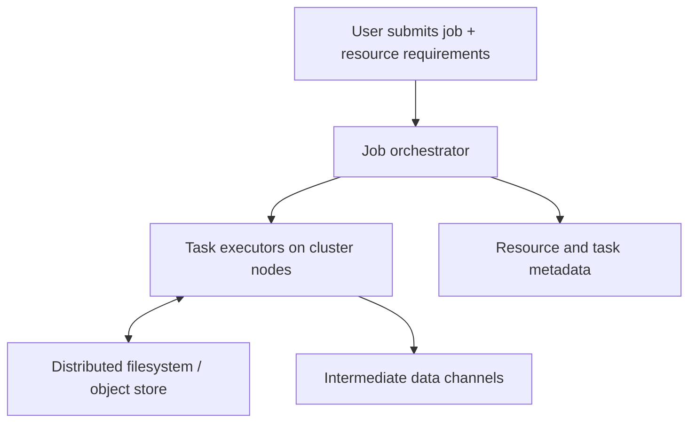

本节先看 storage，再看 orchestration与fault handling；下一大节再看 task内部的数据处理 model。

### 2.3 Distributed Filesystems

distributed filesystem（DFS）把一个 logical file切成 blocks，分散到 many machines，并以统一 protocol暴露 read/write。它要解决 capacity aggregation、parallel I/O、metadata lookup和machine/disk failures。

### 2.4 local filesystem 的层次

理解 DFS前先拆 local filesystem：

1. block device driver读写 raw disk blocks；
2. page cache缓存 recently accessed blocks；
3. ext4/XFS等 filesystem维护 files、directories、inodes与free space；
4. virtual filesystem（VFS）给 applications统一 API。

DFS在 network上重复相似分层：remote block service、distributed cache、metadata service、client protocol/API。

### 2.5 为什么 DFS block 很大

local ext4常用 4,096-byte blocks；HDFS default约 128 MB，JuiceFS和许多 object stores约 4 MB。大 block减少：

- block-location metadata条目；
- per-request/network overhead；
- seek/setup cost相对 payload的比例。

代价是 small files仍带来高 metadata/request overhead，且大 block降低 fine-grained placement灵活性。

### 2.6 block 数量公式

file size为 $S$、logical block size为 $B$，block count为：

$$
N_{blocks}=\left\lceil\frac{S}{B}\right\rceil
$$

metadata规模大致与 $N_{blocks}$成正比。若 block size增大 32 倍，同等 data volume的 block-location entries约降到原来的 $1/32$。

### 2.7 900 MB file 示例

$S=900\ MB$、$B=128\ MB$：

$$
N_{blocks}=\left\lceil\frac{900}{128}\right\rceil=8
$$

前 7 blocks各 128 MB，共 896 MB；最后 block只有 4 MB。DFS通常把 logical block存成 local filesystem file，因此无需为最后 block物理填满 128 MB。

### 2.8 data nodes

每台 storage machine运行 daemon并通过 network API暴露 local block files：

- HDFS称 **DataNode**；
- GlusterFS称 `glusterfsd`；
- 本章统称 **data node**。

client先取得 block locations，再直接向相应 data nodes传输 data，避免 metadata service搬运所有 payload。

### 2.9 distributed page cache

block file读写经过 data node OS page cache，hot blocks自然留 memory。有些 systems再加 client-side cache与local disk cache，例如 JuiceFS。

多层 cache提高 throughput，却引入 eviction、staleness、cache invalidation与duplicate storage成本。batch immutable input使 cache coherence比read/write database简单。

### 2.10 metadata service

DFS必须跟踪 pathname、permissions、block locations、replicas和free space：

- Hadoop **NameNode**维护 cluster metadata；
- DeepSeek **3FS** metadata service可持久化到 FoundationDB等 key-value store。

metadata通常远小于 payload，却位于每次 open/list/placement的control path，因此需高 availability、snapshot/recovery和scale设计。

### 2.11 protocol 对应 VFS

local VFS让 application不关心 ext4/XFS差异；DFS protocol让 batch engine通过统一 client访问不同 storage implementations。

兼容同一 API不代表 performance/consistency完全相同。application仍须核对 listing、rename、overwrite、read-after-write与failure semantics。

### 2.12 S3-compatible API 作为 pluggable interface

Amazon S3 API被 MinIO、Cloudflare R2、Tigris、Backblaze B2等采用。支持 S3的 batch engine可切换 provider，但 portability只覆盖 API surface；rate limits、consistency、cost和atomic operations仍可能不同。

### 2.13 POSIX、FUSE 与 NFS

有些 DFS通过 FUSE或 NFS挂进 OS VFS，看起来像普通 POSIX filesystem。NFS最初让 clients访问 single server，现代 EFS、Archil等可在一个 endpoint背后连接 distributed metadata/data nodes。

POSIX compatibility方便 legacy code，却可能隐藏 remote latency，并迫使 system模拟 expensive fine-grained operations。

### 2.14 Distributed Filesystems and Network Storage

DFS通常采用 **shared-nothing**；traditional network attached storage（NAS）和storage area network（SAN）更接近 **shared-disk**。两者都提供remote storage，但failure domain、hardware与scaling方式不同。

### 2.15 shared-nothing storage

每 node拥有自己的 CPU、memory、disk，nodes通过 conventional datacenter network通信。capacity/throughput可随 nodes增加，software负责 sharding、replication、repair与rebalancing。

commodity hardware便宜但failure更常见，因此 software fault tolerance不是可选功能。

### 2.16 shared-disk storage

centralized appliance通过 Fibre Channel等specialized infrastructure给compute nodes提供共同 disks。它可集中实现 redundancy与management，但 appliance/network可能昂贵且成为scaling/failure boundary。

不能简单说一种架构始终优于另一种；batch大规模commodity cluster历史上偏向 shared-nothing。

### 2.17 full replication

若每 block有 $r$个完整 replicas，raw storage overhead约为：

$$
Overhead_{replication}=r
$$

例如 3 replicas存 1 PB logical data约需 3 PB raw capacity。收益是read locality、简单repair，并可从任一 surviving replica读取完整 block。

### 2.18 erasure coding

Reed–Solomon类 $(k,m)$ code把 $k$ data fragments编码为额外 $m$ parity fragments；任意足够的 $k$ fragments可恢复 original data，最多容忍 $m$ fragments lost。

storage overhead为：

$$
Overhead_{EC}=\frac{k+m}{k}=1+\frac{m}{k}
$$

例如 $(10,4)$ overhead为 $1.4\times$，低于 triple replication的 $3\times$；代价是 encode/decode CPU、更多 fragment reads与复杂 repair traffic。

### 2.19 replication 与 scheduler locality

full replicas不仅容错，也给 scheduler多个 placement choices。task若在含 input replica的 node运行，可 local read，避免把large file跨 network搬运。

这叫 **move compute to data**。当 code远小于 input且network稀缺时收益明显。

### 2.20 Object Stores

Amazon S3、Google Cloud Storage、Azure Blob Storage、OpenStack Swift已成为 batch storage主流替代。它们与 DFS边界模糊：FUSE可把 object store挂成 filesystem，JuiceFS/Ceph也可同时暴露 file/object APIs。

### 2.21 相同外观不代表相同 semantics

filesystem adapter能让 `open`看似工作，但 object store的atomicity、listing、rename、append和locking可能完全不同。adoption前应在failure/concurrency下测试真实 API，而非只看 happy-path compatibility。

### 2.22 bucket 与 key model

object URL例如：

```text
s3://my-photo-bucket/2025/04/01/birthday.png
```

`my-photo-bucket`是globally unique bucket name；后半是bucket内unique key。key是opaque string，slash只是命名 convention。

### 2.23 get/put 与 immutable replacement

core API是 `get(key)`与`put(key,bytes)`。多数 object不能通过 file handle seek后局部修改；update需要完整 rewrite object。

这种 coarse immutable object model很适合 batch：writer生成 new key/prefix，validation后发布 manifest/pointer。

### 2.24 append 的例外

Azure Blob Storage与 S3 Express One Zone等提供特定 append能力，但不能把它外推到所有 stores。portable pipeline仍应假设 object replacement而非 arbitrary in-place mutation。

### 2.25 pseudo-directories

object store没有真实 directory/inode。`2025/04/01/`只是 key prefix；UI/SDK把 slash解释成 hierarchy。

因此 directory permission、atomic subtree rename、hard link、symbolic link等filesystem概念通常不存在。

### 2.26 prefix listing

`list(prefix)`更像 recursive `ls -R`，会返回所有 descendant keys。若 prefix下最后一个 object被删，“directory”自然消失；有时创建 zero-byte marker object模拟 empty directory。

large prefix listing可能分页且昂贵，pipeline不应把 repeated full listing当低成本metadata query。

### 2.27 missing filesystem operations

object stores一般缺少：

- hard/symbolic links；
- advisory/mandatory file locks；
- atomic file/directory rename；
- general append/seek；
- POSIX directory transactions。

output commit protocol必须围绕实际 primitives设计，例如 unique output prefix + atomic metadata pointer，而非假设 rename。

### 2.28 rename 为什么危险

object rename通常实现为 copy old key到 new key，再 delete old key：

$$
Rename(old,new)\approx Copy(old,new)+Delete(old)
$$

中途 failure可让 old/new同时存在或只完成部分 directory objects。批量“rename directory”更是逐 object operation，不具原子性。

### 2.29 object store 与 key-value store

traditional KV store优化 KB-scale values与frequent low-latency updates；DFS/object store优化 MB-to-GB objects与large sequential transfers。S3 Express等正在缩小 latency/size边界，但pricing、throughput和operation model仍不同。

### 2.30 storage-compute separation

HDFS可利用 data locality；cloud object store通常将 storage与compute分离。后者会增加 network bytes，却带来：

- CPU/memory与storage独立scale；
- ephemeral compute clusters；
- many engines共享同一 durable dataset；
- compute failure不影响storage durability。

现代 fast datacenter networks使这种trade-off常可接受。

### 2.31 storage 选择对照

| 维度 | HDFS-like DFS | Cloud object store |
|---|---|---|
| compute locality | 可把task放到data replica | 通常remote read |
| namespace | directory/file/block | bucket/key/prefix |
| mutation | richer file operations | immutable put/rewrite为主 |
| rename/lock | 可能支持 | 通常缺失或nonatomic |
| scaling | storage nodes与cluster耦合 | storage/compute独立 |
| typical use | persistent colocated cluster | shared durable cloud lake |

选择时把 API semantics、failure recovery、network/cost与operational model一起评估。

### 2.32 Distributed Job Orchestration

single machine由 OS kernel启动 processes、分配 CPU/memory、连接 I/O并隔离权限；distributed environment由 **job orchestrator**跨 machines完成这些工作。

batch framework向 orchestrator提交 job，orchestrator把它拆成 tasks并决定 placement、lifecycle与retry。

### 2.33 job submission metadata

start request通常包含：

- task count与job ID；
- each task的 CPU、memory、disk；
- GPU type/accelerator/disk等hardware constraints；
- executable/container image location；
- access credentials；
- input/output locations与job parameters。

声明不足会导致 OOM/throttling；过度声明则浪费capacity并增加queue time。

### 2.34 orchestrator 三组件

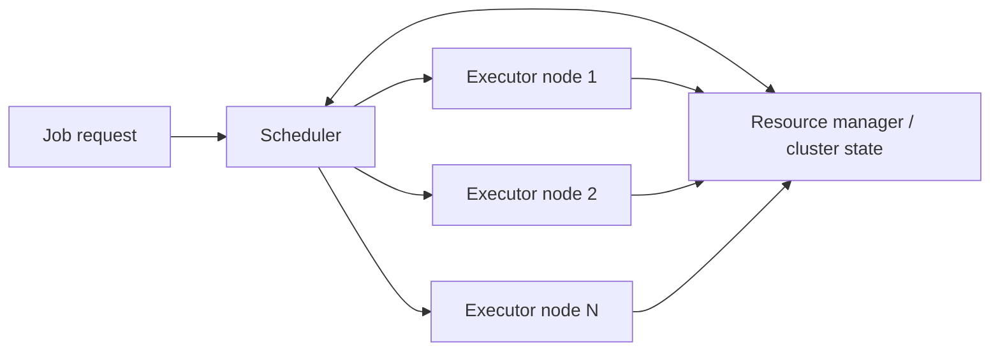

terminology因 system而异，但 task executors、resource manager、scheduler几乎普遍存在。

### 2.35 task executors

executor daemon运行在每个 worker node：YARN称 **NodeManager**，Kubernetes称 **kubelet**。它接收 assignment、拉取 code/image、启动 process/container、监控状态并回报 completion/failure。

### 2.36 heartbeat 与 task status

executor周期 heartbeat并上报 running tasks与available resources。missed heartbeat让 manager怀疑 node不可用，并重新安排 work。

heartbeat不是绝对故障证明；重复 task attempts必须靠 immutable input、attempt-scoped output和commit protocol避免互相覆盖。

### 2.37 isolation with cgroups

YARN/Kubernetes利用 Linux **cgroups**限制 CPU、memory与其他 resources，并结合 user/container boundaries阻止 unauthorized access。

performance isolation防止 noisy neighbor吞掉整个 node；security isolation防止 job读取不应访问的数据。两者都不等于完整 sandbox，仍需 namespaces、capabilities、network policy等。

### 2.38 resource manager

resource manager保存 global cluster view：nodes、CPU/GPU/memory/disk capacity、rack/network location、task status与health。

它位于control plane；若 state不一致，scheduler可能 overcommit或把 task发给dead node。

### 2.39 centralized control state

global view便于 decision，却可能成为 scale/availability bottleneck。YARN借助 ZooKeeper、Kubernetes借助 etcd持久化/协调 cluster state。

consensus保护control metadata，不意味着每个 task heartbeat都直接走global consensus；systems通常分层、batch或cache高频状态。

### 2.40 scheduler

scheduler接收 start/stop/status requests，把 resource requirements与cluster state匹配，决定 task-to-node assignment。它需要同时考虑：

- resource fit；
- fairness/priority/quota；
- data locality/network cost；
- affinity/anti-affinity与failure domains；
- queue delay、preemption与utilization。

### 2.41 application-specific schedulers

generic scheduler不理解所有 domain policy。YARN **ApplicationMaster**、Kubernetes **operator**等subscheduler/controller可处理 autoscaling、framework-specific task graph与custom recovery，再与central scheduler协作。

### 2.42 Resource allocation

cluster resources有限，jobs需求竞争。scheduler同时优化 fairness与efficiency，但二者会冲突：平均分配可能延长所有 jobs，集中资源则让later jobs等待。

### 2.43 160 cores 示例

5-node cluster共 160 CPU cores，两 jobs各请求 100 cores：总 demand为 200，不能同时完全满足。

一个策略是各先给 80 cores，tasks完成后再补剩余 20。若 tasks独立，这提高 fairness和整体utilization；若 job要求全部 workers同时启动，则不可用。

### 2.44 gang scheduling

**gang scheduling**要求一组 related tasks同时获得 resources。scheduler可先给 job A 100 cores，完成/释放后再运行 job B的100 cores。

适合 tightly coupled computation，避免一部分 workers占资源却等待其余 workers。

### 2.45 reservation、idle 与 deadlock

若 scheduler逐渐reservation直到凑齐100 cores，reserved cores可能idle。多个gang jobs各自持有部分resources并等待剩余部分时，还可能形成 hold-and-wait deadlock。

解决思路包括 all-or-nothing admission、reservation timeout、queue ordering和preemption，但都会影响fairness/utilization。

### 2.46 incomplete future information

job A先到时，scheduler不知道 job B稍后会来。立即给 A全部100 cores可最大化当前utilization，却可能让高优先级 B排队；预留60 cores则可能永远idle。

online scheduler无法基于未知 future arrivals计算全局最优，只能结合history/policy做 heuristic。

### 2.47 starvation

若large job等待100 simultaneous free cores，而small jobs不断占用零散capacity，large job可能无限等待，即 **starvation**。

aging、reservation、quota或priority boost可改善 starvation，但可能降低short-job response或cluster utilization。

### 2.48 preemption

scheduler可kill lower-priority tasks，为higher-priority job腾 resources。preemption改善priority response，却浪费被kill task已做工作，并增加restart/network/cache warm-up成本。

因此 task应checkpoint或足够small，使lost work有界。

### 2.49 scheduling 为什么 NP-hard

multi-resource placement包含 bin packing、precedence constraints、deadlines和heterogeneous nodes；即使简化版本也可归约到经典 combinatorial optimization。因此计算exact optimum对large clusters不可行。

实际目标是快速得到可接受 allocation，而非在 job已结束后才算出最优解。

### 2.50 common heuristics

- FIFO；
- priority queues；
- capacity/quota-based scheduling；
- dominant resource fairness（DRF）；
- best-fit/first-fit等 bin packing；
- locality-aware placement。

不同 policy代表不同组织价值：team fairness、SLA、cost或utilization，不存在脱离目标函数的“最佳 scheduler”。

### 2.51 DRF intuition

job $j$对resource $r$已获 allocation为 $a_{jr}$，cluster capacity为 $C_r$。dominant share为：

$$
d_j=\max_r\frac{a_{jr}}{C_r}
$$

DRF倾向优先给 dominant share较小的 job分配，使 CPU-heavy与memory-heavy jobs按各自最稀缺resource公平，而不是只比较 core count。

### 2.52 bin packing 与 fragmentation

假设 node剩 4 CPU/32 GB memory，task需 8 CPU/4 GB，即使cluster总资源充足也放不下。heterogeneous demand会留下无法组合的resource fragments。

bin-packing heuristic尝试让tasks填满nodes，同时保留适合future large tasks的形状；data locality与anti-affinity又会缩小候选集合。

### 2.53 scheduler metrics

至少同时观察：

$$
Utilization=\frac{allocated\ resource\ time}{available\ resource\ time}
$$

以及 queue wait、job completion time、preempted work、fairness、SLA misses和network bytes。单独追求 utilization可让low-priority jobs永久饥饿。

### 2.54 Scheduling workflows

distributed batch常是多个 jobs的 **workflow**，依赖关系构成 directed acyclic graph（DAG）。node是job，edge $A\to B$表示 B必须等 A成功output。

### 2.55 为什么必须 acyclic

DAG存在 topological order，scheduler可从 zero-indegree jobs开始推进。若有cycle，每个 job都等待cycle中的另一个 output，workflow无法开始。

iterative algorithms需要由一个 job内部loop/dataflow iteration表达，或显式把每轮展开成有界 DAG，而不是依赖cycle。

### 2.56 batch workflow 与 durable execution workflow

第 5 章 durable execution通常编排 RPC/business steps，每 request数据量较小；这里的 batch workflow编排“read dataset -> produce dataset”的 jobs，通常不在task中调用external services。

名称相同不代表 failure/side-effect model相同。

### 2.57 fan-out 与 team decoupling

一个 producer output可能被多个 teams/jobs消费。materialize到shared DFS/object prefix后，consumers可独立version、schedule与retry，不必与producer同进程运行。

代价是 storage、schema contract、publication completeness与retention管理。

### 2.58 cross-engine handoff

workflow可让 Spark写 HDFS，Python触发 Trino SQL进一步处理，再把result写 S3。materialized data是不同 engines的interchange boundary。

这要求兼容 file format/schema、credentials与commit convention，而不仅是路径可读。

### 2.59 repartition boundaries

stage A可能按 customer ID sharding，stage B需按 product ID sharding。A可输出适合 B的新partitioning，或由execution engine插入 shuffle。

改变 partition key通常是network/data-materialization最昂贵的 boundary，应在physical plan中显式可见。

### 2.60 pipes 与 backpressure

Unix pipe buffer满时 producer阻塞，直到consumer读取；这就是 **backpressure**。Spark/Flink可在tasks间直接network传输，并通过 bounded buffers/flow control抑制fast producer。

没有 backpressure，buffer可能无限增长直至 OOM；过强同步则让slow consumer传播为whole pipeline slowdown。

### 2.61 pipelining 与 materialization

| 方式 | 优点 | 代价 |
|---|---|---|
| direct pipelining | low latency、少storage I/O | producer/consumer生命周期耦合，failure恢复复杂 |
| DFS/object materialization | jobs解耦、可检查/复用、restart清晰 | replicated writes、higher latency与storage cost |

workflow job boundary通常materialize；single dataflow job内部operators更常pipeline。

### 2.62 all inputs ready rule

若 job C依赖 A、B，workflow scheduler通常等 A、B都成功并发布complete outputs才启动 C：

$$
Ready(C)\iff Completed(A)\land Completed(B)
$$

不能把“某个 output file已出现”误当 dataset complete；应使用manifest/success marker/catalog transaction。

### 2.63 可运行示例：DAG wave scheduling

```python
dependencies = {
    "extract": set(),
    "users": set(),
    "join": {"extract", "users"},
    "report": {"join"},
    "train": {"join"},
}

completed: set[str] = set()
remaining = set(dependencies)
round_number = 1

while remaining:
    ready = sorted(
        job for job in remaining if dependencies[job].issubset(completed)
    )
    if not ready:
        raise ValueError("workflow contains a cycle")
    print(f"round {round_number}: {', '.join(ready)}")
    completed.update(ready)
    remaining.difference_update(ready)
    round_number += 1
```

实际运行输出：

```text
round 1: extract, users
round 2: join
round 3: report, train
```

示例假设capacity无限，因此同 wave jobs并行；real scheduler还要按resources把ready set分批。

### 2.64 per-job 与 workflow scheduler

YARN ResourceManager、Spark built-in scheduler主要管理one job内tasks；Airflow、Dagster、Prefect管理jobs之间的DAG、schedule、retry、backfill、metadata与operator integrations。

两层scheduler职责不同，workflow scheduler不应自行替代cluster placement算法。

### 2.65 workflow operational scale

50–100 jobs组成一个pipeline很常见，large organization还有cross-team outputs与many engines。需要：

- lineage与ownership；
- schema/data contracts；
- run history与backfill；
- alerting/SLA；
- versioned parameters；
- failed artifact inspection。

否则 DAG图虽正确，长期运营仍会变成untraceable dependency web。

### 2.66 Handling faults

long-running job含many parallel tasks，遇到至少一次 hardware/network/process failure几乎不可避免。framework必须把 failure当normal control flow，而非罕见exception。

### 2.67 failure probability 随 task 数放大

若每 task attempt独立失败概率为 $p$，job含 $T$ tasks，至少一个失败概率：

$$
P(any\ failure)=1-(1-p)^T
$$

即使 $p=0.001$、$T=10{,}000$：

$$
P\approx1-0.999^{10000}\approx99.995\%
$$

因此只会“偶尔”失败的task，在large job上会成为常态。

### 2.68 spot/preemptible instances

low-priority capacity在 AWS称 spot instances、Azure称 spot virtual machines、Google Cloud称 preemptible instances。它们便宜但可随时被scheduler回收。

non-time-sensitive batch可利用spare capacity降低cost；preemption frequency甚至可能高于hardware faults，因此retry/checkpoint设计必须先于cost optimization。

### 2.69 task-level retry

batch从 immutable input重建 output，failed task可删除/忽略partial attempt并在另一 node重跑。只retry failed partition比rerun whole job节省大量work。

前提是 tasks相互独立或framework能追踪其data dependencies。

### 2.70 attempt-scoped output commit

每 attempt写 unique temporary path；成功后只有一个 attempt通过 manifest/CAS/commit protocol成为 authoritative。late duplicate attempt不能覆盖winner。

若task直接写external database side effects，retry可能duplicate/corrupt，这破坏了batch简单fault model。

### 2.71 MapReduce intermediate durability

MapReduce把 job/stage intermediate output写回 DFS，并等待producer task成功后才让consumer读取。task/node丢失时仍可从replicated storage继续。

优点是recovery简单、适合frequent preemption；代价是大量 replicated disk/network I/O和stage barriers。

### 2.72 Spark lineage recovery

Spark把 intermediate partitions优先留 memory，放不下时 spill local disk，只把final result写 DFS/object store。它记录每个partition如何从parents计算，即 **lineage**。

partition lost后，scheduler沿lineage重算必要 ancestors，而非要求所有intermediate globally durable。收益是少I/O，代价是long lineage重算成本与memory pressure。

### 2.73 Flink checkpoint recovery

Flink周期性 checkpoint tasks/state snapshot。failure后从最近 consistent checkpoint恢复，重放checkpoint之后的input/work。

checkpoint interval在runtime overhead与lost-work recovery之间取舍：太频繁增加I/O，太稀疏增加recovery time。

### 2.74 三种 fault-tolerance 策略

| Engine style | Intermediate protection | Failure recovery | Main trade-off |
|---|---|---|---|
| MapReduce | DFS materialization | read durable stage output | robust but I/O-heavy |
| Spark | memory/local spill + lineage | recompute lost partitions | fast but recomputation may grow |
| Flink | periodic checkpoints | restore snapshot + replay | bounded recovery with checkpoint cost |

### 2.75 deterministic recomputation assumption

lineage/retry要求同 input与code version产生equivalent output。读取 current wall clock、unseeded random、mutable external API会让attempts分叉。

需要把nondeterministic inputs记录为job parameters/data，或让sink以request ID/idempotency/fencing处理duplicates。

### 2.76 stragglers 与 speculative attempts

slow task不一定failure，却可拖住whole stage。framework可启动 speculative duplicate，采用first valid result并丢弃later attempt。

它改善tail completion time，但增加resource consumption；只有output commit具attempt isolation时才安全。

### 2.77 orchestration 小结

orchestrator像 distributed kernel：executor运行isolated tasks，resource manager维护cluster view，scheduler以heuristics分配有限resources；workflow layer再按DAG协调jobs。

batch fault tolerance之所以可行，是 immutable input、reconstructible intermediate state、task-granularity retry与single-winner output commit共同作用，而不是“失败后再跑一次”这么简单。

---

## 3. Batch Processing Models

### 3.1 从运行位置转向计算表达

第 2 节解决 tasks在哪里、何时运行以及失败如何恢复。本节研究 framework怎样表达和执行 transformation。两种核心 model是 MapReduce与dataflow engines；上层又可暴露 low-level API、SQL或DataFrame。

### 3.2 MapReduce

MapReduce把 Unix `extract -> sort -> group`推广到sharded cluster。一个 job完成四步：

1. input files切成 records；
2. mapper把每 record变成零个或多个 key-value pairs；
3. framework按 key partition并sort；
4. reducer按 key消费全部 values并输出 records。

### 3.3 input records

input可来自 HDFS或S3，常用 Apache Parquet columnar files、Apache Avro row-oriented files等。InputFormat决定 file split、record boundary与deserialization。

同一 physical file可拆成多个 input splits并行读取，但 compressed/encoded format必须支持 safe split points。

### 3.4 mapper contract

mapper对每 input record独立调用：

$$
map(record)\rightarrow[(k_1,v_1),\ldots,(k_n,v_n)]
$$

$n$可为 0（filter）、1（projection）或many（flat-map）。mapper不应依赖previous record mutable state，因此 many map tasks可处理不同 shards。

### 3.5 reducer contract

framework把同 key的values聚到一起：

$$
reduce(k,iterator(v_1,\ldots,v_m))\rightarrow[records]
$$

iterator允许 reducer streaming consumption，不需把某 key全部 values先materialize in memory。但若单 hot key values本身巨大，reducer仍会成为 bottleneck。

### 3.6 implicit sort

developer只写 map/reduce callbacks，framework隐式执行partition、network transfer与sort。sorting让same key相邻，reducer才可bounded-state group processing。

Unix URL例中 mapper相当于 `awk '{print $7}'`，reducer相当于 `uniq -c`。

### 3.7 第二次排序需要第二个 job

URL count job按 URL分组；要再按 count排名，就把第一 job output作为第二 job input：

- job 1：URL $\to$ count；
- job 2 mapper：$(URL,count)\to(count,URL)$；
- job 2 shuffle/reducer：按 count生成ranking。

固定 map-sort-reduce形状使 multi-stage workflow产生很多job boundaries与materialized files。

### 3.8 mapper 是 sort preparation

mapper的关键职责不只是“变换”，而是选择 grouping key，使 records进入正确partition/order；reducer则处理已按 key组织的数据。

错误 key design会导致 wrong grouping、skew或无谓 shuffle，即使 callback code本身正确。

### 3.9 MapReduce and Functional Programming

名称来自 Lisp等语言的 higher-order `map`与`reduce/fold`。functional principle强调 explicit inputs/outputs、avoid mutable shared state。

### 3.10 为什么纯函数利于parallelism

若：

$$
f(x)=y
$$

只依赖 framework传入的 $x$，则不同 $x$ calls可任意并行、重排、搬到different nodes，并在failure后重新调用。framework不必复制hidden process state。

### 3.11 side effects 破坏 retry transparency

mapper若直接 charge card、increment remote counter或发送email，failed/retried attempt可能执行多次。MapReduce输出由framework commit可隐藏duplicate attempts，external side effect则无法自动回滚。

稳健原则是 mapper/reducer生成 data records，后续受控 sink再以idempotency/transaction处理effects。

### 3.12 raw MapReduce 的局限

- complex joins需手写；
- 每 stage固定发生sort；
- multi-stage job需反复读写 DFS；
- downstream等 upstream whole job完成，不能pipeline；
- 每 task启动新 JVM/process带来overhead；
- low-level callbacks代码量大、optimizer可见信息少。

这些痛点促成dataflow engines。

### 3.13 Dataflow Engines

Spark与Flink等把 entire workflow作为one job，显式构建operators及data dependencies graph，而非拆成alternating MapReduce subjobs。

思想源于 Dryad、Nephele等research systems。

### 3.14 relational-style operators

dataflow API提供 map/filter/flat-map，也提供 join、group by、sort、aggregate等高层 operators。framework理解 operator semantics后，可插入必要 shuffle并优化 execution。

### 3.15 flexible operator graph

operators不必严格 map/reduce交替：

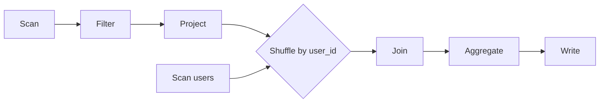

graph同时是program representation与physical planning input。

### 3.16 only sort when required

MapReduce在每 map/reduce boundary默认sort；dataflow engine只在 operator需要 grouping/order/repartition时sort。连续 local map/filter无需global ordering。

避免不必要 $O(N\log N)$ work与disk/network I/O。

### 3.17 operator fusion

若 map、filter、project连续且不改变 partitioning，可fusion进same task loop：record在CPU cache/register中流过多个functions，不需serialize/copy到intermediate file。

fusion减少I/O与scheduling overhead；过度fusion也可能让一个 stage codegen复杂或难以隔离skew。

### 3.18 whole-graph locality optimization

scheduler看到 producer/consumer关系后，可把consumer放到producer同 node，通过shared memory/local disk交换，或把small side join复制到workers。

MapReduce subjobs边界只暴露 DFS files，丢失这类fine-grained placement机会。

### 3.19 cheaper intermediate state

dataflow intermediate partitions通常保 memory或local disk，不必每条edge都写 replicated DFS/object store。MapReduce mapper output已用local disk；dataflow把这一优化泛化到all operators。

代价是 node failure后 intermediate会丢，需要 lineage/checkpoint重建。

### 3.20 pipelined execution

consumer operator可在部分 producer output ready后开始，无需等待whole preceding stage。pipeline降低latency并重叠 CPU/network/I/O。

global sort、blocking aggregation等仍是pipeline breaker，必须等足够/all input才能产出final order/result。

### 3.21 process reuse

long-lived worker process可连续执行多个operators，避免每 task启动 JVM、load classes与warm runtime。收益在short tasks/large task count时尤其明显。

reuse同时要求清理per-task state，避免memory leak和cross-tenant contamination。

### 3.22 MapReduce 与 dataflow 对照

| 维度 | MapReduce | Dataflow engine |
|---|---|---|
| graph | fixed map-sort-reduce jobs | flexible operator DAG |
| sort | 每job implicit | 仅required boundaries |
| intermediate | frequent file materialization | memory/local disk为主 |
| execution | stage barriers | 尽可能pipelined |
| fault recovery | durable stage files | lineage/checkpoints |
| API | low-level callbacks | operators、SQL、DataFrame |

### 3.23 同一 computation，不同 physical plan

dataflow engine并未改变 join/group semantics，而是以更少materialization、更好locality/fusion执行同一logical computation。性能提升来自physical execution，不是牺牲result correctness。

### 3.24 Shuffling Data

**shuffle**是把sharded input按新 key重新partition并在每partition内组织/sort，使 same key records到达same consumer partition的distributed algorithm。

它是 joins、grouping、aggregation与global sort的共同基础。

### 3.25 Shuffle is not random

扑克牌 shuffle得到random order；batch shuffle没有randomness。它执行deterministic partitioning，且在 MapReduce中还按 key sort。

### 3.26 shuffle invariant

给 partition function $P(k)$，必须满足：

$$
k_a=k_b\Rightarrow P(k_a)=P(k_b)
$$

不同 mappers产生的same key因此汇入same reducer。常用：

$$
P(k)=hash(k)\bmod R
$$

$R$是reducer/target partition count。

### 3.27 MapReduce shuffle 原图


图中 $m_i,r_j$表示 mapper $i$为 reducer $j$生成的local partition file。crossing arrows正是 all-to-all data exchange。

### 3.28 mapper count

map task count主要由 input shards/splits决定。每 mapper顺序读取assigned shard并调用 callback；多个 mappers并行扫描。

input files过小会产生 excessive tasks/metadata；过大则parallelism不足、单 task recovery cost高。

### 3.29 reducer count

reducer count由job author/planner配置，可与mapper count不同。更多 reducers提高parallelism并缩小per-partition state，但增加files、connections与scheduling overhead。

### 3.30 mapper-side partition files

每 mapper为每 reducer维护logical output partition。$M$ mappers与$R$ reducers最多形成：

$$
Files_{map-side}=M\times R
$$

真实engine通常以buffer/multiplexing/merge降低同时open files，但all-to-all logical matrix仍存在。

### 3.31 local partition and sort

mapper产生 $(k,v)$后先算 $P(k)$，写对应 buffer；buffer满后按 key sort并spill local segment。多个segments再progressively merge。

这与LSM/external sort相同：bounded memory + sequential runs + merge。

### 3.32 reducer fetch

mapper完成后，各 reducer从所有 mappers拉取自己的partition files到local disk/network shuffle service：reducer $r_j$读取 $(m_1,r_j),\ldots,(m_M,r_j)$。

fetch可并发但需 flow control，否则大量 reducers同时连接 mappers会造成network incast。

### 3.33 k-way merge

每 mapper partition已sorted，reducer用 priority queue执行 $M$-way merge。若每次从 $M$个run heads选smallest key，复杂度约：

$$
O(N_r\log M)
$$

$N_r$是该 reducer records数。merge后same key records连续，来自哪个mapper已不重要。

### 3.34 reducer invocation

framework检测 key boundary，并调用一次 `reduce(key, values_iterator)`。reducer只需处理one key at a time，输出顺序写 result shard。

最终每 reducer通常生成一个 output file/object，$R$ reducers形成 output dataset的 $R$ shards。

### 3.35 shuffle cost

若 mapper output总量为 $D_m$，无compression/local combine时network shuffle bytes约为 $D_m$。还包括serialization、sort spill、merge read/write与replication成本。

优化重点是早filter/project、local aggregation、compression、避免unnecessary repartition，以及正确选择join strategy。

### 3.36 combiner/local pre-aggregation

对 associative且commutative aggregation，例如 sum/count，可在mapper side先combine：

$$
\sum_{all\ values}v=\sum_{partitions}\left(\sum_{local}v\right)
$$

这样每 key每 mapper只发送partial aggregate，大幅减少shuffle。median、order-sensitive logic不能随意combine。

### 3.37 data skew

hash partition只能平衡distinct keys，不保证records均匀。一个hot key占 40% records时，负责它的single reducer承受40% work，成为straggler。

remedies包括 key salting + two-stage combine、special-case heavy hitters、range sampling与更多resources；单纯增加 $R$不能拆开同一 unsalted key。

### 3.38 modern shuffle services

BigQuery等可在 memory中shuffle，并把 data写独立 external sorting/shuffle service。独立service可replicate shuffled data，在worker failure后避免重算全部producer output。

它把compute worker lifecycle与intermediate durability解耦，但引入额外service、network hop与cost。

### 3.39 可运行示例：三 mapper、两 reducer

```python
from itertools import groupby


input_shards = [
    ["/favicon.ico", "/locks", "/batch"],
    ["/favicon.ico", "/locks", "/"],
    ["/batch", "/favicon.ico"],
]
reducer_count = 2


def partition(key: str) -> int:
    return sum(key.encode("utf-8")) % reducer_count


mapper_files: list[list[list[tuple[str, int]]]] = []
for shard in input_shards:
    outputs = [[] for _ in range(reducer_count)]
    for url in shard:
        outputs[partition(url)].append((url, 1))
    for output in outputs:
        output.sort()
    mapper_files.append(outputs)

for reducer_index in range(reducer_count):
    merged = sorted(
        pair
        for mapper_output in mapper_files
        for pair in mapper_output[reducer_index]
    )
    counts = [
        (key, sum(value for _, value in values))
        for key, values in groupby(merged, key=lambda pair: pair[0])
    ]
    formatted = ", ".join(f"{key}={count}" for key, count in counts)
    print(f"reducer {reducer_index}: {formatted}")
```

实际运行输出：

```text
reducer 0: /favicon.ico=3
reducer 1: /=1, /batch=2, /locks=2
```

三个 mapper分别sort自己的 two partition files；reducer再merge。same URL从未跨两个reducers，验证了shuffle invariant。

### 3.40 shuffle 的本质小结

shuffle把“records当前在哪个input shard”改写为“records按哪个key共同计算”。代价是all-to-all network、sort/spill与barrier；收益是任意大dataset上的global grouping。

因此 physical-plan优化的核心问题常是：**能否少shuffle一次、少传一些 bytes、让partition更均匀？**

### 3.41 Joins and Grouping

shuffle让same key records共址，因此可把 distributed join转成每 reducer上的local join。原章例子把 activity events（也称 **clickstream data**，作为 fact）与 user database（dimension）按 user ID连接，以分析不同年龄用户访问哪些页面。

### 3.42 join input 原图


两 sides都大到必须shard，不能把entire user table装进single process memory，也不应让每 event远程lookup OLTP database。

### 3.43 为什么逐条 remote lookup 差

若有 $N$ events，每条向 user DB发一次 request，则产生 $O(N)$ random network round trips，给online database施加batch load，并且 job读取期间profiles变化可能导致 non-repeatable snapshot。

batch join先抽取一致 input snapshots，再顺序scan/shuffle，吞吐与reproducibility更好。

### 3.44 event mapper

activity mapper输出：

$$
(user\_id,\ Event(url,timestamp))
$$

原来按file/time sharding的events因此准备按 user ID regroup。

### 3.45 user mapper

user database mapper输出：

$$
(user\_id,\ Profile(date\_of\_birth))
$$

value应带source/type tag，reducer才能区分 profile与event records。

### 3.46 secondary sort

partition key只用 `user_id`，sort key可用 `(user_id, record_type, timestamp)`。这样same user进入same reducer，同时 profile排在events前、events按time排序。这叫 **secondary sort**。

partition equality与within-partition ordering是两个不同需求，不能把full composite key都用于hash partition，否则同 user可能被拆开。

### 3.47 sort-merge join 原图


图中 even/odd user IDs只是简化partition示意；production通常用hash/range partition和many reducers。

### 3.48 reducer join logic

reducer先读取 profile并保存在one local variable，再stream该 user的events，为每 event输出 `(url,date_of_birth)`。memory主要取决于one profile，而非whole user table。

若 profile缺失、重复或晚于events，必须定义 inner/left join与data-quality policy。

### 3.49 为什么叫 sort-merge join

两 side mapper outputs都按join key排序；reducer merge sorted runs，把相等 keys对齐并组合。核心复杂度来自sort/shuffle，join scan本身近似linear：

$$
O(N\log N+M\log M)+O(N+M)
$$

distributed external sort的constants与network通常比Big-O更重要。

### 3.50 join cardinality

one-to-many join中 user $u$有 $e_u$ events与 $p_u$ profiles，output count为：

$$
|Output|=\sum_u e_u\times p_u
$$

预期 $p_u=1$。duplicate dimension rows会乘法放大output，因此 primary-key uniqueness应在join前validate。

### 3.51 group by age distribution

join output `(url,dob)`进入next job，以 URL为shuffle key。reducer为one URL维护 age-bucket counters：

$$
count[url,ageBucket] += 1
$$

这演示同一 shuffle primitive先用于join key，再用于aggregation key。

### 3.52 broadcast/hash join 补充

若 user dimension很小，可复制到每 mapper，构建local hash table并避免events shuffle，即 broadcast join。成本约为把small side传给每 worker：

$$
Network\approx |Small|\times Workers
$$

只有small side确实fit memory且snapshot可分发时适用；optimizer应根据statistics选择。

### 3.53 skewed join

anonymous/default user ID或celebrity key可能聚集巨量events。可过滤invalid keys、salt hot keys并复制对应dimension row、或单独处理heavy hitters。

join correctness不难，balanced physical execution才是large-scale难点。

### 3.54 可运行示例：secondary sort join

```python
records = [
    (104, 1, 0, ("profile", 1989)),
    (173, 1, 0, ("profile", 1975)),
    (104, 2, 20, ("event", "/z")),
    (173, 2, 10, ("event", "/y")),
    (104, 2, 5, ("event", "/x")),
]

joined: list[tuple[str, int]] = []
current_user = None
birth_year = None

for user_id, record_type, timestamp, payload in sorted(records):
    if user_id != current_user:
        current_user = user_id
        birth_year = None
    if record_type == 1:
        birth_year = payload[1]
    elif birth_year is not None:
        joined.append((payload[1], birth_year))

for url, year in joined:
    print(f"{url} -> born {year}")
```

实际运行输出：

```text
/x -> born 1989
/z -> born 1989
/y -> born 1975
```

tuple sort先按 user ID，再让 profile type `1`排在event type `2`前，最后按timestamp排列events；这正是secondary sort。

### 3.55 join/grouping 小结

distributed join不是让records逐条“找到远程另一表”，而是把两表重新partition为same-key co-location。sort使 reducer以bounded state merge；下一次group by只是更换 key并重复同一机制。

### 3.56 Query Languages

当 storage、scheduler、shuffle/fault tolerance成熟后，瓶颈从“能否在10,000 machines运行”转为“人怎样正确、高效地表达计算”。SQL成为 batch processing **lingua franca**。

### 3.57 SQL 为什么自然

- legacy warehouses与analytics tools已支持；
- developers/analysts普遍熟悉；
- declarative query比raw callbacks短；
- terminal/GUI可interactive exploration；
- schema与relational operators给optimizer语义信息。

### 3.58 declarative 不等于立即执行

SQL描述 desired result，不指定 mapper count、join order或shuffle files。engine把 query转换为execution plan并作为 distributed batch job运行。

interactive interface背后仍可能扫描TB data、运行minutes并占用cluster resources。

### 3.59 query compilation pipeline

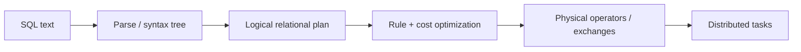

每层把what逐步变成how，同时保留equivalent result semantics。

### 3.60 logical plan

logical plan由scan、filter、project、join、aggregate等relational operators组成，不绑定具体 hash join/sort-merge join或partition count。

optimizer可用algebra equivalence，例如在semantics允许时把filter下推到join前，减少input rows。

### 3.61 predicate/projection pushdown

若只需 date、user_id且条件是 `country='CN'`，engine尽量让 storage scan只读这些columns/row groups。shuffle bytes从full rows降到needed subset。

high-level language反而可能比handwritten callback快，因为engine看得到unused fields与predicates。

### 3.62 cost-based optimizer

Hive、Trino、Spark、Flink等使用 statistics估计 row counts、selectivity、key cardinality与sizes，为candidate plans估成本：

$$
Cost\approx w_{io}IO+w_{net}Network+w_{cpu}CPU+w_{mem}PeakMemory
$$

weights与model近似真实hardware/runtime；statistics过期会选错plan。

### 3.63 join algorithm selection

optimizer可在 broadcast hash join、partitioned hash join、sort-merge join间选择。small dimension适合broadcast；already sorted/large sides可能适合sort-merge；memory/partitioning决定hash join可行性。

### 3.64 join reordering

对 $A\Join B\Join C$，不同order result等价（忽略outer join等语义限制）但intermediate size可差几个数量级。optimizer优先执行high-selectivity join/filter，缩小later shuffle。

join-order search本身可能指数增长，因此使用dynamic programming/heuristics。

### 3.65 SQL 之外的 query languages

- Apache Pig：逐步relational pipeline；
- Morel：受Pig影响的modern language；
- `jq`、JMESPath、JSONPath：JSON transformation/query；
- Gremlin：graph traversal/batch graph queries。

不同 data model与user群体需要不同表达，不必把所有workload强塞进SQL。

### 3.66 graph query boundary

graph traversal沿edges反复join vertices，常需iteration直到frontier empty或metric converges。SQL recursive features可表达部分算法，但specialized graph/dataflow API通常更自然。

### 3.67 Batch Processing and Cloud Data Warehouses Converge

历史上warehouse是specialized appliance + SQL relational analytics；MapReduce是commodity cluster + general-purpose code/arbitrary formats。今天两边互相吸收能力。

### 3.68 batch engine 吸收 warehouse 能力

Spark/Flink等支持SQL、Parquet columnar format、vectorized execution、query optimizer，能高效处理relational queries，而非只运行opaque callbacks。

### 3.69 warehouse 吸收 batch 能力

BigQuery、Snowflake等cloud warehouses采用distributed filesystems/object storage、elastic scheduling、shuffle、fault recovery与massive parallel execution，scale不再局限于single appliance。

### 3.70 programming model 交叉

BigQuery提供 DataFrames，Snowflake Snowpark集成 Pandas；Airflow/Prefect/Dagster也直接orchestrate warehouse queries。

tool category不再由“只支持SQL还是code”清晰划分。

### 3.71 SQL 不适合的 workloads

- PageRank等iterative graph algorithms；
- complex ML training/feature pipelines；
- image/video/audio等multimodal processing；
- irregular row-by-row domain logic；
- custom libraries与hardware accelerators。

general batch/dataflow API在这些场景更有表达力。

### 3.72 columnar warehouse 的局限

columnar/vectorized engine擅长same operation over many values；复杂per-row branching、large object decoding或external libraries可能效率低。alternative warehouse APIs或Spark/Flink/Ray类systems更合适。

### 3.73 cost/convenience decision

warehouse与batch engine选择通常取决于：

- per-byte/compute pricing；
- existing skills与governance；
- workload shape；
- latency/SLA；
- data location/egress；
- operational burden。

large enterprise通常并存many systems；small team用one managed warehouse也可能最经济。

### 3.74 DataFrames

DataFrame是typed columns组成的rows collection，类似relational table。user通过method calls组合filter、join、sort、aggregate，而不是写one SQL string。

### 3.75 DataFrame 为什么受欢迎

R/Pandas users熟悉interactive method chaining、Python ecosystem与notebook workflow。distributed Spark、Flink、Daft采用相似 API，使data scientists能处理beyond-single-machine datasets。

### 3.76 local 与 distributed DataFrame

local DataFrame通常fit memory、可有stable index/order；distributed DataFrame被partition，global order/index通常不存在，除非显式sort/shuffle。

把Pandas code机械迁移到Spark可能触发hidden full shuffles或改变ordering assumptions。

### 3.77 eager Pandas vs lazy Spark

Pandas method call通常立即执行并materialize result；Spark先积累logical plan，action触发optimization/execution。

lazy evaluation允许fusion/pushdown/join reorder，但error可能延迟到action，debugging mental model不同。

### 3.78 transformations 与 actions

Spark-style `select/filter/join`多为lazy transformations；`collect/count/write`等action触发job。repeated actions若未cache，可能重复compute lineage。

planner能优化整个 chain，因为在action前已看到graph。

### 3.79 client/server hybrid

Daft等可让small in-memory operations在client执行，large datasets在server/cluster执行。Apache Arrow提供shared columnar memory representation，减少client/server libraries间转换成本。

### 3.80 DataFrame 与 SQL/dataflow 关系

DataFrame API不是独立 execution primitive；它通常编译到与SQL相同的logical/physical planner，再运行于dataflow engine。差异主要在expression ergonomics与host-language integration。

### 3.81 execution-model knowledge map

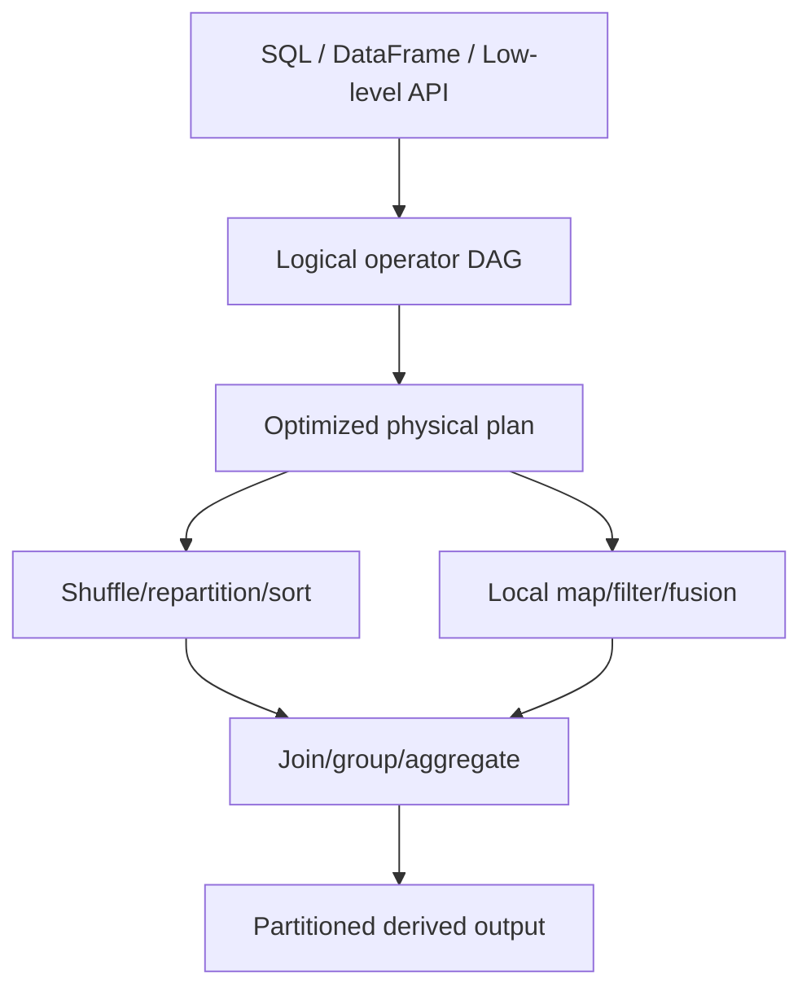

MapReduce固定physical skeleton；modern systems把logical expression与physical execution分开，让optimizer在correct equivalent plans中选择成本较低者。

### 3.82 Batch Processing Models 小结

MapReduce奠定 stateless map + partition/sort + grouped reduce；dataflow engine以whole DAG消除不必要 barriers/materialization；shuffle仍负责global key co-location；SQL/DataFrame则把logical intent暴露给optimizer。

从 raw callback到declarative API不是简单“语法糖”，而是让system获得更多重写、cost估计和physical-plan选择空间。

---

## 4. Batch Use Cases

### 4.1 适合 batch 的判断

batch适合同时满足以下特征的workload：

- data volume大，可分区并行；
- bounded input或可截取 snapshot；
- freshness可接受minutes/hours/days；
- output可derived/recomputed；
- throughput/cost比single-record latency重要。

若每个event都必须millisecond级响应，应考虑online/stream path，而非强迫periodic batch缩短到极小interval。

### 4.2 跨行业例子

- accounting与inventory **reconciliation**；
- manufacturing demand forecasting；
- ecommerce/media/social recommendation training；
- US banking network等financial settlement workflows。

这些jobs不一定简单，但通常有明确cutoff与完整dataset语义。

### 4.3 reconciliation intuition

设internal ledger totals为 $L$、bank statement totals为 $B$，最简单 discrepancy为：

$$
\Delta=B-L
$$

真实reconciliation还要按transaction ID、amount、currency与time window匹配，输出matched、missing、duplicate和timing-difference records。batch保留完整evidence，适合审计与重跑。

### 4.4 Extract–Transform–Load

**ETL**从production sources抽取 data，经清洗/规范/join后加载 downstream warehouse/system。**ELT**先load raw data再在destination transform；本节沿原书用 ETL统称两者。

### 4.5 extract：取得可重复 input

extract可读 database snapshot、CDC export、application logs或files。关键不是“把表copy出来”，而是记录：

- source version/cutoff；
- extraction time与schema version；
- incremental watermark；
- row/file counts与checksums；
- permissions/lineage。

没有repeatable input，修复logic后重跑可能得到另一批 source state。

### 4.6 transform：embarrassingly parallel

filter、field projection、format conversion和many per-record normalizations不需 records间通信，可按input partitions独立执行，称 **embarrassingly parallel**。

join、global dedup/grouping则需要shuffle。ETL性能常由少数 wide transformations决定，而不是map-only cleaning。

### 4.7 load：先 staging 后 publish

tasks写 run-scoped staging prefix/table；quality checks通过后再commit catalog/manifest，使consumers看到完整version。不要边transform边覆盖current table。

load protocol应定义 overwrite、append、merge、late data与retry semantics。

### 4.8 workflow scheduler 的价值

Airflow等 scheduler提供 periodic trigger、dependencies、retry、backfill、alerts和run history，并带 MySQL、PostgreSQL、Snowflake、Spark、Flink等source/sink/query operators。

transient failure可自动retry；repeated failure标红并定位DAG node。自动retry只有在job/output commit幂等时才安全。

### 4.9 inspect、fix、rerun

若 transformation期待的field缺失，failed input file与schema可直接检查；engineer修复producer或logic，再从 immutable source重跑。相比在线mutation，错误不会无痕混入current state。

dead-letter/quarantine output应保留bad records与reason，而非静默drop。

### 4.10 data-quality gates

发布前可检查：

- row count与previous run差异；
- null/unique/range constraints；
- referential integrity；
- distribution/drift；
- reconciliation totals；
- freshness与completeness markers。

例如 relative row-count change：

$$
Change=\frac{|N_t-N_{t-1}|}{\max(1,N_{t-1})}
$$

threshold应结合seasonality，不能把任何变化都判failure。

### 4.11 centralized team 的历史局限

早期 pipelines常由single data engineering team维护，因为raw MapReduce/orchestration复杂。central team不了解所有domain semantics，容易成为queue/bottleneck；product teams又不愿承担fragile platform work。

### 4.12 data mesh

**data mesh**强调domain teams把data作为product负责：ownership、discoverability、quality、SLA与documentation靠近source domain，同时platform提供self-service standards。

它是organizational/architectural practice，不是某个storage engine，也不自动消除cross-domain governance。

### 4.13 data contract

**data contract**明确producer/consumer间 schema、semantics、quality、compatibility、freshness与ownership。schema registry只覆盖结构，contract还应说明units、null meaning、key stability和breaking-change process。

contract test应在producer deployment与pipeline publication前运行。

### 4.14 data fabric

**data fabric**通常强调metadata、catalog、integration与automation跨systems连接data。它与data mesh可重叠：一个偏organization/domain ownership，一个偏technology/integration，但industry定义并不完全统一。

### 4.15 shared execution engines

SparkSQL、Trino、DuckDB等既运行pipeline transformations，也运行analytical queries。application engineering、data engineering、analytics engineering与business analysis边界随共同SQL/DataFrame tooling变模糊。

共享engine提高reuse，却需workload isolation，避免ad hoc query挤占critical ETL SLA。

### 4.16 ETL 小结

ETL可靠性来自versioned extract、parallel pure transforms、staged load、quality gate与orchestrated publication。data mesh/contract改变ownership与interface，不改变底层 lineage、replay和commit需求。

### 4.17 Analytics

OLAP queries通常scan many rows、filter/group/aggregate，天然映射到batch engine。analyst提交SQL，query engine读取DFS/object store并在cluster执行physical plan。

### 4.18 data lakehouse

**data lakehouse**把low-cost object storage/data lake与warehouse table semantics结合。Apache Iceberg等 open table format维护 snapshots/manifests/schema evolution；Unity等 catalog管理names、types、permissions与table-to-file mappings。

files本身不足以成为table，metadata transaction定义哪些files属于哪个snapshot。

### 4.19 two analytics styles

原章区分：

1. **pre-aggregation queries**：scheduled rollup构建cube/data mart；
2. **ad hoc queries**：用户为具体问题交互式探索raw/less-aggregated data。

两者可共用storage/engine，却优化不同latency与flexibility目标。

### 4.20 pre-aggregation

按 dimensions预计算 measure，例如 daily revenue：

$$
Revenue[day,region,product]=\sum_{orders}amount
$$

query只scan small aggregate table，响应快；代价是只能回答预先选择的dimensions/granularity，并有schedule freshness lag。

### 4.21 OLAP cubes 与 data marts

cube materialize多个 dimension combinations；data mart为某team/domain提供curated subset。dimension数量增加会造成组合 explosion，因此只物化高价值rollups。

### 4.22 serving pre-aggregates

scheduled workflow可把rollup留warehouse，也可推到 Apache Druid、Apache Pinot等real-time OLAP systems，服务dashboard与low-latency slice-and-dice。

“real-time OLAP”描述serving/query能力，不代表所有input必由stream生成；scheduled batch也可load。

### 4.23 ad hoc queries

analyst为business question、user behavior或incident debugging反复query，看到result后继续修改。虽然input是bounded batch，human feedback loop要求尽可能短response time。

### 4.24 latency 与 throughput 的局部变化

whole batch platform通常以throughput为主，但ad hoc analytics对query latency敏感。resource queue、cache、column pruning与optimizer质量直接影响 analyst productivity。

同一system可能同时承载hours-long ETL与seconds-level exploration，需separate queues/warehouses或priority policy。

### 4.25 BI integration

SQL让 Tableau、Power BI、Looker、Apache Superset等连接 SparkSQL、Presto/Trino、Hive等。visualization发出的query最终仍变成distributed batch tasks。

dashboard并发与auto-refresh可能制造大量重复scans，应使用cache/pre-aggregation和query governance。

### 4.26 analytics 小结

lakehouse提供versioned table abstraction；pre-aggregation用freshness/flexibility换latency；ad hoc保留flexibility却依赖fast engine。batch不是“只能隔夜跑”，而是bounded-data execution model。

### 4.27 Machine Learning

ML/AI pipeline频繁使用batch来探索 patterns、准备 features、训练 models与bulk predictions。model artifact也是由training data、code、parameters派生的versioned output。

### 4.28 feature engineering

raw text/categories/events需过滤、join、normalize、encode为numeric tensors/features。关键是training与serving transformation一致，避免 **training-serving skew**。

feature定义应versioned，并记录source snapshot与statistics。

### 4.29 model training

training input为feature dataset，output为weights/model artifacts：

$$
    heta^*=\arg\min_{\theta}\sum_{(x_i,y_i)\in D}\mathcal{L}(f_{\theta}(x_i),y_i)
$$

batch engine负责data preparation/distribution，specialized ML runtime负责gradient/optimizer。随机训练还需seed、library/hardware version才能提高reproducibility。

### 4.30 batch inference

trained model对large bounded dataset批量预测，适合nightly recommendations、offline scoring和test-set evaluation。output包含 model version、feature version与prediction timestamp，便于audit/rollback。

real-time fraud blocking等不能等待batch，应另有online inference path。

### 4.31 ML libraries

Spark MLlib、FlinkML提供feature transforms、statistics与classifiers。modern AI workflows还整合 PyTorch、TensorFlow、XGBoost等libraries。

framework选择取决于data preparation、distributed training、GPU scheduling与ecosystem，而非一个engine包办所有阶段。

### 4.32 recommendation 与 graph processing

recommendation/ranking常把 users/items/interactions建 graph。许多算法沿edge传播信息并重复迭代，直到frontier empty或metric converges。

每轮本质是 vertex state与neighbor messages的join/group。

### 4.33 Bulk Synchronous Parallel

**bulk synchronous parallel（BSP）**把graph computation分成 **supersteps**：

1. each vertex读取current state与messages；
2. parallel compute new state并发送messages；
3. global barrier等待所有workers完成；
4. messages在next superstep可见。

Apache Giraph、Spark GraphX、Flink Gelly实现该model；Google Pregel使其流行，因此也称 **Pregel model**。

### 4.34 BSP 为什么有效

superstep内vertices独立，易parallel/retry；barrier建立清晰iteration boundary，避免读取一半old/一半new state。deterministic message/state transition有助于recovery。

代价是fast workers等待stragglers，且每轮可能产生large shuffle。

### 4.35 BSP cost model

经典BSP intuition把每superstep成本写成：

$$
T_{step}\approx\max_i W_i+gH+L
$$

- $W_i$：worker $i$ local computation；
- $H$：最大communication volume；
- $g$：per-word communication cost；
- $L$：barrier synchronization cost。

skew会抬高 $\max_i W_i$，many iterations则反复支付 $L$。

### 4.36 PageRank recurrence

PageRank示例：

$$
PR_{t+1}(v)=\frac{1-d}{|V|}+d\sum_{u\to v}\frac{PR_t(u)}{outdeg(u)}
$$

每 vertex把rank按outgoing edges分发；shuffle按destination vertex汇总；重复至 $\max_v|PR_{t+1}(v)-PR_t(v)|<\epsilon$。

### 4.37 可运行示例：两轮 PageRank-style BSP

```python
graph = {
    "A": ["B", "C"],
    "B": ["C"],
    "C": ["A"],
}
damping = 0.85
rank = {vertex: 1 / len(graph) for vertex in graph}

for superstep in range(1, 3):
    incoming = {vertex: 0.0 for vertex in graph}
    for source, destinations in graph.items():
        share = rank[source] / len(destinations)
        for destination in destinations:
            incoming[destination] += share
    rank = {
        vertex: (1 - damping) / len(graph) + damping * incoming[vertex]
        for vertex in graph
    }
    formatted = ", ".join(f"{vertex}={rank[vertex]:.4f}" for vertex in sorted(rank))
    print(f"superstep {superstep}: {formatted}")
```

实际运行输出：

```text
superstep 1: A=0.3333, B=0.1917, C=0.4750
superstep 2: A=0.4537, B=0.1917, C=0.3546
```

每轮先收齐messages再整体替换rank，模拟barrier；real engine会partition vertices并shuffle messages。

### 4.38 iterative dataflow 的优化

naive workflow每轮materialize whole graph/state，I/O昂贵。specialized engine可pin invariant graph topology/local state、只传changed messages，并用checkpoint恢复。

convergence criterion与maximum iterations必须明确，避免永不终止。

### 4.39 LLM data preparation

raw websites/text常在DFS/object store。training前 batch pipeline执行：

- HTML text extraction与malformed-text repair；
- low-quality/irrelevant content filtering；
- exact/near-duplicate detection；
- tokenization；
- embeddings/numeric representation generation。

每一步都需版本、lineage与quality metrics，因为dataset变化会影响model behavior。

### 4.40 deduplication 的作用

duplicate documents会让model对重复样本过度加权，并浪费training compute。exact hash可去完全相同内容；near-duplicate detection可能用shingling/MinHash/embedding similarity，代价与false positives需评估。

### 4.41 AI workflow frameworks

Kubeflow、Flyte、Ray面向 ML/AI orchestration；原章提到 OpenAI在 ChatGPT training process中使用 Ray。它们集成 PyTorch、TensorFlow、XGBoost，并支持feature engineering、training、batch inference与fine-tuning。

这些framework不替代data-quality/privacy/governance，只组织compute与artifacts。

### 4.42 interactive notebooks

Jupyter、Hex notebooks由 Markdown/Python/SQL cells组成，按用户选择的顺序执行并产生tables/graphs。cells可调用DataFrame API或SQL触发batch jobs。

notebook state常依赖hidden execution order；production pipeline应把code、parameters与dependencies固化成reproducible job，而非只保存visible cell order。

### 4.43 ML 小结

batch贯穿 feature preparation、training、evaluation/inference、graph iteration与LLM corpus processing。核心产物不仅是model file，还包括可追溯dataset、feature/code/config versions和evaluation evidence。

### 4.44 Serving Derived Data

recommendations、reports、ML features等batch outputs最终常需进入production database、KV store、search engine或OLAP serving system。此处从pure derived files跨到live traffic，是最容易破坏batch fault model的边界。

### 4.45 temptation：task 逐条写 production DB

在 mapper/operator中直接调用database client看似简单，但存在三类根本问题：throughput mismatch、load isolation和externally visible partial effects。

### 4.46 per-record network overhead

若 $N$ records逐条request，固定per-request overhead $h$，总时间下界含：

$$
T\ge N\times h
$$

batching可减少round trips，但仍不自动解决production load与retry semantics。

### 4.47 overwhelming serving database

hundreds batch tasks同时按scan速度写同 database，会争抢CPU、I/O、locks与cache，拖慢user queries，甚至触发cascading failure。

batch producer必须服从sink capacity，而不是以自身maximum throughput为目标。

### 4.48 framework all-or-nothing output

正常file sink可让failed attempts写temporary paths，job成功后一次publish；成功看似每task exactly once，whole job失败则无visible output。

这是 **effectively-once visible dataset**，不是所有machine instructions真的只执行一次。

### 4.49 external side effects 泄漏 partial state

task先写 external DB再crash，framework retry时不能撤销first write；部分job output在whole job失败前已被online readers看到。duplicate attempt还可能double increment。

因此 batch framework的output guarantee止于它控制的commit boundary。

### 4.50 better pattern：stream as handoff

batch job把 derived records顺序写 Kafka topic等stream，再由sink connectors/consumers写 serving systems。Elasticsearch、Apache Pinot、Apache Druid、Venice、ClickHouse等可ingest Kafka。

### 4.51 sequential bulk writes

stream/log优化append与batch transfer，比random per-record RPC更匹配batch producer。partitioning还能维持per-key order并并行消费。

### 4.52 buffering 与 rate decoupling

Kafka吸收producer burst；downstream按可承受rate读取并backpressure，不必让batch tasks长期持connection等待production DB。

buffer capacity与retention必须覆盖worst backlog，否则只是延后overload。

### 4.53 fan-out

one output topic可被search、analytics、feature store等multiple consumer groups独立读取，各自维护offset与retry。producer无需为每sink重跑 transformation。

schema/data contract与retention需兼容所有consumers。

### 4.54 security boundary / DMZ

stream cluster可部署在batch network与production network之间的 **demilitarized zone（DMZ）**。batch writers无权直接连接production databases；approved consumers从DMZ读取。

这缩小credentials与network reachability，但stream本身仍需authentication、authorization与encryption。

### 4.55 stream 不自动给 all-or-nothing

consumer可能在job只发布一半时就serve records。要保持dataset atomic visibility，batch completion后还需发commit notification/manifest。

consumer把new generation写入hidden namespace，收到complete marker并验证counts后才切current pointer，类似 read-committed transaction。

### 4.56 generation publication protocol

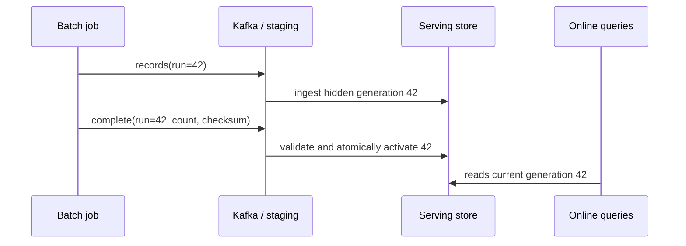

若job失败且无complete marker，generation 42保持invisible并可GC。

### 4.57 可运行示例：manifest 控制可见性

```python
class VersionedStore:
    def __init__(self) -> None:
        self.staging: dict[int, dict[str, str]] = {}
        self.current: int | None = None

    def put(self, run: int, key: str, value: str) -> None:
        self.staging.setdefault(run, {})[key] = value

    def publish(self, run: int, expected_count: int) -> None:
        if len(self.staging.get(run, {})) != expected_count:
            raise ValueError("incomplete generation")
        self.current = run

    def read(self) -> dict[str, str]:
        return {} if self.current is None else dict(self.staging[self.current])


store = VersionedStore()
store.put(41, "A", "old")
store.publish(41, expected_count=1)
store.put(42, "A", "new")
print("before complete:", store.read())
store.put(42, "B", "new")
store.publish(42, expected_count=2)
print("after complete:", store.read())
```

实际运行输出：

```text
before complete: {'A': 'old'}
after complete: {'A': 'new', 'B': 'new'}
```

示例把record ingestion与visibility分离；production还需durable CAS/current pointer、checksums和concurrent-run fencing。

### 4.58 duplicate handling

stream delivery与consumer crash可能产生duplicates。record带 stable `(run_id,key)`，sink用upsert/dedup；counter增量不能盲目apply两次。complete marker也应idempotent。

exactly-once口号必须说明source offsets、sink transaction与visibility marker跨哪些components成立。

### 4.59 bulk-built database

bootstrap另一模式是在batch job内直接构建new database files，再bulk import：

- TiDB Lightning；
- Apache Pinot Hadoop import jobs；
- RocksDB bulk-import **Sorted String Table（SST）** files。

sequential file generation/import远快于逐record transactional inserts。

### 4.60 atomic version swap

new database/index完整build并validate后，serving layer切alias/pointer到new version。old version保留一段时间供rollback。

这把millions record mutations压缩为one metadata decision，体现 minimizing irreversibility。

### 4.61 full rebuild 的局限

dataset巨大且changes很少时，每次full rebuild浪费compute/I/O，freshness受long build限制。new full database在build期间也需额外storage capacity。

### 4.62 hybrid bootstrap + incremental

常见策略：batch full snapshot初始化，stream持续应用incremental changes。切换时必须对齐snapshot cutoff与stream offset，避免gap/duplicate。

Venice hybrid stores支持batch full dataset swaps与row-based updates，体现该组合。

### 4.63 serving path 决策表

| Pattern | 适合 | 主要风险 |
|---|---|---|
| direct task writes | small controlled idempotent sink | overload、partial effects、duplicates |
| Kafka/stream handoff | continuous multi-sink ingestion | visibility commit、lag、dedup |
| bulk database build | bootstrap/full replacement | slow incremental freshness、extra space |
| hybrid batch + stream | large baseline + frequent updates | cutoff/offset coordination复杂 |

### 4.64 Serving Derived Data 小结

derived files保持pure/replayable很容易；把它们送入live system时，必须显式设计capacity buffer、dedup、generation visibility与atomic activation。stream解决transport/rate decoupling，但不自动解决all-or-nothing publication。

### 4.65 Batch Use Cases 总结

ETL用versioned transformations整合systems；analytics在lakehouse上执行pre-aggregated/ad hoc queries；ML把datasets变成features/models/predictions；serving则把derived output安全发布给online users。

四类场景都沿用同一原则：**bounded immutable input、parallel deterministic computation、inspectable versioned output、late controlled publication。**

---

## 5. Summary：批处理是可重放的数据变换系统

### 5.1 本章主线

本章从 Unix `awk | sort | uniq`出发，把相同 primitives扩展到distributed storage、scheduler和computation engine，最后落到 ETL、analytics、ML与serving derived data。

规模变化很大，核心始终是：读取bounded input，按key组织并行计算，生成新的versioned output。

### 5.2 batch 的可靠性基础

immutable input + no uncontrolled side effects使job可retry/rerun。错误logic产生bad output时，不必逆转source mutations，只需修复code并重算。

这同时支持human fault tolerance、debugging、backfill和data quality comparison。

### 5.3 Unix primitives

Unix tools展示：

- stdin/stdout作为uniform interface；
- small programs composition；
- sort让same keys相邻；
- streaming reducer用bounded state；
- external merge sort把working set移到disk。

它们是distributed batch的single-machine原型。

### 5.4 三层 distributed architecture

1. **storage layer**：DFS/object store持久化input/output；
2. **orchestration layer**：scheduler决定tasks何时、在哪运行；
3. **computation layer**：MapReduce/dataflow/query engine执行operators。

workflow orchestrator再管理multiple jobs的DAG lifecycle。

### 5.5 storage lessons

DFS通过large blocks、metadata service、replication/erasure coding与data locality扩展filesystem；object store以bucket/key、immutable put和compute-storage separation简化cloud scale。

API外观兼容不保证 rename/locking/listing/consistency semantics兼容。

### 5.6 orchestration lessons

executor、resource manager、scheduler共同处理placement、isolation、fairness与failure。exact optimization是NP-hard，因此production scheduler使用FIFO、DRF、priority、quota和bin-packing heuristics。

job越大，遇到task failure越接近必然；task-granularity retry、lineage/checkpoint与attempt-scoped commit是正常执行机制。

### 5.7 MapReduce legacy

MapReduce定义 stateless mapper、framework shuffle/sort和grouped reducer。它让commodity cluster上的large-scale processing普及，但固定barrier、frequent materialization与low-level API使其被modern engines取代。

### 5.8 dataflow evolution

Spark/Flink把entire operator DAG作为one job，按需shuffle、fusion local operators、pipeline ready data、reuse processes，并以lineage/checkpoint恢复intermediate state。

它们优化physical execution，但延续MapReduce的sharding与key-based regrouping思想。

### 5.9 shuffle 是共同核心

shuffle重新partition records，使same key co-locate，并在需要时sort。join、group by、aggregation与distributed sort都依赖它。

shuffle昂贵，因为涉及all-to-all network、serialization、spill、merge和skew；physical plan的关键是减少次数、bytes与imbalance。

### 5.10 programming-model maturity

SQL/DataFrame让users声明logical operations，engine负责parse、optimize与选择join/shuffle plan。high-level API既提高human productivity，也给optimizer更多semantic information。

batch engines与cloud warehouses因此在storage、scheduler、SQL/DataFrame和execution上逐渐融合。

### 5.11 四类 use cases

- ETL：scheduled integration、transform与versioned load；
- analytics：pre-aggregation和ad hoc OLAP；
- ML：features、training、batch inference、graph/LLM processing；
- serving：通过stream/bulk load把derived data安全送入online stores。

### 5.12 output boundary

framework能控制file/object output的all-or-nothing visibility，却不能自动控制task直接产生的external side effects。进入production sink时必须设计rate buffering、dedup、generation marker与atomic activation。

### 5.13 batch 的局限

whole-input recomputation、periodic freshness lag、blocking stages与long completion time是batch代价。input变化一个byte可能触发large rerun；unbounded/low-latency changes更适合stream/incremental processing。

### 5.14 与第 12 章的桥梁

batch input是 **bounded**，所以job最终complete，能发布whole result；stream input是 **unbounded**，job持续运行，“完成”与all-or-nothing output不再自然。

两者都用partitioning/operators/state/fault recovery，但unboundedness会引入event time、windows、watermarks与continuous state。

### 5.15 一句话总结

**批处理把大量bounded immutable input，通过可并行、可重试、按key重组的dataflow，变成可检查、可版本化、可晚发布的derived output；它以freshness换取throughput、reproducibility与human fault tolerance。**

---

## 6. 易混概念与常见误区

### 6.1 “batch 就是凌晨定时脚本”

错误。batch的定义性特征是bounded input与whole-result computation；它可以ad hoc触发、连续backfill，也可在minutes内完成。daily schedule只是常见部署方式。

### 6.2 “offline system 一定断网运行”

错误。offline表示不在interactive request critical path，仍大量使用network、distributed storage和control APIs。

### 6.3 “batch 等于 ETL”

错误。ETL是use case；batch还用于analytics、ML、graph、reconciliation和serving-data build。ETL也可以streaming实现。

### 6.4 “input immutable 意味着 source 永远不变”

错误。job应绑定某snapshot/version/cutoff；source system之后可变化。immutability约束的是该run所读的logical input。

### 6.5 “可重跑就一定得到逐bit相同 output”

错误。wall clock、random seed、unordered iteration、floating-point reduction order、mutable external lookup和library version都可能造成差异。需记录nondeterministic inputs并定义equivalence。

### 6.6 “batch framework 会自动回滚 external side effects”

错误。framework只能commit它控制的files/objects。task直接写database、发email或调用payment后crash，retry可能重复effect。

### 6.7 “Unix pipeline 总把所有 data放内存”

错误。GNU `sort`可external spill/merge；`uniq`只保current run。custom hash aggregation才要求所有distinct keys fit memory，除非自己实现spill。

### 6.8 “`uniq -c` 可以直接统计无序 input”

错误。它只合并adjacent duplicates。必须先sort/group，或者使用hash table维护global counts。

### 6.9 “sorting 一定比 hash aggregation慢”

错误。fit-memory时hash通常更快；working set超RAM时external sort用sequential I/O稳定完成，而naive hash会OOM/random spill。选择取决于cardinality与memory。

### 6.10 “DFS 只是更大的本地磁盘”

错误。每个read涉及metadata lookup、network、replica placement与remote failure。POSIX-looking mount不能消除distributed latency/partial failure。

### 6.11 “128 MB block 会让4 MB尾块占满128 MB”

错误。DFS logical block通常存成local file，尾块只用实际 bytes。large block主要降低metadata/seek overhead。

### 6.12 “replication 与 erasure coding 只有storage成本差异”

错误。replication提供simple local reads与placement choices；erasure coding节省space却增加encode/decode、fragment reads与repair complexity。

### 6.13 “object key里的 slash 是真实 directory”

错误。它只是key character/prefix convention；empty directory、inode、atomic subtree operation通常不存在。

### 6.14 “object-store rename 是 atomic metadata change”

错误。通常是copy + delete；directory rename需逐object处理，中途failure会产生partial state。

### 6.15 “S3-compatible 代表行为与成本完全相同”

错误。API shape兼容不等于consistency、limits、latency、pricing、multipart与failure semantics相同。

### 6.16 “data locality 永远优于compute-storage separation”

错误。locality节省network；separation允许independent scaling、ephemeral compute与multi-engine sharing。现代fast networks会改变trade-off。

### 6.17 “scheduler 可以算出全局最优 allocation”

错误。multi-resource scheduling包含NP-hard subproblems且不知道future arrivals，production依赖heuristics与policy目标。

### 6.18 “最高 utilization 就是最好 schedule”

错误。100% utilization可能伴随starvation、高queue latency或SLA misses。需同时评估fairness、completion time、preemption waste与cost。

### 6.19 “workflow scheduler 与 cluster scheduler 是同一层”

错误。Airflow/Dagster/Prefect管理job DAG与run lifecycle；YARN/Kubernetes/Spark scheduler管理tasks/resources/placement。二者协作但不能互换。

### 6.20 “有依赖图就一定是 DAG”

错误。cycle会让jobs互等。iteration应由job内部loop/BSP表达，或展开成有界acyclic stages。

### 6.21 “retry task 就是任务真的只执行一次”

错误。attempt可以执行多次；framework通过single-winner commit让visible dataset等价于一次。外部effects仍需dedup/idempotency。

### 6.22 “spot instance 只影响成本，不影响设计”

错误。preemption可比hardware fault频繁，迫使task粒度、checkpoint、attempt output与recovery time显式设计。

### 6.23 “MapReduce 的 reduce 就是随意合并两条记录”

错误。framework以key调用 reducer并提供该key的values iterator；它不是任意 pairwise fold，虽然思想受functional `reduce`影响。

### 6.24 “shuffle 是随机打乱”

错误。batch shuffle按partition function确定目标，并常按key排序；其目的是same-key co-location，不包含randomness。

### 6.25 “增加 reducer 数就能解决 hot key”

错误。same unsalted key必须去one reducer。需salting/two-stage aggregation或heavy-key special handling。

### 6.26 “任何 aggregation 都能使用 combiner”

错误。sum/count等associative/commutative operation可local combine；median、order-sensitive或non-associative logic不能任意分组合并。

### 6.27 “dataflow engine 完全不 materialize”

错误。global sort/shuffle/blocking aggregate、spill与checkpoint仍需materialization。dataflow只是避免每个operator都写replicated DFS。

### 6.28 “能interactive输入 SQL 就是 online transaction system”

错误。SQL query背后仍可运行large bounded batch job。interactive描述human interface/response expectation，不改变OLAP execution model。

### 6.29 “distributed DataFrame 保留 Pandas index/order”

错误。distributed partitions通常无global stable order/index；显式order需要shuffle/sort。lazy actions还可能重复执行lineage。

### 6.30 “broadcast join 总比 shuffle join快”

错误。small side必须fit each worker memory；worker很多时复制成本为small-side size乘worker count。statistics错误可导致OOM。

### 6.31 “data mesh/data fabric 是买一个产品”

错误。data mesh主要是domain ownership与operating model；data fabric偏metadata/integration automation。tools支持实践，但不替代contracts与accountability。

### 6.32 “lakehouse 就是一堆 Parquet files”

错误。table format/catalog的snapshot、schema、manifest、transaction metadata才把files组织成consistent tables。

### 6.33 “BSP graph algorithm 是 asynchronous message passing”

错误。messages在next superstep经global barrier可见。barrier简化state semantics，但引入straggler synchronization cost。

### 6.34 “notebook 从上到下看起来正确就可复现”

错误。hidden kernel state、out-of-order cells、unpinned dependencies与external data changes都会破坏reproducibility。production需固化job graph与versions。

### 6.35 “Kafka 自动使batch dataset原子可见”

错误。Kafka缓冲、顺序写与fan-out，不自动阻止consumer读取半个run。仍需run ID、complete marker、hidden generation与atomic activation。

### 6.36 “bulk rebuild 同时天然支持低延迟incremental updates”

错误。full snapshot易atomic swap却freshness低；incremental path需对齐snapshot cutoff与stream offset，常采用hybrid architecture。

### 6.37 “stream processing 已让 batch 过时”

错误。recompute、backfill、training、large scans、audit与bootstrap仍天然适合bounded batch。stream与batch解决不同freshness/state问题，并常组合使用。

### 6.38 误区的统一根源

多数误区把一层的property外推到另一层：API形状不等于storage semantics，task retry不等于external exactly-once，transport log不等于atomic visibility，declarative language不等于low-latency system。

正确做法是逐层写清 **input boundary、state location、partitioning、commit boundary、failure recovery与consumer-visible guarantee**。

---

## 7. 知识结构与证据地图

### 7.1 全章概念栈

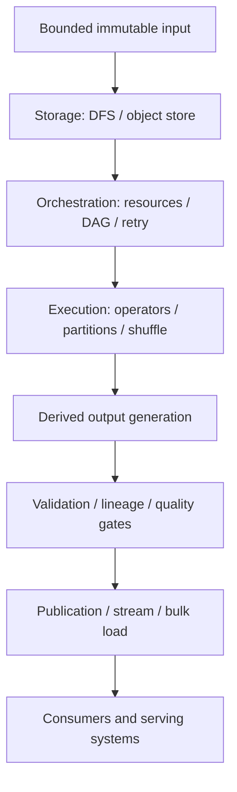

每层有独立 contract；end-to-end reliability要求这些 contracts在边界处衔接。

### 7.2 batch transformation contract

一个run可表示为：

$$
Run=(I_v,F_c,P,O_r)
$$

- $I_v$：versioned input；
- $F_c$：code/config；
- $P$：physical execution plan；
- $O_r$：run-scoped output。

logical correctness主要由 $I_v,F_c$决定；performance/recovery由 $P$决定；consumer visibility由 $O_r$ publication protocol决定。

### 7.3 operator taxonomy

| Operator | 是否保留partitioning | 是否通常blocking | 是否需要shuffle |
|---|---|---|---|
| map/project | 是 | 否 | 否 |
| filter | 是 | 否 | 否 |
| local aggregate | 是 | 可局部blocking | 否 |
| repartition/group by | 否 | 是/阶段边界 | 是 |
| distributed join | 视strategy | 常是 | 常是；broadcast例外 |
| global sort | 否 | 是 | 是 |
| write partitioned output | 可能 | commit时 | 取决于目标layout |

这解释dataflow engine为何fusion narrow operators，却在wide operator处切stage。

### 7.4 narrow 与 wide dependency

**narrow dependency**：one output partition只依赖少数/一个 parent partition，可local pipeline/recompute。**wide dependency**：output partition依赖many/all parent partitions，需要shuffle。

shuffle不是由API名称决定，而是由数据是否必须按新key重新co-locate决定。

### 7.5 partitioning invariant map

| Goal | Required organization |
|---|---|
| count per URL | same URL到same partition |
| join events/users | same user ID两side到same partition |
| global top K | local top K后再合并，或global partition/order |
| PageRank messages | same destination vertex到same partition |
| serving key-value data | output按serving key/target shards布局 |

先写“哪些records必须相遇”，再选择partition key。

### 7.6 end-to-end cost model

job elapsed可近似拆为：

$$
T_{job}=T_{queue}+T_{startup}+T_{scan}+T_{compute}+T_{shuffle}+T_{spill}+T_{commit}+T_{straggler}
$$

各项可overlap，公式不是简单精确相加，而是diagnostic checklist。优化应先测 dominant term，不能只调CPU code。

### 7.7 bytes-first physical reasoning

估算每edge：

$$
Bytes_{out}=Rows_{in}\times Selectivity\times AvgRowSize_{out}
$$

早filter/project降低所有downstream bytes；bad join cardinality与skew会放大shuffle/output。distributed performance常先由data volume与movement决定。

### 7.8 storage decision map

| Need | More natural choice |
|---|---|
| colocated persistent cluster/data locality | HDFS-like DFS |
| independent elastic compute/storage | object store |
| POSIX legacy operations | true filesystem/NFS-compatible service |
| immutable versioned datasets | object prefixes + manifests/table format |
| low-overhead redundancy | erasure coding for colder data |
| fast simple recovery/local reads | replication for hotter data |

实际system可混合hot replication与cold erasure coding。

### 7.9 orchestration responsibility map

| Layer | Decides |
|---|---|
| workflow orchestrator | which job/run is ready, schedule/backfill/retry |
| framework scheduler | operator stages、task dependencies、recompute |
| cluster scheduler | node placement、resources、priority/preemption |
| executor/runtime | process/container lifecycle、local isolation |
| storage/catalog | dataset versions、files、publication metadata |

incident中先定位责任层，避免用Airflow retry掩盖Spark skew，或用Kubernetes restart修复non-idempotent sink。

### 7.10 fault-recovery state map

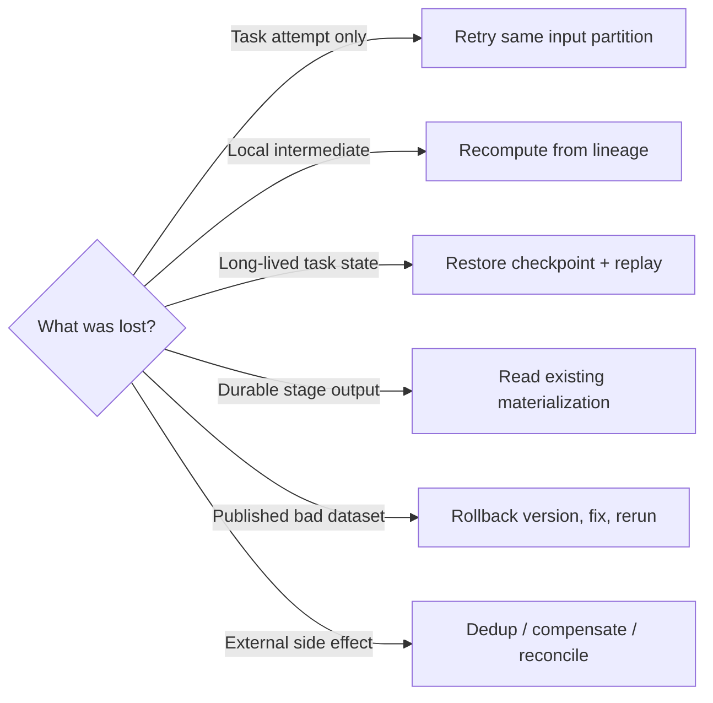

recovery mechanism取决于state location，不能用one retry policy覆盖所有情况。

### 7.11 programming abstraction ladder

```text
SQL / DataFrame / domain API
    ↓
logical relational or dataflow plan
    ↓
optimized physical operators
    ↓
partitioned tasks and shuffle edges
    ↓
executor processes, network, memory, disk
```

上层提高productivity/optimizer visibility；下层决定resource behavior。debugging需要能沿ladder向下解释。

### 7.12 output guarantee ladder

1. task produced some bytes；
2. one attempt won partition commit；
3. all partitions complete；
4. dataset manifest/catalog snapshot committed；
5. quality gates passed；
6. serving generation atomically activated；
7. downstream consumers processed/acknowledged。

“job success”具体对应哪一级必须由system定义。

### 7.13 property 到 evidence

| Claim | Required evidence | Counterexample |
|---|---|---|
| input complete | snapshot ID/manifest/count/checksum | list时仍有files写入 |
| task retry safe | pure output或stable idempotency key | retry double increment |
| output atomic | committed manifest/current pointer | readers看见partial prefix |
| join complete | both snapshots + unmatched-key metrics | dimension extract lagging |
| partition balanced | per-partition rows/bytes/time | one hot key占40% |
| reproducible | code/config/input/library versions | rerun读取current API |
| no data loss | source-output reconciliation | bad records静默drop |
| freshness met | source cutoff到publish timestamp | job准时但input延迟 |

### 7.14 validation layers

- unit/property tests验证 mapper/transform logic；
- small golden datasets验证 joins/aggregates与edge cases；
- plan tests/explain检查shuffle/join strategy；
- deterministic retry tests验证duplicate attempts；
- scale tests验证spill/skew/stragglers；
- fault injection验证executor loss/preemption；
- end-to-end reconciliation验证published output；
- shadow/canary version对比production behavior。

只在small sample验证result，无法证明large physical plan能完成；只做load test也无法证明semantics正确。

### 7.15 architecture decision tree

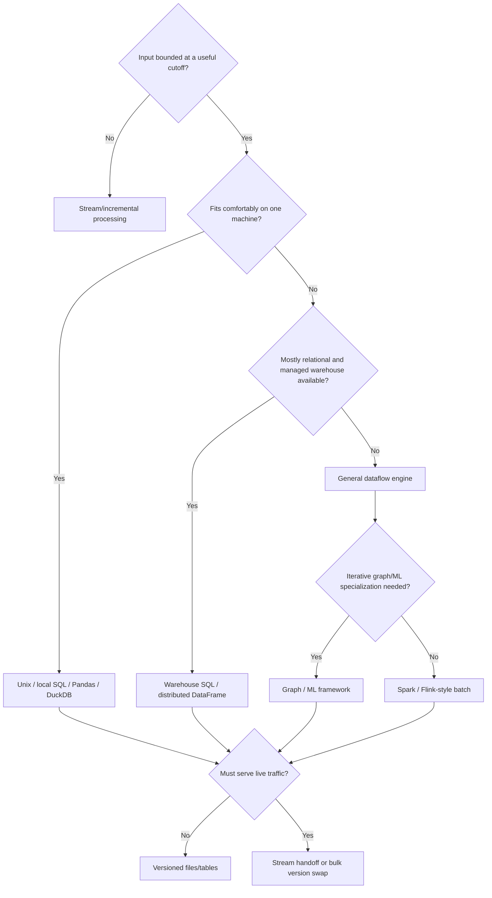

先选最简单能满足volume/freshness的工具，再为distributed scale付复杂度。

### 7.16 unified mental model

1. freeze/identify bounded input；
2. express transformation as operator graph；
3. preserve partitioning until records必须重新相遇；
4. at shuffle，按new key移动最少bytes；
5. retry/recompute only reconstructible state；
6. write attempt-scoped/versioned output；
7. validate then atomically publish；
8. external consumers通过buffer、dedup与generation protocol接入。

这是从single-machine pipeline到petabyte dataflow都适用的统一视角。

---

## 8. 综合案例：每日推荐特征与模型发布流水线

### 8.1 business goal

全球电商每天基于clickstream、orders、products和user profiles训练recommendation model，并为每个 user生成top recommendations供online API毫秒级读取。

允许feature/model约24 hours freshness，但不能让online users看到半个run、重复/错位features或未经验证的model。

### 8.2 hard invariants

1. 一个published generation引用完整且同cutoff的artifacts；
2. online request只读one active generation；
3. failed/retried tasks不产生duplicate logical records；
4. user ID join不跨错partition或mix incompatible schemas；
5. bad quality/model evaluation不能自动activate；
6. old generation在rollback window内可恢复。

### 8.3 conditional liveness

当source snapshots可读、storage可用、cluster有minimum CPU/GPU capacity且serving ingestion持续progress时，daily generation最终build并activate。

若quality gate失败，保持old generation是正确行为，不把“准时”置于data safety之上。

### 8.4 input datasets

- click events：`event_id,user_id,item_id,event_type,event_time`；
- orders：`order_id,user_id,item_id,amount,status`；
- products：`item_id,category,price,availability`；
- users：`user_id,locale,account_state`；
- previous model/features：用于drift与warm-start。

PII fields最小化，training用pseudonymous stable IDs。

### 8.5 snapshot/cutoff

run `2026-08-04`选择 source cutoff $t_c$。每个table记录 snapshot ID/CDC offset，使所有 inputs代表同一approved time boundary或明确允许的staleness。

仅按object prefix list当前files不能证明snapshot一致；使用Iceberg manifests/catalog snapshots或producer complete markers。

### 8.6 architecture

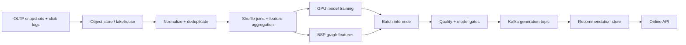

Airflow/Dagster管理job DAG；Spark/Flink/Ray运行data tasks；Kubernetes/YARN分配cluster resources。

### 8.7 object layout

```text
raw/clicks/date=2026-08-03/part-*.parquet
snapshots/users/snapshot=781/part-*.parquet
staging/run=2026-08-04/features/part-*.parquet
staging/run=2026-08-04/model/model.bin
staging/run=2026-08-04/recommendations/part-*.parquet
manifests/run=2026-08-04.json
```

run-scoped prefixes避免attempt覆盖current data；manifest列出exact files/counts/checksums/schema/model versions。

### 8.8 DAG

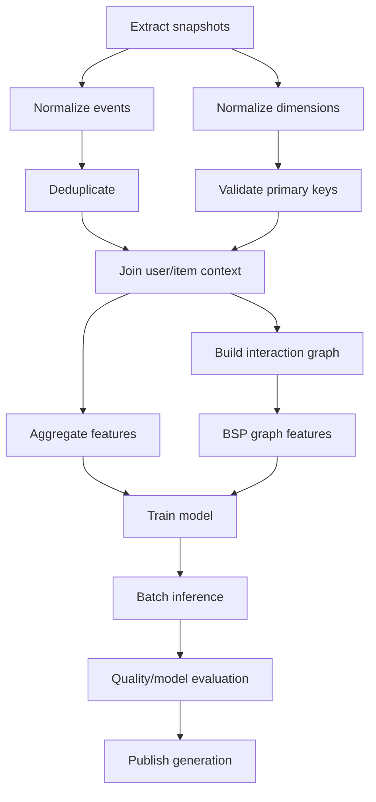

fan-in nodes只有全部parents成功并commit outputs后ready。

### 8.9 extraction

OLTP不被billions random reads冲击；使用database snapshot/export或CDC compacted table。extract job输出row count、min/max key、cutoff与source checksum。

对mutable source直接long scan可能混合不同times，应使用snapshot isolation/export mechanism。

### 8.10 normalize and project

早期 map-only stage：parse、validate types、normalize currency/timezone、filter bots/test users，并只保留later stages需要的columns。

column projection与predicate pushdown减少后续scan/shuffle bytes。

### 8.11 event deduplication

以stable `event_id`去重。若duplicates可能跨input partitions，需要shuffle/group；若source保证partition-local uniqueness，可先local combine降低bytes。

对missing event ID，不能随意按timestamp+user推断唯一，否则会误删legitimate repeated clicks。

### 8.12 dimension key validation

users/products在join前检查primary key uniqueness。若item ID重复两次，与 $n$ events join会输出 $2n$ rows，silent cardinality explosion。

duplicate keys进入quarantine，run fail或按documented deterministic resolution处理。

### 8.13 shuffle joins

events按 `user_id`与users join，再按 `item_id`与products join。optimizer依据dimension size选择broadcast或sort-merge/hash shuffle。

estimated bytes与actual per-partition metrics对比，发现statistics drift/plan regression。

### 8.14 skew handling

anonymous user、popular item可能成为hot key。方案：

- anonymous traffic单独aggregate；
- heavy item key加salt分片后second-stage combine；
- broadcast small product dimension；
- adaptive skew join拆large partition。

目标是保持same logical key结果正确，同时把associative work安全拆分。

### 8.15 feature aggregation

per user/item计算view count、purchase count、recency等：

$$
score_{u,i}=w_v\log(1+views_{u,i})+w_p purchases_{u,i}+w_r e^{-\lambda age}
$$

这里只是feature example，不直接等于final model score。weights/config必须versioned。

### 8.16 temporal leakage prevention

training label发生在 $t_l$ 时，只能使用 $t<t_l$ 已知features。若join无time condition而读later purchase/profile，offline metric会虚高。

point-in-time correctness是ML batch join的重要invariant，不只是schema join成功。

### 8.17 graph features

构建user-item bipartite graph，BSP supersteps传播item/user embeddings或community signals。graph topology相对稳定时cache/pin，messages按destination shuffle。

设maximum iterations与convergence threshold，记录每轮active vertices/messages与metric delta。

### 8.18 training

training job申请GPU gang或elastic resources，读取versioned features/graph outputs。artifacts包括：

- weights/model；
- hyperparameters与seed；
- code/container digest；
- training/evaluation dataset manifests；
- metrics与hardware/library versions。

model file无lineage不能可靠重现或审计。

### 8.19 resource scheduling

ETL CPU-heavy、shuffle network-heavy、training GPU-heavy。DRF/quota隔离teams；GPU jobs可能gang schedule，避免allocated GPUs等待missing peers。

spot nodes可运行reconstructible preprocessing；critical final training是否用spot取决于checkpoint interval与deadline risk。

### 8.20 batch inference

model对eligible users/items bulk score，per user选top $K$。先在partitions做local top $K$，再按user merge，可避免global sort all candidates。

min-heap将per-user candidate selection从full sort $O(N\log N)$降为 $O(N\log K)$。

### 8.21 availability filtering

recommendation generation时过滤unavailable products；online serving仍需request-time availability check，因为batch snapshot后inventory会变化。

batch提供candidate relevance，不应被误认为current inventory authority。

### 8.22 quality gates

- expected users/items coverage；
- null/duplicate recommendation keys；
- per-user exactly $K$或documented fewer；
- score distribution/drift；
- category diversity；
- model accuracy/calibration；
- protected-group fairness/privacy checks；
- source/output reconciliation。

gate thresholds按seasonality与traffic mix解释，不能只比较one scalar。

### 8.23 model acceptance

new model与current baseline在fixed test snapshot比较。只有关键metrics达到non-regression要求才进入publication；可再shadow score或small canary/A-B experiment。

offline improvement不保证online business impact，activation可分model artifact与traffic rollout两阶段。

### 8.24 staging manifest

所有recommendation partitions完成后，coordinator生成manifest：run ID、cutoff、schema、model ID、partition list、counts、checksums。manifest itself通过conditional put/catalog transaction commit。

late speculative attempt不在manifest中，因此不可见。

### 8.25 Kafka handoff

publisher按serving key将 `(generation,user_id,recommendations)`写topic。complete control record包含manifest hash与expected counts。

Kafka缓冲burst、fan-out给recommendation store与analytics audit consumer，并作为batch/production network DMZ boundary。

### 8.26 hidden generation ingestion

serving consumers把records写generation-specific namespace，不更新current pointer。duplicate `(generation,user_id)`使用idempotent upsert；count/checksum不符则不activate。

online readers继续读previous generation，避免partial visibility。

### 8.27 atomic activation

所有shards确认generation complete后，control plane以consensus/CAS更新current generation pointer。read request在开始时解析one generation并始终读取该version。

跨many serving shards若无法one atomic pointer，routing/catalog layer提供single logical indirection。

### 8.28 rollback

若online metrics异常，pointer切回previous generation；new generation保留供debug。rollback不需逐条undo millions records。

retention policy至少覆盖detection window，且不能在new activation瞬间删除old data。

### 8.29 hybrid incremental updates

daily batch提供full baseline；实时stream处理new interactions/availability，形成delta overlay。bootstrap必须记录snapshot cutoff offset $o_c$，stream从 $o_c$之后开始。

若从之前开始需dedup；从之后开始会形成gap。compaction周期性把deltas并入next baseline。

### 8.30 mapper/task crash trace

normalize task写attempt-specific local/staging output后crash。scheduler在another node重读same input partition；only successful attempt path进入stage manifest。

无external mutation，因此duplicate execution安全。

### 8.31 shuffle worker loss trace

若lost local intermediate，Spark按lineage重算producer partitions；external shuffle service则从replica继续。reducer output未commit前可retry。

观察recompute bytes/time，避免long lineage导致recovery超过SLA。

### 8.32 spot preemption trace

training在checkpoint $c$后运行20 minutes被preempt：new worker恢复checkpoint并重放后续 batches。expected lost work上界近似checkpoint interval。

checkpoint太频繁拖慢normal run；太稀疏增加deadline variance，按preemption rate与artifact size权衡。

### 8.33 schema change trace

products producer删除/rename category field，contract validation在extract/normalize前失败，old generation继续serve。producer发布compatible schema或consumer code更新后backfill。

不能让missing field静默变null并污染model。

### 8.34 bad-code trace

new feature formula把currency units放大100倍。distribution gate与previous generation对比发现p99异常，阻止publish。修复container image后对same input manifests rerun。

这正是human fault tolerance与minimizing irreversibility。

### 8.35 backfill

feature bug影响过去30 days，workflow scheduler为date partitions生成parameterized runs。限制backfill concurrency，避免占满production daily SLA resources与serving ingestion capacity。

new/corrected generations使用明确supersession metadata，consumers不按arrival order猜测最新逻辑版本。

### 8.36 observability

监控：

- source cutoff/freshness；
- rows/bytes与schema versions；
- stage queue/runtime、CPU/GPU/memory/spill；
- shuffle bytes/skew/stragglers/retries；
- checkpoint/recompute；
- quality/model metrics；
- Kafka lag与serving generation completeness；
- activation/rollback与online impact。

每个metric按run/stage/partition/model/generation tags关联lineage。

### 8.37 test and fault matrix

| Scenario | Expected outcome |
|---|---|
| duplicate input event | one logical feature contribution |
| duplicate dimension key | gate fails/quarantine, no multiplicative join |
| mapper crash after write | one attempt committed |
| hot item key | adaptive/salted path, bounded straggler |
| spot GPU preemption | resume checkpoint, same accepted metrics |
| Kafka duplicate delivery | idempotent generation upsert |
| missing complete marker | generation invisible |
| serving activation error | old pointer remains/rollback |
| bad feature code | quality gate blocks publication |
| 30-day backfill | daily SLA protected by quota |

### 8.38 privacy and governance

raw PII access restricted；logs/artifacts不打印email/token；retention与deletion requests需传播到derived datasets/models。data contract记录allowed purpose与owner。

immutable/replayable不等于无限期保留；privacy deletion可能要求重新build outputs without deleted subject。

### 8.39 cost controls

记录per-stage scan/shuffle/output bytes与CPU/GPU hours。优先优化：

1. partition pruning与column projection；
2. avoid redundant scans/shuffles；
3. correct broadcast/skew strategy；
4. compression/file sizing；
5. spot capacity for safely retryable work；
6. retention/compaction。

不能用cheaper compute掩盖无界data duplication。

### 8.40 known limitations

daily batch不能提供instant personalization；full retraining成本高；snapshot consistency依赖sources；offline metrics不保证online outcome；generation swap仍需serving system支持versioning/CAS。

这些边界应写进SLA，而非通过“AI pipeline”名称隐藏。

### 8.41 综合案例结论

可靠推荐batch pipeline不是一串SQL notebooks，而是versioned input、operator DAG、resource/fault model、quality evidence和publication transaction的组合。

其核心是把昂贵parallel work保持reconstructible，把唯一不可逆动作压缩为经过验证的generation activation；stream负责incremental transport，不能替代该commit decision。

---

## 9. 核心结论

### 9.1 三十二条核心结论

1. batch processing处理bounded input并在有限时间产生whole derived output，schedule frequency不是其定义。
2. primary performance metric通常是throughput与completion time，而非single-record latency。
3. immutable versioned input、side-effect-free computation与new output是可重跑/human fault tolerance的基础。
4. minimizing irreversibility意味着先staging/validation，最后才执行small atomic publication decision。
5. Unix pipes展示uniform interface与composition；external sort展示bounded memory处理larger-than-RAM data。
6. hash aggregation memory取决于distinct-key working set；external sort以sequential disk I/O换bounded memory。
7. distributed batch可视为distributed operating system，由storage、orchestration与computation组成。
8. DFS用large blocks、metadata service、replication/erasure coding扩展capacity与fault tolerance。
9. replication与erasure coding不仅storage overhead不同，也影响read locality、CPU与repair complexity。
10. object store是bucket/key model，prefix不是directory，rename通常不是atomic metadata operation。
11. compute-storage separation牺牲部分locality，换取independent scaling、ephemeral compute与multi-engine sharing。
12. cluster scheduler要平衡fairness、utilization、priority、locality与fragmentation，精确最优通常NP-hard。
13. workflow scheduler管理job DAG；framework/cluster scheduler管理tasks与resources，职责不可混淆。
14. large parallel job遇到task failure几乎必然，所以retry/recovery是normal execution path。
15. task attempt可以多次执行；attempt-scoped output与single-winner commit只让visible result等价于一次。
16. MapReduce由stateless map、partition/sort shuffle与grouped reduce组成，奠定modern batch核心模型。
17. functional purity允许parallel execution、arbitrary placement与failure后deterministic recomputation。
18. dataflow engine通过whole operator DAG、fusion、pipelining和local intermediate state消除MapReduce多余barriers/I/O。
19. shuffle按new key重新partition，不是随机打乱；其invariant是same key到same consumer partition。
20. joins、group by、aggregation与distributed sort都可归结为key co-location及local processing。
21. shuffle的主要成本是network bytes、serialization、spill/merge、connections与skew。
22. hot key不能靠单纯增加reducers拆分，需要salting、two-stage combine或special handling。
23. secondary sort同时区分partition key与within-partition order，使streaming sort-merge join可bounded-state执行。
24. declarative SQL/DataFrame把logical intent交给optimizer，允许pushdown、join reorder与physical-strategy选择。
25. local Pandas通常eager且ordered/indexed；distributed DataFrame通常lazy、partitioned且无implicit global order。
26. batch engines与cloud warehouses在SQL、DataFrame、columnar storage、shuffle和elastic scheduling上逐渐融合。
27. ETL、analytics、ML与graph processing共享versioned input、parallel transform、quality gate和lineage需求。
28. BSP以superstep/barrier简化iterative graph semantics，但反复支付shuffle、straggler与synchronization成本。
29. framework的all-or-nothing guarantee只覆盖它控制的output；external task side effects会泄漏partial/duplicate state。
30. Kafka提供sequential buffer、rate decoupling、fan-out和security boundary，不自动提供whole-generation atomic visibility。
31. bulk version build易atomic swap；stream incremental path提高freshness，二者结合需精确对齐snapshot cutoff/offset。
32. 可靠batch system从input manifest到serving generation都要记录lineage/evidence，并以bytes、partitions、commit boundary与failure recovery推理。

---

## 10. 设计批处理系统的一般方法

### 10.1 第一步：定义业务结果与 freshness

写清 output给谁用、允许多旧、何时算complete、错误能否补偿。若必须per-event millisecond响应，先承认需要stream/online path；若可按snapshot计算，batch会更简单。

### 10.2 第二步：冻结 bounded input

为每source选择 snapshot ID、partition range、timestamp cutoff或CDC offset，生成manifest并记录schema/count/checksum。不能把“某时刻list到的files”默认当完整input。

### 10.3 第三步：定义 logical transformation

先在single-machine semantics下写清 records、keys、joins、aggregates、missing/duplicate处理和expected output。用small golden dataset证明logic，再讨论parallel execution。

### 10.4 第四步：标出 records 必须相遇的位置

逐operator问：是否保留current partition？哪些records必须按key co-locate？只有在join/group/global sort等wide dependency插shuffle。

这一步决定network与skew，也决定correct grouping。

### 10.5 第五步：选择最简单足够的 engine

- fit one machine：Unix、DuckDB、Pandas/local code；
- relational managed workload：warehouse SQL；
- general distributed DAG：Spark/Flink；
- specialized graph/ML：对应framework。

不要仅因“data”就先部署cluster。

### 10.6 第六步：核对 storage semantics

选择DFS/object store/table format，并明确 block/object size、listing、overwrite、rename、consistency、retention、replication/EC与compute locality。按真实API设计commit，不模拟不存在的POSIX atomicity。

### 10.7 第七步：设计 partition 与 file layout

选择input/output partition keys、target partition size与file count。避免millions small files、one giant partition和hot-key concentration。output layout应支持downstream pruning与serving import。

### 10.8 第八步：建立 workflow DAG 与 contracts

把jobs的inputs/outputs、owners、schema/data contracts、readiness markers与backfill parameters写成DAG。每fan-in只在all required versions complete后启动。

### 10.9 第九步：建立 resource/capacity model

估算 scan/shuffle/output bytes、CPU/memory/GPU、spill disk、network与queue deadline。配置quota/priority/DRF、gang scheduling或spot policy，并保留failure recovery headroom。

### 10.10 第十步：逐类 state 设计 recovery

- task-local output：retry attempt；
- local intermediate：lineage recompute；
- long iteration state：checkpoint；
- cross-job boundary：durable materialization；
- bad published version：rollback/rerun；
- external effect：dedup/compensate/reconcile。

state location决定recovery，不先画state就无法正确选retry。

### 10.11 第十一步：消除或记录 nondeterminism

固定 input/code/config/schema/library versions与random seeds；把clock/API response作为explicit data。每attempt写unique path，stable logical IDs支持dedup，speculative/late attempts不能覆盖winner。

### 10.12 第十二步：按 bytes 和 skew 优化 physical plan

先filter/project，再评估broadcast、partitioned hash或sort-merge join；使用local combine；检查per-partition rows/bytes/runtime。优化dominant edge而非只改callback microcode。

### 10.13 第十三步：建立 quality 与 lineage gates

记录source-to-output counts、null/unique/range、distribution drift、unmatched joins、checksums与business reconciliation。manifest连接source snapshots、code/config、plan与output files。

### 10.14 第十四步：设计 publication transaction

tasks只写staging generation；全部完成和quality pass后commit manifest/catalog pointer。若进入live system，通过Kafka/bulk load缓冲，并让sink隐藏new generation直到complete marker后atomic activate。

### 10.15 第十五步：分层验证与故障演练

1. unit/property tests；
2. golden data semantics；
3. explain/plan assertions；
4. retry/speculative duplicate tests；
5. scale/skew/spill tests；
6. executor/network/spot fault injection；
7. publication/rollback tests；
8. end-to-end reconciliation与shadow comparison。

每个生产incident反例固化为regression/fault scenario。

### 10.16 第十六步：写入 ADR 与 runbook

```text
business output, consumers, and freshness SLA:
input snapshots, cutoffs, manifests, and schemas:
logical transformation and edge-case semantics:
partition keys, wide dependencies, and shuffle estimates:
engine choice and rejected simpler alternatives:
storage APIs, consistency, layout, and retention:
workflow DAG, ownership, and data contracts:
CPU/memory/GPU/network/disk capacity and quotas:
task/intermediate/checkpoint recovery strategy:
determinism, attempt IDs, deduplication, and retries:
quality gates, lineage, reconciliation, and alerts:
staging, complete marker, and atomic publication:
external sink buffering, rate limits, and rollback:
backfill policy and daily-SLA isolation:
test/fault matrix and known non-guarantees:
cost metrics, privacy controls, and deletion propagation:
```

方法的核心顺序是：**先冻结输入并定义logical result，再按records必须相遇的位置设计partition/shuffle；让所有昂贵work可重建，把不可逆动作收敛为经过quality evidence保护的version publication。**

---

## 11. References

以下保留原章编号与链接，共 45 条。

### 11.1 References [1]–[15]

1. Nathan Marz. [“How to Beat the CAP Theorem.”](https://nathanmarz.com/blog/how-to-beat-the-cap-theorem.html) October 2011.
2. Molly Bartlett Dishman and Martin Fowler. [“Agile Architecture.”](https://www.youtube.com/watch?v=VjKYO6DP3fo&list=PL055Epbe6d5aFJdvWNtTeg_UEHZEHdInE) *O’Reilly Software Architecture Conference*, March 2015.
3. Jeffrey Dean and Sanjay Ghemawat. [“MapReduce: Simplified Data Processing on Large Clusters.”](https://www.usenix.org/legacy/publications/library/proceedings/osdi04/tech/full_papers/dean/dean.pdf) *OSDI*, December 2004.
4. Shivnath Babu and Herodotos Herodotou. [“Massively Parallel Databases and MapReduce Systems.”](https://www.microsoft.com/en-us/research/wp-content/uploads/2013/11/db-mr-survey-final.pdf) *Foundations and Trends in Databases*, 5(1):1–104, November 2013. [doi:10.1561/1900000036](https://doi.org/10.1561/1900000036)
5. David J. DeWitt and Michael Stonebraker. [“MapReduce: A Major Step Backwards.”](https://homes.cs.washington.edu/~billhowe/mapreduce_a_major_step_backwards.html) January 2008.
6. Henry Robinson. [“The Elephant Was a Trojan Horse: On the Death of Map-Reduce at Google.”](https://www.the-paper-trail.org/post/2014-06-25-the-elephant-was-a-trojan-horse-on-the-death-of-map-reduce-at-google/) June 2014.
7. Urs Hölzle. [“R.I.P. MapReduce. After having served us well since 2003, today we removed the remaining internal codebase for good.”](https://twitter.com/uhoelzle/status/1177360023976067077) September 2019.
8. Adam Drake. [“Command-Line Tools Can Be 235x Faster than Your Hadoop Cluster.”](https://adamdrake.com/command-line-tools-can-be-235x-faster-than-your-hadoop-cluster.html) January 2014.
9. Free Software Foundation. [“`sort`: Sort Text Files.”](https://www.gnu.org/software/coreutils/manual/html_node/sort-invocation.html) *GNU Coreutils 9.7 Documentation*, 2025.
10. Michael Ovsiannikov, Silvius Rus, Damian Reeves, Paul Sutter, Sriram Rao, and Jim Kelly. [“The Quantcast File System.”](https://db.disi.unitn.eu/pages/VLDBProgram/pdf/industry/p808-ovsiannikov.pdf) *PVLDB*, 6(11):1092–1101, August 2013. [doi:10.14778/2536222.2536234](https://doi.org/10.14778/2536222.2536234)
11. Andrew Wang, Zhe Zhang, Kai Zheng, Uma Maheswara G., and Vinayakumar B. [“Introduction to HDFS Erasure Coding in Apache Hadoop.”](https://www.cloudera.com/blog/technical/introduction-to-hdfs-erasure-coding-in-apache-hadoop.html) September 2015.
12. Andy Warfield. [“Building and Operating a Pretty Big Storage System Called S3.”](https://www.allthingsdistributed.com/2023/07/building-and-operating-a-pretty-big-storage-system.html) July 2023.
13. Vinod Kumar Vavilapalli et al. [“Apache Hadoop YARN: Yet Another Resource Negotiator.”](https://opencourse.inf.ed.ac.uk/sites/default/files/2023-10/yarn-socc13.pdf) *SoCC*, October 2013. [doi:10.1145/2523616.2523633](https://doi.org/10.1145/2523616.2523633)
14. Richard M. Karp. [“Reducibility Among Combinatorial Problems.”](https://www.cs.purdue.edu/homes/hosking/197/canon/karp.pdf) *Complexity of Computer Computations*, Springer, 1972. [doi:10.1007/978-1-4684-2001-2_9](https://doi.org/10.1007/978-1-4684-2001-2_9)
15. J. D. Ullman. [“NP-Complete Scheduling Problems.”](https://www.cs.montana.edu/bhz/classes/fall-2018/csci460/paper4.pdf) *Journal of Computer and System Sciences*, 10(3):384–393, June 1975. [doi:10.1016/S0022-0000(75)80008-0](https://doi.org/10.1016/S0022-0000(75)80008-0)

### 11.2 References [16]–[30]

16. Gilad David Maayan. [“The Complete Guide to Spot Instances on AWS, Azure and GCP.”](https://www.datacenterdynamics.com/en/opinions/complete-guide-spot-instances-aws-azure-and-gcp/) March 2021.
17. Abhishek Verma et al. [“Large-Scale Cluster Management at Google with Borg.”](https://dl.acm.org/doi/pdf/10.1145/2741948.2741964) *EuroSys*, April 2015. [doi:10.1145/2741948.2741964](https://doi.org/10.1145/2741948.2741964)
18. Matei Zaharia et al. [“Resilient Distributed Datasets: A Fault-Tolerant Abstraction for In-Memory Cluster Computing.”](https://www.usenix.org/system/files/conference/nsdi12/nsdi12-final138.pdf) *NSDI*, April 2012.
19. Paris Carbone, Stephan Ewen, Seif Haridi, Asterios Katsifodimos, Volker Markl, and Kostas Tzoumas. [“Apache Flink: Stream and Batch Processing in a Single Engine.”](https://dblp.org/rec/journals/debu/CarboneKEMHT15.html) *IEEE Data Engineering Bulletin*, 38(4):28–38, December 2015.
20. Mark Grover, Ted Malaska, Jonathan Seidman, and Gwen Shapira. [*Hadoop Application Architectures*](https://learning.oreilly.com/library/view/hadoop-application-architectures/9781491910313/). O’Reilly Media, 2015. ISBN 9781491900048.
21. Jules S. Damji, Brooke Wenig, Tathagata Das, and Denny Lee. [*Learning Spark*](https://learning.oreilly.com/library/view/learning-spark-2nd/9781492050032/), 2nd edition. O’Reilly Media, 2020. ISBN 9781492050049.
22. Michael Isard, Mihai Budiu, Yuan Yu, Andrew Birrell, and Dennis Fetterly. [“Dryad: Distributed Data-Parallel Programs from Sequential Building Blocks.”](https://www.microsoft.com/en-us/research/publication/dryad-distributed-data-parallel-programs-from-sequential-building-blocks/) *EuroSys*, March 2007. [doi:10.1145/1272996.1273005](https://doi.org/10.1145/1272996.1273005)
23. Daniel Warneke and Odej Kao. [“Nephele: Efficient Parallel Data Processing in the Cloud.”](https://stratosphere2.dima.tu-berlin.de/assets/papers/Nephele_09.pdf) *MTAGS*, November 2009. [doi:10.1145/1646468.1646476](https://doi.org/10.1145/1646468.1646476)
24. Hossein Ahmadi. [“In-Memory Query Execution in Google BigQuery.”](https://cloud.google.com/blog/products/bigquery/in-memory-query-execution-in-google-bigquery) August 2016.
25. Tom White. [*Hadoop: The Definitive Guide*](https://learning.oreilly.com/library/view/hadoop-the-definitive/9781491901687/), 4th edition. O’Reilly Media, 2015. ISBN 9781491901632.
26. Fabian Hüske. [“Peeking into Apache Flink’s Engine Room.”](https://flink.apache.org/2015/03/13/peeking-into-apache-flinks-engine-room/) March 2015.
27. Mostafa Mokhtar. [“Hive 0.14 Cost Based Optimizer (CBO) Technical Overview.”](https://web.archive.org/web/20170607112708/http://hortonworks.com/blog/hive-0-14-cost-based-optimizer-cbo-technical-overview/) March 2015.
28. Michael Armbrust et al. [“Spark SQL: Relational Data Processing in Spark.”](https://people.csail.mit.edu/matei/papers/2015/sigmod_spark_sql.pdf) *SIGMOD*, June 2015. [doi:10.1145/2723372.2742797](https://doi.org/10.1145/2723372.2742797)
29. Kaya Kupferschmidt. [“Spark vs. Pandas, Part 2—Spark.”](https://towardsdatascience.com/spark-vs-pandas-part-2-spark-c57f8ea3a781/) October 2020.
30. Ammar Chalifah. [“Tracking Payments at Scale.”](https://bolt.eu/en/blog/tracking-payments-at-scale) June 2025.

### 11.3 References [31]–[45]

31. Nafi Ahmet Turgut et al. [“Demand Forecasting at Getir Built with Amazon Forecast.”](https://aws.amazon.com/blogs/machine-learning/demand-forecasting-at-getir-built-with-amazon-forecast) May 2023.
32. Jason (Siyu) Zhu. [“Enhancing Homepage Feed Relevance by Harnessing the Power of Large Corpus Sparse ID Embeddings.”](https://www.linkedin.com/blog/engineering/feed/enhancing-homepage-feed-relevance-by-harnessing-the-power-of-lar) August 2023.
33. Avery Ching, Sital Kedia, and Shuojie Wang. [“Apache Spark @Scale: A 60 TB+ Production Use Case.”](https://engineering.fb.com/2016/08/31/core-infra/apache-spark-scale-a-60-tb-production-use-case/) August 2016.
34. Edward Kim. [“How ACH Works: A Developer Perspective—Part 1.”](https://engineering.gusto.com/how-ach-works-a-developer-perspective-part-1-339d3e7bea1) April 2014.
35. Zhamak Dehghani. [“How to Move Beyond a Monolithic Data Lake to a Distributed Data Mesh.”](https://martinfowler.com/articles/data-monolith-to-mesh.html) May 2019.
36. Chris Riccomini. [“What the Heck Is a Data Mesh?!”](https://cnr.sh/essays/what-the-heck-data-mesh) June 2021.
37. Chad Sanderson, Mark Freeman, and B. E. Schmidt. [*Data Contracts*](https://www.oreilly.com/library/view/data-contracts/9781098157623/). O’Reilly Media, 2025. ISBN 9781098157623.
38. Daniel Abadi. [“Data Fabric vs. Data Mesh: What’s the Difference?”](https://www.starburst.io/blog/data-fabric-vs-data-mesh-whats-the-difference/) November 2021.
39. Michael Armbrust, Ali Ghodsi, Reynold Xin, and Matei Zaharia. [“Lakehouse: A New Generation of Open Platforms That Unify Data Warehousing and Advanced Analytics.”](https://www.cidrdb.org/cidr2021/papers/cidr2021_paper17.pdf) *CIDR*, January 2021.
40. Leslie G. Valiant. [“A Bridging Model for Parallel Computation.”](https://dl.acm.org/doi/pdf/10.1145/79173.79181) *Communications of the ACM*, 33(8):103–111, August 1990. [doi:10.1145/79173.79181](https://doi.org/10.1145/79173.79181)
41. Stephan Ewen, Kostas Tzoumas, Moritz Kaufmann, and Volker Markl. [“Spinning Fast Iterative Data Flows.”](https://vldb.org/pvldb/vol5/p1268_stephanewen_vldb2012.pdf) *PVLDB*, 5(11):1268–1279, July 2012. [doi:10.14778/2350229.2350245](https://doi.org/10.14778/2350229.2350245)
42. Grzegorz Malewicz et al. [“Pregel: A System for Large-Scale Graph Processing.”](https://kowshik.github.io/JPregel/pregel_paper.pdf) *SIGMOD*, June 2010. [doi:10.1145/1807167.1807184](https://doi.org/10.1145/1807167.1807184)
43. Richard MacManus. [“OpenAI Chats About Scaling LLMs at Anyscale’s Ray Summit.”](https://thenewstack.io/openai-chats-about-scaling-llms-at-anyscales-ray-summit/) September 2023.
44. Jay Kreps. [“Why Local State Is a Fundamental Primitive in Stream Processing.”](https://www.oreilly.com/ideas/why-local-state-is-a-fundamental-primitive-in-stream-processing) July 2014.
45. Félix GV. [“Open Sourcing Venice—LinkedIn’s Derived Data Platform.”](https://www.linkedin.com/blog/engineering/open-source/open-sourcing-venice-linkedin-s-derived-data-platform) September 2022.
