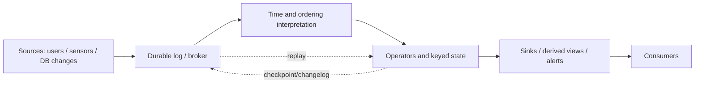
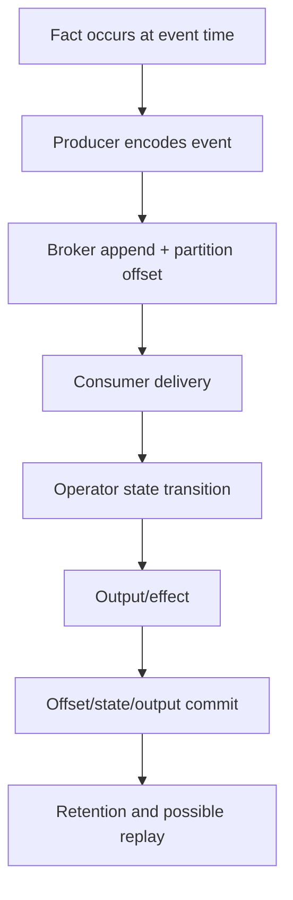
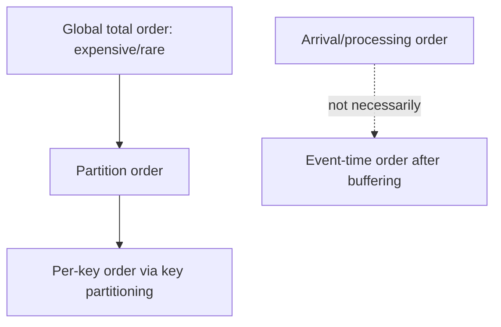
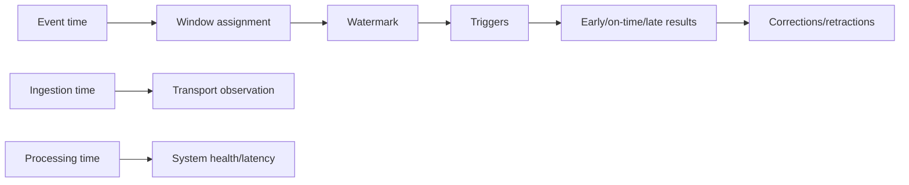
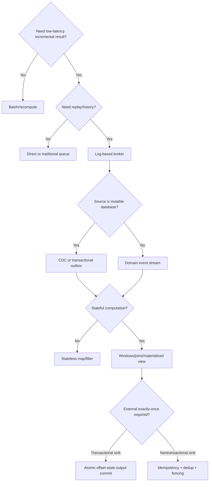
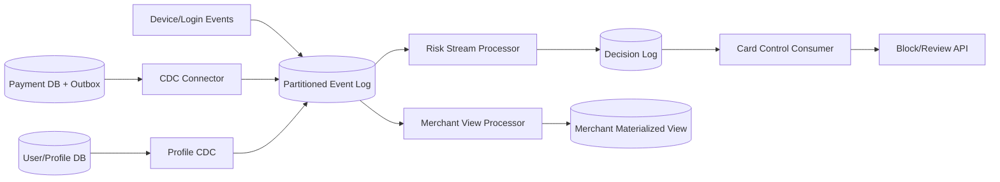
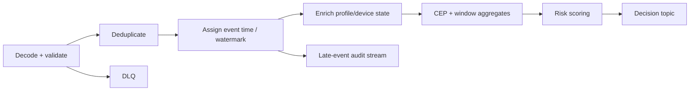

> 对应原文：12. Stream Processing.md
>
> 本文严格按照原章顺序讲解，并在章后统一补充易混概念、知识结构、综合案例和可复用的流处理设计方法。文中的公式、推导、可运行示例与扩展案例用于解释和验证原理，不应误认为原书逐字给出的实现。

## 0. 本章定位：从 bounded batch 转向 unbounded events

### 0.1 第 11 章留下的关键假设

batch job读取一组有限files，产生新的derived files。input **bounded**，因此job知道何时读完，也能在全部tasks完成后一次发布whole output。

第 12 章移除这个前提：现实中的users、sensors、services和databases会持续产生data，dataset没有自然“完成”时刻。

### 0.2 为什么 global sort 暴露 boundedness

对有限input做ascending sort时，必须看到最后一条record，才能确认它不是global minimum。若input永不结束，就不存在“所有records已到达”的时刻，也无法输出最终完整排序。

这说明许多batch operators隐含 **end-of-input barrier**；unbounded stream必须改为incremental result、windowed result或持续修正result。

### 0.3 artificial batching

传统做法把持续data人为切成 daily/hourly batches。设 period为 $P$、job execution time为 $T$，最坏freshness lag近似：

$$
Lag_{max}\approx P+T
$$

缩短 $P$可降低latency，却提高scheduler overhead、overlapping runs与small-file/transaction cost。

### 0.4 stream processing 的动机

若 daily output太慢，可每second处理上一second，甚至取消fixed slices，每个event到达就处理。后者就是 **stream processing**：对incrementally available data持续执行computation。

它不是“更快的batch”这么简单，因为unboundedness改变了completion、time、state、join与fault-recovery semantics。

### 0.5 stream 的广义含义

stream是随time逐步可用的数据序列，例子包括：

- Unix `stdin`/`stdout`；
- programming-language lazy lists；
- `FileInputStream`；
- TCP connections；
- audio/video；
- event streams。

本章关注把events作为data management mechanism。

### 0.6 event 定义

**event**是一个small、self-contained、immutable object，记录某时刻发生的事实。它通常包含event timestamp，以及identity、type、payload与metadata。

例子：page view、purchase、temperature reading、CPU metric、database row update。第 11 章web log的一行就是event。

### 0.7 event 与 command/state 的区别

- command：希望system做什么，如 `PlaceOrder`；
- event：已经发生什么，如 `OrderPlaced`；
- state：截至某时刻对events折叠后的current view。

event最好使用past tense且不可修改；correction通常追加new event，而非悄悄改旧事实。

### 0.8 event encoding

event可用text、JSON、Avro、Protobuf等编码。encoding同时服务于storage与network transport，并需要schema evolution、compatibility和unknown-field policy。

immutable event不代表schema永远固定；producer/consumer contract仍要演进。

### 0.9 producer、consumer 与 topic

- **producer**：publisher/sender，生成event；
- **consumer**：subscriber/recipient，处理event；
- **topic/stream**：相关events的logical grouping。

这对应batch中的writer、reader与filename/dataset。

### 0.10 polling 的低延迟成本

producer写database/file，consumer周期poll也能连接两者。若poll interval为 $p$，change discovery delay平均约 $p/2$；但 $p$越小，empty polls比例越高。

低延迟需要notification/push或能高效long-poll/tail的storage，而非高频执行arbitrary database query。

### 0.11 database triggers 的边界

relational triggers可响应row changes，但通常功能受限、耦合transaction path、难以fan-out与跨system replay。它们长期不是general event-notification substrate。

因此出现专门messaging systems与change streams。

### 0.12 stream processing 的三层问题

1. **transport/storage**：events怎样传输、排序、保留、重放；
2. **state integration**：database changes怎样成为streams，streams怎样生成views；
3. **continuous computation**：time/windows/joins/fault tolerance怎样定义。

原章按这个顺序展开。

### 0.13 batch 与 stream 不是互斥产品

batch擅长full recomputation、backfill、audit与bootstrap；stream擅长low-latency incremental update。production常以batch snapshot初始化，再从某offset继续stream changes。

一个engine也可同时支持bounded和unbounded inputs。

### 0.14 streaming 的核心难题

- events会delay、duplicate、reorder；
- 没有natural end，何时关闭window？
- joins需要保留多久state？
- consumer落后时怎样保护system？
- crash后怎样恢复state且不重复external effects？

“逐条处理”只是表面，困难在time/state/failure semantics。

### 0.15 本章路线

1. direct messaging、traditional brokers与log-based brokers；
2. database synchronization、CDC、event sourcing与immutable state；
3. CEP、analytics、materialized views、search与event-driven architecture；
4. event time、stragglers、windows、stream joins；
5. microbatch/checkpoint、atomic commit、idempotence与state recovery。

---

## 1. Transmitting Event Streams

### 1.1 file record 的 streaming counterpart

batch先把byte file解析成records；stream中record通常称event。区别不在object shape，而在availability：file通常先完整存在，events则随time持续出现。

### 1.2 event timestamp

event常带time-of-day timestamp，声称“何时发生”。它可能来自producer device clock，不一定准确，也不等于broker arrival/processor time；后文会专门区分。

### 1.3 append/store/send

同一encoded event可：

- append到file/log；
- insert到relational/document database；
- send over network；
- append到message-broker topic。

transport choice决定durability、latency、ordering与replay能力。

### 1.4 files 与 topics 的类比

| Batch | Streaming |
|---|---|
| record | event/message |
| writer | producer/publisher |
| reader job | consumer/subscriber |
| file/dataset | topic/stream |
| file offset | partition offset |
| rerun from input | replay from old offset |

log-based messaging最接近这个类比。

### 1.5 notification 优于频繁 polling

continuous processing要求新event出现后迅速唤醒consumer。push/notification将work与actual arrivals绑定；polling则即使无data也消耗queries/connections。

notification不保证event已durable或只通知一次，仍需明确protocol。

### 1.6 Messaging Systems

**messaging system**接收producer发送的event message，并push/deliver给consumers。相比one-to-one Unix pipe/TCP，它通常支持many producers、many consumers与topics。

### 1.7 publish/subscribe model

producer无需知道每个consumer endpoint，只publish到topic；consumer按subscription接收。broker/transport承担routing与temporal decoupling。

pub/sub不是单一delivery semantic，必须继续问buffering、durability、ordering、ack和replay。

### 1.8 第一问：producer 比 consumer 快怎么办

设arrival rate为 $\lambda$、service rate为 $\mu$：

- 若 $\lambda<\mu$，长期可稳定；
- 若 $\lambda>\mu$持续存在，backlog以约 $\lambda-\mu$增长；
- temporary burst可由buffer吸收。

任何有限system都不能无限承受持续overload。

### 1.9 三种 overload policy

1. **drop**：丢messages；
2. **buffer/queue**：积压到memory/disk；
3. **backpressure/flow control**：阻塞/限速producer。

还可组合，例如先buffer，超过threshold后backpressure，再到hard limit时drop/reject。

### 1.10 drop 的适用边界

periodic temperature/CPU gauge偶尔丢点可能可接受；counter/invoice/order event丢一条就永久错误。必须按business semantics选择，不能以“metrics”一概允许loss。

大量drops还可能不易察觉，因此要监控received/sent sequence、drop counters与gaps。

### 1.11 buffer 的容量问题

memory queue满后怎么办：spill disk、reject producer、drop oldest/newest，还是crash？disk写入会改变latency/throughput，disk最终也会满。

buffer只把rate mismatch转换成time budget，没有消除capacity约束。

### 1.12 backpressure

Unix pipe/TCP使用small fixed buffer；满后sender阻塞。backpressure把slow consumer传播upstream，防止unbounded memory，但可能让producer request path变慢甚至形成cascading latency。

需要结合admission control、timeouts和priority，避免低价值consumer拖住critical producer。

### 1.13 第二问：crash/offline 时会不会丢消息

durability通常需要disk persistence、replication与ack policy。producer收到broker ack可能仅表示memory buffered，也可能表示quorum durable；两者failure guarantee不同。

更强durability通常增加latency与write amplification。

### 1.14 batch reliability 对 streaming 的要求

batch framework重试failed tasks并丢弃partial output，使result像无failure执行。stream希望获得类似“failure不改变logical result”的语义，但input永不结束、state持续演进、external outputs即时可见，难度更高。

### 1.15 Direct messaging from producers to consumers

direct messaging没有intermediary broker，producer直接network-send给consumer。优点是few hops、low latency；代价是producer/consumer availability更紧密耦合，durable retry责任落到application。

### 1.16 UDP multicast

financial market feeds常用UDP multicast实现one-to-many low-latency delivery。UDP本身不可靠；application可用sequence numbers检测gap，并向producer/repair server请求retransmission。

producer必须保留recent packets，且recovery window有限。

### 1.17 ZeroMQ 与 nanomsg

brokerless libraries在TCP/IP multicast上提供pub/sub abstractions。它们简化socket patterns，却不自动提供durable offline backlog、global replay或broker-side retention。

### 1.18 StatsD over UDP

StatsD agents可用UDP发送metrics。gauge的next sample可能覆盖loss影响；counter若packet丢失就under-count，因此结果至多approximate。

sampling、loss与aggregation误差应进入monitoring interpretation。

### 1.19 webhooks

producer对registered callback URL发HTTP/RPC，即webhook。适合service integration，但需处理receiver downtime、timeouts、retry、authentication、duplicate delivery与endpoint lifecycle。

webhook response成功也不一定证明downstream business transaction永久完成，API contract必须定义。

### 1.20 direct messaging 的 failure boundary

consumer offline期间可能miss events；producer retry buffer若只在memory，producer crash后也丢失。即使network loss可重传，也通常假设两端大体在线。

需要durable inbox/outbox或broker时，架构已向stored messaging演进。

### 1.21 Message brokers

**message broker/message queue**是针对message streams优化的server/database。producer写broker，consumer从broker收取；broker承担buffering、routing与durability。

### 1.22 temporal decoupling

producer与consumer不必同时在线。producer只等broker确认buffered/durable，而不等consumer处理。因此delivery是asynchronous，delay可从milliseconds变成hours，取决于backlog。

### 1.23 broker durability modes

有些broker只存memory；有些可disk persistence/replication。queue policy也可能是bounded、unbounded、TTL或overflow drop。

“使用broker”不是durability guarantee，必须检查topic/queue configuration与ack point。

### 1.24 Message brokers compared to databases

broker甚至可通过XA/JTA参与two-phase commit，但traditional broker与database仍有实践差异。

### 1.25 retention lifecycle

database通常保留record直到explicit delete；traditional broker常在successful delivery/ack后删除message。因此broker不一定适合long-term source of truth或new consumer replay。

### 1.26 working set assumption

traditional queue假设backlog短。slow consumer导致queue spill disk时，per-message latency与throughput可能恶化；长期积压会耗尽disk。

这与第 11 章working set思想一致：design在normal set fit fast tier时表现最好。

### 1.27 query capability

database有secondary indexes与query language；broker通常只能按topic/pattern subscribe，不能任意查询past state。

broker擅长notification/data-in-motion，database擅长state query/data-at-rest。

### 1.28 snapshot 与 change notification

database query返回point-in-time result，之后result过期通常不会主动告诉client；broker不能arbitrary query/update message，却会在new messages出现时notify consumer。

后续CDC/materialized views正是把state query与change stream连接起来。

### 1.29 traditional standards/products

JMS、AMQP代表traditional messaging model；RabbitMQ、ActiveMQ、HornetQ、Qpid、TIBCO EMS、IBM MQ、Azure Service Bus、Google Cloud Pub/Sub等实现不同变体。

database也可作queue，但高并发claim/delete、poll与vacuum/index patterns需要专门tuning。

### 1.30 Multiple consumers

multiple consumers有两种基础语义：load balancing与fan-out。它们回答“one message要由几份logical computation看到”。

### 1.31 Load balancing

同一logical queue/group内，每message只交给one consumer，consumers分摊work。适合expensive independent tasks，可水平扩process capacity。

AMQP可让many clients consume same queue；JMS称shared subscription。

### 1.32 Fan-out

每message送给all independent subscriptions/consumer groups。它对应多个batch jobs读取同一input file，例如同一purchase event同时进入fraud、analytics与notification pipelines。

### 1.33 原图：load balancing 与 fan-out


两者可组合，而不是二选一。

### 1.34 Kafka consumer groups

one consumer group内partition work在members间load balance；multiple groups各自读取same topic，groups之间fan-out。

logical processing application通常对应one group ID。

### 1.35 Acknowledgments and redelivery

consumer可能在delivery后、processing中或processing后crash。broker要求consumer完成后发送 **acknowledgment/ack**，未ack则redeliver，避免明显message loss。

### 1.36 ack 的不确定窗口

consumer可能已完成side effect，但ack packet丢失。broker无法区分“未处理”与“处理完但ack丢”，于是redelivery导致duplicate effect。

这就是two generals/unknown outcome在messaging中的具体表现；需要atomic commit或idempotence/dedup。

### 1.37 delivery semantics 基础

- at-most-once：不retry，可能loss，不duplicate；
- at-least-once：未确认则retry，不loss（在retention/fault assumptions内），可能duplicate；
- exactly/effectively-once：logical effect只出现一次，需要更强transaction或idempotent protocol。

不能只根据broker marketing term推断end-to-end sink behavior。

### 1.38 redelivery 导致 reorder

load balancing时consumer 2处理 $m_3$ crash，consumer 1可能先处理 $m_4$，再收到redelivered $m_3$，观察order变为 $m_4,m_3,m_5$。

### 1.39 原图：ack loss/crash 与重排


broker原始delivery FIFO也无法阻止concurrent processing + redelivery造成completion/order变化。

### 1.40 如何保order

若messages有causal dependency，可按entity key路由到one serial queue/partition，并限制同key concurrent processing。代价是parallelism受key/partition count与hot key约束。

完全independent tasks则可接受reorder，换message-level load balancing。

### 1.41 poison message

malformed/incompatible message使consumer每次crash，broker不断redeliver，形成retry loop、resource starvation；strong-order queue甚至阻塞所有later messages。

无上限retry不是可靠性，而是permanent denial of progress。

### 1.42 Dead letter queues

超过attempt/time threshold后，把poison message移到 **dead letter queue（DLQ）**，让main stream继续。DLQ需alert、owner、retention与replay workflow。

operator可drop、修message、修consumer后reproduce。不能把DLQ当无人查看的垃圾桶，否则等价于silent data loss。

### 1.43 Log-Based Message Brokers

traditional messaging继承transient delivery mindset：ack后删除。database/filesystem则默认written data持久存在。**log-based message broker**结合durable storage与low-latency notification。

### 1.44 destructive receive 的问题

AMQP/JMS queue若ack即delete，consumer不能任意回到昨天重跑；new consumer也只能看到registration后的messages。derived-data experiment/recovery受限。

### 1.45 Using logs for message storage

log-based broker的基本模型是 **using logs for message storage**：log是disk上的append-only records sequence。producer append tail；consumer sequential read；读到tail后等待new append notification，类似 `tail -f`。

read不改变log，因此many consumers可独立读取。

### 1.46 topic sharding

single disk throughput有限，于是把topic拆成independent **partitions/shards**，分布在many machines。每partition是一条独立append-only log；topic是这些partitions的集合。

### 1.47 partition offset

broker为partition内每message分配monotonically increasing **offset**：

$$
o_{i+1}>o_i
$$

partition内events total ordered；不同partitions间没有native total order，offset也不可跨partition直接比较。

### 1.48 原图：topic partitions 与 offsets


offset既是position，也是consumer recovery/checkpoint coordinate。

### 1.49 representative systems

Apache Kafka、Amazon Kinesis Streams采用log-based model。Google Cloud Pub/Sub architecture近似，但暴露更JMS-style API。sharding与replication使disk-persisted messaging仍可达millions messages/s。

### 1.50 Logs compared to traditional messaging

log fan-out天然成立，因为read不delete。load balancing则以whole partitions分给consumer-group members，而非逐message任意dispatch。

### 1.51 partition-level parallelism

one partition通常由one group member顺序处理，所以consumer group有效parallelism：

$$
Parallelism\le \min(Consumers,Partitions)
$$

consumers多于partitions时有members idle。需要扩parallelism应预先规划partitions，但partitions过多增加metadata/rebalance成本。

### 1.52 head-of-line blocking

one slow message阻塞同partition later messages。若per-message work昂贵且ordering不重要，traditional queue/message-level dispatch可能更适合。

thread pool并行同partition会复杂化offset commit与output ordering。

### 1.53 选择 traditional queue 还是 log

| Need | Traditional JMS/AMQP queue | Log-based broker |
|---|---|---|
| expensive independent tasks | strong fit | partition head-of-line risk |
| per-message load balance | natural | historically coarse partition assignment |
| strict per-key order | separate queues needed | partition by key |
| replay/history | weak/destructive | strong within retention |
| high sequential throughput | varies | strong fit |
| many independent consumers | separate queues/subscriptions | independent offsets |

architectures正在融合，不能只按product name分类。

### 1.54 partition key 与 ordering scope

需要同一user events有fixed order，就用user ID作为partition key：

$$
partition=hash(user\_id)\bmod P
$$

same user落same partition；different users可parallel且无cross-user order。hot user会形成skew。

### 1.55 Consumer offsets

sequential consumer只需记录next/last processed offset，而非每message ack。小于committed offset的messages视为processed，大于等于它的尚未confirmed。

batching offset commits降低bookkeeping，提高throughput，但扩大failure后duplicate replay范围。

### 1.56 offset 与 database LSN

offset类似single-leader replication的log sequence number（LSN）。consumer像follower：断线重连后从known position继续，不skip writes。

### 1.57 crash recovery duplicate

consumer处理到offset 105，但last committed offset为100时crash；replacement从100恢复，100–105会再次处理。at-least-once来自这个故意保守的rollback。

### 1.58 offset commit timing trade-off

- process前commit：crash可能skip/loss effect；
- process后commit：crash窗口会duplicate；
- offset与output atomic commit：可缩小/消除logical duplicate，但要求shared transaction boundary。

### 1.59 Disk space usage

append-only log最终占满disk，因此切segments，按retention删除/归档old segments。retention可按time、size或compaction policy。

### 1.60 20 TB retention 推导

采用decimal units，20 TB约 $20{,}000{,}000$ MB，持续写250 MB/s：

$$
T=\frac{20{,}000{,}000\ MB}{250\ MB/s}=80{,}000\ s\approx22.22\ h
$$

即使满速写也能buffer约22 hours；实际写入低于disk peak时常保留days/weeks。

### 1.61 ring buffer interpretation

delete oldest segments使log成为disk-backed **circular buffer**，也称 **ring buffer**。buffer很大但finite；consumer offset落到earliest retained offset之前时，历史已不可恢复。

### 1.62 tiered storage / object storage

Kafka、Redpanda可通过 **tiered storage** 把old segments放object storage；WarpStream、Confluent Freight、Bufstream等可all-data-on-object-store。容量/cost更优，old-read latency与object requests则不同。

messages若存为Iceberg tables，batch/warehouse可直接查询同一data，减少复制。

### 1.63 When consumers cannot keep up with producers

log broker是large fixed-size buffer。关键指标 **consumer lag**：

$$
Lag_{messages}=HeadOffset-CommittedOffset
$$

还应估time lag、catch-up rate与retention headroom。

### 1.64 catch-up condition

producer rate $\lambda$、consumer processing rate $\mu$。落后后要catch up必须长期 $\mu>\lambda$；净追赶速度为 $\mu-\lambda$。

backlog $B$的理想catch-up time：

$$
T_{catchup}=\frac{B}{\mu-\lambda}
$$

若 $\mu\le\lambda$，增加retention只延迟data loss，不能恢复稳定。

### 1.65 retention headroom

若oldest retained event age为 $R$，consumer time lag为 $L$，headroom约 $R-L$。alert必须早于0，并预留deploy/debug/catch-up时间。

只监控message count lag在traffic rate变化时会误导，time/bytes lag也重要。

### 1.66 slow consumer isolation

一个consumer落后通常不影响其他consumer groups；它停止时broker仅保留offset，不为它复制一份queue。可安全创建experimental consumers，只要不耗尽shared broker read/network resources。

traditional broker若每subscription有独立queue，abandoned queue会持续积压并抢memory/disk，需显式delete。

### 1.67 Replaying old messages

log consumption是read-only；唯一broker-side progress state是offset。把offset rewind到yesterday，即可用new code重放并写different output。

这把stream重新获得batch的immutable input + repeatable transformation能力。

### 1.68 replay 的适用条件

- events仍在retention内；
- schemas/code可解释old events；
- output写new namespace或支持idempotent overwrite；
- external side effects被禁用/dedup；
- nondeterministic dependencies被versioned。

仅rewind offset不保证得到same result。

### 1.69 可运行示例：offset checkpoint 与 replay

```python
class PartitionLog:
    def __init__(self, messages: list[str]) -> None:
        self.messages = messages

    def read_from(self, offset: int) -> list[tuple[int, str]]:
        return list(enumerate(self.messages[offset:], start=offset))


log = PartitionLog(["order-A", "order-B", "order-C", "order-D"])
committed_offset = 0

first_attempt = log.read_from(committed_offset)[:3]
print("first attempt:", first_attempt)
committed_offset = 2

after_crash = log.read_from(committed_offset)
print("after crash:", after_crash)

replay_yesterday = log.read_from(0)
print("replay count:", len(replay_yesterday))
print("log unchanged:", log.messages)
```

实际运行输出：

```text
first attempt: [(0, 'order-A'), (1, 'order-B'), (2, 'order-C')]
after crash: [(2, 'order-C'), (3, 'order-D')]
replay count: 4
log unchanged: ['order-A', 'order-B', 'order-C', 'order-D']
```

offset 2未被confirmed为“已完成”，所以crash后 `order-C`重复；rewind到0不改变log，证明read/replay非destructive。

### 1.70 transport model 小结

direct messaging优化low latency但offline durability弱；traditional broker以queue/ack提供temporal decoupling和message-level work sharing；log broker以partition/order/offset/retention提供high throughput与replay。

选择不是“Kafka一定更先进”，而是根据work granularity、ordering scope、retention/replay、consumer lag和failure semantics匹配模型。

---

## 2. Databases and Streams

### 2.1 两类系统互相借鉴

log broker把database的durable append/log思想用于messaging；反过来，database可以把每次write暴露为event stream，用notification/replay持续构建derived state。

这不是偶然共享“log”一词，而是state与changes之间的基本关系。

### 2.2 event stream 作为 system of record

event sourcing把每次application state change建模为immutable event并append log，read-optimized materialized views由events派生。若event log永久保留，它就是system of record。

log broker可低延迟通知new events，但event sourcing还要求domain-level event design与replay compatibility。

### 2.3 mutable database 也有 event stream

不采用event sourcing，也可把insert/update/delete视为events。database replication log正是leader产生的write-event stream，followers按同order apply后得到相同state。

### 2.4 state machine replication 再解释

若transition function $F$ deterministic，replicas从同initial state $S_0$按同event order处理：

$$
S_n=F(F(\cdots F(S_0,e_1),e_2)\cdots,e_n)
$$

则它们得到同 $S_n$。stream order把concurrent write nondeterminism转成serial history。

### 2.5 Keeping Systems in Sync

nontrivial application常同时使用OLTP database、cache、search index、warehouse、recommendation store。same logical data有many physical representations，必须同步更新。

### 2.6 batch synchronization

periodic full dump + ETL + bulk load简单、可重建，但freshness受batch interval限制。若daily snapshot不可接受，就需要incremental changes。

### 2.7 dual writes

application在一次logical update中分别写database、search index、cache，例如：

```text
write primary database
write search index
invalidate cache
```

这叫 **dual writes**（实际可多于两个）。看似直接，却同时有ordering与atomicity缺陷。

### 2.8 dual-write race

client 1写 $X=A$，client 2写 $X=B$。database观察order $A\to B$，search index因network scheduling观察 $B\to A$：

$$
DB(X)=B,\qquad Index(X)=A
$$

两次调用都成功，systems仍永久不一致。

### 2.9 原图：不同写入顺序


问题不是last-write-wins算法本身，而是两个systems对“last”没有共同order。

### 2.10 silent overwrite

没有version vector/expected version等concurrency detection时，一个value静默覆盖另一个，甚至无法观测race发生。定期reconciliation可发现state差异，却不能恢复lost intent。

### 2.11 partial failure

database write成功、index write失败也会diverge。要求all systems同时成功/失败是distributed atomic commit，通常需要2PC/consensus-compatible participants，成本和operational coupling高。

retry第二个write还要处理unknown outcome与idempotence。

### 2.12 two independent leaders

single-leader database内部有one write order；search index有自己的leader/order。dual write把一个logical fact提交给两个不互相follow的leaders，等价于multi-leader conflict surface。

解决方向是选one system of record/leader，让others follow its committed change order。

### 2.13 Change Data Capture

**change data capture（CDC）**观察database中所有committed changes，并抽取为可复制到other systems的change stream。source database继续使用mutable model，application可不感知CDC。

### 2.14 replication log 从 internal 到 API

历史上WAL/binlog被视为database implementation detail，format undocumented；clients只能query tables。CDC把logical changes转成stable interface，使heterogeneous systems能follow database。

### 2.15 CDC 的 ordering solution

concurrent writes先由source database决定commit order，再写replication log。search/warehouse按同order消费，因而不会像dual writes那样各自重排。

### 2.16 原图：一个 leader，多 derived followers


new derived system只需成为另一个consumer，不要求source application增加一次write。

### 2.17 Implementing CDC

source database是system of record/leader；search、cache、warehouse等是 **derived data systems/followers**。log broker transport changes并维护partition order。

### 2.18 logical replication events

logical row-based log通常描述table、primary key、operation和before/after values，比physical page/WAL bytes更适合heterogeneous consumers。

updates、transactions、schema changes和large values仍需明确encoding与ordering。

### 2.19 CDC ecosystem

- Debezium：MySQL、PostgreSQL、Oracle、SQL Server、Db2、Cassandra等source connectors；
- Kafka Connect：source/sink connector framework；
- Maxwell：解析MySQL binlog；
- GoldenGate：Oracle ecosystem；
- pgcapture：PostgreSQL。

connector负责适配database log，不能替代consumer-side schema/idempotence设计。

### 2.20 asynchronous CDC

source transaction通常不等derived consumers apply完成，故adding slow consumer不阻塞OLTP。代价是replication lag与stale derived views。

source commit成功只证明change进入source authority，不证明search/cache已经fresh。

### 2.21 lag metrics

至少监控：source log head position、consumer applied position、time lag、error/retry/DLQ。position lag需要结合write rate解释；time lag更接近user-visible freshness。

### 2.22 Initial snapshot

recent change log不能包含从未recently updated的old rows。新建full search index必须先取得whole database state，再接续changes。

### 2.23 snapshot + offset invariant

snapshot必须对应known change-log position $o_s$：

$$
DerivedState=Snapshot(o_s)+Apply(events\ with\ offset>o_s)
$$

没有position，snapshot期间concurrent writes可能missing或double apply。

### 2.24 snapshot-first race

若先scan table再“读取当前offset”，scan早期已读rows可能在期间更新，而log从later offset开始会漏掉更新。正确protocol需consistent snapshot + exact log coordinate或watermark reconciliation。

### 2.25 DBLog watermarking

Debezium使用Netflix DBLog watermarking提供incremental snapshots：用low/high watermark标记snapshot chunks与concurrent log events，再reconcile重叠，避免长时间锁whole table。

具体algorithm依connector/database，不能手工用wall-clock timestamp替代log coordinate。

### 2.26 Log compaction

若保留完整change history太贵，每次bootstrap都需source snapshot。**log compaction**保留每key latest update，使topic本身可近似current database contents。

### 2.27 compaction algorithm intuition

background process扫描segments，对same key丢弃older records，保留latest record；还可merge segments。空间主要取决于current live keys，而非historical write count。

### 2.28 原图：compacted key-value log


compaction可保留some older duplicates，correctness只要求latest value仍可找到。

### 2.29 tombstone

special null/deletion marker称 **tombstone**。compactor必须先保留tombstone足够久，让all replicas/consumers看到delete，再才能连key一起GC。

过早删tombstone可能让old value在lagging replica/restore中“复活”。

### 2.30 compacted-log space model

若latest record sizes为 $s_k$，理想lower bound：

$$
Size_{compacted}\approx\sum_{k\in live\ keys}s_k+Tombstones+CompactionOverhead
$$

frequent overwrite的old values最终GC；never-overwritten keys永久保留。

### 2.31 rebuild from offset 0

new search consumer从compacted topic offset 0顺序scan，最终见到每key latest value，可重建full state，无需再次打source snapshot。

若consumer途中处理older duplicate，later latest record会覆盖它，最终state仍正确。

### 2.32 compaction prerequisites

- every change有stable primary key；
- update event携带entire replacement state或足够重建latest value；
- delete用tombstone；
- retention/compaction不能丢掉only latest record。

delta-only increments不满足“latest event覆盖previous”时不能直接只留一条。

### 2.33 API support for change streams

MySQL/PostgreSQL等通过replication logs暴露changes；cloud products提供Datastream等managed CDC。change stream从reverse-engineered integration逐渐成为first-class API。

### 2.34 quorum-based database CDC 难点

Cassandra等无single leader，each node有raw log；visibility取决于quorum/read consistency。它暴露per-node log segments，consumer需merge/deduplicate，不能假设已有one total mutation stream。

这再次说明CDC correctness依赖source consistency/order model。

### 2.35 Kafka Connect bridge

Kafka Connect把source CDC送入Kafka，再由sink connectors更新indexes/databases或交给stream processors。connector ecosystem降低plumbing成本，但end-to-end contracts仍跨source schema、topic和sink。

### 2.36 CDC versus event sourcing

二者都能replay changes构建state，但abstraction level与application model不同。

### 2.37 CDC abstraction

application照常update/delete mutable rows；CDC从low-level replication log提取“row X before/after” changes。优点是可retrofit existing system，commit order由database保证。

### 2.38 event sourcing abstraction

application明确appenddomain events，如 `OrderPlaced`、`ItemAddedToCart`；event store禁止/不鼓励update/delete。events表达user/business intent，而非row mechanics。

### 2.39 对照表

| 维度 | CDC | Event sourcing |
|---|---|---|
| source model | mutable database | append-only domain events |
| abstraction | row/table change | business event/intent |
| adoption | 可retrofit | application architecture change |
| schema exposure | database schema常泄漏 | event contract显式设计 |
| compaction | full-row latest event可compact | history通常不可丢 |
| audit meaning | “row changed” | “business action occurred” |

没有普遍“更高级”的选择。

### 2.40 Change Data Capture and Database Schemas

microservice database本应是internal implementation detail；CDC直接发布table schema会把internal schema变成public API。drop/rename column可能让production consumers outage。

### 2.41 data contracts

CDC contract应定义key、operation semantics、field meaning、null/default、compatibility与retention。database migration必须检查downstream consumers，不能只看source service tests。

### 2.42 outbox pattern

application在same database transaction中同时：

1. mutate internal domain tables；
2. insert stable public event into outbox table。

CDC只publish outbox schema，internal tables可独立演进。

### 2.43 outbox 为什么不是危险 dual write

它确实写两处logical records，但都在 **同一 database transaction/system** 中，由one commit order原子持久化；不是跨database+broker的uncoordinated writes。

relay/CDC可稍后重复publish，consumer用event ID dedup。

### 2.44 outbox trade-offs

- 维护domain-to-event transformation；
- extra storage/write amplification；
- cleanup/retention；
- publish lag与duplicate relay；
- transaction payload可能增大。

它解决atomic creation，不自动解决all downstream processing。

### 2.45 CDC compaction vs event history

CDC full-row event的latest value可覆盖previous；event-sourced `Deposited(10)`与`Withdrew(5)`共同决定balance，latest event不能替代prior history。

因此 event sourcing通常保留all raw events。

### 2.46 event-sourcing snapshots

为加快read/recovery，可保存某offset的derived state snapshot，再apply later events。snapshot是performance optimization，不是authority；raw log仍用于rebuild/audit（受retention/privacy边界限制）。

### 2.47 可运行示例：dual write 与 CDC order

```python
database_order = [("client-1", "A"), ("client-2", "B")]
index_direct_order = [("client-2", "B"), ("client-1", "A")]


def apply(writes: list[tuple[str, str]]) -> str:
    value = "initial"
    for _, new_value in writes:
        value = new_value
    return value


print("dual-write database:", apply(database_order))
print("dual-write index:", apply(index_direct_order))

cdc_log = list(enumerate(database_order, start=1))
index_from_cdc = [(client, value) for _, (client, value) in cdc_log]
print("CDC offsets:", [offset for offset, _ in cdc_log])
print("CDC index:", apply(index_from_cdc))
print("states agree:", apply(database_order) == apply(index_from_cdc))
```

实际运行输出：

```text
dual-write database: B
dual-write index: A
CDC offsets: [1, 2]
CDC index: B
states agree: True
```

CDC没有阻止concurrent writes；它让source先决定one order，再让derived view复制该order。

### 2.48 State, Streams, and Immutability

mutable current state与immutable changelog并不矛盾：前者是后者按order累积的结果，后者描述state如何演进。

### 2.49 examples of state from events

- available seats：reservations/cancellations的结果；
- account balance：credits/debits的sum；
- latency graph：request-duration events的aggregation；
- cart contents：add/remove events的fold。

### 2.50 integral / derivative analogy

state近似event stream随time的积分：

$$
State(t)=State(t_0)+\int_{t_0}^{t}Changes(\tau)\,d\tau
$$

change stream近似state的导数：

$$
Changes(t)\approx\frac{d\,State(t)}{dt}
$$

这是思维类比，不意味着second derivative有domain meaning。

### 2.51 原图：state 与 stream


durable changelog让state reproducible；current database主要是为了fast retrieval。

### 2.52 log 与 database 的角色

Jim Gray/Andreas Reuter的观点：log包含全部information；保存end-of-log current database是retrieval optimization。实践中log retention、schema和external dependencies会限制完整replay，但原则仍有用。

### 2.53 compaction 作为桥梁

full changelog保history；compacted log保latest per-key state。前者适合audit/recompute intent，后者适合bootstrap current view。二者可用不同topics/retention并存。

### 2.54 Advantages of immutable events

immutable event history提升auditability、debugging、recovery与new-view construction。其价值不只属于financial regulation。

### 2.55 accounting ledger

accountants appendtransactions到ledger，再derive profit/loss、balance sheet。错误不erase old transaction，而是append compensating/refund transaction，保留audit trail。

### 2.56 compensation 不等于没有错误

compensating event修正current effect，但original event仍真实发生，且published previous-period figures可能需later correction。eventual business repair不等于transactional rollback。

### 2.57 buggy code recovery

destructive overwrite可能丢失before state；append log保留what happened，能定位bug影响范围并用corrected projection replay。customer support也可依据audit trail解释行为。

### 2.58 intent/history information

cart item add后remove，current cart无item，但history揭示customer曾考虑它。analytics/recommendation可用该信息；current-state table若delete row就丢失intent trace。

### 2.59 Deriving several views from the same event log

same log可fan-out构建search、analytics、cache、timeline等read-oriented representations。Druid可直接ingest Kafka，Kafka Connect sinks可写many stores。

### 2.60 side-by-side migration

new feature可从old log构建new view，与old system同时运行、compare/shadow；切read traffic后再shutdown old view。通常比in-place schema migration更reversible。

### 2.61 CQRS

**Command Query Responsibility Segregation（CQRS）**把write model与read models分离：write-optimized event/command path产生truth，read-optimized denormalized views服务queries。

不采用full event sourcing，也可从CDC stream构建CQRS-like materialized views。

### 2.62 normalization debate 的变化

write form无需等于query form。write side可normalized/intent-oriented，read side按access pattern高度denormalized；stream projection负责同步。

denormalization不再靠ad hoc dual writes维护，而靠one ordered change source。

### 2.63 home timeline example

social home timeline把one post复制到all followers’ mailboxes，极度denormalized。fan-out service处理new post/follow changes，让duplication保持derived consistency。

### 2.64 Concurrency control

CQRS最大缺点是async lag：user刚append event，立刻read view可能看不到own write。需要session routing、wait-for-offset、read source/write model或UI pending state实现read-your-writes。

### 2.65 synchronous view update 的成本

要让log append与read view同时可见，需distributed transaction，或write response前等待view catch up。前者complex，后者把derived latency/failure耦合进write path，因此通常异步。

### 2.66 self-contained event 减少 multi-object write

one user action被编码为one atomic log append，而不是直接更新many read tables。consumers随后独立derive multiple objects，减少write path multi-object transaction需求。

这不消除business invariants；它把一部分coordination移到event acceptance point。

### 2.67 co-partitioned serial processing

event log和state按customer ID同shard，one consumer thread按partition order处理：每次只mutate one shard，天然serial execution，无需within-shard write locks。

跨state shards event仍需coordination、saga或重新设计partition boundary。

### 2.68 immutability in MVCC/version control

即使非event-sourced database，也用immutable versions支持snapshot isolation。Git、Mercurial、Fossil以immutable objects保history。immutability是concurrency/recovery通用工具。

### 2.69 Limitations of immutability

append-heavy、rare-update workload易长期保history；small hot dataset频繁update/delete会产生huge history、fragmentation和GC/compaction pressure。

### 2.70 storage amplification

若current dataset size为 $D$、每period churn fraction为 $c$、保留 $n$ periods，忽略compression时history规模可近似：

$$
Storage\approx D+n\cdot cD
$$

高churn下linear growth很快；snapshot/compaction/tiering是operational necessity。

### 2.71 legal/administrative deletion

GDPR、erroneous data或secret leak可能要求真正删除。仅append `Deleted` event只让projections忽略old data，raw log/backups仍保留sensitive bytes。

### 2.72 excision 与 shunning

Datomic称history rewrite/deletion为 **excision**；Fossil称 **shunning**。它们承认immutability不是absolute law，exception需要special audited operation。

### 2.73 deletion 为什么难

copies可能存在log segments、replicas、indexes、caches、exports、backups、SSD remapped blocks。copy-on-write systems故意避免in-place overwrite；immutable backup又为ransomware/recovery提供保护。

privacy deletion与disaster-recovery retention存在真实trade-off。

### 2.74 crypto-shredding

potentially deletable data以key加密；删除时destroy key，使ciphertext不可解读。它把large immutable data deletion转成small mutable key deletion。

### 2.75 crypto-shredding granularity

same key加密的data只能all-or-none shred。per-record key太多会让key store接近primary data规模；per-user/per-tenant key是常见折中，但cross-subject records仍复杂。

puncturable encryption可selectively revoke decryption ability，但尚不普及。

### 2.76 deletion guarantee 的诚实边界

实践常只能“让data更难被retrieve”，很难证明所有physical copies不可恢复。系统仍需data inventory、retention schedule、key lifecycle、backup expiry与deletion audit。

### 2.77 Databases and Streams 小结

dual writes因independent order/partial failure失效；CDC让one database决定order并把others变followers；snapshot+offset或compacted log支持bootstrap；event sourcing进一步把domain history作为authority。

immutable log使multiple views、audit与replay更容易，但带来CQRS lag、schema contracts、storage churn与real deletion难题。stream architecture的价值来自显式权衡，而非“永不删除”的口号。

---

## 3. Processing Streams

### 3.1 从 transport 转向 computation

前两节说明events从users/sensors/databases产生，并经direct channel、broker或log传输。接下来研究consumer拿到stream后如何持续派生state、alerts和new streams。

### 3.2 三类 output

1. 写database/cache/search index，供clients query；
2. push给human，如email、notification、dashboard；
3. 处理one/more input streams，产生one/more output streams。

原章重点是第三类operator pipeline，最终仍会落到前两类sink。

### 3.3 operator/job

处理stream并生成derived stream的code称 **operator/job**。它read-only consume input，append-only produce output，形态类似Unix process或MapReduce/dataflow operator。

map/filter与partition parallelism仍适用。

### 3.4 unboundedness 改变什么

- cannot global sort whole stream；
- job永不自然complete；
- output不能等task结束才visible；
- state不能无限无策略增长；
- crash后不能从years-old beginning随意重跑；
- joins必须定义time/state retention。

因此stream不是把batch `while True`包装起来。

### 3.5 no global sort

unbounded input的last minimum永远未知，所以batch sort-merge join不能直接应用于entire stream。可按finite window sort，或按key维护state/index进行incremental join。

### 3.6 stateful 与 stateless operators

- stateless：map/filter，每event只依赖自身；
- stateful：count/window/join/dedup/pattern detection，依赖历史。

fault tolerance、rescaling与memory压力主要来自stateful operators。

### 3.7 Uses of Stream Processing

stream processing最早广泛用于monitoring/alerting，如fraud、market trading、factory malfunction与military/intelligence detection。共同特征是event pattern发生后需低延迟reaction。

### 3.8 fraud detection

系统持续关联card/user/device/location events，识别usage pattern突然变化。single suspicious event可能不足，需time window内sequence/aggregate state。

false positive会block合法customer，故latency、precision与explainability同样重要。

### 3.9 trading/industrial monitoring

trading rules观察prices/order book并执行action；factory streams观察sensor combinations与trend。二者都要求明确event time、loss policy与out-of-order handling，不能仅追求fast average latency。

### 3.10 Complex event processing

**complex event processing（CEP）**自1990s发展，用declarative rules搜索multi-event patterns，类似regular expression匹配character sequence。

### 3.11 CEP pattern 示例

例如“10 minutes内同card先在country A成功，再在distant country B成功，且amount > threshold”。它涉及order、key correlation、predicate与time bound。

CEP engine为partial matches保state，直到pattern完成、timeout或被invalidating event取消。

### 3.12 standing queries

normal database持久化data、query transient；CEP反转：queries长期stored，each incoming event与standing queries匹配。

match时engine emit一个包含pattern details的 **complex event**。

### 3.13 CEP state machine

declarative SQL/GUI rule编译为state machine/NFA-like automaton。event推动state transitions；per-key partial state需expiration，否则unmatched starts会无限积累。

### 3.14 CEP systems

Esper、Apama、TIBCO StreamBase是CEP implementations；Flink、Spark Streaming等也支持streaming SQL/declarative patterns。

### 3.15 Stream analytics

**stream analytics**更关注large event volume上的aggregations/statistical metrics，而非某个exact event sequence。CEP与analytics边界并不严格。

### 3.16 rate、rolling average、comparison

常见计算：

- event rate per interval；
- rolling average/percentile；
- current interval与last hour/week比较；
- anomaly threshold。

它们都需要time window与state expiration。

### 3.17 smoothing intuition

5-minute average把single-second noise平滑，同时比daily average更快反映trend。window length $L$越大，variance通常越低但detection lag越高。

window choice是signal/noise与latency trade-off。

### 3.18 exact 与 approximate algorithms

stream analytics可exact，也可用probabilistic structures降低memory：

- Bloom filter：membership，允许false positive；
- HyperLogLog：approximate distinct count；
- sketches：percentiles/frequencies。

approximation是optimization，不是stream processing天生lossy。

### 3.19 memory motivation

exact distinct set对cardinality $U$需 $O(U)$ state；HyperLogLog用fixed/sublinear compact registers估计 $U$，接受known statistical error。选择应报告error bounds与merge semantics。

### 3.20 analytics frameworks

Apache Storm、Spark Streaming、Flink、Samza、Apache Beam、Kafka Streams面向stream analytics；Google Cloud Dataflow、Azure Stream Analytics提供hosted service。

framework capability不等于configured pipeline有exact delivery/time semantics。

### 3.21 Maintaining materialized views

stream持续更新cache/search/warehouse等 **materialized views**。event-sourced application current state本身也是view。

### 3.22 finite window 与 all-time state

analytics常只保last $L$ minutes；current database view可能依赖beginning-of-time以来所有non-obsolete changes。其logical window近似infinite，只能通过compaction/snapshot缩小physical recovery work。

### 3.23 suitable engines

Kafka Streams、ksqlDB等建立于compacted Kafka logs，适合long-lived table/state。只假设short windows的analytics engine可能不适合maintain complete database replica。

### 3.24 Incremental View Maintenance

traditional `REFRESH MATERIALIZED VIEW`周期full recompute，问题是：

- unchanged data反复处理，效率低；
- next refresh前view stale。

**incremental view maintenance（IVM）**只处理source changes并更新受影响view fragments。

### 3.25 delta computation

设view $V=Q(D)$，source change为 $\Delta D$。IVM寻找：

$$
\Delta V=\delta Q(D,\Delta D)
$$

然后：

$$
Q(D+\Delta D)=V+\Delta V
$$

难点是把general query自动转换为correct efficient delta operators。

### 3.26 incremental sum 示例

daily revenue view已有 $R_d$，new sale amount $a$：

$$
R_d' = R_d+a
$$

delete/refund则产生negative/retraction delta。若只支持insert，不处理retractions，view会永久偏高。

### 3.27 joins 的 delta product rule preview

join view类似product $U\Join V$；changes可能来自任一side：

$$
\Delta(U\Join V)=(\Delta U\Join V)+(U\Join\Delta V)+(\Delta U\Join\Delta V)
$$

后文table-table join会用同一思想。

### 3.28 IVM databases

Materialize、RisingWave、ClickHouse、Feldera使用IVM提供real-time materialized views；相关技术包括DBSP、differential dataflow等。

recent events可先buffer memory，再merge on-disk state；reads组合两层得到fresh view。

### 3.29 IVM 的限制

某些queries涉及non-monotonic operations、arbitrary UDF、large joins或global reorder，delta state/maintenance可能昂贵。incremental不是自动“免费”，需看change rate与affected state。

### 3.30 Search on streams

media monitoring预先保存company/topic queries，incoming articles逐条匹配；real-estate users保存criteria，new property匹配时notify。

Elasticsearch **percolator**是实现之一。

### 3.31 documents 与 queries 角色反转

conventional search先index documents，再用transient query搜索；stream search持久化queries，让each transient document寻找matching queries。

这与CEP standing queries同构。

### 3.32 indexing queries

naive每document测试all queries成本 $O(Q)$。可为queries建立term/predicate index，先找candidate queries再full verify，降低matching work。

query updates本身也成为需要version/order的stream。

### 3.33 Event-driven architectures and RPC

actors/RPC/message-passing也用messages，但不等同stream processing。区别在primary purpose、durability、fan-out与topology。

### 3.34 actor model

actor framework主要管理concurrency/distributed execution；actors可任意one-to-one、cyclic request/response。messages常ephemeral，crash delivery guarantee依framework。

### 3.35 stream processor

stream processing主要是data management：durable multi-subscriber logs、defined input/output streams、通常acyclic dataflow、persistent operator state与replay。

### 3.36 crossover

Apache Storm有distributed RPC；actor frameworks也可处理streams。但若framework不durably deliver/replay，application需自行实现fault tolerance。

tool能传message不意味着它具stream data guarantees。

### 3.37 Reasoning About Time

“last five minutes”看似清楚，实际上要先回答：按event发生时间，还是processor看到时间？何时认为window complete？late data怎样修正？

### 3.38 batch 的时间直觉

batch几minutes处理one year history，machine clock描述run time，不描述business timeline。应读取event embedded timestamp，因而same input replay得到same temporal grouping。

### 3.39 processing time 的简单性

许多framework按local system clock window，即 **processing time**。若event-to-processing delay可忽略，它简单、low state且结果快速final。

但queue/restart/backfill下delay不再可忽略。

### 3.40 Event time versus processing time

- **event time** $t_e$：event声称发生时间；
- **processing time** $t_p$：operator处理时间；
- **ingestion time** $t_i$：broker/server接收时间。

processing lag为：

$$
L=t_p-t_e
$$

$L$可因clock error为负，也可因offline buffering变成days。

### 3.41 delay sources

queue backlog、network fault、broker/processor contention、consumer restart、recovery replay、bug fix后的historical reprocessing都会让 $t_p\gg t_e$。

### 3.42 arrival order 不等 event order

user先request A后request B；A/B由different servers处理，B event可能先到broker。partition/order只保证append sequence，不自动恢复real-world causal order。

需要shared key sequencing、event timestamp/version或application causality metadata。

### 3.43 Star Wars analogy

movie release/watch order为IV、V、VI、I、II、III、VII、VIII、IX，narrative episode order却I到IX。processing order像release/watch order，event timestamp像narrative position。

algorithm必须显式处理这种discontinuity。

### 3.44 processing-time spike artifact

processor停1 minute后快速消费backlog。按processing time计rate，会在restart窗口出现fake spike；按event time，events仍分布在actual occurrence windows。

### 3.45 原图：processing-time distortion


监控processor health可用processing time；衡量user traffic通常应event time。用途决定clock。

### 3.46 deterministic replay

按event timestamp window，same events replay通常落same windows；按current processing clock replay，historical events全部落today/now，结果不可比。

determinism还要求timezone、calendar rules与timestamp correction version固定。

### 3.47 Handling straggler events

**straggler/late event**在其event-time window已被认为complete后才到达。因为network delay无上界，system无法绝对知道“再也不会来”。

### 3.48 completeness 是 policy

1-minute window 10:37 已过去，但offline device仍可能days后上传。close window必须基于allowed lateness/watermark/SLA assumption，而非数学certainty。

### 3.49 option 1：ignore/drop

late fraction足够小时可drop，保持result final/simple。必须记录dropped-late count、lateness distribution并alert；financial/audit events可能不能接受。

### 3.50 option 2：correction/retraction

late event更新window result并publishcorrection；若downstream已收到old aggregate，还需upsert version或retract old value再emit new value。

下游必须理解updates，不能把每correction当新增count。

### 3.51 watermark

**watermark** $W$表达processor的event-time progress estimate：通常可解释为“预计不会再收到timestamp $\le W$ 的on-time events”。window end $\le W$时可emit/finalize。

watermark是heuristic/contract，不是global clock truth。

### 3.52 multi-producer watermark

若each producer报告minimum future timestamp $W_i$，global safe progress常取：

$$
W=\min_i W_i
$$

one idle/stuck producer会阻止watermark前进；dynamic add/remove与idle detection因此困难。

### 3.53 triggers 与 accumulation modes

可在watermark前emit early speculative result，watermark时emit on-time result，late data后emit correction。output可discarding或accumulating，consumer需知道每次值是delta还是new total。

### 3.54 Whose clock are you using, anyway?

mobile device offline时本地buffer events，hours/days后上传。device event time有business meaning，却可能clock错或被user篡改；server receive time可信些，却描述upload而非interaction。

### 3.55 three timestamps

记录：

1. device event time $t_e^d$；
2. device send time $t_s^d$；
3. server receive time $t_r^s$。

估算device-to-server clock offset：

$$
\delta\approx t_r^s-t_s^d
$$

corrected event time：

$$
\hat t_e^s=t_e^d+\delta
$$

### 3.56 clock correction assumptions

- network delay相对required accuracy可忽略/可估；
- device clock在event到send间offset未改变；
- timestamps未被malicious fabrication；
- timezone/unit正确。

不满足时只能保留uncertainty或使用server-time semantics。

### 3.57 batch 也有同一 clock 问题

time ambiguity不是stream独有；batch重算mobile history也面对bad device clocks。stream因实时window close而更早暴露问题。

### 3.58 Types of windows

确定timestamp semantics后，选择window membership。window定义影响result、latency、state size和late-data correction。

### 3.59 Tumbling windows

fixed length $L$、不overlap，每event恰属one window。start：

$$
start(t)=\left\lfloor\frac{t}{L}\right\rfloor L
$$

例如1-minute windows为10:03:00–10:03:59、10:04:00–10:04:59。

### 3.60 Hopping windows

length $L$、hop $H<L$，consecutive windows overlap。5-minute length + 1-minute hop时，每event通常进入 $L/H=5$ 个windows，产生smoother result与higher update cost。

可先算1-minute tumbling aggregates，再合并adjacent 5 buckets。

### 3.61 Sliding windows

包含彼此timestamp distance小于interval $L$的events，不依赖fixed clock boundaries。实现需按time排序buffer并expire old events。

它比hopping定义更精细，state/update成本可能更高。

### 3.62 Session windows

per key/user将相邻events聚为session；若inactivity gap超过 $G$，previous session结束。duration不固定，late event可能连接/merge原本分开的sessions。

website analytics常用30-minute inactivity gap。

### 3.63 window 对照

| Window | Boundary | Membership | Typical use |
|---|---|---|---|
| tumbling | fixed non-overlap | exactly one | per-minute totals |
| hopping | fixed overlap | multiple | rolling smoothed metrics |
| sliding | relative event distance | dynamic | precise recent interval |
| session | inactivity gap | per-key variable | user visits |

### 3.64 fixed-size vs event-buffer state

count/sum每window只需constant-size accumulator；median/exact percentile、sliding join可能buffer many events。state约随：

$$
StateSize\propto EventRate\times WindowLength\times PayloadSize
$$

还要乘keys/overlap与lateness retention。

### 3.65 high-cardinality keys

即使each key只一counter，millions users/devices也会形成large keyed state。需要partitioning、state backend、TTL、checkpoint capacity与hot-key monitoring。

### 3.66 late state retention

window首次emit后若允许lateness $A$，state至少保留到 $windowEnd+A$。更大 $A$提高correctness coverage，也增加disk/memory与迟迟不final的时间。

### 3.67 可运行示例：event-time window correction

```python
events = [
    ("request-A", 10),
    ("request-B", 70),
    ("request-late", 20),
]
window_size = 60
counts: dict[int, int] = {}
closed: set[int] = set()
max_event_time = -1

for name, event_time in events:
    max_event_time = max(max_event_time, event_time)
    watermark = max_event_time
    for start in list(counts):
        if start + window_size <= watermark:
            closed.add(start)

    start = event_time // window_size * window_size
    counts[start] = counts.get(start, 0) + 1
    status = "correction" if start in closed else "update"
    print(f"{name}: window [{start},{start + window_size}) {status}={counts[start]}")
```

实际运行输出：

```text
request-A: window [0,60) update=1
request-B: window [60,120) update=1
request-late: window [0,60) correction=2
```

示例watermark直接取max event time，过于乐观但便于说明：event 70关闭window 0，随后event 20只能作为correction。production watermark应基于observed lateness/producer progress。

### 3.68 window correctness checklist

- timestamp source/units/timezone；
- event vs ingestion vs processing time；
- watermark generation与idle producers；
- allowed lateness；
- early/on-time/late triggers；
- correction/retraction contract；
- state TTL/capacity；
- replay determinism。

### 3.69 time model 小结

event time保business timeline与replay determinism，processing time反映system behavior且实现简单。二者都需要，但不能混用。

watermark把unknown future转成operational progress assumption；window则把unbounded stream切成可管理state/result units。late-data policy是correctness contract的一部分。

### 3.70 Stream Joins

batch join可读取two complete datasets后sort/merge；stream inputs持续变化，join必须保存state并定义某event可与多长时间/哪个版本的other side匹配。

### 3.71 三类 join

1. **stream–stream join**：two event streams，通常bounded time window；
2. **stream–table join**：events enrich with changing table/current state；
3. **table–table join**：two changelogs维护materialized join view。

三者都用one side state查询other side events，区别在state lifetime/version semantics。

### 3.72 Stream–stream join (window join)

原章例子有search events与click events，以session ID关联，计算search result click-through rate（CTR）。click可能永不发生，也可能seconds/days后发生，甚至因network reorder先到。

### 3.73 CTR 为什么需要 no-click searches

若把search details只嵌入click event，只能看到clicked cases，无法知道denominator。正确：

$$
CTR(url)=\frac{ClickedSearches(url)}{AllSearchesShowing(url)}
$$

因此必须同时保留search与click streams，并在window结束后输出unmatched searches。

### 3.74 join condition

例如按same session ID且event-time distance至多1 hour：

$$
match(s,c)\iff s.session=c.session\land |t_c-t_s|\le1h
$$

directional business rule也可要求 $0\le t_c-t_s\le1h$；若arrival reorder，不能用arrival order判断。

### 3.75 dual indexes

operator维护：

- pending searches indexed by session ID；
- pending clicks indexed by session ID。

任一side arrival后写own index并probeother index。match即emit joined event；未match则等future counterpart或expiry。

### 3.76 click-before-search

click event先到并不代表invalid；它可能只是transport reorder。将它buffer到allowed window，later search到达后仍可match。

若strictly drop unknown click，会systematically undercount duringnetwork incidents。

### 3.77 expiration and unmatched output

watermark超过search time + join window + allowed lateness后，仍无click，可emit `not_clicked`。click state也需expiry，防止memory leak。

late match after finalization需drop或retract `not_clicked`并emit clicked correction。

### 3.78 join state size

若combined input rate $\lambda$、window $W$、match/expiry前平均payload $s$：

$$
State\approx\lambda W s
$$

high cardinality index overhead、lateness与skew还会放大。unbounded join without TTL可最终耗尽state backend。

### 3.79 outer join semantics

- inner：只emit matched search-click；
- left outer：window结束emit unmatched search；
- full outer：两side unmatched都emit。

stream outer join的“no match”只能在time policy允许finalize后判断。

### 3.80 multiple matches

one search可能multiple clicks；需定义first click、all clicks或unique URL clicks。dedup key可为 `(session_id,result_id,click_id)`，否则redelivery会inflate CTR。

### 3.81 可运行示例：out-of-order window join

```python
events = [
    ("click", "s1", 55, "/a"),
    ("search", "s1", 50, ["/a", "/b"]),
    ("search", "s2", 60, ["/c"]),
]
searches: dict[str, tuple[int, list[str]]] = {}
clicks: dict[str, tuple[int, str]] = {}
matches: set[str] = set()

for kind, session, event_time, payload in events:
    if kind == "search":
        searches[session] = (event_time, payload)
    else:
        clicks[session] = (event_time, payload)
    if session in searches and session in clicks and session not in matches:
        search_time, _ = searches[session]
        click_time, url = clicks[session]
        if abs(click_time - search_time) <= 3_600:
            matches.add(session)
            print(f"match {session}: {url}, delay={click_time - search_time}s")

for session, (_, results) in sorted(searches.items()):
    if session not in matches:
        print(f"no-click {session}: {results}")
```

实际运行输出：

```text
match s1: /a, delay=5s
no-click s2: ['/c']
```

click先于search到达仍成功match；示例最后直接expire all state，production应由watermark/window触发。

### 3.82 Stream–table join (stream enrichment)

activity stream只含user ID；join user profile table，输出带locale/segment等profile fields的enriched event。

### 3.83 remote lookup approach

每event queryremote database简单但有network latency、connection/load amplification，并让stream throughput依赖OLTP availability。高rate时可能拖垮source。

cache可降低requests，却引入staleness与invalidation。

### 3.84 local hash join

stream task加载table copy到local memory hash/index/disk state，event按key做local lookup。处理latency低、source load小；需解决initial load、updates与state recovery。

### 3.85 table changelog via CDC

task同时consume profile CDC，按key更新local table。于是表在physical上也是stream：latest per-key state由beginning-of-time change window/compacted log维护。

### 3.86 event-side state

常见stream-table enrichment对activity event不保long window：arrival时查current local table并立刻emit。table side则保latest state indefinitely。

若要求point-in-time profile，需要version history而非current-only table。

### 3.87 bootstrap local table

先loadtable snapshot at offset $o_s$，再applyCDC $>o_s$；或从compacted changelog offset 0重建。直到catch up前，task不能声称view fully fresh。

### 3.88 delete/update semantics

CDC update替换local row；tombstone删除。event遇到missing profile时要定义drop、dead-letter、default enrichment、delay/retry或left join，不可silent assumption。

### 3.89 local state repartition

activity与profile changes按same user ID partition，确保one task拥有key的events和table row。rescale时state partitions需transfer/restore，并协调input offsets避免gap/duplicate。

### 3.90 stream-table time ambiguity

event在profile update前发生但later到达：若只查current table，会join new profile。business可能需要“处理时current”或“event时版本”，必须明确。

### 3.91 Table–table join (materialized view maintenance)

two input streams都是database changelogs。每side update与other side current state join，output是materialized join view的change stream。

### 3.92 social timeline example

`posts`与`follows` tables join成每follower home timeline：new post fan-out到followers；delete post/account移除；follow新增recent posts；unfollow移除posts。

### 3.93 logical query

```sql
SELECT follows.follower_id AS timeline_id,
  array_agg(posts.* ORDER BY posts.timestamp DESC)
FROM posts
JOIN follows ON follows.followee_id = posts.sender_id
GROUP BY follows.follower_id
```

stream processor持续维护该query result，而非每read临时执行expensive join。

### 3.94 post change path

new post by $u$与current followers($u$) join，为每follower emit timeline insert。post delete与same follower set join，emit retractions/deletes。

### 3.95 follow change path

new follow $(a\to u)$与current recent posts($u$) join，把posts插入 $a$ timeline；unfollow则emit retractions。

两side变化都可能改变view，不能只监听posts。

### 3.96 product rule

把table join近似乘积 $U\cdot V$，change stream是导数：

$$
(U\cdot V)'=U'V+UV'
$$

$U'$（post changes）与current $V$（followers）join；current $U$与 $V'$（follow changes）join。若同logical instant两边都change，还需transaction/order semantics处理cross term。

### 3.97 retractions

non-monotonic view不仅append：delete/unfollow会撤销previous output。downstream sink必须支持delete/upsert/differential weights；append-only consumer若忽略retraction就永久错误。

### 3.98 state indexes

operator至少维护posts by sender与followers by followee；timeline view还按follower materialize。one logical relation对应multiple indexes，checkpoint/recovery要一致。

### 3.99 fan-out skew

celebrity有millions followers，一条post产生millions updates，形成hot key与write burst。可hybrid fan-out：normal users写时fan-out，celebrities读时merge。

stream join correct不等于serving cost可承受。

### 3.100 Table–table join 的无限窗口

both tables current state依赖all non-obsolete history，因此logical state lifetime无限；physical state靠compaction、indexes与TTL only when domain permits。

### 3.101 三类 join 对照

| Join | One side state | Other side state | Expiration |
|---|---|---|---|
| stream–stream | recent events | recent events | time window/watermark |
| stream–table | optional/recent event | latest table/version history | table indefinite |
| table–table | current table U | current table V | indefinite + compaction |

### 3.102 Time dependence of joins

all joins querystate that changes over time。核心问题是：event应与other side的哪个version匹配？processing order不同会不会改变result？

### 3.103 cross-stream order

Kafka只保one partition内order；profile stream与activity stream、posts与follows可能在different topics/partitions，无global order。near-simultaneous changes的interleaving可因replay不同。

### 3.104 current-state join nondeterminism

user profile先实际update，activity稍早发生却later到；one run先applyprofile，another run先processactivity，enriched result可能new/old profile不同。

same input records若interleaving不固定，replay不deterministic。

### 3.105 point-in-time temporal join

正确tax rate取决于sale time，而非processing current rate。需要versioned dimension rows：

$$
Join(sale,rate)\iff rate.validFrom\le sale.time<rate.validTo
$$

查找event-time有效version。

### 3.106 Slowly Changing Dimension

warehouse称此问题 **slowly changing dimension（SCD）**。每dimension version分配unique ID；fact/invoice写入当时version ID，使join deterministic。

### 3.107 version ID approach

invoice保存 `tax_rate_version=R17`，replay直接join R17，不受current rate变化影响。代价是all referenced versions必须retained，不能只compact到latest key。

### 3.108 denormalization approach

直接把applicable tax rate/value嵌入sale event，避免later temporal lookup。event更self-contained但payload重复，correction/reference semantics需明确。

### 3.109 compaction trade-off

current-state enrichment可compact old dimension versions；historically correct temporal join必须保versions。replay determinism与storage compactability形成trade-off。

### 3.110 transactions across streams

若related changes来自one source transaction，CDC应保transaction metadata/order，或合并为self-contained event。拆到independent topics后再按arrival猜atomic relation很危险。

### 3.111 join correctness checklist

- join key与partitioning；
- event-time/processing-time/current/versioned semantics；
- window/TTL/allowed lateness；
- unmatched/outer behavior；
- updates/deletes/retractions；
- duplicate IDs；
- state bootstrap/checkpoint；
- cross-stream order与replay determinism；
- skew与capacity。

### 3.112 Stream Joins 小结

stream join本质是“event到来时查询由另一input维护的state”。stream-stream用bounded window，stream-table保table state，table-table双向维护materialized view。

真正难点不是hash lookup，而是state version、time/order、expiration、retraction与fault recovery。

### 3.113 Fault Tolerance

batch可等task完成再publishfile；stream task永不完成，不能无限隐藏output。目标仍是failure发生后visible result像每input只处理一次。

### 3.114 exactly-once vs effectively-once

task/replay代码可能实际执行多次；若partial attempts不可见，logical effect像一次。这个原则通常称 **exactly-once semantics**，但 **effectively-once** 比“physical exactly-once”更准确。

### 3.115 failure consistency boundary

stream operator要协调：

- input positions/offsets；
- operator state；
- downstream messages；
- external database/effect。

只恢复其中一部分会skip或duplicate。

### 3.116 Microbatching and checkpointing

两种主流方法把infinite execution切成可恢复epochs：microbatch boundaries或asynchronous state checkpoints/barriers。

### 3.117 microbatching

Spark Streaming把stream切为约1-second small batches，每batch像mini batch job。small batch低latency但scheduler/coordination overhead高；large batch高throughput但result delay大。

### 3.118 microbatch processing-time window

batch interval隐式形成processing-time tumbling window。业务5-minute event-time window仍需cross-batch state与late-data logic；不能把microbatch boundary误当event-time completeness。

### 3.119 checkpointing

Flink等周期生成rolling checkpoint，把operator state和input positions写durable storage。stream barriers在dataflow中标记consistent cut，但不强迫window size等于checkpoint interval。

### 3.120 consistent cut

checkpoint应表示所有operators在同logical input frontier的state。若upstream state已含event $e$而downstream checkpoint既无 $e$ output也不replay $e$，recovery会loss。

barrier alignment/asynchronous snapshot算法解决in-flight messages accounting。

### 3.121 checkpoint interval trade-off

interval $C$越小，recovery最多重放work约越少，但checkpoint I/O/coordination越高。rough expected lost processing work与 $C$同阶。

需按state size、failure rate、recovery objective选。

### 3.122 internal exactly-once

framework可在restart时restore checkpoint、rewind inputs、discard/retractuncommitted internal outputs，使framework内部state/output effectively once。

### 3.123 external side-effect boundary

database write、external broker message、email若在checkpoint后crash前已发生，restart会再次发生；framework无法简单“删掉已发送邮件”。checkpoint alone不提供end-to-end exactly-once。

### 3.124 Atomic commit revisited

processing epoch成功当且仅当以下all persist：state update、downstream output、external write、input ack/offset advance。需要atomic all-or-none commit。

### 3.125 atomicity invariant

对input event $e$：

$$
Commit(offset_e)\iff Commit(state_e,outputs_e,effects_e)
$$

先offset后effect会loss；先effect后offset会duplicate。

### 3.126 restricted transactions

XA跨heterogeneous technologies昂贵/fragile；Google Cloud Dataflow、VoltDB、Kafka等在controlled framework内同时管理state与messaging，可高效transaction，并amortize many events per transaction。

### 3.127 Kafka transaction pattern

consumer读取input partitions，在transaction内publish output records并commit consumed offsets。abort时outputs/offset都不可见；retry重读input。只覆盖transaction-compatible Kafka resources，不自动包含email/arbitrary DB。

### 3.128 sink two-phase pattern

有些sink支持pre-commit temporary transaction/checkpoint ID，checkpoint完成后commit；failure时abort。sink必须持久化transaction state并处理coordinator recovery。

### 3.129 transaction batching trade-off

more events per transaction降低per-event protocol overhead，却增大abort/replay范围与visibility latency。选择与microbatch类似。

### 3.130 Idempotence

**idempotent** operation重复执行与一次效果相同：

$$
f(f(x))=f(x)
$$

`set key=value`/delete常可idempotent；`counter += 1`不是。

### 3.131 natural vs engineered idempotence

non-idempotent effect可带event ID/offset，在sink记录last applied identity。duplicate到达时detect并skip，实现effectively-once。**Storm’s Trident** 的state handling采用类似思路。

### 3.132 offset-backed sink

对per-partition ordered stream，sink row同时存value与last offset：只有incoming offset $>last$才apply。comparison/update需atomic CAS/transaction。

### 3.133 可运行示例：duplicate offset suppression

```python
class IdempotentCounter:
    def __init__(self) -> None:
        self.value = 0
        self.last_offset = -1

    def apply(self, offset: int, delta: int) -> str:
        if offset <= self.last_offset:
            return f"skip offset={offset}"
        self.value += delta
        self.last_offset = offset
        return f"apply offset={offset}, value={self.value}"


counter = IdempotentCounter()
for offset, delta in [(10, 3), (11, 2), (11, 2), (12, -1)]:
    print(counter.apply(offset, delta))
```

实际运行输出：

```text
apply offset=10, value=3
apply offset=11, value=5
skip offset=11
apply offset=12, value=4
```

duplicate offset 11未double increment。production必须把value与last_offset同transaction更新，且identity包含topic/partition。

### 3.134 idempotence assumptions

- recovery replay same messages/order；
- processing deterministic；
- event identity stable；
- no competing writer bypassesoffset check；
- sink atomic compare/update；
- retained dedup metadata覆盖retry horizon。

缺一项都可能重复/丢失。

### 3.135 partition-scoped offsets

Kafka offset仅在one topic-partition内unique。dedup key应是 `(topic,partition,offset)`；不同partitions的offset 11是不同events。

### 3.136 fencing

old task被认为dead后可能恢复并继续write。new owner获得higher epoch/fencing token，sink拒绝lower generation，避免two tasks同时通过各自local dedup state。

### 3.137 commutative operations

某些effects可设计为set union、max、upsert version，duplicates自然无害；order-sensitive subtraction/notifications则需explicit dedup。优先改变data model以简化recovery。

### 3.138 exactly-once scope

声明必须写清：仅operator state？Kafka-to-Kafka？某transactional DB sink？是否包含external API/human notification？没有scope的“exactly once”不可验证。

### 3.139 Rebuilding state after a failure

windows、joins、dedup与patterns都保state。crash后若只恢复offset不恢复state，result会缺history；若恢复state却从错误offset开始，会duplicate/skip。

### 3.140 remote state store

每event query/update replicated remote DB，durability直接由DB提供；但network round trip与load可能成为bottleneck，stream throughput受DB availability。

### 3.141 local state + durable snapshots

task在memory/local embedded DB快速处理，periodically snapshot to DFS/object store。failure后new task下载snapshot并从paired offsets replay。

Flink采用operator state snapshots/checkpoints。

### 3.142 changelogged local state

Kafka Streams把local state changes写dedicated compacted Kafka topic。new task恢复时replay changelog，类似CDC follower rebuild。

snapshot可加速；compacted log保latest per-key state。

### 3.143 redundant execution

VoltDB可在several nodes deterministic处理same input，state replicas同步演进。需要same input order和determinism，计算成本乘replica count。

### 3.144 rebuild from input

short-window aggregation可直接replay window events重建，无需独立state replication。CDC local table可从compacted change stream重建。

replay time必须小于recovery objective且input仍在retention。

### 3.145 snapshot + log recovery

general pattern：

$$
State_{now}=Snapshot(o_c)+Replay(events\ after\ o_c)
$$

snapshot与offset $o_c$必须consistent；否则event缺失或double apply。

### 3.146 rescaling state

增加/减少parallelism时，keyed state按new partitions迁移，并在barrier/checkpoint处切ownership。期间input buffering与fencing防two owners concurrently mutate same key。

### 3.147 local vs remote state trade-off

| Choice | Per-event latency | Recovery | Operational cost |
|---|---|---|---|
| remote replicated DB | network-bound | DB handles | external dependency/load |
| local + checkpoint | low | snapshot + replay | checkpoint transfer |
| local + changelog | low | replay compacted log | continuous write amplification |
| redundant execution | low read latency | replica takeover | compute multiplication |

network与disk technology变化会改变最佳选择。

### 3.148 fault scenarios

| Failure point | Unsafe outcome without coordination | Required mechanism |
|---|---|---|
| after state, before offset | duplicate state update | checkpoint/transaction/idempotence |
| after output, before offset | duplicate output | transactional output/dedup |
| after offset, before output | lost output | atomic offset-output commit |
| node pause during failover | concurrent stale writes | fencing |
| state disk loss | lost window/join history | snapshot/changelog/replay |
| retention expiry before recovery | irrecoverable gap | retention/headroom alert |

### 3.149 end-to-end recovery checklist

- input retention与rewind；
- deterministic code/schema/reference data；
- checkpoint-consistent offsets；
- operator state durability；
- downstream transaction/dedup；
- external side-effect policy；
- fencing/rescaling；
- DLQ/retry horizon；
- recovery time/capacity tests。

### 3.150 Processing Streams 小结

stream processing把unbounded events变成alerts、aggregates、views与derived streams。time model决定window membership，join model决定state/version，fault model决定offset/state/output怎样一致恢复。

正确系统不承诺physical code只运行一次，而是通过checkpoint/transaction/idempotence/fencing，让consumer-visible effect在声明scope内effectively once。

---

## 4. Summary：用可重放日志持续维护derived state

### 4.1 stream 是 continuous unbounded batch

stream processing与第 11 章batch共享immutable input、dataflow、partitioning与derived output思想；区别是input never-ending，operator持续运行。

message broker/event log相当于streaming filesystem：保存/传递input并允许consumers按位置读取。

### 4.2 AMQP/JMS-style broker

broker把individual messages分配给consumers，consumer逐message ack，success后delete。适合asynchronous RPC/task queue：per-message work较重、processing order不关键、无需history replay。

redelivery提供at-least-once但可能reorder/duplicate，poison message需DLQ。

### 4.3 log-based broker

topic按partitions sharding，one group member顺序消费whole partition，offset记录progress。messages按retention保留，因此可rewind/replay；parallelism由partitions决定。

适合high throughput、per-key order、many independent consumers与derived-state rebuild。

### 4.4 log 的统一抽象

log broker类似database replication log与log-structured storage，也可由consensus保护append order。stream processor从log读取input并生成derived state/output streams。

### 4.5 streams 的来源

- user activity；
- sensor/metrics；
- market/data feeds；
- database writes/changelog。

最后一类可通过CDC隐式提取，或通过event sourcing显式建模。

### 4.6 database as stream

dual writes缺少shared order；CDC让database成为leader，search/cache/warehouse成为followers。initial snapshot必须配change-log offset，compacted log可保current full contents。

### 4.7 integration and replay

new derived view可从beginning/compacted log消费到head，再continuous follow。same immutable input支持rebuild、new schema/view、bug recovery与side-by-side migration。

### 4.8 processing purposes

- CEP：standing queries匹配event patterns；
- stream analytics：windowed aggregates/statistics；
- materialized-view/IVM：随changes更新query result；
- stream search：incoming documents匹配stored queries；
- pipelines：input streams持续生成output streams。

### 4.9 time difficulty

processing time描述operator何时处理；event time描述事实何时发生。queue/restart/offline buffering导致delay/reorder，processing-time windows会产生artifacts。

watermark/allowed lateness只是在unknown future下的progress policy，late events需drop或correction/retraction。

### 4.10 window types

tumbling不overlap；hopping fixed-overlap；sliding按relative interval；session以inactivity gap结束。window length、lateness与event rate共同决定state size与finality delay。

### 4.11 stream–stream joins

two activity streams在time window内按key关联，例如search-click。both sides保recent state；expiry后才能判断unmatched outer result。

### 4.12 stream–table joins

activity events查local table state进行enrichment；table由CDC changelog持续更新。current-state join与point-in-time temporal join语义不同。

### 4.13 table–table joins

two table changelogs双向与other side current state join，输出materialized join view changes。posts/follows timeline是典型例子，deletes/unfollows需retractions。

### 4.14 temporal determinism

cross-stream无global order时，join current changing state可能replay nondeterministic。SCD version ID或在event中denormalizehistorical value可固定point-in-time semantics，代价是保留versions/增加payload。

### 4.15 fault tolerance

stream永不complete，不能等task结束才publish。microbatch/checkpoint建立fine-grained recovery boundary；offset、state、outputs与effects需atomic commit，或借stable IDs/offsets实现idempotence并用fencing阻止old owner。

最终目标是声明scope内的 **effectively-once visible effect**，不是声称代码从未重跑。

---

## 5. 易混概念与常见误区

### 5.1 “stream processing 就是毫秒级 real-time”

错误。stream表示unbounded incremental input；latency可milliseconds也可minutes。microbatch、window、watermark与sink commit都会增加delay。

### 5.2 “event、message、command 完全同义”

错误。event描述已发生事实；command表达请求；message是transport envelope，可承载任一类型。混用会让retry与business semantics含糊。

### 5.3 “unbounded stream 不能持久化”

错误。单个topic逻辑无终点，但broker可按segments长期retention/tiering；disk有限，因此仍需retention/compaction policy。

### 5.4 “用了 broker 就不会丢消息”

错误。memory-only、weak producer ack、replication failure、retention expiry、consumer offset错误都会loss。durability是具体configuration与failure assumptions。

### 5.5 “broker ack 表示consumer业务处理完成”

错误。producer ack常只表示broker接收；consumer ack表示其声称处理完成，也不证明external effect与ack原子。需区分两个ack points。

### 5.6 “backpressure 可解决持续过载”

错误。若 $\lambda>\mu$长期成立，backpressure只能把pressure传给producer；最终必须reduce input、increase capacity、shed load或degrade service。

### 5.7 “只要buffer足够大就无需capacity planning”

错误。buffer把overload转换成lag/time budget，最终仍会disk full/retention loss。必须监控catch-up rate与headroom。

### 5.8 “at-least-once 绝不丢任何业务effect”

错误。它通常只承诺broker retention/fault model内重投message；poison DLQ、expired retention、nontransactional sink与operator bugs仍可loss/corrupt。

### 5.9 “FIFO broker 保证所有处理按producer顺序完成”

错误。load balancing、concurrent consumers与redelivery可使completion order重排。log broker也只保证partition append/read order。

### 5.10 “Kafka offset 是global event ID/time”

错误。offset只在topic-partition内有意义，不能跨partitions比较先后，也不等于event time。

### 5.11 “增加consumers总能增加parallelism”

错误。one consumer group对topic的effective parallelism受partition count限制；extra consumers idle。hot partition仍不能被普通assignment拆开。

### 5.12 “retention 越长就等于durability越强”

错误。retention描述保多久；durability描述failure后是否还在。未replicated broker保一年也可能disk crash即全丢。

### 5.13 “rewind offset 必然得到相同结果”

错误。old schema/code/reference data、wall clock/random、external API与sink side effects可能不同。replay需要determinism与versioned dependencies。

### 5.14 “DLQ 自动解决 poison message”

错误。DLQ只是隔离并恢复main progress；若无人monitor/reprocess，它成为silent data loss archive。

### 5.15 “dual writes 加retry就能保持同步”

错误。retry处理partial failure，不解决two systems观察concurrent writes的different order；还会引入unknown outcome/duplicates。

### 5.16 “CDC 与 event sourcing 相同”

错误。CDC低层捕获mutable row changes，可retrofit；event sourcing从domain设计immutable intent events，是application architecture。

### 5.17 “CDC 使derived view与source同步可见”

错误。CDC通常asynchronous，存在replication lag。source commit后search/cache可暂时stale。

### 5.18 “取table snapshot后记一个当前timestamp即可接CDC”

错误。wall timestamp不能精确界定concurrent log changes。snapshot必须绑定database log position/offset或使用watermark reconciliation protocol。

### 5.19 “log compaction 保留完整audit history”

错误。它丢弃overwritten values，只保证latest per key仍存在。event sourcing intent history不能同样compact。

### 5.20 “tombstone 可立刻删除”

错误。tombstone需保留到lagging consumers/replicas不会再恢复old value，否则delete会resurrect。

### 5.21 “outbox 仍是普通危险dual write”

错误。domain row与outbox event在same database transaction中原子提交，共享one order。危险dual write跨independent systems无共同transaction。

### 5.22 “immutable log 意味着永远不能删除”

错误。legal/privacy要求可能需excision、retention、crypto-shredding。immutability是default model，不是凌驾于all constraints的绝对法则。

### 5.23 “current state 已包含所有有价值信息”

错误。add-then-remove在current state抵消，但history保留intent/audit。反过来，并非all applications都值得永久保every intermediate event。

### 5.24 “stream analytics 天生approximate”

错误。count/sum/join可exact；Bloom/HLL/sketch是memory optimization，需明确error。stream delivery与algorithm approximation也是两类问题。

### 5.25 “IVM 就是给table写一个trigger”

错误。简单per-key sum可trigger；general SQL含joins、deletes、non-monotonic operators，需要系统化delta transformation/state management。

### 5.26 “event timestamp 就是真实准确时间”

错误。device clock可skew/tamper，event可offline buffer。event time是semantic choice，accuracy需clock/provenance assumptions。

### 5.27 “watermark 证明不会再有更早event”

错误。watermark是progress estimate/contract；network/device无界delay下仍可能late。系统必须有late-data policy。

### 5.28 “late event 一定是坏数据”

错误。可能是normal mobile offline、queueing或recovery。是否drop由business SLA/retention决定，不能只按arrival tardiness判invalid。

### 5.29 “processing time 总是错误”

错误。它适合监控system processing behavior、low-lag pipelines和simple operational triggers。衡量business occurrence timeline时才常需event time。

### 5.30 “hopping window 与 sliding window相同”

错误。hopping有fixed periodic boundaries并overlap；sliding按events relative distance持续移动。实现/state/update频率不同。

### 5.31 “session window 有固定长度”

错误。它由per-key inactivity gap结束，duration variable；late event还可能merge sessions。

### 5.32 “count window state一定很小，所以stream state都小”

错误。per-key count虽constant，但high-cardinality keys、many windows、joins、exact percentiles与allowed lateness可产生huge state。

### 5.33 “click event带search details就能正确算CTR”

错误。它遗漏never-clicked searches，denominator错误。需要search stream与click stream window join。

### 5.34 “stream-table join查current row总是正确”

错误。historical event可能应join当时profile/tax version。current enrichment与point-in-time temporal join是不同semantics。

### 5.35 “table-table join output只有insert”

错误。source delete/update/unfollow会产生retractions/deletes。sink若append-only当new facts，materialized view会错误膨胀。

### 5.36 “同样inputs重跑stream join必然相同”

错误。different streams无global order，current-state join可能因interleaving不同而nondeterministic。需version ID/event-time temporal semantics。

### 5.37 “处理后再commit offset就是exactly once”

错误。effect完成但offset commit前crash会duplicate；offset先commit又会loss。要atomic commit或idempotent sink。

### 5.38 “idempotence 只是记住event ID”

不完整。dedup metadata与effect必须atomic update，identity要stable且保留足够久，还需防concurrent stale writer/fencing。

### 5.39 “checkpoint 自动覆盖external effects”

错误。framework可回滚internal state/output，不能撤回email或任意database write。end-to-end scope需transaction/idempotence/compensation。

### 5.40 “streaming 已让batch过时”

错误。batch适合bootstrap、backfill、full recomputation、audit、training；stream适合continuous delta。两者常以snapshot + changelog组合。

### 5.41 误区的统一根源

这些错误都把一层property外推到end-to-end：partition order不等event-time order，broker retry不等sink exactly-once，checkpoint不等external transaction，CDC不等synchronous consistency。

正确做法是逐层声明 **ordering scope、time semantics、state lifetime、retention、offset/commit boundary与external effect contract**。

---

## 6. 知识结构与证据地图

### 6.1 全章五层模型



每层有独立failure/semantic contract；end-to-end guarantee取最弱边界。

### 6.2 event lifecycle



同一event在每一步都有不同timestamp、ack与durability evidence。

### 6.3 semantic dimensions

stream API至少分别声明：

- delivery：at-most/at-least/effectively once；
- order：per producer/key/partition/global；
- time：event/ingestion/processing；
- progress：watermark/offset/lag；
- state：window/TTL/table/version；
- replay：retention/schema/determinism；
- visibility：append、checkpoint、transaction或sink commit。

这些维度不能压缩成单一“reliable streaming”。

### 6.4 broker comparison matrix

| Dimension | Direct | JMS/AMQP queue | Log-based broker |
|---|---|---|---|
| offline buffering | weak/application | queue | retained partitions |
| work assignment | endpoint | per message | per partition/group |
| ordering | protocol-specific | queue + redelivery caveat | per partition |
| replay | usually weak | ack often destructive | offset rewind |
| history storage | producer/app | short working set | retention/tiering |
| ideal workload | ultra-low-latency direct | expensive independent tasks | ordered high-throughput streams |

### 6.5 ordering hierarchy



partition order是storage append order；event-time order是semantic reorder，二者不可混淆。

### 6.6 progress coordinates

| Coordinate | Meaning | Cannot prove |
|---|---|---|
| broker head offset | latest append position | consumers applied it |
| committed consumer offset | declared processed frontier | external effect atomicity |
| event-time watermark | estimated completeness frontier | no future straggler |
| checkpoint ID | durable operator-state epoch | arbitrary sink rolled back |
| source CDC LSN | database change position | derived view already fresh |

### 6.7 lag/capacity model

arrival rate $\lambda(t)$、service rate $\mu(t)$，backlog evolves approximately：

$$
\frac{dB}{dt}=\lambda(t)-\mu(t)
$$

stable long-term operation需 average $E[\mu]>E[\lambda]$并有burst headroom。retention deadline要求catch-up完成前oldest needed event不被删。

### 6.8 end-to-end latency model

$$
L_{e2e}=L_{produce}+L_{broker}+L_{queue}+L_{process}+L_{checkpoint/commit}+L_{sink}
$$

terms可overlap，公式用作diagnostic decomposition。只测operator compute会漏掉queue/commit/sink dominant latency。

### 6.9 time model map



不同clock各有用途，不应选择一个timestamp承担所有语义。

### 6.10 state taxonomy

| State | Lifetime | Rebuild source |
|---|---|---|
| dedup IDs | retry horizon | event log/metadata |
| tumbling aggregate | window + lateness | window events |
| stream-stream join buffers | join window + lateness | both streams |
| stream-table local replica | current/all versions | snapshot + CDC/compacted log |
| table-table view indexes | indefinite | both changelogs |
| CEP partial matches | pattern timeout | relevant events |

TTL必须由semantics决定，不能只为释放memory随意设置。

### 6.11 join decision map

| Question | Stream–stream | Stream–table | Table–table |
|---|---|---|---|
| what arrives? | activity both sides | event + table changes | table changes both sides |
| matching state | recent windows | latest/versioned table | both current tables |
| unmatched finality | watermark/expiry | immediate policy | not usually final |
| output changes | matches/outer corrections | enriched events | inserts/updates/retractions |
| main risk | late/missing counterpart | wrong temporal version | unbounded state/fan-out |

### 6.12 fault-recovery equation

consistent recovery point $c$应绑定：

$$
Recovery_c=(InputOffsets_c,OperatorState_c,OutputCommit_c)
$$

恢复时restore state、rewind到paired offsets，并隐藏/abort $c$之后uncommitted outputs。external effect若不能加入commit，就必须idempotent/compensatable。

### 6.13 guarantee-to-evidence map

| Claim | Required evidence | Minimal counterexample |
|---|---|---|
| no input loss | producer/broker sequence + durable ack | acked event absent afterbroker crash |
| per-key order | stable partition key + one serial owner | same key sent to two partitions |
| event-time correctness | timestamp provenance + late policy | backlog creates processing-time spike |
| view in sync | source LSN vs applied LSN | source committed, view lagging |
| replayable | retained log + schemas/code/reference versions | old event no longer decodable |
| effectively once | atomic offset/state/output or sink dedup | effect succeeds, offset commit lost |
| recoverable state | checkpoint/changelog paired with offsets | restored aggregate misses pre-crash events |
| privacy deletion | lineage + deletion/key audit | PII remains in compacted log/backup |

### 6.14 cost map

| Stronger choice | Benefit | Cost |
|---|---|---|
| longer retention | replay/recovery window | storage/object-read cost |
| more partitions | parallelism | metadata/rebalance/order fragmentation |
| longer allowed lateness | more event-time accuracy | state/finality delay |
| frequent checkpoints | less recovery replay | I/O/coordination |
| transactions | atomic effect | latency/contention/limited scope |
| versioned dimensions | deterministic temporal join | storage/no latest-only compaction |
| exact algorithms | exact result | memory/CPU |

### 6.15 validation stack

- schema/contract tests；
- property tests for transitions/idempotence；
- deterministic replay/golden event log；
- out-of-order/duplicate/late-event tests；
- watermark/window correction tests；
- join skew/state-size tests；
- broker/consumer crash and checkpoint restore；
- sink unknown-outcome/fencing tests；
- retention-expiry/bootstrap drills；
- end-to-end source-to-view reconciliation。

每个guarantee应有故意打破它的counterexample test。

### 6.16 architecture decision tree



### 6.17 unified mental model

1. facts成为immutable events；
2. durable partitioned log赋予order/retention/replay；
3. time policy决定event属于哪个result；
4. operator按key维护bounded或durable state；
5. offsets/checkpoints绑定recovery frontier；
6. transaction/idempotence让outputs与frontier一致；
7. materialized views持续把history变成queryable state；
8. batch snapshot/backfill补足bootstrap与full correction。

这条链把“实时消息”提升为可推理的数据系统。

---

## 7. 综合案例：实时支付风控与商户经营视图

### 7.1 business goal

电商/支付平台持续处理authorization、capture、refund、device/login和merchant events：

- seconds内识别stolen-card/impossible-travel pattern；
- 触发可审计的block/review command；
- 实时维护merchant revenue/refund/risk dashboard；
- 支持bug修复后replay与historical reconciliation。

### 7.2 safety invariants

1. one committed payment change产生one stable event ID；
2. same card/account events进入same ordered partition；
3. duplicate delivery不double count、不重复block；
4. source transaction与outbox event不可分离；
5. derived decision可追溯到input offsets/rule version；
6. checkpoint recovery不skip events；
7. merchant view正确处理refund/retraction；
8. privacy deletion传播到logs/views/backups policy。

### 7.3 conditional liveness

当source DB可提交、broker quorum可用、consumer group有capacity、sink/API最终响应时，new event最终进入risk decision与merchant view。

broker/sink outage可增加lag；system在retention headroom耗尽前恢复，否则必须告警/fail closed，而非静默声称fresh。

### 7.4 system model

- producers/consumers可crash/restart；
- messages可delay/duplicate，但partition log retained/ordered；
- clocks可skew，mobile events可offline buffer；
- Kafka-like broker replicated；
- stream tasks checkpoint local state；
- external card-control API不参与framework transaction，但支持idempotency key；
- nodes non-Byzantine。

### 7.5 architecture



risk decision先durably写decision log，再由独立consumer执行external action，避免operator直接同步调用不可回滚API。

### 7.6 event taxonomy

```text
PaymentAuthorized
PaymentCaptured
PaymentDeclined
PaymentRefunded
DeviceObserved
UserProfileChanged
MerchantStatusChanged
RiskDecisionCreated
CardBlockRequested
```

events用past tense；`CardBlockRequested`是command-like request，应携decision ID与target API semantics。

### 7.7 event envelope

每event至少包含：

- `event_id`、`event_type`、schema version；
- aggregate/card/account/merchant IDs；
- producer transaction ID；
- event/device/send/server-ingestion timestamps；
- payload；
- trace/causation/correlation IDs；
- data classification/retention metadata。

### 7.8 transactional outbox

payment service在one DB transaction内commit payment row与outbox row。CDC relay可能重复publish，但不能产生“payment committed却无event”或反向情况。

outbox schema是public contract；internal payment tables可独立演进。

### 7.9 event identity

`event_id`在source transaction内生成并stable across relay retries。consumer dedup不能用arrival time/random ID，否则duplicate publish看起来是new event。

### 7.10 topics and partitions

- payment/device risk events按 `card_id` partition；
- merchant changes按 `merchant_id` partition；
- profile CDC按 `user_id` partition。

same risk key保order；不同cards并行。跨topics仍无global order。

### 7.11 partition-count planning

target throughput $R$、one partition sustainable rate $r_p$、headroom factor $h>1$：

$$
Partitions\ge\left\lceil\frac{hR}{r_p}\right\rceil
$$

还要考虑consumer state size、rebalance time与hot merchants/cards，不能只按average messages/s。

### 7.12 producer durability

producer等待broker quorum/durable ack后才mark relay success。retry使用idempotent producer/event ID，避免network unknown outcome造成duplicate logical events。

### 7.13 risk operator DAG



validation failure与late-but-valid event走不同side outputs，不能都扔DLQ。

### 7.14 timestamp policy

payment event time来自server-side commit/authorization time；device event同时保device event/send/server receive times。blocking decision强调low processing latency，但historical analytics按corrected event time。

### 7.15 watermark policy

per partition基于observed event times减allowed out-of-orderness生成watermark；idle partition需显式mark idle，否则global minimum停滞。

critical fraud events即使very late也不静默drop，可进入late audit/re-evaluation stream。

### 7.16 stream-stream window join

payment authorization与recent device/login events按card/user join，例如10-minute内country/device突然变化。both sides保window state，arrival reorder仍可match。

### 7.17 CEP rule

示例rule：同card在10 minutes内从two implausibly distant countries成功authorization，且new device/no travel evidence，则emit review/block decision。

rule version、threshold与geo data version都写入decision evidence。

### 7.18 rolling aggregates

per card维护5-minute decline count、1-hour amount sum、distinct merchants/devices。exact high-cardinality state昂贵时可用HLL/sketch，但blocking rule若依赖approximation需评估false positives。

### 7.19 stream-table enrichment

profile/account status、known devices、merchant risk tier通过CDC维护local tables。event处理时local lookup，避免per-event query OLTP。

### 7.20 point-in-time requirement

KYC/profile current state可用于real-time decision；audit replay可能要求decision-time version。event中保存profile version或state backend保SCD versions，避免later replay套用current profile。

### 7.21 table-table merchant view

payments/refunds changelog与merchant table changelog维护merchant dashboard：captured增加revenue，refund产生negative delta，merchant rename/status update改变view dimensions。

### 7.22 view equations

merchant net revenue：

$$
NetRevenue_m=\sum Captures_m-\sum Refunds_m
$$

refund duplicate若未dedup会double subtract；delete/correction必须emit retraction或versioned replacement。

### 7.23 IVM

每new capture只更新相关merchant/day bucket，不full scan all payments。source update/delete被转换为weighted deltas，Materialize/RisingWave-like system可持续维护SQL view。

### 7.24 state inventory

- dedup event IDs/offsets；
- per-card recent payments/devices；
- profile/merchant local tables；
- CEP partial matches；
- rolling aggregates；
- emitted decision IDs；
- merchant materialized-view indexes。

每项分别定义key、TTL、size、rebuild source与privacy class。

### 7.25 state TTL

risk window state保window + allowed lateness；dedup state至少覆盖maximum replay/retry horizon；profile table保latest或version history；decision IDs保external API dedup/reconciliation所需期限。

一个global TTL无法满足所有state semantics。

### 7.26 deduplication

input key为 `(topic,partition,offset)`与domain `event_id`。offset防同log replay；event ID防outbox relay在different offsets重复publish。

dedup decision与state/output需same checkpoint/transaction。

### 7.27 deterministic risk decision

decision function只读取event、checkpointed state与versioned rule/reference data。current wall clock仅用于operational timeout，不直接改变historical replay result。

### 7.28 可运行示例：stable decision 与duplicate suppression

```python
events = [
    ("e1", "card-7", 100, "CN"),
    ("e2", "card-7", 130, "US"),
    ("e2", "card-7", 130, "US"),
]
seen: set[str] = set()
last: dict[str, tuple[str, int, str]] = {}

for event_id, card_id, event_time, country in events:
    if event_id in seen:
        print(f"skip duplicate {event_id}")
        continue
    seen.add(event_id)
    previous = last.get(card_id)
    if previous is not None:
        previous_id, previous_time, previous_country = previous
        if country != previous_country and event_time - previous_time <= 600:
            decision_id = f"{card_id}:{previous_id}:{event_id}"
            print(f"review {decision_id}: {previous_country}->{country}")
    last[card_id] = (event_id, event_time, country)
```

实际运行输出：

```text
review card-7:e1:e2: CN->US
skip duplicate e2
```

same event redelivery不会产生second decision。示例未判断geographic plausibility，仅展示stable event/decision identity。

### 7.29 decision log before action

risk operatortransactionally写 `RiskDecisionCreated` output并commit input offset/state。card-control consumer再把decision转为external API call。

这将framework exactly-once scope与uncontrolled API boundary分开。

### 7.30 external API idempotency

API request携 `decision_id`作为idempotency key；receiver存processed key与result。timeout后consumer查询/retry same key，而非生成new request ID。

block operation还可天然设计为`set status=blocked`，比`increment strikes`更idempotent。

### 7.31 fencing ownership

consumer rebalance时new owner获generation/epoch；sink/coordination state拒绝old generation updates，防paused old task恢复后并发执行decision。

### 7.32 checkpoint

checkpoint绑定all input partition offsets、keyed state、pending output transaction。failure恢复snapshot，rewind paired offsets，abort uncommitted decision outputs。

### 7.33 state changelog

large local RocksDB-like state可checkpoint到object store/DFS，并持续write changelog topic。snapshot缩短restore，changelog补snapshot后changes。

### 7.34 checkpoint interval

短interval减少replay与duplicate external attempts，但增加I/O与barrier overhead。根据state size、event rate、RTO和broker retention压测选择。

### 7.35 failure after decision output

若decision topic publish与input offset在same broker transaction，crash后要么both commit，要么both abort。consumer不会看到decision却又让risk task重发一个不同logical decision。

### 7.36 failure during external action

API可能成功但response丢失；card-control consumer重试same `decision_id`，receiver返回stored result。若API不支持idempotency，需要local inbox/outbox/compensation与manual reconciliation。

### 7.37 DLQ policy

schema/malformed event进入DLQ并alert owning producer；transient sink error走bounded retry/backoff；business-invalid event进入reject/audit stream。三类不能混为一个queue。

### 7.38 schema evolution

event contract兼容reader/writer；new required field先让consumers支持optional/default，再升级producers。rule code处理unknown event version，不能因一条future schema poison整个partition。

### 7.39 lag and overload

监控per partition message/time lag、processing rate、watermark delay、state/checkpoint size与sink latency。若 $\mu\le\lambda$，autoscale或load shed；仅扩大retention不是修复。

### 7.40 hot card/merchant

attack可能让one card/merchant形成hot partition。card key不可salt否则per-card order丢失；可隔离heavy key、优化single-key processing、分层aggregate或专用partition。

### 7.41 replay and rule correction

bug修复后从old offsets用new consumer group重放到shadow decision topic，不直接触发card API。比较old/new decisions、reviewfalse positives，再选择是否生成compensating actions。

replay mode必须禁用uncontrolled effects。

### 7.42 bootstrap

new profile/merchant local table从snapshot at LSN $o_s$加载，再consume CDC $>o_s$；risk event input可在table catch-up barrier后放行。compacted topic也可直接rebuildlatest state。

### 7.43 reconciliation

periodic batch job对比source payment ledger、decision log、card API outcomes与merchant view totals。stream low latency不替代full audit；batch发现missed/duplicate/corrupt derived state并触发rebuild。

### 7.44 privacy deletion

card/user identifiers应tokenize；raw device/location retention最小化。deletion request通过lineage传播到compacted topics、state stores、views与backups expiry；必要时per-user key crypto-shred。

fraud audit/legal retention与right-to-delete需policy/legal review。

### 7.45 observability

- producer outbox lag/relay duplicates；
- broker durability/under-replicated partitions；
- consumer lag/rebalances；
- event-time lateness/watermark；
- dedup hit/DLQ/retry；
- checkpoint duration/failure/restore；
- state bytes/hot keys；
- decisions/actions/result mismatches；
- merchant-view reconciliation；
- privacy deletion completion。

### 7.46 fault-injection matrix

| Fault | Expected result |
|---|---|
| producer response lost | same event ID, no logical duplicate |
| relay publishes twice | event-ID dedup |
| consumer crash before checkpoint | replay, same decision ID |
| crash after decision publish | transaction prevents split commit |
| API response lost | retry same idempotency key |
| profile CDC lag | explicit stale/version metric, no hidden freshness claim |
| late device event | correction/audit per policy |
| poison schema event | DLQ, partition continues |
| state disk loss | checkpoint/changelog restore |
| retention near expiry | alert/fail closed/rebuild before gap |
| old task resumes | fencing rejects stale generation |

### 7.47 SLOs

分别定义：

- event-to-decision p50/p99；
- source-to-view freshness；
- maximum tolerated loss/duplicate after dedup；
- watermark lateness coverage；
- checkpoint RPO/RTO；
- DLQ resolution time；
- reconciliation discrepancy threshold。

“real-time”必须拆成可测SLO。

### 7.48 known limitations

cross-partition global order不提供；device time仅估计；very late event可能无法retroactively unblock a card；external API exactly-once依赖receiver contract；privacy deletion难覆盖offline copies；fraud rules仍有false positives/negatives。

这些non-guarantees应进入runbook与customer experience。

### 7.49 综合案例结论

可靠实时风控不是“Kafka + Flink”产品组合，而是从source transaction到external effect的证据链：outbox保证event creation，partition保证per-key order，event-time state定义decision，checkpoint/transaction保证recovery，idempotency/fencing保护外部action，batch reconciliation兜底。

每个边界都需显式scope；只有整条链闭合，低延迟才不会以数据错误为代价。

---

## 8. 核心结论

### 8.1 三十二条核心结论

1. stream processing持续处理unbounded input；低延迟是常见目标，不是stream定义本身。
2. 去掉end-of-input后，global sort、completion、output publication和fault recovery都必须重新定义。
3. event是immutable fact；producer、consumer与topic分别对应batch writer、reader与dataset。
4. 当 $\lambda>\mu$ 时只能drop、buffer或backpressure，任何finite system都不能无限承受持续overload。
5. direct messaging低延迟但offline durability弱；broker通过存储实现producer/consumer temporal decoupling。
6. traditional queue按message分配work、ack后常删除；log broker按partition顺序保留events并以offset追踪progress。
7. load balancing在group内分摊消息，fan-out让independent groups都看到同一消息，两者可组合。
8. ack/redelivery给at-least-once却可能duplicate/reorder；poison message需bounded retry与owned DLQ。
9. log offset只在partition内有order意义，不能充当global timestamp或跨partition ID。
10. per-key ordering来自stable partition key，代价是parallelism受partitions与hot key限制。
11. consumer offset批量commit降低overhead，却扩大crash后的duplicate replay范围。
12. retention把log变成large finite ring buffer；replay能力依赖history尚存、schema/code可解释且side effects受控。
13. dual writes既有partial-failure问题，也因independent leaders没有共同order而产生永久divergence。
14. CDC让source database决定commit order，derived systems作为followers异步应用同一change stream。
15. CDC bootstrap必须把consistent snapshot绑定change-log position，不能靠wall-clock猜接续点。
16. log compaction保留latest per key和tombstones，可重建current state，但不能保留完整audit/event-sourcing history。
17. CDC描述low-level mutable row changes；event sourcing显式保存domain intent events，adoption与compaction semantics不同。
18. transactional outbox在same database transaction中创建domain update与public event，避免跨system dual-write gap。
19. current state是event changelog的fold/integral；durable log让views可重建并允许多个read-optimized representations。
20. immutability提升audit/recovery，却带来storage churn、schema history和privacy deletion/excision难题。
21. CEP匹配standing event patterns；stream analytics计算windowed metrics；stream search让documents匹配stored queries。
22. IVM把source delta转换为view delta，避免periodic full recomputation并提高freshness。
23. event time描述事实timeline，processing time描述system execution；queue/replay会让二者大幅分离。
24. watermark是event-time progress estimate而非完成证明；late event必须有drop或correction/retraction contract。
25. tumbling、hopping、sliding与session windows的membership/state/finality不同，不能只换API名称。
26. stream–stream join保window state，stream–table join保table state，table–table join双向维护materialized view。
27. changing state的join若无point-in-time version/cross-stream order，same inputs replay可能nondeterministic。
28. task实际可以重复执行；exactly/effectively once描述声明scope内的visible logical effect。
29. microbatch与checkpoint把infinite execution切成recoverable epochs，但不自动回滚external effects。
30. offset、operator state与outputs需atomic commit；不能transaction时用stable IDs、idempotence、dedup与fencing。
31. state可存remote、local checkpoint、compacted changelog或redundant replicas；snapshot必须与input offsets一致。
32. robust architecture组合batch snapshot/backfill与stream delta：batch保证full correction，stream保证incremental freshness。

---

## 9. 设计流处理系统的一般方法

### 9.1 第一步：定义业务结果与latency/finality

写清要产生alert、view还是output stream；允许多迟、可否correction、何时算final、错误能否compensate。把“real-time”拆为event-to-output p50/p99与freshness SLO。

### 9.2 第二步：定义event semantics与identity

区分command/event/state；为event设计stable ID、aggregate key、schema version、event/ingestion timestamps、causation/correlation与data classification。

明确correction/delete是new event、replacement还是retraction。

### 9.3 第三步：声明source atomicity

database change如何与event creation一致？优先CDC或transactional outbox。若direct producer，定义broker ack durability、retry/idempotent producer与unknown outcome处理。

### 9.4 第四步：选择transport model

- direct：ultra-low latency、两端在线、可容忍loss；
- JMS/AMQP queue：expensive independent tasks、message-level load balance；
- log broker：order、retention/replay、many consumers与high throughput。

记录delivery、ack、DLQ和failure assumptions。

### 9.5 第五步：定义partitioning与ordering scope

哪些events必须同order？以entity key co-partition，估partition count、hot keys、rebalance与rescaling。明确没有cross-partition global order，不能靠offset比较。

### 9.6 第六步：建立rate、buffer与retention model

测 $\lambda$、$\mu$、burst、message size、lag、catch-up time与retention headroom。定义backpressure/load shedding/autoscaling与“无法catch up”runbook。

### 9.7 第七步：选择time semantics

逐output选择event/ingestion/processing time，记录clock provenance与correction。mobile/offline source保device event/send/server receive三timestamps及uncertainty。

### 9.8 第八步：定义windows、watermarks与late policy

写window type/size/hop/session gap、watermark生成、idle producers、allowed lateness、early/on-time/late triggers，以及drop/correction/retraction输出contract。

### 9.9 第九步：列出所有operator state

为dedup、windows、joins、CEP、local tables分别写key、lifetime/TTL、expected size、backend、checkpoint/changelog与rebuild source。按peak cardinality/skew容量规划。

### 9.10 第十步：精确定义join semantics

声明join type、key、partitioning、window/unmatched behavior、current或point-in-time table version、delete/retraction与cross-stream order。historical join需要SCD/version retention。

### 9.11 第十一步：版本化schemas与reference data

data contract定义field meaning/compatibility；rules、tax/profile versions、timezone/calendar与UDF/container digest进入lineage。replay不能偷偷读取today’s mutable reference。

### 9.12 第十二步：设计consistent recovery frontier

选择microbatch/checkpoint，原子绑定input offsets、operator state与internal outputs。定义checkpoint interval、barrier behavior、RPO/RTO、restore/replay与rescaling ownership。

### 9.13 第十三步：保护external effects

优先transaction-compatible sink；否则stable event/decision ID + atomic sink dedup/upsert + fencing。email/payment等unknown outcome需status lookup、idempotency key或compensation。

### 9.14 第十四步：设计bootstrap、replay与backfill

snapshot必须配LSN/offset；compacted log可rebuildlatest state。replay用new consumer group/output namespace，默认禁用external effects；确认retention覆盖recovery horizon。

### 9.15 第十五步：分层验证与故障演练

1. schema/transition property tests；
2. duplicate/reorder/late/gap tests；
3. watermark/window correction tests；
4. join temporal/skew tests；
5. producer/broker/consumer crash；
6. checkpoint restore/rescale；
7. sink unknown outcome/idempotency/fencing；
8. retention expiry/bootstrap；
9. source-to-view reconciliation；
10. privacy deletion audit。

### 9.16 第十六步：写入 ADR 与 runbook

```text
business outputs, consumers, latency, and finality:
event versus command semantics and stable identities:
source transaction, CDC/outbox, and producer durability:
broker model, delivery, acknowledgment, and DLQ policy:
topics, partition keys, ordering scope, and hot keys:
arrival/service rates, lag, retention, and backpressure:
event/ingestion/processing timestamps and clock assumptions:
windows, watermarks, triggers, and late-event corrections:
operator state inventory, TTL, size, and backend:
stream-stream/table joins and temporal version semantics:
schema, rule, reference-data, and code version lineage:
checkpoint-consistent offsets/state/output and RPO/RTO:
external sink transactions, idempotency, dedup, and fencing:
snapshot/LSN bootstrap, replay, backfill, and reconciliation:
SLO metrics, alert thresholds, fault tests, and capacity:
privacy retention/deletion and known non-guarantees:
```

方法的核心顺序是：**先让事实以stable immutable event原子进入durable log，再明确partition order与event-time policy；把所有state和recovery frontier显式化，最后让external effect与offset通过transaction或idempotence/fencing闭合。**

---

## 10. References

以下保留原章编号与链接，共 84 条。

### 10.1 References [1]–[21]

1. Tyler Akidau et al. [“The Dataflow Model: A Practical Approach to Balancing Correctness, Latency, and Cost in Massive-Scale, Unbounded, Out-of-Order Data Processing.”](https://www.vldb.org/pvldb/vol8/p1792-Akidau.pdf) *PVLDB*, August 2015. [doi:10.14778/2824032.2824076](https://doi.org/10.14778/2824032.2824076)
2. Harold Abelson, Gerald Jay Sussman, and Julie Sussman. [*Structure and Interpretation of Computer Programs*](https://web.mit.edu/6.001/6.037/sicp.pdf), 2nd edition. MIT Press, 1996.
3. Patrick Th. Eugster, Pascal A. Felber, Rachid Guerraoui, and Anne-Marie Kermarrec. [“The Many Faces of Publish/Subscribe.”](https://www.cs.ru.nl/~pieter/oss/manyfaces.pdf) *ACM Computing Surveys*, June 2003. [doi:10.1145/857076.857078](https://doi.org/10.1145/857076.857078)
4. Don Carney et al. [“Monitoring Streams—A New Class of Data Management Applications.”](https://www.vldb.org/conf/2002/S07P02.pdf) *VLDB*, August 2002. [doi:10.1016/B978-155860869-6/50027-5](https://doi.org/10.1016/B978-155860869-6/50027-5)
5. Matthew Sackman. [“Pushing Back.”](https://wellquite.org/posts/lshift/pushing_back/) May 2016.
6. Thomas Figg. [“How (Not) to Write a Pipeline.”](https://web.archive.org/web/20250107135013/https://cohost.org/tef/post/1764930-how-not-to-write-a) June 2023.
7. Vicent Martí. [“Brubeck, a statsd-Compatible Metrics Aggregator.”](https://github.blog/news-insights/the-library/brubeck/) June 2015.
8. Seth Lowenberger. [“MoldUDP64 Protocol Specification V 1.00.”](https://www.nasdaqtrader.com/content/technicalsupport/specifications/dataproducts/moldudp64.pdf) July 2009.
9. Ian Malpass. [“Measure Anything, Measure Everything.”](https://codeascraft.com/2011/02/15/measure-anything-measure-everything/) February 2011.
10. Dieter Plaetinck. [“25 Graphite, Grafana and statsd Gotchas.”](https://grafana.com/blog/2016/03/03/25-graphite-grafana-and-statsd-gotchas/) March 2016.
11. Jeff Lindsay. [“Web Hooks to Revolutionize the Web.”](https://progrium.github.io/blog/2007/05/03/web-hooks-to-revolutionize-the-web/) May 2007.
12. Jim N. Gray. [“Queues Are Databases.”](https://arxiv.org/pdf/cs/0701158.pdf) Microsoft Research Technical Report MSR-TR-95-56, December 1995.
13. Mark Hapner et al. [“JSR-343 Java Message Service (JMS) 2.0 Specification.”](https://jcp.org/en/jsr/detail?id=343) March 2013.
14. Sanjay Aiyagari et al. [“AMQP: Advanced Message Queuing Protocol Specification.”](https://www.rabbitmq.com/resources/specs/amqp0-9-1.pdf) Version 0-9-1, November 2008.
15. Google Cloud. [“Architectural Overview of Pub/Sub.”](https://cloud.google.com/pubsub/architecture) 2025.
16. Aris Tzoumas. [“Lessons from Scaling PostgreSQL Queues to 100k Events Per Second.”](https://www.rudderstack.com/blog/scaling-postgres-queue/) July 2025.
17. Robin Moffatt. [“Kafka Connect Deep Dive—Error Handling and Dead Letter Queues.”](https://www.confluent.io/blog/kafka-connect-deep-dive-error-handling-dead-letter-queues/) March 2019.
18. Dunith Danushka. [“Message Reprocessing: How to Implement the Dead Letter Queue.”](https://redpanda.com/blog/reliable-message-processing-with-dead-letter-queue)
19. Damien Gasparina, Loic Greffier, and Sebastien Viale. [“KIP-1034: Dead Letter Queue in Kafka Streams.”](https://cwiki.apache.org/confluence/display/KAFKA/KIP-1034%3A+Dead+letter+queue+in+Kafka+Streams) April 2024.
20. Jay Kreps, Neha Narkhede, and Jun Rao. [“Kafka: A Distributed Messaging System for Log Processing.”](https://www.microsoft.com/en-us/research/wp-content/uploads/2017/09/Kafka.pdf) *NetDB*, June 2011.
21. Jay Kreps. [“Benchmarking Apache Kafka: 2 Million Writes Per Second (On Three Cheap Machines).”](https://engineering.linkedin.com/kafka/benchmarking-apache-kafka-2-million-writes-second-three-cheap-machines) April 2014.

### 10.2 References [22]–[42]

22. Kartik Paramasivam. [“How We’re Improving and Advancing Kafka at LinkedIn.”](https://engineering.linkedin.com/apache-kafka/how-we_re-improving-and-advancing-kafka-linkedin) September 2015.
23. Philippe Dobbelaere and Kyumars Sheykh Esmaili. [“Kafka Versus RabbitMQ: A Comparative Study of Two Industry Reference Publish/Subscribe Implementations.”](https://arxiv.org/abs/1709.00333) *DEBS*, June 2017. [doi:10.1145/3093742.3093908](https://doi.org/10.1145/3093742.3093908)
24. Kate Holterhoff. [“Why Message Queues Endure: A History.”](https://redmonk.com/kholterhoff/2024/12/12/why-message-queues-endure-a-history/) December 2024.
25. Andrew Schofield. [“KIP-932: Queues for Kafka.”](https://cwiki.apache.org/confluence/display/KAFKA/KIP-932%3A+Queues+for+Kafka) May 2023.
26. Jack Vanlightly. [“The Advantages of Queues on Logs.”](https://jack-vanlightly.com/blog/2023/10/2/the-advantages-of-queues-on-logs) October 2023.
27. Jay Kreps. [“The Log: What Every Software Engineer Should Know About Real-Time Data’s Unifying Abstraction.”](https://engineering.linkedin.com/distributed-systems/log-what-every-software-engineer-should-know-about-real-time-datas-unifying) December 2013.
28. Andy Hattemer. [“Change Data Capture Is Having a Moment. Why?”](https://materialize.com/blog/change-data-capture-is-having-a-moment-why/) September 2021.
29. Prem Santosh Udaya Shankar. [“Streaming MySQL Tables in Real-Time to Kafka.”](https://engineeringblog.yelp.com/2016/08/streaming-mysql-tables-in-real-time-to-kafka.html) August 2016.
30. Andreas Andreakis and Ioannis Papapanagiotou. [“DBLog: A Watermark Based Change-Data-Capture Framework.”](https://arxiv.org/pdf/2010.12597) October 2020.
31. Jiri Pechanec. [“Percolator.”](https://debezium.io/blog/2021/10/07/incremental-snapshots/) October 2021.
32. Debezium maintainers. [“Debezium Connector for Cassandra.”](https://debezium.io/documentation/reference/stable/connectors/cassandra.html)
33. Neha Narkhede. [“Announcing Kafka Connect: Building Large-Scale Low-Latency Data Pipelines.”](https://www.confluent.io/blog/announcing-kafka-connect-building-large-scale-low-latency-data-pipelines/) February 2016.
34. Chris Riccomini. [“Kafka Change Data Capture Breaks Database Encapsulation.”](https://cnr.sh/posts/2018-11-05-kafka-change-data-capture-breaks-database-encapsulation/) November 2018.
35. Gunnar Morling. [“‘Change Data Capture Breaks Encapsulation’. Does It, Though?”](https://www.decodable.co/blog/change-data-capture-breaks-encapsulation-does-it-though) November 2023.
36. Gunnar Morling. [“Revisiting the Outbox Pattern.”](https://www.decodable.co/blog/revisiting-the-outbox-pattern) October 2024.
37. Ashish Gupta and Inderpal Singh Mumick. [“Maintenance of Materialized Views: Problems, Techniques, and Applications.”](https://web.archive.org/web/20220407025818id_/http://sites.computer.org/debull/95JUN-CD.pdf#page=5) *IEEE Data Engineering Bulletin*, June 1995.
38. Mihai Budiu, Tej Chajed, Frank McSherry, Leonid Ryzhyk, and Val Tannen. [“DBSP: Incremental Computation on Streams and Its Applications to Databases.”](https://sigmodrecord.org/publications/sigmodRecord/2403/pdfs/20_dbsp-budiu.pdf) *SIGMOD Record*, March 2024. [doi:10.1145/3665252.3665271](https://doi.org/10.1145/3665252.3665271)
39. Jim Gray and Andreas Reuter. [*Transaction Processing: Concepts and Techniques*](https://learning.oreilly.com/library/view/transaction-processing/9780080519555/). Morgan Kaufmann, 1992.
40. Martin Kleppmann. [“Accounting for Computer Scientists.”](https://martin.kleppmann.com/2011/03/07/accounting-for-computer-scientists.html) March 2011.
41. Pat Helland. [“Immutability Changes Everything.”](https://www.cidrdb.org/cidr2015/Papers/CIDR15_Paper16.pdf) *CIDR*, January 2015.
42. Martin Kleppmann. [*Making Sense of Stream Processing*](https://martin.kleppmann.com/papers/stream-processing.pdf). O’Reilly Media, May 2016.

### 10.3 References [43]–[63]

43. Kartik Paramasivam. [“Stream Processing Hard Problems—Part 1: Killing Lambda.”](https://engineering.linkedin.com/blog/2016/06/stream-processing-hard-problems-part-1-killing-lambda) June 2016.
44. Stéphane Derosiaux. [“CQRS: What? Why? How?”](https://sderosiaux.medium.com/cqrs-what-why-how-945543482313) September 2019.
45. Baron Schwartz. [“Immutability, MVCC, and Garbage Collection.”](https://web.archive.org/web/20220122020806/http://www.xaprb.com/blog/2013/12/28/immutability-mvcc-and-garbage-collection/) December 2013.
46. Daniel Eloff, Slava Akhmechet, Jay Kreps, et al. [“Re: Turning the Database Inside-out with Apache Samza.”](https://news.ycombinator.com/item?id=9145197) March 2015.
47. Cognitect, Inc. [“Datomic Documentation: Excision.”](https://docs.datomic.com/operation/excision.html)
48. Fossil project. [“Fossil Documentation: Deleting Content from Fossil.”](https://fossil-scm.org/home/doc/trunk/www/shunning.wiki) 2025.
49. Jay Kreps. [“The irony of distributed systems is that data loss is really easy but deleting data is surprisingly hard.”](https://x.com/jaykreps/status/582580836425330688) March 2015.
50. Brent Robinson. [“Crypto Shredding: How It Can Solve Modern Data Retention Challenges.”](https://medium.com/@brentrobinson5/crypto-shredding-how-it-can-solve-modern-data-retention-challenges-da874b01745b) January 2019.
51. Matthew D. Green and Ian Miers. [“Forward Secure Asynchronous Messaging from Puncturable Encryption.”](https://isi.jhu.edu/~mgreen/forward_sec.pdf) *IEEE Symposium on Security and Privacy*, May 2015. [doi:10.1109/SP.2015.26](https://doi.org/10.1109/SP.2015.26)
52. David C. Luckham. [“What’s the Difference Between ESP and CEP?”](https://complexevents.com/2020/06/15/whats-the-difference-between-esp-and-cep-2/) June 2019.
53. Arvind Arasu, Shivnath Babu, and Jennifer Widom. [“The CQL Continuous Query Language: Semantic Foundations and Query Execution.”](https://www.microsoft.com/en-us/research/wp-content/uploads/2016/02/cql.pdf) *The VLDB Journal*, June 2006. [doi:10.1007/s00778-004-0147-z](https://doi.org/10.1007/s00778-004-0147-z)
54. Julian Hyde. [“Data in Flight: How Streaming SQL Technology Can Help Solve the Web 2.0 Data Crunch.”](https://queue.acm.org/detail.cfm?id=1667562) *ACM Queue*, December 2009. [doi:10.1145/1661785.1667562](https://doi.org/10.1145/1661785.1667562)
55. Philippe Flajolet, Éric Fusy, Olivier Gandouet, and Frédéric Meunier. [“HyperLogLog: The Analysis of a Near-Optimal Cardinality Estimation Algorithm.”](https://algo.inria.fr/flajolet/Publications/FlFuGaMe07.pdf) *AofA*, June 2007. [doi:10.46298/dmtcs.3545](https://doi.org/10.46298/dmtcs.3545)
56. Jay Kreps. [“Questioning the Lambda Architecture.”](https://www.oreilly.com/ideas/questioning-the-lambda-architecture) July 2014.
57. Ian Reppel. [“An Overview of Apache Streaming Technologies.”](https://ianreppel.org/an-overview-of-apache-streaming-technologies/) March 2016.
58. Jay Kreps. [“Why Local State Is a Fundamental Primitive in Stream Processing.”](https://www.oreilly.com/ideas/why-local-state-is-a-fundamental-primitive-in-stream-processing) July 2014.
59. RisingWave Labs. [“Deep Dive into the RisingWave Stream Processing Engine—Part 2: Computational Model.”](https://risingwave.com/blog/deep-dive-into-the-risingwave-stream-processing-engine-part-2-computational-model/) November 2023.
60. Frank McSherry, Derek G. Murray, Rebecca Isaacs, and Michael Isard. [“Differential Dataflow.”](https://www.cidrdb.org/cidr2013/Papers/CIDR13_Paper111.pdf) *CIDR*, January 2013.
61. Andy Hattemer. [“Incremental Computation in the Database.”](https://materialize.com/guides/incremental-computation/) March 2020.
62. Shay Banon. [“Percolator.”](https://www.elastic.co/blog/percolator) February 2011.
63. Alan Woodward and Martin Kleppmann. [“Real-Time Full-Text Search with Luwak and Samza.”](https://martin.kleppmann.com/2015/04/13/real-time-full-text-search-luwak-samza.html) April 2015.

### 10.4 References [64]–[84]

64. Tyler Akidau. [“The World Beyond Batch: Streaming 102.”](https://www.oreilly.com/ideas/the-world-beyond-batch-streaming-102) January 2016.
65. Stephan Ewen. [“Streaming Analytics with Apache Flink.”](https://www.slideshare.net/slideshow/advanced-streaming-analytics-with-apache-flink-and-apache-kafka-stephan-ewen/61920008) *Kafka Summit*, April 2016.
66. Tyler Akidau et al. [“MillWheel: Fault-Tolerant Stream Processing at Internet Scale.”](https://www.vldb.org/pvldb/vol6/p1033-akidau.pdf) *PVLDB*, August 2013. [doi:10.14778/2536222.2536229](https://doi.org/10.14778/2536222.2536229)
67. Alex Dean. [“Improving Snowplow’s Understanding of Time.”](https://snowplow.io/blog/improving-snowplows-understanding-of-time) September 2015.
68. Microsoft Azure. [“Azure Stream Analytics: Windowing Functions.”](https://learn.microsoft.com/en-gb/stream-analytics-query/windowing-azure-stream-analytics) July 2025.
69. Rajagopal Ananthanarayanan et al. [“Photon: Fault-Tolerant and Scalable Joining of Continuous Data Streams.”](https://research.google.com/pubs/archive/41529.pdf) *SIGMOD*, June 2013. [doi:10.1145/2463676.2465272](https://doi.org/10.1145/2463676.2465272)
70. Ben Kirwin. [“Doing the Impossible: Exactly-Once Messaging Patterns in Kafka.”](https://ben.kirw.in/2014/11/28/kafka-patterns/) November 2014.
71. Pat Helland. [“Data on the Outside Versus Data on the Inside.”](https://www.cidrdb.org/cidr2005/papers/P12.pdf) *CIDR*, January 2005.
72. Ralph Kimball and Margy Ross. [*The Data Warehouse Toolkit: The Definitive Guide to Dimensional Modeling*](https://learning.oreilly.com/library/view/the-data-warehouse/9781118530801/), 3rd edition. John Wiley & Sons, 2013.
73. Viktor Klang. [“I’m coining the phrase ‘effectively-once’ for message processing with at-least-once + idempotent operations.”](https://x.com/viktorklang/status/789036133434978304) October 2016.
74. Matei Zaharia, Tathagata Das, Haoyuan Li, Scott Shenker, and Ion Stoica. [“Discretized Streams: An Efficient and Fault-Tolerant Model for Stream Processing on Large Clusters.”](https://www.usenix.org/system/files/conference/hotcloud12/hotcloud12-final28.pdf) *HotCloud*, June 2012.
75. Kostas Tzoumas, Stephan Ewen, and Robert Metzger. [“High-Throughput, Low-Latency, and Exactly-Once Stream Processing with Apache Flink.”](https://web.archive.org/web/20250429165534/https://www.ververica.com/blog/high-throughput-low-latency-and-exactly-once-stream-processing-with-apache-flink) August 2015.
76. Paris Carbone, Gyula Fóra, Stephan Ewen, Seif Haridi, and Kostas Tzoumas. [“Lightweight Asynchronous Snapshots for Distributed Dataflows.”](https://arxiv.org/abs/1506.08603) June 2015.
77. Ryan Betts and John Hugg. [*Fast Data: Smart and at Scale*](https://www.voltactivedata.com/wp-content/uploads/2017/03/hv-ebook-fast-data-smart-and-at-scale.pdf). O’Reilly Media, October 2015.
78. Neha Narkhede and Guozhang Wang. [“Exactly-Once Semantics Are Possible: Here’s How Kafka Does It.”](https://www.confluent.io/blog/exactly-once-semantics-are-possible-heres-how-apache-kafka-does-it/) June 2019.
79. Jason Gustafson, Flavio Junqueira, Apurva Mehta, Sriram Subramanian, and Guozhang Wang. [“KIP-98—Exactly Once Delivery and Transactional Messaging.”](https://cwiki.apache.org/confluence/display/KAFKA/KIP-98+-+Exactly+Once+Delivery+and+Transactional+Messaging) November 2016.
80. Pat Helland. [“Idempotence Is Not a Medical Condition.”](https://dl.acm.org/doi/pdf/10.1145/2160718.2160734) *Communications of the ACM*, May 2012. [doi:10.1145/2160718.2160734](https://doi.org/10.1145/2160718.2160734)
81. Jay Kreps. [“Re: Trying to Achieve Deterministic Behavior on Recovery/Rewind.”](https://lists.apache.org/thread/n0sz6zld72nvjtnytv09pxc57mdcf9ft) *samza-dev*, September 2014.
82. E. N. Elnozahy, Lorenzo Alvisi, Yi-Min Wang, and David B. Johnson. [“A Survey of Rollback-Recovery Protocols in Message-Passing Systems.”](https://www.cs.utexas.edu/~lorenzo/papers/SurveyFinal.pdf) *ACM Computing Surveys*, September 2002. [doi:10.1145/568522.568525](https://doi.org/10.1145/568522.568525)
83. Adam Warski. [“Kafka Streams—How Does It Fit the Stream Processing Landscape?”](https://softwaremill.com/kafka-streams-how-does-it-fit-stream-landscape/) June 2016.
84. Stephan Ewen, Fabian Hueske, and Xiaowei Jiang. [“Batch as a Special Case of Streaming and Alibaba’s contribution of Blink.”](https://flink.apache.org/2019/02/13/batch-as-a-special-case-of-streaming-and-alibabas-contribution-of-blink/) February 2019.
