> 对应原文：13. A Philosophy of Streaming Systems.md
>
> 本文严格按照原章顺序讲解，并在章后统一补充易混概念、知识结构、综合案例和可复用的数据流系统设计方法。文中的公式、推导、可运行示例与扩展案例用于解释和验证原理，不应误认为原书逐字给出的实现。

## 0. 本章定位：系统存在的目的不是保存自己，而是承载变化

### 0.1 开篇引语的含义

阿奎那以船作比喻：船的最终目的不是永远停在港口以免受损，而是航行。类似地，data system不能以“绝不改变”为最高目标；它要在控制风险的同时持续支持new features、new views与new business processes。

可靠性不是拒绝变化，而是让变化可验证、可回退、可修复。

### 0.2 汇合前三个非功能目标

第 2 章提出：

- **reliability**：fault发生仍保持correct service/data；
- **scalability**：load增长时能合理扩展；
- **maintainability**：people能理解、演进和运营system。

本章把replication、sharding、transactions、consensus、batch与stream整合成一套application-development philosophy。

### 0.3 为什么本章更具立场

前面章节常并列multiple approaches与trade-offs；本章明确偏向：

1. designate systems of record；
2. use immutable event logs/changelogs；
3. derive specialized views asynchronously；
4. use end-to-end identifiers and verification；
5. coordinate only where constraints truly require it。

这不是唯一可行架构，而是一条有内在一致性的路线。

### 0.4 streaming 的哲学大于stream processor产品

这里的“streaming philosophy”不是“所有逻辑都必须millisecond执行”，而是把data changes视为first-class flow：

- state从events派生；
- derived state可重建；
- components通过durable ordered changes松耦合；
- correctness由end-to-end invariants和audit验证。

batch仍是reprocessing与migration的重要部分。

### 0.5 单一工具无法满足所有access patterns

OLTP、full-text search、analytics、ML、cache、graph与archive优化目标不同。任何“general-purpose” database也有preferred usage pattern。

若强迫one product覆盖all workloads，通常得到每项都不够好的妥协。

### 0.6 composition 带来新问题

specialized tools分别很好，但组合后必须回答：

- truth先写哪里？
- 谁决定conflicting writes的order？
- derived copy落后/失败如何恢复？
- schema/code怎样演进？
- constraints在哪一层执行？
- 怎样证明end-to-end result没损坏？

本章重点不是选产品，而是定义这些关系。

### 0.7 system of record 与 derived data

**system of record**保存authoritative facts；search index、cache、warehouse、model与UI state是由facts经过function产生的 **derived data**。

理想关系：

$$
Derived_v=F_v(Source,Config)
$$

$F_v$版本化且可重放，source不可由derived copy任意反写。

### 0.8 dataflow graph

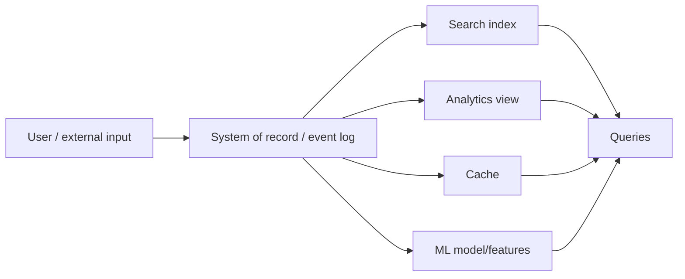

arrows必须有明确owner、order、retry与rebuild contract。

### 0.9 correctness 与 freshness 分离

derived view可暂时落后，却仍最终正确；也可能看起来fresh，却因lost/duplicate event永久错误。

本章后面把这两类要求分别称为 **timeliness** 与 **integrity**。

### 0.10 total order 不是无限扩展的免费服务

one ordered log有利于deterministic derivation，但single leader有throughput/latency边界；sharding、multi-region、microservices与offline clients会产生partial orders。

因此还要显式捕获causal dependencies，而不是盲目追求global order。

### 0.11 end-to-end correctness

TCP、transactions、broker exactly-once等local mechanisms有价值，但无法自动阻止user重提request、application bug或跨system corruption。

正确性必须从end-user intent贯穿request ID、events、state changes、outputs与audit。

### 0.12 constraints 的经济学

strict uniqueness/linearizability需coordination；有些business constraint可temporarily violate并compensate。选择依据是violation cost与coordination/outage cost，而不是“strong consistency总是正确”。

### 0.13 trust but verify

hardware、database、application code都可能bug。系统不能只依赖vendor guarantee；应保留provenance、checksums、reconciliation与rebuild能力，持续验证integrity。

### 0.14 本章路线

1. 通过ordered derived dataflow完成data integration；
2. 把database内部能力拆成可组合components；
3. 将write path延伸到clients与queries；
4. 用end-to-end IDs、constraints与dataflow integrity保证correctness；
5. 以audit/self-validation应对rare corruption。

---

## 1. Data Integration

### 1.1 trade-off 是全书主线

log-structured storage/B-tree/column store，single-/multi-leader/leaderless replication，都没有脱离workload的绝对赢家。software implementation必须选择有限use cases并做好。

### 1.2 general-purpose 也是特定设计

所谓general-purpose database仍假设某些record size、query pattern、consistency、latency与operational model。vendor通常强调sweet spot，不主动列出poor fit；architect需从mechanism推导边界。

### 1.3 两层选择问题

第一层：哪个tool适合哪个circumstance？

第二层：complex application需要many access patterns，怎样把multiple tools组合为one reliable system？

本章主要回答第二层。

### 1.4 Combining Specialized Tools by Deriving Data

典型组合是OLTP database + full-text search。PostgreSQL内建search对simple app可能足够；advanced linguistic/ranking需要specialized information-retrieval engine，而search index不适合作durable system of record。

### 1.5 derived representations 的扩张

除search外，同一facts还可能进入：

- warehouse/batch/stream analytics；
- cache/denormalized objects；
- ML classification/ranking/recommendation；
- notifications；
- operational dashboards。

representation越多，integration edges与failure states越多。

### 1.6 Reasoning about dataflows

必须画清每个dataset：

- authoritative input在哪里；
- 谁可write；
- downstream从哪个source/offset读取；
- transformation是什么；
- output如何commit/rebuild；
- lag与errors如何观测。

### 1.7 one-way ownership

推荐模式：application只写system-of-record database/event log；CDC按same commit order更新search。若CDC是index唯一write path，则index完全derived，可从source重建。

### 1.8 direct dual writes 为什么危险

application同时写DB与index，concurrent clients可让两systems看到different order。没有one authority决定“谁最后”，最终state会永久分叉。

这不是多加retry能解决的问题，因为每次write都可能成功但order不同。

### 1.9 authoritative ordering

若所有new input先进入one order：

$$
L=(e_1,e_2,\ldots,e_n)
$$

每个derived view执行同deterministic fold：

$$
V_n=fold(F,V_0,L)
$$

在same code/config下，它们对相同prefix产生consistent result。

### 1.10 state machine replication relation

这与consensus/shared-log state machine replication同构：先决定event order，再在replicas/views执行deterministic transition。CDC或event sourcing只是产生ordered input的不同方式。

### 1.11 deterministic and idempotent consumers

consumer可能retry，所以需要：

- same event + same state得到same output；
- stable event/request ID；
- duplicate effect被skip/upsert；
- offset/state/output一致commit；
- external effect有idempotency/fencing。

### 1.12 可运行示例：one log 派生 two views

```python
events = [
    ("e1", "create", "doc-1", {"title": "Streaming Systems", "balance": 10}),
    ("e2", "update", "doc-1", {"title": "Dataflow Systems", "balance": 15}),
    ("e2", "update", "doc-1", {"title": "Dataflow Systems", "balance": 15}),
]


def derive(log: list[tuple[str, str, str, dict]]) -> tuple[dict, dict]:
    records: dict[str, dict] = {}
    index: dict[str, set[str]] = {}
    seen: set[str] = set()
    for event_id, _, key, value in log:
        if event_id in seen:
            continue
        seen.add(event_id)
        old = records.get(key)
        if old is not None:
            index[old["title"]].discard(key)
        records[key] = value
        index.setdefault(value["title"], set()).add(key)
    return records, index


records, index = derive(events)
replayed_records, replayed_index = derive(events)

print("record:", records["doc-1"])
print("search:", sorted(index["Dataflow Systems"]))
print("duplicate suppressed:", len(records) == 1)
print("replay stable:", (records, index) == (replayed_records, replayed_index))
```

实际运行输出：

```text
record: {'title': 'Dataflow Systems', 'balance': 15}
search: ['doc-1']
duplicate suppressed: True
replay stable: True
```

示例以stable event ID抑制duplicate，并从same log重建record view与search view。它不实现durable broker/transaction，但验证derivation contract。

### 1.13 dataflow invariant

若view只通过log更新，核心invariant为：

$$
AppliedPrefix(V)=p\Rightarrow V=fold(F,V_0,L[0:p])
$$

lag只改变 $p$，不应改变对该prefix的结果。

### 1.14 Derived data versus distributed transactions

两条路线目标相似：让several representations保持一致；方法不同：

- distributed transaction：atomic commit all participants；
- log derivation：one atomic input + deterministic retry/idempotence。

### 1.15 immediate visibility 差异

transaction commit后通常可read up-to-date state/read-your-writes；async derived view默认可能stale。用户刚update profile，search/cache还未反映。

这是timeliness差异，不一定是integrity violation。

### 1.16 XA 的局限

XA across heterogeneous systems有coordinator/participant blocking、latency、availability与operational complexity。虽然特定环境可成功使用，却难成为universal integration layer。

### 1.17 log-based robustness

consumer failure不必abort producer transaction；log buffer允许其他consumers继续，failed view修复后catch up。local fault被contain，而非通过synchronous commit扩大为system-wide outage。

### 1.18 asynchronous 不是“只能忍”

不能简单告诉users接受eventual consistency。可提供：

- wait-for-offset/read barrier；
- session read fromsource；
- pending UI state；
- version token；
- explicit freshness indicator。

目标是在distributed transaction与blind staleness之间找到middle ground。

### 1.19 comparison table

| Dimension | Distributed transaction | Ordered derived dataflow |
|---|---|---|
| write visibility | synchronous/atomic | asynchronous by default |
| failure coupling | participants共同成败 | consumer faults局部化 |
| heterogeneous integration | protocol support困难 | common log + idempotent sink |
| replay/evolution | usually limited | natural |
| read-your-writes | built-in/stronger | needs explicit mechanism |
| operational cost | coordination/blocking | lag/state/reconciliation |

### 1.20 The limits of total ordering

one total event order极有用，但scale、geography与organizational independence使其难以覆盖whole application。

### 1.21 single leader bottleneck

total order broadcast通常让one leader决定sequence。若event throughput超过one machine/orderer capacity，就需shard：

$$
L=L_1\cup L_2\cup\cdots\cup L_k
$$

每 $L_i$内部有order，different shards间只有partial order。

### 1.22 geographically distributed leaders

multi-region为low latency/region survival常each region有leader。同步cross-region ordering支付WAN RTT并在partition时block；异步则two regions events无defined global order。

### 1.23 microservice boundaries

each service独立deploy且own durable state，service A/B产生的events没有shared sequencer。organizational autonomy与global ordering天然张力。

### 1.24 offline-first clients

client立即更新local state并可offline操作，server/other clients之后才收到events。每participant观察order可能不同，不能要求all input先过central leader而不破坏offline experience。

### 1.25 consensus relation

total order broadcast等价consensus；common algorithms假设one node足以处理whole ordered stream，通过replication容错，而非让many independent leaders共同扩展ordering throughput。

### 1.26 sharding 的正确目标

不是所有events都需相互ordered。若updates只冲突于same object，可按object ID partition，让same object进入same shard：

$$
partition=hash(object\_id)\bmod k
$$

跨objects concurrent events可任意order。

### 1.27 Ordering events to capture causality

没有causal link时缺global order无害；有依赖时必须显式保存 **happens-before/provenance**，否则downstream可能执行违反user intent的external action。

### 1.28 unfriend/message example

user先unfriend ex-partner，再发complaint给remaining friends。friendship与message分属different services/logs；notification processor若先见message，可能错误通知ex-partner。

### 1.29 join-time dependence

notification实质是message event与friend-list state的join。正确问题不是“message当前能否被ex看到”，而是“message发送时、且在unfriend causal effect之后，哪些friends有效”。

### 1.30 logical timestamps

Lamport/HLC可在无synchronous coordination时给causality-compatible labels，但：

- receiver仍会out-of-order收到；
- 需buffer/reorder或version checks；
- metadata需跨services/clients传播；
- label total order不自动阻止early side effect。

### 1.31 observed-state references

记录user decision前所观察state的event/version ID，later event引用它：

```text
MessageSent(message_id, audience_version=friendship_event_918)
```

downstream由reference恢复causal context，不依赖arrival order猜测。

### 1.32 conflict resolution limits

CRDT/LWW/custom merge可让state在out-of-order events后converge，但无法“撤回已发送给ex的notification”。external irreversible effects需要delay、validation、compensation或causal gate。

### 1.33 causality design checklist

- 哪些events具有business dependency？
- dependency ID/version如何传递？
- receiver缺parent时buffer、fetch还是reject？
- state merge与external effect是否分开？
- metadata retention是否覆盖replay？
- offline clients如何生成/同步causal context？

### 1.34 open problem

如何在不把all events送入global total order bottleneck的情况下，高效捕获cross-service causality并维护correct derived state，仍是持续演进的application pattern领域。

### 1.35 Batch and Stream Processing

data integration要让data以正确form出现在正确places。batch/stream共同完成transform、join、filter、aggregate、train、evaluate与write outputs。

### 1.36 shared functional core

两者都鼓励：

- immutable input；
- explicit output；
- deterministic/pure transformation；
- partitioned parallelism；
- retries/replay；
- derived datasets。

根本差异是batch input bounded，stream input unbounded且state long-lived。

### 1.37 Maintaining derived state

stream operator在functional transformation上增加managed fault-tolerant state，例如windows、joins、dedup与local tables。state仍应由input log/checkpoint/changelog可恢复。

### 1.38 derivation function

对event $e_i$与state $S_i$：

$$
(S_{i+1},O_i)=F_v(S_i,e_i,C)
$$

$F_v$、config/reference data $C$版本化；replay才能解释为什么产生某output。

### 1.39 asynchronous fault containment

synchronous secondary index within one database可atomic，但cross-system sync让slow/failingparticipant拖累writer。async log让source继续commit，derived consumer later catch up。

### 1.40 cross-shard secondary indexes

term-partitioned index写入multiple shards；document-partitioned index查询fan-out all shards。cross-shard maintenance更适合async，以避免每primary write同步等待many index shards。

### 1.41 failure amplification comparison

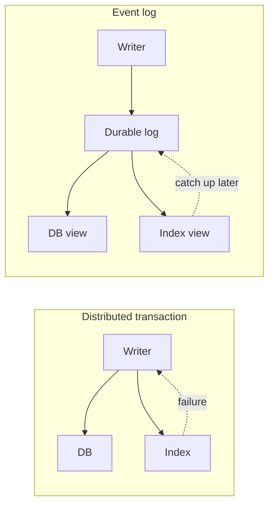

async不是无failure，而是控制failure传播方向。

### 1.42 Reprocessing data for application evolution

stream让new changes低延迟进入view；batch把accumulated history用new code重算，支持new feature、model/schema restructuring与bug repair。

### 1.43 没有 reprocessing 的演进边界

若不能重读history，只能做forward-compatible小改动，如add optional field/new event type。无法用new semantics重建old records，system会永久背负legacy representation。

### 1.44 reprocessing 的能力

有raw source/event history时，可：

- rebuild different index；
- change normalization/model；
- correctbug across history；
- compare old/new outputs；
- migrate users gradually；
- rollback pointer。

### 1.45 Schema Migrations on Railways

19th-century England铁路有competing track gauges；different gauge trains不能互通。1846年选standard gauge后，不能关闭rail line多年重铺。

### 1.46 dual/mixed gauge

先加third rail形成 **dual gauge/mixed gauge**，old/new trains都能运行；逐步转换trains，最终移除old-gauge rail。

这是side-by-side schema/view migration的physical analogy。

### 1.47 BART reminder

large migration成本高，nonstandard gauge可长期存在；San Francisco Bay Area BART至今使用与多数美国铁路不同的gauge。technical debt可能是合理历史trade-off，而非懒惰。

### 1.48 data migration stages

1. derive new view fromsame source；
2. dual run/shadow compare；
3. route small canary traffic；
4. increasepercentage；
5. keep rollback window；
6. retire old view/transform。

### 1.49 reversibility

每stage保working old path，失败可route back。minimizing irreversible steps降低migration risk，使team更敢于change、更快迭代。

### 1.50 migration integrity checks

- per-key/count/checksum comparison；
- sampled semantic diff；
- freshness/lag；
- performance/cost；
- read result equivalence；
- unmatched/error records；
- rollback rehearsal。

### 1.51 Unifying batch and stream processing

early **lambda architecture**同时维护batch layer与speed/stream layer，再mergequeries。它提供low latency + eventual correction，却常duplicatelogic并产生two inconsistent implementations。

### 1.52 lambda architecture problems

- same business logic写两遍；
- batch/stream outputs可能不同；
- deployment/debug/operations翻倍；
- merge serving layer复杂；
- bug fix需协调two paths。

### 1.53 kappa architecture

more recent approach用same stream engine处理live events与historical replay，常称 **kappa architecture**。batch成为bounded/replayed stream，而不是独立codebase。

名字不是重点；核心是one semantic implementation。

### 1.54 requirement 1：historical replay

engine必须读取retained log、DFS/object storage historical events，并以same operators运行。schemas/reference data/side effects必须支持replay。

### 1.55 requirement 2：exactly/effectively once

failure/replay后output应与no-fault logical execution等价。需要discard partial outputs、checkpoint/transaction或idempotent sink/request IDs。

### 1.56 requirement 3：event-time windows

historical replay时processing time是today，毫无business meaning。window必须按event time，并处理watermark/late events，以保持live与replay结果一致。

### 1.57 Apache Beam model

Apache Beam API表达event-time/window/trigger computation，可在Flink、Google Cloud Dataflow等runners执行。logical semantics与physical engine分离。

### 1.58 unified pipeline

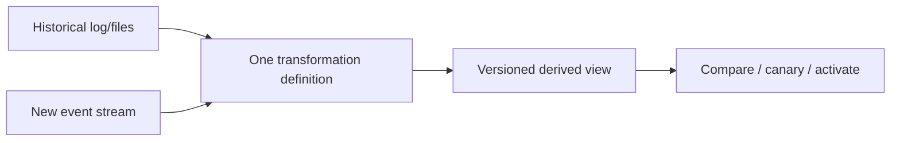

same code不保证same result，仍需same schema/config/reference versions和deterministic effects。

### 1.59 Data Integration 小结

specialized tools应通过one-way derived dataflows组合：source先决定order，consumers deterministic/idempotent更新views。global total order不可无限扩展，cross-service causality需explicit metadata。

stream负责low-latency maintenance，batch/replay负责evolution与repair；统一semantic pipeline让gradual reversible migration成为日常能力。

---

## 2. Unbundling Databases

### 2.1 information management 的共同核心

database、batch/stream processor与operating system都做两件事：store information，并允许process/query。差异主要在data model、abstraction level、access pattern与built-in guarantees。

### 2.2 filesystem 与 database 的实际差异

filesystem directory含10 million small files通常表现糟糕；database含10 million records很正常。类似性不意味着implementation interchangeable，而是帮助识别可拆解职责。

### 2.3 Unix philosophy

Unix提供较低层hardware abstraction：files/byte streams、processes与pipes。small tools通过uniform interface组合，application author自己构建pipeline。

### 2.4 relational philosophy

relational database提供high-level SQL/transactions，隐藏disk layout、indexes、join algorithms、concurrency与crash recovery。短query可调用大量internal machinery。

### 2.5 两种“simple”

- Unix simple：thin primitive、mechanism清楚；
- relational simple：declarative interface，用户少写code。

一个是implementation/composition simplicity，一个是application programming simplicity。

### 2.6 NoSQL 的解释

NoSQL可看作把Unix-like lower-level abstraction带入distributed OLTP：developer选择partitioning/consistency/data model并组合services，换scalability/flexibility，也承担更多semantics。

### 2.7 本节目标

不是宣布Unix胜过SQL，而是结合两者：保留database级correctness/query能力，同时获得small specialized components的composability与independent evolution。

### 2.8 Composing Data Storage Technologies

database内常见features：

- secondary indexes；
- materialized views；
- replication logs；
- full-text indexes。

外部batch/stream pipelines也在构建完全相似的derived structures。

### 2.9 internal vs external derivation

`CREATE INDEX`由database内部实现；CDC → Elasticsearch由separate systems实现。logical function都是：base changes经deterministic transform维护query-optimized representation。

### 2.10 Creating an index

online `CREATE INDEX`典型过程：

1. 取得consistent table snapshot at log position $o_s$；
2. scan fields；
3. sort/build index；
4. apply writes after $o_s$ backlog；
5. catch up后切为continuous maintenance。

### 2.11 index bootstrap invariant

$$
Index_{now}=Build(Snapshot(o_s))+Apply(ChangeLog(o>o_s))
$$

若snapshot与log position不匹配，就会missing/duplicate index updates。

### 2.12 follower/CDC analogy

new replica、new index与new CDC consumer都执行same pattern：consistent base snapshot + ordered catch-up log + continuous follow。它们是“从existing state建立derived follower”的同一算法族。

### 2.13 CREATE INDEX 是 reprocessing

existing table被whole-scan，以new derivation产生view。source可以是current snapshot而非full historical event log，但migration/evolution结构相同。

### 2.14 The meta-database of everything

organization-wide dataflow可视为one huge logical database：ETL/stream processors充当index/materialized-view maintenance subsystem，不同teams/tools实现different index types。

### 2.15 why no single data model

B-tree、inverted index、graph、columnar warehouse、feature store各服务不同queries。one physical representation不可能同时最优，因此logical database包含multiple derived forms。

### 2.16 Federated databases (unifying reads)

**federated database/polystore**提供one query interface映射multiple underlying stores。PostgreSQL foreign data wrappers、Trino、Hoptimator、Xorq属于此方向。

specialized clients仍可direct access；cross-store users经federated query组合。

### 2.17 federation 的难点

- schema/type mapping；
- predicate/join pushdown；
- cost estimates across engines；
- network movement；
- credentials/governance；
- snapshots/freshness mismatch。

但主要是read composition，通常比write synchronization容易管理。

### 2.18 Unbundled databases (unifying writes)

**unbundling**让changes可靠流向multiple stores，像把database internal index-maintenance拆为external components。CDC/event log是uniform write-change interface。

### 2.19 reads vs writes unification

| Approach | Unifies | Core mechanism |
|---|---|---|
| federation/polystore | reads | common query/planner |
| unbundled database | writes/changes | ordered durable log + consumers |

二者可同时存在，分别解决不同integration edges。

### 2.20 Unix composition analogy

small storage/processing tools各做one thing well；event log类似pipe/file protocol；stream operators类似Unix processes；higher-level workflow/schema contracts类似shell/program composition。

区别是distributed pipeline必须durable、replayable且fault tolerant。

### 2.21 Making unbundling work

cross-technology write synchronization最难。within one system transaction可行；跨different vendors/groups时，standard transaction protocol缺失且XA代价高。

practical abstraction是ordered event log + idempotent consumers。

### 2.22 restricted transaction scope

stream processor内部可transactionally提交input offsets/state/output；跨外部KV/search则常用stable ID/upsert/dedup。不要把内部exactly-once自动外推到heterogeneous sink。

### 2.23 system-level loose coupling

consumer slow/down时log buffer，producer与other consumers继续；repair后catch up。fault localized，避免synchronous distributed transaction把one participant failure升级为global write outage。

### 2.24 human-level loose coupling

teams按well-defined event/schema interfaces独立develop/deploy/operate。specialization减少shared release coordination，但需要ownership、contracts、compatibility与SLOs。

### 2.25 event log interface 的力量

durability + partition order + replay足以表达strong per-key consistency/provenance，又比arbitrary distributed transaction protocol简单、跨language/vendor通用。

### 2.26 coupling 仍然存在

async不等decoupled from semantics：consumer依赖event fields/order/retention；producer breaking schema、deleting history或改变key会破坏downstream。coupling从runtime availability转到contract/evolution。

### 2.27 Unbundled versus integrated systems

unbundling不会替代integrated databases。database仍负责stream state、OLTP/query serving；warehouse engines仍擅长ad hoc analytics。

### 2.28 fewer moving parts

每新增component都有learning curve、configuration、upgrade、monitoring、security、on-call与failure modes。若one product满足需求，优先使用它而非重造internal features。

### 2.29 integrated performance

one engine可共享buffer pool、optimizer、transaction manager与internal formats，提供更低/可预测latency。external composition有serialization/network/materialization overhead。

### 2.30 premature scale

为尚不存在的scale拆成many systems会增加complexity与lock-in。unbundling的价值只在one technology无法满足required breadth时出现。

### 2.31 breadth not depth

目标不是让composed system在某one workload打败best integrated DB，而是覆盖OLTP/search/analytics/ML/offline等wider workload set，同时保持truth flow清楚。

### 2.32 enabling tools

Debezium统一database changes，Kafka protocol成为event-stream de facto interface，IVM engines可precompute complex query caches。tooling正在降低composition成本，但未消除semantics设计。

### 2.33 composition decision checklist

- integrated feature是否已足够？
- specialized benefit能否覆盖operational cost？
- source of truth/one-way flow是否清楚？
- bootstrap/replay/repair是否存在？
- schema/ownership/on-call如何划分？
- end-to-end SLO与audit如何实现？

### 2.34 Designing Applications Around Dataflow

spreadsheet展示理想dataflow：formula声明dependencies，input cell变化后dependent results自动recalculate。application developer不手写cache invalidation。

### 2.35 VisiCalc lesson

1979年的VisiCalc已有reactive dependency graph。modern data systems要把同一体验扩展到durable, scalable, fault-tolerant, multi-technology environment。

### 2.36 spreadsheet formula model

若cell $C=A+B$，changes传播：

$$
\Delta C=\Delta A+\Delta B
$$

IVM/stream operators正把这种incremental recomputation推广到large distributed datasets。

### 2.37 Application code as a derivation function

custom application logic本质是source → derived representation的function。明确input/output后，code可version、test、replay与audit。

### 2.38 secondary-index derivation

每base row提取indexed field并按value组织：

$$
row(id,x,\ldots)\mapsto(x,id)
$$

common cookie-cutter function因此内建为 `CREATE INDEX`。

### 2.39 full-text derivation

document经language detection、segmentation/tokenization、stemming/lemmatization、spelling/synonym expansion，最后build inverted index。domain tuning让它难完全标准化。

### 2.40 ML derivation

model parameters由training data + feature extraction + optimization派生；inference output又由model + new input派生。完整lineage必须包括training snapshot、features、code/config/library。

### 2.41 cache/UI derivation

cache常保存UI-ready aggregate，故UI field/layout change可能要求cache derivation改变和rebuild。cache不是“temporary implementation detail”，而是read model。

### 2.42 custom code 的必要性

secondary index高度标准；search linguistics、ML feature engineering与business view高度application-specific。database triggers/UDF/stored procedures虽可运行code，却常不是modern deployment的理想环境。

### 2.43 Separation of application code and state

database理论上可像OS运行arbitrary code，实践却不擅长dependency/package management、version control、rolling upgrades、metrics、network integrations与modern CI/CD。

### 2.44 code execution platforms

Kubernetes、Docker、Mesos、YARN专注deploy/isolate/scale application code。database专注durable state/query/concurrency。separation让两边各自演进。

### 2.45 stateless services

web servers处理request后forget local state，可任意add/remove/reroute。persistent state放database。好处是operational elasticity；代价是每次需要state时network query。

### 2.46 “Church and state”

functional programming joke引用Alonzo Church/lambda calculus（无mutable state）：application logic与mutable persistent state分离。笑话不代表state不重要，而是让state changes explicit/manageable。

### 2.47 database as mutable shared variable

application同步read/update database，database负责durability/concurrency。多数language variable/database query无法subscribe changes，只能poll；observer pattern需手工实现。

### 2.48 passive state model 的问题

dependent cache/UI不知道state改变，形成stale data/invalidation logic。CDC/change streams把database从passive variable变为observable state source。

### 2.49 Dataflow: Interplay between state changes and application code

dataflow重定义code-state关系：state change触发code，code再产生new state changes。database不只是被command操纵，而参与reactive dependency graph。

### 2.50 familiar instances

CDC、actors、triggers、IVM都体现state-change → computation → state-change。unbundling把这一机制扩到cache、search、ML、analytics等database外部views。

### 2.51 required property 1：stable order

derived views若处理same events却different order，可能diverge。至少conflicting/per-key events需stable order；cross-stream causality需metadata/versioning。

### 2.52 required property 2：fault tolerance

丢onechange会让derived state永久out of sync。message delivery、state update、offset/output commit都要recoverable；不能把broker durability当whole pipeline guarantee。

### 2.53 为什么比distributed transactions便宜

要求“event eventually reliably applied”比要求“所有heterogeneous views在同instant atomic visible”弱，因此可buffer/retry、局部恢复、independent scale。

### 2.54 arbitrary code as operators

stream operator可运行database内built-in derivation没有的custom logic。像Unix process一样，每operatorconsume state-change streams并produceother streams，可组合成large dataflow。

### 2.55 Stream processors and services

microservices通过REST/RPC同步request/response；dataflow operators通过one-directional async streams。两者都追求team autonomy/organizational scaling，但runtime coupling不同。

### 2.56 synchronous service dependency

purchase service调用exchange-rate service：request latency叠加network/remote service latency；remote outage让purchase失败；retry/timeout/circuit breaker复杂。

### 2.57 local replica approach

purchase processor预先subscribeexchange-rate updates，维护local table；purchase到来时local lookup。remote dependency从critical path移到async replication path。

### 2.58 可运行示例：exchange-rate stream-table join

```python
events = [
    ("rate", "USD/EUR", 100, 0.90),
    ("purchase", "p1", 110, (100.0, "USD/EUR")),
    ("rate", "USD/EUR", 120, 0.92),
    ("purchase", "p2", 130, (50.0, "USD/EUR")),
]

rates: dict[str, tuple[int, float]] = {}
converted: list[tuple[str, float, int]] = []

for kind, key, event_time, payload in events:
    if kind == "rate":
        rates[key] = (event_time, payload)
    else:
        amount, pair = payload
        rate_time, rate = rates[pair]
        converted.append((key, round(amount * rate, 2), rate_time))

for purchase_id, amount, rate_time in converted:
    print(f"{purchase_id}: EUR {amount:.2f} using rate@{rate_time}")
```

实际运行输出：

```text
p1: EUR 90.00 using rate@100
p2: EUR 46.00 using rate@120
```

local table避免per-purchase network RPC；保存rate version/time让result可解释。historical replay若只保latest rate仍会错误。

### 2.59 fastest network request

“最快、最可靠的network request是没有request。”local state把availability从remote call转换为replication lag；需要监控freshness并定义stale-rate policy。

### 2.60 cache convergence

RPC service内local cache若靠poll refresh，本质仍在实现change subscription。dataflow只是把这种模式提升为first-class durable stream + managed local state。

### 2.61 time-dependent exchange join

replay old purchase必须使用purchase-time rate，而非current rate。可在purchase event保存rate version/value，或保SCD rate history执行temporal join。

### 2.62 service vs dataflow 对照

| Dimension | Synchronous service | Dataflow/local replica |
|---|---|---|
| request path | remote call | local lookup |
| freshness | current service response | replication lag |
| outage effect | immediate request failure | continue withlast state/policy |
| history | service must expose versions | event log can retain |
| coupling | runtime availability/API | schema/order/retention |

### 2.63 open questions

dataflow仍需解决temporal joins、schema evolution、state bootstrap、privacy retention、end-to-end effects与observability。spreadsheet-like automatic propagation是方向，不是现成万能抽象。

### 2.64 Observing Derived State

dataflow创建/维护search index、materialized view、model等derived datasets，这一段是 **write path**。用户query derived data并构造response是 **read path**。

### 2.65 write path

new fact经过decode、validation、NLP/features、index/view update等multiple stages，eagerly precompute future query work，无论当前是否有人read。

### 2.66 read path

request到来后读取precomputed state，执行remainingfilter/ranking/render。functional analogy：write path近似eager evaluation，read path近似lazy evaluation。

### 2.67 meeting point

derived dataset是write/read paths交汇处。system designer选择在哪个boundary materialize，决定write amplification、storage、freshness与read latency。

### 2.68 原图：search write/read paths


index是precomputation boundary，不是唯一可能boundary。

### 2.69 Materialized views and caching

search write更新all document terms；read解析query terms、Boolean AND/OR/synonyms并查postings。双方都做work。

### 2.70 no index

write path几乎无额外work；read像`grep`扫描all documents：

$$
ReadCost\approx O(N\cdot DocumentScan)
$$

small corpus可接受，large corpus昂贵。

### 2.71 precompute all queries

read只lookupresult，但possible query combinations无限/指数级，write/storage不可行。不能把all lazy work都移到write path。

### 2.72 cache common queries

materializepopular query results，common reads快；rare query仍查index。documents变化时需incrementally update cache，故cache也是materialized view。

### 2.73 boundary optimization

index/cache/view的角色是移动work boundary：

$$
TotalCost\approx WriteRate\cdot WriteCost+ReadRate\cdot ReadCost+StorageCost
$$

最佳点取决于read/write ratio、freshness、cardinality和latency SLO。

### 2.74 social timeline boundary

ordinary users可write-time fan-out到followers timelines；celebrity fan-out太大，可read-time merge。same product按fan-out distribution选择hybrid boundary。

### 2.75 Stateful, offline-capable clients

modern SPA/mobile有persistent local state，可offline work并background sync。on-device model是server state的local replica/cache；screen pixels是local model的materialized view。

### 2.76 offline-first benefit

UI不等待slow/unreliable cellular network，interaction低latency；offline writes later sync。代价是conflict resolution、causality、sync status与local security。

### 2.77 client as data system node

device不再是stateless terminal，而是replica + stream producer/consumer + derived-view renderer。需要stable IDs、offset/version、local log与reconnect protocol。

### 2.78 Pushing state changes to clients

traditional browser只point-in-time fetch；server state改变后页面stale，reload/poll才知道。RSS等也是polling。

### 2.79 SSE and WebSockets

Server-Sent Events/EventSource与WebSockets保持open connection，让server主动push changes，降低client cache staleness。

connection transport不等durable subscription；disconnect期间events仍需offset/resume/snapshot protocol。

### 2.80 extending write path

push state changes到device等于把write path延伸到end user。initial state仍经read/bootstrap；之后持续apply changes。

### 2.81 per-device offset

每device像small consumer：保存last applied version/offset，reconnect后请求missing changes。若retention gap，重新snapshot后从new coordinate继续。

### 2.82 End-to-end event streams

React、Elm等UI已能在local state变化时rerender。若server events直接进入client reactive pipeline，state change可从one device一路流经log/views到another device screen。

### 2.83 low-delay “real-time”

instant messaging/games已实现sub-second propagation。这里real-time指low observed delay，不是hard upper-bound real-time guarantee。

### 2.84 ingrained request/response obstacle

datastores/frameworks普遍提供one request → one response；较少支持one subscription → responses over time。要end-to-end dataflow需重构libraries、auth、backpressure、reconnect与UI state models。

### 2.85 benefits and costs

benefits：responsive UI、offline support、less polling、explicit state sync。costs：long-lived connections、per-client offsets、privacy/auth changes、fan-out scale、version compatibility与battery/network use。

### 2.86 Reads are events too

通常writes走log，reads直接query store。另一可能是把read request也编码为event，stream operator从state读取并向response stream emit result。

### 2.87 queryable stream state

stream processor本已维护join/aggregate state；Kafka Streams interactive queries等允许external clients query local state，使processor成为simple database。

### 2.88 read as stream-table join

read event按query key路由到持有state shard的operator，立即与table state join并emit response。一次read是transient join。

### 2.89 subscription as persistent join

subscription保留query，与past/future changes持续join：

$$
SubscriptionResult(t)=Q(State(t))
$$

state变化时emit delta，而非client反复poll whole result。

### 2.90 causal provenance of reads

记录read request/result可重建“user做decision前看到了什么”。例如shipping date/inventory display影响purchase，必须记录query result/version而非只记录later purchase。

### 2.91 read logging cost

durable read events增加storage/I/O、privacy exposure与high-volume log。可sample、hash/provenance IDs或只记录decision-critical reads；仍是open optimization problem。

### 2.92 source of request

若已有HTTP access/operational logs，把read log从side effect提升为authoritative request stream是conceptual step，但interactive response latency、timeout/cancellation仍需protocol。

### 2.93 Multishard data processing

single-shard query经stream通常overkill；复杂query需routing、fan-out、joins/aggregation，stream infrastructure可复用sharding/dataflow能力。

### 2.94 Storm distributed RPC

Storm曾用distributed RPC计算“看过某URL的unique people”：需读取所有posters follower sets并做union，跨many user shards。

### 2.95 fraud reputation joins

purchase risk需join IP、email、billing/shipping address reputations；each database independently sharded，query graph包含multiple differently keyed joins。

### 2.96 query graph

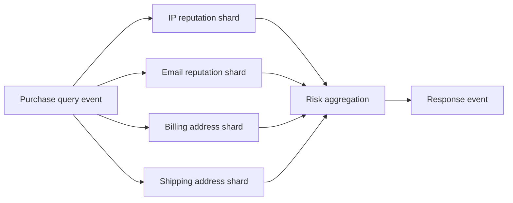

correlation ID与deadline连接fan-out responses。

### 2.97 use a database when possible

warehouse/query engine已提供distributed joins、optimizer、fault recovery时，优先使用它，不要手写stream RPC。stream approach适用于off-the-shelf limits或需continuous subscriptions的情况。

### 2.98 request lifecycle

multi-shard read event需request ID、expected branches、timeout、partial-result policy、cancellation与response dedup。它把query execution变为dataflow，但没有消除distributed query complexity。

### 2.99 Observing Derived State 小结

write path预计算、read path按需执行，materialization boundary决定cost。该boundary可延伸到offline client，甚至把reads/subscriptions也建模为events。

unbundled dataflow的最终愿景是从source fact到end-user pixels形成可追踪changes；但应在benefit超过state、protocol与operational complexity时采用。

---

## 3. Aiming for Correctness

### 3.1 stateful mistakes 会持久存在

stateless read service出bug，fix/restart后通常恢复；database/derived state会记住错误，bug effects可永久存在并向downstream传播。因此stateful correctness需要更严谨的方法。

### 3.2 transactions 的传统角色

四十年来atomicity、isolation、durability把concurrency/crash简化为commit/abort。但weak isolation难理解，application是否安全依赖具体queries/invariants，而不是“用了transaction”这一事实。

### 3.3 weak consistency 的模糊性

“embrace weak consistency”若不定义allowed histories、conflict policy、integrity与repair，就不是design。performance/availability提升不能替代semantic specification。

### 3.4 configuration correctness

同一application在某isolation/replication/quorum config下是否安全很难判断。low concurrency/happy path看似正确，network partition与race才暴露write skew、lost update或split state。

### 3.5 Jepsen lesson

Jepsen等fault tests揭示product claims与actual crash/network behavior可能不同。即使database完全正确，application仍可能错误使用weak isolation、constraints与retries。

### 3.6 strong coordination cost

serializability与atomic commit是成熟路线，却通常增加latency、降低partition availability，并在geo/heterogeneous systems中扩展困难。它们仍重要，但不是correctness的最后答案。

### 3.7 dataflow correctness question

本节探索：能否让application-specific integrity在async, sharded, fault-prone dataflow中成立，只在真正需要strict conflict decision的地方coordination？

### 3.8 The End-to-End Argument for Databases

serializable database不能阻止application bug写wrong value/delete good data。strong infrastructure safety是necessary component，不是application correctness proof。

### 3.9 immutability 的帮助与边界

append-only input让wrong derivation可修复/replay，减少destructive damage；但若错误event本身被authoritatively记录，仍需validation/compensation/audit。

### 3.10 Exactly-once execution of an operation

request timeout后有两种选择：give up可能loss，retry可能第一次其实已成功而duplicate effect。**exactly/effectively once**要求最终effect与no-fault one execution等价。

### 3.11 duplicate effect 是data corruption

double charge、double counter increment、duplicate shipment都让state false。它不是“偶尔多一条log”而是integrity violation。

### 3.12 natural idempotence

若operation满足：

$$
f(f(x))=f(x)
$$

retry无额外effect。`set status=closed`、`delete key`常可idempotent；`balance += 11`、`send email`不是。

### 3.13 engineered idempotence

为non-idempotent operation增加request ID与processed metadata；state effect与ID insertion原子提交。failover还需fencing，防old/new workers同时绕过local dedup。

### 3.14 Duplicate suppression

TCP packet sequence numbers重排、retransmit lost packets并drop duplicates，向application提供ordered byte stream。但保证scope只是一条TCP connection。

### 3.15 connection-bound transaction

许多database用connection区分transaction。client发送 `COMMIT` 后connection断开，response未知：server可能commit，也可能abort。

### 3.16 nonidempotent transfer

```sql
BEGIN TRANSACTION;
UPDATE accounts SET balance = balance + 11.00 WHERE account_id = 1234;
UPDATE accounts SET balance = balance - 11.00 WHERE account_id = 4321;
COMMIT;
```

transaction内部atomic，却未给logical transfer identity。timeout后whole transaction retry可能转账两次，共22美元。

### 3.17 atomicity 不等 exactly once

atomicity保证each attempt内both debit/credit共同发生；无法判断second attempt与first attempt属于same user intent。operation identity在transaction之上。

### 3.18 2PC 仍非end-to-end dedup

2PC允许coordinator重连并resolve in-doubt transaction，扩展database-side lifecycle。但user/browser可能在HTTP timeout后手工retry，server把它视为new request/new transaction。

### 3.19 POST timeout

weak mobile connection中POST到达server并成功commit，response丢失。user看到error，点击retry。Post/Redirect/Get避免normal refresh resubmit，却不能解决original POST response timeout。

### 3.20 scope ladder


lower layer不知道higher layer哪些attempts属于same intent。

### 3.21 Uniquely identifying requests

client在first intent创建stable UUID/request ID，retry复用same ID，并在all network hops/event/sink中传播。server不能每retry重新生成ID。

### 3.22 request ID generation

UUID可用于identity；也可hash relevant immutable form fields，但hash需防不同legitimate requests碰撞，并处理same purchase repeated intentionally。explicit client-generated ID通常更清楚。

### 3.23 uniqueness constraint

database `requests(request_id UNIQUE, ...)`让first insert成功，duplicate insert违反constraint并abort。dedup record与business effect必须same transaction。

### 3.24 correct transfer sketch

```sql
BEGIN TRANSACTION;
INSERT INTO requests(request_id, from_account, to_account, amount)
VALUES ('0286FDB8-D7E1-423F-B40B-792B3608036C', 4321, 1234, 11.00);
UPDATE accounts SET balance = balance + 11.00 WHERE account_id = 1234;
UPDATE accounts SET balance = balance - 11.00 WHERE account_id = 4321;
COMMIT;
```

same ID second attempt在insert处失败，whole transaction不重复effect。

### 3.25 check-then-insert trap

application先`SELECT`不存在再`INSERT`，concurrent requests在weak isolation下都可能通过check。database unique constraint在storage/index layer做atomic arbitration，更可靠。

### 3.26 request table as event log

`requests`表不只dedup，也记录authoritative intent。balances可由request events downstream派生，只要processing effectively once且constraints正确。

### 3.27 status lookup

timeout后client应使用same request ID查询outcome，而不是猜failure。API返回previous result/pending/declined，建立durable request lifecycle。

### 3.28 The end-to-end argument

Saltzer、Reed、Clark提出：某function只有application endpoints掌握完整knowledge，因此communication subsystem无法独立complete implement；lower layer可提供partial/performance enhancement。

### 3.29 duplicate suppression application

TCP去packet duplicate，stream processor去message duplicate，database transaction去attempt内partial effect；只有client-to-database stable request ID能识别user-level duplicate intent。

### 3.30 end-to-end checksums

Ethernet/TCP/TLS checksums检测transit corruption，不检测sender software生成wrong bytes、disk stored corruption或receiver bug。content hash必须从source生成并在final consumer验证。

### 3.31 end-to-end encryption

WiFi password只保护local link，TLS保护client-server transport，不防server compromise。只有真正endpoint encryption/authentication覆盖intermediate infrastructure。

### 3.32 lower-level mechanisms 仍有价值

end-to-end argument不是删除TCP/checksums/transactions。lower layers降低common errors与performance cost；endpoints负责remaining correctness proof。

### 3.33 Applying end-to-end thinking in data systems

serializable DB、exactly-once broker与replicated log都不能替代application invariant、request identity、validation与reconciliation。每层claim要标scope。

### 3.34 transaction abstraction 的成就

transaction把concurrency、constraint、crash、disk/network faults折叠为commit/abort，大幅简化programming model。问题是其scope常停在one database/transaction attempt。

### 3.35 abstraction gap

拒绝heterogeneous transactions后，teams常在application code手写retry/dedup/saga，容易错。需要既有large-scale operational properties、又支持application-specific end-to-end guarantees的abstraction。

### 3.36 correctness specification

设计前写：

- intent identity；
- irreversible effects；
- safety invariants；
- retry/unknown outcome；
- ordering/causality；
- commit boundary；
- audit/reconciliation。

不能从“database serializable”反推whole workflow正确。

### 3.37 Enforcing Constraints

request-ID uniqueness只是constraint之一。username/email/file path/seat需unique；balance nonnegative、inventory不oversell、meeting room不overlap也需conflict arbitration。

### 3.38 constraint predicate

constraint可写为state predicate $I(S)$，accepted transition $T$必须满足：

$$
I(S)\land Valid(T,S)\Rightarrow I(T(S))
$$

concurrent transitions若各自看old state，可能jointly破坏 $I$。

### 3.39 Uniqueness constraints require consensus

distributed concurrent claims同value时必须决定one winner并reject others。这个single decision是consensus problem。

### 3.40 leader-based arbitration

single leader串行处理conflicting claims。Raft/Paxos类protocol在leader failure/partition时安全选new authority并防split brain。

### 3.41 sharding uniqueness

按unique value hash partition：same request ID/username到same shard/orderer。different values并行：

$$
shard=hash(normalize(value))\bmod N
$$

normalization（case/Unicode/domain rules）必须在partition和constraint中一致。

### 3.42 async multi-leader 不适合strict uniqueness

two leaders可concurrently accept same username，later merge无法让已返回success的both clients都成立。若必须immediate reject conflicts，synchronous coordination不可避免。

### 3.43 scoped coordination

只协调potential conflicts，而非whole database。per-value sharding让unrelated usernames/seats独立，提高throughput。

### 3.44 Uniqueness in log-based messaging

shared log提供one ordered sequence；one thread sequentially处理partition。若按unique value partition，processor可deterministically选择first claim。

### 3.45 username claim algorithm

1. client生成request ID，publish `ClaimUsername(name,id)`到`hash(name)` shard；
2. processor local state记录taken names/request outcomes；
3. first available claim emits success；later claims emit rejection；
4. client按request ID等待result stream。

### 3.46 consensus equivalence

该算法就是shared-log consensus：first decided record定义winner。log append本身依赖consensus replication；stream consumer只利用其ordered decision。

### 3.47 deterministic validation

processor可执行arbitrary application constraint logic，只要same input order/state产生same decision。state/checkpoint与output需要effectively-once。

### 3.48 beyond uniqueness

same principle适用per-key capacity、nonnegative balance、nonoverlapping room/time slot等：所有may-conflict writes路由same shard并serial validate。

### 3.49 asynchronous response

client不一定立即获得result；可wait output event变同步UX，也可返回pending并later notify。decision correctness与client是否等待分离。

### 3.50 可运行示例：sharded username claims

```python
claims = [
    ("r1", "Alice", "user-1"),
    ("r2", "alice", "user-2"),
    ("r1", "Alice", "user-1"),
    ("r3", "bob", "user-3"),
]
taken: dict[str, str] = {}
outcomes: dict[str, str] = {}

for request_id, raw_name, user_id in claims:
    if request_id in outcomes:
        print(f"{request_id}: replay -> {outcomes[request_id]}")
        continue
    name = raw_name.casefold()
    if name in taken:
        outcome = f"rejected, owned by {taken[name]}"
    else:
        taken[name] = user_id
        outcome = f"accepted for {user_id}"
    outcomes[request_id] = outcome
    print(f"{request_id}: {outcome}")
```

实际运行输出：

```text
r1: accepted for user-1
r2: rejected, owned by user-1
r1: replay -> accepted for user-1
r3: accepted for user-3
```

casefold normalization让`Alice`/`alice`冲突；request ID让redelivery返回same outcome。

### 3.51 Multishard request processing

money transfer可能涉及request-ID shard、payer shard、payee shard、fees shard。traditional transaction需atomic commit across all，限制independent shard progress。

### 3.52 alternative decomposition

dataflow把one cross-shard transaction拆成per-shard ordered stages，以request ID连接。目标integrity相同，但visibility/timeliness不同。

### 3.53 原图：multishard transfer


### 3.54 stage 1：atomic request append

client生成unique request ID，将transfer request按source account ID append到source shard。这个single log append是workflow的atomic starting fact。

### 3.55 stage 2：reserve and emit

source processor维护source balance与processed IDs。first request检查funds；若足够，reserve amount并emit：

- outgoing event到source shard；
- incoming event到destination shard；
- fee event到fees shard。

all events携original request ID。

### 3.56 reserve 的目的

在downstream completion前，reserved amount不可供new transfer再次使用，保持source nonnegative constraint。reservation是local shard state transition。

### 3.57 stage 3：source completion

outgoing event later回到source processor；按request ID识别已reserved transfer并finalize debit。duplicate outgoing被ignored。

### 3.58 stage 4：destination/fees credits

independent processors顺序消费incoming events，增加balances并按request ID dedup。它们不需与source同步transaction。

### 3.59 ordering requirements

any account events必须strict log order、**at-least-once semantics** 与deterministic processor。accounts在same/different shards均可；关键是per-account ownership/order。

### 3.60 crash/retry reasoning

source processor在emit前/后crash，recovery会reprocesssame request并作same decision，emit same IDs。downstream duplicate suppression使effect不重复。

### 3.61 atomicity 的新含义

不是all accounts同instant update，而是：initial request一旦durably accepted，所有derived effects最终发生，且each logical effect once。integrity保持，timeliness放宽。

### 3.62 exactly-once state simplification

framework checkpoint/transaction若让local state与processed offsets一致，replay automatically rollback reservation/output frontier，implementation更简单；end-to-end request ID仍用于跨shards/sinks。

### 3.63 outcome observation

client订阅source shard/result topic，等待outgoing success或declined event。wait只同步inform user，不决定constraint correctness。

### 3.64 declined path

insufficient funds时emit stable `PaymentDeclined(request_id,reason)`，record outcome使retry返回same decision。没有silent timeout ambiguity。

### 3.65 可运行示例：multishard transfer with duplicates

```python
from collections import defaultdict


balances = {"payer": 100, "payee": 20, "fees": 0}
processed: dict[str, set[str]] = defaultdict(set)
request_id = "tx-17"
amount = 30
fee = 2


def apply_once(account: str, event_id: str, delta: int) -> str:
    if event_id in processed[account]:
        return f"{account}: duplicate {event_id} ignored"
    balances[account] += delta
    processed[account].add(event_id)
    return f"{account}: balance={balances[account]}"


if balances["payer"] >= amount + fee:
    events = [
        ("payer", request_id + ":debit", -(amount + fee)),
        ("payee", request_id + ":credit", amount),
        ("fees", request_id + ":fee", fee),
        ("payee", request_id + ":credit", amount),
    ]
    for event in events:
        print(apply_once(*event))

print("total:", sum(balances.values()))
```

实际运行输出：

```text
payer: balance=68
payee: balance=50
fees: balance=2
payee: duplicate tx-17:credit ignored
total: 120
```

duplicate destination credit未增发money；all accounts total从120保持120。production还需source reservation、durable logs和checkpointed dedup state。

### 3.66 integrity proof sketch

对amount $a$、fee $f$，effects：

$$
\Delta payer=-(a+f),\quad\Delta payee=a,\quad\Delta fees=f
$$

所以：

$$
\Delta total=-(a+f)+a+f=0
$$

request-ID dedup保证每term最多apply once；eventual delivery保证每term至少apply once。

### 3.67 failure visibility

intermediate period可能source reserved而destination未credit，global snapshot暂不平衡；workflow完成后integrity equation恢复。若业务要求every read instant balanced，就仍需synchronous coordination/versioned read。

### 3.68 cancellation/compensation

workflow永久失败时需explicit reversal events，不能delete original intent。compensation也携request ID并保证debit/credit conservation。

### 3.69 multishard trade-off

优点：no XA、shards independent、geo-friendly、fault localized。代价：temporary intermediate state、more events/state machines、monitoring/reconciliation、user outcome async。

### 3.70 first-half correctness 小结

local reliability mechanisms不能识别end-user intent；stable request ID必须贯穿all hops。strict per-key constraints用consensus/ordered shard决定winner；cross-shard integrity可拆为deterministic, idempotent event stages。

这种dataflow保“最终每logical effect恰好一次”，但不自动保all shards同时可见；这正引出timeliness与integrity的分离。

### 3.71 Timeliness and Integrity

transactional system常把“立刻看到new state”与“state永不corrupt”一起提供；async dataflow迫使我们把这两个requirements分开分析。

### 3.72 strict serializability

strict serializability同时给serial transaction order与real-time precedence：transaction commit后开始的read必须处于其后。它提供强timeliness和multi-object integrity。

### 3.73 asynchronous stages

unbundled workflow中producer append后不等all consumers。source reservation、destination credit与view update在different times可见；这是design，不必然是error。

### 3.74 waiting for outcome

client可订阅result stream等待approved/declined。wait只改变user何时获知结果，不改变source processor是否正确检查constraint。

### 3.75 consistency 一词的歧义

它常混合：freshness/recency、replica agreement、application invariants、transaction isolation与eventual convergence。没有拆分就无法选择trade-off。

### 3.76 Timeliness

**timeliness**：users观察up-to-date state。stale read可能暂时自相矛盾，但等待/catch-up后自动消失。

### 3.77 linearizability 是强timeliness

CAP中的consistency指linearizability。read-your-writes、monotonic reads、bounded staleness是更弱但有用的timeliness properties。

### 3.78 Integrity

**integrity**：没有data loss、contradictory/false state；derived view正确对应source。index永久漏record、money凭空消失都是integrity failure。

### 3.79 temporary vs perpetual inconsistency

- timeliness violation：temporary，lag消失后修复；
- integrity violation：perpetual，不会仅靠等待自愈，需要detect/repair/rebuild。

### 3.80 credit-card statement example

recent transaction 24 hours未出现在statement通常可接受（timeliness lag）；statement balance不等previous balance + charges − payments，或merchant没收到已扣money则是catastrophic integrity error。

### 3.81 priority ordering

多数applications中integrity比timeliness重要：用户可忍短暂旧数据，难以接受lost money/order。不是说latency不重要，而是不能用永久corruption换fresh response。

### 3.82 freshness indicators

async view应暴露source/applied offset、last updated time或pending status，让client区分“没有数据”与“尚未catch up”。隐藏lag会把可管理timeliness问题变成user confusion。

### 3.83 Correctness of dataflow systems

ACID常同时提供timeliness（linearizable-like visibility）与integrity（atomicity/durability）。dataflow可放宽前者但保后者。

### 3.84 no default timeliness

user append payment request后立即read account，processor可能尚未执行，故看不到request。可wait-for-result/offset，但default async path无strong recency。

### 3.85 integrity is central

lost event或duplicate effect都会corrupt derived data，所以fault-tolerant delivery、deterministic derivation、duplicate suppression与replay是stream system核心，不是optional polish。

### 3.86 mechanism 1：single atomic message

把write intent完整表示为one immutable event，one log append易atomic；避免先改一半objects再crash。event sourcing/outbox适合这一点。

### 3.87 mechanism 2：deterministic derivation

all other state由same message经versioned function产生，类似stored procedure/state machine。failure后retry得same outputs。

### 3.88 mechanism 3：end-to-end request ID

client ID贯穿events/stages/sinks，支持duplicate suppression与outcome lookup。每个derived event可用parent request ID + effect type构造stable ID。

### 3.89 mechanism 4：immutability/reprocessing

inputs不destroy，bug fix后可replay/rederive；bad view可丢弃重建。human fault tolerance补充runtime fault tolerance。

### 3.90 integrity invariant

对source prefix $L[0:p]$与view function $F$：

$$
Integrity(V,p)\iff V=F(L[0:p])
$$

timeliness决定 $p$距head多远；integrity决定view是否准确反映已声明prefix。

### 3.91 comparable correctness, different visibility

dataflow可在无heterogeneous atomic commit下实现eventual exact effects与conservation invariants，performance/fault containment更好；但intermediate visibility需业务接受或用versioned/pending views隐藏。

### 3.92 Loosely interpreted constraints

strict uniqueness仍需coordination；但many business rules允许temporary violation并通过workflow修复。问题从“能否违反”转为“violation cost是否bounded/acceptable”。

### 3.93 inventory oversell

orders超过warehouse stock时可restock、delay、discount/apologize。forklift损毁也会让physical stock低于system estimate，所以compensation workflow无论如何都需要。

### 3.94 airline/hotel overbooking

business甚至deliberately oversell，预测no-show/cancellation。超额时refund、upgrade或安排nearby hotel。hard one-person-per-seat constraint并非booking acceptance阶段绝对要求。

### 3.95 overdraft

bank可允许negative balance、收overdraft fee并追偿；daily withdrawal cap限制maximum exposure。constraint变为bounded risk而非never negative。

### 3.96 interorganization settlement

different organizations无法共享one transaction manager，discrepancies不可避免；payment settlement/reconciliation用ledgers、matching与correction保持integrity。

### 3.97 compensating transaction

**compensating transaction**追加相反/business repair action，而非回到“从未发生”。double charge可refund，wrong email可send correction，但无法unsendoriginal。

### 3.98 saga relation

long-running workflow各step local commit，failure执行semantic compensations。compensation可能失败，需要retry/manual handling；它不是automatic rollback。

### 3.99 apology cost

是否允许loose constraint是business decision：计算money、reputation、regulatory/safety与irreversibility cost。低cost可optimistic，高cost/irreversible应pre-coordinate。

### 3.100 optimistic write, later validation

可以先durably record request，再async validate constraint。即使最终reject，intent不会lost，client收到explicit outcome；write本身不等于business approval。

### 3.101 validation before irreversible action

无需在first data append前check所有constraints，但应在ship scarce item、send payout、grant legal entitlement等expensive-to-recover action前完成必要validation。

### 3.102 integrity 仍不可放松

loose constraint允许oversell，不允许lost reservation、unbalanced debit/credit或silent disappearance。compensation建立在完整、deduplicated facts上。

### 3.103 可运行示例：oversell 后deterministic compensation

```python
stock = 2
orders = [
    ("o1", "customer-A"),
    ("o2", "customer-B"),
    ("o3", "customer-C"),
]

recorded = [order_id for order_id, _ in orders]
fulfillable = recorded[:stock]
compensate = recorded[stock:]

print("recorded:", recorded)
print("oversold:", max(0, len(recorded) - stock))
print("fulfillable:", fulfillable)
print("compensate:", compensate)
print("all intents accounted:", len(fulfillable) + len(compensate) == len(recorded))
```

实际运行输出：

```text
recorded: ['o1', 'o2', 'o3']
oversold: 1
fulfillable: ['o1', 'o2']
compensate: ['o3']
all intents accounted: True
```

示例允许temporary stock constraint violation，却保留all order intents并deterministically选compensation。真实business可能按priority/fairness而非arrival order。

### 3.104 loose constraint prerequisites

- violation exposure有上限；
- all facts完整记录；
- detection一定发生；
- compensation可执行/重试；
- customer/regulatory impact可接受；
- expensive irreversible effects设gate；
- outcomes可audit。

### 3.105 Coordination-avoiding data systems

两个观察：derived integrity可不靠cross-system atomic commit；许多constraints只需eventual enforcement。于是大部分dataflow可避免synchronous coordination。

### 3.106 multi-region operation

regions各自accept events并async replicate，network partition时继续。不能linearizable/global immediate uniqueness，但可维持per-region/per-key integrity、stable IDs与eventual reconciliation。

### 3.107 local transaction scope

serializable transaction仍适合one shard/local state transition。避免的是heterogeneous/global XA，不是取消所有transactions。

### 3.108 selective coordination

仅在strict username/seat、unrecoverable payout等hard boundary使用consensus/linearizable gate；analytics、notifications、restock workflows无需全局pay coordination tax。

### 3.109 I-confluence intuition

若independently valid states merge后仍满足invariant，则updates可coordination-free；若merge可破坏invariant，就需coordination或放松/重定义constraint。

### 3.110 example：set union

append-only unique event IDs的set union是commutative/idempotent，regions可独立add并merge；“exactly one owner for username”merge可能有two owners，需arbitration。

### 3.111 apology trade-off

coordination减少inconsistency apologies，却可能增加latency/outage apologies。无法让apologies归零；应找业务sweet spot，而不是追求单一theoretical maximum。

### 3.112 decision matrix

| Constraint/effect | Violation recovery | Suggested policy |
|---|---|---|
| username uniqueness | user-visible conflict | coordinate per name |
| inventory soft limit | restock/refund | optimistic + compensate |
| account transfer conservation | must never lose money | ordered idempotent stages |
| marketing email | correction possible | async + dedup |
| irreversible large payout | recovery very costly | pre-coordinate/approval |

### 3.113 risk bounding

daily caps、escrow quotas、per-region inventory allocation可把global hard constraint拆成local budgets。coordination只在rebalance budgets时发生，normal operations local。

### 3.114 coordination avoidance 边界

它不自动给fresh reads、global order或strict uniqueness；compensation也不是免费。若safety/law要求zero violation，必须coordination。

### 3.115 Timeliness and Integrity 小结

timeliness violation是lag，integrity violation是permanent falsehood。dataflow用single events、deterministic derivation、request IDs与replay保integrity，同时允许views暂时stale。

strict constraints selective coordinate；recoverable constraints可optimistic record、later validate/compensate，以换availability与scale。

### 3.116 Trust, but Verify

到目前为止的proof依赖system model：process可crash/network可drop，但也假设`fsync`、memory、CPU arithmetic与software rules正确。现实中这些“不会发生”只是low probability。

### 3.117 binary model vs probability

formal model把fault分allowed/impossible以便proof；operations必须再问：impossible assumption在fleet scale与years runtime内会不会发生？

若single operation silent-corruption probability $p$，执行 $N$ 次至少一次概率：

$$
P=1-(1-p)^N
$$

极小 $p$在巨大 $N$下仍可观测。

### 3.118 weak forms of corruption

memory bit flips、disk latent sector errors、network/hardware bugs、filesystem/firmware mistakes都可能破坏bytes。replication会复制logical corruption，不能单独证明correctness。

### 3.119 Maintaining integrity in the face of software bugs

lower-level checksums捕获random byte errors，却不捕获software产生结构正确但semantic错误的数据。

### 3.120 mature databases 也有bugs

历史上MySQL曾错误维护unique secondary index，PostgreSQL serializable implementation也出现write-skew bug。battle-tested减少概率，不使其为zero。

### 3.121 application bugs 更常见

application review/testing通常少于database engine，还可能不用foreign keys/unique constraints、错误选择isolation或实现broken retry。不能只审infrastructure。

### 3.122 ACID consistency 的隐含前提

“transaction从consistent state变到consistent state”假设transaction logic正确且database按promise执行。buggy transaction可atomic地写入完全错误的数据。

### 3.123 invariant 独立检查

不要只在write path验证一次；定期从authoritative facts重新计算invariants，并与stored views比较。independent checker最好使用different code path/implementation。

### 3.124 Don’t just blindly trust what they promise

corruption迟早可能发生，至少要能detect、locate、repair。**auditing**是检查data integrity，而非只记录access logs。

### 3.125 storage scrubbing

HDFS、S3等不完全信任disks，background read files、compare replicas/checksums、move/repair blocks。若从不read cold data，就可能在all replicas坏后才发现。

### 3.126 backup restore drills

“backup job succeeded”不证明可restore。定期在isolated environment恢复，验证schema、keys、dependencies、RPO/RTO与application queries。

### 3.127 self-validating systems

future systems应持续audit own invariants，而不是把guarantee当absolute。verify frequency由corruption risk、repair window与cost决定。

### 3.128 audit signals

- source/derived counts/checksums；
- debit/credit conservation；
- unique/foreign-key scans；
- replica Merkle comparison；
- event gap/duplicate metrics；
- replay equivalence；
- backup restore result。

### 3.129 Designing for auditability

mutating transaction留下rows changes，却不一定说明“为什么”。application invocation/rule/reference data若transient，事后难reproduce decision。

### 3.130 event-based provenance

user input为one immutable event，state changes由versioned deterministic code派生。每output链接event ID、code/config version与parent IDs，形成provenance graph。

### 3.131 deterministic replay audit

对same event log + derivation version重新运行，比较derived state：

$$
AuditPass\iff StoredView=Recompute(F_v,EventLog)
$$

diff提供corruption/bug evidence与affected keys。

### 3.132 hash-chain log

event $e_i$与previous hash链接：

$$
h_i=H(h_{i-1}\Vert encode(e_i))
$$

修改/删除middle event会改变subsequent hashes。hash证明tamper evidence，不证明event内容business-correct。

### 3.133 redundant derivation

可用independent batch recomputation、shadow processor或different implementation并行derive，比较result。common source/schema bug仍可能让both wrong，需要多层validation。

### 3.134 time-travel debugging

保存events、versions与provenance，可在specific offset重建state，重放unexpected decision的exact context，比只看current rows更容易root cause。

### 3.135 可运行示例：hash chain 检测篡改

```python
from hashlib import sha256


def build_chain(events: list[str]) -> list[str]:
    previous = "0" * 64
    chain = []
    for event in events:
        previous = sha256((previous + event).encode("utf-8")).hexdigest()
        chain.append(previous)
    return chain


def verify(events: list[str], expected_chain: list[str]) -> bool:
    return build_chain(events) == expected_chain


events = ["debit:32", "credit:30", "fee:2"]
chain = build_chain(events)
tampered = ["debit:32", "credit:300", "fee:2"]

print("chain entries:", len(chain))
print("valid original:", verify(events, chain))
print("valid tampered:", verify(tampered, chain))
```

实际运行输出：

```text
chain entries: 3
valid original: True
valid tampered: False
```

hash chain检测bytes/history改变；若producer本来就写`credit:300`，它仍会valid，所以还需business invariant audit。

### 3.136 The end-to-end argument again

若不能完全信任每个hardware/software component，就要在pipeline endpoints验证whole result。覆盖systems越多，越少corruption能在boundary间漏过。

### 3.137 continuous end-to-end checks

periodically compare authoritative input与final output，不只检查adjacent hop。例：ledger requests总额与bank settlement/merchant credits闭环；search source IDs与index IDs闭环。

### 3.138 early detection economics

越早发现corruption，affected data少、logs尚在、owners记得context、repair便宜。audit latency本身是reliability SLO。

### 3.139 move fast with confidence

continuous tests/audits让new storage/code rollout出现差异时快速alert/rollback，降低change风险。verification不是速度敌人，而是safe evolution前提。

### 3.140 Tools for auditable data systems

现有systems少把auditability作为top-level feature。separate audit table若可被samebug漏写/篡改，也不能证明primary state正确。

### 3.141 signed transaction log

**hardware security module（HSM）**定期sign log可提供tamper evidence，却不证明“正确transactions被写入”。cryptographic integrity与business semantic integrity不同。

### 3.142 blockchains

Bitcoin/Ethereum是cryptographically checked shared append-only event logs；smart contracts类似deterministic stream processors；**Byzantine fault-tolerant（BFT）** consensus让mutually distrustful replicas同意sequence。

### 3.143 blockchain 的成本边界

most applications不需要open adversarial membership/BFT，其throughput、latency、storage与energy/governance overhead通常过高。不要为auditability默认引入blockchain。

### 3.144 Merkle trees

Merkle tree以hash tree汇总records，可用 $O(\log N)$ proof证明record inclusion，并高效比较large replicas/subtrees。它适合scrubbing/audit，不要求所有data逐项传输。

### 3.145 Certificate Transparency

Certificate Transparency用cryptographically verifiable append-only logs + Merkle trees检查TLS certificates。每log可single leader，monitors/auditors检查consistency，因此不必为每append运行general consensus。

### 3.146 practical audit stack

1. immutable/stable IDs与provenance；
2. per-record/end-to-end checksums；
3. signed/append-only log roots；
4. invariant/reconciliation jobs；
5. independent rederivation；
6. backup restore drills；
7. anomaly alert + repair workflow；
8. deletion/privacy audit。

### 3.147 audit limitations

audit detects after fact，不能替代prevention；checker也会bug；hash无法证明semantic truth；repair may requirehuman judgment；privacy may limitretained evidence。需要defense in depth。

### 3.148 Aiming for Correctness 小结

correctness不能由one database/broker feature封装完成。end-to-end request IDs连接user intent；ordered deterministic stages与dedup保integrity；selective consensus保hard constraints；compensation处理recoverable violations。

最后，任何guarantee都建立在fallible components之上，必须通过provenance、replay、checksums、reconciliation和independent audit持续验证，而不是blind trust。

---

## 4. Summary：以dataflow组合系统，以end-to-end evidence保证正确

### 4.1 one tool cannot fit all

不同access patterns需要OLTP、search、warehouse、cache、ML等specialized tools。application不可避免面对 **data integration**，而非只选一个“最强database”。

### 4.2 systems of record and derivations

明确authoritative systems of record，其他indexes/views/models/summaries由batch与event streams转换生成。one-way flow避免multiple systems各自决定conflicting order。

### 4.3 asynchronous loose coupling

event log buffer让slow/failed consumer局部化；producer和other views继续运行。相比heterogeneous distributed transaction，它以temporary lag换fault containment和independent scaling。

### 4.4 deterministic replay

derivation具有explicit input、code/config version与idempotent output，fault后可retry，bug后可修复并reprocess。derived state不再是不可解释的second source of truth。

### 4.5 application evolution

historical reprocessing允许完全改变index/cache/schema/model。old/new views side by side运行、shadow/canary并逐步切traffic，像railway dual gauge一样保持reversibility。

### 4.6 batch and stream unity

stream低延迟维护new changes，batch/replay处理history与repair。one semantic pipeline需要historical replay、effectively-once与event-time semantics。

### 4.7 unbundling database internals

external CDC/stream processors所做的事与database internal secondary-index/materialized-view maintenance同构。unbundling把这些functions拆成different technologies/teams维护的components。

### 4.8 federation and unbundling

federated database/polystore统一reads；event logs/CDC统一writes。前者解决cross-store query，后者保证changes可靠到达all derived representations。

### 4.9 integrated systems remain valuable

few moving parts、predictable performance和built-in transactions有巨大价值。只有one product无法满足requirements时，composition的breadth才值得operational complexity。

### 4.10 application code as dataflow

custom derivation code像spreadsheet formula：state change触发function并产生other state changes。code与persistent state分离部署，stream operator连接二者。

### 4.11 write/read path boundary

indexes/caches/materialized views将work从read path移到write path。boundary按read/write rate、latency、storage与fan-out选择，并可延伸到offline-capable client的local replica/UI。

### 4.12 end-to-end event streams

state changes可从source一路push到end-user device；reads/subscriptions也可建模为events/joins，以记录user看到的state与causal provenance。收益伴随per-client state与protocol complexity。

### 4.13 end-to-end correctness

TCP、transactions与broker guarantees只覆盖局部scope。client-generated request ID必须贯穿all hops，database/log unique constraint与sink dedup共同确保one user intent one effect。

### 4.14 timeliness, integrity and constraints

async views可暂时stale却保持integrity。strict uniqueness需consensus；recoverable business constraints可optimistic accept、later validate/compensate。只在irreversible/hard boundarycoordination。

### 4.15 audit as final safety net

hardware、database和application code都会bug。immutable provenance、checksums、rederivation、reconciliation、Merkle/transparency techniques与restore drills让system持续“trust, but verify”。

一句话：**以ordered facts和versioned transformations组织dataflow，以stable request IDs与selective coordination守住integrity，再用continuous end-to-end audits验证整条链，而不是把正确性寄托在单个组件承诺上。**

---

## 5. 易混概念与常见误区

### 5.1 “streaming philosophy 要求所有计算实时化”

错误。核心是changes/dataflow/replay；batch仍负责history reprocessing、migration、audit与repair。latency按业务需求选择。

### 5.2 “specialized tools 越多越先进”

错误。每个component增加operations、schema、security与on-call成本。integrated product满足需求时，few moving parts更可靠。

### 5.3 “unbundling 就是microservices”

错误。unbundling讨论database functions/derived views怎样composition；可由one team/one deployment实现。microservices是organizational/service boundary风格。

### 5.4 “federation 与 unbundling相同”

错误。federation主要统一cross-store reads/query；unbundling主要让writes/changes可靠同步到many stores。

### 5.5 “derived data 也可被application随意直接写”

错误。若source与derived view都有independent write paths，就重回dual-write/multi-leader conflict。derived system应有clear authoritative input。

### 5.6 “CDC 等于跨系统transaction”

错误。CDC在source commit后异步传播，保order/replay但不保all systems同时visible。它换取fault containment与loose coupling。

### 5.7 “asynchronous 意味着只能接受错误”

错误。async可保持strong integrity，只放宽timeliness；需要deterministic derivation、dedup、retention、recovery与audit。

### 5.8 “total order 可无限横向扩展”

错误。one leader/orderer有throughput/WAN boundary；sharding后只剩per-shard order，cross-shard events未定义。

### 5.9 “所有events都必须global ordered”

错误。independent events可任意order；只需让potentially conflicting/causally related events有足够order/metadata。global order会制造无谓coordination。

### 5.10 “logical timestamp 自动修复out-of-order side effects”

错误。timestamp帮助比较/reorder，但notification已误发无法撤回。external effect仍需causal gate、delay、validation或compensation。

### 5.11 “CRDT convergence 保证业务行为正确”

错误。CRDT让state converge，不保证intermediate observations/irreversible actions符合user intent。

### 5.12 “same object partitioning 解决all causality”

错误。unfriend/message、shipping quote/purchase等dependencies跨entities/services。需要explicit observed-version/provenance IDs。

### 5.13 “lambda architecture 是batch+stream的最终统一”

错误。duplicated logic造成semantic drift与operations burden。现代方向是one semantic pipeline处理live与historical input。

### 5.14 “kappa architecture 只要Kafka就成立”

错误。还需retention/history access、event-time semantics、effectively-once、versioned dependencies和safe replay sinks。

### 5.15 “same code 一定same replay result”

错误。schema、config、reference data、clock、random、library/model与external API必须versioned/deterministic。

### 5.16 “CREATE INDEX 与CDC bootstrap毫无关系”

错误。两者都是snapshot at position + backlog catch-up + continuous maintenance的derived-follower algorithm。

### 5.17 “event log 消除所有coupling”

错误。它降低runtime availability coupling，却保留schema、partition key、ordering、retention与meaning coupling。contracts仍需管理。

### 5.18 “database内执行application code总是最简单”

错误。stored procedures适合部分logic，但modern package/deploy/monitor/network integration通常由application platforms更好支持。

### 5.19 “stateless service 意味着system没有state”

错误。state被移到database/cache/log/device；隐藏state location不等消失。dataflow要求明确state ownership与changes。

### 5.20 “local replica 比RPC永远正确”

错误。local lookup更fast/available，却可能stale；historical replay还需point-in-time version。必须定义freshness policy。

### 5.21 “WebSocket 自动提供durable end-to-end stream”

错误。它只是connection transport。offline gaps、offset resume、snapshot、auth、backpressure与schema仍需application protocol。

### 5.22 “所有read都应durably写入event log”

错误。provenance价值需权衡volume、latency、privacy与storage。只记录decision-critical reads或result version可能更合理。

### 5.23 “cache 与 materialized view完全不同”

错误。common query cache是materialized result，source变化时需invalidate/update。二者都移动write/read path boundary。

### 5.24 “exactly-once 表示代码物理只运行一次”

错误。fault/retry会多次执行；目标是visible logical effect与一次等价，即effectively-once。

### 5.25 “database transaction atomic 就不会double transfer”

错误。each attempt可atomic，但POST/COMMIT timeout后user retry是new transaction。缺stable request ID仍可执行两次。

### 5.26 “TCP去重足以识别duplicate request”

错误。TCP只在one connection内去packet duplicates；reconnect/manual retry越过其scope。

### 5.27 “server收到retry时生成新UUID即可去重”

错误。new UUID让same intent看成different requests。ID应在first client intent生成并在retry复用。

### 5.28 “application check-then-insert 等于unique constraint”

错误。weak isolation下concurrent checks都见absent。storage unique index/ordered shard必须atomic decide winner。

### 5.29 “request ID只需传到第一跳”

错误。downstream derived effects、external APIs与outcome lookup都需same causal identity，才能end-to-end dedup/audit。

### 5.30 “per-key consensus 给cross-shard instant atomic visibility”

错误。它决定local constraint；multishard dataflow可最终保持integrity，却有intermediate states。instant snapshot需额外coordination/versioning。

### 5.31 “initial event append使所有downstream已完成”

错误。它保证workflow被durably initiated，effects最终推进；client需result event/lag观察completion。

### 5.32 “eventual consistency允许永久丢数据”

错误。eventual描述timeliness/convergence；lost event、duplicate money与wrong view是integrity violation，不可用eventual作借口。

### 5.33 “timeliness 和 integrity 总是一起强弱变化”

错误。async ledger可lag但金额守恒；fresh cache也可能永久漏record。应独立specify/measure。

### 5.34 “compensating transaction 就是rollback”

错误。它是new semantic action，original history/effects仍存在；可能失败、付费并需human handling。

### 5.35 “任何constraint都适合先违反再道歉”

错误。safety、law、irreversible payout或高reputation cost可能要求pre-coordinate。loose constraint必须bounded and compensatable。

### 5.36 “coordination avoidance 等于没有coordination”

错误。可在local shard、budget allocation、hard gate、checkpoint等小scope协调，只避免unnecessary global synchronous coordination。

### 5.37 “multi-region async仍可linearizable”

错误。partition下各region独立write与linearizability冲突。可保integrity/causal/session properties，但不能无成本global recency。

### 5.38 “ACID consistency会阻止application bug”

错误。buggy transaction可atomic、durable、serializable地写wrong data。ACID C依赖application transition本身维护invariant。

### 5.39 “有audit table就证明primary data正确”

错误。same bug可漏写/篡改audit row；audit log也需integrity、provenance与independent reconciliation。

### 5.40 “hash chain证明events是真实正确的”

错误。它证明record sequence未被未检测地修改，不证明producer没有诚实地记录wrong value。

### 5.41 “blockchain 是auditability的默认答案”

错误。most systems不需open Byzantine consensus。Merkle/provenance/reconciliation/signing可用更低overhead实现所需audit。

### 5.42 “audit只用于金融监管”

错误。storage corruption、search漏索引、ML feature错误、backup失效都需要audit。任何stateful system都受益。

### 5.43 “audit可以替代prevention”

错误。audit降低detection/repair time，不阻止全部damage；应与constraints、transactions、idempotence、access control和testing形成defense in depth。

### 5.44 “vendor guarantee无需验证”

错误。configuration、version、rare hardware/software bugs与application misuse都会打破assumption。scrubbing、fault tests、reconciliation和restore drills验证actual system。

### 5.45 误区的统一根源

多数错误把one layer的property外推到whole application：local order不等causal correctness，transaction attempt不等user intent，asynchronous不等corruption，cryptographic integrity不等business truth。

正确做法是标注 **authority、derivation、ordering/causality、timeliness、integrity、request identity、coordination scope与audit evidence**。

---

## 6. 知识结构与证据地图

### 6.1 全章端到端主轴

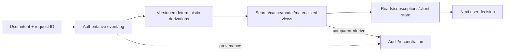

正确性不是one component属性，而是整条path的contract。

### 6.2 dataflow contract

对source prefix $L_p$、derivation version $F_v$与view $V$：

$$
V_{v,p}=F_v(L_p,C_v)
$$

contract还要声明applied prefix/offset $p$、config/reference version $C_v$、commit与rebuild方式。

### 6.3 authority map

| Artifact | Authority or derived? | Allowed writers |
|---|---|---|
| user request/event log | authoritative intent | client/API via validated append |
| OLTP current state | authority或event-derived view，须明确 | owning service/processor |
| search index | derived | CDC/indexer only |
| cache/timeline | derived | view maintainer only |
| ML model/features | derived | versioned training pipeline |
| audit result | independent evidence | auditor/checker |

若一个derived artifact有untracked direct writers，dataflow proof失效。

### 6.4 ordering hierarchy

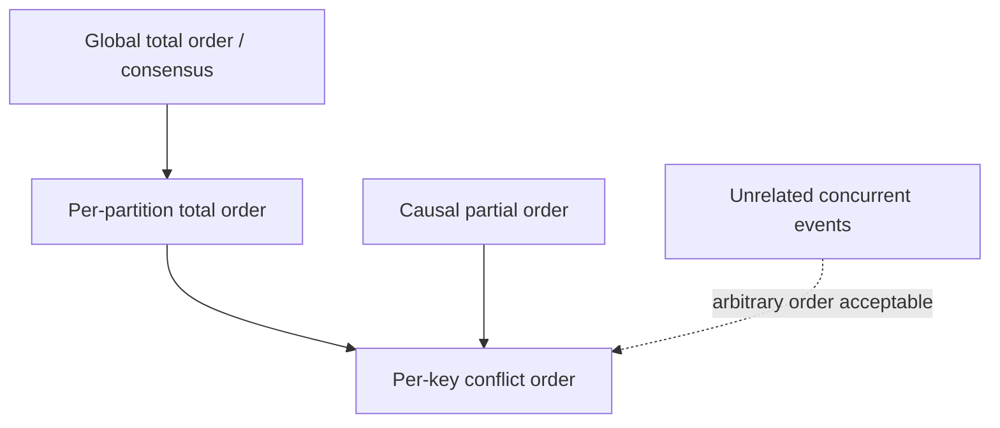

只购买满足invariant所需的order，避免global bottleneck。

### 6.5 causal evidence

| Evidence | Proves | Does not prove |
|---|---|---|
| partition offset | append order within shard | cross-shard causality |
| Lamport/HLC | causality-compatible label | event delivered before side effect |
| parent/observed version ID | explicit dependency | parent semantics valid |
| wall-clock timestamp | approximate physical time | reliable order under skew |
| result/version token | which state user saw | user understood it |

### 6.6 integrated vs unbundled decision

| Question | Integrated product | Unbundled composition |
|---|---|---|
| one workload/access model sufficient? | strong fit | unnecessary complexity |
| many specialized models required? | may compromise | broad fit |
| atomic visibility across features? | easier internally | async by default |
| independent team evolution? | shared release boundary | stronger autonomy |
| operations | fewer moving parts | many contracts/on-call paths |
| replay/migration | product-specific | explicit log/dataflow |

### 6.7 federation vs unbundling

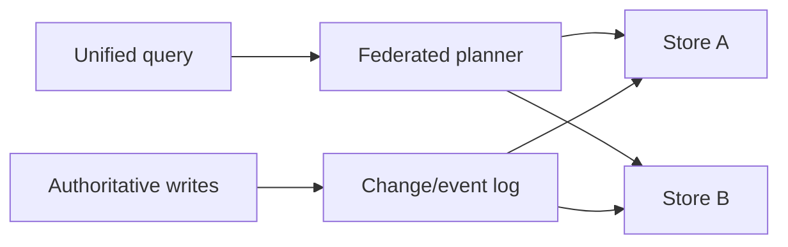

upper path unifiesreads，lower path synchronizeswrites；它们可独立采用。

### 6.8 derivation taxonomy

| Derived artifact | Function | Rebuild input |
|---|---|---|
| secondary index | extract/sort field | table snapshot + changelog |
| full-text index | NLP + inverted index | documents/events |
| cache/materialized view | query/aggregate | source tables/logs |
| ML model | feature + optimization | training snapshot/config |
| UI state | sync + local reducer | server snapshot + changes |
| audit projection | independent invariant check | authoritative facts |

### 6.9 write/read path cost model

$$
Cost=\lambda_w C_w(B)+\lambda_r C_r(B)+Storage(B)+FreshnessPenalty(B)
$$

$B$是materialization boundary。boundary右移表示more eager precomputation：write/storage增，read latency降。

### 6.10 correctness dimensions

| Dimension | Question | Typical mechanism |
|---|---|---|
| identity | same user intent是哪一个？ | client request ID |
| atomic initiation | intent是否完整记录？ | one log append/local transaction |
| order | conflicts谁先？ | consensus/per-key shard |
| derivation | outputs是否可重现？ | deterministic versioned function |
| delivery | event是否lost/duplicate？ | retained log + offsets |
| effect | duplicate是否无害？ | transaction/idempotence/fencing |
| timeliness | view距head多远？ | lag/wait-for-offset |
| integrity | view是否对应prefix？ | reconciliation/rederivation |
| audit | corruption能否detect？ | checksum/provenance/Merkle |

### 6.11 end-to-end request state machine

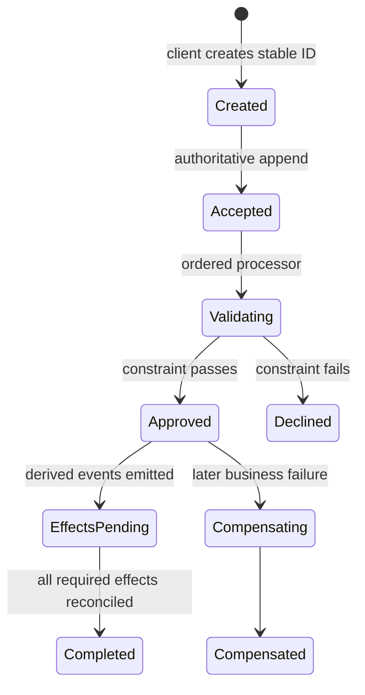

retry按same ID查询/重入现有state，不创建second workflow。

### 6.12 timeliness-integrity matrix

| | Integrity holds | Integrity broken |
|---|---|---|
| fresh | ideal current view | fresh-looking but false/dangerous |
| stale | acceptable async lag if disclosed | stale and corrupt |

freshness不是correctness substitute；integrity也不保证good UX latency。

### 6.13 constraint classification

| Constraint | Conflict scope | Recoverable? | Strategy |
|---|---|---|---|
| username unique | normalized name | costly rename but possible | per-name consensus |
| seat ownership at boarding | seat/flight | hard near deadline | coordinate before issue |
| warehouse stock | SKU/region | restock/refund | escrow or compensate |
| account conservation | transfer/request | must preserve | idempotent balanced events |
| email correctness | recipient/message | correction possible | async validate/dedup |
| large payout | account/risk rules | very costly | approval/strict gate |

### 6.14 coordination decision tree

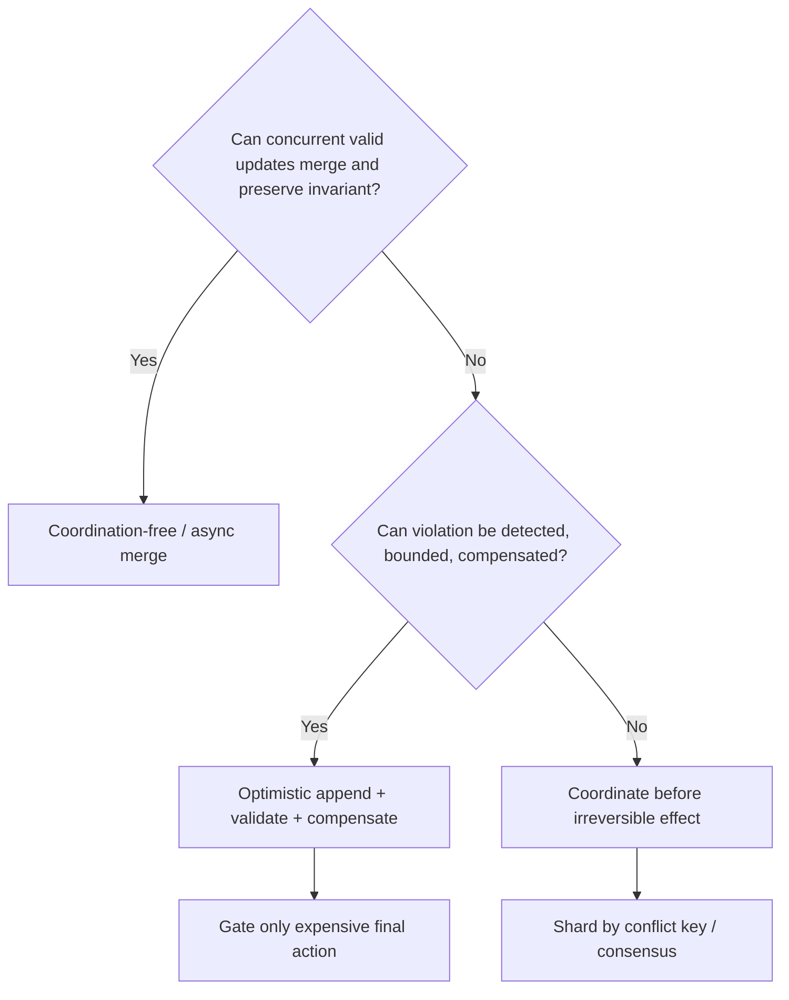

### 6.15 multishard integrity pattern

one atomic request event → local validation/reservation → stable derived effect IDs → per-shard ordered application → dedup/reconciliation。

conservation proof基于effects algebra；instant visibility不是默认requirement。

### 6.16 audit evidence map

| Claim | Evidence | Counterexample test |
|---|---|---|
| no duplicate intent | unique request table/log | resend afterresponse timeout |
| no lost derived record | source/view ID reconciliation | crash aftersource commit |
| balance conserved | debit+credit+fees equation | duplicate/omitted leg |
| deterministic view | replay same versions | shuffled/nondeterministic reference |
| log untampered | hash chain/signed root | mutate middle event |
| replica bytes valid | checksum/Merkle scrub | latent bit corruption |
| backup usable | restore + application query | missing key/schema dependency |
| client saw version X | read-result/version event | decision with no provenance |

### 6.17 validation stack

- transition/unit/property tests；
- concurrency/isolation tests；
- duplicate/timeout/failover tests；
- deterministic replay/golden logs；
- cross-view reconciliation；
- migration shadow/canary diff；
- fault injection/Jepsen；
- storage scrubbing；
- backup restore drills；
- independent end-to-end audits。

每层验证不同assumption，不能互相替代。

### 6.18 evolution loop

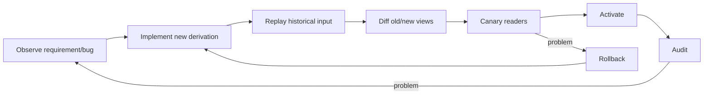

immutable input与side-by-side views让每一步reversible。

### 6.19 failure-containment map

| Failure | Synchronous integration | Async log/dataflow |
|---|---|---|
| index down | source write aborts/blocks | source continues, index lags |
| bad derivation code | may corrupt shared transaction path | versioned view can rebuild |
| consumer overload | backpressures whole commit | lag isolated until retention |
| source unavailable | all stop | existing views may stillserve |
| log unavailable | authoritative appends stop | consumers serve old state |

async tradesfreshness forlocalized failure, not forfree availability。

### 6.20 unified mental model

1. capture user intent once with stable ID；
2. append to authority that decides necessary order；
3. treat every other representation as versioned derivation；
4. propagate causal context where global order absent；
5. materialize at cost-effective write/read boundary；
6. separate view lag from data integrity；
7. coordinate only hard, irrecoverable conflicts；
8. compensate bounded business violations；
9. retain provenance and replayability；
10. continuously audit the whole path。

这十步构成本章哲学的知识骨架。

---

## 7. 综合案例：全球marketplace的订单、搜索与客户端dataflow

### 7.1 business context

全球marketplace需要：product catalog与full-text search、checkout/payment、regional inventory、recommendations、merchant analytics、offline-capable mobile app。任何one database都难同时优化这些workloads。

### 7.2 goals

- checkout intent不重复执行；
- money不丢/不凭空产生；
- strict scarce-item ownership在需要时唯一；
- search/recommendation可lag但不可永久漏/错；
- mobile offline操作可sync；
- schema/index/model可渐进迁移；
- entire path可audit/rebuild。

### 7.3 system-of-record map

- catalog service：product facts/availability policy authority；
- order request log：customer purchase intent authority；
- payment/account logs：money movement authority；
- inventory shard：reservation decisions authority；
- derived：search、recommendation、merchant dashboard、notification、client cache。

每个fact只有one authoritative write entry point。

### 7.4 architecture

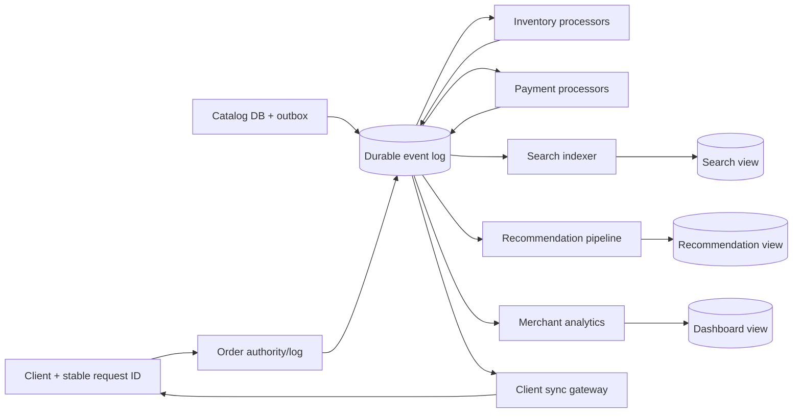

### 7.5 authority invariant

search/index/client cache不得直接authorproduct changes；任何修复都回到catalog event或重新derive。否则same product会出现multiple competing truths。

### 7.6 event envelope

所有events携：event ID、request/causation ID、aggregate ID、schema version、source offset、event time、producer version与data classification。

downstream output保parent IDs，形成provenance DAG。

### 7.7 catalog write path

product create/update/unpublish在catalog DB transaction内写domain row + outbox。CDC publish `ProductChanged`，search/recommendation/cache按product ID partition消费。

### 7.8 catalog dual-write prohibition

catalog API不能同步写Elasticsearch再写DB。search outage只增加index lag，不阻止authoritative catalog commit；recovery后从offset catch up。

### 7.9 search derivation

indexer执行language detection、tokenization、stemming、synonyms、ranking features，生成inverted index。derivation version与analyzer dictionary必须记录。

### 7.10 search integrity

对applied catalog prefix $p$：

$$
SearchView_p=IndexTransform(CatalogLog[0:p])
$$

lag允许 $p<head$；missing document withinprefix是integrity failure。

### 7.11 search freshness UX

seller刚改title，search可能old。UI可显示“publishing”、直接link读catalog source或等待index offset；不能把stale result谎称update failed。

### 7.12 checkout request identity

client在first tap生成 `checkout_request_id`，network retry/refresh/offline resend复用。order authority有unique constraint/state machine，duplicate返回same order ID/outcome。

### 7.13 client offline queue

mobile local log保存pending commands与last server offset。reconnect后按stable IDs sync；server results/state changes push回来，local model/UI作为derived replica更新。

### 7.14 order lifecycle

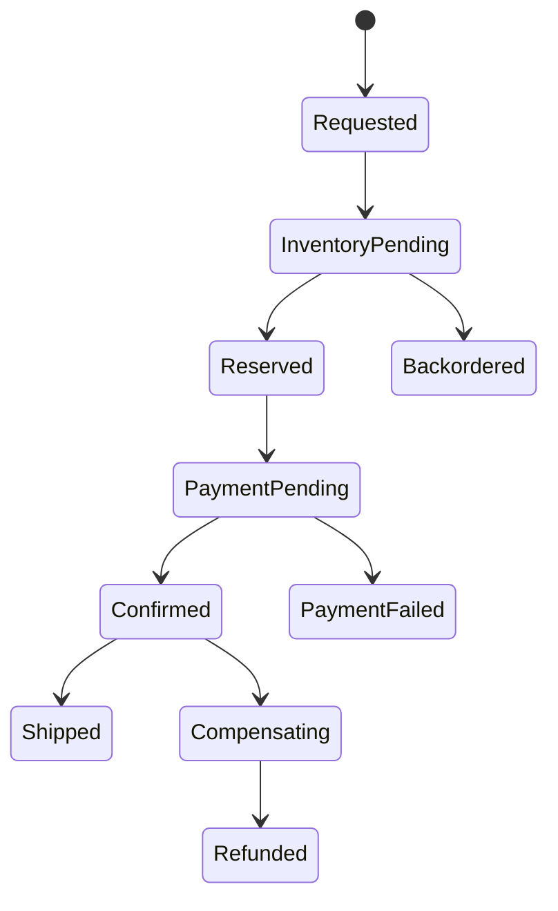

每transition是immutable event，retry查询same lifecycle。

### 7.15 per-order ordering

same order events按order ID partition；same SKU reservation claims按SKU/warehouse conflict key进入inventory shard。无需global order across unrelated orders/products。

### 7.16 causal dependency：unpublish before promotion

seller先unpublish product，再创建campaign。campaign event引用observed catalog version；notification/recommendation processor必须确认product在该causal version后仍eligible，防arrival reorder推广已下架商品。

### 7.17 causal dependency：quote and purchase

checkout event保存price/tax/shipping quote version或values。historical replay不能用current catalog price重新计算old charge。

### 7.18 inventory constraint classification

- ordinary replenishable SKU：允许small oversell，backorder/discount补偿；
- unique collectible/last seat：strict one owner，per-item consensus before confirmation；
- regional stock：escrow quantity分配regions，normal claim local coordinate。

one global policy会过度coordination或风险失控。

### 7.19 escrow inventory

global stock $S$拆成regional budgets $q_i$：

$$
\sum_i q_i\le S
$$

region内reservation只消费local $q_i$；budget rebalance需coordination，normal checkout不跨WAN同步。

### 7.20 soft oversell workflow

all order intents durably recorded；async reconciliation发现negative projected stock，按priority/fairness选择backorder/compensation。不可silent drop later order。

### 7.21 hard-item claim

`Claim(item_id,request_id)`路由same item shard，ordered processor选择first valid claim并emit success/reject。client可等待result后才显示confirmed。

### 7.22 payment decomposition

order payment拆为payer debit/reservation、merchant credit、platform fee与order outcome events。all carrycheckout request ID + effect suffix。

### 7.23 conservation invariant

$$
\Delta payer+\Delta merchant+\Delta fees=0
$$

each leg at-least-once delivered且dedup；periodic reconciliation独立重算equation。

### 7.24 intermediate state

source reserved而merchant credit pending时global state暂不“simultaneously balanced”。views显示payment pending；completion event出现后才对customer/merchant声明settled。

### 7.25 irreversible effect gate

shipping label/warehouse release只在inventory/payment required outcomes通过后触发。可以先record request，不必在first append前完成all checks；但在expensive physical action前gate。

### 7.26 compensation

payment captured但inventory永久不可得，emit refund + cancellation events。original charge保留audit；refund是new action，不是erase history。

### 7.27 notifications

notification由order state transition派生，message ID基于 `(order_id,transition,template_version)`；delivery retries不重复send。wrong notification可correction，但不可unsend，因此causal/eligibility gate仍重要。

### 7.28 merchant dashboard

captures/refunds/order events通过IVM维护daily revenue/status。dashboard可能minutes lag，但sum必须与ledger prefix一致；显示source/applied watermark。

### 7.29 recommendation view

stream updatesrecent interactions/features；batch定期retrain/recompute historical model。model artifact记录training snapshot、feature/code versions与evaluation。

### 7.30 write/read boundary

search common queries/cache与homepage recommendations在write path precompute；rare filters在read path执行。celebrity/viral product可采用hybrid fan-out，避免write explosion。

### 7.31 client push

SSE/WebSocket推order status、price/availability changes到device。device保last offset；gap超retention则重新fetch snapshot。connection success不等all changes durable applied。

### 7.32 read provenance

checkout记录user看到的product version、price、delivery estimate与inventory status。后续dispute/recommendation analysis可重建decision context。

### 7.33 search v2 migration goal

引入new analyzer/ranking/schema，不原地mutate v1。以same catalog source派生 `search_v2`，让old/new side by side。

### 7.34 historical build

batch读取catalog snapshot at offset $o_s$，build v2；stream tail应用 $>o_s$ changes直到catch up。snapshot+offset是online index creation pattern。

### 7.35 shadow comparison

对production queries同时读v1/v2但只返回v1，比较coverage、latency、ranking metrics与error。query/result version日志支持diagnosis。

### 7.36 canary and rollback

1% users切v2，逐步increase。routing pointer可立即回v1；v1保留至detection window结束。像rail dual gauge维持both standards。

### 7.37 unified batch/stream code

same indexing transformation处理historical snapshot records与live changes；event-time/reference dictionaries固定。避免lambda architecture两套semantic logic。

### 7.38 schema contracts

catalog internal schema可变；outbox/public product event保持compatible。新增field先升级consumers，删除field需usage inventory/migration，不能让search/ML customer-facing outage。

### 7.39 derived-view bootstrap

每view记录source snapshot/offset、code/config version、partition state与current applied head。没有这些metadata就无法safe rebuild/catch up。

### 7.40 fault: index consumer down

catalog/order继续；lag alert。修复后从offsetcatch up。若retention过期，从new snapshot+offset rebuild，而非猜missing changes。

### 7.41 fault: checkout response lost

client重试same request ID；server返回existing order/pending/result，不创建second charge/order。manual retry也在same identity scope。

### 7.42 fault: payment processor crash

checkpoint/offset回退导致events replay；stable effect IDs让payer/merchant/fee processorsskip duplicates。outcome最终推进。

### 7.43 fault: bad search code

v2 shadow audit发现missing documents；停止canary、fix code、从same source replay。v1仍服务，无需reverse corrupt in-place migration。

### 7.44 fault: audit discrepancy

ledger conservation或source-index ID diff失败，freeze affected settlement/index publication、保留evidence、run independent rederivation并定位first divergent offset。

### 7.45 audit architecture

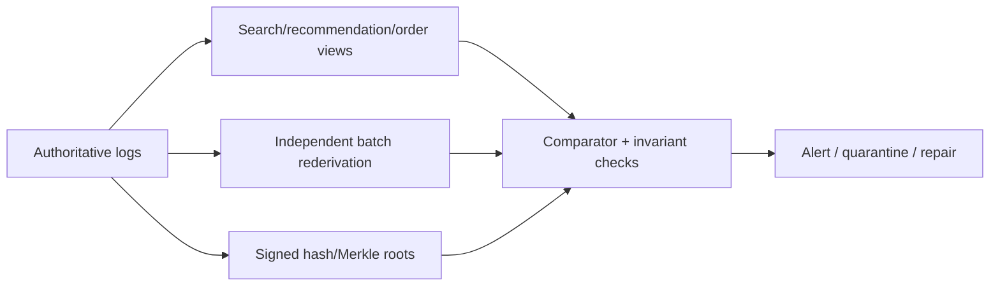

### 7.46 audit checks

- catalog IDs vssearch IDs；
- order request count/outcomes；
- payment conservation；
- inventory reservations vs physical cycle counts；
- model feature lineage；
- client sync gaps；
- hash roots/provenance；
- backup restore。

### 7.47 privacy/deletion

customer deletion需要lineage遍历catalog/order/ML/client caches/logs/backups。audit history与legal retention分级；tokenization/per-user keys/expiry减少exposure。

### 7.48 observability

监控source/log availability、per-view offsets/time lag、duplicates/DLQ、constraint outcomes、compensations、migration diffs、client sync gaps、audit failures与repair time。

### 7.49 SLO split

- timeliness：catalog-to-search p99、order-to-client update；
- integrity：lost/duplicate effect rate、reconciliation discrepancy；
- recovery：RPO/RTO、replay throughput；
- audit：detection latency/coverage；
- evolution：rollback time/canary error budget。

### 7.50 fault-injection matrix

| Fault | Expected behavior |
|---|---|
| duplicate checkout POST | one order/outcome |
| indexer crash | replay, no missing/duplicate docs |
| cross-service reorder | causal version prevents bad promotion |
| inventory partition | soft orderspending/compensate; hard claimsblock |
| payment leg duplicate | dedup, total conserved |
| payment leg delayed | pending visible, eventual completion |
| bad v2 derivation | shadow diff, no broad activation |
| client offline | resumeoffset or snapshot |
| disk corruption | checksum/Merkle/audit detects |
| backup failure | restore drill alerts before disaster |

### 7.51 known non-guarantees

search/recommendations not linearizable；cross-products no global order；soft stock may oversell；compensation may take time；offline device may show stale state；audit detects after fact；external physical events may not be perfectly reversible。

### 7.52 comprehensive case conclusion

marketplace可靠性来自relationship design而非one magic database：authorities决定facts/order，logs隔离failures，versioned functions维护views，stable IDs连接intent/effects，selective consensus守hard conflicts，compensation处理soft constraints，batch replay支持migration，audit验证whole path。

系统因此能在变化中保持integrity，而不是为了保护现状永远停在港口。

---

## 8. 核心结论

### 8.1 三十二条核心结论

1. 没有one data tool能高效满足all access patterns；复杂application必然面对data integration。
2. specialized tool的价值来自深度，composition的价值来自覆盖更广workloads；moving parts也会增加风险。
3. 每类fact必须有明确system of record，其他indexes/caches/models/views应标为derived。
4. one-way dataflow比application dual writes更容易推理，因为one authority决定conflicting changes的order。
5. ordered log + deterministic/idempotent derivation使derived state可retry、replay与rebuild。
6. distributed transactions提供synchronous atomic visibility；async log integration以temporary lag换fault containment与heterogeneous interoperability。
7. asynchronous view可stale但仍有integrity；staleness与permanent corruption是不同问题。
8. global total order等价consensus，受single orderer、WAN、microservices和offline clients限制。
9. unrelated events不需global order；按conflict key sharding可获得scalable per-key order。
10. cross-service causality应以observed version/parent event ID显式传播，不能靠arrival time猜测。
11. logical clocks/conflict resolution可整理state，却不能自动撤回已经发生的external side effects。
12. stream processing低延迟维护new changes，batch/replay重算history、repair bugs和支持migration。
13. raw history与reprocessing能力允许完全改变data model，而不只添加optional fields。
14. old/new views side by side、shadow/canary/rollback像railway dual gauge，使large migration渐进可逆。
15. unified batch/stream应复用one semantic transformation，并具historical replay、event time与effectively-once。
16. database internal index/view/replica maintenance与external CDC/dataflow属于同一derived-state algorithm family。
17. federation/polystore统一reads；unbundled event logs统一writes/changes。
18. integrated database满足需求时通常更简单、更快；unbundling只在specialized breadth确有价值时采用。
19. secondary index、search、ML model和UI cache都可视为application derivation functions。
20. application code与durable state分离部署，但state changes应成为code可subscribe的first-class inputs。
21. local replicated state可把remote RPC从critical path移除，换取明确的replication lag与version management。
22. index/cache/materialized view移动write/read path boundary，trade-off由read/write rates、latency与storage决定。
23. offline-capable client是state replica与stream endpoint，需offset、snapshot、conflict与reconnect protocol。
24. 把critical reads/results记录为events可保存user observed state与causal provenance，但有volume/privacy成本。
25. TCP、transaction与broker去重都只覆盖局部；stable request ID必须从client intent贯穿final effect。
26. strict uniqueness/conflicting winner需要consensus，可按normalized unique value sharding来扩展。
27. multishard workflow可用one atomic request + ordered idempotent stages保final integrity，不必heterogeneous atomic commit。
28. timeliness表示up-to-date observation；integrity表示无lost/false/contradictory data，后者通常更重要。
29. recoverable business constraint可optimistic accept、later validate并compensate；compensation不是rollback且有成本。
30. coordination avoidance不是零coordination，而是只在hard/irreversible conflict scope同步协调。
31. hardware、database与application都会bug；provenance、checksums、rederivation、reconciliation和restore drills必须持续验证。
32. streaming philosophy的核心不是某产品，而是以ordered facts、versioned derivations、end-to-end identities、selective coordination和audit构建可演进system。

---

## 9. 设计dataflow系统的一般方法

### 9.1 第一步：定义业务facts、outputs与SLOs

列出user intents、authoritative facts、derived outputs、readers与irreversible effects；分别定义timeliness、integrity、availability、recovery与audit SLO。

### 9.2 第二步：划分authority与derived state

为每field/entity标source of truth与allowed writer。search/cache/model/client state默认derived；若需反写，定义new authoritative event而非直接mutation。

### 9.3 第三步：画完整dataflow/provenance graph

标每edge input/output schema、partition/order、offset、owner、retry、lag、retention、bootstrap与rebuild path。包括clients、external APIs和audit jobs，不只datacenter内部。

### 9.4 第四步：建立end-to-end intent identity

client first attempt生成stable request ID；HTTP retries、events、multishard effects、external idempotency keys与outcome lookup复用same ID。dedup record与effect需atomic。

### 9.5 第五步：定义ordering与causality scope

哪些updates may conflict？按key co-partition；哪些decisions依赖observed state？携parent/version ID。只对必要scope使用total order/consensus。

### 9.6 第六步：先评估integrated solution

检查one database/warehouse/search feature是否已满足volume/semantics。只有specialized benefits显著时才unbundle，并预算operations/security/on-call成本。

### 9.7 第七步：选择batch、stream与replay角色

stream维护fresh deltas；batch处理bootstrap、history、model training、backfill与independent audit。尽量共享logical transformation，避免two implementations drift。

### 9.8 第八步：版本化derivation function

记录code/container、schema、config、reference data、model/dictionary与source snapshot/offset。保证deterministic replay或明确allowed nondeterminism/equivalence。

### 9.9 第九步：设计state与materialization boundary

为indexes/caches/operator/client state写key、lifetime、backend、checkpoint/changelog与rebuild source。用read/write rate、fan-out、freshness和storage选择precompute程度。

### 9.10 第十步：分类constraints与coordination

对每invariant问：concurrent valid states能否merge？violation能否detect、bounded、compensate？hard/irreversible才pre-coordinate；soft constraint采用optimistic + compensation；可用escrow缩小scope。

### 9.11 第十一步：把multishard操作拆成state machines

one atomic request event启动workflow；each shard按order validate/reserve/apply；derived effect IDs稳定；duplicates ignored；success/decline/compensation均为explicit events；写出conservation proof。

### 9.12 第十二步：设计read/client observation

明确read path读source还是derived view、允许多stale、read-your-writes/wait-for-offset方案。offline clients用snapshot+offset、local log与push/resume；critical read保存result version。

### 9.13 第十三步：让evolution默认可逆

new view由same source replay，dual run、shadow diff、canary、gradual route、retain old version、rehearse rollback。schema contract先升级consumers再producers。

### 9.14 第十四步：设计fault与external-effect边界

offset/state/outputconsistent checkpoint；sink使用transaction或idempotency/dedup/fencing；unknown outcome可status lookup；DLQ有owner；retention覆盖worst recovery/backfill。

### 9.15 第十五步：建立independent audit与repair

从authoritative facts重算views/invariants；做counts/checksums/conservation/Merkle comparisons、Jepsen/fault tests、storage scrub与backup restore。定义quarantine、first-divergence定位与repair workflow。

### 9.16 第十六步：写入ADR与runbook

```text
business facts, systems of record, derived outputs, and SLOs:
allowed writers and one-way dataflow/provenance graph:
client request IDs, retries, outcome lookup, and dedup scope:
partition keys, ordering guarantees, and causal references:
integrated versus federated/unbundled decision and costs:
batch, stream, replay, bootstrap, and backfill responsibilities:
derivation code, schema, config, reference-data, and model versions:
operator/view/client state, materialization boundary, and rebuild path:
timeliness/read-your-writes/freshness behavior by API:
integrity invariants and source-to-view prefix semantics:
hard, escrowed, and compensatable constraints:
multishard state machines, stable effect IDs, and conservation proof:
checkpoint, transaction, idempotency, fencing, and external effects:
side-by-side migration, shadow/canary, rollback, and retirement:
audit evidence, reconciliation, scrubbing, restore, and repair:
privacy retention/deletion, alerts, owners, and known non-guarantees:
```

方法的核心顺序是：**先明确谁记录事实，再把其他state建模为可重放derivation；只为真正冲突购买order/coordination，用stable identity连接all effects，最后以independent end-to-end audit持续证明system仍符合invariants。**

---

## 10. References

以下保留原章编号与链接，共 59 条。

### 10.1 References [1]–[20]

1. Rachid Belaid. [“Postgres Full-Text Search Is Good Enough!”](https://rachbelaid.com/postgres-full-text-search-is-good-enough/) July 2015.
2. Philippe Ajoux, Nathan Bronson, Sanjeev Kumar, Wyatt Lloyd, and Kaushik Veeraraghavan. [“Challenges to Adopting Stronger Consistency at Scale.”](https://www.usenix.org/system/files/conference/hotos15/hotos15-paper-ajoux.pdf) *HotOS*, May 2015.
3. Pat Helland and Dave Campbell. [“Building on Quicksand.”](https://arxiv.org/pdf/0909.1788) *CIDR*, January 2009.
4. Jessica Kerr. [“Provenance and Causality in Distributed Systems.”](https://jessitron.com/2016/09/25/provenance-and-causality-in-distributed-systems/) September 2016.
5. Jay Kreps. [“The Log: What Every Software Engineer Should Know About Real-Time Data’s Unifying Abstraction.”](https://engineering.linkedin.com/distributed-systems/log-what-every-software-engineer-should-know-about-real-time-datas-unifying) December 2013.
6. Pat Helland. [“Life Beyond Distributed Transactions: An Apostate’s Opinion.”](https://www.cidrdb.org/cidr2007/papers/cidr07p15.pdf) *CIDR*, January 2007.
7. Lionel A. Smith. [“The Broad Gauge Story.”](https://lionels.orpheusweb.co.uk/RailSteam/GWRBroadG/BGHist.html) *Journal of the Monmouthshire Railway Society*, Summer 1985.
8. Jacqueline Xu. [“Online Migrations at Scale.”](https://stripe.com/blog/online-migrations) February 2017.
9. Flavio Santos and Robert Stephenson. [“Changing the Wheels on a Moving Bus—Spotify’s Event Delivery Migration.”](https://engineering.atspotify.com/2021/10/changing-the-wheels-on-a-moving-bus-spotify-event-delivery-migration) October 2021.
10. Molly Bartlett Dishman and Martin Fowler. [“Agile Architecture.”](https://www.youtube.com/watch?v=VjKYO6DP3fo&list=PL055Epbe6d5aFJdvWNtTeg_UEHZEHdInE) *O’Reilly Software Architecture Conference*, March 2015.
11. Nathan Marz and James Warren. [*Big Data: Principles and Best Practices of Scalable Real-Time Data Systems*](https://www.manning.com/books/big-data). Manning, 2015.
12. Jay Kreps. [“Questioning the Lambda Architecture.”](https://www.oreilly.com/ideas/questioning-the-lambda-architecture) July 2014.
13. Raul Castro Fernandez et al. [“Liquid: Unifying Nearline and Offline Big Data Integration.”](https://www.cidrdb.org/cidr2015/Papers/CIDR15_Paper25u.pdf) *CIDR*, January 2015.
14. Dennis M. Ritchie and Ken Thompson. [“The UNIX Time-Sharing System.”](https://web.eecs.utk.edu/~qcao1/cs560/papers/paper-unix.pdf) *Communications of the ACM*, July 1974. [doi:10.1145/361011.361061](https://doi.org/10.1145/361011.361061)
15. Wes McKinney. [“The Road to Composable Data Systems: Thoughts on the Last 15 Years and the Future.”](https://wesmckinney.com/blog/looking-back-15-years/) September 2023.
16. Eric A. Brewer and Joseph M. Hellerstein. [“CS262a: Advanced Topics in Computer Systems.”](https://people.eecs.berkeley.edu/~brewer/cs262/systemr.html) UC Berkeley lecture notes, August 2011.
17. Michael Stonebraker. [“The Case for Polystores.”](https://wp.sigmod.org/?p=1629) July 2015.
18. Jennie Duggan et al. [“The BigDAWG Polystore System.”](https://sigmod.org/publications/sigmodRecord/1506/pdfs/04_vision_Duggan.pdf) *ACM SIGMOD Record*, June 2015. [doi:10.1145/2814710.2814713](https://doi.org/10.1145/2814710.2814713)
19. David B. Lomet, Alan Fekete, Gerhard Weikum, and Mike Zwilling. [“Unbundling Transaction Services in the Cloud.”](https://arxiv.org/pdf/0909.1768) *CIDR*, January 2009.
20. Martin Kleppmann and Jay Kreps. [“Kafka, Samza and the Unix Philosophy of Distributed Data.”](https://martin.kleppmann.com/papers/kafka-debull15.pdf) *IEEE Data Engineering Bulletin*, December 2015.

### 10.2 References [21]–[40]

21. John Hugg. [“Winning Now and in the Future: Where Volt Active Data Shines.”](https://www.voltactivedata.com/blog/2016/03/winning-now-future-voltdb-shines/) March 2016.
22. Felienne Hermans. [“Spreadsheets Are Code.”](https://vimeo.com/145492419) *Code Mesh*, November 2015.
23. Dan Bricklin and Bob Frankston. “VisiCalc: Information from Its Creators.”
24. D. Sculley et al. [“Machine Learning: The High-Interest Credit Card of Technical Debt.”](https://research.google.com/pubs/archive/43146.pdf) *SE4ML*, December 2014.
25. Peter Bailis, Alan Fekete, Michael J. Franklin, Ali Ghodsi, Joseph M. Hellerstein, and Ion Stoica. [“Feral Concurrency Control: An Empirical Investigation of Modern Application Integrity.”](https://www.bailis.org/papers/feral-sigmod2015.pdf) *SIGMOD*, June 2015. [doi:10.1145/2723372.2737784](https://doi.org/10.1145/2723372.2737784)
26. Guy Steele. [“Re: Need for Macros (Was Re: Icon).”](https://people.csail.mit.edu/gregs/ll1-discuss-archive-html/msg01134.html) December 2001.
27. Ben Stopford. [“Microservices in a Streaming World.”](https://www.infoq.com/presentations/microservices-streaming) *QCon London*, March 2016.
28. Adam Bellemare. [*Building Event-Driven Microservices*](https://learning.oreilly.com/library/view/building-event-driven-microservices/9798341622180/), 2nd edition. O’Reilly Media, 2025.
29. Christian Posta. [“Why Microservices Should Be Event Driven: Autonomy vs Authority.”](https://blog.christianposta.com/microservices/why-microservices-should-be-event-driven-autonomy-vs-authority/) May 2016.
30. Alex Feyerke. [“Designing Offline-First Web Apps.”](https://alistapart.com/article/offline-first/) December 2013.
31. Martin Kleppmann. [“Turning the Database Inside-out with Apache Samza.”](https://martin.kleppmann.com/2015/03/04/turning-the-database-inside-out.html) *Strange Loop*, September 2014.
32. Sebastian Burckhardt, Daan Leijen, Jonathan Protzenko, and Manuel Fähndrich. [“Global Sequence Protocol: A Robust Abstraction for Replicated Shared State.”](https://drops.dagstuhl.de/entities/document/10.4230/LIPIcs.ECOOP.2015.568) *ECOOP*, July 2015. [doi:10.4230/LIPIcs.ECOOP.2015.568](https://doi.org/10.4230/LIPIcs.ECOOP.2015.568)
33. Evan Czaplicki and Stephen Chong. [“Asynchronous Functional Reactive Programming for GUIs.”](https://people.seas.harvard.edu/~chong/pubs/pldi13-elm.pdf) *PLDI*, June 2013. [doi:10.1145/2491956.2462161](https://doi.org/10.1145/2491956.2462161)
34. Eno Thereska, Damian Guy, Michael Noll, and Neha Narkhede. [“Unifying Stream Processing and Interactive Queries in Apache Kafka.”](https://www.confluent.io/blog/unifying-stream-processing-and-interactive-queries-in-apache-kafka/) October 2016.
35. Frank McSherry. [“Dataflow as Database.”](https://github.com/frankmcsherry/blog/blob/master/posts/2016-07-17.md) July 2016.
36. Peter Alvaro. [“I See What You Mean.”](https://www.youtube.com/watch?v=R2Aa4PivG0g) *Strange Loop*, September 2015.
37. Nathan Marz. [“Trident: A High-Level Abstraction for Realtime Computation.”](https://blog.x.com/engineering/en_us/a/2012/trident-a-high-level-abstraction-for-realtime-computation) August 2012.
38. Edi Bice. [“Low Latency Web Scale Fraud Prevention with Apache Samza, Kafka and Friends.”](https://www.slideshare.net/slideshow/extremely-low-latency-web-scale-fraud-prevention-with-apache-samza-kafka-and-friends/57068078) *MRC Vegas*, March 2016.
39. Charity Majors. [“The Accidental DBA.”](https://charity.wtf/2016/10/02/the-accidental-dba/) October 2016.
40. Arthur J. Bernstein, Philip M. Lewis, and Shiyong Lu. [“Semantic Conditions for Correctness at Different Isolation Levels.”](https://dsf.berkeley.edu/cs286/papers/isolation-icde2000.pdf) *ICDE*, February 2000. [doi:10.1109/ICDE.2000.839387](https://doi.org/10.1109/ICDE.2000.839387)

### 10.3 References [41]–[59]

41. Sudhir Jorwekar, Alan Fekete, Krithi Ramamritham, and S. Sudarshan. [“Automating the Detection of Snapshot Isolation Anomalies.”](https://www.vldb.org/conf/2007/papers/industrial/p1263-jorwekar.pdf) *VLDB*, September 2007.
42. Kyle Kingsbury. [“Distributed Systems Safety Research.”](https://jepsen.io/)
43. Michael Jouravlev. [“Redirect After Post.”](https://www.theserverside.com/news/1365146/Redirect-After-Post) August 2004.
44. Jerome H. Saltzer, David P. Reed, and David D. Clark. [“End-to-End Arguments in System Design.”](https://groups.csail.mit.edu/ana/Publications/PubPDFs/End-to-End%20Arguments%20in%20System%20Design.pdf) *ACM TOCS*, November 1984. [doi:10.1145/357401.357402](https://doi.org/10.1145/357401.357402)
45. Peter Bailis, Alan Fekete, Michael J. Franklin, Ali Ghodsi, Joseph M. Hellerstein, and Ion Stoica. [“Coordination Avoidance in Database Systems.”](https://www.vldb.org/pvldb/vol8/p185-bailis.pdf) *PVLDB*, November 2014. [doi:10.14778/2735508.2735509](https://doi.org/10.14778/2735508.2735509)
46. Alex Yarmula. [“Strong Consistency in Manhattan.”](https://blog.x.com/engineering/en_us/a/2016/strong-consistency-in-manhattan) March 2016.
47. Martin Kleppmann, Alastair R. Beresford, and Boerge Svingen. [“Online Event Processing: Achieving Consistency Where Distributed Transactions Have Failed.”](https://martin.kleppmann.com/papers/olep-cacm.pdf) *Communications of the ACM*, May 2019. [doi:10.1145/3312527](https://doi.org/10.1145/3312527)
48. Jim Gray. [“The Transaction Concept: Virtues and Limitations.”](https://jimgray.azurewebsites.net/papers/thetransactionconcept.pdf) *VLDB*, September 1981.
49. Hector Garcia-Molina and Kenneth Salem. [“Sagas.”](https://www.cs.cornell.edu/andru/cs711/2002fa/reading/sagas.pdf) *SIGMOD*, May 1987. [doi:10.1145/38713.38742](https://doi.org/10.1145/38713.38742)
50. Annamalai Gurusami and Daniel Price. [“Bug #73170: Duplicates in Unique Secondary Index Because of Fix of Bug#68021.”](https://bugs.mysql.com/bug.php?id=73170) July 2014.
51. Gary Fredericks. [“Postgres Serializability Bug.”](https://github.com/gfredericks/pg-serializability-bug) September 2015.
52. Xiao Chen. [“HDFS DataNode Scanners and Disk Checker Explained.”](https://www.cloudera.com/blog/technical/hdfs-datanode-scanners-and-disk-checker-explained.html) December 2016.
53. Daniel Persson. [“How Does Ceph Scrubbing Work?”](https://www.youtube.com/watch?v=M9QGMoc3GU8) March 2022.
54. Jay Kreps. [“Getting Real About Distributed System Reliability.”](https://blog.empathybox.com/post/19574936361/getting-real-about-distributed-system-reliability) March 2012.
55. Martin Fowler. [“The LMAX Architecture.”](https://martinfowler.com/articles/lmax.html) July 2011.
56. Sam Stokes. [“Move Fast with Confidence.”](https://five-eights.com/2016/07/11/move-fast-with-confidence/) July 2016.
57. Ralph C. Merkle. [“A Digital Signature Based on a Conventional Encryption Function.”](https://people.eecs.berkeley.edu/~raluca/cs261-f15/readings/merkle.pdf) *CRYPTO ’87*, August 1987. [doi:10.1007/3-540-48184-2_32](https://doi.org/10.1007/3-540-48184-2_32)
58. Ben Laurie. [“Certificate Transparency.”](https://queue.acm.org/detail.cfm?id=2668154) *ACM Queue*, August 2014. [doi:10.1145/2668152.2668154](https://doi.org/10.1145/2668152.2668154)
59. Mark D. Ryan. [“Enhanced Certificate Transparency and End-to-End Encrypted Mail.”](https://www.ndss-symposium.org/wp-content/uploads/2017/09/12_2_1.pdf) *NDSS*, February 2014. [doi:10.14722/ndss.2014.23379](https://doi.org/10.14722/ndss.2014.23379)
