> 对应原文：14. Doing the Right Thing.md
>
> 本文严格按照原章顺序讲解，并在章后统一补充易混概念、知识结构、综合案例和可复用的负责任数据系统设计方法。文中的公式、推导、可运行示例与扩展案例用于解释和验证原理，不应误认为原书逐字给出的实现。

## 0. 本章定位：系统指标之外，还有人的尊严、权利与处境

### 0.1 开篇引语的警告

训练数据包含世界的beauty、ugliness与cruelty，却期待model只反映beauty，是不现实的。model不会自动滤掉社会中的discrimination、stereotypes与harm；这些问题会经data collection、labels、objectives和deployment进入output。

### 0.2 为什么以伦理结束全书

前13章讨论reliability、scalability、maintainability与correctness；但技术正确不等于社会上正确。一个100%符合spec的system仍可能侵犯privacy、排斥弱势群体或集中power。

### 0.3 every system has a purpose

system为某purpose而建，actions同时有intended和unintended consequences。目的可能是profit、fraud reduction或convenience；影响可能扩展到employment、credit、health、speech与freedom。

### 0.4 data 经常是人的生活

“data”不是抽象bytes：可能描述behavior、interest、identity、relationships、location、health与economic distress。处理personal data时，human dignity不是secondary nonfunctional requirement。

### 0.5 engineer 的责任

architecture、retention、feature、threshold与metric都是value choices。不能说“我只实现技术，business/legal决定后果”；engineer掌握mechanism与failure modes，因而负有提出风险、拒绝明显harm和建立safeguards的责任。

### 0.6 ACM Code of Ethics

ACM Code等professional guidelines要求avoid harm、fairness、privacy、honesty和public good。问题不在缺少口号，而在它们很少进入requirements、design review、launch gate和incident accountability。

### 0.7 technology is not neutral in use

同一search/recommendation/prediction technology可帮助用户，也可manipulate、exclude或surveil。artifact不自行承担moral agency；building/deploying organizations与people必须承担。

### 0.8 ethics 不是确定性算法

“good/bad”没有像quorum formula那样唯一答案。stakeholders有different values，harms难quantify，rights不一定可用expected profit抵消。

这不意味着anything goes，而意味着需要reasoning、evidence与accountability。

### 0.9 ethics 不是checklist compliance

checklist可防遗漏，却不能替代context。合规只给minimum legal floor；合法的tracking/model也可能unfair、coercive或harmful。

### 0.10 participatory and iterative process

伦理应是与受影响people对话的 **participatory and iterative process**：识别stakeholders、听取lived experience、测试impacts、提供recourse、持续monitor并根据evidence调整。

### 0.11 power matters

collecting organization与data subject通常不对等：一方设计terms、模型与appeal process，另一方承担拒贷、失业、保险涨价或exposure。ethical review必须分析谁benefits、谁bears risk、谁能contest。

### 0.12 individual and collective harms

- individual：wrong denial、privacy exposure、stigma；
- group：disparate impact、stereotype amplification；
- societal：surveillance normalization、power concentration、competition/民主受损；
- future：data later reused bydifferent management/government。

### 0.13 lifecycle view

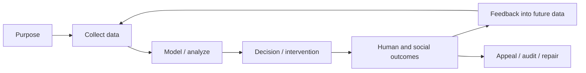

只评估model training而忽略collection/deployment/feedback，会漏掉主要风险。

### 0.14 benefit-risk framing

需要问：benefit是否真实、谁得到？harm severity/probability/reversibility如何？是否有less invasive alternative？不可把所有价值压缩为one scalar，但可用structured evidence比较options。

### 0.15 本章路线

1. predictive decisions中的bias、accountability与feedback loops；
2. tracking如何越界为surveillance；
3. meaningful consent、privacy与purpose；
4. data作为asset/hazard/power；
5. industrial history、law与professional self-regulation。

---

## 1. Predictive Analytics

### 1.1 两类prediction的伦理差异

weather/disease spread预测主要作用于collective planning；预测某convict recidivism、loan default、insurance claim或job performance，会直接改变individual access torights/opportunities。

模型误差因deployment context而获得moral weight。

### 1.2 organization 的asymmetric loss

bank/airline/employer常认为false accept（bad loan、hijacking、bad hire）成本高，false reject（错过good customer/candidate）成本低，于是threshold偏向“有疑问就拒绝”。

但false reject成本被外部化给individual。

### 1.3 classification decision

model输出risk score $s(x)$，organization设threshold $\tau$：

$$
decision(x)=
\begin{cases}
reject,&s(x)\ge\tau\\
accept,&s(x)<\tau
\end{cases}
$$

threshold不是纯technical parameter；它编码error trade-off与power allocation。

### 1.4 confusion matrix

| | Actual positive/risky | Actual negative/safe |
|---|---|---|
| predict positive/reject | TP | FP |
| predict negative/accept | FN | TN |

在不同domain，“positive”含义可相反；report必须明确谁被拒绝及错误后果。

### 1.5 error rates

$$
FNR=\frac{FN}{TP+FN},\qquad FPR=\frac{FP}{FP+TN}
$$

loan rejection场景需谨慎映射：若“positive”定义为default，FP是把safe applicant错判risk并拒绝。

### 1.6 expected cost 的局限

可写：

$$
ExpectedCost=C_{FP}P(FP)+C_{FN}P(FN)
$$

但谁定义 $C$？loss of dignity、freedom或discrimination不一定可合法转为money并由organization单方面权衡。

### 1.7 algorithmic prison

一个person被准确或错误label risky后，可能在jobs、travel、insurance、housing、finance等many systems连续收到“no”。这些互相独立的denials组合成对freedom的巨大限制，称 **algorithmic prison**。

### 1.8 presumption and appeal

criminal justice至少原则上presume innocence、提供evidence与appeal；automated exclusion可能无proof、无explanation、无accessible appeal，却产生类似punitive effect。

### 1.9 risk score 的scope creep

为one context收集/训练的score被later用于employment/insurance，label含义与base rates改变。模型在original test set表现好，不证明new decision context正当或准确。

### 1.10 minimum safeguard

对high-impact decision至少需要：clear purpose、relevant data、validated context、human/independent review、notice、explanation、appeal、correction与outcome monitoring。

### 1.11 Bias and Discrimination

algorithm不天然优于/劣于human。human biases可institutionalized；data-based decision有机会提高consistency并发现overlooked people，但也可industrialize discrimination。

### 1.12 rules inferred from data

traditional software由human写decision rules；ML从examples infer patterns。developer仍选择labels、features、objective、sampling、threshold与deployment，所以责任没有转移给data。

### 1.13 opacity

correlation可预测，却不解释causal reason。complex model甚至难说one feature怎样影响specific result；但high accuracy不消除被影响者要求reason/recourse的权利。

### 1.14 biased input → amplified output

historical labels包含past unequal opportunities、policing/hiring practices与measurement bias。优化复制label会把过去制度化，并以scale/automation放大。

### 1.15 protected traits

anti-discrimination law常保护ethnicity、age、gender、sexuality、disability、belief等。简单删除这些columns不足以确保fairness。

### 1.16 proxy variables

postal code、IP、school、purchase pattern可与race/socioeconomic status相关。model可从proxy重构protected trait，使“fairness through unawareness”失败。

### 1.17 data laundering bias

把historical pattern交给algorithm不会洗掉prejudice；“machine learning像给bias洗钱”讽刺的是organization用mathematical veneer隐藏human/institutional choices。

### 1.18 extrapolating the past

predictive system主要从past外推。若past discriminatory，model趋向codify/amplify。要让future better，需要normative choice和moral imagination，不能只maximizefit。

### 1.19 moral imagination

需要定义desired future：哪些inequality应纠正？哪些features不应使用？是否给underrepresented group更多机会？这是political/ethical deliberation，不是loss function自动给出。

### 1.20 fairness metrics 不是单一答案

常见指标：

- demographic parity：selection rates接近；
- equal opportunity：qualified people的TPR接近；
- equalized odds：TPR/FPR都接近；
- predictive parity：同score/decision含义接近；
- calibration：score对应actual frequency。

base rates不同时，这些指标可能互相冲突；选择取决于harm与law。

### 1.21 group metrics 与individual justice

group average相等不保证individual被合理对待；individual explanation也不证明group没有systematic harm。需要同时看aggregate disparities与case-level recourse。

### 1.22 intersectionality

只按gender或race分别audit可能漏掉intersection group（如某race女性）的harm。small subgroup sample又带statistical uncertainty，不能把“未显著”误作“无风险”。

### 1.23 base rates and labels

observed outcome未必ground truth：arrest不是crime，health cost不是health need，past hiring不是ability。metric denominator本身可能受historical policy影响。

### 1.24 measurement bias

data采集frequency/quality在groups间不同；missingness可能与access有关。model学到“谁被充分measurement”，而非目标trait。

### 1.25 selection bias

只有approved loans才观察repayment；被拒者counterfactual未知。用observed outcomes训练会强化past approval policy。

### 1.26 可运行示例：相同accuracy掩盖不同FNR

```python
groups = {
    "A": {"tp": 45, "fn": 5, "fp": 5, "tn": 45},
    "B": {"tp": 10, "fn": 10, "fp": 0, "tn": 80},
}


def metrics(values: dict[str, int]) -> tuple[float, float, float]:
    total = sum(values.values())
    accuracy = (values["tp"] + values["tn"]) / total
    fnr = values["fn"] / (values["tp"] + values["fn"])
    fpr = values["fp"] / (values["fp"] + values["tn"])
    return accuracy, fnr, fpr


results = {group: metrics(values) for group, values in groups.items()}
for group, (accuracy, fnr, fpr) in results.items():
    print(f"{group}: accuracy={accuracy:.2f}, FNR={fnr:.2f}, FPR={fpr:.2f}")

print("accuracy gap:", f"{abs(results['A'][0] - results['B'][0]):.2f}")
print("FNR gap:", f"{abs(results['A'][1] - results['B'][1]):.2f}")
```

实际运行输出：

```text
A: accuracy=0.90, FNR=0.10, FPR=0.10
B: accuracy=0.90, FNR=0.50, FPR=0.00
accuracy gap: 0.00
FNR gap: 0.40
```

overall/group accuracy相同仍可有巨大error disparity。该例不证明具体歧视，只说明accuracy不足以完成impact audit。

### 1.27 metric uncertainty

每项rate应带sample size/confidence interval，监控time drift。rare severe harms不能因平均值小而忽略；qualitative evidence与complaints也重要。

### 1.28 counterfactual question

fairness常问：若同一person只有protected trait不同，decision是否改变？现实features相互关联，counterfactual construct需causal assumptions，不能简单flip column。

### 1.29 mitigation layers

- data：sampling、label review、missingness；
- model：constraints/robustness/calibration；
- decision：threshold、human review；
- product：notice/appeal；
- institution：policy/oversight；
- outcome：continuous disparate-impact monitoring。

### 1.30 not a one-time test

population、behavior与policy变化会drift；model还会改变谁被selected并产生new labels。prelaunch fairness report不够，需要postdeployment monitoring和periodic reauthorization。

### 1.31 Responsibility and Accountability

algorithm mistakes时必须有人/organization可负责。不能以“model decided”回避design、deployment与override choices。

### 1.32 responsibility chain

data collector、label owner、model developer、product manager、deployer、human reviewer、executive与vendor都有不同duties。RACI/decision log应明确谁能approve、pause、repair。

### 1.33 high-impact examples

self-driving accident、racial/religious credit discrimination、criminal risk score都要求调查：谁selected objective/data，谁validated，谁ignored warning，affected person如何remedy。

### 1.34 explainability

explanation应满足recipient need：

- individual：哪些relevant facts导致decision，如何correct/appeal；
- operator：何时model unreliable；
- auditor：group outcomes、data lineage、version；
- court/regulator：policy与legal basis。

one feature-importance chart不够。

### 1.35 contestability

affected person应能：知道automated decision存在、access relevant record、纠正错误、提供context、获得human review并得到timely remedy。appeal不能比benefit本身更难取得。

### 1.36 credit score vs opaque profile

traditional credit score至少主要基于borrowing history且records理论上可correct；wide-feature ML利用many proxies，decision更难理解，wrong bucket更难escape。

### 1.37 similarity-based stereotyping

prediction常问“与此人相似的人过去怎样”，将group behavior用于individual。postal code等proxy让person因others’ history受罚，尤其在segregated society。

### 1.38 population probability vs individual truth

life expectancy 80不表示person在80岁死亡。calibrated group probability也不能断言individual必然default/reoffend。decision需承认uncertainty并匹配harm。

### 1.39 calibration intuition

若score 0.2 calibrated，则大量score≈0.2 cases中约20%发生outcome；不表示某specific case“20%地发生”。calibration是population property。

### 1.40 uncertainty communication

不要把probability变成absolute label。保留score interval/data quality、out-of-distribution flag，并在high uncertainty/high harm时转human review或不作决定。

### 1.41 blind data supremacy

“data says so”是危险的category error。data由past institutions产生，measurement incomplete，model objective由people选择。quantification不能免除judgment。

### 1.42 beneficial vs predatory use

analytics可识别need并target aid；同样features可让predatory lender找到vulnerable people销售high-cost loan/worthless education。技术能力相同，purpose/incentive不同。

### 1.43 impact documentation

model card/impact assessment应记录intended use、excluded use、stakeholders、training data、metrics by group、known limitations、appeal、monitoring、rollback和owner。

### 1.44 human review 陷阱

human-in-the-loop若只rubber-stamp score、没有time/authority/context，不提供真正oversight。应measureoverride rate、review quality与automation bias。

### 1.45 accountability mechanisms

- named accountable executive/owner；
- independent review；
- launch/rollback authority；
- immutable decision/version logs；
- user notice/appeal SLAs；
- incident disclosure；
- regulator/auditor access。

### 1.46 Feedback Loops

prediction不只是观察world；decision会改变opportunities/behavior，形成next training data。model因此是system participant，而非passive mirror。

### 1.47 recommendation echo chamber

system预测user喜欢什么并只展示similar content；click data随后证明“user只喜欢这些”，减少exposure diversity，放大stereotype、misinformation与polarization。

### 1.48 credit-employment downward spiral

financial shock → missed payment → lower credit score → fewer job opportunities → lower income → further missed payments。把credit用于hiring让temporary misfortune自我强化为poverty trap。

### 1.49 dynamic model

设person opportunity $O_t$、score $S_t$：

$$
O_{t+1}=g(S_t),\qquad S_{t+1}=f(Outcome(O_{t+1}))
$$

若lower score减少opportunity，而reduced opportunity又产生bad outcome，就形成positive（self-reinforcing）feedback。

### 1.50 algorithmic pricing collusion

German fuel market研究显示algorithmic pricing可能减少competition并提高consumer prices：each algorithm适应others，emergent behavior不必有人explicitly collude。

### 1.51 systems thinking

**systems thinking**考察computerized parts、人、institutions、incentives与delays。问system如何回应behavior、structure与characteristics，而非只看offline model metric。

### 1.52 stock-and-flow view

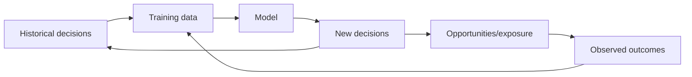

labels受previous policy影响，随机/controlled exploration可能是识别counterfactual的必要手段，但必须ethical。

### 1.53 feedback warning signs

- model决定谁被observed；
- denial使future score更差；
- recommendation减少alternative exposure；
- competitors react tosame algorithms；
- metric改善但human welfare下降；
- errors concentrate onpeople with least recourse。

### 1.54 interventions

- diversify/exploration；
- separate prediction from allocation policy；
- cap repeated harm；
- monitor longitudinal outcomes；
- use causal experiments carefully；
- audit nonusers/denied cases；
- provide appeal and reset paths。

### 1.55 Predictive Analytics 小结

预测模型把statistical uncertainty转成real opportunities/denials。历史bias、proxy、opaque grouping与asymmetric error cost会放大harm；feedback loop还会让prediction制造它声称只是观察的reality。

负责任设计必须从purpose、data与group metrics一路覆盖individual recourse、accountability、postdeployment outcomes与whole-system dynamics。

---

## 2. Privacy and Tracking

### 2.1 从prediction回到collection

上一节问“如何使用data作决定”；本节先问“为什么有权收集这些data”。collection本身就改变organization-user relationship并创造future misuse/breach风险。

### 2.2 service for the user

user明确输入data以完成requested function，如保存document、deliver package，system主要作为agent/service。仍需security/minimization，但purpose较清楚。

### 2.3 side-effect tracking

若system在用户做other things时持续记录click、location、contacts、device、attention，organization形成自己的interests，可能与user利益冲突。

### 2.4 beneficial behavioral data

tracking search clicks可改善ranking；co-purchase可给related recommendations；A/B/user-flow可改善UI。不是所有behavior collection都等于harm。

### 2.5 business model changes incentives

ad-funded service的paying customers是advertisers；users提供attention/data。product objective可能从“帮助user完成goal”滑向“maximize engagement/profile value”。

### 2.6 tracking escalation

为了targeting，collection变得更detailed、cross-context、long retention，并与external sources结合。原本local product telemetry演变为longitudinal personal profile。

### 2.7 surveillance definition in context

当tracking主要服务collector/advertiser的interests，且subject缺乏knowledge/control，关系可称 **surveillance**。判断依据是power/purpose，不只是“是否使用camera”。

### 2.8 stakeholder exchange

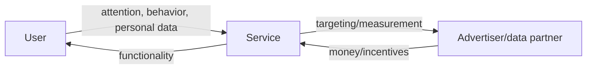

谁付费会影响optimization target，但不自动决定ethical outcome。

### 2.9 purpose inventory

每event/field应标：primary user-facing purpose、secondary analytics、advertising/partner use、retention、recipients与lawful basis。模糊“improve services”不是可审计purpose。

### 2.10 necessity test

问：without this field/retention/cross-site linkage，core service还能否工作？若能，collection也许convenient/profitable而非necessary。

### 2.11 proportionality

即使purpose legitimate，也需比较benefit与intrusion，并采用less invasive alternative，如on-device aggregation、short retention、coarse location、randomized/aggregate metrics。

### 2.12 Surveillance

把“data”替换为“surveillance”是语言thought experiment：`surveillance-driven organization`、`surveillance warehouse`让抽象技术词重新显露human observation关系。

### 2.13 rhetorical purpose

这种替换不是说all data processing邪恶，而是打破neutral vocabulary，让团队问谁被观察、是否知道、能否拒绝、谁获益及future use。

### 2.14 ubiquitous sensors

smartphones、TVs、voice assistants、baby monitors、toys等把internet-connected microphones/sensors带进inhabited spaces。poor IoT security使collection同时变成breach入口。

### 2.15 digitization scales observation

过去location/social/purchase/health surveillance昂贵且manual；digital systems使continuous collection、copy、join与global search近乎零marginal cost。

### 2.16 inferred sensitive data

organization可能从ordinary signals推断illness、economic distress、pregnancy、relationship或belief，甚至早于person自己知道。privacy risk不只来自explicit sensitive columns。

### 2.17 corporate vs state surveillance

现代data常由corporations为service/ads收集，而非government直接强制；但government可通过legal demand、secret deal、purchase或theft获得。holder identity不消除power risk。

### 2.18 voluntary adoption paradox

digital servicesbenefits巨大，people voluntarily carrytracking devices。choice of valuable tool不等同意all latent uses；bundled necessity/benefit可掩盖surveillance scope。

### 2.19 “nothing to hide” fallacy

它假设current power structures永远benevolent、person永不marginalized、context永不change。privacy保护autonomy、association、dissent与future safety，不只conceal wrongdoing。

### 2.20 differential vulnerability

same dataset对privileged user风险低，对activist、minority、abuse survivor、undocumented person可能高。impact review不能只问average user是否comfortable。

### 2.21 benign purpose can change

recommendation/marketing看似温和，但与insurance/employment/law enforcement结合后可决定important opportunities。purpose creep使old consent/expectation失效。

### 2.22 connected-car example

cars记录precise location/driving behavior，未经meaningful consent分享后影响insurance premium。购买vehicle并不自然授权所有telemetry resale/decision uses。

### 2.23 wearable condition

health insurance若要求fitness tracker，user为了coverage被迫continuous monitoring。形式上“同意”，实质choice受essential benefit制约。

### 2.24 side-channel inference

smartwatch motion sensor可推断typing/password。field看似不敏感，但combination/model创造sensitive inference；data classification必须考虑derivable information。

### 2.25 security and privacy relation

security阻止unauthorized access；privacy还约束authorized organization应否collect/use/share。encrypted excessive surveillance仍可能侵犯privacy。

### 2.26 threat actors over time

考虑criminals、insiders、partners、acquirers、bankruptcy buyers、future management、future governments。retention把today’s collection暴露给tomorrow’s actors。

### 2.27 harm scenarios

- identity/location exposure；
- discriminatory pricing/insurance；
- stalking/abuse；
- chilling effect；
- manipulation；
- false inference；
- breach/blackmail；
- state repression。

### 2.28 Surveillance 小结

tracking是否越界取决于purpose、necessity、power与control。越detailed、cross-context、long-lived且opaque，越接近surveillance；future inference和actors使风险随时间增长。

### 2.29 Consent and Freedom of Choice

“user点了agree”不自动构成meaningful consent。需要knowledge、specific choice、absence of coercion与withdrawability。

### 2.30 first question：tracking为何necessary

search click metrics与result quality有direct link；ad profile/engagement optimization是否服务user更可疑。应逐purpose证明necessity，不以free service概括授权。

### 2.31 understanding gap

多数user不知道收集哪些fields、保留多久、怎样join/infer、向谁share。long legalistic privacy policy更可能obscure than illuminate，故无法informed consent。

### 2.32 derived datasets opacity

multiple users’ behavior与external sources结合后形成segments/models，individual无法合理预测所有uses。对“future analytics”blanket consent缺乏specificity。

### 2.33 nonuser data

one user上传contacts/photos/messages会透露未注册people的信息；他们没看terms也没consent。group/network data无法仅靠direct user consent合法化所有影响。

### 2.34 one-way extraction

service设terms，user无法negotiatedata amount/price/use；organization可反复derive value，subject通常无share/visibility。关系asymmetric且缺true reciprocity。

### 2.35 GDPR consent conditions

原章引用：consent应 **freely given, specific, informed, and unambiguous**，且可 **refuse or withdraw without detriment**；request需clear/plain/accesssible，silence、pre-ticked boxes、inactivity不构成consent。

具体lawful assessment需legal counsel；这里讨论design principle，不是legal advice。

### 2.36 consent as conjunction

可表达为minimum conditions：

$$
ValidConsent=Free\land Specific\land Informed\land Unambiguous\land Withdrawable
$$

任一项false，都不能靠其他项“平均补偿”。

### 2.37 freely given

拒绝不能导致unrelated substantial detriment；若employment、insurance或essential social participation绑定tracking，choice可能coercive。

### 2.38 specific

separate purposes应separate choices：core service、personalization、research、ads、third-party sharing不能混成one all-or-nothing toggle。

### 2.39 informed

plain-language layered notice说明data categories、purpose、retention、recipients、automated decisions、rights与risks。不能把material fact藏在hundreds pages。

### 2.40 unambiguous

需要affirmative action；prechecked box、silence或continued browsing不足。UI不应用confusing double negatives或visual manipulation。

### 2.41 withdrawable

withdraw应和grant一样easy，停止future processing并按policy删除/隔离data。已完成合法processing与required retention需明确说明。

### 2.42 other lawful bases

GDPR下consent不是唯一basis，还包括legal obligation、vital interests等；**legitimate interests**可用于某些fraud prevention（fraudster当然不会consent）。

lawful basis不等ethical carte blanche，仍需necessity、proportionality、rights与safeguards。

### 2.43 consent record

保存policy/version、purposes、notice text、time、interaction、jurisdiction与withdrawal。不要只存`consent=true`，否则无法证明同意了什么。

### 2.44 purpose versioning

new use不应retroactively套old consent。用途扩张触发new assessment/consent；pipeline以purpose tags/access policy限制dataflow。

### 2.45 可运行示例：consent validity policy

```python
consents = {
    "clear-choice": {
        "free": True,
        "specific": True,
        "informed": True,
        "unambiguous": True,
        "withdrawable": True,
    },
    "pre-ticked": {
        "free": True,
        "specific": True,
        "informed": True,
        "unambiguous": False,
        "withdrawable": True,
    },
    "essential-or-nothing": {
        "free": False,
        "specific": True,
        "informed": True,
        "unambiguous": True,
        "withdrawable": False,
    },
}

for name, conditions in consents.items():
    failed = sorted(key for key, value in conditions.items() if not value)
    valid = not failed
    print(f"{name}: valid={valid}, failed={failed}")
```

实际运行输出：

```text
clear-choice: valid=True, failed=[]
pre-ticked: valid=False, failed=['unambiguous']
essential-or-nothing: valid=False, failed=['free', 'withdrawable']
```

示例只演示conjunctive policy，不替代contextual legal/ethical review。

### 2.46 essential service problem

若service被多数人视为basic social participation必需，opt out带social/professional cost，use effectively mandatory。形式choice不等freedom。

### 2.47 network effects

friends/employers/communities都在platform上时，one person退出会失去value；platform dominance削弱consent bargaining power。

### 2.48 engagement design

game/gambling mechanics、variable rewards、notifications与infinite scroll刻意让people返回。用behavioral manipulation获得“continued use”不能证明free preference。

### 2.49 dark patterns

accept button突出、reject多步、shaming copy、repeated prompts、bundled purposes都会操纵choice。应做symmetry review：accept/reject effort、visual weight与consequence是否公平。

### 2.50 privilege and comprehension

只有具time、literacy、technical/legal knowledge且可承受exclusion的人能研究policy并退出。将privacy burden全推给individual会加剧inequality。

### 2.51 consent fatigue

频繁banner使peoplehabitually click，降低signal quality。应减少unnecessary collection，而非为每tracker制造更多dialog；just-in-time notice聚焦meaningful decisions。

### 2.52 revocation propagation

withdrawal必须沿data lineage传播到raw events、features、segments、models、exports与partners。没有lineage和deletion workflow，UI toggle只是表面control。

### 2.53 child/vulnerable users

capacity、guardian role与power imbalance更复杂。即使formal consent存在，也应使用stricter minimization、no manipulative design与additional oversight。

### 2.54 consent and model training

训练后删除one person data是否需retrain取决于law/policy/model leakage与feasibility。应在collection前设计dataset/version/unlearning/retention strategy，而非收到request才思考。

### 2.55 consent audit metrics

- purpose-specific opt-in/withdraw rates；
- accept vs reject effort/time；
- notice comprehension research；
- withdrawal completion latency；
- downstream deletion coverage；
- complaints/appeals；
- dark-pattern findings。

### 2.56 freedom-of-choice test

问：如果person拒绝，仍能获得core/essential function吗？是否有real alternative？是否理解consequence？choice是否可改变？collector是否因拒绝punish user？

### 2.57 Consent 小结

meaningful consent不是legal-text checkbox，而是specific、understood、uncoerced、revocable control。network effects、essential services、dark patterns与derived-data opacity会让表面同意失效。

privacy-respecting design优先减少不必要choice与collection，而不是把无限复杂风险转嫁给user。

### 2.58 Privacy and Use of Data

“privacy is dead”因people自愿share而得出，是误解。privacy不是让all information永远secret，而是保留contextual disclosure的choice与control。

### 2.59 privacy as decision right

person应决定：what to reveal、to whom、for which purpose、how long、是否later withdraw。privacy是autonomy的一部分。

### 2.60 secrecy-transparency spectrum

同一person可公开professional profile、向doctor透露health detail、对employer保密。没有one global “private/public” bit；context和recipient决定appropriateness。

### 2.61 contextual integrity

data在original context合法流动，不代表可跨context reuse。fitness data给doctor与给insurer/employer产生不同power/harm。

### 2.62 medical research example

rare disease patient可能愿意分享medical data给research，帮助treatment；若data影响insurance/job，则会谨慎。beneficial use不能取消purpose/access choice。

### 2.63 inferred data 也受privacy约束

organization从behavior推断illness、orientation或financial state，即使raw fields普通，inference仍影响person agency。不能说“我们没收集sensitive field，只是模型推出来”。

### 2.64 transfer of privacy rights

surveillance extraction没有消灭privacy right，而是把决定reveal/keep secret的power从individual转给collector。company说“trust us”，实质掌握future use权。

### 2.65 collector secrecy

company往往不公开profiling details，因为会显得creepy、削弱competitive advantage。individual被高度transparent，collector/model反而opaque，形成asymmetric visibility。

### 2.66 indirect disclosure through targeting

ad tool让advertiser定位illness/financial distress group，即使不显示name，仍利用intimate inference。de-identification不自动恢复subject对disclosure的agency。

### 2.67 anonymity and reidentification

group targeting、rare attributes与auxiliary datasets可重identify。privacy review不能只问“是否去掉name”，还要看linkability、group harm与inference。

### 2.68 managing perception vs reducing intrusion

company可能只避免“被认为creepy”，改UI/copy而不减少collection。ethical目标应降低actual intrusion/risk，不是隐藏它。

### 2.69 painful but accurate reminders

factually correct memory也可能undesirable：bereavement、trauma、abuse相关内容不应被“on this day”无context推送。accuracy不等appropriateness。

### 2.70 incorrect or inappropriate data

data可能wrong、outdated、misattributed或contextually inappropriate。system需correction、suppression、appeal与human judgment，而非假设stored fact永远safe to use。

### 2.71 engineering humility

无法预先编码all human needs。设计应承认failure：preview/undo、sensitive-content controls、graceful exception、manual support与postlaunch complaints channel。

### 2.72 privacy settings 的起点

visibility settings让user控制other users看到什么，是部分agency；但service operator仍可访问/analyze，privacy policy常赋予广泛internal rights。

### 2.73 access control vs purpose control

RBAC回答who can read；privacy还问read后用于什么、能否join/export/train、保多久。需要purpose-based policy、lineage与usage audit。

### 2.74 service promises 的边界

“不出售data”可同时允许unrestricted internal profiling、affiliate sharing或targeting service。应按actual flows/effects审查，不按marketing phrase。

### 2.75 historical trust relationships

doctor-patient、attorney-client收集sensitive data，但有professional ethics、confidentiality law与fiduciary-like duties。internet service大规模收集，却常缺等价governance。

### 2.76 unprecedented scale

surveillance过去manual/expensive；现在automated/global/indefinite。small per-record risk乘billions people与years会形成historically unprecedented power transfer。

### 2.77 privacy-by-design requirements

- explicit purpose and lawful/ethical basis；
- data minimization；
- least privilege；
- short/default retention；
- user access/correction/deletion；
- derived-data lineage；
- inference/secondary-use controls；
- breach/appeal response。

### 2.78 Privacy and Use 小结

privacy是contextual agency，不是absolute secrecy。collector若控制all inference/use/retention而subject只有visibility toggle，就发生rights/power transfer。

设计目标应让people理解并影响data lifecycle，同时为wrong、painful或context-inappropriate use提供repair。

### 2.79 Data as Assets and Power

behavioral data常称 **data exhaust**，仿佛无价值废物被recycle；但如果targeted advertising为service付费，data generation更像unpaid labor/primary economic input。

### 2.80 data as labor

users贡献attention、content、social graph与behavior signals，platform从中derive value。是否应补偿/分享value是political-economic问题，至少不应把contribution描述成zero-cost waste。

### 2.81 service as extraction interface

极端看法是application用于吸引people持续喂data。即使product真有value，也要检查engagement objective是否把human creativity/relationships工具化。

### 2.82 data brokers

data brokers秘密purchase、aggregate、analyze、resell personal profiles，多用于marketing。subject往往不知道broker存在，也难access/correct/delete。

### 2.83 valuation by surveillance capability

startup按users/“eyeballs”估值，隐含未来monetize attention/data的能力。账面asset鼓励collect more/retain longer，即使risk未计入。

### 2.84 assets attract demand

companies、advertisers、governments、criminals、foreign intelligence、insiders都可能想获取valuable data。collection创造attack/coercion target。

### 2.85 bankruptcy and acquisition

company倒闭/被收购时personal data可能作为asset出售，new owner values/purpose与original promise不同。privacy risk跨越organization lifecycle。

### 2.86 breach inevitability at scale

data难perfectly secure；misconfiguration、supply chain、credential theft、insider与zero-day都会发生。security program降低probability，不使long-term breach risk为zero。

### 2.87 toxic asset / hazardous material / uranium

data既有benefit又有harm potential，更像hazardous material或uranium，而非只像gold/oil。value越高不代表应无限stockpile。

### 2.88 simple risk framing

$$
Risk\approx Probability\times Impact\times ExposureDuration
$$

不是精确伦理公式，但提醒：retention/replication/recipients增多会扩大exposure；sensitive/large-scale data提高impact。

### 2.89 future-use option value vs risk

“以后也许有用”带option value，也把data暴露给future hacks、managers和laws。unknown future benefit不能自动压倒concrete present risk。

### 2.90 future governments

collection decision需考虑all plausible future regimes，而非只信today’s government/company。human-rights environment可改变，historical data可被retroactively weaponized。

### 2.91 civic hygiene

部署可facilitate police state的ubiquitous tracking，即使today benign，也是poor civic hygiene。architecture塑造future coercion capability。

### 2.92 knowledge is power

knowing others while avoiding scrutiny oneself是power。profiles使organization预测、classify、price、nudge或exclude，subject却不了解model与data。

### 2.93 power asymmetry

collector能observe millions individuals，individual无法observe collector decisions；terms nonnegotiable、appeal weak。privacy engineering必须加入transparency/oversight来counterbalance。

### 2.94 mission creep

data collected forsecurity/fraud/convenience later用于ads、employment、law enforcement。purpose limitation与technical access boundaries防止“既然有就用”。

### 2.95 data-power assessment

- 谁collect/see/join？
- 谁不知道/不能拒绝？
- 谁能change purpose？
- 谁承受breach/false inference？
- bankruptcy/acquisition/government demand怎么办？
- 是否有independent oversight？

### 2.96 Data as Assets and Power 小结

personal data带来economic value，也创造long-lived liability与social power。正确balance不能只计算storage cost/profit；要把breach、coercion、future regime与loss of agency纳入architecture。

### 2.97 Remembering the Industrial Revolution

information technology像Industrial Revolution：带来growth、productivity与living-standard improvements，也产生new externalities与power imbalances。

### 2.98 industrial benefits and harms

industrial advances长期改善生活，却伴随air/water pollution、unsafe factories、cramped housing、long hours与child labor。market growth没有自动消除harms。

### 2.99 delayed safeguards

environmental law、workplace safety、food inspections与child-labor bans经过长期struggle才建立。技术先行、social protection滞后会让弱势人群承担transition cost。

### 2.100 regulation raises private cost

禁止dump waste/exploit workers提高business cost，却让society overall受益。若company不承担external harm，unregulated price会虚假偏低。

### 2.101 data pollution analogy

computers持续产生information，copy/retention使其“festering”。privacy/data misuse像information-age pollution：benefit私有化，breach/surveillance/social harm外部化。

### 2.102 externality model

$$
SocialCost=PrivateCost+ExternalHarm
$$

organization若只优化PrivateCost/revenue，会overcollect。law、liability、audit与norms试图让decision internalize ExternalHarm。

### 2.103 digital pollution

unnecessary identifiers、logs、profiles、copies与unbounded retention是digital waste。它们消耗security/governance capacity并扩大every future incident。

### 2.104 environmental impact analogy

high-risk data project可做类似impact assessment：sources、flows、affected communities、alternatives、mitigations、residual harm、monitoring与decommissioning。

### 2.105 precaution and innovation

precaution不等ban all innovation；要求在uncertainty/high impact时先pilot、minimize、sandbox、independent review和reversible deployment。

### 2.106 future judgment

future generations可能像我们看早期industrial pollution一样看today’s mass surveillance。engineering success应包括留下怎样的social infrastructure。

### 2.107 industrial analogy limitations

data可无限copy、跨境、用于inference，且harm有时invisible；不像physical waste容易measure/location。类比提供externality intuition，不给完整policy答案。

### 2.108 Remembering the Industrial Revolution 小结

innovation与safeguard不是对立：rules可提高private cost，却防止industry把risk转嫁给public。data governance是information economy的environmental/safety infrastructure。

### 2.109 Legislation and Self-Regulation

law可保护rights并建立minimum standards；但enforcement、technology change与cross-border systems让法律不足。industry还需professional culture与technical controls。

### 2.110 purpose limitation

GDPR原则：personal data为specified、explicit、legitimate purposes收集，不应以incompatible manner further process。purpose要在collection前可说明、可审计。

### 2.111 data minimization

只收集与purpose **adequate, relevant, limited to necessary** 的data。minimize fields、precision、frequency、population、retention、replicas与recipients。

### 2.112 tension with big data

big-data philosophy鼓励maximize collection、combine datasets、探索unexpected insights；purpose limitation要求预先specified use。二者存在真实normative tension，不能靠模糊consent消除。

### 2.113 exploration challenge

research/innovation往往无法预知insight；但“未知未来研究”也可成为permanent surveillance借口。可用controlled enclave、ethics review、aggregate/deidentified data、time-limited approval平衡。

### 2.114 enforcement reality

regulation对online ads有一定影响，但weak enforcement/fines-as-cost-of-business可能不改culture。compliance artifacts不等actual minimization。

### 2.115 innovation risk-benefit

medical data sharing有privacy risk，也可能改善diagnosis/treatment并挽救生命；overregulation可能阻碍benefit。需按specific use、safeguard、evidence与affected people deliberation。

### 2.116 risk-tiered governance

low-risk aggregate telemetry可lighter review；high-impact health/biometric/location/prediction需stricter access、independent review、security、appeal与sunset。不能one-size-fits-all。

### 2.117 culture shift

停止把users只当metrics/eyeballs；以human respect、dignity、agency衡量success。privacy/ethics进入product strategy、promotion incentives与incident process。

### 2.118 self-regulation

organization应在law之外设red lines、data review board、ethics escalation、whistleblower protection、launch authority与public transparency。self-regulation不能替代external accountability。

### 2.119 educate users

清楚说明data use、models、risks与controls，不把complexity藏起来。education不能成为“user should have known”的责任转移。

### 2.120 privacy as a commons

个人privacy像national park/natural environment：若无人explicit protect，network effects与competitive collection会造成 **tragedy of the commons**，所有人失去safe private sphere。

### 2.121 ubiquitous surveillance is not inevitable

architecture与business choices可改变：local processing、subscription fees、contextual ads、short retention、no cross-site IDs、privacy-preserving analytics。现状不是technology定律。

### 2.122 purge when no longer needed

不要retain forever。purpose结束、legal retention到期或consent withdrawn后，删除raw/derived copies；设置automatic TTL与deletion verification。

### 2.123 data you do not have

未收集/已删除data无法被leak、steal或government compel。minimization是最强security control之一，降低attack surface而非只保护它。

### 2.124 retention policy

每dataset定义purpose、owner、classification、created time、retention、legal hold、derived copies与deletion evidence。禁止default infinite retention。

### 2.125 deletion propagation

deletion需沿lineage处理raw log、warehouse、features、indexes、models、exports、backups与partners。若不可立即物理删除，需隔离、expire keys并记录schedule/limits。

### 2.126 可运行示例：purpose-limited fields 与 retention

```python
policies = {
    "search-quality": {"fields": {"query", "clicked"}, "retention_days": 30},
    "fraud-prevention": {"fields": {"card_token", "amount"}, "retention_days": 365},
}
records = [
    ("evt-1", "search-quality", 0, {"query": "db", "clicked": True, "email": "a@example.com"}),
    ("evt-2", "fraud-prevention", 20, {"card_token": "tok-7", "amount": 50, "email": "b@example.com"}),
]
today = 40

for event_id, purpose, created_day, payload in records:
    policy = policies[purpose]
    age = today - created_day
    if age > policy["retention_days"]:
        print(f"{event_id}: expired")
        continue
    minimized = {key: payload[key] for key in sorted(policy["fields"])}
    expires_day = created_day + policy["retention_days"]
    print(f"{event_id}: keep={minimized}, expires_day={expires_day}")
```

实际运行输出：

```text
evt-1: expired
evt-2: keep={'amount': 50, 'card_token': 'tok-7'}, expires_day=385
```

policy在ingestion/use boundary移除email并自动expire。production还需legal holds、lineage和deletion across copies。

### 2.127 technical minimization patterns

- collect coarse/aggregate instead of raw；
- process on-device；
- tokenize/pseudonymize；
- separate identifiers；
- differential privacy/secure aggregation where suitable；
- TTL/crypto-shredding；
- least-privilege purpose-scoped access；
- no production data in test by default。

### 2.128 governance evidence

- data inventory/lineage；
- purpose and lawful-basis record；
- access/use logs；
- retention/deletion reports；
- consent versions；
- third-party contracts；
- DPIA/impact review；
- breach/appeal metrics；
- model audits。

### 2.129 professional duty

people in technology必须讨论societal/political impacts；排除这些问题不是neutral，而是放弃job的一部分。engineer应raise concern、document dissent并拒绝明显harmful practice。

### 2.130 Privacy and Tracking 小结

privacy是control与agency；surveillance、asset accumulation和power asymmetry会让collector获得超出service所需的能力。Industrial Revolution提醒我们external harms不会自行消失。

law提供floor，meaningful consent与self-regulation仍不足以替代minimization。最可靠策略是：只为明确purpose收最少data，限制use/retention，给people真实control，并持续验证deletion与impact。

---

## 3. Summary：data-intensive能力越强，对人的责任越大

### 3.1 全书最后的回望

本章不是脱离technical chapters的附录；每种storage、replication、analytics与streaming capability都会扩大collect、infer、decide和act的能力。伦理决定这些能力服务谁、伤害谁。

### 3.2 Chapter 1：trade-offs and stakeholders

第1章比较analytical/operational、cloud/self-hosted、distributed/single-node，并要求平衡business与users。伦理分析正是把“users’ needs”扩展到rights、dignity与power。

### 3.3 Chapter 2：nonfunctional requirements

performance、reliability、scalability、maintainability需quantify；本章提醒还要加入fairness、privacy、contestability、transparency、safety与social impact。

### 3.4 Chapter 3：data models

relational/document/graph/event sourcing/DataFrames与query languages决定world怎样被represented。schema/label不是neutral：未被model的people/context容易被忽略。

### 3.5 Chapter 4：storage and retrieval

LSM/B-tree/columnar/full-text/vector indexes使massive personal data长期可search/infer。retention、deletion与purpose限制必须进入storage design。

### 3.6 Chapter 5：encoding and dataflow

schema evolution、services、workflows、events让data跨systems流动；每次copy/contract增加recipient与secondary-use surface，也需要lineage/deletion propagation。

### 3.7 Chapter 6：replication and offline clients

replication提高availability，也复制sensitive data；multi-leader/offline sync给people control与resilience，同时带conflict与device-security问题。

### 3.8 Chapter 7：sharding

partitioning、routing与secondary indexes扩展scale。partition key可能是sensitive identity/proxy；hotspot/unequal service也可能映射human inequalities。

### 3.9 Chapter 8：transactions

durability/isolation/atomicity保护data integrity，却不阻止buggy/harmful business rule。legal/ethical correctness仍需application-level invariant与recourse。

### 3.10 Chapter 9：distributed failures

delay、clock error、pause、crash让certainty困难。对high-impact decision应诚实表达uncertainty，不把timeout/missing data误作person risk。

### 3.11 Chapter 10：consistency and consensus

linearizability/consensus提供unique decision，但who gets to decide、constraint是否正当仍是human choice。strong consistency可一致地执行unjust policy。

### 3.12 Chapter 11：batch processing

batch可在large historical datasets上ETL、analytics与ML；同一scale也可放大historical discrimination。reprocessing应支持correction/deletion，而非只追求throughput。

### 3.13 Chapter 12：stream processing

brokers、CDC、joins与windows让decisions近实时。low latency缩短human review/appeal窗口，feedback loops也更快；exactly-once不能证明decision ethically right。

### 3.14 Chapter 13：streaming philosophy

unbundled dataflow、request IDs、selective coordination与audit提高evolvability/correctness。本章把audit继续扩展到社会outcomes与people’s ability to contest/use control。

### 3.15 本章的双重结论

data可用于weather、medicine、accessibility、fraud prevention与public good；也可discriminate、exploit、surveil、manipulate、concentrate power并在breach中暴露intimate life。

### 3.16 unintended consequences

good intention不够。model/data进入social system后会反馈、被repurpose、被new owner/government使用。必须在lifecycle持续监控outcomes，而非只审launch intent。

### 3.17 engineer as responsible actor

engineers理解what is technically possible、what can fail与what data reveals，不能把ethics完全交给legal/product。responsibility包括speak up、document risks、build safeguards和stop unsafe launch。

### 3.18 humanity and respect

users不是rows、segments或metrics，而是有context、relationships、rights与vulnerability的人。human dignity应像reliability一样成为first-class design constraint。

### 3.19 final principle

**我们应建设自己愿意生活其中的世界：让data帮助people而非把people变成可优化、可交易、可控制的data points；让受影响者拥有knowledge、choice、appeal和repair。**

---

## 4. 易混概念与常见误区

### 4.1 “ethics 是launch前勾一次checklist”

错误。context、population、model与use会变化；伦理是participatory、iterative、accountable lifecycle。checklist只防遗漏。

### 4.2 “符合法律就一定ethical”

错误。law是minimum floor且可能滞后/weakly enforced；legal profiling仍可coercive、unfair或harmful。

### 4.3 “technology本身neutral，所以engineer无责任”

错误。feature、default、threshold、retention与architecture塑造use/power。理解mechanism的人负有raise/mitigate/escalate责任。

### 4.4 “business决定purpose，engineer只写code”

错误。engineer知道可infer什么、failure怎么传播、哪些safeguard可行；沉默本身会影响decision。

### 4.5 “AI比human客观”

错误。model可提高consistency，也会继承data/institution/objective bias并scale它。human与algorithm都需evidence/accountability。

### 4.6 “model从data自己学规则，所以没人负责”

错误。people选择data、labels、loss、features、threshold、deployment与override。责任链只是分散，不是消失。

### 4.7 “删除protected trait就公平”

错误。postal code、IP、school等proxy可重构trait；historical labels也已受discrimination影响。

### 4.8 “高overall accuracy证明没有discrimination”

错误。minority harm可被majority performance淹没；需group/intersection error rates、selection、calibration与outcomes。

### 4.9 “存在一个universal fairness metric”

错误。demographic parity、equalized odds、calibration等可能冲突。metric选择反映domain harms/rights，不是数学自动答案。

### 4.10 “group metric相等就保证每个人fair”

错误。aggregate parity不保证individual reason relevant/accurate；还需case-level explanation、data correction与appeal。

### 4.11 “correlation足够强就可用于任何decision”

错误。prediction relevance、causal mechanism、proxy discrimination与purpose legitimacy都需评估。可预测不等应使用。

### 4.12 “probability score是真实individual property”

错误。score是population/model conditional estimate，有uncertainty与distribution assumptions；不能把person本质化为“风险者”。

### 4.13 “feature importance就是explanation”

错误。affected person需要specific facts、policy、correction/appeal；auditor需要lineage/group impact。technical explanation只是一层。

### 4.14 “human-in-the-loop自动解决accountability”

错误。reviewer若rubber-stamp、无time/data/authority，只增加ceremony。需measure overrides、quality与responsibility。

### 4.15 “appeal会削弱automation效率，所以可省略”

错误。high-impact错误不可避免，recourse是system correctness的一部分。效率不能由受错判者承担全部成本。

### 4.16 “模型只预测，不改变world”

错误。deny/route/recommend改变opportunity/exposure与future labels，形成feedback loop。

### 4.17 “user click证明recommendation符合偏好”

错误。click受exposure/order/design影响；未展示alternative没有counterfactual。system可能制造它测量的preference。

### 4.18 “公平测试只需prelaunch一次”

错误。data/population/policy drift与feedback改变impact。需continuous monitoring、complaints与periodic review。

### 4.19 “privacy就是保守秘密”

错误。privacy是contextual choice/control；person可自愿向researcher分享，却不愿向insurer/employer分享。

### 4.20 “公开data（public data）可用于任何purpose”

错误。public accessibility不取消context、scale、aggregation与harm。mass profiling与one-off observation伦理不同。

### 4.21 “去掉姓名就anonymous且safe”

错误。quasi-identifiers、linkage、rare attributes与inference可reidentify；group harm也不需identify name。

### 4.22 “点击Agree就是meaningful consent”

错误。consent还需free、specific、informed、unambiguous、withdrawable；dark pattern/bundling/essential service可使choice无效。

### 4.23 “privacy policy越长越充分告知”

错误。不可理解/不可访问文本破坏informed choice。layered plain notice和just-in-time context更有意义。

### 4.24 “free service与data天然是公平交换”

错误。value/power不对称、use不透明、terms不可negotiated；free price不证明fair reciprocity。

### 4.25 “不喜欢tracking就别用”

错误。network effects、essential participation、employment/social cost与addictive design削弱free choice。

### 4.26 “legitimate interests允许想做什么就做什么”

错误。仍需specific legal assessment、necessity、balancing、rights与safeguards；不是consent bypass token。

### 4.27 “security等于privacy”

错误。security防unauthorized access；privacy约束authorized collector本身的collection/use/share。secure surveillance仍是surveillance。

### 4.28 “encryption解决privacy”

错误。encryption保护bytes at rest/in transit，authorized analysis仍可过度；metadata/inference/retention和key access也重要。

### 4.29 “personalization必然服务user”

错误。它可能改善relevance，也可能maximize engagement/ads/manipulation。看objective、control、diversity与outcomes。

### 4.30 “group targeting不识别个人就无privacy harm”

错误。sensitive group inference可导致stigma/discriminatory offers，并剥夺individual disclosure agency。

### 4.31 “‘不出售data’意味着风险很低”

错误。internal profiling、affiliates、targeting、government demand、breach与acquisition仍存在。

### 4.32 “data exhaust是无主废料”

错误。behavior data由people产生并有economic/power value；把它称waste隐藏extraction relationship。

### 4.33 “data作为asset只有upside”

错误。它也是attack target、legal liability与future coercion capability，类似hazardous material。

### 4.34 “storage便宜，所以retain forever”

错误。retention增加breach/purpose-creep/deletion cost与future actor exposure；storage price只是很小一部分social cost。

### 4.35 “‘以后可能有用’是充分purpose”

错误。无限option value与purpose limitation冲突。unknown benefit需controlled research path、sunset与review。

### 4.36 “打delete标记就完成删除”

错误。raw/derived/log/index/model/export/backup/partner copies都需lineage propagation与evidence；logical hiding不等physical/legal deletion。

### 4.37 “pseudonymized data不再personal”

错误。若可link back或与other data关联，仍有personal/privacy risk。token只是降低部分exposure。

### 4.38 “regulation只会扼杀innovation”

错误。bad regulation可阻碍benefit，但safety/environmental rules也纠正externalities、建立trust和公平competition。需risk-proportionate design。

### 4.39 “self-regulation足够”

错误。profit incentives与power asymmetry可能削弱voluntary safeguards。需要law、independent oversight、worker voice与public accountability共同作用。

### 4.40 “data minimization与analytics不相容”

错误。可用aggregate、sampling、on-device、secure enclave、limited retention和purpose-specific datasets实现many benefits，只是不能无界收集。

### 4.41 “impact assessment完成后可以永久复用”

错误。new data/use/population/model/vendor/owner会改变risk，需versioned reassessment与sunset。

### 4.42 “没有perfect ethical answer，所以任何选择都主观”

错误。uncertainty不取消evidence、rights、professional norms和reason-giving义务。可比较alternatives并持续修正。

### 4.43 “doing the right thing要求zero risk”

错误。zero risk不可达；目标是avoid unnecessary harm、protect rights、proportionate benefit、transparent uncertainty、recourse与repair。

### 4.44 “good intentions足以证明good outcome”

错误。feedback、power与unintended uses会背离intent。要看measured human outcomes并允许affected people challenge。

### 4.45 误区的统一根源

这些误区把形式动作当实质保障：accuracy当fairness、checkbox当consent、encryption当privacy、legality当ethics、collection当asset而忽略power/harm。

正确做法是追踪 **purpose、stakeholders、power、data lifecycle、decision/error distribution、feedback、agency、accountability与real-world outcomes**。

---

## 5. 知识结构与证据地图

### 5.1 ethical system lifecycle

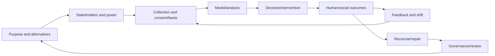

伦理不是model-only property；任何stage都可产生harm或纠正它。

### 5.2 purpose test

| Question | Evidence |
|---|---|
| What concrete benefit? | user/public outcome hypothesis |
| Who benefits? | stakeholder distribution |
| Who bears errors/risk? | harm scenarios by group |
| Is it necessary? | less-invasive alternatives |
| Is it legitimate? | rights/law/professional norms |
| How will it end? | sunset/decommission/deletion |

### 5.3 stakeholder-power map

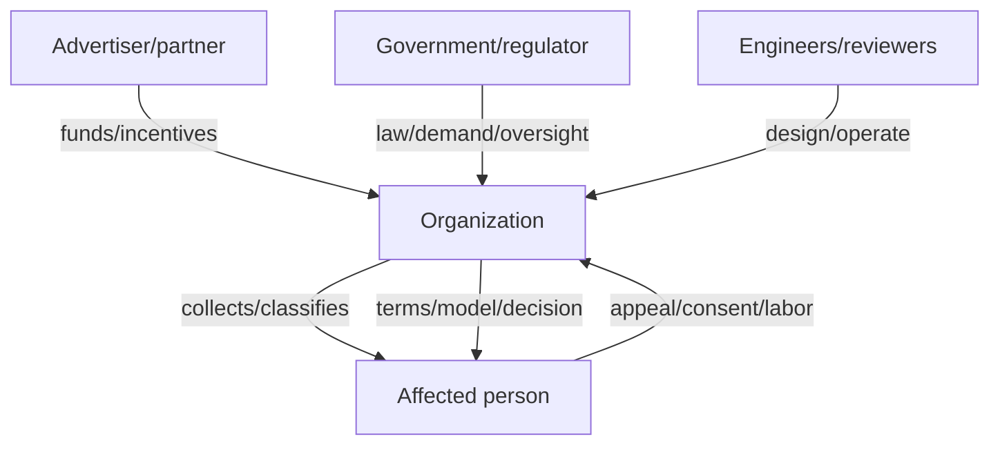

arrow strength、knowledge与ability to exit常不对称。

### 5.4 harm taxonomy

| Harm | Example | Character |
|---|---|---|
| allocation | loan/job/insurance denial | material opportunity |
| quality of service | worse accuracy/latency | unequal performance |
| representational | stereotype/mislabel | dignity/social meaning |
| privacy | exposure/inference | agency/security |
| autonomy | manipulation/addiction | choice distortion |
| collective | polarization/surveillance | societal/institutional |
| future | repurpose/regime change | long-tail uncertainty |

### 5.5 predictive decision stack

```text
historical world
    -> sampled/measured data
    -> labels/features
    -> model score/uncertainty
    -> threshold/policy
    -> human or automated action
    -> outcome/opportunity
    -> future data
```

每个arrow包含human choice；“model did it”隐藏stack。

### 5.6 error-distribution map

同时报告：

- overall + group/intersection sample sizes；
- selection rate；
- TPR/FNR/FPR/TNR；
- precision/PPV/NPV；
- calibration curves；
- uncertainty/confidence intervals；
- severity/reversibility；
- outcomes after intervention。

metric差异需结合label validity与base rates解释。

### 5.7 fairness-goal map

| Goal | Protects against | Limitation |
|---|---|---|
| demographic parity | unequal selection | ignores qualification/label issues |
| equal opportunity | unequal qualified acceptance | only TPR |
| equalized odds | TPR/FPR gaps | may conflict with calibration |
| predictive parity | decision reliability gaps | may imply different error rates |
| calibration | score meaning | not allocation fairness |
| individual recourse | wrong case | not group disparity |

metric是question，不是伦理答案。

### 5.8 accountability chain

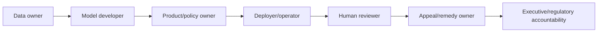

每role写decision authority、evidence duty与incident responsibility。

### 5.9 contestability contract

affected person应获得：notice、decision/result、relevant data、understandable reason、correction path、human reconsideration、deadline与remedy。系统记录appeal ID与original/model/data versions。

### 5.10 feedback-loop map

| System action | Changes future data by | Risk |
|---|---|---|
| deny loan/job | removing opportunity/label observation | self-fulfilling risk |
| recommend content | controlling exposure | echo chamber |
| predictive policing | increasing surveillance in selected area | biased incident counts |
| algorithmic price | competitors react | tacit collusion |
| fraud block | fraudsters/admitted population changes | drift/selection bias |

monitor causal outcomes, not justprediction accuracy。

### 5.11 privacy agency model

privacy controls five decisions：

1. what data；
2. which recipient；
3. which purpose；
4. how long；
5. correction/withdrawal/deletion。

binary public/private或share/not-share不足表达context。

### 5.12 consent evidence map

| Condition | Evidence | Failure example |
|---|---|---|
| free | core service remains usable/no penalty | essential-or-nothing |
| specific | purpose-level choices | bundled ads+service |
| informed | tested plain notice | hidden derived use |
| unambiguous | affirmative action | prechecked box |
| withdrawable | easy control + propagation | no deletion path |

### 5.13 data lifecycle map

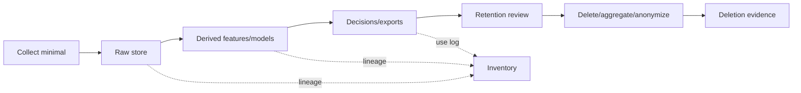

consent/purpose change必须沿lineage传播。

### 5.14 data-power threat model

考虑authorized collector、partner、insider、criminal、acquirer/bankruptcy、government、future regime与model inference。分别评估access、motive、scale、detectability与remedy。

### 5.15 risk-benefit register

| Item | Benefit evidence | Harm | Likelihood/uncertainty | Mitigation | Residual risk | Owner |
|---|---|---|---|---|---|---|

rights/red lines不能仅靠numeric score抵消；register用于reasoned comparison和accountability。

### 5.16 industrial externality map

$$
PrivateObjective=Revenue-Cost
$$

$$
SocialOutcome=PrivateObjective-PrivacyHarm-Discrimination-ExposureRisk
$$

regulation/liability/norms使organization internalize原本由public承担的cost。

### 5.17 governance layers

- team：design review、tests、data owner；
- organization：ethics/privacy/security boards、red lines；
- independent：auditor/researcher/civil society；
- user：notice/control/appeal；
- law/regulator：rights/enforcement/remedy；
- public：transparency/reporting/democratic oversight。

one layer不能self-certify all harms。

### 5.18 claim-to-evidence map

| Claim | Required evidence | Counterexample |
|---|---|---|
| model is accurate | holdout + subgroup + drift tests | FNR gap hidden byaccuracy |
| decision is fair | chosen fairness rationale + outcomes | proxy disparate impact |
| consent is valid | purpose/version/UI/withdraw record | bundled coercive choice |
| collection necessary | alternative analysis | same benefit with aggregate data |
| data is secure | threat tests/incidents | authorized misuse remains |
| deletion works | lineage completion/restore tests | backup/feature copy remains |
| system helps users | human outcome evidence | engagement up, wellbeing down |

### 5.19 launch/stop decision tree

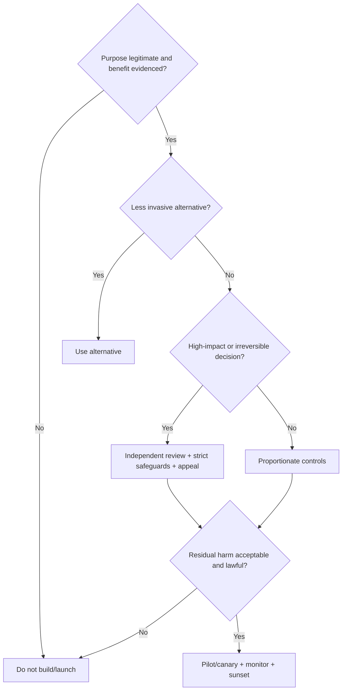

### 5.20 unified ethical mental model

1. start with human purpose/dignity；
2. identify all affected people, including nonusers；
3. map power/incentives and errors；
4. minimize collection/use/retention；
5. test model and policy by groups/cases；
6. provide knowledge, choice, appeal, repair；
7. monitor feedback and real outcomes；
8. govern future reuse/owners；
9. verify deletion and security；
10. keep authority to pause/stop。

这是从ethics原则到工程证据的核心链条。

---

## 6. 综合案例：AI辅助贷款申请与可申诉decision system

### 6.1 case goal

银行希望提高loan application处理速度、识别default risk并扩大access，同时不得systematically exclude protected/disadvantaged groups，也不得让wrong data变成无法逃脱的label。

### 6.2 explicit non-goal

model不直接作final adverse decision；它提供risk evidence和uncertainty，policy/human review在legal/ethical framework内决定。automation不能成为责任shield。

### 6.3 core rights and invariants

1. applicant知道automated assistance存在；
2. data relevant、correctable、purpose-limited；
3. no unlawful protected/proxy discrimination；
4. adverse action有specific reason与appeal；
5. same application不因retry被重复处理；
6. model/version/data lineage可audit；
7. human reviewer有real authority；
8. final outcomes持续monitor。

### 6.4 stakeholder map

- applicants及family；
- approved/denied groups与nonapplicants；
- loan officers/reviewers；
- bank risk/compliance/customer support；
- model/data vendors；
- regulators/auditors/civil society；
- communities受credit allocation影响。

### 6.5 architecture

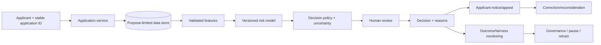

### 6.6 purpose statement

具体purpose是评估ability/willingness to repay并提高processing consistency，不是构建general reputation score、employment profile或sell targeting segments。

### 6.7 less-invasive alternatives

先比较：clear rules/affordability calculation、manual process improvement、smaller feature set、fraud-specific model。若simple transparent rule达到benefit，不应只因AI fashionable使用opaque model。

### 6.8 decision severity

loan denial影响housing/business/education与credit history，属high-impact allocation。false positive/negative成本由bank与applicant不对称承担，需要strong safeguards。

### 6.9 input data inventory

可能需要income、debt、repayment history、loan amount/term；应质疑social media、contacts、location、device graph、shopping/health等是否relevant/necessary。

### 6.10 stable application identity

client生成application ID，retry返回same case/outcome；documents corrections形成version，而非create hidden duplicate applications。decision records链接application version。

### 6.11 label definition

“default”需明确horizon、delinquency threshold、restructure/forbearance。label受economic shock、servicing policy与past approval selection影响，不是pure character trait。

### 6.12 selective labels

历史只观察approved applicants的repayment；denied applicantscounterfactual未知。训练data反映old policy，model可能复制它。

### 6.13 historical discrimination

past unequal access、redlining、income/wealth gaps进入labels/features。预测past outcome并不自动是fair future policy。

### 6.14 protected attributes

protected traits可在fairness audit中受严格控制地使用，以测disparity；不能因“模型不输入”就不收集audit evidence。access/governance需separate。

### 6.15 proxy review

postal code、school、employer、device、name、IP可能proxy race/class/nationality。使用前需necessity、causal/relevance与disparate-impact assessment；有些应禁止。

### 6.16 feature contract

每feature记录definition、source、owner、freshness、missing semantics、protected correlation、allowed purpose、retention与correction path。

### 6.17 data minimization

只保decision/appeal/legal retention必要fields；raw bank transaction descriptions若可由aggregate income/expense features替代，就不复制全文到model platform。

### 6.18 data quality

验证identity match、unit/time period、stale debt、duplicate accounts、missingness by group。missing不自动等high risk，可能是thin-file/newcomer/lack of access。

### 6.19 lawful basis and notice

明确processing basis、credit decision need、fraud/legal obligations。notice说明sources、automated role、recipients、retention、rights；marketing/secondary use分离。

### 6.20 consent boundary

essential credit decision不应假装由freely given blanket consent正当化所有tracking。optional open-banking data需real alternative与no unrelated penalty。

### 6.21 retention schedule

application docs、features、decision reason、appeal与model evidence按different legal/operational periods；到期删除raw/derived copies，legal hold例外可审计。

### 6.22 training environment

least privilege、isolated workspace、no production identifiers where unnecessary、approved exports、encrypted storage、lineage与third-party restrictions。

### 6.23 model objective

不能只minimizedefault loss。objective/selection policy需考虑approval access、false denial、fairness、affordability与uncertainty；rights不是一个可任意加权的小penalty。

### 6.24 score versus decision

model score不是decision。policy结合verified facts、uncertainty、regulatory rules、manual review与applicant context。threshold/version记录在decision log。

### 6.25 uncertainty bands

- low-risk/confident：可fast-track approval（仍过affordability/rules）；
- ambiguous/OOD/missing：manual review/request data；
- high-risk：adverse-action review，不直接silent deny。

### 6.26 fairness evaluation

按group/intersection报告selection、FNR/FPR、precision、calibration、manual referral、appeal/overturn与loan outcomes；带sample size/interval。

### 6.27 metric rationale

选择metrics时说明harm：qualified applicant被拒对应哪类error？bad loan成本如何分担？不能只贴demographic parity数字。

### 6.28 threshold analysis

绘制threshold变化下approval、loss与group errors。若只有通过mass denial才达business target，应重新审视product/risk appetite，而非把harm隐藏为model optimization。

### 6.29 individual reason codes

reason必须基于actionable/relevant verified factors，如income evidence或debt ratio；不能用vague “model score”或proxy。reason与实际decision path一致。

### 6.30 human review design

reviewer获得source evidence、model uncertainty与policy，不显示irrelevant protected traits；有time、training、override authority。记录override/reason并auditautomation bias。

### 6.31 adverse action notice

及时告知decision、major reasons、data sources、correction/appeal steps与deadline。语言plain，不迫使applicant理解ML internals。

### 6.32 appeal workflow

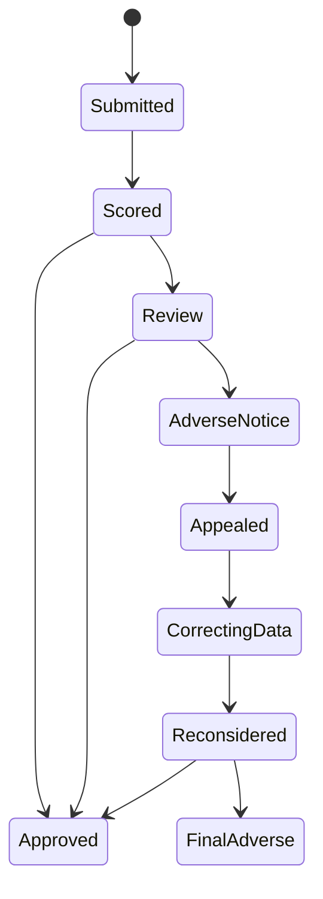

### 6.33 correction semantics

applicant可查看relevant record并提交proof；correction生成new data/application version，re-run same archived model/policy或current authorized reconsideration policy，并保留audit trail。

### 6.34 可运行示例：uncertainty gate 与纠错重审

```python
def decide(score: float, complete: bool) -> str:
    if not complete:
        return "needs-data"
    if score <= 0.40:
        return "approve"
    if score < 0.70:
        return "manual-review"
    return "adverse-action-review"


applications = [
    ("a1", 0.30, True),
    ("a2", 0.55, True),
    ("a3", 0.80, True),
    ("a4", 0.20, False),
]

for application_id, score, complete in applications:
    print(f"{application_id}: {decide(score, complete)}")

corrected_score = 0.38
print(f"a3 after correction: {decide(corrected_score, True)}")
```

实际运行输出：

```text
a1: approve
a2: manual-review
a3: adverse-action-review
a4: needs-data
a3 after correction: approve
```

示例没有自动final denial；高risk进入review，data correction可改变outcome。真实threshold必须基于validated policy与law。

### 6.35 decision record

保存application/data/model/policy versions、score/uncertainty、reason codes、reviewer inputs/override、notice、appeal/outcome。限制access/retention并防tampering。

### 6.36 accountability

named product/risk/model/data/privacy owners；independent model risk/ethics/compliance review；executive对launch与residual harm负责。vendor不能承担全部责任。

### 6.37 vendor model

要求training/data documentation、subgroup evaluation、change notice、audit rights、security、incident support与exit/export。black-box contract不适合uncontestable high-impact use。

### 6.38 prelaunch shadow

model在historical/prospective shadow mode给recommendation但不影响decision；比较human process、group disparities与errors，确认benefit而非只offline AUC。

### 6.39 pilot/canary

limited population/loan type，additional review，明确stop criteria。不要把最vulnerable people当unprotected experiment subjects。

### 6.40 launch gates

- purpose/necessity approved；
- data/label quality acceptable；
- fairness/robustness thresholds；
- explanations/appeals operational；
- security/privacy/deletion tested；
- rollback/manual fallback capacity；
- independent sign-off。

### 6.41 outcome monitoring

不仅monitor model AUC/latency，还看approval/access、repayment、complaints、appeals、overturns、hardship、group economic outcomes与manual reviewer patterns。

### 6.42 feedback loop

deny applicants后无repayment labels，approved population随model改变；economic downturn改变defaults。定期评估selection bias/drift，不把model-induced data当natural truth。

### 6.43 monitoring loop

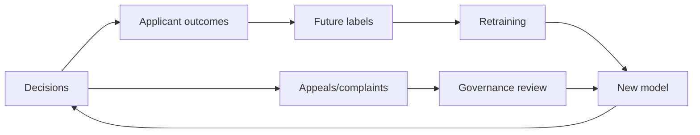

### 6.44 recourse metrics

appeal rate、time-to-resolution、data-error rate、overturn rate by group、remedy completeness。low appeal可能表示barrier/ignorance，不一定accuracy高。

### 6.45 fairness incident

发现group FNR spike：pause/route manual、preserve evidence、notify owners、identifydata/model/policy cause、repair affected decisions、communicate、revalidate before resume。

### 6.46 privacy incident

unauthorized feature/export：revoke access、contain copies、assess subjects/harm、notify as required、delete derived artifacts/retrain if needed、fix lineage/policy。

### 6.47 model drift

population/economy/product changes触发calibration/error drift。drift threshold触发review，不自动retrain/deploy；new model需same governance gates。

### 6.48 security controls

strong auth、least privilege、segmented environments、encryption/key rotation、access anomaly detection、secure deletion、vendor controls与incident drills。

### 6.49 purpose creep controls

loan features/model outputs不得用于employment/ads/general reputation。purpose tags、separate stores/access、contract/legal enforcement与monitoring阻止reuse。

### 6.50 data subject access/deletion

提供relevant records/correction；按law/retention处理deletion。derived features、copies与vendor exports通过lineage追踪；decision evidence的required retention透明说明。

### 6.51 transparency report

发布system purpose、automated role、data categories、aggregate approval/error/appeal outcomes、major changes/incidents与governance，不泄露individual data或enable gaming beyondreasonable risk。

### 6.52 independent audit

auditor检查data lineage、labels、metrics、appeal samples、reviewer behavior、security、vendor与outcome. access必须足够，不只是阅读company-selected dashboard。

### 6.53 worker voice

engineers/reviewers应有safe escalation、documented dissent与stop-the-line authority。performance incentives不得惩罚提出ethical risk。

### 6.54 sunset and reauthorization

model/purpose设expiry；到期重新证明benefit、fairness、necessity与controls。unused models/data删除，防zombie system持续decide。

### 6.55 fault/abuse matrix

| Scenario | Required response |
|---|---|
| duplicate submission | same application/outcome |
| wrong credit record | correction + reconsideration/remedy |
| subgroup error spike | pause/manual path/investigate |
| model unavailable | safe manual fallback, no arbitrary deny |
| vendor silent update | block deployment/change control |
| proxy feature discovered | remove/reassess affected cases |
| appeal backlog | capacity/SLA escalation |
| data breach | contain/notify/delete/repair |
| purpose reuse request | new review; default deny |
| retention expiry | verified deletion across lineage |

### 6.56 red lines

no secret final denials、no irrelevant intimate/social data、no unappealable decision、no deployment without subgroup evidence、no coercive optional-data consent、no indefinite retention、no reuse asgeneral reputation score。

### 6.57 known limitations

fairness definitions conflict；labels/counterfactuals imperfect；human reviewers biased；appeal不能消除initial harm；privacy/security不perfect；economic outcomes受many factors。transparency about limits是responsibility的一部分。

### 6.58 case conclusion

responsible lending不是给model加fairness metric，而是重新设计whole decision institution：minimal relevant data、uncertainty-aware policy、real human judgment、specific reasons、accessible appeal、continuous group/outcome monitoring、purpose limits与accountable power。

技术的role是support fair evidence and repair，不是把person压缩成不可质疑的score。

---

## 7. 核心结论

### 7.1 三十二条核心结论

1. technically correct、reliable system仍可能造成large social harm；伦理是architecture correctness之外的必要维度。
2. personal data描述真实people的生活、identity与relationships，human dignity必须是first-class design constraint。
3. ethics不是one-time checklist，而是affected people参与、持续evidence与accountability的iterative process。
4. 每个project必须先证明legitimate purpose、actual benefit、affected stakeholders与less harmful alternatives。
5. high-impact prediction中的error cost常不对称：organization节省risk，individual承担false denial。
6. many automated denials可组合为algorithmic prison，严重限制jobs、housing、finance、insurance与social participation。
7. ML从historical data学习；past discrimination、measurement与selection policy会被codify/amplify。
8. 删除protected column不足以fair，postal code/IP/school等proxies可重构protected traits。
9. high aggregate accuracy可掩盖group/intersection FNR/FPR disparities，不能当fairness proof。
10. fairness metrics可能互相冲突；选择metric是关于rights/harms的normative decision。
11. calibrated population probability不是individual truth；uncertainty不应被转成不可申诉的absolute label。
12. data/model/vendor不能承担moral responsibility；organization和named people必须对use/outcomes负责。
13. high-impact decisions需要specific reasons、data correction、human reconsideration、accessible appeal与timely remedy。
14. model decisions改变opportunity/exposure与future labels，形成self-reinforcing feedback loops。
15. systems thinking必须同时分析software、people、institutions、incentives、delays与unintended consequences。
16. behavioral tracking可改善ranking/UI/recommendations，但purpose与business model可能让它越界为surveillance。
17. surveillance的关键不是sensor类型，而是collector利益、opacity、power asymmetry与subject缺乏control。
18. privacy不是absolute secrecy，而是individual决定what/to whom/why/how long的contextual agency。
19. meaningful consent需freely given、specific、informed、unambiguous、withdrawable；点击按钮本身不够。
20. essential services、network effects、dark patterns与engagement manipulation会使formal opt-in不自由。
21. security防unauthorized access；privacy还约束authorized collection/use。encrypted overcollection仍有harm。
22. personal data既是economic asset，也是hazardous material、breach target与future coercion capability。
23. collection必须考虑acquirer、bankruptcy、insider、criminal和future governments，而非只信today’s owner。
24. 能scrutinize others而avoid scrutiny oneself会集中power；transparency、oversight与recourse用于counterbalance。
25. Industrial Revolution说明innovation不会自动internalize pollution、worker与safety harms；data economy也需social safeguards。
26. law提供minimum floor并纠正externalities，但weak enforcement/lag意味着legal compliance不等ethical outcome。
27. data minimization同时降低privacy、security、governance与future-use risk，是最强的preventive control之一。
28. retention/deletion需覆盖raw、derived、model、exports、backups与partners；logical delete标记不够。
29. responsible innovation不要求zero risk，而要求necessity、proportionality、rights、reversibility、recourse与residual-risk honesty。
30. prelaunch metrics/good intention不够；必须持续monitor real human/group outcomes、feedback、complaints与appeals。
31. engineers的professional duty包括提出impact、build safeguards、document dissent，并在明显unsafe时pause/stop。
32. 做正确的事，就是让technology增强people的agency与wellbeing，而非把people变成无权质疑的scores、segments和surveillance inputs。

---

## 8. 负责任数据系统的一般方法

### 8.1 第一步：写清purpose与red lines

用具体human/public benefit描述purpose，列prohibited uses与不可交易rights。避免“improve service/AI innovation”这类无法审计的目标。

### 8.2 第二步：识别all stakeholders与power

包括users、nonusers、denied/unobserved groups、workers、partners、communities与future subjects。标谁benefits、谁bears error、谁能exit/appeal/stop。

### 8.3 第三步：比较less harmful alternatives

比较no-build、simple rules、manual improvement、aggregate/on-device processing、smaller scope与shorter retention。证明chosen system必要且proportionate。

### 8.4 第四步：建立data inventory并minimize

每field/source/inference记录purpose、necessity、sensitivity、proxy risk、owner、recipients、retention、lineage与deletion。默认不收而非默认全收。

### 8.5 第五步：确定lawful basis与meaningful control

区分consent、contract、legal/legitimate basis；consent按free/specific/informed/unambiguous/withdrawable验证。提供plain notice、purpose choices与usable controls。

### 8.6 第六步：审查labels、features与historical process

确认label是否ground truth、谁被missing、past policy怎样selection、features是否protected proxies。与domain/affected experts共同review。

### 8.7 第七步：定义error和fairness evidence

从harm映射TP/FP/FN/TN，按group/intersection报告rates、selection、calibration、uncertainty与severity。说明metric choice和incompatibilities。

### 8.8 第八步：做systems/feedback analysis

画decision如何改变opportunity、behavior、exposure与future data；分析self-fulfilling prediction、gaming、market reaction与long-term inequality。

### 8.9 第九步：设计uncertainty-aware decision policy

model output只是evidence。定义confidence/OOD/missing bands、manual route、hard policy与safe fallback；high harm时不自动final adverse action。

### 8.10 第十步：构建notice、explanation与recourse

给specific relevant reasons、data access/correction、human review、appeal ID/SLA与remedy。测试real people能否理解和完成流程。

### 8.11 第十一步：设计privacy/security lifecycle

least privilege、purpose-scoped access、separation、encryption、on-device/aggregate alternatives、TTL、deletion propagation、breach response与backup expiry。

### 8.12 第十二步：明确accountability和vendor governance

named owners、independent review、launch/stop authority、worker escalation、audit rights与public reporting。vendor change不得silent enter production。

### 8.13 第十三步：shadow、pilot、launch gate与rollback

先shadow evidence，再limited pilot/canary；保护vulnerable groups，预设stop criteria、manual fallback与rollback。不得边造成high-impact harm边“学习”。

### 8.14 第十四步：持续monitor outcomes与incidents

monitor subgroup errors、selection、appeals/overturns、human overrides、complaints、wellbeing/economic outcomes、drift、purpose use与security incidents。发现harm有pause/repair protocol。

### 8.15 第十五步：retention、deletion、sunset与reauthorization

自动expire不必要data/models；验证all lineage copies；purpose/model设sunset，到期重新证明benefit/necessity/fairness。删除zombie systems。

### 8.16 第十六步：写入Ethical Impact ADR与runbook

```text
specific purpose, expected human/public benefit, and prohibited uses:
affected users, nonusers, groups, workers, and power asymmetries:
alternatives considered and necessity/proportionality rationale:
data sources, fields, inferred attributes, proxies, and minimization:
lawful basis, consent conditions, notice, and user controls:
label validity, selection/measurement bias, and missing populations:
model objectives, uncertainty, thresholds, and human-review policy:
fairness metrics by group/intersection and chosen normative rationale:
feedback loops, counterfactual gaps, and long-term outcome hypotheses:
decision reasons, correction, appeal, remedy, and service-level targets:
privacy/security architecture, access, retention, lineage, and deletion:
accountable owners, independent review, vendor controls, and escalation:
shadow/pilot/launch gates, red lines, rollback, and manual fallback:
postdeployment outcomes, complaints, drift, incidents, and pause rules:
transparency reporting, external audit, worker voice, and public oversight:
sunset/reauthorization date, residual risks, and known limitations:
```

方法的核心顺序是：**先证明purpose值得且必要，再最小化data与power；把statistical model放进可解释、可申诉、可停止的human institution中，持续观察feedback与真实outcomes，并让retention、deletion和sunset结束风险。**

---

## 9. References

以下保留原章编号与链接，共 50 条。

### 9.1 References [1]–[17]

1. David Schmudde. [“What If Data Is a Bad Idea?”](https://schmud.de/posts/2024-08-18-data-is-a-bad-idea.html) August 2024.
2. Association for Computing Machinery. [“ACM Code of Ethics and Professional Conduct.”](https://www.acm.org/code-of-ethics) 2018.
3. Igor Perisic. [“Making Hard Choices: The Quest for Ethics in Machine Learning.”](https://www.linkedin.com/blog/engineering/archive/making-hard-choices-the-quest-for-ethics-in-machine-learning) November 2016.
4. John Naughton. [“Algorithm Writers Need a Code of Conduct.”](https://www.theguardian.com/commentisfree/2015/dec/06/algorithm-writers-should-have-code-of-conduct) December 2015.
5. Deborah G. Johnson and Mario Verdicchio. [“Ethical AI Is Not About AI.”](https://cacm.acm.org/opinion/ethical-ai-is-not-about-ai/) *Communications of the ACM*, January 2023. [doi:10.1145/3576932](https://doi.org/10.1145/3576932)
6. Ben Green. [“‘Good’ Isn’t Good Enough.”](https://www.benzevgreen.com/wp-content/uploads/2019/11/19-ai4sg.pdf) *NeurIPS AI for Social Good Workshop*, December 2019.
7. Marc Steen. [“Ethics as a Participatory and Iterative Process.”](https://cacm.acm.org/opinion/ethics-as-a-participatory-and-iterative-process/) *Communications of the ACM*, April 2023. [doi:10.1145/3550069](https://doi.org/10.1145/3550069)
8. Logan Kugler. [“What Happens When Big Data Blunders?”](https://cacm.acm.org/news/what-happens-when-big-data-blunders/) *Communications of the ACM*, June 2016. [doi:10.1145/2911975](https://doi.org/10.1145/2911975)
9. Miri Zilka. [“Algorithms and the Criminal Justice System: Promises and Challenges in Deployment and Research.”](https://www.cl.cam.ac.uk/research/security/seminars/archive/video/2023-03-07-t196231.html) University of Cambridge Security Seminar, March 2023.
10. Bill Davidow. [“Welcome to Algorithmic Prison.”](https://www.theatlantic.com/technology/archive/2014/02/welcome-to-algorithmic-prison/283985/) February 2014.
11. Don Peck. [“They’re Watching You at Work.”](https://www.theatlantic.com/magazine/archive/2013/12/theyre-watching-you-at-work/354681/) December 2013.
12. Leigh Alexander. [“Is an Algorithm Any Less Racist Than a Human?”](https://www.theguardian.com/technology/2016/aug/03/algorithm-racist-human-employers-work) August 2016.
13. Jesse Emspak. [“How a Machine Learns Prejudice.”](https://www.scientificamerican.com/article/how-a-machine-learns-prejudice/) December 2016.
14. Rohit Chopra, Kristen Clarke, Charlotte A. Burrows, and Lina M. Khan. [“Joint Statement on Enforcement Efforts Against Discrimination and Bias in Automated Systems.”](https://www.ftc.gov/system/files/ftc_gov/pdf/EEOC-CRT-FTC-CFPB-AI-Joint-Statement%28final%29.pdf) April 2023.
15. Maciej Cegłowski. [“The Moral Economy of Tech.”](https://idlewords.com/talks/sase_panel.htm) June 2016.
16. Greg Nichols. [“Artificial Intelligence in Healthcare Is Racist.”](https://www.zdnet.com/article/artificial-intelligence-in-healthcare-is-racist/) November 2020.
17. Cathy O’Neil. *Weapons of Math Destruction: How Big Data Increases Inequality and Threatens Democracy*. Crown Publishing, 2016.

### 9.2 References [18]–[34]

18. Julia Angwin. [“Make Algorithms Accountable.”](https://www.nytimes.com/2016/08/01/opinion/make-algorithms-accountable.html) August 2016.
19. Bryce Goodman and Seth Flaxman. [“European Union Regulations on Algorithmic Decision-Making and a ‘Right to Explanation.’”](https://arxiv.org/abs/1606.08813) *ICML Human Interpretability Workshop*, June 2016.
20. United States Senate Committee on Commerce, Science, and Transportation. [“A Review of the Data Broker Industry: Collection, Use, and Sale of Consumer Data for Marketing Purposes.”](https://www.commerce.senate.gov/services/files/0d2b3642-6221-4888-a631-08f2f255b577) December 2013.
21. Stephanie Assad, Robert Clark, Daniel Ershov, and Lei Xu. [“Algorithmic Pricing and Competition: Empirical Evidence from the German Retail Gasoline Market.”](https://economics.yale.edu/sites/default/files/clark_acex_jan_2021.pdf) *Journal of Political Economy*, March 2024. [doi:10.1086/726906](https://doi.org/10.1086/726906)
22. Donella H. Meadows and Diana Wright. *Thinking in Systems: A Primer*. Chelsea Green Publishing, 2008.
23. Daniel J. Bernstein. [“Listening to a ‘big data’/‘data science’ talk. Mentally translating ‘data’ to ‘surveillance’.”](https://x.com/hashbreaker/status/598076230437568512) May 2015.
24. Marc Andreessen. [“Why Software Is Eating the World.”](https://a16z.com/why-software-is-eating-the-world/) August 2011.
25. J. M. Porup. [“‘Internet of Things’ Security Is Hilariously Broken and Getting Worse.”](https://arstechnica.com/information-technology/2016/01/how-to-search-the-internet-of-things-for-photos-of-sleeping-babies/) January 2016.
26. Bruce Schneier. [*Data and Goliath: The Hidden Battles to Collect Your Data and Control Your World*](https://www.schneier.com/books/data_and_goliath/). W. W. Norton, 2015.
27. The Grugq. [“Nothing to Hide.”](https://grugq.tumblr.com/post/142799983558/nothing-to-hide) April 2016.
28. Federal Trade Commission. [“FTC Takes Action Against General Motors for Sharing Drivers’ Precise Location and Driving Behavior Data Without Consent.”](https://www.ftc.gov/news-events/news/press-releases/2025/01/ftc-takes-action-against-general-motors-sharing-drivers-precise-location-driving-behavior-data) January 2025.
29. Tony Beltramelli. [“Deep-Spying: Spying Using Smartwatch and Deep Learning.”](https://arxiv.org/abs/1512.05616) Master’s thesis, December 2015.
30. Shoshana Zuboff. [“Big Other: Surveillance Capitalism and the Prospects of an Information Civilization.”](https://papers.ssrn.com/sol3/papers.cfm?abstract_id=2594754) *Journal of Information Technology*, April 2015. [doi:10.1057/jit.2015.5](https://doi.org/10.1057/jit.2015.5)
31. Michiel Rhoen. [“Beyond Consent: Improving Data Protection Through Consumer Protection Law.”](https://policyreview.info/articles/analysis/beyond-consent-improving-data-protection-through-consumer-protection-law) *Internet Policy Review*, March 2016. [doi:10.14763/2016.1.404](https://doi.org/10.14763/2016.1.404)
32. European Union. [“Regulation (EU) 2016/679 (General Data Protection Regulation).”](https://eur-lex.europa.eu/eli/reg/2016/679/oj/eng) May 2016.
33. UK Information Commissioner’s Office. [“What Is the ‘Legitimate Interests’ Basis?”](https://ico.org.uk/for-organisations/uk-gdpr-guidance-and-resources/lawful-basis/legitimate-interests/what-is-the-legitimate-interests-basis/)
34. Tristan Harris. [“How a Handful of Tech Companies Control Billions of Minds Every Day.”](https://www.ted.com/talks/tristan_harris_how_a_handful_of_tech_companies_control_billions_of_minds_every_day) *TED2017*, April 2017.

### 9.3 References [35]–[50]

35. Carina C. Zona. [“Consequences of an Insightful Algorithm.”](https://www.youtube.com/watch?v=YRI40A4tyWU) *GOTO Berlin*, November 2016.
36. Imanol Arrieta Ibarra, Leonard Goff, Diego Jiménez Hernández, Jaron Lanier, and E. Glen Weyl. [“Should We Treat Data as Labor? Moving Beyond ‘Free.’”](https://www.aeaweb.org/conference/2018/preliminary/paper/2Y7N88na) *AEA Papers and Proceedings*, May 2018.
37. Bruce Schneier. [“Data Is a Toxic Asset, So Why Not Throw It Out?”](https://www.schneier.com/essays/archives/2016/03/data_is_a_toxic_asse.html) March 2016.
38. Cory Scott. [“Data is not toxic—which implies no benefit—but rather hazardous material, where we must balance need vs. want.”](https://x.com/cory_scott/status/706586399483437056) March 2016.
39. Mark Pesce. [“Data Is The New Uranium—Incredibly Powerful And Amazingly Dangerous.”](https://www.theregister.com/2024/11/20/data_is_the_new_uranium/) November 2024.
40. Bruce Schneier. [“Mission Creep: When Everything Is Terrorism.”](https://www.schneier.com/essays/archives/2013/07/mission_creep_when_e.html) July 2013.
41. Lena Ulbricht and Maximilian von Grafenstein. [“Big Data: Big Power Shifts?”](https://policyreview.info/articles/analysis/big-data-big-power-shifts) *Internet Policy Review*, March 2016. [doi:10.14763/2016.1.406](https://doi.org/10.14763/2016.1.406)
42. Ellen P. Goodman and Julia Powles. [“Facebook and Google: Most Powerful and Secretive Empires We’ve Ever Known.”](https://www.theguardian.com/technology/2016/sep/28/google-facebook-powerful-secretive-empire-transparency) September 2016.
43. Judy Estrin and Sam Gill. [“The World Is Choking on Digital Pollution.”](https://washingtonmonthly.com/2019/01/13/the-world-is-choking-on-digital-pollution/) January 2019.
44. A. Michael Froomkin. [“Regulating Mass Surveillance as Privacy Pollution: Learning from Environmental Impact Statements.”](https://repository.law.miami.edu/cgi/viewcontent.cgi?article=1062&context=fac_articles) *University of Illinois Law Review*, August 2015.
45. Pengyuan Wang, Li Jiang, and Jian Yang. [“The Early Impact of GDPR Compliance on Display Advertising: The Case of an Ad Publisher.”](https://openreview.net/pdf?id=TUnLHNo19S) *Journal of Marketing Research*, April 2023. [doi:10.1177/00222437231171848](https://doi.org/10.1177/00222437231171848)
46. Johnny Ryan. [“Don’t Be Fooled by Meta’s Fine for Data Breaches.”](https://www.economist.com/by-invitation/2023/05/24/dont-be-fooled-by-metas-fine-for-data-breaches-says-johnny-ryan) *The Economist*, May 2023.
47. Jessica Leber. [“Your Data Footprint Is Affecting Your Life in Ways You Can’t Even Imagine.”](https://www.fastcompany.com/3057514/your-data-footprint-is-affecting-your-life-in-ways-you-cant-even-imagine) March 2016.
48. Maciej Cegłowski. [“Haunted by Data.”](https://idlewords.com/talks/haunted_by_data.htm) October 2015.
49. Sam Thielman. [“You Are Not What You Read: Librarians Purge User Data to Protect Privacy.”](https://www.theguardian.com/us-news/2016/jan/13/us-library-records-purged-data-privacy) January 2016.
50. Jez Humble. [“If you work in tech to ‘change the world,’ you must consider the impact of your work.”](https://x.com/jezhumble/status/1386758340894597122) April 2021.
