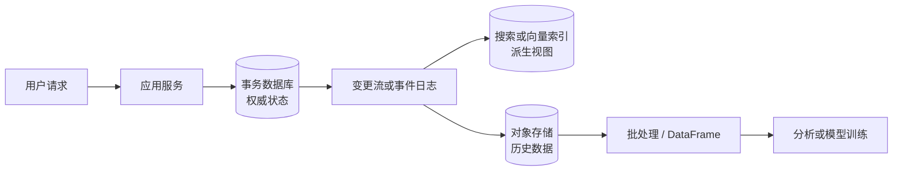
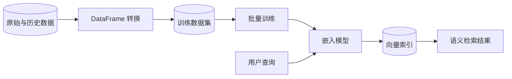
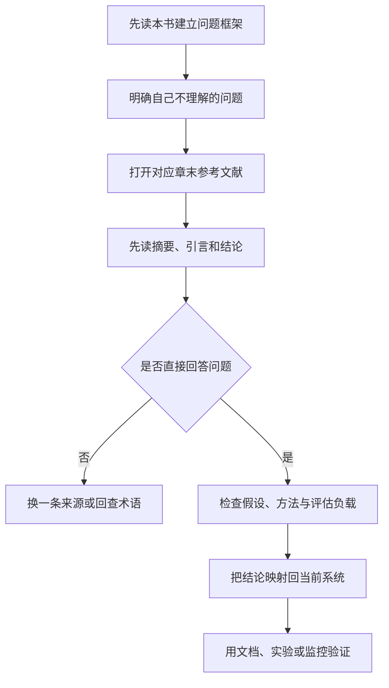
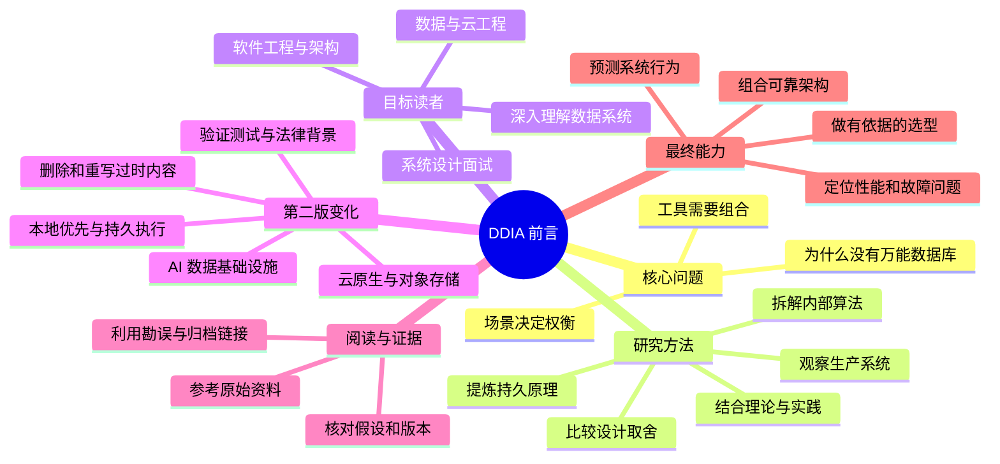
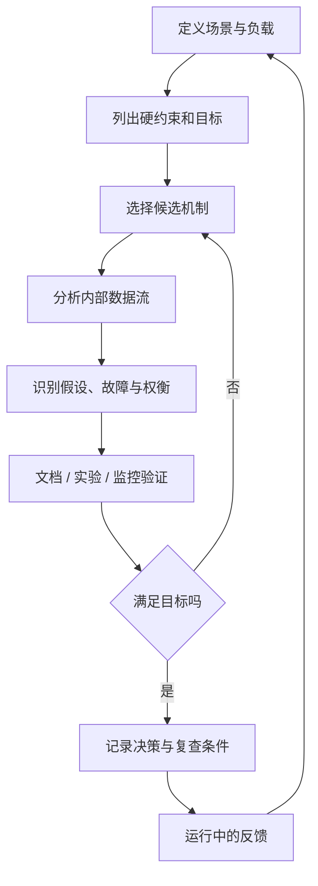

> 对应原文：Preface.md
>
> 本文按照原书前言的顺序整理。前言本身不讲具体公式或算法，它的任务是说明全书研究什么、如何研究、适合谁读，以及第二版为何重写。因此，本文不会虚构“原书公式”；文中标为“分析框架”或“背景补充”的公式、案例和图表，是为了把作者的方法论变成可操作的思考工具。

## 0. 前言开场：为什么数据系统没有唯一正确答案

### 0.1 从一个无法脱离上下文回答的问题开始

前言首先提出一个工程师经常遇到的问题：面对数百种数据库，应用究竟应该选择哪一种？

作者给出的短答案是：**视情况而定（It depends）**。整本书则是这个短答案的长版本。

这里的“视情况而定”不是回避判断，而是在指出数据系统设计的基本事实：

1. 不同系统优化的目标不同。
2. 多个目标之间经常互相冲突。
3. 应用的负载、数据、故障代价和团队能力各不相同。
4. 因而，脱离场景谈“最好的数据库”没有意义。

例如，一个支付系统可能优先要求事务正确性、审计能力和可恢复性；一个日志分析系统可能更看重写入吞吐量、压缩率和大规模扫描效率；一个语义搜索系统还需要按向量相似度检索。三者都在“存储和处理数据”，但它们对“好”的定义并不相同。

这也解释了为什么作者不把本书写成某个数据库的使用手册。产品会迭代、流行技术会更替，具体命令也会过时；决定系统行为的基本约束、算法思想和工程权衡却更持久。

### 0.2 核心概念一：权衡，而不是排行榜

**权衡（trade-off）**是指：为了改善某一项性质，系统往往必须付出另一项代价。常见的权衡包括：

| 想改善的性质 | 可能付出的代价 | 为什么会发生 |
| --- | --- | --- |
| 更强的一致性 | 更高延迟或更低可用性 | 操作可能需要等待更多节点确认 |
| 更高写入吞吐量 | 更复杂的读取、合并或压缩 | 写入阶段推迟了一部分整理工作 |
| 更多副本 | 更高成本和更复杂的协调 | 数据必须被传输、保存并保持同步 |
| 更低查询延迟 | 更多索引和存储空间 | 预先维护了额外的数据结构 |
| 更灵活的数据模型 | 更弱的约束或更复杂的应用逻辑 | 一部分验证责任从数据库转移到了调用方 |
| 更强的抽象和托管能力 | 更少的底层控制与可见性 | 平台隐藏了实现细节，也限制了调优手段 |

表中的具体权衡属于全书后续章节要展开的内容；前言先确立判断方式：**任何优势都应追问它以什么为代价、在什么前提下成立。**

因此，技术选型不能只比较功能清单。真正的问题应该是：

- 系统需要满足哪些硬约束？
- 哪些指标最重要，哪些可以妥协？
- 正常负载、峰值负载和故障状态分别是什么？
- 数据规模、访问模式和增长速度如何？
- 团队能否正确运行、监控和修复该技术？
- 当假设改变时，迁移成本有多高？

### 0.3 分析框架：把“视情况而定”变成可检查的决策

下面的公式不是原书前言中的公式，而是对其方法论的形式化表达。

先不要给所有候选系统简单加权打分，而应先排除不能满足硬约束的方案。设候选架构集合为 $X$，硬约束为 $g_k(x) \le b_k$，则可行集合为：

$$
\mathcal{F}=\{x\in X\mid g_k(x)\le b_k,\ k=1,2,\ldots,m\}
$$

硬约束可能是：

- $p99$ 延迟不得超过 200 ms；
- 数据恢复点目标（RPO）不得超过 5 分钟；
- 数据必须存放在指定司法辖区；
- 必须支持某种事务或审计语义；
- 月成本不得超过预算上限。

只有对 $x\in\mathcal{F}$ 的方案，才适合比较软目标。一个简化的效用模型可以写成：

$$
U(x\mid c)=\sum_{i=1}^{n}w_i(c)\,\hat q_i(x)-\lambda(c)R(x)
$$

其中：

- $c$ 表示具体应用上下文；
- $\hat q_i(x)$ 是归一化后的第 $i$ 项质量，例如性能、可维护性或成本效率；
- $w_i(c)$ 是当前场景对该质量的权重；
- $R(x)$ 是方案的不确定性或实施风险；
- $\lambda(c)$ 表示当前组织对风险的敏感程度。

这个表达式揭示了“视情况而定”的真正含义：变化的不只是候选技术的能力，**场景决定的权重和风险承受能力也在变化**。同一种技术在两个团队中可能得到不同结论，因为一个团队已经具备成熟运维经验，另一个团队还没有。

不过，加权总分也有局限：

1. 估计值可能来自不真实的基准测试。
2. 指标之间可能存在非线性关系，不能简单相加。
3. 高分不能补偿违反正确性、合规性等硬约束。
4. 多个组件组合后的行为不等于单个组件分数之和。
5. 权重会随业务阶段和负载变化，决策需要复查。

更稳妥的做法是同时观察 **Pareto 前沿**。若方案 $A$ 在所有关键指标上都不差于方案 $B$，并且至少一项更好，就说 $A$ 支配 $B$；被支配的方案通常可以淘汰。剩余方案之间没有绝对胜者，只能依据场景选择。这正是作者所说“没有一种方法适合所有情况”的数学直觉。

### 0.4 核心概念二：从产品名称下沉到持久原理

技术生态变化很快，但作者认为底层原理相对稳定。理解原理有三层价值：

1. **定位工具**：知道某项技术在整个数据系统版图中的位置。
2. **正确使用**：知道它的假设、擅长的负载和必要的配套机制。
3. **避开陷阱**：能预判在规模增长、故障或需求变化后会出现什么问题。

“原理”并不意味着只学抽象理论。它通常要通过以下问题落到实现：

- 数据在磁盘、内存、网络和节点之间怎样移动？
- 系统为加速读取或写入维护了哪些数据结构？
- 并发操作如何排序，冲突如何检测？
- 节点失效或网络延迟时，哪些承诺仍然成立？
- 后台整理、复制、重试和恢复会怎样影响前台请求？

产品文档常告诉用户“如何调用”，原理则帮助回答“为什么系统会表现成这样”。只有后者才能迁移到尚未出现的新产品上。

### 0.5 本书既不是产品教程，也不是脱离现实的理论教材

作者在两种常见写法之间选择了第三条路径：

- 不围绕一个产品逐项教学，因为那样容易把偶然的接口当成普遍规律；
- 不只陈列抽象定理，因为工程问题还包含实现成本、性能、故障和运维现实；
- 而是研究大量已在生产环境中证明过自己的数据系统，拆解其内部算法，再比较各自的设计选择。

这里的论证路线可以概括为：

这条路线的重要之处在于：案例不是为了证明某个产品永远正确，而是作为理解设计空间的证据。一个系统“成功”，也不代表它的每项选择都适合另一个应用；必须继续追问它当时面对的负载、资源和组织约束。

### 0.6 从“如何工作”进一步追问“为什么这样工作”

前言明确区分了两个层次：

- **How**：系统采用了什么结构和算法，数据如何流动；
- **Why**：它试图解决什么困难，为什么没有选择其他方案，代价是什么。

只知道 How，容易把现有实现当成不可改变的事实。理解 Why，才能在约束变化时判断原设计是否仍适用。

分析一个数据系统时，可以依次追问：

1. 它承诺了什么外部语义？
2. 实现这些语义的主要困难是什么？
3. 它依赖了哪些关于负载、时钟、网络或故障的假设？
4. 核心机制如何利用这些假设解决困难？
5. 哪些成本被转移到了读、写、后台任务、运维或用户侧？
6. 假设被破坏时，系统以何种方式退化？

这六个问题贯穿全书，也构成一种比背诵产品特性更可靠的学习方法。

### 0.7 学完本书应获得的能力

作者期望读者最终获得的不是一张固定的技术选型表，而是四种能力：

1. 判断哪类技术适合哪类用途。
2. 把多种工具组合成可靠的应用架构。
3. 对系统内部行为形成直觉，能够预测性能与故障表现。
4. 在出现异常时，沿着数据流和机制定位原因。

第二点尤其重要。现实架构通常不是“选一个万能数据库”，而是让组件承担不同职责。例如：

这个示例表达的不是一套必须照搬的架构，而是“组合工具”的含义：

- 事务数据库负责需要明确约束的权威状态；
- 搜索索引为特定查询模式提供低延迟派生视图；
- 对象存储保存低成本、大规模的历史数据；
- 批处理系统为分析或训练准备数据。

组合也会引入新问题，例如数据同步、重复处理、顺序、失败恢复和派生视图陈旧。因此，选对单个工具只是开始，还必须理解组件之间的契约。

### 0.8 理论与实践、新思想与旧思想必须相互校正

前言最后给出全书的指导哲学：汇集广泛视角，同时重视理论与实践、新成果与旧成果。

作者批评两种偏差：

| 偏差 | 表现 | 风险 |
| --- | --- | --- |
| 工业界的“新技术崇拜” | 因为概念古老或来自学术界而轻视它 | 重复过去的错误，忽略已经证明有效的基础思想 |
| 学术界脱离实践 | 研究模型很精确，却不了解生产中真正昂贵或高频的问题 | 结论难以落地，优化了次要矛盾 |

本书选择把两者结合起来：

- 用学术研究提供精确定义、模型、论证和历史脉络；
- 用工业实践检验问题是否重要、方案是否可运行、代价是否可接受。

两者不是互相替代。理论帮助识别“不可能同时得到什么”，实践帮助判断“在当前条件下应该牺牲什么”。旧思想也不等于旧实现：几十年前形成的原则，可能在新的硬件、云平台或应用形态下以另一种形式重新出现。

## 1. 谁应该阅读本书

### 1.1 软件工程师、架构师和技术管理者

这类读者需要选择工具、设计系统边界，并决定工具应如何使用，尤其常见于后端系统。

他们面临的难点不是“有没有某功能”，而是：

- 需求经常不完整，非功能目标之间还会冲突；
- 架构决策具有长期影响，迁移通常昂贵；
- 团队必须同时考虑开发速度、运行成本和故障风险；
- 供应商承诺需要转换成可验证的系统行为。

本书为这类决策提供共同语言，使“我喜欢某个数据库”转变为“它在这些假设下满足这些目标，并且我们接受这些代价”。

### 1.2 数据工程师和云工程师

数据工程师通常直接面对数据摄取、转换、存储、质量与消费链路；云工程师则经常使用高度托管、看似隐藏底层复杂度的服务。

作者强调：抽象隐藏复杂性，并不意味着复杂性消失。正常情况下，用户不必关心副本放在哪里或后台如何压缩数据；但在性能下降、成本异常、数据延迟或服务故障时，底层机制会重新变得可见。

理解原理能够帮助他们：

- 区分计算瓶颈、存储瓶颈和网络瓶颈；
- 理解重试、重复、乱序和部分失败；
- 判断扩容为什么有效或为什么无效；
- 解释托管服务的限制，而不是只依赖默认配置；
- 在跨系统数据链路中定位语义丢失的位置。

### 1.3 希望构建可扩展、高可用、稳健且可维护系统的人

前言列出四类长期目标，它们相关但不能混为一谈。

#### 可扩展性（scalability）

可扩展性不是“现在很快”，而是负载增长时，系统能否通过资源或架构调整继续满足目标。负载可能表现为用户数、请求率、数据量、热点程度、查询复杂度或并发任务数。

一个系统支持“数百万用户”并不能单独证明可扩展，因为活跃比例和请求模式可能完全不同。应把规模描述成可测量的负载参数，并观察资源需求与性能如何随它变化。

#### 高可用性（high availability）

高可用性关注尽量减少不可用时间。若观察窗口为 $T$，可用率为 $A$，则对应的不可用时间为：

$$
D=(1-A)T
$$

以 30 天为例，$99.9\%$ 可用率允许约 43.2 分钟不可用，$99.99\%$ 则约为 4.32 分钟。这个简单计算说明，“多一个 9”不是措辞变化，而是显著压缩了检测、切换和恢复的时间预算。

但可用性必须结合“什么算可用”定义：返回错误结果、只读、延迟严重超标，是否算可用？如果不定义服务级别指标，百分比很容易失去意义。

#### 运行稳健性（operational robustness）

稳健性关注系统在现实运行条件下是否可控，包括故障隔离、监控、容量管理、备份恢复、部署回滚和人员操作。一个算法在理想条件下正确，不代表整个服务在值班、升级和依赖故障中仍然可靠。

#### 长期可维护性（maintainability）

可维护性关注系统增长、需求变化和技术演进后，团队还能否理解并安全修改它。它不仅是代码整洁，还涉及数据模型能否演化、接口是否稳定、组件是否可替换、历史决策是否可追踪。

四者的关系可以概括为：可扩展性处理增长，高可用性处理服务中断，运行稳健性处理现实中的操作与故障，可维护性处理时间带来的变化。只优化其中一项，无法自动得到“好系统”。

### 1.4 准备系统设计面试的人

系统设计面试要求候选人画出应用架构，但真正考察的不应只是画出缓存、队列和数据库图标。前言所倡导的方法可以转化为面试中的推理顺序：

1. 澄清功能需求与非功能需求。
2. 量化负载、数据规模和关键服务级别目标。
3. 确认正确性、持久性、合规性等硬约束。
4. 提出最小可行架构，并说明每个组件解决的问题。
5. 找出瓶颈、故障模式和数据一致性边界。
6. 根据增长路径逐步扩展，而不是一开始堆满组件。
7. 明确每项选择的替代方案与代价。

这与本书的核心完全一致：好的设计不是组件数量多，而是选择与约束之间存在清晰因果关系。

### 1.5 想看懂大型在线服务内部机制的读者

这类读者的动力可能不是立即做架构决策，而是希望越过流行术语，准确理解网站、数据库和数据处理系统背后的机制。

“越过术语”意味着：

- 遇到“实时”时，追问延迟范围和一致性边界；
- 遇到“无限扩展”时，追问分片、热点与协调成本；
- 遇到“无服务器”时，追问服务器管理责任转移到了哪里；
- 遇到“智能检索”时，追问索引、距离度量、召回率与更新方式。

术语可以帮助交流，但只有可验证的定义、机制和约束才能支持技术判断。

### 1.6 前置知识与不要求的知识

作者假定读者已经：

- 有一定 Web 应用开发经验；
- 熟悉关系数据库与 SQL；
- 最好对 TCP、HTTP 等常见网络协议有高层理解。

这些前置知识足以让读者理解“请求如何到达服务”“应用如何读写数据库”“网络为何可能延迟或失败”等基本场景。

作者不限制编程语言和框架，因为本书讨论的是跨语言的数据系统原理。这里也隐含了一个学习边界：重点不是记忆某个客户端 API，而是理解 API 背后的数据语义和运行机制。

## 2. 第二版有哪些变化

### 2.1 保持不变的目标与必须更新的内容

第一版出版于 2017 年。第二版保持相同的目标和范围，但作者全面修订了内容，以反映随后近十年的技术变化，并改善解释的清晰度。

这体现了“持久原理”和“变化实现”之间的关系：

- 如果只保留旧产品案例，读者难以理解当前系统；
- 如果追逐每个新产品，本书很快又会过时；
- 因而第二版保留分析问题的原则，同时更新承载这些原则的技术背景、案例和章节组织。

### 2.2 最大变化之一：AI 对数据系统的需求

第二版不是一本 AI 模型原理书，但 AI 和机器学习的兴起改变了数据基础设施。模型训练与推理都依赖数据的收集、组织、检索、转换和治理，因此仍属于数据系统问题。

作者新增或加强了三类内容。

#### 向量索引（vector index）

传统索引常按精确键、范围或词项查找；向量索引则支持按向量距离寻找相似对象，是语义搜索等应用的重要基础。

它解决的问题是：用户表达与文档文字不完全相同，但语义可能相近。模型先把对象映射到向量空间，检索系统再寻找近邻。

这里会出现新的权衡：精确最近邻搜索可能代价很高，因此工程系统常在召回率、延迟、内存和索引构建成本之间选择。前言没有展开具体算法，但把向量索引纳入全书，说明数据系统的查询模型正在扩展，而“比较权衡”的方法仍然适用。

#### DataFrame

DataFrame 为带名称和类型的表格数据提供转换接口，广泛用于数据分析和训练数据准备。它连接了关系型思维、程序式数据处理与分布式执行。

把 DataFrame 纳入讨论的原因不只是 API 流行，而是训练数据通常要经过选择、连接、清洗、聚合和特征构造。接口背后仍有查询计划、执行、内存布局和并行处理问题。

#### 大规模训练数据的批处理

训练前的数据准备可能扫描和转换海量历史数据。即使在线推理追求低延迟，训练数据管道仍经常需要高吞吐、可重试的批处理。

因此，“AI 兴起”没有让传统数据工程消失，反而提高了对数据质量、血缘、可重复处理和大规模存储计算的要求。

三者的关系可以表示为：

图中只是典型关系，不表示所有系统都采用同一条管道。它说明模型之外仍有大量数据系统工作，而各阶段的正确性、性能和可维护性会共同决定最终效果。

### 2.3 最大变化之二：云原生数据系统架构

第二版把云原生思想贯穿全书，尤其关注在对象存储而非单机本地磁盘之上构建数据系统。

传统数据库往往把本地磁盘视为主要持久介质，并让计算节点直接管理数据。对象存储则提供不同的接口、延迟、成本与持久性模型。基于对象存储的架构常把计算和持久存储解耦：计算节点可以更容易替换或弹性伸缩，数据则独立保存。

引入这种架构主要解决：

- 大规模持久数据的低成本存放；
- 计算与存储独立扩缩容；
- 多个计算集群共享数据；
- 节点短生命周期与弹性调度。

但它也带来新难点：

- 对象访问延迟通常不同于本地块设备；
- 更新、列举和一致性语义需要按对象存储接口重新设计；
- 缓存、元数据与对象内容之间必须协调；
- 计算存储分离可能增加网络流量；
- 供应商接口、费用模型和故障边界会进入架构设计。

所以“迁移到云”不是把原系统原封不动搬到远程磁盘，而是重新考虑存储接口和故障模型。这正好验证了前言的主张：新平台改变了约束，但仍要通过底层机制和权衡来理解。

### 2.4 新增的重要主题

#### 同步引擎与本地优先软件

本地优先软件让用户在本地设备上持有和修改数据，即使暂时离线也能工作；同步引擎随后在设备与服务之间传播变更。

它要解决网络不稳定、低交互延迟、用户数据控制和多设备协作等问题。难点在于并发修改、冲突合并、因果关系、权限变化和删除传播。它与复制、一致性及分布式系统问题直接相关。

#### 工作流引擎与持久执行

普通函数在进程崩溃后会丢失执行状态。持久执行系统把长时间任务的进度和决策记录下来，使任务能够在故障后恢复，并协调重试、定时器和外部操作。

它解决的是跨越较长时间、涉及多个服务的可靠执行问题。其难点包括重复执行的副作用、幂等性、版本演化和外部世界无法回滚。它与事务、日志、消息处理和故障恢复相互连接。

#### 形式化方法与随机化测试

分布式系统存在大量并发顺序和故障组合，只靠几个手写测试案例很难覆盖。形式化方法通过精确模型描述状态和允许的转换，检查不变量是否始终成立；随机化测试则生成大量操作序列和故障场景，寻找反例。

两者分别从“穷举或推理模型状态”和“扩大现实实现的探索范围”提高可信度。它们并非自动证明整个生产系统绝对正确：模型可能遗漏现实假设，随机测试也不能覆盖无限状态。但它们比只测试理想路径更能暴露隐藏错误。

#### GraphQL

GraphQL 允许客户端描述所需的数据形状，服务端再解析并组合数据。它试图减少固定接口返回过多或过少数据的问题，并为跨实体查询提供统一入口。

它与数据模型、查询语言和服务边界有关。灵活性也伴随查询成本预测、缓存、授权和后端扇出等难点，因此仍需分析执行机制，而不能把接口灵活等同于系统高效。

#### GDPR 及相关法律背景

数据系统不仅受性能和正确性约束，也受法律约束。欧盟《通用数据保护条例》（GDPR）等法规使数据收集目的、访问控制、保留、删除、可携带性和审计成为架构问题。

法律要求与技术机制并非天然一一对应。例如，删除一条主记录并不自动删除缓存、副本、搜索索引、对象存储快照和训练数据中的派生信息。把法律背景纳入全书，是在扩大“系统正确”的定义：系统不仅要算得对、跑得快，还要以可证明的方式处理人的数据权利。

### 2.5 删除与重写同样重要

第二版并非只做加法。作者指出 MapReduce 已大体过时，因此重写了批处理章节；同时遗憾地移除了第一版中 Tolkien 风格的地图。

这里容易产生一个误解：**MapReduce 的式微不等于批处理消失。** 被替代的是一种特定的编程和执行模型，批量处理海量有限数据集的需求仍然存在，而且因 AI 训练数据准备而更加重要。

这也展示了判断技术是否过时的方法：

- 区分需求、原理和具体实现；
- 需求可能持续存在；
- 原有实现揭示的容错、数据局部性和并行处理思想可能仍有价值；
- 但新的执行引擎可以提供更灵活的算子和更高效率。

### 2.6 章节重组与解释质量

部分讨论被重新组织，章节编号也发生变化。有些章节只做轻量修改，有些则几乎重写。例如，第 10 章关于一致性与共识的内容被大幅重写，以提高解释清晰度。第二版总体比第一版长约 60 页。

页数增加不是核心目标，重要的是作者同时做了三件事：

1. 更新现实技术版图；
2. 保留仍然有效的基础思想；
3. 对难懂主题重新安排论证顺序。

因此，读第二版时不宜机械套用第一版的章节编号；引用概念时也应确认版本。

## 3. 参考文献与延伸阅读

### 3.1 本书是对分散知识的系统化整理

作者坦言，书中大多数观点此前已经以某种形式存在于会议演讲、论文、博客、代码、缺陷跟踪器、邮件列表或工程经验中。本书的贡献之一，是从这些分散材料中提炼重要思想，组织成可以比较和推理的知识体系，并指向原始资料。

这说明技术知识不是只从一种来源产生：

| 来源 | 常见优势 | 阅读时需要警惕 |
| --- | --- | --- |
| 研究论文 | 定义精确，假设和评估相对清楚 | 模型或负载可能与生产环境不同 |
| 会议演讲 | 能快速了解系统动机与实践经验 | 时间有限，细节和反例可能不足 |
| 工程博客 | 包含真实规模、故障和迁移经验 | 可能带有宣传倾向，背景未必可复制 |
| 源代码 | 能看到真正执行的机制 | 当前实现不等于设计意图，阅读成本高 |
| 缺陷跟踪器与邮件列表 | 暴露边界情况和设计争议 | 信息零散，需要还原版本与上下文 |
| 工程经验 | 贴近实际操作 | 可能缺少记录，容易把个例泛化 |

作者的做法不是把这些来源当成同等强度的证据，而是通过交叉比较建立更完整的解释。

### 3.2 为什么要追到原始资料

每章末尾的参考文献不仅用于证明作者“有出处”，还承担四项功能：

1. **核对边界**：确认结论依赖的假设和测试条件。
2. **补足细节**：书中不可能展开每个算法和系统的全部实现。
3. **理解历史**：看清思想如何演化，而不是把新名称误认为全新发明。
4. **发现争议**：同一问题可能有不同模型、定义和实证结果。

一种高效的延伸阅读顺序是：

重点不是无目的地读完所有参考资料，而是沿着一个具体疑问追踪证据链。

### 3.3 链接失效时如何处理

电子版提供在线资源全文链接，并尽可能附带归档链接。由于网页经常迁移或消失，作者建议：

- 普通资料可按标题使用搜索引擎查找；
- 学术论文可在 Google Scholar 中按标题查找开放获取版本；
- 图书可能收费，但研究论文通常不应被迫付费才能阅读；
- 所有参考文献的更新链接集中维护在 [ddia2-references](https://github.com/ept/ddia2-references)。

实践中还应核对标题、作者和年份，避免搜索到同名材料或未经作者确认的旧稿。引用实现细节时要记录版本，因为系统行为可能已经变化。

## 4. 本书使用的排版约定

前言接着说明全书的排版语义。它们看似只是编辑规则，却能帮助读者区分概念、代码和需要替换的参数。

| 样式 | 含义 | 阅读方式 |
| --- | --- | --- |
| *斜体* | 新术语、URL、电子邮件地址、文件名和扩展名 | 首次出现的新术语应特别确认定义 |
| `等宽字体` | 程序清单，以及正文中的程序元素、数据库、数据类型、环境变量、语句和关键字 | 按字面理解为技术标识符或代码 |
| **`等宽粗体`** | 需要用户原样输入的命令或文本 | 不应自行替换其中内容 |
| *`等宽斜体`* | 需要由用户或上下文提供的值 | 使用时替换为实际参数 |
| Note 提示框 | 一般补充说明 | 帮助理解，但通常不是危险条件 |
| Warning 警告框 | 风险或注意事项 | 操作或推理前应确认其影响 |

容易混淆的是“按字面输入”和“占位符”：前者必须照写，后者必须替换。阅读电子版时，如果样式显示不明显，可以结合上下文判断一个词究竟是命令、变量还是示例值。

## 5. O’Reilly 在线学习平台

这一节是出版社服务说明，不属于数据系统方法论。它介绍 O’Reilly 长期提供技术与商业培训，其在线平台包含直播课程、学习路径、交互式编码环境，以及来自 O’Reilly 和其他出版社的文字、视频内容。

对读者而言，最有用的信息是：本书可以与课程、实验环境和其他资料结合使用，但平台内容不能替代对机制和权衡的独立判断。

## 6. 如何联系出版社

前言提供了 O’Reilly 的通信地址、电话、传真、支持邮箱、联系页面和社交媒体入口。技术阅读中更值得记住的是本书的[官方页面](https://oreil.ly/DesigningDataIntensiveApps2)，其中会发布勘误、示例和补充信息。

遇到疑似错误时，可以按以下顺序处理：

1. 确认所读版本、章节和页面位置。
2. 检查官方勘误，判断问题是否已经报告。
3. 对照原始参考资料，区分排版错误、事实错误与版本差异。
4. 提交最小、可复现、包含上下文的问题描述。

这与调试数据系统的习惯一致：先固定版本和证据，再报告结论。

## 7. 致谢

### 7.1 这本书是一项知识系统化工程

作者指出，全书汇集并系统化了大量人的知识和思想，包含约一千条对文章、博客、演讲、文档等资料的引用。致谢首先承认：这样一本覆盖广泛的数据系统著作，不可能仅靠个人孤立完成。

从知识形成角度看，致谢揭示了本书的证据链：

- 原始研究者和工程师提出思想并公开材料；
- 作者选择、比较和组织这些材料；
- 同行评审者发现遗漏、歧义与错误；
- 编辑和制作团队把内容变成可读的书；
- 机构、赞助者和家庭提供完成长期写作所需的资源。

### 7.2 第二版的共同作者与反馈者

第二版由 Chris Riccomini 加入 Martin Kleppmann 共同写作。作者感谢了为第二版提供反馈和输入的多位研究者、工程师与作者，同时明确声明：即使经过广泛审阅，残留错误和可能引起争议的观点仍由作者负责。

“感谢反馈”与“作者负责”并不矛盾。评审能够降低错误率，但最终文本的取舍和表述权属于作者，因此责任不能转移给评审者。

### 7.3 第一版形成过程中的讨论与草稿反馈

Martin Kleppmann 在写第一版时，与大量从事数据库、分布式系统、安全、流处理和工程实践的人讨论问题；另有一批读者对草稿提供详细反馈。

这说明本书的分析方法也体现在写作过程本身：先从不同视角收集问题与解释，再通过草稿评审寻找反例和表达缺口。对复杂系统而言，单一视角很容易遗漏某类负载或故障模式，多角色审阅本身就是提高可靠性的方法。

### 7.4 时间与资金支持

致谢还公开了写作所获支持：第一版写作期间，LinkedIn 提供了带薪写作时间，之后有 The Boeing Company 的资助；第二版期间则得到 Volkswagen Foundation 的 Freigeist Fellowship、众筹支持者以及 ScyllaDB 的赞助。

披露这些支持有两层意义：

1. 高质量技术写作需要大量连续时间，不能假设知识整理没有成本。
2. 公开资金来源有助于读者判断潜在利益关系。

资金来源并不能自动证明或否定技术结论；结论仍应回到论据、假设和证据上检验。

### 7.5 出版团队、同事与家人

作者最后感谢 O’Reilly 团队，以及容忍他们投入大量时间的同事和家人。这部分提醒读者：技术成果不仅由可见的代码和论文构成，也依赖编辑、协调、审阅和生活支持等不易被看见的工作。

## 8. 容易混淆的概念与常见误区

### 8.1 “视情况而定”不等于无法做决定

错误理解：既然一切依场景而定，就只能凭经验或偏好选择。

正确理解：应把场景转化为负载、约束、指标、故障代价和团队能力，再用证据排除不合适方案。“视情况而定”提高了论证要求，而不是取消论证。

### 8.2 “没有万能工具”不等于组件越多越好

专用组件能优化特定任务，但每增加一个组件，也增加部署、监控、同步、权限、故障和人员认知成本。只有当新增组件解决的明确问题大于其系统复杂度时，组合才合理。

### 8.3 学原理不等于忽略产品细节

原理提供迁移能力，产品细节决定当前实现是否真的满足需求。正确顺序是用原理提出问题，再通过文档、源码、实验和生产指标确认具体系统的答案。

### 8.4 研究成功系统不等于复制成功公司的架构

大型公司的架构是在特定规模、历史包袱、组织结构和风险下形成的。读案例应提炼约束与机制，不能只复制组件名称。对小规模应用而言，更简单的架构往往更可靠。

### 8.5 云托管不等于底层机制不再重要

云服务可以转移硬件和部分运维责任，但不会消除延迟、容量、数据语义、依赖故障和成本问题。抽象在正常路径上节省工作，理解底层则在边界条件下提供判断力。

### 8.6 AI 数据系统不等于只选择向量数据库

AI 应用还需要原始数据存储、清洗、批处理、权限、数据质量、训练集版本和在线服务。向量索引只解决其中一种检索问题，不能替代整个数据架构。

### 8.7 MapReduce 过时不等于其所有思想都无价值

具体接口和执行模型可能被替代，但大规模数据分区、失败重试、任务调度和数据局部性等问题仍然存在。应区分“产品或模型退出主流”与“它所处理的问题消失”。

### 8.8 可扩展、高可用、稳健、可维护不是同义词

它们分别对应增长、中断、运行现实和长期变化。系统可以很容易横向扩展，却难以运维；也可以短期高可用，却因复杂度过高而难以演进。架构评审必须分别定义和验证。

### 8.9 引用很多不等于结论自动正确

引用让读者能够追踪证据，但仍需检查资料是否真的支持该结论、实验条件是否匹配当前场景、实现是否已经变化。引用数量不能替代论证质量。

### 8.10 第二版不是简单追加新工具

第二版既增加 AI、云原生等主题，也删除过时内容、重写批处理和一致性章节，并调整解释顺序。它是在持久原理下重新整理技术版图，而不是产品名录的增量更新。

## 9. 全篇知识结构

前言各部分不是互相独立的出版说明，而是组成了一条完整逻辑：

1. 技术选择依赖场景，所以不能给出万能答案。
2. 为了在变化的产品中持续做判断，需要学习底层原理和权衡。
3. 为了避免理论脱离现实，要研究真实系统的算法与生产表现。
4. 为了覆盖不同角色的实际问题，要同时讨论架构、性能、可靠性和维护。
5. 为了跟上新约束，第二版更新 AI、云原生、法律等背景，但保留原有方法论。
6. 为了让结论可核查，书中提供大量原始参考资料和勘误渠道。

## 10. 核心结论

1. **不存在脱离场景的最佳数据系统。** 任何选型都必须说明工作负载、目标、约束和可接受代价。
2. **产品变化快，底层原则更持久。** 理解数据结构、执行过程、故障模型和设计假设，才能正确使用新旧工具。
3. **重要的不只是系统如何工作，还包括为什么这样设计。** Why 决定一个机制能否迁移到新场景。
4. **理论与实践必须相互校正。** 理论带来精度和边界，实践带来真实问题与可行性。
5. **架构通常是多种工具的组合。** 组件之间的数据流、语义和失败处理，与单个组件的能力同样重要。
6. **可扩展、高可用、运行稳健和长期可维护是不同目标。** 它们需要分别定义、度量和权衡。
7. **AI 与云原生改变了数据系统的工作负载和基础设施，但没有取消经典问题。** 存储、查询、复制、批处理、故障和治理仍然存在，只是以新形式出现。
8. **技术知识需要证据链。** 书中的总结用于建立框架，原始论文、实现、故障记录和实验用于核对边界。

## 11. 从前言提炼出的通用问题解决方法

面对一个新的数据系统问题，可以采用以下闭环。

### 第一步：定义问题，不先选产品

描述用户操作、数据生命周期、读写模式、规模、增长和故障后果。把“要快”“要稳定”改写成可观察指标。

### 第二步：区分硬约束与优化目标

正确性、法律、数据驻留和关键恢复目标通常不能靠其他高分抵消；性能、成本和开发效率则常需要权衡。

### 第三步：建立候选机制，而不只是候选品牌

先判断需要事务存储、搜索索引、对象存储、流处理还是批处理等能力，再考察具体实现。这样能避免让产品宣传替代问题建模。

### 第四步：追踪内部数据流和状态变化

画出写入、读取、复制、索引、缓存、重试和恢复路径。明确谁保存权威状态，谁只是派生视图，失败时由谁负责修复。

### 第五步：找出难点、假设和代价

对每个关键机制询问：它利用什么假设解决了什么问题？成本发生在前台还是后台？网络分区、节点崩溃、热点和版本升级时会怎样？

### 第六步：用证据验证

证据可以来自官方语义、论文、源码、针对真实负载的基准测试、故障演练和生产监控。平均值不足以描述尾延迟，理想路径也不足以证明故障行为。

### 第七步：记录决策并设置复查条件

记录当时的上下文、被否决的方案和关键假设。当数据量、访问模式、法规、团队能力或成本模型越过阈值时，重新评估，而不是把历史选择永久化。

这个闭环就是前言留给全书的阅读坐标：不要收集孤立答案，而要学习如何从问题、约束和证据推导答案；不要把当前架构看成终点，而要持续根据系统反馈修正判断。

## 12. 阅读全书时可反复使用的检查表

以后每读到一种数据模型、存储结构、复制协议或处理引擎，都可以记录以下问题：

- 它要解决的原始问题是什么？
- 问题为什么困难，最主要的冲突是什么？
- 它向使用者提供了什么语义或保证？
- 核心数据结构、算法和数据流是什么？
- 方案成立依赖哪些负载与故障假设？
- 它把成本放在读、写、网络、存储、后台任务还是运维侧？
- 哪些指标证明它有效，评估是否贴近自己的场景？
- 它在哪些条件下退化或失效？
- 有哪些替代方案，它们牺牲和获得了什么？
- 与其他组件组合后，权威状态、同步和恢复责任分别在哪里？
- 结论来自作者总结、原始论文、产品文档还是实证数据？
- 当规模、需求或技术变化时，哪些决策需要重新评估？

前言没有直接教授某个数据库，也没有给出具体算法；它完成了更基础的工作：规定整本书将以什么问题意识、证据标准和推理方式研究数据系统。掌握这套方法，后续章节中的每个算法和案例才不会退化成需要背诵的孤立知识点。
