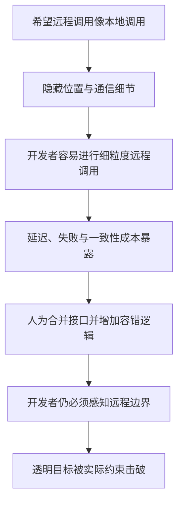
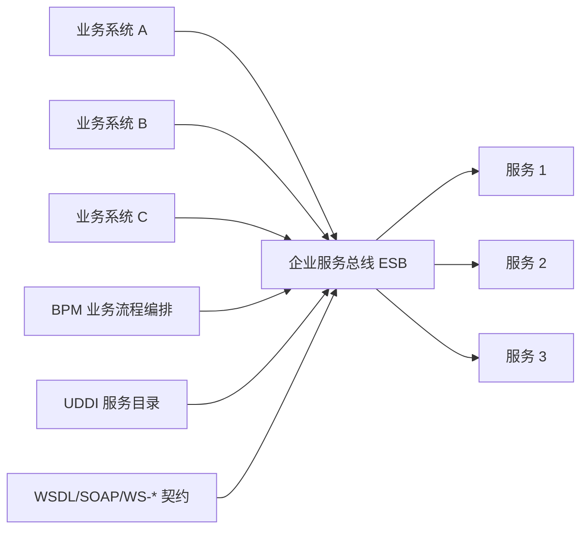
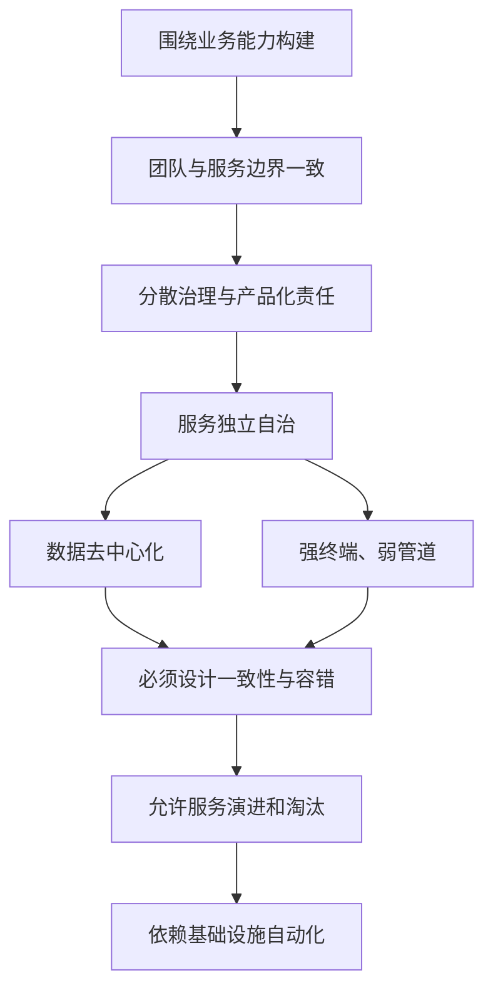
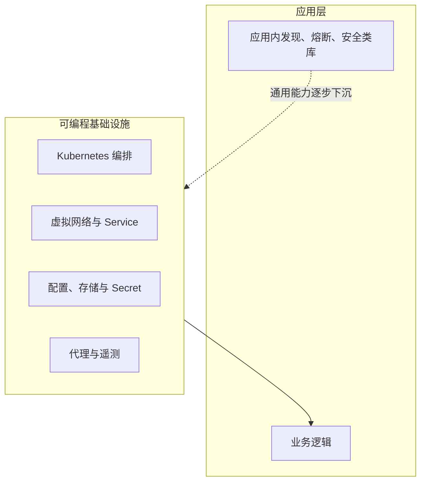
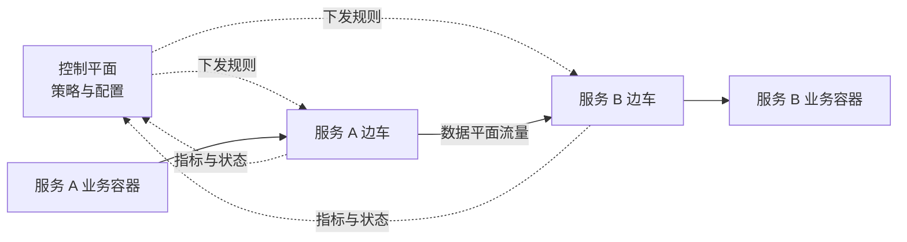
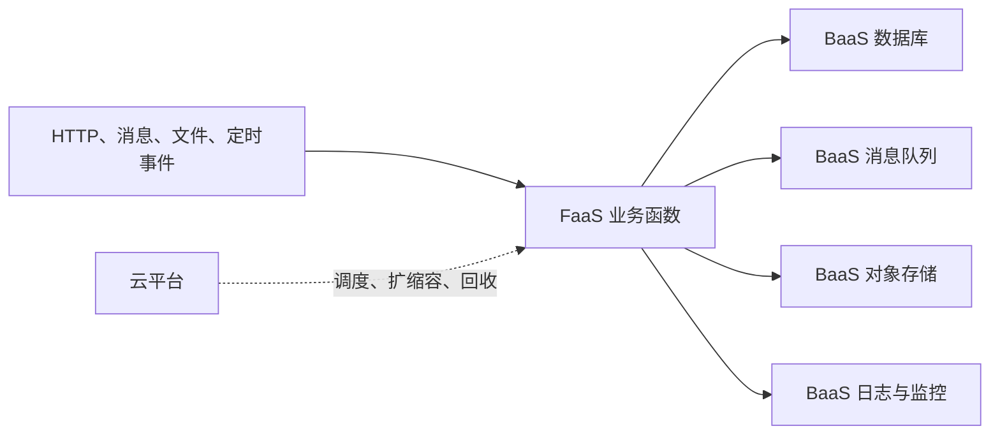
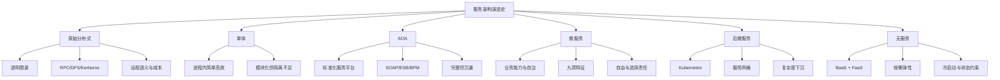

> 原书：周志明，《凤凰架构：构建可靠的大型分布式系统》
>
> 本章范围：“演进中的架构”中的“服务架构演进史”，依次包括原始分布式时代、单体系统时代、SOA 时代、微服务时代、后微服务时代与无服务时代。
>
> 阅读说明：本章写于云原生技术快速发展的时期，主要价值在于解释架构为何演进，而不是给具体产品排永久名次。文中的 DCE、CORBA、SOAP、Spring Cloud Netflix、Kubernetes、服务网格和 Serverless 应放回各自历史条件下理解。本文会区分作者当时的判断、可长期复用的架构原理，以及用于帮助推理的补充公式。

## 1. 本章在回答什么问题

本章表面是在讲架构史，真正追问的是：**为什么人们总在单体与分布式之间反复调整，又为什么每一次回到分布式时，技术形态都与上一次不同？**

作者没有把架构演进描写成“新技术淘汰旧技术”的直线，而是按因果关系分析每个时代：

1. 当时受什么硬件、软件和组织条件约束？
2. 旧架构最难忍受的问题是什么？
3. 新架构把哪些能力放到了新的位置？
4. 它解决了什么，又制造了什么新负担？
5. 它为何成功、失败，或只适用于部分场景？

### 1.1 六个时代的主线

| 时代 | 首要驱动力 | 核心解法 | 得到的收益 | 暴露的新问题 |
| --- | --- | --- | --- | --- |
| 原始分布式 | 单机算力不足 | 多机协作、DCE 等透明分布式体系 | 开创 RPC、DFS、认证等基础能力 | 远程调用无法真正等同本地调用 |
| 单体系统 | 单机性能快速提高 | 功能集中在同一进程 | 简单、高效、易开发测试部署 | 大规模下缺乏隔离、自治与独立演进能力 |
| SOA | 拆分大型企业系统并维持协作 | SOAP、ESB、服务标准与业务编排 | 系统性解决许多分布式集成问题 | 规范和平台过于复杂，普及成本高 |
| 微服务 | 摆脱 SOA 重负并匹配业务团队 | 小型自治服务、轻量通信、自动化 | 自由、隔离、异构、独立交付 | 技术选型和分布式治理责任回到团队 |
| 后微服务 | 从应用代码中剥离通用技术问题 | Kubernetes、服务网格、可编程基础设施 | 基础能力复用，重获部分透明性 | 平台复杂度、兼容性和治理粒度问题 |
| 无服务 | 进一步隐藏服务器和容量管理 | BaaS + FaaS | 按需弹性、托管运维、聚焦业务 | 冷启动、状态、长连接、成本与平台约束 |


### 1.2 演进不是复杂度消失，而是复杂度重新分配

可以用一个分析模型概括全章。它不是原书给出的物理定律，而是阅读时用于检查“复杂度去了哪里”的工具：

$$
C_{\mathrm{total}}
= C_{\mathrm{business}}
+ C_{\mathrm{distribution}}
+ C_{\mathrm{platform}}
+ C_{\mathrm{organization}}
$$

- $C_{\mathrm{business}}$：领域规则、业务流程和数据语义；
- $C_{\mathrm{distribution}}$：通信、发现、容错、一致性和安全；
- $C_{\mathrm{platform}}$：部署、编排、代理、监控和基础设施维护；
- $C_{\mathrm{organization}}$：团队边界、协作、发布和责任划分。

单体主要压低 $C_{\mathrm{distribution}}$ 和 $C_{\mathrm{platform}}$；SOA 用统一平台集中处理它们，却提高了标准与组织成本；微服务把选择权交回服务团队；后微服务再将通用能力下沉到可编程基础设施。任何方案若只展示某一项下降、却不说明其他项的变化，都可能是在转移而非减少复杂度。

### 1.3 本章有没有核心算法和公式

本章是一篇历史与架构论证文章，原文没有需要逐步执行的正式算法，也没有以数学公式为中心的推导。本文补充的延迟、可用性、扩容和冷启动公式只用于量化作者的直觉，不能脱离前提当作精确容量模型。真正需要掌握的“算法”是作者反复采用的分析过程：

```text
识别时代约束
-> 找到旧架构的主要矛盾
-> 判断新能力应由哪一层承担
-> 比较收益与新成本
-> 用适用范围解释成败
-> 从残留问题推导下一次演进
```

## 2. 原始分布式时代：透明愿景第一次碰到现实

### 2.1 为什么分布式尝试比大型单体更早

20 世纪 70 年代末至 80 年代初，计算机正从大型机走向微型机。典型微型计算机只有 16 位寄存器、不足 5 MHz 的处理器、不超过 1 MB 的内存和 64 KB 单段地址空间。Intel 8086 于 1978 年出现，代表了当时快速普及但仍十分有限的硬件条件。

当单机算力直接限制软件规模时，研究者自然想到把多台机器连接起来共同完成任务。因此，“多个独立服务组成大型系统”的实践早于后来人们熟悉的大型单体，并不矛盾：前者由硬件瓶颈强行推动，后者要等单机性能足以承载大型应用后才会成为主流。

### 2.2 这一时期留下了哪些基础成果

早期探索没有形成普适的分布式应用架构，却创造了许多沿用至今的概念：

| 早期成果 | 提出者或来源 | 后续影响 |
| --- | --- | --- |
| NCA，网络运算架构 | HP 与 Apollo | 成为远程过程调用的先驱之一 |
| AFS，Andrew File System | 卡内基·梅隆大学 | 奠定分布式文件系统的重要思路 |
| Kerberos | 麻省理工学院 | 形成分布式认证和访问控制基础 |
| DCE/RPC | OSF 的 DCE 体系 | 与 ONC RPC 共同影响现代 RPC |
| DCE/DFS | DCE 对 AFS 思路的规范化 | 展示远程文件访问的统一接口 |
| 时间、命名与目录服务 | DCE | 支撑跨机器协作和资源定位 |
| UUID | DCE | 解决分布式环境中的全局标识问题 |

DCE，即 Distributed Computing Environment，是开放软件基金会组织业界共同制定的一整套分布式规范与参考实现。它的重要性不只在某个产品，而在于第一次有组织、有标准、有大规模投入地同时处理 RPC、文件、认证、时间和命名等问题。

开放软件基金会（Open Software Foundation，OSF）希望避免 UNIX 版本战争在分布式领域重演，因此联合主流厂商制定 DCE。DCE/RPC 与 Sun 后来提交给 IETF、基于通用 TCP/IP 的 ONC RPC，通常被视为现代 RPC 的两条重要源流。这个谱系说明，早期研究虽然没交付一套普适应用架构，却把远程调用从厂商私有技巧推进成了可讨论、可实现的标准问题。

### 2.3 UNIX 哲学与“透明分布式”目标

DCE 带有明显的 UNIX 设计取向：接口和实现应保持简单，让开发者尽量不关心资源位于本机还是远端。Richard P. Gabriel 的 “Worse is Better” 强调简单性优先，背后不是鼓励错误，而是在完整、复杂的方案与更容易实现、传播和演进的方案之间，承认简单本身具有巨大工程价值。

于是原始分布式提出了一个极具吸引力的目标：

- 本地文件和远程文件使用近似接口；
- 本地函数和远程服务看起来近似调用；
- 位置、通信和故障细节尽可能由系统隐藏。

问题在于，**接口可以相似，语义和成本却无法自动相同**。

### 2.4 本地调用与远程调用为什么本质不同

本地方法调用通常发生在同一地址空间，参数可直接通过寄存器、栈或引用传递；远程调用至少要经历序列化、网络协议栈、排队、传输、远端执行和响应返回。

可将一次远程调用的延迟粗略拆成：

$$
T_{\mathrm{remote}}
= T_{\mathrm{encode}}
+ T_{\mathrm{queue}}
+ T_{\mathrm{network}}
+ T_{\mathrm{remote\ work}}
+ T_{\mathrm{return}}
+ T_{\mathrm{decode}}
$$

本地调用并非零成本，但通常不包含跨网络排队、传输和独立故障域。假设一个本地细粒度调用只需 $0.2\ \mu s$，而一次内网远程往返需 $1\ ms$，后者就是前者的：

$$
\frac{1\ ms}{0.2\ \mu s} = 5000
$$

倍。这个数值只是示意，不代表所有机器和网络；直觉是即使远端业务逻辑很短，固定通信成本也可能占主导。若把 100 个细粒度调用直接远程化，仅网络往返就可能累计到约 $100\ ms$。因此早期开发者不得不把多个操作批量合并，令业务接口反过来迁就网络成本。

除了性能，远程调用还引入本地调用通常没有的难题：

1. 服务在哪里：服务发现与命名。
2. 有多少实例：负载均衡。
3. 网络超时或分区怎么办：超时、重试、熔断、隔离和降级。
4. 参数与返回值怎样表示：序列化协议与版本兼容。
5. 信息怎样传输：传输协议、连接和流量控制。
6. 谁能调用：认证与授权。
7. 怎样防窃听和篡改：加密、证书和完整性保护。
8. 多机如何得到一致结果：并发控制与分布式一致性。

最关键的语义差异是部分失败。调用方可能正常，网络可能失败，服务端可能已经执行但响应丢失。调用方看到“超时”时，并不知道远端是“未执行”“执行中”还是“执行成功但响应丢失”。本地异常通常没有这种不确定窗口。

### 2.5 DCE 为什么没有实现普适成功

DCE 确实回答了大量技术问题，DCE/DFS 甚至能让远程文件访问在接口上接近本地文件。但一旦把性能、故障与一致性纳入考虑，开发者仍必须清楚地知道自己跨越了网络边界。

其失败链条可以概括为：



在当时的硬件和网络条件下，分布式带来的发现、通信、容错、配置、跟踪、一致性和编码成本，常常超过多机获得的算力收益。CORBA 后来也面对相似困境。

Kyle Brown 对这段历史的总结可压缩成一句原则：**能分布，不代表应该分布；把远程调用假装成本地调用，会掩盖而不会消除差异。**

### 2.6 两条道路与第一次转向

摆在人们面前有两条路线：

- 继续研究更成熟的分布式系统；
- 提升单机性能，尽量避开分布式问题。

20 世纪 80 年代处于摩尔定律稳定发挥作用的时期，单机性能大约每两年显著提升，硬件瓶颈快速缓解。于是产业暂时选择了第二条更简单的路线，进入单体系统时代。

另一条路线并未停止。RPC、DFS、Kerberos 和透明通信理想都被保留下来。三十多年后，服务网格会再次尝试让应用少感知通信细节，只是承载透明性的基础已经从调用框架变成了可编程代理和基础设施。

## 3. 单体系统时代：进程内简单性的长期胜利

### 3.1 单体的准确含义

单体架构的核心定义很窄：**系统的主要过程调用发生在同一进程内，而不是通过进程间通信（Inter-Process Communication，IPC）完成。**

“Monolithic”字面上容易被译成“巨石”或“铁板一块”，原义在架构语境中更接近自包含（Self-Contained）：一个部署单元具备完成主要业务所需的组件。自包含描述运行边界，不否定内部模块化。

它不自动意味着：

- 代码没有分层；
- 模块不能拆分；
- 只能生成一个源文件或制品；
- 不能部署多个副本；
- 必然混乱、落后或不可维护。

“单体”这个名称主要是在微服务流行后被追认的。此前大家长期默认应用就应以这种形式存在，因此很少有资料专门把它当作一种架构风格教授。

### 3.2 批评单体之前必须补上“大型”这个前提

很多微服务材料把单体描述成需要逃离的困境，但其隐含对象是**大型单体系统**。若一台机器足以支撑业务，团队规模也没有明显超过“两个披萨团队”（2 Pizza Team）所代表的小型自治范围，单体通常具备：

- 开发简单；
- 测试简单；
- 部署简单；
- 进程内调用效率高；
- 事务和一致性边界直观；
- 本地调试容易。

因此，不能从“微服务可独立部署”直接推出“所有系统都应微服务化”。只有性能、团队、发布或隔离需求超过单体舒适区，讨论其缺点才有实际意义。

### 3.3 单体完全可以纵向分层

大型单体通常采用分层架构。外部请求从展示或接口层进入，经过应用、领域和数据访问层到达数据库，再反向返回结果。


纵向分层解决职责分离和依赖方向问题，与进程边界无关。微服务内部同样可以分层；反之，一个系统拆成多个进程也不代表每个服务内部结构良好。

### 3.4 单体也能横向模块化和扩容

单体可以按功能、职责和技术拆成多个模块，形成多个 JAR、WAR、DLL 或 Assembly。它也可以在负载均衡器后部署多个完整副本进行水平扩展。

在请求彼此独立、没有共享瓶颈且负载均匀的理想条件下，$n$ 个副本的总处理能力可近似写成：

$$
Q_{\mathrm{total}} \approx n \times Q_{\mathrm{instance}}
$$

若单实例每秒稳定处理 500 个请求，4 个副本的理论上限约为 2000 请求/秒。但现实中数据库、锁、缓存、网络和负载倾斜会让增益低于线性值，因此更准确的表达是：

$$
Q_{\mathrm{total}} = \eta n Q_{\mathrm{instance}},\quad 0 < \eta \le 1
$$

$\eta$ 是扩展效率。这个模型说明单体并非不能横向扩展，真正问题是每次必须扩整个应用，无法只扩容其中的热点模块。

### 3.5 真正短板：隔离和自治，而不是能否拆文件

单体模块共享进程空间。它带来低成本调用，也形成共同故障域：

- 一个模块内存泄漏可能耗尽整个堆；
- 线程爆炸、死循环或长时间阻塞可能拖垮全部功能；
- 连接池、端口等更高层资源泄漏可能影响整机乃至其他副本；
- 无法只停止、重启或升级进程中的某一部分；
- 局部变更通常要求重新构建、测试和发布整个部署单元；
- 灰度发布、A/B 测试和独立回滚更难组织；
- 所有模块通常被同一语言和框架约束。

OSGi、JNI 等技术能够缓解运行时模块化或语言互操作，但复杂度高，通常不是自然、低成本的自治方式。

小型团队共享一个进程，相当于几个人在同一办公室工作，沟通直接且节约资源；大型组织仍强制所有部门共用同一空间，局部问题和变更就会波及整体。作者借这个类比说明：同一个性质在不同规模下可以从优势转为缺点。

### 3.6 从“避免出错”到“允许出错”

作者认为，微服务兴起最根本的理由不只是扩容或异构，而是可靠性观念变化：

- 传统大型单体倾向于提高每个部件质量，追求尽量不出错；
- “凤凰架构”承认复杂系统必然发生局部故障，通过隔离、替换和恢复构造整体可靠性。

如果所有模块共享一个进程，局部故障容易成为全局故障，就很难实现“由不可靠部件组成可靠系统”。独立进程边界则提供了故障隔离、单独重启、独立扩容和替换的基础。

这里不能误解为微服务允许低质量代码。它仍要求测试和质量控制，只是不把“所有代码永不失败”当作唯一可靠性策略，而是增加运行时防线。

### 3.7 单体何时仍是合理选择

单体通常适合：

- 业务和团队规模较小；
- 领域边界尚未稳定；
- 各模块质量属性相近，无需独立扩缩容；
- 强事务需求多，分布式一致性收益不足以抵偿成本；
- 团队缺少微服务平台和运维能力；
- 快速验证产品比独立部署更重要。

当隔离、自治、技术异构和独立交付成为主要矛盾时，才有充分理由再次选择分布式。新旧世纪之交，人们先经过烟囱、微内核和事件驱动等尝试，逐步走向 SOA。

## 4. SOA 时代：用完整标准体系治理企业服务

### 4.1 拆开系统后，怎样让它们继续协作

大型单体的模块需要独立部署，但拆分绝不能只等于“放到不同服务器”。一旦进程分离，就必须重新解决共享数据、通信、发现、编排和治理。SOA 之前有三种有代表性的探索。

### 4.2 烟囱式架构：隔离最强，协作最弱

烟囱式架构（Information Silo Architecture）又称信息孤岛：各系统拥有独立服务器和数据库，彼此不互操作。

它确实实现了物理隔离，却建立在“系统之间没有任何关系”的假设上。现实企业即便业务流程不同，也常共享人员、组织、权限和客户等主数据。完全独立会导致：

- 重复录入和维护；
- 同一实体在不同系统中不一致；
- 跨部门流程依靠人工传递；
- 权限与审计难以统一。

所以烟囱式拆分解决了局部自治，却没有解决整体系统问题。

### 4.3 微内核架构：稳定核心加可插拔功能

微内核架构（Microkernel Architecture）也叫插件式架构。它把主数据、公共服务和基础资源放进核心，具体功能作为插件存在。


这种结构适合：

- 桌面工具和 IDE；
- 平台型产品；
- 需要二次开发或按需安装功能的软件；
- 核心相对稳定、扩展点明确的系统。

其关键前提是插件彼此不应直接依赖，内核也不能预知所有插件。若企业子系统之间存在大量业务协作，所有交互都绕核心会让内核膨胀成瓶颈；允许插件彼此任意调用又会破坏隔离。因此微内核解决的是扩展性，不天然解决任意分布式业务协作。

### 4.4 事件驱动架构：通过消息解耦参与者

事件驱动架构（Event-Driven Architecture）在子系统之间放置事件队列。生产者发布发生了什么，消费者按兴趣订阅和处理，也可补充信息或发布后续事件。


它有效的原因是生产者无需知道有多少消费者，也不要求消费者同步在线。由此得到时间、空间和部署上的解耦。

但事件驱动并非免费午餐：

- 消息可能重复，需要幂等处理；
- 顺序可能只在局部得到保证；
- 异步链路更难跟踪和调试；
- 跨事件的一致性通常是最终一致；
- 事件模型一旦泄露内部结构，会形成新的耦合；
- 消费失败需要重试、死信和补偿机制。

它是 SOA 和后续微服务的重要协作方式，但不是所有请求都必须异步化。

### 4.5 SOA 的形成条件与组织化过程

SOA 概念由 Gartner 于 1994 年提出，当时技术和产业条件尚不成熟。随着 SOAP 及其协议族出现，远程服务调用、描述、发现和治理有了共同基础：

- 2006 年，IBM、Oracle、SAP 等成立 OSOA 联盟；
- 2007 年，在 OASIS 支持下形成 Open CSA，推进组合服务架构标准。

这说明 SOA 不只是一个模糊口号，而是有标准组织、设计原则、协议和产品生态支持的完整体系。

### 4.6 SOA 为什么“更具体”

SOA 给出了可操作的技术平台和服务原则：封装、自治、松耦合、复用、组合和无状态。主要组件关系如下：

| 组件或规范 | 作用 | 试图解决的问题 |
| --- | --- | --- |
| SOAP | 结构化服务消息协议 | 异构平台间通信 |
| WSDL | 描述服务接口与绑定 | 服务契约 |
| UDDI | 发布和查询服务 | 服务注册与发现 |
| WS-* 协议族 | 事务、安全、可靠消息等 | 企业级非功能需求 |
| ESB | 路由、转换、连接和中介 | 系统解耦与集成 |
| BPM | 编排跨服务业务流程 | 组合现有能力 |
| SDO | 统一访问和表达数据 | 异构数据处理 |
| SCA | 定义服务组件与容器 | 服务封装和运行模型 |



只从技术可行性看，SOA 对服务发布、发现、调用、治理、集成和编排给出了系统性答案，确实比烟囱、微内核或单一事件总线完整。

### 4.7 SOA 为什么“更系统”

SOA 的目标不止是远程通信。它希望建立自上而下的软件研发方法：

1. 从企业战略和流程识别需求；
2. 把需求分解成业务能力；
3. 把业务能力封装成可复用服务；
4. 编排现有服务形成新流程；
5. 按统一规范开发、测试、部署和治理。

若成功，企业软件生产会更像标准化工业流程。难点也正来自这里：它同时试图规范技术、需求、流程、管理和组织，需要大量专业人员与复杂平台配合。

### 4.8 技术上成功，为何生态上沉寂

SOA 在 21 世纪最初十年一度盛行，尤其适合大型异构企业系统集成。但它没有成为普适架构，主要原因不是完全不能工作，而是**解决方案复杂度超过多数系统愿意承担的程度**：

- SOAP 严格规范带来繁重协议和工具链；
- WS-*、ESB、BPM、SCA、SDO 层层叠加；
- 中央总线容易聚集业务转换和流程逻辑；
- 专有中间件成本高，维护依赖少量专家；
- 所有服务被迫承担统一体系，即使只需要其中一小部分能力；
- 自上而下治理可能减慢局部团队交付。

这与 EJB 被 Spring、Hibernate 等更轻量方案取代有相似之处：完整、严谨不自动等于易用和普及。SOA 可以是少数复杂企业集成的有效方案，却难以作为普通团队的默认选择。

经过巨石、烟囱、插件、事件和 SOA，应用离 DCE 所追求的“透明”反而越来越远。微服务由此提出反向选择：不再追求一套包办所有问题的规范，而以轻量实践和团队自治替代。

## 5. 微服务时代：用自治和实践标准换取自由

### 5.1 从 SOA 的轻量补救到独立架构风格

微服务概念经历了三个关键节点：

- 2005 年，Peter Rodgers 提出 “Micro-Web-Service”，强调单一职责、语言无关和细粒度 Web 服务；
- 2012 年，James Lewis 在 “Microservices - Java, the Unix Way” 中强调 UNIX 哲学、单一职责、康威定律、自动扩展和领域驱动设计，主动淡化 SOA；
- 2014 年，Martin Fowler 与 James Lewis 的文章系统定义现代微服务及九项特征，微服务由此成为独立架构风格。

现代微服务可概括为：围绕业务能力构建多个小型、自治的服务；服务运行在独立进程，可使用不同语言和数据存储；通过轻量通信协作，并依靠自动化机制部署和运维。

“小型”不是按固定代码行数或人数划界。真正重要的是服务能否围绕一项业务能力独立理解、开发、部署和负责。

### 5.2 九个核心特征的关系

九项特征不是彼此孤立的检查框，而是一条相互支撑的链：



下面按原书顺序逐一分析。

### 5.3 围绕业务能力构建

服务边界应对应用户可识别的业务能力，而不是简单按数据库表、MVC 层或技术框架切分。例如书店可以围绕账户、商品、仓储和交易组织服务，而不是建立“Controller 服务”“DAO 服务”。

其依据是康威定律：系统结构会映射组织的沟通结构。若一项业务能力分散在多个团队，每次变化都要跨团队协调；高效组织最终会调整团队或系统边界，使二者趋于一致。

关系可以表示为：

$$
\text{团队边界} \longleftrightarrow \text{沟通路径} \longleftrightarrow \text{服务边界}
$$

这不是严格数学等式，而是组织反馈关系。它的应用前提是业务能力相对可识别；若领域仍快速变化，过早固化服务边界会把错误理解变成昂贵的网络接口。

### 5.4 分散治理

服务团队应对开发、运行质量和技术决策负责，也应有在必要时选择不同语言、框架或存储的权力，即“谁的服务谁负责”。

分散治理不等于每个服务随意发明技术栈。组织仍可提供主流语言、平台和标准模板，只要：

- 团队有合理例外机制；
- 公共平台团队对其稳定性承担责任；
- 技术多样性的收益大于招聘、运维和安全成本；
- 服务接口与运行责任清晰。

治理过度集中会重现 SOA 的僵化，治理完全缺失则会形成技术碎片化。微服务追求的是受约束的自治。

### 5.5 通过服务实现独立自治的组件

类库和服务都能复用功能，但边界不同：

| 维度 | 类库 | 服务 |
| --- | --- | --- |
| 调用方式 | 进程内调用 | 远程调用 |
| 部署 | 随宿主一起发布 | 可独立发布 |
| 故障域 | 与宿主共享 | 可隔离 |
| 技术栈 | 受宿主语言和运行时约束 | 可异构 |
| 升级 | 消费者通常要重新构建 | 可保持兼容接口独立升级 |
| 调用成本 | 低 | 高，且存在部分失败 |

微服务愿意支付远程调用成本，是为了换取隔离和自治。若某项能力无需独立发布、扩缩容或故障隔离，类库通常更简单，不能为了“服务化”而把每个函数变成网络接口。

### 5.6 产品化思维，而非项目交付思维

项目思维关注按期完成范围并移交；产品思维关注软件从设计、交付、运行到用户反馈的整个生命周期。

微服务规模较小，使一个团队端到端负责成为可能：

- 开发者理解服务如何部署和监控；
- 运维反馈进入产品改进；
- 团队关注消费方体验，而不只关注接口是否实现；
- 故障、成本和售后不再被视为“别的部门的事”。

这里的用户可能是最终消费者，也可能是调用该服务的另一支团队。产品化思维与分散治理共同构成“自治但负责”的组织前提。

### 5.7 数据去中心化

单体常用一个中心数据库，不同模块共享同一实体模型。微服务提倡每个领域独立管理、更新和存储自己的数据。

以“书”为例：

- 销售领域关注价格和促销；
- 仓储领域关注库存和库位；
- 商品展示领域关注标题、作者和介绍。

如果所有领域强制映射到一个全局 `Book` 表，任何字段和约束变化都可能影响其他团队。去中心化允许每个领域形成符合自身语义的模型，即领域驱动设计中的限界上下文。

代价是跨服务强事务变难。假设下单同时涉及交易和库存，不能再默认一个本地数据库事务覆盖全部更新。系统需要在以下策略中权衡：

- 事件与最终一致性；
- 补偿事务；
- 幂等、去重和重试；
- 对账与人工修复；
- 在确有必要时保留更大的事务边界。

数据自治不是“每个服务必须使用独立物理数据库实例”，而是服务应拥有数据写入权和模式控制权，其他服务不能绕过契约直接修改。

### 5.8 强终端、弱管道

SOA 的 ESB 和 WS-* 把转换、业务规则、编排、安全和事务等大量能力放进通信管道。微服务反对所有服务被迫经过一个过于聪明的中央管道，倾向：

- 终端服务拥有业务逻辑和协议适配能力；
- 管道主要负责可靠传输；
- 使用 HTTP/REST、轻量消息等容易理解的机制；
- 某项高级能力只由确实需要它的服务引入。

这不是说网络层只能转发字节，任何路由、安全和遥测都不能存在。其核心是**不要把领域业务规则集中到公共通信中间件，使所有服务受同一复杂平台控制**。后来的服务网格会把通用流量能力放入代理，但仍应避免把业务编排重新塞进代理。

### 5.9 容错性设计

微服务接受服务必然出错，因此必须设计：

- 快速故障检测；
- 超时，而不是无限等待；
- 持续失败时隔离或熔断；
- 有边界的重试；
- 降级与后备结果；
- 恢复后自动重新接入；
- 防止局部故障形成雪崩。

为什么服务越多越要重视容错，可以用串联系统的可用性直观说明。若一次请求必须依次成功调用 $n$ 个服务，各服务可用性为 $A_i$，在故障相互独立且没有冗余、降级的简化条件下：

$$
A_{\mathrm{path}} = \prod_{i=1}^{n} A_i
$$

若每个服务可用性均为 $99.9\%=0.999$：

$$
A_{10}=0.999^{10}\approx99.0045\%
$$

$$
A_{20}=0.999^{20}\approx98.0189\%
$$

这不是说“20 个微服务必然只有 98% 可用”：真实系统可能并行调用、缓存、降级、冗余，故障也不独立。它说明同步依赖链会放大失败机会，必须减少不必要依赖并设计替代路径。

重试也不是天然提高可靠性。若下游已过载，无退避的同步重试会放大流量。可靠重试通常要求：

```text
仅重试可恢复错误
AND 操作幂等或带去重键
AND 设置最大次数与总超时
AND 使用指数退避和随机抖动
AND 配合限流、隔离与熔断
```

### 5.10 演进式设计

容错性设计承认服务会失败，演进式设计进一步承认服务会被替换和淘汰。健康架构应允许：

- 新旧版本并行；
- 契约逐步演进；
- 数据迁移可回退或补偿；
- 服务被重写、合并或删除；
- 不让任何组件成为永远不能触碰的核心。

“不可替代”往往不是重要性的荣耀，而是耦合和知识缺失造成的脆弱性。演进式设计与凤凰式恢复观一致：系统通过替换和重建保持生命力，而不是要求每个部件永久存在。

### 5.11 基础设施自动化

单体可能只有少量部署对象，微服务则可能有数百甚至更多服务和实例。人工构建、测试、发布、配置和回滚无法在线性扩张下维持可靠性，因此 CI/CD、自动测试、制品管理、配置管理、监控和自动扩缩容不是锦上添花，而是微服务成立的前提。

可将每次人工操作出错概率记为 $p$，一次发布包含 $m$ 个相互独立的人工步骤，则全部无误的简化概率是：

$$
P_{\mathrm{success}}=(1-p)^m
$$

若每步只有 $1\%$ 出错概率，100 个步骤全部正确的概率约为：

$$
0.99^{100}\approx36.6\%
$$

独立假设并不总成立，但例子说明部署对象和重复操作增加后，依靠“人更仔细”无法长期扩展。自动化的价值是把操作固化为可重复、可审计、可测试的流程，同时减少步骤差异。

### 5.12 微服务与 SOA 的关系

微服务最初受 SOA 影响，但现代微服务不宜只理解成“缩小版 SOA”。两者都重视服务、松耦合和互操作，却在治理哲学上明显不同：

| 维度 | 典型 SOA | 现代微服务 |
| --- | --- | --- |
| 范围 | 企业级异构系统集成 | 单个产品或业务能力体系 |
| 标准 | 规范标准优先 | 实践标准优先 |
| 通信 | SOAP、WS-*、ESB | REST、消息、gRPC 等轻量机制 |
| 逻辑位置 | 中央总线可承担转换和编排 | 业务逻辑留在服务终端 |
| 治理 | 集中式、统一平台 | 分散治理、团队自治 |
| 数据 | 常强调企业数据和集成模型 | 按领域去中心化 |
| 交付 | 重平台与流程 | 小团队、CI/CD、独立发布 |

边界并非绝对，现实 SOA 也可轻量，微服务也会使用集中平台。新名称的价值在于更清晰地表达一组不同的默认取舍。

### 5.13 自由的另一面：选择责任

摆脱统一规范后，旧问题全部重新出现：

- 远程调用可选 RMI、Thrift、Dubbo、gRPC、REST 等；
- 服务发现可选 Eureka、Consul、Nacos、ZooKeeper、Etcd、CoreDNS 等；
- 容错、安全、事务、监控也各有多种方案。

Spring Cloud 一类工具通过统一接口和配置降低普通开发者的使用成本，但架构师仍要理解不同方案的语义和代价。微服务对单个服务开发者可能更友好，对全局架构决策者却提出更高要求。

因此，微服务的自由是一组交换：

$$
\text{摆脱统一规范}
\Longrightarrow
\text{获得局部选择权}
+ \text{承担全局集成责任}
$$

架构不会停在“自由选择”本身。下一步的目标是保留围绕业务能力构建的自由，又让团队不必在每个应用中重复解决所有分布式技术问题。

## 6. 后微服务时代：可编程基础设施重新追求透明

### 6.1 为什么分布式能力曾被写进应用

扩容、负载均衡、传输安全和服务发现早已有硬件或基础设施方案：

- 增加服务器和副本实现扩容；
- 专用负载均衡器分流；
- TLS 设备和 CA 证书保护链路；
- DNS 用稳定名称屏蔽易变 IP。

微服务时代之所以用 Spring Cloud 等软件组件处理，是因为应用变化比物理基础设施快得多。代码可以瞬间复制服务，传统硬件采购和配置却跟不上这种弹性。

虚拟化、容器、软件定义网络（Software-Defined Networking，SDN）和软件定义存储（Software-Defined Storage，SDS）让“硬件能力”也能由 API 和声明动态创建。于是基础设施开始具备接近软件的灵活性，通用分布式能力有机会从每个应用中剥离。

### 6.2 容器与编排平台的角色变化

早期容器主要被视为快速启动、便于分发的应用运行环境，并未系统处理服务发现、调度和治理。Docker Swarm、Mesos 等编排系统逐步出现后，容器才从单应用封装走向集群基础设施。

作者把 2017 年视为转折点：

- CoreOS 放弃 Fleet，转向 Kubernetes；
- Rancher 从支持多编排器转为 All-in-Kubernetes；
- Mesos 推进 Kubernetes 集成；
- Docker 宣布同时支持 Swarm 与 Kubernetes。

Kubernetes 赢得容器编排竞争，带来的不只是某个产品获胜，而是行业获得一套广泛接受的资源抽象和控制面，为基础设施层统一解决分布式问题创造了前提。

### 6.3 Spring Cloud 与 Kubernetes 的能力映射

原书用下表说明同一问题可由应用框架或基础设施处理：

| 问题 | Kubernetes 路线 | Spring Cloud 路线 |
| --- | --- | --- |
| 弹性伸缩 | Autoscaling | 原表中无直接对应 |
| 服务发现 | KubeDNS / CoreDNS + Service | Eureka |
| 配置中心 | ConfigMap / Secret | Spring Cloud Config |
| 服务网关 | Ingress Controller | Zuul |
| 负载均衡 | Service / LoadBalancer | Ribbon |
| 服务安全 | Kubernetes RBAC API | Spring Cloud Security |
| 跟踪监控 | Metrics API / Dashboard | Turbine 等 |
| 降级熔断 | Kubernetes 本身无请求级方案 | Hystrix |

这张表强调解题位置的变化，不应误读成严格的一一等价：

- Kubernetes RBAC 保护集群资源，不等同于终端用户的业务授权；
- Metrics API 不等同于完整分布式追踪；
- Service 的流量分配与 Ribbon 的客户端策略能力不同；
- Pod 重启和副本恢复不等同于请求级熔断和降级；
- Ingress、监控和负载均衡实现常依赖额外控制器或云环境。

### 6.4 后微服务与云原生

当容器、网络、存储和负载均衡都可虚拟化并声明式管理时，软件与硬件的边界开始模糊。与业务无关的能力可被基础设施统一承担，应用更专注领域逻辑。

这使几个历史目标重新汇合：

- DCE 的透明分布式愿景；
- Martin Fowler 的 Phoenix Server，即服务器可销毁并自动重建；
- Chad Fowler 的不可变基础设施，即不在运行实例上手工修补，而以新版本替换；
- 微服务围绕业务能力构建、自动部署和容错的要求。

作者把从“软件独自应对分布式”发展到“应用与软硬一体基础设施共同应对”的阶段称为后微服务时代，也就是通常所说的云原生时代。



### 6.5 Kubernetes 的粒度为什么仍不够细

基础设施通常管理容器、Pod、IP 和端口，但业务调用可能需要方法、路径、版本或用户级策略。

原书给出一个关键案例：服务 A 调用服务 B 的两个接口 $B_1$ 和 $B_2$。$B_1$ 正常，$B_2$ 持续返回 500。若基础设施只识别 A 到 B 的网络连接：

- 切断 A 到 B，会误伤正常的 $B_1$；
- 不切断，则 $B_2$ 继续失败并可能触发雪崩。


应用代码知道 URI、方法和业务上下文，容易做细粒度熔断；传统基础设施只看到较粗的网络对象。监控、认证、授权和负载均衡也有类似问题，例如按版本或请求特征分流，普通 DNS 无法表达。

### 6.6 服务网格与边车代理

服务网格通过自动注入 Sidecar Proxy 解决“应用上下文丰富但侵入代码，基础设施透明但粒度粗”的矛盾。代理与业务容器共处一个 Pod，接管入站和出站流量。


原书采用的是当时 Istio 文档中的示意图，其中出现的 Mixer 已在 Istio 1.5 之后移除。因此这张图应用来理解“应用流量经过边车、代理接受控制面配置”的逻辑关系，不能当作当前 Istio 组件清单或部署拓扑。

其结构分为两个平面：

- **数据平面**：边车代理真正转发请求，执行路由、负载均衡、熔断、加密和遥测；
- **控制平面**：管理策略和配置，并把期望规则下发给代理。



边车近似以透明中间人的方式劫持流量，应用无需引入特定治理 SDK，就能获得接近应用代码粒度的控制。这重新接近 DCE 的目标，但与早期尝试相比有三个重要变化：

1. 不再假设远程调用在语义上与本地完全相同；
2. 超时、重试、熔断和遥测明确承认网络失败；
3. 透明的是治理实现，而不是远程调用的全部成本和语义。

### 6.7 服务网格是否违背“强终端、弱管道”

表面上，代理让通信层变“聪明”了。关键要区分两类逻辑：

- 路由、TLS、超时、通用重试和指标等跨服务一致的技术策略，可以由代理承接；
- 订单规则、库存语义、价格转换等领域逻辑应留在服务终端。

ESB 的主要风险不是管道存在能力，而是中央管道吸收了大量业务语义并成为所有团队的发布瓶颈。服务网格若保持策略通用、配置可分散治理，就仍符合“业务在终端”的原则；若把业务编排重新塞进网格，也会重蹈覆辙。

### 6.8 后微服务并非“最好时代”的终点

服务网格降低应用侵入，却增加：

- 每个工作负载的代理资源和延迟；
- 控制面、证书和策略管理；
- 应用、代理、网络和平台之间更复杂的故障定位；
- 版本兼容和升级风险；
- 平台团队的专业能力要求。

原书写作时预测 Kubernetes 会像 Linux 一样成为服务器端标准环境，服务网格会取代 Spring Cloud 全家桶的大部分能力。阅读时应把它视为作者基于当时趋势的判断，而不是架构定义本身。长期有效的结论是：**适合跨应用标准化的技术能力，会倾向于被平台化；平台化是否值得，取决于复用规模能否覆盖平台成本。**

## 7. 无服务时代：从另一条路线隐藏分布式

### 7.1 为什么它不是“后微服务的下一代”

微服务继续沿分布式路线前进：拆分服务，再用平台治理。无服务则提出另一种思路：如果云数据中心能提供近似无限的按需算力，开发者能否不再管理服务器和实例，只提交业务函数？

这里的“无限”是相对应用开发者而言的资源池抽象，不是物理资源真的没有上限，也不代表预算、并发配额和区域容量无限。

### 7.2 概念与发展节点

- 2009 年，UC Berkeley 的云计算论文系统展望云计算价值；
- 2012 年，Iron.io 在工业界提出 Serverless 概念；
- 2014 年，AWS Lambda 商业化；
- 2018 年前后，中国主流云厂商推出相应产品；
- 2019 年，UC Berkeley 论文预测 Serverless 将成为未来云计算的重要形式。

“Serverless”直译更接近“无服务器”，中文约定常称“无服务”。它不是没有服务器，而是开发者不直接配置和维护服务器。

### 7.3 两块核心：BaaS 与 FaaS

无服务的基本结构并不复杂：

1. **BaaS，Backend as a Service**：数据库、消息队列、日志、对象存储、身份等通用后端能力由云平台提供。
2. **FaaS，Function as a Service**：业务逻辑按函数部署，由事件触发，平台按需创建和回收执行环境。



与传统应用相比，开发者少管理操作系统、进程常驻、容量和大量通用组件，云厂商负责运行环境的弹性与维护。

### 7.4 无服务的生产力承诺

理想状态下，开发者：

- 直接调用现成后端服务；
- 无需购买和安装中间件；
- 上传函数即可部署；
- 不做固定容量规划；
- 不维护服务器补丁和进程守护；
- 按调用量和资源使用付费。

UC Berkeley 用“汇编语言走向高级语言”类比这种抽象提升：隐藏寄存器和中断提高了编程生产力，隐藏服务器和扩缩容也可能释放云应用生产力。

但抽象不会消除底层约束。函数仍需处理超时、幂等、权限、状态、一致性和外部依赖，只是运行实例由平台控制。

### 7.5 为什么按需弹性会带来冷启动

若函数始终常驻，平台就必须为闲置资源持续付费，难以实现按使用量计费。为了共享资源，平台会在空闲后回收实例，请求到来时再创建执行环境。这形成冷启动。

一次请求的延迟可拆为：

$$
T_{\mathrm{cold}}
= T_{\mathrm{provision}}
+ T_{\mathrm{runtime}}
+ T_{\mathrm{application}}
+ T_{\mathrm{business}}
+ T_{\mathrm{I/O}}
$$

暖实例通常主要承担后两项。若冷启动概率为 $p_{\mathrm{cold}}$，平均延迟的简化模型为：

$$
E[T]
= p_{\mathrm{cold}}T_{\mathrm{cold}}
+ (1-p_{\mathrm{cold}})T_{\mathrm{warm}}
$$

例如暖请求 $40\ ms$，冷请求 $800\ ms$，冷启动比例 $5\%$：

$$
E[T] = 0.05\times800 + 0.95\times40 = 78\ ms
$$

平均值看起来不高，但 5% 用户仍可能遇到约 800 ms，因此还必须观察 P95、P99 等尾延迟。Java 和启动期组装较多的框架尤其容易放大运行时与应用初始化成本。

### 7.6 成本模型与“无限算力”的边界

无服务通常按调用次数、执行时间和配置内存等计费。可用抽象式表示：

$$
Cost
\approx N_{\mathrm{invoke}}C_{\mathrm{request}}
+ \sum_{i=1}^{N} M_i T_i C_{\mathrm{compute}}
+ C_{\mathrm{BaaS}}
+ C_{\mathrm{network}}
$$

其中 $M_iT_i$ 表示第 $i$ 次执行占用的内存时间。不同云平台定价维度不同，这不是账单公式；它揭示按需弹性把容量风险转化为使用量成本风险。突发流量时技术上可自动扩展，预算和下游数据库却可能先成为限制。

### 7.7 适用场景与局限

原书认为较适合：

- 离线大规模计算；
- Web 资讯类站点；
- 小程序和移动应用后端；
- 公共 API；
- 短连接、无状态、事件驱动任务；
- 流量波动大且单次执行较短的工作。

相对不适合：

- 服务端状态复杂的信息管理系统；
- 对尾延迟极敏感的交互；
- 网络游戏等持续会话；
- 长连接和长时间执行任务；
- 依赖本地内存会话或大量稳定数据库连接的应用；
- 迁移成本和供应商绑定不可接受的系统。

“无状态”不等于没有业务数据。状态通常被移到 BaaS，函数仍要面对并发、事务、连接数和一致性。实例可随时销毁还要求事件处理尽量幂等。

### 7.8 微服务与无服务可以组合

二者讨论不同层次：

- 微服务是应用层的边界和协作方式；
- Serverless 是技术层的运行与资源交付方式。

一个微服务可以运行在物理机、虚拟机、容器或云函数上。若某个业务能力适合事件触发和无状态执行，完全可以用 FaaS 实现；其他长期运行、低延迟服务继续用容器。

因此，章节顺序不表示“无服务比微服务先进”。未来更可能是多种架构共存和互补，分布式与“不由开发者直接管理分布式”的路线在云数据中心交汇。

作者对 Serverless 的态度是谨慎乐观，而不是确定押注。原因在于软件开发必须在信息不完备时为当前问题作决定：既不能因无法看清远期未来而停止尝试，也不能把趋势预测当作选型证据。图灵所说“我们只能看见前方不远处，但那里已有许多工作等待完成”，在这里对应的工程态度就是小步验证、保留可逆性，并让架构随证据演进。

## 8. 六个时代之间的完整因果链

### 8.1 每一次演进都保留了前代成果

| 从哪里到哪里 | 被保留的能力 | 被反对或修正的部分 | 新的关键前提 |
| --- | --- | --- | --- |
| 原始分布式到单体 | RPC、DFS、认证等研究成果 | 不顾成本追求透明分布式 | 单机性能快速增长 |
| 单体到 SOA | 模块化、分层和企业业务模型 | 共享进程导致的隔离与自治不足 | 成熟网络、SOAP 与企业中间件 |
| SOA 到微服务 | 服务化、发现、治理和编排问题意识 | 重协议、中央总线和统一规范 | 轻量协议、DDD、DevOps、CI/CD |
| 微服务到后微服务 | 业务能力、自治、容错与演进 | 每个应用重复携带治理代码 | 容器编排与可编程基础设施 |
| 后微服务到无服务 | 云化、弹性、自动化与托管 | 开发者直接管理服务实例 | 大规模公有云和托管后端 |

新架构很少从零诞生。微服务保留 SOA 提出的问题，拒绝其默认解法；服务网格保留微服务的业务自治，把通用治理移到代理；Serverless 保留业务边界，却把实例生命周期交给云平台。

### 8.2 透明性经历了一个循环


后微服务不是简单回到 DCE。DCE 倾向隐藏“远程事实”，服务网格主要隐藏治理机制。开发者仍应知道跨服务调用具有延迟、超时、部分失败和一致性代价。

### 8.3 架构演进的两个长期驱动力

全章可以归纳为两条交织路线：

1. **规模路线**：单机算力不足 $\rightarrow$ 多机；团队和软件规模增大 $\rightarrow$ 服务自治；服务数量增大 $\rightarrow$ 自动化平台。
2. **抽象路线**：手工处理细节 $\rightarrow$ 标准中间件 $\rightarrow$ 轻量框架 $\rightarrow$ 可编程基础设施 $\rightarrow$ 托管云服务。

每提高一层抽象，都要问：隐藏的细节是否足够稳定、通用？若答案是否定的，抽象会泄漏，开发者仍需理解底层。

## 9. 容易混淆的概念与常见误区

### 9.1 “Worse is Better”不是质量越差越好

它强调简单实现和简单接口有利于传播、适应和演进，不是允许不正确、不安全。架构必须先满足底线约束，再比较完整性与复杂度。

### 9.2 透明分布式不是假装没有网络

位置和治理实现可以透明，但延迟、部分失败、重试副作用和一致性无法凭接口隐藏。良好抽象减少重复工作，不取消分布式语义。

### 9.3 单体不是铁板一块

单体可分层、模块化、使用多个制品并部署多个副本。它真正缺少的是进程级隔离、模块独立发布和局部扩缩容。

### 9.4 单体并不天然低可靠

小型、边界清晰的单体可能比仓促拆分的微服务可靠。问题出现在规模增大后，仅靠每个部件永不出错难以维持整体可靠性。

### 9.5 微内核不等于操作系统微内核的所有语义

本章讨论的是稳定核心加插件模块的应用架构模式。它借用了微内核思想，但不能把操作系统进程、驱动和内核隔离机制逐项套用到普通应用。

### 9.6 事件驱动不等于消息发送后万事大吉

它降低直接耦合，却把复杂度转移到事件契约、幂等、顺序、重试、观察和最终一致性。

### 9.7 SOA 不是纯粹失败技术

SOA 系统性解决了大型异构系统集成问题，其失败主要是没有成为低成本、普适的默认架构。特定企业集成场景仍可能需要类似能力。

### 9.8 微服务不等于更小的 SOA，也不等于很多小 REST API

微服务强调业务边界、自治团队、独立数据、产品责任、容错和自动化。只把单体控制器拆成远程接口，会得到分布式单体。

### 9.9 数据去中心化不等于拒绝共享信息

各服务仍会交换数据，但应通过契约、事件或 API，而不是共同随意修改一套表。复制数据是为了领域自治，必须配套一致性策略。

### 9.10 Kubernetes 不等于完整微服务治理

Kubernetes 主要管理资源和工作负载生命周期。请求级熔断、业务认证、细粒度路由和完整追踪通常需要应用、网关、网格或其他系统配合。

### 9.11 服务网格不等于复杂度消失

它减少业务代码中的治理组件，却增加代理、控制面、策略、证书和平台运维。只有服务规模足够大、规则足够通用，集中复用才可能产生净收益。

### 9.12 Serverless 不等于没有服务器、没有运维或没有分布式

服务器由云厂商运维，应用团队仍负责函数、权限、数据、成本和业务可靠性。函数调用 BaaS 时仍发生分布式通信。

### 9.13 后出现不等于更先进、更适合

章节顺序描述历史，不是排行榜。单体、微服务、服务网格和 Serverless 都有适用区间，可以在同一组织甚至同一产品中组合。

## 10. 如何应用作者的历史分析方法

### 10.1 从问题而不是产品名开始

面对架构选择，先列出已测量的问题：

- 单机容量是否真的不足？
- 哪些模块需要独立扩缩容？
- 发布耦合造成了多少等待和失败？
- 哪些故障必须隔离？
- 数据边界是否足够稳定？
- 团队是否能承担平台和分布式运维？

若不能回答，就还没有证据说明必须升级架构。

### 10.2 区分业务复杂度与技术复杂度

业务复杂度通常应保留在领域和团队中；服务发现、证书轮换、流量指标等通用技术复杂度可考虑平台化。判断一项能力能否下沉，可依次询问：

1. 它是否包含领域语义？
2. 多个服务的需求是否足够一致？
3. 平台能否获得执行所需的上下文？
4. 平台失效的爆炸半径是否可控？
5. 复用收益是否覆盖建设和维护成本？

### 10.3 把可逆性纳入决策

在信息不完备时，不可能一次预测最终架构。更稳健的做法是选择可演进方案：

- 先在单体内形成清晰模块，再按真实压力拆服务；
- 先建立接口和观测，再替换通信或部署方式；
- 让数据迁移支持双写、回放、校验和回退；
- 避免把不可替代状态塞进单个组件；
- 通过自动化降低重复实验和回滚成本。

这与微服务的演进式设计一致：架构不是一次性成品，而是持续响应约束变化的过程。

### 10.4 一个可复用的架构演进伪代码

```text
input:
    current_system
    measured_bottlenecks
    quality_targets
    team_capability
    operating_budget

for each bottleneck:
    identify whether it belongs to business, process, distribution, or platform
    confirm the bottleneck cannot be solved more cheaply inside current architecture
    list candidate owners: module, service, shared library, proxy, platform, cloud provider
    estimate benefit, migration cost, recurring cost, and failure blast radius
    reject options whose prerequisites are not available
    choose the smallest reversible experiment
    define success metrics and rollback conditions
    test normal flow, partial failure, recovery, upgrade, and cost
    keep the change only if measured benefit exceeds total cost
```

它之所以有效，是因为把“采用某产品”放在问题、能力归属和前提检查之后，并要求同时验证正常路径、失败路径与长期运行成本。

### 10.5 用四栏表复盘任何架构

| 当前痛点 | 新方案怎样解决 | 新增代价 | 适用前提 |
| --- | --- | --- | --- |
| 例如局部故障拖垮单体 | 拆成独立进程并设置熔断 | 网络、一致性、部署复杂度 | 边界稳定且有自动化平台 |

只写前两栏会形成技术宣传；补齐后两栏才是架构分析。

## 11. 本章知识结构总结



### 11.1 核心结论

1. 架构不是凭空发明的，而是在硬件、软件和组织约束下持续演进的。
2. 原始分布式开创了大量基础技术，也证明远程调用不能被无代价地伪装成本地调用。
3. 单体不是反派。对规模合适的系统，它通常是最简单、高效和可靠的选择。
4. 大型单体的根本限制是共享进程导致隔离、自治、独立交付和技术异构困难，而非不能分层或模块化。
5. SOA 在技术上系统性解决了服务集成问题，却因规范和平台过度复杂而难以普及。
6. 微服务用业务能力、团队自治、轻量通信和自动化替代统一规范，同时把选型与治理责任交还团队。
7. 微服务的九项特征相互依赖，不能只取“小服务”而忽略数据自治、容错、产品责任和自动化。
8. 后微服务借 Kubernetes 和服务网格把通用技术能力下沉到可编程基础设施，但平台复杂度仍然存在。
9. 服务网格重新追求治理透明性，却不应掩盖远程调用的延迟、失败和一致性语义。
10. Serverless 由 BaaS 与 FaaS 构成，适合按需、事件驱动和无状态任务，不是微服务的替代代际。
11. 新架构保留前代问题意识，改变的是默认解法和能力归属。
12. 不存在唯一“最先进”架构，只有与业务、团队、平台和成本约束匹配的选择。

### 11.2 解决问题的一般思路

本章的推理可以归纳为：

$$
\text{历史约束}
\rightarrow \text{主要矛盾}
\rightarrow \text{能力重新归属}
\rightarrow \text{收益与代价}
\rightarrow \text{适用边界}
\rightarrow \text{下一轮演进}
$$

每次看到新架构，都应追问三个问题：

1. 它解决的是哪个已经存在且可验证的问题？
2. 它把复杂度交给了应用、服务、代理、平台、云厂商还是组织？
3. 当前团队是否具备让这次转移产生净收益的前提？

只要这三个问题没有答案，就不应仅凭技术出现得晚、生态宣传得热而迁移。

## 12. 主动回忆题

1. 为什么原始分布式尝试会早于大型单体系统？
2. NCA、AFS、Kerberos 和 DCE 分别留下了什么影响？
3. DCE 所说的透明分布式为什么在性能和语义上受挫？
4. 本地调用与远程调用最根本的失败差异是什么？
5. “能分布不等于应该分布”应如何用于今天的服务拆分？
6. 单体的准确定义是什么，它为什么不等于没有分层和模块？
7. 单体可以水平扩容，为什么微服务仍强调独立扩缩容？
8. 大型单体的隔离和自治问题如何影响可靠性与发布？
9. 烟囱式、微内核和事件驱动架构分别解决什么，又依赖什么前提？
10. SOA 的“更具体”和“更系统”分别指什么？
11. SOAP、WSDL、UDDI、ESB、BPM、SDO、SCA 各承担什么职责？
12. 为什么说 SOA 可以技术上成功，却没有成为普适架构？
13. 现代微服务的定义与早期 Micro-Web-Service 有何区别？
14. 微服务九项特征怎样形成一条相互依赖的链？
15. 康威定律为什么会影响服务边界？
16. 数据去中心化为何有利于自治，又为何增加一致性成本？
17. “强终端、弱管道”反对的到底是什么？
18. 为什么同步依赖链会放大不可用概率？公式有哪些简化前提？
19. 微服务为什么同时对普通服务开发者友好、对架构师苛刻？
20. Kubernetes 与 Spring Cloud 解决同类问题时，能力为什么不能简单一一等价？
21. $B_1$ 正常、$B_2$ 失败的案例暴露了基础设施的什么粒度问题？
22. 服务网格的数据平面与控制平面分别做什么？
23. 服务网格怎样重新追求透明，又如何避免重演 DCE 和 ESB 的问题？
24. BaaS 与 FaaS 分别是什么？
25. 为什么按需计费与冷启动之间存在内在联系？
26. 哪些应用特征适合 Serverless，哪些特征会放大其局限？
27. 为什么微服务和无服务可以组合，而不是互相替代？
28. 面对一个新架构，怎样用“痛点、解法、代价、前提”四栏表判断是否值得采用？
