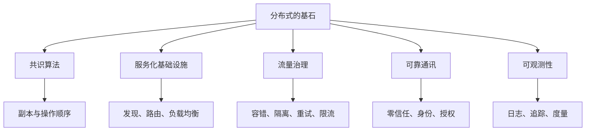
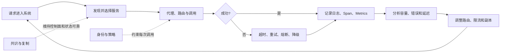
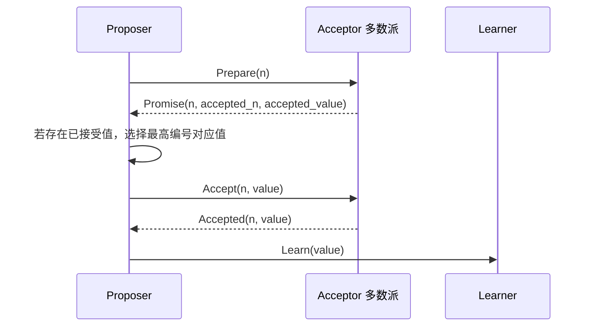
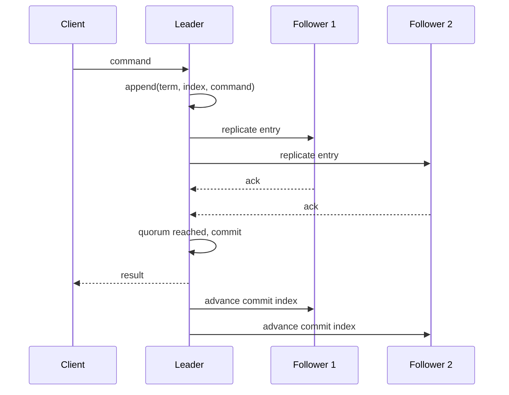
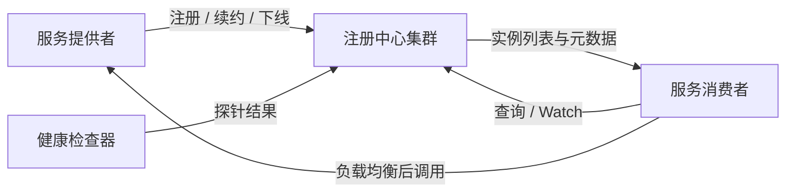
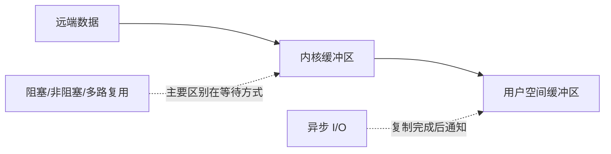
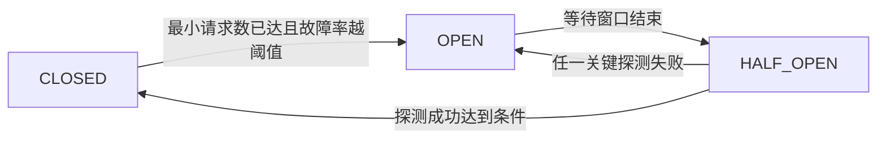
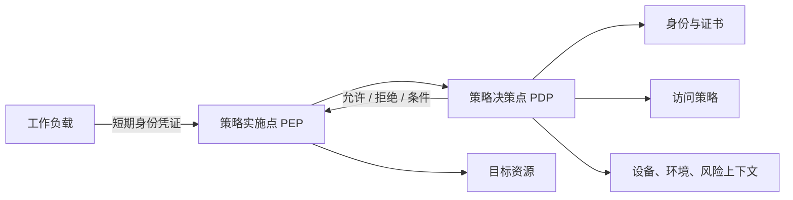
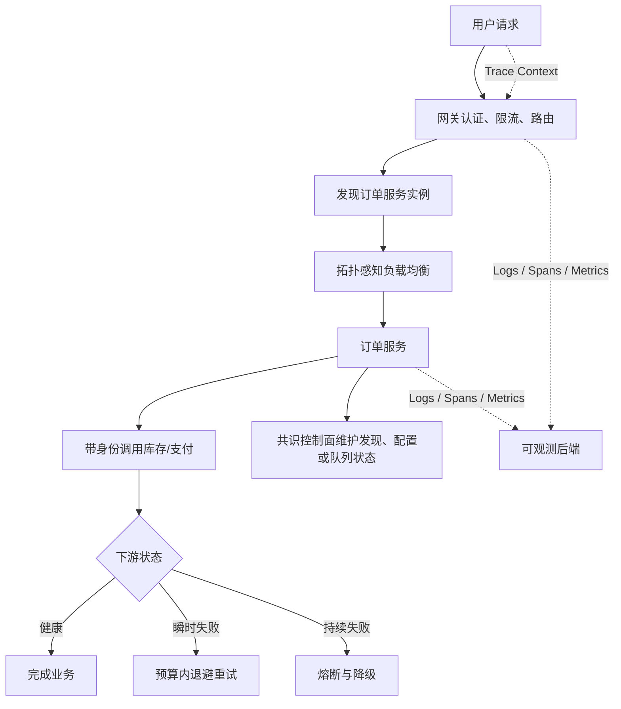
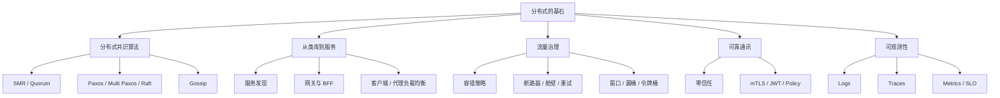

> 原书：周志明，《凤凰架构：构建可靠的大型分布式系统》
>
> 本章范围：“分布式的基石”，依次包括分布式共识算法、从类库到服务、流量治理、可靠通讯与可观测性。
>
> 版本说明：原章主要形成于 2020 年。Hystrix、Ribbon、Spring Cloud Sleuth、OpenTracing、OpenCensus 等产品或规范的生态状态已经变化，但它们所承载的断路、客户端负载均衡、上下文传播等问题仍然存在。本文沿原书顺序解释问题和方法，并在必要处补充截至 2026 年仍适用的边界：新系统通常优先考虑 Resilience4j、Envoy、Micrometer Tracing、OpenTelemetry 等维护中的实现，但选型必须服从具体场景。

## 1. 本章要建立什么“基石”

把单体拆成服务，只是把进程边界画了出来。真正让分布式系统能够长期运行，还需要五组基础能力：

1. **分布式共识算法**：多个副本怎样就操作顺序和最终状态达成共识？
2. **从类库到服务**：动态服务怎样被发现、路由和均衡？
3. **流量治理**：局部故障和超额流量怎样不演变成全局雪崩？
4. **可靠通讯**：服务身份和权限怎样不再依赖“内网天然可信”？
5. **可观测性**：怎样从日志、调用链和指标反推出系统内部状态？



### 1.1 五组能力之间不是并列堆砌

它们形成一个反馈闭环：



- 服务发现、配置和控制面本身要靠共识算法维持状态；
- 服务发现给出候选节点，负载均衡挑选目标，容错处理调用失败；
- 零信任机制要求每次调用携带可验证的服务或用户身份；
- 日志、追踪和度量提供调整阈值与定位故障的证据。

缺少其中任何一类，系统仍可能在演示环境中运行，却很难在节点动态变化、流量突发和故障必然发生的生产环境中可靠运行。

### 1.2 本章的共同分析方法

作者在五条主线中反复采用同一思路：

```text
承认不可靠事实
-> 明确必须维持的不变量
-> 把全局问题拆成局部机制
-> 允许局部失败或暂时不一致
-> 用多数派、隔离、重试或反馈使系统收敛
-> 通过观测验证机制是否真的有效
```

这也是“凤凰架构”的关键：可靠系统不要求每个组件永不出错，而要求错误可检测、影响可隔离、状态可恢复、过程可验证。

## 2. 分布式共识算法

本节从“多备份几块硬盘”开始，逐步把静态副本问题转化成动态副本之间的操作顺序问题。

### 2.1 从副本可靠性到状态机复制

假设单块硬盘一年内损坏概率为 $p$，把同一数据放在 $n$ 块独立硬盘上，只有全部损坏才丢失，则：

$$
P_{\mathrm{loss}} = p^n
$$

当 $p=5\%=0.05$：

| 副本数 $n$ | 同年全部损坏概率 | 至少一份存活概率 |
| --- | --- | --- |
| 1 | $5\%$ | $95\%$ |
| 2 | $0.25\%$ | $99.75\%$ |
| 3 | $0.0125\%$ | $99.9875\%$ |
| 4 | $0.000625\%$ | $99.999375\%$ |

这个乘法成立的前提是故障独立。若所有磁盘共用电源、机房、控制器或错误软件，公共原因故障会让 $p^n$ 严重高估可靠性。因此副本还要跨故障域部署。

静态文件复制容易，动态数据却会持续变化。最直观的全同步复制要求所有副本写入后才提交，能获得强一致状态，却让最慢或失联副本阻塞整体。新增副本提高数据冗余，反而增加同步路径失败的机会。

#### 2.1.1 状态转移与操作转移

- **状态转移（State Transfer）**：把完整目标状态复制到各节点。直观、恢复简单，但数据量大且同步要求高。
- **操作转移（Operation Transfer）**：复制“执行什么操作”的有序日志，各副本自行执行。网络传输更小，也允许副本执行进度暂时不同。

操作转移依赖确定性状态机：

$$
S_{i+1}=\delta(S_i, command_i)
$$

如果所有副本初始状态 $S_0$ 相同，并按相同顺序执行同一命令序列，那么最终状态相同。这就是状态机复制（State Machine Replication，SMR）。

其前提容易被忽视：同一命令在所有副本上必须具有确定结果。读取本地时钟、随机数、线程竞态或外部服务返回值时，应把不确定结果转成日志内容，不能让各副本自行决定。

#### 2.1.2 Quorum 为什么有效

对 $n$ 个投票节点，通常取多数派：

$$
q=\left\lfloor\frac{n}{2}\right\rfloor+1
$$

任意两个多数派必有交集，因为：

$$
2q>n
$$

交集保证新一轮决策至少能接触到上一轮多数派的一名成员，从而继承已形成的安全约束。容忍 $f$ 个崩溃故障至少需要：

$$
n\ge 2f+1
$$

三节点可容忍一节点失联，五节点可容忍两节点失联。Paxos 处理的是 Crash Fault 和消息丢失、延迟、乱序，不处理节点恶意撒谎的 Byzantine Fault；后者通常至少需要 $3f+1$ 个节点及不同协议。

若每个节点独立可用率为 $a$，多数派集群能工作的简化概率是：

$$
A_{quorum}=\sum_{k=q}^{n}{n\choose k}a^k(1-a)^{n-k}
$$

当 $n=5$、$q=3$、$a=0.95$ 时，$A_{quorum}\approx99.8842\%$。这仍依赖独立故障和网络模型，不能代替真实故障域分析。

下面的代码可复算副本丢失概率和多数派可用率：

```python
from math import comb


def all_copies_lost(failure_probability: float, replicas: int) -> float:
    return failure_probability**replicas


def quorum_availability(node_availability: float, nodes: int) -> float:
    quorum = nodes // 2 + 1
    return sum(
        comb(nodes, alive)
        * node_availability**alive
        * (1 - node_availability) ** (nodes - alive)
        for alive in range(quorum, nodes + 1)
    )


print(f"four_copy_safety={1 - all_copies_lost(0.05, 4):.8%}")
print(f"five_node_quorum={quorum_availability(0.95, 5):.6%}")
```

```text
four_copy_safety=99.99937500%
five_node_quorum=99.884187%
```

#### 2.1.3 共识与一致性不能混用

- **一致性（Consistency）**描述不同副本对外呈现的数据关系，是性质；
- **共识（Consensus）**描述节点如何就某个值或操作顺序达成决定，是过程和问题类型。

共识算法可用来构建线性一致的复制状态机，但算法名称本身不自动保证所有 API 都线性一致。读取是否经过 Leader、是否确认租约、是否允许读旧副本，都会改变外部一致性语义。

### 2.2 Paxos

Paxos 是 Leslie Lamport 提出的非拜占庭共识算法，是理解 Raft、ZAB 和许多复制协议的理论基础。

#### 2.2.1 Paxos 的诞生

Lamport 用虚构的 Paxos 城邦“兼职议会”比喻节点随时缺席、消息随时延迟的立法过程：即使参与者不保证及时在线，也要确保不会批准两条互相冲突的法律。

算法最初于 1990 年投稿，1998 年以《The Part-Time Parliament》发表，2001 年又有《Paxos Made Simple》。早期传播困难，一方面是问题本身复杂，另一方面是城邦叙事和证明风格难读。Google Chubby、Megastore、Spanner 等工业实践让其价值广为人知。


历史并不是本节重点，真正要抓住的是 Paxos 的不变量：**一旦某个值被选定，后续任何可能被选定的提案都必须带有同一个值。**

#### 2.2.2 算法流程

Basic Paxos 有三类逻辑角色，实际节点可兼任：

- **Proposer**：提出编号和值构成的 Proposal；
- **Acceptor**：承诺并接受提案，多数 Acceptor 接受后值被 Chosen；
- **Learner**：学习已选定值，不参与投票。

提案编号必须全局唯一并可全序比较，例如 `(counter, node_id)`。Acceptor 持久保存：

- `promised_n`：承诺不再接受更小编号；
- `accepted_n, accepted_value`：自己已经接受的最高编号提案。

##### 阶段一：Prepare / Promise

1. Proposer 生成更大的编号 $n$，向 Acceptors 发送 `Prepare(n)`；
2. Acceptor 若 $n>promised_n$，持久化新承诺；
3. 返回自己已接受的最高编号和值，若从未接受则为空；
4. 小于承诺编号的请求被拒绝或忽略。

##### 阶段二：Accept / Accepted

Proposer 收到多数 Promise 后：

- 若所有响应都没有已接受值，可提出自己的值；
- 若存在已接受值，必须采用其中提案编号最高者的值；
- 向 Acceptors 发送 `Accept(n, value)`；
- Acceptor 若没有承诺更大编号，则接受并持久化；
- 多数 Acceptor 接受后，该值被选定，再通知 Learners。



伪代码如下：

```text
propose(my_value):
    n = next_unique_number()
    promises = send_prepare_to_all(n)
    if count(promises) < quorum:
        retry_later_with_larger_number()

    accepted = non_empty_accepted_proposals(promises)
    value = value_of_highest_number(accepted) if accepted else my_value

    acknowledgements = send_accept_to_all(n, value)
    if count(acknowledgements) >= quorum:
        announce_chosen(value)
```

##### 为什么必须继承最高编号值

假设值 $X$ 已被某多数派接受。任何新的 Prepare 多数派都与它相交，因此至少有节点报告 $X$ 或其后继提案。新 Proposer 选择响应中最高编号已接受值，就把已形成的选择约束传递到新轮次。若它随意换成 $Y$，两个相交 Quorum 就可能分别推动不同值，破坏 Safety。

注意：单个 Acceptor 接受 $X$ 并不代表 $X$ 已经被选定。后续 Prepare Quorum 若没有包含它，可以选定别的值。只有多数接受才形成不可改变的 Chosen 结果。

#### 2.2.3 工作实例

设五个 Acceptor，Quorum 为三；$S_1$ 提议 $X$，$S_5$ 提议 $Y$。

##### 情况一：X 已被多数派选定

任何后续 Prepare 多数派都与接受 $X$ 的多数派相交，因此新 Proposer 必须继承 $X$。


##### 情况二：新一轮恰好看见尚未选定的 X

即使 $X$ 只被少数节点接受，只要新 Proposer 的 Promise 集合包含该记录，并且它是最高编号已接受提案，新一轮也会继续提出 $X$。这是图示中的一种可能路径，不意味着单节点接受就永久锁定 X。


##### 情况三：新 Quorum 未看见 X

若 $X$ 尚未被多数接受，新 Prepare Quorum 可以完全避开接受过 $X$ 的少数节点，此时响应均为空，新 Proposer 可选择 $Y$，最终由多数派选定 Y。


##### 情况四：并发 Proposer 形成活锁（Live Lock）

两个 Proposer 不断以更大编号抢占 Promise，均能通过 Prepare，却在 Accept 前被对方打断。Safety 没有被破坏，但 Liveness 可能迟迟无法实现。


随机退避能降低持续碰撞概率，却不提供异步网络中的绝对终止保证。Basic Paxos 每个实例只决定一个值，通常还需两轮网络交互，因此工业系统不会直接为每条日志独立运行完整 Basic Paxos。

### 2.3 Multi Paxos

Multi Paxos 用稳定的主 Proposer 减少并发提案冲突，并把一次共识扩展为连续多个日志槽位（Slot）的共识。

#### 2.3.1 选主与快速路径

Multi Paxos 的核心是让一个 Distinguished Proposer 以同一 Ballot 为多个 Slot 摊销 Phase 1：它先从多数 Acceptor 获得承诺，稳定期间便可连续为不同 Slot 执行 Phase 2，而不必为每条日志重新 Prepare。Multi Paxos 是一族协议，并未规定唯一的选举 RPC、任期结构或故障恢复细节；工程实现还要设计租约、超时或其他 Leader 选举机制。Raft 则明确规定了 Term、RequestVote、日志新旧比较和 Commit Index，原书后续主要借 Raft 风格说明一种可理解的工程实现。



上图使用 `term`、`index`、Follower 和 Commit Index 等 Raft 术语来直观展示稳定 Leader 的快速路径；不要把它当作 Multi Paxos 唯一、正式的协议定义。在 Multi Paxos 术语中，更准确的说法是同一 Ballot 下对连续 Slot 执行 Phase 2。

任期（Term / Ballot）必须单调递增，用于识别旧 Leader。网络分区后，少数派旧 Leader 可能还自认为有效，但无法获得 Quorum，因此不能提交新操作；多数派选出更高任期 Leader 后继续服务。

#### 2.3.2 数据复制与分区恢复

五节点系统被分为 2+3：

- 两节点分区中的旧 Leader 最多获两票，无法提交；
- 三节点分区可选出新 Leader 并提交；
- 网络恢复后，任期更高的新 Leader 生效；
- 旧分区未提交日志被截断或覆盖，再补齐已提交日志。

这里的关键是“写入本地日志”不等于“提交”。客户端只应在协议规定的 Quorum 条件成立后看到成功，否则旧 Leader 的孤立写入会制造两个历史。

#### 2.3.3 Safety 与 Liveness

- **Safety**：坏事永不发生，例如同一日志位置不会提交两个不同命令；
- **Liveness**：好事最终发生，例如最终能选出 Leader 并提交新命令。

异步网络无法仅凭超时准确区分慢节点和故障节点。Paxos/Raft 在既定故障模型下保证 Safety；Liveness 依赖网络最终恢复到足够稳定、超时随机化等条件。

Raft 把共识拆成 Leader Election、Log Replication、Safety，目标是比 Multi Paxos 更容易理解。Raft、ZAB 与 Multi Paxos 不是逐行相同的算法，但解决相近的复制状态机问题。Raft 还包含重要细节，例如 Leader 完整性、日志匹配，以及通常只用当前任期条目获得多数派来直接推进 Commit Index；实现时不能仅凭本节简图自行编写生产共识系统。

### 2.4 Gossip 协议

Gossip 源于 Xerox PARC 的 Epidemic Algorithms，用随机传播换取去中心化、扩展性和鲁棒性。

#### 2.4.1 基本传播过程

1. 信息源每个周期随机选择 $k$ 个邻居，即 Fan-Out；
2. 首次收到消息的节点在下一周期继续随机传播；
3. 重复直到消息以高概率覆盖网络。


在理想无重复、每个知情节点每轮感染 $k$ 个新节点时，覆盖规模近似按 $(k+1)^r$ 增长，传播轮数约为：

$$
r\approx\log_{k+1}N
$$

真实网络会重复选中、丢包和节点波动，因此只能给统计概率，不能承诺某条消息在确定时限内到达每个节点。

#### 2.4.2 反熵与传谣

- **Anti-Entropy**：比较并同步较完整状态，修复遗漏可靠，但网络开销大；
- **Rumor-Mongering**：主要传播新变化，流量小、收敛快，但需要摘要、版本向量或周期反熵兜底遗漏。

Gossip 没有中心节点，容忍节点动态加入、离开和部分连通，适合成员列表、故障检测和跨数据中心传播。缺点是短期状态不一致、冗余消息和收敛时间不可精确预测。

#### 2.4.3 Gossip 不是 Paxos 的“最终一致版”

Gossip 解决信息扩散，不直接决定冲突值谁胜出。比特币用 Gossip 传播区块和交易，用 PoW 等共识规则决定有效链；Consul 用 Gossip 维护成员和故障信息，用 Raft 决定数据中心内的强一致状态。必须把传播协议与决策协议分开。

### 2.5 共识部分的核心结论

1. 副本可靠性来自故障独立和故障域隔离，不只是副本数量。
2. 状态机复制把“复制状态”转为“复制确定的命令顺序”。
3. Quorum 的本质是任意两个多数派相交，借交集传递历史约束。
4. Paxos 优先保证 Safety，不承诺任意网络条件下都能及时结束。
5. Multi Paxos / Raft 用 Leader 把并发竞争转化为有序日志复制。
6. Gossip 擅长扩散和反熵，不等同于共识决策。

## 3. 从类库到服务

类库通过本地调用复用功能；服务通过远程调用获得物理隔离、独立部署和技术异构。代价是动态坐标、网状调用和网络失败。原书把问题归纳为：

1. 消费者怎样找到服务；
2. 生产者怎样通过统一入口暴露和路由服务；
3. 调用怎样均衡到实例并在失败时换目标。

对应服务发现、网关路由、客户端负载均衡和后文服务容错。

### 3.1 服务发现

服务发现相当于分布式时代的动态链接：把符号服务名转换成当前可用网络坐标。

#### 3.1.1 服务发现的意义

远程服务坐标可以抽象为：

$$
Coordinate=(FQDN, Port, ServiceIdentifier)
$$

- FQDN 定位主机或服务域；
- Port 定位进程或监听端点；
- Service Identifier 定位具体入口，例如 REST URI、RPC 方法或 WSDL Operation。

早期 UDDI 试图做“百科全书式发现”，包含企业、接口和协议详情；现代主流是“门牌式发现”，只把稳定名称解析为健康实例，接口契约由调用方预先掌握。

DNS 很适合稳定服务，但微服务实例频繁扩缩、重启，TTL 难以及时反映健康。ZooKeeper、Eureka、Consul、Nacos 及 Kubernetes Service 因而承接动态注册和健康维护。

#### 3.1.2 可用与可靠

服务发现包含三个必要过程：

1. **Service Registration**：服务自注册，或由编排平台、Agent 第三方注册；
2. **Service Maintaining**：心跳、主动探针、连接状态或租约维护健康列表；
3. **Service Discovery**：消费者通过 DNS、HTTP API、Watch 或环境信息取得坐标。




注册中心是所有服务共同依赖的控制面，既要可用，又不能持续返回错误地址。两种典型取舍：

- Eureka 倾向 AP：异步复制、客户端缓存和 TTL，在中心不可用时仍能用旧列表；依赖负载均衡与容错剔除坏地址。
- Consul 的目录写入由数据中心内 Raft 多数派提交，`consistent` 读取也经过 Leader / Quorum，体现 CP 语义；但这不能概括所有发现读取。Consul DNS 默认允许 Stale 读取，HTTP 的 Default 读取也可能有极小陈旧窗口，失去 Quorum 时 Stale 模式仍可能返回旧目录。Gossip 则用于成员和跨数据中心信息传播。因此 AP/CP 必须绑定到具体读写接口、客户端缓存和分区行为，不能只给整个产品贴一个标签。


选择不是比较品牌，而是比较错误后果：

- 旧地址导致几次快速失败可以接受，倾向高可用与缓存；
- 错误服务列表可能写坏状态，宁愿拒绝服务，倾向强一致控制面。

健康也不能只等同于“进程活着”。Liveness 表示进程存在，Readiness 表示可接流量，Startup Probe 避免慢启动被误杀。依赖数据库失效是否应让实例 Not Ready，要根据是否会造成级联摘除来决定。

#### 3.1.3 注册中心实现

原书将实现分三类：

| 类型 | 代表 | 优点 | 代价 |
| --- | --- | --- | --- |
| 分布式 K/V 上自建 | ZooKeeper、etcd | 共识能力稳固、API 简洁 | 注册、健康检查和模型需自建 |
| DNS / 基础设施 | CoreDNS、Kubernetes Service | 对语言透明、应用无 SDK | 受 DNS TTL 和记录语义限制 |
| 专用注册中心 | Eureka、Consul、Nacos | 健康、配置、元数据功能完整 | 要集成客户端或 Agent，产品语义各异 |

Kubernetes 早期经历 SkyDNS、KubeDNS，后来以 CoreDNS 为默认。后端存储和缓存方式决定具体一致性，不能仅凭“使用 DNS”判断 AP/CP。

Nacos 等产品可支持不同一致性模式，但每类数据必须选择具体协议，不是同时绕过 CAP。到 2026 年，产品内部协议和 Spring 集成状态已多次变化，选型应核对当前文档，而不是照搬原章版本表。

### 3.2 网关路由

网关位于内部服务边缘，为外部消费者提供稳定入口：

$$
Gateway=Router+Optional\ Filters
$$

路由是基本职责；认证、授权、限流、缓存、协议转换和观测是可选职责。把所有逻辑塞进网关会形成高耦合单点。

#### 3.2.1 网关的职责

微服务若直接暴露每个实例，会泄露动态坐标、内部网络和安全边界。网关根据请求特征路由到逻辑服务：

- L4 可按地址、端口、SNI 等有限特征转发；
- L7 可理解 HTTP URL、Header、gRPC、WebSocket 等协议内容；
- 能识别的协议层次决定可用路由规则。

原书 Zuul 示例表达的是稳定规律：外部路径映射逻辑 `serviceId`，再由发现与负载均衡解析实例。具体 YAML 写法会随 Gateway API、Ingress、Istio 或产品版本变化。

网关每增加 $t_g$ 延迟，所有经过它的请求都至少增加 $t_g$。因此要保持轻量、高可用，并在前方使用云负载均衡、LVS 或 ECMP 把唯一入口映射到多个网关实例。

#### 3.2.2 网络 I/O 模型

一次 Socket 读取有两个阶段：

1. 等待数据到达内核缓冲；
2. 把数据从内核复制到用户空间。

同步/异步描述“完成由谁通知”，阻塞/非阻塞描述调用线程等待时是否挂起，不能当成一组同义反义词。

| 模型 | 等待数据 | 复制数据 | 特点 |
| --- | --- | --- | --- |
| Blocking I/O | 调用线程阻塞 | 调用线程完成 | 简单，一连接一线程时切换成本高 |
| Non-Blocking I/O | 轮询立即返回 | 就绪后调用线程复制 | 可能空转浪费 CPU |
| I/O Multiplexing | select/epoll/kqueue 等待多个 fd | 就绪后调用线程复制 | Linux 高并发主流，仍属同步 I/O |
| Signal-Driven I/O | 信号通知就绪 | 调用线程复制 | 使用较少，信号编程复杂 |
| Asynchronous I/O | 内核完成等待 | 内核完成复制后通知 | 理论最省等待线程，依赖 OS 与运行时 |



Zuul 1 的 Thread-per-Connection 与 Zuul 2 / Netty 事件驱动模型体现了线程数量和上下文切换差异。原书把 Zuul 2 概括为异步 I/O，严格说 Netty 在 Linux 上通常基于 epoll 多路复用，应用 API 是异步事件式，底层不必是 POSIX AIO。今天还有 io_uring 等机制，仍应以真实内核、运行时和后端负载压测，不能仅凭模型名称宣称快多少。

#### 3.2.3 BFF 网关

Backends for Frontends 为 Web、移动端、桌面端等不同前端提供独立聚合与协议适配。


收益：

- 前端只获取所需数据，减少聊天式调用和 Overfetching；
- 移动端可压缩响应，桌面端可采用不同协议；
- 后端领域服务不被某一 UI 模型绑死。

风险：

- 多套 BFF 复制授权、缓存和聚合逻辑；
- BFF 容易演变成承载业务规则的新单体；
- 前端团队拥有 BFF 时仍须遵守后端契约和安全基线。

BFF 应编排展示需求，不应成为领域状态的权威所有者。

### 3.3 客户端负载均衡（Client-Side Load Balancer）

先区分四个动作：

1. 服务发现：逻辑名变成候选地址集；
2. 网关路由：根据请求特征选择逻辑服务；
3. 负载均衡：从同一服务多个实例中选一个；
4. 服务容错：目标失败后决定重试、换节点或降级。

职责可以在 DNS、网关、客户端库和 Sidecar 间重叠，但概念不能混淆。

#### 3.3.1 客户端负载均衡器

客户端库从注册中心缓存实例列表，在调用进程内选择目标，避免内部流量绕到集群边缘。


优点：

- 选择是本地方法调用，没有集中均衡器网络跳转；
- 无中央数据面带宽瓶颈；
- 可按调用方、服务配置亲和、权重、区域优先等策略；
- 与服务发现和重试容易整合。

缺点：

- 每种语言都需实现和升级客户端；
- 库与业务同进程，资源与故障相互影响；
- 大量客户端 Watch/轮询增加控制面负担；
- 策略版本可能漂移；
- 任一被攻陷服务可直接探测内部地址，扩大横向移动风险。

Ribbon 已停止活跃演进，Spring Cloud LoadBalancer、gRPC 客户端均衡等承接相应问题，但产品替换不改变上述权衡。

#### 3.3.2 代理负载均衡器

Sidecar 把均衡器移出业务进程，业务访问本机代理，控制面主动向代理下发端点和策略。


收益：语言无关、策略统一、mTLS 和遥测集中、业务与代理故障边界更清楚。代价是每个工作负载增加代理 CPU、内存、连接和一跳延迟，控制面与数据面升级也更复杂。

“同 Pod 回环访问一定便宜”仍需测量：iptables/eBPF 重定向、代理解析、TLS 和队列都可能带来成本。Sidecar 也不是唯一方向，节点级代理、Ambient Mesh 和 eBPF 数据面尝试降低每 Pod 代理开销。

#### 3.3.3 地域与区域

- **Region**：地域，通常跨广域网，无低延迟私网保证；
- **Availability Zone**：同地域内电力、网络故障域独立的区域，可走区域间私网；
- **Sub-zone / Group**：更细拓扑标签，用于机架、节点或网络段亲和。

拓扑感知路由通常会被设计成优先同节点、同 Zone，再跨 Zone，并避免正常流量跨 Region；但这不是平台必然默认。以当前 Kubernetes 为例，未配置拓扑偏好时通常在集群端点范围内分配，`PreferSameNode`、`PreferSameZone` 或拓扑感知提示需要显式配置，而且局部端点不足时可能造成过载。高可用要求跨故障域，低延迟希望靠近，二者存在张力。

异地容灾与双活不同：容灾允许延迟复制和切换；双活要求两地持续接流量并处理数据冲突。Region/Zone 是云厂商故障域语义，不应机械等同于行政城市，需以具体云平台 SLA 和网络边界为准。

### 3.4 从类库到服务的核心结论

1. 服务发现解决名字到动态坐标，网关解决外部到逻辑服务，负载均衡解决实例选择，容错解决失败后动作。
2. 控制面必须同时考虑服务列表陈旧与中心不可用两类风险。
3. 网关应以路由为核心，过滤功能越多，入口爆炸半径越大。
4. 客户端库性能直接但绑定语言，代理统一治理但增加平台成本。
5. 拓扑感知是延迟、成本与容灾的共同输入，不只是一个负载均衡标签。

## 4. 流量治理

微服务把一次业务拆成多次远程调用后，会出现两类系统性风险：

- 一个节点失败沿调用链扩散，形成雪崩；
- 节点未崩溃但过载，请求排队到超时，大量已做工作被浪费。

服务容错处理“调用失败怎么办”，流量控制处理“系统不应再接多少流量”。

### 4.1 服务容错

容错性设计不能妥协，因为分布式节点、进程和网络失败都是正常事件。容错策略描述“做什么”，设计模式描述“怎样做”。

#### 4.1.1 容错策略

| 策略 | 行为 | 前提和适用场景 | 主要风险 |
| --- | --- | --- | --- |
| Failover | 换副本重试 | 幂等、剩余超时充足 | 放大流量和尾延迟 |
| Failfast | 立即返回失败 | 非幂等、无恢复价值 | 上游不处理会扩散错误 |
| Failsafe | 返回默认值并记录 | 非关键旁路 | 静默掩盖真实故障 |
| Failsilent | 暂停向坏服务发流量 | 连续超时、需要隔离 | 隔离期内不可用 |
| Failback | 后台异步重试 | 可延迟且幂等 | 队列堆积、最终仍失败 |
| Forking | 并行请求多个副本，首个成功即返回 | 极低尾延迟、高价值请求 | 成本放大、取消困难 |
| Broadcast | 所有副本都成功才成功 | 刷新、全体操作 | 成功概率随节点数下降 |

每种重试都必须消费统一 Deadline，而不是每层重新给完整超时。若上游只剩 $40\ ms$，下游正常一次需 $60\ ms$，继续重试没有成功空间。

#### 4.1.2 容错设计模式

##### 断路器模式

断路器为一个远程依赖维护状态：

- CLOSED：正常放行并统计；
- OPEN：直接快速失败，不发远程请求；
- HALF_OPEN：隔离期后放少量探测，成功则关闭，失败则重开。




Hystrix 典型默认示例是 10 秒窗口至少 20 个请求且错误率达到 50% 才打开。阈值必须按服务基线调整：低流量服务若不设最小样本，一次失败就可能误熔断；高流量服务若窗口过长，故障会扩散太久。

熔断是自动停止调用，降级是上游拿不到正常结果后采用替代路径。降级可以返回缓存、排队稍后处理、隐藏非核心功能或给明确失败；仅把异常原样抛给用户不是完整降级。

##### 舱壁隔离模式

Thread-per-Request 下，一个下游超时会长期占据上游线程。若长期平均每秒 50 次调用、平均驻留 20 秒，Little's Law 给出的稳态**期望在途量**为：

$$
L=\lambda W=50\times20=1000
$$

个并发请求。这不是最大并发上界：突发流量、尾延迟和排队会让瞬时值更高。即便只看长期均值，它也足以耗尽 200 至 400 线程的全局池。


为每个依赖设置独立线程池，可把服务 I 最多限制为 5 个线程，其他功能继续工作。


线程池能中断、排队和独立回收，但增加上下文切换。信号量（Semaphore）隔离只控制并发数，开销小，却不能把同步阻塞从调用线程移走。现代事件循环和虚拟线程改变线程成本，但并没有消除连接、内存、下游并发等资源上限，Bulkhead 仍有价值。

系统级舱壁还可按租户、VIP、地域或功能部署独立实例，把故障爆炸半径限制在一组用户。调用级隔离适合客户端或 Sidecar，系统级隔离适合 DNS、网关和调度平台。

##### 重试模式

只在以下条件同时成立时重试：

1. 主路关键操作，或明确允许异步恢复；
2. 错误是瞬时且可恢复的；
3. 操作幂等，或携带幂等键；
4. 有最大次数与总体 Deadline；
5. 尊重 `Retry-After` 和下游容量；
6. 与断路、限流和重试预算联动。

指数退避加随机抖动可写成：

$$
delay_i=\min(cap,base\times2^i)+jitter
$$

Jitter 避免大量客户端同时醒来形成 Thundering Herd。只对 GET/PUT 等方法名判断幂等仍不够，业务实现必须真正满足重复执行效果相同。

重试可能在客户端、SDK、Sidecar、网关多层开启。若四层各最多尝试 4 次，理论调用数是：

$$
4^4=256
$$

因此应只有一个明确层次负责重试，或共享全链路尝试次数与 Deadline。Hedged Request（延迟后并发第二份）可降低尾延迟，但与 Forking 一样会放大负载，只适合可取消、幂等、高价值读请求。

### 4.2 流量控制

当容量为 40 TPS 而持续流入 100 TPS 时，若全部接收，很多请求会完成部分步骤后超时，消耗了资源却没有任何完整业务成功。限流的目标不是尽量多开始，而是尽量多完成。

原书场景：业务调用 10 个服务，每个平均 $0.5\ s$，每类服务 20 个副本。

$$
CPU\ Time=10\times0.5=5\ s
$$

$$
QPS_{service}=\frac{1}{0.5}\times20=40
$$

原书把总能力计算为 $40\times10\div5=80\ TPS$，但这个算式量纲不成立：$40\ QPS\times10$ 已是每秒可完成的服务调用数，不能再除以以秒计的单笔处理时间。若 10 类服务各有 20 个实例、每个实例每次占用 $0.5\ s$，则总处理容量为每秒 $10\times20=200$ 个实例秒；每笔业务消耗 $10\times0.5=5$ 个实例秒，所以正确的简化估算是：

$$
TPS=\frac{10\times20}{10\times0.5}=40
$$

也可以从瓶颈看：每类服务都只能处理 $40\ QPS$，而每笔业务都恰好调用每类服务一次，因此最多是 $40\ TPS$。这里的 $0.5\ s$ 是实例占用或墙钟服务时间，不能在没有 CPU 利用证据时直接称为 CPU Time。现实还受并行度、最慢服务、数据库、排队和调用扇出影响，这个算式用于建立容量直觉，不是通用公式。

#### 4.2.1 流量统计指标

- TPS：每秒完成或处理的逻辑业务事务；
- HPS：原书用于表示每秒外部请求数，现代实践更常写 RPS；
- QPS：每秒查询或内部服务操作数。

一个事务可能包含多个外部请求，一个请求又扇出多个内部查询，因此三者不能互换。限流应尽量选择最贴近稀缺资源的指标：

- Web API 常按 RPS、租户、端点和成本权重；
- 下载按 Byte/s；
- 长连接按并发连接数；
- AI 推理按 Token/s、GPU 时间；
- 数据库按并发查询和连接池占用。

TPS 贴近业务，但用户交互时长不可控，很难直接表示瞬时资源压力。RPS 易测量，因此常作为入口限流基础。

#### 4.2.2 限流设计模式

##### 流量计数器模式

另设一个“固定窗口每秒允许 80 次”的独立例子：边界附近可能在短短一秒内通过前一窗口末尾 60 次和后一窗口开头 60 次，即承受 120 次。它也可能拒绝可由后续空闲时间消化的短突发。此处 80 只是用于说明窗口边界，不再沿用前述容量结论。

优点是计数器简单，适合粗粒度配额；缺点是边界突刺和不平滑。

##### 滑动时间窗模式（Sliding Window）

窗口随时间移动，统计最近 $W$ 秒而不是自然秒。工程上常把窗口分为 $b$ 个 Bucket，精度为 $W/b$。


```text
on_tick:
    rotate_to_new_bucket()
    expire_bucket_older_than(window)

on_request(result):
    current_bucket.total += 1
    current_bucket[result] += 1

rate = sum(active_buckets.total) / window
error_rate = sum(active_buckets.failures) / sum(active_buckets.total)
```

Bucket 滑动窗口是近似统计，边界误差由 Bucket 粒度决定；精确滑动日志需要保留每个请求时间戳，空间和清理成本更高。该模式适合否决式限流和断路统计，不负责平滑排队。

##### 漏桶模式（Leaky Bucket）

请求进入有限 FIFO，以固定速率 $r$ 流出。若时间段 $t$ 内到达 $A(t)$ 个请求，桶容量 $B$，不溢出的理想条件是：

$$
A(t)-rt\le B
$$

漏桶把突发整形成稳定流量，适合下游需要恒定速率。缺点是即使系统刚刚空闲，也不能立即允许大突发；队列过长还会让请求排到自身 Deadline 后才处理。因此队列容量应由可接受等待时间决定，而不是越大越好。

##### 令牌桶模式（Token Bucket）

令牌按速率 $r$ 生成，桶容量为 $B$。请求消耗令牌；空闲时最多积累 $B$ 个，因此允许瞬时突发，同时长期平均不超过 $r$。

任意时间 $t$ 内允许流量满足：

$$
A(t)\le B+rt
$$

实现无需真的每毫秒启动定时器，可在请求到来时惰性计算：

```text
refill(now):
    tokens = min(capacity, tokens + (now - last_refill) * rate)
    last_refill = now

allow(cost):
    refill(clock.now())
    if tokens >= cost:
        tokens -= cost
        return true
    return false
```

实现要使用单调时钟、原子更新，并明确不同请求 Cost。漏桶控制输出形状，令牌桶控制平均速率并容忍一定突发，两者不要只按“都有桶”混淆。

#### 4.2.3 分布式限流（Distributed Rate Limiting）

单节点计数器无法约束整个集群。最直接做法把状态放 Redis，以 Lua/事务原子更新，但每次请求多一次网络调用，限流控制面可能反成瓶颈。

原书提出额度“货币化”：网关给用户额度 $Q_A$，调用服务 $X$ 消耗 $Cost_X$，经过 $N$ 次调用剩余：

$$
Limit_N=Q_A-\sum_{i=1}^{N}Cost_i
$$

只在额度耗尽时批量申请新额度，减少中心访问。这与分片 Token Lease 类似：中心精确度换本地性能。节点崩溃会损失未用额度，超发和回收策略需要明确。

分布式限流还可采用：

- 网关集中限流：简单，但只能看到入口，不能反映内部扇出；
- Local Limit + Global Quota：各实例获得局部份额，快速但会有短时误差；
- Sidecar / 节点 Agent：语言无关，控制面下发配额；
- 自适应并发限制：根据排队、延迟和错误动态调节，而非固定 RPS。

限流不是越精确越好。若精确同步的开销接近业务处理成本，就失去保护意义。应明确允许的超发量、拒绝语义、排队上限和 VIP 公平性。

### 4.3 流量治理的核心结论

1. 超时、重试、熔断、隔离、降级和限流必须统一设计，单独开启可能互相伤害。
2. Deadline 应沿调用链递减传播，不能每层重新计时。
3. 重试只适合瞬时故障和幂等操作，并受全链路预算限制。
4. Bulkhead 控制故障爆炸半径，Circuit Breaker 控制持续失败流量。
5. 固定窗口简单但有边界突刺，滑动窗口适合统计，漏桶整形，令牌桶允许受控突发。
6. 分布式限流需要在精确度、中心开销和短时超发之间权衡。

## 5. 可靠通讯

服务技术异构和数量膨胀后，任何一个节点都可能存在漏洞。仅保护内外网边界，会让被攻陷的内部节点成为横向移动跳板，因此安全模型要从“位置可信”转向“身份与策略可信”。

### 5.1 零信任网络

传统 Perimeter-Based Security 根据内网、DMZ、VPN、IP 和子网划分信任。它仍能过滤互联网攻击，但不能假设边界内服务天然安全。

Zero Trust 的核心不是“什么都不信任”这句口号，而是：**不以网络位置自动授予信任，每次访问基于可验证身份、设备/工作负载状态、最小权限和持续策略判断。**

#### 5.1.1 零信任安全模型的特征

原书借 Google BeyondProd 总结以下迁移：

| 边界安全默认 | 零信任目标 |
| --- | --- |
| 内网服务默认互信 | 服务间通信也认证授权 |
| IP / 机器代表身份 | 工作负载证书与服务身份 |
| 服务固定在已知主机 | 服务可在动态、多云环境调度 |
| 每个应用自己实现安全 | 基础设施提供统一策略实施点 |
| 构建发布约束弱 | 软件供应链可验证、可追溯 |
| 宿主机隔离 | 共享内核下仍强化工作负载隔离 |
| 安全状态难观察 | 全局策略、审计和生效状态可见 |



边界防火墙仍有价值，可减少 DDoS 和无关扫描；零信任是纵深防御的补充，不是拆掉边界。身份也不能只来源于一张长期证书，还要有短寿命、轮换、吊销、工作负载证明和策略绑定。

安全策略集中不等于业务授权全部移出应用。mTLS 和 Namespace 策略适合基础设施；“用户只能退款自己的订单”需要领域数据，仍应由业务服务判断。

#### 5.1.2 Google 的实践探索

BeyondProd 的代表性机制：

- Google Front End：边缘终止攻击和安全接入；
- ALTS：服务身份、双向认证和加密；
- Service Access Policy：集中访问策略与审计；
- Binary Authorization：部署前验证制品与供应链；
- Host Integrity：验证 BIOS、Bootloader、Kernel 等启动链；
- gVisor：用用户态内核强化容器隔离，Kata Containers 采用轻量虚拟机路线。

目标是 Secure by Default、人工干预成为例外。代价是 PKI、身份控制面、策略、遥测、供应链签名和隔离运行时的巨大平台投入。小团队不应复制 Google 的组件数量，而应使用云 IAM、托管证书、Kubernetes Admission、Sigstore/SLSA、服务网格等成熟能力，按风险逐步建设。

零信任不是产品采购清单。若身份根、策略和证书轮换本身不可用，集中安全层会成为新的全局故障点。

### 5.2 服务安全

本节对比应用层 Spring Cloud 方案与基础设施 Istio 方案，观察安全职责放在哪里。

#### 5.2.1 建立信任

服务之间通常没有预共享的人类秘密，主要依靠 PKI：CA 把身份绑定到公钥，工作负载持私钥和短期证书，双方通过 TLS 验证。

- 单向 TLS：客户端验证服务端，适合公共服务；
- mTLS：双方都出示证书，适合私有服务和工作负载身份。

真正难点不是打开 TLS 开关，而是自动完成 CA 信任、CSR、签发、分发、轮换、吊销和密钥保护。动态服务若依赖人工证书操作，最终会出现过期或共享私钥。

SPIFFE/SPIRE 等标准化方向用 SPIFFE ID 和 Workload API 提供跨平台工作负载身份。无论采用 Istio 还是其他平台，都应让私钥最小暴露、证书短寿命并自动轮换。

#### 5.2.2 认证

原书区分：

- Peer Authentication：调用者是哪个服务；
- Request Authentication：请求代表哪个最终用户。

两种身份可同时存在：订单服务通过 mTLS 确认调用方是网关，再通过 JWT 确认最终用户。不能用服务身份冒充用户，也不能只验用户 Token 而忽略哪个服务在转发。

##### 服务认证

Istio 可用 `PeerAuthentication` 对 Namespace 开启 STRICT mTLS，Sidecar 自动完成证书和握手。迁移期 PERMISSIVE 同时接受明文与 mTLS，但明文流量不具备零信任保证，应缩短过渡并监控实际连接模式。

Spring Cloud 示例使用 OAuth 2 Client Credentials：每个服务用 Client Secret 换 JWT，再调用资源服务。这能做应用层身份与授权，却不加密信道，Bearer Token 被窃取即可重放，仍必须配合 TLS。Secret 不应写入源码，应来自 Secret Manager，并支持轮换。

原章示例还让浏览器前端使用 Resource Owner Password Credentials（Password Grant）。这是理解 2020 年工程版本所需的历史事实，但不能作为当前实践：RFC 9700 已明确规定该模式 **MUST NOT** 使用，因为客户端直接接触用户密码会扩大凭证泄漏面，也不适配 MFA、WebAuthn 等流程。交互式用户登录应采用 Authorization Code + PKCE，并在需要身份语义时使用 OpenID Connect；Client Credentials 只用于应用自身的机器身份。

当前实践还应验证 Token 的 `iss`、`aud`、`exp`、Scope 和类型，固定允许算法，并把 JWKS 绑定可信 Issuer，不能只做签名数学校验。

##### 用户认证

Istio `RequestAuthentication` 可通过 JWKS 验证 JWT，提取 Principal，并按需转发原 Token。它会拒绝“已经携带但验证无效”的 JWT，却默认允许“完全没有 JWT”的请求；若接口必须登录，还要配套 `AuthorizationPolicy`，例如要求 `requestPrincipals: ["*"]`。JWKS URI 方便密钥轮换，但控制面要处理缓存、旧新密钥重叠和获取失败。

JWK、JKS、PKCS#12、PEM 都是密钥或证书材料的不同表示；JWKS 是 JSON Web Key 集合，`kid` 只用于可信集合中选钥，不能让未验证 Token 指向任意 URL 或任意本地文件。

基础设施验 Token 很适合统一拒绝无效请求，但业务服务仍要验证受众和业务权限。若 Envoy 验证后继续把原 Token 交给应用，双方应明确谁是最终责任者，避免配置漂移导致“一边以为另一边会验”。

#### 5.2.3 授权

认证后可依据服务身份、用户 Principal、Namespace、路径、方法和 Claim 授权。

- Istio `AuthorizationPolicy` 适合统一的服务级、路径级 ALLOW / DENY；
- Spring Security 方法注解适合带业务参数和领域数据的细粒度决策；
- BFF 可做渠道隔离，但不是最终业务权限防线。

应坚持 Default Deny 和 Least Privilege。策略优先级、通配符和未匹配行为要用自动测试验证；“有 mTLS”只证明连接身份，不自动代表该身份能访问所有服务。

原书示例的 Istio API 为当时 `v1beta1`，当前字段和版本应以实际 Istio 文档为准。Spring Security OAuth 旧项目也已停止维护，新系统应使用维护中的 OAuth 2 Client / Resource Server 能力。

### 5.3 可靠通讯的核心结论

1. 边界安全继续存在，但内网位置不能自动授予信任。
2. 服务身份、用户身份和业务权限是三层不同问题。
3. mTLS 解决双向身份和信道保护，不替代 RBAC/ABAC 与领域授权。
4. 证书和 Token 的自动签发、轮换、撤销比算法选择更容易成为运行瓶颈。
5. 安全能力适合平台统一，业务语义必须留在服务中。
6. 零信任只有在自动化成本可承受时才是工程方案，而不是口号。

## 6. 可观测性

可观测性源自控制理论，表示能否由外部输出推断内部状态。它不等于“装了监控”，而是系统是否产生足够、可关联、可查询的证据回答未知问题。

原书按三支柱组织：

- Logging：离散事件，适合审计和上下文；
- Tracing：一次请求跨服务的因果路径，适合定位延迟和错误；
- Metrics：聚合数值，适合趋势、监控和告警。


三者不是互相替代：指标告诉你“错误率升高”，Trace 告诉你“哪段调用慢”，日志解释“当时发生了什么”。OpenTelemetry 已成为跨厂商采集和上下文传播的主流标准，但存储、查询、可视化和告警仍由具体后端实现。

### 6.1 事件日志

日志链路包括输出、收集、缓冲、加工、索引、存储和查询。打印一行很简单，把百万节点日志可靠地汇总则是数据工程问题。


#### 6.1.1 输出

日志应记录有价值事件，避免：

- 密码、Token、银行卡、身份证等敏感信息；
- 为日志额外调用数据库或远程服务；
- 大对象完整序列化、方法参数和返回值泛滥；
- 已处理异常仍打印误导性的 ERROR 堆栈；
- 高基数字段和无法解析的自由文本。

应包含：

- 时间、级别、服务、实例、环境；
- Trace ID、Span ID、请求 ID；
- 内部用户/租户标识的安全形式；
- 关键业务事件、状态变化与错误分类；
- 启动和配置变更中的非敏感摘要。

结构化 JSON 日志比依赖正则解析文本更稳健，但必须定义 Schema、版本和大小限制。Trace ID 可放 MDC 自动注入，同时应返回给客户端用于报障。

“参数绝不应进日志”也不是绝对法则。应按数据分类、采样和脱敏记录必要字段；方法级详细诊断更适合 Trace Event 或按需 Profiling，不能默认全量打印。

#### 6.1.2 收集与缓冲

Filebeat、Fluent Bit、Vector 或 OpenTelemetry Collector 可作为节点 Agent / DaemonSet 收集 stdout、文件和系统日志。原书中的 Logstash Shipper 较重，Beats 用 Go 重写后降低节点开销。

收集系统通常不追求和金融账本一样的零丢失，因为那会让日志反向阻塞业务。应定义质量等级：审计日志可能要求持久落盘和 At-Least-Once，调试日志可采样或丢弃。

Kafka、Redis Stream 或持久队列可削峰：


缓冲区满时必须明确 Backpressure：阻塞业务、丢弃低级日志、落本地磁盘还是限速。没有策略只会把磁盘写满。

#### 6.1.3 加工与聚合

原书以 Logstash Grok 把 Nginx Access Log 拆成 IP、时间、方法、URL、状态、大小、Referer、Agent 等字段。处理阶段还可：

- 统一时间与时区；
- 转换数值类型；
- 脱敏和删除秘密；
- GeoIP、服务、环境等维度补充；
- 路由不同保留策略；
- 预聚合固定指标。

Grok 对格式漂移敏感，新系统优先让生产者直接输出结构化事件。日志预聚合适合固定查询，即席调查仍需保留合理粒度的原始事件。

#### 6.1.4 存储与查询

日志具有时间顺序追加、近期价值高、旧数据少修改、需要全文与近实时查询等特征。Elasticsearch/OpenSearch 常按时间建立索引，热数据放 SSD，温冷数据降级到便宜磁盘或对象存储，并由生命周期策略删除。


索引不是越多越好。每个字段都建立索引会增加写放大和存储；高基数动态字段会造成 Mapping Explosion。应分离可检索字段、仅存储字段和全文消息。

Elastic Stack 是原书时代代表方案，不是唯一答案。Loki 侧重标签索引和低成本日志，云厂商及 OpenSearch 也很常见。选择取决于查询模式、许可、规模和运维能力。

### 6.2 链路追踪

Dapper 奠定现代分布式追踪模型。完整系统通常包括采集、传输、存储、查询和展示；探针只是采集部分。

#### 6.2.1 追踪与跨度

- Trace：一次请求从入口到响应的完整因果链；
- Span：链中的一个操作，包含 Trace ID、Span ID、Parent ID、起止时间、状态和属性；
- Trace Tree / DAG：Span 通过父子和 Link 关系组成调用结构。


Span 持续时间：

$$
duration=t_{end}-t_{start}
$$

但父 Span 的 Duration 不能简单等于所有子 Span 之和，因为子调用可能并行，父 Span 还含本地处理和排队。

上下文必须跨进程传播。今天 HTTP 常使用 W3C Trace Context：`traceparent`、`tracestate`；消息队列还需把上下文放消息属性，并用 Span Link 表达异步、多生产者关系。

追踪要求低损耗、应用透明、随应用扩缩和持续运行。不能把秘密、完整 SQL 参数和无限属性放进 Span。

#### 6.2.2 数据收集

原书分三类：

##### 基于日志的追踪

把 Trace/Span ID 写入日志，再由日志归集重建链路。性能低侵入，但日志丢失、延迟和格式误差会让链路不完整。Spring Cloud Sleuth 历史上常这样关联；今天 Spring 生态已转向 Micrometer Tracing 与 OpenTelemetry Bridge。

##### 基于服务的追踪

SDK 或 Java Agent 注入探针，通过独立协议上报 Collector。Zipkin、Jaeger、SkyWalking、Pinpoint 都采用或支持此类方式。精度高，可观察进程内方法，但 Agent 兼容和性能成本更高。


##### 基于边车代理的追踪

Envoy 等代理自动观察 HTTP/gRPC 调用，语言无关并能统一网络 Span；但看不到业务进程内部方法、数据库驱动和本地队列，通常仍需 SDK/Agent 补充。Sidecar 也只有在请求正确传播 Trace Context 时才能把多跳合为同一 Trace。

采样是控制成本的关键：

- Head Sampling 在入口决定，简单、全链一致，但可能丢掉事后才知道的重要错误；
- Tail Sampling 收齐 Span 后按错误、延迟决定，保留价值高，但 Collector 内存和等待成本大；
- 还可按租户、端点、动态概率和保底规则组合。

若入口采样概率为 $p$，请求率 $R$，平均每条 Trace 有 $s$ 个 Span，则每秒上报量近似：

$$
SpanRate=pRs
$$

#### 6.2.3 追踪规范化

OpenTracing 统一 API，OpenCensus 同时覆盖 Trace 与 Metrics。二者在 2019 年合并为 OpenTelemetry，并冻结旧项目。


当前 OpenTelemetry 提供：

- 跨语言 API / SDK 与语义约定；
- 自动和手工 Instrumentation；
- OTLP 传输；
- Collector 接收、处理、采样和导出；
- Logs、Metrics、Traces 的上下文关联。

它不是完整 APM 后端，不负责替你决定长期存储、查询 UI、告警和 SLO。标准化解决可移植性，不消除属性设计、采样和高基数成本。

### 6.3 聚合度量

Metrics 把大量事件压缩成时间序列，适合监控、趋势和告警。任务管理器就是单机度量系统：CPU、内存、网络和进程状态以图表呈现。


#### 6.3.1 指标收集

##### 指标类型

原书列出 Counter、Gauge、Meter、Histogram、Quantile Summary。按 Prometheus 语义应这样理解：

- **Counter**：只增或重置的累计量，例如请求总数；用 `rate()` 求速率；
- **Gauge**：可增可减的瞬时值，例如温度、队列深度；
- **Histogram**：Classic Histogram 把观测值放进预定义累计 Bucket，同时记录 Count 和 Sum，例如请求延迟分布；不是一般意义上的“按时间画柱状图”。截至 2026 年，Prometheus Native Histogram 已在 3.8 起进入稳定阶段，可使用动态指数桶和分辨率配置，但在 Prometheus 3.x 中仍需显式启用，语言库支持也并不完整；
- **Summary**：客户端计算滑动窗口 Quantile，并输出 Count/Sum，跨实例 Quantile 难正确聚合；
- **Meter / Timer**：Dropwizard 等库的复合抽象，不是 Prometheus 原生指标类型，可由 Counter、Histogram 推导。

延迟不能只看平均值。100 个请求中 98 个为 $10\ ms$、2 个为 $10\ s$，平均约 $209.8\ ms$，但 P99 已落入约 10 秒的慢请求区间。若只有 1% 慢请求，按具体 Quantile 定义 P99 仍可能是第 99 个快速样本，此时要观察 P99.9、最大值或完整 Histogram 分布。Histogram Bucket 能在服务端聚合并估算分位数，Bucket 边界必须围绕 SLO 设计。

##### Pull 与 Push

- Pull：Prometheus 定期 Scrape HTTP Endpoint，中心控制频率并能发现目标失联；
- Push：应用主动上报，适合 StatsD、事件流和无法被反向访问的环境。

Prometheus Pushgateway 主要面向短生命周期批处理任务，不应作为所有长生命周期服务绕过 Pull 的通用代理，否则会失去实例生命周期和陈旧序列管理优势。

Exporter 把 MySQL、Node、HAProxy 等非 Prometheus 系统转换为 HTTP 文本/OpenMetrics Endpoint。OpenMetrics 从 Prometheus 格式发展而来，OpenTelemetry 则聚焦遥测生成、处理和传输，两者可互操作但职责不同。


##### 标签与高基数

每一组 Label 值构成一条独立 Time Series：

$$
Series\ Cardinality\approx\prod_i |label_i|
$$

把 User ID、订单 ID、Trace ID 放进 Label 会造成 Cardinality Explosion。高基数明细应进日志或 Trace，Metrics Label 只保留服务、方法、状态类、区域等有限枚举维度。

#### 6.3.2 存储查询

原书举例：200 节点，每节点 200 指标，每秒采样，一天产生：

$$
200\times200\times86400=3,456,000,000
$$

个样本。若每个指标还有多组标签，真实数量更高。

时间序列由 Timestamp、Metric Name、Labels、Value 构成，适合追加、压缩、按时间查询和保留策略。TSDB 常使用 WAL、块压缩和类似 LSM 的顺序写思想；原书把时序库统一概括为 LSM-Tree 是便于理解，具体 Prometheus TSDB 有自己的 Head Block、WAL、Immutable Block 与 Compaction 结构，并非简单套用通用 LSM。

Retention、Downsampling 和对象存储降低长期成本：近期保留高精度，远期只存分钟、小时聚合。降采样不可逆，应先明确长期分析需要。

PromQL 示例：

```promql
sum by (service) (rate(http_server_requests_total{status=~"5.."}[5m]))
```

它计算各服务最近 5 分钟 5xx 每秒速率。Counter 应通过 `rate` / `increase` 使用，不能直接把重启后归零的原值当请求速率。

#### 6.3.3 监控预警

Prometheus 常配 Grafana 展示，Alertmanager 负责分组、去重、抑制和路由到邮件、Slack、Webhook 等接收器。

告警应基于用户影响和可执行动作，而不是“任何指标越阈值都报警”。推荐从 SLI/SLO 推导：

- SLI：实际测量，例如成功率、P99 延迟；
- SLO：目标，例如 30 天成功率 99.9%；
- Error Budget：允许失败比例 $1-SLO$。

若采用时间型可用性 SLI，30 天 SLO 为 $99.9\%$，错误预算时间约为：

$$
30\times24\times60\times(1-0.999)=43.2\text{ 分钟}
$$

若 SLI 是请求成功率，错误预算应先表示为总请求的 $0.1\%$；只有流量近似均匀且故障期间请求全部失败等前提下，才能近似换算成上述停机时间。多窗口 Burn Rate 告警比单点 CPU 80% 更贴近用户影响。告警应有 Runbook、Owner 和演练；`for` 可过滤短暂噪声，却不是必需项，机械设置过长会延迟全量故障并漏掉间歇性预算消耗，多窗口长短观察期本身已在表达持续性。

### 6.4 可观测性的核心结论

1. 日志记录离散上下文，Trace 表达请求因果链，Metrics 概括总体趋势。
2. 三类遥测必须共享服务、环境、Trace 等关联标识，但不能把高基数信息塞入 Metrics Label。
3. 遥测链路也会失败，应定义采样、缓冲、丢弃和保留策略，不能反向拖垮业务。
4. OpenTelemetry 统一采集与传输，不等于完整存储和分析后端。
5. 可观测性最终要支持决策：定位故障、验证变更、规划容量和执行 SLO。

## 7. 五条主线如何共同工作

以“用户提交订单”为例：



1. 网关先做入口限流，避免无法完成的请求消耗内部资源；
2. 服务发现返回当前健康候选，负载均衡按 Zone 和负载选择实例；
3. mTLS 证明服务身份，JWT 传递最终用户身份，策略限制调用；
4. Deadline、Bulkhead、Circuit Breaker 和 Retry Budget 控制失败；
5. 控制面自身通过 Raft/Paxos 类协议维持可靠状态；
6. Trace 串联调用，Metrics 发现错误率，Logs 解释具体业务上下文。

这说明“分布式基础设施”不是许多产品的购物清单，而是一组彼此约束的运行机制。

## 8. 容易混淆的概念与常见误区

### 8.1 共识不等于一致性

共识是节点形成决定的过程，一致性是副本或外部观察的性质。Gossip 传播信息也不自动形成共识。

### 8.2 复制数越多不一定越可用

全同步要求每个副本响应时，新增慢副本会降低可用性；Quorum 复制只需多数派，但跨区域延迟和共同故障仍可能抵消收益。

### 8.3 Paxos 的一次 Accept 不等于值已选定

只有 Quorum 接受才 Chosen。单节点接受的值可能被后续 Prepare 看见并继承，也可能因未进入新 Quorum 而被另一个值取代。

### 8.4 Leader 不等于单点故障

Leader 是当前协调角色，状态在 Quorum 复制；Leader 故障可重选。若客户端、DNS 或实现把固定机器写死，才会把角色做成物理单点。

### 8.5 服务发现、路由、均衡和容错不是同义词

它们分别回答“有哪些地址”“访问哪类服务”“选哪个实例”“失败后怎么办”，只是实现位置可能重叠。

### 8.6 注册中心宣称高可用不等于 AP

CP 系统也会在一致和分区容忍前提下尽力高可用。要看分区少数派能否读写、客户端是否使用缓存，而不是广告词。

### 8.7 网关不是业务中枢

网关可聚合和过滤，但领域规则、长事务和状态所有权放进网关会形成新的巨石与单点。

### 8.8 异步 API 不等于操作系统异步 I/O

Netty 回调式 API 可建立在 epoll 同步多路复用上。应区分编程模型与内核完成语义。

### 8.9 Sidecar 不等于零成本透明

它隐藏 SDK 侵入，却增加代理资源、证书、控制面和故障定位成本。透明能力必须可观察。

### 8.10 熔断不等于降级

熔断停止继续调用，降级决定替代结果。只熔断而没有上游处理，错误仍会扩散。

### 8.11 超时不等于取消

调用方超时返回后，下游可能仍在执行。要节省资源需传播 Deadline 和 Cancellation，并确保下游尊重。

### 8.12 重试不天然提高成功率

对过载服务重试会放大压力；对非幂等写重试会重复副作用；多层重试会乘法爆炸。

### 8.13 漏桶与令牌桶不是同一算法

漏桶固定输出、削平突发；令牌桶限制长期速率并允许容量 $B$ 范围内的突发。

### 8.14 分布式限流不追求绝对精确

全局每请求同步能精确，却可能让限流服务成为最昂贵依赖。生产系统常接受有限超发换低延迟与可用性。

### 8.15 零信任不等于取消防火墙

边界防护减少攻击面，零信任防止内部横向移动，两者属于纵深防御不同层次。

### 8.16 mTLS 不等于完成授权

mTLS 证明对端持有某身份私钥，访问哪些资源仍需策略；用户是否拥有订单还需业务判断。

### 8.17 JWT 验签成功不等于 Token 有效

还必须固定算法、绑定 Issuer/JWKS，并检查 Audience、时间、Token 类型、Scope 和撤销策略。

### 8.18 日志越多不等于可观测性越好

无结构、无关联和无信噪比的日志只会增加存储与调查成本。未知问题能否由输出推断，才是可观测性的判断标准。

### 8.19 Trace 不是性能剖析器的完全替代

Trace 擅长跨服务因果和延迟，CPU 火焰图、内存分配和锁竞争仍需 Profiling。

### 8.20 Metrics 的平均值会掩盖尾延迟

应使用 Histogram 和分位数观察分布，并按 SLO 选择 Bucket，不能只监控 Average。

### 8.21 OpenTelemetry 不是一个开箱即用的监控产品

它提供标准、SDK、协议和 Collector，仍需要存储、查询、Dashboard、告警与运行治理。

## 9. 架构师解决分布式问题的一般方法

### 9.1 先写不变量和故障模型

例如：

- 同一日志位置不能提交两个值；
- 支付请求不能重复扣款；
- 单个下游超时不能耗尽全局线程；
- 未认证工作负载不得访问订单服务；
- 遥测故障不能阻塞主交易。

然后列出允许的故障：Crash、消息丢失、延迟、乱序、网络分区，是否考虑 Byzantine。算法只有在它声明的模型内才正确。

### 9.2 分清控制面与数据面

- 控制面：注册、配置、证书、策略、遥测配置；
- 数据面：真实业务请求和响应。

控制面短时不可用时，数据面是否能使用缓存继续运行？缓存多旧仍可接受？应在设计时明确，而不是故障时临时决定。

### 9.3 统一时间预算和重试预算

入口生成 Deadline，各层只能消费剩余时间：

$$
Deadline_{child}\le Deadline_{parent}-T_{spent}-T_{reserve}
$$

同时限制重试占总请求比例，防止故障时流量反而增加。

### 9.4 用容量模型决定限流与隔离

用 Little's Law 建立并发、吞吐和延迟关系：

$$
L=\lambda W
$$

若稳定系统的长期平均在途量 $L=100$，平均驻留时间 $W=0.2\ s$，Little's Law 给出的平均吞吐约为 $500$ RPS。它不能使用 P95 直接代替平均值，也不能把线程池最大并发直接当作长期平均在途量；容量规划还必须单独考虑尾延迟、排队、资源利用和安全余量，不能把理论估算直接设成限流值。

### 9.5 把安全身份和业务权限分层

```text
信道身份：谁建立连接？
服务授权：这个工作负载能调用哪个服务？
用户身份：请求代表谁？
业务授权：这个用户能否操作这条数据？
```

不同层由 mTLS、平台策略、OIDC/JWT 和领域规则分别承担。

### 9.6 让遥测回答具体问题

每项遥测都应对应问题：

- “哪些用户受影响？”需要结构化日志和安全租户标识；
- “慢在哪里？”需要 Trace 和 Span；
- “影响多大、是否耗尽预算？”需要 Metrics 和 SLO；
- “变更后是否恢复？”需要部署版本维度与前后对照。

### 9.7 可复用决策伪代码

```text
input:
    invariants
    failure_model
    service_topology
    traffic_profile
    trust_boundaries
    operational_capability

identify authoritative state and control plane
choose consistency and quorum requirements
define discovery, routing, and load-balancing ownership
propagate identity, deadline, and trace context on every call
bound concurrency with bulkheads and admission control
allow retries only for transient, idempotent operations within budget
define circuit-breaking and degradation behavior
emit correlated logs, traces, and metrics
test partitions, stale discovery, overload, credential expiry, and telemetry loss
retain the design only if recovery and operating cost meet the target
```

## 10. 本章知识结构总结



### 10.1 核心结论

1. 动态副本一致的核心不是复制最终数据，而是让确定性状态机执行同一有序命令。
2. Quorum 依靠多数派交集传递历史，$2f+1$ 节点最多容忍 $f$ 个崩溃故障。
3. Paxos 保证已选定值不会被替换；Multi Paxos 与 Raft 用稳定 Leader 提高连续日志复制效率。
4. Gossip 提供高鲁棒信息扩散，但必须配合冲突解决或共识机制才能决定唯一结果。
5. 服务发现、网关、负载均衡和容错分别处理坐标、逻辑路由、实例选择与失败恢复。
6. 断路器、舱壁和重试必须与 Deadline、幂等和限流共同设计，否则会互相放大风险。
7. 固定窗口、滑动窗口、漏桶和令牌桶代表不同流量目标，不存在无条件最优算法。
8. 零信任以工作负载身份和最小权限取代内网默认信任，但仍保留边界纵深防御。
9. mTLS 保护服务信道，JWT 传递用户声明，业务授权仍由领域规则完成。
10. 日志、追踪和度量分别提供事件、因果和聚合视角，三者关联后才能有效解释系统。
11. 分布式系统的可靠性来自限制爆炸半径和建立反馈闭环，不来自某个单一中间件。
12. 所有保证都有前提和成本，架构师必须明确故障模型、时间预算、状态所有者与人工恢复路径。

### 10.2 全章的一般推理链

$$
\text{不可靠组件}
\rightarrow \text{明确不变量}
\rightarrow \text{复制与隔离}
\rightarrow \text{有界失败与流量}
\rightarrow \text{身份和策略约束}
\rightarrow \text{遥测反馈与恢复}
$$

## 11. 主动回忆题

1. 静态硬盘副本公式为什么依赖故障独立假设？
2. 状态转移与操作转移分别复制什么？
3. 状态机复制为什么要求命令具有确定性？
4. 多数派 Quorum 为什么任意两组必定相交？
5. $2f+1$ 和 $3f+1$ 分别对应什么故障模型？
6. 共识与一致性有什么区别？
7. Paxos 的 Proposer、Acceptor、Learner 各做什么？
8. Prepare 阶段的 Promise 包含哪些承诺和历史信息？
9. 新 Proposer 为什么必须采用最高编号已接受值？
10. 单个 Acceptor 接受 X 为什么不代表 X 已被选定？
11. Basic Paxos 为什么可能活锁？随机退避解决了什么、没解决什么？
12. Multi Paxos 为什么能省略稳定期内每条日志的 Prepare？
13. 网络分成 2+3 时，为什么只有三节点分区能继续提交？
14. Safety 和 Liveness 分别表达什么？
15. Raft 将共识拆成哪三个子问题？
16. Gossip 的 Fan-Out 如何影响传播速度和冗余？
17. Anti-Entropy 与 Rumor-Mongering 有何区别？
18. 为什么 Gossip 传播比特币区块不等于形成比特币共识？
19. 远程服务坐标的三元组由什么构成？
20. 服务注册、维护和发现分别做什么？
21. Eureka 与 Consul 对错误服务列表和中心不可用有何不同取舍？
22. Liveness、Readiness、Startup Probe 为什么不能混用？
23. 基于 K/V、DNS 和专用注册中心的实现各有什么边界？
24. 为什么说网关的基本职责是路由，过滤只是可选？
25. 阻塞、非阻塞、同步和异步 I/O 应如何区分？
26. BFF 解决什么问题，又为什么容易变成新单体？
27. 服务发现、网关路由、负载均衡和容错分别回答什么问题？
28. 客户端负载均衡为什么快，又为什么绑定语言？
29. Sidecar 负载均衡把哪些复杂度从应用移到了平台？
30. Region、Zone、Sub-zone 对延迟和容灾分别有什么意义？
31. Failover、Failfast、Failsafe、Failsilent、Failback 如何区分？
32. Forking 与 Broadcast 的成功条件为何相反？
33. 断路器为什么必须同时设置最小请求数和故障率？
34. 熔断和降级分别做什么？
35. Little's Law 如何解释一个慢依赖耗尽全局线程？
36. 线程池舱壁与信号量舱壁各有什么能力和成本？
37. 什么故障、什么操作才适合重试？
38. 指数退避为什么还要加入 Jitter？
39. 多层各重试 4 次为什么可能放大成 256 次调用？
40. TPS、RPS/HPS 和 QPS 为什么不能直接互换？
41. 固定窗口的边界突刺是怎样产生的？
42. Bucket 滑动窗口与精确滑动日志有什么差别？
43. 漏桶和令牌桶分别约束输出速率与突发量的哪个方面？
44. 分布式限流为什么常接受有限超发？
45. 零信任与边界安全为什么不是替代关系？
46. 工作负载身份为什么不应依赖 IP？
47. 安全策略适合集中到平台的前提是什么？
48. Google BeyondProd 的供应链与隔离机制解决什么问题？
49. 单向 TLS 与 mTLS 的认证对象有什么区别？
50. Peer Authentication 与 Request Authentication 如何同时存在？
51. 为什么应用层 Client Credentials 仍不能替代 TLS？
52. JWT 除验签外还必须检查哪些声明和信任绑定？
53. Istio 授权与领域数据权限为什么要分层？
54. Logging、Tracing、Metrics 分别适合回答什么问题？
55. 为什么日志收集系统通常不让调试日志反压主业务？
56. 结构化日志仍需要哪些 Schema 和敏感信息约束？
57. Trace、Span、Parent 和 Link 各表示什么？
58. Head Sampling 与 Tail Sampling 有何取舍？
59. Sidecar Trace 为什么看不到进程内方法？
60. OpenTelemetry 统一了什么，又没有提供什么？
61. Counter、Gauge、Histogram、Summary 怎样区分？
62. 为什么 Prometheus Histogram 通常比 Summary 更容易跨实例聚合？
63. Metrics Label 的高基数为何会形成乘法爆炸？
64. 200 节点、200 指标、每秒采样为何一天有 34.56 亿样本？
65. Retention 与 Downsampling 为什么必须由长期查询需求决定？
66. SLI、SLO 和 Error Budget 如何把监控转化为用户目标？
67. 如何为一个服务同时设计发现、超时、重试、熔断、限流、身份和遥测？
