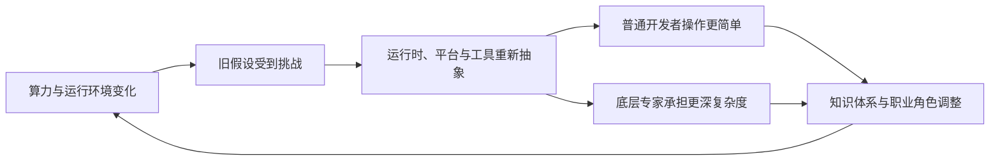
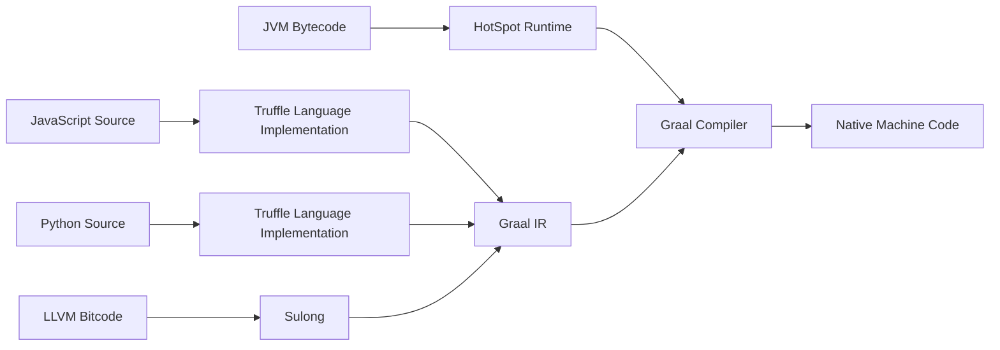
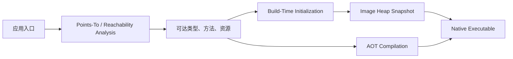
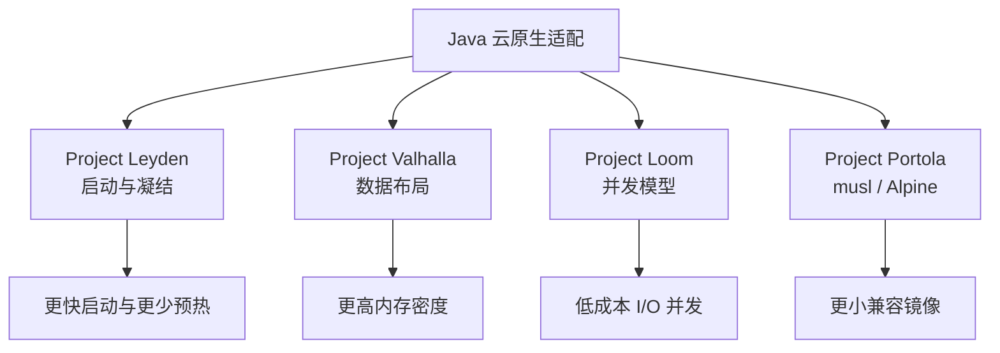
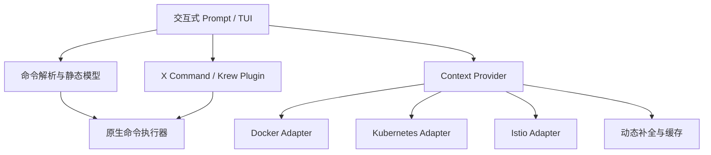
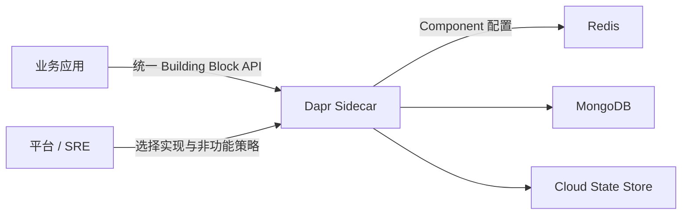
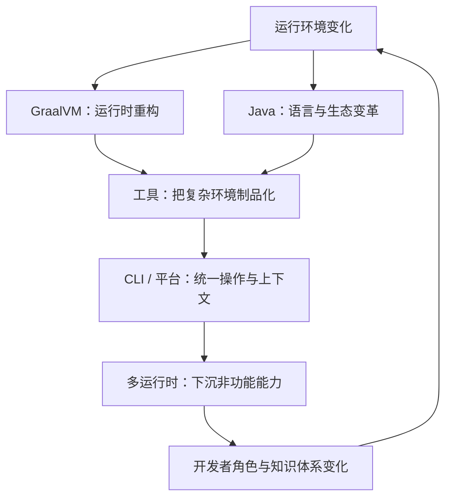
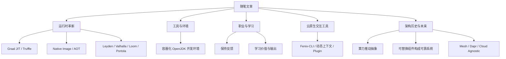

> 原书：周志明，《凤凰架构：构建可靠的大型分布式系统》
>
> 本章范围：“随笔文章”，按原书时间顺序覆盖 2020 年的 Graal VM、QCon 主题演讲，以及 2021 年的 OpenJDK with CLion、程序员之路、Fenix-CLI、ArchSummit 主题演讲。
>
> 版本说明：本章是 2020 至 2021 年的文章合集，其中包含大量当时的实验版本、技术预测和项目操作。本文首先忠实还原作者当时如何分析问题，再补充截至 2026 年的事实边界。历史命令、依赖版本和镜像用于理解演进，不应未经核验直接用于生产环境。

## 1. 本章为什么值得整体阅读

“随笔文章”不像前几章围绕单一技术体系展开，它由六篇相对独立的文章组成：

1. Graal VM：语言运行时如何在 JIT、AOT、多语言和原生镜像之间重新取舍；
2. 云原生时代 Java 的危与机：技术假设怎样被新运行环境挑战；
3. OpenJDK with CLion：怎样把复杂源码环境封装成可重复工具；
4. 程序员之路：技术职业、学习价值和知识体系如何长期发展；
5. Fenix-CLI：怎样用交互层降低云原生工具的认知成本；
6. 从软件历史看架构未来：算力、人的认知与软件抽象如何共同推动架构演进。

这些文章的共同主线是：**当机器能力、运行环境和软件规模改变时，旧抽象的优势可能变成负担；新的抽象若要成功，必须把复杂性转移到更专业、可复用的层次，同时保留对底层代价的理解。**



### 1.1 六篇文章的关系

| 文章 | 表层问题 | 深层方法 |
| --- | --- | --- |
| Graal VM | Java 怎样更快、更轻、多语言 | 在动态优化与静态封闭之间换取不同收益 |
| Java 的危与机 | Java 是否适合云原生 | 检查一项技术赖以成功的前提是否仍成立 |
| OpenJDK with CLion | 如何降低源码调试环境门槛 | 把环境本身做成可重复制品 |
| 程序员之路 | 技术、管理与学习如何选择 | 以反馈和输出保持一线认知 |
| Fenix-CLI | 多套 CLI 怎样统一 | 用适配、上下文和交互层减少偶然复杂性 |
| 架构的未来 | 下一代架构从哪里来 | 观察算力规模、知识边界与抽象下沉 |

### 1.2 本章中的公式如何理解

随笔中的性能数字、学习价值公式和历史阶段主要用于建立直觉，不是跨环境通用定律。本文会对重要模型补充：

- 变量代表什么；
- 哪些量可以比较；
- 成立需要哪些前提；
- 不能推出哪些结论。

## 2. 2020年

2020 年两篇文章都围绕 Java 与云原生的关系。第一篇从 GraalVM 的运行时机制切入，第二篇把视野扩大到 Java 语言、生态和产业趋势。

### 2.1 Graal VM

GraalVM 的目标不是单纯“让 Java 更快”，而是构造一个可以运行多种语言、支持 JIT 和 AOT、也能嵌入其他系统的高性能运行平台。


#### 2.1.1 Universal VM 与 Polyglot VM

传统 JVM 接受 Java Bytecode，字节码本身携带 Java 类型和对象模型。GraalVM 借助 Truffle Framework 为不同语言实现解释器，将程序映射到可优化的中间表示；Sulong 则负责 LLVM Bitcode，让 C、C++ 等语言进入同一运行体系。



Truffle 使用部分求值（Partial Evaluation）和运行期收集的信息，把通用解释器对某个具体程序“特化”为机器码。它有效的直觉是：

1. 解释器描述语言语义；
2. 运行时看到真实类型和热点路径；
3. 编译器把“解释器 + 稳定运行状态”一起优化；
4. 通用分派、类型判断等开销可能被消掉。

多语言互操作的价值在于复用生态，而不是宣称所有语言在 GraalVM 上都必然快于原生运行时。跨语言对象、边界转换、调试和部署仍有成本，性能必须按具体程序测量。

#### 2.1.2 新一代即时编译器

HotSpot 长期采用分层编译：

- Interpreter 快速启动并收集 Profile；
- C1 编译快，优化相对轻；
- C2 编译慢，输出高质量热点代码；
- Tiered Compilation 在启动和峰值性能间折中。

Graal Compiler 使用 Java 编写，并采用与 C2 相近的 Sea-of-Nodes 高级 IR。作者强调它的后发优势：代码更易维护，研究成果更容易扩展，可进行 Partial Escape Analysis、Aggressive Speculative Optimization 等优化。

##### 预测优化为什么有效

假设某调用点长期只出现一种类型，JIT 可以先按单态调用生成直接代码：

```text
if receiver.class == ObservedClass:
    inline target method
else:
    deoptimize and return to interpreter/compiler
```

这是一种“先根据 Profile 激进优化，假设失效再 Deoptimization”的策略。AOT 编译通常没有完整生产 Profile，因此更保守；JIT 则付出预热和编译成本，换取运行期特化。

##### Sea-of-Nodes 的直觉

传统 IR 常把控制流和数据流分开。Sea-of-Nodes 用图统一表达数据依赖与控制约束，节点不被过早固定到指令顺序，编译器有更大空间做公共子表达式消除、代码移动、内联和逃逸分析。

##### 版本边界

原文写作时，HotSpot 中的 Graal JIT 仍以实验性 C2 替代者出现。今天 GraalVM、Oracle GraalVM 与 OpenJDK 中相关组件的发行和许可边界已经多次变化，不能仅凭“JDK 10 加入 Graal”推导当前某个 JDK 默认使用它。生产选型应核对目标发行版的 JVMCI、Graal Compiler 和支持政策。

#### 2.1.3 向原生迈进

微服务、CLI 和 Serverless 更看重：

- 冷启动时间；
- 基础内存；
- 镜像大小；
- 扩缩容速度；
- 短生命周期成本。

HotSpot 则擅长长时间运行后通过 JIT 达到高峰值性能。AOT（Ahead-of-Time Compilation）把更多工作移到构建期，GraalVM Native Image 使用 Substrate VM 作为小型运行时，并通过 Closed-World Assumption 分析所有可达代码。

##### Native Image 构建过程



Closed World 的含义是：构建时必须知道运行时可能出现的代码。反射、动态代理、JNI、资源和序列化若无法由静态分析发现，就要提供 Reachability Metadata，或使用 Tracing Agent 从代表性运行中收集。

##### AppCDS、Epsilon 与 Native Image 的关系

- AppCDS 缓存已经加载、解析的类元数据，仍运行在 HotSpot 上；
- Epsilon GC 只分配不回收，适合确定在堆耗尽前退出的极短任务；
- `jaotc` 是历史上的 HotSpot AOT 尝试，不等于独立原生程序；
- Native Image 生成平台相关可执行文件，并携带 Substrate VM 运行能力。

它们针对不同瓶颈，不能统称为同一种 AOT。

##### JIT 与 AOT 的盈亏平衡

设：

- $S_J$：JIT 模式启动及预热成本；
- $S_A$：AOT 启动成本；
- $L_J$：充分预热后单次请求成本；
- $L_A$：AOT 单次请求成本；
- $N$：生命周期内请求数量。

简化总成本：

$$
T_J(N)=S_J+N L_J
$$

$$
T_A(N)=S_A+N L_A
$$

若 $S_J>S_A$ 且 $L_A>L_J$，盈亏平衡请求数约为：

$$
N^*=\frac{S_J-S_A}{L_A-L_J}
$$

- 当 $N<N^*$，启动优势主导，AOT 更可能有利；
- 当 $N>N^*$，稳态吞吐主导，JIT 可能追回差距；
- 如果实际 $L_A\le L_J$，AOT 可能全程更优；
- GC、内存、Profile、CPU 限额和延迟分位数都会改变结论。

因此 Serverless、命令行和快速扩缩服务往往偏爱 AOT，长时间高吞吐服务未必如此。


#### 2.1.4 没有虚拟机的 Java

“没有虚拟机”是传播性的说法，不是字面事实。Native Image 仍需要 Substrate VM 提供线程、异常、内存管理、GC 和 JNI；消失的是完整 HotSpot、字节码解释器和运行期 JIT。

##### 主要困难一：反射与资源

静态分析无法从字符串稳定推导所有反射目标。例如：

```java
Class<?> type = Class.forName(configuration.getClassName());
Object value = type.getDeclaredConstructor().newInstance();
```

`className` 来自运行期配置，构建器必须通过元数据获知候选类型。资源文件、序列化构造器、JNI 和动态 Proxy 也有类似问题。

现代 GraalVM 已显著改善元数据仓库、Agent、条件配置和框架集成，但“训练运行覆盖过的路径就是完整世界”仍不成立。测试未触达的动态路径可能在生产原生镜像中失败。

##### 主要困难二：运行期生成字节码

CGLIB、ASM、Javassist 常在运行期生成类。Native Image 构建完成后没有通用字节码执行与 JIT 环境，因此代理和增强应：

- 构建期生成；
- 改用接口代理；
- 由框架提供 AOT 处理；
- 或显式保留受支持的动态能力。

`proxyBeanMethods=false` 只表示 `@Configuration` 类内部 Bean 方法不经 CGLIB 拦截，不是关闭 Spring 中所有类代理；配置类必须符合 Lite Mode 语义，不能依赖方法调用返回容器中的单例代理结果。

##### 主要困难三：生态共同适配

编译器不可能永久维护整个 JVM 生态的脆弱补丁。框架和类库需要发布 Reachability Metadata、构建期代码生成和 Native 测试。原文中的 Spring Graal Native 实验项目后来并入 Spring Framework 6 / Spring Boot 3 的 AOT Engine，现代 Spring Boot 已正式支持 GraalVM Native Image；历史依赖和 POM 不应继续照搬。

##### 可观测性边界

原文认为 Native Image 无法做 Java 层远程调试，属于当时状态。现代 Native Image 已提供更丰富的 Debug、JFR、Heap Dump 和诊断支持，但与 HotSpot 成熟的动态诊断、JVMTI Agent 和运行期 Profile 生态仍不完全等价。选型要把生产可诊断性纳入成本。

#### 2.1.5 Spring over Graal

原书用 2020 年实验版本完整演示了构建流程：安装 GraalVM CE 20、安装 `native-image`、使用 Spring Boot 2.3 Milestone、加入 Spring Graal Native、关闭特定代理、准备反射配置，再执行 Maven Native 插件。

这段内容的价值是展示当时“编译器、框架、应用三方协作”的困难，而不是提供今天的安装指南。

##### 历史实验结果

作者机器上的测试约为：

| 程序 | 历史结果 | 应如何理解 |
| --- | --- | --- |
| HelloWorld Native | 约 3.6 MB、约 2 ms 启动 | 极简程序，不代表业务服务 |
| Spring Boot Web Native | 约 77 MB、约 100 ms 启动 | 依赖、机器与版本特定 |
| Native 构建 | 约 2 分钟、峰值约 6.6 GB | 用构建资源换运行资源 |
| HotSpot Spring Boot | 约 2 至 3 秒启动 | 2020 年项目与环境数据 |

这些数字不能横向用于 2026 年容量规划。应在同一 JDK、框架、容器限额、GC、流量和观测条件下做 Benchmark。

##### 当前构建思路

现代 Spring Boot 通常使用官方 AOT / Buildpacks 或 GraalVM Build Tools，例如概念上可分为：

```text
应用与依赖
-> Spring AOT 生成 Bean、Proxy、Hint
-> GraalVM Reachability Analysis
-> Native Compile
-> 原生可执行文件或 OCI Image
-> 使用同一业务负载比较启动、RSS、吞吐、P99、构建时间和诊断能力
```

不要只比较镜像文件大小。基础镜像层可共享，真正影响集群密度的是 Working Set、Page Cache、启动 CPU 与峰值内存。

##### 容器密度示意

若节点可供应用使用的内存为 $M$，每实例工作集为 $m$，忽略系统预留和其他约束时，理论实例数是：

$$
N_{instance}=\left\lfloor\frac{M}{m}\right\rfloor
$$

若 HotSpot 实例 $m_J=300\ \mathrm{MiB}$，Native 实例 $m_A=100\ \mathrm{MiB}$，单看内存可容纳约三倍实例；但 CPU、连接、启动峰值和共享层会使实际比例不同。


#### 2.1.6 Graal VM 的核心结论

1. GraalVM 把解释器、编译器与多语言运行时放到同一优化框架中；
2. JIT 用启动和预热换运行期 Profile 优化，AOT 用构建成本和封闭性换快速启动；
3. Native Image 并非没有运行时，而是使用较小的 Substrate VM；
4. Closed World 与 Java 动态生态存在结构性矛盾，需要框架 AOT 化；
5. 启动、内存、吞吐、尾延迟、构建和诊断必须一起评估。

### 2.2 QCon2020 主题演讲：云原生时代，Java 的危与机

这篇演讲把 GraalVM 放入更大的问题中：Java 过去成功所依赖的技术假设，在云原生时代是否仍然成立？

#### 2.2.1 Java 的危机

Java 的长期优势来自庞大生态、跨平台、成熟运行时和大型服务经验，而不只是语言语法。云原生并没有让这些优势消失，却改变了它们的相对权重。

##### 可移植性价值被容器部分重叠

- JVM：Write Once, Run Anywhere，抽象操作系统和 ISA；
- Container：Build Once, Run Anywhere，封装用户空间、依赖与配置；
- 容器不能跨越 CPU ISA 和宿主内核 ABI，JVM 仍具有架构中立价值；
- 多架构 OCI Image 也需要分别构建不同 Manifest 对应层。

因此容器削弱的是“服务端选 Java 只为跨操作系统”的独占优势，并没有全面替代 JVM 可移植性。

##### 长时运行优化与短生命周期冲突

Java 传统优势集中在：

- JIT Profile-Guided Optimization；
- 高吞吐 GC；
- 大堆和长时间预热；
- 运行期动态链接和成熟诊断。

微服务和 Serverless 提高了启动、内存和镜像权重。冷实例频繁、负载突发时，尚未预热就被回收，JIT 投资可能来不及回本。


##### 两个历史案例

- Logstash 的节点 Shipper 被 Go 编写的 Filebeat 分担，原因包括 JVM 基础资源与部署密度；
- Scala 编写的 Linkerd 1 代理被 C++ Envoy 和 Rust Linkerd2-proxy 超越，资源开销是因素之一。

不能把产品胜负完全归因于 JVM：功能定位、协议、团队投入、生态合作和发布时间同样重要。这些案例只能说明 Sidecar / Agent 对每节点固定开销高度敏感。

#### 2.2.2 Java 的变革


Java 的应对不是一条路线，而是分别优化启动、数据布局、并发和容器兼容。

##### Project Leyden

原文把 Leyden 与“生成脱离 JVM 的原生代码”紧密联系，这是 2020 年立项时的广义愿景。它面对 Open World 与 Closed World 的冲突：动态类加载、反射和字节码生成使全程序静态分析困难。


截至 2026 年，应区分：

- GraalVM Native Image：Closed World 原生可执行文件；
- Project Leyden / OpenJDK AOT Cache：通过训练运行、AOT Class Loading and Linking 等方式凝结启动工作，仍可服务 HotSpot 部署；
- CDS / AppCDS：共享类元数据归档；
- CRaC 等生态方案：保存协调后的运行时检查点，恢复而不是重新启动。

“AOT”不是单一形态，可能只提前类加载，也可能预编译代码，或生成完整 Native Image。

##### Project Valhalla

Java 对象通常带身份和引用语义。大量细小对象会产生：

- 对象 Header；
- 引用间接访问；
- 分散内存与 Cache Miss；
- 泛型装箱；
- 更高 GC 压力。


Valhalla 研究 Value Classes、Null-Restricted / Flat Layout 与泛型专门化，使没有独立身份需求的数据可以紧凑存储。

对于 $n$ 个三维点，理想平坦布局的纯坐标负载约为：

$$
Payload=3\times4\times n=12n\ \mathrm{bytes}
$$

普通对象数组还会加入数组引用、每个对象 Header、Alignment 和间接访问，具体大小由 JVM、压缩指针和布局决定，不能用一个常数概括。

原文预测使用 `inline` 关键字和包装类重定义，这是早期设计，不是最终语言语法。截至 2026 年 Valhalla 仍在演进，不应把草案当已发布特性。

##### Project Loom

Loom 希望用 Virtual Threads 让 Thread-per-Request 在 I/O 密集场景重新可扩展。大量虚拟线程映射到少量 Carrier Threads，由 JVM 调度，阻塞式代码在等待支持的 I/O 时卸载 Carrier。


Virtual Threads 已在 Java 21 正式交付。它们解决等待线程的内存与调度成本，不会增加 CPU、数据库连接或下游容量。

```java
try (var executor = java.util.concurrent.Executors.newVirtualThreadPerTaskExecutor()) {
    var user = executor.submit(() -> loadUser());
    var orders = executor.submit(() -> loadOrders());
    render(user.get(), orders.get());
}
```

这段代码可以并发执行两个 I/O 任务，但仍应限制外部资源并发。若创建十万个虚拟线程同时访问只有 100 个连接的数据库，瓶颈仍是连接池。

Structured Concurrency 要让子任务生命周期嵌套在词法作用域中，统一取消、失败传播和结果收集。它与 Virtual Threads 互补，但截至当前仍应核对目标 JDK 中的 Preview 状态和 API，不能直接复制原文早期伪 API。

##### Project Portola

Portola 将 OpenJDK 移植到 Alpine Linux 的 musl libc，JEP 386 在 JDK 16 交付 Alpine Linux Port。价值是减少基础镜像和兼容 Alpine，而不是保证所有 JNI Native Library 自动兼容 musl。

原文示例用 `jlink` 只保留 `java.base`，得到约 41.7 MB 镜像。这个数字包含特定 JDK 13、压缩方式和基础镜像，现代 Distroless、Alpine、UBI Micro、jlink 与 Native Image 应按安全补丁、CA、时区和诊断需求综合选择。

“镜像越小越安全”也不绝对：包少会减少攻击面，但缺少 Shell 和诊断工具会增加排障难度；真正安全依赖签名、SBOM、漏洞修复和最小权限。

##### 四个项目的关系



#### 2.2.3 Java 的未来

原文在 2020 年预测 Java 17 可能集成 Amber、Portola、Valhalla、Loom、Panama。实际进程说明平台演进比预测更渐进：

- Records、Pattern Matching for `instanceof`、Sealed Classes、Alpine Port 在 JDK 16/17 前后落地；
- Java 17 成为重要 LTS，但没有一次性交付 Loom 和 Valhalla；
- Virtual Threads 在 Java 21 正式交付；
- Foreign Function & Memory API 后续正式化；
- Valhalla 仍持续推进；
- GraalVM Native Image 与 Spring AOT 已进入正式生产生态；
- Leyden 以多层 AOT 凝结方式继续演进。

这印证了文章更重要的方法：**判断技术未来时，应观察它在修复哪些已失效的前提，而不是押注某个版本是否一次集齐所有项目。**

Java 的生态护城河与技术负担是同一件事的两面。兼容会减慢变革，但庞大工具、人才和库也能把新能力快速推向生产。

## 3. 2021年

2021 年文章从运行时转向工具、职业与架构未来：怎样降低复杂环境门槛，怎样保持专业判断，以及下一层抽象可能出现在哪里。

### 3.1 OpenJDK with CLion 懒人包

这项工程把 OpenJDK 源码、Bootstrap JDK、Slow Debug 构建、Compilation Database 和 CLion / Projector 封装进容器，浏览器作为远程 UI。

它解决三个具体问题：

1. OpenJDK 构建依赖和配置繁琐；
2. 源码索引、C/C++ 调试环境难以复现；
3. 轻薄客户端希望把编译和调试放到远端机器。

#### 3.1.1 使用方法

原书流程：

1. 运行镜像并映射 8887 端口；
2. 浏览器访问 Projector；
3. 打开内置 JDK 15 源码；
4. 等待 CLion 建立索引；
5. 阅读、增量编译、调试 HotSpot；
6. 在 `JavaMain(void* _args)` 设置断点，观察 Java Launcher 进入 JVM；
7. 把自己的 Class/JAR 挂载到 `/playgrounds` 调试。


Slow Debug 保留符号并降低优化，适合断点和变量观察；Fast Debug 保留检查但优化更多；Release 适合性能和交付。调试构建的行为与生产优化构建可能不同，性能结论必须用 Release 复测。

容器无论运行在 Windows、macOS 还是 Linux 宿主，编译目标仍由容器内 Toolchain 决定。它不是自动 Cross-Compilation，只是把 Linux 构建环境搬到不同宿主。

##### 当前安全边界

原镜像固定 JDK 15、CLion 2020.3、Debian 10 和 Projector，今天已经过时。Projector 路线已被 JetBrains Remote Development / Gateway 等方案取代。旧镜像可能有已知漏洞、过期证书和许可证问题，不宜直接暴露端口或作为生产工作站。

现代替代思路包括：

- Dev Container + VS Code Remote；
- JetBrains Gateway / Remote Development；
- SSH 远程 Toolchain；
- reproducible Nix / container build environment；
- 本地 IDE + 远端 CMake / Compilation Database。

#### 3.1.2 编译镜像

原书的构建分三步：克隆包装工程、执行 `clone-core.sh` 获取 Projector 与 OpenJDK、执行 `build-container.sh`。

关键工程知识：

- Docker Build Context 决定哪些文件发送给 Daemon，父目录过大会显著拖慢构建；
- Bootstrap JDK 必须满足目标 OpenJDK 的构建要求；
- `configure --with-debug-level=slowdebug` 决定构建类型；
- `--build` 与 `--host` 可参与 Cross-Compilation；
- BuildKit 并行、缓存和 Secret Mount 能改善重复构建；
- Compilation Database 让 CLion 理解复杂 C/C++ 编译参数。

原书建议用 `docker commit` 保存 IDE 账号和习惯。它适合一次性试验，却破坏可重复性，也可能把 Token、历史和许可证状态写入镜像。更稳健的做法是：

```text
Dockerfile / Dev Container 保存可公开环境
Volume 保存源码、索引与用户配置
Secret Store 保存账号和令牌
锁定基镜像 Digest 与工具版本
CI 定期重建并扫描漏洞
```

#### 3.1.3 其他

原文还讨论：

- 用 Projector Launcher 避免浏览器快捷键冲突；
- iPad、自签名证书与 WebSocket 的历史兼容问题；
- 镜像约 2.08 GB，需要耐心下载；
- 未来可封装 Kubernetes / GoLand 等环境。

这些是 2021 年产品状态。今天不应通过关闭 HTTPS 来绕过证书问题，应使用可信 TLS、VPN、SSH Tunnel 或零信任访问代理。远程 IDE 还应限制文件系统、Docker Socket、调试权限和网络出口，因为它本质上拥有开发者级代码执行能力。

#### 3.1.4 协议

原工程代码使用 Apache License 2.0，但容器中还包含 JetBrains 商业 IDE、OpenJDK、Debian 和其他依赖，各自许可证仍独立生效。开源 Dockerfile 不会把商业 IDE变成开源软件；分发镜像前要核对再分发权、用户授权和第三方 Notice。

#### 3.1.5 工具文章的核心方法

“懒人包”的本质不是逃避学习，而是把低价值、重复、易错的环境搭建固化为制品，使学习者把精力放在源码和调试。好工具应同时满足：可复现、可更新、可审计、可替换；否则它只把搭环境的复杂性推迟到镜像过期之后。

### 3.2 程序员之路

这篇文章从“架构师是否还应编码”出发，进一步讨论学习选择与知识体系。

#### 3.2.1 程序员的发展观

作者反对把“不再编码”当成程序员晋升的必然终点。其理由不是要求架构师追求代码量，而是：

- 只有接触真实约束，才能理解自己的架构决定给团队造成什么成本；
- 代码和运行事实比无法短期验证的宏大意见更能建立专业信任；
- 技术细节一旦长期放下，很难只靠会议和汇报保持准确判断；
- 程序员更尊重能解释和示范的人，而不只是职位权力。

“Talk is cheap. Show me the code”强调可检验性。但架构师的输出也不限于业务代码，还可以是：

- 可执行架构测试；
- Reference Implementation；
- 性能实验和故障演练；
- 平台模板和诊断工具；
- ADR 与可复现 Benchmark；
- 与团队 Pair Programming。

##### 独立贡献者与管理路径

Individual Contributor（IC）允许专家在不转管理的情况下继续提升影响力。组织若只有管理晋升，会迫使优秀程序员离开擅长领域，也让技术决策逐渐脱离实践。

作者把自己定义成“兼职管理工作的程序员”，属于个人选择和管理风格，不是所有管理者都必须每天写生产代码。更一般的原则是：技术领导必须维持足够短的事实反馈回路，可以通过编码、设计评审、On-call、事故复盘和用户研究实现。

#### 3.2.2 程序员的价值观

作者提出学习价值启发式：

$$
Value=\frac{(SkillBenefit+KnowledgeBenefit)\times GrowthSpace}{InvestmentCost}
$$

四项含义：

- Skill Benefit：当前工作能直接使用的收益；
- Knowledge Benefit：构建模型、降低未来认知负荷的间接收益；
- Growth Space：尚未掌握的挑战和可提升程度；
- Investment Cost：时间、金钱、机会、前置知识、精神与遗忘成本。

##### 为什么技能和知识都重要

技能解决当前问题，提供直接反馈；基础知识把零散经验组织成模型，使新知识更容易定位。例如不开发内核，也能从操作系统知识理解线程、内存、I/O 和容器。

##### 为什么提升空间是乘数

反复做完全熟练的工作，虽然成功率高，但边际学习趋近于零。挑战过大又会让成本急升，因此理想任务位于“现有能力稍上方”，能获得反馈又不至于长期无进展。

##### 公式的边界

四个变量没有统一量纲，不能拿“架构课 7.3 分、业务课 6.8 分”当客观真理。若要比较，可先使用统一的 0 至 5 评分、明确权重，并记录不确定性：

$$
Score(x)=\frac{(w_sS_x+w_kK_x)G_x}{w_tT_x+w_mM_x+w_oO_x}
$$

其中 $T$、$M$、$O$ 分别表示时间、金钱和机会成本。它仍是帮助提问的决策表，不是精确数学模型。

##### 示例

| 选择 | 技能收益 | 知识收益 | 提升空间 | 成本 | 判断 |
| --- | --- | --- | --- | --- | --- |
| 修复当前数据库慢查询 | 高 | 中 | 中 | 低 | 优先，反馈立即可见 |
| 系统学习数据库原理 | 中 | 高 | 高 | 中 | 建立长期模型 |
| 学习暂时无场景的冷门框架 | 低 | 低到中 | 高 | 高 | 暂缓，先补前置基础 |
| 重复熟练 CRUD | 中 | 低 | 低 | 中 | 只作为工作，不冒充成长 |

作者的核心建议是：先把必要工作做好，再追求兴趣；暂时拿不动的知识先放下，若它真是关键问题，还会在未来再次出现。

#### 3.2.3 将思考具象化

只读和思考容易产生“熟悉感等于掌握”的错觉。把知识说清楚、写出来、交给别人质疑，会暴露概念缺口和因果跳跃。


“输出倒逼输入”有效的原因：

1. 输出要求选择结构和术语；
2. 例子迫使抽象落地；
3. 他人无法理解的位置通常就是模型缺口；
4. 公开观点接受反例检验；
5. 写作形成可检索的外部记忆。

但输出也可能固化错误。应配合：

- 来源核验；
- 可运行实验；
- 主动回忆而非抄写；
- 标注事实、推断和个人观点；
- 版本与适用边界；
- 根据反馈修订旧笔记。

作者说明公益课程是其知识体系具象化的产物，自己首先从整理中受益，商业回报是额外结果。这种学习方法与本仓库持续形成读书笔记的目标高度一致。

### 3.3 Fenix-CLI：交互式云原生客户端

Fenix-CLI 希望统一 Docker CLI、kubectl 和 istioctl，提供一致交互、动态上下文感知和扩展命令。

#### 3.3.1 特性

##### 多运行环境支持

启动时检测 Docker、Kubernetes、Istio，允许在同一 TUI 中切换。


##### 静态指令自动补全

内置命令、参数和帮助信息，降低查手册频率。


##### 动态上下文智能感知

根据当前 Context、Namespace、Resource、Container、Port 和 File Path 提示真实候选。


静态补全只需语法树，动态补全还需访问 Cluster，必须处理：

- RBAC 无权列出资源；
- API 延迟和离线；
- 候选太多；
- Context 切换后的 Cache 失效；
- 补全动作本身泄漏资源名称；
- CRD 与版本不断变化。

##### 交互式批量操作

通过筛选、单选和复选批量管理资源，减少 Shell 管道和手工复制。


批量操作要明确 Dry Run、确认、并发上限、部分失败和重试，否则便利会放大误操作爆炸半径。

##### X 指令

原书列举：

- `x-context` / `x-namespace`：切换集群和 Namespace；
- `x-batch`：批量管理资源；
- `x-sniff`：注入 tcpdump，交给 TShark / Wireshark；
- `x-lens`：查看 Pod 与所有者资源关系；
- `x-open`：Port Forward 并打开服务；
- `x-status`：汇总集群资源状态。


`x-sniff` 可能创建特权或临时容器，能看到敏感流量；生产使用必须有授权、审计、数据脱敏和清理。`x-open` 建立本地端口转发也会改变访问边界，不能把“本地可访问”误解为安全。

##### 产品架构抽象



它本质使用 Adapter 统一不同 CLI，用 Context Provider 提供动态语义，用 Plugin 扩展高价值工作流。

#### 3.3.2 安装

原书提供：

```bash
curl -sL https://icyfenix.cn/fenix-cli/dl.sh | sh -
fenix-cli
```

并注明只支持 Linux。这是历史安装方法。今天不建议对未知或久未维护地址直接 `curl | sh`：应核对仓库活跃度、Release 签名、Checksum、SBOM 和源码，再在隔离环境安装。工具若封装 kubectl 权限，其供应链风险等同于 Cluster 管理凭证风险。

#### 3.3.3 规划

原规划包括：

- 把基于 Docker 20.10、Kubernetes 1.21、Istio 1.10 的硬编码提示改为外部 DSL；
- 从本机 Cobra 命令动态生成模型；
- 支持 OpenShift、Rancher、Podman、containerd；
- 增加 `x-log`、`x-debug`；
- 自动安装运行环境；
- 多语言、Unit Test、E2E 和真实诊断案例。

这暴露出 CLI 聚合器的核心难题：上游 CLI 演进速度快，复制所有语法必然漂移。更可持续的方式是读取 OpenAPI Discovery、kubectl Plugin / Krew、Shell Completion 协议，或组合原生 CLI，而不是长期维护另一份命令全集。

#### 3.3.4 交流

作者区分：Fenix-CLI 自身问题在本仓库反馈，第三方 Krew Plugin 问题回到原作者；欢迎 Pull Request 和 Feature Request，并致谢 go-prompt、kube-prompt。

这是开源项目责任边界的重要实践：聚合工具应保留上游来源，不能把所有插件缺陷误归到壳层，也不能让用户在多个仓库间无从定位。

#### 3.3.5 协议

Fenix-CLI 使用 Apache License 2.0，要求保留许可证和 Notice。内置或调用的 Krew Plugin 各有自己的许可证；聚合发行时仍需逐项检查。

#### 3.3.6 当前定位

本节应作为交互设计案例，而非当前工具推荐。项目基准版本和原命令已经明显过时。今天 Kubernetes 生态已有 K9s、kubectx/kubens、Krew、Headlamp、Lens 等不同工具；是否再建立统一 CLI，应证明它减少的认知成本高于兼容、安全和维护成本。

### 3.4 ArchSummit2021主题演讲：从软件的历史看架构的未来

作者以 Dijkstra 的判断为开端：机器越强，人类就越会尝试更大的问题，编程复杂度也随之增长。架构演进由“算力规模扩大”和“人的认知、协作能力有限”的矛盾驱动。

#### 3.4.1 历史上的软件危机和契机

##### 第一阶段：机器尺度超过个体认知

早期程序与硬件直接对齐，程序员可以理解全部内存和指令。规模扩大后，Goto 和全局状态形成 Spaghetti Code。Structured Programming 用子过程、局部状态和控制结构实现 Divide and Conquer，使程序员只需掌握局部。

##### 第二阶段：模块规模超过群体协作

OS/360 的规模与延期成为《人月神话》的经典背景。对象封装、模块契约、软件工程过程和团队方法试图控制接口与协作。

作者把历史讲成“两次软件危机 -> 结构化 -> 面向对象/软件工程”的清晰主线，适合作为教学叙事，但不是历史学界统一的严格分期。Software Crisis 一词通常追溯到 1968、1969 年 NATO Software Engineering Conferences，而不是原文所说的 1970；面向对象也不能被视为单独“终结第二次危机”。


#### 3.4.2 云与分布式渐成为主流

云数据中心把可用算力推进到任何单个人或团队都无法掌握全部节点的规模。故障从意外变成统计必然：代码缺陷、机器宕机、网络分区和误操作都会发生。

作者认为微服务最根本的价值不是“更快”，而是让局部能够消亡和重生。系统可靠性不再只靠每个组件永不失败，而靠：

- 独立生命周期；
- 物理故障隔离；
- 多副本与故障域；
- 滚动更新和灰度流量；
- 自动检测、替换和恢复；
- 状态外置与一致性协议。

若单实例可用率为 $a$，$n$ 个独立副本中任一可用即可服务，且故障与路由完全独立，则：

$$
A_{parallel}=1-(1-a)^n
$$

例如 $a=0.99$、$n=2$，理论可用率 $99.99\%$。这个公式要求负载均衡、数据、依赖和故障域都没有共同故障。多个副本共享数据库、Region 或错误配置时，不能得到乘法收益。

微服务只是提供独立生灭边界；若共享数据库、同步调用链和统一发布仍形成共同命运，局部重生不会自动产生整体可靠性。

#### 3.4.3 从云计算到云不可知

作者预测下一矛盾是：云与分布式知识规模超过普通开发者能够合理掌握的极限。解决方向是把重要且通用的非功能能力标准化并下沉。

##### 从 Service Mesh 到多运行时

Service Mesh 把通信发现、路由、重试、mTLS 和遥测放入 Sidecar；类似思想可以扩展到：

- Database Mesh：分片、读写分离和路由；
- State Store：K/V 状态访问；
- Pub/Sub：消息发布订阅；
- Bindings：连接外部系统；
- Secret Store：秘密读取；
- Workflow / Actor：状态与协调模式。

作者用 Dapr 演示把 Redis 代码替换成统一 HTTP State API：

```http
POST /v1.0/state/users
Content-Type: application/json

[
  {
    "key": "icyfenix",
    "value": {"name": "zzm", "email": "icyfenix@example.com"}
  }
]
```

业务只表达“为组件 users 保存一个键值”，实际 Redis、MongoDB 或云 State Store 由部署配置决定。



原文写作时 Dapr 刚进入 CNCF、主要以 K/V 演示。如今 Dapr 已扩展到 Service Invocation、Pub/Sub、State、Bindings、Secrets、Configuration、Distributed Lock、Workflow、Actors 等 Building Blocks，并进入更成熟阶段。历史局限不影响作者抓住“多运行时抽象”方向。

##### Cloud Agnostic 的收益

- 业务代码不直接依赖厂商 SDK；
- 开发与部署职责分离；
- 本地与云端可更换实现；
- 通用安全、重试和观测可统一；
- 领域专家更关注业务原语。

##### Cloud Agnostic 的代价

- 抽象只能覆盖实现交集，容易形成 Least Common Denominator；
- Redis、etcd、Cassandra 的一致性和事务语义不同，统一 `set` 无法抹平；
- Sidecar 增加延迟、资源和故障点；
- 供应商特有能力可能无法利用；
- 真正迁移仍包含数据格式、容量、费用、身份与运维变化；
- 从云厂商锁定可能变成多运行时平台锁定。

因此 Cloud Agnostic 应聚焦确有替换价值的稳定原语，而不是假装所有后端完全等价。抽象必须暴露关键一致性、事务、容量和错误语义。

#### 3.4.4 软件，架构与人

作者把结构化、面向对象和云原生视为算力规模扩大后的抽象升级，并预测行业会出现更明显分工：多数人使用工业化平台生产软件，少数专家设计底层能力。

这是一种趋势判断，不是技术定律。低代码、AI 辅助和平台工程会降低某些门槛，也会创造新的验证、安全、领域建模和系统责任。更合理的结论不是“普通程序员必然变成流水线工人”，而是：

- 偶然复杂性会持续被工具吸收；
- 业务本质复杂性仍需要领域判断；
- 抽象层越高，底层专家数量可能更少但影响更大；
- 使用抽象的人仍需理解失败边界，不能只会 Happy Path；
- 架构师的责任从掌握每个工具转向设计边界、验证假设和管理演进。

##### 软件架构与硬件算力规模对齐

作者的核心命题可以写成：

```text
可用算力扩大
-> 可解决问题规模扩大
-> 单个人无法掌握整体
-> 引入新的分治与抽象
-> 抽象释放更多生产力
-> 又推动更大规模问题
```

它是有解释力的历史视角，但软件架构也受经济、组织、法规、用户需求和生态竞争驱动，不能把一切演进归因于硬件算力。

## 4. 六篇随笔的共同知识结构



### 4.1 三种“把复杂性关起来”的方式

1. **编译期封闭**：Native Image 把动态世界压缩为可达代码与元数据；
2. **环境封装**：Container / Dev Environment 把 Toolchain 和依赖做成制品；
3. **运行时外置**：Service Mesh / Dapr 把通用非功能能力交给 Sidecar 和平台。

三者都降低某一角色的操作复杂度，同时把成本转移给构建系统、平台团队或底层专家。

### 4.2 三类优化目标

| 目标 | 技术 | 主要代价 |
| --- | --- | --- |
| 更快启动、更小工作集 | AOT、Native Image、jlink、musl | 封闭性、构建时间、诊断差异 |
| 更低环境门槛 | 容器化 IDE、统一 CLI | 镜像更新、安全、兼容维护 |
| 更少业务侵入 | Mesh、Dapr、多运行时 | Sidecar 成本、语义泄漏、平台依赖 |

### 4.3 贯穿所有文章的判断方法

```text
先识别旧方案依赖的前提
-> 检查环境变化是否让前提失效
-> 找到最痛的成本维度
-> 把复杂性移动到更可复用的层
-> 明确被牺牲的动态性、性能或自由
-> 用同一负载和生命周期验证
-> 随版本变化重新评估
```

## 5. 容易混淆的概念与常见误区

### 5.1 Graal Compiler、GraalVM 与 Native Image 不是同一个概念

Graal Compiler 是编译器；GraalVM 是多语言运行平台；Native Image 是 Closed-World AOT 工具链与 Substrate VM。

### 5.2 AOT 不等于一定比 JIT 快

AOT 通常启动快，JIT 可利用真实 Profile 获得更高稳态性能。生命周期决定谁更有利。

### 5.3 Native Image 不是完全没有 VM

它仍携带 Substrate VM 的 GC、线程、异常和运行时服务，只是不带完整 HotSpot 和 JIT。

### 5.4 Closed World 不等于 Java 完全不能反射

可达目标和元数据已知时可以使用反射；问题是运行期才出现、构建期不可知的目标。

### 5.5 `proxyBeanMethods=false` 不等于禁用所有 Spring Proxy

它只改变配置类 Bean 方法拦截语义，AOP 和其他 Proxy 仍可能存在。

### 5.6 容器没有淘汰 JVM 跨平台能力

容器仍依赖 ISA 与 Kernel ABI；JVM 字节码可以跨更多平台。二者解决的兼容层不同。

### 5.7 Virtual Thread 不等于无限吞吐

它降低等待线程成本，不增加 CPU、数据库连接和下游容量。仍要做 Admission Control。

### 5.8 Project Leyden 不等于 GraalVM Native Image

二者都涉及 AOT，却有不同实现、兼容目标和运行时边界。

### 5.9 Value Class 不等于普通 Record

Record 主要提供数据载体语法和语义；Valhalla Value Class 关注身份、扁平布局与泛型专门化。

### 5.10 镜像小不等于总成本低

还要看 RSS、启动 CPU、共享层、漏洞修复、CA/时区和诊断能力。

### 5.11 容器化 IDE 不等于完全可复现

外部源码、许可证、CPU 架构、Kernel、Volume 和网络仍会影响结果。必须锁版本并记录 Toolchain。

### 5.12 架构师持续编码不等于追求代码量

目标是保持事实反馈和可验证判断，可以通过原型、工具、评审、On-call 等多种方式实现。

### 5.13 学习价值公式不是客观排名器

变量无自然量纲，公式用于提醒同时看直接收益、长期模型、成长空间和机会成本。

### 5.14 输出不自动保证理解正确

输出会暴露缺口，也会固化错误；必须配合事实、实验和反馈修订。

### 5.15 统一 CLI 不等于统一底层语义

Docker Container、Kubernetes Pod 和 Istio Route 不是同一种资源，统一交互不能掩盖生命周期和权限差异。

### 5.16 动态补全不是无害读取

列举资源需要权限，也可能泄漏名称和状态。CLI 应遵守 RBAC、审计和最小缓存。

### 5.17 `curl | sh` 不是推荐的默认安装方式

它便捷但削弱审计和供应链验证。应先固定版本、校验签名和摘要。

### 5.18 “两次软件危机”是教学叙事，不是精确历史定律

1968/1969 NATO 会议、结构化、对象和软件工程之间关系更复杂，不能由一项范式宣告危机结束。

### 5.19 微服务不自动使不可靠组件组成可靠系统

还需要独立故障域、状态复制、检测、路由和恢复；共享依赖会制造共同故障。

### 5.20 Cloud Agnostic 不等于零迁移成本

统一 API 难以抹平一致性、事务、容量、价格和身份差异，只能降低一部分代码耦合。

### 5.21 Dapr 不等于 Service Mesh

Service Mesh 主要治理服务通信；Dapr 提供应用 Building Blocks。二者可以组合，也各自增加 Sidecar 与控制面成本。

### 5.22 工具降低门槛不等于人不再重要

抽象减少操作细节，却增加了验证抽象、设计领域模型和处理例外的价值。

## 6. 可复用的分析与学习方法

### 6.1 评估运行时：按生命周期而非单项 Benchmark

```text
定义工作负载和生命周期
-> 测启动时间、Ready 时间、RSS、构建时间
-> 预热后测吞吐和 P99
-> 测扩缩、诊断、崩溃恢复
-> 计算单位请求和单位实例总成本
-> 再选 HotSpot、AOT 或混合方式
```

### 6.2 评估抽象层：检查语义是否泄漏

对 Mesh、Dapr、统一 CLI 问：

- 能否表达底层关键一致性和错误语义？
- 抽象失效时如何下钻？
- 谁更新适配器？
- 控制面宕机时数据面怎样运行？
- 是否只是把供应商锁定换成平台锁定？

### 6.3 构筑知识体系

建议循环：

1. 选择当前有反馈的真实问题；
2. 补足能解释问题的基础知识；
3. 画出状态、数据和控制流；
4. 写出自己的解释和反例；
5. 制作最小实验；
6. 请他人审阅；
7. 把更正写回笔记；
8. 定期删除或标注过时内容。

### 6.4 区分四类陈述

| 类型 | 示例 | 笔记要求 |
| --- | --- | --- |
| 事实 | Java 21 交付 Virtual Threads | 给出版本和来源 |
| 模型 | JIT/AOT 盈亏平衡公式 | 写明变量和假设 |
| 预测 | 多运行时将成为主流 | 标注不确定性和反例 |
| 价值判断 | 架构师应保持编码 | 说明目标与适用人群 |

### 6.5 技术预测的复盘法

这批 2020 至 2021 年文章非常适合作为预测样本：

```text
记录当时问题
-> 记录作者预测的机制与时间
-> 查看哪些已交付、延迟、改变方向或消失
-> 分析误差来自技术难度、生态、组织还是市场
-> 保留仍成立的问题，更新具体产品答案
```

例如 Java 17 没有一次集齐 Loom、Valhalla、Leyden，但“启动、数据布局、并发和容器适配需要分别改进”仍然成立。

## 7. 本章知识结构总结



### 7.1 核心结论

1. GraalVM 的价值在于统一语言实现与编译优化，并提供 JIT、AOT 和嵌入式运行的多条路径；
2. JIT 与 AOT 优化不同生命周期目标，不存在脱离负载的绝对胜者；
3. Native Image 通过 Closed World 换取启动和内存收益，框架生态必须共同 AOT 化；
4. Java 面对云原生的挑战分布在启动、布局、并发和容器兼容，不能靠单一项目解决；
5. 2020 年的 Java 版本预测有得有失，但“检查旧前提是否仍成立”的方法长期有效；
6. 容器化开发环境能降低重复配置成本，但必须持续更新、安全隔离并遵守许可证；
7. 技术领导保持一线反馈比保持代码量更重要；
8. 学习选择要同时考虑直接技能、长期知识、成长空间和机会成本；
9. 写作、讲解和实验把思考变成可检验对象，是构建知识体系的有效方法；
10. Fenix-CLI 展示了统一交互层的价值，也暴露出上游兼容和供应链维护成本；
11. 软件架构会随算力和问题规模调整抽象，但也受组织、经济、法规和生态共同驱动；
12. Mesh 与多运行时尝试下沉非功能能力，却不能抹平底层语义和所有供应商差异；
13. 工具降低偶然复杂性后，领域建模、验证、边界和演进判断会更重要。

### 7.2 解决问题的一般思路

$$
\text{识别环境变化}
\rightarrow \text{检查旧前提}
\rightarrow \text{选择要优化的成本维度}
\rightarrow \text{把通用复杂性下沉}
\rightarrow \text{保留关键语义}
\rightarrow \text{用实验和输出验证}
\rightarrow \text{随生态继续修订}
$$

## 8. 主动回忆题

1. 六篇随笔看似分散，背后的共同主题是什么？
2. GraalVM 为什么被称为 Universal VM 和 Polyglot VM？
3. Truffle Partial Evaluation 如何把解释器特化为机器码？
4. Graal Compiler 与 C1、C2 有什么关系？
5. Sea-of-Nodes 为何给优化留下更大空间？
6. JIT 的预测性优化为什么需要 Deoptimization？
7. AppCDS、Epsilon、jaotc 和 Native Image 分别解决什么问题？
8. Closed-World Assumption 的必要性是什么？
9. Points-To Analysis 如何决定 Native Image 中包含哪些代码？
10. Native Image 为什么仍然存在 VM？
11. 反射、动态代理、JNI 和资源为何需要 Reachability Metadata？
12. Tracing Agent 为什么不能证明已经覆盖所有生产路径？
13. `proxyBeanMethods=false` 实际改变了什么？
14. JIT/AOT 盈亏平衡公式的四个变量是什么？
15. 为什么短生命周期常偏爱 AOT，长时间高吞吐未必？
16. Spring Graal Native 后来怎样进入 Spring Boot 正式能力？
17. 为什么不能直接拿 2020 年的 2 ms、100 ms 作为容量数据？
18. 镜像大小与实际集群内存密度有什么区别？
19. 容器为何只是部分重叠而非取代 JVM 可移植性？
20. Logstash/Filebeat 与 Linkerd/Envoy 案例能证明什么，不能证明什么？
21. Project Leyden 与 GraalVM Native Image 有何边界差异？
22. Valhalla 为什么关注对象身份与平坦布局？
23. Record 与 Value Class 为什么不是一回事？
24. Virtual Threads 解决了什么资源成本？
25. 为什么十万个虚拟线程仍不能突破 100 个数据库连接？
26. Structured Concurrency 想让哪些生命周期对齐？
27. Portola 和 JEP 386 解决什么兼容问题？
28. Java 17 的实际交付与原文预测有何差别？
29. 为什么技术预测应关注问题机制，而非只押版本日期？
30. OpenJDK with CLion 解决了哪些环境重复问题？
31. Slow Debug、Fast Debug、Release 分别适合什么？
32. 容器运行在 Windows 宿主时，为何仍产出 Linux OpenJDK？
33. Docker Build Context 为什么影响构建速度？
34. 为什么不宜用 `docker commit` 长期保存开发环境？
35. 原 Projector 镜像今天有哪些版本和安全风险？
36. 开源包装工程为什么不改变 CLion 的商业许可证？
37. 作者为什么认为架构师不应轻易离开技术一线？
38. 持续编码的目标为何不是代码量？
39. IC 路径对技术组织有什么价值？
40. 学习价值模型中的 Skill Benefit 与 Knowledge Benefit 有何区别？
41. Growth Space 为什么既不能为零，也不能无限高？
42. Investment Cost 应包括哪些机会成本？
43. 学习价值公式为什么不能当客观排名器？
44. “输出倒逼输入”为什么有效？
45. 输出如何可能固化错误，应怎样防止？
46. Fenix-CLI 想统一哪三类环境？
47. 静态补全和动态上下文补全的实现难度差在哪里？
48. 批量操作为什么必须有 Dry Run 和部分失败设计？
49. `x-sniff` 与 `x-open` 可能扩大哪些安全边界？
50. 为什么复制上游所有 Cobra 命令难以持续维护？
51. `curl | sh` 的供应链风险是什么？
52. Fenix-CLI 今天更适合作为什么案例，而不是直接工具推荐？
53. 作者如何解释结构化编程和面向对象出现的历史动力？
54. 为什么“两次软件危机”只能算教学叙事？
55. 不可靠组件构成可靠系统需要哪些额外前提？
56. 为什么微服务的核心价值可以理解为允许局部消亡和重生？
57. 软件知识膨胀为什么推动非功能能力下沉？
58. Service Mesh 能下沉哪些能力，又不能下沉什么？
59. Dapr State API 如何分离业务意图与存储实现？
60. Cloud Agnostic 为什么可能落入最低共同能力陷阱？
61. 从厂商锁定迁移到平台锁定意味着什么？
62. “软件架构与硬件算力规模对齐”有哪些解释力和局限？
63. 工具降低门槛为什么不意味着领域专家和架构师失去价值？
64. 如何用事实、模型、预测、价值判断四类标签整理随笔？
65. 怎样复盘一篇旧技术文章中的预测？
66. 本章三种“把复杂性关起来”的方式分别是什么？
67. 面对一个新运行时或新抽象，应该按什么顺序验证它？
