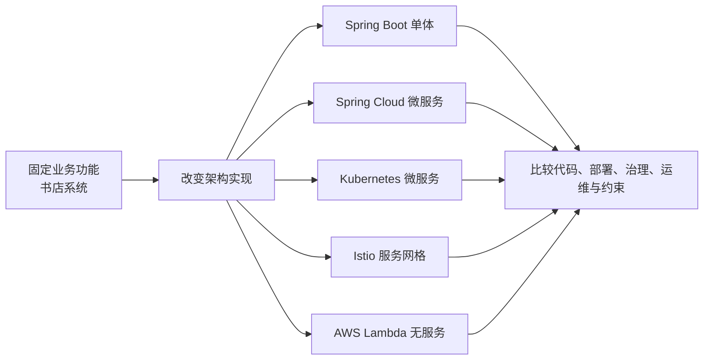
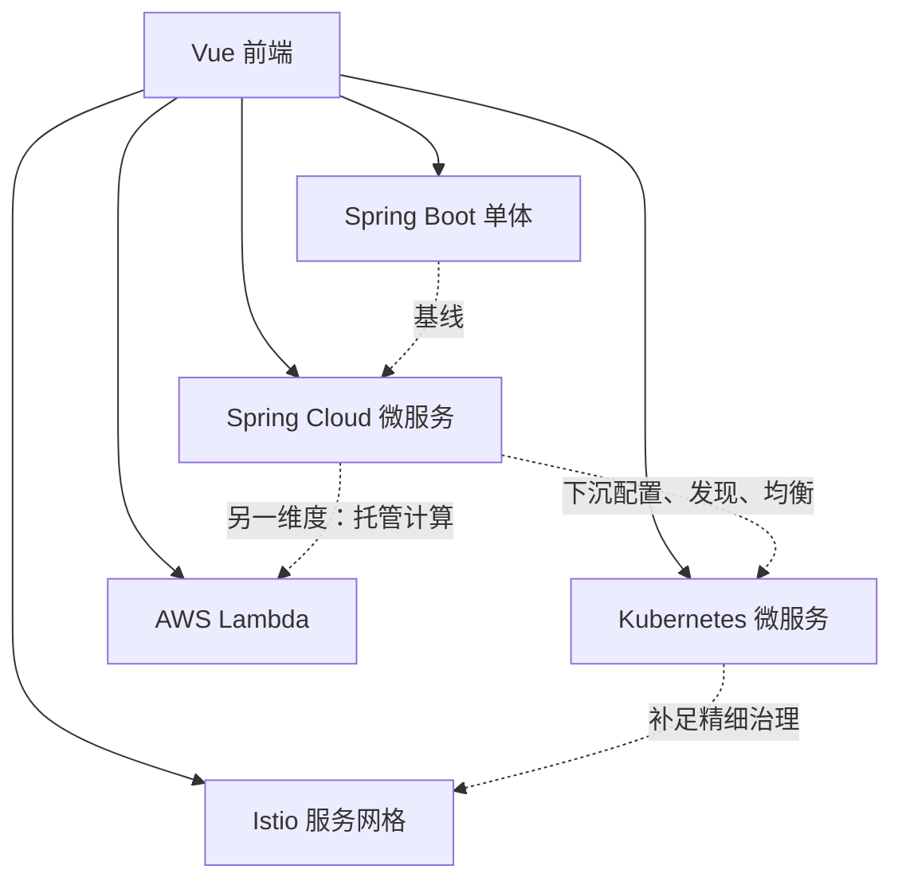
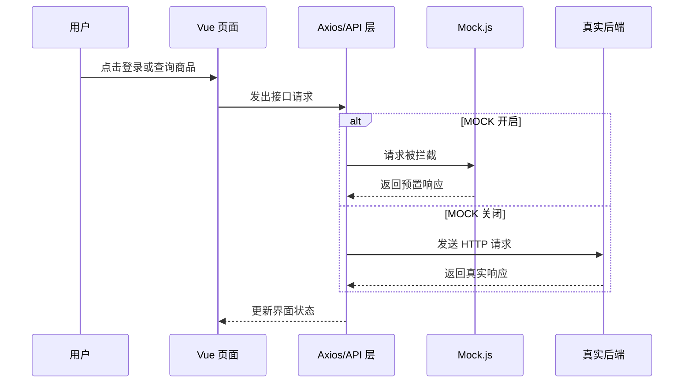
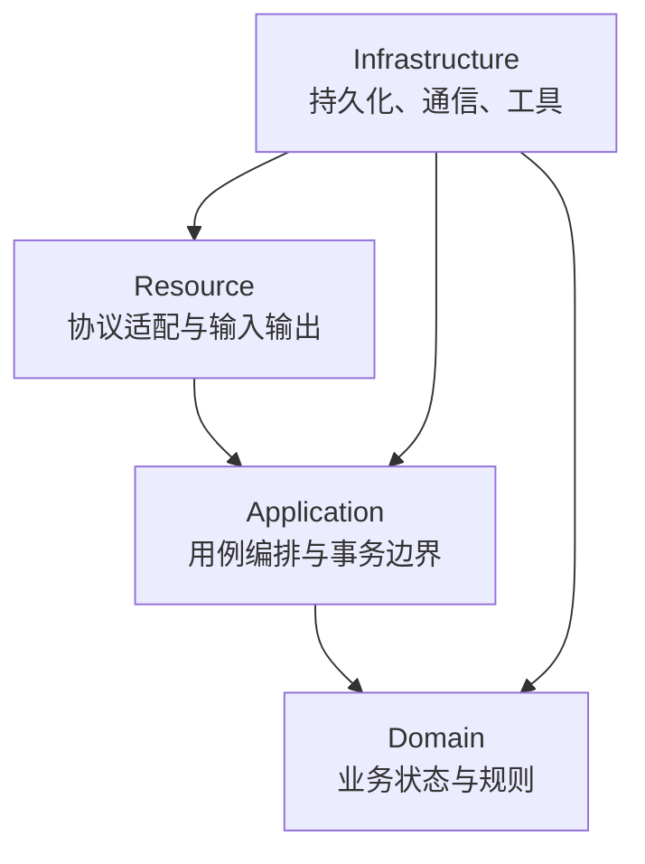
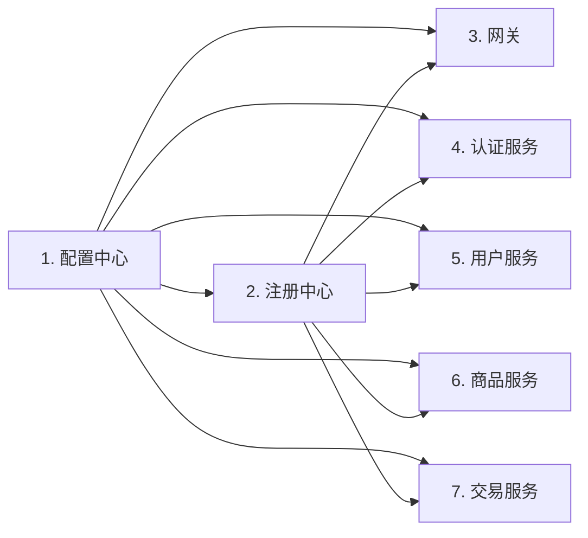
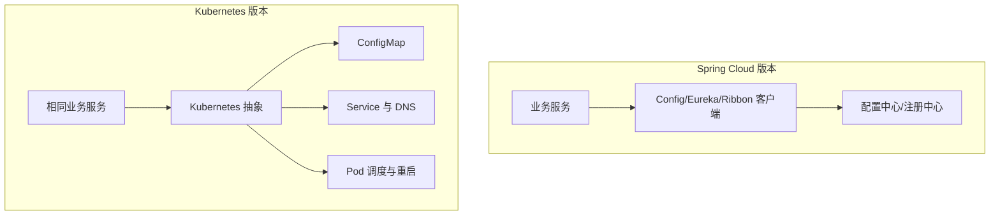
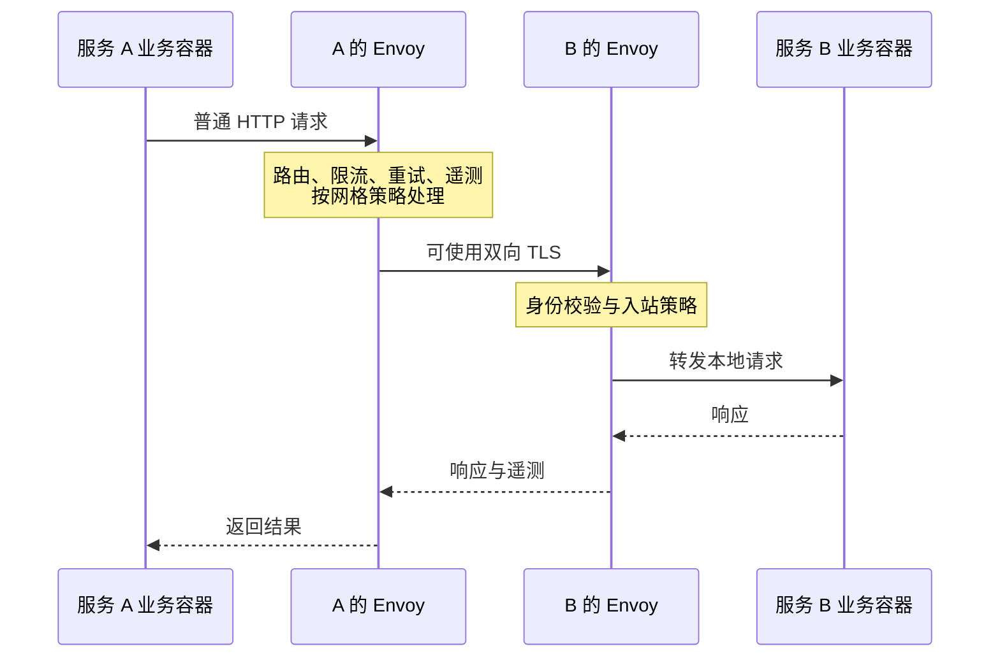
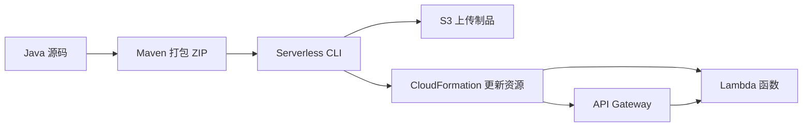
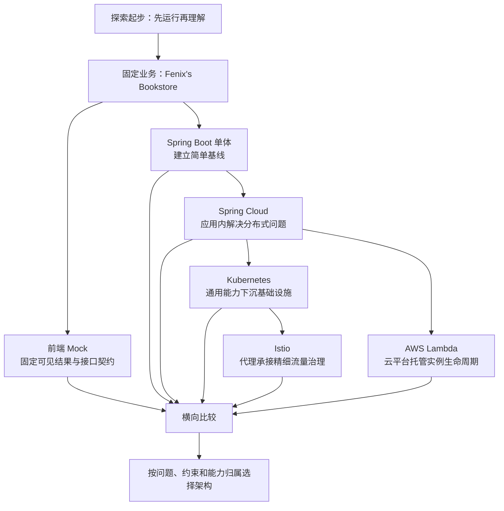

> 原书：周志明，《凤凰架构：构建可靠的大型分布式系统》
>
> 本章范围：原文“探索起步”，包括“阅读指引”和 Fenix's Bookstore 的前端、Spring Boot 单体、Spring Cloud 微服务、Kubernetes 微服务、Istio 服务网格、AWS Lambda 无服务六类演示工程。
>
> 版本提醒：原章及配套工程主要形成于 2019 至 2021 年。文中的 Spring Cloud Netflix、Hystrix、Ribbon、Zuul、Spring Security OAuth、Istio、Kubernetes 和 AWS 工具链均可能已发生版本变化。本文重点解释原书借这些工程展示的架构思想；实际运行前应以各项目当前 README、依赖版本和云平台文档为准。

## 1. 本章要解决什么问题

“探索起步”不是一章先讲理论、再给习题的传统教材内容，而是整本书的实验入口。作者先让读者运行一个能看见、能操作的书店系统，再逐步追问：

1. 同一个业务系统为什么会有单体、微服务、服务网格和无服务等不同实现？
2. 每次架构演进究竟在解决什么旧问题，又引入了什么新问题？
3. 配置、发现、负载均衡、熔断、认证等能力应该写进应用，还是交给基础设施？
4. 怎样在架构变化时尽量保留业务代码，降低迁移成本？
5. 开发、部署和运维复杂度并没有凭空消失，它被转移到了哪里？

作者采用的办法很像一组控制变量实验：所有版本都实现 Fenix's Bookstore，保持用户看到的业务功能基本一致，只改变后端架构和承载非功能能力的位置。这样，读者比较的就不是“哪个演示页面更丰富”，而是相同结果背后的结构差异。



### 1.1 本章的中心线索：复杂度迁移

本章最重要的观察不是“架构越新越好”，而是**分布式复杂度在应用、框架、平台和云服务之间迁移**：

- 单体把大部分业务和技术能力放在同一进程中，部署简单，但模块隔离和独立扩展能力有限。
- Spring Cloud 把系统拆成服务，并通过应用内类库解决分布式问题，能力灵活，但每个应用都背负较深的技术栈。
- Kubernetes 把配置、发现、调度和基础负载均衡等能力下沉到容器基础设施，减少一部分应用内组件。
- Istio 再以边车代理承接流量治理、安全和可观测性，业务进程可以进一步回归普通 Spring Boot 风格。
- AWS Lambda 把服务器与实例生命周期继续交给云平台，开发者按函数和事件组织计算，但会受到冷启动、平台约束和状态外置等影响。

可以用一个仅用于思考、并非原书定量定律的模型表示：

$$
C_{\mathrm{system}}
= C_{\mathrm{business}}
+ C_{\mathrm{distribution}}
+ C_{\mathrm{platform}}
+ C_{\mathrm{coordination}}
$$

其中：

- $C_{\mathrm{business}}$ 是领域规则本身的复杂度；
- $C_{\mathrm{distribution}}$ 是远程调用、容错、一致性、安全与观测等复杂度；
- $C_{\mathrm{platform}}$ 是容器、编排、网格和云平台的建设与维护成本；
- $C_{\mathrm{coordination}}$ 是服务边界、团队协作、版本兼容和发布协调成本。

架构升级通常不是让 $C_{\mathrm{system}}$ 自动变小，而是改变各项的归属，并通过标准化、自动化和规模复用降低单位成本。若团队没有能力维护新增的平台，所谓“下沉复杂度”可能只是把熟悉的问题换成陌生的问题。

## 2. 阅读指引：先实践，再形成理论

### 2.1 为什么把“探索起步”放在最前面

作者用学开车作类比：初学者应先发动汽车并慢慢行驶，而不是一开始就拆解发动机和变速箱。对应到软件架构，合理的起步方式是：

1. 先运行系统，建立对功能和组件的整体印象。
2. 再观察一次请求经过哪些模块，哪些能力属于业务，哪些属于技术治理。
3. 对照不同实现，发现架构差异真正改变了什么。
4. 最后回到后续章节，系统学习演进历史、通用架构问题、分布式基础和不可变基础设施。

这是一条“具体经验 $\rightarrow$ 差异观察 $\rightarrow$ 问题抽象 $\rightarrow$ 理论解释”的学习路径。它降低了纯概念学习的认知负担，也让后续的服务发现、熔断、网关等术语拥有可定位的工程对象。

### 2.2 文档各部分的关系

原书各部分没有严格的线性依赖，可以按目标查阅，但它们形成了一条很自然的问题链：

| 部分 | 主要问题 | 适合的读者 | 与“探索起步”的关系 |
| --- | --- | --- | --- |
| 探索起步 | 系统怎样运行，不同架构长什么样 | 准备动手的探索者 | 提供实验对象和环境说明 |
| 演进中的架构 | 各种架构为何出现、取代了什么 | 所有开发者，尤其是单体转微服务者 | 解释演示版本出现的历史原因 |
| 架构师的视角 | 远程调用、事务、缓存、安全等问题如何设计 | 架构师、设计者、开发者 | 拆解各版本共有的技术问题 |
| 分布式的基石 | 发现、治理、均衡、容错等能力如何实现 | 分布式系统开发者 | 解释微服务版本中的基础能力 |
| 不可变基础设施 | 如何让基础设施承接分布式复杂度 | 平台开发者、运维人员 | 解释 Kubernetes 与 Istio 版本的关键转变 |
| 技术方法论 | 如何作边界、治理和方向选择 | 技术决策者 | 把工程经验提升为决策方法 |
| 随笔与附录 | 独立经验、环境搭建与发布操作 | 按需阅读 | 补足实践环境与工具细节 |

作者建议：已经熟悉某种架构的读者，可以先运行自己最关注的版本，再拿它与熟悉方案比较；不必为了“完整”一次启动全部工程。因为这些版本的价值恰恰在于**用不同技术解决同一问题**，而不是把所有技术堆在一起。

### 2.3 更新日志传达的信息

原章先列出一份很长的更新日志。它不是架构知识清单，更像项目演进证据：

- 2019 年 12 月项目首次提交。
- 2020 年上半年逐步完成架构演进、共识、服务发现等内容，并加入 Kubernetes、Istio 演示。
- 2020 年下半年补齐安全、缓存、治理、可观测性、容器网络与存储等主题，10 月完成计划内容。
- 2021 年增加演讲、音频、纸质书、PDF 与 Fenix-CLI 等传播和工具形态。

这说明《凤凰架构》本身也是一个持续演进的开源工程。原文特别提醒：章节中的工程说明由各仓库 README 人工同步，可能与仓库最新状态不完全一致。因此，**书中说明用于理解设计，仓库 README 用于确认当前操作**。

## 3. 技术演示工程：同一业务的多种架构实现

### 3.1 Fenix's Bookstore 扮演什么角色

Fenix's Bookstore 是整组实验的共同业务载体。它包含用户、商品、交易等典型领域，并提供注册、登录、浏览、收藏、购物车和交易等操作。作者没有为每种架构设计不同业务，而是让前端界面和业务结果尽量保持一致。

这样安排解决了一个常见学习难题：如果示例 A 用博客、示例 B 用电商、示例 C 用聊天系统，那么读者无法判断观察到的差异来自业务，还是来自架构。统一业务后，差异主要来自：

- 代码边界：一个进程还是多个服务；
- 非功能能力的位置：应用类库、平台组件、代理还是云服务；
- 部署单位：JAR、容器、Pod、带边车的 Pod 或函数；
- 运行入口：本地进程、Docker Compose、Kubernetes、Istio 或云平台；
- 运维对象：进程、服务、资源声明、流量规则或函数事件。

### 3.2 工程全景

| 工程 | 主要职责 | 关键技术 | 最适合观察的内容 |
| --- | --- | --- | --- |
| 前端 | 提供统一用户界面，也可用 Mock 独立运行 | Vue.js 2、Element、Axios、Mock.js、Vuex | 前后端解耦、接口契约与客户端状态 |
| 单体后端 | 提供最直观的基线实现 | Spring Boot、JAX-RS、JPA、Bean Validation | DDD 分层、进程内调用、单一部署单元 |
| Spring Cloud | 在应用层实现微服务能力 | Config、Eureka、Zuul、Hystrix、Ribbon、Feign | 服务拆分和应用内治理组件 |
| Kubernetes | 将部分分布式能力下沉到基础设施 | Pod、Service、ConfigMap、Skaffold | 声明式资源、调度、发现和基础负载均衡 |
| Istio | 用边车代理提供精细流量治理 | Istio、Envoy、Ingress Gateway | 服务网格、安全、容错和可观测性 |
| AWS Lambda | 由云平台管理计算实例 | Lambda、SAM、Serverless CLI、API Gateway | 函数化部署、冷启动和状态外置 |



图中的最后一条关系尤其重要：Serverless 不是微服务之后必然出现的“下一代”，它与微服务不在同一分类层次。微服务讨论的是系统如何按服务边界组织，Serverless 讨论的是计算资源如何交付和运行；一个微服务完全可以由一个或多个云函数实现。

### 3.3 推荐的实验方法

不要只确认页面“能打开”。每运行一个版本，都应记录以下证据：

1. 系统有多少个可独立部署单元？
2. 浏览器请求先到哪里，之后经过哪些服务？
3. 服务地址由谁保存和解析？
4. 多实例时由谁选择目标实例？
5. 下游失败时由谁重试、熔断或降级？
6. 用户身份在哪里认证，访问权限在哪里执行？
7. 配置修改是否需要重新构建或重启？
8. 日志、指标和调用链在哪里汇总？
9. 扩容一个热点服务需要修改业务代码吗？
10. 删除某个技术组件后，它的能力由谁接替？

这十个问题使“看项目”变成可比较的架构实验。

## 4. 前端工程：先固定可见的业务结果

### 4.1 为什么先从前端开始

本书重点是后端架构，但前端能最快回答“我们到底要构建什么”。它把抽象的用户、商品、交易服务转换成可点击的页面，也为所有后端版本提供统一的观察面。

更重要的是，前端可以依靠 Mock.js 独立运行。于是前端开发不必等待服务端、数据库和部署环境全部就绪。这体现了前后端分离的关键条件：双方先约定接口位置、传输方式、参数、数据模型以及必要的服务水平，再各自实现和测试。

原章把这种独立性放在现代 **MVVM**（Model-View-ViewModel）前端结构下理解：View 负责界面呈现，ViewModel 保存页面状态并把用户动作转换为数据操作，Model 则代表经本地或远程 API 获得的数据。页面主要依赖 ViewModel，而 ViewModel 通过统一 API 层连接 Mock 或真实服务端，因此替换数据来源时不必重写界面。MVVM 解决的是前端展示与状态逻辑的耦合问题；前后端分离解决的是浏览器应用与服务端的进程、开发和发布边界，两者相互促进但不是同一个概念。

### 4.2 三种运行方式及其用途

原书给出三条路径：

| 方式 | 典型命令或入口 | 用途 | 局限 |
| --- | --- | --- | --- |
| 已部署网站 | 浏览器直接访问演示站 | 最快观察最终界面 | 不能观察本地构建和调试 |
| Docker | `docker run -d -p 80:80 --name bookstore icyfenix/bookstore:frontend` | 验证产品包和容器交付 | 镜像与旧地址可能已变化 |
| 源码开发 | `npm install`、`npm run dev` | 阅读、修改和调试前端 | 受 Node.js 与旧依赖版本约束 |

这里的学习重点不是背命令，而是识别三种层次：在线成品用于体验，容器用于验证交付，源码模式用于开发。

### 4.3 Mock.js 如何解除服务端依赖

开发模式下，Mock.js 拦截远程请求并返回预置数据：



其价值是让前端可以独立开发和演示，但必须理解它的真实性边界：

- 登录响应是预设的，因此任意输入可能得到同一个模拟用户。
- 注册等应写入服务端的数据修改不会真正持久化。
- 购物车、收藏夹等只保存在前端的状态仍然可以变化。
- Mock 验证的是前端是否按约定处理响应，不证明真实后端、数据库和网络链路正确。

### 4.4 “前端有状态”和“后端无状态”并不矛盾

原章指出，把一部分会话状态放在客户端、让后端服务尽量无状态，有利于伸缩和鲁棒性。原因是任意后端实例都能处理下一次请求，负载均衡器无需把用户固定到某台机器。

但“无状态服务”常被误解为“系统没有状态”。准确说法是：

- 业务状态仍然存在，可能位于数据库、缓存、令牌或客户端；
- 无状态强调单个服务实例不依赖本机内存中的会话上下文；
- 状态放进客户端会扩大请求数据，并带来篡改、泄露、过期和撤销问题；
- 因而可伸缩性收益必须与网络成本和安全边界一起评估。

### 4.5 产品构建与开发联调

开发服务器适合热更新和调试，正式部署则需要产品化构建：

```bash
npm run build
npm run build --report
```

第一条由 Node.js 驱动 webpack 完成打包与压缩；第二条额外生成依赖分析报告。原工程输出到 `dist`，再由 Web 服务器或后端网关托管静态资源。

联调时的关键开关是是否导入 Mock：

```javascript
if (process.env.MOCK) {
  require('./api/mock')
}
```

- `MOCK` 为真：请求走模拟响应，适合纯前端开发或演示镜像。
- `MOCK` 为假：请求走真实后端，适合集成联调。

这段代码与原理的对应关系很直接：接口调用代码不变，只替换请求最终抵达的实现。它是依赖替换思想在前端开发中的简化形式。

### 4.6 工程结构表达的职责边界

原工程由 Vue CLI 初始化，重要目录可按职责理解：

- `src/api/local`：浏览器本地能力，例如存储和加密。
- `src/api/mock`：远程 API 的模拟实现及 JSON 数据。
- `src/api/remote`：真实远程服务访问。
- `src/components`：可复用的页面内组件。
- `src/pages`：页面级视图。
- `src/router`：路由。
- `src/store/modules`：按命名空间划分的 Vuex 状态。
- `assets`：参与 webpack 哈希与压缩的资源。
- `static`：原样复制、不做哈希压缩的静态文件。

这套结构把“界面组成”“页面导航”“状态管理”和“服务访问”分开，使 Mock 与真实后端的切换不会扩散到页面组件。


### 4.7 主要组件与许可边界

前端使用 Vue.js 2、Element、Axios、Mock.js，并借助 DesignEvo 制作标识。原章把代码和文档许可分开说明：代码按 Apache 2.0，文档按原项目声明的知识共享许可使用。实际复用时应直接核对仓库中的 `LICENSE` 文件，不能把“开源”理解为无条件复制，也不能把代码许可自动套到文档上。

## 5. Spring Boot 单体：建立架构比较的基线

### 5.1 为什么从单体而不是微服务起步

单体版本与后续版本业务功能一致，但结构更直观：调用大多发生在一个进程内，部署单位也只有一个。它提供了两个基准：

1. **业务基准**：用户、商品和交易规则在不分布式时如何组织。
2. **复杂度基准**：拆分后增加的远程通信、发现、容错和运维工作究竟来自哪里。

如果没有这个基线，读者很容易把微服务框架提供的组件误认为业务天然需要的部分。

### 5.2 运行路径与数据库选择

原书提供 Docker、Maven/JAR 和 IDE 三种运行方式。最小容器示例为：

```bash
docker run -d -p 8080:8080 --name bookstore icyfenix/bookstore:monolithic
```

源码方式使用 Maven Wrapper，避免要求机器预装特定 Maven 版本：

```bash
git clone https://github.com/fenixsoft/monolithic_arch_springboot.git
cd monolithic_arch_springboot
./mvnw package
java -jar target/bookstore-1.0.0-Monolithic-SNAPSHOT.jar
```

Windows 下对应使用 `mvnw.cmd package`。原工程预置用户为 `icyfenix`，密码为 `123456`；这些仅是演示凭据，不能照搬到真实系统。

默认数据库是 HSQLDB 内存模式：启动时初始化 Schema，停止后数据消失。它降低了第一次运行的环境成本，却不适合验证持久化和恢复。通过 `PROFILES=mysql` 可切换到 MySQL 配置，但还必须提供数据库和 `mysql_lan` 名称解析。

这一设计体现了 Profile 的用途：**同一份业务程序通过外部配置选择环境依赖**。不过，配置切换并不能自动创造数据库，网络、凭据、Schema 和生命周期仍需部署环境负责。

### 5.3 标准优先的组件策略

单体版本尽量依赖 Java 标准规范，而不是把业务代码绑定到单一厂商实现：

| 能力 | 规范 | 示例实现 | 可替代实现的意义 |
| --- | --- | --- | --- |
| REST 服务 | JAX-RS 2.1 / JSR 370 | Jersey 2 | 可替换 CXF、RESTEasy 等 |
| 依赖注入 | JSR 330 | Spring Framework 5 | 以抽象注解降低实现耦合 |
| 持久化 | JPA 2.2 / JSR 338 | Spring Data JPA | 领域模型不直接绑定数据库驱动 |
| 数据验证 | Bean Validation 2.0 / JSR 380 | Hibernate Validator 6 | 统一声明约束与校验方式 |
| Web 容器 | Servlet 3.0 / JSR 315 | 嵌入式 Tomcat 9 | 可替换 Jetty、Undertow 等 |

“采用标准”不等于“替换零成本”。例如 Spring Data 的 `CrudRepository` 提供了超出纯 JPA 的便利，更换实现时需要补回代码；Spring 对 `@Named`、`@Inject` 的行为也可能与其他 CDI 容器不同。标准减少的是概念和接口耦合，不会消除实现差异。

认证授权和 JSON 处理仍依赖特定实现：为了与后续微服务版本比较，工程使用 Spring Security、Spring Security OAuth、JWT 与 Jackson。当时的 Java EE Security 标准没有直接覆盖所需的 OAuth2/JWT 能力，而 Spring Security OAuth 对 JSON 反序列化行为又形成了现实约束。这说明技术选型经常是**标准理想、生态兼容和迁移目标之间的折中**。

### 5.4 DDD 四层结构

单体工程参考而未完全照搬领域驱动设计，分为四层：

1. **Resource**：对应用户接口层。接收 HTTP 请求、解释命令、返回资源表示。这里的“用户”也可以是另一个服务。
2. **Application**：编排用例，协调领域对象完成任务。它应尽量薄，不承载业务规则，常被用作事务边界。
3. **Domain**：表达业务概念、状态和规则，是系统核心。
4. **Infrastructure**：提供持久化、远程通信和通用工具等技术能力。




一次“提交订单”请求可按以下方式理解：Resource 把 JSON 转成命令；Application 开启事务并调用领域对象；Domain 检查库存、价格和用户规则；Infrastructure 保存订单并访问数据库；Application 提交事务；Resource 返回结果。

一个常见误区是把“Application 层尽量不写条件判断”机械化。作者想强调的是业务分支应由领域对象表达，而不是说应用编排永远不能包含任何技术性分支、错误处理或流程选择。判断标准是：这条规则属于业务含义，还是属于用例协调。

## 6. Spring Cloud 微服务：先在应用层解决分布式问题

### 6.1 问题是如何形成的

作者没有从“微服务流行”推出“必须拆分”，而是先构造系统增长后的压力：

- **人员扩张**：大型单体缺乏物理隔离，一个局部错误可能影响全局；少量专家难以审查所有代码。
- **技术异构**：深度学习可能偏向 Python，协调组件和基础软件可能由 Go、C 等语言实现，单一技术栈不能覆盖所有优势生态。
- **独立演进**：不同业务部分希望独立部署、扩缩容和维护。
- **质量属性提升**：并发、可用性和故障隔离要求开始超过单一进程的舒适范围。

因此，Fenix's Bookstore 被拆成用户、商品、交易三个领域服务，并加入认证、配置、注册和网关等技术服务。它们通过统一 API 网关对外，保持与单体相同的业务功能。


### 6.2 拆分解决了什么，又增加了什么

拆分带来独立部署、故障隔离、团队边界和技术异构的可能，但原来免费的进程内调用变成了不可靠的网络调用，于是必须补上：

- 配置中心：统一管理各服务环境参数；
- 服务发现：把逻辑服务名映射到动态实例；
- 网关：提供统一入口和路由；
- 负载均衡：在多个实例中选择目标；
- 熔断与治理：限制故障传播；
- 声明式客户端：降低远程调用代码量；
- 认证授权：在跨服务边界后继续保护资源。

这就是作者所说的“以应用代码解决基础设施功能问题”。它并非错误，而是在当时通用虚拟化基础设施尚不成熟时可落地、且生态最完整的方案；代价是业务应用必须理解并携带这些组件。

### 6.3 启动顺序揭示依赖关系

工程编译出七个 Spring Boot 服务：配置中心、注册中心、网关、认证、用户、商品和交易。原书特别要求配置中心先启动，因为其他服务要从中获取参数。



图中编号是便于理解的启动策略，不表示后三类服务必须严格串行。配置中心就绪后，其余服务可按依赖并行启动；注册与健康状态就绪后，网关才能稳定转发流量。

Docker Compose 的价值就在于把多进程启动、网络和依赖配置声明化：

```bash
curl -O https://raw.githubusercontent.com/fenixsoft/microservice_arch_springcloud/master/docker-compose.yml
docker-compose up
```

开发期还可在 Maven 打包后使用 `docker-compose.dev.yml`。这再次表明：服务越多，手工记忆命令越不可行，自动化编排会从便利工具变成必要条件。

### 6.4 配置和横向扩展

工程通过环境变量暴露关键部署参数：

- `CONFIG_HOST`、`CONFIG_PORT`：配置中心地址；
- `REGISTRY_HOST`、`REGISTRY_PORT`：注册中心地址；
- `AUTH_HOST`、`AUTH_PORT`：认证中心地址；
- `PORT`：当前实例监听端口；
- `PROFILES`：环境 Profile，例如从 HSQLDB 切换到 MySQL；
- `JAVA_OPTS`：JVM 参数。

在一台机器上模拟四个支付实例时，需要让它们监听不同端口；在不同容器或主机中，各实例可使用相同容器端口，由网络命名空间隔离。这个区别说明“端口冲突”是部署拓扑问题，不是微服务定义的一部分。

### 6.5 Netflix OSS 组件及替代关系

| 能力 | 原工程默认实现 | 原章列出的替代方向 | 核心抽象 |
| --- | --- | --- | --- |
| 配置中心 | Spring Cloud Config | Consul、Nacos | 按环境提供外部配置 |
| 服务发现 | Eureka | Consul、ZooKeeper、Etcd | 服务名到健康实例集合 |
| 网关 | Zuul | Spring Cloud Gateway | 统一入口、路由和过滤 |
| 服务治理 | Hystrix | Sentinel、Resilience4j | 熔断、隔离、限流、降级 |
| 客户端负载均衡 | Ribbon | Spring Cloud LoadBalancer | 从实例集合选择目标 |
| 声明式 HTTP | OpenFeign | Retrofit 等 | 以接口描述远程调用 |

作者列替代品的原因是 Spring Cloud Netflix 当时已进入维护模式。更深层的结论是：选型时要抓住稳定抽象，而不是把某个产品名当作概念本身。Eureka 是服务发现的一种实现，Hystrix 是容错的一种实现；产品会退出，问题不会消失。

声明式组件减少了显式调用代码，也降低了替换成本，但“只换注解和配置即可”有前提：双方语义、故障模型、默认超时、重试策略和监控指标必须兼容。语法替换容易，行为等价仍需测试。

## 7. Kubernetes 微服务：把通用能力下沉到基础设施

### 7.1 为什么会出现下一次演进

Spring Cloud 解决了微服务问题，却让开发者面对 Config、Eureka、Zuul、Hystrix、Ribbon、Feign 等大量技术组件。配置中心、注册中心等纯技术工程也占据构建、部署和运维资源。

作者的关键判断是：此前在应用层处理这些问题，不是因为它们天然属于业务应用，而是因为传统硬件基础设施不够灵活。Kubernetes 统一容器编排后，基础设施开始能按软件声明动态创建服务、DNS、负载均衡和配置载体，于是通用能力有机会从应用代码中移走。

原章回顾 2017 年的容器生态：CoreOS、Rancher、Mesos 和 Docker 等竞争路线陆续转向或兼容 Kubernetes。作者把这看作“后微服务时代”的开端，因为统一编排平台为基础设施层的标准解法创造了条件。

### 7.2 两个迁移目标

1. **减少非业务代码和纯技术工程**：删除能由平台承接的配置中心、注册中心及客户端依赖。
2. **尽量不改原有 Java 业务代码**：利用声明式编程，以配置描述目标，让实现替换不侵入业务逻辑。

结果很有辨识度：Spring Cloud 版和 Kubernetes 版的 Java 代码逐行相同，差异主要位于依赖与 YAML 资源声明。Kubernetes 版删除部分 Spring Cloud 组件，并通过资源文件构造 DNS、Service、ConfigMap 等基础设施。




### 7.3 声明式编程为什么有助于迁移

命令式表达关注“怎样一步步做”，声明式表达关注“最终希望是什么状态”。例如，命令式扩容可能要求脚本创建进程、分配端口、注册服务；Kubernetes 声明则描述副本数、镜像和 Service，控制器持续把实际状态拉向目标状态。

可把控制循环概括为：

```text
while actual_state != desired_state:
    difference = compare(desired_state, actual_state)
    action = choose_reconciliation_action(difference)
    execute(action)
    observe_again()
```

它有效的原因是动作由平台根据当前状态决定，声明本身可重复提交；这比只执行一次、失败后状态不明的脚本更适合长期运行的分布式环境。前提是资源状态可观测、控制器动作幂等，并且声明覆盖了必要约束。

### 7.4 直接部署与 Skaffold 开发循环

已有 Kubernetes 集群时，可以应用集成资源文件：

```bash
kubectl apply -f https://raw.githubusercontent.com/fenixsoft/microservice_arch_kubernetes/master/bookstore.yml
```

`apply` 的含义不是简单“执行一个安装脚本”，而是把文件中的期望状态提交给 API Server，再由各控制器协调创建资源。

开发阶段若每次修改都完整走 CI/CD，会严重拖慢反馈。Skaffold 把以下步骤连成开发循环：

1. 监视构建产物变化；
2. 构建容器镜像；
3. 生成动态标签并部署；
4. 注入 JDWP 调试参数；
5. 根据服务端口建立本地转发。

```bash
git clone https://github.com/fenixsoft/microservice_arch_kubernetes.git
cd microservice_arch_kubernetes
./mvnw package
skaffold dev
```

原工程选择监视 JAR，而不是每次保存 Java 文件就从 Maven 容器中重建镜像。原因有二：本地 Maven 仓库缓存更快；重建镜像和重启 Pod 比 HotSwap 重得多，不应由每次按保存键触发。这是典型的反馈速度与环境真实性折中。

### 7.5 哪些能力已经下沉，哪些仍留在应用

| 能力 | Kubernetes 版实现 | 是否完全移出应用 | 原因或限制 |
| --- | --- | --- | --- |
| 环境感知 | Fabric8 Kubernetes Client | 否 | 应用仍需适配 Kubernetes API，且有版本兼容问题 |
| 配置 | ConfigMap + Spring Cloud Kubernetes Config | 大部分 | 应用仍需读取与刷新配置 |
| 服务发现 | Service、DNS、Spring Cloud Kubernetes Discovery | 大部分 | 名称解析由平台提供 |
| 负载均衡 | Service / DNS | 基础能力已下沉 | 高级策略仍有限 |
| 网关 | Zuul | 否 | Ingress Controller 非内置且增加环境复杂度；前端仍需承载点 |
| 熔断与流控 | Hystrix | 否 | Kubernetes 不提供请求级精细治理 |
| 认证授权 | Spring Security OAuth 2 | 否 | Kubernetes RBAC 管平台资源，不等于终端用户业务权限 |

版本兼容是原章给出的一个具体警示：Spring Cloud Kubernetes 间接引入的 Fabric8 Client 版本可能落后于集群 API，需要排除旧依赖并显式升级。基础设施抽象不意味着版本矩阵消失，它只是把兼容问题集中到适配层。

### 7.6 Kubernetes RBAC 与应用授权不能混淆

Kubernetes RBAC 控制的是“某个主体能否读取 Pod、修改 Deployment 等集群资源”。书店的应用授权控制的是“某个用户能否查看订单、购买商品或执行管理操作”。两者的资源、身份和信任边界不同，所以不能因为平台有 RBAC 就删除所有业务认证授权。

## 8. Istio 服务网格：用代理补足精细治理

### 8.1 Kubernetes 为什么还不够

Kubernetes 擅长容器生命周期、调度、服务发现和基础负载均衡，但单靠 Service 与 DNS 很难提供：

- 按请求、协议、版本或用户特征路由；
- 精细的超时、重试、熔断和流量控制；
- 统一的服务间身份和双向 TLS；
- 跨服务指标、日志与调用关系观察。

因此，Kubernetes 版本虽然减少了部分应用组件，在灵活治理方面反而可能弱于 Spring Cloud 版本。作者没有把所有问题都硬塞给 Kubernetes，而是引入位于应用与基础设施之间的服务网格。

### 8.2 Sidecar 的核心机制

Istio 通过为工作负载注入 Envoy 边车代理，让服务间流量先经过代理。业务代码仍发出普通网络请求，但超时、路由、熔断、加密和遥测可由代理执行。



这实现了 Istio 所强调的四类能力：连接、保护、控制和观察服务。其本质是将原本散落在每个应用进程中的网络治理逻辑，统一放到可集中配置的代理层。

### 8.3 两个演进目标

1. **让大规模虚拟服务可管理、可观测**：从全局查看调用关系，动态设置断路、重试和均衡规则，统一收集遥测数据。
2. **缩短普通开发者的技术栈**：核心平台人员理解 Kubernetes 和 Istio，多数业务开发者继续使用接近普通 Spring Boot 的方式开发。

作者用“每位运维人员可支持的服务数”描述平台杠杆。可以将它写成一个观察指标：

$$
L_{\mathrm{ops}} = \frac{N_{\mathrm{managed\ services}}}{N_{\mathrm{operators}}}
$$

$L_{\mathrm{ops}}$ 越高，表示自动化平台让同样规模的运维团队管理更多服务。但它不能单独代表健康度：若告警质量差、故障恢复时间变长，服务数提高也可能只是风险积累。因此至少还应结合变更失败率、平均恢复时间和告警负担观察。

### 8.4 代码栈怎样简化

Istio 版移除了 Zuul、Hystrix、Spring Cloud Kubernetes 等应用内组件，单个业务服务更接近最初的 Spring Boot 技术栈。安全过滤也主要移到网格；Spring Security OAuth 仍作为终端用户认证和 JWT/JWKS 提供者存在。

这说明“安全移到网格”不是删除身份系统，而是重新划分职责：

- 身份提供者负责验证用户并签发令牌；
- 网格验证服务间连接与令牌，执行通用访问策略；
- 业务服务仍可能根据订单归属、账户状态等领域事实做细粒度授权。


### 8.5 有边车与无边车两种运行模式

原工程允许两种部署：

- `bookstore-dev.yml`：不注入 Envoy，适合不需要双向 TLS、统一授权和完整可观测性的本地业务开发；仍使用 Istio Ingress Gateway。
- `bookstore.yml`：注入 Envoy，获得完整网格能力。

代表性命令如下：

```bash
kubectl apply -f https://raw.githubusercontent.com/fenixsoft/servicemesh_arch_istio/master/bookstore-dev.yml
kubectl apply -f https://raw.githubusercontent.com/fenixsoft/servicemesh_arch_istio/master/bookstore.yml
```

命名空间的 `istio-injection` 设置控制自动注入。关闭注入可减少开发期容器初始化和重部署时间，但会失去依赖 Envoy 的访问控制、熔断、流量规则与可视化。业务功能“能运行”不等于生产所需的质量属性仍然存在。

Skaffold 开发流程与 Kubernetes 版本相同；入口端口则取决于 Istio Ingress Gateway 的实际安装配置，不能机械假定所有环境都监听原书端口。

### 8.6 组件职责归属

| 能力 | Istio 版本的承担者 |
| --- | --- |
| 配置 | Kubernetes ConfigMap |
| 服务发现 | Kubernetes Service |
| 基础负载均衡 | 无边车时由 KubeDNS/Service 提供 |
| 高级负载均衡和流量策略 | Envoy + Istio 配置 |
| 网关 | Istio Ingress Gateway |
| 服务容错 | Envoy |
| 服务间认证与通用授权 | Istio 安全机制 |
| 终端用户认证和 JWT/JWKS | OAuth2 身份服务 |

服务网格的局限也必须看到：每个工作负载增加代理会消耗 CPU、内存和连接资源；流量经过额外一跳会带来延迟；控制面、证书、策略和遥测系统本身需要专业运维；代理与应用的故障定位边界也更复杂。它适合服务规模和治理需求足以抵偿平台成本的场景。

## 9. AWS Lambda 无服务：把实例生命周期交给云平台

### 9.1 Serverless 与微服务是什么关系

二者不是前后替代关系：

- 微服务关注系统如何按业务能力拆分和协作；
- Serverless 关注计算如何按请求或事件提供，服务器和实例生命周期由平台管理；
- 一个微服务可以部署为长期运行的容器，也可以由函数实现；
- 一个 Serverless 系统同样需要边界设计、存储、认证、可观测性和失败处理。

原书加入这一版本是为了补全架构观察面，而不是把它定为全书重点。

### 9.2 为什么 Java/Spring 面临冷启动问题

Lambda 实例可能在请求到达时才创建。总响应时间可以直观拆为：

$$
T_{\mathrm{response}}
= T_{\mathrm{provision}}
+ T_{\mathrm{runtime\ init}}
+ T_{\mathrm{framework\ init}}
+ T_{\mathrm{business}}
+ T_{\mathrm{I/O}}
$$

暖实例通常省去前三项的大部分工作，冷实例则必须承担。JVM 启动、类加载和 Spring Bean 装配会增大初始化时间，所以传统 Spring 应用天然不占优势。作者给出两个方向：

- 使用 GraalVM 提前编译，并尽量把可确定工作前移到构建期；
- 采用 Quarkus 等以原生程序和快速启动为目标的框架。

这个公式不是用来精确预测云平台延迟，而是帮助定位优化对象。若主要时间消耗在数据库或外部 API，单纯缩短 JVM 启动并不能解决整体延迟；若函数被频繁复用，冷启动占比也会下降。

若冷启动概率为 $p_{\mathrm{cold}}$，可用期望值理解平均影响：

$$
E[T] = p_{\mathrm{cold}}T_{\mathrm{cold}}
+ (1-p_{\mathrm{cold}})T_{\mathrm{warm}}
$$

但用户体验还取决于尾延迟，平均值可能掩盖少数很慢的冷请求。因此生产评估不能只看平均响应时间。

### 9.3 本地 SAM 测试

原工程使用 Maven 生成 Lambda 所需的 ZIP，而非 Spring Boot Fat JAR：

```bash
mvn clean package
sam local start-api --template sam.yaml
```

SAM Local 依赖 Docker，用本地容器模拟 API Gateway 和 Lambda 运行环境。它适合验证处理器、路由和打包结构，但不能完全复制云端冷启动、权限、网络、限额和托管服务行为。

### 9.4 云端部署链路

配置 AWS 凭据并确认 `serverless.yml` 中 ZIP 路径后，原书使用：

```bash
sls deploy
```

部署链路可概括为：



CLI 输出的 endpoint 才是实际访问地址。与本地固定端口不同，云端入口由部署结果生成。

### 9.5 数据库为何必须外置

函数实例短暂、可并发创建，也可能随时销毁，不能把本地内存或实例磁盘当作可靠业务存储。原章不建议继续使用每次冷启动都重置的 HSQLDB，而建议使用外部 MySQL/MariaDB 等托管数据库。

但外置数据库也产生新问题：

- 大量函数实例可能迅速耗尽数据库连接；
- 函数与数据库跨网络访问会增加延迟；
- VPC、凭据和最小权限配置更复杂；
- 函数重试要求写操作具备幂等性。

因此 Serverless 消除的是服务器管理，不是状态管理和分布式系统问题。

## 10. 六类工程的横向比较

### 10.1 复杂度放在哪里

| 维度 | 纯前端 Mock | Spring Boot 单体 | Spring Cloud | Kubernetes | Istio | AWS Lambda |
| --- | --- | --- | --- | --- | --- | --- |
| 主要部署单元 | 静态资源 | 单个应用 | 多个服务 JAR/容器 | Pod 与资源对象 | Pod + Envoy | 函数与云资源 |
| 服务发现 | 不涉及真实后端 | 进程内调用 | Eureka | Service/DNS | Service/DNS | 云平台绑定/API Gateway |
| 负载均衡 | 不涉及 | 通常不需要 | Ribbon | Service/DNS | Envoy 策略 | 云平台调度 |
| 配置 | 前端构建/环境变量 | Spring Profile | Config Server | ConfigMap | ConfigMap + 网格配置 | 函数/云环境配置 |
| 容错位置 | 模拟层之外 | 进程内异常处理 | Hystrix 等应用库 | 平台重启 + 应用组件 | Envoy + 平台 | 平台重试 + 函数逻辑 |
| 认证授权 | 可模拟 | Spring Security | 独立认证服务 + 应用过滤 | 业务安全仍在应用 | 身份服务 + 网格策略 | 云 IAM + 应用身份体系 |
| 可观测性 | 浏览器工具 | 单进程日志 | 各服务自行接入 | 平台对象与应用遥测 | 网格统一遥测更强 | 云平台日志、指标与追踪 |
| 主要优势 | 前端独立开发 | 简单、直观、易调试 | 组件成熟、治理灵活 | 声明式编排与基础能力复用 | 非侵入式精细治理 | 按需运行、少管服务器 |
| 主要代价 | 不代表真实链路 | 隔离与独立扩展有限 | 应用技术栈深 | 平台学习和兼容成本 | 代理与控制面复杂度 | 冷启动、锁定、状态外置 |

### 10.2 一次请求中的责任迁移

以“用户通过网关查询商品”为例：

- **单体**：控制器直接调用同进程应用与领域对象，没有服务发现。
- **Spring Cloud**：网关查询注册中心，客户端负载均衡选择商品实例，Hystrix 保护调用。
- **Kubernetes**：服务名由 DNS 解析，Service 转发到 Pod；高级熔断仍可能依赖应用库。
- **Istio**：应用访问服务名，Envoy 根据网格规则选择目标、加密连接并记录遥测。
- **Lambda**：API Gateway 触发函数，平台分配或复用实例，函数访问外部状态服务。

架构演进的实质不是请求不再需要路由、容错或安全，而是**执行这些职责的主体发生变化**。

### 10.3 不存在无条件最优解

选择架构应从约束出发：

- 团队很小、业务边界仍不稳定、独立扩展需求不强时，单体往往反馈最快。
- 服务边界清晰、团队需要独立发布且愿意承担分布式成本时，微服务才有净收益。
- 已有可靠容器平台和平台团队时，Kubernetes 能复用通用能力。
- 服务数量、治理和安全需求达到一定规模时，服务网格才可能抵偿代理与控制面的成本。
- 事件驱动、流量波动大、执行短且状态可外置时，Serverless 更有吸引力。

“技术先进”只描述时间或能力维度，不等于“适合当前组织”。架构必须同时匹配业务规模、团队结构、平台成熟度和故障承受能力。

## 11. 容易混淆的概念与常见误区

### 11.1 单体不等于没有模块化

单体描述的是部署和进程边界，不代表内部必须混乱。DDD 分层和清晰模块仍可在单体中实现。反过来，把混乱代码分成多个进程也不会自动得到良好微服务，只会增加网络和运维成本。

### 11.2 微服务不等于 Spring Cloud

微服务是一种架构风格，Spring Cloud 是一组实现工具。Kubernetes、Istio 和云函数也能承载微服务。把工具名当作架构定义，会使技术更新时失去稳定认知。

### 11.3 容器不等于微服务

单体也可以放进容器，微服务也可以不用容器。容器解决环境封装和进程隔离，微服务解决服务边界和独立演进，两者经常组合但并非同义。

### 11.4 Kubernetes Service 不等于完整服务治理

Service 和 DNS 主要解决“怎样找到并转发到实例”。按版本路由、请求级超时、熔断、细粒度重试、安全策略和全链路观测属于更高层治理问题，这正是 Istio 继续出现的原因。

### 11.5 服务网格不等于不再需要业务安全

网格可验证身份、加密传输并执行通用访问策略，但“用户只能修改自己的订单”需要领域数据和业务语义，仍应由业务系统判断。

### 11.6 无服务不等于没有服务器

服务器仍然存在，只是由云厂商管理，用户按函数、事件和资源声明使用。团队少管操作系统，不代表不再管理成本、权限、并发、超时、状态与供应商依赖。

### 11.7 声明式不等于没有逻辑

逻辑从业务脚本转移到了控制器。声明式系统是否可靠，取决于控制循环、状态观测、幂等协调和失败处理，而不是 YAML 本身。

### 11.8 无状态不等于无数据

无状态服务只是避免依赖某个实例的本地会话。数据库、缓存、令牌与客户端仍保存状态，且必须考虑一致性、安全和生命周期。

### 11.9 基础设施下沉不等于复杂度消失

应用开发者少写了发现或熔断代码，平台团队却要维护 DNS、控制器、代理、证书、策略和遥测。只有当能力可被大量服务复用并稳定自动化时，下沉才产生规模收益。

### 11.10 演示能运行不等于适合生产

内存数据库、默认密码、单节点控制面、宽松权限和固定端口都只为降低学习门槛。生产系统还要处理高可用、备份恢复、密钥管理、容量规划、升级兼容、审计与灾难恢复。

## 12. 从本章提炼出的架构分析方法

### 12.1 第一步：固定业务，明确质量属性

先写清必须保持的业务行为，再说明真正推动变化的质量属性，例如独立部署、故障隔离、弹性、可观测性或冷启动。若只说“系统要更先进”，就无法验证迁移是否成功。

### 12.2 第二步：定位当前瓶颈

判断瓶颈来自哪里：

- 人员和团队协作；
- 单一技术栈；
- 部署耦合；
- 请求治理；
- 基础设施能力；
- 成本和流量波动。

Spring Cloud 案例从人员扩张和技术异构出发；Kubernetes 案例从应用技术栈过深出发；Istio 案例从大规模服务不可管理、不可观测出发；Lambda 案例则观察按需计算和实例托管。

### 12.3 第三步：决定能力归属

对每项非功能能力追问四次：

1. 它包含业务语义吗？包含则不能完全移出领域。
2. 它能否跨应用标准化？能则可能由公共框架或平台复用。
3. 它需要请求级上下文还是资源级状态？前者更适合应用或代理，后者常适合编排平台。
4. 团队有能力可靠运营承接它的平台吗？没有则下沉可能得不偿失。

### 12.4 第四步：设计最小迁移

优先保持领域模型和业务代码不变，通过接口、依赖注入、声明式配置和兼容层替换技术实现。Kubernetes 版本“Java 代码不变、依赖和 YAML 改变”就是这种目标的强示例。

但最小代码改动不是唯一目标。还要验证运行语义：超时默认值、重试次数、负载算法、安全边界和故障恢复方式是否改变。

### 12.5 第五步：以可证伪指标验证

可以选择以下指标，而不是只看部署成功：

- 单个服务独立发布是否不影响无关服务；
- 故障能否被隔离，平均恢复时间是否下降；
- 热点服务能否独立扩容；
- 普通开发者需要理解的技术组件数量是否下降；
- 每位运维人员可管理的服务数是否提高；
- 请求延迟、错误率和资源成本是否在预算内；
- 配置、安全策略和调用链是否可统一观察与审计。

### 12.6 一个可复用的决策伪代码

```text
input:
    business_boundaries
    quality_attributes
    team_structure
    platform_capability
    operational_budget

baseline = simplest_architecture_that_meets_current_needs()
problems = measure_limitations(baseline, quality_attributes)

for each problem in problems:
    classify problem as business, distribution, platform, or coordination
    list candidate owners: application, shared library, proxy, platform, cloud service
    reject candidates whose operational cost exceeds team capability
    choose the smallest reversible change that addresses the measured bottleneck
    define success and rollback metrics before migration
    run the same business scenario on old and new architecture
    compare behavior, failure modes, latency, cost, and developer workflow

return architecture only if measured benefits exceed migration and operating costs
```

这段方法有效，是因为它把“选技术”延后到“识别问题、能力归属、约束过滤”之后；同时用旧、新架构上的相同业务场景进行比较，延续了本章的控制变量思路。

## 13. 建议的动手路线

### 13.1 最短学习路线

1. 先运行纯前端 Mock 版本，熟悉页面和业务动作。
2. 运行 Spring Boot 单体，跟踪一次请求穿过四层结构。
3. 运行 Spring Cloud 版，画出七个服务及启动依赖。
4. 对比 Kubernetes 版，逐项记录被 ConfigMap、Service 和 DNS 替代的组件。
5. 对比 Istio 有边车与无边车模式，观察功能相同但质量属性不同。
6. 最后用 SAM Local 理解 Lambda 打包和触发模型，不必一开始就产生云资源费用。

### 13.2 每次实验的记录模板

```text
架构版本：
业务场景：
部署单元数量：
请求路径：
配置承担者：
发现与负载均衡承担者：
容错承担者：
认证与授权承担者：
观测承担者：
扩容步骤：
注入故障及结果：
业务代码变化：
新增平台成本：
结论与适用边界：
```

### 13.3 值得做的对照实验

- 关闭 Mock，确认前端请求确实转向真实后端。
- 分别重启单体和某个微服务，比较故障影响范围。
- 启动多个交易服务实例，观察负载由 Ribbon、Service 或 Envoy 中的谁分配。
- 修改 ConfigMap，观察配置是否以及何时生效。
- 在 Istio 中关闭边车，比较调用、授权和遥测的差异。
- 为下游注入延迟或错误，比较应用熔断与代理熔断的行为。
- 测量 Lambda 冷、暖请求延迟，避免只凭一次请求下结论。

## 14. 本章知识结构总结



### 14.1 核心结论

1. 最有效的入门方式是先建立可运行的整体经验，再带着具体问题学习理论。
2. 同一业务的多版本实现是一种控制变量实验，能把架构差异从业务差异中分离出来。
3. 单体是重要基线，不是应被默认淘汰的落后形态。
4. 微服务解决独立演进、隔离和异构等问题，同时把进程内问题升级为分布式问题。
5. Spring Cloud、Kubernetes、Istio 分别代表应用类库、编排基础设施和代理层承接非功能能力的不同路线。
6. 架构演进的主线是职责和复杂度迁移，不是复杂度凭空消失。
7. 声明式配置能降低实现耦合，但行为兼容仍需真实测试。
8. 平台权限、网格安全和业务授权位于不同层次，不能互相简单替代。
9. Serverless 与微服务并非代际关系；它减少服务器管理，却强化了对冷启动、外部状态和平台约束的关注。
10. 架构选择应由已测量的问题、质量属性、团队能力和运行成本共同决定，而不是由技术热度决定。

### 14.2 解决问题的一般思路

本章反复展示了同一种分析模式：

$$
\text{观察现状}
\rightarrow \text{明确瓶颈}
\rightarrow \text{提出质量目标}
\rightarrow \text{重新分配职责}
\rightarrow \text{最小化迁移}
\rightarrow \text{运行同一场景验证}
$$

其中最关键的两个问题始终是：**这项能力为什么必须存在？最适合由哪一层承担？** 只要能持续回答这两个问题，就不会把架构学习退化成产品名和命令的记忆。

## 15. 主动回忆题

1. 为什么本章要让所有后端版本保持相同业务功能？
2. 纯前端 Mock 能验证什么，不能验证什么？
3. “后端无状态”为什么不等于“系统没有状态”？
4. 单体版本为何是理解后续架构的必要基线？
5. DDD 四层各自承担什么职责，业务规则应主要放在哪里？
6. 作者用哪两类压力说明微服务拆分的必要性？
7. Spring Cloud 版为什么必须先启动配置中心？
8. 服务发现、客户端负载均衡和网关分别解决什么问题？
9. 为什么组件采用声明式 API 后仍不能假定替换必然零成本？
10. Kubernetes 版怎样做到 Java 业务代码基本不变？
11. 声明式控制循环相比一次性脚本有什么优势和前提？
12. Kubernetes 已接管哪些能力，为什么仍保留 Zuul、Hystrix 和业务认证？
13. Kubernetes RBAC 为什么不能替代书店用户的业务授权？
14. 服务网格为何采用 Sidecar，而不是再次把治理代码写进应用？
15. 关闭 Envoy 注入后，哪些业务功能仍在，哪些质量属性会消失？
16. Istio 版为什么仍需要 OAuth2 身份服务？
17. Serverless 与微服务为什么不构成前后继承关系？
18. Java/Spring 的哪些启动阶段会放大 Lambda 冷启动时间？
19. 为什么函数实例不能依赖本地 HSQLDB 保存业务状态？
20. 面对一个新架构方案，应如何证明它解决的收益大于迁移和运行成本？
