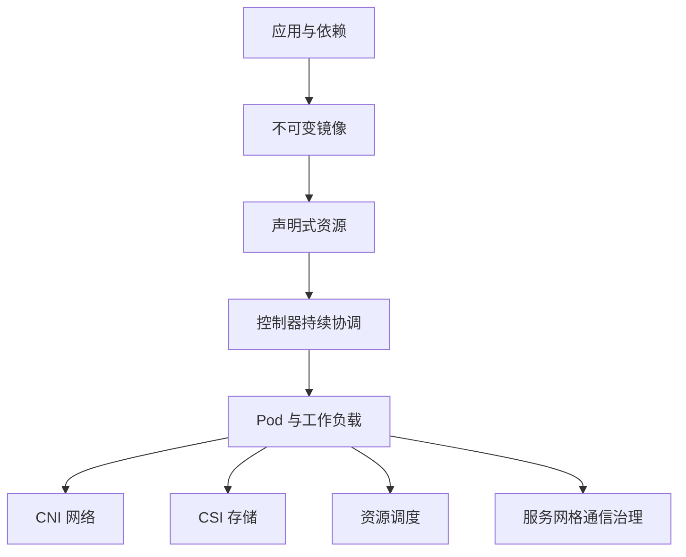
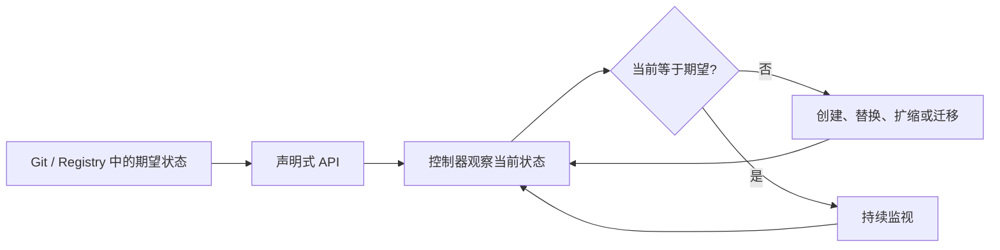
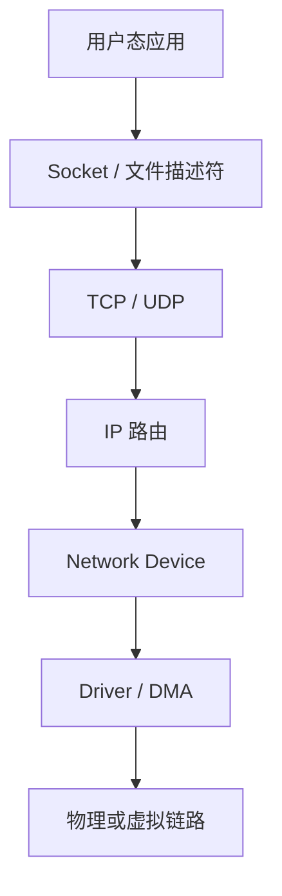
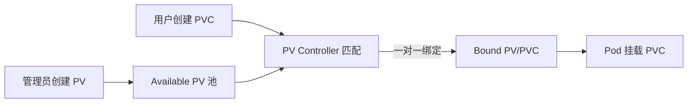
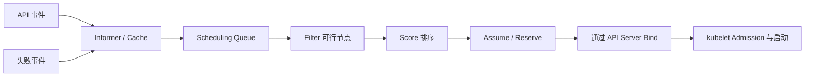
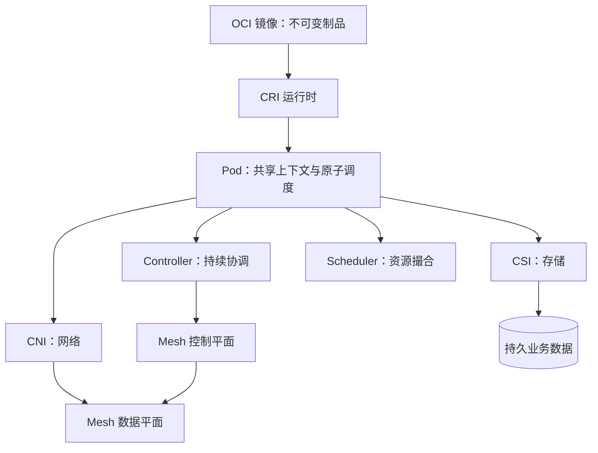
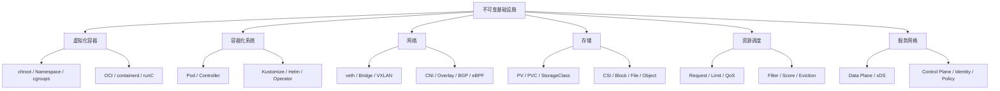

> 原书：周志明，《凤凰架构：构建可靠的大型分布式系统》
>
> 本章范围：“不可变基础设施”，依次包括从微服务到云原生、虚拟化容器、以容器构建系统、以应用为中心的封装、容器间网络、持久化存储、资源与调度、服务网格。
>
> 版本说明：原章主要形成于 2020 年，DockerShim、Helm Hub、FlexVolume、SMI、UDPA、Istio 早期组件等已有明显演进。本文保持原书的问题顺序和历史因果，同时补充截至 2026 年的实践边界。历史配置用于理解设计，不应直接复制到生产环境；实际 API、特性状态和默认行为应以当前 Kubernetes、OCI、CNI、CSI、Istio 等官方文档为准。

## 1. 本章要解决什么问题

前一章“分布式的基石”讨论了服务发现、容错、限流、安全和可观测性。这些能力若全部由每个应用自行编码，会产生语言绑定、重复实现和策略漂移。不可变基础设施要回答的是：

1. 怎样把运行环境连同应用一起稳定交付，而不是登录服务器逐台修改？
2. 怎样用声明式资源表达期望，让平台自动修复漂移？
3. 隔离的容器怎样获得网络、存储与资源配额？
4. 平台怎样为 Pod 选择合适节点，并在故障、升级和流量变化时调整？
5. 容器以下的服务通信细节，怎样继续从应用代码下沉到基础设施？



### 1.1 “不可变”究竟指什么

不可变基础设施并不是说磁盘、配置和业务数据永远不能变化，而是说：**已经进入运行环境的计算实例不再被原地修补；要变更程序、依赖或基础配置，就由新制品创建新实例，再替换旧实例。**

- 可变服务器：SSH 登录，安装补丁、修改配置、积累临时状态；
- 不可变实例：镜像与声明是事实来源，实例异常或版本变化时直接重建；
- 持久业务数据：放到明确的外部卷、数据库或对象存储，不依赖容器可写层；
- 动态配置：通过 ConfigMap、Secret、控制面或外部配置服务管理，变更过程可审计、可回滚。

它解决的是配置漂移和“雪花服务器”问题。若同一版本在不同机器上经历了不同人工操作，便很难重现故障，也无法证明测试环境与生产环境一致。

### 1.2 不可变基础设施的反馈闭环



可把协调过程写成：

$$
e(t)=Desired(t)-Observed(t)
$$

控制器根据误差 $e(t)$ 选择动作，使实际状态逐步收敛。分布式环境中状态随时会再次偏离，因此协调不是一次安装脚本，而是持续控制循环。

## 2. 从微服务到云原生

2012 年 Martin Fowler 提出 Phoenix Server，2013 年 Chad Fowler 系统阐述 Immutable Infrastructure。它们最初用于改善部署和运维，云原生时代则进一步承担隐藏分布式复杂度的职责。

CNCF 对云原生的概括包含容器、服务网格、微服务、不可变基础设施和声明式 API。它们的关系不是工具拼盘：

- 微服务提供独立业务边界；
- 容器把服务及环境封装成可替换制品；
- Kubernetes 把容器集群抽象成声明式运行平台；
- CNI、CSI 和调度器管理网络、存储和资源；
- 服务网格把请求级通信治理从应用下沉到代理与控制面；
- 自动化和可观测性使替换、恢复和扩缩可持续执行。

### 2.1 为什么不能只依赖配置管理

Ansible、Puppet 等工具可以重复执行配置，但原地修改仍要处理：

- 操作顺序和历史残留；
- 部分成功、部分失败；
- 手工改动绕过自动化；
- 升级后回滚很难恢复完整旧环境；
- 长期运行实例积累不可见状态。

不可变模式把问题转成“能否从同一制品重新创建”，牺牲少量启动和替换成本，换取可复制性、可审计性和回滚确定性。

### 2.2 适用范围与边界

无状态计算最适合不可变替换；数据库等有状态工作负载也可使用不可变程序实例，但数据迁移、Schema、法定留存和恢复不能简单删除重建。不可变的是计算节点与部署制品，不是所有状态。

## 3. 虚拟化容器

软件在另一台机器运行，需要三类兼容性：

| 兼容层 | 含义 | 典型问题 |
| --- | --- | --- |
| ISA | 处理器指令集兼容 | x86 二进制不能直接在 ARM 执行 |
| ABI | 系统调用、调用约定、库和对象布局兼容 | Linux ELF 不能直接当 Windows PE 运行 |
| Environment | 配置、权限、目录、网络与依赖兼容 | 环境变量或证书缺失导致启动失败 |

虚拟化按抽象层次可分为：

1. ISA 虚拟化：QEMU 等翻译指令，兼容性最高、开销最大；
2. 硬件抽象层虚拟化：ESXi、Hyper-V 等提供完整虚拟硬件与 Guest OS；
3. OS 层虚拟化：容器共享宿主内核，隔离用户空间；
4. Library 层虚拟化：WINE、WSL1 等翻译 ABI；
5. 语言层虚拟化：JVM、CLR 执行中间代码。

容器主要解决同内核家族上的 ABI 与环境兼容，不提供完整 ISA 虚拟化。Windows 上运行 Linux 容器通常仍依赖 Linux VM 或 WSL2。

### 3.1 容器的崛起

容器并非单一技术发明，而是文件隔离、名称空间、资源控制、镜像和生态逐层组合的结果。

#### 3.1.1 隔离文件：chroot

1979 年 UNIX V7 的 `chroot` 把进程可见根目录切换到指定目录；Linux 后来的 `pivot_root` 能切换根文件系统。它们解决文件视图隔离，却不是安全沙箱：拥有足够权限的进程可能逃逸，网络、PID、用户和资源也没有被隔离。

因此，`chroot` 只能解释容器文件系统隔离的起点，不能等同于容器。

#### 3.1.2 隔离访问：namespaces

Linux Namespace 为进程提供不同的内核资源视图：

| Namespace | 主要隔离对象 |
| --- | --- |
| Mount | 挂载点与文件系统视图 |
| UTS | Hostname 与 Domain Name |
| IPC | System V IPC、POSIX 消息队列等 |
| PID | 进程编号与进程树 |
| Network | 网卡、路由、端口、协议栈和 Netfilter 视图 |
| User | UID、GID 与权限映射 |
| Cgroup | `/proc` 中的 cgroup 视图 |
| Time | Boot / Monotonic 等时钟偏移视图 |

Namespace 隔离“看见什么、能访问什么”，并不限制“最多能用多少”。多个容器共享同一内核，内核漏洞仍可能跨越 Namespace，因此其隔离强度通常弱于完整虚拟机。

#### 3.1.3 隔离资源：cgroups

Control Groups 对进程组进行资源计量、限制和优先级控制，涵盖 CPU、内存、块 I/O、PID 等。Namespace 与 cgroups 分工如下：

```text
namespace: 隔离资源视图与身份
cgroups:   计量并限制资源消耗
capability / seccomp / LSM: 限制特权和系统调用
```

cgroups v1 由多个控制器各自维护层级，容易出现组合不一致；cgroups v2 使用统一层级，并改善委托和资源控制。原书写作时 Docker 对 v2 支持有限；今天主流 Linux 发行版、systemd、Docker、containerd 和 Kubernetes 已广泛采用 cgroups v2。

资源限制不是性能保证。CPU 配额会产生 Throttling，内存超过 Hard Limit 可能触发 OOM Kill；宿主机共同缓存、内核锁和 NUMA 等资源仍可能产生邻居干扰。

#### 3.1.4 封装系统：LXC

LXC 把 Namespace 与 cgroups 封装成系统容器，目标接近轻量虚拟机：一个容器中运行完整用户空间和多个服务。它降低了使用内核能力的门槛，却仍以“先准备系统，再在系统内安装应用”为中心。

当 LAMP 要改 LNMP、MySQL 版本或应用组合时，系统模板很快膨胀。它适合系统级隔离，却没有形成应用制品、版本和共享生态。

#### 3.1.5 封装应用：Docker

Docker 的关键贡献不是发明 Namespace，而是把容器重新定义成应用交付单元：

- 镜像打包应用与用户空间依赖；
- Dockerfile 自动、可重复构建；
- 分层和内容寻址支持复用与增量分发；
- Registry 支持共享；
- CLI 与 API 形成统一开发体验；
- 一个容器聚焦一个主进程，便于生命周期管理。


镜像采用只读层叠加，容器运行时增加可写层。修改文件时通过 Copy-on-Write 复制到上层，原镜像不变。同一层由 Digest 标识，真正的“不可变”依赖内容校验和禁止覆盖同一 Digest，而不是依赖可变 Tag，例如 `latest`。

OCI 将生态拆成 Image Spec、Runtime Spec 和 Distribution Spec。Docker 的 libcontainer 演化为 runC，containerd 管理镜像、快照、容器任务与生命周期，runC 按 OCI Runtime Spec 创建具体容器。


典型调用关系：

```text
Docker CLI -> Docker Engine -> containerd -> containerd-shim -> runC -> Linux kernel
```

runC 创建容器后通常退出，containerd-shim 维持容器 stdio、退出状态和父进程解耦。

#### 3.1.6 封装集群：Kubernetes

Docker 封装单个服务环境，Kubernetes 把多个工作负载、网络、存储和策略组成的集群运行环境抽象为资源。它源自 Google Borg 经验，于 2014 年开源，2015 年发布 1.0 并成为 CNCF 首个项目。


Kubernetes 与 Docker 的关系经历：

```text
早期：kubelet -> DockerManager -> Docker Engine -> containerd -> runC
CRI 后：kubelet -> CRI -> DockerShim -> Docker Engine -> containerd -> runC
当前常见：kubelet -> CRI -> containerd / CRI-O -> OCI Runtime
```

CRI 把 kubelet 与容器运行时解耦。Kubernetes 1.24 起移除内置 dockershim；需要 Docker Engine 时可部署外部 `cri-dockerd`，但生产集群更常直接使用 containerd 或 CRI-O。Docker 镜像仍是 OCI 镜像生态的重要工具，Kubernetes 不再依赖 Docker Engine 并不等于 Docker 镜像或开发体验消失。

### 3.2 容器崛起的核心结论

1. Namespace 提供视图隔离，cgroups 提供资源控制，镜像提供可重复用户空间。
2. LXC 封装系统，Docker 封装应用，Kubernetes 封装应用集群。
3. OCI、CRI 分离标准边界，使镜像、编排与运行时可以独立演进。
4. 容器共享内核，启动快、密度高，但隔离性不等于虚拟机。
5. 不可变交付依赖内容寻址、自动构建和替换流程，而不是一个 `docker run` 命令。

## 4. 以容器构建系统

“一个容器一个主进程”便于封装，但一个应用往往由多个紧密进程和大量松耦合服务组成。容器编排首先要重新引入“进程组”与持续控制概念。

### 4.1 隔离与协作

原书用 Nginx、Filebeat、confd 逐步推导 Pod：

1. 全放一个容器会让运行时只能观察 Supervisor，而无法分别管理进程；
2. 拆成容器后，Nginx 与 Filebeat 要共享日志 Volume；
3. confd 还可能需要共享文件、控制端点或信号协作。这里要修正原书的一处概念混淆：Linux IPC Namespace 隔离的是 System V / POSIX IPC，并不负责进程信号；跨容器发送 HUP 必须共享 PID 可见性（如 `shareProcessNamespace: true`），并具备合适的 UID / Capability，或者改用 Nginx 控制端点；
4. 多节点调度时，这组容器必须一起落在同一节点；
5. 因此需要高于容器、低于服务的原子单位 Pod。

Pod 具有两项核心意义：

- **共享运行上下文**：同 Pod 容器共享 Network 等 Namespace，并可共享 Volume；
- **原子调度**：调度器把整个 Pod 放到一个 Node，而不是分别调度容器。


同 Pod 容器共享一个 IP 和端口空间，可通过 `localhost` 通信；PID Namespace 默认不共享，可由 `shareProcessNamespace` 开启；根文件系统各自隔离，通过 Volume 交换文件。

Pause / Infra Container 先创建并持有 Pod 的 Namespace，其他容器加入这些 Namespace。即使业务容器重启，Pod 网络身份仍可由 Sandbox 维持。现代 CRI 实现把它称为 Pod Sandbox，具体 Pause 镜像和实现属于运行时细节。

Sidecar 适合与主容器同生命周期、同故障和调度边界的辅助能力，例如代理和日志 Agent。但把所有 Agent 都放进每个 Pod 会放大资源开销；节点级 DaemonSet 或 OpenTelemetry Collector 可能更合适。

### 4.2 韧性与弹性

Kubernetes 的第二个核心思想是控制器模式。用户提交资源的 `spec`，控制器观察实际状态并执行协调。


通用 Reconcile 伪代码：

```text
reconcile(key):
    desired = read_spec(key)
    observed = observe_actual_state(key)

    if observed is missing:
        create(desired)
    else if observed differs from desired:
        patch_or_replace(observed, desired)

    record_status_and_events()
    requeue_on_change_or_retry()
```

协调动作应幂等，因为 Watch 可能重复、控制器可能重启、状态缓存可能短暂陈旧。

#### 4.2.1 ReplicaSet、Deployment 与 HPA

- ReplicaSet 维持 Pod 副本数，Pod 消失便补建；
- Deployment 管理 ReplicaSet 版本，执行滚动发布和回滚；
- HPA 根据指标调整 Deployment / StatefulSet 的期望副本数；
- 更高层控制器通过组合低层资源获得能力。


滚动更新要同时设置 `maxUnavailable` 与 `maxSurge`。零停机不仅依赖副本交替，还依赖 Readiness Probe：新 Pod 未就绪前不能接流量，旧 Pod 要经过 PreStop、Endpoint 摘除和 Termination Grace Period 才退出。

HPA 基本比例算法可以直观写成：

$$
desiredReplicas=
\left\lceil
currentReplicas\times
\frac{currentMetric}{targetMetric}
\right\rceil
$$

例如当前 4 个副本，平均 CPU 为 75%，目标 50%：

$$
\left\lceil4\times\frac{75}{50}\right\rceil=6
$$

真实 HPA 还包含容忍区间、缺失指标、启动期、稳定窗口和扩缩策略。CPU 指标通常相对 `requests.cpu` 计算，因此错误的 Request 会让扩缩决策失真。

#### 4.2.2 弹性与韧性不能混淆

- Elasticity：容量随负载扩缩；
- Resilience：故障发生后维持核心能力并恢复；
- ReplicaSet 重建提高韧性；
- HPA 扩缩提高弹性；
- 多副本若同处一个故障域，不能抵御 Node 或 Zone 故障；
- PodDisruptionBudget 只约束自愿中断，不保证节点故障时副本可用。

控制器能重建进程，却不能自动修复错误数据、错误配置和所有软件缺陷。“自愈”应理解为回到声明状态，而不是业务必然正确。

## 5. 以应用为中心的封装

Kubernetes 封装资源，却没有天然定义“整个应用”。一个微服务系统会产生大量 Deployment、Service、ConfigMap、Secret、HPA、Ingress 和策略，开发、运维、平台关注点混在 YAML 中。

### 5.1 Kustomize

Kustomize 用 Base、Overlay 和结构化 Patch 派生不同环境配置：

```text
k8s/
  base/
    deployment.yaml
    service.yaml
    kustomization.yaml
  overlays/
    dev/kustomization.yaml
    prod/kustomization.yaml
```

它避免把 YAML 变成字符串模板，可由 `kubectl kustomize` 或 `kubectl apply -k` 使用。

优点：轻量、保留原生资源、差异清楚；局限：没有完整 Release、依赖和生命周期模型，配置数量并未真正减少。适合环境叠加，不等同于包管理器。

### 5.2 Helm 与 Chart

Helm 把 Kubernetes 应用视作包：

- Chart：模板、默认值、元数据和依赖；
- Repository / OCI Registry：分发 Chart；
- Release：一次安装实例，保存版本历史；
- Values：部署时参数；
- Helm Client：安装、升级、回滚和卸载。


原书展示的是 Helm 2/早期 Helm 3 生态。当前实践边界：

- Helm 3 已移除服务端 Tiller；
- `requirements.yaml` 已被 `Chart.yaml` 的 dependencies 取代；
- 原 Stable / Incubator 仓库与 Helm Hub 已退休，Artifact Hub 和 OCI Registry 更常见；
- 模板是字符串生成，必须通过 Schema、Lint、渲染测试和策略检查避免类型错误；
- Helm 管理 Kubernetes 资源生命周期，却不理解数据库内部备份、选主和升级语义。

### 5.3 Operator 与 CRD

Operator 把应用领域知识编码为自定义控制器：

```text
CRD 定义新的资源类型
CR 表达用户的高级期望
Operator 观察 CR 和实际集群
Operator 执行创建、升级、备份、恢复、扩缩等领域操作
```

StatefulSet 提供稳定名称、稳定 PVC、顺序创建/删除等基础能力，但不知道 Elasticsearch 如何迁移分片、etcd 如何变更成员、数据库如何安全备份。Operator 将这些 Runbook 变成可重复程序。

低级配置可能需要数百行 StatefulSet、Service、ConfigMap；高级 CR 只声明版本、节点组与规模。简洁并不意味着复杂度消失，而是转移到 Operator 开发、测试和升级中。

Operator 的难点：

- Reconcile 幂等与崩溃恢复；
- CRD Schema 与版本迁移；
- Finalizer 清理外部资源；
- Leader Election 与水平扩展；
- Webhook 兼容和升级顺序；
- 错误状态、Condition 和可观测性；
- 权限过大带来的供应链风险。

Operator 适合复杂、有状态、反复运维的应用，不应为一个简单无状态 Deployment 编写上万行控制器。

### 5.4 开放应用模型

OAM（Open Application Model）试图区分三类关注点：

- Component：开发者描述镜像、参数与业务组件；
- Workload：平台定义运行模式；
- Trait：运维附加扩缩、入口、日志等能力；
- Application Scope：把组件纳入共同网络、安全或健康边界；
- Application Configuration：把组件、Trait 与 Scope 实例化。


它希望避免开发、运维和平台人员共同修改一个 All-in-One YAML。原书中的六类 Workload、Rudr 与早期 Crossplane 属于 2019 至 2020 年历史快照。截至 2026 年，OAM 没有成为 Kubernetes 通用应用接口；KubeVela 延续其面向应用和 Trait 的思想，Crossplane 主要发展为基础设施与控制平面组合框架。应学习关注点分离，而不是把早期资源模型视为现行标准。

### 5.5 四种封装方案的关系

| 方案 | 主要抽象 | 最擅长 | 不擅长 |
| --- | --- | --- | --- |
| Kustomize | Base + Overlay | 原生 YAML 环境差异 | Release 与复杂生命周期 |
| Helm | Chart + Release | 打包、分发、安装升级 | 应用内部运维语义 |
| Operator | CRD + Controller | 有状态应用自动运维 | 开发成本与控制器治理 |
| OAM 类模型 | Component + Trait | 角色关注点分离 | 生态一致性与通用落地 |

它们可以组合：Helm 安装 Operator，Operator 管理 CR；Kustomize 为不同集群调整 Helm 之外的策略。工具重叠时要明确唯一所有者，避免 Helm 与 Operator 同时改同一字段产生控制器争夺。

## 6. 容器间网络

本章所说虚拟网络特指 Linux Network Namespace 之间的通信。核心问题分三层：

1. 同主机容器如何通信；
2. 容器如何访问宿主机和外网；
3. 跨主机 Pod 如何保持统一地址、路由和策略。

### 6.1 Linux 网络虚拟化

#### 6.1.1 网络通信模型

Linux 网络栈按层封装：




- Socket 是应用与内核网络栈接口；
- TCP/UDP 增加端口、可靠性或数据报语义；
- IP 增加地址与路由；
- Device 是内核中的统一网络设备抽象；
- Driver 把数据送往硬件队列或虚拟设备。

发送层层加 Header，接收反向解封装。用户态与内核态复制、协议处理和中断会产生开销；DPDK、AF_XDP、Netmap 等旁路或加速方案用更高复杂度换低延迟，不能因此默认绕过内核一定更好。

#### 6.1.2 干预网络通信

Netfilter 在 IPv4/IPv6 协议栈提供五个关键 Hook：

| Hook | 位置 | 常见用途 |
| --- | --- | --- |
| PREROUTING | 路由判断前 | DNAT、透明代理 |
| INPUT | 确认发往本机 | 本地防火墙 |
| FORWARD | 确认转发 | 路由、防火墙 |
| OUTPUT | 本机产生、路由前 | 本地流量改写 |
| POSTROUTING | 即将离开设备 | SNAT、MASQUERADE |


iptables 用 Table、Chain、Rule 把内核回调配置化：raw、mangle、nat、filter、security 分别承担连接跟踪例外、报文改写、地址转换、过滤和 LSM 安全。

当前 Linux 还广泛使用 nftables。截至 Kubernetes 1.36，原生 kube-proxy 模式包括 iptables、已稳定的 nftables，以及已被标记为 Deprecated 的 IPVS；nftables 是原生数据面替代 IPVS 的推荐方向。eBPF 通常由 Cilium 等产品实现并取代 kube-proxy，不是 kube-proxy 自带的一种模式。理解 Netfilter 的价值在于掌握包经过何处，而不是记住某个版本生成的全部规则。

#### 6.1.3 虚拟化网络设备

##### 网卡：tun/tap、veth

TUN/TAP 把内核网络包交给用户态程序：

- TUN 操作三层 IP Packet；
- TAP 操作二层 Ethernet Frame；
- 用户程序可加密、封装、压缩或转发，常用于 VPN 和隧道；
- 包在内核与用户态间往返，灵活但有额外开销。


veth 是成对虚拟以太设备，一端收到的 Frame 从另一端出现。常把一端放 Pod Namespace，另一端接宿主 Bridge 或路由栈。


TUN/TAP 是“内核到用户程序”，veth pair 是“一个 Namespace 到另一个 Namespace”，不能只按虚拟网卡名称混为一类。

##### 交换机：Linux Bridge

Linux Bridge 是二层软件交换机，学习源 MAC 与端口映射：

- 已知单播转发到对应端口；
- 未知单播和广播进行 Flooding；
- STP 可避免二层环路；
- Bridge 自身可有 IP，把发给自身 MAC 的包交给宿主三层栈。


原书示例把 Bridge 配为 `192.168.31.1`，却混用了 `192.168.1.x` 容器地址和错误源地址。保持同一子网的正确示意应为：

```text
bridge:       192.168.31.1/24
container 1:  192.168.31.10/24, gateway 192.168.31.1
container 2:  192.168.31.11/24, gateway 192.168.31.1
```

容器访问外网时，源 IP 应先是 `192.168.31.10`，宿主 POSTROUTING 再做 SNAT / MASQUERADE。响应通过 Conntrack 反向转换回容器。Bridge 做二层转发，Linux 路由与 Netfilter 做三层和 NAT，职责不能混淆。

##### 网络：VXLAN

SDN 把物理 Underlay 与逻辑 Overlay 分开：Underlay 保证 IP 可达，Overlay 给租户和应用构造逻辑拓扑。

VLAN 使用 12-bit VLAN ID，最多 4094 个可用业务 VID。QinQ 对应 IEEE 802.1ad，用双标签扩展运营商网络；原书误写成 802.1AQ，后者是 Shortest Path Bridging。VXLAN 则使用 24-bit VNI，理论空间约：

$$
2^{24}=16,777,216
$$

VXLAN 把原二层 Frame 封装进 UDP，即 MAC-in-UDP，使逻辑二层跨越三层网络。VTEP 完成封装解封装。


典型 IPv4 VXLAN 额外开销约 50 Bytes：Outer Ethernet 14 + IPv4 20 + UDP 8 + VXLAN 8。若 Underlay MTU 为 1500，Overlay 常把 Pod MTU 设为约 1450，避免分片：

$$
MTU_{overlay}\le MTU_{underlay}-H_{encapsulation}
$$

IPv6、VLAN 和其他封装会进一步增加 Header。硬件 Offload 可降低 CPU 成本，但 Overlay 仍增加排障层次。

##### 副本网卡：MACVLAN

MACVLAN 在一张物理网卡之上创建多个拥有独立 MAC 的逻辑接口，交换机看起来像一个端口后连接多台主机。


优点是数据路径短、性能高、容器直接进入物理二层；限制包括：

- 交换机端口必须允许多个 MAC；
- 云网络和无线网络可能禁止；
- 默认 Bridge 模式下宿主机与子 MACVLAN 接口不能直接通信，需额外宿主 MACVLAN 接口或路由；
- 大量 MAC 会增加物理交换机 FDB 压力。

MACVTAP 把 MACVLAN 与 TAP 字符设备结合，便于 VM / 用户态使用，不等于 SR-IOV 硬件直通。

#### 6.1.4 容器间通信

Docker 经典网络模式：

| 模式 | 隔离与数据路径 | 适用边界 |
| --- | --- | --- |
| bridge | veth 接 docker0，外网经 NAT | 单主机默认网络 |
| host | 共享宿主 Network Namespace | 性能高，端口冲突、隔离弱 |
| none | 只有 Loopback | 用户自定义网络 |
| container | 共享另一个容器网络 | 类似 Pod 网络共享 |
| macvlan | 容器拥有独立 MAC | 物理二层允许多 MAC |
| overlay | VXLAN 等跨主机隧道 | Swarm 或多主机逻辑网络 |

Kubernetes 网络模型通常要求每个 Pod 有集群内唯一 IP，Pod 间无需应用自行做 NAT，Node 上的 Agent / CNI 插件负责建立设备、路由和策略。Service 是稳定虚拟入口，不是 Pod 网卡。

### 6.2 容器网络与生态

#### 6.2.1 CNM 与 CNI

Docker CNM 抽象 Sandbox、Endpoint、Network；CNI 定义运行时调用网络插件的标准接口。它们目标重叠，CRI 与 OCI 则分别连接编排与运行时、定义镜像与容器执行，目标不同。

CNI 插件主要负责：

- ADD / DEL / CHECK 容器网络；
- 创建 veth、路由、Bridge、隧道等；
- 通过 IPAM 插件分配和回收 IP；
- 返回接口、地址、路由和 DNS 结果。

IPAM 要保证地址唯一、快速分配、Pod 删除后回收，并处理 Node 崩溃导致的泄漏。Host-local 简单高效，集群级 IPAM 需要控制面协调。

#### 6.2.2 CNM 到 CNI

Kubernetes 早期使用 kubenet，并故意与 Docker 网络解耦。CNM 与 Docker 模型紧密绑定、依赖 libnetwork/libkv，难以满足 Kubernetes 已有 etcd、Pod 身份和多运行时目标；Kubernetes 与 CoreOS 因而推动 CNI。

今天 CNI 已成为容器编排网络事实接口。需要注意，CNI 规范本身只定义插件调用与结果，不自动规定完整 NetworkPolicy、Service Load Balancing、加密和可观测性；这些由插件、Kubernetes API 和额外控制器实现。

#### 6.2.3 网络插件生态

三种跨主机路线：

##### Overlay

Flannel VXLAN、Calico IP-in-IP / VXLAN 等通过隧道跨越受限 Underlay。原书列举的 Weave Net 已于 2024 年归档，只适合作为历史方案理解。Overlay 易部署、与物理拓扑解耦，代价是封装、MTU 和 CPU 开销。

##### 路由模式

Flannel host-gw、Calico BGP 等直接发布 Pod CIDR 路由，无隧道开销。要求节点二层相邻，或物理网络接受 BGP 路由，运维边界更深。

##### Underlay / 直通

MACVLAN、IPVLAN、SR-IOV 让 Pod 更直接接入物理网络。吞吐和延迟优秀，但依赖 NIC、交换机、VF 数量和调度，迁移与策略能力可能受限。


原书图是 2020 年特定环境测试，不能直接当今天产品排名。内核、Offload、eBPF、MTU、CPU、加密和包大小都会改变结果。

截至 2026 年，Calico、Cilium、Flannel 等仍代表不同取舍；Cilium 以 eBPF 实现网络、策略、Service 和观测，说明插件边界已超越“接一根虚拟网线”。选型顺序应是：环境可行性、安全策略、可观测性、运维能力，最后才是孤立吞吐基准。

## 7. 持久化存储

容器可写层随容器删除，业务数据却要跨实例存活。核心矛盾是：计算实例应可替换，数据必须有明确生命周期和所有者。

### 7.1 Kubernetes 存储设计

#### 7.1.1 Mount 和 Volume

Docker 三类 Mount：

- Bind：宿主路径直接映射，简单但绑定节点和目录；
- Volume：由 Docker / Driver 管理的逻辑卷；
- tmpfs：内存临时存储，不持久。


Storage Driver 管镜像可写层与 OverlayFS 等快照，Volume Driver 管外部业务数据，两者不能混淆。

Kubernetes 中：

- Volume 与 Pod 生命周期关联，适合 EmptyDir、ConfigMap 等；
- PersistentVolume（PV）代表集群存储资源，生命周期独立于 Pod；
- PersistentVolumeClaim（PVC）表达工作负载的存储需求；
- StorageClass 描述存储类别和动态 Provisioner。


#### 7.1.2 静态存储分配

管理员先创建 PV，用户创建 PVC。内部 PV Controller 主要按 StorageClass、容量、Access Mode、Volume Mode 和 Selector 管理匹配与绑定；需要结合消费者位置的拓扑决策，尤其是 `WaitForFirstConsumer`，主要由调度器的 VolumeBinding Plugin 与调度流程共同完成，不能只归到 PV Controller。




Access Mode 的准确边界：

- RWO：卷可被一个 Node 读写挂载，同一 Node 上可能被多个 Pod 使用；
- ROX：多个 Node 只读；
- RWX：多个 Node 读写；
- RWOP：ReadWriteOncePod，才是 Kubernetes 层面限制单 Pod 读写。

Access Mode 主要用于匹配和驱动能力表达，不是所有存储都由 Kubernetes 在数据路径上强制执行。块存储也不天然永远只能单节点，某些云卷支持 Multi-Attach，但文件系统和应用必须支持并发。

Local PV 性能高，却把 Pod 绑定到 Node 拓扑。`WaitForFirstConsumer` 延迟绑定，使调度器先考虑 Pod 与卷的共同位置，避免提前创建在错误 Zone。

#### 7.1.3 动态存储分配

Dynamic Provisioning 不要求管理员预建每个 PV：

1. 管理员安装 CSI Driver 并定义 StorageClass；
2. 用户 PVC 指定 StorageClass 和需求；
3. External Provisioner 调用 Driver 创建后端卷；
4. 生成 PV 并绑定 PVC；
5. 调度、Attach、Mount 后供 Pod 使用。


StorageClass 的 `reclaimPolicy` 决定 PVC 删除后保留还是删除后端卷；生产数据库要谨慎使用 Delete，并配合 Snapshot、Backup 与恢复演练。历史 Recycle 策略已经废弃，不应再依赖 `rm -rf` 作为存储生命周期管理。

动态分配消除人工建卷，不代表容量、IOPS、Zone 和费用无限。ResourceQuota、VolumeExpansion、Capacity Tracking 和云配额仍需治理。

### 7.2 容器存储与生态

#### 7.2.1 Kubernetes 存储架构

一个外部卷进入 Pod 可拆为：

1. Provision / Delete：在存储系统创建或移除卷；
2. Attach / Detach：把块设备连接或断开 Node；
3. Mount / Unmount：格式化并挂载到 Node / Pod 路径。

NFS 等网络文件系统无需 Attach；块设备通常需要。幂等很重要：控制器重试 `CreateVolume`、`ControllerPublishVolume` 时不能重复创建或错误附加。


- PV Controller 管 PV/PVC 绑定与回收等内部生命周期；对于 CSI 动态分配，external-provisioner 监听 PVC，调用 Driver 的 `CreateVolume` / `DeleteVolume` 并创建相应 PV，而不是由内部 PV Controller 直接完成后端 Provision；
- Attach/Detach Controller 管卷与 Node；
- kubelet Volume Manager 在节点执行 Stage / Publish / Unpublish；
- CSI Sidecar 观察 Kubernetes 资源并调用 Driver。

现代 Kubernetes 控制器通过 kube-apiserver 操作资源，不直接把 etcd 当公共 API。

#### 7.2.2 FlexVolume 与 CSI

FlexVolume 是 Kubernetes 私有的可执行文件插件，接口简单，却缺 Provision、部署麻烦、跨调用状态管理脆弱，现已废弃。

CSI 是容器编排无关的 gRPC 标准，分三组服务：

- Identity：插件信息、能力和健康；
- Controller：Create/Delete、Attach/Detach、Snapshot、Expand；
- Node：Stage/Unstage、Publish/Unpublish、统计与节点能力。


Kubernetes CSI Sidecar 包括 external-provisioner、external-attacher、external-resizer、external-snapshotter、node-driver-registrar 等。Controller Plugin 通常用 Deployment 或 StatefulSet 运行，具体取决于 Driver；Node Plugin 通常是 DaemonSet。原书把 Controller 固定描述为 StatefulSet 过于绝对。

#### 7.2.3 从 In-Tree 到 Out-of-Tree

In-Tree Driver 与 Kubernetes 一起发版，导致：

- 云厂商修复要等待 Kubernetes Release；
- 第三方代码进入核心二进制，扩大安全和可靠性边界；
- 核心团队承担不擅长的存储维护。

CSI Migration 让旧 In-Tree API 自动转向 CSI Driver，保护已有 Manifest。今天主要云存储 In-Tree 插件已完成迁移或移除，CSI 是新增存储集成的唯一合理方向。兼容层说明工业设计不能只追求最干净架构，还要保护生产升级路径。

#### 7.2.4 容器插件生态

存储按对外接口分三类：

| 类型 | 接口与语义 | 优势 | 局限与典型用途 |
| --- | --- | --- | --- |
| Block | LBA / SCSI 类块设备 | 低延迟、高 IOPS、可自建文件系统 | 共享困难；数据库、系统盘 |
| File | POSIX / NFS / SMB 路径 | 目录、权限、共享容易 | 元数据和网络开销；共享文件 |
| Object | HTTP API + Key + Metadata | 海量、廉价、耐久、易分发 | 非 POSIX、修改和低延迟随机 I/O 弱；备份、媒体、归档 |

对象存储的“简单”是无需管理卷和文件系统，不是无需代码；应用通常必须调用 S3 API。用 FUSE 或 Gateway 把对象存储挂成文件系统会引入语义差异，例如 Rename、锁、随机写和一致性不能想当然。

AWS EBS、EFS、S3 是历史案例，不应得出“一律首选 EFS”：

- EBS 适合低延迟块 I/O，部分类型支持 Multi-Attach；
- EFS 适合共享 POSIX 文件，但延迟、吞吐模式和费用要评估；
- S3 适合对象、归档和静态内容，耐久性高但不提供普通块设备语义。


选择流程：先确定访问语义和一致性，再看延迟/吞吐、共享、拓扑、耐久、备份、恢复与成本，而不是只比较容量价格。

## 8. 资源与调度

调度是把 Pod 需求与 Node 可供资源撮合，并在满足硬约束的节点中选择更合适者。

### 8.1 资源模型

Node 提供 CPU、Memory、Ephemeral Storage、扩展设备等 Allocatable；Pod 消费资源。对只有普通长期运行容器、不含 Init Container、Pod Overhead 和 Pod-level Resource 的简化场景，一个节点可接纳 Pod 的必要条件是：

$$
\sum requests_{existing}+requests_{new}\le Allocatable
$$

这个判断按各资源维度分别进行，不使用当前瞬时利用率替代 Request。真实调度使用的是 **Effective Pod Request**：它要考虑普通容器 Request 之和、顺序 Init Container 的峰值、可重启 Sidecar Init Container 的累计规则和 Pod Overhead。可用下式作不含细节的直觉近似：

$$
request^{effective}_r
=\max\left(\sum request^{app}_r,\max request^{init\ path}_r\right)
+overhead_r
$$

截至 Kubernetes 1.36，Beta 状态的 Pod-level Resources 默认启用，Pod 自身的 `spec.resources` 也能参与调度和 QoS 计算；因此不能只把所有 `containers[].resources` 机械相加。

- CPU 是可压缩资源：超额时被调度和 Throttle，程序变慢；
- Memory 是不可压缩资源：无法压缩时发生 OOM / Eviction；
- `1 CPU = 1000m`，不同 Node 的一个逻辑 CPU 性能可能不同；
- `Mi=2^{20}` Bytes，`M=10^6` Bytes，二者不能混用。

Request 用于调度和资源保证基线；Limit 用于运行时上限。CPU Limit 可能引发 CFS Throttling，内存 Limit 越界可能 OOM Kill。没有 Limit 不等于没有 Node 总资源限制。

### 8.2 服务质量与优先级

传统仅使用容器级资源声明时，Pod QoS 判定为：

- Guaranteed：每个容器都设置 CPU、Memory Request 与 Limit，且对应相等；
- Burstable：至少有一个容器设置 Request/Limit，但不满足 Guaranteed；
- BestEffort：所有容器均未设置 CPU/Memory Request 与 Limit。

启用 Pod-level Resources 后，Pod 级 Request / Limit 也可能在单个容器未声明时决定调度预算和 QoS，所以上述三条不再是所有版本、所有配置下的完整判定算法。排障时应查看目标 Kubernetes 版本计算出的 Effective Request 与实际 `status.qosClass`。

QoS 影响资源压力下的保护，但不是绝对存活契约。PriorityClass 表达业务优先级；高优先级 Pending Pod 可以触发 Preemption，选择较低优先级 Victim 腾资源。

Priority 与 QoS 不同：

- QoS 由资源声明推导；
- Priority 由业务显式指定；
- 一个 BestEffort Pod 也可能配置高 Priority，但这种组合往往不合理；
- Preemption 发生在调度阶段，Node Pressure Eviction 发生在 kubelet 运行阶段。

抢占不是瞬时成功：Victim 有终止期，PDB 只是尽力减少干扰，调度器也可能找不到满足 Affinity、Topology 和 Volume 的节点。

### 8.3 驱逐机制

kubelet 监控 Memory、NodeFS、ImageFS、PID 等压力。Hard Threshold 立即回收，Soft Threshold 要持续超过 Grace Period。

原书列出的 `memory.available<100Mi` 等是当时默认示例，不应直接作为生产建议。今天更推荐通过 KubeletConfiguration 管理，结合 Node 规模、System Reserved、Kube Reserved 和真实负载压测。

驱逐排序不是简单“BestEffort -> Burstable -> Guaranteed”：kubelet 还考虑 Pod 是否超过 Request、Priority 以及超出程度。超过 Memory Limit 的容器可能由内核 OOM Kill，这与 kubelet Node Pressure Eviction 也不同。

被控制器管理的 Pod 驱逐后会在别处重建。Node Pressure 会形成 Node Condition 和 Taint，调度器据此避开节点；`eviction-pressure-transition-period` 用于抑制 Condition 抖动，并非简单的固定“禁止调度期”。DaemonSet 通常自带相应 Toleration，不能靠把它一概设为 Guaranteed 解决全部问题。

更高层 ResourceQuota 和 LimitRange 在 Namespace 约束总资源、对象数量和默认 Request/Limit；Device Plugin 暴露 GPU 等扩展资源。

### 8.4 默认调度器

原书使用历史术语 Predicate / Priority。现代 Scheduler Framework 对应：

- Filter：淘汰不满足硬约束的 Node；
- Score：给可行 Node 评分；
- 还有 PreFilter、PostFilter、PreScore、Reserve、Permit、PreBind、Bind、PostBind 等扩展点。


调度器通过 Informer Watch kube-apiserver，在本地 Cache 中维护 Pod、Node、PVC 等快照，避免每次调度远程访问所有 Node。主要流程：



原书把 Informer 说成直接监视 etcd、调度器直接异步更新 etcd，是概念简化；标准组件通过 kube-apiserver 访问状态，etcd 是 API Server 后端实现。

#### 8.4.1 过滤阶段

硬约束包括：

- CPU、Memory、Pod 数和扩展资源；
- Node Selector / Node Affinity；
- Taint / Toleration；
- 端口冲突；
- Volume Zone、Attach Limit 和绑定状态；
- Pod Affinity / Anti-Affinity 与 Topology Spread。

#### 8.4.2 评分阶段

软目标可能偏向：

- Least Allocated：把负载摊开；
- Most Allocated：Bin Packing，减少活跃 Node；
- Balanced Allocation：避免 CPU 空闲而内存耗尽；
- Image Locality：利用已有镜像；
- Topology Spread：跨故障域均衡。

原书的 0 至 10 分旧公式已演进为 Framework Plugin 和可配置权重，理解目标比记公式更重要。

#### 8.4.3 Assume、Bind 与最终确认

调度器先在本地 Cache 假定 Pod 已占资源，避免并发调度过度承诺，然后通过 API Server 写 Binding。只有成功绑定之前发生的调度失败，才会把同一个 Pod 重新入队；一旦 Binding 成功，`spec.nodeName` 对该 Pod 便不可重新指派，调度器不会因 kubelet Admission、挂卷或容器启动失败而清空它并改投其他 Node。此后该 Pod 会留在目标节点并进入相应失败状态；若它由 Deployment、StatefulSet 等工作负载控制器管理，控制器会创建一个具有新 UID 的替代 Pod，再进行新一轮调度。

共享 Cache 提高吞吐，却意味着调度依据是近实时快照而非原子全局真相。调度框架通过 Assume、Reserve、Unreserve 和重试处理这种乐观并发。


### 8.5 调度设计的核心结论

1. Request 决定调度承诺，Limit 决定运行上限，两者解决不同问题。
2. CPU 不足通常变慢，内存不足可能直接杀进程。
3. QoS、Priority、Preemption、Eviction 属于不同阶段，不可混为一个“优先级”。
4. 调度器依赖本地缓存与乐观绑定获得规模，接受短暂状态陈旧。
5. 调度目标不是永远“最空闲”，而是在可行性、利用率、故障域和业务目标间权衡。

## 9. 服务网格

Kubernetes 管理到 Pod / Container 粒度，却难以按单个请求处理超时、重试、熔断、mTLS、授权和追踪。Service Mesh 把服务间通信交给专门数据平面，并由控制平面统一配置。

### 9.1 透明通信的涅槃

服务网格重新追求“应用少感知远程通信治理”，但不能重演早期透明 RPC 的错误。代理可以隐藏证书轮换、地址选择和遥测实现，不能消除延迟、部分失败、幂等和分布式事务语义。

#### 9.1.1 通信的成本

原书把通信治理演进分成五阶段。

##### 第一阶段：业务代码自行处理

应用直接使用 HTTP/gRPC，遇到问题就在业务代码中加入重试、发现和降级。灵活，却让普通开发者承担专业网络问题，策略散落且不一致。


##### 第二阶段：公共类库

Finagle、Spring Cloud 等由平台团队提供 SDK，复用发现、负载和断路。质量提高，但绑定语言、框架和版本，升级要重新发布应用。


##### 第三阶段：独立代理

Prana 等把能力移出进程，业务主动访问本机代理。语言无关，但应用仍可绕过代理，配置和生命周期要单独管理。


##### 第四阶段：边车代理

代理与应用共享 Pod 网络，流量被透明重定向。无需业务 SDK，策略一致；每 Pod 增加 CPU、Memory、连接与升级成本。


##### 第五阶段：服务网格

控制平面管理全部代理，形成 Data Plane 与 Control Plane。前者转发请求，后者分发路由、身份、策略和遥测配置。


### 9.2 数据平面

数据平面处理 Inbound / Outbound 流量，执行服务发现、负载、超时、重试、熔断、mTLS、授权和遥测。它不应成为业务状态所有者。

#### 9.2.1 代理注入

三类接入：

- Chassis / SDK：应用显式使用，性能和语义强，语言侵入；
- Manual Injection：工具修改 Pod Manifest；
- Automatic Injection：Mutating Admission Webhook 在 Pod 创建时加入 Sidecar、Volume、Annotation 和 Init / CNI 配置。

Webhook 是控制面关键依赖：Failure Policy、证书、超时和版本兼容错误会阻塞全 Namespace 创建 Pod。生产中要监控注入成功率，并避免对控制面自身产生循环依赖。

当前服务网格不只 Sidecar。Istio Ambient Mesh 使用每节点 ztunnel 提供 L4 安全和连接，再按需用 Waypoint Proxy 提供 L7 策略，试图降低每 Pod Sidecar 成本；这说明“服务网格通常由 Sidecar 实现”是历史主流，不是定义要求。

#### 9.2.2 流量劫持

经典 Istio 使用 Init Container 或 Istio CNI 配置 iptables，把应用流量重定向到 Envoy。原书说安装 Istio CNI 后不再依赖 iptables，这并不准确：Istio CNI 的主要价值是由节点插件代替特权 Init Container 配置重定向，具体数据路径仍可能使用 iptables；eBPF 是另一类可选的包捕获与重定向机制。Ambient Mesh 则是代理部署架构，不是与 eBPF 并列的 Hook 技术：当前 Istio Ambient 仍由 Istio CNI 配置 Pod 内的 iptables / TPROXY，把流量引向节点 ztunnel，只是移除了每 Pod Sidecar。


eBPF 可在 Socket / TC / XDP 等 Hook 更早重定向和观测，减少部分协议栈路径，但程序、内核版本、Verifier、安全和排障复杂度更高。


透明劫持还要处理：

- 排除代理自身流量，避免循环；
- 保留原目标地址；
- 处理 DNS、UDP、Host Network 和 Init 流量；
- 与 NetworkPolicy、kube-proxy / eBPF Service 数据面协作；
- 明确应用主动代理、Sidecar 与网关的优先级。

#### 9.2.3 可靠通信

Envoy 把配置抽象为：

- Listener：接收 Downstream 连接；
- Route：匹配请求并选择动作；
- Cluster：逻辑 Upstream 服务；
- Endpoint：Cluster 中的具体实例；
- Filter：在连接或 HTTP 流水线上扩展能力。

原书写作 `Router` 和 `Router Discovery Service`，规范中的正式名称是 Route 与 Route Discovery Service（RDS）。


xDS 常见 API：LDS、RDS、CDS、EDS、SDS、ADS、ECDS 等。控制面通过 Streaming gRPC 下发 Snapshot / Delta 更新，代理返回 ACK/NACK。可靠性要求：

- 新配置先验证，失败保持 Last Known Good；
- 版本与 Nonce 防止旧响应混淆；
- 控制面失联时数据面继续使用缓存配置；
- Endpoint 更新频繁，路由和安全策略要避免全量风暴；
- Retry、Timeout 必须受 Deadline 和幂等性约束。

xDS 统一“如何配置代理”，不保证不同控制面的高级资源语义完全一致。

### 9.3 控制平面

Istio 1.5 将 Pilot、Galley、Citadel 等合并成 Istiod，减少部署和职责边界复杂度。Mixer 已移除，遥测主要由 Envoy 和扩展提供。


控制平面主要职责：

1. 发现 Kubernetes Service、EndpointSlice 和工作负载；
2. 把 VirtualService、DestinationRule、Gateway 等资源翻译成 xDS；
3. 生成和轮换工作负载证书，通过 SDS 下发秘密；
4. 配置 mTLS、认证与授权；
5. 提供故障注入、镜像、金丝雀、超时和重试；
6. 生成访问日志、指标和 Trace 配置。

“控制平面不在请求路径”不等于它不影响可用性：

- 控制面宕机时既有代理通常继续转发；
- 新 Pod 无法获取证书和配置，扩容、发布会失败；
- 证书到期前若不能续期，数据面最终也会中断；
- 错误全局策略可快速扩散到全部代理。

因此控制面需要高可用、渐进发布、配置校验、作用域隔离和回滚。

### 9.4 服务网格与生态

#### 9.4.1 服务网格接口

SMI（Service Mesh Interface）试图以 Kubernetes CRD 统一 Traffic Spec、Traffic Split、Metrics 和 Access Control，使应用不绑定具体 Mesh。


原书描述的是 SMI 0.5 Alpha 与 OSM 兴起时期。CNCF 已于 2023 年正式归档 SMI，OSM 等项目也已停止活跃发展；当前 Kubernetes Gateway API 以及面向 Mesh 的 GAMMA 倡议更值得关注，Gateway API 已定义具体的 Mesh Conformance Profile，Istio、Cilium 等实现已参与符合性生态。历史教训是：仅有共同字段还不够，不同产品的路由、安全和故障语义难以完全取交集。

#### 9.4.2 通用数据面 API

UDPA 工作组希望把 Envoy xDS 经验提升为通用数据面 API。历史上的“xDS v4 很快迁往 UDPA”计划没有按原时间表实现；UDPA 后续演进到 CNCF xDS API 工作，今天 xDS v3 仍是 Envoy 及多种控制面的核心接口。


这与 SMI 关注层次不同：

- 应用 / Kubernetes 到控制平面：Gateway API、产品 CRD 等；
- 控制平面到数据平面：xDS；
- 数据平面执行：Envoy、Linkerd2-proxy、ztunnel、eBPF 等。

#### 9.4.3 服务网格生态

原书列举 Linkerd、Envoy、nginMesh、MOSN、Istio、Consul Connect、OSM 等早期竞争者。到 2026 年应按能力而非旧市场名单理解：

- Envoy 是成熟通用 L4/L7 数据平面和 xDS 事实基础；
- Istio 提供功能完整的 Sidecar 与 Ambient 模式；
- Linkerd 强调较小资源和易用性；
- Consul Service Mesh 面向 Kubernetes、Nomad 与 VM 混合环境；
- Cilium 以 eBPF、Gateway API 与 Service Mesh 能力融合网络和治理；
- Kuma 等仍服务特定多集群和平台场景；
- OSM、nginMesh 等历史项目不应作为新选型依据。

是否引入 Mesh，应检查：

```text
服务数量和语言是否足以抵偿平台成本？
当前 SDK 治理是否真的失控？
是否需要统一 mTLS、授权、流量发布和网络遥测？
团队能否运维控制面、证书、代理升级和性能容量？
L4 能力是否足够，还是必须引入 L7 代理？
```

服务网格不是微服务必需品。规模小、语言统一、网关和 SDK 已满足需求时，直接引入 Mesh 可能只增加故障面。

## 10. 本章各部分如何连接



一次应用发布可沿这条链观察：

1. CI 构建并签名内容寻址镜像；
2. GitOps / Helm / Operator 提交 Deployment 等期望状态；
3. 控制器派生 ReplicaSet，并向 API Server 创建 Pod；
4. API Admission 在持久化 Pod 之前完成默认值、校验和变更：Sidecar 模式可在此注入代理，Ambient 模式不会注入 Pod 代理；
5. Scheduler 根据 Effective Request、拓扑、卷和策略选择 Node 并完成 Binding；
6. 目标 kubelet 执行本地 Admission，等待 CSI Attach / Mount 与其他运行前准备；
7. CRI 创建 Pod Sandbox，CNI 为 Sandbox 分配 IP、建立路由和策略；
8. kubelet 启动 Init、Sidecar（若已注入）和业务容器；Ambient 数据面则由节点 ztunnel 等外部组件接管相应流量；
9. Readiness 成功后 EndpointSlice 才把 Pod 纳入服务流量；
10. 控制器持续修复偏离，观测系统验证发布结果。

任何一步失败都应通过 Event、Condition、日志和指标显式呈现。自动化不意味着故障消失，而是故障处理路径被标准化。

## 11. 容易混淆的概念与常见误区

### 11.1 容器不是轻量虚拟机的简单同义词

容器共享宿主内核，主要隔离用户空间；虚拟机拥有 Guest Kernel。启动和密度不同，安全边界也不同。

### 11.2 镜像不可变不等于 Tag 不变

Digest 内容寻址不可变，`latest`、`v1` 等 Tag 可以被重新指向。生产发布应记录 Digest 和来源证明。

### 11.3 删除 DockerShim 不等于 Kubernetes 不能运行 Docker 镜像

OCI 镜像由 containerd、CRI-O 等直接运行；被移除的是 kubelet 内置 Docker Engine 适配层。

### 11.4 一个容器一个进程不是内核限制

它是生命周期、健康和职责清晰的最佳实践。容器内可有子进程，但需要 PID 1 正确转发信号和回收 Zombie。

### 11.5 Pod 不是一台虚拟机

Pod 是共享 Namespace 的调度单元，生命周期短、IP 可变，不应作为长期手工维护主机。

### 11.6 声明式不等于没有执行逻辑

复杂逻辑被转移到 Controller。若控制器不幂等、观察错误或互相争夺字段，声明式系统同样会失控。

### 11.7 ReplicaSet 重建不等于业务自愈

它恢复副本数，不恢复错误数据、外部依赖和业务不变量。

### 11.8 Helm、Kustomize 与 Operator 不是互斥替代品

它们分别擅长环境派生、Release 打包和领域运维，可组合，但同一字段应有唯一控制者。

### 11.9 Namespace 隔离与 Kubernetes Namespace 不同

Linux Namespace 是内核资源视图；Kubernetes Namespace 是 API 资源和多租户逻辑边界，默认不提供完整网络或安全隔离。

### 11.10 Bridge、路由和 NAT 分属不同层

Linux Bridge 根据 MAC 做二层转发；内核路由根据 IP；Netfilter 规则做过滤和地址转换。

### 11.11 VLAN ID 与 VXLAN VNI 不同

VLAN VID 为 12 bit，VXLAN VNI 为 24 bit；QinQ 是 802.1ad，不是 802.1AQ。

### 11.12 CNI 不自动等于 NetworkPolicy

CNI 定义网络插件调用，策略需要插件额外实现。Flannel 等基础网络与 Calico/Cilium 的策略能力不同。

### 11.13 PV 不是实际磁盘本身

PV 是 Kubernetes 对外部存储能力的资源表示；真正数据在云卷、NFS、Ceph 等系统。

### 11.14 RWO 不等于只能被一个 Pod 使用

它限制一个 Node 读写挂载；严格单 Pod 应使用 RWOP，并依赖 CSI 支持。

### 11.15 对象存储不是普通文件系统

用挂载工具模拟目录不代表获得完整 POSIX 语义，Rename、锁和随机写可能昂贵或不可靠。

### 11.16 Request 与 Limit 不能只设一个统一大值

Request 太大降低利用率，太小造成过度调度和扩缩误判；Limit 太紧会 Throttle / OOM，太松会扩大邻居干扰。

### 11.17 QoS、Priority、Preemption 和 Eviction 不是同一机制

QoS 来源于资源声明，Priority 来源于业务类，Preemption 为 Pending Pod 腾资源，Eviction 由 Node 压力回收运行 Pod。

### 11.18 Service Mesh 不等于 Sidecar

Sidecar 是经典数据面部署，Ambient、节点代理和 eBPF 也可承载部分网格能力。

### 11.19 透明代理不能让远程调用变成本地调用

它隐藏配置和治理实现，无法消除延迟、网络分区、重复执行和一致性问题。

### 11.20 Istio CNI 不一定消除 iptables

它主要移除特权 Init Container，把规则配置交给节点 CNI；数据路径是否使用 iptables 取决于具体模式。

### 11.21 控制平面不在请求路径也可能影响业务

新实例配置、证书轮换和策略变更依赖控制面。短时故障不影响已有流量，长期故障仍会阻止扩容和续期。

### 11.22 SMI、UDPA 是历史探索，不是今天必须采用的标准

当前更应关注 xDS v3、Gateway API / GAMMA 和具体产品 API 的成熟度。

## 12. 架构师解决基础设施问题的一般方法

### 12.1 先确定状态所有者

对每项状态明确：

- 镜像和 Manifest 的事实来源在哪里？
- 业务数据归数据库、卷还是对象存储？
- 谁能修改期望状态？
- 哪个 Controller 拥有具体字段？
- 实例删除后哪些状态应保留？

### 12.2 从故障域而不是副本数开始

三个副本在同一 Node 只能防进程故障；跨 Node 可防主机故障；跨 Zone 才能防机房故障。反亲和与 Topology Spread 应匹配真实电力、网络和存储故障域。

### 12.3 区分硬约束与软目标

- 硬约束：资源足够、卷可挂、策略允许、架构兼容；
- 软目标：更均衡、更便宜、更近、更少跨区；
- Scheduler 先 Filter 再 Score；
- 存储、网络和 Mesh 选型也应先检查可行性，再优化性能。

### 12.4 计算封装开销

网络效率可粗略表示为：

$$
Efficiency=\frac{Payload}{Payload+Headers}
$$

小包更容易被 VXLAN、TLS 和代理 Header 开销影响；大包更关注吞吐、分片和 Offload。必须在目标包大小、连接模式和真实硬件上测试。

### 12.5 让控制器可恢复

Controller / Operator 设计清单：

```text
幂等 Reconcile
明确 Desired / Observed / Conditions
重试采用退避并区分永久错误
外部资源使用唯一键和 Finalizer
升级支持版本转换和回滚
多个控制器不争夺同一字段
控制面故障时数据面保留 Last Known Good
```

### 12.6 把历史兼容当作架构约束

DockerShim、In-Tree Driver、CSI Migration 都说明生产平台不能任意删除旧接口。设计替换路径时要有：双栈期、迁移监测、弃用告警、数据备份和最终移除日期。

### 12.7 只下沉真正通用的能力

适合基础设施：证书轮换、通用超时、路由、指标、网络策略。应留在业务：订单归属、库存规则、补偿语义。下沉层拿不到领域上下文时，强行统一只会制造错误抽象。

### 12.8 可复用决策伪代码

```text
input:
    application_state
    failure_domains
    network_and_storage_requirements
    workload_resources
    security_and_traffic_policies
    team_operational_capability

classify state as image, configuration, ephemeral, or persistent
build immutable artifacts and record their digests
express desired state through versioned declarative APIs
assign exactly one controller to each managed field
filter infrastructure options by hard constraints
score feasible options by latency, cost, resilience, and operability
define rollout, rollback, backup, restore, and certificate rotation
test node loss, zone loss, network partition, volume detach, and control-plane outage
adopt the platform feature only when repeated reuse exceeds its operating cost
```

## 13. 本章知识结构总结



### 13.1 核心结论

1. 不可变基础设施要求替换实例而非原地修补，持久数据必须外置并有独立生命周期。
2. 容器由 Namespace、cgroups、文件系统和安全机制共同构成，不等于完整虚拟机。
3. Docker 的决定性贡献是应用镜像、分层分发和生态；Kubernetes 进一步封装集群。
4. Pod 恢复了进程组语义，是 Namespace 共享与原子调度单位。
5. 资源模型和控制器构成 Kubernetes 核心：用户描述期望，控制器持续协调。
6. Kustomize、Helm、Operator 分别处理配置派生、Release 管理和领域运维复杂度。
7. 容器网络由 Linux 设备、Netfilter、路由和 CNI 组合；Overlay 以性能换灵活，Underlay 以环境约束换性能。
8. PV/PVC 分离存储供给与需求，StorageClass/CSI 实现自动化和厂商解耦。
9. 调度以 Request 做硬约束，以 Score 优化目标；QoS、Priority 与 Eviction 共同处理超额承诺。
10. 服务网格把通用通信治理移到数据平面，控制平面通过 xDS、身份和策略统一管理。
11. 透明基础设施不会消除分布式语义，只能减少重复实现并标准化恢复路径。
12. 每次复杂度下沉都会增加平台责任，只有规模复用足以覆盖运维成本时才值得采用。

### 13.2 全章的一般推理链

$$
\text{稳定制品}
\rightarrow \text{声明期望}
\rightarrow \text{持续协调}
\rightarrow \text{隔离资源}
\rightarrow \text{连接网络与存储}
\rightarrow \text{调度和替换}
\rightarrow \text{透明治理通信}
$$

## 14. 主动回忆题

1. 不可变基础设施中的“不可变”针对哪些对象，不针对哪些业务数据？
2. Phoenix Server 与雪花服务器的差别是什么？
3. ISA、ABI 和环境兼容分别解决什么问题？
4. 容器为什么不能直接提供跨 ISA 兼容？
5. chroot 为什么不是安全容器？
6. Namespace 与 cgroups 分别隔离什么？
7. cgroups v2 相比 v1 的统一层级有什么价值？
8. LXC 封装系统与 Docker 封装应用有何不同？
9. Docker 的成功为什么主要来自制品和生态，而不是发明内核隔离？
10. OCI Image、Runtime、Distribution Spec 各约束什么？
11. containerd、containerd-shim 与 runC 如何分工？
12. Kubernetes 移除 DockerShim 为什么不影响运行 OCI 镜像？
13. Pod 为什么可类比进程组？
14. Pause Container 在 Pod 中保存什么？
15. 同 Pod 容器默认共享和不共享哪些 Namespace？
16. 为什么 Pod 而不是 Container 是调度原子单位？
17. 声明式控制回路为什么必须持续运行？
18. Reconcile 为什么必须幂等？
19. ReplicaSet、Deployment 和 HPA 怎样层层组合？
20. HPA 比例公式依赖哪些指标与 Request 前提？
21. Readiness、Liveness 和 Startup Probe 各解决什么？
22. Elasticity 与 Resilience 为什么不能混用？
23. Kustomize 的 Base/Overlay 与 Helm Template 有何差别？
24. Helm Chart、Release、Values 和 Repository 分别是什么？
25. Operator 为什么比 StatefulSet 更懂数据库或 Elasticsearch？
26. CRD、CR 与 Controller 如何组成 Operator？
27. Operator 的 Finalizer 和版本迁移为何重要？
28. OAM 试图分离哪些角色的关注点？
29. 为什么 OAM 历史模型不能直接当作当前 Kubernetes 标准？
30. Linux 发送网络包要经过 Socket、L4、IP、Device、Driver 哪些步骤？
31. Netfilter 五个 Hook 分别处于什么位置？
32. Bridge、路由、NAT 各工作在哪个层次？
33. TUN、TAP 和 veth pair 的数据路径有何区别？
34. Linux Bridge 怎样学习 MAC 并处理未知单播？
35. 原书 Bridge 示例的网段和源 IP 错误应怎样纠正？
36. VLAN VID、QinQ 与 VXLAN VNI 的位数和标准是什么？
37. 为什么 VXLAN 常把 Pod MTU 从 1500 调到约 1450？
38. MACVLAN 的性能优势和宿主通信限制是什么？
39. Docker bridge、host、none、container 网络各有什么隔离语义？
40. CNI 负责什么，又不自动负责什么？
41. Host-local IPAM 与集群级 IPAM 如何取舍？
42. Overlay、路由、Underlay 三类 CNI 网络各需要什么环境？
43. 为什么不能用 2020 年的一组 CNI 基准决定今天选型？
44. 容器可写层为什么不能保存权威业务数据？
45. Bind Mount、Docker Volume 与 Kubernetes PV 有什么层次差异？
46. PV 与 PVC 为什么要分别由管理员和用户表达？
47. RWO 与 RWOP 的准确区别是什么？
48. WaitForFirstConsumer 如何协调存储与调度拓扑？
49. Dynamic Provisioning 怎样从 PVC 创建后端卷？
50. Retain 与 Delete 回收策略各有什么数据风险？
51. Provision、Attach、Mount 为什么要拆成三个阶段？
52. CSI Identity、Controller、Node 接口各做什么？
53. FlexVolume 为什么被 CSI 取代？
54. CSI Migration 如何保护旧 In-Tree API？
55. Block、File、Object Storage 的访问语义分别是什么？
56. 为什么对象存储挂载成文件系统不等于完整 POSIX？
57. CPU 为什么是可压缩资源，Memory 为什么不可压缩？
58. Request 与 Limit 分别被调度器和运行时怎样使用？
59. Guaranteed、Burstable、BestEffort 如何判定？
60. Priority、Preemption 与 Node Pressure Eviction 有何区别？
61. kubelet 驱逐为什么不能简单按 QoS 固定排序？
62. Scheduler 的 Filter 与 Score 分别处理硬约束还是软目标？
63. Informer Cache 为什么能提升调度规模，又带来什么一致性边界？
64. Assume / Bind 怎样避免并发调度过度承诺？
65. 服务网格通信治理经历了哪五个阶段？
66. Sidecar 为什么能解除语言绑定，又增加什么成本？
67. Automatic Injection 依赖哪个 Kubernetes 扩展点？
68. Istio CNI 为什么不必然消除 iptables？
69. eBPF 流量重定向的收益和复杂度是什么？
70. Envoy Listener、Route、Cluster、Endpoint 怎样组成请求路径？
71. xDS 中 ACK/NACK 与 Last Known Good 为什么重要？
72. Istiod 合并早期组件解决了什么问题？
73. 控制平面不在请求路径，为何长期故障仍会影响业务？
74. SMI 和 UDPA 的历史目标分别是什么，今天为什么不能照搬？
75. Sidecar Mesh 与 Ambient Mesh 如何取舍？
76. 哪些通信能力适合平台下沉，哪些业务规则必须留在应用？
77. 怎样判断一个团队是否真的需要服务网格？
78. 如何把镜像、网络、存储、调度和 Mesh 串成一次完整发布路径？
