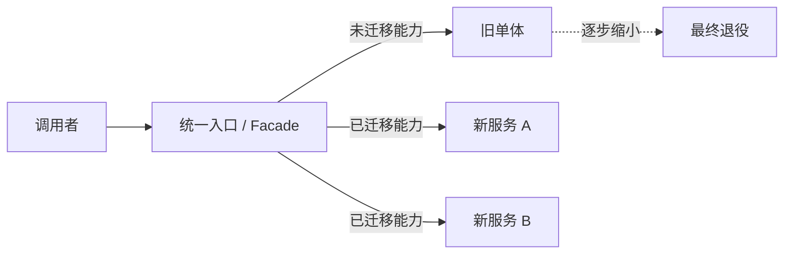
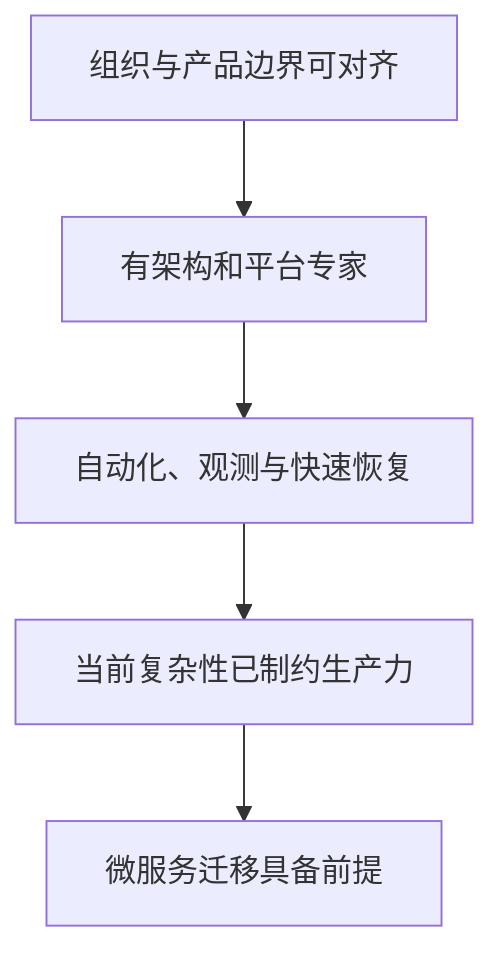
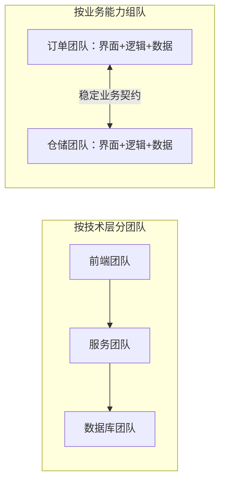
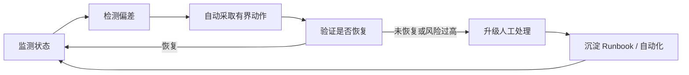
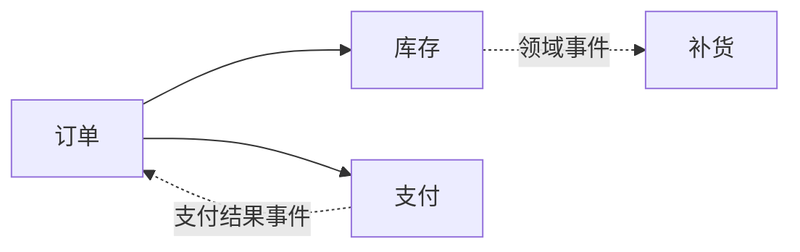
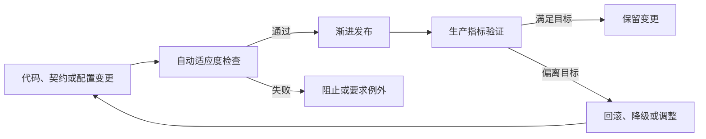
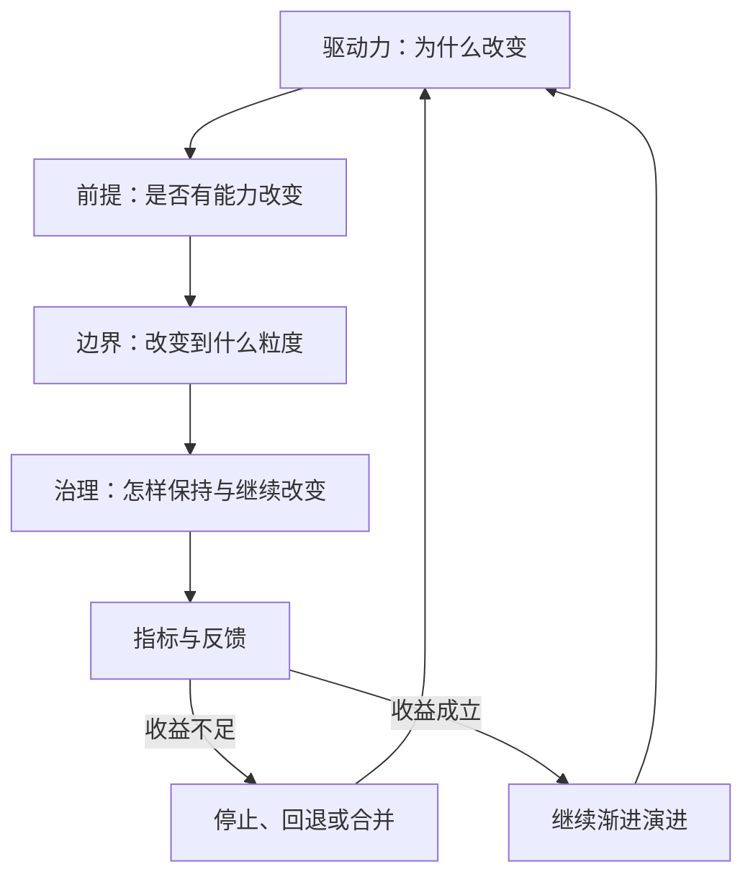
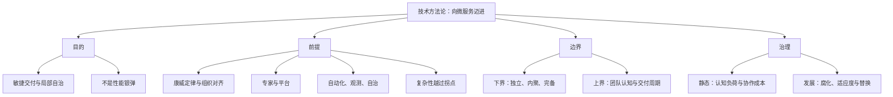

> 原书：周志明，《凤凰架构：构建可靠的大型分布式系统》
>
> 本章范围：“技术方法论”中的“向微服务迈进”，依次包括微服务的驱动力、实施前提、服务粒度与系统复杂性治理。
>
> 阅读说明：本章不是微服务工具手册，而是一套决策方法。原文中的沟通复杂度和微服务复杂度公式主要用于建立直觉，并非经过实证校准的工程定律。本文会沿原书顺序解释其推理，同时明确哪些是可验证结论、哪些是启发式模型、哪些需要结合当前组织重新判断。

## 1. 本章在回答什么问题

前几章已经说明微服务、Kubernetes、服务网格可以做什么，本章开始追问更困难的问题：

1. 为什么要采用微服务，而不是因为它流行就采用？
2. 组织和工程能力达到什么程度后，微服务才可能产生净收益？
3. 一个服务应该拆多大，怎样避免分布式单体和“纳米服务”？
4. 微服务增加了技术认知负担，为何在大型系统中仍可能降低总复杂度？
5. 架构怎样长期演进，而不是在设计完成后逐渐腐化？


作者把“目的、前提、边界、治理”按这个顺序组织并非偶然：没有目的，技术变革无法评价；没有前提，收益无法落地；边界不正确，微服务只会增加远程耦合；没有治理，短期正确的拆分也会随需求变化腐化。

### 1.1 没有银弹（No Silver Bullet）

Fred Brooks 的“没有银弹”原命题更具体：在十年尺度内，不会有单一技术或管理方法普遍让软件生产率、可靠性或简单性获得数量级提升；原因是工具可以削减 Accident Complexity，却不能消灭问题域的 Essential Complexity。它不否认某项技术在特定场景获得十倍收益，也不否认多项创新累积改变行业。对微服务而言，结论是它只能改变复杂度的结构，不能消灭业务本质复杂性。

可以把架构变更的考虑项写成一张多指标决策账：

$$
Score(x)=\sum_i w_i\,u_i(x)
$$

- $u_i(x)$ 是方案 $x$ 在某项指标上的标准化效用，例如 Lead Time、隔离范围、迁移费用或 MTTR；
- $w_i$ 是组织明确赋予该指标的权重；
- 硬性合规、安全和预算可直接作为约束，不必折算成分数；
- 若能把所有收益和成本统一折算为货币，才可以再计算真正的 Net Present Value。

Lead Time、可靠性比例、迁移费用和认知负荷量纲不同，不能不加权地相加后用正负号作数学判断。合理做法是同时检查多项可验证指标、硬约束和时间尺度，记录明确权重与取舍，不能只写“架构更先进”。

### 1.2 本章没有形式化算法，但有决策顺序

本章是方法论文章，没有像 Paxos 那样的正式算法。它提供的“算法”是一套带停止条件的决策流程：

```text
if 没有可测量的业务或组织痛点:
    保持当前架构

if 组织、专家、自动化、观测能力不足:
    先补前提，不立即拆分

for 每个候选服务边界:
    检查独立、内聚、完备的下界
    检查团队认知与交付能力的上界
    评估数据一致性、调用频率和故障传播

采用最小可逆迁移
持续度量交付、可靠性与认知负担
边界失效时合并、拆分或替换
```

## 2. 向微服务迈进

“向微服务迈进”首先是一份避坑指南。微服务可以帮助大型系统进行物理拆分，却会立刻引入网络、数据和平台复杂度，因此问题不是“微服务好不好”，而是“当前约束下，它是否比其他方案更合适”。

### 2.1 目的：微服务的驱动力

Chris Richardson 对微服务目的的概括是：充分拆分应用，以便敏捷开发和部署。关键词是**交付与演进**，不是性能。

#### 2.1.1 为什么性能通常不是首要理由

单体同样能够：

- 部署多个无状态副本；
- 使用负载均衡和缓存；
- 拆分模块与线程池；
- 升级数据库和硬件；
- 对热点路径进行针对性优化。

服务拆分反而增加序列化、网络往返、鉴权、追踪和故障处理。若一次业务串行调用 $m$ 个服务，其延迟可粗略表示为：

$$
T_{\mathrm{business}}
=\sum_{i=1}^{m}T_{\mathrm{work},i}
+\sum_{i=1}^{m-1}
\left(
T_{\mathrm{serialize},i}
+T_{\mathrm{network},i}
+T_{\mathrm{queue},i}
\right)
$$

拆分本身不会减少第一项，却会增加第二项。只有不同部分可以独立扩容、并行执行，或能消除原有瓶颈时，性能才可能改善。

同步依赖链还会放大可用性风险。在故障近似独立、没有降级和冗余的简化前提下：

$$
A_{\mathrm{path}}=\prod_{i=1}^{m}A_i
$$

因此“需要更高性能”应先通过 Profiling、容量分析和负载测试定位瓶颈。若升级硬件、缓存、SQL 优化或模块化单体就能解决，通常比服务化便宜。

#### 2.1.2 微服务真正提供的是“可能性”

微服务通过进程和部署边界，使局部具备以下可能：

- 独立开发、测试、发布和回滚；
- 独立扩缩容和资源隔离；
- 选择适合领域的语言与存储；
- 局部故障不拖垮整个进程；
- 局部代码和团队被替换；
- 不同业务按不同节奏演进。

“可能”不等于自动获得。若所有服务必须一起构建、共享数据库表、同步发布并由同一大团队维护，系统只是增加了网络边界，并没有得到自治收益，这种形态常被称为 Distributed Monolith。

#### 2.1.3 外部驱动力

原书先列出组织外部的三类因素。

##### 技术无法包打天下

Java 业务系统可能需要 Python 机器学习、Go 编写的基础设施、C 实现的 Redis。异构能力有时不是追求潮流，而是生态决定的现实。

不过，引入异构服务不等于整个系统必须全面微服务化。可以先把确有异构需求的边界做成独立服务，其他部分继续保留模块化单体。技术自由也要计算招聘、补丁、安全和运行时治理成本。

##### 人才与错误隔离

少量专家带领大量普通开发者或外部团队时，共享大进程会让局部错误影响全局。明确的服务所有权、自动化质量门和故障隔离能让专家把关键约束固化到平台与契约中。

这里不能推导出“微服务能让低质量代码变可靠”。错误的数据契约、共享依赖和平台配置仍可能全局传播。物理隔离只是增加一道防线，不能替代代码评审、测试与工程文化。

##### 商业与合规要求

招标、客户部署隔离、数据驻留、监管审计和供应商边界可能直接要求分布式部署。它们是合法约束，但应把“满足合同”与“改善技术”分开记账，避免事后用技术收益包装商业妥协。

#### 2.1.4 内部驱动力

##### 快速变化的创新业务

需求生命周期短、试错频繁时，局部独立发布价值很高。适用前提是：

- 团队确实能自主发布，而不只是代码仓库分开；
- 自动测试和回滚足够快；
- 数据边界允许独立演进；
- 可观测性能够判断试验效果；
- 功能退役和服务下线成本可控。

若审批、测试、数据库和发布窗口仍然集中，拆成服务不会缩短 Lead Time。

##### 大型遗留系统

原书归纳三种结局：

1. 继续维持，最终不可替代也不可维护；
2. 整体重写，新旧系统长期双轨；
3. 逐步拆除和替换，让旧系统孵化出可自治服务。

第三条通常更可控，可使用 Strangler Fig Pattern：在旧系统外围建立稳定入口，把一项能力及其数据逐步导向新实现，验证后再移除旧路径。



直接“大爆炸重写”会同时改变业务理解、代码、数据和运行方式，风险难以隔离；渐进迁移让每一步都可验证、可停止和可回退。

#### 2.1.5 驱动力必须转换为指标

| 驱动力 | 可观察指标示例 |
| --- | --- |
| 发布耦合 | 无关模块被迫一起发布的比例 |
| 交付速度 | Lead Time、Deployment Frequency |
| 变更风险 | Change Failure Rate、MTTR |
| 团队协作 | 一项需求跨团队数量、等待时间 |
| 独立扩容 | 热点模块与整体资源消耗比例 |
| 技术异构 | 现有栈无法满足的具体能力与成本 |
| 遗留替换 | 可独立迁移的业务能力和数据范围 |

微服务不是目标状态，目标是让这些指标改善。若迁移后部署频率不升、故障恢复更慢、跨团队协调更多，就要重新审视边界和平台。

#### 2.1.6 本节结论

微服务的核心价值是**有效拆分带来的局部自治与持续更迭**。性能、代码质量和生产力可能改善，也可能下降，它们必须由具体机制和测量证明，不能由“采用微服务”自动推出。

## 3. 前提：微服务需要的条件

原书把前提分成四类，前三类解决“能不能做好”，第四类解决“现在是否值得做”。



### 3.1 前提一：理解康威定律

Conway's Law 指系统结构倾向于映射组织的沟通结构。它不是说架构只能被组织被动决定，也不保证失配最终自动收敛；服务与团队边界冲突时，组织完全可能长期承受高昂协调成本。Inverse Conway Maneuver 只是主动诱导期望结构，还必须配合端到端权限、所有权、架构约束和结果反馈。

#### 3.1.1 为什么沟通会塑造系统

假设完成订单需要账户、库存、支付三个团队每次共同决策，那么接口与发布流程会自然形成跨团队耦合。相反，一个团队独立拥有完整业务能力，它更容易形成内部高内聚、外部稳定契约。



按技术层分组不是永远错误，平台、安全和数据基础设施仍需要专业团队。问题在于业务需求若每次必须横穿所有职能队列，交付就会被组织等待主导。

#### 3.1.2 逆康威操作

Inverse Conway Maneuver 是主动调整团队结构，以诱导期望的系统结构：

1. 识别稳定业务能力；
2. 为能力建立跨职能团队；
3. 赋予代码、数据、发布和运行责任；
4. 用明确 API 和事件管理团队间关系；
5. 根据真实协作重新调整边界。

它触及权力、预算、绩效和人员归属，所以原书说架构也是社交和政治活动。技术方案若不处理组织激励，只会在架构图上独立、在实际工作中继续集中审批。

#### 3.1.3 常见误区

- “一个团队一个服务”不是强制一一对应，小团队可以拥有多个内聚服务；
- 共享平台不等于所有变更都要平台团队审批；
- 团队自治不等于无标准，安全、观测和接口兼容仍需最低基线；
- 组织图不必与运行时调用图完全相同，关键是高频变更是否能在团队内部完成。

### 3.2 前提二：具备技术与运维专家

微服务把复杂度从单个业务模块移动到系统整体。业务开发者可能通过平台“铺好的道路”轻松发布服务，但设计这条道路需要理解：

- 服务发现、网关与负载均衡；
- 超时、重试、熔断和隔离；
- 数据所有权与最终一致性；
- 身份、密钥和最小权限；
- CI/CD、制品、配置和供应链；
- 日志、追踪、指标和 SLO；
- 容量、成本和故障演练。

开源工具不能替代专家判断。Kubernetes、Istio、Spring Cloud 和 Dubbo 本身就是复杂系统，错误默认值和错误组合会把局部问题平台化。

#### 3.2.1 专家的职责不是成为人工瓶颈

专家应把经验产品化：

- 服务模板和 Golden Path；
- 自动化安全与质量检查；
- 默认超时、重试预算和遥测；
- 自助环境和发布流水线；
- ADR、Runbook 与故障复盘；
- 对例外提供评审，而不是审批所有正常变更。

这与当前 Platform Engineering 的思想一致：平台作为内部产品降低团队认知负荷，而不是建立新的中央运维工单队列。

#### 3.2.2 对“开发者分层”观点的辨析

原书预测复杂基础设施会让普通开发者更容易生产服务，同时提高少数专家门槛。这是作者的行业判断，不是康威定律的必然推论。更健康的目标不是把开发者分成“精英和螺丝钉”，而是让平台降低偶然复杂性，同时确保团队仍理解其服务的业务、运行和失败模式。

抽象可以减少每个人需要操作的细节，但不能让责任消失。业务团队仍应 On-call 或至少参与故障复盘，否则 Product not Project 的责任会再次被割裂。

### 3.3 前提三：以自治为目标的自动化和监控

Martin Fowler 在 2014 年列出三个技术前提：

1. Rapid Provisioning：数小时内建立新环境；
2. Basic Monitoring：发现技术和业务异常；
3. Rapid Application Deployment：通过自动化部署管道（Deployment Pipeline）部署到测试和生产。

今天工具速度更快，但目标没有变化。仅“能自动执行脚本”还不是自治，自治系统还应能检测、决策、执行、验证和升级人工介入。



#### 3.3.1 自动化与自治的区别

- 自动化：按预设步骤执行，例如流水线部署；
- 自治：根据观测在安全边界内选择动作，例如控制器补副本；
- 完全无人运维不是现实前提，顶层仍需人决定目标和处理未知风险；
- 关键是让人的工作从重复操作转向目标、例外和改进。

原书以水族馆与生态系统类比：不断增加人工设备仍需维护；形成反馈闭环后，系统可以在一定范围内自我调节。


#### 3.3.2 最低工程基线

开始拆分前至少应具备：

| 能力 | 最低可验证结果 |
| --- | --- |
| 制品 | 每次构建可追溯、不可变、可回滚 |
| 测试 | 服务契约和关键业务自动验证 |
| 部署 | 单服务可独立发布，失败可停止和回滚 |
| 配置 | 外部化、分环境、敏感信息不进源码 |
| 观测 | 传播上下文以关联日志与被采样的 Trace；Metrics 保持聚合，必要时用 Exemplar 关联少量样本 |
| 运维 | 关键服务明确 Owner、目标、告警和 Runbook；SLO 随规模逐步正式化 |
| 恢复 | 关键数据有备份和可验证恢复路径，演练深度与风险匹配 |

如果发布一个服务仍需人工修改多台机器，系统拆得越细，运维成本越接近服务数量的线性甚至超线性增长。这里列的是面向生产规模化的目标基线，并非“先尝试两个服务之前必须一次全部建成”的准入清单；团队可以从少量服务和部分人工流程学习，但必须确保复杂度增长前持续补齐自动化、追踪、SLO 与恢复演练。

#### 3.3.3 自动化本身也要治理

监控系统、流水线和控制器同样会失败。不能无限套娃，而应：

- 用更简单、更稳定的基础层承载控制面；
- 控制面故障时数据面保留 Last Known Good；
- 自动动作有限速、熔断和回滚；
- 高风险动作要求人工确认；
- 定期演练平台失效，而不只演练业务服务失效。

### 3.4 前提四：复杂性已成为主要矛盾

小系统中，微服务的固定成本通常大于收益。只有单体的协作、发布、故障和认知问题开始持续限制生产力，才可能越过收益交叉点。


#### 3.4.1 交叉点不是用户数

决定是否越过交叉点的可能是：

- 团队和变更流数量；
- 模块变化频率差异；
- 发布和故障耦合；
- 数据边界成熟度；
- 独立扩缩和合规需求；
- 平台固定成本；
- 系统剩余寿命。

一个高流量但业务简单的系统可能适合单体；一个流量不高但由许多独立团队快速演进的企业系统可能更需要服务边界。

#### 3.4.2 远景不能替代当前证据

战略可以规划未来，战术架构应依据当前约束。因为“未来可能很大”就直接建立复杂平台，会让团队先支付分布式成本，却长期拿不到规模收益。

更稳健的路径是 Modular Monolith：先用模块、依赖规则和数据所有权建立可拆边界，等独立发布或隔离需求出现后再物理拆分。

#### 3.4.3 演进式设计与可报废性

良好设计应允许服务被合并、拆分和报废。可报废不等于草率编码，而是避免把某个实现变成无法替换的永久核心。

“先单体、后拆分”也不应被解释为第一次设计错误。如果先前架构在当时以最低成本满足需求，它就是正确的阶段性决策。架构质量应按生命周期价值评价，而不是按是否一次预测终局评价。

### 3.5 四项前提检查表

| 前提 | 通过信号 | 未通过风险 |
| --- | --- | --- |
| 组织对齐 | 团队拥有端到端能力与发布权 | 跨团队同步发布，形成分布式单体 |
| 专家与平台 | 有默认道路、SLO、故障经验 | 每队重复造轮子，错误被平台放大 |
| 自动化与观测 | 可独立部署、回滚、定位 | 服务越多，操作与故障越不可控 |
| 复杂性拐点 | 当前架构持续限制交付 | 提前支付成本，无可验证收益 |

## 4. 边界：微服务的粒度

DDD 是识别业务边界的主要方法，原文列举了 Bounded Context、Context Map、Ubiquitous Language、Domain / Subdomain、Aggregate 和 Domain Event。它们与微服务并非机械一一对应：Bounded Context 是模型与语言的边界，一个上下文可以部署为一个或多个服务；Aggregate 是事务一致性边界和候选拆分线索，不天然等于服务；Context Map 描述上下文之间的上下游、Shared Kernel、Customer-Supplier、Anti-Corruption Layer 等关系，帮助设计服务契约。原书没有展开 DDD，而是从性能、一致性、可用性和团队协作推导服务粒度上下界。


### 4.1 粒度过小的代价

#### 4.1.1 性能与聊天式调用

进程内调用可能是纳秒到微秒量级，远程调用通常至少包含网络和编解码。若完成一个页面要依次访问几十个细粒度服务，固定成本和尾延迟会主导业务时间。

判断方法：

- 一项用户能力是否需要客户端编排大量细小 API？
- 服务是否只有一个通用工具函数，例如字符串转换？
- 大多数调用是否总与另一个服务成对出现？
- 是否为了减少延迟不断增加批量接口和缓存？

这些是边界过细或位置错误的信号。可以合并服务，或由一个业务服务提供粗粒度能力。

#### 4.1.2 数据一致性与所有权

原书说“每个微服务都有独立数据源”，更准确的工程原则是 Database per Service 的**逻辑所有权**：只有一个服务拥有某数据的写入模型，物理上可共享数据库实例，但不能绕过服务契约直接修改对方表。

若两个不变量必须在一个原子事务内持续维护，例如同一聚合内金额与明细一致，它们通常应留在同一服务边界。强行拆开会把简单本地事务升级为消息、补偿或 XA 协调。

不能从“需要 JOIN”直接推出必须合并。查询可以用 API Composition、CQRS Read Model 或事件复制解决；真正的合并信号是强一致写不变量和共同生命周期。

#### 4.1.3 可用性与循环依赖

若服务 A 必须同步调用 B 才能工作，B 又必须同步调用 A，任一故障都会使二者不可用，并产生部署、测试和恢复环。

有向依赖图应尽量无环：



单向依赖不可避免，双向强依赖通常意味着边界错误、共享领域概念未归属，或应该通过事件反转依赖。

### 4.2 微服务粒度的下界

原书给出三项下界：

1. **独立（Independent）**：可独立开发、测试、发布、部署、运行和回滚；
2. **内聚（Cohesive）**：强相关功能、数据和业务不变量处于同一边界；这里描述的性质是内聚性（Cohesion）；
3. **完备（Complete）**：至少提供一项完整业务能力，而非单一技术函数。

可以转成可验证问题：

| 属性 | 验证问题 |
| --- | --- |
| 独立 | 不发布其他服务，当前服务能否安全升级？ |
| 独立 | 测试时是否必须启动半个系统？ |
| 内聚 | 一项业务变化是否总同时修改多个服务？ |
| 内聚 | 是否存在跨服务强事务和双向同步依赖？ |
| 完备 | 消费者能否通过一次粗粒度能力完成有意义工作？ |
| 完备 | 服务名是否是业务名词，而非 Utils、Common、CRUD？ |

这里的“独立”不是完全无依赖，而是依赖通过稳定契约表达，且依赖暂时失败时有清楚行为。

### 4.3 粒度过大的代价

技术上，大服务仍可正常运行；上界主要由团队认知和协作限制。一个服务同时承载过多业务时：

- 每次修改涉及更多人和代码；
- 发布队列互相等待；
- Ownership 模糊；
- 冲突和回归范围扩大；
- 不同模块无法按各自节奏演进；
- 局部扩容仍要复制整体。

### 4.4 沟通成本公式

若 $n$ 个人理论上两两直接沟通，可能的沟通通道数为：

$$
E(n)=\binom{n}{2}=\frac{n(n-1)}{2}
$$

具体数值：

| 人数 | 两两通道数 | 相对 5 人团队 |
| --- | ---: | ---: |
| 5 | 10 | 1 倍 |
| 15 | 105 | 10.5 倍 |
| 150 | 11,175 | 1,117.5 倍 |

以下代码可以复算：

```python
def communication_channels(people: int) -> int:
    return people * (people - 1) // 2


baseline = communication_channels(5)
for people in (5, 15, 150):
    channels = communication_channels(people)
    print(f"people={people:3d} channels={channels:5d} relative={channels / baseline:.1f}x")
```

```text
people=  5 channels=   10 relative=1.0x
people= 15 channels=  105 relative=10.5x
people=150 channels=11175 relative=1117.5x
```

这只是完全图的边数量，不是实际工时公式。真实团队不会人人持续与所有人沟通，会通过角色、文档和子团队减少连接；但跨边界沟通的单次成本通常更高，所以边界设计仍然重要。

### 4.5 微服务粒度的上界

原书用 2 Pizza Team 给出上界：一个小型跨职能团队在一个研发周期内能够承担的完整需求范围。

它是启发式规则，不是 6 至 12 人的硬标准。真正约束是 Team Cognitive Load：团队能否理解、运行和演进自己负责的系统。

上界应同时检查：

- 团队能否独立响应大多数变更？
- On-call 时能否理解故障路径？
- 服务是否有清晰产品使命和 Owner？
- 发布是否被多个无关需求阻塞？
- 一个迭代能否完成需求、测试和上线？
- 团队是否承担过多语言、数据库和平台？

Dunbar's Number 是人类社交规模研究，不能直接证明微服务团队人数；2 Pizza Team 也受文化、远程协作和产品复杂度影响。它们适合建立直觉，不适合作为审计阈值。

### 4.6 在上下界内寻找边界

#### 4.6.1 候选边界证据

- 业务语言和规则变化一起发生；
- 数据有清晰写所有者；
- 团队能够端到端负责；
- 质量属性明显不同，例如独立扩容或安全等级；
- 变更频率与发布节奏不同；
- 故障应被隔离；
- 外部依赖和合规边界不同。

#### 4.6.2 应拆分的信号

- 两组功能几乎从不一起变化；
- 热点部分迫使整个服务扩容；
- 一个团队无法掌握全部代码和运行；
- 发布冲突持续成为 Lead Time 主因；
- 不同部分需要不同可用性、技术栈或合规策略。

#### 4.6.3 应合并的信号

- 服务总要一起发布；
- 数据库事务频繁跨服务；
- 大多数请求在两服务之间往返多次；
- 两服务共享同一团队、生命周期和故障边界；
- 一方单独无法提供任何业务价值；
- API 为了隐藏内部拆分而不断增加复杂编排。

合并服务不是架构倒退，而是演进式设计的一种正常动作。

### 4.7 边界决策记录模板

```text
候选业务能力：
通用语言与主要规则：
数据写所有者：
必须原子维护的不变量：
调用方与调用频率：
发布与扩缩节奏：
故障隔离目标：
负责团队与认知负荷：
拆分收益：
分布式成本：
回退或重新合并方案：
```

## 5. 治理：理解系统复杂性

治理（Governance）包括两个目标：

1. **正确执行**：当前系统按预期运行；
2. **持续保持**：变化过程中维持可接受质量。

对应原书的静态治理和发展的治理。

### 5.1 静态的治理

系统规模增大后，“能够正常运行”本身就需要治理。微服务调用图展示了成百上千个独立组件之间的依赖，任何局部变化都可能产生级联影响。


#### 5.1.1 复杂性的两个来源

##### 认知负荷

Cognitive Load 是理解业务、模型、接口、代码、工具和故障所需的心智负担。可以进一步区分：

- Intrinsic：业务本身不可避免的复杂性；
- Extraneous：工具、流程和错误抽象制造的偶然复杂性；
- Germane：建立模型和学习所需的有效负荷。

架构不能删除业务复杂性，但可通过良好边界、平台和文档减少 Extraneous Load。

##### 协作成本

Collaboration Cost 来自沟通、排队、决策、交接和冲突。团队规模、依赖数量、接口稳定性和时区都会影响它。代码行数和服务数只能作为弱代理，不能直接代表复杂性。

#### 5.1.2 原书的复杂度模型

原书借算法复杂度符号把单体与微服务的总复杂度写成：

$$
C_{mono}(N)=O(k_mN)+O(N^2)
$$

$$
C_{micro}(N)=O(k_sN)+O(N\log N),\quad k_s>k_m
$$

严格说，Big-O 会消去常数系数，因此 $O(k_sN)=O(k_mN)=O(N)$；$kN$ 也不是固定成本。所以上式不能从数学上证明规模交叉点，而且 $N$ 究竟代表人员、服务、代码还是变更量也未定义。它要表达的直觉是：

- 微服务每个开发者要理解更多分布式概念，所以线性项系数更大；
- 单体中的协作连接随人数快速增长；
- 微服务按团队分治，使大规模协作增长较慢；
- 小规模时微服务的平台固定成本与较高单位认知成本占主导，单体简单；
- 大 $N$ 时协作高次项占主导，合理微服务可能更简单。

#### 5.1.3 这不是数学证明

若要表达交叉点，应保留系数与平台固定成本，而不是使用会消去系数的渐近记号。例如将规模 $N$ 明确定义为同一时期参与交付的人员数，用经验模型：

$$
C_{mono}(N)=F_m+a_mN+b_mE_m(N)
$$

$$
C_{micro}(N)=F_s+a_sN+b_sE_s(N),\quad F_s>F_m,\ a_s>a_m
$$

$F$ 表示平台固定成本，$aN$ 表示单位认知负荷，$E(N)$ 表示实际协作图中的依赖边。只有通过组织数据估计这些项，才能判断两条曲线是否以及在哪里相交。

把微服务协作直接写成 $O(N\log N)$ 是 Divide and Conquer 的类比，并非由康威定律推导出的定理。真实复杂度更适合用团队内沟通和跨团队依赖表示：

$$
C_{collab}
\approx
\sum_{i=1}^{g}\alpha_i\frac{n_i(n_i-1)}{2}
+\lambda E_{cross}
$$

- $g$：团队数量；
- $n_i$：第 $i$ 个团队人数；
- $E_{cross}$：真实跨团队依赖边数量；
- $\alpha_i$：团队内单次沟通成本；
- $\lambda$：跨团队协调成本，通常高于团队内。

好的边界让高频变更落在团队内，并降低 $E_{cross}$；错误微服务会让每项需求横跨很多团队，复杂度可能比单体更高，甚至仍接近全连接。

#### 5.1.4 分治为何有效

Divide and Conquer 并不要求系统物理拆成服务。它先要求：

- 局部问题可被独立理解；
- 局部决策不会频繁破坏全局不变量；
- 边界间通过有限、稳定契约协作；
- 团队拥有边界内的决策权；
- 全局平台只统一真正通用的能力。

模块化单体同样能获得部分分治收益；微服务在需要独立发布、故障和资源边界时进一步提供物理隔离。

#### 5.1.5 静态治理如何落地

| 治理对象 | 机制示例 |
| --- | --- |
| 服务所有权 | Service Catalog、Owner、On-call |
| 依赖方向 | 架构测试、模块边界、禁止循环依赖 |
| API 契约 | Schema、兼容策略、Consumer Contract Test |
| 数据所有权 | 单写者、事件 Schema、数据血缘 |
| 可靠性 | SLO、错误预算（Error Budget）、超时和重试预算 |
| 安全 | 工作负载身份、最小权限、供应链证明 |
| 交付 | 独立流水线、渐进发布、自动回滚 |
| 可观测性 | 统一 Trace Context、日志字段和指标语义 |
| 决策 | ADR、例外到期时间、定期复审 |

治理的目标不是让所有服务完全相同。标准应聚焦互操作、安全和运行底线，给领域实现保留自治空间。

### 5.2 发展的治理

静态规则可以维持当前秩序，却无法让架构永远不变。新需求、人员流动、依赖升级和临时妥协会持续制造 Architectural Decay。

#### 5.2.1 架构腐化如何形成


常见因素：

- 原设计没有预见的新业务；
- 专家离开，隐性知识丢失；
- 新人要边理解边交付；
- 工期促使团队借债却不还；
- 临时例外没有 Owner 和到期时间；
- 正常运行的旧系统缺少重构预算；
- 破窗效应（Broken Windows Effect）让违规成为新默认。

技术债并非所有妥协。若团队清楚收益、利息和偿还计划，债务可能是理性选择；真正危险的是未记录、无期限、持续复利的债。

#### 5.2.2 演进式设计不是无限打补丁

原书用“换房子”而非“不断给旧房添砖”解释 Evolutionary Design。不同阶段的架构服务于不同规模和需求；后一代可以继承业务知识，却不必继承所有实现。


演进可以有两类：

- 渐进式：模块替换、Strangler、数据迁移、契约版本演进；
- 代际式：在清晰边界建立新系统，逐步切流和退役旧系统。

它不等于定期整体重写。全量重写很容易丢失多年积累的隐含业务规则，并在长时间无用户反馈时重犯旧错。

#### 5.2.3 架构适应度函数

Evolutionary Architecture 可使用 Fitness Functions 把质量要求变成持续检查：

- 架构依赖不得成环；
- API 变更保持向后兼容；
- P99 延迟和错误率不超 SLO；
- 任一服务不得直接写他人数据库；
- 高危漏洞和过期证书阻止发布；
- Zone 故障时核心业务仍满足最低容量；
- 服务连续若干月无流量时触发退役评审。

适应度函数不是只写单元测试，也包括静态分析、契约测试、策略即代码、性能回归、混沌实验和生产 SLO。



#### 5.2.4 服务的出生、演进与退役

一个可治理的服务生命周期应包括：

1. 建立业务使命、Owner、数据和 SLO；
2. 使用模板创建制品、流水线、遥测和权限；
3. 通过契约管理依赖；
4. 根据指标拆分、合并或迁移；
5. 发布弃用计划并观察消费者；
6. 停止流量、归档数据、撤销权限和删除基础设施。

创建服务很容易，安全退役常更困难。若没有依赖目录、流量观测和数据保留策略，系统只会不断增加服务，复杂度不会因演进而下降。

#### 5.2.5 静态治理仍然有价值

原书强调腐化不可避免，不代表当前设计无意义。静态治理的价值是延长架构“保质期”，降低每次演进成本，并让退化尽早可见。

好的治理不是冻结架构，而是同时做到：

- 默认道路足够简单；
- 例外可以提出，但必须记录原因和期限；
- 决策由证据复审；
- 旧能力有明确退出机制；
- 团队结构随生产力和业务变化调整。

### 5.3 治理的核心结论

1. 复杂性主要来自认知负荷与协作成本，服务数本身不是充分指标。
2. 微服务增加分布式认知系数，尝试用团队分治降低大规模协作成本。
3. 原书 $O(N^2)$ 与 $O(N\log N)$ 是启发式模型，不是普遍定律。
4. 好边界减少跨团队依赖边，坏边界会形成分布式单体。
5. 静态治理让系统当前可控，演进治理让质量要求跟随变化。
6. 只要系统持续变化，架构腐化风险就无法永久归零；腐化特指实现偏离预期结构或质量属性，不等于所有正常演进。适应度函数、重构、替换和退役能够预防或修复部分偏离。

## 6. 四部分如何形成一套方法



以大型遗留书店系统为例：

1. 证据显示支付模块每周变化，发布却被整个单体月度窗口阻塞；
2. 团队已有独立流水线、追踪、消息和支付专家；
3. 支付与订单之间用明确命令和事件划界，支付账本由支付服务单写；
4. 先由统一入口把少量流量导向新支付服务；
5. 监控成功率、P99、对账差异、发布 Lead Time 和故障恢复；
6. 指标改善后扩大流量，最终退役旧实现；若跨服务事务和协调成本反而上升，则调整边界或回退。

这比先创建几十个仓库、选好 Kubernetes 组件再寻找拆分对象，更符合本章的方法论顺序。

## 7. 容易混淆的概念与常见误区

### 7.1 微服务不等于性能架构

服务化先增加网络成本，只有独立扩容、并行处理或消除瓶颈才能带来性能收益。

### 7.2 微服务不等于生产力自动提升

独立边界只提供可能性。共享发布、共享数据和集中审批会让生产力不升反降。

### 7.3 技术异构不等于技术随意

团队应有必要时“不统一”的权利，同时承担语言、补丁、观测和招聘成本。默认道路与例外机制比无限自由更可持续。

### 7.4 康威定律不是画组织架构图的方法

它描述沟通结构与系统结构的反馈关系。只改汇报线、不赋予代码和运行责任，不会产生自治服务。

### 7.5 自动化不等于自治

脚本执行固定步骤是自动化；根据观测在安全边界内恢复并验证才接近自治。

### 7.6 Kubernetes 不是采用微服务的前提

微服务可运行在 VM、容器或 Serverless；Kubernetes 只是常见平台。反过来，模块化单体也可以部署到 Kubernetes。

### 7.7 小系统不应因远景提前支付全部复杂度

远景用于保留演进空间，当前架构应满足当前证据。清晰模块和数据边界比提前拆进程更重要。

### 7.8 微服务越小越好是错误的

“微”强调边界和团队可掌握，不表示一个 Endpoint 一个服务。过小会产生聊天式调用、事务和可用性问题。

### 7.9 每服务独立数据库是所有权原则，不一定是独立实例

物理实例可共享，Schema 和写入权不能随意共享。关键是服务能独立演进数据模型。

### 7.10 需要数据 JOIN 不一定要合并服务

查询模型可复制和组合；必须原子维护的写不变量才是更强的合并证据。

### 7.11 2 Pizza Team 不是人数标准

真正上界是团队认知负荷和端到端交付能力。产品复杂度与平台质量会改变合适规模。

### 7.12 $n(n-1)/2$ 不是项目工时公式

它只是理论两两关系数，实际沟通图是稀疏的，跨团队单条边却通常更昂贵。

### 7.13 微服务协作成本不是天然 $O(N\log N)$

只有边界合理、依赖受控、组织对齐时，分治才会降低增长速度。错误拆分仍可接近 $O(N^2)$。

### 7.14 治理不等于中央审批

治理应通过默认值、自动检查和透明指标降低决策成本。每次变更开会审批会增加协作成本。

### 7.15 演进式设计不等于不做长期设计

要设计方向、不变量、优先可逆性和迁移路径，但不假设一次预测所有未来需求。数据迁移、公开契约和安全修复有时不可逆，此时应使用兼容过渡、有限爆炸半径、Roll-forward 或业务补偿，而不是强求回滚。

### 7.16 可报废不等于低质量

服务仍需安全、测试和可观测。可报废强调依赖可迁移、数据可导出和实现可替换。

### 7.17 架构腐化不可避免不等于治理无用

治理能延缓腐化、暴露偏差并降低下一次替换成本，这就是现实价值。

## 8. 可执行的微服务决策方法

### 8.1 第一步：建立基线

收集至少一个完整交付周期的数据：

- 需求 Lead Time 与等待分布；
- 发布频率与失败率；
- MTTR 和故障爆炸半径；
- 跨团队依赖数；
- 模块变更耦合；
- 热点容量与整体容量；
- 当前平台和 On-call 成本。

没有基线，就无法知道迁移是否改善。

### 8.2 第二步：提出可证伪假设

示例：

> 若把支付能力及账本拆给支付团队独立拥有，则支付需求 Lead Time 将从 15 天降到 5 天以内；发布不再要求商品团队参与；支付故障不会阻塞商品浏览；新增平台成本每月不超过既定预算。

假设包含对象、收益、指标和成本上限，后续可以被事实否定。

### 8.3 第三步：检查前提

```text
组织是否愿意赋予端到端所有权？
是否有处理分布式数据和故障的专家？
是否能独立构建、测试、发布和回滚？
是否能观察请求、服务和业务结果？
当前痛点是否持续发生并超过平台固定成本？
```

任一关键答案为否，优先补能力或保持模块化单体。

### 8.4 第四步：划定最小可行边界

从业务能力和数据所有权出发，验证独立、内聚、完备。画出：

- 同步调用图；
- 事件与数据流；
- 事务不变量；
- 团队所有权；
- 失败与降级路径。

若出现循环同步依赖和跨服务强事务，返回调整边界。

### 8.5 第五步：渐进迁移

优先选择：

- 一个变化快、边界清楚、风险可控的能力；
- 统一入口切流；
- 新旧结果影子比对；
- 数据先建立明确所有者，再逐步迁移；
- 支持回退，不立即删除旧路径；
- 不同时拆代码、换数据库、换语言和换平台。

### 8.6 第六步：用适应度函数治理

把目标放进流水线和生产监控，而不是只写在架构文档：

```text
API 兼容 -> 契约测试
禁止跨库写 -> 权限和静态检查
服务可独立部署 -> 流水线验证
故障不扩散 -> 混沌实验与 SLO
团队自治 -> Lead Time 与跨团队等待
平台成本 -> 单服务资源与运维工时
```

### 8.7 第七步：允许反向演进

如果两个服务总一起变化、一起故障、一起发布，合并它们；如果一个服务同时承载多条独立变更流，拆分它；若微服务固定成本长期大于收益，回到模块化单体。

架构演进不是只允许“单体 -> 微服务”一个方向。

## 9. 本章知识结构总结



### 9.1 核心结论

1. 微服务没有银弹效应，它重新分配复杂度，不消灭业务复杂度。
2. 微服务首要目标是局部独立交付和演进，性能只能是经证明的辅助收益。
3. 采用微服务前应具备组织对齐、专家能力、自动化观测和真实复杂性拐点。
4. 康威定律说明高频沟通边界最终会映射为系统边界，组织与架构必须协同调整。
5. 平台应把专家经验变成默认道路，不能让专家成为所有变更的人工审批点。
6. 服务粒度下界是独立、内聚和完备，上界是团队可掌握并在交付周期内演进的范围。
7. 沟通通道公式与 $O(N\log N)$ 模型用于建立直觉，不能当作精确工程定律。
8. 微服务在小规模下认知固定成本高，只有合理分治降低大规模协作成本时才产生优势。
9. 静态治理维持当前质量，发展的治理通过适应度、替换、合并和退役应对持续变化。
10. 演进式架构应优先采用可逆的小步变化；不可逆变化要支持兼容迁移、Roll-forward 或补偿。服务方向并非单向变小，它也可以合并或报废。

### 9.2 解决问题的一般思路

$$
\text{测量当前痛点}
\rightarrow \text{提出收益假设}
\rightarrow \text{检查组织与工程前提}
\rightarrow \text{划定上下界}
\rightarrow \text{小步迁移}
\rightarrow \text{持续适应度验证}
\rightarrow \text{拆分、合并或退役}
$$

最重要的不是“怎样把系统拆成微服务”，而是始终能回答：**这次边界变化减少了哪一种已测量的复杂性，又增加了谁需要承担的什么成本？**

## 10. 主动回忆题

1. “没有银弹”对微服务决策有什么直接含义？
2. 为什么性能通常不应成为微服务化的首要理由？
3. 服务拆分会给一次调用增加哪些固定成本？
4. 为什么说微服务只提供独立交付和故障隔离的“可能性”？
5. 什么是分布式单体？
6. 技术异构在什么情况下是真需求，什么时候只是偏好？
7. 微服务为什么不能替代代码质量和工程文化？
8. 商业驱动与技术驱动为什么应分别记账？
9. 快速变化业务要从微服务获益，需要哪些配套能力？
10. 大型遗留系统的三种结局分别是什么？
11. Strangler Fig Pattern 如何降低整体重写风险？
12. 怎样把“更敏捷”转换成可验证指标？
13. 康威定律的“沟通决定设计”怎样形成？
14. 什么是逆康威操作？
15. 为什么只调整组织汇报线不能自动形成自治服务？
16. 微服务专家应怎样把经验产品化，而不是成为瓶颈？
17. 平台工程的 Golden Path 解决什么问题？
18. 为什么业务团队仍需理解运行和失败模式？
19. Rapid Provisioning、Basic Monitoring、Rapid Deployment 分别是什么？
20. 自动化和自治有什么区别？
21. 为什么自动化系统本身也需要限速、回滚与故障演练？
22. 开始拆分前最低工程基线包括哪些能力？
23. 微服务收益交叉点由哪些因素决定，为什么不是用户数？
24. 为什么远景规划不能直接决定当前技术战术？
25. Modular Monolith 如何为未来拆分保留空间？
26. “服务可报废”为什么不代表最初架构设计错误？
27. DDD 的 Bounded Context 对服务边界有什么帮助？
28. 粒度过小为何产生聊天式调用？
29. Database per Service 更准确的含义是什么？
30. 什么样的数据关系是合并服务的强证据？
31. 为什么查询 JOIN 不必然要求合并服务？
32. 双向同步依赖暴露了什么边界问题？
33. 独立、内聚、完备三项下界分别如何验证？
34. 为什么一个 Endpoint 一个服务通常是错误的？
35. 粒度过大的主要限制为什么来自人而不是技术？
36. $n(n-1)/2$ 计算的是什么，不是什么？
37. 5、15、150 人分别有多少理论两两沟通通道？
38. 2 Pizza Team 为什么只能作为启发式规则？
39. Team Cognitive Load 如何影响服务上界？
40. 哪些信号说明应该拆分服务？
41. 哪些信号说明应该重新合并服务？
42. 治理的“正确执行”和“持续保持”分别对应什么？
43. 认知负荷和协作成本如何共同构成复杂性？
44. Intrinsic、Extraneous、Germane Cognitive Load 如何区分？
45. 原书的单体与微服务复杂度公式想表达什么直觉？
46. 为什么 $O(N\log N)$ 不是微服务的普遍定律？
47. 更贴近现实的跨团队协作模型包含哪些变量？
48. 分治要有效必须满足哪些边界前提？
49. 模块化单体能否获得分治收益？
50. 静态治理应覆盖服务、契约、数据和可靠性的哪些内容？
51. 治理为什么不等于中央审批？
52. 架构腐化由哪些微小变化累积形成？
53. 理性的技术债与失控技术债有什么区别？
54. 演进式设计为什么更像换房子，而不是造一座终极大楼？
55. 渐进替换与整体重写各有什么风险？
56. 架构适应度函数如何把质量要求变成持续检查？
57. 服务退役为什么通常比创建更难？
58. 架构为什么必须允许反向演进？
59. 怎样提出一个可证伪的微服务迁移假设？
60. 一次最小可逆迁移应保留哪些回退能力？
61. 如何用生产指标判断边界是继续拆、合并还是保留？
62. 本章四部分为什么必须按目的、前提、边界、治理的顺序思考？
