> 本文严格按照原章顺序展开：先说明 TCP 为什么要在 IP 之上构造可靠链路，再依次讨论 Reliability、Connection lifecycle、Flow control、Congestion control 和 Custom protocols。原章以建立直觉为主，采用了简化表述；文中的累计确认、滑动窗口、带宽时延积、状态细节、数值示例、伪代码和 C 示例用于展开原理，不应误认为原书逐字给出的实现或现代 TCP 的唯一算法。

## 0. 本章定位：在不可靠 IP 上构造可靠字节流

### 0.1 问题从哪里来

互联网层负责把数据包从源节点路由到目标节点。要做到这一点，需要解决两个基本问题：

1. **寻址**：如何唯一或近似唯一地标识网络中的节点；
2. **路由**：每个路由器收到包后，应把它交给哪一个下一跳。

IP 负责寻址。原书以 IPv6 为例：IPv6 地址长 128 位，理论地址空间大小为

$$
2^{128} \approx 3.40 \times 10^{38}
$$

路由器维护本地路由表，把目标地址前缀映射到下一跳。跨自治系统的路由信息由 BGP（Border Gateway Protocol）建立和传播。数据包因此能够沿着一系列路由器逐跳接近目的地：

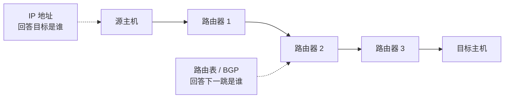

但“有路径可走”不等于“数据一定到达”。IP 提供的是 **尽力而为（best effort）** 的数据报服务，并不保证：

- 包一定到达；
- 包只到达一次；
- 包按发送顺序到达；
- 包到达时内容没有损坏。

例如，路由器的输出队列已满时可以直接丢包；不同包可能经过不同路径而乱序；底层故障可能造成比特错误。IP 的职责是尽可能转发，而不是为两个进程维护可靠会话。

### 0.2 TCP 引入了什么抽象

TCP（Transmission Control Protocol）位于传输层，在 IP 之上向两个进程提供 **可靠、有序的字节流**。应用写入一串字节，接收应用最终看到同样顺序的字节；TCP 对应用隐藏了分段、丢包重传、乱序重组和重复消除等细节。

TCP 在本章中的核心承诺可以概括为：

| IP 可能发生的现象 | TCP 采用的机制 | 向应用暴露的效果 |
| --- | --- | --- |
| 丢包 | 序号、确认、定时器、重传 | 字节流没有缺口，或连接最终报错 |
| 重复 | 序号与接收状态 | 相同字节不会向应用重复交付 |
| 乱序 | 序号与重组缓冲区 | 应用按序读取字节 |
| 常见传输损坏 | 校验和 | 损坏段被丢弃并等待重传 |
| 接收方处理太慢 | 接收窗口 | 发送方不会压垮接收缓冲区 |
| 网络路径过载 | 拥塞窗口 | 发送方根据网络反馈调整在途数据量 |

作者称其为“可靠通道的幻觉”，因为底层并没有突然变得可靠。TCP 是通过检测异常、保留状态和重复工作，把不可靠事件从应用视野中遮蔽起来。

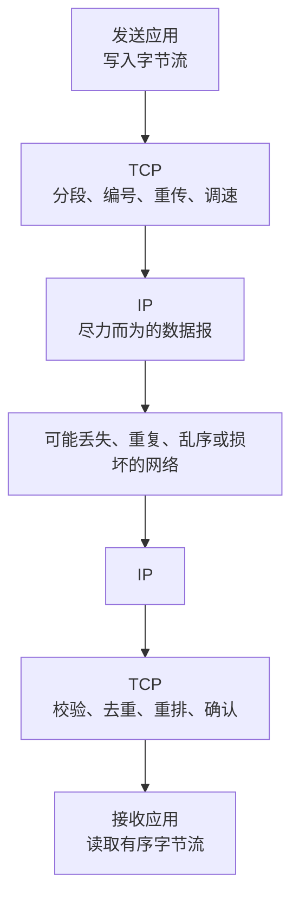

### 0.3 “可靠”与“稳定”是两组问题

本章结构实际处理两类不同困难：

- **可靠性机制**回答：某些段丢失、重复、乱序或损坏时，怎样恢复同一条字节流；
- **稳定性机制**回答：即使所有数据最终可恢复，怎样避免发送方压垮接收方或网络。

前者由序号、ACK、超时、重传和校验和实现；后者由流量控制与拥塞控制实现。只实现重传而没有稳定性控制，会形成危险反馈：网络越拥塞，丢包越多；丢包越多，发送方重传越多；重传又使网络更拥塞。

### 0.4 本章的推理路线


这条路线体现了构造系统抽象的一般方法：先列出下层可能违背的性质，再逐一增加状态、反馈和恢复机制；得到更强保证后，再分析这些机制引入的延迟、带宽和复杂度成本。

## 1. Reliability：可靠性

### 1.1 字节流为什么要被切成段

应用把 TCP 看成连续字节流，但 IP 承载的是离散数据包。因此，发送端 TCP 必须把字节流切分成若干 **TCP 段（segment）**，为每段添加 TCP 首部，再交给 IP 发送。

```text
应用字节流：ABCDEFGHIJKLMNOPQRSTUVWXYZ...
               |------| |------| |------|
TCP 分段：       segment 1 segment 2 segment 3
IP 传输：        packet 1  packet 2  packet 3
```

分段有几个作用：

- 网络能够逐包转发；
- 丢失时只需重传缺少的部分，而不是整个无限字节流；
- 接收端可以用有限缓冲区逐步重组；
- 流量控制和拥塞控制可以用“允许多少字节在途”来调节发送速度。

TCP 对应用保留的是字节流边界，而不是每次 `write` 的消息边界。发送方连续写入两次 100 字节，接收方可能一次读到 200 字节，也可能分多次读到。**TCP 段不是应用消息。** 若应用需要消息边界，应用层协议必须自行定义长度、分隔符或固定格式。

### 1.2 序号：给字节在流中的位置编号

原书简化地说“段按顺序编号”。更精确地说，TCP 序号定位的是 **字节流中的字节位置**；一个段首部里的序号通常表示该段第一个数据字节的编号。

假设发送方从序号 1000 开始，每段携带 500 字节：

| 段 | 序号范围 | 首部中的序号 |
| --- | --- | ---: |
| A | 1000–1499 | 1000 |
| B | 1500–1999 | 1500 |
| C | 2000–2499 | 2000 |

序号使接收方能够判断：

- 收到 A 后直接收到 C：B 对应的位置有缺口；
- 先收到 C 再收到 B：发生乱序，可以先缓存 C；
- A 已处理后又收到 A：发生重复，不应再次交付；
- A、B、C 全部连续：可以把连续字节交给应用。

之所以给字节编号而不只是给包编号，是因为重传时段边界可能变化，字节位置才是稳定语义。TCP 序号字段空间有限并会回绕，但协议会结合窗口和连接生命周期，避免把当前连接中的有效数据与过旧数据混淆。

### 1.3 ACK：接收方反馈自己已经知道什么

接收方通过确认（acknowledgment，ACK）告诉发送方数据已到达。经典 TCP 主要使用 **累计确认**：确认号表示“下一个期望收到的字节序号”，也等价于“此前所有连续字节都已收到”。

若接收方已连续收到 1000–1999 字节，它回复：

```text
ACK = 2000
```

含义不是“我收到了编号 2000 的字节”，而是“我已经连续收到 2000 之前的字节，下一步需要 2000”。

假设 B 丢失、C 先到：

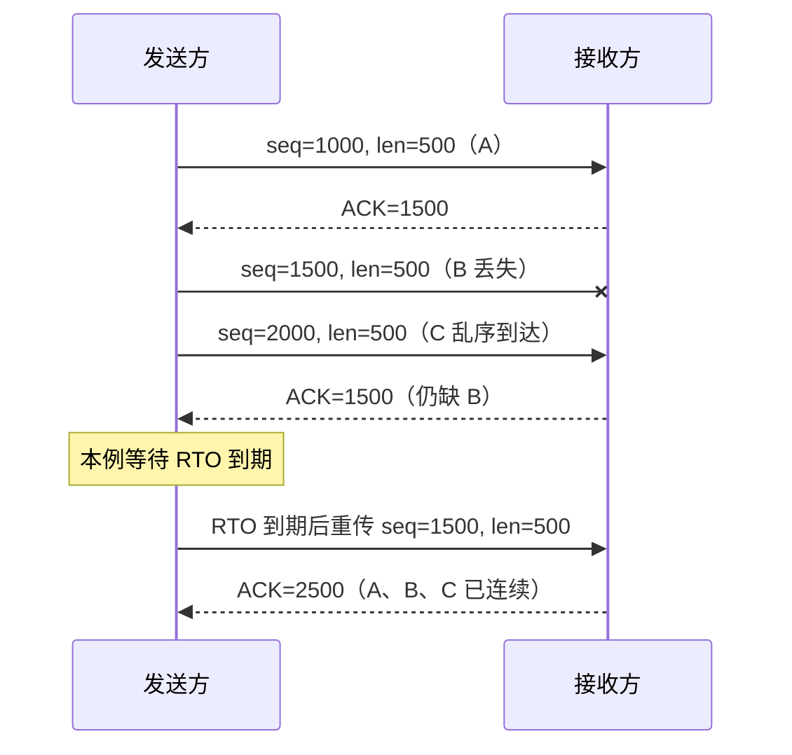

实际 TCP 可以延迟 ACK、让一个 ACK 累计确认多个段，也可以用选择性确认（SACK）告诉发送方哪些非连续区间已收到。因此，原章“每个段都需要被确认”应理解为所有数据最终都要被确认覆盖，不一定严格一段对应一个独立 ACK。

### 1.4 超时与重传：在没有确认时恢复

发送端发送数据后保留一份副本，并启动重传计时。若在预期时间内没有得到确认，就重传未确认数据。

基本自动重传请求（ARQ）思路可以写成：

```text
发送方：
  把待发送字节按序号放入发送缓冲区
  在发送窗口允许时发送尚未确认的数据
  为最早的未确认数据维护重传定时器

  收到推进确认号的 ACK：
    从发送缓冲区删除已确认前缀
    更新往返时间估计和窗口
    若仍有未确认数据，重新安排定时器

  定时器到期：
    重传未确认数据
    调整拥塞窗口和下一次超时时间
```

接收端的核心逻辑是：

```text
接收方收到一个段：
  若校验失败，丢弃
  若完全重复，丢弃数据但可再次确认
  若与当前连续前缀相接，合并并向前推进
  若提前到达，放入乱序缓冲区
  只把连续、有序且未重复的字节交给应用
  回复当前确认号和可用接收窗口
```

### 1.5 为什么“没收到 ACK”不能证明数据没到

ACK 缺失至少有两种解释：

1. 数据段没有到达接收方；
2. 数据段已经到达，但 ACK 在返回途中丢失。

发送方无法仅凭超时区分二者，所以只能重传。若是第二种情况，接收方会收到重复数据，再依靠序号去重。

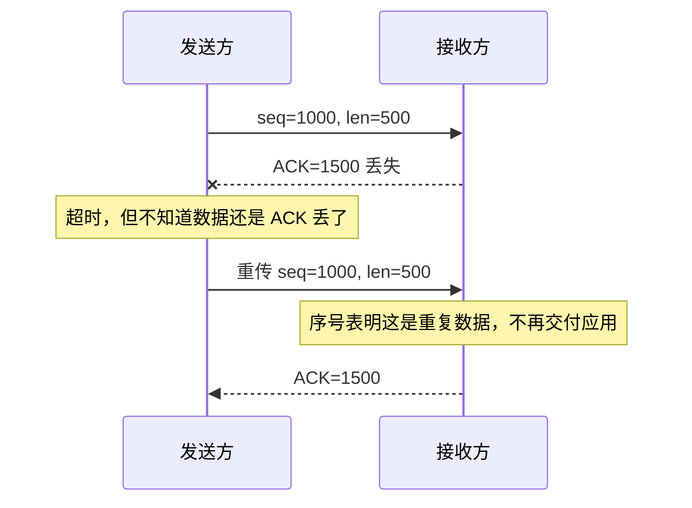

这个过程揭示了分布式系统中反复出现的模式：**重试把丢失转化为重复，去重机制再消除重复。** TCP 能按字节序号去重，但它不知道应用操作的语义。因此，TCP 重传不会让应用读到重复字节，却不能保证“支付请求只执行一次”；应用层超时后重新发送整个请求仍需要幂等机制。

### 1.6 重传超时为什么不能是固定常数

若超时过短，仍在路上的数据会被误判为丢失，产生不必要重传；若超时过长，真实丢包后的恢复会很慢。合理超时必须跟随路径往返时间（RTT）及其波动。

可用一个简化模型理解：

$$
RTO = SRTT + K \cdot RTTVAR
$$

其中：

- $SRTT$ 是平滑后的往返时间估计；
- $RTTVAR$ 是 RTT 波动估计；
- $K$ 是为不确定性保留的倍数。

这个公式不是原章重点，但说明定时器为何同时依赖平均延迟与抖动。只看平均 RTT 会在网络波动时频繁误判；留出波动裕量可以减少伪重传。实际 TCP 还使用快速重传、指数退避等机制，算法由具体协议版本和操作系统实现决定。

### 1.7 校验和：发现传输中的常见损坏

发送端根据 TCP 首部、数据和部分 IP 信息计算校验和；接收端重新计算并比较。若不匹配，说明数据在传输中发生了可检测的变化，接收端丢弃该段，不为其推进确认号，发送端最终会重传。

校验和解决的是 **偶发传输损坏检测**，不是安全认证：

- 它不使用密钥；
- 攻击者修改内容后可以重新计算校验和；
- 它不是密码学哈希，检测能力有限。

因此，本章所说“没有损坏”是 TCP 面向应用提供的正常传输抽象，不应理解为对恶意篡改的密码学保证。后续 TLS 才提供认证和完整性保护。

### 1.8 TCP 可靠性的边界

TCP 的可靠性很强，但必须明确承诺边界：

| TCP 可以保证 | TCP 不能单独保证 |
| --- | --- |
| 一个存活连接内按序交付字节 | 一条完整的应用消息边界 |
| 不向应用重复交付同一流位置的字节 | 一个业务操作恰好执行一次 |
| 检测常见传输损坏并重传 | 防止恶意篡改、窃听或身份冒充 |
| 根据 ACK 判断对端 TCP 栈收到数据 | 对端应用已经读取、处理或持久化数据 |
| 在可恢复丢包下继续传输 | 网络永久中断后仍能成功 |
| 失败时最终向本地应用报告连接错误 | 连接断开后自动恢复应用会话 |

最容易犯的错误是把“本地 `send` 成功”理解为“远端业务完成”。`send` 往往只表示字节已进入本机内核缓冲区；即使 TCP ACK 返回，也通常只证明远端 TCP 栈接收了数据，不证明远端应用已提交事务。

## 2. Connection lifecycle：连接生命周期

### 2.1 为什么传数据前要建立连接

TCP 是有连接协议。可靠传输依赖双方维护共享上下文，例如：

- 双方选定的初始序号；
- 已发送、已确认和下一步期望的字节位置；
- 发送与接收缓冲区；
- 接收窗口与拥塞窗口；
- RTT 和重传定时器；
- 连接是否允许继续发送或已经关闭。

这些状态不存在于单个独立 IP 包里，所以必须先建立连接。操作系统通过 **socket（套接字）** 管理端点状态。一个 TCP 连接通常由四元组区分：

```text
(源 IP, 源端口, 目标 IP, 目标端口)
```

服务器可以在同一个监听端口上同时服务许多客户端，因为它们的源地址或源端口不同，四元组仍可区分。

### 2.2 三类高层状态

原章把连接生命周期简化为三类：

1. **Opening**：正在创建连接；
2. **Established**：连接已经打开，可以传输数据；
3. **Closing**：正在关闭连接并释放相关状态。

真实 TCP 状态机更细，包括 `LISTEN`、`SYN-SENT`、`SYN-RECEIVED`、`ESTABLISHED`、多个 `FIN-*`、`CLOSE-WAIT`、`LAST-ACK`、`TIME-WAIT` 等。三类模型用于理解主线，详细状态用于解释实际故障和资源占用。

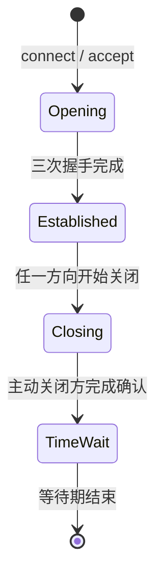

### 2.3 服务器先监听

建立连接前，服务器进程要在本地地址与端口上创建监听 socket。监听表示操作系统愿意接收发往该端口的连接请求；它不是一条与具体客户端通信的数据连接。

客户端发起连接后，服务器内核完成握手并创建对应的已连接 socket，应用再通过 `accept` 取得它。于是常见服务器同时存在：

- 一个监听 socket，负责接收新的连接；
- 多个已连接 socket，分别对应具体客户端。

监听队列也有容量。若连接请求到达速度超过服务器接受和处理速度，队列可能填满，客户端会超时或失败。这说明 TCP 建连本身也需要容量管理。

### 2.4 三次握手逐步推导

原书图 2.1 给出三次握手。设客户端选择初始序号 $x$，服务器选择初始序号 $y$：

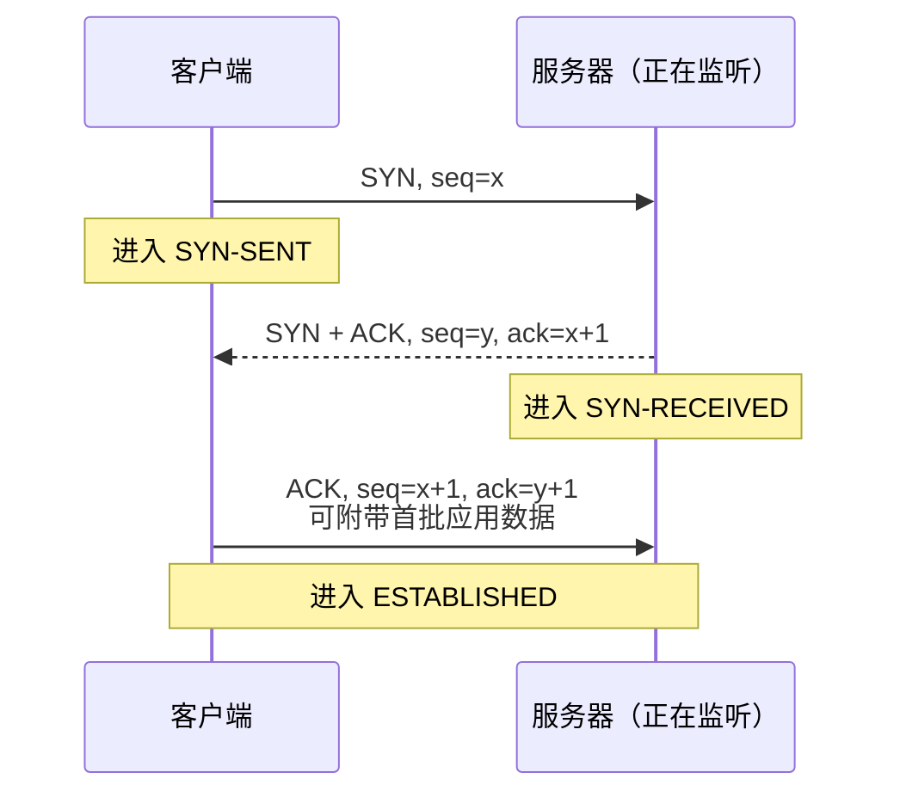

#### 第一次：客户端提出自己的起点

客户端随机选择初始序号 $x$，发送 `SYN`。它表达两件事：

- 我希望建立连接；
- 我发送方向的序号空间从 $x$ 开始。

`SYN` 本身消耗一个序号，所以服务器期望客户端后续从 $x+1$ 开始发送数据。

#### 第二次：服务器确认客户端，并提出自己的起点

服务器返回 `SYN/ACK`：

- `ack=x+1` 表示客户端的 `SYN` 已收到；
- `seq=y` 给出服务器发送方向的初始序号。

TCP 是全双工的，两个方向各有独立序号空间，所以服务器也必须提出自己的起点。

#### 第三次：客户端确认服务器

客户端回复 `ACK`，其中 `ack=y+1` 表示服务器的 `SYN` 已收到。至此双方都知道自己的初始序号已被对方接收，可以建立双向状态。原章指出，这个 ACK 可以携带首批应用数据。

### 2.5 为什么不是两次握手

两次消息只能让客户端知道“服务器收到了客户端的 SYN 并回复”，却不能让服务器知道“客户端收到了服务器的初始序号”。第三次 ACK 补上这份知识。

此外，网络中可能存在延迟很久的旧 SYN。通过双方选择新初始序号并互相确认，TCP 能降低旧段被误认为当前连接数据的风险。三次握手的本质不是仪式，而是 **同步两个方向的序号空间并验证双向通信能力**。

### 2.6 建连冷启动成本

三次握手在应用数据传输前引入一次完整 RTT：

$$
T_{handshake} \approx RTT
$$

在这一阶段，连接还不能像稳定状态那样传输应用数据，因此原书说建连前的应用带宽本质上为零。RTT 越短，建立连接越快；把服务器部署在更靠近客户端的地方，可以直接降低冷启动成本。

假设客户端到服务器单程传播与处理延迟近似对称：

| 场景 | RTT | 仅 TCP 握手的最低等待 |
| --- | ---: | ---: |
| 同城或同区域 | 10 ms | 约 10 ms |
| 跨洲 | 150 ms | 约 150 ms |
| 两次独立短连接 | 150 ms | 仅握手累计约 300 ms |

真实请求还要支付 DNS、TLS、应用处理和响应传输等成本。TCP 握手只是其中一部分，但短请求中固定 RTT 成本占比可能很高。

### 2.7 为什么要复用连接

数据传完后，TCP 可以关闭连接并释放资源。但若不久后还会继续通信，保持连接通常更合算，因为可以避免：

- 再次支付三次握手的 RTT；
- 再次分配 socket、缓冲区和内核状态；
- 让拥塞控制从较小窗口重新探测路径容量；
- 上层安全协议重新握手。

连接池会维护一组可复用连接：调用者借出连接、完成操作后归还，而不是每个请求都新建连接。

连接池不是越大越好。每条连接都会占用文件描述符、内存、端口和服务端资源；空闲过久还可能被防火墙、负载均衡器或服务端关闭。池需要设置最大连接数、空闲超时、健康检查和借用等待策略。

### 2.8 关闭为什么不是一次动作

TCP 是全双工字节流，两个发送方向可以独立关闭。一方发送 `FIN` 表示“我不会再发送新字节”，对方确认后仍可能继续发送剩余数据；另一方向也要单独发送 `FIN` 并得到确认。

常见的四段关闭过程是：

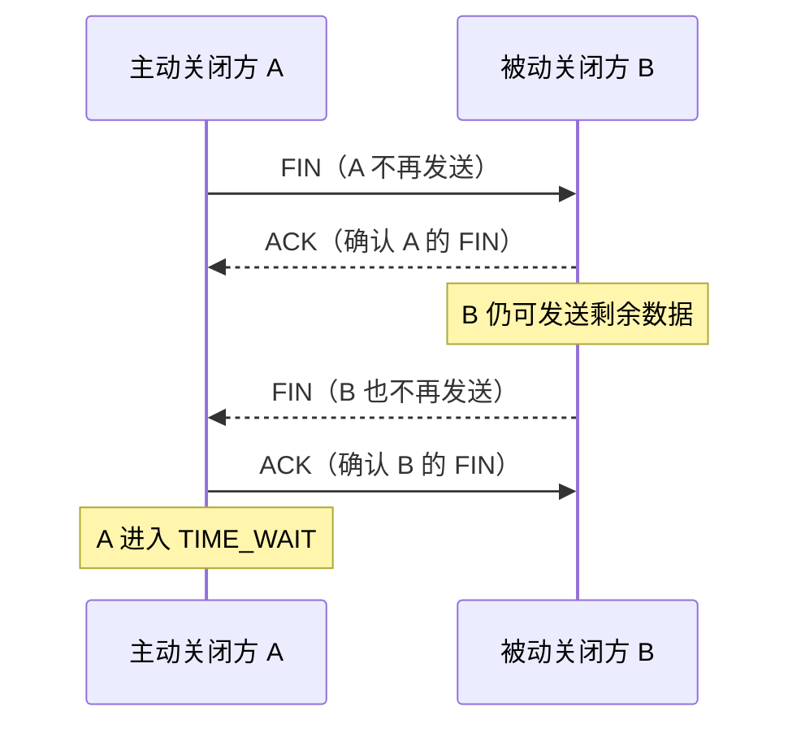

某些报文可以合并，所以抓包中不一定总是恰好四个独立段。关键是两个方向的关闭意图和确认都要表达，这也是关闭会涉及多个单程传输乃至多个 RTT 的原因。

### 2.9 TIME_WAIT 为什么存在

主动关闭连接的一端在发送最后 ACK 后，不会立即删除所有连接状态，而会进入 `TIME_WAIT`。原章强调它通常持续数分钟，并在等待期间丢弃属于旧连接的延迟段。

它解决两个问题：

1. **隔离旧段**：让网络中迟到的旧数据在同一四元组被新连接复用前过期，避免旧字节混入新连接；
2. **允许重发最终 ACK**：若最后 ACK 丢失，对端会重传 FIN，主动关闭方仍有状态可以再次确认。

等待时间通常与最大报文生存期假设有关，具体数值由操作系统实现决定。不能仅因为看到大量 `TIME_WAIT` 就认定存在泄漏；它是协议正确性的一部分。真正要判断的是数量是否与连接创建速率匹配，以及是否耗尽了端口或内核资源。

### 2.10 高频建连如何导致资源耗尽

若进程持续快速创建并关闭连接，处于 `TIME_WAIT` 的连接状态会累积。一个简化估算是：

$$
N_{TIME\_WAIT} \approx \lambda_{close} \cdot T_{wait}
$$

其中：

- $\lambda_{close}$ 是每秒主动关闭的连接数；
- $T_{wait}$ 是等待状态持续秒数。

例如，每秒主动关闭 1,000 条连接，等待 60 秒，稳态下可能有约 60,000 条 `TIME_WAIT` 状态。它们会占用四元组空间和内核记录；客户端还可能耗尽可用临时端口，从而使新连接失败。

这个关系与 Little 定律同源：系统内平均对象数约等于到达率乘以平均停留时间。解决思路不是盲目缩短协议等待，而是优先减少连接抖动、复用连接、合理设计连接池，并检查究竟耗尽了端口、文件描述符、监听队列还是服务端容量。

### 2.11 生命周期常见误区

**socket 不等于 TCP 连接。** socket 是操作系统提供的通信端点抽象；监听 socket 不对应一个特定客户端连接，UDP socket 也没有 TCP 式连接状态。

**`close` 返回不等于内核立刻删除连接记录。** 主动关闭方可能继续处于 `TIME_WAIT`。

**三次握手成功不等于应用健康。** 它只说明传输层端点建立了状态；服务器业务线程、数据库或依赖服务仍可能不可用。

**长连接不等于永不关闭。** 长连接需要空闲超时、失效检测、最大寿命和优雅重连。

**大量 `TIME_WAIT` 不必然是故障。** 它首先说明连接关闭频繁；是否有害取决于端口、内存和连接建立需求。

## 3. Flow control：流量控制

### 3.1 为什么可靠传输仍可能压垮接收方

即使网络不丢包，发送应用和接收应用的处理速度也可能不同。发送方可能每秒产生 100 MB 数据，而接收应用每秒只读取 20 MB。若发送方无限制地继续发送，接收端内存最终会耗尽。

接收端 TCP 因此维护 **接收缓冲区（receive buffer）**：网络到达、已经由 TCP 接收，但还没有被目标应用读取的数据暂存在这里。


若应用读取慢，缓冲区占用上升；若应用读取快，空间被及时释放。TCP 需要把这个本地状态反馈给远端发送方。

### 3.2 接收窗口如何计算

接收方在 ACK 首部中通告 **接收窗口（receive window，`rwnd`）**，表示当前还能接收多少数据。可用一个简化关系表示：

$$
rwnd = B_{receive} - B_{unread}
$$

其中：

- $B_{receive}$ 是接收缓冲区总容量；
- $B_{unread}$ 是已经到达但尚未被应用读取的数据量。

发送方必须约束未确认在途数据：

$$
Bytes_{inflight} \le rwnd
$$

窗口是动态值。应用每读取一些数据，缓冲区空闲空间增加；新段到达时，空闲空间减少。接收方通过后续 ACK 持续通告变化。

### 3.3 一个数值例子

假设接收缓冲区为 64 KiB：

1. 初始未读数据为 0，接收方通告 $rwnd=64$ KiB；
2. 发送方传来 40 KiB，应用尚未读取，剩余窗口为 24 KiB；
3. 发送方最多再放入 24 KiB，不能因为自己还有数据就无限发送；
4. 应用读取 32 KiB 后，未读数据从 64 KiB 降到 32 KiB；
5. 接收方可以重新通告 32 KiB 窗口，发送方恢复发送。

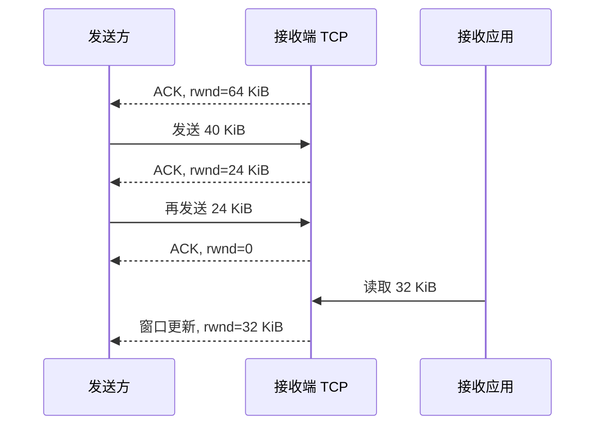

当窗口变为 0，发送方暂停普通数据发送。实际 TCP 会使用窗口探测等机制，避免“接收方窗口已经恢复，但窗口更新消息丢失”导致双方永久等待。

### 3.4 滑动窗口的直觉

发送方不必每发一个段就停下来等待 ACK，而可以在窗口允许范围内连续发送多个段。随着较早字节被确认，窗口左边界向前移动，发送方获得发送新字节的额度，所以称为 **滑动窗口**。

```text
字节序号方向 ------------------------------------------------------>

[ 已确认 ][ 已发送未确认 ][ 可立即发送 ][ 暂时不可发送 ]
          ^              ^            ^
       窗口左边界      当前发送点    窗口右边界

ACK 推进后，整个允许发送区间向右滑动。
```

若采用“发一个、等一个”的停等协议，每个 RTT 只能发送一个段，长距离链路会大量空闲。滑动窗口允许多个段同时在途，既保持反馈控制，又提高链路利用率。

### 3.5 流量控制保护的是谁

流量控制的直接目标是 **接收方**：发送速率不能长期超过接收 TCP 缓冲区和接收应用的消费能力。它不直接判断中间路由器是否拥塞。

原书把它类比为服务级限流：两者都通过额度阻止过量工作进入受保护对象。但二者并不相同：

| TCP 流量控制 | 服务级限流 |
| --- | --- |
| 保护单条连接的接收缓冲区 | 保护整个服务、租户或业务资源 |
| 额度通常以字节窗口表示 | 额度可按请求数、成本、用户或 API key 表示 |
| 通过缩小窗口形成背压 | 常通过拒绝、排队或降级处理 |
| 不理解请求业务成本 | 可以区分不同操作的权重 |

TCP 窗口充足不代表服务有能力处理请求。例如，服务器内核可以迅速收下大量小请求，但业务线程池或数据库已经饱和。因此，传输层流量控制不能取代应用层并发限制与准入控制。

### 3.6 流量控制常见误区

**接收缓冲区越大不一定越好。** 大缓冲区可以吸收短时突发，却也可能让更多旧数据排队，增加内存占用和延迟。

**ACK 不只确认可靠性信息。** ACK 首部还携带窗口通告，是接收端向发送端反馈容量的重要通道。

**`rwnd=0` 不表示连接断开。** 它表示接收端暂时没有缓冲空间；应用读取后可以重新开放窗口。

**流量控制不是拥塞控制。** 接收端很快时，网络中间仍可能拥塞；接收端很慢时，网络也可能完全空闲。

## 4. Congestion control：拥塞控制

### 4.1 为什么还要保护网络

接收方有足够缓冲区，不代表发送路径有足够容量。多个连接会共享路由器队列和链路带宽；若总发送量超过瓶颈链路的处理能力，队列会增长，随后出现高延迟和丢包。

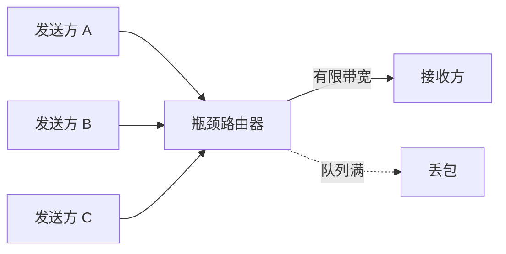

若各发送方看到丢包后只是不加控制地重传，额外流量会让拥塞更严重。TCP 因此需要推测路径当前能承受多少在途数据，并根据反馈主动调整。

### 4.2 拥塞窗口是什么

发送端维护 **拥塞窗口（congestion window，`cwnd`）**，限制尚未得到 ACK 的在途数据量。窗口越小，每个 RTT 内能发送的数据越少；窗口越大，越能利用高带宽链路，但也越可能压满网络队列。

实际允许发送的数据同时受接收端与网络约束：

$$
SendWindow = \min(rwnd, cwnd)
$$

$$
Bytes_{inflight} \le SendWindow
$$

这两个窗口回答不同问题：

- `rwnd`：接收端还能装下多少；
- `cwnd`：网络路径当前估计还能承受多少。

取最小值意味着任何一侧成为瓶颈，都必须减慢发送。

### 4.3 新连接为什么不能立即跑满带宽

新连接刚建立时，发送方不知道路径容量，也不知道与多少流量竞争。若一开始就以任意高速度发送，可能瞬间压垮路由器。因此，TCP 从一个受控的初始拥塞窗口开始，用收到 ACK 作为“这些数据成功穿过网络”的反馈，逐步扩大窗口。

这是一种 **探测（probing）**：

1. 先发送少量数据；
2. 若 ACK 正常返回，说明当前速率至少可行；
3. 增加在途数据，继续探测更高容量；
4. 一旦出现拥塞信号，降低窗口。

没有中心控制器告诉每个 TCP 连接可用带宽。各连接只能根据 ACK、延迟和丢包等局部观测自行调节。

### 4.4 慢启动为何呈指数增长

原章说，每个段得到确认时窗口增长，因而窗口会指数扩大直至上限。更准确的经典慢启动直觉是：每确认一批新字节，`cwnd` 增加相应额度，所以一个窗口的数据在一个 RTT 内全部被确认后，窗口大约翻倍。

若初始窗口为 10 个最大报文段（MSS），理想情况下各轮约为：

| RTT 轮次 | 本轮开始时 `cwnd` | 本轮最多在途规模 |
| ---: | ---: | ---: |
| 0 | 10 MSS | 10 MSS |
| 1 | 20 MSS | 20 MSS |
| 2 | 40 MSS | 40 MSS |
| 3 | 80 MSS | 80 MSS |
| 4 | 160 MSS | 160 MSS |

近似关系为：

$$
cwnd_k \approx cwnd_0 \cdot 2^k
$$

这里 $k$ 是完成的 RTT 轮次。它不是说每收到一个 ACK 就让整个窗口翻倍，而是 ACK 驱动的增量在一轮内累计后使窗口近似翻倍。

“慢启动”名称容易误导：它的增长其实很快，只是相对“立即发送任意多数据”更保守。窗口达到慢启动阈值后，TCP 通常转入增长更谨慎的拥塞避免阶段；若由 RTO 超时检测到严重拥塞，经典 TCP 会大幅降低 `cwnd` 并重新慢启动，而快速重传/快速恢复后的路径通常进入拥塞避免。具体转换取决于 TCP 变体。

### 4.5 RTT 为什么影响爬升速度

窗口增长依赖 ACK，ACK 至少经过一个 RTT 才反馈回来。因此，相同初始窗口和算法下，RTT 越短，单位时间内可完成的反馈轮次越多，窗口越快增长。

假设都需要 6 轮 RTT 才达到足够窗口：

| 路径 | RTT | 6 轮反馈需要的时间 |
| --- | ---: | ---: |
| 近距离 | 10 ms | 60 ms |
| 跨地域 | 100 ms | 600 ms |
| 更远路径 | 200 ms | 1.2 s |

这就是原书图 2.4 的含义：两条连接按 RTT 轮次可能采用相似增长轨迹，但短 RTT 连接在墙钟时间内更快获得反馈，更早利用路径带宽。

短连接尤其受影响。若传输在窗口尚未增长到路径容量前就结束，它始终没有机会达到稳定高速。这再次解释了连接复用和就近部署的价值。

### 4.6 丢包为何被视为拥塞信号

传统 TCP 把丢包视为网络队列溢出的信号。当发送方因超时发现 ACK 缺失时，会减小拥塞窗口，降低在途数据量。之后，若数据继续成功传输，窗口再逐步增长；再次出现拥塞信号时又下降。

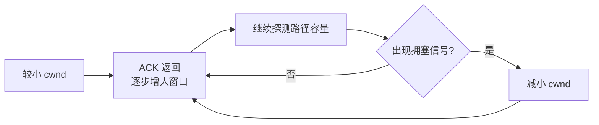

这种反馈循环在两种目标之间折中：

- 太保守会浪费带宽；
- 太激进会造成高延迟、丢包和拥塞崩溃。

原章用超时说明丢包检测。实际 TCP 还可能根据重复 ACK、选择性确认或显式拥塞通知更早响应，不必总等到重传超时。不同拥塞控制算法的窗口增长和下降规则也不同，例如原书脚注提到 CUBIC；因此，不应把单一“加多少、减多少”的曲线当作所有 TCP 实现。

### 4.7 理论吞吐上限的推导

设拥塞窗口允许最多 $WinSize$ 字节未确认数据。发送方发满窗口后，至少要等待约一个 RTT 才能收到确认并继续推进窗口。因此，在理想稳定状态下：

$$
Throughput_{window} \le \frac{WinSize}{RTT}
$$

单位检查很重要：

$$
\frac{\mathrm{bytes}}{\mathrm{seconds}} = \mathrm{bytes/second}
$$

原书把它写作 `Bandwidth = WinSize / RTT`，用意是说明窗口与时延共同限制可实现吞吐量。更完整的上界还要考虑接收窗口和路径瓶颈带宽 $C_{path}$：

$$
Throughput \le \min\left(
\frac{cwnd}{RTT},
\frac{rwnd}{RTT},
C_{path}
\right)
$$

这只是上界模型，未扣除首部、重传、应用停顿、ACK 策略和协议实现等开销。

### 4.8 数值例子：同一窗口在不同 RTT 下

假设有效窗口为 64 KiB，即 65,536 字节。

当 RTT 为 10 ms：

$$
Throughput \le \frac{65536}{0.01}
= 6{,}553{,}600\ \mathrm{B/s}
\approx 52.4\ \mathrm{Mbit/s}
$$

当 RTT 为 100 ms：

$$
Throughput \le \frac{65536}{0.1}
= 655{,}360\ \mathrm{B/s}
\approx 5.24\ \mathrm{Mbit/s}
$$

窗口完全相同，RTT 增大 10 倍，窗口约束下的理论吞吐下降为原来的十分之一。TCP 可以尝试增大窗口补偿，却不能让传播时延消失。

### 4.9 带宽时延积：要填满链路需要多少在途数据

把原书公式变形：

$$
WinSize \ge Bandwidth \cdot RTT
$$

右侧称为 **带宽时延积（bandwidth-delay product，BDP）**。它表示当第一批字节到达接收端、ACK 尚未返回时，整条路径上可以容纳多少在途数据。若窗口小于 BDP，发送方会在链路还有容量时因等 ACK 而停下来。

#### 例一：100 Mbit/s，RTT 20 ms

$$
BDP = 100 \times 10^6\ \mathrm{bit/s} \times 0.02\ \mathrm{s}
= 2 \times 10^6\ \mathrm{bit}
= 250{,}000\ \mathrm{B}
$$

约需 250 KB 在途数据才能填满管道。

#### 例二：100 Mbit/s，RTT 200 ms

$$
BDP = 100 \times 10^6 \times 0.2
= 20 \times 10^6\ \mathrm{bit}
= 2.5\ \mathrm{MB}
$$

带宽相同，RTT 增大 10 倍，所需窗口也增大 10 倍。长肥网络（高带宽、高 RTT）因此需要更大的窗口和更合适的拥塞控制算法。

### 4.10 地理位置为什么同时影响建连和稳态吞吐

把服务器放近客户端有两类收益：

1. **连接冷启动更快**：三次握手的一次 RTT 更短；
2. **拥塞窗口增长更快**：同样时间内能完成更多 ACK 反馈轮次，窗口约束下的吞吐也更高。

这不是说低 RTT 自动增加物理链路带宽，而是它减少了反馈循环的等待时间，让 TCP 更快、更充分地利用已有带宽。

### 4.11 流量控制与拥塞控制辨析

| 维度 | 流量控制 | 拥塞控制 |
| --- | --- | --- |
| 保护对象 | 接收端缓冲区和应用 | 中间网络路径 |
| 主要状态 | `rwnd` | `cwnd` |
| 状态由谁维护/通告 | 接收端通告，发送端遵守 | 发送端根据网络反馈估计 |
| 典型信号 | 接收缓冲区可用空间 | ACK、丢包、超时、延迟或显式拥塞信号 |
| 变慢的原因 | 接收应用消费不过来 | 路径容量不足或竞争加剧 |
| 最终发送限制 | 与 `cwnd` 取最小值 | 与 `rwnd` 取最小值 |

一个连接可能同时受两者限制。诊断“TCP 为什么慢”时，必须区分是接收窗口小、拥塞窗口小、RTT 大、路径带宽低，还是应用根本没有持续提供数据。

### 4.12 拥塞控制常见误区

**丢包不一定来自拥塞。** 无线干扰、硬件故障也可能丢包；传统 TCP 仍可能把它当作拥塞而降速。

**更大的窗口不一定带来更低延迟。** 过多在途数据会填满路由器队列，形成排队延迟。

**带宽与延迟不是同一指标。** 高带宽链路仍可能有很高 RTT；大文件传输和交互式请求对二者的敏感性不同。

**`cwnd` 不是接收方通告的。** 它是发送端为适应网络而维护的估计；接收方通告的是 `rwnd`。

**TCP 公平不是绝对相等。** 不同 RTT、拥塞算法、连接数和路径会影响各流获得的份额。

**吞吐上限公式不是性能保证。** 它只说明窗口与 RTT 构成的约束，真实吞吐通常更低。

## 5. Custom protocols：自定义协议

### 5.1 TCP 的保证为什么有成本

TCP 的可靠性和稳定性并非免费：

- 建立连接需要握手；
- 丢失数据必须等待检测并重传；
- 按序字节流会让后到数据等待前面的缺口；
- 流量和拥塞控制会主动限制发送速率；
- 双方需要维护连接、缓冲区和计时器状态。

对文件、数据库事务、网页文档等“每个字节都重要”的负载，这些成本通常值得。但有些实时应用更看重 **新鲜度**，旧数据即使最终完整到达也已经没有价值。此时，TCP 固定提供的保证可能与业务目标不匹配。

### 5.2 UDP 提供什么

UDP（User Datagram Protocol）是无连接的传输层协议。它不向应用提供连续字节流，而是保留离散 **数据报（datagram）** 的边界。

| 特性 | TCP | UDP |
| --- | --- | --- |
| 抽象 | 有序字节流 | 独立数据报 |
| 建连 | 需要连接状态与握手 | 无 TCP 式连接握手 |
| 消息边界 | 不保留应用写入边界 | 每个数据报有独立边界 |
| 序号与 ACK | 协议内置 | 不内置 |
| 丢失重传 | 内置 | 不内置 |
| 有序交付 | 内置 | 不保证 |
| 重复消除 | 内置 | 不保证 |
| 流量控制 | 内置 | 不内置 |
| 拥塞控制 | 内置 | 不内置 |
| 典型取舍 | 完整、有序、稳定 | 轻量、低等待、由应用选择保证 |

UDP 不是“完全没有首部或校验”，而是没有 TCP 的连接、可靠性、流量控制和拥塞控制抽象。数据报仍受 IP 包大小与路径 MTU 约束；数据报过大可能导致 IP 分片，而任一分片丢失都会使整个数据报无法重组。因此，使用 UDP 的应用通常控制数据报大小。

### 5.3 为什么 UDP 适合自定义协议

UDP 提供最小的进程到进程数据报传输能力，应用可以在其上只增加自己真正需要的机制：

- 为关键控制消息增加序号、ACK 和有限重传；
- 对实时状态快照允许丢失，不做重传；
- 只保证同一逻辑流内部有序，而不让一个流阻塞其他流；
- 自行实现拥塞控制、加密、连接迁移等能力。

这不是绕过复杂度，而是把“固定的一组 TCP 语义”改成“按业务组合语义”。代价是协议设计者必须自己证明正确性、公平性和安全性。

原书提示 HTTP/3 建立在 UDP 之上。准确地说，HTTP/3 使用基于 UDP 的 QUIC；QUIC 并没有放弃可靠性和拥塞控制，而是在 UDP 之上提供这些能力。一个流发生丢包时，未受该丢包影响的其他流可以继续推进，但各流仍共享连接级拥塞控制，同一个丢失包也可能携带多个流的数据。这正是“UDP 用作自定义传输协议基底”的例子，而不是“HTTP/3 不可靠”。

### 5.4 多人游戏案例：新鲜度胜过补齐历史

原章给出的场景是实时多人游戏：

1. 客户端每秒多次采样手柄输入并发送给服务器；
2. 服务器维护全局游戏状态；
3. 服务器每秒多次采样全局状态，把快照发送给客户端；
4. 某个快照若丢失，下一份更新快照很快就会到来；
5. 等待并重传旧快照可能让客户端看到过时状态，反而破坏体验。

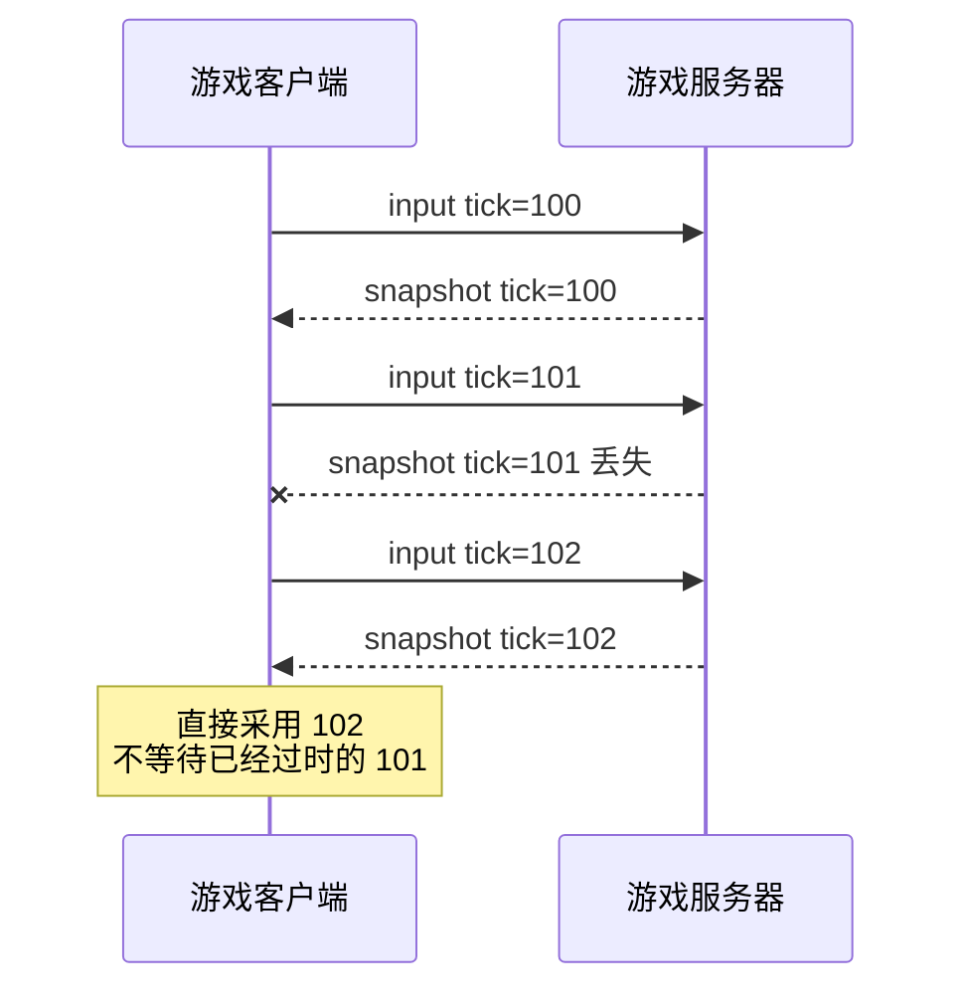

TCP 若发现包含 tick 101 的字节缺失，会先恢复该缺口，后面的 tick 102 即使已经到达接收内核，也不能越过缺口交给同一字节流的应用。这种现象称为队头阻塞（head-of-line blocking）。对于“最新状态覆盖旧状态”的数据，完整按序交付的收益可能小于等待成本。

### 5.5 UDP 不保证有序，应用如何只接收最新快照

UDP 本身没有序号，但自定义游戏协议可以在每个数据报中携带逻辑 tick：

```text
+---------+---------+-------------+-------------------+
| version | type    | tick/seq    | snapshot payload  |
+---------+---------+-------------+-------------------+
```

客户端记录最近接受的 tick：

```text
latest_tick = 尚未设置

收到 snapshot(tick, payload)：
  若格式、版本或长度无效：丢弃
  若 latest_tick 已设置且 tick <= latest_tick：丢弃过时或重复快照
  否则：
    latest_tick = tick
    用 payload 更新显示状态
```

这个算法主动选择语义：允许丢失、允许网络乱序，但不允许旧快照覆盖新状态。它没有把 UDP 变成完整可靠流，只增加了业务真正需要的“新旧判断”。

### 5.6 标准 C 示例：过滤乱序和重复快照

下面的程序模拟 UDP 数据报按 `100, 102, 101, 102, 104, 103` 的顺序到达。`tick` 由应用协议提供；接收方只应用比当前状态更新的快照。

```c
#include <stdbool.h>
#include <inttypes.h>
#include <stdint.h>
#include <stdio.h>

typedef struct {
    uint32_t tick;
    int player_x;
    int player_y;
} Snapshot;

typedef struct {
    bool initialized;
    uint32_t latest_tick;
    int player_x;
    int player_y;
} GameView;

static bool apply_if_newer(GameView *view, const Snapshot *snapshot) {
    if (view->initialized && snapshot->tick <= view->latest_tick) {
        return false;
    }

    view->initialized = true;
    view->latest_tick = snapshot->tick;
    view->player_x = snapshot->player_x;
    view->player_y = snapshot->player_y;
    return true;
}

int main(void) {
    const Snapshot arrivals[] = {
        {100, 10, 20},
        {102, 12, 21},
        {101, 11, 20},
        {102, 12, 21},
        {104, 15, 23},
        {103, 14, 22},
    };
    const size_t count = sizeof arrivals / sizeof arrivals[0];
    GameView view = {0};

    for (size_t index = 0; index < count; ++index) {
        const Snapshot *snapshot = &arrivals[index];
        const bool applied = apply_if_newer(&view, snapshot);
        printf("tick=%" PRIu32 ": %s\n",
               snapshot->tick,
               applied ? "applied" : "discarded as stale/duplicate");
    }

    printf("final tick=%" PRIu32 " position=(%d, %d)\n",
           view.latest_tick,
           view.player_x,
           view.player_y);
    return 0;
}
```

预期输出：

```text
tick=100: applied
tick=102: applied
tick=101: discarded as stale/duplicate
tick=102: discarded as stale/duplicate
tick=104: applied
tick=103: discarded as stale/duplicate
final tick=104 position=(15, 23)
```

代码与原理的对应关系：

- `tick` 是 TCP 不会替 UDP 提供的应用层序号；
- `latest_tick` 是接收端保存的最小状态；
- `apply_if_newer` 不请求补发旧状态，而是实现“新快照覆盖旧快照”；
- 丢弃 101 和 103 不是网络错误恢复失败，而是协议主动选择；
- 重复的 102 被去重，避免旧数据再次生效。

这个示例为突出思想，假设 32 位 tick 在运行期间不回绕，也省略了字节序、序列化、身份认证和包长校验。真实协议不能直接发送 C 结构体，因为结构体可能包含填充，整数还涉及网络字节序；应显式定义线上格式并逐字段编码。

### 5.7 不是所有游戏数据都应“不可靠”

同一应用内的数据价值不同：

| 数据 | 可能采用的语义 | 原因 |
| --- | --- | --- |
| 高频位置快照 | 可丢失、只取最新 | 旧值很快过期 |
| 手柄方向输入 | 可带 tick，有限冗余 | 新输入可能覆盖旧方向，但短时丢失会影响操控 |
| 玩家购买道具 | 可靠、去重、持久化 | 丢失或重复会破坏资产正确性 |
| 聊天消息 | 通常可靠、有序 | 用户期望完整可读 |
| 加入/退出房间 | 可靠或可重试状态同步 | 影响会话成员关系 |

“游戏用 UDP”不是统一答案。成熟协议经常在同一连接或会话中提供多个通道，为不同消息选择可靠有序、可靠无序或不可靠最新值等语义。

### 5.8 放弃 TCP 后必须重新承担什么

UDP 不实现流量和拥塞控制，不代表应用可以无限发包。自定义协议至少要考虑：

1. **消息格式**：版本、类型、长度、序号和校验规则；
2. **乱序与重复**：哪些数据丢弃，哪些需要缓冲；
3. **丢失策略**：忽略、冗余发送、ACK 重传还是状态重同步；
4. **拥塞控制**：怎样根据丢包、延迟或显式反馈降速，避免伤害共享网络；
5. **接收端保护**：怎样限制包速率、内存和每个客户端的资源；
6. **安全**：怎样认证对端、防篡改、防重放和加密；
7. **MTU 与分片**：怎样控制数据报大小；
8. **NAT 与连接迁移**：地址变化时怎样维持逻辑会话；
9. **可观测性**：怎样测量 RTT、丢包、乱序、抖动和有效更新率。

实现一个既高性能又对互联网公平的传输协议非常困难。若需求可以由 TCP、QUIC 或成熟实时传输库满足，应优先使用经过验证的实现，而不是把 UDP 的简洁 API 误认为协议设计也简单。

### 5.9 TCP 与 UDP 的选择方法

不要从“哪个协议更快”开始，而应先问数据的语义：

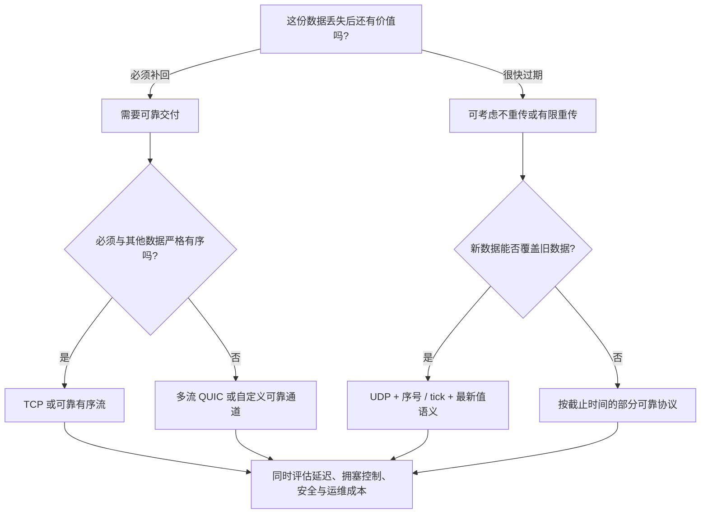

选择依据包括：

- 完整性是否比新鲜度重要；
- 是否需要全局顺序，还是只需每个逻辑流有序；
- 数据过期时间与 RTT、重传时间相比如何；
- 是否有成熟协议和库；
- 团队能否正确实现拥塞控制和安全；
- 网络设备、代理和防火墙是否允许该协议通过。

### 5.10 自定义协议常见误区

**UDP 不等于低延迟保证。** 它减少了 TCP 强制的等待机制，但网络排队、应用处理和自定义协议仍会产生延迟。

**UDP 不等于一定比 TCP 快。** 对必须可靠传输的数据，自行实现的重传与拥塞控制可能不如成熟 TCP。

**无连接不等于无状态。** UDP 内核不维护 TCP 式连接，应用协议仍可能维护会话、密钥、序号和路径状态。

**不重传不等于不处理乱序和重复。** 游戏快照仍需要 tick，防止旧状态覆盖新状态。

**没有内置拥塞控制不等于不需要拥塞控制。** 缺少控制会造成不公平、丢包和网络拥塞。

**UDP 保留数据报边界不等于可以无限大。** 数据报受到协议长度和路径 MTU 约束，大包分片会放大丢包影响。

**HTTP/3 基于 UDP 不等于 HTTP/3 放弃可靠性。** QUIC 在 UDP 之上重新实现可靠性、安全和拥塞控制，并改变多流之间的阻塞关系。

## 6. 五类机制如何共同工作

### 6.1 一次 TCP 发送的完整控制链

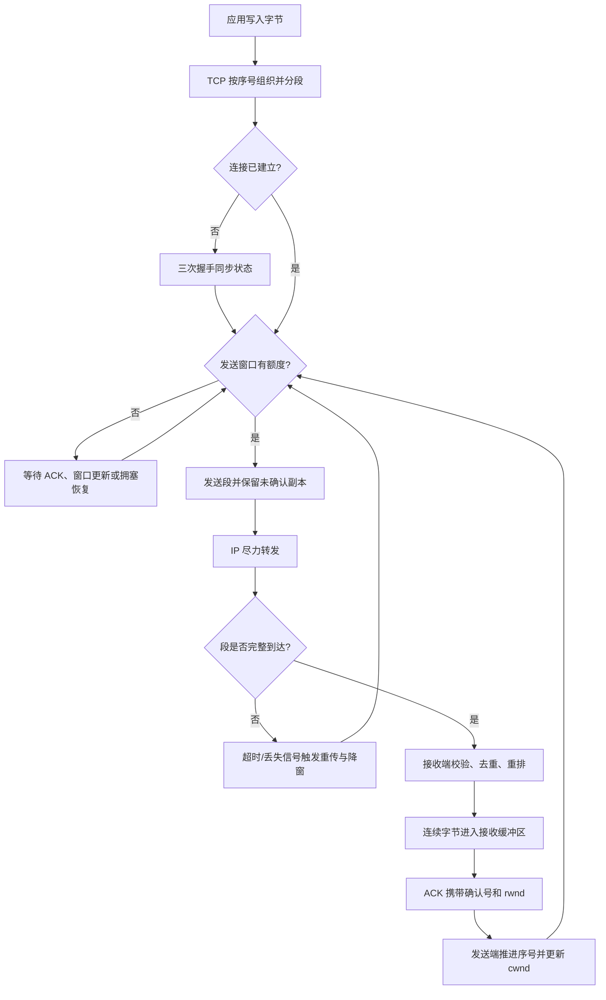

这条链中每个机制解决不同的不确定性：

- 序号解决“这是哪一段数据”；
- ACK 解决“接收方知道了什么”；
- 定时器解决“多久没反馈就采取恢复动作”；
- 校验和解决“到达的数据是否出现可检测损坏”；
- `rwnd` 解决“接收方还能承受多少”；
- `cwnd` 解决“网络当前大概还能承受多少”；
- 连接状态机解决“这些序号和反馈属于哪次会话”。

### 6.2 可靠抽象的代价结构

| 机制 | 获得的性质 | 主要代价 |
| --- | --- | --- |
| 分段与序号 | 检测缺口、重复和乱序 | 首部、状态和重组缓冲区 |
| ACK 与重传 | 从丢包中恢复 | 反向流量、等待和重复传输 |
| 校验和 | 检测常见损坏 | 计算开销，且非密码学保证 |
| 三次握手 | 同步双向连接状态 | 建连至少一个 RTT |
| TIME_WAIT | 隔离旧段并完成可靠关闭 | 临时占用连接标识与内核状态 |
| 接收窗口 | 防止压垮接收方 | 发送可能暂停 |
| 拥塞窗口 | 防止压垮网络 | 新连接不能立即利用全部带宽 |
| 按序交付 | 应用看到无缺口字节流 | 前段丢失会阻塞后续数据交付 |

可以把这些代价理解为 TCP 保证的价格。只有知道业务真正需要哪些性质，才能判断价格是否值得。

## 7. 关键概念辨析

### 7.1 段、包、数据报与字节流

| 术语 | 所在层次或语境 | 核心含义 |
| --- | --- | --- |
| 字节流 | TCP 向应用提供的抽象 | 连续有序字节，没有内建消息边界 |
| TCP 段 | TCP 传输单位 | TCP 首部加一段字节流数据 |
| IP 包/数据报 | IP 传输单位 | IP 首部加上层负载，路由器逐包转发 |
| UDP 数据报 | UDP 向应用提供的单位 | 保留边界的独立消息，不保证送达和顺序 |

日常表达常把它们统称“包”，但分析问题时必须知道边界属于哪一层。

### 7.2 可靠传输与恰好一次处理

TCP 的去重单位是连接字节流位置。应用重新连接并重发请求时，会形成新的字节序号空间，TCP 无法知道两个请求代表同一个业务操作。

因此：

```text
TCP 无重复字节交付
    不推出
业务操作恰好执行一次
```

后者需要请求 ID、幂等键、事务和结果缓存等应用机制。

### 7.3 背压、流量控制与限流

- **背压**是下游容量不足向上游传播“慢下来”的一般思想；
- **TCP 流量控制**用 `rwnd` 在单连接字节层实现背压；
- **限流**通常在服务入口按请求、身份或成本执行准入策略。

它们可以组合，不能互相替代。

### 7.4 连接超时、读取超时与重传超时

- 连接超时限制建立 TCP 连接等待多久；
- 读取超时限制应用等待响应数据多久；
- TCP 重传超时由内核用于判断未确认数据何时重传。

应用读取超时不代表 TCP 已放弃连接，TCP 重传也不代表业务请求应该无限等待。不同层次需要各自的截止时间和恢复策略。

### 7.5 延迟、RTT、带宽与吞吐量

- **单程延迟**：数据从一端到另一端所需时间；
- **RTT**：一次往返所需时间；
- **带宽**：链路理论传输容量；
- **吞吐量**：实际单位时间交付的数据量。

原书公式揭示的是窗口化协议中 RTT 对吞吐量的约束，不是把延迟与物理带宽定义成同一件事。

## 8. 本章知识结构

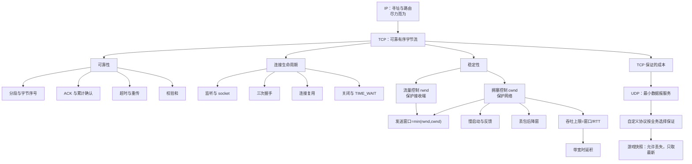

## 9. 核心结论

1. **IP 解决寻址和路由，但只提供尽力而为交付。** 包可能丢失、重复、乱序或损坏。
2. **TCP 在不可靠 IP 上构造可靠、有序、无重复的字节流。** 可靠性来自序号、确认、定时器、重传、去重、重排和校验，而不是底层网络突然可靠。
3. **TCP 可靠的是字节流，不是业务操作。** ACK 不证明远端应用已处理或持久化数据，应用重试仍要处理幂等性。
4. **三次握手同步两个方向的初始序号并确认双向通信。** 代价是应用传输前至少增加约一个 RTT。
5. **连接复用可以摊薄握手、状态分配和拥塞窗口冷启动成本。** 但连接池必须有容量、寿命和失效管理。
6. **TIME_WAIT 是正确性机制，不是天然故障。** 它隔离旧连接迟到段，并允许最终 ACK 丢失后再次确认；高频短连接可能因此消耗端口和内核状态。
7. **流量控制与拥塞控制保护不同对象。** `rwnd` 保护接收方，`cwnd` 保护网络，实际发送窗口取二者最小值。
8. **拥塞窗口通过反馈探测路径容量。** 新连接不能立即跑满链路；短 RTT 能更快完成反馈轮次。
9. **窗口与 RTT 共同限制理论吞吐。** $Throughput \le WinSize/RTT$；要填满路径，窗口至少应接近带宽时延积。
10. **TCP 的保证以延迟、带宽和状态为代价。** 对每个字节都重要的数据很合适，对迅速过期的实时状态未必合适。
11. **UDP 提供轻量、无连接、保留边界的数据报服务，但不内置可靠性、流量控制和拥塞控制。** 自定义协议必须自行承担所需保证。
12. **协议选择应由数据语义决定。** 游戏快照可以只取最新，资产交易则必须可靠、去重和持久化；不能用“TCP 或 UDP”替代逐类分析。

## 10. 从本章提炼出的通用解题方法

### 第一步：先明确下层真正承诺什么

不要把“通常能工作”当作保证。列出下层可能丢失、重复、乱序、损坏、延迟或拒绝的情况，所有上层正确性都从这些事实出发。

### 第二步：定义上层需要的性质

区分完整性、顺序、新鲜度、延迟、公平和安全。不是所有数据都需要相同保证，也不是保证越强越好。

### 第三步：为每类失败增加可观察状态

序号让缺口和重复可见，ACK 让接收进度可见，定时器让“长时间没有反馈”可触发动作，窗口让容量可见。无法观察的状态无法可靠控制。

### 第四步：用反馈闭环恢复和稳定系统

发送、观察 ACK 或拥塞信号、调整窗口、必要时重传。恢复机制还必须带有限速，否则恢复流量本身可能扩大故障。

### 第五步：检查每项保证的成本

握手消耗 RTT，按序交付引入阻塞，重传消耗带宽，缓冲消耗内存，可靠关闭保留状态。把成本写清，才能判断抽象是否匹配业务。

### 第六步：明确抽象边界

TCP ACK 到哪一层为止？应用处理和持久化由谁确认？连接断开后会话如何恢复？每一层只承诺自己能够观察和控制的事情。

### 第七步：用量纲与数值验证性能直觉

通过 $WinSize/RTT$ 检查吞吐上限，用 $Bandwidth \cdot RTT$ 估算所需窗口，用连接关闭速率乘等待时间估算 `TIME_WAIT` 数量。单位正确的简单模型能快速暴露错误判断。

### 第八步：按消息类别选择语义

不要给整个应用粗暴贴上 TCP 或 UDP 标签。逐类判断消息是否可丢、是否过期、是否需要顺序、是否能去重，再选择成熟协议或设计通道。

### 第九步：优先复用成熟协议

可靠性、拥塞控制和安全都包含大量边界情况。除非需求确实超出现有协议能力，否则应优先使用经过广泛验证的 TCP、QUIC 或领域协议，而不是从 UDP 裸包开始重造。

本章最重要的方法论是：**可靠性不是一个开关，而是在不可靠基础上用状态、反馈、恢复与约束逐层构造出来的性质；每增强一项保证，都要同时计算它的成本和边界。**
