> 对应原文：Understanding Distributed Systems 2nd edition.md
>
> 本文严格按照原章顺序展开：Encryption、Authentication、Integrity、Handshake。原章以 TLS 的核心思想为主，部分术语采用了便于入门的概括；本文在保留论证主线的同时，补充 Diffie–Hellman 密钥协商、证书路径验证、HMAC、AEAD 与 TLS 1.3 的现代实现边界。公式、数值例子、伪代码和 C/OpenSSL 示例用于解释机制，不应误认为原书逐字给出的算法或完整协议规范。

## 0. 本章定位：可靠送达不等于安全通信

### 0.1 从 Chapter 2 到 Chapter 3

上一章讨论了如何在尽力而为的 IP 之上，用 TCP 构造可靠、有序的字节流。TCP 解决的问题是：

- 字节丢失后怎样重传；
- 重复或乱序到达时怎样恢复顺序；
- 怎样避免压垮接收端和网络；
- 怎样建立、维护和关闭连接。

但是，TCP 默认传输的是明文字节。一个位于通信路径上的中间人仍可能：

- **窃听**：读取用户名、密码、令牌、业务数据；
- **篡改**：修改请求、响应或控制字段；
- **冒充**：假扮服务器诱骗客户端交出秘密；
- **注入**：构造看似来自合法通信方的消息。

因此，“消息可靠到达某个进程”与“消息安全到达正确进程”是不同目标。

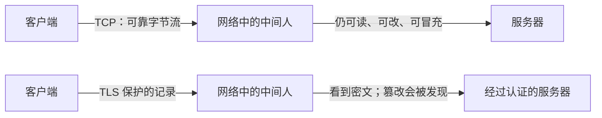

TLS（Transport Layer Security）运行在传输层之上、应用协议之下。HTTP、数据库协议或内部 RPC 可以把应用数据交给 TLS；TLS 加密并认证这些数据，再通过 TCP 发送。

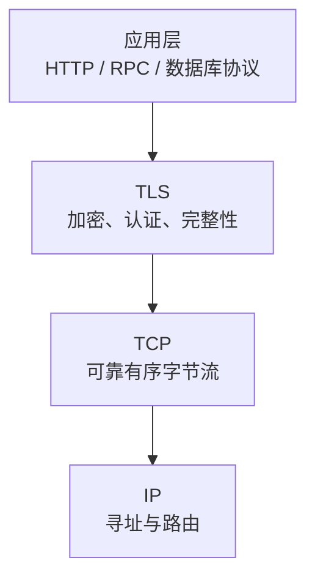

### 0.2 TLS 提供的三项核心性质

原章用三个关键词概括 TLS：

| 性质 | 要回答的问题 | 主要机制 | 没有它会怎样 |
| --- | --- | --- | --- |
| 机密性（confidentiality） | 除通信双方外，谁能读懂内容 | 加密与会话密钥 | 中间人可以窃听明文 |
| 认证（authentication） | 对端真的是它声称的实体吗 | 数字签名、证书、信任链 | 加密连接可能建立给冒充者 |
| 完整性（integrity） | 消息是否被修改或伪造 | MAC 或 AEAD 认证标签 | 中间人可无声改变密文或明文 |

这三项性质互相依赖，却不能互相替代：

- 只有加密，没有认证：可能与中间人建立一条“很私密”的加密通道；
- 只有认证，没有加密：知道消息来自谁，但旁观者仍能读取；
- 只有加密，没有完整性：攻击者虽然不懂明文，仍可能通过修改密文改变结果；
- 只有完整性，没有认证密钥：任何人都可能重新计算公开校验值。

TLS 的价值在于把三者组合为一条安全通道，而不是单独使用某一种密码学原语。

### 0.3 本章采用的威胁模型

为了理解每个机制为什么存在，可以把攻击者分成两类：

- **被动攻击者**只监听网络，目标是获得通信内容；
- **主动攻击者**还能拦截、丢弃、修改、重放或伪造消息，并尝试冒充任何一方。

加密主要对抗被动窃听；认证和完整性使主动攻击可被阻止或发现。

TLS 并不解决所有安全问题。它通常不能防止：

- 客户端或服务器端点已经被攻破；
- 应用本身存在注入、越权或逻辑漏洞；
- 流量大小、时间、源地址和目标地址等元数据泄露；
- 用户主动信任恶意根证书；
- 数据在 TLS 终止之后被错误记录、存储或转发；
- 拒绝服务攻击消耗连接或计算资源。

所以本章讨论的是 **传输中数据（data in transit）** 的安全边界，不是整个应用的完整安全方案。

### 0.4 全章推理路线

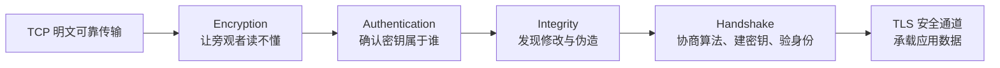

作者的分析顺序很有代表性：先逐一建立安全目标，再在握手中把目标组装起来。阅读时应持续追问三件事：

1. 当前机制建立了什么性质；
2. 它依赖哪个秘密或信任前提；
3. 它没有解决什么问题。

## 1. Encryption：加密

### 1.1 加密是什么

加密把可读的 **明文（plaintext）** 转换为不可直接理解的 **密文（ciphertext）**。拥有正确密钥的一方可以解密并恢复明文。

设明文为 $m$，密钥为 $k$，加密与解密函数分别为 $Enc$ 和 $Dec$。正确性要求：

$$
Dec_k(Enc_k(m)) = m
$$

这只是“能正确还原”的条件。安全性还要求：不知道密钥的攻击者即使看到密文，也不能在可行计算成本内恢复明文或获得有价值的信息。

原章使用“obfuscated”描述数据被隐藏，但密码学意义上的加密不是普通混淆：

- 混淆常依赖算法不公开，一旦规则被发现便失效；
- 现代加密假设算法公开，安全性集中在密钥不可得；
- 加密算法必须经过公开分析，不能靠自创变换获得可信安全性。

### 1.2 为什么不能预先共享一个固定密码

如果客户端和服务器已经安全地共享同一个密钥，后续使用对称加密并不困难。真正棘手的是：**双方第一次通过不可信网络见面时，怎样得到共同秘密？**

直接把密钥发过去会形成循环：

```text
为了安全传输数据，需要先有密钥；
为了安全传输密钥，又需要一条已经安全的通道。
```

TLS 通过非对称密码学和密钥协商打破这个循环。双方可以在公开信道上交换公开材料，并各自计算出同一个共享秘密，而共享秘密本身不在网络上传输。

### 1.3 对称密码与非对称密码

#### 对称密码

对称密码使用同一秘密密钥或可相互推导的秘密密钥进行加解密：

$$
c = Enc_k(m), \qquad m = Dec_k(c)
$$

优点：

- 速度快；
- 适合大量数据；
- 现代 CPU 常有 AES 等密码学指令加速。

难点：

- 通信前必须安全共享密钥；
- 同一密钥若长期使用，泄露后的影响范围较大；
- 大量通信方两两共享固定密钥时，密钥管理困难。

TLS 建立连接后，应用数据主要用对称密码保护，因为数据量大、性能要求高。

#### 非对称密码

非对称密码使用一对相关密钥：

- **私钥（private key）**必须由所有者保密；
- **公钥（public key）**可以公开分发。

不同算法允许完成不同操作：

- 公钥加密与私钥解密；
- 私钥签名与公钥验证；
- 双方交换公钥材料后协商共享秘密。

非对称运算通常比对称运算昂贵，不适合直接加密整条大流量连接。TLS 因而采用混合结构：**非对称密码学解决初始密钥与身份问题，对称密码学保护后续批量数据。**

### 1.4 “交换公钥后得到共享秘密”如何成立

原章把数学细节留给引用资料。可以用经典 Diffie–Hellman 密钥协商理解其直觉。

双方公开约定大素数 $p$ 和生成元 $g$：

1. 客户端随机选择私密整数 $a$，计算公有值

   $$
   A = g^a \bmod p
   $$

2. 服务器随机选择私密整数 $b$，计算公有值

   $$
   B = g^b \bmod p
   $$

3. 双方交换 $A$ 与 $B$，但不发送 $a$ 或 $b$；
4. 客户端计算

   $$
   s_C = B^a \bmod p
   $$

5. 服务器计算

   $$
   s_S = A^b \bmod p
   $$

由于模幂运算满足：

$$
s_C = (g^b)^a \bmod p
= g^{ab} \bmod p
= (g^a)^b \bmod p
= s_S
$$

所以双方得到相同共享值 $s$。

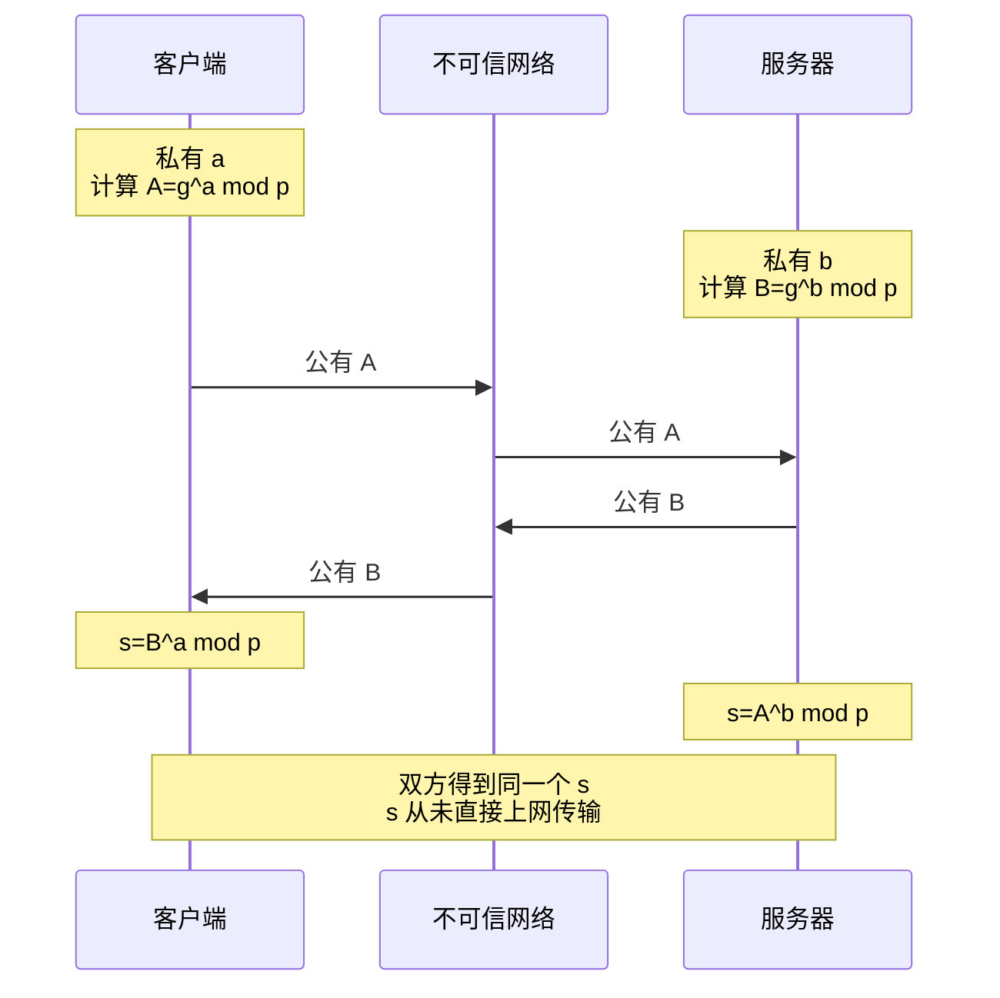

攻击者知道 $p$、$g$、$A$、$B$，却需要从 $A=g^a \bmod p$ 反推出 $a$，或从 $B$ 反推出 $b$。参数足够大、算法选择正确时，这属于计算上不可行的离散对数问题。

### 1.5 一个小型数值例子

为便于手算，取极小参数：

$$
p=23, \qquad g=5
$$

客户端选择 $a=6$：

$$
A=5^6 \bmod 23=8
$$

服务器选择 $b=15$：

$$
B=5^{15} \bmod 23=19
$$

客户端计算：

$$
s_C=19^6 \bmod 23=2
$$

服务器计算：

$$
s_S=8^{15} \bmod 23=2
$$

双方得到相同共享值 2。

这个例子只用于展示等式，**绝不能用于真实加密**：参数极小，攻击者可以穷举私钥。真实 TLS 1.3 通常使用椭圆曲线上的临时 Diffie–Hellman（ECDHE）及经过标准化的曲线和参数。

### 1.6 为什么共享值不能直接当作最终加密密钥

密钥协商得到的原始共享值未必具有应用所需的长度、分布和隔离属性。TLS 会把共享值与握手上下文输入密钥派生函数，生成不同用途、不同方向的密钥：

```text
密钥协商共享值
       +
握手 transcript / 随机数 / 标签
       |
       v
密钥派生函数（TLS 1.3 使用 HKDF）
       |
       +--> 客户端握手流量密钥
       +--> 服务器握手流量密钥
       +--> 客户端应用流量密钥
       +--> 服务器应用流量密钥
       +--> 导出密钥 / 恢复秘密
```

分离密钥可以避免“一把钥匙承担所有用途”：即使某个方向或阶段的密钥暴露，也不应自动等于全部密钥都暴露。

### 1.7 只做 Diffie–Hellman 为什么仍不安全

未经认证的 Diffie–Hellman 可以防止纯旁观者恢复共享秘密，却不能防止主动中间人。

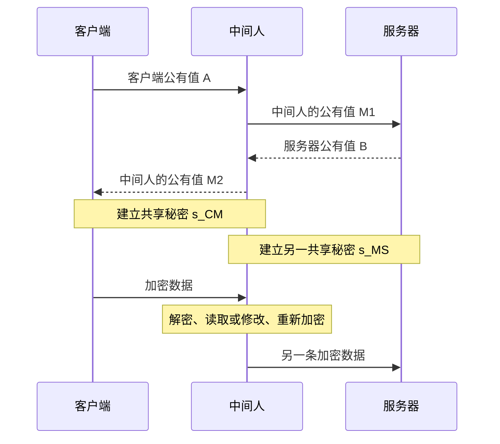

客户端和服务器都拥有加密连接，但连接对象是中间人。由此可见：

> **机密性必须绑定到经过认证的身份。**

TLS 使用证书和数字签名证明握手中的公钥材料来自目标服务器，从而阻止中间人无声替换公钥。

### 1.8 混合加密为什么有效

TLS 的总体策略可以概括为：

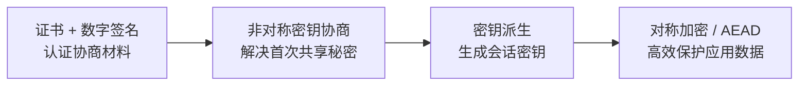

选择这种组合，是因为两类算法各自解决自己擅长的问题：

- 非对称密码学降低初始密钥分发难度，但计算昂贵；
- 对称密码学需要预先共享秘密，但处理大量数据高效；
- 数字签名把临时密钥协商绑定到长期身份。

### 1.9 会话密钥更新与前向保密

原章指出共享密钥会定期重新协商，以减少单个密钥被攻破时可解密的数据量。现代实现中需要区分两件事：

#### 密钥更新

长连接可以从现有流量秘密派生新密钥，限制同一密钥保护的数据量。TLS 1.3 提供 `KeyUpdate` 机制，不必完整重做证书认证。

#### 前向保密（forward secrecy）

若每次连接使用临时 Diffie–Hellman 私钥，并在连接后销毁，即使服务器长期证书私钥将来泄露，攻击者也不能仅凭长期私钥解开以前录制的会话。

前向保密依赖临时私钥没有被保存或泄露。它保护过去会话，不等于当前端点被攻破时仍能保密。

### 1.10 TLS 加密的性能代价

原章强调现代 CPU 有密码学指令，因此传输加密的 CPU 开销通常很小，建议所有通信都使用 TLS，包括不经过公网的内部通信。这一结论的工程含义是：

- 内网不是天然可信边界；
- 内部路由、交换、代理、宿主机和错误配置也可能暴露流量；
- 统一使用 TLS 比维护“公网加密、内网明文”的双重安全模型更稳健。

不过，“通常可接受”不等于“绝对为零”。TLS 成本还包括：

- 握手中的非对称运算；
- 每条记录的加解密与认证；
- 证书链解析和验证；
- 密钥与连接状态占用内存；
- 随机数、会话票据和密钥轮换管理；
- TLS 终止代理可能成为容量瓶颈。

是否可忽略应通过真实负载测量，而不是凭印象关闭加密。通常更合理的优化是连接复用、会话恢复、硬件加速和容量规划。

### 1.11 加密常见误区

**公钥不是“用来保密的秘密”。** 公钥可以公开；安全性依赖私钥不泄露以及算法困难问题。

**交换公钥不自动证明身份。** 未认证公钥可以被中间人替换。

**TLS 不是用服务器公钥直接加密全部应用数据。** 现代 TLS 协商短期对称密钥，再用高效对称算法保护记录。

**密文不可读不等于不可修改。** 没有完整性认证的加密可能受到位翻转、填充或其他主动攻击。

**使用 TLS 不等于静态数据也已加密。** TLS 只保护链路中的记录；应用解密后的日志、缓存和数据库需要另行保护。

**内部网络不等于安全网络。** 服务间流量同样可能经过共享基础设施和多重信任边界。

## 2. Authentication：认证

### 2.1 为什么加密之后还要认证

密钥协商可以建立一个只有两端知道的秘密，却没有天然回答“另一端是谁”。客户端要访问 `example.com`，真正需求不是“与某个能完成密钥协商的进程加密通信”，而是“与被授权代表 `example.com` 的服务器加密通信”。

认证解决的是 **身份与密钥的绑定**：

```text
这个握手公钥材料
        属于
我想访问的主机名所代表的服务
```

服务器也可能要求认证客户端。普通 Web TLS 通常只认证服务器，用户登录由 HTTP 层完成；双向 TLS（mTLS）则让客户端也提供证书。

### 2.2 数字签名是什么

数字签名使用私钥生成签名，使用对应公钥验证签名。抽象接口为：

$$
\sigma = Sign_{sk}(m)
$$

$$
Verify_{pk}(m,\sigma) \in \{true,false\}
$$

正确性要求：

$$
Verify_{pk}(m,Sign_{sk}(m))=true
$$

安全性还要求，不知道私钥的攻击者即使看过其他合法签名，也无法为新的受保护消息伪造有效签名。

实际签名算法通常对消息摘要和结构化编码进行签名，而不是把任意长消息直接做“私钥加密”。因此，把数字签名描述为“用私钥加密消息、再用公钥解密”只适用于非常粗糙的直觉，不能作为通用实现模型。

### 2.3 签名同时证明什么

若客户端已经可靠获得服务器公钥，签名验证成功可以说明：

1. 签名由持有对应私钥的一方产生，提供来源认证；
2. 被签名内容自签名后没有改变，提供完整性；
3. 公钥密码算法的私钥没有被其他人获得，这是隐含前提。

但验证成功并不自动说明公钥属于目标服务器。攻击者完全可以生成自己的合法密钥对，为自己的消息产生可验证签名。难题从“签名对不对”转化为“这个公钥是谁的”。

### 2.4 为什么需要证书

证书是一份由受信任第三方签名的结构化声明，它把实体身份与公钥绑定起来。常见 TLS 证书包含：

- 主体或域名身份信息；
- 公钥及其算法；
- 颁发者；
- 生效时间与过期时间；
- 序列号；
- 主体备用名称（SAN）；
- 密钥用途与扩展用途；
- 基本约束，例如是否允许作为 CA；
- 颁发者对证书内容的数字签名。

现代 HTTPS 主机名验证主要检查 SAN，而不应只依赖旧式 Common Name。证书本身通常是公开数据；其价值不在保密，而在可验证签名。

### 2.5 CA 与证书链

证书颁发机构（Certificate Authority，CA）负责验证申请者满足相应身份控制要求，然后为其证书签名。为了避免每个根 CA 直接签发所有服务证书，PKI 通常形成层级：

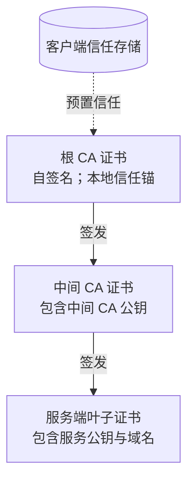

对应原书图 3.1：

- 服务证书由 CA 签名；
- 中间 CA 证书由更高层 CA 签名；
- 链最终到达自签名根证书；
- 客户端不因为根“自签名”就信任它，而是因为根证书已经作为信任锚进入本地信任存储。

“自签名”只能证明根证书内部签名与公钥一致，不能凭空创造信任。信任来自操作系统、浏览器、组织管理员或应用预先配置的分发决策。

### 2.6 证书链中的签名关系

设叶子证书内容为 $cert_L$，中间 CA 私钥为 $sk_I$：

$$
\sigma_L = Sign_{sk_I}(cert_L)
$$

客户端从中间证书取得 $pk_I$，验证：

$$
Verify_{pk_I}(cert_L,\sigma_L)=true
$$

中间证书又由根私钥签名：

$$
Verify_{pk_R}(cert_I,\sigma_I)=true
$$

若 $pk_R$ 来自本地受信根，且每层证书的约束均有效，客户端就能沿链把对根的信任传递到叶子公钥。

这里的“传递”不是简单地验证几次签名。路径中每张证书还限制下级可以代表什么身份、是否可签发证书、允许多长链和可用于什么目的。

### 2.7 服务器实际发送什么

原章为了说明完整信任路径，描述服务器发送从服务证书到根证书的完整链。现代部署中通常是：

- 服务器发送叶子证书；
- 服务器发送客户端构建路径所需的中间证书；
- 根证书通常不发送，因为客户端应从本地信任存储选择信任锚。

即使服务器发送根证书，客户端也不能因为“对端送来了一个根”就信任它；仍必须与本地信任配置匹配。服务器漏发中间证书则可能导致部分客户端无法构建路径。

### 2.8 客户端如何验证服务器证书

原书把过程描述为：沿服务器提供的链查找受信证书，再从信任点反向验证到服务证书。更完整的路径验证可以分为以下步骤。

#### 第一步：构建到本地信任锚的路径

客户端把服务器发送的叶子和中间证书，与本地信任存储结合，寻找一条以受信根为终点的候选路径。

#### 第二步：验证每层数字签名

使用上级证书公钥验证下级证书签名，确认下级证书没有被修改且确由相应颁发者签发。

#### 第三步：检查有效期

当前时间必须位于证书的 `notBefore` 与 `notAfter` 之间。客户端时钟严重错误也可能造成“尚未生效”或“已经过期”的误判。

#### 第四步：检查目标身份

客户端访问 `api.example.com` 时，必须验证叶子证书的 SAN 是否匹配该主机名。仅验证“证书由受信 CA 签发”还不够，否则为其他域名签发的证书也会被接受。

#### 第五步：检查用途和约束

例如：

- 中间证书必须被允许作为 CA；
- 叶子证书必须允许服务器认证用途；
- 路径长度、名称约束和策略必须满足；
- 密钥和签名算法必须符合安全策略。

#### 第六步：考虑撤销状态

证书尚未过期，但私钥已经泄露或证书误签时，CA 可以撤销证书。客户端可能通过 CRL、OCSP 或 stapling 获取状态。撤销检查的可用性、隐私与失败策略较复杂，不是原章重点，但说明“在有效期内”并非唯一条件。

#### 第七步：验证握手中的私钥持有证明

证书只是公开公钥。服务器还必须对当前握手 transcript 等数据签名，证明自己确实持有与证书公钥对应的私钥，而不是仅复制了一张公开证书。

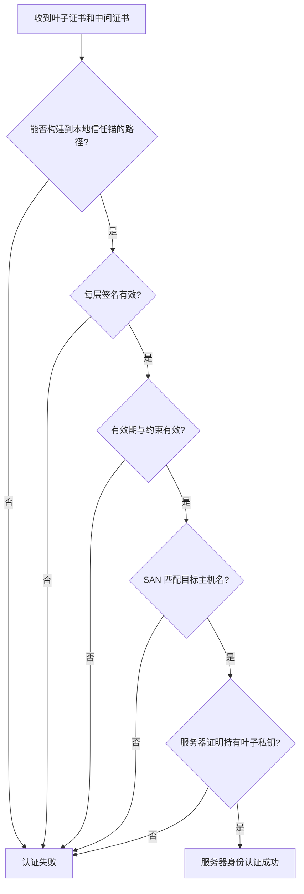

### 2.9 为什么“链签名有效”仍不一定可信

考虑攻击者自己建立：

```text
攻击者自签根 -> 攻击者中间 CA -> 假冒 example.com 的叶子证书
```

这条链中的每个数学签名都可以正确，但若攻击者根证书不在客户端信任存储中，验证必须失败。由此得到关键区分：

- **签名有效**是密码学事实；
- **证书受信**还依赖本地信任策略；
- **主机名匹配**确认该受信证书适用于当前目标；
- **私钥持有证明**确认对端不是只复制了证书。

### 2.10 根信任如何进入设备

受信根通常由以下主体分发：

- 操作系统或浏览器厂商；
- 企业设备管理系统；
- 容器基础镜像或运行时；
- 应用自带的专用信任存储；
- 设备固件或嵌入式制造流程。

原书以 Let's Encrypt 为公共 CA 示例。具体信任锚通常是该 CA 体系中的根证书，例如 ISRG Root 系列；信任状态随平台和时间变化，不能假设所有客户端都拥有相同根集合。

内部服务也可以使用组织私有 CA，但必须安全分发根证书、保护 CA 私钥、自动签发和轮换，并防止私有根被滥用于其他身份。

### 2.11 证书过期为什么能让整个应用下线

过期证书不再满足验证条件，客户端会在 TLS 握手阶段拒绝连接。应用请求尚未到达 HTTP、RPC 或业务处理层，就已经失败。

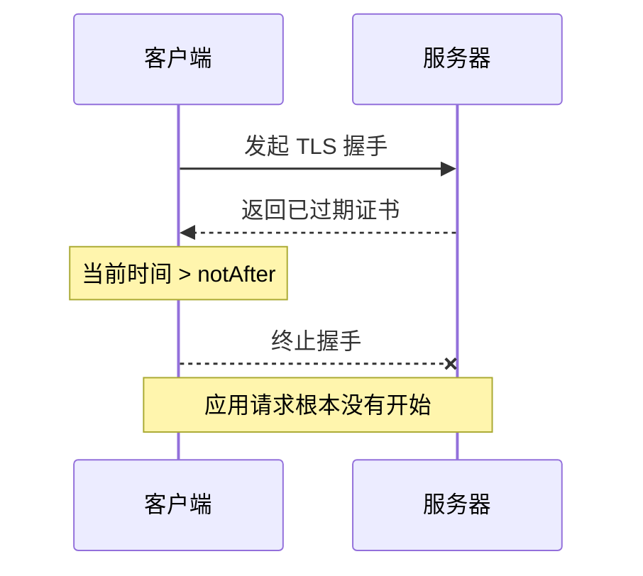

证书事故影响面可能很大：

- 所有严格验证的客户端同时失败；
- 重试会放大连接和日志压力；
- 依赖该服务的上游继续级联失败；
- 人工替换证书可能因配置或密钥不匹配再次失败。

因此，原书建议投资自动监控与续期。完整流程应包括：

1. 盘点证书、域名、颁发者和部署位置；
2. 在到期前较长时间告警，而不是最后一天；
3. 自动续期、部署和服务热加载；
4. 从真实客户端路径验证新证书已生效；
5. 监控链、主机名、密钥用途与剩余有效期；
6. 保留人工应急轮换和撤销流程。

续期成功不等于部署成功。监控应观察对外实际呈现的证书，而不只检查证书管理系统中的文件。

### 2.12 客户端认证与 mTLS

普通 HTTPS 中：

- 服务器向客户端提供证书；
- 客户端通常通过密码、令牌或 Cookie 在应用层认证。

TLS 也允许服务器请求客户端证书。客户端发送证书并证明持有对应私钥，形成双向 TLS（mutual TLS，mTLS）。

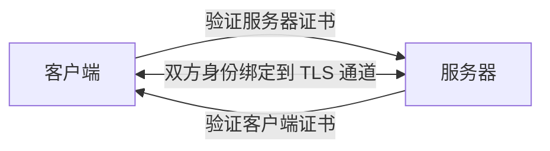

mTLS 常用于服务间身份、企业设备或高信任环境。它的优点是身份在连接层完成，缺点是客户端证书的签发、轮换、撤销和私钥保护会显著增加运维复杂度。

### 2.13 认证常见误区

**加密连接不自动等于连接了正确服务器。** 未认证密钥协商仍可被中间人劫持。

**自签名不自动等于不安全。** 若自签根通过可信渠道预置，它可以成为有效信任锚；问题在于如何建立信任，而不是签名形式本身。

**由受信 CA 签发不等于适用于当前域名。** 必须验证 SAN 与目标主机名。

**证书是公开信息，不应把证书当作私钥。** 真正必须保护的是对应私钥。

**拿到服务器证书不等于拥有服务器身份。** 握手还要求证明持有私钥。

**关闭证书验证只是让错误消失，不是修复。** 它会移除阻止中间人冒充的核心机制。

**证书未过期不等于一定有效。** 还要检查签名、用途、主机名、约束、信任路径，并按策略考虑撤销。

## 3. Integrity：完整性

### 3.1 为什么密文仍需要完整性保护

加密让攻击者难以理解内容，却不必然阻止攻击者修改密文。某些加密模式中，翻转密文中的比特会以可预测方式改变解密结果；即使攻击者不知道原文，也可能改变金额、标志位或协议结构。

因此，接收方需要回答：

> 收到的记录是否与发送方产生的记录一致，而且确实由持有认证密钥的一方生成？

完整性机制不一定阻止攻击者发送修改后的数据，但会让修改无法通过验证，接收方必须丢弃记录并通常终止连接。

### 3.2 普通哈希函数能做什么

密码学哈希函数把任意长度消息映射为固定长度摘要：

$$
d = H(m)
$$

理想安全哈希希望具有：

- 给定摘要，很难反推出原消息；
- 很难找到另一条消息产生同一摘要；
- 消息微小变化会让摘要显著变化。

哈希可以发现偶发变化，但若攻击者能同时修改消息与摘要，就可以计算：

$$
m' \quad \text{和} \quad H(m')
$$

接收方无法知道二者均被替换。因此，公开的无密钥哈希不足以对抗主动攻击者。

### 3.3 MAC：把完整性绑定到共享秘密

消息认证码（Message Authentication Code，MAC）接受秘密密钥和消息，输出认证标签：

$$
t = MAC_k(m)
$$

接收方持有同一密钥，重新计算并以恒定时间方式比较：

$$
Verify_k(m,t) = [MAC_k(m)=t]
$$

攻击者可以修改消息，却因不知道 $k$ 而不能为修改后的消息生成有效标签。MAC 同时提供：

- **完整性**：消息改变会导致验证失败；
- **来源认证**：有效标签来自持有共享密钥的一方。

但 MAC 通常不提供第三方可验证的不可否认性，因为通信双方都知道同一 MAC 密钥，任一方都能生成标签。

### 3.4 HMAC 如何构造

HMAC 是基于密码学哈希函数构造 MAC 的标准方法。设处理后的密钥为 $K'$，内外填充值为 `ipad` 和 `opad`，连接操作为 $\parallel$：

$$
HMAC(K,m)=H\left((K'\oplus opad)\parallel
H((K'\oplus ipad)\parallel m)\right)
$$

逐步理解：

1. 把密钥规范化到哈希块大小，得到 $K'$；
2. 用内层常量与密钥异或，再与消息连接并哈希；
3. 用不同外层常量与密钥异或，再包住内层摘要进行第二次哈希；
4. 输出最终标签。

为什么不直接使用 $H(K\parallel m)$ 或 $H(m\parallel K)$？某些哈希结构存在长度扩展等性质，简单拼接未必构成安全 MAC。HMAC 的双层标准构造经过专门分析，不应自行简化。

### 3.5 TLS 中接收方怎样验证记录

用原章的 HMAC 模型表示，一条记录的发送过程可以概括为：

```text
发送方：
  输入应用数据与记录元数据
  计算认证标签 tag = HMAC(key, metadata || data)
  加密或封装 data 与 tag
  通过 TCP 发送

接收方：
  接收并解密记录
  用对应密钥重新计算 expected_tag
  恒定时间比较 expected_tag 与收到的 tag
  若不一致：丢弃并终止或报告连接错误
  若一致：把数据交给上层协议
```

记录元数据通常还包含隐式序号或类型信息，使攻击者不能简单地交换、删除或重放记录而不被发现。

### 3.6 现代 TLS 为什么常用 AEAD

原章用“HMAC 保护消息完整性”建立直觉，这准确描述了 MAC 的作用，也符合部分旧式 TLS 密码套件。现代 TLS 1.3 的应用记录使用 **AEAD（Authenticated Encryption with Associated Data）** 算法，例如 AES-GCM 或 ChaCha20-Poly1305。

AEAD 把加密和认证组合为一个经过分析的接口：

$$
(c,t)=AEAD\_Encrypt(k,nonce,m,aad)
$$

$$
m\ \text{or failure}=AEAD\_Decrypt(k,nonce,c,aad,t)
$$

其中：

- $m$ 是明文；
- $c$ 是密文；
- $t$ 是认证标签；
- $nonce$ 是同一密钥下必须满足算法唯一性要求的值；
- $aad$ 是需要认证但不加密的附加数据。

解密接口只有两种结果：完整验证成功并返回明文，或失败而不应向应用暴露未经认证的数据。

TLS 1.3 仍在 HKDF 等密钥派生和握手认证中使用基于哈希的机制，但应用记录不再由“任意加密算法 + 独立 HMAC 算法”自由组合。理解这一点可以避免把原章的概念模型误当成所有现代密码套件的线格式。

### 3.7 为什么算法组合顺序很重要

历史协议曾采用不同组合：先 MAC 后加密、先加密后 MAC，或把两者集成为 AEAD。组合不当可能暴露填充错误、长度差异或验证时序，形成可利用的侧信道。

工程结论不是“自己选择一个看似合理的顺序”，而是：

- 使用当前标准允许的 AEAD 套件；
- 让成熟 TLS 库处理 nonce、序号、标签和错误；
- 不在应用层重新设计“加密再哈希”的自制协议。

### 3.8 TCP 校验和与 TLS 完整性的区别

TCP 校验和用于发现传输中的常见偶发损坏。TLS 的密码学完整性用于抵抗主动篡改，同时也能发现偶发损坏。

| 维度 | TCP 校验和 | TLS HMAC / AEAD 标签 |
| --- | --- | --- |
| 是否使用秘密密钥 | 否 | 是 |
| 主要目标 | 发现常见传输错误 | 发现主动篡改、伪造与损坏 |
| 攻击者能否重算 | 能 | 不知道密钥时不能 |
| 碰撞/漏检强度 | 非密码学，存在较高漏检概率 | 由认证标签长度和算法安全性决定 |
| 覆盖范围 | TCP 段与相关伪首部 | TLS 记录内容和协议相关元数据 |
| 失败后的层次 | TCP 丢弃并重传 | TLS 拒绝记录或终止连接 |

它们并非纯粹重复：TCP 校验和尽早发现链路错误，TLS 提供端到端密码学认证。分层校验让不同层按自己的威胁模型做判断。

### 3.9 原书给出的漏检数字如何理解

原章引用研究指出，TCP 校验和大约每 1600 万到 100 亿个包会漏检一次错误。若每包 1 KB，则对应传输量约为：

下界：

$$
16{,}000{,}000\ \mathrm{packets}
\times 1\ \mathrm{KB/packet}
=16\ \mathrm{GB}
$$

上界：

$$
10{,}000{,}000{,}000\ \mathrm{packets}
\times 1\ \mathrm{KB/packet}
=10\ \mathrm{TB}
$$

所以期望上约每 16 GB 到 10 TB 可能遇到一次未被 TCP 校验和发现的损坏。

这不是说每传满 16 GB 就必然出现错误，也不是所有网络都服从同一固定概率。它表达的是：

- 单包漏检看似罕见；
- 大规模、长时间传输会把小概率事件累积为现实风险；
- 非密码学校验和不应成为安全或高价值数据完整性的唯一防线。

### 3.10 概率与规模的直觉

若把每个包发生未检测损坏的概率简化为 $p$，传输 $n$ 个独立包后至少发生一次的概率为：

$$
P(\text{至少一次})=1-(1-p)^n
$$

当 $p$ 很小且 $np$ 不大时，可近似：

$$
1-(1-p)^n \approx np
$$

这个模型只是说明规模效应。现实错误可能相关，研究中的“每多少包”也已综合了实际错误发生与校验和漏检，不能直接把区间端点当作通用独立概率用于容量承诺。

### 3.11 完整性、认证与机密性的关系

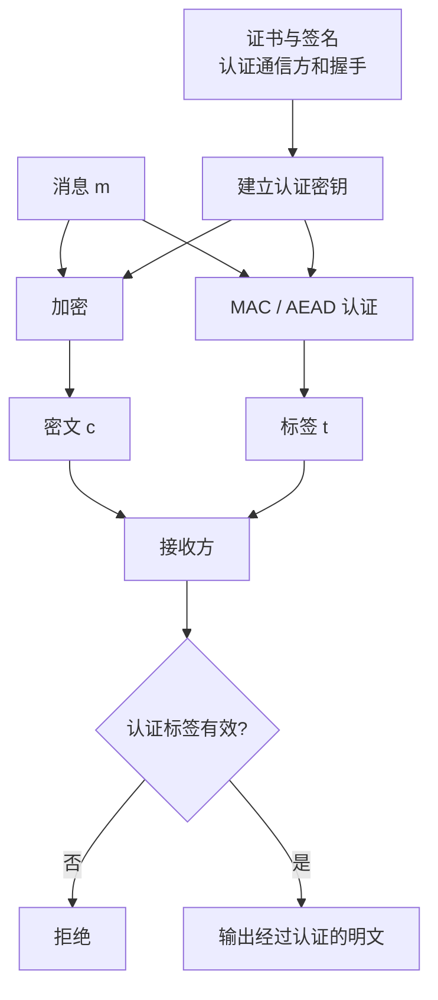

认证先让双方知道密钥属于谁；密钥再让记录的完整性和机密性有意义。任何一环缺失，安全通道都会出现不同类型的缺口。

### 3.12 完整性常见误区

**哈希摘要不等于 MAC。** 没有秘密密钥时，攻击者可以修改消息并重算摘要。

**MAC 不等于数字签名。** MAC 双方共享秘密，数字签名使用私钥签名、公钥验证，信任与可验证对象不同。

**TCP 校验和不提供对抗攻击者的安全性。** 它不是密码学认证码。

**加密不自动提供完整性。** 只有明确使用认证加密或安全组合，才能同时获得两者。

**认证失败后不能把“部分解密数据”交给应用。** 未经验证的明文必须视为攻击者可控。

**TLS 能发现链路篡改，不代表业务数据永远正确。** 合法端点仍可能生成错误数据，应用仍需模式校验、权限检查和业务约束。

## 4. Handshake：握手

### 4.1 为什么安全连接也需要状态协商

在传输应用数据前，客户端和服务器需要共同决定并证明：

- 使用哪个协议版本和算法；
- 双方基于什么秘密派生会话密钥；
- 服务器证书是否可信且匹配目标身份；
- 对端是否确实持有证书私钥；
- 握手消息是否被中间人删除、替换或降级；
- 后续两个方向分别使用哪些流量密钥。

TLS 握手就是建立这些共同状态的协议。它不是简单地“交换一个证书”，而是把协商、密钥交换、认证和 transcript 完整性绑定成一次会话。

### 4.2 Cipher suite 是什么

原章为了建立全景，把创建安全通道所需的算法统称为密码套件的组成，包括：

- 密钥交换算法；
- 证书签名算法；
- 对称加密算法；
- HMAC 算法。

这是理解握手需要哪些密码学部件的有用清单，但不应按字面理解为证书链签名算法一定编码在套件名称中。TLS 1.2 套件通常组合密钥交换/握手认证方式、批量加密和 MAC/PRF，例如名称中的 `ECDHE_RSA` 表示临时 ECDH 密钥交换配合 RSA 握手认证；证书本身由什么算法签名，还要结合 `signature_algorithms` 等协商和 PKIX 证书路径规则验证。TLS 1.3 进一步拆分了命名：密码套件主要指定 AEAD 算法与哈希函数，密钥交换组和握手签名算法通过独立扩展协商。

例如，TLS 1.3 套件名称：

```text
TLS_AES_128_GCM_SHA256
```

可以理解为：

- 使用 AES-128-GCM 作为 AEAD；
- 使用 SHA-256 作为握手密钥派生等所需哈希；
- 它本身不写明使用哪条 ECDHE 曲线或哪种证书签名算法。

协议版本差异说明：分析日志中的“cipher suite”时，必须先知道 TLS 版本，不能套用同一字段含义。

### 4.3 算法协商为什么不能只听客户端或服务器

客户端和服务器支持集合可能不同：

```text
客户端支持：A, B, C
服务器支持：B, C, D
共同集合：  B, C
```

双方要从交集中选择安全且允许的组合。若没有共同项，握手失败。

协商消息本身必须受到后续 transcript 认证，否则中间人可以删除强算法选项，诱导双方使用弱算法，这类攻击称为降级攻击。TLS 会把握手 transcript 纳入签名和 Finished 验证，使无声修改协商内容变得可检测。

### 4.4 Handshake transcript 是什么

transcript 是按协议顺序累积的握手消息记录或其哈希。它绑定：

- 客户端最初提出的版本和算法；
- 服务器作出的选择；
- 双方临时密钥材料；
- 扩展参数；
- 证书与身份相关消息。

若中间人修改其中任何内容，双方计算的 transcript 哈希不同，`CertificateVerify` 或 `Finished` 验证就会失败。

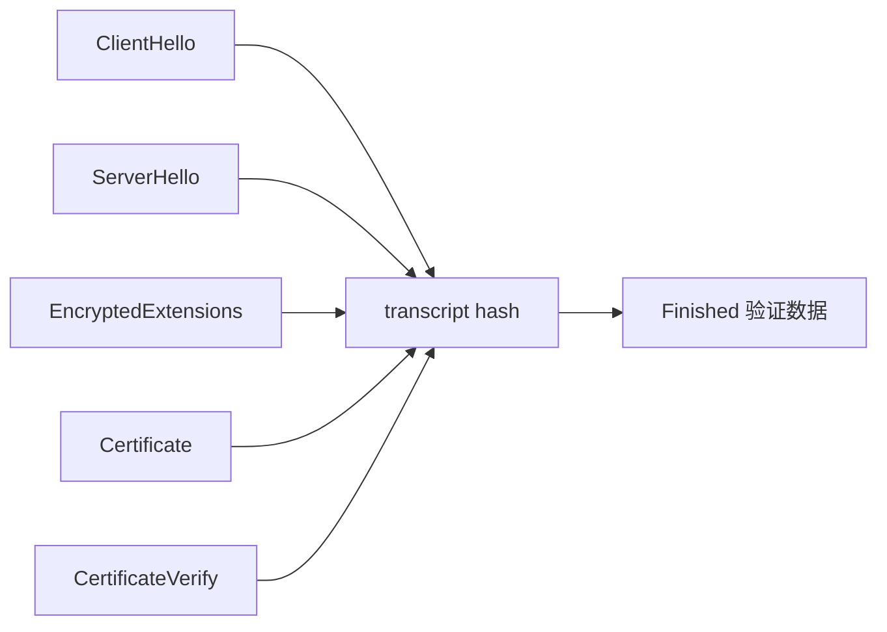

### 4.5 TLS 1.3 完整握手的简化时序

下面时序用于展开原章的三个步骤，不是逐字段协议规范：

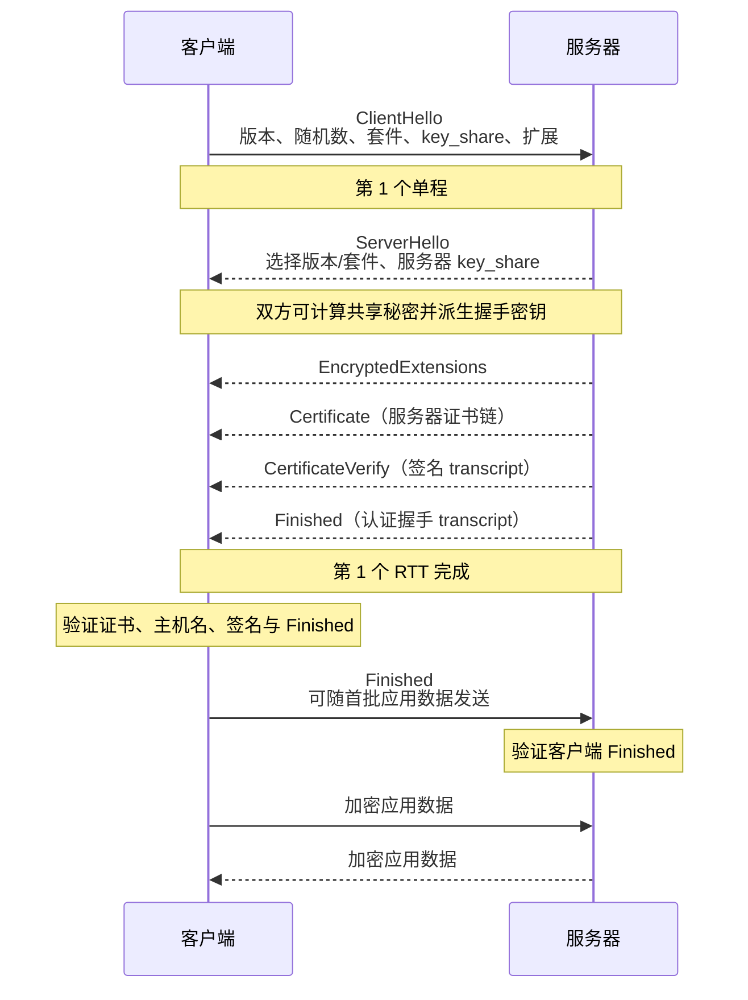

如果服务器要求客户端证书，还会增加 `CertificateRequest`，客户端随后发送自己的 `Certificate` 和 `CertificateVerify`。

### 4.6 第一步：提出与选择参数

客户端 `ClientHello` 通常携带：

- 支持的 TLS 版本；
- 支持的密码套件；
- 随机数；
- 一个或多个密钥交换 `key_share`；
- 支持的签名算法；
- SNI 等目标信息；
- ALPN 等应用协议选择信息。

服务器 `ServerHello` 选择共同参数并返回服务器密钥交换材料。双方必须得到完全一致的协商结果，否则后续密钥和 transcript 验证不会匹配。

### 4.7 第二步：建立共享秘密并派生密钥

客户端和服务器用各自临时私钥与对端公有 `key_share` 计算相同共享值。TLS 1.3 再通过 HKDF 的密钥日程逐阶段派生：

```mermaid
flowchart TD
    PSK[可选 PSK / 恢复秘密] --> ES[Early Secret]
    DH[(EC)DHE 共享值] --> HS[Handshake Secret]
    ES --> HS
    HS --> CHT[客户端握手流量密钥]
    HS --> SHT[服务器握手流量密钥]
    HS --> MS[Master Secret]
    MS --> CAT[客户端应用流量密钥]
    MS --> SAT[服务器应用流量密钥]
    MS --> RES[恢复主秘密]
```

密钥派生不仅使用共享值，还绑定 transcript 哈希和标签，使不同连接、方向和阶段的密钥相互隔离。

### 4.8 第三步：认证服务器

服务器发送证书链后，还要用证书私钥对当前握手上下文签名。客户端执行两类验证：

1. **证书路径验证**：公钥是否被信任用于目标主机名；
2. **握手签名验证**：当前对端是否真的持有该公钥对应私钥，并且临时密钥协商材料没有被替换。

若只验证证书链，不验证当前握手签名，攻击者可以复制公开证书，却没有私钥；若只验证签名而不验证证书链，攻击者可以用自己的密钥对产生合法签名。两者缺一不可。

### 4.9 Finished 消息为什么重要

`Finished` 使用从握手秘密派生的密钥认证 transcript。它证明：

- 对端得到了相同握手秘密；
- 对端看到了相同握手消息序列；
- 算法选择、密钥材料和扩展没有被无声修改。

证书签名主要把服务器身份绑定到握手，`Finished` 则为整个握手状态提供密钥确认和完整性。只有这些检查成功，应用才能把通道视为安全。

### 4.10 服务器认证与客户端认证的位置

默认单向 TLS：

```text
客户端验证服务器证书和私钥持有证明
服务器不在 TLS 层验证客户端证书
```

mTLS：

```text
客户端验证服务器
服务器也请求、验证客户端证书和私钥持有证明
```

即使使用 mTLS，应用仍可能需要授权：证书证明客户端是谁，不自动决定该身份可以访问哪些资源。

### 4.11 TLS 1.2 与 TLS 1.3 的 RTT 成本

原章给出的核心数字是：

- TLS 1.2 完整握手通常需要 2 个 RTT；
- TLS 1.3 完整握手通常需要 1 个 RTT。

这里说的是 TLS 层握手成本。若底层还要新建 TCP 连接，则总冷启动近似为：

$$
T_{before\ app} \approx T_{TCP}+T_{TLS}
$$

忽略 DNS、处理和传输细节：

$$
T_{TCP}\approx 1\ RTT
$$

因此：

$$
T_{TLS1.2,new}\approx 1\ RTT+2\ RTT=3\ RTT
$$

$$
T_{TLS1.3,new}\approx 1\ RTT+1\ RTT=2\ RTT
$$

如果 RTT 为 100 ms，仅 TCP 与 TLS 握手的理想等待约为：

| 协议组合 | 握手 RTT | 理想等待 |
| --- | ---: | ---: |
| 新 TCP + TLS 1.2 | 约 3 RTT | 约 300 ms |
| 新 TCP + TLS 1.3 | 约 2 RTT | 约 200 ms |

这还没包含 DNS、证书处理、应用请求与响应。真实实现可能通过并行、恢复、TCP Fast Open、QUIC 或其他优化改变时序；表格用于理解固定往返成本，而不是所有网络的精确测量。

### 4.12 为什么服务器离客户端越近越好

TLS 握手包含依赖前一批消息的网络往返。距离增大，传播时延上升，同样的密码学运算会花费更长墙钟时间。

若握手需要 $r$ 个串行 RTT，网络部分近似：

$$
T_{network} \ge r \cdot RTT
$$

减少 CPU 数十微秒，无法抵消跨洲多出的数十到上百毫秒。边缘节点、就近入口和区域部署因此不仅提高应用请求速度，也降低连接安全初始化成本。

### 4.13 为什么要复用 TLS 连接

连接复用可以摊薄：

- TCP 三次握手；
- TLS 密钥交换和证书验证；
- 非对称签名运算；
- TCP 拥塞窗口冷启动；
- socket 与密码学状态分配。

HTTP keep-alive、HTTP/2 多路复用、连接池等机制允许多个请求共享一条安全连接。但长期连接仍要处理：

- 空闲超时和失活探测；
- 证书更新后旧连接何时退出；
- 流量密钥更新；
- 单连接故障影响多个请求；
- 最大寿命和优雅重连。

### 4.14 会话恢复与 0-RTT

TLS 可以利用先前会话建立的恢复秘密，减少后续连接的计算和往返成本。TLS 1.3 还允许某些恢复场景发送 0-RTT early data。

0-RTT 的关键限制是 **可重放性**：攻击者可能复制 early data 并让服务器多次处理。它也不具备前向保密，因为 early data 密钥只从恢复 PSK 等已有秘密派生，尚未混入本次连接的新鲜 (EC)DHE 共享值；若相关 PSK 后来泄露，已经记录的 0-RTT 密文可能被解开。因而 0-RTT 只适合可安全重放或具有应用层去重保护的操作，不应直接用于不可重复的支付、创建订单等副作用操作，也不应承载需要前向保密的敏感数据。

这再次说明，传输协议优化不能替代应用语义：TLS 可以保护 early data 的机密性，却不能自动判断业务操作是否幂等。

### 4.15 握手失败应怎样定位

TLS 失败发生在应用请求之前，常见原因包括：

| 失败阶段 | 典型原因 | 观察方向 |
| --- | --- | --- |
| TCP 建连 | 端口未监听、网络或防火墙阻断 | 连接超时、拒绝、路由 |
| 参数协商 | 无共同版本或套件 | 客户端/服务器安全策略 |
| 路径构建 | 缺少中间证书、根不受信 | 服务端链配置与客户端信任存储 |
| 有效期 | 证书过期、尚未生效、时钟错误 | `notBefore`、`notAfter`、系统时间 |
| 身份验证 | SAN 不匹配目标主机名 | 连接使用的主机名与证书 SAN |
| 签名验证 | 证书或握手签名无效 | 证书链、私钥是否匹配 |
| Finished | transcript 或密钥不一致 | 中间设备、实现错误、攻击 |
| 客户端认证 | 客户端无证书、链不受信、用途错误 | mTLS 配置和客户端身份 |

排查时不要把所有 TLS 错误都归结为“证书过期”。错误发生在哪个阶段，决定应检查网络、算法策略、证书链、主机名、时钟还是客户端身份。

### 4.16 握手常见误区

**TLS 握手不等于 TCP 握手。** TCP 握手建立可靠字节流，TLS 握手在其上建立安全状态；两者有独立 RTT 成本。

**Cipher suite 在不同 TLS 版本中含义不完全相同。** TLS 1.3 套件名称不再同时编码密钥交换和签名算法。

**收到证书不等于认证成功。** 必须构建信任路径、验证主机名和约束，并验证当前握手中的私钥持有证明。

**握手使用非对称密码学不等于应用数据都用非对称算法。** 批量数据使用派生的对称流量密钥。

**TLS 1.3 的 1-RTT 不包括新 TCP 连接的 1 RTT。** 计算端到端冷启动时必须分层相加。

**0-RTT 不等于无代价的更快请求。** 它带来重放风险，需要应用约束。

**连接复用不等于永不重新握手。** 连接会失效，证书和密钥会轮换，系统仍需可靠重连。

## 5. 四类机制如何组成一条安全链路

### 5.1 从明文 TCP 到认证加密通道

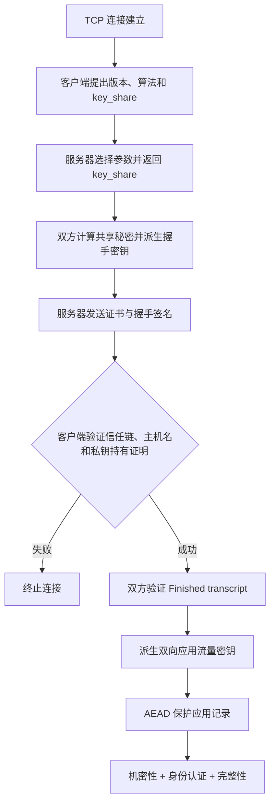

每个步骤的职责不同：

- TCP 让握手消息可靠、有序到达；
- 密钥协商让双方得到未直接传输的共享秘密；
- 证书把服务身份绑定到公钥；
- 数字签名证明服务器持有私钥并绑定临时协商；
- Finished 绑定整个握手 transcript；
- 密钥派生分离方向与阶段；
- AEAD 保护后续记录的机密性和完整性。

### 5.2 中间人攻击为什么会失败

设中间人试图替换服务器的临时 `key_share`：

1. 客户端 `ClientHello` 到达中间人；
2. 中间人向服务器提出自己的临时密钥；
3. 中间人向客户端返回另一份临时密钥；
4. 服务器的 `CertificateVerify` 对服务器所见 transcript 签名；
5. 客户端所见 transcript 已被中间人修改；
6. 签名或 Finished 无法在客户端视图下通过；
7. 握手终止。

攻击者若想生成与客户端 transcript 匹配的服务器签名，就需要服务器证书私钥；如果改用自己的证书，又无法通过目标主机名与信任路径验证。

### 5.3 TLS 保护范围示意

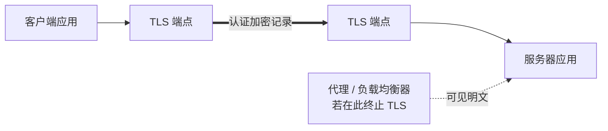

若 TLS 在负载均衡器终止，客户端到负载均衡器的链路受到保护，但负载均衡器到后端是否安全取决于是否重新建立 TLS。系统设计必须明确每个 TLS 终止点，而不能笼统地说“服务用了 HTTPS”。

## 6. C/OpenSSL 示例：建立并验证 HTTPS 连接

### 6.1 为什么示例使用成熟库

密码协议包含随机数、证书路径、主机名、算法协商、错误处理、侧信道和版本兼容等大量细节。应用不应自行实现 Diffie–Hellman、HMAC 或 TLS 状态机。

下面的标准 C 示例使用 OpenSSL 1.1.1+ / 3.x：

- 使用系统或 OpenSSL 默认 CA 信任路径；
- 要求验证服务器证书；
- 发送 SNI；
- 验证证书主机名；
- 输出协议、密码套件和证书主体；
- 在验证成功后才发送 HTTP 请求。

它是原理映射示例，不是包含代理、超时、非阻塞 I/O、重试和完整响应解析的生产 HTTP 客户端。

### 6.2 完整代码

```c
#include <openssl/bio.h>
#include <openssl/err.h>
#include <openssl/ssl.h>
#include <openssl/x509.h>

#include <stdio.h>
#include <stdlib.h>
#include <string.h>

static void fail_with_openssl(const char *message, BIO *bio, SSL_CTX *context) {
    fprintf(stderr, "%s\n", message);
    ERR_print_errors_fp(stderr);
    BIO_free_all(bio);
    SSL_CTX_free(context);
    exit(EXIT_FAILURE);
}

int main(int argc, char **argv) {
    const char *host = argc > 1 ? argv[1] : "example.com";
    char endpoint[512];
    char request[1024];
    char response[4096];
    BIO *bio = NULL;
    SSL_CTX *context = NULL;
    SSL *ssl = NULL;
    X509 *certificate = NULL;
    int bytes_read;

    if (snprintf(endpoint, sizeof endpoint, "%s:443", host) >=
        (int)sizeof endpoint) {
        fprintf(stderr, "Host name is too long\n");
        return EXIT_FAILURE;
    }

    if (snprintf(request,
                 sizeof request,
                 "GET / HTTP/1.1\r\nHost: %s\r\nConnection: close\r\n\r\n",
                 host) >= (int)sizeof request) {
        fprintf(stderr, "HTTP request is too long\n");
        return EXIT_FAILURE;
    }

    if (OPENSSL_init_ssl(0, NULL) != 1) {
        fail_with_openssl("Failed to initialize OpenSSL", NULL, NULL);
    }

    context = SSL_CTX_new(TLS_client_method());
    if (context == NULL) {
        fail_with_openssl("Failed to create TLS context", NULL, NULL);
    }

    SSL_CTX_set_verify(context, SSL_VERIFY_PEER, NULL);
    if (SSL_CTX_set_default_verify_paths(context) != 1) {
        fail_with_openssl("Failed to load default CA trust paths", NULL, context);
    }

    bio = BIO_new_ssl_connect(context);
    if (bio == NULL) {
        fail_with_openssl("Failed to create TLS connection BIO", NULL, context);
    }

    BIO_get_ssl(bio, &ssl);
    if (ssl == NULL) {
        fail_with_openssl("Failed to access TLS session", bio, context);
    }

    if (SSL_set_tlsext_host_name(ssl, host) != 1) {
        fail_with_openssl("Failed to set SNI host name", bio, context);
    }

    if (SSL_set1_host(ssl, host) != 1) {
        fail_with_openssl("Failed to configure certificate host check", bio, context);
    }

    if (BIO_set_conn_hostname(bio, endpoint) != 1) {
        fail_with_openssl("Failed to set connection endpoint", bio, context);
    }

    if (BIO_do_connect(bio) <= 0) {
        fail_with_openssl("TCP connection failed", bio, context);
    }

    if (BIO_do_handshake(bio) <= 0) {
        fail_with_openssl("TLS handshake failed", bio, context);
    }

    if (SSL_get_verify_result(ssl) != X509_V_OK) {
        fail_with_openssl("Certificate verification failed", bio, context);
    }

    certificate = SSL_get_peer_certificate(ssl);
    if (certificate == NULL) {
        fail_with_openssl("Server did not provide a certificate", bio, context);
    }

    printf("Protocol: %s\n", SSL_get_version(ssl));
    printf("Cipher: %s\n", SSL_get_cipher_name(ssl));
    printf("Subject: ");
    X509_NAME_print_ex_fp(stdout,
                          X509_get_subject_name(certificate),
                          0,
                          XN_FLAG_ONELINE);
    printf("\n");
    X509_free(certificate);

    if (BIO_write(bio, request, (int)strlen(request)) <= 0) {
        fail_with_openssl("Failed to send HTTP request", bio, context);
    }

    while ((bytes_read = BIO_read(bio, response, sizeof response)) > 0) {
        fwrite(response, 1, (size_t)bytes_read, stdout);
    }

    if (bytes_read < 0 && !BIO_should_retry(bio)) {
        fail_with_openssl("Failed while reading response", bio, context);
    }

    BIO_free_all(bio);
    SSL_CTX_free(context);
    return EXIT_SUCCESS;
}
```

编译示例：

```text
cc tls_client.c -std=c11 -Wall -Wextra -pedantic \
  $(pkg-config --cflags --libs openssl) -o tls_client
./tls_client example.com
```

Windows 上需使用已配置好 OpenSSL 头文件和链接库的 C 工具链；具体参数取决于安装方式。

### 6.3 代码与原理的对应关系

| 代码 | 对应原理 |
| --- | --- |
| `TLS_client_method()` | 让库协商可接受 TLS 版本 |
| `SSL_VERIFY_PEER` | 要求验证对端证书，不能匿名接受 |
| `SSL_CTX_set_default_verify_paths` | 加载本地 CA 信任锚 |
| `SSL_set_tlsext_host_name` | 发送 SNI，让多域名服务器选择正确证书 |
| `SSL_set1_host` | 验证证书 SAN 是否匹配目标主机名 |
| `BIO_do_connect` | 建立底层 TCP 连接 |
| `BIO_do_handshake` | 协商算法、密钥并完成 TLS 认证 |
| `SSL_get_verify_result` | 确认证书路径和身份验证结果 |
| `SSL_get_version` / `SSL_get_cipher_name` | 观察实际协商结果 |
| `BIO_write` / `BIO_read` | 在已验证 TLS 通道上收发应用数据 |

最重要的两行不是“开启加密”，而是 **加载信任锚并启用主机名验证**。许多错误示例只加密 socket，却接受任意证书，仍然容易遭受中间人攻击。

### 6.4 示例的适用范围与局限

示例未处理：

- 连接、握手和读取超时；
- 非阻塞 BIO 中 `WANT_READ` / `WANT_WRITE` 的完整循环；
- HTTP 分块、压缩和重定向；
- 代理与自定义 CA；
- 证书固定、公钥固定或 mTLS；
- 会话恢复和连接池；
- 优雅关闭与所有部分写入情况；
- 国际化域名与复杂主机名输入；
- 完整的错误分类和敏感日志控制。

此外，示例依赖 OpenSSL 与平台信任存储配置。它“可运行”的前提是本机已安装 OpenSSL 开发文件并配置受信 CA，不应为了学习示例而关闭证书验证。

## 7. 关键概念辨析

### 7.1 编码、哈希、加密、MAC 与签名

| 操作 | 是否可逆 | 是否需要秘密 | 主要目的 |
| --- | --- | --- | --- |
| 编码（如 Base64） | 可逆 | 否 | 表示与传输格式转换 |
| 哈希 | 通常不可逆 | 否 | 摘要、索引、变化检测基础 |
| 对称加密 | 持密钥可逆 | 共享密钥 | 机密性 |
| MAC / HMAC | 不用于恢复消息 | 共享密钥 | 完整性与共享密钥来源认证 |
| 数字签名 | 验证而非解密消息 | 私钥签名 | 公钥可验证的来源与完整性 |

Base64 不是加密，普通哈希不是消息认证，数字签名也不是“用私钥保密消息”。

### 7.2 密钥交换、加密和签名

- 密钥交换让双方得到共享秘密；
- 对称加密用共享秘密保护大量数据；
- 数字签名把握手和身份绑定；
- 证书把签名公钥和服务身份绑定；
- 密钥派生从共享秘密产生多个独立用途的密钥。

同一“公钥密码学”标签下包含不同功能，不能把公钥加密、Diffie–Hellman 和数字签名视为一个操作。

### 7.3 认证与授权

- **认证（authentication）**回答“你是谁”；
- **授权（authorization）**回答“你可以做什么”。

TLS 服务器证书认证服务身份；mTLS 可以认证客户端身份。是否允许该客户端读取订单、修改配置或访问管理接口，仍由应用授权策略决定。

### 7.4 完整性与正确性

TLS 完整性说明记录从合法发送端产生后没有被网络攻击者无声修改。它不证明：

- 发送端业务逻辑没有 bug；
- 数据符合业务规则；
- 用户有权发起操作；
- 数据源本身真实；
- 数据存入数据库后不会被其他代码改变。

密码学完整性是端到端正确性的一层，不是全部。

### 7.5 证书链与信任链

证书链是一组具有签发关系的证书；信任链还要求路径终点是客户端本地信任锚，并满足主机名、有效期、用途和约束。数学链条完整不代表策略上可信。

### 7.6 TLS 终止与端到端加密

若 TLS 在反向代理终止，客户端到代理安全，但代理可见明文。代理到后端可以：

- 使用明文，形成新的暴露区间；
- 重新建立 TLS，形成两段独立安全通道；
- 使用 mTLS，同时认证后端和代理身份。

“端到端”必须明确端点是谁。TLS 端点若不是最终业务进程，链路安全边界也在那里结束。

## 8. 本章知识结构

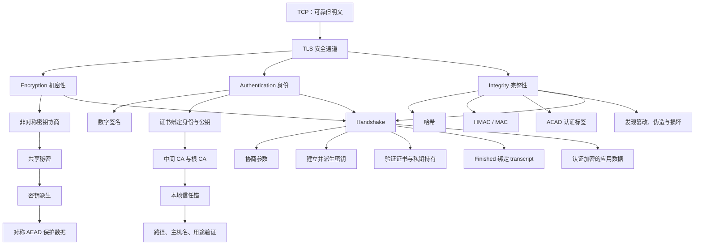

## 9. 核心结论

1. **可靠链路不等于安全链路。** TCP 解决字节交付，不阻止窃听、篡改和冒充。
2. **TLS 组合机密性、认证和完整性。** 三者互相支撑，任何单项都不能单独构成完整安全通道。
3. **TLS 采用混合密码系统。** 非对称密码学解决密钥协商和身份签名，对称 AEAD 高效保护大量应用数据。
4. **共享秘密无需直接上网传输。** Diffie–Hellman 双方交换公开值，各自计算 $g^{ab}$；安全性依赖困难问题和正确参数。
5. **未经认证的密钥交换仍可被中间人劫持。** 证书和握手签名必须把临时密钥材料绑定到目标服务器身份。
6. **证书把身份和公钥绑定。** 客户端必须构建到本地信任锚的路径，并检查签名、有效期、SAN、用途和约束。
7. **根证书不是因为自签名而可信。** 信任来自操作系统、浏览器或组织通过独立渠道预置的信任决策。
8. **服务器通常发送叶子和中间证书，根来自客户端本地。** 对端发送的陌生根不能自行成为信任锚。
9. **证书过期会在应用请求之前中断连接。** 自动续期、部署验证和提前告警是可用性工程的一部分。
10. **普通哈希不能对抗主动攻击者。** MAC/HMAC 用秘密密钥认证消息；现代 TLS 记录通常用 AEAD 同时完成加密与认证。
11. **TCP 校验和不是密码学完整性。** 原书的 16 GB 到 10 TB 例子说明小漏检概率在大规模传输中仍会成为现实风险。
12. **握手协商算法、建立密钥、认证身份并绑定 transcript。** Finished 证明双方共享相同秘密且看到了相同握手。
13. **TLS 1.3 将完整握手从 TLS 1.2 常见的 2 RTT 降至 1 RTT。** 新 TCP 连接仍另需约 1 RTT。
14. **就近部署和连接复用同时改善性能。** 它们减少握手等待，并摊薄非对称运算与连接初始化成本。
15. **0-RTT 带来重放风险。** 是否可用取决于应用操作是否可安全重放或去重。
16. **TLS 保护的是两个 TLS 端点之间的传输。** 端点失陷、TLS 终止后的明文处理和业务授权仍需独立防护。

## 10. 从本章提炼出的通用解题方法

### 第一步：先定义资产、对手与边界

明确要保护的是凭据、业务数据还是服务身份；攻击者只能监听，还是能够修改和冒充；TLS 在哪里开始、在哪里终止。威胁模型不清，机制选择就没有依据。

### 第二步：把安全目标拆开

分别检查机密性、身份认证、消息完整性与可用性。不要因为“已经加密”就跳过主机名验证，也不要把校验和当作攻击防护。

### 第三步：明确每项性质依赖的密钥

谁持有私钥，谁共享 MAC 密钥，哪些密钥只用于单个方向或阶段，怎样派生和轮换。密钥用途混用会破坏隔离边界。

### 第四步：找到信任锚

证书链最终必须落到独立获得的本地信任锚。追问根从哪里安装、谁能修改、内部 CA 如何保护，才能知道“信任”真正来自哪里。

### 第五步：把协商内容绑定进认证

版本、算法和临时密钥若不纳入 transcript 签名或 MAC，中间人就可能替换或降级。协商不是安全性质之外的配置细节，而是必须被认证的协议输入。

### 第六步：只接受完整验证后的数据

先验证 AEAD 标签或 MAC，再向应用输出明文；证书链、主机名、用途和私钥持有证明全部成功后，才承认对端身份。失败必须关闭，而不是“记录警告后继续”。

### 第七步：计算握手与轮换成本

用 RTT 模型估算新连接延迟，监控握手 CPU、失败率和证书到期时间，通过连接复用、恢复和就近部署优化，而不是关闭安全检查。

### 第八步：把证书和密钥当作有生命周期的生产资源

自动签发、部署、轮换、撤销、告警和验证。任何人工日历提醒都不足以支撑大规模证书管理。

### 第九步：优先使用成熟协议与库

不要自行设计加密模式、MAC 拼接、证书验证或 TLS 状态机。使用当前受支持的 TLS 版本、AEAD 套件和经过审计的库，并保持补丁更新。

### 第十步：在 TLS 之外继续做应用安全

TLS 成功后仍要认证用户、执行授权、验证输入、保护静态数据、限制敏感日志并隔离终止代理。安全通道只是可信业务处理的起点。

本章最重要的方法论是：**安全通信不是“把数据加密”这一项操作，而是把密钥协商、身份信任、消息完整性和握手状态绑定为一个可验证的整体；每一项保证都必须追溯到明确的密钥、信任锚和协议边界。**
