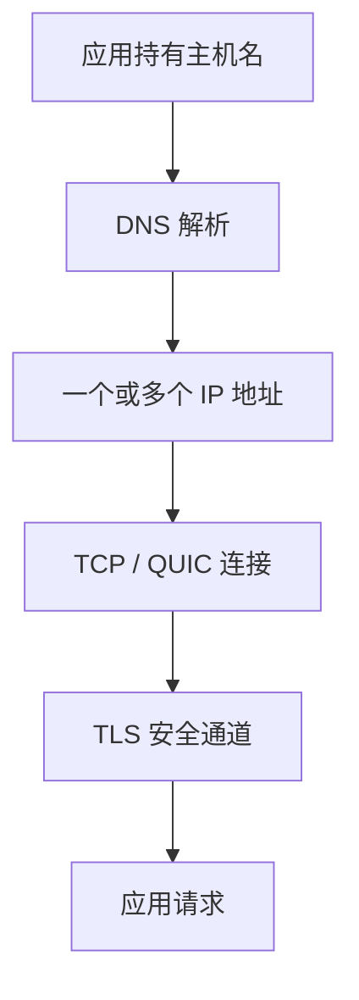
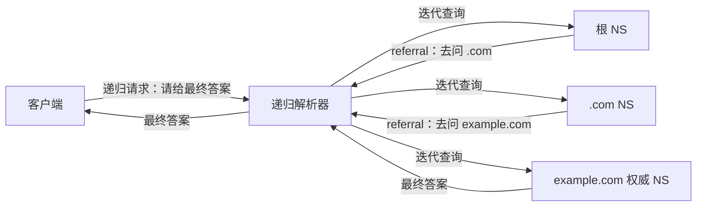
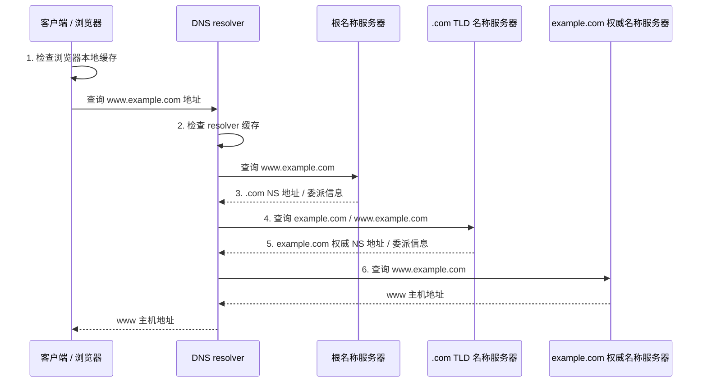
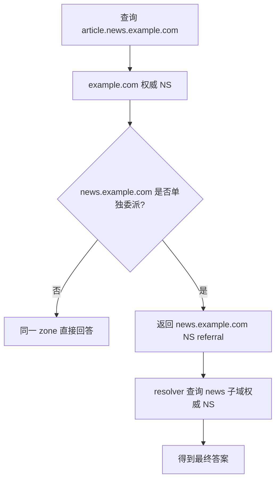
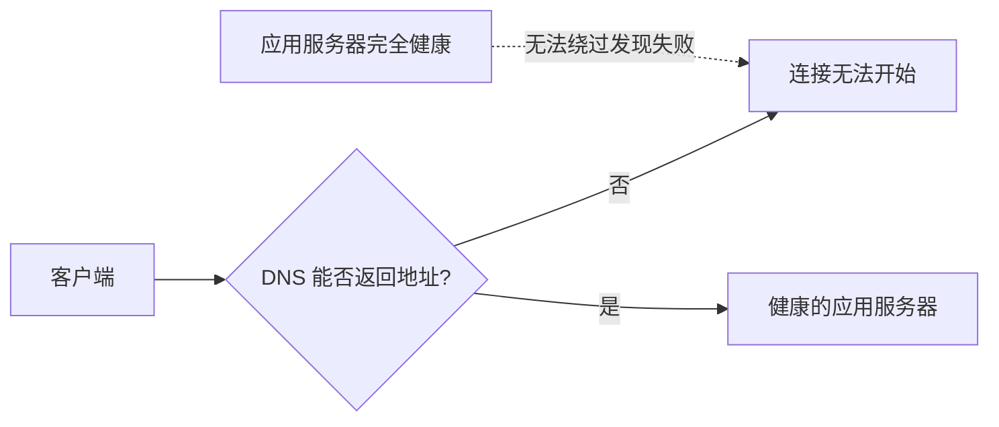
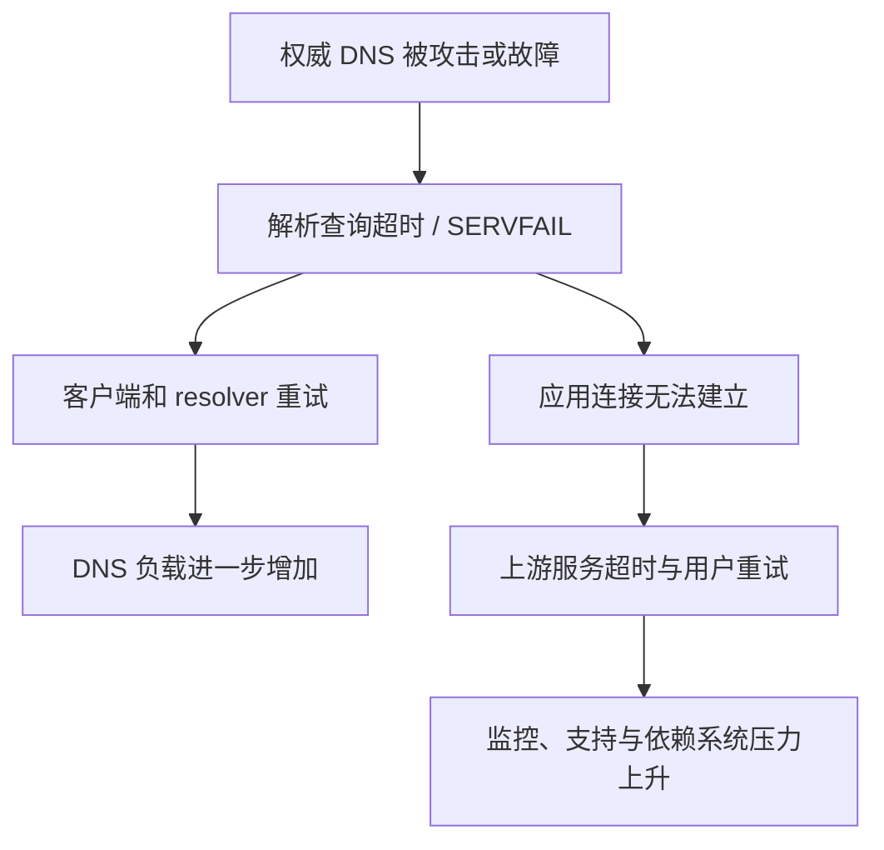
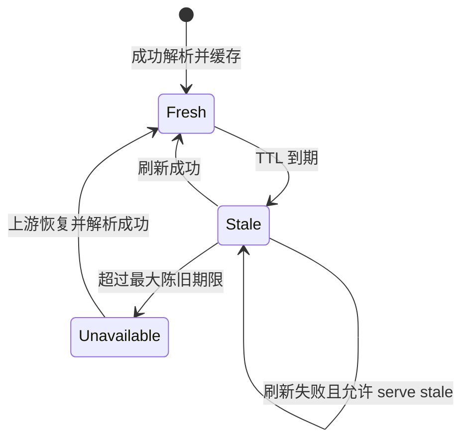
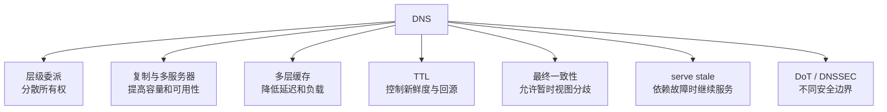
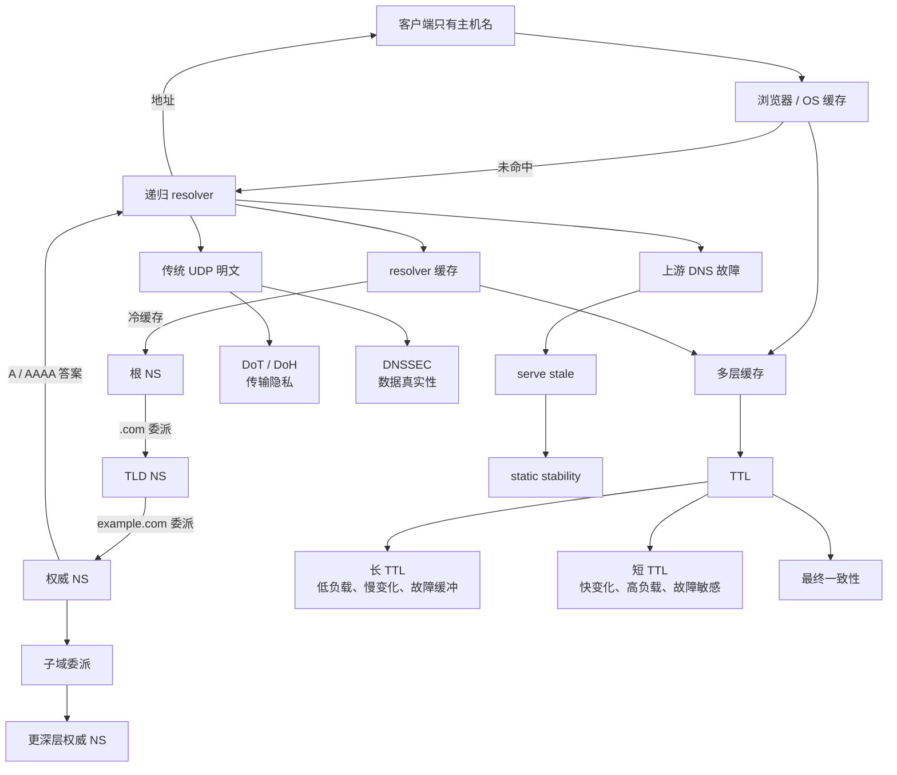

> 本文严格沿原章论证顺序展开：先说明为什么可靠、安全的链路仍需要服务发现，再跟随 `www.example.com` 的六步 DNS 解析过程，随后讨论子域委派、DNS 传输安全、分层缓存、TTL 权衡、单点故障与 static stability。原章没有正式算法；文中的记录类型、委派细节、缓存负载模型、变更流程、伪代码和标准 C 示例用于展开作者的直觉，不应误认为原书逐字给出的协议规范或实现。

## 0. 本章定位：建立连接之前，先找到对方

### 0.1 前三章解决了什么，还缺什么

前几章已经建立了两种能力：

- TCP 在 IP 之上提供可靠、有序的字节流；
- TLS 在 TCP 之上提供加密、认证和完整性保护。

但客户端要打开 TCP/TLS 连接，首先必须知道目标 IP 地址。用户和应用通常使用稳定、可读的名字，例如 `www.example.com`，而不是记忆可能变化的 IPv4 或 IPv6 地址。因此还缺少一个映射：

$$
\text{hostname} \longrightarrow \text{IP address}
$$

这个映射过程就是 **服务发现（discovery）** 的一种形式。客户端先通过名字发现网络位置，再建立连接：


DNS 失败时，即使服务器进程、网络路径、TCP 和 TLS 全部正常，客户端仍可能无法开始连接。这说明发现系统位于业务请求的关键路径上。

### 0.2 为什么应用使用名字，而不是直接写 IP

名字提供了一层间接性。客户端依赖逻辑身份，DNS 把身份映射到当前部署位置。于是服务可以：

- 更换服务器或数据中心而不修改所有客户端；
- 为同一名字返回多个地址；
- 按地域或策略选择入口；
- 在故障时把名字切换到备用地址；
- 同时发布 IPv4 和 IPv6 地址；
- 把某个别名指向由其他系统管理的规范名称。

这层间接性降低了调用方与物理位置的耦合，但也增加了一个需要缓存、一致性、安全和高可用设计的分布式依赖。

### 0.3 DNS 是什么

作者把 DNS（Domain Name System）称为互联网的“电话簿”，并给出三个关键性质：

> **DNS 是一个分布式、层级化、最终一致的键值存储。**

#### 分布式

全球域名数据不存放在单个服务器中。不同组织负责不同区域，解析器沿委派关系找到负责某个名字的权威服务器。

#### 层级化

名字按点分隔，形成从右向左逐步具体化的命名空间：

```text
www.example.com.
|   |       |  |
主机/子域   域  顶级域 根
```

末尾的点表示 DNS 根，日常书写通常省略。完整限定域名可写作 `www.example.com.`。

#### 最终一致

记录更新不会瞬间推送到全球所有缓存。旧值会在不同缓存中保留到 TTL 到期，随后各缓存才在不同时间重新查询。因此，变更后的某段时间内，不同客户端可能看到不同结果；当旧缓存逐渐过期且系统不再继续更新时，它们最终趋向新值。

### 0.4 “键值存储”只是第一层直觉

最简单的 DNS 查询看起来像：

```text
key:   (www.example.com, A)
value: 93.184.216.34
```

真实键至少还包含记录类型和 DNS 类，值也可能有多条，并附带 TTL。DNS 不只是“字符串到一个 IP”的表：

| 记录类型 | 典型含义 | 示例用途 |
| --- | --- | --- |
| `A` | 名字对应 IPv4 地址 | 找到 IPv4 服务入口 |
| `AAAA` | 名字对应 IPv6 地址 | 找到 IPv6 服务入口 |
| `NS` | 某个区域由哪些名称服务器负责 | 建立层级委派 |
| `CNAME` | 当前名字是另一个名字的别名 | 把业务名指向托管平台名称 |
| `MX` | 域的邮件服务器 | 邮件投递发现 |
| `TXT` | 文本型元数据 | 域名验证、安全策略等 |
| `SOA` | 区域起始授权信息 | 区域元数据和负缓存参数 |

本章主线只需要 `NS` 与地址记录：前者让解析器逐层找到权威服务器，后者给出最终连接地址。

### 0.5 DNS 在通信栈中的位置

DNS 不是建立安全链路之后才出现的普通业务调用，它通常发生在连接目标服务器之前：



DNS 自己也需要网络通信，并且可能使用 UDP、TCP、TLS 或 HTTPS。于是“发现目标”本身也依赖其他可发现或预配置的网络端点，例如本地递归解析器地址和根服务器提示。

## 1. 浏览器解析 `www.example.com` 的起点

### 1.1 从 URL 中提取主机名

用户输入：

```text
https://www.example.com/path
```

浏览器首先解析 URL，得到：

- scheme：`https`；
- hostname：`www.example.com`；
- 默认端口：443；
- path：`/path`。

DNS 负责解析 hostname，而不是整条 URL。它不知道 `/path`，也不决定 HTTP 方法或 TLS 证书是否有效。

### 1.2 第一步：浏览器检查本地缓存

原章六步过程的第一步是浏览器先查看自己的 DNS 缓存：

```text
cache key = (www.example.com, record type)
```

若存在仍可使用的记录，浏览器直接得到地址；否则把查询交给 DNS resolver。

浏览器缓存有两个作用：

1. 避免重复网络往返，降低连接冷启动延迟；
2. 减少操作系统、递归解析器和权威服务器负载。

浏览器还可能缓存失败结果、连接信息或应用自己的名称映射。实际调试时，“清除操作系统 DNS 缓存”不一定清除了浏览器内部缓存。

### 1.3 浏览器、操作系统与 resolver 的角色

原书为突出主线，把浏览器直接路由到 resolver。现实中常见路径是：


- **stub resolver** 是客户端上的轻量解析组件，通常只负责把查询交给配置好的递归解析器；
- **递归解析器** 代表客户端完成缓存查找和逐级查询；
- resolver 地址可能由 DHCP、VPN、系统配置或应用自己的安全 DNS设置提供；
- 浏览器也可能绕过操作系统传统 DNS 路径，直接使用 DoH resolver。

这些实现差异不改变原章的核心：客户端把“请给我最终答案”的任务委托给 resolver。

### 1.4 递归查询与迭代查询

这是 DNS 中最容易混淆的一组概念。

#### 客户端对递归解析器：递归语义

客户端要求 resolver 返回最终答案或错误，而不是返回“你再去问某台服务器”的提示。resolver 代替客户端完成后续工作。

#### 递归解析器对层级名称服务器：迭代语义

resolver 从根开始逐级询问。每台名称服务器要么给出自己权威掌握的答案，要么给出下一层应该询问谁的 referral（委派提示）。resolver 自己继续下一步。



“递归解析器”这个名称描述它对客户端承担完整解析责任；“迭代解析”描述它与权威层级交互时逐步获得 referral 的过程。原书称 resolver 负责 iteratively resolving，正是这个含义。

## 2. 六步 DNS 解析过程

### 2.1 完整时序图

下面按原书图 4.1 重建 `www.example.com` 的无缓存解析过程：



图中查询名称的具体写法可能因实现和缓存状态不同；关键关系是 resolver 逐层获取下一层权威位置，最终向 `example.com` 权威服务器取得 `www` 的地址记录。

### 2.2 第二步：resolver 检查缓存

收到客户端查询后，递归解析器先检查本地缓存。它可能缓存：

- `www.example.com` 的最终 `A`/`AAAA` 答案；
- `example.com` 的权威 NS；
- `.com` 的 NS；
- 名称不存在等负面答案；
- CNAME 链中的中间结果。

若最终答案仍然新鲜，resolver 直接返回，不需要访问根、TLD 或权威服务器。若只缓存了部分委派信息，也可以从已知的最接近层级开始，而不是每次都从根开始。

因此，原书六步表示 **最容易理解的冷缓存路径**，不是每次查询固定发出的网络包序列。

### 2.3 resolver 如何知道根服务器在哪里

resolver 首次没有任何目标域信息时，需要一个引导点。DNS 的优雅之处在于：只要知道根名称服务器的地址，就能沿层级解析任意公共域名。

实现通常包含一份 **root hints（根提示）**，列出根服务器名称和地址。它是引导信息，不是每个域名的完整目录。resolver 可以用它联系根系统，之后缓存更具体的委派。

“根只有少数逻辑名称”不等于全球只有少数物理机器。根服务通过复制和 anycast 等技术部署在许多地点，使同一个服务地址可被路由到较近或可达的实例。原章关注的是逻辑层级，而不是物理部署拓扑。

### 2.4 第三步：根服务器返回 `.com` 委派

根服务器不保存 `www.example.com` 的最终地址。它负责根区域，知道 `.com` 顶级域由哪些名称服务器管理。

resolver 查询后，根服务器通常返回 referral：

```text
com.  NS  a.gtld-servers.net.
com.  NS  b.gtld-servers.net.
...
```

resolver 下一步需要联系这些 TLD 服务器。响应还可能附带其地址作为附加信息，避免出现“为了找到 `.com` NS 的地址，又必须先解析它的名字”的循环。

### 2.5 NS 记录与 glue 记录

**NS 记录**说明某个区域委派给哪些名称服务器。若名称服务器名字位于被委派区域内部，父区域需要提供 **glue（胶水）地址记录** 帮助启动解析。

例如：

```text
example.com.      NS    ns1.example.com.
ns1.example.com.  A     192.0.2.53    ; 父区提供的 glue
```

若没有 glue，要解析 `ns1.example.com` 的地址就要先联系 `example.com` 权威服务器，而联系它又需要知道 `ns1.example.com` 地址，形成循环。

glue 的作用是引导 resolver 到达权威服务器。权威数据本身仍由子区域负责，父区域中的 glue 不应被理解为对子区所有记录的权威回答。

### 2.6 第四步：resolver 查询 `.com` TLD 服务器

resolver 从根 referral 中选一台 `.com` 名称服务器，请求关于 `example.com` 的信息。

选择哪台服务器可以考虑：

- 当前可达性；
- 历史 RTT；
- 超时与重试结果；
- 本地实现策略。

名称服务器列表本身提供冗余。某一台无响应时，resolver 可以尝试另一台，而不是立即让整个查询失败。

### 2.7 第五步：TLD 服务器返回 `example.com` 委派

`.com` TLD 服务器管理 `.com` 下的委派关系，但通常不保存 `www.example.com` 的最终业务地址。它返回负责 `example.com` 区域的权威名称服务器，例如：

```text
example.com.  NS  ns1.provider.example.
example.com.  NS  ns2.provider.example.
```

并在需要时附带可用地址信息。resolver 缓存这份委派，后续查询 `api.example.com`、`mail.example.com` 等名字时可以直接联系相应权威服务器。

### 2.8 第六步：权威服务器返回 `www` 地址

resolver 最后向 `example.com` 的权威服务器查询 `www.example.com`。DNS 查询通常一次指定一种 QTYPE，所以客户端或 resolver 会分别查询 `A` 与 `AAAA`；每次查询又可能返回多条同类型记录。例如，两次查询可能分别得到：

```text
www.example.com.  300  IN  A     192.0.2.10
www.example.com.  300  IN  AAAA  2001:db8::10
```

其中：

- `300` 是 TTL，单位为秒；
- `IN` 是 Internet 类；
- `A` 和 `AAAA` 是记录类型；
- 最后字段是地址值。

resolver 缓存响应并把地址返回客户端。客户端可能得到多个地址并按自己的连接策略尝试。DNS 只提供候选地址，不保证对应服务健康，也不保证 TCP/TLS 一定成功。

### 2.9 “权威”是什么意思

权威名称服务器保存或提供某个 DNS zone 的正式数据，而递归解析器通常返回缓存或代查结果。

| 角色 | 数据来源 | 主要职责 |
| --- | --- | --- |
| 递归解析器 | 缓存以及向其他 NS 查询 | 代表客户端寻找最终答案 |
| 权威名称服务器 | 自己负责区域的数据 | 对区域内名称给出权威回答或委派 |
| 根名称服务器 | 根区域 | 告诉 resolver 去哪里找 TLD |
| TLD 名称服务器 | `.com` 等 TLD 区域 | 告诉 resolver 去哪里找注册域权威服务器 |

一台软件服务器可以配置成不同角色，但概念上必须区分：缓存命中不是权威回答，权威服务器也不必替任意客户端递归查询互联网其他名字。

### 2.10 resolver 最终返回什么

可能的结果不只有“一个 IP”：

- 一条或多条 `A`/`AAAA` 记录；
- CNAME 别名链及最终地址；
- 名称存在但没有所问类型的数据；
- 名称不存在（NXDOMAIN）；
- 临时解析失败（如 SERVFAIL）；
- 因策略被拒绝。

客户端必须区分“名字不存在”和“解析器暂时失败”。前者可以负缓存，后者通常不应长期固化为永久不存在。

## 3. 子域与进一步委派

### 3.1 名字更深不等于必然多一次查询

原章举出 `news.example.com`：权威服务器可能返回负责该子域的另一台名称服务器，于是 resolver 需要多查询一步。

关键前提是 **发生了子域委派**。如果 `news.example.com` 仍属于 `example.com` 同一个 zone，那么 `example.com` 权威服务器可以直接回答，无需额外 NS 跳转。



“域名层级”和“管理区域边界”相关但不等同。zone cut 可以把某个子树的管理权委派给另一组名称服务器。

### 3.2 为什么需要委派

层级委派解决全球命名空间的管理扩展问题：

- 根不需要知道每个主机，只管理 TLD 委派；
- TLD 不需要知道每个业务主机，只管理注册域委派；
- 域所有者独立管理自己的 zone；
- 大型组织还可把子域交给不同团队或平台。

这是一种组织与技术共同分片：名字层级界定管理边界，NS 记录表达责任转移。

### 3.3 委派也会增加依赖链

每增加一层委派，都可能增加：

- 冷缓存解析 RTT；
- 一组权威服务器依赖；
- 配置、续费和监控责任；
- 故障定位难度。

缓存可以显著摊薄这些成本，但域名设计不应为了形式整齐而创建不必要的长 CNAME 链或多层外部委派。

## 4. DNS 消息传输与安全

### 4.1 传统 DNS 为什么主要使用 UDP

原始 DNS 查询和响应通常较小，传统协议主要使用 UDP：

- 不需要先建立 TCP 连接；
- 一问一答开销小；
- resolver 超时后可以重试或换服务器；
- 适合高查询量的简单请求/响应模式。

这不是说 DNS 只能使用 UDP。DNS 也会使用 TCP，例如：

- 响应被截断，客户端需要通过 TCP 重试；
- 区域传送；
- 某些较大响应或策略要求；
- DNS over TLS 本身运行在 TLS 保护的可靠连接上。

现代 EDNS 扩展了 UDP 可承载的 DNS 消息能力，但过大的 UDP 响应会增加 IP 分片、丢包和中间设备兼容风险。

### 4.2 明文 DNS 泄露什么

传统 UDP/TCP DNS 没有传输加密。路径上的网络运营者、Wi-Fi 观察者或中间设备可以看到查询名称和响应，并可能注入或修改消息。

这会泄露：

- 用户正在访问或尝试访问的域名；
- 内部服务名称和组织结构；
- 查询时间、频率和来源地址；
- 某些软件、设备或安全产品使用模式。

即使后续 HTTPS 隐藏了页面内容，DNS 查询元数据仍可能暴露访问意图。

### 4.3 DNS over TLS

原章指出行业转向 DNS over TLS（DoT）等安全替代方案。DoT 在客户端与递归解析器之间建立 TLS 通道：


DoT 可以在这一段提供：

- 查询和响应的机密性；
- 传输完整性；
- 对配置 resolver 的 TLS 身份认证。

但安全边界必须说清：客户端到 resolver 被保护，不代表 resolver 到各权威服务器的每一跳自动加密，也不代表 resolver 不知道客户端查了什么。

### 4.4 DoT、DoH 与 DNSSEC 不是一回事

| 机制 | 主要保护对象 | 主要目标 | 不能自动解决 |
| --- | --- | --- | --- |
| DoT | 客户端到 resolver 的传输 | 加密与认证 DNS 传输 | 权威数据是否被域所有者签名 |
| DoH | HTTPS 中的 DNS 传输 | 与 DoT 类似，走 HTTPS 生态 | resolver 本身的可见性和可信度 |
| DNSSEC | DNS 记录与委派数据 | 来源认证和数据完整性 | 查询名称的机密性 |

DNSSEC 让 validating resolver 从配置的信任锚沿连续签名链，验证已签名区域中的记录确由相应 zone 签发且未被篡改。若委派明确进入未签名区域，结果通常是 insecure，而不是“已验证安全”；签名链断裂或验证失败才是 bogus。DNSSEC 不加密查询。DoT/DoH 加密“怎么问 resolver”，DNSSEC 验证“答案是否有可验证来源”；两者可以组合。

### 4.5 加密 DNS 的信任转移

使用 DoT/DoH 后，本地网络旁观者更难直接读取查询，但被选择的 resolver 仍能看到查询并形成集中观察点。因此要问：

- resolver 由 ISP、企业、公共服务商还是应用提供；
- 日志保留和隐私策略是什么；
- 客户端怎样验证 resolver 身份；
- resolver 不可用时是否回退到明文；
- 企业分流 DNS、VPN 和本地域名是否仍能正确解析。

“加密”改变了谁能看到数据，不会消灭所有信任关系。

### 4.6 DNS 安全常见误区

**UDP 不等于 DNS 的唯一传输。** DNS 可以使用 UDP、TCP、TLS 或 HTTPS 等承载方式。

**DoT 不等于 DNSSEC。** 前者保护到 resolver 的链路，后者验证 DNS 数据。

**HTTPS 已加密不代表 DNS 查询也加密。** 两者是不同网络交互。

**加密 DNS 不让 resolver 失明。** resolver 仍要读取查询才能解析和缓存。

**TLS 保护 DNS 不代表答案对应服务健康。** DNS 安全与后端健康检查是不同问题。

## 5. 缓存：让层级解析能够扩展

### 5.1 为什么不能每次都走完整六步

冷缓存解析需要多个串行往返：客户端到 resolver，resolver 到根、TLD 和权威服务器。若每次访问都重复：

- 用户连接延迟增加；
- 根和 TLD 承受全球所有最终主机查询；
- 权威服务器必须承受每个客户端的全部请求；
- 任一层短时故障都会立即影响所有查询。

DNS 可扩展的关键不是让少数服务器无限强，而是利用记录通常不会频繁变化，让答案靠近使用者。

### 5.2 原章点出的三层缓存

原书明确指出浏览器、操作系统和 DNS resolver 都会缓存：


一次命中越靠左，延迟越低，对后续层的负载削减越大。现实中还可能有应用运行时、代理、本地网络设备等额外缓存。

### 5.3 缓存的不只是最终地址

resolver 可以缓存层级中的每一段知识：

```text
根提示
  -> .com 的 NS 与地址
      -> example.com 的 NS 与地址
          -> www.example.com 的 A / AAAA
```

即使最终 `www` 记录过期，`.com` 与 `example.com` 委派仍可能新鲜，resolver 可以直接从最近的已知权威服务器继续查询。这使真实解析成本通常小于完整冷启动路径。

### 5.4 缓存命中率与平均延迟

设缓存命中率为 $h$，本地命中延迟为 $L_{hit}$，未命中并完成远程解析的延迟为 $L_{miss}$，平均解析延迟近似：

$$
E[L] = hL_{hit} + (1-h)L_{miss}
$$

例如：

- $h=0.9$；
- $L_{hit}=1$ ms；
- $L_{miss}=80$ ms。

则：

$$
E[L] = 0.9\times1 + 0.1\times80 = 8.9\ \mathrm{ms}
$$

若没有缓存，平均值接近 80 ms。缓存不仅优化平均延迟，也显著减少上游请求量。

这个模型忽略多层缓存和长尾，只用于说明命中率的杠杆效应。生产系统还应观察 p95/p99、超时和 SERVFAIL 比例。

### 5.5 负缓存

不存在的名字也可以缓存，例如 NXDOMAIN。否则随机或反复查询一个不存在名字，会不断穿透到权威服务器。

负缓存的价值：

- 降低错误查询和攻击流量；
- 缩短重复失败响应；
- 保护权威服务器。

代价是：如果刚创建一个此前不存在的记录，客户端可能继续看到负面缓存直到其 TTL 到期。因此，“新建名字”也有传播等待，不只是修改已有地址。负缓存时长通常受权威响应中的 SOA 记录控制，经典规则取 SOA RR 的 TTL 与 SOA.MINIMUM 的较小值；NXDOMAIN 与 NODATA 的缓存键范围也不同，resolver 实现不能把“名字不存在”和“名称存在但无该类型”混为一谈。

## 6. TTL：缓存一致性与负载的时间契约

### 6.1 TTL 是什么

每条 DNS 记录带有 **time to live（TTL）**，告诉缓存该记录还能被视为新鲜多长时间。设权威响应时给出的 TTL 为 $T$，缓存保存时刻为 $t_0$，则新鲜截止时间近似：

$$
t_{expire}=t_0+T
$$

在 $t<t_{expire}$ 时，缓存可以直接返回记录；到期后通常需要重新验证或查询。

随着响应经过缓存层，返回给下游的剩余 TTL 会递减，而不是每层都重新获得完整 $T$。否则多层缓存会无限延长旧数据寿命。

### 6.2 TTL 不是什么

TTL 不是：

- 权威服务器主动向全网推送变更的倒计时；
- 记录到期后从权威 DNS 自动删除的时间；
- 所有客户端必然在同一时刻切换的保证；
- 服务连接本身的存活时间；
- HTTP 缓存或 TLS 证书的有效期。

TTL 只约束遵守协议的 DNS 缓存能把某次答案当作新鲜值使用多久。

### 6.3 为什么变更不会在一个 TTL 后整齐完成

不同缓存获取旧记录的时刻不同。假设旧记录 TTL 是 1 小时：

- resolver A 在变更前 59 分钟缓存旧值，变更后约 1 分钟过期；
- resolver B 在变更前 1 分钟缓存旧值，变更后还可保留约 59 分钟；
- 没有旧缓存的 resolver C 立即读取新值。

```mermaid
gantt
    title DNS 变更后的缓存分歧示意
    dateFormat  HH:mm
    axisFormat  %H:%M
    section 权威记录
    旧地址          :done, old, 08:00, 10:00
    新地址          :active, new, 10:00, 12:00
    section Resolver A
    旧缓存到期      :a, 09:01, 10:01
    section Resolver B
    旧缓存到期      :b, 09:59, 10:59
```



所以 DNS 的“传播”主要是旧缓存逐步淘汰，不是中央服务器同步推送。

### 6.4 原章强调的现实偏差

作者提醒：不能保证所有客户端都严格执行 TTL。少数客户端可能在 TTL 到期很久后仍访问旧地址。原因可能包括：

- 应用自行缓存但不正确尊重 TTL；
- 中间缓存设置最小 TTL 或自定义策略；
- 长连接在 DNS 变更后继续使用原地址；
- 客户端离线后恢复旧状态；
- 某些库只在进程启动时解析一次；
- 失败重试逻辑固定复用旧地址。

因此，生产迁移不能假设“TTL 到点，旧服务器就再也没有流量”。旧端点应保留观察期，并通过访问日志验证残余流量。

### 6.5 长 TTL 的收益与代价

长 TTL 意味着缓存更久。

收益：

- 命中率更高；
- 解析延迟更低；
- resolver 和权威服务器负载更小；
- 权威 DNS 短时故障时，更多客户端仍有新鲜缓存。

代价：

- 地址变更和故障切换较慢；
- 错误配置影响持续更久；
- 流量调度策略响应较慢；
- 旧端点必须保留更长兼容期。

### 6.6 短 TTL 的收益与代价

短 TTL 让缓存更频繁地回源。

收益：

- 变更更快被重新查询；
- DNS 流量调度和故障切换更灵活；
- 错误记录在遵守 TTL 的缓存中更快淘汰。

代价：

- resolver 与权威服务器查询量增加；
- 平均解析延迟上升；
- 权威 DNS 故障更快暴露给客户端；
- 查询成本、日志和攻击面增大。

因此 TTL 不是越短越“现代”，也不是越长越“稳定”；它是在新鲜度、负载、延迟和故障缓冲之间做选择。

### 6.7 用简单模型量化权威查询率

下面是扩展理解模型，不是 DNS 协议保证。假设：

- 某 resolver 对同一记录的客户端请求服从速率 $\lambda$ 的泊松过程；
- 一次回源后缓存固定 $T$ 秒；
- 命中不刷新 TTL；
- 缓存过期后，下一次请求触发一次回源。

一个更新周期由两部分组成：

1. 缓存新鲜期 $T$；
2. 过期后等待下一请求，期望时间 $1/\lambda$。

因此每个周期平均时长：

$$
E[C]=T+\frac{1}{\lambda}
$$

每周期回源一次，平均上游查询率为：

$$
q=\frac{1}{T+1/\lambda}
=\frac{\lambda}{1+\lambda T}
$$

缓存命中比例近似为：

$$
h=1-\frac{q}{\lambda}
=\frac{\lambda T}{1+\lambda T}
$$

#### 数值例子

若某 resolver 平均每秒收到 $\lambda=10$ 次相同查询：

- TTL 60 秒时：

  $$
  q=\frac{10}{1+10\times60}
  =\frac{10}{601}
  \approx0.0166\ \mathrm{queries/s}
  $$

  即大约每 60.1 秒回源一次。

- TTL 5 秒时：

  $$
  q=\frac{10}{1+10\times5}
  =\frac{10}{51}
  \approx0.196\ \mathrm{queries/s}
  $$

  即大约每 5.1 秒回源一次。

TTL 从 60 秒降到 5 秒，这个 resolver 的上游查询率约增加：

$$
\frac{0.196}{0.0166}\approx11.8
$$

模型解释了作者所说的负载权衡。真实 DNS 有多层缓存、合并并发查询、预取、最小/最大 TTL 和非泊松流量，因此不能把该公式直接当作容量承诺。

### 6.8 TTL 与陈旧窗口

若权威记录在缓存新鲜期内随机时刻发生更新，并简化假设更新时刻相对缓存周期均匀分布，则旧值剩余新鲜时间 $R$ 近似服从 $[0,T]$ 均匀分布：

$$
E[R]=\frac{T}{2}
$$

TTL 1 小时时，单个合规缓存平均还会保留旧值约 30 分钟，最坏接近 1 小时。这只是单层、随机更新的直觉；计划变更可以通过预先降低 TTL 来缩短实际残余时间。

### 6.9 计划 DNS 迁移的正确顺序

假设当前 TTL 是 24 小时，希望迁移时把残余窗口降到 5 分钟。不能在切换地址的同一时刻才把 TTL 改成 5 分钟，因为已有缓存仍按旧的 24 小时 TTL 计时。

推荐流程：

1. 在迁移至少一个旧 TTL 之前，把 TTL 从 24 小时降低到 5 分钟；
2. 等待至少 24 小时，让此前的长 TTL 缓存自然过期；
3. 修改地址记录；
4. 新旧端点并行服务，观察旧地址残余流量；
5. 确认迁移稳定后，再按长期目标调高 TTL；
6. 等待足够观察期后再回收旧端点。


DNS 回滚也受缓存影响。切到错误地址后立刻改回，并不会撤回已经缓存错误值的客户端，因此发布前验证和并行兼容比“可以快速回滚”更可靠。

### 6.10 TTL 常见误区

**TTL 短不等于故障切换一定快。** 客户端可能忽略 TTL、复用长连接或缓存更久。

**TTL 到期不等于记录失效。** 权威记录仍存在；缓存只是需要重新查询。

**修改记录时同时降低 TTL 来不及影响旧缓存。** 必须提前一个旧 TTL 操作。

**长 TTL 不只有坏处。** 它能减少上游依赖和故障暴露。

**DNS 返回多个地址不等于自动健康检查。** 客户端是否尝试备用地址取决于实现，DNS 记录也可能仍指向不健康节点。

## 7. DNS 故障与单点风险

### 7.1 为什么 DNS 会成为单点故障

原章指出：若名称服务器不可用，客户端找不到应用 IP，就无法连接应用。业务服务本身健康也无济于事。



DNS 的层级结构本身有冗余，但一个具体域的权威托管、注册配置、网络路径或控制面仍可能形成共同故障域。

### 7.2 TTL 越小，DNS 故障暴露越快

权威服务器故障时：

- 有新鲜缓存的 resolver 仍能回答；
- 没有缓存或缓存已过期的 resolver 需要回源并失败；
- TTL 越短，更多缓存更快进入必须回源的状态；
- 因而受影响客户端数量增长更快。

这揭示 TTL 的另一面：缓存不只是性能优化，也是把读取路径与上游短时故障解耦的韧性机制。

### 7.3 DNS 大规模事故为何会级联

原章以 2016 年 Dyn 遭受 DDoS 的事故作为“DNS 可导致大范围中断”的例子。事故机制并不是所有被影响网站服务器同时崩溃，而是大量用户无法把域名解析为地址。

常见放大链条：



因此，重试必须有退避、上限和多服务器策略；无限立即重试只会给故障中的依赖增加负载。

### 7.4 DNS 冗余应避免共同故障域

为域配置多个 NS 只是起点。若它们共享：

- 同一物理机或网络；
- 同一云区域；
- 同一 DNS 软件配置错误；
- 同一控制面或凭据；
- 同一上游提供商和 DDoS 防护边界；

一次故障仍可能全部击穿。高关键度系统可以评估多地域 anycast、独立次级 DNS 或多提供商，但多提供商也会增加记录同步、DNSSEC、变更和监控复杂度。

### 7.5 控制面与数据面

DNS 运维中可以区分：

- **控制面**：创建、修改和发布 DNS 记录；
- **数据面**：权威服务器响应实际查询。

理想情况下，控制面故障不应让已发布记录的数据面立即停止回答。反过来，控制面可用也不代表全球查询路径健康。监控既要检查 API/控制台变更，也要从多个网络位置执行真实权威与递归查询。

## 8. Static stability：依赖受损时继续工作

### 8.1 作者提出的关键观察

原章最后提出：当 resolver 联系不到名称服务器时，与其把 TTL 当作“到点必须销毁”的炸弹，不如在适当条件下继续返回过期缓存。因为 DNS 映射通常变化不频繁，陈旧地址往往比完全没有地址更有用。

这种原则称为 **static stability（静态稳定性）**：

> 系统在依赖受损时，能够依靠已有状态继续提供某种程度的功能，而不需要立即执行新的恢复配置或外部协调。

### 8.2 Fresh、stale 与 unavailable

缓存条目可以从二元状态扩展为三种：

| 状态 | 条件 | 典型行为 |
| --- | --- | --- |
| fresh | TTL 尚未到期 | 直接返回 |
| stale | TTL 已过期，但在允许的陈旧窗口内 | 上游失败时兜底返回；resolver 内部记录 stale 状态，可选通过扩展错误信息暴露 |
| unavailable | 无缓存或陈旧窗口也已过 | 返回解析失败 |



serve-stale 策略不是把 TTL 永久忽略，而是把“正常新鲜度期限”和“故障兜底期限”分开。

### 8.3 为什么 stale 可能优于失败

比较两个结果：

- 返回昨天仍有效的服务器地址；
- 什么地址都不返回，客户端完全无法尝试连接。

若服务地址很少变化，旧地址仍可用的概率较高。即使旧地址失效，客户端最终也只是连接失败，与 DNS 直接失败相比未必更差；若旧地址仍健康，则整个上游 DNS 故障对客户端被缓存吸收。

这是一种风险权衡，不是绝对真理。是否 serve stale 取决于记录语义和安全后果。

### 8.4 serve stale 的风险与边界

过期数据可能：

- 指向已经下线的服务器；
- 绕过紧急流量切换；
- 指向已回收并被他人控制的地址；
- 延长错误配置或安全事件影响；
- 让不同客户端继续看到不同结果；
- 对需要快速撤销的记录产生风险。

因此需要：

- 最大陈旧时间上限；
- 仅在刷新失败时使用；
- 后台持续重试刷新；
- 记录和监控 stale 命中；
- 对高风险记录配置更严格策略；
- 回收旧 IP 前预留足够隔离时间。

### 8.5 stale-if-error 伪代码

```text
resolve(name, type, now):
  entry = cache.lookup(name, type)

  if entry exists and now < entry.fresh_until:
    return entry.value, FRESH

  result = query_upstream(name, type)
    if result is a positive answer:
    cache.store(result, fresh_until=now+ttl,
                         stale_until=now+ttl+stale_window)
    return result.value, REFRESHED

    if result is an authoritative NXDOMAIN or NODATA answer:
        remove any conflicting stale positive entry
        cache the negative answer according to its negative TTL
        return result, AUTHORITATIVE_NEGATIVE

    if result is a refresh failure such as timeout, unreachable, or SERVFAIL
         and entry exists and now < entry.stale_until:
    schedule_background_refresh(name, type)
    return entry.value, STALE

  return DNS_FAILURE
```

算法优先保证新鲜数据；只有超时、不可达或 SERVFAIL 等刷新失败才退回 stale。权威 `NXDOMAIN` 或 `NOERROR/NODATA` 是成功获得的新否定事实，应淘汰冲突的旧正答案，而不是继续返回 stale。这个区分避免把服务已经明确撤销的名称错误地延长为可用。

### 8.6 标准 C 示例：带陈旧兜底的缓存决策

下面的标准 C11 程序不实现 DNS 报文，而是模拟原章最后的韧性策略。缓存记录在 60 秒时过期，但允许在上游不可用时继续使用到 180 秒。

```c
#include <stdbool.h>
#include <stdio.h>

typedef enum {
    RESOLUTION_FRESH,
    RESOLUTION_REFRESHED,
    RESOLUTION_STALE,
    RESOLUTION_FAILED
} ResolutionStatus;

typedef struct {
    const char *address;
    long fresh_until;
    long stale_until;
    bool present;
} CacheEntry;

static ResolutionStatus resolve_address(CacheEntry *entry,
                                        long now,
                                        bool authority_available,
                                        const char *latest_address,
                                        long ttl,
                                        long stale_window) {
    if (entry->present && now < entry->fresh_until) {
        return RESOLUTION_FRESH;
    }

    if (authority_available) {
        entry->address = latest_address;
        entry->fresh_until = now + ttl;
        entry->stale_until = entry->fresh_until + stale_window;
        entry->present = true;
        return RESOLUTION_REFRESHED;
    }

    if (entry->present && now < entry->stale_until) {
        return RESOLUTION_STALE;
    }

    return RESOLUTION_FAILED;
}

static const char *status_name(ResolutionStatus status) {
    switch (status) {
        case RESOLUTION_FRESH:
            return "fresh cache hit";
        case RESOLUTION_REFRESHED:
            return "refreshed from authority";
        case RESOLUTION_STALE:
            return "stale fallback";
        case RESOLUTION_FAILED:
            return "resolution failed";
    }
    return "unknown";
}

static void run_case(CacheEntry *entry,
                     long now,
                     bool authority_available,
                     const char *latest_address) {
    const ResolutionStatus status = resolve_address(
        entry, now, authority_available, latest_address, 60, 120);

    printf("t=%ld: %-24s", now, status_name(status));
    if (status != RESOLUTION_FAILED) {
        printf(" address=%s", entry->address);
    }
    putchar('\n');
}

int main(void) {
    CacheEntry entry = {0};

    run_case(&entry, 0, true, "192.0.2.10");
    run_case(&entry, 30, false, "192.0.2.20");
    run_case(&entry, 70, false, "192.0.2.20");
    run_case(&entry, 190, false, "192.0.2.20");
    run_case(&entry, 200, true, "192.0.2.20");

    return 0;
}
```

预期输出：

```text
t=0: refreshed from authority address=192.0.2.10
t=30: fresh cache hit          address=192.0.2.10
t=70: stale fallback           address=192.0.2.10
t=190: resolution failed
t=200: refreshed from authority address=192.0.2.20
```

代码与原理的对应关系：

- `fresh_until` 对应正常 TTL 截止时间；
- `stale_until` 对应额外、有限的故障兜底窗口；
- fresh 时完全不依赖上游状态；
- 过期后优先访问权威源；
- 只有权威源失败且未超过陈旧上限时才返回旧地址；
- 陈旧上限过后宁可失败，避免无限使用旧地址；
- 权威源恢复后刷新为新地址 `192.0.2.20`。

真实 resolver 还要处理并发查询合并、不同 DNS 错误码、DNSSEC 验证状态、负缓存、TTL 上限、后台刷新、持久化和内存淘汰。该代码只展示 static stability 的最小决策核心。

### 8.7 Static stability 与 fail-open / fail-closed

serve stale 接近一种受限的 fail-open：依赖故障时继续使用旧状态。安全系统有时必须 fail-closed，例如无法确认撤销状态时拒绝高风险操作。

选择依据包括：

| 问题 | 倾向 serve stale | 倾向失败关闭 |
| --- | --- | --- |
| 旧值是否大概率仍安全可用 | 是 | 否 |
| 完全失败的业务损失 | 很高 | 可接受 |
| 旧值可能指向不可信资源 | 低 | 高 |
| 是否有最大陈旧窗口 | 有 | 无法控制 |
| 能否监控并快速恢复 | 能 | 不能 |

static stability 不是“永远返回缓存”，而是在明确风险边界内减少对实时依赖的要求。

## 9. DNS 与分布式系统核心概念的关系

### 9.1 分区

DNS 名称空间按层级和 zone 分区。不同权威服务器管理不同子树，避免单节点保存和处理全球所有名称。

### 9.2 复制

一个 zone 通常由多台权威服务器提供。根和大型 DNS 服务还会跨地域部署。复制提升读取容量与故障韧性，但要求区域数据正确同步。

### 9.3 缓存

缓存把读取负载从权威层级推向边缘，使全球解析规模可行，同时引入陈旧数据和失效策略。

### 9.4 最终一致性

权威记录更新后，各缓存按自己的剩余 TTL 逐步刷新；在没有新更新且缓存最终重查的前提下，视图趋于一致。

### 9.5 局部故障

权威服务器、resolver 或某段网络路径可能失败，而其他 DNS 层级和业务服务器仍健康。缓存和多 NS 让部分故障不必立即成为全局故障。

### 9.6 间接寻址

客户端依赖名字而不是物理地址，使部署位置可变。代价是名字解析成为每次新连接可能依赖的控制环节。

### 9.7 DNS 为什么是学习分布式系统的好案例

DNS 在很小的概念表面上同时展示：



它说明一个系统能达到全球规模，往往不是靠每次读取都访问最新权威状态，而是靠委派、复制、缓存和对暂时陈旧的容忍。

## 10. 关键概念辨析

### 10.1 域名、主机名、zone 与记录

- **域名**是 DNS 命名空间中的名称；
- **主机名**通常指用于标识网络主机或服务的域名；
- **zone** 是由一组权威服务器管理的数据边界；
- **记录**是 zone 中某个名称、类型对应的数据。

名称层级不自动等于 zone 边界，只有委派处才形成 zone cut。

### 10.2 resolver 与 name server

- resolver 代表客户端查找答案，可缓存并逐级查询；
- name server 回答自己负责或缓存的数据；
- authoritative name server 对某 zone 提供权威回答；
- 同一软件可以具备多种能力，但生产部署常分离递归与权威角色。

### 10.3 递归与迭代

- 客户端对 recursive resolver 要最终答案；
- resolver 对根/TLD/权威服务器通常逐步接收 referral 并自行继续；
- 不是浏览器亲自依次查询所有层级。

### 10.4 TTL 与一致性

TTL 是缓存新鲜度上限，不是全局同步协议。它限制合规缓存的旧值寿命，却不保证所有观察者同一时刻看见新值。

### 10.5 DNS 负载均衡与服务健康

DNS 可以返回多个地址或按策略选择地址，但：

- 已缓存结果不会实时跟随健康变化；
- 客户端选择和重试行为不同；
- 短 TTL 会增加 DNS 依赖与负载；
- 连接建立后的流量不再受 DNS 改动控制。

DNS 是粗粒度发现与流量引导，不等同于逐请求、即时健康感知的应用层负载均衡器。

### 10.6 NXDOMAIN、NODATA 与临时失败

- NXDOMAIN：所问名称不存在；
- NODATA：名称存在，但没有所问类型的记录；
- SERVFAIL：服务器无法完成查询，可能是临时故障或验证失败。

把 SERVFAIL 长期缓存成“名称不存在”会把暂时故障固化为错误事实。

### 10.7 stale 与错误

stale 表示数据曾经由可信来源获得，但已超过正常新鲜期；错误数据则可能从未正确。serve stale 是对“旧但可能仍有效”的有界容忍，不是返回任意历史值。

## 11. 本章知识结构



## 12. 核心结论

1. **可靠、安全的网络链路仍需要发现目标地址。** DNS 把人和应用使用的主机名映射为连接所需的 IP 地址。
2. **DNS 是分布式、层级化、最终一致的键值系统。** 委派分散管理权，缓存支撑读取规模，TTL 允许视图暂时不同。
3. **客户端通常把完整解析委托给 recursive resolver。** resolver 再迭代查询根、TLD 和权威服务器，而不是浏览器亲自走完整层级。
4. **根服务器不保存所有主机地址。** 它返回 TLD 委派；TLD 再返回注册域权威服务器；最终权威服务器给出地址。
5. **只需预知根入口即可沿层级发现任意公共域。** root hints 提供引导，缓存让 resolver 不必每次从根开始。
6. **子域只有在单独委派时才增加 NS 查询。** 名字更深不必然意味着更多 zone 边界。
7. **传统 DNS 主要使用 UDP 是效率选择，但并非只能使用 UDP。** TCP、DoT 和 DoH 都是可能的承载方式。
8. **DoT/DoH 与 DNSSEC 解决不同问题。** 前者保护到 resolver 的传输，后者验证 DNS 数据；加密传输不会消灭 resolver 信任。
9. **多层缓存是 DNS 能够全球扩展的核心。** 浏览器、操作系统和 resolver 都能吸收查询，委派记录本身也可缓存。
10. **TTL 是新鲜度、延迟、负载和韧性的权衡。** 长 TTL 降低负载并缓冲 DNS 故障，短 TTL 加快合规缓存重新查询。
11. **DNS 更新不是即时推送。** 不同缓存按剩余 TTL 在不同时刻更新，少数客户端还可能超期使用旧地址。
12. **计划迁移必须提前降低 TTL。** 降低后等待一个旧 TTL，再切换记录，并保持新旧端点并行直到残余流量消失。
13. **DNS 可以成为业务单点故障。** 无法解析名字时，健康服务器也无法被新客户端发现；多 NS 必须避免共同故障域。
14. **缓存不只是性能优化，也是韧性机制。** 权威 DNS 故障时，新鲜缓存可以继续回答。
15. **受限地返回 stale 数据可以实现 static stability。** 依赖受损时使用已有状态通常比立即完全失败更稳健，但必须限制陈旧窗口并评估安全风险。

## 13. 从本章提炼出的通用解题方法

### 第一步：把发现从连接中单独画出来

列出客户端怎样从逻辑名字获得网络地址，发现服务依赖谁、缓存在哪里。不要在架构图中从“调用服务”直接跳到“建立连接”。

### 第二步：区分逻辑层级与物理部署

根、TLD、权威 NS 是管理角色；每个角色背后可以有大量复制实例和 anycast 站点。先分析责任边界，再分析物理冗余。

### 第三步：沿冷缓存路径逐跳推演

从客户端、resolver、根、TLD 到权威服务器，逐步问每一跳知道什么、返回最终答案还是 referral、下一跳地址从哪里来。这样能发现循环依赖和缺失 glue。

### 第四步：再叠加缓存快路径

标出浏览器、OS、resolver 和委派缓存。对每层记录命中率、TTL、负缓存和清理方式，避免把一次抓包误认为所有请求路径。

### 第五步：用 TTL 同时计算三类结果

不要只讨论“传播速度”。同时估算：

- 旧值最多和平均保留多久；
- 权威查询率增加多少；
- 上游故障后缓存保护能维持多久。

### 第六步：为变更设计重叠期

提前一个旧 TTL 降低 TTL，新旧端点并行，通过真实流量确认旧地址不再被访问。不要依赖瞬时切换或即时回滚幻想。

### 第七步：把传输安全与数据真实性分开

明确 DoT/DoH 的 TLS 端点和 resolver 信任，另行决定是否验证 DNSSEC。加密链路、来源认证和服务健康是三个问题。

### 第八步：识别共同故障域

多个 NS 是否共享提供商、网络、控制面、凭据和配置？resolver 是否只有一个？客户端在 resolver 失败时怎样切换？名义冗余必须经得住同因故障检查。

### 第九步：为依赖故障设计静态稳定性

判断哪些旧状态在故障时仍安全可用，设置有界 stale 窗口、后台刷新和监控。让系统依靠已有状态继续运行，而不是要求故障时立即依赖另一个控制面动作。

### 第十步：从用户路径监控发现系统

同时监控：

- 权威查询是否正确；
- 不同公共 resolver 是否得到预期答案；
- TTL 和证书/域名配置是否匹配；
- 各地域解析延迟与错误率；
- stale 命中和旧地址残余流量；
- DNS 成功后 TCP/TLS 是否还能建立。

本章最重要的方法论是：**发现系统通过名字与位置的间接层降低耦合，再用层级委派和缓存换取全球规模；设计时必须同时管理这层间接性带来的陈旧性、安全边界和故障依赖。**
