> 本文严格按照原章顺序展开：先说明 API、通信风格、序列化和同步/异步调用，再依次讲解 HTTP、Resources、Request methods、Response status codes、OpenAPI、Evolution、Idempotency，最后总结 Part I Communication。原章以产品目录服务为贯穿案例；文中的性能公式、HTTP 现代版本边界、完整 OpenAPI、事务伪代码和标准 C 示例用于展开原理，不应误认为原书逐字给出的规范或生产实现。

## 0. 本章定位：让远端服务的能力可被调用

### 0.1 从“找到并连接”到“调用业务操作”

前四章已经回答：

- TCP 如何在不可靠 IP 上提供可靠字节流；
- TLS 如何把字节流变成安全通道；
- DNS 如何从主机名发现服务器地址。

此时客户端可以找到服务器并与它安全通信，但还不知道：

- 可以调用哪些业务操作；
- 请求消息怎样编码；
- 响应怎样表示成功或失败；
- 接口怎样演化而不破坏旧客户端；
- 网络超时后怎样安全重试。

API（Application Programming Interface）为这些问题建立契约。它描述远端服务暴露什么能力，以及调用者和实现者必须共同遵守的消息语义。


原章把服务端适配器描述为 API：适配器接收通信链路中的消息，把协议层请求翻译成业务接口调用，再把业务结果翻译成协议响应。它连接了 **IPC 机制** 与 **业务逻辑**。

### 0.2 API 不只是函数名列表

远程 API 契约至少包括：

- 资源或操作的名称；
- 请求与响应格式；
- 字段类型、可选性和约束；
- 错误分类；
- 安全、幂等、缓存与并发语义；
- 超时和异步完成方式；
- 兼容性与版本策略。

本地函数签名由同一编译过程约束；远程 API 的客户端与服务器可能由不同团队、语言、版本和发布节奏管理。API 一旦公开，就成为跨时间和组织边界的协议。

## 1. API 基础：通信风格、序列化与调用模型

### 1.1 直接通信与间接通信

作者首先把客户端与服务器的通信分为两类。

#### 直接通信

客户端直接把消息发送给服务器，通常要求两者在交互时同时可达：

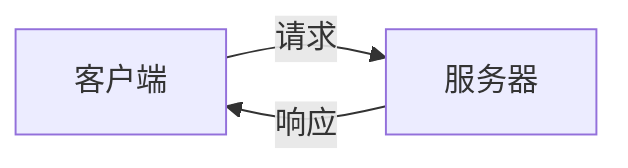

优点：

- 交互直观；
- 客户端可立即获得结果；
- 易于表达查询和短事务。

局限：

- 时间耦合：服务器当前必须可用；
- 位置耦合：客户端必须发现服务器或入口；
- 延迟沿调用链累加；
- 故障、超时和重试直接暴露给调用者。

#### 间接通信

客户端把消息写入 broker 的消息通道，接收者之后读取：

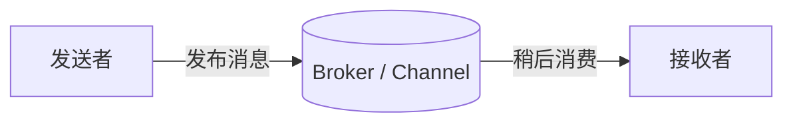

它降低发送者与接收者同时在线的要求，适合异步任务、事件传播和缓冲突发流量。但 broker 本身引入消息持久化、重复、顺序、积压和消费失败等语义。

本章聚焦直接通信中的 **request-response**；消息系统留到后续章节。

### 1.2 request-response 为什么像函数调用又不像

请求-响应模式为：

1. 客户端发送请求消息；
2. 服务器处理请求；
3. 服务器返回响应消息。

它看起来像：

```text
result = remote_service.operation(arguments)
```

但远程调用与本地函数调用有本质差异：

| 维度 | 本地函数 | 远程 request-response |
| --- | --- | --- |
| 失败范围 | 通常与当前进程共同命运 | 客户端、网络、代理、服务器可独立失败 |
| 延迟 | 低且相对稳定 | 高并有长尾 |
| 结果确定性 | 返回或抛出异常通常清楚 | 超时后不知道操作是否已完成 |
| 数据传递 | 内存值 | 必须序列化为字节 |
| 版本 | 常同一构建 | 多版本长期共存 |
| 重试 | 通常无意义 | 常用于瞬时故障，但可能重复副作用 |

框架可以把语法包装得像本地调用，却不能消除这些差异。

### 1.3 序列化：把语言对象变成线上数据

请求和响应需要语言无关的表示。序列化把内存对象编码成字节，反序列化再还原为接收方的数据结构：


格式选择会影响：

- 编解码速度；
- 消息大小与带宽；
- 人类可读性；
- 类型精度；
- 模式演化；
- 跨语言工具生态；
- 未知字段处理。

原章比较 JSON 与 Protocol Buffers：

| 维度 | JSON | Protocol Buffers |
| --- | --- | --- |
| 表示 | 文本 | 二进制 |
| 自描述程度 | 字段名在消息中，可直接阅读 | 需要 schema 解码 |
| 消息大小 | 较冗长 | 通常较紧凑 |
| 解析成本 | 文本解析较高 | 通常更高效 |
| 调试 | 人可直接查看 | 常需工具 |
| 演化 | 灵活但约束依赖契约 | 字段编号和兼容规则明确 |

“二进制一定更好”并不成立。外部 API 常优先可读性、兼容性和浏览器生态；高频内部 RPC 可能更重视带宽、类型和生成代码。

### 1.4 同步与异步调用

原章把等待方式分为：

- **同步**：调用线程阻塞，直到响应返回；
- **异步**：发起调用后不阻塞当前执行流，通过 callback、future、promise 或运行时机制处理完成事件。

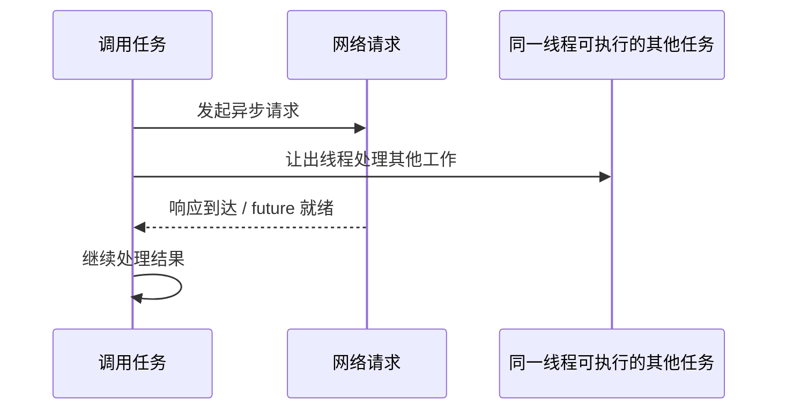

`async/await` 让异步代码看起来接近顺序代码，但不会让网络调用变成本地调用，也不会自动提供并行、超时、取消或正确重试。它解决的是等待期间如何利用线程，而不是远程故障语义。

若线程只为等待 I/O 而阻塞，系统可能需要大量线程。粗略使用 Little 定律：

$$
L=\lambda W
$$

若到达率 $\lambda=1000$ requests/s，每个下游调用平均等待 $W=0.2$ s，则平均有：

$$
L=1000\times0.2=200
$$

个调用同时等待。同步线程模型可能需要约 200 个被占用线程；异步 I/O 可以用更少线程管理这些等待状态，但服务器和网络仍然要处理同样数量的在途请求。

### 1.5 HTTP 与 gRPC 的典型选择

原章指出：

- 组织内部 server-to-server API 常使用高性能 RPC 框架，如 gRPC；
- 对公众开放的外部 API 常使用 HTTP，因为浏览器 JavaScript 易于调用。

这是典型倾向而非硬规则。选择还取决于：

- 客户端类型和网络环境；
- 是否需要浏览器原生支持；
- 流式通信需求；
- schema 与代码生成偏好；
- 代理、网关和可观测工具；
- 公开生态和长期兼容性。

### 1.6 REST 提供哪些约束

REST（Representational State Transfer）是一组架构约束，符合这些约束的 HTTP API 常称为 RESTful。原章点出两项：

1. **请求无状态**：处理请求所需的信息由当前请求携带，不依赖服务器记住之前请求的会话上下文；
2. **响应可缓存性明确**：响应被标记为可缓存或不可缓存，可缓存响应能为后续等价请求复用。

无状态不等于服务器没有数据库，也不等于用户不能登录。服务器可以保存资源状态；关键是每个请求带上认证令牌、参数等处理上下文，不依赖“这个客户端上一次调用刚好做了什么”的隐式会话。

REST 还包含统一接口、分层系统等约束，但原章只以无状态和缓存性建立后续 HTTP API 的主线。

## 2. HTTP

### 2.1 HTTP 事务

HTTP 是客户端与服务器之间编码和传输信息的请求-响应协议。原书图 5.1 的产品查询可重建为：

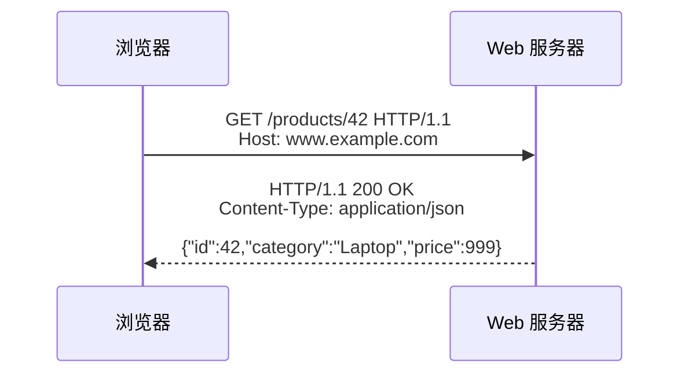

HTTP 事务包含一条请求和一条对应响应。API endpoint 是服务器上接收特定资源/操作请求的协议入口。

### 2.2 HTTP/1.1 消息结构

原章将 HTTP/1.1 消息拆成三部分：

```text
start-line
Header-Name: value
Another-Header: value

optional body
```

#### 请求起始行

```text
GET /products/42 HTTP/1.1
```

包含方法、request target 和协议版本。

#### 响应起始行

```text
HTTP/1.1 200 OK
```

包含版本、状态码和原因短语。

#### Headers

头字段是描述消息的元数据，例如：

```text
Host: www.example.com
Accept: application/json
Content-Type: application/json
Content-Length: 44
```

#### Body

消息体承载资源表示或命令参数。请求和响应都可以没有 body；body 边界由协议规则和相关头字段确定，而不是简单读到连接关闭。

### 2.3 图 5.1 中请求与响应的逐项对应

```http
GET /products/42 HTTP/1.1
Host: www.example.com

```

- `GET` 表示读取；
- `/products/42` 标识产品 42；
- `Host` 让同一 IP/服务器可托管多个站点；

响应：

```http
HTTP/1.1 200 OK
Content-Type: application/json
Content-Length: 41

{"id":42,"category":"Laptop","price":999}
```

- `200` 表示成功；
- `Content-Type` 描述 body 的媒体类型；
- `Content-Length` 给出 body 字节长度；
- JSON 是产品资源的一种表示。

`Content-Length` 必须按实际线上字节计算。字符数与字节数在 UTF-8 非 ASCII 内容中不一定相同。

### 2.4 HTTP 无状态的准确含义

原章说，服务器处理请求所需的一切都应在请求中，不依赖前序请求上下文。这样做有三个扩展性收益：

- 任意服务实例都能处理下一个请求；
- 负载均衡不必依赖粘性会话；
- 单实例丢失内存不会丢失客户端协议会话状态。

但状态仍然存在：

- 产品目录保存在数据库；
- 身份可能编码在 token 中或由认证服务验证；
- TCP/TLS 连接自身维护协议状态；
- 缓存保存响应。

REST 所谓 stateless 是 **客户端请求上下文无状态**，不是整个系统没有状态。

### 2.5 HTTP、TCP 与 HTTPS

HTTP/1.1 和 HTTP/2 通常依赖 TCP 的可靠有序字节流。HTTP 在 TLS 上运行时称为 HTTPS：

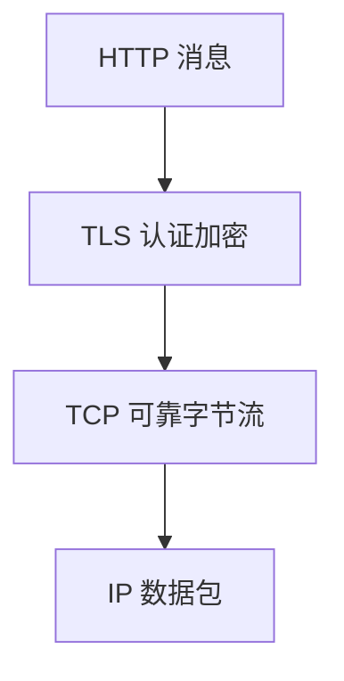

每层保证不同：HTTP 定义请求/响应语义，TLS 保护通道，TCP 可靠交付字节。HTTP 状态码无法替代 TCP 错误，TLS 成功也不代表 HTTP 请求成功。

### 2.6 HTTP/1.1 持久连接与 HOL blocking

HTTP/1.1 默认复用持久连接，避免每个事务重新建立 TCP/TLS。若最保守地一次只发送一个请求：

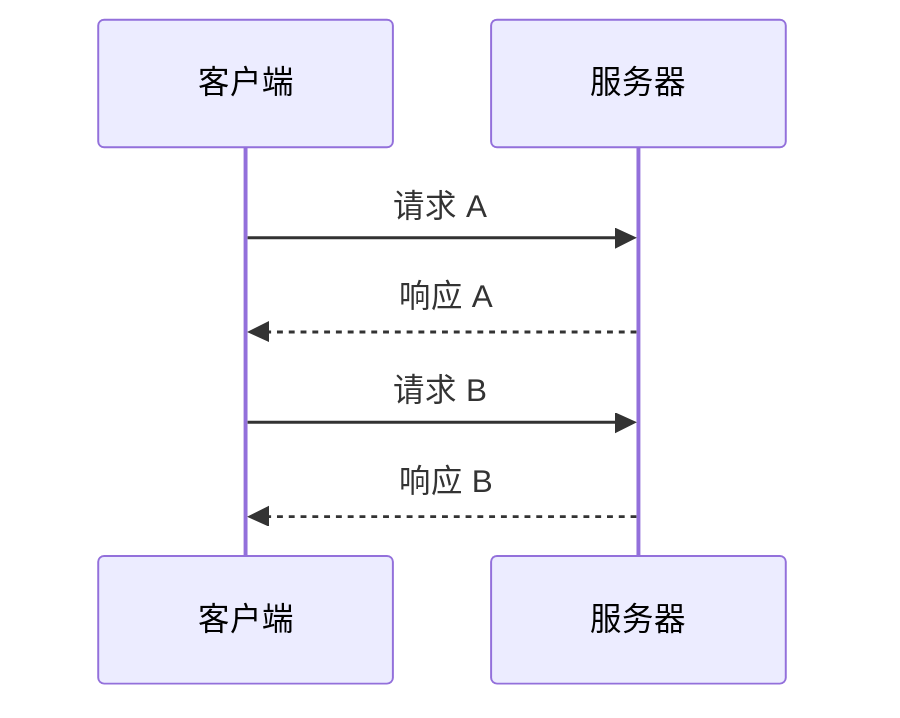

请求必须串行等待，连接利用率低。HTTP/1.1 pipelining 允许在未收到前一个响应时继续发送请求：

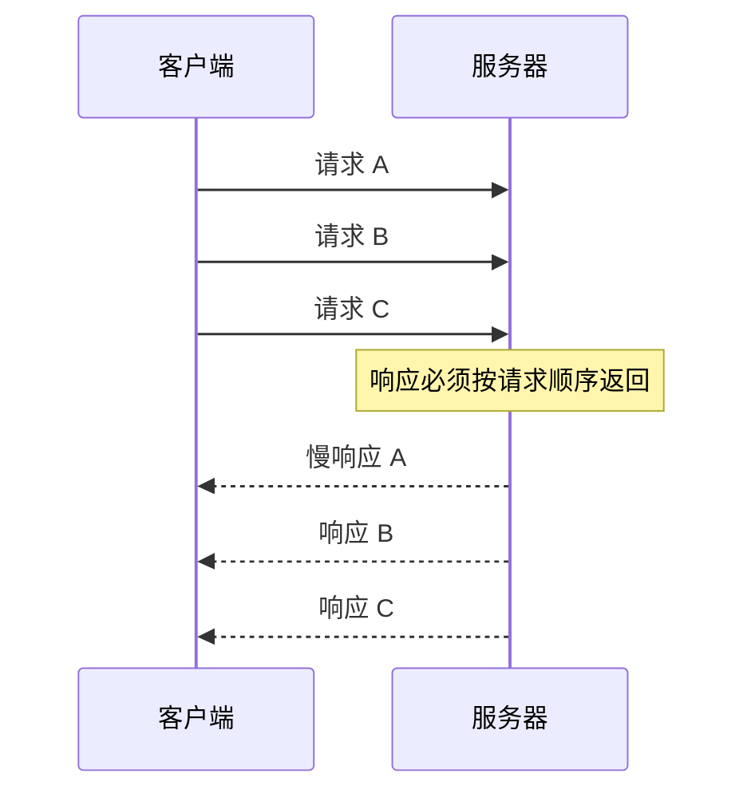

若 A 很慢，B/C 即使已完成也不能先返回，形成 HTTP 层队头阻塞。实际客户端很少广泛使用 pipelining，常通过多条 TCP 连接提高并发，但每条连接都会消耗：

- socket 与文件描述符；
- 内核缓冲区；
- TLS 状态；
- 建连 RTT 与 CPU；
- 独立拥塞控制状态。

原章说“新请求不能在前一响应之前发出”是在说明常见非流水线用法；协议技术上允许 pipelining，但仍有响应顺序阻塞。

### 2.7 HTTP/2：一条连接上的多路复用

HTTP/2 使用二进制 framing，把多个 request-response 事务表示为独立 stream，并在一条 TCP 连接上交错帧：

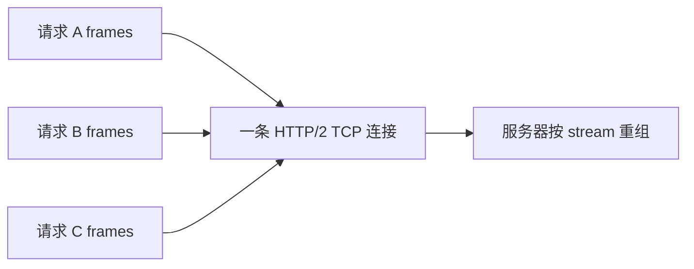

收益：

- 多个请求并发使用一条连接；
- 不要求 HTTP 响应按全局请求顺序完成；
- 减少多连接资源和重复握手；
- 支持头部压缩等能力。

但所有 stream 共享同一 TCP 有序字节流。底层 TCP 段丢失时，后续字节必须等待缺口恢复，所有受阻于该连接字节流的 stream 都可能停顿。这是传输层 HOL。

原书引用 2020 年初约半数最受欢迎网站使用 HTTP/2，是当时采用情况，不应当作当前统计值。

### 2.8 HTTP/3：基于 QUIC 的多流传输

原章称 HTTP/3 基于 UDP 并实现自己的传输协议。更准确地说，HTTP/3 运行在 QUIC 上，QUIC 以 UDP 为承载，在用户空间协议中提供：

- 可靠传输；
- 拥塞控制；
- TLS 1.3 安全；
- 独立 stream；
- 连接迁移等能力。

一个 QUIC 包丢失只会阻塞依赖该包数据的 stream；未受影响 stream 可以继续推进。若同一丢失包包含多个 stream 数据，它们仍都会受影响；所有 stream 也共享连接级拥塞控制。因此“只中断一个 stream”是建立差异的简化直觉，不是绝对保证。

### 2.9 三个 HTTP 版本的阻塞关系

| 版本 | 消息表示 | 常见并发模型 | 主要 HOL 位置 |
| --- | --- | --- | --- |
| HTTP/1.1 | 文本式消息语法 | 串行、pipelining 或多 TCP 连接 | pipelining 响应顺序 |
| HTTP/2 | 二进制帧与多 stream | 单 TCP 连接多路复用 | TCP 丢包阻塞连接字节流 |
| HTTP/3 | QUIC 上的 HTTP 帧 | QUIC 独立 stream | 丢包主要阻塞受影响 stream |

本章继续使用 HTTP/1.1，因为文本格式便于展示，并非推荐所有新系统固定使用 HTTP/1.1。

## 3. Resources：资源

### 3.1 产品目录服务的需求

原章设计一个电商产品目录服务：

- 顾客浏览产品目录；
- 管理员创建、更新和删除产品。

HTTP API 设计的第一步不是把类方法直接拼进 URL，而是识别 **资源（resource）**。

### 3.2 资源是什么

资源可以是物理或抽象实体：

- 文档；
- 图片；
- 单个产品；
- 产品集合；
- 产品评论集合；
- 订单、用户或计算任务。

URL 标识资源的位置，HTTP 方法表达对资源的通用操作，representation 表达资源当前状态的某种线上表示。

### 3.3 URL 分解

原书示例：

```text
https://www.example.com/products?sort=price
```

可以拆成：

| 部分 | 值 | 含义 |
| --- | --- | --- |
| scheme | `https` | 使用 HTTPS |
| host | `www.example.com` | 目标主机 |
| path | `/products` | 产品集合资源 |
| query | `sort=price` | 按价格排序的处理参数 |

去掉 query 后的 `/products` 是 API endpoint。query 通常用于筛选、排序、分页或选择表示，不宜承载秘密，因为 URL 可能进入日志、浏览历史和监控标签。

### 3.4 集合、单项与子资源

原章按关系构造：

```text
/products                 产品集合
/products/42              ID 为 42 的产品
/products/42/reviews      产品 42 的评论集合
```

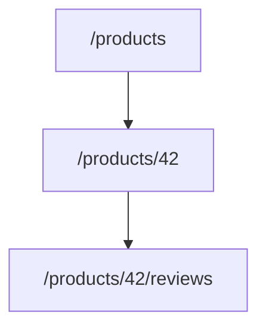

路径层级表达从集合到成员再到关联资源的关系。但嵌套过深会：

- 让 URL 冗长；
- 把当前数据关系固化进公共契约；
- 让移动或共享子资源困难；
- 造成权限和路由复杂度。

所以路径嵌套是表达清晰度与契约稳定性的平衡，不是把数据库外键逐层照搬。

### 3.5 资源与表示不是同一件事

产品 42 是资源，下面 JSON 是该资源的一种 representation：

```json
{
  "id": 42,
  "category": "Laptop",
  "price": 999
}
```

同一资源还可以有：

- JSON 表示；
- XML 表示；
- HTML 页面；
- 缩略摘要；
- 不同语言版本。

资源是概念身份，表示是某时刻通过媒体类型传输的状态。REST 名称中的 representational 正是强调客户端通过表示操作资源，而不是传输服务器内存对象。

### 3.6 内容协商

客户端通过请求头表达可接受表示：

```http
Accept: application/json
Accept-Language: zh-CN
```

服务器选择表示，并在响应中声明：

```http
Content-Type: application/json
Content-Language: zh-CN
```

若响应缓存会因 `Accept` 等请求头不同而变化，服务器还应正确使用 `Vary`，避免缓存把一种表示错误复用于另一类客户端。

### 3.7 JSON 类型与金额的边界

原章用 `price: 999` 展示产品价格。实际 API 必须定义单位和精度：

- `999` 是 999 元、999 美分还是其他货币；
- 是否允许小数；
- 浮点解析是否导致精度问题；
- 币种在哪里表示。

常见做法是用最小货币单位整数：

```json
{
  "price_minor": 99900,
  "currency": "CNY"
}
```

这不是原章重点，但展示了 API schema 必须把业务语义写入契约，而不是只定义“number”。

## 4. Request methods：请求方法

### 4.1 方法把通用动作施加到资源

HTTP 方法相当于资源上的通用动词。原章用 POST、GET、PUT、DELETE 表达 CRUD：

| 方法与路径 | 目录操作 | 典型响应 |
| --- | --- | --- |
| `POST /products` | 创建新产品 | `201 Created` + `Location` |
| `GET /products` | 获取产品集合，可筛选/分页/排序 | `200 OK` |
| `GET /products/42` | 获取产品 42 | `200` 或 `404` |
| `PUT /products/42` | 更新/替换产品 42 | `200`/`204`，语义需约定 |
| `DELETE /products/42` | 删除产品 42 | `204` 或其他约定结果 |

CRUD 是入门映射，但 HTTP API 不必机械等于数据库表 CRUD。业务操作若有明确领域语义，可以建模为资源状态转换或命令资源，但仍要定义重试和结果语义。

### 4.2 集合查询参数

原章指出 `GET /products` 的 query 可用于：

- filter：`?category=Laptop`；
- pagination：`?limit=50&cursor=abc`；
- sorting：`?sort=price`。

分页尤其重要。无限返回整个集合会造成响应过大、延迟和内存失控。offset 分页易理解，cursor 分页在持续变化的大集合上通常更稳定，但 cursor 必须被视为不透明契约。

### 4.3 Safe 是什么

安全方法（safe method）的语义是客户端请求读取，不要求服务器产生调用者请求的状态变化。GET 是 safe。

“safe”不表示绝对没有任何副作用。服务器仍可能：

- 写访问日志；
- 更新指标；
- 填充缓存；
- 计费一次读取。

关键是这些附带影响不改变客户端请求读取的资源语义。若 `GET /delete?id=42` 真删除资源，它违反方法语义，并可能被爬虫、预取器或缓存意外触发。

### 4.4 Idempotent 是什么

幂等表示同一请求执行一次或多次，**对服务器预期状态的效果相同**：

$$
f(f(x))=f(x)
$$

这是数学直觉，HTTP 请求不是纯函数，实际关注 intended effect。

例如：

- `PUT /products/42` 把价格设为 999，重复设置结果仍是 999；
- `DELETE /products/42` 删除后再次删除，资源仍是不存在；
- `POST /products` 每次分配新 ID，重复执行会创建多个产品，默认不幂等。

幂等不要求每次响应完全相同。第一次 DELETE 可返回 `204`，第二次可能返回 `404`，但资源最终都不存在。原章后续会说明：使用幂等键时，为简化重试客户端，最好重放原始响应。

### 4.5 原章方法矩阵

| Method | Safe | Idempotent |
| --- | --- | --- |
| POST | No | No |
| GET | Yes | Yes |
| PUT | No | Yes |
| DELETE | No | Yes |

关系：

- safe 通常蕴含 idempotent，因为读取多次不应改变资源；
- idempotent 不蕴含 safe，PUT/DELETE 会改变状态；
- POST 可以由应用额外设计为幂等，但方法默认语义不保证。

### 4.6 PUT 与 PATCH

原章只讨论常见四种方法。实践中 PATCH 常用于部分更新：

- PUT 通常表示用请求表示替换目标资源状态；
- PATCH 表示应用一组部分修改。

PATCH 是否幂等取决于补丁语义：

```json
{"price": 999}
```

重复“设置价格”可幂等；“库存加 1”重复执行则不幂等。不能仅凭方法名推断具体 API 已正确实现语义。

### 4.7 方法语义为什么影响基础设施

代理、缓存、重试器和客户端会依据方法语义做决定：

- GET 可能被缓存或预取；
- 幂等方法在连接失败时更适合自动重试；
- 非幂等方法需要幂等键或人工确认；
- 安全方法不应触发业务副作用。

正确方法语义不是风格问题，而是让分布式基础设施能够安全优化和恢复的契约。

## 5. Response status codes：响应状态码

### 5.1 状态码为什么需要分层分类

服务器用三位状态码告诉客户端请求处理结果。第一位给出大类：

| 范围 | 类别 | 客户端核心问题 |
| --- | --- | --- |
| 1xx | Informational | 请求仍在进行或协议继续 |
| 2xx | Success | 操作成功或已接受 |
| 3xx | Redirection | 是否应去另一个位置或使用缓存 |
| 4xx | Client Error | 请求或客户端状态有什么问题 |
| 5xx | Server Error | 服务端/网关是否暂时无法完成 |

原章重点讲 2xx–5xx。统一状态码让客户端、网关和监控无需理解每个业务 body 就能做第一层判断。

### 5.2 2xx：成功

原章示例 `200 OK` 表示请求成功，body 包含所请求资源。常见区分：

- `200 OK`：成功并返回表示；
- `201 Created`：创建成功，通常通过 `Location` 指向新资源；
- `202 Accepted`：已接受但尚未完成异步处理；
- `204 No Content`：成功且无响应 body。

创建产品：

```http
HTTP/1.1 201 Created
Location: /products/42
Content-Type: application/json

{"id":42,"category":"Laptop","price":999}
```

状态码与 body 应一致。返回 `200` 但 body 中写 `{"success": false}` 会破坏代理、SDK 和监控的通用语义。

### 5.3 3xx：重定向

原章以 `301 Moved Permanently` 为例：资源永久移动到 `Location` 指定 URL。

重定向需要注意：

- 永久与临时跳转的缓存行为不同；
- 某些历史 301/302 客户端可能改变 POST 方法；
- 307/308 明确保留方法和 body；
- 客户端应限制跳转次数并防止敏感头泄露到不同来源。

API 演化不应只依赖重定向掩盖任意 breaking change，因为客户端、签名和方法语义可能不兼容。

### 5.4 4xx：客户端错误

原章列出：

| 状态码 | 含义 |
| --- | --- |
| `400 Bad Request` | 输入验证失败或请求无法按契约处理 |
| `401 Unauthorized` | 客户端尚未通过认证 |
| `403 Forbidden` | 已认证，但没有访问权限 |
| `404 Not Found` | 找不到目标资源 |

`401` 名称容易误导，它实际更接近“未认证”，常配合 `WWW-Authenticate`；`403` 才是身份已知但拒绝授权。

原章说 4xx 通常由客户端问题导致，原样重试会得到同样结果，所以不应重试。这个原则应理解为 **不要无变化地盲目重试**。例外包括：

- `401` 刷新过期 token 后可重试；
- `408 Request Timeout` 可能重试；
- `409 Conflict` 在读取新状态并重新决策后可重试；
- `425 Too Early` 可在不使用 early data 时重试；
- `429 Too Many Requests` 可遵守 `Retry-After` 后重试。

关键不是状态码首位机械判断，而是客户端是否能改变导致失败的条件。

### 5.5 5xx：服务器错误

原章列出：

| 状态码 | 含义 |
| --- | --- |
| `500 Internal Server Error` | 未预期错误阻止请求处理 |
| `502 Bad Gateway` | 网关/代理从下游收到无效响应 |
| `503 Service Unavailable` | 过载或维护导致暂时不可服务 |

作者指出 5xx 原因可能是暂时的，因此请求可以重试。但“可重试”仍需同时满足：

- 操作本身幂等，或有可靠幂等键；
- 使用退避、抖动和次数/截止时间上限；
- `Retry-After` 等服务器提示被尊重；
- 不会把过载服务进一步压垮；
- 调用方还有足够时间预算。

某些 `500` 是稳定代码缺陷，重试不会恢复；某些 `501 Not Implemented` 通常不应重试。状态码只提供第一层分类。

### 5.6 upstream 与 downstream

原章脚注明确本书用法：若服务 A 调用服务 B：

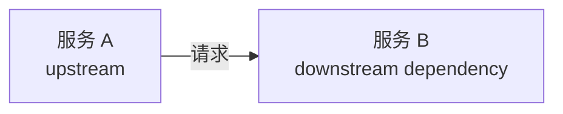

B 是 A 的 downstream dependency，A 是 B 的 upstream。行业对术语没有完全统一，阅读其他资料时应确认上下文。

`502` 常表示当前服务器作为代理访问 downstream 时得到无效响应，而不是客户端直接请求格式错误。

### 5.7 可操作的重试决策

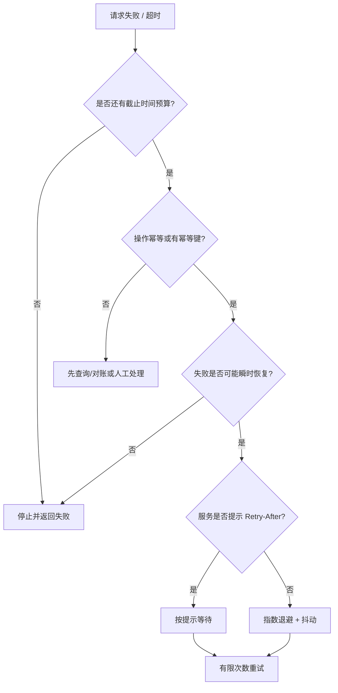

重试策略是方法语义、状态码、错误类型、幂等性和时间预算的联合决策。

### 5.8 错误 body 也应有契约

状态码不够表达字段级错误、追踪 ID 或可恢复建议。API 可定义稳定错误 schema：

```json
{
  "code": "INVALID_CATEGORY",
  "message": "category is not supported",
  "request_id": "req_123",
  "details": {
    "field": "category"
  }
}
```

客户端程序应依赖稳定机器码，而不是解析可能变化或本地化的人类文案。错误 body 同样需要 OpenAPI 和兼容演化。

## 6. OpenAPI

### 6.1 适配器如何调用业务接口

原章先定义目录业务接口：

```text
interface CatalogService
{
  List<Product> GetProducts(...);
  Product GetProduct(...);
  void AddProduct(...);
  void DeleteProduct(...);
  void UpdateProduct(...)
}
```

HTTP 适配器收到 `GET /products` 后：

1. 解析方法、路径、query 和 headers；
2. 校验并转换参数；
3. 调用 `GetProducts(...)`；
4. 把业务结果序列化为 JSON；
5. 映射为状态码、headers 和 body。

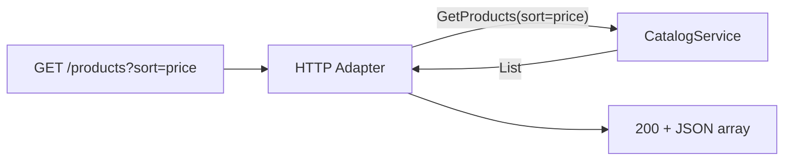

适配器不应承载核心目录规则；它负责协议翻译和边界校验。业务逻辑不应直接依赖 HTTP header 或状态码。

### 6.2 为什么需要 IDL

手写服务器路由、客户端请求、文档和测试容易产生漂移。IDL（Interface Definition Language）用语言无关形式正式描述 API，可生成：

- 服务端 adapter skeleton；
- 客户端 SDK；
- 文档；
- 模型类型；
- mock 与测试工具；
- 契约校验。

IDL 不自动保证 API 设计合理。它能让一个契约更明确、可生成、可检查，却不能决定资源边界、幂等语义和兼容策略。

### 6.3 OpenAPI 是什么

OpenAPI 从 Swagger 项目演化而来，是 RESTful HTTP API 常用的接口描述规范。它可以描述：

- endpoints；
- methods；
- path/query/header 参数；
- request body；
- response status codes；
- JSON schema；
- 安全方案；
- 示例与文档。

原书展示 OpenAPI 3.0.0 的 `/products` GET 片段。下面保持其结构并补成可独立解析的文档。

### 6.4 完整 OpenAPI YAML

```yaml
openapi: 3.0.0
info:
  version: "1.0.0"
  title: Catalog Service API
paths:
  /products:
    get:
      summary: List products
      parameters:
        - in: query
          name: sort
          required: false
          schema:
            type: string
            enum:
              - price
      responses:
        "200":
          description: List of products in catalog
          content:
            application/json:
              schema:
                type: array
                items:
                  $ref: "#/components/schemas/ProductItem"
        "400":
          description: Bad input
components:
  schemas:
    ProductItem:
      type: object
      required:
        - id
        - name
        - category
      properties:
        id:
          type: integer
          format: int64
        name:
          type: string
        category:
          type: string
        price:
          type: integer
          format: int64
```

与原章相比，这里把 `$ref` 片段合并为一个有效 YAML 文档，并把 ID 从宽泛 `number` 收紧为 `integer`。是否使用整数、价格单位和 required 集合应由真实业务契约决定。

### 6.5 逐层阅读 OpenAPI

```text
openapi -> 规范版本
info -> API 元数据
paths -> endpoint 集合
  /products
    get -> GET 操作
      parameters -> sort query 参数
      responses
        200 -> JSON 产品数组
        400 -> 输入错误
components.schemas -> 可复用 ProductItem schema
```

`$ref` 避免在每个响应中重复 schema。生成器可据此创建客户端类型，但运行时响应仍需验证或可靠实现，规范文件不会自动约束线上服务器。

### 6.6 Contract-first 与 code-first

- contract-first：先设计 OpenAPI，再生成 skeleton/SDK；
- code-first：从路由、注解或类型生成 OpenAPI。

前者强化跨团队评审和兼容设计；后者减少实现与文档手工重复。无论哪种方式，都应在 CI 中：

- 校验 OpenAPI 语法；
- 检测 breaking changes；
- 生成或验证 SDK；
- 做 provider/consumer contract tests；
- 防止实现与文档漂移。

### 6.7 OpenAPI 的边界

OpenAPI 擅长结构契约，却不容易完整表达：

- 跨字段复杂业务约束；
- 操作的幂等实现；
- 最终一致性和异步状态转换；
- 限流、重试与 SLO；
- 调用顺序和长工作流；
- 数据隐私和授权策略。

这些语义仍需文档、测试和实现共同保证。

## 7. Evolution：API 演化

### 7.1 为什么 API 必然变化

API 初始设计再好，也会因新业务、监管、性能、客户端和基础设施需求变化。难点是客户端与服务器不能总在同一时刻升级：

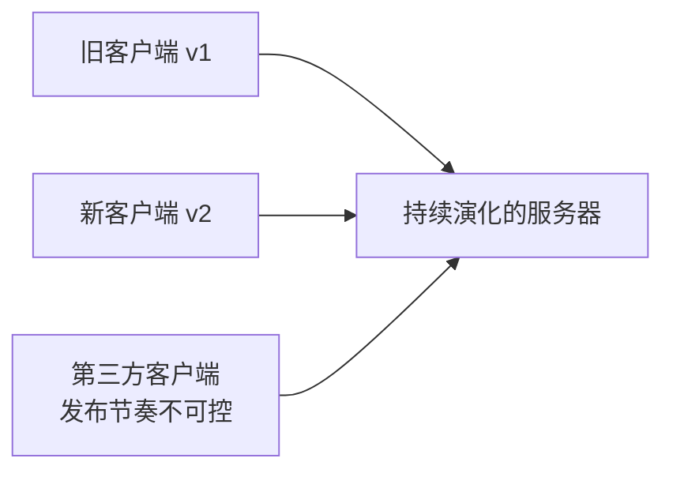

breaking change 会要求所有客户端同步修改，而 API 提供方可能无法控制第三方、移动应用或离线设备。兼容性因此是一种部署能力。

### 7.2 两类破坏性变更

原章分为 endpoint level 和 message level。

#### Endpoint-level breaking changes

- `/products` 改成 `/new-products`；
- 原可选 query 参数变为必填；
- 删除方法或改变方法语义；
- 改变认证要求而旧客户端无法满足。

旧客户端仍请求原 endpoint，会立即失败。

#### Message-level breaking changes

- `category` 从 string 改成 number；
- 删除旧客户端依赖的字段；
- 把 optional 字段改成 required；
- 改变枚举语义；
- 改变数值单位或时间格式。

例如旧客户端期待：

```json
{"category": "Laptop"}
```

服务器改为：

```json
{"category": 7}
```

旧反序列化逻辑可能直接失败。二进制格式也有兼容规则，Protocol Buffers 并不因为是二进制就自动免疫 breaking change。

### 7.3 backward compatibility 的判定方向

服务器的新版本若仍能与旧客户端工作，可称 API 对旧客户端 backward compatible。

分别分析请求和响应：

| 变化 | 常见兼容性风险 |
| --- | --- |
| 请求新增 optional 字段 | 旧客户端不发送，服务器必须有默认行为 |
| 请求新增 required 字段 | 旧客户端无法满足，breaking |
| 响应新增 optional 字段 | 旧客户端若忽略未知字段，通常兼容 |
| 响应删除字段 | 旧客户端可能依赖，breaking |
| 字段类型变化 | 序列化/语义均可能 breaking |
| 枚举新增值 | 旧客户端若穷举且无 unknown 分支，可能 breaking |

“新增字段永远兼容”是不安全的口号。它依赖接收方是否容忍未知字段、required 规则和业务语义。

### 7.4 宽容读取与严格写入

为了演化：

- 发送方只发送契约允许且语义明确的值；
- 接收方在安全范围内忽略未知响应字段；
- 对未知 enum 保留 fallback；
- 不把字段缺失与零值混为一谈；
- 保留字段编号，不在 Protocol Buffers 中复用已删除编号。

宽容不是接受无效或危险输入。认证、金额和权限字段仍应严格验证；兼容策略必须服从安全边界。

### 7.5 版本化

原章建议 breaking change 使用版本，例如：

```text
/v1/products
/v2/products
```

版本化允许旧客户端继续使用 v1，新客户端迁移到 v2。代价是：

- 多版本实现和测试；
- 数据与行为一致性；
- 文档和 SDK 分支；
- 废弃通知与迁移周期；
- 旧版本何时下线。

版本号可以放 URL、header 或媒体类型中，各有工具和缓存权衡。原章用 URL prefix 建立直觉。

### 7.6 为什么仍应优先兼容演化

作者强调：除非有充分理由，应优先 backward-compatible evolution。兼容 API 可能不如从零重设计优雅，却更实用，因为它允许独立部署、渐进迁移和快速回滚。

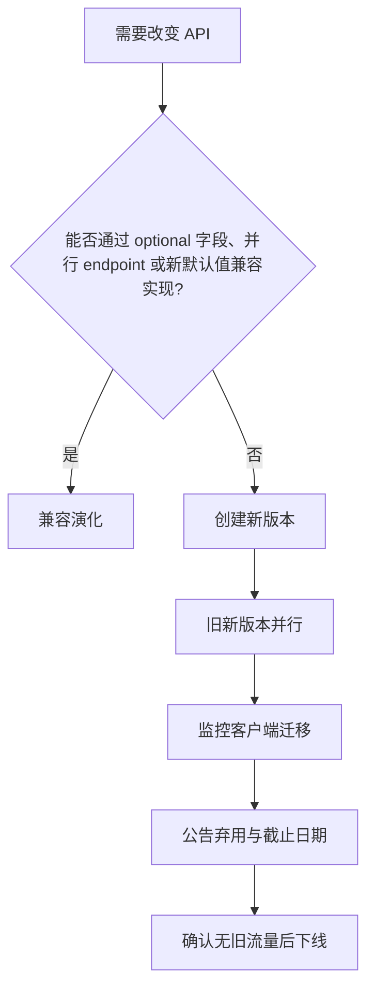

### 7.7 Expand-and-contract 模式

安全演化常分阶段：

1. Expand：服务器同时支持旧字段和新字段；
2. Migrate：客户端逐步改用新字段；
3. Observe：监控旧字段使用量；
4. Contract：确认无人使用后删除旧能力。

不要在同一发布中“改服务器、改所有客户端、删旧字段”。多阶段看似不优雅，却把不可控的大爆炸升级变成可观察的渐进迁移。

### 7.8 兼容性测试

可在 CI 中比较当前 OpenAPI 与基线，检测：

- endpoint/method 删除；
- 参数从 optional 变 required；
- schema 类型变化；
- 响应状态和媒体类型删除；
- enum 收窄；
- required 字段增加。

机器检查不能发现全部语义变化，例如金额从“元”改成“分”而类型仍是 integer。契约评审还要检查语义与行为。

## 8. Idempotency：幂等性

### 8.1 问题从超时开始

客户端发送请求后超时，只知道截止时间内没有收到响应，不知道服务端发生了什么：

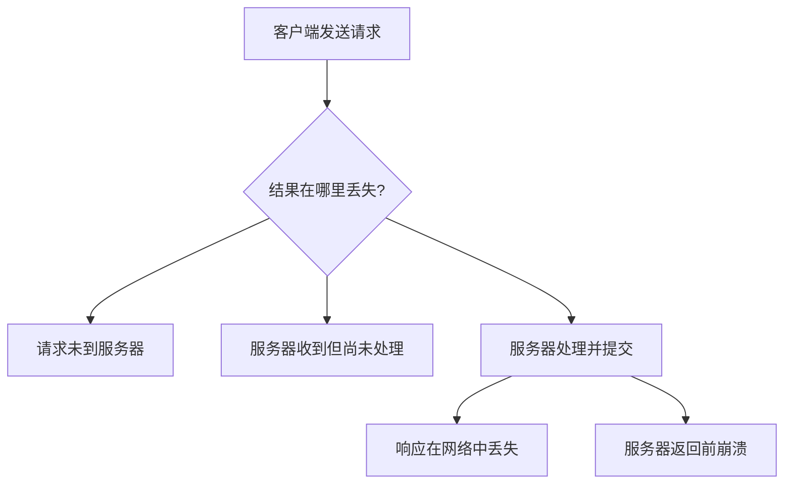

对客户端而言都表现为 timeout。重试可修复 C/D，却会在 E/F/G 后重复副作用。

### 8.2 为什么 PUT/DELETE 更容易安全重试

若请求是：

```http
PUT /products/42

{"price":999}
```

执行两次仍把价格设为 999。DELETE 两次后资源仍不存在。方法语义让客户端可在不知道第一次结果时重试，而不必先解决“第一次是否成功”的知识问题。

### 8.3 POST 重试怎样创建重复资源

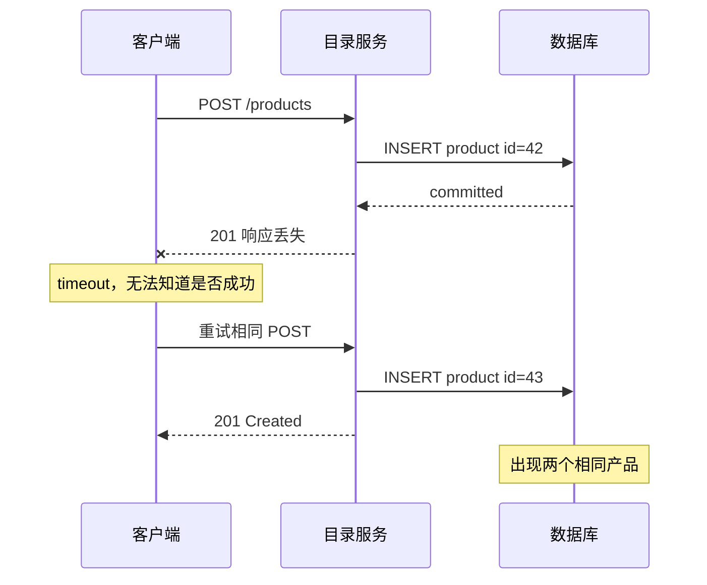

把对账和去重推给每个客户端会造成大量复杂逻辑，而且客户端未必有权限或足够信息判断“两个相似产品是不是重复”。更好的契约是服务器让这一特定创建请求幂等。

### 8.4 幂等键

客户端为一个 **逻辑操作** 生成唯一 idempotency key，例如 UUID，并在所有重试中复用：

```http
POST /products HTTP/1.1
Idempotency-Key: 550e8400-e29b-41d4-a716-446655440000
Content-Type: application/json

{"name":"Laptop","category":"Laptop","price":999}
```

规则：

- 同一逻辑操作的重试必须使用同一个 key；
- 新操作必须生成新 key；
- key 应绑定调用者/租户和 endpoint，避免跨作用域碰撞；
- 服务端持久化 key 与执行结果；
- 重复请求返回已保存结果，不再次执行副作用。

### 8.5 只记录“看过 key”为什么错误

天真的顺序：

```text
1. INSERT idempotency_key
2. 执行业务创建
```

若步骤 1 后崩溃：

- key 已存在；
- 产品未创建；
- 重试被误认为已完成；
- 请求永远丢失。

反过来：

```text
1. 创建产品
2. INSERT idempotency_key
```

若步骤 1 后崩溃：

- 产品已创建；
- key 未记录；
- 重试再次创建；
- 产生重复。

因此，**业务效果、幂等记录和可重放结果必须原子提交**。

### 8.6 同一数据库事务中的正确结构

若产品与幂等记录在同一数据库，可以使用 ACID 事务。关键是 `(tenant, endpoint, key)` 上必须有唯一约束，并通过原子插入抢占 key；仅对查询使用 `SELECT ... FOR UPDATE` 通常锁不住尚不存在的行，两个事务仍可能同时认为自己是首次请求。

```text
BEGIN TRANSACTION A

INSERT INTO idempotency_records(
  tenant, endpoint, key, request_hash, state
) VALUES (?, ?, ?, ?, 'IN_PROGRESS')
ON CONFLICT (tenant, endpoint, key) DO NOTHING

if this transaction did not insert the row:
  ROLLBACK A
  wait for or read the winning transaction in a new transaction
  if stored request_hash != hash(current_request):
        return 409 IDEMPOTENCY_KEY_REUSED_WITH_DIFFERENT_REQUEST
  if stored state == 'COMPLETED':
    return stored status, headers, body
  retry reading according to a bounded in-progress policy

product = INSERT INTO products(...) RETURNING ...
response = make_201_response(product)

UPDATE idempotency_records
SET state = 'COMPLETED',
  status = response.status,
  headers = response.headers,
  body = response.body
WHERE tenant = ? AND endpoint = ? AND key = ?

COMMIT TRANSACTION A
return response
```

原子性保证只有两种可见结果：

1. 产品与幂等结果都提交；
2. 两者都不提交。

不存在“key 已记但产品没建”或“产品已建但 key 没记”的中间状态。

### 8.7 并发重复请求

同一个 key 的两个请求可能同时到达不同实例。数据库唯一约束决定谁能插入占位记录；失败方不能在原事务快照中无限等待，而应结束或回滚后读取获胜事务已经提交的结果：

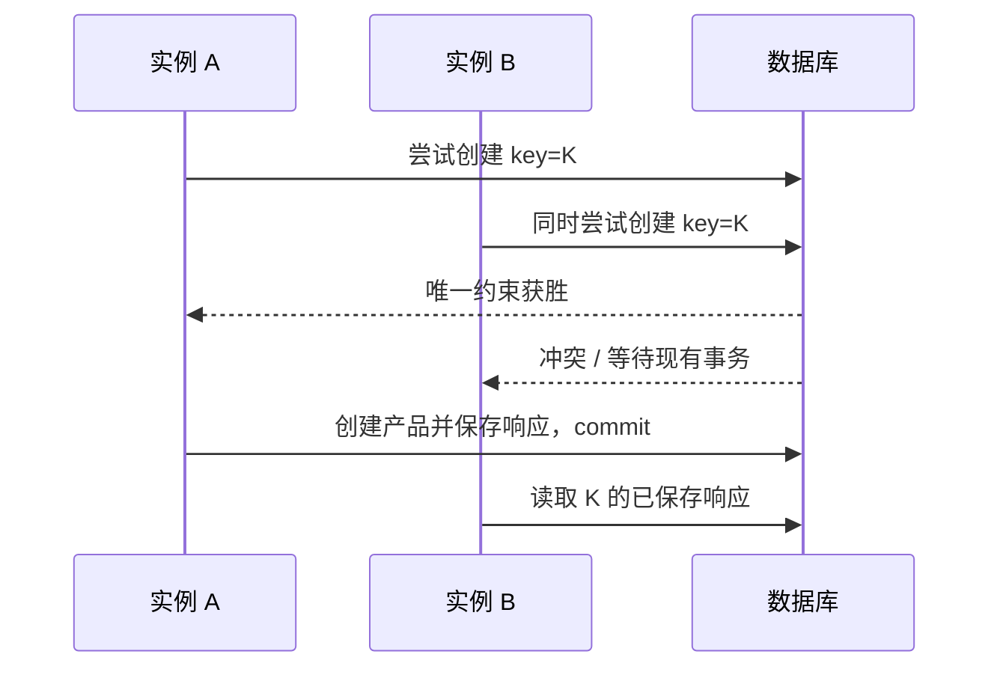

必须用数据库唯一约束配合原子插入，或用能覆盖“键不存在”情况的数据库锁机制串行化同一作用域的 key。仅在每个进程内用哈希表检查无法处理多实例和崩溃。

### 8.8 同一个 key 携带不同请求

客户端 bug 可能复用 key：

```text
K + {price: 999}
K + {price: 799}
```

若服务器只按 key 返回首个响应，第二个逻辑错误会被掩盖。应保存规范化请求摘要：

$$
h=H(method\parallel canonical\_target\parallel semantic\_headers
\parallel canonical\_body\parallel principal)
$$

其中 `canonical_target` 包含规范化 path 与 query，`semantic_headers` 只纳入会改变操作语义的 headers，`principal` 表示租户或调用身份；$H$ 应使用抗碰撞密码学哈希。重复 key 到来时比较摘要；不同则返回明确冲突。摘要用于检测误用，不应代替权限和内容验证。

### 8.9 为什么要保存原始响应

原章强调：重复请求最好返回第一次的同一响应，例如原始 `201 Created`、`Location` 和 body，而不是返回“产品已存在”错误。

好处：

- 客户端无需为“第一次成功但响应丢失”编写特殊分支；
- 首次调用和重试观察一致；
- 后续资源状态变化不改写历史操作结果；
- 满足 least astonishment。

应保存足够重放的：

- status code；
- 关键 headers；
- response body；
- request hash；
- 创建时间和作用域。

### 8.10 A 创建、B 删除、A 重试

原章给出三步案例：

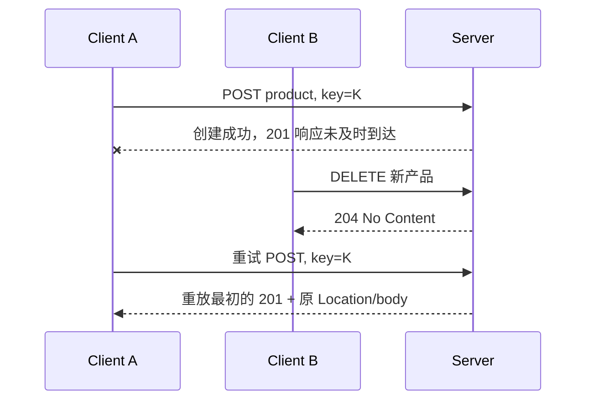

从 A 的视角，第三步仍是询问第一次操作 K 的结果。最不惊讶的行为是返回原始创建响应，而不是根据资源当前已删除的状态返回奇怪错误。

这揭示：

- 幂等记录描述 **操作历史**；
- 产品表描述 **资源当前状态**；
- 两者不是同一个事实。

### 8.11 key 保留多久

原章指出请求 ID 不必永久保存，可以过期清理。保留期必须覆盖客户端可能重试的最大窗口，包括：

- 客户端重试策略；
- 离线队列延迟；
- 网络和任务积压；
- 人工恢复流程。

若 key 已清理，过晚重试可能再次执行。API 应明确保留期，客户端不能假设无限期 exactly-once。

空间估算：若每秒接受 $r$ 个新 key，保留 $T$ 秒，每条记录平均占 $s$ 字节：

$$
N\approx rT
$$

$$
Storage\approx rTs
$$

例如 $r=1000$ requests/s，保留 24 小时：

$$
N=1000\times86400=86{,}400{,}000
$$

若每条约 500 B：

$$
Storage\approx43.2\ \mathrm{GB}
$$

实际还要考虑索引、复制和压缩。保留策略是正确性窗口与成本的权衡。

### 8.12 外部调用为什么更困难

如果 handler 同时：

- 写本地数据库；
- 调用支付、库存或其他服务；

单数据库 ACID 事务无法原子覆盖远端副作用。可能发生：

```text
远端扣款成功
-> 本地事务提交前崩溃
-> 重试再次扣款
```

这需要额外协调，例如：

- 下游接受稳定的幂等键；一对多或多步骤调用应从根操作 key 和步骤名派生不同子 key，避免多个副作用在同一下游作用域碰撞；
- transactional outbox；
- saga 与补偿；
- 状态机记录每个步骤；
- 重试与对账。

原章把深入方案留给后续异步事务章节。关键结论是：幂等键不是贴一个 header 就自动获得原子性；副作用跨越的所有边界都必须设计。

### 8.13 标准 C11 示例：最小幂等结果缓存

下面用单记录内存结构模拟逻辑，不是数据库事务实现，也不支持多个 key 同时保留。它展示：同 key + 同请求返回原响应，同 key + 不同请求被拒绝。

```c
#include <stdbool.h>
#include <stdio.h>
#include <string.h>

typedef struct {
    bool present;
    char key[64];
    char request_fingerprint[64];
    int status;
    char location[64];
    char body[128];
} IdempotencyRecord;

typedef enum {
    REQUEST_EXECUTED,
    RESPONSE_REPLAYED,
    KEY_CONFLICT
} RequestResult;

static RequestResult create_product(IdempotencyRecord *record,
                                    const char *key,
                                    const char *request_fingerprint) {
    if (record->present && strcmp(record->key, key) == 0) {
        if (strcmp(record->request_fingerprint, request_fingerprint) != 0) {
            return KEY_CONFLICT;
        }
        return RESPONSE_REPLAYED;
    }

    record->present = true;
    snprintf(record->key, sizeof record->key, "%s", key);
    snprintf(record->request_fingerprint,
             sizeof record->request_fingerprint,
             "%s",
             request_fingerprint);
    record->status = 201;
    snprintf(record->location, sizeof record->location, "/products/42");
    snprintf(record->body,
             sizeof record->body,
             "{\"id\":42,\"category\":\"Laptop\",\"price\":999}");
    return REQUEST_EXECUTED;
}

static const char *result_name(RequestResult result) {
    switch (result) {
        case REQUEST_EXECUTED:
            return "executed";
        case RESPONSE_REPLAYED:
            return "replayed";
        case KEY_CONFLICT:
            return "key conflict";
    }
    return "unknown";
}

static void print_result(RequestResult result,
                         const IdempotencyRecord *record) {
    printf("%-12s", result_name(result));
    if (result != KEY_CONFLICT) {
        printf(" status=%d location=%s body=%s",
               record->status,
               record->location,
               record->body);
    }
    putchar('\n');
}

int main(void) {
    IdempotencyRecord record = {0};
    RequestResult result;

    result = create_product(&record, "key-123", "hash-request-A");
    print_result(result, &record);

    result = create_product(&record, "key-123", "hash-request-A");
    print_result(result, &record);

    result = create_product(&record, "key-123", "hash-request-B");
    print_result(result, &record);

    return 0;
}
```

预期输出：

```text
executed     status=201 location=/products/42 body={"id":42,"category":"Laptop","price":999}
replayed     status=201 location=/products/42 body={"id":42,"category":"Laptop","price":999}
key conflict
```

代码对应关系：

- `key` 标识逻辑操作；
- `request_fingerprint` 检测 key 被不同 payload 误用；
- 首次执行保存 `status/location/body`；
- 重试重放原响应；
- 冲突请求不执行。

局限：内存记录无法跨实例、进程崩溃或重启；检查与写入也不是并发原子操作。生产系统必须把业务效果和记录放进同一数据库事务，并用唯一约束/锁处理并发。本例刻意只验证协议决策，不冒充持久化方案。

### 8.14 幂等性不等于 exactly-once execution

服务器内部可能：

- 执行后崩溃并恢复；
- 发送重复消息；
- 下游重复处理。

客户端真正需要的通常是 **observable effect appears once**，不是物理代码只运行一次。幂等、去重和事务让重复尝试产生一个可观察结果。

### 8.15 幂等性常见误区

**每次重试生成新 key。** 这会被服务器视为新操作，完全失去去重作用。

**key 存进 Redis 就完成了。** 若 Redis 记录与业务数据库效果不能原子提交，仍有裂缝。

**先记 key 再执行。** 崩溃会造成操作永久漏执行。

**先执行再记 key。** 崩溃会造成重复副作用。

**相同 key 可以搭配不同 body。** 必须检测并拒绝，否则客户端 bug 被隐藏。

**重复请求只需返回 409。** 重放原始成功响应通常更易于客户端恢复。

**保留 key 一小时就能防止所有未来重复。** 超过保留期的重试可能再次执行，窗口必须成为契约。

**幂等键解决所有跨服务副作用。** 下游也必须接受幂等语义或纳入工作流协调。

## 9. Part I 总结：一次网络调用的完整依赖链

原书在 Chapter 5 后总结整个 Communication 部分。一次看似简单的远程调用依赖：

```mermaid
flowchart TD
    A[应用决定调用] --> B[DNS 发现地址]
  B --> C1[TCP]
  C1 --> D1[TLS]
  D1 --> E1[HTTP/1.1、HTTP/2 或 gRPC]
  B --> C2[UDP]
  C2 --> D2[QUIC<br/>可靠多流并集成 TLS 1.3]
  D2 --> E2[HTTP/3]
  E1 --> F[服务端适配器]
  E2 --> F
    F --> G[业务逻辑与下游依赖]
  G --> H[响应沿相应路径返回]
```

任何一环都可能失败：

- socket pool 耗尽；
- DNS 不可用或返回旧地址；
- 路由器拥塞丢包；
- TLS 证书过期；
- 服务端过载；
- API schema 不兼容；
- 非幂等请求重复执行；
- 下游 502/503；
- 响应成功但在返回途中丢失。

作者的核心提醒是：现代框架隐藏了调用语法，却没有消除网络复杂度。**最快、最安全、最可靠的网络调用，是不必发出的那一次调用。**

这不是说拒绝分布式，而是要求：

- 不为没有收益的拆分增加远程边界；
- 用缓存、批处理和数据局部性减少调用；
- 明确每个调用的超时、重试和幂等语义；
- 把网络当成不可靠依赖，而不是透明函数总线。

## 10. 关键概念辨析

### 10.1 API 与协议

- 协议定义消息如何交换和解释，如 HTTP；
- API 定义某个服务在该协议上提供什么资源、操作和语义；
- 两个服务都使用 HTTP，不代表 API 兼容。

### 10.2 Endpoint 与 resource

- resource 是业务实体或集合；
- URL 标识 resource；
- endpoint 是接收特定请求的 API 地址/入口；
- 同一 resource 可通过不同方法操作，也可有多种 representation。

### 10.3 同步语法与同步执行

`await` 让代码按顺序表达，但底层等待可以不占用线程。语法看起来同步，不等于运行时阻塞；反过来，异步 API 也不等于业务结果已经完成。

### 10.4 Safe、idempotent 与 cacheable

- safe：客户端没有请求改变资源状态；
- idempotent：重复执行的预期效果相同；
- cacheable：响应可按缓存规则复用。

GET 通常三者兼具；PUT 幂等但不 safe；POST 默认非幂等，但某些响应可以显式缓存，某个 POST API也可用幂等键增强。

### 10.5 超时与失败

超时是调用者观察到“截止时间前没有结果”，不是证明服务器失败，也不是证明操作未执行。幂等性正是为这个认识缺口服务。

### 10.6 版本化与兼容演化

版本化容纳不可避免的 breaking change；兼容演化减少创建新版本的频率。二者不是互斥方案，优先兼容、必要时版本化。

### 10.7 幂等方法与幂等 API

HTTP 方法规范声明预期语义，具体服务实现必须兑现。错误实现的 PUT 仍可能每次累加库存；POST 也可以借助 key、事务和结果缓存成为业务幂等 API。

## 11. 本章知识结构

```mermaid
flowchart TD
    A[远程服务暴露能力] --> B[API adapter]
    B --> C[直接 request-response]
    B --> D[间接 messaging]
    C --> E[序列化 JSON / Protobuf]
    C --> F[同步 / 异步等待]
    C --> G[HTTP / gRPC]

    G --> H[HTTP]
    H --> H1[消息：start line + headers + body]
    H --> H2[无状态与缓存]
    H --> H3[HTTP/1.1 / 2 / 3]

    H --> I[Resources]
    I --> I1[URL 与关系]
    I --> I2[Representation 与内容协商]

    I --> J[Request methods]
    J --> J1[POST / GET / PUT / DELETE]
    J --> J2[Safe]
    J --> J3[Idempotent]

    J --> K[Status codes]
    K --> K1[2xx 成功]
    K --> K2[3xx 重定向]
    K --> K3[4xx 客户端条件]
    K --> K4[5xx 服务端条件]

    I --> L[OpenAPI IDL]
    L --> L1[文档、adapter、SDK]
    L --> M[Evolution]
    M --> M1[Endpoint breaking changes]
    M --> M2[Message breaking changes]
    M --> M3[兼容演化 / 版本化]

    J3 --> N[Timeout + Retry]
    N --> O[Idempotency key]
    O --> O1[请求摘要]
    O --> O2[业务效果与结果原子提交]
    O --> O3[重复请求重放原响应]
```

## 12. 核心结论

1. **API 把网络消息翻译为业务接口调用。** 入站适配器隔离 HTTP/gRPC 等 IPC 细节与业务逻辑。
2. **request-response 像函数调用，但具有独立失败、超时、序列化和版本语义。** 透明 RPC 语法不能消除远程边界。
3. **直接通信要求双方同时可达；broker 提供的间接通信降低时间耦合。** 本章专注直接 request-response。
4. **序列化格式是在可读性、大小、性能和演化之间取舍。** JSON 与 Protocol Buffers 各有适用场景。
5. **async/await 优化等待资源，不改变网络故障语义。** 异步 I/O 可减少阻塞线程，但仍需超时、取消和背压。
6. **REST 强调无状态请求和明确缓存语义。** 无状态不是服务器没有持久数据，而是请求不依赖隐式前序会话。
7. **HTTP/1.1 消息由 start line、headers 和可选 body 构成。** HTTP 定义应用语义，TCP/TLS 提供下层传输与安全。
8. **HTTP/1.1、HTTP/2、HTTP/3 在并发与 HOL 上逐步演进。** HTTP/2 多路复用仍受 TCP 字节流丢包阻塞，HTTP/3 借 QUIC 隔离未受影响 stream。
9. **URL 标识资源，JSON 是资源表示。** 路径层级可以表达关系，但过深嵌套会固化耦合。
10. **safe、idempotent、cacheable 是不同性质。** GET safe/idempotent，PUT/DELETE idempotent 但不 safe，POST 默认非幂等。
11. **状态码是机器可操作的第一层结果契约。** 4xx/5xx 不能机械决定重试，仍需结合错误、幂等性、退避和时间预算。
12. **OpenAPI 把 endpoint、方法、参数、响应和 schema 形式化。** 它可生成文档、adapter skeleton 和 SDK，但不能替代语义设计。
13. **API 必然演化，endpoint 和 message 都可能 breaking。** 兼容演化优先，无法兼容时版本化并渐进迁移。
14. **超时不会告诉客户端操作是否执行。** 重试把不确定性转化为重复执行风险。
15. **幂等键标识逻辑操作，而不是单次网络尝试。** 所有重试必须复用同一个 key。
16. **业务效果、幂等记录和原始响应必须原子提交。** 只先写任一侧都会在崩溃窗口造成漏执行或重复执行。
17. **重复请求最好重放第一次响应。** 这让客户端无需区分首次成功与响应丢失后的重试。
18. **跨服务副作用超出单数据库事务。** 需要下游幂等、outbox、saga 或其他协调机制。
19. **幂等性提供一次可观察效果，不保证物理代码只运行一次。** 正确目标是让重复尝试安全收敛。
20. **网络调用不是免费的抽象。** 能通过缓存、批量、本地计算或合理边界避免的调用，通常最可靠。

## 13. 从本章提炼出的通用解题方法

### 第一步：从通信需求选择风格

先问调用方是否必须立即获得结果、双方是否能同时在线、是否需要 broker 缓冲。不要默认所有服务协作都用同步 HTTP。

### 第二步：明确资源与操作语义

先识别资源身份、集合和关系，再选择方法。不要把数据库表、类方法或任意动词机械暴露为 URL。

### 第三步：把请求和响应写成完整协议

列出方法、路径、query、headers、body、状态码、错误 schema 和媒体类型。只有签名没有错误和重试语义的 API 仍不完整。

### 第四步：逐项标注 safe、idempotent、cacheable

这三项决定代理、缓存、预取和重试是否安全。若 POST 有副作用，优先设计幂等键；若 GET 有副作用，先修正方法语义。

### 第五步：从失败矩阵设计客户端

枚举请求未到、处理未完成、已提交但响应丢失、网关失败和超时。对每种情况定义截止时间、重试、退避、对账和取消策略。

### 第六步：用 IDL 固化结构契约

使用 OpenAPI 或相应 IDL 生成文档和 SDK，在 CI 中验证语法、实现一致性和 breaking changes。

### 第七步：按独立部署思考演化

假设旧客户端会长期存在。优先增加 optional 能力，采用 expand-and-contract；必要时创建新版本并通过流量证明旧版本可下线。

### 第八步：把幂等性放到事务边界内

幂等键、请求摘要、业务写入和响应必须共同提交。用数据库唯一约束处理并发，而不是依赖单进程内存。

### 第九步：跨边界继续传递幂等语义

若 handler 调用下游或发消息，整个副作用链都要有去重、状态机或协调机制。局部事务不能证明全局一次效果。

### 第十步：测量并减少远程调用

监控每个 endpoint 的请求率、延迟、状态码、超时、重试放大、幂等重放与冲突。通过批量、缓存、连接复用和边界调整减少不必要调用。

本章最重要的方法论是：**API 设计不是给函数套一层 HTTP，而是把资源、消息、错误、兼容性和故障恢复写成跨进程、跨版本的长期契约。**
